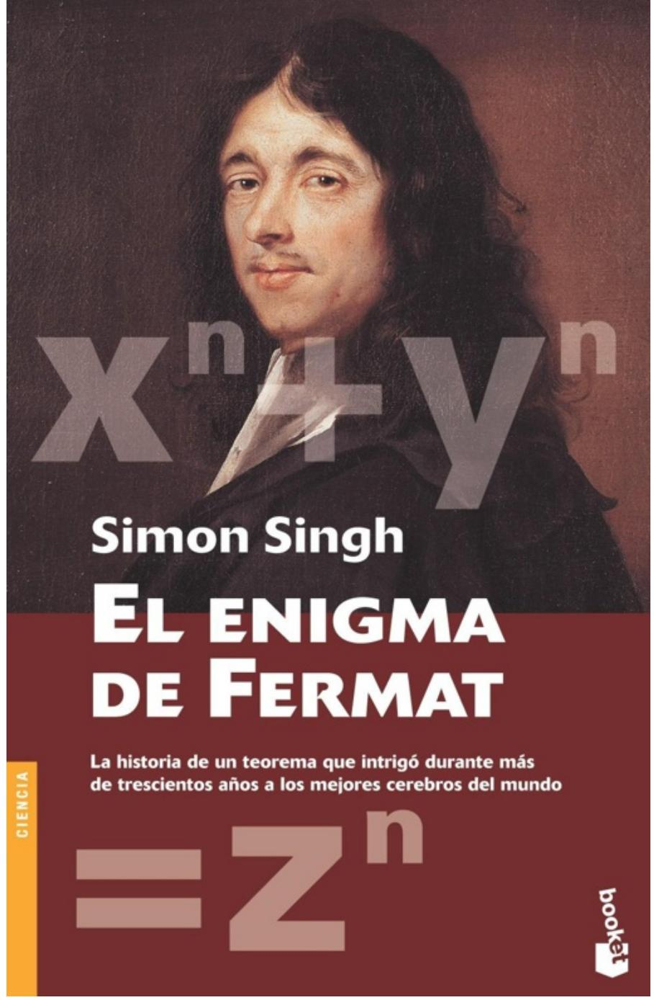

## **Prólogo**

Por fin nos encontramos en una habitación que, aunque no estaba abarrotada, era lo bastante amplia para contener todo el Departamento de Matemáticas de Princeton con ocasión de las grandes celebraciones. Aquella tarde en particular no había demasiada gente allí, pero sí la suficiente como para que dudara de quién era Andrew Wiles. Tras unos instantes, observé a un hombre de aspecto tímido que escuchaba las conversaciones a su alrededor bebiendo té mientras asistía a la reunión ritual de cerebros que los matemáticos de todo el mundo efectúan cada tarde alrededor de las cuatro. Él, simplemente, supuso quién era yo.

Fue el final de una semana extraordinaria. Me había reunido con algunos de los mejores matemáticos del momento y había empezado a obtener una visión de su mundo desde dentro. Aquél fue nuestro primer encuentro a pesar de todos mis intentos anteriores de concertar una cita con Andrew Wiles para hablar con él y convencerlo de que tomara parte en un documental sobre sus logros para la serie «Horizon» de la BBC. Aquél era el hombre que recientemente había anunciado haber hallado el Santo Grial de las matemáticas, el hombre que aseguraba haber demostrado el último teorema de Fermat. Mientras hablábamos, Wiles tenía un aire distraído y retraído, y, aunque era educado y amistoso, era evidente que me quería lo más lejos posible de él. Explicó con sencillez que no le sería posible concentrarse en nada excepto en su trabajo, que estaba en una etapa crítica, pero que tal vez en el futuro, cuando la presión actual hubiera desaparecido, estaría encantado de tomar parte en el programa. Sabía, y él sabía que yo lo sabía, que se estaba enfrentando al derrumbamiento de la ambición de su vida, y que el Santo Grial se había revelado ahora nada más que como una copa bastante bonita y valiosa, pero corriente. Había encontrado un punto débil en su anunciada demostración.

La historia del último teorema de Fermat es única. En la época en que hablé por primera vez con Andrew Wiles había llegado a la conclusión de que se trataba de una de las grandes historias en la esfera del esfuerzo científico y académico. Vi los titulares en el verano de 1993, cuando la demostración había puesto las matemáticas en las primeras planas de los diarios de ámbito nacional de todo el mundo. En aquel momento sólo tenía un vago recuerdo de lo que era el último teorema, pero vi que aquello era algo muy especial y que tenía un cierto aroma a

documental para «Horizon». Pasé las siguientes semanas hablando con varios matemáticos: los que estaban profundamente implicados en la historia, o estaban muy próximos a Andrew, y los que simplemente sentían la emoción de ser testigos de un gran evento en su campo. Todos compartieron generosamente conmigo sus conocimientos sobre historia de las matemáticas y me comunicaron con paciencia lo poco que pude comprender de los conceptos involucrados. Pronto tuve la certeza de que sólo una media docena de personas en todo el mundo estaban en condiciones de comprender realmente todo el material sobre el tema. Durante un tiempo me pregunté si estaría loco al intentar grabar el documental. Pero de aquellos matemáticos aprendí acerca de la rica historia y sobre el aún más profundo significado de Fermat para las matemáticas y los que las practican, y aquí, me di cuenta, era donde realmente estaba la historia.

Conocí los orígenes del problema en la antigua Grecia y supe que el último teorema de Fermat era el pico más alto del Himalaya de la teoría de números. Me introdujeron en la belleza estética de las matemáticas y empecé a apreciar qué significa describir las matemáticas como el lenguaje de la naturaleza. A través de los coetáneos de Wiles capté la naturaleza hercúlea de su trabajo al reunir las técnicas más recientes para usarlas en su demostración. Sus amigos en Princeton me hablaron del intrincado progreso que obtuvo durante años de estudio en solitario. Me construí una imagen extraordinaria sobre Andrew Wiles y el enigma que dominaba su vida, pero parecía destinado a no encontrarme jamás con él en persona.

Aunque las matemáticas relacionadas con la demostración de Wiles se cuentan entre las más difíciles del mundo, descubrí que la belleza del último teorema de Fermat radica en el hecho de que el problema en sí es tremendamente fácil de entender. Constituye un enigma que se puede enunciar en términos comprensibles para cualquier escolar. Pierre de Fermat fue un hombre de la tradición renacentista que estuvo en el centro del redescubrimiento de la antigua sabiduría griega. Pero él enunció una pregunta en la que los griegos no habían pensado, y al hacerlo creó el que llegaría a ser el problema más difícil de resolver. De forma tentadora, dejó una nota para la posteridad en la que sugería que poseía una respuesta, pero no cuál era. Este fue el inicio de una caza que duró tres siglos.

Este periodo de tiempo refuerza la importancia del enigma. Es difícil concebir algún problema, en cualquier disciplina científica, tan simple y claramente planteado que pueda haber resistido durante tanto tiempo el examen de los progresos del conocimiento. Consideremos los avances en física, química, biología, medicina e ingeniería desde el siglo XVII. En medicina se ha progresado desde los «humores» hasta la ingeniería genética, se han identificado las partículas atómicas fundamentales y hemos llevado hombres a la Luna; pero, en teoría de números, el último teorema de Fermat permanecía inexpugnable.

Durante un tiempo en mi investigación busqué las razones por las que el último teorema de Fermat pudiera interesar a cualquiera que no fuera un matemático, y por qué sería importante hacer un programa acerca de él. Las matemáticas tienen un montón de aplicaciones prácticas, pero en el caso de la teoría de números los usos más estimulantes que se me ofrecieron fueron en criptografía, en el diseño de pantallas acústicas y en la comunicación con sondas espaciales lejanas. Ninguno de ellos parecía apropiado para atraer a la audiencia. Mucho más atractivos eran los mismos matemáticos y la pasión que expresaban cuando hablaban de Fermat.

Las matemáticas son una de las formas más puras de pensamiento y, para los profanos, los matemáticos casi parecen seres de otro mundo. Lo que me impactó en todas las conversaciones con ellos fue la extraordinaria precisión de su discurso. Una pregunta rara vez se respondía de inmediato; a menudo debía esperar mientras la estructura precisa de la respuesta se resolvía en su mente, pero al fin emergía un argumento tan articulado y cuidadoso como yo pudiera haber deseado. Cuando conversé sobre esto con Peter Sarnak, un amigo de Andrew, me explicó que los matemáticos simplemente odian hacer afirmaciones falsas. Por supuesto, usan la intuición y la inspiración, pero las afirmaciones formales deben ser absolutas. La demostración se encuentra en el corazón de las matemáticas, y es lo que las diferencia del resto de las ciencias. Otras ciencias tienen hipótesis que se comprueban por medio de la evidencia experimental hasta que fallan y son sustituidas por nuevas hipótesis. En matemáticas, el objetivo es la demostración absoluta, y cuando algo se demuestra es para siempre, sin posibilidad de cambio. En el último teorema, los matemáticos tenían su mayor reto, y la persona que

encontrara la respuesta recibiría la adulación de todos los integrantes de la disciplina.

Se ofrecieron premios y florecieron rivalidades. El último teorema posee una rica historia que llega a la muerte y al engaño, e incluso ha estimulado el desarrollo de las matemáticas. Como ha dicho Barry Mazur, matemático de Harvard, Fermat añadió un cierto *animus* a aquellas áreas de las matemáticas asociadas con los primeros intentos de demostración. Irónicamente, resultó que justo una de tales áreas de las matemáticas fue decisiva en la demostración final de Wiles.

Mientras obtenía gradualmente una comprensión de este campo poco familiar para mí, empecé a apreciar la importancia capital del último teorema de Fermat para las matemáticas, e incluso su paralelismo con la historia de las matemáticas mismas. Fermat fue el padre de la moderna teoría de números, y desde aquel tiempo las matemáticas han evolucionado, progresado, y se han ramificado en varios campos arcanos, en los que nuevas técnicas han engendrado nuevas áreas de las matemáticas y se han transformado en fines en sí mismas.

Con el paso de los siglos, el último teorema pareció cada vez menos relevante para el desarrollo de las investigaciones de vanguardia en matemáticas y se fue transformando en una curiosidad. Pero ahora queda claro que su importancia capital para las matemáticas nunca disminuyó.

Los problemas sobre números, como el que planteó Fermat, son como rompecabezas para colegiales, y a los matemáticos les encanta resolver rompecabezas. Para Andrew Wiles existía uno muy especial, y nada menos que la ambición de su vida. Treinta años antes, cuando era niño, el último teorema de Fermat lo inspiró al tropezar con él en un libro de la biblioteca pública. El sueño de su niñez y de su madurez fue resolver el problema, y cuando reveló por primera vez su demostración en aquel verano de 1993, aquello representaba el final de siete años de duro trabajo dedicado al problema, con un grado de concentración y determinación difícil de imaginar. Varias de las técnicas que usó aún no habían sido creadas cuando empezó su labor. Agrupó el trabajo de muchos y buenos matemáticos, uniendo ideas y creando conceptos que otros habían temido desarrollar. En cierto sentido, como dijo Barry Mazur, todo el mundo había estado trabajando en Fermat, pero de forma separada y sin tenerlo como objetivo, porque

la demostración necesitó de todo el poder de las matemáticas modernas para llegar a la solución. Lo que hizo Andrew fue reunir, una vez más, áreas de las matemáticas que se habían creído muy lejanas entre sí. En consecuencia, su trabajo pareció justificar toda la diversificación que las matemáticas habían sufrido desde que se formuló el problema.

En el desarrollo de su prueba de Fermat, Andrew demostró una idea conocida como la conjetura de Taniyama–Shimura, que creó un nuevo puente entre mundos matemáticos completamente distintos. Para muchos, el objetivo supremo es el de unas matemáticas unificadas, y esto fue un destello de un mundo así. Por tanto, al demostrar Fermat, Andrew Wiles había cimentado algunas de las partes más importantes de la teoría de números del periodo de posguerra y asegurado la base de una pirámide de conjeturas que se basaban en ella. Ya no era tan sólo el haber resuelto el enigma matemático más duradero, sino haber hecho avanzar las fronteras de la matemática misma. Fue como si el simple problema de Fermat, nacido cuando las matemáticas estaban en su infancia, hubiera estado esperando este momento.

La historia de Fermat había acabado de la forma más espectacular. Para Andrew Wiles significó el fin de un aislamiento profesional casi ajeno a las matemáticas, que es una actividad de colaboración. La hora del té es un ritual de la tarde en los departamentos de matemáticas de todo el mundo; constituye el momento en que las ideas se ponen en común, y la norma es que se compartan antes de su obligada publicación. Ken Ribet, un matemático que ha sido decisivo en la demostración, me sugirió, bromeando sólo a medias, que es la inseguridad de los matemáticos la que hace imprescindible el apoyo entre colegas. Andrew Wiles había renunciado a todo esto y guardó su trabajo para sí mismo, salvo en las últimas etapas. Esto es otra muestra de la importancia de Fermat. Wiles tenía una verdadera pasión por ser el primero en resolver el problema, una pasión suficientemente fuerte como para dedicarle siete años de su vida y mantener su objetivo en secreto. Sabía que, por irrelevante que pareciera el problema, la competencia por Fermat nunca había disminuido y no podía arriesgarse a revelar lo que estaba haciendo.

Tras semanas de investigación sobre el tema, llegué a Princeton. Para los matemáticos, el grado de emoción fue intenso. Había encontrado una historia de

rivalidad, éxito, aislamiento, genio, triunfo, celos, intensa presión, derrota e incluso tragedia. En el corazón de la crucial conjetura de Taniyama–Shimura estaba la trágica vida de Yutaka Taniyama en el Japón de posguerra, cuya historia tuve la suerte de oír en palabras de su amigo Goro Shimura. De Shimura también aprendí la noción de «bondad» en matemáticas, donde las cosas se «sienten» correctas simplemente porque son buenas. De algún modo, el sentido de bondad llenó la atmósfera de las matemáticas aquel verano. Todos estábamos disfrutando de aquel momento glorioso.

Con todo esto en marcha no es de extrañar el peso de la responsabilidad que sentía Andrew mientras el error había ido apareciendo durante el otoño de 1993. Con los ojos de todo el mundo puestos en él y con sus colegas pidiendo que hiciera pública la demostración, de alguna forma, y sólo él sabrá cómo, no se vino abajo. Pasó de hacer matemáticas en privado, y a su propio ritmo, a trabajar repentinamente en público. Andrew es un hombre profundamente reservado que luchó mucho para proteger a su familia de la tormenta que se desencadenaba a su alrededor. Durante la semana que estuve en Princeton lo llamé, le dejé notas en su despacho, en el rellano de su piso y a sus amigos; incluso le regalé té inglés. Pero él resistió a mis proposiciones hasta aquel afortunado encuentro el mismo día de mi partida. Siguió una conversación tranquila e intensa que tan sólo duró quince minutos.

Cuando nos separamos aquella tarde habíamos llegado a un acuerdo. Si él era capaz de recomponer la demostración, entonces vendría a discutir sobre el documental; yo estaba preparado para esperar. Pero mientras volaba de regreso aquella noche sentía que mi programa de televisión estaba muerto. Nadie había sido capaz de solucionar el problema en las diversas demostraciones de Fermat a lo largo de tres siglos. La historia está plagada de falsos anuncios de demostración y, por mucho que deseara que él fuera una excepción, era difícil imaginar a Andrew como algo más que otra lápida en el cementerio matemático.

Un año después recibí una llamada. Tras una extraordinaria pirueta matemática, con un destello de verdadera intuición e inspiración, Andrew había conseguido llevar Fermat a buen término. Un año después encontramos el tiempo necesario para dedicarlo a la filmación. Para entonces yo había invitado a unirse a mí en la producción del reportaje a Simón Singh, y juntos pasamos algún tiempo con

Andrew, conociendo por él mismo la historia completa de siete años de estudio en solitario y del infernal año que siguió. Mientras rodábamos, Andrew nos habló, como no lo había hecho con nadie, de sus sentimientos más profundos acerca de lo que había realizado; cómo durante treinta años se había obsesionado con un sueño de la infancia; cómo buena parte de las matemáticas que había estudiado durante tanto tiempo había sido en realidad, sin que él mismo lo supiera, un acopio de instrumentos para el reto de Fermat que había dominado su carrera; cómo nada volvería a ser lo mismo; de su sentimiento de pérdida por el problema que ya no volvería a ser su constante compañía, y de la sensación de alivio ante la libertad que experimentaba ahora. Aunque se trata de una materia tan difícil de comprender como pueda imaginarse para una audiencia profana, la intensidad emocional de nuestras charlas fue la mayor que haya vivido nunca a lo largo de mi carrera como productor de documentales científicos. Para Andrew, aquél era el fin de un capítulo en su vida. Para mí fue un privilegio presenciar de cerca este final.

El documental fue emitido por la cadena BBC con el título Horizon: El último teorema de Fermat. Simón Singh ha ampliado aquellas revelaciones y aquellas conversaciones privadas, junto con la gran riqueza de la historia de Fermat y la de las matemáticas que siempre han rodeado dicho problema, en este libro que es una relación completa y esclarecedora de una de las más grandes historias en los anales del pensamiento humano.

John Lynch

# **Prefacio**

La historia del último teorema de Fermat está inseparablemente unida a la de las matemáticas, y toca todos los temas principales de la teoría de números. Proporciona una visión única de los principios motores de las matemáticas y, tal vez aún más importante, de lo que inspira a los matemáticos. El último teorema ocupó el centro de una intrigante saga de valor, embustes, trucos y tragedia que involucró a los mayores héroes de las matemáticas.

El último teorema de Fermat tiene sus orígenes en las matemáticas de la antigua Grecia, dos mil años antes de que Pierre de Fermat planteara el problema en la forma en que se conoce hoy en día. Por lo tanto, conecta los fundamentos matemáticos creados por Pitágoras con las ideas más sofisticadas de las matemáticas modernas. Al escribir este libro he optado por una estructura básicamente cronológica que empieza describiendo el carácter revolucionario de la Hermandad Pitagórica y acaba con la historia personal de Andrew Wiles y de su lucha por encontrar la solución al problema de Fermat.

El capítulo 1 cuenta la historia de Pitágoras, y muestra cómo su teorema es el antecesor directo del último teorema. También describe algunos de los conceptos fundamentales en matemáticas a los que recurriremos a lo largo del libro. El capítulo 2 lleva la historia de la antigua Grecia a la Francia del siglo XVII, donde Pierre de Fermat creó el más profundo enigma en la historia de las matemáticas. Para transmitir el extraordinario carácter de Fermat y su contribución a las matemáticas, que va mucho más allá de su último teorema, dedico varias páginas a su vida y a algunos otros de sus brillantes descubrimientos.

Los capítulos 3 y 4 reseñan algunos de los intentos de demostración del último teorema de Fermat durante los siglos XVIII, XIX y principios del XX. Aunque estos esfuerzos finalizaron en fracasos, condujeron a un maravilloso arsenal de técnicas y herramientas matemáticas, algunas de las cuales han sido parte integrante de los últimos intentos para probar el último teorema. Además de describir las matemáticas he dedicado buena parte de esos capítulos a los matemáticos que se obsesionaron con el legado de Fermat. Sus historias muestran cómo estaban dispuestos a sacrificarlo todo en la búsqueda de la verdad, y cómo las matemáticas han evolucionado a lo largo de los siglos.

El resto de capítulos del libro enumeran los eventos de los últimos cuarenta años que han revolucionado el estudio del último teorema de Fermat. En particular, los capítulos 6 y 7 se centran en el trabajo de Andrew Wiles, cuyos avances en la última década sorprendieron a la comunidad matemática. Estos últimos capítulos están basados en extensas entrevistas con Wiles. Ésta fue una oportunidad única para mí de obtener información de primera mano sobre uno de los más extraordinarios viajes intelectuales del siglo XX, y espero haber sido capaz de transmitir la creatividad y heroísmo que se requirieron durante los diez años que duró la rigurosa experiencia que sufrió Wiles.

Al contar la historia de Pierre de Fermat y su desconcertante enigma he intentado describir los conceptos matemáticos sin recurrir a las ecuaciones, pero de manera inevitable *x*, *y* y *z* asoman ocasionalmente sus feas cabezas. Cuando aparecen ecuaciones en el texto he intentado proveerlas de explicaciones suficientes para que incluso los lectores sin conocimientos de matemáticas sean capaces de comprender su significado. Para aquellos lectores con un conocimiento ligeramente más profundo en el tema he incluido una serie de apéndices que tratan más extensamente las ideas matemáticas contenidas en el texto principal. Además, he incluido una lista de lecturas complementarias que está dedicada en general a proporcionar a los legos más detalles acerca de áreas particulares de las matemáticas.

Esta obra no habría sido posible sin la ayuda y colaboración de mucha gente. En particular, me gustaría manifestar mi agradecimiento a Andrew Wiles, que lo dejó todo para concederme largas y detalladas entrevistas durante un periodo de intensa presión. Durante mis siete años como periodista científico nunca había encontrado a nadie con un nivel mayor de pasión y compromiso con su objeto de estudio, y estaré eternamente agradecido de que el profesor Wiles estuviera dispuesto a compartir su historia conmigo.

También deseo dar las gracias al resto de matemáticos que me ayudaron a escribir el libro y que me permitieron entrevistarlos en profundidad. Algunos de ellos han estado involucrados en la lucha con el último teorema de Fermat, mientras que otros fueron testigos de los sucesos históricos de los últimos cuarenta años. Las horas que pasé interrogándolos y charlando con ellos fueron tremendamente agradables y agradezco su paciencia y entusiasmo durante las explicaciones que me dieron sobre tantos y tan bellos conceptos matemáticos. En particular, me gustaría dar las gracias a John Conway, Nick Katz, Barry Mazur, Ken Ribet, Peter Sarnak, Goro Shimura y Richard Taylor.

Asimismo estoy agradecido a Jacquelyn Savani, de la Universidad de Princeton, Duncan McAngus, Jeremy Gray, Paul Balister y al Isaac Newton Institute por su ayuda en la búsqueda de material para mi investigación. Gracias también a Patrick Walsh, Christopher Potter, Bernadette Alves, Sanjida O'Connell y a mis padres por sus comentarios y apoyo durante el pasado año.

Finalmente, muchas de las entrevistas citadas se obtuvieron mientras estaba trabajando en el documental para televisión sobre el último teorema de Fermat. Me gustaría agradecer a la BBC el permitirme usar este material y, en particular, tengo una deuda de gratitud con John Lynch, que trabajó conmigo en el documental y que contribuyó a despertar mi interés en este tema.

# **Capítulo 1 «CREO QUE LO DEJARÉ AQUÍ»**

*El recuerdo de Arquímedes persistirá cuando Esquilo esté ya olvidado, porque las lenguas mueren y los conceptos matemáticos no. Inmortalidad es tal vez un término estúpido, pero quizá un matemático posea las mayores probabilidades de alcanzarla, sea cual sea su significado. G. H. HARDY Cambridge, 23 de junio de 1993* 

Fue la conferencia sobre matemáticas más importante del siglo. Doscientos especialistas en la materia quedaron pasmados. De ellos, sólo una cuarta parte comprendió la totalidad de aquella densa mezcla de símbolos griegos y álgebra que cubría el encerado. El resto estaba allí simplemente para asistir a lo que esperaban fuera un verdadero acontecimiento histórico.

Los rumores comenzaron el día anterior. Un mensaje electrónico a través de Internet insinuaba que el acto culminaría en la resolución del último teorema de Fermat, el problema matemático más célebre del mundo. No pocas veces habían circulado habladurías semejantes. El último teorema de Fermat era un tema frecuente durante el té y los matemáticos especulaban sobre quién podría estar haciendo algo y en qué consistiría. De tanto en tanto, las conversaciones matemáticas en la sala de profesores convertían la especulación en rumores sobre un gran logro, pero éste nunca llegaba a materializarse.

Esta vez, los comentarios eran distintos. Un estudiante investigador de Cambridge estaba tan convencido de que era cierto que se apresuró a buscar a los corredores de apuestas para jugarse diez libras esterlinas a que el último teorema de Fermat estaría demostrado en menos de una semana. Pero el corredor se olió algo y rechazó la apuesta. Era el quinto estudiante que lo abordaba en un solo día con la misma oferta. El último teorema de Fermat había desconcertado a los mayores genios del planeta durante más de trescientos años y, sin embargo, de pronto hasta los corredores de apuestas sospechaban que estaba a punto de ser resuelto.

Cuando las tres pizarras estuvieron atiborradas de cálculos se interrumpió la disertación. Borraron la primera y el álgebra se reanudó. Cada línea constituía un minúsculo paso más hacia la demostración, pero treinta minutos después el orador aún no la había revelado. Los profesores, concentrados en las primeras filas, esperaban ansiosos el desenlace. Los estudiantes, al fondo, aguardaban a que sus maestros dieran muestras de cuál iba a ser la conclusión. ¿Estaban asistiendo a la demostración completa del último teorema de Fermat o el disertante estaba perfilando sólo un razonamiento parcial y decepcionante?

El orador era Andrew Wiles, un reservado inglés que en los años ochenta había emigrado a Estados Unidos y aceptado una cátedra en la Universidad de Princeton. Allí adquirió fama de ser uno de los mejores talentos matemáticos de su generación. En los últimos años, sin embargo, casi había desaparecido de la serie anual de conferencias y seminarios y sus colegas empezaron a pensar que Wiles estaba acabado. No es inusual que los jóvenes brillantes se quemen, según apunta el eminente matemático Alfred Adler: «La vida matemática de un matemático es corta. Raramente se progresa más allá de los veinticinco años. Si poco se ha logrado hasta entonces, poco se logrará jamás.»

«Los jóvenes demuestran los teoremas, los ancianos escriben los libros», observó G. H. Hardy en su libro *A Mathematician's Apology* (Autojustificación de un matemático). «Ningún matemático olvida jamás que las matemáticas son un juego de juventud. Sirva como pequeña muestra que el promedio de edad para el ingreso en la Royal Society es menor en matemáticas.» Su estudiante más sobresaliente, Srinivasa Ramanujan, fue elegido miembro de la Royal Society a la temprana edad de treinta y un años porque había logrado una serie de progresos decisivos en su juventud. A pesar de haber recibido una exigua formación académica en Kumbakonam, su pueblo natal al sur de la India, Ramanujan era capaz de elaborar teoremas y demostraciones que habían escapado a los matemáticos occidentales. Parece que en esta materia la experiencia adquirida con la edad es menos relevante que la intuición y la osadía de la juventud. Cuando Hardy, el catedrático de Cambridge, supo de sus resultados, quedó tan impresionado que lo instó a abandonar su trabajo de humilde oficinista al sur de la India para asistir al Trinity College. Allí podría trabajar conjuntamente con algunos de los principales expertos en teoría de números. Por desgracia, los crudos inviernos de East Anglia fueron excesivos para Ramanujan. Contrajo la tuberculosis y falleció a la edad de treinta y tres años.

Otros matemáticos han hecho carreras igual de brillantes, pero breves. Niels Henrik Abel, noruego del siglo XIX, realizó su mayor aportación a las matemáticas a la edad de diecinueve años y sólo ocho después murió en la miseria, también de tuberculosis. Charles Hermite dijo de él: «Su legado mantendrá ocupados a los matemáticos durante quinientos años», y desde luego es verdad que los hallazgos de Abel ejercen aún hoy una influencia considerable en la teoría de números. Evariste Galois, contemporáneo del anterior y de un talento similar, alcanzó sus mayores logros siendo aún quinceañero, y en este caso la muerte se produjo a los veintiuno1 .

Estos ejemplos no pretenden demostrar que los matemáticos mueren de manera prematura y trágica, sino que suelen concebir sus ideas más profundas en la juventud y que, como dijo Hardy en cierta ocasión, «no conozco un solo ejemplo de adelanto matemático relevante debido a alguien que superara los cincuenta». Los matemáticos de mediana edad van pasando a menudo a un segundo plano y dedican el resto de su vida a la docencia o a la burocracia más que a la investigación. En el caso de Andrew Wiles nada podría estar más lejos de la realidad. Aunque rebasaba la avanzada edad de cuarenta, había pasado los siete últimos años trabajando en absoluto secreto, intentando resolver el gran problema de las matemáticas. Mientras otros barruntaban que se había secado, él conseguía enormes progresos inventando técnicas y herramientas nuevas con las que se iba preparando para demostrar el teorema. Su decisión de trabajar en un aislamiento absoluto fue una estrategia muy arriesgada y, además, inaudita en el mundo de las matemáticas.

1 Se lee en el libro Los Grandes Matemáticos, de E. T. Bell: *En las primeras horas del 30 de mayo de 1832, Galois se enfrentó a un adversario en el "campo del honor". El duelo era a pistola, a 25 pasos. Galois cayó, atravesados los intestinos. Ningún cirujano estaba presente, y fue abandonado para que muriera donde había caído. A las 9 de la mañana un campesino que pasaba le condujo al hospital Cochin. Galois sabía que iba a morir. Ante la inevitable peritonitis, y conservando aún la completa posesión de sus facultades, rechazó los auxilios de un sacerdote. Quizá se acordó de su padre. Su hermano menor, el único de la familia que había sido advertido, llegó llorando. Galois intentó consolarle mostrando su estoicismo. "No llores, dijo, necesito todo mi valor para morir a los veinte años". En las primeras horas de la mañana del 31 de mayo de 1832, Galois murió, teniendo 21 años. Fue enterrado en la fosa común del Cementerio del Sur, de modo que nada se sabe de los restos de Evariste Galois. Su monumento permanente consiste en sus obras, que llenan sesenta páginas.* (Nota PB)

A falta de inventos que patentar, el de matemáticas es el departamento menos confidencial en cualquier universidad. El colectivo se jacta de un intercambio de ideas libre y abierto y las pausas a la hora del té se han convertido en ceremonias cotidianas en las que los conceptos se comparten y examinan entre pastas y té Earl Grey. De modo que cada vez es más frecuente encontrar escritos publicados por coautores o por equipos de matemáticos y, así, la gloria se reparte por igual. En cambio, si de verdad el profesor Wiles había dado con la demostración completa y acertada del último teorema de Fermat, el premio más ansiado en matemáticas le pertenecía a él y sólo a él. El precio de su mutismo al no comentar o confirmar de antemano ninguna de sus ideas con los colegas fue que existían grandes posibilidades de cometer algún error importante.

En condiciones ideales, Wiles habría deseado dedicar más tiempo a repasar su trabajo y a revisar por entero el manuscrito final. Pero se presentó la oportunidad única de anunciar su descubrimiento en el Isaac Newton Institute de Cambridge, así que abandonó la cautela. El propósito del instituto consiste en reunir a los mayores genios intelectuales del mundo durante unas cuantas semanas para celebrar seminarios sobre un tema de investigación elegido por ellos. Situado en los alrededores de la universidad, lejos de los estudiantes y de otras distracciones, el edificio está especialmente diseñado para estimular la colaboración entre los académicos a fin de conseguir que surjan ideas geniales. Carece de pasillos donde ocultarse y cada despacho da al foro central. Se pretende que los matemáticos pasen un cierto tiempo en esta zona común y se los anima a mantener la puerta del despacho abierta. La colaboración se persigue también durante el desplazamiento dentro del instituto, pues incluso el ascensor, que sólo recorre tres pisos, tiene una pizarra. De hecho, cada habitación del edificio posee al menos una, incluidos los servicios. En esta ocasión, los seminarios en el Newton Institute lucían el título de «Funciones-*L* y aritmética». Toda la cúpula mundial de la teoría de números se había reunido para discutir problemas relativos a esta rama altamente especializada de las matemáticas puras, pero sólo Wiles había reparado en que las funciones-*L* podrían ser la clave para resolver el último teorema de Fermat.

Aunque era una gran tentación aprovechar la oportunidad de revelar su trabajo ante semejante audiencia de élite, la razón principal para hacerlo en el Newton Institute

era que éste se encuentra en su ciudad natal, Cambridge. Allí era donde Wiles había nacido, allí creció y desarrolló su pasión por los números, y fue en Cambridge donde descubrió el problema que iba a presidir el resto de su vida.

## **El último problema**

En 1963, cuando tenía diez años, Andrew Wiles ya se sentía fascinado por las matemáticas. «Me encantaba resolver los problemas en la escuela. Me los llevaba a casa e inventaba otros por mi cuenta. Pero el mejor problema que encontré jamás lo descubrí en la biblioteca municipal.»

Un día, caminando distraído de casa al colegio, el pequeño Wiles decidió entrar en la biblioteca de la calle Milton. Era bastante deficiente en comparación con las bibliotecas de las escuelas, pero, en cambio, disponía de una extensa colección de libros de pasatiempos matemáticos, y eso era lo que llamaba la atención de Andrew. Aquellos libros estaban repletos de problemas científicos y de enigmas matemáticos de todo tipo y la solución de cada acertijo estaba convenientemente explicada en algún rincón de las páginas finales. Sin embargo, aquella vez lo atrajo un libro con un solo problema, y sin solución.

El volumen se titulaba *The Last Problem* («El último problema»), y en él, su autor, Eric Temple Bell, relataba la historia de un problema matemático que hundía sus raíces en la antigua Grecia y había alcanzado su mayor desarrollo en el siglo XVII. Fue entonces cuando el gran matemático francés, Pierre de Fermat, lo convirtió, sin darse cuenta, en un desafío para el resto del mundo. Genios y más genios de las matemáticas acabaron humillados por el legado de Fermat, y a lo largo de trescientos años nadie había logrado resolverlo. Existen otras cuestiones pendientes en matemáticas, pero lo que hace tan particular el problema de Fermat es su aparente sencillez. Treinta años después de haber leído el relato de Bell, Wiles me comentó cómo recordaba el momento en que se encontró con el último teorema de Fermat: «Parecía tan simple, y ninguno de los grandes matemáticos de la historia lo había demostrado aún. Allí había un problema que yo, un niño de diez años, podía entender, y desde aquel momento supe que jamás se me iría de la cabeza. Tenía que resolverlo.»

El problema parece tan sencillo porque se basa en la única parte de las matemáticas que todos podemos recordar, el teorema de Pitágoras:

En un triángulo rectángulo, el área del cuadrado construido sobre la hipotenusa es igual a la suma de las áreas de los cuadrados construidos sobre los catetos.

El resultado de esta cancioncilla pitagórica es que el teorema se ha grabado a fuego en millones, si no miles de millones, de cerebros humanos. Se trata del teorema básico que todo inocente escolar está obligado a aprender. Pero aunque un niño de diez años pueda entenderlo, la obra de Pitágoras fue la inspiración para un problema que ha frustrado a los mayores genios matemáticos de la historia.

Pitágoras de Samos fue uno de los personajes más prestigiosos y a la vez de los más misteriosos de las matemáticas. Como no hay referencias directas sobre su vida y su obra, su figura está rodeada por el mito y la leyenda, y eso dificulta a los historiadores discernir entre realidad y ficción. Lo que sí parece cierto es que Pitágoras desarrolló la idea de la lógica numérica y fue el responsable de la primera edad de oro de las matemáticas. Gracias a su genio, los números dejaron de utilizarse tan sólo para contar y calcular y comenzaron a valorarse como objetos en sí mismos. Estudió las propiedades de cada número, las relaciones entre ellos y las figuras que forman. Se dio cuenta de que los números existen con independencia del mundo perceptible y, por tanto, su estudio no está corrompido por la imprecisión de los sentidos. Así pudo descubrir verdades desligadas de la opinión o del prejuicio y más absolutas que cualquier conocimiento anterior.

Pitágoras, que vivió en el siglo VI a. J.C., adquirió sus habilidades matemáticas viajando a lo largo y ancho del viejo mundo. Algunos relatos hacen pensar que llegó hasta la India e Inglaterra, pero lo más probable es que recopilara muchas técnicas e instrumentos matemáticos de egipcios y babilonios. Esas dos civilizaciones antiguas habían ido más allá de los límites del simple cálculo. Supieron realizar cómputos complejos con los que crearon sofisticados sistemas de cálculo y complicados edificios. De hecho tenían las matemáticas como meras herramientas para solucionar problemas prácticos; el estímulo para descubrir algunos de los principios básicos de la geometría fue facilitar la reconstrucción de las lindes en los campos, las cuales se perdían con las crecidas anuales del río Nilo. El término geometría significa literalmente «medir la tierra».

Pitágoras observó que los egipcios y los babilonios traducían cada cálculo a la forma de una receta que luego podían seguir a ciegas. Las recetas, transmitidas de generación en generación, siempre daban respuestas correctas, así que nadie se molestaba en cuestionarlas o en indagar la lógica que yacía tras las ecuaciones. Lo importante para estos pueblos era que un cómputo funcionara, el porqué era irrelevante. Después de viajar durante veinte años, Pitágoras había asimilado todos los principios matemáticos del mundo conocido y zarpó rumbo a la isla de Samos, en el mar Egeo, su lugar de procedencia, con la intención de fundar una escuela dedicada al estudio de la filosofía y, en particular, a investigar los principios matemáticos recién adquiridos. Quería entender los números, no sólo explotarlos. Esperaba encontrar una cantera copiosa de estudiantes librepensadores que lo ayudaran a desarrollar filosofías nuevas por completo, pero, durante su ausencia, el tirano Polícrates había convertido la Samos liberal de otro tiempo en una sociedad intolerante y conservadora. Polícrates invitó a Pitágoras a sumarse a su corte, pero el filósofo, consciente que se trataba tan sólo de una maniobra para silenciarlo, rechazó la oferta. Abandonó la ciudad y se trasladó a una cueva remota de la isla donde poder meditar sin miedo a ser perseguido.

A Pitágoras no le gustó nada aquel aislamiento y al cabo de un tiempo recurrió a sobornar a un muchacho para que fuera su primer alumno. La identidad del pupilo es dudosa, pero algunos historiadores sugieren que también se llamó Pitágoras y que con posterioridad adquirió fama por ser la primera persona en aconsejar a los atletas que comieran carne para mejorar su constitución física. Pitágoras, el maestro, pagaba a su alumno tres óbolos por cada lección a la que asistía, y pudo ver que la desgana inicial del muchacho para aprender se transformaba, según avanzaban las semanas, en entusiasmo por la sabiduría. Para ponerlo a prueba, Pitágoras fingió que ya no podía pagar al estudiante y que, por tanto, las clases debían cesar. El muchacho respondió entonces que prefería pagar por su formación antes que interrumpirla. El alumno se había convertido en discípulo. Por desgracia, ésta fue la única adhesión a Pitágoras en Samos. Durante algún tiempo estableció una escuela, conocida como Semicírculo de Pitágoras, pero sus criterios acerca de la reforma social no fueron aceptados, así que el filósofo se vio obligado a abandonar la colonia en compañía de su madre y de su único discípulo.

Pitágoras se dirigió al sur de Italia, que entonces formaba parte de la Magna Grecia, y se instaló en Crotona, donde tuvo la suerte de encontrar al mecenas perfecto, Milón, el hombre más rico del lugar y uno de los más forzudos de la historia. Si la fama de Pitágoras como sabio de Samos ya se estaba divulgando por toda Grecia, la reputación de Milón era incluso mayor. Tenía unas proporciones hercúleas y había logrado la proeza de ser campeón de los juegos olímpicos y píticos en doce ocasiones. Además del atletismo, Milón valoraba y estudiaba la filosofía y las matemáticas. Cedió una parte de su casa a Pitágoras, el espacio suficiente para crear su escuela. Resultó así que la mente más original y el cuerpo más poderoso se habían asociado.

Seguro en su nuevo hogar, Pitágoras fundó la Hermandad Pitagórica, un grupo de seiscientos discípulos capaces no sólo de entender sus enseñanzas, sino también de acrecentarlas con ideas e instrumentos nuevos. Al ingresar en la hermandad, cada miembro debía donar todas sus posesiones materiales a un fondo común, y en el caso de que alguien la abandonara percibía el doble del importe donado en un principio y se erigía una lápida en su memoria. La hermandad era una escuela igualitaria e incluía a varias mujeres entre sus componentes. La estudiante preferida de Pitágoras era la mismísima hija de Milón, la bella Teano, y, a pesar de la diferencia de edad que los separaba, con el tiempo se casaron.

Poco después de crear la hermandad, Pitágoras acuñó el término filósofo, y con él fijó los objetivos de su escuela. Durante la asistencia a los juegos olímpicos, León, príncipe de Fliunte, preguntó a Pitágoras cómo se definiría a sí mismo. Este respondió: «Soy un filósofo», pero León no había escuchado nunca esa palabra y le pidió que se explicara.

*La vida, príncipe León, podría compararse con estos juegos. De la vasta multitud aquí reunida, a algunos los atrae el adquirir riquezas, a otros los seduce la esperanza y el deseo de la fama y la gloria. Pero de entre todos ellos, unos pocos han venido a ver y entender todo lo que aquí ocurra.* 

*Lo mismo sucede con la vida. Unos están influidos por el ansia de riquezas mientras que otros están ciegos, seducidos por la loca fiebre de poder y dominio. Pero el género más noble del ser humano se dedica a descubrir el significado y la finalidad de la vida en sí misma. Ambiciona desvelar los secretos de la naturaleza. A éste es*  *a quien yo llamo filósofo, porque aunque ningún hombre sea sabio absoluto en todas las materias, sí puede amar la sabiduría como la clave de los secretos de la naturaleza.* 

Aunque muchos estaban al corriente de las aspiraciones de Pitágoras, nadie ajeno a la hermandad conocía los detalles o el alcance de sus logros. Cada miembro de la escuela debía prestar el juramento de no revelar jamás al mundo exterior ninguno de sus descubrimientos matemáticos. Incluso después de la muerte de Pitágoras, un miembro de la hermandad fue ahogado por quebrantar esta promesa. Había anunciado públicamente el descubrimiento de otro sólido regular, el dodecaedro, formado por doce pentágonos iguales. El carácter tan secreto de la Hermandad Pitagórica es, en parte, la razón de que los extraños rituales que quizá practicaron hayan estado envueltos por el mito. Del mismo modo se explica que hoy dispongamos de tan pocos datos fidedignos sobre sus logros matemáticos.

Lo que se sabe con certeza es que Pitágoras impulsó una actitud vital que cambió el rumbo de las matemáticas. La hermandad era, de hecho, una comunidad religiosa y uno de los ídolos que veneraban era el Número. Creían que podrían descubrir los secretos espirituales del universo y acercarse más a los dioses si comprendían las relaciones entre los números. La hermandad centró sobre todo la atención en el estudio de los números cardinales (1, 2, 3...) y en las fracciones. A veces, a los números cardinales se los llama números enteros y, junto a las fracciones (proporciones entre números enteros), constituyen los denominados técnicamente como números racionales. De entre la infinidad de números, la hermandad se fijó en los que poseen un significado especial, y unos de los más especiales son los llamados números perfectos.

Según Pitágoras, la perfección numérica dependía de los divisores de un número (los números que dan un resultado entero al dividir entre ellos el deseado). Por ejemplo, los divisores de 12 son 1, 2, 3, 4 y 6. Cuando la suma de los divisores de un número supera su valor se habla de número abundante. Así, 12 es un número abundante porque sus divisores suman 16. Por otra parte, cuando la suma de los divisores de un número es menor que él mismo se lo denomina deficiente. De modo que 10 es un número deficiente porque sus divisores (1, 2 y 5) sólo suman 8.

Los números más raros y significativos son aquellos cuyos divisores suman exactamente su valor, y ésos son los llamados perfectos. El 6 tiene por divisores 1, 2 y 3, así que se trata de un número perfecto porque 1 + 2 + 3 = 6. El número perfecto que le sigue es el 28, porque 1 + 2 + 4 + 7 + 14 = 28.

Además del significado matemático que tenían para la hermandad, la perfección del 6 y del 28 fue reconocida por otras culturas que observaron que la Luna da una vuelta completa alrededor de la Tierra cada veintiocho días y que afirmaron que Dios creó el mundo en seis. En La ciudad de Dios, san Agustín sostiene que, aunque Dios podía haber creado su obra en un instante, decidió hacerlo en seis días para poner de manifiesto la perfección del mundo. El mismo observó que el número 6 no es perfecto porque Dios lo haya elegido, sino porque la perfección es inherente a su naturaleza: «El 6 es un número perfecto en sí mismo y no porque Dios creara todas las cosas en seis días. Lo cierto es, más bien, lo contrario; Dios creó todas las cosas en seis días porque ese número es perfecto. Y continuaría siéndolo incluso si la obra de los seis días no existiera.»

A medida que ascienden los cardinales, se hace más difícil encontrar números perfectos entre ellos. El tercer número perfecto es el 496, el cuarto el 8 128, el quinto es el 33 550 336 y el sexto el 8 589 869 056. Además del valor de las sumas de sus divisores, Pitágoras encontró otras propiedades elegantes en todos los números perfectos. Por ejemplo, que los números perfectos siempre son resultado de la suma de una serie consecutiva de números cardinales. Así tenemos

> 6 = 1 + 2 + 3, 28 = 1 + 2 + 3 + 4 + 5 + 6 + 7, 496 = 1 + 2 + 3 + 4 + 5 + 6 + 7 + 8 + 9 +… + 30 + 31, 8128 = 1 + 2 + 3 + 4 + 5 + 6 + 7 + 8 + 9 +… + 126 + 127.

Pitágoras se entretuvo con los números perfectos, pero no le bastó coleccionar aquellos números especiales, sino que quiso ahondar en su significado más profundo. Una de sus revelaciones fue que la perfección iba muy vinculada a la binariedad. Los números 4 (2 x 2), 8 (2 x 2 x 2), 16 (2 x 2 x 2 x 2), etc., son conocidos como potencias de 2 y pueden escribirse como 2*n* , donde *n* representa el número de veces que el 2 se multiplica por sí mismo. Para ser perfectas, todas estas potencias de 2 sólo fallan en que la suma de sus divisores siempre resulta menor que ellas en una unidad. Esto los convierte en ligeramente deficientes:

> 22 = 2 x 2 = 4 Divisores 1, 2 Suma = 3 23 = 2 x 2 x 2 = 8 Divisores 1, 2, 4 Suma = 7 24 = 2 x 2 x 2 x 2 = 16 Divisores 1, 2, 4, 8 Suma = 15 25 = 2 x 2 x 2 x 2 x 2 = 32 Divisores 1, 2, 4, 8, 16 Suma = 31

Doscientos años después, Euclides iba a refinar la relación pitagórica entre la binariedad y la perfección. Euclides descubrió que los números perfectos son siempre múltiplos de dos números, uno de los cuales es potencia de dos y el otro es la siguiente potencia de 2 menos uno. O lo que es lo mismo

$$\begin{aligned} \mathsf{6} &= \mathsf{2}^1 \times \{\mathsf{2}^2 \mathsf{ - 1}\} \\ \mathsf{28} &= \mathsf{2}^2 \times \{\mathsf{2}^3 \mathsf{ - 1}\} \\ \mathsf{496} &= \mathsf{2}^4 \times \{\mathsf{2}^5 \mathsf{ - 1}\} \\ \mathsf{8128} &= \mathsf{2}^6 \times \{\mathsf{2}^7 \mathsf{ - 1}\} \end{aligned}$$

Los ordenadores actuales han continuado el registro de los números perfectos y han encontrado ejemplos tan extraordinariamente elevados como 2216 090 x (2216 091 - 1), un número con más de 130 000 dígitos y que obedece al principio de Euclides.

Pitágoras estaba fascinado con las propiedades y figuras exquisitas que poseían los números perfectos y reverenciaba su refinamiento y su belleza. A primera vista podría parecer que la perfección es un concepto relativamente fácil de concebir y, sin embargo, los antiguos griegos fueron incapaces de desentrañar algunos de los puntos fundamentales del asunto. Por ejemplo, aunque existen bastantes números cuyos divisores suman un número menos que ellos mismos, o sea, que son ligeramente deficientes, parece no haber números que sean ligeramente abundantes. Los griegos no fueron capaces de encontrar números cuyos divisores sumaran un número más que ellos mismos, pero no supieron explicar la razón. Para su frustración, aunque no pudieron hallar números ligeramente abundantes, tampoco consiguieron demostrar que dichos números no existen. Comprender la aparente ausencia de números ligeramente abundantes no tenía ningún valor práctico, pero era un problema cuya solución quizá podría iluminar la naturaleza de los números y, por tanto, merecía ser estudiado. Tales enigmas intrigaron a la Hermandad Pitagórica y dos mil quinientos años después los matemáticos aún no han sido capaces de probar que no existen números ligeramente abundantes.

# **Todo es número**

Además de estudiar las relaciones entre los números, a Pitágoras también lo intrigaban los vínculos que existen entre los números y la naturaleza. Reparó en que los fenómenos naturales están gobernados por leyes y que dichas leyes pueden describirse a través de ecuaciones matemáticas. Uno de sus primeros hallazgos al respecto fue la relación esencial que se da entre la armonía de la música y la de los números.

El instrumento más destacado de la música helénica antigua fue la lira tetracorde o de cuatro cuerdas. Antes de Pitágoras, los músicos ya apreciaron que cuando determinadas notas sonaban juntas causaban un efecto agradable, así que afinaban las liras de manera que, punteando dos cuerdas, consiguieran aquella armonía. Pero estos antiguos músicos no habían comprendido aún la causa de que ciertas notas fueran armónicas y, en consecuencia, no seguían ningún método concreto para templar los instrumentos. En lugar de eso afinaban las liras de oído hasta alcanzar un estado de armonía, método al que Platón denominaba «torturar el clavijero».

Jámblico, erudito del siglo XIV que escribió nueve libros sobre la secta pitagórica, relata cómo llegó a descubrir Pitágoras los principios esenciales de armonía en la música:

En cierta ocasión [Pitágoras] estaba enfrascado en la idea de si podría concebir una ayuda mecánica para el sentido del oído que fuera a la vez fiable e ingeniosa. Tal aparato sería similar a los compases, a las reglas o a los instrumentos ópticos diseñados para el sentido de la vista, así como también el sentido del tacto dispone de balanzas y de los conceptos de pesos y medidas. Entonces, por algún divino golpe de suerte, pasó por delante de una fragua y escuchó los martillos golpeando el hierro y produciendo entre sí una armonía abigarrada de retumbos, con la excepción de cierta combinación de sonidos.

Al momento, según Jámblico, Pitágoras echó a correr hacia la fragua para inspeccionar aquella armonía de martillos. Notó que al golpear a un tiempo la mayoría de ellos se lograba un sonido armónico y, en cambio, cualquier combinación que incluyera un martillo concreto producía siempre un sonido desagradable. Analizó las herramientas y vio que las que eran armónicas entre sí guardaban una relación matemática sencilla: sus masas eran proporciones o fracciones simples de las del resto. O lo que es lo mismo, todos aquellos martillos cuyos pesos mantenían entre sí la proporción de una mitad, dos tercios o tres cuartos producían sonidos armónicos. Por el contrario, el peso del martillo que provocaba la disonancia al golpearlo al unísono con cualquiera de los restantes no mantenía una relación simple con los otros pesos.

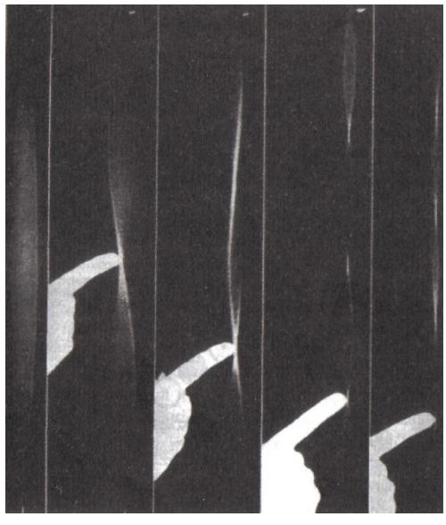

*Figura 1. Una cuerda suelta que vibra libremente produce una nota de partida. Si se pisa justo en el punto medio de su longitud, la nota resultante es una octava más alta que la nota original y mantiene la armonía con ella. Pueden conseguirse más notas armónicas desplazando la presión hacia otros puntos que constituyan fracciones simples (por ejemplo, un tercio, un cuarto, un quinto) de la longitud de la cuerda.* 

Pitágoras había descubierto la proporción numérica responsable de la armonía musical. Los científicos han arrojado algunas dudas sobre este episodio que relata Jámblico, pero lo que sí es seguro es que Pitágoras aplicó su nueva teoría de las relaciones musicales a la lira. Para ello examinó las propiedades de una sola cuerda. Con tan sólo puntearla, la cuerda genera una nota o tono patrón que está producido por la longitud de la cuerda. Si se pisa la cuerda en determinados puntos de su longitud, se provocan otras vibraciones y tonos, como muestra la figura 1. Los tonos armónicos sólo se realizan en puntos muy concretos. Así, si se pisa la cuerda justo en el punto medio de su longitud, el tañido genera un tono una octava más alto que el original y se mantiene en armonía con él. Del mismo modo, presionando la cuerda en puntos que son justo un tercio, un cuarto o un quinto de su longitud, se originan otras notas armónicas. En cambio, si trabamos la cuerda en un punto que no constituya una fracción simple de su longitud total, se produce un tono disonante con los anteriores.

Pitágoras descubrió por primera vez la base matemática que rige un fenómeno físico y demostró que se da una relación fundamental entre las matemáticas y la ciencia. Desde entonces, los científicos han buscado los principios matemáticos que, al parecer, gobiernan cada proceso físico elemental y han averiguado que los números afloran en todo tipo de fenómenos naturales. Por ejemplo, un número particular parece presidir las longitudes de los ríos con meandros. El catedrático Hans-Henrik Stolum, geólogo de la Universidad de Cambridge, ha calculado la relación entre la longitud real de los ríos, desde el nacimiento hasta la desembocadura, y su longitud medida en línea recta. Aunque la proporción varía de un río a otro, el valor promedio es algo mayor que 3, o sea, que la longitud real es unas tres veces la distancia en línea recta. En realidad, la relación es aproximadamente 3,14, una cifra muy cercana al valor del número p, la proporción que existe entre la circunferencia de un círculo y su diámetro.

El número p derivó en su origen de la geometría del círculo y surge una y otra vez en las circunstancias científicas más diversas. En el caso de la relación fluvial, la aparición de p es el resultado de una pugna entre el orden y el caos. Einstein fue el primero en apuntar que los ríos tienden a serpentear cada vez más porque, por leve que sea la curva en un principio, ésta provoca corrientes más veloces en la orilla externa, que van originando una margen más erosionada y cerrada. Cuanto mayor sea la curvatura en la orilla, mayor resulta la velocidad de las corrientes en la margen exterior y, con ella, el aumento de la erosión por ese lado. Así, el curso del río se retuerce cada vez más. Sin embargo existe un proceso natural que detiene el caos: el aumento del serpenteo acaba haciendo que el curso se repliegue sobre sí mismo y se «cortocircuite». El río vuelve a enderezarse y el meandro queda abandonado a un lado, convertido en un lago en forma de herradura. El equilibrio entre estos dos factores opuestos conduce a una relación promedio de p entre la longitud real y la distancia en línea recta desde el nacimiento hasta la desembocadura. La proporción de p aparece con mayor frecuencia en ríos que fluyen por llanuras de pendientes muy suaves, como las que hay en Brasil o en la tundra de Siberia.

Pitágoras descubrió que los números se ocultan detrás de todas las cosas, desde la armonía de la música hasta las órbitas de los planetas, y eso le hizo proclamar que «todo es número». Al tiempo que indagaba en el significado de las matemáticas, Pitágoras desarrolló el lenguaje que permitiría, a él y a otros, describir la naturaleza del universo. En lo sucesivo, cada paso esencial en matemáticas proporcionaría a los científicos el vocabulario necesario para explicar mejor los fenómenos de su entorno. De hecho, los avances matemáticos llegarían incluso a inspirar revoluciones científicas.

Isaac Newton, además de descubrir la ley de la gravedad, fue un matemático destacado. Su mayor contribución a las matemáticas fue el desarrollo del cálculo y, en tiempos posteriores, los físicos utilizaron el lenguaje del cálculo para describir mejor las leyes de la gravedad y para resolver problemas gravitacionales. La teoría clásica de la gravedad newtoniana perduró intacta durante siglos hasta ser desbancada por la teoría general de la relatividad de Albert Einstein, quien elaboró una explicación alternativa y más detallada de la gravedad. Las propias ideas de Einstein sólo fueron posibles gracias a conceptos matemáticos nuevos que lo dotaron de un lenguaje sofisticado para sus ideas científicas más complejas. En la actualidad, la interpretación de la gravedad está recibiendo una vez más la influencia de los avances matemáticos. Los más recientes estudios cuánticos de la gravedad se vinculan al desarrollo de la teoría matemática de cuerdas, según la cual las fuerzas de la naturaleza parecen explicarse de manera adecuada mediante las propiedades geométricas y topológicas de los tubos.

De todas las relaciones entre números y naturaleza que estudió la hermandad, la más importante fue la que lleva el nombre de su fundador. El teorema de Pitágoras proporciona una ecuación verdadera para todos los triángulos rectángulos y, por tanto, también define al ángulo recto en sí. A su vez, el ángulo recto define la perpendicular, esto es, la relación entre la vertical y la horizontal, o sea, la relación entre las tres dimensiones del universo conocido. A través del ángulo recto, las matemáticas describen la estructura del espacio que habitamos.

El teorema de Pitágoras constituye, por tanto, una revelación profunda y, a pesar de ello, las matemáticas que se requieren para comprenderlo son relativamente sencillas. Basta comenzar midiendo la longitud de los dos lados menores de un triángulo rectángulo (*x* e *y*) y luego elevar a la segunda potencia cada uno de ellos (*x*2 *, y*2 ). Entonces se suman (*x*2  *+ y*2 ). El resultado de esa adición en el triángulo de la figura 2 es 25.

Si ahora se mide el lado más largo (z), denominado hipotenusa, y se eleva su longitud al cuadrado, lo peculiar del resultado es que el número que resulta de *z*2 es idéntico al calculado con anterioridad, o sea, 52 = 25. Esto es lo mismo que decir: En un triángulo rectángulo, el cuadrado de la hipotenusa es igual a la suma de los cuadrados de los otros dos lados.

En otras palabras o, mejor, símbolos:

$$x^2 + y^2 = z^2$$

Esto es cierto a todas luces para el triángulo de la figura 2, pero lo relevante es que el teorema de Pitágoras se cumple con todos los triángulos rectángulos que imaginemos. Es una ley matemática universal y podemos confiar en ella siempre que encontremos un triángulo con un ángulo recto. Y a la inversa, todo triángulo que obedezca el teorema de Pitágoras es con certeza absoluta un triángulo rectángulo.

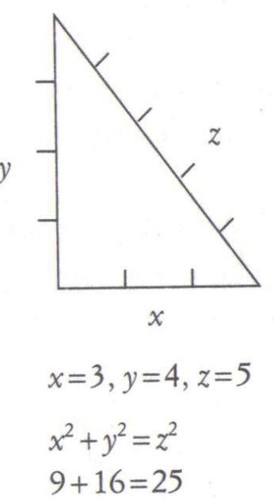

*Figura 2. Todos los triángulos rectángulos obedecen al teorema de Pitágoras.* 

En este punto cabe advertir que, aunque el teorema se asocie siempre a Pitágoras, mil años antes que él ya lo habían utilizado los chinos y los babilonios. No obstante, aquellas culturas nunca supieron que el teorema era cierto para todos los triángulos rectángulos. Desde luego se cumplió con los triángulos que analizaron, pero no tuvieron manera de demostrar que funcionaba con todos los triángulos rectángulos que no habían sometido al teorema. El motivo de la reivindicación pitagórica del teorema es que fue Pitágoras quien demostró por primera vez su valor universal.

Pero ¿cómo supo Pitágoras que el teorema se cumple siempre? No podía aspirar a poner a prueba toda la variedad infinita de triángulos rectángulos, y en cambio llegó a estar seguro al ciento por ciento de la validez total del teorema. La razón de su convencimiento radica en el concepto de demostración matemática. La búsqueda de una prueba matemática es la búsqueda de una verdad más absoluta que el conocimiento acumulado por cualquier otra disciplina. El ansia de una verdad esencial a través del método de la demostración es lo que ha guiado a los matemáticos durante los últimos dos mil quinientos años.

### **La demostración absoluta**

La historia del último teorema de Fermat gira en torno a la búsqueda de una demostración perdida. La prueba matemática es mucho más poderosa y rigurosa que el concepto de demostración que solemos utilizar en el lenguaje cotidiano, e incluso más que la idea que se tiene de ella en física o en química. La diferencia entre las pruebas científicas y las matemáticas es a la vez sutil y profunda y resulta crucial para poder comprender la obra de todo matemático desde Pitágoras.

La idea clásica de una demostración matemática consiste en partir de una serie de axiomas o afirmaciones que pueden considerarse ciertos o que por evidencia propia lo son. Después, con una argumentación lógica y progresiva, se puede llegar a una conclusión. Si los axiomas son correctos y la lógica es impecable, la conclusión final es innegable. Esta conclusión constituye un teorema.

Las demostraciones matemáticas se basan en este proceso lógico y, una vez probadas, son ciertas hasta el fin de los tiempos. Son absolutas. Para apreciar el valor de tales pruebas conviene compararlas con su pariente pobre, la prueba científica. La ciencia propone una hipótesis para explicar un fenómeno físico. Si la observación empírica del fenómeno coincide con la hipótesis, se adquiere una evidencia a su favor. Además, la hipótesis no sólo debe describir un fenómeno conocido, también debe predecir las consecuencias de otros fenómenos. Se llevan a cabo experimentos para poner a prueba la capacidad de predicción de una hipótesis y, si ésta vuelve a resultar satisfactoria, se muestran aún más evidencias a su favor. En ocasiones se reúne una cantidad ingente de pruebas positivas y entonces la hipótesis se acepta como teoría científica.

Las teorías científicas no pueden demostrarse jamás con una rotundidad tan absoluta como ocurre con un teorema matemático. A lo sumo se las considera muy probables en base a la evidencia de que se dispone. La llamada demostración científica se fundamenta en la observación y la percepción, pero tanto una como otra son falibles y sólo se aproximan a la realidad. Como dijo Bertrand Russell: «Aunque parezca una paradoja, toda ciencia exacta está regida por la idea de aproximación.» Incluso las «pruebas» científicas más aceptadas contienen siempre una pequeña porción de duda. En algunas ocasiones, la inseguridad disminuye, aunque nunca desaparece por completo, mientras que otras veces la prueba demuestra al fin ser errónea. La fragilidad de estas pruebas favorece que se

produzcan revoluciones científicas en las que una teoría que se había asumido como correcta es sustituida por otra que quizá consista en un simple refinamiento de la anterior o, tal vez, en una oposición absoluta.

Por ejemplo, la búsqueda de las partículas elementales provocó que cada generación de físicos derribara o, cuando menos, refinara la teoría de sus predecesores. La búsqueda moderna de los bloques constitutivos del universo empezó a principios del siglo XIX, cuando una serie de experimentos instaron a John Dalton a proponer que todo está formado por átomos discretos, que además serían, según él, elementales. Al final de la centuria, J. J. Thomson descubrió el electrón, la primera partícula subatómica conocida, así que el átomo dejó de ser elemental.

Durante los primeros años del siglo XX, los físicos desarrollaron una imagen «completa» del átomo: un núcleo formado por protones y neutrones y orbitado por electrones. Afirmaron con arrogancia que protones, neutrones y electrones son todos los ingredientes del universo. Más tarde, experimentos con rayos cósmicos revelaron la existencia de otras partículas fundamentales, los piones y los muones. Una revolución aún más grandiosa se produjo en 1932 con el descubrimiento de la antimateria, la existencia de antiprotones, antineutrones, antielectrones, etc. Por aquel entonces, los físicos de partículas no podían estar seguros de cuántas partículas diferentes existen, pero al menos podían confiar en que esas entidades eran de verdad elementales. Así fue hasta los años sesenta, cuando surgió el concepto de quark. Al parecer, el protón en sí está formado por quarks con carga fraccionaria, al igual que el neutrón, el pión y el muón. La conclusión de todo esto es que los físicos modifican constantemente su visión del universo, cuando no la borran por completo y vuelven a comenzar. En las décadas siguientes, la idea misma de que la partícula es un objeto puntual se reemplazó por la creencia en partículas de aspecto semejante a cuerdas, las mismas que parecen explicar la gravedad. La teoría es que cuerdas billones de billones de billones de veces más cortas que la longitud de un metro (tan pequeñas que parecen puntuales) vibran de varias maneras y cada vibración da origen a diferentes partículas. Esto se parece al hallazgo de Pitágoras de que la cuerda de una lira da lugar a diferentes notas según el modo en que vibre.

Arthur C. Clarke, escritor de ciencia ficción y futurista, escribió que si un eminente sabio afirma que algo es indudablemente cierto, existen muchas probabilidades de que eso mismo se demuestre falso al día siguiente. La prueba científica es tornadiza y chapucera sin remedio. Por el contrario, la demostración matemática es absoluta y libre de dudas. Pitágoras murió convencido de que su teorema, que era cierto en el año 500 a. J.C., lo seguiría siendo por toda la eternidad.

La ciencia se desarrolla de manera similar al sistema judicial. Una teoría se reconoce verdadera si hay evidencias para probarla «más allá de toda duda razonable». Las matemáticas, en cambio, no confían en la evidencia de la equívoca experimentación, sino que se construyen con la infalible lógica. Una muestra de ello la constituye el problema del tablero de ajedrez mermado que ilustra la figura 3.

Tenemos un tablero de ajedrez al que le faltan dos esquinas opuestas, así que sólo le quedan 62 cuadros, y cogemos 31 fichas de dominó cuyas medidas cubran exactamente dos cuadros del tablero.

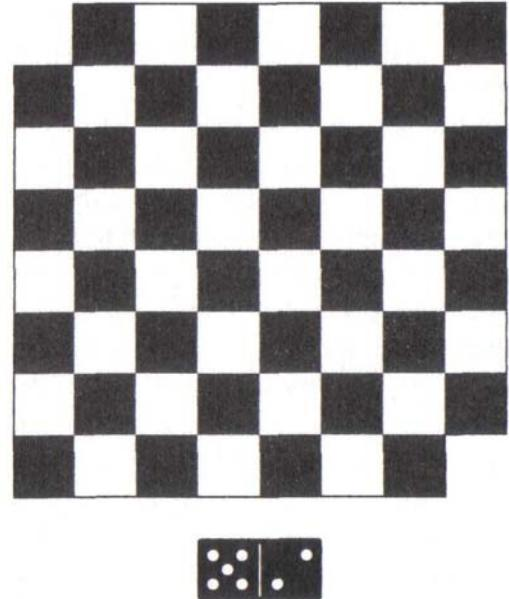

*Figura 3. El problema del tablero de ajedrez mermado.* 

La pregunta es la siguiente: ¿es posible colocar las 31 piezas de dominó de manera que entre todas cubran los 62 cuadros del tablero? Existen dos modos de afrontar el problema:

# **1. Enfoque científico**

El científico tratará de solucionar el problema a través de la experimentación y, después de intentar unas pocas docenas de posiciones, descubrirá que todas fallan. Puede que el científico piense que hay bastantes evidencias para afirmar que el tablero no se puede cubrir. Sin embargo no podrá estar seguro de que ésa sea la respuesta verdadera porque siempre le quedarán combinaciones no comprobadas y entre las que quizá se halle la correcta. Hay millones de posiciones posibles y sólo se puede comprobar un número reducido de ellas. La conclusión de que la tarea es imposible está basada sólo en la experiencia, y el científico tendrá que vivir con la incertidumbre de que su teoría pueda ser rebatida en cualquier momento.

# **2. Enfoque matemático**

El matemático intenta resolver el problema desarrollando un argumento lógico que conduzca a una conclusión indubitablemente cierta y que permanezca inamovible para siempre. Un argumento de ese tipo es el siguiente:

- 1. Los cuadros que faltan del tablero son blancos. Por lo tanto ahora hay 32 cuadros negros y sólo 30 cuadros blancos.
- 2. Cada ficha de dominó cubre dos cuadros vecinos, y todos los cuadros contiguos son de colores contrarios, o sea, uno negro y otro blanco.
- 3. Por esa razón, las 30 primeras fichas de dominó cubrirán 30 cuadros blancos y 30 cuadros negros del tablero, con independencia del modo en que se coloquen.
- 4. En consecuencia, siempre nos encontraremos con una ficha de dominó y con dos cuadros negros sobrantes.
- 5. Pero cada ficha de dominó tapa dos cuadros contiguos y éstos son siempre de colores opuestos. Sin embargo, los cuadros sobrantes son de idéntico color, así que no podemos cubrir ambos con la ficha de dominó que nos queda. Por tanto, ¡cubrir todo el tablero es imposible!

Esta prueba demuestra que toda combinación posible de las fichas de dominó fallará en el intento de cubrir por completo el tablero de ajedrez mermado. De una forma parecida, Pitágoras elaboró una demostración que evidencia que cualquier triángulo rectángulo obedece a su teorema. El concepto de prueba matemática, sagrado para Pitágoras, fue lo que capacitó a la hermandad para descubrir tantas cosas. La mayoría de las demostraciones modernas son complicadas en extremo y seguir sus razonamientos lógicos sería imposible para los profanos en la materia, pero la argumentación del teorema de Pitágoras es, por fortuna, relativamente clara y se fundamenta en unas matemáticas básicas. La demostración está resumida en el apéndice 1.

La prueba de Pitágoras es irrefutable. Evidencia que su teorema es válido para cualquier triángulo rectángulo del universo. El hallazgo fue tan relevante que sacrificaron cien bueyes en agradecimiento a los dioses. Marcó un hito en las matemáticas y supuso uno de los avances más decisivos y destacados en la historia de la humanidad. Su importancia fue doble. En primer lugar desarrolló la idea de demostración matemática. Un resultado matemático probado contiene una verdad mucho más profunda que cualquier otra porque es resultado de un razonamiento lógico progresivo. Aunque el filósofo Tales ya había realizado algunas demostraciones geométricas primitivas, Pitágoras amplió mucho más la idea y consiguió demostrar muchas otras afirmaciones matemáticas ingeniosas. La segunda consecuencia del teorema de Pitágoras es que vincula el método matemático abstracto con lo tangible. Pitágoras mostró que las verdades matemáticas podían aplicarse al mundo científico y proporcionó los cimientos de la lógica. Las matemáticas aportan a la ciencia un punto de partida riguroso y los científicos incorporan a esa base infalible medidas imprecisas y observaciones defectuosas.

## **Una infinidad de temas**

La hermandad de los pitagóricos impulsó a las matemáticas con su esmerada búsqueda de la verdad a través de la demostración. Se difundieron nuevas sobre sus logros, pero hasta hoy los detalles de sus hallazgos continúan siendo un secreto muy bien guardado. Muchos solicitaron su admisión en el templo de la sabiduría, pero sólo las mentes más brillantes fueron aceptadas. Uno de los rechazados fue el candidato Cilón, a quien aquella humillación ofendió tanto que veinte años más tarde consumó su venganza.

Durante la LXVII Olimpiada (año 510 a. J.C.) se produjo una rebelión en la ciudad cercana de Sybaris. Teyls, el cabecilla victorioso de los rebeldes, inició una brutal campaña de persecución contra los que apoyaron el gobierno anterior, y eso provocó que muchos de ellos buscaran refugio en Crotona. Teyls reclamó la devolución de los traidores a Sybaris para poder imponerles el castigo oportuno, pero Milón y Pitágoras convencieron a los ciudadanos de Crotona para que se opusieran al tirano y ampararan a los refugiados. Teyls, furioso, reunió un ejército de trescientos mil hombres y marchó sobre Crotona. Las dotes de mando de Milón, que defendió su ciudad con cien mil ciudadanos armados, le concedieron la victoria tras setenta días de lucha. Como justo castigo a los rebeldes, Milón alteró el curso del río Cratnis, de manera que fluyera sobre Sybaris y destruyera la ciudad.

A pesar del cese de la batalla, en la ciudad de Crotona aún reinaba la confusión porque no lograban acordar qué hacer con el botín de guerra. Temeroso de que las tierras fueran concedidas a la élite de los pitagóricos, el pueblo de Crotona inició una protesta. La multitud estaba cada vez más resentida con la reservada hermandad porque continuaba ocultando sus hallazgos, pero nada ocurrió hasta que apareció Cilón como portavoz del pueblo. Cilón se hizo fuerte gracias al miedo, la paranoia y la envidia de la muchedumbre, y la sedujo con el propósito de destruir la escuela de matemáticas más brillante que jamás haya existido en el mundo. Rodearon la casa de Milón y la escuela adyacente, cegaron y atrancaron todas las puertas para que nadie saliera y entonces le prendieron fuego. Milón luchó para encontrar la salida de aquel infierno y huyó, pero Pitágoras murió junto a muchos de sus discípulos.

Las matemáticas habían perdido a su primer gran héroe, pero el espíritu de los pitagóricos perduró entre nosotros. Los números y su exactitud eran inmortales. Pitágoras había demostrado que las matemáticas, más que cualquier otra disciplina, no son una materia subjetiva. Sus discípulos no necesitaban del maestro para decidir la validez de una teoría concreta. Su veracidad no era cuestión de opinión. Al contrarío, el desarrollo de una lógica matemática se había convertido en juez de la

verdad. Ésta fue la gran contribución de los pitagóricos a la humanidad, una vía de acceso a la verdad que está más allá de la falibilidad del juicio humano.

Después de la muerte del fundador y del ataque de Cilón, la hermandad abandonó Crotona en busca de otras ciudades de la Magna Grecia, pero la persecución continuó y muchos de ellos tuvieron que asentarse en tierras extranjeras. Esta forzada emigración favoreció que los pitagóricos difundieran su evangelio matemático por todos los rincones del mundo antiguo. Los discípulos de Pitágoras crearon nuevas escuelas y enseñaron a sus alumnos el método de la demostración lógica. Además del teorema de Pitágoras, transmitieron al mundo la manera de encontrar las llamadas ternas pitagóricas.

Las ternas pitagóricas son combinaciones de tres números enteros que se ajustan a la ecuación pitagórica: *x*2 + *y*2 = *z*2 . Por ejemplo, dicha ecuación se cumple si

$$\begin{aligned} \chi &= \mathfrak{Z}, \ y = \mathfrak{4} \ \text{y } \mathfrak{z} = \mathfrak{5};\\ \mathfrak{Z}^2 + \mathfrak{4}^2 &= \mathfrak{F}^2, \forall \ \mathfrak{G} + \mathfrak{16} = \mathfrak{25}. \end{aligned}$$

Otro modo de concebir las ternas pitagóricas es en términos de reordenación de cuadrados.

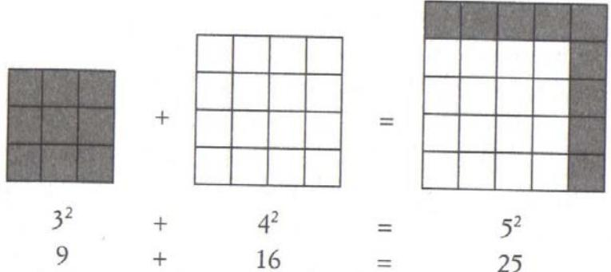

*Figura 4. Hallar combinaciones de números enteros para la ecuación pitagórica puede concebirse también si se unen dos cuadrados que puedan dar lugar a un tercero. Por ejemplo, un cuadrado consistente en 9 baldosas puede sumarse a otro formado por 16 para que, reordenados, den lugar a un tercer cuadrado de 25 baldosas.* 

Si tenemos un cuadrado de 3 x 3 consistente en 9 baldosas y otro de 4 x 4 formado por 16 baldosas, podemos reorganizar todas las piezas para crear un cuadrado de 5 x 5 que reúna 25 baldosas, tal como se ve en la figura 4.

Los pitagóricos buscaron otras ternas pitagóricas, otros cuadrados que pudieran sumarse para dar lugar a un tercero mayor que los anteriores. Otra de esas ternas es *x* = 5, *y* = 12 y *z* = 13:

$$5^2 + 12^2 = 13^2 \text{ } \text{\textyen } 25 + 144 = 169$$

Una terna pitagórica elevada es *x* = 99, *y* = 4 900 y *z* = 4 901.

Las ternas pitagóricas escasean cada vez más según aumentan los números, y encontrarlas se va haciendo más y más costoso. Para dar con la máxima cantidad de ternas posible, los pitagóricos inventaron una forma metódica, y mientras lo hacían llegaron a demostrar también que existe un número infinito de ternas pitagóricas.

#### **Del teorema de Pitágoras al último teorema de Fermat**

Un libro que trata sobre el teorema de Pitágoras y su infinidad de ternas es *The Last Problem*, de E. T. Bell, el mismo que llamó la atención del pequeño Andrew Wiles en la biblioteca. Aunque la hermandad había alcanzado una comprensión casi absoluta de las ternas pitagóricas, Wiles se enteró pronto de que aquella ecuación en apariencia inocente, *x*2 + *y*2 = *z*2 , tiene un lado oscuro. La obra de Bell explicaba la existencia de un monstruo matemático.

En la ecuación de Pitágoras aparecen tres números, *x*, *y* y *z*, todos elevados al cuadrado (o sea, *x*2 = *x·x*):

$$x^2 + y^2 = z^2$$

Sin embargo, el libro exponía una ecuación hermana a la pitagórica en la que *x*, *y* y *z* están elevados al cubo (es decir, *x*3 = *x·x·x*). La potencia de *x* deja de ser 2 para convertirse en 3:

$$
\lambda^3 + \lambda^3 = \mathbf{z}^3
$$

Encontrar números enteros (ternas pitagóricas) que resolvieran la ecuación de Pitágoras era relativamente sencillo, pero al cambiar los exponentes de los términos de la ecuación de 2 a 3 (del cuadrado al cubo) parece imposible hallar números enteros que la satisfagan. Generaciones de matemáticos que garabatearon cuadernos y cuadernos de notas han errado en la búsqueda de números que encajen con ella.

En la ecuación de origen, elevada al cuadrado, el reto consistía en reordenar las baldosas de dos cuadrados para formar un tercero aún mayor. En su versión elevada a la tercera potencia, se trata de reordenar dos cubos formados por bloques para dar lugar a un tercero mayor que los anteriores. En apariencia no tiene ninguna relevancia qué cubos se elijan para empezar; al combinarlos siempre resulta o bien un cubo entero y algunos bloques sobrantes o bien uno incompleto. La máxima aproximación que se ha logrado a la solución perfecta es una fusión con un solo bloque de más o de menos.

Si comenzamos, por ejemplo, con 63 (*x*3 ) y 83 (*y*3 ) y recomponemos los bloques, sólo falta uno para formar un cubo completo de 9 x 9 x 9, como ilustra la figura 5.

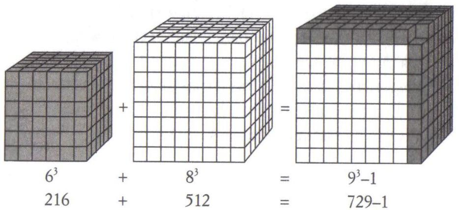

*Figura 5. ¿Es posible unir los bloques de construcción de un cubo con los de otro para crear un tercer cubo aún mayor? En este caso, un cubo de 6 x 6 x 6 sumado a otro de 8 x 8 x 8 no reúne los bloques suficientes para formar un cubo de 9 x 9 x 9. Hay 216 (63 ) bloques en el primer cubo y 512 (83 ) en el segundo. Entre los dos suman un total de 728 bloques que, a falta de uno, no bastan para alcanzar el valor de 93 .* 

Encontrar tres números que encajen perfectamente con la ecuación elevada a la potencia de 3 parece del todo imposible. Eso es lo mismo que decir que parecen no existir combinaciones de números enteros que satisfagan la ecuación

Y aún más. Si cambiamos la potencia de 3 (cúbica) por otra mayor con valor *n* (así 4, 5, 6…), también parece imposible hallar una solución. Así que, en apariencia, no existe ninguna solución con números enteros para la ecuación más general

$$\mathcal{X}' + \mathcal{Y}' = \mathcal{Z}'$$

cuando n es mayor que 2.

Con el simple cambio del 2 en la ecuación pitagórica por cualquier otro número mayor, la solución de la ecuación con números enteros pasa de ser relativamente sencilla a resultar de una dificultad delirante. De hecho, el gran Pierre de Fermat, francés del siglo XVII, proclamó la sorprendente afirmación de que nadie había hallado soluciones posibles porque no las hay.

Fermat fue uno de los matemáticos más brillantes e interesantes de la historia. No podía haber hecho intentos con toda la infinidad de números, y en cambio estaba convencido de que no existe ninguna combinación que pueda resolver la ecuación porque su declaración se basaba en una demostración matemática. Del mismo modo que Pitágoras no necesitó comprobar todo triángulo para demostrar la validez de su teorema, tampoco Fermat tuvo que hacerlo con cada número para estar en lo cierto. El último teorema de Fermat, tal como se conoce, establece que

$$\mathsf{x}^{\sigma} \dashv \mathsf{y}^{\sigma} = \mathsf{Z}^{\sigma}$$

no tiene solución con números enteros cuando *n* es mayor que 2.

A través del libro de Bell, Wiles supo que Fermat había quedado fascinado con la obra de Pitágoras y que con el paso del tiempo se dedicó más al estudio de la ecuación de Pitágoras en su versión modificada. Leyó cómo Fermat declaraba que, aun cuando todos los matemáticos del mundo dedicaran la eternidad a buscar una solución de la ecuación, jamás la encontrarían. Seguramente pasó una página tras otra impaciente y entusiasmado con la idea de contemplar la demostración del último teorema de Fermat. Pero no estaba allí. No estaba en ningún lugar. Bell terminaba el libro con la declaración de que la demostración se había perdido hacía mucho tiempo. No quedaba indicación alguna sobre aquello en lo que pudo consistir, ningún indicio del proceso de construcción de la prueba o de su desarrollo posterior. Wiles quedó perplejo, furioso e intrigado. No fue el único.

Durante más de trescientos años, muchos de los mejores matemáticos habían intentado redescubrir la demostración perdida de Fermat y habían fallado. Según erraba una generación, la siguiente se sentía aún más frustrada y obstinada. En 1742, casi un siglo después de la muerte de Fermat, el matemático suizo Leonhard Euler solicitó a su amigo Clêrot que registrara la casa de Fermat por si todavía quedaba algún fragmento valioso de papel. Jamás se encontraron indicios de cómo pudo ser la demostración de Fermat. En el segundo capítulo averiguaremos más detalles sobre el enigmático Pierre de Fermat y sobre cómo se perdió su teorema, pero por el momento basta saber que el último teorema de Fermat, el problema que cautivó a los matemáticos durante siglos, atrapó también la mente del joven Andrew Wiles.

Sentado en la biblioteca de la calle Milton había un niño de diez años con la mirada fija en el problema matemático más perverso de cuantos existen. Con frecuencia, la mitad de la dificultad de un problema matemático radica en comprender de qué se trata, pero en este caso la cuestión era sencilla. Consistía en probar que *xn + yn = zn* no tiene solución con números enteros cuando *n* es mayor que 2. A Andrew no le intimidó saber que los genios más brillantes del planeta habían fracasado en la búsqueda de la demostración. Se puso a trabajar de inmediato utilizando todas las técnicas de su libro de texto para intentar la demostración y rehacerla. Quizá podría encontrar algo que todos los demás, excepto Fermat, hubieran pasado por alto. Soñaba con sorprender al mundo.

Treinta años más tarde, Andrew Wiles estaba preparado. Frente al auditorio del Isaac Newton Institute garabateaba la pizarra cuando, de pronto, esforzándose por contener la alegría, miró fijamente al auditorio. La exposición estaba llegando al clímax y todos lo sabían. Algunas personas habían conseguido introducir cámaras fotográficas en el aula y los flashes salpicaron sus observaciones finales.

Con la tiza en la mano, se volvió hacia la pizarra por última vez. Unas pocas líneas finales de lógica completaron la prueba. Era la primera ocasión, tres siglos después, en que alguien respondía al desafío de Fermat. Algunas cámaras más dispararon para inmortalizar aquel momento histórico. Wiles escribió el enunciado del último teorema de Fermat, se volvió hacia el auditorio y dijo con modestia: «Creo que lo dejaré aquí.»

Doscientos matemáticos aplaudieron y vitorearon para celebrarlo. Incluso aquellos que habían anticipado el resultado se sonreían incrédulos. Después de tres décadas, Andrew Wiles creía al fin haber alcanzado su sueño y, tras siete años de reclusión, ya pudo desvelar su cálculo secreto. Sin embargo, mientras la euforia se extendía por el Newton Institute, la tragedia estaba a punto de saltar. Wiles disfrutaba del momento, pero ni él ni nadie dentro de aquella habitación eran conscientes de los horrores que iban a llegar.

# **Capítulo 2 El RETADOR**

*¿Sabes -confió el diablo- que ni siquiera los mejores matemáticos de otros planetas, todos mucho más avanzados que el tuyo, lo han resuelto? Vamos, hay un tipo en Saturno semejante a una seta con zancos que resuelve mentalmente ecuaciones diferenciales en derivadas parciales; y hasta él ha desistido. ARTHUR POGES, El diablo y Simón Flagg*

Pierre de Fermat nació el 20 de agosto de 1601 en la ciudad de Beaumont–de– Lomagne, al suroeste de Francia. Su padre, Dominique Fermat, era un acaudalado comerciante de pieles, así que Pierre tuvo la fortuna de disfrutar de una educación privilegiada en el monasterio franciscano de Grandselve, formación que continuó en la Universidad de Toulouse. Ningún expediente del joven Fermat muestra que destacara especialmente en matemáticas.

La presión familiar condujo a Fermat a la profesión de funcionario, y en 1631 fue nombrado *conseiller au Parlement* de Toulouse, concejal en la Cámara de Peticiones. Si los ciudadanos querían solicitar algo al rey, debían convencer primero a Fermat o a uno de sus iguales de la importancia de su requerimiento. Los concejales constituían el principal enlace entre la provincia y París. Además de vincular al pueblo con el monarca, los concejales aseguraban que los decretos reales procedentes de la capital se hicieran vigentes en cada región. Fermat era un eficiente servidor civil que, según todos los indicios, cumplió con sus funciones con clemencia y consideración.

Las responsabilidades adicionales de Fermat incluían servicios judiciales y tenía rango suficiente para dirimir las acusaciones más graves. Un dato sobre su labor lo da el matemático inglés sir Kenelm Digby. Digby pidió ver a Fermat, pero en una carta a John Wallis, un colega común, comenta que el francés estaba ocupado en cuestiones judiciales urgentes que imposibilitaron el encuentro:

Es cierto que coincidí con la fecha de traslado de los jueces de Castres a Toulouse, donde [Fermat] es juez supremo de la Corte Soberana del Parlamento; desde entonces ha estado ocupado con acusaciones de suma importancia en las que ha pronunciado una sentencia que ha armado un gran revuelo; concernía a la condena de un sacerdote a arder en la hoguera por abusar de sus funciones. Este caso acaba de finalizar y la ejecución se ha consumado.

Fermat mantenía correspondencia regular con Digby y Wallis. Luego veremos que las cartas eran a menudo menos que amistosas, pero aportan revelaciones esenciales sobre la vida cotidiana de Fermat, incluida su labor investigadora.

Fermat ascendió con rapidez los escalafones del funcionariado y llegó a ser miembro de la élite social, lo que lo autorizó a incorporar la partícula *de* como parte de su nombre. Más que resultado de la ambición, su ascenso se debió en realidad a una cuestión de salud. La peste campeaba por toda Europa y aquellos que sobrevivían eran ascendidos para cubrir los puestos de los fallecidos. También Fermat sufrió un ataque serio de peste en 1652 y estuvo tan enfermo que su amigo Bernard Medon anunció su muerte a algunos de sus colegas. Poco después rectificó en una nota al holandés Nicholas Heinsius:

*Demasiado temprano te anuncié la muerte de Fermat. Aún vive y ya no tememos por su vida, si bien lo contábamos entre los muertos hace muy poco tiempo. La peste ya no se cierne sobre nosotros.* 

Además de los riesgos de salud del siglo XVII francés, Fermat tuvo que sobrevivir a los peligros de la política. Su nombramiento al Parlamento de Toulouse se produjo justo tres años después de la ascensión del cardenal Richelieu a primer ministro de Francia. Era una época de conspiración e intriga y todos los relacionados con el funcionamiento del Estado, incluso a un nivel de gobierno local, debían cuidarse de no verse involucrados en las maquinaciones del cardenal. Fermat adoptó la estrategia de realizar sus funciones con eficacia sin atraer la atención sobre su persona. No se planteó grandes aspiraciones políticas e hizo todo lo posible por eludir las pendencias del Parlamento. En su lugar, dedicó toda la energía ahorrada a las matemáticas, y cuando no condenaba a sacerdotes a arder en la hoguera Fermat se dedicaba a esta afición. Fue un verdadero académico aficionado, un hombre al que E. T. Bell llamó el «príncipe de los aficionados». Pero tan grande era su talento que cuando Julián Coolidge escribió *Mathematics of Great Amateurs* («Matemáticas de grandes aficionados») excluyó a Fermat porque era «en verdad tan grande que debía contarse entre los profesionales».

A comienzos del siglo XVII, las matemáticas se recuperaban aún del trance de la Edad Media y no eran una materia demasiado bien considerada. Del mismo modo, a los matemáticos no se los trataba con mucho respeto y la mayoría de ellos tuvo que costearse sus propios estudios. Galileo, por ejemplo, no pudo estudiar matemáticas en la Universidad de Pisa y se vio obligado a contratar clases particulares. De hecho, el único instituto de Europa donde se fomentaron activamente las matemáticas fue la Universidad de Oxford, la cual instauró la cátedra *Saviliana* de geometría en 1619. Es cierta la afirmación de que la mayoría de los matemáticos del siglo XVII eran aficionados, pero Fermat fue un caso excepcional. Al residir lejos de París se encontraba aislado de la pequeña comunidad de matemáticos que entonces existía y que incluía a figuras tales como Pascal, Gassendi, Roberval, Beaugrand y al padre Marin Mersenne, el más notable de todos.

El padre Mersenne realizó tan sólo contribuciones menores a la teoría de números y sin embargo el papel que desempeñó en las matemáticas del siglo XVII podría considerarse más importante que el de muchos de sus colegas más reconocidos. Después de hacerse miembro de la Orden de los Mínimos en 1610, Mersenne estudió matemáticas e impartió la materia a otros monjes y monjas del convento mínimo de Nevers. Ocho años después se trasladó a París para unirse a los mínimos de la Annociade, cerca de la Place Royale, un lugar propicio para la reunión de intelectuales. Inevitablemente, Mersenne contactó con otros matemáticos de París, pero la reticencia de éstos a hablar con él o entre ellos mismos lo afligió.

La naturaleza reservada de los matemáticos parisienses era una tradición que se había ido transmitiendo desde los *cosistas* del siglo XVI. Los *cosistas* eran expertos en todo tipo de cálculos, y tanto comerciantes como empresarios los contrataban para resolver complicados problemas de contabilidad. Su apelativo deriva de la palabra italiana *cosa* porque usaban símbolos para representar los valores desconocidos, de manera similar al uso que los matemáticos hacen hoy en día de *x*. Todos los profesionales de la resolución de problemas en esta época inventaron sus propios y astutos procedimientos para realizar cálculos, e hicieron todo lo posible por guardar esos métodos en secreto y mantener así la fama de ser las únicas personas capaces de resolver determinados problemas. En cierta ocasión excepcional, Niccolò Tartaglia ideó un método para la resolución rápida de ecuaciones cúbicas y reveló su descubrimiento a Girolamo Cardano. Le hizo jurar que lo mantendría en absoluto secreto, pero diez años más tarde Cardano quebrantó su promesa y publicó el sistema de Tartaglia en su *Ars magna*, un hecho que Tartaglia jamás le perdonaría. Interrumpió todos los contactos con Cardano, y a esto siguió una encarnizada disputa pública que sólo contribuyó a alentar aún más que otros matemáticos guardaran mejor sus secretos. El carácter confidencial de los matemáticos continuó incrementándose hasta finales del siglo XIX y, como ya veremos, todavía en el siglo XX existen ejemplos de genios trabajando en secreto.

Cuando el padre Mersenne llegó a París estaba decidido a luchar contra tanto secretismo e intentó convencer a los matemáticos de que intercambiaran ideas y que edificaran unos sobre la labor de los otros. El monje organizó encuentros regulares y su grupo constituyó después el núcleo de la Academia Francesa. Si alguno rechazaba asistir, Mersenne pasaba al resto toda la información que podía, revelando cartas y anotaciones, incluso si las había recibido de modo confidencial. No era precisamente un comportamiento ético para tratarse de un hombre del clero, pero él lo justificaba con el argumento de que el intercambio de conocimientos beneficiaría a las matemáticas y a la humanidad. Estos actos de indiscreción causaron, como es natural, agudos debates entre el bienintencionado monje y los taciturnos divos y, a la larga, destruyeron la relación que Mersenne y Descartes habían mantenido desde que ambos estudiaron juntos en el colegio jesuita de La Fleche. Mersenne había revelado escritos filosóficos de Descartes que podrían ofender a la Iglesia, pero en su honor hay que decir que lo defendió contra los ataques teológicos, al igual que había hecho con anterioridad en el caso de Galileo. En una época dominada por la religión y por la magia, Mersenne fue un defensor del pensamiento racional.

Mersenne viajó por Francia y aun más allá, difundiendo nuevas sobre los descubrimientos más recientes. En sus desplazamientos no dejó de reunirse con Pierre de Fermat, y parecen haber sido éstos los únicos contactos regulares de Fermat con otros matemáticos. La influencia de Mersenne sobre este príncipe de los aficionados tal vez sólo fue superada por la que ejerció sobre él la *Aritmética*, un tratado matemático transmitido desde los antiguos griegos, el manual asiduo de Fermat. Incluso cuando no pudo viajar, Mersenne mantuvo su relación con Fermat y

con otros a través de una activa correspondencia. Cuando Mersenne murió, en su habitación se encontraron montones de cartas escritas por setenta y ocho remitentes distintos.

A pesar de la insistencia del padre Mersenne, Fermat rehusó con tenacidad revelar sus demostraciones. La exposición pública y el reconocimiento no significaban nada para él y le bastaba con el simple placer de crear nuevos teoremas inamovibles. Sin embargo, el genio retraído y tímido tenía una veta de malicia que, unida a su discreción, explica que algunas veces se comunicara con otros matemáticos sólo para tomarles el pelo. Escribía cartas con su teorema más reciente sin acompañarlo de la demostración, y retaba a sus contemporáneos a dar con ella. El hecho de que nunca revelara sus propias demostraciones causaba una gran frustración. René Descartes llamó a Fermat «engreído» y el inglés John Wallis se refirió a él como «ese maldito francés». Para desgracia de los ingleses, Fermat sentía un singular placer en juguetear con sus primos del otro lado del canal. Además de divertirse fastidiando a sus colegas, la costumbre de Fermat de plantear un problema y callarse la solución respondía a causas algo más prácticas. En primer lugar implicaba no tener que malgastar el tiempo exponiendo sus métodos y poder proseguir de inmediato con su próxima conquista. Por otra parte, le ahorraba tener que aguantar a criticones envidiosos pues, una vez publicadas, las demostraciones serían examinadas y rebatidas por todos y cada uno de los que supieran algo sobre la materia. Cuando Blaise Pascal lo presionó para que hiciera pública parte de su obra, el solitario genio respondió: «No quiero que aparezca mi nombre en ninguno de los trabajos considerados dignos de exposición pública.» Fermat fue el genio reservado que sacrificó la gloria a cambio de no ser distraído por sus críticos con nimiedades.

El intercambio de cartas con Pascal, la única ocasión en que Fermat discutió ideas con otra persona que no fuera Mersenne, estuvo relacionado con una rama nueva de las matemáticas: la teoría de probabilidades. Pascal introdujo al matemático ermitaño en la materia, y así, a pesar de su deseo de aislamiento, se vio obligado a mantener el diálogo. Juntos, Fermat y Pascal descubrirían las primeras pruebas y sólidas certezas en la teoría de probabilidades, una materia incierta ya de por sí. A Pascal le despertó el interés por el tema un jugador profesional parisiense, Antoine

Gombaud, el caballero de Méré, quien había planteado un problema referente a un juego de azar llamado de los puntos. El juego consiste en conseguir puntos tirando un dado. El primer jugador que alcanza cierta cantidad de puntos es el ganador y se lleva el dinero apostado.

Gombaud estaba jugando a los puntos con otro individuo cuando un compromiso urgente los obligó a dejarlo a medias. Entonces se planteó el problema de qué hacer con el dinero en juego. La solución más simple habría consistido en dárselo por entero al competidor con mayor número de puntos, pero Gombaud preguntó a Pascal si existía alguna manera más justa de repartir el dinero. Pidió a Pascal que calculara las posibilidades de victoria de cada participante en caso de que el juego continuara y teniendo en cuenta que ambos habrían dispuesto de las mismas probabilidades para conseguir más puntos. Así, el dinero podría repartirse de acuerdo con dicho cálculo.

Hasta el siglo XVII, las leyes de probabilidad se habían regido por la intuición y por la experiencia de los jugadores, pero Pascal entabló un intercambio de misivas con Fermat con el propósito de descubrir los principios matemáticos que describían con mayor fidelidad las leyes del azar. Tres siglos después, en este oxímoron aparente, Bertrand Russell observó: *«¿Cómo nos atrevemos a hablar sobre las leyes del azar? ¿Acaso no es el azar la antítesis de toda ley?»*

Los franceses analizaron el problema de Gombaud y pronto cayeron en la cuenta de que era una cuestión relativamente trivial que podrían resolver si definían con rigor todas las consecuencias posibles del juego y si asignaban a cada jugador una probabilidad determinada. Tanto Pascal como Fermat eran capaces de solucionar la incógnita de Gombaud por sí solos, pero su colaboración agilizó el descubrimiento de una respuesta y los condujo a una profunda exploración de otras cuestiones más sutiles y sofisticadas relacionadas con la probabilidad.

Los problemas de probabilidad son a veces controvertidos porque su solución matemática, la verdadera, resulta a menudo opuesta a la que sugeriría la intuición. Este fracaso de la intuición resulta quizá sorprendente porque «la supervivencia del mejor adaptado» debiera proporcionar ventaja evolutiva en favor de un cerebro que por naturaleza fuera capaz de analizar cuestiones de probabilidad. Podemos imaginar a nuestros antepasados acosando a un venado y considerando si atacarlo o no. ¿Qué riesgos entraña un ciervo que para defender a su prole está dispuesto a embestir a su agresor? Y por otra parte, ¿cuáles son las probabilidades de que se presente una oportunidad más propicia para comer, si ésta se considera demasiado arriesgada? La capacidad de analizar la probabilidad tiene que formar parte de nuestra naturaleza genética, y a pesar de ello la intuición nos engaña a menudo. Uno de los problemas de probabilidad más contraintuitivos tiene que ver con la de coincidencia de cumpleaños. ¿Cuál es la probabilidad de que dos personas entre un total de 23 celebren su cumpleaños el mismo día? Con 23 personas y 365 fechas posibles puede parecer muy probable que ninguna de ellas comparta el cumpleaños. Si se pidiera hacer una estimación al respecto, la mayoría de la gente daría un valor, como mucho, del 10 %. En realidad, la respuesta correcta es superior al 50 %; es decir, según la balanza de la probabilidad es más fácil que dos personas del grupo coincidan en sus cumpleaños que lo contrario.

El motivo de este porcentaje tan elevado radica en que lo relevante no es el número de personas sino la cantidad de maneras en que se puede asociar a la gente. Si buscamos un cumpleaños repetido, debemos atender a los pares de personas y no a cada individuo. Considerando que sólo hay 23 personas en juego, tenemos un total de 253 pares de individuos. Por ejemplo, la primera persona puede emparejarse con cualquier otra de las 22 sobrantes, con lo que tenemos 22 parejas de partida. Luego, la segunda persona puede unirse a cualquiera de las 21 que restan (ya hemos contado a esta segunda persona al emparejarla con la primera, así que el número de parejas posibles se reduce en uno), y resulta la cantidad de 21 parejas nuevas. La tercera persona se puede asociar con cualquiera de las 20 que quedan, con lo que se obtiene un número adicional de 20 pares más, y así hasta llegar a un total de 253 parejas.

Que la probabilidad de coincidencia de algún cumpleaños sea superior al 50 % dentro de un grupo de 23 personas se percibe falso desde la intuición, y sin embargo, desde un punto de vista matemático, resulta innegable. En probabilidades extrañas como ésta es justo en lo que confían los corredores de apuestas y los jugadores profesionales con el objeto de embaucar al incauto. La próxima vez que asista usted a una fiesta con más de 23 personas tal vez quiera apostar a que los cumpleaños de dos de ellas coinciden. Hay que advertir que con ese número de

participantes la probabilidad es tan sólo algo superior al 50 %, pero aumenta con rapidez según crezca el grupo. Por eso, en una fiesta con 30 personas merece de verdad la pena apostar a que dos de ellas coinciden en sus fechas de nacimiento.

Fermat y Pascal hallaron los principios fundamentales que gobiernan todos los juegos de azar y que permiten a los jugadores profesionales diseñar estrategias perfectas de juego y de apuestas. Además, esas leyes de probabilidad han encontrado aplicaciones en todo un conjunto de situaciones, que van desde la especulación en el mercado de la Bolsa hasta la estimación de las posibilidades de un accidente nuclear. Pascal estaba incluso convencido de que podría usar sus teorías para justificar la creencia en Dios. Afirmó que «la ansiedad que siente un jugador profesional cuando hace una apuesta equivale a la suma que puede ganar multiplicada por las probabilidades de conseguirla». De ahí argumentó entonces que el posible premio de la felicidad eterna tiene un valor infinito y que la probabilidad de entrar en el cielo llevando una vida virtuosa, con independencia de lo corta que sea, desde luego es finita. Por tanto, según la definición de Pascal, la religión es un juego de ansiedad infinita y merece la pena jugarlo porque multiplicando un premio infinito por una probabilidad finita da como resultado el infinito.

Además de contribuir a la aparición de la teoría de probabilidades, Fermat estuvo muy vinculado a la creación de otra área de las matemáticas: el cálculo. El cálculo consiste en la medida del ritmo de cambio, conocido como la derivada, de una cantidad con respecto a otra. Por ejemplo, el ritmo de cambio de la distancia con respecto al tiempo es conocido simplemente como velocidad. Para los matemáticos, las cantidades tienden a ser abstractas e intangibles, pero las consecuencias de la obra de Fermat capacitaron a los científicos para entender mejor el concepto de velocidad y su relación con otras cantidades básicas tales como la aceleración (el ritmo de cambio de la velocidad con respecto al tiempo).

La economía es una materia muy influida por el cálculo. La inflación es el ritmo de cambio del precio respecto del tiempo, conocido como la derivada del precio, y además los economistas se interesan a menudo por el ritmo de cambio de la inflación, conocido como la segunda derivada del precio. Los políticos utilizan estos términos con frecuencia, y el matemático Hugo Rossi apuntó lo siguiente en cierta ocasión: *«En el otoño de 1972, el presidente Nixon anunció que el ritmo de cambio* 

*de la inflación estaba disminuyendo. Era la primera vez que un presidente en funciones usaba una tercera derivada para aportar argumentos a favor de la reelección.»*

Durante siglos se creyó que Isaac Newton había descubierto el cálculo diferencial él solo, sin tener noticia alguna acerca de la obra de Fermat, pero en 1934 Louis Trenchard Moore encontró una anotación que puso las cosas en su sitio y otorgó a Fermat el reconocimiento que merece. El mismo Newton había escrito que desarrolló su cálculo en base *«al método de trazar tangentes de monsieur Fermat»*. El cálculo diferencial se ha utilizado a partir del siglo XVII para describir la ley de la gravedad de Newton y sus leyes de la mecánica, dependientes de la distancia, la velocidad y la aceleración.

Los descubrimientos del cálculo y de la teoría de probabilidades deberían ser más que suficientes para que Fermat ocupara un lugar en el parnaso de los matemáticos, pero alcanzó su mayor logro en otra rama de las matemáticas. Si desde entonces el cálculo diferencial se ha aplicado para enviar cohetes a la Luna y la teoría de probabilidades se ha utilizado en la tasación de riesgos por parte de las compañías de seguros, la gran pasión de Fermat, en cambio, se relacionó con una materia muy poco útil: la teoría de números. A Fermat lo movía la obsesión por comprender las propiedades de los números y las relaciones entre ellos. Se trata de las matemáticas más puras y remotas y Fermat estaba edificando sobre un cuerpo de conocimientos que se había ido transmitiendo desde Pitágoras.

## **La evolución de la teoría de números**

Tras la muerte de Pitágoras, el concepto de demostración matemática se difundió con rapidez por todo el mundo civilizado, y dos siglos después de que su escuela fuera incendiada y arrasada, el centro de la investigación matemática se desplazó de Crotona a la ciudad de Alejandría. En el año 332 a. J.C., Alejandro Magno, después de conquistar Grecia, Asia Menor y Egipto, decidió levantar la capital más espléndida del mundo. De hecho, Alejandría se convirtió en una espectacular metrópoli, pero no fue de inmediato un foco de sabiduría. Solo cuando Alejandro murió y Tolomeo I ascendió al trono de Egipto, Alejandría albergó la primera universidad de la historia. A la ciudad tolemaica de la cultura acudieron

matemáticos e intelectuales de otras materias y, aunque les llamaba la atención, por supuesto, la fama de la universidad, la mayor atracción era la Biblioteca de Alejandría.

La biblioteca fue idea de Demetrio de Falero, un orador repudiado y obligado a abandonar Atenas que con el tiempo encontró refugio en Alejandría. Convenció a Tolomeo de que recopilara los libros más destacados, asegurándole que los grandes genios acudirían a ellos. Una vez colocados los volúmenes procedentes de Egipto y Grecia, algunos enviados recorrieron Europa y Asia Menor en busca de más tomos de sabiduría. Ni siquiera los turistas que llegaban a Alejandría podían escapar del apetito voraz de la biblioteca. En cuanto accedían a la ciudad se les confiscaban los libros que trajeran consigo y pasaban a manos de los escribas. Estos copiaban los volúmenes y donaban el original a la biblioteca mientras que al propietario podían ofrecerle con displicencia un duplicado de la obra. Gracias a este meticuloso servicio de reproducciones para los antiguos viajeros, los historiadores de hoy mantienen cierta esperanza de que una copia de algún gran texto perdido pueda aparecer en un desván de cualquier rincón del mundo. Eso es lo que ocurrió en 1906, cuando J. L. Heiberg descubrió en Constantinopla un manuscrito, *El Método*, que contenía algunos de los escritos originales de Arquímedes.

El sueño de Tolomeo I de crear un tesoro del conocimiento perduró más allá de su muerte, y durante el tiempo en que algunos otros *Tolomeos* ascendieron al trono la Biblioteca de Alejandría llegó a contener más de seiscientos mil volúmenes. Los matemáticos podían aprender todo acerca del mundo conocido estudiando en Alejandría, y allí estaban para enseñarles los maestros más reputados. El encargado del departamento de matemáticas era nada menos que Euclides.

Euclides nació alrededor del año 330 a. J.C. Al igual que Pitágoras, persiguió la verdad matemática en sí misma y no buscó aplicaciones a su trabajo. Se cuenta que en cierta ocasión un alumno le preguntó por la utilidad de las matemáticas que estaba aprendiendo. Cuando terminó la clase, Euclides se volvió hacia su pupilo y dijo: *«Dad una moneda al muchacho si lo que quiere es sacar provecho de todo lo que aprende.»* El estudiante fue expulsado.

Euclides dedicó gran parte de su vida a escribir los *Elementos*, el libro de texto de mayor éxito en la historia. Además, hasta este siglo fue la segunda obra más importante del mundo después de la Biblia. Consta de trece libros, algunos de los cuales contienen el propio trabajo de Euclides y los restantes son una compilación de todo el conocimiento matemático de aquellos días, incluidos dos libros dedicados por completo a la obra de la Hermandad de los Pitagóricos. Durante los siglos que siguieron a Pitágoras, los matemáticos idearon varias técnicas lógicas que podían aplicarse en distintas circunstancias, y Euclides las empleó con habilidad en los *Elementos*. En especial explotó un arma de la lógica conocida como reducción al absurdo, o la prueba por contradicción. Este método gira en torno a la perversa idea de intentar demostrar que un teorema es cierto asumiendo en un principio que es falso. Entonces, el matemático indaga en las consecuencias lógicas de la falsedad del teorema. En algún punto de la cadena de la lógica aparece una contradicción (por ejemplo, 2 + 2 = 5). Las matemáticas odian lo contradictorio así que el teorema de partida no puede ser falso, por lo que debe ser cierto.

El matemático inglés G. H. Hardy resumió el espíritu de la prueba por contradicción en su libro *A Mathematician's Apology* («Autojustificación de un matemático»): *«La reducción al absurdo, a la que Euclides tenía tanta afición, es una de las armas más sutiles de los matemáticos. Se trata de una estrategia mucho más refinada que cualquier jugada de ajedrez: un ajedrecista se puede permitir sacrificar un peón o incluso otra pieza, pero un matemático arriesga la partida entera.»*

Una de las pruebas por contradicción más conocidas de Euclides estableció la existencia de los llamados números irracionales. Se cree que siglos antes la Hermandad de los Pitagóricos descubrió por primera vez los números irracionales, pero el concepto fue tan aborrecido por Pitágoras que éste negó su existencia.

Cuando Pitágoras declaraba que el universo está gobernado por números hacía alusión a los números racionales, o sea, a los números enteros y a las proporciones entre ellos (fracciones) . Un número irracional no es ni un número entero ni una fracción, y eso fue lo que horrorizó a Pitágoras. De hecho, los números irracionales son tan extraños que no pueden transcribirse como decimales; ni tan siquiera como decimales periódicos. Un decimal periódico como 0,1111111… es en realidad un número bastante sencillo y equivale a la fracción 1/9. El hecho de que los unos se sucedan por siempre jamás, significa que el decimal posee un patrón muy simple y regular. Esta regularidad, aunque se repite hasta el infinito, implica que el decimal puede volver a escribirse como fracción. Sin embargo, si intentamos expresar un número irracional en forma decimal acabamos teniendo un número que continúa por siempre sin ningún patrón regular o lógico.

El concepto de número irracional supuso un tremendo avance. Los matemáticos estaban buscando más allá de los números enteros y de las fracciones y descubriendo, o tal vez inventando, otros nuevos. Leopold Kronecker, matemático del siglo XIX, dijo: *«Dios creó los números enteros; todo lo demás es obra del hombre.»*

El número irracional más popular es p. En los colegios se da a veces con la aproximación de 3 + 1/7 o como 3,14.

Sin embargo, el valor real de p es cercano a 3, 14159265358979323846, pero hasta eso es una aproximación. En realidad, p no puede escribirse jamás con exactitud porque sus decimales se suceden eternamente sin seguir patrón alguno. Un precioso rasgo distintivo de este patrón aleatorio es que puede calcularse a través de una ecuación extremadamente regular:

p = 4(1/1 - 1/3 + 1/5 – 1/7 + 1/9 - …

Calculando algunos de los primeros términos de la ecuación se puede alcanzar un valor bastante aproximado para p, pero si se calculan más y más términos se obtiene un valor cada vez más exacto. Aunque el valor de los 39 primeros decimales de p es suficiente para calcular la circunferencia del universo con una precisión del orden del radio de un átomo de hidrógeno, ello no ha hecho desistir a los informáticos de calcular el valor de p con el máximo de decimales posible. El récord actual lo ostenta Yasumasa Kanada, de la Universidad de Tokio, que calculó seis mil millones de decimales del valor de p en 1996. Recientes rumores insinúan que los hermanos rusos Chudnovsky han calculado en Nueva York el valor de p con ocho mil millones de decimales, y que aspiran a alcanzar el cálculo con un billón. Si Kanada o los hermanos Chudnovsky prosiguieran con los cálculos hasta que sus ordenadores agotaran toda la energía del universo, tampoco así llegarían a alcanzar el valor exacto de p. Es sencillo comprender ahora por qué Pitágoras conspiró para

ocultar la existencia de estas bestias matemáticas. Cuando Euclides osó encararse con el problema de la irracionalidad en el décimo volumen de los *Elementos* su objetivo consistió en demostrar que existen números que jamás podrán transcribirse como fracciones.

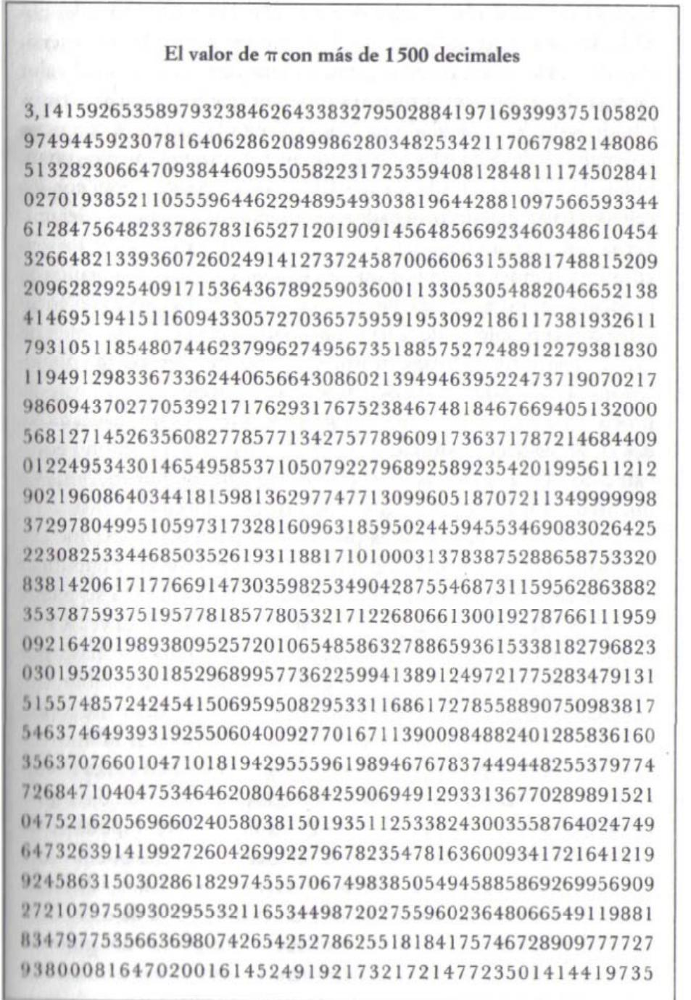

En lugar de probar que p es un número irracional, analizó la raíz cuadrada de dos (√2), es decir, el número que multiplicado por sí mismo equivale a dos. Para demostrar que √2 no se puede escribir en forma de quebrado, Euclides utilizó el método de la reducción al absurdo y empezó por asumir que sí es posible. Después demostró que esa fracción hipotética podía simplificarse hasta el infinito. Simplificar una fracción consiste en que, por ejemplo, la razón 8/12 se puede reducir a 4/6 si se dividen sus dos términos entre 2, y a su vez 4/6 se puede simplificar como 2/3, la cual ya no puede reducirse más y por tanto se dice que está en su forma más simplificada. En cambio, Euclides mostró que la fracción hipotética que supuestamente representaba √2 podía simplificarse una y otra vez hasta el infinito sin llegar a reducirla nunca a su forma más simplificada. Esto es absurdo porque todas las fracciones tienen que alcanzar tarde o temprano su forma más simplificada, y por tanto la fracción hipotética de partida no puede existir. De esto se deduce que √2 no puede escribirse como fracción y es un número irracional. Un esbozo de la demostración de Euclides se encuentra en el apéndice 2 de este libro.

Utilizando la prueba por contradicción, Euclides consiguió demostrar la existencia de los números irracionales. Era la primera vez que se dotaba a los números con una cualidad nueva y más abstracta. Hasta ese momento de la historia, todos los números podían expresarse como enteros o como fracciones, pero los números irracionales de Euclides escaparon a una representación tradicional. No existe otra manera para describir el número que equivale a la raíz cuadrada de dos más que la forma √2, porque no es susceptible de ser expresado como fracción y porque cualquier intento de escribirlo como decimal sólo puede consistir en una aproximación: 1, 414213562373 ...

Para Pitágoras, la belleza de las matemáticas radicaba en la idea de que los números racionales (números enteros y fracciones) podían explicar todos los fenómenos naturales. Esta base filosófica ocultó a Pitágoras la existencia de los números irracionales, e incluso puede que llevara a la ejecución de uno de sus discípulos. Cuenta una leyenda que un joven estudiante, de nombre Hippasus de Metaponto, se distrajo jugando con el número √2, intentando encontrar la fracción equivalente. Al cabo de cierto tiempo se dio cuenta de que no existe tal razón, o lo que es lo mismo, que √2 es un número irracional. Seguro que Hippasus estuvo

encantado con su descubrimiento, pero su maestro no compartió el entusiasmo. Pitágoras había descrito el universo en términos de números racionales, así que el hallazgo cuestionaba su ideal. La revelación de Hippasus debería haber abierto un período de debate y de meditación durante el cual Pitágoras hubiera tenido que aceptar esta nueva clase de números. Sin embargo, Pitágoras no estaba dispuesto a reconocer su error y al mismo tiempo no fue capaz de rebatir los argumentos de Hippasus valiéndose del poder de la lógica. Para su gran vergüenza, condenó a Hippasus a morir ahogado.

El padre de la lógica y del método matemático recurrió a la fuerza antes que admitir que estaba equivocado. El acto más deshonroso de Pitágoras fue negar la existencia de los números irracionales, y quizá fue ésta la mayor tragedia de las matemáticas griegas. Tan sólo después de su muerte se pudo resucitar sin peligro a los números irracionales.

Euclides se interesó sin duda por la teoría de números, pero no fue ésa su mayor aportación a las matemáticas. La verdadera pasión de Euclides fue la geometría, y de los quince volúmenes que forman los *Elementos* los cuatro primeros están dedicados a la geometría plana (bidimensional) y los libros del XI al XIII versan sobre geometría espacial (tridimensional). Este cuerpo completo de conocimientos hizo que los *Elementos* sirvieran como temario de geometría en colegios y universidades durante los dos mil años siguientes.

Un texto equivalente al anterior fue compilado por Diofanto de Alejandría, el último paladín de la tradición matemática griega. Aun cuando sus logros sobre la teoría de números están bien documentados en sus obras, prácticamente no se sabe nada más de este formidable matemático. Se desconoce el lugar de su nacimiento y su llegada a Alejandría pudo haberse producido en algún momento dentro de un intervalo de cinco siglos. Diofanto alude en sus escritos a Hipsicles de Alejandría, por lo que tuvo que vivir después del año 150 a. J.C. Por otra parte, es citado por Teón de Alejandría, así que tuvo que haber vivido antes del año 364 d. J.C. La fecha que se estima como más probable gira en torno al año 250 d. J.C. El único detalle de la vida de Diofanto que nos ha quedado tiene forma de acertijo, algo muy acorde con alguien dedicado a resolver problemas, y al parecer estaba grabado en su tumba:

*Dios le concedió ser niño durante una sexta parte de su vida, y una duodécima parte de ella más tarde cubrió de vello sus mejillas; encendió en él la antorcha del matrimonio tras una séptima parte, y cinco años después le concedió un hijo. ¡Ay!, un chico de nacimiento tardío y enfermizo, al que el frío destino se llevó cuando alcanzó la edad de la mitad de la vida total de su padre. Éste consoló su aflicción con la ciencia de los números durante los cuatro años siguientes, tras los cuales* 

*su vida se extinguió.* 

El desafío consiste en calcular la duración total de la vida de Diofanto. La solución se encuentra en el apéndice 3.

Este acertijo es un ejemplo del tipo de problemas que gustaba a Diofanto. Su especialidad era abordar preguntas cuyas respuestas fueran números enteros, y hoy día estas cuestiones reciben el nombre de problemas diofánticos. Su carrera transcurrió en Alejandría, entre la recopilación de problemas conocidos y la invención de otros nuevos, y reunió todos ellos en un gran tratado titulado *Aritmética*. De los trece libros de que constaba la *Aritmética* sólo seis sobrevivieron a los avatares de la Edad Media y perduraron para inspirar a los matemáticos renacentistas, entre ellos Pierre de Fermat. Los otros siete libros se perdieron en una serie de trágicos acontecimientos que devolvieron a las matemáticas a la era babilónica.

Durante los siglos que separan a Euclides de Diofanto, Alejandría continuó siendo la capital intelectual del mundo civilizado, pero a lo largo de todo este período la ciudad estuvo bajo la constante amenaza de ejércitos extranjeros. El primer gran ataque fue el del año 47 a. J.C., cuando Julio César intentó derrocar a Cleopatra prendiendo fuego a la flota alejandrina. La biblioteca, que estaba cerca del puerto, también ardió, con lo que se perdieron cientos de miles de libros. Por fortuna para las matemáticas, Cleopatra apreciaba la importancia de la sabiduría y estaba

resuelta a devolver a la Biblioteca de Alejandría su pasada gloria. Marco Antonio se dio cuenta de que el camino hacia el corazón de la intelectual pasaba por su biblioteca, así que se encaminó hacia Pérgamo. Esta ciudad había creado una biblioteca que se pretendía fuera la mejor del mundo, pero Marco Antonio trasladó todos aquellos fondos a Egipto, restituyendo la supremacía a Alejandría.

En los cuatro siglos siguientes, la Biblioteca de Alejandría continuó acaparando libros, hasta el año 389 d. J.C., en que recibió la primera de dos embestidas mortales, ambas consecuencia del fanatismo religioso. El emperador cristiano Teodosio I ordenó a Teófilo, obispo de Alejandría, que destruyera todos los monumentos paganos. Por desgracia, cuando Cleopatra reconstruyó la biblioteca decidió alojarla en el templo de Serapis, por lo que se vio inmersa en la destrucción de imágenes y altares. Los sabios «paganos» intentaron salvar seis siglos de conocimiento pero, antes de que pudieran hacer nada, fueron masacrados por las turbas cristianas. Así empezó el descenso a las tinieblas de la Edad Media.

Unas cuantas y preciosas copias de los libros más valiosos sobrevivieron a la agresión cristiana y los sabios siguieron acudiendo a Alejandría en busca de conocimientos. Pero en el año 642 un ataque musulmán consiguió lo que los cristianos no habían logrado. Cuando preguntaron al victorioso califa Omar qué se debía hacer con la biblioteca, sentenció que todos los libros contrarios al Corán debían ser destruidos, y que todos aquellos acordes al Corán eran superfluos y por tanto debían desaparecer también. Los manuscritos fueron utilizados para alimentar los hornos de los baños públicos, y así las matemáticas griegas quedaron reducidas a ceniza. No es sorprendente que pereciera la mayor parte de la obra de Diofanto; antes bien, cabría maravillarse de que seis volúmenes de la *Aritmética* lograran salvarse de la tragedia de Alejandría.

Los mil años siguientes fueron de total abatimiento para las matemáticas de Occidente, y sólo un puñado de lumbreras mantuvo viva la materia en la India y Arabia. Copiaron las fórmulas de los manuscritos griegos supervivientes y reinventaron por ellos mismos muchos de los teoremas perdidos. También aportaron nuevos elementos a las matemáticas, entre otros el número cero.

En las matemáticas modernas, el cero desempeña dos funciones. Primero permite distinguir entre números tales como 52 y 502. En un sistema en el que la posición

de cada número denota su valor se hace necesario un símbolo para expresar una posición desocupada. Por ejemplo, la cifra 52 representa 5 veces el número diez más 2 veces el uno, mientras que 502 representa 5 veces el número cien más 0 veces el diez más 2 veces el uno, y el cero es crucial para disipar cualquier ambigüedad. Incluso los babilonios, en el III milenio a. J.C., apreciaron la utilidad del cero para evitar confusiones y los griegos acogieron esta idea, usando para representarlo un símbolo circular similar al que empleamos en la actualidad. En cambio, el cero posee un significado aún más sutil y profundo que sólo fue valorado del todo por los matemáticos de la India varios siglos más tarde. Los hindúes otorgaron al cero una existencia independiente más allá del mero papel de espaciador entre los demás números. El cero era un número en sí mismo, representaba la cantidad de nada. Por primera vez se había atribuido una representación simbólica y tangible al concepto abstracto de nada.

Éste puede parecer un adelanto trivial al lector moderno, pero el sentido más profundo del símbolo del cero había sido ignorado por todos los filósofos griegos de la Antigüedad, incluido Aristóteles. Él había sostenido que el número cero debía ser proscrito porque daba al traste con la consistencia de los demás números, puesto que al dividir cualquier número ordinario entre cero se obtenía un resultado incomprensible. En el siglo VI, los matemáticos indios dejaron de esconder bajo la alfombra este problema y Brahmagupta, estudioso del siglo VII, fue lo bastante sofisticado como para emplear la división entre cero como definición del infinito.

Mientras Europa había abandonado la noble búsqueda de la verdad, la India y Arabia consolidaban la sabiduría que pudo salvarse de las ascuas de Alejandría y la reinterpretaban con un lenguaje nuevo y más elocuente. Además de incluir el cero en el vocabulario matemático, sustituyeron los primitivos símbolos griegos y los engorrosos numerales romanos por el sistema de cálculo que ahora hemos adoptado de forma universal. Una vez más, se podría pensar que estamos ante un ridículo y minúsculo paso adelante, pero intente el lector multiplicar CLV por DCI y apreciará el valor de este logro. La tarea de multiplicar 155 por 601 es mucho más simple. La evolución de cualquier disciplina depende de la capacidad de comunicar y de desarrollar ideas, y esto a su vez requiere un lenguaje lo suficientemente detallado y flexible. Las ideas de Pitágoras y Euclides no fueron menos elegantes por su complicada expresión, pero traducidas a símbolos árabes florecieron y derivaron hacia conceptos más ricos y nuevos.

En el siglo X, el estudioso francés Gerbert d'Aurillac aprendió el nuevo sistema de cálculo a través de los árabes de la península Ibérica y, valiéndose de sus empleos como profesor en iglesias y escuelas de toda Europa, tuvo ocasión de introducirlo en Occidente. En el año 999 fue elegido papa con el nombre de Silvestre II, acontecimiento que le permitió fomentar aún más el uso de los numerales indoarábigos. Aunque la eficacia del sistema revolucionó la contabilidad y favoreció que fuera rápidamente adoptado por los comerciantes, contribuyó muy poco a estimular un renacer de las matemáticas europeas.

El momento crucial para las matemáticas occidentales se sitúa en 1453, cuando los turcos saquearon Constantinopla. En años anteriores, los manuscritos que escaparon a la profanación de Alejandría se habían concentrado en Constantinopla, pero una vez más fueron amenazados con la destrucción. Los estudiosos bizantinos huyeron hacia el oeste con todo tipo de textos que pudieron preservar. Habiendo sobrevivido a las embestidas de César, del obispo Teófilo, del califa Omar y ahora a la de los turcos, unos pocos y valiosos volúmenes de la *Aritmética* realizaron el viaje de regreso a Europa. Diofanto estaba destinado al pupitre de Pierre de Fermat.

## **El origen de un enigma**

Las responsabilidades judiciales de Fermat ocupaban gran parte de su tiempo, pero cada momento libre que tenía lo dedicaba por entero a las matemáticas. Esto se debió en parte a que los jueces del siglo XVII francés se resistían a relacionarse en sociedad porque los amigos y conocidos podían ser llevados en cualquier momento ante la justicia. Fraternizar con los conciudadanos sólo conduciría a favoritismos. Aislado del resto de la alta sociedad de Toulouse, Fermat pudo concentrarse en su afición.

No existe ningún apunte de Fermat que haya sido inspirado jamás por algún tutor matemático; en su defecto, fue una copia de la *Aritmética* la que se convirtió en su mentor. La *Aritmética* describía la teoría de números tal y como era en tiempos de Diofanto, a través de una serie de problemas y soluciones. Diofanto obsequió a Fermat con mil años de comprensión matemática. En un solo libro, Fermat podía encontrar toda la sabiduría acerca de los números elaborada según los modelos de Pitágoras y de Euclides. La teoría de números había permanecido inmóvil desde el bárbaro incendio de Alejandría, pero ahora Fermat estaba preparado para reanudar el estudio de la disciplina matemática más esencial.

La *Aritmética* que inspiró a Fermat era una traducción latina realizada por Claude Gaspar Bachet de Méziriac, según dicen el hombre más versado de toda Francia. Además de ser un brillante lingüista, poeta y estudioso de los clásicos, Bachet sentía auténtica pasión por los enigmas matemáticos. Su primera publicación fue una recopilación de rompecabezas titulada *Problèmes plaisans et délectables* («Problemas divertidos y deleitosos»), que incluía problemas sobre cómo atravesar ríos, uno acerca del vertido de líquidos y diversos trucos para adivinar números. Una de las cuestiones planteadas era un problema sobre pesas: *¿Qué número mínimo de pesas hay que utilizar en un juego de balanzas para poder pesar cualquier número entero de kilogramos entre 1 y 40?* 

Bachet encontró una ingeniosa solución que muestra que es posible lograrlo con tan sólo cuatro pesas. La solución se da en el apéndice 4.

Aunque sólo era un mero diletante matemático, el interés de Bachet por los acertijos fue suficiente para darse cuenta de que la lista de problemas de Diofanto estaba en un plano superior y merecía un estudio más profundo. Se impuso la tarea de traducir y publicar la obra de Diofanto, de modo que pudieran resurgir las técnicas de los griegos. Es importante advertir que se habían olvidado por completo cantidades ingentes de conocimiento matemático antiguo. Las matemáticas de nivel no se habían impartido siquiera en las mejores universidades de Europa, y sólo gracias a los esfuerzos de estudiosos como Bachet pudo recuperarse tanto en tan corto tiempo. Cuando Bachet publicó la versión latina de la *Aritmética*, en 1621, estaba contribuyendo al advenimiento de la segunda edad de oro de las matemáticas.

La *Aritmética* contiene más de cien problemas y Diofanto da solución detallada a todos y cada uno de ellos. Este grado de minuciosidad es un hábito que no adquirió Fermat. Fermat no pretendía escribir un libro de texto para las generaciones futuras: solamente buscaba la satisfacción propia de resolver un problema. El estudio de los problemas y soluciones de Diofanto lo movía a pensar y abordar otras

cuestiones afines y más sutiles. Fermat garabateaba lo que fuera necesario para convencerse de que podía encontrar la solución y luego no se molestaba en escribir el resto de la prueba. La mayoría de las veces tiraba sus notas a la papelera y pasaba despreocupadamente al siguiente problema. Por fortuna para nosotros, la edición de Bachet de la *Aritmética* tenía unos márgenes generosos en todas las páginas y en ocasiones Fermat apuntó apresuradas fórmulas y comentarios en esos huecos. Para generaciones de matemáticos, estas notas acabaron convirtiéndose en un registro valiosísimo, si bien algo escaso, de los cálculos más brillantes de Fermat.

Uno de los hallazgos de Fermat tuvo que ver con los llamados números amigos o amistosos, los cuales están muy relacionados con los números perfectos que dos mil años atrás habían fascinado a Pitágoras. Los números amigos son parejas de números tales que uno de ellos equivale a la suma de los divisores del otro, y éste le corresponde del mismo modo. Los pitagóricos hicieron el extraordinario descubrimiento de que 220 y 284 son números amigos. Los divisores de 220 son 1, 2, 4, 5, 10, 11, 20, 22, 44, 55 y 110, y la suma de todos da 284. Por otra parte, los divisores de 284 son 1, 2, 4, 71 y 142, y la suma de éstos da 220.

Se dijo que el par 220 y 284 era un símbolo de amistad. Martin Gardner, en su obra *Mathematical Magic Show* («Festival mágico-matemático»), habla de talismanes tallados con estos números que se vendían en la Edad Media con el pretexto de que al llevarlos colgados sus influjos atraerían el amor. Un numerólogo árabe documenta la práctica de grabar la cifra 220 en una fruta y 284 en otra para luego comer la primera y ofrecer la segunda al amante a modo de afrodisiaco matemático. Los primeros teólogos observaron en el Génesis que Jacob dio 220 cabras a Esaú, y creyeron que el número de cabras, la mitad de un par amigo, era una manifestación del amor de Jacob hacia Esaú.

No se identificó ningún otro par de números amigos hasta 1636, cuando Fermat encontró la pareja 17.296 y 18.416. Aunque no se trata de un descubrimiento trascendental, sí nos muestra su familiaridad con los números y su afición a jugar con ellos. A Fermat le entró la manía de buscar números amigos; Descartes dio con un tercer par (9.363.584 y 9.437.056) y Leonhard Euler continuó hasta lograr una lista de sesenta y dos pares amigos. Resulta curioso que todos ellos pasaran por

alto un par mucho más bajo de números amigos. En 1866, un italiano de dieciséis años, Niccolò Paganini, halló la pareja 1.184 y 1.210.

Durante el siglo XX, los matemáticos han desarrollado aún más la idea y han buscado los números «sociables», tres o más números que forman un círculo cerrado. Por ejemplo, en este círculo de cinco números (12.496, 14.288, 15.472, 14.536 y 14.264) la suma de los divisores del primer número da el segundo, la del segundo da el tercero, la del tercero da el cuarto, la del cuarto da el quinto y la del quinto da el primero. El círculo sociable más extenso conocido está formado por veintiocho números, siendo el primero de ellos el 14.316.

Aunque el descubrimiento de un nuevo par de números amigos hizo un poco célebre a Fermat, su gloria quedó confirmada gracias a una serie de retos matemáticos. Fermat notó que el número 26 queda emparedado entre el 25 y el 27, en el sentido de que uno es un número al cuadrado (25 = 52 = 5 x 5) y otro es un número al cubo (27 = 33 = 3 x 3 x 3). Buscó otros números emparedados entre un cuadrado y un cubo pero no lo consiguió, y sospechó que el 26 tendría que ser el único. Tras días de arduo esfuerzo, se las arregló para dar con un argumento detallado que probara que 26 es sin duda alguna el único número entre un cuadrado y un cubo. Su demostración, razonada paso a paso, estableció que ningún otro número podría satisfacer este requisito.

Fermat anunció esta propiedad única del número 26 a la comunidad matemática y la desafió a demostrar que era cierto. Comunicó abiertamente que él había dado con la prueba. En cambio, la cuestión era si el resto de matemáticos gozaba del ingenio suficiente para superar el desafío. A pesar de lo sencillo de la propuesta, la demostración es complicada en extremo y Fermat se deleitó especialmente mofándose de los matemáticos ingleses Wallis y Digby, quienes con el tiempo tuvieron que admitir el fracaso. A la larga, el mayor motivo de la fama de Fermat resultaría ser otro desafío para el resto del mundo. Sin embargo se trataba de un enigma accidental que jamás fue concebido para la discusión pública.

# **La nota al margen**

Mientras estudiaba el libro II de la *Aritmética*, Fermat llegó a una serie de observaciones, problemas y soluciones relacionados con el teorema de Pitágoras y con las ternas pitagóricas. Por ejemplo, Diofanto discutió la existencia de ciertas ternas que constituían los llamados «triángulos cojos», cuyos dos lados menores *x* e *y* difieren uno del otro sólo en una unidad (*x* = 20, *y* = 21, *z* = 29 y 202 + 212 = 292).

Fermat fue zarandeado por la diversidad y abundancia de ternas pitagóricas. Sabía que siglos antes Euclides había formulado una demostración, esbozada en el apéndice 5, que probaba que en realidad existe un número infinito de ternas pitagóricas. Seguramente observaría la detallada exposición de Diofanto sobre las ternas pitagóricas y se preguntaría qué quedaba por añadir al respecto. En cuanto llegó a la página comenzó a jugar con la ecuación pitagórica, intentando descubrir algo que hubiera escapado a los griegos. De pronto, en un momento de inspiración que inmortalizaría al príncipe de los aficionados, creó una ecuación que, si bien es muy parecida a la de Pitágoras, no tiene solución alguna. Era la ecuación sobre la que leería aquel Andrew Wiles de diez años en la biblioteca de la calle Milton. En lugar de considerar la ecuación

$$x^2 + y^2 = z^2$$

Fermat estaba contemplando una variante de la creación pitagórica:

$$x^3 + y^3 = z^3$$

Como se menciona en el capítulo anterior, Fermat se limitó a cambiar la potencia de 2 a 3, del cuadrado al cubo, pero su nueva ecuación parecía no tener solución alguna con números enteros. Ensayos y errores manifestaron bien pronto la dificultad de encontrar dos números que elevados al cubo y sumados entre sí equivalieran a otro elevado también al cubo. ¿Podría de verdad darse el caso de que aquella mínima variación tornara la ecuación de Pitágoras, con un número infinito de soluciones, en otra sin solución?

Modificó aún más la ecuación, cambiando el exponente a valores superiores a tres, y descubrió que dar con una solución a esas otras variantes resultaba igual de

complicado. Según Fermat, parecía no haber tres números enteros que cumplieran la ecuación

$$\varkappa^{\sigma} + \jmath^{\sigma} = \varkappa^{\sigma}$$

donde *n* representa 3, 4, 5, .. .

En el margen de su *Aritmética*, junto al problema 8, escribió una nota con su observación:

*Cubem autem in duos cubos, aut quadratoquadratum in duos quadratoquadratos, et generaliter nullam in infinitum ultra quadratum potestatem in duos eiusdem nominis fas est dividere. (Es imposible escribir un cubo como la suma de dos cubos o escribir una cuarta potencia como la suma de dos cuartas potencias o escribir, en general, cualquier potencia mayor que dos como la suma de dos potencias iguales).* 

De entre todos los números posibles parecía no existir razón alguna que impidiera encontrar, al menos una solución, a pesar de que Fermat afirmó que en ningún lugar del universo infinito de los números existía una *«terna fermatina»*. Era una afirmación extraordinaria, pero Fermat se creía capaz de demostrarla. Tras el primer apunte marginal que esbozaba la teoría, el travieso genio anotó un comentario adicional que iba a atormentar a generaciones de matemáticos:

*Cuius rei demonstrationem mirabilem sane detexi hanc marginis exiguitas non caperet. (Poseo una prueba en verdad maravillosa para esta afirmación a la que este margen viene demasiado estrecho).* 

Este era el Fermat más enloquecedor. Sus propias palabras sugieren que estaba especialmente entusiasmado con su prueba «en verdad maravillosa», pero no tenía ninguna intención de molestarse en anotar los detalles de la argumentación; nunca pensó en hacerla pública. Jamás mencionó nada a nadie acerca de la prueba y, aun a pesar de su mezcla de indolencia y modestia, el último teorema de Fermat, como luego se lo denominaría, iba a hacerse famoso en todo el mundo en los siglos venideros.

# **El último teorema al fin publicado**

El célebre descubrimiento de Fermat ocurrió más bien pronto en su carrera matemática, alrededor de 1637.

*Figura 6. Página que contiene la célebre observación de Pierre de Fermat* 

Unos treinta años después, cuando cumplía con sus obligaciones judiciales en la ciudad de Castres, enfermó de gravedad. El 9 de enero de 1665 firmó sus últimas voluntades y, pasados tres días, falleció. Aislados todavía de la escuela parisiense de matemáticas y recordados con no demasiado cariño por sus corresponsales, los descubrimientos de Fermat corrían el riesgo de perderse para siempre. Por suerte, el hijo mayor de Fermat, Clément–Samuel, que apreciaba el valor de la afición de su padre, decidió que sus hallazgos no perecieran para el mundo. Gracias a sus esfuerzos sabemos al menos algo sobre el logro más destacado de Fermat dentro de la teoría de números y, en particular, si no hubiera sido por él, el enigma que hoy conocemos como el último teorema de Fermat habría muerto con su creador.

Clément–Samuel dedicó cinco años a recopilar los apuntes y cartas de su padre y a examinar las anotaciones en los márgenes de su ejemplar de la Aritmética. La nota marginal referente al último teorema de Fermat era sólo uno de los muchos pensamientos inspirados escritos en el libro, y Clément–Samuel acometió la publicación de esas anotaciones en una edición especial de la Aritmética. En 1670 sacó a la luz un volumen titulado Diophanti arithmeticorum libri cum observationibus P. de Fermat («Aritmética de Diofanto con observaciones de P. de Fermat»). Junto a las traducciones originales griega y latina de Bachet se insertaban cuarenta y ocho observaciones hechas por Fermat. La segunda observación, que se muestra en la figura 6, era la que luego sería conocida como el último teorema de Fermat.

Una vez las Observaciones de Fermat llegaron a la vasta sociedad, quedó claro que las misivas que Fermat había enviado a sus colegas representaban meros fragmentos de un tesoro pleno de hallazgos. Sus apuntes personales contenían series íntegras de teoremas que, por desgracia, no iban acompañados de ninguna explicación ni de la más leve indicación sobre su demostración básica. Había suficiente cantidad de tentadores destellos de lógica como para no dejar ninguna duda a los matemáticos de que Fermat disponía de pruebas, pero completar los detalles era el desafío que había dejado para que ellos lo aceptaran.

Leonhard Euler, uno de los mejores matemáticos del siglo XVIII, intentó demostrar una de las observaciones más elegantes de Fermat, un teorema relacionado con los números primos.

Número primo es aquel que no tiene divisores, es decir, el que no puede dividirse entre ningún otro número, excepto entre la unidad y él mismo, para dar un resultado exacto. De modo que el 13 es un número primo, pero el 14 no. El 13 no puede dividirse entre ningún número para dar un resultado exacto, en cambio el 14 puede dividirse entre 2 y 7. Todos los números primos pueden clasificarse en dos categorías; los que tienen la forma 4*n* + 1 o los que se corresponden con 4*n* - 1, donde *n* representa cualquier número. Así, el 13 se incluye en el primer grupo (4 x 3 + 1), mientras que el 19 lo hace en el segundo (4 x 5 -1). El teorema de primos de Fermat afirma que el primer tipo de números primos equivale siempre a la suma de dos cuadrados (13 = 22 +32 ), mientras que el segundo jamás puede escribirse de ese modo (19 = ?2 + ?2 ). Esta propiedad de los números primos es bien simple, pero intentar demostrar que se cumple con cada número primo resulta extremadamente difícil. Para Fermat se trataba tan sólo de una de sus muchas demostraciones privadas. El desafío para Euler era redescubrir la prueba de Fermat. Al fin, en 1749, tras siete años de trabajo y casi un siglo después de la muerte de Fermat, Euler consiguió probar este teorema de los números primos.

El repertorio de los teoremas de Fermat abarcaba desde lo fundamental hasta la simple diversión. Los matemáticos establecen la importancia de los teoremas según su repercusión en el resto de las matemáticas. En primer lugar, un teorema se considera importante si contiene una verdad universal, es decir, si se aplica a todo un grupo de números. En el caso del teorema de números primos, éste es cierto no sólo para algunos números primos sino para todos ellos sin excepción. En segundo lugar, los teoremas deben revelar alguna verdad esencial más profunda sobre las relaciones entre los números. Un teorema puede servir de trampolín para generar multitud de teoremas adicionales, e incluso puede inspirar el desarrollo de nuevas ramas de las matemáticas. Por último, un teorema es importante si su ausencia entorpece áreas enteras de la investigación por la falta de un eslabón lógico. Muchos matemáticos se han acostado llorando por saber que podrían alcanzar mejores resultados si llegaran a probar tan sólo un eslabón perdido de la cadena lógica.

Como los matemáticos utilizan los teoremas como escalones para llegar a otros resultados, se volvía imprescindible demostrar cada teorema de Fermat. El mero hecho de que afirmara que tenía la prueba de un teorema no era suficiente para aceptarlo así como así. Antes de poder usarlo, cada teorema debía ser demostrado con un rigor severísimo porque en caso contrario las consecuencias podrían haber sido desastrosas. Imaginemos, por ejemplo, que los matemáticos hubieran aceptado sin más uno de los teoremas de Fermat. Se habría incorporado como elemento de toda otra serie de pruebas más amplias. A su debido tiempo, esas pruebas más extensas serían incorporadas a otras aún mayores, y así sucesivamente. A la larga, cientos de teoremas podrían llegar a apoyarse sobre una verdad sin revisar del teorema original. ¿Pero qué ocurriría si Fermat hubiera cometido un error y por tanto el teorema no probado tuviera en realidad algún fallo? Todos esos otros teoremas que lo hubieran incorporado también resultarían ser falsos y amplias ramas de las matemáticas se desplomarían. Los teoremas son el fundamento de las matemáticas porque, una vez establecida su verdad, no es arriesgado crear otros teoremas sobre esos cimientos. Las ideas sin demostrar son, con diferencia, mucho menos valiosas y se las considera sólo conjeturas. Cualquier lógica basada en una conjetura es por sí misma una conjetura.

Fermat afirmó que poseía la demostración de cada una de sus observaciones, así que para él se trataba de teoremas. En cambio, hasta que la comunidad en general redescubrió cada prueba individual, ninguna de ellas pudo ser considerada más que una mera conjetura. De hecho, durante los últimos 350 años el último teorema de Fermat debería haberse denominado, con mucha más propiedad, la última conjetura de Fermat.

A medida que pasaron los siglos, todas las observaciones fueron probadas una a una, pero el último teorema se negó con terquedad a ceder tan fácilmente. De hecho, se lo denomina el «último» teorema porque fue la última de las afirmaciones que quedó por demostrar. Tres siglos de esfuerzos fracasaron en la búsqueda de la prueba y eso contribuyó a su mala fama de ser el desafío más duro de las matemáticas. Sin embargo, esta reconocida dificultad no tiene por qué significar que el último teorema de Fermat sea importante según lo dicho antes. El último teorema, al menos hasta hace muy poco, parecía no satisfacer los diversos criterios; daba la impresión de que su demostración no conduciría a nada relevante, de que no aportaría ninguna revelación particularmente profunda sobre los números y de que no contribuiría a probar ninguna otra conjetura.

La fama del último teorema de Fermat procede tan sólo de la pura dificultad de probarlo. Le añade un atractivo adicional el hecho de que el príncipe de los aficionados afirmara que podía demostrar este teorema que, desde entonces, ha

desconcertado a generaciones de matemáticos profesionales. Los comentarios improvisados en el margen de su copia de la *Aritmética* se interpretaron como un desafío para el mundo. El había demostrado el último teorema, la cuestión era si algún otro podría alcanzar su brillantez.

G. H. Hardy tenía un sentido del humor muy singular e ideó lo que podría haber sido un legado igual de frustrante que el anterior. El desafío de Hardy era como una póliza de seguros que lo ayudaba a enfrentarse a su miedo a viajar en barco. Siempre que cruzaba el mar enviaba antes un telegrama a un colega diciendo:

# HE RESUELTO LA HIPÓTESIS DE RIEMANN STOP DARÉ DETALLES A MI REGRESO STOP

La hipótesis de Riemann es un problema que ha atormentado a los matemáticos desde el siglo XIX. La lógica de Hardy consideraba que Dios jamás permitiría que se ahogara porque, en ese caso, dejaría a los matemáticos acosados por un segundo y terrible fantasma.

El último teorema de Fermat es un problema de una inmensa dificultad y a pesar de ello puede expresarse de manera que lo entienda un colegial. No existe ningún problema en física, química o biología que, enunciado de forma tan inequívoca y simple, haya permanecido sin solución durante tanto tiempo. En su libro *The Last Problem*, E. T. Bell escribió que tal vez la civilización se extinguiría antes de que dicho teorema llegara a resolverse. Demostrar el último teorema de Fermat se ha convertido en el galardón más preciado de la teoría de números y no sorprende que haya provocado algunos de los episodios más emocionantes de la historia de las matemáticas. La búsqueda de una prueba ha comportado a los más grandes genios del planeta descomunales recompensas, desesperaciones suicidas y duelos al amanecer.

El prestigio del enigma ha llegado más allá del cerrado universo matemático. En 1958 incluso se abrió camino dentro de un cuento fáustico. Una antología titulada *Deals with the Devil* («Pactos con el diablo») contiene un relato breve de Arthur Poges. En «El diablo y Simón Flagg», el diablo pide a Simón Flagg que le formule una pregunta. Si consigue responderla en el transcurso de veinticuatro horas, el

alma de Simón será suya, pero si yerra, pagará a Simón la cantidad de cien mil dólares. Simón plantea la pregunta: *«¿Es verdadero el último teorema de Fermat?»* El diablo desaparece y zumba alrededor del mundo para empaparse de todas las matemáticas que se han elaborado desde el principio de los tiempos. Al día siguiente regresa y admite su derrota:

*- Tú ganas, Simón, dijo casi en un susurro, mirándolo con un respeto absoluto. Ni siquiera yo soy capaz de aprender en tan poco tiempo las matemáticas que se requieren para un problema tan difícil. Cuanto más indago en él peor se torna. Factorizaciones no unívocas, ideales... ¡Bah! ¿Sabes -confió el diablo- que ni siquiera los mejores matemáticos de otros planetas, todos mucho más avanzados que el tuyo, lo han resuelto? Vamos, hay un tipo en Saturno semejante a una seta con zancos que resuelve mentalmente ecuaciones diferenciales en derivadas parciales; y hasta él ha desistido.*

# **Capítulo 3 UNA HUMILLACIÓN MATEMÁTICA**

*Las matemáticas no son una marcha cautelosa a lo largo de una carretera bien despejada, sino un viaje por un desierto desconocido en el que los exploradores se pierden a menudo. Para el historiador, el rigor debe ser señal de que los mapas se han trazado y de que los verdaderos exploradores han llegado a otra parte. W. S. ANGLIN*

*«Desde que, siendo un niño, me topé por primera vez con el último teorema de Fermat se convirtió en mi gran pasión,* recuerda Andrew Wiles con una voz temblorosa que transmite su entusiasmo por la cuestión. *Tropecé con este problema que había permanecido sin resolver durante trescientos años. No creo que a muchos de mis compañeros de colegio les diera por las matemáticas, así que no lo comenté con los chicos de mi edad. Pero tuve un profesor que había investigado en matemáticas, y fue él quien me dio un libro sobre la teoría de números que me aportó algunas pistas para empezar a abordarlo. En un principio trabajé con la suposición de que Fermat no sabía muchas más matemáticas de las que yo sabía entonces. Intenté encontrar su prueba perdida utilizando los métodos que él podía haber usado.»* 

Wiles era un chico lleno de inocencia y de ambición que vio una posibilidad de triunfo donde generaciones de matemáticos habían fracasado. Para otros, esto podría haberse parecido a un sueño temerario, pero el joven Andrew acertaba al pensar que él, un escolar del siglo XX, sabía tantas matemáticas como Pierre de Fermat, genio del siglo XVII. Podía ser que en su ingenuidad diera con una demostración que había escapado a otras mentes mejor preparadas.

A pesar de su entusiasmo, cada calculo resulto fallido. Se había devanado los sesos y había estudiado los libros de texto sin conseguir nada. Tras un año de fracasos cambió de estrategia; pensó que podría aprender algo de los errores de otros matemáticos más eminentes. *«El último teorema de Fermat va acompañado de esta increíble historia romántica. Mucha gente ha discurrido sobre él y, cuanto más han*  *buscado y errado los grandes matemáticos la solución del problema, más desafiante y misterioso se ha vuelto. Tantos matemáticos lo han intentado, y de tantas maneras diferentes, en los siglos XVIII y XIX que yo, un quinceañero, decidí que debía estudiar esos métodos y tratar de comprender lo que ellos habían hecho.»*

El joven Wiles examinó los enfoques de todo aquel que en algún momento hubiera intentado con seriedad demostrar el último teorema de Fermat. Comenzó estudiando el trabajo del matemático más prolífico de la historia y el primero que progresó en la batalla contra Fermat.

# **El cíclope matemático**

Hacer matemáticas es una experiencia difícil y misteriosa. A menudo, el objeto de la demostración está claro, pero el camino a seguir está cubierto por la niebla y el matemático va dando trompicones a lo largo de un cálculo, horrorizado porque cada paso puede estar encaminándolo en una dirección completamente errónea. Además aparece el temor de que no exista ningún camino. Un matemático puede creer que una afirmación es cierta y dedicar años a intentar demostrar que, en efecto, lo es aun cuando en realidad sea falsa desde el principio. Así, puede que el matemático insista en demostrar lo imposible.

En toda la historia de esta materia sólo un puñado de matemáticos parece haber superado la desconfianza en sí mismos que intimida a sus colegas. Quizá el ejemplo más notable sea el del genio del siglo XVIII Leonhard Euler, quien logró el primer progreso hacia la demostración del último teorema de Fermat, Euler poseía una intuición tan increíble y una memoria tan vasta que se decía que podía trazar de cabeza todo el grueso de un cálculo sin tener que utilizar lápiz y papel. Era conocido en toda Europa como «el análisis en persona», y el académico francés François Arago dijo: «Euler calculaba en apariencia sin ningún esfuerzo, igual que los hombres respiran o que las águilas se sostienen en el aire.»

Leonhard Euler nació en Basilea en 1707 y era hijo de un pastor calvinista, Paul Euler. Aunque el joven Euler mostraba un talento prodigioso para las matemáticas, su padre estaba decidido a que estudiara teología y a que hiciera carrera dentro de la Iglesia. Leonhard, sumiso, obedeció y estudió teología y hebreo en la Universidad de Basilea.

Por suerte para Euler, la ciudad de Basilea era también la residencia del eminente clan de los Bernoulli. Los Bernoulli podrían reclamar el título de la más matemática de las familias, pues engendró ocho de las mentes más sobresalientes en este campo en tan sólo tres generaciones. Alguien dijo que la familia Bernoulli fue para las matemáticas lo que la familia Bach para la música. Su fama se propagó por toda la comunidad matemática y una anécdota en concreto tipifica el perfil familiar: en cierta ocasión, Daniel Bernoulli, viajando por Europa, entabló conversación con un desconocido. Poco después se presentó con modestia: «Soy Daniel Bernoulli.» «Y yo, dijo su interlocutor con sarcasmo, soy Isaac Newton.» Daniel recordaba este incidente con cariño porque lo consideraba el elogio más sincero que había recibido nunca.

Daniel y Nikolaus Bernoulli eran muy amigos de Leonhard Euler y se dieron cuenta de que el más brillante de los matemáticos se estaba convirtiendo en el más mediocre de los teólogos. Apelaron a Paul Euler y le rogaron que permitiera a Leonhard colgar los hábitos en favor de los números. En el pasado, el cabeza de la familia Euler había sido instruido en matemáticas por el cabeza de la familia Bernoulli, Jakob, y les profesaba un enorme respeto. Así que, aunque a regañadientes, aceptó que su hijo había nacido para calcular y no para predicar.

Leonhard Euler cambió pronto Suiza por los palacios de Berlín y San Petersburgo, donde pasaría gran parte de sus años creativos. En la época de Fermat, los matemáticos eran considerados malabaristas aficionados a los números, pero en el siglo XVIII eran tenidos por profesionales de la resolución de problemas. La cultura de los números había cambiado radicalmente y eso, en parte, se debía a sir Isaac Newton y sus cálculos científicos.

Newton creía que los matemáticos perdían el tiempo incordiándose unos a otros con inútiles enigmas. El, en cambio, aplicó las matemáticas al mundo físico y lo calculó todo, desde lo relacionado con las órbitas de los planetas hasta las trayectorias de las balas de cañón. Por la época en que Newton murió, en 1727, Europa experimentaba una revolución científica, y en ese mismo año Euler publicó su primer artículo. Este, a pesar de contener unas matemáticas elegantes e innovadoras, apuntaba principalmente a exponer la solución de un problema técnico referente a los mástiles de los barcos.

Las potencias europeas no estaban interesadas en aplicar las matemáticas a la exploración de conceptos esotéricos y abstractos. Más bien querían explotarlas para resolver problemas prácticos, y competían entre ellas para captar las mentes más destacadas. Euler empezó su carrera con los zares antes de que Federico II el Grande, rey de Prusia, lo invitara a la Academia de Berlín. Con el tiempo regresó a Rusia, bajo el mandato de Catalina la Grande, donde pasó sus últimos años. A lo largo de su carrera abordó multitud de problemas, que se extienden desde la navegación hasta las finanzas y desde la acústica hasta la irrigación. El mundo práctico de la resolución de problemas no atenuó las habilidades matemáticas de Euler. Por el contrario, cada enfrentamiento a una nueva empresa lo instaba a crear unas matemáticas innovadoras e ingeniosas. Su firme pasión lo llevó a escribir varios artículos en un solo día, y se cuenta que entre la primera y la segunda llamada para la comida intentaba escribir a toda prisa un cálculo completo digno de ser publicado. No desperdiciaba un segundo y, hasta cuando mecía a un niño con una mano, esbozaba una demostración con la otra.

Uno de sus mayores logros fue el desarrollo del método algorítmico. El objetivo de los algoritmos de Euler era abordar problemas en apariencia imposibles. Uno de esos problemas era la predicción de las fases de la Luna para fechas lejanas en el futuro y con gran precisión, una información que podía utilizarse para elaborar tablas esenciales de navegación. Ya Newton había mostrado que es relativamente fácil calcular la órbita de un cuerpo en torno a otro, pero en el caso de la Luna la cuestión no es tan simple. Mientras que la Tierra y la Luna se atraen mutuamente, el Sol perturba el movimiento de la Tierra y repercute en la órbita lunar. Se pueden formular ecuaciones que precisan el efecto de cualquiera de los dos cuerpos, pero los matemáticos del siglo XVIII no podían incorporar en los cálculos la influencia de un tercer objeto. Incluso hoy día es imposible predecir la solución exacta del llamado «problema de los tres cuerpos».

Euler se percató de que los navegantes no necesitaban saber la fase de la Luna con total precisión, sino sólo con la exactitud suficiente para ubicar sus posiciones con un margen de error de varias millas náuticas. Por consiguiente, desarrolló una receta para generar una solución imperfecta, pero con la precisión adecuada. La receta, o algoritmo, obraba mediante la obtención de una primera solución tosca y fácil de calcular, la cual era reutilizada en el proceso para obtener otra más refinada. Esta solución refinada podía, a su vez, reintroducirse en el algoritmo para lograr aún mayor precisión, y así sucesivamente. Tras unas cien iteraciones, Euler era capaz de ofrecer la posición de la Luna con una precisión más que suficiente para las necesidades de la marina. Proporcionó su algoritmo al almirantazgo británico y recibió en recompensa la cantidad de trescientas libras esterlinas.

Euler alcanzó fama de ser capaz de solucionar cualquier problema que le fuera planteado, habilidad que se extendía más allá del ámbito de la ciencia. Durante su estancia en la corte de Catalina la Grande coincidió con el destacado filósofo francés Denis Diderot. Este era un ateo declarado y dedicó su tiempo a convertir a los rusos al ateísmo. Esto enojó a Catalina, quien pidió a Euler que atajara los actos de aquel malvado francés.

Euler rumió el asunto por un tiempo y anunció que disponía de una prueba algebraica de la existencia de Dios. Catalina la Grande llamó a Euler y a Diderot a palacio y reunió a sus cortesanos para asistir al debate teológico. Euler se presentó ante el auditorio y anuncio:

> Señor, (*a + bn )* / *n* = *x*, y por tanto Dios existe; ¡refútelo!

Como no era un entendido en álgebra, Diderot fue incapaz de argüir al mayor matemático de Europa y permaneció en silencio. Humillado, abandonó San Petersburgo y regresó a París. En su ausencia, Euler continuó disfrutando de su retorno a los estudios de teología e hizo públicas algunas otras demostraciones fingidas sobre la naturaleza de Dios y del alma humana. Un problema algo más útil y que también requirió de la fantasía de Euler tuvo que ver con la ciudad prusiana de Königsberg, perteneciente hoy a Rusia y conocida como Kaliningrado. La ciudad está construida sobre los bancos de arena del río Pregel y consta de cuatro barrios independientes conectados por siete puentes.

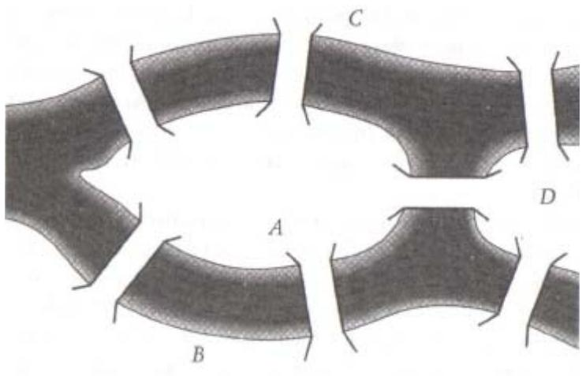

*Figura 7. El río Pregel divide la ciudad de Königsberg en cuatro partes independientes, A, B, C y D. Siete puentes comunican las distintas partes y un acertijo local planteaba si era posible hacer una ruta de manera que cada puente se atravesara una única vez.* 

La figura 7 muestra la disposición de la ciudad. Algunos de los residentes más curiosos de Königsberg se preguntaban si sería posible trazar una ruta que atravesara los siete puentes sin pasar dos veces por ninguno de ellos. Los ciudadanos de Königsberg probaron varios caminos, pero todos fracasaron en su intento. También Euler fue incapaz de hallar un itinerario que cumpliera las condiciones requeridas, pero consiguió explicar por qué este empeño estaba condenado al fracaso.

Euler tomó un plano de la ciudad, a partir del cual elaboró una representación simplificada en la que las porciones de tierra se reducían a puntos y los puentes se representaban con líneas, tal y como se muestra en la figura 8. Arguyó entonces que para trazar la ruta requerida (o sea, cruzando todos los puentes una sola vez) cada punto debería estar unido a un número par de líneas. Esto es así porque, durante el trayecto, cada vez que el viajero atraviesa una masa de tierra debe hacerlo entrando por un puente y saliendo por otro distinto. Sólo hay dos excepciones a esta regla: el inicio y el final del viaje.

Al principio de la ruta, el viajero abandona una masa de tierra, y para ello sólo necesita un puente de salida. Al final del recorrido accede a una masa de tierra, para lo que vuelve a requerir sólo un puente. Si el viaje empieza y acaba en lugares distintos, estas dos masas de tierra pueden tener un número impar de puentes. Si, por el contrario, el viaje empieza y acaba en el mismo lugar, entonces este punto, al igual que todos los demás, debe disponer de un número par de puentes.

Así, Euler concluyó que, en general, en cualquier red de puentes es posible hacer un viaje completo cruzando cada uno de ellos una vez, si y sólo si todas las masas de tierra constan de un número par de puentes, o bien si dos de ellas contienen un número impar.

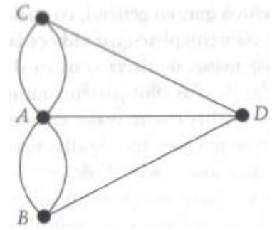

*Figura 8. Representación simplificada de los puentes de Königsberg.* 

En el caso concreto de Königsberg hay cuatro masas de tierra y todas constan de una cantidad impar de puentes: tres de ellas tienen tres puentes cada una, mientras que una posee cinco. Euler explicó así por qué es imposible cruzar todos y cada uno de los puentes de Königsberg una sola vez, y de paso elaboró una regla aplicable a cualquier red de puentes en cualquier ciudad del mundo. La demostración es de una simplicidad maravillosa y es tal vez el tipo de problema de lógica que Euler despachaba con un bosquejo antes de las comidas.

El rompecabezas de los puentes de Königsberg es uno de los llamados problemas de redes en matemáticas aplicadas, e inspiró a Euler a considerar redes más abstractas. Así llegó a descubrir una verdad fundamental para todas las redes, la llamada fórmula de redes, y fue capaz de demostrarla en sólo unos cuantos pasos. La fórmula de las redes representa una relación eterna entre los tres objetos que definen a toda red:

$$\mathcal{V} + \mathcal{R} - \mathcal{L} = \mathbf{1}_{\prime}$$

donde

*V* = número de vértices (intersecciones) en la red,

*L* = número de líneas (aristas) en la red,

*R* = número de regiones (áreas aisladas) en la red.

Euler afirmaba que en cualquier red imaginable, al sumar el número de vértices y regiones y sustraer el de líneas, el total resultante es siempre la unidad. Por ejemplo, todas las redes de la figura 9 obedecen a esta regla.

*Figura 9. Todas las redes concebibles obedecen la fórmula de redes de Euler.*

Cabría plantearse comprobar esta fórmula en una serie completa de redes y, si resultara cierta en todos los casos, sería tentador concluir que lo será por siempre en cualquier red imaginable. Aunque ello podría constituir una evidencia suficiente para una teoría científica no es adecuada como justificación para un teorema matemático. El único modo de mostrar que la fórmula es válida para todas las redes posibles es crear un argumento a toda prueba, y esto es exactamente lo que hizo Euler.

Euler empezó considerando la red más sencilla de todas, o sea, un único vértice, tal y como se muestra en la figura 10a. En esta red, la fórmula es verdadera de manera obvia, porque sólo hay un vértice, no hay líneas y no hay regiones. Así:

$$\mathbb{V} + \mathbb{R} \cdot \mathbb{L} = \mathbb{1} + \mathbb{0} \cdot \mathbb{0} = \mathbb{1}$$

*Figura 10. Euler probó su fórmula de redes demostrando que es válida para la red más simple y verificando a partir de ahí que continúa cumpliéndose sea cual sea la cantidad de añadidos que se sumen al vértice único original.* 

Después consideró qué ocurriría si añadiera algo más a esta red simplicísima. Cualquier extensión de un único vértice requiere añadir una línea. La línea puede conectar el vértice existente bien con él mismo o bien con un vértice adicional.

Consideremos primero la posibilidad de conectar un vértice consigo mismo mediante una línea. Como se muestra en la figura 10b, al añadir esta línea aparece también una región nueva, así que la fórmula de las redes sigue vigente porque la región añadida (+1) se anula con la línea adicional (-1). Si continuamos añadiendo líneas de este modo, la fórmula mantiene su validez porque cada línea nueva crea a su vez otra región.

Veamos ahora la opción de enlazar el vértice original con un vértice nuevo, como muestra la figura 10c. La fórmula es correcta otra vez porque el vértice nuevo (+1) anula la línea adicional (-1). Si se añaden más líneas de la misma manera, cada una de ellas requiere un vértice nuevo y la fórmula sigue en vigor.

Esto es todo lo que Euler necesitaba para su demostración. Explicó que la fórmula de redes era válida para la más simple de las redes concebibles, la compuesta por un único vértice. Además, toda red, sea cual sea su complejidad, se forma a partir de la más simple, añadiendo una a una tantas líneas como sea necesario. Y siempre que se añade una línea o bien aparece una región nueva o bien es necesario añadir un vértice, y cualquiera de los dos casos compensa en la fórmula el efecto de la línea adicional, de modo que la fórmula es siempre válida. Euler desarrolló así una estrategia simple pero sólida. Demostró que la fórmula es válida para la red más simple, un único vértice, y luego demostró que cualquier operación que complicara la red seguiría preservando su validez. Por tanto, la ecuación es verdadera para toda la infinidad de redes imaginables.

Cuando Euler se encontró por primera vez con el último teorema de Fermat quizá confiara en solucionarlo con una estrategia similar. El último teorema y la fórmula de redes proceden de áreas muy distintas de las matemáticas, pero tienen algo en común, y es que ambas hablan de un número infinito de objetos. La formula de redes dice que, para el número infinito de redes existentes, su número de vértices y regiones menos el número de líneas es igual a la unidad. El último teorema de Fermat afirma que para un número infinito de ecuaciones no existe solución alguna con números enteros. Recordemos que Fermat estableció que no existen soluciones con números enteros para la siguiente ecuación:

> *xn* + *yn* = *zn*

donde *n* es cualquier número entero superior a 2. Esta ecuación representa una serie infinita de ecuaciones:

- *x*3 + *y*3 = *z*3 *x*4 + *y*4 = *z*4 *x*5 + *y*5 = *z*5 *x*6 + *y*6 = *z*6 *x*7 + *y*7 = *z*7
Euler se propuso probar que una de las ecuaciones no tenía solución, para luego extrapolar el resultado al resto de las ecuaciones, igual que había hecho para demostrar la validez de su fórmula de redes con todas las redes imaginables, encontrando una generalización a partir del caso más simple: el vértice único.

Euler partió con ventaja en esta empresa porque descubrió una pista escondida en los apuntes de Fermat. Aunque Fermat jamás anotó ninguna demostración del último teorema, en algún lugar de su copia de la *Aritmética*, sí describió, aunque de manera críptica, una prueba para el caso especifico de *n* = 4 y la incorporó a la demostración de un problema totalmente distinto. Aun a pesar de que ésta es la operación más completa que Fermat dejó por escrito, los detalles son someros y vagos y el francés concluye la prueba diciendo que la falta de tiempo y de papel, le impiden dar una explicación más exhaustiva. A pesar de la ausencia de detalles en los garabatos de Fermat, éstos dejan ver con claridad una forma concreta de prueba por contradicción conocida como método de descenso infinito.

Para demostrar que no hay soluciones posibles para la ecuación *x*4 + *y*4 = *z*4 *,*  Fermat empezó por asumir que existía una solución hipotética *x* = *X*1, *y* = *Y*1, *z* = *Z*1. Examinando las propiedades de *X*1, *Y*1, *Z*1, Fermat logró demostrar que, si esta solución hipotética fuera cierta, tendría que existir también una solución (*X*2, *Y*2, *Z*2) formada por números más pequeños. Así que, examinando esta nueva solución hipotética, demostró que tenía que existir otra solución aún menor (*X*3, *Y*3, *Z*3), y así siempre.

Fermat había descubierto una escalera descendente de soluciones, que en teoría se prolonga hasta el infinito, generando números cada vez más bajos. En cambio, *x*, *y* y *z* tienen que ser números enteros, así que la interminable escalera descendente no puede ser verdadera porque en ese caso tendría que existir una solución posible que fuera la más pequeña de todas. Esta contradicción demuestra que la afirmación de partida de que existe una solución (*X*1, *Y*1, *Z*1) es falsa. Sirviéndose del método de descenso infinito, Fermat había demostrado que para la ecuación con *n* = 4 no existen soluciones posibles, porque de otro modo las conclusiones serían absurdas.

Euler utilizó este método como punto de partida para elaborar una prueba general para el resto de las ecuaciones posibles. Del mismo modo que tendría que incrementar el valor de *n* hasta *n* = infinito, debía reducirlo también hasta *n* = 3, y fue este único paso hacia abajo el que intentó en primer lugar. El 4 de agosto de 1753, Euler anunció en una carta dirigida al matemático prusiano Christian Goldbach que había aplicado el método de descenso infinito de Fermat y que había demostrado con éxito el caso de *n* = 3. Después de cien años, era la primera vez que alguien conseguía algún acercamiento a la cita con el desafío de Fermat.

Para ampliar la prueba de Fermat de *n* = 4 hasta abarcar el caso de *n* = 3, Euler tuvo que incorporar el extraño concepto del llamado número imaginario, una entidad que había sido descubierta por matemáticos europeos del siglo XVI. Parece raro pensar en nuevos números que son «descubiertos», pero eso ocurre porque estamos tan familiarizados con los números que usamos habitualmente que nos olvidamos de que hubo épocas en las que algunos de esos números fueron desconocidos. Los números negativos, las fracciones, los números irracionales, todos tuvieron que ser descubiertos, y la motivación para ello se debió en cada caso a la resolución de cuestiones que de otro modo hubieran quedado sin respuesta.

La historia de los números comienza con los sencillos números cardinales (1, 2, 3, ... ), también conocidos como números naturales. Estos números son perfectamente aplicables en simples sumas de cantidades enteras, como ovejas o monedas de oro, y conseguir un número completo que es a su vez una cantidad entera. Además de la adición, otra operación simple es la multiplicación, que también actúa sobre los números enteros para dar lugar a más números enteros. En cambio, la operación de la división origina un difícil problema. Mientras que 8 dividido entre 2 da 4, nos encontramos con que 2 dividido entre 8 es igual a 1/4. El resultado de esta última división no es un número entero, sino una fracción.

La división es una operación simple que se aplica a los números naturales y que nos obliga a ir más allá de los mismos para obtener la respuesta. Para los matemáticos es imposible, al menos en teoría, no ser capaces de solucionar cualquier problema dado, y ese requisito indispensable se denomina completitud. Existen ciertas cuestiones relacionadas con los números naturales que resultarían irresolubles si no se recurriera a las fracciones. Los matemáticos lo expresan diciendo que las fracciones son necesarias para la completitud.

Fue esta necesidad de completitud la que llevó a los indios a descubrir los números negativos. Los indios percibieron que si bien el 3 restado al 5 da un resultado obvio de 2, la sustracción del 5 al 3 no era tan inmediata. La respuesta sobrepasaba los números naturales cardinales y sólo podría encajarse con la incorporación del concepto de los números negativos. Algunos matemáticos no aceptaron esta ampliación hacia lo abstracto y se refirieron a los números negativos como «absurdos» o «ficticios». Un contable podía coger una moneda de oro, o incluso media, pero era del todo imposible que cogiera una negativa.

También los griegos sentían ansias de completitud y eso los llevó a descubrir los números irracionales. Estos guardan relación con el problema planteado en el

capítulo 2, ¿qué número es la raíz cuadrada de dos, √2? Los griegos sabían que ese número era una aproximación a 7/5, pero cuando intentaron dar con la fracción exacta descubrieron que no existe. Tenían ante sí un número que jamás podría traducirse a una fracción y, en cambio, esta nueva clase de números era imprescindible para responder a la simple pregunta de cuál es la raíz cuadrada de dos. La demanda de completitud exigió la fundación de otra colonia en el imperio de los números.

En el Renacimiento, los matemáticos dieron por sentado que habían sido ellos quienes descubrieron todos los números del universo, los cuales podían imaginarse yaciendo sobre una recta de números; una recta infinitamente larga con el cero en su punto intermedio, como muestra la figura 11. Los números enteros estaban distribuidos, guardando distancias iguales entre ellos, a lo largo de esa línea a la derecha del cero, prolongándose hasta el infinito positivo, y los números negativos a la izquierda del cero, proyectándose hasta el infinito negativo. Las fracciones ocupaban los espacios intermedios de los números enteros, y los números irracionales se encontraban esparcidos entre las fracciones.

*Figura 11. Todos los números pueden ubicarse a lo largo de la recta de números, la cual se prolonga hasta el infinito en ambas direcciones.* 

La recta de números inducía a pensar que, en apariencia, se había alcanzado la completitud. Todos los números parecían ocupar su lugar, listos para responder a cualquier problema matemático y, en todo caso, ya no había más espacio para ubicar otros nuevos. Entonces ocurrió que durante el siglo XVI renacieron los rumores de inquietud. El matemático italiano Rafaello Bombelli estaba indagando en las raíces cuadradas de varios números cuando tropezó con un problema imposible de resolver. El problema comenzaba preguntando por la raíz cuadrada de 1. La respuesta lógica es 1, porque 1 x 1 = 1. Pero otra respuesta mucho menos inmediata es -1. Un número negativo multiplicado por otro también negativo da lugar a uno positivo. Esto significa que -1 x -1 = +1. Así que la raíz cuadrada de +1 es tanto +1 como -1. La pluralidad de soluciones no está mal, pero ahora se plantea otra cuestión: ¿cuál es la raíz cuadrada del uno negativo, √-1? El problema parece inabordable. La solución no puede ser +1 o -1, porque el cuadrado de esos dos números es -1. Y en cambio no hay otros candidatos lógicos. Al mismo tiempo, la completitud demanda que seamos capaces de resolver la cuestión.

Para Bombelli, la solución consistió en crear un número nuevo, *i*, denominado número imaginario, que fue definido simplemente como la solución a la pregunta ¿cuál es la raíz cuadrada del uno negativo? Esto puede parecer una solución cobarde del problema, pero no se diferencia en absoluto de la manera en que fueron introducidos los números negativos. Enfrentados a una cuestión que de otro modo sería incontestable definieron el número *-*1 como la solución a la pregunta ¿a qué equivale cero menos uno? Resulta más sencillo aceptar el concepto de *-*1 tan sólo porque tenemos experiencia con el concepto análogo de «deuda», mientras que para apoyar el concepto de un número imaginario no disponemos de nada en el mundo real. El matemático alemán del siglo XVII Gottfried Leibniz, describió con elegancia la extraña naturaleza del número imaginario: «El número imaginario es un recurso bello y refinado del espíritu divino, casi un híbrido entre el ser y el no ser.»

Una vez hayamos definido *i* como la raíz cuadrada de *-*1, 2*i* tiene que existir, porque es la suma de *i* más *i* (al tiempo que equivale a la raíz cuadrada de *-*4). Del mismo modo, *i*/2 existe porque es lo que resulta al dividir *i* entre 2. Efectuando operaciones simples es posible obtener el equivalente imaginario de cualquiera de los llamados números reales. Hay números imaginarios cardinales, imaginarios negativos, fracciones imaginarias y números imaginarios irracionales.

El problema que surge ahora es que todos esos números imaginarios no disponen de una posición natural en la recta de los números reales. Los matemáticos solucionaron este conflicto creando una recta de números imaginarios independiente, perpendicular a la de los reales y que la corta por el cero, como muestra la figura 12.

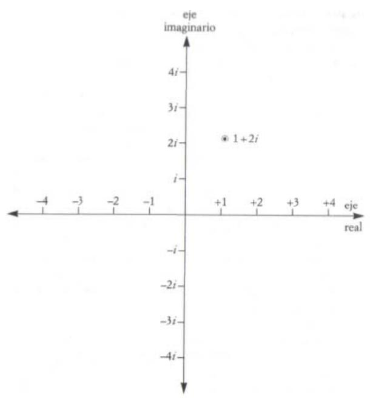

*Figura 12. La incorporación de un eje para los números imaginarios convierte la recta de números en un plano de números. A cualquier combinación de números reales e imaginarios le corresponde una posición en el plano de números.* 

De modo que ahora los números ya no están limitados a una línea unidimensional sino que más bien ocupan un plano bidimensional. Mientras que los números imaginarios y reales puros están restringidos a sus respectivas rectas, las combinaciones de números reales e imaginarios (por ejemplo 1 + 2*i*), los números complejos, residen en llamado plano de números.

Lo particularmente destacable es que los números complejos pueden usarse para solucionar cualquier ecuación imaginable. Por ejemplo, para calcular √(3 + 4*i*) no hay que recurrir a inventar una clase nueva de números, la solución resulta ser 2 + *i* , otro número complejo. En otras palabras, los números imaginarios parecen constituir el último elemento necesario para completar las matemáticas.

Si bien las raíces cuadradas de los números negativos se han denominado números imaginarios, los matemáticos no consideran *i* más abstracto que un número negativo o que los números cardinales. Además, los físicos descubrieron que los números imaginarios proporcionan el mejor lenguaje para describir determinados fenómenos del mundo real. Con ciertas manipulaciones mínimas, los números imaginarios se convierten en la mejor manera de analizar el movimiento oscilante de objetos como el péndulo. Este movimiento, conocido técnicamente como oscilación sinusoidal, se encuentra por doquier en la naturaleza, así que los números imaginarios forman parte integral de muchos cálculos físicos. Hoy en día, los ingenieros eléctricos recurren a *i* para analizar las corrientes alternas, y los físicos teóricos calculan las consecuencias de la oscilación de funciones de onda de la mecánica cuántica empleando potencias de números imaginarios.

Los matemáticos puros también han explotado los números imaginarios para encontrar respuestas a problemas que antes eran inabordables. Los números imaginarios añaden literalmente una nueva dimensión a las matemáticas, y Euler confiaba en recurrir a este grado de libertad extra para enfrentarse al último teorema de Fermat.

En el pasado, otros matemáticos habían intentado aplicar el método de descenso infinito de Fermat a otros valores distintos a *n* = 4, pero todos los intentos para otros valores *n* solo condujeron a lagunas en la lógica. Aun así, Euler mostró que con la incorporación del número imaginario *i* a su prueba conseguía tapar agujeros y forzar el método de descenso infinito a actuar en el caso de *n* = 3.

Fue un logro enorme, pero no pudo repetirlo con otros valores del último teorema de Fermat. Por desgracia, todos los esfuerzos de Euler para que el sistema funcionara en los casos ascendentes hasta el infinito acabaron en fracaso. El hombre que creó más matemáticas que ninguna otra persona en la historia quedó humillado por el desafío de Fermat. Su único consuelo consistió en haber alcanzado el primer éxito en el problema más sesudo del mundo.

Impertérrito ante el fracaso, Euler continuó creando unas matemáticas brillantes hasta el día de su muerte, mérito mucho más destacable por el hecho de que en los últimos años de su carrera estaba totalmente ciego. Su pérdida de visión comenzó en 1735, cuando la Academia de París ofreció un premio por la resolución de un problema astronómico. El problema era tan difícil que la comunidad matemática solicitó a la Academia la concesión de varios meses para darle respuesta, pero para Euler fueron innecesarios. Se obsesionó con la tarea, trabajó sin interrupción durante tres días y, en efecto, ganó el galardón. Pero las malas condiciones de trabajo, combinadas con el intenso estrés, arrebataron a Euler, entonces todavía en sus veintitantos, la visión de un ojo. Esto se manifiesta en muchos de sus retratos.

Por consejo de Jean Le Rond d'Alembert, Euler fue sustituido por Joseph–Louis Lagrange como matemático en la corte de Federico II el Grande. Éste comentó más tarde: *«Estoy en deuda con tu atención y recomendación por haber sustituido a un matemático medio ciego por otro con los dos ojos, que agradará especialmente a los miembros anatómicos de mi Academia.»* Euler regresó a Rusia, donde Catalina la Grande volvió a recibir encantada a su «cíclope matemático».

La pérdida de un ojo fue sólo un mal menor; el mismo Euler manifestó: *«Ahora me distraeré menos.»* Cuarenta años después, a la edad de sesenta, su situación empeoró considerablemente porque una catarata en el ojo sano anunció que estaba condenado a quedarse ciego por completo. Decidió no rendirse, así que empezó a practicar. Escribía cerrando el ojo sano para mejorar la técnica antes de que lo alcanzara la oscuridad. En cuestión de semanas se quedó ciego. Los ensayos realizados sirvieron durante algún tiempo, pero al cabo de unos meses la escritura de Euler se volvió ilegible, por lo que su hijo Albert hizo las veces de su amanuense. Euler continuó desarrollando matemáticas todavía durante diecisiete años y, si cabe, fue aún más productivo que nunca. Su tremendo intelecto le facultó el hacer juegos malabares con conceptos sin necesidad de tener que pasarlos al papel, y su excepcional memoria le permitió utilizar su propio cerebro como biblioteca mental. Sus colegas sugerían que el ataque de ceguera parecía haber expandido los horizontes de su imaginación. Merece especial atención el hecho de que Euler completara sus cálculos sobre las posiciones de la Luna durante esta época. Para los emperadores europeos, éste era uno de los logros matemáticos más apreciados, un problema que había confundido a los mayores matemáticos de Europa, incluido Newton.

En 1776 lo sometieron a una operación para extirpar la catarata y durante unos días pareció que había recuperado la visión. Entonces le sobrevino una infección y Euler se hundió de nuevo en las tinieblas. Continuó trabajando, impasible, hasta que el 18 de septiembre de 1783 tuvo un fatal ataque. En palabras del filósofo–matemático Marquis de Condorcet, *«Euler cesó de vivir y de calcular»*.

# **Un paso insignificante**

Un siglo después de la muerte de Fermat existían demostraciones tan sólo para dos casos del último teorema. Fermat había concedido a los matemáticos un punto de partida proporcionándoles la prueba de que no existen soluciones para la ecuación

$$\mathcal{A} + \mathcal{Y} = \mathcal{Z}^4$$

Euler, por su parte, adaptó la prueba para mostrar que no hay soluciones posibles para

$$x^3 + y^3 = z^3$$

Tras el avance de Euler quedaba aún por demostrar que no existen soluciones de números enteros para una infinidad de ecuaciones:

$$\begin{aligned} \chi^5 + \chi^5 &= \bar{z}^5\\ \chi^6 + \chi^6 &= \bar{z}^6\\ \chi^7 + \chi^7 &= \bar{z}^7\\ \chi^8 + \chi^8 &= \bar{z}^8\\ \chi^9 + \chi^9 &= \bar{z}^9 \dots \end{aligned}$$

Aunque los matemáticos estaban haciendo progresos de una lentitud penosa, la situación no era tan negativa como podría parecer a primera vista. La demostración para el caso *n* = 4 prueba también los casos *n* = 8, 12, 16, 20. El motivo es que todo número que pueda escribirse como 8*a* (o 12*a* , 16*a* , 20*a* ,... ) potencia puede reescribirse a su vez como 4*a* potencia. Por ejemplo, el número 256 es igual a 28 , pero también equivale a 44 . Así que cualquier demostración que sirva para la cuarta potencia se cumplirá también con la octava y con cualquier otra potencia que sea múltiplo de cuatro. Siguiendo el mismo principio, la demostración de Euler para el caso de *n* = 3 comprende automáticamente los casos de *n* = 6, 9, 12, 15… De repente, los números van cayendo y Fermat parece vulnerable. La demostración para el caso de *n* = 3 es muy significativa porque el tres es un ejemplo de número primo. Como se explicó con anterioridad, un número primo posee la propiedad especial de no ser múltiplo de ningún número entero excepto de la unidad y él mismo. Otros números primos son 5, 7, 11, 13… Los números que restan son múltiplos de los primos y son referidos como no primos o como números compuestos.

Los teóricos de los números consideran los primos como los más importantes de todos pues constituyen los átomos de las matemáticas. Los números primos son los bloques de construcción numérica porque el resto de los números puede obtenerse multiplicando combinaciones de números primos. Esto parece conducir a un adelanto considerable. Para probar el último teorema de Fermat con todos los valores de *n* basta demostrarlo con los valores primos de *n*. Todos los demás casos son simples múltiplos de los valores primos y estarán demostrados por extensión.

Intuitivamente, esto simplifica el problema en gran medida ya que podemos ignorar aquellas ecuaciones que contienen un valor de *n* distinto a un número primo. Así que el número de ecuaciones que queda se reduce muchísimo. Por ejemplo, para los valores de *n* hasta el veinte, sólo quedan por demostrar seis valores:

$$\begin{aligned} \chi^5 + \chi^5 &= \mathbb{Z}^5 \\ \chi^7 + \chi^7 &= \mathbb{Z}^7 \\ \chi^{11} + \chi^{11} &= \mathbb{Z}^{11} \\ \chi^{13} + \chi^{13} &= \mathbb{Z}^{13} \\ \chi^{17} + \chi^{17} &= \mathbb{Z}^{17} \\ \chi^{19} + \chi^{19} &= \mathbb{Z}^{19} \end{aligned}$$

Si alguien es capaz de probar el último teorema de Fermat tan sólo para los valores primos de *n*, el teorema estará probado para todos los valores posibles de *n*. Si tenemos en cuenta todos los números enteros, es obvio que existe una cantidad infinita de ellos. Pero si sólo consideramos los números primos, que son una pequeña porción de la vasta cantidad de números enteros... ¿seguro que el problema se vuelve mucho más simple?

La intuición sugeriría que, comenzando por una cantidad infinita y suprimiendo luego la mayor parte de ella, cabría esperar que nos quedáramos con algo finito. Por desgracia no es la intuición la que arbitra las verdades matemáticas, sino la lógica. De hecho es fácil demostrar que la lista de los números primos es también interminable, por tanto, a pesar de poder ignorar la vasta mayoría de las ecuaciones relacionadas con los valores no primos de *n*, las ecuaciones que quedan con sus valores primos siguen siendo infinitas en número.

La demostración de que existe una infinidad de primos se remonta allá por la época de Euclides y es clásica en matemáticas. Euclides empieza por asumir que hay una lista finita de números primos conocidos y luego muestra que tiene que existir un número infinito de adiciones a esa lista. Hay *N* números primos en la lista finita de Euclides que son denominados *P*1, *P*2, *P*3...*PN* Así, Euclides puede crear un nuevo número, *QA*, tal que

$$\mathcal{Q}_{\mathbb{A}} = \{\mathcal{P}_1 \times \mathcal{P}_2 \times \mathcal{P}_3 \times \dots \times \mathcal{P}_N\} + 1$$

Este nuevo número *QA* es o bien primo o bien no primo. Si es primo, hemos llegado a crear un número primo nuevo y mayor, de lo que se deduce que la lista original de números primos no estaba completa. Por otro lado, si *QA* no es primo, entonces tiene que tratarse de un número divisible entre un primo. Ese número primo no puede ser uno de los conocidos porque si dividimos *QA* entre alguno de tales primos nos llevará sin remedio a un resto de 1. Por lo tanto tiene que existir algún otro número primo nuevo, al que podemos denominar *PN*+1. Hemos llegado a un punto en el que o bien *QA* es un nuevo número primo o bien disponemos de otro nuevo primo, *PN*+1. En ambos casos hemos añadido un número a nuestra lista original de primos. Podemos repetir ahora el proceso incluyendo nuestro nuevo primo (*PN*+1 o *QA*) en la lista, con lo que produciremos algún número nuevo, *QB*. Del mismo modo, este número nuevo será ahora otro nuevo primo o tendrá que existir algún otro nuevo primo, *PN*+2 que no esté en nuestra lista de primos conocidos. El resultado es que, por muy larga que sea la lista de números primos, siempre será posible encontrar uno nuevo. Por lo tanto, la lista de los números primos es interminable e infinita.

¿Pero cómo puede haber algo, sin duda, menor que una cantidad infinita y que sea a su vez también infinito? El matemático alemán David Hilbert dijo en cierta ocasión: *«¡El infinito! Ninguna otra cuestión ha movido jamás con tanta hondura el espíritu humano; ninguna otra idea ha estimulado su inteligencia con resultados tan*  *fructíferos; hoy no emerge ningún otro concepto con mayor necesidad de esclarecimiento que el de infinito.»* Para resolver la paradoja de lo infinito se hace necesario definir lo que entendemos por tal. George Cantor, que trabajó junto a Hilbert, definió el infinito como el tamaño de la lista interminable de los números cardinales (1, 2, 3, 4…) . De modo que todo lo que sea comparable a su extensión es igualmente infinito.

Según esta definición, la cantidad de los números cardinales pares, que aparenta ser menor, también es infinita. Es fácil demostrar que la cantidad de números cardinales es comparable a la cantidad de números pares porque podemos asociar cada número cardinal con otro par que le corresponda:

| 1 | 2 | 3 | 4 | 5  | 6  | 7…  |  |  |
|---|---|---|---|----|----|-----|--|--|
|  |  |  |  |   |   |    |  |  |
| 2 | 4 | 6 | 8 | 10 | 12 | 14… |  |  |

Si todos los miembros de la lista de números cardinales pueden asociarse con otro de la lista de números pares, entonces los dos grupos deben ser de una extensión idéntica. Este método de comparación lleva a conclusiones sorprendentes, incluida la de que existe un número infinito de primos. Aunque Cantor fue la primera persona en abordar el infinito de manera seria, al principio recibió muchas críticas de la comunidad matemática por lo radical de su definición. Hacia el final de su carrera, los ataques fueron cada vez más personales y llevaron a Cantor a la enfermedad mental y a fuertes depresiones. Con el tiempo, tras su muerte sus ideas se aceptaron en general como la única definición sólida, rigurosa y convincente de infinito. Hilbert dijo en su honor: *«Nadie nos apartará del paraíso que Cantor ha creado para nosotros.»*

Hilbert continuó trabajando y elaboró un ejemplo de infinito, conocido como el hotel de Hilbert, que ilustra con claridad sus extrañas cualidades. Este hipotético hotel goza del atractivo atributo de poseer un número infinito de habitaciones. Un día llega a él un cliente nuevo y se decepciona al saber que, a pesar de extenderse hasta el infinito, todas las habitaciones del hotel están ocupadas. Hilbert, el recepcionista, medita por unos momentos y tranquiliza al recién llegado

asegurándole que encontrará una habitación libre. Pide a todos los clientes ya instalados que se muden a la habitación que sigue a la que ocupan ahora, de manera que el de la habitación número uno se muda a la dos, el de la dos pasa a la tres, etc. Todos los que ya estaban en el hotel siguen teniendo una habitación, y eso permite que el último en llegar duerma en la habitación número uno, ahora vacante. Esto demuestra que infinito más uno es igual a infinito.

La noche siguiente, Hilbert tiene que enfrentarse a un problema mucho mayor. El hotel continúa al completo cuando llega un ómnibus infinitamente largo con un número infinito de nuevos clientes. Hilbert permanece imperturbable y se frota las manos pensando en la cantidad infinita de facturas de hotel que podrá cobrar. Pide a sus clientes ya instalados que se muden de nuevo, pero esta vez a la habitación cuyo número sea el doble del que tiene la que ahora ocupan. Así que el de la habitación número uno pasa a la dos, el de la dos pasa a la cuatro, y así sucesivamente. Todos los que estaban en el hotel siguen teniendo habitación y ahora un número infinito de habitaciones, todas las impares, han quedado vacantes para los recién llegados. Esto muestra que el doble de infinito continúa siendo infinito.

El hotel de Hilbert parece insinuar que todo infinito es tan extenso como cualquier otro, porque varios infinitos caben a la vez en el mismo hotel infinito; la infinidad de los números pares puede ser igualada y comparada con la infinidad de todos los números cardinales. Sin embargo, unos infinitos son, en realidad, mayores que otros. Por ejemplo, todo intento de emparejar uno a uno cada número racional con otro irracional acaba en fracaso y, de hecho, se puede demostrar que la cantidad infinita de números irracionales es más extensa que la cantidad infinita de números racionales. Los matemáticos han tenido que desarrollar todo un sistema de nomenclatura para enfrentarse a la variedad de grados de infinito. Hacer malabarismos con esos conceptos es uno de los asuntos más en boga.

Aunque la infinidad de números primos quebró las esperanzas de una pronta demostración del último teorema de Fermat, la existencia innumerable de primos, sí que ha supuesto implicaciones positivas en otras áreas tales como el espionaje o la evolución de los insectos. Antes de regresar a la búsqueda de una demostración del

último teorema de Fermat merece la pena indagar de forma somera en el uso y abuso de los números primos.

La teoría de números primos es una de las pocas ramas de las matemáticas puras que ha encontrado una aplicación directa en el mundo real: en la criptografía. La criptografía consiste en cifrar mensajes secretos de modo que sólo puedan ser descifrados por el receptor y no por cualquier persona que logre interceptarlos. El proceso de cifrado requiere el uso de una clave secreta, y suele ocurrir que, para descifrar el mensaje, el destinatario sólo precise aplicar la clave al revés. Con este procedimiento, la clave resulta el eslabón más débil en la cadena de seguridad. Primero, el receptor y el emisor deben ponerse de acuerdo en los detalles de la clave, y el intercambio de esta información constituye una acción arriesgada. Si el enemigo llega a interceptar el código mientras se transmite, puede descifrar todos los mensajes subsiguientes. En segundo lugar, los códigos tienen que cambiarse cada cierto tiempo para mantener la seguridad, y cada vez que esto ocurre existe el peligro de que la nueva clave sea interceptada.

El problema de la clave gira en torno a que, al aplicarla en un sentido, codifica el mensaje y, al hacerlo al revés, lo decodifica. Descifrar un mensaje es casi siempre tan sencillo como cifrarlo. En cambio, la experiencia nos dice que se dan muchas situaciones cada día en las que deshacer es mucho más difícil que hacer; resulta sencillo batir un huevo, pero desbatirlo es mucho más complicado.

En la década de los setenta, Whitfield Diffie y Martin Hellman tuvieron la idea de buscar un proceso matemático fácil de efectuar en una dirección, pero increíblemente complicado de ejecutar en sentido opuesto. Tal proceso proporcionaría una clave perfecta. Por ejemplo, yo podría disponer de mi propia clave de dos partes y publicar su mitad codificadora en una guía pública, de manera que cualquiera podría enviarme mensajes cifrados pero solo yo sabría la mitad descifradora de la clave. Aunque todo el mundo conozca la mitad codificadora de la clave, ésta no guarda ninguna relación con la parte decodificadora.

En 1977, Ronald Rivest, Adi Shamir y Leonard Adleman, un equipo de matemáticos e informáticos del Instituto de Tecnología de Massachusetts, se dieron cuenta de que los números primos constituían la base ideal para un proceso de codificación fácil y decodificación difícil. Para crear mi propia clave personal tomaría dos

números primos enormes, de modo que cada uno comprenda más de ochenta dígitos, y luego los multiplicaría entre sí para conseguir un número no primo aún mayor. Todo lo que se requiere para cifrar mensajes es conocer el elevado número no primo, mientras que para descifrarlo necesitaríamos saber los dos números primos que en un principio fueron multiplicados entre sí, denominados factores primos. Entonces puedo hacer público el enorme número no primo, la mitad codificadora de la clave, y guardarme para mí los dos factores primos, la otra mitad decodificadora. Aun cuando todos conozcan el número no primo, tendrán enormes dificultades para extraer los dos factores primos.

Para poner un ejemplo simple, podría comunicar el número no primo 589 que permitiría a todo el mundo cifrarme mensajes. Mantendría en secreto los dos factores primos de 589, de manera que sólo yo podría descifrarlos. Si otros pudieran extraer los dos factores primos, entonces también ellos podrían descifrar mis mensajes, pero incluso con ese número tan bajo no resulta obvio cuál es el valor de los factores primos. En este caso sólo llevará unos pocos minutos calcular en un ordenador portátil que los factores primos son, en efecto, 31 y 19 (31 x 19 = 589), así que mi código no sería seguro por mucho tiempo.

Sin embargo, el número no primo que yo confiaría estaría formado en realidad por más de cien dígitos, y eso convierte la tarea de encontrar sus factores primos en un imposible. Incluso si se utilizaran los ordenadores más potentes del mundo para descomponer ese elevado número no primo (la clave codificadora) en sus dos factores primos (la clave decodificadora), llevaría varios años dar con la respuesta. Por lo tanto, para frustrar a los espías extranjeros, basta con cambiar la clave de año en año. Una vez al año anuncio mi nuevo número no primo gigante y cualquiera que intente descifrar mis mensajes tendrá que volver a calcular desde el principio los dos factores primos.

Además de encontrar una aplicación en el campo del espionaje, los números primos también aparecen en la naturaleza. Las cigarras periódicas, más conocidas como *Magicicada septendecim*, poseen el ciclo de vida más largo de todos los insectos existentes. Su exclusivo ciclo de vida comienza bajo tierra, donde las ninfas extraen con paciencia el jugo de las raíces de los árboles. Luego, tras esperar diecisiete años, las cigarras adultas emergen del suelo, pululan en vastos enjambres y, por un tiempo, inundan el paisaje. En el transcurso de unas pocas semanas se aparean, ponen huevos y mueren.

La cuestión que confunde a los biólogos es por qué el ciclo de vida de la cigarra es tan largo y si tiene algún significado que dicho ciclo dure un número primo de años. Otra especie de cigarras, la *Magicicada tredecim*, emerge cada trece años, lo cual sugiere que los ciclos de vida que se mantienen durante un número primo de años ofrecen alguna ventaja evolutiva.

Cierta teoría sostiene que la cigarra posee un parásito que también perdura durante un ciclo vital amplio y del que la cigarra está intentando zafarse. Si el parásito tiene un ciclo vital de, por ejemplo, 2 años, entonces la cigarra intenta evitar un ciclo de vida divisible entre 2, porque de otro modo el parásito y la cigarra coincidirían con regularidad. De forma parecida, si el parásito tiene un ciclo vital de 3 años, entonces la cigarra intenta evitar un ciclo de vida múltiplo de 3 porque, si no es así, el parásito y la cigarra volverán a coincidir con regularidad. En conclusión, para evitar el encuentro con sus parásitos, la mejor estrategia de las cigarras consiste en tener un ciclo vital largo de un número primo de años. Como nada es divisor de 17, la *Magicicada septendecim* rara vez se encuentra con su parásito. Si el parásito posee un ciclo vital de 2 años de duración, sólo coinciden cada 34 años, y si este ciclo vital es más largo, por ejemplo, 16 años, entonces sólo coincidirán cada 272 (16 x 17) años.

Para defenderse, el parásito sólo cuenta con dos ciclos vitales que aumentarán la frecuencia de los encuentros: el ciclo anual y el mismo ciclo de 17 años, idéntico al de la cigarra. Sin embargo, es poco probable que el parásito sobreviva apareciendo 17 años seguidos porque no habrá cigarras que parasitar durante los primeros 16. Por otra parte, para alcanzar el ciclo de vida de 17 años las generaciones de parásitos tendrían primero que evolucionar pasando por un ciclo vital de 16 años. ¡Esto significaría que en alguna fase de evolución el parásito y la cigarra no coincidirían hasta pasados 272 años! En ambos casos, el ciclo vital de las cigarras, que se prolonga durante un número primo grande de años, le sirve de protección. ¡Esto explicaría por qué el parásito mencionado no se ha encontrado jamás! En su carrera por seguir en contacto con la cigarra es muy probable que el parásito se mantuviera alargando su ciclo vital hasta alcanzar la barrera de los 16 años. Así que faltó a la cita durante 272 años, un tiempo en el que la no coincidencia con la cigarra lo ha llevado a extinguirse. El resultado es una cigarra que dispone de un ciclo vital de 17 años, el cual ya no necesita porque su parásito ha dejado de existir.

# **Monsieur Le Blanc**

A comienzos del siglo XIX, el último teorema de Fermat se había convertido ya por sí solo en el problema más sonado de la teoría de números. Desde el logro de Euler no se había producido ningún otro progreso, pero la sensacional proclama de una mujer francesa reforzó la búsqueda de la demostración perdida de Fermat. Sophie Germain vivió en una época de discriminación y prejuicios, y para poder llevar a cabo su investigación se vio obligada a asumir una identidad falsa, estudiar en unas condiciones terribles y trabajar en un aislamiento intelectual.

A lo largo de los siglos se ha disuadido a las mujeres de que estudien matemáticas, pero a pesar de la discriminación ha habido varias mujeres matemáticas que lucharon contra lo establecido y acuñaron indeleblemente sus nombres en los anales de las matemáticas. La primera mujer con peso en la materia que conocemos fue Teano, en el siglo VI a. J.C. Empezó como alumna de Pitágoras antes de convertirse en destacada discípula y casarse con él al cabo del tiempo. A Pitágoras se lo conoce como el «filósofo feminista» porque alentó con entusiasmo la erudición femenina. Teano era, de hecho, una de las veintiocho hermanas de la secta pitagórica.

En siglos posteriores, hombres como Sócrates y Platón continuaron invitando a las mujeres a formar parte de sus escuelas, pero no hubo una escuela matemática de prestigio fundada por una mujer hasta el siglo IV de nuestra era. Hipatia, hija de un profesor de matemáticas de la Universidad de Alejandría, fue popular por dar los discursos más famosos del mundo conocido y por ser la mejor entre quienes se dedicaban a la resolución de problemas. Matemáticos que habían permanecido durante meses agobiados con un problema concreto le escribían pidiendo una solución, e Hipatia rara vez desencantaba a sus admiradores. Estaba obsesionada con las matemáticas y con el método de la demostración lógica y cuando se le preguntaba por qué no se había casado respondía que lo estaba con la verdad. Al final, su devoción por la causa del racionalismo provocó su caída cuando Cirilo, el patriarca de Alejandría, comenzó a oprimir a los filósofos, científicos y matemáticos, a los que tenía por herejes. El historiador Edward Gibbon da un vivo testimonio de lo que ocurrió después de que Cirilo conspirara contra Hipatia y de que volviera a las gentes contra ella:

*«En un fatídico día del tiempo sagrado de cuaresma derribaron a Hipatia del carro, la desnudaron por completo, la arrastraron hasta la iglesia y allí murió de forma inhumana a manos de Pedro el Lector y una banda de fanáticos salvajes y despiadados; la carne fue raspada de sus huesos con conchas afiladas de ostras y sus palpitantes miembros fueron entregados a las llamas.»* 

Poco después de la muerte de Hipatia, las matemáticas iniciaron un período de estancamiento, y hasta el Renacimiento ninguna mujer volvió a hacerse un nombre como matemática. María Gaetana Agnesi había nacido en Milán en 1718 e, igual que Hipatia, era hija de un matemático. Se la equiparó a los mejores matemáticos de Europa y era especialmente famosa por sus tratados sobre las tangentes a curvas. Curva, en italiano, se traduce por *versiera*, palabra derivada del latín *verto*, «girar», pero también era un apócope de avversiera o «diablesa». Una curva estudiada por Agnesi (versiera Agnesi) fue mal traducida al inglés como la «bruja Agnesi», y con el tiempo la propia matemática fue identificada con ese mismo apelativo.

Aunque los matemáticos de toda Europa reconocían las capacidades de Agnesi, muchas instituciones académicas, en particular la Academia Francesa, se opusieron a concederle un cargo dedicado a la investigación. La discriminación institucionalizada contra las mujeres persistió inamovible hasta el siglo XX, cuando a Emmy Noether se le denegó un puesto como profesora en la Universidad de Gotinga. Einstein la había descrito como *«el genio matemático creativo más destacado desde que comenzara la enseñanza superior de las mujeres»*. La mayoría de los facultativos argumentaron: *«¿Cómo vamos a permitir que una mujer sea catedrática no titular? Si llega a catedrática no titular podrá convertirse en catedrática, y por tanto en miembro del claustro universitario... ¿Qué pensarán nuestros soldados cuando regresen a la universidad y se encuentren con que esperamos que sean discípulos de una mujer?»* Su amigo y mentor David Hilbert respondió: «Meine Herrén, no veo que el sexo de la candidata sea un argumento en contra de su elección como catedrática no titular. Después de todo, el claustro universitario no es ningún salón de baño.»

Más tarde se preguntó a Edmund Landau, colega de Noether, si ésta era en verdad una gran mujer matemática, a lo que él respondió: *«Puedo dar fe de su genio matemático, pero que sea una mujer no lo puedo jurar.»*

Además de padecer discriminación, Noether tuvo mucho más en común con otras mujeres matemáticas de la historia; por ejemplo, también era hija de un profesor de matemáticas. Muchos matemáticos, de ambos sexos, proceden de familias matemáticas, lo cual origina alegres rumores sobre la existencia de un gen matemático, pero en el caso de las mujeres el porcentaje es bastante mayor. La posible explicación es que a la mayoría de mujeres con talento nunca se les expuso la materia o bien jamás se las animó a dedicarse a ella, mientras que aquellas que nacieron junto a profesores difícilmente pudieron evitar sumergirse en los números. Además, Noether, al igual que Hipatia, Agnesi y la mayoría de matemáticas, nunca se casó, en gran medida porque no era aceptable para la sociedad que las mujeres se dedicaran a carreras semejantes y porque había pocos hombres preparados para contraer nupcias en condiciones tan controvertidas. La espléndida matemática rusa Sonya Kovalevsky es una excepción a esta regla porque acordó un matrimonio de conveniencia con Vladimir Kovalevsky, un hombre dispuesto a mantener con ella una relación platónica. El matrimonio permitió a ambos jóvenes librarse de sus respectivas familias y concentrarse en los estudios. Sonya, por su parte, pudo viajar en solitario por toda Europa con mucha más facilidad desde que pasó a ser una respetable mujer casada.

De todos los países europeos, Francia adoptó la actitud más discriminatoria hacia la mujer culta declarando que las matemáticas son inadecuadas para las mujeres y van más allá de su capacidad mental. Los salones de París dominaron el mundo matemático durante los siglos XVIII y XIX y sólo una mujer se las ingenió para escapar a las reservas de la sociedad francesa y se erigió como una eminente teórica de números. Sophie Germain revolucionó el estudio del último teorema de Fermat y aportó una contribución aún mayor que la de cualquiera de los hombres que la precedieron.

Sophie Germain nació el 1 de abril de 1776 y era hija de un comerciante, Ambroise– François Germain. Fuera del trabajo, su vida estuvo dominada por el trastorno de la Revolución francesa. El mismo año en que descubrió su pasión por los números se produjo el asalto a la Bastilla y su estudio del cálculo se oscureció con la época del Terror. Si bien su padre era un próspero negociante, la familia de Sophie no pertenecía a la aristocracia.

A las señoras del grupo social de Germain no se las animaba especialmente a estudiar matemáticas, pero sí las instaban a tener suficientes conocimientos sobre la materia como para ser capaces de discutir sobre cualquier tema que pudiera surgir durante una conversación de sociedad. Con este fin se escribieron una serie de libros de texto que ayudaran a las mujeres a enfrentarse a los últimos avances matemáticos y científicos. Francesco Algarotti fue el autor de *Newtonismo* para las damas. Como Algarotti creía que las mujeres sólo estaban interesadas en amoríos, intentó explicar los descubrimientos de Newton a través del diálogo de flirteo entre una marquesa y su interlocutor. Así, éste perfila la ley del cuadrado inverso de la atracción gravitacional, tras lo cual la marquesa da su propia interpretación de esta ley física fundamental: *«No puedo menos que pensar... que esta proporción en los cuadrados de las distancias espaciales... se aprecia incluso en el amor. De este modo, después de ocho días de ausencia, el amor se vuelve sesenta y cuatro veces menor de lo que fue el primer día.»*

No es sorprendente que no fuera este género galante de libros el que despertó en Sophie Germain el interés por las matemáticas. El acontecimiento que cambió su vida se produjo un día que andaba curioseando en la biblioteca de su padre y tropezó con el libro Historia de las matemáticas de Jean–Étienne Montucla. El capítulo que cautivó su imaginación fue un ensayo sobre la vida de Arquímedes. La consideración de los descubrimientos de Arquímedes fue sin duda interesante, pero lo que prendió la fascinación de Germain fue la historia que rodeó la muerte del científico. Arquímedes había pasado la vida en Siracusa estudiando matemáticas con relativa placidez, pero cuando alcanzó los setenta y tantos largos aquella paz fue despedazada por la invasión de las tropas romanas. Hizo leyenda el hecho de que durante la invasión Arquímedes estaba tan concentrado en el estudio de una figura geométrica sobre la arena que no respondió a la pregunta de un soldado romano. Como resultado fue alanceado hasta la muerte.

Germain concluyó que si un problema geométrico puede absorber tanto a alguien como para llevarlo a la muerte, las matemáticas tienen que ser entonces la materia

más cautivadora del mundo. Se puso de inmediato a aprender por sí misma las bases de la teoría de números y del cálculo y muy pronto comenzó a quedarse hasta altas horas de la noche estudiando las obras de Euler y de Newton. Este repentino interés por una disciplina tan poco femenina preocupó a sus padres. Un amigo de la familia, el conde Guglielmo Libri–Carrucci dalla Sommaja, cuenta cómo el padre de Sophie le requisó las velas y vestidos y eliminó la calefacción para disuadirla del estudio. Unos pocos años más tarde, en Bretaña, el padre de la joven matemática Mary Somerville también le confiscó las velas mientras afirmaba: *«Tenemos que acabar con esto o llegará el día en que veamos a Mary con camisa de fuerza.»*

En el caso de Germain, ésta respondió manteniendo un escondite secreto de velas y envolviéndose en ropas de cama. Libri–Carrucci dice que las noches de invierno eran tan frías que la tinta se congelaba en el tintero, pero Sophie continuó a pesar de todo. Algunos la describieron como reservada y difícil, pero era asimismo muy resuelta y a la larga sus padres cedieron y dieron su bendición a Sophie. Germain nunca se casó y a lo largo de su tarea profesional el padre costeó sus investigaciones. Durante muchos años siguió estudiando en solitario porque no había matemáticos en la familia que pudieran exponerle las ideas más recientes y sus instructores se negaban a tomarla en serio.

Entonces, en 1794, la École Polytechnique abrió sus puertas en París. Se fundó como academia de excelencia para formar a matemáticos y científicos nacionales. Este habría sido un lugar ideal para que Germain desarrollara sus habilidades matemáticas si no fuera porque se trataba de una institución limitada tan sólo a los hombres. Su reserva natural la previno de enfrentarse a la junta directiva de la academia, así que, en lugar de eso, recurrió a estudiar en secreto asumiendo la identidad de un antiguo alumno de la academia, monsieur Antoine–August Le Blanc. La secretaría de la academia ignoraba que el verdadero monsieur Le Blanc había abandonado París y continuó enviándole apuntes y problemas. Germain se las ingenió para obtener todo lo que iba destinado a Le Blanc y cada semana proponía respuestas a los problemas usando su nuevo seudónimo. Todo iba tal como había planeado, hasta que un par de meses más tarde el encargado del curso, Joseph– Louis Lagrange, no pudo ignorar por más tiempo la brillantez de las respuestas de monsieur Le Blanc. Las soluciones de monsieur Le Blanc no sólo eran de un ingenio maravilloso sino que además evidenciaban una notoria transformación en un estudiante que otrora había destacado por su pésima destreza matemática. Lagrange, que era uno de los matemáticos más distinguidos del siglo XIX, solicitó un encuentro con el renovado estudiante y Germain se vio obligada a revelar su auténtica identidad. Lagrange se quedó atónito y encantado al conocer a la joven y se convirtió en su mentor y amigo. Sophie tuvo al fin un profesor que la colmó y con el que pudo dar rienda suelta a sus capacidades y ambiciones.

Germain progresaba en secreto y pasó de resolver problemas como deberes del curso a estudiar áreas inexploradas de las matemáticas. Se interesó muy en especial por la teoría de números e inevitablemente llegó a oír hablar del último teorema de Fermat. Trabajó en este problema durante muchos años y alcanzó una fase en la que creyó haber logrado un avance importante. Sintió la necesidad de discutir sus ideas con otros colegas teóricos de números y decidió dirigirse directamente a la cima y consultar al mejor del mundo, el matemático alemán Carl Friedrich Gauss.

Gauss es reconocido como uno de los matemáticos más brillantes que han existido. Mientras que E. T. Bell hacía referencia a Fermat como el *«príncipe de los aficionados»*, a Gauss lo denominó el *«príncipe de los matemáticos»*. Germain había entrado en contacto con su obra mediante el estudio de su creación maestra Disquisitiones arithmeticae, el tratado más importante y de mayor alcance desde los Elementos de Euclides. La obra de Gauss tuvo repercusión en todas las ramas matemáticas, pero resulta bastante extraño que Gauss nunca publicara nada acerca del último teorema de Fermat. En una carta incluso llegó a manifestar desprecio hacia el problema. Su amigo y astrónomo alemán Heinrich Olbers le escribió animándolo a competir por un premio que había convocado la Academia de París a la solución del desafío de Fermat: *«Se me antoja, estimado Gauss, que empezarás a trabajar en esto de inmediato.»* Dos semanas después, Gauss respondió: *«Te estoy muy agradecido por la información concerniente al galardón de París, pero confieso que el último teorema de Fermat tiene muy poco interés para mí como problema aislado, porque yo mismo podría plantear con facilidad multitud de cuestiones semejantes que nadie sería capaz de demostrar ni de refutar jamás.»*

Gauss tenía derecho a pensar así, pero Fermat había afirmado con claridad que existía una demostración y hasta los intentos fallidos para dar con ella habían generado nuevas técnicas innovadoras, tales como la prueba por «descenso infinito» y la utilización de los números imaginarios. Es posible que, con anterioridad, Gauss hubiera intentado sin éxito atacar el problema, y quizá su respuesta a Olbers fuera tan sólo un caso de envidia intelectual. No obstante, cuando recibió las cartas de Germain quedó impresionado con los logros de esta mujer, lo suficiente como para olvidarse por una temporada de la ambivalencia que atribuía al último teorema de Fermat.

Setenta y cinco años antes, Euler había publicado su demostración para el caso de *n*  = 3, y desde entonces los matemáticos habían intentado demostrar en vano otros casos individuales. En cambio, Germain adoptó una estrategia nueva y planteó a Gauss un método general de aproximación al problema. En otras palabras, su objetivo inmediato no consistía en probar un caso concreto, sino en afirmar algo sobre muchos casos a la vez. En su misiva a Gauss perfilaba un cálculo que se centraba en un tipo concreto de número primo *p*, tal que (2*p* + 1) también es primo. La lista de números primos de Germain incluía el 5, porque 11 (2 x 5 + 1) da lugar a otro primo; pero no acogía el 13, porque 27 (2 x 13 + 1) no es primo.

Para los valores de *n* equivalentes a estos primos de Germain utilizó un argumento notable con el fin de mostrar que era muy probable que no hubiera soluciones a la ecuación *xn* + *yn* = *zn* . Con «probable» Germain quería decir que la existencia de soluciones era inverosímil porque, si las hubiera, *x*, *y* o *z* tendrían que ser múltiplos de *n*, y eso impondría fuertes restricciones a las soluciones posibles. Sus colegas examinaron la lista de primos uno a uno intentando demostrar que *x*, *y* o *z* no podrían ser múltiplos de *n* para mostrar con ello que para un valor concreto de *n* no existían soluciones.

En 1825, el método de Germain alcanzó su primer éxito pleno gracias a Gustav Lejeune–Dirichlet y a Adrien–Marie Legendre, dos matemáticos de generaciones distintas. Legendre era un hombre de setenta años que había vivido durante la confusión política de la Revolución francesa. El error que cometió al no apoyar al candidato estatal para el Instituto Nacional supuso el cese de su pensión y, en la época en que hizo su aportación al último teorema de Fermat, se hallaba en la miseria. Por otra parte, Dirichlet era un teórico de números joven y ambicioso que había cumplido tan sólo los veinte. Ambos fueron capaces de demostrar por separado que el caso de *n* = 5 no tiene solución, pero basaron sus pruebas en Sophie Germain y a ella debieron su éxito.

Catorce años más tarde, los franceses consiguieron otro progreso. Gabriel Lamé aportó una serie de adiciones ingeniosas al método de Germain y demostró el caso del primo *n* = 7. Germain había enseñado a los matemáticos cómo eliminar toda una sección de casos primos y ahora el seguir demostrando uno a uno cada caso del último teorema de Fermat dependía de los esfuerzos combinados de sus colegas.

La labor de Germain sobre el último teorema de Fermat constituyó su mayor aportación a las matemáticas, pero al principio nadie creyó en su descubrimiento. Germain tenía veintitantos años cuando escribió a Gauss y, aunque se había hecho con una reputación en París, temió que el gran matemático no la tomara en serio por ser mujer. Para preservar su identidad, Germain recurrió de nuevo al seudónimo y firmó las cartas con el nombre de monsieur Le Blanc.

Su temor y respeto hacia Gauss queda patente en una de las misivas que le dirigió: *«Por desgracia, la profundidad de mi intelecto no se corresponde con la voracidad de mi apetito, y me parece ciertamente una osadía importunar a un hombre de genio cuando yo no merezco su atención más que por la admiración que le profeso y que sin duda comparto con todos sus lectores.»* Gauss, ignorante de la verdadera identidad del remitente, intentó que Germain se sintiera cómoda y respondió: *«Estoy encantado de que la aritmética haya encontrado en usted a un amigo tan capaz.»* La contribución de Germain se habría atribuido por siempre al misterioso monsieur Le Blanc de no haber sido por Napoleón. En 1806, Napoleón se encontraba invadiendo Prusia y el ejército francés estaba tomando una tras otra las ciudades alemanas. Ante el temor de que el destino que sobrevino a Arquímedes pudiera arrebatar también la vida de Gauss, su otro gran héroe, Germain envió un mensaje al general Joseph–Marie Pernety, amigo suyo que estaba al mando de las fuerzas avanzadas, y le rogó que garantizara la seguridad de Gauss. El general prestó un cuidado especial al matemático alemán y le comunicó que debía su vida a mademoiselle Germain. Gauss quedó agradecido, pero sorprendido a la vez de que nunca hubiera oído hablar de Sophie Germain.

El juego había concluido. En su próxima carta a Gauss, Germain reveló a regañadientes su identidad real. Lejos de enfadarse por el engaño, Gauss le respondió complacido: «*Cómo describirle mi sorpresa y estupor al comprobar que monsieur Le Blanc, mi estimado correspondiente, se metamorfoseaba en este distinguido personaje que sirve de tan brillante ejemplo a lo que yo mismo encontraría difícil de creer. El gusto por las ciencias abstractas en general, y sobre todo por los misterios de los números, es tremendamente inusual, lo cual no me sorprende porque los seductores encantos de esta sublime ciencia se manifiestan tan sólo a aquellos que poseen el valor para ahondarla en profundidad. Sin embargo, cuando una persona, según nuestras costumbres y prejuicios, se ve obligada a tropezar con muchísimas más dificultades que un hombre, por pertenecer al sexo contrario, a la hora de familiarizarse con estos estudios espinosos y, a pesar de todo, consigue vencer los obstáculos y penetrar hasta sus rincones más oscuros, entonces esa mujer goza sin duda del ánimo más noble, de todo un talento extraordinario y de un genio superior. En efecto, nada me demostraría de un modo tan lisonjero y tan poco equívoco que los atractivos de esta ciencia que ha enriquecido mi vida con tantas alegrías no son una quimera, igual que no lo es la predilección con la que usted la ha honrado».* 

La correspondencia que Sophie Germain mantuvo con Carl Gauss inspiró gran parte de su producción, pero en 1808 la relación de ambos terminó con brusquedad. Gauss había sido elegido como profesor de Astronomía en la Universidad de Gotinga, por lo que su interés por la teoría de números evolucionó hacia unas matemáticas más aplicadas, y no se molestó más en responder a las cartas de Germain. Sin mentor, la confianza de la francesa comenzó a menguar y en el plazo de un año abandonó las matemáticas puras.

No continuó su aportación a demostrar el último teorema de Fermat, pero se embarcó en una emocionante carrera como física, una disciplina en la que de nuevo volvería a destacar por el simple hecho de oponerse a los prejuicios establecidos. Su contribución más importante a la materia fue *Memoria sobre las vibraciones de las láminas elásticas*, un texto de gran brillantez que sentaba los cimientos de la teoría moderna de la elasticidad. Como resultado de esta investigación y de su labor en el último teorema de Fermat recibió una medalla del Instituto de Francia y se convirtió en la primera mujer que, sin ser esposa de alguno de sus miembros, asistió a las conferencias de la Academia de las Ciencias. Hacia el final de su vida restableció su relación con Carl Gauss, y éste convenció a la Universidad de Gotinga para que otorgara a Germain un título honorífico. Por desgracia, Sophie Germain falleció de cáncer de mama antes de que la universidad pudiera concederle el honor.

Mirándolo bien, era con toda probabilidad la intelectual femenina más profunda que Francia jamás haya engendrado. Y ahora, por extraño que pueda parecer, cuando el funcionario cumplimentó el certificado de defunción de esta eminente socia y colaboradora de los miembros más ilustres de la Academia Francesa de las Ciencias, aquél la definió como una *rentière–annuitant* (una simple mujer sin oficio) y no como una *mathématicienne*. Pero la cosa no acaba ahí. Cuando se erigió la torre Eiffel, en la que los ingenieros se vieron obligados a poner una atención especial en la elasticidad de los materiales utilizados, en esta grandiosa estructura se inscribieron los nombres de setenta y dos sabios. Pero nadie encontrará entre ellos el nombre de esta hija de la sabiduría cuyas investigaciones contribuyeron en tan gran medida al establecimiento de la teoría de la elasticidad de los metales: Sophie Germain. ¿Acaso fue excluida de aquella lista por la misma razón por la que Agnesi no pudo ser elegida como miembro de la Academia Francesa, porque era mujer? Eso parece. Si de verdad fue tal el caso, mayor es la vergüenza para los responsables de semejante ingratitud hacia quien había merecido tan buen trato por parte de la ciencia y hacia la que a través de sus estudios se había ganado un lugar inevitable en el templo de la gloria. (H.J. Mozans, 1913)

# **Los sobres lacrados**

Tras el impulso de Sophie Germain, la Academia Francesa de las ciencias ofreció una serie de premios, entre ellos una medalla de oro y tres mil francos, para el matemático que acabara por fin con el misterio del último teorema de Fermat. Además del prestigio de demostrar el último teorema de Fermat, ahora se unía al desafío una gratificación inmensamente valiosa. Los salones de París rebosaban de habladurías sobre quién estaba adoptando una estrategia u otra y lo cerca que andaba de anunciar una solución. Entonces, el 1 de marzo de 1847, la Academia celebró su sesión más espectacular.

Las actas describen cómo Gabriel Lamé, que había demostrado el caso de *n* = 7 algunos años antes, subió al estrado y, ante los matemáticos más eminentes de la época, proclamó que estaba a punto de probar el último teorema de Fermat. Admitió que la demostración estaba aún incompleta, pero perfiló su método y vaticinó con entusiasmo que en las próximas semanas publicaría una prueba completa en la revista de la Academia.

Dejó pasmada a toda la audiencia, y tan pronto como Lamé abandonó la tarima, Augustin Louis Cauchy, otro de los matemáticos más destacados de París, pidió permiso para hablar. Cauchy comunicó a la Academia que había estado trabajando en una línea parecida a la de Lamé y que también él estaba al borde de publicar una demostración absoluta.

Tanto Cauchy como Lamé se percataron de que la clave estaba en el tiempo. El primero en presentar una demostración recibiría el premio de mayor valor y prestigio de las matemáticas. Si bien ninguno de los dos poseía una demostración completa, ambos rivales ansiaban hacer valer de algún modo sus derechos, así que, justo tres semanas después de que hubieran hecho sus anuncios respectivos, depositaron sendos sobres lacrados en la Academia. Se trataba de una práctica habitual de aquella época que permitía a los matemáticos registrar su investigación sin revelar los detalles exactos. Si mas tarde surgía una disputa relativa a la originalidad de las ideas, un sobre sellado demostraría la evidencia necesaria para establecer prioridades.

La expectación aumentó en abril, cuando Cauchy y Lamé publicaron en las actas de la Academia tentadores detalles, aunque vagos, de sus pruebas. Si bien la comunidad matemática al completo estaba desesperada por ver terminada la demostración, muchos de sus miembros deseaban en secreto que fuera Lamé y no Cauchy quien ganara la carrera. A decir de todos, Cauchy era una criatura hipócrita, un fanático religioso y nada querido entre sus compañeros. Si la Academia lo aguantaba era sólo por su brillantez.

El 24 de mayo se difundió un comunicado que acabó con la especulación. No fue Cauchy ni tampoco Lamé quien se dirigió a la Academia, sino Joseph Liouville. Liouville impactó a la audiencia cuando leyó en voz alta el contenido de una carta que tenía por remitente al matemático alemán Ernst Kummer.

Kummer era un teórico de números del más alto nivel, pero el furioso patriotismo que su odio hacia Napoleón despertó en él lo apartó de su auténtica vocación durante gran parte de su carrera. Cuando era niño, el ejército francés invadió su ciudad natal, Sorau, y trajo consigo una epidemia de tifus. A su padre, que era el médico del municipio, la enfermedad se lo llevó en cuestión de semanas. Traumatizado por la experiencia, Kummer se juró hacer todo lo posible para defender su país de ataques ulteriores y, tan pronto como acabó la universidad, dedicó su inteligencia al problema del trazado de trayectorias de las balas de cañón. Con el tiempo enseñó las leyes balísticas en la Escuela de Guerra de Berlín.

Paralelamente a la dedicación bélica, Kummer se entregó de forma activa a la investigación en matemáticas puras y había permanecido muy atento a la epopeya que se había puesto en marcha en la Academia Francesa. Había repasado las actas de principio a fin y analizado los pocos detalles que Cauchy y Lamé se habían atrevido a revelar. Para Kummer era obvio que los dos franceses se encaminaban hacia un mismo callejón sin salida lógico y explicó sus razones en la carta que envió a Liouville.

Según Kummer, el problema fundamental residía en que las demostraciones de ambos, Cauchy y Lamé, se basaban en la utilización de una propiedad de los números conocida como factorización unívoca. La factorización unívoca establece que sólo existe una combinación posible de números primos tal que al multiplicarlos entre sí dan como resultado un número determinado. Por ejemplo, la única combinación de números primos que multiplicados dan el número 18 es la que sigue:

$$\mathbf{18} = \mathbf{2} \times \mathbf{3} \times \mathbf{3}$$

De un modo semejante, los números siguientes se factorizan tan sólo de estas maneras:

$$\mathbf{35} = \mathbf{5} \times \mathbf{7}$$

$$\mathbf{180} = \mathbf{2} \times \mathbf{2} \times \mathbf{3} \times \mathbf{3} \times \mathbf{5}$$

$$106.260 = \mathbf{2} \times \mathbf{2} \times \mathbf{3} \times \mathbf{5} \times \mathbf{7} \times \mathbf{11} \times \mathbf{23}$$

La factorización unívoca fue descubierta allá por el siglo IV a. J.C. por Euclides, quien probó que es cierta para todos los números cardinales, y describió la demostración en el libro IX de sus *Elementos*. El hecho de que la factorización unívoca se cumpla con todos los números cardinales es un elemento esencial para otras muchas demostraciones y hoy en día se lo denomina el teorema fundamental de la aritmética.

A primera vista no habría ninguna razón por la que Cauchy y Lamé no debieran basarse en la factorización unívoca, como cientos de matemáticos habían hecho antes que ellos. Pero por desgracia ambas demostraciones incluían números imaginarios. Si bien la factorización unívoca es cierta para los números reales, Kummer señaló que no tenía por qué cumplirse cuando se introducen números imaginarios. A su entender, esto constituía una fisura fatal.

Si por ejemplo nos limitamos a los números reales, entonces el 12 solo puede factorizarse como 2 x 2 x 3. Sin embargo, si admitimos los números imaginarios en la demostración, entonces el número 12 podría ser factorizado además en la manera que sigue:

$$12 = (1 + \sqrt{-11})(1 - \sqrt{-11})$$

Aquí ൫1 √െ11൯ es un número complejo, la combinación de un número real y de otro imaginario. Aunque el proceso de multiplicación es más enrevesado que con los números ordinarios, la existencia de los números complejos proporciona otros caminos para factorizar el número 12. Otra manera de factorizar ese número es ൫2 √െ8൯ ൫2 െ √െ8൯. Así que ya no hay una única factorización, sino un surtido de ellas.

Esta pérdida de la factorización unívoca perjudicó en gran medida las pruebas de Cauchy y de Lamé, pero no por ello las destruyó del todo. Se suponía que las demostraciones concluían que no existían soluciones para la ecuación *xn* + *yn* = *zn* , donde *n* representa cualquier número mayor que dos. Como ya hemos comentado con anterioridad en este capítulo, bastaba con que las pruebas se cumplieran tan sólo con los valores primos de *n*. Kummer mostró que empleando otras técnicas era posible restablecer la factorización unívoca para algunos valores de *n*. Por ejemplo, el problema que ofrecía la factorización unívoca podía esquivarse para todos los números primos menores o iguales que *n* = 31. En cambio, al número primo *n* = 37 no se le podía hacer frente con tanta facilidad. Del resto de primos inferiores a 100, otros dos, *n* = 59 y *n* = 67, eran también números difíciles. Estos primos, denominados irregulares, que están salpicados entre el resto de los números primos, constituían ahora el muro que bloqueaba la demostración absoluta.

Kummer señaló que nada en las matemáticas conocidas podría atajar todos aquellos primos irregulares de un solo golpe. Sin embargo, sí creía que, mediante cuidadosas técnicas hechas a medida para cada primo irregular concreto, podrían ser doblegados uno tras otro. Elaborar esas técnicas expresas constituiría un ejercicio lento y penoso, aún más si tenemos en cuenta que el número de primos irregulares sigue siendo infinito. Eliminarlos de forma individual ocuparía a toda la comunidad mundial de matemáticos por toda la eternidad.

La misiva de Kummer tuvo efectos devastadores en Lamé. Considerándolo a posteriori, la adopción de la factorización unívoca puede verse, en el mejor de los casos, demasiado optimista y, en el peor de ellos, temeraria. Lamé se dio cuenta de que si hubiera sido más franco con su trabajo podría haber reparado antes en el error, y en una carta que envió a su colega Dirichlet en Berlín escribió: *«Sólo con que usted hubiera estado en París o yo hubiera estado en Berlín nada de esto habría ocurrido.»*

Mientras que Lamé se sintió humillado, Cauchy se negó a aceptar la derrota. Vio que, comparado con la demostración de Lamé, su planteamiento se apoyaba menos en la factorización unívoca y que en tanto no se revisara la totalidad del análisis de Kummer cabía la posibilidad de que fuera erróneo. Continuó publicando artículos sobre el asunto durante varias semanas, pero al final del verano también él enmudeció.

Kummer había demostrado que una prueba completa del último teorema de Fermat se hallaba fuera del alcance de los enfoques matemáticos al uso. Fue una brillante muestra de lógica matemática, pero un pesado golpe para toda una generación de matemáticos que habían saboreado la posibilidad de resolver el problema más arduo del mundo.

El mismo Cauchy resumió la situación cuando en 1857 redactó el informe de la Academia sobre la clausura del galardón para el último teorema de Fermat:

# *Informe referente al certamen para el gran premio en ciencias matemáticas. Convocado ya en el concurso de 1853 y prorrogado hasta 1856.*

*Se han presentado once memorias al secretario, pero ninguna ha resuelto la cuestión planteada. De este modo, el asunto permanece en el mismo estado en que lo dejó monsieur Kummer. No obstante, las ciencias matemáticas deberían congratularse por los trabajos acometidos por los geómetras con el deseo de resolver la cuestión, en especial el de monsieur Kummer. La comisión considera, por lo tanto, que la Academia tomaría una decisión honorable y útil si, una vez suspendida la competición, concediera la medalla a monsieur Kummer por sus bellas investigaciones acerca de los números complejos, formados por enteros y raíces de la unidad.* 

Durante más de dos siglos, todos los intentos de recuperar la demostración del último teorema de Fermat habían acabado en fracaso. A lo largo de su adolescencia, Andrew Wiles había estudiado los trabajos de Euler, Germain, Cauchy, Lamé y, por último, Kummer. Esperaba aprender de los errores de todos ellos, pero durante su época de estudiante en la Universidad de Oxford chocó con la misma pared que Kummer.

Algunos de los contemporáneos de Wiles empezaban a creer que podía tratarse de un problema imposible. Quizá Fermat se había equivocado y por tanto la razón de que nadie hubiera redescubierto la prueba era que no existía. A pesar de este escepticismo, Wiles continuó buscando. Lo sustentaba el conocimiento de que se habían dado varios casos de pruebas descubiertas al cabo del tiempo, tras siglos de esfuerzo. Y en algunos la ráfaga de revelación que solucionó el problema no se basaba en absoluto en unas matemáticas nuevas, sino que se trataba de pruebas que podían haberse conseguido mucho tiempo antes.

Un ejemplo de problema que escapó a una solución durante décadas es la conjetura del punto. El desafío trata sobre una serie de puntos que están conectados todos entre sí, sin excepción, por líneas rectas, como los diagramas de puntos que ilustra la figura 13. La conjetura sostiene que es imposible trazar un diagrama de puntos en el que cada línea contenga al menos tres puntos (sin tener en cuenta el diagrama en el que todos los puntos descansen sobre la misma línea).

En efecto, tras experimentar con unos pocos diagramas la afirmación parece ser cierta. Por ejemplo, la figura 13a consta de cinco puntos conectados por seis líneas. Cuatro de ellas no contienen tres puntos, así que, claramente, esta disposición no cumple el requisito de que todas las líneas posean tres puntos. Si insertamos un punto más y su línea correspondiente, como en la figura 13b, el número de líneas que no reúne tres puntos se reduce justo a tres. Pero el intento de distribuir el diagrama de manera que todas las líneas incluyan tres puntos sigue pareciendo imposible.

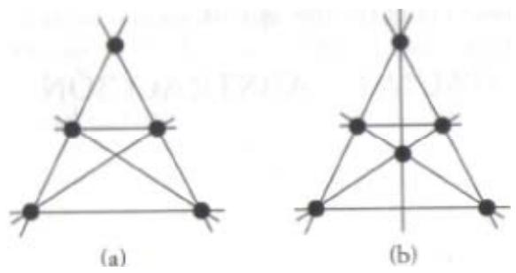

*Figura 13. En estos diagramas cada punto está unido a todos los demás a través de líneas rectas. ¿Se puede construir un diagrama en el que cada recta contenga al menos tres puntos?* 

Ello, por supuesto, no demuestra que tal diagrama no exista.

Generaciones de matemáticos trabajaron y fracasaron en la demostración de la conjetura del punto, tan clara en apariencia. Lo que hizo la conjetura mucho más enloquecedora es que, cuando al fin se encontró una demostración, sólo consistía en una cantidad mínima de conocimientos matemáticos mezclada con cierto ingenio extra. La demostración se incluye en el apéndice 6.

Existía la posibilidad de que todas las técnicas requeridas para la demostración del último teorema de Fermat estuvieran a mano y que el único ingrediente que faltara fuera el ingenio. Wiles no estaba dispuesto a ceder: dar con la demostración del último teorema de Fermat se había transformado para él de fascinación infantil en obsesión alimentada con celo. Habiendo aprendido todo lo que había para aprender de las matemáticas del siglo XIX, Wiles decidió dotarse de técnicas del siglo XX.

# **Capítulo 4 HACIA LA ABSTRACCIÓN**

*La demostración es un ídolo ante el cual, el matemático se mortifica. Sir ARTHUR EDDINGTON* 

Tras la obra de Kummer, las esperanzas de encontrar una prueba para el último teorema de Fermat se tornaron más vanas que nunca. Además, las matemáticas habían empezado a orientarse hacia otros campos de estudio y aparecía el riesgo de que la nueva generación de matemáticos fuera indiferente a lo que parecía el callejón sin salida de un problema imposible. A comienzos del siglo XX, el problema ocupaba aún un lugar especial en los corazones de los teóricos de números, pero contemplaban el último teorema de Fermat de la misma manera en que los químicos trataban la alquimia. Ambos eran un absurdo sueño romántico de antaño.

Entonces, en 1908, Paul Wolfskehl, un industrial alemán de Darmstadt, revivió el problema. La familia de Wolfskehl era conocida por su riqueza y su mecenazgo en las artes y en las ciencias, y Paul no fue una excepción. Había estudiado matemáticas en la universidad y, aunque dedicó la mayor parte

de su vida a construir el imperio financiero familiar, también mantuvo el contacto con matemáticos profesionales y cultivó la teoría de números como pasatiempo. En concreto, Wolfskehl se negó a rendirse ante el último teorema de Fermat.

Wolfskehl no era en absoluto un matemático de talento y no estaba destinado a aportar una gran contribución para dar con la demostración del último teorema de Fermat. Con todo, gracias a una curiosa cadena de sucesos iba a quedar ligado por siempre al problema de Fermat e inspiraría a otros miles a volver a aceptar el desafió.

La historia comienza con la obsesión de Wolfskehl por una mujer cuya identidad no se ha revelado jamás. Por desgracia para Wolfskehl, la misteriosa mujer lo rechazó y él quedó en tal estado de desesperación que decidió suicidarse. Era un hombre apasionado pero no impetuoso, así que planeó hasta el último detalle de su muerte. Concretó una fecha en la que se pegaría un tiro en la cabeza justo al dar la medianoche. En el tiempo que le quedaba arregló todos los asuntos financieros pendientes y el último día redactó su testamento y escribió cartas a todos los íntimos y familiares.

Wolfskehl actuó con tanta eficacia que todo estuvo terminado bastante antes de que expirara el plazo a medianoche, así que para pasar las horas se fue a una biblioteca y comenzó a curiosear entre las publicaciones matemáticas. Al cabo de poco tiempo se hallaba observando el clásico artículo de Kummer en el que explicaba el error de Cauchy y Lame. Se trataba de uno de los cálculos más importantes de la época y de una lectura idónea para los momentos finales de un matemático suicida. Wolfskehl comprobó todo el cálculo línea por línea. De pronto se sorprendió ante lo que parecía ser una laguna lógica. Kummer había hecho una suposición y se saltó justificar un paso de

la argumentación. Wolfskehl se preguntó si habría descubierto una seria fisura o si la suposición de Kummer estaría justificada. Si lo primero era cierto, cabía la posibilidad de que probar el último teorema de Fermat fuera mucho más sencillo de lo que muchos habían presumido.

Tomó asiento, exploró el fragmento dudoso de la prueba y se dedicó a fondo a elaborar una minidemostración que o bien consolidaría el trabajo de Kummer o bien probaría que la suposición de aquél era errónea, en cuyo caso toda la labor de Kummer sobre el tema quedaría invalidada. Acabó la empresa al amanecer. Las malas noticias matemáticas eran que la prueba de Kummer había sido reparada y el último teorema de Fermat continuaba en el reino de lo inalcanzable. Las buenas eran que la cita con el suicidio había pasado y Wolfskehl estaba tan orgulloso de haber descubierto y corregido una fisura en la obra del grandioso Kummer que su desesperación y su pesar se disiparon. Las matemáticas le habían devuelto las ganas de vivir.

Wolfskehl rompió las cartas de despedida y recompuso su testamento movido por lo sucedido aquella noche. A su muerte en 1908 se leyó en voz alta el nuevo testamento. La familia Wolfskehl se quedó helada al descubrir que Paul había legado una extensa porción de su fortuna como premio a quien demostrara el último teorema de Fermat. La recompensa de cien mil marcos alemanes, un valor que superaría los doscientos millones de pesetas en cifras actuales, fue el modo en que saldó la deuda con el enigma que le había salvado la vida.

El dinero se depositó en las arcas de la Königliche Gesellschaft der Wissenschaften2 de Gotinga, la cual anunció la convocatoria del Premio Wolfskehl aquel mismo año: Por el poder que nos ha sido otorgado por parte del doctor Paul Wolfskehl, fallecido en Darmstadt, financiamos por la presente un galardón de cien mil marcos que serán concedidos a la primera persona que demuestre el gran teorema de Fermat. Las bases del premio son las siguientes:

- 1. La Königliche Gesellschaft der Wissenschaften en Gotinga tendrá absoluta libertad para decidir sobre la persona a la que se concederá el premio. Se rechazará cualquier manuscrito elaborado con el único propósito de entrar en el concurso para percibir el premio. Sólo se tendrán en cuenta aquellas memorias matemáticas que hayan aparecido en forma de monografía en revistas o las que estén a la venta en librerías. La sociedad solicita a los autores de las mismas que envíen al menos cinco ejemplares impresos.
- 2. Aquellas obras publicadas en un idioma que no sea de dominio de los especialistas eruditos escogidos por el jurado serán excluidas de la competición. A los autores de dichas obras se les permitirá reemplazarlas por traducciones siempre y cuando garanticen su fidelidad.
- 3. La sociedad declina la responsabilidad de examinar las obras que no le sean presentadas, así como los errores que puedan surgir por el hecho de que la sociedad sea desconocedora del autor de una obra o de una parte de ella.
- 4. La sociedad se reserva el derecho de decisión en caso de que varias personas den con la solución del problema, o en el caso de que su resolución sea resultado de los esfuerzos combinados de varios sabios, sobre todo en lo tocante a la partición del premio.
- 5. La concesión del galardón por parte de la sociedad no se hará efectiva antes de que transcurran dos años desde la publicación de la memoria premiada. Tal intervalo de tiempo está destinado a que los matemáticos alemanes y extranjeros emitan su opinión acerca de la validez de la solución publicada.
- 6. En cuanto el premio sea concedido por la sociedad, el laureado será informado por el secretario de la sociedad y en nombre de la misma; el

 2 Real Sociedad de las Ciencias. (Nota de los traductores.)

resultado se publicará dondequiera que el premio haya sido anunciado durante el año anterior. La asignación del premio por parte de la sociedad será inapelable.

- 7. La gratificación se hará efectiva a la persona premiada dentro de los tres meses siguientes al fallo y la abonará el cajero real en la Universidad de Gotinga, o, bajo responsabilidad absoluta del perceptor, en cualquier otro lugar que pudiera designar.
- 8. La suma podrá ser entregada a cambio de un recibo, bien en efectivo bien a través de la transferencia de valores financieros, a voluntad de la sociedad. El pago del galardón se considerará consumado con el traspaso de dichos valores financieros, aun cuando su valor total al final del día pueda no alcanzar la cantidad de cien mil marcos.
- 9. No se aceptará ninguna reivindicación del premio si éste no es concedido antes del 13 de septiembre del año 2007.

El concurso para el Premio Wolfskehl está abierto desde el día de hoy y bajo las condiciones expuestas.

> DIE KÖNIGLICHE GESELLSCHAFT DER WISSENSCHAFTEN Gotinga, 27 de junio de 1908.

Es preciso destacar que, aunque el comité dotaría con cien mil marcos al primer matemático que demostrara que el último teorema de Fermat es cierto, en cambio no concedería un solo pfennig a quien pudiera demostrar que es falso.

El Premio Wolfskehl se anunció en todas las revistas matemáticas y por toda Europa saltaron rápidamente noticias acerca de la competición. A pesar de la campaña publicitaria y del incentivo añadido de un premio cuantioso, el Comité Wolfskehl fracasó a la hora de despertar un gran interés entre los matemáticos serios. La mayoría de los matemáticos profesionales veían el último teorema de Fermat como una causa perdida y consideraron que no les interesaba echar a perder sus carreras trabajando en una tarea inútil. No obstante, el concurso consiguió presentar el problema ante una nueva audiencia, un buen montón de mentes impacientes que estaban dispuestas a dedicarse a lo último en enigmas y a afrontarlo por una senda de absoluta inocencia.

#### **La era de los rompecabezas, acertijos y enigmas**

Desde los griegos, los matemáticos han intentado condimentar los libros de texto reescribiendo pruebas y teoremas a modo de soluciones para rompecabezas de números. Durante la segunda mitad del siglo XIX, este tratamiento lúdico de la materia logró introducirse en la prensa de masas, y los acertijos numéricos podían encontrarse junto a crucigramas y anagramas. Con el paso del tiempo se fue formando para las matemáticas recreativas un público en alza a medida que los aficionados se atrevían con todo tipo de problemas, desde los acertijos más triviales hasta profundas cuestiones matemáticas, incluyendo el último teorema de Fermat.

Puede que el más prolífico creador de enigmas fuera Henry Dudeney, el cual escribió para docenas de periódicos y revistas, como Strand, Cassell's, Queen, Tit– Bits, Weekly Dispatch y Blighty. Otro de los grandes del género en la época victoriana fue el reverendo Charles Dogson, profesor de matemáticas en la Christ Church de Oxford y más conocido por su seudónimo como escritor, Lewis Carroll. Dogson dedicó varios años a reunir un gigantesco compendio de rompecabezas titulado *Curiosa Mathematica* («Matemática demente»), y aunque no completó la serie, sí llegó a escribir varios volúmenes, entre ellos *Pillow Problems* («Problemas para antes de dormir»).

Pero el mayor creador de enigmas de todos fue el prodigio estadounidense Sam Loyd (1841 - 1911), quien a la edad de quince años ya estaba obteniendo unas considerables ganancias a base de reinventar viejos acertijos y de crear otros nuevos. En su obra *Sam Loyd and his Puzzles: An Autobiographical Review* («Sam Loyd y sus acertijos: una recopilación autobiográfica») recuerda que alguno de sus acertijos más tempranos fueron creados para P. T. Barnum, propietario de circo y prestidigitador: *Hace muchos años, cuando el Circo Barnum era de verdad «el mayor espectáculo del mundo», su famoso director me encargó que le preparara una serie de rompecabezas para concursos con fines propagandísticos. Se hicieron ampliamente conocidos como los «interrogantes de la esfinge», a causa de la elevada cuantía de los premios ofrecidos a quienes lograran vencerlos.* 

Es extraño que esta autobiografía se escribiera en 1928, diecisiete años después de la muerte de Loyd. Este transmitió el ingenio a su hijo, también llamado Sam, que fue el verdadero autor del libro, sabiendo a ciencia cierta que cualquiera que lo comprara pensaría, equivocadamente, que era obra de su padre, el Sam Loyd más famoso.

La creación más popular de Loyd fue el equivalente Victoriano del cubo de Rubik, el rompecabezas «14–15», que aún hoy podemos encontrar en jugueterías. Quince baldosas numeradas del 1 al 15 se distribuyen sobre un plano de 4 x 4 baldosas, y la meta consiste en deslizar las baldosas hasta disponerlas en el orden correcto. El rompecabezas «14–15» de Loyd se vendía con la ordenación que aparece en la figura 14 y ofrecía un premio considerable a quien pudiera completarlo devolviendo la 14 y la 15 a sus lugares correspondientes a través de una serie de corrimientos de baldosas. El hijo de Loyd escribió sobre el revuelo que despertó este rompecabezas palpable pero esencialmente matemático:

*Figura 14. Una caricatura ilustra la fiebre que provocó el rompecabezas «14–15» de Sam Loyd.* 

Nunca ha sido reclamado el premio de mil dólares que se ofreció para la primera solución del problema, y eso que hay miles de personas que dicen haber realizado tal proeza. La gente enloqueció con el rompecabezas y se contaron absurdas historias de tenderos que descuidaron la apertura de sus almacenes; sobre un distinguido clérigo que permaneció de pie durante toda una noche invernal debajo de una farola intentando recordar el camino que había seguido para lograr la hazaña. La misteriosa propiedad del juego es que nadie parece capaz de recordar la secuencia de movimientos mediante la cual creen estar seguros de haber resuelto el problema. Dicen que ha habido pilotos que han hecho naufragar sus barcos y maquinistas que se han pasado de largo las estaciones con sus trenes. Un famoso editor de Baltimore cuenta que en cierta ocasión que fue a comer un empleado furioso lo sorprendió... ¡bien pasada la medianoche empujando de acá para allá pequeñas porciones de pastel dentro de un plato!

Loyd siempre fue consciente de que jamás tendría que abonar los mil dólares porque sabía que es imposible desplazar tan sólo dos piezas sin destruir el orden de otra parte del tablero. Del mismo modo en que un matemático puede demostrar que una ecuación determinada no tiene soluciones posibles, Loyd demostró que su rompecabezas «14–15» es irresoluble.

La demostración de Loyd comienza definiendo una cantidad que mide lo desordenado que está un tablero, el parámetro de desorden *Dp*. El parámetro de desorden es el número de pares de baldosas que, en una disposición concreta, no mantienen el orden correspondiente. Así, para el caso correcto, *Dp* = 0, tal como muestra la figura 15a, porque ninguna baldosa está emplazada con una ordenación incorrecta.

|            |  |  |  |  |            |  |  | 1 2 3 4 1 1 2 3 4 1 1 2 3 4     |             |  |          |  |
|------------|--|--|--|--|------------|--|--|---------------------------------|-------------|--|----------|--|
|            |  |  |  |  |            |  |  | 5 6 7 8 5 6 7 8 5 6 12 7        |             |  |          |  |
|            |  |  |  |  |            |  |  | 9 10 11 12 9 10 12 15 9 10 8 15 |             |  |          |  |
|            |  |  |  |  |            |  |  | 13 14 15 13 14 11               |             |  | 13 14 11 |  |
| (a) D, = 0 |  |  |  |  | (b) D. = 6 |  |  |                                 | (c) D, = 12 |  |          |  |

*Figura 15: Desplazando las baldosas se consiguen varias disposiciones desordenadas. Se puede medir la cantidad de desorden en cada disposición a través del parámetro de desorden, Dp.* 

Partiendo del rompecabezas ordenado y deslizando algunas baldosas es bastante fácil llegar a la disposición que ilustra la figura 15b. Las baldosas mantienen el orden hasta llegar al par 12 y 11. Es evidente que la 11 debería ir delante de la 12, así que este par de baldosas está mal situado. La lista completa de pares de baldosas que ocupan puestos desordenados es como sigue: (12, 11), (15, 13), (15, 14), (15, 11), (13, 11) y (14, 11). Hay seis pares de baldosas en un orden incorrecto en esta disposición, por tanto *Dp* = 6. (Adviértase que las baldosas 10 y 12 están contiguas, lo cual es a todas luces incorrecto, pero no llegan a alterar el orden. Por eso este par de baldosas no repercute en el parámetro de desorden.)

Tras otro mínimo deslizamiento llegamos a la disposición de la figura 15c. Si usted hace una lista de los pares de baldosas que se sitúan en un orden incorrecto, encontrará que *Dp* = 12. El punto importante a tener en cuenta es que en estos tres casos, a, b y c, el valor del parámetro de desorden es siempre un número par (0, 6 y 12). De hecho, si usted comienza por la disposición correcta y procede a trastocarla, esa afirmación resulta siempre cierta. Con tal que la baldosa vacía vaya a parar a la esquina inferior derecha, cualquier cantidad de baldosas desplazadas dará siempre un resultado par para el valor de *Dp*.

El valor par del parámetro de desorden es una característica intrínseca a cualquier ordenación posible que proceda de la disposición correcta de partida. A una propiedad que siempre permanece cierta con independencia de lo que se le haga al objeto se la denomina en matemáticas un invariante.

Sin embargo, si examinamos la disposición que ofrecía Loyd, en la que las baldosas 14 y 15 son las únicas intercambiadas, vemos que el valor del parámetro de desorden es la unidad, *Dp* = 1. ¡En la disposición de Loyd el parámetro de desorden posee un valor impar! En cambio sabemos que cualquier ordenación que derive de la correcta tendrá un valor par para el parámetro de desorden. La conclusión es que la disposición de Loyd no puede proceder de la correcta de partida y, a la inversa, es imposible llegar a la disposición correcta a partir de la ordenación que daba Loyd. Los mil dólares estaban a salvo.

El rompecabezas de Loyd y el parámetro de desorden demuestran el poder que posee un invariante. Los invariantes dotan a los matemáticos de una importante estrategia para probar que es imposible transformar una cosa en otra. Por ejemplo, un tema que entusiasma hoy en día guarda relación con el estudio de los nudos y, como es natural, los teóricos de nudos están interesados en tratar de demostrar si un nudo puede transformarse en otro a base de trenzarlo y curvarlo, pero sin cortarlo. Para resolver esta cuestión intentan encontrar una propiedad del primer nudo que no pueda ser destruida por mucho que se lo retuerza y curve, o sea, un invariante del nudo. Entonces calculan la misma propiedad para el segundo nudo. Si los valores son distintos, se concluye que no se puede partir del primer nudo para a llegar al segundo.

Hasta que en los años veinte Kurt Reidemeister inventó este método era imposible demostrar que un nudo no podía transformarse en cualquier otro. Dicho de otro modo, antes de que se descubrieran los invariantes de los nudos era imposible demostrar que un nudo mal hecho es esencialmente distinto de un nudo plano, de un medio nudo o incluso de un simple bucle sin nudo alguno en realidad. El concepto de una propiedad invariante es fundamental para muchas otras pruebas matemáticas y, como veremos en el capítulo 5, iba a ser crucial para devolver el último teorema de Fermat a la corriente principal de las matemáticas.

Hacia el cambio de siglo, gracias a los gustos de Sam Loyd y a su rompecabezas «14–15», había en Europa y América millones de aficionados a la resolución de problemas sedientos de nuevos desafíos. Una vez que las noticias del legado de Wolfskehl se filtraron a estos incipientes matemáticos, el último teorema de Fermat volvió a convertirse en el problema más famoso del mundo. El último teorema era, con diferencia, mucho más complicado incluso que los acertijos más sesudos de Loyd, pero el premio era inmensamente superior. Los aficionados soñaban que quizá ellos serían capaces de encontrar un truco relativamente simple que los grandes maestros hubieran pasado por alto en el pasado. Un perspicaz aficionado del siglo XX estaba en gran medida al mismo nivel que Pierre de Fermat en cuanto al conocimiento de técnicas matemáticas. El desafío consistía en competir con la creatividad con la que Fermat había utilizado esas técnicas.

Al cabo de pocas semanas del anuncio del premio de Wolfskehl cayó una avalancha de participantes sobre la Universidad de Gotinga. No es raro que todas las demostraciones fueran falaces. Aunque cada concursante estaba convencido de haber resuelto este problema centenario, todos ellos habían cometido sutiles errores, y a veces no tan sutiles, en la lógica que siguieron. El arte de la teoría de números es tan abstracto que resulta en extremo sencillo salirse del camino de la lógica e ignorar por completo que se vaga en el absurdo. El apéndice 7 muestra la suerte de error clásico que se le puede colar con facilidad a un aficionado entusiasta.

Con independencia de quien la hubiera enviado, cada una de las demostraciones tenía que comprobarse hasta el más mínimo detalle, por si se daba el caso de que un aficionado desconocido hubiera tropezado con la prueba más codiciada de las matemáticas. El encargado del departamento de matemáticas de Gotinga desde 1909 hasta 1934 fue el catedrático Edmund Landau, y a él correspondía la responsabilidad de examinar las candidaturas al Premio Wolfskehl. Landau veía su investigación interrumpida a cada momento por las docenas de confusas demostraciones que llegaban cada mes a su escritorio. Para afrontar la situación ideó un método elegante que lo descargara de trabajo. El catedrático imprimió cientos de tarjetas que decían:

*Estimado...* 

*Gracias por su manuscrito referente a la demostración del último teorema de Fermat. Su primer error se halla en:* 

*Página Línea... .* 

*Esto deja invalidada la demostración. Catedrático E. M. Landau* 

Entonces, Landau puso cada nuevo envío acompañado de una de las tarjetas en manos de sus alumnos y les pidió que rellenaran los espacios en blanco.

El volumen de participación continuó sin menguar durante años, incluso tras la estrepitosa devaluación que sufrió el Premio Wolfskehl como resultado de la hiperinflación que siguió a la primera guerra mundial. Hay rumores que afirman que quienquiera que ganara hoy en día la competición a duras penas alcanzaría a pagarse una taza de café con la cuantía del premio, pero esas manifestaciones son un tanto exageradas. En una carta que escribió el señor F. Schlichting, el responsable de las participaciones durante los años setenta, se expone que el premio consistía entonces en más de diez mil marcos. Dicha carta, que fue dirigida a Paulo Ribenboim y publicada en su libro 13 *Lectures on Fermat's Last Theorem*

(«Trece conferencias acerca del último teorema de Fermat»), da una visión única de la tarea del comité el Premio Wolfskehl:

*Muy señor mío:* 

*No existe un recuento del número total de «soluciones» recibidas hasta el día de hoy. Durante el primer año (1907 - 1908) se registraron 621 soluciones en los archivos de la Academia y hoy se han almacenado cerca de tres metros de correspondencia relacionada con el problema de Fermat. En las décadas más recientes se ha actuado del modo que sigue. El secretario de la Academia divide los manuscritos que llegan entre:* 

- *los que son un sinsentido absoluto, que se devuelven de inmediato,*
- *el material de aspecto similar al de las matemáticas.*

*Los envíos que forman este segundo apartado pasan al departamento de matemáticas, y allí el trabajo de leer, encontrar errores y dar una respuesta se delega en uno de los asistentes científicos (en las universidades alemanas éstos son licenciados que trabajan en su doctorado), y en este momento soy yo la víctima. Hay como tres o cuatro cartas que responder al mes, y eso incluye gran cantidad de material divertido y curioso. Así, por ejemplo, hay quien manda la primera mitad de su solución y promete enviar la segunda si le pagamos mil marcos como adelanto; o aquel otro que me prometió el uno por ciento de sus ganancias en publicaciones y entrevistas de radio y televisión una vez se hubiera hecho famoso, con la única condición de apoyar su trabajo ahora, y en caso contrario amenazaba con enviarlo a un departamento de matemáticas ruso para privarnos a nosotros de la gloria de haberlo descubierto. De vez en cuando, alguien se presenta en Gotinga e insiste en una discusión personal.* 

*Casi todas las «soluciones» poseen un nivel muy elemental (utilizando nociones de unas matemáticas de instituto y, en todo caso, algunos artículos sin digerir sobre teoría de números), pero a pesar de todo pueden llegar a ser muy complicadas de comprender. El perfil social de los participantes suele coincidir con personas que disponen de una formación técnica pero que han*  *fracasado en sus carreras e intentan encontrar el éxito con la demostración del problema de Fermat. He pasado algunos de los manuscritos a médicos que han diagnosticado casos de profunda esquizofrenia.* 

*Una condición del testamento de Wolfskehl era que la Academia debía publicar anualmente el anuncio del premio en las principales revistas matemáticas. Pero después de los primeros años las revistas rechazaron anunciarlo porque se vieron desbordadas por la cantidad de manuscritos demenciales y de cartas.* 

*Espero que esta información sea de su interés. Sinceramente,* 

*F. SCHLICHTING* 

Según los comentarios de Schlichting, los participantes no se limitaban a enviar «soluciones» a la Academia. Cada departamento de matemáticas del mundo tiene con toda probabilidad un armario dedicado a presuntas demostraciones de aficionados. Mientras la mayoría de las instituciones las ignoran, otros receptores les han dado un trato más imaginativo. El divulgador matemático Martin Gardner recuerda a un amigo que envió al remitente una nota explicando que él no estaba capacitado para examinar la prueba, en vista de lo cual le proporcionaría el nombre y la dirección de un experto en la materia que sí podría ayudarlo. Así que le mandó las señas del aficionado que le había precedido en el envío de una demostración. Otro de sus amigos escribió: «Dispongo de una refutación en verdad maravillosa para su intento de demostración, pero por desgracia este folio le viene demasiado estrecho.»

Si bien los matemáticos aficionados de todo el mundo han pasado todo este siglo intentando y errando la demostración del último teorema de Fermat y la adquisición del Premio Wolfskehl, los profesionales han seguido ignorándolo por mucho tiempo. En lugar de edificar sobre la obra de Kummer y de otros teóricos de números del siglo XIX, los matemáticos empezaron indagando en los fundamentos de su materia con el objeto de estudiar algunas de las cuestiones más básicas sobre los números. Algunas de las grandes figuras del siglo XX, entre ellas Bertrand Russell, David Hilbert y Kurt Gödel, intentaron comprender las propiedades más profundas de los números a fin de alcanzar su verdadero significado y de discernir que interrogantes de la teoría de números tienen respuesta y, lo que es más importante, cuáles no la tienen. Su labor iba a sacudir los fundamentos de las matemáticas y con el tiempo tendría repercusiones en el último teorema de Fermat.

# **Las bases del conocimiento**

Durante cientos de años, los matemáticos se habían ocupado en utilizar demostraciones lógicas para construir desde lo conocido hacia lo desconocido. El progreso había sido prodigioso, con cada nueva generación de matemáticos edificando sobre la magnífica estructura y creando nuevos conceptos de números y de geometría. Sin embargo hacia el final del siglo XIX, en lugar de mirar hacia delante, los lógicos matemáticos comenzaron a volverse hacia los cimientos de las matemáticas sobre los que se había construido todo lo demás. Querían verificar las bases de las matemáticas, así que lo reconstruyeron todo desde los primeros principios con un absoluto rigor a fin de reasegurarse de que aquellos principios originarios eran sólidos.

Los matemáticos destacan por ser rigurosísimos cuando se trata de llegar a una demostración absoluta antes de aceptar cualquier afirmación. Este rigor queda muy bien expresado en una historia que narra Ian Stewart en *Concepts of Modern Mathematics* («Conceptos de matemáticas modernas»):

*Un astrónomo, un físico y un matemático (según cuentan) estaban de vacaciones en Escocia. Mirando por la ventana del tren distinguieron una oveja negra en medio de un prado. «¡Qué interesante —observó el astrónomo—, en Escocia las ovejas son negras!» A lo que respondió el físico: «¡No, no! ¡Algunas ovejas escocesas son negras!» El matemático miró suplicante al cielo y entonces articuló: «En Escocia existe al menos un campo que tiene al menos una oveja con al menos uno de sus costados de color negro.»* 

Aun más riguroso que el matemático ordinario es aquel que está especializado en el estudio de la lógica matemática. Los lógicos matemáticos comienzan cuestionando ideas que otros matemáticos han dado por sentadas durante siglos. Así, la ley de la tricotomía establece que todo número es o bien negativo o bien positivo o bien igual a cero. Esto parece obvio y los matemáticos lo habían asumido como cierto de forma tácita, pero nadie se había tomado la molestia de demostrar que de verdad era ése el caso. Los lógicos notaron que, hasta que la ley de la tricotomía no se probara como cierta, podría ser falsa, y si ocurriera esto último, la totalidad de un edificio del conocimiento, todo lo basado en dicha ley, se colapsaría. Por suerte para los matemáticos, al final del siglo pasado la ley de la tricotomía se demostró como cierta.

Desde los antiguos griegos, las matemáticas habían existido por la acumulación de más y más teoremas y verdades, y aunque la mayoría se había demostrado con todo rigor, atañía a los matemáticos que algunos de ellos, como la ley de la tricotomía, se hubieran deslizado sin ser examinados como debieran. Algunas ideas habían llegado a formar parte de la sabiduría popular y nadie estaba seguro de cómo se habían demostrado en un principio, si es que en verdad se demostraron alguna vez; de modo que los lógicos decidieron probar cada teorema desde los principios más remotos. Sin embargo, cada verdad debía deducirse de otras verdades. Estas verdades, a su vez, tendrían que demostrarse antes a partir de otras verdades aún más básicas, y así siempre. Al cabo de cierto tiempo, los lógicos se encontraron ocupándose de unas cuantas premisas fundamentales, tan esenciales que ya no pudieron ser demostradas. Estas presunciones constituyen los axiomas matemáticos.

Un ejemplo de axioma es la ley conmutativa de la adición, la cual establece que, para cualesquiera números *m* y *n*,

### *m* + *n* = *n* + *m*

Se considera que éste y un puñado de otros axiomas son evidentes en sí mismos y pueden ponerse a prueba con facilidad si se los aplica a números concretos. Hasta ahora los axiomas han superado cada comprobación y se los ha aceptado como el fondo último de las matemáticas. El reto de los lógicos consistía en reconstruir todas las matemáticas a partir de esos axiomas. El apéndice 8 reúne la serie de axiomas aritméticos y da una idea del modo en que los lógicos iniciaron el edificio del resto de las matemáticas.

Todo un ejército de lógicos participó en el lento y penoso proceso de reelaborar la complejidad e inmensidad del conocimiento matemático sobre la base de un número mínimo de axiomas. La idea radicaba en consolidar lo que los matemáticos creían conocer ya empleando tan sólo los patrones más rigurosos de la lógica. El matemático alemán Hermann Weyl resume el espíritu de la época: *«La lógica es la higiene que practican los matemáticos para mantener sus ideas sanas y robustas.»* Además de depurar lo que ya se conocía, confiaban en que este enfoque fundamentalista también arrojaría luz sobre problemas que hasta ahora no se habían resuelto, entre ellos el último teorema de Fermat.

El programa fue dirigido por la figura más eminente de la época, David Hilbert. Hilbert creía que en matemáticas todo podía y debía probarse a partir de los axiomas básicos. El resultado de ello sería demostrar de manera concluyente los dos elementos básicos del sistema matemático. En primer lugar, las matemáticas debían ser capaces, al menos en teoría, de responder a cualquier interrogante concreto. Se trata del mismo carácter de completitud que había requerido en el pasado la invención de números nuevos, como los negativos o los imaginarios. En segundo lugar, las matemáticas deberían estar libres de incongruencias, o lo que es lo mismo, una vez mostrada la veracidad de una premisa a través de un método no sería posible que mediante otro método se concluyera que esa misma premisa es falsa. Hilbert estaba convencido de que, asumiendo tan sólo unos pocos axiomas, sería posible responder a cualquier pregunta matemática concebible sin temor a una contradicción.

El 8 de agosto de 1900, Hilbert pronunció una conferencia histórica en el Congreso Internacional de Matemáticos de París. Hilbert planteó veintitrés problemas matemáticos sin resolver que él consideraba de una perentoria importancia. Algunos de los problemas versaban sobre áreas más generales de las matemáticas, pero la gran mayoría tenía que ver con los fundamentos lógicos de la disciplina. Estos problemas tenían la finalidad de centrar la atención del mundo matemático y de constituir un programa de investigación. Hilbert pretendía sacudir a la comunidad

para que lo ayudara a realizar su sueño de crear un sistema matemático libre de toda duda e incoherencia. Una ambición que inscribió en su lápida:

> *Wir müssen wissen, Wir werden wissen. (Tenemos que saber, Llegaremos a saber.)*

Gottlob Frege fue una de las figuras más destacadas del llamado programa de Hilbert, si bien en ocasiones fue un amargo rival de éste. Frege se dedicó durante más de una década a deducir cientos de complicados teoremas a partir de los axiomas básicos, y sus éxitos lo llevaron a creer que estaba en el camino correcto para llegar a completar una parte considerable del sueño de Hilbert. Uno de los progresos clave de Frege fue elaborar la definición completa de número. Por ejemplo, ¿qué queremos decir en realidad con el número 3? Resulta que, para definir 3, Frege tuvo que definir primero la *«triplicidad»*.

«Triplicidad» es la cualidad abstracta que poseen los grupos o series de objetos que contienen tres objetos. Así, la «triplicidad» puede utilizarse para describir el conjunto de los «tres pelos que tiene mi barba» de la canción infantil, o la «triplicidad» es adecuada del mismo modo para describir la serie de lados que posee un triángulo. Frege notó que había numerosos grupos que manifestaban «triplicidad» y utilizó la idea de los conjuntos para definir el «3» en sí. Creó un conjunto nuevo, colocó en su interior todos los grupos que manifiestan «triplicidad» y denominó «3» a este nuevo conjunto de conjuntos. Por lo tanto, un conjunto contiene tres miembros si y sólo si se sitúa dentro del conjunto «3».

Ésta puede parecer una definición demasiado compleja para un concepto que usamos a diario, pero la descripción que Frege realiza del «3» es rigurosa e indiscutible, y además necesaria para el inflexible programa de Hilbert.

En 1902, el método de Frege pareció llegar a su fin cuando se dispuso a publicar *Grundgesetze der Arithmetik* («Fundamentos de la aritmética»), una obra gigantesca y prestigiosa que intentó establecer un nuevo patrón de certeza dentro de las matemáticas. Al mismo tiempo, el lógico inglés Bertrand Russell, que también estaba contribuyendo al gran proyecto de Hilbert, realizaba un descubrimiento devastador. A pesar de haber seguido el riguroso protocolo de Hilbert, había tropezado con una incoherencia. Russell evocó su propia reacción ante la temida posibilidad de que las matemáticas fueran intrínsecamente contradictorias:

*Al principio supuse que sería capaz de superar la contradicción con toda facilidad y que lo más probable era que hubiera algún error trivial en el razonamiento. Poco a poco, sin embargo, se hizo patente que no era ése el caso... Durante la segunda mitad de 1901 estaba convencido de que la solución sería sencilla, pero, transcurrido ese tiempo, concluí que se trataba de una tarea de envergadura... Acostumbraba a pasear cada noche de once a una, tiempo en el que llegué a conocer los tres sonidos distintos que emiten los chotacabras. (La mayor parte de la gente sólo conoce uno de ellos.) Estaba empecinado en resolver la contradicción. Cada mañana me sentaba ante una hoja blanca de papel. A lo largo del día, con una breve pausa para comer, miraba la hoja en blanco. A menudo, al caer la tarde seguía vacía.* 

No había escapatoria a la contradicción. El trabajo de Russell causó un perjuicio considerable al sueño de crear un sistema matemático libre de duda, incoherencia y paradoja. Escribió a Frege, cuyo manuscrito se encontraba ya en la imprenta. La carta de Russell tornó inútil la obra de Frege, el trabajo de toda su vida, pero a pesar del golpe mortal publicó su opus magnum pesara a quien pesara, y añadió tan sólo una adenda al segundo volumen: *«Un científico puede encontrarse difícilmente con algo más indeseable que ver ceder los cimientos justo cuando la obra está concluida. Una carta del señor Russell me puso en tal situación cuando la obra estaba casi en prensa.»*

Fue irónico que la contradicción de Russell surgiera de las series o grupos más queridos por Frege. Muchos años después recordó en su libro *My Philosophical Development* («La evolución de mi pensamiento filosófico») el razonamiento que provocó su cuestionamiento de la obra de Frege: *«Me pareció que una clase es algunas veces, y otras no, un miembro de sí misma. La clase de las cucharillas, por ejemplo, no es otra cucharilla, pero la clase de cosas que no son cucharillas es una de las cosas que no son cucharillas.»* Fue esta observación, curiosa e inocente en apariencia, la que llevó a la catastrófica paradoja.

La paradoja de Russell se explica a menudo con el cuento del bibliotecario minucioso. Un día, deambulando entre las estanterías, el bibliotecario descubre una colección de catálogos. Hay diferentes catálogos para novelas, obras de consulta, poesía, y demás. Se da cuenta de que algunos de los catálogos se incluyen a sí mismos y otros, en cambio, no.

Con el objeto de simplificar el sistema, el bibliotecario elabora dos catálogos más; en uno de ellos hace constar todos los catálogos que se incluyen a sí mismos y en el otro, más interesante aún, todos aquellos que no se catalogan a sí mismos. Al terminar la tarea se encuentra con un problema: el catálogo que recoge la lista de todos los que no se incluyen a sí mismos ¿debe catalogarse a sí mismo? Si se incluye, por definición no debería estar incluido; en cambio, si no se incluye, debería incluirse por definición. El bibliotecario se encuentra en una situación imposible.

Los catálogos se parecen mucho a los grupos o clases que Frege había utilizado para la definición fundamental de los números. Por lo tanto, la incongruencia que atormenta al bibliotecario causará también problemas en la estructura supuestamente lógica de las matemáticas. Las matemáticas no pueden tolerar inconsistencias, paradojas o contradicciones. El poderoso instrumento de la prueba por contradicción, por ejemplo, se fundamenta en unas matemáticas libres de paradojas. La prueba por contradicción establece que si una afirmación conduce al absurdo, entonces tiene que ser falsa; sin embargo, según Russell, incluso los axiomas pueden llevar al absurdo. Así que la prueba por contradicción podría evidenciar que un axioma es falso y no obstante los axiomas son el fundamento de las matemáticas y se los reconoce como ciertos.

Hubo muchos intelectuales que cuestionaron el trabajo de Russell afirmando que las matemáticas eran obviamente una actividad exitosa y perfecta. Russell les respondió explicando el significado de su trabajo del modo que sigue:

«Pero —dirán ustedes— nada de esto hace tambalear mi creencia de que dos y dos son cuatro.» Están del todo en lo cierto, excepto en casos extremos. Y es sólo en los casos extremos cuando ustedes dudan si cierto animal es un perro o si cierta longitud es menor que un metro. El dos tiene que ser dos de algo, y el enunciado «dos y dos son cuatro» resulta inservible a menos que pueda ser aplicado. Dos perros más dos perros son, en efecto, cuatro perros, pero surgen casos en que ustedes dudan si dos de ellos son o no perros. «Bien, en cualquier caso hay cuatro animales», dirán ustedes. Pero existen microorganismos que cabe dudar si son animales o plantas. «Bien, son organismos vivos», afirman. Pero hay cosas que no sabemos si viven o no. Ustedes estarán abocados a decir: «Dos entidades más dos entidades son cuatro entidades.» Cuando me hayan explicado qué es lo que entienden por «entidad» reanudaremos la discusión.

El trabajo de Russell sacudió los cimientos de las matemáticas y arrastró el estudio de la lógica matemática a una situación de caos. Los lógicos eran conscientes de que una paradoja que acechara las bases de las matemáticas podría alzar tarde o temprano su ilógica cabeza y causar enormes problemas. Junto a Hilbert y los otros lógicos, Russell emprendió la tarea de intentar remediar la situación y restaurar la salud de las matemáticas.

La incongruencia aparecida era una consecuencia directa de trabajar con los axiomas matemáticos, que hasta aquel momento se habían asumido como evidentes por sí mismos y suficientes para definir el resto de las matemáticas. Una manera de abordar el problema era crear un axioma adicional que prohibiera a cualquier grupo ser miembro de sí mismo. Eso reduciría la paradoja de Russell y convertiría en superflua la cuestión de si hay que introducir en el catálogo aquellos otros que no se incluyen a sí mismos.

Russell pasó la década siguiente examinando los axiomas matemáticos, la esencia última de esta materia. Entonces en 1910, en colaboración con Alfred North Whitehead, publicó el primero de los tres volúmenes de la obra *Principia Mathematica*, un intento, en apariencia afortunado, de tratar de alguna manera el problema surgido de su propia paradoja. Durante las dos décadas siguientes, otros utilizaron *Principia Mathematica* como guía para erigir un edificio matemático impecable y, cuando Hilbert se retiró en 1930, estaba bastante seguro de que las matemáticas estaban bien encaminadas hacia su recuperación. Al parecer, su sueño de una lógica coherente lo bastante sólida como para responder a cualquier pregunta se hallaba en vías de tornarse en realidad.

Pero ocurrió que en 1931 un matemático desconocido de veinticinco años de edad hizo público un artículo que destruiría para siempre las esperanzas de Hilbert. Kurt Gödel iba a forzar a los matemáticos a aceptar que las matemáticas nunca llegarían a alcanzar una lógica perfecta y sus trabajos llevaban implícita la idea de que problemas como el del último teorema de Fermat pudieran ser imposibles de resolver.

Kurt Gödel nació el 28 de abril de 1906 en Moravia, entonces parte del Imperio austro-húngaro y hoy dentro de la República Checa. Desde muy pequeño padeció graves enfermedades; la más seria fue un ataque de fiebre reumática a la edad de seis años. Este temprano roce con la muerte provocó en Gödel una hipocondría obsesiva que perduró durante toda su vida. Tras leer un libro de medicina a la edad de ocho años, quedó convencido de que tenía un corazón débil, si bien los médicos que lo atendieron no encontraron ninguna evidencia de ello. Más tarde, hacia el final de su vida, pensó equivocadamente que estaba siendo envenenado, por lo que renunció a comer y casi murió de inanición.

Cuando era niño, Gödel mostró talento para la ciencia y las matemáticas, y su naturaleza inquisitiva hizo que su familia le pusiera el apodo de der *Herr Warum* (el Señor Porqué). Acudió a la Universidad de Viena sin saber si especializarse en matemáticas o en física, pero una serie de conferencias, inspiradoras y apasionadas, del catedrático P. Furtwängler sobre la teoría de números convenció a Gödel para dedicar su vida a las matemáticas. Las conferencias eran aun más increíbles si cabe porque Furtwängler padecía tetraplejía y hablaba desde una silla de ruedas, sin anotaciones, mientras su asistente apuntaba en la pizarra.

Gödel se había establecido en el departamento de matemáticas a sus tempranos veintitantos, pero a veces enfilaba junto a sus colegas el pasillo para asistir a encuentros del *Wiener Kreis* (Círculo de Viena), un grupo de filósofos que se reunía para discutir las grandes cuestiones de lógica del momento. Fue durante este periodo cuando Gödel desarrolló las ideas que arrasarían los cimientos de las matemáticas.

En 1931, Gödel publicó su libro *Uber formal unentscheidbare Sätze der «Principia Mathematica» und verwandter Systeme* («Sobre proposiciones formalmente indecidibles de los "*Principia Mathematica*" y sistemas afines»), que contenía sus así llamados teoremas de indecidibilidad. Cuando las noticias de los teoremas llegaron a América, el gran matemático John von Neumann canceló de inmediato una serie de conferencias que estaba celebrando en aquel momento y reemplazó lo que quedaba de ciclo por un debate sobre la revolucionaria obra de Gödel.

Gödel había demostrado que el intento de crear un sistema matemático completo y coherente era un imposible. Sus ideas se pueden recoger en dos proposiciones.

- 1. Primer teorema de indecidibilidad: Si el conjunto de axiomas de una teoría es coherente, existen teoremas que no se pueden ni probar ni refutar.
- 2. Segundo teorema de indecidibilidad: No existe ningún proceso constructivo capaz de demostrar que una teoría axiomática es coherente.

El primer enunciado de Gödel dice básicamente que, con independencia de la serie de axiomas que se vaya a utilizar, habrá cuestiones que las matemáticas no puedan resolver; la completitud no podrá alcanzarse jamás. Peor aún, el segundo enunciado dice que los matemáticos jamás podían estar seguros de que los axiomas elegidos no los conducirán a ninguna contradicción; la coherencia no podrá demostrarse jamás. Gödel había probado que el programa de Hilbert era una tarea imposible.

Décadas más tarde, Bertrand Russell meditó en *Portraits from Memory* («Retratos de memoria») sobre su reacción ante el descubrimiento de Gödel:

Yo ansiaba la certidumbre del mismo modo que la gente ansía la fe religiosa. Pensé que la certeza era más fácil de encontrar en matemáticas que en cualquier otra parte. Pero descubrí que muchas demostraciones matemáticas que mis profesores esperaban que yo aceptara estaban llenas de falacias y que, si la certidumbre se podía encontrar de verdad en las matemáticas, tendría que ser en un nuevo campo de las mismas con bases más sólidas que las que se habían considerado seguras hasta entonces. Pero según avanzaba el trabajo recordaba sin cesar la fábula del elefante y la tortuga. Una vez construido un elefante sobre el que pudiera descansar el universo matemático, el animal me pareció inseguro, así que procedí a crear una tortuga para evitar que el elefante cayera. Pero la tortuga no era más segura que el elefante, y tras unos veinte años de arduo esfuerzo llegué a la conclusión de que no había nada más que yo pudiera hacer para crear un conocimiento matemático indubitable.

A pesar de que el segundo enunciado de Gödel decía que era imposible demostrar que los axiomas fueran coherentes, eso no implicaba que fueran incoherentes. Muchos matemáticos seguían creyendo de corazón que las matemáticas

permanecerían siendo coherentes, pero no podían demostrarlo con la cabeza. Muchos años después, el gran teórico de números André Weil dijo: *«Dios existe porque las matemáticas son coherentes y el diablo existe porque no podemos demostrarlo.»*

La demostración de los teoremas de indecidibilidad de Gödel es tremendamente complicada, y de hecho un enunciado más riguroso del primer teorema sería:

Para toda clase de fórmulas k, recursivamente w–consistentes, existe una clase correspondiente de signos t, tal que ni nGen t ni Neg(nGen t) pertenecen a Flg(k) (donde n es la variable libre de t)

Por suerte, igual que con la paradoja de Russell y el caso del bibliotecario, el primer teorema de Gödel se puede ilustrar con otra analogía lógica que debemos a Epiménides y que se conoce como la paradoja cretense, o la paradoja del mentiroso. Epiménides fue un cretense que afirmó:

Soy un mentiroso.

La paradoja surge cuando intentamos determinar si esta proposición es verdadera o falsa. Primero veamos qué ocurre si asumimos que la afirmación es verdadera. Si es una proposición cierta, implica que Epiménides es un mentiroso, pero en principio aceptamos que hizo una afirmación cierta y por tanto no puede ser un mentiroso. Estamos ante una incongruencia.

Por otra parte, veamos qué ocurre si asumimos que el enunciado es falso. Si la proposición es falsa, entonces Epiménides no es un mentiroso, pero hemos aceptado que emitió un enunciado falso y por tanto sí que es un mentiroso. Encontramos otra incoherencia. En ambos casos, lo tomemos por falso o por cierto, terminamos dando con una incoherencia, y por tanto el enunciado no es ni verdadero ni falso.

Gödel dio una reinterpretación a la paradoja del mentiroso y le incorporó el concepto de demostración. El resultado fue un enunciado como el que sigue:

Este enunciado no tiene demostración.

Si la proposición fuera falsa, entonces este enunciado se podría demostrar, pero eso sería contrario al enunciado. Así que la proposición debe ser cierta para eludir la contradicción. Sin embargo, aunque la proposición sea cierta no se puede demostrar porque este enunciado (que hemos considerado cierto) así lo dice.

Puesto que Gödel consiguió traducir la proposición de más arriba a una notación matemática, fue capaz de demostrar que hay enunciados matemáticos ciertos que jamás podrán probarse como tales; son los denominados enunciados indecidibles. Este fue el golpe mortal para el programa de Hilbert.

En muchos sentidos, el trabajo de Gödel fue paralelo a descubrimientos similares que se estaban produciendo en la física cuántica. Justo cuatro años antes de que Gödel publicara su obra acerca de la indecidibilidad, el físico alemán Werner Heisenberg dejó al descubierto el principio de incertidumbre. Así como había un límite básico para los teoremas que los matemáticos podrían probar, Heisenberg mostró que había un límite fundamental para las propiedades que los físicos podrían medir. Si, por ejemplo, querían determinar la posición exacta de un objeto, podían hallar la velocidad de ese objeto con una precisión relativamente pobre. Esto se debe a que para establecer la posición de un objeto habría que iluminarlo con fotones de luz pero, para poder precisar con toda exactitud su localización, los fotones de luz tendrían que contar con una energía enorme. Y, a la vez, si se bombardeara el objeto con fotones de alta energía, su velocidad se vería afectada y se tornaría intrínsecamente incierta. De ahí que, en el intento de determinar la posición de un objeto, los físicos tengan que renunciar a cierta cantidad de información sobre la velocidad.

El principio de incertidumbre de Heisenberg sólo se percibe a escala atómica, cuando las medidas de alta precisión se vuelven cruciales. De modo que gran parte de la física pudo proseguir impertérrita aunque los físicos cuánticos se ocuparan de cuestiones profundas acerca de los límites del conocimiento. Lo mismo ocurrió en el mundo de las matemáticas. Mientras los lógicos se hundieron en un debate altamente esotérico sobre la indecidibilidad, el resto de la comunidad matemática continuó impasible. Aunque Gödel había probado que algunos enunciados no se podían demostrar, existían otros muchos que sí podrían probarse, y el descubrimiento del matemático no invalidó nada de lo que se había demostrado en el pasado. Además, muchos matemáticos creían que las proposiciones indecidibles de Gödel sólo se encontrarían en las regiones más oscuras y recónditas de las matemáticas y por tanto nunca tropezarían con ellas. Después de todo, Gödel solo había afirmado que esos enunciados existían, pero en realidad nunca señaló ninguno.

Paul Cohen, un matemático de veintinueve años de la Universidad de Stanford, desarrolló un método para determinar qué problema concreto es indecidible y cuál no lo es. El método sólo funciona en unos cuantos casos especiales. Sin embargo no fue él la primera persona en descubrir cuestiones específicas que fueran de verdad indecidibles. Una vez realizado el descubrimiento, tomó un avión hacia Princeton, demostración en mano, para verificarla con el propio Gödel. Gödel, que en aquel momento estaba entrando en una fase paranoica de su vida, entreabrió la puerta, agarró los papeles y la cerró de golpe con un portazo. Dos días después, Cohen recibió una invitación para ir a tomar el té a casa de Gödel, un signo de que el maestro había concedido a la prueba el sello de su autoridad. Lo más sensacional de todo era que algunos de aquellos problemas indecidibles eran de importancia capital para las matemáticas. Resultó irónico que Cohen demostrara la indecidibilidad de una de las cuestiones que David Hilbert había incluido entre los veintitrés problemas más importantes de las matemáticas, la hipótesis del continuo.

La obra de Gödel, reforzada por los enunciados indecidibles de Cohen, lanzó un mensaje inquietante a todos aquellos matemáticos, profesionales y aficionados, que aún persistían en el intento de demostrar el último teorema de Fermat: ¡quizá el último teorema de Fermat era indecidible! ¿Y si Pierre de Fermat hubiera cometido un error al afirmar que había encontrado una demostración? En tal caso cabría la posibilidad de que el teorema fuera indecidible. Demostrar el último teorema de Fermat podría ser algo más que difícil, podría ser imposible. Si fuera indecidible, los matemáticos habrían pasado siglos buscando una prueba que no existe.

Curiosamente, si el último teorema de Fermat resultara ser indecidible, eso implicaría que tendría que ser cierto. La razón es la siguiente. El teorema dice que no existen soluciones con números enteros para la ecuación

$$\mathcal{X}' + \mathcal{Y}' = \mathcal{Z}''$$

si *n* es mayor que 2.

Si el último teorema fuera en verdad falso, sería posible demostrarlo localizando una solución (un contraejemplo). Y en tal caso el último teorema sería decidible. Ser falso resultaría incoherente con ser indecidible. En cambio, si el último teorema fuera cierto, no tendría por qué existir un camino tan inequívoco para demostrarlo o, lo que es lo mismo, podría ser indecidible. En conclusión, tal vez el último teorema de Fermat fuera cierto pero quizá no hubiera ningún modo de demostrarlo.

# **La curiosidad compulsiva**

El despreocupado apunte de Pierre de Fermat al margen de la Aritmética de Diofanto había conducido al enigma más enloquecedor de la historia. A pesar de tres centurias de sonados fracasos y a pesar de la insinuación de Gödel de que quizá perseguían una demostración inexistente, algunos matemáticos continuaban atraídos por el problema. El último teorema era una sirena matemática que seducía a los genios con el único propósito de defraudarlos. Los matemáticos que se aventuraron con el último teorema de Fermat corrieron el riesgo de malgastar su carrera, pero quienquiera que lograra el triunfo pasaría a la historia como la persona que resolvió el problema más difícil del mundo.

Generaciones de matemáticos vivieron obsesionadas con el último teorema de Fermat por dos motivos. En primer lugar estaba la perversa idea de quedar por encima de los demás. El último teorema era el reto definitivo y quien consiguiera demostrarlo triunfaría allí donde Cauchy, Euler, Kummer y otros muchos habían fracasado. Así como el propio Fermat encontró gran placer en resolver problemas que desconcertaran a sus contemporáneos, quien lograra demostrar el último teorema gozaría del hecho de haber resuelto un problema que ha confundido a toda la comunidad de matemáticos durante cientos de años. En segundo lugar, quien respondiera al desafío de Fermat disfrutaría de la inocente satisfacción de aclarar un enigma. El deleite que produce la resolución de cuestiones esotéricas de la teoría de números no se diferencia tanto del simple gusto de abordar los acertijos triviales de Sam Loyd. Un matemático me dijo en cierta ocasión que el placer que sentía al dar solución a los problemas matemáticos se parece al que experimentan los incondicionales de los crucigramas. Rellenar la última casilla de un crucigrama difícil es siempre una experiencia satisfactoria. Podemos imaginar la sensación de éxito después de haber dedicado años a un rompecabezas que nadie más en todo el mundo ha sido capaz de resolver y dar al fin con la solución.

Éstas son las mismas razones por las que Andrew Wiles quedó fascinado con Fermat: «Si hay algo que adoran los matemáticos puros son los desafíos. Aman los problemas sin resolver. Cuando nos ponemos a hacer matemáticas aparece este noble sentimiento. Empiezas con un problema que te desconcierta. No lo entiendes, es muy complicado, no tiene ni pies ni cabeza. Pero cuando al fin lo resuelves sientes su increíble belleza, la elegancia con que todo encaja. Los más engañosos son aquellos problemas que parecen sencillos y en cambio se vuelven intrincados en extremo. Fermat es el ejemplo más bello de este tipo de problemas. A primera vista parecía que debía de tener solución y, por supuesto, lo hacía muy especial que Fermat afirmara disponer de una.»

Las matemáticas se aplican a las ciencias y a la tecnología, pero no es eso lo que mueve a los matemáticos. Los inspira el placer del hallazgo. G. H. Hardy intentó explicar y justificar su propia dedicación en un libro titulado *Autojustificación de un matemático*:

Sólo quiero decir que si un problema de ajedrez es, en el sentido más crudo, «inútil», la misma verdad sirve para la mayoría de las mejores matemáticas... Jamás he hecho algo «útil». Ninguno de mis descubrimientos ha contribuido o tiene posibilidades de ayudar en lo más mínimo, directa o indirectamente, en beneficio de sanos o enfermos, a amenizar el mundo. Considerado desde cualquier punto de vista práctico, el valor de mi vida matemática es nulo. Y fuera de las matemáticas es trivial de todos modos. Sólo tengo una oportunidad para escapar del veredicto de la trivialidad más absoluta, que se juzgue que he creado algo digno de ser creado. Y el hecho de que he creado algo es innegable: la cuestión radica en su valor.

El anhelo por una solución para cualquier problema matemático viene provocado en gran medida por la curiosidad, y el premio consiste en la satisfacción simple pero enorme que se deriva de resolver un enigma. El matemático E. C. Titchmarsch dijo una vez «Puede que no tenga ninguna utilidad práctica saber que p es un número irracional, pero si tenemos capacidad para saberlo sin duda sería intolerable que no lo supiéramos.»

En el caso del último teorema de Fermat no había falta de curiosidad. La obra de Gödel sobre la indecidibilidad había introducido un elemento de duda en cuanto a si el problema tenía o no solución, pero eso no era suficiente para desanimar a los verdaderos seguidores de Fermat. Más desesperante aún fue el hecho de que, hacia los años treinta, los matemáticos hubieran agotado todas las técnicas y tuvieran poco más a su disposición. Lo que necesitaban era una herramienta nueva, algo que levantara la moral matemática. La segunda guerra mundial iba a proporcionar justo lo que se requería: el mayor salto en potencia de cómputo desde la invención de la regla de cálculo.

# **El recurso a la fuerza bruta**

Cuando G. H. Hardy declaró en 1940 que las mejores matemáticas son en buena medida inútiles, se apresuró a añadir que eso no tenía por qué ser negativo: «Las verdaderas matemáticas no repercuten en la guerra. Nadie ha descubierto aún ninguna aplicación bélica de la teoría de números.» Pronto se demostraría que Hardy estaba equivocado.

En 1944, John von Neumann participó en la redacción del libro *The Theory of Games and Economic Behavior* («Teoría de juegos y comportamiento económico»), en el que acuñó el término de teoría de juegos. La teoría de juegos era un intento de Von Neumann de utilizar las matemáticas para describir la estructura de los juegos y el modo en que los lleva a cabo el ser humano. Empezó estudiando el ajedrez y el póquer, y luego continuó intentando crear modelos de juegos más sofisticados, como la economía. Tras la segunda guerra mundial, la RAND Corporation se dio cuenta del potencial de las ideas de Von Neumann y lo contrató para trabajar en el desarrollo de estrategias durante la guerra fría. Desde entonces, la teoría matemática de juegos se convirtió en un útil esencial para que los generales pusieran a prueba las estrategias militares tratando las batallas como si fueran complejas jugadas de ajedrez. La historia del *trielo* ilustra con sencillez la aplicación de la teoría de juegos a las batallas.

Un «*trielo*» es similar a un duelo, con la diferencia de que hay tres participantes en lugar de dos. Una mañana, el señor Negro, el señor Gris y el señor Blanco deciden acabar con un conflicto participando en un «trielo» con pistolas hasta que sólo quede uno de ellos. El señor Negro es el peor tirador porque su promedio de acierto es de uno de cada tres disparos. El señor Gris es algo más certero porque su media está en dos aciertos de cada tres intentos. El señor Blanco es el mejor, siempre hace diana. Para hacer el «trielo» más justo conceden al señor Negro que dispare el primero, luego podrá tirar el señor Gris (si es que aún está vivo) y detrás de él el señor Blanco (en caso de seguir con vida), y vuelta a empezar hasta que sólo quede uno de ellos. La duda es: ¿hacia dónde debería dirigir el señor Negro su primer tiro? Quizá quiera usted hacer alguna conjetura en base a su intuición o, mejor aún, basándose en la teoría de juegos. La respuesta se comenta en el apéndice 9.

Las matemáticas de descifrado de códigos son aún más influyentes que la teoría de juegos en tiempos de guerra. Durante la segunda guerra mundial, los aliados se dieron cuenta de que la lógica matemática podía utilizarse para descifrar mensajes alemanes tan sólo con realizar los cálculos con la rapidez suficiente. El reto consistía en encontrar un modo de automatizar las matemáticas de manera que una máquina pudiera realizar los cálculos. El inglés que más contribuyó a este esfuerzo de descifrar códigos fue Alan Turing.

Turing regresó a Cambridge en 1938, después de cumplir sus obligaciones en la Universidad de Princeton. Había sido testigo directo de la confusión causada por los teoremas de indecibilidad de Gödel y se había visto envuelto en el intento de levantar las piezas que quedaban del sueño de Hilbert. En particular quería saber si existía un camino para determinar qué problemas eran o no indecidibles, e intentó desarrollar un sistema metódico para responder a esta cuestión. En aquel momento, las máquinas calculadoras eran primitivas y en realidad inútiles si había que enfrentarse a matemáticas serias. Así que Turing basó sus ideas en el concepto de una máquina imaginaria capaz de ejecutar infinidad de cálculos. Aquella hipotética máquina, que consumía cantidades infinitas de rollos de papel y que podría computar por toda la eternidad, era todo lo que necesitaba para indagar en las cuestiones abstractas de la lógica. Lo que Turing ignoraba era que su imaginada mecanización de hipotéticos problemas llevaría con el tiempo a un invento decisivo para realizar cálculos reales con máquinas reales.

A pesar del estallido de la guerra, Turing continuó con su investigación como miembro del King's College, hasta que en 1940 su vida placentera como profesor de

Cambridge acabó de pronto. Fue reclutado por la Escuela Gubernamental de Código y Cifrado, cuya labor consistía en descodificar los mensajes codificados por el enemigo. Antes de la guerra, los alemanes habían dedicado muchos esfuerzos a desarrollar un sistema de cifrado avanzado y ése era un asunto muy preocupante para la inteligencia británica, la cual, en el pasado, había sido capaz de descifrar las comunicaciones de sus enemigos con relativa facilidad. La historia de guerra oficial *Inteligencia británica* durante la segunda guerra mundial que editó la HMSO3 describe la situación en los años treinta:

Hacia 1937 era bien sabido que, a diferencia de sus homólogos japoneses e italianos, el ejército alemán, la marina alemana y probablemente también la fuerza aérea, así como otras organizaciones del Estado como los ferrocarriles o las SS, utilizaban diferentes versiones de un mismo sistema de cifrado para todas las comunicaciones, salvo para las tácticas: la máquina Enigma, que había salido al mercado en los años veinte pero que los alemanes habían hecho más segura mediante sucesivas modificaciones. En 1937, la Escuela Gubernamental de Código y Cifrado logró descifrar, de esta máquina, la versión menos modificada y segura que estaban usando las fuerzas alemanas e italianas y el bando nacionalista español. Pero, aparte de esto, la Enigma resistía el ataque y parecía probable que continuara haciéndolo.

La máquina Enigma consistía en un teclado conectado a una unidad codificadora. La unidad codificadora contenía tres ruedas giratorias independientes, y la posición de las ruedas determinaba el cifrado de cada letra del teclado. Lo que hacía el código Enigma tan difícil de descifrar era la inmensa cantidad de maneras en que era posible inicializar el dispositivo. En primer lugar, las tres ruedas giratorias de la máquina eran elegidas de entre un conjunto de cinco, y podían sustituirse e intercambiarse para confundir a los interceptores de códigos. En segundo lugar, cada rueda disponía de veintiséis posiciones distintas. Esto quiere decir que los modos de inicialización de la máquina eran más de un millón. Además de las permutaciones proporcionadas por las ruedas, las conexiones de un panel de clavijas en la parte posterior de la máquina podían alterarse a mano con el resultado final de más de ciento cincuenta millones de millones de millones de

 3 HMSO: Iniciales de Her (o His) Majesty's Stationery Office, imprenta del gobierno británico. (N. de los tt)

inicializaciones diferentes. Para incrementar aún más la seguridad, las ruedas cambiaban continuamente de posición durante la codificación del mensaje, de manera que cada vez que se transmitía una letra se hacía con una inicialización distinta de la máquina y, por tanto, con un cifrado diferente. Así, la palabra original «DODO» podía generar el mensaje «FTGB», en el que las letras «D» y «O» se han enviado dos veces, pero en cada ocasión se han codificado de modos distintos.

Las máquinas Enigma se incorporaron al ejército alemán, a la marina y a las fuerzas aéreas y se utilizaron incluso en el sistema ferroviario y en otros departamentos gubernamentales. Igual que ocurría con todos los sistemas de cifrado que hubo en este período, una debilidad de la Enigma era que el receptor necesitaba conocer el ajuste del emisor. Para mantener la seguridad había que modificar esa inicialización de la Enigma a diario. Una de las maneras en que los emisores cambiaban con regularidad las posiciones y mantenían informados a los destinatarios consistía en publicar los cambios diarios en un libro secreto de códigos. El riesgo de este sistema radicaba en que los británicos podían capturar un submarino alemán y obtener el libro de códigos con los ajustes diarios de la Enigma para el mes siguiente. Un método alternativo, utilizado durante la mayor parte de la guerra, consistía en transmitir las posiciones diarias como preámbulo al mensaje real, codificadas según las posiciones del día anterior.

Cuando estalló la guerra, la Escuela Británica de Cifrado estaba dirigida por clasicistas y lingüistas. El Ministerio de Asuntos Exteriores cayó pronto en la cuenta de que los teóricos de números tenían mayores posibilidades de dar con la clave para interceptar los códigos alemanes y, para empezar, convocó a nueve de los teóricos de números británicos más brillantes en el nuevo domicilio de la Escuela de Cifrado en Bletchley Park, una mansión victoriana ubicada en Bletchley, en el condado de Buckingham. Turing se vio obligado a abandonar sus hipotéticas máquinas con cintas de papel infinitas y tiempo de procesado ilimitado y contentarse con un problema práctico de recursos finitos y un plazo de tiempo muy concreto.

La criptografía es una batalla intelectual entre quien elabora el código y quien lo intercepta. El desafío para el primero consiste en mezclar y cifrar un mensaje hasta el punto en que sea indescifrable si lo intercepta el enemigo. Sin embargo, la

cantidad de manipulaciones matemáticas posibles está limitada por la necesidad de emitir mensajes eficaces en poco tiempo. La fuerza de los códigos Enigma alemanes radicaba en que los mensajes cifrados se sometían a varios niveles de criptografía a gran velocidad. El reto para quien interceptaba el mensaje consistía en descifrar el código a partir de un mensaje capturado antes de que su contenido dejara de ser relevante. Un mensaje alemán que ordenara destruir un buque británico debía ser decodificado antes de que el barco estuviera hundido.

Turing dirigió un equipo de matemáticos dedicado a construir una reproducción exacta de la máquina Enigma. Turing incorporó sus ideas abstractas de antes de la guerra a estos mecanismos, que en teoría podrían revisar de forma sistemática todas las inicializaciones posibles de las máquinas Enigma hasta dar con el código. Las máquinas británicas, de más de dos metros de alto y tanto de ancho, empleaban relés electromecánicos para revisar todas las inicializaciones potenciales de la Enigma. Los tics constantes de los relés hicieron que se apodara a estas máquinas como bombas. A pesar de su velocidad era imposible que las «bombas» revisaran los ciento cincuenta millones de millones de millones de inicializaciones posibles de la Enigma en un tiempo razonable, así que el equipo de Turing tenía que encontrar el camino para reducir de modo significativo el número de permutaciones a base de rebuscar cualquier información en los mensajes enviados.

Uno de los grandes descubrimientos que hicieron los británicos fue que la máquina Enigma no podía cifrar una letra como ella misma, o sea, si el emisor tecleaba «R» la máquina tenía capacidad para enviar cualquier letra, según los ajustes de la máquina, excepto la letra «R». Este hecho en apariencia intrascendente era todo lo necesario para reducir de forma drástica el tiempo requerido para descifrar un mensaje. Los alemanes contraatacaron acotando la extensión de los mensajes que enviaban. Es inevitable que todo mensaje aporte pistas al bando que lo intercepta, y cuanto más largo es el envío, más pistas contiene. Limitando todos los mensajes a un máximo de 250 letras, los alemanes esperaban contrarrestar la incapacidad de la máquina Enigma para codificar una letra concreta como ella misma.

Para descifrar los códigos, Turing utilizó a menudo la especulación sobre palabras clave dentro de los mensajes. Si acertaba, aceleraría muchísimo la decodificación del resto del envío. Si, por ejemplo, sospechaban que un mensaje contenía una previsión meteorológica, una información cifrada frecuente, entonces suponían que el mensaje contendría palabras como «niebla» o «velocidad del viento». Si estaban en lo cierto podían descifrar rápidamente ese mensaje y deducir a partir de él las posiciones de la Enigma para aquel día. Durante el resto de la jornada podían descifrarse otros mensajes, algunos de mayor trascendencia, con toda facilidad. Cuando erraban en la estimación de palabras del campo semántico de la meteorología, los británicos intentaban ponerse en el lugar de los operarios alemanes de la Enigma para conjeturar otras palabras clave. Podía ocurrir que un operario poco sistemático se dirigiera al destinatario por su nombre de pila, o podía darse el caso de que revelara hábitos conocidos por quienes interceptaban el envío. Cuando todo eso fallaba y los mensajes alemanes circulaban a sus anchas sin el control de los británicos, se cuenta que la Escuela Británica de Cifrado recurría incluso a pedir a la RAF4 que minara un puerto alemán concreto. El capitán del puerto enviaría de inmediato un mensaje cifrado que sería interceptado por los británicos. Éstos podían estar seguros de que el mensaje contendría palabras como «mina», «esquivar» y «referencia en el mapa». Una vez descifrado el mensaje, Turing estaría en posesión del ajuste de la Enigma para aquel día y el resto del tráfico alemán sería vulnerable al descifrado inmediato.

El 1 de febrero de 1942, los alemanes añadieron una cuarta rueda a las máquinas Enigma para los envíos de una importancia particular. Se trataba del mayor grado de sofisticación en la criptografía durante la guerra, pero con el tiempo el equipo de Turing consiguió aumentar la eficacia de las «bombas». Gracias a la Escuela de Cifrado, los aliados supieron más acerca de sus enemigos de lo que los alemanes jamás pudieron imaginar. La repercusión de los submarinos alemanes en el Atlántico se redujo en gran medida y los británicos contribuyeron a prevenir ataques aéreos de la aviación alemana. Interceptaron y descifraron también la posición exacta de los buques alemanes de aprovisionamiento, con lo que favorecieron el envío de los destructores británicos para hundirlos.

Las fuerzas aliadas debían cuidarse en todo momento de que sus acciones evasivas y sus ataques por sorpresa delataran su habilidad para descifrar las comunicaciones alemanas. Si los alemanes sospechaban que la Enigma había sido burlada,

4 RAF: abreviatura de Royal Air Force, fuerzas aéreas británicas. (N. de los tt.)

aumentarían la dificultad de los criptogramas y podía ocurrir que los británicos tuvieran que empezar desde cero. De ahí que hubiera ocasiones en que la escuela de Cifrado informaba a los aliados de algún ataque inminente y que éstos decidieran no tomar medidas extremas. Hay incluso rumores de que Churchill sabía que Coventry iba a ser el objetivo de un bombardeo devastador y, a pesar de ello, prefirió no adoptar ninguna precaución especial para evitar que los alemanes abrigaran sospechas. Stuart Milner–Barry, que trabajó con Turing, desmiente el rumor y asegura que el trascendental mensaje concerniente a Coventry no pudo descifrarse hasta que ya fue demasiado tarde.

El uso restringido de la información decodificada funcionó a la perfección. Aun cuando los británicos utilizaron las comunicaciones interceptadas para causar pérdidas cuantiosas, los alemanes no sospecharon que el código de la Enigma había sido burlado. Creían que el nivel de su criptografía era tan elevado que resultaba imposible dar con los códigos, y atribuyeron cualquier pérdida excepcional a infiltraciones del servicio secreto británico en sus propias filas.

Debido a la confidencialidad que rodeó la labor que Turing y su equipo llevaron a cabo en Bletchley, su inmensa aportación en la guerra no pudo ser reconocida públicamente hasta que transcurrieron muchos años. Solía decirse que la primera guerra mundial fue la guerra de los químicos y que la segunda guerra mundial fue la de los físicos. En realidad, según una información revelada en décadas recientes, puede que sea cierto que la segunda guerra mundial fue también la guerra de los matemáticos, y que en caso de una tercera guerra mundial su contribución sería incluso más decisiva.

A lo largo de toda su carrera como interceptor de códigos enemigos, Turing nunca perdió de vista sus metas matemáticas. Las máquinas hipotéticas habían sido sustituidas por otras reales, pero la cuestión esotérica perduraba. Hacia el final de la guerra, Turing había colaborado en la construcción de Colossus, una máquina completamente electrónica con 1500 válvulas, mucho más veloces que los relés electromecánicos utilizados para las «bombas». Colossus era un ordenador en el sentido moderno de la palabra, y con su velocidad y sofisticación Turing comenzó a considerarlo como si se tratara de un cerebro primitivo; disponía de memoria, podía procesar información y los estados del ordenador eran parecidos a los estados de ánimo. Turing había transformado su máquina imaginaria en el primer ordenador de verdad.

Cuando concluyó la guerra, Turing continuó elaborando maquinas cada vez más complicadas, tales como la máquina computadora automática (ACE)5 . En 1948 se trasladó a la Universidad de Manchester y allí creó el primer ordenador del mundo que dispuso de un programa almacenado electrónicamente. Turing había dotado a Gran Bretaña de los ordenadores más avanzados del mundo, pero no viviría lo suficiente para ver sus mayores posibilidades.

Durante los años que siguieron a la guerra, Turing estuvo bajo vigilancia de la inteligencia británica, la cual estaba enterada de que Turing era homosexual. Los inquietaba que el hombre que sabía más que nadie sobre los códigos de seguridad británicos fuera vulnerable al chantaje y decidieron controlar todos sus movimientos. Hacía tiempo que Turing se había conformado con que lo siguieran a todas horas, pero en 1952 fue arrestado por infringir los estatutos británicos de homosexualidad. Esta humillación hizo insoportable la existencia para Turing. Andrew Hodges, su biógrafo, describe los acontecimientos que llevaron hasta su muerte:

La muerte de Turing asombró a todos los que lo conocían... Que era una persona desdichada, nerviosa; que estaba visitando a un siquiatra y que había sufrido un golpe que habría hundido a cualquiera, todo eso era evidente. Pero el juicio había sido dos años antes, el tratamiento hormonal había concluido hacía un año y él parecía haberlo superado todo.

La pesquisa judicial del 10 de junio de 1954 dictaminó suicidio. Lo habían encontrado desnudo sobre su cama. Tenía espumarajos alrededor de la boca y el patólogo que realizó el post mórtem identificó fácilmente la causa de la muerte como un envenenamiento por cianuro... En la casa había un frasco de cianuro potásico y otro frasco con una disolución de cianuro. Junto a la cama hallaron media manzana con varios mordiscos. No analizaron la manzana y jamás se probó debidamente que, como todo indicaba con claridad, la manzana había sido bañada en el cianuro.

 5 ACE: siglas correspondientes a Automatic Computing Engine. (N. de los tt.)

El legado de Turing consistió en una máquina capaz de ejecutar cálculos de una extensión impracticable para los humanos y de finalizarlos en cuestión de horas. Los ordenadores de hoy ejecutan más cálculos en un instante que los que realizó Fermat a lo largo de toda su vida. Los matemáticos que aún seguían debatiéndose con el último teorema de Fermat comenzaron a utilizar ordenadores para abordar el problema, basándose en

una versión computarizada del enfoque de Kummer en el siglo XIX.

Tras encontrar una fisura en la labor de Cauchy y Lame, Kummer señaló que el problema pendiente en la demostración del último teorema de Fermat radicaba en los casos en que *n* equivale a números primos irregulares; para los valores de *n* inferiores a 100, los únicos primos irregulares son 37, 59 y 67. Al mismo tiempo, Kummer mostró que en teoría todos los primos irregulares podían tratarse uno a uno y que el único problema consistía en que cada número requiere una cantidad ingente de cálculo. Para apoyar su opinión, Kummer y su colega Dimitri Mirimanoff dedicaron las semanas de cálculo necesarias para resolver los tres primos irregulares inferiores a 100. Sin embargo, ni ellos ni otros matemáticos estaban preparados para comenzar con el lote siguiente de primos irregulares entre 100 y 1000.

Unas cuantas décadas más tarde, los problemas de cálculos inmensos empezaron a desvanecerse. Con la llegada del ordenador, los casos difíciles del último teorema de Fermat podían ser despachados con rapidez y, tras la segunda guerra mundial, equipos de informáticos y de matemáticos demostraron el último teorema de Fermat para todos los valores de *n* hasta 500, luego hasta 1000 y por fin hasta 10 000. En los años ochenta, Samuel S. Wagstaff, de la Universidad de Illinois, elevó el límite a 25 000, y más recientemente los matemáticos pudieron afirmar que el último teorema de Fermat era cierto para todos los valores de *n* inferiores a cuatro millones.

Si bien los profanos de la materia sentían que la tecnología moderna estaba por fin superando al último teorema de Fermat, la comunidad matemática estaba inquieta por la posibilidad de que su éxito fuera pura fachada. Aun cuando los superordenadores dedicaran décadas a demostrar un valor tras otro de *n*, jamás llegarían a probar cada valor de *n* hasta abarcar el infinito, y por tanto nunca podrían afirmar haber demostrado por completo el teorema. Aun cuando el teorema fuera demostrado cierto hasta el valor de mil millones, no habría ninguna razón para que también lo fuera con el valor de mil millones más uno. Si el teorema fuera demostrado hasta un billón, no habría ninguna razón para que tuviera que ser cierto para un billón más uno, y así hasta el infinito. La infinidad es inaccesible a la mera fuerza bruta de los números computarizados.

David Lodge, en su libro *The Picturegoers* («Asiduos al cine»), hace una bonita descripción de la eternidad que también es aplicable al concepto de infinito: «Imagine una bola de acero tan grande como el mundo, y una mosca posándose sobre ella una vez cada millón de años. Cuando la bola de acero esté desgastada por el roce, la eternidad aún no habrá comenzado.»

Todo lo que los ordenadores podían ofrecer eran evidencias a favor del último teorema de Fermat. Para el observador casual, la evidencia podría parecer abrumadora, pero no existe cantidad alguna de evidencia suficiente para complacer a los matemáticos, una comunidad de escépticos que no acepta más que las demostraciones absolutas. Extrapolar una teoría para una cantidad infinita de números basándose en la evidencia de sólo unos cuantos es una apuesta arriesgada (e inaceptable).

Una serie concreta de números primos muestra que la extrapolación es un bastón en el que es peligroso apoyarse. En el siglo XVII, los matemáticos vieron, mediante un examen minucioso, que los números siguientes son todos primos:

31; 331; 3 331; 33 331; 333 331; 3 333 331; 33 333 331.

Los números que los siguen en la secuencia se vuelven gigantescos según se avanza y comprobar si son también primos habría supuesto un esfuerzo considerable. En aquella época, algunos matemáticos estuvieron tentados de extrapolar a partir del modelo que hay hasta aquí, y asumir que todos los números que presentan esta forma son primos. En cambio, el siguiente número en seguir la norma, 333 333 331, resultó no ser primo:

### 333 333 331 = 17 x 19 607 843.

Otro buen ejemplo que ilustra por qué los matemáticos evitan que los seduzca la evidencia de los ordenadores es el caso de la conjetura de Euler. Euler afirmó que no había soluciones para una ecuación no muy diferente de la ecuación de Fermat:

$$x^{\sharp} + y^{\sharp} + z^{\sharp} = \mathcal{W}^{\sharp}.$$

Durante doscientos años no hubo nadie capaz de probar la conjetura de Euler, pero, por otra parte, nadie consiguió refutarla dando con un contraejemplo. Primero, las indagaciones a mano y, luego, años de criba por ordenador fracasaron en la búsqueda de una solución. La falta de un contraejemplo constituía una evidencia a favor de la conjetura. Pero en 1988 Noam Elkies, de la Universidad Harvard, halló la siguiente solución:

$$12\ 682\ 440^4 + 15\ 365\ 639^4 + 187960^4 = 20\ 615\ 673^4.$$

A pesar de todas las evidencias la conjetura de Euler resultó ser falsa. De hecho, Elkies probó que había infinidad de soluciones más a la ecuación. La moraleja es que no se puede echar mano de la evidencia a partir del primer millón de números para demostrar una conjetura que los abarca a todos.

Pero la engañosa naturaleza de la conjetura de Euler no es nada comparada con la conjetura de primos sobreestimados. Pasando a través de regímenes de números más y más elevados, se hace patente que los números primos se vuelven cada vez más y más difíciles de encontrar. Por ejemplo, entre el 0 y el 100 hay veinticinco números primos, pero entre 10.000.000 y 10.000100 sólo se registran dos números primos. En 1791, cuando tenía justo catorce años, Carl Gauss predijo el modo aproximado en que menguaría la frecuencia de los primos entre el resto de los otros números. La formula era razonablemente exacta, pero siempre parecía sobreestimar un poco la verdadera cantidad de números primos. Haciendo comprobaciones hasta un millón, mil millones o un billón, siempre ocurría que la fórmula de Gauss daba un resultado algo excesivo, y los matemáticos sentían la

fuerte tentación de creer que pasaría lo mismo en toda la serie de números hasta el infinito. Así nació la conjetura de primos sobreestimados.

Pero en 1914 J. E. Littlewood, un colaborador de G. H. Hardy en Cambridge, demostró que en regímenes de números lo bastante grandes la fórmula de Gauss infravaloraba la cantidad de primos. S. Skewes calculó en 1955 que la infravaloración empezaría a ocurrir algo antes de alcanzar el número

# 101010 000 000 000 000 000 000 000 000 000 000 000

Este número representa una cantidad más allá de todo lo imaginable y más allá de cualquier uso práctico. Hardy llamó al número de Skewes «el mayor número que jamás se haya usado en matemáticas para algún fin concreto». Calculó que si se jugara al ajedrez con todas las partículas elementales del universo (1087) y cada movimiento consistiera en el simple intercambio de posición de dos partículas, entonces la cantidad posible de partidas diferentes equivaldría aproximadamente al número de Skewes.

No había razón alguna para que el último teorema de Fermat no resultara ser tan cruel y engañoso como la conjetura de Euler o la conjetura de los primos sobreestimados.

# **El licenciado**

Andrew Wiles comenzó sus estudios de doctorado en la Universidad de Cambridge en 1975. Dedicó los tres años siguientes a su tesis doctoral, lo que constituyo su etapa formativa como aprendiz de matemático. Cada estudiante disponía de un director de tesis como guía y consejero, y en el caso de Wiles este papel correspondió al australiano John Coates, un catedrático del Emmanuel College procedente de Possum Brush, Nueva Gales del Sur.

Coates aún recuerda cómo aceptó ser el director de Wiles: «Recuerdo que un colega me dijo que tenía a un estudiante muy bueno a punto de terminar la tercera parte del tripos6 en matemáticas, y me animó encarecidamente a aceptarlo como doctorando. Fui muy afortunado al tener a Andrew como estudiante. Tenía ideas

 6 Tripos: exámenes finales de graduación en la Universidad de Cambridge. (N. de los tt.)

muy profundas incluso cuando era estudiante de investigación, y siempre estuvo claro que haría cosas grandes en matemáticas. Por supuesto, en aquella etapa no tenía sentido plantear el trabajo sobre el último teorema de Fermat directamente a un doctorando. Se trataba de algo demasiado difícil incluso para un matemático experimentado.»

Todo lo que Wiles había hecho en la década anterior estaba orientado a prepararse para afrontar el desafío de Fermat, pero ahora que se había unido a las filas de los matemáticos profesionales se volvió más pragmático. Recuerda cómo tuvo que aplazar su sueño por un tiempo: «Cuando llegué a Cambridge realmente dejé a Fermat de lado. No es que me hubiera olvidado del tema, siempre lo tuve presente, pero me di cuenta de que las únicas técnicas disponibles para abordarlo tenían una antigüedad de unos 130 años. No parecía que estas técnicas fueran a la raíz del problema. El inconveniente de trabajar en el teorema de Fermat era que podrían pasar años de trabajo sin llegar a ningún sitio. Está bien trabajar en cualquier problema, incluso si no se llega a resolver al cabo del día, siempre y cuando ello genere matemáticas interesantes por el camino. La importancia de un problema matemático yace más en las matemáticas que genera que en el problema en sí.»

Era responsabilidad de John Coates el encontrarle a Andrew Wiles una nueva obsesión, algo que ocupara sus investigaciones al menos durante los tres años siguientes. «Creo que todo lo que un director de tesis puede hacer por su doctorando es tratar de encauzarlo hacia un camino fructífero. Desde luego, cuando se trata de una investigación es imposible estar seguro de si una orientación será fructífera, pero tal vez lo que pueda aportar un viejo matemático sea su buen olfato, su intuición sobre cuál es una buena área, y entonces depende ya sólo del estudiante hasta dónde sea capaz de llegar.» Al final, Coates decidió que Wiles debería dedicarse a una área de las matemáticas conocida como curvas elípticas. Esta decisión se mostró a la larga crucial en la carrera de Wiles y le proporcionó las técnicas que necesitaba para una aproximación novedosa al último teorema de Fermat.

El nombre de «curvas elípticas» puede llamar a engaño, pues en realidad ni son elipses ni están curvadas en el sentido usual de la palabra. El término se aplica a cualquier ecuación de la forma

$$y^2 = x^3 + ax^2 + bx + c$$

donde *a*, *b* y *c* son números enteros.

El nombre se debe a que en el pasado se utilizaban para medir el perímetro de las elipses y la longitud de las órbitas planetarias, pero por claridad me referiré a ellas simplemente como ecuaciones elípticas más que como curvas elípticas.

El desafío de las ecuaciones elípticas, al igual que en el último teorema de Fermat, es descubrir si tienen soluciones con números enteros y, en tal caso, cuántas. Por ejemplo, la ecuación elíptica

$$\mathbf{y}\mathbf{2} = \mathbf{x}\mathbf{3} \cdot \mathbf{2}$$

donde *a* = 0, *b* = 0, *c* = -2, tiene una única solución con números enteros: 52 = 33 - 2; o sea, 25 = 27 - 2.

Demostrar que esta ecuación elíptica tiene sólo esta solución con números enteros es una tarea increíblemente difícil, y de hecho fue Pierre de Fermat el que descubrió la prueba. El lector tal vez recuerde que en el capítulo 2 se relató cómo demostró Fermat que el 26 es el único número en el universo que está emparedado entre un cuadrado y un cubo. Esto es equivalente a demostrar que la ecuación elíptica anterior tiene solamente una solución, o sea, que 52 y 33 son el único cuadrado y el único cubo que difieren en dos unidades, y por tanto 26 es el único número emparedado entre tales números.

Las ecuaciones elípticas son especialmente fascinantes porque ocupan un escalafón curioso entre otras ecuaciones más simples, casi triviales, y otras más complicadas que resultan imposibles de resolver. Con sólo cambiar los valores de *a*, *b* y *c* en la ecuación elíptica general, los matemáticos generan una variedad infinita de ecuaciones, cada una de ellas con sus características particulares, pero todas susceptibles de solución.

Las ecuaciones elípticas fueron estudiadas en un principio por los antiguos matemáticos griegos, como Diofanto, que dedicó buena parte de su Aritmética a investigar sus propiedades. Tal vez inspirado por Diofanto, Fermat aceptó el reto de las ecuaciones elípticas y, como habían sido objeto de estudio de su héroe, Wiles se alegró de profundizar en ellas. Incluso tras dos mil años, las ecuaciones elípticas seguían planteando dificultades enormes a los estudiantes como Wiles: «Distan mucho de haber sido comprendidas del todo. Podría formular multitud de preguntas sobre ecuaciones elípticas en apariencia simples, pero pendientes de resolver. Siguen sin respuesta incluso cuestiones que ya se planteó Fermat. En cierto sentido, todas las matemáticas que he producido siguen un rastro que conduce hasta Fermat, por no decir al último teorema de Fermat.»

Encontrar la cantidad exacta de soluciones para las ecuaciones que Wiles estudiaba como doctorando era una labor tan difícil que el único modo de progresar pasaba por simplificar el problema. Por ejemplo, la siguiente ecuación elíptica es casi imposible de tratar de manera directa:

$$\chi^3 \mathbf{ - } \chi^2 = \chi^2 + \chi^1$$

La cuestión es hallar cuántas soluciones de números enteros tiene la ecuación planteada. Una solución bastante trivial es *x* = 0 e *y* = 0

$$\mathbf{0}^3 - \mathbf{0}^2 = \mathbf{0}^2 + \mathbf{0}$$

Otra solución un poco más interesante es *x* = 1 e *y* = 0:

$$1^3 \cdot 1^2 = 0^2 - 0$$

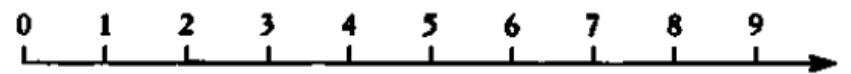

*Figura 16. La aritmética convencional puede describirse en términos de desplazamientos hacia la derecha o la izquierda a lo largo de la recta de los números.* 

Puede haber otras soluciones entre la lista infinita de números enteros, pero dar la relación completa de soluciones a esta ecuación es una tarea imposible. Resulta más sencillo buscar soluciones comprendidas en un espacio finito de números mediante la llamada aritmética de relojes.

Ya vimos antes que los números pueden imaginarse como marcas dispuestas a lo largo de una recta que se extiende hasta el infinito, como se muestra en la figura 16.

Para hacer finito el espacio de números, la aritmética de relojes corta la recta en cierto punto y cierra sobre sí mismo el segmento resultante para formar un anillo de números en vez de una línea.

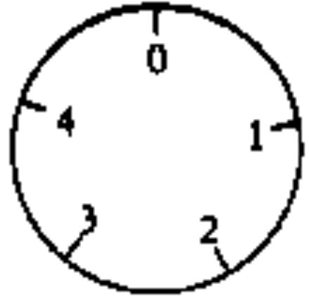

*Figura 17: En la aritmética del reloj de cinco números la línea se corta por el número 5 y el segmento resultante se cierra sobre sí mismo. El número 5 coincide con el 0 y por tanto se sustituye por éste.* 

La figura 17 contiene un reloj de cinco números en el que la recta se ha cortado por el 5 y se ha vuelto a cerrar sobre el 0. El número 5 se anula y se hace equivalente al 0, por lo que los únicos números que quedan en la aritmética del reloj de cinco números son 0, 1, 2, 3 y 4.

En la aritmética normal, la adición puede entenderse como un desplazamiento a lo largo de la recta, siempre hacia la derecha, un cierto número de espacios. Por ejemplo, 4 + 2 = 6 es lo mismo que decir: sitúate en el 4 y muévete a lo largo de la recta dos espacios hasta llegar al 6.

Sin embargo, en la aritmética del reloj de cinco números:

$$4 + 2 = 1.$$

Esto ocurre porque si empezamos en el 4 y avanzamos dos espacios en la esfera del reloj acabamos llegando al 1. La aritmética de relojes puede parecer poco familiar, pero de hecho, tal y como sugiere su nombre, la usamos a diario al hablar de la hora. Cuatro horas después de las 11 en punto (o sea, 11 + 4) no solemos decir que son las 15 en punto, sino más bien las 3 en punto: esto es aritmética del reloj de doce números.

Al igual que la adición, la aritmética de relojes admite la representación de otras operaciones matemáticas usuales, como la multiplicación. En la aritmética del reloj de 12 números, 5 x 7 = 11. Esta multiplicación se puede interpretar así: se parte del 0, nos movemos 5 grupos de 7 espacios, y al final se llega al 11. Aunque éste es un modo de entender la multiplicación en la aritmética de relojes, hay atajos lógicos que simplifican los cálculos. Por ejemplo, para calcular 5 x 7 en la aritmética del reloj de 12 números podemos empezar por calcular el resultado normal, que es 35. Dividimos luego 35 entre 12 y el resto de la división es la respuesta a la pregunta inicial. El 12 está contenido en el 35 sólo dos veces, con un resto de 11, y con toda seguridad 5 x 7 en la aritmética del reloj de doce números es igual a 11. Todo esto es equivalente a imaginar que se avanza en la esfera del reloj dos vueltas completas y 11 espacios adicionales.

Como la aritmética de relojes trabaja en un espacio de números limitado es relativamente fácil hallar todas las soluciones posibles de una ecuación elíptica para la aritmética de un reloj determinado. Por ejemplo, si se trabaja en el reloj de cinco números, es sencillo elaborar la relación completa de soluciones de la ecuación

$$\mathbf{x}^3 \mathbf{-} \mathbf{x}^2 = \mathbf{y}^2 + \mathbf{y}^1$$

Las soluciones son:

$$\begin{aligned} \chi &= 0, \ y = 0 \\ \chi &= 0, \ y = 4 \\ \chi &= 1, \ y = 0 \\ \chi &= 1, \ y = 4 \end{aligned}$$

Aunque algunas de estas soluciones no serían válidas en la aritmética normal, todas son aceptables en la aritmética del reloj de cinco números. Por ejemplo, la cuarta solución (*x* = 1, *y* = 4) funciona de este modo:

$$\begin{aligned} \lambda^3 \cdot \lambda^2 &= \lambda^2 + \mathcal{Y} \\ \mathfrak{l}^3 \cdot \mathfrak{l}^2 &= 4^2 + 4 \\ \mathfrak{l} - \mathfrak{l} &= \mathfrak{l}\mathfrak{G} + 4 \end{aligned}$$

$$\mathbf{0} = \mathbf{20}$$

Pero recordemos que el 20 equivale al 0 en esta aritmética, porque el resto que queda al dividir 20 entre 5 es 0.

Como no es posible hallar la totalidad de soluciones para una ecuación elíptica si se trabaja en un espacio infinito, los matemáticos, como Wiles, se plantearon el cálculo de la cantidad de soluciones en cada aritmética de relojes posible. Para el ejemplo anterior de ecuación elíptica, el número de soluciones en el reloj de cinco números es cuatro, y los matemáticos lo representan como *E*5 = 4. Se puede hallar el número de soluciones en otras aritméticas. Por ejemplo, en el reloj de siete números la ecuación tiene nueve soluciones, de modo que *E*7 = 9.

Los matemáticos resumen los resultados en forma de lista, dando el número total de soluciones en cada reloj, y llaman a esta lista la *«serie L»* de la ecuación elíptica. Ya nadie recuerda el porqué de esa letra *L*, aunque hay quien sugiere que procede del nombre de Gustav Lejeune–Dirichlet, que trabajó con ecuaciones elípticas. Por claridad, yo usaré el término *«serie E»*: la serie que procede de una ecuación elíptica. Para el ejemplo que estamos empleando la serie es: Ecuación elíptica:

Serie E:

$$
\lambda^3 \cdot \lambda^2 = \chi^2 + \chi
$$

$$\begin{aligned} E_1 &= 1_\prime\\ E_2 &= 4_\prime\\ E_3 &= 4_\prime\\ E_4 &= 8_\prime\\ E_5 &= 4_\prime \end{aligned}$$

$$\begin{aligned} \mathsf{E_6} &= \mathsf{16}_{\prime} \\ \mathsf{E_7} &= \mathsf{9}_{\prime} \\ \mathsf{E_8} &= \mathsf{16} \\ &\cdots \end{aligned}$$

Si no es posible saber cuántas soluciones tiene una ecuación elíptica dada en un espacio infinito de números, disponer de su serie *E* parece la alternativa menos mala. De hecho, la serie *E* contiene una gran cantidad de información acerca de la ecuación elíptica de la que procede. Del mismo modo que en biología el ADN contiene toda la información requerida para crear un organismo vivo, la serie *E* resume la esencia de la ecuación elíptica. Se tenía la esperanza de que mediante el estudio de este ADN matemático, la serie *E*, fuera posible hallar a la larga todo lo que se deseara sobre una ecuación elíptica dada.

Trabajando junto a Coates, Wiles asentó pronto su reputación como un brillante teórico de números con una comprensión profunda de las ecuaciones elípticas y sus series *E* asociadas.

Wiles no se daba cuenta de que cada nuevo resultado y cada artículo publicado en este campo le estaban proporcionando una experiencia que, bastantes años después, lo conduciría al umbral de la demostración del último teorema de Fermat. Aunque nadie lo sabía por aquel entonces, los matemáticos del Japón de posguerra habían desencadenado una sucesión de acontecimientos que ligaría de manera inseparable las ecuaciones elípticas al último teorema de Fermat. Al introducir a Wiles en el estudio de las ecuaciones elípticas, Coates le había proporcionado las herramientas que más tarde le iban a permitir modelar su sueño.

# **Capítulo 5 PRUEBA POR CONTRADICCIÓN**

*Las construcciones de los matemáticos, como las de los pintores o los poetas, deben ser bellas; las ideas, como los colores o las palabras, deben encajar con armonía. La belleza es el primer requisito: no hay un lugar permanente en el mundo para las matemáticas feas. G. H. HARDY* 

En enero de 1954, un brillante y joven matemático de la Universidad de Tokio fue a la biblioteca de su departamento. Goro Shimura buscaba una copia del volumen 24 de *Matematische Annalen*. En particular estaba buscando un artículo de Deuring sobre su teoría algebraica de la multiplicación compleja, que necesitaba como ayuda para un cálculo particularmente difícil y esotérico.

Para su sorpresa y consternación, alguien se había llevado ya el volumen. Quien lo había tomado en préstamo era Yutaka Taniyama, un conocido lejano de Shimura que vivía al otro lado del campus. Shimura escribió a Taniyama explicando que necesitaba la revista con urgencia para completar el complejo cálculo y le preguntó educadamente cuándo la devolvería.

Pocos días más tarde apareció una carta en la mesa de Shimura. Taniyama había contestado diciendo que también él estaba trabajando en aquel mismo cálculo y que estaba atascado en el mismo paso lógico. Sugirió que podían compartir sus ideas y tal vez colaborar en el problema. Este casual encuentro gracias a un libro de la biblioteca inició una colaboración que cambiaría el curso de la historia de las matemáticas.

Taniyama nació el 12 de noviembre de 1927 en una pequeña ciudad a unos pocos kilómetros al norte de Tokio. La grafía japonesa usada para representar su nombre debería leerse *«Toyo»*, pero la mayoría de las personas ajenas a su familia lo malinterpretaron como *«Yutaka»* y, al crecer, Taniyama asumió y adoptó ese apelativo. Durante su infancia la educación de Taniyama se interrumpió constantemente. Padeció varias enfermedades y durante la pubertad sufrió un ataque de tuberculosis y perdió dos años de instituto. El inicio de la guerra causó una interrupción aún mayor en su escolaridad.

Goro Shimura, un año más joven que Taniyama, también vio interrumpida su escolarización durante los años de la guerra. Su escuela fue clausurada y, en lugar de asistir a clase, Shimura tuvo que ayudar al esfuerzo bélico trabajando en una fábrica donde montaba piezas de aviones. Estudiaba cada tarde para corregir su falta de instrucción escolar y se sintió particularmente atraído por las matemáticas. «Por supuesto, hay muchas materias para aprender, pero las matemáticas eran las más sencillas porque podía limitarme a leer libros de texto de matemáticas. Aprendí cálculo leyendo libros. Si hubiera querido aprender química o física habría necesitado instrumental científico y yo no tenía acceso a tales cosas. Nunca creí poseer talento. Sólo era curioso.»

Unos pocos años después de la guerra, Shimura y Taniyama se encontraron en la universidad. En la época en que se intercambiaron las cartas sobre el libro de la biblioteca, la vida en Tokio volvía a la normalidad y los dos jóvenes universitarios podían permitirse uno o dos pequeños lujos. Pasaban las tardes en cafeterías, por las noches cenaban en un pequeño restaurante especializado en carne de ballena y durante los fines de semana paseaban por los jardines botánicos o por el parque de la ciudad. Todos eran lugares ideales para comentar sus más recientes pensamientos matemáticos.

Si bien Shimura tenía una vena fantasiosa, era mucho más conservador y convencional que su compañero intelectual. Shimura se levantaba al alba y se ponía a trabajar de inmediato, mientras que su colega a menudo estaba aún despierto tras haber trabajado durante toda la noche. Quienes visitaban el apartamento de Taniyama a menudo lo encontraban dormido a media tarde.

Mientras que Shimura era puntilloso, Taniyama era descuidado hasta el punto de la vagancia. Sorprendentemente, éste era el aspecto que Shimura admiraba: «Tenía el don de cometer muchos errores, casi siempre en la dirección correcta. Lo envidiaba por ello y traté en vano de imitarlo, pero me resultó muy difícil cometer buenos errores.»

Taniyama era el epítome del genio de mente ausente, y esto se reflejaba en su apariencia. Era incapaz de hacer un nudo decente, y por ello decidió que en lugar de anudarse los cordones de sus zapatos una docena de veces al día no los iba a anudar nunca. Siempre vestía el mismo traje verde tan peculiar, con un extraño brillo metálico. El resto de su familia lo había rechazado porque estaba hecho de una tela muy llamativa.

Cuando se encontraron en 1954, Taniyama y Shimura estaban empezando sus carreras en matemáticas. La tradición era, y aún es, que los investigadores jóvenes se refugiaran bajo el ala de algún profesor que los ayudara en el entrenamiento mental, pero Taniyama y Shimura rechazaron esta forma de aprendizaje. Durante la guerra, la investigación real se había detenido, e incluso en los años cincuenta la Facultad de Matemáticas aún no se había recuperado. Según Shimura, los profesores estaban «cansados, hastiados y desilusionados». En comparación, los estudiantes de la posguerra eran apasionados y estaban impacientes por aprender, y pronto se dieron cuenta de que el único modo de progreso era aprender por sí mismos. Los estudiantes organizaron seminarios regulares, dándolos por turno para informar al resto de las últimas técnicas y avances. A pesar de su pereza habitual, Taniyama proporcionaba gran empuje cuando asistía a los seminarios. Animaba a los estudiantes mayores a explorar territorios desconocidos y actuaba como una figura paternal para los estudiantes más jóvenes.

Debido a su aislamiento, los seminarios trataban ocasionalmente temas que se consideraban superados en Europa y América. La ingenuidad de los estudiantes significaba que estudiaban ecuaciones que habían sido abandonadas en Occidente. Un tema particularmente pasado de moda que fascinó a Taniyama y Shimura fue el estudio de las formas modulares.

Las formas modulares son unos de los objetos más misteriosos y maravillosos de las matemáticas. Se hallan entre las entidades más esotéricas de las matemáticas y, aun así, el teórico de los números del siglo XX, Martin Eichler, las contó como una de las cinco operaciones fundamentales: suma, resta, multiplicación, división y formas modulares. La mayor parte de los matemáticos se consideran maestros de las cuatro primeras operaciones, pero encuentran algo confusa la quinta.

La característica clave de las formas modulares es su desmedido grado de simetría. Aunque la mayor parte de la gente está familiarizada con el concepto común de simetría, ésta tiene un significado especial en matemáticas: un objeto tiene simetría si se puede transformar de un modo particular y después de la transformación permanece inalterado. Para apreciar la inmensa simetría de una forma modular conviene examinar primero la de un objeto más mundano, como un simple cuadrado.

En el caso de un cuadrado, una forma de simetría es la rotacional. Es decir, si imaginamos un pivote en el punto donde se cruzan los ejes x e y, entonces el cuadrado de la figura 18 se puede rotar un cuarto de vuelta y después parecerá que no se ha transformado. De forma similar, las rotaciones de media vuelta, tres cuartos de vuelta y una vuelta completa dejarán también aparentemente inalterado el cuadrado.

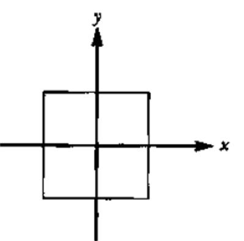

*Figura 18: Un simple cuadrado exhibe tanto simetría rotacional como por reflexión.* 

Además de la simetría rotacional, el cuadrado también posee simetría por reflexión. Si imaginamos un espejo situado a lo largo del eje *x*, entonces la parte superior del cuadrado se reflejaría exactamente sobre la mitad inferior, y viceversa, de manera que tras la transformación el cuadrado parecería no haber cambiado. De forma similar podemos definir otros tres espejos (a lo largo de las dos diagonales y a lo largo del eje *y*) para los cuales el cuadrado reflejado parecería idéntico al original.

El simple cuadrado es bastante simétrico, ya que posee simetría rotacional y por reflexión, pero no posee ninguna simetría translacional. Esto significa que si el cuadrado se desplazara en cualquier dirección, un observador podría detectar el movimiento inmediatamente porque su posición relativa a los ejes habría cambiado. Sin embargo, si todo el espacio estuviera recubierto por cuadrados, como se muestra en la figura 19, esta colección infinita de cuadrados tendría simetría translacional. Si la superficie infinitamente teselada se desplazara arriba o abajo por espacio de una o más teselas, ese teselado parecería idéntico al original.

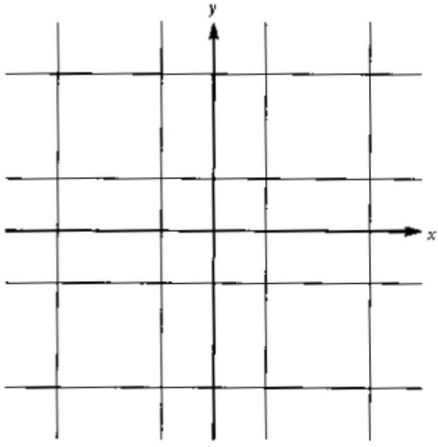

*Figura 19: Una superficie infinita recubierta de cuadrados exhibe simetría rotacional y por reflexión y, además, tiene simetría translacional.* 

La simetría de las superficies teseladas es una idea bastante clara pero, como muchos otros conceptos aparentemente simples, esconde varias sutilezas. Por ejemplo, en la década de los setenta el físico y matemático recreativo británico Roger Penrose empezó a jugar con diferentes teselas sobre la misma superficie. Al fin identificó dos formas particularmente interesantes, llamadas la cometa y la punta de flecha, que se muestran en la figura 20. Por separado, cada una de estas teselas no se puede usar para recubrir una superficie sin dejar huecos o producir superposiciones, pero juntas se pueden emplear para crear un rico conjunto de modelos de teselación. Las cometas y puntas de flecha se pueden encajar unas en otras en un número infinito de formas y, aunque en apariencia cada modelo es similar, en detalle todos ellos son distintos. En la figura 20 se muestra el modelo creado con cometas y puntas de flecha.

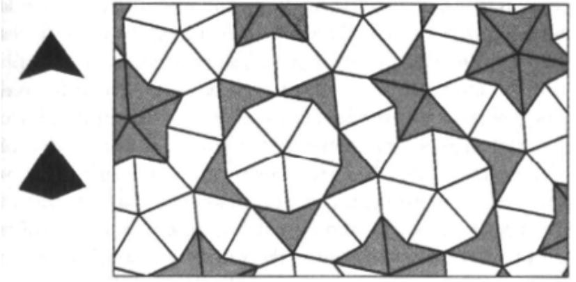

*Figura 20: Usando dos teselas diferentes, la cometa y la punta de flecha, Roger Penrose pudo recubrir una superficie. Sin embargo, la teselación de Penrose no posee simetría translacional.* 

Otra característica singular de las teselaciones de Penrose (los recubrimientos generados por teselas tales como la cometa y la punta de flecha) es que su nivel de simetría es muy restringido. A primera vista parece que la teselación mostrada en la figura 20 posee simetría translacional, pero cualquier intento de desplazar el teselado a lo largo de la superficie de modo que permanezca inalterado acaba en fracaso. Los recubrimientos de Penrose son decepcionantemente asimétricos y por eso fascinan a los matemáticos y se han convertido en el punto de partida de un área completamente nueva de las matemáticas.

Es curioso que los recubrimientos de Penrose también hayan tenido repercusiones en la ciencia de los materiales. Los cristalógrafos siempre habían creído que los cristales tenían que construirse según los principios de la teselación cuadrada, que posee un alto nivel de simetría translacional. En teoría, la construcción de cristales se basaba en una estructura muy regular y repetitiva. Sin embargo, en 1984 los científicos descubrieron un cristal metálico formado por aluminio y manganeso que estaba construido según los principios de Penrose. El mosaico de aluminio y manganeso se comporta como las cometas y puntas de flecha, generando un cristal casi regular, pero no del todo. Una empresa francesa ha desarrollado recientemente un cristal de Penrose como recubrimiento para sartenes.

Aunque lo fascinante de las teselaciones de Penrose se encuentra en su restringida simetría, la propiedad más interesante de las formas modulares es que exhiben una simetría infinita. Las formas modulares estudiadas por Shimura y Taniyama se pueden desplazar, invertir, intercambiar, reflejar y rotar en un número infinito de maneras y siempre permanecen inalteradas, lo que hace de ellas los objetos matemáticos más simétricos. Cuando el erudito francés Henri Poincaré estudió las formas modulares en el siglo XIX tuvo una gran dificultad para expresar su inmensa simetría. Tras trabajar en un tipo particular de forma modular, describió a sus colegas cómo cada día, durante dos semanas, se despertaba y buscaba un error en sus cálculos. Al decimoquinto día llegó a la conclusión de que sus cálculos eran correctos y aceptó que las formas modulares eran en efecto extremadamente simétricas.

Por desgracia, dibujar, o incluso imaginar, una forma modular es imposible, en el caso de un cuadrado estamos en presencia de un objeto de dos dimensiones, con un espacio definido por los ejes *x* e *y*. Una forma modular también está definida por dos ejes, pero los dos son complejos; es decir, cada eje posee una parte real y otra imaginaria, y en realidad se compone de dos ejes. Por lo tanto, el primer eje complejo se debe representar por dos ejes, *xr* (real) y *xi* (imaginario), y el segundo eje se representa por otros dos ejes, *yr* (real) e *yi* (imaginario). Para ser precisos, las formas modulares habitan en el semiplano superior de este espacio complejo, pero lo que es más importante es darse cuenta de que este espacio es tetradimensional (*xr, xi, yr* e *yi*).

Este espacio de cuatro dimensiones es el llamado espacio hiperbólico. El espacio hiperbólico es difícil de entender para los humanos, que están constreñidos a vivir en el mundo convencional de tres dimensiones, pero el espacio de cuatro dimensiones es un concepto matemáticamente válido, y es esta dimensión adicional la que proporciona a las formas modulares un nivel tan elevado de simetría. El artista Mauritz Escher quedó fascinado por las ideas matemáticas e intentó transmitir el concepto de espacio hiperbólico en algunos de sus aguafuertes y pinturas. La figura 21 muestra la obra *Circle Limit IV* de Escher, que incrusta el mundo del espacio hiperbólico en la página bidimensional. En el espacio hiperbólico real, los murciélagos y los ángeles serían todos del mismo tamaño, y la repetición es indicativa del alto grado de simetría. Aunque parte de la simetría se puede apreciar en la página bidimensional, existe una distorsión creciente hacia el borde de la pintura.

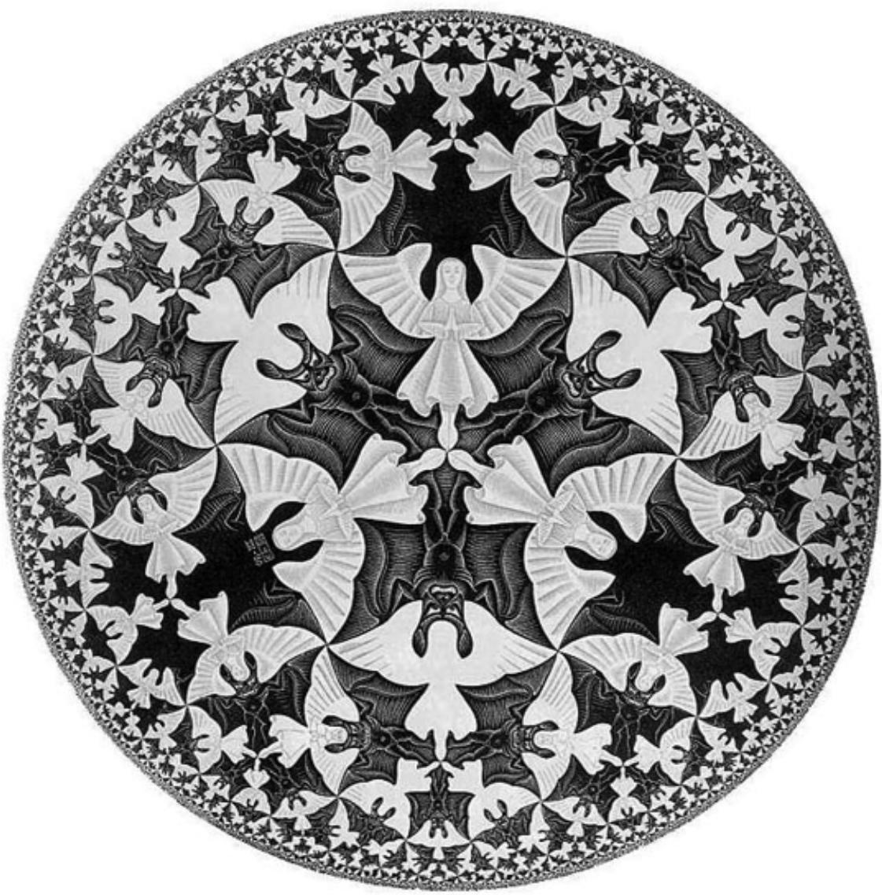

*Figura 21. La obra Circle Limit IV, de Mauritz Escher, da una idea de la simetría de las formas modulares.* 

Las formas modulares que habitan el espacio hiperbólico son de varias formas y tamaños, pero cada una está construida con los mismos ingredientes básicos. Lo que diferencia cada forma modular es la cantidad de cada uno de los ingredientes que la componen. Los ingredientes que componen una forma modular están etiquetados de uno a infinito (*M*1, *M*2, *M*3, *M*4...), y así cada forma modular particular puede contener una medida del ingrediente uno (*M*1 = 1), tres medidas del ingrediente dos (*M*2 = 3), dos medidas del ingrediente tres (*M*3 = 2), etc. Esta información que describe cómo construir una forma modular se puede resumir en la llamada serie modular, o serie *M*, una lista de los ingredientes y la cantidad requerida de cada uno:

Serie M:

$$\begin{aligned} \mathcal{M}_1 &= \mathbf{1} \\ \mathcal{M}_2 &= \mathbf{3} \\ \mathcal{M}_3 &= \mathbf{2} \\ &\cdots \end{aligned}$$

Del mismo modo que la serie *E* es el ADN para las ecuaciones elípticas, la serie *M* lo es para las formas modulares. La cantidad de cada ingrediente listada en la serie *M* es crítica. Dependiendo de cuánto se cambie la cantidad, por decir algo, del primer ingrediente, se genera una forma modular del todo diferente, aunque igualmente simétrica, o se puede destruir la simetría y generar un nuevo objeto que no es una forma modular. Si la cantidad de cada ingrediente se escoge de manera arbitraria, entonces el resultado será probablemente un objeto con poca o ninguna simetría.

Las formas modulares constituyen casi un mundo aparte dentro de las matemáticas. En particular parecían completamente ajenas al tema que Wiles estudiaría más adelante en Cambridge, las ecuaciones elípticas. La forma modular es una bestia enormemente complicada, estudiada sobre todo por su simetría y descubierta en el siglo XIX. Las ecuaciones elípticas se remontan a los antiguos griegos y no tienen nada que ver con las simetrías. Las formas modulares y las ecuaciones elípticas habitan regiones completamente diferentes del cosmos matemático y nadie hubiera creído que existiera la menor relación entre los dos temas. Sin embargo, Taniyama y Shimura sorprenderían a la comunidad matemática al sugerir que las ecuaciones elípticas y las formas modulares son en realidad una sola cosa. Según esos maravillosos matemáticos, ellos podían unificar los mundos modular y elíptico.

# **Ilusiones y espejismos**

En septiembre de 1955 se celebró un simposio internacional en Tokio. Fue una oportunidad única para los muchos jóvenes investigadores japoneses de mostrar al resto del mundo lo que habían aprendido. Repartieron una colección de treinta y seis problemas relacionados con su trabajo, acompañada por una humilde introducción: Algunos problemas sin resolver en matemáticas: no se ha realizado una preparación madura, de modo que puede haber algunos triviales o ya resueltos entre ellos. Se solicita a los participantes que hagan comentarios sobre cualquiera de estos problemas.

Cuatro de estas cuestiones eran de Taniyama, y daban pistas sobre una curiosa relación entre las formas modulares y las ecuaciones elípticas. Estas inocentes preguntas llevarían finalmente a una revolución en la teoría de números. Taniyama se había fijado en los primeros términos de la serie *M* de una forma modular en particular. Reconoció la sucesión y se dio cuenta de que era idéntica a la lista de números de la serie *E* de una ecuación elíptica bien conocida. Calculó algunos términos más de cada una de las series y la serie *M* de la forma modular y la *E* de la ecuación elíptica continuaban encajando perfectamente.

Fue un descubrimiento sorprendente porque, sin razón aparente, esa forma modular podía estar relacionada con una ecuación elíptica a través de sus respectivas series *M* y *E*: las series eran idénticas. El ADN matemático que construye cada una de esas dos entidades era exactamente el mismo. Este fue un descubrimiento doblemente valioso. En primer lugar sugería que, profundamente enterrada, había una relación fundamental entre la forma modular y la ecuación elíptica, objetos que provienen de extremos opuestos de las matemáticas. En segundo lugar significaba que los matemáticos, que ya conocían las series *M* de las formas modulares, no necesitaban calcular las series *E* porque eran las mismas que las series *M*.

Las relaciones entre temas aparentemente diferentes son tan importantes para la creatividad en matemáticas como en cualquier otra disciplina. La relación es una pista sobre alguna verdad oculta que enriquece ambos temas. Por ejemplo, al principio los científicos estudiaron la electricidad y el magnetismo como dos fenómenos completamente separados. En el siglo XIX, los teóricos y los experimentales se dieron cuenta de que la electricidad y el magnetismo estaban íntimamente relacionados. Este descubrimiento llevó a una comprensión más profunda de ambos fenómenos. Las corrientes eléctricas generan campos magnéticos y los imanes pueden inducir electricidad en cables que pasen cerca de ellos. Esto condujo a la invención de las dinamos y los motores eléctricos, y por fin al descubrimiento de que la luz misma es el resultado de campos eléctricos y magnéticos oscilando armónicamente.

Taniyama examinó algunas otras formas modulares y en cada caso la serie *M* parecía corresponder perfectamente con la serie *E* de una ecuación elíptica. Empezó a preguntarse si podría ser que cada forma modular pudiera asociarse a una ecuación elíptica. Tal vez cada forma modular tuviera el mismo ADN que una ecuación elíptica: ¿tal vez cada forma modular fuera una ecuación elíptica disfrazada? Las preguntas que repartió en el congreso estaban relacionadas con esta hipótesis.

La idea de que cada forma modular estuviera asociada a una ecuación elíptica era tan extraordinaria que los que echaron un vistazo a las cuestiones de Taniyama las trataron nada más que como una curiosa observación. Sin duda, Taniyama había demostrado que unas cuantas ecuaciones elípticas podían asociarse con formas modulares particulares, pero afirmaban que esto no era más que una coincidencia. De acuerdo con los escépticos, la afirmación de Taniyama de una relación más general y universal parecía estar muy poco corroborada. La hipótesis estaba basada en la intuición más que en evidencias reales.

El único aliado de Taniyama fue Shimura, que creía en el poder y la profundidad de la idea de su amigo. Tras el simposio trabajó con Taniyama en un intento de desarrollar la hipótesis hasta un nivel en el que el resto del mundo no pudiera ignorar su trabajo. Shimura quería encontrar más evidencias para respaldar la relación entre los mundos modular y elíptico. La colaboración se interrumpió temporalmente cuando en 1957 Shimura fue invitado a trabajar en el Institute for Advanced Study de Princeton. Tras dos años como profesor invitado en Estados Unidos planeaba retomar el trabajo con Taniyama, pero eso nunca ocurrió. El 17 de noviembre de 1957 Yutaka Taniyama se suicidó.

# **La muerte de un genio**

Shimura aún conserva la carta que Taniyama le envió cuando tuvieron su primer contacto acerca del libro de la biblioteca. También conserva la última carta que Taniyama le escribió mientras él estaba en Princeton, pero ésta no contiene la más mínima indicación sobre lo que ocurriría dos meses después. Hasta hoy, Shimura no comprende cuál fue la causa del suicidio de Taniyama. «Yo estaba muy confundido. Confusión puede ser la mejor palabra. Por supuesto estaba triste, pero fue tan repentino. Recibí esta carta en septiembre y él murió a principios de noviembre, y no pude encontrar el sentido a todo esto. Luego oí varias cosas y traté de hacerme a la idea de su muerte. Algunos dijeron que había perdido la confianza en sí mismo, pero no en sus capacidades matemáticas.»

Particularmente desconcertante para los amigos de Taniyama fue que se había enamorado de Misako Suzuki y planeaban casarse aquel mismo año. Como un tributo personal publicado en el *Bulletin of the London Mathematical Society*, Goro Shimura recuerda el compromiso de Taniyama con Misako y las semanas que precedieron al suicidio:

Cuando me informaron de su compromiso me sorprendí un poco, porque me parecía que ella no era su tipo, pero no sentí recelos. Más tarde me dijeron que habían firmado el contrato de alquiler de un apartamento, al parecer mejor, para convertirlo en su nuevo hogar, habían comprado cacharros de cocina juntos y se estaban preparando para la boda. A ellos y sus amigos todo les parecía muy halagüeño. Entonces la catástrofe les cayó encima.

En la mañana del lunes 17 de noviembre de 1958, el vigilante de su apartamento lo encontró muerto en su habitación con una nota sobre la mesa. Estaba escrita en tres páginas de una libreta del mismo tipo que había usado para su trabajo de investigación; el primer párrafo decía:

«Hasta ayer no tenía una intención clara de matarme. Pero bastantes personas deben de haberse dado cuenta de que últimamente he estado cansado tanto física como mentalmente. Ni yo mismo entiendo del todo la causa de mi suicidio, pero no es el resultado de ningún incidente en particular ni de nada específico. Simplemente puedo decir que estoy en un estado de ánimo tal que he perdido la confianza en mi futuro. Puede haber alguien para quien mi suicidio sea inquietante o, hasta cierto punto, un golpe. Sinceramente espero que este incidente no proyecte ninguna sombra sobre el futuro de esa persona. De ninguna manera puedo negar que esto no sea una forma de traición, pero, por favor, excusadlo como mi último acto, que he hecho a mi manera, igual que siempre he ido por libre toda la vida.»

Seguía describiendo, de forma bastante metódica, sus deseos sobre cómo efectuar el reparto de sus bienes y qué libros y discos había tomado prestados de la biblioteca o de sus amigos, y así sucesivamente. Específicamente dice: «Me gustaría dejar mis discos y el tocadiscos a Misako Suzuki, suponiendo que no esté enfadada conmigo por dejárselos.» También explica hasta dónde había llegado en los cursos de cálculo y álgebra lineal que estaba dando, y concluye la nota con una disculpa a sus colegas por los inconvenientes que su acto pudiera causar.

Así, una de las mentes más brillantes y avanzadas de su tiempo finalizó su vida por propio deseo. Había cumplido treinta y un años cinco días antes.

Unas cuantas semanas después del suicidio la tragedia golpeó por segunda vez. Su prometida, Misako Suzuki, también se quitó la vida. Según se dice, dejó una nota en la que se leía: «Nos prometimos mutuamente que, sin importar adonde fuéramos, nunca nos separaríamos. Ahora que él se ha ido yo debo ir también para reunirme con él.»

#### **La filosofía de la bondad**

Durante su corta carrera, Taniyama contribuyó a las matemáticas con varias ideas radicalmente nuevas. Las preguntas que repartió en el simposio contenían su mayor intuición, pero estaban tan adelantadas a su tiempo que nunca vivió para ver la enorme influencia que tuvieron en la teoría de números. Su creatividad intelectual fue tristemente echada de menos, al igual que su papel de guía dentro de la comunidad de jóvenes científicos japoneses. Shimura recuerda con claridad la influencia de Taniyama: «Siempre era amable con sus colegas, especialmente con sus estudiantes jóvenes, y se preocupaba de manera sincera por su bienestar. Fue el apoyo moral de muchos de los que entraron en contacto matemático con él, incluyéndome por supuesto a mí mismo. Probablemente nunca fue consciente del papel que estaba desempeñando. Pero ahora noto su noble generosidad a este respecto más que cuando estaba vivo. Y sin embargo, nadie pudo darle ningún apoyo cuando lo necesitó desesperadamente. Cuando pienso en ello me abruma la pena más amarga.»

Tras la muerte de Taniyama, Shimura concentró todos sus esfuerzos en comprender la relación exacta entre las ecuaciones elípticas y las formas modulares. Con el paso de los años se esforzó para obtener alguna evidencia más y uno o dos argumentos lógicos para sostener la teoría. Gradualmente se fue convenciendo de que cada ecuación elíptica estaba relacionada con una forma modular. Otros matemáticos aún mantenían dudas y Shimura recuerda una conversación con un eminente colega. El profesor preguntó: «He oído que usted propone que algunas ecuaciones elípticas se pueden conectar con formas modulares.»

«No, no lo ha entendido —replicó Shimura—. No son sólo algunas ecuaciones elípticas, son todas las ecuaciones elípticas.»

Shimura no pudo demostrar que esto era cierto, pero cada vez que ponía a prueba la hipótesis parecía ser verdadera, y en cualquier caso en conjunto parecía encajar en su filosofía general de las matemáticas. «Yo tengo la filosofía de la bondad. Las matemáticas deben contener bondad. Así, en el caso de las ecuaciones elípticas, se podría llamar buena a la ecuación si estuviera parametrizada por una forma modular. Yo espero que todas las ecuaciones elípticas sean buenas. Es una filosofía un poco rudimentaria pero siempre se puede tomar como punto de partida. Entonces, por supuesto, tenía que desarrollar varias razones técnicas para la conjetura. Debería decir que la conjetura surgía de la filosofía de la bondad. La mayor parte de los matemáticos hacen matemáticas desde un punto de vista estético, y esta filosofía de la bondad proviene de mi punto de vista estético.»

Con el tiempo, la acumulación de evidencias por Shimura significó que su teoría acerca de las ecuaciones elípticas y las formas modulares se hiciera ampliamente aceptada. No pudo demostrar al resto del mundo que tenía razón, pero por lo menos ya no eran meras ilusiones. Existían suficientes evidencias como para que mereciera el título de conjetura. Al principio fue conocida como la conjetura de Taniyama–Shimura en reconocimiento del hombre que la inspiró a su colega y de éste, que prosiguió el trabajo hasta desarrollarla completamente.

En su momento, André Weil, uno de los padrinos de la teoría de números del siglo XX, adoptó la conjetura y le dio publicidad en Occidente. Weil investigó la idea de Shimura y Taniyama y encontró aún más evidencias a su favor. Como resultado, la conjetura se denomina frecuentemente la conjetura de Taniyama–Shimura–Weil, a veces la conjetura de Taniyama– Weil y en ocasiones como la conjetura de Weil. De hecho ha habido mucho debate y controversia sobre el nombre oficial de la conjetura. Para aquellos que estén interesados en la combinatoria existen quince permutaciones posibles de los tres nombres involucrados y es posible que cada una de ellas haya aparecido impresa a lo largo de los años. Sin embargo, yo me referiré a la conjetura por su nombre original: la conjetura de Taniyama–Shimura.

El profesor John Coates, que dirigió a Andrew Wiles cuando era un estudiante, era a su vez un estudiante cuando la conjetura de Taniyama–Shimura se convirtió en un tema de conversación en Occidente. «Empecé a investigar en 1966, cuando la conjetura de Taniyama y Shimura estaba extendiéndose por el mundo. Todos estaban asombrados y empezaron a ocuparse seriamente de si todas las ecuaciones elípticas podían ser modulares. Fue un tiempo tremendamente emocionante; el único problema, por supuesto, fue que parecía muy difícil hacer progresos. Creo que es justo decir que, por bella que fuera esta idea, parecía muy difícil de demostrar, y esto es lo que interesa sobre todo a los matemáticos.»

Durante el final de los sesenta, una legión de matemáticos comprobó repetidamente la conjetura de Taniyama–Shimura. Partiendo de una ecuación elíptica y su serie *E*, buscaban una forma modular con una serie *M* idéntica. En todos los casos, la ecuación elíptica tenía asociada una forma modular. Aunque esto era una buena evidencia en favor de la conjetura de Taniyama–Shimura, no era en absoluto una prueba. Los matemáticos sospechaban que era cierta, pero hasta que alguien encontrara una demostración lógica continuaría siendo una mera conjetura.

Barry Mazur, un profesor de la Universidad de Harvard, fue testigo de la ascensión de la conjetura de Taniyama–Shimura. «La suposición de que cada ecuación elíptica estaba asociada a una forma modular era una bella conjetura, pero al principio fue ignorada por estar demasiado adelantada a su tiempo. Cuando se propuso por primera vez no fue considerada debido a que era demasiado asombrosa. Por un lado se tiene el mundo elíptico, y en el otro se tiene el mundo modular. Las dos ramas de las matemáticas se habían estudiado de forma intensa pero separada. Los matemáticos que estudiaban las ecuaciones elípticas podían no estar bien preparados en formas modulares, y viceversa. Entonces llega la conjetura de Taniyama–Shimura, la gran suposición de que existe un puente entre esos dos mundos completamente diferentes. A los matemáticos les encanta construir puentes.»

El valor de los puentes matemáticos es enorme. Permiten intercambiar ideas a comunidades matemáticas que habían estado viviendo en islas separadas y explorar mutuamente sus creaciones. Las matemáticas consisten en islas de conocimiento dentro de un mar de ignorancia. Por ejemplo, existe una isla ocupada por los geómetras que estudian las formas y las figuras, y existe una isla de la probabilidad en la que los matemáticos discuten sobre el riesgo y la posibilidad. Hay docenas de estas islas, cada una con su lenguaje propio y único, incomprensible para los habitantes de otras islas. El lenguaje de la geometría es muy diferente del lenguaje de la probabilidad, y la jerga del cálculo no tiene sentido para aquellos que sólo hablan de estadística.

El gran potencial de la conjetura de Taniyama–Shimura era que conectaría dos islas y permitiría a sus habitantes hablar entre ellos por primera vez. Barry Mazur considera la conjetura de Taniyama–Shimura un instrumento de traducción tal como la piedra de Rosetta, que contenía textos en demótico egipcio, griego antiguo y jeroglíficos. Puesto que se comprendía el demótico y el griego, los arqueólogos pudieron descifrar los jeroglíficos por primera vez. «Es como si entendieras un lenguaje y esta piedra de Rosetta te proporcionara un conocimiento profundo del otro idioma —dice Mazur—. Pero la conjetura de Taniyama–Shimura es una piedra de Rosetta con un cierto poder mágico. La conjetura tiene la encantadora propiedad de que simples intuiciones en el mundo modular se traducen en profundas verdades en el mundo elíptico, y viceversa. Es más, profundos problemas del mundo elíptico pueden resolverse a veces traduciéndolos por medio de esta piedra de Rosetta al mundo modular y descubriendo que tenemos intuiciones y herramientas en el mundo modular para tratar el problema traducido. En el mundo elíptico habríamos estado perdidos.»

Si la conjetura de Taniyama–Shimura fuera cierta, permitiría a los matemáticos abordar problemas elípticos que habían permanecido sin resolver durante siglos por medio de un acercamiento a través del mundo modular. La esperanza era que los mundos elíptico y modular pudieran ser unificados. La conjetura también constituyó la esperanza de que pudieran existir nexos entre otros varios campos matemáticos. Durante los años sesenta, Robert Langlands, que trabajaba en el Institute for Advanced Study de Princeton, quedó impresionado por la potencia de la conjetura de Taniyama–Shimura. Incluso aunque la conjetura aún no había sido demostrada, Langlands creía que era sólo un elemento de un esquema mucho mayor de unificación. Confiaba en que existieran nexos entre las principales áreas de las matemáticas y se puso a buscar esas unificaciones. En unos pocos años empezaron a aparecer los nexos. Todas esas otras conjeturas de unificación eran mucho más débiles y especulativas que la de Taniyama–Shimura, pero formaban una intrincada red de conexiones hipotéticas entre varias áreas de las matemáticas. El sueño de Langlands era ver cada una de esas conjeturas demostradas una por una y que ello llevara a una gran unificación de las matemáticas.

Langlands comentó su plan para el futuro e intentó convencer a otros matemáticos para que tomaran parte en lo que se llegó a conocer como el Programa Langlands, un esfuerzo concentrado en demostrar su miríada de conjeturas. Parecía no haber un medio obvio para demostrar esos nexos especulativos, pero sí el sueño se pudiera hacer realidad entonces la recompensa sería enorme, cualquier problema insoluble en una área de las matemáticas se podría transformar en un problema análogo en otra área en la cual se podría usar un nuevo arsenal de técnicas para luchar con él. Si la solución aún fuera elusiva, el problema podría ser transformado y transportado a una nueva área de las matemáticas, y así sucesivamente hasta que fuera resuelto. Un día, de acuerdo con el Programa Langlands, los matemáticos serían capaces de resolver sus problemas más oscuros e intratables transportándolos a lo largo del panorama matemático.

Había también grandes implicaciones en las ciencias aplicadas y la ingeniería. Tanto cuando se modelan las interacciones entre quarks en colisión como cuando se buscan las maneras más eficientes de organizar una red de telecomunicaciones, a menudo la clave del problema está en realizar algún cálculo matemático. En algunas áreas de la ciencia y la tecnología, la complejidad de los cálculos es tan inmensa que el progreso en esos temas se ve muy dificultado. Si los matemáticos pudieran probar las conjeturas de unión del Programa Langlands, habría atajos para resolver problemas del mundo real, así como los del abstracto.

En la década de los setenta, el Programa Langlands se había convertido en el plan maestro del futuro de las matemáticas, pero su camino hasta el paraíso de los expertos en la resolución de problemas estaba bloqueado por el simple hecho de que nadie tenía ninguna idea sobre cómo probar algunas de las conjeturas del Programa Langlands. La conjetura más fuerte en el programa aún era la de Taniyama–Shimura, pero incluso ésta parecía fuera de alcance. Una demostración de la conjetura de Taniyama–Shimura sería el primer paso en el programa Langlands, y como tal se había convertido en uno de los mayores premios de la teoría de números moderna.

A pesar de su condición de conjetura sin demostrar, la de Taniyama–Shimura se citaba en cientos de artículos matemáticos en los que se especulaba sobre lo que sucedería si se pudiera demostrar. Los artículos empezaban enunciando claramente la advertencia «Asumiendo que la conjetura de Taniyama– Shimura es cierta... », y entonces continuaban describiendo una solución al problema sin resolver. Por supuesto, estos resultados dependían de la certeza de la conjetura de Taniyama– Shimura. Estos nuevos resultados hipotéticos fueron a su vez incorporados en otros resultados, hasta que existió una plétora de matemáticas que dependía de la certeza de la conjetura de Taniyama–Shimura. Esta conjetura constituyó los cimientos de una arquitectura completamente nueva de las matemáticas pero, hasta que se pudiera demostrar, toda esta estructura era vulnerable.

En aquel tiempo, Andrew Wiles era un joven investigador en la Universidad de Cambridge, y recuerda la agitación que sufría la comunidad matemática en los setenta: «Construimos más y más conjeturas que se extendían más y más allá en el futuro, pero que serían ridículas si la conjetura de Taniyama– Shimura no fuera correcta. Por lo tanto, debíamos probar la de Taniyama–Shimura para mostrar que el diseño completo que habíamos trazado esperanzadamente para el futuro era correcto.»

Los matemáticos habían construido un frágil castillo de naipes. Soñaban con que alguien le daría algún día los sólidos cimientos que precisaba su arquitectura. También debían vivir con la pesadilla de que alguien probara en cualquier momento que en realidad la conjetura de Taniyama–Shimura era errónea, lo que provocaría la caída de dos décadas de investigación.

# **El nexo perdido**

Durante el otoño de 1984, un grupo selecto de teóricos de números asistió a un simposio en Oberwolfach, una pequeña ciudad en el corazón de la Selva Negra, en Alemania. Se habían reunido para discutir varios importantes avances en el estudio de las ecuaciones elípticas y, naturalmente, algunos de los conferenciantes informarían ocasionalmente sobre algún pequeño progreso que hubieran realizado para probar la conjetura de Taniyama–Shimura. Uno de los conferenciantes, Gerhard Frey, un matemático de Saarbruck, no podía ofrecer ninguna idea nueva sobre cómo atacar la conjetura, pero hizo la sorprendente afirmación de que, si alguien conseguía demostrarla, podría probar de manera inmediata el último teorema de Fermat.

Cuando Frey se levantó para dar su charla, empezó escribiendo la ecuación de Fermat:

$$\varkappa^{\nu} + \varkappa^{\nu} = \mathbb{Z}^{\nu}$$

donde *n* es mayor que 2.

El último teorema de Fermat asegura que no hay soluciones formadas por números enteros para la ecuación anterior, pero Frey exploró qué sucedería si el último teorema fuera falso, es decir, que existiera al menos una solución entera. Frey no sabía cuál era su hipotética, y herética, solución, y por ello etiquetó los números desconocidos con las letras *A, B, C:* 

$$\mathcal{A}'' + \mathcal{B}'' = \mathcal{C}''$$

Frey procedió a «reordenar» la solución. Este es un procedimiento matemático riguroso que cambia el aspecto de la ecuación sin alterar su integridad. Por medio de una hábil serie de complicadas maniobras, Frey transformó la ecuación original de Fermat, con su hipotética solución, en

$$y^2 = x^3 + (\mathcal{A}^\prime \text{ - } \mathcal{B}^\prime \text{)} \times \text{2 - } \mathcal{A}^\prime \mathcal{B}^\prime$$

Aunque esta disposición parece muy distinta de la ecuación original es una consecuencia directa de la solución hipotética. Es decir, que si, y éste es una gran «si», existe una solución a la ecuación de Fermat y el último teorema es falso, entonces esta ecuación refundida también debe existir. Inicialmente, el público de Frey no estaba particularmente impresionado por su nueva expresión, pero entonces hizo notar que esta nueva ecuación es de hecho una ecuación elíptica, aunque bastante complicada y exótica. Las ecuaciones elípticas tienen la forma

$$y^2 = \lambda^3 + \mathfrak{a}\lambda^2 + \mathfrak{b}\mathfrak{x} + \mathcal{C}$$

y si se hacen las identificaciones

$$\mathbf{a} = \mathcal{A}^{\boldsymbol{\eta}} - \mathcal{B}^{\boldsymbol{\eta}}, \boldsymbol{\mathfrak{b}} = \mathbf{0}, \qquad \boldsymbol{\mathcal{C}} = \mathbf{-}\mathcal{A}^{\boldsymbol{\eta}}\mathcal{B}^{\boldsymbol{\eta}}$$

entonces es más fácil apreciar la naturaleza elíptica de la ecuación de Frey.

Al transformar la ecuación de Fermat en una ecuación elíptica, Frey había unido el último teorema de Fermat con la conjetura de Taniyama–Shimura. Frey mostró a la audiencia que su ecuación elíptica, creada a partir de la solución a la ecuación de Fermat, era realmente extraña. De hecho, Frey proclamó que su ecuación elíptica es tan rara que las repercusiones de su existencia serían devastadoras para la conjetura de Taniyama–Shimura.

Pero recuérdese que la ecuación elíptica de Frey es sólo una ecuación fantasma. Su existencia está condicionada al hecho de que el último teorema de Fermat sea falso. Sin embargo, si la ecuación elíptica de Frey existe entonces es tan extraña que parecería imposible relacionarla nunca con una forma modular. Pero la conjetura de Taniyama–Shimura afirma que cada ecuación elíptica debe estar relacionada con una forma modular. Por lo tanto, la existencia de la ecuación elíptica de Frey desafía a la conjetura de Taniyama–Shimura.

En otras palabras, el argumento de Frey es como sigue:

- 1. Si (y sólo si) el último teorema de Fermat es erróneo, entonces existe la ecuación elíptica de Frey.
- 2. La ecuación elíptica de Frey es tan extraña que de ninguna manera puede ser modular.
- 3. La conjetura de Taniyama–Shimura asegura que cada ecuación elíptica debe ser modular.
- 4. ¡En consecuencia, la conjetura de Taniyama–Shimura debe ser falsa!

De forma alternativa, y aun más importante, Frey podía enunciar su argumento al revés:

- 1. Si la conjetura de Taniyama–Shimura se puede demostrar cierta, entonces cada ecuación elíptica tiene que ser modular.
- 2. Si cada ecuación elíptica es modular, entonces está prohibida la existencia de la ecuación elíptica de Frey.
- 3. Si la ecuación elíptica de Frey no existe, entonces no puede haber solución a la ecuación de Fermat.
- 4. ¡Entonces el último teorema de Fermat es cierto!

Gerhard Frey había llegado a la sensacional conclusión de que la certeza del último teorema de Fermat debería ser una consecuencia inmediata de la demostración de la conjetura de Taniyama–Shimura. Frey afirmaba que si los matemáticos pudieran demostrar la conjetura, entonces probarían automáticamente el último teorema de Fermat. Por primera vez en un siglo el problema más complicado de las matemáticas parecía vulnerable. De acuerdo con Frey, demostrar la conjetura de Taniyama–Shimura era el único obstáculo que se debía vencer para probar el último teorema de Fermat.

Aunque la audiencia estaba impresionada por la brillante intuición de Frey, también estaba sorprendida por un error elemental de su razonamiento. Casi todo el mundo entre los asistentes lo había detectado, salvo el mismo Frey. El error no parecía grave, pero, sin embargo, el trabajo de Frey estaba incompleto. Quienquiera que fuera el primero en corregir el error recibiría el crédito de haber relacionado Fermat y Taniyama–Shimura.

El público de Frey salió precipitadamente del auditorio y se dirigió a la sala de la fotocopiadora. A menudo, la importancia de una charla se puede medir por la longitud de la cola que espera para hacer copias de la conferencia. Con el esbozo completo de las ideas de Frey, volvieron a sus respectivas instituciones e intentaron rellenar la brecha.

El argumento de Frey dependía del hecho de que su ecuación elíptica era tan extraña que no podía ser modular. Su trabajo estaba incompleto debido a que no había demostrado en absoluto que su ecuación elíptica fuera suficientemente extraña. Sólo cuando se pudiera probar la absoluta extrañeza de la ecuación elíptica de Frey la demostración de la conjetura de Taniyama–Shimura implicaría la demostración del último teorema de Fermat.

Al principio, los matemáticos creyeron que demostrar la extrañeza de la ecuación elíptica de Frey sería un proceso bastante rutinario. A primera vista, el error de Frey parecía elemental y cualquiera de los que acudieron a Oberwolfach creyó que aquello iba a ser una carrera para ver quién podía realizar antes los cálculos. Se esperaba que alguien enviara un mensaje por correo electrónico en cuestión de días para demostrar cómo había establecido la verdadera extrañeza de la ecuación elíptica de Frey.

Pasó una semana sin que el mensaje llegara. Pasaron meses, y lo que se creyó que iba a ser una loca carrera matemática se transformó en una maratón. Parecía que Fermat aún estaba tomando el pelo y atormentando a sus descendientes. Frey había diseñado una estrategia sugestiva para probar el último teorema de Fermat, pero incluso el primer paso elemental, demostrar que la ecuación elíptica de Frey no era modular, era desconcertante para los matemáticos del mundo entero.

Para demostrar que la ecuación elíptica no era modular, los matemáticos buscaban invariantes similares a los descritos en el capítulo 4. El invariante del nudo mostraba que un nudo no se podía transformar en otro, y el invariante del puzzle de Loyd mostraba que su «rompecabezas 14–15» no se podía disponer en la ordenación correcta. Si los teóricos de números pudieran descubrir un invariante apropiado para describir la ecuación elíptica de Frey, entonces podrían probar que, sin importar cómo se transformara, nunca podría convertirse en una forma modular.

Uno de los que trabajaban afanosamente buscando la demostración que completaría la conexión entre la conjetura de Taniyama–Shimura y el último teorema de Fermat era Ken Ribet, un profesor de la Universidad de California en Berkeley. Desde la conferencia en Oberwolfach, Ribet se había obsesionado con demostrar que la ecuación elíptica de Frey era demasiado extraña para ser modular. Tras dieciocho meses de esfuerzo, él, junto con algunos más, no estaba llegando a ninguna parte. Entonces, en el verano de 1986, el colega de Ribet, Barry Mazur, estuvo de visita en Berkeley para asistir al Congreso Internacional de Matemáticas. Los dos amigos se encontraron para tomar un capuchino en el café Strada y empezaron a compartir sus historias de mala suerte y refunfuñar acerca del estado de las matemáticas.

Al final hablaron de las últimas noticias sobre los varios intentos de demostrar la extrañeza de la ecuación elíptica de Frey, y Ribet explicó un ensayo estrategia que había estado explorando. El enfoque que parecía vagamente prometedor, pero sólo podía demostrar una parte pequeña del mismo. «Me senté con Barry y le conté en qué estaba trabajando. Mencioné que había demostrado un caso muy especial, pero que no sabía qué hacer ahora para generalizarlo y obtener toda la fuerza de la demostración.»

El profesor Mazur sorbía su capuchino y escuchaba la idea de Ribet. Entonces se detuvo y miró incrédulo a Ribet. «¿Pero no lo ves? ¡Ya lo has hecho! Todo lo que tienes que hacer es añadir alguna estructura gamma–cero de (M), volver a enunciar todo tu argumento, y ya está. Te da todo lo que necesitas.»

Ribet miró a Mazur, miró su capuchino y volvió a mirar a Mazur. Ése era el momento más importante en la carrera de Ribet y lo recuerda con todo detalle. «Yo dije que tenía toda la razón, por supuesto, cómo pude no verlo. Estaba completamente estupefacto porque nunca se me había ocurrido añadir la estructura gamma–cero de (M) adicional, tan simple como suena.»

Hay que hacer notar que, aunque añadir la estructura gamma– cero de (M) le pareciera muy simple a Ken Ribet, es en realidad un complicado paso lógico que tan sólo un puñado de matemáticos del mundo podrían haber fraguado mientras tomaban un capuchino.

«Éste era el ingrediente crucial que necesitaba y lo había tenido ante mis narices. Volví a mi apartamento como en una nube, pensando: Dios mío, ¿será esto realmente correcto? Estaba extasiado; me senté y empecé a garabatear en una libreta. Tras una o dos horas lo había escrito todo y verificado los pasos clave, y todo encajaba. Rehíce por completo mi argumento y me dije: Sí, esto tiene que funcionar. Y, por supuesto, ahí estaban varios miles de matemáticos en el Congreso Internacional y, de forma más o menos casual, comenté a unas cuantas personas que había demostrado que la conjetura de Taniyama–Shimura implica el último teorema de Fermat. La noticia se propagó como el fuego y pronto grandes grupos lo sabían; venían corriendo a mí y me preguntaban: "¿Es realmente cierto que has demostrado que la ecuación elíptica de Frey no es modular?" Y, tras meditar durante un minuto, de repente dije: "Sí, lo he hecho."»

Ahora el último teorema de Fermat estaba inextricablemente unido a la conjetura de Taniyama–Shimura. Si alguien podía demostrar que todas las ecuaciones elípticas son modulares, eso implicaría que la ecuación de Fermat no tiene soluciones y, de forma inmediata, demostraría el último teorema de Fermat.

Durante tres siglos y medio, el último teorema de Fermat había sido un problema aislado, un curioso e imposible enigma en el último confín de las matemáticas. Ahora Ken Ribet, inspirado por Gerhard Frey, lo había llevado al centro de la escena. El problema más importante del siglo XVII estaba unido al problema más significativo del siglo XX. Un enigma de una enorme importancia histórica y emocional estaba asociado a una conjetura que podía revolucionar las matemáticas modernas.

Frey había definido claramente la tarea que había por delante. Los matemáticos demostrarían automáticamente el último teorema de Fermat si eran capaces de probar primero la conjetura de Taniyama–Shimura. Al principio hubo una renovada esperanza, pero entonces se empezó a comprender la realidad de la situación. Los matemáticos habían intentado demostrar la realidad de la conjetura de Taniyama– Shimura durante treinta años y habían fallado. ¿Por qué iban a avanzar ahora? Los escépticos opinaban que cualquier pequeña esperanza de demostrar la conjetura se había desvanecido. Su argumento era que cualquier cosa que pudiera llevar a una solución del último teorema de Fermat debía ser, por definición, imposible.

Incluso Ken Ribet, que había realizado el avance crucial, era pesimista: «Yo era uno más de la vasta mayoría que creía que la conjetura de Taniyama–Shimura era completamente inaccesible. Ni siquiera me preocupé en intentar demostrarla. Ni siquiera me pasó por la cabeza. Andrew Wiles fue probablemente una de las pocas personas en la Tierra que tuvo la audacia de soñar que se podía poner a ello y demostrar la conjetura.»

# **Capítulo 6 EL CÁLCULO SECRETO**

*Un experto en la resolución de problemas debe estar dotado de dos cualidades incompatibles: una imaginación inquieta y una paciente obstinación. HOWARD W. EVES* 

«Fue una tarde al final del verano de 1986 en que estaba tomando un té helado en casa de un amigo. Casualmente, en medio de una conversación me dijo que Kent Ribet había probado el nexo entre Taniyama–Shimura y el último teorema de Fermat. Fue como una descarga eléctrica. En aquel momento supe que el curso de mi vida iba a cambiar ya que para probar el último teorema de Fermat todo lo que tenía que hacer era demostrar la conjetura de Taniyama–Shimura. Aquello significaba que el sueño de mi infancia era ahora un tema respetable sobre el que trabajar. Supe que nunca dejaría pasar la oportunidad. Supe que iría a casa y trabajaría en la conjetura de Taniyama–Shimura.»

Habían pasado más de dos décadas desde que Andrew Wiles descubrió en una biblioteca el libro que le llevó a aceptar el reto de Fermat, pero ahora, por vez primera, vislumbraba un camino para alcanzar el sueño de su niñez. Wiles recuerda cómo cambió de golpe su actitud hacia Taniyama–Shimura: «Me acordé de un matemático que había escrito sobre la conjetura de Taniyama–Shimura y la aconsejaba, desconsideradamente, como un ejercicio sólo para lectores interesados. ¡Bien, supongo que yo estaba interesado!»

Al acabar su doctorado con el profesor John Coates en Cambridge, Wiles se había trasladado, saltando el atlántico, a la Universidad de Princeton, donde era ahora profesor. Gracias a la dirección de Coates, Wiles sabía posiblemente más que nadie en el mundo sobre ecuaciones elípticas, pero era consciente de que incluso con su enorme bagaje de conocimientos y habilidades matemáticas la tarea que quedaba por realizar era inmensa.

La mayor parte de los matemáticos, incluyendo a John Coates, opinaban que embarcarse en la demostración era un ejercicio fútil: «Yo mismo era bastante escéptico de que el nexo de unión entre el último teorema de Fermat y la conjetura de Taniyama– Shimura llevara realmente a algún sitio, porque debo confesar que no creía que la conjetura fuera posible demostrar. Por bello que fuera este problema, parecía imposible de probar. Debo confesar que pensaba que probablemente no lo vería demostrado en mi vida.»

Wiles sabía que las probabilidades estaban contra él, pero incluso si fallaba al intentar demostrar el último teorema de Fermat, sentía que sus esfuerzos no serían vanos: «Por supuesto, la conjetura de Taniyama–Shimura había sido un problema abierto durante muchos años. Nadie había tenido ninguna idea sobre cómo enfocarla, pero al menos estaba en la corriente principal de las matemáticas. Podía intentarlo y probar algunos resultados que, incluso si no conseguía demostrar la conjetura por completo, serían valiosos para las matemáticas. No creía que fuera a perder el tiempo. Así, el romance con Fermat que había mantenido durante toda mi vida estaba ahora combinado con un problema profesionalmente aceptable.»

# **La reclusión en el ático**

A finales de siglo, le preguntaron al gran lógico David Hilbert por qué nunca había intentado demostrar el último teorema de Fermat. El replicó: «Antes de empezar debería dedicar tres años de intenso estudio, y no tengo mucho tiempo para derrochar en un probable fracaso.» Wiles era muy consciente de que para tener alguna esperanza de encontrar una demostración primero debería sumergirse completamente en el problema, pero, a diferencia de Hilbert, él estaba preparado para asumir el riesgo. Leyó las revistas más recientes y jugó con las últimas técnicas una y otra vez hasta asimilarlas por completo. Reunir las armas necesarias para la batalla que le esperaba requeriría que Wiles pasara los siguientes dieciocho meses familiarizándose con cada porción de las matemáticas que hubiera sido aplicada a, o derivada de, las ecuaciones elípticas o las formas modulares. Ésta era una inversión comparativamente menor si se tiene en cuenta que cualquier intento serio de demostración podría fácilmente requerir diez años de esfuerzo en solitario. Wiles abandonó todo trabajo que no estuviera directamente relacionado con la prueba del último teorema de Fermat y dejó de asistir a la inacabable serie de conferencias y coloquios. Puesto que aún tenía responsabilidades en el departamento de matemáticas de Princeton, continuó asistiendo a seminarios, enseñando a estudiantes pre-graduados y ejerciendo de tutor.

Siempre que le era posible evitaba las distracciones derivadas de ser miembro de la facultad trabajando en casa, donde se podía recluir en su estudio del ático. Allí intentaría aumentar la potencia de las técnicas establecidas y extender su campo de aplicación, esperando desarrollar una estrategia para su ataque a la conjetura de Taniyama–Shimura.

«Solía subir a mi estudio y me ponía a buscar pautas. Intenté realizar cálculos que explicaran pequeñas partes de las matemáticas. Quería encajarlos en algún conocimiento general previo que clarificara el problema en el que estaba trabajando. Algunas veces implicaba consultar un libro para ver como se hacía. A veces era cuestión de modificar ligeramente las cosas con unos cuantos cálculos más. Y a veces me daba cuenta de que nada de lo que se hubiera hecho antes era de alguna utilidad. Entonces tenía que encontrar algo completamente nuevo, y es un misterio de dónde proviene ese algo.

»Básicamente es cuestión de pensar. A menudo escribes algo para aclarar tus pensamientos, pero no necesariamente. En particular, cuando has llegado a un callejón sin salida, cuando hay un problema grave que deseas superar, entonces el rutinario pensamiento matemático no te sirve. Para llegar a ese tipo de idea nueva debe haber un largo período de tremenda concentración en el problema, sin ninguna distracción. Debes pensar únicamente en el problema, sólo concentrarte en él. Entonces paras. Después parece haber un período de relajación durante el cual el subconsciente parece tomar el mando, y es durante este tiempo cuando llega algún nuevo tipo de compresión del problema.»

Desde el momento en que se embarco en la demostración. Wiles tomó la extraordinaria decisión de trabajar en total aislamiento y secreto. Las matemáticas modernas han desarrollado una cultura de cooperación y colaboración, por lo que la decisión de Wiles parecía devolverlo a una era previa. Era como si estuviera imitando el enfoque del mismo Fermat, el más famoso de los ermitaños matemáticos. Wiles explicó que, en parte, la razón de su decisión de trabajar en secreto era su deseo de trabajar sin distracciones: «Me di cuenta de que cualquier cosa que tenga que ver con el último teorema de Fermat genera demasiado interés. No puedes concentrarte realmente durante años a menos que tengas una concentración total que un exceso de espectadores habría destruido.»

Otra motivación para el secretismo de Wiles debe de haber sido su ansia de gloria. Temía que se diera la situación de haber completado la mayor parte de la demostración pero carecer aún del elemento final del cálculo. En este punto, si se filtraran noticias acerca de sus grandes avances, no habría nada que pudiera evitar que cualquier otro matemático, basándose en el trabajo de Wiles, completara la demostración y le robara el premio.

En los años que siguieron, Wiles iba a hacer una serie de extraordinarios descubrimientos, ninguno de los cuales sería comentado con sus colegas o publicado hasta que la demostración estuviera completa. Incluso sus compañeros más cercanos desconocían sus investigaciones. John Coates rememora conversaciones con Wiles en las que no recibió ninguna pista sobre lo que sucedía: «Recuerdo haberle dicho en varias ocasiones: "Está muy bien este nexo con el último teorema de Fermat, pero aun sigue sin haber esperanzas de demostrar Taniyama– Shimura." Él solo sonreía.»

Ken Ribet, que completó el nexo entre Fermat y Taniyama–Shimura, tampoco sabía nada de las actividades clandestinas de Wiles. «Es probablemente el único caso que yo conozca en que alguien trabaja durante tanto tiempo sin dar a conocer lo que hacía, sin hablar sobre sus avances. Sencillamente, no tiene precedentes en mi experiencia. En nuestra comunidad, la gente siempre ha compartido sus ideas. Los matemáticos se reúnen en las conferencias, se visitan para dar seminarios, se envían mensajes electrónicos unos a otros, hablan por teléfono, se piden ayuda, información; los matemáticos siempre están en contacto. Cuando hablas con otra gente recibes una palmada en la espalda; te dicen que lo que has hecho es importante, te dan ideas. Es una forma de alimentarte intelectualmente, y si te aíslas de esto posiblemente, estás haciendo algo que sicológicamente es muy extraño.»

Para no levantar sospechas, Wiles diseñó un astuto plan que impediría a sus colegas ponerse sobre la pista. A principios de los ochenta había trabajado en una importante investigación sobre un tipo particular de ecuación elíptica, y estaba a punto de publicar los resultados en su totalidad cuando los descubrimientos de Frey

le hicieron cambiar de opinión. Wiles decidió comunicar sus investigaciones en pequeñas dosis, publicando un artículo corto cada seis meses más o menos. Esta aparente productividad convencería a sus colegas de que aún continuaba con sus investigaciones usuales. Mientras pudiera continuar manteniendo esta farsa, Wiles podría trabajar en su verdadera obsesión sin revelar ninguno de sus avances.

La única persona en el mundo que estaba al corriente del secreto de Wiles era Nada, su esposa. Se casaron poco después de que Wiles empezara a trabajar en la demostración, y a medida que los cálculos avanzaban se confió a ella y sólo a ella. En los años que siguieron, la familia fue su única distracción. «Mi mujer sólo me ha conocido trabajando en Fermat. Se lo dije durante nuestra luna de miel, pocos días después de casarnos. Ella había oído hablar del último teorema de Fermat, pero en aquel momento no conocía el significado romántico que tenía para los matemáticos ni que había sido una espina clavada en nuestra carne durante tantos años.»

# **Batiéndose con el infinito**

Para demostrar el último teorema de Fermat Wiles debía probar la conjetura de Taniyama–Shimura: toda ecuación elíptica debe estar asociada a una forma modular. Incluso antes del nexo con el último teorema de Fermat, los matemáticos habían intentado desesperadamente demostrar la conjetura, pero cada intento había terminado en fracaso. Wiles era muy consciente de la inmensa dificultad de encontrar una demostración: «Por último, uno podría intentar, de forma ingenua, y es lo que la gente de hecho estaba intentando, contar las ecuaciones elípticas y las formas modulares y demostrar que existe el mismo número de cada una de ellas. Pero nadie ha encontrado nunca una manera sencilla de hacerlo. El primer problema es que hay un número infinito de ambas, y no se puede contar un número infinito. Simplemente, no hay un modo de hacerlo.»

Para encontrar una solución Wiles adoptó su enfoque usual para resolver problemas difíciles. «A menudo escribo garabatos y rayones. No son cosas importantes, sólo garabatos subconscientes. Nunca uso ordenador.» En este caso, como con muchos problemas en teoría de números, los ordenadores tampoco serían de utilidad. La conjetura de Taniyama–Shimura se aplica a un número infinito de casos, y aunque un ordenador puede comprobar cada caso individual en pocos segundos nunca

podría comprobarlos todos. En lugar de eso, lo que se necesitaba era un argumento formado por pasos lógicos que explicara por qué cada ecuación elíptica tiene que ser modular. Para encontrar la prueba Wiles contaba solamente con papel, lápiz y su mente. «Durante todo el tiempo llevé este pensamiento en mi cabeza. Era la primera cosa al despertarme por la mañana, pensaba en ello durante todo el día y pensaba en ello cuando me iba a dormir. Sin ninguna distracción, tenía lo mismo dando vueltas y vueltas en mi mente.»

Tras un año de reflexión, Wiles decidió adoptar una estrategia general, conocida como inducción, como base para su prueba. La inducción es una forma inmensamente poderosa de demostración puesto que permite a un matemático demostrar que un enunciado es cierto para un número infinito de casos probándolo sólo en un caso. Por ejemplo, imaginemos que un matemático quiere probar que un enunciado es cierto para cualquier numero hasta infinito. El primer paso es probar que el enunciado es cierto con el número 1, lo que presumiblemente es una tarea bastante sencilla. El siguiente paso es demostrar que si el enunciado es cierto para el número 1, entonces debe ser cierto para el número 2; y sí es cierto para el número 2, entonces debe ser cierto para el número 3; y si es cierto para el número 3, debe ser cierto para el número 4, y así hasta el infinito. De forma más general, el matemático debe demostrar que sí el enunciado es cierto para cualquier número *n*, entonces debe ser cierto para el siguiente número *n* + 1.

La demostración por inducción es esencialmente un proceso de dos pasos:

- 1. Demostrar que el enunciado es cierto para el primer caso.
- 2. Demostrar que si el enunciado es cierto para un caso cualquiera, entonces tiene que ser verdadero para el siguiente caso.

Otra forma de enfocar la demostración por inducción es imaginar el número infinito de casos como una línea infinita de fichas de dominó. Para demostrar todos los casos hay que buscar una manera de derribar cada una de las fichas. Derribarlas una a una llevaría una cantidad infinita de tiempo y esfuerzo, pero la demostración por inducción permite a los matemáticos demostrarlas todas derribando solamente la primera. Si las fichas están cuidadosamente dispuestas, al caer la primera ésta derribará la segunda, que a su vez hará caer la tercera, y así hasta el infinito. La prueba por inducción invoca el efecto dominó. Esta forma de derribo matemático de fichas de dominó permite la demostración de un número infinito de casos sólo con demostrar el primero. El apéndice 10 muestra cómo se puede usar la demostración por inducción para probar un enunciado relativamente simple sobre todos los números.

El reto para Wiles era construir un argumento inductivo que mostrara que cada una de las infinitas ecuaciones elípticas podía asociarse a una de las infinitas formas modulares. De algún modo tenía que despiezar la demostración en un número infinito de casos individuales y entonces demostrar el primero. Después debía demostrar que, habiendo probado el primer caso, todos los demás caerían. Con el tiempo, Wiles descubrió el primer paso de su demostración inductiva escondida en el trabajo de un genio, de trágico destino, de la Francia del siglo XIX.

Evariste Galois nació en Bourg–la–Reine, un pequeño pueblo al sur de París, el 25 de octubre de 1811, veintidós años después de la Revolución francesa. Napoleón Bonaparte estaba en el culmen de sus poderes, pero el siguiente año presenció la desastrosa campaña rusa y en 1814 fue forzado al exilio y sustituido por el rey Luis XVIII. En 1815, Napoleón escapó de Elba, entró en París y reclamó el poder, pero menos de cien días después fue derrotado en Waterloo y forzado a abdicar una vez más en favor de Luis XVIII. Galois, como Sophie Germain, creció durante un período de inmensa convulsión, pero mientras Germain se mantuvo apartada de los desórdenes de la Revolución francesa y se concentró en las matemáticas, Galois se encontró repetidamente en el centro de la controversia política, que no sólo lo distrajo de una brillante carrera académica sino que lo llevó a una muerte prematura.

Además de la intranquilidad general que afectaba a la vida de todo el mundo, el interés de Galois por la política fue inspirado por su padre, Nicolás–Gabriel Galois. Cuando Evariste tenía sólo cuatro años su padre fue elegido alcalde de Bourg– la– Reine. Esto ocurrió durante el triunfal retorno al poder de Napoleón, un período en el que los valores profundamente liberales de su padre estaban en consonancia con el sentimiento de la nación. Nicolás–Gabriel Galois era un hombre culto y afable y durante sus primeros años como alcalde se ganó el respeto de toda la comunidad, de manera que incluso cuando Luis XVIII volvió al trono él mantuvo su nombramiento. Fuera de la política, su principal interés parece haber sido la composición de poesías ocurrentes, que leía en reuniones del consistorio para deleite de sus miembros. Varios años después, este encantador talento para los epigramas le llevaría a su caída.

A la edad de doce años, Evariste Galois acudió a su primera escuela, el Lycée de Louis–le–Grand, una institución prestigiosa pero autoritaria. Para empezar, no encontró ningún curso de matemáticas, y su expediente académico era respetable pero no brillante.

Sin embargo, en su primer trimestre ocurrió un suceso que influiría el curso de su vida. El liceo había sido previamente una escuela jesuita, y empezaron a circular rumores que sugerían que estaba a punto de ser devuelto a la autoridad eclesiástica. Durante este período había un continuo conflicto entre republicanos y monárquicos para variar el equilibrio de poder entre Luis XVIII y los representantes del pueblo, y la creciente influencia de la Iglesia se vio como una indicación de un acercamiento del poder al rey en detrimento del pueblo. Los estudiantes del liceo, que en su mayoría tenían simpatías republicanas, planearon una rebelión, pero el director de la escuela, el señor Berthod, descubrió el plan e inmediatamente expulsó a una docena de cabecillas. Al día siguiente, cuando Berthod pidió una demostración de fidelidad por parte del resto de los alumnos más antiguos, éstos rechazaron hacer un brindis a la salud de Luis XVIII, a raíz de lo cual otros cien alumnos fueron expulsados. Galois era demasiado joven para estar implicado en la fallida rebelión y se quedó en la escuela. Aun así, ver a sus compañeros humillados de esa manera sólo sirvió para inflamar sus tendencias republicanas.

Galois no se matriculó en su primer curso de matemáticas hasta los dieciséis años, un curso que, a ojos de sus profesores, lo transformaría de pupilo aplicado en estudiante revoltoso. Sus informes del colegio muestran que descuidó el resto de las asignaturas y se concentró solamente en su recién encontrada pasión:

Este estudiante trabaja sólo en los más altos reinos de las matemáticas. La locura matemática domina a este chico. Creo que sería mejor para él que sus padres le permitan estudiar sólo esto. De otra forma está malgastando su tiempo aquí y no hace más que atormentar a sus profesores y ganarse continuos castigos.

La avidez matemática de Galois pronto superó la capacidad de su profesor, y así empezó a aprender directamente de los libros más recientes escritos por los maestros de su época. En poco tiempo absorbió los conceptos más complicados, y a los diecisiete años publicó su primer artículo en los *Annales de Gergonne*. El camino por delante parecía expedito para logros prodigiosos, si no fuera porque su propia brillantez le iba a procurar el mayor obstáculo para su progreso. Aunque obviamente sabía suficientes matemáticas para aprobar los exámenes de la escuela, las soluciones de Galois eran, a menudo, tan innovadoras y sofisticadas que sus examinadores no lograban apreciarlas. Para empeorar las cosas, Galois realizaba tantos cálculos mentales que no se molestaba en describir claramente su argumento sobre el papel, dejando aún más perplejos y frustrados a sus inadecuados examinadores.

El joven genio no colaboraba con la situación y manifestaba mal temperamento y una temeridad que no le granjeó las simpatías de sus tutores ni de nadie que se cruzara en su camino. Cuando Galois solicitó su admisión en la École Polytechnique, el colegio más prestigioso de la zona, su brusquedad y falta de explicaciones en el examen oral hicieron que fuera rechazado. Galois estaba desesperado por asistir a la Polytechnique, no sólo por su excelencia académica sino también por su reputación como un centro del activismo republicano. Un año después volvió a solicitar su admisión y una vez más sus desarrollos lógicos en el examen oral sólo sirvieron para confundir a su examinador, el señor Dinet. Viendo que estaba a punto de suspender por segunda vez y frustrado al comprobar que no reconocían su brillantez, Galois perdió los nervios y le tiró el borrador de la pizarra, dándole de lleno. Galois nunca regresaría a los sagrados vestíbulos de la Polytechnique.

Impertérrito por los rechazos, Galois siguió confiando en su talento matemático y continuó sus investigaciones privadas. Su principal interés se centraba en encontrar soluciones a ecuaciones tales como las cuadráticas. Las ecuaciones cuadráticas tienen la forma

$$\mathbf{a}\mathbf{x}^2 + b\mathbf{x} + c = \mathbf{0},$$

donde *a*, *b* y *c* pueden tomar cualquier valor.

El reto es encontrar los valores de *x* para los cuales la ecuación cuadrática se cumple. En lugar de fiarse en la prueba y error, los matemáticos preferían una receta para encontrar las soluciones, y afortunadamente tal receta existe:

$$x = \frac{-b \pm \sqrt{b^2 - 4ac}}{2a}$$

Por medio de la simple sustitución de *a*, *b* y *c* en la fórmula anterior pueden calcularse los valores correctos de *x*. Por ejemplo, podemos aplicar la receta para resolver la siguiente ecuación:

$$2x^2 \cdot 6x + 4 = 0$$

donde *a* = 2, *b* = -6 y *c* = 4.

Poniendo los valores de *a*, *b* y *c* en la receta, las soluciones resultan ser *x* = 1 y *x* = 2.

La cuadrática es un tipo de ecuación incluida dentro de una clase mucho mayor de ecuaciones denominadas polinomios. Un tipo más complicado de polinomio es la ecuación cúbica:

$$a\mathbf{x}^3 + b\mathbf{x}^2 + c\mathbf{x} + d = \mathbf{0}$$

La complicación adicional proviene del término añadido *x*3 . Con un término más en *x*4 llegamos al siguiente nivel de ecuaciones polinómicas, conocidas como cuárticas:

$$a\mathbf{x}^4 + b\mathbf{x}^3 + c\mathbf{x}^2 + d\mathbf{x} + e = \mathbf{0}.$$

En el siglo XIX, los matemáticos poseían recetas que podían usarse para encontrar soluciones de las ecuaciones cúbicas y cuárticas, pero no se conocía ningún método para encontrar soluciones de las ecuaciones quínticas:

$$a\mathbf{x}^5 + b\mathbf{x}^4 + c\mathbf{x}^3 + d\mathbf{x}^2 + e\mathbf{x} + f = \mathbf{0}$$

Galois se obsesionó en encontrar una receta para resolver las ecuaciones quínticas, uno de los grandes retos de la época, y a los diecisiete años había hecho suficientes progresos como para enviar dos artículos de investigación a la Academia de Ciencias. El revisor asignado para juzgar los artículos era Augustin Louis Cauchy, quien varios años después tendría una discusión con Lame sobre una demostración sobre el último teorema de Fermat que finalmente se reveló errónea. Cauchy quedó muy impresionado por el trabajo del joven y creyó que valía la pena presentarlo al Gran Premio de Matemáticas de la Academia. Para ser aptos para la competición, los dos artículos deberían ser reenviados en forma de una sola memoria, así que Cauchy los devolvió a Galois y esperó su envío.

Habiendo sobrevivido a las críticas de sus profesores y al rechazo de la École Polytechnique, el genio de Galois estaba a punto de verse reconocido, pero durante los siguientes tres años una serie de tragedias personales y profesionales destruirían sus ambiciones. En julio de 1829, un nuevo capellán jesuita llegó a Bourg–la–Reine, donde el padre de Galois aún era alcalde. El capellán desaprobaba las simpatías republicanas del alcalde y empezó una campaña para echarlo de su puesto provocando rumores con la intención de desacreditarlo. En particular, el cura intrigante explotó la fama de Nicolás–Gabriel Galois de hábil compositor de versos. Escribió una serie de versos ridiculizando a miembros de la comunidad y los firmó con el nombre del alcalde. El viejo Galois no pudo sobrevivir a la vergüenza y a la pena que resultó de aquello y decidió que la única opción honorable era el suicidio.

Evariste Galois volvió para asistir al funeral de su padre y vio con sus propios ojos las divisiones que el capellán había provocado en el pueblo. Mientras bajaban el ataúd a la tumba, se inició una pelea entre el sacerdote jesuita, que estaba pronunciando el servicio, y los partidarios del alcalde, que se habían dado cuenta de que había existido un plan para hacerle caer. El cura sufrió una herida en la cabeza, la pelea se transformó en un tumulto y el ataúd lo dejaron caer en la tumba sin ninguna ceremonia. Ver cómo la clase dirigente francesa humillaba y destruía a su padre sólo sirvió para consolidar el ferviente apoyo de Galois a la causa republicana. Tras su regreso a París, Galois combinó sus artículos de investigación mucho antes de la fecha límite y envió la memoria al secretario de la Academia, Joseph Fourier, quien debía remitirlo al jurado. El artículo de Galois no daba una solución a las ecuaciones quínticas, pero ofrecía una brillante intuición y muchos matemáticos, incluyendo a Cauchy, lo consideraban como un probable ganador. Para conmoción de Galois y sus amigos, no solo no ganó el premio sino que ni siquiera lo habían presentado oficialmente, Fourier había muerto unas semanas antes de la decisión del jurado y, aunque un buen número de los trabajos participantes en la competición habían sido enviados al comité, la memoria de Galois no estaba entre ellos. La memoria nunca apareció y la injusticia fue registrada por un periodista francés:

*El año pasado, antes del 1 de marzo, el señor Galois dio al secretario del instituto una memoria sobre la solución de ecuaciones numéricas. La memoria debería haber sido inscrita en la competición para el Gran Premio de Matemáticas. Merecía el premio, ya que podía resolver algunas dificultades que Lagrange no había logrado solucionar. El señor Cauchy había otorgado el máximo elogio al autor de este tema. ¿Y qué ocurrió? La memoria se ha perdido y el premio se ha concedido sin la participación del joven sabio. (Le Globe, 1831).* 

Galois creyó que su memoria había sido deliberadamente perdida por una Academia políticamente sesgada, una creencia que se reforzó un año después cuando la Academia rechazó su siguiente manuscrito arguyendo que *«su argumento no es suficientemente claro ni está desarrollado para permitirnos juzgar su rigor»*. Decidió que existía una conspiración para excluirlo de la comunidad matemática y como resultado descuidó sus investigaciones en favor de la lucha por la causa republicana. En aquel tiempo, Galois era estudiante de la École Normale Supérieure, un centro algo menos prestigioso que la École Polytechnique. En la École Normale, la notoriedad de Galois como persona problemática superaba su reputación como matemático. Esto culminó durante la revolución de julio de 1830, cuando Carlos X huyó de Francia y las facciones políticas lucharon por el control en las calles de París. El director de la escuela, el señor Guigniault, un monárquico, estaba enterado de que la mayoría de los estudiantes eran republicanos radicales y por ello los confinó en sus dormitorios y cerró las puertas del colegio. A Galois le impedían luchar con sus hermanos y su frustración e ira se combinaron cuando finalmente los republicanos fueron derrotados. Cuando se le presentó la oportunidad publicó un mordaz ataque contra el director del colegio, acusándolo de cobardía. No fue sorprendente que Guigniault expulsara al estudiante insubordinado, y así la carrera matemática formal de Galois llegó a su fin.

El 4 de diciembre, el genio frustrado intentó convertirse en un rebelde profesional uniéndose a la Guardia Nacional de Artillería, una rama republicana de la milicia también conocida como los «Amigos del Pueblo». Antes del fin de aquel mes, el nuevo rey, Luis Felipe, ansioso de evitar una nueva rebelión, abolió la Guardia Nacional de Artillería y Galois se encontró destituido y sin casa. El joven talento más brillante de todo París era perseguido a cada momento y algunos de sus antiguos colegas matemáticos se preocupaban cada vez más por su situación. Sophie Germain, que en aquel tiempo era la figura más respetada de las matemáticas francesas, expresó su inquietud a un amigo de la familia, el conde Libri–Carrucci:

*Decididamente existe un infortunio concerniente a todo lo que tocan las matemáticas. La muerte del señor Fourier ha sido el golpe final para este Galois que, a pesar de su impertinencia, mostraba signos de una disposición inteligente. Galois ha sido expulsado de la École Normale, no tiene dinero, su madre tiene muy poco y él continúa con su hábito del insulto. Dicen que se volverá completamente loco. Me temo que es cierto.* 

Mientras continuara la pasión de Galois por la política resultaría inevitable que su suerte fuera empeorando cada vez más, un hecho documentado por el gran escritor francés Alexandre Dumas. Dumas estaba en el restaurante Vendanges de Bourgogne cuando se fijó en un banquete en honor de diecinueve republicanos absueltos de cargos de conspiración:

*De repente, en medio de una conversación privada que tenía con la persona de mi izquierda, el nombre de Luis Felipe, seguido por cinco o seis silbidos, captó mi atención. Me giré. Una animadísima escena estaba teniendo lugar a quince o veinte asientos de mí. Sería difícil hallar en todo París doscientas personas más hostiles al gobierno que las que se habían reunido a las cinco de la tarde en el largo vestíbulo de la planta baja, sobre el jardín.* 

*Un joven que había levantado su vaso y llevaba un puñal desenvainado en la misma mano, intentaba hacerse oír: Evariste Galois era uno de los más ardientes republicanos. El ruido era tal que la razón para el ruido mismo se*  *había hecho incomprensible. Todo lo que pude percibir fue que había una amenaza y que el nombre de Luis Felipe había sido mencionado: el cuchillo desenvainado aclaraba la intención.* 

*Esto iba más allá de mis propias opiniones republicanas. Cedí a la presión de mi compañero de la izquierda, quien, siendo uno de los comediantes del rey, no se quería ver comprometido, y saltamos del alféizar de la ventana al jardín. Volví a casa algo preocupado.* 

*Estaba claro que el episodio tendría sus consecuencias. En efecto, dos o tres días después Evariste Galois fue arrestado.* 

*Tras permanecer detenido en la prisión de Sainte–Pélagie, durante un mes, Galois fue acusado de amenazas contra la vida del rey y llevado a juicio. Aunque las acciones de Galois dejaban pocas dudas sobre su culpabilidad, la ruidosa naturaleza del banquete significaba que nadie podía realmente confirmar que lo hubiera oído hacer ninguna amenaza directa. Un jurado compasivo y la tierna edad del rebelde, Galois sólo tenía veinte años, llevaron a su absolución. Al mes siguiente volvió a ser arrestado.* 

El día de la Bastilla, 14 de julio de 1831, Galois desfiló por París vestido con el uniforme de la prohibida Guardia de Artillería. Aunque tan sólo era un gesto de desafío, fue sentenciado a seis meses de prisión y volvió a Sainte–Pélagie. Durante los siguientes meses, el abstemio joven se dio a la bebida, impulsado por las malas compañías que le rodeaban. El botánico y ardiente republicano François Raspail, que estuvo encarcelado por rechazar la cruz de la Legión de Honor que le concedió Luis Felipe, escribió un relato sobre la primera borrachera de Galois:

*Sostiene el pequeño vaso como Sócrates tomando con coraje la cicuta; se lo bebe de un trago, no sin parpadear y hacer muecas. Un segundo vaso no es más difícil de vaciar que el primero, y luego el tercero. El principiante pierde el equilibrio. ¡Triunfo! ¡Loor al Baco de la cárcel! Has intoxicado un alma llena de ingenio que acoge horrorizada el vino.* 

Una semana después, desde un desván frente a la prisión, un francotirador disparó una bala que hirió al hombre que estaba al lado de Galois dentro de una celda. Galois estaba convencido de que la bala estaba destinada a él y que había un plan del gobierno para asesinarlo. El temor de la persecución política lo aterrorizaba, y el aislamiento de sus amigos y familia y el rechazo de sus ideas matemáticas lo sumían en un estado de depresión. En un arrebato de delirio alcohólico intentó apuñalarse hasta la muerte, pero Raspail y otros consiguieron calmarlo y desarmarlo. Raspail recuerda las palabras de Galois justo antes de su intento de suicidio:

*¿Sabes qué es lo que echo de menos, amigo mío? Te lo confío sólo a ti: es alguien a quien sólo puedo amar en espíritu. He perdido a mi padre y nadie lo ha reemplazado nunca, ¿me oyes?...* 

En marzo de 1832, un mes antes de que la sentencia de Galois acabara, se desató una epidemia de cólera en París y los prisioneros de Sainte–Pélagie fueron liberados. Lo que le ocurrió a Galois en las siguientes semanas ha sido objeto de intensa especulación, pero lo seguro es que los sucesos de este período fueron en gran parte consecuencia de un romance con una misteriosa dama cuyo nombre era Stéphanie Félicie Poterine du Motel, la hija de un respetado médico parisino. Aunque no hay datos sobre cómo empezó el romance, los detalles de su trágico final están bien documentados.

*Figura 22. La noche anterior al duelo, Galois intentó dejar constancia escrita de todas sus ideas matemáticas. Sin embargo también aparecen otros comentarios en sus notas. En esta página, a la izquierda, un poco más abajo del centro, se leen las palabras «Une femme» con la segunda palabra tachada, presumiblemente una referencia a la mujer que era el origen del duelo.* 

Stéphanie ya estaba prometida a un caballero llamado Pescheux D'Herbinville, que descubrió la infidelidad de su novia. D'Herbinville estaba furioso y, siendo uno de los mejores tiradores de Francia, no dudó en retar inmediatamente a Galois a un duelo al alba. Galois conocía bien la reputación de su retador. Durante la noche anterior a su confrontación, que él creía iba a ser su última oportunidad de reflejar sus pensamientos sobre el papel, escribió cartas a sus amigos explicando las circunstancias en que se encontraba:

*Suplico a mis patriotas, a mis amigos, que no me reprochen morir por otra cosa que por mi país. Morí víctima de una infame coqueta y sus dos engaños. Es por una mentira miserable por lo que voy a acabar mi vida. ¡Oh! ¿Por qué morir por algo tan pequeño, tan despreciable? Pido al cielo que testifique que sólo bajo coacción y forzado he cedido a la provocación que había intentado evitar de todas las maneras.* 

A pesar de su devoción por la causa republicana y su enredo romántico, Galois siempre había mantenido su pasión por las matemáticas y uno de sus mayores temores era que sus investigaciones, que habían sido rechazadas por la Academia, se perdieran para siempre. En un desesperado intento por conseguir el reconocimiento, trabajó toda la noche escribiendo teoremas que creía explicaban el enigma de las ecuaciones quínticas. La figura 22 muestra una de las últimas páginas escritas por Galois. Las páginas eran en su mayor parte una transcripción de las ideas que había enviado a Cauchy y Fourier, pero escondidas entre la compleja álgebra había referencias ocasionales a «Stéphanie» o «una mujer» y exclamaciones de desesperación: *«¡No tengo tiempo, no tengo tiempo!»* Al final de aquella noche, cuando sus cálculos estuvieron completos, adjuntó una carta para su amigo Auguste Chevalier pidiéndole que, si moría, sus escritos fueran enviados a los mayores matemáticos de Europa:

*Mi querido amigo:* 

*He hecho algunos nuevos descubrimientos en análisis. El primero es referente a la teoría de las ecuaciones quínticas, y otros a las funciones integrales.* 

*En la teoría de ecuaciones he investigado las condiciones de resolubilidad de ecuaciones por radicales; esto me ha dado la ocasión de profundizar en esta teoría y describir todas las transformaciones posibles de una ecuación, incluso aunque no sea resoluble por radicales. Todo se encuentra aquí en tres memorias...* 

*En mi vida he osado a menudo adelantar proposiciones sobre las cuales no estaba seguro. Pero todo lo que he escrito aquí ha estado claro en mi cabeza desde hace más de un año y no me conviene dejarme en la sospecha de que anuncio teoremas de los que no poseo una demostración completa.* 

*Haz una petición pública a Jacobi o Gauss para que den su opinión, no sobre su certeza, sino sobre la importancia de estos teoremas. Después de esto, espero que alguien creerá de provecho ordenar un poco este lío. Un efusivo abrazo,* 

*E. GALOIS* 

*Figura 23. Mientras Galois intentaba desesperadamente registrarlo todo antes de la fatídica hora, se le ocurrió que no podría completar su tarea. Las palabras «je n'ai pas le temps» («no tengo tiempo») son visibles al final de las dos líneas de la parte inferior izquierda de la página.* 

A la mañana siguiente, miércoles 30 de mayo de 1832 en un campo aislado, Galois y D'Herbinville se encararon a veinticinco pasos armados con pistolas. D'Herbinville estaba acompañado por sus asistentes; Galois estaba solo. No había hablado a nadie sobre su situación; un mensajero que había enviado a su hermano Alfred no entregaría las noticias sobre el duelo hasta que éste hubiera acabado y las cartas que había escrito la noche anterior no llegarían a sus amigos hasta pasados varios días.

Levantaron las pistolas y dispararon. D'Herbinville seguía en pie; Galois fue alcanzado en el estómago y quedó tirado, indefenso, en el suelo. No había ningún cirujano y el vencedor se alejó tranquilamente dejando que su oponente muriera. Algunas horas después llegó Alfred y llevó a su hermano al hospital Cochin. Era demasiado tarde; se le había producido una peritonitis y al día siguiente Galois moría.

Su funeral fue casi tan grotesco como el de su padre. La policía creía que iba a dar origen a un mitin político y la noche anterior arrestó a treinta camaradas de Galois. Aun así, dos mil republicanos se reunieron para el servicio y se desataron las inevitables peleas entre los colegas de Galois y los oficiales del gobierno que habían llegado para vigilar los acontecimientos.

Los republicanos estaban coléricos debido a la creciente creencia de que D'Herbinville no era un prometido engañado sino más bien un agente del gobierno, y que Stéphanie no era sólo una amante sino una seductora intrigante. Sucesos tales como la bala que fue disparada contra Galois mientras estaba en la prisión de Sainte–Pélagie ya hacían sospechar una conspiración para asesinar al problemático joven, y sus amigos concluyeron que había sido engañado en un romance que era parte de un plan político urdido para asesinarlo. Los historiadores han discutido sobre si el duelo fue el resultado de un trágico asunto de amor o tuvo una motivación política, pero, fuera lo que fuera, el hecho es que uno de los mayores matemáticos del mundo fue asesinado a la edad de veinte años tras haber estudiado matemáticas durante sólo cinco.

Antes de distribuir los escritos de Galois, su hermano y Auguste Chevalier los reescribieron para clarificar y extender las explicaciones. El hábito de Galois de explicar sus ideas de forma impaciente e inadecuada se exacerbó sin duda por el hecho de que sólo tenía una noche para describir años de investigación. Aunque obedeciendo a la voluntad de Galois enviaron copias del manuscrito a Carl Gauss, Carl Jacobi y otros, no hubo ningún reconocimiento al trabajo de Galois durante más de una década, hasta que una copia llegó a manos de Joseph Liouville en 1846. Liouville reconoció la chispa del genio en los cálculos y pasó meses tratando de interpretar su significado. Finalmente reescribió el manuscrito y lo publicó en el prestigioso *Journal de Mathématiques Purés et Appliquées*. La respuesta de otros matemáticos fue inmediata e impresionante, ya que Galois había formulado una comprensión completa de cómo se podían encontrar soluciones de las ecuaciones quínticas. Galois clasificó primero las ecuaciones quínticas en dos tipos: las que podían resolverse y las que no. Entonces, de las que eran resolubles, diseñó una receta para encontrar las soluciones. Más aún, Galois examinó ecuaciones de grado mayor que cinco, las que contienen *x*6 , *x*7 , etc., y pudo identificar cuáles eran resolubles y cuáles no. Fue una de las obras maestras de las matemáticas del siglo XIX creada por uno de sus más trágicos héroes.

En su introducción al artículo, Liouville explicó por qué el joven matemático había sido rechazado por sus superiores y cómo sus propios esfuerzos habían resucitado a Galois:

*Unas exageradas ansias por la concisión fueron la causa de este defecto que uno debería esforzarse en evitar por encima de todo cuando se trata de asuntos tan abstractos y misteriosos como el álgebra pura. La claridad es, en verdad, lo más necesario cuando se intenta llevar al lector, lejos del camino trillado, hacia territorios más salvajes. Como dijo Descartes, «cuando se discute sobre cuestiones trascendentales sé trascendentalmente claro». Demasiado a menudo, Galois incumplió este precepto; y podemos entender cómo matemáticos ilustres pueden haber juzgado adecuado intentar, por la severidad de su sabio consejo, devolver al principiante, lleno de genio pero sin experiencia, al camino correcto. El autor al que censuraron estaba frente a ellos, ardiente, activo; podría haber aprovechado sus consejos.* 

*Pero ahora todo ha cambiado. ¡Galois ya no está! No nos abandonemos en inútiles críticas; permitámonos olvidar los defectos y mirar los méritos...* 

*Mi ardor fue bien recompensado, y experimenté un intenso placer en el momento en que, habiendo llenado unos pocos y pequeños huecos, vi la completa corrección del método por el que Galois demuestra, en particular, este bello teorema.* 

# **El derribo de la primera ficha**

Inmerso en los cálculos de Galois había un concepto conocido como teoría de grupos, una idea que había desarrollado hasta convertirla en una potente herramienta capaz de resolver problemas previamente insolubles. Matemáticamente, un grupo es un conjunto de elementos que pueden combinarse entre sí usando una operación, tal como la suma o la multiplicación, y que satisface ciertas condiciones. Una propiedad importante en la definición de grupo es que, cuando se combinan dos elementos por medio de la operación, el resultado es otro elemento del grupo. Se dice que el grupo está cerrado con esa operación.

Por ejemplo, los números enteros forman un grupo con la operación de «suma». Combinando un número entero con otro por medio de la operación de adición se obtiene otro número entero, es decir,

$$4 + 12 = 16$$

Todos los resultados posibles de una suma están dentro de los números enteros; entonces los matemáticos dicen que «los números enteros están cerrados por la adición» o «los números enteros forman un grupo con la suma». Por otro lado, los números enteros no forman un grupo con la operación de «división», ya que dividir un número entero entre otro no lleva necesariamente a otro número entero, por ejemplo:

#### 4 /12 = 1/3

La fracción 1/3 no es un número entero y está fuera del conjunto original. Sin embargo, si se considera un conjunto mayor que incluya las fracciones, el llamado conjunto de los números racionales, se puede restablecer el cierre: «Los números racionales están cerrados con la división.» Habiendo dicho esto, aún hay que ser cuidadosos, pues la división entre cero produce un infinito, lo que lleva a varias pesadillas matemáticas. Por esta razón hay que decir que «los números racionales (excepto el cero) están cerrados con la división». En cierto modo, el concepto de cierre es similar al de completitud descrito en capítulos anteriores.

Los números enteros y las fracciones forman grupos infinitamente grandes, y se podría creer que cuanto mayor sea el grupo más interesantes serán las matemáticas que genere. Sin embargo, Galois tenía una filosofía del «menos es más» y demostró que pequeños grupos cuidadosamente construidos podían mostrar su propia y especial riqueza. En lugar de usar grupos infinitos, Galois empezó con una ecuación particular y construyó su grupo a partir de un puñado de soluciones de la ecuación. Fueron los grupos formados con soluciones de las ecuaciones quínticas los que permitieron a Galois encontrar sus resultados para estas ecuaciones. Un siglo y medio después, Wiles usaría el trabajo de Galois como el fundamento para su prueba de la conjetura de Taniyama–Shimura.

Para demostrar la conjetura, los matemáticos debían mostrar que cada una de las infinitas ecuaciones elípticas podía ser emparejada con una forma modular. En principio habían intentado demostrar que todo el ADN de una ecuación elíptica (la serie *E*) podía emparejarse con el ADN completo de una forma modular (la serie *M*), y pasar a la siguiente ecuación elíptica. Aunque este enfoque es perfectamente sensato, nadie había encontrado el modo de repetir este proceso una y otra vez para el número infinito de ecuaciones elípticas y formas modulares.

Wiles atacó el problema de una forma radicalmente distinta. En lugar de intentar emparejar todos los elementos de una serie *E* y una serie *M* y pasar entonces a las siguientes serie *E* y serie *M*, intentó emparejar un elemento de todas las series *E* y *M* y pasar al siguiente elemento. En otras palabras, cada serie *E* tiene una lista infinita de elementos, genes individuales que conforman el ADN, y Wiles quería demostrar que el primer gen de cada serie *E* podía asociarse con el primer gen de cada serie *M*. Entonces continuaría demostrando que el segundo gen de cada serie *E* podía asociarse al segundo gen de cada serie *M*, y así sucesivamente.

En el enfoque tradicional se tenía un problema infinito, y continuaba siéndolo incluso si se pudiera probar que una serie *E* completa podía asociarse a una serie *M*, pues hay infinitas series *E* y *M* para ser asociadas. El enfoque de Wiles aún implicaba una lucha con el infinito, pues aunque pudiera demostrar que el primer gen de cada serie *E* era idéntico al primer gen de cada serie *M* aún habría infinitos genes por asociar. Sin embargo, el enfoque de Wiles tenía una gran ventaja frente al enfoque tradicional.

Con el método antiguo, una vez que se hubiera demostrado que toda una serie *E* coincidía con una serie *M*, debía preguntarse: ¿Qué series *E* y *M* intento asociar ahora? La infinidad de series *E* y *M* no posee un orden natural y, así, cuál sería la siguiente en ser estudiada era en gran parte una elección arbitraria. En el método de Wiles, el punto crucial es que los genes sí tienen un orden natural, y entonces, tras demostrar que todos los primeros genes coinciden (*E*1 = *M*1), obviamente el segundo paso es demostrar que coinciden todos los segundos (*E*2 = *M*2), etcétera. Este orden natural es exactamente lo que Wiles precisaba para desarrollar una demostración inductiva. Al principio, Wiles tendría que demostrar que el primer elemento de cada serie *E* podía asociarse al primer elemento de cada serie *M*. Entonces debería mostrar que si los primeros elementos podían ser asociados también podían serlo los segundos, y que si los segundos elementos podían ser asociados también podían serlo los terceros, y así sucesivamente. Tenía que derribar la primera ficha de dominó y luego demostrar que cada ficha derribaría la siguiente al caer.

El primer paso se alcanzó cuando Wiles se apercibió de la potencia de los grupos de Galois. Un puñado de soluciones de cada ecuación elíptica podía usarse para formar un grupo.

Tras meses de análisis, Wiles demostró que el grupo llevaba a una conclusión innegable: el primer elemento de cada serie *E* podía ser realmente asociado al primer elemento de alguna serie *M*. Gracias a Galois, Wiles había sido capaz de hacer caer la primera ficha de domino. El siguiente paso en su demostración inductiva era encontrar una forma de mostrar que si cualquier elemento de una serie *E* podía asociarse al correspondiente elemento de la serie *M*, eso mismo debía ser cierto para el siguiente elemento.

Llegar hasta aquí le había costado dos años y no había ninguna pista sobre cuánto le llevaría encontrar una forma de extender la demostración. Wiles era consciente de la tarea que aún debía realizar: «Puede preguntarse cómo pude dedicar una cantidad de tiempo tan grande a un problema que podía ser simplemente irresoluble. La respuesta es que me encantaba trabajar en este problema y estaba obsesionado con él. Disfrutaba al estar enfrentando mi inteligencia a él. Más aún, siempre supe que las matemáticas que estaba creando, incluso si no era capaz de demostrar Taniyama–Shimura, y por lo tanto Fermat, sí demostrarían alguna cosa. No estaba recorriendo un callejón sin salida; sin duda eran buenas matemáticas, y eso siempre estuvo claro en mi mente. Existía la posibilidad de que nunca consiguiera demostrar Fermat, pero de ningún modo estaba desperdiciando mi tiempo.»

# **«¿El teorema de Fermat, resuelto?»**

Aunque sólo era el primer paso hacia la demostración de la conjetura de Taniyama– Shimura, la estrategia de Galois utilizada por Wiles era un brillante avance matemático, merecedor de ser publicado por derecho propio. Como consecuencia de su auto impuesta reclusión, Wiles no podía anunciar el resultado al resto del mundo pero, de forma similar, no tenía ni idea de si podía haber alguien más realizando avances igualmente significativos.

Wiles recuerda su filosófica actitud hacia cualquier rival en potencia: «Bueno, obviamente nadie quiere pasar años intentando resolver algo y encontrarse que alguien lo ha solucionado sólo unas pocas semanas antes. Pero, puesto que estaba intentando resolver un problema considerado imposible, realmente no tenía mucho miedo a la competencia. Simplemente, no pensaba que yo o cualquier otro tuviera una idea real de cómo demostrarlo.»

El 8 de marzo de 1988, Wiles recibió una conmoción al leer en los titulares de la primera página de los diarios que el último teorema de Fermat había sido demostrado. El *Washington Post* y el *New York Times* anunciaban que Yoichi Miyaoka, de treinta y ocho años y que trabajaba en la Universidad Metropolitana de Tokio, había descubierto una solución al problema más difícil del mundo. Hasta el momento, Miyaoka no había publicado aún su demostración; sólo había descrito su esquema en un seminario celebrado en el Instituto Max Planck para las Matemáticas de Bonn. Don Zagier, que estaba entre la audiencia, resumió el optimismo de la comunidad: *«La demostración de Miyaoka es muy apasionante y algunos creen que hay muy buenas posibilidades de que funcione. Aún no es definitiva, pero hasta el momento parece prometedora.»*

En Bonn, Miyaoka describió que había enfocado el problema desde un ángulo completamente nuevo; desde la geometría diferencial. Durante décadas, los geómetras diferenciales habían desarrollado una rica comprensión de las formas matemáticas y en particular de las propiedades de sus superficies. En los años setenta, un grupo ruso liderado por el profesor S. Arakelov intentó trazar paralelismos entre problemas en geometría diferencial y problemas en teoría de números. Éste era uno de los puntos del Programa Langlands, y la esperanza era que problemas sin solución en teoría de números pudieran ser resueltos examinando el correspondiente problema en geometría diferencial. Este enfoque era conocido como la filosofía del paralelismo.

Los geómetras diferenciales que intentaron abordar problemas en teoría de números fueron conocidos como «geómetras algebraicos aritméticos», y en 1983 proclamaron su primera victoria importante cuando Gerd Faltings, del Institute for *Advanced Study de Princeton*, hizo una importante contribución para la comprensión del último teorema de Fermat. Recuérdese que Fermat aseguraba que no hay soluciones enteras a la ecuación

> *xn* + *yn* = *zn*

para *n* mayor que 2.

Faltings creía que podía hacer progresos en la demostración del último teorema mediante el estudio de las formas geométricas asociadas a diferentes valores de *n*. Las superficies correspondientes a cada una de las ecuaciones son distintas, pero tienen una cosa en común: todas están perforadas por agujeros. Las figuras son tetradimensionales, más o menos como las formas modulares; una visualización bidimensional de dos de ellas se muestra en la figura 24. Todas las formas son como donuts multidimensionales con varios agujeros en lugar de uno solo. Cuanto mayor es el valor de *n* más agujeros hay en la figura correspondiente.

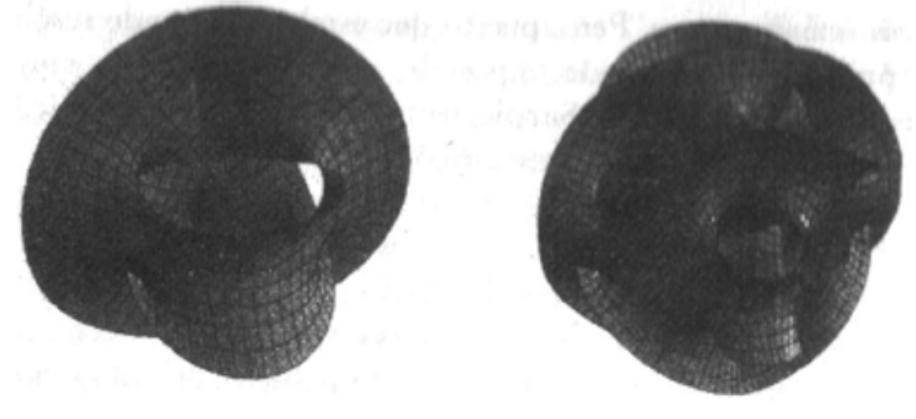

- *Figura 24.*
Faltings fue capaz de demostrar que, debido a que las figuras siempre tienen más de un agujero, la ecuación de Fermat asociada sólo podía tener un número finito de soluciones enteras. Un número finito de soluciones podía ser cualquier cosa entre cero, que fue lo que Fermat aseguró, hasta un millón o un billón. Por tanto, Faltings no fue capaz de demostrar el último teorema de Fermat, pero al menos había podido descartar la posibilidad de una infinidad de soluciones.

Cinco años después, Miyaoka aseguró que podía ir un paso más allá. Cuando tenía poco más de veinte años había creado una conjetura concerniente a la llamada desigualdad de Miyaoka. Quedó claro que la prueba de su propia conjetura geométrica demostraría que no sólo las soluciones de la ecuación de Fermat son finitas, sino que son cero. El enfoque de Miyaoka era análogo al de Wiles en el sentido de intentar demostrar el último teorema conectándolo a una conjetura fundamental en otro campo de las matemáticas. En el caso de Miyaoka era la geometría diferencial; para Wiles, la prueba se obtendría a través de las ecuaciones elípticas y las formas modulares.

Desafortunadamente para Wiles, él aún estaba luchando para demostrar la conjetura de Taniyama–Shimura cuando Miyaoka anunció una demostración completa de su propia conjetura, y por lo tanto para el último teorema de Fermat.

Dos semanas después de su anuncio de Bonn, Miyaoka publicó las cinco páginas de álgebra que detallaban su demostración, y empezó el escrutinio. Los teóricos de números y los geómetras diferenciales de todo el mundo examinaron la demostración línea por línea, buscando la más mínima brecha en el argumento lógico o la más pequeña indicación de una falsa suposición. En pocos días varios matemáticos resaltaron lo que parecía ser una preocupante contradicción en la demostración. Parte del trabajo de Miyaoka llevaba a una particular conclusión en teoría de números que, al ser traducida otra vez a la geometría diferencial, entraba en conflicto con un resultado que había sido demostrado unos años antes. Aunque esto no invalidaba necesariamente toda la demostración de Miyaoka, chocaba con la filosofía del paralelismo entre la teoría de números y la geometría diferencial.

Habían pasado dos semanas más cuando Gerd Faltings, que había allanado el camino para Miyaoka, anunció que había descubierto la razón exacta para el fallo aparente del paralelismo: una brecha en la lógica. El matemático japonés era predominantemente un geómetra y no había sido totalmente riguroso al traducir sus ideas al territorio menos familiar de la teoría de números. Un ejército de teóricos de números intentó ayudar a Miyaoka a arreglar su error, pero todos los esfuerzos fracasaron. Dos meses después de su anuncio existía un consenso de que la prueba original estaba destinada a fracasar.

Como ocurrió con otras pruebas fallidas en el pasado, Miyaoka había creado matemáticas nuevas e interesantes. Partes individuales de la demostración permanecieron como ingeniosas aplicaciones de la geometría diferencial en la teoría de números y en años posteriores otros matemáticos se basarían en ellas para demostrar otros teoremas, pero nunca el último teorema de Fermat.

La agitación sobre Fermat pronto desapareció y los periódicos publicaron noticias cortas explicando que el problema de trescientos años continuaba sin solución. Sin duda, inspirado por la atención de los medios de comunicación, un nuevo grafito apareció en la estación del metro de la calle Octava de Nueva York:

> *xn* + *yn* = *zn* : no hay soluciones.

*He descubierto una prueba en verdad maravillosa de esto, pero no la puedo escribir porque está llegando mi tren.* 

# **La mansión oscura**

Sin que el mundo lo supiera, Wiles exhaló un suspiro de alivio. El último teorema de Fermat permanecía sin conquistar y él podía continuar su batalla para demostrarlo por medio de la conjetura de Taniyama–Shimura. «La mayor parte del tiempo la pasaba escribiendo en mi mesa, pero a veces podía reducir el problema a algo muy específico: una pista, algo que me sorprende por su extrañeza, algo más allá del papel que no puedo llegar a tocar. Si tengo algo dándome vueltas en la cabeza, entonces no necesito nada para escribir o ningún despacho para trabajar, así que me voy a pasear por el lago. Cuando estoy paseando me doy cuenta de que puedo concentrar mi mente en un aspecto muy particular del problema, centrarme en él completamente. Siempre llevo papel y lápiz, así que si tengo una idea me puedo sentar en un banco y escribirla a toda prisa.»

Después de tres años de esfuerzo continuado Wiles había hecho una serie de avances. Había aplicado los grupos de Galois a las ecuaciones elípticas, había despedazado las ecuaciones elípticas en un número infinito de piezas y había demostrado que la primera pieza de cada ecuación elíptica debía ser modular. Había derribado la primera ficha de dominó y estaba explorando técnicas que podían llevar a la caída de todas las demás. Retrospectivamente, esto parecía el camino natural para llegar a una demostración, pero llegar tan lejos requirió una enorme determinación y superar períodos de dudas sobre su propia capacidad. Wiles describe lo que siente al hacer matemáticas como un recorrido en la oscuridad en una mansión desconocida: «Uno entra en la primera habitación de la mansión y está en la oscuridad. En una oscuridad completa. Vas tropezando y golpeando los muebles, pero poco a poco aprendes dónde está cada pieza del mobiliario. Al fin, tras seis meses más o menos, encuentras el interruptor de la luz y de repente todo está iluminado. Puedes ver exactamente dónde estás. Entonces vas a la siguiente habitación y te pasas otros seis meses en las tinieblas. Así, cada uno de estos progresos, aunque algunas veces son muy rápidos y se realizan en sólo un día o dos, son la culminación de meses precedentes de tropezones en la oscuridad, sin los que el avance sería imposible.»

En 1990, Wiles se encontró en la que parecía ser la habitación más oscura de todas. Había estado explorándola durante casi dos años. Aún no podía probar que si una parte de la ecuación elíptica era modular, entonces la siguiente también lo sería. Después de haber utilizado cada herramienta y técnica publicadas en la literatura, se encontró con que todas eran inadecuadas. «Realmente creía que estaba en el buen camino, pero eso no significaba que alcanzara mi meta. Era posible que los métodos necesarios para resolver este particular problema estuvieran más allá de las matemáticas del presente. Tal vez los métodos que yo necesitaba para completar la demostración no serían inventados en los próximos cien años. Así que, incluso si estaba en el buen camino, podía estar viviendo en el siglo equivocado.» Sin desanimarse, Wiles persevero un año más y empezó a trabajar con una técnica llamada «teoría Iwasawa». La teoría Iwasawa es un método de análisis de ecuaciones elípticas que había aprendido en Cambridge cuando era un estudiante dirigido por John Coates. Aunque el método en su forma original era inadecuado, esperaba que pudiera modificarlo y hacerlo suficientemente potente para generar un efecto dominó.

Tras el avance inicial con los grupos de Galois, Wiles se sentía cada vez más frustrado. Cuando la presión era demasiado grande se volvía hacia su familia. Desde que empezó su trabajo sobre el último teorema de Fermat en 1986 había sido padre dos veces. «La única forma en que me podía relajar era estando con mis hijos. Los niños pequeños no están interesados en Fermat, sólo quieren oír un cuento y no te dejan hacer ninguna otra cosa.»

### **El método de Kolyvagin y Flach**

En el verano de 1991, Wiles sintió que había perdido la batalla para adaptar la teoría Iwasawa. Debía demostrar que cada ficha, si hubiera sido derribada, tiraría a la siguiente, que si un elemento de la serie *E* de una ecuación elíptica era igual a un elemento de la serie *M* de una forma modular, entonces debería ocurrir lo mismo con el siguiente. También debía asegurarse de que éste era el caso en cada ecuación elíptica y en cada forma modular. La teoría Iwasawa no podía darle la garantía que necesitaba. Completó otra búsqueda exhaustiva por la literatura científica y fue incapaz, una vez más, de encontrar una técnica alternativa que le proporcionara el avance que necesitaba. Ya que había sido un verdadero recluso en Princeton durante los anteriores cinco años, decidió que era el momento de volver a ponerse en circulación para enterarse de las últimas noticias matemáticas. Tal vez alguien, en algún lugar, estaba trabajando en una técnica innovadora y hasta ahora, por alguna razón, no la había publicado. Se dirigió a Boston para asistir a una importante conferencia sobre ecuaciones elípticas donde estaba seguro de encontrar a los principales expertos en la materia.

Wiles fue cordialmente acogido por sus colegas de todo el mundo, quienes estaban encantados de volver a verlo tras una ausencia tan larga del circuito de conferencias. Aún no sabían en qué había estado trabajando y Wiles fue muy cuidadoso para no proporcionar ninguna pista. No sospecharon su motivo final cuando preguntó por las últimas noticias sobre las ecuaciones elípticas. Al principio, las respuestas no fueron relevantes para la lucha de Wiles, pero un encuentro con su antiguo director de tesis, John Coates, fue más fructífero: «Coates mencionó que uno de sus estudiantes, llamado Matheus Flach, estaba escribiendo un interesante artículo sobre un reciente método diseñado por Kolyvagin, y parecía que ese método se hubiera hecho a medida para mi problema. Me pareció exactamente lo que necesitaba, aunque sabía que aún tendría que desarrollar más el llamado método de Kolyvagin–Flach. Abandoné del todo el antiguo enfoque que había estado probando y me dediqué día y noche a extender el método de Kolyvagin–Flach.»

En teoría, este nuevo método podía extender el argumento de Wiles desde la primera pieza de la ecuación elíptica a todo el resto de piezas y potencialmente podía funcionar para todas las ecuaciones elípticas. El profesor Kolyvagin había diseñado un método matemático inmensamente poderoso y Matheus Flach lo había refinado para hacerlo aún más potente. Ninguno de ellos supo que Wiles pretendía incorporar su trabajo en la demostración más importante del mundo.

Wiles volvió a Princeton, pasó varios meses familiarizándose con esta técnica recién descubierta y entonces empezó la hercúlea tarea de adaptarla y desarrollarla. Pronto pudo hacer funcionar la demostración en una ecuación elíptica particular; podía derribar todas las fichas de dominó. Por desgracia, el método de Kolyvagin– Flach, que funcionaba en una ecuación elíptica particular, no funcionaba necesariamente en otra ecuación elíptica distinta. Al final se dio cuenta de que las ecuaciones elípticas podían clasificarse en varias familias. Una vez modificado para funcionar en una ecuación elíptica, el método de Kolyvagin–Flach funcionaría en todas las ecuaciones elípticas de la familia. El reto era adaptar el método para que funcionase con todas las familias. Aunque algunas familias eran más difíciles de conquistar que otras, Wiles confiaba en poder adaptar el método para cada una de ellas.

Tras seis años de intenso esfuerzo, Wiles creía que el final estaba a la vista. Semana tras semana progresaba, demostrando que nuevas y mayores familias de curvas elípticas debían ser modulares. Acabar con las principales ecuaciones elípticas parecía sólo una cuestión de tiempo. Durante esta etapa final de su demostración, Wiles empezó a darse cuenta de que toda su demostración descansaba sobre una técnica que había descubierto pocos meses antes. Empezó a preguntarse si estaría usando el método de Kolyvagin–Flach de una forma totalmente rigurosa.

«Durante aquel año trabajé muy duro intentando hacer funcionar el método de Kolyvagin–Flach, pero éste incluía una gran cantidad de sofisticadas herramientas matemáticas con las que no estaba realmente familiarizado. Había un montón de álgebra nueva que me obligaba a aprender muchas matemáticas nuevas. Entonces, hacia principios de enero de 1993, decidí que debía confiar en algún experto en este tipo de técnicas geométricas a las que estaba recurriendo. Quería escoger cuidadosamente con quién hablaría, pues tendría que mantener la confidencialidad. Decidí contárselo a Nick Katz.»

El profesor Nick Katz también trabajaba en el departamento de matemáticas de la Universidad de Princeton y conocía a Wiles desde hacía varios años. A pesar de su proximidad, Katz ignoraba todo lo que estaba pasando al otro lado del pasillo. Recuerda cada detalle del momento en que Wiles reveló su secreto.

«Un día, Andrew vino hacia mí a la hora del té y me preguntó si podría ir a su despacho porque había algo sobre lo que quería hablarme. No tenía ni idea de qué podría tratarse. Fui a su despacho y él cerró la puerta. Me dijo que creía que podía probar la conjetura de Taniyama–Shimura. Me quedé asombrado, sin habla: era fantástico.

» Me explicó que una gran parte de su demostración se basaba en una extensión del trabajo de Flach y Kolyvagin, pero que era bastante técnica. Realmente se sentía inseguro sobre esta parte tan técnica de la demostración y deseaba que alguien la repasara porque quería estar seguro de que era correcta. Pensaba que yo era la persona adecuada para ayudarlo a comprobarla, pero yo creo que había otra razón por la que me lo pidió a mí en particular. Estaba seguro de que mantendría mi boca cerrada y no hablaría con otros sobre su demostración.»

Después de seis años en completo aislamiento, Wiles había dejado escapar su secreto. Ahora era tarea de Katz enfrentarse con la montaña de cálculos basados en el método de Kolyvagin–Flach. Casi todo lo que había hecho Wiles era revolucionario, y Katz pensó mucho en la mejor forma de examinarlo a fondo: «Lo que Andrew tenía que explicar era tan grande y largo que no habría funcionado que intentara explicármelo en conversaciones informales en su despacho. Para algo tan grande realmente necesitábamos tener la estructura formal de lecciones semanales, de otro modo las cosas iban a degenerar. Así que decidimos organizar un curso.»

Creyeron que la mejor estrategia sería anunciar una serie de conferencias abiertas a los estudiantes graduados del departamento. Wiles daría el curso y Katz se encontraría entre la audiencia. El curso cubriría toda la parte de la demostración que necesitaba ser revisada, pero los estudiantes graduados no tendrían ni idea de ello. Lo mejor de disfrazar la revisión de la demostración así es que obligaría a Wiles a explicarlo todo paso por paso y aun así no levantaría sospechas en el departamento. Para el resto del departamento aquél era sólo un curso de doctorado más.

«Así, Andrew anunció su curso "Cálculos en curvas elípticas", recuerda Katz con una sonrisa ladina, que era un título completamente inocuo; podía significar cualquier cosa. No mencionó a Fermat, no mencionó a Taniyama–Shimura, empezó directamente buceando en los cálculos más técnicos. No había modo humano de que alguien pudiera descubrir de qué se trataba realmente. Se hizo de una manera tal que, a menos que supieras para qué era, los cálculos parecieran increíblemente técnicos y tediosos. Y cuando no sabes para qué son las matemáticas es imposible seguirlas. Ya es bastante duro seguirlas cuando sabes para qué son. En cualquier caso, uno tras otro, los estudiantes graduados fueron desapareciendo y, pasadas unas pocas semanas, yo era la única persona que continuaba en la audiencia.»

Katz se sentó en la sala de conferencias y escuchó cuidadosamente cada paso del cálculo de Wiles. Al final de la exposición su evaluación fue que el método de Kolyvagin–Flach parecía funcional perfectamente. Nadie en el departamento se dio

cuenta de lo que había pasado. Nadie sospechó que Wiles estaba a punto de reclamar el premio más importante de las matemáticas. Su plan había sido un éxito. Una vez acabada la serie de conferencias, Wiles dedicó todos sus esfuerzos a completar la demostración. Había aplicado con éxito el método de Kolyvagin–Flach a familia tras familia de ecuaciones elípticas y en este estadio sólo una se resistía a la técnica. Wiles describe cómo intentó completar el último elemento de la demostración: «Una mañana de finales de mayo, Nada estaba fuera con los niños y yo estaba sentado en mi mesa pensando en la familia de ecuaciones elípticas que faltaba. Estaba mirando por encima un artículo de Barry Mazur y había una frase en él que captó mi atención. Mencionaba una construcción del siglo XIX y de repente me di cuenta de que podía usarla para hacer funcionar el método de Kolyvagin– Flach sobre la última familia de ecuaciones elípticas. Empecé a mediodía y olvidé bajar a comer. Hacia las tres o las cuatro de la tarde estaba totalmente convencido de que aquello resolvería el problema restante. Llegó la hora del té y bajé las escaleras; Nada estaba muy sorprendida de que hubiera llegado tan tarde. Entonces se lo dije: "He resuelto el último teorema de Fermat."»

#### **La conferencia del siglo**

Después de siete años de esfuerzo en solitario, Wiles había completado una demostración de la conjetura de Taniyama– Shimura. Como consecuencia, y tras treinta años de soñar con ello, había demostrado también el último teorema de Fermat. Era el momento de contárselo al resto del mundo.

«Así, en mayo de 1993 estaba convencido de que tenía el último teorema de Fermat en mis manos, recuerda Wiles. Aún quería comprobar más la demostración, pero se acercaba una conferencia que iba a celebrarse a finales de junio en Cambridge; pensé que sería un bello lugar para anunciar la demostración: es la ciudad donde viví y fui estudiante de doctorado.»

La conferencia se celebraba en el Isaac Newton Institute. Esta vez, el instituto había planeado un taller sobre teoría de números con el oscuro título de «Funciones *L* y aritmética». Uno de los organizadores era John Coates, el director de tesis de Wiles: «Trajimos gente de todo el mundo que estaba trabajando en este problema y, por supuesto, Andrew era una de las personas que estaban invitadas. Habíamos planeado una semana de conferencias intensivas y en principio, debido a que hubo una gran demanda de sesiones de conferencia, sólo le di dos a Andrew. Pero entonces recordé que necesitaba tres sesiones, así que lo arreglé renunciando a mi propio tiempo para su tercera conferencia. Sabía que tenía algún gran resultado que anunciar, pero no tenía ni idea de qué era.»

Cuando Wiles llegó a Cambridge aún faltaban dos semanas y media para sus conferencias y quería aprovechar al máximo aquella oportunidad: «Decidí que comprobaría la demostración con uno o dos expertos, en particular la parte Kolyvagin–Flach. La primera persona a la que se la di fue Barry Mazur. Creo que le dije: "Tengo un manuscrito con la prueba de cierto teorema." Pareció muy perplejo durante un rato y entonces le dije: "Bueno, echémosle un vistazo." Creo que le costó un rato asimilarlo. Parecía atontado. En cualquier caso le dije que pensaba hablar sobre ello en la conferencia y que me gustaría que lo comprobara.»

Una por una, las más eminentes figuras de la teoría de números empezaron a llegar al Isaac Newton Institute, incluyendo a Ken Ribet, cuyo cálculo de 1986 había inspirado la penosa experiencia de siete años de Wiles. «Llegué a la conferencia sobre funciones *L* y curvas elípticas y nada parecía fuera de lo ordinario hasta que la gente empezó a decirme que habían oído rumores sobre la serie de conferencias de Andrew Wiles. El rumor era que había demostrado el último teorema de Fermat, y yo creí que eran una completa locura. No creí que pudiera ser verdad. Hay montones de casos en matemáticas en los que empiezan a circular rumores, especialmente por correo electrónico, y la experiencia muestra que no se puede confiar mucho en ellos. Pero los rumores eran muy persistentes y Andrew rechazaba contestar preguntas acerca de ello y se comportaba de forma muy extraña. John Coates le dijo: "Andrew, ¿qué has demostrado? ¿Deberíamos llamar a la prensa?" Andrew sólo hizo un movimiento de cabeza y mantuvo sus labios apretados. Realmente estaba preparando una gran representación.

»Entonces, una tarde Andrew vino a verme y empezó a preguntarme sobre lo que había hecho en 1986 y un poco sobre la historia de las ideas de Frey. Pensé para mí mismo: Esto es increíble, debe de haber probado la conjetura de Taniyama– Shimura y el último teorema de Fermat, de otro modo no me estaría preguntando todo esto. No le pregunté directamente si mis sospechas eran ciertas porque vi que se estaba comportando muy tímidamente y que no iba a obtener una respuesta clara. Así que dije más o menos: "Bien, Andrew, si tienes ocasión de hablar sobre este trabajo, esto es lo que ocurrió." Lo miré como si supiera algo, pero en realidad no sabía lo que estaba sucediendo. Aún seguía intentado adivinar.»

La reacción de Wiles a los rumores y la creciente presión fue simple: «La gente me preguntaba, antes de acudir a mis conferencias, qué iba a decir exactamente. Entonces les decía: "Ven a mis conferencias y escucha."»

Allá por 1920, David Hilbert, de cincuenta y ocho años de edad, dio una conferencia pública sobre el último teorema de Fermat. Cuando se le preguntó si el problema se resolvería alguna vez él contestó que no viviría para verlo, pero que tal vez los miembros más jóvenes del público podrían ser testigos de la solución. La estimación de Hilbert sobre la fecha de la demostración resultó bastante exacta. La conferencia de Wiles también estaba dentro del plazo del premio Wolfskehl. En su testamento, Paul Wolfskehl había puesto como fecha límite el 13 de septiembre del 2007.

El título de la serie de conferencias de Wiles era *«Formas modulares, curvas elípticas y representaciones de Galois»*. Una vez más, como había hecho con las clases de doctorado que había dado antes el mismo año en beneficio de Nick Katz, el título era tan vago que no daba ninguna pista sobre su objetivo último. La primera conferencia de Wiles era aparentemente mundana, asentando las bases de su ataque a la conjetura de Taniyama–Shimura en la segunda y tercera. La mayoría del público, que ignoraba completamente los rumores, no se dio cuenta del quid de las conferencias y prestó poca atención a los detalles. Los que estaban enterados buscaban la menor pista que pudiera dar credibilidad a los rumores.

Inmediatamente tras el fin de la conferencia los rumores volvieron a extenderse con renovado vigor y el correo electrónico voló alrededor del mundo. El profesor Karl Rubin, un antiguo estudiante de Wiles, informó a sus colegas de Estados Unidos:

#### *Fecha: Lunes, 21 Jun. 1993; 13.33.06 Tema: Wiles*

*Hola. Andrew ha pronunciado su primera charla hoy. No ha anunciado una demostración de Taniyama–Shimura, pero se está moviendo en esa dirección y aún le quedan dos conferencias más. Aún está siendo muy reservado sobre el resultado final.* 

*Mi mejor suposición es que va a demostrar que si E es una curva elíptica sobre Q y la representación de Galois en los puntos de orden 3 sobre E satisfacen ciertas hipótesis, entonces E es modular.* 

*Por lo que ha dicho parece que no probará la conjetura completa. Lo que no sé es si se aplicará esto a la curva de Frey y por lo tanto dice algo sobre Fermat. Os mantendré informados.* 

*Karl Rubin Universidad Estatal de Ohio* 

Al día siguiente, más gente había oído el rumor y la audiencia de la segunda conferencia fue considerablemente mayor. Wiles los atormentó con un cálculo intermedio que probaba claramente que estaba intentando demostrar la conjetura de Taniyama–Shimura, pero el público aún se preguntaba si había hecho lo suficiente para demostrarla y, en consecuencia, derrotar el último teorema de Fermat. Una nueva andanada de correos electrónicos pasó por los satélites:

*Fecha: Martes, 22 Jun. 1993; 13.10.39 Tema: Wiles* 

*No ha habido más noticias realmente nuevas en la conferencia de hoy. Andrew enunció un teorema general sobre representaciones de Galois siguiendo las líneas que sugerí ayer. No parece que se aplique a todas las curvas elípticas, pero la clave vendrá mañana.* 

*No sé realmente por qué lo está haciendo así. Está claro que sabe lo que va a decir mañana. Es en verdad una cantidad enorme de trabajo sobre la que ha estado trabajando durante años, y parece confiar en ella. Os contaré lo que pase mañana.* 

*Karl Rubin Universidad Estatal de Ohio* 

«El 23 de junio, Andrew empezó su tercera y última conferencia, recuerda John Coates. Lo que era más singular es que casi todo el mundo que había contribuido a las ideas que se encontraban tras la demostración estaba en aquella sala: Mazur, Ribet, Kolyvagin y muchos, muchos otros.»

En aquel momento, el rumor era tan persistente que todo el mundo de la comunidad matemática de Cambridge asistió a la conferencia final. Los afortunados estaban agolpados en el auditorio, mientras los otros tenían que esperar en el pasillo, donde se ponían de puntillas para echar vistazos a través de la ventana. Ken Ribet se había asegurado de no perderse el anuncio matemático más importante del siglo: «Llegué relativamente pronto y me senté en la primera fila junto a Barry Mazur. Tenía mi cámara de fotos para inmortalizar el evento. La atmósfera estaba muy cargada y la gente muy excitada. Ciertamente teníamos la sensación de participar en un momento histórico. La gente sonreía antes y durante la conferencia. La tensión se había acumulado durante el curso de varios días. Ahí estaba ese maravilloso momento en el que nos estábamos acercando a la demostración del último teorema de Fermat.»

Barry Mazur había recibido una copia de la demostración de Wiles, pero incluso él estaba estupefacto por la actuación. «Nunca he visto una conferencia tan gloriosa, llena de tan maravillosas ideas, con tal tensión dramática, y qué presentación. Sólo había una posible clave.»

Después de siete años de intenso esfuerzo, Wiles estaba a punto de anunciar su demostración al mundo. Curiosamente, Wiles no puede recordar los momentos finales de la conferencia con mucho detalle, pero sí el ambiente: «Aunque la prensa ya había oído algo sobre la conferencia, afortunadamente no estaba allí. Pero entre el público había quien tomaba fotografías hacia el final de la charla y el director del instituto había venido bien preparado con una botella de champán. Hubo el típico silencio mientras leía la demostración, y entonces escribí el enunciado del último teorema de Fermat. Dije: "Creo que lo dejaré aquí", y entonces hubo un prolongado aplauso.»

#### **Las secuelas**

Curiosamente, Wiles era ambivalente con respecto a la conferencia: «Obviamente fue una gran ocasión, pero yo tengo sentimientos entremezclados. Aquello había sido parte de mí durante siete años; había sido toda mi vida profesional. Me involucré tanto en el problema que realmente creía que lo tenía para mí solo, pero ahora lo estaba contando todo. Tenía la sensación de que estaba entregando una parte de mí mismo.»

El colega de Wiles, Ken Ribet, no tuvo tales dudas: «Aquél fue un evento memorable. Quiero decir que cuando vas a un simposio hay algunas charlas de rutina, algunas charlas buenas y algunas charlas muy especiales, pero asistir a una charla en la que alguien asegura haber resuelto un problema que se ha resistido durante más de 350 años es una ocasión única en la vida. Los asistentes se miraban unos a otros y decían: "Dios mío, ¿te das cuenta de que hemos sido testigos de un acontecimiento histórico?" Entonces, algunos hicieron unas cuantas preguntas sobre aspectos técnicos de la demostración y su posible utilización en otras ecuaciones, y al final hubo un período de silencio y, de repente, una segunda tanda de aplausos. La siguiente charla fue pronunciada por un tal Ken Ribet, un servidor. Di la charla, la gente tomó notas, aplaudió y ninguno de los presentes, incluyéndome a mí, tiene ni idea de lo que dije en aquella conferencia.»

Mientras los matemáticos estaban diseminando las buenas noticias por correo electrónico, el resto del mundo debía esperar a las noticias de la tarde o a los diarios del día siguiente. Equipos de televisión y periodistas científicos llegaron al instituto pidiendo entrevistas con el «mayor matemático del siglo». *The Guardian* exclamó: «Todo acabó para el último enigma de las matemáticas», y en la primera plana de Le Monde se leía: «El teorema de Fermat por fin resuelto.» Los periodistas de todo el mundo pedían a los matemáticos su experta opinión sobre el trabajo de Wiles; y de los catedráticos, aún recuperándose de la conmoción, se esperaba que explicaran brevemente la demostración matemática más complicada de la historia o que concedieran una entrevista que aclarase el significado de la conjetura de Taniyama–Shimura.

La primera vez que el profesor Shimura se enteró de la demostración de su propia conjetura fue cuando leyó la primera plana del New York Times: «Por fin, un grito de "¡Eureka!" en un antiguo misterio matemático.» Treinta y cinco años después de que su amigo Yutaka Taniyama se suicidase, la conjetura que habían creado juntos había sido justificada. Para muchos matemáticos profesionales la demostración de la conjetura de Taniyama–Shimura era un logro mucho más importante que la solución del último teorema de Fermat ya que tenía consecuencias inmensas para muchos otros teoremas matemáticos. Los periodistas que cubrían la noticia tendían a concentrarse en Fermat y mencionaban a Taniyama–Shimura sólo de pasada, si es que lo hacían.

Shimura, un hombre modesto y apacible, no estaba molesto por la falta de atención concedida a su papel en la demostración del último teorema de Fermat, pero estaba preocupado por el hecho de que él y Taniyama habían sido relegados a ser meros adjetivos. «Es muy curioso que la gente habla de la conjetura de Taniyama– Shimura pero nadie escribe sobre Taniyama y Shimura.»

Esta fue la primera vez en que las matemáticas habían aparecido en primera plana desde la fallida demostración de 1988; la única diferencia es que ahora la cobertura era doble que en la ocasión anterior y que nadie expresó ninguna duda sobre los cálculos. De un día para otro, Wiles se había convertido en el más famoso matemático del mundo, el único famoso de hecho, y la revista *People* le había incluido en la lista de «Las 25 personas más fascinantes del año», junto con la princesa Diana y Oprah Winfrey. El galardón definitivo llegó de una cadena internacional de moda que pidió al genio de suaves modales que aprobara su nueva línea de moda para hombre.

Mientras el circo de la prensa continuaba y mientras los matemáticos sacaban todo el provecho de ser el foco de atención, el serio trabajo de comprobar la demostración seguía su curso. Como en el resto de disciplinas científicas, cada nuevo trabajo debe ser completamente examinado antes de que se pueda aceptar como exacto y correcto. La demostración de Wiles tenía que ser sometida a la rigurosa prueba del juicio de los expertos. Aunque las conferencias de Wiles habían proporcionado al mundo un esquema de la demostración, esto no es equivalente a una revisión oficial. El protocolo académico requiere que cualquier matemático remita un manuscrito completo a una revista de prestigio y que el editor la envíe a un equipo de evaluadores cuyo trabajo es examinar la demostración línea por línea. Wiles tuvo que pasar el verano esperando ansiosamente el informe de los evaluadores, esperando, que al final obtendría su bendición.

# **Capítulo 7 UN PEQUEÑO PROBLEMA**

*Un problema que vale la pena atacar prueba su valía contraatacando. PIET HEIN* 

Tan pronto como terminó la conferencia de Cambridge, el Comité Wolfskehl fue informado de la demostración de Wiles. No pudieron conceder inmediatamente el premio debido a que las reglas de la competición exigían claramente una verificación por otros matemáticos y la publicación de la demostración:

La Königliche Gesellschaft der Wissenschaften de Gotinga [...] sólo tendrá en cuenta aquellas memorias matemáticas que hayan aparecido en forma de monografía en revistas, o las que estén a la venta en librerías [...] La concesión del premio por parte de la sociedad no se hará efectiva antes de que transcurran dos años desde la publicación de la memoria premiada. Tal intervalo de tiempo está destinado a que los matemáticos alemanes y extranjeros emitan su opinión acerca de la validez de la solución publicada.

Wiles envió su manuscrito a la revista Inventiones Mathematicae, después de lo cual su editor, Barry Mazur, empezó el proceso de seleccionar a los evaluadores. El artículo de Wiles involucra tal variedad de técnicas matemáticas, tanto antiguas como modernas, que Mazur tomó la excepcional decisión de nombrar no sólo dos o tres evaluadores, como es la práctica usual, sino seis. Cada año, treinta mil artículos son publicados en revistas de todo el mundo, pero la gran extensión e importancia del manuscrito de Wiles significaba que sería sometido a un grado excepcional de escrutinio. Para simplificar la tarea, las doscientas páginas de la demostración se dividieron en seis secciones y cada uno de los evaluadores asumió la responsabilidad sobre uno de esos capítulos.

El capítulo 3 fue asignado a Nick Katz, quien ya había examinado esa parte de la demostración de Wiles aquel mismo año: «Yo estaba en París durante el verano para trabajar en el Institut des Hautes Études Scientifiques, y me llevé conmigo las doscientas páginas de la demostración completa; mi capítulo en particular tenía una extensión de setenta páginas. Cuando llegué decidí que quería tener una ayuda técnica seria e insistí en que Luc Illusie, que también estaba en París, se convirtiera en evaluador adjunto de mi capítulo. Nos encontraríamos unas cuantas veces cada semana durante todo el verano, básicamente para enseñarnos el uno al otro el modo de rehacer y comprender ese capítulo. Literalmente no hicimos otra cosa que repasar en detalle el manuscrito línea por línea y asegurarnos de que no hubiera errores. Algunas veces dudábamos en ciertos puntos y por ello cada día, a veces dos veces el mismo día, enviaba un mensaje electrónico a Andrew con una pregunta: No entiendo lo que dices en esta página o parece estar equivocado en esta línea. Solía recibir una respuesta el mismo día o al siguiente que aclaraba el asunto, y entonces continuábamos hasta el siguiente problema.»

La demostración era un razonamiento gigantesco, intrincadamente construido a base de cientos de cálculos matemáticos unidos por miles de nexos lógicos. Si tan sólo uno de los cálculos estuviera equivocado, o si uno de los nexos no encajara, la demostración completa correría el peligro de perder todo su valor. Wiles, que estaba ya de vuelta en Princeton, esperaba ansiosamente a que los evaluadores finalizaran su tarea. «No quería celebrarlo hasta que todo el artículo hubiera sido comprobado. Mientras tanto, mi trabajo consistía en responder las preguntas que recibía por correo electrónico de los evaluadores. Estaba bastante confiado en que ninguna de esas cuestiones pudiera causarme grandes problemas.» El mismo había comprobado y vuelto a comprobar la demostración antes de enviársela a los evaluadores, de modo que esperaba poco más que el equivalente matemático de los errores gramaticales y tipográficos, errores triviales que podía arreglar inmediatamente.

«Los problemas continuaron siendo relativamente intrascendentes hasta agosto, recuerda Katz, hasta que encontré lo que parecía un pequeño problema más. Alrededor del 23 de agosto envié un mensaje electrónico a Andrew y, como la respuesta era un poco complicada, él me envió un fax. Pero el fax no parecía contestar a mi pregunta, así que le envié otro mensaje electrónico y recibí otro fax que tampoco me satisfizo.»

Wiles había supuesto que aquel error era tan nimio como todos los demás, pero la persistencia de Katz le obligó a tomárselo en serio: «No pude resolver inmediatamente aquella cuestión de aspecto inocente. Durante un tiempo pareció ser del mismo orden que otros problemas, pero en algún momento durante septiembre empecé a darme cuenta de que no era una dificultad menor, sino un defecto fundamental. Era un error en una parte crucial del argumento relacionado con el método de Kolyvagin–Flach, pero era algo tan sutil que lo había pasado completamente por alto hasta aquel momento. El error era tan abstracto que no podía explicarse en términos sencillos. Incluso explicárselo a otro matemático implicaría que éste dedicara dos o tres meses a estudiar en detalle esa parte del manuscrito.»

En esencia, el problema era que no existía garantía de que el método de Kolyvagin– Flach funcionase tal como Wiles pretendía. Se suponía que el método extendía la demostración desde el primer elemento de todas las ecuaciones elípticas y formas modulares a todos los elementos, proporcionando el mecanismo necesario para derribar las siguientes fichas de dominó. Originalmente, el método de Kolyvagin– Flach sólo funcionaba en circunstancias especialmente restringidas, pero Wiles creyó que lo había adaptado y reforzado lo suficiente como para que fuese adecuado para todos sus requerimientos. Según Katz, eso no era necesariamente cierto y los efectos eran espectaculares y devastadores.

El error no significaba que la prueba de Wiles no tuviera salvación, pero sí que debería consolidar la demostración. El absolutismo de las matemáticas exigía que Wiles demostrara más allá de toda duda que su método funcionaba para cada elemento de las series *E* y *M*.

# **El ajustador de alfombras**

Cuando Katz se dio cuenta de la importancia del error que había descubierto se preguntó cómo lo había pasado por alto en primavera, cuando Wiles se lo había contado todo durante el curso de doctorado con el único propósito de identificar cualquier posible error. «Creo que la respuesta es que, cuando estás escuchando una conferencia, existe una verdadera lucha entre intentar entenderlo todo y dejar que el conferenciante continúe. Si se interrumpe a cada momento (no entiendo esto o aquello), entonces aquél nunca acaba de explicarlo todo y no llegas a ningún sitio. Por otro lado, si nunca interrumpes, te pierdes y asientes educadamente con la cabeza, pero en realidad no estás comprobando nada. Existe una tensión real por no hacer demasiadas preguntas ni hacer demasiado pocas, y obviamente hacia el final de esas conferencias, que es cuando este problema se deslizó inadvertidamente, yo fallé por hacer demasiado pocas preguntas.»

Sólo unas semanas antes, los periódicos de todo el mundo habían apodado a Wiles como el matemático más brillante del mundo y, tras 350 años de frustración, los teóricos de números creían que por fin habían vencido del todo a Pierre de Fermat. Ahora Wiles se encaraba con la humillación de tener que admitir que había cometido un error. Antes de confesar el error decidió concentrar sus esfuerzos en eliminar el defecto lógico. «No podía darme por vencido. Estaba obsesionado con este problema y aún creía que el método de Kolyvagin–Flach sólo necesitaba un pequeño remiendo. Necesitaba modificarlo un poco y entonces funcionaría perfectamente. Decidí volver a mi antigua costumbre y me aislé completamente del mundo exterior. Tenía que concentrarme otra vez, pero ahora en circunstancias más difíciles. Durante un largo tiempo pensé que el arreglo estaba justo a la vuelta de la esquina, que estaba pasando por alto algún simple detalle que lo haría encajar todo al día siguiente. Por supuesto, podría haber ocurrido de esa forma, pero según pasaba el tiempo parecía que el problema se iba haciendo más intransigente.»

La esperanza era que pudiera arreglar el error antes de que la comunidad se diera cuenta de que tal error existía. La esposa de Wiles, que ya había asistido a los siete años de esfuerzo que había invertido en la demostración original, debía ahora ser testigo de la agónica lucha de su marido contra un error que podía destruirlo todo. Wiles recuerda su optimismo: «En septiembre, Nada me dijo que lo único que deseaba para su cumpleaños era una demostración correcta. Su cumpleaños es el 6 de octubre. Sólo tenía dos semanas para entregar la prueba, y fracasé.»

Para Nick Katz ése fue también un período de tensión: «En octubre, los únicos que sabíamos algo sobre la existencia del error éramos yo mismo, Illusie, los evaluadores de los otros capítulos y Andrew; en principio sólo nosotros. Mi actitud fue la que se esperaba de mí como evaluador: que actuara de forma confidencial. Desde luego no creía que fuera de mi incumbencia discutir sobre este tema con nadie salvo con Andrew, así que no dije ni una palabra sobre ello. Creo que externamente él parecía en un estado normal, pero en aquel momento estaba ocultando un secreto al resto del mundo y creo que debía de sentirse bastante a disgusto con la situación. Andrew actuaba como si con tan sólo en un día más fuera a resolver el problema, pero según discurría el otoño y no se hacía público el manuscrito empezaron a circular rumores sobre la existencia de alguna dificultad.» En concreto, Ken Ribet, otro de los evaluadores, empezó a sentir la presión de guardar el secreto: «Por alguna razón completamente accidental empecé a ser conocido como el "Servicio de Información Fermat". Todo comenzó con un artículo en el New York Times para el que Andrew me pidió que hablara con el periodista en su lugar, y el artículo decía: "Ribet, que actúa como portavoz de Andrew Wiles... ", o algo por el estilo. Tras ello me convertí en una especie de imán para todos los interesados en el último teorema de Fermat, tanto de fuera como de dentro de la comunidad matemática. La gente llamaba de la prensa, de todos los rincones del mundo, de hecho, y también pronuncié un gran número de conferencias durante un período de dos o tres meses. En esas conferencias resalté el magnífico logro que era la demostración, la esbocé y hablé de las partes que mejor conocía, pero tras un tiempo la gente empezó a impacientarse y a plantear preguntas difíciles.

» Wiles había hecho su anuncio público, pero nadie, salvo el pequeño grupo de evaluadores, ha visto una copia del manuscrito. Los matemáticos estaban esperando el manuscrito que Andrew había prometido unas semanas después del anuncio inicial de junio. La gente decía: "Muy bien, una vez que la prueba del teorema ha sido anunciada nos gustaría saber qué está pasando. ¿Qué está haciendo? ¿Por qué no hay ninguna noticia?" La gente estaba un poco enfadada por mantenérsela en la ignorancia y simplemente quería saber qué estaba pasando. Entonces la situación empeoró, pues los nubarrones se cernieron sobre la demostración y la gente empezó a hablarme de los rumores que afirmaban que había una laguna en el capítulo 3. Me preguntaron sobre lo que sabía, y yo no sabía qué decir.»

Con Wiles y los evaluadores negando el conocimiento de alguna laguna, o como mínimo rehusando hacer comentarios, las especulaciones fueron descontrolándose. En su desesperación, los matemáticos empezaron a enviarse mensajes electrónicos con la esperanza de llegar al fondo del misterio:

*Tema: ¿Una laguna en la demostración de Wiles? Fecha: 18 Nov. 1993; 21.04.49 GTM* 

*Están circulando rumores acerca de una o más lagunas en la demostración de Wiles. ¿Laguna significa grieta, fisura, fractura, sima o abismo? ¿Tiene alguien información fiable?*

*Joseph Lipman Universidad Purdue* 

En la cafetería de cada departamento de matemáticas, los chismes sobre la demostración de Wiles aumentaban cada día. En respuesta a los rumores y los mensajes electrónicos especulativos, algunos matemáticos intentaron restablecer una cierta calma en la comunidad.

*Tema: Réplica: ¿Laguna en la demostración de Wiles? Fecha: 19 Nov. 1993; 15.42.20 GMT* 

*Yo no tengo ninguna información de primera mano y no me creo en la libertad de discutir información de segunda mano. Creo que el mejor consejo para todos es mantener la calma y dejar que los muy competentes evaluadores que están examinando cuidadosamente el artículo de Wiles hagan su trabajo. Ellos informarán sobre sus descubrimientos cuando tengan algo definitivo que decir. Cualquiera que haya escrito o evaluado un artículo estará familiarizado con el hecho de que a menudo aparecen preguntas en el proceso de comprobar las demostraciones. Sería sorprendente que no ocurriera así con un resultado tan importante y una demostración tan larga y difícil.* 

*Leonard Evens Universidad del Noroeste* 

A pesar de los llamamientos a conservar la calma, los mensajes electrónicos continuaron sin disminuir. Además de comentar sobre el error putativo, los matemáticos empezaron a discutir sobre la ética de anticiparse al anuncio de los evaluadores.

*Tema: Más chismes sobre Fermat Fecha: 24 Nov. 1993; 12.00.34 GMT Creo que está claro que estoy en desacuerdo con los que dicen que no deberíamos chismorrear sobre si la demostración de Wiles del último teorema*  *de Fermat es defectuosa o no. Yo estoy totalmente a favor de este tipo de chismes siempre que no los tomemos muy en serio. No los creo maliciosos. Sobre todo porque sea o no defectuosa la demostración de Wiles, estoy seguro de que ha hecho matemáticas de la mejor calidad.* 

*Así que aquí está lo que he recibido hoy de n–ésima mano... Bob Silverman* 

*.........................................................* 

*Tema: Réplica: Agujero en Fermat Fecha: Lun. 22 Nov. 93; 20.16 GTM Coates dijo en una conferencia en el Newton Institute la se- mana pasada que en su opinión había una laguna en la parte de la demostración de «sistemas geométricos de Euler» que* 

*«podría tardar una semana, o dos años», en ser reparada. He hablado varias veces con él, pero aún no estoy seguro de en qué se basa para hacer esa afirmación: él no posee ninguna copia del manuscrito.* 

*Por lo que yo sé, la única copia que hay en Cambridge es la de Richard Taylor, por ser uno de los evaluadores del artículo para Inventiones, y él ha declinado constantemente hacer comentarios hasta que todos los evaluadores hayan alcanzado una conclusión común. Así que la situación es confusa. Yo mismo no veo por qué la opinión de Coates debe ser considerada como autorizada en este estadio: yo pienso esperar a que Richard Taylor se pronuncie.* 

*Richard Pinch*

Mientras el escándalo sobre su elusiva demostración iba creciendo, Wiles intentaba por todos los medios ignorar la controversia y la especulación. «Realmente me desconecté porque no quería saber lo que la gente estaba diciendo de mí. Me recluí, pero periódicamente mi compañero Peter Sarnak me decía: "¿Sabes que hay una tormenta por aquí?" Lo había oído, pero, por mí mismo, sólo quería desconectarme del todo para concentrarme completamente en el problema.»

Peter Sarnak se había incorporado al departamento de matemáticas de Princeton al mismo tiempo que Wiles y a lo largo de los años se habían convertido en buenos amigos. Durante el intenso período de confusión, Sarnak fue uno de los pocos en los que Wiles confió. «Bueno, yo nunca estuve al tanto de los detalles exactos, pero estaba claro que intentaba superar una seria cuestión. Pero cada vez que conseguía arreglar un problema la reparación causaba alguna nueva dificultad en otra parte de la demostración. Era como si estuviera intentando poner una alfombra en una habitación y la propia alfombra fuera mayor que la habitación. De modo que Andrew podía ajustar la alfombra en cualquier esquina sólo para descubrir que se había desencajado en otra esquina. Si podría o no ajustar la alfombra en la habitación era algo sobre lo que nadie podía pronunciarse. Pero, ojo, incluso con el error Andrew había dado un paso gigantesco. Antes de él nadie tenía ninguna estrategia para vencer la conjetura de Taniyama–Shimura, y ahora todo el mundo estaba muy emocionado ya que él nos había mostrado un gran número de ideas nuevas. Eran ideas fundamentales, cosas nuevas que nadie había considerado antes. Así que, incluso si no podía arreglarse, ése era un gran avance, aunque, por supuesto, Fermat continuaría sin resolver.»

Finalmente, Wiles se dio cuenta de que no podía seguir manteniendo su silencio por siempre. La solución al error no estaba a la vuelta de la esquina y era el momento de poner punto final a la especulación. Tras un otoño de tremendo fracaso envió el siguiente mensaje electrónico a la junta de la revista matemática:

*Tema: Estado de Fermat Fecha: 4 Dic. 93; 1.36.50 GMT* 

*En vista de la especulación acerca del estado de mi trabajo sobre la conjetura de Taniyama–Shimura y el último teorema de Fermat daré un breve informe de la situación. Durante el proceso de revisión aparecieron un cierto número de problemas, la mayoría de los cuales han sido resueltos; pero uno en particular no he podido resolverlo. La reducción clave (la mayoría de los casos) de la conjetura de Taniyama–Shimura al cálculo del grupo de Selmer es correcta. Sin embargo, el cálculo de una cota superior precisa para el grupo de Selmer en el caso semiestable (de la representación cuadrada simétrica asociada a la forma modular) no está completo en su forma actual. Creo que seré capaz de finalizar esto en un futuro próximo usando las ideas explicadas en mis conferencias en Cambridge* 

*El hecho de que aún queda por hacer mucho trabajo sobre el manuscrito lo hace inadecuado para su publicación como preprint. En mi curso en Princeton, que empezará en febrero, daré un informe completo de este trabajo* 

#### *Andrew Wiles*

Pocos quedaron convencidos por el optimismo de Wiles. Habían pasado casi seis meses sin que el error pudiera ser corregido y no había razón alguna para pensar que algo fuera a cambiar en los próximos seis. En cualquier caso, si realmente pudiera «acabarlo en un futuro próximo», ¿por qué molestarse en enviar el mensaje electrónico? ¿Por qué no limitarse a mantener el silencio durante unas pocas semanas más y luego dar a conocer el manuscrito finalizado? El curso de febrero que mencionó en su mensaje electrónico no proporcionó el detalle prometido y la comunidad matemática creyó que Wiles sólo estaba intentando conseguir un poco más de tiempo.

Los periódicos pasaron la historia por alto una vez más y los matemáticos recordaron la fallida demostración de Miyaoka en 1988. La historia se repetía. Los teóricos de números esperaban el siguiente mensaje electrónico en que se explicara por qué razón la demostración estaba irrecuperablemente errada. Un puñado de matemáticos había expresado sus dudas sobre la demostración ya durante el verano y ahora su pesimismo parecía justificado. Un rumor afirmaba que el profesor Alan Baker, de la Universidad de Cambridge, ofreció apostar cien botellas de vino contra una sola a que en menos de un año

se demostraría que la prueba no era válida. Baker niega la anécdota, pero admite con orgullo haber expresado un «sano escepticismo».

Menos de seis meses después de su conferencia en el Newton Institute la demostración de Wiles estaba hecha jirones. El placer, la pasión y la esperanza que le habían poseído durante los años de cálculos secretos se transformaron en turbación y desesperanza. Wiles recuerda cómo el sueño de su infancia se había convertido en una pesadilla: «Los primeros siete años que trabajé en el problema disfruté con el combate privado. No importaba lo duro que hubiera sido, no importaba lo insuperables que parecieran las cosas, me dedicaba a mi problema favorito. Era mi pasión de la infancia; sencillamente no podía dejarlo, no quería dejarlo ni por un solo instante. Después tuve que hablar de ello, y al hacerlo sentí realmente una sensación de pérdida. Era una emoción muy ambigua. Era estupendo ver la reacción de otra gente ante la demostración, pero al mismo tiempo había perdido mi búsqueda personal. Estaba abierta al mundo y ya no podía continuar con aquel sueño privado que estaba cumpliendo. Y entonces, después de que apareciera el problema con la demostración, había docenas, cientos, miles de personas que querían distraerme. Hacer matemáticas de esta forma tan pública no es mi estilo, y yo no disfrutaba de este modo de hacerlas.»

Los teóricos de números simpatizaban con la postura de Wiles. El mismo Ken Ribet había pasado por la misma pesadilla ocho años antes cuando intentó demostrar el nexo entre la conjetura de Taniyama–Shimura y el último teorema de Fermat. «Estaba dando una conferencia acerca de la demostración en el Mathematical Sciences Research Institute de Berkeley y alguien de entre el público dijo: "Eh, espere un momento, ¿cómo sabe que tal y tal es cierto?" Respondí inmediatamente dando mis razones, y él dijo: "Bueno, eso no se aplica en esta situación." Entonces me di cuenta de que sólo existía un modo de justificarlo, que era volver al trabajo fundamental sobre el tema y ver exactamente cómo se aplicaba en una situación similar. Miré el artículo más importante y vi que efectivamente el método se podía aplicar en mi caso; en un día o dos lo había corregido todo. En mi siguiente conferencia fui capaz de dar una justificación. Pero siempre vives con el temor de que si anuncias algo importante alguien pueda descubrir un error básico.

»Cuando encuentras un error en un original puedes actuar de dos maneras. A veces existe una gran confianza en la demostración y la puedes resucitar con poca dificultad. Y a veces ocurre lo contrario. Es muy inquietante, tienes la sensación de que todo se va a pique cuando te das cuenta de que has cometido un error fundamental y no hay forma de arreglarlo. Es posible que, cuando aparece una brecha, el teorema se haga del todo inalcanzable ya que cuanto más intentas tapar la grieta te metes en más problemas. Pero en el caso de Wiles cada capítulo de la demostración era un artículo importante por derecho propio. El manuscrito representaba siete años de trabajo, básicamente estaba constituido por varios artículos encajados entre sí y cada uno de ellos era de un gran interés. El error ocurrió en uno de los artículos, el capítulo 3, pero, incluso si retirabas el capítulo 3, lo que quedaba era aún absolutamente maravilloso.»

Pero sin el capítulo 3 no había demostración de la conjetura de Taniyama–Shimura y, por lo tanto, no había demostración del último teorema de Fermat. Había un sentimiento de frustración en la comunidad matemática debido a que la demostración de dos grandes problemas estuviera en dificultades. Más aún, tras seis meses de espera nadie, salvo Wiles y los evaluadores, tenía acceso al manuscrito. Existía un creciente clamor en demanda de mayor apertura, de manera que todo el mundo pudiera ver por sí mismo los detalles del error. La esperanza era que alguien, en alguna parte, pudiera reparar la brecha en la demostración. Algunos matemáticos afirmaban que la demostración era demasiado valiosa para ser dejada en manos de un solo hombre. Los teóricos de números habían sido el blanco de las pullas del resto de matemáticos, quienes cuestionaban sarcásticamente si habían entendido o no el concepto de demostración. Lo que debería haber sido el momento de mayor orgullo de las matemáticas se estaba transformando en una broma.

A pesar de las presiones, Wiles rechazó hacer público su manuscrito. Después de siete años de devoto esfuerzo no estaba preparado para cruzarse de brazos mientras veía cómo algún otro completaba la demostración y le robaba la gloria. La persona que demostrara Fermat no sería quien pusiera la parte del trabajo sino la que entregara la demostración completa y definitiva. Wiles sabía que una vez que el manuscrito fuera publicado en su actual estado se vería abrumado por las preguntas y peticiones de aclaraciones de aspirantes a «apañadores de brechas», y esas distracciones destruirían sus propias esperanzas de enmendar la demostración, mientras daba a otros, pistas vitales.

Wiles intentó volver al mismo estado de aislamiento que le había permitido crear la demostración original y regresó a su hábito de intenso estudio en el ático. En ocasiones vagaba por los alrededores del lago de Princeton, como había hecho en el pasado. Los que hacían footing, los ciclistas, los remeros en el lago, todos los que habían pasado antes por su lado con un pequeño saludo ahora se detenían y le preguntaban si había realizado algún adelanto con el problema. Wiles había aparecido en las primeras planas de todo el mundo, habían escrito un artículo sobre él en la revista *People* e incluso lo habían entrevistado en la CNN. El verano anterior Wiles se había convertido en la primera celebridad matemática del mundo y su imagen aún estaba empañada.

Mientras tanto, en el departamento de matemáticas los chismes continuaban. El profesor de matemáticas de Princeton, John H. Conway, recuerda el ambiente en la sala de café del departamento: «Nos reuníamos para el té a las tres y nos precipitábamos sobre las galletas. Algunas veces discutíamos sobre problemas matemáticos, a veces hablábamos sobre el juicio a O. J. Simpson, y a veces discutíamos sobre los progresos de Andrew. Puesto que a nadie le atraía la idea de ir directamente y preguntarle cómo le iba con la demostración, actuábamos como los kremlinólogos. Así alguien decía: "He visto a Andrew esta mañana." "¿Sonreía?" "Bueno, sí, pero no parecía demasiado feliz." Sólo podíamos calibrar sus sentimientos por su cara.»

# **Un mensaje electrónico de pesadilla**

Según avanzaba el invierno, las esperanzas de un avance espectacular disminuían y más matemáticos argumentaban que la obligación de Wiles era dar a conocer el manuscrito. Los rumores continuaron y un artículo periodístico aseguraba que Wiles se había rendido y que la demostración se había hundido irremediablemente. Aunque esto era una exageración, sí era cierto que Wiles había probado docenas de enfoques que podían haber evitado el problema y no encontraba ninguna ruta posible hacia una solución.

Wiles admitió ante Peter Sarnak que la situación se estaba tornando desesperada y que estaba a punto de aceptar la derrota. Sarnak sugirió que parte de la dificultad estaba en que Wiles no tenía a nadie en quien pudiera confiar en el día a día; no había nadie que pudiera replicar a sus ideas o pudiera inspirarle para explorar enfoques alternativos. Sugirió que Wiles buscara a alguien de su confianza e intentara una vez más reparar la brecha. Wiles necesitaba a alguien que fuera un experto en la manipulación del método de Kolyvagin–Flach y que mantuviera los detalles del problema en secreto. Tras una prolongada reflexión decidió invitar a Princeton a Richard Taylor, un profesor de Cambridge, para trabajar a su lado.

Taylor era uno de los evaluadores responsables de la verificación de la demostración y un antiguo estudiante de Wiles, y como tal estaría doblemente motivado. El año anterior se encontraba entre el público en el Isaac Newton Institute viendo a su antiguo director de tesis presentar la demostración del siglo. Ahora su trabajo era ayudar a salvar la defectuosa demostración.

En enero, Wiles, con la ayuda de Taylor, volvía a explorar incansablemente el método de Kolyvagin–Flach intentando encontrar una salida a su problema. En ocasiones, después de días de esfuerzo, entraban en nuevos territorios, pero inevitablemente volvían a encontrarse en el punto de partida. Habiéndose aventurado más lejos que nunca y habiendo fallado una y otra vez, se dieron cuenta de que estaban en el interior de un laberinto de una vastedad inimaginable. Su temor más profundo era que el laberinto fuera infinito y no tuviera salida y que estuvieran condenados a vagar sin rumbo por siempre.

Entonces, en la primavera de 1994, justo cuando parecía que las cosas no podían ser peores, apareció en las pantallas de todo el mundo el siguiente mensaje electrónico:

*Fecha: 03 Abril 94 Tema: Otra vez Fermat* 

*Hoy ha habido un sorprendente desarrollo sobre el último teorema de Fermat. ¡Noam Elkies ha anunciado un contraejemplo, de modo que después de todo el último teorema de Fermat no es cierto! Hablo hoy sobre esto en el instituto. La solución a Fermat implica un exponente primo increíblemente grande (mayor que 1020), pero es constructiva. La idea principal parece ser una especie de construcción de punto de Heegner, combinada con un ataque realmente ingenioso para pasar de las curvas modulares a la curva de Fermat. La parte realmente difícil del argumento parece ser demostrar que el campo de definición de la solución (que, a priori, es algún campo de clase anillo de un campo cuadrático imaginario) realmente se reduce a Q.* 

*No fui capaz de seguir todos los detalles, que son bastante complicados...* 

*Así que parece que después de todo la conjetura de Taniyama– Shimura no es cierta. Los expertos creen que aún puede ser rescatada extendiendo el concepto de representación automórfica e introduciendo una noción de «curvas anómalas» que aún daría lugar a una «representación quasi– automórfica».* 

*Henri Darmon Universidad de Princeton* 

Noam Elkies era un profesor de Harvard que ya en 1988 había encontrado un contraejemplo a la conjetura de Euler, demostrando por tanto que era falsa:

2 682 4404 + 15 365 6394 + 1879604 = 20 615 6734 .

Aparentemente, ahora había encontrado un contraejemplo al último teorema de Fermat, demostrando así que también éste es falso. Se trataba de un golpe trágico para Wiles: la razón de que no pudiera arreglar la demostración era resultado directo de la falsedad del último teorema. Era un golpe aún mayor para la comunidad matemática en su conjunto ya que, si el último teorema de Fermat era falso, Frey había demostrado que esto llevaba a una ecuación elíptica que no era modular, lo que constituía una contradicción directa a la conjetura de Taniyama– Shimura; Elkies había encontrado no sólo un contraejemplo a Fermat, indirectamente había encontrado un contraejemplo a Taniyama–Shimura.

La muerte de la conjetura de Taniyama–Shimura tendría consecuencias devastadoras para la teoría de números puesto que durante dos décadas los matemáticos habían asumido tácitamente su veracidad. En el capítulo 5 se explicó que los matemáticos habían escrito docenas de demostraciones que empezaban con la frase «Asumiendo la conjetura de Taniyama–Shimura»; pero ahora Elkies había demostrado que esa suposición era falsa y todas aquellas demostraciones se habían hundido a la vez. Los matemáticos pidieron inmediatamente más información y bombardearon a Elkies con preguntas, pero no hubo respuesta ni explicación sobre su silencio. Nadie pudo obtener siquiera los detalles del contraejemplo.

Después de unos días de confusión, algunos matemáticos echaron un segundo vistazo al mensaje electrónico y cayeron en la cuenta de que, aunque en general estaba fechado el 2 o 3 de abril, esto era resultado de haberlo recibido de segunda o tercera mano. El original estaba fechado el 1 de abril7 . El mensaje electrónico era una farsa perpetrada por el teórico de números canadiense Henri Darmon. El burlesco mensaje electrónico sirvió de lección a los que propagaban rumores sobre Fermat, que, durante un tiempo, dejaron en paz al último teorema de Fermat, a Wiles, a Taylor y a la prueba defectuosa.

Aquel verano, Wiles y Taylor no realizaron ningún progreso. Tras ocho años de esfuerzo continuado y una obsesión que había durado toda su vida, Wiles estaba

 7 El día 1 de abril es conocido en el mundo anglosajón como el Fool's day, el equivalente a nuestros Santos Inocentes. (N. de los tt.)

preparado para admitir la derrota. Le dijo a Taylor que no veía ninguna razón para seguir intentando arreglar la demostración. Taylor ya tenía planeado pasar todo el mes de septiembre en Princeton antes de volver a Cambridge, así que, en contra del pesimismo de Wiles, sugirió que perseveraran durante un mes más. Si no había esperanzas de arreglo a finales de septiembre, lo dejarían, reconocerían públicamente su fracaso y publicarían la defectuosa demostración para permitir que otros tuvieran la oportunidad de examinarla.

# **El regalo de cumpleaños**

Aunque la batalla de Wiles con el problema matemático más complejo del mundo parecía condenada al fracaso, aún podía mirar hacia atrás, a los últimos siete años, y estar seguro de que la mayor parte de su trabajo seguiría siendo válido. De entrada, su utilización de los grupos de Galois había proporcionado una nueva comprensión del problema. Había demostrado que el primer elemento de cada ecuación elíptica podía asociarse al primer elemento de alguna forma modular. El reto era demostrar que si un elemento de la ecuación elíptica era modular también debía serlo el siguiente, de modo que todos debían ser modulares.

Durante esos años, Wiles había luchado para extender la demostración. Intentó completar un enfoque inductivo y había batallado con la teoría Iwasawa, con la esperanza de que ésta demostraría que si caía una ficha del dominó eso las haría caer a todas. Inicialmente, la teoría Iwasawa parecía tener suficiente potencia para generar el efecto dominó necesario, pero, al final, no pudo cumplir sus expectativas. Había dedicado dos años de esfuerzo a un callejón sin salida.

En el verano de 1991, después de pasar un año en calma chicha, Wiles encontró el método de Kolyvagin y Flach y abandonó la teoría Iwasawa en favor de esta nueva técnica. Al año siguiente anunció la demostración en Cambridge y fue proclamado un héroe. En menos de dos meses se demostró que el método de Kolyvagin–Flach era defectuoso y desde entonces la situación había empeorado. Cada intento de arreglar Kolyvagin–Flach había fallado.

Todo el trabajo de Wiles, salvo la parte final que utilizaba el método de Kolyvagin– Flach, era aún valioso. La conjetura de Taniyama–Shimura y el último teorema de Fermat podían no haber sido resueltos; sin embargo, Wiles había provisto a los matemáticos de una serie completa de nuevas técnicas y estrategias que podían explotar para demostrar otros teoremas. La derrota de Wiles no era de ningún modo indecorosa, y él ya empezaba a hacerse a la idea de ser derrotado.

Como consuelo quería entender al menos por qué había fracasado. Mientras Taylor volvía a explorar y examinar métodos alternativos, Wiles decidió dedicar el mes de septiembre a examinar por última vez la estructura del método de Kolyvagin–Flach para intentar concretar por qué no funcionaba. Recuerda vívidamente aquellos decisivos días: «Estaba sentado frente a mi escritorio un lunes por la mañana, el 19 de septiembre, examinando el método de Kolyvagin–Flach. No es que creyera que podía hacerlo funcionar, pero al menos quería saber por qué fallaba. Creo que me estaba aferrando a un clavo ardiendo, pero quería convencerme a mí mismo. De repente, de una forma inesperada, tuve una revelación increíble. Me di cuenta de que, aunque el método no funcionaba perfectamente, era todo lo que necesitaba para desarrollar mi trabajo original con la teoría Iwasawa. Me di cuenta de que conseguía lo suficiente del método de Kolyvagin–Flach para que mi enfoque original del problema, que había hecho tres años antes, funcionara. Así que, de las cenizas del método de Kolyvagin–Flach, parecía elevarse la respuesta real al problema.»

La teoría Iwasawa por sí sola era inadecuada. El método de Kolyvagin–Flach por sí solo era inadecuado. Juntos se complementaban perfectamente. Aquél fue un instante de inspiración que Wiles jamás olvidará. Mientras rememoraba aquellos momentos, el recuerdo fue tan intenso que se le saltaron las lágrimas: «Fue tan indescriptiblemente bello; era tan simple y elegante. No podía entender cómo lo había pasado por alto y lo estuve contemplando incrédulo durante veinte minutos. Aquel día pasé por el departamento y volví a mi despacho para ver si la nueva idea aún estaba allí. Y aun estaba. No podía contenerme, ¡estaba tan emocionado! Fue el momento más importante de mi vida profesional. Nada de lo que haga significará nunca tanto.»

No era tan sólo la realización de un sueño de la infancia y la culminación de ocho años de denodados esfuerzos, sino que, habiendo estado al borde de la rendición, Wiles se revolvió para probar su genialidad ante el mundo. Los últimos catorce meses habían sido el período más penoso, humillante y deprimente de su carrera como matemático. Ahora, una brillante inspiración había acabado con sus sufrimientos.

«Aquella noche volví a casa y lo consulté con la almohada. Lo volví a comprobar a la mañana siguiente y, hacia las once, me sentí satisfecho y bajé a decírselo a mi esposa: "¡Lo tengo! Creo que lo he encontrado." Fue tan inesperado que ella creyó que estaba hablando de un juguete de los críos o algo así, y me dijo: "¿Qué es lo que tienes?", y yo le dije: "He arreglado la demostración. Lo tengo."»

Al mes siguiente, Wiles pudo satisfacer la promesa en la que había fracasado el año anterior. «Se estaba acercando el cumpleaños de Nada y recordé que en el último no le había podido hacer el regalo que ella quería. Esta vez, medio minuto después de empezar a cenar en la noche de su aniversario, pude entregarle el manuscrito completo. Creo que a ella le gustó más ese regalo que cualquier otro que yo le hubiera hecho antes.»

*Tema: Puesta al día sobre el último teorema de Fermat Fecha: 25 Oct. 1994; 11.04.11* 

*Esta misma mañana se han dado a conocer dos manuscritos. Curvas elípticas modulares y el último teorema de Fermat.* 

*por Andrew Wiles.* 

*Propiedades anulares teóricas de ciertas álgebras de Hecke.* 

*por Richard Taylor y Andrew Wiles.* 

*El primero (largo) anuncia una demostración de, entre otras cosa, el Último teorema de Fermat, y se basa en el segundo (corto) para un paso crucial* 

*Como muchos de ustedes saben, el argumento descrito por Wiles en sus conferencias en Cambridge resulto tener una seria brecha, a saber, la construcción de un sistema de Euler. Después de tratar sin éxito de reparar esta construcción, Wiles volvió a un enfoque diferente, que había probado con anterioridad y abandonado en favor de la idea del sistema de Euler. Fue capaz de completar su demostración bajo la hipótesis de que ciertas álgebras de Hecke son intersecciones locales completas. Esta y el resto de las ideas descritas por Wiles en las conferencias en Cambridge están detalladas en el primer manuscrito. Conjuntamente, Taylor y Wiles establecen la propiedad necesaria de las álgebras de Hecke en el segundo artículo.* 

*El esquema general del razonamiento es similar al que Wiles describió en Cambridge. El nuevo enfoque resulta ser significativamente más sencillo y corto que el original debido a la eliminación del sistema de Euler (De hecho, tras ver los manuscritos parece que Faltings ha obtenido una significativa simplificación posterior de esta parte de la argumentación.)* 

*Versiones de estos manuscritos han estado en manos de un pequeño número de personas durante (en algunos casos) unas cuantas semanas. Aunque es razonable ser cautos durante algo más de tiempo, sin duda existen razones para el optimismo.* 

*Karl Rubin* 

*Universidad Estatal de Ohio* 

# **Capítulo 8 LA GRAN UNIFICACIÓN DE LAS MATEMÁTICAS**

*Un osado jovencito de Burma encontró demostraciones del teorema de Fermat, vivió entonces con el terror de encontrar un error. ¡La demostración de Wiles, sospechaba, era más sólida! FERNANDO GOUVEA* 

Esta vez no había dudas sobre la demostración. Los dos artículos, cuya extensión total era de 130 páginas, fueron los originales matemáticos más intensamente examinados de la historia y finalmente se publicaron en *Annals of Mathematics* (mayo de 1995).

Una vez más, Wiles se encontró en la portada del New York Times, pero esta vez el titular, *«Los matemáticos afirman haber resuelto un enigma clásico»*, se vio ensombrecido por otra noticia científica: *«Un descubrimiento sobre la edad del universo plantea un nuevo enigma cósmico.»* Aunque esta vez los periodistas eran algo menos entusiastas sobre el último teorema de Fermat, los matemáticos percibían el verdadero significado de la demostración. *«En términos matemáticos, la demostración es el equivalente de la división del átomo o el descubrimiento del ADN, dijo el profesor John Coates. Una demostración de Fermat es un gran triunfo intelectual, y no se debería olvidar el hecho de que esto ha revolucionado la teoría de números de un solo golpe. Para mí, el encanto y la belleza del trabajo de Wiles son que han constituido un tremendo paso para la teoría algebraica de números.»*

Durante los ocho años de lucha, Wiles había reunido casi todos los grandes avances de la teoría de números del siglo XX y los había incorporado en una imponente demostración. Había creado técnicas matemáticas completamente nuevas y las había combinado con las tradicionales en formas que nadie habría considerado posibles. Al hacerlo abrió nuevas líneas de ataque a una multitud de problemas. De acuerdo con Ken Ribet, la demostración es una síntesis perfecta de matemáticas modernas y una fuente de inspiración para el futuro: *«Creo que si estuvieras perdido en una isla desierta y sólo tuvieras el manuscrito, dispondrías de una gran cantidad de alimento intelectual. Podrías ver todas las ideas actuales sobre teoría de*  *números. Vuelves una página y tienes una breve aparición de algún teorema fundamental de Deligne, vuelves otra página y de repente hay un teorema de Hellegouarch; utiliza y recurre a todas esas cosas durante un momento antes de pasar a la siguiente idea.»*

Mientras los periodistas científicos elogiaban la demostración de Wiles del último teorema de Fermat, algunos de ellos hablaban de la demostración de la conjetura de Taniyama–Shimura que estaba inextricablemente unida a Fermat. Pocos se tomaron la molestia de mencionar la contribución de Yutaka Taniyama y Goro Shimura, los dos matemáticos japoneses que en los años cincuenta habían plantado las semillas para el trabajo de Wiles. Aunque Taniyama se había suicidado hacía más de treinta años, su colega Shimura estaba allí, testigo de la demostración de su conjetura. Cuando se le preguntó sobre su reacción frente a la demostración, Shimura sonrió amablemente y de manera comedida y digna declaró: *«Yo ya lo dije.»*

Como muchos de sus colegas, Ken Ribet cree que la demostración de la conjetura de Taniyama–Shimura ha transformado las matemáticas: *«Una importante repercusión sicológica es que la gente puede ahora avanzar en problemas en los que antes era demasiado tímida para trabajar. El panorama es diferente pues sabes que todas las ecuaciones elípticas son modulares, y, por lo tanto, cuando demuestras un teorema para ecuaciones elípticas también estás abordando un problema de formas modulares, y viceversa. Tienes una perspectiva diferente de lo que está sucediendo y te sientes menos intimidado por la idea de trabajar básicamente con formas modulares porque en realidad estás trabajando con ecuaciones elípticas. Y, por supuesto, cuando escribes un artículo sobre ecuaciones elípticas, en lugar de decir que no sabemos algo y por ello vamos a suponer la conjetura de Taniyama–Shimura, ahora sólo hay que decir que sabemos que la conjetura es cierta, así que tal y tal debe ser cierto. Es una experiencia mucho más placentera.»*

Por medio de la conjetura de Taniyama–Shimura, Wiles había unificado los mundos: elíptico y modular, y al hacerlo había provisto a las matemáticas de un atajo para muchas otras demostraciones; problemas en un dominio podrían ser resueltos por analogía recurriendo a problemas en el dominio paralelo. Problemas clásicos sin resolver de las ecuaciones elípticas, algunos de los cuales se remontan a los antiguos griegos, podrían ser reexaminados usando todas las herramientas y técnicas modulares disponibles.

Aún más importante, Wiles había dado el primer paso hacia el plan de unificación de Robert Langlands: el Programa Langlands. Ahora existe un redoblado esfuerzo para demostrar otras conjeturas que enlazan otras áreas de las matemáticas. En marzo de 1996, Wiles compartió con Langlands los cien mil dólares del Premio Wolf (no confundir con el Premio Wolfskehl). El Comité Wolf reconocía así que la demostración de Wiles era un logro asombroso en sí misma a la vez que había insuflado nueva vida en el ambicioso proyecto de Langlands. Un avance que podía llevar a las matemáticas a su siguiente época dorada de solución de problemas.

Después de un año de desasosiego e incertidumbre, la comunidad matemática podía finalmente regocijarse. Cada simposio, coloquio o conferencia tenía una sesión dedicada a la demostración de Wiles, y en Boston algunos matemáticos propusieron un concurso de poesías jocosas para conmemorar el trascendental evento. Una de las presentadas fue la siguiente:

> *«Mi mantequilla, garçon8 , todo un decreto está hecha!», acusó una convidada insatisfecha, «en ella tuve que escribir», el camarero Pierre osó decir, «la margarina me venía demasiado estrecha». E. HOWE, H. LENSTRA, D. MOULTON*

### **Grandes problemas sin resolver**

Wiles es muy consciente de que para dar a las matemáticas una de sus demostraciones más importantes ha tenido que despojarlas de su mayor enigma: *«Algunas personas me han dicho que les he arrebatado su problema y me preguntan si podría darles algún otro. Existe un sentimiento de nostalgia. Hemos perdido algo que ha estado con nosotros durante mucho tiempo, algo que nos ha guiado a muchos hacia las matemáticas. Tal vez esto siempre sea así en* 

 8 Garçon: chico, mozo; en francés en el original. (N. de los tt.)

*matemáticas. Tenemos que encontrar nuevos problemas que capten nuestra atención.»* 

Aunque Wiles ha eliminado el problema más famoso de las matemáticas, los aficionados a los puzles matemáticos no tienen que perder la esperanza puesto que aún quedan multitud de acertijos matemáticos sin resolver. Muchos de esos profundos problemas, como el último teorema de Fermat, tienen sus raíces en las matemáticas de la antigua Grecia y pueden ser comprendidos por un niño. Por ejemplo, existen aún misterios referentes a los números perfectos. Como se comentó en el capítulo 1, los números perfectos son aquellos en que la suma de sus divisores da exactamente el número original. Por ejemplo, 6 y 28 son número perfectos ya que

> 1, 2 y 3 dividen a 6 y 1 + 2 + 3 = 6, 1, 2, 4, 7 y 14 dividen a 28 y 1 + 2 + 4 + 7 + 14 = 28.

René Descartes dijo que *«los números perfectos, como los hombres perfectos, son muy escasos»*, y, en efecto, en los últimos mil años sólo se han descubierto treinta. El más reciente y mayor de los número perfectos contiene 130 000 dígitos y se define por la fórmula

$$2^{216090} \times \{2^{216091} - 1\}$$

Una propiedad común a todos los números perfectos conocidos es que son pares, lo que parece sugerir que todos los números perfectos lo son. Un reto obvio, y frustrante, sería demostrar si la siguiente afirmación es correcta: todos los números perfectos son pares.

El otro gran enigma sobre los números perfectos plantea si existe una cantidad infinita de ellos. La sucesión de números primos no sigue ningún modelo discernible y por tanto los primos son una infracción en sí mismos. Se los ha descrito como malas hierbas creciendo aleatoriamente entre los números naturales.

Al examinar el conjunto de los números naturales se encuentran regiones ricas en números primos, pero por alguna razón desconocida otras regiones están completamente desprovistas. Durante siglos, los matemáticos han intentado, en vano, explicar la estructura subyacente de los números primos. Podría ser que no existiera tal estructura y que los primos exhibieran una distribución intrínsecamente aleatoria, en cuyo caso los matemáticos harían bien en atacar otros problemas menos ambiciosos relacionados con los números primos.

Por ejemplo, hace dos mil años Euclides demostró que hay una cantidad inagotable de números primos (véase el capítulo 2), pero durante los dos últimos siglos los matemáticos han estado tratando de demostrar que también hay una cantidad inagotable de números primos gemelos. Los primos gemelos son parejas de números primos que difieren sólo por dos unidades, que es lo más cerca que pueden estar dos números primos entre sí. No pueden diferir en una puesto que entonces uno de ellos sería par y divisible entre 2, y por lo tanto no sería primo. Ejemplo de primos gemelos pequeños son (5, 7) y (17, 19) y entre los grandes se incluyen (22 271, 22 273) y (1 000 000 000 061, 1 000 000 000 063). Los primos gemelos parecen estar desperdigados por toda la secuencia de los números, y cuanto más intensamente los buscan los matemáticos más encuentran. Hay una gran evidencia de que hay un número infinito, pero nadie ha sido capaz de demostrarlo.

El avance más reciente hacia una demostración de la llamada conjetura de los primos gemelos se realizó en 1966 cuando el matemático chino Chen Jing–run demostró que existen una infinidad de pares de números primos y casi–primos. Los números primos no tienen divisores, aparte del 1 y ellos mismos, y los casi–primos son lo más parecidos posible ya que sólo tienen dos divisores primos. Así, 17 es un número primo, mientras que 21 (3 x 7) es un casi–primo. Los números como 120 (2 x 3 x 4 x 5) no son primos en absoluto ya que son el producto de varios factores primos. Chen demostró que hay un número infinito de casos en los que un número primo está hermanado o bien con otro número primo o bien con un casi– primo. Quienquiera que pueda ir un paso más allá y eliminar el «casi–primo» habrá obtenido el más importante avance en números primos desde Euclides.

Otro enigma que involucra números primos se remonta a 1742, cuando Christian Goldbach, tutor del joven zar Pedro II, escribió una carta al gran matemático suizo Leonhard Euler. Goldbach había examinado docenas de números pares y se había apercibido de que podía expresarlos todos como la suma de dos primos:

$$4 = 2 + 2$$

$$6 = 3 + 3$$

$$8 = 3 + 5$$

$$10 = 5 + 5$$

$$50 = 19 + 31$$

$$100 = 53 + 47$$

$$21000 = 17 + 20 \text{ 983}$$

...

Goldbach preguntó a Euler si podría demostrar que todos los números pares pueden dividirse en dos primos de este modo. A pesar de años de esfuerzo, el hombre conocido como «el análisis encarnado» fue vencido por el reto de Goldbach. En nuestra era de los ordenadores, la conjetura de Goldbach, como llegó a ser conocida, ha sido comprobada y encontrada correcta para cada número par hasta 100 000 000, pero aún nadie ha sido capaz de demostrar que la conjetura es cierta para cada número par hasta el infinito. Los matemáticos han demostrado que cada número par es la suma de no más de 800 000 primos, pero aún hay que recorrer un largo camino hasta demostrar la conjetura original. Incluso así, este tipo de demostraciones débiles ha producido importantes revelaciones sobre la naturaleza de los números primos. En 1941, Stalin concedió un premio de cien mil rublos al matemático ruso Iván Matveyevich Vinogradov, que había dado algunos pasos para demostrar la conjetura de Goldbach.

De todos los problemas que podrían reemplazar al último teorema de Fermat como el mayor enigma sin resolver en matemáticas el mejor candidato es el problema del apilado de esferas.

En 1609, el científico alemán Johannes Kepler demostró que los planetas se mueven en órbitas elípticas en vez de circulares, un descubrimiento que revolucionó la astronomía y que posteriormente inspiraría a Isaac Newton la deducción de la ley de la gravitación universal. El legado matemático de Kepler es menos grandioso pero igualmente profundo. Esencialmente se ocupa del curioso problema de construir pilas de naranjas de la manera más eficaz.

El problema nació en 1611 cuando Kepler escribió un artículo titulado «Sobre el copo de nieve de seis lados», un regalo de Año Nuevo para su mecenas, John Wacker de Wackenfels. Kepler explicó correctamente por qué todos los copos de nieve tienen una estructura única pero siempre hexagonal sugiriendo que cada copo empieza por una semilla con simetría hexagonal que crece mientras va cayendo a través de la atmósfera. Las cambiantes condiciones, viento, temperatura y humedad, aseguran que cada copo de nieve sea único, aunque la semilla es tan pequeña que las condiciones que determinan el modelo de crecimiento serán idénticas en los seis lados, asegurando la conservación de la simetría. En este artículo, aparentemente irrelevante, Kepler, quien poseía un notable talento para obtener profundas intuiciones a partir de simples observaciones, estaba asentando las bases de la cristalografía.

El interés de Kepler por cómo se disponen y auto organizan las partículas materiales lo llevó a discutir otra cuestión: ¿cuál es el modo más eficaz de empaquetar partículas de forma que ocupen el menor volumen posible? Si se asume que las partículas son esféricas, está claro que inevitablemente existirán huecos entre ellas; el reto consiste en identificar qué disposición minimizará los huecos. Para resolver el problema Kepler construyó varias pilas y calculó la eficacia de empaquetado de cada una de ellas.

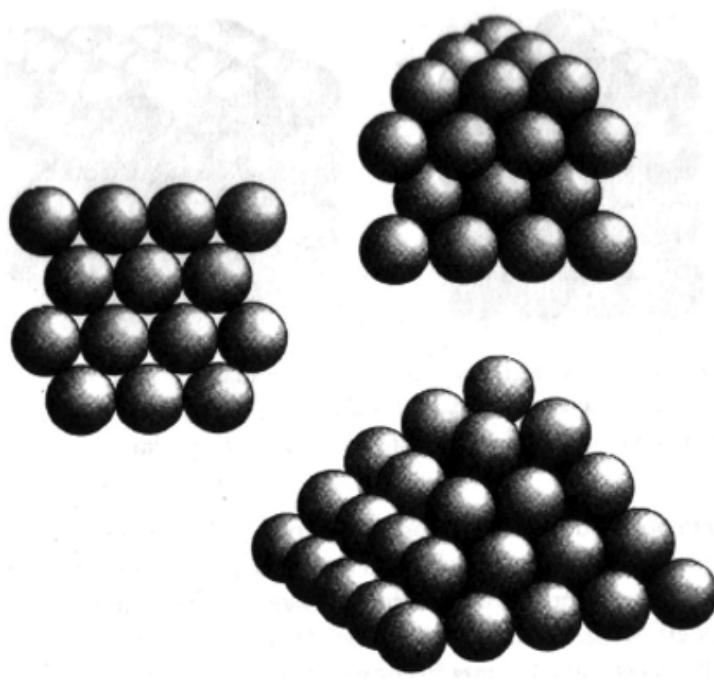

*Figura 25: En la disposición cúbica centrada en las caras cada capa consiste en esferas dispuestas de modo que cada una está rodeada por otras seis. Una capa se* 

*sitúa encima de otra de manera tal que sus esferas se asientan sobre un hoyo en lugar de hacerlo directamente sobre otra esfera. Una orientación particular de esta disposición da lugar a las pirámides de naranjas que suelen verse en las fruterías.* 

Una de las primeras disposiciones examinadas por Kepler se conoce en la actualidad como la malla cúbica centrada en las caras. Ésta puede ser construida creando primero una capa inferior tal que cada esfera esté rodeada por otras seis esferas. La segunda capa se genera poniendo esferas en los «hoyuelos» de la primera capa, como se muestra en la figura 25. En realidad, la segunda capa es un duplicado de la primera pero se ha corrido ligeramente de modo que encaje perfectamente en su posición. Esta disposición es idéntica a la usada en las fruterías para hacer pirámides de naranjas, y tiene una eficacia del 74 %. Esto significa que sí una caja de cartón tuviera que ser rellenada de naranjas usando la estrategia centrada en las caras entonces las naranjas ocuparían el 74 % del volumen de la caja.

Esta distribución puede compararse con otras, como la malla cúbica simple. En este caso cada capa consiste en esferas colocadas en un enrejado cuadrado y las capas se sitúan unas directamente encima de otras, como se observa en la figura 26. La malla cúbica simple tiene una eficacia de empaquetado sólo del 53 %.

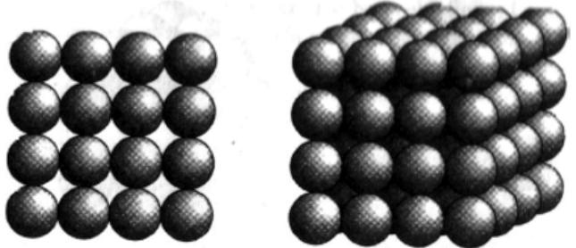

*Figura 26: En la disposición cúbica simple cada capa consiste en esferas situadas sobre una cuadrícula. Una capa se sitúa sobre la otra de forma que las esferas se asientan directamente sobre las de la capa inferior.* 

Otra posible colocación, la malla hexagonal, es similar a la cúbica centrada en las caras, puesto que cada capa se construye rodeando cada esfera por otras seis, pero, en lugar de desplazar ligeramente cada capa de manera que encaje en los hoyos de la anterior, ahora las capas se disponen una directamente encima de otra, como se muestra en la figura 27. La malla hexagonal tiene una eficacia de empaquetado del 60 %.

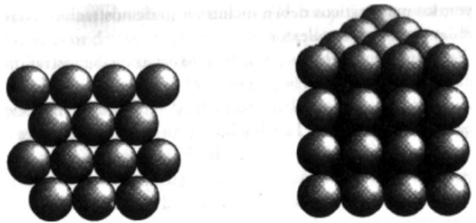

*Figura 27: En la disposición en malla hexagonal cada capa consiste en esferas dispuestas de tal modo que cada una está rodeada por otras seis. Las capas se sitúan horizontalmente, de manera que cada esfera se asienta directamente encima de una esfera de la capa inferior.* 

Kepler estudió gran variedad de configuraciones y llegó a una conclusión que creyó lo suficientemente interesante como para incluirla en su escrito «Sobre el copo de nieve de seis lados»; a saber, que con la malla cúbica centrada en las caras «el empaquetado será el más denso posible». La afirmación de Kepler era perfectamente sensata puesto que la eficacia de empaquetado con la malla cúbica centrada en la cara era el mejor que había encontrado, pero esto no descartaba la posibilidad de que quedara alguna disposición, que él hubiera pasado por alto, con una eficacia de empaquetado aún mayor. Esta pequeña duda está en el origen del problema del empaquetado de esferas, un enigma medio siglo anterior a Fermat y que ahora ha resultado ser aún más intratable que el último teorema. El problema requiere que los matemáticos demuestren que la malla cúbica centrada en la cara es sin lugar a dudas el método más eficaz para empaquetar esferas.

Como el último teorema, el problema de Kepler requiere que los matemáticos desarrollen una demostración que abarque una infinidad de posibilidades. Fermat afirmó que entre la infinidad de números enteros no había soluciones a su ecuación, y Kepler afirmó que entre la infinidad de disposiciones ninguna podía tener una eficacia de empaquetado mayor que la de la malla cúbica centrada en las caras. Además de demostrar que no existe ninguna malla, es decir, ninguna disposición regular, con una eficacia de empaquetado mayor, los matemáticos deben incluir en su demostración todas las posibles disposiciones aleatorias.

En los últimos 380 años nadie ha sido capaz de demostrar que la malla cúbica centrada en la cara es en efecto la estrategia de empaquetado óptima; por otro lado, nadie ha descubierto un método de empaquetado más eficaz. La falta de un contraejemplo significa que, para todos los propósitos prácticos, la afirmación de Kepler es cierta, pero en el absoluto mundo de las matemáticas aún se necesita una demostración rigurosa. Esto llevó a C. A. Rogers, experto británico en empaquetado de esferas, a comentar que la afirmación de Kepler es «creída por la mayor parte de los matemáticos y conocida por todos los físicos».

A pesar de la falta de una demostración completa, en los siglos pasados se han dado algunos pasos hacia la solución. En 1892, el matemático escandinavo Axel Thue ofreció una prueba del análogo bidimensional del problema de Kepler, es decir, cuál es el método más eficaz de disponer esferas cuando sólo se considera una capa, o, en otras palabras, cómo disponer naranjas en una bandeja en lugar de una caja. La solución es la disposición hexagonal. Posteriormente, Tóth, Segre y Mahler llegaron a la misma conclusión, pero ninguno de los métodos que usaron puede aplicarse al problema original de Kepler en tres dimensiones.

En la era moderna, algunos matemáticos han intentado una maniobra bastante distinta: poner una cota superior a la posible eficacia de empaquetado. En 1958, C. A. Rogers calculó una cota superior del 77,97 %; esto significa que es imposible tener una disposición con una eficacia de empaquetado mayor que el 77,97 %. Este porcentaje no es mucho más alto que la eficacia de empaquetado de la malla cúbica centrada en la cara, de un 74,04 %. Por esta razón, si alguna disposición tuviera una eficacia de empaquetado mayor que la cúbica centrada en la cara, no podría vencerla más que por un escaso porcentaje. Sólo hay una pequeña ventana de un 3,93 % por la cual pueda entrar una astuta disposición y demostrar que la afirmación de Kepler es falsa. Después de Rogers, otros matemáticos intentaron cerrar del todo la ventana reduciendo la cota superior al 74,04 %, que no dejaría posibilidad a que otra disposición derrotara a la cubica centrada en la cara y, en consecuencia, demostrara por defecto la afirmación de Kepler. Por desgracia, disminuir la cota superior se ha revelado una tarea lenta y difícil, y en 1988 permanecía en el 77,84 %, sólo ligeramente mejor que el resultado de Rogers.

A pesar de años de lentos avances, el problema del empaquetado de esferas llegó a los titulares de prensa en el verano de 1990 cuando Wu–Yi Hsiang, de la Universidad de California en Berkeley, publicó un resultado que, según él, demostraba la conjetura de Kepler. Al principio, la comunidad matemática reaccionó con optimismo, pero, como con la demostración de Wiles, el artículo tuvo que sufrir un proceso de revisión antes de ser aceptado como válido. Con el paso de las semanas Hsiang tuvo que enfrentarse a una serie de errores garrafales y la prueba quedó hecha jirones.

En una historia que tiene paralelismos con la de Wiles, Hsiang respondió un año después con una demostración revisada en la que aseguraba haber evitado los problemas identificados en el manuscrito original. Desafortunadamente para Hsiang, sus críticos aún creían que existían lagunas en su argumento. En una carta a Hsiang, el matemático Thomas Hales intentó explicar sus dudas:

*Una suposición realizada en su segundo artículo me choca por ser más fundamental y aún más difícil de demostrar que las otras... Usted asegura que «el mejor modo (o sea, minimización de volumen) de añadir una segunda capa al empaquetado es tapar tantos agujeros como sea posible»... Su argumento parece descansar esencialmente en esta suposición, aunque en ninguna parte ofrece ni siquiera una insinuación de la demostración.* 

Desde que Hsiang presentó su artículo rectificado se ha entablado una batalla entre él y sus críticos, con declaraciones de que el problema ha sido resuelto y réplicas de que no es así. En el mejor de los casos, la demostración está envuelta en controversias, y en el peor ha sido desacreditada. Sea como sea, la puerta aún está abierta para cualquiera que desee demostrar la conjetura de Kepler. En 1996, Doug Muder hizo un resumen personal del estado de la cuestión en el que también se revelan algunos de los enigmas que rodean la demostración de Hsiang:

*Acabo de regresar de la Conferencia Conjunta de Investigación AMS–IMS– SIAM sobre Geometría Computacional Discreta en Mount Holyoke. Ha sido una de esas conferencias que se dan una vez cada diez años, así que nos*  *concentramos en valorar los progresos de la última década. La afirmación de Hsiang de haber demostrado la conjetura de Kepler ya tiene seis años, y me he dado cuenta de que la comunidad ha llegado a un consenso sobre el tema: nadie se lo cree.* 

*Durante las sesiones plenarias y las discusiones informales en la cafetería existía consenso en los siguientes puntos:* 

*1. El artículo de Hsiang (publicado en el International Journal of Mathematics en 1993) no es una demostración de la conjetura de Kepler. Como mucho es un esquema (¡un esquema de cien páginas!) de cómo podría ser tal demostración.* 

*2. El artículo es inadecuado incluso como esquema ya que se han encontrado contraejemplos a varios de sus pasos.* 

*3. La afirmación complementaria de Hsiang de haber demostrado la conjetura del dodecaedro (y varios otros problemas del empaquetado de esferas previamente sin resolver) carecen igualmente de base.* 

*4. El trabajo sobre la conjetura de Kepler y la conjetura del dodecaedro deberían continuar como si el trabajo de Hsiang nunca hubiera existido.* 

*En una conferencia, Gabor Fejes Tóth, de la Academia de Ciencias húngara, dijo sobre el artículo de Hsiang: «No puede considerarse una demostración. El problema aún está abierto.» Thomas Hales, de la Universidad de Michigan, estuvo de acuerdo: «Este problema aún está por resolver. Yo no lo he resuelto. Hsiang no lo ha resuelto. Nadie lo ha resuelto por lo que yo sé.» (Hales predijo que sus propias técnicas resolverían el problema en «un año o dos».)* 

*Lo que hace más interesante el problema es que hay una persona que no ha llegado a ese consenso: el propio Hsiang. (Tampoco asistió a la conferencia.) Es muy consciente de los contraejemplos y del hecho de que no es creído por los expertos en el campo, pero aún continúa dando conferencias a lo largo de todo el mundo repitiendo sus afirmaciones. La gente que le ha tratado personalmente (tales como Hales y Bezdek) creen que nunca admitirá que su artículo está mal.* 

*Ésta es la razón por la que la polvareda está tardando tanto en disiparse. Hsiang afirmó por primera vez haber encontrado una solución a la conjetura de Kepler en 1990, hace ya seis años. Todas sus charlas habían sido lo suficientemente vagas como para resultar plausibles. Varios meses después de sus afirmaciones, cuando apareció el primer preprint, inmediatamente se encontraron fisuras, y los contraejemplos le siguieron con rapidez. Pero el hecho de que Hsiang continuara haciendo sus afirmaciones en público creó la impresión de que debía de haber resuelto todas las objeciones que habían aparecido hasta la fecha. La longitud del artículo, y el haber sufrido varias revisiones antes de su publicación, se añadieron a la confusión.* 

*El caso de Hsiang demuestra hasta qué punto los matemáticos se basan en un sistema de honor. La comunidad asume que un profesor de una de las mejores universidades no hará falsas afirmaciones y que retirará toda afirmación incorrecta con la aparición del primer fallo demostrado. Alguien que se mofe del sistema puede provocar confusión durante largo tiempo ya que nadie tiene la motivación ni el tiempo para seguirle y desmontar sus falaces afirmaciones cuando las realice. (Cuando se considera la cantidad de trabajo que debe haber consumido el desenmascarador artículo de Hales en el Mathematical Intelligencer, y el hecho de que este artículo no le ayuda a avanzar en su carrera investigadora, se empieza a comprender el problema. El artículo de réplica de Hsiang era completamente inadecuado, pero Hales llegó a la conclusión de que desacreditar la réplica daría lugar a un ciclo sin fin para el que sencillamente no tenía tiempo.)* 

*Es posible que Hsiang nunca admita sus errores, pero ¿qué hará el International Journal? Está claro que ellos forman parte del proceso, que no funcionó como se esperaba. El artículo de Hsiang no fue evaluado de forma adecuada, si es que fue evaluado en lo más mínimo. El hecho de que el Journal sea editado por los colegas de Hsiang en Berkeley le da a todo el asunto un cierto aire de amiguismo. El Journal no estaba interesado en el empaquetamiento de esferas hasta aquel artículo. Parece obvio que Hsiang escogió el International Journal porque estaba editado por sus amigos, no porque fuera una revista adecuada para su artículo.* 

*Karoly Bezdek, que pasó más de un año trabajando con Hsiang, tratando de reparar las brechas del artículo, ha enviado un artículo al International Journal con un contraejemplo a uno de los lemas de Hsiang. No ha tenido noticias desde diciembre, un período de tiempo usual para un artículo, pero bastante largo para un contraejemplo al artículo más relevante publicado en la revista en varios años.* 

*DOUG MURDER* 

# **Demostraciones de silicio**

En su batalla contra el último teorema de Fermat, las únicas armas de Wiles fueron un lápiz, papeles y lógica pura. Aunque su demostración emplea las técnicas más modernas en teoría de números está en la mejor tradición de Pitágoras y Euclides. Sin embargo recientemente ha habido un signo ominoso de que la solución de Wiles puede ser uno de los últimos ejemplos de demostración heroica, y que los resultados futuros pueden estar basados en un enfoque de fuerza bruta en lugar de argumentos elegantes.

La primera indicación de lo que algunos están llamando el declinar de las matemáticas se refiere a un problema creado en Inglaterra en octubre de 1852 por el matemático a tiempo parcial Francis Guthrie. Una tarde, mientras se dedicaba ociosamente a colorear un mapa de los condados de Gran Bretaña, Guthrie se encontró con un acertijo en apariencia trivial pero que no podía resolver. Sólo quería saber el número mínimo de colores que se requerirían para colorear cualquier mapa concebible de tal manera que ninguna región tuviera frontera con otra del mismo color.

Por ejemplo, tres colores no son suficientes para la imagen de la figura 28. Luego está claro que algunos mapas necesitan cuatro colores, pero Guthrie quería saber si cuatro colores eran suficientes para todos los mapas, ¿o podrían existir algunos que necesitaran cinco, seis o más colores?

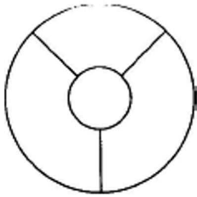

*Figura 28: Este sencillo mapa muestra que se necesitan por lo menos cuatro colores para algunos mapas, ¿pero es suficiente con cuatro colores para todos los mapas?* 

Frustrado e intrigado, Guthrie comentó el problema a su hermano menor, Frederick, estudiante en el University College, en Londres. A su vez, Frederick planteó el problema a su profesor, el eminente Augustus de Morgan, quien el 23 de octubre escribió al gran matemático y físico irlandés William Rowan Hamilton:

*Uno de mis estudiantes me ha pedido hoy el porqué de un hecho que yo no sabía que fuera tal, y aún no lo sé. Asegura que si una figura es dividida de alguna forma y los compartimientos coloreados distintamente de modo que las figuras con cualquier porción de frontera común estén coloreados diferentemente, entonces sólo se requieren cuatro colores, pero no más. Tengo un caso en el que se requieren cuatro colores. Pregunta: ¿No se puede inventar un caso en que se requieran cinco o más?... Si contestas con algún caso muy simple que me convierta en un estúpido animal, creo que debo hacer como la esfinge...* 

Hamilton no fue capaz de inventar un mapa que requiriese cinco colores, pero tampoco pudo demostrar que tal mapa no existiese. Las noticias sobre el problema se extendieron rápidamente a través de Europa, pero éste resistió con fuerza todos los ataques, probando ser engañosamente difícil. En un arrebato de orgullo, Hermann Minkowski dijo que la razón por la que no había sido resuelto era que sólo lo habían intentado matemáticos de tercera categoría, pero sus propios esfuerzos también acabaron en fracaso. *«El cielo está enfadado con mi arrogancia, declaró. Mi demostración también es defectuosa.»*

A pesar de inventar uno de los problemas más difíciles de las matemáticas, hoy conocido como el problema de los cuatro colores, Francis Guthrie dejó Inglaterra para ejercer como abogado en Sudáfrica. Eventualmente volvió a las matemáticas como profesor de la Universidad de Ciudad del Cabo, donde solía pasar más tiempo en el departamento de botánica que con sus colegas matemáticos; su única reivindicación a la fama después del problema de los cuatro colores fue tener un brezo bautizado con su nombre: *Erica Gulthriei*.

Después de sobrevivir sin ser resuelto durante un cuarto de siglo hubo un gran optimismo en 1879 cuando el matemático británico Alfred Bray Kempe publicó un artículo en el *American Journal of Mathematics* en el que aseguraba tener una solución al enigma de Guthrie. Kempe parecía probar que cualquier mapa necesita, como mucho, cuatro colores, y el proceso de revisión pareció confirmarlo. Inmediatamente se le eligió miembro de la Royal Society y con el tiempo fue armado caballero por sus contribuciones a las matemáticas.

Pero en 1890 Percy John Heawood, un profesor de la Universidad de Durham, publicó un artículo que sorprendió a la comunidad matemática. Una década después de que Kempe parecía haber resuelto el problema, Heawood demostró que la prueba estaba equivocada en sus fundamentos. La única buena noticia fue que, como parte de su demolición del trabajo de Kempe, Heawood fue capaz de demostrar que el número máximo de colores necesarios era cuatro o cinco, pero sin duda no más alto.

Si bien Kempe, Heawood y otros fueron incapaces de resolver el problema de los cuatro colores, sus fallidos esfuerzos contribuyeron enormemente al nuevo y floreciente tema de la topología. A diferencia de la geometría, en la que se estudian la forma exacta y el tamaño de los objetos, la topología está interesada sólo en la esencia del objeto, en sus características más básicas. Por ejemplo, cuando un geómetra examina un cuadrado, las propiedades de interés son la idéntica longitud de cada lado y el ángulo recto en cada esquina. Cuando un topólogo examina el mismo objeto la única propiedad de interés es una sola línea continua que forma un bucle. En consecuencia, un topólogo considerará indistinguibles un círculo y un cuadrado, puesto que ambos consisten en un solo bucle.

Otra forma de ver la equivalencia topológica de un cuadrado y un círculo es imaginando una de las figuras dibujada en una hoja elástica. Si empezamos con el cuadrado podemos estirar, comprimir, doblar o girar la página sin rasgarla hasta que la figura original se haya transformado en un círculo. Por otro lado, el cuadrado nunca podrá transformarse en una cruz, por mucho que se deforme la hoja elástica. Por lo tanto, un cuadrado y una cruz no son topológicamente equivalentes. A causa de este modo de pensar, con frecuencia se denomina a la topología como la *«geometría en una página de goma»*.

Al haber abandonado conceptos como longitud y ángulo, los topólogos sólo pueden distinguir los objetos recurriendo a características como el número de intersecciones que posee. Así, un «ocho» es fundamentalmente distinto de un círculo puesto que posee un punto en el que se encuentran cuatro líneas, mientras que el círculo no tiene tales intersecciones. Por más que se estire o gire, es imposible transformar un «ocho» en un círculo. Los topólogos también están interesados en objetos de tres dimensiones (y más) donde huecos, bucles y nudos se convierten en las características fundamentales de interés. El matemático John Kelley dijo humorísticamente que *«un topólogo es un tipo que no sabe cuál es la diferencia entre un donut y una taza de café»*.

Los matemáticos esperaban ser capaces de aprehender la esencia del problema de los cuatro colores viendo los mapas a través de la óptica simplificadora de la topología. El primer avance llegó en 1922, cuando Philip Franklin ignoró el problema general y estableció una prueba que mostraba que cualquier mapa con un máximo de 25 regiones requería sólo 4 colores. Otros matemáticos intentaron avanzar a partir del método de Franklin y, en 1926, Reynolds extendió la demostración a mapas con 27 regiones; en 1940, Winn la extendió a 35 y, en 1970, Ore y Stemple habían alcanzado las 39 regiones. El problema parecía seguir los mismos derroteros que el último teorema de Fermat: se iban realizando pequeños progresos hacia el infinito. La conjetura original aparecía casi como cierta, pero hasta que se pudiera encontrar una demostración general siempre existía la posibilidad de dibujar un mapa que demostrara que Guthrie estaba equivocado. De hecho, en 1975 el periodista, matemático y escritor Martin Gardner publicó un mapa en la revista *Scientific American* que requería cinco colores. La fecha de la publicación era el 1 de abril9 y Gardner era muy consciente de que, aunque era difícil cubrir el mapa con sólo cuatro colores, tampoco era imposible. Tal vez a usted le gustaría demostrar que éste es el caso; el mapa en cuestión aparece en la figura 29.

El lento ritmo de progreso mostró cada vez con más claridad que los enfoques convencionales nunca permitirían tender un puente entre la demostración de Ore y Stemple sobre mapas de 39 regiones o menos y cualquier mapa concebible que pudiera consistir de un número infinito de regiones. Entonces, en 1976, dos matemáticos de la Universidad de Illinois, Wolfgang Haken y Kenneth Appel, desarrollaron una nueva técnica que revolucionaría el concepto de demostración matemática.

Haken y Appel habían estudiado el trabajo de Heinrich Heech, que había afirmado que la infinidad de mapas infinitamente variados podría ser construida a partir de ciertos componentes básicos y que estudiándolos podría ser posible manejar el problema general. Los mapas básicos eran el equivalente de los electrones, protones y neutrones, los objetos fundamentales a partir de los que puede ser construida cualquier otra cosa. Por desgracia, la situación no era tan simple como con la santísima trinidad de partículas, ya que Haken y Appel sólo pudieron reducir el problema de los cuatro colores a 1482 mapas básicos. Si Haken y Appel pudieran demostrar que todos esos mapas eran coloreables con cuatro colores, esto implicaría que todos los mapas se podrían pintar con sólo esos cuatro colores.

 9 Recuérdese que el 1 de abril es el Fool's Day, equivalente anglosajón de nuestra fiesta de los Santos Inocentes. (N. de los tt.)

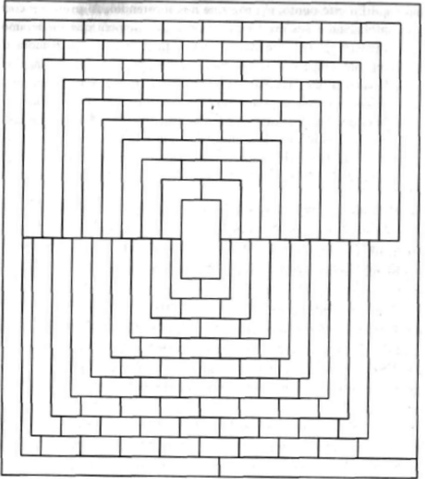

*Figura 29. El 1 de abril de 1975, Martin Gardner presentó su mapa en su artículo mensual en Scientific American. Afirmaba que se necesitaban cinco colores para pintarlo, pero, por supuesto, su afirmación era una patraña.* 

Comprobar los 1482 mapas y todas las combinaciones de coloreado de cada uno sería una tarea inmensa, sin duda alguna más allá de la capacidad de cualquier equipo de matemáticos. Incluso la utilización de un ordenador para tratar todas las permutaciones ocuparía más de un siglo. Sin amilanarse, Haken y Appel empezaron a buscar atajos y estrategias que pudiera usar un ordenador para acelerar el procedimiento requerido para comprobar los mapas. En 1975, cinco años después de que empezaran a trabajar en el problema, los dos hombres vieron cómo el computador hacía algo más que meros cálculos: estaba contribuyendo a sus propias ideas. Los dos hombres recuerdan el punto central de su investigación:

*En este punto, el programa nos sorprendió. Al principio comprobábamos sus argumentos a mano de manera que pudiéramos predecir el curso que seguiría en cualquier situación; pero ahora, de repente, empezó a actuar como una máquina de jugar al ajedrez. Creaba estrategias complicadas basadas en todos los trucos que se le habían «enseñado», y a menudo tales enfoques eran mucho más hábiles que los que nosotros hubiéramos intentado. Así que empezó a enseñarnos formas de avanzar que nunca habríamos esperado. En cierto sentido había superado a sus creadores en algunos aspectos tanto de las partes «intelectuales» como mecánicas del problema.* 

En junio de 1976, gracias a 1200 horas de ordenador, Haken y Appel fueron capaces de anunciar que los 1482 mapas habían sido analizados y ninguno de ellos requería más de cuatro colores. El problema de los cuatro colores de Guthrie había sido resuelto por fin. Lo más notable es que fue la primera demostración matemática en la que un ordenador había hecho algo más que acelerar los cálculos: había contribuido tanto al resultado que la demostración habría sido imposible sin él. Fue un logro importantísimo, pero al mismo tiempo produjo un desasosiego en la comunidad puesto que no había ningún modo de comprobar la demostración de manera convencional.

Antes de que los detalles de la demostración pudieran ser publicados en el Illinois Journal of Mathematics, los editores tenían que someterla a una cierta revisión. Una evaluación convencional era imposible, así que el programa de Haken y Appel fue introducido en otro ordenador para demostrar que éste llegaba al mismo resultado.

Este proceso de evaluación tan poco ortodoxo enfureció a algunos matemáticos, que proclamaron que la comprobación era inadecuada y que no había ninguna garantía contra algún fallo en una parte esencial del programa que generara un error en la lógica. H. P. F. Swinnerton–Dyer señaló lo siguiente sobre las demostraciones por ordenador:

*Cuando un teorema ha sido demostrado con la ayuda de un ordenador es imposible dar una exposición de la demostración accesible a la comprobación tradicional: que un lector con la suficiente paciencia sea capaz de trabajar con la demostración y verifique que es correcta. Incluso si se fuera capaz de*  *escribir todos los programas y todos los conjuntos de datos usados, no podría existir la seguridad de que una cinta de datos no haya sido mal escrita o leída. Es más, cada ordenador moderno tiene oscuros fallos en su software y hardware (que muy a menudo causan errores que permanecen sin ser detectados durante años) y es susceptible de experimentar fallos transitorios.* 

Hasta cierto punto, esto era una paranoia de la comunidad que prefería evitar los ordenadores en lugar de explotarlos. Joseph Keller hizo notar una vez que en su universidad, Stanford, el departamento de matemáticas tenía menos ordenadores que cualquier otro, incluyendo el de literatura francesa. Aquellos matemáticos que rechazaron el trabajo de Haken y Appel no pudieron negar que todos los matemáticos aceptan demostraciones incluso si no las han comprobado personalmente. En el caso de la demostración de Wiles del último teorema de Fermat, menos del diez por ciento de los teóricos de números comprenden completamente el argumento, pero el ciento por ciento acepta que es correcta. Los que no pueden comprender la demostración están satisfechos debido a que otros que entienden los conceptos involucrados los han examinado y verificado.

Un caso aún más extremo es la llamada demostración de la clasificación de grupos finitos simples, que consiste en quinientos artículos separados escritos por más de un centenar de matemáticos. Se dice que sólo un matemático, Daniel Gorenstein, entendió la totalidad de la demostración de quince mil páginas, y murió en 1992. Sin embargo, la comunidad en conjunto puede estar segura de que cada sección de la demostración ha sido examinada por su propio equipo de especialistas y cada línea de las quince mil páginas ha sido comprobada y vuelta a comprobar docenas de veces. Lo que hace distinto al problema de los cuatro colores es que nunca ha sido completamente comprobado por nadie, y nunca lo será.

En los veinte años que han pasado desde que fue anunciada la demostración del teorema de los cuatro colores, los ordenadores han sido usados para resolver otros problemas menos famosos pero igualmente importantes. En un campo anteriormente no contaminado por la tecnología, cada vez más matemáticos están acostumbrándose, aunque de forma reluctante, al creciente uso de la lógica de silicio y aceptan el argumento de Wolfgang Haken:

Cualquiera, en cualquier sitio a lo largo de la línea, puede completar los detalles y comprobarlo. El hecho de que un ordenador pueda tratar más detalles en unas pocas horas de lo que un matemático podría esperar hacer en toda su vida no cambia el concepto básico de demostración matemática. Lo que ha cambiado no es la teoría sino la práctica de las matemáticas.

Más recientemente, algunos matemáticos han proporcionado aún más potencia a los ordenadores por medio de los llamados algoritmos genéticos. Estos son programas de ordenador cuya estructura general es diseñada por un matemático pero cuyos detalles son determinados por el ordenador mismo. Ciertas líneas del programa pueden mutar y evolucionar de forma similar a los genes en el ADN orgánico. Desde el programa madre original, el ordenador genera cientos de programas hijos que son ligeramente diferentes debido a las mutaciones aleatorias realizadas por el propio ordenador. Los programas hijos se usan para resolver un problema particular. La mayoría de los programas fracasan de forma catastrófica, pero al que avance más hacia la solución se le permitirá reproducirse y crear una nueva generación de descendientes mutados. La supervivencia del más adaptado se interpreta en términos de cuál de los programas se acerca más a la solución del problema. Repitiendo el proceso, los matemáticos esperan que, sin intervención alguna, un programa evolucione hasta resolver el problema y, en algunos casos, este enfoque está teniendo éxitos significativos.

El científico de ordenadores Edward Frenkin ha ido más allá diciendo que algún día un ordenador descubrirá una demostración importante con independencia de los matemáticos. Hace una década se instituyó el Premio Leibniz: cien mil dólares se concederán al primer ordenador que invente un teorema que tenga «una profunda repercusión en matemáticas» Aún se debate si el premio será reclamado alguna vez o no, pero lo seguro es que a una demostración por ordenador siempre le faltará la iluminación que da una demostración tradicional y, en comparación, parece hueca. Una demostración matemática no sólo debería responder a una cuestión, también debería producir alguna nueva comprensión sobre por qué la respuesta es como es. Meter una pregunta por el extremo de una caja negra y obtener la respuesta por el otro extremo incrementa el conocimiento, pero no la comprensión. A partir de la demostración de Wiles del último teorema de Fermat sabemos que no hay soluciones para la ecuación de Fermat puesto que tal solución llevaría a una contradicción con la conjetura de Taniyama– Shimura. Wiles no sólo ha vencido el reto de Fermat sino que ha justificado su respuesta diciendo que debe ser así para mantener una relación fundamental entre las ecuaciones elípticas y las formas modulares.

El matemático Ronald Graham describió la superficialidad de las demostraciones por ordenador en el contexto de una de las grandes conjeturas aún hoy por demostrar, la hipótesis de Riemann: *«Sería desalentador si en algún lugar del desarrollo pudieras preguntar a un ordenador si la hipótesis de Riemann es correcta y éste dijera: "Sí, es cierta, pero no serás capaz de entender la demostración."»* El matemático Philip Davis, que escribió con Reuber Hersh, tuvo una reacción similar a la demostración del problema de los cuatro colores:

*Mi primera reacción fue: «¡Maravilloso! ¿Cómo lo hicieron?» Esperaba alguna intuición nueva y brillante, una demostración que contuviera en su corazón una idea cuya belleza transformaría aquella jornada. Pero cuando recibí la respuesta: «Lo hicieron partiéndolo en miles de casos y estudiándolos todos en el ordenador, uno tras otro», me sentí descorazonado. Mi reacción fue: «Así que de esta manera acabó todo, al final resulta que no era un problema interesante.»* 

# **El premio**

La demostración de Wiles del último teorema de Fermat se basa en una conjetura nacida en los años cincuenta. El argumento utiliza una serie de técnicas matemáticas desarrolladas durante la última década, algunas de las cuales fueron inventadas por el propio Wiles. La demostración es una obra maestra de las matemáticas modernas, lo que lleva a la inevitable conclusión de que la demostración de Wiles no es la misma que la de Fermat. Fermat escribió que su demostración no cabía en el margen de su ejemplar de la *Arithmetica de Diofanto*, y las cien páginas de densas matemáticas ciertamente no cumplen ese criterio, pero seguramente el francés no inventó las formas modulares, la conjetura de Taniyama–Shimura, los grupos de Galois y el método de Kolyvagin-Flach siglos antes de que nadie más lo hiciese.

Si Fermat no tenía la demostración de Wiles, ¿qué es lo que tenía? Los matemáticos se dividen en dos opiniones. Los escépticos y poco sentimentales creen que el último teorema de Fermat fue el resultado de un raro momento de debilidad de aquel genio del siglo XVII. Aseguran que, aunque Fermat escribió *«poseo una demostración en verdad maravillosa»*, en realidad sólo tenía una demostración equivocada. La naturaleza exacta de su prueba defectuosa está abierta al debate, pero es bastante posible que siguiera las mismas líneas que el trabajo de Cauchy o Lame.

Otros matemáticos, los optimistas románticos, creen que Fermat podría haber poseído una demostración auténtica. Fuera lo que fuera su demostración, habría estado basada en las técnicas del siglo XVII e incluiría un argumento tan astuto que ha escapado a todo el mundo desde Euler hasta Wiles. A pesar de la publicación de la solución de Wiles al problema, aún hay muchos matemáticos que creen poder alcanzar fama y gloria redescubriendo la demostración original de Fermat.

Aunque Wiles había echado mano de los métodos del siglo XX para resolver un enigma del siglo XVII, había superado el reto de Fermat de acuerdo con las reglas del Comité Wolfskehl. El 27 de junio de 1997, los distinguidos miembros de la Königliche Gesellschaft der Wissenschaften de Gotinga se reunieron en el Aula Magna de la Universidad de Gotinga para hacer entrega del premio creado por Paul Wolfskehl a principios de siglo.

El profesor Heinz Wagner, presidente del comité, declaró que el Premio Wolfskehl era más importante que el Nobel, ya que éste se otorga cada año mientras que ha sido necesario aguardar noventa años para entregar el Wolfskehl. Bajo los retratos de los reyes de Hannover, Wiles aceptó el premio de cincuenta mil dólares, dando por concluida la responsabilidad del Comité Wolfskehl. El último teorema de Fermat había sido resuelto oficialmente.

¿Qué es lo siguiente que atrapará la atención de Wiles? De forma poco sorprendente para alguien que ha trabajado en el más absoluto secreto durante siete años, Wiles rehúsa hacer ningún comentario sobre sus investigaciones actuales, pero, sea lo que sea, no hay duda de que nunca reemplazará del todo la obsesión que tuvo con el último teorema de Fermat. *«No hay otro problema que pueda significar lo mismo para mí. Fue la pasión de mi infancia. Nada puede reemplazar eso. Lo he resuelto.*  *Intentaré resolver otros problemas, estoy seguro. Algunos serán muy difíciles y tendré una sensación de realización otra vez, pero no hay ningún problema matemático que me pueda capturar como lo hizo Fermat.* 

*»He tenido ese raro privilegio de poder perseguir en mi vida adulta lo que fue el sueño de mi infancia. Sé que es un raro privilegio, pero si puedes atacar algo en tu vida adulta que signifique tanto para ti es una recompensa mayor que cualquier cosa imaginable. Al haber resuelto este problema existe ciertamente una sensación de pérdida, pero a la vez hay una sensación tremenda de liberación. Estuve tan obsesionado con el problema que durante ocho años pensé en él todo el tiempo; desde que me levantaba por la mañana hasta que me iba a dormir por la noche. Es mucho tiempo para pensar en una sola cosa. Esta odisea en particular se ha acabado. Mi mente descansa.»*