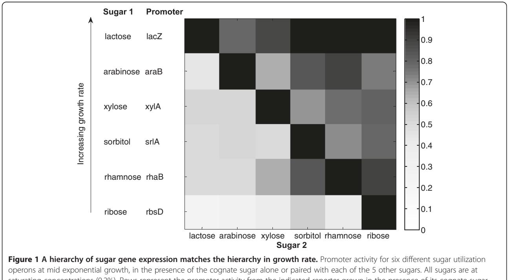
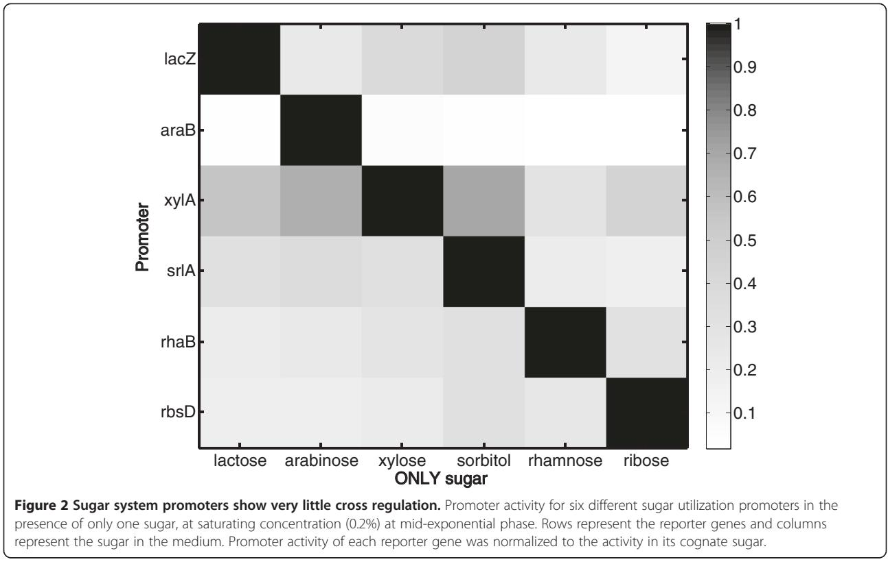
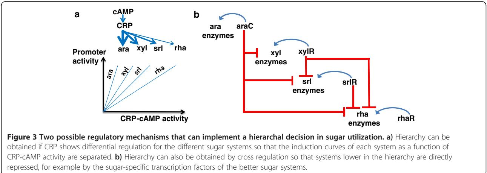
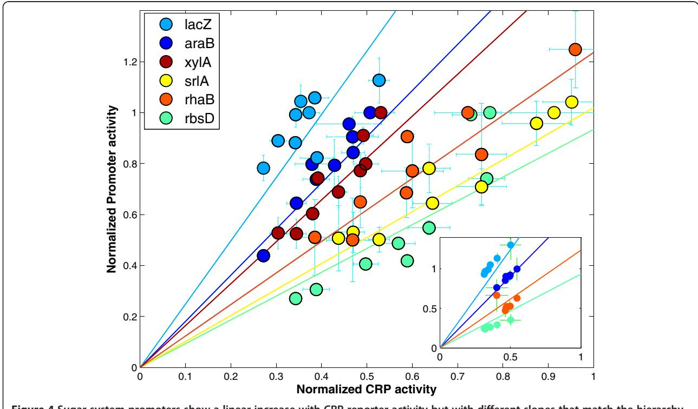
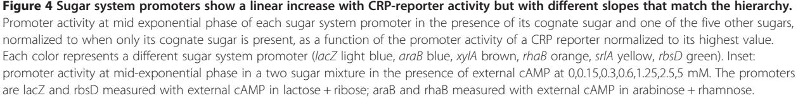
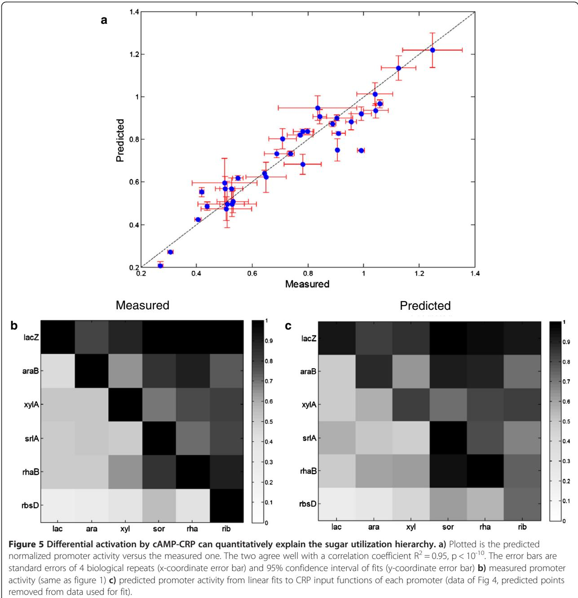
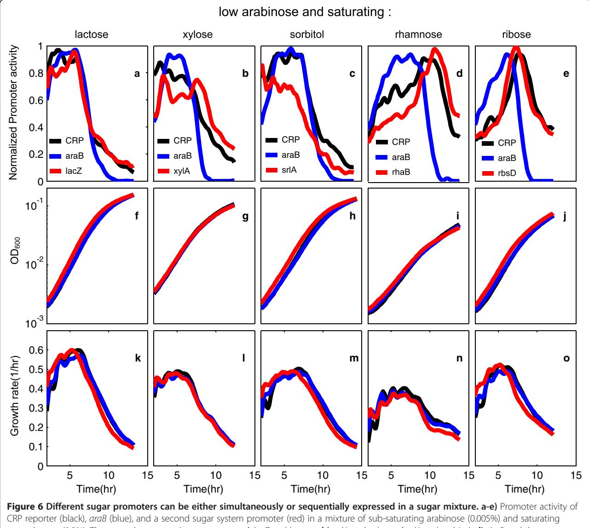
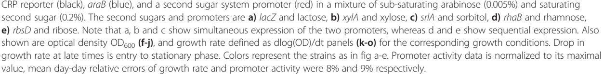
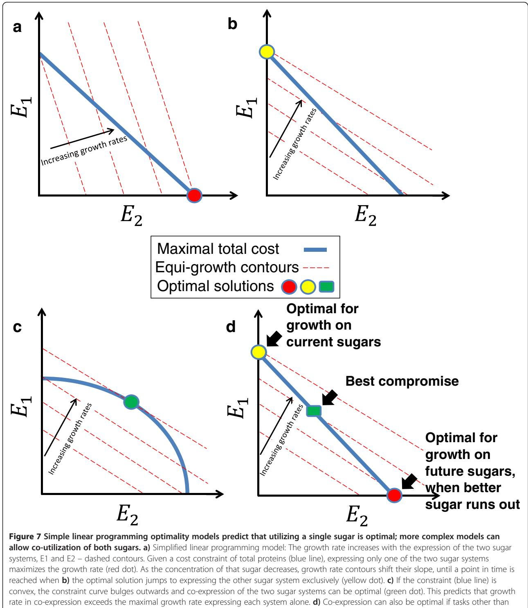

# R E S EAR CH A R TIC L E Open Access

# Hierarchy of non-glucose sugars in Escherichia coli

Guy Aidelberg, Benjamin D Towbin, Daphna Rothschild, Erez Dekel, Anat Bren and Uri Alon*

# Abstract

Background: Understanding how cells make decisions, and why they make the decisions they make, is of fundamental interest in systems biology. To address this, we study the decisions made by E. coli on which genes to express when presented with two different sugars. It is well-known that glucose, E. coli's preferred carbon source, represses the uptake of other sugars by means of global and gene-specific mechanisms. However, less is known about the utilization of glucose-free sugar mixtures which are found in the natural environment of E. coli and in biotechnology.

Results: Here, we combine experiment and theory to map the choices of E. coli among 6 different non-glucose carbon sources. We used robotic assays and fluorescence reporter strains to make precise measurements of promoter activity and growth rate in all pairs of these sugars. We find that the sugars can be ranked in a hierarchy: in a mixture of a higher and a lower sugar, the lower sugar system shows reduced promoter activity. The hierarchy corresponds to the growth rate supported by each sugar- the faster the growth rate, the higher the sugar on the hierarchy. The hierarchy is 'soft' in the sense that the lower sugar promoters are not completely repressed. Measurement of the activity of the master regulator CRP-cAMP shows that the hierarchy can be quantitatively explained based on differential activation of the promoters by CRP-cAMP. Comparing sugar system activation as a function of time in sugar pair mixtures at sub-saturating concentrations, we find cases of sequential activation, and also cases of simultaneous expression of both systems. Such simultaneous expression is not predicted by simple models of growth rate optimization, which predict only sequential activation. We extend these models by suggesting multi-objective optimization for both growing rapidly now and preparing the cell for future growth on the poorer sugar.

Conclusion: We find a defined hierarchy of sugar utilization, which can be quantitatively explained by differential activation by the master regulator cAMP-CRP. The present approach can be used to understand cell decisions when presented with mixtures of conditions.

Keywords: E. coli, Carbon catabolic repression, CCR, Diauxic shift, Non-PTS sugars, Cellular decision making, cAMP, CRP, CAP

# Background

Cells need to make decisions when faced with multiple options. It is of general interest to understand principles which guide cell decision making, and to understand whether the decisions made are optimal in some sense [[1-3\]](#page-10-0). To address this, we focus on the choices that E. coli makes when presented with more than one carbon source.

When multiple carbon sources are available bacteria can either co-metabolize them or preferentially use one of the carbon sources before the others. The best known example of preferential carbon utilization comes from the work of Monod on the glucose-lactose diauxic shift in E. coli [\[4](#page-10-0)]. Bacteria first utilized only glucose, and when glucose ran out, switched to lactose.

Subsequent studies revealed that glucose is the preferred carbon source for many organisms [\[5](#page-10-0)]. The presence of glucose often prevents the use of secondary carbon sources. This phenomena is termed glucose repression or more generally carbon catabolic repression (CCR) [[6\]](#page-10-0). CCR is a central regulatory mechanism that affects 5-10% of all genes in many bacterial species ([[5,7](#page-10-0)-[10](#page-10-0)] for reviews).

CCR is believed to be important in natural environments to allow the bacteria to grow rapidly on its preferred sugar. On the other hand, in industrial processes

© 2014 Aidelberg et al.; licensee BioMed Central. This is an Open Access article distributed under the terms of the Creative Commons Attribution License [(http://creativecommons.org/licenses/by/4.0)](http://creativecommons.org/licenses/by/4.0), which permits unrestricted use, distribution, and reproduction in any medium, provided the original work is properly credited. The Creative Commons Public Domain Dedication waiver [(http://creativecommons.org/publicdomain/zero/1.0/](http://creativecommons.org/publicdomain/zero/1.0/)) applies to the data made available in this article, unless otherwise stated.

* Correspondence: [urialon@weizmann.ac.il](mailto:urialon@weizmann.ac.il)

Department of Molecular Cell Biology, Weizmann Institute of Science, Rehovot, Israel

such as biofuel production from sugar mixtures (such as agricultural byproducts), CCR is one of the barriers for increased yield of fermentation processes [\[11](#page-10-0)].

The molecular mechanism underlying CCR in E. coli has been worked out for the class of sugars transported by the phosphotransferase system (PTS) sugars, including glucose and mannose. The transport pathway leads to reduced levels of a key signaling molecule, cyclic AMP (cAMP). cAMP, in turn, binds the global regulator CRP which activates most carbon utilization promoters. Thus, PTS sugars lower CRP activity, and lead to inactivation of alternative carbon systems. In addition, transport through PTS transporters leads to direct inhibition of several sugar pumps ([\[5,7](#page-10-0)-[10](#page-10-0)], for reviews). Recently, post transcriptional control by small regulatory RNA (sRNA) has also been discovered to play a role in CCR [\[12,13](#page-10-0)].

The contribution of each of these mechanisms to CCR is probably different for different carbon sources and is debated even for the best studied CCR example of the glucose-lactose diauxie shift [[14](#page-10-0),[15](#page-10-0)]. The level of cAMP in the cell is also determined by the metabolic and energetic state of the cell [[16,17](#page-10-0)]. Central carbon metabolites (α-ketoacids) can negatively affect cAMP levels when nitrogen availability is low, thus forming an integral feedback loop that can control carbon uptake to match cell needs between anabolism and catabolism [[10,18,](#page-10-0)[19](#page-11-0)].

In contrast to the extensive knowledge on the preferential utilization of glucose [[7](#page-10-0)], much less is known about the utilization of glucose-free sugar mixtures, especially on mixtures of non-PTS sugars. These non-PTS sugars are often found in the environmental niches of E. coli. Sugars found in the intestinal habitat of E coli have been characterized, and cases of sequential and simultaneous utilization of these sugars have been reported in complex mixtures of these sugars [[20,21\]](#page-11-0). This hints at the existence of a secondary hierarchy of sugar utilization.

The mechanism for a non-PTS sugar hierarchy was directly addressed in E. coli for the mixture of arabinose and xylose. These sugars, together with glucose, are the main components of lignocelluloses, which is a substrate for bacterial biofuel production. Desai et al. [[22](#page-11-0)] showed that arabinose consumption precedes xylose consumption, and that xylose utilization genes are partially inhibited in the presence of arabinose and xylose. They further proposed that the xylose utilization promoters are directly repressed by the arabinose specific transcription factor AraC [\[22](#page-11-0)]. There is need for further systematic study of sugar secondary hierarchies and their mechanism, in order to better understand the decisions that E. coli makes in complex nutrient conditions.

Here, we combine experiments and theory to map the sugar utilization hierarchy of E. coli for 6 different non-PTS carbon sources. We find a defined hierarchy in the activation of sugar systems, where the promoter of the less dominant sugar system has reduced activity. The ranking of the sugars in the hierarchy is the same as the ranking of the growth rate supported by the sugars as sole carbon sources. The hierarchy can be quantitatively explained by differential CRP-cAMP activation of the promoters. Both sequential and simultaneous expression of sugar systems is found when one of the sugars is at low concentration, suggesting a multi-objective optimization strategy for decision making in sugar mixtures.

## Results

## Sugar utilization promoter activities were measured in all pairs of six non-PTS sugars

To study growth and promoter activity in sugar mixtures we used a robotic assay with fluorescence reporter strains. The reporter strains were taken from a comprehensive E. coli reporter library [[23](#page-11-0)], in which a full length promoter region controls fast-folding GFP (gfpmut2) on a low copy plasmid. We studied six non-PTS sugars with well characterized catabolic systems: α-lactose, L-arabinose, D-xylose, D-sorbitol, D-ribose and L-rhamnose [[24](#page-11-0)]. Each system was represented by a promoter for one of its utilization operons: lacZYA, araBAD, xylAB, srlAEBD, rbsDACBKR and rhaBAD respectively. All promoters showed strong expression during exponential growth on their cognate sugars (signal/background fluorescence ratios of 3–20, see [Methods](#page-9-0)).

Cells were grown in 96-well plates in an automated shaking incubator. GFP fluorescence and cell density were measured every 6–12 minutes over 20 hours of growth. Each measurement was done in at least two replicate wells, and repeated at least on two different days from freshly grown cells. Promoter activity was calculated as the rate of fluorescence change per OD unit as described [\[25](#page-11-0)]. Mean day-day relative errors of growth rate and promoter activity were 5% and 11% respectively (see [Methods](#page-9-0)).

# Promoter activity shows a hierarchy of dominance among sugars

We first measured growth and promoter activity on each sugar alone at saturating concentrations (0.2%). The sugars provided different maximal growth rates, ranging between 0.53 ± 0.01 h−1 on lactose to 0.29 ± 0.01 h−1 on ribose at mid exponential phase (Additional file [1:](#page-10-0) Figure S1).

We then studied mixtures of all of the 15 pairs of these six sugars at saturating concentrations (0.2%). We measured the promoter activity of each sugar system at mid-exponential phase, by averaging the promoter activity over a window of two generations centered at the point of maximal growth rate.

We find that the expression of sugar system promoters shows a hierarchy. In the presence of two sugars, the promoter of the sugar supporting lower growth rate is suppressed (Figure 1). Repression is not complete, promoter activity ranges between 0.1-0.5 of the maximal activity of that system growing on its cognate sugar alone. The dominant sugar system shows nearly full expression in the presence of the less dominant sugar.

For example, the highest sugar in the hierarchy among the six sugars in this study, lactose, reduces the expression of all other sugar promoters (left column Figure 1). No other sugar, when mixed with lactose, causes a significant reduction in lacZYA promoter activity (top row Figure 1). The lowest sugar in the hierarchy, ribose, barely reduces the activity of any other sugar promoter when mixed with their cognate sugar (right column Figure 1). In contrast, the ribose system promoter, shows very low activity (10-20% of its maximum) when ribose is mixed with any other sugar in the set (bottom row Figure 1).

The ranking of the hierarchy based on promoter activity is the same as the ranking according to the growth rate supported by the sugars as sole carbon sources: lactose > arabinose > xylose > sorbitol > rhamnose > ribose. In Figure 1, the sugars are arranged according to the growth rate order; the upper-triangular form of the expression matrix, with high values mainly above the diagonal, is a graphic representation of the hierarchy. We obtained equivalent results when we normalized gene expression by growth rate or by the activity of a synthetic σ70 reporter that reflects global transcriptional activity (Additional file [1:](#page-10-0) Figures S2, S3). Thus, the observed sugar hierarchy is not caused by global effects on gene regulation due to changes in growth rate [\[26](#page-11-0)-[28\]](#page-11-0).

It should be noted that the growth rate in the mixtures is equal to the growth rate of the higher sugar alone to within experimental accuracy, except for mixtures containing ribose which grow 3-15% faster than with either sugar alone (Additional file [1:](#page-10-0) Figure S1, see below).

#### Sugar systems show very little cross activation

We also tested the extent of cross-activation of a system by non-cognate sugars. In this case we measured promoter activity of the same 6 promoters above, in each of the studied sugars alone at saturating concentration (0.2%). We find high expression of a promoter only when grown on its cognate sugar – the diagonal in Figure [2](#page-3-0). Promoters had low activity in the presence of non-cognate sugars as the sole carbon source (median of 20% of their activity in their cognate sugar). This indicates little crossactivation between different sugar systems. Thus, promoters without their cognate sugars cannot be appreciably activated by non-cognate sugars. However, as shown in Figure 1, a system turned ON by its cognate sugar can be substantially down-regulated in the presence of noncognate sugars in the mixture. This deactivation occurs if the non-cognate sugar is higher in the hierarchy (supports faster growth).

saturating concentrations (0.2%). Rows represent the promoter activity from the indicated reporter grown in the presence of its cognate sugar. Rows are ordered according to growth rate, with a sugar supporting higher growth as sole carbon source rate located in an upper row. Columns represent the second sugar in the mixture. The diagonal represents the presence of only the cognate sugar (0.2%); promoter activity values in each row were normalized to this value.

# Sugar hierarchy can be quantitatively explained by differential activation by cAMP-CRP

Two non-mutually-exclusive hypotheses for the mechanism for the observed hierarchy are (i) that a single global regulator, such as CRP-cAMP, controls sugar choices by differential regulatory input functions to each system (Figure 3a) and (ii) That a network of cross regulation exists where a low-ranking sugar system is repressed by the regulator of the higher ranking sugar (Figure 3b).

To address possible mechanisms for the hierarchy, we measured the activity of a CRP reporter strain. CRP- cAMP is a transcriptional activator of all of the sugar promoters in this study [\[24,29](#page-11-0)]. We used a reporter strain for CRP-cAMP activity, which carries a reporter plasmid with a CRP-cAMP responsive promoter. The promoter is based on the lacZ promoter with the LacI binding sites reshuffled, described in [[30](#page-11-0)]. We find that CRP-cAMP reporter activity at mid-exponential phase on different sugars increases linearly with cell generation time (data not shown), in accordance with previous studies [[17,18](#page-10-0)].

We next plotted the sugar system promoter activities measured in all sugar pairs as a function of the CRP-

cAMP reporter activity in the same conditions (Figure 4). We find that promoter activity for each sugar system shows an approximately linear increase with CRP reporter activity. The lines have different slopes, such that the lower the sugar on the hierarchy, the lower the slope. Thus, lower sugar systems need more CRP activity to reach high promoter activity. To activate the lowest sugar system, ribose, to its maximal level requires about 3 times more CRP reporter activity than the highest system, lactose. This suggests a way in which differential activation by CRP can implement the hierarchical dominance between sugars (Figure [3](#page-3-0)a).

We also measured promoter activity in the presence of externally added cAMP, for two of the mixtures (arabinose + rhamnose and lactose + ribose). External cAMP is able to enter the cells and activate CRP [\[31\]](#page-11-0). We find that external cAMP causes promoter activity to increase in a linear fashion with CRP-reporter activity (Figure 4 inset), following approximately the same linear relationship obtained by mixing different sugars.

We asked whether the CRP-cAMP dependence of the sugar promoters is sufficient to explain the observed hierarchy in quantitative detail. We used linear regression lines (methods) to calculate the promoter activity in sugar pairs, using the measured CRP-cAMP reporter activity. We removed the data points we wish to predict from the regression analysis to avoid concerns of circularity. We then predicted promoter activity based on measured CRP reporter activity in each sugar mixture. We find excellent quantitative agreement between the predicted and observed hierarchy (R2 = 0.95) (Figure [5a](#page-5-0)). This concordance is also seen in Figure [5](#page-5-0)b and c, which compare the measured and predicted promoter activity in a matrix format. This analysis suggests that differential activation by CRP-cAMP can quantitatively explain much of the observed sugar hierarchy.

We also tested the effect of mutating the CRP site in a promoter. We made four point mutations in the CRP binding site in the rhaB promoter on the reporter plasmid (Additional file [1](#page-10-0)). The four mutations brought the CRP site close (to within two mutations) to its consensus sequence [\[24](#page-11-0)], which we assumed would enhance the ability of CRP to activate expression. This mutant promoter showed CRP dependent activity with a 30% higher slope than the un-mutated promoter. This effectively moves the rhaB promoter from a low to a middle place in the hierarchy (Additional file [1](#page-10-0): Figure S4), close to xylose. This mutant experiment supports a causative

role for CRP-cAMP in determining the location of promoters in the hierarchy.

As a further control, we used a sugar known to have specific regulation in a sugar mixture, maltose. Maltose system expression is enhanced in the presence of lactose [[32,33\]](#page-11-0). In E. coli's natural environment, the human gut, the appearance of maltose often follows lactose. It has therefore been suggested that co-expression of the two systems prepares E. coli for the future maltose presence when feeding on lactose [\[34\]](#page-11-0). We find that maltose, when mixed with the six sugars in this study, fits into the hierarchy picture, and lies at a central position in the hierarchy. Two exceptions are lactose and sorbitol (Additional file [1](#page-10-0): Figure S5). With lactose, malP promoter activity is ~30% higher than predicted based on cAMP-CRP activity in line with published data from [[32,33](#page-11-0)]. In the presence of sorbitol, the expression of the mal system is ~85% lower than expected- it is almost fully repressed. This may indicate a yet unknown regulatory link between the sorbitol and maltose systems.

Finally, we note that the sugar levels used in this experiment are saturating (0.2%). Control experiments show that growth rate and promoter activities are not affected by reducing sugar concentrations by tenfold (0.02%) (Additional file [1:](#page-10-0) Figure S7), indicating that the cognate regulators are saturated with inducer. This suggests that the observed regulatory variation is not due to variation in inducer levels.

# Both sequential and simultaneous expression of sugar systems is observed

So far, we analyzed sugar gene expression at saturating concentrations of the sugars (0.2%) and at midexponential phase. We next asked about the dynamics of sugar system activation, by following the promoter activity as a function of time. We tested five mixtures: arabinose at low concentration (0.005%) mixed with saturating lactose, xylose, sorbitol, rhamnose and ribose (Figure 6). Two of the mixtures- arabinose with rhamnose or ribose (Figure 6 d and e) - showed sequential activation of the sugar promoters. The second promoter gets fully activated at about the same time that the first sugar promoter (araB) becomes deactivated. The rise in the second promoter parallels the rise in the activity of the CRP reporter (black curves d and e).

In contrast, the other three sugar mixtures (arabinose with lactose, xylose or sorbitol Figure [6](#page-6-0) a, b and c) show simultaneous expression of the two sugar systems (Figure [6)](#page-6-0). This simultaneous expression parallels a rather steady CRP activity profile (Figure [6](#page-6-0) a-c black curves). Thus, sequential activation occurred with sugars lower on the hierarchy, and simultaneous activation with sugars higher on the hierarchy.

Since our assay measures population averages, we cannot distinguish between simultaneous expression of two sugar promoters in every cell and the occurrence of subpopulations with distinct gene expression. To distinguish between these two scenarios we measured fluorescence of the same reporter strains at the level of individual cells, by flow cytometry (Additional file [1)](#page-10-0). We find that the cell-cell distributions of GFP fluorescence are unimodal (Additional file [1:](#page-10-0) Figure S6). Thus, in cases of coexpression of two sugar utilization systems, all individual cells seem to express both systems and the population average is a good estimate for the single cell mean.

# Simultaneous expression cannot be explained by simple optimality models, and suggests multi-objective optimality

We finally consider these results in the context of mathematical models to understand the decisions made by E . coli on which sugar to utilize, based on analyzing the optimal decisions under given constraints. This approach was presented in the 1980s' by Kompala, Ramakrishna, Tsao and co-workers [[35-38](#page-11-0)], to model microbial responses to a mixed sugar environment. They proposed a view in which cells are considered to be optimal control systems which maximize a certain goal, namely biomass production. This model as well as more recent studies [[39\]](#page-11-0) predict "bang-bang" control, where only one or the other substrate is utilized. These models were later extended [\[40,41](#page-11-0)], to account for new observations of simultaneous utilization where the growth rate is higher on the two substrates together than the maximal growth rate on either substrate alone. For a detailed comparison of these models see [\[42](#page-11-0)].

In the models, one compares the benefit brought to the cell in terms of growth rate, to the cost or burden of producing and maintaining the sugar systems [[3,](#page-10-0)[43-48](#page-11-0)]. In the simplest case, the cost of producing Ei proteins of sugar system i is described by a reduction in growth rate cost = ai Ei, where ai is the cost per protein in terms of growth rate reduction. The benefit can be modeled as an increase in growth rate due to the action of the sugar enzymes on their substrates: μ = ∑ Si Ei bi where Si is the sugar concentration (or an increasing function of sugar level such as a Michaelis-Menten relation), and bi is the contribution to growth rate per protein made by sugar system i. In the case of two available sugars, we seek the best expression profile - the values of E1 and E2 that maximize growth rate, given a certain maximal total cost (number of proteins). The optimal solution is all-or-none: either make only E1 or only E2. The reason is shown graphically in Figure [7a](#page-8-0) and b, in which the cost constraint is a straight line a1E1 + a2E2 = const, and growth contours are also straight lines of equal μ = ∑ Si Ei bi. This situation means that the maximum growth can only be obtained at one of the two corners of the resulting triangular region, at which one system is expressed and the other is fully repressed.

This simple analysis suggests that E. coli should choose to consume only one sugar - the sugar that supports higher growth - and express only its system. As this sugar is utilized and its concentration decreases, there comes a critical point when the cell should switch to making only the other sugar system. Graphically, this happens when the contours of growth rate shift their slope, such that beyond a critical slope the solution 'jumps' to the other corner of the triangle (Figure [7](#page-8-0)b). The cell switches from making only E1 to making only E2. Thus, only sequential activation is predicted by this model, as is indeed observed in the diauxic shift from glucose to lactose, or from arabinose to rhamnose or ribose (Figure [6](#page-6-0) d and e).

The observation of simultaneous expression of two sugar systems under some conditions (e.g. Figure [6](#page-6-0) a-c) in this and previous studies [\[20,49](#page-11-0)], cannot be explained by the model in its simplest form. There are at least two ways in which the model can be modified to allow for co-expression of two systems. One is a constraint line that bulges outward (Figure [7c](#page-8-0)), as would happen if the cost of two different proteins was smaller than the cost of twice the same protein. This predicts, that coexpression allows a higher growth rate than in the presence of only a single sugar [[41\]](#page-11-0). The present data, however, suggests that in cases of co-expression, growth rate is not measurably higher than in the saturating sugar alone (Additional file: Figure S1, with the exception of one sugar, ribose, discussed below). This generally discounts the nonlinear-constraint explanation of simultaneous expression. The same considerations discount models in which the equi-growth curves (benefit functions) are nonlinear.

A second possibility is that growth rate is not the only component of fitness relevant to evolution of sugar choice. In other words, that sugar system activation decisions are a multi-objective optimization problem [[50-53\]](#page-11-0). One may consider, for example, that E. coli devotes part of its resources to prepare for future situations [[33,54](#page-11-0)], e.g. when the better sugar runs out. For example, in the presence of lactose and arabinose, it might be useful to co-express the arabinose system in order to shorten the lag phase that is expected to occur after the cells consume the lactose [[55\]](#page-11-0), enter stationary

immediate rapid growth affect fitness, for example future growth on the poorer sugar. The green box symbolizes a potential best

phase, and attempt to restart growth on newly arrived arabinose [\[56](#page-11-0),[57](#page-11-0)].

compromise solution.

An additional possible multi-objective task is the secondary use of the sugar molecule as a structural material, beyond its use as a carbon and energy source. This may occur in the case of D-ribose, which can be used directly to make nucleotides as a substrate of the enzymes ribose mutarotase and ribokinase [\[58\]](#page-11-0). Utilization of external ribose requires its transport and phosphorylation, performed by genes on the ribose operon. In this case, coexpression of the ribose operon together with genes for sugars higher on the hierarchy can result from the need to balance sugar catabolism with direct production of nucleotides, and thus can increase the growth rate, making the equi-growth contours concave.

A final possibility is that the choices of E. coli are not always optimal [\[1](#page-10-0)].

#### Discussion

We find that non-PTS sugars can be ranked in a hierarchy in which the higher sugar partially inhibits the expression of the lower sugar systems. The hierarchy corresponds to the relative growth rate supported by each sugar- the faster the growth rate, the higher the sugar on the hierarchy. The precise promoter activity level in each combination can be quantitatively explained by differential activation of each promoter by the master carbon regulator CRP-cAMP. Mutations in the CRP site of a sugar system promoter can reprogram its position in the hierarchy. In terms of dynamics, we find cases of both sequential activation of the sugar systems, and simultaneous activation in which both systems are expressed at the same time [\[20,21](#page-11-0),[40,41,49](#page-11-0)]. Sequential activation is known to be optimal for maximizing growth, whereas simultaneous activation suggests a multi-objective optimality framework for understanding E. coli's decision making in sugar mixtures.

A hierarchy of N = 6 sugars means that the result of mixing all N(N-1)/2 = 15 pairs of sugars can be explained by 6 numbers - the relative growth rate ranking of the sugar in the hierarchy. This in turn seems to stem from the slope of the CRP-cAMP input function for each promoter. Such a hierarchical decision could in principle be achieved by an alternative design: an intricate network of cross regulation, where a low-ranking sugar system is repressed by the regulator of the higher ranking sugar; this requires numerous repressive binding sites, especially at the lower ranking promoters (Figure [3b](#page-3-0)).

The global-regulator design suggested here may allow rapid evolutionary tuning of the hierarchy if repositioning of the sugars in the hierarchy is needed. This tuning can occur for example by mutations in the CRP binding regions of a promoter [[59](#page-11-0)-[61\]](#page-11-0), changing its input function slope, as demonstrated here for the rhaB promoter. Similar alterations might improve the efficiency of biotechnological systems that require growth on sugar mixtures. Inefficient growth has been recently addressed by growing multiple strains together, each of which can only utilize a single carbon source [\[62\]](#page-11-0).

It would be fascinating to extend this study to other microorganisms, to see if a similar sugar utilization hierarchy exists, and if it is encoded in an analogous way. A differently ordered hierarchy might indicate differences in the availability and usefulness of the specific sugars in the evolutionary environment of different species. It would also be interesting to test whether a hierarchy is found also for the utilization of other essential elements such as nitrogen, sulfur and phosphorus: there are multiple sources which can be utilized and a way of choosing between them may be programmed into the cell. If a hierarchy exists, it would be interesting to see if it is encoded by a single master regulator. The present approach can be used to investigate such questions.

#### Conclusions

We mapped the sugar utilization hierarchy of E. coli for 6 different non-PTS carbon sources. We find a defined hierarchy in the activation of sugar systems. The promoter of the less dominant sugar system are less active in the presence of the more dominant sugar. The ranking of the hierarchy is the same as the ranking of the growth rate supported by the sugars as sole carbon sources. The hierarchy can be quantitatively explained by differential CRP-cAMP activation of the promoters. Both sequential and simultaneous expression of sugar systems is found, suggesting a multi-objective optimization strategy for decision making in sugar mixtures.

## Methods

#### Strains and Growth conditions

All strains in this study are from the library previously described in [\[23\]](#page-11-0) except for the synthetic cAMP-CRP and σ70 activity reporters described in [\[30\]](#page-11-0), and a rhaB reporter with mutated CRP site constructed here (Additional file [1](#page-10-0)). Briefly, each strain in the library has the native promoter region of a specific operon driving the expression of a rapidly folding green fluorescent protein gene (GFP) optimized for bacteria (gfpmut2) with a strong ribosome binding site, on a low copy plasmid (pSC101 origin) which also harbors a kanamycin resistance gene. All strains in this study were derivatives of wild type E. coli K12 strain MG1655.

Growth medium was M9 defined minimal medium (42 mM Na2HPO4, 22 mM KH2PO4, 8.5 mM NaCl, 18.7 mM NH4Cl, 2 mM MgSO4, 0.1 mM CaCl), supplemented with 50 μg/ml kanamycin, as well as the indicated concentration of the different carbon sources and cAMP.

## Robotic assays

Indicated reporter strains were grown overnight in M9 minimal medium containing 0.2% glucose, 0.05% casamino acids, and 50 μg/ml of kanamycin with shaking at 37°C. Using a robotic liquid handler (FreedomEvo, Tecan), 96-well plates were prepared with 150 μl of M9 minimal medium with sugars as indicated. The wells were inoculated with bacteria at a 1:500 dilution from the overnight culture. Wells were then covered with 100 μl of mineral oil (Sigma) to prevent evaporation, a step that we previously found not to significantly affect aeration or growth [[63,64](#page-11-0)], and transferred into an automated incubator. Cells were grown in the incubator with shaking (6 Hz) at 37°C for about 20 hr, the incubator contained up to 9 different plates. Every ~12 min (or ~6 min when 4 plates were used instead of nine) the plate was transferred by a robotic arm into a multi-well fluorimeter (Infinite F200, Tecan) that reads the OD (600 nm) and GFP (535 nm)

#### Promoter Activity and growth rate calculation

Data was obtained from plate reader software (Evoware, Tecan) and processed using custom Matlab software as described [\[25](#page-11-0)]. Background fluorescence was subtracted from GFP measurements using a reporter strain bearing promoterless vector pUA66 for each well. Promoter activity was then calculated using the temporal derivative of GFP divided by the OD600. Growth rate was calculated as the temporal derivative of the natural logarithm of the OD curves, α = dln(OD)/dt. Mid log phase was defined by a region of 2 generations centered around the point of maximal growth rate. The present assay based on GFP from plasmid-borne promoters has a lower dynamic range than LacZ-based assays and other methods, as discussed in [[65](#page-11-0)]. This is due to the fact that we cannot resolve the low expression state, and thus we cannot achieve a ratio of 300–1000 between the high and low ends of the expression range of some promoters. However, the results in this study are at the high end of the expression range of the promoters, because we use saturating sugars for Figures [1,](#page-2-0) [2](#page-3-0) and [4.](#page-4-0) At the high end, there should be no compression or nonlinear effect, making the present assay suitable for the questions asked here.

#### CRP Model fitting

To predict promoter activity of a specific promoter in a specific combination of sugars, a line was fit to the measured normalized promoter activity of the specific promoter as a function of the normalized promoter activity of the CRP reporter using least squares regression, without taking into consideration the data of the point we wanted to predict.

#### Additional file

[Additional file 1: Figure S1.](http://www.biomedcentral.com/content/supplementary/s12918-014-0133-z-s1.docx) Growth rates in pairs of sugars. Figure S2. A hierarchy in gene expression exists and it matches the hierarchy in growth rate- data of Figure [2](#page-3-0) in main text normalized for growth rate. Figure S3. A hierarchy in gene expression exists and it matches the hierarchy in growth rate-data of Figure [1](#page-2-0) of main text, normalized to growth rate. Figure S4. Mutations that improve the CRP site in the rhaB promoter reporter plasmid lead to a rise of the CRP-dependent activation slope. Figure S5. Maltose system lies in the middle of the hierarchy, but has two outlier sugar mixtures. Figure S6. Single cell GFP measurements

are unimodal. Figure S7. Mid-exponential growth rate and promoter activity are robust to changes in cognate sugar concentration in the range 0.2%-0.02%.

#### Competing interest

The authors have declared that no competing interests exist.

#### Author contributions

Conceived of the study and participated in its design and coordination: GA ED AB BDT UA. Performed the experiments: GA. Analyzed the data: GA ED DR. Drafted the manuscript: GA BDT AB UA. All authors read and approved the final manuscript.

#### Acknowledgements

We thank all of our group members for fruitful comments and discussions. We also thank Leeat Keren for her insightful comments. This work was supported by the European Research Council under the European Union's Seventh Framework Programme (FP7/2007-2013) /ERC Grant agreement n° 249919, and the Israel Science Foundation. BDT thanks the Human Frontiers Science Project and the Swiss National Science Foundation for a postdoctoral fellowship.

# Received: 8 June 2014 Accepted: 4 December 2014

#### References

- 1. Bollenbach T, Quan S, Chait R, Kishony R: Nonoptimal microbial response to antibiotics underlies suppressive drug interactions. Cell 2009, 139:707–718.
- 2. Poelwijk FJ, Heyning PD, de Vos MGJ, Kiviet DJ, Tans SJ: Optimality and evolution of transcriptionally regulated gene expression. BMC Syst Biol 2011, 5:128.
- 3. Dekel E, Alon U: Optimality and evolutionary tuning of the expression level of a protein. Nature 2005, 436:588–592.
- 4. Monod J: Recherches Sur La Croissance Des Cultures Bacttriennes. Paris: Hermann and Cie; 1942.
- 5. Gorke B, Stulke J: Carbon catabolite repression in bacteria: many ways to make the most out of nutrients. Nat Rev Microbiol 2008, 6:613–624.
- 6. Magasanik B: Catabolite repression. Cold Spring Harb Symp Quant Biol 1961, 26:249–256.
- 7. Brückner R, Titgemeyer F: Carbon catabolite repression in bacteria: choice of the carbon source and autoregulatory limitation of sugar utilization. FEMS Microbiol Lett 2002, 209:141–148.
- 8. Stulke J, Hillen W: Carbon catabolite repression in bacteria. Curr Opin Microbiol 1999, 2:195–201.
- 9. Shimizu K: Metabolic Regulation of a Bacterial Cell System with Emphasis on Escherichia coli Metabolism. ISRN Biochem 2013, 2013:1–47.
- 10. Chubukov V, Gerosa L, Kochanowski K, Sauer U: Coordination of microbial metabolism. Nat Rev Microbiol 2014, 12:327–340.
- 11. Dien BS, Nichols NN, Bothast RJ: Fermentation of sugar mixtures using Escherichia coli catabolite repression mutants engineered for production of L-lactic acid. J Ind Microbiol Biotechnol 2002, 29:221–227.
- 12. Beisel CL, Storz G: The base-pairing RNA spot 42 participates in a multioutput feedforward loop to help enact catabolite repression in Escherichia coli. Mol Cell 2011, 41:286–297.
- 13. Bobrovskyy M, Vanderpool CK: Regulation of bacterial metabolism by small RNAs using diverse mechanisms. Annu Rev Genet 2013, 47:209–232.
- 14. Narang A: Quantitative effect and regulatory function of cyclic adenosine 5'-phosphate in Escherichia coli. J Biosci 2009, 34:445–463.
- 15. Inada T, Kimata K, Aiba H: Mechanism responsible for glucose-lactose diauxie in Escherichia coli: challenge to the cAMP model. Genes to Cells 1996, 1:293–301.
- 16. Hogema BM, Arents JC, Bader R, Eijkemans K, Yoshida H, Takahashi H, Aiba H, Postma PW: Inducer exclusion in Escherichia coli by non-PTS substrates: the role of the PEP to pyruvate ratio in determining the phosphorylation state of enzyme IIAGlc. Mol Microbiol 1998, 30:487–498.
- 17. Bettenbrock K, Sauter T, Jahreis K, Kremling A, Lengeler JW, Gilles E-D: Correlation between growth rates, EIIACrr phosphorylation, and intracellular cyclic AMP levels in Escherichia coli K-12. J Bacteriol 2007, 189:6891–6900.
- 18. You C, Okano H, Hui S, Zhang Z, Kim M, Gunderson CW, Wang Y-P, Lenz P, Yan D, Hwa T: Coordination of bacterial proteome with metabolism by cyclic AMP signalling. Nature 2013, 500:301–306.
- 19. Doucette CD, Schwab DJ, Wingreen NS, Rabinowitz JD: α-Ketoglutarate coordinates carbon and nitrogen utilization via enzyme I inhibition. Nat Chem Biol 2011, 7:894–901.
- 20. Fabich AJ, Jones SA, Chowdhury FZ, Cernosek A, Anderson A, Smalley D, McHargue JW, Hightower GA, Smith JT, Autieri SM, Leatham MP, Lins JJ, Allen RL, Laux DC, Cohen PS, Conway T: Comparison of carbon nutrition for pathogenic and commensal Escherichia coli strains in the mouse intestine. Infect Immun 2008, 76:1143–1152.
- 21. Kovárová-Kovar K, Egli T: Growth kinetics of suspended microbial cells: from single-substrate-controlled growth to mixed-substrate kinetics. Microbiol Mol Biol Rev 1998, 62:646–66.
- 22. Desai TA, Rao CV: Regulation of arabinose and xylose metabolism in Escherichia coli. Appl Environ Microbiol 2010, 76:1524–1532.
- 23. Zaslaver A, Bren A, Ronen M, Itzkovitz S, Kikoin I, Shavit S, Liebermeister W, Surette MG, Alon U: A comprehensive library of fluorescent
- transcriptional reporters for Escherichia coli. Nat Methods 2006, 3:623–628. 24. Keseler IM, Mackie A, Peralta-Gil M, Santos-Zavaleta A, Gama-Castro S, Bonavides-Martínez C, Fulcher C, Huerta AM, Kothari A, Krummenacker M, Latendresse M, Muñiz-Rascado L, Ong Q, Paley S, Schröder I, Shearer AG, Subhraveti P, Travers M, Weerasinghe D, Weiss V, Collado-Vides J, Gunsalus RP, Paulsen I, Karp PD: EcoCyc: fusing model organism databases with systems biology. Nucleic Acids Res 2013, 41(Database issue):D605–D612.
- 25. Rothschild D, Dekel E, Hausser J, Bren A, Aidelberg G, Szekely P, Alon U: Linear superposition and prediction of bacterial promoter activity dynamics in complex conditions. PLoS Comput Biol 2014, 10:e1003602.
- 26. Gerosa L, Kochanowski K, Heinemann M, Sauer U: Dissecting specific and global transcriptional regulation of bacterial gene expression. Mol Syst Biol 2013, 9:658.
- 27. Berthoumieux S, de Jong H, Baptist G, Pinel C, Ranquet C, Ropers D, Geiselmann J: Shared control of gene expression in bacteria by transcription factors and global physiology of the cell. Mol Syst Biol 2013, 9:634.
- 28. Keren L, Zackay O, Lotan-Pompan M, Barenholz U, Dekel E, Sasson V, Aidelberg G, Bren A, Zeevi D, Weinberger A, Alon U, Milo R, Segal E: Promoters maintain their relative activity levels under different growth conditions. Mol Syst Biol 2013, 9:701.
- 29. Salgado H, Peralta-Gil M, Gama-Castro S, Santos-Zavaleta A, Muñiz-Rascado L, García-Sotelo JS, Weiss V, Solano-Lira H, Martínez-Flores I, Medina-Rivera A, Salgado-Osorio G, Alquicira-Hernández S, Alquicira-Hernández K, López-Fuentes A, Porrón-Sotelo L, Huerta AM, Bonavides-Martínez C, Balderas-Martínez YI, Pannier L, Olvera M, Labastida A, Jiménez-Jacinto V, Vega-Alvarado L, Del Moral-Chávez V, Hernández-Alvarez A, Morett E, Collado-Vides J: RegulonDB v8.0: omics data sets, evolutionary conservation, regulatory phrases, cross-validated gold standards and more. Nucleic Acids Res 2013, 41(Database issue):D203–D213.
- 30. Kaplan S, Bren A, Zaslaver A, Dekel E, Alon U: Diverse two-dimensional input functions control bacterial sugar genes. Mol Cell 2008, 29:786–792.
- 31. Hantke K, Winkler K, Schultz JE: Escherichia coli exports cyclic AMP via TolC. J Bacteriol 2011, 193:1086–1089.
- 32. Soupene E, van Heeswijk WC, Plumbridge J, Stewart V, Bertenthal D, Lee H, Prasad G, Paliy O, Charernnoppakul P, Kustu S: Physiological Studies of Escherichia coli Strain MG1655: Growth Defects and Apparent Cross-Regulation of Gene Expression. J Bacteriol 2003, 185:5611–5626.
- 33. Mitchell A, Romano GH, Groisman B, Yona A, Dekel E, Kupiec M, Dahan O, Pilpel Y: Adaptive prediction of environmental changes by microorganisms. Nature 2009, 460:220–224.
- 34. Savageau MA: Demand Theory of Gene Regulation. II. Quantitative Application to the Lactose and Maltose Operons of Escherichia coli. Genetics 1998, 149:1677–1691.
- 35. Dhurjati P, Ramkrishna D, Flickinger MC, Tsao GT: A cybernetic view of microbial growth: modeling of cells as optimal strategists. Biotechnol Bioeng 1985, 27:1–9.
- 36. Kompala DS, Ramkrishna D, Jansen NB, Tsao GT: Investigation of bacterial growth on mixed substrates: experimental evaluation of cybernetic models. Biotechnol Bioeng 1986, 28:1044–1055.
- 37. Kompala DS, Ramkrishna D, Tsao GT: Cybernetic modeling of microbial growth on multiple substrates. Biotechnol Bioeng 1984, 26:1272–81.
- 38. Ramkrishna D, Kompala DS, Tsao GT: Are Microbes Optimal Strategists? Biotechnol Prog 1987, 3:121–126.
- 39. Thattai M, Shraiman BI: Metabolic switching in the sugar phosphotransferase system of Escherichia coli. Biophys J 2003, 85:744–754.
- 40. Narang A, Konopka A, Ramkrishna D: New patterns of mixed-substrate utilization during batch growth of Escherichia coli K12. Biotechnol Bioeng 1997, 55:747–57.
- 41. Ramakrishna R, Ramkrishna D, Konopka AE: Cybernetic modeling of growth in mixed, substitutable substrate environments: Preferential and simultaneous utilization. Biotechnol Bioeng 1996, 52:141–51.
- 42. Narang A: Comparative analysis of some models of gene regulation in mixed-substrate microbial growth. J Theor Biol 2006, 242:489–501.
- 43. Koch AL: The protein burden of lac operon products. J Mol Evol 1983, 19:455–462.
- 44. Koch AL: Why can't a cell grow infinitely fast? Can J Microbiol 1988, 34:421–426.
- 45. Nguyen TN, Phan QG, Duong LP, Bertrand KP, Lenski RE: Effects of carriage and expression of the Tn10 tetracycline-resistance operon on the fitness of Escherichia coli K12. Mol Biol Evol 1989, 6:213–225.
- 46. Novick A, Weiner M: Enzyme Induction as an All-or-None Phenomenon. Proc Natl Acad Sci U S A 1957, 43:553–566.
- 47. Shachrai I, Zaslaver A, Alon U, Dekel E: Cost of unneeded proteins in E. coli is reduced after several generations in exponential growth. Mol Cell 2010, 38:758–767.
- 48. Eames M, Kortemme T: Cost-benefit tradeoffs in engineered lac operons. Science 2012, 336:911–915.
- 49. Lendenmann U, Snozzi M, Egli T: Kinetics of the simultaneous utilization of sugar mixtures by Escherichia coli in continuous culture. Appl Env Microbiol 1996, 62:1493–1499.
- 50. Shoval O, Sheftel H, Shinar G, Hart Y, Ramote O, Mayo a, Dekel E, Kavanagh K, Alon U: Evolutionary Trade-Offs, Pareto Optimality, and the Geometry of Phenotype Space. Science (80- ) 2012, 336:1157–1160.
- 51. Sheftel H, Shoval O, Mayo A, Alon U: The geometry of the Pareto front in biological phenotype space. Ecol Evol 2013, 3:1471–1483.
- 52. Szekely P, Sheftel H, Mayo A, Alon U: Evolutionary Tradeoffs between Economy and Effectiveness in Biological Homeostasis Systems. PLOS Comput Biol 2013, 9:e1003163.
- 53. Schuetz R, Zamboni N, Zampieri M, Heinemann M, Sauer U: Multidimensional Optimality of Microbial Metabolism. Science (80- ) 2012, 336:601–604.
- 54. Tagkopoulos I, Liu Y-C, Tavazoie S: Predictive behavior within microbial genetic networks. Science 2008, 320:1313–1317.
- 55. Oxman E, Alon U, Dekel E: Defined order of evolutionary adaptations: experimental evidence. Evolution 2008, 62:1547–1554.
- 56. Madar D, Dekel E, Bren A, Zimmer A, Porat Z, Alon U: Promoter activity dynamics in the lag phase of Escherichia coli. BMC Syst Biol 2013, 7:136.
- 57. Lambert G, Kussel E: Memory and Fitness Optimization of Bacteria under Fluctuating Environments. PLoS Genet 2014, 10:e1004556.
- 58. Shimada T, Kori A, Ishihama A: Involvement of the ribose operon repressor RbsR in regulation of purine nucleotide synthesis in Escherichia coli. FEMS Microbiol Lett 2013, 344:159–165.
- 59. Leuze MR, Karpinets TV, Syed MH, Alex Beliaever S: Binding Motifs in Bacterial Gene Promoters Modulate Transcriptional Effects of Global Regulators CRP and ArcA. Gene Regul Syst Bio 2012, 2012:93–107.
- 60. Shimada T, Fujita N, Yamamoto K, Ishihama A: Novel roles of cAMP receptor protein (CRP) in regulation of transport and metabolism of carbon sources. PLoS One 2011, 6:e20081.
- 61. New AM, Cerulus B, Govers SK, Perez-Samper G, Zhu B, Boogmans S, Xavier JB, Verstrepen KJ: Different Levels of Catabolite Repression Optimize Growth in Stable and Variable Environments. PLoS Biol 2014, 12:e1001764.
- 62. Xia T, Eiteman MA, Altman E: Simultaneous utilization of glucose, xylose and arabinose in the presence of acetate by a consortium of Escherichia coli strains. Microb Cell Fact 2012, 11:77.
- 63. Ronen M, Rosenberg R, Shraiman BI, Alon U: Assigning numbers to the arrows: parameterizing a gene regulation network by using accurate expression kinetics. Proc Natl Acad Sci U S A 2002, 99:10555–10560.
- 64. Zaslaver A, Mayo AE, Rosenberg R, Bashkin P, Sberro H, Tsalyuk M, Surette MG, Alon U: Just-in-time transcription program in metabolic pathways. Nat Genet 2004, 36:486–491.
- 65. Setty Y, Mayo AE, Surette MG, Alon U: Detailed map of a cis-regulatory input function. Proc Natl Acad Sci U S A 2003, 100:7702–7707.