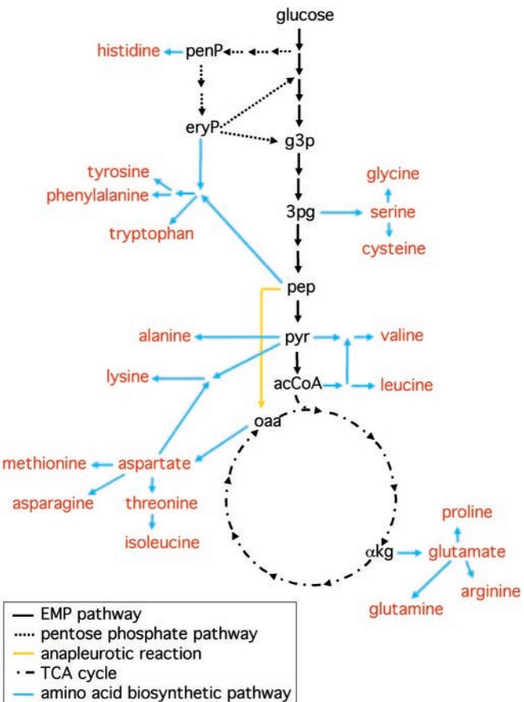
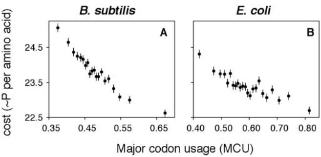
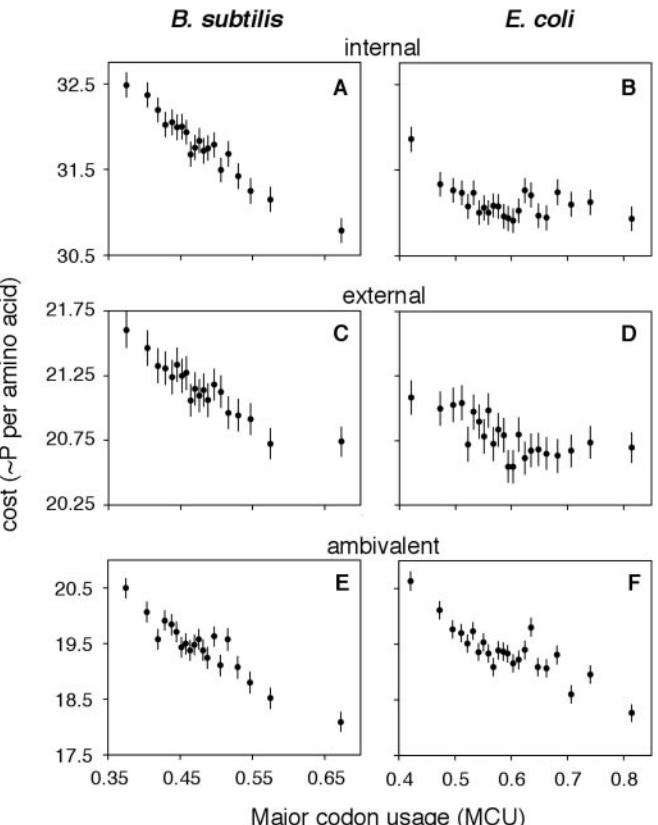
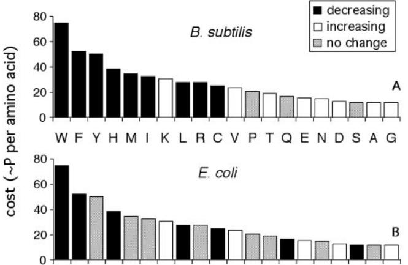

#### **Metabolic efficiency and amino acid composition in the proteomes of Escherichia coli and Bacillus subtilis**

### **Hiroshi Akashi*† and Takashi Gojobori‡**

*Institute of Molecular Evolutionary Genetics and Department of Biology, 208 Mueller Laboratory, Pennsylvania State University, University Park, PA 16802; and ‡Center for Information Biology, National Institute of Genetics, Mishima 411-8540, Japan

Edited by Masatoshi Nei, Pennsylvania State University, University Park, PA, and approved January 23, 2002 (received for review October 4, 2001)

**Biosynthesis of an** *Escherichia coli* **cell, with organic compounds as sources of energy and carbon, requires approximately 20 to 60 billion high-energy phosphate bonds [Stouthamer, A. H. (1973)** *Antonie van Leeuwenhoek* **39, 545–565]. A substantial fraction of this energy budget is devoted to biosynthesis of amino acids, the building blocks of proteins. The fueling reactions of central metabolism provide precursor metabolites for synthesis of the 20 amino acids incorporated into proteins. Thus, synthesis of an amino acid entails a dual cost: energy is lost by diverting chemical intermediates from fueling reactions and additional energy is required to convert precursor metabolites to amino acids. Among amino acids, costs of synthesis vary from 12 to 74 high-energy phosphate bonds per molecule. The energetic advantage to encoding a less costly amino acid in a highly expressed gene can be greater than 0.025% of the total energy budget. Here, we provide evidence that amino acid composition in the proteomes of** *E. coli* **and** *Bacillus subtilis* **reflects the action of natural selection to enhance metabolic efficiency. We employ synonymous codon usage bias as a measure of translation rates and show increases in the abundance of less energetically costly amino acids in highly expressed proteins.**

Even if a substituted amino acid were truly neutral in a functional sense, it is highly unlikely that factors involved in the synthesis of the protein would render the substitution neutral in the broader sense of the organism's integrated functioning. The substituted amino acid must be present within the cell in equivalent quantity compared with the original amino acid and, indeed, its synthesis or derivation from other molecules and transport into the cell require an equivalent amount of energy output.

R. C. Richmond (1)

**M**utational processes and relationships between primary structure and function are considered to be the major determinants of both amino acid composition and rates of protein evolution (2–4). Natural selection preserves or enhances protein specificity, activity, or stability by favoring codons that encode particular amino acids in gene regions corresponding to critical locations in the primary structure of proteins. At less constrained locations, a combination of mutation pressure and genetic drift account for encoded amino acids. A number of studies have established that differences in mutational biases explain some of the variation in amino acid composition among bacterial species (5–8). However, the relationship between the efficiency and energetics of protein synthesis and the primary structure of proteins has received less attention.

Metabolic constraints on protein structure could include the energetic costs of amino acid biosynthesis (1, 9–13), the biochemical complexity of synthetic pathways (9, 11, 12), availability of nutrients (14–16), and the speed and accuracy of protein synthesis (10, 17–20). Here, we investigate relationships between metabolic costs of amino acid biosynthesis and proteome-wide patterns of amino acid composition in bacterial cells. Amino acid biosynthesis requires diversion of chemical intermediates from different locations in the fueling reaction pathways of central metabolism. Energy, in the form of high-energy phosphate bonds (''P'') and reducing power (''H''), is lost through diversion of intermediates from fueling reactions and further energy is required to convert starting metabolites to amino acids.

If a substantial fraction of amino acids are synthesized in bacterial cells *and* energy is limiting to survival or reproduction, then the amino acid composition of proteins encoded in the genome should be biased toward less energetically costly amino acids. The extent to which amino acid composition is biased to reduce metabolic costs should be a positive function of the numbers of proteins synthesized, per generation, from each gene. We calculate the energetic costs of amino acid biosynthesis and test for associations between estimated gene expression levels and selection for metabolic efficiency in the proteomes encoded in the *Escherichia coli* and *Bacillus subtilis* genomes.

# **Materials and Methods**

**Costs of Biosynthesis.** Costs of precursor metabolites were calculated according to Craig and Weber (12), employing energetic inputs and gains through the Embden–Meyerhof–Parnas (EMP) pathway and the tricarboxylic acid (TCA) and the pentose phosphate cycles (21). We assume the availability of ammonia and sulfate as nonlimiting sources of nitrogen, and sulfur, respectively (the energetic cost of the reduction of sulfate to H2S is included in the costs of Met and Cys). Costs of precursors were calculated separately for growth on glucose, acetate, and malate as sources of carbon and energy (see Table 6, which is published as supporting information on the PNAS web site, www.pnas.org). Energetic costs for amino acid biosynthesis from precursor metabolites were calculated for *E. coli* (21, 22), and each pathway was confirmed in *B. subtilis* by identifying homologs to *E. coli* enzyme genes by using the KEGG (Kyoto Encyclopedia of Genes and Genomes; ref. 23) and WIT (What Is There; ref. 24) databases. The presence of a transaminase that catalyzes the conversion of pyruvate to Ala (22) has not been confirmed in either of the proteomes examined, but the pathway was assumed to exist.

**E. coli and B. subtilis Protein-Coding Genes.** *B. subtilis* ORF data (25) were obtained from the National Center for Biotechnology Information database at http:ncbi.nlm.nih.gov:80cgi-bin Entrezaltik?gi-278-db-Genome and information on gene product functional classification was obtained from the Micado

This paper was submitted directly (Track II) to the PNAS office.

Abbreviations: P, high-energy phosphate bond; H, hydrogen available for oxidation; MCU, major codon usage.

†To whom reprint requests should be addressed. E-mail: akashi@psu.edu.

The publication costs of this article were defrayed in part by page charge payment. This article must therefore be hereby marked "*advertisement*" in accordance with 18 U.S.C. §1734 solely to indicate this fact.

database (26) (Release 6.1) at http:locus.jouy.inra.frcgi-bin genmicmadbasehome.pl. *E. coli* ORF data (27) (version M52) and gene product functional classification (27, 28) were obtained from http:www.genome.wisc.edu. In both genomes, ORFs identified as candidates for horizontal transfer from other genomes (29) were excluded from the analyses. Genes identified as phage-related or transposable elements were also excluded. Finally, genes showing recent common ancestors (paralogs) were eliminated by performing unfiltered BLAST (30) searches among all pairs of proteins encoded in each genome. Pairs of amino acid sequences showing alignments with at least 60% identity over 60 or more amino acids were formed into clusters and one gene from each cluster was included in the data analyzed. These data are available upon request from H.A.

**Major Codons.** Kanaya *et al.* (31) identified major codons through correspondence analysis of synonymous codon usage in the genomes of *E. coli* and *B. subtilis*. Within each synonymous family, codons that contribute positively to the major trend in codon usage were designated as major codons. Major codon usage, MCU, - (number of major codons)(number of major codons number of minor codons) in each gene. Only genes with 100 or more codons (excluding start and stop codons) were analyzed. Codons for Lys (AAR) and Glu (GAR) show strong context dependence (32) and were not included in the calculation of MCU for *E. coli*. The numbers of genes used in each analysis are given in *Results*.

**Amino Acid Compositional Analyses.** Analyses of relationships between MCU and amino acid composition were conducted both for entire proteomes and within functional classes of *B. subtilis* and *E. coli* proteins. Spearman rank correlations were used in the whole-proteome analyses. In analyses within functional categories, amino acid usage was compared between genes falling above and below the median MCU value among all genes (0.473 and 0.577 for *B. subtilis* and *E. coli*, respectively) to allow comparisons within categories with a small number of genes. Counts of amino acids were tabulated for genes in the high and low codon bias classes, and amino acid abundance was compared in 2 2 contingency tables. The columns of the tables were the high and low codon bias classes and the rows consisted of the counts of a particular amino acid and the pooled counts for all other amino acids. The Mantel–Haenszel procedure (33) was used to calculate an overall probability for departures from equal amino acid usage among low and high bias genes across 2 2 contingency tables from different functional categories. Functional categories consisting of fewer than 10 genes were excluded from the analyses. In addition, genes falling into the following classes were excluded: ''similar to proteins from other organisms,'' ''similar to proteins from *B. subtilis*,'' ''miscellaneous,'' and ''no similarity,'' for *B. subtilis* and ''hypothetical, unclassified, unknown'' and ''other known genes'' for *E. coli*.

# **Results**

**Metabolic Costs of Amino Acid Biosynthesis.** The fueling reactions of central metabolism provide precursor metabolites for synthesis of the 20 amino acids incorporated into proteins. The diversions of amino acid biosynthetic pathways from the Embden– Meyerhof–Parnas pathway and the tricarboxylic acid and pentose phosphate cycles of central metabolism are shown in Fig. 1. The metabolic costs of synthesizing the 20 amino acids used in proteins are shown in Table 1. The cost of using a particular precursor metabolite is the number of high-energy phosphate bonds, P, carried in ATP and GTP, plus the number of available hydrogen atoms, H, carried in NADH, NADPH, and FADH2, that *would have been* gained if the metabolite had remained in energy-producing pathways minus the numbers of these molecules gained before diversion. For each amino acid,

**Fig. 1.** Fueling reactions and amino acid biosynthetic pathways in *E. coli.* Fueling reactions and amino acid biosynthetic pathways are shown as black and blue arrows, respectively. Abbreviations for precursor metabolites are given in Table 1. The numbers of arrows do not reflect the numbers of steps in the biosynthetic pathways. The major anapleurotic pathway, which replenishes oxaloacetate (oaa) in the tricarboxylic acid (TCA) cycle, is shown in yellow.

the energetic requirements of its biosynthetic pathway are added to the costs of its starting metabolite(s) to obtain a total metabolic cost per molecule synthesized. Amino acids that require chemical intermediates early in fueling reaction pathways (the aromatic amino acids and His) are more costly than those derived from intermediates downstream in glycolysis (the serine family) and the tricarboxylic acid cycle (the aspartate and glutamate families). Energetic costs were converted to a common currency of P based on a proportion of two P per H (34). Although precursor costs depend on the particular source of carbon, costs of amino acid biosynthesis were highly correlated for growth on different substrates (glucose vs. acetate, *r*2 - 0.968; glucose vs. malate, *r*2 - 0.998). In the analyses below, we employ the *average* cost of biosynthesis for each amino acid for growth on the three substrates. All results were similar for costs calculated assuming a single carbon source.

**Correlation Between Metabolic Costs and Synonymous Codon Usage Bias.** We calculated both average cost per encoded amino acid and major codon usage, MCU, for each of 3,055 *B. subtilis* and 3,397 *E. coli* genes. Correlations between cost and MCU are negative and highly statistically significant [Spearman rank correlation, *B. subtilis*: *n* - 3,055, *r*S - 0.383, *Z* - 22.92, *P* 105; *E. coli*: *n* - 3,397, *r*S - 0.240, *Z* - 14.43, *P* 105]. The proportion of among-gene variation in the ranks of energetic

**Table 1. Metabolic costs of amino acid biosynthesis in** *E. coli*

|            | One-letter | Precursor                 |      | Energetic cost |          |  |
|------------|------------|---------------------------|------|----------------|----------|--|
| Amino acid | symbol     | metabolites               | P    | H              | Total, P |  |
| Ala        | A          | pyr                       | 1.0  | 5.3            | 11.7     |  |
| Cys        | C          | 3pg                       | 7.3  | 8.7            | 24.7     |  |
| Asp        | D          | oaa                       | 1.3  | 5.7            | 12.7     |  |
| Glu        | E          | kg                     | 2.7  | 6.3            | 15.3     |  |
| Phe        | F          | 2 pep, eryP               | 13.3 | 19.3           | 52.0     |  |
| Gly        | G          | 3pg                       | 2.3  | 4.7            | 11.7     |  |
| His        | H          | penP                      | 20.3 | 9.0            | 38.3     |  |
| Ile        | I          | pyr, oaa                  | 4.3  | 14.0           | 32.3     |  |
| Lys        | K          | oaa, pyr                  | 4.3  | 13.0           | 30.3     |  |
| Leu        | L          | 2 pyr, acCoA              | 2.7  | 12.3           | 27.3     |  |
| Met        | M          | oaa, Cys, pyr             | 9.7  | 12.3           | 34.3     |  |
| Asn        | N          | oaa                       | 3.3  | 5.7            | 14.7     |  |
| Pro        | P          | kg                     | 3.7  | 8.3            | 20.3     |  |
| Gln        | Q          | kg                     | 3.7  | 6.3            | 16.3     |  |
| Arg        | R          | kg                     | 10.7 | 8.3            | 27.3     |  |
| Ser        | S          | 3pg                       | 2.3  | 4.7            | 11.7     |  |
| Thr        | T          | oaa                       | 3.3  | 7.7            | 18.7     |  |
| Val        | V          | 2 pyr                     | 2.0  | 10.7           | 23.3     |  |
| Trp        | W          | 2 pep, eryP, PRPP, pyr | 27.7 | 23.3           | 74.3     |  |
| Tyr        | Y          | eryP, 2 pep               | 13.3 | 18.3           | 50.0     |  |

Abbreviations for starting metabolites: penP, ribose 5-phosphate; PRPP, 5-phosphoribosyl pyrophosphate; eryP, erythrose 4-phosphate; 3pg, 3-phosphoglycerate; pep, phospho*enol*pyruvate; pyr, pyruvate; acCoA, acetyl-CoA; kg, --ketoglutarate; oaa, oxaloacetate. Costs of precursors reflect averages for growth on glucose, acetate, and malate (see Table 6 in supporting information). Negative signs on precursor metabolites indicate chemicals *gained* through biosynthetic pathways. P and H refer to numbers of high-energy phosphate bonds contained in ATP and GTP molecules and numbers of available hydrogen atoms carried in NADH, NADPH, and FADH2 molecules, respectively. The total cost assumes 2 P per H.

costcodon explained by MCU is 14.4% in *B. subtilis* and 5.0% in *E. coli*. Two factors may contribute to the scatter in these relationships. First, the use of MCU as an estimate of gene expression levels is expected to entail error (35, 36). In addition, protein function may require particular amino acids at specific locations in the primary structure; the fitness benefit of relatively expensive amino acids may outweigh their energetic costs at functionally constrained positions. Comparisons of average costs for large numbers of codons should diminish noise attributable to such effects and reveal global forces that increase in magnitude with gene expression.

Fig. 2 shows correlations between average energetic costs and major codon usage for genes binned into MCU classes of 50,000 codons. In both *B. subtilis* and *E. coli*, a strikingly high proportion (92.0% and 79.5%, respectively) of the variation in average costs of synthesis is explained by a linear relationship with major codon usage. A greater mutational pressure toward AT nucleotides in the *B. subtilis* genome (25) may contribute to larger differences in amino acid composition as a function of selection intensity. On average, AT-rich codons tend to encode more costly amino acids.

**Separate Analyses of Metabolic Costs and Codon Bias for H and P.** We examined several factors that might confound the interpretation of these relationships between amino acid composition and gene expression levels. First, in the analyses above, energetic costs were converted to numbers of P based on a proportion of two P per H (through oxidative phosphorylation). However, in *E. coli*, this ratio may depend on growth conditions—i.e., availability of O2 (34). Separate analyses of energetic costs for numbers of P (*B. subtilis*: *r*S - 0.351, *Z* -20.72, *P* 105;

**Fig. 2.** Correlations between energetic costs and MCU in *B. subtilis* (*A*) and *E. coli* (*B*) genes. The average cost per amino acid is plotted against average MCU for bins of genes. Genes were ranked by MCU and data were pooled from low to high MCU values until 50,000 codons was reached for each bin. Data for the highest MCU class were pooled with the second highest class if the remaining number of codons was less than 25,000. Bars indicate 95% confidence intervals on the estimates of mean costs. The bin size was chosen to be 50,000 codons so that data could be compared for at least 20 points.

*E. coli*: *r*S - 0.252, *Z* - 15.15, *P* 105) and for numbers of H (*B. subtilis*: *r*S - 0.355, *Z* - 20.98, *P* 105; *E. coli*: *r*S - 0.200, *Z* - 11.89, *P* 105) both show negative correlations with major codon usage. Thus, negative associations between energetic costs and codon usage bias do not depend on the conversion between reducing power and phosphate bonds.

**Metabolic Costs and Codon Usage Bias Within Functional Categories of Proteins.** Proteins in different functional categories may differ in both compositional constraints and expression levels. Such re-

#### **Table 2. Energetic costs and MCU within functional classes of** *B. subtilis* **proteins**

| Functional classification                                          | No. of genes | rS          | Z |
|--------------------------------------------------------------------|--------------|-------------|---|
| Transportbinding proteins lipoproteins                          | 336          | 0.350 6.83* |   |
| Metabolism of carbohydrates  related molecules                  | 229          | 0.373 6.06* |   |
| RNA synthesis                                                      | 200          | 0.184 2.64  |   |
| Metabolism of amino acids  related molecules                    | 183          | 0.334 4.77* |   |
| Sporulation                                                        | 101          | 0.454 5.07* |   |
| Metabolism of coenzymes  prosthetic groups                      | 89           | 0.296 2.89* |   |
| Cell wall                                                          | 78           | 0.500 5.04* |   |
| Metabolism of lipids                                               | 71           | 0.367 3.28* |   |
| Protein synthesis                                                  | 71           | 0.380 3.42* |   |
| Membrane bioenergetics (electron transport chain  ATP synthase) | 67           | 0.523 4.95* |   |
| Adaptation to atypical conditions                                  | 65           | 0.487 4.43* |   |
| Metabolism of nucleotidesnucleic acids                             | 60           | 0.138 1.06  |   |
| Detoxification                                                     | 55           | 0.019 0.14  |   |
| Mobility  chemotaxis                                               | 45           | 0.250 1.69  |   |
| Sensors (signal transduction)                                      | 36           | 0.139 0.82  |   |
| Protein folding and modification                                   | 34           | 0.594 4.17* |   |
| DNA restrictionmodificationrepair                                  | 30           | 0.066 0.35  |   |
| Antibiotic production                                              | 26           | 0.078 0.38  |   |
| Germination                                                        | 23           | 0.310 1.50  |   |
| Cell division                                                      | 20           | 0.490 2.39  |   |
| DNA replication                                                    | 20           | 0.132 0.57  |   |

Functional categories are from the Micado (26) database.*r*s and *Z* values are shown for Spearman rank correlations between cost per amino acid and MCU. Data are shown for categories containing at least 20 genes. *****, *P* 0.05, sequential Bonferroni test (37), one-tailed.

**Table 3. Energetic costs and MCU within functional classes of** *E. coli* **proteins**

| Functional classification                                 | No. of genes | rS    | Z     |
|-----------------------------------------------------------|--------------|-------|-------|
| Transport  binding proteins                               | 251          | 0.084 | 1.33  |
| Putative enzymes                                          | 237          | 0.113 | 1.74  |
| Energy metabolism                                         | 211          | 0.079 | 1.15  |
| Central intermediary metabolism                           | 159          | 0.217 | 2.78* |
| Cell processes (including adaptation, protection)      | 155          | 0.177 | 2.22  |
| Translation, post-translational modification           | 151          | 0.236 | 2.96* |
| Cell structure                                            | 138          | 0.168 | 1.99  |
| Putative transport proteins                               | 132          | 0.213 | 2.48  |
| Putative regulatory proteins                              | 120          | 0.318 | 3.65* |
| Carbon compound catabolism                                | 112          | 0.113 | 1.19  |
| Amino acid biosynthesis  metabolism                       | 111          | 0.045 | 0.47  |
| DNA replication, recombination, modification  repair   | 100          | 0.408 | 4.42* |
| Biosynthesis of cofactors, prosthetic groups  carriers | 96           | 0.196 | 1.94  |
| Nucleotide biosynthesis  metabolism                       | 57           | 0.211 | 1.60  |
| Transcription, RNA processing, degradation             | 48           | 0.265 | 1.86  |
| Fatty acid  phospholipid metabolism                       | 47           | 0.372 | 2.69  |
| Regulatory function                                       | 42           | 0.045 | 0.29  |
| Structural proteins                                       | 38           | 0.172 | 1.05  |

Functional categories are from Blattner *et al.* (27). See Table 2 legend.

lationships could indirectly result in associations between energetic costs and MCU. To control for such effects, we examined associations between energetic costs and MCU *within* functional categories (Tables 2 and 3). Correlations (*r*s values) between costs and gene expression levels were negative in all 26 *B. subtilis* and 19 *E. coli* functional categories (Signs test, *P* 105 in both species).

**Metabolic Costs and Codon Usage Bias Within Physicochemical Classes of Amino Acids.** Amino acids differ in physicochemical properties and evolutionary substitutability. Zubay (21) divides amino acids into three broad categories. ''Internal'' amino acids (Phe, Leu, Ile, Met, Val) have hydrophobic R groups and are generally found in the interior of protein three-dimensional structures. ''External'' amino acids (His, Arg, Lys, Gln, Glu, Asn, Asp) have hydrophilic R groups and are most often found in solventexposed regions of proteins. Finally, amino acids that function in either category are classified as ''ambivalent'' (Trp, Tyr, Cys, Ala, Ser, Gly, Pro, Thr).

We tested for correlations employing costs of biosynthesis calculated *within* exterior, interior, and ambivalent classes of amino acids. Fig. 3 shows strong negative relationships between energetic cost and MCU in each of these classes in both genomes examined (*B. subtilis*: internal, *r*S - 0.277, *Z* - 15.93, *P* 105; external, *r*S - 0.226, *Z* - 12.82, *P* 105; ambivalent, *r*S - 0.204, *Z* - 11.54, *P* 105; *E. coli*: internal, *r*S - 0.091, *Z* - 5.31, *P* 0.002; external, *r*S - 0.139, *Z* - 8.19, *P* 105; ambivalent, *r*S - 0.202, *Z* - 12.03, *P* 105). The ratio of amino acids falling into different physicochemical categories may differ among proteins expressed at different levels [e.g., in *Saccharomyces cerevisiae,* mRNA abundances are lower for integral membrane protein genes than for cytosolic protein genes (38)]. However, such differences do not appear to explain reduced energetic costs of highly expressed proteins.

We examined other restricted data sets to distinguish metabolic economics from other processes that could contribute to among-gene variation in amino acid composition (see supporting

**Fig. 3.** Correlations between energetic costs and codon bias within physicochemical categories of amino acids. Average cost per amino acid was calculated among amino acids that tend to be found in internal, or nonsolvent-exposed (F, L, I, M, V) and external, or solvent-exposed (H, R, K, Q, E, N, D) regions of proteins. Amino acids that function in both categories are classified as ambivalent (W, Y, C, A, S, G, P, T). Data are shown for MCU bins as described in the legend of Fig. 2. See Table 1 for one-letter amino acid symbols.

information on the PNAS web site, www.pnas.org). Negative correlations between metabolic costs and synonymous codon bias remained highly statistically significant for analyses employing major codon usage for a single amino acid (to control for relationships between MCU and amino acid composition), for analyses excluding the first and last 50 codons of genes (which may be under additional nucleotide compositional constraints), and for analyses performed separately among proteins encoded by the leading and lagging DNA strands (which may experience differences in mutational patterns).

**Gene Expression and Amino Acid Composition.** Amino acids that increase or decrease in abundance as a function of MCU were identified both in the whole proteome and within functional categories of proteins (Table 3). Spearman rank correlations were performed to determine the probabilities of changes in abundance with MCU among the 3,055 and 3,397 genes from *B. subtilis* and *E. coli*, respectively. Within each functional category, amino acid usage was compared between high and low MCU classes. Mantel–Haenszel tests were performed to evaluate whether particular amino acids increase or decrease with MCU across categories. Amino acids that show statistically significant associations with MCU in both analyses are shown in Fig. 4.

Correlations in the abundances of different amino acids (9) and relationships between amino acid composition and gene expression (10, 13, 20) have been noted previously in unicellular microorganisms. Our analyses show that the abundances of many amino acids also change *within* broad functional categories of

**Fig. 4.** Changes in amino acid composition with codon bias in *B. subtilis* and *E. coli.* Amino acids that show a statistically significant change in abundance with major codon usage are shown for *B. subtilis* (*Upper*) and *E. coli* (*Lower*). The amino acids are arranged in order of decreasing metabolic cost. Only amino acids that showed a statistically significant change in both the full gene data set and across functional categories (Table 4) were classified as increasing or decreasing. See Table 1 for one-letter amino acid symbols.

proteins as a function of estimates of translation rates (Table 4). Fig. 4 shows relationships between changes in amino acid abundance and biosynthetic costs. In both *B. subtilis* and *E. coli*, Trp, Phe, His, Cys, and Leu decrease in frequency in highly expressed genes, and less costly amino acids such as Glu, Asp, and Gly increase in abundance. These patterns also suggest that simple mutational differences related to transcription rates do not account for the relationship between costs and codon bias. Amino acids encoded by AT-rich codons (Phe, Tyr, Met, Ile, Asn, Lys) and those encoded by GC-rich codons (Gly, Ala, Arg, Pro) do not show common trends related to gene expression.

| Table 4. Amino acid composition and MCU |         |             |               |             |               |  |  |
|-----------------------------------------|---------|-------------|---------------|-------------|---------------|--|--|
| Amino acid                           |         | E. coli     |               |             |               |  |  |
|                                         | Cost, P | All gene rS | Funct. cat. Z | All gene rS | Funct. cat. Z |  |  |

| acid | Cost, P | All gene rS | Funct. cat. Z | All gene rS | Funct. cat. Z |
|------|---------|-------------|---------------|-------------|---------------|
| Ala  | 11.7    | 0.082*      | 4.86*         | 0.085*      | 0.03          |
| Cys  | 24.7    | 0.121*      | 4.01*         | 0.155*      | 8.55*         |
| Asp  | 12.7    | 0.146*      | 6.69*         | 0.216*      | 11.21*        |
| Glu  | 15.3    | 0.252*      | 9.88*         | 0.193*      | 12.33*        |
| Phe  | 52.0    | 0.311*      | 14.22*        | 0.100*      | 2.74*         |
| Gly  | 11.7    | 0.067*      | 3.65*         | 0.235*      | 8.06*         |
| His  | 38.3    | 0.132*      | 8.65*         | 0.130*      | 8.38*         |
| Ile  | 32.3    | 0.154*      | 3.27*         | 0.039       | 0.00          |
| Lys  | 30.3    | 0.281*      | 15.03*        | 0.224*      | 16.32*        |
| Leu  | 27.3    | 0.304*      | 12.97*        | 0.283*      | 19.98*        |
| Met  | 34.3    | 0.120*      | 4.15*         | 0.082*      | 2.05          |
| Asn  | 14.7    | 0.189*      | 6.60*         | 0.027       | 4.13*         |
| Pro  | 20.3    | 0.036       | 2.89*         | 0.061*      | 2.05          |
| Gln  | 16.3    | 0.016       | 0.08          | 0.137*      | 9.84*         |
| Arg  | 27.3    | 0.108*      | 8.54*         | 0.041*      | 2.14          |
| Ser  | 11.7    | 0.099*      | 0.01          | 0.223*      | 8.92*         |
| Thr  | 18.7    | 0.135*      | 5.24*         | 0.003       | 2.22          |
| Val  | 23.3    | 0.095*      | 5.02*         | 0.219*      | 7.63*         |
| Trp  | 74.3    | 0.177*      | 4.96*         | 0.206*      | 7.93*         |
| Tyr  | 50.0    | 0.150*      | 6.69*         | 0.023       | 2.74*         |
|      |         |             |               |             |               |

*r*S values are shown for Spearman rank correlations between amino acid frequency and MCU among 3,055 *B. subtilis* and 3,397 *E. coli* protein-coding genes. *Z* statistics are shown for Mantel–Haenszel tests (33) applied to 2 2 contingency tables from 26 and 19 functional categories for *B. subtilis* and *E. coli*, respectively. *****, *P* 0.05, sequential Bonferroni test, two-tailed.

#### **Discussion**

Biosynthesis of an *E. coli* cell, with organic compounds as sources of energy and carbon, requires approximately 20 to 60 billion P (39). The energetic requirement for amino acid biosynthesis for a given codon in the genome is the product of the cost per encoded amino acid and the number of times the codon is translated. Abundant *E. coli* proteins are found in concentrations of 50,000–100,000 molecules per cell (34, 40); the energetic savings for a single amino acid replacement in a highly expressed gene can be millions of P or greater than 0.025% of the total energy budget for biosynthesis of macromolecules. Less abundant proteins, however, may be in concentrations as low as a few molecules per cell. This 105-fold difference in the metabolic costs of amino acid usage should translate to among-gene differences in the fitness benefit to encoding less energetically costly amino acids. If survival or reproduction is, at least at times, energylimited in bacteria, natural selection should act more strongly, and produce a greater skew toward metabolically efficient amino acids, as a positive function of gene expression levels. Both *E. coli* and *B. subtilis* may often grow in nutrient-rich conditions (in the mammalian lower intestine and soil, respectively) where growth may not be energy-limited and where they may obtain a substantial fraction of their amino acids from their environments rather than through biosynthesis. However, periodic selection in nutrient-depleted conditions may be sufficient to skew amino acid composition. Our analyses do not address the duration or severity of energy limitation required to generate associations between amino acid composition and gene expression levels.

The predicted association between amino acid composition and gene expression requires tight regulation of amino acid biosynthetic pathways according to the chemical requirements of the cell. In bacteria, both end-product inhibition of biosynthetic enzymes and transcriptional control of biosynthesis operons contribute to fine-tuned control of amino acid concentrations (21). DNA microarray analyses of mRNA levels show strong induction of amino acid biosynthesis genes in *E. coli* growing in glucose minimal medium (with ammonia as the sole nitrogen source) relative to cells in rich medium (containing amino acids) (41). This induction is pronounced for genes encoding enzymes that function in the initial steps of biosynthetic pathways. Thus, a mutation in a protein-coding gene that reduces the demand for a particular amino acid should reduce flux through its biosynthetic pathway and alter the metabolic budget. Here, we investigate whether such energetic considerations are subject to natural selection.

The identification of negative associations between expression levels and usage of energetically costly amino acids depends critically on the relationship between synonymous codon usage bias and the translation rates of genes. tRNA abundances have been quantified in *E. coli* (42) and *B. subtilis* (31), and in both species, codon usage is biased toward ''major'' codon(s) that are generally recognized by abundant tRNAs. Such patterns are consistent with major codon preference, or natural selection discriminating among synonymous codons to enhance translational elongation rates andor to reduce the frequency of amino acid misincorporations during protein synthesis (42–44). Among-gene variation in synonymous codon usage bias is correlated with two-dimensional gel quantifications of protein abundance in both *E. coli* (35, 36, 45) and *B. subtilis* (45) and supports that the fitness benefit to encoding a major codon is a function of its translation rate.

Our analyses show strong statistical support for increasing usage of less energetically costly amino acids in abundant proteins in both *B. subtilis* and *E. coli*. These patterns do not appear to result from relationships between functional and expression classes of proteins, mutational biases, or biases in estimates of translation rates. In highly expressed genes, the average cost of amino acid biosynthesis is reduced by 2.5 and 2.0 P per amino acid per protein synthesized in *B. subtilis* and *E. coli*, respectively. Although selection to enhance metabolic efficiency is likely to be weak at a given codon, the energetic savings for biosynthesis of the proteome may be in the hundreds of millions of P per generation (a precise estimate will require knowledge of the whole-genome distribution of rates of protein synthesis).

We have attempted to isolate the contribution of selection for energetic efficiency from other sources of global constraints on protein primary structure. However, energetic constraints are likely to act in combination with other factors, such as nutritional limitation and translational selection, in determining the fitness effects of amino acid changes. Lobry and Gautier (10) noted that the amino acid composition of highly expressed *E. coli* proteins corresponds to the abundances of their respective tRNAs and suggested that translational selection could influence both synonymous codon usage and amino acid composition. The results presented here suggest that biosynthetic costs could underlie some of the differences in the representation of different amino acids in the tRNA pool. Thus, selection favoring efficient and accurate translation of proteins may act to reinforce selection to reduce the energetic costs of amino acid biosynthesis.

Natural selection for energetic efficiency appears to constrain the primary structures of *B. subtilis* and *E. coli* proteins. Amino acid mutations that may be neutral with respect to protein function may have subtle, but evolutionarily important, fitness consequences through their effect on translation and metabolism. In addition, because adaptive changes in protein sequence must outweigh any increases in metabolic cost, amino acid sequences may not be optimized for protein function, especially in highly expressed proteins.

- 1. Richmond, R. C. (1970) *Nature (London)* **225,** 1025–1028.
- 2. King, J. L. & Jukes, T. H. (1969) *Science* **164,** 788–797.
- 3. Doolittle, R. F. (1979) in *The Proteins*, eds. Neurath, H. & Hill, R. L. (Academic, New York), 3rd Ed., Vol. 4, pp. 1–118.
- 4. Li, W.-H. (1997) *Molecular Evolution* (Sinauer, Sunderland, MA), pp. 185–190. 5. Sueoka, N. (1961) *Cold Spring Harbor Symp. Quant. Biol.* **26,** 35–43.
- 
- 6. Lobry, J. R. (1997) *Gene* **205,** 309–316.
- 7. Gu, X., Hewett-Emmett, D. & Li, W.-H. (1998) *Genetica* **102103,** 383–291.
- 8. Singer, G. A. & Hickey, D. A. (2000) *Mol. Biol. Evol.* **17,** 1581–1588.
- 9. Karlin, S. & Bucher, P. (1992) *Proc. Natl. Acad. Sci. USA* **89,** 12165–12169.
- 10. Lobry, J. R. & Gautier, C. (1994) *Nucleic Acids Res.* **22,** 3174–3180.
- 11. Dufton, M. J. (1997) *J. Theor. Biol.* **187,** 165–173.
- 12. Craig, C. L. & Weber, R. S. (1998) *Mol. Biol. Evol.* **15,** 774–776.
- 13. Jansen, R. & Gerstein, M. (2000) *Nucleic Acids Res.* **28,** 1481–1488.
- 14. Mazel, D. & Marlie`re, P. (1989) *Nature (London)* **341,** 245–248.
- 15. Baudouin-Cornu, P., Surdin-Kerjan, Y., Marlie`re, P. & Thomas, D. (2001) *Science* **293,** 293–300.
- 16. Craig, C. L., Hsu, M., Kaplan, D. & Pierce, N. E. (1999) *Int. J. Biol. Macromol.* **24,** 109–118.
- 17. Percudani, R., Pavesi, A. & Ottonello, S. (1997) *J. Mol. Biol.* **268,** 322–330.
- 18. Eigen, M. & Schuster, P. (1979) *The Hypercycle, a Principle of Natural Self-Organization* (Springer, Berlin), p. 64.
- 19. Trifonov, E. N. (1987) *J. Mol. Biol.* **194,** 643–652.
- 20. Gutie´rrez, G., Ma´rquez, L. & Marı´n, A. (1996) *Nucleic Acids Res.* **24,** 2525–2527.
- 21. Zubay, G. (1998) *Biochemistry* (Brown, Dubuque, IA), 4th Ed.
- 22. Stanier, R. Y., Ingraham, J. L., Wheelis, M. L. & Painter, P. R. (1986) *The Microbial World* (Prentice Hall, Englewood Cliffs, NJ), 5th Ed.
- 23. Ogata, H., Goto, S., Sato, K., Fujibuchi, W., Bono, H. & Kanehisa, M. (1999) *Nucleic Acids Res.* **27,** 29–34.
- 24. Overbeek, R., Larsen, N., Pusch, G. D., D'Souza, M., Selkov, E., Jr., Kyrpides, N., Fonstein, M., Maltsev, N. & Selkov, E. (2000) *Nucleic Acids Res.* **28,** 123–125.
- 25. Kunst, F., Ogasawara, N., Moszer, I., Albertini, A. M., Alloni, G., Azevedo, V., Bertero, M. G., Bessieres, P., Bolotin, A., Borchert, S. *et al*. (1997) *Nature (London)* **390,** 249–256.

Examination of relationships between amino acid usage and gene expression may provide a broadly applicable strategy to identify energetic constraints on protein structure. Our analysis depends on positive relationships between synonymous codon usage bias and the translation rates of proteins and is thus restricted to organisms undergoing major codon preference. Recently developed methods that quantify abundances for thousands of different proteins (46) will allow tests of energetic selection in the proteomes of a larger number of species. Gene expression can be highly condition dependent, however, and such estimates will need to be obtained for a number of different environments.

Our method also relies on accurate calculations of energetic costs of amino acid biosynthesis. Because bacteria can use alternative metabolic pathways depending on nutrient availability and environmental conditions, these biosynthetic costs are not fixed. In addition, other factors, such as the biosynthetic complexity of pathways, nutritional limitation, and translational selection, may prove to be important determinants of the amino acid composition of proteins. Comparisons of relationships between amino acid composition and gene expression among the genomes of organisms that differ in both ecology (i.e., nutrient and energy limitation) and metabolic pathways, such as phototrophic and chemolithotrophic prokaryotes, may help to test the generality of metabolic constraints in proteome evolution.

We are grateful to A. Clark, M. Evans, T. Ikemura, K. Mineta, K. Montooth, J. Nugent, T. Ohta, and S. Schaeffer for valuable discussions and comments on the manuscript. This work was supported by grants from the Japan Society for the Promotion of Science and the Alfred P. Sloan Foundation to H.A.

- 26. Biaudet, V., Samson, F. & Bessieres, P. (1997) *Comput. Appl. Biosci.* **13,** 431–438.
- 27. Blattner, F. R., Plunkett, G., 3rd, Bloch, C. A., Perna, N. T., Burland, V., Riley, M., Collado-Vides, J., Glasner, J. D., Rode, C. K., Mayhew, G. F., *et al*. (1997) *Science* **277,** 1453–1462.
- 28. Riley, M. (1993) *Microbiol. Rev.* **57,** 862–952.
- 29. Garcia-Vallve´, S., Romeu, A. & Palau, J. (2000) *Genome Res.* **10,** 1719–1725.
- 30. Altschul, S. F., Gish, W., Miller, W., Myers, E. W. & Lipman, D. J. (1990) *J. Mol. Biol.* **215,** 403–410.
- 31. Kanaya, S., Yamada, Y., Kudo, Y. & Ikemura, T. (1999) *Gene* **238,** 143–155.
- 32. Berg, O. G. & Silva, P. J. N. (1997) *Nucleic Acids Res.* **25,** 1397–1404.
- 33. Snedecor, G. W. & Cochran, W. G. (1989) *Statistical Methods* (Iowa State Univ. Press, Ames), 8th Ed., pp. 213–215.
- 34. Neidhardt, F. C., Ingraham, J. L. & Schaechter, M. (1990) *Physiology of the Bacterial Cell: A Molecular Approach* (Sinauer, Sunderland, MA).
- 35. Eyre-Walker, A. (1996) *Mol. Biol. Evol.* **13,** 864–872.
- 36. Kanaya, S., Kudo, Y., Nakamura, Y. & Ikemura T. (1996) *Comput. Appl. Biosci.* **12,** 213–225.
- 37. Rice, W. R. (1989) *Evolution (Lawrence, Kans.)* **43,** 223–225.
- 38. Drawid, A., Jansen, R. & Gerstein, M. (2000) *Trends Genet.* **16,** 426–430.
- 39. Stouthamer, A. H. (1973) *Antonie van Leeuwenhoek* **39,** 545–565.
- 40. VanBogelen, R. A., Abshire, K. Z., Pertsemlidis, A., Clark, R. L. & Neidhardt, F. C. (1996) in *Escherichia coli and Salmonella: Cellular and Molecular Biology,* eds. Neidhardt, F. C., Curtis, R., III, Ingraham, J. L., Lin, E. C. C., Low, K. B., Magasanik, B., Reznikoff, W. S., Riley, M., Schaecter, A. & Umbarger, H. E. (Am. Soc. Microbiol., Washington, DC), 2nd Ed., pp. 2067–2117.
- 41. Tao, H., Bausch, C., Richmond, C., Blattner, F. R. & Conway, T. (1999) *J. Bacteriol.* **181,** 6425–6440.
- 42. Ikemura, T. (1985) *Mol. Biol. Evol.* **2,** 13–34.
- 43. Andersson, S. G. E. & Kurland, C. G. (1990) *Microbiol. Rev.* **54,** 198–210.
- 44. Sharp, P. M. & Matassi, G. (1994) *Curr. Opin. Genet. Dev.* **4,** 851–860.
- 45. Karlin, S., Mra´zek, J., Campbell, A. & Kaiser, D. (2001) *J. Bacteriol.* **183,** 5025–5040.
- 46. Washburn, M. P., Wolters, D. & Yates, J. R. (2001) *Nat. Biotech.* **19,** 242–247.