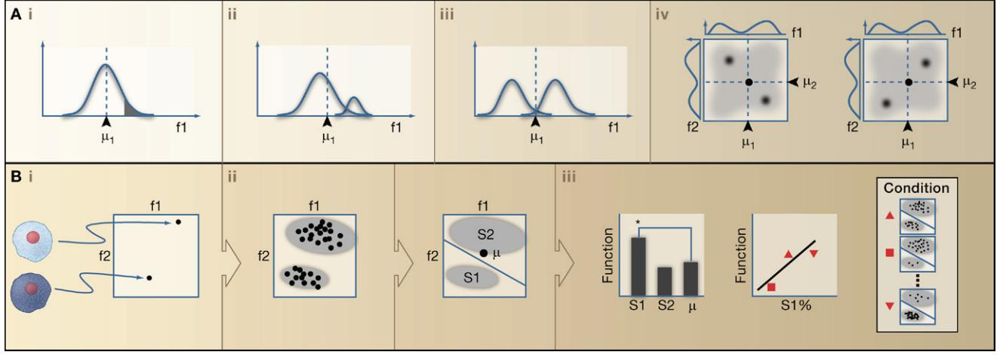

# Cellular Heterogeneity: Do Differences Make a Difference?

# Steven J. Altschuler1,* and Lani F. Wu1,*

1 Department of Pharmacology, Green Center for Systems Biology, Simmons Cancer Center, University of Texas Southwestern Medical Center, Dallas, TX 75390, USA

*Correspondence: steven.altschuler@utsouthwestern.edu (S.J.A.), lani.wu@utsouthwestern.edu (L.F.W.)

DOI 10.1016/j.cell.2010.04.033

A central challenge of biology is to understand how individual cells process information and respond to perturbations. Much of our knowledge is based on ensemble measurements. However, cell-to-cell differences are always present to some degree in any cell population, and the ensemble behaviors of a population may not represent the behaviors of any individual cell. Here, we discuss examples of when heterogeneity cannot be ignored and describe practical strategies for analyzing and interpreting cellular heterogeneity.

After decades of probing, measuring, and analyzing the behaviors of single cells, it has become clear that the challenge is no longer to demonstrate that populations of "seemingly identical" cells are heterogeneous. Indeed, phenotypic differences among cells are always present at a fineenough resolution of inspection. Rather, the daunting challenge is to determine which, if any, components of observed cellular heterogeneity serve a biological function or contain meaningful information.

Population-averaged assays are powerful tools in biology, enabling the identification of components and interactions within complex metabolic, signaling, and transcriptional networks. (Population-averages can refer to experimental measurements derived from assays that pool analytes from large numbers of cells or to mathematical averages taken over distributions of single-cell measurements.) Such measurements can succinctly capture population state and readily report how these states change in response to perturbations. An assumption is that ensemble averages reflect the dominant biological mechanism operating within individual cells in a population. Although ensemble measurements may be too simplistic, capturing all variation among cells also may be unnecessary. To develop accurate models of individual cell behavior—be they in the form of cartoons, words, or mathematics—it is essential to identify which cell-to-cell differences are important and which can be ignored.

## A Hidden World beneath Population Averages

What about cells away from the mean (Figure 1Ai)? The behavior of such cells may be similar to that of the average behavior of the population, and observed variation may be summarized by a mean (and perhaps a variance) with no loss of meaningful biological information. Cellto-cell differences, for example those due to biochemical noise (Elowitz et al., 2002; Newman et al., 2006; Ozbudak et al., 2002; Raser and O'Shea, 2004), may have no functional significance. So-called "housekeeping" genes are often chosen as references in assays under the assumption that their variation in expression is small and biologically unimportant (although such assumptions are increasingly challenged; for example, see Bahar et al., 2006). As a more specific example, subpopulations of R1-R6 photoreceptor cells in the compound eye of the fruit fly *Drosophila* are considered functionally equivalent with respect to their response and adaptation to light signals (Yau and Hardie, 2009). However, cell-to-cell differences can have functional consequences, such as seen for cell fate decisions in the bacterium *Bacillus subtilis* and selection of color vision photoreceptors in *Drosophila* (Losick and Desplan, 2008). Recently, subpopulations of clonally derived hematopoietic progenitor cells with low or high expression of the stem cell marker Sca-1 were observed to be in dramatically different transcriptional states and to give rise to different blood cell lineages (Chang et al., 2008). Therefore, models derived from ensemble averages may not represent individual cell function even for a simple bell-shaped distribution of singlecell measurements.

Population distributions can also mask the presence of rare or small subpopulations of cells (Figure 1Aii). In such a case, a population mean may represent the vast majority of cells yet miss important biology. Recent studies have investigated the presence and dynamics of small subpopulations within genetically identical populations of bacteria. These include the identification of pre-existing subpopulations of slow-growing "persister cells" that have a negligible effect on fitness under normal conditions but enable survival in response to drug treatment (Balaban et al., 2004). In other studies, variability in the duration of a transiently differentiated state may increase fitness in fluctuating environments (Cagatay et al., 2009). Similarly, small reservoirs of dormant stem cells have been identified within larger hematopoietic stem cell populations. The rapid reactivation of these subpopulations during times of injury plays a crucial role in re-establishment of homeostasis (Wilson et al., 2008). Finally, cancer is a highly heterogeneous disease (Heppner, 1984; Rubin, 1990). The origins of subpopulations that contribute unequally to disease progression or response to therapeutic intervention are the subject of debate. However, heterogeneity poses practical

#### Figure 1. Ensemble Averages and Heterogeneity

(A) Ensemble-averaged measurements can mask information contained in heterogeneity. Behaviors of cells in (i) the tail of a distribution (shaded area) or (ii) a small subpopulation (at right) may differ from the remainder of the population or from the "mean" behavior (dashed line at µ1 ). (iii) For bimodal cellular behaviors, a population mean may poorly represent the majority of cells. (iv) Multiple measurements may be required to distinguish different patterns of cellular heterogeneity. Correlated (left) or anticorrelated (right) behaviors of cells may be indistinguishable based on single measurements alone (compare histograms at sides of left and right density plots). Axis labels f1 and f2 represent single-cell measurements (e.g., cell size, division time, or expression of a cell surface marker). Dashed lines and triangles indicate population means.

(B) Heterogeneity and function: Decompositions of heterogeneity may be tested for functionally important information. (i) Single-cell measurements allow cells (left) to be represented as points in a (high-dimensional) feature space (right). (ii) Cell populations can be partitioned into distinct regions of feature space. This partition may be determined manually or automatically. Illustrated is a decomposition into two subpopulations, S1 and S2; µ represents the population mean. (iii) The values of a functional readout for individual subpopulations and the population mean can be tested for significant differences within a population (left; * indicates significance). Alternatively, different mixtures of heterogeneity observed for populations under different conditions can be tested for correlation with function (middle and right). "Function" refers to the evaluation of a functional readout over a collection of cells, either at the subpopulation or whole-population level (e.g., drug sensitivity).

challenges for building accurate clinical models, particularly ones based on population-averaged measurements, to guide diagnosis and treatment of the disease (Campbell and Polyak, 2007). Even within clonal populations under carefully controlled laboratory conditions, the dynamics and responses of single cancer cells to drugs can vary widely (Cohen et al., 2008; Gascoigne and Taylor, 2008), and drug-tolerant states can arise transiently through reversible epigenetic changes (Sharma et al., 2010).

An even more problematic situation is when the ensemble-averaged measurement poorly reflects the internal states of the majority of the cells, any subpopulation of cells, or even any single cell (Figure 1Aiii). This can occur, for example, when the population contains several dominant, yet phenotypically distinct subpopulations. This situation is observed for populations of immature *Xenopus* oocytes (Ferrell and Machleder, 1998). Ensemble averages suggest that a graded input of the maturation-inducing hormone progesterone is converted to a graded signaling output, in this case phosphorylation of the downstream readout p42 MAP kinase. Physical models based on these measurements would predict that the "average" oocyte would exhibit an intermediate level of commitment for an intermediate level of progesterone stimulation. However, for individual oocytes, commitment is an allor-nothing response. That is, the population comprises two nonoverlapping subpopulations—committed and noncommitted—with no oocytes at intermediate levels of commitment. Thus, when populations are mixtures of distinct subpopulations, the biological models of relevance are mechanisms operating within each subpopulation.

Signaling networks, even for narrowly defined biological functions, can be complex, and constructing accurate models may require monitoring multiple components (Sachs et al., 2005). New layers of complexity within heterogeneity may be revealed by simultaneously monitoring multiple readouts per cell (Figure 1Aiv). At the lowest resolution, the state of a population may be approximated by the mean of each readout, such as is routinely performed with western blots or microarrays, though with all of the caveats previously discussed. At an intermediate resolution, the distributions of each readout may be analyzed independently (so-called "univariate" analysis). Though such approaches simplify analysis (Perlman et al., 2004), and may uncover heterogeneity one readout at a time, important relationships among the readouts within individual cells may be missed. At the highest resolution, analysis of all cellular readouts from individual cells simultaneously (so-called "multivariate" analysis) may reveal both heterogeneity and important coupling among the readouts. Consider the case of two readouts, whose population distributions are each bimodal (low or high values). In principle, any cell could have one of four possible combinations of (low/high, low/high) values for these two markers. However, analysis of each marker independently would not distinguish, for example, between correlated and anticorrelated expression of the two readouts within individual cells. By contrast, multivariate analysis of the readouts would identify which of the four potential modes were present within any given population. For example, during adipogenesis in 3T3-L1 cultured cells, readouts such as production of the hormone adiponectin or lipid droplet expression increase from low to high levels, suggesting that the "average" cell progresses toward an (high, high) internal state (for adiponectin and lipid droplets). However, single-cell studies revealed that cells move from a beginning (low, low) state, to an intermediate (high, low) state, to a final (low, high) state (Loo et al., 2009a). The expected (high, high) cellular state, observed with only small probability, was an illusion of ensemble-averaged measurements. Decomposing heterogeneity was required to develop accurate models of the signaling states in individual adipocytes.

Thus, ensemble measurements can provide accurate descriptions of individual cellular behavior when heterogeneity simply reflects functionally meaningless fluctuations around a single cellular state. However, when a population is composed of multiple cellular states, ignoring heterogeneity can lead to models that may be accurate at the level of population trends but do not reflect the signaling states of any individual cell. Hence, the use of ensemble measurements to model individual cells must be justified.

# Interpreting Cellular Heterogeneity

Heterogeneity is observed for essentially all dimensions of single-cell measurements at high resolution. Some wellunderstood dimensions are routinely used to sort populations into mixtures of cells in distinct and meaningful biological states, such as cell-cycle stage or cell type. But what about the multitudes of other dimensions, for which cell-tocell variation has no obvious or known biological interpretation? In some cases, cellular states can be distinguished by detailed molecular differences. The selection of a specific molecule from a large repertoire of possibilities generates enormous diversity by individual cell variation, such as seen for odorant, cell adhesion, or immune molecules (Coufal et al., 2009; Lomvardas et al., 2006; Morishita and Yagi, 2007; Muotri et al., 2005; Ribich et al., 2006). In other cases, states can be distinguished by large-scale changes, such as signal transduction responses to hormone stimulation (Ferrell and Machleder, 1998), and detailed molecular differences are unimportant, particularly when function is buffered against biochemical fluctuations (Shinar and Feinberg, 2010). A general challenge is to determine which details give rise to biologically meaningful distinctions within and among populations, and which can be ignored (i.e., when an ensemble average is justified).

Determining whether observed heterogeneity has functional significance requires a framework for quantifying heterogeneity and assessing its information content. An intuitive and tractable approach is to decompose heterogeneous populations into mixtures of simpler, more homogeneous subpopulations, based on the expectation that cells with relatively similar measured states should behave in a similar way. The biological relevance of such a decomposition could be tested by determining whether different subpopulations, or mixtures of subpopulations, have different functional properties. Decomposition-independent approaches are also possible for testing whether heterogeneity contains information: populations with different overall distributions may exhibit functional differences. For example, mechanisms of drug action can be classified based on comparison of the different distributions of cellular responses that they induce (Perlman et al., 2004). However, informative decompositions can provide useful guides for future studies, including further probing of the molecular states of the subpopulations (Loo et al., 2009a, 2009b). In general, the investigation of heterogeneity requires a combined approach for capturing population statistics from single-cell measurements, identifying patterns of heterogeneity, and testing whether these patterns contain functional information.

Heterogeneity is essentially a statistical property of cellular populations. A distribution of cellular behaviors can be estimated from observations of a small number of cells over a long time, or a large number of cells at a single time point. In theory, these different estimates can give similar information if cells behave ergodically—that is, time-averaged singlecell behaviors and ensemble-averaged population behaviors are equivalent in a probabilistic sense (although the property of ergodicity may be difficult to test rigorously) (Brock et al., 2009). In practice, statistical properties of cellular behaviors are often estimated from snapshots of large numbers of cells. Single-cell phenotypes can be captured by many different measurement technologies (Figure 1Bi) (Anselmetti, 2009), including flow cytometry, electrophysiology, microscopy, and single-cell PCR or sequencing. For some technologies, the choices of cellular features are well defined, whereas for others the choices are less clear. For example, the total intensity of each labeled biomarker is a standard readout in flow cytometry, whereas there is virtually no limit to the number of features that can be extracted in microscopy. The desire to extract all relevant information from single-cell assays may require strategies that balance two, somewhat opposing goals: interpretability and comprehensiveness. Interpretability suggests an intuitive connection between a familiar biological phenotype and the measured values of a feature. Comprehensiveness suggests the ability to capture all important information; large collections of features are measured with the hope that all anticipated (or unanticipated but important) biological variation is captured. In microscopy, strategies striving for interpretability may use expert-selected features, such as cell shape, marker intensity, or marker localization, whereas strategies striving for comprehensiveness may use features derived from general-purpose transformations, such as Haralick texture features or Zernike moments that report large numbers of statistical properties of marker staining patterns (Boland and Murphy, 2001). Of course, not all features are expected to be equally informative and methods (such as principle component analysis) are often applied to eliminate noisy or redundant features and to reduce the dimensionality of feature spaces (Duda et al., 2001). The collections of extracted features allow an individual cell to be represented as a point in (high-dimensional) "feature" space, with each axis representing a different measurement. Therefore, populations of cells are transformed into distributions (of points) in feature space.

The problem of identifying patterns of distinct cellular behaviors in feature space (Figure 2Bii) can be reduced to well-studied, analytical, and computational problems of decomposing heterogeneous distributions, for which extensive methodology exists and is used in diverse applications ranging from gene function prediction to speech and face recognition (Duda et al., 2001). In supervised approaches, expert knowledge is used to partition the feature space. Approaches range from simple, userdefined thresholds (such as routinely used to separate subpopulations in flow cytometry) to more complex, machinelearning algorithms that iteratively train computers to identify subpopulations based on examples (such as recently developed for high-throughput microscopy screening; Boland and Murphy, 2001; Jones et al., 2009; Ramo et al., 2009; Yin et al., 2008). In unsupervised approaches, computational algorithms partition distributions in naive, or unbiased, manners. Intuitively, methods such as deterministic *K*-means clustering or probabilistic Gaussian mixture modeling seek to identify local, high-density regions of phenotype space (Figure 1Bii; Pyne et al., 2009; Slack et al., 2008). There are always questions of whether cellular behaviors can be categorized by a finite number of states, and whether a distribution has been partitioned into too few or too many subpopulations. Analytical criteria (Wang et al., 2007) or even visual inspection may be used to provide guidelines for such questions.

However, the ultimate usefulness of a decomposition is the degree to which it reveals biological information for a given functional readout. One can test whether the behaviors of specific subpopulations are significantly different from each other or from an ensemble average (Figure 1Biii, left). As examples, bacterial subpopulations with different growth rates can have different degrees of resistance to antibiotics (Balaban et al., 2004), and adherent eukaryotic cell subpopulations with different microenvironmental properties can have different functional behaviors, such as virus infection efficiency and endocytosis activity (Snijder et al., 2009). One can also test whether an entire decomposition of heterogeneity is informative (Figure 1Biii, middle and right). This case is important when individual subpopulations cannot be physically isolated for functional testing, or when the subpopulations interact with one another. As examples, different patterns of heterogeneity for general signaling markers in untreated cancer cell populations were found to predict differences in drug sensitivities (Singh et al., 2010), and different patterns of heterogeneous signaling responses to drug treatment were used to predict mechanisms of drug action (Slack et al., 2008). Further, different heterogeneous mixtures of isolated tumor-infiltrating lymphocytes were found to have different levels of activity against tumors, as measured by differences in Interferon-γ secretion (Oved et al., 2009). An intriguing possibility is that heterogeneity can serve not only as a passive readout of population state but also as a predictor of future responses to perturbations, or even as a property that can be manipulated to affect a desired population output. Of course, it is not to be expected that every decomposition will contain functional information. Presumably, no significant functional differences should be observed when subpopulations are chosen randomly (i.e., ignoring all feature values) or chosen based on features that are uncorrelated with the functional readout. Taken together, the framework described above serves as a starting point for rigorously exploring biological information contained in heterogeneity.

#### Conclusion

Heterogeneity has been classically observed and speculated to be a fundamental property of cellular systems (Elsasser, 1984; Rubin, 1990). Notably, heterogeneity provides a mechanism for an organ or organism to increase its range of responses to changing environmental conditions. Although we have focused our discussion on cells, heterogeneity—and the loss of information due to ensemble averages—has been studied at many scales of biology, from single molecules (English et al., 2006) to communities of whole populations (Kimura and Weiss, 1964). Here, we have sidestepped the difficult and fascinating problems of identifying the origins of cellular heterogeneity (Brock et al., 2009; Muotri et al., 2005; Raj and van Oudenaarden, 2008; Spencer et al., 2009), or understanding its differences in vivo and in vitro or in physiological and pathophysiological conditions. Rather, we have focused on the general challenge of characterizing and interpreting information contained within heterogeneity. Although well-characterized biological systems may present ready choices for connecting heterogeneity and function, heterogeneity is often observed in experimental settings for which there are no immediate, a priori clues to its meaning or functional relevance. Interpreting heterogeneity is not solely an analytical challenge of fitting complex, multidimensional distributions, as even simple distributions (e.g., observed for the marker Sca-1) can contain subpopulations enriched for biologically distinct functions. Beyond studies of single subpopulations, properties of heterogeneity (e.g., the proportions of subpopulations within an overall population) may serve as informative readouts of population physiology and predictors of responses to perturbations. The ability to transform heterogeneity into a tractable, computable, and bone fide property of cellular populations provides a rigorous starting point for determining which variation is random and which is meaningful, and for building better models of the behaviors of individual cells.

### Acknowledgments

We thank members of the Altschuler and Wu labs, Mike Brown, Nuno Lages, Tom Maniatis, David Mangelsdorf, Rama Ranganathan, and Gürol Süel for helpful feedback. This research was supported by NIH grants R01 GM081549 (L.F.W.) and R01 GM085442 (S.J.A.), the Endowed Scholars program at UT Southwestern Medical Center (L.F.W. and S.J.A.), the Welch Foundation I-1619 (S.J.A.) and I-1644 (L.F.W.), the Rita Allen Foundation (S.J.A.), and the Mary Kay Ash Charitable Foundation (S.J.A.).

#### References

Anselmetti, D., ed. (2009). Single Cell Analysis: Technologies and Applications (Weinheim, Germany: Wiley-VCH).

Bahar, R., Hartmann, C.H., Rodriguez, K.A., Denny, A.D., Busuttil, R.A., Dolle, M.E., Calder, R.B., Chisholm, G.B., Pollock, B.H., Klein, C.A., et al. (2006). Nature *441*, 1011–1014.

Balaban, N.Q., Merrin, J., Chait, R., Kowalik, L., and Leibler, S. (2004). Science *305*, 1622–1625.

Boland, M.V., and Murphy, R.F. (2001). Bioinfor-

matics *17*, 1213–1223.

Brock, A., Chang, H., and Huang, S. (2009). Nat. Rev. Genet. *10*, 336–342.

Cagatay, T., Turcotte, M., Elowitz, M.B., Garcia-Ojalvo, J., and Suel, G.M. (2009). Cell *139*, 512–522.

Campbell, L.L., and Polyak, K. (2007). Cell Cycle *6*, 2332–2338.

Chang, H.H., Hemberg, M., Barahona, M., Ingber, D.E., and Huang, S. (2008). Nature *453*, 544–547.

Cohen, A.A., Geva-Zatorsky, N., Eden, E., Frenkel-Morgenstern, M., Issaeva, I., Sigal, A., Milo, R., Cohen-Saidon, C., Liron, Y., Kam, Z., et al. (2008). Science *322*, 1511–1516.

Coufal, N.G., Garcia-Perez, J.L., Peng, G.E., Yeo, G.W., Mu, Y., Lovci, M.T., Morell, M., O'Shea, K.S., Moran, J.V., and Gage, F.H. (2009). Nature *460*, 1127–1131.

Duda, R.O., Hart, P.E., and Stork, D.G. (2001). Pattern Classification, 2 edn (New York: Wiley-Interscience).

Elowitz, M.B., Levine, A.J., Siggia, E.D., and Swain, P.S. (2002). Science *297*, 1183–1186.

Elsasser, W.M. (1984). Proc. Natl. Acad. Sci. USA *81*, 5126–5129.

English, B.P., Min, W., van Oijen, A.M., Lee, K.T., Luo, G., Sun, H., Cherayil, B.J., Kou, S.C., and Xie, X.S. (2006). Nat. Chem. Biol. *2*, 87–94.

Ferrell, J.E., Jr., and Machleder, E.M. (1998). Science *280*, 895–898.

Gascoigne, K.E., and Taylor, S.S. (2008). Cancer Cell *14*, 111–122.

Heppner, G.H. (1984). Cancer Res. *44*, 2259–2265.

Jones, T.R., Carpenter, A.E., Lamprecht, M.R., Moffat, J., Silver, S.J., Grenier, J.K., Castoreno, A.B., Eggert, U.S., Root, D.E., Golland, P., et al. (2009). Proc. Natl. Acad. Sci. USA *106*, 1826–1831.

Kimura, M., and Weiss, G.H. (1964). Genetics *49*, 561–576.

Lomvardas, S., Barnea, G., Pisapia, D.J., Mendelsohn, M., Kirkland, J., and Axel, R. (2006). Cell *126*, 403–413.

Loo, L.H., Lin, H.J., Singh, D.K., Lyons, K.M., Altschuler, S.J., and Wu, L.F. (2009a). J. Cell Biol. *187*, 375–384.

Loo, L.H., Lin, H.J., Steininger, R.J., 3rd, Wang, Y., Wu, L.F., and Altschuler, S.J. (2009b). Nat. Methods *6*, 759–765.

Losick, R., and Desplan, C. (2008). Science *320*, 65–68.

Morishita, H., and Yagi, T. (2007). Curr. Opin. Cell Biol. *19*, 584–592.

Muotri, A.R., Chu, V.T., Marchetto, M.C., Deng, W., Moran, J.V., and Gage, F.H. (2005). Nature *435*, 903–910.

Newman, J.R., Ghaemmaghami, S., Ihmels, J., Breslow, D.K., Noble, M., DeRisi, J.L., and Weissman, J.S. (2006). Nature *441*, 840–846.

Oved, K., Eden, E., Akerman, M., Noy, R., Wolchinsky, R., Izhaki, O., Schallmach, E., Kubi, A., Zabari, N., Schachter, J., et al. (2009). Mol. Syst. Biol. *5*, 265.

Ozbudak, E.M., Thattai, M., Kurtser, I., Grossman, A.D., and van Oudenaarden, A. (2002). Nat. Genet. *31*, 69–73.

Perlman, Z.E., Slack, M.D., Feng, Y., Mitchison, T.J., Wu, L.F., and Altschuler, S.J. (2004). Science *306*, 1194–1198.

Pyne, S., Hu, X., Wang, K., Rossin, E., Lin, T.I., Maier, L.M., Baecher-Allan, C., McLachlan, G.J., Tamayo, P., Hafler, D.A., et al. (2009). Proc. Natl. Acad. Sci. USA *106*, 8519–8524.

Raj, A., and van Oudenaarden, A. (2008). Cell *135*, 216–226.

Ramo, P., Sacher, R., Snijder, B., Begemann,

B., and Pelkmans, L. (2009). Bioinformatics *25*, 3028–3030.

Raser, J.M., and O'Shea, E.K. (2004). Science *304*, 1811–1814.

Ribich, S., Tasic, B., and Maniatis, T. (2006). Proc. Natl. Acad. Sci. USA *103*, 19719–19724.

Rubin, H. (1990). Cancer Metastasis Rev. *9*, 1–20.

Sachs, K., Perez, O., Pe'er, D., Lauffenburger, D.A., and Nolan, G.P. (2005). Science *308*, 523–529.

Sharma, S.V., Lee, D.Y., Li, B., Quinlan, M.P., Takahashi, F., Maheswaran, S., McDermott, U., Azizian, N., Zou, L., Fischbach, M.A., et al. (2010). Cell *141*, 69–80.

Shinar, G., and Feinberg, M. (2010). Science *327*, 1389–1391.

Singh, D.K., Ku, C.J., Wichaidit, C., Steinenger, R.J.I., Wu, L.F., and Altschuler, S.J. (2010). Mol. Syst. Biol. 10.1038/msb.2010.22.

Slack, M.D., Martinez, E.D., Wu, L.F., and Altschuler, S.J. (2008). Proc. Natl. Acad. Sci. USA *105*, 19306–19311.

Snijder, B., Sacher, R., Ramo, P., Damm, E.M., Liberali, P., and Pelkmans, L. (2009). Nature *461*, 520–523.

Spencer, S.L., Gaudet, S., Albeck, J.G., Burke, J.M., and Sorger, P.K. (2009). Nature *459*, 428–432.

Wang, M., Zhou, X., King, R.W., and Wong, S.T. (2007). BMC Bioinformatics *8*, 32.

Wilson, A., Laurenti, E., Oser, G., van der Wath, R.C., Blanco-Bose, W., Jaworski, M., Offner, S., Dunant, C.F., Eshkind, L., Bockamp, E., et al. (2008). Cell *135*, 1118–1129.

Yau, K.W., and Hardie, R.C. (2009). Cell *139*, 246–264.

Yin, Z., Zhou, X., Bakal, C., Li, F., Sun, Y., Perrimon, N., and Wong, S.T. (2008). BMC Bioinformatics *9*, 264.