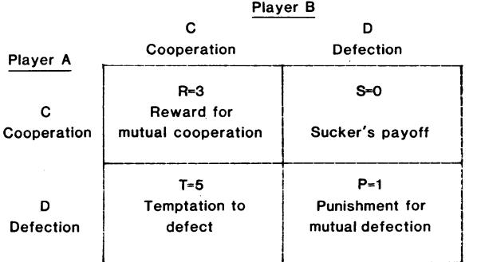

The latest data for 1978 suggests that the situation may, in fact, be deteriorating.... we may be losing the war on air pollution."

- 3. For examples see House Subcommittee on the Environment and the Atmosphere, The Environmental Protection Agency's Research Program with Primary Emphasis on the Community Health and Environmental Surveillance System (CHESS): An Investigative Report (Government Printing Office, Washington, D.C., 1976), especially chapters 4 to 6.
- 4. Without trying to be entirely rigorous, we will use an NSF definition: "Basic research is that type of research which is directed toward increase of knowledge in science. It is research where the primary aim of the investigator is a fuller knowledge or understanding of the subject under study, rather than a practical application thereof." This was given by A. T. Waterman, then director of NSF, in Symposium on Basic Research, D. Wolfie, Ed. (American Association for the Advancement of Science, Washington, D.C., 1959), p. 20.
- 5. For example, the EPA administrator, D. Costle, in a letter dated 12 June 1978 to Senator William Proxmire, chairman of the HUD-Independent Agencies Subcommittee of the Senate Appropriations Committee, said concerning environmental research, "I've had to make too many billion dollar decisions over the last year without the critical information this sort of investment, made five years ago, would have provided."
- 6. U.S. Congress, Office of Technology Assessment, A Review of the U.S. Environmental Protection Agency Environmental Research Outlook FY 1976 through 1980 (Government Printing Office, Washington, D.C., 1976).
- 7. National Academy of Sciences, Commission on Natural Resources, Analytical Studies for the U.S. Environmental Protection Agency, vol. 3, Research and Development in the Environmental Protection Agency (National Academy of Sciences, Washington, D.C., 1977).
- 8. National Advisory Committee on Oceans and Atmosphere, A Report to the President and the Congress, fifth annual report (Government Printing Office, Washington, D.C., 1976).
- 9. ORD Program Guide (EPA-600/-79-038, Environmental Protection Agency, Washington, D.C., 1979).
- 10. Research Outlook, 1980 (EPA-600/9-80-006, Environmental Protection Agency, Washington, D.C., 1980). This presents the agency's 5-year environmental research plan in response to statutory requirement. The plan is updated and a new report issued annually.
- 11. Many examples of the environmental problems EPA faces are reported in Environmental Outlook 1980 (EPA 600/8-80-003, Environmental Protection Agency, Washington, D.C., 1980).
- 12. At the beginning of the 94th Congress (Janu-

ary 1975) the Committee on Science and Technology received jurisdiction over "environmental research" as a result of several changes in the rules of the House of Representatives. The Subcommittee on the Environment and the Atmosphere was formed to handle this jurisdiction and for 4 years (two Congresses), with Congressman Brown as chairman, had responsibility for ORD. In January 1979, as a result of reorganization within the Committee on Science and Technology, Congressman Brown moved to the chair of the Subcommittee on Science, Research, and Technology. The Subcommittee on the Environment and Atmosphere was renamed Subcommittee on Natural Resources and Environment and given some additional jurisdiction.

- 13. Environmental Protection Agency Research and Development Issues: 1978, hearings before the House Subcommittee on the Environment and the Atmosphere, 19 July and 13 and 14 September 1978 (Government Printing Office, Washington, D.C., 1979).
- 14. In making funding decisions, the agency uses a zero-base budgeting (ZBB) process in which programs are approved by a consensus of the administrator and the six assistant administrators. In the ZBB process, the ORD has only about one of six votes, and thus research programs are vulnerable to a great deal of influence from the program offices. Because they play such a substantial role in defining the program of research ultimately conducted by ORD, the administrator and all assistant administrators were asked to testify on what they expect from that office.
- 15. Special Urban Air Pollution Problems: Denver and Houston, hearings before the House Subcommittee on the Environment and the Atmosphere, 19 and 21 November 1977 (Government Printing Office, Washington, D.C., 1978).
- 16. Long-Term Environmental Research in the Environmental Protection Agency, hearings before the House Subcommittee on the Environment and the Atmosphere, 30 June 1977 (Government Printing Office, Washington, D.C., 1978). See tfie testimony of R. L. Sansom, especially his supplemental statement, p. 52.
- 17. H. Kissinger, The Reporter, 5 March 1959, p. 30.
- 18. For example, the agency has instituted a new system of research grants putatively aimed at bringing new work of high quality into its program. Despite this aim the published solicitation for grant proposals does not explicitly and unambiguously state that funding decisions will be based on scientific quality. Instead the following appears: "Scientific merit and relevance of proposals will be significant and balanced factors in the evaluation procedures since all projects must be in concert with the Agency's

budget appropriations." In other words, it seems that work on highly relevant matters might be funded even if of poor quality. [See EPA and the Academic Community (EPA-600/8- 80-010, Environmental Protection Agency, Cincinnati, Ohio, 1980), p. 2.]

- 19. National Academy of Sciences, Materials Advisory Board, Report ofthe Ad Hoc Committee on Principles of Research-Engineering Interaction (National Academy of Sciences, Washington, D.C., 1966), p. 16. - -
- 20. W. 0. Baker, in House Committee on Science and Technology, Seminar on Research, Productivity, and the National Economy, 18 June 1980 (Government Printing Office, Washington, D.C., 1980).
- 21. Testimony of J. N. Pitts, in 1980 Authorization for the Office of Research and Development, Environmental Protection Agency, hearings before the House Subcommittee on Science and Technology, 13 and 15 February 1979 (Government Printing Office, Washington, D.C., 1979).
- 22. H. W. Bode, in Basic Research and National Goals, a report to the House Committee on Science and Astronautics (National Academy of Sciences, Washington, D.C., 1965), p. 74.
- 23. At present the program offices guide EPA's research not only through the ZBB process but also through the mechanism of 13 research committees. These committees translate program office needs into "research strategy documents" which guide all EPA research (10).
- 24. This provision is contained in section 6 of Public Law 95-155, the FY 1978 authorization act for ORD. For explanation of congressional intent see Conference Report to Accompany H.R. 5101, 95th Congress, Report No. 95-722 (Government Printing Office, Washington, D.C., 1977).
- 25. This provision is contained in section 11 of Public Law 95-155. For explanation see the report cited in (10), and also Report to Accompany H.R. 5101, 95th Congress, Report No. 95- 157 (Government Printing Office, Washington, D.C., 1977).

on December 2, 2012

[www.sciencemag.org](http://www.sciencemag.org/)

Downloaded from

- 26. This was contained in section 4(a) of H.R. 7099, the House version of the FY 1981 authorization bill. The provision was deleted from the final version of the bill at least in part because the agency strenuously (if informally) opposed it and succeeded in having it removed from the Senate-passed version of the bill. For explanation of intent, see Report to Accompany H.R. 7099, 96th Congress, Report No. 96-959 (Government Printing Office, Washington, D.C., 1980).
- 27. J. Bronowski, The Common Sense of Science (Harvard Univ. Press, Cambridge, Mass., 19:8, p. 143.
- 28. We thank A. V. Applegate for substantial a%sis' ance in the preparation of this paper.

# The Evolution of Cooperation

Robert Axelrod and William D. Hamilton

The theory of evolution is based on the struggle for life and the survival of the fittest. Yet cooperation is common between members of the same species and even between members of different species. Before about 1960, accounts of the evolutionary process largely dismissed cooperative phenomena as not requiring special attention. This position followed from a misreading of theory that assigned most adaptation to selection at the level of populations or whole species. As a result of such misreading, cooperation was always considered adaptive. Recent reviews of the evolutionary process, however, have shown no sound basis for a pervasive groupbenefit view of selection; at the level of a species or a population, the processes of selection are weak. The original individualistic emphasis of Darwin's theory is more valid (1, 2).

To account for the manifest existence of cooperation and related group behavior, such as altruism and restraint in competition, evolutionary theory has recently acquired two kinds of extension. These extensions are, broadly, genetical kinship theory (3) and reciprocation theory (4, 5). Most of the recent activity, both in field work and in further developments of theory, has been on the side of kinship. Formal approaches have varied, but kinship theory has increasingly taken a gene's-eye view of natural selection (6). A gene, in effect, looks beyond its mortal bearer to interests of the potentially immortal set of its replicas existing in other related individuals. If interactants are sufficiently closely related, al-

Dr. Axelrod is a professor of political science and research scientist at the Institute of Public Policy Studies, University of Michigan, Ann Arbor 48109. Dr. Hamilton is a professor of evolutionary biology in the Museum of Zoology and the Division of Biological Sciences, University of Michigan.

truism can benefit reproduction of the set, despite losses to the individual altruist. In accord with this theory's predictions, apart from the human species, almost all clear cases of altruism, and most observed cooperation, occur in contexts of high relatedness, usually between immediate family members. The evolution of the suicidal barbed sting of the honeybee worker could be taken as paradigm for this line of theory (7).

Conspicuous examples of cooperation (although almost never of ultimate selfsacrifice) also occur where relatedness is low or absent. Mutualistic symbioses offer striking examples such as these: the fungus and alga that compose a lichen; the ants and ant-acacias, where the trees house and feed the ants which, in turn, protect the trees (8); and the fig wasps and fig tree, where wasps, which are obligate parasites of fig flowers, serve as the tree's sole means of pollination and seed set (9). Usually the course of cooperation in such symbioses is smooth, but sometimes the partners show signs of antagonism, either spontaneous or elicited by particular treatments (10). Although kinship may be involved, as will be discussed later, symbioses mainly illustrate the other recent extension of evolutionary theory, the theory of reciprocation.

Cooperation per se has received comparatively little attention from biologists since the pioneer account of Trivers (5); but an associated issue, concerning restraint in conflict situations, has been developed theoretically. In this connection, a new concept, that of an evolutionaiily stable strategy, has been formally developed (6, 11). Cooperadion in the more normal sense has remained clouded by certain difficulties, particularly those concerning initiation of cooperation from a previously asocial state (12) and its stable maintenance once established. A formal theory of cooperation is increasingly needed. The renewed emphasis on individualism has focused on the frequent ease of cheating in reciprocatory arrangements. This makes the stability of even mutualistic symbioses appear more questionable than under the old view of adaptation for species benefit. At the same time other cases that once appeared firmly in the domain of kinship theory now begin to reveal relatednesses of interactants that are too low for much nepotistic altruism to be expected. This applies both to cooperative breeding in birds (13) and to cooperative acts more generally in primate groups (14). Here either the appearances of cooperation are deceptive-they are cases of part-kin altruism and part cheating-or a larger part of the behavior is attributable to stable reciprocity. Previous accounts that already invoke reciprocity, however, underemphasize the stringency of its conditions (15).

Our contribution in this area is new in three ways.

1) In a biological context, our model is novel in its probabilistic treatment of the possibility that two individuals may interact again. This allows us to shed new

Prisoner's Dilemma game in particular, allow a formalization of the strategic possibilities inherent in such situations.

The Prisoner's Dilemma game is an elegant embodiment of the problem of achieving mutual cooperation (16), and therefore provides the basis for our analysis. To keep the analysis tractable, we focus on the two-player version of the game, which describes situations that involve interactions between pairs of

Summary. Cooperation in organisms, whether bacteria or primates, has been a difficulty for evolutionary theory since Darwin. On the assumption that interactions between pairs of individuals occur on a probabilistic basis, a model is developed based on the concept of an evolutionarily stable strategy in the context of the Prisoner's Dilemma game. Deductions from the model, and the results of a computer tournament show how cooperation based on reciprocity can get started in an asocial world, can thrive while interacting with a wide range of other strategies, and can resist invasion once fully established. Potential applications include specific aspects of territoriality, mating, and disease.

light on certain specific biological processes such as aging and territoriality.

2) Our analysis of the evolution of cooperation considers not just the final stability of a given strategy, but also the initial viability of a strategy in an environment dominated by noncooperating individuals, as well as the robustness of a strategy in a variegated environment composed of other individuals using a variety of more or less sophisticated strategies. This allows a richer understanding of the full chronology of the evolution of cooperation than has previously been possible.

3) Our applications include behavioral interaction at the microbial level. This leads us to some speculative suggestions of rationales able to account for the existence of both chronic and acute phases in many diseases, and for a certain class of chromosomal nondisjunction, exemplified by Down's syndrome.

## Strategies in the Prisoner's Dilemma

Many of the benefits sought by living things are disproportionally available to cooperating groups. While there are considerable differences in what is meant by the terms "benefits" and "sought," this statement, insofar as it is true, lays down a fundamental basis for all social life. The problem is that while an individual can benefit from mutual cooperation, each one can also do even better by exploiting the cooperative efforts of others. Over a period of time, the same individuals may interact again, allowing for complex patterns of strategic interactions. Game theory in general, and the

individuals. In the Prisoner's Dilemma game, two individuals can each either cooperate or defect. The payoff to a player is in terms of the effect on its fitness (survival and fecundity). No matter what the other does, the selfish choice of defection yields a higher payoff than cooperation. But if both defect, both do worse than if both had cooperated.

on December 2, 2012

[www.sciencemag.org](http://www.sciencemag.org/)

Downloaded from

Figure 1 shows the payoff matrix of the Prisoner's Dilemma. If the other player cooperates, there is a choice between cooperation which yields R (the reward for mutual cooperation) or defection which yields T (the temptation to defect). By assumption, T > R, so that it pays to defect if the other player cooperates. On the other hand, if the other player defects, there is a choice between cooperation which yields S (the sucker's payoff) or defection which yields P (the punishment for mutual defection). By assumption P > S, so it pays to defect if the other player defects. Thus, no matter what the other player does, it pays to defect. But, if both defect, both get P rather than the larger value of R that they both could have gotten had both cooperated. Hence the dilemma (17).

With two individuals destined never to meet again, the only strategy that can be called a solution to the game is to defect always despite the seemingly paradoxical outcome that both do worse than they could have had they cooperated.

Apart from being the solution in game theory, defection is also the solution in biological evolution (18). It is the outcome of inevitable evolutionary trends through mutation and natural selection: if the payoffs are in terms of fitness, and

the interactions between pairs of individuals are random and not repeated, then any population with a mixture of heritable strategies evolves to a state where all individuals are defectors. Moreover, no single differing mutant strategy can do better than others when the population is using this strategy. In these respects the strategy of defection is stable.

This concept of stability is essential to the discussion of what follows and it is useful to state it more formally. A strategy is evolutionarily stable if a population of individuals using that strategy cannot be invaded by a rare mutant adopting a different strategy (11). In the case of the Prisoner's Dilemma played only once, no strategy can invade the strategy of pure defection. This is because no other strategy can do better with the defecting individuals than the P achieved by the defecting players who interact with each other. So in the single-shot Prisoner's Dilemma, to defect always is an evolutionarily stable strategy.

In many biological settings, the same two individuals may meet more than once. If an individual can recognize a previous interactant and remember some aspects of the prior outcomes, then the strategic situation becomes an iterated Prisoner's Dilemma with a much richer set of possibilities. A strategy would take the form of a decision rule which determined the probability of cooperation or defection as a function of the history of the interaction so far. But if there is a known number of interactions between a pair of individuals, to defect always is still evolutionarily stable and is still the only strategy which is. The reason is that defection on the last interaction would be optimal for both sides, and consequently so would defection on the nextto-last interaction, and so on back to the first interaction.

Our model is based on the more realistic assumption that the number of interactions is not fixed in advance. Instead, there is some probability, w, that after the current interaction the same two

individuals will meet again. Factors that affect the magnitude of this probability of meeting again include the average lifespan, relative mobility, and health of the individuals. For any value of w, the strategy of unconditional defection (ALL D) is evolutionarily stable; if everyone is using this strategy, no mutant strategy can invade the population. But other strategies may be evolutionarily stable as well. In fact, when w is sufficiently great, there is no single best strategy regardless of the behavior of the others in the population (19). Just because there is no single best strategy, it does not follow that analysis is hopeless. On the contrary, we demonstrate not only the stability of a given strategy, but also its robustness and initial viability.

Fig. 1. The Prisoner's Dilemma game. The payoff to player A is shown with illustrative numerical values. The game is defined by T>R>P>S

and R > (S + 7)/2.

Before turning to the development of the theory, let us consider the range of biological reality that is encompassed by the game theoretic approach. To start with, an organism does not need a brain to employ a strategy. Bacteria, for example, have a basic capacity to play games in that (i) bacteria are highly responsive to selected aspects of their environment, especially their chemical environment; (ii) this implies that they can respond differentially to what other organisms around them are doing; (iii) these conditional strategies of behavior can certainly be inherited; and (iv) the behavior of a bacterium can affect the fitness of other organisms around it, just as the behavior of other organisms can affect the fitness of a bacterium.

While the strategies can easily include differential responsiveness to recent changes in the environment or to cumulative averages over time, in other ways their range of responsiveness is limited. Bacteria cannot "remember" or "interpret" a complex past sequence of changes, and they probably cannot distinguish alternative origins of adverse or beneficial changes. Some bacteria, for example, produce their own antibiotics, bacteriocins; those are harmless to bacteria of the producing strain, but destructive to others. A bacterium might easily have production of its own bacteriocin dependent on the perceived presence of like hostile products in its environment, but it could not aim the toxin produced toward an offending initiator. From existing evidence, so far from an individual level, discrimination seems to be by species rather even than variety. For example, a Rhizobium strain may occur in nodules which it causes on the roots of many species of leguminous plants, but it may fix nitrogen for the benefit of the plant in only a few of these species (20). Thus, in many legumes the Rhizobium seems to be a pure parasite. In the light of theory to follow, it would be interesting to know whether these parasitized legumes are perhaps less beneficial to free living Rhizobium in the surrounding soil than are those in which the full symbiosis is established. But the main point of concern here is that such discrimination by a Rhizobium seems not to be known even at the level of varieties within a species.

As one moves up the evolutionary ladder in neural complexity, game-playing behavior becomes richer. The intelligence of primates, including humans, allows a number of relevant improvements: a more complex memory, more complex processing of information to determine the next action as a function of the interaction so far, a better estimate of the probability of future interaction with the same individual, and a better ability to distinguish between different individuals. The discrimination of others may be among the most important of abilities because it allows one to handle interactions with many individuals without having to treat them all the same, thus making possible the rewarding of cooperation from one individual and the punishing of defection from another.

on December 2, 2012

[www.sciencemag.org](http://www.sciencemag.org/)

Downloaded from

The model of the iterated Prisoner's Dilemma is much less restricted than it may at first appear. Not only can it apply to interactions between two bacteria or interactions between two primates, but it can also apply to the interactions between a colony of bacteria and, say, a primate serving as a host. There is no assumption of commensurability of payoffs between the two sides. Provided that the payoffs to each side satisfy the inequalities that define the Prisoner's Dilemma (Fig. 1), the results of the analysis will be applicable.

The model does assume that the choices are made simultaneously and with discrete time intervals. For most analytic purposes, this is equivalent to a continuous interaction over time, with the time period of the model corresponding to the minimum time between a change in behavior by one side and a response by the other. And while the model treats the choices as simultaneous, it would make little difference if they were treated as sequential (21).

Turning to the development of the theory, the evolution of cooperation can be conceptualized in terms of three separate questions:

1) Robustness. What type of strategy can thrive in a variegated environment composed of others using a wide variety of more or less sophisticated strategies?

2) Stability. Under what conditions can such a strategy, once fully established, resist invasion by mutant strategies?

3) Initial viability. Even if a strategy is robust and stable, how can it ever get a foothold in an environment which is predominantly noncooperative?

## Robustness

To see what type of strategy can thrive in a variegated environment of more or less sophisticated strategies, one of us (R.A.) conducted a computer tournament for the Prisoner's Dilemma. The strategies were submitted by game theorists in economics, sociology, political science, and mathematics (22). The rules implied the payoff matrix shown in Fig. 1 and a game length of 200 moves. The 14 entries and a totally random strategy were paired with each other in a round robin tournament. Some of the strategies were quite intricate. An example is one which on each move models the behavior of the other player as a Markov process, and then uses Bayesian inference to select what seems the best choice for the long run. However, the result of the tournament was that the highest average score was attained by the simplest of all strategies submitted: TIT FOR TAT. This strategy is simply one of cooperating on the first move and then doing whatever the other player did on the preceding move. Thus TIT FOR TAT is a strategy of cooperation based on reciprocity.

The results of the first round were then circulated and entries for a second round were solicited. This time there were 62 entries from six countries (23). Most of the contestants were computer hobbyists, but there were also professors of evolutionary biology, physics, and computer science, as well as the five disciplines represented in the first round. TIT FOR TAT was again submitted by the

The robustness of TIT FOR TAT was also manifest in an ecological analysis of a whole series of future tournaments. The ecological approach takes as given the varieties which are present and investigates how they do over time when interacting with each other. This analysis was based on what would happen if each of the strategies in the second round were submitted to a hypothetical next round in proportion to its success in the previous round. The process was then repeated to generate the time path of the distribution of strategies. The results showed that, as the less successful rules were displaced, TIT FOR TAT continued to do well with the rules which initially scored near the top. In the long run, TIT FOR TAT displaced all the other rules and went to fixation (24). This provides further evidence that TIT FOR TAT's cooperation based on reciprocity is a robust strategy that can thrive in a variegated environment.

# Stability

Once a strategy has gone to fixation, the question of evolutionary stability deals with whether it can resist invasion by a mutant strategy. In fact, we will now show that once TIT FOR TAT is established, it can resist invasion by any possible mutant strategy provided that the individuals who interact have a sufficiently large probability, w, of meeting again. The proof is described in the next two paragraphs.

As a first step in the proof we note that since TIT FOR TAT "remembers" only one move back, one C by the other player in any round is sufficient to reset the situation as it was at the beginning of the game. Likewise, one D sets the situation to what it was at the second round after a D was played in the first. Since there is a fixed chance, w, of the interaction not ending at any given move, a strategy cannot be maximal in playing with TIT FOR TAT unless it does the same thing both at the first occurrence of a given state and at each resetting to that state. Thus, if a rule is maximal and

begins with C, the second round has the same state as the first, and thus a maximal rule will continue with C and hence always cooperate with TIT FOR TAT. But such a rule will not do better than TIT FOR TAT does with another TIT FOR TAT, and hence it cannot invade. If, on the other hand, a rule begins with D, then this first D induces a switch in the state of TIT FOR TAT and there are two possibilities for continuation that could be maximal. If D follows the first D, then this being maximal at the start implies that it is everywhere maximal to follow D with D, making the strategy equivalent to ALL D. If C follows the initial D, the game is then reset as for the first move; so it must be maximal to repeat the sequence of DC indefinitely. These points show that the task of searching a seemingly infinite array of rules of behavior for one potentially capable of invading TIT FOR TAT is really easier than it seemed: if neither ALL D nor alternation of D and C can invade TIT FOR TAT, then no strategy can.

To see when these strategies can invade, we note that the probability that the nth interaction actually occurs is w" . Therefore, the expression for the total payoff is easily found by applying the weights 1, w, w2 . .. to the payoff sequence and summing the resultant series. When TIT FOR TAT plays another TIT FOR TAT, it gets a payoff of R each move for a total of R + wR + w2R ... , which is R/(1 - w). ALL D playing with TIT FOR TAT gets T on the first move and P thereafter, so it cannot invade TIT FOR TAT if

on December 2, 2012

[www.sciencemag.org](http://www.sciencemag.org/)

Downloaded from

$$R(1 - \cdot \omega) \cong T + \omega P (1 - \cdot \omega)$$

Similarly when alternation of D and C plays TIT FOR TAT, it gets a payoff of

$$\begin{array}{rcl} T = \; \mathsf{wS} + \; \mathsf{w}^2 T + \; \mathsf{s}^3 \mathsf{S} \cdot \dots \\ = \; (T + \; \mathsf{wS}) (1 - \; \mathsf{w}^2) \end{array}$$

Alternation of D and C thus cannot invade TIT FOR TAT if

$$R(1 - \omega) \cong (T + \omega \mathbf{S}) \langle (1 - \omega^2) \rangle$$

Hence, with reference to the magnitude of w, we find that neither of these two strategies (and hence no strategy at all) can invade TIT FOR TAT if and only- if both

$$\begin{array}{rcl} \mathsf{w} \cong (T - \mathsf{R}) / (T - P) \text{ and} \\ \mathsf{w} \cong (T - \mathsf{R}) / (\mathsf{R} - \mathsf{S}) \end{array} \tag{1}$$

This demonstrates that TIT FOR TAT is evolutionarily stable if and only if the interactions between the individuals have a sufficiently large probability of continuing (19).

#### Initial Viability

TIT FOR TAT is not the only strategy that can be evolutionarily stable. In fact, ALL D is evolutionarily stable no matter what is the probability of interaction continuing. This raises the problem of how an evolutionary trend to cooperative behavior could ever have started in the first place.

Genetic kinship theory suggests a plausible escape from the equilibrium of ALL D. Close relatedness of interactants permits true altruism-sacrifice of fitness by one individual for the benefit of another. True altruism can evolve when the conditions of cost, benefit, and relatedness yield net gains for the altruism-causing genes that are resident in the related individuals (25). Not defecting in a single-move Prisoner's Dilemma is altruism of a kind (the individual is foregoing proceeds that might have been taken) and so can evolve if the two interactants are sufficiently related (18). In effect, recalculation of the payoff matrix in such a way that an individual has a part interest in the partner's gain (that is, reckoning payoffs in terms of inclusive fitness) can often eliminate the inequalities T > R and P > S, in which case cooperation becomes unconditionally favored (18, 26). Thus it is possible to imagine that the benefits of cooperation in Prisoner's Dilemma-like situations can begin to be harvested by groups of closely related individuals. Obviously, as regards pairs, a parent and its offspring or a pair of siblings would be especially promising, and in fact many examples of cooperation or restraint of selfishness in such pairs are known.

Once the genes for cooperation exist, selection will promote strategies that base cooperative behavior on cues in the environment (4). Such factors as promiscuous fatherhood (27) and events at illdefined group margins will always lead to uncertain relatedness among potential interactants. The recognition of any improved correlates of relatedness and use of these cues to determine cooperative behavior will always permit advance in inclusive fitness (4). When a cooperative choice has been made, one cue to relatedness is simply the fact of reciprocation of the cooperation. Thus modifiers for more selfish behavior after a negative response from the other are advantageous whenever the degree of relatedness is low or in doubt. As such, conditionality is acquired, and cooperation can spread into circumstances of less and less relatedness. Finally, when the probability of two individuals meeting each other again is sufficiently high, cooperation based on reciprocity can thrive and be evolutionarily stable in a population with no relatedness at all.

A case of cooperation that fits this scenario, at least on first evidence, has been discovered in the spawning relationships in a sea bass (28). The fish, which are hermaphroditic, form pairs and roughly may be said to take turns at being the high investment partner (laying eggs) and low investment partner (providing sperm to fertilize eggs). Up to ten spawnings occur in a day and only a few eggs are provided each time. Pairs tend to break up if sex roles are not divided evenly. The system appears to allow the evolution of much economy in the size of testes, but Fischer (28) has suggested that the testis condition may have evolved when the species was more sparse and inclined to inbreed. Inbreeding would imply relatedness in the pairs and this initially may have transferred the system to attractance of tit-for-tat cooperation-that is, to cooperation unneedful of relatedness.

Another mechanism that can get cooperation started when virtually everyone is using ALL D is clustering. Suppose that a small group of individuals is using a strategy such as TIT FOR TAT and that a certain proportion, p, of the interactions of members of this cluster are with other members of the cluster. Then the average score attained by the members of the cluster in playing the TIT FOR TAT strategy is

$$\begin{array}{c} \rho[R/(1-\omega)] + \\ (1-\rho)[S + \omega P/(1-\omega)] \end{array}$$

If the members of the cluster provide a negligible proportion of the interactions for the other individuals, then the score attained by those using ALL D is still PI (1 - w). When p and w are large enough, a cluster of TIT FOR TAT individuals can then become initially viable in an environment composed overwhelmingly of ALL D (19).

Clustering is often associated with kinship, and the two mechanisms can reinforce each other in promoting the initial viability of reciprocal cooperation. However, it is possible for clustering to be effective without kinship (3).

We have seen that TIT FOR TAT can intrude in a cluster on a population of ALL D, even though ALL D is evolutionarily stable. This is possible because a cluster of TIT FOR TAT's gives each member a nontrivial probability of meeting another individual who will reciprocate the cooperation. While this suggests a mechanism for the initiation of cooperation, it also raises the question about whether the reverse could happen once a strategy like TIT FOR TAT became established itself. Actually, there is an interesting asymmetry here. Let us define a nice strategy as one, such as TIT FOR TAT, which will never be the first to defect. Obviously, when two nice strategies interact, they both receive R each move, which is the highest average score an individual can get when interacting with another individual using the same strategy. Therefore, if a strategy is nice and is evolutionarily stable, it cannot be intruded upon by a cluster. This is because the score achieved by the strategy that comes in a cluster is a weighted average of how it does with others of its kind and with the predominant strategy. Each of these components is less than or equal to the score achieved by the predominant, nice, evolutionarily stable strategy, and therefore the strategy arriving in a cluster cannot intrude on the nice, evolutionarily stable strategy (19). This means that when w is large enough to make TIT FOR TAT an evolutionarily stable strategy it can resist intrusion by any cluster of any other strategy. The gear wheels of social evolution have a ratchet.

on December 2, 2012

[www.sciencemag.org](http://www.sciencemag.org/)

Downloaded from

The chronological story that emerges from this analysis is the following. ALL D is the primeval state and is evolutionarily stable. This means that it can resist the invasion of any strategy that has virtually all of its interactions with ALL D. But cooperation based on reciprocity can gain a foothold through two different mechanisms. First, there can be kinship between mutant strategies, giving the genes of the mutants some stake in each other's success, thereby altering the effective payoff matrix of the interaction when viewed from the perspective of the gene rather than the individual. A second mechanism to overcome total defection is for the mutant strategies to arrive in a cluster so that they provide a nontrivial proportion of the interactions each has, even if they are so few as to provide a negligible proportion of the interactions which the ALL D individuals have. Then the tournament approach demonstrates that once a variety of strategies is present, TIT FOR TAT is an extremely robust one. It does well in a wide range of circumstances and gradually displaces all other strategies in a simulation of a great variety of more or less sophisticated decision rules. And if the probability that interaction between two individuals will continue is great enough, then TIT FOR TAT is itself evolutionarily stable. Moreover, its stability is especially secure because it can resist the intrusion of whole clusters of mutant strategies. Thus cooperation based on reciprocity can get started in a predominantly noncooperative world, can thrive in a variegated environment, and can defend itself once fully established.

#### Applications

A variety of specific biological applications of our approach follows from two of the requirements for the evolution of cooperation. The basic idea is that an individual must not be able to get away with defecting without the other individuals being able to retaliate effectively (29). The response requires that the defecting individual not be lost in an anonymous sea of others. Higher organisms avoid this problem by their well-developed ability to recognize many different individuals of their species, but lower organisms must rely on mechanisms that drastically limit the number of different individuals or colonies with which they can interact effectively. The other important requirement to make retaliation effective is that the probability, w, of the same two individuals' meeting again must be sufficiently high.

When an organism is not able to recognize the individual with which it had a prior interaction, a substitute mechanism is to make sure that all of one's interactions are with the same interactant. This can be done by maintaining continuous contact with the other. This method is applied in most interspecies mutualism, whether a hermit crab and his sea-anemone partner, a cicada and the varied microorganismic colonies housed in its body, or a tree and its mycorrhizal fungi.

The ability of such partners to respond specifically to defection is not known but seems posible. A host insect that carries symbionts often carries several kinds (for example, yeasts and bacteria). Differences in the roles of these are almost wholly obscure (30). Perhaps roles are actually the same, and being host to more than one increases the security of retaliation against a particular exploitative colony. Where host and colony are not permanently paired, a method for immediate drastic retaliation is sometimes apparent instead. This is so with fig wasps. By nature of their remarkable role in pollination, female fig wasps serve the fig tree as a motile aerial male gamete. Through the extreme protogyny and simultaneity in flowering, fig wasps cannot remain with a single tree. It turns out in many cases that if a fig wasp entering a young fig does not pollinate enough flowers for seeds and instead lays eggs in almost all, the tree cuts off the developing fig at an early stage.

All progeny of the wasp then perish. Another mechanism to avoid the need for recognition is to guarantee the uniqueness of the pairing of interactants by employing a fixed place of meeting. Consider, for example, cleaner mutualisms in which a small fish or a crustacean removes and eats ectoparasites from the body (or even from the inside of the mouth) of a larger fish which is its potential predator. These aquatic cleaner mutualisms occur in coastal and reef situations where animals live in fixed home ranges or territories (4, 5). They seem to be unknown in the free-mixing circumstances of the open sea.

Other mutualisms are also characteristic of situations where continued association is likely, and normally they involve quasi-permanent pairing of individuals or of endogamous or asexual stocks, or of individuals with such stocks (7, 31). Conversely, conditions of free-mixing and transitory pairing conditions where recognition is impossible are much more likely to result in exploitation-parasitism, disease, and the like. Thus, whereas ant colonies participate in many symbioses and are sometimes largely dependent on them, honeybee colonies, which are much less permanent in place of abode, have no known symbionts but many parasites (32). The small freshwater animal Chlorohydra viridissima has a permanent stable association with green algae that are always naturally found in its tissues and are very difficult to remove. In this species the alga is transmitted to new generations by way of the egg. Hydra vulgaris and H. attenuata also associate with algae but do not have egg transmission. In these species it is said that "infection is preceded by enfeeblement of the animals and is accompanied by pathological symptoms indicating a definite parasitism by the plant" (33). Again, it is seen that impermanence of association tends to destabilize symbiosis.

In species with a limited ability to discriminate between other members of the same species, reciprocal cooperation can be stable with the aid of a mechanism that reduces the amount of discrimination necessary. Philopatry in general and territoriality in particular can serve this purpose. The phrase stable territories means that there are two quite different kinds of interaction: those in neighboring territories where the probability of interaction is high, and strangers whose probability of future interaction is low. In the case of male territorial birds, songs are used to allow neighbors to recognize each other. Consistent with our theory, such male territorial birds

show much more aggressive reactions when the song of an unfamiliar male rather than a neighbor is reproduced nearby (34).

Reciprocal cooperation can be stable with a larger range of individuals if discrimination can cover a wide variety of others with less reliance on supplementary cues such as location. In humans this ability is well developed, and is largely based on the recognition of faces. The extent to which this function has become specialized is revealed by a brain disorder called prosopagnosia. A normal person can name someone from facial features alone, even if the features have changed substantially over the years. People with prosopagnosia are not able to make this association, but have few other neurological symptoms other than a loss of some part of the visual field. The lesions responsible for prosopagnosia occur in an identifiable part of the brain: the underside of both occipital lobes, extending forward to the inner surface of the temporal lobes. This localization of cause, and specificity of effect, indicates that the recognition of individual faces has been an important enough task for a significant portion of the brain's resources to be devoted to it (35).

on December 2, 2012

[www.sciencemag.org](http://www.sciencemag.org/)

Downloaded from

Just as the ability to recognize the other interactant is invaluable in extending the range of stable cooperation, the ability to monitor cues for the likelihood of continued interaction is helpful as an indication of when reciprocal cooperation is or is not stable. In particular, when the value of w falls below the threshold for stability given in condition (1), it will no longer pay to reciprocate the other's cooperation. Illness in one partner leading to reduced viability would be one detectable sign of declining w. Both animals in a partnership would then be expected to become less cooperative. Aging of a partner would be very like disease in this respect, resulting in an incentive to defect so as to take a onetime gain when the probability of future interaction becomes small enough.

These mechanisms could operate even at the microbial level. Any symbiont that still has a transmission "horizontally" (that is, infective) as well as vertically (that is, transovarial, or more rarely through sperm, or both) would be expected to shift from mutualism to parasitism when the probability of continued interaction with the host lessened. In the more parasitic phase it could exploit the host more severely by producing more infective propagules. This phase would be expected when the host is severely injured, contracted some other wholly parasitic infection that threatened death,

or when it manifested signs of age. In fact, bacteria that are normal and seemingly harmless or even beneficial in the gut can be found contributing to sepsis in the body when the gut is perforated (implying a severe wound) (36). And normal inhabitants of the body surface (like Candida albicans) can become invasive and dangerous in either sick or elderly persons.

It is possible also that this argument has some bearing on the etiology of cancer, insofar as it turns out to be due to viruses potentially latent in the genome (37). Cancers do tend to have their onset at ages when the chances of vertical transmission are rapidly declining (38). One oncogenic virus, that of Burkitt's lymphoma, does not have vertical transmission but may have alternatives of slow or fast production of infectious propagules. The slow form appears as a chronic mononucleosis, the fast as an acute mononucleosis or as a lymphoma (39). The point of interest is that, as some evidence suggests, lymphoma can be triggered by the host's contracting malaria. The lymphoma grows extremely fast and so can probably compete with malaria for transmission (possibly by mosquitoes) before death results. Considering other cases of simultaneous infection by two or more species of pathogen, or by two strains of the same one, our theory may have relevance more generally to whether a disease will follow a slow, joint-optimal exploitation course ("chronic" for the host) or a rapid severe exploitation ("acute" for the host). With single infection the slow course would be expected. With double infection, crash exploitation might, as dictated by implied payoff functions, begin immediately, or have onset later at an appropriate stage of senescence (40).

Our model (with symmetry of the two parties) could also be tentatively applied to the increase with maternal age of chromosomal nondisjunction during ovum formation (oogenesis) (41). This effect leads to various conditions of severely handicapped offspring, Down's syndrome (caused by an extra copy of chromosome 21) being the most familiar example. It depends almost entirely on failure of the normal separation of the paired chromosomes in the mother, and this suggests the possible connection with our story. Cell divisions of oogenesis, but not usually of spermatogenesis, are characteristically unsymmetrical, with rejection (as a so-called polar body) of chromosomes that go to the unlucky pole of the cell. It seems possible that, while homologous chromosomes generally stand to gain by steadily cooperating in a diploid organism, the situation in oogenesis is a Prisoner's Dilemma: a chromosome which can be "first to defect" can get itself into the egg nucleus rather than the polar body. We may hypothesize that such an action triggers similar attempts by the homolog in subsequent meioses, and when both members of a homologous pair try it at once, an extra chromosome in the offspring could be the occasional result. The fitness of the bearers of extra chromosomes is generally extremely low, but a chromosome which lets itself be sent to the polar body makes a fitness contribution of zero. Thus P > S holds. For the model to work, an incident of "defection" in one developing egg would have to be perceptible by others still waiting. That this would occur is pure speculation, as is the feasibility of self-promoting behavior by chromosomes during a gametic cell division. But the effects do not seem inconceivable: a bacterium, after all, with its single chromosome, can do complex conditional things. Given such effects, our model would explain the much greater incidence of abnormal chromosome increase in eggs (and not sperm) with parental age.

### Conclusion

Darwin's emphasis on individual advantage has been formalized in terms of game theory. This establishes conditions under which cooperation based on reciprocity can evolve.

#### References and Notes

- 1. G. C. Williams, Adaptations and Natural Selection (Princeton Univ. Press, Princeton, 1966); W. D. Hamilton, in Bisocial Anthropology, R. Fox, Ed. (Malaby, London, 1975), p. 133.
- 2. For the best recent case for effective selection at group levels and for altruism based on genetic correction of non-kin interactants see D. S. Wilson, Natural Selection of Populations and Communities (Benjamin/Cummings, Menlo Park, Calif., 1979).
- 3. W. D. Hamilton, J. Theoret. Biol. 7, 1 (1964).
- 4. R. Trivers, Q. Rev. Biol. 46, 35 (1971). 5. For additions to the theory of biological cooperation see I. D. Chase [Am. Nat. 115, 827 (1980)], R. M. Fagen [ibid., p. 858 (1980)], and S. A. Boorman and P. R. Levitt [The Genetics of Altruism (Academic Press, New York, 1980)].
- 6. R. Dawkins, The Sefish Gene (Oxford Univ. Press, Oxford, 1976). 7. W. D. Hamilton, Annu. Rev. Ecol. Syst. 3, 193
- (1972). 8. D. H. Janzen, Evolution 20, 249 (1966).
- 9. J. T. Wiebes, Gard. Bull. (Singapore) 29, 207 (1976); D. H. Janzen, Annu. Rev. Ecol. Syst. 10, 31 (1979).
- 10. M. Caullery, Parasitism and Symbiosis (Sidgwick and Jackson, London, 1952). This gives examples of antagonism in orchid-fungus and lichen symbioses. For the example of wasp-ant symbiosis, see (7).
- 11. J. Maynard Smith and G. R. Price, Nature (Londqn) 246, 15 (1973); J. Maynard Smith and G. A. Parker, Anim. Behav. 24, 159 (1976); G. A. Parker, Nature (London) 274, 849 (1978).
- 12. J. Elster, Ulysses and the Sirens (Cambridge Univ. Press, London, 1979).
- 13. S. T. Emlen, in Behavioral Ecology: An Evolu-

tionary Approach, J. Krebs and N. Davies, Eds. (Blackwell, Oxford, 1978), p. 245; P. B. Stacey, Behav. Ecol. Sociobiol. 6, 53 (1979).

- 14. A. H. Harcourt, Z. Tierpsychol. 48, 401 (1978); C. Packer, Anim. Behav. 27, 1 (1979); R. W. Wrangham, Soc. Sci. Info. 18, 335 (1979).
- 15. J. D. Ligon and S. H. Ligon, Nature (London) 276, 496 (1978).
- 16. A. Rapoport and A. M. Chammah, Prisoner's Dilemma (Univ. of Michigan Press, Ann Arbor, 1965). There are many other patterns of interaction which allow gains for cooperation. See for example the model of intraspecific combat in J. Maynard Smith and G. R. Price, in (11).
- 17. The condition that R > (S + 7)/2 is also part of the definition to rule out the possibility that alternating exploitation could be better for both than mutual cooperation.
- 18. W. D. Hamilton, in Man and Beast: Comparative Social Behavior (Smithsonian Press, Washington, 1971), p. 57. R. M. Fagen [in (5)] shows some conditions for single encounters where defection is not the solution.
- 19. For a formal proof, see R. Axelrod, Am. Political Sci. Rev., in press. For related results on the potential stability of cooperative behavior see R. D. Luce and H. Raiffa, Games and Decisions (Wiley, New York, 1957), p. 102; M. Taylor, Anarchy and Cooperation (Wiley, New York, 1976); M. Kurz, in Economic Progress, Private Values and Public Policy, B. Balassa and R. Nelson, Eds. (North-Holland, Amsterdam, 1977), p. 177.
- 20. M. Alexander, Microbial Ecology (Wiley, New York, 1971).
- 21. In either case, cooperation on a tit-for-tat basis is evolutionarily stable if and only if w is sufficiently high. In the case of sequential moves, suppose there is a fixed chance, p, that a given interactant of the pair will be the next one to need help. The critical value of w can be shown to be the minimum of the two side's value of A/ p(A + B) where A is the cost of giving assistance, and B is the benefit of assistance when received. See also P. R. Thompson, Soc. Sci. Info. 19, 341 (1980).

on December 2, 2012

[www.sciencemag.org](http://www.sciencemag.org/)

Downloaded from

- 22. R. Axelrod, J. Conflict Resolution 24, 3 (1980). 23. In the second round, the length of the games was uncertain, with an expected probability of 200 moves. This was achieved by setting the probability that a given move would not be the last at w = .99654. As in the first round, each pair was matched in five games (24).
- 24. R. Axelrod, J. Conflict Resolution 24, 379 (1980).
- 25. R. A. Fisher, The Genetical Theory of Natural Selection (Oxford Univ. Press, Oxford, 1930); J. B. S. Haldane, Nature (London) New Biol. 18, 34 (1955); W. D. Hamilton, Am. Nat. 97, 354 (1963).
- 26. M. J. Wade and F. Breden, Behav. Ecol. Sociobiol, in press.
- 27. R. D. Alexander, Annu. Rev. Ecol. Syst. 5, 325 (1974).
- 28. E. Fischer, Anim. Behav. 28, 620 (1980); E. G. Leigh, Jr., Proc. Natl. Acad. Sci. U.S.A. 74, 4542 (1977).
- 29. For economic theory on this point see G. Akerlof, Q. J. Econ. 84, 488 (1970); M. R. Darby and E. Karni, J. Law Econ. 16, 67 (1973); 0. E. Williamson, Markets and Hierarchies (Free Press, New York, 1975).
- 30. P. Buchner, Endosymbiosis of Animals with Plant Microorganisms (Interscience, New York, 1965).
- 31. W. D. Hamilton, in Diversity of Insect Faunas, L. A. Mound and N. Waloff, Eds. (Blackwell, Oxford, 1978).
- 32. E. 0. Wilson, The Insect Societies (Bellknap, Cambridge, Mass., 1971); M. Treisman, Anim. Behav. 28, 311 (1980).
- 33. C. M. Yonge [Nature (London) 134, 12 (1979)] gives other examples of invertebrates with unicellular algae.
- 34. E. 0. Wilson, Sociobiology (Harvard Univ.
- Press, Cambridge, Mass., 1975), p. 273. 35. N. Geschwind, Sci. Am. 241, (No. 3), 180 (1979).
- 36. D. C. Savage, in Microbial Ecology of the Gut, R. T. J. Clarke and T. Bauchop, Eds. (Academic Press, New York, 1977), p. 300.
- 37. J. T. Manning, J. Theoret. Biol. 55, 397 (1975); M. J. Orlove, ibid. 65, 605 (1977).
- 38. W. D. Hamilton, ibid. 12, 12 (1966).
- 39. W. Henle, G. Henle, E. T. Lenette, Sci. Am. 241 (No. 1), 48 (1979).
- 40. See also I. Eshel, Theoret. Pop. Biol. 11, 410 (1977) for a related possible implication of multiclonal infection.
- 41. C. Stern, Principles of Human Genetics (Freeman, San Francisco, 1973).
- 42. For helpful suggestions we thank Robert Boyd, Michael Cohen, and David Sloan Wilson.