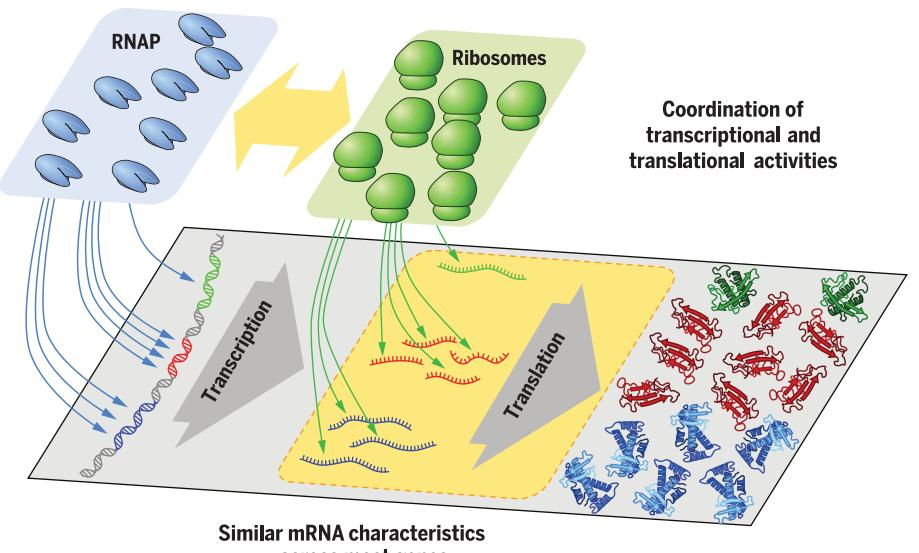
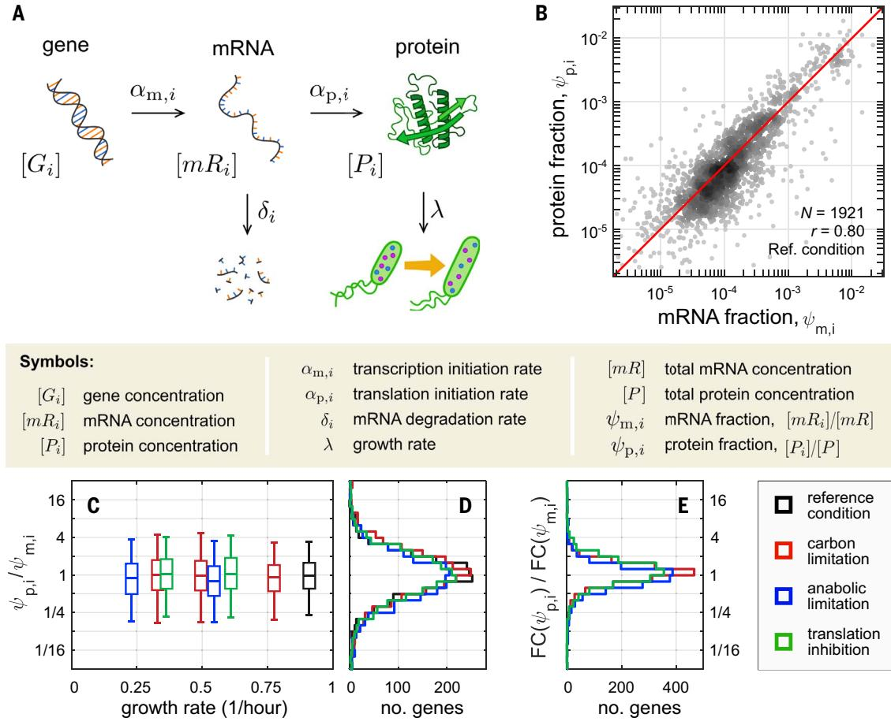
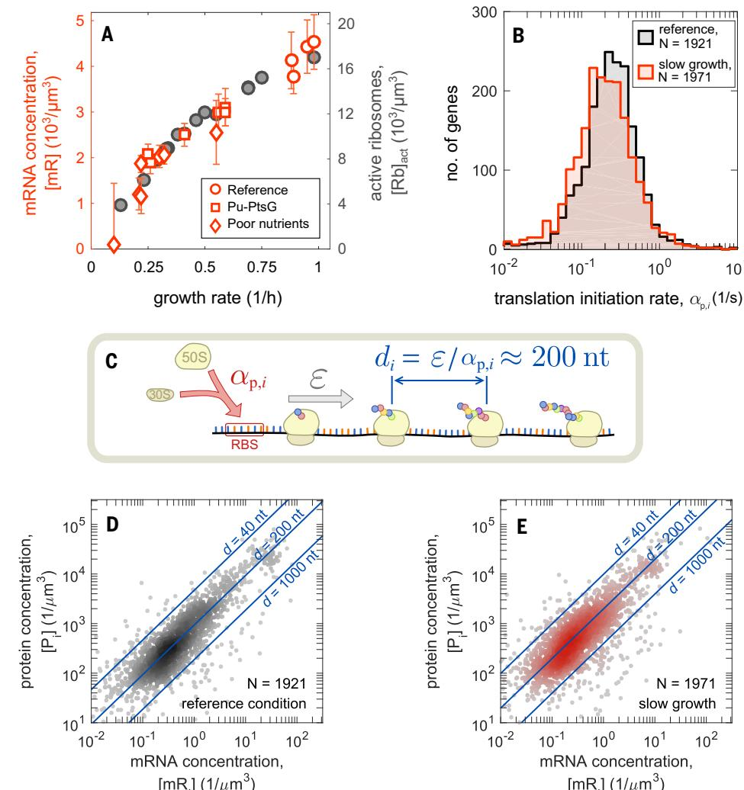
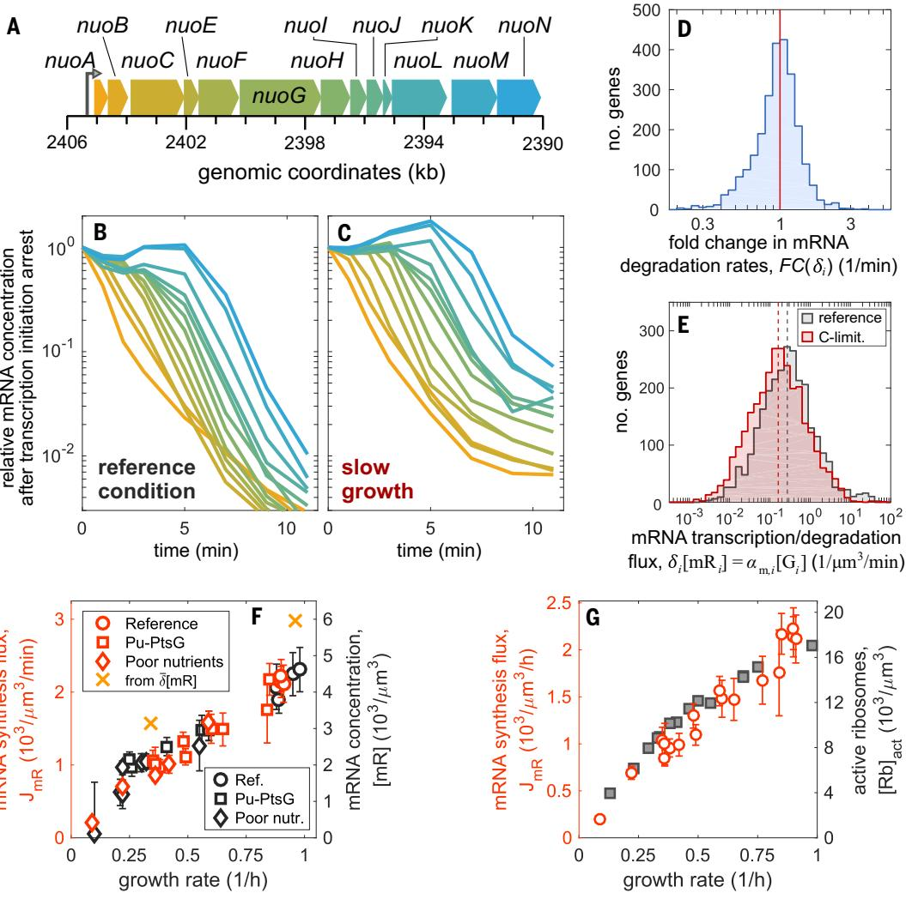
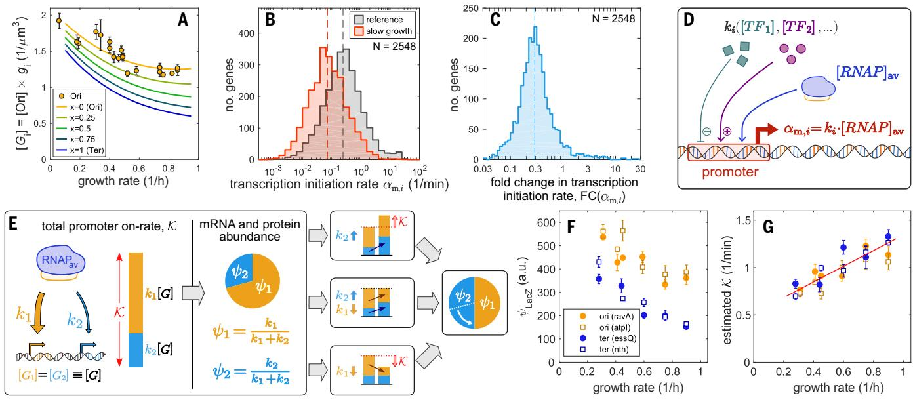
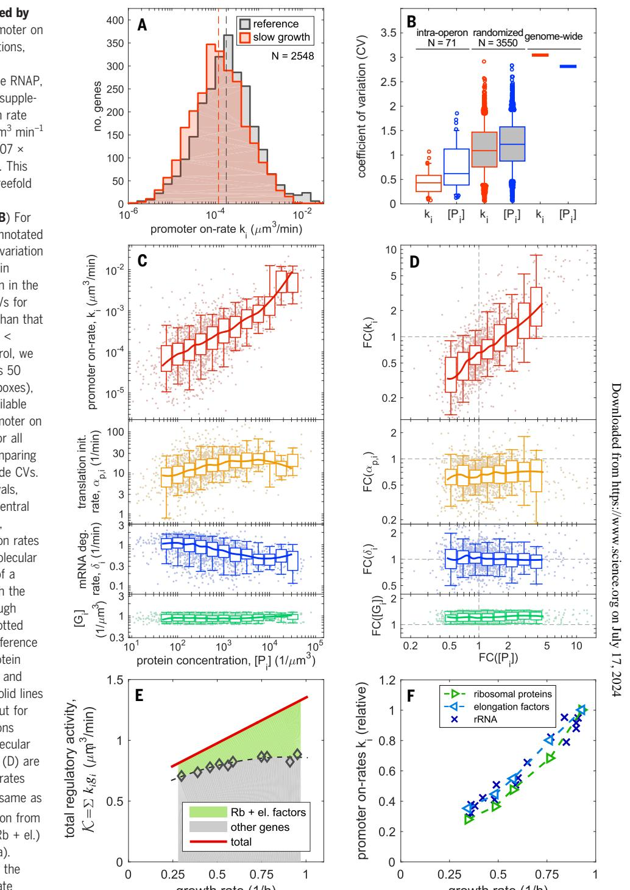
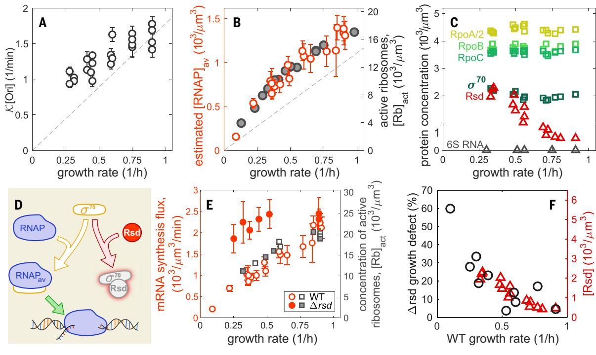

# RESEARCH ARTICLE SUMMARY ◥

## SYSTEMS BIOLOGY

# Principles of gene regulation quantitatively connect DNA to RNA and proteins in bacteria

Rohan Balakrishnan†, Matteo Mori†, Igor Segota, Zhongge Zhang, Ruedi Aebersold, Christina Ludwig, Terence Hwa*

INTRODUCTION: The intracellular concentration of a protein depends on the rates of several processes, including transcription, translation, and the degradation and/or dilution of messenger RNAs (mRNAs) and proteins. These rates can be vastly different for different genes and across different growth conditions because of gene-specific regulation. At the systems level, protein concentrations are further affected by the availability of shared gene expression machineries—e.g., RNA polymerases and ribosomes—and are constrained by the approximately invariant cellular mass density. Even in one of the best-characterized model organisms, Escherichia coli, it is unclear how the genespecific and systems-level effects work together toward setting the cellular proteome. This knowledge gap has not only hindered our efforts in building a predictive framework of gene expression but has also limited our abilities in guiding the rational design of gene circuits.

RATIONALE: We undertook a quantitative, genome-scale study, combining experimental and theoretical approaches, to tease apart the contribution of the specific and global effects on cellular protein concentrations in exponentially growing E. coli cells across a variety of growth conditions. We complemented genome-scale proteomic and transcriptomic data with biochemical measurements of total absolute mRNA abundances and synthesis rates. We compared these measurements to gene dosage and the concentrations of ribosomes and RNA polymerases to quantitatively characterize the activity of the gene expression machinery across conditions. This comprehensive dataset allowed us to analyze, in quantitative detail, the interplay between the activity of gene expression machinery, the activity of individual promoters, and the resulting protein concentrations.

RESULTS: We compiled a comprehensive atlas of the determinants of gene expression across

Principles governing gene expression in E. coli. The availability of RNA polymerases (RNAPs) is coordinated with that of ribosomes, and the mRNA characteristics (translation efficiency and degradation rates) are uniform across most genes and growth conditions. These two principles prescribe a simple gene expression strategy in which protein concentrations are almost entirely controlled at the promoter level for most genes.

conditions—from the concentrations of genes, mRNAs, and proteins to the rates of transcriptional and translational initiation and mRNA degradation for thousands of genes. We were able to determine the on rate of each promoter, a quantity capturing the overall effect of transcriptional regulation that has been elusive through most existing gene expression studies. Unexpectedly, we found that for most genes, the cytosolic protein concentrations were primarily determined by the innate magnitude of their promoter on rates, which spanned more than three orders of magnitude. Changes in protein concentrations resulting from changes in growth conditions were typically much smaller—well within one order of magnitude—and were mostly exerted through changes in transcription initiation.

E. coli's strategy to implement gene regulation can be summarized by two design principles. First, protein concentrations are predominantly set transcriptionally, with relatively invariant posttranscriptional characteristics (translation efficiencies and degradation rates) for most mRNAs and growth conditions. Second, the overall fluxes of transcription and translation are tightly coordinated: The average density of five ribosomes per kilobase is nearly invariant across mRNA species and across growth conditions, even though the mRNA and ribosome abundances can each vary substantially. We find this coordination to be implemented through the anti-sigma factor Rsd, which modulates the availability of RNA polymerases for transcription across different growth conditions. These two principles lead to a quantitative formulation of the central dogma of bacterial gene expression, connecting mRNA and protein concentrations to the regulatory activities of the corresponding promoters.

CONCLUSION: These quantitative relationships reveal the unexpectedly simple strategies used byE. colito attain desired protein concentrations despite the complexity of global physiological constraints: Individual protein concentrations are primarily set by gene-specific transcriptional regulation, with global transcriptional regulation set to cancel the strong growth rate dependence of protein synthesis. These relations provide the basis for understanding the behavior of more complex genetic circuits in different conditions and for the inverse problem of deducing regulatory activities given the observed mRNA and protein levels.▪

The list of author affiliations is available in the full article online. *Corresponding author. Email: [hwa@ucsd.edu](mailto:hwa@ucsd.edu) †These authors contributed equally to this work. Cite this article as R. Balakrishnan et al., Science 378, eabk2066 (2022). DOI: 10.1126/science.abk2066

# READ THE FULL ARTICLE AT

https://doi.org/10.1126/science.abk2066

# RESEARCH ARTICLE ◥

#### SYSTEMS BIOLOGY

# Principles of gene regulation quantitatively connect DNA to RNA and proteins in bacteria

Rohan Balakrishnan1 †, Matteo Mori1 †, Igor Segota2 , Zhongge Zhang3 , Ruedi Aebersold4,5, Christina Ludwig6 , Terence Hwa1,3*

Protein concentrations are set by a complex interplay between gene-specific regulatory processes and systemic factors, including cell volume and shared gene expression machineries. Elucidating this interplay is crucial for discerning and designing gene regulatory systems. We quantitatively characterized gene-specific and systemic factors that affect transcription and translation genome-wide for Escherichia coli across many conditions. The results revealed two design principles that make regulation of gene expression insulated from concentrations of shared machineries: RNA polymerase activity is fine-tuned to match translational output, and translational characteristics are similar across most messenger RNAs (mRNAs). Consequently, in bacteria, protein concentration is set primarily at the promoter level. A simple mathematical formula relates promoter activities and protein concentrations across growth conditions, enabling quantitative inference of gene regulation from omics data.

G ene expression involves transcription of genes into mRNAs followed by translation of mRNAs into proteins. Protein concentrations are in turn determined by the balance between protein synthesis and dilution (Fig. 1A and fig. S1) for exponentially growing bacteria in which protein degradation is negligible ([1](#page-10-0), [2](#page-10-0)). Intuitively, doubling the transcription initiation rate of a specific gene by an activator should result in doubling the concentration of the corresponding mRNA and protein in the absence of posttranscriptional regulation ([3](#page-10-0)–[5](#page-10-0)). However, if the transcription initiation rate of every gene were doubled, say by a global activator, protein concentrations could not possibly double: First, the synthesis of proteinsis constrained by the translational capacity of the ribosomes ([6](#page-10-0), [7](#page-10-0)). Second, in the well-characterized model bacterium E. coli, the total number of proteins per cell volume does not vary much across different growth conditions (fig. S2) ([8](#page-10-0), [9](#page-10-0)), which makes it impossible to change the concentrations of most proteins in the same direction even if there is no constrain in gene expression capacity. Thus, the canonical singlegene picture of bacterial gene expression is

*Corresponding author. Email: [hwa@ucsd.edu](mailto:hwa@ucsd.edu) †These authors contributed equally to this work. not necessarily compatible with global constraints during broad changes in gene expression, as they occur, for example, upon changes in nutrient conditions or exposure to antibiotics. These effects make it difficult to link the transcriptional and translational regulation to the concentrations of mRNAs and proteins.

As the expression of each gene is ultimately determined by the rates at which the respective mRNAs and proteins are synthesized and diluted (fig. S1), we designed a battery of experiments to determine these rates by measuring the absolute mRNA and protein concentrations and their fluxes for E. coli growing exponentially under various conditions. Our findings establish characteristics of promoters and mRNAs that defied our expectations and reveal design principles underlying E. coli's gene regulation program, which enable the cell to allocate its proteome in accordance to functional needs while complying with cellular constraints. We established a simple, quantitative relation that connects gene regulatory activities to mRNA and protein concentrations.

## Results

## Translation initiation rates are similar across mRNAs and growth conditions

A proteomics workflow was developed to quantify the abundance of individual E. coli proteins ([10](#page-10-0)) by combining the versatility of data-independent acquisition (DIA) mass spectrometry ([11](#page-10-0),[12](#page-10-0)) and the accuracy of ribosome profiling ([13](#page-10-0)). We determined the protein number fractions yp;i ≡ Pi ½ -=½ - P for >1900 proteins (labeled by i), with ½ -¼ P X i Pi ½ being the total protein concentration, defined here as the number of proteins per cell volume. RNA sequencing (RNA-seq) was used to determine the mRNA number fractionsym;i ≡ mRi ½ -=½ mR for the corresponding mRNAs, with X ½ mR ≡ i mRi ½ being the total mRNA concentration (see materials and methods). In both cases, our data showed high reproducibility (fig. S3, A to C). The result for E. coli K-12 cells growing exponentially in glucose minimal medium is shown as a scatter plot of yp;i versus ym;i in Fig. 1B. We observed a strong correlation (r = 0.80) of mRNA and protein abundances along the diagonal (red line) across a vast range of abundances (10−2 to 10−6 ). The histogram of yp;i=ym;i is peaked around 1, with 50% of the genes within 1.7-fold (fig. S3E). We repeated the measurements for cells growing exponentially in three types of growthlimiting conditions in minimal medium (carbon limitation, anabolic limitation, and translational inhibition) ([14](#page-10-0), [15](#page-10-0)), with growth rates ranging between 0.3 hour−1 and 0.9 hour−1 . A similar number of gene products were detected in these conditions, and the resulting scatter plots and histograms (fig. S3, F to S) looked very similar to those from bacteria grown in glucose minimal medium (fig. S3, D and E). These results, summarized in Fig. 1, C and D, indicate that the fractional abundances of mRNA and proteins are approximately the same. That is

$$
\Psi_{\mathbf{m},i} \approx \Psi_{\mathbf{p},i} \tag{1}
$$

for most expressed genes in all growth conditions tested. The strong correlation between mRNA and protein fractions is also supported but less emphasized in several recent quantitative studies of E. coli protein expression ([13](#page-10-0), [16](#page-10-0)–[18](#page-10-0)) (fig. S3, T to W).

To probe how changes in protein and mRNA fractions relate to each other across growth conditions, we generated additional proteomics and transcriptomics datasets for more conditions under each type of growth limitation (fig. S4A) so that a smooth growth rate dependence could be obtained individually for the mRNA and protein fractions. We extrapolated these data to compute the fold change (FC) in the protein and mRNA fractions—FC yp;i - and FC ym;i - , respectively—for each gene i (fig. S4B). The FC was calculated between the reference condition (wild-type cells grown in glucose minimal medium) and one with ~3× slower growth for each of the three types of growth limitation imposed. Their ratio, FC yp;i - =FC ym;i - , was even more tightly distributed than yp;i=ym;i for each type of growth limitation (compare Fig. 1E with Fig. 1D), which indicated that the mRNA and protein fractions tightly covaried for most genes. The few exceptions that did not covary usually occurred in only one of the growth limitations and mostly corresponded to known targets of

1 Department of Physics, University of California at San Diego, La Jolla, CA 92093, USA. 2 Departments of Medicine and Pharmacology, University of California at San Diego, La Jolla, CA 92093, USA. 3 Section of Molecular Biology, Division of Biological Sciences, University of California at San Diego, La Jolla, CA 92093, USA. 4 Faculty of Science, University of Zurich, Zürich, Switzerland. 5 Department of Biology, Institute of Molecular Systems Biology, ETH Zurich, Zürich, Switzerland. 6 Bavarian Center for Biomolecular Mass Spectrometry (BayBioMS), Technical University of Munich (TUM), Freising, Germany.

Fig. 1. Genome-wide mRNA and protein comparison. (A) Schematic illustration of the basic processes determining mRNA and protein concentrations in exponentially growing bacteria. The rate of each process can potentially vary across both genes and conditions; the symbols used throughout the study are described alongside the respective cellular processes (fig. S1). (B) For E. coli K-12 strain NCM3722 growing exponentially in glucose minimal medium (reference condition; growth rate, 0.91 hour−1 ), the fractional number abundances of proteins , obtained from DIA/SWATH mass spectrometry) ([10](#page-10-0)) and of mRNAs (ym,i , obtained from RNA-seq; see materials and methods) for each gene i are shown as a scatter plot (number of genes and Pearson correlation coefficient r in the figure). The red line represents the diagonal, yp,i = ym,i . (C) The ratios of protein and mRNA fractions, yp;i =ym;i , are distributed around 1 for exponentially growing cultures under all growth conditions studied (fig. S3, E to S). These include the reference condition (black) as well as conditions of reduced growth achieved by limiting

carbon catabolism (red), limiting anabolism (blue), or inhibiting translation (green) (materials and methods). The boxes and whiskers represent 50 and 90% of the genes, respectively; x-axis values give the corresponding growth rates. See tables S1 and S2 for lists of strains and conditions in this study and tables S3 and S4 for transcriptomics and proteomics data. (D) Distributions of the ratios yp;i =ym;i obtained in reference condition and the slowest growing of each of the three types of limitations; same color code as in (C). The same plots also give the distributions of the relative translational initiation rate, ap;i=ap (see the text). (E) The FCs in protein and mRNA fractions for each gene i between the reference condition and the slowest growth condition, FCðyp;i Þ and FCðym;i Þ, were computed as described in fig. S4 for each one of the three growth limitations; the distribution of their ratio FCðyp;i Þ=FCðym;i Þ is shown using the same color code as in (C). The histograms are narrowly distributed around 1, with more than half of the genes within 35% from the median. See table S5 for the FCs in translation efficiency for each gene.

posttranscriptional regulation (fig. S4, C to E, and table S5).

#### Total mRNA abundance matches translational capacity

(yp,i

From the steady-state relation between concentrations of individual mRNAs and proteins (fig. S1)

$$
\alpha_{\mathbf{p},i}[m\mathbf{R}_i] = \lambda[P_i] \tag{2}
$$

where ap,i is the translation initiation rate of each mRNA mRi and l denotes the growth rate, we can sum over contributions from all genes to obtain a relation between the flux of total protein synthesis and dilution

$$
\bar{\alpha}_{\mathfrak{p}}[mR] = \lambda[P] \tag{3}
$$

with ap ≡ X i ap;iym;i being the average translational initiation rate (over all mRNAs). Because the ratio of Eq. 2 and Eq. 3 gives

$$
\alpha_{\mathbf{p},i}/\bar{\alpha}_{\mathbf{p}} = \Psi_{\mathbf{p},i}/\Psi_{\mathbf{m},i} \tag{4}
$$

we see that Fig. 1D also provides the distribution of the relative translation initiation rates ap;i=ap -. The observed similarity between mRNA and protein fractions (Eq. 1) implies that the translation initiation rates ap,i are similar for most mRNAs for each growth condition. Thus, the average translational initiation rate ap can be taken as representative of most mRNAs.

Because the total protein concentration [P] changes <10% across nutrient-limited conditions (fig. S2H), the total protein synthesis flux l[P] changes almost linearly with the growth rate l. Consequently, Eq. 3 constrains the total mRNA concentration [mR] and/or the average initiation rate ap to change with cellular growth. To understand how this constraint is accommodated, we quantified the total mRNA amount by combining hybridization of 3 H-uracil–labeled RNA to genomic DNA with quantitative Northern blotting (fig. S5 and materials and methods). The result for carbon-limited growth (fig. S5H) was then converted to cellular concentration, i.e., [mR] (supplementary text, note S1), and is shown as the red symbols in Fig. 2A (left vertical axis). These data allowed us to use Eq. 3 to obtain the average translation initiation rate ap. The approximately linear growth rate dependence of [mR] makes ap only weakly growth rate dependent (fig. S6A, left axis). The value of ap in turn enabled us to obtain the distribution of ap,i, the translational initiation rate of individual mRNAs, using Eq. 4 and the distributions of yp;i=ym;i (Fig. 1D). The results for the reference and a slow, carbon-limiting growth condition exhibited weak dependence of ap,i on both the mRNA species and growth condition (Fig. 2B and fig. S6B).

#### Fig. 2. Coordination of mRNA and ribosome

abundances. (A) (Left axis; red symbols) Total concentration of mRNA is plotted against the growth rate. Total mRNA abundance and associated standard deviations are based on three measurements obtained as described in fig. S5 and the materials and methods. The measurements were performed for a range of growth conditions, including reference, glucose uptake titration (Pu-ptsG; table S1), and a host of poor-carbon sources. (Right axis; gray symbols) Concentration of active ribosomes in nutrient-limited conditions, converted from the data in ([7](#page-10-0)) (reported per culture volume) using the total cellular volume shown in fig. S2, C to E. (B) Translation

initiation rates, ap;i ¼ ap yp;i =ym;i , in reference (black) and carbon-limited (red) growth. (C) The spacing between consecutive translating ribosomes on an mRNA is given by the ratio between the ribosome elongation rate [similar across mRNAs; fig. S6 and ([7](#page-10-0))] and the translation initiation rate ap,i , which is also narrowly distributed [see (B)]. Our data give an average ribosome spacing of d ≈ 200 nt (fig. S6D). RBS, ribosomal binding site. (D) Absolute mRNA and protein concentration for each gene in the reference condition, computed by combining the fractional abundances ym,i and yp,i with total mRNA abundances (A), total protein abundances, and cell volume (fig. S2 and supplementary text, note S1). Blue lines indicate the corresponding values of interribosome spacing d, calculated from the known elongation rates (~15.3 aa s−1 ). (E) Same as (D), but for slow growth in the most carbon-limiting condition [growth rate, ~0.35 hour−1 ; elongation rate, ~12.4 aa s−1 ([7](#page-10-0))].

#### Constancy of ribosome spacing across mRNA and nutrient conditions

To understand how the relation between the total mRNA concentration and the total protein synthesis flux (Eq. 3) arises, we note that the total flux of peptide synthesis is given by l½ - P 'P , where 'P is the average length of a protein—~250 amino acids (aa) across conditions (fig. S2G). Because genome-wide translation elongation rates are narrowly distributed (fig. S6C), this flux corresponds to the product of the concentration of actively translating ribosomes ([Rb]act) and the speed of translational elongation (e) as depicted in fig. S6D. That is

$$
\lambda[P]\bar{\ell}_{\mathbb{P}} = \mathfrak{e}[Rb]_{\text{act}} \qquad \qquad (5)
$$

Both [Rb]act and e have been characterized for a broad range of nutrient conditions ([7](#page-10-0)). The active ribosome concentration is plotted in Fig. 2A (right vertical axis). The data ex-

hibit a congruence with the total mRNA concentration, revealing a coordination of mRNA abundance and the cellular translational capacity, with an average spacing between translating ribosomes close to 200 nucleotides (nt) (Fig. 2C and fig. S6E). This translates to an average of number of ribosomes per mRNA r ≈ 4 for typical mRNAs 750 nt long. The observed proportionality between total mRNA and active ribosome concentrations implies that the average translational initiation rates ap and elongation rates e are proportional (fig. S6A); this proportionality extends to individual mRNAs because of the similarity in protein and mRNA fractions observed above. By comparing the concentrations of protein and mRNAs (fig. S6, F and G), we confirmed that for most mRNA species, the ribosome spacing is clustered around 200 nt across conditions (Fig. 2, D and E, and fig. S6, H and I). The data are bounded by ~40 nt per ribosome, in accord with the physical packing limit ([19](#page-10-0)).

#### mRNA degradation is largely condition independent

We investigated the mechanism behind the observed proportionality between the concentrations of total mRNA and active ribosomes (Fig. 2A). mRNA concentration is set by the balance between its synthesis and degradation (fig. S1). We performed kinetic experiments to determine mRNA degradation rates di genomewide in the reference and the slowest carbonlimiting condition by inhibiting transcription initiation with rifampicin and quantifying the relative mRNA concentrations at short time intervals by RNA-seq (fig. S7, A to C; materials and methods; and table S3). As an example, we measured time courses of changes in the relative mRNA concentrations of genes of the nuo operon in the two growth conditions (Fig. 3, A to C). The time course can be described as a delayed exponential decay, with the lag time reflecting the time needed for the RNA polymerase (RNAP) to reach the gene from the transcription start (fig. S7D) and the decay rate attributed to the turnover of that mRNA. This analysis yielded degradation rates for ~2700 mRNAs (materials and methods and table S6). Genome-wide, mRNA degradation rates were strongly correlated in the two growth conditions (fig. S7E). The average degradation rate was very similar (fig. S7F, vertical dashed lines), even after weighting by mRNA abundances (fig. S7G). In particular, the FC in di is sharply peaked, with 90% of genes in the range of 0.50 to 1.57 (Fig. 3D). Overall, the data indicated a lack of dependence of degradation rates on either the mRNA species or the growth condition for most mRNAs, as observed in other studies ([20](#page-10-0), [21](#page-10-0)). The cases where rates changed significantly could be associated to known posttranscriptional regulation (fig. S7, H and I).

#### Total mRNA synthesis flux is adjusted to match translational capacity

From the concentration and degradation rates of each mRNA species—[mRi] and di, respectively—we can obtain the mRNA degradation flux, di[mRi], whose distributions are shown in Fig. 3E for the reference and slow growth conditions. A shift in the median of the two distributions is seen (vertical dashed lines), reflecting growth dependence of the total degradation flux,X i di mRi ½ -¼ d½ mR , where d ≡ X i diym;i is the average degradation rate across mRNAs. By the balance of mRNA synthesis and degradation in steadystate growth (fig. S1 and supplementary text, note S3), the total mRNA synthesis flux JmR can be expressed as

$$J_{\rm mR} \equiv \sum_{i} \alpha_{\rm m,i} [G_i] = \bar{\\$} \times [mR] \qquad (6)$$

Because the average degradation rate ð Þd is affected little by growth conditions (fig. S7G), Eq. 6 predicts that the observed growth dependence of the total mRNA concentration [mR] (Fig. 2A) is caused primarily by changes in mRNA synthesis flux JmR.

We tested this prediction by directly measuring the total mRNA synthesis flux JmR across the range of carbon-limited growth conditions, by pulse-labeling cultures with 3 H-uracil and hybridizing the labeled RNA to genomic DNA over short time intervals (fig. S8). These data showed a strong growth rate dependence (Fig. 3F, red symbols, left vertical axis), closely matching the observed growth dependence of the total mRNA concentration (reproduced as black symbols in Fig. 3F, right vertical axis). The total mRNA fluxes inferred from the degradation rates, d½ mR (orange crosses), were within 20% of the directly measured synthesis fluxes, which showcases the consistency of these two very different measurement approaches. Putting together the results in Figs. 2 and 3 shows that the global constraint (Eq. 3) is enforced primarily by matching total mRNA synthesis flux JmR with translational capacity (Fig. 3G).

### mRNA synthesis flux and transcriptional regulation

The synthesis flux of each mRNA species is given molecularly by the product of the transcription initiation rate per gene, am,i, and the gene concentration, [Gi] (Fig. 1A and fig. S1). The growth rate dependence of gene concentration is in turn given by the product of the number of chromosome replication origins (Ori) per cell volume, [Ori], and the gene dose relative to the Ori, gi ≡ Gi ½ -=½ - Ori . Thus, the total mRNA synthesis flux can be expressed as

$$J_{\rm mR} = [\rm Ori] \times \sum_{i} \alpha_{\rm m,i} \mathfrak{g}_i \tag{7}$$

The relative gene dose gi across growth rates can be obtained from the chromosomal position of the gene ([22](#page-10-0), [23](#page-10-0)) and the chromosome replication time (fig. S9, A and B). Further including a weak growth rate dependence of the Ori concentration ([24](#page-10-0)) (fig. S9, C to E), we obtain negative growth rate dependences for the concentration of genes Gi ½ -¼ ½ - Ori gi at all chromosomal positions (Fig. 4A). It is then clear from Eq. 7 that the strong positive growth rate dependence seen for the total mRNA synthesis flux JmR (Fig. 3F) cannot be accounted for by opposite growth rate dependences of gene concentrations and must involve systematic changes in the promoter activities am,i. This was seen more explicitly by computing the distributions of the promoter activity am,i, obtained for each gene using the known degradation fluxes di[mRi] and gene concentrations [Gi] at steady state (eq. S3 in fig. S1; see also supplementary text, note S3, and data in table S6). The results (Fig. 4B) showed a broad range of promoter activity, spanning four orders of magnitude, with the high end (~0.3 s−1 in reference condition) approaching the maximum of ~1 s−1 given the transcriptional elongation speed of ~50 nt s−1 and a transcription elongation complex footprint of ~40 nt ([25](#page-10-0)–[27](#page-10-0)). A shift is seen between the distributions for reference (gray) and carbon-limited (red) growth conditions. In fact, for most genes, am,i in carbon-limited conditions decreases to about one-third of its value in the reference condition (Fig. 4C), a change that is comparable to the reduction in growth rate. Thus, the coordination of mRNA synthesis flux with the growth rate (Fig. 3F) is likely a result of genome-wide changes in transcription initiation between these conditions.

To look further into the determinants of transcription initiation, we used a canonical model of transcription regulation (Fig. 4D) ([28](#page-11-0), [29](#page-11-0)), where the transcription initiation rate am,i for gene i is given by the product of the concentration of available RNA polymerases ([RNAP]av) and the promoter on rate ki. That is

$$
\alpha_{\rm m,i} = k_i \times \left[ \rm RNAP \right]_{\rm av} \tag{8}
$$

where ki captures the regulatory activities of all transcription factors acting on the promoter driving gene i ([28](#page-11-0), [29](#page-11-0)). Using this expression for am,i, the balance of mRNA synthesis and degradation (eq. S3 in fig. S1) can be written as

$$\left[\text{RNA}\right]_{\text{av}}\left[\text{Ori}\right] \times k_i \text{g}_i = \delta_i \left[mR_i\right] \qquad (9)$$

### Quantitative relations connect transcriptional regulation to gene expression

From Eq. 9, we can derive two fundamental relations connecting transcription regulation to gene expression (supplementary text, note S4). Summing Eq. 9 over all genes, the balance of the total transcription flux becomes

$$\left[\text{RNAP}\right]_{\text{av}}\left[\text{Ori}\right] \times \mathcal{K} = \mathbb{S} \times \left[mR\right] \qquad (10)$$

whereK ≡ X i kigi describes the total on rate for promoters across the genome and is a measure of the total regulatory activity on transcription (weighted by gene dose). Given the proportionality between active ribosome and total mRNA concentrations, r ¼ ½ - Rb act= ½ mR ≈ 4 (Fig. 2A), Eq. 10 can be written as

$$\left[\text{RNAP}\right]_{\text{av}}\left[\text{Ori}\right]\times\text{K}=\left(\delta/r\right)\times\left[\text{Rb}\right]_{\text{act}}\quad(\text{11})$$

This relation represents a fundamental constraint between the overall transcription activity ½ - RNAP avK - , the DNA content (via [Ori]), and the translational activity of the cell.

Fig. 3. mRNA degradation and synthesis. (A to C) Degradation of mRNA transcribed from the long nuo operon (A) in the reference condition (B) and carbon-limited condition (C). The abundance of mRNA was measured by RNA-seq over the course of 11 min after the blockage of transcription initiation by rifampicin (materials and methods and fig. S7). Although the abundance of the mRNA of genes proximal to the promoter (nuoA, orange) drops immediately after rifampicin treatment (at time t = 0), a lag is observed for genes progressively more distant from the promoter (from orange to blue). The lag time corresponds to the time elapsed between the transcription of the proximal and distant genes by RNAPs, which initiated transcription before the application of rifampicin (fig. S7D). (D) Histogram of FC of the mRNA degradation rates, FC(di ), between carbon-limited medium and reference condition for N = 2550 genes. Half of the FCs are within 25% from unity, and 90% of the FCs are in the range 0.50 to 1.57, implying that the degradation rates for most mRNAs do not change substantially between the reference and carbon-limited growth conditions. (E) Distribution of the

mRNA degradation fluxes, di [mRi ], computed from the mRNA concentration and degradation rates. These quantities should equate the mRNA synthesis fluxes, am;i Gi ½ -, in steady-state conditions. Dashed lines indicate the median fluxes, 0.194 mm−3 min−1 in the reference condition and 0.108 mm−3 min−1 at slow growth. (F) (Left axis; red symbols) Total mRNA synthesis flux JmR ¼ X i am;i Gi ½ - (transcripts synthesized per cell volume per unit time) for a variety of growth conditions, as indicated (see table S2 for growth conditions). The slope of radiolabel incorporated into mRNA over time was used to obtain the mRNA synthesis flux, whereas the error bars represent the standard deviation from six measurements at different time points after the label addition (fig. S10). The orange crosses indicate the total mRNA synthesis flux obtained from summing di [mRi ] using the data in (E). (Right axis; black symbols) Absolute mRNA abundances (same data as Fig. 2A). (G) (Left axis; red symbols) Total RNA synthesis flux versus growth rate [same data as in (F)]. (Right axis; gray symbols) Concentration of active ribosomes (same data as Fig. 2A).

Another important relation can be obtained by taking the ratio of Eqs. 9 and 10. Noting that the mRNA degradation rates are closely distributed around the average d and are independent of growth conditions—i.e., di ≈ d (fig. S7, F and G)—we obtain kigi=K ≈ mRi ½ -= ½ -¼ mR ym;i. This relation extends further to the fractional protein abundances yp;i ¼ Pi ½ -=½ - P because of the established relation between protein and mRNA fractions (Eq. 1 and Fig. 1), which leads to

$$\frac{k_i \mathbf{g}_i}{\mathcal{K}} \approx \boldsymbol{\Psi}_{\mathbf{m},i} \approx \boldsymbol{\Psi}_{\mathbf{p},i} \tag{12}$$

This expression relates the (gene dose– weighted) regulatory activity on specific promoters (kigi) to the mRNA and protein levels as determined by transcriptomics (ym,i) and proteomics (yp,i). Notably,yp;i ¼ Pi ½ -=½ - P gives approximately the cellular protein concentration [Pi] because the total protein concentration varies only mildly with the growth rate, on average [P] ≈ 4.5 × 106 mm−3 (fig. S2H). Thus, Eq. 12 quantitatively connects regulatory activities at the promoter level (ki) to cellular protein concentrations [Pi] without explicit reference to the macroscopic machineries of gene expression. Equations 11 and 12 are the central quantitative results of this study. We suggest that Eq. 12 be viewed as a quantitative statement of the central dogma of bacterial gene expression, with Eq. 11 describing a system-level constraint on transcription and translation. In the following sections, we separately explore some consequences of these two central relations.

### Global coupling in gene expression

According to Eq. 12, the mRNA and protein fractions corresponding to a given gene i are dependent not only on the regulatory activity on that gene, kigi, but also on the total

Fig. 4. Quantitative relations between promoter on rates, mRNA abundances, and protein abundances. (A) Growth rate dependence of gene concentration [Gi ] at various distances x from the origin of replication Ori (solid lines). These are computed as the product of the Ori concentration [Ori] [orange circles; shown in fig. S9C with raw data and standard errors from ([24](#page-10-0))] and the gene dose gi ¼ Gi ½ -=½ - Ori (fig. S9B); see fig. S9 for details. (B) Distribution of transcription initiation rates am,i in reference condition (black) and slow growth (red), computed using the available mRNA abundances and degradation rates (see supplementary text, note S3, for details). Dashed lines indicate the median initiation rates in the two conditions (2.64 min−1 for reference condition, 0.87 min−1 for slow growth). (C) FC of the transcription initiation rates FC(am,i ) between reference condition and slow growth. The data show a generalized decrease of initiation rates, with a median reduction of 0.29 (dashed line) at slow growth (l = 0.3 hour−1 ) compared with the reference condition (l = 0.91 hour−1 ). (D) Illustration of a canonical model of transcriptional regulation ([28](#page-11-0), [29](#page-11-0)), with the transcription initiation rate for gene i, am,i , depending on the promoter on rate ki , which is modulated by transcription factors (TF1, TF2, …), as well as on the cellular concentration of available RNAPs ([RNAP]av), as described by Eq. 8. (E) Cartoon illustrating the dependence of mRNA and protein abundances on the promoter on rates, as described by Eq. 12. Consider two genes with promoter on rates k1 (orange) and k2 (blue) and identical gene concentrations [G1]=[G2 ≡ [G]; the corresponding mRNA and protein fractions (ym,1 = yp,1 ≡ y1 and ym,2 = yp,2 ≡ y2, respectively) depend on both promoter on rates through the total regulatory activity K = (k1 + k2)[G] (in red). Three possible scenarios are

regulatory activity, K ≡ X j kjgj. The latter dependence couples the expression of all genes in the cell, as illustrated in Fig. 4E. This dependence is explicitly seen when comparing FCs in gene expression across two different conditions

$$\text{FC}([P_i]) = \text{FC}(\psi_{\text{p},i}) = \text{FC}(k_i \mathfrak{g}_i) / \text{FC}(\mathcal{K}) \quad (13)$$

In different growth conditions, where the promoter on rates ki of many genes are affected, we generally expect the total rate K to vary i.e., FCð Þ K ≠1. Consequently, changes in the regulatory activity of a gene are generally expected to be different from the changes in the fractional abundances of the corresponding mRNA and protein. In fact, the latter might change even if the corresponding regulatory activity kigi is unchanged because of the overall change in regulatory activity K (illustrated in Fig. 4E).

To determine how the total regulatory activity K may change across growth conditions, we returned to the spectrum of carbon-limited growth conditions. The growth rate dependence of K can be deduced by applying the relation (Eq. 13) to constitutively expressed (i.e., unregulated) genes, for which ki is constant. For this purpose, we inserted constitutively expressed lacZ genes at various locations x on the chromosome, with known gene doses

illustrated. (Top) If k2 increases while k1 remains constant, then K increases, resulting in the reduction of protein and mRNA abundances for the orange gene despite it not being down-regulated at the transcriptional level. (Bottom) If only k1 decreases while k2 remains constant, then the proteins and mRNAs for the blue gene increase despite the lack of change at its promoter level. (Middle) If K is unchanged (because of compensating changes in k1 and k2 in this case), then the changes in protein and mRNA fractions would reflect changes at the regulatory level. (F) E. coli strains harboring constitutive expression of lacZ at various locations near oriC (orange) and near terC (blue; loci listed in the legend) were grown in carbon-limited conditions (see tables S1 and S2 for strains and conditions). LacZ protein abundance per culture volume (optical density × milliliter), obtained from the slopes of b-gal activity versus OD600 (optical density of a sample measured at a wavelength of 600 nm) (Miller units), is shown; error bars indicate standard errors from four measurements (materials and methods). a.u., arbitrary units. (G) The relative change in the total regulatory activity K across growth rates was estimated from the relative change in LacZ abundance using the data in (F) and Eq. 14. To do so, the LacZ abundance per culture volume was converted to protein fraction by dividing by total protein mass per culture volume (fig. S2F). The result shows a linear dependence of the total regulatory activity on the growth rate (red line). The absolute scale K was set for the reference condition using Eq. 10 with the values for the total mRNA synthesis flux JmR obtained from Fig. 3F, the oriC concentration from Fig. 4A, and the available RNAP concentration estimated as described in the supplementary text, note S5.

g(x) (Fig. 4A). The total rate K can then be obtained by measuring the concentration of LacZ, [LacZ(x)], for different growth rates as

$$\mathcal{K} \propto \frac{\mathbf{g}(x)}{[\text{LacZ}(x)]} \qquad\qquad\qquad(14)$$

The data in carbon-limited conditions (Fig. 4F) show that [LacZ(x)] generally decreased at faster growth, with a steeper trend when lacZ was inserted near ter (blue) compared with when it was inserted near ori (orange). Upon calculatingKusing Eq. 14, the data collapsed on the same positive growth rate dependence (Fig. 4G). Although this set of experiments established the relative changes in K across conditions, the absolute scale of K can be determined from Eq. 10 using the measured [Ori] (Fig. 4A) and the measured JmR (Fig. 3F) for d½ mR (Eq. 5). As discussed in the supplementary text, note S5, the abundance of available RNAP, [RNAP]av, can be estimated in the reference condition to be ~1300 mm−3 , leading toK~ 1.27 mm3 min−1 in the reference condition.

#### Identifying promoter on rates

Knowledge of the magnitude of K, together with the mRNA abundances and degradation rates, allowed us to compute the promoter on rates ki for each gene i across growth conditions (supplementary text, note S4). The results for ~2500 genes (Fig. 5A) displayed a broad distribution across more than three orders of magnitude. Because ki values were computed by combining several different genome-wide measurements (supplementary text, note 4), we sought to validate them by examining the on rates of genes belonging to the same operon to see whether the variation in the ki of these cotranscribed genes are in fact small, as intuitively expected. The coefficients of variation in ki within operons were not only much smaller than the values obtained by randomly extracting ki from the different operons but were also significantly smaller than the variation in the concentrations of proteins associated to the same regulatory units (Fig. 5B and fig. S10A).

The complete set of gene expression rates generated in this work, including the promoter on rates, mRNA degradation rates, and translation initiation rates (table S6), allowed us to investigate, at the genome scale, the dominance of different factors controlling protein concentrations in E. coli, as well as their changes across conditions. By plotting the promoter on rates ki against the protein concentrations in the reference condition (Fig. 5C, top), we see that the large range of protein concentrations can be largely attributed to differences in the promoter on rates, as opposed to other factors such as mRNA degradation rate, translation initiation rate, or the gene dose (other panels in Fig. 5C), which is in agreement with the simple scenario expressed by Eq. 12.

Proteins present at low concentrations tend to have lower translation initiation rates ap,i and larger mRNA degradation rates di compared with those at high concentrations (middle panels in Fig. 5C and fig. S10B); both effects tend to reduce the average number of proteins produced during the mRNA's lifetime ([3](#page-10-0)) (fig. S10, C to F). When focusing on cotranscribed genes, we were also able to identify posttranscriptional effects (fig. S11, A and B) and evidence of premature transcriptional termination (fig. S11C). Still, these effects are rare and of small magnitude compared with the vast range of promoter on rates.

## Unraveling the innate and regulatory effects on gene expression

FCs in protein abundance across conditions showed an almost perfect correlation with promoter on rates (Fig. 5D, top), whereas the effect of posttranscriptional regulation or gene copy number was negligible (other panels in Fig. 5D and fig. S10G). Thus, protein concentrations appear to be adjusted across conditions by modulating the promoter on rate, as described by Eq. 13. Yet, the typical changes in promoter on rates were very small (Fig. 5D), even though the full range of ki spans more than three orders of magnitude (Fig. 5C and fig. S10, H and I). Based on proteomics data collected for a wide range of growth conditions from Mori et al. ([10](#page-10-0)) (fig. S12, A to E), we find that that protein abundances for two-thirds of the genes vary by less than fivefold (fig. S12F) even though the absolute abundances vary by more than three orders of magnitude. Particularly small changes are observed for proteins engaged in housekeeping activities (fig. S12, G to I, and fig. S11, D to F) or those encoded by essential genes (fig. S12, F and J). Taken together, we conclude that innate promoter sequences determine the typical concentrations of most proteins, with transcriptional regulation providing fine adjustments depending on conditions. Some exceptions involve proteins needed in specific growth conditions (e.g., TCA proteins in aerobic conditions), whose genes are under strict transcriptional control (fig. S12, K to O).

Overall, promoter on rates for genes involved in protein synthesis increased with growth rate and largely accounted for the increase in the total promoter on rate K (Fig. 5E). Changes in ki values for ribosomal proteins and elongation factors were similar, as expected, because they are largely cotranscribed (Fig. 5F, triangles, and fig. S13, A to D). Notably, they also matched the changes for the ribosomal RNA (rRNA) promoters (Fig. 5F, crosses). Thus, despite the known posttranscriptional regulation acting on ribosomal proteins ([30](#page-11-0)), the coordination between ribosomal proteins and rRNAs is largely implemented by matching their promoter on rates. By contrast, the ki values of other translationaffiliated proteins (e.g., initiation factors and tRNA synthetases) in different regulatory units present a variety of dependencies on the growth rate (fig. S13, E to H). Analogously, we found a variety of behaviors for the ki of genes known to be controlled by cyclic adenosine 3′,5′-monophosphate (cAMP)–cAMP receptor protein (CRP) and typically expressed in carbon-poor conditions ([15](#page-10-0)) (fig. S14). The strong increases in the protein levels of many catabolic proteins in carbon limitation are the result of a combination of faster promoter on rates and reduced total regulatory activity K at slow growth, which highlights the passive effects described in Fig. 4E.

## Control of global mRNA synthesis by the anti-sigma factor Rsd

The constraint between transcription and translation (Eq. 11) must be somehow satisfied despite the observed changes in active ribosomes (Fig. 2A), DNA concentration (Fig. 4A), and total regulatory activity (Fig. 4G). The combination Ori ½ -K has only a moderate dependence on growth rate (Fig. 6A). Instead, the concentration of available RNAP, estimated as the ratio of the mRNA synthesis flux (JmR) and Ori ½ - K based on Eqs. 6 and 10, exhibited a stronger growth rate dependence (Fig. 6B, left axis), approximately matching that of the concentration of active ribosomes (Fig. 6B, right axis).

A simple mechanism to change the availability of RNAPs is to change the abundance of the transcription machinery itself. However, our quantitative proteomics data showed that the cellular concentrations of RNAP components, including the housekeeping factor s70 (encoded by the gene rpoD), are all constant across the growth rate range studied (Fig. 6C, squares). We checked expression levels of the two known modulators of s70 function, 6S RNA ([31](#page-11-0), [32](#page-11-0)) and the anti-s70 protein Rsd ([33](#page-11-0)–[35](#page-11-0)). Although the concentration of 6S RNA is ~1/100 of that of s70 (Fig. 6C, gray triangles) and thus is unlikely to affect the global transcription flux in these conditions, the Rsd concentration rose to that of s70 as growth rate is reduced (Fig. 6C, red triangles). Thus, Rsd could be a regulator of global transcription by sequestering s70 during exponential growth (Fig. 6D), even though it is thought to have its primary role in the stationary phase ([33](#page-11-0), [36](#page-11-0)). We tested this scenario by characterizing the total mRNA synthesis flux in a Drsd strain. mRNA synthesis flux became nearly independent of growth rate (Fig. 6E, filled red circles), exceeding that of the wild-type strain (open red circles), especially at slow growth when Rsd is highly expressed. Without rsd, the synthesis flux was no longer matched to the translational capacity (filled symbols) in contrast to the tight matching observed in the wildtype strain (open symbols). Concomitantly, the Drsd strain exhibited a growth defect that was proportional to the amount of Rsd expression in wild-type cells in slow growth conditions where Rsd is expressed (Fig. 6F). Given the approximate constancy of mRNA turnover across growth conditions for wild-type cells (fig. S7, E to G), we propose that Rsd may have a central role in controlling total mRNA concentrations (Fig. 2A and Fig. 3F).

## Discussion

We used comprehensive transcriptomic and proteomic studies, complemented by quantitative Fig. 5. Gene expression is primarily determined by the promoter on rates. (A) Distribution of promoter on rates ki in the reference and slow growth conditions, obtained from the distribution of the translation initiation rate and the concentrations of available RNAP, ki ¼ am;i=½ - RNAP av (Eq. 8), as described in the supplementary text, note S4. The median promoter on rate (vertical dashed lines) shifts from 1.63 × 10−4 mm3 min−1 in the reference condition (l ~ 0.9 hour−1 ) to 1.07 × 10−4 mm3 min−1 in slow growth (l ~ 0.3 hour−1 ). This change is much less than the approximately threefold change in both the growth rate and the median transcription initiation rates (Fig. 4, B and C). (B) For 71 operons containing at least three genes as annotated in Ecocyc ([53](#page-11-0)), we computed the coefficient of variation (CV) in the promoter on rates ki or in the protein concentrations [Pi ] for genes within each operon in the reference condition. The average intraoperon CVs for the promoter on rates are significantly smaller than that computed for the protein concentrations [Pi ] (P < 7 × 10−7 , unpaired t test) (fig. S10A). As a control, we randomly shuffled the genes across the operons 50 times, leading to sets of 3550 CVs (gray-filled boxes), and considered the CVs computed using all available genes (lines on the right). The CVs for the promoter on rates are also significantly smaller than those for all the other distributions (P < 3 × 10−35 when comparing with the randomized cases) and the genome-wide CVs. Boxes and whiskers indicate 50 and 90% intervals, respectively; median CVs are indicated by the central lines within the boxes. (C) Promoter on rates ki , translation initiation rates ap,i , mRNA degradation rates di , and gene concentrations [Gi ] are the four molecular parameters determining cellular concentration of a protein in a given growth condition (Fig. 1A; with the transcription initiation rate am,i given by ki through Eq. 8). These four molecular parameters are plotted against the protein concentrations [Pi ] in the reference condition, binned according to the observed protein concentrations. Boxes and whiskers indicate 50 and 90% central intervals for the binned data; the solid lines represent moving averages. (D) Same as (C), but for the FCs of each quantity across growth conditions (slow growth compared with reference). All molecular parameters and concentrations shown in (A) to (D) are listed in table S6. (E) The sum of promoter on rates weighted by gene dose, K ¼ X i kigi (red line; same as in Fig. 4G) is partitioned between the contribution from ribosomal proteins and translation elongation (Rb + el.) factors (green) and the rest of genes (gray area). Symbols indicate the partitioning obtained from the computed ki across growth rates. The growth rate dependence of K largely stems from that of the

promoter on rates of the translational genes. (F) Growth rate dependence of promoter on rates summed over different groups of genes: ribosomal proteins, elongation factors (encoded by fusA, tufAB, and tsf), and the rRNA operons. The activity of the rRNA operons was estimated from the synthesis flux of stable RNA (materials and methods and fig. S14).

measurement of total mRNA abundance and transcription flux, to determine the absolute mRNA and protein abundances, the mRNA degradation rates, and the promoter on rates for >1500 genes in E. coli for many growth conditions during steady-state growth (tables

S3 to S5). The results revealed two simple rules on promoter and mRNA characteristics, which profoundly shape how E. coli responds to environmental changes while coping with global constraints: (i) Promoter on rates span more than three orders of magnitudes across genes but vary much less (at most approximately fivefold) across conditions for most genes. Thus, each gene is expressed within an innate abundance range across conditions e.g., with ribosomal genes belonging to the most abundant and DNA replication proteins

Fig. 6. The role of the anti-sigma factor Rsd in global regulation of mRNA synthesis. (A) Value of K ½ - Ori across growth rates, obtained from the values (data and standard errors) of the total regulatory activity K shown in Fig. 4G, multiplied by the interpolated values for [Ori] at the same growth rates (Fig. 4A). For comparison, the dashed line shows direct proportionality to the growth rate. (B) Concentration of available RNAPs (red symbols, left axis), estimated from the ratio between the measured mRNA synthesis flux (data and errors in Fig. 3G) and K ½ - Ori (using the interpolated curves in Fig. 4, A and G). This quantity shows a stronger dependence on the growth rate compared with K ½ - Ori in (A) and has the same growth rate dependence as the concentration of active ribosomes (gray symbols, right axis). (C) The concentrations of various components of the transcription machinery in carbon-limited conditions are plotted against the growth rate. Components of the core enzyme, RpoABC, and the major sigma factor s70 are shown as squares. Known modulators of s70, Rsd and 6S RNA, are shown as triangles. The protein concentrations are

belonging to one of the least abundant classes. (ii) mRNA characteristics, including translation initiation rate and mRNA degradation rate, vary little (less than twofold for half of the genes) across genes and conditions. The translation initiation rates are sufficiently rapid to maintain a high density of ribosomes on the mRNA (five ribosomes per kilobase; Fig. 2A and fig. S6E), resulting in high protein production despite short mRNA half-lives. The rules governing promoter and mRNA characteristics deduced here dictate, to a large extent, E. coli's strategy to implement gene regulation while complying with the constraints on total protein concentration and a limited translation capacity. This can be cast into two design principles of gene expression, as summarized below.

#### Global coordination between transcription and translation

Concentrations of translating ribosomes are known to increase linearly with the growth rate of the bacteria (Fig. 2A). Because of the constant density of translating ribosomes on most mRNA, the total mRNA concentration must also scale similarly. As the total mRNA pool is specified by the total mRNA synthesis rate (given the constant mRNA turnover rate across conditions), total mRNA synthesis is balanced with translating ribosomes concentration—a crucial condition captured by Eq. 11. We refer to this balance as the principle of transcriptiontranslation coordination. We showed that E. coli implements this coordination across nutrient conditions primarily by adjusting the available RNAP concentration through the antis70 factor Rsd (Fig. 6, D to F).

If this coordination is broken, as in the case of the Drsd mutant (Fig. 6E), then rule 2 cannot hold as long as the constraints on translation capacity and protein density hold. An oversupply of mRNA with respect to ribosomes is expected to decrease the rate of translation initiation (because of competition for limited

determined from mass spectrometry ([10](#page-10-0)), whereas the concentration of 6S RNA is determined from RNA-seq and the concentration of total mRNA concentration (fig. S4). (D) Cartoon illustrating the control of RNAP availability through the known s70-sequestration function of Rsd ([33](#page-11-0), [54](#page-11-0)). (E) Comparison of mRNA synthesis fluxes between wild-type (WT) (open symbols) and Drsd strain (filled symbols). (Left axis) Total mRNA synthesis flux of Drsd strain (red filled circles) and wild-type (red open circles); standard errors are computed as in Fig. 3F. (Right axis) Concentration of active ribosomes computed from the measured total RNA for the two strains and the fraction of active ribosomes observed in carbon-limited growth ([7](#page-10-0)). (F) The growth defect of the Drsd strain, defined as the percent reduction in growth rate compared with that of wild-type cells in the same growth condition (black circles, left axis), is plotted against the growth rate of wild-type cells for the range of carbon-limited growth conditions. The observed growth reduction matches Rsd expression of wild-type cells in the same conditions [red triangles, right axis; same data as in (C)].

ribosomes) and increase the rate of mRNA degradation [because of reduced protection of mRNA by elongation ribosomes against ribonuclease (RNase) activity] ([37](#page-11-0), [38](#page-11-0)). Aside from the futile cycle involving the synthesis and degradation of mRNAs and affecting growth (Fig. 6F), breaking rule 2 would complicate the otherwise simple relation between

## trations of the wild-type system. The predominant role of transcriptional control in setting protein concentrations

transcriptional regulation and protein concen-

The similarity of mRNA characteristics (rule 2) together with the vast disparity of promoter characteristics (rule 1) across genes in a given condition implies that protein abundances are predominantly set by the promoter characteristics, specifically, the promoter on rates. Furthermore, because mRNA characteristics remain similar across different growth conditions (rule 2), changes in protein concentrations across conditions must arise primarily from changes in the promoter on rates—i.e., through transcriptional regulation (Fig. 5D). We refer to this strong effect of transcription on gene expression as the principle of transcriptional predominance.

The strong mRNA-protein correlations are at odds with early studies on bacterial gene expression ([39](#page-11-0)–[45](#page-11-0)). These differences may originate in part from technological advances in transcriptomics and proteomics over the years (10, [45](#page-11-0), [46](#page-11-0)). Further, given the very different turnover rates of proteins and mRNAs, accurate mRNA-protein comparison requires ensuring steady-state conditions, which was a crucial component of our experimental design (materials and methods). We note that strong mRNA-protein correlation, similar to what we report here, was also contained in a number of recent datasets (13, 16–18) (fig. S3, T to W). However, such comparisons were not articulated as the main messages in these studies because their focus was on the variability in translational characteristics among mRNAs. Although we also see such differences (fig. S4, C to E), our data [as well as those from (14–17)] show that such variabilities do not represent the general behavior of most genes.

Although setting protein concentrations transcriptionally appears simple, a quantitative relation between promoter on rates and protein concentrations is complicated by the fact that the total protein concentration does not vary by much, despite strong changes in total transcriptional activity. Because protein concentrations do not depend on the absolute flux of the corresponding mRNAs but rather on the fraction of the total transcription flux, a hypothetical doubling of all promoter on rates, as we alluded to above, will have no effect on mRNA and protein concentrations. Furthermore, the relations between promoter on rates and protein concentrations are insulated from growth-dependent differences in shared machinery, such as RNAPs and ribosomes.

#### Global transcriptional coupling and its consequences

Because the protein output of a given promoter depends on the total regulatory activity K in Eq. 12, nonintuitive relations between promoters and protein concentration can arise whenK changes across conditions. The latter is likely whenever there is a substantial change in growth conditions—e.g., because of changes in the on rates of ribosomal genes (fig. S12H and Fig. 5H). Hence, it is generally incorrect to infer regulatory activities directly from changes in mRNA and protein concentrations (Fig. 4E). This effect of global coupling that reflects the passive regulatory effect would hardly affect the result of most classical studies, which typically have involved large changes in the output of a few individual promoters. However,

for most genes whose expression changed moderately across conditions (e.g., less than twofold for 60% of the genes under carbonlimited growth; see Fig. 5D), the effect of global coupling would be substantial.

Our work provides a quantitative framework to distinguish gene-specific regulatory effects from global interactions in gene expression studies. Knowing the promoter on rates ki for individual genes facilitates a direct, promotercentric view of regulation across conditions at the genome scale (Fig. 5). This improves upon previous estimates of promoter activity based on protein synthesis fluxes ([47](#page-11-0)), which mix systemic effects, such as RNAP availability, with gene-specific regulatory effects (supplementary text, note 4). These results would thus be of use in deciphering the behaviors of endogenous genetic circuits and in guiding the design of synthetic circuits in variable growth conditions ([48](#page-11-0)–[50](#page-11-0)).

The results described here are specific to bacteria. Eukaryotic gene expression involves complex posttranscriptional regulation, including protein secretion ([51](#page-11-0)) and degradation through ubiquination and autophagy ([52](#page-11-0)). Global constraints are less understood, in particular the extent to which protein density may vary across conditions. Even quantifying the cell volume may be difficult because large portions within a cell may be occupied by subcellular compartments (e.g., vacuoles) that do not contribute to the cytosol. Nonetheless, our study provides a framework to quantitatively explore gene expression in such complex systems.

#### Materials and methods summary

Experimental methods for cellular growth; RNA-seq; quantification of mRNA abundance, synthesis fluxes, and degradation rates; and numerical and statistical methods are reported in the supplementary materials.

#### REFERENCES AND NOTES

- 1. A. L. Goldberg, A. C. St. John, Intracellular protein degradation in mammalian and bacterial cells: Part 2. Annu. Rev. Biochem. 45, 747–803 (1976). doi: [10.1146/annurev.](http://dx.doi.org/10.1146/annurev.bi.45.070176.003531) [bi.45.070176.003531](http://dx.doi.org/10.1146/annurev.bi.45.070176.003531); pmid: [786161](http://www.ncbi.nlm.nih.gov/pubmed/786161)
- 2. K. Nath, A. L. Koch, Protein degradation in Escherichia coli: II. Strain differences in the degradation of protein and nucleic acid resulting from starvation. J. Biol. Chem. 246, 6956–6967 (1971). doi: [10.1016/S0021-9258(19)45938-3;](http://dx.doi.org/10.1016/S0021-9258(19)45938-3) pmid: [4942328](http://www.ncbi.nlm.nih.gov/pubmed/4942328)
- 3. J. Paulsson, Models of stochastic gene expression. Phys. Life Rev. 2, 157–175 (2005). doi: [10.1016/j.plrev.2005.03.003](http://dx.doi.org/10.1016/j.plrev.2005.03.003)
- 4. S. Klumpp, Z. Zhang, T. Hwa, Growth rate-dependent global effects on gene expression in bacteria. Cell 139, 1366–1375 (2009). doi: [10.1016/j.cell.2009.12.001](http://dx.doi.org/10.1016/j.cell.2009.12.001); pmid: [20064380](http://www.ncbi.nlm.nih.gov/pubmed/20064380)
- 5. J. Lin, A. Amir, Homeostasis of protein and mRNA concentrations in growing cells. Nat. Commun. 9, 4496 (2018). doi: [10.1038/s41467-018-06714-z;](http://dx.doi.org/10.1038/s41467-018-06714-z) pmid: [30374016](http://www.ncbi.nlm.nih.gov/pubmed/30374016)
- 6. M. Scott, C. W. Gunderson, E. M. Mateescu, Z. Zhang, T. Hwa, Interdependence of Cell Growth and Gene Expression: Origins and Consequences. Science 330, 1099–1102 (2010). doi: [10.1126/science.1192588;](http://dx.doi.org/10.1126/science.1192588) pmid: [21097934](http://www.ncbi.nlm.nih.gov/pubmed/21097934)
- 7. X. Dai et al., Reduction of translating ribosomes enables Escherichia coli to maintain elongation rates during slow growth. Nat. Microbiol. 2, 16231 (2016). doi: [10.1038/](http://dx.doi.org/10.1038/nmicrobiol.2016.231) [nmicrobiol.2016.231;](http://dx.doi.org/10.1038/nmicrobiol.2016.231) pmid: [27941827](http://www.ncbi.nlm.nih.gov/pubmed/27941827)
- 8. R. Milo, What is the total number of protein molecules per cell volume? A call to rethink some published values. BioEssays 35, 1050–1055 (2013). doi: [10.1002/bies.201300066](http://dx.doi.org/10.1002/bies.201300066); pmid: [24114984](http://www.ncbi.nlm.nih.gov/pubmed/24114984)
- 9. E. R. Oldewurtel, Y. Kitahara, S. van Teeffelen, Robust surfaceto-mass coupling and turgor-dependent cell width determine bacterial dry-mass density. Proc. Natl. Acad. Sci. U.S.A. 118, e2021416118 (2021). doi: [10.1073/pnas.2021416118](http://dx.doi.org/10.1073/pnas.2021416118); pmid: [34341116](http://www.ncbi.nlm.nih.gov/pubmed/34341116)
- 10. M. Mori et al., From coarse to fine: The absolute Escherichia coli proteome under diverse growth conditions. Mol. Syst. Biol. 17, e9536 (2021). doi: [10.15252/msb.20209536;](http://dx.doi.org/10.15252/msb.20209536) pmid: [34032011](http://www.ncbi.nlm.nih.gov/pubmed/34032011)
- 11. L. C. Gillet et al., Targeted data extraction of the MS/MS spectra generated by data-independent acquisition: A new concept for consistent and accurate proteome analysis. Mol. Cell. Proteomics 11, 016717 (2012). doi: [10.1074/mcp.](http://dx.doi.org/10.1074/mcp.O111.016717) [O111.016717](http://dx.doi.org/10.1074/mcp.O111.016717); pmid: [22261725](http://www.ncbi.nlm.nih.gov/pubmed/22261725)
- 12. C. Ludwig et al., Data-independent acquisition-based SWATH-MS for quantitative proteomics: A tutorial. Mol. Syst. Biol. 14, e8126 (2018). doi: [10.15252/msb.20178126](http://dx.doi.org/10.15252/msb.20178126); pmid: [30104418](http://www.ncbi.nlm.nih.gov/pubmed/30104418)
- 13. G.-W. Li, D. Burkhardt, C. Gross, J. S. Weissman, Quantifying absolute protein synthesis rates reveals principles underlying allocation of cellular resources. Cell 157, 624–635 (2014). doi: [10.1016/j.cell.2014.02.033](http://dx.doi.org/10.1016/j.cell.2014.02.033); pmid: [24766808](http://www.ncbi.nlm.nih.gov/pubmed/24766808)
- 14. C. You et al., Coordination of bacterial proteome with metabolism by cyclic AMP signalling. Nature 500, 301–306 (2013). doi: [10.1038/nature12446](http://dx.doi.org/10.1038/nature12446)
- 15. S. Hui et al., Quantitative proteomic analysis reveals a simple strategy of global resource allocation in bacteria. Mol. Syst. Biol. 11, 784 (2015). doi: [10.15252/msb.20145697](http://dx.doi.org/10.15252/msb.20145697); pmid: [25678603](http://www.ncbi.nlm.nih.gov/pubmed/25678603)
- 16. Y. Taniguchi et al., Quantifying E. coli Proteome and Transcriptome with Single-Molecule Sensitivity in Single Cells. Science 329, 533–538 (2010). doi: [10.1126/science.1188308;](http://dx.doi.org/10.1126/science.1188308) pmid: [20671182](http://www.ncbi.nlm.nih.gov/pubmed/20671182)
- 17. C. Del Campo, A. Bartholomäus, I. Fedyunin, Z. Ignatova, Secondary Structure across the Bacterial Transcriptome Reveals Versatile Roles in mRNA Regulation and Function. PLOS Genet. 11, e1005613 (2015). doi: [10.1371/](http://dx.doi.org/10.1371/journal.pgen.1005613) [journal.pgen.1005613](http://dx.doi.org/10.1371/journal.pgen.1005613); pmid: [26495981](http://www.ncbi.nlm.nih.gov/pubmed/26495981)
- 18. D. Choe et al., Adaptive laboratory evolution of a genome-reduced Escherichia coli. Nat. Commun. 10, 935 (2019). doi: [10.1038/s41467-019-08888-6;](http://dx.doi.org/10.1038/s41467-019-08888-6) pmid: [30804335](http://www.ncbi.nlm.nih.gov/pubmed/30804335)
- 19. F. Mohammad, R. Green, A. R. Buskirk, A systematicallyrevised ribosome profiling method for bacteria reveals pauses at single-codon resolution. eLife 8, e42591 (2019). doi: [10.7554/eLife.42591.001](http://dx.doi.org/10.7554/eLife.42591.001); pmid: [30724162](http://www.ncbi.nlm.nih.gov/pubmed/30724162)
- 20. J. A. Bernstein, A. B. Khodursky, P.-H. Lin, S. Lin-Chao, S. N. Cohen, Global analysis of mRNA decay and abundance in Escherichia coli at single-gene resolution using two-color fluorescent DNA microarrays. PNAS 99, 9697–9702 (2002). doi: [10.1073/pnas.112318199](http://dx.doi.org/10.1073/pnas.112318199)
- 21. R. L. Coffman, T. E. Norris, A. L. Koch, Chain elongation rate of messenger and polypeptides in slowly growing Escherichia coli. J. Mol. Biol. 60, 1–11 (1971). doi: [10.1016/](http://dx.doi.org/10.1016/0022-2836(71)90442-6) [0022-2836(71)90442-6](http://dx.doi.org/10.1016/0022-2836(71)90442-6); pmid: [4937191](http://www.ncbi.nlm.nih.gov/pubmed/4937191)
- 22. H. Bremer, G. Churchward, An examination of the Cooper-Helmstetter theory of DNA replication in bacteria and its underlying assumptions. J. Theor. Biol. 69, 645–654 (1977). doi: [10.1016/0022-5193(77)90373-3](http://dx.doi.org/10.1016/0022-5193(77)90373-3); pmid: [607026](http://www.ncbi.nlm.nih.gov/pubmed/607026)
- 23. S. Cooper, C. E. Helmstetter, Chromosome replication and the division cycle of Escherichia coli Br. J. Mol. Biol. 31, 519–540 (1968). doi: [10.1016/0022-2836(68)90425-7;](http://dx.doi.org/10.1016/0022-2836(68)90425-7) pmid: [4866337](http://www.ncbi.nlm.nih.gov/pubmed/4866337)
- 24. H. Zheng et al., General quantitative relations linking cell growth and the cell cycle in Escherichia coli. Nat. Microbiol. 5, 995–1001 (2020). doi: [10.1038/s41564-020-0717-x](http://dx.doi.org/10.1038/s41564-020-0717-x); pmid: [32424336](http://www.ncbi.nlm.nih.gov/pubmed/32424336)
- 25. B. Krummel, M. J. Chamberlin, Structural analysis of ternary complexes of Escherichia coli RNA polymerase: Deoxyribonuclease I footprinting of defined complexes. J. Mol. Biol. 225, 239–250 (1992). doi: [10.1016/0022-2836(92)90918-A](http://dx.doi.org/10.1016/0022-2836(92)90918-A); pmid: [1593619](http://www.ncbi.nlm.nih.gov/pubmed/1593619)
- 26. B. Z. Ring, W. S. Yarnell, J. W. Roberts, Function of E. coli RNA polymerase s factor-s70 in promoter-proximal pausing. Cell 86, 485–493 (1996). doi: [10.1016/S0092-8674(00)80121-X](http://dx.doi.org/10.1016/S0092-8674(00)80121-X); pmid: [8756730](http://www.ncbi.nlm.nih.gov/pubmed/8756730)
- 27. M. Zhu, M. Mori, T. Hwa, X. Dai, Disruption of transcriptiontranslation coordination in Escherichia coli leads to

premature transcriptional termination. Nat. Microbiol. 4, 2347–2356 (2019). doi: [10.1038/s41564-019-0543-1;](http://dx.doi.org/10.1038/s41564-019-0543-1) pmid: [31451774](http://www.ncbi.nlm.nih.gov/pubmed/31451774)

- 28. L. Bintu et al., Transcriptional regulation by the numbers: Models. Curr. Opin. Genet. Dev. 15, 116–124 (2005). doi: [10.1016/j.gde.2005.02.007;](http://dx.doi.org/10.1016/j.gde.2005.02.007) pmid: [15797194](http://www.ncbi.nlm.nih.gov/pubmed/15797194)
- 29. L. Bintu et al., Transcriptional regulation by the numbers: Applications. Curr. Opin. Genet. Dev. 15, 125–135 (2005). doi: [10.1016/j.gde.2005.02.006](http://dx.doi.org/10.1016/j.gde.2005.02.006); pmid: [15797195](http://www.ncbi.nlm.nih.gov/pubmed/15797195)
- 30. J. L. Yates, A. E. Arfsten, M. Nomura, In vitro expression of Escherichia coli ribosomal protein genes: Autogenous inhibition of translation. Proc. Natl. Acad. Sci. U.S.A. 77, 1837–1841 (1980). doi: [10.1073/pnas.77.4.1837;](http://dx.doi.org/10.1073/pnas.77.4.1837) pmid: [6445562](http://www.ncbi.nlm.nih.gov/pubmed/6445562)
- 31. K. M. Wassarman, G. Storz, 6S RNA regulates E. coli RNA polymerase activity. Cell 101, 613–623 (2000). doi: [10.1016/](http://dx.doi.org/10.1016/S0092-8674(00)80873-9) [S0092-8674(00)80873-9](http://dx.doi.org/10.1016/S0092-8674(00)80873-9); pmid: [10892648](http://www.ncbi.nlm.nih.gov/pubmed/10892648)
- 32. K. M. Wassarman, 6S RNA, a global regulator of transcription. Microbiol. Spectr. 6, 6.3.06 (2018). doi: [10.1128/microbiolspec.](http://dx.doi.org/10.1128/microbiolspec.RWR-0019-2018) [RWR-0019-2018](http://dx.doi.org/10.1128/microbiolspec.RWR-0019-2018)
- 33. M. Jishage, A. Ishihama, A stationary phase protein in Escherichia coli with binding activity to the major s subunit of RNA polymerase. Proc. Natl. Acad. Sci. U.S.A. 95, 4953–4958 (1998). doi: [10.1073/pnas.95.9.4953](http://dx.doi.org/10.1073/pnas.95.9.4953)
- 34. T. M. Gruber, C. A. Gross, Multiple sigma subunits and the partitioning of bacterial transcription space. Annu. Rev. Microbiol. 57, 441–466 (2003). doi: [10.1146/annurev.](http://dx.doi.org/10.1146/annurev.micro.57.030502.090913) [micro.57.030502.090913](http://dx.doi.org/10.1146/annurev.micro.57.030502.090913); pmid: [14527287](http://www.ncbi.nlm.nih.gov/pubmed/14527287)
- 35. A. Lal, S. Krishna, A. Sai, N. Seshasayee, Regulation of Global Transcription in Escherichia coli by Rsd and 6S RNA. Genes Genom. Genet. 8, 2079–2089 (2018). doi: [10.1534/](http://dx.doi.org/10.1534/g3.118.200265) [g3.118.200265;](http://dx.doi.org/10.1534/g3.118.200265) pmid: [29686109](http://www.ncbi.nlm.nih.gov/pubmed/29686109)
- 36. S. E. Piper, J. E. Mitchell, D. J. Lee, S. J. W. Busby, A global view of Escherichia coli Rsd protein and its interactions. Mol. Biosyst. 5, 1943–1947 (2009). doi: [10.1039/b904955j](http://dx.doi.org/10.1039/b904955j); pmid: [19763331](http://www.ncbi.nlm.nih.gov/pubmed/19763331)
- 37. A. Deana, J. G. Belasco, Lost in translation: The influence of ribosomes on bacterial mRNA decay. Genes Dev. 19, 2526–2533 (2005). doi: [10.1101/gad.1348805](http://dx.doi.org/10.1101/gad.1348805); pmid: [16264189](http://www.ncbi.nlm.nih.gov/pubmed/16264189)
- 38. M. P. Hui, P. L. Foley, J. G. Belasco, Messenger RNA Degradation in Bacterial Cells. Annu. Rev. Genet. 48, 537–559 (2014). doi: [10.1146/annurev-genet-120213-092340](http://dx.doi.org/10.1146/annurev-genet-120213-092340); pmid: [25292357](http://www.ncbi.nlm.nih.gov/pubmed/25292357)
- 39. L. Nie, G. Wu, W. Zhang, Correlation of mRNA expression and protein abundance affected by multiple sequence features related to translational efficiency in Desulfovibrio vulgaris: A quantitative analysis. Genetics 174, 2229–2243 (2006). doi: [10.1534/genetics.106.065862](http://dx.doi.org/10.1534/genetics.106.065862); pmid: [17028312](http://www.ncbi.nlm.nih.gov/pubmed/17028312)
- 40. P. Lu, C. Vogel, R. Wang, X. Yao, E. M. Marcotte, Absolute protein expression profiling estimates the relative

contributions of transcriptional and translational regulation. Nat. Biotechnol. 25, 117–124 (2007). doi: [10.1038/nbt1270](http://dx.doi.org/10.1038/nbt1270); pmid: [17187058](http://www.ncbi.nlm.nih.gov/pubmed/17187058)

- 41. R. de Sousa Abreu, L. O. Penalva, E. M. Marcotte, C. Vogel, Global signatures of protein and mRNA expression levels. Mol. Biosyst. 5, 1512–1526 (2009). doi: [10.1039/b908315d;](http://dx.doi.org/10.1039/b908315d) pmid: [20023718](http://www.ncbi.nlm.nih.gov/pubmed/20023718)
- 42. J. M. Laurent et al., Protein abundances are more conserved than mRNA abundances across diverse taxa. Proteomics 10, 4209–4212 (2010). doi: [10.1002/pmic.201000327](http://dx.doi.org/10.1002/pmic.201000327); pmid: [21089048](http://www.ncbi.nlm.nih.gov/pubmed/21089048)
- 43. T. Maier et al., Quantification of mRNA and protein and integration with protein turnover in a bacterium. Mol. Syst. Biol. 7, 511 (2011). doi: [10.1038/msb.2011.38](http://dx.doi.org/10.1038/msb.2011.38); pmid: [21772259](http://www.ncbi.nlm.nih.gov/pubmed/21772259)
- 44. U. Omasits et al., Directed shotgun proteomics guided by saturated RNA-seq identifies a complete expressed prokaryotic proteome. Genome Res. 23, 1916–1927 (2013). doi: [10.1101/](http://dx.doi.org/10.1101/gr.151035.112) [gr.151035.112](http://dx.doi.org/10.1101/gr.151035.112); pmid: [23878158](http://www.ncbi.nlm.nih.gov/pubmed/23878158)
- 45. Y. Liu, A. Beyer, R. Aebersold, On the Dependency of Cellular Protein Levels on mRNA Abundance. Cell 165, 535–550 (2016). doi: [10.1016/j.cell.2016.03.014;](http://dx.doi.org/10.1016/j.cell.2016.03.014) pmid: [27104977](http://www.ncbi.nlm.nih.gov/pubmed/27104977)
- 46. F. Ozsolak, P. M. Milos, RNA sequencing: Advances, challenges and opportunities. Nat. Rev. Genet. 12, 87–98 (2011). doi: [10.1038/nrg2934](http://dx.doi.org/10.1038/nrg2934); pmid: [21191423](http://www.ncbi.nlm.nih.gov/pubmed/21191423)
- 47. L. Gerosa, K. Kochanowski, M. Heinemann, U. Sauer, Dissecting specific and global transcriptional regulation of bacterial gene expression. Mol. Syst. Biol. 9, 658 (2013). doi: [10.1038/](http://dx.doi.org/10.1038/msb.2013.14) [msb.2013.14;](http://dx.doi.org/10.1038/msb.2013.14) pmid: [23591774](http://www.ncbi.nlm.nih.gov/pubmed/23591774)
- 48. J. A. N. Brophy, C. A. Voigt, Principles of genetic circuit design. Nat. Methods 11, 508–520 (2014). doi: [10.1038/nmeth.2926](http://dx.doi.org/10.1038/nmeth.2926); pmid: [24781324](http://www.ncbi.nlm.nih.gov/pubmed/24781324)
- 49. K. Michalodimitrakis, M. Isalan, Engineering prokaryotic gene circuits. FEMS Microbiol. Rev. 33, 27–37 (2009). doi: [10.1111/j.1574-6976.2008.00139.x](http://dx.doi.org/10.1111/j.1574-6976.2008.00139.x); pmid: [19016883](http://www.ncbi.nlm.nih.gov/pubmed/19016883)
- 50. N. Nandagopal, M. B. Elowitz, Synthetic biology: Integrated gene circuits. Science 333, 1244–1248 (2011). doi: [10.1126/](http://dx.doi.org/10.1126/science.1207084) [science.1207084](http://dx.doi.org/10.1126/science.1207084); pmid: [21885772](http://www.ncbi.nlm.nih.gov/pubmed/21885772)
- 51. Z. Sun, J. L. Brodsky, Protein quality control in the secretory pathway. J. Cell Biol. 218, 3171–3187 (2019). doi: [10.1083/](http://dx.doi.org/10.1083/jcb.201906047) [jcb.201906047;](http://dx.doi.org/10.1083/jcb.201906047) pmid: [31537714](http://www.ncbi.nlm.nih.gov/pubmed/31537714)
- 52. I. Dikic, Proteasomal and autophagic degradation systems. Annu. Rev. Biochem. 86, 193–224 (2017). doi: [10.1146/annurev-biochem-061516-044908;](http://dx.doi.org/10.1146/annurev-biochem-061516-044908) pmid: [28460188](http://www.ncbi.nlm.nih.gov/pubmed/28460188)
- 53. P. D. Karp et al., The EcoCyc Database. Ecosal Plus 8, 10.1128/ecosalplus.ESP-0006-2018 (2018). doi: [10.1128/](http://dx.doi.org/10.1128/ecosalplus.ESP-0006-2018) [ecosalplus.ESP-0006-2018;](http://dx.doi.org/10.1128/ecosalplus.ESP-0006-2018) pmid: [30406744](http://www.ncbi.nlm.nih.gov/pubmed/30406744)
- 54. L. F. Westblade et al., Studies of the Escherichia coli Rsd-s70 complex. J. Mol. Biol. 335, 685–692 (2004). doi: [10.1016/](http://dx.doi.org/10.1016/j.jmb.2003.11.004) [j.jmb.2003.11.004;](http://dx.doi.org/10.1016/j.jmb.2003.11.004) pmid: [14687566](http://www.ncbi.nlm.nih.gov/pubmed/14687566)

#### ACKNOWLEDGMENTS

We thank K. Amarnath, R. Bundschuh, K. Jespen, C. Liu, H. Okano, and H. Zheng for helpful discussions and I. Artsimovitch, K. Fredrick, H. Garcia, L. Gerosa, I. Golding, M. Ibba, K. Kochanowski, N. Mitarai, M.-A. Moran, R. Phillips, and M. Scott for critical comments on the manuscript. RNA-seq was performed at the Institute for Genomic Medicine at UC San Diego. Funding: This work was supported by NSF grant MCB1818384 (to T.H.) and NIH grant R01GM109069 (to T.H.). Author contributions: R.B., M.M., and T.H. conceived the study, interpreted results, and wrote the manuscript. R.B. designed and performed the experiments. M.M. performed the computational and mathematical analysis of the data. Z.Z. generated the strains. I.S. developed the RNA-seq analysis pipeline. M.M., R.A., and C.L. provided and analyzed proteomic data. T.H. supervised the work and acquired funding. Competing interests: The authors declare no competing interests. Data and materials availability: The proteomic mass spectrometry files as well as data analysis files have been published previously ([10](#page-10-0)) and are accessible through the ProteomeXchange Consortium via the PRIDE partner repository: <https://www.ebi.ac.uk/pride/archive/projects/PXD014948>. The E. coli spectral library used for DIA/SWATH data analysis is available via SWATHAtlas: <http://www.peptideatlas.org/PASS/PASS01421>. The genome-wide parameters of gene expression generated in this study, including transcription and translation initiation rates; mRNA degradation rates; promoter on rates; and protein, mRNA, and gene concentrations for the reference condition (glucose minimal medium) and slow glucose-limited growth, are reported in table S6. Additional analysis, including modeling and details on the calculation of the parameters, are included in the supplementary text, notes S1 to S5. Raw RNA-seq reads are uploaded to the Gene Expression Omnibus (GEO) (accession no. GSE205717). Strains generated in this study can be requested from the corresponding author. License information: Copyright © 2022 the authors, some rights reserved; exclusive licensee American Association for the Advancement of Science. No claim to original US government works. [https://www.science.org/about/science-licenses-journal](https://www.science.org/content/page/science-licenses-journal-article-reuse)[article-reuse](https://www.science.org/content/page/science-licenses-journal-article-reuse)

#### SUPPLEMENTARY MATERIALS

[science.org/doi/10.1126/science.abk2066](https://science.org/doi/10.1126/science.abk2066) Materials and Methods Supplementary Text Figs. S1 to S14 Tables S1 to S7 References (55–110) MDAR Reproducibility Checklist

[View/request a protocol for this paper from](https://en.bio-protocol.org/cjrap.aspx?eid=10.1126/science.abk2066) Bio-protocol.

Submitted 28 June 2021; accepted 10 November 2022 10.1126/science.abk2066