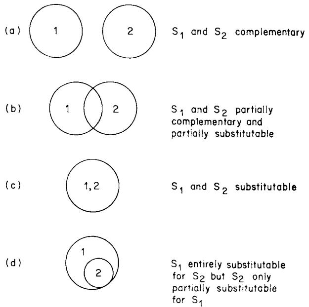
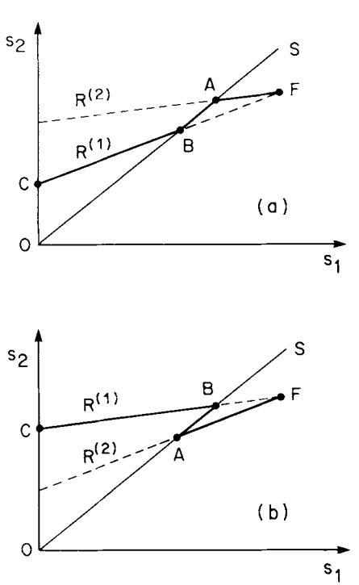
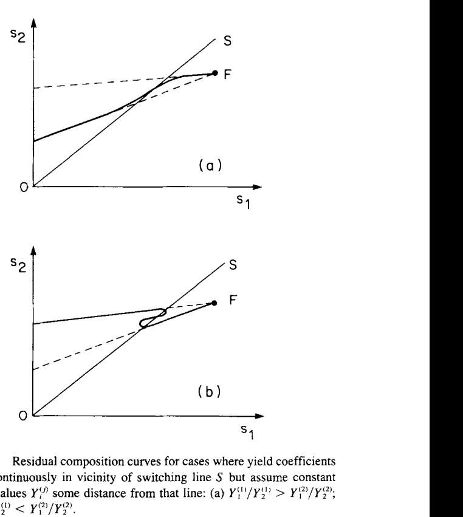
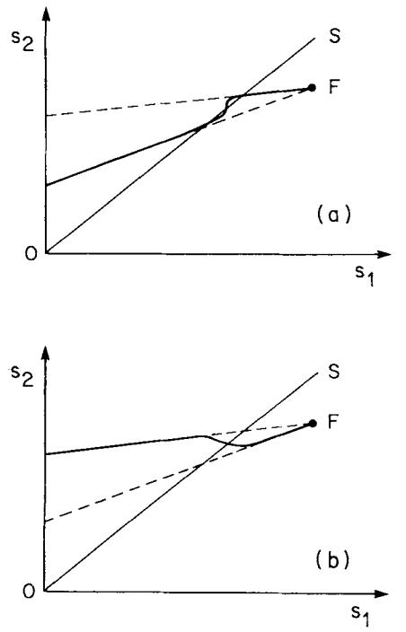
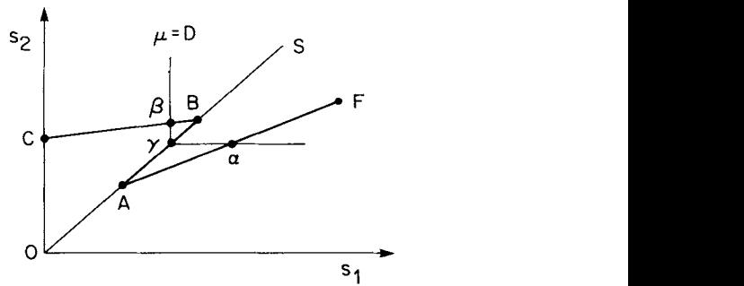
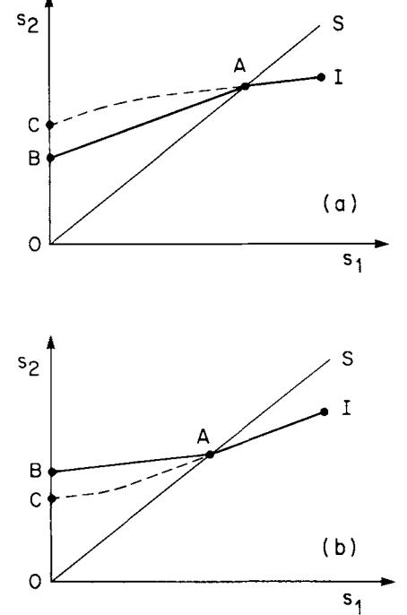
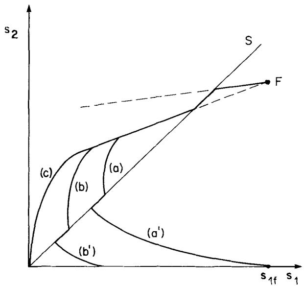
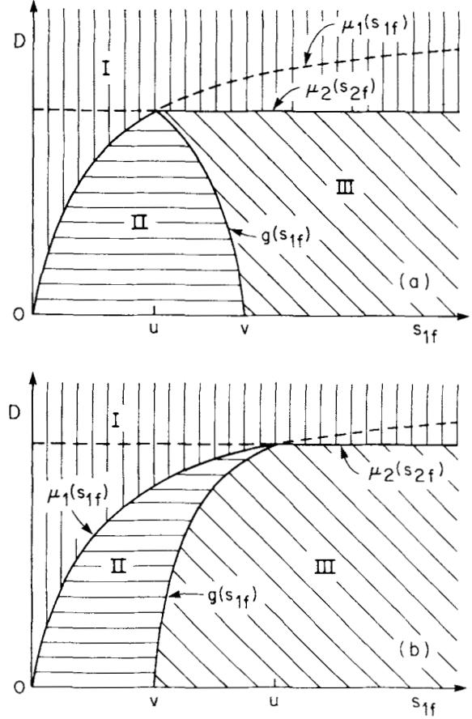
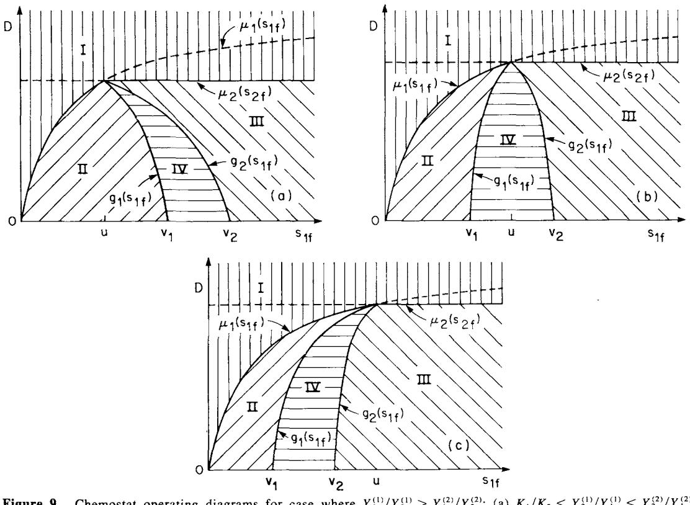
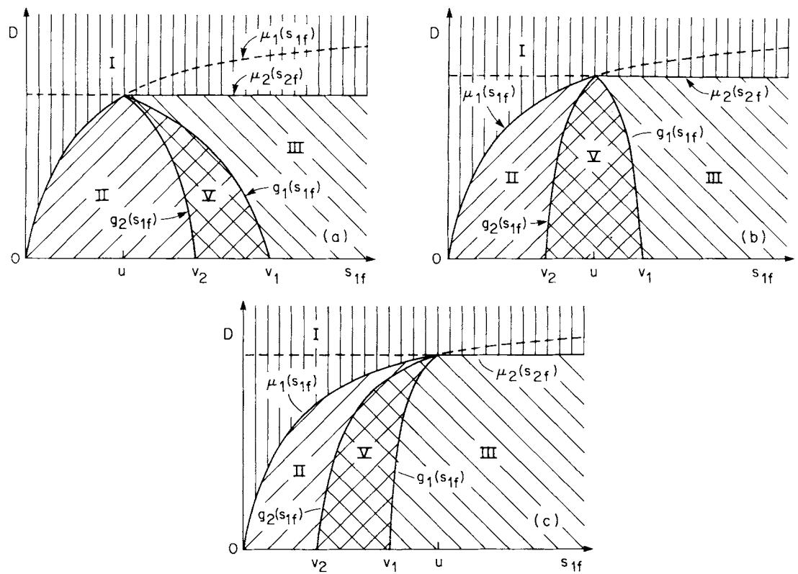

# **Limitation of Growth Rate by Two Complementary Nutrients: Some Elementary but Neglected Considerations**

## **Basil C. Baltzis**

*Department of Chemical Engineering and Chemistry, New Jersey Institute of Technology, Newark, New Jersey 07102* 

## **A. G. Fredrickson**

*Department of Chemical Engineering and Materials Science, University of Minnesota, Minneapolis, Minnesota 55455* 

*Accepted for publication January 22, 1987* 

Experimental data in the literature show that the yield of biomass from a particular nutrient when that nutrient limits growth rate is often significantly different than the yield from the nutrient when some complementary nutrient limits growth rate. This article explores some possible consequences for bioreactor dynamics of dependence of yield coefficients on the identity of the nutrient that limits growth rate.

# **INTRODUCTION**

Osmotrophic organisms like bacteria, yeasts, molds, and plant and animal cells cannot obtain the materials and available energy that they need for growth by taking up a single chemical substance from their environment. Instead, a number of different substances must be absorbed if the organisms are to be able to grow, and this fact has many important consequences. Two of these are that, under some conditions, dual or even multiple nutrient limitation of growth rate might occur or, if that does not happen, the identity of the single nutrient that limits growth rate might change as time progresses in a batch fermentation or if operating conditions are changed in a continuous fermentation. **It** is well understood (see, e.g., Harder and Dijkhuizen' and Neijssel and Tempest2) that changes of the identity of a single rate-limiting nutrient have major effects on the composition, physiological state, and activities of a population. However, quantitative understanding of the kinetics and dynamics of growth whose rate is actually or potentially limited by two or more nutrients is rudimentary and in many cases nonexistent. Such understanding would be of great help in designing growth media that make optimal use of expensive nutrients and that minimize disposal or recovery problems resulting from use of excess quantities

**Biotechnology and Bioengineering, Vol. 31, Pp.** *75-86* **(1988)**  *0* **1988** John **Wiley** & **Sons, Inc. CCC 0006-3592/88/010075-12\$04.00** 

of nutrients. In this article we make some more or less qualitative observations about modeling the kinetics and dynamics of growth actually or potentially rate limited by *two* nutrients.

# **SCHEME OF CLASSIFICATION**

Kinetics and dynamics of growth of a population subject to dual nutrient limitation of rate will differ, in general, when differing pairs of limiting nutrients are used. It is useful to have a scheme of classifying pairs of nutrients that reflects such differences. Figure 1 shows such a scheme.

In the figure set *i (i* = 1, 2) represents the set of chemical requirements of the population considered that can be satisfied by nutrient *Si* . Four cases of dual nutrient limitation can be recognized, depending on the degree of overlap of the sets for *S,* and S2. If the sets are disjunct, as in Fig. la, we shall say that the nutrients are *entirely complementary,* or simply *complementary* if there is no possibility of confusion with the next case to be considered. Ammonium ion and glucose in synthetic media for organisms like *Escherichia coli* are examples of complementary nutrients; the one supplies elemental nitrogen and NH2 moieties, whereas glucose supplies elemental carbon, available energy, etc. If the sets for **SI** and *S,* overlap partially, as in Fig. Ib, we say that the nutrients are *partially complementary* or *partially substitutable;* either term will be used, as seems fit. Glutamine and glucose in media used for animal cell cultures seem to be a pair of nutrients of this class. They are substitutable in that both are used to supply available energy, and they are complementary in that glutamine supplies these cells' need for this essential amino acid, whereas glucose supplies their need for ribose moieties. If the sets **SI** and **S2** are identical, as in Fig. lc, we say that the nutrients are *entirely substitutable,* or simply *substitutable* if there is no possibility

**Figure 1.** Scheme of classification of pair of nutrients

of confusion with the previous case. Various pairs of sugars are examples of nutrients that are substitutable as far as many microorganisms are concerned. Finally, if one set is a subset of the other, as in Fig. Id, we say that one nutrient *(S,* in the case shown) is substitutable for the other but the other nutrient (S, in the case shown) is only partially substitutable for the first one. It would be well to have a special name to distinguish this case from the other three, but no simple name is obvious. An amino acid and glucose in medium used to cultivate a strain of bacteria form an example of this case. The amino acid is substitutable for glucose because it can supply the cells' requirement for carbon and available energy as well as for nitrogen and amino radicals. Glucose can supply only the requirements for carbon and available energy.

For some earlier thoughts on classification of nutrients see Rapp~rt,~ Le6n and Tump~on,~ and Tilman.5 The latter author used the word *essential* for the situation here called complementary. We recommend that the former term be reserved for nutrients that are just that; i.e., not replaceable by anything else, as oxygen is not replaceable by anything else insofar as obligately aerobic organisms are concerned.

Various subcases of the four basic cases shown in Fig. 1 can of course be distinguished. For example, Bader6x7 considers complementary nutrients to be "interactive" or "non-interactive," and Tilman' divides the substitutable nutrients case into categories that he calls "switching," "perfectly substitutable," and "complementary," for the last of which we suggest *augmentative* as a more appropriate word.

Attempts to construct mathematical models of situations of actual or potential dual nutrient limitation of growth rate have concentrated on the substitutable and complementary nutrients cases; little or no work seems to have been done on the other two cases. Interest in modeling the substitutable nutrients case no doubt is stimulated by the fact that this situation often produces the phenomenon of preferential uptake of one nutrient of a pair. Recently, Ramkrishna and his co-workers have had some good successes at modeling this phenomenon using their so-called cybernetic model,'-l' and one wonders if this approach could also be applied with success to the other cases of Fig. 1.

The present article will restrict itself to modeling the kinetics of growth subject to rate limitation by two complementary nutrients. Its purposes are to (i) point out a fundamental inadequacy of unstructured models commonly used to describe such kinetics; (ii) show that removal of this feature of the models leads to some interesting predictions about growth dynamics; and (iii) provide a simple model that can be used as a guide for experimental research on kinetics and dynamics of growth that is rate limited by two complementary nutrients and also, if nothing better is available, as an improved version of currently used models for such situations.

#### **UNSTRUCTURED MODEL FOR GROWTH RATE LIMITATION BY TWO COMPLEMENTARY NUTRIENTS**

**As** stated in the preceding, it is well known that the physiological state of a population adapted to growth rate limitation by a single nutrient SI is not the same as the physiological state of the population when it is adapted to growth rate limitation by a single nutrient *S2* that is complementary to SI. This fact presents a difficulty when one tries to construct a model for growth rate limitation by SI and/or *S2.* Change of the identity of the rate-limiting nutrient, or change of the degree to which one of the nutrients limits the growth rate, will be reflected in change of the physiological state of the population. Such a change cannot take place instantaneously, and therefore, a structured model is required if one is to be able to handle the dynamics of change. Structured models in which one might have some confidence, like the models of Shuler and his co-w~rkers~~-'~ and Peretti and Bailey,I6 are very complex and, moreover, are specific for *E. coli.* Hence, this article will deal only with steady-state situations and thereby, it is assumed, obviate the need for a structured model.

We say "it is assumed" in the foregoing sentence because the unstructured model that we are going to use, like all unstructured models, is in fact based on **an** assumption that, to the best of our knowledge, has never been put to deliberate and rigorous experimental testing. The assumption is: The steady-state specific growth, nutrient uptake, and maintenance rates of a population of fixed genetic composition in an environment of fixed state depend only on the state of the environment and are independent of the path of change by which the steady state was achieved. It would not be surprising if experimental testing showed this assumption to be not quite right; it would be very surprising and exceedingly interesting if such testing showed it to be very wrong.

An unstruclured model for growth on two actual or potential rate-limiting nutrients *S,* and *S,* must have three things. First, it must have an expression that gives the net specific growth rate as a function of the concentrations sI and **s2** of nutrients **S,** and S, in the environment in which the population is growing. Next, it must have expressions that give the yields *Y,* and Y2 of biomass on nutrients Sl and S, respectively, as functions of sl and s2. Finally, if one of the nutrients **SI** , S2 is the source of available energy, the model must have an expression that relates the specific rate of uptake of available energy source for maintenance as a function of **s,** and **s,.** 

Insofar as the last requirement is concerned, we shall assume at the beginning that neither S, nor *S2* is the source of available energy, so that neither nutrient is consumed for maintenance. This assumption will be relaxed, however.

Next, we shall assume that the specific growth rate is given by the noninteractive model and so write

$$
\mu(\mathbf{s}_1, \mathbf{s}_2) = \min \left[ \mu^{(1)}(\mathbf{s}_1), \mu^{(2)}(\mathbf{s}_2) \right] \tag{1}
$$

where *p(')(s,)* = specific growth rate when *S,* has concentration **s,** and growth rate is limited by S, alone *(i* = 1, 2). With this model, growth rate is limited by Sl alone whenever **p(I)(sI)** < pcL2)(s2) and by S2 alone whenever p(')(s2) < *p(')(sI).* Dual nutrient limitation of growth rate only occurs at the degenerate conditions where **pL(')(sL)** = *p'"(s2).* The curve in the **sI-s2** plane on which this equation is satisfied will be called the *switching curve* because the identity of the rate-limiting nutrient switches when environmental state **(sl,** s2) moves across the curve.

Subsidiary models are needed for **p(')(sl)** and p(')(s2), and for these we shall assume that Monod's model applies: *p(')(s,)* = *p,,s,/(K,* + **s,);** *i* = 1,2. The equation of the switching curve is thus **pmlsl/(Kl** + **sI)** = *pm2s,/(K,* + s2), and the graph of this equation is, in general, a hyperbolic curve in the sI-s2 plane. One can easily imagine situations in which the switching curve will be more complicated than this. Such a situation would prevail, for instance, if the population had two enzyme systems for transport of *S,,*  one that operated at low concentrations of *S,* and another that operated at high concentrations. Here, however, we are going to assume the simplest possible case; namely, that there is only one transport system for each nutrient and, in addition, that *pml* = *pmz pm.* With these assumptions the equation of the switching curve becomes **s2** = **(K2/KI)sI,** and the switching curve becomes a straight line that passes through the origin and has positive slope (K2/Kl). Nutrient **S1** is limiting for growth rate for environmental states above and to the left of the switching line, whereas nutrient S2 is limiting for environmental states below and to the right of the line. The Monod expressions just described will be sufficient for the purposes of this article, but more complicated models are undoubtedly needed in many cases (e.g. Bade~-~*~ and Lee et al.I7).

**As** mentioned in the preceding, it is an established fact that physiological states of organisms adapted to different rate-limiting nutrients are different. Some published unstructured models of growth on complementary nutrients take partial account of this by recognizing that the maximum specific growth rate might change when the identity of the rate-limiting nutrient is changed. However, a common feature of a long list of papers using unstructured models for growth on complementary nutrients is that they assume that the yields of biomass on various nutrients do not change when the status of the nutrients with respect to growth rate limitation changes. Unstructured models do not have to make this assumption, any more than they have to assume that the maximum specific growth rate is independent of the identity of the rate-limiting nutrient. Moreover, the assumption can be grossly unrealistic, as some sample data from the literature will show.

HerbertL8 measured elemental compositions of *Candida utilis* biomass grown under conditions of glucose or ammonia limitation. If one assumes that no exogenous nitrogencontaining by-products were formed, then one can calculate from the data presented by Herbert for a low specific growth rate, say 0.05 h-', that the yield of biomass on ammonia when ammonia limits growth rate is roughly twice as great as this yield when glucose limits growth rate.

Cooney et al.I9 present data on growth of *Enterobacter aerogenes* in glucose- or ammonia-minimal media. Yield coefficients cannot be calculated from the data given by these workers because no biomass concentrations are given. However, the ratios of biomass yields on ammonia and glucose can be calculated from the data given. One finds the ratio of biomass yield on ammonia to biomass yield on glucose, under conditions of glucose limitation of growth rate, to be 14.7, 14.7, and 17.2 at specific growth rates of 0.22, 0.45, and 0.77 h-I, respectively. However, under conditions of ammonia limitation of growth rate, this ratio was 25.0 at a dilution rate of 0.24 h-', nearly double the value of the ratio under glucose limitation at the same specific growth rate. Data of these authors on growth under conditions of ammonia or phosphate limitation of growth rate also reveal dependence of the ratio of yield coefficients on the identity of the nutrient that limits growth rate, although here the changes on change of limiting nutrient are not so pronounced. For example, ratios of yield on phosphate to yield on ammonia were 1.9 under conditions of ammonia limitation and 2.6 under conditions of phosphate limitation, when the specific growth rates were 0.25 and 0.26 h-', respectively.

Neijssel and Tempest2 report yields of biomass of *Klebsiella aerogenes* NCTC 418 on carbon source as well as on oxygen for various conditions of nutrient limitation and at a specific growth rate of 0.17 h-'. Their data show that the yield of biomass on glucose when glucose is rate limiting for growth **is** almost **3** times as great as the yield of biomass on glucose when ammonia is rate limiting and *5* times as great as the yield of biomass on glucose when potassium is rate limiting. Changes of biomass yield on carbon source when the rate-limiting nutrient is changed from one noncarbonaceous nutrient to another such are not so large as the changes just quoted, but even so, the changes can be substantial. For example, yield on mannitol when phosphate is rate limiting is more than 50% greater than yield on mannitol when ammonia is rate limiting.

The foregoing data make it clear that yield coefficients can be and, indeed, often are strongly affected by the identity of the nutrient that limits growth rate and that, therefore, the assumption that yield coefficients are independent of the identity of the rate-limiting nutrient must often yield results that do not have so-called engineering accuracy.

For the remaining element of the unstructured model being constructed we assume in view of the foregoing discussion that yield coefficients are not constant but depend on environmental state **(sl,** *s2).* The simplest assumption that one can make, and the one made here, is that biomass yield **K** on *Si* is constant at one value *Yll)* when *Si* is rate limiting but that it is constant at another value *Yi2)* when *S2*  is rate limiting. In other words, we assume that yield coefficients switch from one set of values to another when the environmental state moves across the switching line in the **sI-s2** plane.

Herbert's data" show that the elemental analysis of *C. utilis* becomes independent of the identity of the ratelimiting nutrient (glucose or ammonia) as growth rate is increased toward its maximum value. This would mean that the yield coefficients also become independent of the identity of the rate-limiting nutrient at high growth rates. The model described in the preceding paragraph does not take this into account, obviously, and so it will not yield good results at high growth rates. However, it will be possible to state what are some of the qualitative effects of the phenomenon exhibited by Powell's data, and this will be done in subsequent paragraphs.

#### **RESIDUAL COMPOSITION CURVE FOR STEADY-STATE CHEMOSTAT**

Consider an ideal chemostat containing a single microbial population and suppose that the chemostat is fed with sterile medium that contains complementary nutrients Sl and *S2* and has composition such that only S1 and *S,* can limit the growth rate of the population. Balance equations on biomass and the masses of *S,* and *S2* in the chemostat are

$$\frac{d\mathbf{x}}{dt} = \begin{array}{c} -D\mathbf{x} \ + \ \mu\mathbf{x} \end{array} \tag{2a}$$

$$\frac{ds_1}{dt} = D(\mathbf{s}_{\circ} - \mathbf{s}_1) - \frac{1}{Y_1}\mu x \tag{2b}$$

$$\frac{ds_2}{dt} = D(s_{2f} - s_2) - \frac{1}{Y_2}\mu x \tag{2c}$$

where **x,** sl, and *s2* are the concentrations of biomass, nutnent **S1,** and nutrient *S2,* respectively; *D* is the dilution rate; *p* is the specific growth rate of the population; *Y,* and *Y2* are the yields of biomass on nutrients Sl and *S2,* respectively; *t*  is time; and subscriptf denotes conditions in the feed to the chemostat. We assume for the present that use of nutrients for maintenance or exogenous product formation can be ignored. As indicated in the previous section, we restrict ourselves to unstructured models here, but let us keep these quite general at first and so assume that /L, *Yl,* and *Y2* all

depend on the state of the medium in the chemostat-and so on **sI** and s2-but not on biomass concentration **x.** 

At a steady state for which *x* + 0, Eq. (2a) requires that *D* = *p,* and substitution of this into Eqs. (2b) and (2c) gives

$$\frac{s_{\mathcal{Y}} - s_{\mathcal{Z}}}{s_{\mathcal{Y}} - s_{\mathcal{Y}}} = \frac{Y_1}{Y_2} \tag{3}$$

Evidently, *Yl/Y2* is the slope of the straight line in the **sI-s2**  plane that connects the point **(s,~,** *s2/)* representing the composition of the feed to the chemostat and the point **(sl,** *s2)*  representing the composition of the residual medium in the chemostat as well as that of the effluent medium from the chemostat. We call such a line a *stoichiometric line.* 

In the general case, *Y,, Y2,* and *Y,/Y,* depend on **s1** and *s2,*  and therefore, for a fixed feed composition, Eq. (3) defines a *curve* in the **sI-s2** plane that passes through the point (slf, *s2/).* Since this curve gives the locus of all possible steadystate compositions of the residual medium for the given feed composition, we call it the *residual composition curve.* The intersection or intersections of this curve with the contour curve or isocline along which the specific growth rate of the population has a constant value equal to the dilution rate at which the chemostat is operated determines or determine the steady-state composition or compositions of the residual medium that satisfy Eqs. (2) for the conditions *D,* slf, and *s2/* at which the chemostat is operated.

In the case where *Yl/Y2* is independent of medium composition, the residual composition curve becomes a straight line, and all stoichiometric lines from a given feed composition will coincide with the residual composition line passing through that feed composition. In general, however, *Yl, Y2,* and *Yl/Y2* will vary with residual medium composition, and therefore, the residual composition curve is indeed a curve. The question as to what this curve might look like can be answered to one's complete satisfaction only by experiments on specific systems, but insight into what the answer might be can be gained by considering the idealized model described in the previous section.

Consider a situation where the feed composition is such that organisms growing in the feed would have their growth rate limited by *S2;* the location in the **sI-s2** plane of the point *F* representing the feed composition will then be as shown in Fig. 2. The residual composition curve will begin at the feed point and from it will progess downward and to the left. An extension of the curve upward and to the right from the feed point is physically meaningless, since steady-state compositions must obey the restrictions **sl** *5* slf and *s2* **I sY**  when there are no sources producing S1 and *S2* in the chemostat.

Let two straight lines, one of slope *Y\')/Y\$')* and the other of slope *Yi2)/Yi2),* be drawn downward and to the left from the feed point, and let the line of slope *Y{')/Y\$')* be called the *R("* line and the line of slope *Yj2)/Yi2)* be called the *R'2)* line. Suppose that the location of the feed point and the slopes of the *R")* and lines are such that both of these lines cross the switching line (labeled S) in the first quadrant of the **sI-s2** plane. If *Y\l)/y\$l)* > *Y\2)/Y\$2),* the situation will be **as** 

**Figure 2.** Residual composition curves for cases where yield coefficients change abruptly along switching line *S* of noninteractive model for dual nutrient limitation of growth rate: (a) *Y:"/Y:"* > *Yy)/Yf);*  **(b)** *Y',"/Y:"* < Y\*'/Yf).

shown in Fig. 2a, but if the foregoing inequalities are reversed, it will be as shown in Fig. 2b.

The *R"'* line is what the residual composition curve would be if the yield coefficients at all medium compositions were those that prevail when growth rate is limited by S1. Such limitation does prevail above and to the left of the switching line, and so the portion of the *R")* line lying in this part of the **sl-s2** plane is indeed a segment of the residual composition curve. However, such limitation does not prevail below and to the right of the switching line, and the portion of the *R"'* line lying in this part of the **sl-sz** plane cannot be a segment of the residual composition curve, and it has been drawn with a dashed line to indicate this fact. System steady states that lie along the dashed portion of the *R(')* line represent unstable states, since cells exposed to media of such compositions would have yield coefficients *(Y:'))* that correspond to adaptation to medium of different composition.

The foregoing discussion, with modifications that are obvious, also applies to the *R")* line.

Evidently, line *FA* from the feed point to the switching curve is part of the residual composition curve as is line *CB*  from the vertical axis (corresponding to exhaustion of *S,*  from the medium) to the switching curve. However, these lines do not meet, and thus there is a gap in the residual composition curve. This gap is filled by line AB, along which growth rate is *limited simultaneously* by S1 and Sz. In the description of the noninteractive model given in the previous section no rule for assigning yield coefficients under conditions of dual nutrient limitation was stated, but such a rule is needed, and we now state the rule, or rather

the rule that applies to the ratio of the yield coefficients under steady-state conditions of dual nutrient limitation: Along the line AB the ratio *Yl/Yz* changes smoothly from *Y',2'/Y\$2)* at *A* to *Y(')/Y\$')* at *b.* At a point between *A* and *B*  on *AB,* the ratio *Y1/Y2* is the slope of the stoichiometric line drawn from the feed point to the point in question,

The foregoing rule undoubtedly seems artificial because it makes *Yl/Yz* dependent not only on position along the switching line but also on the location of the feed point. Thus, the rule can assign different values of *Y,/Y,* to the same point on the switching line when the feed point is changed. This artificiality arises from the idealized nature of the noninteractive model. To see this, consider the case where *Yl* and *Y,* again assume constant limiting values some distance away from a switching line *(YjI)* and *Yi"* on one side of the line, *Y\"* and *Y\$*)* on the other) but where the changes from the limiting values as one crosses the switching line occur continuously rather than abruptly. The residual composition curves analogous to those shown in Fig. 2 might then be as shown in Fig. *3.* One sees that residual composition curves that do not coincide in their straight-line portions do not coincide in their curved portions either so that the necessity of assigning different values of *Yl/Y2* to the same point on the switching line does not arise.

We remark in passing that the two diagrams of Fig. *3*  seem not to show the only kinds of residual composition curves that can occur when yield coefficients change continuously from constant limiting values near a switching line. Figure **4** shows two cases that are analogs of those shown in Fig. **3.** 

**Figure 3.** Residual composition curves for cases where yield coefficients change continuously in vicinity of switching line **S** but assume constant limiting values *Y?'* some distance from that line: (a) *Y\"/Y:'* > *Y!21/Yy';*  (b) *Y\"/Y:"* < *Y\21/Y:2).* 

**Figure 4.** Another set of residual composition curves for cases where yield coefficients change continuously in neighborhood of switching line *S*  but assume constant limiting values *Y,'"* some distance from that line: (a) *Y'\$)/Y\$)* > *Y\"/Y\$');* (b) *Y\$"/Y\$')* < *Y(2)/Y(2)* I *2.* 

Finally, it should be noted that the two cases shown in Fig. 2 do not exhaust the possibilities for generating different kinds of residual composition curves even when the noninteractive model is used. Depending on the location of the feed point and the slopes of the *R(')* and *R(2)* lines, one can generate situations where neither the *R'"* line nor the *R(2)*  line cross the switching line, or where only the *R(')* line or the line, but not both, cross the switching line. One can also generate cases where the *R(')* and *R(2)* lines reach the boundaries of the first quadrant of the sI-s2 plane at different axes, one at the vertical axis (corresponding to exhaustion of SI from the medium) and the other at the horizontal axis (corresponding to exhaustion of *S2* from the medium).

#### **STEADY STATES AND THEIR STABILITY**

Steady-state medium composition for given conditions of chemostat operation is found from the point where the residual composition curve intersects the contour curve along which specific growth rate is constant at the value of the dilution rate imposed on the chemostat. In the case of the noninteractive model such contours are composed of two straight lines that meet in a right angle at the switching curve or line; the contour above the switching curve is a vertical line while the contour below the switching line is a horizontal line. The value of dilution rate increases as one moves upward along the switching line according to the equation *D* = *pms,/(K,* + ~1) = *~ms2/<K2* + *~2)-* 

Considering the case shown in Fig. 2a, we see that a contour of constant specific growth rate can intersect the

residual composition curve only once, and that such intersection will occur only if *D s DF* -= *pms2//(K2* + *s2,).* Let *pA* and *pB* be the values of the specific growth rate at points *A* and *B,* respectively, on the switching line of Fig. 2a. Then for 0 *5 D 5 pB* , steady-state medium composition will lie on line *BC* and **SI** will limit growth rate; for *pA 5 D DF* , steady-state medium composition will lie on line *AF* and S, will limit growth rate; and for *pB 5 D pA* , steady-state medium composition will lie on line *All* and both *S1* and *S2*  will limit growth rate. Thus, steady states of dual nutrient limitation of growth rate are predicted to be possible even when the noninteractive model of growth on two complementary nutrients is used. Furthermore, it is clear from the analysis, and will be shown in more detail in **a** later section, that these steady states are obtainable when operating conditions *D,* **slf,** and **sY** lie in a finite domain of operating *D-s,-s2,* space, so that it is not necessary to make precise adjustments of operating conditions in order to obtain steady states of dual nutrient limitation. Finally, change of dilution rate can change the identity of the ratelimiting nutrient. Lee et al." report an instance of this, and we, and no doubt others, have seen this change occur also.

Consider now the case shown in **Fig.** 2b. If *pA* and *pa* are again the specific growth rates at points *A* and *B,* respectively, on the switching line, then for 0 < *D 5 pA*  only one steady state is possible, and the medium composition of this steady state will lie on line *CB* and growth rate will be limited by S,. Similarly, for *pB* **I** *D* **I** *DF* only one steady state is possible, and the medium composition of this steady state will lie on line *AF* and growth rate will be limited by *S2.* However, because the residual substrate curve is in this case folded back on itself, three steady states are possible if *pA* < *D* < *pB.* The compositions of these steady states are the compositions of points *a, p* , and *y* of Fig. 5. In steady state *a* population growth rate is limited by *S2,* whereas in steady state *p* it is limited by S,; in steady state *y* population growth rate is limited by both S1 and *S2.* 

Steady states where the medium composition lies on the *R(')* line or theR(2) line, i.e., on line *AF* or *BC* of Fig. 2, are characterized by constant yield coefficients and by a specific growth rate that depends on **s1** or *s2* but not on both of these concentrations. The usual kind of linearized stability analy-

**Figure** *5.* Residual compositions of medium in three steady states that are possible at same set of operating conditions when residual composition curve folds back on itself.

sis may be applied to Eqs. (2) for such steady states, and this will show that they are all stable with respect to small perturbations. Steady states having medium composition lying on the switching curve, i.e., on line AB of Fig. 2, are more complex, however; for such steady states an infinitesimal perturbation that takes medium composition off of the switching line will result in a finite change in the yield coefficients. We expect that steady states of dual limitation are stable for cases corresponding to Fig. 2a and unstable for cases corresponding to Fig. 2b. In fact, we have proved this to be correct when *Y\"/Y{2'* > 1 > *Y\$')/Yi2)* as well as when these inequalities are reversed. The preceding stated set of inequalities arises when the yield of biomass on either nutrient is greater when that nutrient is rate limiting for growth than when it is not.

The situation shown in Fig. 2b or *5* will produce hysteresis phenomena in experiments in which an operating parameter is varied in a cyclical manner. For example, suppose that a chemostat is operated with feed or fixed composition, point *F* of Fig. 2b or *5,* and that initial conditions of the chemostat are such that it is in steady state *a* of Fig. *5.* If dilution rate is decreased slowly, so that a quasi-steady state prevails at all times, residual medium composition will change along line *AF* from *a* toward *A.* When dilution rate reaches that corresponding to point *A* and is decreased just below this, medium composition will jump to a point directly above *A* and on line *BC.* If then dilution rate is increased slowly, residual medium composition will change along line *BC* toward point *B.* When dilution rate reaches that corresponding to point *B* and is increased just above this, medium composition will jump to a point directly across from *B* on line *AF.* The occurrence of hysteresis in the experiment just described in no way depends on the validity of the noninteractive model for growth on complementary nutrients, as inspection of Fig. 3b shows that interactive models also predict the fold in the residual composition curve, which is the essential condition for hysteresis. Hysteresis would also be predicted by an interactive model that produced a fold in the residual composition curve, as shown in Figs. 3b and 4a.

#### **RESIDUAL COMPOSITION CURVE FOR BATCH SYSTEM**

The differential equation of the residual composition curve for a batch situation is obtained by setting D equal to zero and eliminating *px* from Eqs. (2b) and (2c):

$$\frac{d\mathbf{s}_2}{d\mathbf{s}_1} = \frac{Y_1}{Y_2} \tag{4}$$

With the unstructured models we are using here, the ratio *Yl/Y2* will depend only on the location (sl, **s2)** in composition space, and if we continue to assume that the ratio is constant except at the switching line, where it changes abruptly, then *Y1/Y2* will be constant at *Y\')/Y\$')* above and to the left **of** the switching line at *Y{2)/Y\$2)* below and to the right of the switching line. The residual composition curve for a batch situation is, of course, the curve generated by integration of **Eq. (4)** subject to given initial composition.

Residual composition curves for batch situations with an initial feed composition such that *S2* is rate limiting are shown in Fig. **6;** point *I* represents the initial medium composition on these graphs. It will be seen that these curves differ from the corresponding residual composition curves for steady-state chemostat situations employing a feed medium whose composition is the same as that of the initial medium composition in the batch situations; this results from the fact that the condition of dual nutrient limitation cannot persist in the batch case and occurs only at an instant of time (and then only if the residual composition curve crosses the switching line).

The unstructured models on which Fig. **6** is based assume that adjustment of physiological state to change of identity of the nutrient that limits growth rate occurs instantaneously. Such cannot really be the case, of course, and time lag must be involved in this adjustment. Hence, real residual composition curves could not be as shown in Fig. **6** even if a noninteractive model of growth or complementary nutrients happened to be valid. What one would see, for example, for batch cases where the inoculum was adapted to growth rate limitation by *S2* is that the residual composition would change along line *IA* of Fig. **6** and would continue to change along the dotted extension of that line into the region of composition space where growth rate is limited by *S,.* Thus, the final composition would be at point C rather than at *B,*  as would be predicted by models that do not account for time

**Figure** *6.* Residual composition curves for batch situations predicted for cases where yield coefficients change abruptly at switching line S: (a) *Y',"/Y\$"* > *Y?)/Y\$');* **(b)** *Y\')/Y\$')* < *Y':'/Y\$*'.* Dashed curves: residual composition curves expected when time lag in adjustment of physiological state to change in identity of rate-limiting nutrient is significant.

lag. The concentration **S2** at point *C* is unpredictable from stoichiometric and initial medium composition data only, obviously.

**EFFECTS OF MAINTENANCE AND NON-GROWTH-ASSOCIATED PRODUCT FORMATION** 

Equations (2) assume that nutrients Sl and *S,* are not used for purposes of maintenance or non-growth-associated formation of extracellular products, Here, we relax this assumption and suppose that nutrient **S2** may be used for one or the other of these functions. Equations (2a) and (2b) are then still valid, but **Eq.** (2c) must be replaced by

$$\frac{d\mathbf{s}_2}{dt} = D(\mathbf{s}_{2f} - \mathbf{s}_2) - \left(\frac{1}{\mathbf{Y}_2}\boldsymbol{\mu}_1 + \boldsymbol{m}\right)\mathbf{x} \tag{2d}$$

where *m* is the specific rate of uptake of nutrient **S2** for the non-growth-associated function of maintenance or product formation. The maintenance model of Pido is based on **Eq.** (2d) and assumes in addition that the maintenance coefficient *m* is independent of the concentration *s2* in the medium. Various authors have pointed out that this produces a model that predicts that physically meaningless bioreactor states (Le., states with negative values of *s2)* are accessible from meaningful states, and they have argued that *m* must in fact depend on **s2** so that the condition

$$\lim_{s_1 \to 0} m = 0 \tag{5}$$

is satisfied; this condition says that no *S2* is used by the cells when none is present in the medium. Data shown by Kirsch and Sykes" (see especially **p.** 213) and MegeeZ2 (see especially p. 72) are in accord with Eq. (5) rather than with the notion of a constant, positive value of *m.* 

When Eq. (2c) is replaced by Eq. (2d), the equation of the residual composition curve for a steady-state chemostat is

$$\frac{s_{2f} - s_2}{s_{1f} - s_1} = \frac{Y_1}{Y_2} \frac{D}{D} + \frac{Y_2 m}{D} \tag{6}$$

where, of course, *D(=p)* is a function of **(sI,** *s2)* given by Eq. (1).

Consider the case where **S2** is the energy source and *m* is the specific rate of uptake of this nutrient for maintenance purposes. Usually, one operates a continuous bioreactor in such **a** way that the critical dilution rate *D,* =min[p,sIf/ *(K,* + *SI~),,U,S~,/(K~* + **sY)]** is substantially greater than *Y,m,* so that there will be a range of dilution rates, from *D,*  downward, where *(D* + *Y,m)/D* is nearly equal to unity, and consequently, the residual composition curve for this range of dilution rates will be simiIar to one of the curves discussed in a preceding section.

At low dilution rates, however, differences will arise. We find in fact that

$$\lim_{\mathcal{D}\to 0} \frac{s_{2\underline{\mathcal{H}}} - s_{2}}{s_{\mathcal{H}} - s_{1}} = \frac{Y_{1}}{Y_{2}} + \text{ Y}_{2} \lim_{\mathcal{D}\to 0} \frac{m}{D} \tag{7}$$

so that if *m* is independent of residual medium composition, the limit on the left side of **Eq. (7)** is infinite. This in **turn**  implies that

$$\lim_{\mathcal{D}\to 0} s_{\mathcal{I}} = s_{\mathcal{Y}} \tag{8}$$

since *s2* cannot be negative. Since *x* = Yl(slf - **s,)** in steady state, we see that

$$\lim_{\mathcal{D}\to 0} \mathcal{x} = \mathbf{0} \tag{9}$$

Finally, **Eq.** (1) shows that

$$\lim_{\mathfrak{a}\to 0} \mathfrak{s}_{\mathfrak{a}} = \mathbf{0} \tag{10}$$

Thus, if the specific rate of uptake of the energy source *(S,)*  for maintenance is independent of the residual composition of the medium, the predictions are that all of the energy source will be used, and used for maintenance only, no nutrient Sl will be used, and no biomass will be formed at zero dilution rate. This leads to the residual composition curve *a* shown in Fig. 7.

The case where *m* varies with **s2** in such a way as to approach zero as **s2** approaches zero leads to a somewhat different residual composition curve. If we consider this case, we see first that as dilution rate is decreased to zero, the concentration **sI** cannot approach zero if the concentration *s2* does not also approach zero. For if the limiting value of *s2* is positive, then the limiting value of *m/D* is infinite, and **Eq.** (7) requires the limiting value of s1 to be slf rather than zero. Thus, nutrient S1, the complement of the energy source Sz, will never be the sole rate-limiting nutrient at zero dilution rate when maintenance is occurring. Further analysis along these lines shows that

$$\lim_{\mathcal{D}\to 0} \mathfrak{s}_{\mathfrak{Z}} = \mathbf{0} \tag{11}$$

**Figure 7.** Residual composition curves for chemostat situation **when**  maintenance consumption of nutrient **S is** significant: (a) lim, -. *,(m/D)*  is infinite; (b) lim, - *o(m/D) 2 P;* (c) lim, *drn/D)* < *P.* **Here**  *P* = **(Y?'szr** - **Y12'slf)/Y:2'Y:2'slf.** 

in all cases and that

$$\lim_{s_{\!D\!\to 0}} s_{\!.} = s_{\!/\!\!\!f} - \frac{Y_{\!\!\!2}^{\{2\}}}{Y_{\!\!\!\!/\!2}^{\{2\}} + \overline{Y_{\!\!\!2}^{\{2\}}} \lim_{\!\!\!\!\!/\!D} \overline{\lim}_{D \to 0} s_{\!\!\!/\!D}} s_{\!\!\!f} \tag{12}$$

if

$$1 + \ Y_{\mathbb{Z}}^{\mathbb{Q}} \lim_{D \to 0} \frac{m}{D} \gtrsim \frac{Y_{\mathbb{Z}}^{\mathbb{Q}}}{Y_{\mathbb{Z}}^{\mathbb{Q}}} \frac{\mathbf{s}_{\mathbb{Y}}}{\mathbf{s}_{\mathbb{Y}}} \tag{13}$$

but that

$$\lim_{\mathcal{D}\to 0} s_{\mathcal{l}} = 0 \tag{14}$$

if

$$1 \,\, + \,\, Y_{\text{I}}^{\text{(2)}} \lim_{D \to 0} \frac{m}{D} \,\, < \,\frac{Y_{\text{I}}^{\text{(2)}}}{Y_{\text{I}}^{\text{(2)}}} \frac{s_{\text{2f}}}{s_{\text{II}}} \,\, \tag{15}$$

In all cases for which the limiting value of s1 is less than slf, the limiting value of *x* will be positive, and thus not all of the energy source used will be used for the maintenance function.

Residual composition curves for cases where (m/D) is finite are shown as curves *b* and c in Fig. 7.

The foregoing discussion also applies to the case where maintenance can be neglected and where m is to be interpreted as the specific rate of uptake of nutrient *S2* for formation of a non-growth-associated product. In this case *S2* need not be the energy source for growth, of course.

#### **CHEMOSTAT OPERATING DIAGRAMS**

The concepts presented in the previous sections can be used to predict the domains of operating conditions in which the population is washed out of the chemostat, in which it establishes itself in the chemostat with a growth rate that is limited by *S,,* etc. An operating diagram (Jost et al.23) gives a graphical summary of these predictions.

In the present case the operating conditions or variables are dilution rate, concentration of **S,** in the feed, concentration of Sz in the feed, and temperature. The effects of change of temperature are of course to change the values of the parameters (maximum specific growth rate, Michaelis constants, yield coefficients) in the model adopted. Since the temperature coefficients of different parameters are different, and since further the temperature coefficients of the same parameter are different for different organisms, no generally valid operating diagram showing the effects of a change of temperature can be constructed, and we assume therefore that temperature is fixed. The operating diagram is then a three-dimensional diagram, with D, slf, and **s~~** being its axes. Since only two dimensions are available for plotting, only sections of the operating diagram corresponding to fixed values of the variable sZf will be shown.

The noninteractive model for growth on complementary nutrients will be used to construct operating diagrams, even though it is clear that this model is an idealization. Construction of operating diagrams using the noninteractive model is much simpler than construction using an interactive model,

and the results should be qualitatively the same. In addition, if an interactive model were to be used, an arbitrary definition of rate limitation would have to be adopted since one of the things one wants an operating diagram to provide is the operating conditions under which the growth rate is limited by **S1,** *S2,* or *S,* and *S2.* 

The operating diagrams presented here are based on Eqs. *(1)* and (2) and the assumption that *pml* = *pm2.* Effects of maintenance and exogenous product formation are thus not accounted for in these diagrams.

In Fig. 8 we show the two possible operating diagrams for the case where *Y\"* = *Y\"* and *Yp'* = *Yi2)* (i.e., for the case where the yield coefficients do *not* change with the identity of the rate-limiting substrate). In region I the population washes out of the chemostat (under Sl limitation for slf < *u* or under *S2* limitation for slf > *u,* where *u* = *(KI/K2)sZf).* In region I1 the population exists in a steady state under S1 limitation while in region **111** the population exists under *S2* limitation. The expressions for the curves shown in the diagrams of Fig. 8 are

$$
\mu_{\parallel}(s_{\parallel}) = \frac{\mu_{\pi}s_{\parallel}}{K_{\parallel} + s_{\parallel}} \qquad \mu_{\perp}(s_{2\parallel}) = \frac{\mu_{\pi}s_{\parallel}}{K_{\perp} + s_{\perp}} = \text{const}
$$

$$
g_{\parallel}(s_{\parallel}) = \frac{\mu_{\pi}(s_{\parallel} - \nu)}{K_{\perp} + s_{\parallel} - (\nu + \overline{Y_{2}K_{2}/Y_{\parallel}})} \qquad \qquad (16a, \text{b, c})
$$

**Figure** *8. Yj2'/Y;'):* (a) *KI/Kz* < *Y\$')/Y:''; (b) K,/K2 3> Y\$')/Y\').*  Chemostat operating diagrams for case where *Y{"/Y:"* =

where **v** = *(Y2/Y1)szf.* It must be mentioned that for the case where *Y\l)* # *Y\"* and *Yil)* # *Yi2)* but *Y\')/Y\$')* = *Y\2)/Y\$z),*  the possible operating diagrams are again those shown in Fig. **8.** 

For the general case studied here, i.e *Yl"* # *Yj'), Yil)* # *Yi'),* and *Yjl)/Y\$')* # *Y\')/Y\$'),* the possible operating diagrams are shown in Figs. 9 and 10. The expressions for the curves *p* **l(slf)** and pz(szf) are those introduced before while

$$\mathbf{g}_1(\mathbf{s}_{1f}) = \frac{\mu_m(\mathbf{s}_{1f} - \nu_1)}{\mathbf{K}_1 + \mathbf{s}_{1f} - (\nu_1 + \overline{Y_2^{(1)}\mathbf{K}_2/Y_1^{(1)}})} \tag{17}$$

and

$$\mathbf{g_2(s_{\mathcal{Y}})} = \frac{\mu_m(s_{\mathcal{Y}} - \nu_2)}{\mathbf{K_1} + s_{\mathcal{Y}} - (\nu_2 + \frac{\nu_2}{2}\mathbf{K_2}/\mathbf{Y}_1^{(2)})} \tag{18}$$

where *vj* = *(Y\$J1/Y\'1)s2f, j* = 1,2. The diagrams shown in Fig. 9 are for the case where *Y(')/Y\$')* > *Y\')/Y\$'),* and when this inequality is reversed, the possible operating diagrams are those shown in Fig. 10. One can easily see that for the case where *Yjl)/Y\$')* = *Y\2)/Y\$2),* we have *v,* = *v2* = *v,*  gl(s1f) = gl(s1f) = g(slf), and the diagrams of Figs. 9 and 10 reduce to those shown in Fig. **8.** In the regions I, 11, and **111**  of Figs. 9 and 10 the system behaves as in the corresponding regions of Fig. **8** discussed earlier. The change of the values of the yield coefficients with the identity of the rate-limiting substrate gives rise to regions IV and V of Figs. 9 and 10, respectively. In region IV of Fig. 9 the population survives under dual limitation, and only one steady state (as shown

in a previous section) is possible for the system. In region V of Fig. 10 the system has three possible steady states (as again was shown in a previous section), one under *S,* limitation, one under *S2* limitation, and one under dual limitation. The last one was shown to be unstable for at least one case, but one expects this to be generally true since the steady state under dual nutrient limitation of growth rate will always be the middle one of three possible steady states, the outer two of which are stable (this is for the case where *Y\')/Y\$')* < *Y\Z)/Yf)).* Thus, region V is one where two stable steady states, one of S1 limitation and the other of *S,*  limitation, are possible; which steady state is attained will be determined by the initial conditions of the system.

The operating diagrams are easily understood in terms of the residual composition curves discussed in the preceding. Thus, if the operating diagram of Fig. 9a applies, and if operating conditions lie in region IV of that diagram, then the residual composition curve will be as shown in Fig. 12a. Similarly, if the operating diagram of Fig. 10a applies, and if operating conditions lie in region V of that diagram, then the residual composition curve will be as shown in Fig. 2b or *5,*  and the hysteresis phenomena discussed in connection with Figs. 2b and 5 will occur.

**A** point to be emphasized in connection with these operating diagrams is that if *Y'f)/Y\$')* > *Y\')/Y\$2), so* that the diagrams shown in Fig. 9 apply, then there is a finite domain of operating conditions that will produce a stable steady state of dual nutrient limitation of growth rate in a chemostat, and this is so even though the growth rate is described

**Figure 10. (b)** *Y\$2'/Y:2)* < *Kl/K2* < *Y\$"/Y!"; (c) Yi2'/YY)* < *YY'/Yy'* < **Kl/K2.**  Chemostat operating diagrams for the case where *Yr"/Yi"* < *Y!*'/Y\$?* (a) *KI/K2* < *Y:2'/Y;z'* < *Y"'* **2** *IY?* 

by the noninteractive model *(S,* and *S2* perfect complements, in the sense of Le6n and Tumpson4). In other words, the system actually seeks out the steady state of dual nutrient limitation, and precise adjustment of operating conditions is unnecessary to produce this steady state. Examination of Fig. 9 shows, for example, that a steady state of dual nutrient limitation can be achieved if a low dilution rate is used and the feed composition is adjusted so that *Yy)/Yj*)* < **Sl,/S2f** < *Y\$2)/Y\$.* 

Another point to be made about the operating diagrams is that increase of **sZf** will move the point where regions I-IV of Fig. 9 or regions 1-111 and V of Fig. 10 intersect upward and to the right along curve p,(slf) and region IV of Fig. 9 and region V of Fig. 10 will also be shifted to the right. This will expand region I1 (region of limitation of growth rate by S,) in both figures. Thus, by making slf sufficiently large, limitation of growth rate by *S2* can be eliminated as a possibility. This is obvious, of course, but the operating diagrams allow us to say just how large **s~~** must be made to eliminate growth rate limitation by *S2* in any given situation.

Finally, it must be stated that the operating diagrams presented here are based on the assumption that the yield coefficients depend explicitly only on the identity of the rate-limiting nutrient and are independent of the specific growth rate. **As** mentioned earlier, Herbert's dataI8 suggest that the yield coefficients tend to become independent of the identity of the rate-limiting nutrient at high specific growth rates. The operating diagrams shown do not reflect the occurrence of this effect, but it is possible to state qualitatively how they would be changed if the effect were taken into consideration. In particular, the curves **g,** and **g2** that define the boundaries of regions IV and V in Figs. 9 and 10, respectively, would be as indicated at low values of *D* but would be pinched together more closely than shown at high values of *D.* **As** a result, the region of dual nutrient limitation of growth rate in the space of operating parameters would be somewhat smaller than what is indicated in Figs. 9 and 10.

### **DISCUSSION**

Undoubtedly, the simple model of growth on complementary nutrients described here is too idealized to give a good quantitative description of the relation between operating conditions *(D,* slf, and szf) and the steady-state concentrations **(s,,** s2, and **x)** in any culture in a bioreactor. The internal mechanisms that control the flows of matter and energy through the metabolic pathways of the cells may indeed be such as to produce a rather sharp change of physiological state as medium composition changes across what has been called here the switching line, but it seems unlikely that physiological state can be changed abruptly by an infinitesimal change of medium composition, as postulated by the aforementioned model. One expects that there is no switching line but rather only a switching region, across which physiological state, and so yield coefficients, change smoothly.

The exact way in which yield coefficients vary with medium composition in such a switching region determines whether or not folds in steady-state residual composition curves, and so hysteresis phenomena, will occur. Figures 3 and 4 are based on the assumption that there is a switching region rather than a switching line, and they are based also on unstated assumptions about the way yield coefficients vary with medium composition; this is obvious when one compares Figs. 3a and 4a or Figs. 3b and 4b. What kinds of variation would produce the folded curves shown in Figs. 3b and 4a? What kinds would produce the unfolded curves of Figs. 3a and 4b? These questions can be answered mathematically, of course, but since to our knowledge no one has tried to find hysteresis phenomena of the kind described, the mathematical answers cannot tell us much, if anything, about patterns of yield coefficient variation with medium composition for any real system.

Considerations similar to the foregoing make manifest the need for good experimental maps showing steady-state contours of constant *Y,/Y,* ratios as well as contours of constant *p* in sI-s2 space. No such map exists now for any organism, and possible reasons for this might be that (1) construction of such a map requires the acquisition of a very large amount of precise analytical data on the composition of media in which cells are growing in a steady state; (2) the need to determine biomass yield on more than one nutrient seems not to be generally appreciated, even though overproduction of a desired product may depend on having one particular nutrient in excess and another particular nutrient in ratelimiting quantities in the residual medium; and (3) use of complex rather than synthetic media in many industrial fermentations makes construction of such maps seem overly academic. But in fact, fully rational design of optimum growth media is not possible without them, and even empirical design of optimum growth media might be facilitated if we had good maps for a few carefully selected combinations of organisms and synthetic medium because these might reveal qualitative trends of yield coefficient variation that would be useful in reducing the ax,ount of experimentation required to produce an optimum medium design.

**A** final issue needs to be raised here. Situations like those shown in Figs. 2b, 3b, 4b, 5, 6b, and 10 require that the yield of biomass on at least one nutrient shall *decrease* when the status of that nutrient changes from nonlimiting for growth rate to limiting for it. That is, it must be true that *Y!')* > *Yi"* when *i* + *j* for at least one of the values *i* = 1,2. Does such a thing happen with any organism and with any nutrient?

Certainly, one *expects* that the yield of biomass on a given nutrient should *increase* when the status of that nutrient with respect to growth rate limitation changes from nonlimiting to limiting. The yield data in the papers of Cooney et al.I9 and Neijssel and Tempest2 are in accord with this expectation, and no doubt much more data of this kind could be found. But is it true *in general* that *Y!)* > *Y;"?* If so, situations like those shown in Figs. 2b, 3b, 4b, *5,* 6b, and 10 cannot occur. It should be noted that hysteresis phenomena might still be found even if *Y!)* > *Yp7* for all nutrients and all organisms, since Fig. 4a suggests that folded residual composition curves can occur nevertheless.

# **References**

- 1 W. Harder and L. Dijkhuizen, *Ann. Rev. Microbiol.,* **37,** 1 (1983).
- 2 0. M. Neijssel and D. **W.** Tempest, *Soc. for Gen. Microbiol. Symp.,*  **29,** 53 (1979).
- 3 D. Rapport, *Am. Nut.,* **105,** 575 (1971).
- 4 J. A. Le6n and D. B. Tumpson, *J. Theor. Biol.,* **50,** 185 (1975).
- *5*  **D.** Tilman, *Am. Nut.,* **116,** 362 (1980).
- 6 F.G. Bader, *Biotechnol. Bioeng.,* **20,** 183 (1978).
- 7. **F.** *G.* Bader, "Kinetics of double-substrate limited growth" in Microbial Population Dynamics, M. **J.** Bazin, Ed. (CRC **Press,** Boca Raton, Florida, 1982), pp. 1-32.
- 8 D. Ramkrishna, in *Foundations* of *Biochemical Engineering,* H. W. Blanch, E. T. Papoutsakis, and G. Stephanopoulos, Eds. (American Chemical Society, Washington, DC, 1983), p. 161.
- 9 D. **S.** Kompala, D. Ramkrishna, and G. T. Tsao, *Biotechnol. Bioeng..*  **26,** 1272 (1984).
- 10. P. Dhurjati, D. Ramkrishna, M. C. Flickinger, and G. T. Tsao, *Biotechnol. Bioeng.,* **27,** 1 (1985).
- 11. D. **S.** Kompala, D. Ram;krishna, N. B. Jansen, and *G.* **T.** Tsao, *Biotechnol. Bioeng.,* **28,** 1044 (1986).
- 12. M. L. Shuler, **S.** Leung, and C. C. Dick, *Ann. N.Y. Acad. Sci.,* **326,**  35 (1979).
- 13. M. L. Shuler and M. M. Domach, in *Foundations* of *Biochemical Engineering,* H. W. Blanch, E. T. Papoutsakis, and G. Stephanopoulos, Eds. (American Chemical Society, Washington, DC, 1983). **p.** 93.
- 14. M. M. Domach, **S. K.** Leung, R. E. Cahn, G.G. Cocks, and M. L. Shuler, *Biotechnol. Bioeng., 26,* 203 (1984).
- 15. M. M. Domach and M. L. Shuler, *Biotechnol. Bioeng.,* **26,** 877 (1984).
- 16. **S.** W. Peretti and J. E. Bailey, *Biotechnol. Bioeng.,* **28,** 1672 (1986).
- 17. A. L. Lee, M. M. Ataai, and M. L. Shuler, *Biotechnol. Bioeng., 26,*  1398 (1984)
- 18. D. Herbert, in *Continuous Culture,* Vol. 6, *Applications and New Fields,* A. *C.* R. Dean, D.C. Ellwood, C.G. T. Evans, and J. Wellings, Eds. (Ellis Honvood, Chichester, 1976), p. l.
- 19. C. L. Cooney, D. I. C. Wang, and R. I. Mateles, *Appl. Environ. Microbiol.,* **31,** 91 (1976).
- 20. **S.** J. Pirt, *Proc. Roy. Soc. {Lond.),* **B163,** 224 (1966).
- 21. E. J. Kirsch and R. M. Sykes, *frog. Ind. Microbiol.,* **9,** 155 (1971).
- 22. R. D. Megee, 111, Ph. D. Thesis, University of Minnesota, Minneapolis, **MN,** 1971.
- 23. J. L. Jost, J. F. Drake, H. M. Tsuchiya, and A. *G.* Fredrickson, *J. Theor. Biol., 41,* 461 (1973).