# Article

# **Overflow metabolism in** *Escherichia coli* **results from efficient proteome allocation**

Markus Basan1,2 *, Sheng Hui1 *, Hiroyuki Okano1,3, Zhongge Zhang3, Yang Shen3, James R. Williamson4 & Terence Hwa1,3,5

**Overflow metabolism refers to the seemingly wasteful strategy in which cells use fermentation instead of the more efficient respiration to generate energy, despite the availability of oxygen. Known as the Warburg effect in the context of cancer growth, this phenomenon occurs ubiquitously for fast-growing cells, including bacteria, fungi and mammalian cells, but its origin has remained unclear despite decades of research. Here we study metabolic overflow in** *Escherichia coli***, and show that it is a global physiological response used to cope with changing proteomic demands of energy biogenesis and biomass synthesis under different growth conditions. A simple model of proteomic resource allocation can quantitatively account for all of the observed behaviours, and accurately predict responses to new perturbations. The key hypothesis of the model, that the proteome cost of energy biogenesis by respiration exceeds that by fermentation, is quantitatively confirmed by direct measurement of protein abundances via quantitative mass spectrometry.**

Under anaerobic conditions, organisms ranging from bacteria to mammalian cells excrete large quantities of fermentation products such as acetate or lactate. Notably, the excretion of these fermentation products occurs widely even in the presence of oxygen in fast-growing bacteria and fung[i1–4,](#page-5-0) as well as mammalian cells including stem cells, immune cells and cancerous cells[5–7](#page-5-1). This seemingly wasteful phenomenon, in which fermentation is used instead of the higher ATP-yielding respiration process for energy generation, is generally referred to as overflow metabolism (or the Warburg effect in the case of cancer[5–7)](#page-5-1). Various rationalizations of overflow metabolism as well as regulatory schemes have been proposed over the year[s2](#page-5-2),[5](#page-5-1)[,8–20](#page-5-3). However, quantitative tests of the proposed hypotheses as well as systematic characterization of overflow metabolism are generally lacking.

In this study, we provide a quantitative, physiological study of overflow metabolism for the bacterium *E. coli*. We report an intriguing set of linear relations between the rates of acetate excretion and steadystate growth rates for *E. coli* in different nutrient environments and different degrees of induced stresses. These relations, together with the recently established concept of proteome partitio[n21](#page-5-4), led us to a simple theory of resource allocation, which can quantitatively account for all of the observed behaviours, as well as accurately predict responses to new perturbations. Key parameters of the theory regarding the proteome costs of energy biogenesis by respiration and by fermentation were determined by quantitative mass spectrometry following a coarse-graining approach. These results suggest that overflow metabolism is a programmed global response used by cells to balance the conflicting proteomic demands of energy biogenesis and biomass synthesis for rapid growth.

### **Threshold-linear response of acetate overflow**

Previous studies have established a strong positive correlation between the rate of acetate excretion and the dilution rate for various strains of *E. coli* grown in glucose-limited continuous cultur[e16,](#page-5-5)[22–24](#page-5-6) [(Extended](#page-8-0) [Data Fig. 1a–e](#page-8-0)). Here, we measured acetate excretion and growth rates of a wild-type *E. coli* K-12 strain grown in minimal medium batch culture with a variety of glycolytic substrates as the sole carbon sources (black symbols in [Fig. 1](#page-0-0)). Notably, the rate of acetate excretion per biomass, *J*ac, exhibits a simple threshold-linear dependence on growth rate *λ*,

$$J_{\rm ac} = \begin{cases} s_{\rm ac} \cdot (\lambda - \lambda_{\rm ac}) \text{ for } \lambda \ge \lambda_{\rm ac} \\ 0 & \text{for } \lambda < \lambda_{\rm ac} \end{cases} \tag{1}$$

with a linear dependence above a characteristic growth rate (*λ*ac≈0.76h−1 , or 55min per doubling), below which acetate excretion disappears. We refer to this linear relation as the acetate line (red line in [Fig. 1)](#page-0-0).

> **Figure 1** | **Acetate excretion under carbon limitation.** Acetate excretion rate (*J*ac) is linearly correlated with the growth rate (*λ*) for wild-type (WT) cells grown in minimal medium with various glycolytic carbon sources (black symbols), and for cells with titratable or mutant uptake systems (purple symbols) [(Extended Data Table 1](#page-15-0)). Black diamonds indicate various carbon sources supplemented with seven non-degradable amino acids (AA). The red line shows the best-fit of all the data to equation (1).

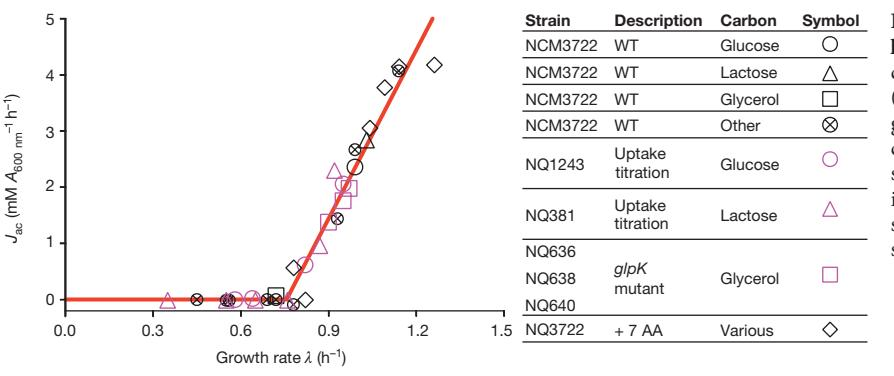

1Department of Physics, University of California at San Diego, La Jolla, California 92093-0374, USA. 2Institute of Molecular Systems Biology, ETH Zürich, 8093 Zürich, Switzerland. 3Section of Molecular Biology, Division of Biological Sciences, University of California at San Diego, La Jolla, California 92093, USA. 4Department of Integrative Structural and Computational Biology, Department of Chemistry, The Skaggs Institute for Chemical Biology, The Scripps Research Institute, La Jolla, California 92037, USA. 5Institute for Theoretical Studies, ETH Zürich, 8092 Zürich, Switzerland. *These authors contributed equally to this work.

For strains with titratable carbon uptake systems [(Extended Data](#page-15-0) [Table 1)](#page-15-0), the same linear dependence is seen for acetate excretion [(Fig. 1](#page-0-0), purple circles and triangles). These results suggest that acetate overflow is an innate response that depends on the degree of carbon influx and not specifically on the nature of carbon sources. A vivid demonstration of this effect is seen by the behaviour of cells grown on glycerol: wild-type *E. coli* cells grow in glycerol minimal medium at a rate that is below *λ*ac, and do not excrete acetate ([Fig. 1,](#page-0-0) black square), in accordance with equation (1). Three isogenic strains expressing different mutant forms of glycerol kinase[25](#page-5-7) grew at rates faster than *λ*ac and excreted acetate with rates dictated by their respective growth rates according to equation (1) ([Fig. 1,](#page-0-0) purple squares). Instead of changing the carbon influx, reducing the metabolic demand of cells for carbon by supplementing minimal medium with non-degradable amino acids resulted in significantly enhanced growth rates and concomitantly increased acetate excretion as described by equation (1) (black diamonds in [Fig. 1)](#page-0-0).

#### **Coarse-grained model of proteome allocation**

Linear growth rate dependences arose in previous physiological studies[21](#page-5-4)[,26–28](#page-5-8) from the limited capacity of ribosomes to synthesize proteins and the obligatory need for increased ribosomal proteins at faster growt[h21,](#page-5-4)[29](#page-5-9). Here, we address the problem of acetate excretion with a phenomenological resource allocation model, balancing the demand of the proteome for biomass synthesis with the demand for energy biogenesis.

We focus on acetate excretion for growth on glycolytic substrates [(Fig. 1](#page-0-0)); other substrates metabolized by alternative pathways exhibit similar trends although with quantitative differences ([Extended](#page-8-0) [Data Fig. 1f](#page-8-0)), probably arising from the same underlying principles as those described here. In our model (detailed in Supplementary Note 1A), acetate excretion is considered as a measure of the carbon flux directed towards energy biogenesis by (oxidative) fermentation, catalysed by glycolytic enzymes and completed by the oxidative phosphorylation system (for the conversion of NADH to ATP in an aerobic environment) [(Extended Data Fig. 2a)](#page-9-0). Energy biogenesis by respiration is catalysed by enzymes of the glycolysis and tricarboxylic acid (TCA) pathways, and the oxidative phosphorylation system ([Extended Data Fig. 2b](#page-9-0)). Both the fermentation and respiratory pathways draw carbon flux away from biomass synthesis, via the carbon fluxes *J*C,f and *J*C,r, respectively, and in turn produce the energy fluxes *J*E,f and *J*E,r [(Box 1](#page-2-0)). Let the abundance of the enzymes used for fermentation and respiration be given by the fraction *φ*f and *φ*r, respectively, of the total protein content of the cell. All other metabolic activities, including catabolism, anabolism and ribosome synthesis (referred to as biomass synthesis), are provided by the remaining part of the proteome. Previous studies have established the growth-rate dependence of the proteome fraction for biomass synthesis[20,](#page-5-10)[21](#page-5-4)[,27,](#page-5-11)[28](#page-5-12), denoted here as *φ*BM(*λ*). It is coupled to energy biogenesis via the constraint

$$
\phi_{\rm f} + \phi_{\rm r} + \phi_{\rm BM}(\lambda) = 1 \tag{2}
$$

The total energy flux generated must satisfy the energy demand for cell growth (denoted by *J*E(*λ*)), that is,

$$J_{\mathbb{E}, \mathbf{f}} + J_{\mathbb{E}, \mathbf{r}} = J_{\mathbb{E}}(\lambda) \tag{3}$$

At the same time, not too much carbon should be diverted from the total influx *J*C,in order to meet the demand for biomass synthesis (flux denoted by *J*C,BM(*λ*)), that is,

$$J_{\rm C,in}(\lambda) = J_{\rm C,f} + J_{\rm C,f} + J_{\rm C,BM}(\lambda) \tag{4}$$

To a large extent, this allocation depends on the efficiencies of the energy biogenesis pathways. There are two very different efficiencies. It is well known that respiration has a much lower carbon cost—the energy flux generated per carbon is larger for respiration than fermentation[30,](#page-5-13) although this advantage of respiration is limited to the presence of oxygen ([Extended Data Fig. 2)](#page-9-0). On the other hand, if respiration has a higher proteome cost, that is, if the energy flux generated per proteome fraction devoted to the respective pathway, *ε*f=*J*E,f/*φ*f, *ε*r=*J*E,r/*φ*r, is lower for respiration than fermentation, *ε*f>*ε*r, as has been suggested previously[14,](#page-5-14)[19,](#page-5-15)[20](#page-5-10), then a scenario emerges that may qualitatively explain the observed disappearance of acetate flux at slow growth rates. As illustrated in [Box 1](#page-2-0), when the carbon uptake rate (*J*C,in) is high and the cell has the potential to grow rapidly, it is advantageous, that is, growth rate can be maximized, to generate energy by the more proteome-efficient fermentation pathway, so that more of the proteome can be directed towards biosynthesis as required for rapid growth. Conversely, when carbon uptake is low (small *J*C,in), it is advantageous to generate energy by the more carbon-efficient respiration pathway, so that more carbon flux can be directed to biosynthesis and sustain growth. This proteome allocation model predicts the carbon flux for respiration to change in the opposite way from that found for fermentation. Just as the fermentation flux can be determined from acetate excretion, the respiration flux can be deduced by measuring the rate of CO2 evolution in a bioreactor (Supplementary Note 2). Indeed, this respiration flux exhibits a linear increase with decreasing growth rate as acetate excretion diminishes ([Extended Data Fig. 3a)](#page-10-0).

## **Testing the model by growth perturbations**

If acetate excretion is the result of the coordination of energy demand with carbon influx given constrained proteomic resources as assumed in the model, then the overexpression of useless proteins, which reduces the proteome fractions available for energy production and biomass synthesis[21](#page-5-4), should yield higher acetate excretion rates. In fact, previous studies reported acetate excretion at slow growth rates with protein overexpression[31.](#page-5-16) To test this hypothesis systematically, we expressed large amounts of LacZ by growing strain NQ1389 ([Extended Data Table 1](#page-15-0)) on several glycolytic carbon sources. Plotting acetate excretion against growth rate for varying degrees of LacZ overexpression leads to a simple proportionality relation between growth rate and acetate excretion rate for each carbon source tested [(Fig. 2a](#page-3-0)). Moreover, plotting acetate excretion against the corresponding degree of LacZ expression (fraction *φ*Z of total cellular proteins), we find a similar linear decrease in acetate excretion rate [(Extended Data](#page-11-0)  [Fig. 4](#page-11-0)). Finally, in a 3D plot of acetate excretion rates, LacZ abundance and growth rates [(Fig. 2b)](#page-3-0), the different data points are found to lie on a single plane anchored by the acetate line (red) (see also [Extended](#page-11-0)  [Data Fig. 4c)](#page-11-0). On this plane, acetate excretion increases linearly with LacZ overexpression at each fixed growth rate (black lines). However, for each fixed level of LacZ abundance, the plane produces a parallel shift of the standard acetate line (thin red lines). These lines are still described by equation (1), with an identical slope, but with a reduction of the threshold growth rate, *λ*ac, linear with increasing LacZ abundance (cyan line), that is,

$$
\lambda(\phi_{\rm Z}) = \lambda_{\rm ac} \cdot \left(1 - \phi_{\rm Z}/\phi_{\rm max}\right) \tag{5}
$$

in which *φ*max≈47% is the extrapolated limit of useless protein expression at which growth rate vanishes (alternatively determined from individual lines in [Extended Data Fig. 4](#page-11-0)), in agreement with previous work[21](#page-5-4)[,27](#page-5-11)[,28.](#page-5-12) More quantitatively, this result is displayed in [Fig. 3a,](#page-3-1) in which interpolated acetate excretion rates for constant LacZ levels are presented.

The concepts represented by equations (2)–(4) are transformed into a quantitative model (as illustrated in [Box 1](#page-2-0) and detailed in Supplementary Note 1A) by implementing a simple set of relations. First, the proteome fraction *φ*BM responsible for biomass synthesis under carbon-limitation follows a linear growth-rate dependence, that is, *φ* ( ) *λ φ* = + *bλ* BM 0 , as established by previous studies[21](#page-5-4),[27,](#page-5-11)[28.](#page-5-12)

# Box 1 Resource allocation model for energy biogenesis

Top left, efficiencies of energy production. Fermentation and respiration pathways for energy biogenesis are shown in the red and blue boxes, respectively. The model assumes that for the same energy flux generated (width of yellow arrows), fermentation needs to draw more carbon flux than respiration (compare the width of light grey arrows), but requires smaller amount of proteins (compare the number of red and blue proteins). Top, model summary. The model consists of three resource-balance equations. (1) Carbon flux (*J*C,in) is used for energy production via fermentation or respiration (*J*C,f, *J*C,r), and to provide precursors for biomass production (*βλ*). (2) Fermentation and respiration pathways supply ATP flux (*J*E,f, *J*E,r) that satisfies the energy demand of the cell (*σλ*). (3) The proteome fraction required for biomass synthesis (*φ*0+*bλ*) depends linearly on the growth rate, thereby constraining the proteome fraction available for energy biosynthesis (*φ*f, *φ*r). Bottom, model predictions. Under carbon limitation, the model predicts threshold-linear dependences of fermentation and respiration with changing growth rate. Respiration (blue line) gradually replaces fermentation (red line) as the growth rate decreases. Proteome limitation by expression of useless proteins results in a horizontal shift of the acetate line. Translational limitation by antibiotics results in an increased slope of the acetate line with a fixed *y*-intercept. Energy dissipation also leads to a parallel shift of the acetate line. But unlike proteome limitation, which 'compresses' both the fermentation and respiration sectors, these two sectors both increase with decreasing growth rate under energy dissipation (for fixed carbon uptake). The behaviours summarized in these plots are derived quantitatively in Supplementary Note 1 and validated in [Figs 1–3](#page-0-0).

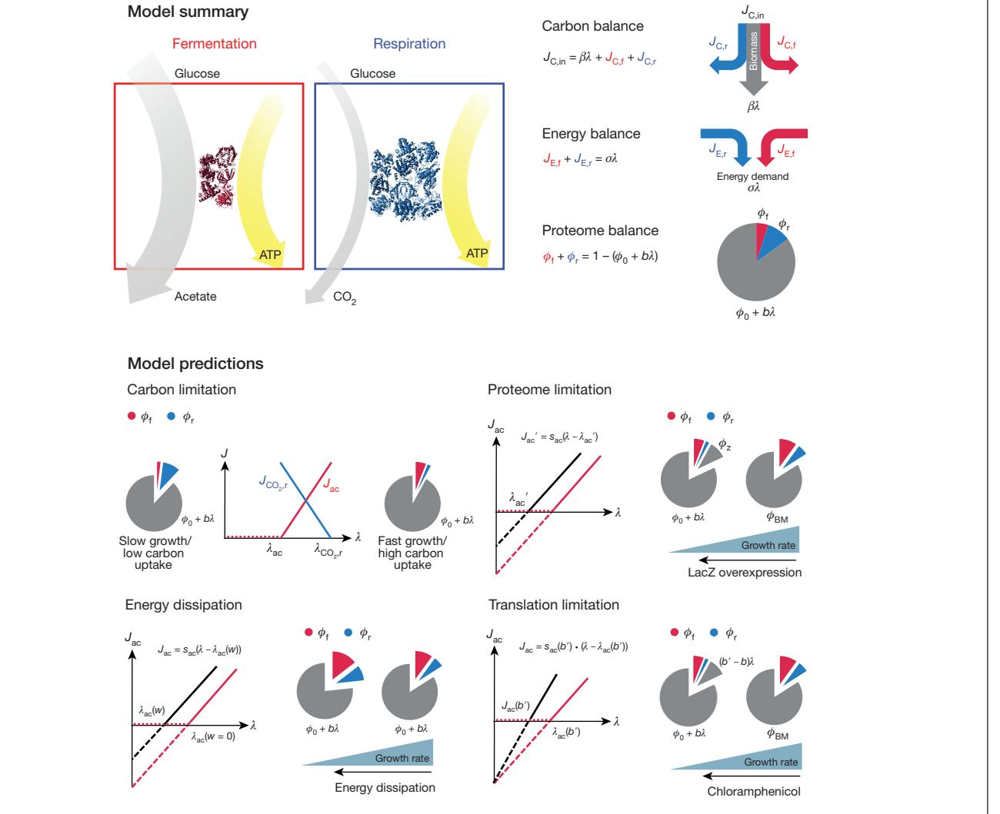

Second, empirical evidenc[e28](#page-5-12) indicates linear relations between metabolic fluxes and the abundances of the corresponding proteome sectors, which we capture by the equations *J*C,f= *κ*f*φ*f,*J*C,r= *κ*r*φ*r, *J*E,f= *ε*r*φ*r and *J*E,r= *ε*r*φ*r. Finally, we introduce proportionalities of biomass and energy demand to the growth rate (*J*C,BM( ) *λ β* = *λ*, *J*E( ) *λ σ* = *λ*), relations that are demonstrated experimentally (see Supplementary Notes 1D2 and 1D4). (Maintenance energy is negligible over the growth-rate range studie[d32.](#page-5-17)) The detailed meaning of each parameter introduced here is given in [Extended Data Table 2](#page-16-0). Most important among them are *φ*f and *φ*r, the proteome efficiencies of energy biogenesis by the fermentation and respiration pathways, respectively.

Equations (2)–(4), together with the linear relation between the proteome fractions and fluxes, describe all key features of the experimental data as detailed in Supplementary Notes 1B and 1C and illustrated in [Box 1](#page-2-0) (bottom): the model naturally gives rise to the observed threshold-linear form of acetate excretion equation (1),

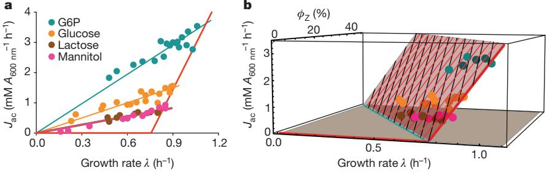

**Figure 2** | **Effect of protein overexpression on acetate excretion. a**, Measured acetate excretion rate is plotted against growth rate for increasing degrees of the (useless) expression of LacZ in strain NQ1389, for several carbon sources indicated by circles of different colours. Thick red line is the acetate line of wild-type cells shown already in [Fig. 1,](#page-0-0) and the thin lines are model predictions (equation (S26) in Supplementary

with formulae for the threshold *λ*ac and the slope *s*ac given by equations (S15) and (S16) in Supplementary Information; the linear decrease in energy-related CO2 production upon increasing growth rate [(Extended Data Fig. 3a](#page-10-0)) is captured by equation (S17), with the corresponding threshold *λ*CO ,r 2 and slope *s*CO ,r 2 given by equations (S18) and (S19). Furthermore, the parallel shifts of the acetate line for a constant level of protein overexpression [(Fig. 3a](#page-3-1), and thin red lines in [Fig. 2b](#page-3-0)) are captured by equation (S30) in Supplementary Information, while the direct proportionalities between acetate excretion rates and growth rate upon varying the degree of overexpression (thin solid lines in [Fig. 2a](#page-3-0)) are captured by equation (S26).

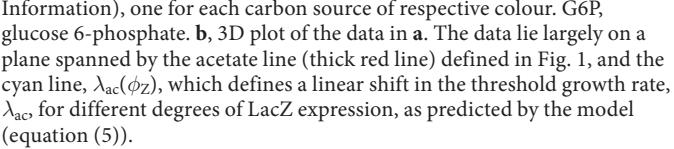

Notably, the data imposes a set of quantitative constraints on the model parameters, in particular,

$$\frac{\varepsilon_{\rm f}}{\varepsilon_{\rm r}} \ge \frac{\lambda_{\rm CO_2,r}}{\lambda_{\rm ac}} \approx 1.5,\tag{6}$$

predicting that fermentation is at least 50% more efficient for energy biogenesis than respiration in terms of proteome cost (see equations (S20)–(S22) in Supplementary Information for a derivation).

To test quantitatively the proteome allocation model, we performed additional sets of experiments designed to perturb individual model

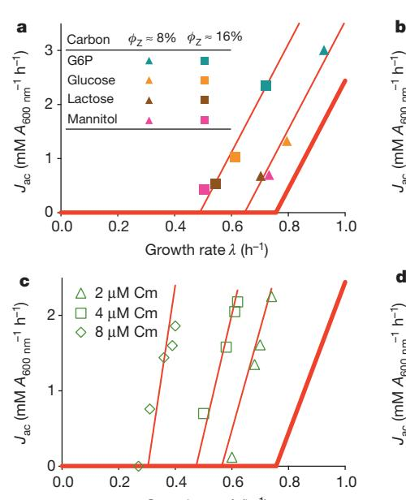

**Figure 3** | **Effect of genetic and environmental perturbations on the acetate line: model and experiments.** In all subplots, the thick red line represents the acetate line of wild-type cells ([Fig. 1](#page-0-0)). **a**, For each fixed level of LacZ expression, growth of the overexpression strain NQ1389 on different carbon sources leads to parallel shifts of the acetate line, as demonstrated by the thin red lines, whose slopes are fixed to that of the wild-type acetate line and were fitted by only adjusting the threshold growth rates *λ*ac. **b**, Acetate excretion rate with glucose uptake titration (Pu-ptsG, [Extended Data Table 1)](#page-15-0) for a ∆*flhD* strain (NQ1388) and a ∆*fliA* strain (NQ1539), both incapable of expressing motility proteins, regarded as 'useless' in well-stirred culture. Because the motility proteins are only expressed significantly as growth rate decreases under carbon limitation [(Extended Data Fig. 4f)](#page-11-0), acetate excretion deviates from the acetate line as growth rate decreases. The shift of the threshold growth rate *λ*ac in the two strains is quantitatively consistent with the model prediction

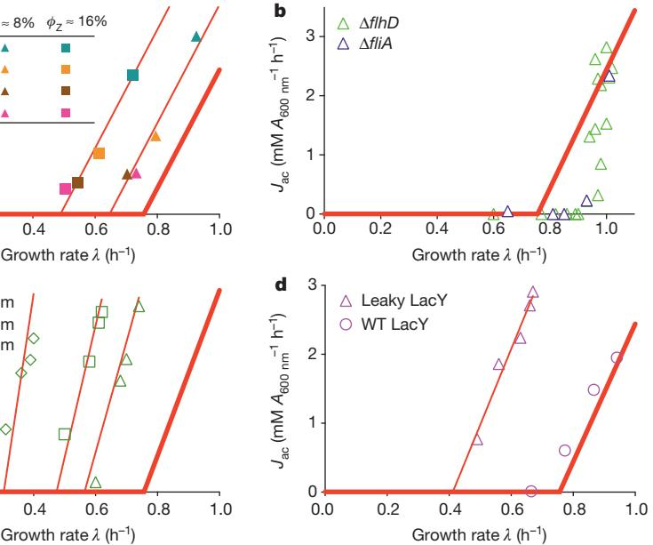

(equation (5)), based on quantification of motility proteins [(Extended](#page-11-0)  [Data Fig. 4f](#page-11-0) and [Extended Data Table 3](#page-17-0)). **c**, For each fixed (sub-lethal) dose of chloramphenicol (Cm) in the medium, acetate excretion rates were determined for different degrees of lactose uptake by the titratable LacY strain (NQ381, [Extended Data Table 1](#page-15-0)). The thin red lines are model fits with the slope as the only fitting parameter. **d**, For the energy dissipating mutant (NQ1313) expressing the proton-leaking LacYA177V, acetate excretion rates (triangles) obtained from titrating the glucose uptake system [(Extended Data Table 1](#page-15-0)) show a parallel shift of the acetate line (thin red line), obtained by fitting the data by adjusting only the threshold growth rate in accordance with model prediction (equation (S32) in Supplementary Information). For comparison, acetate excretion in cells expressing wild-type LacY from the same plasmid system (NQ1312, circles) adheres much closer to the acetate line of wild-type cells.

parameters. To see whether a decrease in acetate excretion is possible, we examined two independent mutants (∆*flhD* and ∆*fliA*) in which motility proteins, 'useless' in well-shaken batch culture, are not expressed. These mutants exhibit reductions in acetate excretion (open symbols in [Fig. 3b)](#page-3-1), in accordance with the prediction of the resource allocation model as more proteome becomes available for energy biogenesis. (The nonlinear dependence of acetate excretion arises in this case due to the growth-rate dependence of motility protein expression in wild-type cells[28](#page-5-12), as shown in [Extended Data Fig. 4f](#page-11-0).) Translational limitation by sub-lethal doses of the antibiotic chloramphenicol inhibits peptide elongation and makes the cell respond by allocating a larger proteome fraction to ribosomes[21.](#page-5-4) In our model, this affects the parameter *b* in *φ*BM(*λ*), and therefore predicts an increased slope of the acetate line with an identical *y*-intercept (equation (S14) in Supplementary Information, solid lines in [Fig. 3c)](#page-3-1), which is in good agreement with the data (open symbols in [Fig. 3c)](#page-3-1). We also investigated the effect of energy dissipation on acetate excretion by expressing a mutant lactose transporter LacYA177V ('leaky LacY') known to leak protons across the inner membran[e33](#page-5-18) [(Extended Data Table 1)](#page-15-0). An energy leakage flux can be added to the right-hand side of equation (3), and the model predicts a parallel shift of the acetate line to higher excretion rates (equation (S32) in Supplementary Information). This prediction was tested by titrating glucose uptake in a strain (NQ1313) expressing the leaky LacY mutant. As anticipated, a parallel shift to higher acetate excretion rates was obtained (purple triangles and line in [Fig. 3d)](#page-3-1). Similar increases in acetate excretion were obtained with the addition of 2,4-dinitrophenol (DNP), which uncouples oxidative phosphorylation by carrying protons across the cell membrane ([Extended Data Fig. 5)](#page-12-0). A summary of quantitative comparisons between predictions of the proteome allocation model with experimental findings is presented in [Extended Data](#page-17-0)  [Table 3](#page-17-0), showing that the model quantitatively captures the changes of acetate excretion patterns in response to the applied perturbations.

#### **Proteome cost of fermentation and respiration**

The theoretical predictions tested so far do not require the knowledge of the values of proteome cost parameters (for example, *ε*f, *ε*r). However, these parameters are of central importance for theories based on proteome allocation. We have thus developed a coarse-graining approach to characterize the proteome cost for fermentation and respiration directly. First, the absolute protein abundance of individual proteins was obtained using quantitative mass spectrometry[28](#page-5-12) together with absolute abundance calibration by ribosome profiling[34.](#page-5-19) Next, for each enzyme involved in glycolysis, TCA and oxidative phosphorylation, its abundance was partitioned among the three pathways, fermentation, respiration and biomass synthesis, in proportion to the three fluxes through the enzyme. Finally, the fractional enzyme amounts

partitioned into a pathway were summed up to obtain the total enzyme abundance devoted to the pathway ([Fig. 4a](#page-4-0); see Supplementary Note 3 for details). In [Fig. 4b](#page-4-0), the energy production fluxes of fermentation and respiration ([Extended Data Fig. 3b](#page-10-0)) are plotted against their respective proteome fractions determined in this manner. The linearity of the results validates the linear dependences between *J*E,f, *J*E,r and *φ*f, *φ*r assumed in the model, while slopes of these lines directly yield the proteome efficiency of energy biogenesis for glycolytic carbon sources: *ε*f≈750mM ATP per *A*600 nm per hour, and *ε*f≈390mM ATP per *A*600 nm per hour. Indeed, the proteome cost of fermentation (1/*ε*f) is approximately twofold lower than that of respiration (1/*ε*r), quantitatively validating the key assumption of this work. Together with similar procedures used to determine the other model parameters (as described in detail in Supplementary Note 1D), we obtained a self-consistent set of parameters [(Extended Data Table 2)](#page-16-0) that successfully recapitulates all our experimental data ([Extended Data Fig. 3c, d](#page-10-0)).

The proteome allocation model is able to predict not only acetate excretion patterns but also the expression of dozens of genes in the glycolysis and TCA pathways under different perturbation, as detailed in Supplementary Note 1C and [Extended Data Figs 6](#page-13-0) and [7](#page-14-0). While both proteome limitation and energy dissipation lead to parallel shifts of the acetate line [(Fig. 3a and c,](#page-3-1) respectively), this response arises from an opposite response of the energy sectors *φ*f, *φ*r as predicted by the model and verified by mass spectrometry. Under LacZ overexpression, cells decreased the expression of enzymes for both fermentation and respiration (orange lines in [Extended Data Figs 6](#page-13-0) and [7](#page-14-0), as predicted in equations (S26)–(S27) in Supplementary Information), while under energy dissipation, cells increased the expression of these enzymes (blue lines in [Extended Data Figs 6](#page-13-0) and [7,](#page-14-0) predicted by equations (S36)–(S37)).

#### **Discussion**

The notion that fermentation may be more proteome efficient than respiration was proposed previously by Molenaar *et al.*[14](#page-5-14), extended to the use of the Entner–Doudoroff pathway by Flamholz *et al.*[35](#page-5-20) and to the genome-scale by O'Brien *et al.*[19](#page-5-15). Our study directly verifies this hypothesis [(Fig. 4b)](#page-4-0), and establishes the pivotal role proteome efficiency has in determining the degree of overflow metabolism in *E. coli* ([Fig. 3](#page-3-1)). Our findings in response to useless protein expression and energy dissipation are difficult to reconcile, even qualitatively, with alternative hypotheses such as the limitation of respiratory capacity[8](#page-5-3) , the need for recycling of cofactor[s2](#page-5-2) , or constraints of the cytoplasmic membran[e17](#page-5-21). Models with cell volume constraint[s12](#page-5-22) are mathematically similar to protein cost models; however, cell volume varies widely between growth conditions with similar densities[36,](#page-5-23) suggesting that it is not a constraint.

Mechanistically, the re-uptake of acetate by acetyl-CoA synthase (ACS), upregulated by the cAMP receptor protein (CRP)–cAMP

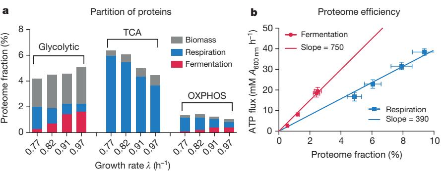

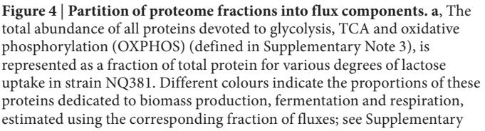

Note 3. **b**, Energy fluxes through the fermentation and respiration pathways are plotted against their respective proteome fractions. The lines are linear regressions of the data, with the slopes being the proteome efficiencies (*φ*f and *φ*r). The steeper slope (for fermentation) indicates higher ATP production per protein devoted to the pathway (lower protein cost), validating the central assumption of the proteome allocation model.

complex under carbon limitation[27,](#page-5-11) is important for the decrease of acetate excretion under carbon limitation[15,](#page-5-24)[16.](#page-5-5) However, the linear growth-rate dependence of carbon overflow demands the tight global coordination of energy biogenesis pathways with biosynthesis, which cannot be accounted for by ACS activity alone, and requires the coordinated regulation of glycolytic and TCA enzymes. In particular, acetate excretion sharply increased under energy dissipation while the abundance of ACS proteins increased slightly as well [(Extended Data](#page-13-0) [Fig. 6)](#page-13-0). Moreover, the parallel increase of glycolytic and TCA enzymes, in combination with the increase in acetate excretion under energy dissipation, cannot be rationalized from the known actions of CRP regulation [(Extended Data Figs 6](#page-13-0) and [7](#page-14-0)), suggesting the role of additional regulator(s).

We have established how diverse patterns of acetate excretion can be understood as a part of a global physiological response used by *E. coli* to cope with changing proteomic demands of energy biogenesis and biomass synthesis under different growth conditions[37](#page-5-25). Our findings can be used to guide approaches to minimizing overflow metabolism in synthetic biology applications[24](#page-5-26),[38–41,](#page-5-27) in ways congruent with the fitness of the organism, for example, by reducing the expression of useless proteins [(Fig. 3b](#page-3-1)). More broadly, a similar physiological rationale may underlie overflow metabolism in rapidly growing eukaryotes including tumour cells[7,](#page-5-28)[42](#page-5-29), in which the synthesis of mitochondria for TCA reactions is an additional cost. Indeed, scatter plots of ethanol production and sugar uptake in various strains of *Saccharomyces cerevisiae* and other yeast species point to the existence of a universal response similar to that shown for *E. coli*[18](#page-5-30) ([Fig. 1](#page-0-0)). The quantitative physiological approach developed in this work can be used as a model for characterizing metabolic efficiency and its biological implications in these systems and others.

**Online Content** Methods, along with any additional Extended Data display items and Source Data, are available in the [online version of the paper](http://www.nature.com/doifinder/10.1038/nature15765); references unique to these sections appear only in the online paper.

#### **received 21 January; accepted 1 October 2015.**

- 1. Neidhardt, F. C., Ingraham, J. L. & Schaechter, M. *Physiology of the Bacterial Cell: A Molecular Approach* Ch. 5 (Sinauer Associates Inc, 1990).
- 2. Wolfe, A. J. The acetate switch. *Microbiol. Mol. Biol. Rev.* **69,** 12–50 (2005). 3. De Deken, R. H. The Crabtree effect: a regulatory system in yeast. *J. Gen.*
- *Microbiol.* **44,** 149–156 (1966). 4. De Mey, M., De Maeseneire, S., Soetaert, W. & Vandamme, E. Minimizing acetate formation in *E. coli* fermentations. *J. Ind. Microbiol. Biotechnol.* **34,** 689–700 (2007).
- 5. Vander Heiden, M. G., Cantley, L. C. & Thompson, C. B. Understanding the Warburg effect: the metabolic requirements of cell proliferation. *Science* **324,** 1029–1033 (2009).
- 6. Hanahan, D. & Weinberg, R. A. Hallmarks of cancer: the next generation. *Cell* **144,** 646–674 (2011).
- 7. Weinberg, R. A. *The Biology of Cancer* 2nd edn, Ch. 2.6 (Garland Science, 2013).
- 8. Majewski, R. A. & Domach, M. M. Simple constrained-optimization view of acetate overflow in *E. coli*. *Biotechnol. Bioeng.* **35,** 732–738 (1990).
- 9. Varma, A. & Palsson, B. O. Stoichiometric flux balance models quantitatively predict growth and metabolic by-product secretion in wild-type *Escherichia coli* W3110. *Appl. Environ. Microbiol.* **60,** 3724–3731 (1994).
- 10. Pfeiffer, T., Schuster, S. & Bonhoeffer, S. Cooperation and competition in the evolution of ATP-producing pathways. *Science* **292,** 504–507 (2001).
- 11. Pfeiffer, T. & Bonhoeffer, S. Evolutionary consequences of tradeoffs between yield and rate of ATP production. *Z. Phys. Chem.* **216,** 51–63 (2002).
- 12. Vazquez, A. *et al.* Impact of the solvent capacity constraint on *E. coli* metabolism. *BMC Syst. Biol.* **2,** 7 (2008).
- 13. Vemuri, G. N., Altman, E., Sangurdekar, D. P., Khodursky, A. B. & Eiteman, M. A. Overflow metabolism in *Escherichia coli* during steady-state growth: transcriptional regulation and effect of the redox ratio. *Appl. Environ. Microbiol.* **72,** 3653–3661 (2006).
- 14. Molenaar, D., van Berlo, R., de Ridder, D. & Teusink, B. Shifts in growth strategies reflect tradeoffs in cellular economics. *Mol. Syst. Biol.* **5,** 323 (2009).
- 15. Valgepea, K. *et al.* Systems biology approach reveals that overflow metabolism of acetate in *Escherichia coli* is triggered by carbon catabolite repression of acetyl-CoA synthetase. *BMC Syst. Biol.* **4,** 166 (2010).
- 16. Renilla, S. *et al.* Acetate scavenging activity in *Escherichia coli*: interplay of acetyl-CoA synthetase and the PEP-glyoxylate cycle in chemostat cultures. *Appl. Microbiol. Biotechnol.* **93,** 2109–2124 (2012).
- 17. Zhuang, K., Vemuri, G. N. & Mahadevan, R. Economics of membrane occupancy and respiro-fermentation. *Mol. Syst. Biol.* **7,** 500 (2011).
- 18. Huberts, D. H., Niebel, B. & Heinemann, M. A flux-sensing mechanism could regulate the switch between respiration and fermentation. *FEMS Yeast Res.* **12,** 118–128 (2012).
- 19. O'Brien, E. J., Lerman, J. A., Chang, R. L., Hyduke, D. R. & Palsson, B. O. Genome-scale models of metabolism and gene expression extend and refine growth phenotype prediction. *Mol. Syst. Biol.* **9,** 693 (2013).
- 20. Peebo, K. *et al.* Proteome reallocation in *Escherichia coli* with increasing specific growth rate. *Mol. Biosyst.* **11,** 1184–1193 (2015).
- 21. Scott, M., Gunderson, C. W., Mateescu, E. M., Zhang, Z. & Hwa, T. Interdependence of cell growth and gene expression: origins and consequences. *Science* **330,** 1099–1102 (2010).
- 22. Meyer, H.-P., Leist, C. & Fiechter, A. Acetate formation in continuous culture of *Escherichia coli* K12 D1 on defined and complex media. *J. Biotechnol.* **1,** 355–358 (1984).
- 23. Nanchen, A., Schicker, A. & Sauer, U. Nonlinear dependency of intracellular fluxes on growth rate in miniaturized continuous cultures of *Escherichia coli*. *Appl. Environ. Microbiol.* **72,** 1164–1172 (2006).
- 24. el-Mansi, E. M. & Holms, W. H. Control of carbon flux to acetate excretion during growth of *Escherichia coli* in batch and continuous cultures. *J. Gen. Microbiol.* **135,** 2875–2883 (1989).
- 25. Applebee, M. K., Joyce, A. R., Conrad, T. M., Pettigrew, D. W. & Palsson, B. O. Functional and metabolic effects of adaptive glycerol kinase (GLPK) mutants in *Escherichia coli*. *J. Biol. Chem.* **286,** 23150–23159 (2011).
- 26. Scott, M. & Hwa, T. Bacterial growth laws and their applications. *Curr. Opin. Biotechnol.* **22,** 559–565 (2011).
- 27. You, C. *et al.* Coordination of bacterial proteome with metabolism by cyclic AMP signalling. *Nature* **500,** 301–306 (2013).
- 28. Hui, S. *et al.* Quantitative proteomic analysis reveals a simple strategy of global resource allocation in bacteria. *Mol. Syst. Biol.* **11,** 784 (2015).
- 29. Maaloe, O. in *Biological Regulation and Development* Vol. 1 (ed. Goldberger, R. F.) 487–542 (Plenum, 1979).
- 30. Nelson, D. L., Lehninger, A. L. & Cox, M. M. *Lehninger Principles of Biochemistry* Chs 14, 16 (Macmillan, 2008).
- 31. Sandén, A. M. *et al.* Limiting factors in *Escherichia coli* fed-batch production of recombinant proteins. *Biotechnol. Bioeng.* **81,** 158–166 (2003).
- 32. Neijssel, O. M., Teixeira de Mattos, M. J. & Tempest, D. W. in Escherichia coli *and* Salmonella*: Cellular and Molecular Biology* (eds Neidhardt, F. C. *et al.*) 1683–1693 (ASM Press, 1996).
- 33. Brooker, R. J. An analysis of lactose permease "sugar specificity" mutations which also affect the coupling between proton and lactose transport. I. Val177 and Val177/Asn319 permeases facilitate proton uniport and sugar uniport. *J. Biol. Chem.* **266,** 4131–4138 (1991).
- 34. Li, G. W., Burkhardt, D., Gross, C. & Weissman, J. S. Quantifying absolute protein synthesis rates reveals principles underlying allocation of cellular resources. *Cell* **157,** 624–635 (2014).
- 35. Flamholz, A., Noor, E., Bar-Even, A., Liebermeister, W. & Milo, R. Glycolytic strategy as a tradeoff between energy yield and protein cost. *Proc. Natl Acad. Sci. USA* **110,** 10039–10044 (2013).
- 36. Woldringh, C. L., Binnerts, J. S. & Mans, A. Variation in *Escherichia coli* buoyant density measured in Percoll gradients. *J. Bacteriol.* **148,** 58–63 (1981).
- 37. Bollenbach, T., Quan, S., Chait, R. & Kishony, R. Nonoptimal microbial response to antibiotics underlies suppressive drug interactions. *Cell* **139,** 707–718 (2009).
- 38. El-Mansi, M. Flux to acetate and lactate excretions in industrial fermentations: physiological and biochemical implications. *J. Ind. Microbiol. Biotechnol.* **31,** 295–300 (2004).
- 39. Farmer, W. R. & Liao, J. C. Improving lycopene production in *Escherichia coli* by engineering metabolic control. *Nature Biotechnol.* **18,** 533–537 (2000).
- 40. Aristidou, A. A., San, K. Y. & Bennett, G. N. Metabolic engineering of *Escherichia coli* to enhance recombinant protein production through acetate reduction. *Biotechnol. Prog.* **11,** 475–478 (1995).
- 41. Veit, A., Polen, T. & Wendisch, V. F. Global gene expression analysis of glucose overflow metabolism in *Escherichia coli* and reduction of aerobic acetate formation. *Appl. Microbiol. Biotechnol.* **74,** 406–421 (2007).
- 42. Galluzzi, L., Kepp, O., Vander Heiden, M. G. & Kroemer, G. Metabolic targets for cancer therapy. *Nature Rev. Drug Discov*. **12,** 829–846 (2013).

**Supplementary Information** is available in the [online version of the paper](http://www.nature.com/doifinder/10.1038/nature15765).

**Acknowledgements** We are grateful to F. J. Bruggeman, E. O'Brien, U. Sauer, M. H. Saier and members of the Hwa and Sauer laboratories for valuable comments, and J. L. Figueroa for artistic contributions to the model illustration in [Box 1.](#page-2-0) This work was supported by the NIH (grant R01-GM109069) and the Simons Foundation (grant 330378). T.H. additionally acknowledges the support of M. Rössler, the Walter Haefner Foundation and the ETH Foundation. M.B. acknowledges support from SystemsX TPdF. Y.S. acknowledges support from Hong Kong Baptist University (grants FRG2/11-12/159 and SKLP-14-15-P012).

**Author Contributions** M.B., S.H., J.R.W. and T.H. designed the study. M.B., S.H., H.O., Z.Z. and Y.S. performed experiments. M.B., S.H. and T.H. analysed the data and developed the model. M.B., S.H., J.R.W. and T.H. wrote the paper.

**Author Information** Reprints and permissions information is available at [www.nature.com/reprints](http://www.nature.com/reprints). The authors declare no competing financial interests. Readers are welcome to comment on the [online version of the](http://www.nature.com/doifinder/10.1038/nature15765)  [paper.](http://www.nature.com/doifinder/10.1038/nature15765) Correspondence and requests for materials should be addressed to T.H. [(hwa@ucsd.edu)](mailto:hwa@ucsd.edu).

#### **Methods**

No statistical methods were used to predetermine sample size.

**Construction of LacY and LacYA177V strains (NQ1312 and NQ1313).** The PtetlacY region of the pZE12 Ptet-lacY plasmi[d43](#page-7-0) was amplified with upstream and downstream primers including the digestion sites XhoI and BamHI, respectively, using the primers Ptet-F and lacY-R (see primers below). The resulting DNA fragment was used to replace the corresponding region of Ptet-gfp in the plasmid pZA31-gfp[44](#page-7-1), yielding the plasmid pZA31 Ptet-lacY. This plasmid was transformed into the titratable PtsG strain NQ1243 to yield NQ1312. The same procedure was employed to generate the *lacYA177V* mutant (that is, C531T), but fusion PCR was used to introduce a point mutation Val177 into the *lacY* sequence[33.](#page-5-18) For this, two overlapping parts of the Ptet-lacY region were PCR amplified with the primers ptet-F, lacYfusion-R and lacYfusion-F, lacY-R (see primers below), in which the point substitution C531T leading to the Val177 mutation from [ref. 3](#page-5-31) was included in the primers lacYfusion-F and lacYfusion-R. These two overlapping DNA fragments were fused together by PCR using primers ptet-F and lacY-R. The resulting Ptet-lacY fragment that carries the desired mutation was inserted into pZA31, yielding pZA31-lacYA177V. The resulting plasmids were transformed into the titratable PtsG strain NQ1243 to yield NQ1313.

**Construction of the** *flhD* **and** *fliA* **deletion strains (NQ1388 and NQ1539).** The ∆*flhD* deletion allele in strain JW1881-1 (*E. coli* Genetic Stock Center, Yale University), in which a kanamycin-resistance gene is substituted for the *flhD* gene, was transferred to the titratable PtsG strain NQ1243 after deletion of kanamycin resistance by phage P1 *vir*-mediated transduction. Similarly, the ∆*fliA* allele from strain JW1907 (KEIO collection[45](#page-7-2)), in which a kanamycin-resistance gene is substituted for the *fliA* gene, was transferred to the titratable PtsG strain NQ1243 after deletion of kanamycin resistance by phage P1 *vir*-mediated transduction.

**Primers used in this study.** The following primers for producing the new genetic constructs were used. ptet-F, 5′-ACACTCGAGTCCCTATCAGTGATAGAGAT TG-3′, was used for forward amplification of the Ptet sequence and included an XhoI digestion site for construction of pZE1 Ptetstab-lacZ, pZA31-lacY, pZA31 lacYA177V. lacY-R, 5′-TGTGGATCCTTAAGCGACTTCATTCACCTG-3′, was used for reverse amplification of *lacY*, *lacYA177V* and included a BamHI digestion site for construction of pZA31-lacY, pZA31-lacYA177V. lacYfusion-F, 5′-CTCTG GCTGTGTACTCATCCTCGCCGTTTTACTCTTTTTCGCCAAAACGG-3′, was used for forward amplification of a fragment of *lacY* together with the reverse primer lacY-R. This DNA fragment was later used for fusion PCR to construct pZA31-lacYA177V. lacYfusion-R, 5′-CCGTTTTGGCGAAAAAGAGTAAAACGG CGAGGATGAGTACACAGCCAGAG-3′, was used for reverse amplification of a fragment of Ptet-lacY together with the forward primer ptet-F. This DNA fragment later was used for fusion PCR to construct pZA31-lacYA177V.

**Bacterial culture media.** Our growth media were based on the MOPS-buffered minimal medium used previousl[y46](#page-7-3) with slight modifications. The base medium contains 40 mM MOPS and 4 mM tricine (adjusted to pH 7.4 with KOH), 0.1M NaCl, 10 mM NH4Cl, 1.32 mM KH2PO4, 0.523 mM MgCl2, 0.276 mM Na2SO4, 0.1 mM FeSO4 and the trace micronutrients described previously[47.](#page-7-4) For 15N-labelled media, 15NH4Cl was used in place of 14NH4Cl. The concentrations of the carbon sources and various supplements used are indicated in the relevant tables.

Batch culture growth has been described in detail previousl[y27](#page-5-11).

**Bacterial growth in the bioreactor.** To measure CO2 production from the bacterial growth, cells were grown in a Multifors bioreactor (Infors HT). Medium (400ml) was used in a 750-ml vessel, which has an inlet for compressed air and out outlet for the exhaust gas. The vessel is otherwise closed except during brief period of sample collection. Samples of the cell culture (for reading *A*600 nm, assaying lactose and acetate, etc) can be taken by using a syringe connected to the vessel. The air flow rate to the inlet was controlled by a mass flow controller (Cole-Parmer, 32907- 67) and maintained at 400mlmin−1 . The outlet was connected to a BlueInOne Cell sensor unit (BlueSens) for measuring CO2 concentration. The stir rate in the growth vessel was set as 800r.p.m. and temperature was maintained at 37°C. **Glucose assay.** Samples (100μl) were taken for at least eight different times during exponential growth (typically at *A*600 nm between 0.1 and 0.6) and immediately frozen. Before the assay, samples were thawed in water and immediately centrifuged at maximum speed (13,200*g*) for 2.5min. Supernatant (7μl) was used to measure glucose concentrations using the Glucose Assay Kit (GAHK-20, Sigma-Aldrich). The slope of the plot of glucose concentrations versus *A*600 nm for all replicates (multiplied with the measured growth rate) was used to determine the glucose uptake rate.

**Lactose assay.** To assay lactose, ~10 μl of the collected supernatant was first digested by β-galactosidase (Sigma-Aldrich) in Z-buffer at 37°C for 20min. The released glucose was then assayed enzymatically by the kit commercially available (Glucose Assay Kit, GAHK20; Sigma-Aldrich). As a control, the sample was treated in the same way without β-galactosidase. Little glucose was detected in the control.

**Acetate assay.** Samples (200μl) were taken for at least three different times during exponential growth (typically at *A*600 nm between 0.1 and 0.6) and immediately frozen. Before the assay, samples were thawed in water and immediately centrifuged at maximum speed (13,200*g*) for 2.5min. Supernatant (100μl) were used to measure acetate concentrations using the Acetate Assay kit (10148261035, R-Biopharm). The slope of the plot of acetate concentrations versus *A*600 nm for all replicates (multiplied with the measured growth rate) was used to determine the acetate excretion rate.

**β-galactosidase assay.** The assay was performed following a similar protocol as detailed in a previous study[21](#page-5-4).

**Proteomic mass spectrometry.** Protein mass spectrometry samples were collected from the four bioreactor cultures, a water bath culture of equation (353) grown on glucose minimal medium, and two 15N-labelled water bath cultures of NCM3722 on lactose minimal medium and NQ381 with 200μM 3-methylbenzyl alcohol. For each of the cultures, 1.8ml of cell culture at *A*600 nm =0.4–0.5 during the exponential phase was collected by centrifugation. The cell pellet was re-suspended in 0.2ml water and fast frozen on dry ice.

Sample preparation and mass spectrometry methods have been described previously[28](#page-5-12).

**Protein identification.** The raw mass spectrometry data files generated by the AB SCIEX TripleTOF 5600 system were converted to Mascot generic format (mgf) files, which were submitted to the Mascot database searching engine (Matrix Sciences) against the *E. coli* SwissProt database to identify proteins. The following parameters were used in the Mascot searches: maximum of two missed trypsin cleavage, fixed carbamidomethyl modification, variable oxidation modification, peptide tolerance ±0.1 daltons (Da), MS/MS tolerance ±0.1Da, and 1+, 2+ and 3+ peptide charge. All peptides with scores less than the identity threshold (*P*=0.05) were discarded.

**Relative protein quantification.** The raw mass spectrometry data files were converted to the .mzML and .mgf formats using conversion tools provided by AB Sciex. The .mgf files were used to identify sequencing events against the Mascot database. Finally, results of the Mascot search were submitted with .mzML files to our in-house quantification software[48](#page-7-5). In brief, intensity is collected for each peptide over a box in retention time and *m*/*z* space that encloses the envelope for the light and heavy peaks. The data are collapsed in the retention time dimension and the light and heavy peaks are fit to a multinomial distribution (a function of the chemical formula of each peptide) using a least squares Fourier transform convolution routine[49](#page-7-6), which yields the relative intensity of the light and heavy species. The ratio of the non-labelled to labelled peaks was obtained for each peptide in each sample.

The relative protein quantification data for each protein in each sample mixture was then obtained as a ratio by taking the median of the ratios of its peptides. No ratio (that is, no data) was obtained if there was only one peptide for the protein. The uncertainty for each ratio was defined as the two quartiles associated with the median. To filter out data with poor quality, the ratio was removed for the protein in that sample if at least one of its quartiles lay outside of 50% range of its median. Furthermore, ratios were removed for a protein in all the sample mixtures in a growth limitation if at least one of the ratios has one of its quartiles lying outside of the 100% range of the median.

**Absolute protein quantification using spectral counting data.** The spectral counting data used for absolute quantitation were extracted from the Mascot search results. For our 15N and 14N mixture samples, only the 14N spectra were counted. The absolute abundance of a protein was calculated by dividing the total number of 14N spectra of all peptides for that protein by the total number of 14N spectra in the sample.

**Absolute quantification of LacZ protein using purified LacZ protein as standard, and determination of the converting factor between Miller Unit and proteome fraction.** For the condition of the LacZ overexpression strain (NQ1389) grown on glucose medium with zero chlorotetracycline level (see source data file of [Fig. 2](#page-3-0)), 15N sample was prepared, that is, NQ1389 grown on glucose minimal medium with 15NH4Cl. The sample was mixed with a known amount of purified LacZ protein (Roche Diagnostics, 10745731001), the purity of which was verified both on a SDS–PAGE gel (where a single band was observed) and by checking the spectral counts of 14N peptides in the sample (where ~99% of the 14N peptides are LacZ peptides). With the highly accurate relative protein abundance between the purified 14N LacZ and the 15N LacZ in the sample, the proteome fraction of LacZ in the sample was determined to be 3.3%±0.3%. The average Miller Unit (MU) for the same condition was ~20,550 (see source data file of [Fig. 2](#page-3-0)), leading to a converting factor of 1.6% of proteome fraction for 10,000 MU.

**Uncertainty of individual measurements.** Biological replicates show the following typical uncertainties in measured quantities: growth rate, ~5%; acetate excretion rates, ~15%; CO2 evolution rate, ~5%.

**Uncertainties of linear relations.** The parameters and their associated standard errors for linear relations were obtained by carrying out linear regression. Following our approach, multiple measurements over wide ranges of conditions from robust data sets revealing underlying relations between variables. The uncertainties are reported in [Extended Data Tables 2](#page-16-0) and [3,](#page-17-0) and throughout the text.

- 43. Kuhlman, T., Zhang, Z., Saier, M. H., Jr & Hwa, T. Combinatorial transcriptional control of the lactose operon of *Escherichia coli*. *Proc. Natl Acad. Sci. USA* **104,** 6043–6048 (2007).
- 44. Levine, E., Zhang, Z., Kuhlman, T. & Hwa, T. Quantitative characteristics of gene regulation by small RNA. *PLoS Biol.* **5,** e229 (2007).
- 45. Baba, T. *et al.* Construction of *Escherichia coli* K-12 in-frame, single-gene knockout mutants: the Keio collection. *Mol. Sys. Biol.* **2,** 2006.0008 (2006).
- 46. Cayley, S., Record, M. T., Jr & Lewis, B. A. Accumulation of 3-(*N*-morpholino) propanesulfonate by osmotically stressed *Escherichia coli* K-12. *J. Bacteriol*. **171,** 3597–3602 (1989).
- 47. Neidhardt, F. C., Bloch, P. L. & Smith, D. F. Culture medium for enterobacteria. *J. Bacteriol.* **119,** 736–747 (1974).
- 48. Sperling, E., Bunner, A. E., Sykes, M. T. & Williamson, J. R. Quantitative analysis of isotope distributions in proteomic mass spectrometry using least-squares Fourier transform convolution. *Anal. Chem.* **80,** 4906–4917 (2008).
- 49. Rockwood, A. L. & Van Orden, S. L. Ultrahigh-speed calculation of isotope distributions. *Anal. Chem.* **68,** 2027–2030 (1996).
- 50. Lyons, E., Freeling, M., Kustu, S. & Inwood, W. Using genomic sequencing for classical genetics in *E. coli* K12. *PLoS ONE* **6,** e16717 (2011).
- 51. Soupene, E. *et al.* Physiological studies of *Escherichia coli* strain MG1655: growth defects and apparent cross-regulation of gene expression. *J. Bacteriol.* **185,** 5611–5626 (2003).
- 52. Brown, S. D. & Jun, S. Complete genome sequence of *Escherichia coli* NCM3722. *Genome Announc*. **3,** e00879–15 (2015).
- 53. Lutz, R. & Bujard, H. Independent and tight regulation of transcriptional units in *Escherichia coli* via the LacR/O, the TetR/O and AraC/I1-I2 regulatory elements. *Nucleic Acids Res.* **25,** 1203–1210 (1997).
- 54. Klumpp, S., Zhang, Z. & Hwa, T. Growth rate-dependent global effects on gene expression in bacteria. *Cell* **139,** 1366–1375 (2009).
- 55. Keseler, I. M. *et al.* EcoCyc: fusing model organism databases with systems biology. *Nucleic Acids Res.* **41,** D605–D612 (2013).
- 56. Unden, G., Steinmetz, P. A. & Degreif-Dünnwald, P. The Aerobic and anaerobic respiratory chain of *Escherichia coli* and *Salmonella enterica*: enzymes and energetics. *EcoSal Plus* <http://dx.doi.org/10.1128/ecosalplus.ESP-0005-2013> (2014).
- 57. Holms, H. Flux analysis and control of the central metabolic pathways in *Escherichia coli*. *FEMS Microbiol. Rev.* **19,** 85–116 (1996).
- 58. Ashburner, M. *et al.* Gene ontology: tool for the unification of biology. The Gene Ontology Consortium. *Nature Genet.* **25,** 25–29 (2000).
- 59. Macnab, R. in Escherichia coli *and* Salmonella*: Cellular and Molecular Biology* (eds Neidhardt, F. C.*et al.*) 123–145 (ASM Press, 1996).
- 60. McLaughlin, S. The mechanism of action of DNP on phospholipid bilayer membranes. *J. Membr. Biol.* **9,** 361–372 (1972).
- 61. Rhoads, D. B., Waters, F. B. & Epstein, W. Cation transport in Escherichia coli. VIII. Potassium transport mutants. *J. Gen. Physiol.* **67,** 325–341 (1976).
- 62. Kochanowski, K. *et al.* Functioning of a metabolic flux sensor in Escherichia coli. *Proc. Natl Acad. Sci. USA* **110,** 1130–1135 (2013).
- 63. Chubukov, V., Gerosa, L., Kochanowski, K. & Sauer, U. Coordination of microbial metabolism. *Nature Rev. Microbiol.* **12,** 327–340 (2014).

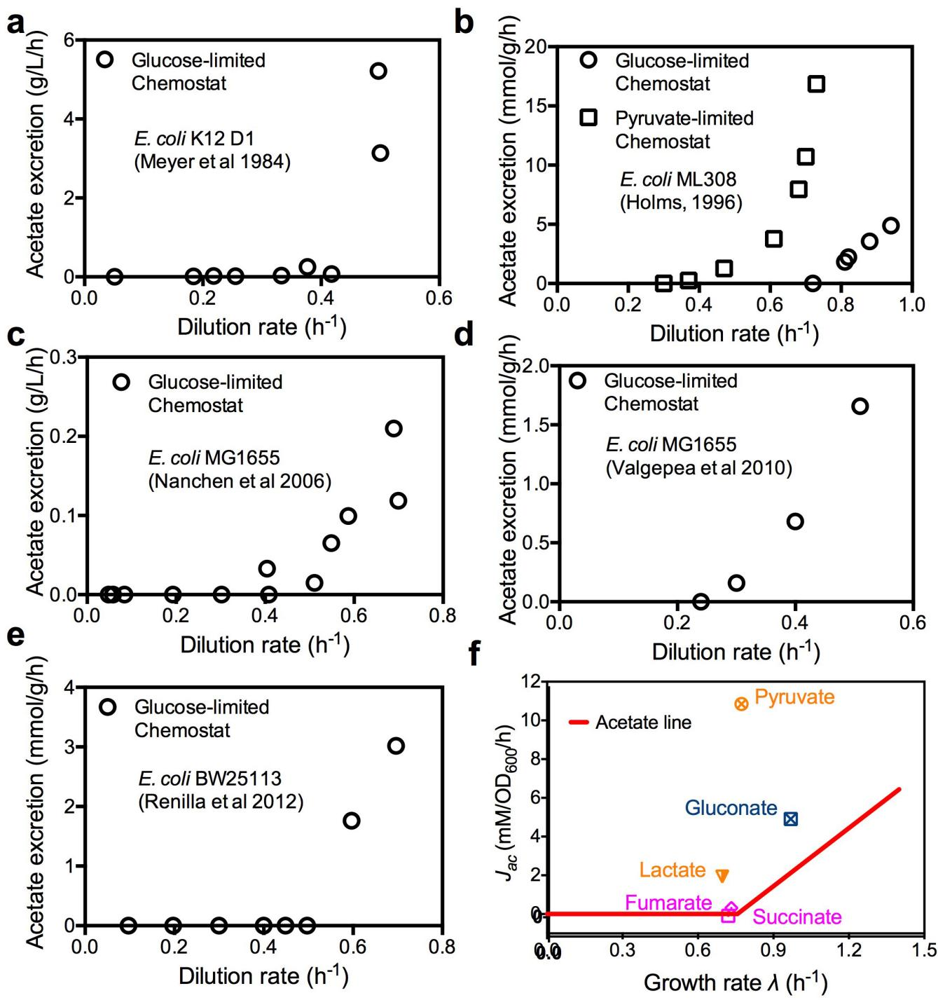

**Extended Data Figure 1** | **Acetate excretion data. a**–**f**, The acetate excretion data is shown for *E. coli* cells grown in chemostat (**a**–**e**) and for cells growing on medium with non-glycolytic carbon sources (**f**). **a**, Glucose-limited chemostat data based on figure 1 from [ref. 22](#page-5-6). **b**, Glucose-limited and pyruvate–limited chemostat data from table 7 of [ref. 57](#page-7-7). **c**, Glucose-limited chemostat data based on figure 3 of [ref. 23](#page-5-32). Only data with dilution rates less than the apparent washout dilution rate are plotted here. **d**, Glucose-limited chemostat data from table 1 of [ref. 15](#page-5-24). **e**, Glucose-limited chemostat data based on figure 1 of [ref. 16](#page-5-5). **f**, *E. coli* K-12 NCM3722 was grown in minimal medium with one of five non-glycolytic carbon sources, including two gluconeogenic substrates (pyruvate and lactate), one substrate of the pentose phosphate pathway (gluconate), and two intermediates of the TCA pathway (succinate and fumarate). Deviation from the acetate line (the red line, as defined in

[Fig. 1](#page-0-0) and equation (1) of the main text) is seen most notably for pyruvate, which excretes a very large amount of acetate, and to a lesser degree, also lactate and gluconate, which enter glycolysis as pyruvate. In the framework of our model, these deviations result from different proteome efficiencies of fermentation and respiration on these carbon sources. Note: acetate excretion measurement was also attempted for growth on LB. However, growth on LB is not characterized by a single exponential steady-state growth phase, as various constituents of the medium are depleted during the course of batch culture growth. Assuming exponential growth for *A*600 nm data below 0.3 and alternatively from 0.3 for 0.5 gave doubling time of 18 min and 28 min, respectively. The corresponding acetate excretion rates were 14.3 and 3.6 mM *A*600 nm−1 h−1 . These data should be regarded as semi-quantitative owing to the non-steady nature of growth on LB.

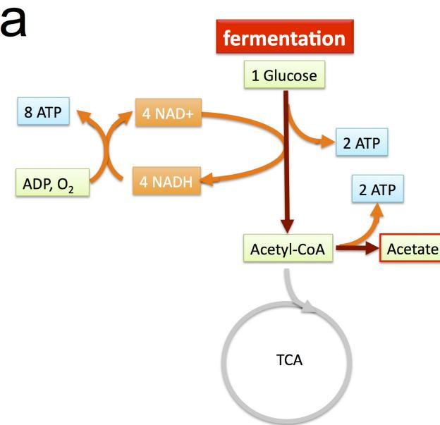

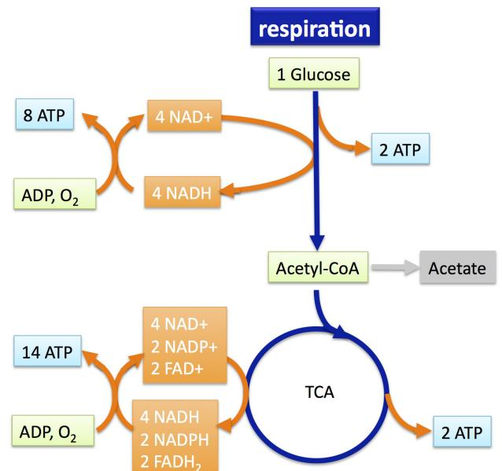

**Extended Data Figure 2** | **The (oxidative) fermentation and respiration pathways. a**, Schematic illustration of the fermentation pathway, using glucose as an exemplary carbon source. The pathway is shown as the coloured part. One molecule of glucose is catabolized into two molecules of acetate and two molecules of CO2 (not shown in the diagram), with four molecules of ATP generated via substrate phosphorylation and also four molecules of NADH produced. In the aerobic environment, NADH molecules can be converted into ATP molecules. The total number of ATP molecules produced per glucose molecule is therefore 4+ 4*x*, in which the conversion factor *x* indicates the number of ATP molecules converted from one NADH molecule (that is, ATP:NADH=*x*:1). In the illustration, we assume that two molecules of ATP are converted from one

NADH molecule; that is, *x*=2. **b**, Schematic illustration of the respiration pathway, using glucose as an exemplary carbon source. The pathway is shown as the coloured part. One molecule of glucose is catabolized into 6 molecules of CO2 (not shown in the diagram), producing 4 molecules of ATP, 6 molecules of NADH, 2 molecules of NADPH, and 2 molecules of FADH2. Using ATP:NADH=*x*:1, ATP:NADPH=*x*:1 and ATP:FADH2=*x*:2, we have the total number of ATP molecules produced as 4+9*x* for the respiration pathway. Here in the illustration, we assumed *x*=2. Note that the ratio of total ATP produced from respiration over total ATP produced from fermentation depends on the conversion factor *x*; that is, (4+9*x*)/(4+4*x*). The value of this ratio ranges from 1 (for *x*=0) to 9/4 (for *x*→∞).

# Article RESEARCH

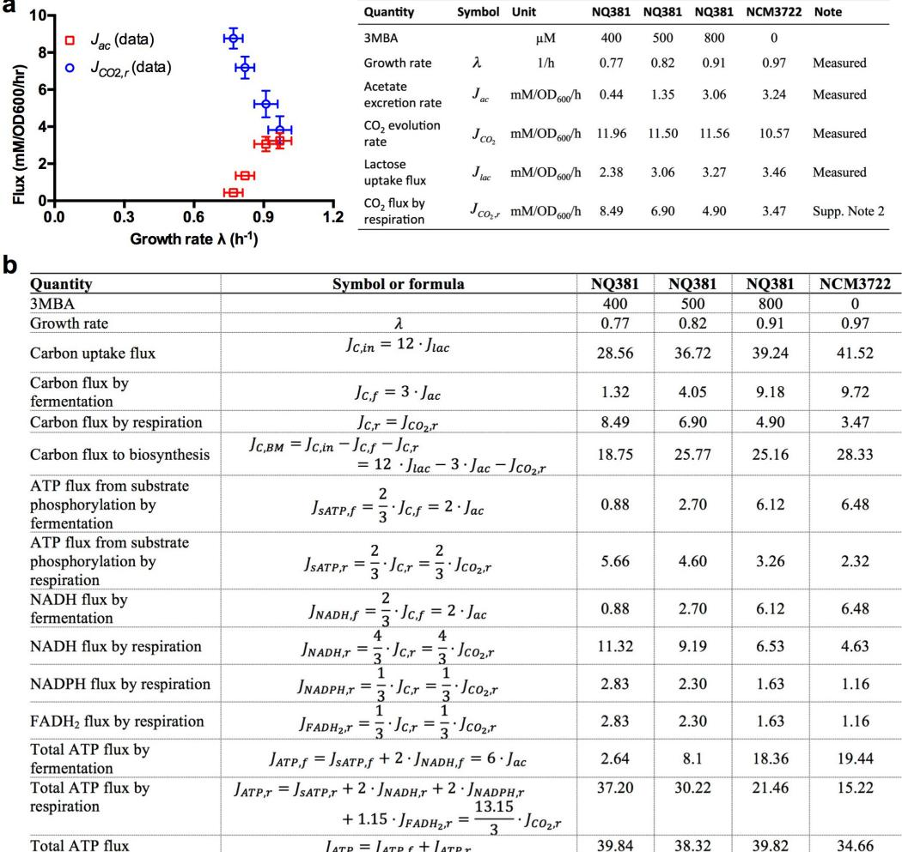

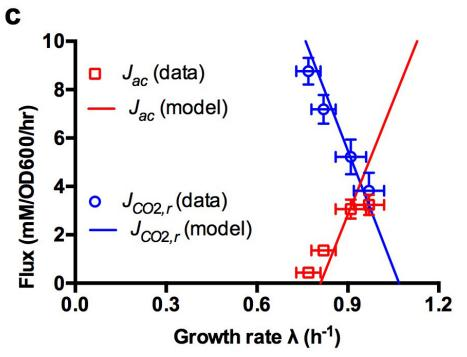

**Extended Data Figure 3** | **Growth-rate dependence of acetate production and CO2 evolution in bioreactor: data and comparisons to the model. a**, The rate of CO2 evolution was determined in a bioreactor setup for wild-type and titratable LacY cells (NCM3722 and NQ381, respectively) grown in lactose minimum medium with various degrees of lactose uptake titration, and the result was used to deduce the CO2 flux produced by respiration (blue circles). Also plotted (red squares) is the acetate excretion rate measured in the bioreactor. See Supplementary Note 2 for details of this experiment and corresponding analysis. The inducer levels, growth rate, measurements of glucose, acetate and CO2, and the deduced CO2 levels via respiration are shown in the table on the right. **b**, Deduced energy production fluxes from fermentation and respiration pathways, based on the measurements presented in **a**. Fluxes are in units of mM *A*600 nm−1 h−1 . **c**, Comparison of model and experimental data. Using the set of parameters summarized in [Extended Data Table 2,](#page-16-0) the model solution (equations (S14) and (S17)) satisfactorily describes the experimental data obtained for acetate excretion (*J*ac) and respiratory

CO2 production (*J* ) CO ,r 2 in the bioreactor for carbon limitation. These results depend on the assumed ratios of ATP-carbon conversion. As described in Supplementary Note D1, the ratios we used in this work are ATP:NADH=2:1, ATP:NADPH=2:1 and ATP:FADH2=1.15:1. Note that these conversion ratios have never been precisely measured and could be substantially overestimated[15](#page-5-24). However, the central results presented in this work are robust with respect to the choice of these conversion ratios. As an illustration, we show in **d** that the model results generated with a very different set of conversion ratios (ATP:NADH=0.5:1, ATP:NADPH=0.5:1 and ATP:FADH2=0.5:1) even provide a slightly better description of the data. (For these conversion ratios, the energy production of the cell matches the theoretical energy demand for biomass production.) The full model calibration requires the rate of CO2 evolution, which can only be measured in a bioreactor setup. We note a small discrepancy between acetate fluxes and growth rates obtained for cultures grown in bioreactor as compared to batch cultures, possibly caused by differences in aeration.

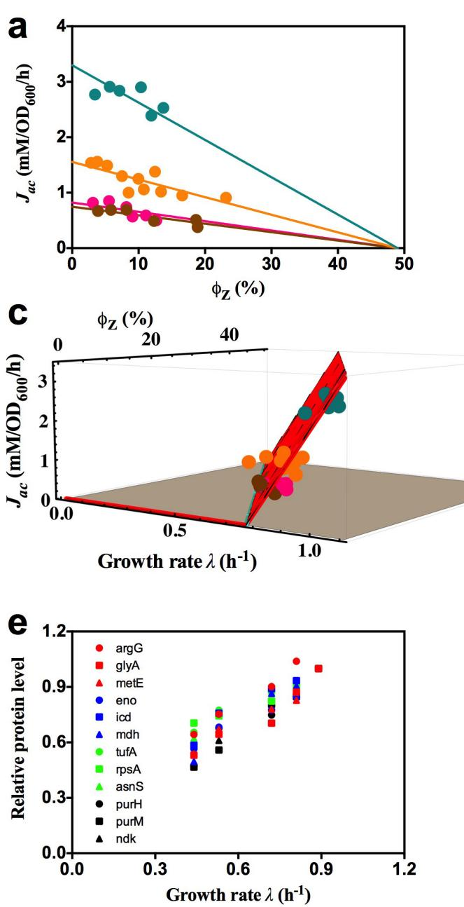

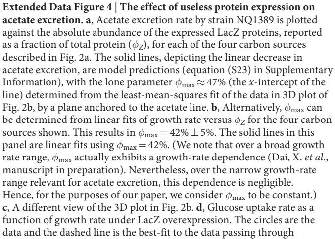

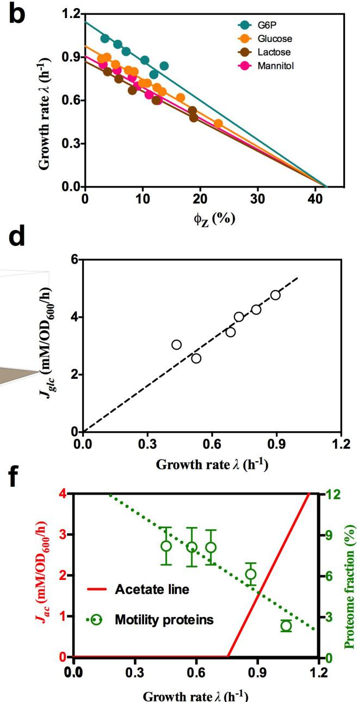

the origin. **e**, The relative protein levels of several representative genes, taken from amino acid synthesis (red), central metabolism (blue), protein synthesis genes (green), and nucleotide synthesis (black). As described in [ref. 28,](#page-5-12) the vast majority of genes exhibited an expression pattern that is linearly proportional to the growth rate when growth is changed by increasing LacZ expression. **f**, Growth-rate dependence of motility proteins under carbon limitation. The proteome fraction data (green symbols) is from the carbon limitation series in [ref. 28,](#page-5-12) in which growth rate was limited by titrating the lactose uptake for the strain NQ381. The motility proteins are proteins that are associated with the Gene Ontology (GO) term 0006810 (with GO name 'locomotion') as defined by the Gene Ontology Consortium[58](#page-7-8). See [ref. 28](#page-5-12) for detailed description of the experimental procedure and data processing. Note that the fraction of motility proteins increases the most in the growth range where acetate is excreted. Also note that the energy consumption by chemotaxis comprises a very minor fraction of the total energy budget, estimated to be in the order of 0.1% ([ref. 59)](#page-7-9). Disabling the motility function therefore does not affect the cell's energy requirement.

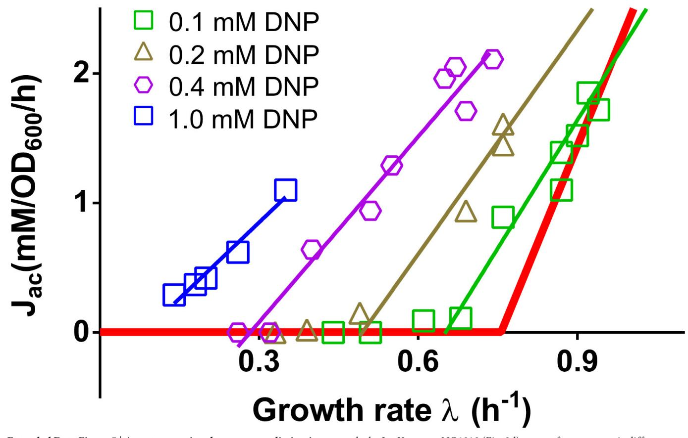

**Extended Data Figure 5** | **Acetate excretion due to energy dissipation by DNP.** DNP is a chemical known to dissipate membrane potential[60](#page-7-10) and thus imposes energy stress on the cell. Acetate excretion rates for the titratable glucose uptake strain (NQ1243) grown in medium with glucose and different concentrations of DNP were measured for different degrees of glucose uptake. The results are qualitatively similar to the data for the

leaky LacY mutant NQ1313 ([Fig. 3d)](#page-3-1), except for a systematic difference in the slopes of the resulting acetate lines (thin lines of different colours). The origin of this deviation is presumably a more complex action of DNP with additional effects on the cell as compared to the leaky LacY mutant. Indeed, it is known for instance that in addition to leakage of protons, DNP also causes leakage of osmolites through the membrane[61](#page-7-11).

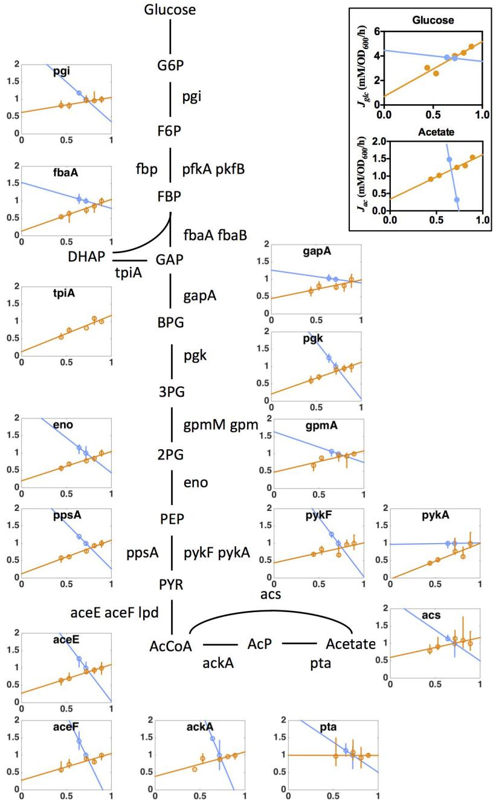

**Extended Data Figure 6** | **The relative expression levels of glycolysis proteins under proteome perturbation (by LacZ overexpression), and energy dissipation (by expressing leaky LacY).** Orange data points and linear fits result from the overexpression experiment (that is, NQ1389 grown in glucose minimal medium with different induction levels of LacZ expression), and blue data points and fits are the leaky LacY series (that is, the wild-type LacY strain NQ1312 and the leaky LacY strain NQ1313 grown in glucose minimal medium with 200 μM 3-methylbenzyl alcohol (3MBA)). The *y* axis denotes relative protein levels, which were obtained by mass spectrometry with the same reference for the two series (see Methods). The *x* axis is the growth rate (in units of h−1 ). The different trends of protein expression for the two series show the distinct nature of the two perturbations, demonstrating that these seemingly similar predictions for the acetate line (parallel shift to slow growth as shown in [Fig. 3a, d](#page-3-1)) for the two perturbations, have distinct origins and exhibit distinctly different patterns of gene expression in accordance with model predictions derived in section C3 of Supplementary Note 1 (see equations (S26) and (S36)). From the perspective of gene regulation, it is not obvious what causes the increased expression levels of glycolysis genes under energy dissipation; the transcription factor Cra in combination

with the key central carbon intermediate fructose-1,6-bisphosphate (FBP) is recognized as the major regulator of glycolysis[62](#page-7-12). FBP relieves the repression of glycolytic enzymes expression by Cra[63.](#page-7-13) The observed increase in the abundance of glycolytic enzymes under energy dissipation could be caused by a build-up of FBP, as energy stress limits protein polymerization. However, in this case, it is not clear what signalling pathway gives rise to the opposite responses of glycolytic enzymes to LacZ overexpression. Inset, corresponding glucose uptake and acetate excretion rates for the two perturbations presented in the main figure. Glucose uptake and acetate excretion rates decreased proportional to growth rate for LacZ overexpression (as expected from the model equations (S25), (S26) and (S29)). On the other hand, there was a marked increase in acetate excretion with energy dissipation for a roughly constant glucose uptake rate, as correctly anticipated by the model (equation (S36)). Note that the protein abundance of ACS (main panel) shows that this increase in the acetate excretion rate was not caused by a drop in ACS. Instead, the observed increase of acetate excretion, together with the parallel increase in the expression level of glycolysis and TCA enzymes, points to the coordination of glycolytic and TCA fluxes in response to energy demand.

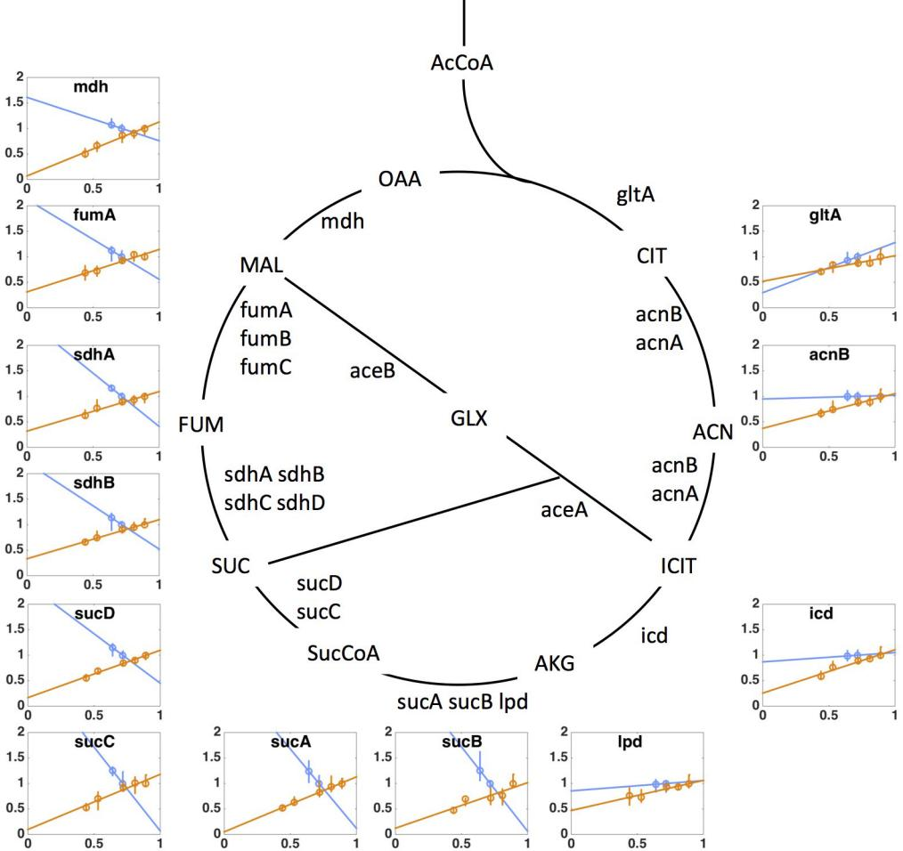

**Extended Data Figure 7** | **The relative expression level of TCA proteins under proteome perturbations (by protein overexpression) and energy dissipation (by using leaky LacY).** Orange data points and linear fits represent the overexpression experiment (that is, NQ1389 with different induction levels of LacZ expression), and blue data points and fits are the leaky LacY series (using strains NQ1312 and NQ1313 with wild-type and leaky LacY expression, respectively). The *y* axis denotes relative protein levels, which were obtained by mass spectrometry with the same reference for the two series (see Methods). The *x* axis is growth rate (in units of h−1 ). The different trends of protein expression for the two series show the distinct nature of the two perturbations, demonstrating that these seemingly similar predictions on the acetate line (parallel shift to slow growth as shown in [Fig. 3a, c)](#page-3-1) for the two perturbations, have distinct origins and exhibit distinctly different patterns of gene

expression in accordance with model predictions derived in section C3 of Supplementary Note 1 (see equations (S27) and (S37)). From the perspective of gene regulation, the transcription factor CRP is thought to be the major regulator of TCA enzyme expression in aerobic conditions[63.](#page-7-13) CRP-cAMP activity, which increases under carbon limitation, is known to activate the expression of most TCA enzymes. Together with the known role of CRP in upregulating the enzyme ACS which takes up acetate[15,](#page-5-24)[16,](#page-5-5) CRP is considered to be a major candidate for regulating energy metabolism and acetate excretion. However, our findings that the expression of TCA enzymes increased under energy dissipation while acetate excretion also increased [(Extended Data Fig. 6,](#page-13-0) inset) cannot be accounted for by known mechanisms of CRP regulation, and instead suggest an important role of additional regulators in the coordination of energy biogenesis pathways.

#### **Extended Data Table 1** | **Strains used in this study**

| Strain  | Genotype                                                                      | Description                             |  |  |  |
|---------|-------------------------------------------------------------------------------|-----------------------------------------|--|--|--|
| NCM3722 | wild-type E. coli K12 strain                                                  | parent strain for all strains used here |  |  |  |
| NQ381   | attB::PLlac-01-xylR, lacY::km-Pu-lacY                                         | titratable Lac Y                        |  |  |  |
| NO636   | glpK g184t                                                                    | Glpk mutant                             |  |  |  |
| NO638   | glpK a218t                                                                    | Glpk mutant                             |  |  |  |
| NQ640   | glpK g692a                                                                    | Glpk mutant                             |  |  |  |
| NO1243  | ycaD::FRT:Ptet:xylR PptsG::kan:Pu:ptsG                                        | Titratable PtsG                         |  |  |  |
| NQ1312  | ycaD::FRT:Ptet:xylR PptsG::kan:Pu:ptsG; pZA31 Ptet-lacY                    | WT LacY control for NQ1313              |  |  |  |
| NO1313  | ycaD::FRT:Ptet:xylR PptsG::kan:Pu:ptsG; Ptet- lac YA177V on pZA31 | leaky Lac Y mutant                      |  |  |  |
| NO1388  | ycaD::FRT:Ptet:xylR Pu:ptsG; △flhD-kan                                        | flhD deletion strain                    |  |  |  |
| NQ1389  | Ptet-tetR on pZA31; Ptetstab-lacZ on pZE1                                     | LacZ over-expression strain             |  |  |  |
| NO1539  | ycaD::FRT:Ptet:xylR Pu:ptsG; △fliA-kan                                        | fliA deletion strain                    |  |  |  |
| EQ353   | wild-type E. coli MG1655 used in Li et al                                     | obtained from Jonathan Weissman lab     |  |  |  |

Except for EQ353, all the strains used are derived from *E. coli* K-12 strain NCM3722 (refs [50](#page-7-14)[–52](#page-7-15)) provided by the S. Kustu laboratory. Descriptions of the key strains used in this study are as follows. **NQ1243**: varying glucose uptake by titrating the expression of PtsG, a subunit of the glucose PTS permease. The glucose PTS permease consists of two subunits, PtsG and Crr. Strain NQ1243 was constructed by replacing the *ptsG* promoter with a titratable Pu promoter from *Pseudomonas putida*. The activity of the Pu promoter is activated by the regulator XylR upon induction by 3-methylbenzyl alcohol. Strain NQ1243 was grown in glucose minimal medium, supplemented with various 3-methylbenzyl alcohol levels (0–800μM) to stimulate XylR and titrate the expression of PtsG. **NQ381:** varying lactose uptake by titrating the expression of LacY. LacY (or lactose permease) is the primary transporter that allows *E. coli* to grow on lactose as the sole carbon source. Strain NQ381 was constructed by inserting the same titratable Pu promoter (above) between *lacZ* stop codon and *lacY* start codon. See [ref. 27](#page-5-11) details of strain construction. **NQ1389:** the titratable LacZ overexpression system. This strain carries two plasmids pZA31 and pZE1. The repressor TetR gene on the pZA31 plasmid is driven by the TetR-repressible PLtet-O1 promoter[53,](#page-7-16) while the *lacZ* gene on the pZE1 plasmid is driven by the modified tet-promoter (more stable with respect to spontaneous mutations). The combination of these two plasmids creates a stable, finely titratable system that can be induced via the addition of chlorotetracycline in the medium[54.](#page-7-17) This induction system is tight, highly linear and capable of very high LacZ expression levels (with LacZ constituting up to 42% of the proteome) as seen in [Fig. 2](#page-3-0) and [Extended Data Fig. 4.](#page-11-0) See [ref. 28](#page-5-12) for details of strain construction. **NQ1312 and NQ1313**: strains containing plasmids expressing LacY and LacYA177V. The leaky LacY mutant (LacYA177V) [33](#page-5-18) or the control wild-type LacY is each driven by the PLtet-O1 promoter, harboured on the pZA31 plasmid. Neither strain contains a source of the TetR repressor, hence the plasmid expression system is fully induced. Bacteria use the H+ gradient across its inner membrane generated from the electron transport chain to produce ATP using the ATP synthase complex. The leaky LacY protein allows protons to pass through the inner membrane of the cell, thereby 'draining' the membrane potential generated by energy production pathways. This in turn leads to reduced energy efficiency or an increased energy demand on the bacterium.

#### **Extended Data Table 2** | **Model parameters calibrated from bioreactor**

| Parameter (Units) | Description                                                                             | From literature | Measured   |
|----------------------|-----------------------------------------------------------------------------------------|--------------------|------------|
| ФЕ,max=1-Фо (%)      | maximum energy proteome fraction extrapolated to 2 = 0                                  |                    | 19.0±1.2ª  |
| b (% hr)             | energy sector growth rate dependence                                                    |                    | 12.0±1.4b  |
| σ (mM/OD)            | energy demand, proportionality constant with growth rate                                |                    | 45.7±2.8€  |
| er (1)               | carbon efficiency, fermentation                                                         | 2.0ª               |            |
| er (1)               | carbon efficiency, respiration                                                          | 4.40               |            |
| & (mM/OD/hr)         | protein efficiency, fermentation                                                        |                    | 750+30+    |
| Er (mM/OD/hr)        | protein efficiency, respiration                                                         |                    | 390±108    |
| ß (mM/OD)            | carbon demand for biomass building blocks, proportionality constant with growth rate |                    | 28.5+1.3h  |
| Фтах (1)             | maximum total proteome fraction                                                         |                    | 0.42=0.051 |
| Sac (1)              | stoichiometric factor for acetate from fermentation                                     | 1/31               |            |
| Sco2 (1)             | stoichiometric factor for CO2 from respiration                                          | 1/6k               |            |

aDetermined from mass spectrometry data. Offset of linear function fitted to the total energy sector size in Supplementary Note 1, Fig. N6. Error inferred from this linear fit. See Supplementary Note 1, section D4, for details.

bDetermined from mass spectrometry data. Slope of linear function fitted to the total energy sector size in Supplementary Note 1, Fig. N6. Error inferred from this linear fit. See Supplementary Note 1, section D4, for details.

c Determined from energy flux data, assuming energy demand proportional to growth rate. See Supplementary Note 1, section D3, and Fig. N5.

dDetermined from the literature. Number of ATP produced per carbon processed in fermentation. A total of 4 ATP and 4 NADH molecules is produced per glucose molecule metabolized in fermentation (EcoCyc[55](#page-7-18)). On the basis of [ref. 56,](#page-7-19) a conversion ratio of NADH, NADPH to ATP of 2.0 was assumed. Hence, the equivalent of 2.0 ATP molecules are produced per carbon metabolized in fermentation.

eDetermined from the literature. Number of ATP produced per carbon processed in respiration. A total of 4 ATP, 2 FADH2, 2 NADPH and 8 NADH molecules is produced per glucose molecule metabolized in respiration (EcoCyc[55)](#page-7-18). On the basis of [ref. 56,](#page-7-19) a conversion ratio of NADH, NADPH to ATP of 2.0 and a conversion ratio of FADH2 to ATP of 1.15 was assumed. Hence, the equivalent of 4.4 ATP are produced per carbon metabolized in respiration.

f Determined from mass spectrometry data. Energy flux produced per protein fraction invested in the fermentation pathway. See Supplementary Note 1, section D5, for details.

gDetermined from mass spectrometry data. Energy flux produced per protein fraction invested in the respiration pathway. See Supplementary Note 1, section D5, for details.

hDetermined from carbon uptake flux and carbon fluxes by the energy pathways. See Supplementary Note 1, section D2, and Fig. N4 for details.

i Determined by LacZ overexpression. Given by the proteome fraction occupied by LacZ, at which the growth rate vanishes. According to the average and the corresponding standard deviation of the fits of the data presented in [Fig. 2](#page-3-0), growth rate vanishes at 260,000±30,000 MU, which translates into a proteome fraction of 42%±5%, given that 100,00 MU corresponds to 1.6% of proteome. Note that this estimate is in good agreement with the estimates in previous works[21](#page-5-4)[,27,](#page-5-11)[28.](#page-5-12)

j Here, *S*ac=1/3 simply because of the chemical reaction 6C→2acetate+2CO2 of the fermentation pathway: the carbon uptake flux *J*C,f measured in units of the number of carbon atoms (C), is three times of the flux of acetate molecules.

k *S*CO2=1/6 simply because of the chemical reaction 6C→12CO2 of the respiration pathway, oxidizing all carbon atoms to CO2.

| Parameter   | Description                                                                                                 | Equations | Figures                            | Units    | Predicted | Empirical   |
|-------------|-------------------------------------------------------------------------------------------------------------|-----------|------------------------------------|----------|-----------|-------------|
| Jac'(2 = 0) | LacZ overexpression, glucose, acetate excretion intercept at 1=0                                         | S26       | 2a                                 | mM/OD/hr | 0.0ª      | 0.17±0.11b  |
| Jac'(2 = 0) | LacZ overexpression, G6P, acetate excretion intercept at 1=0                                             | S26       | 2a                                 | mM/OD/hr | 0.0ª      | 0.70+0.25b  |
| Jac'(2 = 0) | LacZ overexpression, lactose, acetate excretion intercept at 1=0                                         | S26       | 2a                                 | mM/OD/hr | 0.0ª      | 0.13=0.11b  |
| Jac'(2 = 0) | LacZ overexpression, mannitol, acetate excretion intercept at 1=0                                        | S26       | 2a                                 | mM/OD/hr | 0.0ª      | -0.18±0.040 |
| Sac         | slope acetate line with constant LacZ expression level of 50 000 MU (or p = 8%)                       | S30       | N2a, 3a                            | mM/OD    | 10.00     | 11.0±1.2ª   |
| Nac "       | threshold growth rate of acetate line with constant LacZ expression level of 50 000 MU (or pr = 8%)      | S30       | N2a, 3a                            | 1/hr     | 0.61€     | 0.66=0.05a  |
| Sac '       | slope acetate line with constant LacZ expression level of 100 000 MU (or Φ7 = 16%)                    | S30       | N2a, 3a                            | mM/OD    | 10.00     | 9.1±1.3ª    |
| Nac "       | threshold growth rate of acetate line with constant LacZ expression level of 100 000 MU (or Φz = 16%) | S30       | N2a, 3a                            | 1 /hr    | 0.47€     | 0.48±0.22ª  |
| Nac "       | threshold growth rate of acetate line with flagella knockout                                             | S14, S28  | 3b. Extended Data Fig. 4f | 1/hr     | 0.881     | 0.96=0.028  |
| Aac "       | threshold growth rate of acetate line with 2mM chloramphenicol                                           | S14       | N2b, 3b                            | 1/hr     | 0.59"     | 0.54±0.021  |
| λας"        | threshold growth rate of acetate line with 4mM chloramphenicol                                           | S14       | N2b, 3b                            | 1/hr     | 0.48h     | 0.46=0.021  |
| Nac "       | threshold growth rate of acetate line with 8mM chloramphenicol                                           | S14       | N2b, 3b                            | 1 /hr    | 0.300     | 0.26+0.041  |
| Sac         | slope of acetate line with LacYA177V                                                                        | S32       | N3, 3c                             | mM/OD    | 10.0      | 11.1+0.6k   |

#### **Extended Data Table 3** | **Comparison between phenomenological model predictions and empirical results**

aEquation (S26) in Supplementary Information predicts direct proportionalities between growth rate *λ* and acetate excretion rates *J*ac′ for LacZ overexpression. Hence, the lines should intercept the origin, with a vanishing acetate excretion rate *J*ac′(*λ*=0).

bIntercept *J*ac′(*λ*=0) of the least-mean-squares fit of a line to the experimental data for different levels of LacZ overexpression presented in [Fig. 2a](#page-3-0).

c Equation (S30) predicts a slope identical to the standard acetate line for a constant level of LacZ overexpression. The model prediction is illustrated in Supplementary Note 1, Fig. N2a, and presented as the thin red lines in [Fig. 3a](#page-3-1).

dFor the four tested carbon sources G6P, glucose, mannitol and lactose, acetate excretion rates and β-galactosidase activities were fitted as linear functions of growth rate. These fits were then used to interpolate growth rates and acetate excretion rates for a fixed level of LacZ overexpression. This resulted in the four points for a fixed LacZ level from each of the different carbon sources presented in [Fig. 3a.](#page-3-1) Resulting slopes and intercepts presented in this table are the result of least-mean-squares fits of lines to these points.

eEquation (S30) in Supplementary Information predicts the threshold growth rate for a fixed amount of protein overexpression, using the parameter *φ*max empirically determined in this work and previous works[21,](#page-5-4)[27](#page-5-11)[,28](#page-5-12) as input. The model prediction is illustrated in Supplementary Note 1 Fig. N2a and presented as the thin red lines in [Fig. 3a.](#page-3-1)

f Using equations (S14) and (S28) of Supplementary Information, assuming the proteome sector of motility proteins decreases linearly with growth rate, vanishing at *λ*=1.1h−1 and constituting 10% of the proteome at *λ*=*λ*ac (compare to [Extended Data Fig. 4f)](#page-11-0).

gEstimated from the data presented in [Extended Data Fig. 4a](#page-11-0).

hFor chloramphenicol stress, equation (S14) in Supplementary Information predicts an increased slope *s*ac′ with an identical offset *s*ac′*λ*ac′, as compared to the standard acetate line. The model predictions (thin red lines, [Fig. 3c)](#page-3-1) arise from using the offset of the standard acetate line given by *s*ac*λ*ac as input and the slope of the modified acetate line as a fitting parameter. i Threshold growth rate determined from a least-mean-squares fit of a line to the data points presented in [Fig. 3c.](#page-3-1)

j Equation (S32) in Supplementary Information predicts an identical slope of the modified acetate line with energy dissipation as compared to the standard acetate line. The model prediction is illustrated in Supplementary Note 1, Fig. N3, and presented as the thin red line in [Fig. 3d](#page-3-1).

kSlope is the result of a least-mean-squares fit of a line to the data points presented in [Fig. 3d.](#page-3-1)