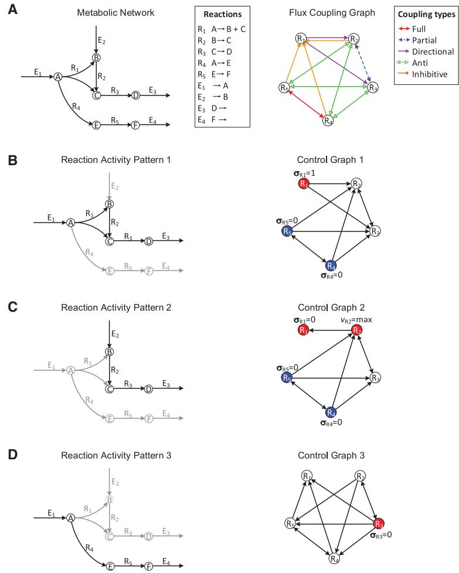
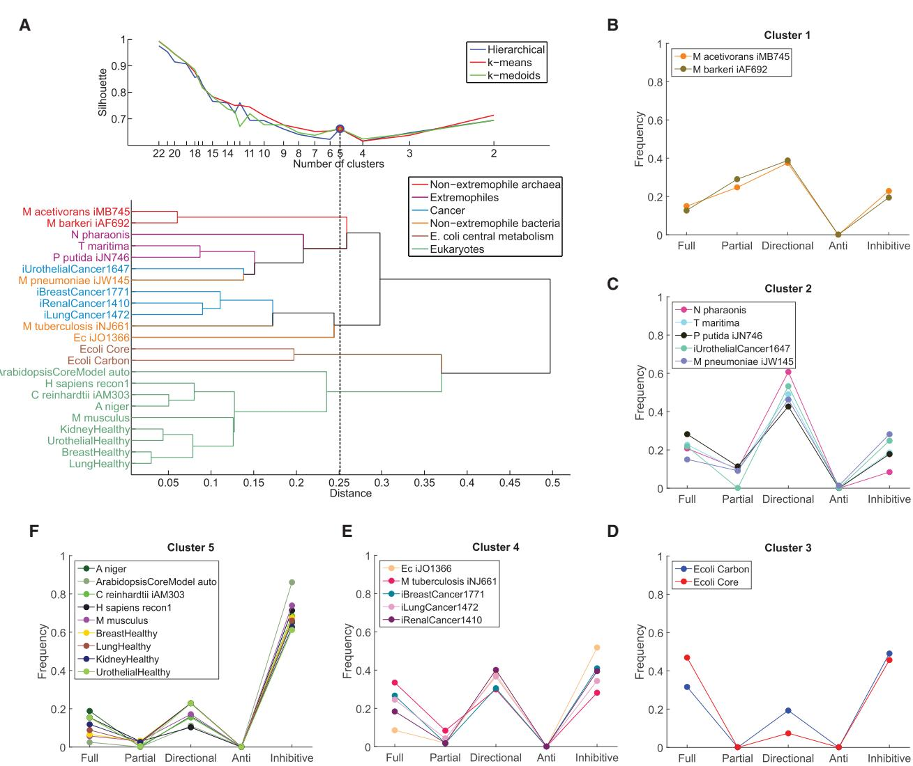
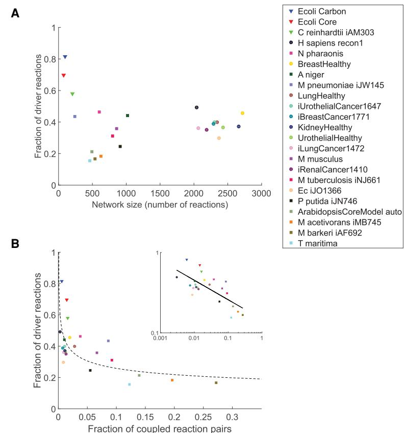
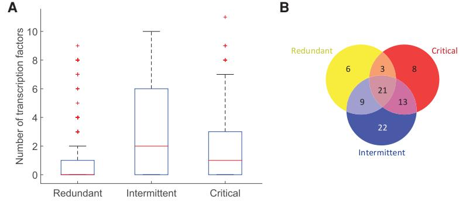
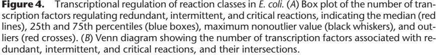
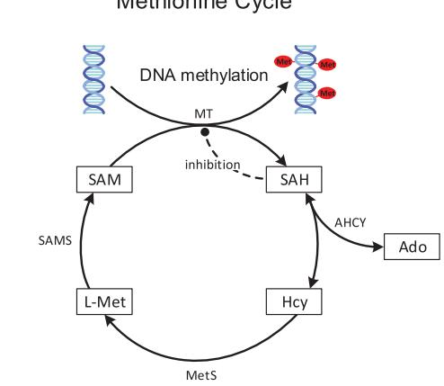
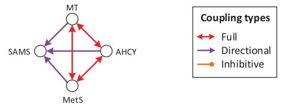
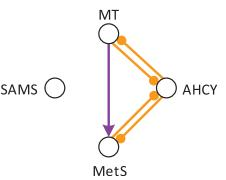

# Method

# Control of fluxes in metabolic networks

# Georg Basler,1,2,8 Zoran Nikoloski,3,8 Abdelhalim Larhlimi,4 Albert-László Barabási,5,6,7 and Yang-Yu Liu6,7

1 Department of Chemical and Biomolecular Engineering, University of California, Berkeley, California 94720, USA; 2 Department of Environmental Protection, Estación Experimental del Zaidín CSIC, Granada, 18008 Spain; 3 Systems Biology and Mathematical Modeling, Max Planck Institute of Molecular Plant Physiology, Potsdam, 14476 Germany; 4 Laboratoire d'Informatique de Nantes Atlantique, Université de Nantes, Nantes, 44322 France; 5 Center for Complex Network Research and Departments of Physics, Computer Science, and Biology, Northeastern University, Boston, Massachusetts 02115, USA; 6 Channing Division of Network Medicine, Department of Medicine, Brigham and Women's Hospital, Harvard Medical School, Boston, Massachusetts 02115, USA; 7 Center for Cancer Systems Biology, Dana-Farber Cancer Institute, Harvard Medical School, Boston, Massachusetts 02215, USA

Understanding the control of large-scale metabolic networks is central to biology and medicine. However, existing approaches either require specifying a cellular objective or can only be used for small networks. We introduce new coupling types describing the relations between reaction activities, and develop an efficient computational framework, which does not require any cellular objective for systematic studies of large-scale metabolism. We identify the driver reactions facilitating control of 23 metabolic networks from all kingdoms of life. We find that unicellular organisms require a smaller degree of control than multicellular organisms. Driver reactions are under complex cellular regulation in Escherichia coli, indicating their preeminent role in facilitating cellular control. In human cancer cells, driver reactions play pivotal roles in malignancy and represent potential therapeutic targets. The developed framework helps us gain insights into regulatory principles of diseases and facilitates design of engineering strategies at the interface of gene regulation, signaling, and metabolism.

# [Supplemental material is available for this article.]

Understanding how cellular systems are controlled on a genomescale is a central issue in biology and medicine. Metabolic networks are at the center of systems biology approaches to unraveling cellular control, because metabolism carries the life-sustaining cellular functions shaping the molecular phenotype (Sweetlove and Ratcliffe 2011). The steady-state principle and physico-chemical constraints (e.g., mass balance and thermodynamics) have been employed to reduce the number of considered network states, facilitating the prediction of genotype-phenotype relationships and intervention strategies for biotechnological or medical purposes (McCloskey et al. 2013). In particular, flux balance analysis and variations thereof have been successfully applied to the metabolic networks of unicellular organisms to predict their metabolic and cellular phenotypes (Varma and Palsson 1994). Yet, those approaches are biased (Lewis et al. 2012) because they restrict the flux space to an a priori specified reference state by assuming a cellular objective to be optimized by the organism (Schuetz et al. 2007). While optimization of biomass yield has proven useful for unicellular organisms, identification of a suitable objective for multicellular organisms remains a nontrivial endeavor (Sweetlove and Ratcliffe 2011). Other approaches, e.g., elementary flux modes (Schuster and Schuster 1993) and extreme pathways analyses (Schilling et al. 2000), do not assume a cellular objective and hence are unbiased. However, despite extensive studies and recent advances (Terzer and Stelling 2008), these unbiased approaches are limited to rather small networks due to their intrinsic computational complexity. We still lack an unbiased computational

8 These authors contributed equally to this work.

Corresponding author: [yyl@channing.harvard.edu](mailto:yyl@channing.harvard.edu) Article published online before print. Article, supplemental material, and publication date are at [http://www.genome.org/cgi/doi/10.1101/gr.202648.115.](http://www.genome.org/cgi/doi/10.1101/gr.202648.115)

approach for systematically studying the control of large-scale metabolic networks.

Here, we develop such an approach by employing the flux coupling between reactions (Burgard et al. 2004). The key idea is that the activity of a reaction can be controlled by directly manipulating a reaction to which it is coupled. The most efficient control strategy is then given by the smallest set of driver reactions that must be directly controlled for controlling the activity of all reactions in the network. To identify the smallest set of driver reactions offering control over the whole network, we first need to fully exploit the qualitative couplings among reactions. There are four possible cases by which the flux of one reaction R1 can be used to qualitatively control the flux of another reaction R2: (1) An active flux of R1 leads to activation of R2; (2) an inactive flux of R1 leads to deactivation of R2; (3) an inactive flux of R1 leads to activation of R2; and (4) an active flux of R1 leads to deactivation of R2. We find that the flux coupling types proposed and widely used in the literature only account for cases (1) and (2), unaware of the potential offered by cases (3) and (4). Here, we identify two new coupling types that describe well-known biochemical principles and allow us to consider the remaining two cases. We show that the resulting driver reactions can be determined efficiently for large metabolic networks by solving a classical graph-theoretic problem via integer linear programming. Our framework does not require any a priori knowledge of the cellular objectives and hence is unbiased. Moreover, it enables systematic analyses of the control

[© 2016 Basler et al.](http://genome.cshlp.org/site/misc/terms.xhtml) This article is distributed exclusively by Cold Spring Harbor Laboratory Press for the first six months after the full-issue publication date (see [http://genome.cshlp.org/site/misc/terms.xhtml)](http://genome.cshlp.org/site/misc/terms.xhtml). After six months, it is available under a Creative Commons License (Attribution-NonCommercial 4.0 International), as described at [http://creativecommons.org/licenses/](http://creativecommons.org/licenses/by-nc/4.0/) [by-nc/4.0/.](http://creativecommons.org/licenses/by-nc/4.0/)

principles of large-scale metabolic networks, offering mechanistic insights into cellular regulation.

# Results

#### Five flux coupling types enable efficient control of metabolic networks

Formally, the structure of a metabolic network is uniquely specified by its m × n stoichiometric matrix, S = [sij], with m rows denoting metabolites and n columns representing reactions. An entry sij represents the stoichiometry of metabolite i in reaction j, with neg-

Figure 1. Illustration of flux coupling graph, control graph, and driver reactions. (A, left) Metabolic network with vertices representing metabolites, labeled A–F; hyperedges representing internal reactions, labeled R1–R5; and exchange reactions, labeled E1–E4. (Right) Flux coupling graph of the internal reactions of the metabolic network, with vertices representing reactions and labeled edges representing the five coupling relations (represented by different colors; see legend). Here, only internal reactions are considered for brevity [(Supplemental Fig. S1](http://genome.cshlp.org/lookup/suppl/doi:10.1101/gr.202648.115/-/DC1) shows the flux coupling graph including exchange reactions). (B–D) Three activity patterns (left) describing the active (black arrows) and inactive reactions (gray arrows). The control graphs (right) are obtained by integrating the flux coupling graph with the activity pattern and describe which reactions can be controlled to impose the status of other reactions in the activity pattern (Methods). The driver reactions are given by a smallest set of vertices, such that each vertex in the control graph is either contained in the set or a direct successor of a vertex from the set. Vertices corresponding to driver reactions are colored; one vertex of each color must be controlled simultaneously. The required activities of the driver reactions (deactivation, activation, or maximization) are depicted next to the vertices. For example, activity pattern 1 is achieved by the simultaneous activation of R1 and deactivation of either R4 or R5.

ative entries denoting reactants and positive entries indicating products. A feasible flux distribution of a metabolic network S is defined as a flux vector v satisfying the steady-state condition (Sv = 0) subject to lower and upper bounds (lb ≤ v ≤ ub). We propose an additional constraint of a nonzero exchange of matter with the environment (i.e., the flux vi ≠ 0 for at least one exchange reaction i). This is a natural requirement for any living system, which also allows us to introduce new flux coupling relations (Methods). The status σi v = |sign(vi)| of a reaction i in v is called active, if σi v = 1; and inactive, if σi v = 0.

The steady-state principle implies that some reactions operate in a concerted manner, leading to coupling relations between rates

> and, thus, status of reactions. To represent the coupling relations between reactions in a metabolic network, we construct the flux coupling graph (FCG) (Burgard et al. 2004), where vertices denote reactions and edges describe the coupling types (Fig. 1A; Methods). Three types of flux coupling have been proposed in the literature (Burgard et al. 2004): directional, partial, and full coupling. A reaction i is directionally coupled to j if σi v = 1 implies that σj v = 1 (and equivalently, σj v = 0 implies σi v = 0) (e.g., R1 and R3 in Fig. 1A; see "Analogy between flux coupling and mass balance" in the [Supplemental Material](http://genome.cshlp.org/lookup/suppl/doi:10.1101/gr.202648.115/-/DC1) on the derivation of flux coupling relations of this small network using mass balance equations). Partial coupling is a special case of directional coupling: Two reactions, i and j, are partially coupled if they have the same status, i.e., σi v = σj v , in every feasible flux distribution (e.g., R2 and R3 in Fig. 1A). Moreover, full coupling is a special case of partial coupling: Two reactions are fully coupled, if there is a constant, λ ≠ 0, such that vi = λvj for every feasible flux distribution v (e.g., R4 and R5 in Fig. 1A). Thus, full and partial coupling have equivalent implications with respect to the status of reactions i and j, since in both cases σi v = 1 if and only if σj v = 1. Moreover, these three coupling relations are similar in the sense that they allow a reaction to be activated or deactivated by imposing the same status on a reaction towhich it is coupled (σi v = σj v ). However, they do not allow for activating or deactivating a reaction by using reactions that have a different status (σi v ≠ σj v ).

> To consider the two remaining cases, we introduce two new coupling types, called anti- and inhibitive couplings: Two reactions i and j are anticoupled, if σi v = 0 implies σj v = 1 (and equivalently σj v = 0 implies σi v = 1) for any feasible flux distribution v (e.g., R3 and R5 in Fig. 1A). In other words, if one of the two reactions is inactive, then a (nonzero) steady-state flux is

only possible if the other reaction carries a nonzero flux. A reaction i is inhibitively coupled to a reaction j if a maximum flux of reaction i implies that j is inactive. Note that just an active reaction cannot imply the deactivation of another reaction (see "Flux coupling analysis" in the [Supplemental Material](http://genome.cshlp.org/lookup/suppl/doi:10.1101/gr.202648.115/-/DC1)). Inhibitive coupling occurs when two reactions compete for the same reactant or product (e.g., R4 and R1 in Fig. 1A, which share the reactant A), although more complex cases are possible (e.g., the inhibitive coupling of R5 to R1 in Fig. 1A due to full coupling of R4 and R5). In that case, a maximum flux of one reaction implies a maximum consumption (or production) of the shared metabolite, such that a nonzero flux through the other reaction would violate steady state. The two new coupling relations demonstrate that an active or inactive flux of a reaction i can also impose the opposite status on a reaction j (i.e., σi v implies σj v with σi v ≠ σj v ).

The coupling of reactions implies that fluxes may not only be directly controlled by the regulation of enzyme activities and concentrations (Fell 2005) but also be implicitly controlled by the requirement of achieving and maintaining a steady state. This suggests that the expression of genes encoding the enzymes of coupled reactions is coordinated in agreement with their imposed status. For example, the synthesis of the enzyme catalyzing a reaction that is inactive due to its coupling with other reactions would imply a waste of resources. Likewise, if a reaction is required to be active due to the present couplings but cannot occur based on the existing regulatory interactions, then the system cannot operate at steady state. Thus, we hypothesize that coupled reactions are coregulated by a common transcription factor (TF), as this would indicate their coordinated regulation. To test this hypothesis, we overlay the gene regulatory network of Escherichia coli (Salgado et al. 2013) on its genome-scale metabolic network (Orth et al. 2011) and determine the agreement between reaction couplings and the coregulation of their enzyme-coding genes by a common TF (Methods). This approach accounts for the transcriptional regulation of genes from the same operon, as well as across operons. Hence, we generalize a previous study of the operonic organization of genes associated with fully and directionally coupled reactions (Notebaart et al. 2008). We find that coupled reactions are very likely coregulated (hypergeometric test, P value = 3.3 × 10−290, including all types of coupling). With respect to the individual coupling types, there is a striking agreement between coregulation and fully coupled reactions ([Supplemental Fig. S2](http://genome.cshlp.org/lookup/suppl/doi:10.1101/gr.202648.115/-/DC1)): While only 24,303 (5.7%) of the total 427,350 pairs of enzyme-catalyzed reactions are coregulated, 175 (42.9%) of the 408 fully coupled pairs are coregulated, which is highly significant (hypergeometric test, P value = 4.2 × 10−105). In contrast, none of the 36 partially coupled reaction pairs is coregulated. There is a small but significant (P value = 2.6 × 10−2 ) agreement for the 2999 directionally coupled reactions, of which 196 are coregulated (6.5%). This extends the finding that genes associated with fully and directionally coupled reactions are frequently located on the same operon (Notebaart et al. 2008) and suggests their coordinated regulation by common TFs. While there are no anti-coupled reactions in the genome-scale metabolic network of E. coli, the proposed inhibitive coupling also shows a strong agreement with coregulation: Of the 6847 inhibitively coupled reaction pairs, 1220 are coregulated (17.8%, P value = 7.9 × 10−278). These results demonstrate that the expression of metabolic genes is coordinated by transcriptional regulation in line with reaction couplings, confirming their relevance for metabolic regulation.

## Flux coupling profiles capture phylogenetic signals of metabolic networks

To determine if flux coupling reflects functional principles of metabolism, we analyze 23 high-quality metabolic networks from all kingdoms of life (Table 1). The networks vary greatly in their sizes, tissues, subcellular compartmentalization, and unior multicellular organization (Methods). For each network, we first calculate the five coupling types over all reaction pairs. We find that anti-coupling is rarely found in genome-scale networks [(Supplemental Table S1)](http://genome.cshlp.org/lookup/suppl/doi:10.1101/gr.202648.115/-/DC1), which indicates the existence of redundant pathways operating in steady states of these networks (see "Flux coupling analysis" in the [Supplemental Material](http://genome.cshlp.org/lookup/suppl/doi:10.1101/gr.202648.115/-/DC1)). Nevertheless, anti-coupled reactions occur in four medium-size networks (Arabidopsis thaliana, Methanosarcina barkeri, Mycoplasma pneumoniae, Thermotoga maritima), and the network of E. coli carbon metabolism.

The relative frequencies of the five coupling types in a given network define the corresponding flux coupling profile (Methods). To determine whether the flux coupling profiles reflect functionally important features of the analyzed metabolic networks, we assess their statistical significance using network randomization under mass-balance constraints (Basler et al. 2011). We find that the flux coupling profiles for most networks and coupling types are significantly different from their randomized variants, suggesting that they reflect evolutionary features of their metabolism (Methods; Basler et al. 2012).

To determine the extent to which flux coupling profiles reflect the phylogeny of the considered biological systems, we apply three classical clustering algorithms together with three well-established cluster quality measures (Methods). We find that the clustering of the flux coupling profiles indeed reflects the established phylogeny and functional differences of the metabolic networks, as demonstrated by the separation into five clusters obtained consistently from the three clustering algorithms (Fig. 2): The flux coupling profiles of the two nonextremophile archaea (cluster 1) are separated from those of extremophiles (cluster 2) and the two networks of E. coli central metabolism (cluster 3). The flux coupling profiles of three cancer types fall together with the profiles of the genome-scale metabolic networks of E. coli and Mycobacterium tuberculosis (cluster 4). Moreover, the cancer networks (clusters 2 and 4) are clearly separated from the corresponding healthy tissues (cluster 5), suggesting that distinct coupling patterns characterize healthy and cancer tissues. In particular, the flux coupling profiles of all nine considered eukaryotes form a separate branch of the clustering tree (cluster 5) despite the apparent differences in the size and cellular organization of the represented metabolic networks (cf. Table 1).

For comparison, we find that the clustering based only on the previously studied flux coupling types, i.e., full, partial, and directional couplings, does not correspond to phylogenetic or functional relationships of the analyzed metabolic networks (Methods; [Supplemental Fig. S3)](http://genome.cshlp.org/lookup/suppl/doi:10.1101/gr.202648.115/-/DC1). Instead, we observe that networks within functionally or phylogenetically related groups, such as the networks of E. coli central metabolism, extremophiles, or eukaryotes, are dispersed across clusters. Moreover, the separation of cancer networks from their corresponding healthy tissue networks is no longer apparent, since cancer networks are assigned to clusters together with the corresponding healthy tissue or other eukaryotic networks. This indicates that the flux coupling profiles obtained from the five coupling types, but not those of the previously studied coupling types, reflect the phylogeny of metabolic networks.

| C | Network                   | n    | d    | Description                                                                 | Reference                   |
|---|---------------------------|------|------|-----------------------------------------------------------------------------|-----------------------------|
| 1 | M acetivorans iMB745      | 628  | 18.3 | Genome-scale metabolic network of Methanosarcina acetivorans             | (Satish Kumar et al. 2011)  |
|   | M barkeri iAF692          | 537  | 16.7 | Genome-scale metabolic network of Methanosarcina barkeri                 | (Feist et al. 2006)         |
| 2 | N pharaonis               | 601  | 46.3 | Genome-scale metabolic network of Natronomonas pharaonis                 | (Gonzalez et al. 2010)      |
|   | T maritima                | 460  | 15.5 | Core metabolism of Thermotoga maritima                                      | (Zhang et al. 2009)         |
|   | P putida iJN746           | 912  | 24.5 | Genome-scale metabolic network of Pseudomonas putida KT2440              | (Nogales et al. 2008)       |
|   | iUrothelialCancer1647     | 2302 | 39.9 | Metabolic network of urothelial cancer cells                                | (Gatto et al. 2014)         |
|   | M pneumoniae iJW145       | 239  | 43.4 | Genome-scale metabolic network of Mycoplasma pneumoniae                  | (Wodke et al. 2013)         |
| 3 | Ecoli Carbon              | 98   | 81.6 | Carbon metabolism of Escherichia coli                                       | (Schuetz et al. 2007)       |
|   | Ecoli Core                | 75   | 69.7 | Central metabolism of Escherichia coli                                      | (Orth et al. 2010)          |
| 4 | Ec iJO1366                | 2371 | 29.7 | Genome-scale metabolic network of Escherichia coli                          | (Orth et al. 2011)          |
|   | M tuberculosis iNJ661     | 800  | 31.1 | Genome-scale metabolic network of Mycobacterium tuberculosis H37Rv       | (Jamshidi and Palsson 2007) |
|   | iBreastCancer1771         | 2288 | 38.9 | Metabolic network of breast cancer cells                                    | (Gatto et al. 2014)         |
|   | iLungCancer1472           | 2065 | 36.1 | Metabolic network of lung cancer cells                                      | (Gatto et al. 2014)         |
|   | iRenalCancer1410          | 2186 | 35.1 | Metabolic network of renal cancer cells                                     | (Gatto et al. 2014)         |
| 5 | A niger                   | 1018 | 44.1 | Genome-scale metabolic network of Aspergillus niger                         | (Andersen et al. 2008)      |
|   | ArabidopsisCoreModel auto | 494  | 21.4 | Core metabolism of Arabidopsis thaliana under autotrophic day conditions | (Arnold and Nikoloski 2014) |
|   | C reinhardtii iAM303      | 206  | 57.9 | Central metabolism of Chlamydomonas reinhardtii                             | (Manichaikul et al. 2009)   |
|   | H sapiens recon1          | 2042 | 49.2 | Genome-scale metabolic network of Homo sapiens                              | (Duarte et al. 2007)        |
|   | M musculus                | 859  | 35.8 | Genome-scale metabolic network of Mus musculus                              | (Quek and Nielsen 2008)     |
|   | BreastHealthy             | 2719 | 45.6 | Metabolic network of human glandular breast cells                           | (Gatto et al. 2014)         |
|   | LungHealthy               | 2343 | 39.9 | Metabolic network of human pneumocytes                                      | (Gatto et al. 2014)         |
|   | KidneyHealthy             | 2662 | 37.1 | Metabolic network of human kidney cells                                     | (Gatto et al. 2014)         |
|   | UrothelialHealthy         | 2430 | 36.6 | Metabolic network of human urothelial cells                                 | (Gatto et al. 2014)         |

#### Table 1. Metabolic networks analyzed in this study

For each network, we show its cluster (C) (cf. Fig. 2), network name, number of (unblocked) reactions (n), percent of driver reactions (d), brief description, and reference.

Finally, we find that the clustering based only on structural determinants, i.e., the cumulative distribution of singular values (Duarte et al. 2007; Omranian et al. 2015), yields few large clusters that are significantly different from those of the flux coupling profiles (adjusted Rand Index of −0.06) (see Methods), and also lacks correspondence to phylogenetic relationships. This indicates that structural determinants alone are not sufficient to characterize the phylogenetic or functional requirements of these networks.

#### Driver reactions are obtained by integrating flux coupling with activity patterns

Based on the five coupling relations, we propose a control framework to identify the smallest sets of driver reactions. Consider a reaction activity pattern σ = {0,1}n that describes the active (1) or inactive (0) status of reactions in a given metabolic network at steady state (Fig. 1B–D). For a given activity pattern, we determine the driver reactions as follows. First, we construct a control graph (CG) by integrating the FCG with the activity pattern: The CG contains a vertex for each reaction in the metabolic network and a directed edge (i → j), if controlling the status of reaction i allows us to impose the status of reaction j in the activity pattern. For example, if reaction i is directionally coupled to reaction j, and σi = σj = 1 according to the desired activity pattern, then the CG contains the directed edge (i, j), but not (j, i), as i can be used to activate j, but not necessarily vice versa (e.g., R1 and R2 in Fig. 1B; Methods). Hence, the control graph indicates which reactions control the status of other reactions for the considered activity pattern. Then, a smallest set of driver reactions, denoted as D(CG), which must be directly controlled to impose the status of all reactions in the activity pattern, is given by a smallest vertex set D in CG such that the union of D and its out-neighborhood N+ (D) covers all vertices in CG, i.e.,

$$D(CG) = \min_{|D|} \{ D \subseteq V(CG) : D \cup N^+(D) = V(CG) \}.$$

In graph theory, D(CG) is called a minimum out-dominating set (Chartrand et al. 1999) of the CG, which can be exactly solved via an integer linear program (Methods). Although in general the minimum out-dominating set problem is NP-hard (Garey and Johnson 1979), we find that, even for the largest CGs constructed in this work, we can efficiently calculate D(CG) (see "Efficient calculation of driver reactions" in the [Supplemental Material](http://genome.cshlp.org/lookup/suppl/doi:10.1101/gr.202648.115/-/DC1)).

To quantify the difficulty of controlling metabolic networks, we generate steady-state feasible activity patterns using two distinct sampling schemes (Methods) and calculate the average number of driver reactions over 1000 activity patterns. Inspection of the relationship between network size and the average number of driver reactions indicates that the complexity of control scales linearly with the size of metabolic networks (Pearson correlation of 0.97, P value = 3.0 × 10−14) ([Supplemental Fig. S4)](http://genome.cshlp.org/lookup/suppl/doi:10.1101/gr.202648.115/-/DC1). Moreover, when considering the fraction of reactions in a network that are drivers, we observe that the genome-scale metabolic networks of most prokaryotes require smaller fractions of drivers (15.5%– 43.4%) in comparison with those of eukaryotes (35.8%–49.2%). Specifically, the smaller networks of central metabolism have the largest fractions of driver reactions (57.9%–81.6%) (see Fig. 3A). This indicates that most driver reactions are part of central metabolism, while large parts of secondary metabolism can be controlled

Figure 2. Clustering of flux coupling profiles. (A, top) Silhouette index over number of clusters for three clustering methods: hierarchical, k-means, and kmedoids. For five clusters (dashed line), the three methods give identical clustering (blue, red, and green circles), which is shown in B–F. (Bottom) Cluster dendrogram obtained from hierarchical clustering of the flux coupling profiles using Euclidean distances (see also [Supplemental Fig. S3](http://genome.cshlp.org/lookup/suppl/doi:10.1101/gr.202648.115/-/DC1)). (B) Cluster 1 contains the flux coupling profiles of both nonextremophile archaea. (C) Cluster 2 combines the flux coupling profiles of organisms adapted to extreme environmental conditions: the haloalkaliphilic Natronomonas pharaonis, the hyperthermophilic T. maritima, the solvent tolerant Pseudomonas putida, as well as the pathogen M. pneumoniae and urothelial cancer. (D) Cluster 3 contains the flux coupling profiles of both networks representing E. coli central metabolism. (E) Cluster 4 combines the genome-scale networks of E. coli, M. tuberculosis, and three of the four cancer networks. (F) Cluster 5 contains all analyzed eukaryotic networks, including the fungi Aspergillus niger, unicellular algae Chlamydomonas reinhardtii, Homo sapiens, Mus musculus, and the four tissue-specific human networks.

indirectly using fewer driver reactions. This finding is in line with the observation that, unlike primary metabolism, the pathways of secondary metabolism can be controlled by manipulating one or a few enzymes (Sweetlove and Ratcliffe 2011).

In addition, we observe that the fraction of driver reactions follows a power-law decay with the fraction of coupled reactions (scaling coefficient of 0.24, Pearson correlation of −0.72 [log-log] P value = 1.2 × 10−4 ) (Fig. 3B). This suggests that the complexity of control strongly depends on the extent of coupling in metabolic networks that are difficult to control, such as central metabolism. On the other hand, the complexity of control is largely independent of the amount of coupling in networks that have few driver reactions.

These results are robust with respect to the choice of the sampling scheme and the number of sampled activity patterns (Methods). Moreover, despite the finding that flux coupling analysis is sensitive to missing reactions (Marashi and Bockmayr 2011), we observe that the determined driver reactions are not significantly altered when removing up to 15% of the reactions from the network of E. coli central metabolism, or up to 25% of the reactions from the genome-scale metabolic network (P values < 0.05 for the Pearson correlation coefficients of driver frequencies with and without removal of reactions) (see "Sensitivity to missing reactions" in the [Supplemental Material](http://genome.cshlp.org/lookup/suppl/doi:10.1101/gr.202648.115/-/DC1)). Altogether, these robustness tests demonstrate the power of our method in making predictions from incomplete network reconstructions (Monk et al. 2014).

Figure 3. Flux control properties of the 23 analyzed metabolic networks. (A) Relationship between network size (x-axis) and complexity of flux control, as quantified by the fraction of driver reactions required for controlling all reactions (y-axis). Three groups can be distinguished: small central metabolic networks containing large fractions of driver reactions (triangles); medium-sized, predominantly microbial networks (squares); and the large E. coli, human and cancer networks containing the smallest fractions of driver reactions (circles) (see also [Supplemental Fig. S4)](http://genome.cshlp.org/lookup/suppl/doi:10.1101/gr.202648.115/-/DC1). (B) Relationship between flux coupling frequency and the fraction of driver reactions. Networks are arranged by the fraction of coupled reaction pairs (x-axis) and fraction of driver reactions required for controlling all reactions (y-axis). The fraction of driver reactions decays logarithmically (scaling coefficient of 0.24, dashed line) with the fraction of coupled reactions, indicated by a Pearson correlation of −0.72 on the log-log data (inset). The legend is sorted by decreasing fraction of driver reactions required for control of the network.

#### Driver reactions are under complex cellular regulation

Since the key idea of our method is that driver reactions facilitate control of metabolic fluxes, we hypothesize that driver reactions are under complex cellular regulation to achieve efficient control of metabolism. We use the number of distinct TFs and small RNAs associated with a reaction as a proxy for estimating the complexity of its regulation. To this end, we first determine the number of TFs regulating the enzyme(s) associated with each reaction of the genome-scale metabolic network of E. coli (Methods). Similar to the classification of vertices by their roles in controlling an arbitrary complex network (Jia et al. 2013), we group the reactions in the metabolic network of E. coli into three classes based on the number of activity patterns

#### Control of fluxes in metabolic networks

in which they appear as driver reactions: Redundant reactions are never required for control and, thus, can always be controlled through other reactions; intermittent reactions are driver reactions for at least one, but not all considered activity patterns, and critical reactions are driver reactions for all activity patterns. We find that both critical and intermittent reactions are regulated by significantly more TFs (average of 1.9 and 2.9, respectively) in comparison to redundant reactions (average of 1.0, Wilcoxon ranksum test P values of 1.3 × 10−15 and 2.1 × 10−37, respectively) (Fig. 4A). The large number of TFs associated with intermittent reactions indicates that reactions whose role as driver or nondriver varies for different activity patterns require the most extensive transcriptional regulation. In addition, we observe that fewer TFs than expected by chance (46 of 82) are associated with more than one class of reactions (permutation test, P value = 1.0 × 10−3 ) (Fig. 4B), suggesting that the three classes of reactions operate under distinct modes of transcriptional regulation. Moreover, of the 46 TFs associated with more than one class, significantly more are shared between intermittent and critical reactions (34) compared to the other intersections (30 TFs are shared between redundant and intermittent, and 24 between redundant and critical reactions; permutation test, P value = 2.0 × 10−3 ). Similar results are obtained when extending the analysis to include posttranscriptional regulation by small RNAs. This points to the similarly important role of intermittent and critical driver reactions in cellular regulation and attributes a less pronounced role to redundant reactions.

On the other hand, we find that redundant reactions are significantly enriched with reactions related to essential genes from experimental data (hypergeometric test, P value 5.5 × 10−21) (Zhou and Rudd 2013). Similarly, redundant reactions are significantly enriched with reactions predicted to be essential for growth using flux balance analysis (hypergeometric test, P value 3.6 × 10−17), which also points to an already indicated agreement between the two data sets (Orth et al. 2011). This finding suggests that driver reactions, as defined here, are largely unrelated to essential genes in Escherichia coli. This is not totally unexpected, since essential genes have fundamental cellular functions required for survival under any environmental condition, while driver reactions allow efficient control of metabolism under a specific environmental condition. Moreover, essential reactions must carry flux under any condition. Hence, their capability of controlling other reactions through their flux may be limited, which may explain why they are found predominantly among redundant reactions.

#### Driver reactions control tumor development at the interface between gene regulation, signaling, and metabolism

The accelerated glucose uptake, glycolysis, and lipogenesis are a signature of proliferating cells in a variety of tumors, thought to arise through aberrant interactions between gene regulation, signaling pathways, and metabolism (Heiden et al. 2009). However, it remains difficult to identify which genes and enzymes are ultimately responsible for causing and controlling tumor development. To assess whether the identified driver reactions are related to genes that have been shown to cause cancer (Futreal et al. 2004), we analyze the gene-enzyme-reaction associations. Remarkably, we find that critical driver reactions in the four cancer networks are statistically associated with cancer causing genes (hypergeometric test, P value = 6.8 × 10−4 ), suggesting that our framework can be used to identify genes and reactions whose causal role in cancer is hitherto unknown. In contrast to previous analyses that compare the presence and absence of reactions in cancer vs. healthy tissues (Agren et al. 2012), here, we pinpoint reactions that are involved in causing cancer. We obtain similar results when extending the analysis to include cancer associated genes from high-throughput mutational screenings, whole-exome and whole-genome sequencing (hypergeometric test, P value = 9.6 × 10−4 ) (D'Antonio et al. 2012; Methods).

To pinpoint the changes in flux control underlying the switch from healthy to cancer metabolism, we identify reactions that are critical drivers in networks of cancer but are redundant in the corresponding healthy tissue. We refer to these reactions as metabolic switches because of their divergent role in controlling cancer but not healthy metabolism. In total, there are 21 metabolic switches [(Supplemental Table S2)](http://genome.cshlp.org/lookup/suppl/doi:10.1101/gr.202648.115/-/DC1). We find that the number of couplings of metabolic switches differs between the cancer and healthy tissue networks, mostly with respect to inhibitive couplings [(Supplemental Fig. S5](http://genome.cshlp.org/lookup/suppl/doi:10.1101/gr.202648.115/-/DC1)). Specifically, metabolic switches tend to have less inhibitive couplings in cancer compared to healthy metabolism. This suggests that the less extensive competition between pathways in cancer cells may be an important feature of their (de)regulation.

We focus on metabolic switches across cancer types, i.e., reactions that are critical drivers in more than one cancer type and redundant in the corresponding healthy tissues. In total, we find five such reactions [(Supplemental Table S2)](http://genome.cshlp.org/lookup/suppl/doi:10.1101/gr.202648.115/-/DC1): (1) hydrolysis of S-adenosylhomocysteine (SAH) by adenosylhomocysteinase (AHCY, EC 3.3.1.1); (2) phosphorylation of deoxyguanosine by deoxyguanosine kinase (dGK, EC 2.7.1.113); (3) phosphorylation of diacylglycerol (DAG) to phosphatidic acid (PA) by diacylglycerol kinase (DAGK, EC 2.7.1.107); (4) oxygenation of inosine monophosphate (IMP) by IMP dehydrogenase (EC 1.1.1.205); and (5) phosphorylation of deoxyadenosine by deoxyadenosine kinase (dAK, EC 2.7.1.76). Indeed, four of these reactions are widely known to be involved in key aspects of cancer regulation. First, AHCY is essential for maintaining low levels of SAH in healthy cells, as varying levels of SAH can lead to DNA hypomethylation (Yi et al. 2000; Caudill et al. 2001) and cancer (Simile et al. 1994; Huang 2002; Sibani et al. 2002; Calvisi et al. 2007; Shrubsole et al. 2015). Its inhibition by different drugs selectively induces apoptosis in cancer, but not in healthy cells (Borchardt et al. 1984; Aarbakke et al. 1986; Chiang 1998; Tan et al. 2007; Hayden et al. 2011), confirming its predicted role as a critical driver in cancer, but not in healthy tissues. Second, a high level of dGK is associated with leukemia (Arnér 1996), and its phosphorylation of several nucleoside analogs increases sensitivity to these anticancer drugs (Zhu et al. 1998; Rodriguez et al. 2002; Lotfi et al. 2006). Third, DAGKs are enzymes catalyzing a key step of the phosphatidylinositol cycle, acting as a molecular switch between cell signaling and lipid metabolism (Mérida et al. 2008). Their activation is essential for invasiveness, mitogenesis, and growth of various cancer types (Baldanzi et al. 2004; Bacchiocchi et al. 2005; Dominguez et al. 2013). Elevated levels of DAGKs are associated with malignant transformation (Mérida et al. 2008), and the product PA activates the cancer associated mTOR signaling pathway (Avila-Flores et al. 2005). Fourth, IMP dehydrogenase has a central role in developing cancers from adult stem cells (Rambhatla et al. 2005) and is widely used as a therapeutic target for a range of cancer types (Jackson et al. 1975; Shu and Nair 2008; Hedstrom 2009). Importantly, each of these enzymes has multiple roles in cancer signaling, gene regulation, and metabolism (Chiang 1998; Avila-Flores et al. 2005; Lotfi et al. 2006; Hedstrom 2009), suggesting that metabolic switches play key roles in regulation of cancer metabolism at the interface with other cellular functions. Moreover, these results suggest that the 21 metabolic switches may be used as novel drug targets for the specific type of cancer in which they are found ([Supplemental Table S2](http://genome.cshlp.org/lookup/suppl/doi:10.1101/gr.202648.115/-/DC1)).

While the specific role of the fifth metabolic switch across cancer types, dAK, in cancer is less evident, its substrate deoxyadenosine was found to be involved in leukemia (Carson et al. 1980; Chang et al. 1982), and the same reaction is also catalyzed by dGK and deoxycytidine kinase, which are known to be involved in tumor development (Arnér 1996; Manome et al. 1996). It is also tightly linked to SAH metabolism and DNA methylation (Ullman et al. 1978). Our results therefore indicate that deoxyadenosine phosphorylation is also central to tumor development and may be used as a novel therapeutic target in breast and renal cancers.

The results suggest that tumor metabolism is controlled by metabolic switches and that their role in controlling fluxes can be exploited by therapeutic strategies. To survey the cellular processes and functions which underlie the control of tumor metabolism through metabolic switches, we perform gene enrichment analysis (Mi et al. 2016) of the genes associated with the 21 metabolic switches and of those associated with reactions to which metabolic switches are coupled in the corresponding cancer network (Methods). We find that metabolic switches are specifically enriched with phosphatidylinositol phosphatase activity and phosphatidylinositol-mediated signaling. In contrast, the

**A**

reactions controlled by metabolic switches through their flux coupling are enriched with DNA replication and repair, RNA splicing, gene silencing, mitotic recombination, cytokines, exonucleases, and stem cell population and telomere maintenance. All of these functions and processes are involved in different types of cancer, and in particular, in the cellular control through telomeres (Robles-Espinoza et al. 2015). Hence, metabolic switches serve as higher level points of control, that act indirectly on essential cell replication, regulatory, and signaling processes required for proliferation and tumorigenesis on the genomic level.

Importantly, our method also helps us reveal the molecular causes for the (de)regulation of metabolic pathways. For example, we find that AHCY is fully coupled to methyltransferase in the healthy glandular breast and urothelial networks, indicating that the production of SAH, a byproduct of essential methylation reactions, is coupled to its degradation by AHCY (Fig. 5A,B). Indeed, the tight coupling of SAH production by methylation reactions to its degradation by AHCY is necessary to avoid the inhibition of essential methyltransferases, and thus hypomethylation, because SAH strongly inhibits methyltransferases (Yi et al. 2000; Caudill et al. 2001). In the metabolic networks of the corresponding cancer types (i.e., breast and urothelial cancer), we find that the AHCY and methyltransferase reactions are not fully but inhibitively coupled due to the common production of SAH (since SAH hydrolysis is reversible) (Fig. 5C). This result suggests that SAH levels are no longer controlled by AHCY activity in these cancers. Instead, the inhibitive coupling from the reversed AHCY reaction to methyltransferases indicates that a large flux toward the production of SAH may inhibit methylation in cancer, which is in agreement with the experimental studies (Yi et al. 2000; Sibani et al. 2002).

# Discussion

We propose a computational framework to study the flux control of metabolic networks, which combines the computational efficiency of biased methods with the comprehensiveness of unbiased approaches. By formalizing the requirement of biological systems to exchange matter with the environment, we are able to introduce two new coupling relations: anti-coupling, representing the combined essentiality of two reactions for each possible steady state; and inhibitive coupling, representing the competition of reactions for common reactants/products. Since anti-coupling indicates condensed rather than redundant pathways, we expected to find it only in small networks. Nevertheless, its presence in all medium-sized networks suggests extensive channeling of metabolite fluxes through the anti-coupled reactions in these networks. The concept may therefore stimulate further analyses, such as the identification of bottlenecks within subsystems of metabolism. This may help reveal novel targets for metabolic engineering applications, such as optimizing the microbial production of chemicals.

In this regard, our framework differs from the classical metabolic control analysis (MCA) (Heinrich and Schuster 1996), which is based on the linearization of the network around a steady-state concentration of metabolites. A flux control coefficient of an enzyme quantifies the relative change in flux in response to the relative change in the enzyme activity. Therefore, in silico MCA requires specification of the enzyme kinetics to calculate flux control coefficients, which may further bias estimations of flux control coefficients on genome-scale metabolic networks. While flux control coefficients can specify the contribution of individual en-

**B**

- **C**

Figure 5. Control of methylation by the AHCY driver reaction. (A) Central reactions of the methionine cycle, essential for methylation of DNA, RNA, and proteins. AHCY is identified by our method as a metabolic switch for urothelial and breast cancer. It controls methylation by regulating the level of produced SAH, which inhibits methyltransferases. (B) Flux coupling graph of the reactions from A in healthy breast tissue. Full coupling between AHCY and methyltransferase ensures that SAH is produced and consumed at equal rates, avoiding its accumulation and DNA hypomethylation. For clarity, only the coupling relations between the reactions from A are shown. (C) Flux coupling graph of the reactions from A in the breast cancer network. The coupling relations differ from those of the healthy breast tissue network due to the differences in the included reactions and metabolites. AHCY is no longer fully coupled to methyltransferase and methionine synthase, allowing for independent fluxes of the reactions and varying SAH levels. Inhibitive coupling between AHCY and methyltransferase implies that elevated flux of either reaction inhibits flux of the other reaction due to accumulation of the common product SAH, leading to DNA hypomethylation and cancer, which is in agreement with experimental findings (Results). (Ado) Adenosine, (Hcy) Homocysteine, (L-Met) L-Methionine, (SAH) S-adenosylhomocysteine, (AHCY) adenosylhomocysteinase, (SAM) S-adenosylmethionine, (SAMS) SAM synthase, (MetS) methionine synthase, (MT) methyltransferase.

zymes to the control of flux, they have not been used to identify reactions which can act as drivers of the system to a particular state. Moreover, in contrast to MCA, whose quantifications pertain to a single steady state, our framework allows the identification of drivers in the entire set of feasible steady states.

By mapping to a classical graph-theoretic problem, we determine the smallest sets of reactions that must be directly controlled to achieve a feasible reaction activity pattern at steady state. We find that critical and intermittent driver reactions are under complex transcriptional and post-transcriptional regulation in the metabolic network of E. coli, indicating that cellular regulation relies on driver reactions to achieve efficient control of metabolism. Our finding that driver reactions are associated with more TFs compared to redundant reactions serves as a proof-of-concept of our optimality-based framework. Our method is based on a qualitative description of reaction activities and hence does not account for entirely quantitative differences in metabolic flux. However, two of the flux coupling types (full and inhibitive) indeed allow for a quantitative description of flux coupling and may thus be used in the future to extend the framework proposed herein to the quantitative study of flux control.

An important advantage of the proposed framework is that it does not require an objective function and hence enables systematic studies of metabolism in multicellular organisms. Therefore, the approach may be particularly useful for the design of biomedical strategies. By employing metabolic networks of four cancer types and their corresponding healthy tissues, we demonstrate that driver reactions have important roles in controlling tumor development, as they are statistically associated with genes known to cause cancer. We find that reactions acting as metabolic switches, i.e., reactions that are critical drivers in cancerous but not healthy cells, are key control points of tumor development. While metabolic switches have direct interactions with multiple cellular levels, the reactions they control are primarily associated with genomic stability, cell division, inter-cellular signaling, and telomere maintenance. Hence, the novel reactions identified herein may help to develop therapeutic strategies based on the concept of flux control in tumor metabolism. Importantly, the (bio)chemical basis of our approach facilitates insights into the specific molecular mechanisms of control, such as the inhibition of methyltransferases resulting from changed coupling relations of AHCY in breast and urothelial cancer (cf. Fig. 5). Hence, our framework may be used to gain mechanistic insights into cellular regulation in disease and engineering of biological systems.

# Methods

#### Analyzed metabolic networks

We analyze 23 metabolic networks encompassing a broad spectrum of organisms from all kingdoms of life, including genomescale networks and subsystems, condition- and tissue-specific, healthy, and cancer networks. The covered organisms include three archaea (Feist et al. 2006; Gonzalez et al. 2010; Satish Kumar et al. 2011), five prokaryotes (Jamshidi and Palsson 2007; Nogales et al. 2008; Zhang et al. 2009; Orth et al. 2011; Wodke et al. 2013), and five eukaryotes (Duarte et al. 2007; Andersen et al. 2008; Quek and Nielsen 2008; Manichaikul et al. 2009; Arnold and Nikoloski 2014).

The represented subsystems include three networks of central metabolism (Schuetz et al. 2007; Manichaikul et al. 2009; Orth et al. 2010), four human tissue-specific networks, and four cancer networks associated with these tissues (Gatto et al. 2014). The number of subcellular compartments ranges from one (in archaea, central metabolism of E. coli, M. pneumoniae, and M. tuberculosis) to seven in the Homo sapiens genome-scale, tissue-specific, and cancer networks. The number of reactions capable of carrying steady-state flux in the analyzed networks ranges from 75 (for central metabolism of E. coli) to 2719 (for glandular breast tissue). Details of the analyzed networks are provided in Table 1.

#### Calculation of flux coupling relations

Full, partial, and directional coupling are calculated using the F2C2 tool (Larhlimi et al. 2012). To define anti-coupling, we restrict the set of feasible flux distributions to

$$F = \{ \nu \in \mathbb{R}^n | \mathbb{S} \nu = 0, \quad lb \le \nu \le \iota b \}, \quad \exists i \in E : \mathbb{v}_l \ne \mathcal{O} \},$$

where n is the number of reactions, S the stoichiometric matrix, lb, ub the lower and upper flux bounds, and E the set of exchange reactions. Here, we use ub = 1000, lb = 0 for irreversible, and lb = −1000 for reversible reactions, since these values have previously been used for similar constraints (Schellenberger et al. 2011). To determine whether two reactions i and j are anti-coupled, i.e., vi = 0 implies vj ≠ 0 for each feasible flux distribution v, we determine the feasibility of a vector v ∈ F satisfying vi = 0 and vj = 0 using a mixed integer linear program (MILP). If no such vector exists, then the reactions i and j are anti-coupled. To determine whether a reaction i is inhibitively coupled to a reaction j, i.e., a maximum flux of reaction i implies vj = 0, we first determine the maximum flux of i, i ∗ = maxv ∈ Fvi, using flux variability analysis (Mahadevan and Schilling 2003). We then determine the feasibility of a vector v ∈ F satisfying vi = i ∗ and vj ≠ 0 using a MILP. If no such vector exists, then i is inhibitively coupled to j. This procedure requires specifying finite upper bounds for all fluxes. We show that inhibitive coupling does not depend on the choice of uniform upper bounds (see "Inhibitive coupling does not depend on the choice of uniform upper bounds" in the [Supplemental](http://genome.cshlp.org/lookup/suppl/doi:10.1101/gr.202648.115/-/DC1) [Material](http://genome.cshlp.org/lookup/suppl/doi:10.1101/gr.202648.115/-/DC1)). The MILPs for calculating full, partial, directional, anti- and inhibitive couplings are discussed in the [Supplemental](http://genome.cshlp.org/lookup/suppl/doi:10.1101/gr.202648.115/-/DC1) [Material](http://genome.cshlp.org/lookup/suppl/doi:10.1101/gr.202648.115/-/DC1).

#### Clustering of flux coupling profiles

The flux coupling profile of a metabolic network S is given by a vector φ ∈ R5 representing the normalized frequencies of the five coupling types:

$$\phi_l(\mathbf{S}) = \frac{|\mathbf{w}_l|}{\sum_{l=1}^{\mathbf{S}} |\mathbf{w}_l|}, \quad l = 1, \dots, \mathbf{S}, \mathbf{y}$$

where |wi| is the number of reaction pairs coupled by type i. We apply three classical clustering algorithms, i.e., hierarchical (agglomerative), k-means, and k-medoids, based on the Euclidean distances of the flux coupling profiles from the 23 analyzed networks. We evaluate the clusters obtained at each cutoff distance (hierarchical clustering) and for each possible number of clusters (k-means and k-medoids) using the Silhouette, Calinski-Harbasz, and Davies-Bouldin indices. For a given clustering C = {C(1), … , C(k)} of our n = 23 networks, the Silhouette index is given by

$$SI(C) = \frac{1}{n} \sum_{l=1}^{n} \frac{bcd_l - \text{wcd}_l}{\max\{bcd_l, \text{wcd}\}},$$

where bcdi is the smallest average of the Euclidean distances of a profile i to the profiles in all other clusters, and wcdi is the average Euclidean distance of profile i to all profiles within the same cluster. Thus, SI(C) ∈ [−1,1], with larger values indicating higher quality of the clustering. The Calinski-Harbasz index is defined as

$$CH(C) = \frac{b\upsilon\nu(C)}{\mathfrak{wc}\upsilon(C)} \times \frac{n-k}{k-1},$$

where bcv(C) is the between-cluster variance, and wcv(C) is the within-cluster variance. Thus, CH(C) ≥ 0, where larger values

indicate higher quality of the clustering. The Davies-Bouldin index is given by

$$DB(C) = \frac{1}{k} \sum_{l \in C} \max_{l \neq l} \left\{ \frac{\nu c c_l + \nu c c_l}{c d_{l,j}} \right\},$$

where wcci is the average Euclidean distance between each profile in cluster i and the centroid of cluster i, wccj is the average distance of each profile in cluster i and the centroid of cluster j, and cdi,j is the distance between the centroids of clusters i and j. Thus, DB(C) ≥ 0, where small values indicate a high quality of the clustering.

When applying the three clustering algorithms to the flux coupling profiles obtained from the five coupling types, we obtain the same clustering from each algorithm only for k = 5 clusters, which corresponds to a cutoff distance of 0.25. The clustering and quality for all other cutoffs differ depending on the selected algorithm and quality measure. For k = 5, we obtain SI(C) = 0.66, CH(C) = 30.0, and DB(C) = 0.7 (cf. Fig. 2A). The highest cluster qualities are obtained for k = 20 (using the Calinski-Harbasz index with k-medoids or k-means clustering) and k = 22 (all other combinations), corresponding to only one or three nonsingleton clusters formed by two networks each. This indicates a strong separation of most networks by their flux coupling profiles. The nonsingleton cluster for k = 22 is formed by the two nonextremophile archaea, while k = 20 yields two additional clusters formed by the healthy glandular breast and lung tissue networks, and the healthy urothelial and kidney tissue networks, respectively. Each of these clusters is a subset of, and thus in agreement with, the clusters obtained for k = 5.

When considering only the previously studied flux coupling types, i.e., full, partial, and directional coupling, the three clustering algorithms give a consistent clustering for k = 14 and k = 21, corresponding to cutoff distances of 0.075 and 0.033, respectively. These sets of clusters, as well as the clusters for k = 5, differ significantly from the clusters obtained from the five coupling types (adjusted Rand Index of 0.14 for k = 5, 6.1 × 10−14 for k = 14, and 0.01 for k = 21, respectively) (Hubert and Arabie 1985). Moreover, we do not observe phylogenetic or functional relationships in these clusters (cf. Results; [Supplemental Fig. S3](http://genome.cshlp.org/lookup/suppl/doi:10.1101/gr.202648.115/-/DC1)).

To determine whether the clustering of flux coupling profiles based on the five coupling types is a consequence of structural determinants, we employ the same clustering approach to the normalized cumulative singular value spectra of the metabolic networks (Duarte et al. 2007). The singular values of a stoichiometric matrix S are given by the diagonal entries of D obtained by singular value decomposition:

# S = UDV∗.

The cumulative singular value spectra are obtained from the singular values by dividing the cumulative values of Di,i by the sum of singular values i Di,i. Clustering of the cumulative singular value spectra yields only one set of clusters that is consistent across the clustering methods: A. thaliana and the genome-scale network of H. sapiens form two singleton clusters, while all remaining networks fall into the same cluster at a cutoff distance of 0.97, yielding SI(C) = 0.98, CH(C) = 211.6, and DB(C) = 0.07. When comparing these clusters to those obtained from the flux coupling profiles, we obtain an adjusted Rand Index of −0.06, indicating a significant dissimilarity.

#### Biochemically feasible network randomization and P values

To test the hypothesis that the flux coupling profiles of the analyzed metabolic networks reflect functionally important features of metabolism, we determine their statistical significance using network randomization under mass-balance constraints (Basler et al. 2011). The reactions of a metabolic network are randomized by replacing their substrates and products by compounds from the same network and changing their stoichiometric coefficients, while preserving atomic mass balance. The resulting randomized networks satisfy basic physical principles, allowing us to estimate the significance of network properties in a biological context (Basler et al. 2012). We calculate the flux coupling profile of each randomized network and determine z-scores

$$\mathbf{z}_{l} = \frac{(\mathfrak{X}_{l} - \bar{\mathcal{Y}}_{l})}{\sigma_{l}},$$

where xi = φi(S) is the relative frequency of coupling type i in the network S, yi is the average frequency of coupling type i over randomized networks, and σi its standard deviation. The P values are given by

$$p_\ell = 2 \int_{|z_\ell|}^\infty N(0, 1).$$

We find that the frequencies of directional, full, and inhibitive couplings differ significantly from random networks in 16, 18, and 19 of the 23 real-world networks, respectively (P values < 0.05), suggesting that these couplings are a result of functional or evolutionary constraints (Basler et al. 2012). The relative frequencies of partial couplings are not significant in any of the considered networks, while the relative frequencies of anti-couplings are significant only for the network of M. pneumoniae. The latter also contains the largest number of significant coupling types (i.e., full, directional, anti, inhibitive), followed by 15 networks with three significant coupling types (i.e., full, directional, inhibitive). The profiles of A. thaliana, T. maritima, M. barkeri, and Methanosarcina acetivorans do not contain significant coupling types, although the P values of inhibitive coupling in the latter two are close to the used significance level (0.0545 and 0.057) (see [Supplemental Table S1](http://genome.cshlp.org/lookup/suppl/doi:10.1101/gr.202648.115/-/DC1)). Altogether, these findings suggest that the flux coupling profiles for most of the networks reflect functional or evolutionary features of the considered metabolic pathways (Basler et al. 2012).

#### Sampling of reaction activity patterns

Since the commonly employed methods for random sampling of steady-state flux distributions generate nonzero flux values, rather than a random distribution of active and inactive reactions, they are not suitable for our approach. Therefore, here, we develop two different schemes for random sampling of steady-state feasible reaction activity patterns. In the first scheme, each import reaction is specified as inactive with probability ½. Next, a feasible flux distribution v ∈ F is calculated by maximizing the fluxes of export reactions with randomly chosen coefficients. This approach corresponds to specifying a random set of available nutrients while maximizing diverse combinations of export fluxes and aims at generating diverse and biologically meaningful reaction activity patterns. The steady-state compatible activity pattern of the sample is given by the support of the generated flux vector, σ =|sign(v)|.

The second scheme generates an initial feasible reaction activity pattern σ1 by minimizing d1(2s1 − 1), such that v ∈ F with σ1 = |sign(v)|, where d1 is a random vector in [−1, 1]n . A subsequent sample σi is generated by minimizing di(2si − 1), where di = 1 − 2 i−1 j=1 sj/(i − 1) is the sign inversed mean of all previous samples, normalized to [−1,1]. Again, the feasibility of σi is achieved by satisfying the existence of v ∈ F with σi = |sign(v)|. This scheme aims at sampling maximally distinct activity patterns. Again, the feasible activity pattern of the sample is given by σ =

|sign(v)|. The obtained results based on 500, 1000, or 5000 activity patterns are virtually identical for each of the two sampling schemes.

#### Flux coupling graph

The flux coupling graph of a metabolic network is a directed labeled graph G = (V,E), where V is the set of all unblocked, nonessential reactions of the network, and two vertices i, j are connected by an edge (i,j) ∈ E, if reaction i is coupled to reaction j. Five edge labels L = {ωfull, ωpartial, ωdirectional, ωanti, ωinhibitive} indicate that i is coupled to j by the corresponding coupling type. Note that edges with labels ωfull, ωpartial, ωanti are symmetric: If (i,j) ∈ E and L(i,j) ∈ {ωfull, ωpartial, ωanti}, then (j,i) ∈ E with L(i,j) = L(j,i). Moreover, the edges of type ωfull, ωpartial, and ωdirectional reflect the transitivity of the respective couplings: If (i,j), (j, k) ∈ E, L(i,j) = L(j,k) ∈ {ωfull, ωpartial, ωdirectional}, then (i,k) ∈ E, L(i,j) = L(j, k) = L(i,k). We show that calculation of the driver reactions in large networks is computationally inexpensive due to the transitivity relations (see "Analogy between flux coupling and mass balance" in the [Supplemental Material)](http://genome.cshlp.org/lookup/suppl/doi:10.1101/gr.202648.115/-/DC1). For a given reaction activity pattern, we use the flux coupling graph to generate the control graph and calculate the driver reactions.

#### Control graph

For a metabolic network with n reactions, a given reaction activity pattern σ = {0,1}n specifies the active reactions σ1 = {i: σi = 1} and inactive reactions σ0 = {j: σj = 0}, where |σ1 ∪σ0 | = n and σ1 ∩σ0 = Ø. The steady-state feasibility of activity patterns, i.e., v ∈ F with |sign(v)| = σ, is guaranteed by our sampling approach (see "Sampling of reaction activity patterns"). To determine the driver reactions for σ, we first generate the control graph, which contains a vertex for each reaction i, and a directed edge (i → j), if i and j are coupled, and controlling the status of reaction i allows us to impose the status of reaction j specified by σ. Formally, the edges in the CG are specified by the adjacency matrix M, where Mi,j = 1, if either of the following hold:

1. σi = σj = 1 and L(i,j) ∈ {ωfull, ωpartial, ωdirectional}, or 2. σi = 0, σj = 1, and L(i,j) = ωanti, or 3. σi = 1, σj = 0, and L(i,j) ∈ {ωinhibitive}, or 4. σi = σj = 0 and L(i,j) ∈ {ωfull, ωpartial}, or 5. σi = σj = 0 and L(j,i) = ωdirectional,

and Mi,j = 0 otherwise.

#### Calculation of driver reactions

The driver reactions are given by a smallest set of reactions, whose activities must be specified to activate all reactions in σ1 and deactivate all reactions in σ0 . In the CG, the driver reactions D(CG) correspond to a minimum out-dominating set (Chartrand et al. 1999), i.e., a smallest set D⊆V(CG), such that D∪N+ (D) = V(CG), where N+ (D) is the first-order out-neighborhood of D. We determine the driver reactions from the adjacency matrix M of the control graph using the following integer linear program:

$$\min \sum_{l=1}^{n} \mathbf{x}_{l}$$
 
$$\text{s.t.}\\\mathbf{x} \cdot \mathbf{M} \ge 1,$$

where x ∈ {0, 1}n . The solution yields x with a minimal number of nonzero entries and xM ≥ 1. Thus, each reaction i with xi = 1 is in a minimum out-dominating set of the CG, and corresponds to a driver reaction of σ.

#### Transcriptional regulation of E. coli metabolism

To determine the agreement between coupled reactions and their coregulation, i.e., regulation of genes by a common transcription factor, we obtain the genes associated with the enzymes in the genome-scale metabolic network of E. coli from the [Supplementary](http://genome.cshlp.org/lookup/suppl/doi:10.1101/gr.202648.115/-/DC1) [Material](http://genome.cshlp.org/lookup/suppl/doi:10.1101/gr.202648.115/-/DC1) of Orth et al. (2011) and KEGG (Kanehisa et al. 2014). This results in 925 enzymatic reactions (and hence, 427,350 reaction pairs), of which 24 are involved in transport of protons or molecules across the inner membrane: ATP synthase, fatty acidcoenzyme A ligase (involving 10 different fatty acids), formate dehydrogenase (oxidation of either ubiquinone or menaquinone-8), hydrogenase (hydrogenation of ubiquinone, menaquinone-8, or 2-Demethylmenaquinone), NADH dehydrogenase (oxidation of ubiquinone, menaquinone-8, or 2-Demethylmenaquinol-8), glycohydrolase catalyzed cytosolic import of nicotinamide, nitrate reductase (reduction of ubiquinol in the cytosol or periplasm and reduction of 2-Demethylmenaquinol-8), and NAD(P)+ transhydrogenase. Next, we obtain the transcriptional regulatory network from RegulonDB (Salgado et al. 2013) and determine the TFs and small RNAs regulating (i.e., activating or repressing) the genes of the 925 enzymatic reactions of E. coli. Two reactions are coregulated if there is at least one TF activating or repressing any of the genes associated with both reactions (cf. [Supplemental](http://genome.cshlp.org/lookup/suppl/doi:10.1101/gr.202648.115/-/DC1) [Fig. S2)](http://genome.cshlp.org/lookup/suppl/doi:10.1101/gr.202648.115/-/DC1). The number of TFs regulating a reaction is then given by the number of unique TFs activating or repressing the genes that encode its catalyzing enzymes (cf. Fig. 4). Similarly, the number of small RNAs regulating a reaction is given by the number of unique small RNAs regulating the transcripts or enzymes of the reaction.

#### Driver reactions in cancer

We analyze four cancer networks (i.e., breast, lung, renal, and urothelial cancer) and networks of the corresponding healthy tissues (glandular breast, pneumocytes, kidney, and urothelial cells) (Gatto et al. 2014). To determine the reactions which are associated with genes known to cause cancer, we obtain 547 census genes from the Catalog of Somatic Mutations in Cancer (COSMIC) (Futreal et al. 2004) and an additional 1453 genes from high-throughput mutational screenings, whole-exome sequencing, and whole-genome sequencing of cancer samples from the Network of Cancer Genes (NCG) (D'Antonio et al. 2012) (March 2015 database versions). Next, we map the reactions to genes through their gene-enzymereaction relationship (which excludes nonenzymatic reactions, such as transport and diffusion reactions), yielding a total of 2363 reactions from the four cancer networks. Of these, 112 are associated with cancer causing genes from COSMIC (4.7%) and 614 to genes from the NCG data set (26.0%). We identify 620 reactions as critical drivers in any of the four cancer networks (26.2%). Out of these, 45 are associated with the census genes in COSMIC (7.3%) and 191 to genes from the NCG data set (30.8%), yielding P values of 6.8 × 10−4 (COSMIC) and 9.6 × 10−4 (NCG) (hypergeometric test) for the overrepresentation of these genes.

To identify reactions which may have a key role in (de)regulation of cancer metabolism and tumor development, we focus on reactions which are critical drivers in cancer networks and redundant in the corresponding healthy tissues (metabolic switches). There is no reaction which is a metabolic switch for each of the four cancer types. DAGK is the only metabolic switch for three cancer types (lung, urothelial, and renal). Four reactions are metabolic switches for two cancer types: AHCY (urothelial and breast), dGK (urothelial and renal), IMP dehydrogenase (urothelial and breast), and dAK (renal and breast). DAGK, AHCY, dGK, and IMP dehydrogenase play key roles in tumor development, and

there is some support for the role of dAK in cancer (see Results; [Supplemental Table S2](http://genome.cshlp.org/lookup/suppl/doi:10.1101/gr.202648.115/-/DC1)).

To determine the processes and functions in which metabolic switches and the reactions that they control are enriched, we perform gene enrichment analysis of the genes associated with these reactions. First, we obtain the Gene Ontology biological processes and molecular functions in which genes are significantly enriched (P value < 0.05) (Robles-Espinoza et al. 2015) that are associated with (1) all reactions in the four analyzed cancer networks, (2) metabolic switches, and (3) the reactions to which metabolic switches are coupled. We then report in the main text the biological processes and molecular functions in which only metabolic switches, or only the reactions they control, respectively, are significantly enriched (hence, the processes and functions in which all genes of the analyzed cancer networks are enriched are excluded).

#### Software availability

The Qualitative Flux Control (QFC) source code is freely available in the [Supplemental Material](http://genome.cshlp.org/lookup/suppl/doi:10.1101/gr.202648.115/-/DC1) and at [http://scholar.harvard.edu/](http://scholar.harvard.edu/yyl/qfc) [yyl/qfc.](http://scholar.harvard.edu/yyl/qfc)

#### Acknowledgments

We thank Alisdair Fernie, Tino Krell, Jan Lisec, and Clemens A. Schmitt for critical comments on the manuscript, and Francesco Gatto and Jens Nielsen for kindly providing the cancer networks. This work was supported by aMarie Curie Intra European Fellowship within the European Union's Seventh Framework Programme (FP7/2007–2013), European Commission (ERC) grant agreement number 329682, the Max Kade Foundation, the National Institutes of Health (NIH) Grants: Centers of Excellence of Genomic Science (CEGS) 1P50HG004233 and 1R01HL118455-01A1, and the John Templeton Foundation Awards PFI-777 and 51977.

Author contributions: G.B., Z.N., and Y.-Y.L. conceived this project. G.B., Z.N., A.-L.B., and Y.-Y.L. designed the research and wrote the paper. G.B., Z.N., and A.L. performed the analyses.

# References

- Aarbakke J, Miura GA, Prytz PS, Bessesen A, Slørdal L, Gordon RK, Chiang PK. 1986. Induction of HL-60 cell differentiation by 3-deaza-(±)-aristeromycin, an inhibitor of S-adenosylhomocysteine hydrolase. Cancer Res 46: 5469–5472.
- Agren R, Bordel S, Mardinoglu A, Pornputtapong N, Nookaew I, Nielsen J. 2012. Reconstruction of genome-scale active metabolic networks for 69 human cell types and 16 cancer types using INIT. PLoS Comput Biol 8: e1002518.
- Andersen MR, Nielsen ML, Nielsen J. 2008. Metabolic model integration of the bibliome, genome, metabolome and reactome of Aspergillus niger. Mol Syst Biol 4: 178.
- Arnér ES. 1996. On the phosphorylation of 2-chlorodeoxyadenosine (CdA) and its correlation with clinical response in leukemia treatment. Leuk Lymphoma 21: 225–231.
- Arnold A, Nikoloski Z. 2014. Bottom-up metabolic reconstruction of Arabidopsis and its application to determining the metabolic costs of enzyme production. Plant Physiol 165: 1380–1391.
- Avila-Flores A, Santos T, Rincón E, Mérida I. 2005. Modulation of the mammalian target of rapamycin pathway by diacylglycerol kinase-produced phosphatidic acid. J Biol Chem 280: 10091–10099.
- Bacchiocchi R, Baldanzi G, Carbonari D, Capomagi C, Colombo E, van Blitterswijk WJ, Graziani A, Fazioli F. 2005. Activation of α-diacylglycerol kinase is critical for the mitogenic properties of anaplastic lymphoma kinase. Blood 106: 2175–2182.
- Baldanzi G, Mitola S, Cutrupi S, Filigheddu N, van Blitterswijk WJ, Sinigaglia F, Bussolino F, Graziani A. 2004. Activation of diacylglycerol kinase α is required for VEGF-induced angiogenic signaling in vitro. Oncogene 23: 4828–4838.
- Basler G, Ebenhöh O, Selbig J, Nikoloski Z. 2011. Mass-balanced randomization of metabolic networks. Bioinformatics 27: 1397–1403.
- Basler G, Grimbs S, Ebenhöh O, Selbig J, Nikoloski Z. 2012. Evolutionary significance of metabolic network properties. J R Soc Interface 9: 1168–1176.
- Borchardt RT, Keller BT, Patel-Thombre U. 1984. Neplanocin A. A potent inhibitor of S-adenosylhomocysteine hydrolase and of vaccinia virus multiplication in mouse L929 cells. J Biol Chem 259: 4353–4358.
- Burgard AP, Nikolaev EV, Schilling CH, Maranas CD. 2004. Flux coupling analysis of genome-scale metabolic network reconstructions. Genome Res 14: 301–312.
- Calvisi DF, Simile MM, Ladu S, Pellegrino R, De Murtas V, Pinna F, Tomasi ML, Frau M, Virdis P, De Miglio MR, et al. 2007. Altered methionine metabolism and global DNA methylation in liver cancer: relationship with genomic instability and prognosis. Int J Cancer 121: 2410–2420.
- Carson DA, Wasson DB, Kaye J, Ullman B, Martin DW Jr, Robins RK, Montgomery JA. 1980. Deoxycytidine kinase-mediated toxicity of deoxyadenosine analogs toward malignant human lymphoblasts in vitro and toward murine L1210 leukemia in vivo. Proc Natl Acad Sci 77: 6865– 6869.
- Caudill MA, Wang JC, Melnyk S, Pogribny IP, Jernigan S, Collins MD, Santos-Guzman J, Swendseid ME, Cogger EA, James SJ. 2001. Intracellular S-adenosylhomocysteine concentrations predict global DNA hypomethylation in tissues of methyl-deficient cystathionine β-synthase heterozygous mice. J Nutr 131: 2811–2818.
- Chang CH, Brockman RW, Bennett LL Jr. 1982. Purification and some properties of a deoxyribonucleoside kinase from L1210 cells. Cancer Res 42: 3033–3039.
- Chartrand G, Harary F, Yue BQ. 1999. On the out-domination and indomination numbers of a digraph. Discrete Math 197–198: 179–183.
- Chiang PK. 1998. Biological effects of inhibitors of S-adenosylhomocysteine hydrolase. Pharmacol Ther 77: 115–134.
- D'Antonio M, Pendino V, Sinha S, Ciccarelli FD. 2012. Network of Cancer Genes (NCG 3.0): integration and analysis of genetic and network properties of cancer genes. Nucleic Acids Res 40: D978–D983.
- Dominguez CL, Floyd DH, Xiao A, Mullins GR, Kefas BA, Xin W, Yacur MN, Abounader R, Lee JK, Wilson GM, et al. 2013. Diacylglycerol kinase α is a critical signaling node and novel therapeutic target in glioblastoma and other cancers. Cancer Discov 3: 782–797.
- Duarte NC, Becker SA, Jamshidi N, Thiele I, Mo ML, Vo TD, Srivas R, Palsson BØ. 2007. Global reconstruction of the human metabolic network based on genomic and bibliomic data. Proc Natl Acad Sci 104: 1777–1782.
- Feist AM, Scholten JCM, Palsson BØ, Brockman FJ, Ideker T. 2006. Modeling methanogenesis with a genome-scale metabolic reconstruction of Methanosarcina barkeri. Mol Syst Biol 2: 2006.0004.
- Fell DA. 2005. Enzymes, metabolites and fluxes. J Exp Bot 56: 267–272.
- Futreal PA, Coin L, Marshall M, Down T, Hubbard T, Wooster R, Rahman N, Stratton MR. 2004. A census of human cancer genes. Nat Rev Cancer 4: 177–183.
- Garey MR, Johnson DS. 1979. Computers and intractability: a guide to the theory of NP-completeness. W.H. Freeman & Co., New York.
- Gatto F, Nookaew I, Nielsen J. 2014. Chromosome 3p loss of heterozygosity is associated with a unique metabolic network in clear cell renal carcinoma. Proc Natl Acad Sci 111: E866–E875.
- Gonzalez O, Oberwinkler T, Mansueto L, Pfeiffer F, Mendoza E, Zimmer R, Oesterhelt D. 2010. Characterization of growth and metabolism of the haloalkaliphile Natronomonas pharaonis. PLoS Comput Biol 6: e1000799.
- Hayden A, Johnson PWM, Packham G, Crabb SJ. 2011. S-adenosylhomocysteine hydrolase inhibition by 3-deazaneplanocin A analogues induces anti-cancer effects in breast cancer cell lines and synergy with both histone deacetylase and HER2 inhibition. Breast Cancer Res Treat 127: 109–119.
- Hedstrom L. 2009. IMP dehydrogenase: structure, mechanism, and inhibition. Chem Rev 109: 2903–2928.
- Heiden MGV, Cantley LC, Thompson CB. 2009. Understanding the Warburg effect: the metabolic requirements of cell proliferation. Science 324: 1029–1033.
- Heinrich R, Schuster S. 1996. The regulation of cellular systems. Springer, New York.
- Huang S. 2002. Histone methyltransferases, diet nutrients and tumour suppressors. Nat Rev Cancer 2: 469–476.
- Hubert L, Arabie P. 1985. Comparing partitions. J Classif 2: 193–218.
- Jackson RC, Weber G, Morris HP. 1975. IMP dehydrogenase, an enzyme linked with proliferation and malignancy. Nature 256: 331–333.
- Jamshidi N, Palsson BØ. 2007. Investigating the metabolic capabilities of Mycobacterium tuberculosis H37Rv using the in silico strain iNJ661 and proposing alternative drug targets. BMC Syst Biol 1: 26.
- Jia T, Liu Y-Y, Csóka E, Pósfai M, Slotine J-J, Barabási A-L. 2013. Emergence of bimodality in controlling complex networks. Nat Commun 4: 2002.
- Kanehisa M, Goto S, Sato Y, Kawashima M, Furumichi M, Tanabe M. 2014. Data, information, knowledge and principle: back to metabolism in KEGG. Nucleic Acids Res 42: D199–D205.

- Larhlimi A, David L, Selbig J, Bockmayr A. 2012. F2C2: a fast tool for the computation of flux coupling in genome-scale metabolic networks. BMC Bioinformatics 13: 57.
- Lewis NE, Nagarajan H, Palsson BØ. 2012. Constraining the metabolic genotype–phenotype relationship using a phylogeny of in silico methods. Nat Rev Microbiol 10: 291–305.
- Lotfi K, Karlsson K, Fyrberg A, Juliusson G, Jonsson V, Peterson C, Eriksson S, Albertioni F. 2006. The pattern of deoxycytidine- and deoxyguanosine kinase activity in relation to messenger RNA expression in blood cells from untreated patients with B-cell chronic lymphocytic leukemia. Biochem Pharmacol 71: 882–890.
- Mahadevan R, Schilling CH. 2003. The effects of alternate optimal solutions in constraint-based genome-scale metabolic models. Metab Eng 5: 264–276.
- Manichaikul A, Ghamsari L, Hom EFY, Lin C, Murray RR, Chang RL, Balaji S, Hao T, Shen Y, Chavali AK, et al. 2009. Metabolic network analysis integrated with transcript verification for sequenced genomes. Nat Methods 6: 589–592.
- Manome Y, Wen PY, Dong Y, Tanaka T, Mitchell BS, Kufe DW, Fine HA. 1996. Viral vector transduction of the human deoxycytidine kinase cDNA sensitizes glioma cells to the cytotoxic effects of cytosine arabinoside in vitro and in vivo. Nat Med 2: 567–573.
- Marashi S-A, Bockmayr A. 2011. Flux coupling analysis of metabolic networks is sensitive to missing reactions. Biosystems 103: 57–66.
- McCloskey D, Palsson BØ, Feist AM. 2013. Basic and applied uses of genome-scale metabolic network reconstructions of Escherichia coli. Mol Syst Biol 9: 661.
- Mérida I, Avila-Flores A, Merino E. 2008. Diacylglycerol kinases: at the hub of cell signalling. Biochem J 409: 1–18.
- Mi H, Poudel S, Muruganujan A, Casagrande JT, Thomas PD. 2016. PANTHER version 10: expanded protein families and functions, and analysis tools. Nucleic Acids Res 44: D336–D342.
- Monk J, Nogales J, Palsson BØ. 2014. Optimizing genome-scale network reconstructions. Nat Biotechnol 32: 447–452.
- Nogales J, Palsson BØ, Thiele I. 2008. A genome-scale metabolic reconstruction of Pseudomonas putida KT2440: i JN746 as a cell factory. BMC Syst Biol 2: 79.
- Notebaart RA, Teusink B, Siezen RJ, Papp B. 2008. Co-regulation of metabolic genes is better explained by flux coupling than by network distance. PLoS Comput Biol 4: e26.
- Omranian N, Kleessen S, Tohge T, Klie S, Basler G, Mueller-Roeber B, Fernie AR, Nikoloski Z. 2015. Differential metabolic and coexpression networks of plant metabolism. Trends Plant Sci 20: 266–268.
- Orth JD, Fleming RMT, Palsson BØ. 2010. Reconstruction and use of microbial metabolic networks: the core Escherichia coli metabolic model as an educational guide. EcoSal Plus 28: 245–248.
- Orth JD, Conrad TM, Na J, Lerman JA, Nam H, Feist AM, Palsson BØ. 2011. A comprehensive genome-scale reconstruction of Escherichia coli metabolism—2011. Mol Syst Biol 7: 535.
- Quek L-E, Nielsen LK. 2008. On the reconstruction of the Mus musculus genome-scale metabolic network model. Genome Inform 21: 89–100.
- Rambhatla L, Ram-Mohan S, Cheng JJ, Sherley JL. 2005. Immortal DNA strand cosegregation requires p53/IMPDH–dependent asymmetric self-renewal associated with adult stem cells. Cancer Res 65: 3155–3161.
- Robles-Espinoza CD, Velasco-Herrera MC, Hayward NK, Adams DJ. 2015. Telomere-regulating genes and the telomere interactome in familial cancers. Mol Cancer Res 13: 211–222.
- Rodriguez J, Carlos O, Mitchell BS, Ayres M, Eriksson S, Gandhi V. 2002. Arabinosylguanine is phosphorylated by both cytoplasmic deoxycytidine kinase and mitochondrial deoxyguanosine kinase. Cancer Res 62: 3100–3105.
- Salgado H, Peralta-Gil M, Gama-Castro S, Santos-Zavaleta A, Muñiz-Rascado L, García-Sotelo JS, Weiss V, Solano-Lira H, Martínez-Flores I, Medina-Rivera A, et al. 2013. RegulonDB v8.0: omics data sets, evolutionary con-

servation, regulatory phrases, cross-validated gold standards and more. Nucleic Acids Res 41: D203–D213.

- Satish Kumar V, Ferry JG, Maranas CD. 2011. Metabolic reconstruction of the archaeon methanogen Methanosarcina acetivorans. BMC Syst Biol 5: 28.
- Schellenberger J, Lewis NE, Palsson BØ. 2011. Elimination of thermodynamically infeasible loops in steady-state metabolic models. Biophys J 100: 544–553.
- Schilling CH, Letscher D, Palsson BØ. 2000. Theory for the systemic definition of metabolic pathways and their use in interpreting metabolic function from a pathway-oriented perspective. J Theor Biol 203: 229–248.
- Schuetz R, Kuepfer L, Sauer U. 2007. Systematic evaluation of objective functions for predicting intracellular fluxes in Escherichia coli. Mol Syst Biol 3: 119.
- Schuster R, Schuster S. 1993. Refined algorithm and computer program for calculating all non-negative fluxes admissible in steady states of biochemical reaction systems with or without some flux rates fixed. Comput Appl Biosci 9: 79–85.
- Shrubsole MJ, Wagner C, Zhu X, Hou L, Loukachevitch LV, Ness RM, Zheng W. 2015. Associations between S-adenosylmethionine, S-adenosylhomocysteine, and colorectal adenoma risk are modified by sex. Am J Cancer Res 5: 458–465.
- Shu Q, Nair V. 2008. Inosine monophosphate dehydrogenase (IMPDH) as a target in drug discovery. Med Res Rev 28: 219–232.
- Sibani S, Melnyk S, Pogribny IP, Wang W, Hiou-Tim F, Deng L, Trasler J, James SJ, Rozen R. 2002. Studies of methionine cycle intermediates (SAM, SAH), DNA methylation and the impact of folate deficiency on tumor numbers in Min mice. Carcinogenesis 23: 61–65.
- Simile MM, Pascale R, De Miglio MR, Nufris A, Daino L, Seddaiu MA, Gaspa L, Feo FW. 1994. Correlation between S-adenosyl-L-methionine content and production of c-myc, c-Ha-ras, and c-Ki-ras mRNA transcripts in the early stages of rat liver carcinogenesis. Cancer Lett 79: 9–16.
- Sweetlove LJ, Ratcliffe RG. 2011. Flux-balance modeling of plant metabolism. Front Plant Sci 2: 38.
- Tan J, Yang X, Zhuang L, Jiang X, Chen W, Lee PL, Karuturi RKM, Tan PBO, Liu ET, Yu Q. 2007. Pharmacologic disruption of Polycomb-repressive complex 2-mediated gene repression selectively induces apoptosis in cancer cells. Genes Dev 21: 1050–1063.
- Terzer M, Stelling J. 2008. Large-scale computation of elementary flux modes with bit pattern trees. Bioinformatics 24: 2229–2235.
- Ullman B, Gudas LJ, Cohen A, Martin DW Jr. 1978. Deoxyadenosine metabolism and cytotoxicity in cultured mouse T lymphoma cells: a model for immunodeficiency disease. Cell 14: 365–375.
- Varma A, Palsson BØ. 1994. Metabolic flux balancing: basic concepts, scientific and practical use. Nat Biotechnol 12: 994–998.
- Wodke JAH, Puchałka J, Lluch-Senar M, Marcos J, Yus E, Godinho M, Gutiérrez-Gallego R, Dos Santos VAPM, Serrano L, Klipp E, et al. 2013. Dissecting the energy metabolism in Mycoplasma pneumoniae through genome-scale metabolic modeling. Mol Syst Biol 9: 653.
- Yi P, Melnyk S, Pogribna M, Pogribny IP, Hine RJ, James SJ. 2000. Increase in plasma homocysteine associated with parallel increases in plasma S-adenosylhomocysteine and lymphocyte DNA hypomethylation. J Biol Chem 275: 29318–29323.
- Zhang Y, Thiele I, Weekes D, Li Z, Jaroszewski L, Ginalski K, Deacon AM, Wooley J, Lesley SA, Wilson IA, et al. 2009. Three-dimensional structural view of the central metabolic network of Thermotoga maritima. Science 325: 1544–1549.
- Zhou J, Rudd KE. 2013. EcoGene 3.0. Nucleic Acids Res 41: D613–D624.
- Zhu C, Johansson M, Permert J, Karlsson A. 1998. Enhanced cytotoxicity of nucleoside analogs by overexpression of mitochondrial deoxyguanosine kinase in cancer cell lines. J Biol Chem 273: 14707–14711.

Received December 2, 2015; accepted in revised form May 18, 2016.

Georg Basler, Zoran Nikoloski, Abdelhalim Larhlimi, et al. 

Access the most recent version at doi[:10.1101/gr.202648.115](http://genome.cshlp.org/lookup/doi/10.1101/gr.202648.115) Genome Res. 2016 26: 956-968 originally published online May 19, 2016 

| Supplemental Material       | http://genome.cshlp.org/content/suppl/2016/06/14/gr.202648.115.DC1                                                                                                                                                                                                                                                                                                                               |
|--------------------------------|--------------------------------------------------------------------------------------------------------------------------------------------------------------------------------------------------------------------------------------------------------------------------------------------------------------------------------------------------------------------------------------------------|
| References                     | This article cites 75 articles, 21 of which can be accessed free at: http://genome.cshlp.org/content/26/7/956.full.html#ref-list-1                                                                                                                                                                                                                                                            |
| Creative Commons License | This article is distributed exclusively by Cold Spring Harbor Laboratory Press for the first six months after the full-issue publication date (see http://genome.cshlp.org/site/misc/terms.xhtml). After six months, it is available under a Creative Commons License (Attribution-NonCommercial 4.0 International), as described at http://creativecommons.org/licenses/by-nc/4.0/. |
| Email Alerting Service      | Receive free email alerts when new articles cite this article - sign up in the box at the top right corner of the article or click here.                                                                                                                                                                                                                                                      |

**<https://genome.cshlp.org/subscriptions>** To subscribe to Genome Research go to: