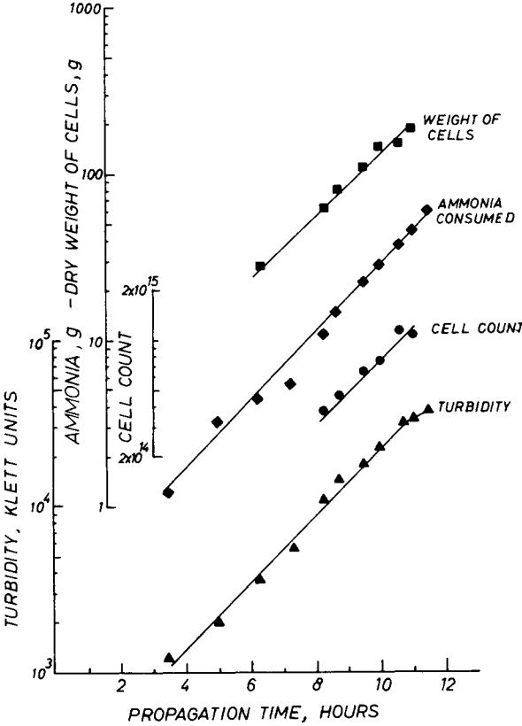

# **Maximal Exponential Growth Rate and Yield of** *E. coli* **Obtainable in a Bench-Scale Fermentor**

S. BAUER and J. SHILOACH, *Department* of *Biological Chemistry, The Hebrew University* of *Jerusalem, Jerusalem, Israel* 

## **Summary**

Oxygen supply is one of the main factors which influences aerobic cell growth in a fermentor. Maximal rates at which E. *coli* can grow on glucose **as** carbon source under various limiting oxygen-supply conditions were determined in a bench-scale fermentor. Culture conditions are described which gave yields of about **38** g dry cells per liter medium.

#### **INTRODUCTION**

Yields of bacterial cell mass in shake-flask cultures are widely reported in the literature to be in the range of 1 to **2** g dry cells/liter. In fermentors, the yields are considerably higher, up to about 10 g dry cells/liter.1~2 The enhanced yields are partly due to control of various growth-influencing factors. If nutrient feed, pH, etc. are adequately controlled, we may assume that the factor which limits the yield to about 10 g dry cells/liter is the oxygen-supply rate to the culture, and that the maximal yield will depend on the maximal oxygen supplying capacity of the fermentation equipment used.

Elsworth et al.3 defined a correlation between the maximal attainable exponential growth rate, *p,* and the maximal solution rate of oxygen in the culture, *u:* 

$$
\rho = \left(\frac{dx}{dt}\right)_{\text{max}} = \sigma Y_{0_{\text{f}}} \tag{1}
$$

where *x* = dry weight of cells in unit volume of culture and *YO,* = g **of** dry cells produced by using **1** g oxygen. *p* will be different for various organisms. It will depend on the amount of oxygen used by the culture for reactions not directly related to synthesis of new cell material. *p* will also depend on the carbon source, e.g., more oxygen will be needed for growth on glycerol than on glucose.

@ **1974** by John Wiley & Sons, Inc.

*p* may also be expressed in a slightly different way. Exponential growth of bacteria is described by the relation:

$$y = y_0 e^{kt} \tag{2}$$

where y is some parameter proportional to the concentration of cells, *k* is the growth-rate constant, and t is the time of growth. y will grow exponentially up to the point at which the first derivative of the growth function is *p,* i.e.,

$$
\rho = y_0 k e^{kt} \tag{3}
$$

Beyond this point the growth can be at most linear because the system supplies oxygen at its maximal capacity. The rate of this linear growth will be *p.* Such linear growth at limiting oxygen supply occurs, e.g., in *A.* cloacae13 while for S. cerevisiae4 and *E.* coli similar conditions cause a shift to much slower ((anaerobic growth". For any aeration and other growth conditions, the corresponding y will be the maximal possible concentration of cells which may be grown in the system at an exponential rate.

In the present article, we intend to show a correlation between the oxygen supply rate and the corresponding maximal exponential growth rates, *p,* in a culture of *E.* coli in a bench-scale fermentor. An example of a growth system which gives exponential yields in excess of **35** g dry cells per liter of medium will be described.

## **METHODS AND MATERIALS**

#### Starter Culture

500 ml starter cultures of *E.* coli were grown in 2 liter Erlenmeyer flasks. The composition of the medium was as follows (g/liter): KH2P04 3.5; (NH4),HP04 **3.5;** MgS04.7H20 **1.0;** glucose 5.0; autolyzed yeast powder (Yeastamine, A. E. Staley Manuf. Co., Decatur, Ill.) **5.0.** A solution of trace elements of the following composition was added, **3** ml to **1** liter **of** medium (g/liter): FeC13.6H20 27; ZnClz.4H20 2; CoClz-6H20 2; Na2Mo04-2Hz0 2; CaC12.2H20 **1;**  CuC12 **1;** H3B03 0.5; HC1 conc. 100 ml. The cultures were grown at 30°C in an incubator-shaker (New Brunswick Scientific Co., N.J., Model G **10)** at 240 rpm for 16 hr. They were seeded from a frozen stock culture to a cell density that gave at the end of this growth period starter cultures in the late logarithmic phase.

#### *Mass* Culture

The experiments were carried out at 30°C in **7.5** liter total volume bench-scale fermentors (Model F-7, New Brunswick Scientific Co., N.J.). The fermentors were steam sterilized with 3 liters of medium of the above composition to which 10 g K2HP04.3HzO and 5 g MgS04-7H20 were added. Before seeding with 500 ml starter culture, 300 ml glucose solution **(50%** w/v) and *2* ml antifoam solution (P-2025, B.D.H., 25y0 v/v in ethanol) were added. In addition, 300 ml portions of glucose solution were added manually when a rise in the dissolved oxygen level indicated cessation of growth. Antifoam was added manually when needed.

Each fermentor was equipped with a steam-sterilizable pH electrode (Type 465-35, Dr. W. Ingold A.G., Zurich). The electrode was connected to a TTTl type titrator (Radiometer, Copenhagen) which automatically kept pH at 6.8. This was done by actuating a peristaltic pump (Type MHRE flow inducer, Watson-Marlow Ltd., Falmouth, England), which introduced 5.5M NHI to the fermentor.

Dissolved oxygen was measured with a steam-sterilizable electrode (New Brunswick Scientific Co., N.J.). The monitoring and recording systems were built by the Electronics Laboratory of this department. Calibration with air, oxygen, and nitrogen was done at 30°C in the growth medium. The cultures were "aerated" with oxygen.

Temperature was initially controlled by regulation of the temperature of the water bath in which the fermentors were immersed. In the final stages of growth it was necessary to cool the bath with crushed ice.

#### *A nu1 ytical* Methods

Glucose was determined with Glucostat X 4 (Worthington Biochemical Corp.). Total nitrogen was determined with Nessler reagent after digestion with HzS04.5 Viable organisms were counted by plating on nutrient agar (Difco, Detroit, Mich.) after 16 hr incubation at 30°C. Turbidity was measured in a Klett-Summerson photocolorimeter with a 540 nm filter, in a dilution that gave readings not exceeding **100** units.

Dry weight of cells was determined as follows: 1 ml aliquots of culture were centrifuged *(2* min, **SO00** X g) in predried and preweighed 2 ml capacity plastic test tubes in an Eppendorf centrifuge (Type 3200, Eppendorf GmbH, Hamburg, Germany). The sediment was resuspended in 1 ml solution containing *0.005M* MgClz and 0.005M Tris-HC1 buffer, pH **7.0.** After centrifuging again as above the supernatant was discarded and the precipitate was dried at room temperature under vacuum over P20, to constant weight.

The oxygen supplying capacity of the fermentor (or the oxygen absorption rate) was estimated by the sulfite method6 at 30°C with agitation and sparging with air. plied by five to get the values for oxygen. The figures obtained were multi-

## **EXPERIMENTAL, RESULTS AND DISCUSSION**

The determination of *p* by relation *(3), p* = *yokekt,* at different oxygen supply rates calls for determining the times at which the oxygen supply begins to be the growth-limiting factor. This value of *t* can be pinpointed rather accurately as follows: When the supply rate of dissolved oxygen exceeds the demand by the culture, the percent of saturation of oxygen in the culture has a certain value at or below 21% in the case of aeration with air or 100~o in case of "aeration" with oxygen. As more oxygen is consumed by the growing culture, the percent saturation of oxygen steadily declines. Extrapolation of the percent of oxygen versus time curve to 0 percent oxygen gives the sought for value of *t.* According to Klempner as cited by Finn,' the critical concentration of oxygen for aerobic growth of E. *coEi* is 0.0082 mmoles 02/liter at *37.8",* and the curve should be extrapolated to an oxygen saturation corresponding to this value. However, as the solubility of oxygen at *30°C* in water in equilibrium with oxygen at atmospheric pressure is about **1.1** mmoles Oz/liter, the extrapolation to zero percent saturation is justified.

It is very convenient to carry out this type of experiment in the presence of an excess of nutrients other than **O2** in the medium, so that the only growth-limiting factor will be the oxygen. According to Herbert* and assuming a yield constant of *0.5* for gluc~se,~ the following amounts of nutrients or elements are necessary for production of **1** g dry cell material: Glucose **2** g; NH4+ **0.21** g; **PO4=** *0.075* g; Mg++ 0.004 g. Preliminary experiments have shown that at high aeration rates yields of about 40 g/liter dry cells are to be expected. **A** solution containing the full amount of necessary nutrients for such yields would be approximately *0.5M* NH4+, *0.5M* glucose, 0.04M phosphate, and 0.01M Mg++.

High initial concentration of ammonium salt would cause a severe drop of pH during growth by removal of NH3 from the medium. This difficulty was overcome by initially introducing a small amount of NH4+ and connecting the culture to a pH-dependent NH3 supply system. As NH3 was removed from the culture for cell synthesis, the ensuing pH drop caused repletion of NH3 with concurrent pH correction. Thus at all times adequate nitrogen supply was maintained, no unnecessary ions were introduced into the culture, and a strict **pH** regulation was achieved.

Large concentrations of glucose were found to be growth inhibiting. This necessitated the periodic introduction of glucose. Depletion of glucose was manifested by a sudden upshot in the oxygen saturation curve since cessation of cell synthesis abolished almost entirely the demand for oxygen.

The early introduction of the full amount of Mg++ and phosphate caused the appearance of precipitate in the medium, presumably of insoluble magnesium-ammonium phosphate. As this caused no apparent trouble, the full amount of these salts was introduced initially.

The periodic additions of glucose solutio~ and the almost continuous titration with NH, caused an increase in culture volume during the experiment. (The total volume of samples removed, about 20 ml, and of antifoam solution occasionally added, are negligible compared to these additions.) The volume changes of the culture are described in part C of Figure **1. A** typical experiment is described in Figure **1.** 

The increases of volume are actually dilutions of the culture which have to be taken into account in the calculations related to cell yield. The data of part **A** of Figure **1,** the description of cell growth as turbidity, were accordingly corrected by multiplying the actual measured values of turbidity by the factor *vt/vO,* i.e., the ratio of the volume at the time of sampling to the volume immediately after seeding. Similar corrections were also made for the corresponding line of Figure **2.** 

Part B of Figure **1** is the description of the percent oxygen saturation of the culture during growth. The culture was "aerated" with oxygen. Points of glucose addition, immediately following a sharp upward break in the curve, are indicated. The other upward breaks were caused by intensifying the aeration through higher oxygen flow rates and/or higher speeds of agitation.

The times of "p-point", i.e., the times at which the aeration started to be the limiting growth factor, were determined by extrapolations to zero percent oxygen saturation (dotted lines, part B). The value of **0.46** hr-' for the growth rate constant, *k,* was calculated from a plot of the logarithmic form of relation **(2),** i.e., a plot of log y versus *t* (y = weight of cells/ml culture), Figure **2.** From this value a doubling time of **1.5** hr was found.

The calculated values of *p (p* = maximal total exponential growth rate, g cells per hr per fermentor) for different aeration conditions, together with the corresponding oxygen absorption rates are summarized in Table **I.** 

Fig. 1. Exponential growth of E. coli in a bench-scale fermentor. For conditions of growth see text. (A) Turbidity, corrected for increme of volume during growth by multiplying by *V,/VO (u,* = the volume at time *t, vo* = the volume immediately after seeding). (B) Percent saturation of oxygen in the medium. The "aeration" with oxygen was **as** follows. Phase **1:** 2 liters/min, **400** rpm; phase 2: 2 liters/min, **500** rpm; phase **3:** 2 liters/min, 600 rpm; phase **4: 2** liters/ min, **750** rpm; phase **5: 4** liters/min, **750** rpm. The time of maximal exponential growth rate *p,* at each aeration wm determined by extrapolation to zero oxygen saturation (dotted lines). The point of addition of glucose are indicated. (C) The volume increme during growth due to continuous NHS and batchwise glucose solution additions.

From the oxygen absorption rates and the corresponding values of *p,* the amount of **0.94** g **O2** needed to produce **1** g of cells or **1.06** g cells produced per g **O2** consumed was calculated (Table I). This is in fair agreement with the figure of **0.74** f **0.03** g *E. coli* cells per g 02 given by Hernandez and Johnson.lo

From the total yields of cells up to points of addition of glucose and from the corresponding amounts of glucose consumed, we could

**Fig. 2. Logarithmic plot of cells produced and nitrogen consumed during growth of** *E. wli.* **For conditions of growth, see text. Actual values of turbidity were corrected for increase in volume during growth (see legend to Fig. 1).** 

calculate yield constants for glucose in our case. A mean of **0.36** g dry cells/g glucose consumed was found for the first three additions of glucose (see Table **11).** Using this yield constant and assuming a cell composition of *E. coli* as given by Humphreyll for bacteria (C: **53%, H:** *7.395,* N: **la%,** 0: **19%,** ash: *893,* the amount of **1.52** g *O2* needed for production of **1** g dry cells will apply to *E. coli* in contrast to that of **0.94** g measured by us. (For details of the calculations, see Elsworth et al.' and Mateles.12) One source of this discrepancy may be the assumed composition of the cells. Another may be connected to the method **of** oxygen absorption rate determination used. The questions raised about the sulfite number being a fair indicator of the actual oxygen absorption rate are well known.*

| Time (hr) | Growth Aeration Agita- Odmin) (liters | (rpm) tion | Volume of (ml) | Oxygen Absorption Rate mmole o2 (-) | P dry cells ( a r ) ( g | consumed mmole O2 dry cell) |
|-----------|------------------------------------------|------------|-------------------|-------------------------------------------------|----------------------------------------------|-----------------------------------|
| 7.3       | 2                                        | 400        | 3800              | 147                                             | 19.9                                         | 28.1                              |
| 8.5       | 2                                        | 500        | 3950              | 260                                             | 34.5                                         | 29.7                              |
| 9.2       | 2                                        | 600        | 4300              | 347                                             | 47.5                                         | 31.4                              |
| 9.7       | 2                                        | 750        | 4350              | 410                                             | 59.9                                         | - 29.5                         |
| 10.7      | 4                                        | 750        | 4700              | 562                                             | 94.9                                         | 28.0                              |

| TABLE I |  |
|---------|--|
|---------|--|

**Maximal Exponential Growth Rates at Different Limiting Aeration Conditions** 

For example, Phillips and John~on'~ reported, for a fermentation of *E. coli* in a **3.5** liter fermentor, actual oxygen absorption rates **of** up to twice the sulfite number. In our case, the factor would be **1.52/**  0.94 = **1.62.** 

At the "p-point" corresponding to aeration of **4** liters Oz/min and **750** rpm, the total yield of cells (from Fig. **2)** is **180** g. In other words at the end of the exponential growth phase about **38** g dry cells were produced in **1** liter medium. This figure is well above those reported in the relevant literature. The viability of the cells is not impaired by the high cell concentrations. Moreover, the fact that the lines of Figure **2** are parallel and straight over the entire exponential growth range, indicates an overall similarity of the cells during the entire exponential growth. "Overcrowding" seems to have no effect

**TABLE I1** 

| Yield Constant for Glucose during Exponential Growth of E. coli |  |  |  |  |  |
|-----------------------------------------------------------------|--|--|--|--|--|
|-----------------------------------------------------------------|--|--|--|--|--|

|                                     |                               |                 | Yield Constant |  |
|-------------------------------------|-------------------------------|-----------------|----------------|--|
| Time of Addition of Glucose (hr) | Total Glucose Consumed (9) | Weight of Cells |                |  |
| 8.5                                 | 165                           | 66              | 0.40           |  |
| 9.6                                 | 315                           | 108             | 0.34           |  |
| 10.5                                | 465                           | 160             | __ 0.34     |  |
|                                     |                               |                 | mean: 0.36     |  |

on the celW4 and no toxic substances accumulate. The high yield was achieved by using oxygen for "aeration". We feel that in many cases, mainly of small pilot-scale operations, the cost of using oxygen for "aeration" will be outweighed by the quintupled yields.

One may speculate about the limit of yield of dry bacterial cells per liter conventional submerged culture. We may safely assume that this limit is well below **250** g which is the approximate amount of dry material in packed cells obtained in a tube type centrifuge. Experiments are now in progress to investigate growth under different conditions in order to evaluate the possibilities of obtaining higher yields than those reported here.

technical assistance. The authors wish to express their thanks to Mrs. I). Goldshmidt for her able

## **References**

*1.* R. Elsworth, G. A. Miller, A. R. Whitaker, D. Kitching, and P. **1).** Sayer, *J. Appl. Chem., 17,* **157 (1968).** 

**2.** E. F. Phares in *Methods of Enzymology,* Vol. **22,** *5.* P. Colowick and **K.** 0. Kaplan, Eds., Academic Press, New York, **1971,** p. **441.** 

**3.** R. Elsworth, **V.** Williams, and R. Harris-Smith, J. Appl. *Chem., 7,* **269 (1957).** 

**4.** J. Hospodka, *Biokchnol. Bioeng., 8,* **117 (1966).** 

**5.** E. C. Koch and M. Hanke, *Practical Methods in Biochemistry,* Williams *6:*  Wilkins, Baltimore, **1953,** p. **249.** 

**6.** C. M. Cooper, G. A. Fernstrom, and *5.* A. Miller, *Znd. Eng. Chem.,* **36, 504 (1944).** 

**7.** R. K. Finn, in *Biochemical and Biological Engineering Science, S.* Blakebrough, Ed., Academic Press, London, **1967.** 

**8.** D. Herbert, *Symp. SOC. Gen. Microbiol.,* **11, 391 (1965).** 

**9.** W. J. Payne, in *Ann. Rev. Microbiol.,(C.* E. Clifton, Ed.), **24, 17 (1970).** 

**10.** E. Hernandez and M. J. Johnson, *J. Bacteriol.,* **94, 996 (1967).** 

**11.** A. E. Humphrey, in *Single Cell Protein,* R. I. Mateles and S. R. Tannenbaum, Eds., M.I.T. Press, Cambridge, Mass., **1968,** p. **330.** 

**12.** R. I. Mateles, *Biotechnol. Bioeng.,* **13, 581 (1971).** 

**13.** D. H. Phillips and M. J. Johnson, *J. Biochem. Microbiol. Technol. Eng.,* **3, 277 (1961).** 

**14.** R. Ludeking in *Biochemical and Biological Engineering Science, S.* Blakebrough, Ed., Academic Press, London, **1967.** 

Accepted for Publication December **26, 1973**