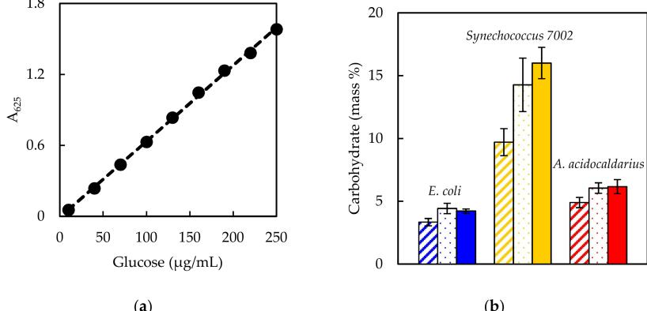
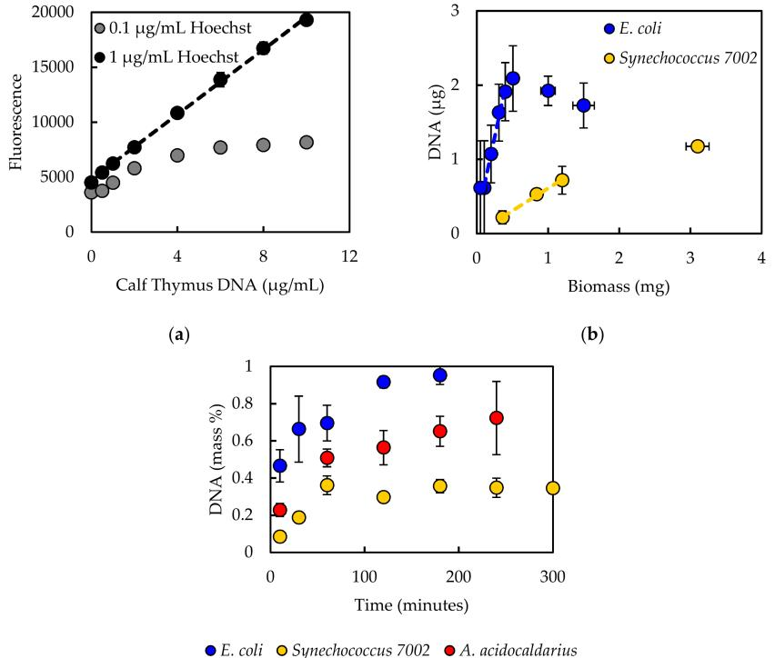
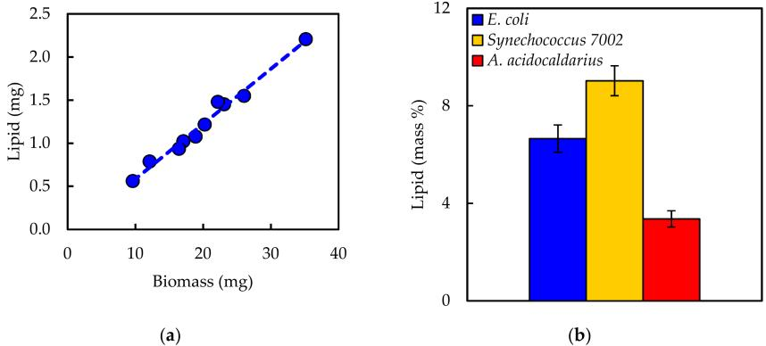
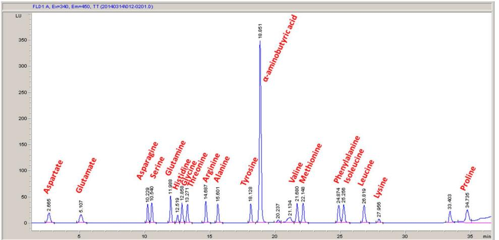
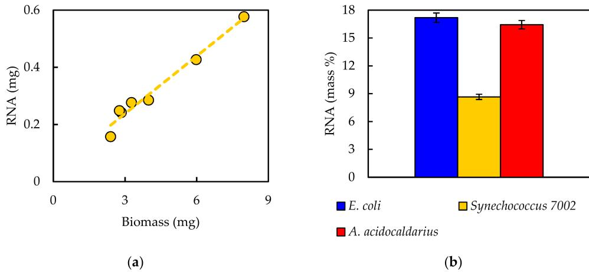
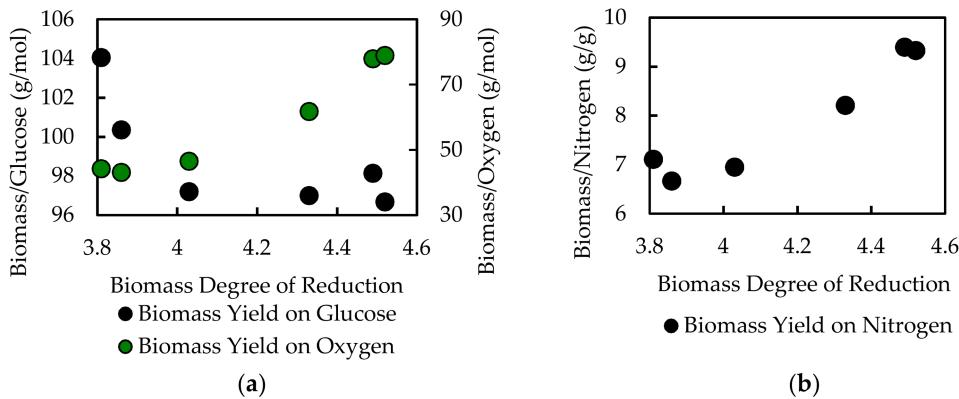
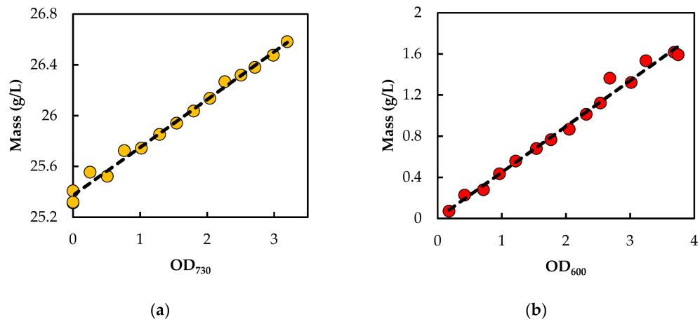
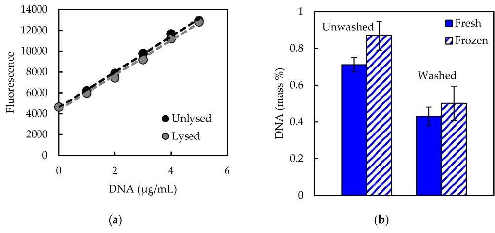
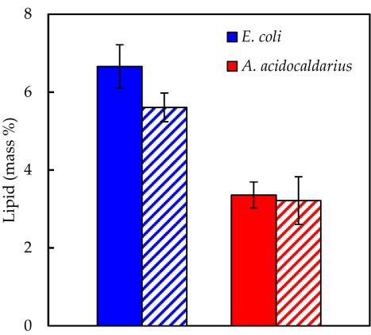

# *Article* **Measuring Cellular Biomass Composition for Computational Biology Applications**

#### **Ashley E. Beck 1 , Kristopher A. Hunt 2 [ID](https://orcid.org/0000-0003-0024-4913) and Ross P. Carlson 3,***

- 1 Microbiology and Immunology, Center for Biofilm Engineering, Montana State University, Bozeman, MT 59717, USA; ashley.beck@montana.edu
- 2 Civil and Environmental Engineering, University of Washington, Seattle, WA 98195, USA; hunt0362@uw.edu
- 3 Chemical and Biological Engineering, Center for Biofilm Engineering, Montana State University, Bozeman, MT 59717, USA
- ***** Correspondence: rossc@montana.edu; Tel.: +1-406-994-3631

Received: 27 January 2018; Accepted: 17 April 2018; Published: 24 April 2018

**Abstract:** Computational representations of metabolism are increasingly common in medical, environmental, and bioprocess applications. Cellular growth is often an important output of computational biology analyses, and therefore, accurate measurement of biomass constituents is critical for relevant model predictions. There is a distinct lack of detailed macromolecular measurement protocols, including comparisons to alternative assays and methodologies, as well as tools to convert the experimental data into biochemical reactions for computational biology applications. Herein is compiled a concise literature review regarding methods for five major cellular macromolecules (carbohydrate, DNA, lipid, protein, and RNA) with a step-by-step protocol for a select method provided for each macromolecule. Additionally, each method was tested on three different bacterial species, and recommendations for troubleshooting and testing new species are given. The macromolecular composition measurements were used to construct biomass synthesis reactions with appropriate quality control metrics such as elemental balancing for common computational biology methods, including flux balance analysis and elementary flux mode analysis. Finally, it was demonstrated that biomass composition can substantially affect fundamental model predictions. The effects of biomass composition on in silico predictions were quantified here for biomass yield on electron donor, biomass yield on electron acceptor, biomass yield on nitrogen, and biomass degree of reduction, as well as the calculation of growth associated maintenance energy; these parameters varied up to 7%, 70%, 35%, 12%, and 40%, respectively, between the reference biomass composition and ten test biomass compositions. The current work furthers the computational biology community by reviewing literature regarding a variety of common analytical measurements, developing detailed procedures, testing the methods in the laboratory, and applying the results to metabolic models, all in one publicly available resource.

**Keywords:** biomass reaction; computational biology; macromolecular composition; metabolic model; methods

### **1. Introduction**

The in silico study of metabolism has largely transitioned from a specialty discipline to a mainstream biological approach due to improvements in software usability, increases in computational power, and the accumulation of omics databases. Cellular growth is an essential component of many of these computational biology studies [\[1–](#page-22-0)[3\]](#page-22-1). Understanding the foundation of growth from the level of mass and energy fluxes remains critical for interpretation and integration of in silico metabolic models and omics datasets. The macromolecular composition of a cell is one such area of basic knowledge. Macromolecular composition of both prokaryotic and eukaryotic cells is governed by allocation of resources and can shift depending on cell cycle, specific growth rate, and diel cycle (e.g., cyanobacteria and green algae) [\[4](#page-22-2)[–6\]](#page-22-3).

Stoichiometric modeling approaches analyze steady state fluxes based on metabolic reactions identified from an organism's genomic potential, enzyme-coding genes identified in the genome sequence [\[7\]](#page-22-4). These methods can be applied to microbial communities as well as individual species [\[8](#page-23-0)[,9\]](#page-23-1). Optimal metabolic pathways are often assessed in terms of growth: constraint-based approaches, such as flux balance analysis [\[10\]](#page-23-2), typically use production of biomass as an objective function, and macromolecular composition dictates the metabolic precursors necessary for growth. Different weightings of macromolecular components in the biomass synthesis reaction can influence results by shifting requirements for precursors [\[11\]](#page-23-3). However, the proportions of biomass components are not specified by the genome sequence [\[12\]](#page-23-4). While technologies for automatic model construction are rapidly increasing, stoichiometric coefficients for the biomass reaction are still necessary [\[13\]](#page-23-5). Often, coefficients for this essential reaction are borrowed from literature reported for *Escherichia coli* or an organism similar in physiology or phylogeny to the organism being modeled (e.g., [\[14,](#page-23-6)[15\]](#page-23-7)). However, these values may not be representative of the organism under study. In biotechnology applications, a specific macromolecular component may be targeted, such as lipids extracted for biofuels [\[16\]](#page-23-8) or starch compounds for biochemical production. Accurate quantification of these components is important for comparison of production potential under different conditions. Additionally, ratios of macromolecule pools, such as protein, DNA, or RNA, from a microbial population can be correlated to important culture properties, including specific growth rate [\[17\]](#page-23-9).

A variety of methods for quantification of any given macromolecule can be found in the literature (e.g., [\[18\]](#page-23-10)). Many of these methods date back several decades, and numerous adaptations have arisen over the years. Selecting and implementing a method with an assurance of valid and accurate results relevant to computational biology applications can present a significant challenge, particularly when testing new organisms. Additionally, not all reported methods have been developed for or tested on prokaryotes, and different organisms may respond differently to treatment conditions. For example, cell wall type may influence the efficacy of reagents or procedures, resulting in a method with varying degrees of efficiency for different types of microorganisms. External factors, such as materials used, can also affect the outcome of an analysis, and specific procedural details not included in publications can hinder reproducibility. Recently, methods for determining multiple biomass components with a single technique, e.g., gas chromatography-mass spectrometry, have been developed [\[19\]](#page-23-11) but still rely on adequate cell lysis techniques and standard compounds for quantification. A concise collection of information about the variety of existing methods for each macromolecule, including advantages and disadvantages of methods, specific procedural details, and points for potential pitfalls, is a useful resource that is lacking from the published literature.

The current work fills this gap with objectives: (1) to review and compare existing literature regarding methods to measure five major macromolecules (carbohydrate, DNA, lipid, protein, and RNA); (2) to develop a select step-by-step protocol for each macromolecule and test the efficacy on different types of bacterial samples; and (3) to demonstrate the application to computational biology by generating biomass synthesis reactions. Three bacterial species were used as test cases in the current work: *E. coli* (Gram-negative, mesophilic model laboratory organism), *Synechococcus* sp. PCC 7002 (Gram-negative, mesophilic cyanobacterium; *Synechococcus* 7002 hereafter), and *Alicyclobacillus acidocaldarius* (Gram-positive, thermophilic acidophile). These microorganisms encompass a range of physiological capabilities and characteristics, including photosynthesis and alicyclic fatty acids. The impact of biomass composition on model predictions was demonstrated using essential parameters, including biomass yield on electron donor, biomass yield on electron acceptor, biomass yield on nitrogen, biomass degree of reduction, and growth associated maintenance energy. The results highlight the importance of appropriate methods for the accurate determination of macromolecule

composition. Compiling a literature review in conjunction with laboratory-tested protocols with demonstrated application to metabolic models, all within a single source, serves as a useful resource for the computational biology community that should facilitate model building transparency and reproducibility.

#### **2. Culturing Methods**

#### *2.1. Strains and Media*

*E. coli* str. K-12 substr. MG1655 was grown in standard M9 minimal salts medium (6 g/L Na2HPO4, 3 g/L KH2PO4, 1 g/L NH4Cl, 0.5 g/L NaCl), supplemented with 1 mL/L 1 M MgSO4·7H2O and 10 mL/L trace metals (0.55 g/L CaCl2, 0.10 g/L MnCl2·4H2O, 0.17 g/L ZnCl2, 0.043 g/L CuCl2·2H2O, 0.06 g/L CoCl2·6H2O, 0.06 g/L Na2MoO4·2H2O, 0.06 g/L Fe(NH4)2(SO4)2·6H2O, 0.20 g/L FeCl3·6H2O) [\[20](#page-23-12)[,21\]](#page-23-13).

*Synechococcus* 7002 was grown in A+ synthetic seawater medium (18 g/L NaCl, 0.6 g/L KCl, 1 g/L NaNO3, 5 g/L MgSO4·7H2O, 0.05 g/L KH2PO4, 0.27 g/L CaCl2, 0.03 g/L Na2 ethylenediaminetetraacetic acid, 0.004 g/L FeCl3·6H2O, 1 g/L Tris pH 8.2), supplemented with 4 mg/L vitamin B12 and 1 mL/L P1 trace metal mix (34.26 g/L H3BO3, 4.32 g/L MnCl2·4H2O, 0.315 g/L ZnCl2, 0.03 g/L MoO3, 0.003 g/L CuSO4·5H2O, 0.0122 g/L CoCl2·6H2O) [\[22,](#page-23-14)[23\]](#page-23-15).

*A. acidocaldarius* str. acidocaldarius DSM446 was grown in *Bacillus acidocaldarius* medium (BAM) (1 g/L KH2PO4, 1.5 g/L (NH4)2SO4), supplemented with 0.2 g/L MgSO4·7H2O, 0.1 g/L CaCl2·2H2O, and 1 mL/L trace metal mix (10 g/L FeSO4·7H2O, 0.1 g/L H3BO3, 0.15 g/L MnSO4·H2O, 0.18 g/L ZnSO4·7H2O, 0.2 g/L CuSO4·5H2O, 0.3 g/L Na2MoO4·2H2O, 0.18 g/L CoCl2·6H2O) (modified from Farrand et al. [\[24\]](#page-23-16)).

### *2.2. Culture Conditions*

*E. coli* cultures were grown at 37 ◦C shaking at 150 rpm. Inoculum cultures were prepared in 8 mL of M9 + 10 g/L glucose in disposable culture tubes, inoculated with multiple isolated colonies from an agar plate streaked from a 20% glycerol freezer stock, and grown to OD600 < 0.6 (exponential phase). Cells were then centrifuged at 4000 rpm for 10 min and re-suspended to OD600 ~0.05 in 50 mL of fresh M9 + 1 g/L glucose in 250-mL baffled shake flasks. Cultures were grown to OD600 ~0.6 (exponential phase) and then harvested for analysis (collected in chilled 50-mL polypropylene centrifuge tubes on ice followed by centrifugation).

*Synechococcus* 7002 cultures were grown at 38 ◦C without shaking under continuous light. Inoculum cultures were prepared in 25 mL of A+ media in 250-mL non-baffled shake flasks, inoculated with multiple isolated colonies from an agar plate (transferred monthly for propagation), and grown to OD730 < 0.5. Cells were then centrifuged at 4000 rpm for 10 min and re-suspended in 25 or 50 mL of fresh A+ media to an OD730 ~0.1. Cultures were grown to OD730 0.4–0.5 and harvested for analysis.

*A. acidocaldarius* cultures were grown at 60 ◦C shaking at 200 rpm. Inoculum cultures were prepared in 50 mL of BAM + 5 g/L glucose in 250-mL baffled shake flasks, inoculated with multiple isolated colonies from an agar plate streaked from a 20% glycerol freezer stock, and grown to OD600 < 0.6. Cells were then centrifuged at 4000 rpm for 10 min and re-suspended to OD600 ~ 0.1 in 50 mL of fresh BAM + 5 g/L glucose. Cultures were grown to OD600 ~ 0.6 and then harvested for analysis.

### *2.3. Dry Weight Determination*

Optical density was correlated to biomass for each organism to determine amount of dry weight used for macromolecular analyses. Because optical density can fluctuate at high cell concentrations due to shading effects, samples were diluted to an optical density reading below 0.3 to remain within the linearity of the spectrophotometer. Biomass to OD600 correlation for *E. coli* of 0.5 g/L cell dry weight per unit OD600 was obtained from Folsom, Parker, and Carlson [\[25\]](#page-23-17), which used the same strain and was performed in the same laboratory using the methods below.

Biomass to OD730 correlation for *Synechococcus* 7002 was determined from biomass combined from 50-mL shake flask cultures. Cells were harvested by centrifugation (4000 rpm, 20 min, 4 ◦C), re-suspended in A+ media and centrifuged again, and a series of dilutions was prepared. Three milliliters of each dilution were aliquoted into pre-dried, pre-weighed aluminum pans, dried at 80 ◦C for 24 h, and weighed on a microbalance with accuracy to 0.001 mg (Mettler Toledo MT5). Pans were dried and weighed again to confirm stability. The correlation curve is provided in Appendix [A](#page-20-0) (Figure [A1a](#page-20-1)).

Biomass to OD600 correlation for *A. acidocaldarius* was determined from biomass grown in a batch fermentor aerated at 1 vessel volume per minute and agitated at 600 rpm. Cells were harvested by centrifugation (6000 rpm, 5 min, 4 ◦C), re-suspended in water and centrifuged again, and a series of dilutions was prepared in pre-weighed 50-mL polypropylene centrifuge tubes, which had been dried at 100 ◦C for one week before pre-weighing. Tubes were dried at 100 ◦C for one week and weighed on an analytical balance with accuracy to 0.1 mg. Tubes were dried and weighed again to confirm stability. The correlation curve is provided in Appendix [A](#page-20-0) (Figure [A1b](#page-20-1)).

### **3. Modeling Methods**

A metabolic network model for *A. acidocaldarius* was constructed in CellNetAnalyzer [\[26,](#page-23-18)[27\]](#page-23-19) from the annotated genome [\[28\]](#page-23-20) with the aid of MetaCyc, KEGG, BRENDA, and NCBI [\[29](#page-23-21)[–31\]](#page-24-0) databases. Reversible exchange reactions were defined for protons and water. Irreversible exchange reactions were defined to permit ammonium, sulfate, oxygen, and glucose or xylose uptake and carbon dioxide evolution, as well as secretion of possible byproducts, including acetate, lactate, ethanol, and formate. Macromolecular synthesis reactions were defined for nucleic acids, glycogen, lipid, and protein. Synthesis reactions utilized two phosphate bonds per nucleic acid monomer, one phosphate bond per glycogen monomer, and four phosphate bonds per protein monomer [\[32\]](#page-24-1). Nucleotide distributions were set based on percent GC content of the genome for DNA and nucleotide sequence of the rRNA genes for RNA. Fatty acid distribution was assigned based on literature values [\[33,](#page-24-2)[34\]](#page-24-3). The amino acid distribution was set using the experimentally measured values in the current study. All reactions were balanced for elements, charge, and electrons. Thermodynamic considerations were built into the model via reaction reversibilities based on data from BRENDA [\[31\]](#page-24-0). Model simulations were performed with elementary flux mode analysis. Flux vectors v satisfying the stoichiometric matrix S at steady state (Sv = 0) subject to conservation of mass, specified irreversibilities, and indecomposability constraints were computed, resulting in the collection of minimal pathways through the network, called elementary flux modes (EFMs) [\[35\]](#page-24-4). EFMs were enumerated using EFMtool [\[36\]](#page-24-5). Analysis of resulting EFMs (e.g., biomass yield) was performed with MATLAB. Maintenance energy was fit to experimental glucose and oxygen yield data for *A. acidocaldarius* obtained from [\[37\]](#page-24-6). Both growth associated (dominant in fast-growing environmental conditions) and non-growth associated (dominant in slow-growing environmental conditions) maintenance terms were determined. The metabolic model with supporting details, CellNetAnalyzer metabolite and reaction input, an SBML file, and maintenance calculations can be found in the Supplementary Materials (Files S1, S2, and S3).

### **4. Carbohydrate**

### *4.1. Literature Review*

Carbohydrates are common cellular energy storage molecules and constituents of cell walls. HPLC methods can be used to separate and quantify specific sugars [\[38](#page-24-7)[,39\]](#page-24-8); however, methods for quantifying total carbohydrates were the focus of the current work. Chaplin [\[40\]](#page-24-9) reviewed many colorimetric methods for carbohydrate quantification and detailed the advantages and disadvantages of each. The phenol sulfuric acid method [\[41](#page-24-10)[,42\]](#page-24-11) is widely used, and the L-cysteine and anthrone methods [\[40,](#page-24-9)[43\]](#page-24-12) are also frequently found in the literature. An issue with many methods is interference from other cellular constituents. For example, protein interferes with measured absorbance in the

phenol sulfuric acid assay [\[40\]](#page-24-9). In the L-cysteine assay, pentose, heptose, and deoxy sugars contribute to absorbance, and absorbance stability varies among different carbohydrates. Pentoses also contribute to signal in the anthrone assay, but the absorbance fades rapidly and presents minimal interference. Different hexoses may also produce differential responses in the anthrone assay; for example, mannose produces 55% percent of the measured absorbance intensity of glucose [\[43\]](#page-24-12). Minimizing interference from pentoses is a key consideration when selecting assays to avoid measuring nucleotide bases twice in both nucleic acid and carbohydrate assays.

Glycogen is the most common form of carbohydrate storage for bacteria [\[44\]](#page-24-13). Glycogen content can indicate cellular responses to changing nutrient conditions; for instance, *E. coli* and *Synechococcus* 7002 have both been found to increase glycogen storage during nitrogen limitation [\[45](#page-24-14)[,46\]](#page-24-15). Glycogen can be precipitated from cells with KOH, but alkalinity causes some degradation of glycogen. An alternative method using sodium sulfate to adsorb and co-precipitate glycogen has been developed for mosquitoes [\[47\]](#page-24-16) and adapted to bacterial samples [\[48\]](#page-24-17) and was selected for the current study. The anthrone assay was selected for quantification of hexoses due to minimal pentose interference. The method employs sulfuric acid to hydrolyze polysaccharides to glucose monomers. In the presence of anthrone, glucose monomers are converted to hydroxyaldehydes and dehydrated to hydroxymethylfurfurals [\[49\]](#page-24-18), which form blue-green colored complexes with anthrone. The current study tested the hexose quantification assay on cell pellets, glycogen extracts, and the residue remaining after the glycogen extraction process. The sum of the glycogen extract and residue measurements was compared with the total cell pellet measurement to verify recovery of all cellular carbohydrates. Differentiation between glycogen and other cellular carbohydrates, such as cell wall sugars, can provide useful parameters for metabolic models.

### *4.2. Procedure (After Del Don et al., 1994)*

### 4.2.1. Reagents

- Cell pellet (0.5–1 mg dry biomass, fresh or frozen, washed with carbon-free media).
- Anthrone reagent: (per reaction) mix 10 mg anthrone and 250 µL fresh absolute ethanol (anthrone will partially dissolve), add 75% sulfuric acid to a final volume of 5 mL, and stir until anthrone is completely dissolved [\[18\]](#page-23-10). Prepare fresh daily (within 24 h of use) and store at 4 ◦C.
- 2% sodium sulfate (*w*/*v*).
- Methanol.
- Glucose standards (prepare from fresh 1 mg/mL glucose solution). A linear response was observed using 10–250 µg/mL standards (e.g., 10, 50, 90, 130, 170, 210, 250 µg/mL). The limit of detection with anthrone has been previously reported as 5 µg/mL [\[48\]](#page-24-17).

### 4.2.2. Quantification of Glycogen

- (1) Re-suspend cell pellet in 200 µL 2% sodium sulfate in 2-mL Eppendorf tube.
- (2) Seal tube with parafilm to prevent cap from popping open and heat for 10 min at 70 ◦C (VWR analog heat block).
- (3) Add 1 mL methanol, and vortex in two 10-s rounds to co-precipitate sodium sulfate and glycogen.
- (4) Centrifuge for 15 s at 10,000 rpm to pellet the precipitate (Eppendorf 5415D microcentrifuge) and decant the supernatant.
- (5) Wash the precipitate with 1 mL methanol (add methanol, vortex, centrifuge, and decant).
- (6) Re-suspend the pellet in 1 mL water, transfer to a clean glass test tube, and place on ice to chill.
- (7) Add 5 mL ice-cold anthrone reagent (mixing is unnecessary).
- (8) Chill on ice for 5 min, vortex briefly to homogenize the solution, and incubate in a boiling water bath for 10 min.

- (9) Place on ice for 5–10 min until cool, vortex briefly, and measure absorbance at 625 nm (Genesys 6 spectrophotometer).
**Notes:** Use a neutral reaction (containing no glucose) as the blank. Perform a standard curve with each assay, and treat standards identically to samples with anthrone reagent. Different sources report slightly varying absorbance wavelengths and water bath incubation times; the most widely supported parameters were implemented in the current work.

#### 4.2.3. Quantification of Hexoses Excluding Glycogen

Collect the methanol decanted after the precipitation and wash steps (Steps 4–5) in an aluminum pan and evaporate in a fume hood. The methanol contains non-glycogen hexoses, which did not adsorb to and precipitate with sodium sulfate. Re-suspend in 1 mL water, transfer to a clean glass test tube, and place on ice to chill (Step 6); then perform the anthrone reaction as in Steps 7–9.

#### 4.2.4. Quantification of Total Carbohydrate

Skip the glycogen precipitation and wash steps (Steps 1–5). Re-suspend the cell pellet in 1 mL water, transfer to a clean glass test tube, and place on ice to chill (Step 6). Then, perform the anthrone reaction as in Steps 7–9.

#### *4.3. Test Results*

Assay linearity was observed within 10–250 µg/mL glucose (Figure [1a](#page-5-0)). The sum of the glycogen extract and residue measurements was equivalent to the total carbohydrate measurement for *E. coli*, *Synechococcus* 7002, and *A. acidocaldarius* (Figure [1b](#page-5-0), *p* > 0.05), indicating that glycogen can be accurately distinguished from other cellular carbohydrates. The glycogen mass percentage obtained for *E. coli* is similar to previously published values measured under carbon limitation (3.6%) [\[45\]](#page-24-14) and in balanced growth (2.5%) [\[32\]](#page-24-1). Previous measurements for *Synechococcus* 7002 estimated 10–12% of dry biomass was carbohydrates under carbon- and light-limited chemostat conditions and 61% of dry biomass was carbohydrates under nitrogen-limited conditions [\[46\]](#page-24-15). The 17% of dry biomass value measured here falls close to the carbon- or light-limited conditions. No literature comparison was available for *A. acidocaldarius*.

**Figure 1.** (**a**) Representative glucose standard curve for anthrone assay. The trendline is described by the equation y = 0.0064x − 0.0082 with R2 value 0.999. (**b**) Carbohydrate mass percentages of dry biomass measured for *E. coli*, *Synechococcus* 7002, and *A. acidocaldarius*. Striped columns indicate glycogen extract measurements, dotted columns indicate the sum of glycogen extract and residue measurements, and solid columns indicate total carbohydrate measurements. Each column is the average of biological triplicate samples with error bars representing standard deviation.

When testing the anthrone assay on glycogen extract, residue, and total carbohydrate samples, it was found that not all three measurements were captured within the standard curve for the entire

set of samples; the residue represented a relatively small proportion of total cellular carbohydrates. Thus, different amounts of biomass were tested for each species to identify a quantity that would place all measurements within the standard curve. One milligram dry weight was found appropriate for *E. coli* and *A. acidocaldarius*, and 0.5 mg dry weight was used for *Synechococcus* 7002 (i.e., organisms with higher carbohydrate content require less biomass for the assay).

Additionally, the procedure outlined in Del Don et al. [\[48\]](#page-24-17) prescribes washing the glycogen pellet with methanol until the pellet is white. However, in the current work, it was observed that glycogen pellets from cyanobacterial samples remained slightly blue after three successive methanol washes, most likely due to photosynthetic pigments. The anthrone assay was tested on glycogen extracts from *Synechococcus* 7002 samples after one, two, or three washes. The carbohydrate content was not significantly different among the three treatments (*p* > 0.05 for all pair-wise *T*-tests), indicating that a single wash is sufficient (data not shown).

#### **5. DNA**

### *5.1. Literature Review*

DNA represents a small but important component of cellular biomass, and its content changes with specific growth rate. For example, slower-growing cells contain more DNA on a cell mass basis than fast-growing cells [\[4](#page-22-2)[,17\]](#page-23-9). De Mey et al. [\[50\]](#page-24-19) provided a summary and comparison of methods for quantifying DNA and RNA. De Mey et al. tested different absorbance, colorimetric, and fluorescence-based assays on purified DNA solutions and reported accuracy and sensitivity for bacteria of differing GC contents [\[50\]](#page-24-19). UV absorbance is precise but requires a pure sample (for example, from kit extraction) to minimize interference from RNA and protein. Orcinol can be used to quantify DNA colorimetrically, but has differing sensitivities for different nucleic acids and is not as precise for mixtures of DNA and RNA. The diphenylamine assay [\[51\]](#page-24-20) is a commonly used method but has lower sensitivity for low GC content and is not as precise as other mentioned methods [\[50\]](#page-24-19). The diphenylamine assay also seems to be sensitive to the purity and preparation of the reagents [\[18\]](#page-23-10). Fluorescence methods for DNA detection are becoming popular [\[50\]](#page-24-19). Hoechst 33258 is a DNA-intercalating dye and is reported to be biased toward AT content [\[50\]](#page-24-19). However, cell lysate can be used due to low affinity of the dye for protein and RNA. Thiazole orange is another dye with good precision, but it requires a pure sample and is biased toward GC content [\[50\]](#page-24-19). Additional fluorescent dyes that require pure sample for good quantification include PicoGreen and RiboGreen [\[52\]](#page-24-21).

Considerations when selecting a DNA quantification method include the purity of the sample, interfering substances, and bias toward nucleotide content. Based on these considerations, the Hoechst fluorescent assay was selected for the current study. It is more quantitative than extraction kits and is safer and more precise than the classic diphenylamine method. It is recognized that AT nucleotide bias and the DNA standard used will influence the resulting estimation. Downs and Wilfinger [\[53\]](#page-25-0) developed and validated an alkali lysis procedure with subsequent Hoechst quantification of DNA using rat pituitary cells. Downs and Wilfinger showed equivalent accuracy but greater precision than the diphenylamine assay [\[53\]](#page-25-0).

### *5.2. Procedure (After Downs and Wilfinger, 1983)*

### 5.2.1. Reagents

- Cell pellet (0.4–1 mg dry biomass, fresh or frozen).
- Alkali extraction solution: 1 N NH4OH, 0.2% Triton X-100.
- Assay buffer: 100 mM NaCl, 10 mM EDTA, 10 mM Tris, pH 7.0 with HCl.
- Standard buffer: 100 mM NaCl, 10 mM EDTA, 10 mM Tris, pH 7.0 with HCl, 0.025 N NH4OH, 0.005% Triton X-100.
- DNA standards: ~300 µg/mL stock solution calf thymus DNA (Sigma D1501, Merck KGaA, St. Louis, MO, USA), stored at 4 ◦C. (Concentration was measured with a NanoDrop 1000 spectrophotometer (Wilmington, DE, USA) and was verified after several days and again after several weeks to ensure a stable concentration.) Prepare a 100 µg/mL working stock solution with standard buffer. Dilute the working stock into a standard series with standard buffer.
- Hoechst reagent: Prepare a 200 µg/mL intermediate Hoechst stock from 10 mg/mL stock solution (Biotium 40044, Fremont, CA, USA). Prepare a 1 µg/mL Hoechst working stock fresh daily from the intermediate stock with assay buffer. Store solutions at 4 ◦C wrapped in aluminum foil to protect from light.

**Note:** all solutions were prepared using nuclease-free water.

### 5.2.2. Assay

- (1) Re-suspend cell pellet to 50 µL total volume in nuclease-free water in a 2-mL Eppendorf tube.
- (2) Add 50 µL of alkali extraction solution.
- (3) Incubate at 37 ◦C for 3 h (VWR analog heat block).
- (4) Dilute to 2 mL total volume by adding 1.9 mL assay buffer.
- (5) Transfer to a 15-mL polypropylene centrifuge tube and centrifuge (3400 rpm, 30 min, 4 ◦C).
- (6) Aliquot 295 µL of Hoechst working reagent in a clear-bottom black 96-well plate (Corning 3603, Corning, NY, USA).
- (7) Add 50 µL of sample to the well (manual mixing via pipette is unnecessary as the plate reader mixes by shaking).
- (8) Use a fluorescent plate reader (Synergy HT, Gen5 software, BioTek, Winooski, VT, USA) to read the wells according to the settings in Table [1.](#page-7-0)

**Notes:** Perform a standard curve with each assay. Perform three reaction wells of each sample or standard for technical replicates.

|  |  |  | Table 1. Fluorescent plate reader settings for Hoechst DNA assay. Data from Beck et al. [54]. |  |  |
|--|--|--|-----------------------------------------------------------------------------------------------|--|--|
|--|--|--|-----------------------------------------------------------------------------------------------|--|--|

| Setting         | Options                                                                                                                                                                                           |
|-----------------|---------------------------------------------------------------------------------------------------------------------------------------------------------------------------------------------------|
| Plate type      | 96 well plate                                                                                                                                                                                     |
| Set temperature | Setpoint 30 ◦C, preheat before moving to next step                                                                                                                                                |
| Shake           | Double orbital 30 s, frequency 180 cpm                                                                                                                                                            |
| Read            | Fluorescence endpoint, 352 nm excitation, 461 nm emission, bottom optics, gain 100, Xenon flash light source, high lamp energy, normal read speed, 100 ms delay, 10 measurements/data point |

## *5.3. Test Results*

Downs and Wilfinger [\[53\]](#page-25-0) reported using 0.1 µg/mL Hoechst. However, saturation of calf thymus standard DNA was observed with 0.1 µg/mL Hoechst in the current work (Figure [2a](#page-8-0)). More recent protocols [\[55\]](#page-25-2) have suggested that 1 µg/mL Hoechst dye may be used to detect higher quantities of DNA (up to 10 µg) but may not be as sensitive for lower DNA quantities. Based on standard curves using 0.1 µg/mL and 1 µg/mL Hoechst, 1 µg/mL was selected for the current work due to its improved detection range (Figure [2a](#page-8-0)). The lowest standard concentration used in the assay was 0.25 µg/mL. Hoechst fluorescent response was determined to be linear up to 40 µg/mL DNA; however, a standard curve up to 10 µg/mL was sufficient to capture sample measurements. Additionally, calf thymus DNA standards were subjected to the lysis procedure to ensure that lysis does not cause loss of DNA. Standard curves showed equivalent fluorescent response regardless of whether the lysis procedure was performed, indicating that the lysis step did not influence DNA recovery (Figure [A2a](#page-21-0), Appendix [A)](#page-20-0). After initial testing, standards were not subjected to the lysis steps along with samples but were subjected only to the Hoechst treatment.

**Figure 2.** (**a**) Standard curve with calf thymus DNA using 0.1 µg/mL or 1 µg/mL Hoechst reagent. Error bars on the curve with 1 µg/mL Hoechst reagent represent standard deviation of duplicates. The trendline fitting the curve with 1 µg/mL Hoechst reagent is described by the equation y = 1477x + 4803 with R2 value 0.999. (**b**) Relationship between dry biomass sample amount and resulting DNA quantity measured for *E. coli* and *Synechococcus* 7002. Dashed lines designate the linear regions. (**c**) DNA recovery depends on length of lysis step. Error bars represent standard deviation of 2–8 biological replicates. An incubation period of 180 min was selected for the recommended protocol.

Different quantities of biomass were also tested to ensure that DNA recovery was in the linear range of the assay (Figure [2b](#page-8-0)). DNA recovery from *E. coli* plateaued between 0.5 and 1 mg biomass, thus 0.4 mg was selected as an appropriate amount of starting material for *E. coli* and *A. acidocaldarius*. DNA recovery from *Synechococcus* 7002 plateaued around 1.2 mg, and 0.8–1 mg biomass was used for starting material. Organisms with higher DNA content (*E. coli*, *A. acidocaldarius*) required less biomass for the assay. Incubation time in the lysis solution also influenced DNA recovery, with longer incubation times resulting in increased DNA recovery (Figure [2c](#page-8-0)). Downs and Wilfinger [\[53\]](#page-25-0) developed their assay on mammalian cells, which are more easily lysed in contrast to bacterial cells. Incubation of *E. coli* samples over a time series of 10, 30, 60, 120, and 180 min resulted in about twice the amount of DNA recovered. A similar result was observed for *A. acidocaldarius*. DNA recovery for *Synechococcus* 7002 samples increased nearly four-fold with longer incubation times. These results highlight the differing sensitivities of different cell types to assay conditions: *E. coli* and *Synechococcus* 7002 are both Gram-negative bacteria, but cyanobacteria are known to have thicker cell walls with more peptidoglycan [\[56\]](#page-25-3). *A. acidocaldarius* is a Gram-positive bacterium but is adapted to acidophilic environments and may be more sensitive to alkaline conditions. A lysis period of 180 min was selected as an adequate incubation time.

Impacts of sample treatment were also investigated with *E. coli*, including freezing of the sample and washing of the cell pellet prior to treatment. Fresh and frozen samples from the same culture were assayed and not found to be significantly different (Figure [A2b](#page-21-0)). Downs and Wilfinger [\[53\]](#page-25-0) reported washing samples with a cell wash solution (150 mM NaCl, 15 mM citrate, 3 mM EDTA, pH 7.0 with HCl) before performing the lysis step. In the current work, washing the sample with cell wash solution resulted in lower DNA recovery as compared to not washing (Figure [A2b](#page-21-0)) and may indicate cell loss or lysis during the washing process. Extracellular DNA was not expected to comprise a significant proportion of total DNA in the planktonic, exponentially growing samples; however, this may not be the case for all samples, such as biofilm or natural environmental samples.

The DNA percentage of dry biomass obtained for *E. coli* is lower than the value of 3.1% reported in Neidhardt et al. [\[32\]](#page-24-1), which could be due to differences in methods used or *E. coli* strains (K-12 vs. B/r), while the percentage obtained for *Synechococcus* 7002 is similar to the results reported in Vu et al. [\[46\]](#page-24-15) measured with the diphenylamine method. Differences in growth rate or growth phase may contribute to differences in measured percentages. No literature comparison was available for *A. acidocaldarius*.

### **6. Lipid**

### *6.1. Literature Review*

Lipids are essential to cellular membranes and are carbon and energy storage molecules. Measurement of total lipid is commonly performed gravimetrically, with an absorbance-based sulfo-phospho-vanillin assay [\[57\]](#page-25-4), or using gas chromatography. A common gravimetric method is the Bligh and Dyer chloroform–methanol extraction [\[58\]](#page-25-5). Other solvents have been used to mitigate the hazards of chloroform, and a variety of modifications to the original Bligh and Dyer procedure exist [\[16\]](#page-23-8). There is debate regarding the performance of these different methods, and methods may vary depending on downstream applications. Much research has been done on lipid extraction from biofuel-producing organisms such as algae, and recent testing and comparison of methods have shown microwave extraction with GC analysis to provide optimal results [\[16\]](#page-23-8). However, cyanobacteria synthesize predominantly diacylglycerol lipids as opposed to the triacylglycerol lipids of algae [\[59\]](#page-25-6). Cyanobacterial lipids are also located throughout the cytoplasm in the thylakoid membranes rather than in granular pockets as in algae. Many lipids are also associated with protein and photosynthetic components through hydrogen bonding. Different methods have been tested for the cyanobacterium *Synechocystis* sp. PCC 6803, and the traditional Bligh and Dyer and Folch methods were found to produce optimal results [\[59\]](#page-25-6). Different cell disruption methods have also been tested for *Synechocystis* sp. PCC 6803, and microwave extraction and autoclaving were found to be the most efficient disruption methods [\[60\]](#page-25-7). The traditional Bligh and Dyer method was selected for the current study for analysis of total cell lipid [\[58\]](#page-25-5).

### *6.2. Procedure (After Bligh and Dyer, 1959)*

### 6.2.1. Reagents

- Cell pellet (10 mg dry biomass, fresh or frozen, washed with carbon-free media).
- Chloroform.
- Methanol.
- Water.

### 6.2.2. Assay

- (1) Re-suspend cell pellet to 0.6 mL total volume with water in a 15-mL polypropylene centrifuge tube.
- (2) Sequentially add chloroform (0.75 mL) and methanol (1.5 mL) (vortexing between additions is not necessary).
- (3) Vortex 15 min.
- (4) Sequentially add chloroform (0.75 mL) and water (0.75 mL), vortexing 10–15 s after each addition.
- (5) Centrifuge (4000 rpm, 15 min, 20 ◦C).
- (6) Transfer the lower chloroform phase, which contains the lipids, via micropipette to a pre-weighed aluminum pan.
- (7) Evaporate the chloroform in a fume hood and weigh after 12, 24, and 36 h to confirm complete evaporation.

**Notes:** Weights were measured with a Mettler Toledo MT5 microbalance with accuracy to 0.001 mg and were recorded as an average of three measurements. A blank reaction containing 0.6 mL water was also performed as a control.

#### *6.3. Test Results*

Typical protocols for this method recommend a minimum of 30 mg biomass [\[16\]](#page-23-8). However, 30 mg biomass requires a large culture volume. Smaller biomass quantities were tested, and the assay was observed to produce a linear response within 10–35 mg biomass (Figure [3a](#page-10-0)). Thus, 10 mg starting material was used in the current work.

Additional concerns for photosynthetic organisms when selecting an appropriate method for lipid quantification include interference from chlorophyll, which is also extracted by the solvents. Previous work [\[61\]](#page-25-8) suggested that DMSO will remove chlorophyll prior to lipid extraction. DMSO was tested on cyanobacterial samples in the current work by vortexing the cell pellet in 10 mL DMSO, subsequently washing with water (re-suspending, centrifuging, decanting) until the supernatant was colorless, and then following the chloroform–methanol extraction procedure. However, DMSO treatment appeared to remove all lipid signal, resulting in no mass recovered (data not shown); thus, it was recognized that results of this method for cyanobacterial samples will encompass chlorophyll and photosynthetic pigments as well as lipid. Autoclaving samples was also tested as an alternative method of cell disruption for all three species but was not found to significantly improve lipid recovery (Figure [A3,](#page-21-1) Appendix [A)](#page-20-0).

**Figure 3.** (**a**) Lipid recovery is linear for biomass samples within 10–35 mg dry weight, measured with *E. coli*. (**b**) Lipid mass percentages of dry biomass measured for *E. coli*, *Synechococcus* 7002, and *A. acidocaldarius*. Error bars represent standard deviations from 5–9 biological replicates.

Lipid percentages of dry biomass for all three species are shown in Figure [3b](#page-10-0). The lipid percentage obtained for *E. coli* (6.7%) is lower than the value of 9.1% reported by Neidhardt et al. [\[32\]](#page-24-1), which may be due to differences in methods or strains, while the measured percentages for *Synechococcus* 7002 (9.0%) are also comparable with previously measured lipid and chlorophyll values by Vu et al. [\[46\]](#page-24-15), i.e., 8.8%, 5.6%, and 3.8% for carbon-, light-, and nitrogen-limited conditions, respectively, who also used the Bligh and Dyer method. The percentage obtained for *A. acidocaldarius* (3.4%) is similar to a previously published report of 3.6% [\[62\]](#page-25-9), which used a 2:1 chloroform/methanol extraction method. Differences between the current measurements and previously reported values may reflect differences in culturing conditions or the influence of specific procedural details.

Polypropylene centrifuge tubes were used for safety during centrifugation rather than glass tubes, but it was noted that polypropylene is not completely chemically resistant to chloroform and may cause leaching of compounds from the polymer into chloroform. This error was accounted for by performing a blank reaction (0.6 mL water). The mass of the blank was then subtracted from the mass of the biological sample to obtain the mass of lipid. Additionally, removal of the lower chloroform phase can be difficult to perform reproducibly. Glass Pasteur pipettes were used initially; however, micropipettes with 200-µL tips provided more control over phase removal and yielded the most reproducible results.

### **7. Protein**

### *7.1. Literature Review*

Protein is typically the largest fraction of bacterial biomass. Many methods have been reported for determining protein quantity, including UV absorption spectroscopy and dye-based assays such as Bradford, Lowry, BCA, and others, for which Noble et al. [\[63\]](#page-25-10) and Noble and Bailey [\[64\]](#page-25-11) provided thorough discussions. UV absorption depends on tyrosine and tryptophan residues and the molar extinction coefficient of the protein under examination, and it requires a highly purified sample. Dye-based assays are influenced by different amino acid distributions and are subject to different interfering compounds as well as variability between proteins. Bovine serum albumin is a commonly used protein standard, but its amino acid sequence may not be representative of the total cellular protein. Amino acid analysis, or hydrolysis of cellular protein followed by derivatization and identification of individual amino acids via HPLC, is an alternative to these methods and is often considered the gold standard for protein analysis [\[63,](#page-25-10)[64\]](#page-25-11).

Amino acid analysis was selected for the current study due to improved accuracy and less bias as opposed to UV absorbance or dye-based methods. Some amino acids, such as cysteine and tryptophan, degrade during hydrolysis; special hydrolysis conditions may be used to retain them [\[65\]](#page-25-12), or their proportions may be estimated based on genome codon distribution. Amino acid analysis provides experimental amino acid distribution in addition to total protein quantification, which serve as important parameters for metabolic modeling.

### *7.2. Procedure (After Henderson et al., 2000)*

### 7.2.1. Reagents

- Cell pellet (1–3 mg dry biomass, fresh or frozen, washed with carbon-free media).
- 6 M HCl and 6 M NaOH.
- 0.1 M HCl, 0.22 µm filtered.
- Borate buffer: 0.4 N borate, titrate to pH 10.2 with NaOH, 0.22 µm filtered.
- OPA and FMOC derivatizing reagents (Agilent 5061–3335 and 5061–3337, Santa Clara, CA, USA).
- Amino acid standard: 1 nmol/mL (Agilent 5061–3330).
- Solvent A: 40 mM sodium phosphate buffer Na2HPO4, titrate to pH 7.8 with 10 M NaOH, 0.22 µm filtered. (A ratio of different sodium salts can be used to prepare a 40 mM phosphate solution with an initial pH closer to 7.8, e.g., 1:1 molar ratio of NaH2PO4 and Na2HPO4.)
- Solvent B: 45:45:10 acetonitrile:methanol:water (*v*/*v*/*v*), 0.22 µm filtered (nylon filter recommended for organic solvents).

### 7.2.2. Assay

- (1) Transfer cell pellet to borosilicate HPLC vial with PTFE/silicone cap.
- (2) Add 50 µL 6 M HCl per mg biomass.
- (3) Tightly cap the vial and hydrolyze at 105 ◦C for 24 h (VWR analog heat block).
- (4) Neutralize to pH 7.0 with 6 M NaOH.
- (5) Filter with 0.22 µm PVDF centrifugal filters (Millipore UFC30GV00, Burlington, MA, USA); centrifuge for 5 min at 10,000 rpm.
- (6) Transfer filtrate to clean borosilicate HPLC vial, seal with parafilm, and poke a hole in the top (e.g., with a small pipette tip). Place at −80 ◦C to freeze before lyophilizing.
- (7) Lyophilize for 24 h (VirTis benchtop lyophilizer).
- (8) Store at −80 ◦C until HPLC analysis.
- (9) Re-suspend lyophilized material in 0.1 M HCl, and perform HPLC analysis according to the protocol validated by Agilent Technologies [\[66\]](#page-25-13).

**Notes:** PVDF was selected as the filter membrane material due to its low protein binding capacity; materials with high protein binding such as nylon may affect amino acids. A fluorescence detector or diode array detector can be used for detection. The current work employed an Agilent 1100 HPLC system equipped with autosampler and fluorescence detector (for *A. acidocaldarius* samples) or diode array detector (for *E. coli* and *Synechococcus* 7002 samples). A diode array detector was less sensitive than a fluorescence detector (limit of detection ~100 µM vs. ~2 µM). o-phthalaldehyde (OPA) reagent with 3-mercaptopropionic acid as a stabilizing agent was used for detection of primary amino acids, and 9-fluorenylmethyl chloroformate (FMOC) reagent was used for secondary amino acids. OPA and FMOC reagents were replaced daily in amber vials and were used within 10 days upon opening an ampule. The flow rate was modified from 2 mL/min [\[66\]](#page-25-13) to 1 mL/min to permit increased resolution of peaks (see gradient settings in Table [2)](#page-12-0). The injector program followed the steps described in Henderson et al. [\[66\]](#page-25-13) but did not make use of the optional acetonitrile needle rinse. The integration parameters for collecting the data were set to a slope sensitivity of 1, peak width of 0.04, area reject of 1, and height reject of 0.4, with shoulders off. Amino acids were identified manually in the calibration table, and undesired peaks were discarded (derivatization byproduct peaks at the end of an injection).

| Table 2. Amino acid analysis HPLC gradient settings. Data from Beck et al. [54]. |  |  |  |
|----------------------------------------------------------------------------------|--|--|--|
|----------------------------------------------------------------------------------|--|--|--|

| Time (min) | % Solvent B |
|------------|-------------|
| 0          | 0           |
| 3.8        | 0           |
| 36.2       | 57          |
| 37.2       | 100         |
| 44.6       | 100         |
| 46.4       | 0           |
| 47         | 0           |

### *7.3. Test Results*

Upon preparing for HPLC analysis, the lyophilized material was re-suspended in 100 µL 0.1 M HCl per mg biomass hydrolyzed. Different dilutions of the re-suspension were measured to ensure adequate detection of both more abundant and less abundant amino acids. Peak identity was confirmed for each amino acid by testing individual solutions of each amino acid. A representative chromatogram is shown in Figure [4.](#page-13-0) An internal standard, α-aminobutyric acid, was used in samples and standards alike for peak area normalization across injections. Standard curves were constructed, resulting in linear regressions with fits of 0.99 or greater. The experimental amino acid distribution and total protein quantification for the three bacterial species are shown in Table [3.](#page-13-1) Since cysteine and tryptophan were degraded during hydrolysis and methionine was present in low quantities with high variability (likely oxidized during hydrolysis), the distribution of these three amino acids was calculated according to the percentage found in the protein-coding genes of the genome. Reasonable correlations were observed between the experimentally measured and genome-predicted distributions (Figure [A4,](#page-22-5) Appendix [A)](#page-20-0). Interestingly, leucine content was observed to be consistently over-predicted in the

genome and under-measured in the laboratory among the three species tested, although no explanation has been linked to this observation in the literature.

**Figure 4.** Representative chromatogram from fluorescence detector for amino acid standards. The background chromatogram shows the full length of the injection, including the derivatization byproducts eluting at the end. The outset chromatogram labels the individual peaks.

**Table 3.** Amino acid distributions and protein quantification for *E. coli*, *Synechococcus* 7002, and *A. acidocaldarius*. Amino acid mass and mole percentages of total protein are reported as averages of three biological replicates; percent relative standard deviations are in parentheses. HPLC quantification was obtained with a diode array detector for *E. coli* and *Synechococcus* 7002 and a fluorescence detector for *A. acidocaldarius*. Cysteine, methionine, and tryptophan were factored in according to genome-based codon proportions. Asparagine and glutamine were converted to aspartate and glutamate, respectively, during derivatization with OPA. The final row includes the total protein mass percent of cell dry weight, averaged from three biological replicates with standard deviation in parentheses.

| Amino Acid              | E. coli    |            | Synechococcus 7002 |            | A. acidocaldarius |            |
|-------------------------|------------|------------|--------------------|------------|-------------------|------------|
|                         | Mass %     | Mole %     | Mass %             | Mole %     | Mass %            | Mole %     |
| Alanine                 | 7.1 (3.5)  | 10.1 (3.2) | 8.5 (1.4)          | 12.0 (1.4) | 8.4 (1.0)         | 11.8 (0.9) |
| Arginine                | 6.9 (4.9)  | 5.0 (4.6)  | 8.3 (0.5)          | 6.0 (0.6)  | 7.7 (1.9)         | 5.6 (1.9)  |
| Asparagine/Aspartate    | 9.9 (1.3)  | 9.5 (1.0)  | 10.2 (3.3)         | 9.7 (3.3)  | 10.0 (1.0)        | 9.5 (1.0)  |
| Cysteine                | 1.1 (NA)   | 1.2 (NA)   | 0.9 (NA)           | 1.0 (NA)   | 0.9 (NA)          | 0.9 (NA)   |
| Glutamine/Glutamate     | 14.0 (4.9) | 12.1 (4.5) | 14.6 (2.7)         | 12.5 (2.6) | 13.2 (0.7)        | 11.3 (0.8) |
| Glycine                 | 6.4 (4.0)  | 10.9 (3.6) | 6.1 (3.0)          | 10.2 (2.9) | 5.7 (0.3)         | 9.6 (0.3)  |
| Histidine               | 2.0 (4.9)  | 1.6 (5.2)  | 1.8 (9.7)          | 1.4 (9.8)  | 2.1 (1.8)         | 1.7 (1.8)  |
| Isoleucine              | 4.9 (6.4)  | 4.8 (6.7)  | 4.6 (2.8)          | 4.4 (3.0)  | 4.1 (0.4)         | 3.9 (0.5)  |
| Leucine                 | 7.4 (3.3)  | 7.2 (2.9)  | 9.0 (2.0)          | 8.6 (2.0)  | 7.6 (0.2)         | 7.3 (0.2)  |
| Lysine                  | 6.7 (3.4)  | 5.8 (3.1)  | 5.3 (0.2)          | 4.6 (0.1)  | 4.4 (1.1)         | 3.8 (1.1)  |
| Methionine              | 3.2 (NA)   | 2.8 (NA)   | 2.2 (NA)           | 1.9 (NA)   | 3.0 (NA)          | 2.6 (NA)   |
| Phenylalanine           | 5.1 (13.3) | 3.9 (13.6) | 5.1 (0.9)          | 3.9 (0.7)  | 3.6 (0.9)         | 2.8 (1.0)  |
| Proline                 | 3.6 (8.2)  | 4.0 (8.6)  | 4.1 (5.2)          | 4.5 (5.3)  | 4.3 (0.8)         | 4.8 (0.8)  |
| Serine                  | 4.0 (11.3) | 4.9 (11.7) | 4.1 (1.7)          | 4.9 (1.6)  | 4.7 (0.6)         | 5.6 (0.6)  |
| Threonine               | 4.9 (2.2)  | 5.3 (2.0)  | 4.9 (0.9)          | 5.2 (0.7)  | 5.8 (0.4)         | 6.2 (0.5)  |
| Tryptophan              | 2.4 (NA)   | 1.5 (NA)   | 2.4 (NA)           | 1.5 (NA)   | 2.6 (NA)          | 1.6 (NA)   |
| Tyrosine                | 3.9 (19.7) | 2.8 (20.0) | 2.5 (10.4)         | 1.8 (10.6) | 4.4 (1.0)         | 3.0 (1.1)  |
| Valine                  | 6.3 (5.9)  | 6.8 (5.5)  | 5.4 (0.9)          | 5.8 (1.0)  | 7.5 (0.5)         | 8.1 (0.5)  |
| Total Mass % Protein | 35.2 (1.3) |            | 27.2 (1.5)         |            | 38.5 (2.2)        |            |

#### **8. RNA**

### *8.1. Literature Review*

RNA is a major macromolecule class which contributes to ribosome assembly and cellular information processing. Methods used for quantifying RNA include UV absorbance, orcinol colorimetric reaction, and thiazole orange fluorescent dye [\[50\]](#page-24-19). UV absorbance is precise but requires a pure sample and is not feasible for a mixture of DNA and RNA. Orcinol is not as precise for RNA or for a mixture of DNA and RNA, and carbohydrates may also interfere. Thiazole orange has good precision, but fluorescence is biased toward GC content, and it is less sensitive for RNA than for DNA [\[50\]](#page-24-19). Additionally, kits are available for RNA extraction but focus predominantly on downstream applications such as PCR and RNAseq, and thus remain questionable as quantitative methods. Fluorescent dyes such as RiboGreen and PicoGreen have also been reported for quantifying extracted RNA [\[52\]](#page-24-21) but are usually used in combination with kit extractions.

Major concerns in selecting an RNA quantification method include sample purity, accuracy, and bias of nucleotide content. Many studies have used the colorimetric orcinol reaction to quantify RNA after hot perchloric acid extraction. However, Benthin et al. [\[67\]](#page-25-14) developed an alternative method with the bacterium *Lactobacillus* that utilizes alkali (KOH) lysis in combination with cold perchloric acid extraction, followed by UV absorbance. The method provided similar accuracy to the orcinol reaction but showed improved precision [\[67\]](#page-25-14). Benthin's KOH-UV method was selected for the current study as a more reliable and safe method, using cold rather than hot perchloric acid, and to eliminate interference from carbohydrates, which occurs in the orcinol reaction. The results can be quantified with UV absorbance using average nucleotide molar extinction coefficients, which eliminates the need to prepare a standard from a different source. This method has been used in metabolic modeling studies to quantify RNA percentage [\[68–](#page-25-15)[70\]](#page-25-16).

#### *8.2. Procedure (After Benthin et al., 1991)*

#### 8.2.1. Reagents

- Cell pellet (2–8 mg dry biomass, fresh or frozen, washed with carbon-free media).
- HClO4 solutions: 0.5 M, 0.7 M, and 3 M.
- 0.3 M KOH solution.

#### 8.2.2. Assay

- (1) Wash cell pellet three times with 3 mL 0.7 M HClO4 to degrade cell walls. Vortex to re-suspend in between washing. Centrifuge 4000 rpm for 10 min at 4 ◦C and decant between washes.
- (2) Re-suspend pellet in 3 mL 0.3 M KOH to lyse cells.
- (3) Incubate in a 37 ◦C water bath for 1 h, shaking at 15-min intervals.
- (4) Cool and add 1 mL 3 M HClO4.
- (5) Centrifuge and decant supernatant into a new 50-mL polypropylene centrifuge tube.
- (6) Wash pellet twice with 4 mL 0.5 M HClO4 (re-suspend and mix), centrifuge, and decant supernatant into the 50-mL tube. The 0.5 M HClO4 extracts the RNA, while DNA, which is stable even in strong alkali, and protein, which does not solubilize in the alkali, remain in the precipitate.
- (7) Add 3 mL 0.5 M HClO4 to the collection of extracts to obtain a total volume of 15 mL, and centrifuge once more to remove any non-visible precipitates of KClO4.
- (8) Measure absorbance at 260 nm against a 0.5 M HClO4 blank.
- (9) Calculate RNA quantity by assuming 1 unit of absorbance at 260 nm corresponds to 38 µg/mL RNA on average [\[71\]](#page-25-17).

**Notes:** Quartz cuvettes are commonly used for measuring UV absorbance; however, disposable UV cuvettes can also be used (VWR 47727-024, rated to 220 nm and tested for chemical compatibility with concentrated hydrochloric acid). Linearity of the spectrophotometer within the range of sample absorbance should be confirmed by successively diluting the sample with 0.5 M HClO4 and confirming a linear fit to the resulting absorbance measurements. Absorbance at 280 nm can also be measured, and the A260/A280 can be calculated to assess RNA purity.

#### *8.3. Test Results*

Benthin et al. [\[67\]](#page-25-14) recommended using a quantity of biomass corresponding to ~0.4 mg of RNA. ~2 mg and ~8 mg biomass was used for *E. coli* and *Synechococcus* 7002, respectively, based on previous estimates of RNA content [\[32,](#page-24-1)[46\]](#page-24-15). Correlation between biomass and RNA content was tested for *Synechococcus* 7002, and a linear response was observed within 2–8 mg biomass (Figure [5a](#page-15-0)). RNA mass percentages for all three species are shown in Figure [5b](#page-15-0). The percentage obtained for *E. coli* is similar to the 20.5% value reported in Neidhardt et al. [\[32\]](#page-24-1). The percentage of dry biomass obtained for *Synechococcus* 7002 is higher than the 4.0% average value measured in Vu et al. [\[46\]](#page-24-15) via the orcinol method but could reflect different growth states. No literature comparison was available for *A. acidocaldarius*.

**Figure 5.** (**a**) RNA recovery is linear for biomass samples within 2–8 mg dry weight, measured for *Synechococcus* 7002; and (**b**) RNA mass percentages on a dry biomass basis measured for *E. coli*, *Synechococcus* 7002, and *A. acidocaldarius*. Error bars represent standard deviation from three biological replicates.

#### **9. Model Biomass Reaction**

Experimentally measured biomass composition provides a species-relevant basis for representing cellular growth in computational models. The results of the macromolecular assays for *E. coli*, *Synechococcus* 7002, and *A. acidocaldarius* are summarized in Table [4.](#page-16-0) The mass percentages for the five assays do not necessarily sum to 100% of cell dry weight. The reduced mass recovery may be due to loss of biomass during centrifugation and transfer of material while performing the assays. Some bacteria may also possess other storage compounds that are not accounted for in these analyses, such as polyhydroxyalkanoates or polyphosphates. Ash weight typically accounts for 5–10% of cell dry weight [\[72\]](#page-25-18), or perhaps even more for some organisms (e.g., 20–30% ash content has been measured in phytoplankton [\[73\]](#page-25-19)). To adjust for losses during sample processing, measurements can be normalized to the total mass recovered such that the sum of biomass recovered from all measurements is 100% (Table [4)](#page-16-0).

| Macromolecule | E. coli    | N    | Synechococcus 7002 | N    | A. acidocaldarius | N    |
|---------------|------------|------|--------------------|------|-------------------|------|
| Carbohydrate  | 4.2 (0.2)  | 6.5  | 16.9 (0.1)         | 27.2 | 6.2 (0.6)         | 9.5  |
| DNA           | 1.0 (0.1)  | 1.6  | 0.4 (0.0)          | 0.6  | 0.7 (0.1)         | 1.1  |
| Lipid         | 6.7 (0.6)  | 10.4 | 9.0 (0.6)          | 14.5 | 3.4 (0.3)         | 5.2  |
| Protein       | 35.2 (1.3) | 54.7 | 27.2 (1.5)         | 43.7 | 38.5 (2.2)        | 59.0 |
| RNA           | 17.2 (0.5) | 26.7 | 8.7 (0.6)          | 14.0 | 16.4 (0.5)        | 25.2 |
| Total         | 64.3       | 99.9 | 62.2               | 100  | 65.2              | 100  |

**Table 4.** Summary of average macromolecular composition, based on mass fraction of dry biomass, for *E. coli*, *Synechococcus* 7002, and *A. acidocaldarius*; standard deviations are included in parentheses. Column *N* contains the scaled biomass composition, normalized to the sum of the measurements.

An in silico cellular growth reaction is a collection of macromolecular synthesis reactions scaled to account for biomass composition. The macromolecular synthesis reactions are constructed by accounting for the appropriate ratios of the monomers, polymerization energy requirements, and reaction byproducts. Macromolecular monomer distributions are either measured directly, such as the amino acid composition measured here, or can be estimated from appropriate omics datasets or the literature. DNA composition is typically estimated from GC content, and RNA composition may be estimated from rRNA-encoding genes; rRNA accounts for approximately 81% of cellular RNA [\[32\]](#page-24-1). Polymer lengths for the macromolecular synthesis reactions can be scaled to a convenient number of monomers, such as 10 or 100, with the appropriate polymerization energy requirements and byproducts. The polymerization energy error introduced with these scaled molecules is assumed minor.

Once formulas for individual macromolecules are calculated, model reactions can be quality control checked for balance of elemental formulas and degree of reduction to ensure adherence to the mass balance constraint required for stoichiometric modeling. Identification of imbalanced reactions can then be further investigated; often the issue can be traced to balancing of redox pairs or hydrolysis products, free protons, and water. Table [5](#page-16-1) demonstrates the construction of a DNA macromolecule synthesis reaction for *A. acidocaldarius*, including the definition of monomer composition, polymerization energy requirements, and byproducts. The elemental and electron balances are included and validate conservation relationships [\[32\]](#page-24-1). The Supplementary Materials contain a workbook for the major biomass macromolecules that can be modified for different biomass measurements (File S4).

**Table 5.** Example calculation of DNA macromolecular formula for *A. acidocaldarius* with 61.9% GC content, assuming a polymer length of 1 monomer. Polymerization byproducts (diphosphate) are subtracted from the sum of dNTP monomer constituents to obtain the formula for a DNA macromolecule. Overall DNA synthesis reaction is shown in the last row.

| Monomer                                                               | Stoichiometry/Formula  | C    | H     | O    | N    | P    |
|-----------------------------------------------------------------------|------------------------|------|-------|------|------|------|
| dATP                                                                  | 0.19/C10H12N5O12P3     | 1.91 | 2.29  | 2.29 | 0.95 | 0.57 |
| dCTP                                                                  | 0.31/C9H12N3O13P3      | 2.79 | 3.71  | 4.02 | 0.93 | 0.93 |
| dGTP                                                                  | 0.31/C10H12N5O13P3     | 3.10 | 3.71  | 4.02 | 1.55 | 0.93 |
| dTTP                                                                  | 0.19/C10H13N2O14P3     | 1.91 | 2.48  | 2.67 | 0.38 | 0.57 |
| Diphosphate                                                           | 1/HO7P2                | 0.00 | 1.00  | 7.00 | 0.00 | 2.00 |
| DNA molecule                                                          | 1/C9.69H11.19N3.81O6P1 | 9.69 | 11.19 | 6.00 | 3.81 | 1.00 |
| 0.19 dATP + 0.31 dCTP + 0.31 dGTP + 0.19 dTTP = 1 DNA + 1 diphosphate |                        |      |       |      |      |      |

The overall cell growth reaction has a form analogous to A carbohydrate + B DNA + C lipid + D protein + E RNA = 1 biomass, where A, B, C, D, and E are stoichiometric coefficients corresponding to the measured mass fraction. Some biomass reactions may also include additional constituents, such as chlorophyll, salts, and metabolite pools, including vitamins. The coefficients for the macromolecular constituents A–E are obtained by converting the experimental mass fraction measurements to molar coefficients, thereby yielding the appropriate stoichiometries. The following steps convert experimentally measured mass fractions of macromolecules to molar coefficients for use in the biomass reaction:

- (1) Record mass fractions as g macromolecule per g cell dry weight (see Table [4)](#page-16-0).
- (2) Tabulate the molar mass of each macromolecule representation. Multiply the macromolecular formula by the atomic mass of the respective elements, and sum over all elements to obtain g/mol macromolecule.
- (3) Divide the mass fraction of the macromolecule by its molar mass to obtain mol macromolecule/g cell dry weight. The basis for cell dry weight normalization can be selected as desired; 1, 10, or 100 kg cell dry weight typically results in reasonably scaled coefficients for elementary flux mode and flux balance analyses. One kilogram cell dry weight often provides a convenient basis, as when inputs are scaled to a mM basis in FBA, the resulting output biomass scales to grams.
- (4) Incorporate the molar coefficients into the biomass reaction. The stoichiometries can be multiplied by the macromolecular formulas and summed over all the macromolecules to obtain an overall formula for biomass, which allows model output to be analyzed in terms of carbon moles of biomass (Table [6)](#page-17-0).

The Supplementary Materials detail the macromolecule and biomass calculations for each species, as well as demonstrate a quality control check for balancing mass, charge, electrons, and elemental composition (File S4).

**Table 6.** Species-specific biomass reactions for *E. coli*, *Synechococcus* 7002, and *A. acidocaldarius*, without consideration of maintenance energy. Molar coefficients represent 100 kg dry biomass.

| Species            | Biomass Reaction                                                            |  |  |
|--------------------|-----------------------------------------------------------------------------|--|--|
| E. coli            | 5.05 DNA + 8.40 RNA + 5.02 Protein + 13.9 Lipid + 4.03 Glycogen = 1 Biomass |  |  |
| Synechococcus 7002 | 2.09 DNA + 4.40 RNA + 4.05 Protein + 18.5 Lipid + 16.8 Glycogen = 1 Biomass |  |  |
| A. acidocaldarius  | 3.49 DNA + 7.91 RNA + 5.46 Protein + 6.67 Lipid + 5.86 Glycogen = 1 Biomass |  |  |

In addition to the macromolecular constituents that comprise a cell, metabolic models often account for maintenance energy requirements. Maintenance energy is an implicit energy consumption term accounting for a myriad of cellular processes, such as protein turnover and osmotic pressure maintenance. Maintenance energy is typically estimated by fitting the in silico model to experimental biomass-on-substrate yield data. For example, experiments correlating substrate consumption rate (for heterotrophs) or photon absorption rate (for photoautotrophs) with growth rate can be used to determine the yield [\[74](#page-25-20)[,75\]](#page-25-21). For elementary flux mode analysis applications, a single maintenance energy term, set for a defined growth rate, can be added to the biomass reaction. For flux balance analysis applications, maintenance energy requirements can be broken down into growth and non-growth associated maintenance (GAM and NGAM) terms. The Supplementary Materials contain a genome-enabled model constructed for *A. acidocaldarius* (File S1). Calculations fitting maintenance energy to observed yield data for both glucose and oxygen consumption from Farrand et al. [\[37\]](#page-24-6) for both EFMA and FBA application are provided in MATLAB and Excel formats (Files S1, S2, and S3). The specific growth rate-dependent (µ, h−1 ) maintenance energy requirement (qATP) for *A. acidocaldarius* was calculated to be qATP = 13.4µ + 4.2 mmol cellular energy per g biomass per hour, where GAM was 13.4 mmol cellular energy (phosphodiester bonds) per g biomass and NGAM was 4.2 mmol cellular energy per g biomass per hour. Using multiple datasets to fit the maintenance energy provides a metric of accuracy for the model, as they should provide similar results. The calculated maintenance terms for *A. acidocaldarius* were similar regardless of fitting with glucose or oxygen consumption data (Files S1, S2, and S3).

Finally, the *A. acidocaldarius* model was used to quantify potential pitfalls associated with inaccurate biomass compositions. Ten different biologically relevant variations of biomass composition were generated and tested in addition to the experimentally measured composition (see File S5). The optimal in silico biomass yield on electron donor (glucose) and associated biomass yield on electron acceptor (oxygen) was determined for each biomass composition. A sampling of the data is presented as a function of the biomass degree of reduction in Figure [6](#page-18-0) and Table [7.](#page-19-0) The data point at degree of reduction 4.03 represents the experimentally measured composition for *A. acidocaldarius*; this point is used as a reference. The in silico biomass per glucose and biomass per oxygen yields change nonlinearly relative to degree of reduction. The biomass per oxygen yields change up to 70% from the reference composition, demonstrating the strong influence biomass composition can have on simulation results (Figure [6,](#page-18-0) Table [7)](#page-19-0). Common modeling practices for determining maintenance energy parameters fit model output to experimental yield data, which can mask the effects of inaccurate biomass composition. GAM values for each biomass composition were also calculated (Figure [6,](#page-18-0) Table [7)](#page-19-0). The GAM values changed up to 40% over the reference case. This represents a substantial 40% change in specific energy generation-associated fluxes, such as ATPase. Furthermore, the biomass yield on nitrogen was calculated for each biomass composition. The biomass per nitrogen yields varied up to 35% for the considered biomass compositions (see File S5). This variation in nitrogen content would have substantial impact on predictions for nitrogen-limited culturing conditions, such as those commonly used in bioprocesses to induce accumulation of bioplastics or lipids (e.g., [\[76,](#page-26-0)[77\]](#page-26-1)). This analysis highlights the importance of accurate species- and condition-specific measurements for biomass composition.

**Figure 6.** Biomass composition impacts stoichiometric model simulation results. (**a**) Mass percentages of the five macromolecules were varied (see Table [7)](#page-19-0), resulting in a range of biomass degrees of reduction. EFMA simulations of the *A. acidocaldarius* metabolic model with the different biomass compositions revealed substantial variation in biomass per electron donor yield (g biomass per mol glucose) and almost a doubling of oxygen required for biomass synthesis (g biomass per mol oxygen) as a function of biomass degree of reduction. Similar differences were also observed in growth associated maintenance (GAM, mmol cellular energy per g biomass) to fit the data for glucose consumption from Farrand et al. [\[37\]](#page-24-6). Fitted GAM values changed by as much as 40% between the experimentally determined biomass composition (degree of reduction 4.03) and the modulated biomass compositions (parenthetical percentages). (**b**) Biomass yield on nitrogen (calculated from the elemental composition) varied up to 35%, demonstrating the sensitivity of modeling results to biomass composition when considering nitrogen-limited conditions. Calculations, additional data, and further details are included in the Supplementary Materials (File S5).

| DNA  | RNA  | Protein Lipid |      | Poly-Saccharide | Degree of Reduction | Elemental Composition       | GAM (mmol/g) |
|------|------|---------------|------|-----------------|------------------------|-----------------------------|--------------|
| 0.05 | 0.40 | 0.40          | 0.02 | 0.13            | 3.81                   | CH1.51O0.44N0.26P0.02S0.005 | 18.9 (140%)  |
| 0.05 | 0.35 | 0.50          | 0.02 | 0.08            | 3.86                   | CH1.43O0.53N0.27P0.04S0.004 | 16.1 (119%)  |
| 0.01 | 0.25 | 0.59          | 0.05 | 0.10            | 4.03                   | CH1.44O0.49N0.28P0.03S0.004 | 13.5 (100%)  |
| 0.05 | 0.15 | 0.50          | 0.20 | 0.10            | 4.33                   | CH1.58O0.40N0.21P0.02S0.004 | 13.3 (99%)   |
| 0.05 | 0.15 | 0.40          | 0.30 | 0.10            | 4.49                   | CH1.62O0.39N0.18P0.02S0.003 | 14.3 (106%)  |
| 0.05 | 0.10 | 0.45          | 0.30 | 0.10            | 4.52                   | CH1.63O0.37N0.17P0.02S0.003 | 13.1 (97%)   |

**Table 7.** Sampling of biomass composition variations used to test the effect on model simulations in Figure [6.](#page-18-0) The experimentally determined biomass composition had degree of reduction 4.03. Calculations, additional data, and further details are included in File S5.

### **10. Conclusions**

Computational biology representations of metabolism often include cellular growth reactions necessitating knowledge of biomass composition for accurate predictions. The current work surveyed analytical methods for the five major macromolecules (carbohydrate, DNA, lipid, protein, and RNA), provided step-by-step procedures for a select method for each macromolecule, tested the methods on three different bacterial species, and demonstrated application of analytical measurements to a computational representation of cellular growth. The data include a quantitative analysis of potential pitfalls associated with inaccurate biomass representations. The literature survey included references to more in-depth reviews for each macromolecule for further exploration and also provided a rationale for the selected method. Table [8](#page-19-1) provides a summary of the selected methods and their advantages and disadvantages. The three bacterial species used for testing (*E. coli*, *Synechococcus* 7002, and *A. acidocaldarius*) represent a range of physiological characteristics, including Gram-negative and Gram-positive, mesophilic and thermophilic, and neutrophilic and acidophilic, as well as chemoheterotrophic and photoautotrophic, which assessed the robustness of the methods. Testing of methods highlighted potential pitfalls and provided guidelines for troubleshooting when testing a new method or when applying a method to new organisms. Based on the current study, recommendations for verifying a new protocol or testing a new organism include ensuring that the test response is linear for both the amount of biomass used and the amount of reagent, testing the standard range, and confirming the effect of any sample pre-treatment steps on standards. It is also important to consider the organism being studied and the downstream application of the measurement (e.g., glycogen vs. total carbohydrate).

| Macromolecule | Selected Method                                              | Advantages/Disadvantages                                                  |  |  |
|---------------|--------------------------------------------------------------|---------------------------------------------------------------------------|--|--|
| Carbohydrate  | Sodium sulfate co-precipitation, anthrone detection          | Differentiate glycogen from total cellular carbohydrate/Colorimetric   |  |  |
| DNA           | Alkaline lysis, Hoechst 33258 fluorescence                   | Can use cell lysate/AT bias, DNA standard                                 |  |  |
| Lipid         | Chloroform–methanol extraction, gravimetric                  | No standard needed/Not specific for types of fatty acids                  |  |  |
| Protein       | Hydrochloric acid hydrolysis, OPA and FMOC derivatization | Provides amino acid distribution/More involved than colorimetric assay |  |  |
| RNA           | Alkaline lysis, perchloric acid extraction, UV absorbance    | No standard needed/Use of perchloric acid                                 |  |  |

**Table 8.** Summary of selected methods with advantages and disadvantages for each class of macromolecule.

The presented methods of experimental measurement and conversion to computational biology reactions need to be integrated with the maturing quality standards for model construction [\[78,](#page-26-2)[79\]](#page-26-3). The predicted elemental composition of the synthesized biomass is a relevant metric for the quality of the overall reaction. Average elemental compositions have been measured for several common microorganisms, providing a convenient check [\[80\]](#page-26-4). The elemental composition is linked to the biomass degree of reduction, which is an energetic measure of biomass and a critical parameter for

computational biology analysis of consortia simulations. The degree of reduction of biomass for an average cell is approximately 4.2 or 4.8 on an NH4 + or N2 basis, respectively [\[80\]](#page-26-4). These values can shift due to large quantities of cellular storage polymers, such as polysaccharides or polyhydroxyalkanoates. Additionally, biomass composition is known to shift with growth rate and culturing stress [\[45,](#page-24-14)[81\]](#page-26-5); the provided approach can be used to create culturing condition-specific cellular growth reactions. Altogether, the current work serves as a useful resource for the broader computational biology community, which will enable more accurate representations of biomass synthesis and therefore more accurate metabolism simulations.

**Supplementary Materials:** The following are available online at [http://www.mdpi.com/2227-9717/6/5/38/s1,](http://www.mdpi.com/2227-9717/6/5/38/s1) File S1: *A. acidocaldarius* Model, File S2: *A. acidocaldarius* SBML, File S3: *A. acidocaldarius* Maintenance, File S4: Biomass Composition, File S5: Biomass Composition Variation.

**Acknowledgments:** This work is a contribution of the PNNL Foundational Scientific Focus Area (Principles of Microbial Community Design) subcontracted to Montana State University. Ashley E. Beck was supported by the Office of the Provost at Montana State University through the Molecular Biosciences Program and NSF (DMS-1361240). The authors would also like to thank James Folsom and Zackary Jay for helpful discussions.

**Author Contributions:** A.E.B. and R.P.C. conceived and designed the experiments; A.E.B. performed the experiments; A.E.B. and K.A.H. analyzed the data; and A.E.B., K.A.H., and R.P.C. wrote the paper.

**Conflicts of Interest:** The authors declare no conflict of interest. The funding sponsors had no role in the design of the study; in the collection, analyses, or interpretation of data; in the writing of the manuscript; or in the decision to publish the results.

### **Appendix A**

Additional data supporting method testing are provided herein.

**Figure A1.** (**a**) Biomass–OD730 correlation curve determined for Synechococcus 7002, described by the equation y = 0.377x + 25.373 with R2 value of 0.991. The average A+ media control (OD730 of 0) was 25.347 g/L and was subtracted from the biological samples to obtain biomass values. (**b**) Biomass–OD600 correlation curve determined for A. acidocaldarius, described by the equation y = 0.445x + 0.004 with R2 value of 0.987.

**Figure A2.** (**a**) Lysis of DNA standard did not significantly influence Hoechst fluorescent response. Error bars represent three technical replicates of standard solutions. Neither slopes nor intercepts of the two curves are significantly different (*p* > 0.05, *T*-tests). (**b**) Washing samples with cell wash solution resulted in significantly lower DNA recovery from *E. coli* samples (*p* < 0.05, *T*-test). Freezing samples did not have a significant impact on DNA recovery (*p* > 0.05, *T*-test).

**Figure A3.** Autoclaving samples prior to chloroform–methanol lipid extraction did not significantly enhance lipid recovery. Solid columns represent unautoclaved samples and striped columns represent autoclaved samples. Lipid recovery was not significantly affected by autoclaving for *A. acidocaldarius* (*p* > 0.05, *T*-test), whereas lipid recovery was slightly lower for autoclaved *E. coli* samples (0.05 < *p* < 0.01, *T*-test). *n* = 9 and 3 for unautoclaved and autoclaved *E. coli* samples, respectively, and *n* = 6 and 3 for unautoclaved and autoclaved *A. acidocaldarius*, respectively.

**Figure A4.** Correlations between experimentally measured and genome-based amino acid distributions for: (a) *E. coli* (NCBI reference sequence NC_000913.3; trendline y = 0.81x + 1.04 with R2 value of 0.82); (b) *Synechococcus* 7002 (NCBI reference sequence NC_010475.1; trendline y = 0.81x + 1.07 with R2 value of 0.85); and (c) *A. acidocaldarius* (NCBI reference sequence NC_013205.1; trendline y = 0.87x + 0.73 with R 2 value of 0.87). The two most outlying amino acids are labeled.

### **References**

- 1. Feist, A.M.; Palsson, B.O. The biomass objective function. *Curr. Opin. Microbiol.* **2010**, *13*, 344–349. [\[CrossRef\]](http://dx.doi.org/10.1016/j.mib.2010.03.003) [\[PubMed\]](http://www.ncbi.nlm.nih.gov/pubmed/20430689)
- 2. Hunt, K.A.; Jennings, R.D.; Inskeep, W.P.; Carlson, R.P. Stoichiometric modelling of assimilatory and dissimilatory biomass utilisation in a microbial community. *Environ. Microbiol.* **2016**, *18*, 4946–4960. [\[CrossRef\]](http://dx.doi.org/10.1111/1462-2920.13444) [\[PubMed\]](http://www.ncbi.nlm.nih.gov/pubmed/27387069)
- 3. Pramanik, J.; Keasling, J.D. Stoichiometric model of *Escherichia coli* metabolism: Incorporation of growth-rate dependent biomass composition and mechanistic energy requirements. *Biotechnol. Bioeng.* **1997**, *56*, 398–421. [\[CrossRef\]](http://dx.doi.org/10.1002/(SICI)1097-0290(19971120)56:4<398::AID-BIT6>3.0.CO;2-J)
- 4. White, D.; Drummond, J.; Fuqua, C. *The Physiology and Biochemistry of Prokaryotes*, 4th ed.; Oxford University Press: New York, NY, USA, 2012.
- 5. Vrede, T.; Dobberfuhl, D.R.; Kooijman, S.; Elser, J.J. Fundamental connections among organism C: N: P stoichiometry, macromolecular composition, and growth. *Ecology* **2004**, *85*, 1217–1229. [\[CrossRef\]](http://dx.doi.org/10.1890/02-0249)
- 6. Zuniga, C.; Levering, J.; Antoniewicz, M.R.; Guarnieri, M.T.; Betenbaugh, M.J.; Zengler, K. Predicting dynamic metabolic demands in the photosynthetic eukaryote *Chlorella vulgaris*. *Plant Physiol.* **2017**. [\[CrossRef\]](http://dx.doi.org/10.1104/pp.17.00605)
- 7. Maarleveld, T.R.; Khandelwal, R.A.; Olivier, B.G.; Teusink, B.; Bruggeman, F.J. Basic concepts and principles of stoichiometric modeling of metabolic networks. *Biotechnol. J.* **2013**, *8*, 997–1008. [\[CrossRef\]](http://dx.doi.org/10.1002/biot.201200291) [\[PubMed\]](http://www.ncbi.nlm.nih.gov/pubmed/23893965)
- 8. Zomorrodi, A.R.; Islam, M.M.; Maranas, C.D. d-OptCom: Dynamic multi-level and multi-objective metabolic modeling of microbial communities. *ACS Synth. Biol.* **2014**, *3*, 247–257. [\[CrossRef\]](http://dx.doi.org/10.1021/sb4001307) [\[PubMed\]](http://www.ncbi.nlm.nih.gov/pubmed/24742179)
- 9. Zomorrodi, A.R.; Maranas, C.D. OptCom: A multi-level optimization framework for the metabolic modeling and analysis of microbial communities. *PLoS Comput. Biol.* **2012**, *8*, e1002363. [\[CrossRef\]](http://dx.doi.org/10.1371/journal.pcbi.1002363) [\[PubMed\]](http://www.ncbi.nlm.nih.gov/pubmed/22319433)
- 10. Orth, J.D.; Thiele, I.; Palsson, B.O. What is flux balance analysis? *Nat. Biotechnol.* **2010**, *28*, 245–248. [\[CrossRef\]](http://dx.doi.org/10.1038/nbt.1614) [\[PubMed\]](http://www.ncbi.nlm.nih.gov/pubmed/20212490)
- 11. Cankorur-Cetinkaya, A.; Dikicioglu, D.; Oliver, S.G. Metabolic modeling to identify engineering targets for *Komagataella phaffii*: The effect of biomass composition on gene target identification. *Biotechnol. Bioeng.* **2017**, *114*, 2605–2615. [\[CrossRef\]](http://dx.doi.org/10.1002/bit.26380) [\[PubMed\]](http://www.ncbi.nlm.nih.gov/pubmed/28691262)
- 12. Thiele, I.; Palsson, B.Ø. A protocol for generating a high-quality genome-scale metabolic reconstruction. *Nat. Protoc.* **2010**, *5*, 93–121. [\[CrossRef\]](http://dx.doi.org/10.1038/nprot.2009.203) [\[PubMed\]](http://www.ncbi.nlm.nih.gov/pubmed/20057383)
- 13. Henry, C.S.; DeJongh, M.; Best, A.A.; Frybarger, P.M.; Linsay, B.; Stevens, R.L. High-throughput generation, optimization and analysis of genome-scale metabolic models. *Nat. Biotechnol.* **2010**, *28*, 977–982. [\[CrossRef\]](http://dx.doi.org/10.1038/nbt.1672) [\[PubMed\]](http://www.ncbi.nlm.nih.gov/pubmed/20802497)
- 14. Oberhardt, M.A.; Puchałka, J.; Fryer, K.E.; Dos Santos, V.A.M.; Papin, J.A. Genome-scale metabolic network analysis of the opportunistic pathogen *Pseudomonas aeruginosa* PAO1. *J. Bacteriol.* **2008**, *190*, 2790–2803. [\[CrossRef\]](http://dx.doi.org/10.1128/JB.01583-07) [\[PubMed\]](http://www.ncbi.nlm.nih.gov/pubmed/18192387)
- 15. Stolyar, S.; Van Dien, S.; Hillesland, K.L.; Pinel, N.; Lie, T.J.; Leigh, J.A.; Stahl, D.A. Metabolic modeling of a mutualistic microbial community. *Mol. Syst. Biol.* **2007**, *3*, 92. [\[CrossRef\]](http://dx.doi.org/10.1038/msb4100131) [\[PubMed\]](http://www.ncbi.nlm.nih.gov/pubmed/17353934)
- 16. Lohman, E.J.; Gardner, R.D.; Halverson, L.; Macur, R.E.; Peyton, B.M.; Gerlach, R. An efficient and scalable extraction and quantification method for algal derived biofuel. *J. Microbiol. Methods* **2013**, *94*, 235–244. [\[CrossRef\]](http://dx.doi.org/10.1016/j.mimet.2013.06.007) [\[PubMed\]](http://www.ncbi.nlm.nih.gov/pubmed/23810969)
- 17. Bremer, H.; Dennis, P.P. Modulation of chemical composition and other parameters of the cell by growth rate. *Escherichia coli Salmonella Cell. Mol. Biol.* **1996**, *2*, 1553–1569.
- 18. Herbert, D.; Phipps, P.J.; Strange, R.E. Chemical analysis of microbial cells. In *Methods in Microbiology*; Norris, J.R., Ribbons, D.W., Eds.; Academic Press: New York, NY, USA, 1971; Vol. 5, pp. 209–344.
- 19. Long, C.P.; Antoniewicz, M.R. Quantifying biomass composition by gas chromatography/mass spectrometry. *Anal. Chem.* **2014**, *86*, 9423–9427. [\[CrossRef\]](http://dx.doi.org/10.1021/ac502734e) [\[PubMed\]](http://www.ncbi.nlm.nih.gov/pubmed/25208224)
- 20. Ausubel, F.M.; Brent, R.; Kingston, R.E.; Moore, D.D.; Seidman, J.G.; Smith, J.A.; Struhl, K. *Short Protocols in Molecular Biology*, 2nd ed.; Greene Publishing Associates and John Wiley & Sons: New York, NY, USA, 1992; p. 834.
- 21. Bernstein, H.C.; Paulson, S.D.; Carlson, R.P. Synthetic *Escherichia coli* consortia engineered for syntrophy demonstrate enhanced biomass productivity. *J. Biotechnol.* **2012**, *157*, 159–166. [\[CrossRef\]](http://dx.doi.org/10.1016/j.jbiotec.2011.10.001) [\[PubMed\]](http://www.ncbi.nlm.nih.gov/pubmed/22015987)
- 22. Ludwig, M.; Bryant, D.A. Transcription profiling of the model cyanobacterium *Synechococcus* sp. strain PCC 7002 by next-gen (SOLiD (tm)) sequencing of cDNA. *Front. Microbiol.* **2011**, *2*, 41. [\[CrossRef\]](http://dx.doi.org/10.3389/fmicb.2011.00041) [\[PubMed\]](http://www.ncbi.nlm.nih.gov/pubmed/21779275)
- 23. Stevens, S.E.; Patterson, C.O.; Myers, J. Production of hydrogen peroxide by blue-green algae—Survey. *J. Phycol.* **1973**, *9*, 427–430. [\[CrossRef\]](http://dx.doi.org/10.1111/j.1529-8817.1973.tb04116.x)
- 24. Farrand, S.G.; Linton, J.D.; Stephenson, R.J.; McCarthy, W.V. The use of response surface analysis to study the growth of *Bacillus acidocaldarius* throughout the growth range of temperature and pH. *Arch. Microbiol.* **1983**, *135*, 272–275. [\[CrossRef\]](http://dx.doi.org/10.1007/BF00413480)
- 25. Folsom, J.P.; Parker, A.E.; Carlson, R.P. Physiological and proteomic analysis of *Escherichia coli* iron-limited chemostat growth. *J. Bacteriol.* **2014**, *196*, 2748–2761. [\[CrossRef\]](http://dx.doi.org/10.1128/JB.01606-14) [\[PubMed\]](http://www.ncbi.nlm.nih.gov/pubmed/24837288)
- 26. Klamt, S.; Saez-Rodriguez, J.; Gilles, E.D. Structural and functional analysis of cellular networks with CellNetAnalyzer. *BMC Syst. Biol.* **2007**, *1*, 2. [\[CrossRef\]](http://dx.doi.org/10.1186/1752-0509-1-2) [\[PubMed\]](http://www.ncbi.nlm.nih.gov/pubmed/17408509)
- 27. Klamt, S.; von Kamp, A. An application programming interface for CellNetAnalyzer. *Biosystems* **2011**, *105*, 162–168. [\[CrossRef\]](http://dx.doi.org/10.1016/j.biosystems.2011.02.002) [\[PubMed\]](http://www.ncbi.nlm.nih.gov/pubmed/21315797)
- 28. Mavromatis, K.; Sikorski, J.; Lapidus, A.; Del Rio, T.G.; Copeland, A.; Tice, H.; Cheng, J.-F.; Lucas, S.; Chen, F.; Nolan, M. Complete genome sequence of *Alicyclobacillus acidocaldarius* type strain (104-IA). *Stand. Genom. Sci.* **2010**, *2*, 9. [\[CrossRef\]](http://dx.doi.org/10.4056/sigs.591104) [\[PubMed\]](http://www.ncbi.nlm.nih.gov/pubmed/21304673)
- 29. Caspi, R.; Billington, R.; Ferrer, L.; Foerster, H.; Fulcher, C.A.; Keseler, I.M.; Kothari, A.; Krummenacker, M.; Latendresse, M.; Mueller, L.A.; et al. The MetaCyc database of metabolic pathways and enzymes and the BioCyc collection of pathway/genome databases. *Nucleic Acids Res.* **2016**, *44*, D471–D480. [\[CrossRef\]](http://dx.doi.org/10.1093/nar/gkv1164) [\[PubMed\]](http://www.ncbi.nlm.nih.gov/pubmed/26527732)
- 30. Kanehisa, M.; Goto, S.; Sato, Y.; Furumichi, M.; Tanabe, M. KEGG for integration and interpretation of large-scale molecular data sets. *Nucleic Acids Res.* **2012**, *40*, D109–D114. [\[CrossRef\]](http://dx.doi.org/10.1093/nar/gkr988) [\[PubMed\]](http://www.ncbi.nlm.nih.gov/pubmed/22080510)
- 31. Schomburg, I.; Chang, A.; Placzek, S.; Sohngen, C.; Rother, M.; Lang, M.; Munaretto, C.; Ulas, S.; Stelzer, M.; Grote, A.; et al. BRENDA in 2013: Integrated reactions, kinetic data, enzyme function data, improved disease classification: New options and contents in BRENDA. *Nucleic Acids Res.* **2013**, *41*, D764–D772. [\[CrossRef\]](http://dx.doi.org/10.1093/nar/gks1049) [\[PubMed\]](http://www.ncbi.nlm.nih.gov/pubmed/23203881)
- 32. Neidhardt, F.C.; Ingraham, J.L.; Schaechter, M. *Physiology of the Bacterial Cell: A Molecular Approach*; Sinauer Associates: Sunderland, MA, USA, 1990.
- 33. De Rosa, M.; Gambacorta, A.; Minale, L.; Bu'Lock, J. Cyclohexane fatty acids from a thermophilic bacterium. *J. Chem. Soc. D Chem. Commun.* **1971**, *21*, 1334a. [\[CrossRef\]](http://dx.doi.org/10.1039/c2971001334a)
- 34. Goto, K.; Tanaka, T.; Yamamoto, R.; Suzuki, T.; Tokuda, H. Characteristics of *Alicyclobacillus*. In *Alicyclobacillus*; Springer: Berlin, Germany, 2007; pp. 9–48.
- 35. Trinh, C.T.; Wlaschin, A.; Srienc, F. Elementary mode analysis: A useful metabolic pathway analysis tool for characterizing cellular metabolism. *Appl. Microbiol. Biotechnol.* **2009**, *81*, 813–826. [\[CrossRef\]](http://dx.doi.org/10.1007/s00253-008-1770-1) [\[PubMed\]](http://www.ncbi.nlm.nih.gov/pubmed/19015845)
- 36. Terzer, M.; Stelling, J. Large-scale computation of elementary flux modes with bit pattern trees. *Bioinformatics* **2008**, *24*, 2229–2235. [\[CrossRef\]](http://dx.doi.org/10.1093/bioinformatics/btn401) [\[PubMed\]](http://www.ncbi.nlm.nih.gov/pubmed/18676417)
- 37. Farrand, S.G.; Jones, C.W.; Linton, J.D.; Stephenson, R.J. The effect of temperature and pH on the growth efficiency of the thermoacidophilic bacterium *Bacillus acidocaldarius* in continuous culture. *Arch. Microbiol.* **1983**, *135*, 276–283. [\[CrossRef\]](http://dx.doi.org/10.1007/BF00413481)
- 38. Lloyd, L. *HPLC Determination of Carbohydrates in Food and Drink*; Agilent Technologies: Santa Clara, CA, USA, 2011; Vol. SI-01407.
- 39. ASTM E1758-01. Standard method for the determination of carbohydrates by HPLC. In *2003 Annual Book of ASTM Standards*; American Society for Testing and Materials, International: Philadelphia, PA, USA, 2003.
- 40. Chaplin, M.F. *Carbohydrate Analysis: A Practical Approach*; IRL Press: Washington, DC, USA, 1986; p. 228.
- 41. Dubois, M.; Gilles, K.A.; Hamilton, J.K.; Rebers, P.A.; Smith, F. Colorimetric method for determination of sugars and related substances. *Anal. Chem.* **1956**, *28*, 350–356. [\[CrossRef\]](http://dx.doi.org/10.1021/ac60111a017)
- 42. Taylor, K. A modification of the phenol sulfuric acid assay for total carbohydrates giving more comparable absorbances. *Appl. Biochem. Biotechnol.* **1995**, *53*, 207–214. [\[CrossRef\]](http://dx.doi.org/10.1007/BF02783496)
- 43. Trevelyan, W.E.; Harrison, J.S. Studies on yeast metabolism. 1. Fractionation and microdetermination of cell carbohydrates. *Biochem. J.* **1952**, *50*, 298–303. [\[CrossRef\]](http://dx.doi.org/10.1042/bj0500298) [\[PubMed\]](http://www.ncbi.nlm.nih.gov/pubmed/14915949)
- 44. Beck, C.; Knoop, H.; Axmann, I.M.; Steuer, R. The diversity of cyanobacterial metabolism: Genome analysis of multiple phototrophic microorganisms. *BMC Genom.* **2012**, *13*, 56. [\[CrossRef\]](http://dx.doi.org/10.1186/1471-2164-13-56) [\[PubMed\]](http://www.ncbi.nlm.nih.gov/pubmed/22300633)
- 45. Folsom, J.P.; Carlson, R.P. Physiological, biomass elemental composition and proteomic analyses of *Escherichia coli* ammonium-limited chemostat growth, and comparison with iron- and glucose-limited chemostat growth. *Microbiology* **2015**, *161*, 1659–1670. [\[CrossRef\]](http://dx.doi.org/10.1099/mic.0.000118) [\[PubMed\]](http://www.ncbi.nlm.nih.gov/pubmed/26018546)
- 46. Vu, T.T.; Hill, E.A.; Kucek, L.A.; Konopka, A.E.; Beliaev, A.S.; Reed, J.L. Computational evaluation of *Synechococcus* sp. PCC 7002 metabolism for chemical production. *Biotechnol. J.* **2013**, *8*, 619–630. [\[CrossRef\]](http://dx.doi.org/10.1002/biot.201200315) [\[PubMed\]](http://www.ncbi.nlm.nih.gov/pubmed/23613453)
- 47. Van Handel, E. Rapid determination of glycogen and sugars in mosquitos. *J. Am. Mosq. Control Assoc.* **1985**, *1*, 299–301. [\[PubMed\]](http://www.ncbi.nlm.nih.gov/pubmed/2906671)
- 48. Del Don, C.; Hanselmann, K.W.; Peduzzi, R.; Bachofen, R. Biomass composition and methods for the determination of metabolic reserve polymers in phototrophic sulfur bacteria. *Aquat. Sci.* **1994**, *56*, 1–15. [\[CrossRef\]](http://dx.doi.org/10.1007/BF00877431)
- 49. Sattler, L.; Zerban, F.W. The Dreywood anthrone reaction as affected by carbohydrate structure. *Science* **1948**, *108*, 207. [\[CrossRef\]](http://dx.doi.org/10.1126/science.108.2800.207) [\[PubMed\]](http://www.ncbi.nlm.nih.gov/pubmed/17821308)
- 50. De Mey, M.; Lequeux, G.; Maertens, J.; De Maeseneire, S.; Soetaert, W.; Vandamme, E. Comparison of DNA and RNA quantification methods suitable for parameter estimation in metabolic modeling of microorganisms. *Anal. Biochem.* **2006**, *353*, 198–203. [\[CrossRef\]](http://dx.doi.org/10.1016/j.ab.2006.02.014) [\[PubMed\]](http://www.ncbi.nlm.nih.gov/pubmed/16545766)
- 51. Burton, K. Study of the conditions and mechanism of the diphenylamine reaction for the colorimetric estimation of deoxyribonucleic acid. *Biochem. J.* **1956**, *62*, 315–323. [\[CrossRef\]](http://dx.doi.org/10.1042/bj0620315) [\[PubMed\]](http://www.ncbi.nlm.nih.gov/pubmed/13293190)
- 52. Gorokhova, E.; Kyle, M. Analysis of nucleic acids in *Daphnia*: Development of methods and ontogenetic variations in RNA-DNA content. *J. Plankton Res.* **2002**, *24*, 511–522. [\[CrossRef\]](http://dx.doi.org/10.1093/plankt/24.5.511)
- 53. Downs, T.R.; Wilfinger, W.W. Fluorometric quantification of DNA in cells and tissue. *Anal. Biochem.* **1983**, *131*, 538–547. [\[CrossRef\]](http://dx.doi.org/10.1016/0003-2697(83)90212-9)
- 54. Beck, A.E.; Bernstein, H.C.; Carlson, R.P. Stoichiometric network analysis of cyanobacterial acclimation to photosynthesis-associated stresses identifies heterotrophic niches. *Processes* **2017**, *5*, 32. [\[CrossRef\]](http://dx.doi.org/10.3390/pr5020032)
- 55. Sigma-Aldrich. *DNA Quantitation Kit, Fluorescence Assay: Technical Bulletin*; Sigma-Aldrich: St. Louis, MO, USA, 2009.
- 56. Hoiczyk, E.; Hansel, A. Cyanobacterial cell walls: News from an unusual prokaryotic envelope. *J. Bacteriol.* **2000**, *182*, 1191–1199. [\[CrossRef\]](http://dx.doi.org/10.1128/JB.182.5.1191-1199.2000) [\[PubMed\]](http://www.ncbi.nlm.nih.gov/pubmed/10671437)
- 57. Izard, J.; Limberger, R.J. Rapid screening method for quantitation of bacterial cell lipids from whole cells. *J. Microbiol. Methods* **2003**, *55*, 411–418. [\[CrossRef\]](http://dx.doi.org/10.1016/S0167-7012(03)00193-3)
- 58. Bligh, E.G.; Dyer, W.J. A rapid method of total lipid extraction and purification. *Can. J. Biochem. Physiol.* **1959**, *37*, 911–917. [\[CrossRef\]](http://dx.doi.org/10.1139/y59-099) [\[PubMed\]](http://www.ncbi.nlm.nih.gov/pubmed/13671378)
- 59. Sheng, J.; Vannela, R.; Rittrnann, B.E. Evaluation of methods to extract and quantify lipids from *Synechocystis* PCC 6803. *Bioresour. Technol.* **2011**, *102*, 1697–1703. [\[CrossRef\]](http://dx.doi.org/10.1016/j.biortech.2010.08.007) [\[PubMed\]](http://www.ncbi.nlm.nih.gov/pubmed/20739178)
- 60. Sheng, J.; Vannela, R.; Rittmann, B.E. Disruption of *Synechocystis* PCC 6803 for lipid extraction. *Water Sci. Technol.* **2012**, *65*, 567–573. [\[CrossRef\]](http://dx.doi.org/10.2166/wst.2012.879) [\[PubMed\]](http://www.ncbi.nlm.nih.gov/pubmed/22258690)
- 61. Archanaa, S.; Moise, S.; Suraishkumar, G.K. Chlorophyll interference in microalgal lipid quantification through the Bligh and Dyer method. *Biomass Bioenergy* **2012**, *46*, 805–808. [\[CrossRef\]](http://dx.doi.org/10.1016/j.biombioe.2012.07.002)
- 62. Vier, B.; Rogge, G.; Voigt, B. Production of lipids from a thermoacidophilic *Bacillus* strain. 1. Lipids from *Bacillus acidocaldarius* ZIMET 11274. *Acta Biotechnol.* **1992**, *12*, 37–40. [\[CrossRef\]](http://dx.doi.org/10.1002/abio.370120110)
- 63. Noble, J.E.; Knight, A.E.; Reason, A.J.; Di Matola, A.; Bailey, M.J.A. A comparison of protein quantitation assays for biopharmaceutical applications. *Mol. Biotechnol.* **2007**, *37*, 99–111. [\[CrossRef\]](http://dx.doi.org/10.1007/s12033-007-0038-9) [\[PubMed\]](http://www.ncbi.nlm.nih.gov/pubmed/17914170)
- 64. Noble, J.E.; Bailey, M.J.A. Quantitation of protein. In *Guide to Protein Purification*, 2nd ed.; Burgess, R.R., Deutscher, M.P., Eds.; Elsevier Science & Technology Books: New York, NY, USA, 2009; Vol. 463, pp. 73–95.
- 65. Fountoulakis, M.; Lahm, H.W. Hydrolysis and amino acid composition analysis of proteins. *J. Chromatogr. A* **1998**, *826*, 109–134. [\[CrossRef\]](http://dx.doi.org/10.1016/S0021-9673(98)00721-3)
- 66. Henderson, J.W.; Ricker, R.D.; Bidlingmeyer, B.A.; Woodward, C. *Rapid, Accurate, Sensitive, and Reproducible HPLC Analysis of Amino Acids*; Agilent Technologies: Santa Clara, CA, USA, 2000.
- 67. Benthin, S.; Nielsen, J.; Villadsen, J. A simple and reliable method for the determination of cellular RNA content. *Biotechnol. Tech.* **1991**, *5*, 39–42. [\[CrossRef\]](http://dx.doi.org/10.1007/BF00152753)
- 68. Imam, S.; Yilmaz, S.; Sohmen, U.; Gorzalski, A.S.; Reed, J.L.; Noguera, D.R.; Donohue, T.J. iRsp1095: A genome-scale reconstruction of the *Rhodobacter sphaeroides* metabolic network. *BMC Syst. Biol.* **2011**, *5*, 116. [\[CrossRef\]](http://dx.doi.org/10.1186/1752-0509-5-116) [\[PubMed\]](http://www.ncbi.nlm.nih.gov/pubmed/21777427)
- 69. Liao, Y.C.; Huang, T.W.; Chen, F.C.; Charusanti, P.; Hong, J.S.J.; Chang, H.Y.; Tsai, S.F.; Palsson, B.O.; Hsiung, C.A. An experimentally validated genome-scale metabolic reconstruction of *Klebsiella pneumoniae* MGH 78578, *i*YL1228. *J. Bacteriol.* **2011**, *193*, 1710–1717. [\[CrossRef\]](http://dx.doi.org/10.1128/JB.01218-10) [\[PubMed\]](http://www.ncbi.nlm.nih.gov/pubmed/21296962)
- 70. Liu, Z.J.; Gao, Y.; Chen, J.; Imanaka, T.; Bao, J.; Hua, Q. Analysis of metabolic fluxes for better understanding of mechanisms related to lipid accumulation in oleaginous yeast *Trichosporon cutaneum*. *Bioresour. Technol.* **2013**, *130*, 144–151. [\[CrossRef\]](http://dx.doi.org/10.1016/j.biortech.2012.12.072) [\[PubMed\]](http://www.ncbi.nlm.nih.gov/pubmed/23306122)
- 71. Carnicer, M.; Baumann, K.; Toplitz, I.; Sanchez-Ferrando, F.; Mattanovich, D.; Ferrer, P.; Albiol, J. Macromolecular and elemental composition analysis and extracellular metabolite balances of *Pichia pastoris* growing at different oxygen levels. *Microb. Cell Fact.* **2009**, *8*, 65. [\[CrossRef\]](http://dx.doi.org/10.1186/1475-2859-8-65) [\[PubMed\]](http://www.ncbi.nlm.nih.gov/pubmed/20003217)
- 72. Van Veen, J.A.; Paul, E.A. Conversion of bio-volume measurements of soil organisms, grown under various moisture tensions, to biomass and their nutrient content. *Appl. Environ. Microbiol.* **1979**, *37*, 686–692. [\[PubMed\]](http://www.ncbi.nlm.nih.gov/pubmed/16345366)
- 73. Whyte, J.N.C. Biochemical composition and energy content of 6 species of phytoplankton used in mariculture of bivalves. *Aquaculture* **1987**, *60*, 231–241. [\[CrossRef\]](http://dx.doi.org/10.1016/0044-8486(87)90290-0)
- 74. Carlson, R.; Srienc, F. Fundamental *Escherichia coli* biochemical pathways for biomass and energy production: Creation of overall flux states. *Biotechnol. Bioeng.* **2004**, *86*, 149–162. [\[CrossRef\]](http://dx.doi.org/10.1002/bit.20044) [\[PubMed\]](http://www.ncbi.nlm.nih.gov/pubmed/15052634)
- 75. Vu, T.T.; Stolyar, S.M.; Pinchuk, G.E.; Hill, E.A.; Kucek, L.A.; Brown, R.N.; Lipton, M.S.; Osterman, A.; Fredrickson, J.K.; Konopka, A.E.; et al. Genome-scale modeling of light-driven reductant partitioning and carbon fluxes in diazotrophic unicellular cyanobacterium *Cyanothece* sp. ATCC 51142. *PLoS Comput. Biol.* **2012**, *8*, e1002460. [\[CrossRef\]](http://dx.doi.org/10.1371/journal.pcbi.1002460) [\[PubMed\]](http://www.ncbi.nlm.nih.gov/pubmed/22529767)
- 76. Fields, M.W.; Hise, A.; Lohman, E.J.; Bell, T.; Gardner, R.D.; Corredor, L.; Moll, K.; Peyton, B.M.; Characklis, G.W.; Gerlach, R. Sources and resources: Importance of nutrients, resource allocation, and ecology in microalgal cultivation for lipid accumulation. *Appl. Microbiol. Biotechnol.* **2014**, *98*, 4805–4816. [\[CrossRef\]](http://dx.doi.org/10.1007/s00253-014-5694-7) [\[PubMed\]](http://www.ncbi.nlm.nih.gov/pubmed/24695829)
- 77. Mus, F.; Toussaint, J.-P.; Cooksey, K.E.; Fields, M.W.; Gerlach, R.; Peyton, B.M.; Carlson, R.P. Physiological and molecular analysis of carbon source supplementation and pH stress-induced lipid accumulation in the marine diatom *Phaeodactylum tricornutum*. *Appl. Microbiol. Biotechnol.* **2013**, *97*, 3625–3642. [\[CrossRef\]](http://dx.doi.org/10.1007/s00253-013-4747-7) [\[PubMed\]](http://www.ncbi.nlm.nih.gov/pubmed/23463245)
- 78. Le Novere, N.; Finney, A.; Hucka, M.; Bhalla, U.S.; Campagne, F.; Collado-Vides, J.; Crampin, E.J.; Halstead, M.; Klipp, E.; Mendes, P.; et al. Minimum information requested in the annotation of biochemical models (MIRIAM). *Nat. Biotechnol.* **2005**, *23*, 1509–1515. [\[CrossRef\]](http://dx.doi.org/10.1038/nbt1156) [\[PubMed\]](http://www.ncbi.nlm.nih.gov/pubmed/16333295)
- 79. Ravikrishnan, A.; Raman, K. Critical assessment of genome-scale metabolic networks: The need for a unified standard. *Brief. Bioinform.* **2015**, *16*, 1057–1068. [\[CrossRef\]](http://dx.doi.org/10.1093/bib/bbv003) [\[PubMed\]](http://www.ncbi.nlm.nih.gov/pubmed/25725218)
- 80. Roels, J.A. Application of macroscopic principles to microbial metabolism. *Biotechnol. Bioeng.* **1980**, *22*, 2457–2514. [\[CrossRef\]](http://dx.doi.org/10.1002/bit.260221202)
- 81. Carlson, R.; Srienc, F. Fundamental *Escherichia coli* biochemical pathways for biomass and energy production: Identification of reactions. *Biotechnol. Bioeng.* **2004**, *85*, 1–19. [\[CrossRef\]](http://dx.doi.org/10.1002/bit.10812) [\[PubMed\]](http://www.ncbi.nlm.nih.gov/pubmed/14705007)

© 2018 by the authors. Licensee MDPI, Basel, Switzerland. This article is an open access article distributed under the terms and conditions of the Creative Commons Attribution (CC BY) license [(http://creativecommons.org/licenses/by/4.0/)](http://creativecommons.org/licenses/by/4.0/.).