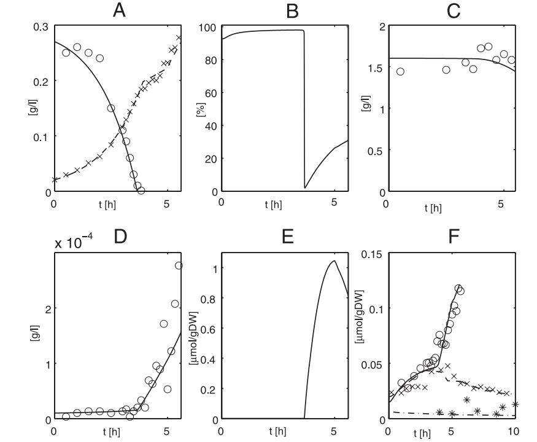
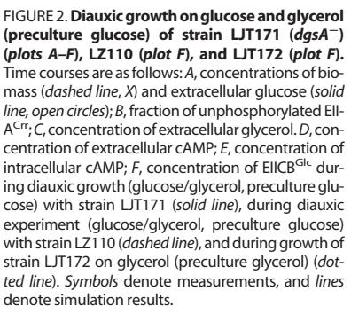
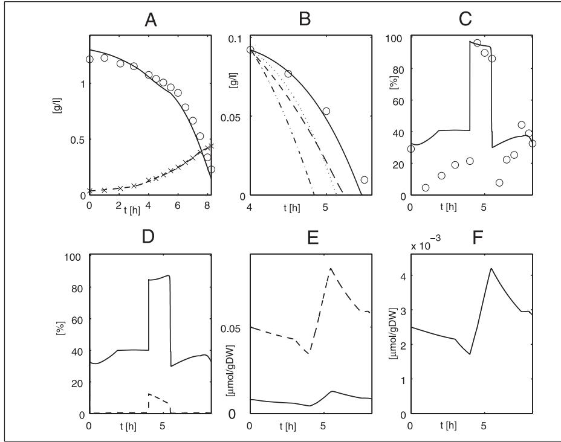
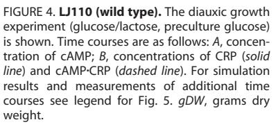
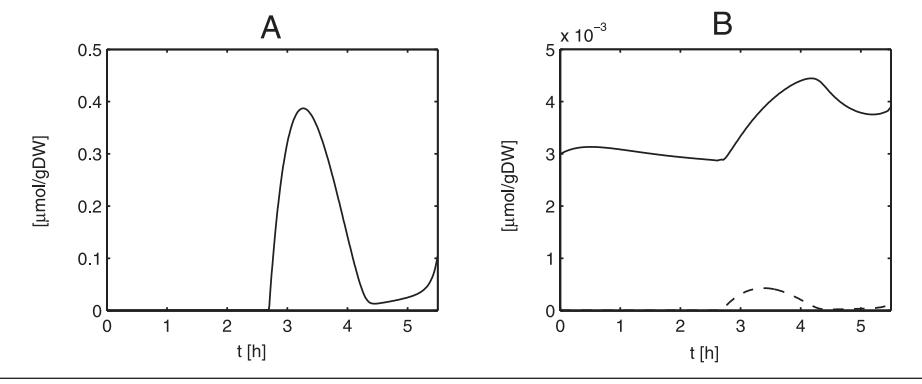
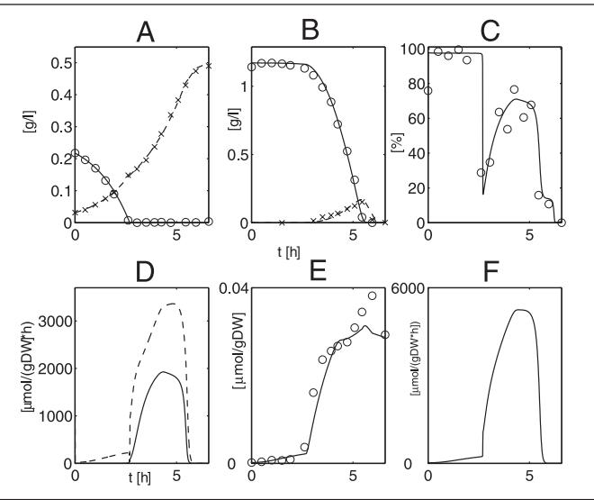

# **A Quantitative Approach to Catabolite Repression in** *Escherichia coli* *****□**S**

Received for publication, July 25, 2005, and in revised form, October 17, 2005 Published, JBC Papers in Press, November 1, 2005, DOI 10.1074/jbc.M508090200

**Katja Bettenbrock**‡1,2**, Sophia Fischer**‡1**, Andreas Kremling**‡ **, Knut Jahreis**§3**, Thomas Sauter**‡ **, and Ernst-Dieter Gilles**‡

*From the* ‡ *Systems Biology Group, Max-Planck-Institut fu¨r Dynamik komplexer technischer Systeme, 39106 Magdeburg, Germany and* § *AG Genetik, Universita¨t Osnabru¨ck, 49069 Osnabru¨ck, Germany*

**A dynamic mathematical model was developed to describe the uptake of various carbohydrates (glucose, lactose, glycerol, sucrose, and galactose) in** *Escherichia coli***. For validation a number of isogenic strains with defined mutations were used. By considering metabolic reactions as well as signal transduction processes influencing the relevant pathways, we were able to describe quantitatively the phenomenon of catabolite repression in** *E. coli***. We verified model predictions by measuring time courses of several extraand intracellular components such as glycolytic intermediates, EII-ACrrphosphorylation level, both LacZ and PtsG concentrations, and total cAMP concentrations under various growth conditions. The entire data base consists of 18 experiments performed with nine different strains. The model describes the expression of 17 key enzymes, 38 enzymatic reactions, and the dynamic behavior of more than 50 metabolites. The different phenomena affecting the phosphorylation level of EIIACrr, the key regulation molecule for inducer exclusion and catabolite repression in enteric bacteria, can now be explained quantitatively.**

Catabolite repression in *Escherichia coli* designates the observation that if different carbohydrates are present in a medium under unlimited conditions, one of them is usually taken up preferentially. Although the fundamental biochemical principles of the regulatory network have been revealed, a quantitative description of this growth behavior is still missing. The center of the regulatory network is formed by the phosphoenolpyruvate (PEP)4 :carbohydrate phosphotransferase systems (PTS). These systems are involved in both transport and phosphorylation of a large number of carbohydrates, in movement toward these carbon sources (chemotaxis), and in regulation of a number of metabolic pathways (1–3). The PTS in *E. coli* consist of two common cytoplasmatic proteins, EI (enzyme I) and HPr (histidine-containing protein), as well as an array of carbohydrate-specific EII (enzyme II) complexes. Because all components of the PTS, depending on their phosphorylation status, can interact with various key regulator proteins, the output of the PTS is represented by the degree of phosphorylation of the proteins involved in phosphoryl group transfer, *e.g*. unphosphorylated EIIACrr inhibits the uptake of other non-PTS carbohydrates by a process called inducer exclusion. Phosphorylated EIIACrr activates the adenylate cyclase (CyaA) and leads to an increase in the intracellular cAMP level.

Understanding the regulation of carbohydrate uptake requires a quantitative description of the PTS. In this context it is important that the degree of phosphorylation of EIIACrr is proportional to the PEP/ pyruvate ratio, when no carbohydrates are transported (4) and the respective equilibrium constant is an upper boundary when the PTS is active (5). The PTS should therefore not be regarded as a measure for the transport of PTS substrates but more as a general measure for carbohydrate availability. One feature of our contribution in this study is the dynamic simulation of uptake and degradation of several carbohydrates using a single set of parameters and the validation of the model with measurements including the degree of phosphorylation of EIIACrr.

Previously, a detailed mathematical model describing diauxic growth behavior of *E. coli* on a mixture of glucose and lactose has been presented (6, 7). It describes the dynamics of a number of important metabolic components and enzymes, including gene expression. In the present study, using a number of isogenic strains with defined mutations we have extended the model to include the uptake of additional carbohydrates (glycerol, sucrose, and galactose). By combining these carbohydrate pathways with the signal transduction processes, it was possible to set up a comprehensive mathematical model of catabolite repression in *E. coli*. Fig. 1 sketches the metabolic pathways and regulatory interactions considered in the model.

The intention of this contribution is to model a well known biological system in a detailed, realistic, and quantitative manner, to demonstrate the use of appropriate tools and methods, and to show how the iterative process of experimental verification and model adaptations can lead to a deeper understanding of biological systems as well as the formulation of new biological problems. This is in contrast to other models of inducer exclusion, which describe the system simply as a switch between different steady states (8), exclude the dynamics of the regulatory network (9), or describe only small parts of the system (10, 11).

The overall strategy for experimental model verification comprises three ideas: (i) stimulating the system in different time frames by slow or fast changes of the environmental situation; (ii) providing conditions that allow growth under carbohydrate limited and unlimited conditions, respectively; and (iii) constructing a set of isogenic mutant strains with defined mutations in genes involved in the pathway of interest. Model predictions were verified by measuring several extra- and intracellular components, *i.e.* glycolytic intermediates, EIIACrr phosphorylation levels, protein concentrations of both LacZ and PtsG, and total cAMP concentrations under various growth conditions. The entire data base consists of 18 experiments performed with nine different strains.

* The costs of publication of this article were defrayed in part by the payment of page charges. This article must therefore be hereby marked "*advertisement*" in accordance

with 18 U.S.C. Section 1734 solely to indicate this fact. □**S** The on-lineversion of thisarticle(availableat http://www.jbc.org) contains supplements 1 and 2. Supplement 1 contains detailed model documentation, and supplement 2 provides additional information about the modeled units and the experiments used for model validation. 1 Both authors contributed equally to this work.

2 To whom correspondence should be addressed: Systembiologie, Max-Planck-Institut fu¨ r Dynamik komplexer technischer Systeme, Sandtorstr. 1, 39106 Magdeburg, Ger-

many. Tel.: 49-391-6110-249; E-mail: bettenbrock@mpi-magdeburg.mpg.de. 3 Supported by the Deutsche Forschungsgemeinschaft through Sonderforschungsbreich 431. 4 The abbreviations used are: PEP, phosphoenolpyruvate; PTS, phosphotransferase sys-

tem; Hpr, histidine-containing protein, cAMP-CRP, receptor protein.

FIGURE 1. **Systems diagram of pathways and regulatory interactions considered in the model.** The graphic shows schematically the pathways and regulatory interactions included in the model. *Boxes* show functional units with similar regulation. The units correspond to the classification of equations in supplement 1. *Ellipses*symbolize enzymes, and *arrows* indicate regulatory signals (transcriptional regulation or regulation of enzyme activity). Some of these arrows correspond to unit 1 in supplement 1, as this unit describes the regulation by the cAMP-CRP transcriptional regulator. Not all enzymes and regulatory actions included in the model are shown in the graphic, *e.g.* sucrose uptake and metabolism are omitted.

### **MATERIALS AND METHODS**

*Strains, Media, and Growth Conditions*—All strains used were isogenic derivatives of LJ110, constructed by standard P1*kc* transduction techniques (7). Strains and the relevant mutations are listed in Table 1. The *glk*::*cat* mutation of BL2 was taken from strain DM1000 (12). The *dgsA*::Tn*10kan* mutation was taken from strain KM563, kindly provided by W. Boos (University of Konstanz). The sucrose positive derivative of LJ110, named LJ210, was constructed essentially as follows. The 9.2-kb EcoRV/HindIII fragment from pJoe*637* (13) carrying the genes for the PTS-dependent transport and metabolism of sucrose was cloned between the inverted repeat regions of the transposon Tn*1721* yielding plasmid pKJL710. This plasmid with the artificial mini-Tn1721::*scr*, which lacks the *tnpA* gene for a transposase, was used to transform strain CSH28 Flac (14). The *tnpA* gene was introduced into this strain by transformation of plasmid pPSO110 *tnpA* (3). To select for transposition of the mini-Tn*1721*::*scr* onto the Flac, strain CSH28/Flac/ pPSO110/pKJL710 was crossed with the prototrophic Scr-negative strain PS5 (15). Standardminimalmedium plates with 0.2% sucrose as sole carbon source were used for the selection of PS5/Flac::mini-Tn*1721*::*scr* transconjugants. A P1*kc* lysate was generated from one of the transconjugants and used to transfer the mini-Tn*1721*::*scr* into the chromosome of LJ110. Using standard Hfr and P1 mapping techniques the insertion of the mini-Tn*1721*::*scr* into the *E. coli* chromosome was located at 6 min (corresponding to position zag). All other strains and mutations and the construction of the plasmid F-8gal::(*ptsGop-lacZ*) have been described earlier (7).

Strains were grown in phosphate-buffered minimal medium as described previously (16). Carbohydrates were sterilized by filtration and added to the concentrations indicated in the figures. All experiments were performed at 37 °C. They were performed either in shaker flasks with volumes at least 5 times higher than the culture volume under vigorous shaking or in a Biostad B reactor (B. Braun, Biotech International). Cultures were stirred at 400 rpm and aerated with 1 liter of air/l culture volume/min. Antibiotics were added to the precultures but were omitted from the experimental culture to avoid side effects. Tetracycline was added to 10 mg/liter, chloramphenicol to 25 mg/liter, and kanamycin to 25 mg/liter.

*Analytical Methods*—The concentration of biomass was determined by measuring the absorbance (optical density) of the culture at either 420 or 560 nm in an Ultrospec 3000 spectrophotometer (Amersham Biosciences). Extracellular carbohydrates and acetate were determined enzymatically with the respective test kits of r-Biopharm GmbH (Germany). cAMP was quantified with the cAMP enzyme immunoassay kit from Sigma-Aldrich. All tests were performed as recommended by the manufacturer. Measurement of --galactosidase activities was performed as described (17). The analysis of the EIIACrr phosphorylation state was carried out by Western blotting essentially as described by Takahashi *et al*. (18). Contrary to the protocol, proteins were precipitated at 80° C at least overnight. Detection was performed with polyclonal EIIACrr antibodies from rabbit. As secondary antibodies, goat anti-rabbit antibodies conjugated with horseradish peroxidase were used, and detection was carried out by using the SuperSignal West Femto maximum sensitivity substrate (Pierce) and a cooled chargecoupled device camera system (Intas) or by exposure to films. The sum of the two EIIACrr-specific bands in each lane was set to 100%. Time courses of glycolytic metabolites (glucose 6-phosphate, fructose, fructose 6-phosphate, PEP, and pyruvate) were measured as described elsewhere (19–21).

*Simulation Environment and Parameter Identification*—To set up the equations and perform simulation studies, the ProMoT/Diva environment was used (22). Parameter estimation was also performed using the program Diva as described previously (7).

According to the reference model (7) the specific growth rate, , is assumed to be dependent on all incoming substrate fluxes *rsi*, weighted with yield coefficients *Ysi*, which leads to the formula.

$$
\mu = \mathcal{Y}_{\mathfrak{sl}} \mathfrak{r}_{\mathfrak{sl}} + \mathcal{Y}_{\mathfrak{sl}} \mathfrak{r}_{\mathfrak{sl}} + \dots + \mathcal{Y}_{\mathfrak{sl}} \mathfrak{r}_{\mathfrak{sl}} \qquad (\mathbb{E} \mathfrak{q}, \mathbb{I}).
$$

One problem, however, is that the yield coefficients are not constant for different growth conditions. Thus, for some experiments it was not possible to simulate the time course of biomass simultaneously with the time courses of sugar uptake. Because sugar uptake is proportional to biomass concentration and, additionally, the balances for the enzymes and proteins, rates of synthesis, degradation, and dilution term are in the same order of magnitude, incorrect predictions of the growth rate lead to large deviations in a number of state variables. To overcome this problem the following strategy has been used here. Based on the experimental data, the specific growth rate was determined as a piecewise

## *Mathematical Model of Catabolite Repression*

constant function or as a spline function for each experiment and, finally, was used as an input into the system.

#### **RESULTS**

*Model Formulation and Validation*—To extend and validate the reference model (7), additional experiments with differing carbon sources, conditions, and isogenic mutants were performed. Additional intracellular and extracellular states (extracellular acetate, galactose, sucrose, and glycerol, degree of phosphorylation of EIIACrr, concentration of EIICBGlc) were measured. Thus the PTS and its interactions with several uptake systems were observed under varying conditions. Metabolic pathways for sucrose, glycerol, and galactose were included in the model. Furthermore, a new biochemical scheme for induction of *ptsG* (23) was incorporated. The mathematical model is composed of ordinary differential and algebraic equations (DAE system). A detailed documentation of the model is included in supplement 1.

Although many kinetic parameters have been published in the past by other groups, the use of different strains and conditions in those studies made it necessary to repeat a number of experiments with a defined wild-type strain and isogenic mutant strains. The experiments provide an excellent basis for parameter estimation and model validation. Batch experiments with single growth substrates as well as with mixtures of two substrates were conducted. To analyze the influence of starting conditions, the same experiment was performed with varying preculture conditions. Pulse and fed batch experiments provided information about fast processes. Additionally, continuous cultures were used to study the behavior of the bacterial culture under limited carbohydrate conditions as well as the transition from saturating to limited carbohydrate supply. To summarize, the results from 18 different experiments were applied in the modeling process. Figures showing measurements and simulations of these experiments are shown in supplement 2. On the basis of these experiments and by application of the ProMoT/Diva environment (22) with sophisticated methods for sensitivity analysis and parameter analysis and estimation, 55 parameters could be estimated, which represents about 32% of all the parameters. The following sections of this article will demonstrate some of the results and discuss some alterations regarding the initial model.

*Regulation of pts Operon and ptsG Expression by cAMP*-*CRP and Mlc*— The glucose-specific PTS in *E. coli* consists of the cytoplasmic protein EIIACrr, encoded by the *crr* gene (part of the *ptsHIcrr* operon) and the membrane-bound protein EIICBGlc (gene *ptsG*), which transport and concomitantly phosphorylate glucose. The phosphoryl groups are transferred from PEP via successive phosphorelay reactions involving EI, HPr, EIIACrr, and EIICBGlc to the substrate. The regulation of the *ptsG* gene and of *pts* operon expression is very complex. Among others, two major regulators, the cAMP-CRP complex and the repressor Mlc (also called DgsA, gene *dgsA*) (3, 23–25), are involved. It was demonstrated that unphosphorylated EIICBGlc can relieve the repression of *ptsG* gene expression by sequestering Mlc from its binding sites through a direct protein-protein interaction in response to glucose (3, 26–29) (reviewed in Ref. 1). In contrast to Mlc, the cAMP-CRP complex activates *ptsG* gene expression. Because intracellular cAMP levels are low during growth on glucose, these two antagonistic regulatory mechanisms guarantee a precise adjustment of *ptsG* expression levels under various growth conditions.

Regulation of the *ptsG* gene by Mlc was incorporated into the model in order to analyze its effect on overall growth behavior. This is realized in the model as follows. For the glucose phosphorylation step of PTS, an irreversible bi-bi mechanism for the two substrates, extracellular and intracellular glucose, was applied (see Ref. 7). Either glucose or phos-

| TABLE 1 |  |
|---------|--|
| Strains |  |

| Strain | Genotype                          | Origin     |
|--------|-----------------------------------|------------|
| LJ110  | W3110, F, Fnr                     | (3)        |
| BKG47  | LJ110 (ptsG)cat                   | (7)        |
| KB51   | LJ110 cyaA854Tn10/6               | (7)        |
| KB7    | LJ110 dgsATn10kan                 | This study |
| LJT172 | (ptsGo,placZ), LJ110 F'8::  | This study |
|        | (manXYZ)cat                       |            |
| LJT171 | (ptsGo,placZ), LJ110 F'8::  | This study |
|        | dgsATn10kan, (manXYZ)cat          |            |
| LZ110  | LJ110 (argF-lacZ)169              | (3)        |
| KB53   | LJ110 lacI3098Tn10kan             | (7)        |
| BL2    | LJ110 glkcat                      | This study |
| LJ210  | LJ110 zagminiTn1721 scr           | This study |
| PS5    | S136 recA56                       | (13)       |
| CSH28  | F lac                          | (14)       |

phorylated EIIACrr bind to EIICBGlc at first. This means that the following conformations of the PTS transporter occur: free EIICBGlc, the unphosphorylated complexes EIICBGlc-*Glcex* and EIICBGlc-*Glcin* and the phosphorylated complexes EIICBGlc-EIIAP, EIICBGlc-*Glcex*-EIIAP, and EIICBGlc-*Glcin*-EIIAP. All unphosphorylated conformations are now able to bind to Mlc but with different affinities. As a result of the parameter fitting, affinities of unphosphorylated complexes with glucose were much stronger than affinity of free EIICBGlc. This corresponds qualitatively to experimental results.5

Using strains LZ110 and LJT172 (both *dgsA*) and the *dgsA*-negative strain LJT171 (see Table 1), *ptsG*-*lacZ* expression as an indicator for the amount of EIICBGlc was monitored by measuring the --galactosidase activity. Bacteria were pre-grown on glycerol or glucose and inoculated on glucose, glycerol, or a mixture of glucose and glycerol, respectively. These experiments were used to estimate parameters for *ptsG* expression.

A basal activity of *ptsG* expression can be detected if cells are grown with glycerol alone (Fig. 2*F, dash-dotted line*). In cultures of strain LZ110 growing on glucose and glycerol, induction effects could be observed during the first (glucose) phase. EIICBGlc accumulated until the supply of glucose had been exhausted. During this growth phase, uptake of glycerol was prevented by inducer exclusion and low cAMP values. After depletion of glucose, Mlc became active and prevented further synthesis of EIICBGlc. By dilution through growth, the amount of EIICBGlc was now diminished (Fig. 2*F*, *dashed line*). In the *dgsA* mutant strain LJT171, during growth with glucose EIICBGlc was synthesized in approximately the same amounts as in LZ110. Differences became obvious during the second (glycerol) growth phase. Although in LZ110 *ptsG* is repressed during growth with glycerol, in LJT171 it is induced even more strongly. This can be attributed to the lack of inhibition by Mlc and to higher intracellular cAMP levels during growth with glycerol. Extracellular cAMP accumulated in large amounts in the medium (Fig. 2*D*).

Transcription of one of the two major promoters of the *ptsHIcrr* operon (*ptsH* P0) is regulated in the same way as transcription of *ptsG*. However, the concentrations of the encoded enzymes increase only by a factor 2 or 3 (30–32) for EI and HPr, and EIIACrr is almost constant, because *crr* is, in addition, transcribed by a constitutive promoter located within the *ptsI* gene (30, 32). Because of the weak effect of regulation by Mlc and cAMP-CRP on *pts* operon expression, it was neglected in the previous model (7). The concentrations of the PTS proteins were set to be constant. This model variant allowed the simulation of a number of experiments, but interestingly, one type of experiment, the so-called "disturbed" batch, could not be reproduced. In [www.jbc.org](http://www.jbc.org/)

Downloaded from

5 K Jahreis, unpublished data.

# *Mathematical Model of Catabolite Repression*

FIGURE 3.**Disturbed batch experiment with glucose pulse on culture of LJ110 (wild type) growing exponentially on glycerol (preculture glycerol).** Time courses are as follows. *A*, concentrations of biomass (*dashed line, x*) and extracellular glycerol (*solid line, open circles*). *B*, concentration of extracellular glucose. *Solid line*, model with detailed *pts* operon expression; *dashed line*, model with constant EIICBGlc (0.04 mol/gDw, grams dry weight); *dotted line*, model with constant concentrations of EI and HPr (0.006 and 0.12 mol/gDW, grams dry weight); and *dashed-dotted line*, model with constant concentrations of EIICBGlc, EI, and HPr (0.04, 0.006, and 0.12 mol/gDW, grams dry weight). *C*, fraction of unphosphorylated EIIACrr. *D*, fractions of free EII-ACrr (*solid line*) and EIIACrr bound to GlpK (*dashed line*). *E*, concentrations of EIICBGlc (*solid line*) and HPr (*dashed line*). *F*, concentration of EI. *Symbols* denote measurements, and *lines* denote simulation results. *gDW*, grams dry weight.

these experiments the cells are grown on a single carbon source and glucose is pulsed in the midlog phase of growth. The feeding of glucose results in dramatic changes of the phosphorylation level of EIIACrr. Disturbed batch experiments with glycerol and lactose were performed (Fig. 3).The glucose uptake rate after the pulse was drastically reduced (to less than one-third of that during growth on glucose). Two phenomena might be responsible for this effect. First, it has been verified experimentally for *Salmonella typhimurium* (33) that PTS velocity and activity are reduced by EIIACrr binding to LacY and GlpK. These interactions are considered in the model. As a second possibility, the concentrations of PTS enzymes could be reduced down to rate-limiting conditions.

Using the set of parameters describing glucose uptake in the other experiments, simulated glucose uptake proceeded much too fast. It was not possible to fit the curve by modulating the GlpK interaction with EIIACrr or by using different fixed concentrations of the PTS proteins. Therefore regulation of the *pts* operon expression by Mlc and by

cAMP-CRP was introduced into the model. Mlc activity was modeled as described and validated for *ptsG* expression. The slow uptake of glucose during disturbed batch experiments could then be described. Fig. 3*B* presents the results of different model variants (with and without regulated expression of EIICBGlc, HPr, and EI).

It can now be stated that although the expression of the *pts* operon varies only by a factor of 2–3, this variation is important for the activity of the PTS under certain growth conditions. It may be that this is most obvious when cells are shifted quickly from poor substrates like glycerol to good (PTS) substrates. Although such situations are seldom monitored in experiments, they might occur regularly in nature where the supply of nutrients can change very rapidly and dramatically. The degree of phosphorylation of EIIACrr depends on the rate of phosphorylation of glucose by the PTS, the PEP/Prv ratio (5, 4), the amount of complexation of EIIACrr with LacY, GlpK, and other enzymes, and as a result of this study, also considerably on the concentrations of the common PTS enzymes. Some of these factors might influence the activity of the PTS to a greater or lesser extent, but all contribute to the overall behavior. The model could now be used to dissect these different influences, which would be tedious to do with experiments only. The example shows that even in a very complex model with many parameters not every result can be obtained simply by fitting of parameters. If a model is carefully validated, mistakes or incorrect simplifications become obvious.

*Analysis of Glucose-Lactose Diauxic Growth*—The phosphorylated form of EIIACrr directly or indirectly activates the adenylate cyclase CyaA, which generates cAMP from ATP. Thus, high cAMP levels are the consequence of carbohydrate-limiting conditions. The alarmone cAMP binds to CRP, a global carbon catabolite regulator responsible for the induction of various genes. Because cAMP-CRP is a negative transcription factor for adenylate cyclase and a positive transcription factor for CRP and the PTS proteins, the system shows a number of feedback loops and is therefore highly complex.

In the case of glucose repression of the lactose uptake system, regulation due to inducer exclusion is generally believed to be the most important mechanism (34), and the cAMP-CRP complex is supposed to be mainly required for autoregulation of the lactose uptake system (4, 35) in order to prevent lactose uptake rates that are too high. The relevance of the cAMP-CRP complex during diauxic growth on glucose and lactose is seen in an acceleration of expression of the *lacZYA* operon after depletion of glucose and therefore a minimization of the lag phase between glucose and lactose utilization. However, the question has arisen as to how regulation of cAMP is realized in such a dynamic fashion (34).

Measurements for the validation of the model presented here allowed, in combination with simulations, a deep insight into the occur-

FIGURE 5. **Diauxic growth on glucose and lactose (preculture glucose) with LJ110 (wild type).** Time courses are as follows: *A*, concentrations of biomass (*dashed line, x*) and extracellular glucose (*solid line, open circles*); *B*, concentration of extracellular lactose (*solid line*) and extracellular galactose (*dashed line*); *C*, fraction of unphosphorylated EII-ACrr; *D*, rates of phosphorylation of intracellular glucose by PTS (*solid line*) and glucokinase (*dashed line*); *E*, concentration of --galactosidase; *F*, rate of lactose uptake. *Symbols* denote measurements, and *lines* denote simulation results. *gDW*, grams dry weight.

ring processes. The model has been validated by measurements of --galactosidase, extracellular cAMP, and the degree of phosphorylation of EIIACrr during diauxic growth of the wild type and a *lacI* mutant (strain KB53, see Table 1) on glucose and lactose. Fig. 4 shows simulation results of intracellular cAMP, CRP, and the complex of both during glucose/lactose diauxie of the wild type (Fig. 5). The results are in agreement with data presented previously (34). After depletion of glucose, cAMP rose sharply and subsequently decreased rapidly during exponential growth on lactose. Simulation results of the CRP concentration show a slight increase (factor 1.3) during the lactose uptake phase. The complex of both, which is crucial for regulation, shows qualitatively the same behavior as cAMP. This indicates that during diauxic growth the variation of cAMP concentration is much more important than the variation of CRP concentrations, which have almost no effect. This is in accordance with results from Ishizuka *et al*. (19) who reported that variation of cAMP concentration is responsible for transient repression, whereas the lowering of the CRP concentration becomes important for permanent repression. This indicates that the regulation by variation of cAMP concentrations is important for fast, dynamic processes, *e.g.* during the lag phase, whereas variation of CRP concentration becomes important for the adaptation to a certain carbon source.

In contrast to regulation of the lactose uptake system, cAMP-dependent catabolite repression seems to be the dominant mechanism of glucose repression of glycerol uptake (36). This corresponds to simulated higher cAMP and CRP levels during growth on glycerol (see supplement 2, Fig. 11).

In Fig. 5 , measured phenomena are described for growth of wild-type cells on glucose and lactose. EIIACrr was unphosphorylated mainly during the uptake of glucose. Once the glucose had been consumed, EIIACrr shifted very quickly to its phosphorylated form and afterward became increasingly unphosphorylated during induction of the *lac* operon and uptake of lactose. In Fig. 5, *plots C* and *F*, the correlation of unphosphorylated EIIACrr and the rate of lactose uptake during the second growth phase can be seen. Uptake of glucose and lactose proceeded in the same manner for all studied strains, apart from BKG47 (supplement 2, Fig. 20). However, the measured degree of phosphorylation of EIIACrr differed. Strain BL2 (supplement 2, Fig. 12) showed a very low degree of phosphorylation, whereas in KB7, a *dgsA* mutant (supplement 2, Fig. 18) EIIACrr was much more phosphorylated. Strain BKG47 showed a reverse diauxic growth on glucose and lactose, and lactose was now taken up preferentially. The degree of phosphorylation of EIIACrr during lactose uptake was nearly as low as for the wild type.

Another interesting feature of glucose-lactose diauxie is the production of intracellular glucose during growth on lactose. This intracellular glucose may be phosphorylated by a glucokinase (gene *glk*) or by the PTS (2, 37). Growth of two mutant strains, one of them lacking the *glk* gene (strain BL2, see Table 1) and the other one lacking the *ptsG* gene (strain BKG47, see Table 1), on lactose shows that phosphorylation via glucokinase and phosphorylation via PTS are possible *in vivo*. To solve this problem, measurements of the phosphorylation degree of EIIACrr during growth of the wild type and of various mutants on lactose combined with model analysis were suitable to answer the question of the ratio of both of these fluxes.

According to the reference model (7), the predominant part of intracellular glucose had to be phosphorylated by the PTS in order to reproduce the measured degree of phosphorylation of EIIACrr (not shown). However, this model was not able to reproduce measurements with BKG47 because it predicted 100% phosphorylation of EIIACrr. By a refinement of the pyruvate kinase kinetics, which was Michaelis-Menten-type kinetics in the reference model, to a Hill-type kinetics and subsequent fitting of the glycolysis parameters with different experiments, including a sucrose pulse experiment with measurements of glycolytic intermediates (21), the model was improved significantly and can now be used to explain the growth of all strains on lactose. Fig. 5*D* shows that with the new model about two-thirds of the intracellular glucose is phosphorylated by glucokinase and one-third by the PTS. The lower degree of EIIACrr phosphorylation of strain BL2 can be explained by a higher flux via the PTS caused by the lack of glucokinase (supplement 2, Fig. 12). However, this flux was almost as high as that in strain KB7, being caused by higher concentrations of HPr and EI and resulting in a degree of phosphorylation which is even higher than in the wild type (supplement 2, Fig. 18). The most interesting result of this set of experiments was that the exchange of the pyruvate kinase kinetics from Michaelis-Menten-type to Hill-type kinetics was necessary to reproduce the measured data. The simplification of the model set up by using formal kinetic approaches leads to false results. Choosing the wrong kinetics might be without effect for many enzymes, but for enzymes that modulate key metabolites, choosing the right kinetics is crucial. This was obvious for this set of experiments because the PTS phosphorylation state is influenced mainly by the PEP to pyruvate ratio. By changing the pyruvate kinase kinetics this ratio is also influenced directly.

### **DISCUSSION**

In this study we present a comprehensive model of *E. coli* metabolism that is able to describe uptake and degradation of several carbohydrates (glucose, lactose, glycerol, sucrose, and galactose) and to reproduce measurements of intracellular enzyme concentrations (LacZ and EIICBGlc), glycolytic intermediates, and the phosphorylation state of EIIACrr. The different phenomena influencing the EIIACrr phosphorylation level, which is the key regulator for catabolite repression and inducer exclusion, can now be analyzed by using this model.

In contrast to other modeling approaches, important parts of our model could be validated by a comprehensive set of experiments, *i.e.* based on the experimental data a number of uncertain or even unknown kinetic parameters could be estimated. The organism was stimulated by providing different mixtures of carbon sources using different preculture conditions, *i.e.* modifying the intracellular initial conditions and by altering the biochemical network by constructing a set of isogenic mutant strains. All experiments are described with a single set of parameters. Moreover, the dynamic behavior of the strains in a number of growth situations (diauxic growth, batch, continuous culture, disturbed batch, pulse response) could be reproduced.

The biological knowledge represented in the model has been collected from a number of publications: kinetic studies on enzymes and transcription factors as a starting point for parameter identification; genetic studies to set up a possible model structure and experimental data from array studies and proteomics to decide whether gene expression for proteins in the model has to be included.

The strategy presented in this study shows that it is possible to estimate a relatively high number of parameters even if only a limited set of measurements is available. This is based on the fact that the analysis of the system was performed under varying conditions and stimuli. Moreover, the experiments revealed that some modules (submodels) had to be refined by including more detailed knowledge of molecular biology; mainly the description of regulatory processes had to be improved. This demonstrates that mathematical models can help access regulatory processes if they are described very accurately and are validated with appropriate experiments. In addition, the data presented reveal that to set up a realistic model of good quality it is also important to carefully choose the correct kinetics. As presented here for the enzyme pyruvate kinase, the selection of the wrong kinetics (Michaelis-Menten) leads to problems in the model validation procedure. Although the use of formal kinetic approaches simplifies the model formulation, it is also a source of error. Testing different possible reaction kinetics would be necessary for the set-up of a good model.

The model presented confirms the current knowledge about catabolite repression and glucose-lactose diauxie in *E. coli*. Inducer exclusion is the most important regulatory mechanism in glucose-lactose diauxie, as described by Inada *et al*. (38), but in the case of glycerol the situation is different. This model will be used in the future to analyze these differences more thoroughly. The model hints at an important effect of cAMP concentrations during switches like that from glucose to lactose in diauxic growth as reported by Ishizuka *et al*. (19). CRP concentrations seem to be less important during such dynamic processes and might be more important for long term adaptation to different growth substrates. It has been reported that the *pts* operon is regulated by cAMP-CRP as well as by Mlc (30, 31). This regulation is weak (factor of 2–3) (32) and hence has often been neglected. The quantitative analysis, with the help of a dynamic mathematical model, was able to show the effects of this regulation. Obviously it is important if cells are shifted from feast to famine conditions. The analysis of intracellular glucose phosphorylation is another good example for the application of a quantitative math-

# *Mathematical Model of Catabolite Repression*

ematical model. Intracellular glucose phosphorylation by glucokinase and by PtsG has been reported in the past (33–41). The different publications propose a different share of both systems depending on the source of intracellular glucose. But such analyses are mostly qualitative. A quantitative mathematical model that is able to consider dynamic enzyme concentrations and fluxes can help to evaluate these differences. The analysis performed for the phosphorylation derived from splitting of lactose is shown in this study, but the model would allow the same analyses to be performed for growth with maltose or mellibiose as well. This might be another application of the model in the future.

As shown in this article the mathematical model confirms biological knowledge about catabolite repression and allows additional quantitative analyses. Dynamic models for cellular systems that are validated with a comprehensive set of experiments are seldom found in the literature. However, there is pressing need for "good" models, those able to describe phenomena relevant to biotechnology or medicine. The model at hand can help to develop strategies for model set-up and validation for these systems.

*Acknowledgments—We thank J. W. Lengeler for many helpful and critical discussions and M. Fleischer, H. Tietgens, B. Laube, and A. Focke for technical assistance.*

#### **REFERENCES**

- 1. Plumbridge, J. (2002) *Curr. Opin. Microbiol.* **5,** 187–193
- 2. Postma, P. W., Lengeler, J. W., and Jacobson, G. R. (1993) *Microbiol. Rev.* **57,** 543–594
- 3. Zeppenfeld, T., Larisch, C., Lengeler, J. W., and Jahreis, K. (2000) *J. Bacteriol.* **182,** 4443–4452
- 4. Hogema, B. M., Arents, J. C., Bader, R., Eijkemanns, K., Yoshida, H., Takahashi, H., Aiba, H., and Postma, P. W. (1998) *Mol. Microbiol.* **30,** 487–498
- 5. Kremling, A., Fischer, S., Sauter, T., Bettenbrock, K., and Gilles, E. D. (2004) *BioSystems* **73,** 57–71
- 6. Kremling, A., and Gilles, E. D. (2001) *Metab. Eng.* **3,** 138–150
- 7. Kremling, A., Bettenbrock, K., Laube, B., Jahreis, K., Lengeler, J. W., and Gilles, E. D. (2001) *Metab. Eng.* **3,** 362–379
- 8. Covert, M. W., and Palsson, B. O. (2002) *J. Biol. Chem.* **277,** 28058–28064
- 9. Chassagnole, C., Noisommit-Rizzi, N., Schmid, J. W., Mauch, K., and Reuss, M. (2002) *Biotechnol. Bioeng*. **79,** 53–73
- 10. Setty, Y., Mayo, A. E., Surette, M. G., and Alon, U. (2003) *Proc. Natl. Acad. Sci.* **100,** 7702–7707
- 11. Wong, P., Gladney, S., and Keasling, J. D. (1997) *Biotechnol. Prog.* **13,** 132–143
- 12. Meyer, D., Schneider-Fresenius, C., Horlacher, R., Peist, R., and Boos, W. (1997) *J. Bacteriol.* **179,** 1298–1306
- 13. Schmid, K., Ebner, R., Altenbuchner, J., Schmitt, R., and Lengeler, J. W. (1988) *Mol. Mocrobiol.* **2,** 1–8
- 14. Miller, J. H. (1972) *Experiments in Molecular Genetics*, Cold Spring Harbor Laboratory Press, Cold Spring Harbor, NY
- 15. Hochhut, B., Jahreis, K., Lengeler, J. W., and Schmid, K. (1997) *J. Bacteriol.* **179,** 2097–2102
- 16. Tanaka, S., Lerner, S. A., and Lin, E. C. C. (1967) *J. Bacteriol.* **93,** 642–648
- 17. Pardee, B., and Prestige, L. S. (1961) *Biochim. Biophys. Acta* **49,** 77–88
- 18. Takahashi, H., Inada, T., Postma, P., and Aiba, H. (1998) *Mol. Gen. Genet.* **259,** 317–326
- 19. Ishizuka, H., Hanamura, A., Kunimura, T., and Aiba, H. (1993) *Mol. Microbiol.* **10,** 341–350
- 20. Bergmeyer H. U. (1979) *Methoden der Enzymatischen Analyse*, Verlag Chemie, Weinheim (Bergstr.), Germany
- 21. Sauter, T., and Gilles, E. D. (2004) *J. Biotechnol*. **110,** 181–199
- 22. Ginkel, M., Kremling, A., Nutsch, T., Rehner, R., and Gilles, E. D. (2003) *Bioinformatics* **19,** 1169–1176
- 23. Plumbridge, J. (1998) *Mol. Microbiol.* **29,** 1053–1063
- 24. Roehl, R. A., and Vinopal, R. T. (1980) *J. Bacteriol.* **142,** 120–130
- 25. Kimata, K., Inada, T., and Aiba, H. (1998) *Mol. Microbiol.* **29,** 1509–1519
- 26. Lee, S.-J., Boos, W., Bouche, J. P., and Plumbridge, J. (2000) *EMBO J.* **19,** 5353–5361
- 27. Tanaka, Y., Kimata, K., and Aiba, H. (2000) *EMBO J.* **19,** 5344–5352
- 28. Nam, T. W., Cho, S. H., Shin, D., Kim, J. H., Jeong, J. Y., Lee, J. H., Roe, J. H., Peterkofsky, A., Kang, S. O., Ryu, S., and Seok, Y.J. (2001) *EMBO J.* **20,** 491–498
- 29. Seitz, S., Lee, S. J., Pennetier, C., Boos,W., and Plumbridge, J. (2003)*J. Biol. Chem.* **278,** 10744–10751
- 30. Tanaka, Y., Kimata, K., Inada, T., Tagami, H., and Aiba, H. (1999) *Genes Cells* **4,** 391–399
- 31. Kim, S.-Y., Nam, T.-W., Shin, D., Koo, B.-M., Seok, Y.-J., and Ryu, S. (1999) *J. Biol. Chem.* **274,** 25398–25402
- 32. DeReuse, H., and Danchin, A. 1988) *J. Bacteriol.* **170,** 3827–3837
- 33. Rohwer, J. M., Bader, R., Westerhoff, H. V., and Postma, P. W. (1998) *Mol. Microbiol.* **29,** 641–652
- 34. Inada, T., Kimata, K., and Aiba, H. (1996) *Genes Cells* **1,** 293–301
- 35. Brueckner, R., and Titgemeyer, F. (2002) *FEMS Microbiol. Lett*. **209,** 141–148 36. Holtman, C. K., Pawlik, A. C., Meadow, N. D., and Pettigrew, D. W. (2001) *J. Bacteriol.*
- **183,** 3336–3344 37. Nuoffer, C. B., Zanolari, B., and Erni B. (1988) *J. Biol. Chem.* **263,** 6647–6655
- 38. Inada, T., Takahashi, H., Mizuno, T., and Aiba, H. (1996) *Mol. Gen. Genet.* **253,** 198–204
- 39. Buhr, A., Daniels, G. A., and Erni, B. (1992) *J. Biol. Chem.* **267,** 3847–3851
- 40. Rephaeli, A. W., and Saier, M. H., Jr. (1980) *J. Bacteriol.* **141,** 658–663
- 41. Curtis, S. J., and Epstein, W. (1975) *J. Bacteriol.* **122,** 1189–1199