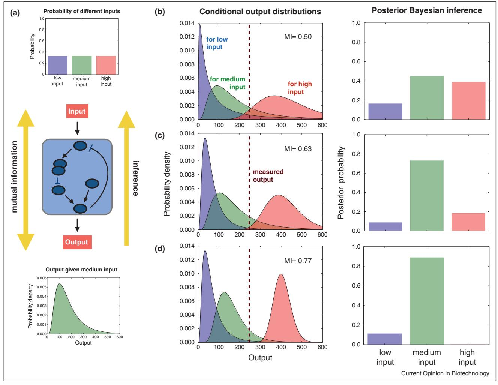

ScienceDirect

# Environmental sensing, information transfer, and cellular decision-making

Clive G Bowsher1 and Peter S Swain2

The recognition that gene expression can be substantially stochastic poses the question of how cells respond to dynamic environments using biochemistry that itself fluctuates. The study of cellular decision-making aims to solve this puzzle by focusing on quantitative understanding of the variation seen across isogenic populations in response to extracellular change. This behaviour is complex, and a theoretical framework within which to embed experimental results is needed. Here we review current approaches, with an emphasis on information theory, sequential data processing, and optimality arguments. We conclude by highlighting some limitations of these techniques and the importance of connecting both theory and experiment to measures of fitness.

#### Addresses

1School of Mathematics, University of Bristol, UK 2SynthSys – Synthetic & Systems Biology, School of Biological Sciences, University of Edinburgh, UK

Corresponding authors: Bowsher, Clive G ([c.bowsher@bristol.ac.uk)](c.bowsher@bristol.ac.uk) and Swain, Peter S [(peter.swain@ed.ac.uk)](peter.swain@ed.ac.uk)

Current Opinion in Biotechnology 2014, 28:149–155 This review comes from a themed issue on Systems biology Edited by Christian M Metallo and Victor Sourjik

### <http://dx.doi.org/10.1016/j.copbio.2014.04.010>

0958-1669/# 2014 Elsevier Ltd. All rights reserved

## Introduction

Life forsingle cellsisstochastic [\[1\].](#page-4-0) Cellssense fluctuating signals with biochemical networks that are themselves stochastic and history-dependent [\[2\],](#page-4-0) and yet living organisms are able to flourish in nearly all environments. Understanding how cells prosper despite stochasticity and environmental variability is the focus of a relatively new area of systems biology, that of cellular decision-making [\[3,4\].](#page-4-0)By a cellular decision we mean the process by which a cell makes a 'choice' of phenotype from a range of possible phenotypesin response to orin anticipation of extracellular change. Such choices could include new gene expression, changes in cell morphology, intracellular re-arrangements, movement, or the option not to change phenotype at all.

In addition to the stochasticity ofsignal transduction, cells locally sense signals that fluctuate both in time and across space, whereas often it is the successful identification of broader environmental changes that is important in enabling an effective response [\[5\].](#page-5-0) Even bacteria appear to be able to solve this kind of inference problem, using local signals to identify, for example, that they are in the human gut and thereby anticipate likely future events [\[6,7\]](#page-5-0).

Here we review the theoretical approaches developed so far to understand cellular decision-making. Motivated by the surge of interest in biochemicalstochasticity generated by the theoretical work of McAdams and Arkin in 1997 [\[8\],](#page-5-0) we ask iftheory is now poised to have a similar effect on the experimental study of decision-making in single cells.

# Dose–response and information theory

Most theorists have focused on applying ideas from information theory, often inspired by neuroscience [\[9\]](#page-5-0). In systems biology, the experimental confirmation that gene expression is stochastic [\[10,11\]](#page-5-0) and the related discovery that genetically identical cells can vary significantly in their response to the same stimulus [12–[14\]](#page-5-0) implies that dose– response, or 'input–output', relationships are also often substantially stochastic. Information theory, through mutual information, provides an objective means to quantify the influence of this stochasticity [\[15\].](#page-5-0)

Mutual information is perhaps the most principled measure of statistical dependence between two stochastic variables, such as the signal and response of a biochemical network [16–[19\]](#page-5-0). We discuss its interpretation as a measure of information in [Boxes](#page-1-0) 1 and 2. Mutual information can be related to the quality of the optimal prediction, or inference, of the signal from the response ([Box](#page-1-0) 1 and [Figure](#page-2-0) 1), does not require knowledge of transduction mechanisms, and is invariant to nonlinear, one-to-one transformations of either the signal or response. It does, however, require measurement of the probability distribution of the signal and the response. Collecting sufficient data to accurately estimate probability distributions and mutual information can be difficult, and for most organisms we know little about the distribution of signals experienced in the wild.An approach often taken in an attempt to circumvent this lack of knowledge is to calculate the information capacity [(Box](#page-3-0) 2), which is the maximum value of the mutual information over all possible, plausible signal distributions.

Recently, the development of fluorescent reporters and microfluidics have enabledunprecedentedcharacterization

#### Box 1 Interpreting mutual information

Mutual information can be interpreted in several different ways.

Mutual information is the difference between the entropy of the input and the entropy of the input given the output. For discrete systems, the entropy of a random variable is a measure of uncertainty, and mutual information therefore quantifies the reduction in uncertainty about the input gained from measuring the output. For example, if the entropy of the input is, say, 3 bits, a signalling output with a mutual information of 2 bits implies less impeded 'information flow' than an output with a mutual information of 1 bit. For continuous systems, entropy as a measure of uncertainty is more problematic. We would expect the extent of our uncertainty about a random variable not to change if the variable is transformed by a one-to-one mapping, but the entropy of a continuous variable generally does change under such transformations [\[20\].](#page-5-0)

An alternative interpretation of mutual information, applicable to both discrete and continuous systems, comes from decision theory (summarized in [Box](#page-4-0) 3). Suppose a cell must infer the state of a signal, S, from the output, Z, of a signal transduction mechanism. In general, the inference made about the signal takes the form of a probability distribution (over the possible signal values) with density function, say, q. To measure the quality of this inference, we need a means of evaluating or scoring q. If z is the measured value of the output and the inference about the signal is q(s0 , z), a function of the possible signal states s0 , one possible scoring function is log q(s0 = s, z), where s is the true state of the signal. This scoring function rewards inferences q that attach higher values to s0 = s. Let the true distribution of the signal be p(s0 ) (the signal s is a sample from p) and let this distribution also be the prior distribution for any inference. Then the increase in the score that results from the inference q, when the true state of the signal happens to be s, is measured by

$$
\log \mathfrak{q}(\mathbf{s}' = \mathbf{s}, \mathbf{z}) - \log \mathfrak{p}(\mathbf{s}' = \mathbf{s}).
$$

When z is measured, the expected value of this increase (averaging over all signal states) is

$$E[\mathsf{score}|\mathsf{z}] = \int \mathsf{p}(\mathsf{s}|\mathsf{z}) \mathsf{log}\,\mathsf{q}(\mathsf{s},\mathsf{z})d\mathsf{s} - \int \mathsf{p}(\mathsf{s}|\mathsf{z}) \mathsf{log}\,\mathsf{p}(\mathsf{s})d\mathsf{s},$$

and averaging further over all possible values of the output, z, we have

$$E[\mathbf{s}\mathbf{c}\mathbf{c}\mathbf{e}] = \int \rho(\mathbf{z})\,\rho(\mathbf{s}|\mathbf{z})\log\,\mathbf{q}(\mathbf{s},\mathbf{z})\,\mathbf{d}\mathbf{s}d\mathbf{z} - \int \rho(\mathbf{s})\log\,\rho(\mathbf{s})\,\mathbf{d}\mathbf{s}.$$

Following decision theory [(Box](#page-4-0) 3), we then ask which inference function q maximizes this expectation.

The inference that maximizes the expected score is posterior Bayesian inference, q(s, z) = p(sjz) = p(z, s)/p(z) [\[20\]](#page-5-0). The expected score then becomes

$$E[\mathsf{score}]_{\mathsf{Boyest}} = \int \mathsf{p}(\mathsf{z}) \int \mathsf{p}(\mathsf{s}|\mathsf{z}) \mathsf{losp}\ \mathsf{p}(\mathsf{s}|\mathsf{z}) d\mathsf{s}d\mathsf{z} - \int \mathsf{p}(\mathsf{s}) \mathsf{losp}\ \mathsf{p}(\mathsf{s}) d\mathsf{s} = l(\mathsf{S};\mathsf{Z})$$

which, by definition, is the mutual information. The mutual information therefore quantifies the ability, on average, to infer a given signal, S, from the output, Z, of a signal transduction mechanism, if we can assume that the prior distribution for the inference equals the actual distribution of the signal ([Figure](#page-2-0) 1). For a given signal distribution, one transduction mechanism allows better inference than another if and only if it has higher mutual information. We note that different scoring functions can also result in Bayesian inference being optimal, but give an expected score that is not the mutual information. If additional requirements such as smoothness and locality are, however, imposed on the scoring function then the logarithmic function is the only possible one [\[20\].](#page-5-0)

ofthe responses ofindividual cells[\[21](#page-5-0)–23], and experimental measurements of mutual information and information capacity for biochemicalsignalling systems are now appearing [\[24,25](#page-5-0)--[,26](#page-5-0)--[,27,28](#page-5-0)- [\].](#page-5-0) A particularly close connection between mutual information and the 'function' of a signalling system is made by Bialek and colleaguesin their study of developmentin the fruit fly [\[24,26](#page-5-0)--[,29\]](#page-5-0). Considering the gap gene network early in development, they showed that thepositionalinformation,themutualinformationbetween gap gene expression and the position of a nucleus,is close to the amount needed for each nucleusto identify its physical position along the anterior–posterior axis of the embryo [\[26](#page-5-0)--[\].](#page-5-0)Thissystemhasthe advantage that a uniform prior or 'input' distributionfor the position of the nucleusis a natural choice. Three recent studies of signal transduction in mammalian cells report values of the mutual information of approximately 1 bit or less for a single cell under conditions of constant stimulation and using simultaneous measurement of a single stimulus and output (the studies, though, use different inputs) [\[25](#page-5-0)--[,27,28](#page-5-0)- [\].](#page-5-0) Does this value necessarily mean that the cell can therefore discriminate without error two states of the signal but not more, which would suggest the prevalence of binary decisions by cells? Webelievenot,forthe reasons explainedin thefirstpoint of [Box](#page-3-0) 2. Cellular inferences of a signal must often be imperfect, and a mutual information of 1 bit is in general a quantification of the ability to infer the signal, albeit with uncertainty, from the output.

More experimentally and analytically accessible alternatives to mutual information have also been proposed, including local, variance-based measures [\[31\]](#page-5-0) and a lower bound for information capacity based on the linear correlation coefficient [\[32\].](#page-5-0) The 'fidelity' is the proportion of the variance in the response that is generated by the signal rather than by, for example, biochemical stochasticity, and provides a lower bound on information capacity that accounts for non-linearity in the response [\[33](#page-5-0)- [\].](#page-5-0) Using this approach, a study of osmosensing in yeast showed that the majority of variation in expression of a gene induced by a stress-activated kinase (up to 80%) can be due to variation in the osmotic environment [\[33](#page-5-0)- [\].](#page-5-0)

#### Figure 1

Mutual information evaluates the quality of Bayesian inferences. (a) Inference is the procedure used to predict the unknown input using the measured value of the output. We consider an input that has three possible states (denoted low, medium, and high), which are equally probable. Each input state, once transduced through a biochemical network, generates a stochastic output whose magnitude is described by the probability distribution shown (here for the medium input). Mutual information quantifies the statistical dependence between the input and output. In the middle column, we show the probability distribution of the output generated for each state of the input for three different, hypothetical signal transduction mechanisms ( (b), (c), and (d)). Each mechanism experiences different levels of biochemical noise, with levels of noise decreasing down the column. The mutual information (MI) is given in bits and increases as the degree of overlap between the output distributions decreases. In the right column, we show the result of posterior Bayesian inference of the level of the input given an output measurement of 250 (shown by the dashed line in the middle column) and a uniform prior distribution. Given this output of 250, the inference becomes less ambiguous moving down the page, and the medium input attracts increasing posterior probability. As the mutual information increases so, on average, does the ability to infer the input that generated the output ([Box](#page-1-0) 1).

Fidelity can be used to study signal representation in dynamic environments [\[34\],](#page-5-0) but, unlike mutual information, does not in general capture all aspects of information transfer.

## Updating inferences over time

We have argued that higher mutual information between an input and output implies better inference of the input from the output. Mutual information has so far typically been quantified at individual time points or at steady-state but cells may well update their inferences over time as they sense and learn more about their environment [\[35\].](#page-5-0) Sharpening inferences over time in this fashion is referred to as sequential inference in the statistics literature. Any posterior distribution given all the data at once is equivalent to incrementally updating the posterior distribution by considering the data in sequence and using the posterior distribution given the first k data points as the prior distribution for inference given the next, k + 1, data point.

#### Box 2 Mutual information in systems biology

The Shannon theory of communications engineering [\[15,30\]](#page-5-0) is concerned with transmitting information with infinitesimally small error using a noisy signalling mechanism, or 'channel', and differs in two important ways from the context relevant to systems biology:

- 1 In Shannon's work, mutual information is used to describe information transfer by typically many uses of a channel, whereas in systems biology the focus has mostly been on a 'single use', considering systems at steady-state. The steady-state distribution can be justified by arguing that the mechanism's response time is shorter than the time-scale of fluctuations in the input. Shannon considered the transmission of a message from a collection of messages and a suitable, one-to-one encoding function that allows each message to be represented by a sequence of channel inputs that are then applied to the channel. The channel is thus used multiple times to transmit a single message. Let the input for one use have the probability distribution P(S) and the corresponding output of the channel have the probability distribution P(ZjS). Shannon showed that n repeated uses of a noisy, memoryless channel allow approximately 2nI(S;Z) input sequences of length n, and hence 2nI(S;Z) different messages, to be 'perfectly' distinguished if n is sufficiently large. It is therefore the rate of information transmission per use of the channel, i.e. the logarithm of the number of messages distinguished per channel use, that is I(S ; Z). Consequently, a mutual information of 1 bit means that, under n uses of a channel, a message drawn from one of 2n possibilities can be near perfectly transmitted for sufficiently large n. It does not in general mean that a message with two possible states can be near perfectly transmitted on each use. Further, organisms also experience fluctuating and time-varying signals, and progress using information theory is still possible [\[35\]](#page-5-0), though challenging.
- 2 In engineering, the distribution of the input can be chosen by the user of the channel to maximize the mutual information, in order to maximize the number of distinguishable messages, but, in systems biology, the distribution of the signal is typically experienced and not chosen by the cell. Although there may be exceptions, such as morphogen gradients in embryonic development, we expect the signal transduction mechanism usually to have adapted to the signal distribution, particularly when the signal is external to the organism. Ideally, the mutual information should be calculated with the natural distribution for the signal or using a range of plausible distributions. Without this knowledge, the information capacity provides an upper bound on the mutual information of the actual system, although this bound need not be realised with natural signal distributions (see, however, Dubuis et al. [\[26](#page-5-0)--[\])](#page-5-0).

Several authors have asked whether biochemistry can implement sequential inference. Andrews and Iglesias [\[36\]](#page-5-0) argue that bacterial chemotaxis, the best studied example of cellular decision-making, is based on a sequential inference of the ligand concentration that closely approximates a Kalman filter. The Kalman filter gives the best linear estimate of the ligand concentration for a system subject to uncorrelated noise and when the dynamics of the ligand concentration and the number of receptors bound by ligands are linearly related to past values.

In contrast, Kobayashi gave an explicit biochemical mechanism that implements (Bayesian) sequential inference given the history of the states of trans-membrane receptors [\[37](#page-5-0)- [\].](#page-5-0) He considered a form of a phosphorylation–dephosphorylation cycle, where activated receptors in the membrane promote phosphorylation of the substrate, and showed that the dynamics of the proportion of phosphorylated substrate approximates the dynamics of the posterior probability that the environment is in one of two possible states [\[37](#page-5-0)- [,38\].](#page-5-0)

If deciding quickly is important, then the means to process a stream of data to choose between two alternatives in the shortest time but with a defined error rate is known, and is called the sequential probability ratio test [\[39\].](#page-5-0) The ratio test appears often in nature, with examples ranging from discrimination tasks performed by monkeys [\[40\]](#page-5-0) to bees choosing between alternative sites for hives [\[41\].](#page-5-0) Siggia and Vergassola [\[42](#page-5-0)- [\]](#page-5-0), emphasising that cells must often decide quickly, have shown that the test can be implemented biochemically and its dynamics mathematically related to the dynamics of signal transduction. They focus on models related to the immune system and, similarly to Kobayashi, on phosphorylation– dephosphorylation cycles.

## Optimality theory

Cells not only make inferences about the state of the environment but also make decisions [\[43\],](#page-5-0) such as whether to differentiate or not, which affect the fitness of the cell. Mutual information is a generic approach implying a certain cost or 'scoring' for evaluating inferences [(Box](#page-1-0) 1), and therefore does not suggest a cost function related to a specific cellular decision. Nevertheless it is possible to show (equating fitness with the expected long term growth rate and under certain additional assumptions) that the mutual information between a cue, such as a signalling output, and the environment gives an upper bound on the fitness value of the cue [\[44,45\]](#page-5-0). Indeed, a future challenge is to connect more closely cellular inferences, cellular decision-making and fitness, which will require understanding how cells access the information conveyed through signal transduction [\[46](#page-5-0)- [\]](#page-5-0).

Optimality theory — where behaviours are argued to have evolved because they optimize certain cost functions — has a long history in evolutionary biology [\[47\].](#page-6-0) For example, maximal mutual information can be used to make parameter-free comparisons of different network architectures by choosing rate parameters to achieve each architecture's information capacity [\[48\].](#page-6-0) Considering cellular responses, the costs and benefits of alternative decisions ([Box](#page-4-0) 3) can be most easily assigned in microbes where growth rate is an accepted measure of fitness. Studying E. coli, Alon and co-workers [\[49,50\]](#page-6-0) showed that the level of expression of the lac operon, a collection of genes to import and metabolize lactose, could be predicted by choosing the level of expression that maximized the difference between the benefit (deduced from

#### Box 3 Decision theory

Bayesian decision theory is concerned with choosing under uncertainty. A decision-maker has a choice of various actions, a, and the world is in one of many states, x. Deciding on action a results in a consequence — such as, for example, a change in the availability of nutrients if a cell decides to move in a certain direction — that is in general a function of both a and the realised state of the world, x. Using axioms that describe coherent decision-making, it is possible to show the existence of a particular utility function, u(a, x), such that [\[20\]](#page-5-0):

- 1 Uncertain events should be described using a probabilistic model. 2 An action with a known consequence should be chosen over
- another such action if that action has the higher utility.
- 3 An action with an unknown, or random, consequence should be chosen over another if that action has the higher expected utility, E[u(a, x)], where the expectation is taken with respect to P(x|a).

We note that the utility is a function of the consequence of an action: u(a, x) = u(c(a, x)).

The shape of the utility function is determined by a decision-maker's attitude to uncertainty. For example, a concave utility function (one that lies above any chord) captures a decision-maker's aversion to uncertainty: if an action has a random consequence, C, and the mean value of that random consequence is c, then an action with a known consequence that is also equal to c is always chosen over the random consequence because E[u(C)] < u(c). The distribution of consequences therefore affects the optimal choice, whereas for a linear utility function only the mean consequences do.

In [Box](#page-1-0) 1, we use the logarithmic scoring function as the utility function and the choice over different actions is the choice over different inferences, q, resulting from different methods of inference. The state of the world is described by the probability distribution, P(S, Z), of the extracellular signal, S, and the output of the signal transduction mechanism, Z. We maximize the expectation of the utility (point 3), here log q(S, Z), to show that Bayesian posterior inference is optimal and that mechanisms with higher mutual information provide better posterior inferences on average.

the increase in growth rate caused by expression of the operon in lactose) and the cost (the reduction in growth rate caused by expression of the operon without lactose). A similar approach was taken by Mitchell and Pilpel [\[51\]](#page-6-0) to explain anticipatory behaviour in microbes [\[6,7\].](#page-5-0) Insights from decision-making in economics and game theory are also relevant,such asreducing risk by including the distribution, rather than just mean values, of benefits and costs for a given behaviour (Box 3). For example, Celani and Vergassola [\[52\]](#page-6-0) have proposed that bacterial chemotaxis implements a maximin strategy so that the highest minimum uptake of nutrients is achieved for any concentration profile that bacteria experience.

## Conclusions

What insights does the above theory provide for experimental studies? Perhaps the most successful use of information theory to date has been the investigation of development in Drosophila. Nearly all the information needed to describe the patterning of the fly embryo is established early in development by the gap genes [\[26](#page-5-0)--[\].](#page-5-0) We do not yet know whether this result is fundamental or if other organisms can reach maturity by establishing positional information later. In signal transduction, the measured information capacity of approximately 1 bit was substantially lower than the maximum possible (the entropy of the input signal), a perhaps surprising result. Cells, however, are likely to experience multiple signals simultaneously and monitor multiple outputs: using one input and one output at a single point in time is unlikely to capture all of the information transfer typical in their dynamic, natural environments. Similarly, finding the information capacity is unlikely to compensate for not knowing the statistics of signals in these environments ([Box](#page-3-0) 2). Further, cells may decide in groups [\[53\]](#page-6-0), and a group of just ten cells can substantially increase information transfer compared to single cells [\[25](#page-5-0)--[\].](#page-5-0)

Despite these caveats, information theory has already been used with success to give insights into biochemical mechanisms preventing interference between signalling pathways [\[54](#page-6-0)- [\]](#page-6-0), to analyse the flow of information in large signalling networks[\[55\],](#page-6-0) to explain 'tiling' in gene expression where one transcription factor activates a collection of genes each at a different concentration [\[56\],](#page-6-0) and to study the effects of basal activity [\[28](#page-5-0)- [\]](#page-5-0) and negative feedback [\[28](#page-5-0)- [,57\].](#page-5-0) Optimality theory, as applied to cellular decision-making, has been developed close to experiments but requires details of the biochemical network and values of parameters. Further, costs and benefits can be subtle [\[58](#page-6-0)- [\],](#page-6-0) and difficult to measure for systems without artificial inducers.

With its applications to stem cells and to cancer, the study of cellular decision-making is important and growing. Experimental systems have been developed spanning the kingdoms of life [\[4\]](#page-5-0), with bacterial chemotaxis being perhaps the example par excellence. It is only through fitness that we can determine whether the variation in response is underselection, and therefore both theory and experiment directly connecting to measures of fitness is needed. Finally, second-guessing nature is difficult and, considering the success of studies of chemotaxis, perhaps the best way to understand decision-making is to watch and quantitatively and mathematically characterize cells as they decide and reproduce, a task that requires both theory and experiment.

## Acknowledgements

We thank Ilya Nemenman, Pieter Rein ten Wolde, Margartis Voliotis, and especially Gasper Tkacik for helpful discussions.

## References

- 1. Eldar A, Elowitz MB: [Functional](http://refhub.elsevier.com/S0958-1669(14)00082-2/sbref0005) roles for noise in genetic circuits. Nature 2010, 467[:167-173.](http://refhub.elsevier.com/S0958-1669(14)00082-2/sbref0005)
- 2. Snijder B, Pelkmans L: Origins of regulated [cell-to-cell](http://refhub.elsevier.com/S0958-1669(14)00082-2/sbref0010) [variability](http://refhub.elsevier.com/S0958-1669(14)00082-2/sbref0010). Nat Rev Mol Cell Biol 2012, 12:119-125.
- 3. Perkins TJ, Swain PS: Strategies for cellular [decision-making](http://refhub.elsevier.com/S0958-1669(14)00082-2/sbref0015). Mol Syst Biol [2009,](http://refhub.elsevier.com/S0958-1669(14)00082-2/sbref0015) 5:326.
- 4. Bala´ zsi G, van [Oudenaarden](http://refhub.elsevier.com/S0958-1669(14)00082-2/sbref0020) A, Collins JJ: Cellular decision making and biological noise: from microbes to [mammals](http://refhub.elsevier.com/S0958-1669(14)00082-2/sbref0020). Cell 2011, 144[:910-925.](http://refhub.elsevier.com/S0958-1669(14)00082-2/sbref0020)
- 5. Libby E, Perkins TJ, Swain PS: Noisy [information](http://refhub.elsevier.com/S0958-1669(14)00082-2/sbref0025) processing through [transcriptional](http://refhub.elsevier.com/S0958-1669(14)00082-2/sbref0025) regulation. Proc Natl Acad Sci USA 2007, 104[:7151-7156.](http://refhub.elsevier.com/S0958-1669(14)00082-2/sbref0025)
- 6. [Tagkopoulos](http://refhub.elsevier.com/S0958-1669(14)00082-2/sbref0030) I, Liu Y-C, Tavazoie S: Predictive behavior within microbial genetic networks. Science 2008, 320[:1313-1317.](http://refhub.elsevier.com/S0958-1669(14)00082-2/sbref0030)
- 7. Mitchell A, Romano GH, [Groisman](http://refhub.elsevier.com/S0958-1669(14)00082-2/sbref0035) B, Yona A, Dekel E, Kupiec M, Dahan O, Pilpel Y: Adaptive prediction of [environmental](http://refhub.elsevier.com/S0958-1669(14)00082-2/sbref0035) changes by [microorganisms](http://refhub.elsevier.com/S0958-1669(14)00082-2/sbref0035). Nature 2009, 460:220-224.
- 8. McAdams HH, Arkin A: Stochastic [mechanisms](http://refhub.elsevier.com/S0958-1669(14)00082-2/sbref0040) in gene [expression](http://refhub.elsevier.com/S0958-1669(14)00082-2/sbref0040). Proc Natl Acad Sci USA 1997, 94:814-819.
- 9. Bialek W: [Biophysics:](http://refhub.elsevier.com/S0958-1669(14)00082-2/sbref0045) Searching for Principles. Princeton [University](http://refhub.elsevier.com/S0958-1669(14)00082-2/sbref0045) Press; 2013[.](http://refhub.elsevier.com/S0958-1669(14)00082-2/sbref0045)
- 10. Ozbudak EM, Thattai M, Kurtser I, [Grossman](http://refhub.elsevier.com/S0958-1669(14)00082-2/sbref0050) AD, van [Oudenaarden](http://refhub.elsevier.com/S0958-1669(14)00082-2/sbref0050) A: Regulation of noise in the expression of a single gene. Nat Genet 2002, 31[:69-73.](http://refhub.elsevier.com/S0958-1669(14)00082-2/sbref0050)
- 11. Elowitz MB, Levine AJ, Siggia ED, Swain PS: [Stochastic](http://refhub.elsevier.com/S0958-1669(14)00082-2/sbref0055) gene expression in a single cell. Science 2002, 297[:1183-1186.](http://refhub.elsevier.com/S0958-1669(14)00082-2/sbref0055)
- 12. Feinerman O, Veiga J, Dorfman JR, Germain RN, [Altan-Bonnet](http://refhub.elsevier.com/S0958-1669(14)00082-2/sbref0060) G: Variability and [robustness](http://refhub.elsevier.com/S0958-1669(14)00082-2/sbref0060) in T cell activation from regulated [heterogeneity](http://refhub.elsevier.com/S0958-1669(14)00082-2/sbref0060) in protein levels. Science 2008, 321:1081-1084.
- 13. [Spencer](http://refhub.elsevier.com/S0958-1669(14)00082-2/sbref0065) SL, Gaudet S, Albeck JG, Burke JM, Sorger PK: Nongenetic origins of cell-to-cell variability in [trail-induced](http://refhub.elsevier.com/S0958-1669(14)00082-2/sbref0065) [apoptosis](http://refhub.elsevier.com/S0958-1669(14)00082-2/sbref0065). Nature 2009, 459:428-432.
- 14. Perrett RM, Fowkes RC, Caunt CJ, [Tsaneva-Atanasova](http://refhub.elsevier.com/S0958-1669(14)00082-2/sbref0070) K, Bowsher CG, McArdle CA: [Signaling](http://refhub.elsevier.com/S0958-1669(14)00082-2/sbref0070) to ERK from ErbB1 and PKC: feedback, [heterogeneity](http://refhub.elsevier.com/S0958-1669(14)00082-2/sbref0070) and gating. J Biol Chem 2013, 288[:21001.](http://refhub.elsevier.com/S0958-1669(14)00082-2/sbref0070)
- 15. Shannon CE: A mathematical theory of [communication](http://refhub.elsevier.com/S0958-1669(14)00082-2/sbref0075). Bell Syst Tech J 1948, 27[:379-423.](http://refhub.elsevier.com/S0958-1669(14)00082-2/sbref0075)
- 16. Tkacik G, Walczak AM: Information [transmission](http://refhub.elsevier.com/S0958-1669(14)00082-2/sbref0080) in genetic [regulatory](http://refhub.elsevier.com/S0958-1669(14)00082-2/sbref0080) networks: a review. J Phys Condens Matter 2011, 23[:153102.](http://refhub.elsevier.com/S0958-1669(14)00082-2/sbref0080)
- 17. Brennan MD, Cheong R, Levchenko A: How [information](http://refhub.elsevier.com/S0958-1669(14)00082-2/sbref0085) theory handles cell signaling and [uncertainty](http://refhub.elsevier.com/S0958-1669(14)00082-2/sbref0085). Science 2012, 338[:334-335.](http://refhub.elsevier.com/S0958-1669(14)00082-2/sbref0085)
- 18. Rhee A, Cheong R, Levchenko A: The application of [information](http://refhub.elsevier.com/S0958-1669(14)00082-2/sbref0090) theory to [biochemical](http://refhub.elsevier.com/S0958-1669(14)00082-2/sbref0090) signaling systems. Phys Biol 2012, 9[:045011.](http://refhub.elsevier.com/S0958-1669(14)00082-2/sbref0090)
- 19. Nemenman I: In [Quantitative](http://refhub.elsevier.com/S0958-1669(14)00082-2/sbref0095) Biology: From Molecular to Cellular [Systems.](http://refhub.elsevier.com/S0958-1669(14)00082-2/sbref0095) Edited by Wall ME. Chapman & Hall/CRC; 2013.
- 20. Bernardo JM, Smith AFM: Bayesian Theory. [Chichester:](http://refhub.elsevier.com/S0958-1669(14)00082-2/sbref0100) John Wiley & [Sons;](http://refhub.elsevier.com/S0958-1669(14)00082-2/sbref0100) 2000.
- 21. Bennett MR, Hasty J: [Microfluidic](http://refhub.elsevier.com/S0958-1669(14)00082-2/sbref0105) devices for measuring gene network [dynamics](http://refhub.elsevier.com/S0958-1669(14)00082-2/sbref0105) in single cells. Nat Rev Genet 2009, 10[:628-638.](http://refhub.elsevier.com/S0958-1669(14)00082-2/sbref0105)
- 22. Locke JCW, Elowitz MB: Using movies to [analyse](http://refhub.elsevier.com/S0958-1669(14)00082-2/sbref0110) gene circuit [dynamics](http://refhub.elsevier.com/S0958-1669(14)00082-2/sbref0110) in single cells. Nat Rev Micro 2009, 7[:383-392.](http://refhub.elsevier.com/S0958-1669(14)00082-2/sbref0110)
- 23. Wang CJ, Levchenko A: [Microfluidics](http://refhub.elsevier.com/S0958-1669(14)00082-2/sbref0115) technology for systems biology research. Methods Mol Biol 2009, 500[:203-219.](http://refhub.elsevier.com/S0958-1669(14)00082-2/sbref0115)
- 24. Gregor T, Tank DW, [Wieschaus](http://refhub.elsevier.com/S0958-1669(14)00082-2/sbref0120) EF, Bialek W: Probing the limits to positional [information](http://refhub.elsevier.com/S0958-1669(14)00082-2/sbref0120). Cell 2007, 130:153-164.
- 25. Cheong R, Rhee A, Wang CJ, [Nemenman](http://refhub.elsevier.com/S0958-1669(14)00082-2/sbref0125) I, Levchenko A:
- -- Information [transduction](http://refhub.elsevier.com/S0958-1669(14)00082-2/sbref0125) capacity of noisy biochemical signaling [networks](http://refhub.elsevier.com/S0958-1669(14)00082-2/sbref0125). Science 2011, 334:354-358.

Shows that noise at the single cell level can substantially limit the information capacity of TNF signal transduction, that negative feedback can improve or harm capacity, and that the advantage of collective responses can be substantial, although limited by the number of cells exposed to the same signal.

- 26. Dubuis JO, Tkacik G, [Wieschaus](http://refhub.elsevier.com/S0958-1669(14)00082-2/sbref0130) EF, Gregor T, Bialek W:
- -- Positional [information,](http://refhub.elsevier.com/S0958-1669(14)00082-2/sbref0130) in bits. Proc Natl Acad Sci USA 2013, 110[:16301-16308.](http://refhub.elsevier.com/S0958-1669(14)00082-2/sbref0130)

Considering the gap gene network early in fruit fly development, shows that the positional information is close to the amount needed for each nucleus to identify its physical position along the embryo.

- 27. Uda S, Saito TH, Kudo T, Kokaji T, [Tsuchiya](http://refhub.elsevier.com/S0958-1669(14)00082-2/sbref0135) T, Kubota H, Komori Y, Ozaki Y, Kuroda S: Robustness and [compensation](http://refhub.elsevier.com/S0958-1669(14)00082-2/sbref0135) of information [transmission](http://refhub.elsevier.com/S0958-1669(14)00082-2/sbref0135) of signaling pathways. Science 2013, 341[:558-561.](http://refhub.elsevier.com/S0958-1669(14)00082-2/sbref0135)
- 28. - Voliotis M, Perrett RM, [McWilliams](http://refhub.elsevier.com/S0958-1669(14)00082-2/sbref0140) C, McArdle CA, Bowsher CG: Information transfer by leaky, [heterogeneous,](http://refhub.elsevier.com/S0958-1669(14)00082-2/sbref0140) protein kinase
- [signaling](http://refhub.elsevier.com/S0958-1669(14)00082-2/sbref0140) systems. Proc Natl Acad Sci USA 2014, 111[:E326-E333.](http://refhub.elsevier.com/S0958-1669(14)00082-2/sbref0140)

Demonstrates that basal activity can create a dichotomy in MAPK cascades in mammalian cells: networks with negative feedback sense effectively while those without have near-zero information transfer.

- 29. Tkacik G, Callan CG, Bialek W: [Information](http://refhub.elsevier.com/S0958-1669(14)00082-2/sbref0145) flow and optimization in [transcriptional](http://refhub.elsevier.com/S0958-1669(14)00082-2/sbref0145) regulation. Proc Natl Acad Sci USA 2008, 105[:12265-12270.](http://refhub.elsevier.com/S0958-1669(14)00082-2/sbref0145)
- 30. Cover TM, Thomas JA: Elements of [Information](http://refhub.elsevier.com/S0958-1669(14)00082-2/sbref0150) Theory. New [Jersey:](http://refhub.elsevier.com/S0958-1669(14)00082-2/sbref0150) John Wiley & Sons Inc.; 2006.
- 31. Kobayashi TJ, Kamimura A: [Theoretical](http://refhub.elsevier.com/S0958-1669(14)00082-2/sbref0155) aspects of cellular decision-making and [information-processing](http://refhub.elsevier.com/S0958-1669(14)00082-2/sbref0155). Adv Exp Med Biol 2012, 736[:275-291.](http://refhub.elsevier.com/S0958-1669(14)00082-2/sbref0155)
- 32. Mitra PP, Stark JB: Nonlinear limits to the [information](http://refhub.elsevier.com/S0958-1669(14)00082-2/sbref0160) capacity of optical fibre [communications](http://refhub.elsevier.com/S0958-1669(14)00082-2/sbref0160). Nature 2001, 411:1027-1030.
- 33. - Bowsher CG, Swain PS: [Identifying](http://refhub.elsevier.com/S0958-1669(14)00082-2/sbref0165) sources of variation and the flow of information in [biochemical](http://refhub.elsevier.com/S0958-1669(14)00082-2/sbref0165) networks. Proc Natl Acad Sci USA 2012, 109[:E1320-E1328.](http://refhub.elsevier.com/S0958-1669(14)00082-2/sbref0165)

Presents a general decomposition of variation for multiple, dependent, and possibly fluctuating explanatory sources and, further, relates the proportion of the variance in the response that is generated by the signal to information capacity.

- 34. Bowsher CG, Voliotis M, Swain PS: The fidelity of [dynamic](http://refhub.elsevier.com/S0958-1669(14)00082-2/sbref0170) signaling by noisy [biomolecular](http://refhub.elsevier.com/S0958-1669(14)00082-2/sbref0170) networks. PLoS Comp Biol 2013, 9[:e1002965.](http://refhub.elsevier.com/S0958-1669(14)00082-2/sbref0170)
- 35. Tostevin F, Ten Wolde PR: Mutual [information](http://refhub.elsevier.com/S0958-1669(14)00082-2/sbref0175) between input and output trajectories of [biochemical](http://refhub.elsevier.com/S0958-1669(14)00082-2/sbref0175) networks. Phys Rev Lett 2009, 102[:218101.](http://refhub.elsevier.com/S0958-1669(14)00082-2/sbref0175)
- 36. [Andrews](http://refhub.elsevier.com/S0958-1669(14)00082-2/sbref0180) BW, Yi T-M, Iglesias PA: Optimal noise filtering in the [chemotactic](http://refhub.elsevier.com/S0958-1669(14)00082-2/sbref0180) response of Escherichia coli. PLoS Comp Biol 2006, 2[:e154.](http://refhub.elsevier.com/S0958-1669(14)00082-2/sbref0180)
- 37. - Kobayashi TJ: [Implementation](http://refhub.elsevier.com/S0958-1669(14)00082-2/sbref0185) of dynamic Bayesian decision making by [intracellular](http://refhub.elsevier.com/S0958-1669(14)00082-2/sbref0185) kinetics. Phys Rev Lett 2010, 104[:228104.](http://refhub.elsevier.com/S0958-1669(14)00082-2/sbref0185)

Gives an explicit biochemical mechanism that implements Bayesian sequential inference given the history of the states of trans-membrane receptors.

- 38. Kobayashi TJ, Kamimura A: Dynamics of [intracellular](http://refhub.elsevier.com/S0958-1669(14)00082-2/sbref0190) [information](http://refhub.elsevier.com/S0958-1669(14)00082-2/sbref0190) decoding. Phys Biol 2011, 8:055007.
- 39. Wald A, Wolfowitz J: Optimum character of the [sequential](http://refhub.elsevier.com/S0958-1669(14)00082-2/sbref0195) [probability](http://refhub.elsevier.com/S0958-1669(14)00082-2/sbref0195) ratio test. Ann Math Stat 1948, 19:326-339.
- 40. Gold JI, Shadlen MN: The neural basis of [decision](http://refhub.elsevier.com/S0958-1669(14)00082-2/sbref0200) making. Annu Rev Neurosci 2007, 30[:535-574.](http://refhub.elsevier.com/S0958-1669(14)00082-2/sbref0200)
- 41. Marshall JAR, Bogacz R, [Dornhaus](http://refhub.elsevier.com/S0958-1669(14)00082-2/sbref0205) A, Planque´ R, Kovacs T, Franks NR: On optimal [decision-making](http://refhub.elsevier.com/S0958-1669(14)00082-2/sbref0205) in brains and social insect colonies. J R Soc Interface 2009, 6[:1065-1074.](http://refhub.elsevier.com/S0958-1669(14)00082-2/sbref0205)
- 42. Siggia ED, [Vergassola](http://refhub.elsevier.com/S0958-1669(14)00082-2/sbref0210) M: Decisions on the fly in cellular sensory

systems. Proc Natl Acad Sci USA 2013, 110[:E3704-12.](http://refhub.elsevier.com/S0958-1669(14)00082-2/sbref0210)

- The first proposed biochemical implementations of the sequential probability ratio test.

- 43. Endres RG: Physical Principles in Sensing and [Signaling:](http://refhub.elsevier.com/S0958-1669(14)00082-2/sbref0215) With an [Introduction](http://refhub.elsevier.com/S0958-1669(14)00082-2/sbref0215) to Modeling in Biology. Oxford University Press; 201[3.](http://refhub.elsevier.com/S0958-1669(14)00082-2/sbref0215)
- 44. [Donaldson-Matasci](http://refhub.elsevier.com/S0958-1669(14)00082-2/sbref0220) MC, Bergstrom CT, Lachmann M: The fitness value of [information](http://refhub.elsevier.com/S0958-1669(14)00082-2/sbref0220). Oikos 2010, 119:219-230.
- 45. Rivoire O, Leibler S: The value of information for [populations](http://refhub.elsevier.com/S0958-1669(14)00082-2/sbref0225) in varying [environments](http://refhub.elsevier.com/S0958-1669(14)00082-2/sbref0225). J Stat Phys 2011, 142:1124-1166.
- 46. - de Ronde W, Tostevin F, ten Wolde PR: [Multiplexing](http://refhub.elsevier.com/S0958-1669(14)00082-2/sbref0230) biochemical signals. Phys Rev Lett 2011, 107[:048101.](http://refhub.elsevier.com/S0958-1669(14)00082-2/sbref0230)

Proposes a biochemical mechanism that can access all of the information transmitted by signal transduction: two binary inputs determine the activation level of a single signaling protein but the proposed downstream mechanism can represent each input's state (high or low) in the corresponding state of a distinct output protein.

- 47. Parker G, Smith J: Optimality theory in [evolutionary](http://refhub.elsevier.com/S0958-1669(14)00082-2/sbref0235) biology. Nature 1990, 348[:27-33.](http://refhub.elsevier.com/S0958-1669(14)00082-2/sbref0235)
- 48. Rieckh G, Tkacik G: Noise and information [transmission](http://refhub.elsevier.com/S0958-1669(14)00082-2/sbref0240) in [promoters](http://refhub.elsevier.com/S0958-1669(14)00082-2/sbref0240) with multiple internal states. Biophys J 2014, 106[:1194-1204.](http://refhub.elsevier.com/S0958-1669(14)00082-2/sbref0240)
- 49. Dekel E, Alon U: Optimality and [evolutionary](http://refhub.elsevier.com/S0958-1669(14)00082-2/sbref0245) tuning of the [expression](http://refhub.elsevier.com/S0958-1669(14)00082-2/sbref0245) level of a protein. Nature 2005, 436:588-592.
- 50. Kalisky T, Dekel E, Alon U: [Cost-benefit](http://refhub.elsevier.com/S0958-1669(14)00082-2/sbref0250) theory and optimal design of gene [regulation](http://refhub.elsevier.com/S0958-1669(14)00082-2/sbref0250) functions. Phys Biol 2007, 4[:229-245.](http://refhub.elsevier.com/S0958-1669(14)00082-2/sbref0250)
- 51. Mitchell A, Pilpel Y: A [mathematical](http://refhub.elsevier.com/S0958-1669(14)00082-2/sbref0255) model for adaptive prediction of environmental changes by [microorganisms](http://refhub.elsevier.com/S0958-1669(14)00082-2/sbref0255). Proc Natl Acad Sci USA 2011, 108[:7271-7276.](http://refhub.elsevier.com/S0958-1669(14)00082-2/sbref0255)
- 52. Celani A, Vergassola M: Bacterial strategies for [chemotaxis](http://refhub.elsevier.com/S0958-1669(14)00082-2/sbref0260) response. Proc Natl Acad Sci USA 2010, 107[:1391-1396.](http://refhub.elsevier.com/S0958-1669(14)00082-2/sbref0260)
- 53. Tostevin F, ten Wolde PR, Howard M: [Fundamental](http://refhub.elsevier.com/S0958-1669(14)00082-2/sbref0265) limits to position [determination](http://refhub.elsevier.com/S0958-1669(14)00082-2/sbref0265) by concentration gradients. PLoS [Comp](http://refhub.elsevier.com/S0958-1669(14)00082-2/sbref0265) Biol 2007, 3:e78.
- 54. - Mehta P, Goyal S, Long T, Bassler BL, Wingreen NS: [Information](http://refhub.elsevier.com/S0958-1669(14)00082-2/sbref0270) [processing](http://refhub.elsevier.com/S0958-1669(14)00082-2/sbref0270) and signal integration in bacterial quorum [sensing](http://refhub.elsevier.com/S0958-1669(14)00082-2/sbref0270). Mol Syst Biol 2009, 5:325.

Characterizes interference between the transduction of input signals using mutual information and demonstrates that limiting this interference places strong constraints on the architecture of bacterial signalling networks.

- 55. Bowsher CG: Information processing by [biochemical](http://refhub.elsevier.com/S0958-1669(14)00082-2/sbref0275) [networks:](http://refhub.elsevier.com/S0958-1669(14)00082-2/sbref0275) a dynamic approach. J R Soc Interface 2011, 8[:186-200.](http://refhub.elsevier.com/S0958-1669(14)00082-2/sbref0275)
- 56. Tkacik G, Walczak AM, Bialek W: Optimizing [information](http://refhub.elsevier.com/S0958-1669(14)00082-2/sbref0280) flow in small genetic [networks](http://refhub.elsevier.com/S0958-1669(14)00082-2/sbref0280). Phys Rev 2009, 80:031920.
- 57. Lestas I, Vinnicombe G, Paulsson J: [Fundamental](http://refhub.elsevier.com/S0958-1669(14)00082-2/sbref0285) limits on the [suppression](http://refhub.elsevier.com/S0958-1669(14)00082-2/sbref0285) of molecular fluctuations. Nature 2010, 467[:174-178.](http://refhub.elsevier.com/S0958-1669(14)00082-2/sbref0285)
- 58. Eames M, Kortemme T: [Cost-benefit](http://refhub.elsevier.com/S0958-1669(14)00082-2/sbref0290) tradeoffs in engineered lac
- - operons. Science 2012, 336[:911-915.](http://refhub.elsevier.com/S0958-1669(14)00082-2/sbref0290)

Shows by careful analysis that the principal cost of expressing the lac operon is not that of gene expression but the activity of the lac permease.