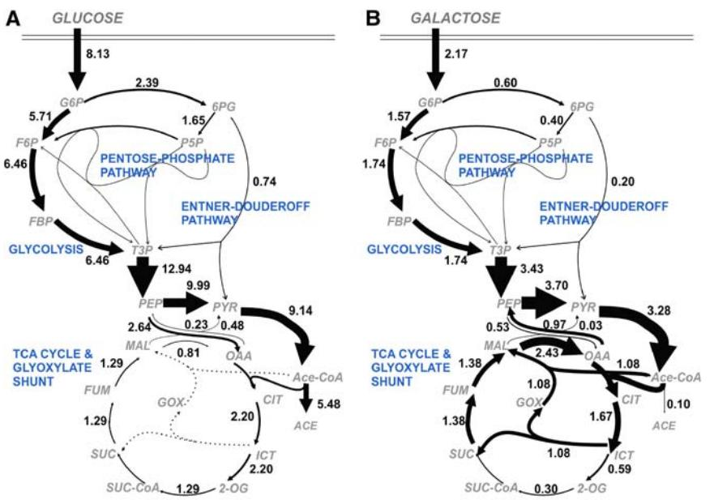
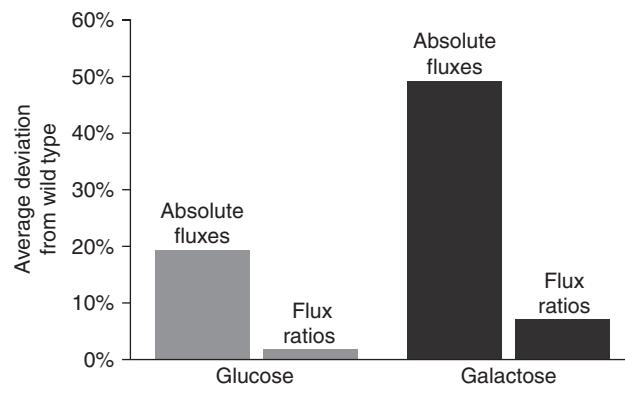
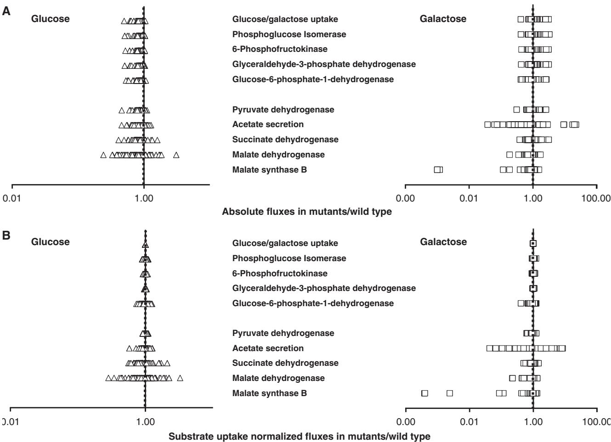
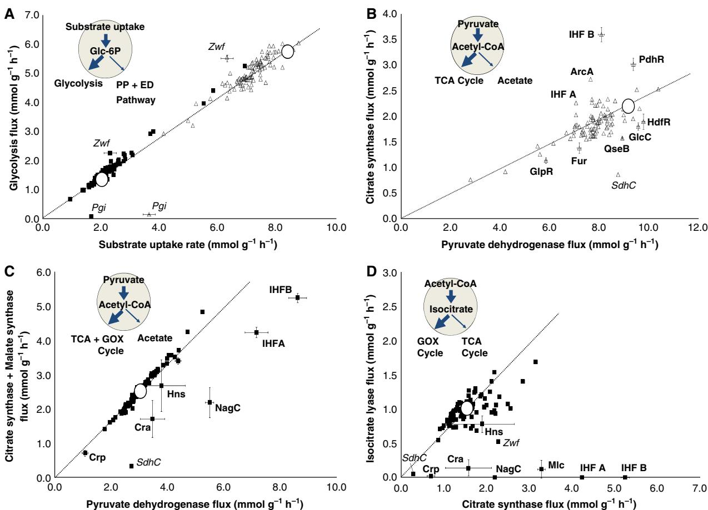
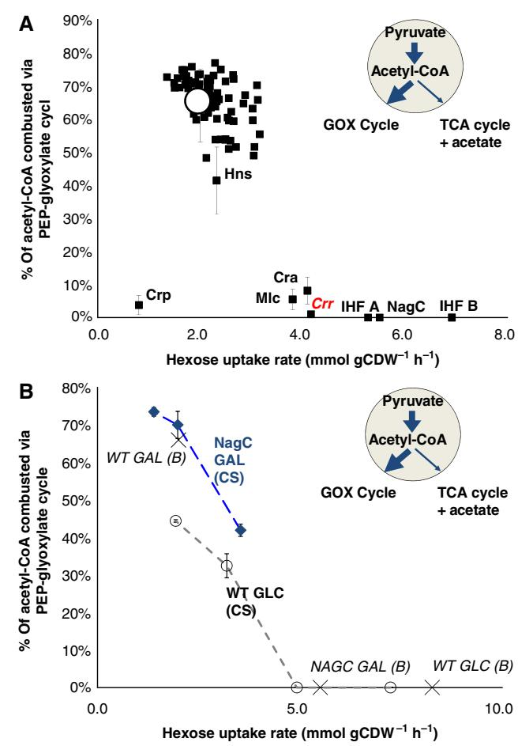
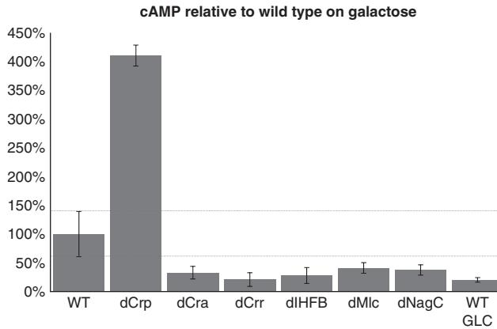
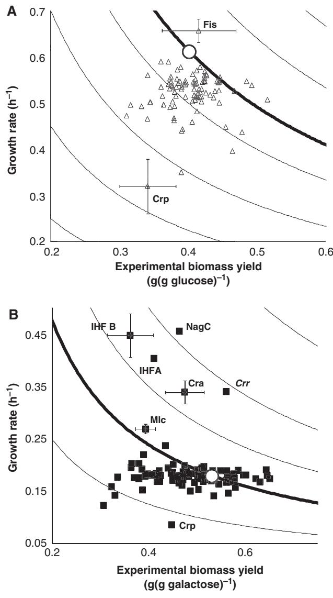

# Large-scale 13C-flux analysis reveals distinct transcriptional control of respiratory and fermentative metabolism in Escherichia coli

Bart RB Haverkorn van Rijsewijk1,2, Annik Nanchen1 , Sophie Nallet1 , Roelco J Kleijn1 and Uwe Sauer1,*

1 Institute of Molecular Systems Biology, ETH Zurich, Zurich, Switzerland and 2 Life Science Zurich PhD Program on Molecular Life Sciences, Zurich, Switzerland

* Corresponding author. Institute of Molecular Systems Biology, Wolfgang-Pauli Strasse 16, ETH Zurich, Zurich 8093, Switzerland.

Tel.: þ 41 (0)44 633 3672; Fax: þ 41 (0)44 633 1051; E-mail: sauer@imsb.biol.ethz.ch

Received 22.11.10; accepted 4.2.11

Despite our increasing topological knowledge on regulation networks in model bacteria, it is largely unknown which of the many co-occurring regulatory events actually control metabolic function and the distribution of intracellular fluxes. Here, we unravel condition-dependent transcriptional control of Escherichia coli metabolism by large-scale 13C-flux analysis in 91 transcriptional regulator mutants on glucose and galactose. In contrast to the canonical respiro-fermentative glucose metabolism, fully respiratory galactose metabolism depends exclusively on the phosphoenolpyruvate (PEP)-glyoxylate cycle. While 2/3 of the regulators directly or indirectly affected absolute flux rates, the partitioning between different pathways remained largely stable with transcriptional control focusing primarily on the acetyl-CoA branch point. Flux distribution control was achieved by nine transcription factors on glucose, including ArcA, Fur, PdhR, IHF A and IHF B, but was exclusively mediated by the cAMP-dependent Crp regulation of the PEP-glyoxylate cycle flux on galactose. Five further transcription factors affected this flux only indirectly through cAMP and Crp by increasing the galactose uptake rate. Thus, E. coli actively limits its galactose catabolism at the expense of otherwise possible faster growth.

Molecular Systems Biology 7: 477; published online 29 March 2011; doi:10.1038/msb.2011.9 Subject Categories: metabolic and regulatory networks; cellular metabolism Keywords: central metabolism; fermentative growth; gene regulatory networks; respiratory growth; transcriptional regulation

This is an open-access article distributed under the terms of the Creative Commons Attribution Noncommercial Share Alike 3.0 Unported License, which allows readers to alter, transform, or build upon the article and then distribute the resulting work under the same or similar license to this one. Thework must be attributed back to the original author and commercial use is not permitted without specific permission.

# Introduction

To survive environmental vicissitudes, microbes evolved regulatory systems that sense external (and internal) conditions to mount appropriate cellular responses (Janga et al, 2007; Kotte et al, 2010). A large fraction of these functional responses concern metabolic adaption to changing nutritional conditions. While activity of the metabolic enzyme is subject to multiple levels of regulation, transcriptional regulation is considered a main mechanism for such metabolic adaptations in bacteria (Gama-Castro et al, 2008), but there are indications that its relevance might have been overemphasized (Heinemann and Sauer, 2010). Understanding the regulatory processes that govern cellular metabolism has become a key focus in microbial systems biology. Key elements of such systems biology approaches are genome-scale models of metabolic stoichiometry (Feist and Palsson, 2008) and the detailed topology of transcriptional regulatory networks that describe all known

interactions between transcription factors and their target genes (Gama-Castro et al, 2008). Unfortunately, such topological networks offer only a static description of potentially occurring interactions, of which only a subset will be active at any given point in time and conditions (Harbison et al, 2004; Luscombe et al, 2004; Balazsi et al, 2005; Moxley et al, 2009).

This condition dependence of transcriptional regulation is typically assessed by measurements of mRNA abundance changes. Typically unanswered remains the question which of all the active regulation processes actually control function, in particular metabolic function, and to which extent? To assess metabolic function in the network context, intracellular reaction rates (i.e., fluxes) must be quantified by methods of 13C-based metabolic flux analysis (Sauer, 2006). By comparing the network's flux response with regulatory events, one can identify actual control of function. In some specific cases this has been done, e.g., by demonstrating that the redox regulator ArcA controls tricarboxylic acid (TCA) cycle fluxes during aerobic batch growth on glucose (Perrenoud and Sauer, 2005), but exerts no apparent flux control during glucose-limited growth of Escherichia coli (Nanchen et al, 2008). The cAMP receptor protein Crp on the other hand specifically controls phosphoenol-pyruvate (PEP)-glyoxylate cycle fluxes during glucose-limited growth of E. coli, but not during excess batch growth (Perrenoud and Sauer, 2005; Nanchen et al, 2008). So far, only one larger-scale flux study has recently been concluded, revealing several condition-specific networks of transcriptional regulation that control metabolic function in yeast (Fendt et al, 2010). Overall, these results clearly demonstrate the strong condition dependence of metabolic control with typically sparse networks of active transcriptional control that control the distribution of fluxes between different pathways.

Focusing on central carbon metabolism of E. coli, we aim here to systematically identify transcriptional regulators that control the distribution of metabolic fluxes during aerobic growth on hexoses. For this purpose we selected 81 transcription factors, including all known to directly or indirectly control central metabolic enzymes, and 10 sigma- and antisigma factors. Of the 81 transcription factors, 41 have one or more direct target gene that is involved in central carbon metabolism (Supplementary Table 1). To assess the condition dependence of transcriptional control of flux, we selected glucose and galactose as two substrates that are highly similar, yet lead to distinct growth rates (Soupene et al, 2003), overall metabolic rates (De Anda et al, 2006; Samir El et al, 2009) and levels of catabolite repression (Hogema et al, 1998; Bettenbrock et al, 2007). Different from the recent yeast flux study (Fendt et al, 2010), we quantify here not only flux ratios but also absolute values for intracellular fluxes by large-scale 13C-constrained flux analysis (Zamboni et al, 2009). From these data, we show here that E. coli employs substantially different modes of metabolic operation and pathway usage on both substrates, and identify the controlling transcription factors and their target pathways.

### Results

#### Two distinct modes of hexose catabolism on galactose and glucose

To quantify physiological and intracellular flux difference of aerobic glucose and galactose catabolism, E. coli wild type was grown in separate shake flask experiments with 3 g l-1 of either the [1-13C] hexose isotope isomere or a mixture of 20% [U-13C] with 80% natural abundance hexose isotope isomers. Compared with the glucose-grown culture, galactose-grown cultures grew substantially slower with an about fourfold lower metabolic rate and almost absent overflow to acetate (Table I). To elucidate how these different macroscopic rates were reflected by the intracellular distribution of fluxes, we first determined ratios of converging fluxes from GC-MS-detected mass isotope partitioning in proteinogenic amino acids (Table I) (Zamboni et al, 2009). These ratios indicated major alterations in the flux connecting oxaloacetate and PEP as well as in the contribution of the glyoxylate cycle to the oxaloacetate pool.

For a better resolution of these flux differences, we estimated absolute intracellular fluxes using the physiological data and the flux ratios of Table I as constraints (Zamboni et al, Table I Physiological parameters and ratios of converging fluxes during wild-type growth on glucose or galactose

|                                                                                                                                                                                                                                             | Glucose                                                | Galactose                                                     |
|---------------------------------------------------------------------------------------------------------------------------------------------------------------------------------------------------------------------------------------------|--------------------------------------------------------|---------------------------------------------------------------|
| Wild-type physiologya 1 Growth rate (h ) 1 h 1 Hexose uptake (mmol gCDW ) 1 h 1 Acetate secretion (mmol gCDW )                                                                                             | 0.61±0.01 8.26±0.50 4.89±1.52                    | 0.18±0.01 2.00±0.33 0.11±0.16                           |
| Wild-type flux ratiosb EMD, ED and PP pathways Serine through EMP pathway Pyruvate through ED pathway PEP from PP pathway (upper bound)                                                                                         | 0.77±0.01 0.07±0.02 0.20±0.07                    | 0.79±0.01 0.04±0.05 0.35±0.07                           |
| Gluconeogenesis, TCA and glyoxylate shunt Oxaloacetate from phoshoenolpyruvate Oxaloacetate from glyoxylate shunt Pyruvate from malate (upper bound) Pyruvate from malate (lower bound) Phoshoenolpyruvate from oxaloacetate | 0.68±0.01 NA 0.04±0.02 0.01±0.00 0.02±0.00 | 0.20±0.03 0.72±0.20 0.02±0.03 0.02±0.03 0.20±0.03 |
| C1 metabolism Serine from glycine Glycine from serine                                                                                                                                                                                 | 0.31±0.02 0.98±0.02                                 | 0.46±0.02 0.99±0.02                                        |

a Values and standard deviations were obtained from at least three biological replicates.

b Values are flux ratio values ±95% confidence intervals. Two experiments led to identical results.

2009; Figure 1), and confirmed the results with whole isotopologue modeling (Kleijn et al, 2005; Supplementary Tables 2 and 3). Consistent with earlier data (Fischer and Sauer, 2003b; Perrenoud and Sauer, 2005), we found the classical glucose flux distribution with B30% of the high hexose influx channeled into the pentose–phosphate (PP) pathway and acetate overflow that exceeded the TCA cycle flux about fourfold. The relative distribution of the much lower galactose influx was similar to glucose metabolism in the upper part of metabolism. In the lower part, however, the distribution was entirely different with a substantial glyoxylate shunt flux and an interrupted TCA cycle between 2-oxoglutarate and succinate. Conjointly with a higher flux through PEP carboxykinase, galactose metabolism, hence, relies almost exclusively on the so-called PEP-glyoxylate cycle for respiratory energy generation (Fischer and Sauer, 2003b). Specifically, two PEP molecules are converted to two acetyl-CoA, one of which enters the glyoxalate shunt reactions to form succinate and the other is fused with glyoxlate to form malate. Both organic acids are converted to oxaloacetate, one of which enters the next round of the cycle and the other is decarboxylated to form PEP. With a stoichiometry of 2 PEP-3CO2 þ 4NADH þ UQH2 þ ATP þ PEP, this PEP-glyoxylate cycle hence bypasses the cyclic operation of the TCA cycle by the joint activity of PEP carboxykinase and glyoxylate shunt, such that their normally considered functions in gluconeogenesis and anaplerosis, respectively, are recruited for complete combustion of hexoses to CO2 (Fischer and Sauer, 2003b).

#### Intracellular flux partitioning in 91 transcription factor mutants on glucose and galactose

Having established two different modes of hexose catabolism—rapid respiro-fermentative metabolism on glucose and

Figure 1 Absolute metabolic fluxes in E. coli during aerobic growth on glucose (A) or galactose (B). Flux arrows are drawn in proportion to the substrate uptake rates for each condition. The numbers represent absolute flux values (mmol gCDW-1 h-1 ). One of two replicate experiments is shown (Supplementary Tables 2 and 3). The presented fluxes are from one of two independent experiments and were obtained by 13C-constrained flux analysis using the software FiatFlux (Zamboni et al, 2005). They were independently confirmed by flux estimation with a whole isotopologue model (Kleijn et al, 2005; van Winden et al, 2005). Generally, the deviation between the two independent experiments was 1–5%, and whole isotopologue sensitivity analysis through addition of Gaussian noise confirmed accurate estimation for all major fluxes (Supplementary Tables 2 and 3).

slower fully respiratory metabolism via the PEP-glyoxylate cycle—we next wanted to understand how these modes were transcriptionally controlled. For this purpose, a large-scale flux analysis was performed with transcription factor knockout mutants under both growth conditions. Specifically, we chose 81 mutants of transcription factors that are known to directly or indirectly control enzymes of central metabolism (Keseler et al, 2005) and 10 sigma- and anti-sigma factors that control expression globally (Supplementary Table 1). Fully aerobic deep-well microtiter plate cultures (Duetz et al, 2000) were grown on either the 100% [1-13C]-labeled hexose isotope isomere or a mixture of 20% (wt/wt) [U-13C] and 80% natural abundance hexose (Fischer and Sauer, 2003a). Physiology and flux distribution of wild-type deep-well cultures were highly similar to the above shake flask cultures (Supplementary Tables 2 and 3). For each deletion mutant, both independently generated clones in the library were analyzed separately and yielded similar results, except for the Crp and Cra mutants. PCR verification revealed that both genes were still present in one of the two clones, which were therefore discarded.

On the basis of 13C-determined flux ratios and extracellular rates, we estimated absolute intracellular fluxes for all mutants (Supplementary Tables 2 and 3; Zamboni et al, 2005). The average deviation of absolute fluxes through the 23 central metabolic reactions for all 91 mutants from the wild-type value was 19 and 49% on glucose and galactose, respectively (Figure 2). In contrast to absolute fluxes, the relative flux partitioning was rather invariant in the entire mutant set. Genetic perturbations hence primarily affected absolute fluxes and not the distribution of fluxes as was described before (Blank et al, 2005; Fischer and Sauer, 2005; Perrenoud and Sauer, 2005; Ishii et al, 2007; Nanchen et al, 2008).

Figure 2 Average deviations of absolute fluxes and flux ratios in 91 mutants from the wild type. Deviations in absolute fluxes and flux ratios are %-differences compared with the wild-type values for each condition.

Next we focussed on flux changes that occurred for key metabolic pathways in the 91 mutants (Figure 3). On glucose, transcription factor deletions altered many fluxes, including those of hexose uptake, glycolysis, pyruvate dehydrogenase, TCA cycle and acetate secretion (Figure 3A). On galactose, these flux changes were even larger and additionally included the glyoxylate shunt. These variations in absolute flux values may be caused by either a change of the overall flux magnitude (due to or resulting in increased carbon uptake) or changes in the distribution of flux within the network; hence, affecting specific flux magnitudes. To distinguish between these two possibilities, we also compared fluxes normalized to the uptake rate between wild type and the 91 mutants (Figure 3B). Many transcription factors affected absolute uptake rates. About 60 of the 91 transcription factor mutants exhibited more than a 10% deviation in uptake rates compared with the wild

Figure 3 Absolute (A) and substrate uptake normalized (B) flux changes of key metabolic pathways in the 91 mutants compared with the wild type during growth on glucose (D) and galactose (&). The dashed line indicates the wild-type reference fluxes.

type under either condition, indicating the importance of transcriptional regulation in controlling metabolic flux. The distribution of key fluxes through glycolysis, PP and Entner–Doudoroff (ED) pathway in upper metabolism, however, remained constant under both conditions (Figure 3B). Thus, flux variations in upper metabolism were caused by an altered magnitude of overall fluxes, but our data do not allow differentiating between a putative-specific transcriptional control of pathways in upper metabolism and indirect, growth-related effects. In key fluxes of lower metabolism (pyruvate dehydrogenase, anaplerosis, TCA cycle, glyoxylate cycle, acetate secretion), not only absolute fluxes but also their distribution changed (Figure 3B). TCA cycle, glyoxylate shunt and acetate secretion fluxes normalized to uptake rates were significantly different in several mutants, indicating that in lower metabolism also the distribution of flux is transcriptionally controlled.

#### Identification of transcription factors that control the distribution of flux at key branch points

To identify individual transcription factors that actually control the distribution of fluxes within the network, we focused our attention on key metabolic branch points. As relative fluxes in upper metabolism remained constant (Figure 3B), the almost perfect linear correlation between hexose uptake and glycolytic flux at the glucose-6-phosphate branch point in the various transcription factor mutants was expected (Figure 4A). The only exceptions were control experiments with disruptions of either glycolysis or PP pathway in the Pgi and Zwf mutants, respectively. Clearly, transcriptional regulation does not control the distribution of flux into the PP pathway during growth on glucose or galactose. Furthermore, flux partitioning at the glucose-6 phosphate branch point was rigid over a large range of absolute catabolic fluxes from 1.0 to 9.0 mmol g-1 h-1 . This rigidity in the face of substantially different biomass yields in the different mutants (Supplementary Tables 2 and 3) demonstrates that, during hexose degradation, the PP pathway flux is not determined by the biosynthetic needs for the redox cofactor NADPH or pentoses, as was previously described for Bacillus subtilis (Fischer and Sauer, 2005).

As the flux distribution varied significantly in lower metabolism (Figure 3B), we focused on the acetyl-CoA branch point in more detail. For the glucose-grown mutants we plotted the incoming pyruvate dehydrogenase flux as a function of the outgoing flux into the TCA cycle (i.e., citrate synthase flux;

Figure 4 Influence of individual transcription factors on the flux distribution at key metabolic branch points for growth on glucose (D) and galactose ('). The four branch points are the glucose-6-phosphate node on both hexoses (A), the acetyl-CoA node on glucose (B) and on galactose (C), and the isocitrate node on galactose (D). Values for unlabeled mutants are the average of two independent experiments obtained by 13C-constrained flux analysis (Supplementary Tables 2 and 3). For mutants with significantly altered flux distributions (labeled), a third independent experiment was conducted and the error bars represent standard deviations of these three independent experiments. Enzyme control mutants are given in italics. The wild-type values are highlighted by black circles.

Figure 4B). Flux partitioning at this branch point was indeed transcriptionally controlled, because nine mutants exhibited significantly altered flux partitioning. For the mutants Fur (Escolar et al, 1998; Zhang et al, 2005), PdhR (Quail and Guest, 1995; Ogasawara et al, 2007), ArcA (Iuchi and Lin, 1988; Perrenoud and Sauer, 2005; Vemuri et al, 2006) and IHF A and B (Bongaerts et al, 1995; Green et al, 1997; Park et al, 1997; Cunningham and Guest, 1998) altered partitioning can be explained by the known targets of these transcription factors in the TCA cycle and/or the respiratory chain. The different flux partitioning effects of the two IHF mutants can be explained by different stabilities of the IHF homodimer B/B and A/A complexes that have different capacities to restore the wildtype phenotype of the normal heterodimer complex (Werner et al, 1994; Zulianello et al, 1994). Altered flux partitioning between respiration and acetate overflow in the four remaining transcription factor mutants GlpR (glycerol metabolism; Larson et al, 1987), GlcC (glycolate and glyoxylate metabolism; Pellicer et al, 1996), QseB (quorum sensing; Sperandio et al, 2002) and HdfR (flagella formation; Ko and Park, 2000) was not overly strong, but significant. Without known target genes in respiration, TCA cycle or overflow metabolism, these

mutant phenotypes might be caused through indirect effects or through yet unknown target genes of these transcription factors. Overall, of all 36 transcription factors known to regulate enzymes of the diverging pathways at the acetyl-CoA branch point (i.e., TCA cycle, glyoxylate cycle, acetate secretion), only a minority actively regulates flux during steady-state growth on glucose.

In contrast to glucose, a third outgoing flux occurred at the acetyl-CoA branch point during galactose metabolism, i.e., fusion of acetyl-CoA with glyoxylate in the malate synthase reaction of the PEP-glyoxylate cycle. To differentiate potential regulatory events in either of the three outgoing pathways at the acetyl-CoA branch point (i.e., acetate secretion, TCA cycle flux and PEP-glyoxylate cycle flux), we plotted the incoming pyruvate dehydrogenase flux as a function of the summed outgoing flux into TCA and PEP-glyoxylate cycle (Figure 4C) and the flux from acetyl-CoA to isocitrate as a function of the PEP-glyoxylate cycle flux (Figure 4D). Several mutants exhibited an increased metabolic overflow with reduced overall flux into the TCA and PEP-glyoxylate cycle on galactose (Cra, IHFA, IHF B, Mlc, NagC). Deletion of these transcription factors also abolished or reduced the PEP-glyoxylate cycle,

redirecting flux through the TCA cycle instead (Figure 4D). While not affecting overflow metabolism, also the Crp mutant abolished the PEP-glyoxylate cycle. This Crp-dependent control of the PEP-glyoxylate cycle flux was previously described for slowly growing glucose-limited chemostat cultures, presumably triggered by high cAMP concentrations that allosterically activate Crp (Nanchen et al, 2008).

#### Increased hexose uptake rate results in altered cAMP-Crp-dependent control of the PEP-glyoxylate cycle

In contrast to Crp, the activity of the other five transcription factors is not modulated by cAMP; hence, their influence on the PEP-glyoxylate cycle must be initiated by different means. As both Cra (Saier and Ramseier, 1996; Crasnier-Mednansky et al, 1997) and Mlc (Decker et al, 1998; Kimata et al, 1998; Plumbridge, 2002) are regulators of the glucose phosphotransferase system (PTSGlc) that represses the uptake of non-PTS sugars such as galactose (Misko et al, 1987) and as NagC is a known direct repressor of the galactose transporter GalP (Soupene et al, 2003; Samir El et al, 2009), we wondered whether there was a general relationship between galactose uptake and the PEP-glyoxylate cycle flux. Indeed, when plotting the fraction of acetyl-Coenzyme A that enters the PEP-glyoxylate cycle at the acetyl-Coenzyme A branch point against the galactose uptake rate for all mutants, the strongly reduced fraction of carbon entering the PEP-glyoxylate cycle in the Cra, IHF A, IHF B, Mlc and NagC mutants correlated with much higher galactose uptake rates than in the wild type (Figure 5A). As Mlc is actively sequestered to the membrane by the glucose PTSGlc (Plumbridge, 2002), we hypothesized that the PTSGlc might have an active role in the regulation of galactose uptake. We therefore grew the PTSGlc-component IIAglc mutant Crr on galactose. Consistent with the hypothesis of a direct or indirect role of the PTSGlc in galactose uptake, the galactose uptake rate of the Crr mutant was indeed significantly increased (Figure 5A). Additionally, the PEP-glyoxylate cycle was repressed in the Crr mutant, as was also seen for all other mutant with increased galactose uptake.

To verify causality of the observed correlation between hexose uptake rate and PEP-glyoxylate cycle usage, we used an environmental strategy to decrease hexose uptake. Specifically, we performed glucose- and galactose-limited continuous culture experiments at different dilution rates (Figure 5B). Decreased uptake rates due to low dilution rates resulted in activation of the PEP-glyoxylate cycle, for both growth on glucose and galactose. As galactose uptake is normally repressed in the wild type, we used the NagC mutant to enable derepressed uptake of galactose (Soupene et al, 2003; Samir El et al, 2009). At a dilution rate of 0.12 h-1 , resulting in an uptake of 1.38 mmol gCDW-1 h-1 (g cell dry weight, gCDW), the NagC mutant exhibited a similar flux phenotype as was obtained for the wild type. In contrast to the wild type, however, the NagC mutant was capable to grow at a dilution rate of 0.35 h-1 on galactose, thereby achieving a galactose uptake rate of 3.53 mmol gCDW-1 h-1 (compared with a maximal rate of 2.00 mmol gCDW-1 h-1 for wild-type batch growth). At both increased galactose and glucose uptake rate,

Figure 5 Fraction of flux entering the PEP-glyoxylate cycle as a function of hexose uptake rate in batch (A) and chemostat (B) cultures. (A) Batch growth on galactose: the wild-type value is highlighted by a black circle. The PTSGlc enzyme IIAglc mutant (crr) is highlighted in red. Values are the average of two independent experiments obtained by 13C-constrained flux analysis (Supplementary Tables 2 and 3). For mutants with significantly altered flux distributions (labeled), a third independent experiment was conducted and the error bars represent standard deviations of these three independent experiments. (B) Chemostat growth on glucose and galactose: wild type on glucose (J), NagC mutant on galactose is highlighted in blue (E); values from batch experiments are additionally listed ( ). Nomenclature: CS, chemostat culture; B, batch culture. Two biological replicates were conducted for each condition and error bars represent the deviation between the two experiments.

the fraction of carbon entering the PEP-glyoxylate cycle flux at the acetyl-Coenzyme A branch point was significantly reduced. Thus, independent of the substrate, the fraction of acetyl-Coenzyme A that enters the PEP-glyoxylate cycle decreases with gradually increasing hexose uptake rate. As the PEP-glyoxylate cycle bypasses the NADPH-forming isocitrate dehydrogenase of the TCA cycle, it adds potential metabolic flexibility to redox metabolism. Apparently, as the cell enters a condition where higher formation than consumption of NADPH occurs, e.g., during carbon-limited growth in a chemostat when relatively little biomass is synthesized, the PEP-glyoxylate cycle is activated, whereas the relative flux through the NADPH generating PP pathway remains unaltered (Figure 4A). The PEP-glyoxylate cycle, however, is not the only mechanism to decouple catabolic carbon flow from NADPH formation because E. coli also contains two actively used transhydrogenases that can interconvert NADPH and NADH (Sauer et al, 2004).

Having established causality between uptake rate and the PEP-glyoxylate cycle, we wondered whether the decreased PEP-glyoxylate cycle observed in several mutants on galactose might be an indirect consequence of low cAMP levels during the increased catabolic flux regimes (Bettenbrock et al, 2007). To test this hypothesis, we determined intracellular cAMP levels in wild type and mutants with a repressed PEPglyoxylate cycle in galactose batch cultures (Figure 6). In all mutants with increased growth rate on galactose, intracellular cAMP levels were significantly reduced compared with the wild type, reaching comparable reduced cAMP levels as measured for wild-type growth on glucose. The reduced PEPglyoxylate cycle in Cra, IHF A, IHF B, Mlc and NagC is hence not a direct transcriptional control, but rather the indirect consequence of lowered intracellular cAMP levels that result in reduced Crp activity. Of the 36 transcription factors with target genes in TCA cycle, glyoxylate cycle and acetate secretion that could therefore potentially control the flux distribution at the acetyl-CoA branch point, thus only Crp actively controls flux during growth on galactose.

#### Uptake of galactose is repressed in the wild type

Somewhat surprisingly, several mutants grew faster and more than doubled the normal-specific galactose uptake rate of their E. coli wild-type parent (Figure 5A). Hence, we wondered whether E. coli might feature a similar non-optimal growth phenotype during exponential batch growth as was described for B. subtilis (Fischer and Sauer, 2005). As a measure of optimal growth, we plotted growth rate as a function of the experimentally determined biomass yield for the 91 mutants during growth on glucose and galactose. The product of both values represent the biomass productivity (gcells ghexose -1 h-1 ), and the thick line marks the biomass productivity that is achieved by the wild type (Figure 7).

Figure 6 Intracellular cAMP concentrations relative to the wild type on galactose. Intracellular cAMP levels for mutants grown on batch galactose and the wild type grown on batch glucose relative to intracellular cAMP levels for the wild type grown on galactose. Intracellular cAMP levels were determined from two biological replicates for each strain from two separate shake flask experiments. Error bars represent the deviation between the two experiments.

In contrast to B. subtilis, none of the E. coli mutants exhibited increased biomass productivity on its preferred substrate glucose, with the sole possible exception of Fis (Figure 7A), whose deletion leads to an increase in stable rRNA synthesis (Appleman et al, 1998). On galactose, however, the previously identified mutants with higher galactose uptakes (Figure 5A) clearly exhibited significantly increased biomass productivity, in particular Cra, IHFA, IHF B and NagC (Figure 7B), further supporting the conclusion that E. coli actively represses its galactose uptake rate at the expense of otherwise possible rapid growth. As also the PTSglc mutant Crr exhibited increased biomass productivity, repression of growth is directly or indirectly conducted by the PTSglc.

Figure 7 Growth optimality on glucose (D) and galactose ('). Growth optimality of 81 transcription factors and 10 sigma- and anti-sigma factors compared with the wild type (highlighted by a black circle) on (A) glucose and (B) galactose. Lines indicate equal biomass productivity (g (g hexose h)-1 ). Error bars represent standard deviations from at least three independent experiments.

# Discussion

From large-scale, 13C-determined intracellular fluxes in 91 transcriptional regulator mutants of E. coli, we identified active transcriptional control of hexose metabolism during two surprisingly distinct metabolic states. During maximum exponential growth, glucose metabolism was characterized through high metabolic rates with about fourfold higher overflow metabolism than respiratory TCA cycle fluxes. Galactose metabolism, on the other hand, was generally much slower, without overflow metabolism and with the PEPglyoxylate cycle (Fischer and Sauer, 2003b) replacing the TCA cycle for respiration. Approximately 2/3 of the investigated regulators controlled absolute fluxes directly or indirectly through growth-related effects. Transcriptional control of flux partitioning, in sharp contrast, was confined to the acetyl-CoA branch point, where hexose catabolism can proceed via acetate overflow, the respiratory TCA cycle and/ or the respiratory PEP-glyoxlate cycle. The relative flux into the PP pathway, e.g., remained stable at B30% over an order of magnitude of hexose uptake rates at very different biomass yields, demonstrating its primary catabolic rather than anabolic function in E. coli.

On glucose, transcriptional regulation at the acetyl-CoA branch point controlled flux partitioning between the respiratory TCA cycle and acetate overflow. A negative control of the TCA cycle/respiration branch was exerted by transcription factors ArcA, as was previously described (Perrenoud and Sauer, 2005), PdhR, and IHF A and B. All four are known to repress target genes in the TCA cycle and/or the respiratory chain (PdhR (Quail and Guest, 1995; Ogasawara et al, 2007), ArcA (Iuchi and Lin, 1988, 1992; Park et al, 1997; Liu and De Wulf, 2004; Perrenoud and Sauer, 2005; Vemuri et al, 2006), IHFA and B (Bongaerts et al, 1995; Green et al, 1997; Park et al, 1997; Cunningham and Guest, 1998)). Increased capacity of the TCA cycle and/or respiratory chain in these mutants probably reduces acetate overflow. A positive control of the TCA cycle flux was exerted by the iron utilization regulator Fur, presumably through its known target genes in the TCA cycle (Escolar et al, 1998; Zhang et al, 2005). The potentially novel regulators GlpR, GlcC, QseB and HdfR could act either via positive control of TCA cycle/respiration or negative control of overflow metabolism. Our data do not allow drawing conclusions on their direct transcriptional control, because the flux alterations might also arise through indirect effects.

On galactose, flux partitioning at the acetyl-CoA branch point was more complicated with the additional outgoing flux through the respiratory PEP-glyoxylate cycle and the TCA cycle flux mainly being confined to the anabolic purpose of supplying 2-oxoglutarate. Transcriptional control appeared to focus exclusively on the PEP-glyoxylate cycle, where we could distinguish two different groups of positively acting transcription factors. The only direct regulator was the cAMP receptor protein Crp (Kolb et al, 1993; Gosset et al, 2004), whose deletion entirely abolished PEP-glyoxylate cycle fluxes, as was described earlier for slow growing, glucose-limited chemostat cultures (Nanchen et al, 2008). Presumably, Crp induces expression of its target genes aceA and aceB (Gosset et al, 2004; Zhang et al, 2005) upon allosteric activation through the high cAMP concentrations at low growth rates (Bettenbrock et al, 2007). The second group consists of the indirectly acting transcription factors Cra, IHF A, IHF B, Mlc and NagC, whose deletion likewise abolished the PEP-glyoxylate cycle flux. Here the mode of action is the strongly increased galactose uptake rate and concomitantly decreased cAMP levels, which in turn deactivated Crp. Three lines of evidence support this hypothesis. First, we obtained similarly abolished PEP-glyoxylate cycle fluxes when increasing galactose uptake by deleting the glucose PTS-based repression of galactose uptake in the IIAglc mutant Crr (Meadow et al, 1990; Hogema et al, 1998). Second, modulation of galactose and glucose uptake rates through chemostat cultivations supports the inverse relationship between PEPglyoxylate cycle flux and hexose uptake. This finding is consistent with the reported increased mRNA and protein levels of PEP carboxykinase and glyoxylate shunt enzymes at decreased glucose uptake rates (Ishii et al, 2007). Third, the low intracellular cAMP levels in our mutants with increased galactose uptake rates are fully consistent with the known inverse relationship between intracellular cAMP levels and catabolic rates (Matin and Matin, 1982; Notley-McRobb et al, 1997; Ferenci, 2001; Fischer and Sauer, 2003b) and establish the link to Crp. Hence, we conclude that the only direct transcriptional regulator of the PEP-glyoxylate cycle on galactose is the cAMP-activated Crp protein, while the other five regulators act indirectly via cAMP and Crp.

By selecting a large-set of transcriptional regulators, including all transcription factors known to regulate enzymes of central metabolism, we demonstrate the extent to which this flux splitting is subjected to transcriptional regulation. Overall, our absolute flux data demonstrate that control of flux splitting during growth on hexoses was confined to the acetyl-CoA branch point in E. coli. Of the 36 transcription factors known to target genes in pathways that diverge from the acetyl-CoA branch point, only one transcription factor on galactose and five plus potentially four others on glucose showed altered flux splitting. The primary focus of steady-state transcriptional control on the acetyl-CoA branch point, and thus the metabolic decision between the energetically efficient respiration and the less efficient but more rapid fermentation, was recently also demonstrated with only relative flux data for Saccharomyces cerevisiae (Fendt et al, 2010). Likewise, the identified networks of active transcriptional control of the glucose flux distribution were of similar size in yeast and E. coli with four and five (plus four) transcriptional factors, respectively. On galactose, however, the active yeast network was quite extensive with more than 10 factors, while fluxes in E. coli where controlled by only one transcription factor. Why the yeast active transcription network of respiratory metabolism is much more extensive on galactose than the E. coli network remains unclear as a similar number of transcription factors target the TCA cycle (35 for S. cerevisiae (Monteiro et al, 2008) and 36 for E. coli (Keseler et al, 2005; Salgado et al, 2006)). It is tempting to speculate though that it is related to the fact that yeast does not invoke a novel respiratory pathway such as E. coli but rather needs to activate its TCA cycle (Fendt et al, 2010). As different metabolic pathways were involved in E. coli galactose catabolism when compared with glucose, it was necessary to determine the much more quantitative and tedious absolute in vivo fluxes, which then enabled us to identify the single directly controlling transcription factor Crp from the larger set of possible candidates.

Previously, suboptimal biomass productivity was described for glucose-grown B. subtilis (Fischer and Sauer, 2003b). For batch glucose-grown E. coli, we demonstrate here that none of the investigated transcription factor mutants exhibited improved biomass productivity. On galactose in contrast, optimal growth appears to be transcriptionally repressed, because the Cra, IHF A, IHF B and NagC mutants grew much faster at almost unaltered biomass yields. As we could engineer a similarly improved phenotype by directly increasing the galactose uptake through removal of the glucose PTS-based repression with a Crr mutant, we provide evidence that E. coli actively represses its galactose uptake at the expense of otherwise possible rapid growth.

### Materials and methods

#### Strain and growth conditions

All experiments were performed with E. coli BW25113 and its otherwise isogenic mutants from the Keio knockout library (Baba et al, 2006). Experiments were conducted with both independently generated mutants from the library. For clarity, the here used mutant nomenclature reflects the deleted genes (Supplementary Table 1). Batch physiology and flux experiments were performed in 35 ml cultures in 500 ml shake flask or 1.2 ml cultures in 2 ml 96-deep-well plates (Duetz et al, 2000) at 371C, 300 r.p.m. and a shaking diameter of 5 cm. Chemostat experiments were conducted in eight parallel 10 ml bioreactors as previously described (Nanchen et al, 2006). Briefly, aeration was achieved by pumping water-saturated air through the reactors and a constant temperature was assured through incubation in a 371C water bath. A medium flow of 1.5 ml h-1 and reactor volumes of 3.0, 4.3, 7.5 and 12.5 ml were used to obtain dilution rates of 0.5, 0.35, 0.2 and 0.12 h-1 , respectively.

Frozen glycerol stocks were used to inoculate Luria-Bertani (LB) complex medium, supplemented with 50 mg l-1 kanamycin for all mutants. All further cultivations were performed without antibiotics. After 6 h of incubation at 371C and constant shaking, LB cultures were used to inoculate M9 minimal medium precultures upon overnight cultivation. The following day 0.3 ml and 10 ml of the M9 precultures were used to inoculate batch physiological and flux experiments for shake flask and 2 ml 96 deep-well plates, respectively. For chemostat experiments, the M9 precultures were used to inoculate 10-ml-scale bioreactors (Nanchen et al, 2006) with M9 minimal medium containing 13C-labeled substrate at a starting OD600 of 0.05. The medium feed for 13C-labeled glucose- or galactose-limited chemostat operation was initiated after 4–8 h of batch growth depending on the achieved biomass.

The M9 medium contained, per liter of deionized water, the following: 0.8 g (NH4)2SO4, 0.5 g NaCl, 7.5 g Na2HPO4 2H2O and 3.0 g KH2PO4. The following components were sterilized separately and then added (per liter of final medium): 1 ml of 1 M MgSO4, 1 ml of 0.1 M CaCl2, 0.6 ml 0.1 M FeCl3 6H2O, 2 ml of 1 mM filter-sterilized thiamine HCl and 10 ml of a trace element solution containing (per liter) 0.18 g ZnSO4 7H2O, 0.12 g CuCl2 2H2O, 0.12 g MnSO4 H2O and 0.18 g CoCl2 6H2O. Filter-sterilized glucose or galactose was added to a final concentration of 3 g l-1 and 1 g l-1 for batch and chemostat experiments, respectively. For 13C-labeling experiments, glucose or galactose was added entirely as the [1-13C]-labeled isotope isomere (499%; Cambridge Isotope Laboratories, Andover, MA) or as a mixture of 20% (wt/wt) [U-13C]-labeled (499%; Cambridge Isotope Laboratories) and 80% (wt/wt) of natural glucose or galactose.

### Physiological parameters

Cell growth was monitored by determining the optical density at 600 nm (OD600) using a spectrophotometer (Spectra Max Plus, Molecular Devices, Sunnyvale, CA). Specific growth rates were determined from log-linear regression of time-dependent changes in optical density from at least four data points during the exponential growth phase.

Glucose, galactose and acetate concentrations were quantified enzymatically using commercial enzyme kits (Enzytec, Switzerland). The uptake and secretion rates were determined from at least three technical replicates of two independent shake flask or microtiterplate experiments from two points (beginning of exponential growth and mid-exponential growth). The glucose, galactose and acetate concentrations during exponential growth were plotted against the corresponding cell dry weights. Cell dry weight was calculated using a determined conversion factor of 0.41 and 0.51 gCDW) per liter per OD600 for glucose and galactose, respectively. A linear fit was applied to calculate the slope. The inverse of the slope of glucose/galactose concentration against cell dry weight is the biomass yield in g mmol-1 . The non-inversed slopes were further multiplied with the growth rate to get uptake and secretion rates.

#### Metabolic flux ratio analysis by GC-MS

Aliquots of fractionally 13C-labeled biomass were prepared as described previously for gas chromatography mass spectrometry (GC-MS) analysis (Fischer and Sauer, 2003a; Fischer et al, 2004; Zamboni et al, 2009). Briefly, cell pellets from 1 ml culture aliquots at an OD600 of 0.7–1.5 were collected by centrifugation and hydrolyzed in 6 M HCl at 1051C for 24 h in sealed Eppendorf microtubes or 96-well PCR racks for shake flask and deep-well plate cultures, respectively. The hydrolysates were dried under a stream of air at B601C and then derivatized at 851C in 20 ml dimethylformamide (Fluka, Switzerland) and 20 ml N-(tert-butyldimethylsilyl)-N-methyl-trifluoroacetamide with 1% (vol/vol) tert-butyldimethylchlorosilane (Fluka, Switzerland) for 60 min (Fischer et al, 2004).

Derivatized amino acids were analyzed on a 6890 GC system (Agilent Technologies, Santa Clara, USA) combined with a 5973 Inert SL MS system (Agilent Technologies, Santa Clara, USA). The GC-MSderived mass isotope partitioning of proteinogenic amino acids were then corrected for naturally occurring isotopes (van Winden et al, 2002). The following eight metabolic flux ratios were calculated, as described previously (Fischer and Sauer, 2003a; Zamboni et al, 2005, 2009; Nanchen et al, 2007): serine derived through glycolysis, serine derived through the ED pathway, oxaloacetate originating from PEP, PEP originating from oxaloacetate, oxaloacetate originating from the glyoxylate shunt, pyruvate originating from malate (upper and lower boundaries) and an upper bound on PEP derived through the PP pathway.

#### Estimation of absolute fluxes by the 13C-constrained method

Intracellular absolute carbon fluxes were estimated using the software FiatFlux with the previously described (Fischer et al, 2004; Zamboni et al, 2005, 2009) stoichiometric model that included all major pathways of E. coli central carbon metabolism, including the glyoxylate shunt and ED pathway. The reaction matrix consisted of 25 unknown fluxes and 21 metabolite balances (including the three experimentally determined rates of glucose/galactose uptake, acetate secretion and biomass production). To solve the underdetermined system of equations, the eight above metabolic flux ratios were used as additional constraints, as described before (Fischer et al, 2004; Zamboni et al, 2009). The first five ratios were used as equality constraints, while the latter three were used as boundary constraints.

Fluxes into biomass were calculated from the known metabolite requirements for macromolecular compounds and the growth-ratedependent RNA and protein contents (Emmerling et al, 2002). Using the FiatFlux software (Zamboni et al, 2005), the sum of the weighted square residuals of the constraints from both metabolite balances and flux ratios was minimized using the MATLAB function fmincon, and the residuals were weighed by dividing through the experimental error

(Zamboni et al, 2009). All calculations were performed in Matlab 7.7.0 (The Mathworks Inc., Natick, USA).

#### Estimation of absolute fluxes by the whole isotopologue modeling method

High precision estimation of absolute fluxes was performed in selected cases by whole isotopologue balancing (Kleijn et al, 2005; van Winden et al, 2005). Briefly, we used cumomer balances and cumomer to isotopologue mapping matrices (Wiechert et al, 1999) to calculate the isotopologue partitioning of metabolites in a pre-defined stoichiometric network model for a given flux set. The flux set that gives the best correspondence between the measured and simulated 13C-label partitioning is determined by nonlinear optimization and denoted as the optimal flux-fit. All calculations were performed in Matlab 7.7.0 (The Mathworks Inc.). The standard deviations for metabolic fluxes were derived from Monte Carlo simulations (Schmidt et al, 1999). To mimic measurement errors, Gaussian noise was added to the measured 13C-labeling data, and fluxes were re-estimated, thereby providing a measure for the sensitivity of the different fluxes.

#### Intracellular cAMP measurements

Cells were grown in batch cultures as described above. Of cultures growing in mid-exponential phase, 1 ml aliquots were taken in a constant temperature room kept at 371C and were vacuum-filtered on a 0.45 mm pore size nitrocellulose filter (Millipore). Samples were immediately washed with two volumes of fresh M9 medium at a temperature of 371C, containing the respective carbon source, and adjusted to pH of the culture at the time of sampling. After washing, the filter was directly transferred for extraction into 4 ml of 60% (vol/vol) EtOH/H2O kept at 781C for 2 min. After extraction, the solution was separated from the filters and centrifuged to remove residual cell debris and nitrocellulose. Cell extracts were thawed, dried at 120 m bar and resuspended in 100 ml deionized H2O, of which 15 ml were transferred into rubber-sealed HPLC tubes. Intracellular cAMP concentrations were determined by using an ion-pairing ultrahigh performance liquid chromatography-tandem mass spectrometry method (Buescher et al, 2010). Compounds were separated using a Waters Acquity UPLC with a Waters Acquity T3 end-capped reversephase column (150 2.1 mm 1.8 mm; Waters Corporation, Milford, MA, USA) and subsequently detected on a tandem mass spectrometer (Thermo TSQ Quantum Triple Quadropole with Electron-Spray Ionization, Thermo Scientific, Waltham, MA, USA).

#### Supplementary information

Supplementary information is available at the Molecular Systems Biology website (www.nature.com/msb).

# Acknowledgements

We are grateful to Patrick Kiefer from Julia Vorholt's Lab (ETH Zu¨rich) for the help in setting up the fast filtration quenching and extraction method for cAMP measurements, and also to Karl Kochanowski from Uwe Sauer's Lab (ETH Zu¨rich) for the help in setting up the chemostat.

Author contributions: BHvR designed the study, performed metabolite measurements, most flux and physiology experiments on glucose, all flux and physiology experiments on galactose, and drafted the paper. AN and SN performed some flux and physiology experiments on glucose. RJK estimated control fluxes by the whole isotopologue modeling method. US conceived and supervised the study, and helped drafting the paper. All authors read and approved the final paper.

# Conflict of interest

The authors declare that they have no conflict of interest.

# References

- Appleman JA, Ross W, Salomon J, Gourse RL (1998) Activation of Escherichia coli rRNA transcription by FIS during a growth cycle. J Bacteriol 180: 1525–1532
- Baba T, Ara T, Hasegawa M, Takai Y, Okumura Y, Baba M, Datsenko KA, Tomita M, Wanner BL, Mori H (2006) Construction of Escherichia coli K-12 in-frame, single-gene knockout mutants: the Keio collection. Mol Syst Biol 2: 2006.0008
- Balazsi G, Barabasi AL, Oltvai ZN (2005) Topological units of environmental signal processing in the transcriptional regulatory network of Escherichia coli. Proc Natl Acad Sci USA 102: 7841–7846
- Bettenbrock K, Sauter T, Jahreis K, Kremling A, Lengeler JW, Gilles E-D (2007) Correlation between growth rates, EIIACrr phosphorylation, and intracellular cyclic AMP levels in Escherichia coli K-12. J Bacteriol 189: 6891–6900
- Blank LM, Kuepfer L, Sauer U (2005) Large-scale 13C-flux analysis reveals mechanistic principles of metabolic network robustness to null mutations in yeast. Genome Biol 6: R49
- Bongaerts J, Zoske S, Weidner U, Linden G (1995) Transcriptional regulation of the proton translocating NADH dehydrogenase (nuoA-N) of Escherichia coli by electron acceptors, electron donors and gene regulators. Mol Microbiol 16: 521–534
- Buescher JM, Moco S, Sauer U, Zamboni N (2010) Ultrahigh performance liquid chromatography—tandem mass spectrometry method for fast and robust quantification of anionic and aromatic metabolites. Anal Chem 82: 4403–4412
- Crasnier-Mednansky M, Park MC, Studley WK, Saier Jr MH (1997) Cra-mediated regulation of Escherichia coli adenylate cyclase. Microbiol 143: 785–792
- Cunningham L, Guest JR (1998) Transcription and transcript processing in the sdhCDAB-sucABCD operon of Escherichia coli. Microbiol 144: 2113–2123
- De Anda R, Lara AR, Herna´ndez V, Herna´ndez-Montalvo V, Gosset G, Bolı´var F, Ramı´rez OT (2006) Replacement of the glucose phosphotransferase transport system by galactose permease reduces acetate accumulation and improves process performance of Escherichia coli for recombinant protein production without impairment of growth rate. Metabolic Eng 8: 281–290
- Decker K, Plumbridge J, Boos W (1998) Negative transcriptional regulation of a positive regulator: the expression of malT, encoding the transcriptional activator of the maltose regulon of Escherichia coli, is negatively controlled by Mlc. Mol Microbiol 27: 381–390
- Duetz WA, Ruedi L, Hermann R, O'Connor K, Buchs J, Witholt B (2000) Methods for intense aeration, growth, storage, and replication of bacterial strains in microtiter plates. Appl Environ Microbiol 66: 2641–2646
- Emmerling M, Dauner M, Ponti A, Fiaux J, Hochuli M, Szyperski T, Wuthrich K, Bailey JE, Sauer U (2002) Metabolic flux responses to pyruvate kinase knockout in Escherichia coli. J Bacteriol 184: 152–164
- Escolar L, Pe´rez-Martı´n J, de Lorenzo V (1998) Binding of the Fur (ferric uptake regulator) repressor of Escherichia coli to arrays of the GATAAT sequence. J Mol Biol 283: 537–547
- Feist AM, Palsson BO (2008) The growing scope of applications of genome-scale metabolic reconstructions using Escherichia coli. Nat Biotech 26: 659–667
- Fendt S-M, Oliveira AP, Christen S, Picotti P, Dechant RC, Sauer U (2010) Unraveling condition-dependent networks of transcription factors that control metabolic pathway activity in yeast. Mol Syst Biol 6: 432
- Ferenci T (2001) Hungry bacteria—definition and properties of a nutritional state. Environm Microbiol 3: 605–611
- Fischer E, Sauer U (2003a) Metabolic flux profiling of Escherichia coli mutants in central carbon metabolism by GC-MS. Eur J Biochem 270: 880–891
- Fischer E, Sauer U (2003b) A novel metabolic cycle catalyzes glucose oxidation and anaplerosis in hungry Escherichia coli. J Biol Chem 278: 46446–46451
- Fischer E, Sauer U (2005) Large-scale in vivo flux analysis shows rigidity and suboptimal performance of Bacillus subtilis metabolism. Nat Genet 37: 636–640
- Fischer E, Zamboni N, Sauer U (2004) High-throughput metabolic flux analysis based on gas chromatography-mass spectrometry derived 13C constraints. Anal Biochem 325: 308–316
- Gama-Castro S, Jimenez-Jacinto V, Peralta-Gil M, Santos-Zavaleta A, Penaloza-Spinola MI, Contreras-Moreira B, Segura-Salazar J, Muniz-Rascado L, Martinez-Flores I, Salgado H, Bonavides-Martinez C, Abreu-Goodger C, Rodriguez-Penagos C, Miranda-Rios J, Morett E, Merino E, Huerta AM, Trevino-Quintanilla L, Collado-Vides J (2008) RegulonDB (version 6.0): gene regulation model of Escherichia coli K-12 beyond transcription, active (experimental) annotated promoters and Textpresso navigation. Nucl Acids Res 36: D120–D124
- Gosset G, Zhang Z, Nayyar S, Cuevas WA, Saier Jr MH (2004) Transcriptome analysis of Crp-dependent catabolite control of gene expression in Escherichia coli. J Bacteriol 186: 3516–3524
- Green J, Anjum MF, Guest JR (1997) Regulation of the ndh gene of Escherichia coli by integration host factor and a novel regulator, Arr. Microbiology 143: 2865–2875
- Harbison CT, Gordon DB, Lee TI, Rinaldi NJ, Macisaac KD, Danford TW, Hannett NM, Tagne J-B, Reynolds DB, Yoo J, Jennings EG, Zeitlinger J, Pokholok DK, Kellis M, Rolfe PA, Takusagawa KT, Lander ES, Gifford DK, Fraenkel E, Young RA (2004) Transcriptional regulatory code of a eukaryotic genome. Nature 431: 99–104
- Heinemann M, Sauer U (2010) Systems biology of microbial metabolism. Curr Opin Microbiol 13: 337–343
- Hogema B, Arents J, Bader R, Eijkemans K, Yoshida H, Takahashi H, Aiba H, Postma P (1998) Inducer exclusion in Escherichia coli by non-PTS substrates: the role of the PEP to pyruvate ratio in determining the phosphorylation state of enzyme IIAGlc. Mol Microbiol 30: 487–498
- Ishii N, Nakahigashi K, Baba T, Robert M, Soga T, Kanai A, Hirasawa T, Naba M, Hirai K, Hoque A, Ho PY, Kakazu Y, Sugawara K, Igarashi S, Harada S, Masuda T, Sugiyama N, Togashi T, Hasegawa M, Takai Yet al (2007) Multiple high-throughput analyses monitor the response of E. coli to perturbations.. Science 316: 593–597
- Iuchi S, Lin EC (1988) arcA (dye), a global regulatory gene in Escherichia coli mediating repression of enzymes in aerobic pathways. Proc Natl Acad Sci USA 85: 1888–1892
- Iuchi S, Lin EC (1992) Mutational analysis of signal transduction by ArcB, a membrane sensor protein responsible for anaerobic repression of operons involved in the central aerobic pathways in Escherichia coli. J Bacteriol 174: 3972–3980
- Janga SC, Salgado H, Martinez-Antonio A, Collado-Vides J (2007) Coordination logic of the sensing machinery in the transcriptional regulatory network of Escherichia coli. Nucl Acids Res 35: 6963–6972
- Keseler IM, Collado-Vides J, Gama-Castro S, Ingraham J, Paley S, Paulsen IT, Peralta-Gil M, Karp PD (2005) EcoCyc: a comprehensive database resource for Escherichia coli. Nucl Acids Res 33: D334–D337
- Kimata K, Inada T, Tagami H, Aiba H (1998) A global repressor (Mlc) is involved in glucose induction of the ptsG gene encoding major glucose transporter in Escherichia coli. Mol Microbiol 29: 1509–1519
- Kleijn RJ, van Winden WA, van Gulik W, Heijnen JJ (2005) Revisiting the 13C-label distribution of the non-oxidative branch of the pentose phosphate pathway based upon kinetic and genetic evidence. FEBS J 272: 4970–4982
- Ko M, Park C (2000) H-NS-dependent regulation of flagellar synthesis is mediated by a LysR family protein. J Bacteriol 182: 4670–4672
- Kolb A, Busby S, Buc H, Garges S, Adhya S (1993) Transcriptional regulation by cAMP and its receptor protein. Annu Rev Biochem 62: 749–795
- Kotte O, Zaugg JB, Heinemann M (2010) Bacterial adaptation through distributed sensing of metabolic fluxes. Mol Syst Biol 6: 355
- Larson TJ, Ye SZ, Weissenborn DL, Hoffmann HJ, Schweizer H (1987) Purification and characterization of the repressor for the sn-glycerol 3-phosphate regulon of Escherichia coli K12. J Biol Chem 262: 15869–15874
- Liu X, De Wulf P (2004) Probing the ArcA-P modulon of Escherichia coli by whole genome transcriptional analysis and sequence recognition profiling. J Biol Chem 279: 12588–12597
- Luscombe NM, Madan Babu M, Yu H, Snyder M, Teichmann SA, Gerstein M (2004) Genomic analysis of regulatory network dynamics reveals large topological changes. Nature 431: 308–312
- Matin A, Matin MK (1982) Cellular levels, excretion, and synthesis rates of cyclic AMP in Escherichia coli grown in continuous culture. J Bacteriol 149: 801–807
- Meadow ND, Fox DK, Roseman S (1990) The bacterial phosphoenolpyruvate:glycose phosphotransferase system. Annu Rev Biochem 59: 497–542
- Misko TP, Mitchell WJ, Meadow ND, Roseman S (1987) Sugar transport by the bacterial phosphotransferase system. Reconstitution of inducer exclusion in Salmonella typhimurium membrane vesicles. J Biol Chem 262: 16261–16266
- Monteiro PT, Mendes ND, Teixeira MC, d'Orey S, Tenreiro S, Mira NP, Pais H, Francisco AP, Carvalho AM, Lourenc¸o AB, Sa´-Correia I, Oliveira AL, Freitas AT (2008) YEASTRACT-DISCOVERER: new tools to improve the analysis of transcriptional regulatory associations in Saccharomyces cerevisiae. Nucl Acids Res 36: D132–D136
- Moxley JF, Jewett MC, Antoniewicz MR, Villas-Boas SG, Alper H, Wheeler RT, Tong L, Hinnebusch AG, Ideker T, Nielsen J, Stephanopoulos G (2009) Linking high-resolution metabolic flux phenotypes and transcriptional regulation in yeast modulated by the global regulator Gcn4p. Proc Natl Acad Sci USA 106: 6477–6482
- Nanchen A, Fuhrer T, Sauer U (2007) Determination of metabolic flux ratios from 13C-experiments and gas chromatography-mass spectrometry data: protocol and principles. Methods Mol Biol 358: 177–197
- Nanchen A, Schicker A, Revelles O, Sauer U (2008) Cyclic AMPdependent catabolite repression Is the dominant control mechanism of metabolic fluxes under glucose limitation in Escherichia coli. J Bacteriol 190: 2323–2330
- Nanchen A, Schicker A, Sauer U (2006) Nonlinear dependency of intracellular fluxes on growth rate in miniaturized continuous cultures of Escherichia coli. Appl Environ Microbiol 72: 1164–1172
- Notley-McRobb L, Death A, Ferenci T (1997) The relationship between external glucose concentration and cAMP levels inside Escherichia coli: implications for models of phosphotransferase-mediated regulation of adenylate cyclase. Microbiol 143: 1909–1918
- Ogasawara H, Ishida Y, Yamada K, Yamamoto K, Ishihama A (2007) PdhR (pyruvate dehydrogenase complex regulator) controls the respiratory electron transport system in Escherichia coli. J Bacteriol 189: 5534–5541
- Park SJ, Chao G, Gunsalus RP (1997) Aerobic regulation of the sucABCD genes of Escherichia coli, which encode alpha-ketoglutarate dehydrogenase and succinyl coenzyme A synthetase: roles of ArcA, Fnr, and the upstream sdhCDAB promoter. J Bacteriol 179: 4138–4142
- Pellicer MT, Badia J, Aguilar J, Baldoma L (1996) glc locus of Escherichia coli: characterization of genes encoding the subunits of glycolate oxidase and the glc regulator protein. J Bacteriol 178: 2051–2059
- Perrenoud A, Sauer U (2005) Impact of global transcriptional regulation by ArcA, ArcB, Cra, Crp, Cya, Fnr, and Mlc on glucose catabolism in Escherichia coli. J Bacteriol 187: 3171–3179
- Plumbridge J (2002) Regulation of gene expression in the PTS in Escherichia coli: the role and interactions of Mlc. Curr Opin Microbiol 5: 187–193
- Quail MA, Guest JR (1995) Purification, characterization and mode of action of PdhR, the transcriptional repressor of the pdhR-aceEF-Ipd operon of Escherichia coli. Mol Microbiol 15: 519–529
- Saier Jr MH, Ramseier TM (1996) The catabolite repressor/activator (Cra) protein of enteric bacteria. J Bacteriol 178: 3411–3417
- Salgado H, Gama-Castro S, Peralta-Gil M, Diaz-Peredo E, Sanchez-Solano F, Santos-Zavaleta A, Martinez-Flores I, Jimenez-Jacinto V, Bonavides-Martinez C, Segura-Salazar J, Martinez-Antonio A, Collado-Vides J (2006) RegulonDB (version 5.0): Escherichia coli K-12 transcriptional regulatory network, operon organization, and growth conditions. Nucleic Acids Res 34: D394–D397
- Samir El Q, Fre´de´ric A, Jacques O, Jacqueline P (2009) Repression of galP, the galactose transporter in Escherichia coli, requires the specific regulator of N-acetylglucosamine metabolism. Mol Microbiol 71: 146–157
- Sauer U (2006) Metabolic networks in motion: 13C-based flux analysis. Mol Syst Biol 2: 62
- Sauer U, Canonaco F, Heri S, Perrenoud A, Fischer E (2004) The soluble and membrane-bound transhydrogenases UdhA and PntAB have divergent functions in NADPH metabolism of Escherichia coli. J Biol Chem 279: 6613–6619
- Schmidt K, Nielsen J, Villadsen J (1999) Quantitative analysis of metabolic fluxes in Escherichia coli using two-dimensional NMR spectroscopy and complete isotopomer models. J Biotechnol 71: 175–190
- Soupene E, van Heeswijk WC, Plumbridge J, Stewart V, Bertenthal D, Lee H, Prasad G, Paliy O, Charernnoppakul P, Kustu S (2003) Physiological studies of Escherichia coli strain MG1655: growth defects and apparent cross-regulation of gene expression. J Bacteriol 185: 5611–5626
- Sperandio V, Torres AG, Kaper JB (2002) Quorum sensing Escherichia coli regulators B and C (QseBC): a novel two-component regulatory system involved in the regulation of flagella and motility by quorum sensing in E. coli. Mol Microbiol 43: 809–821
- van Winden WA, Christoph W, Elmar H, Joseph JH (2002) Correcting mass isotopomer distributions for naturally occurring isotopes. Biotechnol Bioeng 80: 477–479
- van Winden WA, van Dam JC, Ras C, Kleijn RJ, Vinke JL, van Gulik WM, Heijnen JJ (2005) Metabolic-flux analysis of Saccharomyces

cerevisiae CEN.PK113-7D based on mass isotopomer measurements of 13C-labeled primary metabolites. FEMS Yeast res 5: 559–568

- Vemuri GN, Altman E, Sangurdekar DP, Khodursky AB, Eiteman MA (2006) Overflow metabolism in Escherichia coli during steady-state growth: transcriptional regulation and effect of the redox ratio. Appl Environ Microbiol 72: 3653–3661
- Werner MH, Clore GM, Gronenborn AM, Nash HA (1994) Symmetry and asymmetry in the function of Escherichia coli integration host factor: implications for target identification by DNA-binding proteins. Curr Biol 4: 477–487
- Wiechert W, Mo¨llney M, Isermann N, Wurzel M, de Graaf AA (1999) Bidirectional reaction steps in metabolic networks: III. Explicit solution and analysis of isotopomer labeling systems. Biotechnol Bioeng 66: 69–85
- Zamboni N, Fendt S-M, Ruhl M, Sauer U (2009) 13C-based metabolic flux analysis. Nat Protocols 4: 878–892
- Zamboni N, Fischer E, Sauer U (2005) FiatFlux—a software for metabolic flux analysis from 13C-glucose experiments. BMC Bioinformatics 6: 209
- Zhang Z, Gosset G, Barabote R, Gonzalez CS, Cuevas WA, Saier Jr MH (2005) Functional interactions between the carbon and iron utilization regulators, Crp and Fur, in Escherichia coli. J Bacteriol 187: 980–990
- Zulianello L, de la Gorgue de Rosny E, van Ulsen P, van de Putte P, Goosen N (1994) The HimA and HimD subunits of integration host factor can specifically bind to DNA as homodimers. EMBO J 13: 1534–1540

Molecular Systems Biology is an open-access journal published by European Molecular Biology Organization and Nature Publishing Group. This work is licensed under a Creative Commons Attribution-Noncommercial-Share Alike 3.0 Unported License.