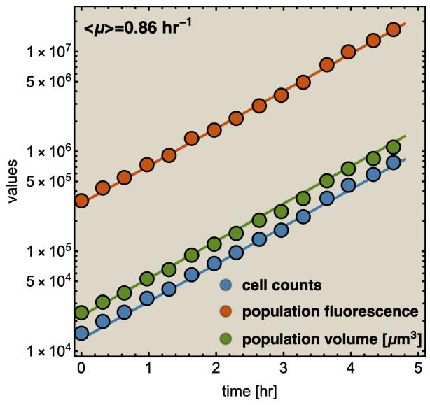
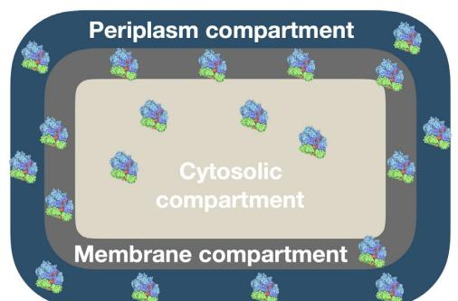
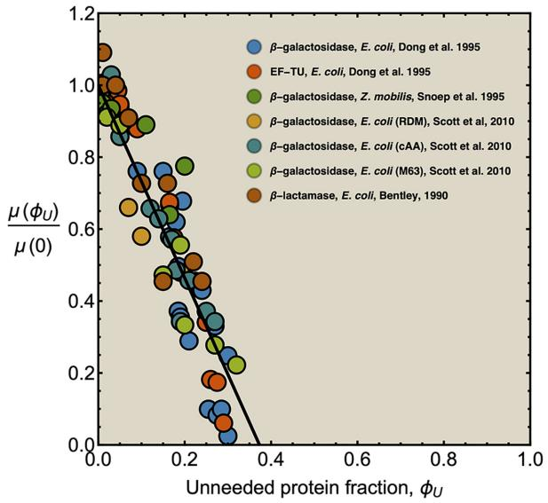
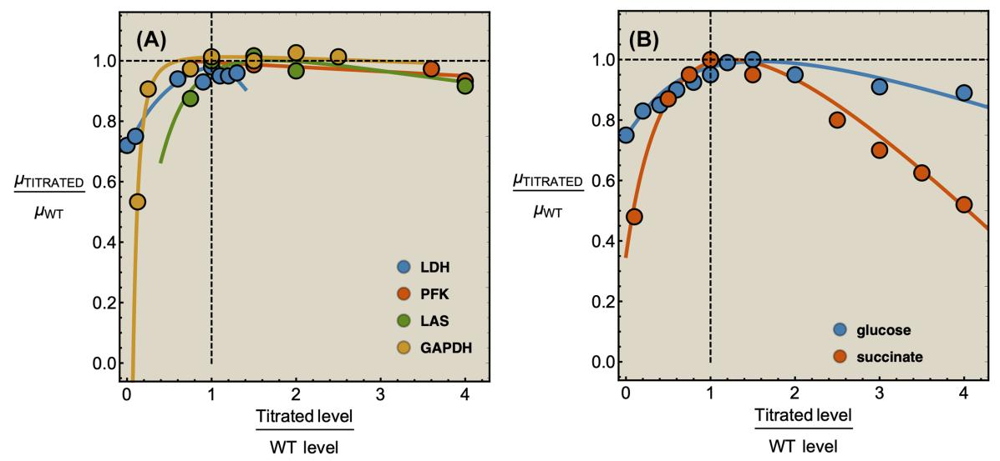
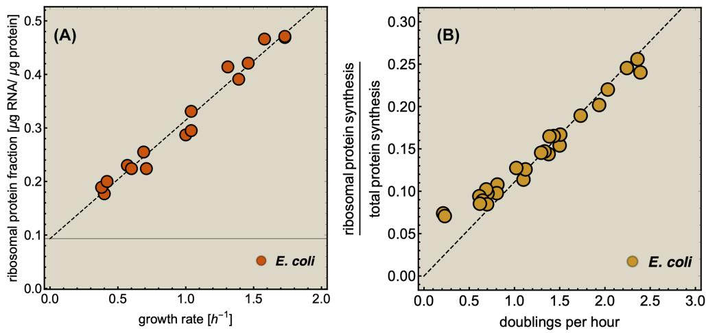
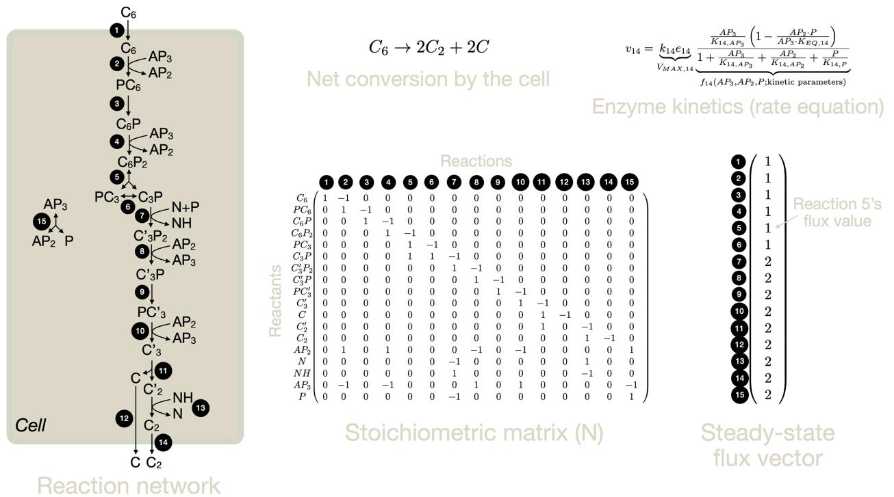
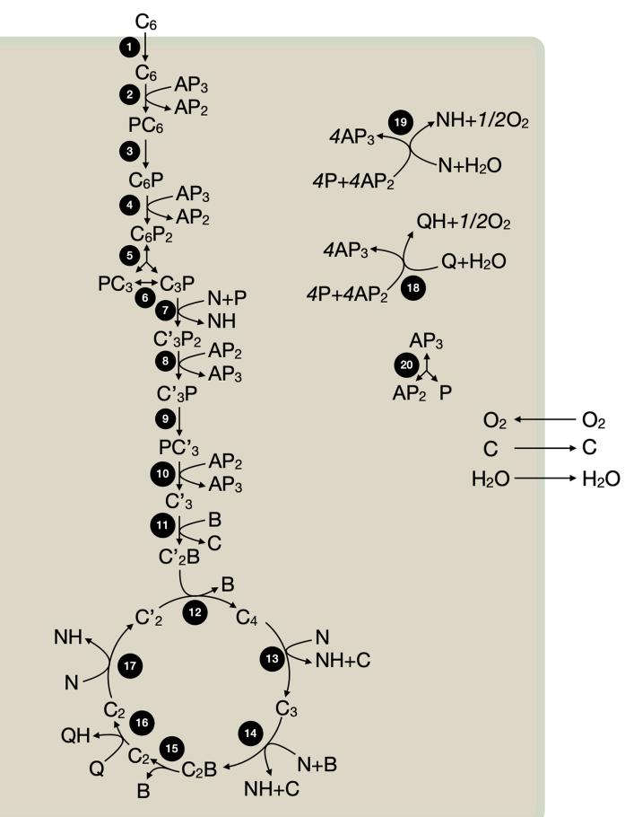
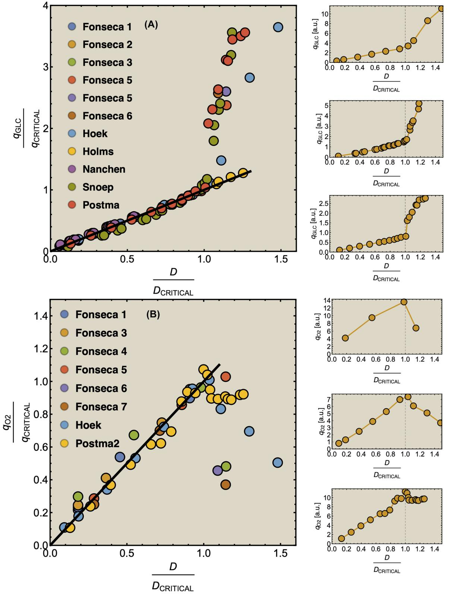
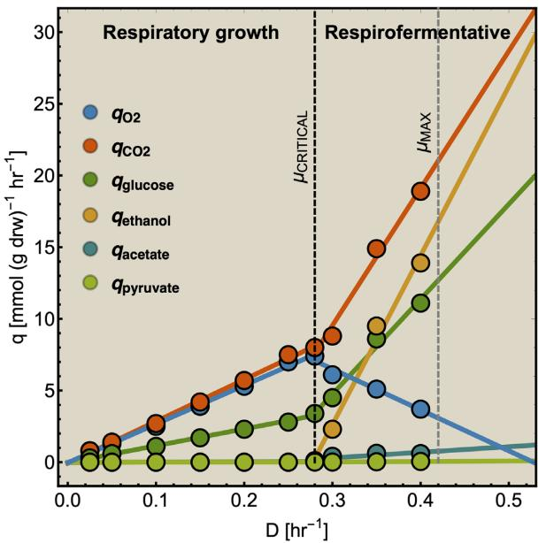
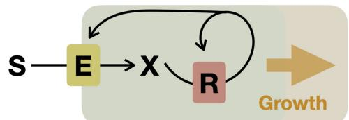

**doi: 10.1093/femsre/fuaa034** Advance Access Publication Date: 21 September 2020 Review Article

# REVIEW ARTICLE

# **Searching for principles of microbial physiology**

Frank J. Bruggema[n1,](#page-0-0) [*](#page-0-1) ,[†](#page-0-2) , Robert Planque´ [2,](#page-0-3) Douwe Molenaa[r1](#page-0-0) and Bas Teusink[1,](#page-0-0)[‡](#page-0-4)

1Systems Biology Lab, AIMMS, De Boelelaan 1108, 1081 HZ, VU University, Amsterdam, The Netherlands and 2Department of Mathematics, De Boelelaan 1111, 1081 HV, VU University, Amsterdam, The Netherlands

∗**Corresponding author:** Systems Biology Lab, AIMMS, De Boelelaan 1108, 1081 HZ, VU University, Amsterdam, The Netherlands. E-mail: [f.j.bruggeman@vu.nl](mailto:f.j.bruggeman@vu.nl)

**One sentence summary:** We provide the theoretical and experimental evidence for a theory about microbial physiology based on fundamental cellular and physical principles, assuming evolutionary growth-rate maximisation.

**Editor:** Oscar Kuipers †Frank J. Bruggeman, <http://orcid.org/0000-0002-0255-4766> ‡Bas Teusink, <http://orcid.org/0000-0003-3929-0423>

# **ABSTRACT**

Why do evolutionarily distinct microorganisms display similar physiological behaviours? Why are transitions from high-ATP yield to low(er)-ATP yield metabolisms so widespread across species? Why is fast growth generally accompanied with low stress tolerance? Do these regularities occur because most microbial species are subject to the same selective pressures and physicochemical constraints? If so, a broadly-applicable theory might be developed that predicts common microbiological behaviours. Microbial systems biologists have been working out the contours of this theory for the last two decades, guided by experimental data. At its foundations lie basic principles from evolutionary biology, enzyme biochemistry, metabolism, cell composition and steady-state growth. The theory makes predictions about fitness costs and benefits of protein expression, physicochemical constraints on cell growth and characteristics of optimal metabolisms that maximise growth rate. Comparisons of the theory with experimental data indicates that microorganisms often aim for maximisation of growth rate, also in the presence of stresses; they often express optimal metabolisms and metabolic proteins at optimal concentrations. This review explains the current status of the theory for microbiologists; its roots, predictions, experimental evidence and future directions.

**Keywords:** systems biology; microbial physiology; constrained biosynthetic resource allocation; mathematical modelling; biophysics; evolutionary biology

## **PREAMBLE**

In this review, we provide predictions and – hopefully – understanding by taking a systems biology perspective on protein expression, growth and fitness. We will discuss a growing body of associated theory, explain its fundaments and provide experimental evidence. The theory aims to predict common behaviours of microorganisms from first principles, derived from evolutionary, biochemical and molecular-biological considerations.

The basic premise of the theory is that microorganisms have been selected in evolution to maximise their (immediate) growth rate; this maximal growth rate may be very low or even (below) zero during stressed conditions. Microbes achieve maximal growth rate by expressing all their needed proteins to optimal concentrations, within physicochemical constraints that limit the concentrations and activities of proteins. An important aspect of this theory is that it considers the expression of *all* cellular proteins. It also aims to be as generic as possible.

**Received:** 20 February 2020; **Accepted:** 2 August 2020

C The Author(s) 2020. Published by Oxford University Press on behalf of FEMS. This is an Open Access article distributed under the terms of the Creative Commons Attribution-Non-Commercial License[(http://creativecommons.org/licenses/by-nc/4.0/)](http://creativecommons.org/licenses/by-nc/4.0/), which permits non-commercial re-use, distribution, and reproduction in any medium, provided the original work is properly cited. For commercial re-use, please contact [journals.permissions@oup.com](mailto:journals.permissions@oup.com)

Like any theory, it needs to pass the test of empirical validation to be able to stand the test of time.

#### **Unity of microbial life?**

Our planet is teeming with microbial life (Gibbons and Gilbert [2015)](#page-21-0). Microbial niches vary greatly and individual species vary in their mechanisms for energy and mass assimilation (Falkowski, Fenchel and Delong [2008)](#page-21-1). Most microorganisms appear in a constant competition, e.g. scavenging nutrients for growth and survival. Selection filters out those that perform best, either alone or in communities.

One goal of microbiology is to explain the differences and commonalities between microbes in the light of this competition and their interactions. This requires integration of genetic information, molecular biology, biochemistry, ecology and evolutionary history.

Many microorganisms show very similar behaviours, suggesting a common origin. For instance, 'Why do so many unicellular microorganisms respire at low concentrations of sugars (and low growth rate) and initiate seemingly-wasteful overflow metabolism at high concentrations (and high growth rate)?'; 'Why are fast growing cells less stress tolerant than slow growing ones?'; 'Do stress tolerance and growth rate always trade off?'; 'Why do microbes often form tiny subpopulations of hardly growing, stress-tolerant persister cells, while the majority is stress-sensitive and fast growing?'; 'When is one metabolic pathway preferable over another?'; 'What explains the variation of lag phases of microbial adaptation across conditions?'; and, 'Can a cell robustly steer protein expression, with its molecular control circuits, to states that support increased, or perhaps even maximal, fitness when conditions change?'

Many of these questions touch on fundamentals of evolutionary biology, enzyme biochemistry, cellular metabolism and growth. Is there a conceptual framework, 'a theory', that can provide answers to such questions, which is quantitative and makes testable predictions? We think there is.

#### **One molecular theory of microbial physiology?**

Any theory about microbial physiology can only be widely applicable if evolutionarily distinct species are sufficiently alike in terms of their molecular biology and selective pressures. This appears to be the case: microorganisms function very similarly (Neidhart, Ingraham and Schaechter [1990;](#page-22-0) Peregrin-Alvarez, Sanford and Parkinson [2009)](#page-22-1); they all obey the same physicochemical laws and are composed out of the same types of macromolecules (Neidhart, Ingraham and Schaechter [1990;](#page-22-0) Schaechter, Ingraham and Neidhardt [2005)](#page-23-0). Thus, their basic biochemistry and molecular biology is essentially identical. Moreover, biosynthesis routes of macromolecules are largely conserved (Neidhart, Ingraham and Schaechter [1990;](#page-22-0) Schaechter, Ingraham and Neidhardt [2005)](#page-23-0). And, enzymes all work according to the same kinetic principles (Cornish-Bowden [2012)](#page-21-2) and the reactions they catalyse follow the same limited set of basic chemical principles (Noor *et al.* [2010;](#page-22-2) Rabinowitz and Vastag [2012)](#page-22-3).

It appears, therefore, that molecular mechanisms, biosynthesis and growth can all be understood in terms of the same fundamental principles. Some of these are: conservation of chemical elements, reaction stoichiometry, Gibbs-free energy potentials and energy-equivalent recycling (Schuster and Heinrich [1996)](#page-23-1). Thus, as Jacques Monod put it: 'What's true for *E. coli* is also true for the elephant.'

Selection also has a highly similar influence on different microorganisms (Orr [2009)](#page-22-4). It is much like Franc¸ois Jacob once remarked, 'The basic purpose and desire of each cell is to become two cells.' Accordingly, genotypes are selected that produce (the most) offspring, despite dynamic, sometimes harsh, conditions. They either fix, or stably co-exist in communities (Orr [2009;](#page-22-4) Saether and Engen [2015)](#page-23-2).

In this light, it is perhaps not a surprise that evolutionarily distinct microorganisms have such similar physiologies, i.e. metabolic behaviours. In 1924, Kluyver, then a Dutch pioneering microbiologist, called this similarity the 'Unity of Biochemistry' (Kluyver [1924;](#page-22-5) Singleton and Singleton [2017)](#page-23-3).

So if indeed many microorganisms obey the same biochemical and metabolic principles, and they are subject to the same physicochemical constraints and selective forces, then microbial physiology may be understood in terms of these universal forces and a single theory may exist. This review is about such an emerging 'molecular-systems' theory of microbial physiology: what its premises and predictions are, its roots, its experimental evidence, and future directions.

The theory we shall outline is in its essence the formulation and solution of a constrained-optimisation problem. (Not unlike the maximisation of entropy in equilibrium statistical mechanics, leading for instance to the ideal gas law.) It takes foundations from physics, (bio)chemistry and cell biology to understand the relevant (protein-expression) constraints, and evolutionary thinking to define the objective to optimise ('fitness'). We use understanding of metabolism and cell growth to define a growth rate in molecular terms—our proxy for fitness. Metabolism then leads to growth as it is responsible for the synthesis of all cellular components that occupy space—and the required (energetic) driving force.

Not only because of natural selection do we resort to a study of the (constrained) optimisation of growth rate. Since we lack the molecular and kinetic information for a complete mechanistic description of cells and calculation of their growth rate, our mechanistic understanding is very fragmentary and 'patchy,' which prevents the development of a predictive, mechanistic model of a cell. In such cases of limited knowledge, optimisation methods can be used as predictive tools, instead of complete, mechanistic models. If those optimisation methods are successful then the postulated optimisation objective and constraints correctly mimic the outcome of optimisation processes in nature, e.g. constrained maximisation of entropy equilibrium physics and of fitness maximisation in evolutionary biology.

Despite it being an optimisation-based theory, instead of a purely mechanistic theory, it makes biologically relevant predictions. The mathematical analyses of the growth-rate maximisation formulations indicates properties of optimal protein expression and metabolisms. For instance, it predicts that an optimal cell uses the simplest metabolic network, which converts all nutrients into all needed cell material, provided only one protein expression constraint limits growth rate (Wortel *et al.* [2014;](#page-23-4) de Groot *et al*. [2019,](#page-21-3) [2020b)](#page-21-4). No expressed enzyme is then redundant, no enzyme is under- or over expressed, and the network has only a single degree of freedom in the number of fluxes (Gagneur and Klamt [2004)](#page-21-5).1 The number of elementary

1 This means that if you known one flux you can calculate all others from the flux relationships that exist in steady-state metabolism. A simple example where this is not the case is the system with three enzymes, enzyme 1 making the molecule 'X' and enzyme 2 and 3 consuming it. The steady-state flux relation is v1 − v2 − v3 = 0 (with v's as enzyme rates) and clearly you need to know two values of the v's to determine them

metabolisms that a cell uses is almost always equal to the number of protein-concentration constraints that limit growth rate (Wortel *et al.* [2014;](#page-23-4) de Groot *et al*. [2019,](#page-21-3) [2020b)](#page-21-4). All of this will be discussed in detail below.

As in all the sciences of complex natural systems, we need to simplify to understand, and the main simplification for now is that we limit ourselves to a discussion of optimal growth behaviour under constant conditions – i.e. at balanced growth. Most of the experimental evidence comes from model laboratory organisms, mainly *E. coli* and *S. cerevisiae*. We hopefully provide the reader with food for thought and inspiration to help extend this theoretical framework.

#### **A final note before we start**

We hope that we do not scare away any experimentalists by using equations. In fact, we aim for the opposite. Many of equations we show are empirical – phenomenological – and require a fundamental explanation. Finding candidate explanations is what the theory is made for. Validation experiments should then follow. We sincerely hope that this theory is useful, accessible and insightful to many microbiologists – theoreticians and experimentalists alike.

We believe that a system as complex as a living microbial cell cannot only be understood from experiment, nor *solely* from theory. Scientific progress requires the integration of both. Physics and engineering have shown us the successes of this approach. We believe that microbiology is approaching such a phase too; considering our advanced state of understanding of the molecular-systems underlying physiology and the realisation of a 'unity of biochemistry and selective pressures'.

The remaining text is divided into three parts. In part I, we provide the fundaments needed to understand cellular growthrate maximisation, e.g. a fitness measure and the state of balanced growth. We motivate the choices and assumptions that we will need, and provide definitions. In part II, we focus on the growth-rate costs (and benefits) of protein expression, and describe the evidence that cells often carefully tune of protein concentrations to maximise their growth rate. In part III, we show how individual proteins should be considered in a systemic, network context to understand metabolic behaviours – e.g. respiration, respirofermentation – as the outcome of fitnessmaximisation strategies of cells. To achieve this, we focus on the characterisation of the optimal metabolic networks that maximise growth rate. Throughout these three sections, experimental evidence will be provided for most of our assertions.

## **FOUNDATIONAL PRINCIPLES**

#### **A universal fitness measure maximised by evolution**

The common concept of the fittest genotype is that it increases most in frequency when competing with others (Orr [2009;](#page-22-4) Saether and Engen [2015)](#page-23-2). This competition may occur in a dynamic environment with varying nutrients, periods of famine and stresses, and may involve either autonomous microorganisms or ones that are also dependent on others in communities. The eventual winner, at some moment in time, left the most offspring: its fold change in abundance was the greatest (Orr [2009;](#page-22-4) Saether and Engen [2015)](#page-23-2).

Let's be precise. We denote the number of cells of a microbial genotype at time *t* by *N*(*t*). Over evolutionary time, different conditions – 'epochs' – occur that influence the number of offspring made. The net fold change in the abundance of microorganisms after *E* epochs, after *tE* time, equals

$$\frac{\mathcal{N}(\mathbf{t}_{\mathrm{E}})}{\mathcal{N}(\mathbf{0})} = \frac{\mathcal{N}(\mathbf{t}_{\mathrm{E}})}{\mathcal{N}(\mathbf{t}_{\mathrm{E}-1})} \frac{\mathcal{N}(\mathbf{t}_{\mathrm{E}-1})}{\mathcal{N}(\mathbf{t}_{\mathrm{E}-1})} \dots \frac{\mathcal{N}(\mathbf{t}_{\mathrm{E}})\mathcal{N}(\mathbf{t}_{1})}{\mathcal{N}(\mathbf{t}_{1})\mathcal{N}(\mathbf{t}_{0})},$$

with *N*(*tj*)/*N*(*tj*−1) as the fold change of the abundance in the *j*-th epoch, which we shall denote by *wj*. The *j-*th epoch lasted *tj* = *tj* − *tj*−1 time. Thus, the net fold change equals the product of the fold changes of the sequence of epochs. These epochs could be a period of fasting, stress, or feast, and, therefore, w*j* can be smaller or greater than 1.

Fitness is now generally defined as (Bull [1987;](#page-21-6) Haccou and Iwasa [1995)](#page-21-7) (Appendix A),

$$F = \frac{1}{\mathbf{t}_{\mathbb{E}}} \ln \frac{\mathbf{N}(\mathbf{t}_{\mathbb{E}})}{\mathbf{N}(\mathbf{0})} = \left\langle \frac{\ln w}{\Delta \mathbf{t}} \right\rangle.$$

with · denoting an average value. We believe that this is a proper way to define fitness for microorganisms: it integrates the fitness outcomes of different strategies over time. This definition of fitness also ties in with the common notion of fitness under constant conditions: If only a single environment occurred, during which the microorganism grew at a constant (specific) growth rate μ, then *F* = μ.

Two informative limiting cases can be considered: a random and deterministic (non-random) limit. Lewontin and Cohen (Lewontin and Cohen [1969)](#page-22-6) considered a completely random environment (the random limit). Accordingly, they consider the fold-change factors *wj* as independent random variables. They found that the microorganism with the highest average growth rate (w/*t*) across conditions will not necessarily win; It may loose from a competitor with a lower average growth rate, but also a lower *variance* across conditions; for example, because it is better equipped with signalling systems.

The deterministic limit is reached when microorganisms always adapt perfectly and instantaneously to new environmental conditions (i.e. in the absence of lag phases and phenotypic heterogeneity); then, at all times exponential (balanced) growth occurs, and fitness is now equal to the average specific growth rate across all conditions,

$$F = \frac{1}{\mathfrak{k}_{\mathbb{E}}} \sum_{j} \ln \mathbf{e}^{\mu_{j} \Delta t_{j}} = \langle \mu \rangle_{\cdot}.$$

Maximal fitness now requires maximisation of the mean growth rate.

Any realistic case lies in between these random and deterministic limits. Their analysis become more involved. Lag times, phenotypic heterogeneity and diversification, stresses, and fitness costs can, however, still be introduced. This makes the theory harder to interpret, but still intelligible (Kussell and Leibler [2005;](#page-22-7) Rivoire and Leibler [2011)](#page-23-5).

all, not one. This does not mean that elementary metabolisms cannot be branched or cannot contain cycles. They can, but all those metabolic routes eventually all converge to one supramolecular reaction 'growth' (at fixed cell composition).

## **Fitness maximisation strategies**

Different microorganisms may have different fitnessmaximisation strategies to deal with the same dynamic environment. Accordingly, they vary in their fold change value in the same environment (epoch). Who wins depends on their net behaviour, their *F* value. This might be a microorganism that performs badly in some environments and really well in others. It can be one that performs reasonably well in all environments. Or, one that makes persister cells to prepare for future, extinction-threatening conditions, one that senses and aims to adapt quickly, or one that is always stress tolerant, at the expense of its instantaneous growth rate. Who wins depends also on the exact dynamics of the environment. Using fitness theory, the pros and cons of such fitness-maximisation strategies can be compared [e.g. (Bull [1987;](#page-21-6) Haccou and Iwasa [1995;](#page-21-7) Wolf, Silander and van Nimwegen [2015)](#page-23-6)].

The theory we will introduce below is largely limited to balanced growth, i.e. to long periods of constant conditions, and assumes that microorganisms aim to maximise their immediate growth rate (μ) – a particular fitness-maximisation strategy.2 The resulting theory leads, as we shall see, to growth-rate dependent metabolic behaviours as fitness-maximisation strategy – as we indeed observe them in the lab: At low growth rates, they prepare for future adverse conditions, and at high growth rate, they invest all resources into growth at the expense of stress tolerance and phenotypically diversify into growing and stresstolerant subpopulations. We will return to this later.

## **Evolution and optimality of (balanced) growth**

The mean growth rate μ of a population of competing (different) genotypes changes in time, because faster growing genotypes become relatively more abundant. In 1930, Fisher published a theorem (Fisher [1930)](#page-21-8), now known as Fisher's theorem, indicating that the rate of change of μ equals the genetic variation in the growth rate, i.e. *d dt*μ=δ2μ (Appendix B). This corresponds to intuition: If a greater spread (genetic variance) in fitness exists, some genotypes grow much faster than others, outgrow them quickly and the mean population growth rate varies greatly.

This evolutionary process of genotype successions is, for all we know, everlasting; there is now no reason to believe it is nearing its end. How can a microorganism then ever behave close to its optimal behaviour if evolution continues indefinitely? We need to address this question, because in the theory we shall be outlining below, we will assume that microorganisms operate close to their optimal behaviour. The answer is twofold.

First, a microorganism can attain a maximal growth rate only *given its genotype*, by expressing the right combinations of proteins at the right concentrations (without its growth rate being *evolutionarily* maximal; it is maximal given its current capacities). So what will become crucial, is the nature of the genotype-derived constraints that bound the maximal growth rate (optimality), in addition to the physicochemical ones, when considering optimal protein expression for growth-rate maximisation.

Second, we should distinguish two complementary evolutionary processes, which we term 'innovation' and 'pruning'. Innovation is the evolutionary emergence of new capabilities, such as the evolution of novel metabolic pathways that degrade plastics, via horizontal gene transfer or evolution after gene duplication. Pruning refers to the improved exploitation of existing capacities. It proceeds via mutations too, such as via those that lead to improved protein expression. Pruning improves phenotypic adaptation; innovation facilitates exploration and niche expansion. Evolutionary pruning improves phenotypic adaptation to growth-supporting conditions, leading to faster adaptation and an increased growth rate. Mutations in key transcription factors or in promoter sequences are an example (Kussell [2013;](#page-22-8) Price *et al.* [2019)](#page-22-9).

One possible outcome of evolution is therefore that microorganisms have evolved protein-expression control strategies, via pruning, that allow them to maximise growth rate in each condition, given their genomic potential, and that these strategies work optimally regardless of which metabolic proteins are being regulated (Planque *et al.* [2018;](#page-22-10) de Groot *et al.* [2020b)](#page-21-4). Thus, the subtly is that, in our theory, an optimal microorganism has the maximal growth rate given its genotype, it expressed the optimal set of proteins at optimal concentrations. Point mutations, leading to new genotypes, can therefore still occur that increase growth rate.

This may sound farfetched but we think that this is very likely. As an example consider a thermostat connected to a heating/cooling system, it *robustly* keeps a room at setpoint temperature, regardless of the room and environmental conditions. It is based on control principle called 'integral feedback control' that steers a system *always* to a desired state within its design specification – it does not work at a 1000 degrees Celsius or in water, for instance. Thus, that cells have evolved control systems that steer them always to the 'desired' state of maximal growth rate cannot be ruled out – in fact we will show evidence of this. How this is possible is not entirely clear. Maybe they evolved with the right combination of integral controllers? What we do not known is that optimal control systems may not even have to rely on complex biochemistry (Berkhout, Teusink and Bruggeman [2013;](#page-21-9) Towbin *et al.* [2017;](#page-23-7) Planque *et al.* [2018)](#page-22-10) and should therefore evolve readily.

Summarising, evolution may have stumbled on regulatory motifs of protein expression that are capable of optimal expression across conditions. We believe there is evidence that indeed, after four billion years of evolution, *current* microorganisms have protein-expression control systems that maximise growth rate, even though they are still subject to evolution. Before we review the experimental evidence, we will first discuss the quantitative definition of the specific growth rate in constant conditions.

#### **Balanced growth**

When a population of (isogenic) microorganisms is cultivated under constant conditions it generally relaxes to a constant growth rate. Then, all the properties that are proportional to mass (extensive properties) increase exponentially in time, at a fixed rate (Fig. [1)](#page-4-0). The ratios of extensive properties (intensive properties, such as concentrations;) remain constant. This state is formally called 'balanced growth' (Campbell [1957)](#page-21-10).

Two views exist on the balanced growth state: a populationlevel, macroscopic view and a single-cell, microscopic view. The microscopic view [e.g. (Painter and Marr [1968)](#page-22-11)] has recently been reviewed (Jun *et al.* [2018)](#page-22-12). The theory we discuss in this review is limited to the macroscopic view. That description refers to the average cell, typically at steady state. It is, therefore, relevant to consider to which state of a single cell that corresponds.

2 When we write growth rate, we mean the specific, or per capita, growth rate, with unit 1 over time.

**Figure 1.** Experimental illustration of balanced growth. A fluorescent-protein expressing *B. subtilis* strain was grown in mineral medium on glucose in shake flask. Samples of it were measured in a flow cytometer. This data was reproduced from Nordholt *et al.* [(2017)](#page-22-13).

In the microscopic perspective, individual cells differ in their birth and division sizes, durations of their cell cycles and molecular content. During balanced growth these cellular observables obey time-invariant probability distributions (Jun *et al.* [2018)](#page-22-12). These distributions can be measured with real-time imaging of the growth of single cells (Young *et al.* [2011)](#page-23-8), using, for instance, fluorescent reporters of gene expression. Results from singlecell experiments are generally close to theoretical expectations (van Heerden *et al.* [2017)](#page-23-9).

The balanced growth state of a cell in the macroscopic theory corresponds to a cell in the microscopic theory that has the mean age *a* in the growing population (Jun *et al.* [2018)](#page-22-12). This mean age is related to the mean generation time *tg* of cells as *a* ≈ 0.44*tg* (see the Appendix C). Thus, in the macroscopic theory we refer to the average cell that has completed its cell cycle by about 44%.

We can also use the microscopic theory to calculate the mean copy number of a molecule that the average cell contains. Then, we indeed can recover the expected macroscopic value, with μ as the (balanced) growth rate of the population (see the Appendix C). We note that these two results hold when it is assumed that no variation of generation times exists; This assumption can therefore be viewed as a macroscopic limit of the microscopic description, and the macroscopic theory is therefore an approximation.

Clearly, individual cells are not always in the average state that the macroscopic description of balanced growth refers to (Nordholt, van Heerden and Bruggeman [2020)](#page-22-14). DNA replication is, for instance, not continuously occurring along the cell cycle. The same applies to septum formation, which is happening at later times in the cell cycle. Thus, individual cells do not experience constant concentrations of all molecules during their cell cycle and the metabolism of single cells may adapt during the cell cycle (Nordholt, van Heerden and Bruggeman [2020)](#page-22-14). Thus, the macroscopic theory of balanced growth that we present below rather describes the average behaviour of a population of single cells.

#### **Constraints from metabolism at steady state**

At balanced growth, the concentration *c* = *n*/*V* of all molecules in the cell are constant (see Appendix D). The rates of all cellular reactions are then constant too, as they depend on those (constant) concentrations (Schuster and Heinrich [1996)](#page-23-1). If we consider the stoichiometries and rates of all cellular reactions in balanced growth, the concentration of molecules stays constant when their net synthesis rate is balanced by what is often referred to as 'dilution by growth' (Schuster and Heinrich [1996;](#page-23-1) de Jong *et al.* [2017;](#page-21-11) de Groot *et al.* [2020b)](#page-21-4):

$$\frac{d\mathbf{c}}{dt} = \frac{\mathbf{1}}{\mathbf{V}} \frac{\partial \mathbf{n}}{\partial \mathbf{t}} - \frac{\mathbf{n}}{\mathbf{V}^2} \frac{\partial \mathbf{V}}{\partial \mathbf{t}} = \mathbf{N} \mathbf{j} \langle \mathbf{c} \rangle - \mu \mathbf{c} = \mathbf{0},$$

with *N* as the stoichiometry matrix (containing the reaction stoichiometries), *j*(*c*) as a vector containing the steady-state enzyme conversion rates (the flux vector) that depends on the concentrations (and kinetic and environmental parameters),3 and μ*c* capturing the dilution of molecules due to cell-volume growth occurring at a rate equal to *dV*/*dt* = μ*V*.

Note that this formalism applies to all molecules in a cell, including the macromolecules, such as proteins, lipids and RNA/DNA. When only metabolism is considered, dilution by growth is generally neglected based on the (often implicit) assumption that metabolic fluxes are much faster than dilution by growth. In steady state, we then arrive at *Nj* ≈ **0**. Flux vectors can now be predicted using dedicated methods such as Flux Balance Analysis (FBA) (Orth, Thiele and Palsson [2010)](#page-22-15). Such approaches only require the stoichiometry of all the biochemical reactions in a cell, i.e. knowledge of all the reactions catalysed by the metabolic enzymes encoded on a microorganism's genome (Price, Reed and Palsson [2004)](#page-22-16).

#### **Constraints on rates from physics and (bio)chemistry**

The enzyme conversion rates that were mentioned in the previous section follow rate equations of enzyme kinetics (Cornish-Bowden [2012)](#page-21-2). Many different catalytic mechanisms of enzymes exist (Cleland [1963a;](#page-21-12) Cleland [1963b;](#page-21-13) Cleland [1963c;](#page-21-14) Cornish-Bowden [2012)](#page-21-2), each having its own rate equation. The simplest example of a rate equation is the Michaelis–Menten equation – it has unfortunately little relevance to metabolism as most enzymes catalyse multi-reactant reactions and are reversible, despite its prevalence in textbooks.

As long as enzymes are not active in complexes and directly 'channel' reactants to each other – which is, in fact, rare –, the rate of an enzyme-catalysed reaction is proportional to the concentration of the enzyme (Giersch [1988;](#page-21-15) Cornish-Bowden [2012)](#page-21-2) (Appendix E). Enzyme-kinetic rate equations also have other common features (King and Altman [1956;](#page-22-17) Cleland [1963c;](#page-21-14) Hofmeyr [1995)](#page-22-18), they can all be written as,

$$\nu = \mathbf{k}_{\rm cat}^{+} \cdot \mathbf{e} \cdot f(\mathbf{c}),$$

with *k*+ *cat* as the forward (catalytic) rate constant, *e* as the concentration of enzyme, and *f*(*c*) as a nonlinear *saturation function*

3 We find it useful to distinguish the rate (or activity, symbol v) of an enzyme and a particular steady-state flux through that reaction, denoted by *j*. The rates v can be a function of time. We will further only consider the steady (or balanced) state, to which the dynamics generally settle if the environmental conditions are constant for long enough.

of reactant concentrations (*c*) and parameters (e.g. kinetic constants and environmental conditions). The rate of an enzyme has an upper and a lower maximal rate, where the maximal forward rate of the enzyme equals *V*+ *max* = *k*+ *cat* · *e* and the maximal backward rate *V*− *max* = *k*− *cat* · *e* (Cornish-Bowden [2012)](#page-21-2). The function *f*(*c*) is therefore bounded,

$$-k_{\rm cat}^{-} \cdot \mathbf{e} < \boldsymbol{\nu} < k_{\rm cat}^{+} \cdot \mathbf{e} \Rightarrow -\frac{k_{\rm cat}^{-}}{k_{\rm cat}^{+}} < f(\mathbf{c}) < 1.$$

This bound indicates that there exists an upper limit to what metabolite levels can achieve to increase rates at constant enzyme concentrations. This result is going to be important later, when we are considering maximisation of the enzyme conversion rates to achieve growth-rate maximisation, via optimisation of concentrations of metabolic reactants and proteins (enzymes).

In addition to their reliance on the concentrations of the reactants and the catalytic enzymes, enzyme rates are constrained by 'physicochemistry' too. Diffusion coefficients of reactants impose a maximal bound on the conversion rate of multi-reactant reactions occurring in the cytosol, in the membrane, and between a membrane-embedded and an extra- or intracellular molecule (Berg and Purcell [1977;](#page-20-0) Calef and Deutch [1983;](#page-21-16) Wiegel [1983)](#page-23-10). This limit is hit when the enzyme converts substrates faster into products than the rate at which substrates collide with the enzyme. It has been suggested that translation in *E. coli* operates close to its diffusion limit (Klumpp *et al.* [2013)](#page-22-19).

Due to the unintuitive, erratic properties of the random walks of diffusing molecules, the membrane area that needs to be covered with membrane proteins to achieve near-maximal import rates is much lower than one would expect, far below 1% (Berg and Purcell [1977;](#page-20-0) Wiegel [1983)](#page-23-10). Still membranes are packed with different protein species (Guigas and Weiss [2016)](#page-21-17), indicating that cells have limited space for proteins and that some force pushes (some) cellular compartments to be filled to their brim with proteins. Since enzyme-rates are proportional to enzyme concentrations, growth-rate maximisation might be the underlying driving force. We will return to this idea later.

## **Protein-expression constraints**

Since the kinetic parameters of enzymes can only change through mutations, cells adapt to new conditions via changes in protein expression at short times scales. That occurs, in addition, to metabolic regulation of proteins, via post-translational modifications and (allosteric) feedback regulation (Chubukov *et al.* [2014)](#page-21-18). When we assume that each change in conditions that lead to an immediate growth rate reduction is followed by a protein expression response to increase growth rate then this implies for many enzymes that their concentrations have to increase.

In principle, an increase of an enzyme concentration enhances the rate of the reaction it catalyses (Cornish-Bowden [2012)](#page-21-2), but it also enhances macromolecular crowding and viscosity that, in turn, lowers diffusion rates of reactants (Zimmerman and Minton [1993)](#page-23-11), possible reducing the rate of the reaction. This argument is most relevant for bulky, slowly-diffusing reactants such as proteins and (loaded) tRNAs. It been proposed that cells are confronted with this trade off and evolved an optimal protein density that maximises reaction rates (Dill, Ghosh and Schmit [2011;](#page-21-19) Klumpp *et al.* [2013)](#page-22-19).

**Figure 2.** Cellular compartments have finite protein storage capacities. In the theory, protein compete for biosynthetic resources, like RNA polymerases, sigma factors, nucleic acids, ribosomes, amino acids, etc. and space, as shown in this figure.

A cell that hits one (or more) of its bounds for protein concentrations, e.g. its periplasm, membranes or cytosol is full with enzymes, will not be able to further increase its growth rate when it has optimal protein concentrations (Fig. [2)](#page-5-0) (de Groot *et al*. [2019,](#page-21-3) [2020b)](#page-21-4).4 Then growth rate has attained its maximal value and is limited by the 'active', or 'hit', protein-concentration bounds. We note that this occurs regardless of the occurrence of post-translational or feedback regulations, those regulations only influence the actual optimal protein amount – they do not influence the maximal protein-solvation capacity of compartments.

In the theory, protein-expression bounds correspond to the maximal protein solvent capacities of the various proteincontaining compartments of a microbial cell (de Groot *et al*. [2019,](#page-21-3) [2020b)](#page-21-4). For bacteria, these compartments are the periplasm, plasma membranes, and cytoplasm (Fig. [2)](#page-5-0), while for eukaryotic microorganisms organelles are also relevant. It turns out that the interiors (Zimmerman and Minton [1993)](#page-23-11) and membranes (Guigas and Weiss [2016)](#page-21-17) of cells are extremely crowded with proteins. About 20% of the interior of cells is occupied by proteins (with 58% being the theoretical maximum) and they occupy 30%–50% of the membrane. This means that protein-toprotein distances are of the order of the diameter of a protein (∼5 nm), both in a cell's interiors and membranes.

Since cells are so packed with protein, the synthesis of one particular protein influences the space available for others. In fact, increasing the protein concentration of cells, by reducing the water content by increasing the osmotic pressure, reduces growth rate (Cayley and Record [2004)](#page-21-20). This suggests that diffusional speeds of proteins and large molecular complexes can limit growth rate (Klumpp *et al.* [2013)](#page-22-19).

To summarise, each protein-containing compartment in a cell has a limited protein storing capacity. A growth rate increase requires increased rates of biosynthetic reactions, and since those rates are proportional to the concentration of their catalysing enzyme, this requires enzyme concentration increases. Growth rate can increase until one or more proteincontaining compartments is filled with needed protein. We will show later that not all protein-containing compartments are limiting growth simultaneously. Which ones do depends on conditions.

4 Below we will show that now only change its growth rate by changing of metabolic strategy, e.g. switch from pure respiration to overflow metabolism, for instance, such that this new strategy can exploits a cellular compartment that is not yet full with protein.

**Figure 3.** Illustration of the fitness cost (growth-rate reduction) due to the expression of an unneeded enzyme*.* The black line illustrates a fit with slope −2.7, indicating that growth rate is zero at an unneeded protein expression of 37% (Bentley *et al.* [1990;](#page-20-1) Dong, Nilsson and Kurland [1995;](#page-21-21) Snoep *et al.* [1995;](#page-23-12) Scott *et al.* [2010C](#page-23-13)).

We hypothesise that the resulting competition for constrained biosynthetic resources – for space, but also for RNA polymerases, ribosomes, etc. – has shaped cell physiology (Molenaar *et al.* [2009;](#page-22-20) de Groot *et al.* [2019)](#page-21-3). We hypothesise also that constraints leads to bounds on cellular growth rate that enforce particular metabolic behaviours. In our view, in agreement with that of others (Kjeldgaard [1963;](#page-22-21) Maaloe [1969;](#page-22-22) Ehrenberg and Kurland [1984;](#page-21-22) Scott *et al.* [2014)](#page-23-14), evolution has led to optimal allocation of limited biosynthetic resources over cellular proteins, such that protein concentrations are optimal and maximise growth rate.

In the next section, we will provide evidence that protein synthesis involves both a growth-rate benefit and cost and that microbes appear to maximise their difference and, hereby, maximise growth rate.

#### **FITNESS EFFECTS OF PROTEIN EXPRESSION**

#### **Growth costs of competition for limited biosynthetic resources**

Genes 'compete' for limited biosynthetic resources such as RNA polymerase and sigma factors, their mRNAs for ribosomes and loaded tRNAs, and their proteins for space in cellular compartments such as membranes and the cytosol. Therefore, the synthesis of one particular protein is at the expense of another.

Due to 'biosynthetic resource competition', gene expression of unneeded proteins reduces growth rate (Dykhuizen, Dean and Hartl [1987;](#page-21-23) Dykhuizen and Dean [1990;](#page-21-24) Stoebel, Dean and Dykhuizen [2008;](#page-23-15) Scott *et al.* [2010)](#page-23-13). Beta-galactosidase, for example, is required for lactose growth, but has a growth-rate reducing effect—it is a 'burden'—during glucose growth (Scott *et al.* [2010)](#page-23-13). Examples of this protein burden are shown in Fig. [3.](#page-6-0) In those studies, one result is particularly intriguing: the relationship between growth rate and unneeded protein expression is linear. We can explain this behaviour with a simple model if we accept one peculiar assumption, that of 'even competition for resources' (Berkhout, Teusink and Bruggeman [2013)](#page-21-25). All preexisting protein concentrations then reduce by the same fraction λ after the gene activity of an unneeded protein is changed and a new steady state of growth is established. The linear relation is derived in the Appendix F.

#### **Growth benefit and costs of needed protein expression**

A cell growing on lactose as its sole carbon source needs betagalactosidase. Accordingly, under those conditions, the growth rate can be expected to increase when a cell starts to express it. As long as the growth rate increases, the protein is underexpressed – the growth rate still 'benefits' from more of that protein. Above some threshold, *optimal* expression level, the growth rate is expected to reduce again. Beta-galactosidase is now overexpressed, its synthesis consumes resources that would better be allocated to other needed proteins. One should therefore expect an optimum in protein expression.

Protein-expression optimality has been confirmed with enzyme-titration experiments (Fig. [3)](#page-6-0). In those studies, the microorganism is grown under a condition where the titrated protein is needed. The dependency of the growth rate on the titrated concentration results from concentration dependency of the (growth-rate) benefit minus that of the (growth-rate) cost of the protein [e.g. (Dekel and Alon [2005;](#page-21-26) Kalisky, Dekel and Alon [2007)](#page-22-23)]. Experiments indicate too that the relation between growth rate and the (titrated) expression level of a needed protein generally displays an optimum (Jensen, Michelsen and Westerhoff [1993;](#page-22-24) van der Vlag *et al.* [1995;](#page-23-16) Koebmann *et al.* [2002;](#page-22-25) Koebmann Solem and Jensen [2005;](#page-22-26) Solem *et al.* [2007;](#page-23-17) Solem, Koebmann and Jensen [2008;](#page-23-18) Keren *et al.* [2016)](#page-22-27).

Remarkably, it is often observed that the titrated optimum of titratable mutant strain *coincides with the the growth rate and protein expression of the wild type strain* (Fig. [3)](#page-6-0) (Jensen, Michelsen and Westerhoff [1993;](#page-22-24) Koebmann *et al.* [2002;](#page-22-25) Koebmann Solem and Jensen [2005;](#page-22-26) Solem *et al.* [2007;](#page-23-17) Solem, Koebmann and Jensen [2008)](#page-23-18). (Exceptions exist too, perhaps hinting at evolutionary trade offs (Bren *et al.* [2016;](#page-21-27) Towbin *et al.* [2017)](#page-23-7).) Such optimal protein expression by the wild type has indeed been found for evolutionarily unrelated species, such as *Lactococcus lactis*, *Escherichia coli* and *Saccharomyces cerevisiae* (Jensen, Michelsen and Westerhoff [1993;](#page-22-24) van der Vlag *et al.* [1995;](#page-23-16) Koebmann *et al.* [2002;](#page-22-25) Koebmann Solem and Jensen [2005;](#page-22-26) Solem *et al.* [2007;](#page-23-17) Solem, Koebmann and Jensen [2008;](#page-23-18) Keren *et al.* [2016)](#page-22-27).

#### **The fitness potential of an enzyme**

That the optimal concentration of a needed protein results from a maximisation of its benefit minus its cost also becomes clear when one derives a relation for the slope of the growth-rate versus titrated protein-concentration relationship (as shown in Fig. [3)](#page-6-0) (Berkhout, Teusink and Bruggeman [2013)](#page-21-25). In this derivation, we assume that the total protein concentration of a cell remains constant during the protein titration. We consider that the experimentalist sets the concentration of the titrated protein and we further assumed that the cell optimally allocates the remaining protein concentrations over its needed reactions. We defined the growth rate (μ) as the protein synthesis rate (*jp*) divided by the total protein concentration of a cell (*pT*) (as others do (Scott *et al.* [2010)](#page-23-13)).

For the derivation, the assumption of the constant protein concentration means that during the environmental condition, at which the protein of interest is titrated, the cell does not

**Figure 4.** Illustration of enzyme titration and optimal protein-expression by a wild type *L. lactis* (A) and *E. coli* (B) strain. **A.** Three glycolytic enzymes and an operon display optimal expression levels in *L. lactis* (Koebmann *et al.* [2002;](#page-22-25) Koebmann Solem and Jensen [2005;](#page-22-26) Koebmann, Solem and Jensen [2006;](#page-22-28) Solem *et al.* [2007;](#page-23-17) Solem, Koebmann and Jensen [2008)](#page-22-29). **B.** H+-ATPase of *E. coli* is optimally expressed in two growth environments (Jensen, Michelsen and Westerhoff [1993)](#page-22-24).

change its total protein concentration as function of the concentration of the titrant. The fraction of protein dry-mass as function of cellular dry mass and cell volume are both growth-rate dependent (Bremer and Dennis [2008;](#page-21-28) Si *et al.* [2017)](#page-23-19), whether this leads to a constancy of cellular protein concentration as function of environment conditions is unclear to us.

Under those assumptions, the normalised slope *i* of the growth rate versus the protein fraction φi of protein *i*, defined as its concentration divided by the total protein concentration i.e. *pi*/*pT*, equals (see Appendix G) (Berkhout, Teusink and Bruggeman [2013)](#page-21-25)

$$
\Omega_{\rm i} = \frac{\phi_{\rm i}}{\mu} \frac{d\mu}{d\phi_{\rm i}} = \frac{\mathbf{C}_{i}^{\dagger \mu} - \phi_{\rm i}}{1 - \phi_{\rm i}}.
$$

The *C jp i* coefficient quantifies the beneficial effect of the protein on the protein synthesis rate, and is called a flux control coefficient in metabolic control theory (Kacser and Burns [1973;](#page-22-30) Fell [1997)](#page-21-29). The cost of the protein is captured by its φ*i* term.

If *C jp i* is positive and high (≈1), the protein has a high control on the protein-synthesis rate. The equation indicates that such enzymes have a high influence on fitness, regardless of their protein fraction.

Unneeded proteins have a *C jp i* of zero. For such proteins, integration of the *i* equation then recovers the linear relation between growth rate and the unneeded protein fraction (Fig. [2)](#page-5-0) (see Appendix J).

## **Abundant proteins generally have a large fitness influence**

We view *i* as the fitness potential of an enzyme, as it quantifies the fractional change in the growth rate (fitness) (i.e. *d*μ/μ) upon a fractional change in the concentration *pi* of a protein *i* (i.e. *d pi* /*pi* = *d*φ*i* /φ*i*). A protein with a high *i* value (≈1) indicates a large fitness influence—their concentration is far from optimal.

Since abundant enzymes have lower 1-φ*i* values, they generally have a higher fitness potential than scarce enzymes (regardless of their flux control coefficient). This predicts that abundant enzymes, such as the ribosome or the glycolytic enzyme glyceraldehyde 3-phosphate dehydrogenase, should therefore be more carefully tuned in concentration than transcription factors, which are low in abundance.

This makes sense, as an abundant enzyme that is 5% removed from its optimal level corresponds to a significant waste of resources compared to a minority enzyme that is 5% from optimality. Thus, an order may exist for the evolutionary need of tuning enzyme concentrations: the order of their abundance. Evolution then proceeds in the direction of diminishing returns by optimising the expression of proteins in the order of their abundance.

At the optimum, where *i* = 0, any change in the enzyme concentration reduces fitness. Then, the flux control coefficient equals the fraction abundance of the protein: *C jp i* = φ*i* (in agreement with earlier findings (Klipp and Heinrich [1999)](#page-22-29)).

This establishes another rule. In addition to abundant protein having a large effect on fitness when they are not optimally expressed, they also have a high control on protein synthesis when they are optimally expressed.

Thus, ribosomes, being amongst the most abundant proteins in *E. coli* during moderate to high growth rates, can be expected to have such high control. In the next section, we describe evidence that this abundant enzyme is likely optimally regulated in expression by *E. coli*.

## **Optimal regulation of the ribosome concentration in** *E. coli*

Two studies analysed the regulation of the ribosome concentration in *E. coli* from the perspective of optimal allocation of biosynthetic resources (Scott *et al.* [2014;](#page-23-14) Bosdriesz *et al.* [2015)](#page-21-30)*.* They were inspired by work that dates back decades ago (Schaechter, Maaloe and Kjeldgaard [1958;](#page-23-20) Kjeldgaard [1963;](#page-22-21) Maaloe [1969;](#page-22-22) Ehrenberg and Kurland [1984)](#page-21-22) and suggest that ribosome concentrations are optimal and operate close to substrate saturation. About 85% of the ribosomes are bound to amino-acid loaded tRNA's and are actively translating (Scott *et al.* [2010)](#page-23-13).

*E. coli* regulates the concentration of its ribosomes according to their demand – by aiming to keep the fraction of active ribosomes constant (Bosdriesz *et al.* [2015)](#page-21-30). Likely other microorganisms do that too (Cox [2004)](#page-21-31). According to basic enzyme kinetics that fraction equals the actual rate of the enzyme divided by its maximal rate (Cornish-Bowden [2012)](#page-21-2); i.e. v/*Vmax*, which equals the *f*-function introduced above, equal to *S*/(*S* + *KM*) in the case of Michaelis Menten kinetics.5

When an amino acid is limiting, for instance, upon a nutrient downshift, such that ribosomes become overexpressed, ribosomes bind more often to unloaded tRNAs. Then their saturation with loaded tRNA is below optimal, leading to the synthesis of ppGpp by RelA, which binds to unloaded-tRNA-bound ribosomes (Potrykus and Cashel [2008)](#page-22-31). Subsequently, ppGpp binds RNA polymerases and lowers their affinity for ribosomal promoters, in concert with DksA (Potrykus and Cashel [2008)](#page-22-31). As a consequence, RNA polymerase is redirected to (binds more often to) non-ribosomal (catabolic) operons, leading to an enhanced synthesis of amino-acid synthesising proteins (and fewer ribosomes), an increase in the loaded tRNA concentration, such that the ribosome's saturation level is restored, RelA makes less ppGpp, and a reestablishment of a steady state at higher growth rate follows. (Higher than immediately after the nutrient shift.)

When ribosomes are under-expressed, for instance when nutrient conditions improve, the converse happens; ppGpp concentration is low, more RNA polymerases allocate to ribosomal promoters, ribosomes are made at the expense of catabolic proteins, and a novel steady state follows, again with a higher growth rate then immediately after the nutrient shift.

These two mechanistic stories are examples of (optimal) biosynthetic resource re-allocation—dictated by the microorganisms's evolved behaviour of growth-rate maximisation and the competition of biosynthetic resources, because they are limited.

Using simulations, Bosdriesz *et al.* [(2015)](#page-21-30) and Scott *et al.* [(2014)](#page-23-14) showed that the ribosome-expression control circuitry is indeed able to maximise growth rate. Bollenbach *et al.* provided experimental evidence: they sequentially removed ribosomal promoters (*E. coli* has 7 of them) and found a growth rate maximum at the promoter combination active in the wild type (Bollenbach *et al.* [2009)](#page-21-32).

## **The control objective of ribosome expression regulation**

Thus, the regulatory mechanism for ribosome expression has as its control objective the prevention of wasteful under- and overexpression of ribosomes. It aims to keep the saturation degree of the ribosome with loaded tRNA's as close to 1 as possible. This had already been suggested decades ago (Maaloe [1969;](#page-22-22) Ehrenberg and Kurland [1984)](#page-21-22).

Kjeldgaard wrote in 1963 (Kjeldgaard [1963)](#page-22-21), five years after he, together with Maaloe and Schaechter, established the (almost) linear relationship between ribosome concentration and the growth (Fig. [5)](#page-9-0), '*In other words, the number of proteinsynthesising units within the bacteria is regulated in such a way that individual units always function at the same rate. If this fixed rate of protein synthesis per ribosome* [note: *fr*(*m*)] *is assumed to be optimal, or nearly so, it is clear that RNA synthesis in the cell is regulated in a manner which affords a high degree of economy to the growing cell. This again would mean a selective advantage in the competitive environment in which bacterial species have probably evolved. It would be* *tempting to assume that such constant efficiency also applies to the synthesis of other macromolecular species of the bacteria.*'

Bruggeman *et al.* **829**

When the saturation function is (high and) constant, the ribosomal protein fraction in *E. coli* becomes a linear function of the growth rate (Scott *et al.* [2010;](#page-23-13) Scott *et al.* [2014;](#page-23-14) Bosdriesz *et al.* [2015)](#page-21-30). This relation was first found experimentally in 1958 (Schaechter, Maaloe and Kjeldgaard [1958)](#page-23-20) and has recently been revisited (Scott *et al.* [2010;](#page-23-13) Metzl-Raz *et al.* [2017)](#page-22-32) (Fig. [5)](#page-9-0). Given the universal importance and costs of ribosomes, we expect that the linear relation between ribosomal protein fraction and growth rate holds for many more microorganisms, as was shown for some already (Cox [2004;](#page-21-31) Scott *et al.* [2010;](#page-23-13) Metzl-Raz *et al.* [2017)](#page-22-32).

The linear relation between the ribosomal protein fraction and the growth rate may have a surprising evolutionary origin. When growth-rate maximisation is the objective, i.e. maximisation of protein synthesis flux per unit protein, it is advantageous that enzymes have high affinities for substrates (to enhance substrate saturation) and low affinities for products (to prevent inhibition). It turns out that these saturation conditions are exactly the limit in which the relationship between growth rate and protein fraction becomes linear. This might still be a coincidence, but we doubt that. We illustrate this result with a simple example in Appendix H, where we also show that evolution towards maximisation of flux per unit invested protein leads to enhanced affinities for substrates and reduced affinities for products.

The control objective of ribosomal protein expression, i.e. to keep the ribosome's saturation with its substrates (loaded tRNA's) constant by inhibiting ribosomal gene expression when this saturation drops and activating it when it rises, indicates the great potential of metabolite-mediated control of metabolic gene expression for maximisation of growth rate. Since metabolite-binding to transcription factors that regulates metabolic gene expression is a general phenomenon in microbiology, we asked (Berkhout, Teusink and Bruggeman [2013;](#page-21-9) Planque *et al.* [2018)](#page-22-10) how likely it is that metabolic pathways are optimised by this mode of regulation. We found that already simple biochemical interactions, e.g. metabolite binding to a monomeric transcription that binds non-cooperatively to a promoter, can maximise metabolic pathway flux per unit invested protein. We also discovered a rule: the number of metabolites that binds to transcription factors equals the number of environmental parameters at which the metabolic pathway shows self-optimising behaviour (Planque *et al.* [2018)](#page-22-10).

## **The relationships between protein synthesis, ribosomes and balanced growth rate**

At balanced growth, the concentration of any active protein in a cell is established by the balance between its rates of synthesis by ribosomes, degradation by proteases (or spontaneous unfolding) and dilution by (volume) growth. The concentration of the ribosomes is set by the same balance. If we ignore degradation of proteins, which is justified for ribosomes and stable proteins such as metabolic enzymes, we obtain the following relation between the concentration of a protein (*p*) and the ribosome (*r*) (Appendix I),

$$\frac{p}{r} \propto \frac{\alpha_p}{\alpha_l},$$

where the factor α*p* specifies the fraction of the total translation rate devoted to the protein (or to ribosomal protein *r*). This relation leads to the insight that, at balanced growth, the ratio of

5 (with *s* as the substrate concentration and *K M* as the Michaelis Menten constat).

**Figure 5.** Linear relation between ribosomal activities and growth rate in *E. coli* and *S. cerevisiae.* Data is from Scott *et al.* [(2010)](#page-23-13) and Metzl-Raz *et al.* [(2017)](#page-22-32)*.*

protein and ribosome concentration is proportional to the ratio of the number of ribosomes respectively allocated to their synthesis. Thus, ribosome profiling results should agree with proteomics experiments at balanced growth. We are not aware of an experimental confirmation of this result.

When we sum all synthesis-degradation rate balances of the proteins in a cell we obtain a relationship between the ribosomal protein fraction φ*r* and the growth rate (Appendix I),

$$
\mu = \mathbf{k} \cdot f_r(\mathbf{c}) \phi r,
$$

with *kr* as the catalytic rate constant and *fr*(*c*) as the saturation level of the ribosome with its reactants. The equation implies—perhaps somewhat counterintuitively—that increasing all enzymes by the same factor does not change the growth rate, as the fractions will not change; Only changes in the relative protein concentrations can do that, via reallocation of limited resources.

Many of insightful relationship between growth rate, ribosomes and protein fractions can be found in the papers by the Hwa lab [e.g. (Scott *et al.* [2010)](#page-23-13)].

## **The proportional relation between the ribosomal protein-fraction and growth rate**

The ribosomal protein-fraction of *E. coli*, measured as μ*g* of total RNA per μ*g* of total protein, as function of growth rate is shown in Fig. [5.](#page-9-0) It is a linear relationship and not a proportional relation, as was derived above . The experimental relation has an offset ribosomal-protein fraction φ0 at zero growth rate:

$$
\phi_r = \phi_0 + a\mu,
$$

with *a* as its slope. This relation has been explained in two ways.

If all the ribosomes are active, the relationship between the growth rate and the ribosomal protein-fraction is only proportional if the saturation degree of ribosomes is not constant. For proportionality, the saturation degree has to depend on growth rate as in a hyperbolic manner,

$$f_{\mathbf{r}}(\mathbf{c}) = \frac{\mu}{\mathbf{k}_{\mathbf{r}} \phi_{\mathbf{r}}} = \frac{1}{\mathbf{k}_{\mathbf{r}}} \frac{\mu}{\phi_{\mathbf{o}} + a\mu} \frac{1}{\mathbf{k}_{\mathbf{o}}}$$

But this argues against the suggested control principle above, i.e. that the saturation degree is kept constant by ppGpp control. Although this result can still result from optimisation of growth rate, as has been suggested (Ehrenberg and Kurland [1984)](#page-21-22), we doubt that this is the explanation. We consider it more likely that the saturation degree is (kept) constant and that φ*o* reflects a pool of inactive ribosomes – then the slope *a* equals (*krfr*(*c*) -1) as has been suggested too (Scott *et al.* [2010)](#page-23-13).

The next question is whether this pool of inactive ribosomes are 'idle' – preparatory – and can be used for growth when conditions change (Mori *et al.* [2017)](#page-22-33), for instance via activation of 'hibernating ribosomes' (Song and Wood [2020)](#page-23-21). The advantage of having a reserve of idle ribosomes is that when nutrient are scarce, it provides a fitness benefit when nutrients become suddenly available (Mori *et al.* [2017)](#page-22-33).

But, we may still wonder why those idle ribosomes do not actually reduce the growth rate – especially at low growth rates, when nutrients are scarce. If that would be the case, prolonged growth at nutrient limitation would lead to a reallocation of biosynthetic resources to other now-needed proteins, at the expense of the idle ribosomes. This has not been observed in laboratory evolution experiments under nutrient-limited chemostat conditions, as far as we are aware.

So, either microorganisms have evolved regulatory networks under dynamic nutrient conditions that are not easily mutated away in the lab – requiring several mutations –, or idle ribosomes at nutrient limitation do not reduce growth rate. We expect that the latter is the case – paradoxically perhaps.

The proportional relation between ribosomal proteinfraction and growth rate does not mean that ribosomes are limiting growth rate. The growth rate may in fact be limited by the supply of substrates instead, which influence the ribosome by its saturation degree *fr*(*c*) with its loaded-tRNA substrates. Thus, an optimal *fr*(**c**) value requires a sufficiently active 'supply metabolism' (Bosdriesz *et al.* [2015)](#page-21-30) and supply metabolism might be running into a cellular constraint that limits growth rate – and not the ribosome. This likely occurs at nutrientlimited growth by *E. coli*, then nutrient-import capacity of a cell is likely limiting growth (O'Brien *et al.* [2013)](#page-22-34) – its membrane is then exhausted with needed proteins and the cytosol in which ribosomes reside is partially vacant, allowing, for instance, for expression of idle ribosomes.

This brings us to section III, where optimal protein expression and growth-rate maximisation are related to the entire metabolic network of a cell and this entire system is being optimised by global protein expression, subject to physicochemical and protein-concentration constraints.

## **FITNESS AND MICROBIAL PHYSIOLOGY**

#### **From proteins to metabolic networks**

Obtaining an understanding of the ability of cells to express proteins at growth-rate-maximising concentrations is only part of the challenge. Proteins function concertedly in networks, and it is those networks that ultimately set cellular growth rate. The cell therefore needs to express the right combination of proteins, at the right concentrations, that together form a reaction network that gives rise to a competitive growth rate. This network is responsible for the conversion of all the nutrients into all the cell material required for growth and the relief of stresses. Our goal is, therefore, to understand why a cell chooses for the (sub) *network* it expresses and not another one. Microbial physiology is therefore at its heart a *systems* biology problem (Neidhardt [1999;](#page-22-35) Schaechter [2006)](#page-23-22). Several principles of growth-rate maximising metabolic networks have also been discovered. An example reaction network is shown in Fig. [6.](#page-11-0)

Principles of optimal metabolic networks are partially based on the stoichiometry of metabolic reactions (Fig. [6)](#page-11-0). Shortly after metabolic reaction networks were experimentally determined in the 1950 and 1960's, stoichiometric modelling of metabolism started, for example, with the work of Umbarger (Umbarger [1977)](#page-23-23) and Stouthamer (Stouthamer [1973)](#page-23-24). Central to those 'maps' is the concept of reactant stoichiometry – how many moles of each of the substrates are needed to make each of the products in certain molar amounts (Schuster and Heinrich [1996)](#page-23-1). These stoichiometric coefficients follow from knowing the reactants, their elemental composition, and balancing the number of each element right and left of the reaction arrow. When all enzymes and all their reactants have been identified, the reaction network is known (Fig. [6)](#page-11-0).

Since all the molecular concentrations in a cell are constant at balanced growth, all the net synthesis and degradation rates of each of its molecules balance. Then, the synthesis rates of all the macromolecular components of a cell, such as its DNA, mRNA and proteins, can be calculated given its growth rate and its macromolecular composition – this is what Umbarger and Stouthamer did for the first time (Stouthamer [1973;](#page-23-24) Umbarger [1977)](#page-23-23). Models that do this are so-called structured, or stoichiometric models, models (De Hollander [1991)](#page-21-33). (Unstructured models also exist. They are very simple, but lack detail, and just give the overall conversion stoichiometry of nutrients into cells and byproducts (Roels [1983)](#page-23-25).)

Nowadays, we have detailed structured models that consider the stoichiometry of all metabolic reactions encoded on an organism's genome (Price, Reed and Palsson [2004)](#page-22-16). These are so-called genome-scale stoichiometric models, pioneered by Bernard Palsson and colleagues (Varma and Palsson [1993;](#page-23-26) Varma, Boesch and Palsson [1993;](#page-23-27) Varma and Palsson [1994)](#page-23-28). Bioinformatics tools and literature surveys are used to reconstruct the complete network of reactions that the enzymes encoded on a genome catalyse (Price, Reed and Palsson [2004;](#page-22-16) Teusink *et al.* [2005;](#page-23-29) Feist *et al.* [2009)](#page-21-34). Genome-scale metabolic network typically contain over a thousand reactions.

When the kinetics of enzymes is not considered, only their stoichiometry, determination of flux values that agree with the steady state assumption—so that all net synthesis and degradation rates balance – is computationally an easy problem. The associated set of equations consists of linear functions of the unknowns fluxes, and linear algebra can be used to find steadystate flux vectors. Since more unknown flux values occur than metabolites, directly solving for the fluxes is not possible as too few equations exist. Linear optimisation is therefore often used – called linear programming. A metabolic objective function is then postulated, typically the formation rate of all macromolecular components (the so called biomass reaction), and by imposing bounds on several incoming fluxes, optimal flux solutions can be calculated. This was pioneered by Fell and Small (Fell and Small [1986)](#page-21-35). Those methods are nowadays better know as flux balance analysis (FBA) (Orth, Thiele and Palsson [2010)](#page-22-15).

Stoichiometric modelling methods, like FBA, ignore many aspects of the true problem of optimal biosynthetic resource allocation that cells face when they steer protein expression. Recently, methods have been improved to deal with resourceallocation reactions and associated constraints (Goelzer *et al.* [2015;](#page-21-36) O'Brien and Palsson [2015;](#page-22-36) Mori *et al.* [2016;](#page-22-37) Nilsson and Nielsen [2016)](#page-22-38)—albeit that they remain approximations, we will return to this later.

The 'real' optimisation problem is nonlinear, as it contains kinetics of all molecular interactions and catalytic conversions, it is not numerically solvable and nearly all kinetic parameters are unknown. Still, its analysis led to some deep insights into how natural selection shapes microorganisms for maximal growth rate.

## **Maximisation of metabolic network flux per unit protein**

We will next consider the general case of metabolism modelling, the kinetic equations of enzymes are now considered in addition to their reactant stoichiometries (Fig. [6)](#page-11-0). This means that the concentrations of metabolites and enzymes play a role now too, in stoichiometric models only the enzyme-catalysed rates (fluxes) were considered. So the situation is more complicated. Again, we take the common view that the growth rate equals the flux of protein synthesis per unit protein. Accordingly, growthrate optimisation requires the optimal allocation of a finite total amount of protein over all the considered metabolic reactions. Or, equivalently, we can ask what the amount of protein is that is minimally required to obtain 1 unit of protein synthesis flux. Solving this optimisation problem is complicated.

Clearly, the optimal cell expresses only a subset of all the enzymes encoded on its genome. And, when the enzymes' kinetic equations would be changed, a different optimal solution occurs. The question that we aim to answer now is: what are the characteristics of the metabolic networks that maximise a particular flux given a limited amount of protein that can be allocated over all the reactions in the network? To our surprise, it turned out that a lot can be learned by looking at the mathematical formulation of this problem (Muller, Regensburger and Steuer [2014;](#page-22-39) Wortel *et al.* [2014;](#page-23-4) de Groot *et al*. [2019,](#page-21-3) [2020a](#page-21-37)[,b)](#page-21-4).

For instance, for nearly all enzyme kinetic equations this optimisation problem has one unique optimal solution (Planque *et al.* [2018)](#page-22-10).6 We (Wortel *et al.* [2014)](#page-23-4), and Muller, Regensburger and Steuer [(2014)](#page-22-39), found that optimal metabolic networks have a very well-defined structure, in the form of what are known as 'elementary flux modes' (EFMs).

EFMs are minimal metabolic networks (Hilgetag and Schuster [1994;](#page-21-38) Schuster, Fell and Dandekar [2000;](#page-23-30) Gagneur and Klamt

6 The optimisation problem is strictly convex for most enzyme kinetic equations.

**Figure 6.** Illustration of a stoichiometric model of metabolism and enzyme kinetics. The fermentation of glucose into ethanol via glycolysis, as it occurs in *S. cerevisiae*, is shown as an example reaction network, together with its formulation in terms of stoichiometric matrix. Each metabolite is denoted by the number of carbon atoms it contains. An example of an enzyme rate equation is also shown. This network has 15 reactions, 18 intracellular, variable metabolites concentrations and 4 conservation relations of chemical moieties, i.e. total nicotinamide adenine dinucleotide (NAD), total phosphate (P), total adenosine (A) and electrons (e.g. AP2 + AP3 = constant = Atotal). Therefore, 18 steady-state flux relationships exist, deriving from the requirement that the 18 concentrations are at steady state. Four of these relationships are redundant—they are linear combination of the remaining 14, due to the moiety conservation. Thus, 15 unknown reaction rates and 14 linear relationships between them exist in this network. This we means that we need to known only 1 value to determine all values—thus this network is an elementary flux mode. Say we know the value of reaction rate 5 then all there equal the values shown in the steady-state flux vector.

[2004)](#page-21-5), minimal (elementary) in the sense that no reaction of an EFM can be removed without violating the steady-state requirement. EFMs (therefore) have only one degree of freedom, which means that: *i*. if you know one flux value, you can determine them for all reactions in the EFM and ii. EFMs have fixed yields of products from substrates. EFMs are defined only in thermodynamically feasible directions and can therefore be irreversible. Finally, EFMs span 'flux space', i.e. all possible steady-state flux distributions of a metabolic networks can be expressed as a weighted sum of the flux distributions of the EFMs of this network. Thus, the elementary units of metabolic activities that lead to growth of a cell are its EFMs. Evolutionary maximisation of growth rate pushes microorganisms to use EFMs (Muller, Regensburger and Steuer [2014;](#page-22-39) Wortel *et al.* [2014;](#page-23-4) de Groot *et al*. [2019,](#page-21-3) [2020b)](#page-21-4). If that is the case then metabolic pathway usage by optimal cells should be understandable in terms of EFMs. The actual metabolic behaviour of micro-organisms growing, for instance, in batch or continuous cultures, should then be understandable in terms of optimal usage of EFMs. And indeed this appears to be the case as we shall see next. Examples of elementary flux modes are shown in Figs [6](#page-11-0) and [7.](#page-12-0)

## **An extremum principle predicts the number of used EFMs**

Since rates of enzymes are proportional to their concentrations, a cell with only one constraint that bounds its total protein concentration will run into this bound when one of its steady-state metabolic fluxes – for instance growth rate – is maximised. Then, one protein-concentration constraint is 'hit' and limits growth rate. In the case of one such protein-concentration constraint, we proved that the optimal metabolic network (maximising one flux per unit invested protein) is an EFM (Wortel *et al.* [2014;](#page-23-4) de Groot *et al.* [2019)](#page-21-3).

Figure [8](#page-13-0) shows evidence that cells indeed sometimes use only a single EFM. It shows the glucose and oxygen uptakefluxes of different microorganisms as function of the growth rate (dilution rate) in glucose-limited continuous cultures. In all these cases, a region can be defined at low growth rates, below the critical dilution rate, during which cells respire glucose. In this region, the dependencies of the glucose and oxygen uptakerate on growth rate are linear, indicating constant ratio's (so called yields). Since a single EFM has a constant yield, this very likely points to the usage of a single EFM. We can rule out the usage of a fixed combination of EFMs. For instance, for *S. cerevisiae* we confirmed that the measured yields – of biomass on glucose and on oxygen – can indeed result from a single EFM, using a genome-scale model (P. Grigaitis, Teusink, Bruggeman, unpublished). (Famili *et al.* [(2003)](#page-21-39) independently confirmed that FBA results agree with such data, but did not consider the EFM argument.)

If cells use one EFM below the critical growth rate then the theory predicts that growth rate is now limited by a single protein-concentration constraint. We believe that this is the membrane compartment, also based on the outcome of a laboratory evolution experiment (Price *et al.* [2019)](#page-22-9). If the membrane compartment is filled with needed protein, and is the growthrate limiting constraint, how can growth rate then still increase

**Figure 7.** Elementary flux modes can be complicated metabolic networks, including branches and cycles. A schematic overview of the aerobic respiration of glucose into carbon dioxide and water is shown by glycolysis and the citric acid cycle. This network has 27 reactants, 23 reactions and 5 conservation relationships of chemical moieties (i.e. of CoA (B), ubiquinone (U), nicotinamide adenine nucleotide (N), phosphate (P) and adenosine (A)). Thus, we have 22 (linearly independent) relationships between reaction rates and 23 unknown reactions; thus, we need to 1 flux value to determine them all. This illustrates that this network is an elementary flux mode.

in the chenostat? This happens, not by adding more protein into the membrane, but because the glucose permeases become more saturated with glucose such that the activity per protein increases (O'Brien *et al.* [2013)](#page-22-34).

Thus, below the critical growth rate (above which overflow metabolism occurs), metabolism most likely uses one EFM and hits only a single protein-concentration constraint. Fig. [8](#page-13-0) suggests that many different microbial species exploit a single EFM during their respiratory region below the critical growth rate. Then, according to our theory, all these organisms run into one protein-concentration constraints. Considering that all cells grow nutrient-limited and at a low growth rate, it is likely that the protein-concentration constraint that is hit is the membrane compartment – it is apparently exhausted with proteins, among others glucose permeases (O'Brien *et al.* [2013;](#page-22-34) de Groot *et al.* [2019;](#page-21-3) Price *et al.* [2019)](#page-22-9).

After the critical growth rate, overflow metabolism kicks in. Fig. [9](#page-14-0) shows this in more detail for *S. cerevisiae*, it ferments above the critical growth rate, it produces ethanol as its main overflow metabolite. Respiration activity decreases (evident from the reduction of the oxygen-consumption flux) while glucose-uptake, ethanol-production and growth rate increase; as if, respiratory metabolism is interchanged for fermentative metabolism. Thus, the summed activity of respiratory and fermentative metabolism now support growth, the contribution of respiration decreases and that of fermentation rises. Since, these contributions change linearly with growth rate, and the metabolism of respiratory and fermentative growth can each occur as a sinlge EFM,7 we conclude that after the critical growth rate two EFMs are used in a growth-rate dependent combination.

To explain the co-occurrence of two EFMs we require an extremum principle, which we recently found (de Groot *et al.* [2019)](#page-21-3): *It states that the number of EFMs that an optimal cell uses is (minimally) equal to the number of protein-concentration constraints that are hit and limit growth rate.*8 (We assume a cell that aims for maximise its growth rate via optimal protein expression.) According to this principle, the sudden occurrence of fermentative metabolism at the critical growth rate indicates that a new protein-concentration constraint is hit – in addition to the membrane-compartment constraint. This is likely the cytosolic membrane constraint, although at this stage we cannot be sure.

To be sure, experiments need to be carried out. Experiments that identify active protein-concentration constraints have been carried out, for instance, by Basan *et al.* [(2015)](#page-20-2). They showed that the critical dilution rate in *E. coli* (above which it produces acetate) can be shifted to lower values by overexpression of an unneeded *cytosolic* protein. This indicates that at the critical growth rate the cytosolic compartment is filled with

7 This we know because of purely fermentative anaerobic growth.

8 We put 'minimally' between brackets because that situation is in fact unlikely.

**Figure 8.** Illustration of common microbial physiology: overflow metabolism occurs after a critical growth rate and linear flux-growth rate relations. Values of the glucose **(A)** and oxygen **(B)** uptake fluxes in glucose-limited chemostats from different studies (Postma *et al.* [1989;](#page-22-40) Holms [1996;](#page-22-41) Van Hoek, Van Dijken and Pronk [1998;](#page-23-31) Nanchen, Schicker and Sauer [2006;](#page-22-42) Fonseca *et al.* [2007)](#page-21-40). The figures shows on the right are examples, shown also in the left figure.

**Figure 9.** Occurrence of linear relations between flux and growth rate and a critical dilution after which fermentation starts in a glucose-limited chemostat of *S. cerevisiae* (Van Hoek *et al.* 1998)*.* The dots are the experimental data and the lines are linear fits*.*

needed proteins and that when the growth rate increases further respiratory metabolism is interchanged for acetate-forming metabolism, which requires less cytosolic proteins than pure respiratory growth. An experimental illustration of the prediction that the membrane compartment is already filled at growth rates below its critical value is unfortunately lacking. These interpretations of the experimental data are in agreement with predictions of a genome-scale stoichiometric model of *E. coli*, considering protein and mRNA synthesis, that assumes growth-rate maximisation (O'Brien *et al.* [2013)](#page-22-34), the mathematical description of which is identical to our theoretical analysis that led to the discovery of the extremum principle (de Groot *et al*. [2019,](#page-21-3) [2020a,](#page-21-37)[b)](#page-21-4).

#### **The trade off between growth and stress demands**

The growth-rate reducing effect of unneeded protein expression (discussed above) indicates that preparatory protein expression reduces instantaneous fitness too. This happens because it occurs at the expense of growth-promoting protein expression. Thus readiness for stresses or alternative, better carbon sources comes with an immediate fitness cost – which may explain why cells sometimes resort to phenotypic diversification rather than adaptation of the average cell (Norman *et al.* [2015)](#page-22-43). At low growth rates, below the critical growth rate, when we predict that only the membrane protein-compartment is filled and limiting growth rate, the cytosolic compartment is not yet filled to its brim with needed proteins so space is left for preparatory proteins. This is in agreement with experimental data (Ihssen and Egli [2005;](#page-22-44) Berney *et al.* [2006)](#page-21-41), model predictions (O'Brien *et al.* [2013)](#page-22-34) and our theory (de Groot *et al*. [2019,](#page-21-3) [2020a,](#page-21-37)[b)](#page-21-4).

The experimental data (Ihssen and Egli [2005;](#page-22-44) Berney *et al.* [2006)](#page-21-41) indicates that slow-growing cells are better prepared for stress and alternative carbon-source usage than fast-growing cells, because of preparatory expression of the associated proteins. This is partially due to a relief of catabolite repression (Gorke and Stulke [2008)](#page-21-42) and increased concentrations of ppGpp

**Figure 10.** The simplest, biological self-fabricator. For a cell to grow, it needs to make its own components out of nutrients, which it takes up from its environment. For it to grow at a constant rate, it needs to make all its components in constant proportions, such that their concentrations remain constant and, therefore all biosynthetic fluxes. Then, self-fabrication occurs as balanced growth. The nutrient *S* is the growth substrate, *X* is a metabolite, *E* is a membrane-embedded uptake enzyme, and *R* is the ribosome that makes *E* and itself. The regulation of the synthesis of the *E* and *R* are regulated by the concentration of *X* (Price *et al.* [2019)](#page-22-9).

– which activates alternative sigma factors that control stress responses (Potrykus and Cashel [2008)](#page-22-31).

But still, why does preparatory expression of now-unneeded proteins not reduce the immediate growth rate? Is it not better to leave non-limiting protein compartments partially empty? Is a cell that does not fill its cytosol partially with preparatory proteins, e.g. if it is only membrane limited in a glucose-limited chemostat conditions, not fitter than one that does? We struggle with finding an adequate answer to this question.

Vazquez [(2012)](#page-23-32) suggested the following: They showed that the protein density of a cell (∼20% volume fraction (Zimmerman and Trach [1991)](#page-23-33)) is remarkably close to the optimal volume fraction of macromolecules that maximises biosynthetic rates. That such an optimum must exist follows from the insight that at low-volume fractions macromolecule collision rates are limited by their collision time, while, at high volume-fractions, protein crowding increases viscosity, decreasing the diffusion coefficient of proteins. Thus at intermediate protein concentrations, rates maximise. Thus, perhaps, under- *and* overfilling of compartments with proteins reduces fitness, regardless of whether those proteins are needed or not.

Thus, the apparent trade-off between growth rate and stress resistance (Nystrom [2004)](#page-22-45) maybe not be a trade off at slow growth. Thus, the emerging picture is that, as growth rate increases, cellular protein compartments are progressively filled with needed proteins, reducing preparatory protein expression. It may even explain the need for stochastic phenotypic diversification – for instance leading to persister formation – at high growth rate and less so at low growth rate. Although circumstantial evidence exists, many aspects of growth-stress relationship need to be more firmly established experimentally.

#### **The intrinsic nonlinearity of cellular self-fabrication**

Finally, we shall discuss why most genome-scale models of metabolism and growth currently 'circumvent' modelling of the essence of cellular growth. They fail to truly capture that a cell makes itself, *which exploits molecules it made itself to synthesise these same molecules and double them in number* (Fig. [10)](#page-14-1), from birth to division, such that on average a daughter cell is identical to her mother, one generation ago. It has to choose the right molecules, a 'self-fabricating set' that can make *itself* from the available nutrients. Natural selection forces cells to choose molecular components that run this process of *self-fabrication* (Fig. [10)](#page-14-1) at the highest possible rate. This means that growth rate depends on the identity and concentrations of all those components, as these determine the reaction rates which with components are made by their own concerted activities.

Classical analyses of genome-scale models uses a biomass reaction as a user-defined requirement of biosynthetic precursors, e.g. lipids, amino acids, nucleic acids, in proportions that reflect the macromolecular composition of the average cell, i.e. its protein, R/DNA and membrane content per gram dry weight. Thus, the composition does not emerge from the cell itself, the 'magic' of the self-fabricating molecular set and the rate of the self-fabrication process is not determined by the cell itself. Moreover, since fluxes are often used as the to-be-determined variables, concentrations of molecules do not even play a role. Consequently, the fact that an enzyme with a certain concentration catalyses its reaction at a certain rate and, hereby, indirectly necessitating, and contributing to, its own synthesis, to balance its own dilution due to cell-volume growth, is not considered. Thus, by not focusing on concentrations and all reactions the essence of self-fabrication is missing.

The ME model by O'Brien *et al.* (O'Brien *et al.* [2013)](#page-22-34) was a key step in the direction of self-fabrication models. Its optimisation problem is nonlinear in the growth rate of the microorganism. It does, however, only consider protein concentrations (and not metabolite concentrations). As a consequence, the saturation functions of enzymes (the *fi*(**c**)'s) are constants. ME models are the simplest variants of models of self-fabrication (de Groot *et al.* [2020b)](#page-21-4).

To truly model self-fabrication, we need to consider all the machinery, all their kinetics, and the concentrations of all the molecules a cell contains. We have recently proposed such a general formalism (de Groot *et al.* [2020b)](#page-21-4). In it, the ribosome makes itself as well as all the enzymes to drive this 'circular' process. While more proteins are made, the rates of all metabolic reactions and translation increase, as well as the cell volume, causing a dilution rate by volume growth that balances the synthesis of new molecules, leading to balanced growth. To see why this process is nonlinear in the growth rate, we have added an example to the Appendix.

We have found that even in the full-blown nonlinear case, i.e. with enzyme kinetics, one can still define networks that are minimally required for growth (de Groot *et al.* [2020b)](#page-21-4). They are minimal self-replicating metabolic systems, called elementary growth modes (EGMs), that can self-fabricate of all their molecular components at a fixed (balanced) growth rate from nutrients. They truly describe balanced growth in all biochemical detail. EFMs refer to metabolic networks, in the absence of volume dilution of metabolites and the synthesis of the catalysing enzymes; EGMs refer to metabolic networks catalysed by proteins synthesised by ribosomes, and all these components are diluted by growth. Thus, metabolic networks are subnetworks of EGMs.

Some of the results obtained with EFMs turn out to be valid for EGMs too (de Groot *et al.* [2020b)](#page-21-4). We could show that also the number of EGMs is maximally equal to the number of hit constraints on protein pools. With only one hit constraint (which is the condition that the volume of a volume is directly tied to molecular contents), a single EGM is the growth rate maximiser.

A remarkable insight is that if the amino-acid composition of all proteins in a cell is constant across conditions, the metabolic subnetwork of any EGM is an EFM. Experimental evidence supports this constancy of amino acid composition (de Groot *et al.* [2020b)](#page-21-4).

To summarise, we have dived deep into the mathematics of the true self-fabrication optimisation problem at steady state. When we surfaced, we could conclude that the vast majority of the interpretations of experiments discussed above are preserved when the EGM framework is used. EGMs are the most general molecular descriptions of the states underlying balanced growth of microorganisms. Therefore, any general balanced-growth theory should start from them. This is the challenge ahead of us in the coming years.

#### **MICROBIAL OPTIMALITY: FACT OR FICTION?**

A perspective on microorganisms from the allocation of finite biosynthetic resources has proven to be extremely fruitful in the last decade. Without this perspective it is hard to take a systemic perspective on cells and realise how all molecules in it form a functional entity. The resource allocation perspective, however, is in itself not a hypothesis about the optimality of microorganisms. Many of the groundbreaking results from other labs were obtained without relying on optimality, but rather use phenomenological or empirical laws (Scott *et al.* [2010;](#page-23-13) Basan *et al.* [2015)](#page-20-2).

Optimality comes into play when one starts to wonder about *why* microorganisms express certain proteins and networks and not others. Then it is very natural to think about natural selection and evolution leading to microorganisms that allocate resources optimally to maximise their fitness. Fitness then equals long-term growth rate, in presence and absence of stresses. It thus also incorporates survival investments to avoid a negative growth rate, i.e. death. Without the optimality hypothesis, it is hard to hypothesise how a cell should direct its protein economy, in which proteins it should invest. For us, only when we think about maximisation of the return of those investments, i.e. making offspring the fastest, do hypotheses emerge about protein and network expression.

We started the growth-rate maximisation viewpoint as a null hypothesis, a starting point for the design of experiments and interpretation of the microbial physiology literature. What has been mind-boggling is how many puzzle pieces have fallen into place in the last decade of research. So much makes sense now, that we start thinking that a general optimisation-based theory about microorganisms can really be developed. The next step is to continue to quantitatively test the theory against experiments, preferentially by multiple labs using highly standardised protocols. We also need to improve the theory, in particular concerning the competition for proteins involved in different types of constrained commodities.

Richard Feynman once wrote (on his blackboard): 'What I cannot create, I do not understand.', referring to the fact that if he couldn't write down a set of equations describing some phenomenon he did not understand that phenomenon. We hope that microbiology will reach this high standard too. It would give microbiologists a common language that would facilitate comparative microbiology and offer a method to come to grips with the enormous microbial biodiversity on our planet. It would also improve the communication of evolutionary biologists, microbiologists and biophysicists, leading to a more unified biology.

Thus, is there a unity in microbiology? We certainly hope there is.

#### **ACKNOWLEDGEMENTS**

FJB acknowledges funding from NWO-VIDI Grant 864.11.011 and BT from NWO-VICI Grant 865.14.005. We thank the following researchers for their contributions and discussions: Jan Berkhout, Evert Bosdriesz, Daan de Groot, Johan van Heerden, Matthias Heinemann, Joost Hulshof, Terry Hwa, Hidde de Jong, Stefan Klumpp, Wolfram Liebermeister, Timo Maarleveld, Steffen Klamt, Stefan Muller, Erik van Nimwegen, Elad Noor, ¨ Niclas Nordholt, Gosse Overal, Han Peters, Jack Pronk, Iraes Rabbers, Matt Scott, Peter Swain, Pieter Rein ten Wolde and Meike Wortel.

*Conflicts of interest.* None declared.

## **APPENDIX A: DERIVATION OF FITNESS EQUATION**

The derivation of the fitness function proceeds as follows,

$$\begin{split} F &= \frac{\mathbf{1}}{\mathbf{t}_{\mathbb{E}}} \ln \frac{\mathbf{N} \{ \mathbf{t}_{\mathbb{E}} \}}{\mathbf{N} \{ \mathbf{t}_{\mathbb{0}} \}} = \frac{\mathbf{1}}{\mathbf{t}_{\mathbb{E}}} \ln \prod_{j=1}^{\mathbb{E}} \frac{\mathbf{N} \{ \mathbf{t}_{\mathbb{E}} \}}{\mathbf{N} \{ \mathbf{t}_{\mathbb{E}-1} \}} = \frac{\mathbf{1}}{\mathbf{t}_{\mathbb{E}}} \ln \prod_{j=1}^{\mathbb{E}} w_{j} = \frac{\mathbf{1}}{\mathbf{t}_{\mathbb{E}}} \sum_{j=1}^{\mathbb{E}} \ln w_{j}, \\ &= \frac{\mathbf{1}}{\mathbf{t}_{\mathbb{E}}} \sum_{j=1}^{\mathbb{E}} \Delta \mathbf{t}_{j} \frac{\ln w_{j}}{\Delta \mathbf{t}_{j}} = \left\langle \frac{\ln w}{\Delta \mathbf{t}} \right\rangle. \end{split}$$

where identifies *tj tE* as the probability of the occurrence of the *j*-th epoch such that the last step in derivation is equivalent to time-averaging.

## **APPENDIX B: DERIVATION OF FISHER'S THEOREM**

We define at time *t* the mean growth rate μ|*t* of a population of *N* genetically different microorganisms as,

$$\langle \mu | \mathbf{t} \rangle = \sum_{i=1}^{N} \mathbf{p} \langle \mathbf{t} | \mu_i \mathbf{t} \rangle$$

Its rate of change of equals

$$\frac{d}{dt}\langle\mu|\mathbf{t}\rangle = \sum_{i=1}^{N} \mu_i \frac{d}{dt} p_i \langle \mathbf{t} \rangle.$$

The probability of occurrence of genotype *i* is given by

$$p_j(\mathbf{t}) = \frac{n_j(\mathbf{t})}{\sum_{l=1}^{N} n_l(\mathbf{t})},$$

with *ni*(*t*) denoting the number of organisms with genotype *i* growing at rate μ*i*, and,

$$\frac{d}{dt}\mathbf{p}_{\rangle}(\mathbf{t}) = \frac{\sum_{i=1}^{N} n_{i}\langle\mathbf{t}\rangle \frac{d}{dt}n_{\rangle}\langle\mathbf{t}\rangle - n_{\rangle}\langle\mathbf{t}\rangle \frac{d}{dt}\sum_{i=1}^{N} n_{i}\langle\mathbf{t}\rangle}{\left(\sum_{i=1}^{N} n_{i}\langle\mathbf{t}\rangle\right)^{2}} = \mathbf{p}_{\rangle}\langle\mathbf{t}\rangle\langle\boldsymbol{\mu}_{\rangle} - \langle\boldsymbol{\mu}|\mathbf{t}\rangle\langle\boldsymbol{\mu}_{\rangle}$$

This last equation shows that the abundance of a genotype that grows faster than average increases while that of a slowerthan-average grower decreases. Finally, the rate of change in the mean growth rate equals,

$$\frac{d}{dt}\langle\mu|\mathfrak{t}\rangle = \sum_{i=1}^{N} \mu_i \mathfrak{p}_i \langle \mathfrak{t} \rangle \langle \mu_i - \langle \mu|\mathfrak{t} \rangle \rangle = \langle \mu^2|\mathfrak{t}\rangle - \langle \mu|\mathfrak{t} \rangle^2 = \langle \delta^2 \mu|\mathfrak{t} \rangle,$$

which is Fisher's theorem (Fisher [1930)](#page-21-8),

$$\left| \frac{d}{dt} \langle \mu | \mathbf{t} \rangle = \langle \delta^2 \mu | \mathbf{t} \rangle \quad \text{(Fisher's theorem)} \right.$$

This theorem indicates that variation in growth rate causes changes in the mean growth rate.

## **APPENDIX C: DERIVATION OF PROPERTIES OF THE AVERAGE CELL IN AN ISOGENIC POPULATION**

A key aspect of the balanced growth theory is that it applies to the average cell in a population of cells that grows at a logarithmic growth rate. If the total number of cells equals *n* then its rate of change equals

$$\frac{dn(\mathbf{t})}{dt} = \mu n(\mathbf{t}).$$

The number of cells at time *t* with age *a*, defined as the time elapsed since birth, equals (Painter and Marr [1968)](#page-22-11),

$$n\langle a|\mathbf{t}\rangle = n\langle \mathbf{t}\rangle u\langle a\rangle da = 2\mu n\langle \mathbf{t}-a\rangle da \int_{a}^{\infty} f\langle \mathbf{t}\rangle d\mathbf{t}$$

$$= 2\mu n\langle \mathbf{t}\rangle e^{-\mu a} da \int_{a}^{\infty} f\langle \mathbf{t}\rangle d\mathbf{t},$$

with:

- 1. *u*(*a*)*da* the probability to have age *a* and *u*(*a*) equals the probability density function for the cell age *a*,
- 2. 2μ*n*(*t* − *a*)*da* is the number of daughter cells formed at *t* − *a* in the time period of length *da*,
- 3. *n*(*t*) = *n*(*t* − *a*)*e*μ*a*,
- 4.  ∞ *a f*(*t*)*dt* equals the probability that a cell has an age greater than *a*, and thus a generation time greater than *a*. Therefore, *f*(*t*) is the probability density function for the generation time (or the interdivision time).

The probability density function for the cell age (the 'age distribution') is hence given by

$$\mathfrak{u}(a) = 2\mu \,\mathrm{e}^{-\mu a} \int_a^\infty f(\mathfrak{t}) d\mathfrak{t}. \quad \text{(Cell -- age Distribution)}$$

Since,  ∞ 0 *u*(*a*)*da* = 1 the growth rate can be solved from the following characteristic equation,

$$\int_{0}^{\infty} 2\mu \mathbf{e}^{-\mu a} \int_{a}^{\infty} f(\mathbf{t}) d\mathbf{t} da = 1. \quad \text{(Population growth rate)}$$

## **Case of gamma distributed generation times**

Experimental generation-time distributions, *f*(*t*)'s, are often well described by gamma distributions,

$$\mathfrak{t}_g \sim f(\mathfrak{t}_g) = e^{-\frac{\omega}{\theta}} \mathfrak{t}_g^{a-1} \beta^{-a},$$

where (α) =  ∞ 0 *x*α−1*e*−*xdx* is the Gamma function and α and β are positive parameters. The mean generation time then equals *tg* = αβ and the variance of the generation time δ2*tg* = αβ2. For this case, the growth rate of the population is given by

$$
\mu = \frac{\langle \mathbf{t}_g \rangle}{\langle \delta^2 \mathbf{t}_g \rangle} \begin{pmatrix} \frac{\langle \delta^2 \mathbf{t}_g \rangle}{\langle \mathbf{t}_g \rangle^2} \\\\ \end{pmatrix}.
$$

Note that (by L'Hopital's Rule)

$$\lim_{(\delta^3 \mathfrak{t}_\emptyset) \to \mathfrak{0}} \mu = \frac{\ln 2}{\langle \mathfrak{t}_\emptyset \rangle},$$

which corresponds to the generation time definition for the population level description

$$\frac{dn(\mathbf{t})}{dt} = \mu n(\mathbf{t}) \dots$$

Thus, generation time, measured at the level of the population in a culture of isogenic cells, does not equal the mean generation time when measured at the level of single cells. This discrepancy has been shown to be in agreement with experimental data.

We find that

$$\lim_{(\delta^2 \mathfrak{t}_g) \to 0} \langle \mathfrak{a} \rangle = \langle \ln \langle 2 \rangle^{-1} - 1 \rangle \langle \mathfrak{t}_g \rangle \approx \mathcal{O} . 44 \langle \mathfrak{t}_g \rangle, \quad \text{(Mean cell age)}$$

indicating that the average cell is almost at half its cell cycle.

The balanced growth theory applies to the state of the average cell. To show that this leads to correct predictions, consider a population level model of a molecule X that is produced at a constant rate and is diluted only by growth. The rate of change of its concentration (in copy number per cell) then satisfies

$$\frac{d\langle\mathbf{x}\rangle}{dt} = \mathbf{k} - \mu\langle\mathbf{x}\rangle,$$

so that *xs* = *k* μ· Now we consider the single cell scenario. The number of molecules of X that a cell contains at time *a* equals,

$$n_{\mathbb{X}}|a=n_{\mathbb{X}}|\mathbb{O}+N_{\mathbb{X}}|a,$$

with *nx*|0 as the number of molecules at cell birth and the number of molecules produced since birth as *Nx*|*a*. The latter quantity is distributed according to a Poisson distribution (can be derived from the chemical master equation),

## *Nx*|*a* ∼ *P oisson*(*ka*) (with mean *ka*).

Since *nx*|*tg* = 2*nx*|0 we know that *Nx*|*tg* = *nx*|0 = *ktg*; thus, in the limit δ2*tg* → 0,

$$
\langle \mathfrak{n}_{\mathsf{k}} | \langle \mathfrak{t}_{\mathfrak{g}} \rangle \rangle = \mathbf{k} \langle \mathfrak{t}_{\mathfrak{g}} \rangle + \mathbf{k} \langle \mathfrak{a} \rangle \\
\simeq \mathbf{k} \langle \langle \mathfrak{t}_{\mathfrak{g}} \rangle + \langle \ln \left\langle \mathfrak{l} \right\rangle^{-1} - \mathbf{1} \rangle \langle \mathfrak{t}_{\mathfrak{g}} \rangle \\
= \mathbf{k} \langle \mathfrak{t}_{\mathfrak{g}} \rangle \ln \left\langle \mathfrak{2} \right\rangle^{-1} = \frac{\mathbf{k}}{\mu}.
$$

This equals the population level model result. Thus, the population level model hence assumes that δ2*tg* → 0 or that

$$\frac{\langle \delta^2 \mathbf{t}_g \rangle}{\langle \mathbf{t}_g \rangle^2} = \mathbf{C} \mathbf{V} \langle \mathbf{t}_g \rangle^2 \approx \mathbf{0}$$

This is therefore also one of the key assumptions in the balanced growth theory. According to measurements, the coefficient of variation of the generation time equals,

$$\mathbf{C} \mathbf{V}(\mathbf{t}_{\partial})^2 \approx \mathbf{0}.\mathbf{1},$$

indicating that the balanced growth theory can be an oversimplification.

## **APPENDIX D: CONSTANCY OF THE CONCENTRATIONS AT BALANCED GROWTH**

Since *c* = *n*/*V* we obtain for its rate of change,

$$\frac{d\mathbf{c}}{dt} = \frac{d}{dt}\frac{n}{V} = \frac{1}{V}\frac{dn}{dt} - \frac{1}{V}\frac{dV}{dt}\frac{n}{V} = \mathbf{c}\left(\frac{1}{n}\frac{dn}{dt} - \frac{1}{V}\frac{dV}{dt}\right).$$

and, since

$$
\frac{1}{n}\frac{dn}{dt} = \frac{1}{V}\frac{dV}{dt},
$$

during balanced growth, concentrations are constant:

*dc dt* = 0. (Steady − state concentrations at Balanced Growth.)

## **APPENDIX E: THE RATE OF AN ENZYME IS PROPORTIONAL TO ITS CONCENTRATION**

That the rate of an enzyme is proportional to its concentration follows from a universal property of enzyme mechanisms (Cornish-Bowden [2012)](#page-21-2). When we consider those in terms of their elementary reactions, i.e. of reactant association, dissociation and catalysis, using mass action kinetics, we observe that all those rates are proportional to the concentration of an enzyme species.

Consider, for instance, the following mechanism of an enzyme that catalyses the reaction *A*+ *B* →← *C*, in an ordered mechanism of 4 sequential elementary reactions,

$$\text{E } + \text{A} \xrightarrow[\longleftarrow]{1} \text{E } \text{A} + \text{B} \xrightarrow[\longleftarrow]{2} \text{E } \text{AB} \xrightarrow[\longleftarrow]{3} \text{E } \text{C} \xrightarrow[\longleftarrow]{4} \text{E } + \text{C} . $$

When we multiply all enzymes species with a factor λ then the total enzyme concentration, *eT* = *ea* + *eab* + *ec*, increases with this factor too. The rate of the enzyme will do so too, because the rates of all four elementary reactions (v1 = *k*+ 1 · *e* · *a* − *k*− 1 · *ea*, v2 = *k*+ 2 · *ea* · *b* − *k*− 2 · *eab*, v3 = *k*+ 3 · *eab* − *k*− 3 · *ec* and v4 = *k*+ 4 · *eb* − *k*− 4 · *e* · *b*) then increase by a factor of λ as well. Thus, the rate of the enzyme obeys

v(λ*eT* ) = λv(*eT* ). (Proportionality of enzyme rate and concentration)

It can be shown that this holds for all enzyme mechanisms, and is preserved if nonlinear saturation functions are derived using Quasi-Steady-State techniques (Schaechter, Ingraham and Neidhardt [2005)](#page-23-0).

## **APPENDIX F: DERIVATION OF THE COST EQUATION FOR UNNEEDED PROTEIN EXPRESSION**

We denote the total (cellular) protein concentration (total proteome) by *pT*. When the unneeded protein is not expressed, *pT* equals the sum of all needed protein concentrations

$$p_{\mathsf{T}} = \sum_{\mathsf{i}} p_{\mathsf{i}} \cdot N_{\mathsf{i}}$$

When unneeded protein is expressed, the proteome available for needed proteins decreases:

$$\mathbf{p}\tau - \mathbf{p}_{\upsilon} = \mathbf{p}\tau \{ \mathbf{1} - \phi \upsilon \} = \sum_{i} \mathbf{p}'_i, \text{ N}$$

with φ*U* = *pU* /*pT* and *p i*,*N* = (1 − φ*U* )*pi*,*N*. Thus, each needed protein is reduced in concentration by the factor (1 − φ*U* ). We already established that the activity of an enzyme, *v*, is proportional to its concentration such that v*i*(λ*pi*,*N*) = λv*i*(*pi*,*N*); Hence, λ = 1 − φ*U* .

Since the growth rate μ of a cell equals its overall protein synthesis *jp* divided by total cellular protein (derived below), we obtain that,

$$
\mu\left(\lambda\,\mathrm{p\tau}\right) = \frac{j_{\mathrm{P}}\left(\lambda\,\mathrm{p\tau}\right)}{\mathrm{p\tau}} = \lambda\,\frac{j_{\mathrm{P}}\left(\mathrm{p\tau}\right)}{\mathrm{p\tau}} = \lambda\,\mu\left(\mathrm{p\tau}\right).
$$

Thus, finally we obtain μ(*pU* )/μ(0) = 1 − φ*U* in the even (or passive) competition model. The growth rate decreases linearly with the unneeded protein fraction φ*U* .

However, the experimental data of Fig. [4](#page-7-0) suggests that the slope deviates from − 1. One possible explanation is the following: the unneeded protein is always expressed in a particular compartment of the cell, say in the cytosol. Then the unneeded proteins compete for resources with other cytosolic proteins, and its expression fraction amongst all the proteins it competes with equals *pU*/*pT*. But we always plot the fraction of unneeded protein in the entire protein pool *pT* of the cell. Thus, we plot *pT*/*PT*. Then we have to change the equation we derived above to,

$$\frac{\mu\langle\mathsf{p}_{\mathsf{U}}\rangle}{\mu\langle\mathsf{O}\rangle} = 1 - \frac{\mathsf{P}_{\mathsf{T}}\mathsf{p}_{\mathsf{U}}}{\mathsf{p}_{\mathsf{T}}\mathsf{P}_{\mathsf{T}}},$$

with *PT*/*pT* > 1. The data shown in Fig. [4](#page-7-0) has a slope of − 2.7 indicating that *pT*/*PT* ≈ 0.37, suggesting that 37% of all cellular protein is cytosolic. (An improvement of this equation can be obtained by also taking into account that this protein competes only with proteins using the same sigma factor. We do not do this here.)

Most experimental data on protein fraction concentration mass fraction, instead of number or concentration fractions. The equations we derived in this section of the appendix are, however, independent of those units. For instance, say that mass of the cell equals *M* and equals *M* = *r i*=1 *mini* with *ni* as the number of proteins of type *i* and *mi* its molar mass. If *MU* mass is spent on unneeded proteins, corresponding to the unneeded-protein mass fraction φ*U* = *MU* /*M*, then *M* − *MU* = *i min N*,*i* mass is left that can be spent on needed proteins, their numbers reduce from *ni,N* to *n i*,*N*. New mass is synthesised by the needed proteins only, the relationship between the growth rate μ and the total number of needed proteins, *nN*,*T* = *i nN*,*i* , equals μ(*NT*,*N*) = 1 *M dM dt* = *i mi* α*i nr ff M* = *jM*(*nT*,*N* ) *M* and μ(λ*nT*,*N*) = λμ(*nT*,*N*) since *jM*(λ*nT*,*N*) = λ *jMu*(*nT*,*N*) (if all enzymes are multiplied with λ in number. Now we return to *M* − *MU* = (1 − φ*U* )*M* = *i min N*,*i* and change all the protein number by the same factor 1 − φ*U* such that *M* − *MU* = (1 − φ*U* )*M* = *i min N*,*i* = *i mi*(1 − φ*U* )*nN*,*i* and the total number of needed proteins becomes (1 − φ*U* )*nN*,*T* . Given the above, we can conclude that the new growth rate obeys μ((1 − φ*U* )*nT*,*N*) = (1 − φ*U* )μ(*nT*,*N*) and therefore that μ(φ*U* ) μ(0) = (1 − φ*U* ) as required. The only assumption made is that an even competition for resources occurs.

## **APPENDIX G: DERIVATION OF THE FITNESS POTENTIAL EQUATION**

Say we change by titration the concentration of protein *i* having concentration *pi* . The cell responds by changing the concentration of all other proteins. Thus, the change in the objective flux equals,

$$dJ = \left(\frac{\partial J}{\partial \mathbf{p}_l} + \sum_{j \neq l} \frac{\partial J}{\partial \mathbf{p}_j} \frac{\partial \mathbf{p}_l}{\partial \mathbf{p}_l}\right) d\mathbf{p}_l \dots$$

We assume that the cell responded by maximising the flux given the new value of *pi* by optimally allocating *pT* − *pi* over all the remaining enzymes. This mean that we can define the following objective with a Lagrange multiplier λ,

$$\mathcal{L}\{\mathbf{p}\} = J\left\{\mathbf{p}\right\} - \lambda \left(\sum_{j \neq i} \mathbf{p}_j - \left(\mathbf{p}_\mathsf{T} - \mathbf{p}_i\right)\right).$$

For all proteins, except *i*, optimality requires that,

$$
\frac{\partial \mathcal{L}}{\partial \mathbf{p}} = \frac{\partial \mathcal{J}}{\partial \mathbf{p}} - \lambda = \mathbf{0} \quad \text{(for all } j \text{, except } j = \text{')}.
$$

Thus, ∂ ln *J* ∂ ln *pj* = *pj J* ∂ *J* ∂ *pj* = *pj J* λ. From the flux summation theorem from metabolic control analysis (Kacser and Burns [1973;](#page-22-30) Giersch [1988)](#page-21-15), we know that,

$$\sum_{j \neq i} \frac{\partial \ln J}{\partial \ln p_j} = 1 - \frac{\partial \ln J}{\partial \ln p_i}.$$

Using the last two relations, we obtain

$$\sum_{j \neq i} \frac{\partial \ln f}{\partial \ln p_j} = \frac{\lambda}{J} \sum_{j \neq i} p_j = \frac{\lambda}{J} (p_\Gamma - p_i)^2$$

so that

$$\lambda = J \frac{1 - \frac{\partial \ln f}{\partial \ln p_l}}{p_{\overline{\tau}} - p_{\overline{\kappa}}}$$

and, therefore,

$$\frac{\partial \ln f}{\partial \ln p_j} = \lambda \frac{p_j}{J} = p_j \frac{1 - \frac{\partial \ln f}{\partial \ln p_i}}{p_\top - p_i}.$$

Now we substitute this last equation in the one we started with,

$$\begin{split} d\ln f &= \left(\frac{\partial \ln f}{\partial \ln p_i} + \sum_{j \neq i} \frac{\partial \ln p_j}{\partial \ln p_i} \frac{J \, \partial \ln p_j}{\partial \ln p_i} \right) d\ln p_i \\ &= \left(\frac{\partial \ln f}{\partial \ln p_i} + \sum_{j \neq i} p_j \frac{1 - \frac{\partial \ln p_j}{\partial \ln p_i}}{pr - p_i} \frac{\partial \ln p_j}{\partial \ln p_i} \right) d\ln p_i \\ &= \left(\frac{\partial \ln f}{\partial \ln p_i} + \sum_{j \neq i} p_j \frac{1 - \frac{\partial \ln p_j}{\partial \ln p_i}}{pr - p_i} \frac{\partial p_j}{\partial p_i} \right) d\ln p_i \\ &= \left(\frac{\partial \ln f}{\partial \ln p_i} + p_i \frac{1 - \frac{\partial \ln f}{\partial \ln p_i}}{pr - p_i} \frac{\partial \sum_{j \neq i} \ln p_j}{\partial p_i} \right) d\ln p_i \\ &= \left(\frac{\partial \ln f}{\partial \ln p_i} + p_i \frac{1 - \frac{\partial \ln f}{\partial \ln p_i}}{pr - p_i} \frac{\partial (pr - p_i)}{\partial p_i} \right) d\ln p_i \\ &= \left(\frac{\partial \ln f}{\partial \ln p_i} + p_i \frac{1 - \frac{\partial \ln f}{\partial \ln p_i}}{p_i - p_i} \frac{\partial \ln p_i}{\partial \gamma - p_i} \right) d\ln p_i \\ &= \left(\frac{\frac{\partial \ln f}{\partial \ln p_i} - \frac{p_i}{p_i}}{1 - \frac{p_i}{p_i}} \right) d\ln p_i \end{split}$$

Thus,

$$\frac{d\ln j}{d\ln p_l} = \Omega_l = \frac{\mathcal{C}_{p_l}^{l} - \phi_l}{1 - \phi_l}, \text{ with } \mathcal{C}_{p_l}^{l} = \frac{\partial \ln j}{\partial \ln p_l} \text{ and } \phi_l = \frac{p_l}{p_T}.$$

## **APPENDIX H: FLUX PER UNIT PROTEIN MAXIMISATION AND REACTANT AFFINITIES**

That evolution towards maximisation of flux per unit invested protein leads to enhanced affinities for substrates and reduced affinities for products can be illustrated theoretically. Consider a linear metabolic pathway for which we aim to maximise the steady-state pathway-flux per unit invested protein. At steady state, all enzymes carry the same flux, *J* = v1 = v2 = ... = v*r* , and the total enzyme contraction equals *eT* = *r i*=1 *ei* . Since maximisation of *J*/*eT* is the same as minimisation of *eT*/*J*, we obtain,

$$\min_{\mathbf{e}} \sum_{\mathbf{i}} \frac{\mathbf{e}_{\mathbf{i}}}{J} = \min_{\mathbf{e}} \sum_{\mathbf{i}} \frac{\mathbf{e}_{\mathbf{i}}}{v_{\mathbf{i}}} = \min_{\mathbf{e}} \sum_{\mathbf{i}} \frac{1}{\mathbf{k}_{\mathbf{c}\mathbf{a}t,\mathbf{i}} f_{\mathbf{i}}(\mathbf{m}(\mathbf{e}))} $$

We already derived that −*k*− *cat*,*i* /*k*+ *cat*,*i* < *fi*(**m**(**e**)) < 1. Thus, evolution pushes all saturation functions to high values, maximally to 1, which means to high affinities for substrates and low affinities for products only in that limit does *fi*(**m**(**e**)) → 1.

We note that this argument applies for metabolic networks with a single degree of freedom in its fluxes (so we can equate overall steady-state flux *J* with each individual enzyme flux *j*). Such networks are called elementary flux modes (EFMs) (Hilgetag and Schuster [1994;](#page-21-38) Schuster, Fell and Dandekar [2000;](#page-23-30) Gagneur and Klamt [2004)](#page-21-5).

Pushing enzymes to substrate saturation might not always be possible due to a thermodynamic constraint on the values of the kinetic parameters of an enzyme, known as the Haldane relationship. A perspective on the optimisation of activities of single enzymes, given the Haldane constraint, can be found in Cornish-Bowden (Cornish-Bowden [1976)](#page-21-43).

## **APPENDIX I: THE RELATION BETWEEN PROTEIN AND RIBOSOME CONCENTRATIONS**

At balanced growth, the concentration *pi* of any protein *i* in a cell is established by the balance between its rates of synthesis, degradation and dilution by (volume) growth,

$$\frac{d\mathbf{p}}{dt} = \alpha \mathbf{i} \frac{\mathbf{k}}{\mathbf{N}} \left[ f_{\mathbf{r}}(\mathbf{m}) r - (\mu + \mathbf{k}_{d,i}) \mathbf{p} \right] = \mathbf{0}.$$

The factor α*i* specifies the fraction of the total translation rate devoted to metabolic protein *i*, *Ni* equals the number of amino acids in this protein, *Kr* is the catalytic rate constant of the ribosome (unit: number of amino acids per ribosome per minute), *r* its concentration, *fr*(*m*) its saturation function and *kd,i* is the degradation rate constant.

The concentration of the ribosomes is set by the same balance,

$$\frac{dr}{dt} = \left(\alpha_r \frac{\mathbf{k}_r}{\mathbf{N}_r} f_r(\mathbf{m}) - \mu\right) r = \mathbf{0}.$$

(We omitted degradation, because ribosomes are stable proteins.) This last equation indicates that the growth rate of a cell equals the synthesis rate of ribosomes per unit ribosome, μ = α*rkr fr* (**m**)/*Nr* .

Thus, we obtain the following relation between the concentration of a protein and the ribosome,

$$p_{\parallel} = r \frac{\alpha_{\parallel} \mathbf{k}_{\mathbf{r}} / \mathbf{N}_{\parallel} f_{\mathbf{r}} \text{(m)}}{\alpha_{\mathbf{r}} \mathbf{k}_{\mathbf{r}} / \mathbf{N}_{\mathbf{r}} f_{\mathbf{r}} \text{(m)} + \mathbf{k}_{\mathbf{d}, \mathbf{i}}} \Rightarrow \frac{p_{\parallel}}{r} \propto \frac{\alpha_{\mathbf{i}}}{\alpha_{\mathbf{r}}} \,\mathrm{s}$$

where the proportionality is valid for stable proteins, i.e. most metabolic proteins. This equation tells us that at balanced growth the protein *i* over ribosome concentration ratio equals the ratio of the number of ribosomes translating protein *i* over those translating ribosomes.

Let us now derive the relation between the growth rate and the concentration of *active* ribosomes. The total protein concentration in a cell equals *pT* = *r* + *i pi* and is determined by the balance

$$\frac{d\,^3\mathbf{p}_\mathsf{T}}{dt} = \left(\sum_{\mathbf{i}} \frac{\alpha_\mathbf{i}}{\mathbf{N}_\mathbf{i}} + \frac{\alpha_\mathbf{r}}{\mathbf{N}_\mathbf{r}}\right) \mathbf{k}_\mathbf{r} f_\mathbf{r} \text{(m)}\\r - \mu \,\,^3\mathbf{p}_\mathsf{T} = \mathbf{k}'_\mathbf{r} f_\mathbf{r} \text{(m)}\\r - \mu \,\,^3\mathbf{p}_\mathsf{T} = \mathbf{0}.$$

This equation leads to a relationship between the ribosomal protein fraction, the growth rate and the saturation function of ribosome *fr*(*m*),

$$\frac{r}{p_{\rm tr}} = \frac{\mu}{\mathbf{k'}_{\rm r} f_{\rm l}(\mathbf{m})} \Rightarrow \mu = \frac{\mathbf{k'}_{\rm r} f_{\rm l}(\mathbf{m}) r}{p_{\rm tr}}.$$

In the main text we denote the ribosomal protein fraction *r*/*pT* by φ*r*. Many of these insights can be found in the works of the Hwa lab too (Scott *et al.* [2010)](#page-23-13).

## **APPENDIX J: DERIVATION OF UNNEEDED PROTEIN COST EQUATION FROM THE FITNESS POTENTIAL**

An unneeded enzyme has a *C J p p* equal to zero. Thus its fitness potential equals

$$
\Delta \mathbf{F}_U = \frac{d \ln J_\mathbf{p} / \mathbf{p}_U}{d \ln \mathbf{p}_U} = \frac{-\frac{\mathbf{p}_U}{\mathbf{p}_\Gamma}}{\mathbf{1} - \frac{\mathbf{p}_U}{\mathbf{p}_\Gamma}}.
$$

so that

$$\frac{1}{J_P} \mathrm{d}J_P = \frac{-1}{p_\tau - p_U} \mathrm{d}p_U \dots$$

and integrating

$$\int_{J_P\{\mathcal{O}\}}^{J_\emptyset\{p_\mathcal{U}\}} \frac{dJ_P}{J_P} = \int_0^{p_\mathcal{U}} \frac{-\mathbf{1}}{p_\mathcal{T} - p_\mathcal{U}} d\operatorname{p_\mathcal{U}}$$

gives

*J p*(*pU* ) *J p*(0) = 1 − *pU pT* . (Fitness cost of unneeded protein expression.)

When the unneeded protein pool is a subset of the protein pool of the cell, e.g. the unneeded protein is cytosolic and the cell has other protein compartments like the periplasm and the membrane, then

*J p*(*pU* ) *J p*(0) = 1 − *PT pT pU PT* , (Fitness cost of unneeded protein expression in a pool *pT* ∈ *PT* )

with *pT* < *PT* and *PT* as the entire protein pool of the cell. Experiments indicate that *PT* /*pT* ≈ 3.

## **APPENDIX K: A SELF-FABRICATION MODEL LEADS TO A NONLINEAR BALANCED-GROWTH EQUATION**

We consider the simplest self-fabricating model (see (de Groot *et al.* [2020b)](#page-21-4) for the general exposition), with one metabolite *X* that is taken up by enzyme *E* and used by the ribosome *R* to synthesise *E* and itself. We have the following rate of change equations for the concentrations, *x*, *e*, and *r*,

$$\begin{aligned} \frac{d\mathbf{x}}{dt} &= \operatorname{ef}\left<\mathbf{x}\right> - r\boldsymbol{\alpha}_{\mathbb{E}} \, g_{\mathbb{E}}\left<\mathbf{x}\right> - r\boldsymbol{\alpha}_{\mathbb{R}} g_{\mathbb{R}}\left<\mathbf{x}\right> - \mu\mathbf{x} \\ \frac{d\mathbf{e}}{dt} &= r\boldsymbol{\alpha}_{\mathbb{E}} \, g_{\mathbb{E}}\left<\mathbf{x}\right> - \mu\mathbf{e} \\ \frac{d\mathbf{r}}{dt} &= r\boldsymbol{\alpha}_{\mathbb{R}} g_{\mathbb{R}}\left<\mathbf{x}\right> - \mu\mathbf{r} \end{aligned} ,$$

with α*E* and α*R* as the fraction of ribosome allocated to *E* or *R*, the functions *f*(*x*), *gE*(*x*) and *gR*(*x*) are nonlinear saturation function (enzyme kinetics), μ is growth rate and concentrations are defined as molecule numbers (*n*) divided by volume *V*.

We assume, for simplicity, that the volume of a cell is the sum of its protein volumes,

$$\mathbf{V} = \upsilon_{\mathbf{E}} \mathbf{n}_{\mathbf{E}} + \upsilon_{\mathbf{R}} \mathbf{n}_{\mathbf{R}},$$

with *vE* and *vR* as the protein volumes of *E* and *R*, respectively. Thus, the growth rate equals,

$$\begin{aligned} \mu &= \frac{1}{V} \frac{dV}{dt} \\ &= \upsilon_{\mathbb{E}} \frac{1}{V} \frac{dn_{\mathbb{E}}}{dt} + \upsilon_{\mathbb{R}} \frac{1}{V} \frac{dn_{\mathbb{R}}}{dt} \\ &= r \left(\upsilon_{\mathbb{E}} \alpha_{\mathbb{E}} g_{\mathbb{E}} \left< \mathbb{X} \right> + \upsilon_{\mathbb{R}} \alpha_{\mathbb{R}} g_{\mathbb{R}} \left< \mathbb{X} \right> \right) \end{aligned}$$

This leads to the equation

$$\frac{\mu}{r} = \upsilon_{\mathbb{E}} \alpha_{\mathbb{E}} \, g_{\mathbb{E}} \text{ (\&)} + \upsilon_{\mathbb{R}} \alpha_{\mathbb{R}} \, g_{\mathbb{R}} \text{ (\&)} \dots$$

Next, we solve part of the balanced growth equations

$$\frac{d\mathbf{x}}{dt} = \mathbf{0} \text{ and } \frac{d\mathbf{e}}{dt} = \mathbf{0},$$

so that

$$\begin{aligned} \mu \ltimes \quad &= \operatorname{ef}\left\langle \chi \right\rangle - r \alpha_{\mathbb{E}} \operatorname{g}_{\mathbb{E}}\left\langle \chi \right\rangle - r \alpha_{\mathbb{R}} \operatorname{g}_{\mathbb{R}}\left\langle \chi \right\rangle \\ &= r \frac{\alpha_{\mathbb{E}} \operatorname{g}_{\mathbb{E}}\left\langle \chi \right\rangle}{\mu} f\left\langle \chi \right\rangle - r \alpha_{\mathbb{E}} \operatorname{g}_{\mathbb{E}}\left\langle \chi \right\rangle - r \alpha_{\mathbb{R}} \operatorname{g}_{\mathbb{R}}\left\langle \chi \right\rangle \end{aligned}$$

or

μ*x r* = α*E gE* (*x*) μ *f* (*x*) − α*E gE* (*x*) − α*R gR* (*x*) .

The two equations in the boxes can be combined to

$$\propto \left< v_{\mathbb{E}} \alpha_{\mathbb{E}} \, g_{\mathbb{E}} \left( \mathbf{x} \right) + v_{\mathbb{R}} \alpha_{\mathbb{R}} g_{\mathbb{R}} \left( \mathbf{x} \right) \right> = \frac{\alpha_{\mathbb{E}} \, g_{\mathbb{E}} \left< \mathbf{x} \right>}{\mu} f \left< \mathbf{x} \right> - \alpha_{\mathbb{E}} \, g_{\mathbb{E}} \left< \mathbf{x} \right> - \alpha_{\mathbb{R}} g_{\mathbb{R}} \left< \mathbf{x} \right> \,.$$

Now using from the final balanced growth requirement, *dr dt* = 0, from which we deduce μ = α*R gR*(*x*), we finally find

$$\left\{ \left( 1 + \chi \upsilon_{\mathbb{R}} \right) \mu^{\mathbb{Z}} + \left\langle \alpha_{\mathbb{E}} \, g_{\mathbb{E}} \left\{ \chi \right\} + \chi \upsilon_{\mathbb{E}} \, \alpha_{\mathbb{E}} \, g_{\mathbb{E}} \left\{ \chi \right\} \right\} \mu - \alpha_{\mathbb{E}} \, g_{\mathbb{E}} \left\langle \chi \right\rangle \left\langle \chi \right\rangle = 0.1$$

This a nonlinear equation in the growth rate, μ, and the metabolite concentrations. The quadratic dependence in the growth rate can be directly attributed to the ribosome, which needs to make both itself and the enzyme. (If the metabolite would in turn catalyse a fourth kind of molecule, the relation would be third order in the growth rate.) When we set the concentration of *x* fixed we obtain a ME-model, in the spirit of O'Brien and Palsson. The reader is invited to read (Price *et al.* [2019)](#page-22-9) for the mathematical definition of elementary growth modes. It is built directly on top of systems of nonlinear balanced growth equations such as the one we derived here, but then for whole cells.

## **REFERENCES**

- Basan M, Hui S, Okano H *et al.* Overflow metabolism in Escherichia coli results from efficient proteome allocation. *Nature* 2015;**528**:99–104.
- Bentley WE, Mirjalili N, Andersen DC *et al.* Plasmid-encoded protein: the principal factor in the "metabolic burden" associated with recombinant bacteria. *Biotechnol Bioeng* 1990;**35**:668–81.
- Berg HC, Purcell EM. Physics of chemoreception. *Biophys J* 1977;**20**:193–219.
- Berkhout J, Bosdriesz E, Nikerel E *et al.* How biochemical constraints of cellular growth shape evolutionary adaptations in metabolism. *Genetics* 2013;**194**:505–12.
- Berkhout J, Teusink B, Bruggeman FJ. Gene network requirements for regulation of metabolic gene expression to a desired state. *Sci Rep* 2013;**3**:1417.
- Berney M, Weilenmann H-U, Ihssen J *et al.* Specific growth rate determines the sensitivity of Escherichia coli to thermal, UVA, and solar disinfection. *Appl Environ Microbiol* 2006;**72**:2586–93.
- Bollenbach T, Quan S, Chait R *et al.* Nonoptimal microbial response to antibiotics underlies suppressive drug interactions. *Cell* 2009;**139**:707–18.
- Bosdriesz E, Molenaar D, Teusink B *et al.* How fast-growing bacteria robustly tune their ribosome concentration to approximate growth-rate maximization. *FEBS J* 2015;**282**:2029–44.
- Bremer H, Dennis PP. Modulation of chemical composition and other parameters of the cell at different exponential growth rates. *EcoSal Plus* 2008;**3**, DOI: 10.1128/ecosal.5.2.3.
- Bren A, Park JO, Towbin BD *et al.* Glucose becomes one of the worst carbon sources for E.coli on poor nitrogen sources due to suboptimal levels of cAMP. *Sci Rep* 2016;**6**:24834.
- Bull J. Evolution of phenotypic variance. *Evolution* 1987;**41**: 303–15.
- Calef DF, Deutch JM. Diffusion-controlled reactions. *Annu Rev Phys Chem* 1983;**34**:493–523.
- Campbell A. Synchronization of cell division. *Bacteriol Rev* 1957;**21**:263–72.
- Cayley S, Record MT, Jr. Large changes in cytoplasmic biopolymer concentration with osmolality indicate that macromolecular crowding may regulate protein-DNA interactions and growth rate in osmotically stressed Escherichia coli K-12. *J Mol Recognit* 2004;**17**:488–96.
- Chubukov V, Gerosa L, Kochanowski K *et al.* Coordination of microbial metabolism. *Nat Rev Microbiol* 2014;**12**:327–40.
- Cleland WW. The kinetics of enzyme-catalyzed reactions with two or more substrates or products. I. Nomenclature and rate equations. *Biochim Biophys Acta* 1963c;**67**:104–37.
- Cleland WW. The kinetics of enzyme-catalyzed reactions with two or more substrates or products. II. Inhibition: nomenclature and theory. *Biochim Biophys Acta* 1963b;**67**:173–87.
- Cleland WW. The kinetics of enzyme-catalyzed reactions with two or more substrates or products. III. Prediction of initial velocity and inhibition patterns by inspection. *Biochim Biophys Acta* 1963a;**67**:188–96.
- Cornish-Bowden A. *Fundamentals of enzyme kinetics*. Weinheim: Wiley-Blackwell, 2012.
- Cornish-Bowden A. The effect of natural selection on enzyme catalysis. *J Mol Biol* 1976;**101**:1–9.
- Cox RA. Quantitative relationships for specific growth rates and macromolecular compositions of Mycobacterium tuberculosis, Streptomyces coelicolor A3(2) and Escherichia coli B/r: an integrative theoretical approach. *Microbiology* 2004;**150**: 1413–26.
- de Groot DH, de Groot DH, Lischke J *et al.* The common message of constraint-based optimization approaches: overflow metabolism is caused by two growth-limiting constraints. *Cell Mol Life Sci* 2020a;**77**:441–53.
- de Groot DH, Hulshof J, Teusink B *et al.* Elementary Growth Modes provide a molecular description of cellular selffabrication. *PLoS Comput Biol* 2020b;**16**:e1007559.
- de Groot DH, van Boxtel C, Planque R´ *et al.* The number of active metabolic pathways is bounded by the number of cellular

constraints at maximal metabolic rates. *PLoS Comput Biol* 2019;**15**:e1006858.

- De Hollander JA. The use of stoichiometric relations for the description and analysis of microbial cultures. *Antonie Van Leeuwenhoek* 1991;**60**:257–73.
- de Jong H, Casagranda S, Giordano N *et al.* Mathematical modelling of microbes: metabolism, gene expression and growth. *J R Soc Interface* 2017;**14**(136):20170502, DOI: 10.1098/rsif.2017.0502.
- Dekel E, Alon U. Optimality and evolutionary tuning of the expression level of a protein. *Nature* 2005;**436**:588–92.
- Dill KA, Ghosh K, Schmit JD. Physical limits of cells and proteomes. *Proc Natl Acad Sci USA* 2011;**108**:17876–82.
- Dong H, Nilsson L, Kurland CG. Gratuitous overexpression of genes in Escherichia coli leads to growth inhibition and ribosome destruction. *J Bacteriol* 1995;**141**:2329–37.
- Dykhuizen DE, Dean AM, Hartl DL. Metabolic flux and fitness. *Genetics* 1987;**115**:25–31.
- Dykhuizen DE, Dean AM. Enzyme activity and fitness: Evolution in solution. *Trends Ecol Evol* 1990;**5**:257–62.
- Ehrenberg M, Kurland CG. Costs of accuracy determined by a maximal growth rate constraint. *Q Rev Biophys* 1984;**17**:45–82.
- Falkowski PG, Fenchel T, Delong EF. The microbial engines that drive Earth's biogeochemical cycles. *Science* 2008;**320**:1034–9.
- Famili I, Forster J, Nielsen J ¨ *et al.* Saccharomyces cerevisiae phenotypes can be predicted by using constraint-based analysis of a genome-scale reconstructed metabolic network. *Proc Natl Acad Sci U S A* 2003;**100**:13134–9.
- Feist AM, Herrgard MJ, Thiele I ˚ *et al.* Reconstruction of biochemical networks in microorganisms. *Nat Rev Microbiol* 2009;**7**:129–43.
- Fell DA, Small JR. Fat synthesis in adipose tissue. An examination of stoichiometric constraints. *Biochem J* 1986;**238**:781–6.
- Fell DA. *Understanding the control of metabolism*. London: Portland Press, 1997.
- Fisher RA. *The genetical theory of natural selection*. Oxford: Clarendon Press, 1930.
- Fonseca GG, Gombert AK, Heinzle E *et al.* Physiology of the yeast Kluyveromyces marxianus during batch and chemostat cultures with glucose as the sole carbon source. *FEMS Yeast Res* 2007;**7**:422–35.
- Gagneur J, Klamt S. Computation of elementary modes: a unifying framework and the new binary approach. *BMC Bioinformatics* 2004;**5**:175.
- Gibbons SM, Gilbert JA. Microbial diversity–exploration of natural ecosystems and microbiomes. *Curr Opin Genet Dev* 2015;**35**:66–72.
- Giersch C. Control analysis of metabolic networks. 1. Homogeneous functions and the summation theorems for control coefficients. *Eur J Biochem* 1988;**174**:509–13.
- Goelzer A, Muntel J, Chubukov V *et al.* Quantitative prediction of genome-wide resource allocation in bacteria. *Metab Eng* 2015;**32**:232–43.
- Gorke B, Stulke J. Carbon catabolite repression in bacteria: many ways to make the most out of nutrients. *Nat Rev Microbiol* 2008;**6**:613–24.
- Guigas G, Weiss M. Effects of protein crowding on membrane systems. *Biochim Biophys Acta* 2016;**1858**:2441–50.
- Haccou P, Iwasa Y. Optimal mixes strategies in stochastic environments. *Theor Popul Biol* 1995;**47**:212–43.
- Hilgetag C, Schuster S. On elementary flux modes in biochemical reaction systems at steady state. *Journal of Biological Systems* 1994;**2**:165–82.
- Hofmeyr JH. Metabolic regulation: a control analytic perspective. *J Bioenerg Biomembr* 1995;**27**:479–90.
- Holms H. Flux analysis and control of the central metabolic pathways in Escherichia coli. *FEMS Microbiol Rev* 1996;**19**: 85–116.
- Ihssen J, Egli T. Global physiological analysis of carbon- and energy-limited growing Escherichia coli confirms a high degree of catabolic flexibility and preparedness for mixed substrate utilization. *Environ Microbiol* 2005;**7**:1568–81.
- Jensen PR, Michelsen O, Westerhoff HV. Control analysis of the dependence of Escherichia coli physiology on the H(+)- ATPase. *Proc Natl Acad Sci USA* 1993;**90**:8068–72.
- Jun S, Si F, Pugatch R *et al.* Fundamental principles in bacterial physiology-history, recent progress, and the future with focus on cell size control: a review. *Rep Prog Phys* 2018;**81**:056601.
- Kacser H, Burns JA. The control of flux. *Symp Soc Exp Biol* 1973;**27**:65–104.
- Kalisky T, Dekel E, Alon U. Cost-benefit theory and optimal design of gene regulation functions. *Phys Biol* 2007;**4**:229–45.
- Keren L, Hausser J, Lotan-Pompan M *et al.* Massively parallel interrogation of the effects of gene expression levels on fitness. *Cell* 2016;**166**:1282–94 e18.
- King EL, Altman CJ. A schematic method of deriving the rate laws for enzyme-catalyzed reactions. *J Phys Chem* 1956;**60**:1375.
- Kjeldgaard NO. *Dynamics of bacterial growth*. Copenhagen: Nyt Nordisk Forlag Arnold Busck, 1963.
- Klipp E, Heinrich R. Competition for enzymes in metabolic pathways: implications for optimal distributions of enzyme concentrations and for the distribution of flux control. *Biosystems* 1999;**54**:1–14.
- Klumpp S, Scott M, Pedersen S *et al.* Molecular crowding limits translation and cell growth. *Proc Natl Acad Sci USA* 2013;**110**:16754–9.
- Kluyver AJ. Eenheid en verscheidenheid in de stofwisseling der microben. *Chemisch weekblad* 1924;**2**:266.
- Koebmann B, Solem C, Jensen PR. Control analysis as a tool to understand the formation of the las operon in Lactococcus lactis. *FEBS J* 2005;**272**:2292–303.
- Koebmann B, Solem C, Jensen PR. Control analysis of the importance of phosphoglycerate enolase for metabolic fluxes in Lactococcus lactis subsp. lactis IL1403. *Syst Biol (Stevenage)* 2006;**153**:346–9.
- Koebmann BJ, Andersen HW, Solem C *et al.* Experimental determination of control of glycolysis in Lactococcus lactis. *Antonie Van Leeuwenhoek* 2002;**82**:237–48.
- Kussell E, Leibler S. Phenotypic diversity, population growth, and information in fluctuating environments. *Science* 2005;**309**:2075–8.
- Kussell E. Evolution in microbes. *Annu Rev Biophys* 2013;**42**: 493–514.
- Lewontin RC, Cohen D. On population growth in a randomly varying environment. *Proc Natl Acad Sci USA* 1969;**62**:1056–60.
- Maaloe O. An analysis of bacterial growth. *Development Biology Supplement* 1969;**3**:33–58.
- Metzl-Raz E, Kafri M, Yaakov G *et al.* Principles of cellular resource allocation revealed by condition-dependent proteome profiling. *Elife* 2017;**6**:e28034, DOI: 10.7554/eLife.28034.
- Molenaar D, van Berlo R, de Ridder D *et al.* Shifts in growth strategies reflect tradeoffs in cellular economics. *Mol Syst Biol* 2009;**5**:323.
- Mori M, Hwa T, Martin OC *et al.* Constrained allocation flux balance analysis. *PLoS Comput Biol* 2016;**12**:e1004913.
- Mori M, Schink S, Erickson DW *et al.* Quantifying the benefit of a proteome reserve in fluctuating environments. *Nat Commun* 2017;**8**:1225.
- Muller S, Regensburger G, Steuer R. Enzyme allocation problems in kinetic metabolic networks: optimal solutions are elementary flux modes. *J Theor Biol* 2014;**347**:182–90.
- Nanchen A, Schicker A, Sauer U. Nonlinear dependency of intracellular fluxes on growth rate in miniaturized continuous cultures of Escherichia coli. *Appl Environ Microbiol* 2006;**72**:1164–72.
- Neidhardt FC. Bacterial growth: constant obsession with dN/dt. *J Bacteriol* 1999;**181**:7405–8.
- Neidhart FC, Ingraham JL, Schaechter M. *Physiology of the bacterial cell: a molecular approach*. Sunderland (MA): Sinauer Associates, Inc., 1990.
- Nilsson A, Nielsen J. Metabolic Trade-offs in Yeast are Caused by F1F0-ATP synthase. *Sci Rep* 2016;**6**:22264.
- Noor E, Eden E, Milo R *et al.* Central carbon metabolism as a minimal biochemical walk between precursors for biomass and energy. *Mol Cell* 2010;**39**:809–20.
- Nordholt N, van Heerden J, Kort R *et al.* Effects of growth rate and promoter activity on single-cell protein expression. *Sci Rep* 2017;**7**:6299.
- Nordholt N, van Heerden JH, Bruggeman FJ. Biphasic Cell-Size and Growth-Rate Homeostasis by Single Bacillus subtilis Cells. *Curr Biol* 2020.
- Norman TM, Lord ND, Paulsson J *et al.* Stochastic switching of cell fate in microbes. *Annu Rev Microbiol* 2015;**69**:381–403.
- Nystrom T. Growth versus maintenance: a trade-off dictated by RNA polymerase availability and sigma factor competition? *Mol Microbiol* 2004;**54**:855–62.
- O'Brien EJ, Lerman JA, Chang RL *et al.* Genome-scale models of metabolism and gene expression extend and refine growth phenotype prediction. *Mol Syst Biol* 2013;**9**:693.
- O'Brien EJ, Palsson BO. Computing the functional proteome: recent progress and future prospects for genome-scale models. *Curr Opin Biotechnol* 2015;**34**:125–34.
- Orr HA. Fitness and its role in evolutionary genetics. *Nat Rev Genet* 2009;**10**:531–9.
- Orth JD, Thiele I, Palsson BO. What is flux balance analysis? *Nat Biotechnol* 2010;**28**:245–8.
- Painter PR, Marr AG. Mathematics of microbial populations. *Annu Rev Microbiol* 1968;**22**:519–48.
- Peregrin-Alvarez JM, Sanford C, Parkinson J. The conservation and evolutionary modularity of metabolism. *Genome Biol* 2009;**10**:R63.
- Planque R, Hulshof J, Teusink B *et al.* Maintaining maximal metabolic flux by gene expression control. *PLoS Comput Biol* 2018;**14**:e1006412.
- Postma E, Verduyn C, Scheffers WA *et al.* Enzymic analysis of the crabtree effect in glucose-limited chemostat cultures of Saccharomyces cerevisiae. *Appl Environ Microbiol* 1989;**55**:468–77.
- Potrykus K, Cashel M. (p)ppGpp: still magical? *Annu Rev Microbiol* 2008;**62**:35–51.
- Price CE, dos Santos FB, Hesseling A *et al.* Adaption to glucose limitation is modulated by the pleotropic regulator CcpA, independent of selection pressure strength. *BMC Evol Biol* 2019;**19**:15.
- Price ND, Reed JL, Palsson BO. Genome-scale models of microbial cells: evaluating the consequences of constraints. *Nat Rev Microbiol* 2004;**2**:886–97.
- Rabinowitz JD, Vastag L. Teaching the design principles of metabolism. *Nat Chem Biol* 2012;**8**:497–501.
- Rivoire O, Leibler S. The value of information for populations in varying environments. *J Stat Phys* 2011;**142**:1124–66.
- Roels JA. *Energetics and kinetics in biotechnology*. Amsterdam: Elsevier Biomedical Press, 1983.
- Saether BE, Engen S. The concept of fitness in fluctuating environments. *Trends Ecol Evol* 2015;**30**:273–81.
- Schaechter M, Ingraham JL, Neidhardt FC. *Microbe*. First edition ed., Washington (USA): ASM Press, 2005.
- Schaechter M, Maaloe O, Kjeldgaard NO. Dependency on medium and temperature of cell size and chemical composition during balanced grown of Salmonella typhimurium. *J Gen Microbiol* 1958;**19**:592–606.
- Schaechter M. From growth physiology to systems biology. *Int Microbiol* 2006;**9**:157–61.
- Schuster SC, Heinrich R. *The regulation of cellular systems*. New York: Chapman & Hall, 1996.
- Schuster S, Fell DA, Dandekar T. A general definition of metabolic pathways useful for systematic organization and analysis of complex metabolic networks. *Nat Biotechnol* 2000;**18**:326–32.
- Scott M, Gunderson CW, Mateescu EM *et al.* Interdependence of cell growth and gene expression: origins and consequences. *Science* 2010;**330**:1099–102.
- Scott M, Klumpp S, Mateescu EM *et al.* Emergence of robust growth laws from optimal regulation of ribosome synthesis. *Mol Syst Biol* 2014;**10**:747.
- Si F, Li D, Cox SE *et al.* Invariance of initiation mass and predictability of cell size in Escherichia coli. *Curr Biol* 2017;**27**:1278–87.
- Singleton R, Jr., Singleton DR. Remembering our forebears: Albert Jan Kluyver and the Unity of Life. *J Hist Biol* 2017;**50**:169–218.
- Snoep JL, Yomano LP, Westerhoff HV, *et al.*, Protein burden in Zymomonas mobilis: negative flux and growth control due to overproduction of glycolytic enzymes. *Microbiology* 1995;**141**:2329–37.
- Solem C, Koebmann B, Jensen PR. Control analysis of the role of triosephosphate isomerase in glucose metabolism in Lactococcus lactis. *IET Syst Biol* 2008;**2**:64–72.
- Solem C, Koebmann B, Yang F *et al.* The las enzymes control pyruvate metabolism in Lactococcus lactis during growth on maltose. *J Bacteriol* 2007;**189**:6727–30.
- Song S, Wood TK. ppGpp ribosome dimerization model for bacterial persister formation and resuscitation. *Biochem Biophys Res Commun* 2020;**523**:281–6.
- Stoebel DM, Dean AM, Dykhuizen DE. The cost of expression of Escherichia coli lac operon proteins is in the process, not in the products. *Genetics* 2008;**178**:1653–60.
- Stouthamer AH. A theoretical study on the amount of ATP required for synthesis of microbial cell material. *Antonie Van Leeuwenhoek* 1973;**39**:545–65.
- Teusink B, van Enckevort FHJ, Francke C *et al.* In silico reconstruction of the metabolic pathways of Lactobacillus plantarum: comparing predictions of nutrient requirements with those from growth experiments. *Appl Environ Microbiol* 2005;**71**:7253–62.
- Towbin BD, Korem Y, Bren A *et al.* Optimality and sub-optimality in a bacterial growth law. *Nat Commun* 2017;**8**:14123.
- Umbarger HE. A one-semester project for the emersion of graduate students in metabolic pathways. *Biochem Educ* 1977;**5**: 67–71.
- van der Vlag J, Van't Hof R, Van Dam K *et al.* Control of glucose metabolism by the enzymes of the glucose phosphotransferase system in Salmonella typhimurium. *Eur J Biochem* 1995;**230**:170–82.
- van Heerden JH, Kempe H, Doerr A *et al.* Statistics and simulation of growth of single bacterial cells: illustrations with B. subtilis and E. coli. *Sci Rep* 2017;**7**:16094.
- Van Hoek P, Van Dijken JP, Pronk JT. Effect of specific growth rate on fermentative capacity of baker's yeast. *Appl Environ Microbiol* 1998;**64**:4226–33.
- Varma A, Boesch BW, Palsson BO. Stoichiometric interpretation of Escherichia coli glucose catabolism under various oxygenation rates. *Appl Environ Microbiol* 1993;**59**: 2465–73.
- Varma A, Palsson BO. Metabolic capabilities of Escherichia coli: I. synthesis of biosynthetic precursors and cofactors. *J Theor Biol* 1993;**165**:477–502.
- Varma A, Palsson BO. Stoichiometric flux balance models quantitatively predict growth and metabolic by-product secretion in wild-type Escherichia coli W3110. *Appl Environ Microbiol* 1994;**60**:3724–31.
- Vazquez A. Optimal macromolecular density in the cell. *Proc Natl Acad Sci USA* 2012;**109**:E533 .
- Wiegel FW. Diffusion and the physics of chemoreception. *Phys Rep* 1983;**95**:283–319.
- Wolf L, Silander OK, van Nimwegen E. Expression noise facilitates the evolution of gene regulation. *Elife* 2015;**4**:e05856. DOI: 10.7554/eLife.05856.
- Wortel MT, Peters H, Hulshof J *et al.* Metabolic states with maximal specific rate carry flux through an elementary flux mode. *FEBS J* 2014;**281**;1547–55.
- Young JW, Locke JCW, Altinok A *et al.* Measuring single-cell gene expression dynamics in bacteria using fluorescence timelapse microscopy. *Nat Protoc* 2011;**7**:80–8.
- Zimmerman SB, Minton AP. Macromolecular crowding: biochemical, biophysical, and physiological consequences. *Annu Rev Biophys Biomol Struct* 1993;**22**:27–65.
- Zimmerman SB, Trach SO. Estimation of macromolecule concentrations and excluded volume effects for the cytoplasm of Escherichia coli. *J Mol Biol* 1991;**222**:599–620.