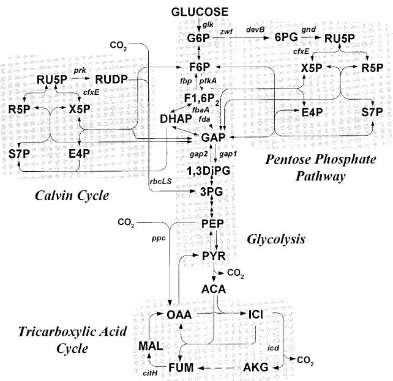
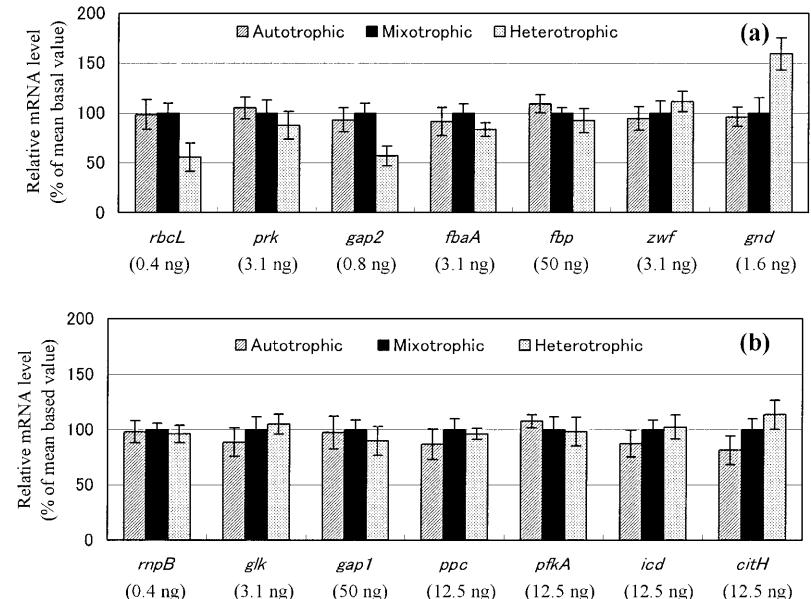
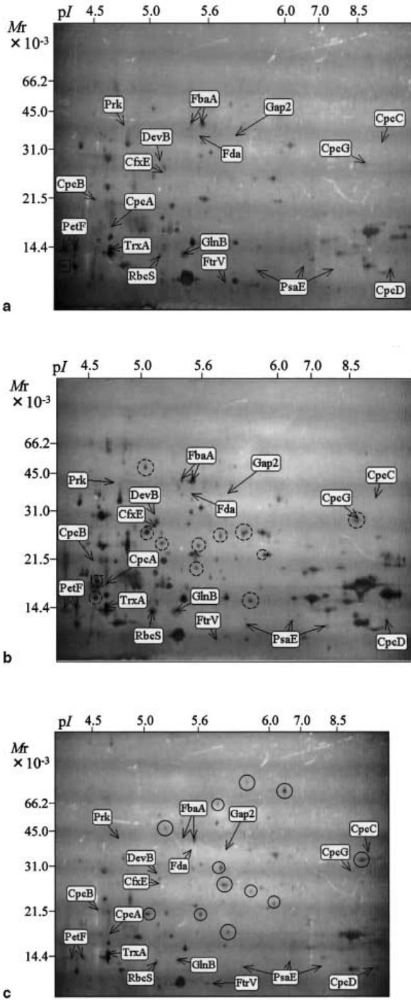
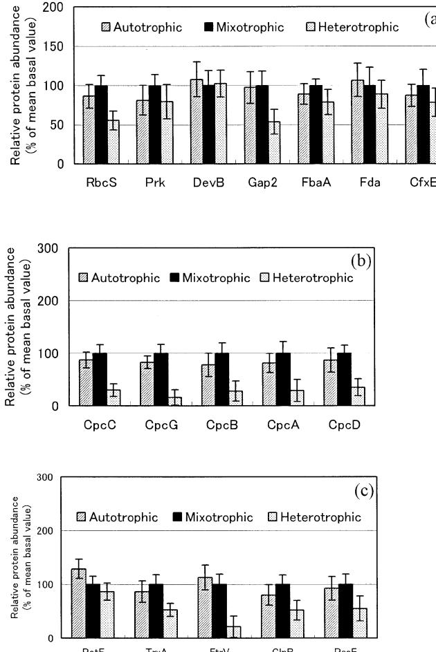
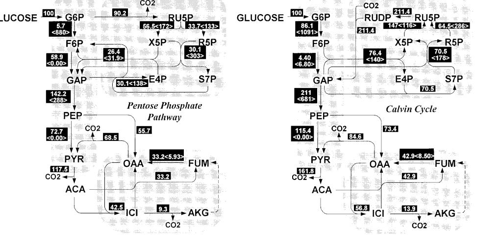

#### ORIGINAL PAPER

**C. Yang · Q. Hua · K. Shimizu**

#### Integration of the information from gene expression and metabolic fluxes for the analysis of the regulatory mechanisms in Synechocystis

Received: 7 November 2001 / Revised: 30 December 2001 / Accepted: 11 January 2002 / Published online: 15 March 2002 © Springer-Verlag 2002

**Abstract** *Synechocystis* was grown under autotrophic, mixotrophic and heterotrophic conditions, and the gene expression patterns at the mRNA and protein levels were measured by using semi-quantitative RT-PCR and twodimensional electrophoresis (2DE), respectively. Moreover, the intracellular metabolic flux distributions in *Synechocystis* grown under different trophic conditions were also determined using the carbon isotope labeling technique. By combining the information obtained from the transcript levels, protein abundance and metabolic fluxes, the regulatory mechanisms of some enzymes involved in the central metabolism of *Synechocystis* during growth in the different culture conditions were analyzed. It was found that depending on the energy source available to cyanobacterial cells, the enzymes required for central metabolism were differently regulated according to different mechanisms. The expression of several genes, such as *rbcLS* and *gap2*, was light-regulated transcriptionally, while the gene *gnd* was regulated in response to an apparent flux requirement but by an unknown mechanism. The expression of other genes was independent of the presence of light. The reactions catalyzed by G6PDH, Fbp, PfkA and FbaA were not regulated through enzyme synthesis but by a change in metabolite concentrations. The enzyme PrK was post-translationally regulated by light, probably through the operation of ferredoxin/thioredoxin system. For the enzyme RubisCO, both transcriptional and post-translational regulation was observed. These findings demonstrate that the information obtained from the analysis of mRNA expression, protein expression, and metabolic flux distribution is necessary to understand the regulatory events in complex cellular networks.

C. Yang · K. Shimizu (✉) Department of Biochemical Engineering and Science, Kyushu Institute of Technology, Iizuka, Fukuoka 820–8502, Japan e-mail: shimi@bse.kyutech.ac.jp Tel.: +81-948-297817, Fax: +81-948-297801

C. Yang · Q. Hua · K. Shimizu Institute of Advanced Biosciences, Keio University, Tsuruoka, Yamagata 997–0017, Japan

## Introduction

With the growing availability of the complete genome sequence for many organisms, a challenge in the life science is to relate linear sequence information to nonlinear cellular phenotypes (Oliver et al. 1998; Shuler 1999). Toward this end, significant scientific effort is being made to develop efficient monitoring and analysis methods for mRNA and protein expressions. Novel and powerful technologies have thus been developed that permit high-throughput analysis of gene expression at the mRNA level (e.g., DNA microarrays) (DeRisi et al. 1997). At the same time, PCR amplification following a reverse transcription step (RT-PCR) has been applied to detect differential transcript levels on a small scale (Akiyama et al. 1996; Arcellana-Panlilio and Schultz 1993). Quantitative analysis of the transcript levels of genes under a variety of genetic and environmental conditions is a powerful tool in the elucidation of gene function and regulation. On the other hand, the field of proteomics, which analyzes global patterns of gene expression at the protein level, is also growing rapidly (Anderson and Anderson 1998; Haynes et al. 1998). In proteome studies, two-dimensional electrophoresis (2DE) is the most efficient way of separating complex protein mixtures (O'Farrell 1975). The quantitative study of global changes in protein expression using 2DE together with image analysis enables the direct determination of protein abundance and the detection of some post-translational modifications due to a shift in mobility in 2D gels (Blackstock and Weir 1999). It has been widely proposed that the characterization of protein synthesis by proteomic analysis can make significant contributions to the global analysis of gene expression and complement the analysis of mRNA expression (Celis et al. 2000).

As such, the high-throughput analyses of mRNA and protein expression offer a vast amount of information on gene expression patterns. However, such analyses are not sufficient for the description of the cellular phenotype, since they do not provide direct information about cellular metabolism and physiology which is fundamental to understanding the cells' behavior. Physiological processes reflect dynamically and exactly the state of biological cell systems, responding to growth stage, environmental conditions and genetic perturbations. It is known that cellular systems are modulated at several levels, not only at the mRNA and protein level, but also at metabolic and physiological levels. Hence, the cellular phenotype should be analyzed systematically at each level to capture the essence of the interactions in complex networks.

Physiological characterization of an organism can be attained by quantifying the fluxes of all of the metabolic reactions that occur in the organism (Stephanopoulos 1999). A powerful methodology to dermine metabolic pathway fluxes is metabolic flux analysis, whereby intracellular fluxes are calculated based on metabolite balancing. Recently, the introduction of the carbon isotope labeling technique has enabled a more refined analysis of intracellular fluxes for a more detailed metabolic network (Marx et al. 1996; Szyperski 1995). Since metabolic flux analysis provides a detailed description of the cellular physiology, this method, in combination with gene expression analysis at the transcript and protein levels, can be used to analyze the complex genotype-phenotype relationship of biological systems. Very little research has been carried out so far from such a viewpoint.

In the present work, we used semi-quantitative RT-PCR and 2DE to investigate gene expression patterns at the mRNA and protein level for *Synechocystis* sp. PCC6803 grown under autotrophic, mixotrophic and heterotrophic conditions. Moreover, we quantified the intracellular metabolic fluxes in *Synechocystis* under different trophic conditions by using the carbon isotope labeling technique. By combining the information obtained from the transcript levels, protein abundance and metabolic fluxes, the regulatory mechanisms of some enzymes involved in the central metabolism of *Synechocystis* grown in the different trophic cultures were analyzed.

## Materials and methods

#### Culture conditions

The cyanobacterium *Synechocystis* sp. PCC6803 was used in this study. The mineral culture medium used was BG-11 supplemented with 30 mM of HEPES (Rippka et al. 1979). The media under the heterotrophic and mixotrophic conditions contained 5 mM glucose. For the labeling experiments, the media contained 90% unlabeled glucose and 10% uniformly labeled [U-13C]glucose.

The cyanobacterial cells were activated by inoculating a loop of a plate culture into 200 ml of BG-11 medium and pre-cultivating the cells under continuous illumination at 30 °C for 4 days. The main cultivation was performed using a 2-l jar fermentor (M-100, Rikakikai, Tokyo) with 1 l of medium. Temperature and pH were held constant at 30 °C and 7.5, respectively. The culture was aerated with filter-sterilized air at 0.2 vvm. Atmospheric carbon dioxide was removed in the labeling experiments by leading the aeration air through a washing flask containing 2 N NaOH. A CO2/O2 gas analyzer (LX-750, Iijima Electronics MFC, Tokyo) was used to measure the carbon dioxide/oxygen concentrations in the exhaust gas. The fermentor was illuminated by one circular cool-white 32-W fluorescent lamp (light intensity:125 µmol/m2/s at the surface of the fermentor) in the autotrophic and mixotrophic

cultures, while in the heterotrophic culture the fermentor was wrapped with aluminum foil.

Cell growth was monitored by measuring the optical density at 730 nm (OD730). For the determination of dry cell weight, duplicate samples of the culture were washed with 0.5 M HCl, rinsed with distilled water, and dried overnight at 85 °C. The glucose concentration in the culture broth was determined with a glucose kit (Boehringer Mannheim Chemicals, Tokyo).

#### RNA isolation and semi-quantitative RT-PCR

Total RNA was isolated from *Synechocystis* by a combination of different standard techniques with the RNeasy Midi Kit from Qiagen (Boison et al. 2000). One hundred ml of cells in mid-exponential phase (OD730=0.6) were harvested by centrifugation (4,000 g, 10 min, 4 °C), and resuspended in 1 ml TE buffer. After addition of 4 ml RLT buffer from the RNeasy Kit (supplemented with βmercaptoethanol), the cells were vortexed extensively and placed on ice. Lysis was completed by incubating in 4 ml prewarmed acidic phenol (65 °C, 10 min) and vortexing. After addition of 0.8 ml chloroform/isoamylalcohol and vortexing, the preparation was centrifuged and extracted again with 4 ml chloroform/isoamylalcohol. The supernatant was purified with the columns of the RNeasy Kit according to the manufacturer's protocol. The isolated RNA was then further purified with DNase digestion by using the RNase-free DNase set (Qiagen). The quantity and purity of the RNA were determined by optical density measurements at 260 and 280 nm and by 1% formaldehyde agarose-gel electrophoresis.

The primers used were based on sequences available in Cyanobase (http://www. kazusa.or.jp/cyano/cyano.html) and were synthesized at GENSET KK (Kyoto, Japan). RT-PCR reactions were carried out in a TaKaRa PCR Thermal Cycler (TaKaRa TP240, Japan) using an mRNA Selective PCR Kit (TaKaRa, Japan), which performs the PCR reaction at a low denaturating temperature to prevent the amplification of genomic DNA. The reaction mixture was incubated for 15 min at 50 °C for the RT reaction and then subjected to 25 cycles of amplification, which consisted of a denaturating step (85 °C, 1 min), an annealing step (45 °C, 1 min) and an extension step (72 °C, 1 min). To check for contaminating genomic DNA, RT-PCR was performed on RNA without AMV-reverse transcriptase (data not shown). Five microliters of amplified products were run on a 1.2% agarose gel. Gels were stained with 1 µg/ml of ethidium bromide, photographed using a Digital Image Stocker (DS-30, FAS III, Toyobo, Osaka, Japan) under UV light, and analyzed using Adobephotoshop and Gel-Pro Analyzer 3.1 (Toyobo, Osaka, Japan) softwares.

Although the PCR products obtained for all the genes had the predicted sizes on agarose gel, the identity of amplified fragments of some genes was demonstrated by DNA sequencing (data not shown). In order to determine the optimal amount of input RNA, the two-fold diluted template RNA was amplified in RT-PCR assays under identical reaction conditions to construct a standard curve for each gene product. When the optimal amount of input RNA was determined for each gene product, RT-PCR was carried out under identical reaction conditions to detect differential transcript levels of genes in the different trophic cultures. The gene *rnpB* (RNaseP), which encodes the RNA subunit of ribonuclease P and is not subjected to variable expression under different trophic conditions, was used as an internal control in the RT-PCR determinations.

Protein sample preparation and two-dimensional electrophoresis

Five hundred ml of cyanobacterial cells in the mid-exponential phase (OD730=0.6) were harvested by centrifugation, and suspended in 0.1 ml of chloroform containing 0.07% β-mercaptoethanol. After incubation of the cell suspension in liquid nitrogen for 5 min, 1 ml of acetone containing 10% trichloroacetic acid and 0.07%β-mercaptoethanol was added (Damerval et al. 1986; Sazuka and Ohara 1997). The cell suspension was kept at –20 °C for 1 h. After a 15-min centrifugation at 19,000 *g*, the supernatant was removed and the pellet was rinsed for 1 h at –20 °C with 1 ml of cold acetone containing 0.07% β-mercaptoethanol. The rinsing solution was then removed and the pellet was dried under vacuum for 1 h. The resultant powder was dissolved in 0.1 ml of a solution containing 9 M urea, 4% CHAPS, 2% β-mercaptoethanol, 2% IPG buffer (pH 3–10 nonlinear gradient (NL), Pharmacia, Sweden), and 0.01% bromophenol blue. The mixture was centrifuged at 19,000 *g* for 10 min and the supernatant was subjected to gel electrophoresis.

Gel electrophoresis in the first dimension was carried out using an immobilized pH gradient gel (pH 3–10, NL, Pharmacia, Sweden). The first-dimension gel was rehydrated overnight with a buffer consisting of 8 M urea, 2% CHAPS, 10 mM dithiothreitol, 2% IPG buffer (pH 3–10 NL, Pharmacia, Sweden), and 0.001% Orange G. The rehydrated gel strips were then placed on the cooling plate of the Multiphor II electrophoresis system (Pharmacia, Sweden). Samples containing 600 µg of protein were applied to the sample cups close to the anode end of the strip. The samples were run at 15 °C for a total of 45,750 Vh. The voltage was maintained at 500 V for the first 5 h, then ramped linearly from 500 to 3,500 V during the next 5 h, and finally maintained at 3,500 V for a subsequent 9.5 h using an EPS 3501 XL power supply (Pharmacia, Sweden). After completion of the isoelectric focusing step, the strips were equilibrated for 10 min in a solution containing 50 mM Tris-HCl (pH 6.8), 6 M urea, 0.25% dithiothreitol, 30% glycerol, and 1% SDS, and subsequently for 10 min in a solution containing 50 mM Tris-HCl (pH 6.8), 6 M urea, 4.5% iodoacetamide, 30% glycerol, 1% SDS and a few grains of bromophenol blue. Equilibrated gel strips were applied to a precasted SDS gradient gel (ExcelGel SDS XL 12–14, Pharmacia, Sweden) for electrophoresis in the second dimension on the Multiphor II electrophoresis system. Running conditions were set at 1,000 V/20 mA for 45 min followed by 1,000 V/40 mA for 160 min according to the manufacturer's instructions. In order to estimate the p*I* and *M*r of each of the cyanobacterial proteins, marker proteins (SDS-PAGE standards and 2D standards from Bio-Rad, CA) were separated both in parallel gels and in the same gel by comigrating with cyanobacterial proteins. After electrophoresis in the second dimension, the protein spots were silver-stained by using a Hoefer Automated Gel Stainer (Pharmacia, Sweden) and a protein silver staining kit (Pharmacia, Sweden).

Computer-assisted gel analysis was performed on images captured with a Digital Image Stocker (DS-30, FAS III, Toyobo, Osaka, Japan) and processed with Adobephotoshop software. Image-Master 2D Elite (Pharmacia, Sweden) was used for finding protein spots, analyzing gels, and quantifying particular spots of interest. The Cyano2D database (http://www.kazusa.or.jp/tech/sazuka/ cyano/proteome.html) was used for spot identification (Sazuka et al. 1999). An estimate of relative quantitative changes was made on the basis of the change in the fraction of the volume of an individual protein relative to the volumes of all proteins detected in the gels. To check the reproducibility and to estimate standard deviations, protein samples were analyzed in duplicate 2D gels.

#### Labeling measurements

In the labeling experiments, 13C-labeled cyanobacterial cells were harvested in mid-exponential phase (OD730=0.6), and hydrolyzed in 6 M HCl at 105 °C for 18 h. The labeling patterns of the amino acids in biomass hydrolysates were analyzed using nuclear magnetic resonance (NMR) spectroscopy and gas chromatography/mass spectrometry (GC-MS). For NMR analysis, the dried biomass hydrolysate was dissolved in 600 µl of 0.1 M deuterium chloride (DCl) in D2O. NMR measurements were performed at a 13C resonance frequency of 100.6 MHz using a spectrometer (AVANCE 400S, Bruker Co., Germany). Proton-detected twodimensional 1H-13C heteronuclear multiple-quantum-correlation (HMQC) spectra were recorded. The applied pulse sequence provide decoupling of the 1H-13C scalar couplings in both dimensions. Pulse-field gradients were employed for coherence pathway injection. The resulting data size before zero-filling was 256 points in *t*1 and 2,048 points in *t*2. The degree of coupling between adjacent 13C nuclei was measured using the Bruker XWINNMR software.

For the GC-MS measurement, the dried biomass hydrolysate was derivatized with ethylchloroformate (Christensen and Nielsen 1999). GC-MS was carried out using a Shimadzu GC-14A gas chromatograph equipped with a Chrompack CBP-1 column (25 m×0.25 mm×0.25 µm, Varian, Calif.) directly connected to a QP-2000 quadrupole mass spectrometer (Shimadzu, Japan). Helium was used as carrier gas to maintain the pressure of the column at 200 kPa. The oven temperature was initially held at 130 °C for 3 min, then raised to 260 °C at 40 °C/min, and finally held at 260 °C for 5.75 min. The mass spectrometer was operated in selected ion monitoring (SIM) mode.

## Results

Using semi-quantitative RT-PCR, the relative expression levels of mRNA for the autotrophic, mixotrophic and heterotrophic cultures of *Synechocystis* were evaluated. Besides the housekeeping gene *rnpB*, the transcript levels of 13 genes in the central carbon metabolic pathways (Fig. 1) were detected. The results are shown in Fig. 2. Compared to the mixotrophic condition, the mRNA levels of all the genes were not regulated significantly during autotrophic growth. In the heterotrophic culture, most gene transcripts were roughly unchanged, while the *gnd* gene was up-regulated about 60% and the genes *rbcL* and *gap2* were down-regulated about two-fold. To check the reliability of the obtained data, the transcript levels of the gene *gap2* were compared with literature data that used *cat* transcriptional fusions for monitoring expression levels (Figge et al. 2000). It was found that the RT-PCR data were consistent with the data from the reporter gene.

**Fig. 1** The central metabolic pathway genes of *Syenchocystis* investigated in this study

816

**Fig. 2** The transcript levels of **a** the genes in Calvin cycle and pentose phosphate pathway and **b** other genes in the autotrophic and heterotrophic cultures relative to those in the mixotrophic culture. The densitometry data are representative of six experiments (mean±SE). *Numbers in parentheses* give the amounts of input RNA used for RT-PCR measurements

The protein expression profiles of *Synechocystis* grown under different trophic cultures were analyzed by 2DE. To compare the relative expression levels of cellular proteins, the same amount of proteins was loaded on 2D gels. As shown in Fig. 3, the protein expression pattern under the autotrophic condition was very similar to that in the mixotrophic condition. That is, the presence of an organic carbon source, glucose, did not significantly alter the protein expression profiles. However, when the protein expression patterns of *Synechocystis* grown in heterotrophic and mixotrophic cultures were compared, it was found that the availability of light energy affected the expression of a great variety of cellular proteins. Many proteins were induced or repressed by light; the most significantly light-affected protein spots are shown in Fig. 3. Since the protein spots resolved in 2D gels are usually high-abundance proteins, our results also suggest that a major part of the abundant proteins in cyanobacterial cells is involved in photosynthesis or other light-related metabolic processes.

Figure 4 shows the relative quantitative change for each protein spot of interest for the different cultures. For the investigated protein spots, the presence of overlapping and comigrating spots was not significant. Since some proteins give multiple spots, the contribution from each spot was summed to give the total amount of protein. Compared to their abundance under the mixotrophic condition, enzymes including FbaA, DevB, CfxE, Prk, Fda were not affected significantly under the heterotrophic condition, while the synthesis of RbcS and Gap2 was down-regulated about two-fold. In addition, the phycobilisome component proteins CpcC, CpcG, CpcB, CpcA and CpcD were down-regulated three- to six-fold in the heterotrophic culture. The protein level of ferredoxin (PetF) was almost unchanged, while the synthesis of proteins including thioredoxin (TrxA), ferredoxinthioredoxin reductase (FtrV), nitrogen regulatory protein P-II (GlnB) and photosystem I subunit IV (PsaE) was decreased two- to five-fold in the dark.

The intracellular flux distributions in *Synechocystis* were then determined in carbon isotope labeling experiments. Cyanobacterial cells grown on 13C-labeled glucose were harvested from the heterotrophic and mixotrophic cultures, and the labeling patterns of the amino acids in biomass hydrolysate were analyzed by two-dimensional NMR spectroscopy and GC-MS. The NMR and MS measurement data are shown in Tables 1 and 2.

In order to determine the intracellular fluxes, a biochemical reaction network was assembled for *Synechocystis*. The network reactions in the central metabolism were constructed based on the established biochemistry described in the literature (Smith 1983; Tabita 1994), on the Internet-accessible genome database of this organism, and on our experimental data. Figure 5 shows the reaction networks of central carbon metabolism in *Synechocystis* grown heterotrophically and mixotrophically. The pentose phosphate pathway operates in the heterotrophic culture; however, in the mixotrophic culture, the evolution of CO2 was decreased to near zero. Moreover, the 2D NMR data showed that the carbon-bond cleavage of C2-C3 and C3-C4 of histidine increased significantly under the mixotrophic condition (see Table1). This is due to the action of the Calvin cycle, which results in the cleavage of each carbon bond of the intermediates of this pathway. The operation of the Calvin cycle under the light condition was also reported by Pelroy and Bassham (1972). The glycolytic pathway was included in the network because the genes for all enzymatic steps of glycolysis have been found in the *Synechocystis* genome.

The biomass yields on glucose were 0.50 g dry weight (DW)/g glucose in the heterotrophic culture and 0.87 g DW/g glucose in the mixotrophic culture, respectively. Since substrate uptake and biomass effluxes were directly measured in this study, the metabolite balances

**Fig. 3** Protein expression profiles of *Synechocystis* grown in the **a** autotrophic, **b** mixotrophic, and **c** heterotrophic cultures. The annotations refer to the protein spots investigated in this study. The squares indicate the protein spots that are significantly up-regulated (*solid square*) and down-regulated (*dashed square*) in the autotrophic culture as compared to the mixotrophic culture. The circles indicate the protein spots that are significantly up-regulated (*solid circle*) and down-regulated (*dashed circle*) in the heterotrophic culture as compared to the mixotrophic culture

**Fig. 4** The abundances of **a** central metabolic pathway proteins, **b** phycocyanin proteins, and **c** other proteins in the autotrophic and heterotrophic cultures relative to those in the mixotrophic culture. Protein spots were separated by 2DE, and spot intensities were quantified and normalized from the integration of spot optical intensity over the spot area by using the ImageMaster 2D Elite software. *Error bars* Standard deviations

leave two degrees of freedom for net fluxes. As the free net fluxes, we have chosen the flux through the glucose-6-phosphate dehydrogenase and the gluconeogenic flux of malic enzyme for the heterotrophic culture, and the flux through the ribulose bisphosphate carboxylase and the gluconeogenic flux of malic enzyme for the mixotrophic culture. The set of free fluxes was completed by all the exchange coefficients of reaction steps that are assumed to be bidirectional. Free net fluxes and exchange coefficients were then estimated with a parameter fitting approach. That is, similar to conventional metabolite balancing, balances were taken around all isotopomers of a particular metabolite using the isotopomer mapping matrix method of Schmidt et al. (1999). A mathematical framework relating intracellular fluxes with isotopomer measurements was then developed based on the metabolite and isotopomer balances. The free fluxes can thus be estimated by the least-squares parameter fitting approach to find the set of fluxes that reproduce all the measured fluxes and labeling data.

termined from the 2D 1H-13C NMR spectra of the amino acids in biomass hydrolysates of *Synechocystis*

| Carbon position |      | Heterotrophic condition |      |      |      | Mixotrophic condition |      |      |
|-----------------|------|-------------------------|------|------|------|-----------------------|------|------|
|                 | S    | D1                      | D2   | DD   | S    | D1                    | D2   | DD   |
| α-Ala           | 0.19 | 0.06                    | 0.18 | 0.57 | 0.39 | 0.31                  | 0.14 | 0.16 |
| β-Ala           | 0.33 | 0.67                    | –    | –    | 0.46 | 0.54                  | –    | –    |
| α-Asp           | 0.26 | 0.15                    | 0.29 | 0.30 | 0.37 | 0.30                  | 0.24 | 0.09 |
| β-Asp           | 0.29 | 0.39                    | 0.28 | 0.04 | 0.40 | 0.28                  | 0.21 | 0.11 |
| α-Glu           | 0.19 | 0.42                    | 0.36 | 0.03 | 0.39 | 0.26                  | 0.22 | 0.13 |
| β-Glu           | 0.54 | 0.39                    | –    | 0.07 | 0.51 | 0.42                  | –    | 0.07 |
| γ-Glu           | 0.26 | 0.61                    | 0.02 | 0.11 | 0.43 | 0.52                  | 0.02 | 0.03 |
| α-Gly           | 0.37 | 0.63                    | –    | –    | 0.70 | 0.30                  | –    | –    |
| β-His           | 0.24 | 0.42                    | 0.05 | 0.29 | 0.51 | 0.19                  | 0.01 | 0.29 |
| δ2-His          | 0.63 | 0.37                    | –    | –    | 0.53 | 0.47                  | –    | –    |
| α-Ile           | 0.27 | 0.02                    | 0.61 | 0.10 | 0.63 | 0.04                  | 0.29 | 0.04 |
| γ2-Ile          | 0.35 | 0.65                    | –    | –    | 0.44 | 0.56                  | –    | –    |
| δ-Ile           | 0.58 | 0.42                    | –    | –    | 0.69 | 0.31                  | –    | –    |
| α-Leu           | 0.23 | 0.07                    | 0.56 | 0.14 | 0.31 | 0.04                  | 0.56 | 0.09 |
| β-Leu           | 0.82 | 0.15                    | –    | 0.03 | 0.85 | 0.14                  | –    | 0.01 |
| δ1-Leu          | 0.38 | 0.62                    | –    | –    | 0.40 | 0.60                  | –    | –    |
| δ2-Leu          | 0.91 | 0.09                    | –    | –    | 0.86 | 0.14                  | –    | –    |
| β-Lys           | 0.22 | 0.65                    | –    | 0.13 | 0.34 | 0.65                  | –    | 0.01 |
| δ-Lys           | 0.24 | 0.70                    | –    | 0.06 | 0.35 | 0.55                  | –    | 0.10 |
| ε-Lys           | 0.43 | 0.57                    | –    | –    | 0.51 | 0.49                  | –    | –    |
| α-Phe           | 0.11 | 0.07                    | 0.02 | 0.80 | 0.27 | 0.47                  | 0.07 | 0.19 |
| β-Phe           | 0.14 | 0.62                    | 0.07 | 0.17 | 0.19 | 0.74                  | 0.03 | 0.04 |
| α-Pro           | 0.21 | 0.42                    | 0.27 | 0.10 | 0.41 | 0.27                  | 0.23 | 0.09 |
| β-Pro           | 0.56 | 0.33                    | –    | 0.09 | 0.53 | 0.46                  | –    | 0.01 |
| γ-Pro           | 0.27 | 0.69                    | –    | 0.04 | 0.38 | 0.50                  | –    | 0.12 |
| β-Ser           | 0.58 | 0.42                    | –    | –    | 0.56 | 0.44                  | –    | –    |
| δx-Tyr          | 0.19 | 0.78                    | –    | 0.03 | 0.19 | 0.80                  | –    | 0.11 |
| α-Val           | 0.22 | 0.02                    | 0.63 | 0.13 | 0.52 | 0.08                  | 0.36 | 0.04 |
| γ1-Val          | 0.36 | 0.64                    | –    | –    | 0.42 | 0.58                  | –    | –    |
| γ2-Val          | 0.87 | 0.13                    | –    | –    | 0.85 | 0.15                  | –    | –    |

**Fig. 5** In vivo flux distributions in the central metabolism of *Synechocystis* sp. PCC6803 cultivated **a** heterotrophically and **b** mixotrophically. The flux distributions were obtained from the best fit to all the available measurement data. Numbers in *dark gray boxes* state the estimated net fluxes ( ), and the exchange fluxes in bidirectional reactions ( ) are given in *angled brackets*. All net fluxes are expressed as a percentage of the glucose uptake rate, which was 0.85 mmol/g cdw/h in the heterotrophic culture and 0.38 mmol/g cdw/h in the mixotrophic culture

By using the nonlinear least-squares fitting approach, a series of flux estimations was made using different sets of starting values. Reproducible results for the entire flux distributions were obtained independent of starting values. The net fluxes and exchange coefficients of the bestfit flux distributions are given in Fig. 5. It was found that in the heterotrophic culture the pentose phosphate pathway was the major pathway of glucose catabolism, and glucose-6-phosphate dehydrogenase and 6-phosphoglunate dehydrogenase were active in glucose oxidation. However, in the mixotrophic culture, the Calvin cycle fixed CO2, and the two unique enzymes (ribulose-bis-

| Table                                  | malized to their sum 2              | Mass isotopomer distribution of ECF-derivatized amino acids as determined by GC- |                                                    |                                                    |                                                    |                                           |                         |       |       |       |                                        |                                        | MS. Data were obtained after all                   |                                                    |                                                    | MS peaks corresponding to one compound were nor    |                                           |                         |       |       |       |
|----------------------------------------|----------------------------------------|----------------------------------------------------------------------------------|----------------------------------------------------|----------------------------------------------------|----------------------------------------------------|-------------------------------------------|-------------------------|-------|-------|-------|----------------------------------------|----------------------------------------|----------------------------------------------------|----------------------------------------------------|----------------------------------------------------|----------------------------------------------------|-------------------------------------------|-------------------------|-------|-------|-------|
|                                        | Heterotrophic condition                |                                                                                  |                                                    |                                                    |                                                    |                                           |                         |       |       |       | Mixotrophic condition                  |                                        |                                                    |                                                    |                                                    |                                                    |                                           |                         |       |       |       |
| Amino Ion acid                      | cluster                                | m                                                                                | m+1                                                | m+2                                                | m+3                                                | m+4                                       | m+5                     | m+6   | m+7   | m+8   | Amino acid                          | cluster Ion                         | m                                                  | m+1                                                | m+2                                                | m+3                                                | m+4                                       | m+5                     | m+6   | m+7   | m+8   |
| Asp Gly Ala Ile               | 188 102 175 158 116        | 0.842 0.762 0.886 0.644 0.861                                        | 0.093 0.164 0.114 0.065 0.201          | 0.064 0.074 0.128 0.065                   | 0.010 0.020                                     | 0.007                                     | 0.001                   |       |       |       | Asp Gly Ala Ile               | 116 188 102 175 158        | 0.845 0.759 0.892 0.844 0.638          | 0.164 0.108 0.106 0.208 0.091          | 0.064 0.075 0.050 0.124                   | 0.002 0.022                                     | 0.008                                     | 0.000                   |       |       |       |
| Leu Phe Thr Lys Pro Val | 158 156 192 142 146 144 | 0.639 0.645 0.586 0.706 0.725 0.761                               | 0.185 0.156 0.164 0.130 0.201 0.161 | 0.140 0.066 0.125 0.114 0.135 0.131 | 0.027 0.064 0.010 0.012 0.010 0.021 | 0.008 0.006 0.034 0.006 0.000 | 0.000 0.002 0.014 | 0.006 | 0.000 | 0.000 | Leu Phe Thr Lys Pro Val | 158 156 192 142 146 144 | 0.640 0.636 0.754 0.704 0.615 0.693 | 0.209 0.232 0.146 0.188 0.156 0.175 | 0.124 0.084 0.107 0.089 0.100 0.111 | 0.016 0.035 0.025 0.011 0.001 0.021 | 0.010 0.000 0.012 0.082 0.001 | 0.016 0.001 0.001 | 0.005 | 0.000 | 0.000 |
|                                        |                                        |                                                                                  |                                                    |                                                    |                                                    |                                           |                         |       |       |       |                                        |                                        |                                                    |                                                    |                                                    |                                                    |                                           |                         |       |       |       |

**Table 3** Changes in transcript levels, protein abundance and metabolic fluxes of *Synechocystis* in the autotrophic (*A*) and heterotrophic (*H*) cultures compared to those in the mixotrophic (*M*) culture. Metabolic fluxes were expressed as the ratio of the absolute value of the fluxes in the heterotrophic and mixotrophic cultures. For the bidirectional reactions, the fluxes were separated for the forward and backward directions

|                                                                   | Transcript ratio                                          |                                                           | Protein ratio                                     | Flux ratio                                        |                                                      |
|-------------------------------------------------------------------|-----------------------------------------------------------|-----------------------------------------------------------|---------------------------------------------------|---------------------------------------------------|------------------------------------------------------|
|                                                                   | A vs M                                                    | H vs M                                                    | A vs M                                            | H vs M                                            | H vs M                                               |
| Gene                                                              |                                                           |                                                           |                                                   |                                                   |                                                      |
| rbcLS prk zwf devB gnd gap2 gap1 fbp pfkA | 1.0 1.1 0.9 – 1.0 0.9 0.9 1.1 1.1 | 0.5 0.9 1.1 – 1.6 0.5 0.9 0.9 1.0 | 0.9 0.8 – 1.1 – 1.0 – – – | 0.5 0.8 – 1.0 – 0.5 – – – | 0 0 8 8 8 1.00 1.14 0 12.7   |
| fbaA fda glk cfxE ppc icd citH                  | 0.9 – 0.9 – 0.9 0.9 0.8                 | 0.8 – 1.1 – 1.0 1.0 1.1                 | 0.9 1.1 0.9 – – –                  | 0.8 0.9 0.8 – – –                  | 12.7 12.7 2.24 2.00 1.70 1.56 1.78 |

phosphate carboxylase and phosphoribulokinase) of the Calvin cycle were activated. Indeed, many reactions of the Calvin cycle and the pentose phosphate pathway are the same, but in the reverse direction. Since flux analysis by isotope labeling enables both flux directions of bidirectional steps to be quantitated, the fluxes of bidirectional reactions can be separated for the forward and backward directions that are catalyzed by different enzymes (e.g., phosphofructokinase and fructose-1,6-bisphosphatase). The in vivo activity of fructose-1,6-bisphosphatase was identified in the mixotrophic culture.

# Discussion

By using semi-quantitative RT-PCR and 2DE, the gene expression patterns at the mRNA and protein levels were analyzed for *Synechocystis* cultivated under autotrophic, mixotrophic and heterotrophic conditions. Moreover, the in vivo metabolic flux distributions in *Synechocystis* grown under different trophic conditions were obtained by using the carbon isotope labeling technique. By combining the information obtained from the mRNA levels, protein abundance and metabolic fluxes, a meaningful description of the regulatory events involved in the different cultures of *Synechocystis* can be developed. Here, the regulatory mechanisms of some enzymes involved in central metabolism were analyzed based on integration of all the available information (Table 3).

## *rbcLS*

The enzyme involved in CO2 fixation in the Calvin cycle, ribulose bisphosphate carboxylase/oxygenase (RubisCO), is encoded by large (*rbcL*) and small (*rbcS*) subunit genes that form an operon and are part of a single transcriptional unit (Mohamed and Jansson 1989). From Fig. 2, it can be seen that the transcript level of *rbcLS* decreased in the heterotrophic culture. From the 2D gels, the abundance of the S subunits (RbcS) was determined (Fig. 4). RbcS represents the protein expression level of the whole enzyme, since after cotranscription and translation of both subunit genes the polypeptide (in the form of L8S8) is assembled immediately into a stable holoenzyme (Tabita 1994). As shown in Table 3, the relative protein abundance was consistent with the transcript levels of the gene *rbcLS* in the different cultures. Hence, the expression of *rbcLS* was transcriptionally regulated by light so that synthesis of the enzyme decreased about two-fold in darkness. However, based on the change in fluxes, it was found that transcriptional regulation alone was not enough, and an additional regulatory mechanism was required to inactivate the synthesized enzyme in the heterotrophic culture (see Table 3). Therefore, besides transcriptional regulation, the activity of RubisCO is also subjected to post-translational regulation. Both regulatory mechanisms lead to an immediate cessation of CO2 fixation during light-dark transitions. Indeed, it was reported that RubisCO must be activated to form an enzyme complex before it becomes functional, and some metabolites that accumulate in the dark effectively inhibit the activation of cyanobacterial RubisCO (Tabita 1994).

### *prk*

In the three cultures, the mRNA levels of the gene *prk* were similar, and the protein abundance was also roughly unchanged. In contrast, a significant difference in the flux was observed in the absence of light energy (Table 3). This indicated that regulation of flux through phosphoribulokinase (PRK) was exerted after synthesis of the enzyme. This result is consistent with other studies, which suggested that cyanobacterial PRK was probably post-translationally controlled by light and the ferredoxin/thioredoxin system, similar to in plant cells (Marsden and Codd 1984).

The protein levels of the components of the ferredoxin/thioredoxin system were detected by using 2D gels. As shown in Fig. 4, the synthesis of thioredoxin (TrxA) was decreased about two-fold. The synthesis of ferredoxin (PetF) was not affected significantly, while ferredoxinthioredoxin reductase (FtrV) was down-regulated about five-fold in the darkness (Fig. 4). Therefore, the absence of light energy probably resulted in the cessation of the ferredoxin/thioredoxin system, whereas this system was triggered by light to recognize and reduce the specific disulfide bond of PRK for enzyme activation.

The transcript levels of the gene *zwf* were roughly unchanged under the different trophic conditions (Fig. 2). Although the abundance of glucose-6-phosphate dehydrogenase (G6PDH) was not determined from the 2D gels, the protein spot for the enzyme catalyzing the neighboring reaction, DevB, was identified (see Fig. 3). The synthesis of DevB was not affected significantly for the three cultures. However, the flux through G6PDH and DevB was activated in the heterotrophic culture (Table 3). Thus, it appears that regulation of the flux through G6PDH and DevB was accomplished after the synthesis of these enzymes. This is in agreement with the results of Sundaram et al. (1998), who reported that G6PDH activity is regulated by metabolites.

#### *gnd*

The mRNA expression level of the gene *gnd* was up-regulated about 60% in darkness (Fig. 2). From a flux regulation standpoint, the increase was not surprising. Although the underlying molecular mechanism remains to be elucidated, *gnd* is known to be regulated on the mRNA level according to growth phase (Broedel and Wolf 1991).

#### *gap2* and *gap1*

*Synechocystis* harbors two *gap* genes encoding distinct glyceraldehyde-3-phosphate dehydrogenase enzymes, which appear to be essential for catabolic glucose degradation (*gap1*) and in both the Calvin cycle and gluconeogenesis (*gap2*) (Fig. 1). From the amounts of total RNA required in RT-PCR experiments (Fig. 2), it can be seen that *gap2* mRNA of was more abundant than *gap1* transcripts. The mRNA and protein expression levels for *gap2* were decreased about two-fold in the heterotrophic culture (see Figs. 22 and 4). This is in accordance with the report of Figge et al. (2000), who found that the abundance of *gap2* transcripts is regulated by trophic conditions. The abundance of *gap1* transcripts was not affected significantly, which is consistent with the flux data (see Table 3).

#### *fbp* and *pfkA*

Fructose-1,6-bisphosphatase (FBPase), encoded by the gene *fbp*, is an important enzyme involved in gluconeogenesis and the Calvin cycle. The FBPase in cyanobacteria also showed sedoheptulose-1,7-bisphosphatase (SBPase) activity. From Table 3, it can be seen that the transcript level of *fbp* was almost unchanged, while the flux decreased to zero in the heterotrophic culture. For the reverse reaction, catalyzed by phosphofructokinase (PFK), a significant increase in the flux was observed in the heterotrophic culture, but the transcript abundance was roughly unchanged (Table 3). Therefore, the results suggest that the activities of both FBPase and PFK are regulated at the metabolic level by the concentrations of metabolites, including substrates, activators and inhibitors.

*fbaA* and other genes of carbon metabolism

The mRNA and protein levels for the genes *fbaA* and *fda* were similar under the different trophic conditions, but the flux through the fructose-1,6-bisphosphate aldolase (FbaA) increased significantly in the heterotrophic culture. This suggests that the regulation of FbaA flux is not accomplished at the level of enzyme synthesis but is instead affected by concentrations of substrates and products.

For the other genes involved in carbon metabolism, including *glk*, *cfxE*, *ppc*, *icd* and *citH*, the transcript levels were almost unchanged in all cultures, and the fluxes increased by 50–120%. This result is not surprising considering the variation in the intracellular levels of substrates and cofactors.

# Conclusions

From the above analysis, it was found that modulation of the fluxes in *Synechocystis* can be exerted through either alterations in gene expression or through metabolic regulation. Therefore, it is necessary to combine the complementary information obtained from analysis of mRNA expression, protein expression and metabolic fluxes in order to develop a better understanding of the regulatory events involved in complex systems, such as the different trophic cultures of *Synechocystis*. Regulation studies based on the information for only one level (e.g., mRNA expression level) may lead to incorrect conclusions. For example, post-translational modification of the cyanobacterial RubisCO during the light-dark transitions would not have been identified based solely on mRNA and protein expression data..

The present research is the first attempt to understand cellular regulatory mechanisms by taking into account three different levels of information, such as mRNA and protein expressions and metabolic flux distribution, in response to the culture environment. Here semi-quantitative RT-PCR, 2DE and metabolic flux analysis by isotope labeling were used to determine transcript levels, protein abundance and metabolic fluxes, respectively. Although RT-PCR can be applied to detect mRNA levels, the systematic analysis of expression phenotype requires more powerful technologies that enable highthroughput analysis of gene expression at the transcriptional level. For proteome analysis, further studies directed at the identification of individual proteins will help to develop a better understanding of global gene expression at the protein level. Additionally, in order to analyze the intracellular fluxes in a more detailed metabolic network, it is necessary to measure as many labeled metabolites as possible and to perform a thorough statistical analysis. More importantly, with the availability of massive amounts of expression information at the transcriptional, translational and metabolic levels, mathematical methods are required for integrating all the available information more efficiently.

**Acknowledgement** The present research was supported in part by the Ministry of Education and Science under grant no. 12208037.

# References

- Akiyama H, Kanai S, Hirano M, Kumei Y, Shimokawa H, Katano H, Hara E, Song S, Mukai C, Nagaoka S (1996) An improved quantitative RT-PCR fluorescent method for analysis of gene transcripts in the STS-65 space shuttle experiment. J Biotechnol 47:325–333
- Anderson NL, Anderson NG (1998) Proteome and proteomics: new technologies, new concepts, and new words. Electrophoresis 19:1853-1861
- Arcellana-Panlilio MY, Schultz GA (1993) Analysis of messenger RNA. Methods Enzymol 225:303–328
- Blackstock WP, Weir MP (1999) Proteomics: quantitative and physical mapping of cellular proteins. Trends Biotechnol 17:121–127
- Boison G, Bothe H, Schmitz O (2000) Transcriptional analysis of hydrogenase genes in the cyanobacteria *Anacystis nidulans* and *Anabaena variabilis* monitored by RT-PCR. Curr Microbiol 40:315–321
- Broedel JrSE, Wolf JrRE (1991) Growth-phase-dependent induction of 6-phosphogluconate dehydrogenase and glucose 6 phosphate dehydrogenase in the cyanobacterium *Synechococcus* sp. PCC7942. Gene 109:71–79
- Celis JE, Kruhøffer M, Gromova I, Frederiksen C, Østergaard M, Thykjaer T, Gromov P, Yu J, Pálsdóttir H, Magnusson N, Ørntoft TF (2000) Gene expression profiling: monitoring transcription and translation products using DNA microarrays and proteomics. FEBS letters 480:2–16
- Christensen B, Nielsen J (1999) Isotopomer analysis using GC-MS. Metab Eng 1:282–290
- Damerval C, de Vienne D, Zivy M, Thiellement H (1986) Technical improvements in two-dimensional electrophoresis increase the levels of genetic variation detected in wheat-seedling proteins. Electrophoresis 7:52–54
- DeRisi JL, Iyer VR, Brown PO (1997) Exploring the metabolic and genetic control of gene expression on a genomic scale. Science 278:680–686
- Figge RM, Cassier-Chauvat C, Chauvat F, Cerff R (2000) The carbon metabolism-controlled *Synechocystis gap2* gene harbours a conserved enhancer element and a Gram-positive-like – 16 promoter box retained in some chloroplast genes. Mol Microbiol 36:44–54
- Haynes PA, Gygi SP, Figeys D, Aebersold R (1998) Proteomic analysis: biological assay or data archieve? Electrophoresis 19:1862–1871
- Marsden WJN, Codd GA (1984) Purification and molecular and catalytic properties of phosphoribulokinase from the cyanobacterium *Chlorogloeopsis fritschii*. J Gen Microbiol 130:999–1006
- Marx A, de Graaf, AA, Wiechert W, Eggeling L, Sahm H (1996) Determination of the fluxes in the central metabolism of *Corynebacterium glutamicum* by nuclear magnetic resonance spectroscopy combined with metabolite balancing. Biotechnol Bioeng 49:111–129
- Mohamed A, Jansson C (1989) Influence of light on accumulation of photosynthesis-specific transcripts in the cyanobacterium *Synechocystis* 6803. Plant Mol Biol 13:693–700
- O'Farrell PH (1975) High-resolution two-dimensional electrophoresis of proteins. J Biol Chem 250:4007–4021
- Oliver SG, Winson MK, Kell DB, Baganz F (1998) Systematic functional analysis of the yeast genome. TIBTECH 16:373- 378
- Pelroy PA, Bassham JA (1972) Photosynthetic and dark carbon metabolism in unicellular blue-green algae. Arch Mikrobiol 86:25–38
- Rippka R, Derulles J, Waterbury JB, Herdman M, Stainer RY (1979) Generic assignments, strain histories and properties of pure cultures of cyanobacteria. J Gen Microbiol 111:1–61
- Sazuka T, Ohara O (1997) Towards a proteome project of cyanobacterium *Synechocystis* sp. Strain PCC6803: linking 130 protein spots with their respective genes. Electrophoresis 18:1252–1258
- Sazuka T, Yamaguchi M, Ohara O (1999) Cyano2Dbase updated: linkage of 234 protein spots to corresponding genes through *N*-terminal microsequencing. Electrophoresis 20:2160–2171
- Schmidt K, Nielsen J, Villadsen J (1999) Quantitative analysis of metabolic fluxes in *Escherichia coli* using two-dimensional

NMR spectroscopy and complete isotopomer models. J Biotechnol 71:175–190

- Shuler ML (1999) Functional genomics: an opportunity for bioengineers. Biotechnol Prog 15:287–287
- Smith AJ (1983) Modes of cyanobacterial carbon metabolism. Ann Microbiol 134B:93–113
- Stephanopoulos G (1999) Metabolic fluxes and metabolic engineering. Metabolic Eng 1:1–11
- Sundaram S, Karakaya H, Scanlan DJ, Mann NH (1998) Multiple oligomeric forms of glucose-6-phosphate dehydrogenase in cyanobacteria and the role of OpcA in the assembly process. Microbiology 144:1549–1556
- Szyperski T (1995) Biosynthetically directed 13C-fractional labeling of proteinogenic amino acids. Eur J Biochem 232:433–448
- Tabita FR (1994) The biochemistry and molecular regulation of carbon dioxide metabolism in cyanobacteria. In: Bryant DA (eds) The molecular biology of cyanobacteria. Kluwer Academic, Netherlands, pp 437–467