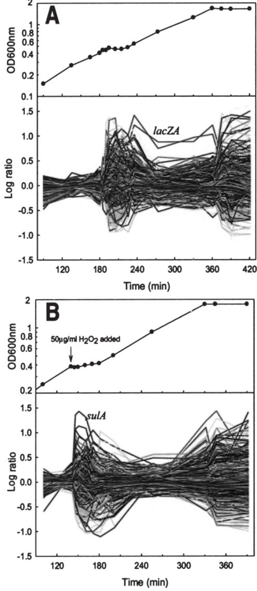
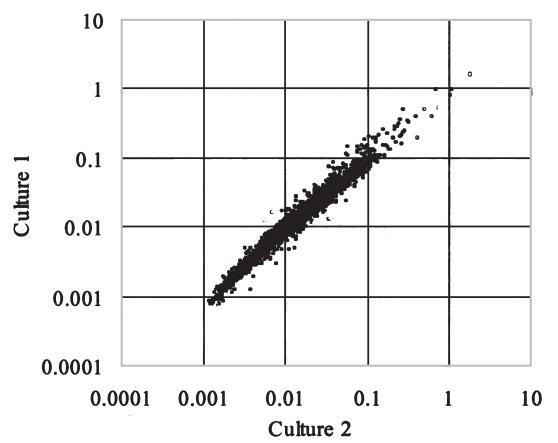
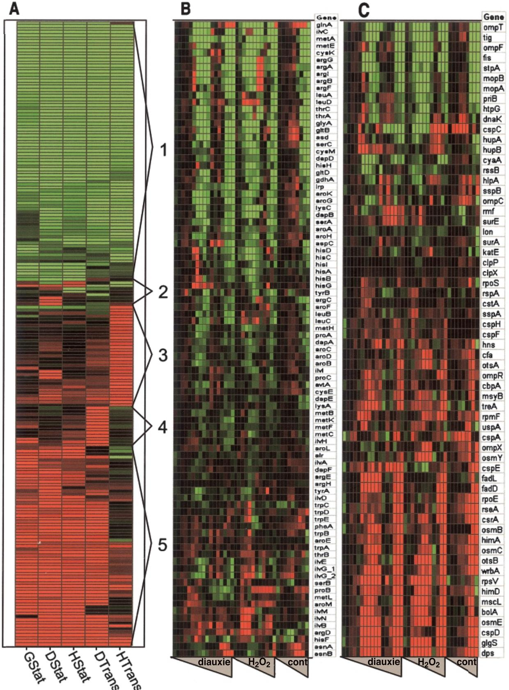
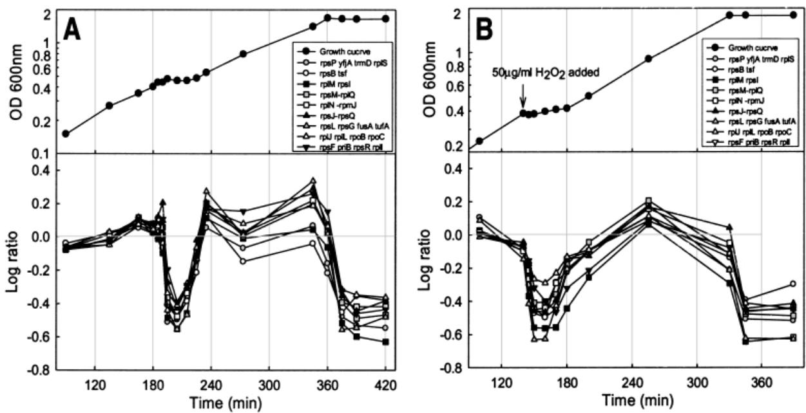
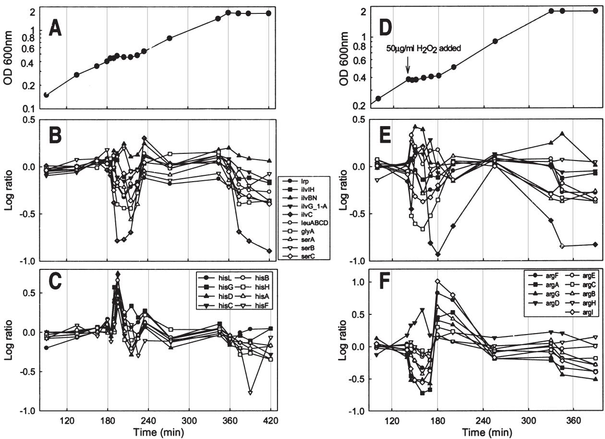
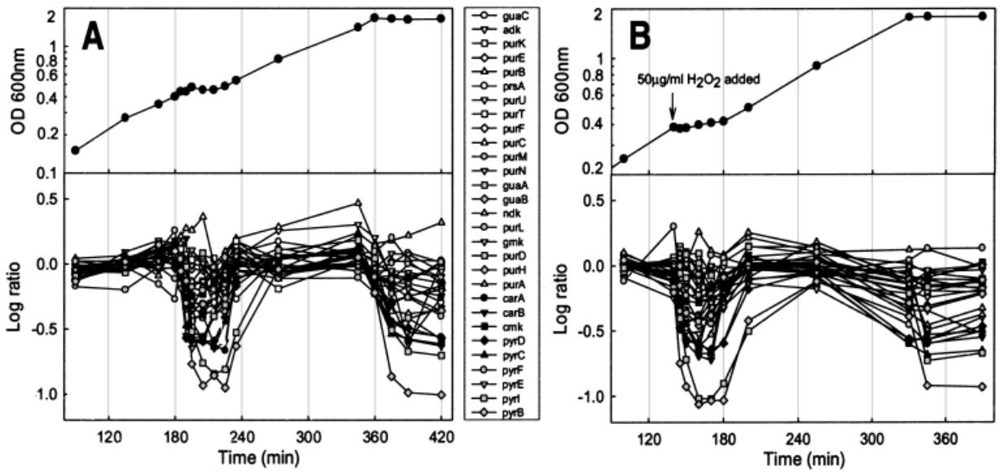
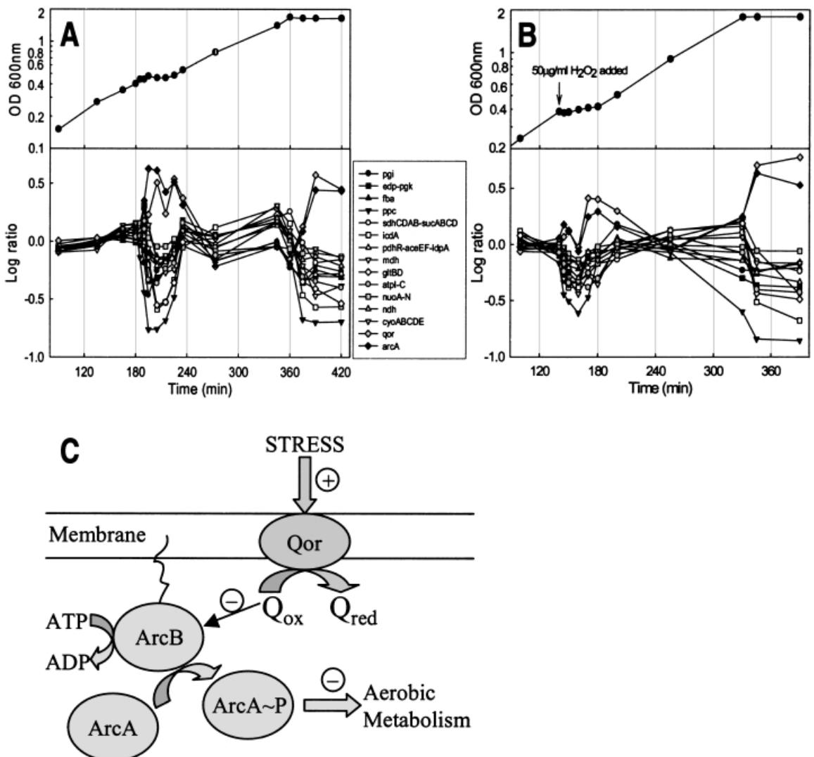
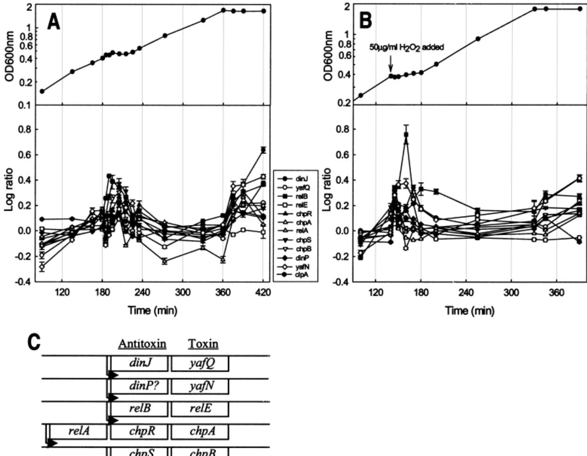
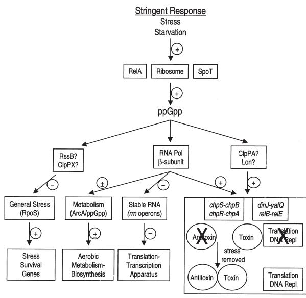

# **Gene expression profiling of** *Escherichia coli* **growth transitions: an expanded stringent response model**

# **Dong-Eun Chang, Darren J. Smalley and Tyrrell Conway***

*Advanced Center for Genome Technology, The University of Oklahoma, Norman, OK 73019–0245, USA.*

# **Summary**

**When conditions cause bacterial growth to stop, extensive reprogramming of physiology and gene expression allows for the cell's survival. We used whole-genome DNA arrays to determine the system response in** *Escherichia coli* **cells experiencing transient growth arrest caused by glucose–lactose diauxie and H2O2 treatment, and also entry into stationary phase. The results show that growtharrested cells induce stringent control of several gene systems. The vast majority of genes encoding the transcription and translation apparatus immediately downregulate, followed by a global return to steady state when growth resumes. Approximately one-half of the amino acid biosynthesis genes downregulate during growth arrest, with the notable exception of the** *his* **operon, which transiently upregulates in the diauxie experiment. Nucleotide biosynthesis downregulates, a result that is again consistent with the stringent response. Likewise, aerobic metabolism downregulates during growth arrest, and the results led us to suggest a model for stringent control of the ArcA regulon. The stationary phase stress response fully induces during growth arrest, whether transient or permanent, in a manner consistent with known mechanisms related to stringent control. Cells similarly induce the addiction module anti-toxin and toxin genes during growth arrest; the latter are known to inhibit translation and DNA replication. The results indicate that in all aspects of the response cells do not distinguish between transient and potentially permanent growth arrest (stationary phase). We introduce an expanded model for the stringent response that integrates induction of stationary phase survival genes and inhibition of transcription, translation and DNA replication. Central to the model is the reprogramming of transcription by guanosine tetraphos-** **phate (ppGpp), which provides for the cell's rapid response to growth arrest and, by virtue of its brief half-life, the ability to quickly resume growth as changing conditions allow.**

# **Introduction**

Most researchers have focused on the physiology of steady-state, exponential growth. But what happens when growth comes crashing to a halt? Growth transitions associated with nutrient shifts, entry into stationary phase, and diauxie have led to many important discoveries in microbial physiology. Studies of nutrient shifts led to understanding of the principles by which cells modulate their chemical composition with respect to the steadystate growth rate (Schaechter *et al*., 1958; Maaløe and Kjeldgaard, 1966) and recognition of the stringent response (Cashel and Gallant, 1969). During the stringent response, cells inhibit rRNA synthesis (and indirectly synthesis of the translation and transcription apparatus), induce and repress metabolic pathways in accordance with their physiological needs, and induce many stationary phase survival genes (Cashel *et al*., 1996; Hengge-Aronis, 1999). Scrutiny of the events surrounding stationary phase led to understanding this prominent aspect of the bacterial 'life cycle' as a series of programmed events that allow survival under starvation conditions (Kolter *et al*., 1993; Hengge-Aronis, 1999). Similarly, investigations of diauxic growth led to the theory of catabolite repression that underlies numerous mechanisms of nutrient preference (Magasanik, 1961), and the discovery of enzyme induction and the operon (Jacob and Monod, 1961). Yet, for all of its importance as a model for gene regulation, glucose–lactose diauxie has seen only limited use as a system for studies of growth transitions. The bacterial cell undergoing diauxie presumably receives numerous signals that elicit multiple responses: induction of adaptive gene systems (e.g. *lacZ*), release from catabolite repression, nutrient starvation, induction of the stringent response, and entry into stationary phase. Do cells entering the diauxic lag behave as if they are starving or entering stationary phase, or do they act as if they receive a signal that the arrest of growth will be temporary? In other words, do cells induce gene systems that reflect the transient nature of the diauxie?

Evidence exists that certain aspects of diauxie resemble entry into stationary phase. During the glucose–

Accepted 28 March, 2002. *For correspondence. E-mail tconway@ ou.edu; Tel. (+1) 405 3251683; Fax (+1) 405 3257619.

#### 290 *D. E. Chang* et al.

lactose diauxie, cells transiently induce RpoS, the general stress response sigma factor of *E. coli*, and at least one stationary phase response gene, *osmY* (Fischer *et al*., 1998). Cells temporarily starved for glucose during diauxie synthesize guanosine tetraphosphate (ppGpp), the chemical messenger of the stringent response (Ishiguro, 1979; Murray and Bremer, 1996; Teich *et al*., 1999). The manifold effects of the stringent response result directly from reprogramming of transcription by binding of ppGpp to the b-subunit of RNA polymerase (Barker *et al*., 2001). In fact, stationary phase promoters require ppGpp in addition to RpoS (Kvint *et al*., 2000). Thus, one might conclude that entry into stationary phase represents an emergency response that can be shut off as soon as the cells are able to resume growth. Clearly, the stringent response provides for rapid and reversible modulation of transcription and, thereby, induces genes involved in cell survival. Cells must also inhibit all macromolecule syntheses, i.e. transcription, translation, and DNA replication, as part of the programmed response to growth arrest. Coordinated, balanced braking of cell growth must be fundamental to the 'feast or famine' existence, which many consider a dominant aspect of bacterial lifestyles in natural environments. At present, the underlying mechanisms of the 'feast or famine' existence remain incompletely understood.

We can now comprehensively profile the transcriptome and identify altered expression of gene systems that respond to one or more of the signals of growth arrest. DeRisi and colleagues used DNA arrays to investigate the yeast transcriptome during diauxic growth on a mixture of glucose and galactose (DeRisi *et al*., 1997). Since then, diauxie has gained renewed interest as a laboratory model for studies of the fundamental process of growth arrest in yeast (Garreau *et al*., 2000; Puig and Perez-Ortin, 2000; Brown *et al*., 2001; Haurie *et al*., 2001; Maris *et al*., 2001).

In this study, we used gene expression profiling to classify *E. coli* genes that respond to transient growth inhibition during glucose–lactose diauxie or following H2O2-induced oxidative stress. The analysis of these experiments permits us to describe the comprehensive system response to transient and stationary phase growth arrest. We propose an expanded stringent response model that accounts for inhibition of all macromolecule synthesis and induction of the general stationary phase stress response. Although the model has yet to be constrained by mutant testing, the datasets presented here have significant potential for hypothesis development and experimental testing.

#### **Results**

# *Description of datasets*

To monitor the gene expression profiles of bacteria under-

going transient growth arrest, we used two experimental strategies. First, we grew *E. coli* MG1655 on minimal medium containing 0.05% glucose and 0.15% lactose, which resulted in a diauxic lag lasting 36 min. Culture samples were taken at 5 and 10 min intervals during, and at appropriate times before and after the diauxic lag (Fig. 1A). Second, we treated a logarithmic culture of *E. coli* MG1655 growing on glucose (0.2%) minimal medium with

**Fig. 1.** Gene expression profiles and corresponding growth curves. A. Glucose–lactose diauxic growth. Expression of the *lacZA* genes is shown.

B. H2O2-treatment during mid-logarithmic growth phase on glucose minimal medium. Expression of *sulA* is shown. Cultures were grown in 1 l volumes in MOPS minimal medium containing 0.2% total sugar. Whole-genome expression profiles were obtained, as described in the text, for each of the indicated time-points. The log (base 10) expression ratios for 4290 protein encoding genes are plotted. The control expression values were measured in early logarithmic phase as described in the text.

**Fig. 2.** Culture reproducibility of whole-genome expression profiles. The normalized, averaged data for the first time-point of the diauxic culture (culture 1) and the H2O2-treated culture (culture 2) are compared. The correlation coefficient is 0.992.

a sublethal concentration of H2O2 (50 mg ml-1 ) that caused an immediate inhibition of growth, followed by a 40 min lag before resuming growth. We harvested samples at 5 and 10 min intervals following the treatment, and at appropriate times during the experiment (Fig. 1B). As a control, we sampled cells growing uninterrupted on glucose (0.2%) minimal medium, conditions that allowed the cells to enter stationary phase upon exhaustion of carbon and nitrogen. For gene expression profiling under these conditions, we used commercially available membrane arrays, spotted with polymerase chain reaction (PCR) products representing all annotated *E. coli* MG1655 protein encoding genes.

Batch cultivation in a 2 l fermenter maximizes biological reproducibility. Cultivated in this way, early logarithmic phase samples from replicate cultures routinely show correlation coefficients >0.99 when hybridized to matched membrane pairs (Fig. 2). Thus, fermenter cultivation of batch cultures offers a significant improvement in reproducibility when compared with results obtained for cultures grown in shake flasks (Tao *et al*., 1999; Arfin *et al*., 2000). To maximize the quality of data from individual time-points, we chose to analyse technical replicates for each sample (Conway *et al*., 2002), although others argue that it is not necessary to replicate time-points when analysing time series (Eisen *et al*., 1998).

Data from individual hybridizations was normalized by expressing the intensity (pixel density) of each genespecific spot on the array as a percentage of the sum of spot intensities. Differential gene expression is expressed as the ratio of the normalized, averaged expression values for the replicates at each time-point relative to the control (early logarithmic growth phase). The Student's *t*test determined the probability that the expression ratio is significant (Conway *et al*., 2002). The early log phase control values represent the average of 12 hybridizations: two each from time-points 1 and 2 of the H2O2-treatment and time points 1 and 3 of the glucose–lactose diauxie, and four from time point 2 of the glucose–lactose diauxie. This approach is possible because gene expression is essentially steady-state in early logarithmic phase (Fig. 1) and because there is excellent correlation between these time-points (Fig. 2). The use of these control values allowed us to directly compare the H2O2-treatment and glucose–lactose diauxie. The datasets for the experiments under consideration represent 39 time-points and a total of 686 400 independent gene expression measurements.

It is worth noting what kinds of information can or cannot be obtained by gene expression profiling. This method provides a semi-quantitative measure of the relative level of individual mRNAs in a total RNA sample, irrespective of their rates of transcription or turnover, without providing any indication of the mechanism of regulation. The data approximate the distribution of RNA polymerase on promoters across the genome (Wei *et al*., 2001). However, mRNA levels do not necessarily reflect protein levels. Nevertheless, the trends of gene expression under the sampled conditions are generally clear and useful for deducing cellular physiology (Tao *et al*., 1999).

## *Overview of datasets*

Figure 1 shows the growth curves and whole-genome expression profiles for the two growth arrest experiments. The near absence of significant changes in gene expression during steady-state logarithmic growth is the most notable characteristic of the whole-genome expression profile of the control culture (data not shown). However, there is extensive reprogramming of gene expression during growth transitions. The gene expression profile of logarithmic phase cells experiencing growth arrest in the diauxie and H2O2-treatment experiments undergoes massive alteration, followed by a nearly global return to steady state once growth resumes (Fig. 1). In both experiments, an equally impressive modulation of the gene expression profile occurs upon entry into stationary phase. As will be described in detail below, many of the genes show a common expression pattern regardless of the growth condition or transience of the growth arrest. Thus, the behaviour of the transcriptome in these experiments appears similar: nearly steady-state gene expression accompanies steady-state growth, whereas an explosion of differential gene expression occurs during growth arrest. In other words, an immediate and extensive re-programming of gene expression occurs when steady-state growth is perturbed. Several global regulatory networks, most prominently the stringent response,

© 2002 Blackwell Science Ltd, *Molecular Microbiology*, **45**, 289–306

seem to control gene expression under these conditions; these became our focus during the following analysis.

# *Statistical and cluster analysis*

With this analysis, we aimed to identify those genes that appear to be involved directly or indirectly in growth phase transitions; additional analyses that focus on the treatment-specific responses will be published independently. As most genes do not change expression levels during steady-state logarithmic growth, theoretically it should be easy to identify those genes whose expression differs significantly from the steady state. However, the enormity of the dataset greatly complicates the analysis. Therefore, we used a multistep statistical and clustering strategy to identify genes involved in growth transitions. The first, purely statistical approach was designed to eliminate all false-positives from consideration (Arfin *et al*., 2000) and revealed 204 genes whose expression changed significantly during one or more of the five growth transitions considered (Table 1). Statistically significant genes had to meet two criteria: ratio values ≥2 standard deviations from the mean of the log ratios (97% confidence) and p-values £0.0002 (99.9995% significance). Hierarchical clustering of these 204 genes revealed five distinct classes of significantly regulated genes (Fig. 3A). The eight genes that form class 2 are the outliers that did not group easily into any of the other classes. The class 3 genes are specific to H2O2-treatment and the class 4 genes are specific to diauxie. Genes in classes 2–4 do not have obvious relevance to growth arrest and are not considered further. Next, we clustered the data by using a K-means algorithm approach (Eisen *et al*., 1998) and identified those clusters containing members of the significant gene classes (data not shown). This strategy allowed us to identify a large number of biologically significant 'class-associated genes', with responses too subtle to be identified using a conservative, purely statistical approach.

The class 1-associated genes tend to downregulate during the five growth transitions, including genes involved in transcription, translation, biosynthesis and energy metabolism. The class 5-associated genes include primarily those induced upon entry into stationary phase. There are 293 genes that upregulate and 315 that downregulate in both the diauxie and H2O2 experiments, suggesting a shared genetic programme that is common to transient and stationary phase growth arrest.

When using unsupervised strategies (statistics and clustering algorithms) for gene expression profile analysis, a danger exists that important genes will be missed. We carefully considered all genes known to be involved in interesting cell processes by using functional gene grouping categories (Blattner *et al*., 1997; Riley, 1998). We also used the supervised strategy of 'profilesearching' of the entire dataset to rank all genes by the similarity of their expression profiles to genes of particular interest. Below, we consider in detail the expression profiles of genes selected by combined use of these analysis strategies, with the overarching theme of global regulation during growth arrest.

#### *The stringent response and class 1 genes*

The class 1-associated genes that downregulate in response to H2O2-treatment, diauxie, and entry into stationary phase include those involved in transcription and translation, amino acid biosynthesis, nucleotide biosynthesis, aerobic metabolism and certain cell processes. The data suggest that a general response to growth arrest underlies the more specific responses to H2O2-stress and diauxie.

#### *Transcription and translation apparatus*

The most obvious global response of the cells to growth arrest in the experiments analysed here is downregulation of the transcription and translation apparatus genes. We considered the expression profiles of all genes that are involved in transcription and translation, including the major subunits of RNA polymerase, ribosomal proteins, and transcription and translation factors. These genes generally show a rapid decrease in mRNA levels at the onset of transient growth arrest and again upon entry into stationary phase. This point is clearly illustrated by averaging the expression ratios for nine operons containing 48 transcription and translation genes (Fig. 4). These results show that the response reverses rapidly when

**Fig. 3.** Hierarchical clustering of genes considered in this study.

A. Genes showing statistically significant differential expression upon entry into stationary phase or during transient growth arrest.

B. Hierarchical clustering of expression profiles for selected genes involved in amino acid biosynthesis.

C. Stationary phase and cell processes.

Columns represent major growth transitions (A; G, glucose, D, diauxie, H, H2O2-treatment in stationary or transition phase respectively) or individual time-points (B and C) in growth curves of the diauxie, H2O2-treatment, and minimal glucose control cultures (indicated by triangles below). Genes are represented in rows, as indicated to the right (B and C) or as summarized in Table 1A. Ratios are displayed colorimetrically: bright red indicates genes with ≥2.2-fold higher expression (ª 2 standard deviations) in the experimental time-point compared with the control, whereas bright green indicates £2.2-fold lower expression in the experimental time-point compared with the control, and the colours darken to black to indicate no change in expression. (See text for further details.)

#### 294 *D. E. Chang* et al.

| Table 1. Classes of statistically significant genes. |  |  |  |
|------------------------------------------------------|--|--|--|
|------------------------------------------------------|--|--|--|

| ilvC rplQ cspC ahpC pyrB guaC glnA recA                                                                                                                                                                                                                                                                                                                                                                                                                                                                                                                                                                                                                                                                                                                                                                                                                                                                                                      |                                                                                                      |                                                                                                                                                                                                                                                                                                                                                                                                                                                                                                                                      |
|-------------------------------------------------------------------------------------------------------------------------------------------------------------------------------------------------------------------------------------------------------------------------------------------------------------------------------------------------------------------------------------------------------------------------------------------------------------------------------------------------------------------------------------------------------------------------------------------------------------------------------------------------------------------------------------------------------------------------------------------------------------------------------------------------------------------------------------------------------------------------------------------------------------------------------------------------------------------|------------------------------------------------------------------------------------------------------|--------------------------------------------------------------------------------------------------------------------------------------------------------------------------------------------------------------------------------------------------------------------------------------------------------------------------------------------------------------------------------------------------------------------------------------------------------------------------------------------------------------------------------------|
| pyrI rplN ybhC osmY metE rplU proV yjiS ompT b2351 mepA ahpF rplY icdA pspA dinI trmD secG acpD b2865 flgE tpx ybjT ilvM tufB oppA yjbD gcvP cysK ykgM tufA fliL yeaQ ppc mopB ruvC rplP glyA atpG rpmB rpsG argD rplJ codA yahN rplX thrC ccmA tig gapA thiM rpsN purU bioH ompF purA yjfM fusA argA b2377 rpsA atpE yahG rpsS tsf nupG rplI rplV glpE rplE hyfR caiE upp rplW ybfL rpsE rpmE grxA rplM purB sulA rplB carA fic metA epd b1157 carB rpoA rpsV atpH rpmI yabQ flgC prsA relB pyrD priB katG yjgF cysD atpF dnaK rplA cysJ flgD rpmG rpsR fliD pyrC atpA rpsD lpdA rpsI rplL flgB fliC | malE glpF lamB lacZ glpK malK mglB malM lacA yzgL melA ytfR glpD | amtB bolA glnH ycgB ycdG osmE rbsD phnB yeaT bfr ybiM ybeL gabD ytfQ cspE yjcH b1010 yjfN rseA b1011 yhdW glnK ybaJ nac dinJ yeaH yhaL ugpB hdeA yjfO ygfJ yfiA ydeW cstC otsB cspD glcB yeaG b 1746 yahO arcA glgS yhiO dps sfsA b 1953 b1440 fadD fadL b1444 b2659 qor aldA msyB mscL ytfK ygaU ygaM ycbB yhhA b 2080 osmC b1490 wrbA |

Classifications determined by hierarchical clustering of statistically significant genes shown in Fig. 3A.

conditions again become favourable for growth, as the expression levels return to steady state when growth resumes. We conclude that transient growth arrest induces stringent control of the transcription and translation apparatus.

# *Amino acid biosynthesis*

Cells starved for histidine or serine, while other amino acids are abundant, accumulate ppGpp and derepress the *his* operon (Venetianer, 1969; Stephens *et al*., 1975; Shand *et al*., 1989). It would be reasonable in terms of cellular economy for cells to induce amino acid biosynthesis when limited for only one or a few amino acids. However, a completely different situation arises when cells starve for glucose, which depletes the cytoplasm of all precursor metabolites and amino acids. We were intrigued to find that approximately one-half of the 90 genes encoding amino acid biosynthetic enzymes downregulate in response to growth arrest (Fig. 3B). Notably, the histidine and arginine biosynthetic pathways represent exceptions to this general trend (shown in Fig. 5C and F). Interestingly, researchers have used these two pathways as models for induction during the stringent response (Williams and Rogers, 1987; Shand *et al*., 1989). A distinct upregulation of the *his* operon occurs upon entry into diauxic lag, followed within 15 min by a return to the previous steady state. To a lesser extent, the *arg* genes also show this behaviour. In contrast to the diauxie experiment, the *his* operon (and several *arg* genes) is downregulated following H2O2-induced growth arrest, and then upregulated as growth resumes.

**Fig. 4.** Expression profiles of transcription and translation apparatus genes. Growth curves and gene expression profiles of the transcription and translation genes (48 genes in nine major transcription–translation operons) in the diauxie (A) and H2O2-treatment (B) experiments. The log (base 10) of the expression ratios is plotted versus time.

To discern a mechanism that comprehensively explains why some amino acid biosynthetic genes downregulate in response to growth arrest and others do not, we considered the amino acid pathways by individual steps, position of the step in the pathway, operon organization, and amino acid families, yet could find no obvious correlation. However, we did observe a transient decrease in *lrp* expression during growth arrest. Therefore, we focused on the genes regulated by the leucine-response network (Fig. 5B and E). It has been suggested that ppGpp acts negatively on *ilvIH* expression (Baccigalupi *et al*., 1995), and we did observe a modest decrease in *ilvIH* expression in the diauxie experiment. Several other Lrp-dependent genes, most notably *ilvC*, *glyA* and *serA*, significantly downregulate during growth arrest. This expression pattern correlates with the decrease in *lrp*, but the latter result appears to contradict the proposed inverse correlation of *lrp* expression and growth rate (Landgraf *et al*., 1996). Because the amino acid biosynthesis genes behave unpredictably, we suggest that the individual operons do not respond directly to ppGpp, but rather via other signals and regulatory networks (e.g. Lrp). This regulatory strategy presumably results in the general downregulation of the amino acid biosynthetic genes during growth arrest, while permitting exceptions to this generalization.

#### *Nucleotide biosynthesis*

Figure 6 shows that genes involved in nucleotide biosyn-© 2002 Blackwell Science Ltd, *Molecular Microbiology*, **45**, 289–306 thesis strongly downregulate during growth arrest in a pattern consistent with the proposed inhibitory effect of ppGpp on *pyrBI* transcription (Donahue and Turnbough, 1990; Zhou and Jin, 1998). In contrast with the situation for amino acid biosynthesis, the inhibitory effect of ppGpp on *pyrBI* can apparently be generalized to both the purine and pyrimidine biosynthetic pathways. The mRNA levels of more than two-thirds of the 29 nucleotide biosynthesis genes decrease significantly upon growth arrest, return to steady-state levels when growth resumes, and decline again upon entry into stationary phase. The pyrimidine genes respond more strongly than those of purine biosynthesis. This pattern of regulation is consistent with the need for cellular economy during growth arrest, as no increase in culture biomass occurs and the ongoing turnover of mRNA provides a pool of nucleotides for residual transcription.

#### *Aerobic metabolism*

Another cellular process regulated in a class 1-associated pattern is that of aerobic respiratory metabolism. We considered the expression profile of genes involved in glycolysis, the TCA cycle, anapleurotic reactions, aerobic electron transport chain components, NADH dehydrogenase, and ATPase. The majority of these genes downregulate in response to growth arrest, a result which is consistent with earlier findings that at least some TCA cycle enzymes are downregulated by glucose starvation

**Fig. 5.** Expression profiles of amino acid biosynthesis genes. Growth in the diauxie (A) and H2O2-treatment (D) experiments. Selected genes of the Lrp regulon during diauxie (B) and H2O2-treatment (E). Expression of the histidine biosynthetic genes in the diauxie experiment (C) and the arginine biosynthesis genes in the H2O2-treatment experiment (F). The log (base 10) of the expression ratios is plotted versus time. Note the differences in scale.

(Nystrom, 1994). This point is clearly illustrated by averaging the expression ratios for 49 aerobic metabolism genes in 15 operons (Fig. 7). The repression of aerobic metabolism correlates with upregulation of *arcA*. ArcB is a sensor kinase and ArcA is the response regulator, which together sense and respond to the oxidation/reduction status of the cell by repressing aerobic metabolism genes when respiration is not possible (Lynch and Lin, 1996). Not only is downregulation of the aerobic metabolism genes consistent with a diminished need for respiration during growth arrest, it is consistent with repression of the ArcA regulon as a proposed survival strategy designed to minimize the formation of reactive oxygen species and lessen oxidative ageing of essential proteins (Nystrom, 1998; 2001).

The signal transduction mechanism by which ArcB monitors the oxidation/reduction status of the cell involves its direct interaction with the membrane quinone pool; under conditions suitable for aerobic respiration the quinone pool is primarily oxidized and this exerts a negative control on ArcB autophosphorylation, thus preventing ArcA~P-dependent repression of the ArcA regulon (Georgellis *et al*., 2001). It is intriguing therefore that the gene encoding quinone oxidoreductase, *qor,* is the only aerobic metabolism gene to upregulate during growth arrest (Fig. 7). Perhaps Qor, when it is induced, functions to force the balance of the quinone pool to the reduced state, ultimately resulting in repression of the ArcA regulon by ArcA~P (Fig. 7C). A model suggesting how Qor might be involved in repression of oxidative metabolism as part of the general response to stress is discussed below.

#### *Cell process genes*

A number of genes involved in cell processes downregulate during growth arrest (Fig. 3C). The observed downregulation of several molecular chaperones (heat-shock proteins) encoded by *dnaK*, *mopA*, *mopB* and *htpG* was not previously reported. Rather, these genes and their

**Fig. 6.** Expression profiles of nucleotide biosynthesis genes. Growth curves and gene expression profiles of the purine and pyrimidine biosynthesis genes (29 genes) in the diauxie (A) and H2O2-treatment (B) experiments. The log (base 10) of the expression ratios is plotted versus time.

products are thought to induce during carbon starvation in an RpoH-dependent fashion (Jenkins *et al*., 1991). Previous microarrray experiments did not show that H2O2 treatment induces these heat-shock genes (Zheng *et al*., 2001). Clearly, the regulation of heat-shock proteins during growth transitions warrants further investigation. Other functions that downregulate during growth arrest include the outer membrane proteins encoded by *ompT* and *ompF* (Pratt and Silhavy, 1996).

The observed downregulation of *fis* during growth arrest (Fig. 3C) is in accordance with its negative stringent control (Ball *et al*., 1992; Walker *et al*., 1999). This expression profile of *fis* resembles that of the translation apparatus and is consistent with the role of Fis as an activator of stable RNA transcription (Bokal *et al*., 1997). The *tig* gene that encodes the ribosome-associated trigger factor is downregulated during growth arrest, consistent with its role as a molecular chaperone that interacts with nascent peptides (Schaffitzel *et al*., 2001); in this respect, the expression profile of *tig* parallels that of the heatshock and translation apparatus genes, as described above. The fact that Tig overexpression causes cell filamentation suggests that it might be involved in folding of a protein component of the cell division apparatus, a process that is not necessary in growth arrested cells (Guthrie and Wickner, 1990). A connection between the stringent response and inhibition of DNA replication has been suggested (Chiaramello and Zyskind, 1990). Decreased expression of *priB*, a gene involved in replication fork restart, is interesting in light of the cellular need to inhibit DNA replication during growth arrest.

#### *Stationary phase, stress survival and class 5 genes*

The stationary phase response of *E. coli* is described appropriately as a general stress response (Hengge-Aronis, 1996; 1999). The global response of the transcriptome to growth arrest is clearly seen in Fig. 1. We consider the expression of 62 stationary phase and cell process genes (Fig. 3C).

Upon entry into stationary phase, a profound adjustment occurs in cellular physiology controlled by a complex regulatory network involving the stationary phase sigma factor, RpoS. The systems induced include genes involved in survival of osmotic stress (*ots*, *tre*, *osm* genes), periplasmic shock (*rpoE* and *rseA*) and cold shock (*csp* genes). The upregulation of *cspD* might be important for regulating inhibition of macromolecule synthesis during stress, as CspD, a single-stranded DNA binding protein, was recently shown to inhibit DNA replication initiation and elongation when it is induced during stationary phase (Yamanaka *et al*., 2001). Also induced are genes that help prepare the cell for long-term survival (e.g. *bolA*, *dps*, *cbpA* and *glgS*). Induction occurs for regulators such as *csrA (*carbon storage regulator), *wrbA (trp* repressor binding protein) and *uspA (*universal stress protein). Interestingly, two genes that are known to be RpoS-dependent, *katE* and *surA*, do not induce. Transcript levels of *rpoS* do not change significantly under the conditions tested. However, RpoS protein levels are controlled by the products of other genes, including *rssB*, and *clpPX,* which is constitutive under these conditions (Zhou and Gottesman, 1998; Zhou *et al*., 2001). As predicted

**Fig. 7.** Expression profiles of aerobic metabolism genes. Growth curves and gene expression profiles of the aerobic metabolism genes (49 genes in 15 operons or cistrons) in the diauxie (A) and H2O2-treatment (B) experiments. The log (base 10) of the expression ratios is plotted versus time. Model relating the *qor* expression profile to downregulation of the ArcA regulon in response to stress (C). (See text for further details.)

(Fischer *et al*., 1998), we note that induction of the stationary phase genes rapidly reverses when growth resumes following diauxie, as it also does following H2O2-treatment. Clearly, growth arrest, even a transient event, involves the global changes in gene expression associated with the general stationary phase stress response.

The expression of genes involved in cell division (*fts* genes, *min* genes, *dac* genes, *ddlB*, and *fic*: data not shown) does not appear to correlate specifically with growth arrest; an exception is *sulA*, the SOS response gene encoding a cell division inhibitor that is specifically induced by H2O2-treatment (Fig. 1). Growth arrest and the accompanying inhibition of macromolecule synthesis should be sufficient to inhibit division and, hence, we would not expect expression of the cell division genes to change in these experiments (Helmstetter, 1996; Lutkenhaus and Mukherjee, 1996). We suggest that altered transcription of the cell division genes is not generally important during growth transitions.

Several genes that induce significantly during growth arrest include three that encode basic proteins that nonspecifically bind DNA (histone-like proteins), *hupA*, *hupB* and *hlpA,* and three that encode the pleiotropic regulatory factors, HN-S, and the integration host factor, encoded by *himA* and *himD* (Fig. 3C). Transcription of these genes all increase upon entry into stationary phase (Dersch *et al*., 1993; Weglenska *et al*., 1996; Claret and Rouviere-Yaniv, 1997). These pleiotropic regulators impact the genomewide transcription profile (Tao *et al*., 1999; Arfin *et al*.,

2000). IHF, HN-S and RpoS interact to regulate stationaryphase genes (Bouvier *et al*., 1998; Colland *et al*., 2000). These general DNA binding proteins, together with Fis and Dps, share in common an involvement in growth ratedependent regulation of a large number of genes (Hengge-Aronis, 1999; Tao *et al*., 1999). Thus, several global regulators, each with overlapping domains, seem to act together to accomplish the reprogramming of gene expression that takes place during growth arrest.

#### *Programmed cell death or controlled growth arrest?*

It has been proposed that chromosomal 'addiction module genes' mediate 'programmed cell death' or 'altruistic suicide' under conditions requiring the sacrifice of some members of the population for the survival of the other cells. This model describes a long-term survival strategy that incorporates the lethality of addiction toxins (Aizenman *et al*., 1996; Nystrom, 1998). However, programmed cell death is not a reasonable strategy for transient growth arrest and, certainly, there is little or no loss of cell viability during the growth transitions described here (data not shown). More recently, it was hypothesized that the *hok* family of addiction toxins, which inhibit translation, and the *pem* family of toxins, which inhibit DNA replication, are conceptually analogous to stringent control of transcription inhibition (Nystrom, 1999; Gerdes, 2000). This model predicts that the toxin module genes induce in response to stress or starvation to rapidly and coordinately inhibit synthesis of DNA and protein.

As predicted, several addiction module genes upregulate during transient growth arrest and entry into stationary phase (Fig. 8). Specifically, the members of the *pem* gene family (Gerdes, 2000) upregulate, including the *chpB* toxin gene, and to a lesser extent *chpA*; the cells also coordinately upregulate their anti-toxins, *chpS* and

**Fig. 8.** Expression profiles of the chromosomal addiction module genes. Growth curves and gene expression profiles of the addiction module anti-toxin and toxin genes in the diauxie (A) and H2O2-treatment (B) experiments. The log (base 10) of the expression ratios is plotted versus time. Chromosomal arrangement of addiction module genes (C) (not drawn to scale).

#### 300 *D. E. Chang* et al.

*chpR* respectively. Out of the three members of the *hok* family (Gerdes, 2000), *yafN* and *yafQ* modestly upregulate in these experiments, but *relE* does not; their corresponding anti-toxins, *dinJ*, encoding the anti-toxin of YafQ, and *relB*, encoding the anti-toxin of RelE, significantly upregulate. There is concomitant induction of the anti-toxin and toxin, as would be expected of genes in an operon under common control (Fig. 8C), and the antitoxins are more highly induced than the toxin genes. The exception to this expression pattern is the *dinP-yafN* module in which the toxin, *yafN*, is more highly induced than the other genes. *yafN* is a *relE* paralogue, suggesting that it encodes a toxin, but there does not appear to be a *yafN*-associated anti-toxin gene in the module; *dinP* is not paralogous with *relB* and encodes the error-prone DNA polymerase IV (Walker, 1996). Although the induction ratios of these toxin and anti-toxin genes is not very large (<threefold), all of them are statistically significant (p < 0.0002).

As the anti-toxins and toxins coordinately induce, a mechanism must exist for dissociating the anti-toxins from their target toxins such that the toxins are freed to inhibit translation and replication. Accordingly, *clpA* modestly upregulates during growth transitions (Fig. 8). ClpA is the ATPase regulatory component of ClpPA that degrades the ChpR (MazE) anti-toxin (Aizenman *et al*., 1996). Thus, during the response to growth arrest, cells induce genes encoding toxin inhibitors of macromolecule synthesis and a gene encoding a regulator of toxin accumulation. These results led us to conceive a model that integrates inhibition of all macromolecule synthesis within the stringent response paradigm. We suggest that cells implement this system under conditions in which growth arrest requires coordinated inhibition of major energy-consuming cellular processes.

# **Discussion**

# *ppGpp and the stringent response*

A large body of evidence indicates that ppGpp rapidly accumulates under conditions affecting the cell's ability to synthesize protein, and that this secondary messenger molecule signals the stringent response (Cashel *et al*., 1996). Presumably, this means that any and all conditions that tip the balance of uncharged to charged tRNA, such that uncharged tRNA binds to and stalls ribosomes, will stimulate RelA to synthesize ppGpp; such is the case when cells enter stationary phase or starve for amino acids or glucose (Kramer *et al*., 1981; Murray and Bremer, 1996; Teich *et al*., 1999). ppGpp is proven to accumulate transiently during the lag phase of glucose–lactose and glucose–succinate diauxie (Harshman and Yamazaki, 1971; Ishiguro, 1979), and in response to oxidative stress caused by H2O2-treatment (VanBogelen *et al*., 1987). Our data show that extensive reprogramming of gene expression occurs within 5 min of H2O2-treatment and following glucose starvation during diauxie, in a pattern that includes a large number of genes known to be under stringent control. We conclude that there is a general and global response to growth arrest, which correlates with the stringent response.

#### *Stringent control of translation apparatus*

It is generally accepted that regulation of the ribosomal protein operons involves a combination of translational and transcriptional control at the level of mRNA stability (Keener and Nomura, 1996). When ppGpp accumulates, rRNA transcription decreases, a hallmark of the stringent response. As a result of decreased ribosome synthesis, the pool of free ribosomal proteins correspondingly increases. Certain ribosomal proteins serve as autoregulators by binding to their transcript and decrease the translation rate of the mRNA, thus leading to its destabilization. While not all of the ribosomal protein operons have been studied at this level of detail, the experiments presented here suggest that most, if not all of them are regulated in a fashion that allows for downregulation during growth arrest. Thus, the stringent response, by inhibiting rRNA transcription under conditions that do not allow cell growth, simultaneously downregulates expression of the genes required for transcription and translation, thus conserving energy for other cellular processes.

# *Amino acid biosynthesis*

The stringent response was discovered in cells starved for histidine or serine (Cashel and Kalbacher, 1970); ppGpp is required for derepression of the *his* operon under these conditions (Venetianer, 1969; Stephens *et al*., 1975; Shand *et al*., 1989). As *relA spoT* mutants that cannot accumulate ppGpp are auxotrophic for several amino acids, the ppGpp-dependent induction of other amino acid pathways during the stringent response was presumed (Xiao *et al*., 1991). However, we measured a general downregulation of amino acid biosynthesis genes during growth arrest, with the notable exceptions of the *his* and *arg* regulons. In a related microarray experiment, Smulski and colleagues observed that some, but not all, of the genes encoding amino acid biosynthetic pathways are induced when *E. coli* is treated with acivicin, which causes the cells to starve for histidine and apparently induces stringent control (Smulski *et al*., 2001). On the other hand, they observed downregulation of pathways in the aromatic, pyruvate, sulphur and aspartate amino acid families. Our data are not consistent with regulation of amino acid families and we are unable to discern any pattern of regulation of amino acid biosynthetic pathways. Although we do not know why cells behave in this way, we suggest that caution should be taken when generalizing the stringent response of the histidine biosynthetic pathway to other amino acids. Derepression of amino acid biosynthesis during limitation for only one or a few amino acids may make sense in terms of the cellular economy. However, under general starvation conditions it seems more reasonable for the cell to turn off biosynthetic pathways, in conjunction with the transcription and translation apparatus. Yet, our results are not consistent with uniform stringent control of the amino acid biosynthetic genes, either up or down. Thus, stringent control of the amino acid biosynthesis genes could be indirect. Recent *in vitro* studies support this conclusion, indicating that inverse growth rate-dependent stimulation of amino acid biosynthesis promoters is an indirect effect of ppGpp on transcription (Barker *et al*., 2001).

#### *Model for stringent control of aerobic metabolism*

Aerobic metabolism represents another example of an indirect mechanism that could account for downregulation (Fig. 7C). We observed that *arcA* induces when cells respond to stress, just as it does under anaerobic conditions (Compan and Touati, 1994). However, increased *arcA* expression is not sufficient to repress the ArcA regulon. It is the phosphorylated form of ArcA that functions as a repressor, and phosphorylation of ArcA depends upon phosphorylated ArcB, which in turn is regulated by the oxidation state of the quinone pool (Georgellis *et al*., 2001). The mechanism by which the ArcA regulon is repressed during stress is not known; we hypothesize that Qor plays a role in networking these responses. Although it is speculative, this model is supported by evidence showing that *qor* induces under growth arrest conditions. Qor has been crystallized and its quinone-binding site analysed (Thorn *et al*., 1995), but the physiology of Qor has not been considered and its cellular function is unknown. Our model predicts that stress induces *qor* and Qor reduces the quinone pool, which leads to repression of the ArcA regulon. This would prevent oxidation of cellular components and leave the quinone pool poised to resume respiration when conditions allow. The region upstream of *qor* does not appear to contain an ArcA binding site (data not shown). Thus, the model makes an important prediction that ppGpp induces *qor* either directly, or indirectly in parallel with the stringent response. This would provide a mechanism for repression of oxidative metabolism as part of the general stress response.

## *Stationary phase and the stringent response*

RpoS and an *osmY*::*lacZ* fusion transiently induce during © 2002 Blackwell Science Ltd, *Molecular Microbiology*, **45**, 289–306

# *Gene expression during transient growth arrest* 301

the glucose–lactose diauxie (Fischer *et al*., 1998). Similarly, the *bolA* morphogene induces in response to carbon starvation and other stresses (Santos *et al*., 1999). The results presented here extend these findings to include general induction of stationary phase genes. The substantial reprogramming of gene expression that occurs during transient growth arrest rapidly reverses when growth resumes. We note that in addition to RpoS, other systems, including the stringent response, appear to be involved in inducing the stationary phase genes. In fact, it is thought that ppGpp positively regulates RpoS synthesis, thus coupling the stringent response to induction of stationary phase survival genes (Gentry *et al*., 1993). Although the correlation between ppGpp accumulation and elevation of RpoS is firmly established, the mechanism of this regulation is unknown. It was recently shown that RpoS alone does not suffice to induce transcription of stationary phase genes; ppGpp-binding to RNA polymerase is required for transcription of RpoSdependent promoters, just as it is for induction of sigma 70-dependent promoters of the stringent response modulon (Kvint *et al*., 2000). The implications of this experiment are far-reaching: the dominant signal of growth arrest is ppGpp accumulation, which causes a general reprogramming of the transcription of hundreds of genes, either negative or positive depending upon the structure of the individual promoters (Barker *et al*., 2001). The rapid return of the whole-genome transcription profile to steady state following transient growth arrest (Fig. 1) is consistent with the brief half-life (<1 min) of ppGpp (Cashel *et al*., 1996).

# *Addiction module genes*

The current model for the stringent response is limited to explaining how transcription of all but essential stress response genes is inhibited during growth arrest via the secondary signal molecule ppGpp. We suggest an expansion of the stringent response model to include a mechanism for coordinating inhibition of transcription with that of translation and DNA replication (Fig. 9). The observed induction of the addiction module genes during the response to growth arrest led us to hypothesize that these genes play a direct role in this process, and that stress induces their transcription. Our model predicts the direct induction of addiction module transcription by ppGppreprogrammed RNA polymerase; alternatively, an additional regulatory component could indirectly induce the addiction module genes during the stringent response. A recent study supports the model, showing that *relBE* transcription is induced by stress in a ppGppindependent fashion that depends on RelB autoregulation (Christensen *et al*., 2001). Further support for the model comes from the finding that RelE binds to ribosomes,

**Fig. 9.** Model relating the stringent response to induction of stress and survival genes, and repression of transcription, DNA replication and translation. The stringent response is induced by starvation or stresses that cause growth arrest, resulting in accumulation of ppGpp, which binds to RNA polymerase and reprogrammes transcription. The altered transcription profile, according to the model, includes up- or downregulation of metabolism genes as is necessary for balancing intermediary, biosynthetic and respiratory metabolism, inhibition of stable RNA synthesis, and upregulation of the addiction module genes. Also predicted by the model is a negative effect of guanosine tetraphosphate (ppGpp) on the systems that regulate protein turnover of RpoS and a factor involved in maintaining inhibitory levels of anti-toxin proteins. This leads to accumulation of RpoS and induction of the general stationary phase stress response, as well as release of the toxin proteins from sequestration by the corresponding anti-toxin. Coordinated inhibition of macromolecule synthesis and induction of survival genes is explained by the model. (See text for further details.)

suggesting its direct involvement as a translation inhibitor (Galvani *et al*., 2001). One published study contradicts the model with evidence that artificial accumulation of ppGpp in the absence of stress represses *chpRA* transcription (Aizenman *et al*., 1996). However, this experimental result has been called into question because it could not be repeated (Gerdes, 2000). Validation of our model obviously will require direct experimental proof that stress induces the addiction module genes.

Our model further predicts that growth arrest leads to proteolysis of the anti-toxins. This model is supported by induction of *clpA*, which encodes the regulatory subunit of ClpPA that is involved in proteolysis of at least one toxin, ChpR. In addition, Lon-dependent, ClpP-independent degradation of RelB was recently shown (Christensen *et al*., 2001). Because translation and replication resume immediately following transient growth arrest, there must be a mechanism in place for restoring the anti-toxin proteins to sufficiently high toxin-inhibitory levels when a

signal to resume growth is received. The nature of the additional factors required to regulate anti-toxin–toxin interactions is not suggested by our experiments, although a system analogous to RssB-ClpPX-regulated proteolysis of RpoS is an attractive hypothesis (Zhou *et al*., 2001). An alternative to regulated proteolysis is the passive model that is favoured for Lon-dependent proteolysis of RelB (Christensen *et al*., 2001). One thing is clear: the toxins are encoded by 'dangerous' genes and the cell cannot afford to turn them on without a mechanism in place that controls their potentially lethal functions.

#### *Expanded stringent response model*

Here, we summarize our current findings in the context of an expanded stringent response model (Fig. 9). The model is invoked by any stress of sufficient physiological impact to prevent proper charging of tRNA with amino acids, thereby causing RelA to synthesize ppGpp, which binds to and reprogrammes RNA polymerase. By a mechanism that is largely unknown, ppGpp accumulation is accompanied by RpoS induction, thus turning on genes whose products permit survival of environmental stresses and long-term starvation. Under conditions causing growth arrest, whether transient or permanent, we observe an immediate and extensive induction of the stationary phase stress response (Fig. 1). The reprogramming of RNA polymerase by binding of ppGpp also accounts for the downregulation of many genes that encode the transcription and translation apparatus; the hallmark of the stringent response. Under conditions of non-growth, additional synthesis of cell components is unnecessary, and the existing level of the transcription and translation components is sufficient to support initiation of macromolecule synthesis when growth is resumed. The existing level of the biosynthetic enzymes suffices in non-growing cells to supply building blocks for the limited metabolism required for cell maintenance and survival, so likewise, there is general downregulation of most genes encoding enzymes for building block biosynthesis (nucleotides, amino acids, precursor metabolites). Our results suggest that stringent control of nucleotide biosynthesis occurs directly via ppGpp, whereas control of amino acid biosynthesis occurs indirectly, with ppGpp effecting specific regulators of amino acid regulons. We propose that ppGpp-dependent regulation of the ArcA regulon via *qor* expression is another example of indirect stringent control of precursor metabolite biosynthesis.

According to the expanded stringent response model, growth arrest sets off a programme of events that results in transcription inhibition, decreased ribosome synthesis, and inhibition of translation and DNA replication; cellular processes that collectively represent >95% of the energy expenditure of the cell (Neidhardt *et al*., 1990). In fact, translation is approximately 95% inhibited by RelE following amino acid starvation (Christensen *et al*., 2001). The benefits of the coordinated inhibition of macromolecule synthesis during growth arrest are critically important; energy that would otherwise have been spent on nucleic acid and protein biosynthesis is conserved as the cell diverts its attention to matters of survival. The response is immediate and dramatic, but readily reversible. As soon as conditions favouring growth are restored, growth arrest is released. As noted above, the rapid return of the whole genome transcription profile to steady state following transient growth arrest is consistent with the brief half-life of ppGpp. The dramatic decrease in long-term survival of *relA*, *spoT* mutants may be explained by a loss of stringent control that would prevent many of the global changes in gene expression observed in this study (Cashel *et al*., 1996). The hypothesis that the stringent response molecule, ppGpp, is primarily responsible for regulation of transient growth arrest is provocative and testable. If proven correct, the molecular basis for the feast or famine lifestyle of bacteria could be explained by this concept.

# *Concluding remarks*

There is a common misconception that gene expression profiling is useful for generating models and leads for further experimentation, but has limited use for testing of hypotheses (Mir, 2000). We in fact began this work with a sweeping hypothesis, that the bacterial cell, when it encounters any condition causing growth arrest, immediately puts the brakes on macromolecule synthesis and metabolism, and puts the pedal to the floor to induce stress survival systems. Regardless of the condition causing growth arrest, or its duration, parsimony demands that a single system be used for the extensive reprogramming of physiology and gene expression that occurs. The data obtained in this study afforded the opportunity to investigate this hypothesis. Comprehensive gene expression profiling of the temporal response to growth arrest supports a model predicting an expanded role for the stringent response. One aspect of the results, the repression of one half of the amino acid biosynthesis genes, serves as a reminder that care must be taken when generalizing results from a very limited number of regulons to include other related processes. In this regard, and in other cases highlighted above, the data presented here are useful for generating more refined hypotheses that will take us back into the laboratory for testing by more traditional methodology. For example, it will be important to test the prediction that the addiction model genes and *qor* are induced by stress, and/or ppGpp accumulation. These experiments should lead to an improved understanding of how bacterial cells coordinate growth and non-growth, which would ultimately explain their ability to populate and survive in their natural environments.

#### **Experimental procedures**

#### *Bacterial growth*

Morpholinepropanesulfonic acid (MOPS) minimal medium with 2 g l-1 of sugar (Neidhardt *et al*., 1974) was used in all cultivations. *E. coli* MG1655 was cultured in a 2 l Biostat B fermentor (B. Braun Biotech International GmbH) containing 1 l of medium. The temperature was maintained at 37∞C and pH was kept constant at 7.2 by the addition of 2 M NaOH. The dissolved oxygen level was maintained above 20% of its saturation level by adjusting the agitation speeds in the range of 400–600 r.p.m. with fixed 1 l min-1 air flow rate. Growth was monitored by measuring the optical density (OD) at 600 nm (DU-530 Life UV/Vis Spectrophotometer; Bechman Instruments). The concentrations of glucose, acetate, and ammonia in the culture broth were assayed using enzymatic test kits (Boehringer Mannheim).

# *Gene expression profiling and treatment of data*

The methods used for handling whole-genome *E. coli* arrays and data analysis are described in detail on our web site (http://www.ou.edu/microarray) and accompanying publication (Conway *et al*., 2002). Total RNA was extracted from cells that had been diluted into ice-cold RNA-Later (Ambion) immediately upon culture sampling and purified using RN-Easy columns (Qiagen). Total RNA and the C-terminal primer set were used to synthesize radiolabelled (32P-dCTP) cDNA (first-strand synthesis) with Superscript II reverse transcriptase (Invitrogen). Matched-pairs of *E. coli* Panorama membrane arrays from consecutive printing runs were used throughout this study (Sigma-GenoSys). Hybridization and stripping of membranes was described previously (Tao *et al*., 1999). Phosphorimages of hybridized membranes were analysed in ARRAYVISION to obtain raw spot intensity data (Imaging Research). The raw data was normalized by expressing individual spot intensities as a fraction of the sum of all gene-specific spot intensities in each image and the data were analysed using semiautomated VISUAL BASIC programs in Microsoft EXCEL as described (Conway *et al*., 2002). Clustering algorithms were implemented in Spotfire DECISIONSITE FOR FUNCTIONAL GENOMICS software (Spotfire).

#### **Acknowledgements**

The authors wish to thank Dr Alan Wolfe for critical reading of the manuscript, and Drs Steve Finkel and Thomas Nystrom for helpful discussions. We gratefully acknowledge the support of the Korea Science and Engineering Foundation (D.E.C) and the National Institutes of Health RO1- AI48945-01 and P20-RR15564-01.

# **References**

- Aizenman, E., Engelberg-Kulka, H., and Glaser, G. (1996) An *Escherichia coli* chromosomal 'addiction module' regulated by guanosine 3¢,5¢-bispyrophosphate: a model for programmed bacterial cell death. *Proc Natl Acad Sci USA* **93:** 6059–6063.
- Arfin, S.M., Long, A.D., Ito, E.T., Tolleri, L., Riehle, M.M., Paegle, E.S., and Hatfield, G.W. (2000) Global gene expression profiling in *Escherichia coli* K12. The effects of Integration host factor. *J Biol Chem* **275:** 29672– 29684.
- Baccigalupi, L., Marasco, R., Ricca, E., De Felice, M., and Sacco, M. (1995) Control of *ilvIH* transcription during amino acid downshift in stringent and relaxed strains of *Escherichia coli*. *FEMS Microbiol Lett* **131:** 95–98.
- Ball, C.A., Osuna, R., Ferguson, K.C., and Johnson, R.C. (1992) Dramatic changes in Fis levels upon nutrient upshift in *Escherichia coli*. *J Bacteriol* **174:** 8043–8056.
- Barker, M.M., Gaal, T., Josaitis, C.A., and Gourse, R.L. (2001) Mechanism of regulation of transcription initiation by ppGpp. I. Effects of ppGpp on transcription initiation *in vivo* and *in vitro*. *J Mol Biol* **305:** 673–688.
- Blattner, F.R., Plunkett, G., III, Bloch, C.A., Perna, N.T., Burland, V., Riley, M., *et al.* (1997) The complete genome sequence of *Escherichia coli* K-12. *Science* **277:** 1453– 1474.
- Bokal, A.J., Ross, W., Gaal, T., Johnson, R.C., and Gourse, R.L. (1997) Molecular anatomy of a transcription activation patch: FIS–RNA polymerase interactions at the *Escherichia coli rrnB* P1 promoter. *EMBO J* **16:** 154–162.
- Bouvier, J., Gordia, S., Kampmann, G., Lange, R., Hengge-Aronis, R., and Gutierrez, C. (1998) Interplay between global regulators of *Escherichia coli*: effect of RpoS, Lrp and H-NS on transcription of the gene *osmc. Mol Microbiol* **28:** 971–980.
- Brown, A.J., Planta, R.J., Restuhadi, F., Bailey, D.A., Butler, P.R., Cadahia, J.L., *et al.* (2001) Transcript analysis of 1003 novel yeast genes using high-throughput northern hybridizations. *EMBO J* **20:** 3177–3186.
- Cashel, M., and Gallant, J. (1969) Two compounds implicated in the function of the RC gene of *Escherichia coli*. *Nature* **221:** 838–841.
- Cashel, M., Gentry, D.R., Hernandez, V.J., and Vinella, D. (1996) The stringent response. In: *Escherichia Coli and Salmonella: Cellular and Molecular Biology*. Neidhardt, F.C., Curtiss, R., III, Ingraham, J.L., Lin, E.C.C., Low, K.B., Magasanik, B., Reznikoff, W.S., Riley, M., Schaechter, M. and Umbarger, H.E. (eds). Washington DC: American Society for Microbiology Press, pp. 1458–1496.
- Cashel, M., and Kalbacher, B. (1970) The control of ribonucleic acid synthesis in *Escherichia coli*. V. Characterization of a nucleotide associated with the stringent response. *J Biol Chem* **245:** 2309–2318.
- Chiaramello, A.E., and Zyskind, J.W. (1990) Coupling of DNA replication to growth rate in *Escherichia coli*: a possible role for guanosine tetraphosphate. *J Bacteriol* **172:** 2013–2019.
- Christensen, S.K., Mikkelsen, M., Pedersen, K., and Gerdes, K. (2001) RelE, a global inhibitor of translation, is activated during nutritional stress. *Proc Natl Acad Sci USA* **98:** 14328–14333.
- Claret, L., and Rouviere-Yaniv, J. (1997) Variation in HU composition during growth of *Escherichia coli*: the heterodimer is required for long term survival. *J Mol Biol* **273:** 93–104.
- Colland, F., Barth, M., Hengge-Aronis, R., and Kolb, A. (2000) Sigma factor selectivity of *Escherichia coli* RNA polymerase: role for CRP, IHF and lrp transcription factors. *EMBO J* **19:** 3028–3037.
- Compan, I., and Touati, D. (1994) Anaerobic activation of *arcA* transcription in *Escherichia coli*: roles of Fnr and ArcA. *Mol Microbiol* **11:** 955–964.
- Conway, T., Kraus, B., Tucker, D.L., Smalley, D.J., Dorman, A.F., and McKibben, L. (2002) DNA array analysis in a microsoft windows environment. *Biotechniques* **32:** 110– 119.
- DeRisi, J.L., Iyer, V.R., and Brown, P.O. (1997) Exploring the metabolic and genetic control of gene expression on a genomic scale. *Science* **278:** 680–686.
- Dersch, P., Schmidt, K., and Bremer, E. (1993) Synthesis of the *Escherichia coli* K-12 nucleoid-associated DNA-binding protein H-NS is subjected to growth-phase control and autoregulation. *Mol Microbiol* **8:** 875–889.
- Donahue, J.P., and Turnbough, C.L. Jr (1990) Characterization of transcriptional initiation from promoters P1 and P2 of the *pyrBI* operon of *Escherichia coli* K12. *J Biol Chem* **265:** 19091–19099.
- Eisen, M.B., Spellman, P.T., Brown, P.O., and Botstein, D. (1998) Cluster analysis and display of genome-wide expression patterns. *Proc Natl Acad Sci USA* **95:** 14863– 14868.
- Fischer, D., Teich, A., Neubauer, P., and Hengge-Aronis, R. (1998) The general stress sigma factor sigmaS of *Escherichia coli* is induced during diauxic shift from glucose to lactose. *J Bacteriol* **180:** 6203–6206.
- Galvani, C., Terry, J., and Ishiguro, E.E. (2001) Purification of the RelB and RelE proteins of *Escherichia coli*: RelE binds to RelB and to ribosomes. *J Bacteriol* **183:** 2700– 2703.
- Garreau, H., Hasan, R.N., Renault, G., Estruch, F., Boy-Marcotte, E., and Jacquet, M. (2000) Hyperphosphorylation of Msn2p and Msn4p in response to heat shock and the diauxic shift is inhibited by cAMP in *Saccharomyces cerevisiae*. *Microbiology* **146:** 2113–2120.
- Gentry, D.R., Hernandez, V.J., Nguyen, L.H., Jensen, D.B., and Cashel, M. (1993) Synthesis of the stationary-phase sigma factor sigmaS is positively regulated by ppGpp. *J Bacteriol* **175:** 7982–7989.
- Georgellis, D., Kwon, O., and Lin, E.C. (2001) Quinones as the redox signal for the arc two-component system of bacteria. *Science* **292:** 2314–2316.
- Gerdes, K. (2000) Toxin-anti-toxin modules may regulate synthesis of macromolecules during nutritional stress. *J Bacteriol* **182:** 561–572.
- Guthrie, B., and Wickner, W. (1990) Trigger factor depletion or overproduction causes defective cell division but does not block protein export. *J Bacteriol* **172:** 5555–5562.
- Harshman, R.B., and Yamazaki, H. (1971) Formation of ppGpp in a relaxed and stringent strain of *Escherichia coli* during diauxie lag. *Biochemistry* **10:** 3980–3982.
- Haurie, V., Perrot, M., Mini, T., Jeno, P., Sagliocco, F., and Boucherie, H. (2001) The transcriptional activator Cat8p provides a major contribution to the reprogramming of

carbon metabolism during the diauxic shift in *Saccharomyces cerevisiae*. *J Biol Chem* **276:** 76–85.

- Helmstetter (1996) Timing of synthetic activities in the cell cycle. In: *Escherichia Coli and Salmonella: Cellular and Molecular Biology*. Neidhardt, F.C., Curtiss, R., III, Ingraham, J.L., Lin, E.C.C., Low, K.B., Magasanik, B., Reznikoff, W.S., Riley, M., Schaechter, M., and Umbarger, H.E. (eds). Washington DC: American Society for Microbiology Press, pp. 1627–1639.
- Hengge-Aronis, R. (1996) Regulation of gene expression during entry into stationary phase. In: *Escherichia Coli and Salmonella: Cellular and Molecular Biology*. Neidhardt, F.C., Curtiss, R., III, Ingraham, J.L., Lin, E.C.C., Low, K.B., Magasanik, B., Reznikoff, W.S., Riley, M., Schaechter, M., and Umbarger, H.E. (eds). Washington DC: American Society for Microbiology Press, pp. 1497–1512.
- Hengge-Aronis, R. (1999) Interplay of global regulators and cell physiology in the general stress response of *Escherichia coli*. *Curr Opin Microbiol* **2:** 148–152.
- Ishiguro, E.E. (1979) Regulation of peptidoglycan biosynthesis in *relA*+ and *relA*-strains of *Escherichia coli* during diauxic growth on glucose and lactose. *Can J Microbiol* **25:** 1206–1208.
- Jacob, F., and Monod, J. (1961) Genetic regulatory mechanisms in the synthesis of proteins. *J Mol Biol* **3:** 318–356.
- Jenkins, D.E., Auger, E.A., and Matin, A. (1991) Role of RpoH, a heat shock regulator protein. *Escherichia coli* carbon starvation protein synthesis and survival. *J Bacteriol* **173:** 1992–1996.
- Keener, J., and Nomura, M. (1996) Regulation of ribosome synthesis. In: *Escherichia Coli and Salmonella: Cellular and Molecular Biology*. Neidhardt, F.C., Curtiss, R., III, Lin, E.C.C., Low, K.B., Magasanik, B., Reznikoff, W.S., Riley, M., Schaechter, M., and Umbarger, H.E. (eds). Washington DC: American Society for Microbiology Press, pp. 1417–1431.
- Kolter, R., Siegele, D.A., and Tormo, A. (1993) The stationary phase of the bacterial life cycle. *Ann Rev Microbiol* **47:** 855–874.
- Kramer, M., Kecskes, E., and Horvath, I. (1981) Guanosine polyphosphate production of *Escherichia coli* stringent and relaxed strains in the stationary phase of growth. *Acta Microbiol Acad Sci Hung* **28:** 165–170.
- Kvint, K., Farewell, A., and Nystrom, T. (2000) RpoSdependent promoters require guanosine tetraphosphate for induction even in the presence of high levels of sigma (s). *J Biol Chem* **275:** 14795–14798.
- Landgraf, J.R., Wu, J., and Calvo, J.M. (1996) Effects of nutrition and growth rate on Lrp levels in *Escherichia coli*. *J Bacteriol* **178:** 6930–6936.
- Lutkenhaus, J., and Mukherjee, A. (1996) Cell division. In: *Escherichia Coli and Salmonella: Cellular and Molecular Biology*. Neidhardt, F.C., Curtiss, R., III, Ingraham, J.L., Lin, E.C.C., Low, K.B., Magasanik, B., Reznikoff, W.S., Riley, M., Schaechter, M., and Umbarger, H.E. (eds). Washington DC: American Society for Microbiology Press, pp. 1615–1626.
- Lynch, A.S., and Lin, E.C.C. (1996) Responses to molecular oxygen. In: *Escherichia Coli and Salmonella: Cellular and Molecular Biology*. Neidhardt, F.C., Curtiss, R., III, Ingraham, J.L., Lin, E.C.C., Low, K.B., Magasanik, B.,

© 2002 Blackwell Science Ltd, *Molecular Microbiology*, **45**, 289–306

Reznikoff, W.S., Riley, M., Schaechter, M., and Umbarger, H.E. (eds). Washington DC: American Society for Microbiology Press, pp. 1526–1538.

- Maaløe, O., and Kjeldgaard, N.O. (1966) *Control of Macromolecular Synthesis*. New York: W. A. Benjamin.
- Magasanik, B. (1961) Catabolite repression. *Cold Spring Harbor Symp Quant Biol* **26:** 249–256.
- Maris, A.F., Assumpcao, A.L., Bonatto, D., Brendel, M., and Henriques, J.A. (2001) Diauxic shift-induced stress resistance against hydroperoxides in *Saccharomyces cerevisiae* is not an adaptive stress response and does not depend on functional mitochondria. *Curr Genet* **39:** 137– 149.
- Mir, K.U. (2000) The hypothesis is there is no hypothesis. The Microarray Meeting, Scottsdale, Arizona, USA, 22–25 September 1999. *Trends Genet* **16:** 63–64.
- Murray, K.D., and Bremer, H. (1996) Control of *spoT*dependent ppGpp synthesis and degradation in *Escherichia coli*. *J Mol Biol* **259:** 41–57.
- Neidhardt, F.C., Bloch, P.L., and Smith, D.F. (1974) Culture medium for enterobacteria. *J Bacteriol* **119:** 736–747.
- Neidhardt, F.C., Ingraham, J.L., and Schaechter, M. (1990) *Physiology of the Bacterial Cell: a Molecular Approach*. Sunderland, MA: Sinauer Associates.
- Nystrom, T. (1994) The glucose-starvation stimulon of *Escherichia coli*: induced and repressed synthesis of enzymes of central metabolic pathways and role of acetyl phosphate in gene expression and starvation survival. *Mol Microbiol* **12:** 833–843.
- Nystrom, T. (1998) To be or not to be: the ultimate decision of the growth-arrested bacterial cell. *FEMS Microbiol Rev* **21:** 283–290.
- Nystrom, T. (1999) Starvation, cessation of growth and bacterial aging. *Curr Opin Microbiol* **2:** 214–219.
- Nystrom, T. (2001) Not quite dead enough: on bacterial life, culturability, senescence, and death. *Arch Microbiol* **176:** 159–164.
- Pratt, L.A., and Silhavy, T.J. (1996) The response regulator SprE controls the stability of RpoS. *Proc Natl Acad Sci USA* **93:** 2488–2492.
- Puig, S., and Perez-Ortin, J.E. (2000) Stress response and expression patterns in wine fermentations of yeast genes induced at the diauxic shift. *Yeast* **16:** 139–148.
- Riley, M. (1998) Genes and proteins of *Escherichia coli* K-12. *Nucleic Acids Res* **26:** 54.
- Santos, J.M., Freire, P., Vicente, M., and Arraiano, C.M. (1999) The stationary-phase morphogene *bolA* from *Escherichia coli* is induced by stress during early stages of growth. *Mol Microbiol* **32:** 789–798.
- Schaechter, E., Maaløe, O., and Kjeldgaard, N.O. (1958) Dependence on medium and temperature of cell size and chemical composition during balanced growth of *Salmonella typhimurium*. *J Gen Microbiol* **19:** 592–606.
- Schaffitzel, E., Rudiger, S., Bukau, B., and Deuerling, E. (2001) Functional dissection of trigger factor and DnaK: interactions with nascent polypeptides and thermally denatured proteins. *Biol Chem* **382:** 1235–1243.
- Shand, R.F., Blum, P.H., Mueller, R.D., Riggs, D.L., and Artz, S.W. (1989) Correlation between histidine operon expression and guanosine 5¢- diphosphate-3¢-diphosphate levels during amino acid downshift in stringent and relaxed

strains of *Salmonella typhimurium*. *J Bacteriol* **171:** 737– 742.

- Smulski, D.R., Huang, L.L., McCluskey, M.P., Reeve, M.J., Vollmer, A.C., Van Dyk, T.K., and LaRossa, R.A. (2001) Combined, functional genomic-biochemical approach to intermediary metabolism: interaction of acivicin, a glutamine amidotransferase inhibitor, with Escherichia coli K-12. *J Bacteriol* **183:** 3353–3364.
- Stephens, J.C., Artz, S.W., and Ames, B.N. (1975) Guanosine 5¢-diphosphate 3¢-diphosphate (ppGpp): positive effector for histidine operon transcription and general signal for amino-acid deficiency. *Proc Natl Acad Sci USA* **72:** 4389–4393.
- Tao, H., Bausch, C., Richmond, C., Blattner, F.R., and Conway, T. (1999) Functional genomics: Expression analysis of *Escherichia coli* growing on minimal and rich media. *J Bacteriol* **181:** 6425–6440.
- Teich, A., Meyer, S., Lin, H.Y., Andersson, L., Enfors, S., and Neubauer, P. (1999) Growth rate related concentration changes of the starvation response regulators sigmaS and ppGpp in glucose-limited fed-batch and continuous cultures of *Escherichia coli*. *Biotechnol Prog* **15:** 123–129.
- Thorn, J.M., Barton, J.D., Dixon, N.E., Ollis, D.L., and Edwards, K.J. (1995) Crystal structure of *Escherichia coli* QOR quinone oxidoreductase complexed with NADPH. *J Mol Biol* **249:** 785–799.
- VanBogelen, R.A., Kelley, P.M., and Neidhardt, F.C. (1987) Differential induction of heat shock, SOS, and oxidation stress regulons and accumulation of nucleotides in *Escherichia coli*. *J Bacteriol* **169:** 26–32.
- Venetianer, P. (1969) Level of messenger RNA transcribed from the histidine operon in repressed, derepressed and histidine-starved *Salmonella typhimurium*. *J Mol Biol* **45:** 375–384.
- Walker, G.C. (1996) The SOS response of *Escherichia coli*. In: *Escherichia Coli and Salmonella: Cellular and Molecular Biology*. Neidhardt, F.C., Curtiss, R., III, Ingraham, J.L., Lin, E.C.C., Low, K.B., Magasanik, B., Reznikoff, W.S., Riley, M., Schaechter, M., and Umbarger, H.E. (eds). Washington DC: American Society for Microbiology Press, pp. 1400–1416.
- Walker, K.A., Atkins, C.L., and Osuna, R. (1999) Functional determinants of the *Escherichia coli fis* promoter: roles of -35-10, and transcription initiation regions in the response to stringent control and growth phase-dependent regulation. *J Bacteriol* **181:** 1269–1280.
- Weglenska, A., Jacob, B., and Sirko, A. (1996) Transcriptional pattern of *Escherichia coli ihfB* (*himD*) gene expression. *Gene* **181:** 85–88.
- Wei, Y., Lee, J.M., Richmond, C., Blattner, F.R., Rafalski, J.A., and LaRossa, R.A. (2001) High-density microarraymediated gene expression profiling of *Escherichia coli*. *J Bacteriol* **183:** 545–556.
- Williams, M.G., and Rogers, P. (1987) Expression of *arg* genes of *Escherichia coli* during arginine limitation dependent upon stringent control of translation. *J Bacteriol* **169:** 1644–1650.
- Xiao, H., Kalman, M., Ikehara, K., Zemel, S., Glaser, G., and Cashel, M. (1991) Residual guanosine 3¢,5¢ bispyrophosphate synthetic activity of *relA* null mutants can be eliminated by *spoT* null mutations. *J Biol Chem* **266:** 5980–5990.
- Yamanaka, K., Zheng, W., Crooke, E., Wang, Y.H., and Inouye, M. (2001) CspD, a novel DNA replication inhibitor induced during the stationary phase in *Escherichia coli*. *Mol Microbiol* **39:** 1572–1584.
- Zheng, M., Wang, X., Templeton, L.J., Smulski, D.R., LaRossa, R.A., and Storz, G. (2001) DNA microarraymediated transcriptional profiling of the *Escherichia coli* response to hydrogen peroxide. *J Bacteriol* **183:** 4562– 4570.
- Zhou, Y., and Gottesman, S. (1998) Regulation of proteolysis of the stationary-phase sigma factor RpoS. *J Bacteriol* **180:** 1154–1158.
- Zhou, Y., Gottesman, S., Hoskins, J.R., Maurizi, M.R., and Wickner, S. (2001) The RssB response regulator directly targets sigma (S) for degradation by ClpXP. *Genes Dev* **15:** 627–637.
- Zhou, Y.N., and Jin, D.J. (1998) The *rpoB* mutants destabilizing initiation complexes at stringently controlled promoters behave like 'stringent' RNA polymerases in *Escherichia coli*. *Proc Natl Acad Sci USA* **95:** 2908–2913.