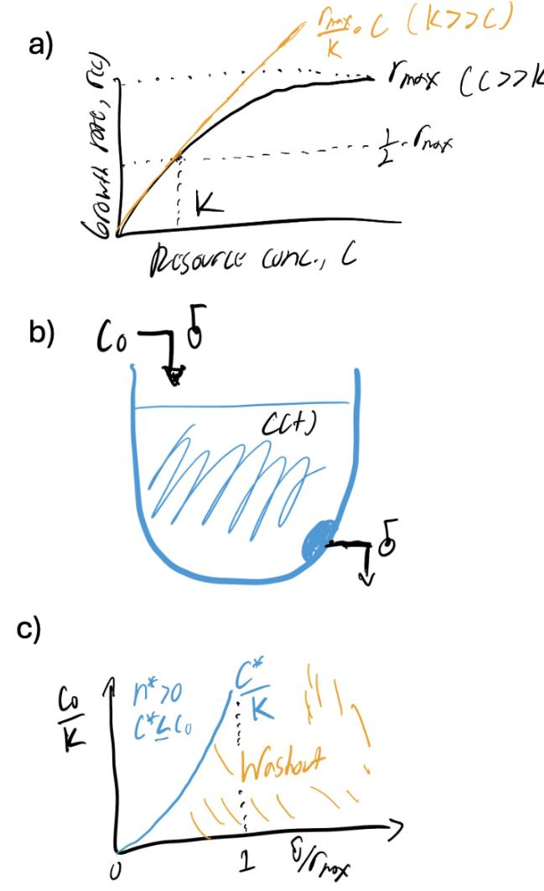
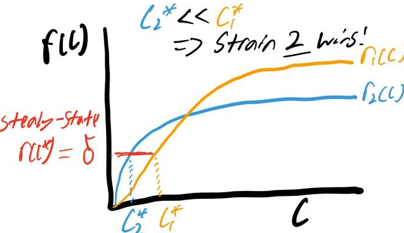
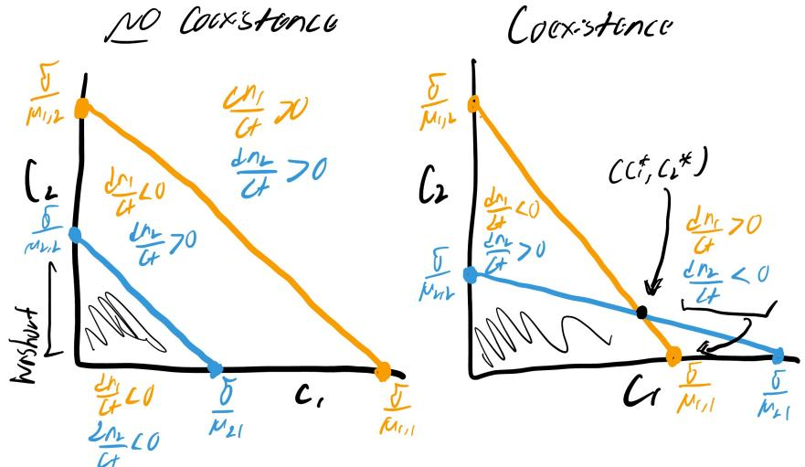
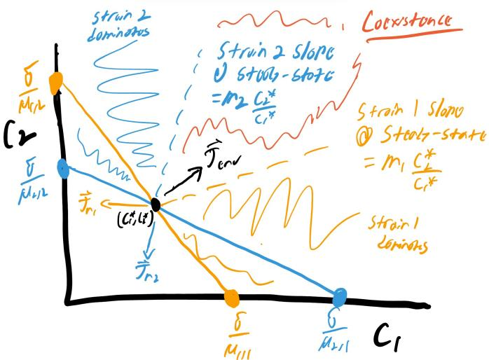
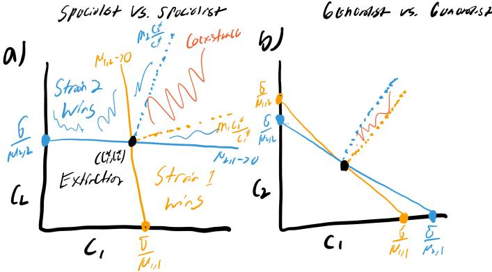
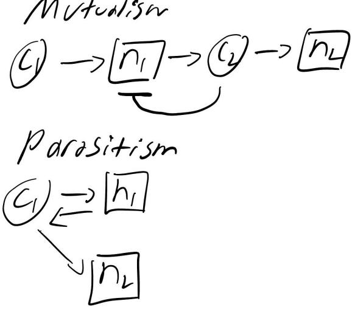
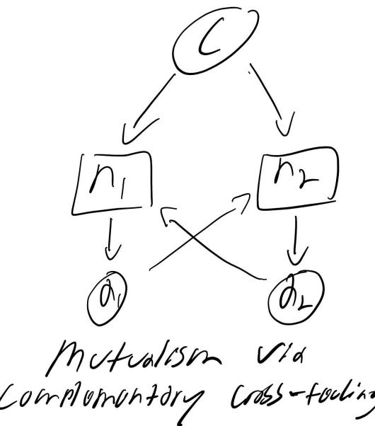
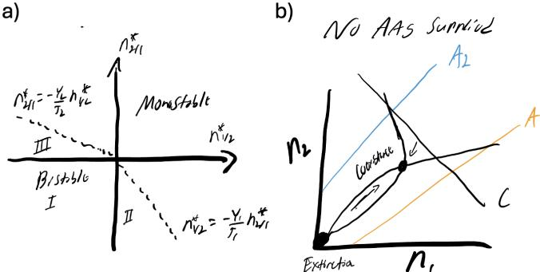

# Microbial coexistence in a chemostat setting ICTP Hands-On Quantitative Biology School University of Havana, Cuba

Jacopo Grilli ∗1 , Gabriele Micali2 , Jose A. Pereiro-Morej´on3,4, and William R. Shoemaker1

1Quantitative Life Sciences, The Abdus Salam International Centre for Theoretical Physics (ICTP), Trieste, 34151, Italy. 2 Istituto di Ricovero e Cura a Carattere Scientifico Humanitas Research Hospital, Rozzano 20089, Italy. 3Group of Complex Systems and Statistical Physics, Physics Faculty, University of Havana, San Lazaro y L, Vedado, La Habana 10400, Cuba. 4Biology Faculty, University of Havana, San Lazaro y L, Vedado, La Habana 10400, Cuba.

November 4-15, 2024

### 1 Motivation

Introduction: Why study coexistence? On our planet, no single strain exists in isolation. thousands of different organisms coexist, often within the same ecosystem. But why is this the case? What are the fundamental principles that shape the diversity of biological systems, promoting coexistence rather than competitive exclusion? How can multiple strain share finite resources, and what prevents one from dominating and driving others to extinction? These are some of the most compelling open questions in ecology and evolutionary biology.

Understanding how different strain coexist is not only essential for explaining biodiversity but also has profound practical implications. In medicine, for instance, microbial communities play critical roles in health and disease, especially in the human gut. In environmental sustainability, promoting coexistence can improve strategies for conserving biodiversity and managing ecosystems. In synthetic biology, designing stable multistrain consortia is crucial for applications

∗Authors sorted in alphabetical order

such as biofuel production or waste degradation. Unraveling the mechanisms of coexistence can thus inform better solutions to challenges in these fields.

In this lecture, we will explore how the number of resources available relates to the number of strain that can stably coexist in a chemostat, a controlled system where organisms grow while sharing a common pool of resources. We will focus particularly on mutualistic and commensal cross-feeding interactions, which illustrate how strain can depend on each other for survival. By the end of this session, you will have the theoretical understanding and practical tools needed to conduct experiments that probe these dynamics.

Why interdisciplinary approaches matter. Traditionally, coexistence in biology was studied from a descriptive, observational standpoint. However, with the integration of mathematics and physics, we can now develop models that generate testable predictions about how populations will behave under various conditions. By combining theoretical and experimental approaches, we move beyond qualitative descriptions to uncover the quantitative relationships that govern coexistence.

This lesson underscores the value of interdisciplinary approaches, where biological problems are formalized and hypotheses are tested with real experimental data. As you progress through this course, you will experience first-hand how mathematical theory and experimentation can come together to deepen our understanding of biological systems.

Why build a chemostat? The chemostat — a system where organisms continuously grow while sharing resources under controlled conditions — provides an ideal model for studying population dynamics, resource competition, and growth rates in a steady-state environment. In a chemostat, fresh nutrients are constantly supplied while waste is removed at a constant rate, allowing the growth rate and population density of microorganisms to be maintained over extended periods. This continuous culture system offers precise control over growth conditions such as nutrient levels and dilution rates, making it particularly suited for investigating interactions and coexistence dynamics in a stable, long-term environment.

In contrast, batch culture experiments, which are more commonly used, operate in a closed system. In batch cultures, organisms grow in a fixed volume of nutrients, with no fresh medium added during the experiment. Consequently, nutrient levels deplete over time, resulting in distinct growth phases: lag, exponential, stationary, and death. Batch cultures are simpler and faster to set up compared to chemostats. However, the interpretation of results can require more assumptions since the temporal dynamics introduce additional complexity to the system.

When comparing a chemostat to a batch culture system, it is important to consider the following:

- Steady-state vs. dynamic conditions: A chemostat can maintain a steadystate environment, while in batch cultures, conditions change continuously
as nutrients deplete and waste accumulates.

- Control over growth rate: In a chemostat, growth rates can be precisely controlled by adjusting the dilution rate, whereas in batch cultures, growth is dependent on initial conditions and eventually reaches a plateau.
We can compare these two experimental scenarios by considering two strain that are competing for the same carbon source. In a batch culture, they might coexist by consuming carbon at different rates or experiencing growth lags at different times. These physiological factors allow one strain to dominate the other as nutrients deplete, meaning that the strength and outcome of competition changes with time. In contrast, in a chemostat, coexistence depends more directly on their growth rates under constant conditions. As one strain outgrows the other, it will tend to dominate at steady-state.

The goal of this lecture. Here the aim is to demonstrate how principles of coexistence theory can be derived from consumer-resource dynamics using the chemostat as an experimentally-motivated system. We will start with a one-strain one-resource system to demonstrate how classic phenomenological models of growth (e.g., logistic) can be interpreted through the lens of consumerresource dynamics. From there we will increase the number of strain (S) and number of sustainable resources (R), as well as how resources enter and exist the system (e.g., excretion as metabolic byproducts). Below are a few important things that these notes will not cover due to time constraints.

- Cellular death. In these notes cells "die" due to exiting the chemostat via dilution, which is warranted if the death rate is much smaller than the dilution rate.
- Physiology beyond the growth rate. The growth rate is a function of physiological conditions of the cell, which in recent years have been modeled using the proteome (recent review in [1]) and connected with consumerresource models [2].
- Phage. Bacteria are effectively "consumed" by phage, which can shape nutrient release and subsequent use [3].
- Evolution. Mutations can alter the resource preferences of microorganisms. Recent work demonstrates how eco-evolutionary insight can be obtained using consumer-resource models [4].

# 2 Chemostat dynamics with R = 1 supplied resource

We start by considering a chemostat comprised of one strain of density n with one supplied resource of concentration c.

$$\frac{dn}{dt} = \underbrace{r(c)n}_{\text{Growth}} - \underbrace{\delta n}_{\text{Dilution}} \tag{1a}$$

$$\frac{dc}{dt} = \underbrace{\delta c_0}_{\text{Input}} - \underbrace{\delta c}_{\text{Dilution}} - \underbrace{r(c)\frac{n}{Y}}_{\text{Consumption}} \tag{1b}$$

We have chosen to use units of density/concentration so that we do not have to keep track of an explicit parameter for chemostat volume. The parameters are defined as follows.

- δ = dilution factor, fraction of volume that flows in and out per unit time (units h−1 ).
- Y = Yield, # cells per unit resource.
- r(c) = rmax c c+K , the Monod growth rate.

While the parameters in r(c) and Y can vary from resource-to-resoruce, it is useful to view them as parameters that can theoretically be genetically encoded by the strain. In contrast, δ and c0 are parameters of the environment.

#### 2.1 Steady-state

With the following steady-states

$$r(c^*) = \delta \tag{2a}$$

$$n^* = Y(c_0 - c^*) \approx Yc_0 \tag{2b}$$

The last steady-state reflects the principle of mass conservation. Furthermore, there is no growth rate dependence. These solutions are subject to the criteria

$$c(t) \to c^* \le c_0 \tag{3a}$$

$$n(t) \to n^* \ge 0\tag{3b}$$

We can determine when we achieve a non-trivial cell density (n ∗ > 0, c ≤ c0) using the Monod growth rate [5, 6]

Figure 1: a) Monod function of growth, b) chemostat illustration, c) steadystate phases of a chemostat

$$
\delta = r(c^*) \tag{4a}
$$

$$=r_{\text{max}} \frac{c^*}{c^* + K} \tag{4b}$$

$$\begin{array}{ccccc} > 0 & & & & \\ & c^* & & & \delta \end{array} \tag{4c}$$

$$\rightarrow \frac{c^*}{K} = \frac{\delta}{r_{\text{max}} - \delta} \tag{4d}$$

$$
\rightarrow \frac{c_0}{K} > \frac{\delta}{r_{\text{max}} - \delta} \approx \frac{\delta}{r_{\text{max}}} > 0 \tag{4e}
$$

Where in the first arrow we re-arranged the equation, while in the second arrow we have used our criteria for a non-trivial steady-state abundance. We have also assumed that the dilution rate is small relative to rmax to simplify the expression. We can see from the above expression that our strain will go extinct if δ is too large or c0 too small, an outcome known as washout.

Exercise 1: Mechanism → phenomenology Often in biology we use phenomenological models of growth that may or may not relate to mechanistic models (e.g., consumer-resource). Use the above principle of mass conservation along with the adiabatic assumption 0 = 1 Y dn dt + dc dt and the dilution rate limit rmax ≫ δ to derive Verhulst's logistic model of growth

$$\frac{dn}{dt} = n\ddot{r}\left(1 - \frac{n}{\ddot{K}}\right) \tag{5}$$

starting from the one-resource, one-species consumer resource model. Here r˜ and K˜ represent the growth rate and carrying capacity, effective parameters that are functions of parameters in the consumer-resource model (e.g., δ). Ask yourself the following questions.

- There has been historical interest in the relationship between a population's growth rate and carrying capacity. What mechanistic parameters factor into both phenomenological parameters? Does the mechanistic growth rate rmax only shape our phenomenological growth rate ˜r?
- What is the steady state of the population? Argue that it is/is not stable.
- Under what parameter regime does the logistic growth equation reduce to exponential growth?

### 2.2 Competition for R = 1 resource

A classic result in community ecology is that the strain that can survive at the lowest steady-state resource concentration is the one that will survive when competing for a single resource [7]. That is, the strain with the lowest c ∗ (Fig. 2).

Figure 2: The strain with the lower c ∗ is the strain that achieves the highest rate of growth at steady-state, out-competing the remaining strain. Here the growth rate of each strain follows a Monod function, but different parameters alters the shape of each curves, so one strain does not necessarily maintain a lower c ∗ as δ increases. This scenario also applies to the batch culture scenario, as c(t) is depleted with time, resulting in different strains having higher rates of growth as c is depleted.

We can demonstrate this principle using a chemostat with two strains and a single supplied resource.

$$\frac{dn_1}{dt} = n_1(r_1(c) - \delta),\tag{6a}$$

$$\frac{dn_2}{dt} = n_2(r_2(c) - \delta),\tag{6b}$$

$$\frac{dc}{dt} = \delta(c_0 - c) - r_1(c)\frac{n_1}{Y_1} - r_2(c)\frac{n_2}{Y_2}.\tag{6c}$$

We again assume Monod growth rates and obtain the steady-state abundance of strain 1.

$$r_{\max,1} \frac{c_1^*}{c_1^* + K_1} = \delta \tag{7a}$$

$$\frac{1}{c_1^*} = \frac{1}{K_1} \left( \frac{r_{\text{max},1}}{\delta} - 1 \right),\tag{7b}$$

where c ∗ 1 here denotes the concentration of resource c that strain one consumes at steady-state phase. Similarly, for strain 2

$$\frac{1}{c_2^*} = \frac{1}{K_2} \left( \frac{r_{\text{max},2}}{\delta} - 1 \right),\tag{8}$$

where c ∗ 2 denotes the concentration of resource c that strain 2 consumes at steady-state. So c ∗ i is a function of strain-specific maximum growth rates and Monod constants and the strain with the smallest c ∗ i is the one that survives. We will now prove this result. Consider the scenario where strain one survives, drawing the resource concentration to c ∗ 1 . In this scenario strain 2 has the following dynamics

$$\frac{dn_2(c_1^*)}{dt} = n_2 \left( r_{\text{max},2} \frac{c_1^*}{c_1^* + K_2} - \delta \right). \tag{9}$$

We now ask when dn2(c ∗ 1 ) dt > 0. The conditions is

$$r_{\max,2} \frac{c_1^*}{c_1^* + K_2} > \delta \to \frac{r_{\max,2}}{\delta} > 1 + \frac{K_2}{c_1^*}.\tag{10}$$

Using Eq. 7, we get

$$\frac{r_{\text{max},2}}{\delta} - 1 > \frac{K_2}{K_1} \left( \frac{r_{\text{max},1}}{\delta} - 1 \right). \tag{11}$$

and with Eq. 8, we find the following criterion

$$\frac{1}{K_2} \left( \frac{r_{\text{max},2}}{\delta} - 1 \right) > \frac{1}{K_1} \left( \frac{r_{\text{max},1}}{\delta} - 1 \right) \tag{12a}$$

$$1 \to c_1^* > c_2^* \tag{12b}$$

This result means that the condition for strain 2 to increase in density, and thus invade strain 1 in a chemostat, requires c ∗ 2 < c∗ 1 . The symmetry of the equations means that strain 1 can invade when c ∗ 2 > c∗ 1 . Coexistence can be only be obtained when c ∗ 2 = c ∗ 1 . However, given that our strains are indistinguishable outside of their growth-related parameters, the two strains are ecologically equivalent and, thus, the same strain. The result is generalizable to S > 2 strains, where the strain that leaves the lowest steady-state concentration of resource in the environment will be the one to survive.

# 3 Chemostat dynamics with R = 2 supplied resources

In the previous sections, we showed that increasing the number of strains while maintaining a single resource does not permit co-existence. Now, we would like to understand when and how co-existence between two strain is allowed. We will consider the possibility of having two strains and two resources and determine when one strain goes extinct (i.e., dominance), both strains survive (i.e., co-existence), and both strains go extinct (i.e., washout). When introducing multiple resources, we need to observe that two different categories could be possible. Resources are often categorized as "substitutable" (e.g., glucose vs. glycerol) or "essential" (phosphorus and nitrogen). Substitutable resources can also be used simultaneously (i.e., co-utilized) or sequentially utilized according to resource-preference hierarchy. Unless otherwise specified, we will be focusing on substitutable, co-utilized resources, as they allow for the most generalizable results.

$$\frac{dn_1}{dt} = n_1(r_{1,1}(c_1) + r_{1,2}(c_2) - \delta) \tag{13a}$$

$$\frac{dn_2}{dt} = n_2(r_{2,1}(c_1) + r_{2,2}(c_2) - \delta) \tag{13b}$$

$$\frac{dc_1}{dt} = \delta(c_1^0 - c_1) - r_{1,1}(c_1)\frac{n_1}{Y_1} - r_{2,1}(c_1)\frac{n_2}{Y_1} \tag{13c}$$

$$\frac{dc_2}{dt} = \delta(c_2^0 - c_2) - r_{1,2}(c_2)\frac{n_1}{Y_2} - r_{2,2}(c_2)\frac{n_2}{Y_2} \tag{13d}$$

We have made the assumption that different strain consuming the same resource have the same yield (Y1,1 = Y2,1 ≡ Y1 and Y1,2 = Y2,2 ≡ Y2). This assumption is more reasonable than assuming different resources have the same yield (e.g., the number of C atoms varies across C sources). We will again make the assumption that Ki,j ≫ ci,j (t), linearizing the Monod equation. To simplify the notation we define µi,j ≡ r i,j max Ki,j .

We now have the system

$$\frac{dn_1}{dt} = n_1(\mu_{1,1}c_1 + \mu_{1,2}c_2 - \delta)\tag{14a}$$

$$\frac{dn_2}{dt} = n_2(\mu_{2,1}c_1 + \mu_{2,2}c_2 - \delta) \tag{14b}$$

$$\frac{dc_1}{dt} = \delta(c_1^0 - c_1) - \mu_{1,1}c_1 \frac{n_1}{Y_1} - \mu_{2,1}c_1 \frac{n_2}{Y_1} \tag{14c}$$

$$\frac{dc_2}{dt} = \delta(c_2^0 - c_2) - \mu_{1,2}c_2 \frac{n_1}{Y_2} - \mu_{2,2}c_2 \frac{n_2}{Y_2} \tag{14d}$$

We can determine the steady-state resource concentrations by setting the strain ODEs equal to zero (and assuming n ∗ 1 , n∗ 2 > 0). Rearranging, we get the following two equations

$$
\mu_{1,1}c_1 + \mu_{1,2}c_2 = \delta \tag{15a}
$$

$$
\mu_{2,1}c_1 + \mu_{2,2}c_2 = \delta \tag{15b}
$$

which can be represented in matrix form

$$
\begin{bmatrix} \mu_{11} & \mu_{12} \\ \mu_{21} & \mu_{22} \end{bmatrix} \begin{bmatrix} c_1^* \\ c_2^* \end{bmatrix} = \begin{bmatrix} \delta \\ \delta \end{bmatrix} \tag{16}
$$

and solved as

$$
\begin{bmatrix} c_1^* \\ c_2^* \end{bmatrix} = \frac{1}{\det(\mathbf{M})} \begin{bmatrix} \mu_{22} & -\mu_{12} \\ -\mu_{21} & \mu_{11} \end{bmatrix} \begin{bmatrix} \delta \\ \delta \end{bmatrix} \tag{17}
$$

This result shows that steady-state nutrient levels are set by resource consumption rates and the dilution rate.

We can determine steady-state abundances by repeating the above matrix manipulation on the resource ODEs at steady-state.

$$
\begin{bmatrix} \mu_{11} & \mu_{21} \\ \mu_{12} & \mu_{22} \end{bmatrix} \begin{bmatrix} n_1^* \\ n_2^* \end{bmatrix} = \delta \begin{bmatrix} \left(\frac{c_1^0}{c_1^*} - 1\right) Y_1 \\ \left(\frac{c_2^0}{c_2^*} - 1\right) Y_2 \end{bmatrix},\tag{18}
$$

By inverting the matrices we obtain the solution

$$
\begin{bmatrix} n_1^* \\ n_2^* \end{bmatrix} = \frac{\delta}{\det(\mathbf{M}^\mathrm{T})} \begin{bmatrix} \mu_{22} & -\mu_{21} \\ -\mu_{12} & \mu_{11} \end{bmatrix} \begin{bmatrix} \frac{c_1^0}{c_1^1} - 1 \\ \frac{c_2^0}{c_2^0} - 1 \end{bmatrix} Y_1
$$

$$
= \frac{\delta}{\det(\mathbf{M}^\mathrm{T})} \begin{bmatrix} \mu_{22} \frac{c_1^0 - c_1^*}{c_1^1} Y_1 - mu_{21} \frac{c_2^0 - c_2^*}{c_2^2} Y_2 \\ -\mu_{12} \frac{c_1^0 - c_1^*}{c_1^1} Y_1 + mu_{11} \frac{c_2^0 - c_2^*}{c_2^2} Y_2 \end{bmatrix} \tag{19}
$$

$$
= \begin{bmatrix} \frac{\mu_{2,2} (c_1^0 - c_1^*) Y_1}{\mu_{2,2} - \mu_{1,2}} - \frac{\mu_{2,1} (c_2^0 - c_2^*) Y_2}{\mu_{1,1} - \mu_{2,1}} \\ -\frac{\mu_{1,2} (c_1^0 - c_1^*) Y_1}{\mu_{2,2} - \mu_{1,2}} + \frac{\mu_{1,1} (c_2^0 - c_2^*) Y_2}{\mu_{1,1} - \mu_{2,1}} \end{bmatrix}
$$

Where we have used the steady-state solutions of resource concentration. However, is not clear what the above results tell us about the parameter regime where co-existence is permitted. We would like to know how co-existence depends on environmental parameters (δ, c 0 j ) and physiological parameters (µi,j , Yi,j ). Using the above results we can determine the stability of solutions where we find steady-state co-existence n ∗ 1 , n∗ 2 > 0. Intuitively we expect co-existence to be more stable when strain consume different resources, a strategy known as specialists. In the other extreme case we might expect co-existence to be less stable when two strain compete for all the resources in the environment, a strategy known as generalists. These scenarios can be modeled as the µi,j of different strain being highly different or similar. Once the parameters are chosen, the stability of resource and strain steady-states can be evaluated [8].

However, instead of performing an extensive calculation, we will turn to a graphical approach developed by Tilman to examine co-existence focusing on the effect that strain abundance has on resource concentration [9]. First, we take Eq. 15, and we set the concentration of the first resource to zero, c1 = 0, assuming that strain 1 has completely depleted this resource from the environment. We then solve for the concentration of the second resource c2. This gives us one point that represents the resource availability in the system

Figure 3: ZNGI example

when c1 = 0 and the strain can only grow using c2. Mathematically, this results in a point (0, δ/µ1,1) for strain 1 and (0, δ/µ2,1) for strain 2.

We repeat the process for the second resource by setting c2 = 0 and solve for c1, assuming that the strain has completely depleted the second resource from the environment. This gives us another point on the resource axis, representing the scenario where strains are growing using only the first resource. For strain 1, this results in the point (δ/µ1,2, 0), and for strain 2, the point (δ/µ2,2, 0).

Now, for each strain, we have two points: one where c1 = 0 and another where c2 = 0. The line between these two points represents resource combinations where each strain has net growth of zero (AKA the Zero Net Growth Isocline, or ZNGI).

- Strain 1 ZNGI: (0, δ/µ1,1),(δ/µ1,2, 0)
- Strain 2 ZNGI: (0, δ/µ2,1),(δ/µ2,2, 0)

When we plot these points on a graph, with c1 on one axis and c2 on the other axis, we can draw a line between these two points for each strain. This line represents the resource combinations at which the strain can maintain its population size. If these two lines intersect, the intersection represents the steady-state concentrations of the two resources where both strains can coexist. If the resource preferences set the lines such that the ZNGIs do not intersect, then the strain with the lower resource requirements will outcompete the other, an outcome analogous to c ∗ when one resource is provided (Fig. 3).

But how do can we understand the effect of n1 and n2 on the resources using the graphical approach? We start by writing the ODEs for resource dynamics in matrix form

$$
\begin{bmatrix}
\frac{dc_1}{dt} \\
\frac{dc_2}{dt}
\end{bmatrix} = \delta \underbrace{\begin{bmatrix}c_1^0 - c_1\\c_2^0 - c_2\end{bmatrix}}_{\mathbf{J}_{\text{env}}} - n_1 \underbrace{\begin{bmatrix}\mu_{1,1} \frac{c_1}{Y_1}\\\mu_{1,2} \frac{c_2}{Y_2}\end{bmatrix}}_{-\mathbf{J}_{n_1}} - n_2 \underbrace{\begin{bmatrix}\mu_{2,1} \frac{c_1}{Y_1}\\\mu_{2,2} \frac{c_2}{Y_2}\end{bmatrix}}_{-\mathbf{J}_{n_2}}
$$

Here Jenv can be viewed as the flux of resources due to environmental parameters (dilution rate and supplied concentration) while Jn1 and Jn2 can be viewed as the flux of resources due to strain parameters (e.g., yield, resource consumption). Alternatively stated, the system can be parameterized such that the environment is the source of resources and strains are the sinks. At steadystate these fluxes are balanced if n ∗ 1 , n∗ 2 > 0 and can be graphically represented in the (c1, c2) plane.

Choosing arbitrary points in the resource axes (ˆc1, cˆ2) where (ˆc1 ≤ c 0 1 and cˆ2 ≤ c 0 2 ), Jenv points in the direction of the supplied resources. The strain fluxes Jn1 and Jn2 point away from supply points, the slopes of which can be calculated as the rise-over-run: m1 = µ1,2Y1 Y2µ1,1 and m2 = µ2,2Y1 Y2µ2,1 . We see from these results that when m1 < 1 that n1 prefers c1 over c2. Likewise, when m2 < 1 n2 prefers c1 over c2.

To find the lines that go through our chosen points (ˆc1, cˆ2), we again use the rise-over-run to identify the ODE dc2 dc1 = mi c2 c1 for each slope. We solve this equation by performing integration and using our chosen points as the constant of integration, we get c2 = ˆc2 c1 cˆ1 mi . The flux Jn1 is a tangent of c2(m1) while Jn2 is a tangent of c2(m2). What we now have is a way to calculate the direction of the flux of resources due to consumption for a given set of points (ˆc1, ˆc2), the magnitude of which is determined by strain abundance. By choosing arbitrary points (ˆc1, cˆ2), we see that Jenv always points in the direction of the supplied resources (c ∗ 1 , c∗ 2 )

We can now combine our resource flux results with our ZNGIs to examine when co-existence is permitted. Setting ˆc1 = c ∗ 1 and ˆc2 = c ∗ 2 , we can plot the consumption preference slopes for each strain as dc2(mi) dc1 cˆ1=c ∗ 1 cˆ2=c ∗ 2 = mi c ∗ 2 c ∗ 1 . The

region between these slopes for the two strains is the phase space where coexistence can occur. Below one of these lines, but above the ZNGI, is the region of phase space where both species are capable of growth, but one species is able to outcompete the other (Fig. 4).

We note that the the fixed points identified in this model are stable. This means that the system will return to these steady-states if perturbed, and no phase transitions are observed within this framework. The absence of phase transitions implies that small changes in system parameters, such as resource availability or strain consumption rates, will not lead to abrupt shifts in the overall behavior of the system. Finally, while we have focused on analytically tractable models it is worth noting that this graphical approach is also useful in

Figure 4: Coexistence diagram

that it can be applied to a range of consumer-resource models where analytical results are not easily obtained.

### 3.1 Phase space of coexistence for "generalists" and "specialists"

Two strain become specialists as their preference for one resource approaches zero (µ1,2.µ2,1 → 0). We see in the below plot that in this scenario the size of the coexistence phase space approaches its maximum. In geometric terms, the resource preferences of the two strain approach orthogonality (Fig/ 5a). In contrast, we see that the size of coexistence phase space decreases as µ1,2 → µ2,2 and µ2,1 → µ1,1 (Fig/ 5b).

We can quantify the proportion of phase space where co-existence occurs for a fixed environment (c 0 1 , c 0 2 , δ). First, it is useful to define a steady-state flux of each resource

$$j_1^* \equiv \delta(c_1^0 - c_1^*) Y_1 \tag{20a}$$

$$j_2^* \equiv \delta(c_2^0 - c_2^*) Y_2 \tag{20b}$$

applying these definitions to our matrix equation for steady-state abundances, we obtain

Figure 5: Specialists and generalists

$$
\begin{split}
\begin{bmatrix} n_1^* \\ n_2^* \end{bmatrix} &= \begin{bmatrix} \frac{\mu_{2,2}(n_1^0 - n_1^*)Y_1}{\mu_{2,2} - \mu_{1,2}} - \frac{\mu_{2,1}(n_2^0 - n_2^*)Y_2}{\mu_{1,1} - \mu_{2,1}} \\ - \frac{\mu_{1,2}(n_1^0 - n_1^*)Y_1}{\mu_{2,2} - \mu_{1,2}} + \frac{\mu_{1,1}(n_2^0 - n_2^*)Y_2}{\mu_{1,1} - \mu_{2,1}} \end{bmatrix} \\ &= \begin{bmatrix} \frac{\mu_{2,2}}{\mu_{2,2} - \mu_{1,2}} \frac{j_1^*}{\delta} - \frac{\mu_{2,1}}{\mu_{1,1} - \mu_{2,1}} \frac{j_2^*}{\delta} \\ - \frac{\mu_{1,2}}{\mu_{2,2} - \mu_{1,2}} \frac{j_1^*}{\delta} + \frac{\mu_{1,1}}{\mu_{1,1} - \mu_{2,1}} \frac{j_2^*}{\delta} \end{bmatrix} \end{split} \tag{21}
$$

By summing these two equations we obtain a mass conservation constraint: n ∗ 1 + n ∗ 1 = δ −1 (j ∗ 1 + j ∗ 2 ). Because we only have two strain, it is useful to define strain densities and resource fluxes in terms of dimensionless fractions (similar to how population genetics examines mutants in terms of frequencies instead of abundances whenever possible). We define the fractions f ∗ ≡ n ∗ 1/(n ∗ 1 + n ∗ 2 ) and g ∗ ≡ j ∗ 1 /(j ∗ 1 + j ∗ 2 ) and use your mass balance function to obtain

$$f^* = g^* \frac{\mu_{2,2}}{\mu_{2,2} - \mu_{1,2}} + (1 - g^*) \frac{\mu_{2,1}}{\mu_{1,1} - \mu_{2,1}} \tag{22}$$

We see that each of our two terms only uses µi,j parameters for a single resource j. We can reduce the above equation further by defining αj ≡ µ1,j µ2,j .

$$f^* = g^* \frac{1}{1 - \alpha_1} + (1 - g^*) \frac{1}{1 - \alpha_2} \tag{23}$$

Since f ∗ > 0 or < 1 for there to be co-existence, we can identify the following parameter limits

- α1 > 1 α2 > 1 → f ∗ 1 < 0, No coexistence, strain 2 wins
- α1 < 1 α2 < 1 → f ∗ 1 > 1, No coexistence, strain 1 wins
- α1 > 1 > α2 or α1 < 1 < α2, → 0 < f1 < 1, Coexistence

We can use these criteria to identify the resource preference parameters where co-existence occurs. The last criterion provides two different bounds for when co-existence occurs.

$$
\alpha_1 > 1 > \alpha_2 \to \frac{g_1^*}{1 - \alpha_2} > \frac{(1 - g_1^*)}{\alpha_1 - 1} \to g_1^* \alpha_1 + (1 - g_1^*) \alpha_2 > 1\tag{24a}
$$

$$
\alpha_1 < 1 > \alpha_2 \to \frac{g_1^*}{1 - \alpha_2} < 1 + \frac{(1 - g_1^*)}{\alpha_1 - 1} \to \frac{g_1^*}{\alpha_1} + \frac{1 - g_1^*}{\alpha_2} > 1\tag{24b}
$$

We can use our inequalities that only depend on αj and our inequalities that depend on both αj and g ∗ i to identify the coexistence region of phase space. We will derive the solution for α1 > 1 > α2. You can derive the solution for the other inequality on your own. Under this resource inequality we derive the following inequalities for strain frequency

$$g_1^* \alpha_1 + (1 - g_1^*) \alpha_2 > 1 \to fg1^* > \frac{1 - \alpha_2}{\alpha_1 - \alpha_2} \tag{25a}$$

$$\frac{g_1^*}{\alpha_1} + \frac{1 - g_1^*}{\alpha_2} > 1 \to g_1^* < \frac{\alpha_1 (1 - \alpha_2)}{\alpha_1 - \alpha_2} \tag{25b}$$

So coexistence occurs when α1(1−α2) α1−α2 < g∗ 1 < α1(1−α2) α1−α2 . When different strain consume the same resource αj , the ratio of the consumption rates, approaches 1. In this parameter regime the region of phase space where co-existence can occur decreases. However, when strain specialize on a given resource αj moves away from one, increasing the range of co-existence. These bounds on niche overlap are an example of the concept of "limiting similarity" in theoretical ecology, where a maximum level of niche overlap sets the bounds on co-existence [10, 11].

### 4 Chemostat dynamics under resource exchange

### 4.1 Varieties of resource exchange

So far we have only examined substitutable resources that are supplied by the environment. For the rest of the notes we will consider the ecological effects when resources are produced by strains. Resource exchange can occur via a number of routes. Often researchers will categorize resource exchange by the reciprocity of the relationship between strains. For example, say that one strain produces another resource that it does not re-uptake for growth (e.g., acetate

$$
\begin{array}{c}
\begin{array}{c}
\circlearrowright \\
\circlearrowright\end{array}
\mapsto \begin{array}{c}
\circlearrowright \\
\circlearrowright\end{array}
\mapsto \begin{array}{c}
\circlearrowright \\
\circlearrowright\end{array}
\mapsto \begin{array}{c}
\circlearrowright \\
\circlearrowright\end{array}
$$

Figure 6: Examples of how a) commensalism, b) mutualism, and c) parasitism mediated by resource exchange. Arrows represent the promotion of growth, bars represent its inhibition.

excretion via overflow metabolism). This resource can then be used by another strain, though the consumption of this resource by the other strain does not necessarily impact the growth of the producer. Such interactions are known as commensalism (Fig. 6a). Mutualisms occur when both strains benefit from their interaction. An example could be one strain consuming a metabolite that inhibits the growth of the other strain (Fig. 6b). In contrast, predation occurs when one strain grows at the expense at the other (Fig. 6c). An example could be the degradation of complex polysaccharides in a marine environment. Both strains require the carbon that can only be acquired by degrading the complex, but only one strain is producing the enzymes that perform the degradation. The production of extracellular enzymes can incur substantial energetic cost, meaning that one strain is effectively growing at the expense of the other.

Exercise 3: Analyze a model of resource exchange Pick one of the conceptual models in Fig. 6 and represent it as a system of ODEs. Then analyze the model, some potential questions could be

- What does the system look like when you take the adiabatic limit by setting resource ODEs to zero, reducing the system to just strain ODEs?
- How many stable states are there?
- What parameter regimes permit coexistence?
- What would be a viable experiment to test the predictions of your model?

#### 4.2 Mutualism via complementary cross-feeding

In this course, focus on a particular types of mutualism where coexistence is mediated by the exchange of resources. The goal is to understand 1) when and why coexistence is permissible in a two-member community and to 2) determine how parameters chosen by the experimentor can impact coexistence. We are working with E. coli strains that have been engineered so that they each are each unable to produce a single amino acid, in this case methionine (∆Met) and isoleucine (∆Ile). The strains are inoculated in a chemostat so we are primarily interested in how the dilution rate and straightforward manipulations (i.g., concentration of supplied AA) alter the steady-state behavior of the system. A carbon source is supplied that both strains require for growth, but each strain is relying on the growth of the other to acquire one AA, a non-substitutable resource (Fig. 7).

Both strains require the carbon source to grow and one of two AAs. We refer to the carbon source and two AAs collectively as "resources". We start with the most general model and reduce to specific cases as needed. All three resources are supplied to the chemostat from an external source at a fixed concentration (c0, a (Met) 0 , a (Ile) 0 ). Our variables are in units of concentration, as we assumed a fixed chemostat volume. We can build a system of five ODEs. We go in alphabetical order, specifying Ile as 1 and Met as 2. So strain 1 requires AA 1 from strain 2 and vice-versa.

Figure 7: Conceptual diagram of a mutualistic interaction mediated by the exchange of amino acids, a form of cross-feeding.

$$\frac{dn_1}{dt} = n_1(\underbrace{\lambda_1(c, a_1)}_{\text{growth}} - \underbrace{\delta}_{\text{dilution}}) \tag{26a}$$

$$\frac{dn_2}{dt} = n_2(\underbrace{\lambda_2(c, a_2)}_{\text{growth}} - \underbrace{\delta}_{\text{dilution}}) \tag{26b}$$

$$\frac{dc}{dt} = \underbrace{\delta c^{(0)}}_{\text{input}} - \underbrace{\delta c}_{\text{dilution}} - \left(\underbrace{n_1 u_1^{(c)}(c, a_2) + n_2 u_2^{(c)}(c, a_1)}_{\text{update}}\right) \tag{26c}$$

$$\frac{da_1}{dt} = \underbrace{\delta a_1^{(0)}}_{\text{input}} - \underbrace{\delta a_1}_{\text{dilution}} - \underbrace{n_1 u_1^{(1)}(c, a_1)}_{\text{update}} + \underbrace{n_2 j_2^{(2)}(c, a_2)}_{\text{exccretion}} \tag{26d}$$

$$\frac{da_2}{dt} = \underbrace{\delta a_2^{(0)}}_{\text{input}} - \underbrace{\delta a_2}_{\text{dilution}} - \underbrace{n_2 u_2^{(2)}(c, a_2)}_{\text{update}} + \underbrace{n_1 j_1^{(1)}(c, a_1)}_{\text{exccretion}}\tag{26e}$$

Where we have assumed that a strain does not uptake the same AA that it excretes into the environment. We then define the update and excretion rates as functions proportional to the growth rate. We will also assume similar yields and excretion rates for the same resource across different strains (e.g., Yj ≡ Y (i) j .

$$u_i^{(j)}(c, a_j) = \lambda_i(c, a_j) / Y_j \tag{27a}$$

$$j_i^{(j)}(c, a_j) = \lambda_i(c, a_j) / J_j \tag{27b}$$

Guessing the form of λi(c, ai) is a key assumption. Alternative forms may be more accurate, but for analytic tractability we will use the product of two Monod growth rates

$$
\lambda_i(c, a_i) = \lambda_i^{\max} \frac{c}{c + K_c} \frac{a_i}{a_i + K_{a_i}} \tag{28}
$$

Similar to our linearizing assumption used earlier, we can linearize this function by observing that the second-order PDE is the first non-zero term of the Taylor approximation for the growth rate around c, ai = 0.

$$
\lambda_i(c, a_i) \approx \frac{\partial^2 \lambda_i}{\partial c \partial a_i} \Big|_{c, a_i = 0, 0} = \frac{\lambda_i^{\text{max}}}{K_c K_{a_i}} \cdot c a_i = \dots = \tilde{\lambda}_i \cdot c a_i \tag{29}
$$

Because our main observable in the experiment is the abundance of strains, not resources, we want to reduce our system of equations into two ODEs of strain dynamics. This way we can understand how AA supply and dilution rates alter the system. We will accomplish this using the same approach you used in Ex. 1. We first obtain the following mass constraints at steady-state, which are valid over timescales t ≫ δ −1

$$\frac{dc}{dt} + \frac{1}{Y_c} \frac{dn_1}{dt} + \frac{1}{Y_c} \frac{dn_2}{dt} = 0 \to c = c^0 - \frac{n_1 + n_2}{Y_c} \tag{30a}$$

$$\frac{da_1}{dt} + \frac{1}{Y_1} \frac{dn_1}{dt} - \frac{1}{J_1} \frac{dn_2}{dt} = 0 \to a_1 = a_1^0 - \frac{n_1}{Y_1} + \frac{n_2}{J_1} \tag{30b}$$

$$\frac{da_2}{dt} + \frac{1}{Y_2}\frac{dn_2}{dt} - \frac{1}{J_2}\frac{dn_1}{dt} = 0 \to a_2 = a_2^0 - \frac{n_2}{Y_2} + \frac{n_1}{J_2} \tag{30c}$$

Our system is constrained such that concentrations have to be ≥ 0 for coexistence to occur. This constraint forms the region where growth is permitted in the phase plane, following

$$n_2 \le Y_c c^0 - n_1 \tag{31a}$$

$$n_2 \ge J_1 \left(\frac{n_1}{Y_1} - a_1^0\right) \tag{31b}$$

$$n_2 \le Y_2 \left( a_2^0 + \frac{n_1}{J_2} \right) \tag{31c}$$

We then use our functions of resource concentration to reduce our our system to two ODEs

$$\frac{1}{n_1}\frac{dn_1}{dt} = \tilde{\lambda}_1 \left( c^0 - \frac{n_1}{Y_c} - \frac{n_2}{Y_c} \right) \left( a_1^0 - \frac{n_1}{Y_1} + \frac{n_2}{J_1} \right) - \delta \tag{32a}$$

$$\frac{1}{n_2}\frac{dn_2}{dt} = \tilde{\lambda}_2 \left( c^0 - \frac{n_1}{Y}_c - \frac{n_2}{Y_c} \right) \left( a_2^0 - \frac{n_2}{Y}_2 + \frac{n_1}{J_2} \right) - \delta \tag{32b}$$

In this experiment (we believe) that the growth of the strains is primarily limited by AAs rather than carbon. This assumption corresponds to the parameter limit ni ≪ Ycc 0 , from which we obtain

$$\frac{1}{n_1}\frac{dn_1}{dt} = \tilde{\lambda}_1 c^0 \left( a_1^0 - \frac{n_1}{Y_1} + \frac{n_2}{J_1} \right) - \delta \tag{33a}$$

$$\frac{1}{n_2}\frac{dn_2}{dt} = \tilde{\lambda}_2 c^0 \left( a_2^0 - \frac{n_2}{Y_2} + \frac{n_1}{J_2} \right) - \delta \tag{33b}$$

By setting the above derivative to zero we obtain the following nullclines

$$n_1^* = \frac{-(J_1 J_2 n_{1/2}^* + Y_1 J_2 n_{2/1}^*)}{Y_1 Y_2 - J_1 J_2} \tag{34a}$$

$$n_2^* = \frac{-(J_1 J_2 n_{2/1}^* + Y_2 J_1 n_{1/2}^*)}{Y_1 Y_2 - J_1 J_2} \tag{34b}$$

where we have defined n ∗ i/j ≡ Yi a 0 i − δ λ˜ic 0 , which is the solution to the nullcline of species i when nj̸=i = 0. The denominator of both equations can be interpreted as the difference between resource uptake and excretion constants. When Y1Y2 < J1J2 the denominator is negative, making both steady-state abundances positive. This parameter regime corresponds to logistic growth, as the growth is limited by inflow of resources into the cell rather than their production.

But what about when Y1Y2 > J1J2? In this regime the system has two stable fixed points, meaning that it is bistable. In this scenario n ∗ i/j determines the position where the two fixed points collide in the phase plane, known as the saddle node.

Given that bistability requires the two nullclines to intersect when n ∗ i > 0 (positive quadrant of phase plane), its existence requires

- 1. Y1Y2 > J1J2
- 2. J1J2n ∗ 1/2 + Y1J2n ∗ 2/1 < 0
- 3. J1J2n ∗ 2/1 + Y2J1n ∗ 1/2 < 0

from which we obtain three types of bistability in this system that solely depend on the nullclines.

Figure 8: a) Transition between monostable and bistable phases based on the nullclines. b) Phase diagram of the scenario where zero AAs are externally supplied, a type I bifurcation.

- I n ∗ 1/2 < 0 and n ∗ 2/1 < 0 bistability occurs between coexistence and extinction of both strains
- II n ∗ 1/2 > 0 and n ∗ 2/1 < 0 bistability occurs between coexistence and extinction of strain 1
- III n ∗ 1/2 < 0 and n ∗ 2/1 > 0 bistability occurs between coexistence and extinction of strain 2

We can plot a diagram representing the transition from monostability to bistability, as well as the phase plane for the scenario where no AAs are environmentally supplied (Fig. 8). So in our graphical interpretation the point at which extinction occurs is the same on both axes. If the initial densities of the two strain lie below this point both their growth rates will be negative. So growth rate is density dependent, which extinction occurring below a critical population size. This phenomenon is known in the broader ecology literature an an Allee effect [12]. We can see that when AAs are not supplied (a 0 i = 0) that n ∗ 1/2 , n∗ 2/1 < 0, so only the first type of bistability can occur.

But for this experiment you will be determine whether strain ratios are shaped by the dilution rate of the chemostat. We can use our above results to derive a prediction, obtaining

$$\frac{n_1^*}{n_2^*} = \frac{Y_1 Y_2 J_2 \tilde{\lambda}_1 + Y_1 J_1 J_2 \tilde{\lambda}_2}{Y_2 J_1 J_2 \tilde{\lambda}_1 + Y_1 Y_2 J_1 \tilde{\lambda}_2} \tag{35}$$

So there is no dependence of the ratio of steady-state abundances on the dilution rate. That is, you should expect no relationship between these two quantities if the above model provides a reasonable description of the system.

### 5 Appendix

### 5.1 Consumer-resource → generalized Lotka-Volterra

Researchers often work with generalized Lotka-Volterra models of community dynamics, phenomenological models that do not explicitly consider resources. How do these models relate to consumer-resource dynamics? We find out through the following derivation. We start by considering an environment with S strains and R resources.

$$\frac{dn_i}{dt} = \underbrace{\sum_{j=1}^{\mathcal{R}} \mu_{i,j} c_j n_i}_{\text{Growth}} - \underbrace{\delta n_i}_{\text{Dilution}} \tag{36a}$$

$$\frac{dc_j}{dt} = \underbrace{\delta(c_j^0 - c_j)}_{\text{Input and dilation}} - \underbrace{\frac{c_j}{Y_j} \sum_{i=1}^{\mathcal{S}} \mu_{i,j} n_i}_{\text{Consumption}} \tag{36b}$$

We will use the adiabatic approximation to solve for the stationary resource concentration. This assumption does not qualitatively change the results, though the stability of the full system has been examined [13].

$$c_j^* = \frac{c_j^0}{1 + \frac{1}{\delta Y_j} \sum_{i=1}^{\mathcal{S}} \mu_{i,j} n_i} \tag{37}$$

We plug this stationary value into our ODE for strain dynamics.

Growth

$$\frac{dn_i}{dt} = \sum_{j=1}^{\mathcal{R}} \mu_{i,j} c_j^* n_i - \delta n_i \tag{38a}$$

$$\hat{\rho} = \sum_{j=1}^{\mathcal{R}} \mu_{i,j} n_i c_j^0 \left( \frac{1}{1 + \frac{1}{\delta Y_j} \sum_{i'=1}^{\mathcal{S}} \mu_{i',j} n_{i'}} \right) - \delta n_i \tag{38b}$$

$$\approx \sum_{j=1}^{\mathcal{R}} \mu_{i,j} n_i c_j^0 \left( 1 - \frac{1}{\delta Y_j} \sum_{i'=1}^{\mathcal{S}} \mu_{i',j} n_{i'} \right) - \delta n_i \tag{38c}$$

$$=n_i \sum_{j=1}^{\mathcal{R}} (\mu_{i,j} c_j^0 - \delta) - \sum_{i'}^{\mathcal{S}} n_i n_{i'} \sum_j^{\mathcal{R}} \frac{c_j^0}{\delta Y_j} \mu_{i,j} \mu_{i',j} \tag{38d}$$

$$=\tilde{\mu}_i n_i - \sum_{i'}^{\mathcal{S}} \alpha_{i,i'} n_i n_{i'} \tag{38e}$$

Where we have used the first order Taylor expansion of 1 1+x ≈ 1 − x and collected constants into the effective growth rate and competition coefficient parameters. We now have our generalized Lotka-Volterra with mechanistic competition coefficients in the matrix A.

This value n ∗ i is the global fixed point of the gLV equation. We can prove this using a Lyapunov function, a scalar function that can be used to establish stability. Lyapunov functions Λ are functions with the following properties

- Λ(ni) > 0 for ni ̸= n ∗ i
- Λ(n ∗ i ) = 0
- dΛ dt ≤ 0

These functions allow us to determine stability without solving the actual equation! Disadvantage: no general method for constructing these function

$$\Lambda = \sum_{i}^{\mathcal{S}} \left[ n_i(t) - n_i^* - n_i^* \ln \frac{n_i(t)}{n_i^*} \right] = \sum_{i}^{\mathcal{S}} \lambda_i(t) \tag{39}$$

By plotting each term λs(t), we demonstrate that λs(t) has a single minimum at n ∗ i .

Let's look at the derivative

$$\frac{d\Lambda}{dt} = \sum_{i}^{\mathcal{S}} \left[ \frac{dn_i}{dt} - \frac{n_i^*}{n_i} \frac{dn_i}{dt} \right] \tag{40a}$$

$$=\sum_{i}^{\mathcal{S}} \left[ \frac{1}{n_i} \frac{dn_i}{dt} \left( n_i(t) - n_i^* \right) \right] \tag{40b}$$

$$\tilde{\mu} = \sum_{i}^{\mathcal{S}} \left[ (\tilde{\mu}_s - \sum_{i'}^{\mathcal{S}} A_{s,s'} n_{i'}(t)) (n_i(t) - n_i^*) \right] \tag{40c}$$

$$=-\sum_{i,i'} \alpha_{i,i'} (n_{i'}(t) - n_{i'}^*) (n_i(t) - n_i^*) \tag{40d}$$

$$\hat{\lambda} = -\sum_{j=1}^{\mathcal{R}} \frac{c_j^0}{\delta Y_i} \sum_{i,i'} \mu_{i,j} \mu_{i',j} (n_{i'}(t) - n_{i'}^*) (n_i(t) - n_i^*) \tag{40e}$$

$$=-\sum_{j=1}^{\mathcal{R}} \frac{c_j^0}{\delta Y_j} \left(\sum_{\sigma=1}^{\mathcal{S}} r_{i,j} (n_i(t) - n_i^*)\right)^2 \tag{40f}$$

$$\leq 0.\tag{40g}$$

where we have used the property that the products of all pairs in a matrix is equal to the square of the sum of all entries in the matrix. So Λ decreases until ni(t) = n ∗ i , the global attractor, if n ∗ i > 0. This derivation largely follows the derivation in Chesson [14], the difference being that in MacArthur's original model resources were self-renewing. I.e., δcj 1 − cj carrying capacity instead of δc0 j . All important results examined above (e.g., stability) are equivalent for these two formulations [15]. Additional information about how different forms of resource inflow lead to qualitatively equivalent results can be found in the literature [16].

These above results pertain to the stability of the system. What about its feasibility, the results requiring positive abundances? The stable result is equal to the feasible result if R ≥ S. This criteria can be viewed as the ecosystem only allowing at-most one strain per-niche, also known as the ecological exclusion principle. If this principle holds and the matrix A is invertible, we can calculate the stationary abundance of a given strain as n ∗ i = PS i ′ α −1 i,i′µ˜i ′ .

### References

- 1. Scott, M. & Hwa, T. Shaping bacterial gene expression by physiological and proteome allocation constraints. en. Nature Reviews Microbiology 21, 327– 342. issn: 1740-1526, 1740-1534. https://www.nature.com/articles/ s41579-022-00818-6 (2023) (May 2023).
- 2. Pacciani-Mori, L., Suweis, S., Maritan, A. & Giometto, A. Constrained proteome allocation affects coexistence in models of competitive microbial communities. en. The ISME Journal 15. Number: 5 Publisher: Nature Publishing Group, 1458–1477. issn: 1751-7370. https : / / www . nature . com/articles/s41396-020-00863-0 (2022) (May 2021).
- 3. Ankrah, N. Y. D. et al. Phage infection of an environmentally relevant marine bacterium alters host metabolism and lysate composition. en. The ISME Journal 8. Publisher: Nature Publishing Group, 1089–1100. issn: 1751-7370. https://www.nature.com/articles/ismej2013216 (2024) (May 2014).
- 4. Good, B. H., Martis, S. & Hallatschek, O. Adaptation limits ecological diversification and promotes ecological tinkering during the competition for substitutable resources. Proceedings of the National Academy of Sciences 115. Publisher: Proceedings of the National Academy of Sciences, E10407– E10416. https://www.pnas.org/doi/abs/10.1073/pnas.1807530115 (2023) (Oct. 2018).
- 5. Monod, J. Recherches sur la croissance des cultures bact´eriennes (Hermann & Cie, Paris, 1942).
- 6. Monod, J. The growth of bacterial cultures. Annual Review of Microbiology 3, 371–394 (1949).
- 7. Tilman, D. Resource competition and community structure eng. Monographs in population biology 17. isbn: 978-0-691-08302-5 978-0-691-20965- 4 (Princeton University Press, Princeton, New Jersey, 1982).
- 8. Gibbs, T., Zhang, Y., Miller, Z. R. & O'Dwyer, J. P. Stability criteria for the consumption and exchange of essential resources. en. PLOS Computational Biology 18. Publisher: Public Library of Science, e1010521. issn: 1553-7358. https://journals.plos.org/ploscompbiol/article?id= 10.1371/journal.pcbi.1010521 (2024) (Sept. 2022).
- 9. Tilman, D. Resources: A Graphical-Mechanistic Approach to Competition and Predation. The American Naturalist 116. Publisher: The University of Chicago Press, 362–393. issn: 0003-0147. https : / / www . journals . uchicago.edu/doi/abs/10.1086/283633 (2024) (Sept. 1980).
- 10. Gause, G. F. Experimental Studies on the Struggle for Existence: I. Mixed Population of Two Species of Yeast. Journal of Experimental Biology 9, 389–402. issn: 0022-0949. https : / / doi . org / 10 . 1242 / jeb . 9 . 4 . 389 (2024) (Oct. 1932).
- 11. Macarthur, R. & Levins, R. The Limiting Similarity, Convergence, and Divergence of Coexisting Species. The American Naturalist 101. Publisher: [The University of Chicago Press, The American Society of Naturalists], 377–385. issn: 0003-0147. https : / / www . jstor . org / stable / 2459090 (2024) (1967).
- 12. Allee, W. C. & Bowen, E. S. Studies in animal aggregations: Mass protection against colloidal silver among goldfishes. en. Journal of Experimental Zoology 61. eprint: https://onlinelibrary.wiley.com/doi/pdf/10.1002/jez.1400610202, 185–207. issn: 1097-010X. https : / / onlinelibrary . wiley . com / doi / abs/10.1002/jez.1400610202 (2024) (1932).
- 13. Case, T. J. & Casten, R. G. Global Stability and Multiple Domains of Attraction in Ecological Systems. The American Naturalist 113. Publisher: [The University of Chicago Press, The American Society of Naturalists], 705–714. issn: 0003-0147. https : / / www . jstor . org / stable / 2459962 (2024) (1979).
- 14. Chesson, P. MacArthur's consumer-resource model. Theoretical Population Biology 37, 26–38 (1990).
- 15. Butler, S. & O'Dwyer, J. P. Stability criteria for complex microbial communities. en. Nature Communications 9. Publisher: Nature Publishing Group, 2970. issn: 2041-1723. https : / / www . nature . com / articles / s41467 - 018-05308-z (2024) (July 2018).
- 16. Marsland, R., Cui, W. & Mehta, P. The Minimum Environmental Perturbation Principle: A New Perspective on Niche Theory. en. The American Naturalist 196, 291–305. issn: 0003-0147, 1537-5323. https://www. journals.uchicago.edu/doi/10.1086/710093 (2023) (Sept. 2020).