**HARVAR D CAS E HISTORIE S IN EXPERIMENTA L SCIENC E**  JAMES BRYANT CONANT · GENERAL EDITOR LEONARD Κ. NASH · ASSOCIATE EDITOR

## **HARVARD CASE HISTORIES IN EXPERIMENTAL SCIENCE**

**JAMES BRYANT CONANT**  GENERAL EDITOR

> **LEONARD Κ. NASH**  ASSOCIATE EDITOR

**JAMES BRYANT CONANT · LEONARD Κ. NASH DUANE ROLLER · DUANE H. D. ROLLER** 

**Volume 2** 

HARVARD UNIVERSITY PRESS · CAMBRIDGE · MASSACHUSETTS · 1957

Copyright, 1948, 1950, 1952, 1953, 1954, 1957 *by* the President and Fellows of Harvard College. Distributed in Great Britain by OXFORD UNIVERSITY PRESS, London. Library of Congress Catalog

Card Number: 57-12843. Printed in the United States of America.

#### ©

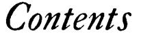

#### *VOLUME 1*

|             | INTRODUCTION, BY JAMES BRYANT CONANT                                                                                                         | vii |  |  |  |  |  |  |
|-------------|----------------------------------------------------------------------------------------------------------------------------------------------|-----|--|--|--|--|--|--|
|             | ROBERT BOYLE'S EXPERIMENTS IN PNEUMATICS, EDITED BY JAMES BRYANT CONANT                                                                   | ι   |  |  |  |  |  |  |
|             | 2. THE OVERTHROW OF THE PHLOGISTON THEORY: THE CHEMICAL REVOLUTION OF 1775-1789, EDITED BY JAMES BRYANT CONANT                            | 65  |  |  |  |  |  |  |
|             | 3. THE EARLY DEVELOPMENT OF THE CONCEPTS OF TEMPERATURE AND HEAT: THE RISE AND DECLINE OF THE CALORIC THEORY, PREPARED BY DUANE ROLLER | 117 |  |  |  |  |  |  |
|             | 4. THE ATOMIC-MOLECULAR THEORY, EDITED BY LEONARD K. NASH                                                                                    | 215 |  |  |  |  |  |  |
| VOLUME 2 |                                                                                                                                              |     |  |  |  |  |  |  |
|             |                                                                                                                                              |     |  |  |  |  |  |  |
|             | 5. PLANTS AND THE ATMOSPHERE, EDITED BY LEONARD K. NASH                                                                                      | 323 |  |  |  |  |  |  |
|             | 6. PASTEUR'S STUDY OF FERMENTATION, EDITED BY JAMES BRYANT CONANT                                                                         | 437 |  |  |  |  |  |  |

- 7. PASTEUR'S AND TYNDALL'S STUDY OF SPONTANEOUS GENERATION, EDITED BY JAMES BRYANT CONANT 487
- 8. THE DEVELOPMENT OF THE CONCEPT OF ELECTRIC CHARGE: ELEC-TRICITY FROM THE GREEKS TO COULOMB, BY DUANE ROLLER AND DUANE H. D. ROLLER 541

**CASE** *5* 

# *Plants and tbe Atmosphere*

BY

**LEONARD K. NASH** 

#### CASE *5*

### *Plants and the Atmosphere*

Les végétaux sont plantés dans l'air, a-peu-près, comme ils le sont dans la terre." — Charles Bonnet, 1754

#### INTRODUCTION

The continued existence of man, and of terrestrial life in general, is dependent upon the perpetual operation of several vast cyclic processes. Through these operations man's foodstuffs are produced and, in addition, the wholesomeness of the atmosphere in which he lives is preserved. The present work is concerned with the experiments and the hypotheses, the facts and the ideas, through which a full conceptual appreciation of the most conspicuous of these cyclic processes was finally achieved at the beginning of the nineteenth century.

The phenomenon of the balanced aquarium provides a striking illustration, on a small scale, of the part played in the economy of Nature by these cyclic operations. In the balanced aquarium we see a sealed vessel in which fish and aquatic plants can live together for an indefinite period, without any access to the external atmosphere or to external nutritive supplies. For the maintainance of this system it is, however, essential that radiant energy (light) be allowed to enter through the transparent walls of the aquarium. In this system the fish consume plant material as food. In metabolizing this nourishment they also use oxygen which, like their food, is elaborated by the plants. The metabolic processes result in the production of a variety of excreta notably carbon dioxide and water. But then, under the influence of the radiant energy that reaches them, the plants are able to conduct a photosynthetic process whereby the various excreta are reconverted to the foodstuffs and oxygen used by the fish. Thus the cycle is completed and the system is rendered capable of continued existence, in isolation, for long periods of time. However it is obvious that, other things being equal, such a system will be in equilibrium only when the relative volumes of fish and of plants are commensurate. For example, if too many fish are present some at least must inevitably perish through the insufficiency of the supply of food materials or oxygen or both.

In some senses the whole earth may be likened to an isolated aquarium system on a mammoth scale. At the present time this system is not in equilibrium: a substantial portion of the products of plant growth is not utilized, and simply undergoes decay *in situ.* This waste is not now very serious, because of the enormous magnitude of the annual yield of photosynthesis. It has been estimated that the total quantity of carbon annually converted into plant products is represented by the figure of 2 X io1 1 tons — two hundred thousand million tons. The bulk of this carbon is drawn from the atmospheric trace of carbon dioxide, and from the carbon dioxide dissolved in sea water. The concentration of carbon dioxide in the atmosphere is minute only about 0.03 percent — and the concentration in sea water is also very slight. However, the total volume of the oceans and atmosphere of the earth is so immense that it contains the equivalent of a several hundred year's supply of carbon dioxide, some 5 X io1 3 tons in all.

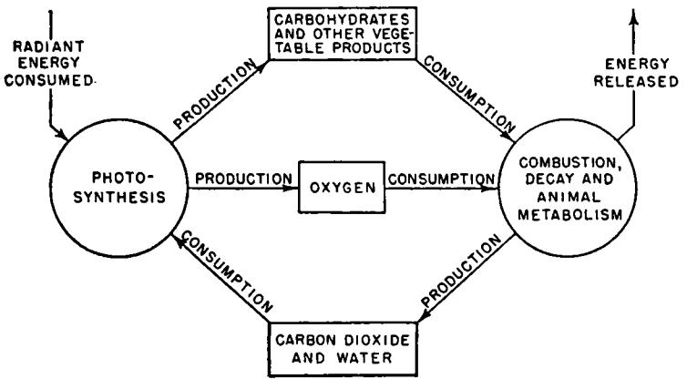

Actually, of course, the oceans and the atmosphere are only temporary reservoirs; and the vast quantities of carbon dioxide withdrawn from them by photosynthesis are regularly replaced by equally vast quantities of carbon dioxide produced by plant decay, animal metabolism, and the combustion of the products of former plant life (coal and petroleum). Contrariwise, the billions of tons of oxygen annually consumed in these processes are regenerated photosynthetically. Thus we live in the midst of a stable cyclic system, a schematic portrayal of which is shown in Figure ι. It is notable that in such a system the animals could not live without the support of the plants, but the plants could survive in the absence of the animals. The decay of plant products can — and, to a considerable extent, does — complete the cycle as satisfactorily as do combustion and animal metabolism. It should be remarked that animals occupy a similar position of subsidiary dependence in another cycle — the nitrogen cycle — which is analogous to, though somewhat more complicated in detail than, that sketched above for carbon and oxygen.

The unilateral dependence of the animal kingdom on the vegetable kingdom arises from the fact that animals, unlike plants, are not equipped to make use of the radiant energy of sunlight. Yet the life processes of animals involve the continuous expenditure of energy, which must be drawn from some external source. Thus animals must supply their energetic requirements from various chemical materials in their foods, the metabolism (or "combustion") of which provides them with energy in a usable form. That is, animals are so contrived that they can use only *chemical* energy, stored in the sugars, starches, proteins, fats, and other materials that they secure from plants, either directly, or indirectly through other animals that feed on plants. Consequently, the essential source of all animal nutrition is plant material, and animal life as we know it would be impossible without the nutritive support furnished by the vegetable creation.

The energy that can be liberated from plant material is not a free *creation* of the plant but merely solar energy that has been *fixed,* as chemical energy, by the operations of the plant organism. The energy radiated by the sun results from various nuclear changes that take place at the extremely high temperatures and pressures prevailing within that body. Only a minute fraction, approximately one two-billionth, of the total energy emitted by the sun actually falls upon the surface of the earth; and only a very small part of the energy that does reach the earth is fixed by plants as chemical energy. Yet, such is the immensity of the energy radiated by the sun, this fraction of a fraction of its total radiation still represents to us a vast and crucially important amount of energy.

We have just begun to be concerned about the fruitful utilization of nuclear energy artificially released on earth. But, in the last analysis, life on earth has always been completely dependent on nuclear energy — liberated in the sun; communicated, as radiant energy, to the earth; fixed, as chemical energy, by plants; and used, in that form, by animals. Thus, albeit indirectly, all the world already runs on nuclear (solar) energy, which is largely made available to us through the mediation of plants. Not only do plants furnish us, directly or indirectly, with all our foodstuffs; they are also responsible for the availability of the energy drawn from all industrial fuels. The millions of tons of coal and petroleum products burned each year are the fossil remains of ancient plant life; and the (heat) energy secured from these fuels is simply part of the solar energy stored by the plants during their lifetime. To be sure, water power and wind power come to us without the intermediation of plants. However, these sources of industrial power are small in comparison with those that we owe to plant activities, and the latter

still constitute the sole means by which solar energy can be converted to a nutritionally useful form.

Even today we are far from having attained a full understanding of the detailed nature and sequence of the enormously complicated chemical operations of plants — operations that are vital to our existence. Yet it is more than two millenia since men began to study and speculate about the sources of plant nutrition and the effects produced by growing plants. There was, for example, an Aristotelian view which suggested that the food of plants is elaborated in the ground, in a form suitable for assimilation. In this conception the earth figured in a role analogous to that played by the stomach of an animal. And indeed, the analogy appeared to be supported by a variety of observational data relating to such matters as soil exhaustion and the virtues of crop rotation. Thus Vergil remarks:

For the field is drained by the flax-crop, the wheat-crop, Drained by the slumber-steeped poppy of forgetfulness. — Georgics, iv, 77

That the growth of plants depended on the supply to them of nutrients from the soil, and that the soil was impoverished to the extent of this withdrawal, seemed plain. Consequently there appeared to be nothing illogical about the likening of the earth to a vast stomach. But, brilliant though they were, the thinkers of antiquity had far too little detailed information to permit them to form a just idea of the subtlety and immensity of the operations of the plant kingdom in the economy of nature. In fact, it was not until early in the seventeenth century that the central problem began to appear, and the broad outlines of its solution were not worked out until the beginning of the nineteenth century. It is with the progressive discovery of the solution of this problem, over a period of almost two centuries, that we shall be concerned.

#### 1. A PROBLEM EMERGES

The first of the major investigators whose work we shall examine is the Belgian physician Johann Baptista van Helmont (1577— 1644). This investigator played a distinctly transitional role in science at large and in chemistry in particular. He was one of the last and greatest of the alchemists but also one of the first practitioners of the type of chemistry we know today. He was probably the very first to make an extended study of gases; and, indeed, we owe the word "gas" to him. He conceived of gases as "wild" and "untameable" spirits because, on generating gases in closed vessels, he found: "the vessel is

filled with a plentiful though invisible exhalation, and however it may be feigned to be stronger than iron, yet the container straightway dangerously springs asunder into broken pieces. . . I call this spirit, hitherto unknown, by the new name of gas [from the Greek "chaos" for "empty space"] which can neither be retained in vessels nor reduced to a visible form, unless the seed [the source of its elasticity] is first extinguished."

Aside from his important work on gases, van Helmont is perhaps best remembered for his classic willow-tree experiment. In the conception, though probably not in the execution, of this experiment van Helmont had been anticipated by about a century and a half, by Nicholas of Cusa (1401-1464), cardinal, scholar, and an important figure in the history of science. Van Helmont's investigation was probably performed early in the seventeenth century, but it was only published posthumously, in 1648. Van Helmont gives the following brief account of his experiment.

I took an earthen vessel, in which I put 200 pounds of earth that had been dried in a furnace, which I moistened with rainwater, and I implanted therein the trunk or stem of a willow tree, weighing five pounds. And at length, five years being finished, the tree sprung from thence did weigh 169 pounds and about three ounces. When there was need, I always moistened the earthen vessel with rainwater or distilled water, and the vessel was large and implanted in the earth. Lest the dust that flew about should be co-mingled with the earth, I covered the lip or mouth of the vessel with an iron plate covered with tin and easily passable with many holes. I computed not the weight of the leaves that fell off in the four autumns. At length, I again dried the earth of the vessel, and there was found the same 200 pounds, wanting about two ounces. Therefore 164 pounds of wood, bark and roots arose out of water only.

From his observations van Helmont concluded, quite correctly, that a major proportion of the substance of a willow tree is nothing but water. This he regarded as a true transmutation of the fundamental element — water — into wood, an "earthy" material.

In his conception of water as the fundamental element van Helmont followed Thaïes and a number of other ancient philosophers. His notion of transmutation, which was quite natural to one of his alchemical background, also had its remote origin among the Greeks. They conceived of all materials as one (or mixtures of a few) primal substance (s), impressed under or by different *forms.* Such a notion suggests that the possibility of transmutation is a very real one, for it would be necessary only to alter the form to secure a change in the character of matter. Van Helmont convinced himself of his success in, and provides a most circumstantial account of, the transmutation of mercury into gold. Consequently, the apparent transmutation of water into wood or "earth" (wood ash) did not surprise him.

Van Helmont's striking results evoked a great deal of interest, and in the succeeding years a number of investigators sought to confirm his work. One of the first to undertake this confirmation was Robert Boyle (1627-1691) on whom, through his writings, van Helmont had a considerable influence. Boyle remarks: "As 'tis the part of a mineralogist both to *discover* new mines and to *wor\* those that are already discovered, by separating and melting the ores to reduce them into perfect metal; so I esteem that it becomes a naturalist not only to *devise*  hypotheses and experiments, but to examine and *improve* those that are already found out." Boyle's account of his own experiments is given in his *Sceptical Chymist,* published in 1661. This work is primarily an urbane but vigorous attack on the two then-prevailing systems of the elements: the Aristotelian (Peripatetic) notion that all matter is composed of the elements air, earth, fire, and water; and the Alchemical (Spagyric) idea that the fundamental elements are mercury, salt, and sulfur. The *Sceptical Chymist* is written in dialogue form, and Boyle's opinions are generally expressed by Carneades, who relates some of the experiments later reported under Boyle's name. In the course of his discussion Carneades cites the observations on the growth of plants indicating the variety of materials that seem to be formed from water alone.

**I caused my gardener to dig out a convenient quantity of good earth, and dry it well in an oven, to weigh it, to put it in an earthen pot almost level with the surface of the ground, and to set in it a selected seed he had before received from me for that purpose, of squash, which is an Indian kind of pompion, that grows apace; this seed I ordered him to water only with rain or spring water. [Presumably Boyle considered these particularly pure waters.] I did not without delight behold how fast it grew, though unseasonably sown; but the hastening winter hindered it from attaining anything near its due and wonted magnitude; (for I found the same autumn, in my garden, some of those plants, by measure, as big about as my middle) and made me order the having it taken up; which about the middle of October was carefully done by the same gardener, who a while after sent me this account of it: "I have weighed the pompion with the stalk and leaves, all which weighed three pound wanting a quarter; then I took the earth, baked it as formerly, and found it just as much as I did at first, which made me think I had not dried it sufficiently [note how the result surprised the gardener]. Then I put it into the oven twice more, after the bread was drawn, and weighed it the second time, but found it shrink little or nothing."** 

Carneades goes on to the description of a similar experiment in which a small diminution in the weight of the earth was noted, but concludes :

But yet in this trial, Eleutherius, it appears that though some of the earth, or rather the dissoluble salt harbored in it, were wasted, the main body of the plant consisted of transmuted water. . .

But perhaps I might have saved a great part of my labor. For I find that *Helmont* (an author more considerable for his experiments than many learned men are pleased to think him) having had an opportunity to prosecute an experiment much of the same nature with those I have been now speaking of, for five years together, obtained at the end of that time so notable a quantity of transmuted water, that I should scarce think it fit to have his experiment and mine mentioned together. . .

Carneades now tells how, to secure an even more striking effect, and to eliminate any possible intervention of the earth, he grew various small plants in water alone, and found that they flourished and increased in weight:

And one of these vegetables, cherished only by water, having obtained a competent growth, I did, for trial's sake, cause to be distilled in a small retort, and thereby obtained some phlegm [a watery liquid], a little empyreumaticall spirit [a volatile, odorous product of the distillation of plant or animal materials], a small quantity of adust [charred] oil, and a *caput mortuum* [an inert coallike substance remaining as a residue in the retort] . . . And though it appears not that *Helmont* had the curiosity to make any analysis of his plant, yet what I lately told you I did to one of the vegetables I nourished with water only, will I suppose keep you from doubting that if he had distilled this tree, it would have afforded him the like distinct substances as another vegetable of the same kind.

Since, to all appearances, water was the only source of plant nourishment, there seemed to be little room for doubt that all of the distinct materials separated by distillation of the mature plant were anything more than various forms of water transmuted within the growing plant. Boyle also points out that

the plants my trials afforded me, as they were like in so many other respects to the rest of the plants of the same denomination; so they would, in case I had reduced them to putrefaction, have likewise produced worms or other insects as well as the resembling vegtables are wont to do; so that water may, by various seminal principles, be successively transmuted into both plants and animals. [This conclusion was formed in the same period that Redi (1626-1697) showed that no maggots would arise in putrefying material that was shielded from flies which might lay eggs upon it. But whether the maggots sprang self-created from the decaying matter, or were simply hatched on and nourished by it, the deduction that plants and animals are composed of transmuted water is not essentially altered.] And if we consider that not only men, but even sucking

children are, but too often, tormented with solid stones, and that divers sorts of beasts themselves, (whatever *Helmont* against experience think to the contrary) may be troubled with great and heavy stones in their kidneys and bladders, though they feed but upon grass and other vegetables that are perhaps but disguised water, it will not seem improbable that even some concretes of a mineral nature, may likewise be formed of water.

Within a few years Boyle was able to present evidence in favor of this apparent transmutation of water into mineral matter. In his book on *The Origin of Forms and Qualities* he says:

I thought it then worthwhile to prosecute this matter a little farther; and having put a pretty quantity of distilled rainwater in a clean glass body, and fitted it with a head and a receiver, I suffered it to stand in a digestive furnace, till by the gentle heat thereof the water was totally abstracted, and the vessel left dry; which being taken out [of the furnace], I found the bottom of the glass covered over with a white (but not so very white) substance, which being scraped off with a knife, appeared to be a fine earth, in which I perceived no manifest taste, and which, in a word, by several qualities seemed to be earth.

Boyle was impressed with, though not completely convinced by, this apparent transmutation. He says that he would

have retained greater suspicions, if I had not afterwards accidentally fallen into discourse of this matter with a learned physician, who had dealt much in rainwater; but he much confirmed me in my conjecture, by assuring me that he had frequendy found such a white earth as I mentioned in distilled rainwater, after he had distilled the same. . . I know not how many times one after another; adding, that he did not find (any more than I had done) any cause to suspect that if he had continued to redistil the same portion of water, it would [not] have yielded him more earth. [The purest redistilled rain water was an important ingredient in several of the recipes of the alchemists; and it is not unlikely that the foregoing experiments, and those described below, were made in connection with alchemical undertakings.]

But the oddness of the experiment still keeping me in suspense, it was not without much delight, that afterwards mentioning it to a very ingenious person, whom without his leave, I think not fit to name, well versed in chemical matters, and whom I suspected to have, in order to some medicines, long wrought upon rainwater, he readily gave me such an account of his proceedings, as seemed to leave little scruple about the transmutation we have been mentioning: for he solemnly affirmed to me, that having observed, as I had done, that rainwater would, even after a distillation or two, afford a terrestrial substance, which may sometimes be seen swimming up and down in the limpid liquor, he had the curiosity, being settled and at leisure, to try how long he could obtain this substance from the water. And accordingly having freed rainwater, carefully collected, from its accidental, and as it were feculent earthiness, which it will deposit at the first slow distillation (and which is oftentimes coloured, whereby it may be distinguished from the white earth made by transmutation) he redistilled it in very clean glasses, not only eight or ten times, but near two hundred, without finding that his liquor grew weary of affording him the white earth, but rather that the corpuscles of it did appear far more numerous, or at least more conspicuous in the latter distillation than in the former. And when I expressed my curiosity to see this earth, he readily showed me a pretty quantity of it, and presented me with some, which comparing with what I had remaining of mine, I found to be exceedingly like it, save that it was more purely white. . .

But although all these observations undoubtedly made a strong impression on Boyle, he still assiduously preserved the attitude of the "Sceptical Chymist." He considered the transmutation quite possible, even probable, but he maintained his reservations, as follows:

If I had leisure and indulgence enough, I could, I confess, add many things in favour of some thoughts [on the possible ways of turning liquids into solid bodies] : yet I would not have you wonder, that whilst I was mentioning the many particulars that seem to evince the change of water into earth, I should let fall some words that intimate a diffidence about it. For to disguise nothing unto you, I must confess, that having in spite of an unusual care unluckily lost a whole paper of the powder I had made myself, and having unexpectedly been obliged to remove from my furnaces before I had made half the trials I judged requisite in so nice a case, I have not yet laid aside all my scruples.

For ι. I would gladly know whether the untransmuted rainwater, by the deposition of so much terrestrial matter, were grown lighter in specie than before [that is, whether its density had decreased after the deposition of the solid matter], or sharp in taste. Next I would [want to] be thoroughly satisfied . . . whether and how far insipid liquors (as rain water is) may or may not work as menstruums [solvents] upon stones or earthy bodies. . .

2. It were also fit to know whether the glass body, wherein all the distillations are made, do lose of its weight anything near so much as the obtained powder amounts to over and above the decrement of weight which may be imputed to the action of the heat upon the substance of the glass, in case it appear by another glass, kept empty in an equal heat, and for the same time, that the glass loses by such operations anything worth reckoning. And it were also not impertinent to try whether the gravity [density] of the obtained powder be the same in specie with that of the glass wherein the distillations were made (for that it differed but about a fifth part from the weight of the crystalline glass I lately mentioned). Which scruple and some of the former I might have prevented, if I had had convenient metalline vessels wherein to make the distillations instead of glass ones. . .

With these very penetrating observations Boyle suggests that he still entertains suspicions about the contribution of the glass vessels used for the distillation. These suspicions were indeed well founded, and the spuriousness of the supposed transmutation was ultimately shown by Lavoisier (see Sec. 3). After drawing attention to several other points about which he still felt doubt, Boyle continued :

I might . . . subjoin divers other particulars if it were not too tedious to mention to you all the doubts and considerations that have occurred to me about the recited change of water into earth: which yet are not such as ought to hinder me from giving you this historical account I have set down, since to some of my scruples I could here give plausible answers, but that I cannot do it in few words. And if any part of our white powder prove to be true earth, nobody perhaps knows to what the experiment may lead sagacious men . . . though I must confess that my only aim is not to relate what hath been done, but to secure the prosecution of it. [It was almost precisely a century before Lavoisier undertook the prosecution of the further experiments suggested by Boyle.] For if the obtained substance be by the rainwater dissolved out of the glass, this will prove a noble and surprising instance of what may be done by insipid menstruums, even upon bodies that are justly reckoned among the compactest and most indissoluble that we know of . . .: and if, on the other side, this powder, whether it be true elementary earth or not, be found to be really produced out of the water itself, it may . . . make the alchemists' hopes of turning other metals into gold appear less wild. . .

Boyle recounts the observations, he indicates their probable significance, and he suggests the lines along which a further, more definitive, investigation might be developed. He leaves us with the impression that he would not have been surprised to find that the transmutation was a real one, but he maintained a quite noncommittal attitude. The judiciously balanced views of Boyle were not fully appreciated by his contemporaries (including Newton), who, in general, were much impressed by these striking demonstrations and all too eager to credit their obvious import — the possibility of transmutation. And, as we have seen, even though Boyle remained somewhat skeptical about the apparent transmutation of water into mineral matter, he regarded the transmutation of water into plant materials as very probable. Thus he, like van Helmont, regarded the substance of plants as little more than transmuted water. By the adoption of this facile point of view, the full impact of the problem of plant nutrition (to which van Helmont's experiment had drawn attention) was cushioned. The possibility that the atmosphere was somehow involved in the observed effects was entirely overlooked.

#### 2. HINTS THAT THE ATMOSPHERE PLAYS A ROLE IN PLANT NUTRITION

In the decade (1670-1680) immediately following Boyle's studies of plant growth there was a fairly clear perception that the atmosphere might play an active part in this phenomenon. This perception was but one of many that grew out of studies founded on the systematic exploitation of the remarkable powers of a new scientific tool — the microscope. With the aid of this new instrument the structure of plants was closely examined by the Englishman Nehemiah Grew (1641-1712), and almost simultaneously by the illustrious Bolognese anatomist Marcello Malpighi (1628-1694), cou 'd trace a line of intellectual descent from one of the inventors of the compound microscope, Galileo.

In their studies of the anatomy of plants these investigators were intrigued by the discovery that there were minute pores (stornata) in the leaves of plants, and that these pores provided an avenue of communication between the external atmosphere and certain structures within the plants that appeared capable of functioning as air ducts. The existence of these anatomical features seemed to suggest that the assimilation of nutrients or the excretion of waste gases or vapors through the leaves played a role of some importance in the vital economy of plants. Grew shows the stornata in some of the drawings accompanying the report of his botanical studies; and he remarks:

But as the skins of animals, especially in some parts, are made with certain open pores or orifices, either for the reception, or the elimination of something for the benefit of the body; so likewise the skins of at least many plants are formed with several orifices or passports, either for the better avolation [evaporation] of superfluous sap, or the admission of air.

Malpighi's deduction is quite analogous, though he was inclined to stress the excretory, rather than the assimilative, function of the leaves.

Among the vesicles and network of fibres in most leaves are distributed special little air bellows or gaps which pour out either air or moisture. . .

The active leaves seem to have been contrived by nature for the digestion of food, which is their chief function. For that part of the nutrient sap which enters the roots from below and which is not diverted into the adjacent transverse branches, at length slowly reaches the leaves by way of their woody veins. This is necessary so that the sap should linger in the adjacent vesicles and so be mingled with the sap already there and be fermented. [This idea of plant digestion was probably formed by analogy with the then prevailing ideas of animal digestion.] In this process the warmth of the surrounding atmosphere is of no little assistance, for it helps it the more readily to evaporate that which is of no service. For this purpose nature has provided the leaf with numerous special glands or bellows for the sweating forth and gradual elimination of moisture, so that the sap, being thereby condensed, may the more readily be digested in the leaves.

Almost exactly half a ceritury separates the pioneering work of Grew and Malpighi from the next major step toward a better understanding of the natural functions of plants. This advance was the result of the new light thrown on the subject by the masterful investigations of the English clergyman Stephen Hales (1677-1761). In his book, *Vegetable Static\s,* published in 1727, Hales relates how he used the methods of hydrostatics to secure fuller information about the flow of sap in plants. But Hales's work went much further than this; and it seems that he was the first to perceive, albeit only dimly, that the atmosphere plays some major role in the metabolism of plants. In the preface to his influential work Hales says:

We find in the Philosophical Transactions, and in the History of the Royal Academy of Sciences, accounts of many curious experiments and observations made from time to time on vegetables, by several ingenious and inquisitive persons: But our countryman Dr. *Grew,* and *Mdpighi,*  Were the first, who, tho' in very distant countries, did nearly at the same time, unknown to each other, engage in a Very diligent and thorough inquiry into the structure of the vessels of plants; a province, which till chen had lain uncultivated. . .

Had they fortuned to have fallen into this statical way of inquiry [that is, an analytical study of number, weight and measure], persons of their great application and sagacity had doubtless made considerable advances in the knowledge of the nature of plants. This is the only sure way to measure the several quantities of nourishment, which plants imbibe and perspire, and thereby to see what influence the different states of air have on them. . .

Finding by many experiments . . . that the air is plentifully inspired by vegetables, not only at their roots, but also thro' several parts of their trunks and branches; this put me upon making a more particular inquiry into the nature of the air; and to discover, if possible, wherein its great importance to the life and support of vegetables might consist; on which account I was obliged to delay the publication of the rest of these experiments, which were read two years since before the Royal Society, till I had made some progress in this inquiry. . .

. . . It appears by many chymio-statical experiments, that there is diffused thro' all natural, mutually attracting bodies, a large proportion of particles, which, as the first great author of this important discovery, Sir *Isaac Newton,* observes, are capable of being thrown off from dense bodies by heat or fermentation into a vigorously elastic and permanently repelling state: And also of returning by fermentation, and sometimes without it, into dense bodies: It is by this amphibious property of the air, that the main and principal operations of nature are carried on. . .

And that elasticity is no immutable property of air, is further evident from these experiments; because it were impossible for such great quantities of it to be confined in the substances of animals and vegetables, in an elastic state, without rending their constituent parts with a vast explosion. [The great volume of the "air" that can be liberated from vegetable matter leads Hales to the just conclusion that this "air" must have been in a "fixt" or nonelastic state, since otherwise the "air" would, by Boyle's law, have been under a destructively high pressure.]

In the first four chapters of his book Hales relates how he had applied the by then familiar techniques for measurement of hydrostatic pressure to the study of the flow of plant saps. In the course of this work he made the interesting discovery that very considerable quantities of water are exchanged between a plant and the atmosphere. The existence of this interchange he established by the application of a weighing technique reminiscent of that used by van Helmont. Repeatedly, and at various times of the day, he weighed a plant set into a pot provided with a tightly fitted cover-that effectually separated the earth in the pot from the atmosphere. He took a decrease in the weight of this system as evidence of the evaporation or *transpiration* of a corresponding amount of water from the plant; and he regarded a gain in weight as an indication of the plant's absorption of water from the atmosphere. Having established this substantial exchange of water, it was only natural for Hales to come to think in terms of a parallel exchange of "air." And, indeed, in his work with certain vines he had observed that there were many gas bubbles in the sap. He begins his fifth chapter — "Experiments, whereby to prove, that a considerable quantity of air is inspired by plants" — by saying:

It is well known that air is a fine elastic fluid, with particles of very different natures floating in it, whereby it is admirably fitted by the great Author of nature, to be the breath of life, of vegetables, as well as of animals, without which they can no more live nor thrive than animals can.

In the Experiments on Vines, Chap. III. we saw the very great quantity of air which was continually ascending from the vines, thro' the sap in the tubes; which manifestly shows what plenty of it is taken in by vegetables, and is perspired off with the sap thro' the leaves. [And, after remarking on Grew's morphologic studies, he continues:] Whence it is very probable, that the air freely enters plants, not only with the principal fund of nourishment by the roots, but also through the surface of their trunks and leaves, especially at night, when they are changed from a perspiring to a strongly imbibing state. . .

Hales's sixth chapter is concerned with .. . "A great variety of chymio-statical experiments, which show in how great a proportion air is wrought into the composition of animal, vegetable, and mineral substances, and withal how readily it resumes its former elastic state, when in the dissolution of those substances it is disengaged from them." Hales remarks:

The excellent Mr. *Boyle* made many experiments on the air, and among other discoveries, found that a good quantity of air was producible from vegetables, by putting grapes, plums, gooseberries, cherries, peas, and several other sorts of fruits and grains into exhausted and unexhausted receivers, where they continued for several days emitting great quantities of air. [For a description of Boyle's vacuum technique see Case i.]

Being desirous to make some further researches into this matter, and to find what proportion of this air I could obtain out of the different substances in which it was lodged and incorporated, I made the following chymio-statical experiments: For, as whatever advance has here been made in the knowledge of the nature of vegetables, has been owing to statical experiments, so since nature, in all her operations, acts conformably to those mechanic laws, which were established at her first institution; it is therefore reasonable to conclude, that the likeliest way to enquire, by chemical operations, into the nature of a fluid, too fine to be the object of our sight, must . . . [be to disengage it from the animal, vegetable, or mineral matter in which it is combined, and then to measure the quantity of the evolved "air"].

Hales now proceeds with a description of a vast number of experiments in which he decomposed various vegetable and mineral substances, by heat or fermentation, collecting and measuring the large volumes of "air" so formed. In some of these experiments he made use of a "pneumatic trough" which he had himself invented, probably as an outgrowth of his previous work in hydrostatics. With this device it became possible to secure a convenient estimate of the quantity of gas, "a fluid too fine to be the object of our sight." It is difficult to exaggerate the significance of the development of this simple yet effective technique for handling gases. The pneumatic trough, the operation of which is plain from Fig. 2, taken from Hales's book, played an essential role in a number of the pivotally important investigations involved in the chemical revolution (see Case 2) and the development of the atomic theory (see Case 4). Using this new device, Hales was able to perform many experiments that had been beyond the reach of Boyle, who lacked such a convenient method for the determination of the quantities of "air" disengaged during the heating of various substances.

In general, Hales did not think to examine the nature of the liberated "air," but he could not fail to be impressed by the relatively enormous volumes of "air" he obtained by the decomposition of small quantities of plant substances. In discussing his findings, in the last chapter of his book, Hales makes use of a combination of those elements — hypothesized by the alchemists and the followers of Aristotle — against which Boyle had inveighed in his *Sceptical Chymist.* Nevertheless, however obscure his terminology, and however mistaken his ideas about the precise role of the atmosphere in the plant economy, there is no room for doubt that Hales had attained a very full awareness of the existence of some major exchange between plants and the surrounding atmosphere.

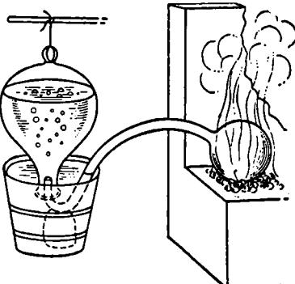

FIG. 2. The pneumatic trough.

We find by the chemical analysis of vegetables, that their substance is composed of sulfur, volatile salt, water and earth; which principles are all endued with mutually attracting powers, and also of a large portion of air, which has a wonderful property of strongly attracting in a fixed state, or of repelling in an elastic state, with a power that is superior to vast compressing forces, and it is by the infinite combinations, action and reaction of these principles, that all the operations in animal and vegetable bodies are effected.

These active aereal particles are very serviceable in carrying on the work of vegetation to its perfection and maturity. . .

It is very plain from many of the foregoing experiments and observations, that the leaves are very serviceable in this work of vegetation. . . Thus the leaves, in which are the main excretory ducts in vegetables, separate and carry off the redundant watery fluid, which by being long detained, would turn rancid and prejudicious to the plant, leaving the more nutritive parts to coalesce; part of which nourishment, we have good reason to think, is conveyed into vegetables through the leaves, which do plentifully imbibe the dew and rain, which contain salt, sulfur,

etc. For the air is full of acid and sulfurous particles. . . [The salt, sulfur, and acid mentioned by Hales are not to be taken as the materials themselves, but only the alchemical *principles* thereof. The exact character of these *principles* was never satisfactorily defined, as Boyle had previously pointed out.]

We may therefore reasonably conclude, that one great use of leaves is what has been long suspected by many, *viz.* to perform in some measure the same office for the support of the vegetable life, that the lungs of animals do, for the support of the animal life; plants very probably drawing thro' their leaves some part of their nourishment from the air. . .

An even more striking insight, revealed in the following passage, was probably of a more speculative character.

And may not light also, by freely entering the expanded surfaces of leaves and flowers, contribute much to the ennobling the principles of vegetables? for Sir *Isaac Newton* puts it as a very probable query, "Are not gross bodies and light convertible into one another? and may not bodies receive much of their activity from the particles of light, which enter their composition? The change of light into bodies, and of bodies into light, is very conformable to the course of nature, which seems delighted with transmutations. *Opticas, query* 30."

In concluding our examination of Hales's work we must not fail to note one of his most impressive experiments, reported in the second (1731) edition of his book. It was from an intensive prosecution of just such experiments that there was finally obtained, in the period 1770- 1800, a series of vitally important clues to the character of the photosynthetic process by which the atmosphere enters into the vital economy of plants. Hales cites :

#### Experiment CXXII

That the leaves and stems of plants do imbibe elastic air, there is some reason to suspect, from the following experiment. . . I set a well rooted plant of Peppermint in a glass cistern full of earth, and then poured in as much water as it would contain; over this glass cistern I placed an inverted glass *zz, aa,* as in *Fig.* 3, the water being drawn up by means of a siphon to *aa.* At the same time also, I placed in the same manner another inverted glass *zz, aa* of equal size with the former, but without any plant under it.

This second glass is the "control." Had Hales used only one system, containing the plant, it would have been difficult for him to determine which of the observed changes in the system were due to the direct or indirect action of the plant, and which were simply due to the longcontinued contact of the earth, air, water, and glass, or to miscellaneous external influences. By setting up duplicate systems identical in every

respect save that one contained a plant and the other (the "control") did not, and by treating these two systems in precisely the same way, it became possible for Hales to distinguish those phenomena associated with the presence of the plant from other more or less incidental manifestations arising from extraneous agencies.

The capacity of these vessels above the water *aa* was equal to 49 cubic inches. In a month's time the mint had made several weak slender shoots, and many small hairy roots shot out at the joints that were above water, occasioned probably by the great moisture of the air, in which the plant stood; half the leaves of the old stem were now dead; but the leaves and

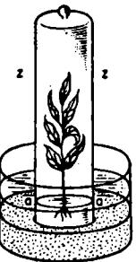

**FIG.** 3. Thè basic system for studying Fio. 4. A pelican, the gaseous exchange of plants.

stem of the young shoots continued green most part of the following winter: The water in the two inverted glasses rose and fell as it was either affected by the different weight of the atmosphere, or by the dilatation and contraction of the air above *aa.* [That is, the water rose or fell according to the external barometric pressure, and according to the prevailing temperature of the air enclosed in the systems. Since these short-term fluctuations occurred in both systems, it was fairly plain that they were not due to the presence of the growing plant.] But the water in the vessel in which the peppermint stood [finally] rose so much above *aa,* and above the surface of the water in the other vessel, that one seventh part of that air must have been reduced to a fixt state, either by being imbibed into the substance of the plant, or by the vapours which arose from the plant. [Inasmuch as this long-term shrinkage of volume occurred only in the system containing the plant, it could reasonably be regarded as an effect springing from the latter's presence.] This was chiefly done in the two or three summer months, for after that no more air was absorbed. The beginning of *April* in the following spring, I took out the old mint, and put a fresh plant in its place, to try if it would absorb any more of the air, but it faded in 4 or 5 days. Yet a fresh plant put into the other glass, whose air had [also] been confined for 9 months, lived near a month, almost as long as another plant did in fresh confined air. [Hales demonstrates another alteration in the air that was

confined with the original plant — it was no longer capable of supporting the life of a fresh plant. A skillful use of "controls" is again much in evidence. A second fresh plant is found to live quite as well in the original control vessel as does a third plant in a newly confined volume of air. Thus Hales showed that air was not substantially impaired by long confinement over water. Consequently, the vitiation of the air that had been in prolonged contact with the original plant could be accepted as an effect produced by the latter.]

From this simple illustration, and from a number of similar instances cited later, it is possible to gain some sense of the great power of the controlled experiment. Its unique value is particularly evident when, as here, the observed experimental result may be significantly affected not only by the factor under study, but by one or more different agencies as well. These agencies may be quite subtle — in fact, they are often referred to as "hidden variables" — and their activities may be but dimly apprehended by the investigator. However, let us suppose that he has exercised adequate precautions to ensure that the test and control systems are essentially alike in all respects save one. Then he may legitimately conclude that any observed difference in the behavior of the two systems is somehow associated with the factor with respect to which they are dissimilar. Thus he can often reach a worthwhile conclusion even when he is not fully cognizant of the precise identities and activities of all the other factors that may contribute to his experimental findings.

This happy circumstance may suggest the possibility of devising an entirely systematic "scientific method" founded on the fullest exploitation of the powers of the controlled experiment. But it seems extremely doubtful whether this is a real possibility. It must be recognized that two systems *perfectly* identical in *all* save one respect represent an idealization, not a practically attainable reality. In general, and as a matter of practical necessity, the investigator must exercise his judgment in deciding which of a great many variable conditions are to be accurately reproduced in the test and control systems. He will expend most of his time and effort in attempts to achieve the effective duplication of just those conditions that, in the light of the conceptual scheme or working hypothesis that has suggested the experiment to him, appear to be capable of significantly affecting the results. He will be able to spare little or no effort to secure the duplication of those factors that appear to be irrelevant to the outcome of the experiment. Thus it is seen that the whole design of the controlled experiment will inevitably depend on the conceptual outlook of the experimenter. Long delays may ensue whenever this outlook encourages the investigator to regard as "trivial," and to leave uncontrolled, some factor that may actually be capable of

contributing to the production of anomalous and misleading experimental results. Conversely, very rapid progress may subsequently be made when a new conceptual appraisal of the situation suggests that effective control of this factor is important. The controlled experiment is a tactical expedient of profound significance to scientific investigation, but, as with all tactical devices, its application is guided and its ultimate success is determined by strategic (conceptual) considerations.

Fortunately, the working hypothesis on which Hales operated was formulated after a considerable number of thermometric and barometric studies of the behavior of air had been reported. There was then adequate indication of the most important variable factors for which allowance would have to be made in a controlled experiment; and Hales was successful in obtaining meaningful experimental results. However, his simple experiment did not provide, and was not designed to provide, any clear indication of the mechanism by which the plant acted on the experimental atmosphere. In fact, it now seems probable that the gross diminution in volume observed by Hales was not produced solely by the activity of the plant, but by this activity in concert with other factors— for example, the substantial solubility of certain gases in water. This possibility was not explicitly recognized by Hales, who did, however, remark that his data were insufficient to provide a criterion for judgment between two other possibilities. Thus he tells us that he cannot say whether the volume contraction was due to the *absorption* of air by the plant, or to some impairment of the air's elasticity produced by *exhalations* arising from the plant material. In general Hales favored the latter view, but the precise nature of the interaction of plants with the atmosphere remained entirely obscure. Indeed, chemical science in Hales's time scarcely offered the foundation of facts and ideas required for a generally satisfactory discussion of this issue. But Hales's accomplishments were, nevertheless, very real. After his many suggestive observations it could no longer be doubted that there was *some* important interaction of plants with the atmosphere. Then, too, he indicated most of the basic experimental techniques that, half a century later, were used in a more comprehensive attack on the problem. Finally, through the very act of directing attention to the weighty questions to which he could not give answers, Hales prepared the ground for a major conceptual development that was to occur toward the end of the eighteenth century.

Yet, despite Hales's insistence that the atmosphere played an important role in the life of plants, and despite the further evidence for this idea subsequently reported by others, the striking character of van Helmont's simple experiment continued to excite interest. It was successfully duplicated again and again, and it was still regarded by many

as a most convincing demonstration that water could be transmuted into wood and 'earth." There was a similar persistence of interest in the distillation experiments (see pages 332 fif), which appeared to indicate the direct transmutation of water into mineral matter. Thus the "simple" view of plant growth, which regarded plant material as no more than transmuted water, continued to be generally accepted. To be sure, it did not take account of the conjectural role played by the atmosphere; but, as long as the "simple" explanation seemed otherwise adequate, there was little incentive to develop a more complicated picture of the phenomena involved. However, at the beginning of the 1770's two pivotally important experimental investigations respectively undermined the older scheme and opened the road toward a new and better one.

#### 3. THE PROBLEM IS BROUGHT TO A SHARP FOCUS BY DISCREDIT-ING THE FACILE EXPLANATION

In 1770 Antoine Laurent Lavoisier (1743—1794) presented a classic paper, *On the nature of water and on the experiments that have appeared to prove the possibility of changing it into earth.* This work was completed early in Lavoisier's brilliant career, and was a slashing attack on the idea that water could be transmuted into "earth." We have seen that there were two major arguments in support of this supposed transmutation: the apparent conversion of water into earth through the mediation of plants, and the direct metamorphosis of heated water into mineral matter. The first part of Lavoisier's paper presents a lengthy historical review of both lines of evidence. Lavoisier begins, as we have done, with the plant experiments of van Helmont and Boyle. He recapitulates the many subsequent investigations of the same type, and grants that the facts of the case have been established beyond much question. However, he suggests that the interpretation that had been placed on these facts was not only fallible but entirely gratuitous. He remarks that, in the first place, the transmutation of water into vegetable matter is something distinctly different from its transmutation into earth. Second, he points out that practically all of the experiments with plants had been made with water of doubtful purity, so that dissolved earthy matter may have been available to the plants. Thus he considers that significance should be attached to but two of these experiments that of van Helmont, who used rain water; and a similar investigation of Eller, who used distilled water. He continues:

**I admit that there is an enormous disproportion between the small amount of salt that may be present in rainwater . . . and the weight of 164 pounds that van Helmont's willow tree acquired in five years. But** 

it must also be recognized that it is hardly the whole of this weight that is due to the earth [contained in the tree]. Had Boyle made an analysis [by distillation] of this tree, he would have found practically all of it to be phlegm [a watery distillate] and the real quantity of earth thai he would have obtained [as a residue from the distillation] would surely have been no more than a very small quantity. It is true that none of these objections can be made to the experiments on hyacinth bulbs, performed by M. Eller. He used only water distilled from a steam bath; but also, he obtained by analysis an earthy residue of only 7 or 8 grains [slightly more than a hundredth of an ounce]. It is possible that the water container he used may have furnished this very small quantity of earth from its own substance, and the experiments cited in the second part of this Memoir make such a conclusion highly probable.

Besides, there is another source from which, no doubt, plants draw the greater part of the substances that are found in them by analysis. It is known from the work of MM. Hales, Guettard, du Hamel, and Bonnet that there is not only a considerable transpiration in plants, but that they also exert a real suction through the surfaces of their leaves, by means of which they absorb the vapors that are diffused through the atmosphere. In the investigations of M. Bonnet on the use of leaves to plants, we find a series of extremely ingenious experiments by which he seems to have proved that it is primarily through this route that plants receive their nourishment. [Bonnet's work was not as conclusive as Lavoisier suggests.] This eminent scientist says: "The air is a fertile field where the leaves secure an abundant supply of all kinds of nourishment. Nature has provided a large surface for these aerial roots, to make them capable of assimilating large quantities of vapors and exhalations" [which Bonnet suggested are evolved from the surface of the earth].

Lavoisier admits that he has no experimental evidence for the existence of such an extremely complex atmosphere, containing all the materials that can be isolated in the analysis of plants. However, he expresses his own belief that such nutrient vapors do occur in the air, and continues:

Aside from these different [vaporous] substances that are foreign to the air, one cannot doubt that this fluid itself can enter, in very considerable proportion, into the texture of plants, so that it constitutes a substantial part of the solid portions of plants. The experiments of M. Hales, and a great number of other experiments made in the same way, show that air occurs in nature in two forms. Sometimes it occurs as a very rarefied, very expansible, very elastic fluid — such as that we breathe. Sometimes it is fixed in, and intimately combined with, [solid] bodies; and it then loses all of the properties it formerly possessed. Air in this state is no longer a fluid, it behaves as a solid, and it is only by the complete destruction of the bodies into whose composition it has entered that it is restored to its former fluid condition. One should note, in this connection, the highly ingenious experiments reported in "Vegetable Staticks.". . .

Here, then, are two sources from which plants raised in water alone can draw the [earthy] materials that are found in them by analysis: first, from the water itself and the small amount of foreign earthy material that must have been present [in solution] in all cases; second, from the air and the substances of all kinds with which it is charged.

The experiments made on the growth of plants in water thus in no sense prove the possibility of changing water into earth.

Lavoisier now passes to a consideration of those experiments that indicated that even after repeated distillations, which should leave any dissolved earthy materials behind, the evaporation of the highly purified water so obtained always leaves a small but significant residue of mineral matter. He gives a brief review of all the previous observations of this phenomenon, with particular emphasis on the work of Boyle. Quite gratuitously, he remarks that from this work "the English savant concluded that water can be changed to earth by distillation." This is a far from just appreciation of Boyle's very cautious estimate of the situation, cited on page 20. No doubt Lavoisier was solicitous to display the originality of his views. And though he does not give a fair appraisal of Boyle's opinion, he is correct in suggesting that the prevailing judgment on Boyle's experiments was generally favorable to the idea of transmutation. Lavoisier expresses his willingness to accept as substantially correct the experimental observations made in the numerous repetitions of the distillation experiment, but he expresses doubt about the conclusion that had been founded on them. Thus, in his discussion of both the first (plant experiment) and second (distillation experiment) lines of evidence for the supposed transmutability of water, Lavoisier indicates that he has no quarrel with the facts, but only with the explanation that had been given for them. This appears to be a significant illustration of how little a random accumulation of facts can do toward the unique definition of a conceptual scheme on which further progress can be based.

Lavoisier turns now to an account of his own experimental study of the problem. This study was conspicuously well designed to throw some light on the central issue of the transmutability of water. But Lavoisier nowhere acknowledges that his experiments are precisely those whose importance had been suggested a century earlier by Boyle. That is, the major part of the strategic plan of the experiments performed by Lavoisier had been outlined by Boyle in a work, *The Origins of Forms and Qualities,* with which Lavoisier was thoroughly familiar. Nevertheless, Lavoisier deserves full credit for his recognition of the value of

this plan, and for the splendid tactical measures that he adopted in executing it. Lavoisier began by repeatedly distilling rain water. He found, as had all the previous investigators, that the evaporation of each distillate left an earthy residue. Now, however, he undertook the further step suggested by Boyle: he measured the relative densities of the various distillates. It was a fact of experience that the progressive removal of dissolved salts from water is almost always accompanied by a progressive diminution in the density of the liquid. Consequently, one had reason to expect that the successive distillates, having left behind an ever-increasing mineral residue, would display a systematic decrease in density. But Lavoisier found that *the densities of all the distillates were practically identical.* He then continued :

I thought that I might be able to deduce from this experiment one of two things. Either the earth that I separated by distillation was of such a character that it could be held in solution in the water without increasing the density, or at least without increasing it as other substances do. Or else that this earth was not yet in the water when I determined its density, that it was formed during the distillation, and, in short, that it was a product of the operation. To decide with certainty which of these views I should adopt, no means has seemed more suitable to me than a repetition of the same [distillation] experiment in hermetically sealed vessels, keeping an exact account of the weight of the vessel and the weight of the water used in the experiment. For if it should be a case of the fire-matter passing through the glass and combining with the water, there must needs occur, after many distillations, an increase in the total weight — that is, in the combined weight of the water, the earth, and the vessel. Physicists know that the matter of fire augments the weights of the bodies in which it is combined. [Lavoisier here states as a fact an earlier suggestion of Boyle's, to the effect that there might be ponderable igneous particles that pass from a fire, through the walls of a vessel heated over that fire, to combine with, and increase the weight of, the material heated in that vessel. Apparently Lavoisier regarded this as a real possibility.]

The same thing should not occur if the earth is formed at the expense of the water or of the vessel. If so, there must be found a diminution in the weight of one or the other of these two entities, and this diminution must be exactly equal to the quantity of earth separated. [Such an accounting of the weights was clearly suggested by Boyle, as may be seen on page 19.]

Here is a well-designed experiment. Suppose that mineral matter is formed during repeated distillation of water in a sealed vessel. Three possibilities are then to be considered. (1) If the system shows an increase in weight, then the penetration of some extraneous material, for example, fire particles, would be signalized. The mineral matter might then be regarded as a combination of water with the penetrant substance. (2) If the total weight of the sealed system remains unchanged, and if the same is true of the vessel alone, then the mineral matter would appear to have been formed from water itself. That is, the transmutation of water would be indicated. (3) If the total weight of the sealed system remains unchanged, but the weight of the vessel alone is found to be diminished, then we may conjecture that the mineral matter has been formed from the substance of the vessel. The experiment is skillfully contrived to meet all probable contingencies, *provided* that it can be assumed that weight is conserved throughout the operations. Apparently this was an assumption in which Lavoisier was prepared to repose full confidence.

In considering the apparatus to be used in this experiment Lavoisier hit upon the idea of using a "pelican" (Fig. 4), a special kind of distilling vessel developed by the alchemists. When the lower bulb, containing the liquid to be distilled, is warmed gently, the vapors pass into the cooler upper chamber. Here they are recondensed, and the liquid so formed drains back into the lower bulb. Thus it is possible to obtain, in a hermetically sealed vessel, a semiautomatic and almost indefinitely repeated distillation of a liquid. Having secured a very sensitive balance, Lavoisier determined the weight of the empty pelican. He then charged it with pure distilled rain water, expelled most of the air by gentle heating, and finally closed the top opening of the pelican. The sealed pelican and its contents were then weighed together, after which the lower part was heated in a sand bath, at about 75°C, for 101 days. During this period there was observed a very gradual accumulation of earthy material in the lower chamber. The pelican was then reweighed, and the data obtained from the experiment were set forth as in Table 1. (The largest unit of weight used by Lavoisier, the livre, is slightly more than a pound. The smallest unit, the grain, is less than 0.002 ounce, or about 0.05 gram.)

Of this result Lavoisier remarks:

The weight at the end differs from that measured before the operation by no more than a quarter of a grain [about 0.01 gram]; but so trifling a difference can be regarded as negligible because the accuracy of the balance is not so great that one can answer for so small a quantity. . . From the fact that no increase was found in the total weight of the system, it was natural to conclude that neither fire matter nor any other extraneous material had penetrated the glass and combined with the water to form earth. It remained to discover whether the earth originated in the destruction of a part of the water, or a part of the glass [container]. With the precautions I had taken nothing could have been easier. It was only a case of determining whether it was the weight of the vessel or that of the water contained in it that had suffered a decrease.

The pelican was opened and the suspended solid was carefully collected with the aid of several rinsings with distilled water. On drying and reweighing the empty pelican it was found to want 17.38 grains of its original weight.

Therefore it was clearly shown that it was the substance of the glass itself which had furnished the earth separated from the water during the operation. [The "earth" is, as Scheele showed a few years later, nothing but finely divided sand.] What had happened was merely a dissolution of [part of] the glass. But in order completely to attain my objective it still remained for me to compare the weight of the earth which had separated from the water during the digestions with the loss of weight suffered by the pelican. These two quantities should, of course, be equal; and if a considerable excess in the weight of the earth had been found, it would have become necessary to conclude that the glass alone had not furnished all the earth.

| Livres | Onces            | Gros              | Grains           |
|--------|------------------|-------------------|------------------|
|        |                  |                   | 21.50            |
|        |                  |                   | 41.50            |
|        |                  |                   | 20.00            |
|        |                  |                   | 41-7 5           |
| 0      | 0                | 0                 | 0.25             |
|        | I 5 3 5 | IO 9 M 9 | 7 4 5 4 |

TABL E 1 . LAVOISIER' S WEIGHT DATA .

The dissolved and suspended solids were separated from the water by evaporating the latter in another weighed vessel. The weight of the earth so recovered was found to be 20.40 grains, which is to be compared with the 17.38 grains lost by the pelican.

There is an excess of three grains in the weight of the earth which cannot be attributed to the solution of the substance of the pelican. However, a little reflection on the conditions of the experiment reveals the origin of this excess; and, indeed, shows it to be inevitable under the circumstances. On its removal from the pelican the water was poured into another glass vessel, and it was afterwards transferred, for the evaporation, to a glass retort. But these different operations could not have been conducted without the solution of a small [indeterminate] portion of the substance of these two vessels. . .

The additional material would then contribute to the total weight of the earthy residue from the evaporation. This explanation is amply ingenious and very probably correct. It did, of course, leave a loophole in Lavoisier's demonstration that *all* the earth is formed from the glass, for he had not determined the actual loss of weight suffered by the auxiliary vessels in which the evaporation was made. Here is an interesting illustration of how difficult it is to make a truly "crucial" or "decisive" experiment that renders an unequivocal decision one way or the other. In general, few if any of the experiments that have been so called were actually of a completely final character. The "decisive experiment" usually has such dramatic effect only when it is found to be in harmony with some generally prepossessing conceptual scheme.

It follows from the experiments described in this Memoir that the major part, and possibly the whole, of the earth separated from rainwater by evaporation is due to the dissolution of the vessels in which it has been collected and evaporated . . . [and that] the earthy matter that MM. Boyle, Eller and Margraf! have separated from water was nothing but glass dissolved during the operation. Thus the experiments that these investigators have used to support their conclusion, far from proving the possibility of changing water to earth, rather lead us to suppose that it is unalterable.

In its relevance to our present study this work of Lavoisier's is chiefly notable for its disparagement of the "simple" explanation of van Helmont's experiment, in terms of an easy yet mysterious transmutation of water. Thus a renewed emphasis was laid on the role of the atmosphere in the economy of plants. Lavoisier seems to have been convinced that this role was of major importance; but, like Hales before him, he was entirely unaware of its actual character. The first intimation of the nature of the mutual interaction of the atmosphere and vegetation was published in 1772, two years after Lavoisier presented his Memoir. This important discovery was the work of Joseph Priestley (1733-1804).

#### 4. PRIESTLEY PICKS UP THE TRAIL

Priestley related his significant observation in a long paper in the *Philosophical Transactions of the Royal Society.* This was one of his first publications on the chemistry of gases ("pneumatic chemistry"). In it he describes, among other things, his development of a method for the artificial production of sparkling (carbonated) water — an invention which, in view of the supposed medicinal virtues of sparkling waters from natural springs, Priestley regarded as of great importance. But in the same paper Priestley also gave an account of experiments that provided a vital clue to the nature of the interaction of vegetation with the atmosphere. Superficially it appears that the discovery of this clue was, like so many of Priestley's other important discoveries, purely a matter of a fortunate accident. To some extent this is true, but it must be allowed that Priestley had done a good deal to produce that accident. The "accident" was the end product of a perceptive analysis of a serious

though apparently unrelated problem, followed by a systematic series of attempts to find its solution. Priestley says:

That candles will burn only a certain time, is a fact not better known, than it is that animals can live only a certain time, in a given quantity of air; but the cause of the death of the animal is not better known than that of the extinction of flame in the same circumstances; and when once any quantity of air has been rendered noxious by animals breathing in it as long as they could, I do not know that any methods have been discovered of rendering it fit for breathing again. It is evident, however, that there must be some provision in nature for this purpose, as well as for that of rendering the air fit for sustaining flame; for without it the whole mass of the atmosphere would, in time, become unfit for the purpose of animal life; and yet there is no reason to think that it is, at present, at all less fit for respiration than it has ever been. . .

The quantity of air which even a small flame requires to keep it burning is prodigious. It is generally said, that an ordinary candle consumes, as it is called, about a gallon in a minute. Considering this amazing consumption of air, by fires of all kinds, volcanos, etc. it becomes a great object of philosophical inquiry, to ascertain what change is made in the constitution of the air by flame, and to discover what provision there is in nature for remedying the injury which the atmosphere receives by this means. Some of the following experiments will, perhaps, be thought to throw a little light upon the subject.

Priestley goes on to describe a great number of trials of various methods for the restoration of "vitiated air." Some of these had been previously suggested by others, some were of his own devising. All were uniformly unsuccessful — until, of a sudden, he hit pay dirt.

I flatter myself that I have accidentally hit upon a method of restoring air which has been injured by the burning of candles, and that I have discovered at least one of the restoratives which nature employs for this purpose. It is vegetation. In what manner this process in nature operates, to produce so remarkable an effect, I do not pretend to have discovered; but a number of facts declare in favour of this hypothesis. I shall introduce my account of them, by reciting some of the observations which I made on the growing of plants in confined air, which led to this discovery.

One might have imagined that, since common air is necessary to vegetable, as well as to animal life [this is undoubtedly a reflection of Hales's work], both plants and animals had affected it in the same manner, and I own that I had that expectation when I first put a sprig of mint into a glass jar standing inverted in a vessel of water [this is a system similar to that used by Hales, and shown in Fig. 3]; but when it had continued growing there for some months, I found that the air would neither extinguish a candle, nor was it at all inconvenient to a mouse, which I put into it. . .

**Here we have a representative example of the crude analytical techniques that Priestley employed with such great success. It had been known for many years that a candle was soon extinguished in a confined volume of air, that a mouse could live for a time in air that no longer supported the flame of a candle, but that the flame would expire at once in air so vitiated as no longer to support animal respiration. If the respiration of plants were akin to that of animals, then one might expect that air that had long been in contact with vegetation should be so "damaged" as no longer to support the combustion of a candle. But, on putting this deduction to an experimental test, Priestley found that the respiration of plants did not appear to impair the quality of the air in contact with them. Here, then, was one of the first important indications that there is an essential difference between plant and animal respiration. Priestley promptly abandoned his first working hypothesis, that plants vitiate the air, and adopted a new one, as may be seen in the following passage :** 

Finding that candles burn very well in air in which plants had grown a long time, and having had some reason to think, that there was something attending vegetation, which restored air that had been injured by respiration [apparently this is a reference to work that Priestley describes later in his paper], I thought it was possible that the same process might also restore the air that had been injured by the burning of candles.

Accordingly, on the 17th of August, 1771, I put a sprig of mint into a quantity of air, in which a wax candle had burned out, and found that, on the 27th of the same month, another candle burned perfectly well in it. This experiment I repeated, without the least variation in the event, not less than eight or ten times in the remainder of the summer. Several times I divided the quantity of air in which the candle had burned out, into two parts, and putting the plant into one of them, left the other [the "control"] in the same exposure, contained, also, in a glass vessel immersed in water, but without any plant; and never failed to find, that a candle would burn in the former, but not in the latter. I generally found that five or six days were sufficient to restore this air, when the plant was in its vigour; whereas I have kept this kind of air in glass vessels, immersed in water many months, without being able to perceive that the least alteration had been made in it. . .

This restoration of air I found depended upon the vegetating state of the plant [that is, only a *growing* plant seemed capable of restoring the air; see, however, page 376]; for though I kept a great number of the fresh leaves of mint in a small quantity of air in which candles had burned out, and changed them frequently, for a long space of time, I could perceive no melioration in the state of the air.

This remarkable effect does not depend upon any thing peculiar to mint, which was the plant that I always made use of till July 1772; for on the 16th of that month, I found a quantity of this kind of air to be perfectly restored by sprigs of balm, which had grown in it from the 7th of the same month.

That this restoration of air was not owing to any aromatic effluvia of these two plants, not only appeared by the essential oil of mint having no sensible effect of this kind; but from the equally complete restoration of this vitiated air by the plant called groundsel, which is usually ranked among the weeds, and has an offensive smell. . . Besides, the plant which I have found to be the most effectual of any that I have tried for this purpose is spinach which is of quick growth, but will seldom thrive long in water. One jar of burned air was perfectly restored by this plant in four days, and another in two days. . .

The work described by Priestley up to this point had been done on air that was vitiated by the combustion of candles. He turned now to air that had been in prolonged contact, in a water-sealed vessel, with putrefying material of animal or vegetable origin. He found that this treatment effectually vitiated the air to a point at which it would support neither the combustion of a candle nor the life of a mouse. In the course of an extensive search for methods by which this air might be restored to its original state, Priestley found:

When air has been freshly and strongly tainted with putrefaction, so as to smell through the water, sprigs of mint have presently died, upon being put into it, their leaves turning black; but if they do not die presently, they thrive in a most surprising manner. In no other circumstances have I ever seen vegetation so vigorous as in this kind of air, which is immediately fatal to animal life. Though these plants have been crowded in jars filled with this air, every leaf has been full of life; fresh shoots have branched out in various directions, and have grown much faster than other similar plants, growing in the same exposure in common air.

This observation led me to conclude, that plants, instead of affecting the air in the same manner with animal respiration, reverse the effects of breathing, and tend to keep the atmosphere sweet and wholesome, when it is become noxious, in consequence of animals living and breathing, or dying and putrefying in it.

In order to ascertain this, I took a quantity of air, made thoroughly noxious, by mice breathing and dying in it, and divided it into two parts; one of which [the "control"] I put into a phial immersed in water; and to the other (which was contained in a glass jar, standing in water) I put a sprig of mint. This was about the beginning of August 1771, and after eight or nine days, I found that a mouse lived perfectly well in that part of the air, in which the sprig of mint had grown, but died the moment it was put into the other part of the same original quantity of air; and which I had kept in the very same exposure, but without any plant growing in it.

This experiment I have several times repeated; sometimes using air,

in which animals had breathed and died; sometimes using air tainted with vegetable or animal putrefaction, and generally with the same success.

Once, I let a mouse live and die in a quantity of air, which had been noxious, but which had been restored by this process, and it lived nearly as long as I conjectured it might have done in an equal quantity of fresh air; but, this is so exceedingly various [that is, the lifetime of a mouse in a given volume of air varies, with the powers of resistance of the animal, between such broad limits], that it is not easy to form any judgment from it. . .

Since the plants that I made use of manifestly grow and thrive in putrid air; since putrid matter is well known to afford proper nourishment for the roots of plants; and since it is likewise certain [as a result of the work of Hales and others] that they receive nourishment by their leaves as well as by their roots, it seems to be exceedingly probable, that the putrid effluvium is in some measure extracted from the air, by means of the leaves of plants, and therefore that they render the remainder more fit for respiration.

Towards the end of the year some experiments of this kind did not answer so well as they had done before, and I had instances of the relapsing of this restored air to its former noxious state. I therefore suspended my judgment concerning the efficacy of plants to restore this kind of noxious air, till I should have an opportunity of repeating my experiments, and giving more attention to them. Accordingly I resumed the experiments in the summer of the year 1772, when I presently had the most indisputable proof of the restoration of putrid air by vegetation. . .

Priestley now describes a great number of other experiments of the same general character as those detailed above. All of these were favorable to his hypothesis of the restoration of vitiated air by vegetation. Presumably Priestley was not excessively disturbed by the few failures that he had had in the previous year. But we shall see that these failures were symptomatic of serious trouble to come, for they were far from accidental. Nevertheless, the general tenor of his findings was unmistakable.

That plants are capable of perfectly restoring air injured by respiration, may, I think, be inferred with certainty from the perfect restoration, by this means, of air which had passed through my lungs, so that a candle would burn in it again, though it had extinguished Same before, and a part of the same original quantity of air still continued to do so. . .

These proofs of a partial restoration of air by plants in a state of vegetation, though in a confined and unnatural situation, cannot but render it highly probable, that the injury which is continually done to the atmosphere by the respiration of such a number of animals, and the putrefaction of such masses of both animal and vegetable matter, is, in part at least, repaired by the vegetable creation. And, notwithstanding the

prodigious mass of air that is corrupted daily by the abovementioned causes; yet if we consider the immense profusion of vegetables upon the face of the earth, growing in places suited to their nature, and consequently at full liberty to exert all their powers, both inhaling and exhaling, it can hardly be thought, but that it may be a sufficient counterbalance to it, and that the remedy is adequate to the evil.

Dr. [Benjamin] Franklin, who . . . saw some of my plants in a very flourishing state, in highly noxious air, was pleased to express very great satisfaction with the result of the experiments. In his answer to the letter in which I informed him of it, he says:

"That the vegetable creation should restore the air which is spoiled by the animal part of it, looks like a rational system, and seems to be of a piece with the rest. Thus fire purifies water all the world over. It purifies it by distillation, when it raises it in vapours, and lets it fall in rain; and farther still by filtration, when, keeping it fluid, it suffers that rain to percolate the earth. We knew before, that putrid animal substances were converted into sweet vegetables, when mixed with the earth, and applied as manure; and now, it seems, that the same putrid substances, mixed with the air, have a similar effect. The strong thriving state of your mint in putrid air seems to shew that the air is mended by taking something from it, and not by adding to it. I hope this will give some check to the rage of destroying trees that grow near houses, which has accompanied our late improvements in gardening, from an opinion of their being unwholesome. I am certain, from long observation, that there is nothing unhealthy in the air of woods; for we Americans have everywhere our country habitations in the midst of woods, and no people on earth enjoy better health, or are more prolific."

Aside from its somewhat teleologie flavor and its tone of proper Americanism, Franklin's letter is notable for the line of reasoning by which he reaches the conclusion that vitiated air is ameliorated by *subtracting* something from it, rather than by *adding* something to it. Franklin remarks that plants convert putrescent animal material, applied to their roots as manure, into wholesome food for animals. By a thoroughly plausible analogy, he concludes that the exhalations of animals, which render the air "putrescent," constitute an "aerial manure." The assimilation of these exhalations by plants would then have the double effect of stimulating the growth of the plants and restoring the salubrity of the air. And these were precisely the effects that had been most clearly manifested in Priestley's experiments. Indeed, Priestley himself had already adopted identically the same opinion, that plants repair a vitiated atmosphere by *withdrawing* an effluvium from it. Moreover, Priestley was in a position to support this opinion from a complementary point of view. He could cite observations that seemed to indicate that animal respiration vitiated the air by *adding* something to it, rather than by *subtracting* something from it. For example, he says:

When animals die upon being put into air in which other animals have died, after breathing in it as long as they could, it is plain that the cause of their death is not the want of any *pabulum vitae,* which has been supposed to be contained in the air, but on account of the air being impregnated with something stimulating to their lungs; for they almost always die in convulsions, and are sometimes affected so suddenly, that they are irrecoverable after a single inspiration, though they be withdrawn immediately, and every method has been taken to bring them to life again. . . [The animals die suddenly, as though they had been subject to the action of some irritant poison. They do not waste away quietly, as in starvation, through the lack of some vital nutrient.]

See how neatly all of this can be tied together. Animal respiration, as well as combustion and putrefaction, appear to *add* some "noxious effluvium" to the air, and the latter is vitiated in consequence. Plants growing in the air may then be thought to "mend" it by *subtracting*  this effluvium, and they are themselves benefited by the absorption of this "aerial manure." Thus is constituted an admirably reasonable and economical conceptual scheme for the cyclic interaction of plants and animals through the medium of the atmosphere — a scheme based on soundly observed facts and plausible arguments.

But what was the nature of the effluvium ? And could this scheme be reconciled with the then current patterns of scientific thought? These questions were easily answered: the effluvium was "phlogiston" and the scheme had been designed to form an integral part of the most influential chemical theory of that day — the phlogiston theory.

It is possible to trace an almost lineal descent of the phlogiston theory from various ideas that were fundamental in the undertakings of the alchemists. The theory consequently enjoyed the powerful -appeal of a system founded on traditionally accepted ideas. But, rather more important, the phlogiston theory was quite attractive in its own right. It not only coordinated the data obtained in previous studies of a great variety of chemical phenomena, but it was also extremely useful in channeling eighteenth-century chemical research into fruitful lines of investigation. Thus the phlogiston theory rather conspicuously exercised all the functions of a valuable major conceptual scheme, and the chemists of Priestley's generation were well justified in lending it their allegiance. To this allegiance Priestley adhered until his death. Though some other chemists were quicker to recognize the virtues of Lavoisier's novel system, we shall see that the displacement of the older conceptual scheme, involving as it did a complete reweaving of the fabric of chemical thought, was an undertaking carried through with much difficulty and over a considerable period of time.

A fuller account of the phlogiston theory can be found in Case 2. For

the present we need only remark that this scheme suggested that, in such "phlogistic processes" as animal respiration, combustion, and putrefaction, the subtle fluid phlogiston was given off to the air. A confined volume of air soon became saturated with this fluid, and was then said to be vitiated, or "phlogisticated." Because such air could not absorb any further quantities of phlogiston exhaled by the flame or the animal, these would promptly perish through the accumulation of the excretory material. The restoration of vitiated air could then be brought about only by some agency capable of "dephlogisticating" it. Priestley began his work with the idea of discovering such an agency, and he found it in vegetating plants. In this way Priestley established a vital characteristic of the long-hypothesized interaction of plants with the atmosphere. He was also successful in showing that this interaction, far from being mysterious, could be construed in terms of a widely accepted chemical theory. These were major accomplishments, and they bring us a very long step closer to a just appreciation of that interaction.

There is a striking similarity between Priestley's experiments and some of those described almost half a century earlier by Hales (see page 341). The basic experimental technique — the growth of a plant in a limited volume of air confined over water — was practically identical in the two instances. However, in all but a few instances, Hales had contented himself with showing that vegetation produces a *quantitative*  change (that is, a volume contraction) in the air surrounding it. Now Priestley had gone on to the vastly more significant discovery that vegetable life causes a profound *qualitative* change in the air. At first sight it seems a little curious that Hales did not try the crude qualitative tests (with mice and candles) that enabled Priestley to make his important discovery. Hales was perfectly well aware of, and had done many experiments on, the extinction of combustion and of animal life in confined volumes of various samples of "air." Yet it appears that he did not coordinate this method of examining "air" with his experiments on the interaction of plants with the atmosphere. There may be some justice in Priestley's remark :

Dr. Hales, without seeming to imagine that there was any material difference between these kinds of [artificially prepared] air and common air, observed that certain substances and operations *generate* air, and others *absorb* it; imagining that the diminution of air was simply a taking away from the common mass, without any alteration in the properties of what remained. His experiments, however, are so numerous, and various, that they are justly esteemed to be the solid foundation of all our knowledge of this subject.

The foremost aim of Hales's studies of plants had been the elucidation of the movement of plant saps. The conjectural interaction of plant* with the atmosphere was, for Hales, a somewhat subsidiary issue that had to be considered only in so far as it was relevant to his primary investigation of transpiration and the flow of sap in plants. He satisfied himself that the interaction did occur, and he formed an opinion of its relevance to the subject of his main interest. Much further than this he did not g o and, indeed, there was no particular reason why he should have pursued the study of this offshoot from his primary investigation. Priestley, on the other hand, had set out to find how a continuously damaged atmosphere was nonetheless maintained in a constantly unimpaired condition. In prosecuting this investigation it was essential for Priestley to determine, with mouse and candle, the qualitative changes produced in the air by the various recuperative devices he was examining. Thus , when he came to repeat Hales's experiments, he performed them as part of a long series of trials in which he was systematically testing the air before and after its exposure to various special conditions. That is, his work was directed toward the solution of an entirely different question, and yielded an answer that was not vouchsafed to Hales.

#### 5. GATHERING DOUBTS AND MOUNTING CONFUSION

In the years 1772-1777 Priestley was extremely busy with a variety of scientific and theological undertakings, and he did not return to his studies of the chemical activities of plants. However, in 1777 word reached him that several Continental investigators had been unable to duplicate his results. Thi s probably did not come as a complete surprise to Priestley. He had himself had several failures (see page 354) in what can now be seen to have been a particularly difficult species of experimental work. But in Priestley's first series of experiments his successes had far outweighed his failures. Now , however, fortune deserted him. Writing in 1779 he says :

Having heard that several persons abroad had not been able to repeat my experiments with the same success, I now resumed them; and when I had made some progress in them I heard of the experiments of Mr. Scheele on beans, who reports the result of them to have been constantly the reverse of mine. [Carl Wilhelm Scheele (1742—1786) was the brilliant Swedish apothecary who discovered oxygen a few years before Priestley did.] On this account I gave the more attention to this business in the spring and summer of 1778 . . . the result of which was as follows.

. In general, the experiments of this year were unfavorable to my former hypothesis. For whether I made the experiments with air injured by respiration, the burning of candles, or any other phlogistic process, it did not grow better but worse; and the longer the plants continued in

the air, the more phlogisticated it was. I also tried a great variety of plants, but with no better success. . . The method in which I used them was, generally, to put the roots into phials filled with earth and water, and then to introduce them through water into the jar containing the air on which I was making the experiment. . . [This is still the basic technique described by Hales.]

2. I have had several instances of the air being undoubtedly meliorated by this process, especially by the shoots of strawberries, and some other plants, which I could, by bending, introduce into the jars or phials of air, supported near them in the garden, while the roots continued in the earth. This I thought to be the fairest method of trial, the plant growing, in every respect, in its natural way, except that part of the stem was obliged to lie in water, and the shoot was in air, confined in a narrow jar.

3. I had other instances, no less unquestionable, of common air not only receiving no injury, but even considerable advantage from the process; having been rendered in some measure dephlogisticated by it. . .

4. In most of the cases in which the plants failed to meliorate the air they were either manifestly sickly, or at least did not grow and thrive, as they did most remarkably in my first experiments at Leeds; the reason for which I cannot discover. . .

Priestley is confronted with a gross anomaly for which he can discover no explanation. Indeed, it would have been remarkable if he had not, sooner or later, run into some such trouble. For even today, with all our knowledge of the many variables that powerfully affect the observed results, it is exceedingly difficult to secure consistent data from plant experiments such as those performed by Priestley. But Priestley faced these enormously complicated experimental systems in a state of unhappy innocence, without any substantial grasp of the complications involved. For one thing, Priestley was at this time entirely unaware that *light* has a profound influence on the phenomena in question. Presumably many of his failures occurred because his studies were conducted too much in the dark — both literally and figuratively. In this connection it may be significant that, in his second series of experiments, practically the only trials that afforded Priestley any degree of success were those that he performed with plants growing in his garden, where they would have received a normal quota of sunlight. But light was far from being the only undetected agency that contributed to the experimental anomalies.

Under the abnormal conditions prevailing in the experimental systems many plants fail to thrive. Sickly and fallen parts of a plant might then be so far putrefied as entirely to mask the improvement in the test atmosphere produced by the healthy part of the plant. That is, this secondary effect might completely reverse the situation, leaving the enclosed air in a poorer state at the end of the experiment than at its

beginning. As may be seen in the next excerpt, Priestley recognized this hazard, and did his best to guard against it. But he was entirely unaware of a much subtler and less avoidable difficulty : even the healthiest plant can vitiate, as well as improve, a test atmosphere (see Sec. 6). Which effect predominates depends on the degree of illumination and a number of other variables of which Priestley was ignorant. Little wonder, therefore, that he found it impossible to secure consistent findings.

On the basis of the mixed results of his second series of experiments, Priestley says:

Upon the whole, I still think it *probable* that the vegetation of healthy plants, growing in situations natural to them, has a salutary effect on the air in which they grow. For one clear instance of the melioration of air in these circumstances should weigh against a hundred cases in which the air is made worse by it, both on account of the many disadvantages under which all plants labour, in the circumstances in which these experiments must be made, as well as the great attention, and many precautions, that are requisite in conducting such a process. I know no experiments that require so much care. Particularly, everything tending to putrescence, every yellow or ill-looking leaf, etc. must be removed, before the air can have been injured by it, and I did not at this time watch my plants with so very much attention as I did when I first made my experiments; though the method I now used in *examining* the state of the air was much more exact than any that I was acquainted with at that early period of my observations on air. [Priestley now goes on to the details of a number of his new experiments that supported his former hypothesis that growing plants improve vitiated air.]

Priestley continues to maintain his position, but the conviction of his earlier statements has been seriously weakened. Though he is able to suggest some explanation for the variability of his results, he remarks elsewhere that this is at best a *partial* explanation, since in some cases plants failed to improve the air even when there was no detectable trace of putrefaction. Furthermore, a supposed unreliability of the method used in "examining the state of the air" could no longer be entertained as an explanation for these anomalous observations. In his nitrous air test, a full account of which will be found in Case i, Priestley had by now evolved a reasonably trustworthy analytical method. The "nitrous air" (that is, nitric oxide, NO) used in this test had been characterized by van Helmont, it had been studied by Boyle and others, and Priestley had learned about it from a reference in Hales's *Vegetable Staticks.* The extent of the "diminution" (that is, volume contraction) observed when nitrous air was added to a test specimen of air was regarded by Priestley as a measure of the "goodness" of that air, in so far as respiration and combustion were concerned. That is, Priestley accepted the volume contraction as a reflection of the test sample's capacity to absorb more phlogiston — a reflection of its oxygen content, we would say today. This analytical method provided Priestley with much more reliable results than could be obtained from the crude tests, based on the duration of the life of a flame or a mouse, on which he had formerly had to rely. But, as far as his studies with plants were concerned, this improvement in his analyses profited Priestley very little. We can now see that his acute need was not for a superior method of air analysis, but for a superior reproducibility in the conditions under which the air interacted with the plants. Lacking any grasp of the manifold variables involved, Priestley was in no position to attain such reproducibility. Thus, while he had improved the accuracy of his analytical measurements, he entirely failed to improve the meaningfulness of his experimental results.

With his former convictions severely shaken, and with his thoughts in some confusion, Priestley was acutely anxious to discover some way out of his difficulties. Soon it must have seemed that he had found one such way and, with pardonable enthusiasm, he plunged off down the wrong track. He begins his section "Of the Spontaneous Emission of Dephlogisticated Air from Water in certain Circumstances" with a declaration of his oft-expressed scientific credo.

#### Parti

Few persons, I believe, have met with so much unexpected good success as myself in the course of my philosophical pursuits. My narrative will show that the first hints, at least, of almost everything that I have discovered, of much importance, have occurred to me in this manner. In looking for one thing I have generally found another, and sometimes a thing of much more value than that which I was in quest of. But none of these unexpected discoveries appear to me to have been so extraordinary as that which I am about to relate; and it may serve to admonish all persons who are engaged in similar pursuits, not to overlook any circumstance relating to an experiment; but to keep their eyes open to every new appearance, and to give due attention to it, how inconsiderable soever it may seem.

Priestley's glorification of the "cult of accident" reflects a very honest appraisal of his own work, and of much modern work as well. There can be little question that Priestley made many of his greatest discoveries simply because he was an indefatigable experimentalist and a most acute and perceptive observer of natural phenomena. It has been said that "accident favors genius," and Priestley was certainly so favored. But Priestley's sense of the marvelous and unexpected in nature, though perfectly justified by his own experience, may have caused him occasionally to lose sight of the general *rationality* of natural phenomena. We come now to events that well display Priestley's experimental skill

and observational acuity, as well as his innocent wonder at, yet free acceptance of, the apparently marvelous.

In the course of my experiments on the growth of plants in water impregnated with fixed air [carbon dioxide, C0 2 ], I observed that bubbles of air seemed to issue spontaneously from the stalks and roots of several of those which grew in the unimpregnated water; and I imagined that this air had percolated through the plant. It immediately occurred to me, that if this was the case, the state of that air might possibly help to determine what I was at that time investigating, *viz.* whether the growth of plants contributes to purify, or to contaminate the air. For if this air should prove to be better than common air, I thought it would show, that the phlogiston of the imbibed air had been retained in the plant, and had contributed to the nourishment of it, while that part of the air which passed through the plant, having deposited its phlogiston, had been rendered purer by that means. . .

With this view, however, I plunged many phials, containing sprigs of mint, in water, laying them in such a manner that any air which might be discharged from the roots would be retained in the phials, the bottoms being a little elevated. . . I collected, in the course of a week, about half an ounce measure of air. This was the 19th of June 1778; and, examining it with the greatest care, I found it so pure, that one measure of it and one of nitrous air occupied the space of only one measure. [The addition of one measure of nitrous air to one measure of common air would have given a final volume of about 1.4 measures. This gas was much purer and, in fact, contained about 35 percent of oxygen as against about 20 percent in atmospheric air.]

This remarkable fact contributed not a little to confirm my faith in the hypothesis of the purification of the atmosphere by vegetation, but I did not enjoy this satisfaction long. For I considered that, if this was the proper effect of vegetation, it must be universal, and could not be confined to a few plants, especially when others of the same species produced no such effect. Besides, when I removed the air-producing plants, as I thought them to be, into other and cleaner phials, I found that they yielded no more air than the other plants had done. And, what I thought more extraordinary still, the phials in which these plants had grown, the insides of which were covered with a green kind of matter, continued to yield air as well when the plants were out of them, as they had done before. This convinced me that the plants had not, as I had imagined, contributed anything to the production of this pure air.

About the same time I observed that great plenty of air rose spontaneously from the bottom and sides of a tall conical receiver. . . . both the plate on which it stood inverted, and the lower part of the receiver were covered with this green matter.

To make my observations on this new subject of experiment with more attention, I transferred the air it had contained into another vessel, filled the receiver with fresh pump [well] water, and placed it where it

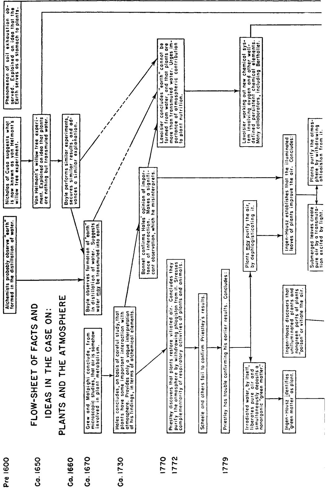

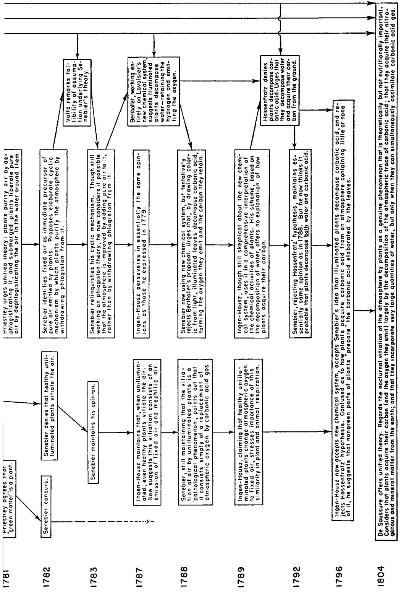

had stood before, which was in a window on which the sun shone; when air bubbles presently began to rise very fast, so that, in three days, I had collected seven ounce measures, and this was so pure, that one measure of it, and two of nitrous air occupied the space of four fifths of a measure [that is, this gas contained about 75 percent of oxygen and was almost four times as "good" as common atmospheric air]. . .

After describing similar experiments made with small vials encrusted with his "green matter" Priestley remarks:

I have had some appearances, which, extraordinary as it will seem, make it rather probable, that *light* is necessary to the formation of this substance; but many more observations, which I believe can only be made in the summer season, will be necessary to determine this. On the 23d of October, I observed that two small phials, which had been filled with pump water, and closely corked on the 9th of August preceding, had both of them a quantity of this green matter, while an open jar of the same water [a "control"], but in a much worse light had none of it. . . [Here was a supremely important, yet apparently completely unforeseen, discovery. This observation was Priestley's first intimation that the degree of illumination might be an important factor in conditioning the results of his experiments.]

That the external air, or animalcules in it, have nothing to do in the formation of this green matter, is evident from several of the preceding observations. . . I have kept phials closely corked, and yet have found the green matter at the bottom of them, and it has yielded air plentifully, especially in the sun, or when placed near the fire. For when the matter is once formed, nothing but a certain degree of warmth seems to be necessary to its actual production of air. [This is not strictly correct, as Priestley recognizes in the sequel.]

The production of this green matter in close vessels seems to prove that it can neither be of animal or vegetable nature, but a thing *sui generis,* and which ought, therefore, to be characterized by some peculiar name; and all the observations that I have made upon it with the microscope agree with this supposition. . . the substance seemed to be a congeries of matter of a compact earthy nature, the pieces separately taken resembling bits of jelly.

Priestley had now made a fearful error. He had convinced himself that the green matter was not a plant when it was, in fact, a common form of alga, an aquatic vegetable microorganism. Microscopic examination did not disabuse him of this thought, probably because he had never subjected a known alga to such scrutiny, and so could not recognize one when he saw it. His contention that this could not be a plant, because air-borne seeds could not enter the tightly stoppered vials, might have been just. But it does not appear that he sufficiently considered the possibility that plant seeds might be present in the well-water

used in most of his experiments. And now, having concluded that the green matter could not be a plant, Priestley failed to grasp the significance of several observations that, in other circumstances, might have been highly suggestive. For example, he remarks: "On the 14th of October I observed that . . . from *green* this substance passes gradually to a kind of *yellow,* or rather *orange* colour." But Priestley did not associate these colorations with a tinting of plants that is not at all uncommon in the autumn.

Paradoxically enough, in his green matter Priestley had come upon a plant organism of the type that has been most widely employed by subsequent generations of investigators of the chemical activities of plants. Indeed, cultures of such green microorganisms are almost unique in that they can be studied under well-defined experimental conditions, with all the variable factors under adequate control. With ordinary plants, such as those used by Priestley, it is practically impossible to obtain meaningful experimental results because of the gross secondary effects produced by the nongreen portions (the roots, branches, etc.) of the plants. But unfortunately, having failed to recognize the green matter as a plant, Priestley reaped no reward from his work with it. In fact, the prosecution of this work served only to lead him deeper into the morass of error. He says :

#### Part II

The preceding part of this section was written while I imagined that the pure air I have mentioned in it was yielded by the *green matter,*  which I have described, as deposited from the water. But I presently afterwards considered that the *formation* of the bubbles of air at the green matter was no proof that they were *yielded* by it; since no air, or even vapour, can issue from water, but at the place where it is bounded by some other substance; and the water might yield its air contiguous to one kind of substance in preference to another. [This is perfectly correct, and is easily demonstrated by dropping a little charcoal into soda water.] Though, therefore, I had not perceived any bubble of air to issue from the water that had deposited it, or from any part of the transparent glass, but only, as it seemed, from the green matter, I had been too hasty in concluding even that the water could not yield the air but with the assistance of that substance.

Here, in retrospect, we can see an excess of sophistication. A less perspicuous investigator, having observed the emission of air only at the surface of the green matter, might have concluded that the green matter was the *cause* of the emission of air. But Priestley is cautious. He remarks that the simultaneous appearance of two phenomena is not sufficient evidence that one is caused by the other. Both may be *effects*  produced by some hidden agency. Priestley was led to identify this hidden agency with the water used in his experiments.

At length the following experiment gave me just ideas on the subject. Observing one of my phials of water that had got a coating of the green matter yielding air very copiously, I poured the water out of it into a clean phial, and found that, by the agitation given to it in the act of decanting, it sparkled as much as any Pyrmont or Seltzer water. Inverting it [the phial] in a basin of water, I collected the air, and found it to be very pure. I treated several other phials in the same manner, and the subsequent appearances being the same, I had no doubt but that when water is brought into a state proper for depositing that green matter, it is, by the same process, prepared for the spontaneous emission of a considerable quantity of pure air. I therefore dismissed all farther attention to the green matter, and shall leave it, after making the following observations.

I never found it except in circumstances in which the water had been exposed to *light·,* and when, after standing in the dark, the water has deposited a whitish filmy matter, it has become green after a few days exposure to the sun. . . [Again Priestley notes, but misses the significance of, a suggestive resemblance between his green matter and normal vegetation. Plants grown in the dark are commonly etiolated (that is, deficient in their normal green pigmentation) but recover their customary color after a few days' exposure to the sun.]

It is possible that, in some future time, I may examine farther into the nature of this matter, thus deposited from water. But upon discovering that it was only a circumstance preceding the spontaneous emission of the air from the water, I gave attention to the *water* only, and to the relation it bore to the air contained in it, which is certainly not a little extraordinary. . .

This is the final blow. Not only has Priestley failed to recognize the green matter as a plant, but he has now come to regard it as no more than an incidental manifestation accompanying or prefacing the spontaneous emission of pure air by water. The experiment that gave him what he considered to be "just ideas on the subject" actually involved a misinterpretation that, one might think, should never have escaped the inventor of artificial soda water. Priestley observed that in the décantation of water that had stood in contact with the green matter a large amount of gas bubbled out of the liquid. We have all seen an entirely analogous phenomenon when soda water is poured out; the solution seethes with bubbles of carbon dioxide. In both instances we are concerned with the evolution of gas previously dissolved in the water, and *not* with the creation of the gas by the water itself. That is, the carbon dioxide is released because the water was previously charged with it, and the gas Priestley observed had been *formed* by or in the green matter, then dissolved in the water, and finally *released* from the latter by the agitation attending décantation. But Priestley failed to appreciate this situation. He relinquished further study of the green matter in order the better to prosecute an extended series of experiments which appeared to show that water was itself the origin of both the green matter and the purified air.

Priestley had lost the thread leading through the labyrinthine ways of his experimentation. An examination of the nature of his failures is not without interest. We have seen that his confidence in the hypothesis that plants improve the atmosphere was first shaken by the irregularities of his second series of experiments. Priestley's observations were not in error: the irregularities occurred largely because the experimental systems concerned were of much greater complexity than Priestley had imagined. It was while seeking a way out of the difficulties presented by these irregularities that Priestley made his second error. Here he made an inadequate observation, and decided that the green matter was not a plant. In following up this conclusion Priestley erred yet again. He came to believe that water alone could purify air. This time his observations were quite sound but, as is so often the case, there was a flawed link in the chain of reasoning that connected the observations with the conclusion founded upon them. The flaw was, as we have seen, essentially a confusion between gas *released from* a solution and gas *produced by* a solution. But at this time phenomena associated with the solubility of gases in liquids had been little studied and were very incompletely understood. Priestley erred badly but, lacking an appreciation of these phenomena, it is no great wonder that he did.

However, even while struggling in this muddle, Priestley had not ceased to make important discoveries. He followed up his observation that *light* was somehow involved in the processes with which he was concerned.

Whatever air is naturally contained in water, or in substances dissolved in water, as calcareous [mineral] matter, etc. becomes, after long standing, but especially when exposed to the sun, *depurated,* so as at length to become absolutely dephlogisticated. . . ["To depurate" means "to purify." The prefix "de" is used here as an intensive, as in "to despoil of," which has much the same significance as "to spoil of."]

When I have kept water a long time in the shade, it has not generally yielded any other kind of air than it would have yielded at the first. . .

No degree of *warmth* will supply the place of the sun's light; and though, when the water is once prepared by exposure to the sun, warmth will suffice to *expel* that air; yet, in this case, the air has never been so pure, as that which has been yielded spontaneously, without additional heat. The reason of this may be that, besides the air already depurated, and on that account ready to quit its union with the water, heat expels, together with it, the air that was phlogisticated, and held in a closer union with the water; which air the action of light, whatever that be, would in time have depurated also. . . [This is not far wide of the mark. Heating liberates *all* the dissolved gas from the water, while the light engenders the formation and preferential release of oxygen.]

In an Appendix, apparently added after the rest of his book had gone to the printer, Priestley cites data that are even more definitive.

My observations that *light* disposes water, containing calcareous and other substances, to make a deposit of a greenish or brownish matter, and then to yield dephlogisticated air, seems to be confirmed by the following experiment.

On the 19th of Feb. 1779, I placed two jars of pump water, each containing about 170 ounces, in the same south window, one of them nearly covered from the sun with brown paper, and the other quite uncovered. In about ten days the water in the uncovered jar had yielded about four ounce measures of air, and the covered jar only a few bubbles. Taking a journey I could make no farther observations on these jars till my return; but on the second of April I found that the uncovered jar had yielded ten ounce measures of air, so pure that one measure of it and one of nitrous air, occupied the space of .84 measures [that is, the gas contained about 40 percent of oxygen] ; whereas the covered jar had very little more than one ounce measure, and with this the measures of the test were 1.55 measures; i.e. by no means so pure as the former.

Hales had, of course, previously offered a speculation that light might play some role in the interaction of plants with the atmosphere. Priestley had now obtained strong experimental indications of a peculiar chemical activity of light. But, unfortunately, the focus of attention in Priestley's more recent work had been on the water, rather than on the plant microorganisms that (unknown to Priestley) were contained therein. Consequently he did not conclude, as he otherwise might have, that *plants in the presence of light* have an ameliorative action on the atmosphere. Indeed, Priestley grants that it is still rather an open question whether plants ameliorate the atmosphere at all. After describing his work on the "Spontaneous Emission of Purified Air from Water," he says:

It will probably be imagined that the result of the experiments recited in this section, throws some uncertainty on the result of those recited in this volume, from which I have concluded that air is meliorated by the *vegetation* of plants, especially as the water by which they were confined was exposed to the open air, and the sun in a garden. To this I can only say, that I was not then aware of the effect of these circumstances, and that I have represented the naked *facts,* as I observed them; and having no great attachment to any particular *hypothesis,* I am very willing that my reader should draw his own conclusions for himself.

Certainly in this particular work Priestley did not display "great attachment for any particular hypothesis." He had begun by supposing that plants, like animals, vitiate the atmosphere. This idea he relinquished in favor of the hypothesis that plants improve the atmosphere. This hypothesis he never actually foreswore, though, as may be seen above, he came to regard it with some doubt. Then, in succession, he entertained the hypotheses that the green matter emitted pure air, that water itself emitted pure air, and, finally, that water under the influence of light emitted pure air.

The whole of Priestley's work on this (and other) subjects presents a mélange of the most ingenious and perceptive observation and experimentation combined with maddening failures in interpretation. Yet the "naked *facts"* were not reported in vain — they reached the attention of Ingen-Housz, who understood their import. Priestley had laid the foundations on which others would build. Although he had subsequently questioned their import, his experiments yielded clear evidence that plants have an ameliorative effect on the atmosphere. And he had suggested the need for an examination of the influence of light on chemical phenomena.

It is all too futile to speculate about "what might have been." Before Priestley could recover the scent, the situation had been drastically changed by the publication, in the same year, 1779, of a work by Ingen-Housz in which Priestley's "green matter" was identified as a vegetable organism. Two years later, in considering his mistake, Priestley wrote that:

**Several of my friends, however, better skilled in botany than myself, never entertained any doubt of its being a plant; and I had afterwards the fullest conviction that it must be one. Mr. Bewly has lately observed the regular form of it by a microscope. My own eyes having always been weak, I have, as much as possible, avoided the use of a microscope. . .** 

From this it was but a very short step to the experiments that Priestley describes in this 1781 publication.

**That. . . it was the** *green matter,* **and not the** *water* **that yielded the air, I was convinced by the following experiment.** 

**Having a number of earthen plates covered with green matter, I introduced several of them under vessels filled with fresh pump water, and then placed them in the sun, together with other vessels filled with the same water, at the same time, but standing on clean plates; when I constantly found that air was immediately produced in the vessels containing the green matter but none in the others, till the green matter was naturally formed in them; after which, but not before, pure air was produced in those vessels also. . .** 

I was led to these experiments by observing that air was immediately produced from those parts of my jars to which green matter from former experiments happened to adhere, not having been carefully cleaned. It was likewise an evidence that it was the green matter, and also in a vegetating state, that yielded the air, that when a plate covered with it had been made pretty hot before the fire (by which the plants had probably been killed) it was incapable of yielding any air.

Priestley apparently completed this fairly definitive experiment before he heard of Ingen-Housz's book. But he did not publish his new work until two years after the appearance of Ingen-Housz's book. There can, therefore, be no question but that the *effective* discovery of the joint action of light and vegetation in maintaining the atmosphere belongs to Jan Ingen-Housz (1730-1799). To his work let us now turn.

#### **6. INGEN-HOUSZ ASSUMES THE LEAD**

Jan Ingen-Housz was a Dutch physician who had a long and distinguished career in which, at various times, he served the royal houses of England and Austria. His scientific interests were broad; and he himself considered his improvement in the inoculation against smallpox, prior to Jenner's introduction of our present method of vaccination, as perhaps his most important achievement. Ingen-Housz tells us that his interest in the purification of the air by vegetation was first aroused after the presentation to Priestley, in 1773, of the Royal Society's Copley Medal. This medal was given to Priestley for his work in pneumatic chemistry in general, but especially for his invention of a method for the artificial preparation of what was then regarded as a valuable medicinal agent — soda water. In making this award Sir John Pringle, then President of the Royal Society, referred in glowing terms to Priestley's discovery of the balance of nature, in which the animal and vegetable creations appeared as vital complements to one another. The terms of Pringle's address were similar to those employed in the Franklin letter cited above (see page 355). This address, which was widely circulated in printed form, aroused great interest in Priestley's studies.

Ingen-Housz, a very devout man, tells us that he was deeply impressed by the beauty of this natural order, and thought much about it in the years 1773-1779, most of which he spent in Vienna. He asserts that during this period he had neither the time nor the facilities for sustained experimental work. However, in 1779, having secured a few months' leave of absence from his post, he returned to England, isolated himself in the country, and prosecuted his investigations with astonishing celerity. He states that during the three summer months of 1779 he performed all of the more than 500 experiments that he made in prepar**ing to write his notable book,** *Experiments Upon Vegetables.* **The good use that Ingen-Housz was able to make of the short time available to him bears convincing testimony to his skill as an experimentalist and to the very clear thinking that he must previously have devoted to this subject. He must also have derived considerable benefit from the many suggestive observations contained in the report of Priestley's second series of investigations, which was published at precisely this time. In the preface to his book Ingen-Housz gives extensive quotations from Priestley's writings. He points out the failures of other investigators who had attempted to confirm Priestley's first findings, and he calls attention to the inconclusiveness of the situation as a whole. He then goes on :** 

Thus far this matter was carried on when I took it up in June last. I must acknowledge that, from what is above related from Dr. *Priestley's*  works, I had little doubt but there was some quality in plants proper for correcting bad air, and improving ordinary air. My curiosity led me to investigate in what manner this operation is carried on, whether the plants mend air by absorbing, as part of their nourishment, the phlogistic matter, and leaving thus the remainder of the air pure (to which opinion Dr. Priestley inclines the most); or whether perhaps the plants possess some particular virtue hitherto unknown, by which they change bad air into good air, and good into better, which I suspected to be the case.

I was not long engaged in this enquiry before I saw a most important scene opened to my view: I observed, that plants not only have a faculty to correct bad air in six or ten days, by growing in it, as the experiments of Dr. Priestley indicate, but that they perform this important office in a complete manner in a few hours; that this wonderful operation is by no means owing to the vegetation [growth] of the plant, but to the influence of the light of the sun upon the plant. [Ingen-Housz now proceeds to summarize his other important findings, in the form of one immense sentence. To facilitate comprehension, this sentence has been broken up in the present text, and some of its less significant clauses have been deleted.] I found that plants have, moreover,

a most surprising faculty of elaborating the air which they contain, and undoubtedly absorb continually from the common atmosphere, into real and fine dephlogisticated air;

that they pour down continually, if I may so express myself, a shower of this depurated air, which, diffusing itself through the common mass of the atmosphere, contributes to render it more fit for animal life;

that this operation is far from being carried on constantly, but begins only after the sun has for some time made his appearance above the horizon, and has, by his influence, prepared the plants to begin anew their beneficial operation upon the air, and thus upon the animal creation, which was stopped during the darkness of the night; . . .

that this operation of plants diminishes towards the close of the day, and ceases entirely at sun-set, . . .

that this office is not performed by the whole plant, but only by the leaves and the green stalks that support them;

that acrid, ill-scented, and even the most poisonous plants perform this office in common with the mildest and the most salutary;

that the most part of leaves pour out the greatest quantity of this dephlogisticated air from their under surface, principally those of lofty trees;

that young leaves, not yet come to their full perfection, yield dephlogisticated air less in quantity, and of an inferior quality, than what is produced by full-grown and old leaves; . . .

that all plants contaminate the surrounding air by night, and even in the day-time in shaded places;

that, however, some of those which are inferior to none in yielding beneficial air in the sunshine, surpass others in the power of infecting the circumambient air in the dark, even to such a degree, that in a few hours they render a great body of good air so noxious, that an animal placed in it loses its life in a few seconds [this emphasis on the poisonous nocturnal activities of plants is a considerable exaggeration of their real abilities];

that all flowers render the surrounding air highly noxious, equally by day and by night;

that the roots removed from the ground do the same, some few, however, excepted;

but that in general fruits have the same deleterious quality at all times, though principally in the dark, . . .

that the sun by itself has no power to mend air without the concurrence of plants, but on the contrary is apt to contaminate it. [The conclusion expressed in the last nine words rested on but a single experiment and is, in fact, entirely mistaken.]

It will be noted that at the beginning of the passage quoted above Ingen-Housz states that : "I must acknowledge that, from what is above related from Dr. Priestley's works, I had little doubt but there was some quality in plants proper for correcting bad air, and improving ordinary air." Apparently Ingen-Housz had not shared the doubts that led Priestley to qualify his first conclusion that plants improve the atmosphere. Probably Ingen-Housz had early recognized the green matter for what it was — a plant. Then, too, Ingen-Housz was familiar with some thought-provoking observations made in a prior investigation of which Priestley had been entirely unaware. This investigation had been carried out by Charles Bonnet (1720-1793), who had published the results in 1754, in a book entitled *Investigations of the Function of Leaves.* Like some of the other works of this prolific Swiss naturalist, the book offered a pretentious speculative superstructure erected on relatively frail observational foundations. Yet Bonnet's studies are not without elements of interest. For one thing, they present us with a striking

illustration of how some almost entirely inconclusive bits of observational data may long lie dormant and apparently worthless, and then, in a mind of genius, be transmuted into a revealing clue to the solution of a problem.

An extremely speculative hypothesis provided the inspiration for Bonnet's work. It was suggested to him that the observed differences in the structures of the upper and lower surfaces of leaves might imply some difference in the respective functions of these surfaces. It was argued that the rougher lower surfaces might be contrived to facilitate absorption of aqueous and other vapors rising from the ground. In the account of his attempts to provide an experimental basis for this line of thought, Bonnet cited certain observations whose meaningfulness was first realized by Ingen-Housz. The following1 is Ingen-Housz's summary of Bonnet's more significant observations:

He [Bonnet] has noted the bubbles of air that cover the leaves of plants when they are immersed in water. He says, page 26, that these bubbles, which cover the lower surfaces of the leaves, are formed of the air separated by the leaves from the water they imbibe. Desiring to verify this supposition, he boiled water for three-quarters of an hour, to expel the air it contained. He [then] introduced a sprig of vine, and no bubbles appeared, though the sun was warm. Then, by blowing through it, he impregnated the water with air, whereupon the bubbles appeared and became much bigger. He says, page 28, that they are ordinarily manifested when the sun begins to warm the water, and that they disappear with the approach of night, because of the cold. On page 31, having observed them more carefully, he states that he has learned from experiment that these bubbles are produced by air adhering to the dry leaves, lodged in their inequalities, and expanded by the warmth of the sun; and that these bubbles disappear with the onset of night — the air forming them being contracted by the chill. . . On page 33 he remarks that it is not only living leaves that, on their immersion in water, are covered with bubbles. He observed the same behavior in dead leaves gathered several years earlier. . .

Like Priestley in a somewhat similar situation (see page 364), Bonnet missed a genuinely important point through an excess of caution. He was persuaded by his later observations of the falsity of his first hypothesis, that leaves separate and emit air previously dissolved in the water. His final conclusion was that his observations could be more readily explained as due to nothing but the effects of thermal expansion taking place in the air adsorbed on the surfaces of the leaves at the time the lat-

1 This excerpt and several of those that follow are taken from the slighdy more comprehensive French (1780) edition of the *Experiments Upon Vegetables,* rather than from the English (1779) edition of this work.

ter were immersed in the water. But it was not difficult to show that Bonnet's conclusion was an oversimplified view of an important phenomenon. Ingen-Housz says:

I took some pains to disclose the cause of these bubbles which, I think, are of more importance than M. Bonnet at that time imagined them to be. . .

If the sun caused this air to ooze out of the leaves by rarifying the air in heating the water, it would follow that, if a leaf, warmed in the middle of the sunshine upon the tree, was immediately placed in water drawn directly from the pump, and thus being very cold, the air bubbles would not appear till, at least, some degree of warmth was communicated to the water. But quite the contrary happens. The leaves taken from trees or plants in the midst of a warm day, and plunged immediately into cold water, are remarkably quick in forming air bubbles, and yielding the best dephlogisticated air.

If it was the warmth of the sun, and not its light, that produced this operation, it would follow, that, by warming the water near the fire about as much as it would have been in the sun, this very air would be produced. But this is far from being the case.

I placed some leaves in pump water, inverted the jar, and kept it as near the fire as was required to receive a moderate warmth, near as much as a similar jar, filled with leaves of the same plant, and placed in the open air, at the same time received from the sun. The result was, that the air obtained by the fire was very bad, and that obtained in the sun was dephlogisticated air.

This seemed to show the inadequacy of the thermal-expansion mechanism that Bonnet had advanced as an explanation for these phenomena. It may seem strange that Bonnet did not think to try the easy yet revealing experiment suggested in the second paragraph of the previous quotation. But it must be remembered that Bonnet had provided an attractively simple and apparently adequate interpretation of his observations. There was no particular reason why he should have extended his exploration of what must then have appeared to be a rather unexciting domain of inquiry. However, when Ingen-Housz did his work, a quarter of a century later, the situation was a drastically different one. Priestley had by then demonstrated the existence of an important interaction between plants and the atmosphere. It became conceivable that Bonnet's observations might contain a previously hidden significance and, on extending them, Ingen-Housz found that this was indeed the case. Moreover, Bonnet did his work in open vessels and, had he attempted to differentiate the effects of heat and light on his results, he would have met with some difficulty in distinguishing the gas liberated by heat from that liberated by light. But Ingen-Housz did not face this

difficulty. Ready to his hand was Priestley's elaboration of Hales's pneumatic-trough system of experimentation, as well as the analytical method provided by Priestley's nitrous air test. Indeed, the experiment described above, by which Ingen-Housz distinguished the effects of heat and light on the emission of air by plants, was identical in design with that through which Priestley had sought to develop a similar distinction in the case of the emission of air by water (see page 367).

Thus Ingen-Housz achieved the pivotal conclusion that Priestley had missed — that *in the presence of light plants emit pure dephlogisticated air.* But Ingen-Housz did not rest on this discovery: he followed it up with great virtuosity. The experiment described in the last excerpt already suggests that in the absence of light plants do not simply cease to emit pure air but may actively vitiate it, as is the case in animal respiration. This striking reversal in the activity of plants was a discovery of great importance, and Ingen-Housz clinched it in the simplest manner imaginable.

If one encloses any plant in a bottle full of water, and if one leaves it in the dark of night, either indoors or out, one will find that it has emitted a little air. But this air is entirely incapable of supporting respiration and is in general so poisonous that it extinguishes a flame in a moment and an animal comes to its death in it in a few seconds. The same result occurs if the bottle is placed in the dark during the day. The quantity of this air is very small, and would not amount to a hundredth part of the dephlogisticated air that the same plant yields when it is exposed to the sun for an hour or two.

Though he recognized the smallness of the volume of "poisonous" air emitted by plants in the dark, relative to the volume of dephlogisticated air obtained from them in the light, Ingen-Housz greatly exaggerated the toxicity of this exhalation of unilluminated plants. He was apparently much impressed by these two paradoxically opposed capabilities of plants, calling attention to them in the subtitle of his *Experiments Upon Vegetables — Discovering their great Power of purifying the Common Air in the Sunshine, and of Injuring it in the Shade and at Night.* The vitiation of air by unilluminated plants is now regarded as a genuine phenomenon of the greatest theoretical significance. But this vitiation involves merely the metamorphosis into carbon dioxide of part of the oxygen in the plant's atmosphere. And carbon dioxide is far from being "an absolute poison . . . the most virulent poison so far discovered," as Ingen-Housz supposed. It is difficult to identify the origin of Ingen-Housz's exaggeration on this point. But whatever this may have been, Ingen-Housz's discovery of the atmospheric vitiation produced by unilluminated plants was one of pivotal importance, for it

put him in a position to understand (and avoid) the failures of Scheele, and of Priestley himself, to duplicate Priestley's first results. Ingen-Housz says:

When I began the experiments that are the subject of this book, I thought that the action concerned could depend only on the *vegetation*  of the plants, but I soon recognized my error. For if the vegetation of the plants were the cause of their salutary influence on the common air, they would produce the same effect at all times and in all places where they can grow. But this is far from so: a plant can live, and even grow to a considerable size in the dark, where it does not yield dephlogisticated air, nor does it have the ability to correct bad air; but on the contrary, it emits to the air surrounding it a veritable poison.

When I had recognized this astonishing difference between the effects produced by plants that receive light and those which are in darkness, I no longer had any difficulty in reconciling the variable, inconstant and often contradictory results of the experiments of Dr. Priestley and M. Scheele. . . M. Scheele, finding that a bean sprout always made the air worse, then concluded that *vegetation* had the same effect on the air as [animal] respiration — which always renders the air less good. M. Priestley, who had well observed that plants sometimes improve common air and correct bad air, believed that when a contrary effect occurred it must have been because the plants had become sick. . .

These gentlemen expected the good results from the vegetation of the plants, as such. By making a plant grow night and day in ordinary air kept in a phial with the plant, the effect will depend upon the greater or less exposure of the plant to the light. Besides, by keeping a plant a long while in pump water, the green matter, from which Dr. Priestley found to issue very fine dephlogisticated air, will be generated; and thus the air within the phial, being mixed with this good air, will not in reality indicate the effect of the plant upon this air, as Dr. Priestley

makes no scruple to acknowledge in his late work. With this insight into the complexities of the experimental systems with which he was concerned, Ingen-Housz was able to mount a thoroughly effective attack on his problem. Of the many important discoveries that he made, the most significant may be summarized as follows, (i) In the sunlight plants emit a dephlogisticated air (oxygen), thereby improving vitiated air and making common air somewhat better. The more intense the illumination, the more vigorously is this function carried on. (2) The entire plant does not take part in this function. It is exercised only by the green leaves and stalks of the plant, and only when these members are illuminated. (3) Green leaves in the dark, and roots, flowers, fruits, etc., whether in the light or the dark, vitiate the atmosphere — by emitting a toxic gas, according to Ingen-Housz. (4) With a normal cycle of illumination, the improvement of the atmosphere worked during the day by the green leaves far outweighs

the vitiation of the atmosphere produced by these leaves at night and by the other plant members at all times.

The whole problem of the interaction of plants with the atmosphere was finally broken wide open by Ingen-Housz's cleverly conceived and well-executed experimental work. Here we see Ingen-Housz as a scientific investigator of very considerable stature, though it must not be forgotten that he was able .to mount on the shoulders of those who had preceded him in these inquiries. The observations of Bonnet and Priestley guided him to the central perception of the importance of the role of light. The basic experimental methods employed were precisely those that had been developed by Hales and Priestley. In his exploitation of these methods, however, Ingen-Housz was led to make a number of apparently small but, in the issue, highly significant modifications in experimental design. By careful control of the illumination he secured results of unprecedented reproducibility and meaningfulness. By using more intense illumination he was able to carry out his experiments more rapidly — before their validity could be much impaired by the gradual development of green matter, which could improve the air, or by slow putrefactive processes, which vitiate it. The occurrence of just such putrefactive processes may well have been responsible for Priestley's earlier failure (see page 352) to recognize that detached leaves are able to restore vitiated air. For Priestley's experiments were of comparatively long duration, and detached leaves deteriorate much more rapidly than the entire plants with which he won his successes. But Bonnet's work suggested that the detached leaves of plants might exercise the very function that Priestley had regarded as an activity of the plant as a whole. Ingen-Housz found that this was actually the case, and he did most of his work with leaves rather than with entire plants. This substitution very considerably reduced the complexity of the experimental systems. For, as we have seen, the activity of illuminated leaves is opposed to, and partially reversed by, the activity of plant roots, branches, and other parts. Indeed, it is hard to see how Ingen-Housz would ever have discovered this opposition of activities had he conducted his experiments with complete plants, in the manner of Priestley.

These and other minor changes in the experimental methods that had been used to study the interaction of plants with the atmosphere finally made it possible to secure the data on which a major conceptual advance could be mounted. But to prepare the way for such an advance is one thing; actually to make it is quite another. Ingen-Housz met with grave difficulties in his attempts to fit a broad conceptual scheme to his experimental findings.

#### 7. INGEN-HOUSZ'S INTERPRETATIONS OF HIS OBSERVATIONS

Ingen-Housz seems to have entertained two fairly distinct ideas of the origin of the dephlogisticated air produced by plants. One referred to the *purification* of air brought about by its contact with a plant; the other referred to the *creation* of dephlogisticated air by a plant totally immersed in water, and thus separated from the atmosphere.

Consider first the purification hypothesis. Ingen-Housz confirmed Priestley's observations that plants work a greater improvement in air fouled by phlogistic processes, such as animal respiration, than they do in common air. He then goes on to say :

As experiment shows that plants vegetate particularly well in putrid air, it is probable that they find there more phlogiston, or the principle of inflammability — a suitable nutriment of plants — than they find in the common air. This shows us why a plant must naturally have a greater ability to correct fouled air than to improve an air that is already good. For, finding more nourishment in the bad air, the plant absorbs more from it, and makes this air more suitable for respiration in proportion as the phlogiston, which renders it harmful to animals, is removed from it by the plant. . .

Vegetables seem to draw the most part of their juices from the earth, by their spreading roots; and their phlogistic matter chiefly from the atmosphere, from which they absorb the air as it exists. They elaborate this air in the substance of their leaves, separating from it what is wanted for their own nourishment, *viz.* the phlogiston, and throwing out the remainder, thus deprived of its inflammable principle, as an excrementitious fluid, and in this state hurtful to them, but rendered useful to the animals, who in their turn take from this air, by the act of respiration, what they want, and throw out the remainder as hurtful to them; but rendered again serviceable to the vegetables. . .

This whole idea of phlogistication and dephlogistication, as practiced by animals and vegetables respectively, is not appreciably different from Priestley's original theory (which Ingen-Housz deprecated in his preface — see page 370) and is neither better nor worse than Priesdey had made it.

But what of the dephlogisticated air emitted by plants completely submerged in water? Here Ingen-Housz proposed a radically different hypothesis. Could the "air" be said to proceed from gas dissolved in the water? Ingen-Housz thought not. He knew that the pump water used in most of his experiments contained much dissolved gas. But when, on boiling the water, the gas was expelled, the nitrous air test showed it to be far inferior to common air. Contrariwise, the "air"

emitted by the leaves of plants immersed in this water proved to be much better (that is, more dephlogisticated) than the common air. In these data Ingen-Housz saw no indication of any essential connection between the "air" dissolved in the water and the "air" emitted by the leaves. Nor could it be said that the dephlogisticated air emitted by the leaves was simply air that had been contained in them at the time of their immersion. By pressing the leaves under water there was obtained only a relatively small quantity of "air," and that of a relatively poor quality. Thus Ingen-Housz satisfied himself that the "air" in the water and the "air" in the leaves could not contribute to the dephlogisticated air emitted when the leaves were irradiated in water. He felt well justified in concluding that the production of dephlogisticated air by a submerged plant must be due to some peculiar vital "transmutation" carried on, under the influence of light, within the living body of the leaves. In the discussion of his work with Priestley's green matter Ingen-Housz remarked:

It is wonderful that this matter seems to be never exhausted of yielding dephlogisticated air, though it has no free communication with the common atmosphere, from which the most part of other plants seem to derive their stock of air. Does this vegetable matter imbibe the air from the water, and change it into dephlogisticated air? This does not seem to me probable, for I could not obtain from water, even by boiling, so much air as the water in which this substance was produced yielded by itself. [That is, after producing the green matter the water yielded more air than could have been recovered from it by boiling. This may well have been the case. But the argument founded on these data was unsound in that it involved the plausible but not quite valid assumption that dissolved "air" can be completely and rapidly expelled from water by boiling.] I should rather incline to believe that that wonderful power of nature, of changing one substance into another, and of promoting perpetually that transmutation of substances, which we may observe everywhere, is carried on in this green vegetable matter in a more ample and conspicuous way. [Note this echo of Newton's sentiments; see page 340.] The water itself or some substance in the water, is, as I think, changed into this vegetation, and undergoes, by the influence of the sun shining upon it, in this very substance or kind of plants, such a *metamorphosis* as to become what we call now dephlogisticated air. This real transmutation, though wonderful to the eye of a philosopher, yet is no more extraordinary than the change of grass and other vegetables into fat within the body of a graminivorous animal [note this echo of Boyle's argument; see page 331], and the production of oil from the watery juice of an olive tree. More examples are to be seen of such wonderful transmutations of sublunary beings. . .

In 1781 Priestley commented rather tartly on the above passage:

Dr. Ingen-Housz's idea of the origin of this vegetable matter, as he himself allows it to be, is rather extraordinary, considering how long the doctrine of *equivocal,* or *spontaneous generation,* has been exploded. He says . . . [Priestley here quotes in full the passage cited above]. But the change of *water,* into an *organized plant,* is a thing of a very different nature from these.

There is an unconscious element of humor in Priestley's certainty that the doctrine of spontaneous generation had been "exploded." Nearly a century later the question whether or not life might be selfcreated from inanimate matter was still the subject of hot debate. As far as we now know, Priestley was essentially correct in his opinion that there is no spontaneous generation. But, curiously enough, it was partly because of this very opinion that he came to grief in his earlier work with the green matter. Writing retrospectively, in 1781, he says:

The principal reason that made me question whether this green matter was a plant, besides my not being able to discover the form of it [by microscopic examination], was its being produced, as I then thought, in a phial close stopped. But this being only with a common cork, the seeds of this plant, which must float invisibly in the air, might have insinuated themselves through some unperceived fracture in it; or the seeds might have been contained in the water previous to its being put into the phial. . . [He then goes on to show that no green matter is developed from boiled water kept in phials sealed with mercury.]

The situation is not without an element of irony. Apparently it was through an opinion that we now regard as correct that Priestley came to the faulty characterization of the green matter that he gave in 1779. And Ingen-Housz, with what would now be considered an erroneous belief in the possibility of spontaneous generation, arrived through it at the correct conclusion, that the green matter is a plant.

In this instance Ingen-Housz's confidence in the ubiquity of "natural transmutations" helped to save him from trouble. But probably it was inevitable that so extravagant a faith would ultimately lead him astray. We have already seen, in our consideration of van Helmont's work, how easily a critical problem can be masked by a facilely postulated transmutation. Similarly, in his hypothesis that some unspecified transmutation was responsible for the emission of dephlogisticated air from submerged leaves, Ingen-Housz found too "simple" a way out of a difficult situation. In so doing he missed several clues to a somewhat less *ad hoc* explanation. But many of the salient experimental indications were confusing if not misleading. Consider, for example, the following passage from the *Experiments Upon Vegetables·.* 

As I think I have proved clearly enough that the dephlogisticated air yielded by plants is air elaborated by a kind of vital motion, carried on in the substance of the leaves, and kept up by the influence of the light of the sun, it seems that no more is required to collect this air than to prevent its diffusing itself through the common mass of the atmosphere. Water seems the most appropriate body for such an intention, for it is not hurtful to plants. [Note the very passive role that Ingen-Housz here assigns to the water. He regards it as no more than a sealing medium, isolating the evolved gases from the atmosphere.] Many of them even thrive the best in it. The best quality required therefore in the water used for this purpose seems to be, to possess of itself air enough, so as not to imbibe it readily from the plants; and not so much as to be overcharged with it. For if the water is too much deprived of its own air, it must be more disposed to absorb it from bodies plunged into it. And if water should be so much impregnated with any air, this air would readily rush into the substance of the leaves, and spoil by its bulk, or by its particular nature, the elaboration of the dephlogisticated air; the more so, as water, when found saturated with air, is found to possess this air in the form of fixed air, which differs too much from the nature of dephlogisticated air, or atmospheric air. . . We know that pump water possesses of itself a great portion of air, which is generally thought to be for a part fixed air. . . We know with more certainty, that boiled and distilled water are deprived of the greatest part of their air. . . Therefore it seems to be not quite improbable, that water which has been boiled or distilled is very apt to absorb itself the air which oozes out of the leaves, and that thus less air is gathered at the top of the bottle.

Here is a closely reasoned statement in which an entirely misleading conclusion is drawn from a set of perfectly sound observations. As might be expected, the argument involves some relatively inconspicuous assumptions which, though not at all implausible, are sufficiently unsound to vitiate the entire "demonstration." Let us examine the situation in somewhat greater detail.

Ingen-Housz's *wording hypothesis* suggested that there was some vital transmutation excited by light in leaves immersed in water, and that dephlogisticated air was a product of this transmutation. The contribution to be made by water to the postulated transmutation was such that it might be expected that, *ceteris paribus,* dephlogisticated air should be uniformly produced by leaves immersed in any kind of water. But what were the facts ? It was an undeniable *fact* that a conspicuously large quantity of dephlogisticated air could be collected from leaves immersed in one kind of water (pump water). It was equally undeniably a *fact* that conspicuously little dephlogisticated air could be collected when similar leaves were immersed in another kind of water (boiled or distilled water). Do these facts argue a defect in the working hypothesis? Ingen-Housz thought quite the contrary: by making suitable assumptions he could demonstrate that precisely these facts were predicted by his hypothesis.

What, then, were Ingen-Housz's assumptions? To begin with, he was aware that most gases are appreciably soluble in water. He assumed that (i) *dephlogisticated air is very considerably soluble in water.* Thus he considered that a sizable proportion of the dephlogisticated air produced by the irradiation of leaves immersed in water might be absorbed by, and retained in, that water. He further assumed that (2) *the extent of the absorption of "air" by water depends on the amount of "air" present in the water at the beginning of the experiment.* There is certainly no a priori implausibility in the assumption that the less "air" there is present in a sample of water, the greater will be the tendency of that water to absorb more of that "air." To be sure, it was known that the "air" occurring most abundantly in pump water (fixed air) is recognizably different from the "air" emitted by plants (dephlogisticated air). And it was somewhat less plausible that the presence of one kind of gas would affect the solubility of an entirely different kind of gas. But Ingen-Housz did not consider fixed air and dephlogisticated air fundamentally different materials. He assumed, as did many of his contemporaries, that (3) *the different "airs" are merely various forms of common air·,* in the above quotation, for instance, he speaks of "air in the form of fixed air."

If these assumptions are granted, Ingen-Housz has a strong case. Assumption (3) renders assumption (2) plausible even though the "air" in the water is recognizably different from the "air" emitted by the plants. And assumptions (1) and (2) together lead to the important deduction that when leaves are irradiated in water the amount of dephlogisticated air *collected* cannot be regarded as a direct indication of the amount of dephlogisticated air *produced.* The amount *collected*  will be strongly dependent on the amount *absorbed,* and hence on the extent to which the water was originally charged with "air." Ingen-Housz's hypothesis can now be perfectly reconciled with the facts. On his hypothesis dephlogisticated air was *produced* perfectly uniformly by the irradiation of leaves immersed in any kind of water. A great deal of dephlogisticated air should then be *produced* in boiled or distilled waters. But such waters contain very little "air" of their own; they will *absorb* a large proportion of the air *produced* ; and thus little or none of the air will be *collected.* In pump water, on the other hand, we have a water that is heavily charged with "air" (largely fixed air) to begin with; this water should then *absorb* very little dephlogisticated air; and therefore most of the air *produced* by the leaves will actually be *collected.* 

Impressive as it undoubtedly is, this argument (like any other argument) is obviously no stronger than the assumptions on which it was founded. What was the status of these assumptions? Assumption (3) was fairly generally accepted and, in any event, it was not absolutely essential to the argument. Even if assumption (3) had been disallowed it would still have been necessary to show that assumption (2) failed when the two "airs" were different. But such a demonstration would have been very difficult at this time when, as we have already remarked, there was but scant knowledge and understanding of phenomena associated with the solubility of gases in liquids. And so we come to assumption (1) and it is here that we find the real soft spot in Ingen-Housz's argument. A simple experiment would have shown that dephlogisticated air is insufficiently soluble in water to justify assumption (1). Yet Ingen-Housz never even attempted this experiment, and this is not altogether surprising. In the first place, though we have lifted these assumptions from a text in which they are certainly implicit, there is room for doubt that Ingen-Housz recognized these plausible beliefs for what they were — essentially unsupported assumptions. And, second, whether these assumptions were made implicitly or explicitly, it was plain that with their aid Ingen-Housz's working hypothesis could be well reconciled with the facts, for which, indeed, it provided a thoroughly satisfying interpretation.

Unfortunately, the whole tenor of this interpretation directed attention away from what later proved to be the fruitful line of approach. In Ingen-Housz's interpretation the gas in the water was thought to have only a rather negative effect on the results. That is, the gas in the water was thought to affect only the *collection* of the dephlogisticated air emitted by submerged leaves, and to have no influence whatever on the *production* of the dephlogisticated air. This is to be contrasted with our present opinion that the "air" in the water has an important positive part in the *production* of the dephlogisticated air, no more dephlogisticated air being produced than there is fixed air available in the water. Yet, as we have seen, there was no real implausibility in Ingen-Housz's argument; and there were serious experimental difficulties that did much to cloud the issue. For example, consider what is to be expected when leaves are irradiated in water that has been strongly impregnated with fixed air. Clearly a very copious yield of dephlogisticated air should be expected: on our modern hypothesis, because more fixed air is available to the leaves; on Ingen-Housz's hypothesis, because less of the dephlogisticated air will be absorbed by water that is already heavily charged with "air." Both hypotheses predict the same result, but Ingen-Housz found that this expectation just was not in accord with the facts. He says:

I placed some leaves of a vine in water, which I had, for this experiment, impregnated with fixed air: they were scarce under the surface of this water, but they were all covered with air bubbles; which seems to me to depend partly upon this water refusing to absorb any air issuing from the leaves, because it was already overcharged with air itself. It is true that any other body, plunged in water impregnated with fixed air, will also become covered with air bubbles; but these bubbles do not appear so soon, or increase so rapidly, as those of the living leaves. So that it seems, that the bubbles of the leaves increase faster because they are pushed out of the leaves by a vital motion in the leaf. It is also true, that leaves thus placed in water impregnated with fixed air, do not yield that fine dephlogisticated air which they yield when placed in common pump water; which may be owing perhaps to the great abundance of fixed air penetrating the leaves, by being absorbed, and oozing out as it were, in a kind of tumultuary way. . .

Ingen-Housz goes on to suggest that this penetration of fixed air into the leaves may have upset their internal "vital motion" — the vital motion that he had supposed to be responsible for the transmutation through which dephlogisticated air was produced by leaves immersed in water. The postulation of a derangement of the vital motion was, of course, completely *ad hoc·.* Ingen-Housz was simply looking for some way of reconciling his transmutation hypothesis with an apparently contradictory observation. However, this speculative postulate was not very wide of the mark. We now believe that the air-producing activity of certain species of leaves is paralyzed when they are exposed to excessive concentrations of fixed air. This paralysis — not unreminiscent of Ingen-Housz's idea of a "derangement of the vital motion" — may have been responsible for Ingen-Housz's failure to obtain the large volume of dephlogisticated air that he expected.

The experimental situation bristled with complexities. In this connection it should be noted that Priestley had previously reported on an experiment very similar to that described above by Ingen-Housz. But *Priestley's results had been exactly contrary to those of Ingen-Housz.*  That is, Priestley found that "water impregnated with fixed air yields, after this exposure [to light], the greatest quantity of dephlogisticated air." Undoubtedly Priestley allowed a longer time for the conversion of the fixed air to dephlogisticated air. It is also possible that the paralytic effect referred to above was less pronounced in Priestley's investigation, either because the green matter (with which he was then concerned) was less subject to paralysis than the leaves used by Ingen-Housz, or because Priestley had not charged his water as heavily as did Ingen-Housz. Whatever may be the case, Priestley did find a definite connection between the amount of "air" originally present in water and the

amount of dephlogisticated air that could be obtained from that water. Writing in 1781, Priestley remarked:

In order to ascertain with more precision the real origin of this pure air, and especially to determine whether it was properly *produced* by the light, and something within the plant (which, as I found afterwards, seems to be the idea of Dr. Ingen-Housz) or only by dephlogisticating the air previously contained in the water, which I suspected from my former experiments on vegetation, I kept a quantity of these water plants in jars of water in the sun, as long as they would give any air; then only changing the water, I found that the same plants immediately began to give fresh air as copiously as at first. . .

It is also a proof that the proper origin of all the air produced in these circumstances is not the plant and the light, and that these are only agents to produce that effect upon something else [this is a most acute surmise], that in all cases, the quantity of air produced bears a certain general proportion to the capacity of the vessel in which the process is made, never, I believe, exceeding one eighth, exclusive of that which is held in solution by the water itself, which, however, is pretty considerable. . .

There is no proper *production* of air in the case, but only a *depuration*  or dephlogistication of the air previously contained in the water, and as water plants depurate the air that is held in solution by the water, it is agreeable to analogy that plants growing in air should depurate that air to which they are exposed. . .

Before I proceeded to make trial of any other plants, I was informed of the experiments of Dr. Ingen-Housz, whose assiduous attention to this subject gave me the greatest satisfaction, and entirely superseded what I might otherwise have thought of doing in the same way. . .

In the next to the last paragraph of this quotation Priestley expressed a thoroughly integrated view of the activity of plants. When surrounded by air they were supposed to dephlogisticate that air; and when submerged in water they were supposed to dephlogisticate the air in that water. Ingen-Housz had accepted the first part of this hypothesis, but he had postulated an entirely distinct mechanism — a transmutation for the emission of dephlogisticated air by plants immersed in water. In thus directing attention to an important possibility that Ingen-Housz had previously dismissed, Priestley made his last major contribution to the problem that he had done so much to define and to resolve. At this point he passes from our story, having, with the utmost graciousness, relinquished to Ingen-Housz the further prosecution of these investigations. But the next step forward was made not by Ingen-Housz but by the Swiss pastor and naturalist, Jean Senebier (1742-1808).

#### 8. SENEBIER ENTERS THE STORY

Senebier was a meticulous and tireless experimentalist, and an equally tireless and tiresome writer on scientific subjects: his works on the interaction of plants with the atmosphere published in the period 1782-1788 run to more than 2100 pages. Thoug h Senebier had apparently begun his investigations at about the same time as Ingen-Housz , his first report was not published until three years after Ingen-Housz' s book had appeared. Thi s report (a three-volume work ) shows that Senebier had conscientiously repeated practically all of Ingen-Housz' s experiments. In most instances Senebier confirmed the broad outline of Ingen-Housz' s results, though there were a numbe r of differences in detail. Fro m his results Senebier drew conclusions that were for the most part substantially the same as those previously reported by Ingen-Housz . But Senebier's conclusions were different in at least three important respects: (1 ) he flatly denied that in the dark the leaves of plants normally vitiate the atmosphere, a point on which Ingen-Hous z had laid great stress; (2) he secured clear experimental evidence that submerged leaves liberate dephlogisticated air at the expense of the fixed air in the water surrounding them; and, thus (3) his conceptual appreciation of the situation was fundamentally different from that of Ingen-Housz . Le t us consider, in order, these three aspects of Senebier's work .

In most of his early studies, reported in 1782, Senebier did not find that any gas, harmful or otherwise, was emitted by submerged leaves at night. Ther e were, to be sure, a fe w instances in which such evolution of gas was manifest. But Senebier maintained that whenever gas did appear it should not be regarded as a product of the normal respiratory activity of a healthy plant. Instead, he suggested that the gas was produced only because the leaves became diseased in the unnatural environment to which they were necessarily exposed in these experiments. Senebier remarks :

It is here above all that one must scrupulously distinguish the air engendered by the fermentation of rotting leaves from the air that they release under the influence of the sun. I have no doubt that it is through this lack of attention that NATURE and plants have been calumniated by the attribution to them of the dangerous faculty of emitting during the night an air that, by its poisonous qualities, impairs the purity of the atmosphere. . . [Ingen-Housz later gave expression to a bitter resentment at being thus referred to as a calumniator of Nature.]

Six years later, in 1788, Senebier was obliged to report somewhat different results. H e admitted that many of his later experiments did indicate that leaves vitiate the atmosphere at night. Thi s vitiation he found to be *qualitatively* similar to that reported by Ingen-Housz, though *quantitatively* less impressive. But it must not be supposed that these new results made any real alteration in Senebier's opinion that leaves in their *natural* state never vitiate the atmosphere. He still believed that the vitiation proceeded from pathologic processes induced in the leaves by the high humidity and other abnormal conditions surrounding them in these studies; and he still rejected Ingen-Housz's contention that this vitiation was an important manifestation of the activities of normal plants. By 1788 Senebier and Ingen-Housz had performed very similar experiments and had secured much the same results. Thus they were working with essentially the same *facts,* and yet they arrived at opinions that were almost diametrically opposed. How much more than the simple facts goes into the making of a scientific opinion!

We have already noted that Ingen-Housz exaggerated the degree to which air is vitiated by unilluminated plants; and now, in Senebier, we encounter the opposed tendency, to undervalue and even to deny this vitiation. In his earlier studies (with plants immersed in water) Senebier had generally failed to observe any gas emitted by leaves at night, and his opinion was first formed on the basis of these data. When his later experiments (with plants surrounded by air in a water-sealed container) indicated that unilluminated plants did sometimes vitiate their atmosphere, it was only natural that he should attempt to fit his new findings into the working hypothesis that he had previously adopted. Then, too, an understandable reaction against Ingen-Housz's exaggeration of the magnitude and importance of this phenomenon may have produced in Senebier the opposite tendency to undervalue it. Finally, and perhaps most important of all, Senebier's hypothesis must have appeared to him to be the simplest, and therefore the most attractive, available. He knew that leaves liberated pure air when they were exposed to the sunlight and that, other things being equal, the volume of the pure air was roughly proportional to the intensity and duration of the illumination. That is, the amount of pure air produced seemed to depend on the amount of light falling on the leaves. But then, what could be more reasonable than to suppose that when *no* light fell on the leaves *no* gas, pure or otherwise, would be released. It was quite natural to conclude, as Senebier did, that any gas released by leaves in the dark must be the product of secondary effects peculiar to the abnormal conditions of the experiment and not characteristic of the behavior of leaves in a state of nature.

Senebier says:

If one could comprehend things *a priori,* it would no doubt be easier to study them by the force of the imagination than to examine them experimentally. But as the rule of the imagination is passé in science, corporeal phenomena can be fathomed only by a profound study of the facts.

One would hardly deny the necessity of the "facts." But, having seen how radically different were the constructions that Ingen-Housz and Senebier placed on the same facts, one must regard as notably premature Senebier's dictum that "imagination is passé." Then as now it was always necessary to face the "small" but treacherous question of how to interpret the facts. In his interpretation Senebier undoubtedly expressed what appeared to him to be the most rational explanation of the nocturnal exhalation of leaves. Yet, as Ingen-Housz subsequently pointed out, there was no real lack of rationality in an interpretation that regarded the nocturnal vitiation of the atmosphere as a normal function of plants. Comparing it with the vitiation of the atmosphere regularly produced by animal respiration, Ingen-Housz wrote in 1789 that the nocturnal vitiation produced by plants was

one of the most ordinary phenomena, a law of Nature that dominates the whole organized [living] creation and which has no exceptions. I believe that one could never doubt but that beings that live in the same element, or that are nourished by the same foods, have an analogous effect on their common element and on their foods. . . He who first made known this property of plants [of vitiating the atmosphere at night] did not really discover anything more extraordinary than if he had demonstrated that animals do not dispose of their foodstuffs in the same condition in which they were ingested, or if he had shown, as an astonishing matter, that animals vitiate the air they breathe. Let us say that all that we have learned that is new is simply that animals vitiate their element [the atmosphere] without ceasing, day and night; and that plants do the same with the sole exception of the time during which they are exposed to the sun. And as this alteration made by animals in the air in which they live is in no sense due to a state of sickness or fermentation that one might imagine in their economy — in the same way let us say that the impression made by plants on the common element of all organized beings cannot be viewed in the case of plants as a pathological effect, but as a phenomenon that arises from their nature and which is in no sense remarkable.

In this passage Ingen-Housz recalled a point of view that had been almost forgotten. It will be remembered that when Priestley began his work he had supposed that plants, like animals, would vitiate the atmosphere. But his experiments did not support this hypothesis; and he, Franklin, and many others adopted the contrary opinion that plants repair the injury done to the atmosphere by animal respiration. Ingen-Housz himself tells us that he began his studies largely because he had been so impressed by this complementarity of function. However, his discovery of the vitiating activity of unilluminated plants ultimately persuaded him to revise his views. He came to consider the possibility that had been neglected since Priestley's work: the possibility that animal and vegetable respiration might have some important *similarities.* He suggested that the amelioration of the atmosphere by plants in the sunlight should be regarded as a very special situation, brought about by the *joint* agency of light and vegetation. This situation was not to be regarded as representative of vegetable respiration as such: if in the dark healthy plants can *vitiate* the atmosphere it seemed plain that animal and vegetable respiration must have something in common. Senebier, on the other hand, continued to urge the central importance of that activity by which plants are able to *restore* vitiated atmospheres — an activity clearly distinct from and complementary to, animal respiration. In the next section we will examine Senebier's outstanding contribution to the study of this activity.

#### 9. FIXED-AIR SUPPLY AND DEPHLOGISTICATED-AIR PRODUCTION

We have remarked that Senebier repeated most of Ingen-Housz's experimental studies and that, by and large, he was able to duplicate most of Ingen-Housz's results. In particular, he confirmed Ingen-Housz's observations that

*(a)* No dephlogisticated air is obtained by the irradiation of leaves submerged in water that has been successively distilled and boiled; (b) A very plentiful supply of dephlogisticated air is obtained by

the irradiation of leaves submerged in pump water — water known to contain much dissolved "air," especially fixed air.

It will be recalled (see pages 381-382) that Ingen-Housz had suggested a line of argument by which these data could be reconciled with his hypothesis that dephlogisticated air was *created* by submerged leaves through a transmutation performed in the leaves under the influence of light. This argument was predicated on three assumptions, one of which suggested that large quantities of dephlogisticated air could be dissolved in water containing little "air" of its own. Ingen-Housz never submitted this assumption to an experimental test, but Senebier did. He says:

**Having filled one of my receptacles with boiled water in such a way that a measure of common air was present in its upper part, I found that this water, from which all air had been driven by boiling, had absorbed only an eighth part of this measure of air at the end of three**  days; from which it seems certain that water does not absorb much air. . . This observation is important. It assures us that in the aeriform products furnished by the leaves is recovered practically all the air that they have really transpired, and that pure water absorbs only a little of the aeriform products.

With this observation in hand it was plain to Senebier that Ingen-Housz's assumption could not be sustained; and that, therefore, there would be real difficulty in reconciling the transmutation hypothesis with the facts *(a)* and *(b).* That is, it became clear that boiled water could not possibly imbibe all the dephlogisticated air normally released during the irradiation of submerged leaves. Now we have seen, on page 70, that Priestley had already rejected Ingen-Housz's transmutation hypothesis, and had suggested in its stead the idea that leaves simply depurate the "air" in the water with which they are in contact. This hypothesis rendered facts (a) and (b) easily intelligible. For in distilled water leaves find little or no dissolved "air" on which they can act, while in pump water a plentiful supply of such "air" is available. Senebier was very favorably impressed by this hypothesis of Priestley's, and made an important refinement in it.

It was then well known that most of the "air" in pump water was actually fixed air; and Senebier was led to wonder whether this fixed air might not be the immediate precursor of the dephlogisticated air so copiously produced by leaves immersed in pump water. That is, where Priestley had considered all species of dissolved "air" equally suitable for elaboration into dephlogisticated air, Senebier suggested that the leaves acted only on the fixed air present. The development of experimental evidence for this point of view presented many difficulties. But Senebier was able to secure a number of indications that the amount of *dephlogisticated air produced* by submerged leaves was directly related to the amount of *fixed air supplied* to those leaves. Indeed, Senebier devoted more than 400 pages of his books of 1782 and 1783 to the establishment and discussion of this relation. From the wealth of evidence that Senebier collected a very few representative points have been selected for presentation in summary form. It should be noted, however, that the experiments and arguments presented in the first three of the following items are little more than echoes of Priestley's work. Senebier pointed out that:

(1) No dephlogisticated air is produced by the irradiation of leaves immersed in boiled water. The significance of this observation has already been discussed.

(2) The irradiation of leaves immersed in water artificially impregnated with fixed air results in the liberation of extraordinarily large quantities of dephlogisticated air. The method of impregnation employed was essentially that devised by Priestley for the preparation of soda water. With some exceptions (arising, for the most part, from the paralytic effect to which reference has already been made), the quantity of dephlogisticated air produced was found to be roughly proportional to the quantity of fixed air originally dissolved in the water. Fixed air is extensively soluble in water. Consequently, even though this gas constitutes only a very minute part of the atmosphere, significant concentrations of fixed air will always be present in water that has been exposed to the air for some time. Thus some dephlogisticated air can always be produced by the irradiation of leaves immersed in any water that has been in contact with the atmosphere. But the volume of dephlogisticated air obtainable from water that has been artificially charged with fixed air will be much greater.

(3) After prolonged irradiation in a given sample of water, leaves cease to produce dephlogisticated air. When the water is changed, however, there is a renewed evolution of dephlogisticated air from the same leaves. On the other hand, the irradiation of fresh leaves, immersed in water in which other leaves of the same sort have already released as much dephlogisticated air as they can, does *not* result in the liberation of more dephlogisticated air. That is, when the production of dephlogisticated air in a given system has ceased, a change of the water induces renewed production but a change of the leaves does not. This does not suggest that the cessation of the production of dephlogisticated air is due to a progressive impairment of the function of the leaves. On the contrary, it suggests that the production ceases because of the exhaustion of some essential material that the leaves draw from the water in the course of their synthesis of the dephlogisticated air. This is a particularly telling point because Ingen-Housz's transmutation hypothesis is not readily reconcilable with these observations.

(4) Following the chemical studies of the talented Scottish investigator, Joseph Black (1728-1799), Senebier knew that in the presence of fixed air an insoluble white precipitate (calcium carbonate) is formed by limewater (aqueous calcium hydroxide). It was also known that, other things being equal, the quantity of this precipitate is proportional to the quantity of fixed air present. On applying this test to fresh pump water Senebier found, as expected, that the water contained much fixed air. But, still using the limewater test, he found that practically no fixed air was left in the same water after leaves had been irradiated in it until they could produce no more dephlogisticated air. Thus, again, the evolution of dephlogisticated air by leaves was associated with the supply of fixed air to the leaves.

None of these points, and none of the many other items of evidence that Senebier adduced for his opinion, is individually conclusive. But the cumulative impression produced by so many complementary items of evidence was extremely powerful; and Senebier had good reason to conclude that:

The leaves are nothing but laboratories in which is prepared so much the more pure [dephlogisticated] air as there is in the surrounding medium more of the fixed air that they elaborate.

This conclusion was of importance because of its suggestion of the proximate source of the dephlogisticated air evolved by plants. And Senebier did not stop here. He sought to establish the location of the leaf "laboratories." He found that shredded bits of leaves were able to produce dephlogisticated air when they were irradiated in water. Thus, just as Ingen-Housz (following Bonnet) had shown that entire plants were not required for this production, as Priestley had supposed, Senebier showed that entire detached leaves were not required, as Ingen-Housz had supposed. Hence the production of the dephlogisticated air was to be regarded as a function neither of the plant as a whole nor of the leaf as a whole. Senebier went on to anatomize the leaf, and showed that the epidermal structures — the leaf "skin," ribs, etc. — contribute nothing to the production of dephlogisticated air. He found that it was the green fleshy interior portion of the leaf, the parenchyma, that alone possessed the ability to metamorphose fixed air into pure air. That the very greenness of the leaf might be important was indicated by the observations that the whitish "etiolated" leaves of plants reared in complete darkness were incapable of forming dephlogisticated air. This faculty was acquired only when, after some days' exposure to sunlight, the leaves had assumed their normal pigmentation. We now know that the green color of normal leaves is due to the presence in them of *chlorophyll* — a complex catalytic material whose structure has only recently been elucidated — which appears to play an absolutely essential role in the interaction of plants with the atmosphere.

#### 10. THE EVOLUTION OF SENEBIER'S THEORETICAL VIEWS, 1782-1792

*The Transmutability of Gases.* Senebier located the plant "laboratory" in the green fleshy portion of the leaf, and he concluded that part of the work of this laboratory is the transformation of fixed air into pure air. This conclusion was not a particularly surprising one. Lavoisier, with whose work Senebier was familiar, had suggested (see Case 2) that about one-quarter of ordinary air consisted of a gas successively denominated as *dephlogisticated air, pure air, vital air,* and

*oxygen,* and three-quarters of an inert gas successively designated as *phlogisticated air, mephitic air, azote,* and *nitrogen.* The vital air was recognized as the only part of the atmosphere that supported respiration, combustion, fermentation, and putrefaction. Lavoisier showed that, through its involvement in respiration, the vital air was progressively changed into an equal volume of fixed air. The atmosphere was then vitiated in proportion to the extent of this replacement of vital air with fixed air. That is, according to Lavoisier the *phlogistication, impairment, vitiation,* or *poisoning* of the atmosphere by respiration was to be regarded as nothing more nor less than the progressive replacement of the vital air by fixed air. Now Priestley and Ingen-Housz had shown that plants *ameliorated* or *restored* air that had been phlogisticated by respiration, combustion, and so forth. To restore such vitiated air it would be necessary to reverse the phlogistication or, on Lavoisier's scheme, to convert the fixed air back into vital air. But this is *perfectly*  concordant with Senebier's opinion that in the sunlight the leaves of plants convert fixed air into vital, or dephlogisticated, air.

Here were the makings of a beautifully self-consistent conceptual scheme for the interaction of plants with the atmosphere. But Senebier did not achieve this scheme for a number of years. It must be remembered that at this period Lavoisier's new oxygen theory had not yet won general acceptance. In formulating his conceptual judgment of the chemical activities of plants, Senebier did not adopt the opinions suggested by Lavoisier's novel system but, instead, set forth from the traditionally accepted ideas embodied in the phlogiston theory. According to that theory animal respiration vitiated the atmosphere by phlogisticating it, while plants restored a vitiated atmosphere by dephlogisticating it. Senebier's first concern, then, was to fit his findings on the role of fixed air in the vegetable economy into the framework of the phlogistic view of the interaction of plants with the atmosphere. He was satisfied that such accommodation was entirely feasible. To facilitate comprehension of Senebier's view it may now be expedient to consider briefly the then current opinion of the nature of gases, or "airs."

In 1782 the identification of some of the most important gases was still obscure. Thus Ingen-Housz, among many others, confused the fixed air formed in combustion and respiration with the mephitic air that normally forms three-quarters of the atmosphere. Both fixed air and mephitic air fail to react with nitrous air to give red fumes and a volume contraction (which is the behavior produced by the addition of nitrous air to vital air), and both fail to support respiration and combustion. Furthermore, these gases are often found mixed together, since in respiration and combustion the mephitic air originally mixed with the vital air in the atmosphere is later found mixed with the fixed air formed during the respiration or combustion. However, a reasonably clear distinction of these two gases was possible. Fixed air is more dense and more readily soluble in water than is mephitic air. Also, fixed air forms a precipitate with limewater, while mephitic air does not; fixed air shows a typical acid reaction with alkalies and vegetable dyes, while mephitic air is not an acid, and so on.

The distinction between fixed air and mephitic air was plainly indicated by Lavoisier and clearly apprehended by Senebier. However, Senebier's appreciation of the significance of this distinction was seriously weakened because he, in common with many of his most illustrious contemporaries, still looked with favor on the ancient idea that natural processes comprehend an almost infinite number of "transmutations." By 1782 belief in the real occurrence of many of these transmutations had been weakened or dissipated, and there was a much greater tendency to "explain" or formalize the supposed transmutations. But the idea of "transmutation" as such was far from dead, and it found expression in an influential opinion that gases are freely interconvertible. We have already touched upon this opinion (see page 381) in connection with Ingen-Housz's work, and in 1782 the basic idea was expressed more dogmatically by Senebier.

Here are my principles in the matter of airs. . . There are no aeriform emanations [gases] that do not imply a combination or decomposition in which phlogiston plays a role. There is no one of these emanations that is not modified by the quantity of phlogiston it contains or by the degree of the union that it can make with phlogiston. Thus, by this means, given a gas, one can produce from it any other gas. [That is: "Give me means to add and subtract phlogiston and I will make for you, from any one gas, any other gas."]

This idea of the interconvertibility of gases was rendered plausible by the phlogiston theory, and there appeared to be a number of experiments that established its validity. We now know that these empirical findings were entirely misleading. That is, the supposed "transmutations" were actually the product of various unsuspected experimental aberrations (arising from the solubility of gases in water, etc.). But the ultimate recognition of the fallibility of these supporting experiments was not the chief cause of the eventual decline of belief in the transmutability of gases. Indeed, there can be no experimental "proof" of the *impossibility* of a supposed phenomenon such as the mutual interconversion of gases. For even after a thousand experiments have failed or been discredited there is always the possibility that success will be achieved in the thousand-and-first trial. The idea of gaseous trans-

mutability was never actually "disproved"; it simply ceased to seem plausible and attractive after Lavoisier's new chemical system, with its doctrine of persistent chemical elements, had triumphed over the phlogiston theory. But here we anticipate a later development for, as has already been remarked, in 1782 Lavoisier's system was still a novelty regarded with dubiety by most of the learned world.

Having in hand this background information on the view of the nature of gases that was current in 1782, we are now in a position to examine Senebier's first attempt to conceptualize the observations made on the interaction of plants with the atmosphere. In following the progressive elaboration and revision of Senebier's successive estimates of this interaction we are able to secure an unusually vivid picture of how the very gradual penetration of a broad conceptual scheme affects the theoretical answers given to a specific problem. That is, we can see how the shift in the over-all pattern of chemical thinking was reflected in changes in the hypotheses advanced as explanations of the rather special chemical activities of plants.

*Senebier's Opinions, 1782-1783.* The identification of fixed air as the immediate precursor of the vital air produced by plants provided the foundation for a substantial conceptual advance — an advance beyond Priestley's idea of "depuration" and Ingen-Housz's even vaguer notion of a "transmutation." But the full impact of Senebier's discovery of the association of fixed-air supply with pure-air production was cushioned by his faith in the transmutability of "airs." Imbued with this faith, Senebier was able to devise an elegant reconciliation of his discovery with the orthodox phlogistic view espoused by Priestley. Indeed, the ingenious scheme outlined below must at first have appeared to leave very little to be desired.

When a plant vegetates in the sun in phlogisticated air [the reference is to common air that has been vitiated by respiration or combustion] dephlogisticated air escapes from it little by little. There then occurs a gradual precipitation of fixed air, which carries along with it the phlogistic principle, by uniting it with the acid principle or the pure air, forming fixed air that the water dissolves. Thus [by the removal of part of its phlogistication] the air is ameliorated in proportion to the renewal of this precipitation, and the precipitation is renewed to the extent that the air in the receptacle is mixed with a new quantity of pure air [formed in the leaves by a metamorphosis of the fixed air that they receive dissolved in the water that they imbibe]. . .

Finally, vegetating plants are placed in receptacles full of common air . . . [and] if one exposes them thus to the sun, the common air becomes better, and there is precipitation of fixed air — that is to say, the fixed air formed by the mixture of the pure air, furnished by the plants, with the phlogiston contained in the common air. But then there is less fixed air precipitated than in receivers full of phlogisticated air [because there is less phlogiston available for the "precipitation" of the fixed air].

The rather abstruse cyclic mechanism that Senebier has outlined involves two major assumptions: (i) *A phlogisticated air is no more than common air relatively heavily charged with phlogiston.* This idea is, of course, in the strict tradition of the phlogiston theory. (2) *When dephlogisticated air is added to a phlogisticated air, the former is converted to fixed air by the absorption of some of the phlogiston with which the latter is charged.* A diagrammatic sketch of this postulate is

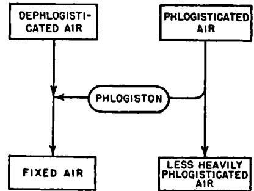

**FIG. 5**(a). Supposed reaction of dephlogisticated air with a phlogisticated air (1782).

shown in Fig. 5(a). Of a number of indirect arguments in favor of this notion we will cite but one. Charcoal, a substance then generally believed to be particularly rich in phlogiston, is easily burned in dephlogisticated air. In this reaction the dephlogisticated air and the charcoal are extensively consumed, and a very large quantity of fixed air is produced. Hence it would appear justifiable to regard fixed air as a combination of dephlogisticated air with phlogiston, as indicated in Fig. 5*(a).* 

Let these assumptions be granted and a very neat interpretation of the improvement of air by plants can be devised. Consider that when plants are illuminated in a phlogisticated atmosphere they emit dephlogisticated air. As the gases mix, the dephlogisticated air acquires some of the phlogiston available in the ambient atmosphere and is itself simultaneously converted to fixed air (Assumption 2). But it was known that, volume for volume, fixed air is heavier than most other "airs." It was, therefore, natural to suppose that as rapidly as the fixed air was formed it would "precipitate," or settle toward the bottom of the system. Here it would come in contact with water that reached the roots of the plants.

But fixed air was known to have a solubility in water that was unusually large as compared with other common "airs." Hence it was reasonable to assume that the fixed air would be extensively dissolved by the water, with which it would then be imbibed by the plants' roots. Dissolved in the plant sap, the fixed air would thereupon be conveyed upward to the leaves (this motion of plant sap had been established half a century earlier by Hales). Then, finally, under the influence of sunlight falling on the leaves, the fixed air would be divested of its phlogiston, the dephlogisticated air so formed would be reëmitted from the leaves, and

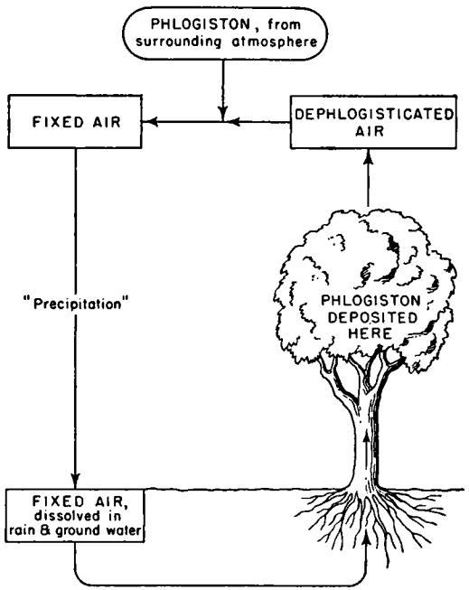

**FIG. 5***(b).* Senebier's conceptual scheme (1782).

another cycle could then be begun. The whole process could be repeated indefinitely, or until the bulk of the phlogiston originally present in the atmosphere around the plants was transferred to them, leaving behind a relatively dephlogisticated atmosphere. A sketch of this cyclic purificatory system is shown in Fig. 5 *(b).* 

Here is a system of almost classic economy. Using but a few assumptions, none of which is implausible in itself, Senebier offers a thoroughly general interpretation of the air-purifying activity of plants — whether the plants grow in water or in earth, and whether they are examined in nature or in the laboratory. One of the most striking aspects of this system is the skillful way in which it is constructed to take advantage of what were regarded at that period as two of the most notably characteristic properties of fixed air. That is, the relatively high density and extensive water solubility of fixed air were made to figure as essential elements in the driving mechanism of Senebier's cyclic system. This was a capital stroke: it enhanced the economy of Senebier's proposals, and also endowed them with a special teleologie attractiveness. But surely the single most striking aspect of Senebier's conception was the way in which the newly discovered role of fixed air was built into the orthodox scheme suggested by the phlogiston system. Thus Senebier, like Priestley before him, regarded the amelioration of the atmosphere as due to the *removal from it* of its phlogistication, rather than as due to the *addition to it* of dephlogisticated air. Of course, Senebier recognized that dephlogisticated air was added, *but* he viewed this only as an intermediate step in the basic process by which the phlogistication of the atmosphere was reduced. And, to be sure, he considered that fixed air was the immediate source of the dephlogisticated air liberated by plants, *but* he regarded the fixed air as no more than a fugitive combination formed in a cyclic process. Thus, despite the incorporation of the new data available to him, Senebier arrived at a theory that was really not much more than a refined and formalized expression of the idea advanced by Priestley in his "depuration" hypothesis.

Was Senebier's system a "good" one? In some respects it was quite close to the system we accept today (see Fig. i). And it was indubitably reasonable, economical, and in accord with the known facts. But, plausible though they appeared, the assumptions on which Senebier's hypothesis was founded soon proved entirely indefensible. Was fixed air really *formed* when dephlogisticated air was mixed with a phlogisticated air, as suggested by Assumption 2 ? Certainly when the mixture was subjected to the limewater test the presence of fixed air was unmistakably signalized. But what was this evidence actually worth? As already noted (on page 392), Lavoisier was then urging the idea that air "phlogisticated" by respiration and combustion was simply ordinary air in which part of the oxygen had been replaced by an equivalent proportion of fixed air. The validity of Assumption 1 was, thus, denied by Lavoisier. And if there is fixed air in a phlogisticated air, *then* the fact that fixed air is found after a phlogisticated air is mixed with dephlogisticated air is no evidence whatever that the fixed air was *formed* by the mixture of these gases. For the fixed air might simply be that which was present in the phlogisticated air at the beginning of the experiment. Thus Senebier's two pivotal assumptions and, consequently, his entire argument were imperiled. Yet, though Senebier was by this time well aware of Lavoisier's opinions, he was apparently so little impressed by

them that he did not consider it necessary to subject his assumptions to experimental test — simple though such a test would have been.

This situation is reminiscent of one already encountered in our examination (page 382) of Ingen-Housz's work. Ingen-Housz, it will be recalled, devised an elaborate and apparently successful hypothesis that depended heavily on the assumption that dephlogisticated air was extensively soluble in water. This assumption might easily have been subjected to an experimental test, but Ingen-Housz did not even attempt such a test. He may not have recognized this key assumption as such, and, moreover, his hypothesis must have seemed so attractive that it was *unimaginable* that the main assumption underlying it should be false. Probably, in a like manner, Senebier was so favorably impressed by *his*  hypothesis that he could not conceive of the failure of its assumptions. But Senebier was not long to labor under this misapprehension. Almost at once he received a very helpful lead from the talented Italian physicist Alessandro Volta (1754-1827). Some years later, in referring to his former opinion that fixed air was formed by the mixture of pure air with phlogisticated air, Senebier said:

**I must here call attention to an error that M. VOLTA has had the goodness to point out to me, in a friendly fashion, in several letters on this subject that he wrote to me in 1782, with reference to my** *Physicochemical Memoirs.* **I then believed that phlogisticated air formed fixed air when it was mixed with pure air. . . I was led to believe that the fixed air I found after the mixture of the two airs [that is, after mixing the pure air from plants with phlogisticated air] was the product of the mixture, while in reality it had entered the mixture along with the ingredients that formed the mixture. But when I employed a phlogisticated air and a dephlogisticated air well washed with limewater [to remove any fixed air that they might have contained] these two airs remained mixed together for a very long time without any reciprocal alteration and, consequently, without any production of fixed air.** 

With this simple experiment Senebier finally convinced himself of the inadequacy of the assumptions that he had previously entertained. And this perception was a crushing blow to the cyclic mechanism that he had proposed for the improvement of air by the reduction of its degree of phlogistication. For that mechanism implied the now no longer tenable assumption that a mixture of dephlogisticated air and phlogisticated air spontaneously forms fixed air.

The revision of Senebier's opinions immediately produced by his new insight appears at first glance to have been almost inappreciable. One year later, in 1783, we find him writing of the air-producing activity of submerged leaves, as follows:

Leaves exposed under water to the sun have furnished me with air. I have found that this air is extracted by the leaves from the water in which they are immersed. My experiments have assured me that the air elaborated by the leaves is what is called *fixed air,* and that submerged leaves, when exposed to the sun, furnish so much the more pure air as there is a greater quantity of fixed air dissolved in the water around them. I have found that the air supplied by the leaves is an air much purer than the common air. I convinced myself that the quantity of fixed air in the water is much diminished when the leaves immersed in it and exposed to the sun have furnished their [pure] air. From this I have concluded that the dephlogisticated air thus produced by the leaves is the result of the conversion of the fixed air by the action of the vegetation, which separates the phlogiston from the fixed air to render it proper [as a nutriment] for the plant, and which expels the pure air from the plant as an excrement of no use to it.

Observe that the formation of dephlogisticated air is still considered to take place because fixed air is divested of its phlogiston in illuminated leaves. The attitudes and terminology are those of phlogistic orthodoxy. But a close examination of the complete text of Senebier's 1783 publication (*Researches on the Influence of Sunlight in the Vegetable Metamorphosis of Fixed Air into Pure Air)* reveals at least one important indication of incipient heterodoxy. Senebier did recognize that the cyclic mechanism he had proposed in 1782 involved demonstrably unsound assumptions. Furthermore, he apparently had difficulty in devising an alternative mechanism in which the facts of the case were duly reconciled with the orthodox phlogistic view that a vitiated atmosphere was improved by *withdrawing* something (namely phlogiston) from it. For now, in 1783, we encounter for the first time statements suggesting that Senebier was prepared to consider that a vitiated atmosphere might be improved simply by *adding* dephlogisticated air (oxygen) to it. On the whole, Senebier still maintained his phlogistic loyalties, as may be seen from the last quotation; but in his acceptance of the idea that air could be improved by adding something to it he foreshadowed his ultimate desertion to Lavoisier's oxygen system.

It was not long before Senebier was powerfully impelled toward this change of allegiance. There was an ever more impressive accumulation of data favorable to Lavoisier's scheme. And, in addition, by the time Senebier's next book appeared, in 1788, the oxygen system had been made the basis of a well-developed interpretation of one aspect of the interaction of plants with the atmosphere.

*Further Aspects of Chemical Theory, about* /7S5. Before continuing with our story we would do well to pause briefly to examine some of the new trains of thought and experiment suggested by Lavoisier's proposal

of the oxygen system. Highly significant advances were being made in the realm of pure chemistry. For example, it had been shown that water was a compound of inflammable air (hydrogen) and pure or vital air (oxygen) ; and fixed air had been recognized as a compound of charcoal (carbon) and pure air (oxygen). As noted just above, it became possible to consider pure air as "pure" of its very nature, and not because of the absence from it of the subtle fluid phlogiston. Similarly, inflammable air was coming to be regarded as having its properties of its own character, and not simply as the result of the impregnation of "air" with phlogiston. And charcoal was not now regarded as an "earth" heavily laden with phlogiston, but as an *element* that owed its properties to its intrinsic nature. No longer was one to consider increase or decrease in the degree of "phlogistication" as a sovereign measure for the interconversion of different materials. Thus the concept of distinct, chemically immutable elements, which had been a subject of speculation for some two millenia, was powerfully implemented. This concept was also endowed with a new specificity: the elements with which Lavoisier concerned himself were not protean semimystical essences and principles such as those against which Boyle had inveighed a century earlier, but were instead sharply defined substances like oxygen and carbon.

Through its renewed emphasis on the concept of recognizable elements that persist throughout complex chemical changes, Lavoisier's system encouraged the use of a valuable principle for the orientation of chemical research. If, for example, it were suspected that water was being decomposed in some chemical reaction, a measure of verification for this hypothesis could be sought in an analysis of the reaction products for the hydrogen and oxygen of which the water had been composed. Or if the vegetable conversion of fixed air to pure air were in question, one would now be led to institute a search for the carbon that should be the by-product of this metamorphosis. An enlarged significance could be seen in the results of chemical analysis, for such results could now be interpreted in terms of the nature and quantity of the various specific and unchanging elements present. Thus a thoroughly significant deduction could be drawn from the observation that when dried plant substance is burned in pure air the predominant products are fixed air and water. The materials entering the reaction are oxygen and plant substance: the reaction products are fixed air, a compound of carbon and oxygen, and water, a compound of hydrogen and oxygen. The obvious conclusion is that the plant substance must contain major proportions of hydrogen and carbon. One was then led to search for the sources from which plants obtain these elements; and, as we shall see, this search led to highly fruitful results.

One curious aspect of the lines of thought proceeding from Lavoisier's work must now be examined. At the time that Lavoisier began his investigations an integrated and generally prepossessing interpretation of a wide variety of chemical phenomena was provided by the phlogiston theory. Entirely hypothetical though it was, phlogiston proved so powerful an actor in a broad conceptual scheme of chemical phenomena that there were few who could doubt that this subtle fluid had a perfectly "real" existence. But when Lavoisier had achieved his new oxygen theory he found it possible to offer perfectly plausible explanations of most of those phenomena that had previously been intelligible only when construed as manifestations of the very special activities of phlogiston. Having reached this point it appeared to Lavoisier that the *ad hoc* postulation of such a subtle fluid had become entirely superfluous; and he urged, ultimately with success, that phlogiston be banished from the arena of chemical thinking.

Lavoisier's oxygen theory did indeed yield superior interpretations of *most* of the phenomena that had been previously understandable only in terms of the phlogiston theory. But there were still some important phenomena, connected with energy changes in chemical reactions, that had been explicable in terms of the phlogiston theory but that could not at once be satisfactorily construed in terms of the oxygen system. To "explain" these phenomena within the framework of the oxygen system it was found necessary to assign a major role in chemical phenomena to *another* subtle fluid — one that had long played a prominent role in physical, though not in chemical, theory. This subtle fluid was the "matter of heat," or "caloric" as it was called by Lavoisier. And so it was that even as one subtle fluid was dropped out of chemical thinking the importation of another subtle fluid was found expedient.

The explanation of this superficially paradoxical state of affairs has relevance to scientific theory building in general. There are stages in scientific development when there may be some striking phenomena for which available conceptual schemes offer no plausible explanation in terms of "concrete" things. When such circumstances prevail it may be found necessary — or at least more satisfying, productive, and economical — to postulate the intervention in these phenomena of some subtle fluid, the unperceived goings and comings of which can be supposed to produce the very effects that most urgently require "explanation." Obviously the subtle fluid must be tailor-made to fit the case: that is, the properties assigned to it must be carefully contrived with a view to "explaining" the otherwise inexplicable aspects of the phenomena in question. But then the subtle fluid may actually enlarge the scope of the conceptual scheme, at the same time serving as the solvent of any apparent anomalies between it and the observed phenomena. Such "subtle-fluid thinking" still plays an important role in modern scientific theories. For example, the neutrino — an as yet unobserved and perhaps unobservable "particle" — was originally postulated by modern physicists simply because it seemed to offer the only "plausible" way in which an apparently anomalous phenomenon in nuclear physics could be reconciled with a major generalization (the conservation of energy) so attractive and so serviceable that it seemed unthinkable that it should have exceptions.

Before considering the service that the "matter of heat," or "caloric," rendered to the new chemical system, it may be well to mention the physical context in which this subtle fluid had made its debut. It had long been supposed that, other things being equal, a body would feel warmer or cooler respectively according to whether it contained more or less of the "matter of heat." As a result of the work of Joseph Black, it had been realized that the matter of heat might sometimes be "sensible" (that is, perceptible by thermometric measurements) and sometimes "latent" (that is, combined with or hidden in the body involved, without manifesting itself in an increase of temperature). But whether it was latent or sensible, the matter of heat was generally supposed to be "conserved" (that is, it was assumed that the matter of heat was neither created nor destroyed, but simply transferred from one body to another).

Now the chemists of this period had been deeply impressed by the enormous liberation of heat consequent to the combustion of inflammable bodies in pure oxygen. For this phenomenon there then appeared to be no more plausible explanation than that provided by the assumption that oxygen gas contains a very large amount of caloric (or matter of heat) in a combined or latent state. It was supposed that when oxygen reacted with a combustible material (as with charcoal to form fixed air, with hydrogen to form water, or with a metal to form a calx or oxide) its latent caloric would be released as sensible heat. But then it was easy to understand why a combustible burned more brilliantly, and with greater evolution of heat, in pure oxygen than in common air, for there would be more caloric potentially available in the pure oxygen than in the common air (which is less than one-quarter oxygen).

On this hypothesis the oxygen was supposed to lose most of its latent caloric when it entered into combination with combustible substances. It might then be expected that the regeneration of free oxygen gas from these combinations or compounds would entail the restoration to it of the caloric it had lost. And, indeed, it was found that the regeneration of free oxygen from its compounds generally requires high temperatures and hence, presumably, the introduction into the system of large quantities of caloric. Thus arose the idea that vital air (gaseous oxygen)

should be regarded as a combination of a great deal of caloric with an *oxygenous principle.* That is :

oxygenous principle + caloric = vital air (gaseous oxygen) When a substance burned in vital air it was supposed to have combined with the oxygenous principle, liberating the caloric formerly combined with that principle. Thus for example:

| metal + | vital air           | = metallic calx   | + caloric |
|---------|---------------------|----------------------|-----------|
|         | (combination of the | (combination of the  |           |
|         | oxygenous principle | metal with the       |           |
|         | with caloric)       | oxygenous principle) |           |

Conversely, when sufficient caloric is added to a compound containing the oxygenous principle, the latter's union with the caloric should result in the decomposition of the compound and the regeneration of the vital air — that is, the last written reaction should now proceed toward the left.

In this discussion we have taken oxygen as an example because it was regarded as a material containing a conspicuously large amount of the caloric fluid. However, this fluid was also supposed to be present in substantial quantities in all other gases, and in somewhat lesser amount in a host of other materials.

Are we to conclude that the replacement of one subtle fluid (phlogiston) by another (caloric) left exactly the same kinds of indeterminacy in the new chemistry as in the old? Not at all! Caloric had not simply been *substituted* for phlogiston: these two subtle fluids were assigned quite different roles. It is true that in the new chemistry considerable importance was attached to the metamorphosing activity of caloric. But the action of caloric was considered to apply only to changes of the physical or chemical *states* of substances (such as the change of a liquid to a gas, or of combined oxygen to free oxygen). There was no intimation that the fundamental *natures* of substances could be changed, that access or loss of caloric could produce *transmutation* as it had been formerly supposed that access or loss of phlogiston could. Thus while phlogiston played a central role in the older theory of chemical reactions, the role of caloric in the new chemical system was so predominantly auxiliary that, when caloric ultimately lost its status as an element at a later stage in the development of Lavoisier's system, no significant dislocation of that system ensued.

*Berthollet's Theory and S ene bier s Opinions in ij88.* We are now in a position to appreciate the significance of an important new interpretation of the chemical activities of plants. This interpretation, which was entirely based on the oxygen system, was put forward primarily as an explanation of the phenomenon of etiolation (the lack of the normal green pigmentation in leaves of plants grown in darkness). However, this theory also extended to an explanation of the emission of pure air by plants, and so comes within the compass of the present story. The author of the theory was Claude Louis Berthollet (1748-1822), an outstanding French chemist and a collaborator of Lavoisier's. The account of Berthollet's theory cited here is that given by Senebier in his *Experiments* of 1788.

M. BERTHOLLET, a chemist outstanding for his great discoveries, explains the phenomenon of etiolation of plants in terms of the decomposition that water must undergo in plants exposed to the sun. I consider this subject here because it is, perhaps, one of the means of facilitating an understanding of plant physiology. Here is the basis of the explanation given by the illustrious French chemist: Light, by its affinity for the oxygenous principle, disengages this principle from water, of which it is a constituent part, and forms with this principle the pure air that is released by the leaves of plants. [It was considered not unlikely that light might be a form, even a very pure form, of caloric, for a body is heated by exposure to light, and light is emitted by all bodies when they have been sufficiently heated. The term "affinity for" is used in the sense of "tendency to combine with." Inasmuch as caloric (or light) was supposed to have a strong tendency to combine with the oxygenous principle, Berthollet considered that this principle might be wrested from its combination in water, and freed as oxygen gas.] Then the inflammable air, the other constituent of water, remains in the plant, and the hydrogen thus deposited in the plant there forms the oils and resins that are the products of plant life. Certainly the ingenious opinion of M. BERTHOLLET seems very promising as an explanation of etiolation, if the pneumatic [oxygen] theory is admitted. The oils and resins contain hydrogen, or inflammable air, which is only feebly combined [only loosely bound in the compound] and which forms water when they are burned with oxygen or air. . . Since plants contain hydrogen whether they grow in sand, in sponge, or in powdered glass, it is evident that the plants do not obtain the hydrogen from these substances. On the other hand, it is known that the presence of light and water is indispensable to vegetation. Light does not contain inflammable air, while water does. According to the principles of the pneumatic theory water releases this inflammable air by a decomposition that takes place when water is combined with substances that are capable of relieving it of its oxygen. Therefore it appears that one may believe that if some parts of plants relieve the water of its hydrogen, by combining with the latter, the oxygen must escape from the plant by the action of sunlight — which here causes the decomposition of the water and supplies to the oxygen the caloric that is required to turn it into pure air. Thus if plants are etiolated when they are deprived of the action of sunlight, if they are

bleached, if they are less inflammable, if they disengage no pure air [all of these were experimental observations] —it is either because the water is not at all decomposed, or because its principles are differently combined.

Light contributes to the decomposition of water by plants in such a way that in the absence of light the decomposition does not take place, or at least becomes very slight. Furthermore, in the absence of light, much less of the oily and resinous materials are formed. Light contributes similarly to the disengagement of oxygen, which it changes into vital air by the elasticity and heat that it lends the oxygen. Thus one sees how inflammable air is accumulated in plants exposed to light, and how the pure air of the water, or its oxygen, is separated from the inflammable air and is gasified in, and expelled from, the leaves by the light. This is a very elegant theory [it is, in fact, a remarkably close approach to the modern view], it explains the phenomena very facilely, but I do not know whether it is as general as it at first appears, and whether it explains all the phenomena that it should explain.

Senebier continues with a critical examination of Berthollet's theory, enumerating a number of objections to it, and concludes :

Finally, if the decomposition of the water were the only cause of the pure air produced by plants exposed under water to the sun, it is clear that the irradiation of plants placed in distilled water and in well-boiled water should furnish pure air as well as when carbonated water is used. This almost never occurs, as I have shown in my experiments, since leaves that have given no pure air when exposed to the sun in boiled water, did emit pure air when, on the following day, they were placed in a water containing fixed air. . .

It is true that this phenomenon might have another cause. Fixed air, without being decomposed, might act as an [acid] stimulant to plants which mobilizes their organic forces and puts them in a state to elaborate the water. But mineral acids diluted with distilled water, to give as nearly as possible the same degree of acidity as is shown by boiled and distilled waters saturated with fixed air, do not produce this effect. One cannot secure the emission of pure air from leaves exposed to the sun in distilled waters that have been acidified with mineral acids, save when one introduces into the solution some calcareous earths, which [in the presence of the acids] then furnish to the leaves the fixed air that they elaborate. . . Besides, the quantity of pure air produced by plants irradiated under water is too nearly proportional to the quantity of fixed air contained in the water for one to believe that the production of the pure air is not worked by the leaves primarily through the decomposition of the fixed air dissolved in the water that they have imbibed.

Whatever the case may be, I will not deny that these difficulties prevent me, at present, from accepting the ingenious opinion put forward by M. B**erthollet** as an explanation of etiolation. However, it must at the same time be recognized that, in proposing this idea, this illustrious

chemist has opened a new road, not previously perceived, toward the elucidation of this phenomenon.

Observe that Senebier deprecates Berthollet's hypothesis only in so far as it falls short of explaining the observed phenomena. He does not argue against this hypothesis simply on the ground that it presupposes the validity of Lavoisier's system. Indeed, by this time Senebier had himself come well along the road from the phlogiston theory to the new oxygen theory. Thus in 1788 he gives the following account of his own interpretation of the emission of oxygen by the leaves of plants. In- a chapter entitled "The air yielded by plants in the sunlight is the product of the elaboration of fixed air induced by light" Senebier says :

The fixed air is in the leaf together with the water that has served it as a vehicle. [Senebier believed that the plant did not directly imbibe the atmospheric trace of fixed air, but supposed that this nutrient was ingested only as it was dissolved in the water absorbed by the leaves and roots of the plant.] But if the fixed air emerged in the same form as that in which it entered, it is plain that it would not improve the air into which it was expelled. It is thus necessary that a purer air be produced, which can be separated from one of the plant nutrients. The precise analysis that M . LAVOISIER has made of fixed air has shown us that it contains 28 parts of carbonaceous matter [carbon] or phlogiston, and 72 parts of pure air or the oxygenous principle. . . I propose nothing that is unique or unheard of in chemistry when I say that sunlight decomposes the fixed air contained in the leaf. I am no less consistent with the principles of sound chemistry when I say that the carbonaceous substance or phlogiston is combined in the plant with the resins, since I know that these substances have the strongest affinity for the carbonaceous material or phlogiston — which they contain in very great quantity. . . [The basis for the last statement is the fact that when plants are burned in oxygen a large quantity of fixed air, as well as much water, are formed. Berthollet had been most impressed by the water formed, which indicated that the plant contained much hydrogen. Senebier, having made so many observations on fixed air, which he now knew to contain carbon, was naturally more impressed by the carbon content of the plant. Thus, while Berthollet's theory was based primarily on the decomposition of water and the high *hydrogen* content of plants, Senebier's was based on the decomposition of fixed air and the high *carbon* content of plants.]

Here and elsewhere in his 1788 publication Senebier cites both the old (phlogistic) and the new (Lavoisier's) names for the materials to which he refers. But this impartiality is more illusory than real, for the whole tenor of Senebier's argument testifies that he had already made a fairly unambiguous decision in favor of the oxygen theory.

*Senebier's Opinions in* 1792. By 1792 Senebier's interpretation of the chemical activities of plants had undergone some elaboration, but the opinions he then espoused were fundamentally the same as those he had expressed four years earlier, in the last-quoted passage. But contrast the following statement, written by Senebier in 1792, with the expression of his opinions as of 1782 (see page 394). Plainly Senebier's thinking had undergone a drastic reorientation. And it is particularly important to observe that the decade during which this alteration took place was one in which there had been only relatively minor additions to the factual information about the chemical activities of plants, but one in which there had been a violent and sweeping reorganization of chemical thinking at large.

In response to a rather ill-considered attack on the opinion that carbonic acid gas is decomposed by illuminated plants, Senebier wrote in 1792:

Knowing that carbonic acid or fixed air [carbon dioxide] is composed of oxygen and carbon, one sees how fixed air can produce that pure air furnished by leaves exposed to the sun in carbonated water, at least if there is available the caloric necessary to produce the decomposition of fixed air by the affinity of caloric for oxygen. But this is precisely the effect produced by the light, which combines with the oxygen in the same way that caloric, which light greatly resembles, combines with oxygen. On the other hand the carbon [present in the fixed air], which has a slight affinity for light, remains in and combines with the plant, to make oils, resins, etc. etc. .. . As for the hydrogen required to form the oils and plant acids, it doubtless comes from the decomposition of water [here is an echo of Berthollet's theory, which Senebier had previously queried], but experiment has not yet shown us how this comes about in the plant. However, what I have done in this matter renders such a decomposition probable, since I have shown that plants give up much less water by evaporation than they imbibe through their roots. [Presumably these experiments were carried out by a method similar to that used fifty years earlier by Hales; see page 337.] But this subject is too difficult to be treated hastily.

Senebier's conceptual scheme represents a reasonably close approach to the modern opinion, as sketched in Fig. 1. The foregoing statement of Senebier's point of view also illustrates the finality of his break with the phlogiston system. And there is still a further element of interest in this statement, because of the way in which it foreshadows two important later developments.

One can see in Senebier's last statement an attempt to give an explicit account of the role of light in the chemical processes occurring in plants.

He suggested that light contributes the caloric required for these processes, where today we would say that the light furnishes the *energy*  needed for these processes. Senebier did not anticipate the modern view : when he did his work, toward the end of the eighteenth century, there was as yet no general understanding of the concept of energy. Half a century was yet to pass before the energy balance in biological systems was satisfactorily discussed. This discussion was the work of Julius Robert von Mayer (1814-1887), a German physician who, in 1845, urged the view that energy is conserved in biological as well as in physical systems. Consider that the combustion of plant materials, say wood, is accompanied by the release of much energy, in the form of light and heat. In this combustion carbon dioxide and water are the predominant products. But it has already been suggested that these are the very materials from which trees elaborate more wood, in the combustion of which more energy can be obtained, and so on. Whence comes this energy? Is it *created* as a consequence of the vital function of the plant? Mayer did not think so. He had come to believe that in nonorganic systems energy was never created in this fashion, and he discounted the possibility that there was any such creation even in organic systems. It was well known that plants could not carry out their normal chemical functions save in the presence of sunlight. Consequently there was real plausibility in the idea that growing plants might simply store in their substance part of the energy in the sunlight reaching them. That is, illuminated plants convert carbonic acid and water into wood and a variety of other plant materials, and through this metamorphosis some of the radiant energy is stored as chemical energy in the plant substances. Thus the energy recovered from plant materials is not a free creation of the plant, but is solar energy transferred to, and "fixed" in, the products of plant life.

The second important intimation of later developments conveyed by Senebier's 1792 paper is the perception that water may play a positive role in plant metabolism. The possibility of a vegetable decomposition of water had previously been suggested by Berthollet — but not, as here, in connection with a simultaneous decomposition of carbonic acid. Berthollet's opinion had been founded on the observed presence in plants of hydrogen, for which there was no obvious source other than water. To this evidence Senebier joined his observation that, if an accounting is made of the water imbibed and evaporated by a plant, it appears that a substantial quantity of water is permanently retained in the plant. Twelve years later, partly through an exploitation of the particular line of inquiry suggested here by Senebier, his countryman de Saussure demonstrated that water plays a very large and positive part in plant nutrition, a part quite distinct from its more passive role as the vehicle in which other nutrients are conveyed into and through the body of the plant.

#### 11. THE DEVELOPMENT OF INGEN-HOUSZ'S IDEAS, 1779-1796

*Ingett-Housz and Senebier.* Having followed the development of Senebier's ideas of the interaction of plants with the atmosphere, it will now be appropriate to turn to a brief examination of the corresponding development that occurred in the mind of Ingen-Housz during much the same period. A comparison of these parallel courses of conceptual evolution reveals differences that demand attention and explanation. We note that Senebier and Ingen-Housz applied the same experimental techniques to the same systems and so arrived at observations that, with a few exceptions, were also the same. We further note that the two men progressed along lines of thought that led in the same general direction. *But* we find that they progressed at very different rates, by distinctly different routes, and to final opinions that manifested real differences. Whence sprang these differences?

In general Ingen-Housz was not so well informed on chemical topics as was Senebier, and he was slower to appreciate the significance of the .new patterns of chemical thought. Furthermore, in the elaboration of his ideas, Ingen-Housz labored under two rather special difficulties with which Senebier had not had to concern himself.

(1) For a number of years Ingen-Housz refused to credit Senebier's assertion that fixed air is the material from which plants elaborate pure air; and this difference of opinion was the subject of a bitter controversy between the two men. Ultimately Ingen-Housz brought himself to accept the greater part of Senebier's opinion, but in his thinking up to this time Ingen-Housz failed to derive any benefit from a pivotal clue that Senebier turned to good account.

(2) It will be recalled that Ingen-Housz laid much stress on his observation that at night plants vitiate the air, and that even during the day all but the green leaves and stalks of plants are incessantly engaged in this function. It will also be recalled that Senebier had vehemently denied that this was a normal activity of healthy plants. In the ensuing heated dispute Ingen-Housz successfully maintained his position. But in the very act of defending this position Ingen-Housz was insensibly led to a major reorientation of the trend of his thinking. Like Priestley before him, Ingen-Housz had originally been profoundly impressed by the *complementarity* of the action of plants and animals on the atmosphere. But now, in the heat of his defense of the idea that healthy plants can vitiate the atmosphere, Ingen-Housz came to attach

more and more significance to the *similarity* of the changes produced in the atmosphere by plants and animals (see, for example, page 73). To some extent Ingen-Housz now overemphasized the *similarity* and correspondingly undervalued the *complementarity* which had originally evoked his enthusiasm. Thus Ingen-Housz's thinking came to be slanted quite differently from Senebier's, for the latter steadfastly focused his attention on the mechanism by which plants *improve* the atmosphere.

Today we believe that Ingen-Housz was quite correct in maintaining that, depending on conditions, plants can either improve or vitiate the atmosphere and that, indeed, they carry on both functions simultaneously. But just because of his perception of this double function Ingen-Housz was confronted with a particularly difficult problem of interpretation. Senebier had to consider only how plants could *improve* the atmosphere, while it became Ingen-Housz's task to explain how plants could both *improve and vitiate* the atmosphere. To some extent, therefore, Ingen-Housz was in the contrary situation of having to work harder because he knew more. Because of his more complete grasp of the phenomena involved, it was more difficult for him to discover any pattern into which all of his data could be fitted. Apropos of such situations it has been suggested, with some justification, that too great a multitude of "facts," far from ensuring a conceptual advance, may actually retard the earlier stages of scientific conceptualization. When a massive array of factual information is available, the most important data may be lost among trivial if not confusing details. Furthermore, to be impressive a conceptual scheme must then be relatively sophisticated even at its first appearance, rather than evolving gradually from a relatively simple interpretation of a few salient points.

*Ingen-Housz's Opinions,* /779-/7S7. In 1779, in *Experiments Upon Vegetables,* Ingen-Housz offered two distinct opinions of how plants contribute to the salubrity of the atmosphere: (a) illuminated plants in contact with the atmosphere *depurate* or dephlogisticate it; and (*b*) illuminated plants immersed in water liberate pure air formed by a *transmutation* excited in their leaves by the action of light. In 1787 the first volume of a second French edition of *Experiments Upon Vegetables* was issued. This revised edition is not notably different from the first French edition of 1779. Ingen-Housz was apparently still so well satisfied with his former opinions that the statements about depuration and transmutation are practically word-for-word reproductions of his earlier statements. Yet much had happened in the intervening years. In books published in 1782 and 1783, Senebier had pointed to fixed air as the source of the pure air furnished by plants; *but* Ingen-Housz was not prepared to accept this contention. Then, too, Lavoisier's oxygen

system had undergone a vigorous development; *but* Ingen-Housz was still not favorably impressed by it, as he makes quite clear in the following passage:

The celebrated *Lavoisier* has informed us that metals undergo an increase in weight in calcination, by absorbing atmospheric air. His actual opinion is that this air enters the calx in the form of dephlogisticated air. This savant believes that he has demonstrated that the generally accepted [phlogiston] system of the famous *Stahl,* on the nature of metals, is founded on mistaken principles. The father of the true chemistry [Stahl!] taught that the metals are composed of a metallic earth and of an inflammable principle [phlogiston] which is intimately united with them. M. *Lavoisier* supposes that he has proved that the phlogiston, or the inflammable principle, does not exist in metals, and that a perfect metal is a metalline earth deprived of its dephlogisticated air, whereas a metallic calx is the same earth strongly impregnated with dephlogisticated air. This new system, which, if it were accepted, would represent a considerable revolution in the fundamental principles of chemistry, has so far been adopted by only a very few chemists. Although the celebrated author of this system has based it on very specious arguments, yet it does not seem to have sustained the test of M. *Priestley's*  very important and enlightening experiments. [Today it is often said that Priestley's position was "obviously mistaken" and that Lavoisier's was "obviously sound." Observe, however, that the situation could appear in a very different aspect to an intelligent contemporary of Priestley and Lavoisier.]

Having failed to grasp the import of the contributions that had been made by Senebier and Lavoisier, Ingen-Housz continued to maintain in 1787 essentially the same opinions as he had professed in 1779.

In one respect Ingen-Housz's 1787 work shows positive progress. Previously he had only spoken darkly of some subtle and virulent "poison" that he alleged to be the exhalation of unilluminated plants. By 1787 he was able to offer a more helpful, albeit more prosaic, description of this nocturnal vitiation. In a somewhat confused statement he asserted that at night plants change the common air to a mixture of mephitic air (nitrogen) and fixed air (carbon dioxide). A year later, in 1788, the confusions in his statement were cleared up by Senebier, who pointed out that precisely the observed effects would be predicted if it were supposed that *at night plants change into fixed air that part of the common air which was originally oxygen* — the mephitic part (the nitrogen) of the common air being entirely unaffected. Thus the character of the "vitiation" of the atmosphere produced by unilluminated plants (*unhealthy* unilluminated plants, according to Senebier) was finally defined, in terms of *exactly the same change as is made in the* 

*common air by animal respiration* (see page 392). The similarity of plant and animal respiration implied by this idea of Senebier's made it distinctly attractive to Ingen-Housz, who, as we have already remarked, was increasingly fascinated by the similarity, rather than the complementarity, of the respiratory function of plants and animals. In 1789, a year after the publication of Senebier's appreciation of the situation, we find Ingen-Housz reasoning in similar terms in a second volume of the *Experiments Upon Vegetables.* 

*Ingen-Housz's Opinions, ij8g.* By 1789 Ingen-Housz had come to look with more favor on Lavoisier's oxygen theory. He still did not accord it his unqualified acceptance; but he was at least willing to consider how the interaction of plants with the atmosphere might be construed in terms of the new system. He says:

The system of the illustrious *Lavoisier* gains from day to day new admirers. . . Vital air, according to M. *Lavoisier,* consists of an elementary substance combined with the principle of fire or of heat, and the latter principle, being absorbed by the lungs, is the cause of the vital heat of animals. As this principle of fire, or *caloric,* is thus abstracted from the vital air, the base of this material, which is *oxygen,* is united with the base of inflammable air, called *hydrogen,* or with the base of charcoal, called *carbon,* forming through this combination water and fixed air. Plants, whose substance is rather like that of animals, abstract from the common air, in the same fashion as animals, this principle of fire, or *caloric* as M. *Lavoisier* calls it. Nothing then remains but its base, or *oxygen,* which, on combining with the principles I have just named, forms fixed air. . . A plant lives very well in the sun, because the light of that star, which seems to be the matter of fire, or moving *caloric* of the highest purity, enters into the substance of the plant with much force, and thus replaces superabundantly the principle that the plant continually draws from the air, and which, in the sun, its organs have the faculty of recombining with this fluid, in such a way that the air becomes again what it was at first — that is to say, vital air, the *pabulum vitae* of plants and animals alike. . .

Note the heavy emphasis on the supposed similarity of plant and animal respiration. It is proposed that in the dark a plant "breathes" exactly like an animal, withdrawing caloric from the vital air in the atmosphere and combining the oxygenous base with hydrogen and carbon to form water and fixed air respectively. When the plant is irradiated the situation is different only in that there is then available a supply of caloric to replace that withdrawn from the vital air by the plant, so that the vital air is regenerated. Observe that Ingen-Housz provides first for the emission of fixed air by unilluminated plants, and

only later for the emission in the sunlight of vital air. It is as though, having been called upon to defend its genuineness, the phenomenon of fixed-air emission had become obsessively important to Ingen-Housz. And, of course, emphasis on this phenomenon involved a coordinate emphasis on that concept of a basic similarity in animal and vegetable respiration which was rapidly becoming the dominant theme of all of Ingen-Housz's thinking.

A more comprehensive interpretation of the chemical activities of plants is presented in a continuation of Ingen-Housz's discussion. He says:

At present here is a short precis of the new system of those [the adherents of Lavoisier] who reject the phlogiston theory, in so far as that system bears on vegetation.

They say that water is decomposed by the forces of nature in plants, especially by the influence of sunlight. The base of inflammable air, or hydrogen, contained in the water, combines with carbonaceous material [carbon] to form oil, while the base of vital air or dephlogisticated air or oxygen — the other principle of water — unites with carbonaceous material and forms fixed air, or carbonic acid, which enters into the composition of the vegetable acids. A part of this oxygen united with *caloric* is expelled through the leaves in the state of vital air, especially when the leaves are exposed to the sun. Thus in this system water and carbonaceous material are practically the sole principles of vegetation.

This impressively comprehensive interpretation of the chemical activities of plants is diagrammed in Fig. 6. The steady emission of fixed air by the nongreen portions of plants, and the liberation of vital air from irradiated leaves of plants, are satisfactorily provided for. The suggestion that the plant oils are made from hydrogen (the by-product in the formation of oxygen from water) and carbon (contributed by the plant) was nicely consistent with analytical data that showed these oils to be particularly rich in carbon and hydrogen. And the suggestion that part of the fixed air entered into the composition of the plant acids was equally nicely consistent with the well-known acid character of fixed air.

Attractively plausible though it was, this whole scheme of plant metabolism was not free of serious difficulties. Perhaps its most serious shortcoming was its failure to suggest how the plant originally acquires the carbon that, according to the hypothesis, is combined with the oxygenous base to form the fixed air emitted by the plant. Ingen-Housz may have assumed that the carbon was simply drawn by the plant from the earth supporting its growth, but this assumption he specifically rejected a few years later. It is at precisely this point that Ingen-Housz might have made good use of Senebier's suggestion that fixed air is the

proximate source of the vital air furnished by plants. For, as a by-product of the conversion of fixed air to vital air, carbon would be deposited in the plant, where it would then be available for the series of reactions sketched by Ingen-Housz. However, Ingen-Housz was still quite skeptical about Senebier's suggestion. This suggestion implied an idea that Ingen-Housz by now found very repugnant: the idea that there is a fundamental difference in the respiratory activities of plants and animals. Furthermore, there is no indication that Ingen-Housz was prepared to make his stand on the conceptual scheme of plant metabolism

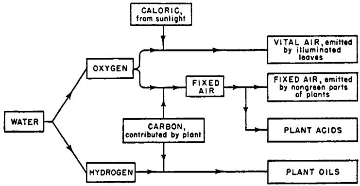

**FIG. 6. Ingen-Housz's conceptual scheme (1789).** 

expounded in the last quotation. This scheme was presented in the introduction to his book, but not in its text; and Ingen-Housz attributed the theory to "those who reject the phlogiston theory" rather than to himself. Indeed, it is quite doubtful whether, even at this time, Ingen-Housz would have been willing to class himself with "those who reject the phlogiston theory," for elsewhere in his book he criticizes the new chemical system for its inability to account for some (quite spurious) gaseous transmutations that he thought he had observed.

*Ingen-Housz's Opinions, ιηφ.* By 1796, seven years after the publication of the conceptual scheme we have just examined, Ingen-Housz's outlook had undergone an important two-fold alteration. By this time most (but not quite all) of Lavoisier's doctrines had found favor in Ingen-Housz's eyes; and, in addition, he no longer looked askance at Senebier's contention that in vegetable metabolism there is some close association of fixed-air supply with pure-air production. Thus by 1796 Ingen-Housz had come to regard the chemical activities of plants from what was, for him, a rather novel point of view. In a brief *Essay on the Food of Plants and the Renovation of Soils,* he says

it seems to be probable that neither water nor soil is, or contains, all the true nourishment of vegetables. It must be concluded that plants must find it [all their "true nourishment"] in the atmospheric air; for this is the only ingredient without which all vegetables perish. A plant shut up *in vacuo* soon dies; and it dies in all sorts of aerial fluids which are incapable of supporting animal life — such as fixed air, inflammable air, phlogisticated air, or azote, etc. [This is something of an exaggeration. Though a plant will not live in the dark in the pure gases named by Ingen-Housz, it can, if it is exposed to a normal cycle of light and darkness, flourish in atmospheres almost instantly lethal to animals.] It is true Dr. Priestley and Mr. Scheele have propagated a doctrine diametrically opposite to what I have here advanced, by saying that plants thrive wonderfully in putrid air, and perish in pure or dephlogisticated air. This doctrine [one that had served as the inspiration of Ingen-Housz's first investigations], though generally adopted, .. . is refuted by my experiments by which I think I have proved that [like animals] plants shut up [in the dark] in vital air live so much the longer as this air is superior in purity to atmospheric air. . .

From these and many other considerations I have deduced that of the two organized kingdoms, the animal and the vegetable, the animal derives its nourishment from the vegetable; but that the vegetable creation is independent of the animal world, provides for itself, and derives its subsistence chiefly from the atmosphere. . .

I discovered, in the summer 1779, that all vegetables are incessantly occupied in decomposing the air in contact with them, changing a great portion of this into fitted air, now called carbonic acid. . . I found that the roots, flowers and fruits are incessantly employed in this kind of decomposition, even in the middle of the sunshine; but that the leaves and green stalks alone cease to perform this operation during the time the sun or an unshaded clear daylight shines upon them; during which time they throw out a considerable quantity of the finest vital air. . .

I did not doubt that this continual decomposition of atmospheric air must have a general utility for the subsistence of the vegetables themselves, and that they derived principally their true food from this operation. . .

As the carbonic acid is composed of the acidifying principle, oxygen, and carbon or coal, plants may derive from these two principles some of the most essential substances we find in them: their acids, their oils, their mucilage, etc., these ingredients, together with the azote absorbed also with the atmospheric air, being elaborated in their organs, variously modified and combined. . . [Substantial quantities of azote, or nitrogen, are found, by analysis, in plant substances, but we now believe that this component is not taken directly from the abundant supply in the atmosphere, but from nitrogenous materials drawn from the ground through the roots of plants.]

Mr. Hassenfratz delivered, in the month of June, 1792, to the Royal Academy of Paris, three papers on the nourishment of plants, which met with general approbation. The principal part of the doctrine contained in these three memoirs, viz. that *coal* or carbon, *constitutes the principal nutritive substance of plants,* is much admired. . .

In the second memoir he attempts to prove that the carbonic acid, or fixed air, is not a nutritive ingredient of plants, and that the act of vegetation does not decompose the carbonic acid [as suggested by Senebier]; but, he says on the contrary this carbonic acid is, as Dr. Ingen-Housz has discovered, formed by plants in the dark, and drawn from the [carbon in the] plants and the oxygen of the water decomposed by vegetables. . .

In the third memoir he asserts that the carbon, the true nourishment of plants, is derived by the roots from the soil, where it is ready found in a state of sufficient solution, or suspension, to be absorbed by the [root] suckers and carried through the whole plant. He thinks that the vigor of plants depends chiefly upon the quantity of carbon, with which the soil is impregnated, and he gives the name of carbon to the brown sediment of the infusion of dung which remains after the water is evaporated.

The doctrine contained in these memoirs, as well as the important experiments to which they relate, require, I think, further investigation before it can be proved or clearly understood. . .

When I discovered, in 1779, that all vegetables decompose the common air by night, and change a part of it into fixed air; and when I drew from this and some other facts the conclusion that the plants absorb this fixed air and turn it into their nourishment, the new doctrine of chemistry was not yet published, and, being ignorant of all the beauties of this system, I was unable to reduce these facts to a proper theory. [Note Ingen-Housz's ultimate appreciation of the great importance of the new system.] But since we have been instructed in the analysis of water and air, it has become much easier to explain the phenomena of vegetation. As it is now admitted that fixed air, or carbonic acid, is composed of oxygen deprived of its caloric or matter of heat, and of carbon, it is not difficult to understand how plants provide or prepare their own nourishment by producing carbonic acid, supposing it to be demonstrated that carbon is the principal nourishment of plants. . .

Ingen-Housz is thinking in terms of a nutritional system that he later outlines more clearly. He imagines that the nongreen portions of plants *prepare* fixed air from various constituents of the atmosphere. The fixed air is then supposed to be imbibed by the green leaves, where, in the light of the sun, it is elaborated into pure air, as Senebier had long contended. This process would be accompanied by a deposition in the leaves of carbon, the other component of fixed air, and that carbon would then be available to the plant as a nutrient. In postulating this rather complicated nutritional mechanism — in which one part of a plant prepares the fixed air that is elaborated by the other (green) part

of the plant — Ingen-Housz contrived to satisfy three demands that must, to him, have appeared quite urgent.

(1) The failure to suggest how plants secure their supply of carbon was, as we have already seen, one of the more conspicuous weaknesses in the nutritional scheme proposed by Ingen-Housz in 1789. At that time he may have assumed that plants draw their carbon from the earth. But, as we shall see in the continuation of his present paper, Ingen-Housz now found this idea unacceptable. However, by adopting Senebier's suggestion that fixed air is decomposed in the green leaves of plants, Ingen-Housz was able to indicate a source from which plants could secure an abundant supply of carbon.

(2) If plants are to be supposed to secure their carbon by drawing fixed air from the atmosphere, then it is essential that the atmosphere constitute an adequate source of fixed air. But, as we shall see, Ingen-Housz now believed that the atmosphere contained little if any fixed air *as such.* However, he found a way around this difficulty with the (completely *ad hoc*) hypothesis that the nongreen portions of plants are capable of manufacturing fixed air directly, and without additament, from the constituents of the atmosphere.

(3) Imbued with teleologie sentiments as he was, Ingen-Housz was anxious that no part of the observed function of plants should be "worthless." Thus there was a very real teleologie attractiveness in a hypothesis which suggested that, far from being a "useless" vitiation of the atmosphere, the emission of fixed air by the nongreen portions of plants is an essential operation in the mechanism by which plants secure their nutriment.

Ingen-Housz continues :

Though Mr. Hassenfratz seems to believe that plants do not derive the carbon (in his opinion their true nourishment) from the carbonic acid, but find it ready made in the dung; I think it more probable that plants derive it chiefly from the carbonic acid, which is a substance very easily decomposable into its two ingredients, viz. oxygen and carbon. All manures, principally dung, produce a great quantity of carbonic acid, either by itself, or by decomposing the air in contact with it.

But here seems to start up a difficulty, how a plant or manure can draw from the atmospheric air carbonic acid, as common air contains, according to the new system, only 1/100 of it; and, according to Mr. Lavoisier, nothing at all. Though, according to those principles, it could not be accounted for theoretically, I think we have at hand facts enough from which it seems evident that the common air can by itself furnish all the ingredients for the composition of carbonic acid, as we will see by and by. Do these facts argue a defect in the new system? Let a better judge than I am decide this. . .

The atmosphere actually contains a fairly stable concentration of about 0.03 percent of carbonic acid. So small a concentration is only difficultly determinable, yet cumulatively it is ample to produce some quite arresting chemical changes. Having observed these changes, and believing the atmospheric concentration of carbonic acid *as such* to be entirely inadequate to account for them, Ingen-Housz saw no alternative to the assumption that carbonic acid could, under certain conditions, be *formed from atmospheric constituents alone.* Thus he sought to reconcile the low apparent carbonic acid content of the atmosphere with the demands of a hypothetical system that required the atmosphere to serve as a plentiful source of carbonic acid. But this whole notion of a formation of carbonic acid by a "decomposition of atmospheric air" in contact with the nongreen parts of plants, with manure, etc., was a postulate entirely at variance with Lavoisier's new chemical system, as Ingen-Housz makes no scruple to admit above. Ingen-Housz now declared himself deeply impressed by "all the beauties of this system" but he still felt so little bound by it that, when the need arose, he did not hesitate to postulate a "transmutation" entirely out of keeping with it. Presumably we have here a vestigial manifestation of that once-powerful faith that transmutations are everywhere to be found in Nature.

Continuing his discussion of how plants obtain their food, Ingen-Housz says:

I think it difficult to conceive how a large tree finds, during centuries, nourishment on the same spot, on the supposition of Mr. Hassenfratz that its principal food is coal [carbon]; and that this coal is not derived from the decomposition of the carbonic acid (of which coal constitutes nearly one-third, according to Mr. Lavoisier 28/100). That gentleman [Hassenfratz] admits my discovery as well-founded, that plants produce carbonic acid in the dark; and that the roots, being always deprived of daylight, are of course incessantly occupied with this business. There exists everywhere in the soil common air, and common air alone is sufficient to furnish, as I have proved before, carbonic acid, even without plants. Thus there is no difficulty in tracing the source of this coal, and of conceiving how the largest tree finds, during centuries, that immense quantity of food it requires for its maintenance, growth and abundant production of fruit or seed, all which is certainly derived in part from the soil; but I still believe chiefly from the atmosphere, by means of the leaves absorbing and decomposing the air in contact with them. . . [Ingen-Housz's point is well taken. His system of aerial nutrition is perfectly consistent with the outcome of van Helmont's experiment, while Hassenfratz's scheme could hardly be reconciled with that experiment.]

I inferred from these, and some other facts quoted before, that the plants in the common course of nature draw from the air, in a great measure, what is necessary for their subsistence; and that being thus incessantly occupied in decomposing the common air, they render a part of it miscible with the ground, or with substances inherent in the earth, such as moisture, salts, etc.; that the carbonic acid, which is now admitted (according to my original idea) [this is rather cool: Senebier's priority is completely ignored] as a nourishing substance for plants, is prepared without intermission, day and night by the roots and flowers, and in the night by the leaves and the rest of the whole plant, must have been destined by nature to some important use for the plants themselves. . . [Again the teleologie note.]

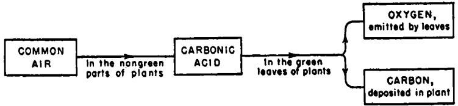

**FIG.** 7. Ingen-Housz's conceptual scheme (1796).

The nutritional system suggested by Ingen-Housz in 1796 is sketched in Fig. 7. When it is compared with the hypotheses earlier proposed by Ingen-Housz, this scheme is seen to reflect a major shifting of emphasis. For example, carbonic acid is now, for the first time, regarded as the "true natural food of plants." And the nutritional role assigned to the decomposition of water is only touched upon in passing, although it had been the central pivot of the scheme suggested in 1789 (see Fig. 6). Then, too, although the chemical activity of light had formerly figured prominently in all of Ingen-Housz's schemes, it now received scant mention. At this time, then, three years before his death in 1799, Ingen-Housz had to some extent broken with his past. In this last effort he achieved a fair approximation to the conceptual scheme that we now hold to be correct. But he never did achieve that scheme. Probably it would have been too much to expect that he should, for this would have required a quite elderly gentleman to make an almost inhumanly abrupt break with ideas that had dominated his thinking for years. However this may be, the fact remains that a view representing a closer approach to our present conceptual scheme was not proposed until 1804, five years after.Ingen-Housz's death. This further step toward understanding of the interaction of plants with the atmosphere was the work of the great Swiss investigator Nicolas Théodore de Saussure (1767-1845).

#### 12. DE SAUSSURE REVISES THE DATA AND RECONSTRUCTS THE THEORIES

De Saussure occupies in our history a position not too dissimilar from that of van Helmont, and having begun with the one it will be appropriate to end with the other. Both were transitional figures. Each represented the culmination of an extensive tradition, yet the work of each foreshadowed a new era. Van Helmont was still a partisan of alchemy, yet he dealt with subjects that became major fields of inquiry in the "new experimental philosophy." In similar fashion, de Saussure brought the studies of plant nutrition, begun by Priestley, Ingen-Housz, and Senebier, close to completion: he finished the fundamental experimental work and supplied a convincing theoretical interpretation of the whole. But de Saussure also opened up new vistas of experiment and thought in this field, and set his hand and mind to problems that even today have not been completely solved. Perhaps van Helmont belonged more to the old tradition and less to the new; and perhaps de Saussure had a firmer foothold in the future than in the past; but both mark the close and the opening of distinct epochs in the development of the scientific field in which they labored.

By the time de Saussure received his scientific education the new oxygen theory was every day gaining a wider acceptance. Unlike Priestley, Ingen-Housz, and Senebier, all of whom had been long accustomed to think in phlogistic terms, de Saussure became familiar with the new chemical system early in his life. Undoubtedly this early familiarity helped him to a deeper comprehension of the new system, and a greater ability to work with it meaningfully. He seems to have acquired a particularly keen appreciation of the extent to which the new system rendered implausible the facile resort to "transmutation" as an explanation of natural phenomena adequate to all contingencies. The new chemical system, together with other recently developed broad conceptual schemes and generalizations, had by now begun to act as curbs to speculations that had formerly been substantially unbridled. In de Saussure these restraining influences came in contact with a naturally cautious temperament, and the result was that de Saussure's reports were practically free of speculative extravagance. His sober outlook is well reflected in the following quotation from the preface to his *Chemical Investigations of Plant Growth.* Writing in 1804, de Saussure says:

**T he functions of water and gases in the nutrition of plants, the changes that the latter produce in their atmosphere — these are the subjects that I have most investigated. The observations of Priestley, Senebier, and Ingen-Housz have opened the road that I have traversed, but they have** 

not at all attained the goal that I set myself. If, in several instances, imagination has filled the gaps that these observations have left, it has been by conjectures the obscurity and opposition of which have always shown them to be uncertain. . . The solution of these problems often involves data that we lack completely; exact procedures for the analysis of plants, and a perfect acquaintance with their organization, are required. . . I attack the problems that can be decided by experiment, and I abandon those that can give rise only to conjectures.

A comparison of de Saussure's work with that done by Priestley, Ingen-Housz, *et al.* reveals two other differences of major significance. In the first place, de Saussure apparently sought to emulate Lavoisier's masterful exploitation of the great power in scientific research of strictly quantitative experimental methods, and the strictly quantitative data they provide. Thus, for example, where his predecessors in this work had been content with the qualitative observation that plants did "well" under certain circumstances, de Saussure set out to determine just *how* well, by measuring the gain of weight achieved by the plants under the experimental conditions. Thereby he secured a quantitative basis for comparison of the vegetative activity displayed by plants in various circumstances. De Saussure's work abounds in just such careful measurements. The value of purely quantitative data in promoting scientific advance can be overstressed. We have only to look at the great mass of strictly quantitative data secured by Hales to see how little significance such data may sometimes have. That is, it is vitally important that the collection and interpretation of the quantitative data be guided by a firm qualitative appreciation of the situation. Only then is it possible to discriminate between the measurements that must be made and those that can safely be neglected, between results that are meaningful and those that are irrelevant. By the time that de Saussure carried out his investigations this qualitative insight had finally been won (through the work of Priestley, Ingen-Housz, and Senebier) and de Saussure's quantitative data were then of the greatest value. Indeed, it was by the use of a line of argument closely akin to the balance-sheet reasoning so successfully employed by Lavoisier that de Saussure achieved one of his most important perceptions — that water is an active nutrient of plants and not merely the vehicle of other nutrients.

De Saussure's work is further differentiated from that of his immediate predecessors in these investigations by the extreme economy of his experimentation. Though de Saussure's research program was an extremely broad one, he was able to complete it with far fewer experiments than had been performed by, say, Senebier. However, where Senebier's experiments were often of a random, "let's see what will happen if . . ." variety, de Saussure's were all nicely contrived to shed light on particular points to which his attention was directed by a coherent line of reasoning. Senebier's approach is a time-honored one, still widely used in modern scientific investigation — for example in some of the earlier work with atom smashers. But after the shotgun operations of Senebier and others had indicated the approximate location of the target, de Saussure's rifle tactics rapidly produced a solid bull's-eye. With a relatively limited number of well-designed and meticulously executed experiments de Saussure secured a body of critically important data that served as the foundation for the comprehensive conceptual scheme of plant nutrition that he proposed.

Actually, a considerable part of de Saussure's experimental work was directed at points that had formerly been subjects of dispute rather than the sources of enlightenment into which his definitive experiments and carefully balanced judgment converted them. For example, Ingen-Housz had contended that *in the dar\* plants resemble animals in that the duration of their life depends on the extent to which they are supplied with oxygen. But de Saussure emphasized that if plants are exposed to a *normal cycle of light and darkness* they have a striking and unique faculty, unknown to animals, of rendering initially inimical atmospheres fit for their own continued existence. He found that plants can live in nitrogen, for example, though the life of animals is almost instantly extinguished in this medium. He found that the nitrogen itself is not at all absorbed or otherwise acted upon by the plant, save that after a little time minute amounts of oxygen and carbonic acid can be detected in the experimental atmosphere — to which they are apparently emitted by the plant. The results obtained when a plant was placed in vacuum were very like those secured with nitrogen atmospheres. The survival of plants under such circumstances (circumstances in which animals die almost at once) was an arresting illustration of the profound adaptive capacity of vegetable life, and a direct contradiction of Ingen-Housz's previous opinion. Of course, the plants are not really living in a *perfect* vacuum, for traces of carbonic acid and oxygen (and water vapor) soon make their appearance in the experimental vessel. De Saussure supposed that this two-fold addition was founded on the ability of plants to release carbonic acid *formed entirely from their own substance,* coupled with the special ability of illuminated leaves to metamorphose into oxygen part of the carbonic acid so produced. In partial support of this hypothesis he could cite his observation that "only plants provided with their green parts appear to be able to vegetate in milieux free of oxygen," and then only if they are illuminated.

Concluding that plants can sustain themselves by emitting carbonic acid and oxygen to ambient atmospheres originally free of these components, de Saussure also remarked that the quantities of these gases "required by some plants for the mere continuance of their life, without growth, is inappreciable." But then he went on to the further discovery that, negligible though these quantities appear, they are absolutely essential to the continuance of vegetable life. This point he established by placing in the same vessel with the plants, but out of direct contact with them, various chemical reagents that absorb oxygen or carbonic acid, or both, as rapidly as these gases can be emitted by plants. As "controls" he prepared systems in every way identical, save for the absence from them of the absorptive agents. The plants in the control systems continued to thrive; but in the systems containing the absorptive agents the vigor of the plants was soon impaired and, particularly in the presence of active absorbents of carbonic acid, their life was soon extinguished. Thus it was demonstrated that the metabolic processes of plants are sustained only if the plants are able to maintain in contact with themselves certain minimum concentrations of *both* carbonic acid and oxygen.

In his assessment of the nutritional role of carbonic acid, de Saussure acceded to Senebier's hypothesis that the "elaboration" of carbonic acid by illuminated plants consists in a decomposition in which one of the components, the carbon, is retained in the plant as a nutrient element, while the other component, the oxygen, is emitted by the plant. This opinion had also been adopted by Ingen-Housz (see page 419), but it will be recalled that this investigator had been seriously confused with regard to how plants could secure carbonic acid from the free atmosphere, which he believed to contain little or none of this material *as such.* But de Saussure thoroughly understood that, very small though it is, the concentration of carbonic acid in the atmosphere is perfectly finite. And he went on to experiments that provided him with convincing evidence that it is, indeed, from this apparently insignificant atmospheric trace that plants derive most of their carbon. To secure this evidence, de Saussure repeated the simple experiments previously performed by Boyle (see page 331) and many others — growing small plants in the open atmosphere with their roots in distilled water. De Saussure found, as had his many predecessors in these experiments, that the plants achieve a substantial increase in weight. But then, going one step further, he determined the total carbon content of the experimental plants. To secure a basis for comparison, he also submitted to analysis a number of plants at the same stage in their development as those with which he had *begun* his experiments. A comparison of these data showed that those plants that had continued their growth in contact only with distilled water and the atmosphere contained *more* 

*carbon.* Excluding a remarkable "transmutation," the water can hardly have supplied this carbon. There then appeared to be no alternative to the (quite sound) conclusion that the "trivial" trace of atmospheric carbonic acid is efficiently utilized by plants and plays a role of paramount importance in their nutrition.

It was then natural to suppose, and there was already some preliminary evidence to support the conjecture, that plants would grow more rapidly if they were more abundantly supplied with carbonic acid gas. And, indeed, de Saussure found that if carbonic acid is added to air, in concentrations up to about 8 percent, plants exposed to a normal cycle of light and darkness grow with extreme rapidity in the enriched atmosphere. This effect was probably responsible for the very vigorous development noted by Priestley in his studies of the growth of plants in "putrid" atmospheres (see page 353). And the "aerial manure" that had then been hypothesized by Priestley could now be recognized as no more than carbonic acid gas, which usually forms a substantial part of such "putrid" atmospheres. But even as de Saussure had found that there was a *minimum* concentration of carbonic acid required for the continuance of plant life, so he also found that there was a *maximum*  concentration of about 8 percent which if exceeded was deleterious to vegetation — partly because of the paralytic effect to which we have already referred (see page 383).

In considering the metabolic role tö be assigned to the oxygen absorbed by plants, de Saussure was not able to develop as clear an interpretation as in his treatment of the role of carbonic acid. He did, however, recognize that the absorbed oxygen was combined in the plant with the carbon already present therein, to form the carbonic acid emitted by the green parts in the dark and by the rest of the plant at all times. There was an element of paradox here, for this *absorption of oxygen and emission of carbonic acid* is, in the light, invariably accompanied by the more striking and extensive *absorption of carbonic acid and emission of oxygen.* Irretrievably opposed though these two processes seemed to be, it also seemed that they were inextricably linked in vegetable metabolism. De Saussure was in no position fully to rationalize these apparently conflicting activities; but he did recognize that there was between them some essential association.

So far we have considered only a few of the many respects in which de Saussure corrected, clarified, and amplified the data and conceptual interpretation dealing with the *aerial* nutrition of plants. Let us now examine his *over-all* conceptual scheme of plant nutrition.

#### 13. DE SAUSSURE COMPLETES THE PICTURE

**It is probably symptomatic of the breadth and balance of de Saussure's comprehension that he did** *not* **place exclusive emphasis on the doctrine of aerial nutrition which he had done so much to correct and complete. So great had been the excitement attending the development of this arresting doctrine that there had been a pronounced tendency (particularly on the part of Ingen-Housz) to overlook other major sources on which plants might draw for their sustenance. Yet the probable importance of two other sources had been considered long before the doctrine of aerial nutrition was first conceived of. In rounding out his conceptual scheme, de Saussure assigned commensurate nutritive roles to the soil supporting plant growth, to the water so long known to be essential to plants, as well as to the atmosphere by which the plants are surrounded. His conception of the interaction of plants with the atmosphere was considered in the last section. What was de Saussure's idea of the way in which the soil can contribute to the growth of the plants it supports ?** 

My investigations lead me to show how water and air contribute more to the formation of the dry matter of plants growing in a fertile soil than does the humus matter that they absorb, in aqueous solution, through their roots. . .

[Yet] water and gas are inadequate nutriments for the support of the entire development of plants. . .

Oxygen and carbonic acid gases are the sole aeriform principles known to us from which plants are able to derive their nutriment in our atmosphere. Experiment proves that most plants assimilate no nitrogen whatever. [Priestley and Ingen-Housz had supposed that plants obtained their nitrogen from the abundant source everywhere available in the atmosphere. Senebier had doubted this, and de Saussure had confirmed his doubts.] Yet nitrogen is an essential part of plants. It is generally found in wood, in plant extracts, and in the green coloring matter of plants. Plants [also] contain earths [metallic salts] that, as in animals, can contribute to form their solid or bony parts. There is no proof whatever that these substances exist in an aeriform state in our atmosphere, though they have been seen in the atmosphere in a state of suspension and as vapors. But it has been shown that mineral materials are found in springs that have washed over vegetable mold, and these solutions enter the roots of plants. It has been shown further that these spring waters contain, in solution, extractive principles [such as nitrate and ammonium salts] of which nitrogen is an essential part; that the fertility of the soil is, in certain respects and within certain limits, determined by the quantity and nature of the water-soluble principles that it contains. It is plain, in short, that it is by appropriating these principles that plants finally exhaust the soil, or render it sterile.

Here, at long last, we have a fairly detailed description of that phenomenon of soil exhaustion which, as has already been remarked (see page 328), elicited recognition and excited interest at an extremely ancient date. The effect was now seen to be less spectacular than had been imagined by the followers of Aristotle: the nitrogenous and mineral materials drawn by a plant from the earth supporting its growth make only a negligible contribution to the plant's gross weight. Nevertheless this alimentation is of pivotal importance, for without these materials plants are unable to prosper. The widespread use of artificial fertilizers, which have been so successful in increasing the yield of agriculture, gradually developed as it was realized that soil fertility could be maintained, and even notably improved, by stocking farmlands with those nitrogenous and mineral substances withdrawn from them by growing plants. The identity of these substances can be established, as it was in part by de Saussure, by careful analysis of vegetable substances to determine what materials have been withdrawn by the plants from the earth. Guided by the results of such analyses, and by many empirical tests as well, common fertilizers have been compounded from nitrogenous materials (such as nitrate and ammonium salts), phosphates, and potassium and calcium salts. The addition of traces of the salts of other metals, such as copper, zinc, cobalt, and iron, has also proved valuable when soils naturally deficient in these components were involved.

De Saussure's idea that the earth supplies nitrogenous and mineral materials to plants appears to be contradicted by the results of van Helmont's experiment. Could one justifiably suppose that van Helmont's willow drew *anything* from its pot of earth when measurements seemed to show that the earth had almost exactly the same weight before and after the experiment? Yes, said de Saussure. He emphasized, as had Lavoisier, that only a very small part of the gross weight increment of 169 pounds need be considered to represent the weight of the (nitrogenous and mineral) substances drawn by the plant from the earth. The latter weight being relatively minute, the occurrence of comparatively small experimental errors could be regarded as a sufficient explanation of the outcome of van Helmont's classic investigation. De Saussure maintained, quite correctly, that relatively small but organically vital amounts of nutritive materials were furnished by the soil to growing plants. In this respect, then, de Saussure's view was essentially the antithesis of that proposed by van Helmont. However, there was another aspect of de Saussure's conceptual scheme that represented a new revival, though in considerably modified form, of van Helmont's fundamental tenet — that plants are no more than a transmuted form of water. The "transmutation" was hardly in the sense

envisaged by van Helmont. Yet it was de Saussure's contention (and to many this represents his greatest single contribution to this study) that water *is* a major nutrient of plants, and *the* major contributor to their weight.

How did de Saussure arrive at this conclusion ? In his studies he had established that the carbon found in plants is derived by them from atmospheric carbonic acid gas; and he allowed that a small part of the oxygen in plants might be drawn from the same source. He had also decided that the nitrogenous and mineral materials found in plants are derived by them from the soil in which they grow. But whence proceeds the remainder of the oxygen found in plants; and, even more important, where do they acquire the large amount of hydrogen that analysis invariably shows them to contain? The most obvious source of these two elements is water. Water had long been known to be essential to plant life, but whether it was itself a nutrient or merely the vehicle (solvent) of other nutrients had remained unclear. We have already noted Berthollet's hypothesis that water is decomposed by irradiated plants, forming the oxygen emitted by the plants, and hydrogen which is retained and incorporated in them. But Senebier had objected (see page 405) that this hypothesis does not seem to jibe with the observation that the volume of oxygen released by plants is closely determined by the extent to which they are supplied with carbonic acid. Senebier stressed that it was more plausible to assume that the oxygen proceeds from the decomposition of the carbonic acid than that it comes from the water. Nevertheless, the idea that water is incorporated in growing plants remained a most attractive explanation of the presence of the large quantities of hydrogen always found in the substance of mature plants. Moreover, in 1792 Senebier himself had pointed out that plants appear to take up more water than they evaporate, indicating that part of the water is permanently retained in them. However, the evidence for this idea was rather frail when de Saussure undertook the investigations reported in his book as Chapter Seven, "On the fixation and decomposition of water by plants."

- **I. Investigations of the fixation of water by plants growing in atmospheric air that has been deprived of its carbonic acid gas.**
**The authors who have occupied themselves with the problem of the decomposition of water by plants have not advanced this inquiry save by conjectures that could be supported by no direct experiments. . . [De Saussure here describes some of the investigations and surmises that had been made by Senebier, Ingen-Housz, Berthollet, and others.]** 

**Plants growing in pure water, surrounded by oxygen or by common air that has previously been washed with limewater [to remove every trace of carbonic acid from it], can increase their weight and remain**  green when they develop under these conditions, without dropping or drying out any one of their parts. This result proves neither the decomposition of water, nor even the fixation in the plant of hydrogen and oxygen from the water. The plant may increase in weight solely by the introduction of liquid water in the sap vessels or of water of vegetation in the cellular tissue. For it has long been known from experiment that the amount of such water in plants may increase with the humidity of the soil, and during etiolation.

One can judge whether the dry or solid structure of plants is increased by the fixation of the constituent principles of water by drying at room temperature a plant similar to, and of the same weight as, that which has been grown in a closed vessel with pure water and oxygen gas. One then remarks whether the plant grown under these conditions has a greater dry weight than it would have had if it had been dried before the experiment, as was the dried plant that serves as a standard of comparison. It is obvious that the two plants must be taken up at the same degree of maturity, from the same soil, and that the weighings must always be made at the same readings of the thermometer and hygrometer. [The hygrometer is an instrument, a simple form of which was invented by de Saussure's father, that indicates the water content, or humidity, of the atmosphere.]

The numerous experiments that I have made by this procedure have proved to me that plants grown in water alone, in a closed vessel with atmospheric air freed of its carbonic acid gas, do not under these conditions increase the dry weight of their vegetable substance to any appreciable extent. If there is any increase at all, it is by a very small, very limited quantity — one which cannot be further increased by a prolongation of the vegetation. . . [De Saussure goes on to give the weights and measures on which his last statement was based.]

- II. The fixation of water by plants growing in a mixture of common air and carbonic acid gas.
The fixation of water in the previous experiments has furnished effects so slight that they are scarcely beyond the errors of measurement, but I believe that the cause of this is not hard to explain. It is very probable that the quantities of hydrogen and oxygen in plants cannot be increased beyond certain limits without correspondingly increasing the amount of their carbon.

Considering that the analytically determined *ratios* of hydrogen to carbon and of oxygen to carbon in mature plants are found to be fairly stable, de Saussure reasons that perhaps the weights of hydrogen and of oxygen in a plant cannot be substantially increased without simultaneously increasing the weight of carbon therein. But, having treated the experimental atmosphere with limewater, he had drained the source from which the plants would normally obtain their carbon. There was

then no reason to expect a notable increase in the weight of the hydrogen and oxygen in the plants. Observe that de Saussure has been most acute in rejecting, as possibly misleading, the obvious line of attack based on a determination of whether plants increase in weight when deprived of all nutrients save water. This approach rests on the hidden assumption that a normal vegetable assimilation of water can occur under these highly abnormal conditions. Recognizing that this assumption might be fallible, de Saussure undertook further experiments in which the plants were permitted access to *both* carbonic acid and water. Though these experiments were more laborious to execute and interpret, they were recognized by de Saussure as capable of providing a more reliable indication of the *normal* course of plant metabolism. He continues:

Consequently, I have grown plants in a mixture of common air and carbonic acid gas, in order that they might be able to assimilate carbon. In all cases in which the plants have flourished the results were then more pronounced. The plants plainly increased in the weight of their dry vegetable matter, by a quantity larger than that which they would have secured from the elements of the acid gas. . . [De Saussure now describes the weights and measures noted in these experiments, in which he observed very large increases in plant weight, of a magnitude greater than could be explained simply by the assimilation of all the carbonic acid gas available for elaboration by the plant. This made it plain that in increasing its weight the plant had secured some nutrient other than carbonic acid gas. Water appeared to constitute that nutrient.]

III. On the decomposition of water by plants.

. . . Green plants growing day and night in nitrogen emit to the latter several times their own volume of oxygen, because, having been deprived of contact with oxygen during the first periods of their vegetation, they form, entirely from their own substance, the carbonic acid that they decompose [to form the oxygen previously lacking to them.] But the same plants — at least those that are not too fleshy — add no oxygen whatever to an atmosphere of oxygen or of common air in which they grow day and night. It is only in such an atmosphere that one can judge whether plants decompose the water directly, because the carbonic acid gas that they form under these conditions is the result of the combination of their own carbon with the surrounding oxygen gas, and not at all a product formed entirely from their own substance. . .

Again de Saussure is thoroughly perceptive in rejecting the more obvious, "straightforward" line of experimentation. He points out that the addition of oxygen to atmospheres originally free of both oxygen and carbonic acid gas is no proof whatever of the vegetable decomposition of water. In such an atmosphere plants emit carbonic acid formed entirely from their own substance (that is, from the carbon and oxygen they already contain). The vegetable decomposition of this carbonic acid would result in the production of free oxygen gas. This gas is plainly drawn from the oxygen *previously fixed in the plant,* and *not*  from oxygen *previously combined in water.* However, in atmospheres that already contain oxygen, plants do not form carbonic acid gas entirely from their own substance, but only by a combination of their own carbon with oxygen from the atmosphere. The decomposition of the carbonic acid so formed would simply return to the atmosphere the free oxygen it possessed to begin with. This series of changes should produce no *net* increase in the oxygen content of the atmosphere. Consequently, any experimentally observed increase in oxygen content could then be taken to indicate that oxygen had been added to the atmosphere by a direct vegetable decomposition of water. No such increase of oxygen content being observable, de Saussure concluded (not entirely correctly) that plants were incompetent to affect the *decomposition* of water, though he recognized their capacity to *assimilate* water in connection with their metabolism of carbonic acid gas.

After describing a great number of other experiments that seemed to establish this point of view, de Saussure summarized some of his findings as follows:

Plants take up the hydrogen and oxygen of water, causing the latter to lose its liquid state. This assimilation is not very pronounced save when the plants simultaneously incorporate carbon [from carbonic acid]. . .

But in no case do plants decompose water directly, assimilating its hydrogen and eliminating its oxygen in a gaseous state. They emit oxygen gas only by the direct decomposition of carbonic acid gas. . .

One cannot doubt that the greater part of the hydrogen that annual plants acquire during their development in the open atmosphere, supported by distilled water, has its origin in this liquid, which the plants solidify. One can say as much of their oxygen. For one can judge, whether by the amount of carbonic acid gas that plants can decompose in a given time, or by the small change that they make in common air, that the quantity of oxygen they secure from the atmospheric gases is entirely insufficient to account for [all] the oxygen that they acquire in the short space of their development. It must not be forgotten that water is the most abundant product of the decomposition of most dry plants, or that oxygen is their principal element.

De Saussure further buttressed his hypothesis, of the fixation of water by plants, by means of a balance-sheet calculation. He estimated the weight of nitrogenous and mineral material that a plant could take up

in solution, through its roots, as well as the weight it might acquire by the elaboration of atmospheric carbonic acid. He found that these weights accounted for only about a twentieth of the gross weight acquired by a given plant. He says:

The calculation that I have just made is doubdess far from being rigorous. But supposing that the quantity of nutrients that the plant draws through its roots, from the soil, is in my estimate two or three times too great or two or three times too small, the essential general results that I have in view will remain the same. They prove equally that the humus extract, the gases, and all the water-soluble principles which come from the soil and enter through the roots of a green plant — do not in any sense make up the major part of the dry weight of the plant, if the water itself be excepted. However, one will always find that they [the water-soluble principles from the soil] enter appreciably into the plant and that as nutrients they have, despite their small quantity, a very powerful influence on its growth. One will then recognize that the water that the plant acquires and solidifies, whether [it comes] from the soil or from the atmosphere, makes up the greater part of the weight of the dry substance of the plant; that the carbon is furnished to the plant in a gaseous state, by the atmosphere in much greater quantity than by any other source; but that the nitrogen, the salts and the earths that are the least abundant elements in the plant come from: i. extractive and saline solutions drawn from the humus by the plant roots; 2. vegetable and animal materials held in suspension in the atmosphere, which deposit upon the plant. [The second mode of supply is actually very much less important than de Saussure supposed it to be.]

In this last excerpt we see the fully rounded view that de Saussure had attained. He had developed a conceptual scheme that allowed him to assign the source and route of supply of every major element that analysis showed to be present in mature plants. Of particular relevance to our present story was his perception that growing plants draw upon the atmosphere for *both* carbonic acid and oxygen, metamorphosing the oxygen into carbonic acid and the carbonic acid into oxygen. The latter process depends on the utilization by the plant of the extremely minute concentration of carbonic acid gas normally found in the earth's atmosphere. However, illuminated plants carry out this metamorphosis with such astonishing efficiency that the vegetable conversion of carbonic acid gas to oxygen is far more extensive than the conversion of oxygen into carbonic acid. Consequently the *net* effect produced in the atmosphere by growing plants is the conversion of carbonic acid gas to oxygen.

#### EPILOGUE

Our historical study terminates here, with de Saussure. For a very long time little further progress was made in the study of the chemical activities of plants. In 1845 Mayer pointed out that solar energy is involved in plant metabolism, and that part of this energy is "fixed" or stored in plant substances. But no other substantial advance was made in this general inquiry until roughly sixty years after the appearance, in 1804, of de Saussure's book. Any dogmatic statement about the cause of this long delay would be unjustified, but certain retarding factors can easily be distinguished. For one thing, de Saussure's work was, in the main, so nearly perfect — and his exploitation of the then available experimental tools and conceptual patterns came so close to exhausting their potentialities — that he left little scope for work on this problem by his immediate successors. Moreover, in the following period the botanists were largely preoccupied with other questions; and the chemists were so seriously engaged, with their already difficult quest for an understanding of relatively simple chemical systems, that they could devote comparatively little attention to the much more complicated biosynthetic systems.

Progress was also hindered by the survival, in the "humus theory," of something rather like the Aristotelian idea that plants receive a major portion of their nutriment from the earth. In the humus theory, which had much in common with Hassenfratz' ideas (see page 416), the brown amorphous material of the soil was viewed as the chief source of supply of carbon to plants. One might suppose that de Saussure's careful work had placed beyond any reasonable doubt the conclusion that plants secure the bulk of their carbon from the atmospheric trace of carbonic acid. Today his proofs seem quite "decisive," but they did not wear this aspect in the first half of the nineteenth century. Thus, when the illustrious German chemist Justus von Liebig wrote on plant nutrition in 1840, he found it necessary to recapitulate and reemphasize the evidence for the doctrine of aerial nutrition, the significance of this evidence having been lost on most of the contemporary partisans of the humus theory. Even a score of years later the tumult of this debate could still be heard, bearing convincing testimony to the intrinsic "common-sense" appeal of the Aristotelian doctrine, as expressed in the humus theory.

Whatever may have been the causes of the long hiatus in the development of an understanding of the chemical activities of plants, the fact is that it is only during the last three-quarters of a century that there has been substantial advance beyond de Saussure's position. This period has seen fairly continuous and occasionally intensive work in

this field; much has been done, and much more still remains undone. To mention but one line of recent development, in 1937 almost 75 years of effort to produce photosynthetic activity outside of living plant cells was finally crowned with at least partial success, and in 1951 a substantially more complete duplication of the natural photosynthetic process was secured. It is now almost 200 years since Priestley made his observations on the chemical activities of *entire plants.* A few years after Priestley's work Ingen-Housz discovered that the same activities are exercised by the *entire detached leaves* of plants, and shortly thereafter Senebier found that these effects are also produced even by *shredded leaves.* However, of the many efforts made since that time to evoke photosynthetic activity in the absence of living plant substance all but a few of the most recent experiments have been totally unsuccessful. Nevertheless, today scientific inquiry has at last led to the observation of the fixation of carbonic acid, the assimilation of water, and the formation of free oxygen and complex organic products in a system containing no living cells whatever. The process involves the irradiation, in a laboratory vessel, of a mixture of carbonic acid, water, and some vegetable extracts. The effects involved are very minute. And this cannot be considered to represent the attainment of *completely artificial* photosynthesis : the activity of the vegetable extracts is exercised by some extremely complex chemical substances, and there is at present no prospect that the laboratory scientist will be able to synthesize them from simple starting materials, as plants do. Thus while we have observed photosynthesis in the absence of plant life, we have yet to observe it in the absence of substances that are uniquely the products of plant life. The achievement of truly artificial photosynthesis appears still to lie unforeseeably far in the future. However, there can be no doubt that this recent success brings us a step closer to that achievement and to the general goal of a complete understanding and effective control of photosynthetic processes.

In matters of detail de Saussure's conceptual scheme has undergone many revisions. For example, we now believe that the oxygen liberated by illuminated leaves is drawn from that originally fixed in the absorbed *water* (as suggested by Berthollet) rather than from that in the absorbed *carbonic acid* (as maintained by Senebier and de Saussure). However, since excess water is almost always present, and since oxygen is freed from water only in proportion as carbonic acid is absorbed by the living plant, the *net* process is the effective equivalent of that envisioned by de Saussure. The basic soundness of his view of the over-all character of the chemical operations of plants has preserved it essentially intact to the present day.

Following de Saussure's work the outline of the vast processes by

which the wholesomeness of our atmosphere is preserved, by which our foods are elaborated, can be portrayed by the cyclic system shown in Fig. ι. This scheme, as beautiful in its comprehensiveness as in its simplicity, still throws no light on the detailed chemical activities of plants. Yet the winning of even so rudimentary an understanding as is shown in this scheme required immense effort on the part of a succession of highly gifted men working over a period of centuries. And it must be borne in mind that our story has touched upon only a few of the high points and principal investigators in the early studies of the interaction of plants with the atmosphere, that we have omitted all mention of comparatively large numbers of less significant experiments and less gifted investigators. Note carefully the multitude of the inspirations, fruitful and sterile; the multitude of the experiments, well or ill conceived and executed; the multitude of the "trivial" points, the hidden assumptions, the uncontrolled variables, the slight misapprehensions, that ultimately made all the difference between success and failure. And then consider the meagerness of the results brought forth by all this work: highly significant though they were, they constitute no more than the cornerstone of the still uncompleted comprehensive conceptual scheme of photosynthetic processes. Here it is that we gain some sense of the travail, the waste, the reverses that invariably accompany scientific research. Its triumphs are known to all.

The greater is the circle of light, the greater is the boundary of the darkness by which it is confined. But, notwithstanding, this, the more light we get, the more thankful we ought to be, for by this means we have the greater range for satisfactory contemplation. In time the bounds of light will be still farther extended; and from the infinity of the divine nature, and the divine works, we may promise ourselves an endless progress in our investigation of them: a prospect truly sublime and glorious. — JOSEPH PRIESTLEY, *Natural Philosophy* (1781), vol. 2, p. ix.

## *Bibliography*

The sources of the passages quoted in this study are listed below. The author and date of each of these passages will be plain from the text accompanying it. The appropriate entry in the following table then indicates the work (and, for all the longer works, the pages) from which the quotations have been drawn.

| van Helmont | 1648 | Ortus Medicinae (Leyden, 1648), p. 109; English translation by J. Chandler, Orlatrice (London, 1662), p. 109.                                                     |
|-------------|------|----------------------------------------------------------------------------------------------------------------------------------------------------------------------------|
| Boyle       | 1661 | The Sceptical Chymist, in Boyle's Wor\s, ed. Birch (London, 1772), vol. 1, pp. 494-496, 563.                                                          |
|             | 1666 | The Origine of Formes and Qualities, in Boyle's Worths, ed. Birch (London, 1772), vol. 3, pp. 102-103, 106-108.                                                |
| Malpighi    | 1675 | Anatome Plantarum, in Opera Omnia (London, 1686).                                                                                                                       |
| Grew        | 1676 | The Anatomy of Plants (London, 1682), p. 153.                                                                                                                              |
| Hales       | 1727 | Vegetable Static\s, 2nd ed. with amendments, is vol. ι of Statical Essays (London, 1731), pp. i-ii, iv-vi, 155, 159, 162-163, 3l 9~320> 32 4~326> 328~32 9- |
| Lavoisier   | 1770 | "Sur la nature de l'eau," in Lavoisier's Oeuvres v°l- 2, pp. 1-28. (Paris, 1862-1893),                                                                               |
| Priestley   | 1772 | "Observations on Different Kinds of Air," Phil. Trans. 62, 147-264 (1772), pp. 162, 166-170, 181- 182, 193-195, 198-200.                                          |
|             | 1775 | Experiments and Observations on Different Kinds of Air, vol. 1 (3rd ed., London, 1881), p. 4.                                                               |
|             | 1779 | Experiments and Observations Relating to Vari ous Branches of Natural Philosophy, vol. 1 (Lon don, 1779), pp. 298-302, 335-339, 341-349. 359. 489.                |
|             | 1781 | Ibid., vol. 2 (London, 1781), pp. 16-17, 21-25, 27-29, 30, 33.                                                                                                    |

- Ingen-Housz 1779 *Experiments Upon Vegetables* (London, 1779), pp. xxxii-xxxviii, 5, 28-30, 45-46, 74-75, 83-87, 89-91.
	- 1780 *Expériences sur les végétaux* (Paris, 1780), pp. 6-7, 52-55, 69.
	- 1787 *Expériences sur les végétaux,* a new revised and enlarged edition, vol. 1 (Paris, 1787), p. 192.
	- 1789 *Ibid.,* vol. 2 (Paris, 1789), pp. xli-xlv, xlviii.
	- 1796 *Essay on the Food of Plants and the Renovation of Soils,* 3rd Appendix to the Outlines of the Fifteenth Chapter of the Proposed General Report of the Board of Agriculture. Though it is bound with Isaac Leatham's *General View of the Agriculture of the East Riding of Yorkshire* (London, 1794), Ingen-Housz's contribution was clearly not written before 1796.
- Senebier 1782 *Mémoires Physico-Chymiques* (3 vols., Geneva, 1782), vol. ι, pp. 35-36, 54-55, 239, 242; vol. 3, P· 373·
	- 1783 *Recherches sur Γ influence de la lumière solaire*  (Geneva, 1783), pp. ix, 19, 325-326.
	- 1788 *Expériences sur l'action de la lumière solaire dans la végétation* (Geneva, 1788), pp. 288-290, 295- 297, 432-433, 440.
	- 1792 "Le gaz acide carbonique est décomposé par les plantes," *Observations sur la Physique,* 41, 205- 213 (1792).
- de Saussure 1804 *Recherches chimiques sur la végétation* (Paris, 1804), pp. iii-iv, vi, 217-229, 236-240, 242-243, 269-270.

**CASE 6** 

*Pasteurs Study of Fermentation* 

**EDITED BY** 

**JAMES BRYANT CONANT** 

#### CAS E ó

### *Pasteur s Study of Fermentation*

GENERAL INTRODUCTION

Louis Pasteur (1822-1895) wa s on e great experimentalists of the nineteenth century. His first investigations were in the field of chemistry, with special emphasis on crystal forms. How he was led from these studies into an investigation of fermentation is told in his own words in his first paper on this subject, which is given in translation in Sec. 3. For an understanding of this transition some knowledge is required of Pasteur's earlier chemical work, and this is given in summary form in Sec. 2. Section 1 consists of a brief statement of some elementary principles of biochemistry and chemistry which the reader had best have in mind if a study of this case is to prove rewarding.

From a study of chemical phenomena Pasteur was led through biochemistry to investigations in biology. Having made the transition, he never returned to purely chemical researches. On the contrary, he became more and more involved with those problems in biology that are connected with disease. He studied the spoiling of wine and beer, investigated the disease of silkworms, and finally was led to the study of the diseases of human beings. Indeed, most people associate the name of Louis Pasteur with the demonstration of the role of microorganisms (germs) in the spreading of disease.

Section 5 of this case consists of a popular lecture delivered in 1876 by an English physicist, John Tyndall, who had himself made important contributions to the study of the role of microorganisms in disease. This lecture might well be read as an introduction to the more detailed study of Sec. 3. In a sense it shows the fruits of the studies undertaken nearly 20 years earlier by Pasteur. Both in regard to the understanding of fermentation, putrefaction, and disease and to the application of this knowledge, the 20 years from 1856 to 1876 were years of rapid progress. Those who are curious about the later contributions of Louis Pasteur to medicine and the agricultural industries (beer and wine manufacture, and silk production) will find a recent biography of Pasteur most rewarding, namely, René J. Dubos, *Louis Pasteur, Free lance of science*  (Boston: Little, Brown, 1950).

In studying this case the student will be able to see the steps by which

an experimental genius was led by a bold working hypothesis from one field of inquiry into another apparently far removed (pp. 452 and 454). He will also see how belief in another equally bold working hypothesis was the mainspring of Pasteur's study of fermentation. This work proved to be of the utmost significance because it was fruitful of a whole new set of techniques by which microorganisms could be isolated from fermenting material and then, like seeds of plants, sown into nutrient material. Subsequent developments (p. 461) have shown that Pasteur's working hypothesis about fermentation was an oversimplification, but that it was fruitful is made clear by the advances in scientific understanding of fermentation set forth in Tyndall's lecture (p. 464). These advances followed from the paper that is central to this case — Pasteur's study of lactic acid fermentaion. But they required a careful study of whether or not microorganisms developed spontaneously in a fermenting or putrefying mass of material. This study, to which both Pasteur and Tyndall made highly significant contributions, makes another closely related "case history" (Case 7).

To some degree Tyndall's lecture is an exposition to a general audience of the results of 20 years of study of both fermentation and spontaneous generation. The ideas he presents as new and exciting will seem to most readers as obvious as the statements that "the earth is spherical" and "the earth revolves around the sun." They have become part of the "common-sense" framework of the thinking of educated men and women of the twentieth century. Yet only by a mass of experimental evidence and 20 years or more of controversy were these concepts finally developed. Pasteur's paper (Sec. 3) is the opening gun of a long campaign — it contains the bold new idea about the nature of fermentation; Tyndall's lecture (Sec. 5) is a popular account of how the victory was finally won and of its significance for the future.

#### 1. SOME ELEMENTARY PRINCIPLES OF BIOCHEMISTRY

The study of the paper by Pasteur reproduced here involves both chemistry and biology. Neither subject was far advanced in the 1850's when Pasteur started his work, and what we now call biochemistry had not yet been established as a separate field of study. Only a little more than half a century had passed since the results of Lavoisier's new ideas (see Case 2) had been accepted. The atomic and molecular theory (Case 4), first proposed just after the turn of the century, had had its ups and downs, but, just as Pasteur was turning his attention to biology, the chemists were coming to agreement on those basic ideas that we still employ. The role of oxygen in combustion, the notion of elements and compounds, the use of chemical formulas, the interrelation of acids, bases, and salts, were all part of Pasteur's scientific knowledge. To follow his reasoning it is necessary to have at least some understanding of the elementary principles of chemistry that were taken for granted in Pasteur's day. To understand the later developments in fermentation, one must extend his knowledge to include the more modern distinction between ionic and nonionic compounds, the role of catalysts, structural formulas, and the nature of enzymes, proteins, and carbohydrates. In short, a brief review of some elementary facts and principles of twentieth-century biochemistry is essential for a study of this case.

For those who have studied chemistry or biology in school or college, the material presented in the remaining paragraphs of this sec; ion will have little novelty. For those who have had no previous formal chemical training, some of the topics may be too briefly treated, in which case a supplementary study of a high-school textbook of chemistry will be in order. Fortunately, the amount of factual chemical knowledge required for a mastery of this case is very small, but an appreciation of some of the basic principles of biochemistry is required.

*The Chemistry of the Life Process.* Air is primarily a mixture of two gases, oxygen and nitrogen; a small quantity of carbon dioxide is likewise present and, together with water vapor, plays an important part in the life process of green plants. Combustion of charcoal (nearly pure carbon) involves a chemical reaction between the oxygen of the air and the carbon, yielding carbon dioxide. The combustion of wood (a mixture of compounds of carbon, hydrogen, and oxygen) yields carbon dioxide and water vapor. The complex carbon compounds characteristic of wood and vegetable material are manufactured in green plants with the aid of radiant energy from the sun. The source of the carbon atoms is the carbon dioxide of the atmosphere. The oxidation (combustion) of these materials in the plant or after assimilation in an animal yields the energy essential for life processes. The ultimate product of the oxidation is carbon dioxide. Therefore we speak of the carbon *cycle* in nature. A somewhat similar cycle is involved in the use of ammonia (a compound of nitrogen and hydrogen) or inorganic nitrates from the soil, which supply the nitrogen atoms for some of the plant substances; the final decomposition of these substances returns the nitrogen to the soil, largely as ammonium salts. In any study of elementary chemistry the significance of the carbon and nitrogen cycles is emphasized. The reader will therefore perhaps recall the facts just stated and also remember that coal and petroleum were formed in the geologic past from plants. These sources of carbon and carbon compounds likewise represent carbon dioxide that has been transformed into solid substances such as starch by the absorption of the sun's energy by plants

in the distant past; by later geologic changes the plants were changed into either essentially elementary carbon (coal) or complex compounds of hydrogen and carbon (petroleum).

The ultimate source of carbon and carbon compounds for industrial use is either plant materials currently produced or deposits of coal or petroleum. The formulas of the many, many separate compounds formed in plants or present in coal and petroleum are far from simple. Nevertheless, all the processes that go on in the green plant, by which the compounds are formed, are parts of the general process of *photosynthesis.* This is the series of reactions by which the radiant energy of the sun absorbed by the green coloring material of the plant brings about a *reduction* of carbon dioxide (see Case 5). That is, all the products of photosynthesis contain fewer atoms of oxygen per atom of carbon than the carbon dioxide from which they were formed. The *over-all* reaction may be regarded as the transfer of the hydrogen atoms of water to the carbon dioxide molecule; the oxygen left behind is evolved as oxygen gas. Clearly the burning of carbon compounds is exactly the reverse of this over-all process.

Photosynthesis

| CO2 carbon dioxide   | + | H2O water        | + | energy from sunlight | » yields           |   | complex carbon compounds containing hydrogen |                   | -f- | O2 oxygen (gas) |
|----------------------------|---|---------------------|---|----------------------------|-----------------------|---|----------------------------------------------------|-------------------|-----|-----------------------|
| Combustion                 |   |                     |   |                            |                       |   |                                                    |                   |     |                       |
| Complex carbon compounds + |   | containing hydrogen |   |                            | O2 (in the air) | * | C0 2 + oxygen yields carbon dioxide    | H 2 0 water | +   | energy (as heat)   |

There are so many different substances produced in even the simplest green plant that no one has any idea of their number. It is, however, possible to recognize certain classes of compounds, and over the course of the last hundred years we have learned a great deal about how the atoms are joined together (the structures) in those types of compounds that are present in largest amounts. We are even beginning to know something about the transformations that some of these substances undergo in the oxidation processes that are the basis of the life of plant and animal cells. This case history will illustrate some early phases of this development.

*Carbohydrates, Proteins, and Fats.* The important classes of compounds found in plants are (1) carbohydrates, (2) proteins, and (3) lipids (largely fats and oils). The first class is represented by such common materials as sugar, starch, and cellulose (for example, cotton fiber), all of which contain only carbon, hydrogen, and oxygen. The second class is represented by such diverse materials as skin, silk, wool, white of egg, and the nitrogenous materials present in seeds; all proteins contain nitrogen, and usually sulfur and phosphorus as well. The third class is represented by such vegetable oils as soybean oil and olive oil, or by animal fats like lard; these materials contain more hydrogen atoms per carbon atom than do the carbohydrates and can be regarded as resulting from a more nearly complete reduction of carbon dioxide.

The term sugar is commonly used to mean cane sugar, or sucrose. There are, however, many related substances, all known as sugars, and the one usually referred to in biochemistry as sugar is glucose. This is the sugar present in corn syrup; it may be formed from cane sugar by the action of many microorganisms. Thus either cane sugar or glucose can serve as the basis of the alcoholic fermentation brought about by yeast.

*Isomerism.* Early in the development of the atomic theory by chemists (during the first quarter of the nineteenth century) it became evident that two or more compounds might have the same composition by weight. In terms of the atomic and molecular theory this meant that the compounds might differ either in the total numbers of atoms united together in the observed relative proportions, or in the way that the atoms were grouped — in other words, in the molecular architecture. After methods were perfected for comparing the relative weights of the molecules (determining the molecular weights) of different gaseous, liquid, and solid compounds, it was easy to distinguish between a case where two or more compounds were of the same relative composition but *different* (total) molecular weights and a case where both had the same composition *and* the same molecular weight. The second instance was called *isomerism*. In terms of the atomic theory this phenomenon is accounted for by assuming a different arrangement of the atoms within the molecules, that is to say, a difference in structure though with the same molecular formula.

*Two compounds that have the same molecular formula are said to be isomers.* A common example is the pair of substances known as ethyl alcohol and dimethyl ether. The composition by weight and the molecular weights are identical; but at ordinary temperatures one is a liquid and the other a gas. Both compounds are represented by the molecular formula C2HeO; but the difference in the *structure* of the two molecules may be represented by the following two arrangements of the atoms :

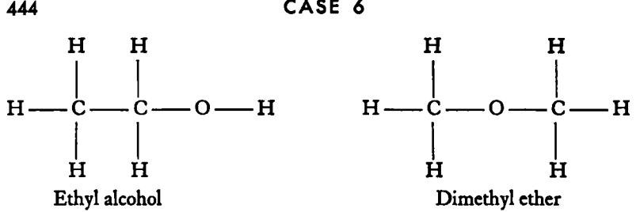

(These are often written as C2HBOH and CH3OCH3 respectively.)

The evidence on which chemists had to rely in developing structural formulas of this type was indirect. For example, ethyl alcohol is very similar to water in many of its physical properties and in the type of chemical transformations that it undergoes. Since the formula of water is H-O—H, it is reasonable to assume that of the two structural formulas written above, the one in which the grouping O- H occurs represents ethyl alcohol.

A study of a great variety of carbon compounds over a period of 40 years or more led chemists to make certain assumptions about the way in which the atoms of hydrogen, oxygen, nitrogen, and carbon could unite. In particular, the facts appeared to justify certain generalizations about the number of atoms with which these atoms could combine. There seemed to be a maximum capacity of an atom to unite with other atoms: the chemist never had to assume that more than *four*  other atoms were attached to carbon, *two* to oxygen, *one* to *hydrogen;*  he could think of the atoms with these numbers of hooks or links, each ready to join to a similar hook or link on another atom. Even the cases where fewer atoms were involved could be explained by a further assumption that there could be union through double links. Thus, the formula for carbon dioxide (C0 2 ) could be written 0 = C=0 .

In the last 30 years evidence of the correctness of these conclusions of the nineteenth-century chemists has accumulated as a result of the labors of physicists. Or, to put the matter more cautiously, the conceptual scheme based on chemical evidence and the one based on physical evidence (the interaction of matter and radiations) were found to be almost perfectly correlated. For example, a measurement of the diffraction of x-rays by crystals enables physicists to calculate the distances between the centers of atoms and, in simple cases, to determine the molecular structure. Today, physical and chemical methods of determining the structures of complex compounds complement each other.

*Salts and Nonionic Compounds.* A distinction of fundamental importance to the twentieth-century chemist is the difference between ionic and nonionic compounds. The common substances, table salt and cane sugar, will serve to illustrate the two classes. Both are white solids, soluble in water, but the aqueous solutions differ in their ability to conduct electricity. The salt solution is a conductor; the sugar solution is not. A mass of experimental evidence indicates that in the salt solution there are electrically charged particles called *ions* which conduct the current. In the sugar solution there are no ions. Furthermore, the work of physicists and chemists in this century has shown that we can best conceive of the molecules of the two solids as being quite different in their structure. In solid salt, the atoms carry electric charges and the plus (+ ) and minus ( —) charges are built up in such a way as to give an electrically neutral particle. In sugar the whole particle is electrically neutral and even in solutions there are no ions; the atoms are held together by the same kind of forces as hold hydrogen atoms together in the hydrogen molecule or the carbon and oxygen atoms together in the oxides of carbon.

Particles of common salt (sodium chloride) are made up of two kinds of ions according to our present view. The *sodium ions* carry a positive charge; *chloride ions* a negative charge. Sugar is composed of carbon atoms, hydrogen atoms, and oxygen atoms; in cane sugar these elements are in such proportion that the formula is C^H^sOn- The arrangement of these atoms is in two rings, but a knowledge of the detailed structure of the cane sugar molecule is unnecessary for the purposes of this study. In connection with fermentation and all biologic processes we are chiefly concerned with substances whose molecules are like sugar rather than salt. But before considering a few characteristics of such compounds, we must note the relation of salts in general to acids and bases.

Common salt is a representative of a very large class of compounds that are called *salts.* Solutions of salts (with certain exceptions) conduct electricity for the same reason that a solution of common salt does, namely, the presence of positive and negative ions. Many (but not all) salts are soluble in water. Chemical reactions between salts almost always are simply the combination of ions; *these ionic reactions in aqueous solution are usually very rapid.* The contrast with the reactions of nonionic molecules like sugar will be evident later and is of basic importance to the chemistry ο living things. An example of a practically instantaneous *ionic reaction* is the formation of the white insoluble salt, *silver chloride,* when water solutions of two other salts, *silver nitrate* and *sodium chloride,* are mixed. The reaction may be summarized :

Na+Clsodium chloride + Ag+N0 3 - > Ag+Clyields silver chloride (insoluble) + Na+N0 3 silver nitrate sodium nitrate

The positive ion ( + ) of most simple salts is derived from a *metal·,*  the negative ion ( ~ ) is derived from a hydrogen compound known as an *acid.* Many salts can be prepared by the action of an acid on a metal. Thus, silver nitrate is prepared by dissolving metallic silver in nitric acid; zinc chloride by dissolving zinc in hydrochloric acid; iron sulfate by dissolving iron in sulfuric acid.

Many of the well-known metals decompose water at some temperature, evolving hydrogen; notable exceptions are gold, silver, platinum, and mercury. The product is either an *oxide* or a *hydroxide;* the difference only involves a molecule of water. Lime is calcium oxide; limewater contains calcium hydroxide. Caustic soda is sodium hydroxide; caustic potash is the old name for potassium hydroxide. Milk of magnesia contains magnesium hydroxide. Either the oxide or the hydroxide when treated with an acid yields the corresponding salt.

*A salt may be formed by the action of a metal, a metallic oxide, or a metallic hydroxide on an add.* 

The hydroxides of the metals are known as *bases.* Water solutions of these substances, such as sodium hydroxide or calcium hydroxide, conduct electricity like water solutions of salts. The positive ion involved is that corresponding to the metal; the negative ion is the *hydroxyl ion,* which is composed of one atom of hydrogen and one of oxygen, and the group carries a negative charge. Insoluble hydroxides are formed by a practically instantaneous ionic reaction when a suitable salt is mixed with a solution of a soluble hydroxide such as sodium hydroxide. When many solid hydroxides are heated, water and the corresponding oxide are formed. (Metallic hydroxide minus water yields oxide.) The oxide on treating with water slowly forms the hydroxide again. The slaking of quicklime is a common example of the latter process.

Oxide plus water yields hydroxide

|            | CaO | + | H 2 0 | »       | Ca(OH)2   |
|------------|-----|---|----------|---------|-----------|
| üxample: ^ |     |   | wate r   | yield s | calc¡u m  |
|            |     |   |          |         | hydroxide |

Bases like caustic soda (sodium hydroxide) have long been known as alkalies. A solution of the gas ammonia is likewise a base; it was once called a volatile alkali because when the solution is boiled the ammonia gas escapes. In the water solution, the ammonium ion NH 4 + and the hydroxyl ion OH are present. When treated with an acid, a solution of ammonia forms ammonium salts, of which ammonium chloride is a common example; its formula is NH4+C1_ .

An acid may be defined as a hydrogen compound that will react

with a base to form water and a salt. When this reaction occurs in water solution, it takes place practically instantaneously because it is an ionic reaction; it involves the combination of the hydroxyl ion of the base with an ion characteristic of all acids, namely, the *hydrogen ion H+.* 

The combination of an acid and a base to form a salt is called *neutralization.* The formation of common salt from sodium hyroxide and hydrochloric acid is a good example.

| Na+OH-    | + | H+Cl-        | >      | Na+Cl"   | + | H2 0 |
|-----------|---|--------------|--------|----------|---|---------|
| sodium    |   | hydrochloric | yields | sodium   |   | water   |
| hydroxide |   | acid         |        | chloride |   |         |

There are many kinds of acids. They all contain hydrogen and most of them contain oxygen. (Indeed, Lavoisier erroneously thought that all acids contained oxygen.) The negative ion of a few acids consists of a simple atom carrying a negative charge; an example is the chloride ion CI in hydrochloric acid, which is related to the elementary gas chlorine, Cl2. Other acids may be regarded as the combination of water and an oxide of a nonmetallic element. Thus, carbonic acid is formed when carbon dioxide dissolves in water (the salts of carbonic acid are the carbonates).

| H2O   | + | co2     | >      | H2CO3    |
|-------|---|---------|--------|----------|
| water |   | carbon  | yields | carbonic |
|       |   | dioxide |        | acid     |

Sulfuric acid is formed when the final oxidation product of sulfur (sulfur trioxide) dissolves in water.

| SO3      | + | H2O   | >      | H2SO4    |
|----------|---|-------|--------|----------|
| sulfur   |   | water | yields | sulfuric |
| trioxide |   |       |        | acid     |

The acid found in vinegar is an example of an *organic* acid. The negative ion contains carbon, hydrogen, and oxygen. The acid is called *acetic acid,* and the ion is called the *acetate ion.* A somewhat similar acid is formed when milk sours; this is called *lactic acid,* and the corresponding salts are *lactates.* Methods of determining the arrangement of the atoms in these acids are too complicated to consider here.

*Degrees of Acidity.* The weight of material in a given volume of a solution is called the *concentration·,* solutions are said to be dilute with respect to a given substance if the concentration is low. Since acids in water solution exist to a considerable degree as hydrogen ions and aa

equal number of negative ions, it is clear that a dilute solution of an acid contains a lower concentration of hydrogen ions than does a concentrated solution of the same acid. But not all acid solutions of the same concentration (containing the same number of molecules in a given volume) have the same concentration of hydrogen ions. With some acids, like carbonic acid, only a very small fraction of the hydrogen atoms become ions; they are said to be *very wea\ acids.* With nitric and hydrochloric acid, on the other hand, almost all the hydrogen atoms become hydrogen ions and these acids are said to be *strong acids.*  The common acids from plants and animal tissue, such as acetic and lactic acids, are in between; they are *wea\ acids.* These differences have long been known, though only in the last 75 years has the concept of ions and ionic concentration been so developed as to correlate a host of observations. The "acid taste" of a solution is a rough measure of the hydrogen-ion concentration. If one compares the taste of dilute solutions of hydrochloric acid, of vinegar, and of carbonic acid, the difference can be easily noted. We can speak, therefore, of the *degree of acidity* of a solution, and we now have accurate ways of measuring this degree of acidity and noting the results on a logarithmic scale called the pH scale. Water has an extremely low hydrogen-ion concentration; a very few hydrogen ions are formed from the water molecules. Solutions with this same hydrogen-ion concentration are said to be neutral; those with an even smaller concentration of hydrogen ions are said to be *alkaline·,* those with a higher concentration of hydrogen ions are *acidic.* (As the hydrogen-ion concentration *decreases* in an aqueous solution, that of the hydroxyl ion *increases,* so alkaline solutions may be defined as those containing a high concentration of hydroxyl ions. Why solutions of bases are alkaline will be obvious.)

*Factors Influencing Rates of Reactions.* The transformation of carbon compounds into other compounds, with the absorption or release of energy, is the basic chemical process in all living cells. These changes are *not* ionic changes; they are not instantaneous; their rate is greatly influenced by a number of factors. The more important of these factors are: (1) temperature, (2) catalysts, (3) acidity. We consider these briefly, in inverse order.

Very few living cells will continue to function in either strongly acid or strongly alkaline solutions. Nature provides a mechanism for maintaining the proper hydrogen-ion concentration near neutrality. This is accomplished by means of weak acids that are found in the cell; these include phosphoric acid salts, carbonic acid, and lactic acid. In growing plants the acidity of the soil or the medium is of great importance; this is true both of the higher plants and of the lower plants such as yeasts and the unicellular bacteria. Since Pasteur's day this aspect of biochemistry has been greatly developed, thanks to the new conceptual scheme involving ions and ionic concentration.

The hydrogen ion is an effective catalyst by itself for many reactions of organic compounds in water solution. *A catalyst is an entity that increases the speed of a chemical reaction but does not itself appear as part of the product and undergoes no net alteration in the reaction.* The change from starch to glucose is a good example of hydrogen-ion or acid catalysis:

$$\begin{array}{cccc}\text{Starch} & + & \text{Water} & \longrightarrow & \text{Glucose;} \end{array}$$

in this process a huge molecule is transformed into many small ones, and the elements of water are added in the process. The water molecules may be thought of as breaking the links in a long chain, a hydrogen atom going to one end of the link and the hydroxyl group to the other. In neutral solutions this reaction is so slow that no change can be detected; in strong acid solutions the reaction proceeds.

The rate of conversion of starch to glucose in the presence of acids is greatly influenced by the *temperature.* As in most nonionic reactions, increasing the temperature by io C deg about doubles the rate. This is a rough empirical rule.

*Enzymes.* A similar transformation of starch to a sugar can be brought about in essentially neutral solutions by catalysts produced in the growth of many living cells and present in the saliva of animals. The work of the last 20 years has shown that these catalysts, and probably all others produced in animal and plant cells, belong to a class of substances known as *enzymes.* These substances have very large molecules of very complicated structure containing nitrogen as well as carbon, oxygen, and hydrogen (proteins). The enzymatic formation of a sugar (maltose) from starch proceeds more rapidly the higher the temperature *up to a certain point,* and then slows down and stops. Investigations have shown that above certain temperatures enzymes themselves decompose and are thus destroyed. Therefore, for enzymatic processes and thus for all chemical processes in cells, there is an optimum temperature range. Preservation of foodstuffs by refrigeration depends on the fact that enzymatic processes involved in putrefaction are *slowed down* by the lowering of the temperature. Preservation by sterilization at the boiling point of water depends on the fact that enzymes are destroyed at a rapid rate at temperatures around ioo°C. Since living cells cannot continue to live or grow without enzymes, the cells, we may say, are killed. The realization of the importance of sterilization we owe primarily to Pasteur. But in his lifetime no one had been able to isolate an enzyme, and the relation of enzymatic action to the life processes was unknown. In studying Pasteur's work on iermentation and the subsequent developments, we shall see how his views must now be modified in the light of later work.

#### 2. PASTEUR'S EARLY WORK ON OPTICAL ACTIVITY WHICH RE-SULTED IN HIS STUDY OF FERMENTATION

Pasteur's transformation from a chemist into a microbiologist came about because of his interest in the process of fermentation. His first publication on this subject may, therefore, be regarded as a historic document. In it Pasteur recounts the reasons that led him to take up the study of a new field. Furthermore, in this paper he describes new experimental procedures for studying microorganisms and the chemical changes they bring about in the liquid in which they grow (in modern terms, the nutrient material). It is perhaps not too much to say that the fundamental basis for the experimental techniques by which bacteriologists and microbiologists isolate and grow "pure strains" of organisms are to be found in this short paper.

First of all a few words are necessary to explain as simply as possible the essence of Pasteur's work as a chemist. He became interested very early in his career in the physical phenomenon known as "the rotation of the plane of polarized light." Light that has passed through certain kinds of crystals or arrangements of crystals is said to be "plane polarized." Such polarized light cannot pass through another set of similar crystals unless the axis of the second arrangement is parallel to that of the first. This can be shown by means of two disks of Polaroid placed on top of

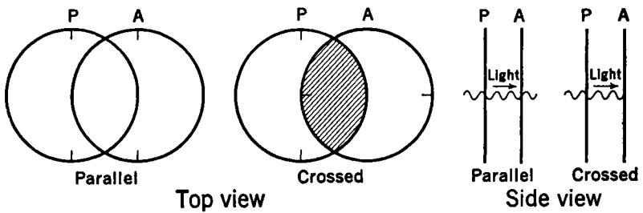

**FIG. I.** Two Polaroid disks are alined with respect to the axis of orientation of the crystals in the material. The polarizer Ρ polarizes light that falls on it and the analyzer A transmits this polarized light. When the analyzer is rotated through ail angle of 90°, it cuts off the light.

each other, which transmit light only when they are rotated into a certain position (Fig. 1). The arrangement that polarizes the light is known as the polarizer, the second arrangement as the analyzer. When

the axis of the analyzer is at right angles to that of the polarizer, no light passes.

Now this combination of analyzer and polarizer enables one to study the effect of liquids or solutions on polarized light. Many materials found in nature, such as cane sugar, have the property in solution of *rotating* the plane of polarization of polarized light. Such substances are said to be "optically active"; some rotate the plane to the right and some to the left. That is to say, the analyzer must be turned to the right or left in order for the light to pass; the plane of polarization of the polarized light corresponds to the angle of the analyzer. (Imagine the solution placed between Ρ and A in Fig. i; if the material in the solution has no optical activity, there will be no effect. If it is optically active, the analyzer A must be rotated to the right or left in order to get the maximum transmission of light. This effect can be illustrated by a lecture-table demonstration.)

Pasteur, on studying this phenomenon, concluded that the power to rotate the plane of polarized light must reside in the lack of symmetry of the molecules of the substance. This has been verified since his time by an enormous amount of experimentation; in the 1850's, however, no such thing as a structural formula was known, for the atomic and molecular theory was still in a state of flux — some wrote the formula for water HO, some H 2 0 ! Pasteur found a relation between the lack of symmetry of the crystals of certain acids that he studied and the ability of the material to rotate the plane of polarized light; this relation he called the law of "hemihedral correlation." He thought the lack of symmetry of the molecules must always be revealed both in the crystal and by the action on polarized light. We now know that this law is not of wide validity and the exception to it that Pasteur found in studying the amyl alcohols is to us today of little consequence. But to him the law of "hemihedral correlation" was a matter of first importance (see p. 453).

Pasteur turned to the study of lactic acid fermentation for several reasons. One of these is stated in the foreword to the paper that follows. Two isomeric substances known as amyl alcohols are found in small quantities (as by-products) in alcoholic fermentation and he was interested in these substances as exceptions to his law of hemihedral correlation. This is explicitly stated in his paper, as the reader will see. The second reason, also given by Pasteur himself, is couched in rather vague terms. But with a knowledge of his earlier work and with the help of the statements of his biographers, Pasteur's own words can be clarified. Pasteur had become deeply impressed by the fact that all the then known materials that *in solution* rotated the plane of polarized light were of animal or plant origin and by the further fact that almost all animal or plant materials rotated the plane either to the right or left. Clearly there appeared to be some close relation between life and optical activity. (All later work has confirmed this, but there are still many unanswered questions in this field.)

Pasteur argued somewhat as follows. Amyl alcohol is found as a byproduct in the process of alcoholic fermentation, that is, when sugar is changed to ethyl alcohol. Sugar is optically active, so is one of the two amyl alcohols formed by fermentation. Amyl alcohol, however, is not at all like sugar — it contains much more hydrogen, it cannot contain the same unsymmetric grouping of atoms (it is "very different"), but it rotates the plane of polarized light. How did this alcohol acquire the property of optical activity? Pasteur said by the action of the living yeast which is necessary for alcoholic fermentation. If optical activity is found only when a compound has been produced by a life process, one may conclude that living organisms must be responsible also for lactic acid fermentation. (Note the broad working hypothesis in Pasteur's thinking and the deductions from it.) Therefore, said Pasteur, let us examine the situation and see whether we can find the living organisms that bring about lactic acid fermentation.

Here is a good illustration of a bold hypothesis that later became a conceptual scheme; today we say that Pasteur was "right" when he postulated a close relation between optical activity and life. Optical activity is found only when a previously optically active compound is transformed into another compound without destroying the unsymmetric grouping, or *when the substance is produced by a life process or by the presence of a catalyst itself the product of a life process.* 

Another factor that impelled Pasteur to take up the study of fermentation was his interest in the fermentation industries. And this in turn was connected with the fact that in 1854 he went to the University of Lille as a professor and dean of the faculty of science. Whether or not Pasteur's scientific interests by themselves would have led him to jump over the fence that separated chemistry from biology is an open question. For in the summer of 1856 a Lille manufacturer requested his assistance in studying certain problems of the alcoholic fermentation that is the basis of the brewing industry. Apparently it was in response to this request that Pasteur first observed under the microscope the living organisms characteristic of alcoholic fermentations. Pasteur was obviously able to identify and isolate the agent of lactic acid fermentation so readily because he had already familiarized himself with the behavior of brewer's yeast in alcoholic fermentation. In this case it is clear that the importance of a problem in the practical arts directed the attention of an investigator to a field of study which was to prove of lasting significance for the advance of science.

#### **3. TRANSLATION OF PORTIONS OF PASTEUR'S MEMOIR ON LACTIC FERMENTATION**

The material in brackets has been added by the editor of this case. [Read at a meeting on August 3, 1857, of the Scientific Society of Lille and published in *Annales de chimie et de physique* (3rd series) 52, 404-418 (1858).]

#### *I. FOREWORD*

I feel I must point out in a few words how it came about that I undertook my study of fermentations. Having until now directed all my efforts toward attempting to discover the relations that exist among the chemical, optical, and crystallographic properties of certain substances, with the objective of shedding light on their molecular constitution, it may seem surprising that I should take up a subject dealing with physiologic chemistry apparently quite remote from my first labors: nevertheless, it is very directly related to them.

In one of my recent communications to the Academy, I showed, contrary to what had been thought until then, that amyl alcohol was composed of two distinct, isomeric alcohols, one rotating the plane of polarized light to the left, the other devoid of any action. The properties of these alcohols are extremely similar. But the fact that they have presented the first known exception to the "law of hemihedral correlation" gives them a special value in connection with the studies that I have undertaken. I then resolved to make a thorough study of the two amyl alcohols to determine, if possible, the causes of their simultaneous production and their true origin, about which certain preconceived ideas * led me to dissent from the accepted opinion. The molecular constitution of sugars seems to me to be very different from that of amyl alcohol. If this alcohol, when active, originated from sugar, as all chemists agree, its optical activity would derive from that of the sugar. I am loath to believe this, considering the present state of our knowledge, for every time that one tries to find the optical activity [rotatory property] of a substance in its derivatives, it promptly disappears. The fundamental molecular group must remain in some measure intact in the derivative if the latter is to continue optically active, a result that can be foreseen from my investigations, since the property of optical activity is entirely due to an unsymmetric arrangement of elementary atoms. But I think that if the molecular group of amyl alcohol does derive from sugar, it is too distantly connected to retain the unsymmetric arrangement of atoms. I repeat, these were preconceived ideas. However, they were sufficient to persuade me to study what the influence of a ferment might be in the production of the two amyl alcohols. For it is always observed that these alcohols originate in the process of fermentation, and this fact was one more in-

* [Note the use of a bold working hypothesis so little related to the subject at hand that Pasteur calls it a preconceived idea.]

vitation to press on toward a solution of these problems. For indeed, I must confess that my researches have long been dominated by the thought that the constitution of compounds considered from the point of view of molecular symmetry or lack of symmetry (all other things being equal) plays a considerable role in the most intimate laws of organization of living organisms and intervenes in their most hidden physiologic characteristics.

Such was the origin and the motive for the new experiments on fermentations. But as often happens in similar circumstances, my work grew little by litde and deviated from its original direction in such a way that the results that I am publishing today seem alien to my previous studies. The connection will be more evident in those to come. I subsequently hope to connect the phenomena of fermentation with the molecular dissymmetry characteristic of substances of organic origin.

#### II. *History*

Lactic acid was discovered by Scheele in 1780 in soured whey. His procedure for removing it from the whey is still today the best one can follow.1 The inaccurate work of Bouillon-Lagrange and several others confused the study of its properties; this resulted in 1813 in Braconnot's describing as if new, under the bizarre name of acid of Nancy or "nancéique" acid, a product that was nothing else than Scheele's lactic acid. Nevertheless, Braconnot's work is one of the most thorough of the numerous memoirs that have dealt with this acid. He found the acid in rice that had fermented under water; in beet juice that, having undergone viscous fermentation and alcoholic fermentation, becomes sour and yields lactic acid and mannite [a substance related to sugar]; in some sour water made of baker's yeast; finally in soured milk and in Scheele's lactic acid.2 The composition of lactic acid was established by Messrs. Pelouze and J. Gay-Lussac in 1833.3 Later, in 1841, Messrs. Fremy and Boutron published a work meriting special mention in the history of this substance, for in it they described the method of prolonging the

1 First he reduced the whey to an eighth of its volume by evaporation. He filtered it and saturated it with lime to precipitate the phosphate of lime [calcium phosphate, an insoluble solid]. The liquid was then filtered and diluted with three times its weight of water; into this he poured oxalic acid [C204H2] drop by drop to precipitate all the lime [calcium oxalate is insoluble]. He evaporated the liquid to the consistency of honey. The thickened acid was redissolved in rectified alcohol [alcohol free from water], which eliminated the milk sugar and many other materials. The alcohol was removed by distillation. Bouillon-Lagrange, *Annales de Chimie* 50, p. 288.

'Braconnot, *Annales de Chimie et de Physique* 86, 84 (1813); Vogel, *Journal de Pharmacie* 3, 491 (1817); Berzelius, *Annales de Chimie et de Physique* (2nd series) 46, 420 (1831); all identified lactic acid as a separate acid.

" Pelouze and J. Gay-Lussac, *Annales de Chimie et de Physique* (2nd series) 52, 410 (1833); Fremy et Boutron, *Annales de Chimie et de Physique* (3rd series) a, 271 (1841).

action of nitrogenous organic material [proteins] on sugars, in such a way as to transform these sugars more completely into lactic acid. They noticed that the action of the casein [protein from milk] was stopped by the lactic acid itself, and by saturating the liquid from time to time with bicarbonate of soda [NaHCOa] they were able to transform all the sugar in the milk. Messrs. Pelouze and Geliz did better; they added chalk [calcium carbonate] to the sweetened water and to the ferment. The chalk constantly maintains the neutrality without any need for supervision on the part of the experimenter. Then, by taking up again Braconnot's experiments and imitating those of Mr. Colin on alcoholic fermentation, it was possible to make the sugar undergo lactic fermentation with the help of any of the nitrogenous plastic materials [impure mixture of proteins]. Indeed, the conditions for the preparation and the production of lactic acid are well known to the chemists. Today everyone knows that by adding chalk to sweetened water plus a nitrogenous substance such as casein, gluten, animal membranes, fibrin, albumin, etc., the sugar is transformed into lactic acid. But the explanation of the phenomena remains very obscure. The mode of action of the nitrogenous plastic material is entirely unknown. Its weight does not change perceptibly. It does not become putrid. However, it becomes altered and is continually in an evident state of decomposition, although it is difficult to say in what this consists. Until now minute researches have been unable to discover the development of organized life [here is the key point]. Observers who have identified some organisms have at the same time found that they were accidental and detrimental to the process.

The facts then seem very favorable to the ideas of Liebig or to those of Berzelius.* In the eyes of the former a ferment is an unstable [excessively alterable] substance that decomposes and thereby excites fermentation in consequence of its alteration which communicates a disintegrating disturbance to the molecular group of the fermentable matter. According to Liebig, such is the primary cause of all fermentations and the origin of most contagious diseases. Berzelius believes that the chemical act of fermentation is to be referred to the action of contact. These opinions gain more credit daily. In regard to this, one can consult the Memoir of Messrs. Fremy and Boutron on lactic fermentation, the pages dealing with fermentation and ferments in the excellent work that Mr. Gerhardt left when he died, and Mr. Bertholet's very recent memoir on alcoholic fermentation. These works all agree in rejecting the idea of some sort of influence from organization and life as a cause of the phenomena that we are considering. I have been led to an entirely different point of view.f

*** [What follows is historically of great importance, as giving in Pasteur's own words the issue between him and Liebig; the later course of the controversy is summarized in Sec. 4 (pp. 461-464).]** 

**t [The next paragraph gives Pasteur's working hypothesis, namely, that life and fermentation go hand in hand.]** 

In the first part of this work, I plan to show that just as an alcoholic ferment exists, namely, brewer's yeast, which is found wherever sugar breaks down into alcohol and carbonic acid, so too there is a special ferment, a lactic yeast, always present when sugar becomes lactic acid, and that if any nitrogenous plastic material can transform sugar into this acid it is because it is a food suitable to the development of this ferment.

[To the extent that Pasteur did demonstrate in this one piece of work that a microorganism was essential for lactic acid fermentation, he broke new ground. No single set of experiments could establish even this restricted generalization, but Pasteur showed the way by *isolating* the microorganism and sowing it like a seed into a nutrient solution. This was a *revolutionary technique.]* 

#### III. *New Yeast * — Its Preparation — Its Properties — Analogies and Differences as Compared with Brewer's Yeast.*

If one examines carefully an ordinary lactic fermentation, there are cases where one can find on top of the deposit of the chalk and nitrogenous material spots of a gray substance which sometimes form a layer on the surface of the deposit. At other times, this substance is found adhering to the upper sides of the vessel, where it has been carried by effervescence. Under the microscope, when one is not forewarned [that is to say, if one were not bent on finding microorganisms!], it is hardly possible to distinguish it from casein, disaggregated gluten, etc.; in short, nothing indicates that it is a separate material or that it originated during the fermentation. Its apparent weight always remains very little as compared to that of the nitrogenous material originally necessary for the carrying out of the process. Finally, very often it is so mixed with the mass of casein and chalk that there would be no reason to suspect its existence. It is nevertheless this substance that plays the principal role. I am going to show, first of all, how to isolate it and prepare it in a pure state.

I extract the soluble part from brewer's yeast, by treating the yeast for some time with fifteen to twenty times its weight of water at the temperature of boiling water. The liquid, a complex solution of albuminous and mineral material, is carefully filtered.4 About fifty to one hundred

* [Pasteur used the term yeast to describe the microorganisms which he isolated and which is responsible for lactic and fermentation. Later microbiologists classified the organism as a bacterium.]

* If it does not come through clear, it can be easily made limpid by bringing it to a boil with a little chalk or by adding a very little lime water [calcium hydroxide] or sucrate of lime [sugar plus lime], which produce an abundant precipitate. This precaution is almost always necessary when the yeast water has been prepared from yeast that has been in contact with much water for several days. Fresh yeast or that which has been submitted to only one or two washings by cold décantation gives a yeast water that is very limpid after filtration. [It should be noted that this yeast water contains no living yeast cells.]

grams of sugar [cane sugar, but glucose might be used; see p. 15 ] are then dissolved in each liter, some chalk is added, and a trace of the gray material I have just mentioned extracted from a good, ordinary lactic fermentation is sprinkled in [note the new technique]; then one raises the temperature to 30 or 35 degrees Centigrade. [The mixture is placed in what is now called an incubator.] It is also good to introduce a current of carbonic acid in order to expel the air from the flask, which is fitted with a bent exit tube immersed under water. On the very next day a lively and regular fermentation is manifest. The liquid, originally very limpid, becomes turbid; little by little the chalk disappears [reacts with the lactic acid that is formed], while at the same time a deposit is formed that grows continuously and progressively with the solution of the chalk. The gas that is evolved is pure carbonic acid, or a mixture in variable proportions of carbonic acid and hydrogen. After the chalk has disappeared, if the liquid is evaporated, an abundant crystallization of lactate of lime [calcium lactate] forms overnight, and the mother liquor contains variable quantities of the butyrate of this base [a by-product]. If the proportions of chalk and sugar are correct, the lactate crystallizes in a voluminous mass right in the liquid during the course of the operation. Sometimes the liquid becomes very viscous. In a word, we have a clearly characterized lactic fermentation, with all the usual complications of this phenomenon whose external manifestations are well known to chemists.

In this experiment, the yeast extract can be replaced by an extract of any nitrogenous plastic substance, fresh or decomposed, as the case may be. This limpid liquid, containing a nitrogenous substance in solution, is nothing but a food, and in this respect its origin is of little importance provided it is of such a nature as to facilitate the development of the organized substance that is produced and gradually deposited.

Let us consider now what are the characteristics of this substance, the production of which goes hand in hand with those phenomena that, taken together, we call lactic fermentation. Viewed as a mass it looks exactly like ordinary pressed or drained yeast. It is slightly viscous, and gray in color. Under the microscope,* it appears to be formed of little globules or very short segmented filaments, isolated or in clusters, which form irregular flakes resembling those of certain amorphous precipitates. It can be collected and transported for great distances without losing its activity, which is weakened only when the material is dried or when it is boiled in water. Very little of this yeast is necessary to transform a considerable weight of sugar. These fermentations should preferably be carried on so that the material is protected from the air, so that they will not be hindered by vegetation or foreign infusoria.

Here we find all the general characteristics of brewer's yeast, and these

* [Without the type of microscope that had been invented a generation earlier, Pasteur could not have seen the organized globules. The importance of new instruments is obvious.]

substances probably have organic structures that, in a natural classification, place them in neighboring species or in two connected families, [Pasteur's systematic botany has been revised; brewer's yeast and the lactic acid bacterium are not closely related.]

Chemists will be surprised at the rapidity and the regularity of lactic fermentation under the conditions that I have specified, that is, *when the lactic ferment develops by itself·,* it is often more rapid than the alcoholic fermentation of the same amount of material. Lactic fermentation as it is ordinarily carried out takes much longer. This can easily be understood. The gluten, the casein, the fibrin, the membranes, the tissues that are used contain an enormous amount of useless matter. More often than not these become a nutrient for the lactic ferment only after putrefaction— alteration by contact with plant or animal growth — that has rendered the elements soluble and assimilable.

There is another characteristic that permits one to compare this new ferment with brewer's yeast: if brewer's yeast instead of the lactic ferment is sown in limpid, sugared, albuminous liquid, brewer's yeast will develop, and with it, alcoholic fermentation, even though the other conditions of the operation remain unchanged. One should not conclude from this that the chemical composition of the two yeasts is identical any more than that the chemical composition of two *plants* is the same because they grew in the same soil.

Then there is a final analogy which I must not omit, namely, that it is not necessary to have at hand some lactic ferment in order to prepare more: it originates spontaneously,® with as much facility as brewer's yeast, whenever conditions are favorable.

"I use this word to describe the fact, leaving entirely aside any judgment on the question of spontaneous generation. The lactic ferment develops in contact with common air if the conditions with respect to the medium and temperature are favorable. If the experiment is carried out under conditions where the air is excluded or in the presence of air that has been previously heated, the process that takes place is the same as with brewer's yeast or infusoria, and under these conditions one can reproduce the well-known experiments of various physiologists who have repeated and made more precise the work of Appert and Gay-Lussac on the influence of air on the phenomena in question.

[Appert and Gay-Lussac had shown, so they thought, that oxygen gas was essential for putrefaction or "spoiling" of preserved material. Appert was the first to show how foods could be conserved or preserved by being heated in boiling water and then tightly sealed. He was the inventor of the process we now call "canning." Gay-Lussac examined the gas above canned foods that had not spoiled and found no oxygen. We now know that this is because a slow oxidation had used up the oxygen. Pasteur, a few years after this footnote was written, showed that it was not the absence of oxygen that prevented the food from spoiling but the absence of living microorganisms. This demonstration was part of his study of so-called spontaneous generation, which he seems to have already had in mind when he wrote this footnote; see also p. 40.]

Dissolve some sugar in limpid yeast water, add chalk, and fermentation will set in on the following day or the day after, and because the medium is neutral, it will tend to be exclusively a lactic fermentation. Sufficient contact with the air will take place during the mixing unless very particular precautions are taken (which I do not assume) and indeed it will be useless to prevent it. Nevertheless, it is preferable to sow a little lactic ferment in the liquid, for if one does not, there is apt to be a simultaneous development of several fermentations and that of animalcules which are very injurious.

Whenever an albuminous liquid of a suitable nature contains a substance such as sugar, capable of undergoing diverse chemical transformations dependent upon the nature of such and such a ferment, the germs of these ferments all tend to propagate at the same time, and usually they develop simultaneously, unless one of the ferments invades the medium more rapidly than the others. It is precisely this last circumstance that is controlling when one uses the method of sowing organisms that are already formed and ready to reproduce. If no ferment is sown in a mixture of sugared water, albuminoid matter [proteins], and chalk, there generally are several parallel fermentations, with their respective ferments, and animalcules that apparently devour the little globules of these ferments. The addition of a definite pure ferment greatly assists the production of the corresponding fermentation, though without ensuring it in every case. What takes place in fermentations may be compared to what occurs in a plot of land that is not seeded. It soon becomes crowded with various plants and insects that are mutually harmful.

One of the essential conditions for good fermentations is the purity of the ferment, its homogeneity, its free development without any hindrance and with the help of a nutrient well adapted to its individual nature.* In this respect, it is important to realize that the circumstances of neutrality, of alkalinity, of acidity, or of the chemical composition of the liquids play an important part in the predominant growth of such and such a ferment, because the life of each does not adapt itself to the same degree to different states of the environment. If some sugar is dissolved, for example, in very limpid yeast water without adding chalk and without sowing anything, one may be assured that two days hence the fermentation will be alcoholic, the yeast being deposited at the bottom of the vessel. However, in very rare cases, as has been proved to me at various times by numerous experiments, the ferment that develops will be lactic ferment. I repeat, that it is an exception if this happens, even though lactic ferment may have previously been sown. This is because, under such conditions, the liquid may become acid, and acidity seems to weaken and interfere with lactic ferment more than it does

* [It has been said that Pasteur, trained as a chemist, brought to experimental biology the appreciation of the significance of purity or homogeneity of materials.]

with the alcoholic ferment. There is yet much research to be done in this direction.

If, on the contrary, the medium is made neutral or a little alkaline, the lactic ferment will have a great tendency to appear and then increase. The definite proof of this statement follows. If one adds alkaline magnesia [magnesium hydroxide] to sugared water and brewer's yeast, alcoholic and lactic fermentation will take place simultaneously with the formation of a crystalline precipitate of magnesium lactate; a microscopic examination of the liquid shows the presence of a considerable quantity of the little globules of the lactic ferment mixed with the globules of brewer's yeast. These globules arise spontaneously from the albuminous liquid furnished by the soluble part of the brewer's yeast, as the alkalinity of the liquid considerably diminishes the activity of the yeast as an alcoholic ferment. A slightly alkaline medium is thus very convenient for the development of the new yeast, but it is also eminently favorable to the infusoria which, by consuming the new globules or at least removing their source of nourishment, often prove to be an insurmountable hindrance to this class of phenomena.

[Three paragraphs are here omitted.]

All through this memoir, I have reasoned on the basis of the hypothesis that the new yeast is organized, that it is a living organism, and that its chemical action on sugar corresponds to its development and organization.* If someone were to tell me that in these conclusions I am going beyond that which the facts prove, I would answer that this is quite true, in the sense that the stand I am taking is in a framework of ideas that in rigorous terms cannot be irrefutably demonstrated. Here is the way I see it; whenever a chemist makes a study of these mysterious phenomena and has the good fortune to bring about an important development, he will instinctively be inclined to assign its primary cause to a type of reaction consistent with the general results of his own research. It is the logical course of the human mind in all controversial questions. And it is my opinion, at this point in the development of my knowledge of the subject, that whoever judges impartially the results of this work and that which I shall shortly publish will recognize with me that fermentation appears to be correlative to life and to the organization of globules, and not to their death or putrefaction.f Any contention that fermentation is a phenomenon due to contact in which the transformation of sugar takes place in the presence of the ferment without giving up anything to it or taking anything from it, is contradicted by experiment as will be soon seen. In a work that will follow shortly, I shall take up the chemical action of the new yeast on sweetened substances.

* [This is an explicit statement of Pasteur's working hypothesis.]

t [This sentence summarizes the significance of what might seem on first reading a trivial study of a special case. Pasteur presents his hypothesis and evidence for it in one case — lactic acid formation.]

#### 4. THEORIES OF FERMENTATION FROM LIEBIG TO THE PRESENT DAY

Justus von Liebig (1803—1873) was one of the founders of organic chemistry. He laid the basis for the determination of the molecular architecture of many of the complex carbon compounds found in nature. His views about the nature of fermentation carried great weight at the time when Pasteur entered the field. And it is against these views that we find Pasteur contending. Liebig, in his book on *Agricultural chemistry,* published in 1840, had written as follows:

"Yeast produces fermentation in consequence of the progressive decomposition that it suffers from the action of air and water . . . during the fermentation of sugar by yeast, both of these substances suffer decomposition at the same time and disappear in consequence. But if yeast be a body which excites fermentation by being itself in a state of decomposition, all other matters in the same condition should have a similar action upon sugar; and this is in reality the case . . . Yeast and putrefying animal and vegetable matters act as peroxide of hydrogen does on oxide of silver, when they induce bodies with which they are in contact to enter into the same state of decomposition. The disturbance in the attraction of the constituents of the hydrogen peroxide effects a disturbance in the attraction of the elements of the oxide of silver, the one being decomposed on account of the decomposition of the other."

The theory of fermentation expressed in this quotation was essentially Liebig's view from 1840 to the end of his life (1873). It was no mere speculative idea but was based on a series of careful experimentations first instituted by his friend Friedrick Wohler (1800-1882) in 1836. Wohler and Liebig discovered that a water-soluble substance present in bitter almonds (amygdalin) was converted in solution to an insoluble oil (oil of bitter almonds) by means of the nitrogenous material present in the skins of almonds. This nitrogenous material behaved in a similar way to egg white when it was heated, and it was classed as an "albuminous material." (We should now call it a water-soluble protein.)

Liebig's theory of fermentation was thus based on his observations of a process in which two nonliving bodies interacted. The analogy of the reaction between silver oxide and hydrogen peroxide was by no means farfetched. (Silver oxide is reduced to metallic silver in this reaction, while the peroxide decomposes into water and oxygen.) The further analogy with the action of yeast on sugar was evident and was mentioned in Wohler's first letter to Liebig about the formation of oil of bitter almonds. The apparently spontaneous putrefaction of albuminous material was well known (meat spoils, for example). It was reasonable to assume that this decomposition of the albuminous material in the skin of almonds was responsible for the decomposition of amygdalin. Similarly, one could assume that the sugar was transformed into alcohol because the albuminous material in yeast decomposed. (Other decomposing albuminous material likewise changed sugar, but, as Pasteur showed, did not always produce alcohol; lactic acid, for example, might be the product.)

It is extremely interesting that Pasteur did not attempt to claim that the formation of oil of bitter almonds involved living microorganisms. If he ever tried to establish this, there is no record of his experiments. Rather, he by-passed Liebig's first studies of fermentation by saying in effect that they were not examples of fermentation! For example, in a paper on "Spontaneous generation" published a few years after his study of lactic acid formation, he wrote, "I found that all fermentations *properly so called,* lactic, butyric, the fermentations of tartaric acid, of malic acid, of urea were always connected with the presence and multiplication of living organisms." (The italics are those of the editor.) *Pasteur comes very close to arguing in a circle.* Yet one might better call it spiral argumentation, for arbitrary as was his definition of fermentation, it pointed the way to progress. Pasteur essentially ignored the transformations in which one natural product was decomposed by the presence of some albuminous material. These were not "true fermentations"; yet they included such important changes as the production of sugar from starch by the action of an extract of sprouting barley (the first step in brewing.) Later in the century these came to be known as changes brought about by *unorganized* ferments, while Pasteur's fermentations were said to be changes brought about by *organized* ferments (i.e., living microorganisms). Pasteur concentrated attention on the latter and ignored the former. Liebig, who had started by exploring the former, ignored Pasteur's findings about the latter. He regarded the life and growth of yeasts and microorganisms as irrelevant to the process of fermentation; the important point for him was the albuminous material in the yeast. He facetiously compared people who regarded the living organisms as important with the man who imagined the Rhine to be driven by the row of water mills that he saw across the river at Fayence.

The issue is of interest because it illustrates the difficulties of defining terms in the early stages of a science. Pasteur had demonstrated, by the brilliant use of the microscope and by the invention of new techniques, that in a number of cases chemical change was correlated with the growth of microorganisms; these changes he defined as "fermentations properly so-called." Other apparently analogous changes brought about by nonliving nitrogenous materials, such as the production of sugar from starch, he arbitrarily ruled out of consideration as not being "true fermentations." To be sure, Pasteur could invoke a certain amount of chemical evidence for his distinction between the two classes of changes because the molecular changes are more drastic in the "fermentations properly so-called" than in the cases that were not "true fermentations." But the distinction was not clear-cut and the knowledge of the structure of molecules far too little advanced to make any such distinction secure.

The point is that is was highly illogical to define fermentation so as to exclude the known cases where living organisms were *not* involved and then turn around and point with pride to the instances where fermentation and life were correlative. Yet this method of spiral reasoning proved enormously fruitful. Many, many biochemical transformations were discovered in which living microorganisms were essential and where their role had been hitherto unsuspected. Perhaps if Pasteur had been more rigorous in his logic, his results might have been less revolutionary!

Let us now consider what subsequent generations of investigators discovered and how matters stand in the mid-twentieth century. At the close of the nineteenth century a German scientist discovered that under high pressure a juice could be pressed out of a mass of living yeast which contained "something" that brought about alcoholic fermentation. This experiment, if it had been performed by Liebig, would have been powerful ammunition in his hands. For there is no doubt about it, the formation of alcohol from sugar can be accomplished by a *product* of a living cell without the presence of the living cell itself.

A vast amount of work by biologists, biochemists, and chemists in the last 50 years enables us to construct a conceptual scheme in which the Liebig-Pasteur controversy is resolved. The changes that occur in the life process are, we now believe, all specifically catalyzed reactions; that is to say, they are transformations that occur at an appreciable rate only in the presence of minute amounts of special substances which we call *catalysts.* The catalysts that occur in nature we call *enzymes*  (p. 449). All of them appear to be proteins and many have now been isolated in pure crystalline form. The situation in brief is as follows: the formation of oil of bitter almonds (Liebig's first observation) is an example of a change brought about by an enzyme that is easily removed from living or dead cells; hence it is no trick to bring about such changes *without* the presence of living organisms. The change from sugar to alcohol, or sugar to lactic acid, however and all of Pasteur's other "true fermentations" are brought about by enzymes that under usual conditions do not leave the living cell. Therefore, for these changes to occur the cell must be alive and vigorous, for only

under these conditions will the sugar penetrate the living cell and be transformed by the *intracellular* enzymes into the products (alcohol or lactic acid) that leak back into the solution.

Who was right — Pasteur or Liebig? I should say neither. Liebig's ideas about a ferment "exciting fermentation by being itself in a state of decomposition" were not fruitful and will not accommodate the observations. Furthermore, his failure to recognize that Pasteur's generalization might have at least a limited validity was certainly scientific blindness. Pasteur's generalization was wrong but it was marvelously fruitful. Together with his work on spontaneous generation, it opened up whole new fields of science. This fact is well illustrated by John Tyndall's lecture of 1876, which is given in the following pages (Sec. 5).

#### 5. TYNDALL'S LECTURE ON FERMENTATION

This section is a reprint of an article by John Tyndall (1820- 1893), taken from his *Essays on the Floating-Matter of the Air in Relation to Putrefaction and Infection* (London, 1881). The material enclosed in brackets has been added by the editor of this case history.

#### FERMENTATION , AN D ITS BEARING S O N SURGER Y A N D MEDICINE

#### John Tyndall

(A Discourse delivered before the Glasgow Science Lectures Association, October 19, 1876.)

One of the most remarkable characteristics of the age in which we live, is its desire and tendency to connect itself organically with preceding ages — to ascertain how the state of things that now is came to be what it is. And the more earnestly and profoundly this problem is studied, the more clearly comes into view the vast and varied debt which the world of to-day owes to that foreworld, in which man by skill, valour, and welldirected strength first replenished and subdued the earth. Our prehistoric fathers may have been savages, but they were clever and observant ones. They founded agriculture, by the discovery and development of seeds whose origin is now unknown. They tamed and harnessed their animal antagonists, and sent them down to us as ministers, instead of rivals in the fight for life. Later on, when the claims of luxury added themselves to those of necessity, we find the same spirit of invention at work. We have no historic account of the first brewer, but we glean from history that his art was practised, and its produce relished, more than two thousand years ago. Theophrastus, who was born nearly four hundred years before Christ, described beer as *the wine of barley.* It is extremely difficult to preserve beer in a hot country, still, Egypt was the

land in which it was first brewed, the desire of man to quench his thirst with this exhilarating beverage overcoming all the obstacles which a hot climate threw in the way of its manufacture.

Our remote ancestors had also learned by experience that wine maketh glad the heart of man. Noah, we are informed, planted a vineyard, drank of the wine, and experienced the consequences. But, though wine and beer possess so old a history, a very few years ago no man knew the secret of their formation. Indeed, it might be said that until the present year [1876] no thorough and scientific account was ever given of the agencies which come into play in the manufacture of beer, or the conditions necessary to its health, and of the maladies and vicissitudes to which it is subject. Hitherto the art and practice of the brewer have resembled those of the physician, both being founded on empirical observation. By this is meant the observation of facts, apart from the principles which explain them, and which give the mind an intelligent mastery over them. The brewer learnt from long experience the conditions, not the reasons, of success. But he had to contend, and has still to contend, against unexplained perplexities. Over and over again his care has been rendered nugatory; his beer has fallen into acidity or rottenness, and disastrous losses have been sustained, of which he has been unable to assign the cause. It is the hidden enemies against which the physician and the brewer have hitherto contended, that recent researches are dragging into the light of day, thus preparing the way for their final extermination.

Let us glance for a moment at the outward and visible signs of fermentation. A few weeks ago I paid a visit to a private still in a Swiss chalet; and this is what I saw. In the peasant's bedroom was a cask with a very large bunghole carefully closed. The cask contained cherries which had lain in it for fourteen days. It was not entirely filled with the fruit, an air-space being left above the cherries when they were put in. I had the bung removed, and a small lamp dipped into this space. Its flame was instantly extinguished. The oxygen of the air had entirely disappeared, its place being taken by carbonic acid gas.1 I tasted the cherries: they were very sour, though when put into the cask they were sweet. The cherries and the liquid associated with them were then placed in a copper boiler, to which a copper head was closely fitted. From the head proceeded a copper tube which passed straight through a vessel of cold water, and issued at the other side. Under the open end of the tube was placed a bottle to receive the spirit distilled. The flame of small wood-splinters being applied to the boiler, after a time vapour rose into the head, passed through the tube, was condensed by the cold of the water, and fell in a liquid fillet into the bottle. On being tasted, it proved to be that fiery and intoxicating spirit known in commerce as Kirsch or Kirschwasser.

1 The gas which is exhaled from the lungs after the oxygen of the air has done its duty in purifying the blood; the same also which effervesces from soda water and champagne,

The cherries, it should be remembered, were left to themselves, no ferment of any kind being added to them. In this respect what has been said of the cherry applies also to the grape. At the vintage the fruit of the vine is placed in proper vessels, and abandoned to its own action. It ferments, producing carbonic acid; its sweetness disappears, and at the end of a certain time the unintoxicating grape-juice is converted into intoxicating wine. Here, as in the case of the cherries, the fermentation is spontaneous — in what sense spontaneous will appear more clearly by-and-by.

It is needless for me to tell a Glasgow audience that the beer-brewer does not set to work in this way. In the first place the brewer deals not with the juice of fruits, but with the juice of barley. The barley having been steeped for a sufficient time in water, it is drained and subjected to a temperature sufficient to cause the moist grain to germinate; after which, it is completely dried upon a kiln. It then receives the name of *malt.* The malt is crisp to the teeth, and decidedly sweeter to the taste than the original barley. It is ground, mashed up in warm water, then boiled with hops until all the soluble portions have been extracted; the infusion thus produced being called the *wort.* This is drawn off, and cooled as rapidly as possible; then, instead of abandoning the infusion, as the wine-maker does, to its own action, the brewer mixes yeast with his wort, and places it in vessels each with only one aperture to the air. Soon after the addition of the yeast, a brownish froth, which is really new yeast, issues from the aperture, and falls like a cataract into troughs prepared to receive it. This frothing and foaming of the wort is a proof that the fermentation is active.

Whence comes the yeast which issues so copiously from the fermenting tub? What is this yeast, and how did the brewer become possessed of it? Examine its quantity before and after fermentation. The brewer introduces, say io cwts. of yeast; he collects 40, or it may be 50, cwts. The yeast has, therefore, augmented from four to five fold during the fermentation. Shall we conclude that this additional yeast has been spontaneously generated by the wort? Are we not rather reminded of that seed which fell into good ground, and brought forth fruit, some thirty fold, some sixty fold, some an hundred fold ? On examination, this notion of organic growth turns out to be more than a mere surmise. In the year 1680, when the microscope was still in its infancy, Leeuwenhoek turned the instrument upon yeast, and found it composed of minute globules suspended in a liquid. Thus knowledge rested until 1835, when Cagniard de la Tour in France, and Schwann in Germany, independently, but animated by a common thought, turned microscopes of improved definition and heightened powers upon yeast, and found it budding and sprouting before their eyes. The augmentation of the yeast alluded to above was thus proved to arise from the growth of a minute plant now called *Torula*  (or *Saccharomyces) Cerevisiee.* Spontaneous generation is therefore out of the question. The brewer deliberately sows the yeast-plant, which grows

and multiplies in the wort as its proper soil. This discovery marks an epoch in the history of fermentation.

But where did the brewer find his yeast? The reply to this question is similar to that which must be given if it were asked where the brewer found his barley. He has received the seeds of both of them from preceding generations. Could we connect without solution of continuity the present with the past, we should probably be able to trace back the yeast employed by my friend Sir Fowell Buxton to-day to that employed by some Egyptian brewer two thousand years ago. But you may urge that there must have been a time when the first yeast-cell was generated. Granted — exactly as there was a time when the first barley-corn was generated. Let not the delusion lay hold of you that a living thing is easily generated because it is small. Both the yeast-plant and the barleyplant lose themselves in the dim twilight of antiquity, and in this our day there is no more proof of the spontaneous generation of the one than there is of the spontaneous generation of the other.

I stated a moment ago that the fermentation of grape-juice was spontaneous; but I was careful to add, 'in what sense spontaneous will appear more clearly by-and-by.' Now this is the sense meant. The wine-maker does not, like the brewer and distiller, deliberately introduce either yeast, or any equivalent of yeast, into his vats; he does not consciously sow in them any plant, or the germ of any plant; indeed, he has been hitherto in ignorance whether plants or germs of any kind have had anything to do with his operations. Still, when the fermented grape-juice is examined, the living *Torula* concerned in alcoholic fermentation never fails to make its appearance. How is this? If no living germ has been introduced into the wine-vat, whence comes the life so invariably developed there?

You may be disposed to reply, with Turpin [a French investigator who studied yeasts in 1838] and others, that in virtue of its own inherent powers, the grape-juice when brought into contact with the vivifying atmospheric oxygen, runs spontaneously and of its own accord into these low forms of life. I have not the slightest objection to this explanation, provided proper evidence can be adduced in support of it. But the evidence adduced in its favour, as far as I am acquainted with it, snaps asunder under the strain of scientific criticism. It is, as far as I can see, the evidence of men who, however keen and clever as *observers,* are not rigidly trained *experimenters.* These alone are aware of the precautions necessary in investigations of this delicate kind. In reference, then, to the life of the wine-vat, what is the decision of experiment when carried out by competent men ? Let a quantity of the clear, filtered 'must' of the grape be so boiled as to destroy such germs as it may have contracted from the air or otherwise. In contact with germless air the uncontaminated must never ferments. All the materials for spontaneous generation are there, but so long as there is no seed sown, there is no life developed, and no sign of that fermentation which is the concomitant of life. Nor need you resort to a boiled liquid. The grape is sealed by its own skin against contamination from without. By an ingenious device Pasteur has extracted from the interior of the grape its pure juice, and proved that in contact with pure air it never acquires the power to ferment itself, nor to produce fermentation in other liquids.2 It is not, therefore, in the interior of the grape that the origin of the life observed in the vat is to be sought. [In this paragraph and the next Tyndall summarizes what Pasteur had first demonstrated in the i86o's after he began his study of so-called spontaneous generation.]

What then is its true origin ? This is Pasteur's answer, which his wellproved accuracy renders worthy of all confidence. At the time of the vintage microscopic particles are observed adherent, both to the outer surface of the grape and to the twigs which support the grape. Brush these particles into a capsule of pure water. It is rendered turbid by the dust. Examined by a microscope, some of these minute particles are seen to present the appearance of organized cells. Instead of receiving them in water, let them be brushed into the pure inert juice of the grape. Fortyeight hours after this is done, our familiar *Torula* is observed budding and sprouting, the growth of the plant being accompanied by all the other signs of active fermentation. What is the inference to be drawn from this experiment? Obviously that the particles adherent to the external surface of the grape include the germs of that life which, after they have been sown in the juice, appears in such profusion. Wine is sometimes objected to on the ground that fermentation is 'artificial;' but we notice here the responsibility of nature. The ferment of the grape clings like a parasite to the surface of the grape; and the art of the winemaker from time immemorial has consisted in bringing — and it may be added, ignorantly bringing — two things thus closely associated by nature into actual contact with each other. For thousands of years, what has been done consciously by the brewer, has been done unconsciously by the wine-grower. The one has sown his leaven just as much as the other.

Nor is it necessary to impregnate the beer-wort with yeast to provoke fermentation. Abandoned to the contact of our common air, it sooner or later ferments; but the chances are that the produce of that fermentation, instead of being agreeable, would be disgusting to the taste. By a rare accident we might get the true alcoholic fermentation, but the odds against obtaining it would enormous. Pure air acting upon a lifeless liquid will never provoke fermentation; but our ordinary air is the vehicle of numberless germs which act as ferments when they fall into appropriate infusions. Some of them produce acidity, some putrefaction. The germs of our yeast-plant are also in the air; but so sparingly distributed that an infusion like beer-wort, exposed to the air, is almost sure to be taken possession of by foreign organisms. In fact, the maladies of beer are wholly

' The liquids of the healthy animal body are also sealed from external contamination. Pure blood, for example, drawn with due precautions from the veins, will never ferment or putrefy in contact with pure air.

due to the admixture of these objectionable ferments, whose forms and modes of nutrition differ materially from those of the true leaven.

Working in an atmosphere charged with the germs of these organisms, you can understand how easy it is to fall into error in studying the action of any one of them. Indeed it is only the most accomplished experimenter, who, moreover, avails himself of every means of checking his conclusions, that can walk without tripping through this land of pitfalls. Such a man the French chemist Pasteur has hitherto proved himself to be. He has taught us how to separate the commingled ferments of our air, and to study their pure individual action. [The first step was his isolation of the microorganism responsible for lactic acid fermentation, as described in Sec. 3.] Guided by him, let us fix our attention more particularly upon the growth and action of the true yeast-plant under different conditions. Let it be sown in a fermentable liquid, which is supplied with plenty of pure air. The plant will flourish in the aërated infusion, and produce large quantities of carbonic acid gas — a compound, as you know, of carbon and oxygen. The oxygen thus consumed by the plant is the free oxygen of the air, which we suppose to be abundantly supplied to the liquid. The action is so far similar to the respiration of animals, which inspire oxygen and expire carbonic acid. If we examine the liquid even when the vigour of the plant has reached its maximum, we hardly find in it a trace of alcohol. The yeast has grown and flourished, but it has almost ceased to act as a ferment. And could every individual yeast-cell seize, without any impediment, free oxygen from the surrounding liquid, it is certain that it would cease to act as a ferment altogether.

What, then, are the conditions under which the yeast-plant must be placed so that it may display its characteristic quality? Reflection on the facts already referred to suggests a reply, and rigid experiment confirms the suggestion. Consider the Alpine cherries in their closed vessel. Consider the beer in its barrel, with a single small aperture open to the air, through which it is observed not to imbibe oxygen, but to pour forth carbonic acid. Whence come the volumes of oxygen necessary to the production of this latter gas? The small quantity of atmospheric air dissolved in the wort and overlying it would be totally incompetent to supply the necessary oxygen. In no other way can the yeast-plant obtain the gas necessary for its respiration than by wrenching it from surrounding substances in which the oxygen exists, not free, but in a state of combination. It decomposes the sugar of the solution in which it grows, produces heat, breathes forth carbonic acid gas, and one of the liquid products of the decomposition is our familiar alcohol. The act of fermentation, then, is a result of the effort of the little plant to maintain its respiration by means of *combined* oxygen, when its supply of free oxygen is cut off. As defined by Pasteur, fermentation is *life without air.* [This definition, which was a consequence of Pasteur's study of alcoholic fermentation, is not to be confused with his working hypothesis that life

and fermentation are correlative. What follows concerns Pasteur's work *after* the publication of his lactic acid paper.]

But here the knowledge of that thorough investigator comes to our aid to warn us against possible error. It is not, he says, all yeast-cells that can thus live without air and provoke fermentation. They must be young cells which have caught their vegetative vigour from contact with free oxygen. But once possessed of this vigour the yeast, he alleges, may be transplanted into a saccharine infusion absolutely purged of air, where it will continue to live at the expense of the oxygen, carbon, and other constitutents of the infusion. Under these new conditions its life, *as a plant,* will be by no means so vigorous as when it had a supply of free oxygen, but its action *as a ferment* will be indefinitely greater.

Does the yeast-plant stand alone in its power of provoking alcoholic fermentation? It would be singular if amid the multitude of low vegetable forms no other could be found capable of acting in a similar way. And here again we have occasion to marvel at that sagacity of observation among the ancients to which we owe so vast a debt. Not only did they discover the alcoholic ferment of yeast, but they had to exercise a wise selection in picking it out from others, and giving it special prominence. Place an old boot in a moist place, or expose common paste or a pot of jam to the air; it soon becomes coated with a blue-green mould, which is nothing else than the fructification of a little plant called *Pénicillium glaucum.** Do not imagine that the mould has sprung spontaneously from boot, or paste, or jam; its germs, which are abundant in the air, have been sown, and have germinated, in as legal and legitimate a way as thisde-seeds wafted by the wind to a proper soil. Let the minute spores of *Pénicillium* be sown in a fermentable liquid, which has been previously so boiled as to kill all other spores or seeds which it may contain; let pure air have free access to the mixture; the *Pénicillium* will grow rapidly, striking long filaments into the liquid, and fructifying at its surface. Test the infusion at various stages of the plant's growth, you will never find in it a trace of alcohol. But forcibly submerge the little plant, push it down deep into the liquid, where the quantity of free oxygen that can reach it is insufficient for its needs, it immediately begins to act as a ferment, supplying itself with oxygen by the decomposition of the sugar, and producing alcohol as one of the results of the decomposition. Many other low microscopic plants act in a similar manner. In aërated liquids they flourish without any production of alcohol, but cut off from free oxygen they act as ferments, producing alcohol exactly as the real alcoholic leaven produces it, only less copiously. For the discovery and apprehension of these facts we are indebted to Pasteur.

[Several paragraphs are here omitted.]

* [A microorganism of the same genus, *Pénicillium notatum,* when grown under certain conditions, yields penicillin in small quantities and is the source of this remarkably effective antibiotic drug.]

Lüdersdorf was the first to show . . . that yeast acted, not, as Liebig had assumed, in virtue of its *organic,* but in virtue of its *organized*  character. He destroyed the cells of yeast by rubbing them on a ground glass plate, and found that with the destruction of the organism, though its chemical constituents remained, the power to act as a ferment totally disappeared. [The German chemist H. Büchner in 1897 disproved this assertion; see p. 463.]

One word more in reference to Liebig may find a place here. To the philosophic chemist thoughtfully pondering these phenomena, familiar with the conception of molecular motion, and the changes produced by the interactions of purely chemical forces, nothing could be more natural than to see in the process of fermentation a simple illustration of molecular instability, the ferment propagating to surrounding molecular groups the overthrow of its own tottering combinations. Broadly considered, indeed, there is a certain amount of truth in this theory; but Liebig, who propounded it, missed the very kernel of the phenomena when he overlooked, or contemned, the part played in fermentation by microscopic life. He looked at the matter too little with the eye of the body, and too much with the spiritual eye. He practically neglected the microscope, and was unmoved by the knowledge which its revelations would have poured in upon his mind. His hypothesis, as I have said, was natural nay, it was a striking illustration of Liebig's power to penetrate and unveil molecular actions; but it was an error, and as such has proved an *ignis fatuus* instead of a *pharos* to some of his followers. [This judgment of Tyndall's is too harsh; see p. 464.]

I have said that our air is full of the germs of ferments differing from the alcoholic leaven, and sometimes seriously interfering with the latter. They are the weeds of this microscopic garden which often overshadow and choke the flowers. Let us take an illustrative case. Expose milk to the air. It will, after a time, turn putrid or sour, separating like blood into clot and serum. Place a drop of such milk under a powerful microscope and watch it closely. You see the minute butter-globules animated by that curious quivering motion called the Brownian motion. But let not this attract your attention too much, for it is another motion that we have now to seek. Here and there you observe a greater disturbance than ordinary among the globules; keep your eye upon the place of tumult, and you will probably see emerging from it a long eel-like organism, tossing the globules aside and wriggling more or less rapidly across the field of the microscope. Part of the change wrought in the milk is due to this organism, which from its motions receives the name of *vibrio.*  In curdled milk you find other organisms, small, motionless, and usually linked together like beads on a string. It is these which cause the milk to separate into clot and serum. They constitute the lactic ferment of milk, as the yeast-plant does the alcoholic ferment of sugar. But milk may become putrid without becoming sour. Examine putrid milk microscopically, and you find it swarming with shorter organisms, sometimes

associated with the vibrios, sometimes alone, and often manifesting a wonderful alacrity of motion. Keep these organisms and their germs out of your milk and it will never putrefy. Expose a mutton-chop to the air and keep it moist; in summer weather it soon stinks. Place a drop of the juice of the fetid chop under a powerful microscope; it is seen swarming with organisms resembling those in the putrid milk. These organisms, which receive the common name of *bacteria*, 3 are the agents of all putrefaction. Keep them and their germs from your meat and it will remain for ever sweet. Thus we begin to see that within the world of life to which we ourselves belong, there is another living world requiring the microscope for its discernment, but which, nevertheless, has the most important bearing on the welfare of the higher life-world.

And now let us reason together as regards the origin of these bacteria. A granular powder is placed in your hands, and you are asked to state what is is. You examine it, and have, or have not, reason to suspect that seeds of some kind are mixed up in it. To determine this point you prepare a bed in your garden, sow in it the powder, and soon after find a mixed crop of docks and thistles sprouting from your bed. Until this powder was sown neither docks nor thistles ever made their appearance in your garden. You repeat the experiment once, twice, ten times, fifty times. From fifty different beds after the sowing of the powder, you obtain the same crop. What will be your response to the question proposed to you? Ί am not in a condition,' you would say, 'to affirm that every grain of the powder is a dock-seed, or a thistle-seed; but I am in a condition to affirm that both dock and thistle-seeds form, at all events, part of the powder.' Supposing a succession of such powders to be placed in your hands with grains becoming gradually smaller, until they dwindle to the size of impalpable dust particles; assuming that you treat them all in the same way, and that from every one of them in a few days you obtain a definite crop — it may be clover, it may be mustard, it may be mignonette, it may be a plant more minute than any of these — the smallness of the particles, or of the plants that spring from them, does not affect the validity of the conclusion. Without a shadow of misgiving you would conclude that the powder must have contained the seeds or germs of the life observed. There is not in the range of physical science, an experiment more conclusive nor an inference safer than this one.

Supposing the powder to be light enough to float in the air, and that you are enabled to see it there just as plainly as you saw the heavier powder in the palm of your hand. If the dust sown by the air instead of by the hand produce a definite living crop, with the same logical rigour you would conclude that the germs of this crop must be mixed with the dust. To take an illustration: the spores of the little plant *Pénicillium glaucum,* to which I have already referred, are light enough to float in the air. A cut apple, a pear, a tomato, a slice of vegetable marrow, or, as

'Doubtless organisms exhibiting grave specific differences are grouped together under this common name.

already mentioned, an old moist boot, a dish of paste, or a pot of jam, constitutes a proper soil for the *Pénicillium.* Now, if it could be proved that the dust of the air when sown in this soil produces this plant, while, wanting the dust, neither the air, nor the soil, nor both together can produce it, it would be obviously just as certain, in this case, that the floating dust contains the germs of *Pénicillium,* as that the powders sown in your garden contained the germs of the plants which sprung from them.

But how is the floating dust to be rendered visible? In this way. Build a little chamber and provide it with a door, windows, and window-shutters. Let an aperture be made in one of the shutters through which a sunbeam can pass. Close the door and windows so that no light shall enter save through the hole in the shutter. The track of the sunbeam is at first perfectly plain and vivid in the air of the room. If all disturbance of the air of the chamber be avoided, the luminous track will become fainter and fainter, until at last it disappears absolutely, and no trace of the beam is to be seen. What rendered the beam visible at first? The floating dust of the air, which, when thus illuminated and observed, is as palpable to sense as dust or powder placed on the palm of the hand. In the still air the dust gradually sinks to the floor or sticks to the walls and ceiling, until finally, by this self-cleansing process, the air is entirely freed from mechanically suspended matter. [The introduction of this technique was Tyndall's own contribution to the study of the role of microorganisms in fermentation and putrefaction.]

Thus far, I think, we have made our footing sure. Let us proceed. Chop up a beefsteak and allow it to remain for two or three hours just covered with warm water; you thus extract the juice of the beef in a concentrated form. By properly boiling the liquid and filtering it, you can obtain from it a perfectly transparent beef-tea. Expose a number of vessels containing this tea to the moteless air of your chamber; and expose a number of vessels containing precisely the same liquid to the dust-laden air. In three days every one of the latter stinks, and examined with the microscope every one of them is found swarming with the bacteria of putrefaction. After three months, or three years, the beef-tea within the chamber, if properly sterilized in the first instance, will be found as sweet and clear, and as free from bacteria, as it was at the moment when it was first put in. There is absolutely no difference between the air within and that without, save that the one is dustless and the other dust-laden. Clinch the experiment thus: Open the door of your chamber and allow the dust to enter it. In three days afterwards you have every vessel within the chamber swarming with bacteria, and in a state of active putrefaction. Here, also, the inference is quite as certain as in the case of the powder sown in your garden. Multiply your proofs by building fifty chambers instead of one, and by employing every imaginable infusion of wild animals and tame; of flesh, fish, fowl, and viscera; of vegetables of the most various kinds. If in all these cases you find the dust infallibly producing its crop of bacteria, while neither the dusdess air nor the nutritive

infusion, nor both together, are ever able to produce this crop, your conclusion is simply irresistible that the dust of the air contains the germs of the crop which has appeared in your infusions. I repeat there is no inference of experimental science more certain than this one. In the presence of such facts, to use the words of a paper lately published in the 'Philosophical Transactions,' it would be simply monstrous to affirm that these swarming crops of bacteria are spontaneously generated. [Tyndall seems to the twentieth-century reader to be underlining the obvious. But at the very time he was writing advocates of the idea of the spontaneous generation of microorganisms were publishing results that they claimed proved their view to be correct.]

Is there then no experimental proof of spontaneous generation? I answer without hesitation, *none!* But to doubt the experimental proof of a fact, and to deny its possibility, are two different things, though some writers confuse matters by making them synonymous. In fact, this doctrine of spontaneous generation, in one form or another, falls in with the theoretic beliefs of some of the foremost workers of this age; but it is exactly these men who have the penetration to see, and the honesty to expose, the weakness of the evidence adduced in its support.

And here observe how these discoveries tally with the common practices of life. Heat kills the bacteria, cold numbs them [see p. 449]. When my housekeeper has pheasants in charge which she wishes to keep sweet, but which threaten to give way, she partially cooks the birds, kills the infant bacteria, and thus postpones the evil day. By boiling her milk she also extends its period of sweetness. Some weeks ago in the Alps I made a few experiments on the influence of cold upon ants. Though the sun was strong, patches of snow still maintained themselves on the mountain slopes. The ants were found in the warm grass and on the warm rocks adjacent. Transferred to the snow the rapidity of their paralysis was surprising. In a few seconds a vigorous ant, after a few languid struggles, would wholly lose its power of locomotion, and lie practically dead upon the snow. Transferred to the warm rock, it would revive, to be again smitten with death-like numbness when transferred to the snow. What is true of the ant is specially true of our bacteria. Their active life is suspended by cold, and with it their power of producing or continuing putrefaction. This is the whole philosophy of the preservation of meat by cold. The fishmonger, for example, when he surrounds his very assailable wares by lumps of ice, stays the process of putrefaction by reducing to numbness and inaction the organisms which produce it, and in the absence of which his fish would remain sweet and sound. It is the astonishing activity into which these bacteria are pushed by warmth that renders a single summer's day sometimes so disastrous to the great butchers of London and Glasgow. The bodies of guides lost in the crevasses of Alpine glaciers have come to the surface forty years after their interment, without the flesh showing any sign of putrefaction. But the most astonishing case of this kind is that of the hairy elephant of

Siberia which was found incased in ice. It had been buried for ages, but when laid bare its flesh was sweet, and for some time afforded copious nutriment to the wild beasts which fed upon it. [Tyndall overemphasizes the role of microorganisms; he did not know of *enzymes* and the effect of change of temperature on the speed of the enzymatic reactions; see p.

Beer is assailable by all the organisms here referred to, some of which produce acetic, some lactic, and some butyric acid, while yeast is open to attack from the bacteria of putrefaction. In relation to the particular beverage the brewer wishes to produce, these foreign ferments have been properly called *ferments of disease.* The cells of the true leaven are globules, usually somewhat elongated. The other organisms are more or less rod-like or eel-like in shape, some of them being beaded so as to resemble necklaces. Each of these organisms produces a fermentation and a flavour peculiar to itself. Keep them out of your beer and it remains for ever unaltered. Never without them will your beer contract disease. But their germs are in the air, in the vessels employed in the brewery; even in the yeast used to impregnate the wort. Consciously or unconsciously, the art of the brewer is directed against them. His aim is to paralyze, if he cannot destroy them.

For beer, moreover, the question of temperature is one of supreme importance; indeed, the recognized influence of temperature is causing on the Continent of Europe a complete revolution in the manufacture of beer. When I was a student in Berlin, in 1851, there were certain places specially devoted to the sale of Bavarian beer, which was then making its way into public favour. This beer is prepared by what is called the process of *low fermentation·,* the name being given pardy because the yeast of the beer, instead of rising to the top and issuing through the bunghole, falls to the bottom of the cask; but pardy, also, because it is produced at a low temperature. The other and older process, called *high fermentation,* is far more handy, expeditious, and cheap. In high fermentation eight days suffice for the production of beer; in low fermentation, ten, fifteen, even twenty days are found necessary. Vast quantities of ice, moreover, are consumed in the process of low fermentation. In the single brewery of Dreher, of Vienna, a hundred million pounds of ice are consumed annually in cooling the wort and beer. Notwithstanding these obvious and weighty drawbacks, the low fermentation is rapidly displacing the high upon the Continent. Here are some statistics which show the number of breweries of both kinds existing in Bohemia in i860, 1865, and 1870: —

|                    |  | i860. | 1865. | 1870. |
|--------------------|--|-------|-------|-------|
| High Fermentation  |  | 281   | 81    | 18    |
| Low Fermentation . |  | 135   | 459   | 831   |

Thus in ten vears the number of high-fermentation breweries fell from 281 to 18, while the number of low-fermentation breweries rose from 135 to 831. The sole reason for this vast change — a change which

involves a great expenditure of time, labour, and money — is the additional command which it gives the brewer over the fortuitous ferments of disease. These ferments, which, it is to be remembered, are living organisms, have their activity suspended by temperatures below io0 C., and as long as they are reduced to torpor the beer remains untainted either by acidity or putrefaction. The beer of low fermentation is brewed in winter, and kept in cool cellars; the brewer being thus enabled to dispose of it at his leisure, instead of forcing its consumption to avoid the loss involved in its alteration if kept too long. Hops, it may be remarked, act to some extent as an antiseptic to beer. The essential oil of the hop is bactericidal; hence the strong impregnation with hop juice of all beer intended for exportation.

These low organisms, which one might be disposed to regard as the beginnings of life, were we not warned that the microscope, precious and perfect as it is, has no power to show us the real beginnings of life, are by no means purely useless or purely mischievous in the economy of nature. They are only noxious when out of their proper place. They exercise a useful and valuable function as the burners and consumers of dead matter, animal and vegetable, reducing such matter, with a rapidity otherwise unattainable, to innocent carbonic acid and water. Furthermore, they are not all alike, and it is only restricted classes of them that are really dangerous to man. One difference in their habits is worthy of special reference here. Air, or rather the oxygen of the air, which is absolutely necessary to the support of the bacteria of putrefaction, is, according to Pasteur, absolutely deadly to the vibrios which provoke the butyric acid fermentation. This has been illustrated by the following beautiful observation.

A drop of the liquid containing those small organisms is placed upon glass, and on the top is placed a circle of exceedingly thin glass; for, to magnify them sufficiently, it is necessary that the object-glass of the microscope should come very close to the organisms. Round the edge of the circular plate of glass the liquid is in contact with the air, and incessantly absorbs it, including the oxygen. Here, if the drop be charged with bacteria, we have a zone of very lively ones. But through this living zone, greedy of oxygen and appropriating it, the vivifying gas cannot penetrate to the centre of the film. In the middle, therefore, the bacteria die, while their peripheral colleagues continue active. If a bubble of air chance to be enclosed in the film, round it the bacteria will pirouette and wabble until its oxygen has been absorbed, after which all their motions cease. Precisely the reverse of all this occurs with the vibrios of butyric acid. In their case it is the peripheral organisms that are first killed, the central ones remaining vigorous while ringed by a zone of dead. Pasteur, moreover, filled two vessels with a liquid containing these vibrios; through one vessel he led air, and killed its vibrios in half an hour; through the other he led carbonic acid, and after three hours found the vibrios fully active. It was while observing these differences of deportment fifteen years ago that the thought of life without air, and its bearing upon the theory of fermentation, flashed upon the mind of this admirable investigator.

We now approach an aspect of this question which concerns us still more closely, and will be best illustrated by an actual fact. A few years ago I was bathing in an Alpine stream, and returning to my clothes from the cascade which had been my shower-bath, I slipped upon a block of granite, the sharp crystals of which stamped themselves into my naked shin. The wound was an awkward one, but being in vigorous health at the time, I hoped for a speedy recovery. Dipping a clean pockethandkerchief into the stream, I wrapped it round the wound, limped home, and remained for four or five days quietly in bed. There was no pain, and at the end of this time I thought myself quite fit to quit my room. The wound, when uncovered, was found perfectly clean, uninflamed, and entirely free from pus. Placing over it a bit of goldbeater'sskin, I walked about all day. Towards evening itching and heat were felt; a large accumulation of matter followed, and I was forced to go to bed again. The water-bandage was restored, but it was powerless to check the action now set up; arnica was applied, but it made matters worse. The inflammation increased alarmingly, until finally I had to be carried on men's shoulders down the mountain and transported to Geneva, where, thanks to the kindness of friends, I was immediately placed in the best medical hands. On the morning after my arrival in Geneva, Dr. Gautier discovered an abscess in my instep, at a distance of five inches from the wound. The two were connected by a channel, or *sinus,* as it is technically called, through which he was able to empty the abscess, without the application of the lance.

By what agency was that channel formed — what was it that thus tore asunder the sound tissue of my instep, and kept me for six weeks a prisoner in bed? In the very room where the water dressing had been removed from my wound, and the goldbeater's-skin applied to it, I opened this year a number of tubes, containing perfectly clear and sweet infusions of fish, flesh, and vegetable. These hermetically-sealed infusions had been exposed for weeks, both to the sun of the Alps and to the warmth of a kitchen, without showing the slightest turbidity or sign of life. But two days after they were opened the greater number of them swarmed with the bacteria of putrefaction, the germs of which had been contracted from the dust-laden air of the room. And had the matter from my abscess been examined, my memory of its appearance leads me to infer that it would have been found equally swarming with these bacteria— that it was their germs which got into my incautiously opened wound, and that they were the subtile workers that burrowed down my shin, dug the abscess in my instep, and produced effects which might easily have proved fatal.

This apparent digression brings us face to face with the labours of a man who combines the penetration of the true theorist with the skill and

conscientiousness of the true experimenter, and whose practice is one continued demonstration of the theory that the putrefaction of wounds is to be averted by the destruction of the germs of bacteria. Not only from his own reports of his cases, but from the reports of eminent men who have visited his hospital, and from the opinions expressed to me by continental surgeons, do I gather that one of the greatest steps ever made in the art of surgery was the introduction of the antiseptic system of treatment, for which we are indebted to Professor Lister. [Joseph Lister (1827- 1912); at this time he was a professor of surgery at Edinburgh. He had recently introduced the principles of antiseptic surgery founded on Pasteur's study of spontaneous generation and his demonstration of the correlation of putrefaction and the growth of microorganisms.]

The interest of this subject does not slacken as we proceed. We began with the cherry-cask and beer-vat; we end with the body of man. There are persons bom with the power of interpreting natural facts, as there are others smitten with everlasting incompetence in regard to such interpretation. To the former class in an eminent degree belonged the illustrious philosopher Robert Boyle [see Case 1], whose words in relation to this subject have in them the forecast of prophecy. 'And let me add,' writes Boyle in his 'Essay on the Pathological Part of Physik,' 'that he that thoroughly understands the nature of ferments and fermentations shall probably be much better able than he that ignores them, to give a fair account of divers phenomena of several diseases (as well fevers as others), which will perhaps be never properly understood without an insight into the doctrine of fermentations.'

Two hundred years have passed since these pregnant words were wncten, and it is only in this our day that men are beginning to fully realize their truth. In the domain of surgery the justice of Boyle's surmise has been most strictly demonstrated. But we now pass the bounds of surgery proper, and enter the domain of epidemic disease, including those fevers so sagaciously referred to by Boyle. The most striking analogy between a *contagium* and a ferment is to be found in the power of indefinite selfmultiplication possessed and exercised by both. You know the exquisitely truthful figures regarding leaven employed in the New Testament. A particle hid in three measures of meal leavens it all. A little leaven leaveneth the whole lump. In a similar manner, a particle of *contagium*  spreads through the human body and may be so multiplied as to strike down whole populations. Consider the effect produced upon the system by a microscopic quantity of the virus of smallpox. That virus is, to all intents and purposes, a seed. It is sown as yeast is sown, it grows and multiplies as yeast grows and multiplies, and it always reproduces itself. To Pasteur we are indebted for a series of masterly researches, wherein he exposes the looseness and general baselessness of prevalent notions regarding the transmutation of one ferment into another. He guards himself against saying it is impossible. The true investigator is sparing in the use of this word, though the use of it is unsparingly ascribed to him; but, as a matter of fact, Pasteur has never been able to effect the alleged transmutation, while he has been always able to point out the open doorways through which the afErmers of such transmutations had allowed error to march in upon them.

The great source of error here has been already alluded to in this discourse. The observers worked in an atmosphere charged with the germs of different organisms; the mere accident of first possession rendering now one organism, now another, triumphant. In different stages, moreover, of its fermentative or putrefactive changes, the same infusion may so alter as to be successively taken possession of by different organisms. Such cases have been adduced to show that the earlier organisms must have been transformed into the later ones, whereas they are simply cases in which different germs, because of changes in the infusion, render themselves valid at different times.

By teaching us how to cultivate each ferment in its purity — in other words, by teaching us how to rear the individual organism apart from all others, — Pasteur has enabled us to avoid all these errors. And where this isolation of a particular organism has been duly effected it grows and multiplies indefinitely, but no change of it into another organism is ever observed. In Pasteur's researches the Bacterium remained a Bacterium, the Vibrio a Vibrio, the Pénicillium a Pénicillium, and the Torula a Torula. Sow any of these in a state of purity in an appropriate liquid; you get it, and it alone, in the subsequent crop. In like manner, sow smallpox in the human body, your crop is smallpox. Sow there scarlatina, and your crop is scarlatina. Sow typhoid virus, your crop is typhoid cholera, your crop is cholera. The disease bears as constant a relation to its contagium as the microscopic organisms just enumerated do to their germs, or indeed as a thistle does to its seed. [These facts, which are taken for granted in the mid-twentieth century, were novel in 1876.] No wonder then, with analogies so obvious and so striking, that the conviction is spreading and growing daily in strength, that reproductive parasitic life is at the root of epidemic disease — that living ferments finding lodgment in the body increase there and multiply, directly ruining the tissue on which they subsist, or destroying life indirectly by the generation of poisonous compounds within the body. This conclusion, which comes to us with a presumption almost amounting to demonstration, is clinched by the fact that virulently infective diseases have been discovered with which living organisms are as closely and as indissolubly associated as the growth of Torula is with the fermentation of beer.

And here, if you will permit me, I would utter a word of warning to well-meaning people. We have now reached a phase of this question when it is of the very last importance that light should once for all be thrown upon the manner in which contagious and infectious diseases take root and spread. To this end the action of various ferments upon the organs and tissues of the living body must be studied; the habitat of each special organism concerned in the production of each specific disease

must be determined, and the mode by which its germs are spread abroad as sources of further infection. It is only by such rigidly accurate inquiries that we can obtain final and complete mastery over these destroyers. Hence, while abhorring cruelty of all kinds, while shrinking sympathetically from all animal suffering — suffering which my own pursuits never call upon me to inflict, — an unbiassed survey of the field of research now opening out before the physiologist causes me to conclude, that no greater calamity could befall the human race than the stoppage of experimental inquiry in this direction. A lady whose philanthropy has rendered her illustrious said to me some time ago, that science was becoming immoral: that the researches of the past, unlike those of the present, were carried on without cruelty. I replied to her that the science of Kepler and Newton, to which she referred as moral, dealt with the laws and phenomena of inorganic nature; but that one great advance made by modern science was in the direction of biology, or the science of life; and that in this new direction scientific inquiry, though at the outset pursued at the cost of some temporary suffering, would in the end prove a thousand times more beneficent than it had ever hitherto been. I said this because I saw that the very researches which the lady deprecated were leading us to such a knowledge of epidemic diseases as will enable us finally to sweep these scourges of the human race from the face of the earth.

This is a point of such capital importance that I should like to bring it home to your intelligence by a single trustworthy illustration. In 1850, two distinguished French observers, MM. Davainne and Rayer, noticed in the blood of animals which had died of the virulent disease called *splenic fever,* small microscopic organisms resembling transparent rods; but neither of them at that time attached any significance to the observation. In 1861, Pasteur published a memoir on the fermentation of butyric acid, wherein he described the organism which provoked it; and after reading this memoir it occurred to Davainne that splenic fever might be a case of fermentation set up within the animal body, by the organisms which had been observed by him and Rayer. This idea has been placed beyond all doubt by subsequent research.

Observations of the highest importance have also been made on splenic fever by Pollender and Brauell. Two years ago, Dr. Burdon Sanderson gave us a very clear account of what was known up to that time of this disorder. With regard to the permanence of the contagium, it had been proved to hang for years about localities where it had once prevailed; and this seemed to show that the rod-like organisms could not constitute the contagium, because their infective power was found to vanish in a few weeks. But other facts established an intimate connexion between the organisms and the disease; so that a review of all the facts caused Dr. Sanderson to conclude that the contagium existed in two distinct forms: the one 'fugitive' and visible as transparent rods; the other permanent but 'latent,' and not yet brought within the grasp of the microscope.

At the time that Dr. Sanderson was writing this report, a young German physician, named Koch,4 [Robert Koch (1843-1910), who became the greatest bacteriologist of the century], occupied with the duties of his profession in an obscure country district, was already at work, applying, during his spare time, various original and ingenious devices to the investigation of splenic fever. He studied the habits of the rod-like organisms, and found the aqueous humour of an ox's eye to be particularly suitable for their nutrition. With a drop of the aqueous humour he mixed the tiniest speck of a liquid containing the rods, placed the drop under his microscope, warmed it suitably, and observed the subsequent action. During the first two hours hardly any change was noticeable; but at the end of this time the rods began to lengthen, and the action was so rapid that at the end of three or four hours they attained from ten to twenty times their original length. At the end of a few additional hours they had formed filaments in many cases a hundred times the length of the original rods. The same filament, in fact, was frequently observed to stretch through several fields of the microscope. Sometimes they lay in straight lines parallel to each other, in other cases they were bent, twisted, and coiled into the most graceful figures; while sometimes they formed knots of such bewildering complexity that it was impossible for the eye to trace the individual filaments through the confusion.

Had the observation ended here an interesting scientific fact would have been added to our previous store, but the addition would have been of little practical value. Koch, however, continued to watch the filaments, and after a time noticed little dots appearing within them. These dots became more and more distinct, until finally the whole length of the organism was studded with minute ovoid bodies, which lay within the outer integument like peas within their shell. By-and-by the integument fell to pieces, the place of the organisms being taken by a long row of seeds or spores. These observations, which were confirmed in all respects by the celebrated naturalist, Cohn of Breslau, are of the highest importance. They clear up the existing perplexity regarding the latent and visible contagia of splenic fever; for in the most conclusive manner, Koch proved the spores, as distinguished from the rods, to constitute the contagium of the fever in its most deadly and persistent form.

H ow did he reach this important result? Mark the answer. There was but one way open to him to test the activity of the contagium, and that was the inoculation with it of living animals. He operated upon guineapigs and rabbits, but the vast majority of his experiments were made upon mice. Inoculating them with the fresh blood of an animal suffering from splenic fever, they invariably died of the same disease within twenty or thirty hours after inoculation. He then sought to determine how the contagium maintained its vitality. Drying the infectious blood contain-

4 This, I believe, was the first reference to the researches of Koch made in this country. [Note added by Tyndall in 1879, when this paper was first published.] .

ing the rod-like organisms, in which, however, the spores were not developed, he found the contagium to be that which Dr. Sanderson calls 'fugitive.' It maintained its power of infection for five weeks at the furthest. He then dried blood containing the fully developed spores, and exposed the substance to a variety of conditions. He permitted the dried blood to assume the form of dust; wetted this dust, allowed it to dry again, permitted it to remain for an indefinite time in the midst of putrefying matter, and subjected it to various other tests. After keeping the spore-charged blood which had been treated in this fashion for four years, he inoculated a number of mice with it, and found its action as fatal as that of blood fresh from the veins of an animal suffering from splenic fever. There was no single escape from death after inoculation by this deadly contagium. Uncounted millions of these spores are developed in the body of every animal which has died of splenic fever, and every spore of these millions is competent to produce the disease. The name of this formidable parasite is *Bacillus anthracis.5* 

Now the very first step towards the extirpation of these contagia is the knowledge of their nature; and the knowledge brought to us by Dr. Koch will render as certain the stamping out of splenic fever as the stoppage of the plague of *pêbrine* by the researches of Pasteur.® One small item of statistics will show what this implies. In the single district of Novgorod in Russia, between the years 1867 and 1870, over fifty-six thousand cases of death by splenic fever, among horses, cows, and sheep were recorded. Nor did its ravages confine themselves to the animal world, for during that time and in the district referred to, five hundred and twenty-eight human beings perished in the agonies of the same disease.

A description of the fever will help you to come to a right decision on the point which I wish to submit to your consideration. 'An animal,' says Dr. Burdon Sanderson, 'which perhaps for the previous day has declined food and shown signs of general disturbance, begins to shudder and to have twitches of the muscles of the back, and soon after becomes weak and listless. In the meantime the respiration becomes frequent and

"Koch found that to produce its characteristic effects the contagium of splenic fever must enter the blood; the virulently infective spleen of a diseased animal may be eaten with impunity by mice. On the other hand, the disease refuses to be communicated by inoculation to dogs, partridges, or sparrows. In their blood *Bacillus anthracis* ceases to act as a ferment. Pasteur announced more than six years ago the propagation of the vibrios of the silkworm disease called *flacherie,* both by fission and by spores. He also made some remarkable experiments on the permanence of the contagium in the form of spores.

* Surmising that the immunity enjoyed by birds might arise from the heat of their blood, which destroyed the *bacillus,* Pasteur lowered their temperature artifically, inoculated them, and *filled them.* He also raised the temperature of guinea-pigs after inoculation, and *saved them.* It is needless to dwell for a moment on the importance of this experiment. [As subsequent experiments showed, these effects were important theoretically but not for the practice of medicine, as Tyndall seems to imply would be the case.]

often difficult, and the temperature rises three or four degrees above the normal; but soon convulsions, affecting chiefly the muscles of the back and loins, usher in the final collapse, of which the progress is marked by the loss of all power of moving the trunk or extremities, diminution of temperature, mucous and sanguinolent alvine evacuations, and similar discharges from the mouth and nose.' In a single district of Russia, as above remarked, fifty-six thousand horses, cows, and sheep, and five hundred and twenty-eight men and women, perished in this way during a period of two or three years. What the annual fatality is throughout Europe I have no means of knowing. Doubtless it must be very great. The question, then, which I wish to submit to your judgment is this: — Is the knowledge which reveals to us the nature, and which assures the extirpation, of a disorder so virulent and so vile, worth the price paid for it? It is exceedingly important that assemblies like the present should see clearly the issues at stake in such questions as this, and that the properly informed sense of the community should temper, if not restrain, the rashness of those who, meaning to be tender, become agents of cruelty by the imposition of short-sighted restrictions upon physiological investigations. It is a modern instance of zeal for God, but not according to knowledge, the excesses of which must be corrected by an instructed public opinion.

And now let us cast a backward glance on the field we have traversed, and try to extract from our labours such further profit as they can yield. For more than two thousand years the attraction of light bodies by amber was the sum of human knowledge regarding electricity, and for more than two thousand years fermentation was effected without any knowledge of its cause. In science one discovery grows out of another, and cannot appear without its proper antecedent. Thus, before fermentation could be understood, the microscope had to be invented, and brought to a considerable degree of perfection. Note the growth of knowledge. Leeuwenhoek, in 1680, found yeast to be a mass of floating globules, but he had no notion that the globules were alive. This was proved in 1835 by Cagniard de la Tour and Schwann. Then came the question as to the origin of such microscopic organisms, and in this connexion the memoir of Pasteur, published in the 'Annales de Chimie' for 1862, is the inauguration of a new epoch. [Tyndall has here telescoped the significant history. Before Pasteur's paper on the origin of microscopic organisms came his demonstration of the role of microorganisms in lactic acid fermentation; see p. 32.] On that investigation all Pasteur's subsequent labours were based. Ravages had over and over again occurred among French wines. There was no guarantee that they would not become acid or bitter, particularly when exported. The commerce in wines was thus restricted, and disastrous losses were often inflicted on the wine-grower. Every one of these diseases was traced to the life of an organism. Pasteur ascertained the temperature which killed these ferments of disease, proving it to be so low as to be perfectly harmless to the wine. By the simple expedient of heating the wine to a temperature of fifty degrees Centigrade, he

rendered it inalterable, and thus saved his country the loss of millions. He then went on to vinegar — *vin aigre*, acid wine — which he proved to be produced by a fermentation set up by a little fungus called *Mycoderma aceti. Torula,* in fact, converts the grape juice into alcohol, and *Mycoderma aceti* converts the alcohol into vinegar. Here also frequent failures occurred, and severe losses were sustained. Through the operation of unknown causes, the vinegar often became unfit for use, sometimes indeed falling into utter putridity. It had been long known that mere exposure to the air was sufficient to destroy it. Pasteur studied all these changes, traced them to their living causes, and showed that the permanent health of the vinegar was ensured by the destruction of this life. He passed from the diseases of vinegar to the study of a malady which a dozen years ago had all but ruined the silk husbandry of France. This plague, which received the name of *pébrine,* was the product of a parasite which first took possession of the intestinal canal of the silkworm, spread throughout its body, and filled the sack which ought to contain the viscid matter of the silk. Thus smitten, the worm would go automatically through the process of spinning, when it had nothing to spin. Pasteur followed this parasitic destroyer from year to year, and led by his singular power of combining facts with the logic of facts, discovered eventually the precise phase in the development of the insect when the disease which assailed it could with certainty be stamped out. Pasteur's devotion to this inquiry cost him dear. He restored to France her silk husbandry, rescued thousands of her population from ruin, set the looms of Italy also to work, but emerged from his labours with one of his sides permanently paralyzed. His last investigation is embodied in a work entitled 'Studies on Beer,' in which he describes a method of rendering beer permanently unchangeable. That method is not so simple as those found effectual with wine and vinegar, but the principles which it involves are sure to receive extensive application at some future day.

There are other reflections connected with this subject which, even were they now passed over without remark, would sooner or later occur to every thoughtful mind in this assembly. I have spoken of the floating dust of the air, of the means of rendering it visible, and of the perfect immunity from putrefaction which accompanies the contact of germless infusions and moteless air. Consider the woes which these wafted particles, during historic and pre-historic ages, have inflicted on mankind; consider the loss of life in hospitals from putrefying wounds; consider the loss in places where there are plenty of wounds, but no hospitals, and in the ages before hospitals were anywhere founded; consider the slaughter which has hitherto followed that of the battlefield, when those bacterial destroyers are let loose, often producing a mortality far greater than that of the battle itself; add to this the other conception that in times of epidemic disease the self-same floating matter has mingled with it the special germs which produce the epidemic, being thus enabled to sow pestilence and death over nations and continents — consider all this, and you will come with me to the conclusion that all the havoc of war, ten times multiplied, would be evanescent if compared with the ravages due to atmospheric dust.

This preventible destruction is going on to-day, and it has been permitted to go on for ages, without a whisper of information regarding its cause being vouchsafed to the suffering sentient world. We have been scourged by invisible thongs, attacked from inpenetrable ambuscades, and it is only to-day that the light of science is being let in upon the murderous dominion of our foes. Facts like these excite in me the thought that the rule and governance of this universe are different from what we in our youth supposed them to be — that the inscrutable Power, at once terrible and beneficent, in whom we live and move and have our being and our end, is to be propitiated by means different from those usually resorted to. The first requisite towards such propitiation is *knowledge·,*  the second is *action,* shaped and illuminated by that knowledge. Of knowledge we already see the dawn, which will open out by-and-by to perfect day; while the action which is to follow has its unfailing source and stimulus in the moral and emotional nature of man — in his desire for personal well-being, in his sense of duty, in his compassionate sympathy with the sufferings of his fellow-men. 'How often,' says Dr. William Budd in his celebrated work on Typhoid Fever, — 'How often have I seen in past days, in the single narrow chamber of the day-labourer's cottage the father in the coffin, the mother in the sick-bed in muttering delirium, and nothing to relieve the desolation of the children but the devotion of some poor neighbour, who in too many cases paid the penalty of her kindness in becoming herself the victim of the same disorder!' From the vantage ground already won I look forward with confident hope to the triumph of medical art over scenes of misery like that here described. The cause of the calamity being once clearly revealed, not only to the physician, but to the public, whose intelligent co-operation is absolutely essential to success, the final victory of humanity is only a question of time. We have already a foretaste of that victory in the triumphs of surgery as practised at your doors.

After reading this account of how matters stood in 1876, one should turn to Pasteur's paper of 1857, p. 453. Here one sees put forward the bold, revolutionary hypothesis that fermentation and putrefaction are the result of the growth of microorganisms. One also follows the first demonstration that this is so for a fermentation other than alcoholic fermentation. This demonstration involved the isolation of the first pure microorganism (other than brewer's yeast) from a fermenting mixture. Pasteur's demonstration that these microorganisms were *not*  spontaneously generated came five years later. His stand on spontaneous generation remains unshaken in 1952, but his views on the relation of microorganisms to fermentation must be to some degree modified, as explained in Sec. 5.

**CASE 7** 

## *Pasteurs and TyndalÎs Study of Spontaneous Generation*

**EDITED BY** 

**JAMES BRYANT CONANT** 

CAS E **7** 

## *Pasteur s and TyndalÎs Study of Spontaneous Generation*

GENERAL INTRODUCTION

Louis Pasteur (1822-1895) was a chemist whose studies led him to investigate the biological process known as fermentation (Case 6). Early in these studies Pasteur put forward the hypothesis that fermentation is a process associated with the growth of living organisms and not with their death and decay. Having taken this position, he was impelled to enter into the ancient controversy regarding the possibility of spontaneous generation of living organisms from inert matter. His first comprehensive paper dealing with the subject was published in 1862 under the title "Memoir on the Organized Corpuscles that Exist in the Atmosphere; A Study of the Doctrine of Spontaneous Generation." It is a lengthy document. In the first section Pasteur recounts the history of the subject and explains how he came to take up an inquiry which till then "had taxed the skill and wisdom of naturalists alone." A translation of this portion of the "Memoir" constitutes Section 1 of the present case.

Pasteur refers briefly to the experiments of Francesco Redi (1626— 1697). Section 2 of this case consists of a translation of part of Redi's *Experiments on the Generation of Insects.* This book, written in Italian, was first published in 1668 and in 1688 reached the fifth edition. Redi studied medicine at the University of Pisa and was court physician to Ferdinand Medici, Grand Duke of Tuscany. Pasteur describes Redi as "a celebrated member of the Accademia del Cimento." This, the Academy of Experiments, was organized in 1657 in Florence by a group of former students of Galileo who had been meeting together since 1651. When the patron of this group, Leopold Medici, became a cardinal in 1667, the Academy dissolved. The contributions of the members of the Accademia del Cimento to our knowledge of pneumatics are referred to in Case 1 (footnote, p. 5).

Redi's account of his experiments illustrates how old is the art of experimentation. Even the "control" so frequently employed in biological experimentation today is part of Redi's technique (Section 2, p. 507). Yet Redi makes no claim to any new method of studying nature. He uses almost as a matter of course a trial-and-error procedure. Such ways of obtaining answers to highly limited working hypotheses are as old as the development of the practical arts. Redi's working hypothesis is not a very broad one, though it is not related to a practical end. He is concerned solely with "the generation of insects" and demonstrates in the sections here reprinted only that flies are the necessary precursors of the worms ordinarily found in certain putrefying meats. The difficulties of generalizing from one set of experimental data to all other instances of apparent spontaneous generation are illustrated in the other sections of this case.

Sections 3, 4, and 5 are translations of parts of the exhaustive report of Pasteur's experiments presented in his 1862 Memoir. Section 6 is from a more popular exposition, by the English physicist John Tyndall (1820-1893), of the sort of evidence that has convinced most people of the errors of those who held to the doctrine of spontaneous generation. The student would do well to read in this same connection Tyndall's lecture on *Fermentation, and Its Bearing on Surgery and Medicine*  (Case 6, pp. 464-485). In reading these papers by Pasteur and Tyndall one must bear in mind the significant advance that had been made by Pasteur when he published his *Memoir on Lactic Fermentation* (Case 6) in 1858. By 1862, when Pasteur first published his views on spontaneous generation, he had studied alcoholic fermentation in some detail. The new facts which he had brought to light were, he believed, additional evidence for the correctness of his hypothesis that alcoholic fermentation is "correlative to life and to the organization of globules [of yeast], and not to their death or putrefaction" (Case 6, p. 460).

Pasteur had also shown that the spores of the mold *Pénicillium glaucum* would develop in the absence of air in a medium containing optically inactive tartaric acid — that is, a tartaric acid solution that would rotate a beam of plane-polarized light neither to the right nor to the left (Case 6, pp. 450-451). The apparent lack of optical activity was thought to be due to the presence in the tartaric acid of exactly equal proportions of two optically active isomers: one rotating the plane of polarization to the right, the other to the left. After the development of the mold the tartaric acid that remained was found to be optically active, rotating to the left. This suggested that the molecules which rotated the plane of polarized light to the right were selectively used up; those that rotated to the left were either not consumed or consumed at a slower rate. Pasteur had also isolated the organism responsible for butyric acid fermentation. In short, he had laid the

foundations for experimental microbiology, of which bacteriology was soon to become a most important subdivision.

With the techniques thus available to him, Pasteur was able to study the alleged cases of spontaneous generation with great effectiveness. Indeed, in 1864 he was able to convince a commission of the French Academy of the correctness of the thesis that he had put forward in Chapter VII of his large memoir on spontaneous generation, the thesis : "It is not true that the smallest quantity of ordinary air is sufficient to produce in an infusion organized life characteristic of that infusion." (An infusion is a water extract of material of animal or vegetable origin. Chapter VII of Pasteur's memoir is reproduced in part in Sec. 4 of this case.) The commission of the French Academy had been appointed to adjudicate the dispute that had arisen between Pasteur and the French naturalist Félix A. Pouchet (1800—1872), who maintained an opinion diametrically opposed to that expressed by Pasteur in the last quotation.

Pouchet had carried out experiments very similar to those described by Pasteur. He too prepared flasks containing fermentable material, sterilized them and their contents by boiling (during which the air originally in the flasks was expelled), sealed off the necks, and observed no change as long as the flasks were unopened. But when he opened the flasks, even on the edge of a glacier at an elevation of 6000 feet, admitting air and then resealing the vessels, *all* the flasks were subsequently found to contain growing organisms. Thus the admission of the pure air at the edge of the glacier had, apparently, sufficed to produce a spontaneous generation of living organisms in the nutrient medium. Pasteur's experimental results were quite different. For example, of 19 flasks opened and then sealed in the lecture hall of the Museum of Natural History, only 4 showed growths; of 18 opened outdoors under some trees, 16 developed growths. Thus Pasteur's results indicated that the admission of air did not absolutely ensure the subsequent development in the flasks of living organisms. From this he inferred that these growths were produced not by the air itself, but by minute seeds or spores that might or might not be present in any small specimen of air. For some reason Pouchet and his collaborators raised trivial objections to Pasteur's experiments and withdrew from the competition arranged by the French Academy's commission.

*But subsequent history showed that both Pasteur and Pouchet were right in so jar as the experiments were concerned.* Pouchet had not failed, as Pasteur thought, by careless technique (which, of course, very often yields results that appear to be the consequences of spontaneous generation). One of Pasteur's young assistants, Duclaux, writing of these days long afterward, said: "The battle was won, for Pasteur was

sure of his experiments . . . Had anyone told us that this brilliant victory amounted to nothing, he would have surprised us very much. Nevertheless, such was the case. Pasteur was right; Pouchet [and his collaborators], Joly and Musset were right also, and if, instead of withdrawing, they had repeated their experiments, they would have embarrassed the Commission very much, and Pasteur would not then have known how to reply to them.

"It is in reality quite true that if one opens, at any point whatsoever on the globe, flasks filled with a *decoction of hay*, as Pouchet did, it often happens that *all* the flasks become clouded and filled with living organisms. In other words, with this infusion [of hay] the experiments of Pasteur with *yeast water* do not succeed . . . The fact is that the germs already exist in the [hay] infusion. They have resisted boiling, as is the case with a great number of microorganisms. They have remained inert as long as the flask, sealed during the boiling, remains devoid of air. They develop when the air enters, thanks to its oxygen. But Pasteur did not yet know this result."

As a matter of fact, it was only in 1876, as a result of a controversy with an English doctor, Henry Charlton Bastian (1837-1915), that Pasteur became aware of the resistance of the spores of certain bacteria to long exposure to the temperature of boiling water. The spores of the bacilli in hay are not only unusually resistant but able to *develop only in the presence of oxygen.* John Tyndall was also involved in the controversy with Dr. Bastian, and the last section of this case is a popular account of Tyndall's experiments which showed the resistant nature of the hay-germs.

Three points of special interest stand out from this historic mistake of Pasteur's in the 1860's. The first is how easy it is to *assume* that two sets of experimental conditions are effectively identical in spite of their obvious differences. Why did not Pasteur try Pouchet's experiments with hay infusion ? Probably because he was convinced that all fermentable materials were *essentially* the same (yeast water with sugar, vegetable infusions, mutton broth, what did it matter?).

The second point to be noted is the practical consequences of the demonstration that the spores of certain bacteria are heat-resistant. There soon developed the practice of sterilizing at temperatures above the boiling point of water, by using an autoclave (that is, a modified pressure cooker). This is routine procedure in bacteriology today.

The third point is more philosophical in nature. Every day, probably, someone in some laboratory or hospital finds a supposedly sterile medium that shows growths. But no one in his or her right mind would suggest that this was due to spontaneous generation. Rather, it would be assumed that some error had been made, that the flasks or media had not been sufficiently sterilized. And no one today would take the time and trouble to study further such cases of apparent spontaneous generation. The impossibility of the kind of spontaneous generation that Pouchet and Bastian believed in has thus become an accepted premise among scientists. Why is this so? Are Pasteur's and Tyndall's experiments so convincing? Can one safely generalize so widely even from a mass of negative evidence, particularly if one must, apparently arbitrarily, throw out the positive cases as being due to "faulty manipulation?"

The ghost of Needham (see p. 497) might even rise to protest against the use in this work of the autoclave and the repeated sterilizations which we say are necessary to destroy heat-resistant bacterial spores. "You have destroyed the vegetative force," he might declare, "you have so tortured the proteins (if he used modern language) that the molecules will no longer come together spontaneously as organized globules, as living entities." The answer a modern bacteriologist would probably give represents the basic reason why no one today believes in spontaneous generation. Thanks to the techniques first suggested by Pasteur in his study of lactic acid fermentation, it is now possible to obtain a *pure* culture of a specific microorganism. This art has so far developed that one no longer has to work with accidental mixtures of microorganisms as did Pasteur, Pouchet, Bastian, and Tyndall (excepting Tyndall's work with hay-germs). Now, the striking fact is that after inoculation with a given microorganism a sterile medium shows the growth of the *same* organism. Needham's ghost would have to explain why the "vegetative force" in a given medium yielded bacteria A when inoculated with a trace of A and bacteria Β when inoculated with a trace of B. The most convincing evidence for Pasteur's thesis of the impossibility of spontaneous generation is, therefore, to be found in the whole fabric of the results of the study of *pure* cultures in the last sixty or seventy years. But without the pioneer work recorded in the present case, none of this would have been possible. As Duclaux remarks in summing up the Pouchet-Pasteur story: "This is a good illustration of what a series of judgments, revised without ceasing, goes to make up the incontestable progress of science. We must believe in this progress, but we must never accord more than a limited amount of confidence to the forms in which it is successively vested. One sometimes reaches the truth by error, and sometimes the error by truth." [Duclaux, *Pasteur·, The History of a Mind* (Philadelphia and London, 1920), p. III.]

#### 1. TRANSLATION OF A PORTION OF PASTEUR'S "MEMOIR ON THE ORGANIZED CORPUSCLES WHICH EXIST IN THE ATMOSPHERE"

**The principal results described in this "Memoir" were presented to the French Academy of Sciences at its meetings of February 6, May 7, September 3, and November 12, i860. The "Memoir" was published in** *Annales de Chimie et de Physique* **(3rd series) 64, 5—110 (1862). The material in square brackets has been added by the editor of this case.** 

#### CHAPTE R I

#### HISTORICAL 1

From ancient times until the end of the Middle Ages everyone believed in the existence of spontaneous generation. Aristotle says that all dry things which become moist and all moist things which become dry engender animals. Van Helmont [the Belgian physician and chemist, **J.** B. van Helmont (1577-1644)] describes the way to produce mice. Even in the seventeenth century many authors describe ways of bringing forth frogs from the mud of marshes or eels from the water of our rivers. Such errors could not, however, long survive the spirit of inquiry which took hold of Europe in the sixteenth and seventeenth centuries. Redi, a celebrated member of the *Accademia del Cimento,* demonstrated that the worms in putrefying flesh were larvae from the eggs of flies. His proofs were as simple as they were decisive, for he showed that if the putrefying flesh were surrounded with fine gauze the hatching of these larvae was absolutely prevented.

Redi was also the first to recognize the males, the females, and the eggs of those animals that live in other animals. Reaumur [the naturalist René Α. F. de Reaumur (1683-1757 ) displayed his versatility in a number of different fields of pure and applied research] later said that one could surprise these flies in the act of depositing their eggs in fruits: when one saw a worm in an apple one knew that it was not decay which engendered the worm but, on the contrary, that the worm was the cause of the rotting of the fruit.

But soon, in the second part of the seventeenth century and the first half of the eighteenth, microscopic observations rapidly increased in

l T h e reader will note that one of my chief concerns in presenting this historical material has been to assign proper credit to each experimenter. But I have taken equal care not to confuse true progress either with the numerous essays which have appeared on the subject or with ambiguous experiments which hamper rather than assist the progress of science. In this sort of question, which has been considered for centuries by so many thinkers, all manner of a priori views, all arguments by analogy or by induction, and all hypotheses have come to light. What is truly important is rigorous proof; that is, the conduct of experiments *freed from all the confusions which normally arise from the experiments themselves.* 

number. The doctrine of spontaneous generation then reappeared. Some investigators, unable to explain the origin of the varied organisms which the microscope showed in infusions prepared from animal or vegetable materials, and seeing among these organisms nothing that resembled a process of sexual generation, were led to assume that matter once alive keeps after death a special vitality. It was further assumed that under the influence of this vitality the scattered parts unite once more, under certain favorable conditions, with variations of structure and organization determined by these same conditions.

Other investigators, on the contrary, using their imaginations to supplement the marvelous discoveries made with the microscope, believed they saw couplings among these Infusoria, and males, females and eggs: they therefore declared themselves as open adversaries of the doctrine of spontaneous generation. One must admit that the proofs used to support either of these opinions did not bear examination.

The question was still open when in 1745 there appeared in London a work by Needham [John T. Needham (1713-1781)], skillful observer and Catholic priest of ardent faith — a circumstance which in such a matter was equivalent to a guarantee of the sincerity of his convictions. The doctrine of spontaneous generation was supported in this work by facts of an entirely new order. I refer to the experiments with hermatically sealed vessels that had previously been exposed to an elevated temperature. Indeed, it was Needham who first conceived the possibility of such experiments. Less than two years after the publication of Needham's results the Royal Society of London elected him to membership. Later he became one of the eight [foreign] associates of the Académie des Sciences. But, above all, Needham's work became famous because of the support that it received from Buffon's systematic treatment of the subject of generation. [George L. Ledere, Comte de Buffon (1707-1788), was an enormously influential encyclopedist of the scientific knowledge of his time. Fifty-five years in preparation, the 44 volumes of Buffon's treatise were completed after his death by an assistant.]

The first three volumes of Buffon, in the quarto edition published during his lifetime, appeared in 1749. In the second volume of this edition, four years after the appearance of Needham's book, Buffon expounded his system of organic molecules and defended the hypothesis of spontaneous generation. Presumably Needham's results had a great influence on Buffon's views, for in the same period when the illustrious naturalist was preparing the first volumes of his work, Needham made a trip to Paris during which he became the guest of Buffon and to some extent his collaborator.

The ideas of Needham and Buffon had both partisans and detractors. These ideas were opposed by another famous doctrine, that of Bonnet [Charles Bonnet (1720-1793)], who assumed the preëxistence of germs. The contest was the more lively since each side was convinced of the truth of its own opinions. We know today that the truth was neither on the one side nor on the other. But we must remember that these were the

days when men were eager to enter exhaustive discussions of rival systems and speculative views.

There were, we may say, two contradictory persons in Buffon himself. One stated explicitly that he sought for a hypothesis in order to erect a system, and the other wrote for his translation of the *Vegetable Statickj*  by Hales [Stephen Hales (1677-1761)] the fine preface in which the necessity for experiment was given a deservedly high place. These two sides of the genius of Buffon were to be found in different degrees in all the learned men of his period. But Needham's conclusions were soon to be submitted to experimental verification. There was at that time in Italy a physiologist, one of the most skillful who ever adorned science, and one of the most ingenious and most difficult to satisfy as well — the Abbé Spallanzani [Lazaro Spallanzani (1729-1799)].

Needham, as I have just said, had supported the doctrine of spontaneous generation by direct experiments which were very well conceived. Only experiment could serve either to overthrow or to reinforce his opinions. This Spallanzani understood very well. "In many cities in Italy," he says, "one sees men opposing the opinion of Needham; but I do not believe that anyone has ever thought of examining it experimentally."

In 1765 Spallanzani published at Modena a dissertation in which he refuted the ideas of Needham and Buffon. This work was translated into French, probably at the request of Needham, for the edition which appeared in 1769 carried notes written by him in which he answered all of Spallanzani's objections. The latter, struck no doubt by the justice of Needham's criticisms, returned once more to his work and soon produced the fine collection of studies detailed in his *Opuscules physiques.* 

It would be useless to present a complete history of the dispute between these two learned naturalists. But it is important to note precisely the experimental difficulty at which their efforts were particularly directed, and to find out whether this long controversy really banished all doubt, as is generally believed. Spallanzani is usually regarded as the victorious adversary of Needham. If this judgment were well founded, is it not astonishing that there should still be in our day so many partisans of the doctrine of spontaneous generation ? In science does not error usually disappear much more promptly, even in questions of this sort, when it has really been unmasked by experiment? Is it not to be feared that when error is reborn in good faith its defeat was only apparent? An impartial examination of the contradictory observations of Spallanzani and Needham on the critical point at issue shows us that, contrary to the generally accepted opinion, Needham was not really forced to abandon his doctrine because of Spallanzani's work.

I have said that Needham was the originator of experiments dealing with what can be observed in sealed vessels previously exposed to the action of heat.

"We are assured by Needham," says Spallanzani, "that experiments thus carried out have always been highly successful in his hands, that is

to say that the infusions have shown Infusoria; and that it is this result which puts the seal [of approval] on his system."

"If," adds Spallanzani, "after having purged by means of heat both the substances in the vessels and the air contained in these same vessels, one takes the further precaution of cutting them off from all communication with the surrounding air; and if, nevertheless, on opening the vessels one still finds living animals, this would be strong evidence against the ovarian system: *I scarcely \now how its partisans could reply to this."* 

I underline these last words in order to show that Spallanzani considered the criterion of truth or error to lie in the results of experiments thus conducted. But the following quotation from Needham's notes shows us that this was equally his opinion. Here, indeed, is a passage from Needham's remarks on Chapter X of Spallanzani^ first treatise.

"Nothing remains to be done," says Needham, "save to speak of Spallanzani^ last experiment, which he himself believes to be the only one in his entire treatise that appears to have some force against my ideas. He hermetically sealed nineteen vessels filled with different vegetable substances and he boiled them, thus closed, for the period of an hour. But from the method of treatment by which he has tortured his nineteen vegetable infusions, it is plain that he has grtfatly weakened, or perhaps entirely destroyed, the *vegetative force* of the infused substances. And, not only this, he has, by the exhalations [from the vegetables] and by the intensity of the fire, entirely spoiled the small amount of air that remained in the empty part of his vessels. Consequently, it is not surprising that his infusions, thus treated, gave no sign of life. This is as it should have been.

"Here then, in a few words, is my last proposition and the result of all my work: Let him renew his experiments, using substances sufficiendy cooked to destroy all the supposed germs that one may believe to be attached to the substances themselves or to the interior walls of the vessel, or floating in the air within the vessel. Let him seal his vessels hermetically, leaving within them a certain amount of undisturbed air. Let him then plunge the vessels into boiling water for several minutes, the time which is necessary to harden a hen's egg and to kill the germs. In a word, let him take all the precautions that he wishes, provided that he seek only to destroy the supposed foreign germs which come from the outside. And I reply that he will always find these microscopic living creatures in number sufficient to prove the correctness of my ideas. If, having conformed with these conditions, he finds on opening his vessels (after having left them quietly for the time necessary for the generation of these organisms) nothing alive nor any sign of life, then I abandon my system and renounce my ideas. This is, I believe, all that a reasonable adversary can ask of me."

Here certainly the issue between Needham and Spallanzani is clearly drawn. In the third chapter of the first volume of his *Opuscules* Spallanzani tackles the decisive difficulty. And what is his conclusion? In order to suppress all production of Infusoria it is necessary to keep the infusions for three-quarters of an hour at the temperature of boiling water. But does not the necessity of an exposure of three-quarters of an hour to a temperature of 100 degrees justify Needham's fears about a possible alteration of the air in the vessels? At the very least, Spallanzani should have added to his experiments an analysis of this air. But science was not yet sufficiently advanced: eudiometry [methods for the analysis of gases and, notably, for the determination of the oxygen content of air] had not yet been created. The composition of atmospheric air was scarcely known.1

The results of Spallanzani's experiments on the crucial point in the whole question thus remained open to the full force of Needham's objections. Moreover these objections were, at least in appearance, validated by the subsequent progress of science. Appert applied to domestic economy the results of Spallanzani's experiments carried out according to the method of Needham. [In 1810 the French investigator Appert published an account of his invention of the process we now call "canning."] For example, one of Spallanzani's experiments consisted in putting green peas with water into a glass vessel which was later hermetically closed, after which it was placed in boiling water for three-quarters of an hour. This was also the procedure of Appert. But Gay-Lussac [J. L. Gay-Lussac (1778-1850), an eminent French chemist], desiring to investigate this procedure, submitted it to diverse trials, the results of which he published in one of the most frequently quoted of his Memoirs.

The following extracts from the work of Gay-Lussac leave no doubt about the opinion of this illustrious natural philosopher, an opinion which has passed into science complete and uncontested:

"Analysis makes it evident," says Gay-Lussac, "that there is no oxygen left in the air of bottles in which such substances as beef, mutton, fish, mushrooms and must of grapes [grape juice prepared for wine-making] have been satisfactorily preserved; *and, consequently, that the absence of oxygen is a necessary condition {or the preservation of animal and vegetable substances."* [In a footnote Pasteur comments on the logical inadequacy of Gay-Lussac's conclusion.]

Needham's fears that there had been an alteration in the air in the vessels used in Spallanzani's experiments were thus justified by the fact that oxygen was absent from Appert's preserves. But notable progress was soon made as a result of an experiment by Dr. Schwann [the German physician Theodor Schwann (1810-1882)]. In the month of February 1837, Schwann reported the following facts: An infusion of lean meat is placed in a glass flask; the flask is then sealed off in a flame, and the entire system is exposed to the temperature of boiling water. Left to itself, after cooling, the liquid does not putrefy. So far nothing new had been discovered. This was one of Spallanzani's experiments or, one might better say, the preparation of one of Appert's preserves. But it was desir-

1 Spallanzani's first treatise appeared in 1763. His *Opuscules* appeared for the first time in 1776. Lavoisier's discovery of the composition of air was made in 1774.

able, adds Schwann, to modify the experiment in such a way that a renewal of the air in the flask becomes possible, under conditions which insure that the incoming air is first heated, as was the air originally in the flask. To this end Schwann repeated the preceding experiment with a flask to whose neck had been fitted a two-holed stopper through which passed glass tubes. These tubes were bent so that a section of each could be immersed in a bath of fusible alloy maintained at a temperature close to that of boiling mercury. The air is renewed by means of an aspirator; the air comes into the flask cool, but this air has already been heated during its passage through the part of the tubes surrounded by the fusible alloy. One begins the experiment by boiling the liquid [and the rest of the experiment follows as before]. The result is the same as in the experiments of Spallanzani and Appert. There is no alteration of the organic liquid.

Air that has been heated and then cooled does not, therefore, cause an alteration in meat juice which has been brought to the boiling point. This was a great step forward, because it reinforced Spallanzani^ views as against those of Needham. It answered all the latter's fears about the possible alteration of the air in Spallanzani's experiments; and it finally destroyed Gay-Lussac's hypothesis on the role of oxygen in the procedure for making Appert's preserves and in alcoholic fermentation.

However, on the latter point there were still some doubts. For in this same work by Dr. Schwann, besides the experiment with the meat juice (an experiment concerned with the cause of putrefaction), there was another (relating to alcoholic fermentation) which must be recalled. The author filled four flasks with a solution of cane sugar mixed with brewers' yeast. Then, after having stoppered them securely, he placed them in boiling water and later inverted them in a pneumatic trough filled with mercury [so that when the stoppers were subsequently removed the mercury cut oil communication between the flasks and the atmosphere]. After the flasks had cooled he let ordinary air pass into two of them, and to the other two he admitted calcined air [air that had previously been passed through a red hot tube]. At the end of a month fermentation was evident in the flasks that had received ordinary air, but neither then nor after two months was fermentation detectable in the other two flasks. However on repeating these experiments I found, says he, that they do not always go so well. Sometimes fermentation does not appear in any of the flasks (for instance, when they have been kept too long in the boiling water); and sometimes, on the other hand, the liquid ferments even in the flasks that have received calcined air.

In summary, Dr. Schwann's experiment on the putrefaction of the broth [meat juice] is very clear. But concerning the alcoholic fermentation (the only fermentation about which much was known in 1837, when Schwann did his work) the learned physiologist's experiments gave contradictory results. In the meantime it had just been learned, from the observations of Cagniard de Latour [Charles Cagniard de la Tour (1777-1859)] and from those of Schwann himself, that vinous fermentation is caused by an organized [living] ferment.

The obscurities of the situation, in so far as alcoholic fermentation was concerned, were gready increased when, subsequently, chemists studied a great many fermentations in which no organized ferment could be discovered. The cause of these fermentations was universally attributed to the action of contact, to phenomena of impulsion or communicated movement produced by dead nitrogenous matter in process of decay. Be this as it may, here is the conclusion that Dr. Schwann drew from the experiments that I have just described. "It is not oxygen, or at least not just the oxygen of atmospheric air, which occasions alcoholic fermentation and putrefaction," says he, "but a principle present in ordinary air, a principle destroyed by heat."

The caution with which this conclusion is phrased should be noted. One easily sees, from certain passages in his work, that Dr. Schwann was inclined to believe that by heat he had destroyed germs; but his definitive conclusion could not and does not go as far as that assertion. In reporting his experiments the adversaries of the doctrine of spontaneous generation have often affirmed that the use of heat has no other purpose than the killing of germs; but this was only a hypothesis. As Dr. Schwann well said, these experiments prove only that it is not oxygen, or at least not oxygen alone, which is the cause of putrefaction and vinous fermentation, but an unknown *something* that heat destroys. And especially in the case of vinous fermentation there was but slight evidence that one had to postulate any other cause than that indicated by Gay-Lussac: namely, atmospheric oxygen itself.

Dr. Schwann's experiments have been repeated and modified by a number of investigators. Ure and Helmholtz [Andrew Ure (1778-1857), a Scotch physician and chemist; Hermann L. F. von Helmholtz (1821- 1894), then at the threshold of a distinguished career as physicist, physiologist, and philosopher] have confirmed his results by experiments analogous to his. Instead of calcining the air before bringing it in contact with Appert's preserves, Schulze [Franz F. Schulze (1815-1873), professor of chemistry at the University of Rostock] passed the air through chemical reagents: concentrated potassium hydroxide and sulfuric acid. Schroeder and von Dusch [Theodor von Dusch; and Heinrich G. F. Schröder (1810-1885), schoolmaster and chemist] conceived the idea of filtering the air through cotton — instead of modifying it by high temperature, as in the procedure of Dr. Schwann, or by active chemical reagents, as in Schulze's procedure. Schroeder and von Dusch's first memoir appeared in 1854, the second in 1859. These are excellent works; and they have, furthermore, the historical merit of showing the state in 1859 of the question that now concerns us.

It had been known for a long time, ever since the first discussions of spontaneous generation, that a fine gauze (like that used with such success by Redi in his researches on the origin of larvae in putrefying meat) was sufficient to prevent, or at least to modify strikingly, the putrefaction of infusions. This very fact was among those emphasized by the adversaries of the doctrine of spontaneous generation.* Schroeder and von Dusch were, no doubt, guided by these facts; and above all (as they expressly state) by the ingenious experiments of Loewel [the dye chemist Henri Loewel, (1795-1856)], who recognized that, after it has been filtered through cotton, ordinary air is incapable of initiating the crystallization of sodium sulfate, t

Schroeder and von Dusch proceeded as follows. The organic matter was placed in a round-bottomed glass flask. Tw o tubes, bent at right angles, passed through the stopper of the flask. One of these tubes was connected with a water aspirator [a suction pump powered by water], the other with a large tube, one inch in diameter and twenty inches long, filled with cotton. When the connections had been made, the cock on the aspirator closed, and the organic matter placed in the flask, the latter was heated to a boil. Boiling was maintained for a time long enough for all the connecting tubes to be strongly heated by the steam. Then the cock on the aspirator was opened and the aspirator was kept going day and night [so that a stream of filtered air was maintained in the apparatus].

The results of the first tests conducted in this manner were as follows. Schroeder and von Dusch worked with: (1) meat with added water, (2) must of beer, (3 ) milk, (4) meat without water. In the first two cases air filtered through cotton left the liquids intact, even after several weeks. But the milk curdled and spoiled as promptly as in ordinary air, and the meat without water promptly began to putrefy. "From these experiments

* [At this point Pasteur cites, in a footnote, "an excerpt from the work of Baker, a member of the Royal Society of London, entitled: *The Microscope Made Easy* (London, 1743)."]

t [When solutions of most substances are made sufficiently concentrated, by evaporation, the behavior normally observed is a progressive deposition of the dissolved materials. But with solutions of certain substances, of which sodium sulfate is one, a special phenomenon of "supersaturation" is observed. From a solution of such a substance no crystalline deposit appears even when the solution contains far more of the substance than it can normally dissolve. However, crystallization *can* be initiated by the addition to the solution of a minute crystal of the substance concerned. Around this "seed" there is a sudden and voluminous deposition of the crystalline substance previously dissolved in the supersaturated solution. Solutions of many substances can be "seeded," and so made to crystallize, by minute dust particles (floating in the air) which we suppose have shapes or structures analogous to those of the substances concerned. Thus, for example, recent attempts at artificial rainmaking have sought to initiate the production of fine ice crystals (thought to be the precursors of rain), by "seeding" air supersaturated with water vapor with dusts of substances (for example, silver iodide) which have crystal structures analogous to that of ice. But these attempts have not been uniformly successful, our knowledge of the phenomena involved in the relief of supersaturation is still imperfect, and Loewel's study is but one early chapter of a story not yet completed.]

it seems clear," say Schroeder and von Dusch, "that there are some spontaneous decompositions of organic substances which need for their initiation only the presence of gaseous oxygen: for instance, the putrefaction of meat without water, the putrefaction of the casein of milk, and the transformation of milk sugar into lactic acid (lactic fermentation). But besides these there are other phenomena of putrefaction and fermentation that are incorrecdy placed in the same category as the preceding. Such phenomena as the putrefaction of meat juice and alcoholic fermentation need for their initiation something besides oxygen. They need those unknown materials, present in atmospheric air, which are destroyed by heat according to Schwann's experiments and, according to ours, by the filtration of atmospheric air through cotton . . . Since so many questions still remain to be decided by experimentation, we shall abstain from drawing any theoretical conclusion from our experiments."

Schroeder returns alone to this subject, in 1859, in a memoir that also considers the cause of crystallization. This new work did not lead its author to any completely definite conclusions. He reports some new organic liquids that do not putrefy when placed in contact with filtered air. Such liquids are urine, starch paste, and the various constituents of milk taken separately. But he adds egg yolk to the list of substances that, like milk and meat without water, putrefy in air filtered through cotton.

"I shall not hazard an attempt at a theoretical explanation of these facts," says Schroeder. "It might be supposed that fresh air contains an active substance — a substance destroyed by heat or held back by cotton which initiates the phenomena of alcoholic fermentation and putrefaction." Then he adds: "Should this active substance be regarded as formed of microscopic organisms [germs] disseminated in the air? Or is it indeed a chemical substance still unknown Ρ I do not know."

Later he comes to the phenomena of crystallization in open air, in heated air, and in air filtered through cotton. According to him, these phenomena seemed so analogous to the phenomena of putrefaction that he could not refrain from attributing them to a common cause until then entirely unknown.

"As far as crystallization is concerned," he continues, "the *inductive*  action of the air [the action by which air initiates crystallization] does not seem to be entirely stopped by the cotton, but only weakened. The filtration of the air through cotton prevents the crystallization only of certain supersaturated solutions, but there are other solutions that are always affected by the filtered air." Then he remarks that the results of his studies of putrefaction and fermentation are parallel to those connected with crystallization. For there are substances which remain unaltered in the filtered air while others, such as milk, decompose in its presence. Thus air filtered through cotton only partially loses its *inductive*  force for putrefaction and fermentation.

I have intentionally reviewed in detail these very careful researches, since they give an accurate picture of the difficulties that existed in 1859. These difficulties besieged all impartial minds, free from preconceived ideas, that sought to form a well-founded opinion on this serious question of spontaneous generation. It may be said that at this time all those who believed that the question had been resolved were ill-informed of its history.

Spallanzani had not triumphed over the objections of Needham; and Schwann, Schulze, and Schroeder had only demonstrated that in atmospheric air there exists an unknown principle essential for life in infusions. Those who declared that this principle was nothing but germs had no more proofs for their opinion than those who believed that it might be a gas, a fluid, noxious effluvia, etc., and who consequently were inclined to believe in spontaneous generation. The conclusions of Schwann and Schroeder are in this respect [that is, with regard to their inconclusiveness] perfectly clear. The very terms of these conclusions provoked doubt, and so served the proponents of the doctrine of spontaneous generation. Also, the experiments of Schwann, Schulze, and Schroeder succeeded only with certain liquids. Moreover, as I shall soon report, they failed almost uniformly, and with all liquids, when they were conducted with a pneumatic trough filled with mercury. Nobody understood the reason for this failure, and nobody could discover any cause of error.

Thus nobody could point out the true cause of error in Pouchet's experiments when, after the investigations I have just discussed, that skillful naturalist of Rouen (a corresponding member of the Academy of Sciences) announced to the Academy the results on which he believed he could establish the principles of heterogeneity [spontaneous generation] in a definitive manner. And soon, realizing how much remained to be done, the Academy offered a prize for a dissertation on the following subject: *Attempts by well-conceived experiments to throw new light on the question of spontaneous generation.* [The prize was won by Pasteur with the "Memoir" you are now reading.]

The problem then seemed so obscure that Biot, whose kindness with regard to my work has always been unfailing, expressed his regret at seeing me engaged in these researches. Claiming my deference to his advice, he exacted from me a promise to abandon the subject if, at the end of a specified time, I had not mastered the difficulties that were then perplexing me. At about the same time Dumas, who has often joined with Biot in showing kindness to me, said: "I would not advise anyone to spend too long on this subject." [Courage was required to resist the advice of Jean Baptiste Biot (1774-1862), mathematician, physicist, astronomer, and then an elder statesman of French science; and of Jean Baptiste Dumas (1800-1884), Pasteur's respected teacher and the most influential French chemist of that day.]

What need had I to concern myself with this subject? Twenty years ago chemists came upon a collection of truly extraordinary phenomena, designated by the generic name *fermentations.* All require the simultaneous presence of two substances: one, such as sugar, called *fermentable·,*  the other, always an albumen-like material, called *nitrogenous.* Here is the theory of fermentation that was universally accepted: on exposure to air the albuminous materials undergo a change, a special oxidation of unknown nature, which gives them the character of a *ferment* — that is to say, the property of subsequently acting, through contact, on fermentable substances.

There was certainly one ferment, the oldest and most remarkable of all, that was known to be a living organism: brewers' yeast. But, even after careful examination, no one had been able to recognize the existence of living organisms in any of the fermentations discovered more recently than the recognition (in 1836) of the fact that brewers' yeast is a living organism. Thus physiologists gradually abandoned, some with regret, Cagniard de Latour's hypothesis of a probable relation between the life of the ferment and its action as a ferment. The general theory [the contact theory of fermentation] was applied to brewers' yeast in such terms as these: "Brewers' yeast is active, not because it is a [living] organism, but because it has been in contact with air. It is the dead portion of the yeast, that which was alive and is in process of decay, which acts upon the sugar."

My studies led me to entirely different conclusions. That all fermentations properly so called — lactic, butyric, the fermentations of tartaric acid, of malic acid, of urea [in urine], the fermentation of sugar to mannite—were always associated with the presence and multiplication of living organisms. And instead of being an obstacle to the theory of fermentation, the life of yeast was, on the contrary, the very fact that made yeast fit into the usual role, and a prototype of all true ferments. According to my views albuminous materials are never ferments, but the food of ferments. The true ferments are living organisms.

That ferments arise from the contact of albuminous substances with oxygen gas is well known. Then, I said to myself, one of two things must be true. The true ferments being living organisms, if they are produced by the contact of albuminous materials with oxygen alone, considered merely as oxygen, then they are spontaneously generated. But if these living ferments are not of spontaneous origin, then it is not just the oxygen as such that intervenes in their production — the gas acts as a stimulant to a germ carried with it or already existing in the nitrogenous or fermentable materials. At this point, to which my study of fermentation brought me, I was thus obliged to form an opinion on the question of spontaneous generation. I thought I might find here a powerful support for my ideas on those fermentations which are properly called fermentations.

The researches that I am about to describe were, consequently, only a digression forced upon me by my studies of fermentation. It was thus that I was led to occupy myself with a subject that till then had taxed the skill and wisdom of naturalists only.

#### 2. TRANSLATION OF EXCERPTS FROM REDI'S "EXPERIMENTS ON THE GENERATION OF INSECTS."*

It being thus, as I have said, the dictum of ancients and moderns, and the popular belief, that the putrescence of a dead body, or the filth of any sort of decayed matter engenders worms; and being desirous of tracing the truth in the case, I made the following experiment:

At the beginning of June I ordered to be killed three snakes, the kind called eels of Aesculapius. As soon as they were dead, I placed them in an open box to decay. Not long afterwards I saw that they were covered with worms of a conical shape and apparently without legs. These worms were intent on devouring the meat, increasing meanwhile in size, and from day to day I observed that they likewise increased in number; but, although of the same shape, they differed in size, having been born on different days. But all, little and big, after having consumed the meat, leaving only the bones intact, escaped from a small aperture in the closed box, and I was unable to discover their hiding place. Being curious, therefore, to know their fate, I again prepared three of the same snakes, which in three days were covered with small worms. These increased daily in number and size, remaining alike in form, though not in color. Of these, the largest were white outside, and the smallest ones, pink. When the meat was all consumed, the worms eagerly sought an exit, but I had closed every aperture. On the nineteenth day of the same month some of the worms ceased all movements, as if they were asleep, and appeared to shrink and gradually to assume a shape like an egg. On the twentieth day all the worms had assumed the egg shape, and had taken on a golden white color, turning to red, which in some darkened, becoming almost black. At this point the red, as well as the black ones, changed from soft to hard, resembling somewhat those chrysalides formed by caterpillars, silkworms, and similar insects. My curiosity being thus aroused, I noticed that there was some difference in shape between the red and the black eggs [pupae],1 though it was clear that all were formed alike of many rings joined together; nevertheless, these rings were more sharply outlined, and more apparent in the black than in the red, which last were almost smooth and without a slight depression at one end, like that in a lemon picked from its stalk, which further distinguished the black egglike balls. I placed these balls separately in glass vessels, well covered with paper, and at the end of eight days, every shell of the red balls was broken, and from each came forth a fly of gray color, torpid and dull, misshapen as if half finished, with closed wings; but after a few minutes they commenced to unfold and to expand in exact proportion to the tiny body, which also in the meantime had acquired symmetry in all its parts.

* [Translated from the Italian edition of 1688 by Mat Bigelow, Chicago, Open Court, 1909.]

'Throughout this work Redi uses the word "uova" where the context shows that pupa is meant. In this he followed Harvey, who called any embryonic mass an "egg."

Then the whole creature, as if made anew, having lost its gray color, took on a most brilliant and vivid green; and the whole body had expanded and grown so that it seemed incredible that it could ever have been contained in the small shell. Though the red eggs [pupae] brought forth green flies at the end of eight days, the black ones labored fourteen days to produce certain large black flies striped with white, having a hairy abdomen, of the kind that we see daily buzzing about butchers' stalls. These at birth were misshapen and inactive, with closed wings, like the green ones mentioned above. Not all the black eggs [pupae] hatched after fourteen days; on the contrary, a large part of them delayed until the twenty-first day, at which time there came out some curious flies, quite distinct from the other two broods in size and form, and never before described, to my knowledge, by any historian, for they are much smaller than the ordinary house-flies. They have two silvery wings, not longer than the body, which is entirely black. The lower abdomen is shiny, with an occasional hair, as shown by the microscope, and resembles in shape that of the winged ants. The two long horns, or antennae (a term used by writers of natural history), protrude from the head; the first four legs do not differ from those of the ordinary fly, but the two posterior ones are much larger and longer than would appear to be suitable for such a small body; and they are scaly, like the legs of the locusta marina; they are of the same color, but brighter, so red, in fact, that they would put cinnabar [the brilliant sulfide ore of mercury] to shame; being all covered with white spots, they resemble fine enamel work . . .

I continued similar experiments with the raw and cooked flesh of the ox, the deer, the buffalo, the lion, the tiger, the dog, the lamb, the kid, the rabbit; and sometimes with the flesh of ducks, geese, hens, swallows, etc., and finally I experimented with different kinds of fish, such as sword-fish, tuna, eel, sole, etc. In every case, one or other of the abovementioned kinds of flies were hatched, and sometimes all were found in a single animal. Besides these, there were to be seen many broods of small black flies, some of which were so minute as to be scarcely visible, and almost always I saw that the decaying flesh and the fissures in the boxes where it lay were covered not alone with worms, but with the eggs from which, as I have said, the worms were hatched. These eggs made me think of those deposits dropped by flies on meats, that eventually become worms, a fact noted by the compilers of the dictionary of our Academy, and also well known to hunters and to butchers, who protect their meats in summer from filth by covering them with white cloths. [This is a good illustration of the significance of a practice of an artisan as a starting point for a scientific investigation.] Hence great Homer, in the nineteenth book of the *Iliad,* has good reason to say that Achilles feared lest the flies would breed worms in the wounds of dead Patroclus, whilst he was preparing to take vengeance on Hector.

Having considered these things, I began to believe that all worms found in meat were derived direcdy from the droppings of flies, and not

from the putrefaction of the meat, and I was still more confirmed in this belief by having observed that, before the meat grew wormy, flies had hovered over it, of the same kind as those that later bred in it. [Here we see Redi formulating a working hypothesis.] Belief would be vain without the confirmation of experiment, hence in the middle of July I put a snake, some fish, some eels of the Arno, and a slice of milk-fed veal in four large, wide-mouthed flasks; having well closed and sealed them, I then filled the same number of flasks in the same way, only leaving these open. [The control experiment!] It was not long before the meat and the fish, in these second vessels, became wormy and flies were seen entering and leaving at will; but in the closed flasks I did not sec a worm, though many days had passed since the dead flesh had been put in them- Outside on the paper cover there was now and then a deposit, or a maggot that eagerly sought some crevice by which to enter and obtain nourishment. Meanwhile the different things placed in the flasks had become putrid and stinking . . .

Not content with these experiments, I tried many others at different seasons, using different vessels. In order to leave nothing undone, I even had pieces of meat put under ground, but though remaining buried for weeks, they never bred worms, as was always the case when flies had been allowed to light on the meat. One day a large number of worms, which had bred in some buffalo meat, were killed by my order; having placed part in a closed dish, and part in an open one, nothing appeared in the first dish, but in the second worms had hatched, which changing as usual into eggshape balls [pupae], finally became flies of the common kind . . .

. . . Although I thought I had proved that the flesh of dead animals could not engender worms unless the semina of live ones were deposited therein, still, to remove all doubt, as the trial had been made with closed vessels into which the air could not penetrate or circulate, I wished to attempt a new experiment by putting meat and fish in a large vase closed only with a fine Naples veil, that allowed the air to enter. For further protection against flies, I placed the vessel in a frame covered with the same net. I never saw any worms in the meat, though many were to be seen moving about on the net-covered frame. These, attracted by the odor of meat, succeeded at last in penetrating the fine meshes and would have entered the vase had I not speedily removed them. It was interesting, in the meantime, to notice the number of flies buzzing about which, every now and then, would light on the outside net and deposit worms there. I noted that some left six or seven at a time there, and others dropped them in the air before reaching the net . . .

#### 3. CERTAIN OF PASTEUR'S EXPERIMENTAL RESULTS AS REPORTED IN CHAPTER IV OF HIS "MEMOIR" OF 1862

In the second chapter of Pasteur's "Memoir," he reports experiments in which a stream of ordinary air is drawn through a wad of guncotton (nitrated cellulose). The wad is then dissolved in a mixture of alcohol and ether and the particles that remain are examined. Under a microscope some of the particles had "clearly defined outlines much like the spores of common molds." Others resembled certain of the microorganisms (*Infusoria*) commonly found in fermenting or putrefying liquids. Of course, any living organisms that were thus caught in the guncotton were killed by the action of the alcohol-ether mixture. Therefore, this evidence for the presence of "germs" in city air was, to say the least, indirect.

In the third chapter Pasteur presents better evidence for the existence of "fertile germs" along with dust in city air. Here he borrows a technique from Dr. Schwann's earlier work and "sterilizes" his air (the term was invented later) by passing it through a red-hot tube. This "calcined air," Pasteur found, could be introduced into a flask containing "sugared yeast water" without inducing any growths in the medium, while ordinary city air, when similarly introduced, almost invariably produced growths. Pasteur's medium, it must be noted, was a ίο-percent solution of sugar in yeast water, that is, water which had extracted some of the protein and mineral matter from brewers' yeast. Prepared by treating yeast with boiling water, Pasteur's yeast water contained, of course, no living yeast cells. The sugared yeast water was placed in a round-bottomed flask of 250- to 300-cubic-centimeter capacity, with a long neck connected to a supply of calcined air. The liquid was boiled for two or three minutes, and the neck was then sealed off. The contents of such flasks were sterile, as shown by the complete absence of growths, even after many days in an incubator at 30°C (86°F).

"I declare with complete sincerity," wrote Pasteur, "that I have never had a doubtful result from an experiment of this sort. Sugared yeast water boiled for two or three minutes and then exposed to calcined air does not change [ferment] even after standing for 18 months at a temperature of 25 o to 30 o . While if ordinary air is admitted then, after a day or two of incubation, alterations begin to appear and the liquid becomes full of bacteria or covered with molds."

With this background of information about Pasteur's use of the "calcined-air" technique, we are in a position to read one of his most significant reports. Chapter IV of his "Memoir" of 1862 deals with

the sowing of dusts collected from the atmosphere into sterile sugared yeast water.

SOWING OF THE DUSTS, WHICH EXIST SUSPENDED IN THE AIR, INTO LIQUIDS WHICH ARE SUITABLE FOR THE DEVELOPMENT OF THE LOWER ORGANISMS.

The results of the experiments of the two preceding chapters have shown us: (i) that there are always in suspension in ordinary air organized particles completely like the germs of the lower organisms; (2) that sugared yeast water, a liquid easily alterable in ordinary air, remains intact, limpid, never giving birth to infusoria or molds when it is left in contact with air that has been previously heated.

Given these facts, let us try to discover what will happen if we introduce, into the water containing sugar and albumin, the dusts that we have already learned to collect [by drawing a stream of ordinary air through a glass tube plugged with a porous material, like cotton] —taking care that nothing else is introduced and that the liquid is in contact with this same heated air . . .

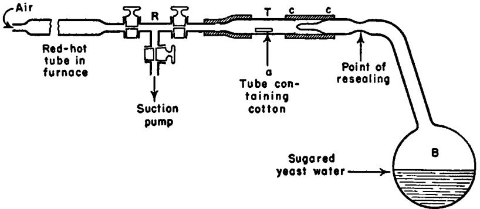

Here are the arrangements I have made to put the dusts from the air into putrefiable or fermentable liquids, in an atmosphere of air that has been heated.

Let us take our large flask containing sugared yeast water and calcined air. I shall suppose that the dask has been kept in a chamber at 25 o or 300 for one or two months without having shown any perceptible alteration— a manifest proof of the inactivity of the heated air with which the flask has been filled under ordinary atmospheric pressure.

The constricted neck of the flask remaining sealed, I connect it by means of a rubber tube to an apparatus arranged as shown in the accompanying figure. Τ is a hard-glass tube with internal diameter of 10 to 12 millimeters. In this I have placed a little tube *(a)* of small diameter and free to slip in the large tube. The little tube has open ends and contains part of one of the small wads of cotton loaded with dust. *R* is a brass tube in the form of a Τ and provided with stopcocks. One of these stopcocks is connected with the air pump [suction pump], the second with a platinum tube heated red hot, the third with tube T. The rubber tube connecting tube Τ with flask Β is shown at *cc.* 

When all the parts of the apparatus have been assembled and the platinum tube has been brought to red heat by a gas furnace, the vacuum pump is started after the stopcock leading to the platinum tube has been closed. This stopcock is later opened in such a way that the calcined air enters the apparatus very gradually. The evacuation and the admission of the calcined air are alternately repeated ten to twelve times. The litde tube carrying the cotton is thus filled with heated air, even in the smallest interstices of the cotton, but the cotton retains its dust. This done, I break the sealed tip of flask Β from outside the rubber tube *cc,* without loosening the latter's bindings [to flask Β and tube T]. Then [by lowering flask ß] I make the little tube containing the dust slip into the flask. Finally I use a [glassblowers'] lamp to reseal the drawn-out neck of the flask, which is then once again returned to the incubator. Now it happens without fail that growths begin to appear in the flask after 24, 36, or 48 hours at the most.

This is precisely the time required for the appearance of the same growths in sugared yeast water when it has been exposed to the contact of ordinary air. Here are the details of several experiments.

In the first days of November, 1859, I prepared several flasks of 250 cubic-centimeters capacity, holding 100 cubic centimeters of sugared yeast water and 150 cubic centimeters of heated air. The flasks remained in an incubator, at a temperature around 300 , until January 8, i860. On that day, at about 9 A.M., I used the apparatus shown in the figure to introduce into one of these flasks a portion of a wad of cotton charged with dust, which had been collected as explained in Chapter II.

On January 9th, at 9 A.M., the liquid in the flask showed no change. At 6 P.M. on the same day little tufts of mold could be seen very distinctly, growing from the tube containing the dust. The liquid remained perfectly limpid.

On January 10th, at 5 P.M., the liquid still maintained its perfect limpidity, aside from the silky tufts of mold. On the sides of the flask I now perceived a great number of white streaks which, when the flask was held to the light, displayed several iridescent colors.

On January nth the liquid had lost its limpidity. It was entirely turbid, so much so that the tufts of the Mycelium could no longer be distinguished.

Then, using a file, I opened the flask and studied with a microscope the different growths that had originated therein.

The turbidity of the liquid was due to a crowd of little bacteria, of the smallest dimension, very rapid in their movements, pirouetting in a lively manner or balancing themselves. The silky tufts were formed by a Mycelium with branched tubes.

Finally, the sort of pulverizable precipitate, that appeared on January

ioth in the form of white streaks, is made up of very fine "Torulacée." This "Torulacée" is frequently found in sugared albuminous liquids. It develops, for example, in beet juice which has been made a little acid, and in the urine of diabetic persons. It could easily be confused with brewers' yeast, which it very much resembles in its mode of development. However, the diameter of its globules is appreciably less than the diameter of the yeast globules — smaller by one third or even by one half. The globules of this "Torulacée" are only slightly granular, and are more translucid than the globules of brewers' yeast. The nucleus, when it is visible, is single and very clear. The globules of this "Torulacée" multiply by budding and resemble the branched form of brewers' yeast in process of multiplication.

Thus, here are three growths produced under the influence of the dusts which were sowed — growths of the same order as those that originate in these same sugared albuminous liquids when the liquids are left in contact with ordinary air.

On January 17th I introduced dust into two more of the flasks containing sugared yeast water which had remained unchanged since the month of November.

On the morning of the 19th the liquid in one of the flasks was very turbid. However, there was no appearance of Mycelium. The liquid in the other flask was still very limpid. There was no appearance of organized growth.

At 5 P.M. on the same day the first flask was in the same state; the turbidity had simply increased. As to the other, the limpidity of its liquid remained perfect, but a tuft of Mycelium was growing from the small tube containing the dust, and entirely wreathed its end.

On the 20th the state of the first flask had not changed perceptibly. The mold in the second had developed greatly, and a new mold had formed within the liquid. Besides, the limpidity of the liquid seemed slightly changed.

On the 21 st the liquid in the second flask was almost as turbid as that in the first, and the tufts of Mycelium had not increased since the day before — that is to say, not since the turbidity had appeared in the bulk of the liquid.

On the 22nd and 23rd of January the tufts of Mycelium remained the same. We shall see that the stoppage of the development of the Mycelium must be attributed to the presence of the Infusoria that rendered the liquid turbid. These Infusoria seize upon the dissolved oxygen, and so deprive the Mycelium of one of its most essential nutrients. This result is constant and explains why in the first flask, where Infusoria were the first growth to develop, no other organized growths appeared . . .

One might well ask whether the cotton used in these experiments has not had some influence on the results, since the cotton is itself an organic material [that is, a material that is uniquely the product of a living organism]. It is most important to know what would happen if the same manipulations were performed with flasks prepared as before, but without adding the dusts from the air. In other words, did the manipulations required to introduce the dusts have any influence? This we must know.

In order to answer these questions, I replaced the cotton by asbestos. Wads of asbestos, through which a current of ordinary air had been passed for several hours, were introduced into the flasks, following the same procedure as above, and they gave results of exactly the same sort as those just reported. But with wads of asbestos previously calcined and not charged with dust, *or charged with dust and afterwards heated, no turbidity, no Infusoria, no plants of any sort are produced. The liquids remain perfectly limpid.* [The phrases describing what appears to be the most convincing evidence have been italicized by the translator.] I have repeated these comparative experiments a great many times, and I have always been surprised by their clearness and perfect reproducibility. It would seem, indeed, that experiments of this delicacy should sometimes yield contradictory results, due to accidental sources of error. But, just as the sowing of dusts has always furnished living organisms, never once did my blank experiments show such growths.

With such results, confirmed and extended by those of the following chapters, I consider this as mathematically demonstrated: that all the organisms which appear in sugared albuminous solutions that have been boiled and then exposed to ordinary air have their origin in the solid particles suspended in the atmosphere.

But, on the other hand, we have seen in Chapter II that these solid particles include — amid a multitude of amorphous fragments of calcium carbonate, silica, soot, bits of wool, etc. — organized corpuscles that are indistinguishable from the little spores of the growths we have seen formed in sugared albuminous liquids. These corpuscles are therefore the fertile germs of these growths.

We may conclude, moreover, that if an Appert preserve formed of a sugared albuminous liquid, such as the must of raisins, does not change when it is brought in contact with air that has been heated (as Dr. Schwann was the first to observe) it is because the heat has destroyed the germs which the air was carrying. All the adversaries of spontaneous generation foresaw this. All I have done is to supply sure and decisive proofs. Nonprejudiced minds are now obliged to reject completely any idea that there exists in air a more or less mysterious principle, gas, fluid, ozone, etc. having the property of arousing life in infusions.

One might consider at this point a very interesting question, to which I shall return in a special publication, which will not fail to surprise the reader. Nothing is better adapted for the production of alcoholic fermentation than the liquid studied in the preceding pages. Sugared yeast water — like grape must, beer must, beet juice, etc. — is a liquid which readily ferments when exposed to ordinary air. But in a considerable number of experiments carried out as previously described, no fermentation of the sugared liquid could be obtained by sowing in it dusts from

the air. (I shall show later that this peculiarity arises from the relation between the volumes of air and liquid present in my experiments.)

I should here emphasize that there is nothing more contrary to the truth than the assertions often repeated by the partisans of the doctrine of spontaneous generation: "That the appearance of the first organisms is always preceded by phenomena of fermentation or putrefaction . . . that the formation of the animalcules in the macerated material is a consequence of the release of the gases formed by the decomposition of the substances used, and that it is only after these phenomena that a special film (pellicle) forms at the surface of the liquid" (Pouchet, 1859). Also, when some one speaks to me of the motion of fermentation which I set up in my liquids by sowing dust in them — *the fermentative movement necessary for the development of the germinal forces* [forces génésique] — I recognize only vague words to which experience teaches me to lend no real sense.

T he observations referred to in the last paragraphs of this section of Pasteur's "Memoir" have little to do with the question of spontaneous generation. They are preliminary to those studies which led Pasteur to state his famous doctrine that "fermentation is life without oxygen." With some modifications this statement is true today. Many microorganisms, which in the presence of oxygen derive the energy for their growth by oxidizing the substrate (that is, sugar) to carbon dioxide and water, may in the absence of oxygen obtain energy from fermentative processes. Thus, the change of sugar to alcohol and carbon dioxide yields the energy for the growth of yeast cells under anabolic (that is, oxygen-free) conditions.

As early as 1862, then, Pasteur saw the importance of the presence or absence of oxygen for fermentation. It is somewhat ironic that he failed to guess that for some microorganisms oxygen is essential for any growth and, further, that some of these aerobic bacteria form highly heat-resistant spores. Ignorant of these facts, Pasteur presents in Chapter V II of his historic "Memoir" evidence that he regards as proof that, by itself, a small quantity of air will not produce growths in a sterile medium. With sugared yeast water his experiments worked; with Pouchet's hay infusion they did not, for reasons already explained to the reader in the General Introduction.

#### **514 CASE 7**

#### 4. TRANSLATION OF A FURTHER PORTION OF PASTEUR'S "MEMOIR" OF 1862

#### CHAPTER VII

IT IS NOT TRUE THAT THE SMALLEST QUANTITY OF ORDINARY AIR IS SUFFICIENT TO PRODUCE IN AN INFUSION ORGANIZED LIFE CHARACTERISTIC OF THAT INFUSION — EXPERIMENTS WITH AIR FROM DIFFERENT LOCALITIES . . .

In the historical part of this Memoir I have already referred to the influence, on the subject with which we are concerned, of Gay-Lussac's celebrated investigation of the air in Appert's preserves, and of the illustrious natural philosopher's interpretation of his experiments. Here are his own words:

"By analyzing the air in bottles in which substances have been well preserved, one can convince oneself that it contains no oxygen and, consequently, that the absence of this gas is a necessary condition for the preservation of animal and vegetable substances."

There can be no doubt that the air from the preserves studied by Gay-Lussac was free of oxygen. No one would dare to suspect the accuracy of an analysis of air made by Gay-Lussac [who was the preeminent gas analyst of his time]. However, today it cannot be doubted even though no one has (as far as I know) repeated exactly these experiments of Gay-Lussac's — that Appert's preserves can contain oxygen, especially when they are newly prepared. From the analyses of air that I have reported elsewhere in this Memoir, it follows that the oxygen of air made inactive by heat, by Schwann's method, combines directly with organic materials, producing carbonic acid [carbon dioxide]. This is a very slow action. Nevertheless, direct oxidation exists: it cannot be denied. This oxidation may be more evident in Appert's preserves when they are being prepared, because of the elevated temperature. In all cases, if the preparation leaves any oxygen in the preserves, this gas will disappear little by little because of the direct oxidation of which I have just spoken. There is a circumstance which must do much to minimize or to reduce to zero the quantity of oxygen remaining in Appert's preserves: this circumstance is the ratio of the volume of air to the volume of organic matter. The preserves always contain very little air and a great deal of organic matter — a circumstance very favorable to the completion of the oxidative process [that is, to the complete exhaustion of the small amount of oxygen available in the container]. But, I repeat, nothing would be easier than the preparation of preserves in which oxygen remained, and there is room to believe that they often contain oxygen. Schwann's experiment leaves no doubt on this point.

This is why Gay-Lussac's interpretation of his analyses — namely, *that the absence of oxygen is requisite for preservation* [of organic materials] —is totally erroneous. However, not everyone has been able to draw the line between the truth of Gay-Lussac's observations and the error of his interpretation of them. Dr. Schwann should justly be regarded as the author of the true theory of Appert's procedures. Appert's preserves remain unspoiled in the presence of heated air: that is his discovery. The secret of their preservation is thus to be found not in the absence of oxygen,1 but in the destruction by heat of a principle contained in ordinary air.

But there is one implication of Gay-Lussac's experiments which Schwann's discovery did not discredit, an implication that Schwann's discovery rather tended to confirm. This implication has not been contested by the adversaries of the doctrine of spontaneous generation, and on it the partisans of this doctrine justly rest one of their principal objections. This implication is that the smallest quantity of common air, brought in contact with an infusion, soon produces therein the growth of the Mucedines and Infusoria that commonly occur in that infusion. [This *is* true if the spores of aerobic bacteria are present!]

This point of view has always been supported (at least indirecdy) by the set habit considered indispensable by investigators — the use of infinite precautions in their experiments to exclude ordinary air. We have seen that sometimes they recommend that the common air be heated; sometimes they treat it with active chemicals; often they take the preliminary step of treating all the components with steam at ioo° (Spallanzani^ experiment); and finally, on other occasions, they work with an artificial atmosphere. And if, under one of these various conditions, it happens that the experiment results in the production of organized life, then they do not hesitate to affirm that the operator has not known how to avoid completely the hidden influence of a small portion of ordinary air — however small it may be.

From this the partisans of the doctrine of spontaneous generation hasten on to a quite reasonable deduction. If the smallest quantity of ordinary air suffices for the production of organisms in any medium whatsoever, and if these organisms do not originate spontaneously, then

1 Although the absence of oxygen is not involved in the explanation of the Appert process, one should not conclude that in practice there would be no danger if much air were left in the preserves. For if the heat has not destroyed all the germs of Infusoria and Mucedines, carried by the air or the materials to be preserved, those germs that are still fertile could develop if oxygen were present. While in the absence of oxygen they will develop no more than if they had really been killed. But I believe that what is always most to be feared (and particularly when little oxygen is present) is the presence of the germs of animal or vegetable ferments that can live without air. Such germs must necessarily be killed by heat [for, if they are not, they will produce fermentation even in the absence of oxygen], I am persuaded that this is the danger most to be feared by the manufacturer of preserves. And I am inclined to believe that, for example, the animalcules known as the butyric infusoria (which I have recently described) develop in certain preserves which have been badly prepared.

it follows necessarily that in this indefinitely small portion of common air there must be the germs of a multitude of different organisms. Finally, if things are thus, then ordinary air must, to use M. Pouchet's expressions, be clogged with organic matter, forming a dense fog.

This reasoning is surely very cogent. It would be even more so if it had been established that the lower forms, of life are really as distinct as they appear to be, and consequently come from different germs. This is probable, but it has not been proved.

Here then is a serious and apparently well-founded difficulty. But does it not arise in exaggerations and in more or less erroneous observations? Is it true, as has been supposed, that there is in the earth's atmosphere a continuity of cause of the generations said to be spontaneous? *Is it certain that the smallest quantity of ordinary air is sufficient to produce organized lije in all infusions?* [The translator has italicized Pasteur's statement of the central issue.]

The following experiments answer all these questions.

In a series of flasks of 250 cubic-centimeter capacity I place the same putrescible liquid (yeast water; the same with sugar; urine, etc.), the liquid occupying about a third of the total volume. I taper the necks of the flasks with a glassblowers' lamp, I boil the liquid, and I seal off the tapered ends while the boiling is going on. A vacuum is thus formed in the flasks [since the steam has driven out all the air]. Then I break off the sealed tips of the flasks in a specified location. Ordinary air rushes in violently, carrying with it all the dusts that it holds in suspension and all the known or unknown principles associated with it. Then, barely touching them with a flame, I immediately reseal the flasks, and I place them in an incubator at 25e or 300 — that is to say, at the most favorable temperature for the development of animalcules and Mucors.

Here are the results of these experiments, results inconsistent with the principles generally accepted and, on the contrary, in perfect agreement with the idea of a dissemination of germs.

Generally the liquid changes after a very few days, and a great variety of organisms can be seen growing in the flasks . . . But, on the other hand, it happens frequently (several times in each series of trials) that the liquid remains absolutely unchanged, however long it is left in the incubator, just as if calcined air had been admitted . . .

The remainder of this chapter of Pasteur's "Memoir" is taken up with a lengthy record of many experiments performed under a great variety of conditions. Pasteur had developed a method, it should be noted, for testing the assumption referred to in the opening paragraphs of this section of his paper. He raised the question : "Are we perfectly sure that the smallest quantity of ordinary air is sufficient to produce organized life in any infusion?" Then he proceeded to devise the apparatus necessary to answer this question and went on to carry out the tests. (One might say that Pasteur put forward the working hypothesis that the smallest quantity of ordinary air is sufficient to produce organized life in any infusion, and proceeded to test the deduction by specific experiments.) His results can be summed up in a few words. If a number of flasks are opened in any given locality, then sealed off and placed in an incubator, the subsequent appearances are not uniform. Almost without exception the contents of some flasks remain unchanged, while the contents of others soon show evidence of fermentation. Clearly the variable is the nature of the small amount of air that rushes in when the flasks are opened. This in turn depends on the locality in which they are opened. In short, Pasteur had demonstrated what he called the "discontinuity of the causes of so-called spontaneous generation." If all the flasks opened in all localities had shown evidence of fermentation, then one could have maintained that living organisms develop spontaneously when oxygen is admitted. This was, in fact, what his rival Pouchet claimed.

Both Pasteur and Pouchet assumed that boiling water would kill all living organisms (or their "seeds"). This is erroneous. Both assumed that "sugared yeast water" and hay infusion were equivalent in these experiments. This was unwarranted. Pasteur assumed that only the presence or absence of microorganisms in the entering air would affect the subsequent development of living organisms. Pouchet assumed that only the presence or absence of oxygen determined the subsequent events in the flasks in question. Actually *both* variables were involved in the case of hay infusion that had been heated only to boiling. The clarification of the matter, it should be noted, rested on subsequent experimental findings related to the controversy but not directly concerned with it. One had to go beyond the experiment that seemed designed to give a yes or no answer to the logical deductions from the grand working hypothesis. New modes of experimentation had to be developed before a baffling contradiction could be cleared up. Some idea of how this was done can be obtained from Tyndall's paper which now follows.

#### 5. TYNDALL'S ARTICLE ON SPONTANEOUS GENERATION

The following is part of an article first published in 1878 in *The Nineteenth Century.* This article, subsequently reprinted in Tyndall's influential *Essays on the Floating Matter in the Air in Relation to Putrefaction and Infection* (London, 1881), presents a summary account of experiments on spontaneous generation originally reported by Tyndall in 1876 and 1877 in the *Philosophical Transactions of the Royal Society.* The material enclosed in brackets has been added by the editor of this case history.

During the ten years extending from 1859 to 1869, researches on radiant heat in its relations to the gaseous form of matter occupied my continual attention. When air was experimented on, I had to cleanse it effectually of floating matter, and while doing so I was surprised to notice that, at the ordinary rate of transfer, such matter passed freely through alkalis, acids, alcohols, and ethers. The eye being kept sensitive by darkness, a concentrated beam of light was found to be a most searching test for suspended matter both in water and in air — a test indeed indefinitely more searching and severe than that furnished by the most powerful microscope. With the aid of such a beam I examined air filtered by cotton wool; air long kept free from agitation, so as to allow the floating matter to subside; calcined air, and air filtered by the deeper cells of the human lungs.

Tyndall had discovered that the last portion of a breath expelled from the lungs is remarkably free from suspended dust. Shortly afterward the full significance of this discovery was brought home to him by a statement made by Joseph Lister (1827—1912), who, by his introduction of the antiseptic method in surgery, made one of the earliest and most striking applications of the germ theory of disease which grew out of Pasteur's microbiological studies of fermentation and spontaneous generation.

Lister stated that: "I have explained to my own mind the remarkable fact that in simple fracture of the ribs, if the lung be punctured by a fragment, the blood effused into the pleural cavity, though freely mixed with air, undergoes no decomposition .. . (if the blood in the pleura were to putrefy, it would infallibly occasion dangerous suppurative pleurisy). Why air introduced into the pleural cavity through a wounded lung should have such wholly different effects from that entering directly, through a wound in the chest, was to me a complete mystery until I heard of the germ theory of putrefaction, when it at once occurred to me that it was only natural that air should be filtered of germs by the air passages, one of whose offices is to arrest inhaled particles of dust, and prevent them from entering the air-cells."

When, in 1869, Tyndall first discovered the remarkably complete absence of dust from exhaled air, particularly toward the end of the expiration, he was engaged in physical researches unrelated to the problem of spontaneous generation. On subsequently encountering Lister's conjecture, noted above, Tyndall recognized that his own observation demonstrated that, in its freedom from dust, air filtered by the deeper cells of the human lungs is "in the precise condition required by Professor Lister's explanation." Thus Tyndall was led to see that his purely physical studies of the optical effects of dust in air might have an important bearing on the biological problem of spontaneous generation.

Lister's most important work in the applied art of surgery was inspired by Pasteur's fundamental studies of fermentation and spontaneous generation. And, as an example of the reciprocal interaction of fundamental and applied science, we see here how Tyndall's fundamental study of spontaneous generation was stimulated by Lister.

In all cases the correspondence between my experiments and those of Schwann, Schroeder, Pasteur, and Lister in regard to spontaneous generation was perfect. The air which they found inoperative was proved by the luminous beam to be optically pure and therefore germless. Having worked at the subject both by experiment and reflection, on Friday evening, January 21, 1870,1 brought it before the members of the Royal Institution. Two or three months subsequendy, for sufficient practical reasons, I ventured to direct public attention to the subject in a letter to the *Times.* Such was my first contact with this important question.

This letter, I believe, gave occasion for the first public utterance of Dr. Bastian in relation to this subject. He did me the honour to inform me, as others had informed Pasteur, that the subject 'pertains to the biologist and physician.' He expressed 'amazement' at my reasoning, and warned me that before what I had done could be undone 'much irreparable mischief might be occasioned.' With far less preliminary experience to guide and warn him, the English heterogenist [upholder of the doctrine of spontaneous generation] was far bolder than Pouchet in his experiments, and far more adventurous in his conclusions. With organic infusions he obtained the results of his celebrated predecessor, but he did much more — the atoms and molecules of inorganic liquids passing under his manipulation into those more 'complex chemical compounds,' which we dignify by calling them 'living organisms.'1 As regards the public who take an interest in such things, and apparendy also as regards a large portion of the medical profession, our extremely clever countryman succeeded in restoring the subject to a state of uncertainty similar to that which followed the publication of Pouchet's volume in 1859.

Writing in 1876, Tyndall had offered a fuller view of the lack of decisiveness displayed by Pasteur's 'decisive proofs.' Tyndall remarked that: "Pasteur's labors, which have so long been considered models by most of us, have been subjected to rough handling of late. His reasoning has been criticized, and experiments counter to his have been adduced in such number and variety, and with such an appearance of

1 'It is further held that bacteria or allied organisms are prone to be engendered as correlative products, coming into existence in the several fermentations, just as independently as other less complex chemical compounds.' — Bastian, *Trans, of Pathological Society,* vol. xxvi. 258.

circumstantial accuracy, as to render the evidence against him overwhelming to many minds. This, I have reason to know, has been the effect wrought, not only upon persons untrained in science, but also upon biologists of eminence both in this country and America. The state of medical opinion in England is correctly described in a recent number of the 'British Medical Journal,' where, in answer to the question, 'In what way is contagium generated and communicated?' we have the reply that, notwithstanding 'an almost incalculable amount of patient labor, the actual results obtained, especially as regards the manner of generation of contagium, have been most disappointing. Observers are even yet at variance whether these minute particles, whose discovery we have just noticed, and other disease-germs, are always produced from like bodies previously existing, or whether they do not, under certain favorable conditions, spring into existence *de novo.* 

It is desirable that this uncertainty should be removed from all minds, and doubly desirable on practical grounds that it should be removed from the minds of medical men. In the present article, therefore, I propose discussing this question face to face with some eminent and fair-minded member of the medical profession who, as regards spontaneous generation, entertains views adverse to mine. Such a one it would be easy to name; but it is perhaps better to rest in the impersonal. I shall therefore

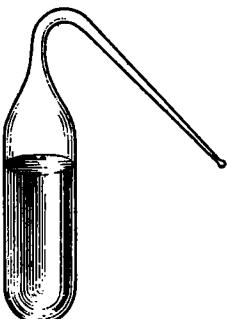

simply call my proposed co-inquirer my friend. With him at my side, I shall endeavour, to the best of my ability, so to conduct this discussion that he who runs may read and that he who reads may understand.

Let us begin at the beginning. I ask my friend to step into the laboratory of the Royal Institution, where I place before him a basin of thin turnip slices barely covered with distilled water kept at a temperature of 1200 Fahr. After digesting the turnip for four or five hours we pour off the liquid, boil it, filter it, and obtain an infusion as clear as filtered drinking water. We cool the infusion, test its specific gravity, and find it to be 1006 or higher — water being 1000. A number of small clean empty

flasks, of the shape shown in the figure, are before us. One of them is slightly warmed with a spirit-lamp, and its open end is then dipped into the turnip infusion. The warmed glass is afterwards chilled, the air within the flasks cools, contracts, and is followed in its contraction by the infusion. Thus we get a small quantity of liquid into the flask. We now heat this liquid carefully. Steam is produced, which issues from the open neck, carrying the air of the flask along with it. After a few seconds' ebullition, the open neck is again plunged into the infusion. The steam within the flask condenses, the liquid enters to supply its place, and in this way we fill our little flask to about four-fifths of its volume. This description is typical; we may thus fill a thousand flasks with a thousand different infusions.

I now ask my friend to notice a trough made of sheet copper, with two rows of handy little Bunsen burners underneath it. This trough, or bath, is nearly filled with oil; a piece of thin plank constitutes a kind of lid for the oil-bath. The wood is perforated with circular apertures wide enough to allow our small flask to pass through and plunge itself in the oil, which has been heated, say, to 2500 Fahr. Clasped all round by the hot liquid, the infusion in the flask rises to its boiling point, which is not sensibly over 212 0 Fahr. Steam issues from the open neck of the flask, and the boiling is continued for five minutes. With a pair of small brass tongs, an assistant now seizes the neck near its junction with the flask, and partially lifts the latter out of the oil. The steam does not cease to issue, but its violence is abated. With a second pair of tongs held in one hand, the neck of the flask is seized close to its open end, while with the other hand a Bunsen's flame or an ordinary spirit flame is brought under the middle of the neck. The glass reddens, whitens, softens, and as it is gently drawn out the neck diminishes in diameter, until the canal is completely blocked up. The second pair of tongs with the fragment of severed neck being withdrawn, the flask, with its contents diminished by evaporation, is lifted from the oil-bath perfectly sealed hermetically.

Sixty such flasks filled, boiled, and sealed in the manner described, and containing strong infusions of beef, mutton, turnip, and cucumber, are carefully packed in sawdust, and transported to the Alps. Thither, to an elevation of about 7,000 feet above the sea, I invite my co-inquirer to accompany me. It is the month of July, and the weather is favourable to putrefaction. We open our box at the Bel Alp, and count out fifty-four flasks, with their liquids as clear as filtered drinking water. In six flasks, however, the infusion is found muddy. We closely examine these, and discover that every one of them has had its fragile end broken off in the transit from London. Air has entered the flasks, and the observed muddiness is the result. My colleague knows as well as I do what this means. Examined with a pocket-lens, or even with a microscope of insufficient power, nothing living is seen in the muddy liquid; but regarded with a magnifying power of a thousand diameters or so, what an astonishing appearance does it present! Leeuwenhoek [Antony van Leeuwenhoek (1632—1723), a pioneer in the use of the microscope]

estimated the population of a single drop of stagnant water at 500,000,000: probably the population of a drop of our turbid infusion would be this many times multiplied. The field of the microscope is crowded with organisms, some wabbling slowly, others shooting rapidly across the microscopic field. They dart hither and thither like a rain of minute projectiles; they pirouette and spin so quickly round, that the retention of the retinal impression transforms the little living rod into a twirling wheel. And yet the most celebrated naturalists tells us they are vegetables. From the rod-like shape which they so frequently assume, these organisms are called 'bacteria' — a term, be it here remarked, which covers organisms of very diverse kinds.

Has this multitudinous life been spontaneously generated in these six flasks, or is it the progeny of living germinal matter carried into the flasks by the entering air? If the infusions have a self-generative power, how are the sterility and consequent clearness of the fifty-four uninjured flasks to be accounted for? My colleague may urge — and fairly urge that the assumption of germinal matter is by no means necessary; that the air itself may be the one thing needed to wake up the dormant infusions. We will examine this point immediately. But meanwhile 1 would remind him that I am working on the exact lines laid down by our most conspicuous heterogenist [Bastian]. He distinctly affirms that the withdrawal of the atmospheric pressure above the infusion favours the production of organisms; and he accounts for their absence in tins of preserved meat, fruit, and vegetables, by the hypothesis that fermentation *has* begun in such tins, that gases *have* been generated, the pressure of which has stifled the incipient life and stopped its further development.1 This is the new theory of preserved meats. Had Dr. Bastian pierced a tin of preserved meat, fruit, or vegetable under water with the view of testing its truth, he would have found it erroneous. In well-preserved tins he would have found, not an outrush of gas, but an inrush of water. I have noticed this recently in tins which have lain perfectly good for sixty-three years in the Royal Institution. Modern tins, subjected to the same test, yielded the same result. From time to time, moreover, during the last two years, I have placed glass tubes, containing clear infusions of turnip, hay, beef, and mutton, in iron bottles, and subjected them to air-pressures varying from ten to twenty-seven atmospheres—• pressures, it is needless to say, far more than sufficient to tear a preserved meat tin to shreds. After ten days these infusions were taken from their bottles rotten with putrefaction and teeming with life. Thus collapses an hypothesis which had no rational foundation, and which could never have seen the light had any well-directed attempt been made to verify it.

Our fifty-four vacuous and pellucid flasks also declare against the heterogenist. We expose them to a warm Alpine sun by day, and at night we suspend them in a warm kitchen. Four of them have been accidentally broken; but at the end of a month we find the fifty remaining ones as

1 'Beginnings of Life,' vol. i. p. 418.

clear as at the commencement. There is no sign of putrefaction or of life in any of them. We divide these flasks into two groups of twentythree and twenty-seven respectively (an accident of counting rendered the division uneven). The question now is whether the admission of air can liberate any generative energy in the infusions. Our next experiment will answer this question and something more. We carry the flasks to a hayloft, and there, with a pair of steel pliers, snip off the sealed ends of the group of three-and-twenty. Each snipping off is of course followed by an inrush of air. We now carry our twenty-seven flasks, our pliers, and a spirit-lamp, to a ledge overlooking the Aletsch glacier, about 200 feet above the hayloft, from which ledge the mountain falls almost precipitously to the north-east for about a thousand feet. A gende wind blows towards us from the north-east — that is, across the crests and snowfields of the Oberland mountains. We are therefore bathed by air which must have been for a good while out of practical contact with either animal or vegetable life. I stand carefully to leeward of the flasks, for no dust or particle from my clothes or body must be blown towards them. An assistant ignites the spirit-lamp, into the flame of which I plunge the pliers, thereby destroying all attached germs or organisms. Then I snip off the sealed end of the flask. Prior to every snipping the same process is gone through, no flask being opened without the previous cleansing of the pliers by the flame. In this way we charge our seven-and-twenty flasks with clean vivifying mountain air.

We place the fifty flasks, with their necks open, over a kitchen stove, in a temperature varying from 500 to 900 Fahr., and in three days find twenty-one out of the twenty-three flasks opened on the hayloft invaded by organisms — two only of the group remaining free from them. After three weeks' exposure to precisely the same conditions, *not one of the twenty-seven flasks opened in free air had given way.* No germ from the kitchen air had ascended the narrow necks, the flasks being shaped so as to avoid this contingency. They are still in the Alps, as clear, I doubt not, and as free from life as they were when sent off from London.1

What is my colleague's conclusion from the experiment before us Ρ Twenty-seven putrescible infusions, first in vacuo, and afterwards supplied with the most invigorating air, have shown no sign of putrefaction or of life. And as to the others, I almost shrink from asking him whether the hayloft has rendered them spontaneously generative. Is not the inference here imperative that it is not the air of the loft — which is connected through a constantly open door with the general atmosphere but something contained in the air, that has produced the effects observed? What is this something? A sunbeam entering through a chink in the roof or wall, and traversing the air of the loft, would show it to be laden with suspended dust particles. Indeed the dust is distinctly visible in the diffused daylight. Can *it* have been the origin of the

1 An actual experiment made at the Bel Alp is here described. observed life? If so, are we not bound by all antecedent experience to regard these fruitful particles as the germs of the life observed?

• a · · · ·

Let us now return to London and fix our attention on the dust of *its*  air. Suppose a room in which the housemaid has just finished her work to be completely closed, with the exception of an aperture in a shutter through which a sunbeam enters and crosses the room. The floating dust reveals the track of the light. Let a lens be placed in the aperture to condense the beam. Its parallel rays are now converged to a cone, at the apex of which the dust is raised to almost unbroken whiteness by the intensity of its illumination. Defended from all glare, the eye is peculiarly sensitive to this scattered light. The floating dust of London rooms is organic, and may be burned without leaving visible residue. The action of a spirit-lamp flame upon the floating matter has been elsewhere thus described: —

"In a cylindrical beam which strongly illuminated the dust of our laboratory, I placed an ignited spirit lamp. Mingling with the flame, and round its rim, were seen curious wreaths of darkness resembling an intensely black smoke. On placing the flame at some distance below the beam, the same dark masses stormed upwards. They were blacker than the blackest smoke ever seen issuing from the funnel of a steamer; and their resemblance to smoke was so perfect as to prompt the conclusion that the apparently pure flame of the alcohol-lamp required but a beam of sufficient intensity to reveal its clouds of liberated carbon.

"But is the blackness smoke? This question presented itself in a moment, and was thus answered: A red-hot poker was placed underneath the beam; from it the black wreaths also ascended. A large hydrogen flame, which emits no smoke, was next employed, and it also produced with augmented copiousness those whirling masses of darkness. Smoke being out of the question, what is the blackness ? Is it simply that of stellar space; that is to say, blackness resulting from the absence from the track of the beam of all matter competent to scatter its light. When the flame was placed below the beam, the floating matter was destroyed *in situ·,* and the heated air, freed from this matter, rose into the beam, jostled aside the illuminated particles, and substituted for their light the darkness due to its own perfect transparency. Nothing could more forcibly illustrate the invisibility of the agent which renders all things visible. The beam crossed, unseen, the black chasm formed by the transparent air, while, at both sides of the gap, the thick-strewn particles shone out like a luminous solid under the powerful illumination."

Supposing an infusion intrinsically barren, but readily susceptible of putrefaction when exposed to common air, to be brought into contact with this unilluminable air, what would be the result? It would never putrefy. It might, however, be urged that the air is spoiled by its violent calcination. Oxygen passed through a spirit-lamp flame is, it may be thought, no longer the oxygen suitable for the development and maintenance of life. We have an easy escape from this difficulty, which is based, however, upon the unproved assumption that the air has been affected by the flame. Let a condensed beam be sent through a large flask or bolthead [a glass vessel having a long, straight neck] containing common air. Th e track of the beam is seen within the flask — the dust revealing the light, and the light revealing the dust. Cork the flask, stuff its neck with cotton-wool, or simply turn it mouth downwards and leave it undisturbed for a day or two. Examined afterwards with the luminous beam, no track is visible; the light passes through the flask as through a vacuum. The floating matter has abolished itself, being now attached to the interior surface of the flask. Wer e it our object, as it will be subsequently, to effectually detain the dirt, we might coat that surface with some sticky substance. Here, then, without 'torturing' the air in any way, we have found a means of ridding it, or rather of enabling it to rid itself, of floating matter.

W e have now to devise a means of testing the action of such spontaneously purified air upon putrescible infusions. Wooden chambers, or cases, are accordingly constructed, having glass fronts, side-windows, and back-doors. Through the bottoms of the chambers test-tubes pass airtight; their open ends, for about one-fifth of the length of the tubes, being within the chambers. Provision is made for a free connexion through sinuous channels between the inner and the outer air. Through such channels, though open, no dust will reach the chamber. Th e top of each chamber is perforated by a circular hole two inches in diameter, closed air-tight by a sheet of india-rubber. Thi s is pierced in the middle by a pin, and through the pinhole is pushed the shank of a long pipette, ending above in a small funnel. Th e shank also passes through a stuffing box of cotton-wool moistened with glycerine; so that, tightly clasped by the rubber and wool, the pipette is not likely in its motions up and down to carry any dust into the chamber. The annexed figure shows a chamber, with six test-tubes, its side-windows *tv tv,* its pipette ρ *c,* and its sinuous channels *a b* which connect the air of the chamber with the outer air.

T h e chamber is carefully closed and permitted to remain quiet for two or three days. Examined at the beginning by a beam sent through its windows, the air is found laden with floating matter, which in three days has wholly disappeared. T o prevent its ever rising again, the internal surface of the chamber was at the outset coated with glycerine. T h e fresh but putrescible liquid is introduced into the six tubes in succession by means of the pipette. Permitted to remain without further precaution, every one of the tubes would putrefy and fill itself with life. T h e liquid has been in contact with the dust-laden air outside by which it has been infected, and the infection must be destroyed. Thi s is done by plunging the six tubes into a bath of heated oil and boiling the infusion. The time requisite to destroy the infection depends wholly upon its nature. Tw o minutes' boiling suffices to destroy some contagia, whereas two hundred minutes' boiling fails to destroy others. After the infusion has been sterilized, the oil-bath is withdrawn, and the liquid,

whose putrescibility has been in no way affected by the boiling, is abandoned to the air of the chamber.

With such chambers I tested, in the autumn and winter of 1875—6, infusions of the most various kinds, embracing natural animal liquids, the flesh and viscera of domestic animals, game, fish, and vegetables. More than fifty chambers, each with its series of infusions, were tested, many of them repeatedly. There was no shade of uncertainty in any of the results. In every instance we had, within the chamber, perfect limpidity and sweetness, which in some cases lasted for more than a year — without the chamber, with the same infusion, putridity and its

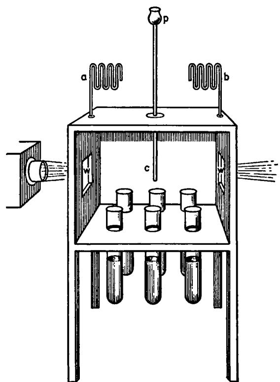

characteristic smells. In no instance was the least countenance lent to the notion that an infusion deprived by heat of its inherent life, and placed in contact with air cleansed of its visibly suspended matter, has any power to generate life anew.

Remembering then the number and variety of the infusions employed, and the strictness of our adherence to the rules of preparation laid down by the heterogenists themselves; remembering that we have operated upon the very substances recommended by them as capable of furnishing, even in untrained hands, easy and decisive proofs of spontaneous generation, and that we have added to their substances many others of our own — if this pretended generative power were a reality, surely it must have manifested itself somewhere. Speaking roundly, I should say that in such closed chambers at least five hundred chances have been given to it, but it has nowhere appeared.

The argument is now to be clenched by an experiment which will remove every residue of doubt as to the ability of the infusions here employed to sustain life. We open the back doors of our sealed chambers, and permit the common air with its floating particles to have access to our tubes. For three months they have remained pellucid and sweet flesh, fish, and vegetable extracts purer than ever cook manufactured. Three days' exposure to the dusty air suffices to render them muddy, fetid, and swarming with infusorial life. The liquids are thus proved, one and all, ready for putrefaction when the contaminating agent is applied. I invite my colleague to reflect on these facts. How will he account for the absolute immunity of a liquid exposed for months in a warm room to optically pure air, and its infallible putrefaction in a few days when exposed to dust-laden air? He must, I submit, bow to the conclusion that the dust-particles are the cause of putrefactive life. And unless he accepts the hypothesis that these particles, being dead in the air, are in the liquid miraculously kindled into living things, he must conclude that the life we have observed springs from germs or organisms diffused through the atmosphere.

The experiments with hermetically-sealed flasks have reached the number of 940. A sample group of 130 of them were laid before the Royal Society on January 13, 1876. They were utterly free from life, having been completely sterilized by three minutes' boiling. Special care had been taken that the temperatures to which the flasks were exposed should include those previously alleged to be efficient. The conditions laid down by the heterogenist were accurately copied, but there was no corroboration of his results. Stress was then laid on the question of warmth, thirty degrees being suddenly added to the temperatures with which both of us had previously worked. Waiving all protest against the caprice thus manifested, I met this new requirement also. The sealed tubes, which had proved barren in the Royal Institution, were suspended in perforated boxes, and placed under the supervision of an intelligent assistant in the Turkish Bath in Jermyn Street. From two to six days had been allowed for the generation of organisms in hermetically-sealed tubes. Mine remained in the washing-room of the bath for nine days. Thermometers placed in the boxes, and read off twice or three times a day, showed the temperature to vary from a minimum of ioi° to a maximum of *112°* Fahr. At the end of nine days the infusions were as clear as at the beginning. They were then removed to a warmer position. A temperature of 115 0 had been mentioned as particularly favourable to spontaneous generation. For fourteen days the temperature of the Turkish Bath hovered about this point, falling once as low as io6°, reaching 1160 on three occasions, 118° on one, and 1190 on two. The

result was quite the same as that just recorded. The higher temperatures proved perfectly incompetent to develop life.

Taking the actual experiment we have made as a basis of calculation, if our 940 flasks were opened on the hayloft of the Bel Alp, 858 of them would become filled with organisms. The escape of the remaining 82 strengthens our case, proving as it does conclusively that not in the air, nor in the infusions, nor in anything continuous diffused through the air, but in *discrete particles,* suspended in the air and nourished by the infusions, we are to seek the cause of life. Our experiment proves these particles to be in some cases so far apart on the hayloft as to permit 10 per cent, of our flasks to take in air without contracting contamination. A quarter of a century ago Pasteur proved the cause of 'so-called spontaneous generation to be *discontinuous.* [See page 517.] I have already referred to his observation that 12 out of 20 flasks opened on the plains escaped infection, while 19 out of 20 flasks opened on the Mer de Glace escaped. Our own experiment at the Bel Alp is a more emphatic instance of the same kind, 90 per cent, of the flasks opened in the hayloft being smitten, while not one of those opened on the free mountain ledge was attacked.

The power of the air as regards putrefactive infection is incessantly changing through natural causes, and we are able to alter it at will. Of a number of flasks opened in 1876 in the laboratory of the Royal Institution, 42 per cent, were smitten, while 58 per cent, escaped. In 1877 the proportion in the same laboratory was 68 per cent, smitten, to 32 intact. The greater mortality, so to speak, of the infusions in 1877 was due to the presence of hay which diffused its germinal dust in the laboratory air, causing it to approximate as regards infective virulence to the air of the Alpine loft. I would ask my friend to bring his scientific penetration to bear upon all the foregoing facts. They do not prove spontaneous generation to be 'impossible.' My assertions, however, relate not to 'possibilities,' but to *proofs,* and the experiments just described do most distinctly prove the evidence on which the heterogenist relies to be written on waste paper.

My colleague will not, I am persuaded, dispute these results; but he may be disposed to urge that other able and honourable men working at the same subject have arrived at conclusions different from mine. Most freely granted; but let me here recur to the remarks already made in speaking of the experiments of Spallanzani, to the effect that the failure of others to confirm his results by no means upsets their evidence. To fix the ideas, let us suppose that my colleague comes to the laboratory of the Royal Institution, repeats there my experiments, and obtains confirmatory results; and that he then goes to University or King's College, where, operating with the same infusions, he obtains contradictory results. Will he be disposed to conclude that the selfsame substance is barren in Albemarle Street and fruitful in Gower Street or the Strand? His Alpine experience has already made known to him the literally infinite differences existing between different samples of air as regards their capacity for

putrefactive infection. And, possessing this knowledge, will he not substitute for the adventurous conclusion that an organic infusion is barren at one place and spontaneously generative at another, the more rational and obvious one that the atmospheres of the two localities which have had access to the infusion are infective in different degrees ?

As regards workmanship, moreover, he will not fail to bear in mind, that *fruitfulness* may be due to errors of manipulation, while *barrenness*  involves the presumption of correct experiment. It is only the careful worker that can secure the latter, while it is open to every novice to obtain the former. Barrenness is the result at which the conscientious experimenter, whatever his theoretic convictions may be, ought to aim, omitting no pains to secure it, and resorting, only when there is no escape from it, to the conclusion that the life observed comes from no source which correct experiment could neutralize or avoid.

Let us again take a definite case. Supposing my colleague to operate with the same apparent care on 100 infusions — or rather on 100 samples of the same infusion — and that 50 of them prove fruitful and 50 barren. Are we to say that the evidence for and against heterogeny is equally balanced? There are some who would not only say this, but who would treasure up the 50 fruitful flasks as 'positive' results, and lower the evidential value of the 50 barren flasks by labelling them 'negative' results. This , as shown by Dr. William Roberts, is an exact inversion of the true order of the terms positive and negative.1 Not such, I trust, would be the course pursued by my friend. As regards the 50 fruitful flasks he would, I doubt not, repeat the experiment with redoubled care and scrutiny, and not by one repetition only, but by many, assure himself that he had not fallen into error. Such faithful scrutiny, fully carried out, would infallibly lead him to the conclusion that here, as in all other cases, the evidence in favour of spontaneous generation crumbles in the grasp of the competent inquirer.

T he botanist knows that different seeds possess different powers of resistance to heat.2 Some are killed by a momentary exposure to the boiling temperature, while others withstand it for several hours. Most of our ordinary seeds are rapidly killed, while Pouchet made known to the Paris Academy of Sciences in 1866, that certain seeds, which had been transported in fleeces of wool from Brazil, germinated after four hours' boiling. The germs of the air vary as much among themselves as the seeds of the botanist. In some localities the diffused germs are so tender that boiling for five minutes, or even less, would be sure to destroy them all; in other localities the diffused germs are so obstinate, that many

1 See his truly philosophical remarks on this head in the British Medical Journal, 1876, p. 282.

2 1 am indebted to Dr. Thiselton Dyer for various illustrations of such differences. It is, however, surprising that a subject of such high scientific importance should not have been more thoroughly explored. Here the scoundrels who deal in killed seeds might be able to add to our knowledge.

hours' boiling would be requisite to deprive them of their power of germination. The absence or presence of a truss of desiccated hay would produce differences as great as those here described. The greatest endurance that I have ever observed — and I believe it is the greatest on record — was a case of survival after eight hours' boiling.

As regards their power of resisting heat, the infusorial germs of our atmosphere might be classified under the following and intermediate heads: Killed in five minutes; not killed in five minutes but killed in fifteen; not killed in fifteen minutes but killed in thirty; not killed in thirty minutes but killed in an hour; not killed in an hour but killed in two hours; not killed in two but killed in three hours; not killed in three but killed in four hours. I have had several cases of survival after four and five hours' boiling, some survivals after six, and one after eight hours' boiling. Thus far has experiment actually reached; but there is no valid warrant for fixing upon even eight hours as the extreme limit of vital resistance. Probably more extended researches (though mine have been very extensive) would reveal germs more obstinate still. It is also certain that we might begin earlier, and find germs which are destroyed by a temperature far below that of boiling water. In the presence of such facts, to speak of a death-point of bacteria and their germs would be unmeaning — but of this more anon.

'What present warrant,' it has been asked, 'is there for supposing that a naked, or almost naked, speck of protoplasm can withstand four, six, or eight hours' boiling?' Regarding naked specks of protoplasm I make no assertion. I know nothing about them, save as the creatures of fancy. But I do affirm, not as a 'supposition,' nor an 'assumption,' nor a 'probable guess,' nor as 'a wild hypothesis,' but as a matter of the most undoubted fact, that the spores of the hay bacillus, when thoroughly desiccated [dried] by age, have withstood the ordeal mentioned. [These are the spores that gave Pouchet his apparent evidence of spontaneous generation caused by oxygen]. And I further affirm that these obdurate germs, under the guidance of the knowledge that they *are* germs, can be destroyed by five minutes' boiling, or even less. This needs explanation. The finished bacterium perishes at a temperature far below that of boiling water, and it is fair to assume that the nearer the germ is to its final sensitive condition the more readily will it succumb to heat. Seeds soften before and during germination. This premised, the simple description of the following process will suffice to make its meaning understood.

An infusion infected with the most powerfully resistent germs, but otherwise protected against the floating matters of the air, is gradually raised to its boiling-point. Such germs as have reached the soft and plastic state immediately preceding their development into bacteria are thus destroyed. The infusion is then put aside in a warm room for ten or twelve hours. If for twenty-four, we might have the liquid charged with well-developed bacteria. To anticipate this, at the end of ten or twelve hours we raise the infusion a second time to the boiling temperature, which, as before, destroys all germs then approaching their point

of final development. Th e infusion is again put aside for ten or twelve hours, and the process of heating is repeated. W e thus kill the germs *in the order of their resistance,* and finally kill the last of them. N o infusion can withstand this process if it be repeated a sufficient number of times. Artichoke, cucumber, and turnip infusions, which had proved specially obstinate when infected with the germs of desiccated hay, were completely broken down by this method of discontinuous heating, three minutes being found sufficient to accomplish what three hundred minutes' continuous boiling failed to accomplish. I applied the method, moreover, to infusions of various kinds of hay, including those most tenacious of life. No t one of them bore the ordeal. These results were clearly foreseen before they were realizd, so that the germ theory fulfils the test of every true theory, that test being the power of prevision. [But how Needham's ghost might have objected to this *repeated* torture of the materials in the infusions!]

When 'naked or almost naked specks of protoplasm' are spoken of, the imagination is drawn upon, not the objective truth of Nature. Such words sound like the words of knowledge where knowledge is really *nil.*  T h e possibility of a 'thin covering' is conceded by those who speak in this way. Such a covering may, however, exercise a powerful protective influence. A thin pellicle of india-rubber, for example, surrounding a pea keeps it hard in boiling water for a time sufficient to reduce an uncovered pea to a pulp. The pellicle prevents imbibition, diffusion, and the consequent disintegration. A greasy or oily surface, or even the layer of air which clings to certain bodies, would act to some extent in a similar way. 'The singular resistance of green vegetables to sterilization,' says D r . William Roberts, 'appears to be due to some peculiarity of the surface, perhaps their smooth glistening epidermis which prevented complete wetting of their surfaces.' I pointed out in 1876 that the process by which an atmospheric germ is wetted would be an interesting subject of investigation. A dry miscroscope covering-glass may be caused to float on water for a year. A sewing-needle may be similarly kept floating, though its specific gravity is nearly eight times that of water. Wer e it not for some specific relation between the matter of the germ and that of the liquid into which it falls, wetting would be simply impossible. Antecedent to all development there must be an interchange of matter between the germ and its environment; and this interchange must obviously depend upon the relation of the germ to its encompassing liquid. Anything that hinders this interchange retards the destruction of the germ in boiling water. In my paper, published in the 'Philosophical Transactions' for 1877, 1 add the following remark: —

"It is not difficult to see that the surface of a seed or germ may be so affected by desiccation and other causes as practically to prevent contact between it and the surrounding liquid. Th e body of a germ, moreover, may be so indurated by time and dryness as to resist powerfully the insinuation of water between its constituent molecules. J t would be difficult to cause such a germ to imbibe the moisture necessary to produce the

swelling and softening which precede its destruction in a liquid of high temperature."

However this may be — whatever be the state of the surface, or of the body, of the spores of *Bacillus subtilis* [the hay bacillus], they do as a matter of certainty resist, under some circumstances, exposure for hour:» to the heat of boiling water. No theoretic scepticism can successfully stand in the way of this fact, established as it has been by hundreds — nay thousands, of rigidly conducted experiments.

We have now to test one of the principal foundations of the doctrine of spontaneous generation as formulated in this country. With this view, I place before my friend and co-inquirer two liquids which have been kept for six months in one of our sealed chambers, exposed to optically pure air. The one is a mineral solution containing in proper proportions all the substances which enter into the composition of bacteria, the other is an infusion of turnip — it might be any one of a hundred other infusions, animal or vegetable. Both liquids are as clear as distilled water, and there is no trace of life in either of them. They are, in fact, completely sterilized. A mutton-chop, over which a little water has been poured to keep its juices from drying up, has lain for three days upon a plate in our warm room. It smells offensively. Placing a drop of the fetid mutton-juice under a microscope, it is found swarming with the bacteria of putrefaction. With a speck of the swarming liquid I inoculate the clear mineral solution and the clear turnip infusion, as a surgeon might inoculate an infant with vaccine lymph. In four-and-twenty hour? the transparent liquids have become turbid throughout, and instead of being barren as at first, they are teeming with life. The experiment may be repeated a thousand times with the same invariable result. To the naked eye the liquids at the beginning were alike, being both equally transparent — to the naked eye they are alike at the end, being both equally muddy. Instead of putrid mutton-juice, we might take as a source of infection any one of a hundred other putrid liquids, animal or vegetable. So long as the liquid contains living bacteria, a speck of it communicated either to the clear mineral solution, or to the clear turnip infusion, produces in twenty-four hours the effect here described. [This is the result that Needham's ghost would find most difficult to interpret — particularly so if the experiment were performed with homogeneous cultures or microorganisms (see page 493.)]

We now vary the experiment thus: — Opening the back-door of another closed chamber which has contained for moftths the pure mineral solution and the pure turnip infusion side by side, I drop into each of them a small pinch of laboratory dust. The effect here is tardier than when the speck of putrid liquid was employed. In three days, however, after its infection with the dust, the turnip infusion is muddy, and swarming as before with bacteria. But what about the mineral solution which, in our fiçst experiment, behaved in a manner undistinguishable from the turnip-juice? At the end of three days there is not a bacterium

to be found in it. At the end of three weeks it is equally innocent of bacterial life. We may repeat the experiment with the solution and the infusion a hundred times with the same invariable result. Always in the case of the latter the sowing of the atmospheric dust yields a crop of bacteria — never in the former does the dry germinal matter kindle into active life.1 What is the inference which the reflecting mind must draw from this experiment? Is it not as clear as day that while both liquids are able to feed the bacteria and to enable them to increase and multiply, *after they have been once fully developed,* only one of the liquids is able to develop into active bacteria the germinal dust of the air?

I invite my friend to reflect upon this conclusion; he will, I think, see that there is no escape from it. He may, if he prefers, hold the opinion, which I consider erroneous, that bacteria exist in the air, not as germs but as desiccated organisms. The inference remains, that while the one liquid is able to force the passage from the inactive to the active state, the other is not.

But this is not at all the inference which has been drawn from experiments with the mineral solution. Seeing its ability to nourish bacteria when once inoculated with the living active organism, and observing that no bacteria appeared in the solution after long exposure to the air, the inference was drawn that *neither bacteria nor their germs existed in the air.* Throughout Germany the ablest literature of the subject, even that opposed to heterogeny, is infected with this error; while heterogenists at home and abroad have based upon it a triumphant demonstration of their doctrine. It is proved, they say, by the deportment of the mineral solution that neither bacteria nor their germs exist in the air; hence, if, on exposing a thoroughly sterilized turnip infusion to the air, bacteria appear, they must of necessity have been spontaneously generated. In the words of Dr. Bastian: 'We can only infer that whilst the boiled saline solution is quite incapable of engendering bacteria, such organisms are able to arise *de novo* in the boiled organic infusion.'2

I would ask my eminent colleague what he thinks of this reasoning now? The *datum* is — Ά mineral solution exposed to common air does not develop bacteria;' the *inference* is — 'Therefore if a turnip infusion similarly exposed develop bacteria, they must be spontaneously generated.' The inference, on the face of it, is an unwarranted one. But while as matter of logic it is inconclusive, as matter of fact it is chimerical. London air is as surely charged with the germs of bacteria as London chimneys are with smoke. The inference just referred to is completely

**1 This is the deportment of the mineral solution as described by others. My own experiments would lead me to say that the development of the bacteria, though exceedingly slow and difficult, is not impossible. [Investigations in the 20th century have shown that minute quantities of certain organic compounds must be present to support the growth of microorganisms. Whether these would be introduced by the dust would be a matter of accident; they would always be present in a drop of mutton juice.]** 

**2 Proceedings of the Royal Society, vol. xxi. p. 130.** 

disposed of by the simple question: 'Why, when your sterilized organic infusion is exposed to optically pure air, should this generation of life *de novo* utterly cease? Why should I be able to preserve my turnip-juice side by side with your saline solution for the three hundred and sixty-five days of the year, in free connexion with the general atmosphere, on the sole condition that the portion of that atmosphere in contact with the juice shall be visibly free from floating dust, while three days' exposure to that dust fills it with bacteria?' Am I over-sanguine in hoping that as regards the argument here set forth he who runs may read, and he who reads may understand?

We now proceed to the calm and thorough consideration of another subject, more important if possible than the foregoing one, but like it somewhat difficult to seize by reason of the very opulence of the phraseology, logical and rhetorical, in which it has been set forth. The subject now to be considered relates to what has been called 'the death-point of bacteria.' Those who happen to be acquainted with the modern English literature of the question will remember how challenge after challenge has been issued to panspermatists in general, and to one or two home workers in particular, to come to close quarters on this cardinal point. [The panspermatists were the upholders of the doctrine of the almost universal diffusion of germs, and thus were the opponents of the doctrine of spontaneous generation.] It is obviously the stronghold of the English heterogenist. 'Water,' he says, 'is boiling merrily over a fire when some luckless person upsets the vessel so that the heated fluid exercises its scathing influence upon an uncovered portion of the body — hand, arm, or face. Here, at all events, there is no room for doubt. Boiling water unquestionably exercises a most pernicious and rapidly destructive effect upon the living matter of which we are composed.' And lest it should be supposed that it is the high organization which, in this case, renders the body susceptible to heat, he refers to the action of boiling water on the hen's egg to dissipate the notion. 'The conclusion,' he says, 'would seem to force itself upon us that there is something intrinsically deleterious in the action of boiling water upon living matter — whether this matter be of high or of low organization.' Again, at another place: 'It has been shown that the briefest exposure to the influence of boiling water is destructive of all living matter.'

The experiments already recorded plainly show that there is a marked difference between the dry bacterial matter of the air, and the wet, soft, and active bacteria of putrefying organic liquids. The one can be luxuriantly bred in the saline solution, the others refuse to be born there, while both of them are copiously developed in a sterilized turnip infusion. Inferences, as we have already seen, founded on the deportment of the one liquid cannot with the warrant of scientific logic be extended to the other. But this is exactly what the heterogenist has done, thus repeating as regards the death-point of bacteria the error into which he fell concerning the germs of the air. Let us boil our muddy mineral solution with its swarming bacteria for five minutes. In the soft succulent condi-

dition in which they exist in the solution not one of them escapes destruction. The same is true of the turnip infusion if it be inoculated with the living bacteria only — the aerial dust being carefully excluded. In both cases the dead organisms sink to the bottom of the liquid, and without re-inoculation no fresh organisms will arise. But the case is entirely different when we inoculate our turnip infusion with the desiccated germinal matter afloat in the air.

The 'death-point' of bacteria is the maximum temperature at which they can live, or the minimum temperature at which they cease to live. If, for example, they survive a temperature of 1400 , and do not survive a temperature of 150°, the death-point lies somewhere between these two temperatures. Vaccine lymph [for smallpox vaccination], for example, is proved by Messrs. Braidwood and Vacher to be deprived of its power of infection by brief exposure to a temperature between 1400 and 1500 Fahr. This may be regarded as the death-point of the lymph, or rather of the particles diffused in the lymph, which constitute the real contagium. If no time, however, be named for the application of the heat, the term 'death-point' is a vague one. An infusion, for example, which will resist five hours' continuous exposure to the boiling temperature, will succumb to five days' exposure to a temperature 50° Fahr, below that of boiling. The fully developed soft bacteria of putrefying liquids are not only killed by five minutes' boiling, but by less than a single minute's boiling — indeed, they are slain at about the same temperature as the vaccine. The same is true of the plastic, active bacteria of the turnip infusion.1

But, instead of choosing a putrefying liquid for inoculation, let us prepare and employ our inoculating substance in the following simple way: — Let a small wisp of hay, desiccated by age, be washed in a glass of water, and let a perfectly sterilized turnip infusion be inoculated with the washing liquid. After three hours' continuous boiling the infusion thus infected will often develop luxuriant bacterial life. Precisely the same occurs if a turnip infusion be prepared in an atmosphere well charged with desiccated hay-germs. The infusion in this case infects itself without special inoculation, and its subsequent resistance to sterilization is often very great. On the ist of March last I purposely infected the air of our laboratory with the germinal dust of a sapless kind of hay mown in 1875. Ten groups of flasks were charged with turnip infusion prepared in the infected laboratory, and were afterwards subjected to the boiling temperature for periods varying from 15 minutes to 240 minutes. Out of the ten groups only one was sterilized — that, namely, which had been boiled for four hours. Every flask of the nine groups which had been boiled for 15, 30, 45, 60, 75, 90, 105, 120, and 180 minutes, respectively,

1 In my paper in the Philosophical Transactions for 1876, I pointed out and illustrated experimentally the difference, as regards rapidity of development, between water-germs and air-germs; the growth from the already softened water-germs proving to be practically as rapid as from developed bacteria. This preparedness of the germ for rapid development is associated with its preparedness for rapid destruction.

bred organisms afterwards. The same is true of other vegetable infusions. On the 28th of February last, for example, I boiled six flasks, containing cucumber infusion prepared in an infected atmosphere, for periods of 15, 30, 45, 60, 120, and 180 minutes. Every flask of the group subsequendy developed organisms. On the same day, in the case of three flasks, the boiling was prolonged to 240, 300, and 360 minutes; and these three flasks were completely sterilized. Animal infusions, which under ordinary circumstances are rendered infallibly barren by five minutes' boiling, behave like the vegetable infusions in an atmosphere infected with haygerms. On the 30th of March, for example, five flasks were charged with a clear infusion of beef and boiled for 60 minutes, 120 minutes, 180 minutes, 240 minutes, and 300 minutes respectively. Every one of them became subsequently crowded with organisms, and the same happened to a perfectly pellucid mutton infusion prepared at the same time. The cases are to be numbered by hundreds in which similar powers of resistance were manifested by infusions of the most diverse kinds.

In the presence of such facts I would ask my colleague whether it is necessary to dwell for a single instant on the one-sidedness of the evidence which led to the conclusion that all living matter has its life destroyed by 'the briefest exposure to the influence of boiling water.' An infusion proved to be barren by six months' exposure to moteless air maintained at a temperature of 90 o Fahr., when inoculated with fullgrown active bacteria, fills itself in two days with organisms so sensitive as to be killed by a few minutes' exposure to a temperature much below that of boiling water. But the extension of this result to the desiccated germinal matter of the air is without warrant or justification. This is obvious without going beyond the argument itself. But we have gone far beyond the argument, and proved by multiplied experiment the alleged destruction of all living matter by the briefest exposure to the influence of boiling water to be a delusion. The whole logical edifice raised upon this basis falls therefore to the ground; and the argument that bacteria and their germs, being destroyed at 1400 , must, if they appear after exposure to 212 0 , be spontaneously generated, is, I trust, silenced for ever.

Through the precautions, variations, and repetitions observed and executed with the view of rendering its results secure, the separate vessels employed in this inquiry have mounted up in two years *to nearly ten thousand.* 

Besides the philosophic interest attaching to the problem of life's origin, which will be always immense, there are the practical interests involved in the application of the doctrines here discussed to surgery and medicine. The antiseptic system, at which I have already glanced, illustrates the manner in which beneficent results of the gravest moment follow in the wake of clear theoretic insight. Surgery was once a noble art; it is now, as well, a noble science. Prior to the introduction of the antiseptic system, the thoughtful surgeon could not have failed to learn empirically that there was something in the air which often defeated the most consummate operative skill. That something the antiseptic treatment destroys or renders innocuous. At King's College Mr. Lister operates and dresses while a fine shower of mixed carbolic acid and water, produced in the simplest manner, falls upon the wound, the lint and gauze employed in the subsequent dressing being duly saturated with the antiseptic. At St. Bartholomew's Mr. Callender employs the dilute carbolic acid without the spray; but, as regards the real point aimed at — the preventing of the wound from becoming a nidus [nest, focus] for the propagation of septic bacteria — the practice in both hospitals is the same. Commending itself as it does to the scientifically trained mind, the antiseptic system has struck deep root in Germany.

Had space allowed, it would have given me pleasure to point out the present position of the 'germ theory' in reference to the phenomena of infectious disease, distinguishing arguments based on analogy — which, however, are terribly strong — from those based on actual observation. I should have liked to follow up the account I have already given 1 of the truly excellent researches of a young and an unknown German physician named Koch, on splenic fever [anthrax], by an account of what Pasteur has recently done with reference to the same subject. Here we have before us a living contagium of the most deadly power, which we can follow from the beginning to the end of its life cycle. We find it in the blood or spleen of a smitten animal in the state say of short motionless rods. When these rods are placed in a nutritive liquid on the warm stage of the microscope, we soon see them lengthening into filaments which lie, in some cases, side by side, forming in others graceful loops, or becoming coiled into knots of a complexity not to be unravelled. We finally see those filaments resolving themselves into innumerable spores, each with death potentially housed within it, yet not to be distinguished microscopically from the harmless germs of *Bacillus subtilis.*  The bacterium of splenic fever is called *Bacillus Anthracis.* This formidable organism was shown to me by M. Pasteur in Paris last July. His recent investigations regarding the part it plays pathologically certainly rank amongst the most remarkable labours of that remarkable man. Observer after observer had strayed and fallen in this land of pitfalls, a multitude of opposing conclusions and mutually destructive theories being the result. In association with a younger physiological colleague, M. Joubert, Pasteur struck in amidst the chaos, and soon reduced it to harmony. They proved, among other things, that in cases where previous observers in France had supposed themselves to be dealing solely with splenic fever, another equally virulent factor was simultaneously active. Splenic fever was often overmastered by septicaemia, and results due solely to the latter had been frequently made the ground of pathological inferences regarding the character and cause of the former. Combining duly the two factors, all the previous irregularities disappeared, every result obtained receiving the fullest explanation. On studying the account

1 'Fortnightly Review,' November, 1876. [This article is reproduced in Case 6.]

of this masterly investigation, the words wherewith Pasteur himself feelingly alludes to the difficulties and dangers of the experimenter's art came home to me with especial force: 'J'ai tant de fois éprouvé que dans cet art difficile de l'expérimentation les plus habiles bronchent à chaque pas, et que l'interprétation des faits n'est pas moins périlleuse.'1

Pointing to the important advances made by Pasteur, Lister and Koch, Tyndall stresses the great fruitfulness of research predicated on the hypothesis that (spontaneous generation being impossible) disease germs must always have living precursors. The striking successes achieved through these studies afforded strong support to Pasteur's opinion, and by the end of the nineteenth century the impossibility of spontaneous generation was finally established as a valuable working principle. Many philosophers of science would say that every scientific theory must establish its claim by its service as a guide to fruitful action. This would be as true of the law of definite proportions, or the atomic theory, or the law of the conservation of mass, as of the case at hand.

There is, however, one point in the present case that needs emphasis. Pasteur and Tyndall were endeavoring to establish a principle that was cast in a negative form. This made it difficult for them to *prove* their point by any finite group of experiments. Even today no one can categorically deny that somewhere on earth living organisms are being produced from nonliving matter. The situation was well summed up by Pasteur when, in speaking of Bastian's work, he said: "More fortunate than inventors of perpetual motion, the champions of spontaneous generation will, for a long time yet, be privileged to arouse the attention of the scientific world. In the mathematical sciences it can be demonstrated that a given proposition is not and could not be so, but the sciences of nature are not so well devised. Mathematicians can reject unread all memoirs concerned with the squaring of the circle or perpetual motion. The question of spontaneous generation, on the contrary, is always capable of inflaming public opinion. For, in the present state of science, it is impossible to prove a priori that there can be no self-creation of life apart from the preëxistence of similar living forms." Only a slow development — a gradual elimination of one alleged case of spontaneous generation after another, an ever-widening demonstration of the fruitfulness of Pasteur's hypothesis, an intensive study of the propagation of pure cultures (see p. 493) —has led to the general conviction of the truth of this hypothesis, on which all modern microbiology is based. One can at least say that there have been obtained no reproducible results that are not far better explained in terms of

1 Comptes-Rendus, lxxxiii, p. 177.

Pasteur's hypothesis than in terms of the doctrine of spontaneous generation.

It may be asked: If spontaneous generation is impossible, how then did life originate? Such a question leads one into the study of the ancient past, and a consideration of what evidence we can hope to obtain of events that occurred so long ago and over such vast periods of time. As Pasteur often pointed out, such studies are wholly distinct from his own investigations of the possible occurrence of spontaneous generation of life in the modern world. Those who are interested in the remote origins of life on earth will find various possibilities in the hypotheses currently under discussion by geologists and others concerned with the ancient history of this planet.

#### **SUGGESTED READING**

*Louis Pasteur, Free Lance of Science,* by René J. Dubos (Little, Brown, Boston, 1950). An excellent biography of Pasteur which is for the lay reader a good introduction to the methods of experimental microbiology, written by a man who is himself a leader in this field of experimentation. Chapter VI deals with the controversy as to spontaneous generation; Chapter XIII, "Mechanism of Discoveries," is especially recommended to those who wish to understand the nature of scientific investigations.

*The Life of Pasteur,* by René Vallery-Radot, translated by Mrs. R. L. Devonshire (Doubleday, Doran, New York, 1928). This is an intimate account of Pasteur's life, arranged chronologically and written by his son-in-law and co-worker. Chapter II to Chapter V, inclusive, provide the background for the scientific work on fermentation and spontaneous generation.

*Pasteur's Study of Fermentation,* edited by J. B. Conant (Harvard University Press, Cambridge, 1952; Harvard Case Histories in Experimental Science, No. 6). A study of Pasteur's work on fermentation can be combined to good advantage with a study of the controversy in regard to spontaneous generation.

*The History of Bacteriology,* by William Bulloch (Oxford University Press, London, 1938). Chapter IV, on "Spontaneous Generation and Heterogenesis," provides a full and detailed account of the subject.

**CASE 8** 

## *The Development of the Concept of Electric Charge*

*Electricity from the Greeks to Coulomb* 

> BY **DUANE ROLLER**  A ND **DUANE H. D. ROLLER**

CASE 8

## *The Development of the Concept of Electric Charge*

1. ELECTRICITY TO 1600: THE WORK OF WILLIAM GILBERT

The people of antiquity were familiar with four types of phenomena that today we recognize as electrical in character. These are: (i) lightning, which was generally thought to be a sort of fire or "burning vapor," perhaps sulfurous in character; (ii) the manner in which the so-called torpedo fish stuns its prey, a phenomenon known to the early Egyptians and later recorded by Greek and Roman naturalists; (iii) "St. Elmo's fire," a pale glow sometimes seen on the tips of pointed objects during stormy weather, described by the ancient Romans in their military camps as "flames" at the points of their spears; (iv) the property of attracting small objects shown by amber when rubbed, often referred to as the "amber effect."

But that there was any connection between these four kinds of phenomena was not recognized in antiquity, nor, indeed, until comparatively modern times. It was the amber effect only that provided the early basis for the great body of knowledge that constitutes modern electrical science and technology.

The substance that we call amber was used by the ancients as a jewel and for ornamentation. Among the Greeks it came to be called *electron (ήλίκτρον),* which was the name they also gave to a native silver-gold alloy, because the color of these substances was reminiscent of the pale yellow of sunlight.

Amber has another virtue or property : a piece of amber that has been rubbed — perhaps first accidentally against the skins with which man clothed himself — "attracts" to itself the hairs of fur and other light objects. Of this amber effect there is no written record until the 4th century B.C., when Plato, in one of his dialogues, the *Timaeus,* mentions "the wonderful attracting power of amber and the Heraclean stone." A "Heraclean stone," which later came to be called a *loadstone,* is a piece of magnetite, a naturally magnetic iron ore; and the assertion that it attracts pieces of iron placed close to it appears in records predating those on the amber effect. Plato wrote of the effects of the magnet and of rubbed amber as closely interrelated. That there are important distinctions between them was not clearly realized and made a subject for serious inquiry until some 20 centuries later.

Concerning the origin and sources of amber there were many mythical tales, but by Roman times the view that amber comes from trees was quite common. Pliny the Elder, in his *Natural history (Naturalis historia,* ist century) ascribed it to some kind of pine tree, for "it emits a pinelike smell when rubbed." That it was originally liquid, and then somehow became solidified, seemed reasonable, because insects were often found imbedded in it. It has been shown conclusively, in modern times, that amber is the fossil resin of pine trees that have been extinct for many millions of years. It is most frequently found on or near seacoasts, often entangled in seaweed washed up after storms.

Countless people in antiquity may have seeq the movement of light objects toward rubbed amber without being conscious that anything unusual had occurred. This does not constitute *discovery* of the phenomenon, in any useful sense of the term. At the least, a discovery involves conscious, intelligent observation. Moreover, what those who did make such conscious observations actually saw was this: when a piece of rubbed amber and some bits of thread, say, are in the same neighborhood, the threads move toward and collect on the amber, but not on other objects. But there is something more than such pure description in many of the early records of the amber effect. Frequently it was said that the rubbed amber "clutches," "drags," or "attracts" light objects, thus implying the presence of a compelling agent or other "attractive influence." This constitutes an attempt, witting or unwitting, to provide an explanation for the observed phenomenon, the motion of the threads.

This effort to *explain* is likely to be evoked by any observation that is new and surprising. We try tç render the observation more intelligible by making it fit in with our more familiar experiences. We want to show that what at first seems to be new and surprising is, after all, not new, but is everyday experience, perhaps present in the phenomenon in a disguised form. Thus there was the urge to account for the unfamiliar amber effect in terms of other phenomena thought to be more familiar. Since most of early man's knowledge was concerned intimately with his own personal experiences, his natural tendency was to explain all of the happenings in nature in terms of these experiences.

The ascription of human attributes or form to things not human is called *anthropomorphism·,* it is common with all of us, but was especially prevalent among the early Greeks. To them, all natural phenomena were to be ascribed to the action, voluntary or involuntary, of some personal agent. Thus rubbed amber was to be regarded as endowed with a sort of life and having human qualities. Small objects were "attracted" to the rubbed amber, perhaps because the rubbing developed in the amber a "longing" or "need" for these objects, as if they served as "food" for the amber.

Among the philosophers, from about the time of Plato onward, there were attempts to find nonanthropomorphic explanations for the amber and loadstone effects. The Greek philosopher Epicurus (late 4th century B.C.) devised such a hypothesis for the loadstone, based upon an earlier Greek doctrine of "the atoms and the void." This hypothesis was afterward expounded by the Roman poet Lucretius (ist century B.C.) in "that greatest of all philosophic poems," *On the nature of things (De rerum natura).* Later the hypothesis appeared in a slightly different form in the *Platonic questions* of Plutarch *(c.* A.D. 100). Plutarch's notion was that the loadstone "emits strong exhalations, which push the adjoining air; the air in turn pushes solid objects before it; and this air, being carried round a circle and returning into the vacuated place, forcibly moves the iron in the same direction." A belief that the air is involved in the movements produced by both magnets and rubbed amber was common in discussions of these phenomena until nearly the end of the 17th century.

Plutarch extended his notion to include the amber effect : "In amber there is a flameous and spirituous nature, and this, by rubbing on the the surface, is emitted by hidden passages and does the same that the loadstone does." He also pointed out a striking difference between the effects of rubbed amber and of the loadstone: only iron will move to the loadstone, but all sorts of small objects will move to rubbed amber. However, his emphasis on this difference was not sufficient to reduce the prevalent confusion of the two effects.

A good factual summary of the early western knowledge of amber and magnetic phenomena appears in *The city of God (De civitate Dei,*  A.D. 428) of Saint Augustine, the great philosopher of the early Christian church. Of considerable significance is his remark: "For my own part, I do not wish all the marvels I have cited to be rashly accepted, for I do not myself believe them implicitly, save those that have either come under my observation or that anyone can readily verify, such as . . . the magnet, which by its mysterious or sensible suction attracts the iron, but has no effect on a straw." This care in distinguishing between verifiable and unverifiable knowledge is a characteristic of Augustine's work.

Like Plutarch before him, Augustine noted that a magnet moves

iron, but not straws — a difference which surprised him in view of the current belief in the essential similarity of magnetic and amber "attraction." Without pursuing such matters further, he proceeded instead to make good use of them for his larger religious and moral purposes. If such common phenomena are inexplicable, he asked, why should it be demanded of man that he explain miracles by human reason? Matters religious and moral were increasingly to absorb the attention of the scholars of Western Christendom for many centuries after Augustine; the pursuit of mundane affairs and secular learning seemed, by comparison, to hold little that was interesting or commendable. Medieval schools and scholars did not encourage secular philosophy, but they were to perform a notable service for the secular science of the future by preserving and reinforcing certain attitudes characteristic of Greek and Roman culture: strong respect for law, willingness to think in general terms, habits of orderly thought, and a feeling for the existence of order in matters religious if not secular.

*The beginnings of a scientific renaissance.* A pronounced revival of interest in secular knowledge among scholars came only in the 12th and 13th centuries, after the introduction into Western Europe of many Greek treatises. By this time it was widely known that a loadstone placed in, say, a wooden boyvl floating on water would turn so that one part of it was always toward the north. Furthermore, it had been found that a magnetized iron needle mounted on a short piece of wood floating in water would point north in a similar fashion. Not only did this important navigational instrument, the mariner's compass, direct scientific interest toward the loadstone — and hence toward amber but the observation that a piece of amber does not point in a particular direction, even when rubbed, was one more piece of evidence that eventually led to the study of the amber effect as a phenomenon separate from magnetism.

Writers of classical antiquity had mentioned several gems that display the amber effect. In medieval times it became known that jet, a hard compacted form of coal, also possesses this property, and by the early 16th century diamond was added to the list. Thus there was an accumulation of evidence for the concept of a class of substances displaying the amber effect, and some attempts were made to account for the existence of this generic property. Moreover, by the middle of the 16th century we find a major effort being made to separate the magnetic phenomena from the amber effect.

*Jerome Cardan.* The new approach appeared in a treatise entitled *On subtlety {De subtilitate,* 1550), by Jerome Cardan, a celebrated Italian mathematician and physician. Cardan first summarized the accumulated knowledge about amber, including its alleged medicinal values. Then he made the unqualified statement: "The magnet stone and the amber do not attract in the same way." The two phenomena differ in quality and not merely in degree, as earlier writers had believed. Cardan listed his evidence, which was for the most part derived from the work of earlier scientists, but which he collected in support of his thesis.

(i) Amber draws everything that is light; the magnet, iron only.

(ii) Amber does not move chaff toward itself when something is interposed; the attraction of the magnet for iron is not similarly hindered.

(iii) Amber is not attracted by the chaff; the magnet is drawn by the iron.

(iv) Amber does not attract at the end; the magnet attracts iron sometimes at the North, sometimes at the South. [A piece of amber, even when rubbed, does not exhibit poles, whereas a loadstone has permanent poles.]

(v) The attraction of amber is increased by friction [rubbing] and heat; that of the magnet, by cleaning the attracting part [thus removing foreign matter and scale].

To account for these observed differences, Cardan advanced what may well be the first hypothesis pertaining to the amber effect as a phenomenon distinct from magnetism. He assumed that the rubbed amber emits a "fatty and glutinous humor [liquid]," and that chaff or other dry objects, while absorbing this "humor," move toward the amber. For, he supposed, "every dry thing, as soon as it begins to absorb moisture, is moved toward the moist source, like fire to its pasture."

Cardan's *On subtlety* gained wide popularity, dealing as it did with those "subtle" phenomena that are "sensible by the senses or intelligible by the intellect, but with difficulty comprehended." One finds in the book much that is now sheer fantasy, and also many contradictions; but mixed with these are sound physical learning and a most advanced spirit of speculation. We shall see that although the similarities between magnetism and the amber effect continue to cause their association in men's minds, the differences enumerated by Cardan are to assume a predominant importance.

It is noticeable that Cardan and several other physicians of the same period contributed to the early knowledge of the amber effect, their initial interest in amber possibly having been aroused by its supposed medicinal value. But now another physician, William Gilbert, was led to the study of the amber effect by its close similarity to magnetism.

*William Gilbert.* The son of a well-to-do Recorder of Colchester,

William Gilbert (1544-1603) was educated at Cambridge University and settled in London in the 1570's. Almost immediately he was elected a Fellow of the Royal College of Physicians, and later on became its president and also was appointed one of Queen Elizabeth's physicians. Yet bis fame rests on his work in magnetism and electricity and the contributions to scientific methodology that grew out of this work.

Gilbert's great book, *On the magnet (De magnete,* 1600), deals primarily with magnetism, the part concerned with the amber effect being a digression that occupies only a single chapter, or about one-fifteenth of the treatise. The distinction between magnetism and the amber effect was still not widely appreciated in Gilbert's day, and he took pains to emphasize this distinction. He thus avoided the confusion that might have resulted had others used his ideas about magnetism to explain the behavior of rubbed amber. At the same time he guarded himself against the opponents of his theory of magnetism who might otherwise have been able to attack it on the ground that it was not broad enough to explain the supposedly similar amber effect.

Very likely Gilbert knew that Cardan had made a clear distinction between magnetism and the amber effect (p. 547), although Gilbert does not say so: he was more prone to criticize the faulty ideas of his predecessors than to acknowledge their useful discoveries. Moreover, to him it was not enough merely to emphasize the distinction; he considered the two phenomena to be fundamentally different. So he sets forth to study in detail the properties of amber.

*Gilbert's discovery of many new "electrics."* The following passage from Gilbert's book may be regarded as marking the beginning of the modern science of electricity. Having convinced himself that rubbed amber and jet do attract light objects, as other writers had asserted, Gilbert seeks to determine whether there are other substances that attract when rubbed. He finds a large number.

For it is not only amber and jet that attract small bodies when rubbed. The same is true of diamond, sapphire, carbuncle, iris gem, opal, amethyst, . . . , beryl, and rock-crystal, . . . , glass, . . . , artificial gems made of glass or rock-crystal, antimony glass, many kinds of fluorspar from the mines, and belemnites. Sulfur also attracts, as does mastic and hard sealing wax. Rather hard resin and orpiment also attract, but less strongly. Feeble power of attraction is also possessed under a suitable dry sky by rock salt, mica, rock alum. This one may observe when in midwinter the atmosphere is sharp and clear and rare — when the emanations from the earth hinder *electrics* less, and the electric bodies are harder. .. .

Notice that Gilbert has introduced a new word into the language,

*electrics.* **It serves him as a generic term to refer to the many different substances found to exhibit, upon rubbing, the same attractive ability as is possessed by rubbed amber and jet. The term actually appearing in Gilbert's Latin text is** *electrica,* **which he coined from the Greek name for amber (p. 543). Giving a name to a new idea or to a newly discovered class of phenomena does not serve to "explain" the idea or the phenomena. It does have the advantage of making the idea or the phenomena easier to think about and discuss, and in this indirect way may facilitate the finding of an explanation. At the same time a special name serves both to emphasize an idea and to perpetuate it. Such perpetuation is often a disadvantage, for as our knowledge improves, as older ideas give way to new and more fruitful ones, the older terminology lingers on and may obstruct acceptance of changes.** 

*The first electrical instrument.* **Gilbert tells us more about his study of electrics.** 

These substances [electrics] not only draw to themselves straws and chaff, but all metals, wood, leaves, stones, earths, even water and oil, in short, everything that is subject to our senses or is solid. Yet we are told by other writers that they attract nothing but chaff and certain twigs. . . .

N o w to understand clearly from experience how such attraction takes place, and what those materials are that exhibit it (for many of these electrics exhibit such feeble attraction that bodies are not raised up to them, but are more easily turned), make yourself a versorium of any sort of *metal,* three or four fingers long, resting rather lightly on its point of support after the manner of a magnetic needle [compass]. Bring near to one end of it a piece of amber or a smooth, polished gem which has been gently rubbed; at once the versorium rotates. Several objects are seen to attract· — not only natural objects, but things by art prepared, fused or mixed. Nor is this so much a singular property possessed by one object or two (as is commonly supposed), but is the manifest nature of very many substances, both simple ones and such compound ones as sealing wax and certain other unctuous mixtures. We must, however, investigate more fully whence that tendency [to attract] arises, and what these forces be, concerning which a few men have brought forth very little, the crowd of philosophers nothing at all.

**Gilbert's** *versorium* **(Fig. 1) is probably the first of all electrical instruments. The word means, literally, the "turn-about." In appearance this instrument is similar to the magnetic compass, a natural way for Gilbert to have patterned it because of his extensive experience with magnets. But it is essential not to confuse the electrical versorium with the magnetic compass, which has a magnetized needle. The needle of** 

the electrical versorium may be made of "any sort of metal" or, indeed, of wood or any other solid material.

Before Gilbert invented the versorium, the only way to determine whether a rubbed material would attract an object was to bring the two close together and observe whether motion occurred: but Gilbert has found that some rubbed materials would cause a light needle centrally poised on a sharp supporting point to turn, even though the force was not sufficient to lift even very light objects. In brief, the versorium is a sensitive device for detecting a force of electrical origin. The modern generic name for such a device is *electroscope.* 

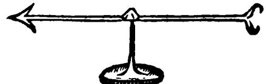

FIG. I. Gilbert's versorium. [From *De Magnete,* p. 49.]

Gilbert describes his new instrument in sufficient detail so that another investigator can make one for himself if he wishes, and invites repetition of his experiments. Yet, despite his efforts to make easily available this simple instrument for detecting electrical attraction, and hence for identifying electrics, we shall see that more than a century is to elapse before many new electrics are discovered. Most of the lists of electrics published in the 17th century were either copied or adapted from Gilbert's book.

*Gilbert's examination of earlier hypotheses.* Before turning to the task of trying to "explain" his electrical observations, Gilbert critically examines various earlier conceptual schemes, sometimes with the help of additional experiments designed expressly to test them. He concludes that the amber effect is:

(i) Not due to "heat of fire"; although the ancients had observed that a warm electric attracts, Gilbert's tests show that the attraction occurs only if the warmth stems from rubbing;

(ii) Not due to an absorption by the attracted body of a "fatty humor" emitted by the rubbed amber, as was conjectured by Cardan (p. 5); for the attracted body would then increase in size while the amber would shrink, and this is not observed to happen;

(iii) Not due to a draft on the attracted body caused by the return of displaced air, as was suggested by Plutarch (p. 545) ; "for white-hot iron, candle flame, flaming torch, or live coal, when brought near to

straws or to a versorium, do not attract"; yet "all these call in the air in succession, for they consume it as a lamp consumes oil";

(iv) Not due to any singular "quality" of amber or any kinship of it to other bodies; for many substances differing from amber are also electrics and, moreover, a rubbed electric attracts all other bodies.

*Nonelectrics.* At this point Gilbert describes another important discovery of his: not everything will move the versorium needle, even feebly, when rubbed and brought close to it. Apparently there are many things that cannot be electrified, thus indicating that substances in general fall into two classes, *electrics* and *nonelectrics.* 

*Gilberts conceptual scheme.* Feeling that the hypotheses of his predecessors do not meet the test of experiment, Gilbert now proceeds to a more affirmative approach to the problem, by trying to frame hypotheses of his own that will explain the origin and behavior of electrics and nonelectrics. He retains many ideas and modes of thinking that are clearly traceable to ancient and medieval writers, for no person can escape completely from his own background. Nevertheless, his attitude toward earlier "authorities" now becomes more skeptical than ever. At this time a really major intellectual change was well under way — the Scientific Revolution — and the outstanding scientists of the period were those few men who, like Gilbert, succeeded in partially divorcing themselves from certain modes of thinking and practices of the past.

Gilbert proposes the hypothesis that all matter can be divided into two classes, one "fluid and moist," the other "firm and dry"; some substances supposedly consist of both kinds, others of one or the other kind. The appearance of amber, shining gems, and glass suggests to him that these electrics are solidified from fluid, and so he makes the further hypothesis that all electrics have their origin in the class of matter called fluid and moist. He observes that this hypothesis must be qualified in certain ways: if impurities of nonfluid origin are mixed with a substance of fluid origin, the mixture will not be an electric; furthermore, even though an object consists of fluid and moist matter, it cannot be electrified if it melts or grows soft when one attempts to rub it.

Next he tries to find an explanation for the attractive force which, he believes, has its origin in this moistness. Here he adopts an older hypothesis which suggested that every body has two "causes" of importance in explaining electrical and magnetic phenomena, namely, "matter" and "form." By "matter" was meant the actual substance of which an object is composed, and by "form" was meant the properties with which the matter is endowed in any particular situation. Thus

"matter is to form as brass is to the statue. Form is that by which **a**  thing is."

Gilbert credits electrical attractions solely to the matter comprising the electric, for his observations have convinced him that matter, not form, is the important common characteristic of electrics. He assumes that an electric, when rubbed, emits a material effluvium; the effluvium is released by heat; this heat must be produced in the electric itself by rubbing and not by a fire, the sun, or other external source.

Here Gilbert is close to an important discovery: although rubbing a body both warms and electrifies it, warming alone will not produce electrification. Yet the fact that heating and electrification always occur together when a body is rubbed was to plague experimenters for more than a century after Gilbert, and there were repeated attempts to excite an electric by a "flame or red-hot coal." One of the major tasks in the early stages of a science is to decide which of the vast number of observables are relevant to the phenomenon of interest and are worth concentrating upon. Although Gilbert's experiments have shown that merely warming an electric will not excite it, he is unable to discard completely the view that the warming produced by rubbing is a relevant factor. Hence he takes the compromise view that heat is necessary, but that only heat produced by rubbing is effective.

As for *magnets,* Gilbert credits their effects primarily to the form, not the matter, of the magnetic body. He believes that a magnet's form, although immaterial in character, always pervades the space surrounding the magnet and that it awakens an inert form in iron brought near to the magnet, resulting in mutual attraction between magnet and iron. As additional evidence for the difference between electrics and magnets he cites his knowledge that a barrier such as moist air or water stops the attraction of an electric but not the mutual attraction between magnet and iron. He assumes that such a barrier keeps the material electric effluvium from reaching other bodies while it does not alter the immaterial magnetic form.

Returning now to electrics, Gilbert describes a large number of experiments that support his theory. He concludes that in electrical attraction the electric and the attracted body are united by the effluvium.

Since no action can be performed by matter save by contact, [and yet] these electric bodies are not seen to touch, something of necessity is sent from the one to the other, something that may touch closely and be the beginning of that incitement. . . .

The [electrical] effluvia spread in all directions. . . And, as if they were material rods, they take up and hold straws, chaff and twigs, until their force is spent or vanishes. . . .

The view that if one body exerts a force upon another there must be some material connection between them was still commonly held in Gilbert's day. A later view that such connection is unnecessary, that "action at a distance" may occur, would have been totally unacceptable to most early 17th-century physicists; they would have regarded it as a reversion to the sort of mysticism and magic from which they were trying to escape.

Gilbert's further experiments provide him with additional evidence that the effluvium supposedly emitted by the excited electric acts directly on the attracted body, rather than acting indirecdy by setting up an air current which then moves the body. This preoccupation with the question whether the object is moved by the surrounding air becomes more understandable when we realize that his knowledge of motion and of its "causes" was derived from Aristotelian and scholastic physics, in which the air was believed to push forward an object thrown through it, keeping the object in motion.

Gilbert renounces the air as the medium pushing an object toward an excited electric, but he does not give up his search for the propelling object or material that presumably must be in direct contact with the attracted object. And, as we have seen, he finds the solution to his problem by postulating an effluvium that connects the attracted object with the excited electric.

The experiments that Gilbert made, and certain others that he failed to make, serve to illustrate an important characteristic of scientific investigations: extensive experimentation follows, rather than precedes, the framing of hypotheses. It was Gilbert's magnetic hypothesis that led him to initiate experiments to determine, first of all, whether or not electricity and magnetism are distinctly different phenomena. In the course of these experiments he looked for and found a new rule: the attracting force increases as the distance between electric and attracted object is decreased. He already knew that a similar rule applies to magnets. That it also applies to electrics is explainable in terms of his hypothesis, since it is natural to suppose that the effluvium becomes more diffuse and therefore less potent as it spreads throughout the space surrounding the electric.

Only a few years later it was discovered that under certain circumstances an excited electric will *repel* other objects, rather than attract them. Gilbert failed to discover this electrical repulsion, although he must have observed its effects many times; indeed, he noticed that objects coming in contact with an excited electric are likely to fall away from it to the ground, but he believed this is solely because the force of the effluvium has then spent itself or vanished. And he did not report any attempt to discover whether the property of electrical excitation can be transferred from one body to another, or between parts of the same body. These experiments were within his grasp, requiring no more equipment than he possessed. But his hypothesis apparently did not suggest that repulsion might occur under certain circumstances: he neither looked for it nor noticed it when it did occur. As for the possibility of electrical conduction — the transfer of the property of excitation from one body to another — this apparently is ruled out by his conclusion that an object in actual contact with an excited electric tends to "suppress the effluvium at its very start."

Thus we see that hypotheses not only suggest the experiments that are performed but, because they are always more or less limited in scope, may fail to suggest other important experiments or may so divert the attention of the investigator that he will miss important discoveries. Nevertheless, such limited hypotheses may be exceedingly fruitful of experiments which, in turn, provide the foundation for broader hypotheses that become the conceptual schemes forming the body of science. Gilbert's hypothesis satisfactorily played this important role.

The question continually arises why certain scientific advances occur in a particular period. In view of the tremendous role of ideas in a science, a more rewarding question might be to ask why it is that human genius turns to certain inquiries in one period rather than another. Beginning with the i6th century, or even somewhat earlier, why was there so great a diversion of intellectual effort into physical science — a diversion resulting in the Scientific Revolution ?

Nothing approaching a complete answer to questions of this sort is possible. Even for a single individual, such as Gilbert, we cannot be sure of the reason why he contributed to this revolution in the way he did. However, we can see some factors that undoubtedly influenced him.

It was only a century since the voyages of Columbus, European expansion was progressing vigorously, and problems of navigation and navigational instruments were becoming increasingly important; so it is no surprise that a major study of the magnetic compass and magnetism should have been undertaken at this time: the time was ripe for such work and Gilbert had the ability needed to carry it out. Nor is it of small moment that he could find the leisure time and personal financial means then so necessary for devotion to scientific work. As for his emphasis on experimentation, his writings — especially those on magnetism — reveal an intimate knowledge of the methods employed by navigators, workers in the iron industry, and various other artisans and craftsmen of his day; from them he must have learned many techniques that he himself could profitably employ. Not only to extol but to engage publicly in experimentation required courage in a day when such activities were generally confined to workmen and not considered respectable for scholars. The scholars, skilful in logic and accustomed to dealing with general ideas and broad issues, rarely paid attention to the workmen-experimenters; and the latter, concerned with practical and immediate needs, had little access to the abstruse writings of the scholars. Gilbert and a few others were beginning to bridge the gap between scholar and experimenter, synthesizing logic and experiment into an approach to scientific problems that became known as the "new experimental philosophy."

Gilbert died in 1603. Five years later, Francis Bacon published the first of his several essays and treatises on the methods recommended for use in scientific investigation. He advocated unbiased observation and experiment as the basis for sure knowledge, but went too far in his emphasis on "the exhaustive collection of facts," coupled with inductive reasoning leading to general principles, as the true and only method of science; for, as we now know, the more fruitful emphasis involves the use of hypotheses with experiments as their continual check. Bacon leaned heavily on Gilbert's writings, yet of this made little acknowledgment. He repeatedly criticized Gilbert, sometimes with justification, as when he said that the only unity in *On the magnet* lay in Gilbert's readiness to try anything. Yet the method of investigation advocated by Bacon was much the same as that which Gilbert had not merely written about but actually used a number of years earlier.

Bacon picturesquely compared the workmen-experimenters with the ants, who "only collect and use"; the a priori "reasoners" with the spiders, who "make cobwebs out of their own substance"; and the sound scientist with the bee, who "gathers its material from the flowers of the garden and of the field, but transforms and digests it by a power of its own." This last course was indeed the one that Gilbert had already in some measure succeeded in following and that helped to bring him recognition as the foremost scientist of Elizabethan England.

#### 2. THE 17TH CENTURY

Gilbert's *On the magnet* reached Italy in 1602, only two years after its publication in England. This period in Italy was still one of tremendous intellectual and artistic activity; the great Italian universities were filled with students, and learned societies were arising all over the country. Here there were men already familar enough with magnetic phenomena to be attracted to Gilbert's book, and broadly enough informed to recognize its significance. Among them was Niccolo Cabeo, a Jesuit scholar of great ability. In writing the first Italian treatise on the magnet, in 1629, Cabeo also recorded electrical discoveries that were probably the first to be made after those of Gilbert.

Gilbert's work provided a magnetic hypothesis of the earth's rotation. Cabeo, on the other hand, was a militant believer in the earth's immobility. So, while acknowledging the accuracy of much of Gilbert's work, Cabeo searched diligently for errors and omissions. After studying the electrics on Gilbert's list and adding some of his own, he concluded that Gilbert's hypothesis as to the origin of electrics (p. 551) was incorrect; for, he said, "plenty of things that are hard and yet are concreted of humor [liquid] show no attraction, and many things attract that do not appear to be concreted of humor."

Still more important, Cabeo observed that objects, on being.attracted to and making contact with a rubbed electric, often do not fall off the electric merely because of their weight, but rebound to a distance of as much as several inches. In brief, after an object touches an excited electric, it often moves away as if it were repelled by the electric. Here is something that Gilbert had missed. Moreover, it seems unexplainable in terms of his notion that the electrical effluvia act "as if they were material rods," taking up and holding light objects "until their force is spent or vanishes" (p. 552).

So Cabeo advanced a different hypothesis, much like the one proposed in antiquity by Plutarch (p. 545) : an electric, when heated by rubbing, emits an effluvium that drives away the neighboring air; this displaced air, upon striking the undisturbed air beyond it, whirls around and returns swiftly toward the electric; and any light object caught in this little whirlwind is brought along to the electric, sometimes with such violence that it rebounds. Thus, to Cabeo, the observed effect was not a result of an electrical repulsion, but merely the mechanical rebounding of a light object upon colliding with a heavy one.

There follows from Cabeo's hypothesis an obvious deduction : if there were no air around an electric, it could not attract objects when rubbed. The possibility of testing this deduction was soon seen by the experimentally minded members of the Florentine Academy of Experiments (Accademia del Cimento), and they attempted an experiment to see "whether amber or other electric bodies require the medium of air to make them attract" (1667).

For this purpose the members used a barometer, which had only recently been invented for measuring atmospheric pressure. They had been experimenting with objects placed in the space between the mercury column and the top of the glass tube, for, in a good barometer, this space is practically devoid of air. To get more working space, a glass vessel was sealed to the top of the barometer tube; and, for the present electrical experiment, these investigators made an opening in the side of this vessel, trying to contrive it so that either the hand of the experimenter or a wooden rod could be moved around inside the vessel without, at the same time, admitting air (Fig 2). Placing a piece of

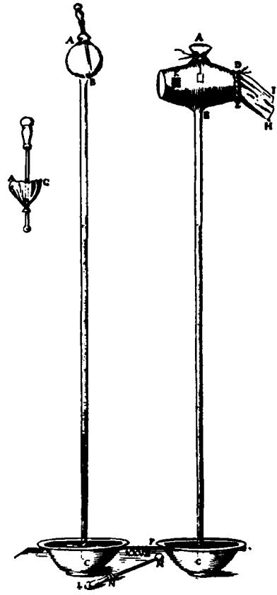

FIG. 2. Tw o forms of the Florentine Academy apparatus. (*Right)*  The hand, holding the amber, was inserted into the evacuated vessel through a bladder which was tied tightly to the glass at *DE* and then to the bare forearm at *IH;* at *Κ*  was a piece of cloth for rubbing the amber. *[Left)* Here the hand had been replaced by a wooden rod, with a bit of amber fastened to its lower end; the rod was bound to the glass by a bladder, but could be moved around so as to rub the amber on a piece of cloth fastened to the inside glass surface. In neither apparatus was it found possible to bind the bladder tighdy enough to prevent air from entering the vessel. [From *Saggi di naturali esperienze fatte nell'Accademia del Cimento*  . . . , Florence (1666).]

amber and bits of straw in this evacuated vessel, they tried repeatedly to see whether the amber, when rubbed, would show attraction for the straw. But in the end they had to admit that the results were inconclusive. Manipulation of the apparatus was too difficult, yet they saw no other way to produce a vacuum. A pump for this purpose had recently been invented in Germany, by Otto von Guericke, but we shall see that its first application to such problems as this was made in England.

In a second electrical experiment, carried out in the open air, the

Florentine academicians were successful. A piece of amber, hung by a thread so as to form a pendulum, was rubbed, and then a small object was placed close to one side of it. The small object of course moved toward the amber, but something more was seen: the amber also swung over toward the object. Here is almost certainly the first report that electrical attraction is *mutual,* contrary to Gilbert's belief (p. 553).

Because this electrical experiment is so simple, we may well ask ourselves why no one thought to try it earlier, especially since it was so well known that a magnet and an unmagnetized piece of iron show mutual attraction. However, suspending the amber as a pendulum to render it easily moveable is one of those expedients that become obvious only after someone has thought of them. The utility of the pendulum as a timing device and also as a means for studying the motion of bodies had been previously recognized by the great Italian physicist, Galileo. But now the Florentine academicians had applied it in still a different way, and in electrical rather than mechanical experiments. To foresee that a device or method designed for one purpose may be applicable, perhaps with modifications, in some quite different situation usually requires experience in experimentation and, especially, the exercise of imagination.

The Florentine academicians tried to list electrics in the order of their abilities to attract. Amber, they found, headed the list. This means that amber attracted more strongly than, say, jet (presumably under very similar conditions). But they did not indicate *how much* more strongly it attracted. In brief, their observations were only *semiquantitative.* For them to have made the experiment strictly quantitative would have been exceedingly difficult, for it involves several variable properties of electrics that are hard to control and calls for a better method of measuring small forces than was available at the time. Indeed, we shall see that a century elapsed before anyone performed a strictly quantitative experiment in electrical science.

The Florentine Academy acquired great fame; founded in 1657 by the pupils of Galileo for the purpose of furthering cooperative experimentation, it may well be regarded as a forerunner of our modern research institutes, although it lasted for only ten years.

*Electricity in lyth-century England.* In Gilbert's own country, in the meantime, we find *On the magnet* receiving little attention, and no substantial development in the study of electrics occurred during the 17th century. During this period the word "electricity" was introduced into the English language, with the meaning of "a power to attract straws or light bodies." And in 1675 Robert Boyle published a short treatise on electricity, probably the first to be devoted exclusively to this subject. He was even more emphatic than Gilbert in insisting that the electric effluvium must be some kind of matter — perhaps particles, or atoms.

Boyle was the first person to make extensive use of the newly invented vacuum pump, which he and several co-workers had greatly improved. Having heard of Cabeo's notion that the air plays a part in the amber effect, Boyle put it to a test and found that the attraction occurs in a vacuum just as well as in the open air. Thus, using more elaborate equipment, he succeeded with an experiment that had frustrated the efforts of the Florentine academicians.

*Scientific societies and periodicals.* The 17th century saw two new and important elements entering the scientific enterprise: formal organizations of scientists, and periodical publications for the dissemination of scientific information. In England, the Royal Society of London for Improving Natural Knowledge, and in France the Royal Academy of Sciences, came into existence in the second half of the century. Both served as focal points of scientific activity and each was supported by its country's monarch.

At about the same time, the first periodicals, in the modern sense of the term, were inaugurated. In 1665 the newly established Royal Society of London licensed the publication of the *Philosophical Transactions.* We shall encounter references to this important journal often in the following pages.

#### 3. FRANCIS HAUKSBEE'S EXPERIMENTS

In the second half of the 17th century there was a general expansion of scientific work in England. Among the results of this increased activity, and particularly of Boyle's work with air pumps, was a strong interest in the effects of air and absence of air upon physical phenomena. One of Boyle's successors, Francis Hauksbee, in the preface to his book of collected papers, entitled *Physico-mechanical experiments on various subjects* (1709), acknowledged Boyle's great contributions and added that his own papers were accounts of *"further improvements* of this noble machine, the *air pump,* and of many new experiments made thereby." Among these "further improvements" was his development of a double-cylinder pump that was to set the design for such devices for the next 150 years.

Of Hauksbee as a person little is known other than his membership in the Royal Society of London, the probable year of his death —1713 and what can be learned from his papers, published originally in the *Philosophical Transactions* and reprinted with some additions in his books. We gather that he was an artisan of little formal schooling; his writings, in the form in which they were originally printed, show him

to have been almost illiterate compared with other scientists whose work we have studied here. One may guess that his skill at constructing instruments and his unusual genius for experimentation were what brought him into association with the members of the Royal Society. According to the official *Record* of the Society, in 1707 he was employed to prepare experiments and was paid for doing so. The facilities and associations afforded Hauksbee by the Society must have been a factor in helping him become "the most active experimentalist of his day."

It has been said of Hauksbee that he started to study a new optical phenomenon and found himself studying electricity. The optical phenomenon which attracted his attention was called the "barometric light." This phenomenon, which had been reported in 1675 to the French Academy of Sciences, is an intermittent glow or flash of light appearing in the space above the mercury in a barometer tube when the tube is abruptly moved or shaken. It attracted much attention, and for a time there was considerable controversy as to its nature. By Hauksbee's day, however, scientists were generally agreed that the light came from sulfur or a "phosphorus" supposedly present in the mercury. We now know that it is an electrical phenomenon related to that seen in the aurora and in the familiar "neon" sign. Having in hand the knowledge that grew out of the work of Hauksbee and his successors, we can easily guess that the light in the barometer is connected with the fact that the glass tube becomes electrified when rubbed by the mercury sloshing about in it. We shall see that Hauksbee made a similar guess, but only after he had carried out numerous experiments.

With his interest and skill in vacuum techniques, Hauksbee would naturally have been drawn to the study of the barometric light. In 1705 he gave a report of experiments on the capacity of mercury to produce light in an evacuated glass vessel. From the plan of these first experiments we may suppose that he had already guessed the relevant factors in the production of the barometric light to be the motion of mercury over glass and the low pressure of the air in the vessel. Although this working hypothesis may appear obvious to us, apparently no one else had stated it, consciously or unconsciously, during the three decades following the discovery in France of the barometric light. The mere observation of a phenomenon leads nowhere unless it gives rise to hypotheses suggesting experiments.

From these initial experiments (Fig. 3), Hauksbee concludes that *motion* of the mercury over the glass is essential: the flashes of light occur when drops of mercury slide down the glass, but never when they merely stick to it. Then, to find what degree of vacuum is necessary for the effect, he varies the amount of air present in the vessel. No light flashes are produced by the moving drops until about half the air

has been removed. As the vacuum is increased beyond that point, the light intensity gradually rises to a peak and then falls away until it seems to disappear. This leads Hauksbee to conclude that some air must be present if the phenomenon is to occur. In at least one experi-

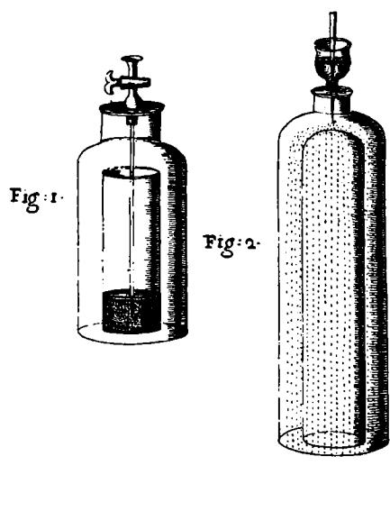

FIG. 3. Hauksbee's experiments on the motion of mercury over glass. [From *Philosophical Transactions,* vol. 24 (1705). no 303.]

*(Fig. 1)* A glass jar containing some mercury is enclosed in a large glass vessel, and this vessel is then evacuated. When the stopcock at the top is opened, air rushes down the tube and bubbles violently up through the mercury, splashing the latter onto the walls of the jar. As drops of mercury roll back down the glass, a faint light is produced.

*(Fig. 2)* A glass vessel with a round crown is enclosed in a larger vessel with an opening at the top into which is sealed a funnel stoppered by a plug and filled with mercury. The larger vessel is evacuated by an air pump connected to it at the bottom. Removal of the plug from the funnel now allows the mercury to be driven down onto the crown of the inner vessel, where it breaks into a shower of minute drops. The drops sliding down the glass produce the familiar light and, in addition, "from the crown of the included glass were darted frequendy flashes resembling lightning, of a very pale color."

ment he attaches to the pump a mercury pressure gage (apparently an open-tube manometer). The lowest pressure he can obtain with his pump is roughly 1/60 of atmospheric pressure; but the light flashes occur only at pressures between about 1/2 and 1/20 atmosphere. True, when the pressure is 1 atmosphere — that is, when the vessel is not evacuated at all — shaking the mercury around over the glass produces "little bright sparks"; but these, Hauksbee notes, differ markedly in appearance from the more diffuse light seen when the vessel is partially evacuated.

Hauksbee now broadens the problem by asking whether mercury and glass are the only substances that can produce the light flashes when rubbed together in rarefied air. Here he uses a "machine for giving a swift motion to bodies" in vacuum (Fig. 4). This device consists of a wooden wheel with a large number of amber beads fastened around its rim and so mounted that when it rotates the beads rub against several fixed woolen pads. The wheel is placed within a glass vessel which can

be evacuated; a hand-operated belt and pulley arrangement turns the rim of the wheel at speeds up to "something more than one third of a mile in a minute." Upon starting the air pump and setting the wheel in motion, Hauksbee observes the familiar flashes in the rarefied air.

As to why amber and wool were chosen as the substances to be

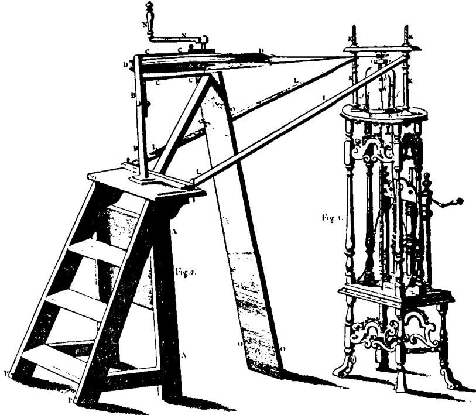

FIG. 4. Hauksbce's apparatus for attrition in a vacuum. A hand-operated machine is connected to a spindle that extends into the vessel to be evacuated. This spindle passes through a tightly-fitted leather gasket at the opening in the top of the vessel, and thus a vacuum can be maintained while the spindle is turned. On the rotating spindle inside the vessel is mounted the material to be rubbed. Pressing against it are fixed pads of wool or some other material. The air pump is on the right, underneath the glass vessel. [From Hauksbee's *Physico-mechanical experiments . .* . (ed. 2, 1719).]

rubbed together, Hauksbee does not say, but it seems apparent that the choice was not an accident. The amber effect was well known at this time, and possibly he thought that a substance that would produce so striking an effect as electrification when rubbed might be of interest in his experiments with light. However, his writings at this point made no mention of "electrification" or "attraction."

Next he replaces the beaded wooden wheel with a small glass globe; when the globe is rotated so as to rub against the woolen pads in the evacuated vessel, the light again appears. He also rubs glass against oyster shells, wool against oyster shells, and so on. In every case the light appears in the rarefied air, although with varied intensity.

After a brief diversion to unrelated experiments on the specific gravity of water and the rise of water in capillary tubes in a vacuum, Hauksbee returns to the problem of light produced by attrition [rubbing] . Now we see a good example of the use of productive imagination, here resulting in the design of a modified "machine" that is much easier to construct and handier to use. Instead of enclosing the rotating glass globe in an evacuated vessel, he evacuates the globe itself, sealing it so that the air cannot reënter. With the container thus eliminated he can use a larger globe, one of about 9-inch diameter; moreover, he can rub the spinning globe simply by laying his "open and naked hands" lightly upon it. When he does this the light appears, now in the rarefied air inside the globe. By placing his hands so that they touch as much as possible of the globe's surface, he produces a light so bright that, in a darkened room, "words in capital letters were clearly legible by it."

Now turning back to the original problem of the light in the barometer, Hauksbee asks a significant question: If one does not shake the barometer, but rubs the upper, evacuated part of the tube with the hand, what will happen? He tries this, and the light ensues, although there is no perceptible motion of the mercury.

In the nine months following the start of this study, Hauksbee has successfully completed his first set of experiments; for he has shown that rubbing is necessary to produce the light, that substances other than mercury and glass can be used, that rarefied air gives the most pronounced effect, and, finally, that a device can be constructed so as to give light bright enough for reading. This ability to select a fruitful problem, to form working hypotheses about it, and to devise and carry out experiments for testing the hypotheses is the mark of a good experimentalist.

*Hau\sbee's electrical experiments.* That there might be a connection between the amber effect and the barometric light may have first occurred to Hauksbee in the summer of 1706. At any rate, in the following fall we find him experimenting with the "extraordinary electricity of glass."

**I took a hollow tube of fine flint glass, about an inch in diameter and 30 in length, and having rubbed it pretty smartly with paper in my hand until it had acquired some degree of heat, I held it toward some pieces of leaf-brass [thin brass foil]. So soon as the tube's effluvium had reached the leaf-brass, the latter became suddenly in motion, flying towards the tube, even from 9 or 10 inches distance. It seemed that the hotter the tube was made by rubbing, the farther it would attract. . . A nd what was further observable, the attracted bodies would sometimes** 

**adhere to the tube, and there remain quiet, arid sometimes would be thrown violently from it to good distances. . . .** 

Although Hauksbee has begun with experiments that are already well known, his mention of the "tube's effluvium" indicates that he has some knowledge of earlier electrical work, probably gained from his colleagues in the Royal Society or from articles in the *Philosophical Transactions.* Notice that he has not overlooked the phenomenon of electrical repulsion, first mentioned by Cabeo (p. 556) but missed by so many earlier observers. Indeed, in a passage omitted here, he tells of another striking example of repulsion. Upon holding an excited glass tube above some lampblack placed on a sheet of paper, he sees, "not without pleasure," the small particles of lampblack ascending and descending with great velocity; and, although these particles weigh so little that ordinarily they would make no noise when dropped on the paper, they are driven down "with such force from the tube that their striking the paper was very audible."

After noting variations that occur in the electrical experiments from one day to another, he continues:

**T h e reason for . . . [the variations] seems to me to proceed from the different temperatures of the air at the time the experiments are made; for when it happens that an abundance of humid particles [moisture] . . . are swimming in air . . . they suddenly condense on the warm tube, thereby hindering or choking the passages of the effluvia; for I find moistness at all times an utter enemy to attempts of this nature. Besides, the quality of the effluvium seems to be such that I could not . . . cause it to effect one of the prementioned bodies through a piece of fine muslin, notwithstanding it was held very near it; yet it would attract or give motion to the same body at three or four times that distance, the muslin not interposing. . . .** 

**But to proceed: when the glass became hottest by the greatest attrition, it then sent forth such quantity of effluvia as not only to perform the effects before-mentioned with seemingly greater vigor, but, upon being applied close to the face, or any tender part, to be sensibly felt, as if the part was pushed with the points of a considerable number of weak hairs.** 

Thus Hauksbee, like Gilbert, has found moisture a hindrance to electrical experiments, as it still is in modern laboratory work; the important factor is the humidity, not changes in temperature. He also reports how the effluvium supposedly emitted by the excited electric can be felt when it strikes his face. In this discovery of the "electric wind," as it is now called, he sees new proof that electrified bodies emit a material effluvium. Today the electric wind is known to be a stream of charged air particles that are repelled by the excited electric.

Now the air pump is again brought into play.

Upon exhausting the air from within the tube by the pump, then, although the attrition given it was the same or greater than before, yet very little of the effluvium could be discoverable by any motion or disturbance given the leaf-brass, notwithstanding it [the leaf-brass] was held within a quarter of the distance at which it had been attracted before; . . . sometimes small parts of the leaf-brass, when the tube was held near . . . would have a motion given them, but without comparison to what they had when the experiment was made with the tube unexhausted of its air. Besides, I doubt not but that some small quantity of air was left in the tube, and so the attraction might continue in proportion to the quantity of the remaining air. . . .

Hauksbee deserves much sympathy here, for he is dealing with very complex phenomena. He has clearly embarked on electrical experiments in the belief that electrification by attrition and the production of light by attrition are in some way related. Yet, after obtaining good electrical results with his glass tube, he evacuates it to produce the light and finds its attractive property greatly weakened. Actually, a partially evacuated tube attracts less strongly because the light inside the tube is being produced at the expense of the electrification, leaving the tube too weakly electrified to produce much attraction.

After using the glass tube to repeat some of his earlier experiments on light, Hauksbee reverts to the mechanical rotator; but he has changed it into "a machine of a new contrivance" by shifting the axis of the spinning glass vessel from the vertical to the horizontal position (Fig. 5). Upon evacuating the vessel and setting it spinning under his open hands, it again "succeeded in respect to the light produced."

His next step is especially important. He lets the air back into the glass vessel and proceeds to use the machine for the usual electrical experiments of attraction and repulsion. From antiquity up to this time (1706), the only method for exciting an electric that we have encountered is to hold the electric fixed and rub it by hand — a slow, awkward and usually laborious process. Hauksbee, by placing his hands on the spinning glass vessel, can effect the rubbing at a tremendous rate and with comparatively little effort. In brief, he has invented what is often called the "frictional electric," or "triboelectric," generator.

This invention has in the past been generally credited to Otto von Guericke, the inventor of the air pump, who in 1663 described a large ball of sulfur mounted on an axle to which was attached a crank. Laying his bare hand on the rotating ball, he had observed a number of phenomena that we now know were electrical. However, Guericke's interest was in developing a new theory of the earth's rotation, and the sulfur ball was intended as a model of the rotating earth. Thus he did not devise it as an electrical generator or use it for investigating elee-

tricity. Moreover, his device and the experiments with it seem to have been unknown to electrical experimenters in England and France until nearly three decades after Hauksbee had published his work. Since Hauksbee built his generator to study electricity and since it had an immediate and important effect in that area, he should be regarded as the *effective* inventor of this early electrical machine.

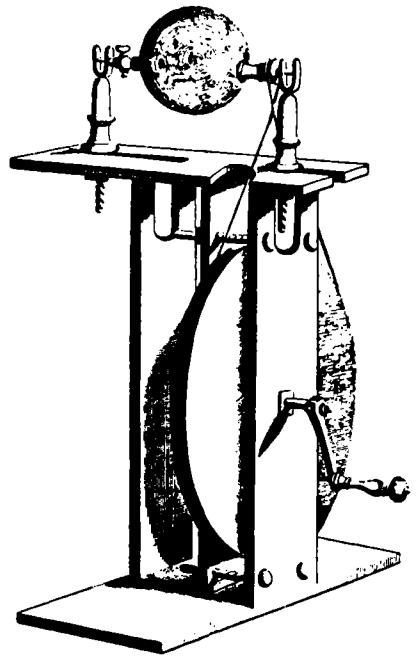

Fic. 5. Hauksbce's triboelectric generator. In some of his experiments, the spinning vessel was a glass cylinder, instead of the glass globe shown here. [From *Physico-mechanical experiments . .* . (ed. *2,* 1719).]

Hauksbee now moves on to a new group of experiments, some of which are spectacular. He mounts a second glass globe within an inch of the one on the generator, but set up to spin independently. This second globe he evacuates, the one on the generator being left unexhausted.

In these postures the machines were set to work, and the naked hand applied to the unexhausted glass, the effluvia of which in a little time reaching the exhausted glass in motion, immediately produced a light on that part of it nearest to the other, without the assistance of a touch from anything else to influence it. This light is pretty vigorous. . . .

After this I took a long glass tube, which had lain by me exhausted of its air for more than six months. This glass having been rubbed a little in my hand to expel the humidity on its outside, I held it over the unexhausted glass in motion, which at the same time was rubbed by my hand. It would now and then (for it was not constant) be very surprising to see what large flashes of light would be produced in the long glass tube without its touching the glass in motion or itself being either moved or provoked by any immediate attrition.

Although his earlier experiments had indicated that the light appears in an evacuated glass vessel only when it has been rubbed (p. 21), now he has seen it produced in an unrubbed globe placed close to another globe that is being electrified by rubbing. Moreover, he soon found that motion of both globes is not needed; an evacuated glass tube shows the familiar light when it is merely held near the excited globe of the generator. Here Hauksbee came very close to discovering the important principle that any object becomes electrified temporarily when it is in the vicinity of, but not touching, another object that is already electrified. This later came to be called electrification by *influence.* 

But although Hauksbee consciously observed and described electrification by influence, he cannot be regarded as the effective discoverer of this phenomenon, and for an interesting reason. That the light appears in an unrubbed evacuated vessel of course puzzles him, but he eventually hits on an ingenious explanation: The vessel is being rubbed by the effluvium issuing from the hand-rubbed generator globe. Thus he is able to "save" the prevailing notion that only rubbing an object can produce either electrification or the barometric light. But at the same time he has missed the discovery that these phenomena can be produced in another way, namely, by "influence."

If the effluvium, although invisible, can serve as a rubbing agent, then, remarks Hauksbee, it must have a certain stiffness and act much like a solid body. He pursues this notion in connection with the experiments that follow. Having noticed earlier that bits of thread or other light objects appear to be "equally attracted" by all parts of a rubbed electric, he begins a study of this phenomenon with the aid of an electroscope which he has specifically designed for the purpose. It was made by suspending short lengths of the strong thread called "packthread" from a semicircular wire. This wire he fastens concentric with a glass cylinder mounted on his generator (Fig. 6). When the cylinder is rotated and is electrified by placing the hand on it, each thread moves until it points toward the axis of the cylinder. Upon replacing the cylinder by a glass globe, he finds that all the threads point toward the center of the electrified sphere. In concluding his account of these observations, he says:

Now how far this experiment may serve to explain the nature of elee-

tricity, magnetism, or gravitation of bodies is beyond my sphere to determine, but with all humility I submit it to those learned gentlemen of this honorable society who have already treated on those subjects.

FIG. 6. End view of the glass cylinder on the electrical generator, showing the positions of the electroscope threads when the cylinder is: (/ ) montionless and unelectrified; (2) rotating and unelectrified, the air currents around it dragging the threads all in the same direction; ( j) and (4), rotating and electrified, in which case, despite the continued presence of the air currents, each thread straightens out and points to the axis of the cylinder. [From *Philosophical Transactions*, vol. 25 (1706), p. 2334.]

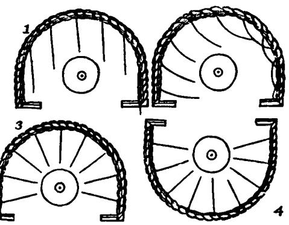

More than a century earlier, Gilbert, in *On the magnet*, had shown that bits of iron placed near a *magnet* on a table tend to arrange themselves in a definite pattern. Now Hauksbee has shown that threads suspended in the "field," as it is now called, around an electrified body likewise assume definite positions. In his opinion the threads are held in their radial positions by the "solid" effluvium issuing from the electrified body.

What Hauksbee next observes is also new and, moreover, quite complicated.

If one's finger (or anything else as well, for I have tried divers things) be approached near the pointing ends of the threads while the effluvia act with so much vigor as to sustain them directed, then, I say, they flee and avoid a touch from it. . . . At the same time, if the finger is held near and at about an inch from the [other] end of the aforesaid thread, it will there seem to be attracted [to the finger]. . . .

In earlier experiments, Hauksbee had often seen small objects "flee from" — be repelled by — an excited electric after touching it. But now he has seen the unattached end of the thread repelled by his finger when both finger and thread are close to the excited electric and yet have not touched it. His explanation is that the finger displaced the "solid" effluvium surrounding the electrified body and this effluvium, in turn, pushed away the loose end of the thread. Next he has moved his finger toward the fastened end of the thread and, surprisingly, it attracted this

portion, although neither finger nor thread had been rubbed. This he cannot explain. We shall see that a satisfactory explanation of these confusing and superficially contradictory phenomena must await the discoveries, after Hauksbee's day, of charging by influence, electrical conduction, and the existence of two kinds of electrification, positive and negative.

Wondering whether the hollow glass globe of the generator emits the effluvium in the inward direction, as well as outward, Hauksbee ties threads to a wooden disk mounted inside the globe in such a way that the threads do not touch the glass. The experiment does not work very well at first, but eventually he is able to show that these inside threads do assume radial positions when the globe is rubbed. Since only the outer surface of the globe has been rubbed, whereas threads supported either inside or outside are affected, he infers that the effluvium is coming, not from the surface, but from the solid matter of the glass.

Upon bringing his finger close to, but not touching, the electrified globe, he sees it repel the loose ends of the threads inside, just as it had when the threads were outside the globe.

This shows the subtlety of the effluvia, the glass from which it is produced seeming to be no impediment to its motion. Yet it seems very much to resemble or emulate a solid, since motion may be given to an object by pushing the effluvia at some distance from it. But what is still more strange, this body (I presume to call it so), although so subtle as seemingly to permeate glass, will not (as I have taken notice of in a former experiment) affect a light body through a piece of muslin. Now whether the muslin absorbs the effluvium, or what other laws it may be subject to, I cannot tell, but sure I am 'tis very amazing. . . .

Eventually Hauksbee hits on a way to adapt the effluvium hypothesis to this "amazing" result: the effluvium, even though it acts like a solid body, can pass freely through the substance from which it originates — here the glass — but not easily through other materials, such as muslin. But this ingenious supplementary hypothesis is not sufficient, as the next experiment shows. Without exciting the glass globe by rubbing it, he holds a piece of rubbed sealing wax near the globe and finds, to his astonishment, that his finger attracts the loose ends of the threads inside. So does rubbed amber when held near the globe. But, if the effluvium from sealing wax or amber can pass freely through the glass, this invalidates the notion that it can readily pass only through the substance from which it originates. The only way out of this difficulty that Hauksbee can find is to make the suggestion — reminiscent of one of Gilbert's hypotheses — that there must be something much alike in the make-up of glass, sealing wax, amber, and presumably all other

clectrics, "otherwise I cannot conceive how the *effluvia* of one can penetrate with such ease through the body of the other."

Hauksbee published 45 papers in the *Philosophical Transactions*  during the period 1704-1713 and, of these, 11 pertained to the barometric light and electricity. Although we have covered the parts of these papers of most importance for our present story, there is one final experiment that should be mentioned because of its connection with an important discovery made by a later investigator (p. 585). Hauksbee first observed that a piece of leaf-brass, after it has been attracted to and has touched an excited glass tube, is thereafter repelled and can be "hunted about a room" with the tube. The floating brass-leaf retreats, he explained, because it is pushed away by the stiff effluvium surrounding the tube. But then he came upon a really striking effect. As soon as the retreating leaf touches some unelectrified object, such as the wall of the room, it not only ceases to be repelled but is then attracted by the electrified tube. As will be remembered, Hauksbee had encountered this same effect at least once earlier, when he saw particles of lampblack repeatedly move back and forth between a table top and an excited electric (p. 564) ; but there he did not comment on it especially, possibly because his attention was diverted by the great violence with which the lampblack was observed to be repelled.

It is not clear how Hauksbee reconciled the notions that the same solid effluvium which presumably serves to draw objects to an electric can also operate to repel objects from it. Nor did he try to explain how this effluvium produces light in rarefied air. Apparently, to fit all the phenomena that Hauksbee had observed into a single conceptual scheme required more radical modification of the effluvium hypothesis than anything he had imagined. Nevertheless, the modifications that he did introduce, though not wholly adequate, were highly fruitful in that they provided him with a succession of working hypotheses, each leading to new experiments and often to new factual knowledge.

At first glance Hauksbee's contributions may seem to have been retrogressive. Before his time electricity was a relatively simple subject, being confined to a few facts and notions about the amber effect. But Hauksbee linked the amber effect to the barometric light and he went on to discover numerous phenomena that were apparently lacking in coordination and at variance with existing notions about electricity. When traditional beliefs are thus challenged, certain problems that serve as the starting point for subsequent inquiry are brought into focus. Hauksbee could not solve these problems, but in calling attention to them he opened a new frontier in an area of knowledge that had been comparatively untouched for more than a century. It was in the pursuit of problems such as those raised by Hauksbee that electrical science entered a revolutionary stage, the most immediate consequence being the discovery of electrical conduction by Stephen Gray.

#### 4. STEPHEN GRAY'S EXPERIMENTS ON CONDUCTION AND ELEC-TRIFICATION BY INFLUENCE

Our knowledge of the activities and personal characteristics of Stephen Gray (i666 or 1667-1736) must be gained, as with Hauksbee, from what he revealed about himself in "communications" to the Royal Society, some unpublished letters, and occasional references to him in the writings of his contemporaries. His first published paper on electricity appeared in the *Philosophical Transactions* in 1720. In it he told how he had discovered some new electrics, or materials that can be electrified by rubbing, and that they include silk, paper, wood, human hair, and "the fine hair of a dog's ear." He described how, if one rubs a glass tube in the dark, "a light" will follow the fingers and sparks will pass between the tube and a finger held close to it. Although he did not mention Hauksbee's name, he knew of Hauksbee's work and wrote as if these effects with glass were already well known to the members of the Society. Then he went on to tell how he had been able to produce the light and sparks with several other electrics, for example, stiff paper, provided it was rubbed after being "heated as hot as the fingers can well bear."

In 1729 — nine years after the publication of his first paper — Gray communicated "to Dr. Desaguliers and some other gentlemen" an important discovery: the "electric virtue" of a rubbed glass tube can be transmitted to other bodies with which it is in contact, so as to give them the same property of attracting as the rubbed tube itself has. Desaguliers, who was a prominent member of the Royal Society, reported this discovery to the Society and, later on, Gray described it, together with some new experiments, in his second paper in the *Philosophical Transactions* **(1731).** This paper is dated from the Charterhouse, where Gray was living as one of its "poor brethren." The Charterhouse was founded to provide schooling for boys who were "gentlemen by descent and in poverty" and a living for poor brethren who were preferably "soldiers that had borne arms by sea or land, merchants decayed by piracy or shipwreck, or servants in household to the King or Queen's Majesty." The school still exists, although removed from London to Godalming, and has an excellent reputation. Thackeray attended the Charterhouse as a schoolboy and, in *Vanity* 

*Fair,* immortalized it under the name "Grey-friars." Stephen Gray was perhaps the most notable of the Charterhouse pensioners.

The following extracts are from this second paper of Gray's.

In February 1729, I repeated some of the experiments I had formerly made. . . [Next] I made several attempts on the metals, to see whether they might be made attractive by the same method as were other bodies . . . by heating, rubbing and hammering, but without success. I then resolved to procure a large flint-glass tube, to see if I could make any further discovery with it, having called to mind a suspicion which some years ago I had, that, since such a tube communicated a light to bodies when it was rubbed in the dark, whether it might not at the same time communicate an electricity to them.

Gray has formulated a working hypothesis, probably stemming from Hauksbee's work : when light passes from an excited electric to another body, "an electricity" — that is, the ability to attract — may at the same time be communicated to that body. We do not understand all the processes involved in the formulation of working hypotheses, although it is usually clear — as in the present case — that they stem from observation and experiment. The vast majority of such hypotheses turn out to be false, but even these often serve to guide experimentation along fruitful paths. Here we shall see that Gray did not even finish the testing of his hypothesis of the simultaneous communication of 'light and electricity; for, in preparing to make the tests, he stumbled upon a specific example of an excited electric communicating "an electricity" to another body, but without any accompanying light.

Before I proceed to the experiments, it may be necessary to give a description of the [glass] tube. Its length is 3 feet, 5 inches, and near 1 inch 2/10 in diameter. . . To each end I fitted a cork, to keep the dust out when the tube was not in use.

The first experiment I made was to see if I could find any difference in the [rubbed] tube's .attraction, first when it was stopped at both ends by the corks, and then when left open; I could perceive no sensible difference. But upon holding a down-feather near the upper end of the tube, I found that it would go to the cork, being attracted and repelled by it just as it was by the tube itself. I then held the feather over against the flat end of the cork, which attracted and repelled it many times together. At this I was much surprised, and concluded that there was certainly an attractive virtue communicated to the cork by the excited tube.

Gray here has described the effective discovery of the phenomenon later to be called *electrical conduction.* The cork, although it had not been rubbed, attracted the feather (which served as his electroscope); and Gray has interpreted this fact to mean that the "attractive virtue" has been communicated to the cork merely because it is touching the excited tube.

Here is another instance of how important a working hypothesis may be. Since others had previously observed such a phenomenon without attaching any significance to it, it seems likely that Gray's hypothesis concerning electricity and light served the useful purpose of preparing him to recognize and accept — even to seize upon — any observation that could be interpreted to mean that a transfer of electrification from one object to another had occurred. However, he makes no further mention of this earlier hypothesis, for he has come across a striking phenomenon well worthy of further investigation in its own right. Without saying so explicitly, he now has formulated a new hypothesis: an object that touches an electrified body will itself become electrified. We shall see that this hypothesis is immediately fruitful, leading him into an entirely new realm of experimental work; for next he seeks to determine whether the attractive property can be transferred not only from one body to an adjoining one, but also through or along an intervening body.

**Having by me an ivory ball of about ι inch 3/1 0 in diameter, with a hole through it, this I fixed upon [one end of] a fir stick about 4 inches long. Thrusting the other end [of the stick] into the cork, and rubbing the tube, I found that the ball attracted and repelled the feather with more vigor than the cork had done, repeating its attractions and repulsions for many times together.** 

**I then fixed the ball on longer sticks, first one of 8 inches, and afterwards on one of 24 inches, and found the effect the same. Next I used, first iron wire and then brass to fix the ball on, inserting the other end of the wire in the cork, as before, and found that the attraction was the same as when the fir sticks were used, and that when the feather was held near any part of the wire it was attracted by it. . . .** 

**When wire of 2 or 3 feet length was used, its vibrations, caused by rubbing the tube, made it somewhat troublesome to be managed. This put me to thinking whether, if the ball were hung by a packthread suspended by a loop on the tube, the electricity would be carried down the line to the ball. I found it to succeed accordingly; for, when the ball was suspended from the rubbed tube by a packthread about 3 feet long, it attracted and repelled leaf-brass over which it was suspended .. . as did also a ball of cork, and another of lead that weighed 1 pound and a quarter.** 

Thus Gray has found that the ivory ball exerts an attractive force when it is connected to the tube by either sticks, metal wire, or packthread, and even when the line connecting ball and tube is as much as 3 feet long. Moreover, to make sure that the effects observed do not depend in some wa y on the ball being ivory, he has substituted first a ball of cork, then one of lead, but always with the same result. Apparently he does not regard the question as sufficiently settled, for he continues :

After I had found that the several aforementioned bodies had an electricity communicated to them, I went on to see upon what other bodies the tube would have the same effect, beginning with metals, suspending them on the tube by the aforementioned method: first, small pieces, as a guinea, a shilling, a halfpenny, pieces of block tin and lead; then larger quantities of metal, suspending them on the tube by packthread. Here I made use of a fire shovel, tongs, an iron poker, a copper teakettle — which succeeded the same, whether empty or full of either cold or hot water — a silver pint pot, all of which were strongly electrified, attracting the leaf-brass to the height of several inches .. . I went on to make trials on other bodies, such as flint, sandstone, loadstone, bricks, tiles, chalk, and several vegetable substances, as well green as dry; and I found that all had an electric virtue communicated to them, by being either suspended on the rubbed tube by a line or fixed on the end of it by the aforementioned method.

Notice that metallic objects are among those that Gra y has succeeded in electrifying by suspending them from the communication line. Gilbert had tried to electrify various metal objects by holding them in his hand and rubbing them; and, being unsuccessful, he had classified metals among his "nonelectrics." Gra y succeeded because his metal objects were not in contact with the hand. (Later he showed by direct tests that the hands and other parts of the human body are good conductors of the electric virtue.) H e goes on:

I next proceeded to try at what greater distances the electric virtue might be carried. Having by me part of a hollow walking cane, which I suppose was part of a fishing rod, 2 feet, 7 inches long, I cut the greater end of it to fit into the bore of the tube in which it went about 5 inches. When . . . the tube was excited, the cane drew the leaf-brass to the height of more than 2 inches. . . .

I then took the two upper joints of a large fishing rod . . . which, together with the tube, made a length of more than 14 feet. Upon the lesser end . . . was fixed a ball of cork of about an inch and a quarter diameter. The greater end of the rod being inserted in the tube, the leaf-brass laid on the table, and the tube excited, the ball attracted the leaf-brass to the height of about 3 inches. With several pieces of Spanish cane and fir sticks I afterwards made a rod that, together with the tube, was somewhat more than 18 feet long, which was the greatest length I

could conveniently use in my chamber, and found the attraction very nearly, if not altogether, as strong as when the ball was placed on shorter rods. Thus far I proceeded before I went into the country, which I did the 2d of May, 1729, taking with me several glass canes, and such other materials as I thought would be necessary and could not well be procured there. . . .

**Gray's chamber is too small for more extended experiments. Moreover, it is springtime. So he has betaken himself to the country — to Norton Court, in Kent, the residence of John Godfrey, a country gentleman and his "honored friend." There, upon resuming his experiments, he finds that the "electric virtue" is transferred even when the length of the wooden rod or pole exceeds 28 ft.** 

But the pole bent so much and vibrated when the tube was rubbed, making it troublesome to manage the experiment. This put me to making the following experiments. May the 19th, about six in the morning, I suspended the ivory ball from the tube by means of a line of packthread 26 feet long, which was the height of the balcony above the court where the assistant stood who held the board with leaf-brass on it. The tube being rubbed, the ivory ball attracted the leaf-brass to the height of nearly 2 inches, as he that assisted informed me. This was repeated with the cork ball and with the same success.

May the 31st, in the morning, to a pole of 18 feet there was tied a line 34 feet in length, so that the pole and line together were 52 feet. With the pole and tube I stood on the balcony, the assistant being below in the court, where he held the board with the leaf-brass on it; then the tube being excited as usual, the electric virtue passed from the tube up the pole, and down the line to the ivory ball, which attracted the leafbrass. . . .

Since [there were no greater heights here from which to suspend longer lines] .. . I next made several attempts to pass the electric virtue along a horizontal line, but without success, for want of then making use of proper materials, as will appear from what follows. The first method I tried was to make a loop at each end of a short line, and to put one loop over a nail driven into a beam; the other loop hung downwards, and through it was put the [packthread] line with the ivory ball; the other end of this line was hung by a loop on the [glass] tube; thus that part of the line next to the ball hung perpendicular, and the rest of the line was horizontal. When the leaf-brass was laid under the ball, and the tube rubbed, not the least sign of attraction was perceived. I concluded that, when the electric virtue came to the loop that was suspended on the beam, it went up the same to the beam, so that none, or very litde of it, came down to the ball. This was afterwards verified, as will appear by the experiments that will be mentioned hereafter. . . .

Gray has rightly concluded that the electric virtue was transferred along the horizontal thread, as before, but that a major part of it went up the supporting packthread into the nail and beam rather than to the ivory ball. This is reasonable, for if packthread transmits the electric virtue, there is no reason to think it will transmit all of it along one line to the ball when there is another connecting line to the beam. Having thus failed in the attempt to use a horizontal line, Gray now decides (as he says in a passage omitted here) to wait until his return to London, where he can make tests from the dome of St. Paul's cathedral, which would afford him ten times the vertical distance previously available. But in the meantime he goes to Otterden Place, the residence of Granville Wheler, "a worthy member of the Royal Society, with whom I have the honor to be lately acquainted." Wheler turns out to be an enthusiastic collaborator, becoming as excited as Gray over the possibility of finding how far the electric virtue will travel.

June 30, 1729, I went to Otterden Place to wait on Mr. Wheler, carrying with me a solid glass cane . . . with some other requisite materials, designing only to show Mr. Wheler a specimen of my experiments. The first was from the window in the long gallery that opened into the hall, a height of about 16 feet; the next from .. . 29 feet; then from .. . 34 feet. . . As we had no greater heights here, Mr. Wheler was desirous to try whether we could not carry the electric virtue horizontally. I then told him of the attempt I had made, but without success, and of the method and materials used, as mentioned above. He then proposed a silk cord to support the line along which the electric virtue was to pass. I told him that this support might do better on account of its smallness [thinness], for then there would be less virtue carried away from the line of communication. . . .

Just why Gray believed that a thinner cord would carry away less virtue from the line of communication is not clear. Perhaps, as was suggested earlier, he actually was already thinking in terms of a transfer of some electrical substance along the cord. Entertaining such a view, it would be reasonable to suppose that the thinner the cord supporting the packthread, the less rapidly would the electrical substance escape to the ceiling.

As Gray was soon to learn, it is not the thinness of the supporting cord that is of primary importance here, but the material of which it is made. Yet it was from his broad hypothesis concerning the size of the cord that Gray deduced the limited working hypothesis: If we support the packthread by a thin silk cord, then when the tube is rubbed the ball will become electrified — that is, capable of attracting and repelling light objects. This limited hypothesis, we shall see, is confirmed by experiment. Thus we have a curious situation in which a limited hypothesis, shown experimentally to be valid, has been deduced from a broader hypothesis that is later shown to be invalid. This is not an uncommon occurrence in the sciences. In the process of deducing a limited working hypothesis, other assumptions will be brought in, often tacitly or unconsciously — for instance, Gray's tacit assumption here that the material of which the support is made is of no importance. The experimental testing of broad working hypotheses is not a simple matter.

The first experiment was made in the matted gallery. . . About 4 feet from the end of the gallery there was a cross cord that was fixed by its ends to each side of the gallery by two nails; the middle part of the cord was silk, the rest at each end being packthread. The line on which the ivory ball was hung, and by which the electric virtue was to be conveyed to it from the tube, being 80 feet and a half in length, was laid on the silk cross cord, so that the ball hung about 9 feet below it. The other end of the line was attached to the glass cane by a loop. The leaf-brass was held under the ball on a piece of white paper. When the cane was rubbed, the ball attracted the leaf-brass and kept it suspended on it for some time.

This experiment succeeding so well . . . Mr. Wheler thought of another expedient by which we might increase the length of our line. This was to put up another cross cord near the other end of the gallery, and over the silk parts of both the cords to lay a line that was long enough to be returned to the other end, where the ball hung. Since both ends of the line were now at the same end of the gallery, care was taken that the glass cane was far enough off so as not to have any influence upon the leaf-brass, except what passed by the line of communication. Then the cane being rubbed, and the leaf-brass held under the ivory ball, the electric virtue passed by the line of communication to the other end of the gallery, and returned back again to the ivory ball, which attracted the leaf-brass and suspended it as before. The whole length of the line was 147 feet.

To be able to use still longer lines, the two experimenters now move from the gallery to a barn. Here they experiment successfully with packthread lines as long as 293 feet, suspended by silk cords and passing from one end of the barn to the other and back again.

This encouraged us to add another return; but, upon rubbing the tube, our silk cords broke, not being strong enough to bear the weight of the line when shaken by the motion given it by rubbing the tube.

Having brought with me both brass and iron wire, we put up small iron wire, instead of the silk; but this was too weak to bear the weight of the line. We then took brass wire of a somewhat larger size [thickness] than the iron. This supported our line of communication; but, though the tube was well rubbed, yet there was not the least motion or attraction given by the ball, even with the great tube, which we made use of when we found the small solid cane to be ineffectual.

It will be recalled that Gray had experimentally confirmed the limited working hypothesis: if we support the packthread by a thin silk cord, the ball will become electrified when the tube is rubbed. The present experiment served to test a very similar hypothesis: if we support the packthread by a thin brass wire, the ball will become electrified when the tube is rubbed. This was not confirmed. While Gray did not explicitly state either of these limited working hypotheses, it is clear from the experiments that he had something like them in mind. H e tells us in the next sentence that he had believed the key word in his thinking to be "small" (thin), but now sees that he was in error.

This convinced us that the success we had before depended upon the fact that the .cords supporting the line of communication were silk, and not upon their being small [thin], as before trial I imagined it might be. The effect here was the same as when the line conveying the electric virtue was supported by packthread; namely, when the effluvium arrived at the wire supporting the line, it passed by it to the timber to which each end of it was fixed, and so went no farther forward in the line that was to carry it to the ivory ball. . . .

This was a major discovery. It meant that substances may be divided into two categories : those that readily transmit the electric virtue, and those that do not. We now speak of these as being, respectively, *electrical conductors* and *electrical nonconductors,* or *insulators.* Th e process of identifying the substances that fall into each category proceeded slowly; but we shall eventually see that the substances found to be nonconductors, and therefore suitable for use as insulators, are those that Gilbert had called "electrics."

Gray and Wheler now have learned how to insulate their "line of communication" so that it will transmit all of the electric virtue to the ivory ball. Moreover, by establishing the distinction between conductors and nonconductors, they have opened this field of experimentation for extensive inquiry.

Though the going and returning of the electric effluvium was very surprising, yet we were willing to try how far the attractive virtue might be carried in a straight line. . . That end of the line where the attraction was to be made was suspended on a silk cord that was fixed across the

garret window on the north side of the house, which was about 40 feet high. At about 100 feet from hence, two poles of about 10 feet in length were driven into the ground, so that they stood nearly perpendicular and about *2* feet apart. . . Beyond these .. . at about the same distance from the first, another pair of poles was fixed; then four others at a like distance. Upon the ends of these poles were tied the silk cross cords, upon which the line of communication was laid. The ivory ball hung in the garret window, and the leaf-brass was held under the ball. The other end of the line was hung by a loop on the glass tube. After the tube had been rubbed for some time, they called to me to let me know that there was an attraction of the leaf-brass. This was repeated several times with success; then Mr. Wheler came into the field and rubbed the tube himself, so that I might see there was an attraction. . . The length of the line was 650 feet. This was repeated several times, but the experiment being made in the evening, at length the dew began to fall . . . and the attraction ceased. Whether this was caused by the dew falling or by my being very hot, we could not positively say, but I rather impute it to the latter. . . .

The two experimenters have now succeeded in transmitting the electric virtue along a 650-ft packthread and, to do so, have erected the first aerial transmission lines on poles. Later they successfully employed still longer lines and also showed that the virtue will travel from the excited tube over three lines simultaneously, to Wheler's "greater parlor, little parlor, and hall."

One wonders why they did not eventually replace their glass tubes and canes with a generator similar to Hauksbee's (Fig. 5), for it would have afforded them a continuous and strong source of electrification for their conduction experiments. However, Gray's published papers never mention Hauksbee's triboelectric generator or make any direct references to his experiments; there is evidence that Gray felt that his own electrical studies had been retarded because of Hauksbee's influential position with the Royal Society.

It is noteworthy that the discovery of *electrical conduction* was made with lines of communication consisting of materials — cane, wooden sticks, thread — that today we know are ordinarily poor conductors. The success of the experiments probably can be ascribed to the fact that they were carried out in a humid climate, so that the communicating lines were moist. Moreover, even comparatively dry thread and wood are somewhat conductive. As for Gray's *electrical insulators,*  such as the silk cord, evidently they not only were very poor conductors when dry, but did not readily absorb water from the humid atmosphere or acquire deposits of moisture on their surfaces.

In passages omitted here, Gray described numerous other experi-

ments, including one in which a boy suspended on silk cords was shown to conduct the electric virtue, for when a rubbed glass tube was applied to the boy's feet, his face attracted leaf-brass; Gray concluded that "animals" are conductors of the electric virtue. In the next experiment he encounters another phenomenon of great importance.

At Mr. Godfrey's I made the following experiments showing that the electric virtue may be carried from the tube to the line of communication *without touching the latter. .* . I took a piece of hairline, such as linen clothes are dried on and of about n feet in length, and suspended . . . the upper end from a nail driven into one of the rafters in the garret. The lower end of this line had a leaden weight . . . attached to it by an iron ring. The leaf-brass was laid under the weight. When the tube was rubbed and then held near the line, but without touching it, the leaden weight attracted and repelled the leaf-brass for several times together, to the height of 3, if not 4, inches. When the tube was held 3 or 4 feet above the weight, there would be an attraction; but when it was held higher up, so as to be near the rafter from which the clothesline was hung, there would be no attraction. . . .

Gray has found that, when the excited tube is held close to, but *not touching,* another object — here the clothesline with attached leaden weight — the latter becomes electrified, as shown by the fact that the weight attracts the leaf-brass. This is the same phenomenon — electrification by influence — that Hauksbee encountered when he held a partially evacuated glass vessel close to, but not touching, his electrical generator and saw light produced, indicating that the vessel had become electrified (p. 567). Hauksbee's conjecture was that the vessel became electrified through being rubbed by the effluvia supposedly issuing from the generator. Gray, on the other hand, did not try to explain his observations in terms of effluvia. In fact, he seldom mentioned "effluvia" in his papers; the notion apparently did not play an important role in his thinking.

Gray reported the aforementioned experiment in 1729 and then turned his attention to a variety of other experiments, some of which we have already described on preceding pages. But, in 1732, he returned to the study of electrification by influence, thus indicating that he was more impressed with its possible importance than was Hauksbee. Perhaps Hauksbee had come across the phenomenon in an experimental situation that was too complicated, compared with Gray's. At any rate, Gray went on and was able to show how several substances, including even water, became electrified — attracted his electroscope— while merely in the vicinity of an excited tube. Moreover, he electrified one communicátion line by influence and showed that this line would in turn induce electrification in another line, even when the two were as much as a foot apart.

Note that an object, even though it is insulated from its surroundings, continues to be electrified by influence only so long as it is in the vicinity of another electrified body; in brief, such electrification is temporary. Thus it is to be contrasted with *electrification by conduction,* as when an object is electrified by joining or connecting it to an excited tube; here the object, provided it is insulated from its surroundings, remains electrified after the tube has been removed.

It was in the fall of this same year, 1732, that the designation "F. R. S." first appeared after Gray's name in the *Philosophical Transactions,*  indicating that he had finally been made a "Fellow of the Royal Society," some 12 years after his first electrical communication was published. Up to now, only Gray and Wheler seem to have made substantial contributions to the fields of research which they opened. However, in the next year, 1733, there appeared on the scene a new investigator, in France, who became interested in Gray's experiments and, in repeating some of them, made discoveries of unusual importance.

#### 5. DUFAY'S EXPERIMENTS AND DISCOVERIES

Charles François de Cisternay du Fay, or Dufay (1698-1739) was trained originally as a soldier; but being in poor health, he eventually turned to diplomacy and then to scientific investigation, to which he devoted the latter part of his life. He differed markedly from Stephen Gray in being more broadly educated and experienced. As a member of the French Academy of Sciences, he succeeded in distinguishing himself in all of the sciences to which the Academy of his day was devoted, namely, goemetry, astronomy, physics, chemistry, botany, and anatomy.

It was in the spring of 1733 that Dufay first learned of Gray's work, and he immediately set out to make similar investigations of his own. In December of the same year he prepared a summary of the electrical researches that he had accomplished in this brief period and sent it to England for presentation to the Royal Society, of which Dufay was a Fellow. This letter, which describes the experiments and discoveries of Dufay's that are of most interest to us, was soon translated into English and published in the *Philosophical Transactions* for 1734.

*A Letter from Möns.* Du Fay, *F. R. S. and of the Royal Academy of Sciences at Paris, to his Grace* CHARLES *Du\e of* Richmond *and*  Lenox, *concerning* Electricity. *Translated from the* French. . . .

Paris, December 27, 1733.

*My* LORD,

I flatter myself your Grace will not be displeased with an account of some discoveries I have made concerning the *electricity* of bodies, nor refuse the favor I have to ask, that it may be communicated to the *Royal Society.* I owe this homage to that illustrious body, not only as a member thereof, but as a debtor to its works, in that the writings of Mr. *Gray* and of the late Mr. *Hau\sbee,* both of that Society, first put me upon the subject and furnished me with the hints that led me to the following discoveries.

*First,* I have found that all bodies (metallic and soft or liquid bodies excepted) may be made electrical by first heating them more or less and then rubbing them on any sort of cloth. Thus all kinds of stones, as well precious as common, all sorts of wood and, in general, everything that I have tried became electrical by heating and rubbing. . . .

Here is the culmination of the cataloging of "electrics," begun by Gilbert before 1600. Dufay, by testing a great many different things, including a number that earlier investigators had been unable to electrify, has so vastly extended the list of electrics that further attempts to enlarge the list would probably not have been worth while. Some substances, he has found, cannot be electrified unless they are thoroughly dry. Others, such as the gums, become soft upon being rubbed, so that prolonged rubbing becomes difficult. Metals are still excepted, but otherwise it seems that everything which can really be rubbed can thereby be electrified.

*Secondly,* having read in one of Mr. *Gray's* letters (*Philosophical Transactions,* 1732) that water may be made electrical by holding the excited glass tube near it [thus electrifying it by influence] .. . I have found upon trial that the same thing happens to all bodies without exception, whether solid or liquid. For this purpose it was sufficient to set them on a glass-stand that had been slightly warmed, or merely dried; and then upon bringing the tube near them, they immediately became electrical. I made this experiment with ice, with a lighted woodcoal, and with everything that came into my mind; and I constantly remarked that those bodies which of themselves were least electrical had the greatest degree of electricity communicated to them at the approach of the glass tube.

This is an important observation, but its full significance apparently escaped him. As we shall eventually see, it provides a clue to a fuller understanding of the most ancient of all electrical observations, namely, that a rubbed object attracts other objects.

*Thirdly,* Mr. *Gray* says, toward the end of one of his letters [in the *Philosophical Transactions*] that bodies attract more or less according to their colors. This led me to make several very singular experiments. I took nine silk ribbons of equal size, one white, one black, and the other seven of the seven primitive colors, and hung them all in order on a string. When the [rubbed] tube was brought near them, the black one was attracted first, the white one next, and the others in order successively to the red one, which was attracted least. . . This inclined me at first to think that the colors contributed much to electricity. But subsequent experiments convinced me of the contrary. . . [If the ribbons are first warmed], then the black and white are no more strongly attracted than are the rest. If . . . the ribbons are wetted, they are all attracted equally. . . . If the colors of a prism are thrown on a piece of white gauze, there appear no differences of attraction. Whence it follows that this difference proceeds not from the color, as a color, but from the substances that are employed in the dyeing. For when I colored ribbons by rubbing them with charcoal, carmine, and other similar substances, the differences no longer proved the same.

Gray's experiment with colored objects has seemed to Dufay to merit further investigation; for, if it were found that color does influence the degree of attraction, this conceivably could have meant that there is some intimate relation between light and electricity. We see that Dufay's initial experiments with colored ribbons seemed to be in agreement with those of Gray. However, in one of his papers published in the *Mémoires* of the French Academy of Sciences, Dufay argues that, if color alone were responsible for differences in the degree of attraction, it should make no difference whether the coloring material were artificial or natural; so he tries leaves of plants and the petals of various flowers, and finds all to be attracted equally well, regardless of their color.

Then, on returning to his colored ribbons, he observes that, after they have been warmed or wetted, they all are attracted equally well. Finally, to try the effect of pure color, separated from coloring matter, he allows sunlight to pass through a glass prism so as to form a spectrum of colors on a piece of white gauze; but each part of the gauze shows the same degree of attraction, no matter what is the color of the light falling upon it. So he concludes from this and other tests that color is not a relevant factor — that the observed differences in attraction are due to the varying degrees of affinity for water possessed by the different substances used in dyeing the ribbons.

*Fourthly,* having communicated the electricity of the tube by means of a packthread, after Mr. *Gray's* manner, I observed that the experiment succeeded the better for wetting the line; and that the line may be supported on glass tubes instead of silk lines. I made this experiment at 1256 feet distance, in a garden. . . .

[Next] I adjusted two lines in such a manner that their ends were but a foot distance from each other, and I remarked that the electric virtue was still communicated. I have since seen in the *Philosophical Transactions* [1732] that Mr. *Gray* had the same thought and that he had done the same with rods. . . .

Although the first of these two experiments is similar to Gray's many experiments on electrification by conduction through long packthread lines, Dufay has been able to obtain from it two new pieces of information: (a) thread conducts better when wet than when dry (which supports our conjecture, on page 579, that Gray's packthread conducted well because the climate was humid); (b) glass, as well as silk, is a satisfactory insulating material for supporting a conducting line. The second experiment is similar to those made by Gray with two communication lines placed close together, but not touching. Figure 7, which shows the experimental arrangement, is taken from one of Dufay's memoirs.

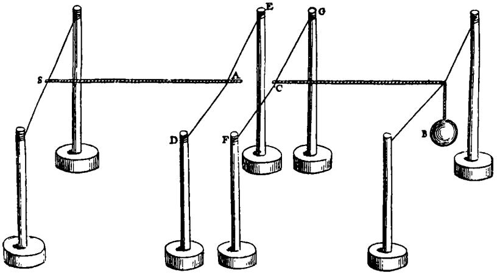

FIG. 7. The two conducting lines *SA* and *CB,* of lengths 6 and 8 ft, respectively, are supported by four silk cross cords, such as *DE* and *FG.* When an excited tube is applied to the end *S* of the one line, the ball *Β* on the end of the other line becomes electrified, as can be shown by holding an electroscope near it. [Dufay, *Mémoires de l'Académie Royale des Sciences* (1733), p. 254.]

We omit the next, or fifth, section of Dufay's letter, in which he tells how he "suspended a child on silk lines and made all the experiments described by Mr. Gray" and then, suspending himself in place of the child, continues with other, similar experiments.

The sixth section, which follows, contains the first known reference made by any electrical investigator, at least in France or England, to an experiment performed by Otto von Guericke more than a half century earlier, in which a feather, after it had been attracted to and

touched an excited sulfur globe, was not only repelled by the globe but would not be attracted again until after it had touched some other, unelectrified body. We remember that Hauksbee described a similar experiment made with leaf-brass (p. 570). Now we shall see Dufay performing the experiment, this time with gold leaf as the repelled object, and finding significance in it that escaped his predecessors.

*Sixthly,* on making the experiment related by *Otto von Gueriche* in his collection of experiments, *de Vacuo Spatio* [1672], in which a ball of sulfur rendered electrical repels a down-feather, I perceived that the same effects were produced not only by the [rubbed] tube but by all electrified bodies whatsoever; and I discovered a very simple principle that accounts for a great part of the irregularities and, if I may use the term, caprices which seem to accompany most of the experiments on electricity. This principle is that an electrified body attracts all those that are not themselves electrified, and repels them as soon as they become electrified by . . . [conduction from] the electrified body. Thus gold leaf is first attracted by the tube. Upon acquiring an electricity . . . [by conduction from the tube], the gold leaf is of consequence immediately repelled by the tube. Nor is it reattracted while it retains its electrical quality. But if . . . the gold leaf chance to light on some other body, it straightway loses its electricity and consequently is reattracted by the tube, which, after having given it a new electricity, repels it a second time. This continues as long as the tube remains electrical. Upon applying this principle to the various experiments on electricity, one will be surprised at the number of obscure and puzzling facts it clears up. . . .

Dufay has here enunciated a working hypothesis on a grand scale that has endured until the present day: if any unelectrified object comes into contact with one that is electrified and thus becomes itself electrified by conduction, it will then be repelled; and it will not be attracted again until it has lost this acquired electrification by touching some other body. Although Dufay has made it clear to us that this new hypothesis, or principle, as he calls it, came out of his experiments and Gray's concept of electrical conduction, his great accomplishment here was in the use of this discovery to interpret the experiments and arrive at a completely new conception : repulsion will occur when both bodies are electrified, provided that the one body has become electrified by conduction from the other. How he arrived at this working hypothesis he does not say, and it is doubtful if he could; even now, with the advantage of several centuries of accumulated knowledge, we still know little of the mental processes involved in creative thinking.

In one of his French Academy memoirs, Dufay goes further and tries to explain electrical repulsion in terms of contemporary speculations about the nature of matter and electricity. The most prevalent French view, we know, was that any electrified body is surrounded by a "subtle, material effluvium" in motion — perhaps a whirling, or vortex, motion — and that any object coming within this field of activity is urged toward the electrified body. It also had to be assumed, after Gray's discovery of conduction, that this effluvium is not to be regarded as inseparably connected with the electrified body; part of it will pass to another body if the latter touches the electrified body. But how is it to be further explained that these two bodies, after touching, repel each other? Dufay, in his memoir, hints at a possible answer: assume that the effluvium is self-repulsive; then that part of it which is communicated to another body repels the part still attached to the parent body, and thus the bodies themselves are pushed apart. These various thoughts and experiences raise two new questions in his mind.

It is then certain that bodies which have become electrical . . . [by conduction] are repelled by those which have rendered them electrical. But are they repelled likewise by other electrifid bodies of all kinds? And do electrified bodies differ from one another in no respect save their intensity of electrification? An examination of this matter has led me to a discovery which I should never have foreseen, and of which I believe no one hitherto has had the least idea.

Dufay's "examination of this matter," as described in one of his memoirs, consist in devising and carrying out an experiment suggested by the questions. A piece of gold leaf is made electrical by letting it come into contact with a rubbed glass tube, whereupon the gold leaf is repelled by the tube and floats in the air above it. A piece of rubbed copal, which is a resinous solid, is now brought close to the floating gold leaf. It *attracts* the gold leaf. "I had expected," he writes, "quite the opposite effect, since, according to my reasoning, the copal and the gold leaf, which are both electrified, should have repelled each other."

Here he has observed something contrary to anything previously known about the behavior of electrified bodies and, he writes, this "disconcerted me prodigiously." Yet further tests with various other substances convince him that he is dealing with a really new effect. The remarkable interpretation of it that he now makes is summarized in the seventh, and last, section of his letter to the Duke of Richmond and Lenox.

*Seventhly,* chance has thrown my way another principle, more universal and remarkable than the preceding one, and which casts new light on the subject of electricity. This principle is that there are two distinct electricities, very different from each other: one of these I call *vitreous electricity,* the other, *resinous electricity.* The first is that of

[rubbed] glass, rock crystal, precious stones, hair of animals, wool, and many other bodies. The second is that of [rubbed] amber, copal, gum lac, silk, thread, paper, and a vast number of other substances.

The characteristic of these two electricities is that a body of, say, the *vitreous electricity* repels all such as are of the same electricity; and on the contrary, attracts all those of the *resinous electricity.* Thus the [rubbed glass] tube will repel [rubbed] glass, crystal, hair of animals, and so forth, and will attract [rubbed] silk, thread, paper, and so forth. Two silk ribbons rendered electrical [by rubbing] will repel each other; two woolen threads will do likewise. But a [rubbed] woolen thread and a [rubbed] silk thread will mutually attract each other. This principle very naturally explains why the ends of silk or wool threads recede from one another [like the bristles of a broom] . . . when they have acquired an electrical quality. From this principle one may with the same ease deduce the explanation of a large number of other phenomena; and it is probable that this truth will lead us to the further discovery of many other things.

In order to know immediately to which of the two classes of electricity any body whatsoever belongs, one need only render electrical [by rubbing] a silk thread, which is known to be of the *resinous electricity,*  and see whether the body in question, when rendered electrical, attracts or repels it. If the body attracts, it is certainly of the kind of electricity that I call *vitreous·,* if, on the contrary, it repels, it is of the same kind of electricity as the silk, that is, *resinous.* 

I have likewise observed that communicated [conducted] electricity retains its original property. For if a ball of ivory or of wood set on a glass stand be rendered electrical by [conduction from] the [rubbed] tube, it will repel all such [rubbed] substances as the tube repels; but if the ball be rendered electrical by touching it to a rubbed cylinder of gum lac, it will produce quite contrary effects, namely, precisely the same as rubbed gum lac would produce. To succeed in these experiments, it is requisite that the two bodies under test be rendered as electrical as possible; for if one of them were not at all, or but weakly, electrified, it would be attracted by the other, even though it be of the sort that [if well rubbed] should naturally be repelled by it. The experiment will always succeed perfectly well if both bodies are sufficiently electrified.

I have several other methods for discovering the nature of the electricity of any body; but my letter is already long enough, and my design was only to give your Grace a succinct extract of the experiments I have made this last year. I beseech your Grace to communicate it to the *Royal Society* and, in particular, to Mr. *Gray,* who works on this subject with so much application and success, and to whom I acknowledge myself indebted for the discoveries I have made, as well as for those I may possibly make hereafter; for it is from his writings that I took the resolution of applying myself to this kind of experiments.

I have the honor to be, with the most sincere and most respectuous attachment,

> *My LORD, Your GRACE'S most Humble and most Obedient Servant*  DU FAY

In these final paragraphs Dufay has described his greatest discovery: there are two different kinds, or states, of electrification; and two bodies that have the same kind repel each other, whereas two bodies with the opposite kinds attract. Elsewhere he adds that, to "avoid both confusion of terms and the difficulty of having to define, every minute, the one of which I wish to speak," the name "vitreous" has been given to the one kind, and the name "resinous" to the other, "not because I think that only bodies like glass are endowed with the one and only the resinous substances with the other . . . but because glass and copal are the two substances that gave me grounds for discovering these two different electricities."

We may now summarize by stating the most important generalizations that Dufay has either discovered or, if discovered by others, has been able to confirm with a considerable degree of definiteness:

(i) All bodies, with the exception of the metals and soft substances, can be electrified by rubbing, and so have the property formerly supposed to be peculiar to a limited class of substances — the electrics. (However, as early as Gray's work it was becoming clear that even metals and soft substances should be included in the list. Moreover, as is now known, to speak of electrification "by rubbing" or "by friction" is misleading, for this implies that it is the rubbing or frictional forces which are responsible for the electrification. Actually, rolling one object over another will produce electrification of strength equal to or exceeding that obtained by sliding contact; the rubbing or rolling serves merely to bring large areas of the two unlike surfaces into very close contact. In brief, so-called triboelectrification — electrification "by rubbing" or "by friction" — is due primarily to the *contact* and *subsequent separation* of *dissimilar* substances. Triboelectrification should not be confused with the two processes that we have called *electrification by conduction* and *electrification by influence.)* 

(ii) Metals and wet objects are good conductors of electricity, and therefore make poor insulators; conversely, such substances as amber, silk, and glass are poor conductors and therefore make good insulators.

(iii) Substances that are conductors are the ones that can be most strongly electrified by influence.

(iv) Any electrified body and any unelectrified body attract each other; but, if some of the electricity of the one is communicated by conduction to the other, they then repel.

(v) There are two different kinds of electrification, called by Dufay "vitreous" and "resinous"; and bodies having the same kind repel, whereas two bodies having the opposite kinds attract. (After Dufay's time it was found that the kind of electrification acquired by a rubbed object depends just as much on the material used in rubbing as on the material being rubbed, and that it also varies with the condition of the rubbed surfaces. For instance, glass rubbed with silk, wool, or cat's fur usually shows the kind that Dufay called "vitreous"; but if rubbed with rabbit's fur, it will be found to have the kind he called "resinous.")

*The two-fluid theory of electricity.* We have seen that Hauksbee's attention focused upon the mechanism whereby an excited electric affected nearby objects without touching them. Like Gilbert, he envisaged an invisible effluvium surrounding the rubbed electric, and he found convincing evidence for the material nature of this effluvium.

Gray, however, accepted electrical attraction with little apparent interest in its nature or mechanism, directing his attention toward his discovery that the property of attraction — "the electric virtue" could be transferred from one object to another. Although Gray always wrote of transfer of the electric virtue, the mechanistically minded scientists of the i8th century were prone to consider the transfer of a *property* from one object to a second as being due to the transfer of a *substance.* Thus a bucket that gets heavier presumably has had something weighty put in it; an object that gets hotter has had heat added to it; and, by analogy, an object becomes electrified because some *electricity* is added to it. Thus soon after Gray's work the term "electricity" rather quickly comes to have the meaning of a substance within— or perhaps on the surface of — an electrified object. This substance is invisible, but postulation of its existence offers a reasonable explanation of electrification by contact: an object electrified by rubbing contains this invisible electricity, and when it touches an unelectrified object some of the electricity is transferred. The ease of transfer from one object, directly or through a string or other intermediary, to a second led to the view that this easily flowing electricity was a *fluid,* and it was often called the "electric fluid."

Dufay never refers to such a fluid. But his discovery of the two states of electrification could be explained by the assumption that there exist two electrical fluids, one vitreous and one resinous, and that when an object is charged with one of these fluids, either by rubbing or by transfer of fluid from an already electrified object, it demonstrates the property of being electrified.

Thus although neither Gray nor Dufay explicitly mentions an electrical fluid or uses the term "electricity" in that sense, their immediate successors do, and by the mid-i8th century electrical phenomena are being explained in terms of a conceptual scheme known as the two-fluid theory of electricity.

This two-fluid theory involved the following assumptions: *(a)* there are two, distinct electrical fluids, one of which may be called "vitreous" and the other, "resinous"; *(b)* any *unelectrified* object possesses equal quantities of these two fluids, which neutralize each other; (c) rubbing electrifies an object by removing from it one or the other kind of fluid (for instance, rubbed glass exhibits the kind of electrification called "vitreous" by Dufay because the rubbing supposedly has removed some "resinous" fluid from the glass, leaving it with an excess of the "vitreous"); (d) the larger the quantity of a particular fluid removed, the greater is the strength of the electrification. Notice that by "equal quantities" of the two kinds of fluid is here meant simply the quantities present in an unelectrified object and, therefore, the quantities that will completely neutralize each other's effects.

Electrification by conduction is explained by the two-fluid theory as the transfer of excess fluid from an electrified object to an unelectrified one. The act of electrification thus came to be regarded as one of filling an object with an electrical fluid, which by analogy with the act of loading or charging something — such as a cannon with gunpowder — came to be called "charging." The use of the expression "to charge" to mean "to electrify" has endured to the present day, and "electrical charge" or simply "charge" soon came to mean "electricity" or "electrical fluid." Henceforth we shall use these three terms interchangeably.

The generous recognition that Dufay gave in his letter to the work of the relatively obscure Gray led to correspondence between them and encouraged Gray to begin new investigations. Thus, while experimenting with electric sparks, which Dufay had seen and reported to him, Gray observed that when a pointed metal rod is held near an electrified object the latter slowly and almost silently loses its electricity— is discharged — whereas with a blunt rod the loss occurs with one loud snap. He concluded: "In time there may be found a way to collect a greater quantity of . . . this electric fire, which by several of these experiments *(si licet magnis componete parva)* seems to be of the same nature with that of thunder and lightning."

#### *6.* SOME STRIKING RESULTS OF THE POPULARIZATION OF SCIENCE IN THE 18TH CENTURY

That there are many motives and incentives for scientific activity, and many patterns by which a science develops, is vividly illustrated by the progress of electrical science in the decade following Dufay's work, as well as by certain trends that began in preceding periods. The impressive successes of physical science — especially mechanics and astronomy, first in Italy and, after the middle of the 17th century, in England — had a strong popular appeal, leading to a lively public interest in natural phenomena. With this came an increasing awareness of the orderliness of these phenomena, a sense of their independence of capricious and magical influences. And, since the human mind was showing itself capable of coping with nature, there was a growing feeling of confidence in the exercise of personal judgment and understanding, as opposed to reliance on the dogmatic authority of others.

To make the findings of science available to a wider circle of readers, the scientific societies encouraged their members to describe their work in the vernacular, rather than in Latin. Yet it was less the scientists than the men of letters — the essayists, poets, novelists, and writers of popular scientific articles — who were rendering the discoveries and the new attitudes of science clear and intelligible to the public. These men were among the first to envisage the application of the scientific outlook and methods to a variety of other human activities — political, economic, and social. Their attempts at such extension were often carried out too hastily and without sufficient regard for the limited applicability of many of the methods of the sciences; nevertheless, they sought to present the broad human meanings of scientific findings and to express these meanings, not in technical terms, but in language having imaginative and emotional appeal for all intelligent persons. It was this zeal to "enlighten" people, coupled with the activities of scientists themselves, that helped to make the 18th century the period later described as the age of enlightenment or, perhaps still more accurately, as the age of the reign of common sense.

Science was now also a "social success," for it was becoming the fashion among both the upper and the middle classes to attend popular scientific lectures and show interest in the sciences. By Dufay's time, electricity was the rage, and lecturers were busily engaged in devising spectacular experiments that were more nearly scientific recreations than researches. This popular interest in electricity soon spread from England and France to the German Empire, where scientific activities had been slowed down during the first part of the 18th century owing

to involvements in foreign wars and political dissension within the Empire itself. Although German scientists had kept themselves informed of outside advances, it was apparently the demand for popular lectures that led them to make electrical experiments of their own.

To make these popular lectures more spectacular, means for producing stronger electrification were sought. When C. A. Hausen, lecturing at the Leipzig Academy in 1743, complained of the feebleness of the effects produced by a rubbed glass tube, he was reminded that Hauksbee had developed a frictional electrical generator. Hausen soon constructed one of his own and used it to repeat some of the experiments that Gray and Dufay had made with their glass tubes. Thus he suspended a boy horizontally on silk cord insulators, with the boy's feet touching the spinning, hand-rubbed globe. The electrical charge passing by conduction from the excited globe to the insulated body of the boy was stored there until some uncharged conductor — Hausen's finger, say — was brought close to the boy's body, whereupon strong sparks were seen to pass between them.

At about this same time, G. M. Bose, then at the University of Leipzig, also set out to repeat and exhibit various experiments. Lacking suitable apparatus, Bose dismantled the distilling apparatus in his laboratory, cut off the the globular portion of the 7-gallon distilling flask, and mounted this globe on a rotator like Hauksbee's. The globe was so large that Bose now had a generator more powerful than had ever before been constructed. He was an ingenious experimenter with a flair for showmanship. For one of his many demonstrations, he replaced the boy of Hausen's experiment with an attractive young woman and, keeping the generator concealed from the audience, had some willing member try to grasp her hand or kiss her, whereupon he was subjected to an unexpected and unpleasant shock. We are not told how the woman reacted to this experiment.

Interested in getting still bigger effects, Bose concluded that a way to collect more electricity from the generator would be to replace the woman or boy with a large insulated metal object. Apparently he was thinking in terms of an electrical fluid and consequently felt that more fluid could be stored in a larger object. Having available a large telescope, he appropriated its metal tube, which was some 21 ft in length. After some preliminary trials with this tube held in the hand, he suspended it by silk cords and, moreover, hit on the idea of collecting the electricity by means of conducting threads tied to the metal tube and with their loose ends resting on the surface of the spinning globe. Later investigators used a gun barrel as the insulated metal object and a metal chain in place of the threads.

Up to this time the globe of the generator had always been rubbed by placing the hand on it. But in 1744 J. H. Winkler, a Leipzig professor of Latin and Greek, who was also an amateur experimenter, conceived the idea of using a mechanical "rubber," consisting of leather-covered cushions so mounted as to be pressed against the spinning globe by an adjustable screw. However, before this mechanical "rubber" could come into general use, it had to be recognized that it would work satisfactorily only when connected to some large object made of conducting material. The earth is such an object, and when the experimenter's hand was used as the rubbing agent it was connected to the earth through the human body, which is itself a conductor.

All the essential parts of a good triboelectric generator had now been developed — the rotator driving a globe or cylinder, the metallic conductor for collecting the electricity, and the mechanical "rubber." But attempts were continued to get still more powerful generators, for instance, by mounting together several globes that could be rotated on the same shaft. Bose said he got especially vivid sparks with an apparatus utilizing "three globes . . . and a beer glass." Like Hauksbee, Bose experimented with the flashes of light produced electrically in a partially evacuated vessel and found that they "flowed, and turned, and wandered and flashed," so that "no name is so applicable to them as that of Northern Lights."

By 1745 excitement over the wonders of electricity had become so great that people were said to be flocking even to the regular college lectures, often "crowding the students out of their seats." German artisans were now building generators and finding a good market for them among well-to-do people who amused themselves by repeating experiments in their homes. Among these amateur experimenters there was a clergyman of Pomerania, E. G. von Kleist.

*Evolution of the electrical condenser.* It was a contemporary belief that the gradual loss in electrification which always occurs when an electrically charged body is in the open air resulted from "evaporation" of the electrical fluid. Could this "evaporation" be reduced by enclosing the electrified body in a container? By the fall of 1745, Kleist had carried out experiments with various things, such as water, enclosed in a glass bottle and electrified by conduction. A nail inserted in the narrow neck of the bottle provided a convenient connection between the water and the electrical generator. Holding the bottle in his hand, he presented the nail to the generator, then withdrew the bottle and brought the nail close to an unelectrified object in the room. An intense spark was seen to pass between nail and object. While still holding the bottle, he touched the nail with his other hand and experienced a severe shock. When the experiment was repeated with mercury or alcohol in the bottle, the result was still more severe. "The shock," he said, "stuns my arms and shoulders." If no object were brought close to the nail, the device would remain charged for many hours. However, what Kleist found to be most remarkable was that no bright spark or shock could be obtained from the nail when he put the electrified bottle on the table. That it must be held in the hand led him to think that "the human body must therefore contribute something to it." That some new property of the human body — some sort of "animal electricity" — had perhaps been brought to light, seemed more important to him than that large amounts of electricity could be stored and held for hours at a time.

Kleist described these observations in letters which he sent late in 1745 to several acquaintances, who in turn passed on the information to the Berlin Academy and to various other German scientists. Some who tried to repeat the experiments were unable at first to make them work, apparently because they had disregarded Kleist's remark that the bottle must be supported by one hand when the spark is to be drawn by the other.

In January 1746, shortly after Kleist's letters were circulated, a letter reached the French Academy from Pieter van Musschenbroek, a celebrated teacher and physical experimentalist at the University of Leiden. Since Musschenbroek's letter described an experiment that was entirely new to the Parisian scientists, J. A. Nollet incorporated the following extract from it in a paper of his own published early in 1746 in the *Mémoires* of the French Academy :

I am going to tell you about a new but terrible experiment which I advise you not to try for yourself .. . I was making some investigations on the force of electricity. For this purpose I had suspended by two threads of blue silk, a gun barrel, which received by communication the electricity of a glass globe thai was turned rapidly on its axis while it was rubbed by the hands placed against it. From the other end of the gun barrel there hung freely a brass wire, the end of which passed into a glass flask, partly filled with water. This flask I held in my right hand, while with my left I attempted to draw sparks from the gun barrel. Suddenly my right hand was struck so violently that all my body was affected as if it had been struck by lightning. . . The arm and all the body are affected in a terrible way that I cannot describe: in a word, I thought that it was all up with me. . . The person who tries the experiment may simply stand on the floor, but it is important that the same man hold the flask in one hand and try to draw the spark with the other; the effect is very slight if these actions were performed by two different persons. If the flask is placed on a metal support on a

wooden table, then the one who touches this metal even with the end of his finger and draws the spark with his other hand receives a great shock.

This of course is essentially the same experiment as Kleist had reported. However, we see that Musschenbroek went further in that he showed how to make the experiment work without having to hold the flask in the hand. Here the human body is no longer an essential part of the apparatus, and it is unnecessary to speculate on whether some sort of "animal electricity" is producing the observed effects. In brief, what Musschenbroek had demonstrated was that the body of the operator serves merely as an electrical conductor connecting the metal support for the flask to the wire which is in contact with the inside of the flask.

Nollet's paper in the *Mémoires* attracted wide attention, and so the discovery as reported from Leiden was generally referred to as the Musschenbroek, or Leiden, experiment, while the device itself came to be known as the *Ley den* (or *Leiden) jar.* 

Improvements in the Leyden jar now came rapidly, especially in England and Germany. It was found unnecessary to use a liquid in the jar or bottle, the important point being that the inside as well as the outside of the vessel should be covered with a conducting material. One investigator substituted metal shot for the liquid. Others hit on the scheme of covering the bottom and lower sides of the jar, inside and outside, with tin foil; a chain served to connect this inner coating with the wire or rod fastened in the mouth of the jar. As a substitute for the human portion of the circuit, a wire was connected to the outer coating and brought up close to the rod in the mouth, so as to provide a *spar\ gap.* Instead of using a jar or bottle, one English investigator employed a pane of glass, coated on both sides with metal foil.

Ways to strengthen the spark or shock were also found, namely, by increasing the areas of the inner and outer coatings, and by using thinner glass. Many years were to pass, however, before it was shown that the strength of the electric discharge could also be changed by replacing the glass with another nonconducting material, such as wax, mica, or even air.

Meanwhile, public interest in electricity had continued to increase. In England, many of the popular magazines were printing news of the new electrical discoveries as rapidly as scientists announced them. Experimental lectures on science had now spread even to the English Colonies in America. It was one of these popular lectures that aroused an active interest in electrical experimentation in "one of the broadest and most creative minds of his time" — the "illustrious Doctor Franklin," America's first great man of science.

#### 7. BENJAMIN FRANKLIN'S EXPERIMENTS, THEORIES, AND INVENnoNs

Benjamin Franklin (1706-1790) was close to 37 years of age when he first encountered the "wonders of electricity." This was during a visit to Boston, probably in 1743, when he met a Dr. Spencer, a popular lecturer on science, "who was lately arrived from Scotland, and show'd me some electrical experiments. These were imperfectly perform'd, as he was not very expert; but, being on a subject quite new to me, they equally surpris'd and pleased me."

Franklin was by this time an established businessman, a successful publisher and journalist, and a prominent citizen and active public servant of Philadelphia and the Pennsylvania Colony. By the time he was 21, he had become acquainted, in England, with various men of science and, in Philadelphia, had been instrumental in forming a discussion club called the "Junto" which later, with his help, developed into the American Philosophical Society "for promoting useful knowledge." It was the first scientific society in this country and is still in existence.

Some time after his interest in electricity had been aroused by Dr. Spencer's experiments, Franklin acquired his first piece of electrical equipment. He relates the circumstances in his *Autobiography :* 

Soon after my return to Philadelphia, our library company receiv'd from Mr. P. Collinson, Fellow of the Royal Society of London, a present of a glass tube, with some account of the use of it in making such experiments. I eagerly seized the opportunity of repeating what I had seen in Boston: and, by much practice, acquir'd great readiness in performing those also which we had an account of from England, adding a number of new ones. I say with much practice, for my house was continually full, for some time, with people who came to see these new wonders.

To divide a little this incumbrance among my friends, I caused a number of similar tubes to be blown at our glasshouse with which they furnish'd themselves, so that we had at length several performers.

The "library company" mentioned by Franklin was a circulating library, the first in America, which he and some other Junto members had organized to assist the members in their reading, and contribute to the general education. Peter Collinson, an English manufacturer and naturalist with extensive business connections in the American colonies, was the London agent of the Library Company, in which capacity he served for 30 years without emolument. The glass tube was only one of his many personal gifts to the Company.

Fortunately, Franklin had already reached a financial position that enabled him to take time away from business and to acquire any materials that might be needed for experimentation. He purchased Spencer's electrical equipment, and eventually acquired or made additional apparatus, including specimens of the recently invented Leyden jar. In a letter to Collinson in March 1747, he writes:

Your kind present of an electric tube, with directions for using it, has put several of us on making electrical experiments, in which we have observed some particular phenomena that we look upon to be new. I shall therefore communicate them to you in my next, though possibly they may not be new to you, as among the number daily employed in these experiments on your side of the water, 'tis probable some one or other has hit on the same observations. For my own part, I never was before engaged in any study that so totally engrossed my attention and my time as this has lately done. . . .

In his next letter to Collinson, written two months later, in May 1747, Franklin fulfills his promise to communicate "some particular phenomena that we look upon to be new." He begins by describing observations of his group of American experimenters on "the wonderful effect of pointed bodies, both in *drawing off* and *throwing off* the electrical fire." Actually, although he did not know it at the time, pointed conductors were not a completely new idea abroad (p. 48).

But even at this early stage Franklin had some acquaintance with the electrical studies abroad, for Collinson had sent him information about some of the activities in Germany and also a pamphlet by William Watson, entitled *A sequel to the experiments and observations tending to illustrate the nature and properties of electricity* (London, 1746). Watson was a London apothecary and Fellow of the Royal Society, who in later life rose to eminence in the medical profession.

In the remainder of this letter to Collinson, Franklin refers to Watson's *Sequel* and then outlines a set of working hypotheses on the nature of electricity, devised in the light of experiments familiar to him.

We had for some time been of the opinion that the electrical fire [electrical fluid] was not created by friction, but collected, being really an element diffused among, and attracted by other matter, particularly by water and metals. . . The impossibility of electrizing one's self (though standing on wax) by rubbing the tube and drawing the fire from it, and the manner of doing it by passing the tube near a person or thing standing on the floor, *&c,* had also occurred to us some months before Mr. *Watson's* ingenious *Sequel* came to hand, and these were some of the new things I intended to have communicated to you. But now I need only mention some particulars not hinted in that piece, with our reasonings thereupon, though perhaps the latter might well enough be spared.

. A person standing on wax and rubbing the tube, and another person on wax drawing the fire [by placing his knuckle near the tube so that a spark passes between tube and knuckle], they will both of them (provided they do not stand so as to touch each other) appear to be electrized to a person standing on the floor; that is, he will perceive a spark on approaching each of them with his knuckle.

*2.* But if the persons on wax touch each other during the exciting of the tube [and passing of the spark], neither of them will appear to be electrized.

3. If they touch each other after exciting the tube and drawing the fire as aforesaid [in 1], there will be a stronger spark between them than was between either of them and the person on the floor.

4. After such strong spark, neither of them discovers any electricity [that is, they are no longer electrified].

These appearances we attempt to account for thus. We suppose, as aforesaid, that electrical fire [electrical fluid] is a common element, of which every one of the three persons aforementioned has his equal share before any operation is begun with the tube. *A,* who stands on wax and rubs the tube, collects the electrical fire from himself into the glass; and his communication with the common stock being cut off by the wax, his body is not again immediately supply'd. Β (who stands on wax likewise), passing his knuckle along near the tube, receives the fire which was collected by the glass from *A:* and his communication with the common stock being likewise cut off, he retains the additional quantity received. To *C,* standing on the floor, both appear to be electrized: for C, having only the middle [normal] quantity of electrical fire, receives a spark upon approaching B, who has an over-quantity, but gives one to *A,* who has an under-quantity.

If A and Β approach to touch each other [after A has excited the tube, and Β has drawn electricity from it], the spark is stronger, because the difference between them is greater; after such touch there is no spark between either of them and *C,* because the electrical fire in all is reduced to the original equality. If A and Β touch while electrizing, the equality is never destroy'd, the fire only circulating.

Hence have arisen some new terms among us. We say Β (and bodies like circumstanced) is electrized *positively; A, negatively.* Or rather, *Β*  is electrized *plus; A, minus.* And we daily in our experiments electrize [objects] *plus* or *minus,* as we think proper. To electrize *plus* or *minus,*  no more needs to be known than this: that the parts of the [glass] tube or sphere which are rubbed do, in the instant of the friction, attract the electrical fire, and therefore take it from the thing rubbing; the same parts immediately, as the friction upon them ceases, are disposed to give

the fire they have received to any body that has less. Thus you may circulate it, as Mr. *Watson* has shown. You may also accumulate or subtract it, upon or from any body, as you connect that body with the rubber or with the receiver, the communication with the common stock being cut off.

We think that ingenious gentleman was deceived when he imagined (in his *Sequel*) that the electrical fire came down the wire from the ceiling to the gun barrel, thence to the sphere, and so electrized the machine and the man turning the wheel, fir. We suppose it was *driven off ,* and not brought on through that wire; and that the machine and man, fir., were electrized minus, that is, had less electrical fire in them than things in common.

The references here to the "rubber" and to the "receiver" (such as a gun barrel connected by a loose chain to the rotating sphere) show that Franklin knows about the recent improvements made in Hauksbee's generator. Only the simple glass tube had been sent to him by Collinson. Generators were only slowly coming into use in England but, as Franklin relates in this same letter, one of his Philadelphia colleagues contrived for their own use a simple generator consisting of a glass sphere mounted on an iron axle, on one end of which there was a small handle, "with which you turn the sphere like a common grindstone." "Tis true," he adds, "the sphere does not turn swift as when the great wheel is used: but swiftness we think of little importance, since a few turns will charge the phial [Leyden jar], *&c.* sufficiently."

Collinson showed this letter to Watson, who quoted parts of it in a paper of his own in the *Philosophical Transactions·,* the portions that he omitted are the first paragraph and the final passages beginning with "We think that ingenious gentleman [Watson] was deceived. . . ." Watson ended his paper with the remark that Franklin's hypothesis "so exactly corresponds with that which I offer'd very early last spring that I could not help communicating it."

Watson, at this time and later, never failed to commend Franklin's work and views, and he agreed that the latter had formulated his hypothesis independently; but he contended until the end that the two hypotheses were identical. The considered opinion today is that they did have features in common, but that Franklin's view was more mature, and was clearer and more definite in statement. Of most significance, it was his view that turned out to be the more fruitful, and immediately so, of new ideas and experiments.

Indeed, it is such new experiments that led Franklin to see that his first tentative hypothesis was not entirely satisfactory, for in August 1747 he again wrote to Collinson.

On some further experiments since, I have observ'd a phenomenon or two that I cannot at present account for on the principles laid down in those [preceding] letters, and have therefore become a little diffident of my hypothesis, and asham'd that I have express'd myself in so positive a manner. In going on with these experiments, how many pretty systems do we build, which we soon find ourselves oblig'd to destroy! If there is no other use discover'd of electricity, this, however, is something considerable, that it may *help to ma\e a vain man humble.* I must now request that you would not expose those letters; or if you communicate them to any friends, you would at least conceal my name.

This note reached Collinson too late, of course, for he had already shown the two earlier letters to Watson. As Franklin suggested, the vast majority of our "pretty systems" or hypotheses have a very short lifetime indeed. Most working hypotheses probably are abandoned even as they are being conceived, because the previous experience of the investigator is sufficient to enable him to reject them. Of those that he does subject to experimental test, only a minute fraction survive, at least in their original form.

Franklin, like Watson, recognized only one kind of electrical fluid. This he regarded as present in all bodies. Each unelectrified body contains a normal, or equilibrium, amount which produces no observable effects. The process of electrification, he supposed, consists in taking some of the electrical fluid from one body and giving it to another. Thus the fluid is not created, but is merely transferred. When an unelectrified body is rubbed, it either gains electrical fluid and thus reaches a positive (plus) state, or loses some of its natural amount, leaving it in a negative (minus) state. He assumed that glass, upon being rubbed, draws electrical fluid from the rubbing agent and becomes positive, or plus, while the rubbing agent is left negative, or minus.

In the process of electrification by conduction — as when two conducting bodies are touching or are close enough together for a spark to pass through the air between them — he assumed that a normal body will receive additional fluid from a positively electrified body and will give up fluid to a negatively charged body. Thus the "direction of flow" of electrical fluid during conduction is from a positively electrified body to one that is either normal or negatively electrified, and from a normal body to one that is negatively electrified. This convention for determining the direction of a flow of electricity (an electric current) is still in use.

Being unaware at this time of Dufay's earlier discovery of the two kinds of electrification, which he had named "vitreous" and "resinous"

(p. 586), Franklin has had to provide his own terminology for these phenomena. In his terms, any body containing more than the normal quantity of his single electrical fluid is in the state of electrification that Dufay called "vitreous," and any body deficient in this fluid is in the "resinous" state. Franklin's use of the mathematical terms, *positive,* or *plus,* and *negative*, or *minus*, has the advantage of suggesting the possibility that electricity is a measurable quantity. Indeed, his theory involves the assumption that the quantity of electricity in any *insulated* body remains unchanged and that any process of electrification involves merely a transfer of electricity. This is probably the first clear expression of the tremendously important generalization that electricity cannot be created or destroyed — a generalization that later came to be called the *principle* 0/ *conservation of electric charge.* Suppose, for instance, that two unlike objects are rubbed together, resulting in a transfer of electricity from one body to the other. Then, according to the principle of conservation of electric charge, the quantity of electricity gained by the one object is exactly equal to that lost by the other object. In other words, if we let the symbol *q* represent the quantity of electricity transferred during the rubbing, then the one object acquires a superfluity *+q,* and the other object a deficiency *—q.* We shall see that some such conservation principle is necessary before any extensive quantitative study of electrical phenomena becomes possible (p. 610).

*Franklin's explanation of the Leyden jar and of electrification by influence.* In a letter to Collinson in July 1747, Franklin shows how his one-fluid hypothesis may be used to explain the action of the Leyden jar. In the following excerpts from this letter, we have altered several of Franklin's terms and phrases so as to avoid complicated explanations.

At the same time that the inner coating of the botde [Leyden jar] is electrized *positively* or *plus,* the outer coating is electrized *negatively* or *minus,* in exact proportion; *i.e.,* whatever quantity of electricity is put in the inner coating, an equal quantity goes out of the outer coating [which is connected to the earth]. To understand this, suppose the common quantity of electricity in each part of the bottle, before the operation begins, is equal to 20; and at every stroke of the glass tube [which is connected to the inner coating], suppose a quantity equal to is put in; then, after the first stroke, the quantity contain'd in the inner coating of the bottle will be 21, in the outer coating 19. After the second, the inner coating will have 22, the outer 18, and so on, till, after 20 strokes the inner coating will have a quantity of electricity equal to 40, the outer coating none; and then the operation ends, for no more can be thrown into the inner part when no more can be driven from

the outer part. If you attempt to throw more in, it is spued back through the wire, or flies out in loud cracks through the sides of the bottle.

The equilibrium cannot be restored in the bottle by *inu/ard* communication or contact of the parts. It must be done by communication formed *outside* the bottle between the inner and outer coatings, by some nonelectric [conductor] touching or approaching both at the same time, in which case the equilibrium is restored with a violence and quickness inexpressible; or by touching each part alternately, in which case the equilibrium is restored by degrees.

As no more electricity can be put in the inner coating of the bottle when all is driven from the outer coating, so in a bottle not yet electrized, none can be put in the inner part when none can get out of the outer part, which happens either when the bottom is too thick or when the bottle is placed on an electric [on an insulator]. Again, when the bottle is electrized, but little of the electricity can be *drawn* from the inner part, by touching the wire, unless an equal quantity can at the same time *get in* the outer part [by having it connected to the earth]. . . .

Franklin devised various experiments to test this explanation. For instance, to show that the outer coating of the jar is electrified negatively when the inner coating is positive, he employed an electroscope consisting of a small cork ball suspended by a silk thread. When this electroscope was held near the wire connected to the inner coating, the ball was attracted to and touched the wire, whereupon it became positively electrified by conduction and thereafter was repelled. Upon bringing this positively electrified ball down near to the outer coating, it was found to be strongly attracted, indicating that the outer coating was negatively electrified.

Franklin, in this analysis of the action of the Ley den jar, has provided an explanation of the process called *electrification by influence*  — electrification occurring in an object that is merely close to, but not touching, an electrified object. It is by influence that the outer coating of the Ley den jar becomes electrified; for this coating is separated from the electrified inner coating by the glass, through which the electrical fluid cannot pass, as Franklin showed by making some separate tests. What happens here, in terms of Franklin's theory, is that the excess of fluid in the inner coating exerts a repelling "influence," or force, on the fluid naturally present in the outer coating; and, if this coating is connected to the earth, the fluid is repelled into the earth, leaving the outer coating deficient in fluid, or negatively electrified.

This theory of electrification by influence is also adequate for explaining the following experiments. A long metal rod is supported by silk threads, and close to one end of the rod, but not touching it, is placed an excited glass tube. With the help of an electroscope, it can then be shown that the end of the rod farther from the positively electrified glass tube is positively electrified, while the end nearer the tube is negatively electrified. The explanation, in terms of Franklin's theory, is that the electricity naturally present in the rod is repelled toward the farther end, giving it a superfluity of electricity and leaving the nearer end with a deficiency. If the glass tube is now taken away, the rod returns to its normal unelectrified state; that is, the electrification of the ends of the rod by influence is only temporary.

Suppose, however, that while the positively charged glass tube is again held near the metal rod, the latter is momentarily connected to the earth or touched by the hand. If the glass tube is now removed, the electroscope will show the whole rod to be negatively electrified, and *permanently* so. In terms of Franklin's theory, the excess of electricity in the excited tube repels some of the rod's natural amount of electricity into the earth or the body of the investigator; and, when the connection with the earth or the hand is broken, the rod is left with a continuing deficiency of electricity.

We see that the one-fluid theory served well in suggesting many new experiments and explaining a large variety of phenomena. Yet Franklin does not hesitate to modify and amplify it as he proceeds. Thus he eventually grows away from the view, held by so many of his predecessors, that the attractions and repulsions are due to effluvia in the space around the electrified bodies; instead, he supposes the electrical fluid to be confined to the bodies themselves during the attraction or repulsion. He comes to picture this fluid as consisting "of particles extremely subtle, since it can permeate . . . even the densest metals." By assuming that these electrical "particles" repel one another, he is able to account for the repulsion that occurs between any two positively electrified objects. By assuming further that there is a strong attraction between the eletrical particles and those of ordinary matter, he can explain the attraction occurring between any positively electrified object and one that either is "normal" or is negatively electrified.

*Aepinus saves the one-fluid theory.* But what about the repulsion that occurs between two objects when both are negatively electrified? Here is a phenomenon that had been known since the time of Dufay (p. 589), but was missed by Franklin until he observed it in one of his own experiments in 1748. "It surprises us," he says, "and is not hitherto satisfactorily accounted for." He can find no satisfactory way to explain it. Yet his theory, despite this inadequacy, has been so useful in bringing together a large variety of formerly unrelated phenomena that it could not be cast aside lightly.

About a decade later, a way to "save" the theory was found by another investigator, Franz U. T. Aepinus, of Berlin and later of Saint Petersburg. Aepinus proposed making the additional assumption that the particles of ordinary matter repel one another. According to this modified conception, an unelectrified, or "normal," body is one in which there is sufficient electrical fluid that the attractive force between the fluid and the particles of matter is more than enough to balance the repulsive force between the particles of matter themselves. If the two bodies are made negative by expelling electrical fluid from each of them, this balance is disturbed, with the repulsive forces between the particles of ordinary matter in the two bodies now predominating.

This "saving" of an explanation, by modifying it in one way or another to reconcile it with experience, is a process that we encounter frequently in this story of electrical science and is one that occurs continually in every field where there is active research. No hypothesis or conceptual scheme that has proved itself useful is abandoned just as soon as some "critical" experiment yields results that appear to contradict the theory; in fact, no experiment is "critical" in the sense that it is explicable solely in terms of some new and different conceptual scheme. Even if the modifications made to save a useful existing scheme are rather arbitrary, the scheme will seldom succumb to mere destructive criticism. Some new hypothesis or conceptual scheme must be found that can be shown to be distinctly superior and more useful. This often requires extensive and prolonged experimentation, and even then there are likely to be many investigators who will abandon the older scheme only with reluctance, and slowly.

*Lightning and the lightning rod.* Of all Franklin's achievements, his study of the phenomenon of lightning and his invention of the lightning rod are the ones upon which his popular fame as a scientist chiefly rests. The resemblance of electrical sparks to lightning had been noted from the time of Hauksbee onward, and there were even some attempts to list and explain various ways in which the two phenomena appeared to be similar. Franklin had been noting these similarities for some time, probably without being aware of the earlier conjectures. It was his habit to keep notebooks on "the experiments I had made, with memorandums of such as I had proposed to make, the reasons for making them, and the observations that arose upon them, from which minutes my letters were afterwards drawn"; and in one of these notebooks he made this entry:

*Nov.* 7, 1749. Electrical fluid agrees with lightning in these particulars: (1) giving light; (2) color of the light; (3) crooked direction; (4) swift motion; (5) being conducted by metals; (6) crack or noise in exploding; (7) subsisting in water or ice; (8) rending bodies it passes through; (9) destroying animals [he has killed fowls by the discharge of several Leyden jars connected together]; (10) melting metals; (11) firing inflammable substances; (12) sulfurous smell. The electric fluid is attracted by points; we do not know whether this property is in lightning. But since they agree in all the particulars wherein we can already compare them, is it not probable they agree likewise in this? Let the experiment be made.

It is this final query about "points" that is new, and it doubtless springs from an earlier experiment that he had made without knowing that Gray had already described similar observations (p. 590). Franklin put a metal object on an insulating stand and strongly electrified it. Holding a *blunt* metal rod in his hand, he found that he had to bring the blunt end of this rod within an inch of the electrified object to "discharge" it, and that this transfer of the electricity was accompanied by a strong and noisy spark. Then he replaced the blunt rod with one having a sharp point; and, provided that the rod was not insulated, but was either held in the hand or connected to the earth, he could discharge the electrified object even when the pointed end was as far away as 6 or 7 inches. Moreover, the transfer of electricity was now silent; and at the point of the rod there appeared a pale glow, which was later shown by Franklin to be closely related to the phenomenon known as St. Elmo's fire (p. 543).

Now the question raised by Franklin in his notebook is whether a pointed rod will have the same effect with lightning as it does in the electrical experiment. If so, this will imply that the thundercloud producing the lightning is electrified. Also, it might then be possible to discharge the cloud quickly, silently, and without the destruction often produced by lightning, by means of such a pointed rod, even when it is at a considerable distance from the cloud. To settle the question, he proposes the following experiment in a paper written in 1749.

On the top of some high tower or steeple, erect a kind of "sentry box" big enough to shelter a man and an insulating stand. On this stand mount a long sharply pointed iron rod, bent so that it will pass out of the door without touching the box and rise 20 or 30 ft into the air. If, when low clouds are passing, a man standing on the insulating stand is able to draw sparks from the rod, this will show that the rod is being electrified by the cloud. "If any danger to the man should be apprehended (though I think there would be none)," let him stand on the floor and, by means of a wax handle, hold close to the rod a wire that is connected to the earth; then "the sparks, if the rod is electrified, will strike from the rod to the wire and not affect him." If the experiment is successful,

may not the knowledge of this power of points be of use to mankind, in preserving houses, churches, ships, *&c.* from the stroke of lightning, by directing us to fix on the highest parts of those edifices, upright rods of iron made sharp as a needle, and gilt to prevent rusting, and from the foot of those rods a wire down the outside of the building into the ground, or down around one of the shrouds of a ship, and down her side until it reaches the water? Would not these pointed rods probably draw the electricity silently out of a cloud before it came nigh enough to strike, and thereby secure us from that most sudden and terrible mischief?

Franklin's letters and papers sent to England were beginning to receive wide attention there, and eventually they reached France, where translations of them were published. It was in France that his proposed experiment was first tried, by two different investigators, and in May 1752 reports were made both to the French Academy and to the Royal Society that the results were completely in accord with Franklin's predictions. The experiment being spectacular, it was immediately given wide publicity in the French newspapers and elsewhere. Moreover, Franklin himself prepared instructions for making and installing lightning rods, and published them in *Poor Richard's Almanac,* so as to get the information to the general public.

A few months later, in October 1752, Franklin wrote to Collinson, commenting on the success of the experiment in France, and then telling how he also had now performed it, though "in a different and more easy manner." This-is the famous kite experiment, which he devised because there was in Philadelphia no high tower or steeple on which to make the experiment as originally proposed. A pointed wire was fastened to the top of the kite, and to the lower end of the hempen kite string were tied a metal key and a piece of silk ribbon. Upon the approach of a thunderstorm, he and his son, then 23 years old, raised the kite and stood under a shed so that the silk ribbon by which they held the kite string would not get wet. When a thundercloud passed over the kite, and the string had become wet enough to conduct electricity, they were able to draw sparks from the key, to charge a Ley den jar from it, and to make all the other experiments "which are usually done with the help of a rubbed globe or tube."

In a later letter, Franklin describes another apparatus:

I erected an iron rod to draw the lightning down into my house, in order to make some experiments on it, with two bells to give notice

when the rod should be electrify'd [a similar "electric chime" had been invented a few years earlier by Andrew Gordon, a Scotch Benedictine teaching in Germany. In one form a clapper was drawn by electrical attraction to the bell, striking it.] .. . Once I had a continual stream of sparks from bell to bell, the size of a crow-quill .. . I had given orders in the family that, if the bells rang when I was away from home, they should catch some of the lightning for me in electrical phials. . . .

Such experiments can be dangerous. In 1753, G. W. Richman, a physicist at the Imperial Academy of Saint Petersburg, was instantly killed while using a similar apparatus which he had constructed for the collection and measurement of atmospheric electricity.

Since the lightning rod represents the first application of electrical knowledge having practical utility, one well may ask why the intensive study of electrical phenomena proved attractive to so many investigators from Gilbert onward. The major motivation seems to have been curiosity— the sort of driving curiosity and tremendous enthusiasm for research that are apparent in the writings of such men as Hauksbee, Gray, and Franklin. That there must also be opportunities and leisure time for research is especially emphasized by Franklin in his *Autobiography :* 

When I disengaged myself . . . from private business, I flattered myself that by the sufficient, though moderate fortune I had acquired, I had found leisure during the rest of my life for philosophical studies and amusements .. . I proceeded in my electrical experiments with great alacrity; but the public now considering me as a man of leisure, laid hold of me for their purposes; every part of our civil government, and almost at the same time, imposing some duty upon me.

By 1757 the public demands on Franklin's time had become so great that he ceased completely the experimentation that had already earned him the reputation of the foremost electrical scientist of his day. By this time he had received the Copley Gold Medal, which is the highest distinction that the Royal Society can bestow, and had also been elected a Fellow of the Society. In 1773, the French Academy of Sciences made him a "foreign associate," an unusual honor and one that was not to be accorded to another American scientist until a century later. During several years of residence in Paris on diplomatic missions, he always attended the meetings of the French Academy. He delivered an address to that body on the electrical nature of the aurora borealis, although this was some 22 years after his public duties forced him to give up intensive electrical researches. Not only did he maintain a lively interest in scientific matters, but to the end of his life he gave encouragement and aid to various scientific efforts and to many individual scientists. Among the latter was Joseph Priestley, whom we shall encounter in the next section.

At the very beginning of this case history, we noted that electrical theory developed around the amber effect. We traced this development through the extension of the amber effect to a vast variety of substances and then through the discoveries of repulsion, conduction, charging by influence, and the existence of two kinds of electrification, until we have seen a conceptual scheme evolved that accounts for these phenomena in terms of an electrical fluid. And now we find this conceptual scheme also embracing the phenomena of St. Elmo's fire, the aurora, and lightning — for Hauksbee and his successors had artificially produced light like St. Elmo's fire and the aurora, and Franklin, through his detailed examination of the common characteristics of lightning and electricity, had left no doubt of the validity of Musschenbroek's comparison of these phenomena. Electricity is at this stage on the verge of becoming a broad and important branch of physical science.

#### 8. THE INTRODUCTION OF QUANTITATIVE METHODS INTO ELEC-TRICAL SCIENCE

About the middle of the i8th century — in the period of Franklin's greatest activity in electrical research — a number of investigators were beginning to sense the need in electrical science for measurements and mathematical procedures of the kind that were being used with such tremendous success in another branch of physical science: mechanics. There the 17th and 18th centuries had seen enormously successful attacks on problems involving motion and forces, culminating in the development of a unified conceptual scheme that explained the motions of the celestial bodies as well as of terrestrial objects and made possible quantitative predictions concerning such motions. But during this time no significant attempts had been made to carry out quantitative electrical measurements, or to use the results of what few measurements had been made to define electrical concepts and seek mathematical relation among them.

*The first electrical measuring instruments.* Gilbert's versorium (Fig. 1) and subsequent electroscopes had served, at best, to provide only semiquantitative indications. Thus by observing the quickness with which his versorium needle turned when placed at different distances from a rubbed object, Gilbert was able to reach the semiquantitative conclusion that the attractive force between an excited electric and a

nearby object increases as the two objects come closer together. In only a few isolated instances did he make quantitative observations: for instance, "a piece of amber 3 ounces in weight lifts only one fourth of a barleycorn." But apparently no one had tried to measure the attracting force for various measured distances between the two objects.

By the middle of the 18th century a number of different methods for measuring the attractive force had been devised. In one of these an electrified object was held under one pan of a beam balance. The electrical force pulling the pan downward was balanced by putting weights in the other pan. The electrical force was then known to be just equal to the balancing weights.

In another method two small pieces of metal were hung, side by side, from silk threads. When the metal pieces were similarly electrified they repeled one another and the repulsive force could be computed from the observed divergence of the two threads and from the weights of the metal pieces. In 1747 J. A. Nollet, a former associate of Dufay's, made this instrument more useful by casting the shadow of the threads onto a screen where the angle of divergence of the threads could be measured accurately with a protractor. In later forms of this electroscope the protractor was fastened permanently to the instrument, the silk threads were replaced by thin wires or strips of gold leaf, and the whole was inclosed in a protecting glass vessel. Electroscopes of this general type have been used extensively in modern studies of radioactive substances.

*Quantitative experimentation.* These pioneering efforts to develop measuring instruments represented a great step forward. But the mere measurement of electrical forces led nowhere. It still remained to identify phenomena that could be studied fruitfully by quantitative methods. If precise mathematical relations between various physical quantities are to be discovered, it is essential to study phenomena that are reproducible amidst the variations normally occuring in nature. These variations usually spring from the existence of various influences which, although they may affect the event observed, are difficult to grasp and even more difficult to control. Yet such control of the factors influencing the observed phenomenon is essential if that phenomenon is to be rendered thoroughly reproducible and amenable to quantitative study. Thus students of electricity were confronted with a difficult problem. The very first electrical phenomenon to be studied — the amber effect — is strongly dependent on a number of different factors, each of which is difficult to control or hold constant. For instance, when a glass tube that has been rubbed with silk is put in a certain position relative to some small object, the magnitude of the

force between tube and object depends not only on how long the tube was rubbed, but also, and markedly, on such factors as the firmness with which the silk and glass were pressed together during the rubbing, the extent of surface rubbed, the alterations in the surface of the glass that may be progressively produced by the act of rubbing it, and alterations in the rate of loss of electricity from the glass produced by changes in atmospheric humidity. Thus in consecutive tests the force between the tube and the attracted object may vary greatly in magnitude, and to determine just what factors have produced these effects is not easy.

Franklin's theory pointed to one electrical quantity that seemed of particular interest. This is *electric charge* or *quantity of electricity*  which, according to one of Franklin's assumptions, remains constant in any object so long as it is *insulated* (p. 601), that is, the quantity of electricity can decrease only by transfer of some of the electricity to another object and not by any sort of decrease in potency. Since the force of attraction or repulsion between two electrified objects clearly depends on how much they are electrified, quantity of electricity seemed to be an important factor. If Franklin's assumption is accepted, one important variable has been brought under control: any variation in the electrical force between two insulated electrified objects will be due to changes in other factors — for example, changes in the distance between the two objects.

*The force-distance relation.* Precisely how the electric force between two bodies bearing constant quantities of electricity does depend upon the distance between them was the subject of considerable scientific speculation. For the *gravitational* attraction between any two particles of matter, Newton had shown more than a half-century earlier that the force varies inversely with the square of the distance between the particles; this means, for instance, that doubling the distance between the two particles reduces the gravitational attraction between them to one-fourth its former value.

Newton's work in gravitation gave rise to the thought that an inverse-square relation might also hold for *electrical* forces. Indeed, experimental evidence in support of this conjecture was obtained about 1760 by the celebrated Swiss physicist, Daniel Bernoulli; Fig. 8 illustrates the method he devised for making *direct* measurements of the electric force between two charged metal disks when they were at known distances apart. These measurements led to the flat conclusion that "the force varies inversely as the square of the distance" between the plates. In England, a few years later, the same relation was arrived at by a method that was both *indirect* and based on reasoning from

analogy. This was the work of Priestley, who is perhaps best known as the discoverer of oxygen.

*Priestley's electrical researches.* Joseph Priestley (1733—1804) was a Nonconformist minister and a voluminous writer on religious, political, and scientific matters. He never received any formal scientific training but, believing as he did that man could learn to know God by a

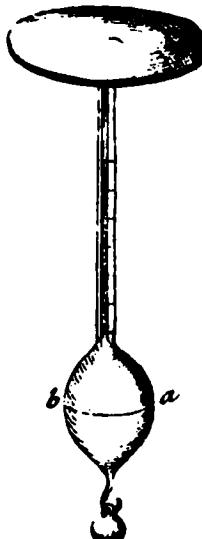

Fio. 8. The Bernoulli electrometer [from *Acta Helvetica,* vol. 4 (1760)].

A hollow metal bulb, with a metal disk attached to it by means of a graduated metal stem, is floated in water up to the line *ab.* About 1 ft above the disk is mounted a second disk, which is connected to a triboelectric generator. When the generator is set in operation, thus charging the fixed disk, the bulb moves upward by an amount that depends on the force of attraction between the two disks. This force is then measured by finding the number of weights that must be attached to the hook at the bottom to bring the bulb back down to its original level in the water. By varying the initial separation of the disks, Bernoulli obtained values of the electric force for various distances between the disks.

scientific study of His creation, he was an eager reader of scientific books and an eager listener to scientific lectures. While a language teacher at a Nonconformist school, he began the compilation of a history of electricity, and had this work well under way by the end of the year 1765. At that time, during the Christmas recess, he made a trip to London that was a turning point in his career, for there he met Franklin, who was in London seeking remission of the Stamp Act. Priestley spent a number of days in the intellectually invigorating company of Franklin and some of the latter's scientific acquaintances.

Perhaps as a result of this stimulating contact, Priestley soon saw the desirability of expanding his history to include a systematic account of the knowledge of electricity that had been won in his own day, together with suggestions for further investigations. And he became more and more involved in experiments of his own, partly to clear up controversial points unsolved by reading the works of others; accounts of these numerous experiments and studies were also added to the book, published early in 1767, a little more than a year after his Christmas visit to London, under the title *The history and present state of electricity, with original experiments.* 

Among the many experiments performed by Priestley, both before and after the appearance of his book, there is one of special interest to us. It is described in his *History* under the title "Experiments with an electrified cup."

I shall close the account of my experiments with a small set in which, as well as in the last, I have little to boast besides the honor of following the instructions of Dr. Franklin. He informed me that he had found cork balls [suspended by silk threads] to be wholly unaffected by the electricity of [an insulated] metal cup, within which they were held; and he desired me to repeat and ascertain the fact, giving me leave to make it public.

Accordingly, December 21st [1766] I electrified a tin quart vessel that stood upon a stool of baked wood; and I observed that a pair of pith balls, insulated by being fastened to the end of a stick of glass, and hanging entirely within the cup so that no part of the threads were above the mouth of it, remained just where they were placed, without being in the least affected by the electricity. . . .

The experiment of Franklin's referred to here had been made more than a decade earlier. Of it, Franklin had said: "The cork was not attracted to the inside of the can, as it would have been to the outside, and though it touched the bottom, yet when drawn out, it was found not to be electrified by that touch, as it would have been by touching the outside. The fact is singular. You require the reason; I do not know it .. . I find a frank acknowledgement of one's ignorance is not only the easiest way to get rid of a difficulty, but the likeliest way to obtain information." At a later time, Franklin expressed the opinion that the lack of charge on the inner surface of the cup might be due to the mutual repulsion of the electric fluid on opposite sides, all the fluid thus being forced toward the outer surface; this possible explanation he recommended "to the further examination of the curious."

But the other result of the experiment — that there is no net force on an object placed anywhere within the electrified vessel — could not have been predicted or explained by any existing electrical theory, including Franklin's. If the object is in the center of the vessel, one might suppose that it is equally attracted in all directions by the surrounding walls, so that the net force acting on it is zero. But why should this force still be zero when the object is not at the center, but closer to some parts of the wall than to others Ρ This is a question that plainly

#### **ELECTRIC CHARGE 613**

could not be answered without knowing precisely how changes in the distance between the object and any particular part of the wall affected the magnitude of the force between them. Priestley, in continuing his account of the experiment, proposes a working hypothesis:

May we not infer from this experiment that the attraction of electricity is subject to the same laws with that of gravitation, and is therefore according to the [inverse] squares of the distance; since it is easily demonstrated that, were the earth in the form of a shell, a body in the inside of it would not be attracted to one side more than another.

Clearly Priestley has used "reasoning from analogy." The steps in his thinking may well have been somewhat as follows. There are certain striking resemblances between electrical and gravitational phenomena: (i) both of them involve forces, called "electrical forces" in the one case, and "gravitational forces" in the other; (ii) in both cases these forces become weaker as the distance between the bodies is increased; (iii) as shown by Franklin's experiment, the net force between an electrified vessel and an object placed anywhere within it is zero. Almost a century earlier Newton had demonstrated mathematically that the net gravitational force between the earth, if it were hollow, and an object anywhere within it would be zero. This demonstration was based on the gravitational inverse-square law, suggested to Newton by certain astronomical regularities; his demonstration also indicated that the force on an object within a hollow earth would be zero *only*  if the gravitational force between two particles varies inversely with the square of the distance between them. Therefore, since electrical and gravitational phenomena appeared similar in several other ways, it was natural to suppose that they are also similar in that the same inverse-square law of force holds for both of them.

This is just one of a number of instances in which reasoning by analogy or resemblance figured prominently in early electrical discoveries. As in the beginning stages of any new science, much of the early work in electricity was concerned with finding useful classifications of phenomena; and in finding such classifications, reasoning from analogy is often most helpful. As one of many instances that we have encountered, recall Franklin's listing of 12 ways in which "the electrical fluid agrees with lightning," and how these analogies led him to the working hypothesis that lightning should be classed as an electrical phenomenon (p. 604). But remember also that he did not regard these 12 resemblances as constituting proof of the validity of his hypothesis. Two phenomena that are similar in many ways may later be found to be dissimilar in other relevant respects. As Franklin

said: "The electric fluid is attracted by points; we do not know whether this property is in lightning. . . Let the experiment be made." So he proceeded to design direct tests, such as the one with the "sentry box" (p. 605).

Priestley's deduction that an inverse-square relation holds for electric forces offered a generalization of sufficient breadth to encourage further attempts to bring in to a single conceptual scheme a large variety of electrical phenomena. Moreover, it suggested a new line of inquiry, namely, the possibility of incorporating into electrical science many of the quantitative concepts and methods that had already been developed and successfully used in studies of gravitation and other mechanical phenomena. Priestley's work proved to be an effective step toward the union of two sciences that formerly had been regarded as more or less distinct.

Priestley did not claim that his method of reaching the inversesquare hypothesis constituted a proof of its validity. For one thing, while there are important resemblances between electrical and gravitational phenomena, there are also important differences. Electrical force exists between bodies only so long as they are electrified, whereas the gravitational forces between them are always present. In electricity there are both attractions and repulsions, while for gravitation, only attraction had been observed. Finally, as Newton had clearly shown, the net gravitational force on an object inside a hollow body is zero only if the hollow body is spherical in shape and has walls of uniform density; but Priestley's work showed that for the analogous electrical case the enclosing vessel may be of any shape, provided it has conducting metal walls. Yet, even if all these differences had been clearly understood in Priestley's day, his force hypothesis would still have to be regarded as a mere conjecture reached by analogical reasoning. The question of its validity required further investigation, preferably by direct experiments similar to Bernoulli's (p. 610), but carried out with charged "particles" instead of disks.

*Coulomb's direct experiments with his torsion balance.* Some 18 years passed before the question of the force relation was thus put to a direct test, in France, by Charles Augustin Coulomb (1736-1806). Coulomb's early career as a military engineer eventually led him to start physical researches — at first, mainly on the mechanical properties of various materials, including those commonly used in machinery. This work not only won him membership in the French Academy of Sciences but afforded him the experience in the science of mechanics and methods of measurement that later were to be put to such good use when he turned to electrical investigations.

During his mechanical studies, he had invented an instrument called the *torsion balance* and had shown its great utility for measuring very small forces. The invention had grown out of studies that he had made of the forces set up in wires and threads when they are twisted. From measurements on wires and threads of various lengths and diameters, and made of various materials, he had been able to arrive at a formula for computing the force needed to twist any given wire or thread through a particular angle. How these findings provided him with the new instrument may be described briefly as follows:

A wire is clamped at the top and hangs vertically (Fig. 9). To its

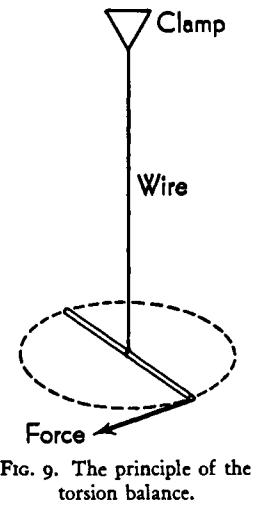

lower end is fastened a crosspiece of very light weight which serves as a lever to be used in twisting the wire. The twisting force is always applied in a horizontal plane perpendicularly to the crosspiece, and at some fixed distance from the axis of the wire. The magnitude of this twisting force, Coulomb discovered, is directly proportional to the angle through which the wire is twisted. For instance, if it is found that a force of 0.0003 o z applied 4 in. from the axis of the wire produces a twist of 6o°, then one can predict that a force of 0.0006 oz applied at the same distance from the wire will twist it through 1200 . Thus, once the twisting force for one angle of torsion has been found, the instrument can be used to measure other forces applied to it.

When Coulomb turned to electrical studies, he saw how this torsion balance, if suitably modified, could be used to measure forces between electrified bodies. His interest in electricity and magnetism initially had been aroused through the offer of a prize by the French Academy for the best method of constructing a ship's compass. Nearly two centuries earlier, the need for better navigational instruments had similarly helped to stimulate Gilbert's interest in magnetism.

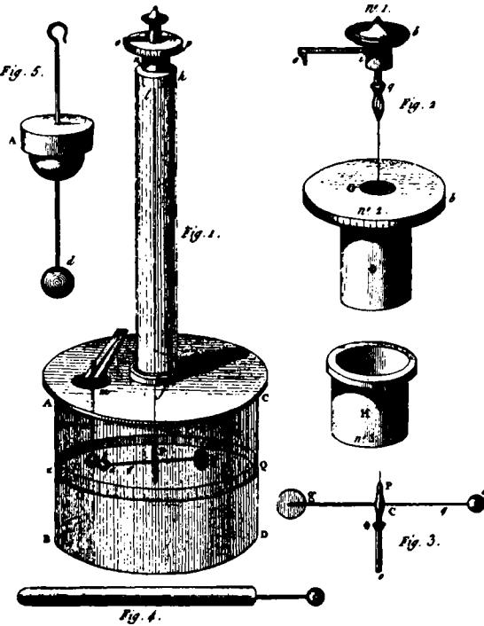

FIG. IO. Coulomb's electrical torsion balance. [From *Mémoires de l'Académie Royale des Sciences* for the year 1785, p. 569.] Coulomb describes it thus:

"On a [hollow] glass cylinder *ABCD,* 12 inches in diameter and 12 inches high, is placed a glass plate *AC . . .* that completely covers the glass vessel. This plate is pierced with two holes, each about 20 lines [a line is 1/12 in.] in diameter. One hole is in the middle, and over it is placed a glass tube /, 24 inches high; this tube is cemented over the hole with the cement ordinarily used in electrical apparatus.

" At the top *h* of the tube is placed a torsion micrometer; it is seen in detail in the small drawings *Nos. 1, 2,* and j on the right in the figure. The upper piece, *No. /,*  carries a knob *b*, an index *io,* and a clamp *q\* this piece *No. 1* fits into the hole G of piece *No. 2.* This piece *No. 2* consists of a circle *ab* divided on its edge into 360 degrees and of a copper tube *c* which fits into the tube of piece *No. 3.* Piece *No. 3* is sealed to the interior of the upper end *h* of the glass tube. In clamp *q* of piece *No. 1* .. . is clamped the upper end of a very fine silver wire; the other end of this wire is held at Ρ in a clamp made of a cylinder *Po* of copper or iron with a diameter of not more than a line [1/12 in.]. . . The weight of the cylinder *Po* should be sufficiendy large to keep the silver wire stretched without breaking it.

"This small cylinder *Po* is enlarged at *c* and a hole bored through it, in which can be inserted a needle *ag.* The needle, which is suspended horizontally about halfway up inside the large glass vessel, consists either of a silk thread covered with Spanish wax [sealing wax] or of a straw likewise covered and finished off from <7 to a for 18 lines of its length by a cylindrical thread of shellac. At the end a of this needle there is a

Coulomb's first memoir on electricity was presented to the Academy in 1785 and printed in its *Mémoires* for that year. It illustrates well the kind of experimentation that, from this period onward, helped bring about a tremendous increase in the rate of growth of electrical knowledge.

In a memoir presented to the Academy in 1784, I determined by experiment the law of the force of torsion of a metal wire, and I found that this force was equal to the product of the angle of torsion, the fourth power of the diameter of the suspension wire, the reciprocal of the wire's length, and a constant coefficient which has a value depending on the nature of the metal and which is easy to determine by experiment. I showed in the same memoir that this force of torsion could be used to make precise measurements of very small forces, for example, a ten thousandth of a grain [approximately a hundred millionth of a pound]. . . .

Today I place before the eyes of the Academy an electrical balance constructed in accordance with the same principles; it measures with the greatest exactitude the electrical force exerted by a body, however slightly the body is charged. . . The first figure [Fig. 10] represents this balance in perspective. The details of it are as follows. . . .

The portion of Coulomb's memoir giving these details has been put by us in the legend for Fig. 10. His description is a good illustration of the practice, today common among experimentalists, of describing a new scientific instrument in detail sufficient to enable another investigator to construct it or to form an opinion as to its efficacy and reliability. Having thus described the instrument, Coulomb continues:

As an example, we will give the method used with it to determine the fundamental law according to which electrified bodies repel each other. . . .

*Experiment.* — We electrify a small conductor [shown at the bottom

small elder ball [pith ball] 2 or 3 lines in diameter. At [the other end] *g* there is a little vertical flat piece of paper that has been dipped in turpentine; it serves as a counterweight for the ball a and to slow down the oscillations.

&quot;. . . Around the vessel, at the height of the needle, is described a circle *XQ* divided into 360 degrees; for simplicity I use a strip of paper divided into 360 degrees and pasted around the vessel at the height of the needle.

&quot;To arrange this instrument for use I put on the cover so that the hole m approximately corresponds to the first division O of the scale *XQ.* I place the index *oi* of the micrometer on the first division 0 of the micrometer; I then turn the entire micrometer in the vertical tube / until, when I look past the vertical wire which suspends the needle and the center of the ball, the needle *ag* corresponds to the first division O of the scale *XQ.* I then introduce through the hole *m* another elder ball *t* suspended by the small rod *mt* [the lower part of which is made of shellac], in such a way that it touches the ball *a* and that, by looking past the suspension wire and the ball *t,* we see the first division O of the circle *XQ.* The balance is then ready for use."

of Fig. 10] which is simply a pin having a large head and insulated by driving its point into the end of a stick of Spanish wax. We introduce this charged pin into the hole *m* and let it touch the ball *t,* which is in contact with the ball *a,* and then withdraw the pin. The two balls *a*  and *t* are now charged with electricity of the same sort and so repel each other to a distance that we measure by looking past the suspension wire and the center of the ball a to the corresponding division of the circle *XQ.* Then, by turning the index of the micrometer [the graduated knob at the top] in the sense *pqo,* we twist the suspension wire *IP* and exert a force which is proportional to the angle of torsion [the angle through which the knob has been turned] and which tends to bring the ball *a* again near to the ball *t.* We observe in this way the distance through which different angles of torsion bring back the ball a toward the ball *t\* and by comparing the torsional forces with the corresponding distances between the two balls, we determine the law of repulsion. I shall here present only some trials that are easy to repeat but that will at once make evident the law of repulsion.

( 1) Upon electrifying the two balls by means of the pinhead while the index of the micrometer points to *o,* the ball *a* of the needle separates [from the ball <] by 36 degrees.

(2) When the suspension wire is twisted through 126 degrees, by means of the knob of the micrometer, the two balls approach each other and stop when 18 degrees apart.

(3) By twisting the suspension wire through 567 degrees, the two balls approach to within 8 54 degrees of each other.

*Explanation and result* 0/ *this experiment.* — Before the balls have been electrified they touch, and the center of the ball a suspended by the needle is not separated from the point where the torsion [twist] of the suspension wire is zero by more than half the diameters of the two balls. (It is necessary to say that the silver wire *IP* which formed this suspension was 28 inches long and was so fine that a foot of it weighed only 1/1 6 grain.) The force that must be applied at the point a . . . in order to twist this wire can be found by using the formulas explained . . . in the volume of the Academy for 1784. To twist this wire through 360 degrees, the force needed . . . was only 1/340 grain. Therefore, since the torsional force, as is proved in that memoir, is directly proportional to the angle of torsion, the least repulsive force between the two balls would separate them perceptibly from each other.

We found in trial (1), in which the index of the micrometer was on the point 0, that the balls were separated by 36 degrees; at the same time a torsional force equivalent to 36 degrees was produced, and this force is 1/3400 grain [that is, 36/360 of 1/340 grain].

In trial (2) the distance between the balls was 18 degrees. But, as the micrometer had been turned through 126 degrees, it results that, for a distance of 18 degrees, the repulsive force was equivalent to 144 degrees. **So at half the first distance the repulsive force between the balls is quadrupled.** 

**In trial (3 ) the suspension wire was twisted through 567 degrees, and the two balls were separated by only δ'/ degrees. The total torsion was consequently equivalent to 576 degrees, four times that of the second trial, and the distance between the two balls in this third trial lacked only '/2 degree of being reduced to half of what it was in the second trial.** 

**It results then from these three trials that the repulsive force which the two balls exert on each other when they are electrified with the same kind of electricity is inversely proportional to the square of the distance [between the centers of the balls].** 

We omit several notes appended to this memoir in which Coulomb discusses the relative advantages of using fine and thick wires for suspending the needle; suggests a way to observe and allow for possible losses of electric charge from the pith balls; points out that the distance between the two balls should be measured along the straight line connecting them, instead of along the arc, as is done in the experiment, but that the errors thus introduced need be corrected only when the angular distance between the balls exceeds 25 o to 30 o ; and so on.

This first memoir has dealt only with the case in which the charges on the two balls are of the same sign — both positive or both negative so that the force between them is repulsive. The next question is whether the inverse-square relation also holds when the two charges are unlike in sign and the force is therefore attractive. This problem was treated by Coulomb in his second electrical memoir, also presented in 1785. Again using the torsion balance, he found that the inverse-square law does hold also in this case.

However, he tells how he has encountered a difficulty here. In a torsion balance, whenever the distance between the balls is changed, the electric force between the balls changes more rapidly than does the torsional force in the suspending wire. This causes no difficulty when the electric force is repulsive. But when it is attractive, the balls tend to fly together and to touch each other. Although Coulomb showed that satisfactory results for attractive forces can be obtained with the torsion balance if certain precautions are taken, he decided to check these results with another apparatus that is free from the difficulty mentioned.

*Coulomb's experiment with the electric torsion pendulum.* For his reinvestigation of the law for attractive forces, Coulomb employed a *torsion pendulum* similar to one that he had devised earlier for mechanical experiments and later had used in a modified form in magnetic researches. Now he has made further changes so as to convert it into an electric pendulum. Readers who are interested in the details of this apparatus and its operation will find a brief description in the legend for Fig. il. It will suffice here to say that again the results showed

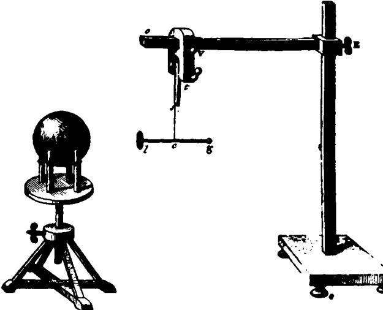

FIG. il . Coulomb's electric torsion pendulum. [From *Mémoires de l'Académie Royale des Sciences* for the year 1785, p. 578.]

From a silk thread *s* is suspended a nonconducting needle *lg* that is free to oscillate in a horizontal plane and about the thread as an axis. Fixed to the end / of the needle is a small disk of gilded paper. At G is a metal sphere supported on an insulating stand, with its center level with the disk /. The disk and the sphere are given opposite charges. Then the needle *lg* is twisted to set it oscillating, and the period of oscillation (the time for one complete oscillation) is observed. The sphere is then placed at various other measured distances from the disk /, and the period of oscillation for each distance is measured.

On the assumption that the inverse-square law is valid, and with the help of wellknown principles of mechanics, one can show that: (i) the charge on the sphere should behave as if concentrated at its center G, and (ii) the period of oscillation of the needle should be directly proportional to the distance *Gl* between the center of the sphere and the disk. Coulomb's measurements showed that this proportionality held. Therefore, the assumption of an inverse-square relation was borne out.

that the inverse-square relation holds. Moreover, because of the important differences in the torsion-pendulum and torsion-balance methods, Coulomb has provided two *independent* demonstrations of the validity of the law. As he said in his second memoir :

**W e have thus come, by a method completely different from the first, to a similar result. W e may therefore conclude that the mutual attraction of the electrical fluid called positive and the electrical fluid ordinarily called negative is inversely proportional to the square of the distance;**  just as we have found in our first memoir, that the mutual repulsion of electrical fluids of the same sort is inversely proportional to the square of the distance.

*The complete Coulomb law.* Coulomb's work in electricity was guided by the working hypothesis that the force between two electrified objects is inversely proportional to the distance between them *d,* or, symbolically, / oc *i/d2.* As we have seen, this hypothesis had long been in the air, and was undoubtedly in part suggested by analogy to the gravitational case. But Newton had also postulated that this gravitational force was due to a property of matter called *mass,* and that for two objects of masses *m1* and m2 separated by a distance *d,* the force is proportional to m^m-JcP. In Newtonian mechanics mass is considered as an essential property of matter. Knowledge of the gravitational case undoubtedly suggested that electrical fluid might be considered as having an *electrical mass* which would be an essential property of electrical fluid.

This assumption seems to have been obvious to Coulomb, and we find him stating, without justification, that the electrical force between two electrified objects is proportional to the inverse square of the distance between them and to the product Ρ of their electrical masses, or */* oc *P/d2.* Coulomb's principal interest focused upon the force and the distance, not upon the electrical masses. However, he does point out that this proportionality, in conjunction with experiments, can be used to detect the rate at which electrical fluid is being lost from an object by leakage through the supports or the air, or how much fluid is removed when the electrified object is touched to another object. In brief, it is now possible to discuss meaningfully Franklin's "quantity of electricity" — "electrical mass" in Coulomb's terms, or "electrical charge" in modern terms. If two objects, having charges *qx* and *q2,* are separated by a distance *d,* the Coulomb force law tells us that each object will experience a force proportional to *q1q2/d2.*  If the distance of separation is unchanged, and the state of electrification of the second object remains unaltered, then any change in the force must be due to a change in qx. For example, if the electrification of the first object is increased until the force is doubled, then qx must have been doubled. For the first time it is possible to attach numbers to electrified objects to represent their states of electrification. These numbers are interpreted as representing how much electrical fluid, or charge, the objects possess.

With this quantification of electrical science, it becomes possible to bring to bear upon its further study the entire weight of mathematical techniques. Eighteenth-century mathematics had to a very large degree developed along lines applicable to Newtonian mechanics, and with the formulation of electrical science in quantative terms so analogous to mechanics, electricity became thoroughly amenable to mathematical treatment, with striking results in the 19th century.

#### EPILOGUE

*The rival one-fluid and two-fluid theories.* Coulomb did not favor the one-fluid theory of Franklin and Aepinus, preferring instead the two-fluid theory that had been developed in England in 1759. The essential hypotheses comprising this two-fluid theory have already been listed in connection with our discussion of developments growing out of Dufay's researches (p. 590).

It will be recalled that Franklin's formulation of the one-fluid theory did not satisfactorily explain the repulsion that occurs between two objects when they are negatively charged, but that Aepinus "saved" the theory by showing how this repulsion could be accounted for by adding the *ad hoc* hypothesis that the particles making up ordinary matter repel one another. In criticism of this hypothesis, Coulomb said:

It appears to me contradictory to admit at the same time, in the particles of bodies, an attractive force in the inverse ratio of the squares of the distances, which is demonstrated by universal gravitation, and a repulsive force in the same inverse ratio of the squares of the distances — a force that would necessarily be incomparably larger than that due to gravitation.

The two-fluid theory had the advantage that this assumption of a universal repulsion of ordinary matter was not needed in order to explain the repulsion between negatively charged bodies. On the other hand, it was the one-fluid theory that had been leading to the larger number of discoveries, doubtless partly because of the greater ease of thinking in terms of one fluid rather than two. Either theory was capable of explaining all the electrical phenomena known at the time. In such a circumstance, the simpler theory is usually regarded as the preferable one.

The question still remained whether there actually is only one electrical fluid or whether there are two. However, there is the third possibility that it may be neither and both — that, in one sense of the word, there is a single fluid, and in another sense, two fluids. The history of the sciences reveals many instances of this kind, where two rival theories contradict each other in certain respects and yet have other features that make both of them useful or acceptable. This usually means that both theories will turn out to be partly valid and

partly invalid. It is then not a question of which theory will be retained and which will be abandoned. Instead, one may expect the eventual development of a new theory that will represent some sort of synthesis of the earlier, rival views — a synthesis that serves not only to reconcile the contradictory features, but to provide explanations of a wider range of phenomena than did either of the earlier theories alone. This is what actually happened with the one-fluid and two-fluid theories, although more than a century was required to bring it about. Many discoveries had to be made and many tests carried out that were far beyond the experimental and theoretical resources of Coulomb's day.

Today the accepted view is that in every substance there are two different kinds of particles that play a primary role in all common electrical phenomena. One of these is the *proton,* which has a positive charge and the same mass as a hydrogen atom. The other is the *electron,* which has a negative charge and a mass approximately 1/1800 that of the proton. These protons and electrons are present in equal numbers in any unelectrical substance.

In a *solid* substance, the protons are in fixed positions, but the electrons are free to move. When, for example, glass and silk are brought very close together, as by rubbing, electrons pass from the glass to the silk, leaving the glass positively charged and the silk negatively charged. In *solid metals,* which were the electrical conductors mainly investigated by Franklin and his contemporaries, many of the electrons in the metal are free to move about. Thus, if one connects two oppositely charged metal objects by a wire, electrons stream along the wire from the negatively to the positively charged object, constituting an electric current. In brief, in solid substances there are two "fluids" and yet only one "fluid". There are two "fluids" in the sense that collections of both positive and negative particles are present. There is one "fluid" in that only the mobile electrons are involved in any transfer or "flow" of electricity. Incidentally, it is seen that this single, mobile "fluid" consists of negative electricity, rather than positive, as Franklin had assumed.

In a *liquid* or a *gas,* electrical conduction is due chiefly to *ions.* These are charged atoms or molecules. An atom or a molecule is uncharged when it contains equal numbers of protons and electrons. It becomes a positively charged ion if it loses one or more of its normal quota of electrons, and a negatively charged ion if it acquires one or more extra electrons. In a conducting liquid or gas, both positive and negative ions are present, and these move simultaneously and in opposite directions. Here, then, not only are there two kinds of "fluid," but both kinds are mobile, in conformity with the old two-fluid picture of conduction.

#### QUESTIONS

#### *i(a). Electricity tv 1600*

. Devise an experiment, utilizing modern apparatus, for testing Plutarch's explanation of the amber effect (p. 545).

2. What purpose does the reference to the amber effect serve in the following quotation?

> Your lustre too'11 inflame at any distance; Draw courtship to you as a jet doth straws. — Ben Jonson, *Every man in his humour* (1598) Act III, Scene 2.

3. Is there any way to interpret the role of "attract" in "a piece of rubbed amber is seen to attract bits of thread" so as to make this statement acceptable?

4. Park Benjamin (see reference 1, Bibliography) asserts that the popular tendency is to seek a cause for any effect not understood in things concerning which the prevailing ignorance is still greater, and that this tendency was fully as strong in antiquity as it is now. Can you find specific evidence for the existence of this tendency among early investigators and also among people today?

5. Cardan's *On subtlety* contains the often-quoted line : "Many things appear admirable until the cause is known; then admiration ceases." It has since been suggested that most people cease to admire or even be curious about a wonderful discovery or a new invention as soon as they become accustomed to it, whether or not its "cause" is known to them. Comment critically on these statements.

6. *(a)* What useful purpose, if any, was served by the various explanations for the amber effect proposed before the time of Gilbert? *(b)* Did any of these explanations serve as *wording hypotheses,* that is, as tentative suppositions from which the investigators deduced one or more specific consequences (called "limited working hypotheses") that they tested experimentally? *(c)* Did any of these hypotheses lead to the discovery of additional facts about the amber effect?

7. Cardan listed five differences between magnetism and the amber effect (p. 5). Employing simple apparatus, see how many of these differences you can demonstrate experimentally.

8. Alexander of Aphrodiseus (A.D. 3rd century) was of the opinion that a magnet "eats and feeds on iron"; and as late as the 16th century, Cardan revived this notion to explain magnetic attraction. Possibly Cardan was speaking metaphorically and actually meant that particles of iron tend to combine gradually and in some permanent fashion with a magnet. Suggest an experimental test for this hypothesis that could have been carried out in the i6th century.

#### *i(b). William Gilbert*

9. What meanings did Gilbert give to the terms *electrics, nonelectrics, electrical attraction,* and *magnetic coition* ? (In answering, avoid reading into these terms any modern knowledge of electricity and magnetism that you may possess.)

10. What would be the advantages or the disadvantages of an electrical versorium made of: (i) unmagnetized iron; (ii) magnetized iron; (iii) aluminum; (iv) lead; (v) wood?

11. For the attracted bodies in his electrical experiments, Gilbert apparently always used "light" or "small" objects, such as straws, chaff, or a small versorium. Show experimentally that an excited electric also attracts heavy objects. (Use a versorium consisting of a wooden plank or lath balanced on a knife edge.)

12. Can you suggest any ways in which the electrical discoveries of Gilbert and his predecessors had or could have been made to have immediate practical utility?

13. Explain each of the following phenomena described by Gilbert in terms of his hypothesis of the electrical effluvium: (i) there appear to be two classes of substances, *electrics* and *nonelectrics·,* (ii) except for air and flame, an excited electric attracts everything, including dense smoke; (iii) to excite an electric it must be rubbed, and not merely warmed; (iv) one-sided attraction, rather than coition, seemingly exists in the case of electrical phenomena; (v) the attraction increases as the distance between the excited electric and attracted body is decreased; (vi) water put on an excited electric immediately extinguishes its force.

14. After Gilbert's time it became clear that: (i) electrical attraction actually is a "coition," in Gilbert's sense of the latter term; (ii) if two electrics made of the same substance are rubbed with the same material (say, two glass rods each rubbed with silk), they *repel* each other; (iii) exciting an electric does not result in any detectable change in its weight; (iv) continued excitation does not result in any exhaustion of the electric. Does it seem to you possible to explain each of these discoveries in terms of Gilbert's effluvium hypothesis? Or is it necessary to modify the hypothesis and, if so, how? Or must the hypothesis be abandoned?

15. What changes, if any, in Gilbert's hypothesis as to the origins of electrics and nonelectrics (p. 551) would be needed to explain the discovery, made after his time, that all substances can be electrified?

16. Repeat Gilbert's main experiments with the help of simple apparatus and materials similar to those he employed (a loadstone, a magnetic compass, iron filings or bits of iron, a stick of sealing wax or a hard-rubber comb, woolen cloth, a simple electrical versorium, bits of paper or cork). Also test experimentally the following assertions of Gilbert's concerning the distinction between magnets and electrics: (i) an electric, but not a magnet, requires friction to excite it; (ii) a magnet attracts only magnetizable substances, whereas an excited electric attracts everything except air or flames; (iii) iron filings placed near a magnet tend to arrange themselves in definite patterns, whereas bits of any material drawn to an excited electric tend to heap together in shapeless clusters.

#### 2 *and 3. The ijth Century; Francis Hau\sbee*

17. Suggest several possible reasons why the phenomenon of mutual attraction was discovered much earlier for magnets than for excited electrics.

18. Which hypothesis of the electrical effluvium — Gilbert's, Cabeo's, or some other one of this period — serves best to explain each of the following observations: (i) electrical attraction occurs in a vacuum as well as in the open air; (ii) electrical attraction is mutual; (iii) in either the open air or a vacuum, small objects, upon touching an excited electric, sometimes adhere to it and sometimes are thrown violently away; (iv) flashes of light appear in a partially evacuated tube held close to, but not touching, a strongly excited electric.

19. In what ways was Hauksbee's apparatus for rotating an evacuated glass globe in the open air easier to construct and operate than the one for rotating objects enclosed in an evacuated vessel?

20. (a) List Hauksbee's experiments. (b) For each experiment state the broad working hypothesis and the deduced, limited working hypothesis that led him to make the experiment, the factors that he considered relevant in planning it, and his conclusions.

21. Construct a thread electroscope similar to Hauksbee's, mount it around an electric of cylindrical or globular shape, and repeat the various experiments described on pp. 567-569.

22. Show experimentally that a piece of metal foil or a pith ball, after being attracted to and touching an excited electric, is repelled until it touches some other, unexcited object, whereupon it is again attracted.

23. Some early 18th-century physicists remained unconvinced that the barometric light was electrical in origin because Hauksbee had failed to demonstrate that a barometer tube, when the mercury is agitated, not only shows the light but, at the same time, attracts light objects placed close to it. This direct demonstration was carried out by a later investigator, in 1745, by suspending threads in an evacuated vessel surrounding the barometer tube. It has been said that here Hauksbee's genius failed him, since he never realized that by making so simple an experiment he could have settled the issue conclusively. This may be true. On the other hand, what observations did he make during the course of his work that could have discouraged him from attempting this direct experiment, supposing he had thought of it?

#### *4. Stephen Gray*

24. Using simple apparatus, repeat some of Gray's experiments on conduction and on charging by influence.

25. If the hand is a good electrical conductor, why is it that a piece of amber, say, can be electrified by rubbing while it is held in the hand ?

26. *(a)* With the help of illustrations taken from Gray's work, describe the more important ways in which a limited working hypothesis differs from the working hypothesis on a grander scale from which it is deduced. (¿>) If experiment shows that a particular limited working hypothesis is valid, does this necessarily mean that the broader working hypothesis from which it was deduced is valid? Why?

27. Gilbert advanced the broad working hypothesis that "all electrics have their origin in the class of matter called fluid or moist" {p. 551). Suppose that a later investigator found a certain mineral which looked to him as if it might have had its origin in the aforementioned class of matter. Finding, however, that no one had listed this mineral as an electric, he rubbed a specimen of it and observed that it attracted small objects, (a) What limited working hypothesis did the investigator use here and, by his test, show to be valid? (¿>) Do we know today that Gilbert's broad working hypothesis is invalid?

28. What use, if any, did Gray make of an effluvium hypothesis similar to those advanced by Gilbert, Hauksbee, and others?

29. What hypothesis of the electrical effluvium seems to you to be most adequate for explaining each of the following kinds of phenomena noted by Gray: (i) certain substances are good electrical conductors, whereas certain others are nonconductors; (ii) objects can be electrified temporarily by influence, the degree of electrification decreasing as the distance between object and excited tube is increased?

30. Which observations of Gray's were semiquantitative or quantitative in character?

#### 5. *C. F. de C. Dufay*

31. Which of the five generalizations summarized on pages 588-9 were original with Dufay?

32. Use simple apparatus to demonstrate, as did Dufay, that: (i) a thread conducts better when wet than when dry, and glass is a satisfactory supporter for the thread; (ii) two bodies that have the same kind of electricity repel each other, whereas two having unlike kinds attract each other; (iii) two bodies having the same kind of electricity may attract each other if one of them is only weakly electrified; (iv) conducted electricity retains its original property.

33. What meanings were given to the terms *insulator, electricity,*  "vitreous electricity," and "resinous electricity" by Dufay? (In answering, avoid reading into these terms any modern knowledge of electricity that you may possess.)

34. By a *scientific law* is commonly meant any statement that describes a relation or sequence of observable phenomena which, so far as is known, is invariable under the given conditions. Which of the following generalizations appear to be well enough established following Dufay's work to enable us to refer to them as laws, that is, confirmed working hypotheses? (i) Metals and wet objects are comparatively good electrical conductors, (ii) Any electrified body and any unelectrified body will attract each other, (iii) The effluvium of any electrified body is self-repulsive, (iv) Substances that are good conductors are the ones that can be most strongly electrified by influence, (v) Bodies that have become electrified by conduction are repelled by those that have rendered them electrical, (vi) Any unelectrified object possesses equal amounts of the "vitreous" and "resinous" fluids.

35. If you were preparing a statement of the two-fluid theory (p. 589), which one of the following two definitions would you choose as more acceptable for inclusion in it, and why? (i) If any body is observed to be unelectrified, the quantities of "vitreous" and "resinous" fluids that it contains are to be regarded as equal, by definition, (ii) Any body that contains equal quantities of "vitreous" and "resinous" fluids is to be regarded as unelectrified, by definition.

36. (a) So far as you can judge from the present account of Dufay's work, did he make any of his electrical experiments primarily to solve a technological problem? (b) Did any of his discoveries seemingly appeal to him as having practical utility ? (c) Suppose, for the sake of argument, you are convinced that all scientific work is motivated by

economic factors. What aspects of Dufay's work or economic factors of importance in his period of French history would you cite in support of your conviction?

37. In discussing the experiment shown in Fig. 7, Dufay said that the wooden ball Β became electrified because "the electric substance flowed freely through the air" from A to C; in other words, he thought that the communication line *CB* had been electrified by conduction, as would be the case if, say, a spark had passed from A to C. Since the ball *Β* showed electrification even when the length of the air gap *AC*  was ι ft, it is probable that the line *CB* had been electrified by influence, rather than by conduction through the air. Suggest a simple test that could have been employed in Dufay's day to determine which of the two processes of electrification actually was operative here.

38. Show whether Dufay's conceptual scheme is adequate to explain why two bodies having the same kind of electricity repel each other when both are strongly charged, but may attract if the charge on one of them is relatively weak.

39. Although Dufay apparently did not have a clear understanding of *electrification by influence* and of how it differs from *electrification by conduction,* the two-fluid theory which grew out of his work (p. 589) is capable of yielding an explanation for charging by influence, (a) Show that this is true by deducing from it the following limited working hypothesis: if a thread is held close to, but not touching, an excited glass tube, the loose end of the thread should gain an excess of "resinous" electricity, and the more remote, fastened end, an excess of "vitreous" electricity; but if the excited tube is now removed to a considerable distance from the thread, its ends should return to their original unelectrified state, *(b)* How does this prediction concerning the removal of the tube compare with the results of experiments on charging by influence? *(c)* If both the thread and the tip of a finger were held close to the excited tube, do you predict from the theory that the end of the thread would be attracted by the finger or repelled by it ? (d) Test this prediction by comparing it with the results Hauksbee obtained in his experiment with the excited glass cylinder and thread electroscope (pp. 568-9).

40. Dufay, in one of his memoirs, described an instrument of his design that consisted of a glass needle (say a piece of glass tubing) suspended at the middle, like a magnetic needle, and with a hollow metal ball fastened to one end and a counterweight to the other end. The ball was electrified by touching it with, say, an excited glass tube, thus giving it "vitreous" electrification, *(a)* How does this instrument differ from Gilbert's versorium? (b) Dufay specified that the ball be

hollow "so that it can be made larger — to acquire a stronger electricity — and yet not be so heavy but that it can easily be set in motion." Show how it can be deduced from the two-fluid theory that the excess electricity given to a metal ball will all lie on its surface, and hence that a hollow ball can be electrified as "strongly" as a solid ball of the same diameter.

#### *6. Popularization of science: improvements in the triboelectric generator; evolution of the condenser*

41. *(a)* How is the phrase "common sense" ordinarily defined? (*b*) Suggest some reasons why the 18th century may be appropriately described as an age of common sense, (c) Discuss the question whether the knowledge of nature accruing as the natural sciences develop should be regarded as common-sense knowledge. (d) Does the common sense of people change as time progresses?

42. What are the essential components of any condenser or, to use the modern term, capacitor?

43. A German investigator, in 1746, formed a "battery" of several similar Leyden jars by connecting all of their outer coatings by one wire, all of the rods in contact with the inner coatings by another wire, and then bringing the loose ends of these two wires sufficiently close together to form a spark gap. Condensers connected in this fashion are said to be joined in *parallel.* Considering the three different wavs in which the strength of a condenser discharge can be changed (p. 595), show that it is reasonable to suppose that the discharge from several condensers connected in parallel will exceed that of any one of the condensers alone.

44. On the supposition that electricity is a form of matter and therefore should have weight, experiments were made in the 18th century to see whether a body increases in weight upon being electrified; the results varied widely and were mostly inconclusive, but the general opinion was that there was no increase in weight, *(a)* What are some of the difficulties and sources of error that are likely to be encountered in performing such experiments? *(b)* Suppose that the sources of error and of spurious results could have been eliminated, and that it were then found that an object did not increase in weight upon being electrified. Would this have served to show beyond question that electricity is not a form of matter?

45. What knowledge of the Leyden jar gained during this period can be characterized as semiquantitative? As quantitative?

#### *η. Benjamin Frangin*

46. In terms of Franklin's one-fluid theory, how may one interpret the statement that rubbing a glass tube "generates" electricity?

47. Compare the sense in which Franklin used the word *electricity*  with the meaning given to the term when it was first introduced into the English language (p. 558).

48. Franklin observed that a positively electrified cork ball was strongly attracted by the *outer* coating of his Leyden jar, and from this concluded that the outer coating was negatively electrified (p. 602). *(a)* What would have been the behavior of the cork ball if the outer coating had not been electrified at all? *(b)* Can you offer any explanation of why Franklin did not use a negatively electrified ball to test the outer coating?

49. Use the Franklin-Aepinus one-fluid conceptual scheme to explain each of these phenomena: (i) the attraction between positively and negatively charged bodies; (ii) the attraction between a body positively charged and one uncharged; (iii) the attraction between a body negatively charged and one uncharged; (iv) the repulsion between two positively charged bodies; (v) the repulsion between two negatively charged bodies; (vi) the attraction that may occur between two bodies that have charges of the same sign, but with the charge on one of them relatively weak.

50. Franklin found that some thunderclouds are positively charged and others are negatively charged. Using Franklin's conceptual scheme, explain the action of a lightning rod when the cloud's charge is: (a) positive; *(b)* negative.

51. On separate insulating handles are mounted a disk of amber or hard rubber and a wooden disk covered with wool. If the two disks are rubbed together and then separated, tests with an electroscope will show that the disks have charges of opposite sign. If the two disks are put together again, all indications of electrification will disappear, (a) How much of this experiment can be explained by means of the Franklin-Aepinus conceptual scheme? (b) For what important principle does the experiment afford support?

52. The electric chimes mentioned by Franklin (p. 607) may be constructed by mounting two small bells side by side; one bell being connected to a charged object, the other to the earth; and between the bells suspending a small metal ball on a silk thread, so that the ball can swing like a pendulum. Using Franklin's one-fluid theory, explain why the ball keeps swinging to and fro, alternately striking each bell.

53. (a) Prepare the strongest argument you can in support of the

assertion that Franklin's electrical investigations were not motivated primarily by socioeconomic factors, *(b)* Submit as much evidence as you can in rebuttal of your argument.

54. Write a short essay on the subject, "The saving of conceptual schemes," illustrating it with examples taken from the work of Franklin and Aepinus, and also from at least one of the following *Harvard Case Histories in Experimental Science·,* (i) *Case 1,* pp. 49-50, the defense by the "plenists" of their conceptual scheme in the face of Boyle's assertion that he had produced a vacuum; (ii) *Case* 2, pp. 69-70, the steadfast defense by Priestley of the phlogiston hypothesis; (iii) *Case 3,*  pp. 188-9, Emmett's defense of the caloric theory of heat in the face of Rumford's experiments.

#### *8. Introduction of quantitative methods*

55. Cite examples both from electrical history and from everyday experience of observations or conclusions that are (a) purely qualitative, *(b)* semiquantitative, *(c)* quantitative.

56. In another experiment that Bernoulli carried out with his electrometer (Fig. 8), he removed the second disk, put the vessel containing the water on glass supports, and connected the triboelectric generator to this vessel. When the generator was started, both the water and the electrometer floating in it were electrified. Predict whether the electrometer, as a result, moved upward or downward.

57. Discuss "reasoning by analogy."

58. Explain where you would probably be safer during a thunderstorm— inside the bird cage at the zoo or underneath a tree.

59. In Coulomb's torsion balance (Fig. 10), what would be the disadvantages of using pieces of elder or pith that are irregular in shape rather than spherical?

60. Coulomb, in one experiment with the torsion balance, found the force between the two electrified pith balls to be 1/850 grain when the distance between the balls was 1.58 inches. Use the complete Coulomb law to predict what the force would have been under each of the following circumstances: *(a)* if the distance between the two balls were tripled; *(b)* if the quantity of electricity on one ball were doubled, and that on the other ball tripled, the distance between the balls being kept 1.58 inches; *(c)* if the quantity of electricity on each ball were reduced to one-half of its original amount, and the distance between the balls were made 0.79 inches.

61. In one experiment with his torsion pendulum (Fig. 11), Coulomb found that the needle *lg* made 15 complete oscillations in 20 seconds when the disk I was at a distance of 9 inches from the center *G* of the sphere. Then, without changing the quantities of electricity on disk and sphere, he increased the distance *IG* to 12 inches. Predict the time now needed for 15 oscillations.

62. Coulomb found on a damp day the period of oscillation of the torsion-pendulum needle gradually changed, even though the distance *IG* (Fig. 11) was left unchanged. Would you expect the period to increase or decrease under these circumstances?

63. Use the two-fluid conceptual scheme to explain each of the phenomena listed in question 49.

64. In terms of *(a)* the two-fluid theory and then (¿>) the modern electron-proton theory, interpret the statement that rubbing a glass tube "generates" electricity.

65. Use the modern electron-proton theory to explain each of the phenomena listed in question 49.

#### BIBLIOGRAPHY

(The asterisks indicate references that should be especially helpful to the beginner.)

#### *General references*

. Park Benjamin, *The intellectual rise in electricity: a history* (Appleton, 1895). Covers the periods from antiquity through the work of Franklin; comprehensive and tremendously useful, although somewhat antiquated.

*2. Herbert Butterfield, *The origins of modern science: 1300-1800* (Macmillan, 1951).

*3· I. Bernard Cohen, *Benjamin Franklin's experiments* (Harvard University Press, Cambridge, 1941). The best and most authoritative edition of Franklin's *Experiments and observations on electricity* and other writings on electricity.

•4. James B. Conant, *Science and common sense* (Yale University Press, New Haven, 1951). References 2, 3, and 4 together present viewpoints of the general historian, the historian of science, and the scientist.

•5. William F. Magie, *A source boo\ in physics* (McGraw-Hill, New York, 1935).

*6. Dayton C. Miller, *Spares, lightning, cosmic rays* (Macmillan, New York, 1939). An anecdotal history of electricity.

7. Joseph Priestley, *The history and present state of electricity, with original experiments* (London, ed. 1, 1767; ed. 2, 1769; ed. 3, 1775). About one-half of the book describes developments down to Priesdey's day; the rest deals with his own work and ideas and those of his contemporaries. This early history of electricity has been used extensively by later writers on the subject.

8. George Sarton, *Introduction to the history of science* (Williams 8c Wilkins, Baltimore, 1927—1948), vols. 1-3. The most scholarly, accurate, and complete work available on the period from Homer to the end of the 14th century.

9. Richard M. Sutton (editor), *Demonstration experiments in physics*  (McGraw-Hill, New York, 1938), pp. 249-296.

*io. Lloyd W. Taylor, *Physics: the pioneer science* (Houghton Mifflin, Boston, 1941). A first-year college textbook, written from the historical point of view.

11. W. Cameron Walker, "The detection and estimation of electric charges in the eighteenth century," *Annals of Science,* vol. 1 (1936), pp. 66-100.

12. E. T. Whittaker, *A history of the theories of aether and electricity*  (Longmans, Green, 1910; revised ed., 1951)· From the age of Descartes to the close of the 19th century.

•13 . A. Wolf, *A history of science, technology and philosophy in the 16th and ijth centuries* (Macmillan, ed. ι, 1935; ed. 2, revised by Douglas McKie, 1951). Our references are to the revised edition.

•14. A. Wolf, *A history of science, technology and philosophy in the 18th century* (Macmillan, 1934).

#### *i(a). Electricity to 1600*

15. Park Benjamin, reference 1, pp. 15-257.

*i6. Titus Lucretius Carus, *On the nature of things (De rerum natura).*  Available in various translations. The latter portion of Book VI is concerned with the magnet.

•17. R. B. Lindsay, "Jerome Cardan, 1501-1576," *American Journal of Physics,* vol. 16 (1948), pp. 311-317.

*i8. F. S. C. Northrop, *The logic of the sciences and the humanities*  (Macmillan, 1947), chap. 9, "The functions and future of poetry."

•19. Pliny the Elder, *Natural history,* bk. XXXVII, chap. 13.

20. Duane and Duane H. D. Roller, "The prenatal history of electrical science," *American Journal of Physics,* vol. 21 (1953), pp. 343-356. A more detailed account of the period up to Gilbert than appears in the present case history. Contains many specific references to source literature.

21. George Sarton, reference 8.

*22. Lloyd W. Taylor, reference 10, pp. 577-594. Magnetism before 1600.

•23. A. Wolf, reference 13, pp. 290-292. Magnetism before 1600.

#### *i(b). William Gilbert*

24. Park Benjamin, reference 1, chaps. Χ, XI.

•25. Herbert Butterfield, reference 2, esp. pp. 107-111.

*26.* William Gilbert, *De magnete .* . . (London, 1600), bk. II, chap. II. In Latin. A facsimile, with some minor differences, was published in Berlin in 1892.

27. William Gilbert, *On the loadstone* . . . (Chiswick Press, London, 1900), bk. II, chap. II. A translation of reference 26 prepared under the editorship of Silvanus P. Thompson. Limited edition of 250 copies.

28. William Gilbert, *On the magnet . . .* (ed. χ, Wiley, 1893; ed. 2, St. John's College, 1941; ed. 3, Encyclopaedia Britannica, Inc., 1952), bk. II, chap. II. A translation of reference 26 by P. Fleury Mottelay. The 1952 edition omits the marginal asterisks with which Gilbert marked his experiments and discoveries.

29. R. B. Lindsay, "William Gilbert and magnetism in 1600," *American Journal of Physics,* vol. 8 (1940), pp. 271-282.

30. Silvanus P. Thompson, *Gilbert of Colchester; an Elizabethan magnetizer* (Chiswick Press, London, 1891). Limited edition of 249 copies.

31. S. P. Thompson, *Notes on the De magnete of Dr. William Gilbert*  (privately printed, London, 1901). Notes collected during the preparation of reference 27 and often bound with it.

32. E. C. Watson, "Portraits of William Gilbert, 1544-1603," *American Journal of Physics,* vol. 12 (1944), pp. 303-304.

33. A. Wolf, reference 13, pp. 243-297.

34. Edgar Zilsel, "The origin of William Gilbert's scientific method," *Journal of the History of Ideas,* vol. 2 (1941), pp. 1-31.

#### *2. The 17 century*

35. Park Benjamin, reference 1, pp. 315-449.

36. Robert Boyle, *Experiments and notes about the mechanical origine or production of electricity* (London, 1675); reprinted by R. T. Gunther as *Old Ashmolean Reprints VII* (Oxford, 1927) and by the Burndy Library (New York, 1945). Probably the first treatise devoted solely to electricity.

# 37. James B. Conant, *Robert Boyle's experiments in pneumatics* (Harvard University Press, Cambridge, 1950). Case 1 of *Harvard case histories in experimental science.* 

38. Martha Ornstein, *The role of scientific societies in the seventeenth century* (University of Chicago Press, Chicago, 1928, 1938).

39. Richard Waller, *Essayes of natural experiments made in the Academic del Cimento* (London, 1684). A translation of the final (1667) report of the Florentine Academy. See pp. 43 and 128.

40. E. C. Watson, "Reproduction of prints, drawings and paintings of interest in the history of physics," *American Journal of Physics,* vol. 7 (1939), pp. 238, 379; vol. 16 (1948), p. 318. Reproductions of engravings illustrating early activities of the Royal Society and the French Academy.

•41. A. Wolf, reference 13, chap. 4, on "Scientific academies."

#### *3. Francis Haukjbee*

42. Park Benjamin, reference 1, pp. 450-470.

43. Francis Hauksbee's papers in *Philosophical Transactions·,* vol. 24 (1704-1705), pp. 2129, 2165; vol. 25 (1706-1707), pp. 2277, 2327, 2372, 2413; vol. 26 (1707-1709), pp. 82, 87, 219, 391, 439. These papers were later incorporated by Hauksbee in his *Physico-mechanical experiments on various subjects . . .* (London, ed. 1, 1709; ed. 2, 1719).

44. Ν. H. de V. Heathcote, "Guericke's sulphur globe," *Annals of Science,* vol. 6 (1950), pp. 293-305.

45. Duane and Duane H. D. Roller, "Francis Hauksbee," *Scientific American,* vol. 189 (1953), pp. 64-69.

46. W. Cameron Walker, reference 11, pp. 66-69.

#### *4. Stephen Gray*

47. Park Benjamin, reference 1, pp. 470—489.

48. J. Frederick Corrigan, "Stephen Gray (1696-1736): an earlier electrical experimenter," *Science Progress,* vol. 19 (July 1924), pp. 102-114.

•49. Henry Crew, "Concerning Stephen Gray, 1696 (P)-i736," *American Journal of Physics,* vol. 5 (1937), pp. 233-234. Contains a photographic reproduction of an early poem about Gray.

50. Stephen Gray, papers in *Philosophical Transactions:* vol. 31 (1720), p. 104; vol. 37 (1731-1732), pp. 18, 227, 285, 397; vol. 39 (1735-1736), pp. 16, 166, 220, 400.

51. R. A. Chipman, "An unpublished letter of Stephen Gray on electrical experiments, 1707-1708," *Isis,* vol. 45 (1954), pp. 33-40.

•52. I. Bernard Cohen, "Neglected sources for the life of Stephen Gray (1666 or 1667-1736)," *Isis,* vol. 45 (1954), pp. 41-50.

#### 5. *C. F. de C. Dufay*

53. Park Benjamin, reference 1, pp. 478-489.

54. J. T. Desaguliers, *Philosophical Transactions,* vol. 41 (1739-1740), p. 186. His first electrical paper.

55. C. F. de C. Dufay, *Mémoires de l'Académie Royale des Sciences·.*  (mi) ; PP· 23> 73» 233» 457; (I734)> PP· 341 , 5°3î <>737)> PP· 86> 307· Dufay's eight memoirs on electricity; the first memoir is a history of electricity.

56. C. F. de C. Dufay, *Philosophical Transactions,* vol. 38 ( 1733-1734), pp. 258—266. The translated version of Dufay's letter to the Duke of Richmond and Lenox.

57. B. le Β. de Fontenelle, "Éloge de M. Du Fay," *Histoire de l'Académie Royale des Sciences* (for 1739), pp. 73-83.

•58. Dayton C. Miller, reference 6, pp. 14—16, 31-35.

#### *6. Popularization of science; improvements in the triboelectric generator; evolution of the condenser*

59. Park Benjamin, reference 1, chap. 15.

*6o. Herbert Butterfield, reference 2, chaps. 9,10.

61. William F. Magie, reference 5, pp. 403—406. A translation of part of Nollet's memoir.

•62. Dayton C. Miller, reference 6, pp. 19-30.

63. Marjorie Nicholson and Nora M. Möhler, "The scientific background of Swift's 'Voyage to Laputa'," and "Swift's 'Flying island' in the 'Voyage to Laputa'," *Annals of Science,* vol. 2, pp. 299-334, 4°5_ 430 · The hitherto unrecognized sources of this portion of *Gulliver's travels* are the scientific work of the 17th and early 18th centuries.

•64. Duane Roller, *The early development of the concepts of temperature and heat* (Harvard University Press, Cambridge, 1950), esp. pp. 48- 49, 60-61. Case 3 of *Harvard case histories in experimental science.* 

65. A. Wolf, reference 14, pp. 34-37, 218-227.

#### 7. *Benjamin Franklin*

66. Park Benjamin, reference 1, chap. XVI.

*6y. I. Bernard Cohen, reference 3, pp. 57-435.

68. I. Bernard Cohen, "Benjamin Franklin and the mysterious 'Dr. Spence'," *Journal of the Fran\lin Institute,* vol. 235 (1943), pp. 1-25.

•69. J. G. Crowther, *Famous American men of science* (W. W. Norton, New York, 1937), pp. 17-155.

70. B. Gross, "On the experiment of the dissectible condenser," *American Journal of Physics,* vol. 12 (1944), pp. 324-329; John Zeleny, "Observations and experiments on condensers with removable coats," *ibid.,* pp. 329- 339. Critical studies bearing on Franklin's work with the condenser, in the light of current knowledge.

•71. Dayton C. Miller, reference 6, pp. 53-87, 95-103.

72. Joseph Priesdey, reference 7, Part III.

*73· Carl Van Doren, *Benjamin Franklin* (Garden City Publishing Co., New York, 1941). Probably the best general biography of Franklin.

74. William Watson, "A sequel to the experiments and observations tending to illustrate the nature and properties of electricity," *Philosophical Transactions,* vol. 44, part 2 (1747), pp. 704-749. Also reprinted separately as a pamphlet.

•75. A. Wolf, reference 14, pp. 227-238.

76. *The record of the celebration of the two hundredth anniversary of the birth of Benjamin Franklin* . . . (American Philosophical Society, Philadelphia, 1906), vol. I. Addresses by E. L. Nichols, on electricity prior to and including Franklin, and by £. Rutherford, on the works of Franklin and his successors through the 19th century.

#### *8. Introduction of quantitative methods*

77. Anon., *Philosophical Transactions,* vol. 44 (1746). The letter suggesting the use of a beam balance for measuring electrical attraction.

78. Henry Cavendish, *Philosophical Transactions,* vol. 61 (1771), pp. 584-677; vol. 66 (1776), pp. 196-225. Cavendish's only published papers on electricity. In the first paper he sought to lay the basis for a mathematical theory of electricity. In the second, he described an artificial torpedo fish that he had constructed; for a brief description of it, see R. T. Cox, *American Journal of Physics,* vol. 11 (1943), pp. 20-22.

*79· I. Bernard Cohen, reference 3, p. 336. Franklin's electrified-cup experiment.

80. Charles Augustin Coulomb, *Mémoires de l'Académie Royale des Sciences,* for 1785, pp. 569, 578. His two memoirs on the law of force.

81. Daniel Gralath, *Versuche und Abhandlungen der Naturforschenden Gesellschaft in Danzig* (1747), pp. 506-534. His beam-balance experiment.

•82. Anne Holt, *A life of Joseph Priestley* (Oxford, 1931).

•83. William F. Magie, reference 5, pp. 413-417. An extract from Coulomb's second memoir, describing the torsion-pendulum experiment.

84. J. Clerk Maxwell (editor), *The electrical researches of the Hon. Henry Cavendish* (Cambridge University Press, Cambridge, 1879). Except for the two papers listed in reference 78, Cavendish's extensive electrical researches remained unpublished until the appearance of the present volume, a century after the work was done. In the meantime, all of his most significant results had been discovered independently.

•85. Dayton C. Miller, reference 6, pp. 88-94.

86. Joseph Priestley, reference 7.

87. A. Socino, *Acta Helvetica,* vol. 4 (1760), pp. 224-225. A description of Bernoulli's electrometer and experiment.

88. R. J. Stephenson, "The electrical researches of the Hon. Henry Cavendish, F.R.S.," *American Journal of Physics,* vol. 6 ( 1938), pp. 55-58. •89. Lloyd W. Taylor, reference 10, pp. 644-648.

90. W. Cameron Walker, reference n , pp. 71-100.

91. W. Cameron Walker, "The beginnings of the scientific career of Joseph Priestley," *Isis,* vol. 21 (1934), pp. 81-98.

92. A. Wolf, reference 14, pp. 239-256.

#### 9. *The period immediately following Coulomb*

•93. William F. Magie, reference 5, pp. 420-436. Excerpts from the writings of Galvani, Volta, and Nicholson.

•94. Dayton C. Miller, reference 6, pp. 122-136. Discharge in rarefied gases; the aurora.

•95. Lloyd W. Taylor, reference 10, pp. 618-626. From Galvani to Oersted.

96. E. T. Whittaker, reference 12, pp. 58-76.

•97. A. Wolf, reference 14, pp. 256-268. Galvani and Volta.