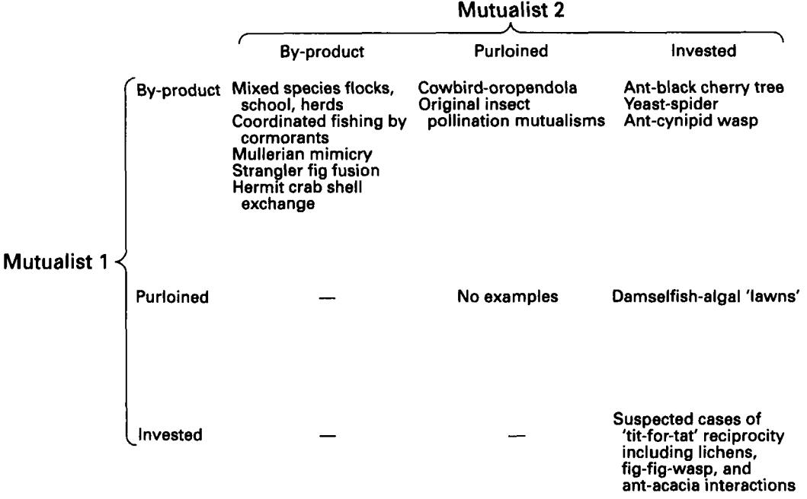
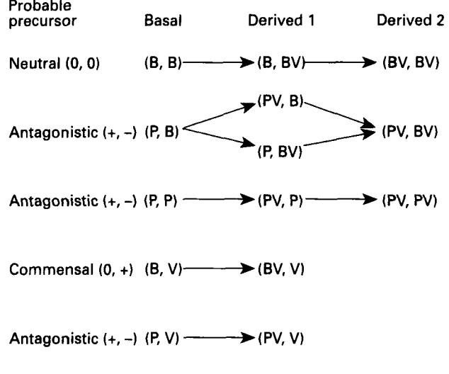
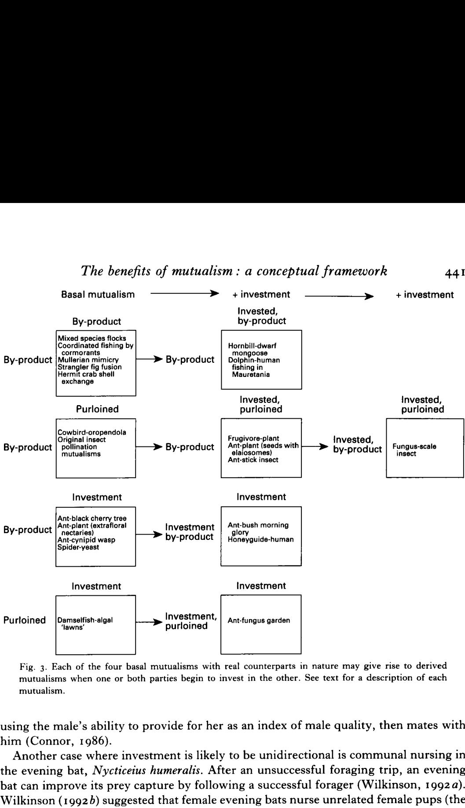

# THE BENEFITS OF MUTUALISM : A CONCEPTUAL FRAMEWORK

#### BY RICHARD C. CONNOR

*Division of Biological Sciences LY The Michigan Society of Fellows, University of Michigan, Museum of Zoology, Ann Arbor, MI* 48109, *U.S.A.* 

*(Received 25 May* 1994; *revised* 10 *October* 1994; *accepted* 19 *October* 1994)

#### CONTENTS

| I. Introduction                                                                                                                   |                                                                                                                           |  |  |  |  |  |  |  |  |  |  |  |  | 428        |
|-----------------------------------------------------------------------------------------------------------------------------------|---------------------------------------------------------------------------------------------------------------------------|--|--|--|--|--|--|--|--|--|--|--|--|------------|
| 11. The benefits of mutualism                                                                                                     |                                                                                                                           |  |  |  |  |  |  |  |  |  |  |  |  | 429        |
| (I) By-product benefits.                                                                                                          |                                                                                                                           |  |  |  |  |  |  |  |  |  |  |  |  | 430        |
|                                                                                                                                   | (a) By-product benefits                                                                                                   |  |  |  |  |  |  |  |  |  |  |  |  | 430        |
| (2) Invested benefits                                                                                                             |                                                                                                                           |  |  |  |  |  |  |  |  |  |  |  |  | 430        |
| (a) Nepotism                                                                                                                      |                                                                                                                           |  |  |  |  |  |  |  |  |  |  |  |  | 430        |
| (b) Reciprocity                                                                                                                   |                                                                                                                           |  |  |  |  |  |  |  |  |  |  |  |  | 430        |
|                                                                                                                                   | (c) Pseudo-reciprocity                                                                                                    |  |  |  |  |  |  |  |  |  |  |  |  | 430        |
| (3) Purloined benefits                                                                                                            |                                                                                                                           |  |  |  |  |  |  |  |  |  |  |  |  | 430        |
| (a) Parasitism                                                                                                                    |                                                                                                                           |  |  |  |  |  |  |  |  |  |  |  |  | 43 1       |
|                                                                                                                                   | (b) Predation (cannibalization)                                                                                           |  |  |  |  |  |  |  |  |  |  |  |  | 43 1       |
| 111. Mutualisms and adaptation                                                                                                    |                                                                                                                           |  |  |  |  |  |  |  |  |  |  |  |  | 43 1       |
| IV. Direct versus indirect mutualism                                                                                              |                                                                                                                           |  |  |  |  |  |  |  |  |  |  |  |  | 432        |
| V. Basal mutualisms: the origins of mutualism .                                                                                   |                                                                                                                           |  |  |  |  |  |  |  |  |  |  |  |  | 433        |
| (I) Basal-] mutualism (by-product, by-product) .                                                                                  |                                                                                                                           |  |  |  |  |  |  |  |  |  |  |  |  | 434        |
| (2) Basal-2 mutualism (purloined, by-product)                                                                                     |                                                                                                                           |  |  |  |  |  |  |  |  |  |  |  |  | 43 5       |
| (3) Basal-3 mutualism (purloined, purloined)                                                                                      |                                                                                                                           |  |  |  |  |  |  |  |  |  |  |  |  | 436        |
| (4) Basal-4 mutualism (purloined, investment)                                                                                     |                                                                                                                           |  |  |  |  |  |  |  |  |  |  |  |  | 436        |
| (5) Basal-5 mutualism (by-product, investment)                                                                                    |                                                                                                                           |  |  |  |  |  |  |  |  |  |  |  |  | 437        |
| (6) Basal-6 mutualism (investment, investment)                                                                                    |                                                                                                                           |  |  |  |  |  |  |  |  |  |  |  |  | 438        |
|                                                                                                                                   |                                                                                                                           |  |  |  |  |  |  |  |  |  |  |  |  | 439        |
| VI. Derived mutualisms: investment in a basal mutualism (I) Mutualisms derived from basal-r mutualism (by-product, by-product) |                                                                                                                           |  |  |  |  |  |  |  |  |  |  |  |  | 439        |
|                                                                                                                                   |                                                                                                                           |  |  |  |  |  |  |  |  |  |  |  |  | 439        |
| (a) By-product, by-product-investment (b) By-product-investment, by-product-investment                                         |                                                                                                                           |  |  |  |  |  |  |  |  |  |  |  |  | 441        |
| (2) Mutualisms derived from basal-2 mutualism (purloined, by-product)                                                             |                                                                                                                           |  |  |  |  |  |  |  |  |  |  |  |  | 442        |
|                                                                                                                                   | (a) Purloined-investment, by-product                                                                                      |  |  |  |  |  |  |  |  |  |  |  |  | 442        |
|                                                                                                                                   |                                                                                                                           |  |  |  |  |  |  |  |  |  |  |  |  | 442        |
| (b) Purloined-investment, by-product-investment (3) Mutualisms derived from basal-4 mutualism (purloined, investment)          |                                                                                                                           |  |  |  |  |  |  |  |  |  |  |  |  | 443        |
|                                                                                                                                   |                                                                                                                           |  |  |  |  |  |  |  |  |  |  |  |  | 443        |
| (a) Purloined-investment, investment (4) Mutualisms derived from basal-5 mutualism (by-product, investment)                    |                                                                                                                           |  |  |  |  |  |  |  |  |  |  |  |  | 443        |
| (a) By-product-investment, investment                                                                                             |                                                                                                                           |  |  |  |  |  |  |  |  |  |  |  |  | 443        |
|                                                                                                                                   |                                                                                                                           |  |  |  |  |  |  |  |  |  |  |  |  |            |
| VII. Discussion                                                                                                                   |                                                                                                                           |  |  |  |  |  |  |  |  |  |  |  |  | 444        |
| (I) Intraspecific mutualism                                                                                                       | (a) By-product, by-product: 'by-product mutualism'                                                                        |  |  |  |  |  |  |  |  |  |  |  |  | 444 444 |
|                                                                                                                                   |                                                                                                                           |  |  |  |  |  |  |  |  |  |  |  |  |            |
|                                                                                                                                   | (b) By-product, investment: 'pseudo-reciprocity' (c) Investment, investment: 'reciprocity ' or ' reciprocal altruism ' |  |  |  |  |  |  |  |  |  |  |  |  | 444        |
|                                                                                                                                   |                                                                                                                           |  |  |  |  |  |  |  |  |  |  |  |  | 445        |
|                                                                                                                                   | (2) Interspecific mutualism (a) Past and present: distinguishing classes of benefits                                   |  |  |  |  |  |  |  |  |  |  |  |  | 446        |
|                                                                                                                                   | (b) Some types of mutualism seem to be more common than others                                                            |  |  |  |  |  |  |  |  |  |  |  |  | 446        |
|                                                                                                                                   | (c) The evolution of mutualism: considering the alternatives.                                                             |  |  |  |  |  |  |  |  |  |  |  |  | 447 448 |
|                                                                                                                                   |                                                                                                                           |  |  |  |  |  |  |  |  |  |  |  |  |            |
|                                                                                                                                   | (i) The fish and the anemone (ii) Tit-for-Tat: mutualism and the Prisoner's Dilemma .                                  |  |  |  |  |  |  |  |  |  |  |  |  | 449        |
|                                                                                                                                   |                                                                                                                           |  |  |  |  |  |  |  |  |  |  |  |  | 4.50       |

| VII I. Summary       |  |  |  |  |  |  |  | 453 |
|----------------------|--|--|--|--|--|--|--|-----|
| IX. Acknowledgements |  |  |  |  |  |  |  | 453 |
| X. References        |  |  |  |  |  |  |  | 453 |

**'Mutualism has been thought to death'- D. H. Janzen (1985),** 

**'Theoretically, the field is wide open'** - **D. H. Boucher, S. James** & **K. H. Keeler (1** *982).* 

#### **I. INTRODUCTION**

The Australian lycaenid caterpillar *Jalmenus evagoras* is aggressively defended from parasitoid wasps and arthropod predators by ants (Iridomyrmex spp.). The caterpillars can not survive without the ants (Pierce *et* al., 1987). In exchange for their services as caterpillar bodyguards, the ants are fed secretions rich in carbohydrates and amino acids from specialized glands on the caterpillars. Although not dependent on the caterpillars for survival, the ants obtain a substantial nutritional benefit from the caterpillar secretion (Pierce *et* al., I 987 ; Fiedler & Maschwitz, I 988). The interaction between ants and caterpillars is one of the best described cases of mutualism: an interaction in which the inclusive fitness of each party is increased by the action of its partner (Janzen, 1985; Pierce *et* al., 1987; Pierce, 1989).

Interspecific mutualism has received considerable theoretical interest over the last 1-15 years (e.g. Axelrod & Hamilton, 1981; Vandermeer, 1984; Keeler, 1985; Templeton & Gilbert, 1985; Law & Koptur, 1986). Pierce (1989) suggests that this interest was prompted by the return to a Darwinian focus on the fitness of individuals rather than groups (Williams, 1966). The return to thinking about individuals focused attention on the problem of altruism: Why do organisms act in ways that benefit others at a cost to themselves? The theories of kin-selection (Hamilton, 1964) and reciprocal altruism (Trivers, I 97 I) dominated thinking about intraspecific beneficence through the 1970s. Neither of these theories was widely applied to interspecific interactions; kin-selection for obvious reasons and reciprocal altruism, I suspect, because the need to remember individuals implied cognitive abilities beyond the capabilities of plants and caterpillars. The lack of common evolutionary mechanisms supporting inter- and intra-specific mutualisms is reflected in disagreement over whether the term mutualism should even be applied to intraspecific interactions (e.g. contrast Boucher, 1985 with West-Eberhard, 1975 and Janzen, 1985). In his discussion of the natural history of mutualisms, Janzen (I 985) disregards conspecific mutualisms ' as they generally involve parent-offspring and other kin selection subjects amply treated elsewhere '.

Recently, more attention has focused on mechanisms other than kin-selection and reciprocity by which benefits are exchanged between conspecifics (Brown, 1983 ; Connor, 1986; Connor, 1992; Rothstein & Pierotti, 1988; Mesterton-Gibbons & Dugatkin, 1992). Of primary interest here are: (I) by-product benefits, which are incidental outcomes of the selfish behaviours of others (Brown, 1983 ; West-Eberhard, I 975), and (2) investment in by-product benefits, in which individuals perform costly acts for others to increase the probability of receiving by-product benefits (Connor, 1986). Further, Axelrod and Hamilton (1981) suggested that the ' Tit-for-Tat ' model of reciprocity does not require advanced cognitive skills and might apply to a variety of interspecific interactions such as the fig-fig wasp, cleaner fish, lichens, and ant-acacia

mutualisms. Thus, kin-selection is not the only way in which benefits may be transferred among conspecifics and the other mechanisms may be common to intra- and interspecific mutualisms.

Previous attempts to bring order to the enormous variety of interspecific interactions that fall under the rubric of mutualism have generally resulted in descriptive classifications along such axes as **(I)** whether the mutualism is facultative or obligate; *(2)* whether the mutualism is diffuse or one-to-one; **(3)** the duration of the mutualism (transient or permanent), etc. (Starr, **1975;** Lewis, **1985).** Classifications based on the functions of the benefits exchanged in interspecific mutualisms have also been offered (e.g. Janzen, **1985;** Addicott, **1984).** For example, Janzen **(1985)** observes five major classes of terrestrial allospecific mutualisms : (i) harvest mutualisms (including gut flora and fauna, lichens, epiphytes, root rhizospheres, etc.) ; (ii) pollination mutualisms ; (iii) seed dispersal mutualisms; (iv) protective mutualisms; and (v) human agriculture/animal husbandry.

A descriptive or functional system will not suffice; different mechanisms may underlie functionally similar traits and the same mechanism may be operating in functionally dissimilar traits. To borrow an example from intraspecific interactions, grooming may be based on kin-selection in one species (e.g. Kurland, **1977)** but some form of reciprocity in another (e.g. Hart & Hart, **1992).** Clearly, different mechanisms will evolve under different conditions; (e.g. by-product benefits versus reciprocity).

Here I present a conceptual framework based on the mechanisms by which benefits are transferred. This framework builds on a foundation laid by others, notably Thompson **(1982).** The payoff may be more than heuristic as the conceptual approach adopted here should aid those attempting to model the evolution of any particular mutualism. Further, a focus on mechanisms should improve our understanding of the ecological conditions that generate interspecific mutualisms, just as it did for our understanding of intraspecific mutualisms (e.g. Wrangham, **I 982).** 

I will begin by defining what might be considered to be the fundamental elements of mutualism : the mechanisms by which benefits are transferred between individuals. There are three such mechanisms which can be combined in pairs to produce six possible origins of mutualism, referred to here as 'basal mutualisms'. A review of the literature on interspecific interactions yields candidates for five of the six basal mutualisms. Selection may promote new mutualistic traits in a basal mutualism, resulting in a ' derived ' mutualism. **I** present plausible examples of mutualisms that may be derived from four kinds of basal mutualisms. In an attempt to unite intra- and interspecific mutualisms in a common framework, I also present examples of intraspecific analogs for both basal and derived mutualisms where possible. To demonstrate the value of this scheme, I conclude with a reconsideration of two models of interspecific mutualism ; the ' Tit-for-Tat ' model of reciprocity and Roughgarden's model for the evolution of the damselfish-anemone mutualism.

#### **11. THE BENEFITS OF MUTUALISM**

There are three mechanisms by which one organism may acquire benefits from another. Benefits may be **(I)** *by-products, (2) invested,* or *(3) purloined.* An individual may pass benefits on to others as a *by-product* of acts performed for itself. *Investment*  denotes a mechanism in which selection favours an individual performing a costly act to benefit another individual. The return on that investment may take several forms,

which provide the basis for several kinds of interactions that we observe between conspecifics. *Purloined benefits* include those acquired via parasitism or predation.

A complete list of interactions (excluding 'mistakes ' and deceit) in which benefits flow from an individual A to another individual B is provided below. Some of the mechanisms in the list require that benefits flow both ways (A-B and B-A) to evolve and are thus mutualisms by definition. Other mechanisms listed here do not require a twoway flow of benefits to evolve (e.g. parasitism) but may account for the flow of benefits in one or both directions in a mutualism.

#### **(I)** *By-product benefits*

#### *(a) By-product benefits*

Behaviours or other attributes of A designed to benefit A incidentally benefit B. The benefit to B comes at no additional cost to A (Brown, **1987;** Rothstein & Pierotti, **1988).** 

#### *(2) Invested benefits*

Benefits may be invested in another organism because such investments tend to yield fitness returns which exceed the cost of the initial investment.

#### *(a) Nepotism*

An individual **A** directs beneficence toward an individual B according to 'Hamilton's Rule': Beneficence is favoured as long as the cost to A is less than the benefit to **B**  devalued by the coefficient of relatedness between A and B (Cost < *r* * Benefit). A will attempt to maximize ' Br-C ' (Hamilton, **1964).** 

#### *(b) Reciprocity*

Individual A directs costly beneficence toward **B** in expectation that B will subsequently invest in A. B's 'return' act may be different in kind from A's initial act. A and B will alternate turns or periods as investor and recipient. In most cases, both A and B can 'cheat' by failing to reciprocate or by reciprocating with less investment than expected by the other (Trivers, **1971** ; Axelrod & Hamilton, **1981).** 

### *(c) Pseudo-reciprocity*

Individual A directs beneficence toward another individual B increasing the probability that B will perform acts which benefit B directly and A incidentally. A is investing in by-product benefits. Neither A nor B can cheat (Connor, **1986).** 

Note that in two cases of investment, reciprocity and pseudo-reciprocity, the interactions are mutualisms by definition as both parties' fitness is increased by the interaction (unless deceit or cheating occur). Single acts of nepotism should not be considered mutualistic because only one individual benefits. However, to the extent that associations between two or more relatives are based on opportunities for individuals to be both recipients and donors of nepotistic acts, I would consider the association mutualistic.

### *(3) Purloined benefits*

Many mutualisms have evolved from antagonistic interactions in which one party purloins benefits from the other (Thompson, **1982).** Obviously, for the interaction to be

considered a mutualism, the individual being purloined must receive by-product or invested benefits that exceed the cost of being purloined.

### *(a) Parasitism*

Individual B parasitizes individual A. Many of the classic cases of interspecific parasitism involve B parasitizing A's somatic investment (e.g. tapeworms). By-product benefits may lead to parasitism of this kind. If B initially inflicts no cost on A but receives by-product benefits from A, selection may act on B to increase the benefits it obtains from A, thereby inflicting a cost on A. We can also expect to find cases where B parasitizes A's investment in B, particularly in intraspecific interactions ; (i) nepotism: B may provide false information about B's relatedness to A (see Connor & Curry, in press, for an example where B may use altruism to deceive A about relatedness); (ii) reciprocity: B may provide false information about B's ability or inclination to reciprocate investment from A; (iii) pseudo-reciprocity : B may provide false information about the amount of investment needed from A.

#### *(b) Predation (cannibalization)*

Individual B may prey upon individual A. In his discussion of the symbiotic continuum, Lewis **(1985)** sees no difference between predation and parasitism, except one of mechanism. But the prolonged contact with the host that characterizes parasitic interactions seems more likely to produce by-product benefits for the host which could lead to mutualism (Thompson, **1982).** Ingestion is thought to be the route by which many endosymbioses arose (Boucher, **I 982),** but such interactions are not emphasized here because it is not clear whether endosymbioses are mutualisms or 'enslavement ' by the ingesting organism (Douglas & Smith, **1989).** 

Before presenting the basal mutualisms, it will be useful to discuss the various ways in which traits associated with mutualism can be adaptively improved and the concepts of direct and indirect mutualism.

#### **111. MUTUALISMS AND ADAPTATION**

Traits associated with mutualism can be adaptively improved in several ways. There can be adaptive elaboration of: **(I)** traits for receipt of benefits from the partner in mutualism; **(2)** cost-saving traits associated with reducing functions that are provided more efficiently by the partner in mutualism; (3) traits which transfer benefits to the partner in a mutualism.

There are many fascinating examples of traits which increase one parties' efficiency in receiving by-product benefits or investment. For example, trees in the Olympic rainforest support epiphyte mats up to 30 cm thick which are composed of living and dead epiphytes and other canopy detritus. These nutrient rich detrital mats are penetrated by adventitious roots which are an adaptation to increase by-product benefits host trees receive from epiphytes (Nadkarni, **1981).** An evolutionary race may result in cases where traits which improve efficiency in receiving benefits in one party conflict with the efficient receipt of benefits by the other party. Nilsson **(1988)** found support for Darwin's idea that the very deep corolla tubes of some flowers and long tongues of their pollinators might be the result of such a race. A longer tongue increases the ability of the pollinator to obtain investment (nectar) from the plant, but reduces the

transfer of pollen (by-product benefits) to the pollinator. The appearance of a deeper corolla tube in the plant would have improved pollen transfer but reduced the pollinators' nectar gathering efficiency, producing selection for even longer tongues in the pollinators, and so on. Included among traits for improving the receipt of benefits are those which function to exclude potential third-party parasites of the mutualism. For example, flower structures are often adapted to allow only the most reliable pollinators access to nectar (reviewed in Bertin, **1989).** 

Mutualists may also increase the receipt of benefits by recruiting partners for mutualistic interaction. Lycaenid and riodinid caterpillars are protected from predators by ants that obtain food secretions from the caterpillars (Pierce, **1989;** Pierce & Mead, **I 98 I** ; Pierce *et al.,* **I 987** ; DeVries, **I 990).** Threatened riodinid caterpillars use substrate borne sounds produced by vibratory papillae to attract ants (DeVries, **1990).** Similar 'behaviour' has been reported in a plant. Extrafloral nectaries on *Catalpa speciosa*  attract predacious insects which attack or remove eggs and larvae of the primary herbivore, *Ceratomia catalpae* (Stephenson, **I 982).** Leaves that have been damaged by herbivory secrete more nectar than undamaged leaves. Paige & Whitham **(I 985)** report a seasonal change in corolla colour in the scarlet gilia *(Ipomopsis aggregata)* that corresponds to the time when one of its two major pollinators emigrates from the area. In this case the adaptation is concerned with the seasonal shift from one mutualist to another.

Recruitment of partners for mutualism is considered here investment, one of the three mechanisms involved in the transfer of benefits in mutualisms. There may also be adaptive traits for purloining benefits from partners in a mutualism and traits for selfish acts that incidentally benefit partners. Adaptations associated with the transfer of benefits are the major focus of this review and numerous examples are found in the classification of mutualisms below.

Cost-saving adaptations may reduce or eliminate traits associated with functions that the partner in a mutualism provides. Presumably the loss or reduction of traits enables the organism to use the saved energy elsewhere or to exist on a reduced energy supply. For example, ant-acacias are defended from herbivores by ants and comparative analysis shows that they have lost the chemical defenses which are still present in related species that are not ant defended (Rehr *et al.,* **1973).** Fungus cultivated by Attine ants do not produce fruiting bodies (Weber, **1972).** In this case the ants have not only invested in vegetative fungal reproduction, but by eating the fungus they may have effectively eliminated the benefit of producing fruiting bodies. Female treehoppers *(Publilia retuculata)* guard their egg masses and nymphs providing some protection from predators and parasitoids. Ants, attracted by honeydew produced by adult and immature treehoppers, also protect treehopper nymphs. With ants assuming her nymph-guarding role, the female is able to abandon her ant-tended brood to produce a second brood (Bristow, **1983).** 

#### **IV. DIRECT VERSUS INDIRECT MUTUALISM**

Vandermeer *et al.* **(1985)** describe effects of one party on another party as indirect if they are mediated through a third party. A positive indirect effect is called facilitation and cases of mutual facilitation are indirect mutualisms. **A** plant and predator have an indirect mutualism via the herbivore which eats the plant and is fed on by the predator (Vandermeer *et al.,* **1985).** Boucher **(1982)** defines direct mutualisms as those involving physical contact between the mutualists and indirect mutualism **as** those in which the mutualists do not interact physically. The definitions of Boucher **(1982)** and Vandermeer *et al.* **(1985)** clearly differ. Consider an interaction in which a bird consumes biting flies on cows. To Boucher **(1982)** this is a direct mutualism if the bird picks the flies off of the cow's back but indirect if the birds only pursue flies in the same or a neighbouring pasture. However, either scenario is equivalent to the classic plantpredator indirect mutualism described by Vandermeer *et al.* **(1985).** 

Because I am interested in the evolution of mutualism, I exclude from consideration any of the indirect mutualisms of Boucher **(1982)** and Vandermeer *et al.* **(1985)** that pertain to population level epiphenomena that are not products of individual selection (e.g. Waser & Real, **1979). I** also exclude 'accidental' associations in which both parties benefit (e.g. two plants accidentally growing together where one leaks nutrients that benefit the other and is protected by thorns of the other). For my purposes, an association is considered adaptive if one of the parties in a mutually beneficial interaction exhibits some trait that appears to have been modified for obtaining benefits from the other. Such a trait might be as simple as attraction, as in the case of mixed species aggregations, or as complex as angiosperm flowers. Both parties may exhibit adaptively modified traits for obtaining benefits from the other, but the traits needed not have coevolved (e.g. Koptur, **1979).** Returning to the indirect mutualism between the cow and the bird, I would consider the interaction to be mutualism if the cow began to call the bird (investment) when flies alighted on the cow. The hypothetical cow-bird interaction is close to the relationships between tick-eating oxpeckers *(Buphagus* spp.) and some African ungulates (Attwell, **1966).** Impala *(Aepyceros melampus)* invest in the oxpeckers by performing behaviours to facilitate oxpecker access to hard-to-reach tickinfested areas such **as** inside the pinna (Hart *et al.,* **1990).** 

The convention adopted here does not mean that the lines are cleanly drawn or that mutualism will be recognized easily. What if our fly-pestered cow merely wandered over to a nearby pasture that had more resident birds? We might not recognize this behaviour unless it became more obvious as in the case of fish swimming to a 'cleaning station' to have ecoparasites removed by 'cleaner fish' (Losey, **1987).** 

#### **V. BASAL MUTUALISMS: THE ORIGINS OF MUTUALISM**

The three mechanisms for transfer of benefits between individuals, *by-product benejits, investment,* and *purloined benejits,* may be combined in pairs to produce six hypothetical routes through which mutualism may arise from an amutualistic state: (by-product, by-product) (by-product, invested) (by-product, purloined) (purloined, invested) (invested, invested) (purloined, purloined) (Fig. **I).** It is immediately obvious that some of these original or 'basal' mutualisms are more likely than others. The category (purloined, purloined) is probably the most unlikely as it requires that two parties purloin benefits from each other in such a way that both enjoy a net benefit.

Below I present the six kinds of original or ' basal ' mutualisms and discuss plausible examples for five of the six categories. I also offer analogous intraspecific examples of each kind of mutualism where possible. I indicate the category of mutualism by replacing the typical (+ , +) with the evolutionary mechanism the ' + ' represents. For example (purloined, investment) indicates that one party receives purloined benefits and the other party receives invested benefits.

**Fig. I. The three kinds of benefits, by-product, purloined, and invested, can be combined in six ways to derive 'basal' mutualisms from an amutualistic state. Four of the six possible basal mutualisms, (byproduct, by-product), (by-product, purloined), (by-product, invested) and (purloined, invested) are suggested to account for the origin of all known mutualisms, including possible cases of the category (invested, invested).** 

#### **(I)** *Basal-* **I** *mutualism (by-product, by-product)*

Mutualisms can originate when both parties receive by-product benefits.

*Interspecific.* Examples are found where individuals form groups because each individual receives by-product benefits from the selfish behaviour of others. Byproduct benefits may take the form of increased information about the presence of predators or food (e.g. Brown, **1986).** Brown **(1983)** calls this ' byproduct' mutualism and it was West Eberhard's **(1975)** 'mutualism maintained by ordinary selfish behaviour incidentally benefiting neighbours '. I suggest that all forms of cooperation that do not involve investment are examples of this kind of mutualism. Mixed species flocks, schools, or herds where members of both species enjoy reduced predation risk are (by-product, by-product) mutualisms (e.g. Ehrlich & Ehrlich, **I 973** ; FitzGibbon, **1990).** Mullerian mimicry in the butterfly genus *Heliconius* provides an example where the mutualism is maintained by convergent wing colour patterns (Brown, **1981** ; Turner, **1981).** In basal- **I** mutualisms, the benefits passed between individuals are often of the same 'currency' or 'coinage', and thus form an important exception to Janzen's (I **985)** generalization that : ' Mutualists never pay each other in the same physical coinage at the same time'.

This category provides a clear justification for my restricting mutualisms to adaptive and not accidental transfers of benefits. It is easy to imagine that accidental transfers of by-product benefits may occasionally flow in both directions. For example, alarm calls given at different times by members of two species which are in proximity may benefit both parties.

**Intraspecijic.** The common currency in basal- **I** mutualisms may explain why these mutualisms are relatively common intraspecifically. Individuals in basal- **I** mutualisms may be able to increase the exchange of by-product benefits by coordinating or synchronizing their behaviour with other group members. Fish schooling behaviour helps individuals avoid predators or food competitors (Barlow, **1974;** Major, **1976;**  Pitcher & Parrish, **1993).** Coordinated fish driving by cormorants is a classic case in which individuals coordinating their behaviour results in more effective food acquisition (Bartholomew, **1942).** Such coordination may take on unusual forms. By swimming in tight formation toward a seal trapped on an ice flow, five killer whales **(Ordinus orca)**  created a wave which washed the seal off the ice (Smith **et al., 1981).** Synchronized production of offspring (seeds or calves) which results in satiated predators is a basal-**I** mutualism (e.g. Janzen **1971;** Waller, **1993).** Strangler figs **(Ficus** spp.) grow up around a host tree, ensheathing and often killing it, leaving a hollow, freestanding strangler fig. Young strangler figs with different genotypes growing up around the same host tree may fuse, providing each individual with better structural support and possibly more light and soil resources if by fusing the figs hasten the demise of the host tree (Thomson **et al., 1991).** Mating behaviour is an obligate basal-1 mutualism because both individuals acquire by-product benefits from the selfish behaviour (mating) of their partners. It has not been generally appreciated that such disparate phenomena arise from the same evolutionary mechanism, distinguished only by where they lie on a continuum of increasing coordination of behaviour by participating individuals.

Coordinated behaviour may also produce sequential or alternating exchanges of beneficence among basal-I mutualists. Hazlett **(1983, 1987)** found that members of two genera of hermit crabs *(Pagurus,* **Clibinarius)** exchange shells, both intra- and interspecifically, according to a 'negotiations' model, in which a shell exchange is most likely to take place only if both crabs will acquire a better fitting shell. Given that an exchange will take place, aggression may determine which crab abandons its shell first, thus suffering a **1-2** *s* period of exposure to predators (Hazlett, **1983).** 

#### **(2) Basal-2 mutualism (purloined, by-product)**

Mutualisms can originate when a parasite confers by-product benefits on its host. **Interspecific.** Thompson ( **I 982)** discusses extensively the evolution of mutualism from initially antagonistic relationships. In some situations, the by-product benefits passed to the host might be larger than the cost inflicted by the parasite resulting in an overall ' + , + ' interaction. Insect pollination mutualisms almost certainly began as basal-2 mutualisms with pollination occurring as a by-product of insects feeding on pollen and other plant structures (Crepet, **1983** ; Bertin, **1989).** Likewise, seed predators which benefit the host plant though dispersal of some of the seeds fit this category (in cases where the plants do not invest in the seed predator). A case of basal-2 mutualism is that between cowbirds and their oropendola and cacique hosts (Smith, **1968).**  Cowbird nestlings protect oropendola and cacique nestlings from botfly larvae by eating the larvae on their nestmates. Nests built in association with certain hymenopteran nests are relatively free of botfly attacks and the hosts discriminate against mimetic cowbird eggs. It is only away from the hymenopteran nests that the

orpendola-cowbird interaction becomes a mutualism, and the hosts not only fail to discriminate, but the cowbirds lay non-mimetic eggs.

#### **(3)** *Basal-3 mutualism (purloined, purloined)*

Mutualisms can originate when a host begins to parasitize the parasite.

*Interspecific.* This category may be theoretically possible but seems implausible and is listed here because it is one of the logical basal mutualisms. Such an interaction could be maintained if the benefit each party accrued from its parasitic effects was larger than the cost inflicted by the other party. Has an adaptation ever appeared in a host enabling it to purloin the parasite resulting in a net ( + , +) interaction? Typically the parasite is very small relative to the host so this category seem unlikely.

#### (4) *Basal-4 mutualism (purloined, investment)*

Mutualisms can originate when a dependent parasite begins to invest in its host.

*Interspecific.* Selection may favour a parasite, who yields no by-product benefits to the host, investing in the host that the parasite has come to depend on. Roughgarden **(I 975)** modelled the evolution of damselfish-anemone interactions from an initial state where the damselfish were parasitic to a mutualistic state where the dependent damselfish invest in their host anemones. Investment by the damselfish ranges from catching food for the anemone to deepening holes for the anemone to attach in.

Janzen **(1985)** states that ' I disregard husbandry as its traits are generated through replacement of genetic fitness by the desires of humans'. Certainly humans breed animals for all sorts of reasons, but cases where we breed them to feed upon them may fit the basal-4 category. **A** possible example of such 'farming' in a non-human species is the phenomenon of damselfishes farming 'algal lawns' (Eakin, **1987).** The territorial damselfish defend their laws from potential herbivores and 'weed out ' undesirable algal species.

The famous obligate mutualism between the yucca and yucca moth is a case where one party invests in the party it purloins (Addicott, **1986;** Pellmyr & Thompson, **1992;**  reviewed by Powell, **1992).** The larvae of yucca moths are seed predators on the yucca plant. The female yucca moth oviposits into the ovary of a yucca flower where the emerging larvae will find a meal of yucca seeds waiting for them. Pollination is critical for seed production so, following oviposition, the yucca moth ' provisions ' her eggs by actively pollinating the yucca flower using highly derived structures to gather and transfer the pollen (but see Tyre & Addicott, **1993).** The active pollination is an investment by the moth in the yucca plant, and is critical insurance that the flower will produce seeds which her offspring will be able to purloin. Enough seeds are left by the developing larvae to render an overall benefit to the plant and thus the interaction is a mutualism. At least one species of yucca may combine high rates of fruit abortion with an unpredictable pattern of fruit production to limit seed predation by its pollinator (James *et al.* **1994).** 

It seems unlikely that the active pollination (investment) exhibited by yucca moths would have originated denovo, without being preceded by a period of passive pollination (by-product benefits = basal-z mutualism) during the early evolution of the

# *The benefits of mutualism* : *a conceptual framework* **437**

mutualism. *Greya politella,* a seed-predator on a member of the Saxifragaceae, belongs to the sister group to the yucca genus in the family Prodoxidae. *G. politella* is also a major, but passive, pollinator of its host, indicating that active pollination was derived from passive pollination in the yucca lineage (Pellmyr & Thompson, **1992).** Even passive pollination may include investment, as Janzen **(1985)** points out, if the external coating of the insect is modified to make pollen grains stick better. In the case of *G. politella,* this hypothesis may be tested by comparisons with non-pollinating members of the genus.

Evidence of investment replacing by-product benefits is found in another well known obligate seed predator-pollination mutualism, between figs and fig wasps (reviewed by Bronstein, **1992).** There are over **700** species of figs, most pollinated by a single species of agaonid wasp. Some fig wasps have morphological structures and behaviours adapted for pollen collection and transfer while others do not and transfer pollen passively. Passive pollination is thought to be the primitive state (Bronstein, **1992).** 

#### **(5)** *Basal-5 mutualism (by-product, investment)*

Mutualisms can originate when a party receiving by-product benefits begins to invest in the other party.

*Interspecific.* Tilman **(1978)** documented a mutualism in which ants *(Formica obscuripes)* attracted to extrafloral nectaries reduced herbivore damage by tent caterpillars on black cherry trees *(Prunus serotina).* Predation on caterpillars by ants incidentally benefits the trees and would have favoured the investment of extrafoliar nectaries to attract the ants.

Beccera & Venable **(1989)** suggest that the initial adaptation of some extrafloral nectaries was in thwarting ant-homoptera mutualisms. Extrafloral nectaries provided a cheaper source of nutrient or 'bribe' for the ant, who then incidentally benefited the plants by failing to care for or killing the homopterans. Note that, in contrast to the antblack cherry mutualism in which the by-product benefits would have preceded the investment, both the investment and the by-product benefit appeared simultaneously in this model, with the first mutant plant that possessed an incipient extrafloral nectary. However, Del-Claro & Oliveira **(1993)** found that the presence of an alternative sugar source did not cause ants *(Camponotus* spp.) to abandon tree-hopper *(Guayaquila xiphias)* aggregations. Rather, the new sugar source prompted an increase in ant recruitment which somehow stimulated the treehoppers to greater honeydew production so that ant-tending remained constant (see also Fiala, **I 990).** 

Thompson **(1982)** suggested a scenario for the evolution of extrafloral nectaries that does not include by-product benefits. If ants were initially feeding on the growing tips of plants, then an incipient extrafloral nectary could have provided an alternative that was preferable to the ant and cheaper for the plant. The extrafloral nectary would, in this case, represent novel investment to reduce the cost of being purloined in an antagonistic relationship. However, a preferable food source would likely increase ant visitation rates making such a scenario unlikely without compensating by-product benefits from the ants in the form of anti-herbivore behaviour.

The cynipid wasp, *Disholcaspis eldoradensis,* **is** also protected by ants in a mutualism with a particularly interesting twist (Washburn, **I 984).** *D. eldoradensis* forms galls on

the valley oak *Quercus lobata.* The galls are tended by ants which attack other insects visiting the gall, including hymenopteran parasitoids that attack *D. eldoradensis. D. eldoradensis* survive better with attending ants than without them (Washburn, 1984). The ant 'reward' is not provided directly by the cynipid but by the oak in the form of honeydew secreted by the gall. Because the oak secretes the honeydew, Washburn (1984) states that the honeydew is 'free for the cynipid' and is not an 'evolutionary investment ' like the extrafloral nectar secretions of ant-acacias. It is possible, but unlikely, that honeydew secretion is an incidental effect of gall formation. About **35**  cynipid species form galls on *Quercus lobata* but only *D. eldoradensis* induces galls that secrete honeydew (Washburn, 1984). It seems more likely that *D. eldoradensis* has some adaptation which causes the oak to secrete the honeydew. If so, the secretion is no more 'free' than the gall tissue the cynipid feeds upon, or the food pursued by any predator or parasite. The cost of catching prey or parasitizing a host is usually somatic investment, but in the case of *D. eldoradensis,* the returns are directed toward the tending ants. Further work on the mechanism of honeydew production may elucidate whether the honeydew is investment or an incidental byproduct of the cynipid's gallinducing actions.

The social spider *Mallos gregalis* apparently invests in yeast growing on prey remains in the *M. gregalis* webs (Tietjen *et al.,* 1987). A sweet odour produced by yeast cultures on the prey remains attracts additional prey (flies) to the web. Experiments by Tietjen et al. suggest that the spiders somehow alter the environment of the prey remains to favour yeast relative to bacterial growth. The spiders are essentially using a 'scented bait' to attract prey.

*Intraspeci'c.* This is pseudo-reciprocity : an individual **A** invests in another individual B to increase the probability of receiving by-product benefits from B. To maintain the parallel with interspecific interactions we again seek relationships that are asymmetrical ; that is, where A invests in B to receive by-product benefits from B and the roles are unlikely to be reversed. Connor (1986) gave an example of pseudo-reciprocity in which a subordinate individual of a cooperatively breeding species of bird might be expected to assist an unrelated offspring if the subordinate could expect to benefit at a later date from the selfish territorial efforts of the offspring. Assuming (hypothetically) that the by-product benefits go only from the offspring to the helper, then their relationship would fit this category.

#### (6) *Basal-6 mutualism (investment, investment)*

Mutualisms can originate when each party invests in the other, providing safeguards against 'cheating' are possible.

*Interspecific.* This kind of mutualism has been modelled as ' Tit-for-Tat ' reciprocity (Axelrod & Hamilton, 1981). Axelrod & Hamilton (1981, see also Enquist & Leimar, 1993) suggested that Tit-for-Tat might be operating in a number of well known mutualisms, including fig wasp-fig, cleaner-fish, lichens, ant-ant acacias : ' symbioses mainly illustrate the other (than kin selection) recent extension of evolutionary theory, the theory of reciprocation'. The possibility that ' Tit-for-Tat ' is found in interspecific interactions is examined in the discussion section.

*IntraspeciJic.* The Tit-for-Tat model of reciprocity has been offered as an explanation

# *The benefits of mutualism* : *a conceptual framework* **439**

for a variety of apparently cooperative behaviours among conspecifics. Examples include blood sharing among female vampire bats (Wilkinson, **1984),** the behaviour of guppies and sticklebacks during predator inspections (Milinski, **1987** ; Dugatkin, **I 988),**  coalition formation among male baboons (Packer, **I 977)** and common chimpanzees (de Waal, **1992),** mutual restraint in tree swallows (Lombardo, **1985)'** and egg-trading in simultaneous hermaphrodites (Fischer, **1988).** However, most of the claims for 'Tit-for-Tat' reciprocity remain controversial so it is unclear how widespread the phenomenon is (for reviews of intraspecific reciprocity and alternative explanations see Connor, **1986;** Koenig, **1988;** Rothstein & Pierotti, **1988;** Wilkinson, **1988;** Friedman & Hammerstein, **1991** ; No& *et al.,* **1991** ; Boyd, **1992;** Connor, **1992;** de Waal, **1992;**  Emlen, **1991** ; Mesterton-Gibbons & Dugatkin, **1992).** 

#### VI. DERIVED MUTUALISMS: INVESTMENT IN A BASAL MUTUALISM

In many classic examples of mutualism both parties receive investment (e.g. antacacia, ant-gardens). Given the interest in how such mutualism can evolve and in particular the persistent suggestion that such mutualisms might be examples of cooperation based on the Prisoner's Dilemma or related models (Axelrod & Hamilton, **1981** ; Enquist & Leimar, **1993** : Leimar & Axen, **1993),** it is useful to consider the most direct routes by which basal mutualisms can evolve to the point at which both parties invest. Selection may favour investment by one or both of the parties that were not investing in the original mutualism. Any basal mutualism potentially may evolve to the point where each party invests. For example, a (by-product, investment) mutualism may become a (by-product-investment, investment) mutualism. This scheme is illustrated in Fig. **2;** stages are added to each of the six basal mutualisms until each party invests. As with the case for basal mutualisms, it is unlikely that real mutualisms exist for each of the derived categories in Fig. **2,** but candidates for five categories derived from four basal mutualisms are given in Fig. **3.** Of course, mutualisms may become much more complex than this scheme allows. New forms of by-product benefits may arise, new opportunities to extract purloined benefits from partners (which could potentially disrupt the mutualism) may arise, third parties may parasitize the mutualism, etc. However, this scheme offers a useful framework within which we can consider the further evolution of investment in basal mutualisms.

Below I discuss examples or possible examples from six of the nine categories of derived interspecific mutualism listed in Fig. **2,** and offer analogous intraspecific examples where possible. Derived mutualisms are represented by hyphenating ' investment ' with the original benefit. For example (purloined, by-product-investment) indicates an original mutualism (purloined, by-product) that evolved into a (purloined, by-product-investment) mutualism when the party receiving by-product benefits began to receive investment.

#### **(I)** *Mutualisms derived from basal-* **I** *mutualisms (by-product, by-product)*

### *(a) By-product, by-product-investment*

*Interspecifc.* A fascinating example of this kind of mutualism is the hornbill-dwarf mongoose interaction, described by Rasa **(1983).** Both hornbills and dwarf mongooses

**Neutral (0.0) (V, V)** 

**Fig.** *2.* **Each of the six basal mutualisms may evolve to the point in which each party receives investment, as indicated by the arrows.** (B = **by-product; V** = **invested; P** = **purloined). However, such investment may obscure the origin of the mutualism by replacing or rendering obsolete the benefits that originally gave rise to the mutualism.** 

derive by-product benefits from their association. Hornbills gain access to prey disturbed by the foraging activities of the mongooses and the mongooses benefit when the hornbills respond to mutual predators. Further, when foraging with mongooses, hornbills warn of the presence of raptors that prey on mongooses irrespective of whether they prey on the hornbills themselves. Raptors that do not prey on the mongooses or hornbills do not elicit a response from either. By warning of the presence of raptors which do not prey on hornbills, the hornbills are investing in by-product benefits they receive from the mongooses.

Striking examples of interspecific cooperative feeding have been reported between humans and dolphins (Busnel, **1973;** Pryor *et al.,* **1990).** On the coast of Mauretania, the local people fish with hand held nets for mullet which migrate seasonally along the coast very close to the beach. Sighting **a** school of mullet, one of the fishermen wades into the water and hits the surface with a stick repeatedly. This apparently attracts dolphins *(Tursiops* sp. and *Sousa* sp.), which feed on the mullet next to the fishermen (Busnel, **1973).** Evidently the nets serve as a barrier the dolphins can trap the fish against to the benefit of both humans and dolphins. Both dolphins and humans acquire by-product benefits from the fishing activities of each other, but additionally the people invest by 'calling' the dolphins when fish are present.

*Intraspecijic.* Investing in by-product benefits is pseudo-reciprocity (Connor, **I 986).**  To find an intraspecific equivalent of this type of mutualism we need to consider asymmetrical relationships in which both individuals receive by-product benefits but only one of the individuals invests (or engages in pseudo-reciprocity). An example where investment is unidirectional is the case where a male provides for a female who,

**Fig. 3. Each of the four basal mutualisms with real counterparts in nature may give rise to derived mutualisms when one or both parties begin to invest in the other. See text for a description of each mutualism.** 

using the male's ability to provide for her as an index of male quality, then mates with him (Connor, *1986).* 

Another case where investment is likely to be unidirectional is communal nursing in the evening bat, *Nycticeius humeralis.* After an unsuccessful foraging trip, an evening bat can improve its prey capture by following a successful forager (Wilkinson, *1992a).*  Wilkinson *(1992b)* suggested that female evening bats nurse unrelated female pups (the philopatric sex), to increase the pup's chance of survival. The female, or her pups, may later enjoy by-product benefits in the form of information about the location of food from that bat she nursed as a pup.

#### *(b) By-product-investment, by-product-investment*

*InterspeciJic.* I know of no mutualisms that fall into this category. If it were found, hypothetically, that the mongooses in the mongoose-hornbill mutualism continued to forage after they were satiated for the hornbills benefit, then the interaction would be mutualism of this kind.

*Intraspecific.* Symmmetrical relationships are more likely to produce intraspecific mutualisms in this category. Connor (I *986)* and Smith *(I 986)* suggested that individuals

might invest in group members in cases where **(I)** the by-product benefits each individual receives are substantial; *(2)* individuals are not easily replaced and **(3)** a small investment can greatly benefit group members. A possible example given by Smith **(1986)** is alarm calling. To the extent that any two individuals would both alarm call or provide aid if the other were threatened, their relationship would fit this kind of mutualism.

Colonially nesting cliff swallows, *Hirundo pyrrhonota,* use a vocalization to alert conspecifics that food, in the form of an insect swarm, has been found. Brown *et al.*  **(1991)** suggest that callers increase their own foraging efficiency by attracting other birds. The insect swarms are ephemeral and foraging time is limited. The feeding efforts of birds attracted by the calling bird may allow the caller to track the insects and feed for a longer period of time. Presumably roles are often reversed as birds attracted to calls later find food and alert others.

#### *(2) Mutualisms derived from basal-a mutualism (purloined, by-product)*

#### *(a) Purloined-investment, by-product*

*InterspeciJic.* Fruit represents investment in seed dispersers (e.g. Janzen, **1971** ; Thompson, **I 982** ; Sallabanks & Courtney, **I 992).** The original mutualism undoubtedly began as a basal-2 mutualism when vertebrates consumed plant tissue containing seeds and incidentally dispersed some proportion of seeds that survived the assault. Myrmecochores, plants whose seeds are ant dispersed, tempt ants with food bodies (elaiosomes) attached to the seeds (e.g. Bond *et al.,* **1991).** The seed is dispersed because the ants carry the seed back to the nest before chewing off the elaiosome. An elaiosome like structure (capitulum) is also found on the ant-dispersed eggs of an African stick insect, *Bacillus? coccyx* (Compton & Ware, **1991).** Using the capitulum as a handle, the ants carried the eggs back to the nest before chewing off the capitulum. Compton & Ware **(1991)** found that capitulum removal did not effect egg viability and that first instar larvae from eggs hatching in colonies of one of the egg-carrying species, *Acantholepsis capensis,* were not molested by the ants.

#### *(b) Purloined-investment, by-product-investment*

*Interspeci5c.* A promising candidate for this category is the bizarre symbiosis between the scale insect *Aspidiotus osborni* and the fungus *Septobasidium burtii* living on oak trees (Couch, **1938,** summarized by Trivers, **1985).** The fungal body of S. *burtii* is complicated in structure, with two layers around a 'labyrinth of chambers and tunnels' (Couch, **1938).** The scale insects feed and reproduce under the fungal mat which provides protection from predators and parasitoid wasps. Embedded in the lower layer of the fungal mat are smaller scale insects that are heavily parasitized by the fungus. A dense fungal mat surrounds but is not in direct contact with the parasitized scale insects, giving the insect 'freedom of movement to breathe so that it will not suffocate' (Couch, I **938).** Fungal threads originating from the mat penetrate through 'natural apertures' in the insect body wall linking the mat with extensive fungal coils (haustoria) within the haemocoel of the scale insect. The parasitized scale insects continue to suck juices from the host plant even after the circulatory system is nearly filled with the fungal haustoria. All of the interpenetrated scale insects are females whose sacrifice may be analogous to non-reproductive female workers in ants, bees, and wasps (Trivers,

# *The benejits of mutualism* : *a conceptual framework* **443**

**1985).** In addition to serving as a food source, the scale insects also provide the fungus with a means of dispersal. Some young insects become infected as they are leaving the fungal colony by crawling across the spore bearing surface. The description by Couch **(1938)** suggests that both fungus and scale insect are modified in ways that benefit their partners. Further study is required to determine if such modifications represent investment by both parties.

#### *(3) Mutualisms derived from basal-4 mutualism (purloined, investment)*

#### *(a) Purloined-investment, investment*

*Interspecific.* The algal lawns farmed by damselfish are impressive, but not nearly as elaborate as the fungus gardens tended by attine ants (reviewed by Cherrett *et al.,*  **1989).** The interaction likely began with the ants feeding on mycorrhizal fungi or fungi growing on ant faeces (Garling, **1979).** In the 'leaf cutter' ants *(Atta* and *Acromyrmex)*  the ants provision the fungus with fresh leaves, stems, fruit, and flowers cut from living plants. The ants invest further in the fungus by altering food items in ways that benefit the fungus, propagating the fungus vegetatively within colonies, carrying the fungus to new locations during the founding of new colonies, and helping to eliminate competing species that overwhelm fungus gardens if the ants are removed. Thus the ants purloin from and invest in the fungus just as damselfish purloin from and invest in their algal lawns. However, unlike the algae, which are not dependent on the damselfish for reproduction, the fungi also invest in the ants by providing specialized structures, swollen hyphae called 'gongylidia', that the ants eat and feed to larvae.

#### **(4)** *Mutualisms derived from basal-5 mutualism (by-product, investment)*

#### *(a) By-product-investment, investment*

*Interspecific.* Some ant-plant mutualisms may fit this category. Ants which feed at extrafloral nectaries of the bush morning glory, *Ipomoea leptophylla,* reduce plant damage by grasshoppers and bruchid beetles, *Megacerus discoidus* (Keeler, **I 980).** The larvae of the bruchid beetles bore into the seeds of the plant and are preyed upon by the ants. This is the kind of by-product benefit that may have selected for investment (extrafloral nectaries) by the plant. Keeler **(1989)** reports that the ants repeatedly attacked the feet of the grasshoppers, causing the grasshoppers to leave the flower. The ants' defence against the grasshoppers is unlikely to be an attempt at predation and may thus be an example of investment rather than by-product benefits. Both ants and plants clearly invest in the obligate ant-acacia mutualism described by Janzen **(1966).** The ants receive investment in the form of domiciles (swollen thorns) and food (Beltian bodies) and the plants receive investment from the ants' efforts at defence against herbivores (Janzen, **1966).** In this case by-product benefits (which may have initiated the mutualism) are not apparent; the ants do not consume insect hervibores but invest by merely tossing them off the plant (Janzen, **1966).** The ants also prune encroaching vines, which may have originated as investment in the host plant (Janzen, **1966)** or as an ant defence against competing and predatory ant species (Davidson & McKey, **1993).** 

hack & Reyer **(1989)** studied the remarkable relationship between the greater honeyguide *(Indicator indicator)* and the Boran people of Kenya (see also Dean *et al.,* 

**I 990). A** honeyguide leads people to bee colonies, even revealing information about distance to the colony by the distance it flies between consecutive perches. **A** change in call type and flight pattern signal the honeyguide's arrival in the vicinity of the bee colony. The honeyguide derives by-product benefits when it feeds on the pieces of honeycomb left behind by the people who opened the nest. hack & Rayer **(1989)** found that **96%** of nests were accessible to the birds only after the nests were opened by humans. The honeyguides invest in humans by attracting their attention by close flights and calling. Once people approach the bird it initiates the trip to the bee colony by directional flights over tree-tops only to return to conspicuous perches to await a new approach. People guided to bee colonies enjoyed at least a 64 *yo* reduction in search time compared to people searching without honeyguides. It is not surprising then that people seeking honey also invest (however slightly) in the honeyguides by trying to attract them with a loud whistle that can be heard over **I** km. The honey-guide-human interaction is similar to the dolphin-human interaction discussed above except that both honeyguides and humans attempt to alert each other to foraging opportunities but in the dolphin interaction only the humans are known to call.

#### **VII.** DISCUSSION

By-product benefits, purloined benefits, and investment are presented here as the basic elements of mutualism, the mechanisms that produce the benefits in '+, f' interactions. Combining these three elements into pairs produces the six possible ways that mutualism can evolve. This review produced strong candidates for several of these possible origins, as well as cases in which selection has favoured further investment in existing mutualism.

The idea that mutualism has multiple origins involving the exchange of different kinds of benefits is certainly not new (e.g. Thompson, **I 982)** but has not been presented previously in a complete conceptual framework. Problems with using this framework to evaluate the origin and nature of any given mutualism and other general issues are discussed below in the section on interspecific mutualism. Following this discussion, **I**  demonstrate the value of this framework by reconsidering two well-known models for the evolution of mutualism.

Before turning to interspecific mutualism, it will be useful to briefly review intraspecific mutualism. The two mechanisms investment and by-product benefits can be combined into three basic kinds of intraspecific mutualism. Focusing on these three categories, I compare my scheme with that of two recent reviews of intraspecific mutualism (Rothstein & Peirotti, **I 988** ; Mesterton-Gibbons & Dugatkin, **I 992).** 

#### **(I)** *Intraspeci'c mutualism*

# *(a) By-product, by-product* : ' *by-product mutualism* '

by coordinated action. Both individuals received by-product benefits which, in some cases, may be increased

# *(b) By-product, investment* : *'pseudo-reciprocity* '

One individual invests, and receives by-product benefits in return. Neither can cheat: if the investing individual withholds benefits, it will not receive by-product benefits produced by the other's selfish acts.

## *(c) Investment, investment* : ' *reciprocity* ' *or 'reciprocal altruism* '

Both individuals invest. The option to cheat may be constrained by punishment or subsequent defection by the partner (Trivers, **1971** ; Axelrod & Hamilton, **1981)** or other members in the group (Trivers, **1971** ; Alexander, **1987).** In the parcelling model (Connor, **1992,** in press), individuals are never in a prisoner's dilemma so cheating is not an option.

Rothstein & Pierotti's **(I 988)** classification was of cooperative and beneficent behaviours rather than mutualism so they considered cases in which one or both parties benefit. Thus they present 'by-product benefits ' (benefits in one direction) and ' simultaneous cooperation ' (both parties benefit) as two categories. The classification given here is very close to Rothstein & Pierotti's **(1988)** but further clarifies the distinction they made between reciprocity and ' simultaneous cooperation ' (approximately equivalent to my basal- I mutualism). The critical distinction is whether both parties invest (Tit-for-Tat) or exchange by-product benefits (basal- I mutualism/ simultaneous cooperation). Basal- I mutualism is more general than ' simultaneous cooperation' (Rothstein & Pierotti, **1988).** ' Simultaneous cooperation' is one end of the continuum of basal-I mutualisms. Acts of vigilance in mixed species flocks that generate by-product benefits for others may be performed sequentially or randomly, whereas fish-driving by cormorants is a good example of by-product benefits that are exchanged simultaneously.

Mesterton-Gibbons & Dugatkin ( I **992)** present three categories of cooperation among unrelated individuals : (I) group-selected behaviour; *(2)* reciprocity and **(3)** byproduct mutualism. My classification differs from theirs in two fundamental respects. First, my scheme does not include group-selected behaviours. Secondly, my concept of by-product mutualism ( = basal- I mutualism) differs substantially from theirs. By confounding the concepts of investment and by-product benefits, Mesterton-Gibbons & Dugatkin (I **992)** obscure the distinction between pseudo-reciprocity and by-product mutualism offered by Connor **(1986)** and Rothstein & Pierotti **(1988).** Following West-Eberhard **(1975)** and Brown **(1983** ; see also Williams **1966),** Mesterton-Gibbons & Dugatkin define by-product mutualism as occurring when cooperation is an outcome of the ' ordinary selfish behaviour ' of individuals. By-product mutualism, by anyones' definition, includes such phenomena as cooperative hunting where individuals can capture more prey by hunting together than alone, or forming groups to take advantage of the vigilance of others. In both of these cases the mutualism is 'maintained by ordinary selfish behaviour incidentally benefiting neighbours ' (West-Eberhard, I **975).**  However, Mesterton-Gibbons & Dugatkin **(1992)** also include such phenomena as alerting conspecifics to the presence of a food source to reduce the risks, from predators, of feeding alone. Such food-calling clearly is not a by-product of selfish behaviour, but an investment in other individuals for which the return benefit derives from the ordinary selfish behaviour (feeding) of those alerted to the presence of food. Thus, pseudo-reciprocity is not simply ' asymmetric by-product mutualism (with asymmetry caused by sequential action) ' as claimed by Mesterton-Gibbons & Dugatkin **(1992).** 

Some interactions may not fit cleanly into one of these three categories. Consider, for example, Gaston's **(1978)** ' pay-to-stay ' hypothesis for cases where breeding birds allow unrelated birds to remain on their territory (and thus have access to resources and

perhaps the breeder's mate) in exchange for help in feeding offspring. Is 'pay-to-stay' reciprocity? It is difficult to model the interaction as a series of moves by each player. Rather, once the breeder allows the unrelated bird into its territory, it has only the option to evict the bird if sufficient help is not forthcoming. Perhaps the interaction should be considered one rather lengthy move in which each party invests in the other simultaneously. The breeder can not cheat during the interaction as it is never in the position of 'owing' the helper. The helper can cheat by attempting to feed less than required by the breeder. If the flow of benefits from the helper falls below a certain level then the breeder no longer allows the helper to remain.

#### **(2)** *InterspeciJic mutualism*

# *(a) Past and present* : *distinguishing classes of beneJits*

One of the major difficulties with evaluating interspecific mutualism is that once conditions reach the point where one or both parties invest, the character of an interaction may change to the point where the origins of the mutualism are obscured. Janzen (1985) observes that 'The coinage that initiated a mutualism may not necessarily remain with that interaction over evolutionary time. Escalation (further evolution) of the interaction, once established, may involve structures that would not be initially of sufficient importance to have led to the bond'. For some of the derived mutualisms discussed here, benefits which initially started the ball rolling might have long since disappeared. A possible example of this phenomenon is in ant-acacia mutualisms. This currently obligate mutualism may have been initiated by by-product benefits the ants conferred on the plants by eating herbivorous insects on the plants. The plants then began investing in the ants via a food source (extrafloral nectaries and Beltian bodies). In fact the ants do not prey on the insects but merely toss them off the plant (Janzen, I 966). The original by-product benefit may have been lost as the ants became dependent on the food provided by the plants. A different hypothesis for the initiation of the mutualism also suggests the occurrence of such a shift. Beccara & Venable (1989) suggest that the initial benefit to the plant was in disrupting ant-homoptera mutualisms. The ants readily shift to feeding on their 'provisions' and cease tending the homopterans (but see Fiala, 1990; Del-Claro & Oliveira, 1993).

In another kind of ant-plant mutualism, the ' ant-fed plants ', the original benefits that led to investment by both parties are even less apparent than in the ant-acacia mutualism. Ant-fed plants are a phylogenetically diverse group of epiphytes with a range of plant organs that have been modified into ant domiciles (Janzen, 1974; Huxley, I 980 ; Thompson, I 98 I ; Benzing, I 99 I). The rubiaceaus ant-epiphytes (genus *Hydnophytum)* provide ants with the most elaborate living quarters. The large cavity filled tuber that houses the ants has both rough-walled chambers with absorbent surfaces and smooth-walled chambers with non-absorbent walls. The plants absorb nutrients from debris ants deposit in the rough-walled chambers and the ants keep their brood in the smooth-walled chambers (Janzen, 1974; Huxley, 1980). It is not presently clear what initial benefits led to the evolution of ant-fed plants, or whether the same evolutionary pathway was taken each time the phenomenon arose (Benzing, 1991).

For some mutualisms it will be difficult to decide whether current benefits are investment or by-product or purloined benefits. Janzen (1985) offers examples from

'harvest' mutualisms; we may never know if detoxification of plant poisons and vitamin production by gut symbionts are by-product benefits or evolved investment. Other cases are more clear cut; we can see no self-serving purpose, in the absence of a mutualist, for acacia ant-domiciles or Beltian bodies.

The comparative method has become an extremely useful tool to help answer questions about mutualisms such as the evolutionary origins of benefits and the nature of current benefits (Armbruster, **1992).** For example, Rehr *et al.* **(1973)** used the comparative method to deduce that the absence of chemical defences in ant-acacias is a derived condition. Modelling an interaction may also help determine if a benefit is a by-product or investment. Would the return benefit for vitamin production by a gut symbiont, based on host health and survival, make the investment worthwhile ?

There remains a danger of falling into a semantic quagmire. What do we consider pollen carried by butterflies, a by-product of selfish behaviour (feeding) by the butterfly or a benefit purloined by the plant? Insect pollination probably originated as a byproduct benefit of insects feeding on pollen (and this may have been true for early butterflies as well, Crepet, **I 983).** Modern butterflies, however, are specialized for feeding on nectar, a form of investment by the plant, and pollen, especially to the extent that it has been modified to stick to floral visitors, represents only a potential cost to butterflies.

#### *(b) Some types of mutualisms seem to be more common than others*

In spite of the difficulties outlined above, it is important to have a clear conceptual framework which distinguishes the different possible origins of mutualism and routes to investment. Although we are a long way from understanding the origin or nature of every mutualism, some cases will cleanly fall into one category and for others at least some categories can be eliminated. Thus, while attempting a quantitative assessment of the relative abundance of each type of mutualism does not seem prudent at this point, it does seem obvious that all categories are not equally represented in nature. It also seems obvious that not all origins of mutualism are equally likely.

The three basal mutualisms that have by-product benefits flowing in at least one direction [(by-product, by-product), (purloined, by-product), and (invested, byproduct)] may account for the origin of most or all interspecific mutualism. The evolution of basal- **I** (by-product, by-product) and basal-5 (invested, by-product) mutualisms which involve only by-product benefits and investment in by-product benefits is easy to understand. The evolution of mutualism from antagonistic interactions occurs in part because the predictable association between individuals of two species can promote selection to enhance the receipt of by-product benefits and minimize the impact of negative effects (Thompson, **1982).** This may often be the case in host-parasite interactions relative to interactions between species in which are brief or in which neither is dependent on the other for survival.

Three kinds of basal mutualisms do not include by-product benefits. The basal-4 category (purloined, investment) has reasonable candidates in the damselfish farming of algal lawns and the origin of ant 'fungus farming'. A challenge will be to determine if any (purloined, investment) mutualisms exist in which investment was not preceded by by-product benefits.

Basal-3 mutualism (purloined, purloined) in which each party obtains its benefits by purloining the other, is theoretically possible but seems implausible given the typical physical asymmetry between host and parasite. Perhaps where the typical size relationship between host and parasite is reversed, as has been suggested for some endosymbiotic relationships (see Douglas & Smith, **1989),** might one hope to find such an interaction. Basal mutualism-6 (investment, investment), which originates with each party investing in the other (interspecific reciprocity, Axelrod & Hamilton, **1981)** is discussed further below.

# *(c) The evolution of mutualism* : *considering the alternatives*

The conceptual framework offered here is a useful starting point for those wishing to model the evolution of mutualism. An inadequate consideration of the possible evolutionary routes to a given mutualism may result in a wrong or less parsimonious choice of the possible models. This in turn may lead to a flawed understanding of the ecological conditions that favour the evolution of mutualism.

Consider again the traits associated with mutualism. Some traits of a mutualist **A**  exist because they benefit A directly. These traits can be divided into four categories: **(I)** traits which produce by-product benefits for the partner; *(2)* traits for purloining benefits from the partner; (3) traits which improve an individual's ability to utilize investment or by-product benefits provided by the partner and (4) cost-saving traits. Other traits of A may exist because they benefit A indirectly via a positive effect on A's partner in the mutualism, B. This kind of trait has been referred to here as investment. **By** obscuring the distinction between traits that benefit mutualist A directly and indirectly many authors give the impression that mutualism requires that each party suffer a cost for the benefit of the other party.

Wilson **(1983)** studied the interaction between the burying beetle *Nicrophous tomentosus* and its phoretic mite *Poecilochirus necrophori. N. Tormentosus* provision their brood with small carcasses, such as dead mice, which they bury in an underground chamber. Fly larvae compete with burying beetle larvae for the carcass and can have a detrimental effect of the number of adult burying beetles that emerge. The mites destroy fly eggs on the carcass which benefits the beetle. Referring to the interaction between burying beetles and their phoretic mites, Wilson **(1983)** equates evolved mutualism with investment: 'it is possible that the mites pierce fly eggs only to feed themselves, in which case the beneficial effect on the beetle might not be an evolved mutualism, but merely the coincidental side effect of more narrowly selfish behaviour '. However, as many examples of mutualism indicate (e.g. ants eating caterpillars on black cherry trees), even 'coincidental side effects of more narrowly selfish behaviours ' can be half of an 'evolved mutualism'.

Keeler **(1985)** models several kinds of mutualism and states that the cost to a mutualist in each case is 'the investment in the mutualistic trait or service'. One of the mutualisms Keeler modelled is mixed species feeding flocks in which individuals enjoy more efficient feeding and spend less time being vigilant for predators but suffer costs of competition for food (Keeler, **1985).** Individuals in mixed species flocks do not invest in other flock members so Keeler's use of the term 'investment' apparently includes traits of A that benefit A directly and confer by-product benefits on B.

# *The benefits of mutualism* : *a conceptual framework* **449**

Janzen ( **I 985)** uses the term ' payment' in the same manner that Keeler uses the term 'investment', to include costs that A suffers for itself as well as costs that A suffers for B. Janzen views seeds and fruit as examples of payment by the plant in seed-dispersal mutualisms and time to spit out seeds, tooth wear, and gut space as payment by animals. In pollination mutualisms plants pay pollen and floral glandular secretions while animals pay 'the structures and behaviours of gathering and depending on florals resources ' (Janzen, **I 985).** A seed predator who confers by-product benefits on a plant by sloppy handling of seeds is 'paying' only in the sense of a carnivore who hunts and captures prey, then spits out unedible parts. On the other hand, once an interaction is established, selection to increase the by-product benefits received by one party may inflict a greater cost on the other party (e.g. harder seeds, stickier pollen).

Two models of mutualism which do not incorporate by-product benefits are the Titfor-Tat model of interspecific reciprocity and Roughgarden's **(1975)** model of the evolution of damselfish-anemone interactions. I suggest that more parsimonious alternatives that include by-product benefits can be constructed in both cases.

#### *(i) Thefish and the anemone*

.

Damselfish of the genera *Amphiprion* and *Premnas* associate with species of the anemone genus *Stoichactis* in the Indo-pacific. The damselfish find safety from predators among the anemone tentacles. Striking cases of investment by the damselfish have been reported in some of these associations, such as the fish deepening holes for the anemone to attach in and bringing food to the anemone (Verwey, **1930;**  Roughgarden, **1975).** Roughgarden **(I 975)** modelled the evolution of damselfishanemone interactions from parasitism to mutualism. The only mutualistic behaviour considered by Roughgarden is investment by the damselfish which enters into his equations as a cost to the damselfish referred to as the 'sacrifice of the mutualist '. Such sacrificial behaviour could 'take the form of the guest catching additional food with concurrent exposure to predation hazard in order to feed (or farm) its host' (Roughgarden, **I 975).** However, the damselfish-anemone mutualism may have been initiated with the fish conferring by-product benefits on the anemone by, for example, by-product provisioning when feeding around the anemone. Verwey **(I 930),** whose detailed study of damselfish-anemone interactions in Indonesia is used by Roughgarden to illustrate his model, suggests as much: "It is true, that sometimes the fish eats of the food brought to the anemone by itself, but this is not the rule, the contrary being true. There is no doubt the feeding of the anemone is 'primair' here, though it may have originated (if it did originate in Darwinian way) as a bringing of food to the sheltered house." If the mutualism began without investment by the damselfish, Roughgarden's **(1975)** conclusions are altered. For example, his equations suggest that we should observe mutualism only on hosts of intermediate survivability. Potential hosts with low survivability are not good candidates because they may die before yielding sufficient benefits to make the association worthwhile. Further, for investment (= sacrifice) to be worthwhile, it must substantially improve host survivability, and this is unlikely for a host that already has a high survivability. However, if initially benefits are incidental, the sacrifice by the damselfish is zero, and mutualism can be expected with hosts of both intermediate and high survivabilities. The survivability of the host may even be raised from low to intermediate or high from the beginning of the association, at no cost to the

damselfish. This could immediately select for investment to increase the probability that host survival increases. What if host survivability is already high? In Roughgarden's model, once mutualism is in place the guest may become increasingly dependent on the host which can favour further (or new) investment in the host. Roughgarden **(I 975)** concludes that ' true mutualism requires not merely an optimum guest sacrifice to be greater than zero, but to be large enough that the host survives better with a guest than without. In view of these restrictive conditions it is surprising that mutualism is as common as it appears to be'. The frequency of mutualism is not surprising if by-product benefits play the substantial role in their evolution and maintenance that this review suggests.

# *(ii) Tit-for-Tat* : *mutualism and the Prisoner's Dilemma*

The Tit-for-Tat model of reciprocity (Axelrod & Hamilton, **1981)** is based on an iterated Prisoner's Dilemma game played between two individuals. In a single 'play' or 'move' each individual either cooperates or defects. If both cooperate they each receive a payoff of R, the 'reward for cooperation' but if both defect each receives P, the 'punishment for defection', where R > P. However, if one cooperates and the other defects, then the defector receives *T,* the 'temptation to defect' and the cooperator is left with ' S', the 'sucker's' payoff, where *T* > S. An interaction is a prisoner's dilemma if *T* > R > *P* > *S* and R > *(T+ S)/z.* For a single interaction, or an interaction with a known number of moves, the only evolutionarily stable strategy is to defect. However, if the number of moves is unknown but there is a high enough probability of a further interaction, then successful cooperative strategies are possible. The most famous cooperative strategy is ' Tit-for-Tat ', in which individuals cooperate on their first move then copy the previous move of the other player on each subsequent move (Axelrod & Hamilton, **1981).** For example, in an interaction with an individual that always defects, an individual playing Tit-for-Tat will cooperate on the first move but defect on each move thereafter. The most recent cooperative strategy to emerge as champion of computer simulations is ' Pavlov' (Nowak & Sigmund, **1993),** a win-stay, lose-shift strategy. Pavlov stays with the winning payoffs of *T* or R, thus taking advantage of a sucker that always cooperates, but shifts if it gets the losing payoff of *P* or S.

The success of Tit-for-Tat derives from the benefits of repeated interactions with other cooperators (receiving the payoff R, and avoiding more than one *S* payoff). Titfor-Tat is a successful strategy because the interaction is iterated : an individual could still win on a given interaction by defecting if the other player cooperates. Thus, Titfor-Tat could be applied to cases where each individual either invests or purloins and could defect by investing less or purloining more. We are not concerned here with byproduct benefits. By-product benefits are the product of selfish acts so an individual would not benefit by 'withholding' them. Also, an individual investing in by-product benefits would not profit from withholding the investment, as that would decrease the probability that its partner would be able to engage in the selfish behaviour which produces the by-product benefit. Discussions of the role Tit-for-Tat and similar strategies play in the evolution of mutualism pay insufficient attention to by-product benefits, arguably the most important and widespread of the three kinds of benefits of mutualism. Leimar & Axen **(1993)** state that, 'In cases where at least one participant pays a cost to provide something that solely benefits a partner, there is clearly a conflict of interest. The benefit of the interaction to this individual comes only from services provided by the partner. Without being subject to some form of social control, i.e. punishment and reward delivered by the partner, the individual would benefit most by not providing anything'. This statement is clearly not true for mutualisms involving investment in by-product benefits. The mutualisms mentioned by Axelrod & Hamilton **(I 981)** as possible examples of Tit-for-Tat probably originated from by-product benefits as in basal-z (purloined, by-product) and basal-5 (investment, by-product) mutualisms. The conditions are much less stringent for evolving investment in byproduct benefits than investment with no existing by-product benefits as in Tit-for-Tat (see also Keeler, 1985).

We can consider whether Tit-for-Tat occurs in mutualisms where by-product benefits are not a factor. Mutualists with the opportunity to withhold (investment) or extract (purloin) benefits might find themselves in a prisoner's dilemma where selection could favour cooperative strategies such as Tit-for-Tat. Basal mutualism-6 (investment, investment), which originates with each party investing in the other is theoretically possible (Axelrod & Hamilton, **1981)** but seems unlikely. Any of the basal mutualisms may evolve to the point where both parties invest and once both parties invest, the original by-product or purloined benefits may be eliminated.

This is the route to interspecific reciprocity suggested by Pierce **(1987)** for the lycaenid-ant interaction. Pierce **(I 987)** suggests that the lycaenid-ant mutualism originated with the caterpillars producing a secretion that foraging ants found valuable as food. Presumably the secretion had other functions initially and was a by-product or purloined benefit to the ants. The ants may have began to invest in this new resource by protecting the caterpillars or perhaps the mere presence of the ants incidentally reduced predation on the caterpillars. In either case, protection by the ants selected for investment by the caterpillars and the interaction took off from there in a variety of directions (Pierce, **1987).** 

Given that the lycaenid larvae secrete substances that control ant aggression, Pierce **(1987)** suggests that lycaenids and ants may be in a game resembling an iterated Prisoner's Dilemma. Lycaenids could defect by not feeding the ants and the ants could defect by not protecting the caterpillars. It seems unlikely, however, that either party is ever in a Prisoner's Dilemma. As Pierce **(1987)** notes, caterpillars that don't feed ants expose themselves to predators while the ants seek food elsewhere and ants that don't protect caterpillars lose their food-source to predators. Thus, it is likely that neither party in this or other similar situations is in a Prisoner's Dilemma, and that the payoff for cooperation is greater than for defection (R > T).

Axelrod & Hamilton **(1981)** suggest that antagonism in mutualisms may represent cheating or retaliation against cheaters which is expected if individuals are in a Prisoner's Dilemma and playing (mostly) cooperative strategies. However, antagonism in mutualism can be explained readily without recourse to the Prisoner's Dilemma. First, mutualisms are subject to parasitism by individuals of other species (e.g. DeVries & Baker, **1989,** reviewed by Mainer0 & del Rio, **1985),** and in such cases we should expect individuals to safeguard their investments if expected by-product benefits are not forthcoming.

Secondly, we can expect safeguards even in cases where mutualisms do not originate from antagonistic interactions, and where there are no parasites of the mutualism, if

varying ecological conditions create situations where by-product benefits can not always be expected. For example, Risch & Rickson **(I 98 I)** report a ' safeguard ' in an ant-plant mutualism in which the production of food bodies by the plant requires the presence of the ants.

Third, many mutualisms originate from antagonistic interactions (e.g. Basal-2 mutualisms ; reviewed by Thompson, **I 982)** ; purloined benefits are required to produce the fitness increase for one party in several mutualisms. Smith's **(1968)** study of the oropendola-cowbird-botfly interaction elegantly points out the fine line between antagonism and mutualism. In the presence of hymenopteran nests the oropendolacowbird interaction was parasitic while in the absence of hymenopteran nests the interaction was mutualistic.

Figs and fig-wasps are in conflict over the number of inflorescences that the wasps 'infect' with eggs. Although infected seeds still produce pollen vectors (= mature wasps), the wasps and figs are in conflict over the proportion of seeds to be infected (Janzen, **I 979** ; Murray, **1985** ; Bronstein, **I 988** *a).* Axelrod & Hamilton **(I 98 I)** suggested that selective abortion of over-infected syconia (structures which enclose the inflorescences) can serve as a check against cheating in a Tit-for-Tat interaction. There is no evidence, however, that such selective abortion occurs in figs (Bronstein, **19886, 1992).** If fecundity is related to body size in wasps, figs may be able to roughly control the level of infection simply by the size of the entrance to the syconium relative to the number of inflorescences housed inside (see Bronstein, **1992** for other possible limitations on wasp fecundity).

Selective abortion of heavily oviposited flowers may occur in the yucca *Tegeticula yuccasella* (Fuller, **1990;** cited in James *et al.,* **1994).** While there may be conflict between the yucca and moth over the proportion of seeds the moth larvae consume, there is no indication that the yucca and moth are in a Prisoner's Dilemma. Fruit production in yuccas appears to be resource limited (James *et al.,* **1994)** so it is not surprising that Yuccas should abort fruits that will predictably produce a relatively small number of seeds.

Axelrod & Hamilton ( **I 98 I)** also cite the preponderance of mutualisms in ants versus bees, suggesting that the relative lack of site stability in bees may preclude the stable associations needed for Tit-for-Tat to evolve. However, the site stability that may be requisite for Tit-for-Tat to evolve may also be an important precursor to many other kinds of mutualisms ; any investment requires a reasonable probability of a return. Thus the difference between bees and ants' participation in mutualism is no more suggestive of Tit-for-Tat than many other types of mutualistic interaction.

In sum, it is unlikely that interspecific mutualisms are cooperative interactions based on the Prisoner's Dilemma. For the prisoner's dilemma to apply, there must be symmetrical interactions in which the payoff for each party on a given move or during a discreet time period is **T** > *R* > *P* > *S* and *R* > **(T+S)/2.** The period defining an interaction must take into account each mutualist's ability to effect a response to the other. Many kinds of investment in interspecific mutualism (e.g. ant domiciles) do not allow for a rapid response comparable to behavioural interactions. In mutualisms in which one party purloins from the other, conflicts are typically one-sided. Selection on one party to purloin additional benefits may produce defensive adaptations in the other party (e.g. the size of the entrance to the fig syconia). Adaptations which appear to be retaliation against defection (e.g. abortion of hyper-oviposited yucca flowers) may represent nothing more than channelling available resources to fruits that will predictably yield more seeds. In cases where individuals invest in the other party, defection by withholding investment would amount to biting the hand that feeds you.

#### VIII. SUMMARY

There are three general mechanisms by which phenotypic benefits are transferred between unrelated organisms. First, one organism may *purloin* benefits from another by preying on or parasitizing the other organism. Second, one organism may enjoy benefits that are *incidental* to or a *by-product* of the self-serving traits of another organism. Third, an organism may *invest* in another organism if that investment produces return benefits which outweigh the cost of the investment. Interactions in which both parties gain a net benefit are mutualistic. The three mechanisms by which benefits are transferred between organisms can be combined in pairs to produce six possible kinds of original or 'basal ' mutualisms that can arise from an amutualistic state. A review of the literature suggests that most or all interspecific mutualism have origins in three of the six possible kinds of basal mutualism. Each of these three basal mutualisms have byproduct benefits flowing in at least one direction. The transfer of by-product benefits and investment are common to both intra- and interspecific mutualisms, so that some interspecific mutualisms have intraspecific analogs. A basal mutualism may evolve to the point where each party invests in the other, sometimes obscuring the nature of the original interaction along the way. Two prominent models for the evolution of mutualism do not include by-product benefits : Roughgarden's model for the evolution of the damsel-fish anemone mutualism and the ' Tit-for-Tat ' model of reciprocity. Using the conceptual framework presented here, including in particular by-product benefits, I have shown how it is possible to construct more parsimonious alternatives to both models.

#### IX. ACKNOWLEDGEMENTS

I thank the following for insightful comments and criticisms on various drafts of this paper: Richard D. Alexander, Judith L. Bronstein, Coleen M. Cavanaugh, David Haig, Gary Fowler, Brian A. Hazlett, Naomi E. Peirce, John Pepper, Beverly Rathcke, Hudson K. Reeve, Janet S. Reeve, Paul W. Sherman, Rachel A. Smolker, Barbara B. Smuts and Richard W. Wrangham. During the preparation of this paper I was supported by the Evolution and Human Behavior Program at the University of Michigan, a Rackham predoctoral fellowship at the University of Michigan, a post-doctoral stipend at Harvard University, a post-doctoral fellowship at the Woods Hole Oceanographic Institution and The Michigan Society of Fellows.

#### X. REFERENCES

- ADDICOTT, J. F. **(1984).** Mutualistic interactions in population and community processes. In *A* New *Ecology* : *Nwel Approaches to Znteractiwe Systems* (ed. P. W. Price, C. N. Slobodchikoff and B. S. Gaud), pp. **437-455.** John Wiley & Sons, New York.
ADDICOTT, J. F. **(1986).** Variation in the costs and benefits of mutualism: the interaction between yuccas and yucca moths. *Oecologia 70,* **486494.** 

ALEXANDER, **R.** D. **(1987).** *The Biology of Moral Systems.* Aldine De Gruyter, New York.

ARMBRUSTER, W. S. **(1992).** Phylogeny and the evolution of plant-animal interactions. *BioScience* **42, 12-20.** 

ATTWELL, **R.** I. G. **(1966).** Oxpeckers and their associations with mammals in Zambia. *The Puku 4,* **17-48.** 

AXELROD, R. & HAMILTON, W. D. **(1981).** The evolution of cooperation. *Science* **211, 139-1396.** 

BARLOW, G. W. **(1974).** Extraspecific imposition of social grouping among surgeonfishes *(Pisces: Acanthuridae). Journal of Zoology 174,* **333-340.** 

- BARTHOLOMEW, G. A. **(1942).** The fishing activities of double-crested cormorants on San Francisco Bay. *Condor*  **44, 13-21.**
- BECERRA, J. **X.** I. & VENABLE, D. L. **(1989).** Extrafloral nectaries: a defence against ant-Homoptera mutualisms? *Oikos* **55, 276-280.**
- BENZING, D. **(1991).** Myrmecotrophy : origins, operation, and importance. In *Ant-Plant Interactions* (ed. C. R. Huxley and D. F. Cutler), pp. **353-373.** Oxford University Press, Oxford.
- BERTIN, R. L. **(1989).** Pollination biology. In *Plant-Animal Interactions* (ed. W. D. Abrahamson), pp. **22-86.**  McGraw-Hill, New York.
- BOND, W. J., YEATON, R. & STOCK, W. D. **(1991).** Myrmecochory in Cape fynbos. In *Ant-Plant Interactions* (ed. C. R. Huxley and D. F. Cutler), pp. **448-462.** Oxford University Press, Oxford.
- BOUCHER, D. H. **(1985).** The idea of mutualism, past and future. In *The Biology* of *Mutualism,* (ed. D. Boucher), pp. **1-28.** Croom Helm, London.
- BOUCHER, D. H., JAMES, S. & KEELER, K. H. **(1982).** The ecology of mutualism. *Annual Review* of *Ecology and Systematics* **13, 3 15-347.**
- BOYD, R. **(1992).** The evolution of reciprocity when conditions vary. In *Coalitions and Alliances in Humans and other Animals* (ed. A. H. Harcourt and F. B. M. de Waal), pp. **473-489.** Oxford University Press, Oxford.
- BRISTOW, C. M. **(1983).** Treehoppers transfer parental care to ants: a new benefit of mutualism. *Science* **220, 532-533.**
- BRONSTEIN, J. L. **(1988a).** Mutualism, antagonism, and the fig-pollinator interaction. *Ecology 69,* **I 298-1302.**
- BRONSTEIN, J. L. **(19886).** Limits to fruit production in a monoecious fig: consequences of an obligate mutualism. *Ecology 69,* **207-214.**
- BRONSTEIN, J. L. **(1992).** Seed predators as mutualists: ecology and evolution of the fig/pollinator interaction. In *InsectlPlant Interactions,* vol. **IV** (ed. E. A. Bernays), CRC Press, Boca Raton, FL.
- BROWN, C. R. **(1986).** Cliff swallow colonies as information centers. *Science* **234, 83-85.**
- BROWN, C. R., BROWN, M. B. & SCHAFFER, M. L. **(1991).** Food-sharing signals among socially foraging cliffswallows. *Animal Behaviour* @, **55 1-564.**
- BROWN, J. L. **(1983).** Cooperation: a biologist's dilemma. *Advances in the Study of Behawiour* **13, 1-37.**
- BROWN, **J.** L. **(1987).** *Helping and Communal Breeding in Birds* : *Ecology and Evolution.* Princeton University Press, Princeton.
- BROWN, K. S. **(1981).** The biology of *Heliconius* and related genera. *Annual Review* of *Entomology 26,* **427-456.**
- BUSNEL, **R.** G. **(1973).** Symbiotic relationship between man and dolphins. *New York Academy of Science, Transactions* **35, 112-131.**
- CHERRETT, J. M., POWELL, R. J. & STRADLING, D. J. **(1989).** The mutualism between leaf-cutting ants and their fungus. In *Insect-Fungus Interactions* (ed. N. Wilding, N. M. Collins, P. M. Hammond and J. F. Webber), pp. **93-120.** Academic Press, New York.
- COMPTON, S. G. & WARE, A. B. **(1991).** Ants disperse the elaiosome-bearing eggs of an African stick insect. *Psyche*  **98, 207-213.**
- CONNOR, R. C. **(1986).** Pseudo-reciprocity : investing in mutualism. *Animal Behawiour* **34, I 562-1584.**
- CONNOR, R. C. **(1992).** Egg-trading in simultaneous hermaphrodites: **an** alternative to Tit-for-Tat. *Journal* of *Ewolutionary Biology* **5, 523-528.**
- CONNOR, R. C. & CURRY, R. L. **(1995).** Helping non-relatives: a role for deceit? *Animal Behaviour.* (In the press).
- COUCH, J. N. **(1938).** *The* **Genus** *Septobasidium.* The University of North Carolina Press, Chapel Hill.
- CREPET, W. L. **(1983).** The role of insect pollination in the evolution of the angiosperms. In *Pollination Biology* (ed. L. Real), pp. **29-50.** Academic Press, New York.
- DAVIDSON, D. W. & MCKEY, D. **(1993).** Ant-plant symbioses: stalking the Chuyachaqui. *Trends in Ecology* &' *Evolution* **8, 326-332.**
- DEAN, W. R. J., SIEGFRIED, W. R. & MACDONALD, I. A. W. **(1990).** The fallacy, fact, and fate of guiding behavior in the greater honeyguide. *Conservation Biology* **4, 99-101.**
- DEL-CLARO, K. & OLIVEIRA, P.S. **(1993).** Ant-Homoptera interaction: do alternative sugar sources distract tending ants? *Oikos 68,* **202-206.**
- DEVRIES, P. J. **(1990).** Enhancement of symbioses between butterfly caterpillars and ants by vibrational communication. *Science* **248,** I **104-1 106.**
- DEVRIES, P. **J.** & BAKER, I. **(1989).** Butterfly exploitation **of** an ant-plant mutualism: adding insult to herbivory. *Journal* **of** *the New York Entomological Society* **97, 332-340.**
- DOUGLAS, A. E. & SMITH, D. C. **(1989).** Are endosymbioses mutualistic? Trends *in Ecology N Evolution* **4, 3 5-352.**
- DUGATKIN, L. A. **(1988).** Do guppies play TIT FOR TAT during predator inspection visits? *Behavioral Ecology*  &' *Sociobiology* **25, 395-399.**

- EAKIN, C. M. **(1987).** Damselfishes and their algal lawns: a case of plural mutualism. *Symbiosis* **4, 275-288.**
- EHRLICH, P.P. & EHRLICH, A. H. **(1973).** Coevolution: heterotypic schooling in Caribbean reef fishes. *American Naturalist* **107, I 57-160.**
- EMLEN, S. **(1992).** Evolution of cooperative breeding in birds and mammals. In *Behavioral Ecology* (ed. J. R. Krebs and N. B. Davies). Blackwell Scientific Publications.
- ENQUIST, M. & LEIMAR, 0. **(1993).** The evolution of cooperation in mobile organisms. *Animal Behaoiour* **45, 747-757.**
- FIALA, B. **(1990).** Extrafloral nectaries versus ant-Homoptera mutualisms: a comment on Becerra and Venable. *Oikos* **59, 281-282.**
- FIEDLER, K. & MASCHWITZ, **U. (I 988).** Functional analysis of the myrmecophilous relationships between ants (Hymenoptera : formicidae) and lycaenids (Lepidoptera : Lycaenidae). *Oecologia 75,* **204-206.**
- FISCHER, E. A. **(1988).** Simultaneous hermaphroditism, Tit-for-Tat, and the evolutionary stability of social systems. *Ethology and Sociobiology* **9, I 19-136.**
- FRIEDMAN, J. W. & HAMMERSTEIN, P. **(1991).** To trade, or not to trade, that is the question. In *Game Equilibrium Models* (ed. I. R. Selten), pp. **257-275.** Springer-Verlag, New York.
- FITZGIBBON, C.D. ( **1990).** Mixed-species grouping in Thomson's and Grant's gazelles : the antipredator benefits. *Animal Behaoiour* **39, I I 161 126.**
- GARLING, L. **(1979).** Origin of ant-fungus mutualism: a new hypothesis. *Biotropica* **11, 284-291.**
- GASTON, A. J. **(1978).** The evolution **of** group territorial behavior and cooperative breeding. *American Naturalist*  **112, 1091-1100.**
- HAMILTON, W. D. **(1964).** The genetical evolution of social behavior, I & 11. *Journal of Theoretical Biology* **7, 1-52.**
- HART, B. L., HART, L. A. & MOORING, M. S. **(1990).** Differential foraging of oxpeckers on impala in comparison with sympatric antelope species. *African Journal* **of** *Ecology 28,* **240-249.**
- HART, B. L. & HART, L. A. **(1992).** Reciprocal allogrooming in impala, *Aepyceros melampus. Animal Behaoiour* **44, 1073-1083.**
- HAZLETT, B. A. **(1983).** Interspecific negotiations: mutual gain in exchanges of a limiting resource. *Animal Behaoiour* **31, 160-163.**
- HAZLETT, B. A. **(1987).** Hermit crab shell exchange as a model system. *Bulletin of Marine Science* **41, 9wI07.**
- HUXLEY, C. **(1980).** Symbiosis between ants and epiphytes. *Biological Review* **55, 321-340.**
- ISACK, H. A. & REYER, H.-U. **(1989).** Honeyguides and honeygatherers: interspecific communication in a symbiotic relationship. *Science* **243, I 343-1346.**
- JAMES, C. D., HOFFMAN, T., LIGHTFOOT, D. C., FORBES, G. S. & WHITFORD, W. G. **(1994).** Fruit abortion in Yucca elata and its implication for the mutualistic association with yucca moths. *Oikos 69,* **207-216.**
- JANZEN, D. H. **(1966).** Coevolution of mutualism between ants and acacias in Central America. *Evolution u),*  **249-275.**
- JANZEN, D. H. **(1971).** Seed predation by animals. *Annual Review of Ecology and Systematics* **2, 465-492.**
- JANZEN, D. H. **(1974).** Epiphytic myrmecophytes in Sarawak: mutualism through the feeding of plants by ants. *Biotropica 6,* **237-259.**
- JANZEN, D. H. **(1979).** How to be a fig. *Annual Review of Ecology and Systematics* **10, 13-51.**
- JANZEN, D. H. **(1985).** The natural history of mutualisms. In *The Biology of Mutualism* (ed. D. Boucher), pp. **40-99.** Croom Helm, London.
- KEELER, K. H. **(1980).** The extrafloral nectaries of *Ipomoea leptophyllo* (Convolvulaceae). *American Journal of Botany 61,* **~16~2~.**
- KEELER, K. H. **(1985).** Cost: Benefit models of mutualism. In *The Biology of Mutualism* (ed. D. Boucher), pp. **10-127.** Croom Helm, London.
- KEELER, K. H. **(1989).** Ant-plant interactions. In *Plant-Animal Interactions* (ed. W. *G.* Abrahamson), pp. **207-242.**  McGraw-Hill, New York.
- KOENIG, W. D. **(1988).** Reciprocal altruism in birds: A critical review. *Ethology and Sociobiology* **9. 73-84.**
- KOPTUR, S. **(1979).** Facultative mutualism between weedy vetches bearing extrafloral nectaries and weedy plants in California. *American Journal* **of** *Botany 66,* **10161ozo.**
- KURLAND, J. A. **(1977).** Kin selection in the Japanese monkey. *Contribution to Primatology,* vol. **12.** Karger, Basal.
- LAW, R. & KOPTUR, S. **(1986).** On the evolution of non-specific mutualism. *Biological Journal of the Linnean Society 27,* **251-267.**
- LEIMAR, *0.* & AXEN, A. H. **(1993).** Strategic behavior in an interspecific mutualism: interactions between lycaenid larvae and ants. *Animal Behaoiour* **46, I 177-1 I 82.**
- LEWIS, D. H. **(1985).** Symbiosis and mutualism: crisp concepts and *soggy* semantics. In *The Biology ofMutualism*  (ed. D. Boucher), pp. **29-39.** Croom Helm, London.
- LOMBARDO, M. P. **(1985).** Mutual restraint in tree swallows: a test of the TIT FOR TAT model of reciprocity. *Science* **227, I 363-1 365.**
- LOSEY, G. S. **(1987).** Cleaning symbiosis. *Symbiosis* **4, 229-258.**
- MAINERO, J. S. & DEL RIO, C. M. **(1985).** Cheating and taking advantage in mutualistic associations. In *The Biology of Mutualism* (ed. D. Boucher), pp. **192-216.** Croom Helm, London.
- MAJOR, P. F. **(1976).** Predator-prey interactions in schooling fishes during periods of twilight: a study of the silverside Pranesus insularum in Hawaii. *Fisheries Bulletin* **75, 41 5-426.**
- MESTERTON-GIBBONS, M. & DUGATKIN, L. E. **(1988).** Cooperation among unrelated individuals: evolutionary factors. *Quarterly Review* **of** *Biology* **67, 267-281.**
- MILINSKI, M. **(1987).** TIT FOR TAT and the evolution of cooperation in sticklebacks. *Nature* **325, 433-435.**
- MURRAY, M. G. **(1985).** Figs *(Ficus* spp.) and fig wasps *(Chalcidoidea, Agaonidae):* hypotheses for an ancient symbiosis. *Biological Journal of the Linnean Society* **26, 69-8 I.**
- NADKARNI, N. M. **(1981).** Canopy roots: convergent evolution in rainforest nutrient cycles. *Science* **214, 1023-1024.**
- NILSSON, L. A. **(1988).** The evolution of flowers with deep corolla tubes. *Nature* **334, 147-149.**
- NoE, R., VAN SCHAIK, C. P. & VAN HOOFF, J. A. R. A. M. **(1991).** The market effect: an explanation for pay-off asymmetries among collaborating animals. *Ethology 87,* **97-1 I 8.**
- NOWAK, M. & SIGMUND, K. **(1993).** A strategy of win-stay, lose-shift that outperforms tit-for-tat in the Prisoner's dilemma game. *Nature* **364,** *5658.*
- PACKER, C. **(1977).** Reciprocal altruism in *Papio anubis. Nature* **265, 441-443.**
- PAIGE, K. N. & WHITHAM, T. G. **(1985).** Individual and population shifts in flower color by scarlet gilia: a mechanism for pollinator tracking. *Science 227,* 3 **I 5-3 17.**
- PELLMYR, **0.** & THOMPSON, J.. **(1992).** Multiple occurrences of mutualism in the yucca moth lineage. *Proceedings of the National Academy of Sciences* **Sg, 2927-2929.**
- PIERCE, N. E. **(1987).** The evolution and biogeography of associations between lycaenid butterflies and ants. In *Oxford Suroeys in Eoolutionary Biology* (ed. P. H. Harvey and L. Partridge), pp. **89-1 16.** Oxford University Press, Oxford.
- PIERCE, N. E. **(1989).** Butterfly-ant mutualisms. In *Toward a More Exact Ecology* (ed. P. J. Grubb and J. B. Whittaker), pp. **299-324.** Blackwell Scientific Publications, Oxford.
- PIERCE, N. E., KITCHING, R. L., BUCKLEY, R. C., TAYLOR, M. F. J. & BENBOW, K. F. **(1987).** The costs and benefits of cooperation between the Australian lycaenid butterfly, Jalmenus evagoras, and its attendant ants. *Behavioral Ecology and Sociobiology* **21, 237-248.**
- PIERCE, N. E. & MEAD, P. S. **(1981).** Parasitoids as selective agents in the symbiosis between Lycaenid butterfly larvae and ants. *Science* **211,** I **185-1 187.**
- PITCHER, T. J. & PARRISH, J. K. **(1993).** Functions of shoaling behavior in teleosts. In *Behaoiour of Teleost Fishes*  (ed. T. J. Pitcher), pp. **363-439.** Chapman and Hall, London.
- POWELL, J. A. **(1992).** Interrelationships of yuccas and yucca moths. *Trends in Ecology and Evolution* **7, 1-15.**
- PRYOR, K., LINDBERGH, J., LINDBERGH, S. & MILANO, R. **(1990).** A human-dolphin fishing cooperative in Brazil. *Marine Mammal Science* **6, 77-82.**
- RASA, **0.** A. E. **(1983).** Dwarf mongoose and hornbill mutualism in the Taru Desert, Kenya. *Behavioral Ecology and Sociobiology* **12, 181-190.**
- REHR, **S.** S., FEENEY, P. 0. & JANZEN, D. H. **(1973).** Chemical defence in Central American non-ant acacias. *Journal of Animal Ecology* **4, 405-416.**
- RISCH, S. J. & RICKSON, F. R. **(1981).** Mutualism in which ants must be present before plants produce food bodies. *Nature* **291, 149-150.**
- ROTHSTEIN, **S. I.** & PIEROTTI, R. **(1988).** Distinctions among reciprocal altruism, kin selection, and cooperation and a model for the initial evolution of beneficent behavior. *Ethology and Sociobiology* **9, 189-209.**
- ROUGHGARDEN, **J. (1975).** Evolution of marine symbiosis a simple cost-benefit model. *Ecology* **56, 1201-1208.**
- SALLABANKS, R. & COURTNEY, S. P. **(1992).** Frugivory, seed predation, and insect-vertebrate interactions. *Annual Rwiew of Entomology* **37, 377-400.**
- SMITH, N. G. **(1968).** The advantage of being parasitized. *Nature* **219, 690-694.**
- SMITH, R. J. F. **(1986).** Evolution of alarm signals: role of benefits of retaining group members or territorial neighbors. *American Naturalist* **128, 604-610.**
- SMITH, T. G., SINIFF, D. B., REICHLE, R. & STONE, S. **(1981).** Coordinated behavior of killer whales, *Oricinus orca,*  hunting a crabeater seal, *Lobodon carcinophagus. Canadian Journal of Zoology* **59, I 185-1 189**
- STARR, M. P. **(1975).** A generalized scheme for classifying organismic associations. *Symposia for the Society* **of**  *Experimental Biology* **29, 1-20.**

- STEPHENSON, A. G. **(1982).** The role of the extrafloral nectaries of *Catalpa speciosa* in limiting herbivory and increasing fruit production. *Ecology* **63, 663-669.**
- TEMPLETON, A. R. & GILBERT, L. E. **(1985).** Population genetics and the coevolution of mutualism. In *The Biology of Mutualism* (ed. D. H. Boucher). Croom Helm, London.
- THOMPSON, J.N. **(1981).** Reversed animal-plant interactions : the evolution of insectivorous and ant-fed plants. *Biological Journal* of *the Linnean Society* **16, 147-155.**
- THOMPSON, J. N. **(1982).** *Interaction and Coewolution.* John Wiley and Sons, New York.
- THOMSON, J. D., HERRE, E. A., HAMRICK, J. L. & STONE, J. L. **(1991).** Genetic mosaics in strangler fig trees: implications for tropical conservation. *Science* **254, I 214-1 21 6.**
- TIETIEN, W. J., AYYAGARI, L. R. & UETZ, G. W. **(1987).** Symbiosis between social spiders and yeast: the role in prey attraction. *Psyche* **94, 151-158.**
- TILMAN, D. **(1978).** Cherries, ants, and tent caterpillars: timing of nectar production in relation to susceptibility of caterpillars to ant predation. *Ecology* **59, 686692.**
- TRIVERS, R. L. **(1971).** The evolution of reciprocal altruism. *Quarterly Rewiew* of *Biology* **46, 35-57.**
- TRIVERS, R. L. **(1985).** *Social Ewolution.* The Benjamin/Cummings Publishing Company, Menlo Park, CA.
- TURNER, J. R. G. **(1981).** Adaptation and evolution in *Heliconius:* a defense of neodarwinism. *Annual Rewiew of Ecology and Systematics* **12, 95-1** *2* **I.**
- TYRE, A. J. & ADDICOTT, J.F. **(1993).** Facultative non-mutualistic behaviour by an 'obligate' mutualist: 'cheating' by Yucca moths. *Oecologia* **94, 173-175.**
- VANDERMEER, J. **(1984).** The evolution of mutualism. In *Ewolutionary Ecology* (ed. B. Shorrocks), pp. **221-232.**  Blackwell Scientific Publications, Oxford.
- VANDERMEER, J., HAZLETT, B. & RATHCKE, B. **(1985).** Indirect facilitation and mutualism. In *The Biology* of *Mutualism* (ed. D. Boucher), pp. **326343.** Croom Helm, London.
- VERWEY, J. **(1930).** Coral reef studies. I. The symbiosis between damselfishes and sea anemones in Batavia Bay. *Treubia.* XII: **305-366.**
- **DE** WAAL, F. B. M. **(1992).** Coalitions as part of reciprocal relations in the Arnhem chimpanzee colony. In *Coalitions and Alliances in Humans and other Animals* (ed. A. H. Harcourt and F. B. M. de Waal), pp. **233-257.**  Oxford University Press, Oxford.
- WALLER, D. M. **(1993).** How does mast-fruiting get started? *Trends in Ecology and Ewolution* **8, 122-123.**
- WASER, N. M. & REAL, L. A. **(1979).** Effective mutualism between sequentially flowering plant species. *Nature*  **281, 670-672.**
- WASHBURN, J. 0. **(1984).** Mutualism between a cynipid gall wasp and ants. *Ecology* **65, 654-656.**
- WEBER, N. A. **(1972).** The fungus-culturing behavior of ants. *American Zoologist* **12, 577-587.**
- WEST-EBERHARD, M. J. **(1975).** The evolution of social behavior by kin selection. *Quarterly Review* of *Biology 50,*  **1-33.**
- WILKINSON, G. S. **(1984).** Reciprocal food sharing in the vampire bat. *Nature* **308, 181-184.**
- WILKINSON, G. S. **(1988).** Reciprocal altruism in bats and other mammals. *Ethology and Sociobiology* **9, 85-100.**
- WILKINSON, G.S. *(1992a).* Information transfer at evening bat colonies. *Animal Behawiour* **4, 501-518.**
- WILKINSON, G.S. *(199zb).* Communal nursing in the evening bat, *Nycticeius humeralis. Behavioral Ecology and Sociobiology* **31, 225-235.**
- WILLIAMS, G. C. **(1966).** *Adaptation and Natural Selection.* Princeton University Press, Princeton.
- WILSON, D. S. **(1983).** The effect of population structure on the evolution of mutualism: a field test involving burying beetles and their phoretic mites. *American Naturalist,* **121, 85 1-870.**
- WRANGHAM, R. W. **(1982).** Mutualism, kinship, and social evolution. In *Current Problems in Sociobiology* (ed. King's College Sociobiology Group, Cambridge), pp. **269-289.** Cambridge University Press, Cambridge.