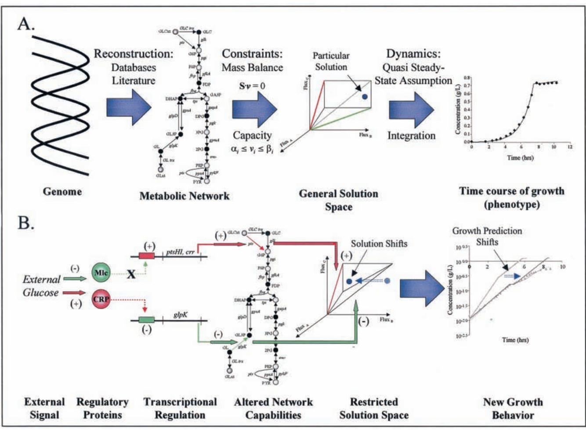
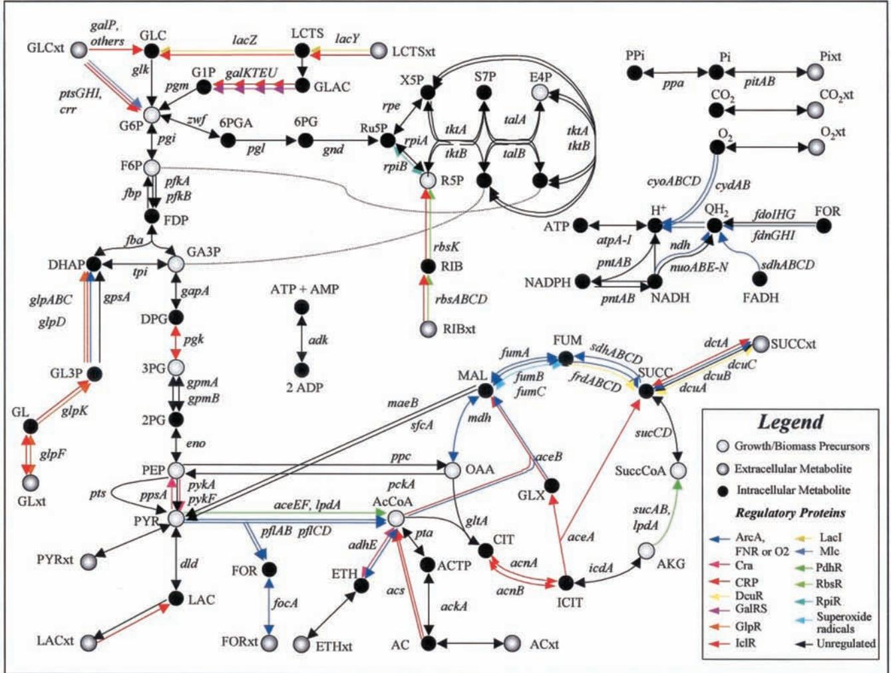
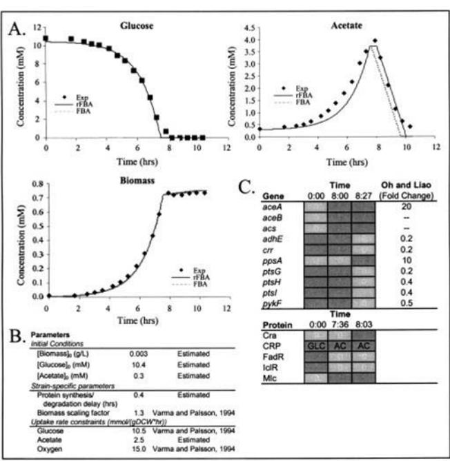
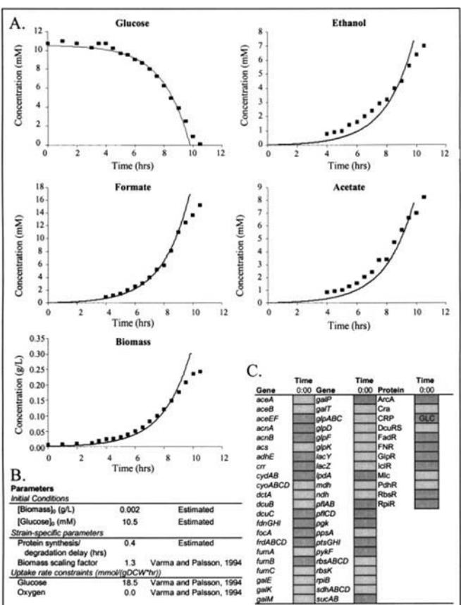
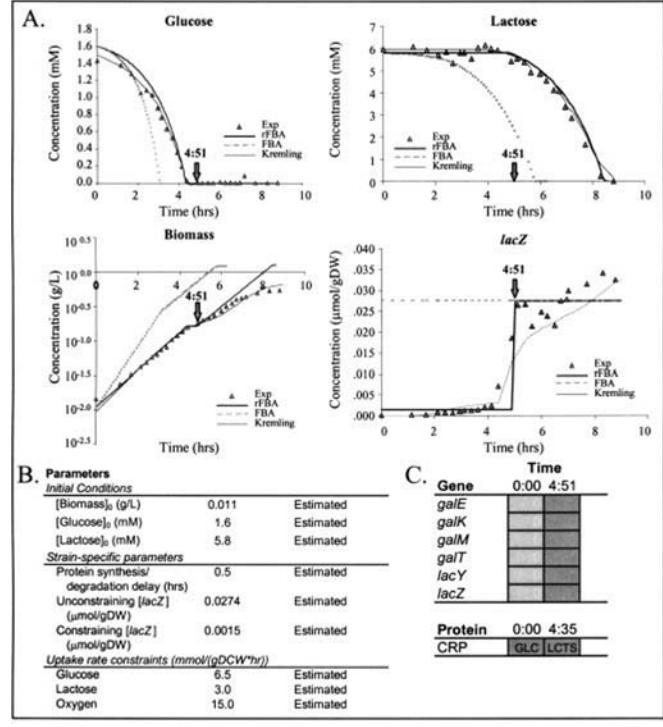

# **Transcriptional Regulation in Constraints-based Metabolic Models of** *Escherichia coli******□S

Received for publication, February 19, 2002, and in revised form, May 8, 2002 Published, JBC Papers in Press, May 10, 2002, DOI 10.1074/jbc.M201691200

## **Markus W. Covert and Bernhard Ø. Palsson‡**

*From the Department of Bioengineering, University of California, San Diego, La Jolla, California 92093-0412*

**Full genome sequences enable the construction of genome-scale** *in silico* **models of complex cellular functions. Genome-scale constraints-based models of** *Escherichia coli* **metabolism have been constructed and used to successfully interpret and predict cellular behavior under a range of conditions. These previous models do not account for regulation of gene transcription and thus cannot accurately predict some organism functions. Here we present an** *in silico* **model of the central** *E. coli* **metabolism that accounts for regulation of gene expression. This model accounts for 149 genes, the products of which include 16 regulatory proteins and 73 enzymes. These enzymes catalyze 113 reactions, 45 of which are controlled by transcriptional regulation. The combined metabolic/regulatory model can predict the ability of mutant** *E. coli* **strains to grow on defined media as well as time courses of cell growth, substrate uptake, metabolic by-product secretion, and qualitative gene expression under various conditions, as indicated by comparison with experimental data under a variety of environmental conditions. The** *in silico* **model may also be used to interpret dynamic behaviors observed in cell cultures. This combined metabolic/regulatory model is thus an important step toward the goal of synthesizing genome-scale models that accurately represent** *E. coli* **behavior.**

The annotated genome sequence of *Escherichia coli* and other organisms (1) has made it possible to develop *in silico* models of cellular behavior at a genome scale. One approach to the construction of *in silico* models that has proven useful in studying biological systems is based on the imposition of governing constraints (2) (Fig. 1*A*). In the constraints-based approach, a metabolic network is reconstructed by identifying metabolic genes and the corresponding reactions from the annotated genome sequence as well as from the relevant literature (3). The capabilities of the reconstructed network are described by a solution space that contains all possible steadystate metabolic flux distributions in the network. The solution space is formed by the imposition of physicochemical constraints that restrict the behavior of the network, such as the steady-state mass balance of metabolites, the effective irreversibility of reactions due to thermodynamic constraints, or the maximum flux capacity of enzymes or transport proteins. These physicochemical constraints are fixed invariants of the system, and the resulting constrained solution space may be thought of as a general solution space wherein every possible homeostatic state of the cell must lie.

Flux-balance analysis (FBA)1 can be used to identify particular behaviors within the allowable solution space, such as behaviors that produce the highest possible growth rate or production of a particular metabolite (4). FBA has been used to generate quantitative hypotheses about *E. coli* that have subsequently been tested experimentally, such as the growth characteristics of mutant strains (8), optimality of growth on singlesubstrate minimal media (9), and time courses of growth and metabolic by-product secretion (5).

A previously published genome-scale *E. coli in silico* model takes into account the metabolism of the organism based on 660 metabolic genes found in the *E. coli* K-12 MG 1655 genome (8). It has been estimated that about 400 regulatory genes exist in the genome of *E. coli* (10, 11); of these, 178 regulatory and putative regulatory genes were found during genome annotation (12). Transcriptional regulation in *E. coli* has a significant effect on cell behavior. The incorporation of regulatory constraints into flux-balance models has been described (6) (Fig. 1*B*). External signals, such as the presence of glucose in the extracellular environment, alter the affinity of regulatory proteins to operator or inhibitor sites on the genome. As a result, a gene may or may not be transcribed during a given time interval, and thus the corresponding biochemical reactions may or may not be active in the metabolic network under the given conditions. The reduced number of active reactions in the network leads to a smaller solution space. If the behavior exhibited previously by the cell is no longer found in the reduced solution space, then the solution shifts, meaning that a new growth behavior must be found and expressed.

In this study, a regulatory network was reconstructed for central metabolism in *E. coli*. This regulatory network was then incorporated into an existing *E. coli* central metabolic model and used to simulate *E. coli* behavior under a variety of environmental conditions and genome perturbations.

## MATERIALS AND METHODS

*Metabolic and Regulatory Network Reconstruction—*The metabolic network was reconstructed by identifying a set of biochemical reactions in the central *E. coli* metabolism, taken from the annotated genome sequence (11, 12) as well as from biochemical and physiological literature (13, 14). The regulatory network was derived from the literature data (cited in the supplemental material) and represented as a set of regulatory rules following established procedures (6). These rules were based on external conditions (*e.g.* the presence or absence of extracel-

* This work was supported by the Grant GM57089 from the National Institutes of Health and Grants MCB 9873384, BES 9814092, and BES 0120363 from the National Science Foundation. The costs of publication of this article were defrayed in part by the payment of page charges. This article must therefore be hereby marked "*advertisement*" in accordance with 18 U.S.C. Section 1734 solely to indicate this fact.

□S The on-line version of this article (available at http://www.jbc.org) contains a table of metabolic reactions and regulatory rules for the *E. coli* MG1655 *in silico* central metabolic/regulatory model.

‡ To whom correspondence should be addressed: Dept. of Bioengineering, University of California, San Diego, 9500 Gilman Dr., La Jolla, CA 92093-0412. Tel.: 858-534-5668; Fax: 858-822-3120; E-mail: palsson@ucsd.edu.

1 The abbreviations used are: FBA, flux-balance analysis; rFBA, regulatory FBA; CRP, cyclic AMP receptor protein.

FIG. 1. *In silico* **modeling of metabolism and transcriptional regulation using the constraints-based approach.** *A*, the constraintsbased approach to metabolic modeling. The metabolic genotype is defined from the known genes in the genome, as identified in metabolic databases and in the literature. Once the metabolic network has been defined, known invariant constraints that the network must obey are applied to the cell, enabling the network to be described geometrically as a closed solution space. Flux-balance analysis can be used to identify particular optimal solutions (such as optimization of growth) within the space (*blue point*), which represent possible behaviors of the cell (4). Assuming that metabolism is in a quasi-steady state relative to cell growth, the dynamic behavior of the cell may be simulated using numerical integration and flux-balance analysis at each time step (5, 6). As shown in *B*, transcriptional regulation reduces the steady-state solution space. For example, external glucose is sensed by various regulatory proteins in the cell, among them CRP, which is activated (*red arrow*), and Mlc, which is inactivated (*green arrow*) by the glucose signal. As a result, transcription of glucose ABC transporter operon *ptsHI-crr* is not repressed by Mlc, whereas transcription of a glycerol kinase gene, *glpK*, is repressed by CRP. The presence or absence of expression of these genes leads to the availability or unavailability of the respective reactions or transport processes in the metabolic network and possibly to the removal of available extreme pathway basis vectors from the steady-state solution space. The result is a time-dependent solution space defined by temporary regulatory constraints in addition to the invariant constraints mentioned previously, which may exhibit a new behavior if the previous solution is no longer in the space. Dynamic simulations incorporating such time-dependent constraints are able to simulate a wider range of cell phenotypes, particularly when regulatory effects have a dominant influence on metabolic behavior (6).

lular molecules) and/or internal conditions (*e.g.* the activity or inactivity of an enzymatic flux in a given environment) of the system. To accommodate the generally qualitative nature of existing transcriptional regulatory data, regulatory constraints were described using a Boolean formalism (15) in which gene products are either available (ON) or unavailable (OFF) to the cell. The regulatory rules can be computed using commercially available software packages, including EXCEL (Microsoft Corporation, Redmond, WA).

*Transcriptional Regulation and the Calculation of Steady-state Metabolic Flux Distributions—*Once the metabolic and regulatory networks were defined, FBA was used to determine an optimal metabolic flux distribution for the given conditions. FBA has been described and reviewed in detail (4, 16) and is based on the location of optimal flux distributions within the solution space defined by a metabolic network and governing constraints, as described above. For the purposes of these simulations, capacity constraints included maximum uptake rates of oxygen as well as substrates such as glucose, acetate, and lactose, as determined from growth experiments found in the literature (5, 17) (see Figs. 3–5 for numerical values). It has been demonstrated for *E. coli* under various conditions that cell growth may be used as an objective function (9, 18); the production of growth precursors in certain ratios was used here as an approximation (19). LINDO was used to calculate the optimal flux distributions (Lindo Systems, Chicago, IL).

The incorporation of regulatory constraints in the flux-balance framework has been described in detail (6). Regulatory constraints were applied to the network under steady-state conditions by evaluating whether genes were expressed or repressed for the given conditions (based on the aforementioned regulatory rules) and by constraining the fluxes of repressed gene products to zero. If a gene product was expressed, the actual flux value was determined by FBA. Thus, although the regulatory network is based on qualitative rules, the flux distribution determined by FBA is a quantitative result.

*Changing Environments and Time-dependent Cell Behavior—*The time constants that describe metabolic transients are fast (on the order of milliseconds to tens of seconds) as compared with the time constants associated with transcriptional regulation (generally on the order of a few minutes or slower) or cell growth (on the order of hours to days) (6). Therefore, dynamic simulations may be performed by considering the behavior inside the cell to be in a quasi-steady state during short time intervals relative to the environment (5). Beginning at time zero, the simulation was run in small time steps (3 s for this study). For each time step, the regulatory rules were evaluated based on current envi-

FIG. 2. **Combined regulatory/metabolic network for central metabolism in** *E. coli***.** All of the metabolic genes considered are shown. The genes that are regulated are indicated by the *color code* shown in the legend. Genes or reactions regulated by multiple regulatory proteins or molecules are shown with *multiple arrows*. The complete details of the network may be found in the supplementary material.

ronmental and internal conditions of the cell to determine the up- or down-regulation of every regulated gene. If a gene was determined to be up-regulated at a given time, the corresponding reactions in the metabolic system were considered unconstrained (by gene regulation) after a time delay to allow for protein synthesis. Conversely, the down-regulation of a gene resulted in the corresponding reactions being constrained to zero after a time delay to allow for protein degradation. The resulting sets of regulated genes that were present or absent for a particular time interval were used to generate the qualitative *in silico* expression arrays, which indicate whether or not a certain gene is being transcribed for a given time interval. Similarly, an *in silico* protein activity array was generated to show the activity of a certain regulatory protein at a given time. The time delay associated with gene transcription and protein synthesis is a required parameter and was estimated for each dynamic simulation (see Figs. 3–5).

Once the regulatory constraints for a particular time step were applied to the system, the optimal flux distribution was calculated as described above. The optimal flux distribution was then used to calculate cell growth, substrate uptake, and metabolic by-product secretion using numerical integration as described earlier (5). The time courses of cell growth, substrate uptake, and by-product secretion were generated using a spreadsheet software package (EXCEL, Microsoft Corporation).

*Mutant Study—*To simulate deletion of a metabolic gene from the network, the flux through the corresponding gene product was set to zero for all conditions. Regulatory gene deletion was simulated by setting the expression of the gene to OFF.

## RESULTS

The regulatory network associated with the central metabolism for *E. coli* was reconstructed and combined with a previously developed central metabolic model (8, 20) (Fig. 2). The analysis of the combined metabolic/regulatory network using FBA may be called regulatory flux-balance analysis (rFBA). The rFBA network accounts for 149 genes, the products of which include 16 regulatory proteins and 73 enzymes, which catalyze 113 reactions. The synthesis of 43 of the enzymes in this model is controlled by transcriptional regulation; as a result, the availability of 45 of the reactions to the system is controlled by a logic statement. The details of the rFBA network may be found in the supplemental material.

The metabolic/regulatory network was used in a retrospective analysis of experimental data to determine the ability of the rFBA model to make accurate phenotypic predictions. A mutant study as well as the dynamic simulation of growth under three environmental conditions (aerobic growth on glucose with acetate reutilization, glucose fermentation, and a mixed aerobic glucose-lactose batch culture) are described here.

*Mutant Study—*The rFBA model was used to ascertain the ability of mutant strains of *E. coli* to grow on defined media. For this study, 116 cases were examined and are shown in Table I. In each case, the experimental data were compared with predictions of both the rFBA model and the FBA (*i.e.* purely metabolic) model (8). The FBA model alone was able to correctly predict growth characteristics in 97 cases, or 83.6% of the given cases. Incorrect predictions were made for 16 of the 116 cases, and in three of the cases, predictions were not

## TABLE I TABLE I—*continued*

## *Comparison of experimental mutant studies with in silico predictions of the FBA and rFBA models under various conditions*

Results are scored as or meaning growth or no growth determined from *in vivo*/FBA/rFBA data. An *N* blank indicates that data were not available for these conditions. Cases where rFBA makes a correct prediction either unpredicted or incorrectly predicted by FBA alone are denoted by a shaded box. In 106 of 116 cases, the rFBA prediction matches the experimentally observed behavior. gl, glycerol; suc, succinate; (-O2), anaerobic conditions.

|                | glc       | gl                    | suc   | ac              | rib | glc   | Dual (-02) Substrates | Ref   |
|----------------|-----------|-----------------------|-------|-----------------|-----|-------|--------------------------|-------|
|                |           |                       |       |                 |     |       |                          |       |
| aceA           | +/+/+     |                       | +/+/+ | -1-1-           |     | +/+/+ |                          | 21    |
| aceB           |           |                       |       | -1-1-           |     |       |                          | 22    |
| aceEF          | -1 +1 -   |                       |       | =/ +/ = +/ +/ + |     | +/+/+ | (glc-ac) +/+/+        | 23    |
| ackA           |           |                       |       | +/+/+           |     |       |                          | 24    |
| ackA +         |           |                       |       |                 |     |       |                          |       |
| pta 4          |           |                       |       | -1-1-           |     |       |                          | 24    |
| acs            |           |                       |       |                 |     |       |                          |       |
| acnA           |           | +/+/+/+/+/+/+/+/+/+/+ |       |                 |     | +/+/+ |                          | 22,25 |
| acnB"          |           | +/+/+/+/+/+/+/+/+/+/+ |       |                 |     | +/+/+ |                          | 25    |
| acnA + acnB |           | -1-1-1-1-             | -1-1- | -1-1-           |     | -1-1- |                          | 25    |
| acs            |           |                       |       | +/+/+           |     |       |                          | 24    |
| adh            | +/+/+     |                       |       |                 |     | -/+/+ |                          | 26    |
| cyd            | +/+/+     |                       |       |                 |     |       |                          | 27    |
| cyo            | +/+/+     |                       |       |                 |     |       |                          | 27    |
| eno            |           | -1-1-1-1-1-1-1-       |       |                 |     |       | (gl-suc) +/+/+        | 28    |
| fbant          | - / + / + |                       |       |                 |     |       |                          | 29    |
| fbp            |           | +/+/+ -/-/-           |       | -/-/- -/-/-     |     |       |                          | 30    |
| frdA           | +/+/+     |                       |       | +/+/+/+/+       |     | +/+/+ |                          | 21    |
| LumA           |           |                       |       | -7-1-12         |     | +/+/+ |                          | 22    |
| gap            |           | -1-1-1-1-             | -1-1- |                 |     |       | (gl-suc) +/+/+        | 28    |
| glk            | +/+/+     |                       |       |                 |     |       |                          | 29    |
| glk + pfkA  | +/+/+     |                       |       |                 |     |       |                          | 29    |

* The *acnA* gene allows the models to grow, the expression of this isozyme is thought to be adapted to stress responses that have yet to be incorporated into the regulatory network described here.

† The simulations use the pyridine nucleotide transhydrogenase to grow. ‡ The loss of *fba* is thought to inhibit stable RNA synthesis, which would have an effect on growth unpredictable by the models.

§ The *pgi* mutation is lethal in the FBA simulations due to the inability to synthesize glucose 6-phosphate, a precursor of biomass components that may not be essential for cell growth.

¶ It is likely that ribose inhibits growth by an accumulation of ribose 5-phosphate in *rpi* double mutants.

- The absence of -ketoglutarate dehydrogenase results in an inability to produce succinyl CoA, which is used as a precursor metabolite in trace amounts for the synthesis of heme and hemelike compounds but is not included as an essential biomass component in the model.

** Dihydroxyacetone phosphate can accumulate in *tpi* mutants, resulting in formation of the bacteriocidal compound methylglyoxal.

| glk +             |              |                               |           |           |          |       |                                         |        |
|-------------------|--------------|-------------------------------|-----------|-----------|----------|-------|-----------------------------------------|--------|
| pts               | -1-1-        |                               |           |           |          |       |                                         | 29     |
| gltA              | -1-1-        |                               |           | - / - / - |          |       |                                         | 25     |
| gnd               | +1+1+        |                               |           |           |          |       |                                         | ਡ ਰੋ   |
| icd               | -1-1-        |                               |           | -1-1-     |          |       |                                         | ર્ટ ટે |
| mdh               |              | +/+/+/+/+ +/+/+               |           |           |          | +/+/+ |                                         | 31     |
| ndh               |              | +/+/+/+/+                     |           |           |          |       |                                         | 32     |
| nuo               | +/+/+        | +/+/+                         |           |           |          |       |                                         | 32     |
| pfl               |              |                               |           |           |          | +/+/+ |                                         | 33     |
| pgis              |              | +/+/+/-/- +/-/-               |           |           |          |       |                                         | 29     |
| pgi + gnd      | -/-/-        |                               |           |           |          |       |                                         | 29     |
| pai + ZWI.     | -1-1-        |                               |           |           |          |       |                                         | 29     |
| pgk               |              | -1-1-1-1-1-1-1-1-             |           |           |          |       | (g1-suc) +/+/+                       | 28     |
| pgl               | +/+/+        |                               |           |           |          |       |                                         | 29     |
| ppc               | -14/- 100 | = 14/1 = + / + / + 107,074 |           |           |          |       | (g1-suc) +/+/+ (glc-suc) +/+/+ | 29,31  |
| pta               |              |                               |           | +/+/+     |          |       |                                         | 24     |
| pts               | +/+/+        |                               |           |           |          |       |                                         | 29     |
| pykA              | + / + / +    |                               |           |           |          |       |                                         | 29     |
| pykA િન્દ      |              |                               |           |           |          |       |                                         |        |
| pykF              | +/+/+        |                               |           |           |          |       |                                         | 29     |
| pykF              | +/+/+        |                               |           |           |          |       |                                         | 29     |
| rpiA              | =1-3/F-      |                               |           |           | +/+/ +   |       | (glc-rib) +/4/+                      | 34     |
| rpiA + rpiBl   | -1-1-        |                               |           |           | -/+/+    |       | (glc-rib) +/+/+                      | 34     |
| rpiB              | +/+/+        |                               |           |           | +/+/+    |       | (glc-rib) +/+/+                      | 34     |
| rpiR + rpiA    | +/ N/+       |                               |           |           | + / N/ + |       | (gic-rib) To ADI +                   | 34     |
| sdhABCD + / + / + |              |                               | -1-1-     | -1-1-     |          | +/+/+ |                                         | 21     |
| SUCAB- 1pdl    | - / + / +    |                               | - / + / + | -1+1+     |          | +/+/+ | (glc-suc) +/+/+                      | 21,23  |
| tpi "             |              | -/+/+ -/-/-/-/-/-/-/-/-       |           |           |          |       | (glc-suc) +/+/+ (glc-gl) +/+/+ | 28,35  |
| ZWF               | +/+/+        |                               |           |           |          |       |                                         | 29     |

possible for the FBA model alone because *rpiR* is a regulatory gene and therefore only included in the rFBA model.

The rFBA model made correct predictions about growth characteristics in 106 or 91.4% of the 116 cases, an improvement of nine correct predictions over the unregulated metabolic model. The mutants whose growth capabilities were correctly predicted by the rFBA model, but not the FBA model alone, were *aceEF*, *fumA*, *ppc*, *rpiA*, and *rpiR*. The remaining incorrect predictions are detailed in Table I and are usually due to accumulation of toxic substances, an effect not yet predictable by this approach.

The rFBA model was used to examine the above nine correct predictions in more detail. According to the predictions of the rFBA model, pyruvate dehydrogenase, encoded by the *aceEFlpdA* operon, is a lethal mutation in *E. coli* for growth on minimal glucose and minimal succinate media under aerobic conditions due to the aerobic down-regulation of its fermentative counterpart, pyruvate formate-lyase. Similarly, fumarase A (*fumA*) is the only fumarase that is generally transcribed under aerobic conditions. Phosphoenolpyruvate carboxylase (*ppc*) was correctly predicted to be a lethal mutation due to the down-regulation of the glyoxylate shunt.

The ribose phosphate isomerase A (*rpiA*) and the ribose repressor protein RpiR illustrate how regulatory gene mutant phenotypes may be simulated using rFBA. Two isomerases exist in *E. coli* for the interconversion of ribulose 5-phosphate and ribose 5-phosphate, encoded for by the *rpiA* and *rpiB* genes. Although the expression of *rpiA* is thought to be constitutive, expression of *rpiB* occurs in the absence of RpiR, which is inactivated by ribose (29, 34). As a result, *rpiA* mutants are ribose auxotrophs, whereas *rpiB* mutants exhibit a null phenotype. The further mutation of *rpiR* in *rpiA* mutants disables repression of *rpiB* and restores the ability to grow in the absence of ribose, as correctly predicted by the rFBA model.

*Dynamic Growth Simulations—*The rFBA model was used to simulate growth of *E. coli* quantitatively over the course of growth experiments. The resulting time courses of growth, substrate uptake, and by-product secretion were then compared with experimental data.

*E. coli* has been observed to secrete acetate when grown aerobically on glucose in batch cultures; when glucose is depleted from the environment, the acetate is then reutilized as a substrate. Using the rFBA and FBA models, an aerobic batch culture of *E. coli* on glucose minimal medium was simulated; the calculations are shown together with experimental data (5) (Fig. 3). The major difference between the rFBA and FBA simulations is in the delayed reaction of the system to depletion of glucose in the growth medium. The stand-alone metabolic network does not account for the delays associated with protein synthesis.

An *in silico* expression array and a regulatory protein activity array were also generated (Fig. 3*C*). The *in silico* array predicted the up-regulation of four gene products, *aceA*, *aceB*, *acs*, and *ppsA*, as well as the down-regulation of three gene products, *adhE*, *ptsGHI-crr*, and *pykF*. DNA microarray technology has been used to detect differential transcription profiles on a collection of 111 genes in *E. coli* (36). The difference in gene expression for aerobic growth on acetate *versus* growth on glucose as reported in Ref. 36 is included in Fig. 3*C*. The calculated expression of the eight genes included in the rFBA model for which expression data were published was in qualitative agreement with the predictions of the rFBA model. The ability of the rFBA model to reutilize acetate depends on the up-regulation of the glyoxylate shunt genes, *aceA* and *aceB*, which explains the high magnitude of transcription difference (20-fold) reported in Ref. 36.

FIG. 3. **Aerobic growth on acetate with glucose reutilization.** *A*, three time plots showing experimental data obtained by Varma and Palsson (5) as well as the corresponding simulations performed using FBA and rFBA. In the acetate plot, the regulatory/metabolic model predictions differ from that of the regulatory plot alone as shown. *B*, a table containing the parameters required to generate the time plots. *C*, *in silico* arrays showing the up- or down-regulation of selected genes or activity of regulatory proteins in the regulatory network (*dark gray*, gene transcription/protein activity; *light gray*, transcriptional repression/protein inactivity). Data from Oh and Liao (36) showing the experimentally determined transcriptional fold changes for certain genes (acetate: glucose) are shown where applicable. Note that the regulation of CRP is represented by a complex set of Boolean statements (see supplemental material). As a result, CRP activity is represented here as GLC or AC to denote when glucose or acetate is accepted by the system, respectively.

Importantly, the rFBA model suggests an interpretation for the regulation of two genes that were found to be regulated but by unknown causes, *ppsA* and *adhE* (36). The rFBA model indicates that a second regulatory shift is induced by catabolite activator protein Cra, which responds to falling intracellular concentrations of fructose 6-phosphate and fructose 1,6 bisphosphate once glucose is depleted from the medium. This second regulatory shift is responsible for up-regulation of *ppsA* and down-regulation of *adhE*, *crr*, *ptsG*, *ptsHI*, and *pykF* according to the rFBA model.

The next case studied using the rFBA model was anaerobic growth on glucose (5) (Fig. 4). Under these conditions, the FBA model makes similar predictions as the rFBA model with one exception: the rFBA model is able to make predictions about the use of a particular isozyme. For example, both models require fumarase activity as part of the optimal flux distribution; however, only the rFBA model is able to specify the *fumB* gene product, which is expressed anaerobically (37).

The final case examined for this study involved aerobic growth of *E. coli* on glucose and lactose. This case has been studied in detail by many groups (17, 38, 39). For this study, mixed batch culture data as well as the predictions of a detailed kinetic model recently derived by Kremling *et al.* (17) were used for comparison. The rFBA model predictions are in good agreement with the data, comparable with the predictions made by the Kremling model, and far better than the predictions of the stand-alone FBA model (Fig. 5). The failure of the stand-alone FBA model to accurately predict the results of this experiment is due to the concurrent uptake of glucose and lactose, resulting

FIG. 4. **Anaerobic growth on glucose.** *A*, five time plots similar to those shown in Fig. 3, again using experimental data obtained by Varma and Palsson (5). *B*, a table containing the parameters required to generate the time plots. *C*, *in silico* arrays for the simulation (similar in format to those shown in Fig. 3).

in much more rapid depletion of the substrates and a higher growth rate. Interestingly, because of the larger flux of carbon source uptake, the FBA model predicts that *E. coli* growth should be oxygen-limited rather than carbon-limited in this case. Accordingly, the secretion of acetate and formate is predicted. The rFBA model predicts that no secretion will occur under these conditions.

The *in silico* arrays for the experiment (Fig. 5*C*) show one shift in gene expression, occurring just under 5 h. The upregulation of the lactose uptake and degradation machinery, together with key enzymes in galactose metabolism, enables the system to use lactose as a carbon source once the glucose in the medium has been depleted.

#### DISCUSSION

Several approaches have been developed to mathematically model metabolic regulation and cell dynamics, as recently reviewed (40, 41). The majority of these approaches rely on extensive kinetic and other environmental information that is difficult to obtain. A combined model of *E. coli* central metabolism and regulation was reconstructed and analyzed using the constraints-based approach (2). The regulated model was used to simulate the viability of mutant strains, cellular growth, and by-product secretion under various environments and internal regulatory shifts under changing environmental conditions. The results of this study indicate the following: 1) the addition of regulatory constraints significantly improves the predictive capacity of flux-balance models in which regulatory effects have a dominant role in flux-balance models of metabolism; 2) regulatory constraints are also useful in the interpretation of

FIG. 5. **Aerobic growth on glucose and lactose.** *A*, four time plots showing experimental data and simulation results obtained by Kremling *et al.* (17) *lacZ* refers to the cell concentration of mRNA encoding the *lacZ* gene product (17) together with the corresponding simulations performed using FBA and rFBA. *B*, a table containing the numerical values of the parameters required to generate the time plots for the FBA models. *C*, *in silico* arrays for the simulation, similar in format to those shown in Fig. 3, where CRP activity is represented as GLC or *LCTS* (lactose) to denote when lactose is accepted by the system.

dynamic behaviors observed in cell cultures; and 3) large-scale metabolic models constructed using the constraints-based framework can capture the essential behavioral features and systemic characteristics of an organism with relatively few parameters.

The imposition of regulatory constraints on the solution space formed by the reconstructed network for the metabolism of an organism results in a smaller solution space that more accurately represents its behavior. This improved accuracy is readily seen in the results of the mutant study in which regulatory constraints were responsible for the correction of six false predictions made by the stand-alone FBA model. Furthermore, regulatory constraints enable the prediction of phenotype for regulatory gene mutations, as demonstrated by the three *rpiR* mutant predictions made using rFBA. The time courses generated for *E. coli* growth on glucose with acetate reutilization and glucose-lactose diauxie are examples for which regulatory constraints have a substantial impact on the simulation results, causing the simulation to better reflect the actual phenotype of the cell.

The addition of regulatory constraints can be used to interpret simulation results of cellular growth and by-product secretion. The glucose/acetate simulation clearly suggests that up-regulation of the glyoxylate shunt enables the reutilization of acetate and that a second regulatory shift is responsible for regulation of genes such as *ppsA* and *adhE*, both of which were found to be regulated for unknown reasons in a recent microarray study of these conditions (36). More intuitively, the simulation of glucose-lactose diauxic growth indicates that up-regulation of the *gal* and *lac* operons is vital to the diauxic shift observed.

By comparing the rFBA simulations with those produced by

the stand-alone FBA model, it may also be possible to infer causes of regulatory evolution. For example, in the case of glucose fermentation, the relatively small effect of regulation on the observed phenotype could suggest that this organism has evolved a system which can respond instantaneously to sudden oxygen deprivation. For the case of glucose-lactose diauxic growth, the stand-alone FBA model shows that the combined uptake of lactose and glucose could cause the system to be oxygen-limited rather than carbon-limited for biomass production, resulting in the secretion of acetate and formate and reducing the growth yield. This finding, combined with evidence that *E. coli* evolves to optimize its growth yield during growth on single-carbon source media (9)2 and that catabolite repression does not occur under starvation conditions under which the cell is carbon-limited rather than oxygen-limited (7), suggests the hypothesis that regulation of substrate uptake may have evolved as a means of maintaining optimal growth yields on single substrates. Such a hypothesis obviously remains to be examined in detail yet is illustrative of the usefulness of such a model in generating hypotheses that address such broad and fundamental topics as regulatory network strategy.

Finally, the ability of the combined model to accurately capture the essential behavioral features and systemic characteristics of central metabolism and regulation of *E. coli* with relatively few parameters illustrates the utility of the constraints-based framework for modeling microbial systems. This capability to interpret and predict complex biological functions in the absence of detailed parameters is particularly evident in the glucose-lactose example discussed above.

In summary, a central regulatory network for *E. coli* has been generated, and the corresponding regulatory constraints have been applied to central metabolism, resulting in improved interpretation and prediction of the behavior of this organism under specified conditions. As this combined metabolic/regulatory network is expanded to reflect the entire state of knowledge about *E. coli* transcriptional regulation, it is expected that the resulting constraints will further constrict the solution space and contribute to a fuller understanding of the systemic properties of this organism. With efforts underway to reconstruct regulatory networks using microarray data (42), it may be expected that rFBA models may soon be generated for other less characterized organisms. Interestingly, such *in silico* model development does permit the generation of hypotheses about the systems biology of metabolism and regulation, which may be difficult to formulate without an *in silico* model.

*Acknowledgment—*We thank Christophe Schilling for assistance in drawing the figures.

#### REFERENCES

- 1. Peterson, J. D., Umayam, L. A., Dickinson, T., Hickey, E. K., and White, O. (2001) *Nucleic Acids Res.* **29,** 123–125
- 2. Palsson, B. O. (2000) *Nature Biotechnol.* **18,** 1147–1150
- 3. Covert, M. W., Schilling, C. H., Famili, I., Edwards, J. S., Goryanin, I. I., Selkov, E., and Palsson, B. O. (2001) *Trends Biochem. Sci.* **26,** 179–186
- 4. Edwards, J. S., Ramakrishna, R., Schilling, C. H., and Palsson, B. O. (1999) in *Metabolic Engineering* (Lee, S. Y., and Papoutsakis, E. T., eds), pp. 13–57, Marcel Deker, New York
- 5. Varma, A., and Palsson, B. O. (1994) *Appl. Environ. Microbiol.* **60,** 3724–3731
- 6. Covert, M. W., Schilling, C. H., and Palsson, B. O. (2001) *J. Theor. Biol.* **213,** 73–88
- 7. Lendenmann, U., and Egli, T. (1995) *Microbiology* (*N.Y.*) **141,** 71–78
- 8. Edwards, J. S., and Palsson, B. O. (2000) *Proc. Natl. Acad. Sci. U. S. A.* **97,** 5528–5533 9. Edwards, J. S., Ibarra, R. U., and Palsson, B. O. (2001) *Nature Biotechnol.* **19,**
- 125–130 10. Thieffry, D., Huerta, A. M., Perez-Rueda, E., and Collado-Vides, J. (1998)
- *Bioessays* **20,** 433–440 11. Serres, M. H., Gopal, S., Nahum, L. A., Liang, P., Gaasterland, T., and M., R. (2001) *Genome Biol.* **2**, 0035.0031–0035.0037
- 12. Blattner, F. R., Plunkett, G., 3rd, Bloch, C. A., Perna, N. T., Burland, V., Riley, M., Collado-Vides, J., Glasner, J. D., Rode, C. K., Mayhew, G. F., Gregor, J., Davis, N. W., Kirkpatrick, H. A., Goeden, M. A., Rose, D. J., Mau, B., and Shao, Y. (1997) *Science* **277,** 1453–1474
- 13. Neidhardt, F. C. (ed) (1996) *Escherichia Coli and Salmonella: Cellular and Molecular Biology*, 2nd Ed. 2 vols., ASM Press, Washington, D. C.
- 14. Salgado, H., Santos-Zavaleta, A., Gama-Castro, S., Milla´n-Za´ rate, D., Dı´az-Peredo, E., Sa´nchez-Solano, F., Pe´rez-Rueda, E., Bonavides-Martı´nez, C., and Collado-Vides, J. (2001) *Nucleic Acids Res.* **29,** 72–74
- 15. Thomas, R. (1973) *J. Theor. Biol.* **42,** 563–585
- 16. Bonarius, H. P. J., Schmid, G., and Tramper, J. (1997) *Trends Biotechnol.* **15,** 308–314
- 17. Kremling, A., Bettenbrock, K., Laube, B., Jahreis, K., Lengeler, J. W., and Gilles, E. D. (2001) *Metab Eng.* **3,** 362–379
- 18. Kompala, D. S., Ramkrishna, D., Jansen, N. B., and Tsao, G. T. (1986) *Biotechnol. Bioeng.* **28,** 1044–1056
- 19. Neidhardt, F. C., Ingraham, J. L., and Schaechter, M. (1990) *Physiology of the Bacterial Cell*, pp. 87–173, Sinauer Associates, Inc., Sunderland, MA
- 20. Schilling, C. H., Edwards, J. S., Letscher, D., and Palsson, B. O. (2000) *Biotechnol. Bioeng.* **71,** 286–306
- 21. Creaghan, I. T., and Guest, J. R. (1978) *J. Gen. Microbiol.* **107,** 1–13
- 22. Cronan, J., E, Jr., and Laporte, D. (1996) in *Escherichia Coli and Salmonella* (Neidhardt, F. C., ed), Vol. 1, pp. 206–216, 2 vols., ASM Press, Washington, D. C.
- 23. Langley, D., and Guest, J. R. (1977) *J. Gen. Microbiol.* **99,** 263–276
- 24. Kumari, S., Tishel, R., Eisenbach, M., and Wolfe, A. J. (1995) *J. Bacteriol.* **177,** 2878–2886
- 25. Gruer, M. J., Bradbury, A. J., and Guest, J. R. (1997) *Microbiology* (*N. Y.*) **143,** 1837–1846
- 26. Cunningham, P. R., and Clark, D. P. (1986) *Mol. Gen. Genet.* **205,** 487–493 27. Calhoun, M. W., Oden, K. L., Gennis, R. B., de Mattos, M. J., and Neijssel,
- O. M. (1993) *J. Bacteriol.* **175,** 3020–3025
- 28. Irani, M. H., and Maitra, P. K. (1977) *J. Bacteriol.* **132,** 398–410
- 29. Fraenkel, D. G. (1996) in *Escherichia Coli and Salmonella* (Neidhardt, F. C., ed), Vol. 1, pp. 189–198, 2 vols., ASM Press, Washington, D. C.
- 30. Fraenkel, D. G., and Horecker, B. L. (1965) *J Bacteriol* **90,** 837–842 31. Courtright, J. B., and Henning, U. (1970) *J. Bacteriol.* **102**
- 32. Tran, Q. H., Bongaerts, J., Vlad, D., and Unden, G. (1997) *Eur. J. Biochem.* **244,** 155–160
- 33. Mat-Jan, F., Alam, K. Y., and Clark, D. P. (1989) *J. Bacteriol.* **171,** 342–348
- 34. Sorensen, K. I., and Hove-Jensen, B. (1996) *J. Bacteriol.* **178,** 1003–1011
- 35. Anderson, A., and Cooper, R. A. (1969) *FEBS Lett.* **4,** 19–20
- 36. Oh, M.-K., and Liao, J. C. (2000) *Biotechnol. Prog.* **16,** 278–286
- 37. Tseng, C. P. (1997) *FEMS Microbiol. Lett.* **157,** 67–72
- 38. Wong, P., Gladney, S., and Keasling, J. D. (1997) *Biotechnol. Prog.* **13,** 132–143
- 39. Adhya, S. (1996) in *Regulation of Gene Expression in Escherichia coli* (Lin, E. C. C., and Lynch, A. S., eds), pp. 181–200, R. G. Landes Company, Austin, TX
- 40. Smolen, P., Baxter, D. A., and Byrne, J. H. (2000) *Bull. Math. Biol.* **62**, 247–292
- 41. McAdams, H. H., and Arkin, A. (1998) *Annu. Rev. Biophys. Biomol. Struct.* **27,** 199–224
- 42. Maki, Y., Tominaga, D., Okamoto, M., Watanabe, S., and Eguchi, Y. (2001) in *Pacific Symposium on Biocomputing*, *Kohala Coast, HI, January 3–7, 2001* pp. 446–458, World Scientific Press, Singapore

2 R. U. Ibarra, J. S. Edwards, L. S. Ramos, and B. O. Palsson, submitted for publication.