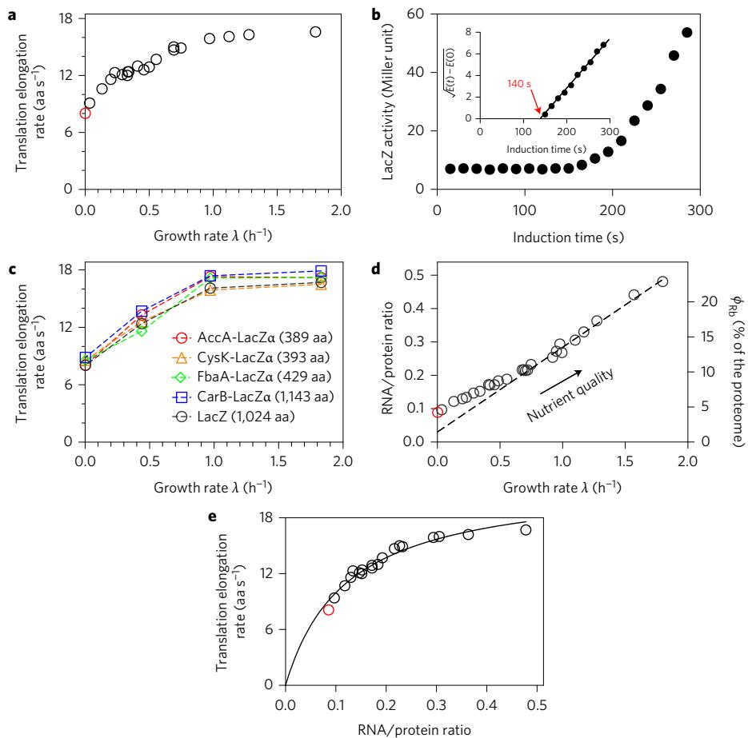
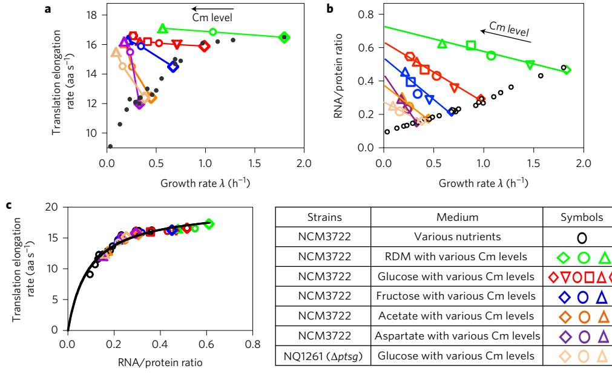
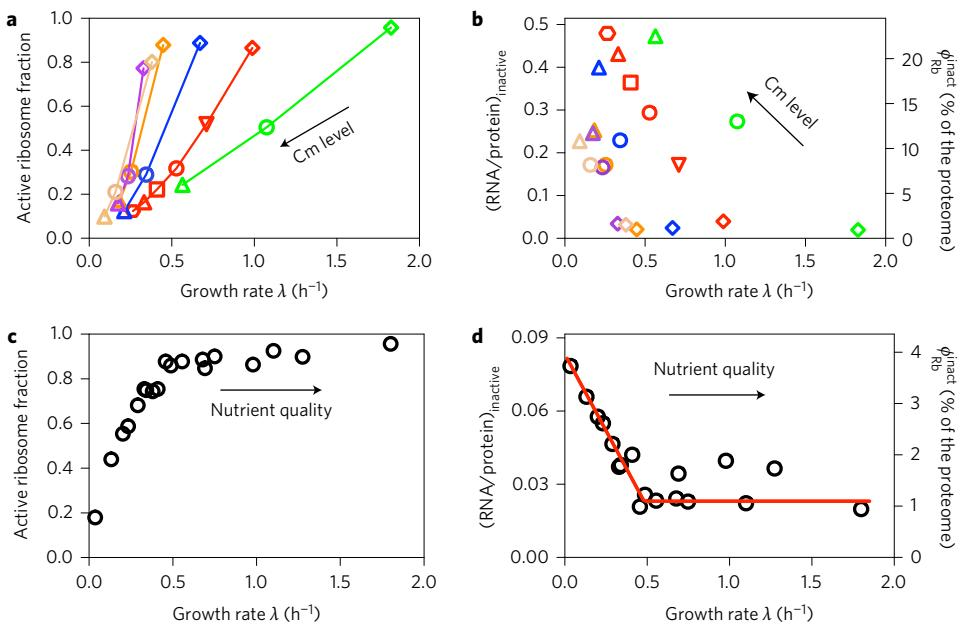
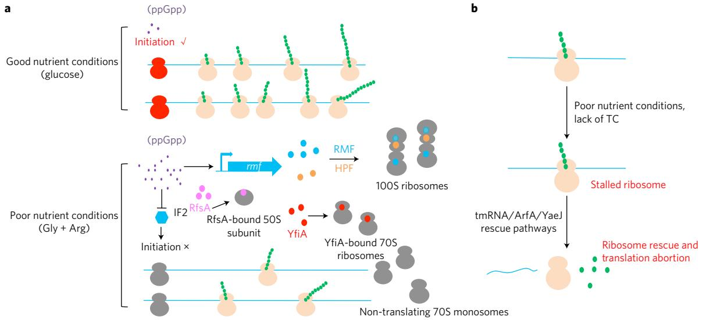

# Reduction of translating ribosomes enables Escherichia coli to maintain elongation rates during slow growth

Xiongfeng Dai1,2†, Manlu Zhu1,2†, Mya Warren1 , Rohan Balakrishnan1,3, Vadim Patsalo4, Hiroyuki Okano1 , James R. Williamson4, Kurt Fredrick3, Yi-Ping Wang2 * and Terence Hwa1 *

Bacteria growing under different conditions experience a broad range of demand on the rate of protein synthesis, which profoundly affects cellular resource allocation. During fast growth, protein synthesis has long been known to be modulated by adjusting the ribosome content, with the vast majority of ribosomes engaged at a near-maximal rate of elongation. Here, we systematically characterize protein synthesis by Escherichia coli, focusing on slow-growth conditions. We establish that the translational elongation rate decreases as growth slows, exhibiting a Michaelis–Menten dependence on the abundance of the cellular translational apparatus. However, an appreciable elongation rate is maintained even towards zero growth, including the stationary phase. This maintenance, critical for timely protein synthesis in harsh environments, is accompanied by a drastic reduction in the fraction of active ribosomes. Interestingly, well-known antibiotics such as chloramphenicol also cause a substantial reduction in the pool of active ribosomes, instead of slowing down translational elongation as commonly thought.

Recent studies have shown that proteome allocation constraint plays a major role in shaping the global gene expression pattern of bacteria in response to both genetic and environmental perturbations during exponential growth1–4 . Resolving this constraint has also been established as the physiological origin of such widely known microbial responses as catabolite repression and metabolic overflow[5,6](#page-7-0). In a nutshell, proteome allocation constraint reflects the limitation of ribosomes in protein synthesis; the vast majority of ribosomes are engaged in translation, so under growth-limiting conditions that require the synthesis of certain proteins, the synthesis of others must decrease. Conversely, under favourable conditions that permit fast growth, ribosomal proteins are preferentially synthesized at the expense of all other proteins[4](#page-7-0) .

The notion of limited translational capacity in bacteria was suggested by Maaløe and colleagues long ago[7](#page-7-0) in an attempt to rationalize an earlier finding that the cellular ribosome content exhibited a linear dependence on the growth rate for a broad range of nutrient conditions[8](#page-7-0) . This linear dependence, referred to as a bacterial 'growth law', was theorized to result from the ribosomes elongating at their maximal rate regardless of nutrient conditions, such that the rate of protein synthesis (reflected by the growth rate) is proportional to the number of translating ribosomes. However, the elongation rate was later found to decrease for Escherichia coli growing under poor nutrient conditions9–11. In a recent theoretical study, Klumpp et al.[12](#page-7-0) noted that the ternary complexes (TCs, comprising aminoacyl-tRNA, elongation factor Tu (EF-Tu) and guanosine triphosphate (GTP)), which are the 'substrates' of ribosomes and diffuse slowly in the crowded cytoplasm, present another significant bottleneck to the translational capacity and may be the cause of the slowing in translational elongation at

slow growth. They further showed that this slow down in translational elongation could still give rise to a linear relation between the ribosome content and growth rate for fast to moderate growth, assuming a Michaelis–Menten (MM) dependence of the elongation rate on TC abundances and a proportionality between TCs and ribosome abundances due to co-regulation in their synthesi[s13](#page-7-0) (see Supplementary Note 1 for a review). This theory therefore provides a plausible reconciliation between the linear growth law and the known data on translational elongation. However, for slow-growing cells under nutrient-limited conditions, the same theory would predict an abrupt drop in the ribosome content and a vanishing elongation rate, contrary to the known fact that protein synthesis proceeds effectively even in the stationary phas[e14](#page-7-0) and can, moreover, jump to a high rate immediately after nutrient upshift[15.](#page-7-0)

In this study, we systematically characterized the translational elongation rate of E. coli in vivo by varying the nutrients and applying translation-inhibiting antibiotics. A very broad range of growth conditions was studied, particularly for slow growth (up to 20 h doubling time) and including the stationary phase. Our results quantitatively established the MM dependence of the elongation rate on components of the TCs (the key assumption of the Klumpp et al. theory) for all growth conditions studied. Nevertheless, the elongation rate is maintained at a significant level (>50% of that in rich medium), even in extremely slow growth. Our results suggest that this maintenance, important physiologically for the effective synthesis of proteins when nutrients run out, is accomplished by limiting the pool of active ribosomes. Also, a number of translation-inhibiting antibiotics are found to dramatically reduce the pool of active ribosomes, without slowing down the rate of translational elongation as is commonly thought.

1 Department of Physics, University of California at San Diego, La Jolla, California 92093-0374, USA. 2 State Key Laboratory of Protein and Plant Gene Research, School of Life Sciences, Peking University, Beijing 100871, China. 3 Department of Microbiology and Ohio State Biochemistry Program, The Ohio State University, Columbus, Ohio 43210, USA. 4 Department of Integrative Structural and Computational Biology, Department of Chemistry, The Skaggs Institute for Chemical Biology, The Scripps Research Institute, La Jolla, California 92037, USA. †These authors contributed equally to this work. *e-mail: [wangyp@pku.edu.cn](mailto:wangyp@pku.edu.cn); [hwa@ucsd.edu](mailto:hwa@ucsd.edu)

Figure 1 | Characteristics of protein synthesis capacity under nutrient limitation. a, Growth-rate dependence of the in vivo translational elongation rate (ER) was obtained by the LacZ induction assay from exponentially growing cultures with various nutrient sources. Data are shown as open black circles (Supplementary Table 1). The open red circle shows the ER obtained from a culture in an early stage of the stationary phase. b, LacZ induction kinetics of E. coli in the early stationary phase (Supplementary Fig. 6). Inset: corresponding Schleif plot. LacZ expression appears ∼140 s after induction, giving an ER of ∼8 aa s−1 after taking into account the initiation time via the LacZα assay (Supplementary Fig. 3). c, ERs of four other LacZα-fused proteins under nutrientlimited growth were obtained using the LacZα complementation assay (Supplementary Table 2 and Supplementary Fig. 7). ER values obtained under the same conditions by the LacZ induction assay are shown in black. d, Growth-rate dependence of R/P obtained for the same growth medium as in a. Original data are provided in Supplementary Table 3. Right y axis gives the ribosomal fraction, ϕRb. Supplementary Note 1 shows the conversion. The dashed line is a linear fit to the data in the fast-growth regime (λ > 0.7 h−1 ). The open red circle corresponds to stationary-phase data. e, ER from a plotted against R/P from d. The black line is a fit to the MM relation (with KM ≈ 0.11 and kelong ≈ 22 aa s−1 ). Data shown in a–d are averages for three biological replicates. Standard deviations are within 5–10% (approximately the size of the symbols).

#### Results

Translation under nutrient limitation. We first characterized the translational elongation rate (ER, denoted mathematically by k) of wild-type E. coli K-12 cells growing exponentially under a variety of nutrient conditions. A broad range of growth rates (GRs, denoted by λ), corresponding to doubling time from 20 min to 20 h, were probed by varying both the carbon and nitrogen sources in saturating minimal medium (Supplementary Fig. 1a,b). In each case, ER was determined by the classical β-galactosidase (LacZ) induction assay (Supplementary Fig. 2)[9,16](#page-7-0), with correction of the initiation time (∼10 s across all the growth conditions probed) by repeating the induction assay using the short LacZα fragment (Supplementary Fig. 3). This method was further validated by measuring the ER of a previously characterized slow translational mutant (Supplementary Fig. 4).

As shown in Fig. 1a (black open circles), ER was nearly constant (k = 16–17 aa s−1 ) under good growth conditions (λ >1h−1 ), but steadily decreased under poorer growth conditions. The decreases in ER found here are in agreement with those obtained in sporadic previous studies using several different methods9–11 (Supplementary Fig. 5). Notably, ER remained at significant values (>9 aa s−1 ) even close to zero growth (doubling time of 20 h). We also determined ER after cells entered the stationary phase (Supplementary Fig. 6). The value obtained, ∼8 aa s−1 (red open circle in Fig. 1a; see also Fig. 1b), is in line with ER values obtained from slow steady-state growth and also with the known demand of protein synthesis in the stationary phase[14,17.](#page-7-0)

To investigate whether our results may be specific to the translation of LacZ, we developed a variant of LacZ induction assay, translationally fusing a target gene of choice to LacZα (Supplementary Fig. 7A)[18.](#page-7-0) We then measured the ERs of four such LacZα hybrid proteins of different lengths for different growth conditions (Supplementary Fig. 7b–e). The ERs obtained for these proteins, shown as coloured symbols in Fig. 1c, are quantitatively consistent with those obtained from LacZ for all conditions tested. Together, these results suggest that the growth-rate dependence of ER shown in Fig. 1a is generic to the translation of E. coli proteins.

To understand how cells manage to maintain an appreciable ER at slow growth, we characterized the abundance of the cellular ribosome content φRb for a number of slow-growth conditions using quantitative mass spectrometry[3](#page-7-0) . The results are seen to correlate

Figure 2 | Characteristics of protein synthesis capacity under translation limitation by Cm inhibition. a, ER plotted against growth rate for a steady-state culture treated with sublethal doses of Cm. Each colour represents a fixed nutrient source as indicated in the table, except for the pale orange symbols, which represent a mutant strain (NQ1261, ΔptsG) that grows slowly in glucose medium due to the lack of the major glucose transporter (this is another way to generate a 'poor carbon' condition). Different symbols indicate various Cm levels in the medium. The small black dots represent the ER obtained under nutrient-limited growth as shown in [Fig. 1a](#page-1-0). Original data are given in Supplementary Table 4. b, R/P under Cm inhibition. R/P has a negative correlation with growth rate, as previously reported[1](#page-7-0) . The lines are straight-line fits to act as guides. Original data are provided in Supplementary Table 5. The small black open circles are the data of nutrient limitation as shown in [Fig. 1d](#page-1-0). c, ER in a plotted against R/P in b (same colour code). The data from [Fig. 1e](#page-1-0) are shown as black symbols. ER exhibits a MM dependence on R/P under both nutrient limitation and Cm inhibition. The black line is the best fit to the MM relation with KM ≈ 0.11 and kelong≈ 22 aa s−1 . Data in a and b are averages for three biological replicates. Standard deviations are within 5–10% (approximately the size of the symbols).

well (Supplementary Fig. 8) with the RNA/protein ratio (R/P[)1,19,](#page-7-0) which we use below as a proxy of the cellular ribosome content (Supplementary Note 1a). R/P values were obtained for wild-type cells grown in the same medium as those shown in [Fig. 1a.](#page-1-0) They are seen to exhibit a linear correlation with the growth rate at moderate to fast growth ([Fig. 1d)](#page-1-0), as is well know[n1,4,5](#page-7-0),[20](#page-7-0). However, this linear correlation (dashed line in [Fig. 1d)](#page-1-0), referred to as the linear 'growth law', is broken at slow growth (λ ≲ 0.7 h−1 ) by a slight but notable upward bend. Such deviations from a linear correlation of the ribosome content with GR at slow growth have been reported previousl[y21](#page-7-0).

Could this deviation from the linear relation be the source of finite ER at slow growth? We next constructed a scatter plot of ER against R/P obtained under the same growth condition. The data are well described by a MM relation (black line, [Fig. 1e)](#page-1-0), predicte[d12](#page-7-0) based on an assumed underlying MM relation between ER and the concentration of TCs (the substrates of translation) and co-regulation in the expression of ribosomes and components of TCs. We will quantitatively examine the relation between ribosome and TCs in the section 'Model of translational elongation'. Here, we remark that the existence of such a relation would indeed tie the maintenance of ER at slow growth to the upward bend of the linear growth law. A slight upward bend would increase significantly the y intercept of the R/P versus GR curve, which would significantly increase the TC content and hence significantly increase ER at slow growth (Supplementary Fig. 9).

Translation under drug inhibition. Translational inhibition is an alternative way to vary the ribosomal and TC conten[t1](#page-7-0) , thus offering a different perspective on the determinants of the in vivo translational elongation rate. Addition of sublethal doses of chloramphenicol (Cm), a well-known translational elongation blocker, inhibits overall protein synthesis in a graded manner and

slows down cell growt[h1](#page-7-0),[22](#page-7-0). We characterized the ER of exponentially growing cells for a range of Cm concentrations in glucose minimal medium. Although the overall LacZ production rate was substantially reduced by the addition of Cm, the synthesis time of the first LacZ remained nearly constant for the different Cm concentrations applied (Supplementary Fig. 2d), implying a nearly constant ER, as plotted in Fig. 2a (red symbols). This seemingly surprising result is not specific to the synthesis of LacZ, as the same finding is recapitulated for the translation of other proteins using the pulse-chase labelling method[11](#page-7-0) (Supplementary Fig. 10). A similar result was obtained for the addition of Cm to rich nutrient conditions (RDM + glucose, green symbols in Fig. 2a). Even more remarkably, clear increases in ER were obtained by the addition of Cm in poor nutrient conditions (minimal medium with fructose, acetate or aspartate as the sole carbon source) or for a ΔptsG strain (NQ1261, deleted of the main glucose transporter), which grew slowly in glucose medium and hence mimics carbon-limited growth without changing the substrate (Fig. 2a). This result was further verified by applying the hybrid LacZα method (Supplementary Fig. 11, see also ref. [18](#page-7-0)).

Cm is known to block the translational elongation process by binding to the 50S ribosome subunit[22.](#page-7-0) The binding rate is slow (kon = 0.034 µM min–1 ), but when it does bind, it binds tightly with a half-life exceeding 7 min (koff = 0.074 min−1 [)22](#page-7-0). Our finding of constant ER in good growth medium can be rationalized if the observed ER was derived from a fraction of leading ribosomes that escaped Cm binding at the sublethal doses applied, while the majority of ribosomes stalled when 'hit' by Cm, resulting in aborted translation. This scheme is illustrated in Supplementary Fig. 12 and elaborated in Supplementary Note 2.

If the above scenario is correct, then we expect to see a similar effect on ER for other drugs that bind tightly to ribosomes, but not for those that exhibit rapid reversible binding. Towards this end, we characterized the effect of four other protein synthesis inhibitors, tetracycline (Tet), erythromycin (Ery), fusidic acid (FA) and mupirocin (Mup). Tet inhibits translational elongation by binding tightly to the 30S ribosome subuni[t23](#page-7-0),[24.](#page-7-0) Ery binds to the 50S subunit of ribosomes with a comparably low koff, as Cm does (0.15 min−1 )[25.](#page-7-0) As expected, the effect of Tet and Ery on ER is similar to that of Cm. ER remained nearly constant for cells grown in glucose and increased for cells grown in poor growth medium (aspartate) following the addition of sublethal doses of these two drugs (Supplementary Fig. 13a,b). On the other hand, FA, which prevents the rapid turnover of elongation factor G (EF-G) from the ribosome via binding to the EF-G–ribosome complex[26,27](#page-7-0), affects ribosome movement more reversibly[28.](#page-7-0) In this case, we found ER to decrease gradually with sublethal doses of FA treatment (Supplementary Fig. 13c). Finally, we characterized Mup, which inhibits the charging of isoleucine tRNA[29,](#page-7-0) and observed a reduced ER similar to the case of nutrient limitation (Supplementary Fig. 13d).

Model of translational elongation. The above picture of tight drug–ribosome binding addresses the effect of these drugs on ER in good growth medium. To understand why ER in poor growth medium increased upon drug treatment, we again looked into the ribosome content in these cultures by characterizing R/P, which again reflects the ribosomal protein content as shown in Supplementary Fig. 8. As found previously[1](#page-7-0) , R/P is negatively correlated with growth rate upon Cm inhibition ([Fig. 2b)](#page-2-0). Similar effects are seen for Tet and Ery treatment (Supplementary Fig. 14a,b). The opposing pattern of the GR-dependence of R/P results from the differential regulation of ribosome synthesis mediated by guaninetetraphosphate (ppGpp)[20,30.](#page-7-0) By again constructing the scatter plot of ER against R/P, we found, remarkably, that the two diverging data sets for nutrient limitation and Cm inhibition ([Fig. 1a,d](#page-1-0) and [2a,b)](#page-2-0) collapsed onto a single curve [(Fig. 2c](#page-2-0)), which is well-described by the MM relation (solid line). Thus, exactly the same MM relation between ER and the ribosomal content holds, despite the very different physiological conditions between nutrient-limited and translationlimited growth. The rise in ER is illustrated simply, graphically, in Supplementary Fig. 9 (cyan symbols).

To appreciate the origin of this MM relation, we developed a coarse-grained model of translation[12](#page-7-0)[,31](#page-8-0), in which tRNA TCs are treated as a single species of substrates for the ribosomes and referred to as TCeff. The time to translate one codon, which is the inverse of the elongation rate k, is divided into two coarse-grained timescales: (1) the binding of the TC to the ribosome, which depends inversely on the effective TC concentration [TCeff] due to limitation by TC diffusion[12,](#page-7-0)[32](#page-8-0) and (2) other enzymatic processes (for example, translocation), the rate of which does not depend on TC concentration. Let these two timescales be 1/(kon[TCeff]) and 1/kelong, respectively. Then we have

$$\frac{1}{k} = \frac{1}{k_{\rm con} \times \left[ \rm TC_{eff} \right]} \ + \frac{1}{k_{\rm elong}} \tag{1}$$

which leads to a MM relation between the elongation rate k and the effective TC concentration, with kelong interpreted as the maximal rate of peptide elongation and kelong/kon being the binding constant of the effective TC with the ribosome. The precise mathematical definition of [TCeff] and its effective binding constant in terms of the corresponding quantities for individual tRNA species are provided in Supplementary Note 3a,b. The MM relation of ER versus R/P then follows if [TCeff] and R/P are proportional, that is,

where C is a constant of proportionality. This proportionality, suggested previousl[y12](#page-7-0) based on the known co-regulation between rRNA, tRNA and EF-Tu, was directly verified (Supplementary Figs 15 and 16) for nutrient limitation and Cm inhibition. We further established the constancy of the tRNA charging ratio for a number of major tRNA species (Supplementary Fig. 17) for both types of growth perturbation. Taken together, these results strongly support the validity of the relation proposed in equation (2).

Based on the quantitative relations obtained between the abundances of EF-Tu, total tRNA and ribosomes, and based on the known composition of individual tRNA specie[s33](#page-8-0) assuming the constancy of the relative composition of the individual tRNA species and the tRNA charging ratio, we obtained the concentration of TCeff for each of our conditions, summarized by the constant of proportionality C ≈ 31 µM in equation (2) (see Supplementary Note 3b for details). Then, from the MM fit of [Fig. 2c](#page-2-0), we obtained kelong = 22 aa s−1 and kon = 6.4 µM−1 s −1 . We note that the value of kelong is consistent with previous estimations[31](#page-8-0),[34](#page-8-0) and the value of kon is in agreement with predictions made based on the assumption that kon is diffusion-limited in the crowded cytoplasmic environmen[t12](#page-7-0),[32.](#page-8-0) The same analysis can be extended to include the effect of other substrates of translational elongation such as EF-G (which is also proportional to R/P, as seen in Supplementary Fig. 16c,d). However, our calculations show that EF-G diffusion is unlikely to be the limiting step because of its much higher concentration compared to individual tRNA species in cells (Supplementary Note 3c).

The coarse-grained model described here gives a simple, quantitative explanation of the counterintuitive pattern of increased ER under Cm inhibition in poor growth medium. The increased R/P under Cm inhibition ([Fig. 2b)](#page-2-0) is accompanied by increased levels of TCs (Supplementary Figs 15–17). For cells growing in good nutrient conditions, the higher TC levels do not noticeably increase ER because it is already saturated. However, under poor nutrient conditions where ER is limited by the substrate TC levels in the absence of drugs, the observed increase in ER under Cm treatment is quantitatively accounted for by the increase in TC levels. Thus, we conclude that the observed dependences of ER on growth rate upon nutrient limitation and Cm inhibition arise largely from the changing TC levels. The same conclusion can also be applied to other drugs like Tet and Ery, which exhibited a similar correlation between ER and R/P as Cm (Supplementary Fig. 14c,d).

Fraction of active ribosome equivalent. For cells under Cm inhibition (also Ery and Tet), the reduced rate of protein synthesis cannot be accounted for by either the measured ER (which either increases or remains constant) or the observed ribosomal content (which increases). These findings point to a necessary reduction in the number of productively translating ribosomes, for a variety of possible reasons including ribosome mis-assembly[35,](#page-8-0) inactivation[36](#page-8-0) and drop-off [37](#page-8-0), as will be discussed below. However direct quantitative characterization of the state of ribosome activity by polysome profiling have yielded inconclusive and conflicting results in the past[38](#page-8-0),[39,](#page-8-0) due to experimental challenges such as the fragility of polysomes or polysome run-off, which convert a fraction of polysomes to ribosome subunits or 70S monosomes during the sample collection process[10,](#page-7-0)[40](#page-8-0). Here, we introduce a related quantity, the 'active ribosome equivalent', which can be deduced based on mass balance in the steady state.

For exponentially growing cells with a negligible rate of protein turnover[41,](#page-8-0) mass balance implies

$$k \times N_{\text{Rb}}^{\text{active}} = \lambda \times N_{\text{aa}} \tag{3}$$

where Naa is the number of amino acids contained in all cellular proteins in a standard culture volume and Nactive Rb is the total

Figure 3 | Growth-rate dependence of the active ribosome fraction. a, Growth-rate-dependent fraction of factive for cultures under sublethal doses of Cm, computed according to equation (N1.5) in Supplementary Note 1a. Symbol shapes and colours are the same as those in [Fig. 2.](#page-2-0) Original data are provided in Supplementary Table 6. b, Absolute abundance of inactive ribosomes upon Cm inhibition. The left y axis shows the portion of R/P attributed to inactive ribosomes, given by (1 – f active) × R/P, with R/P taken from [Fig. 2b.](#page-2-0) The right y axis shows the protein mass fraction of inactive ribosomes, ϕinact Rb = (1 − factive) × ϕRb as defined in Supplementary Note 1a. c, Growth-rate-dependent fraction of factive under nutrient limitation. Original data are provided in Supplementary Table 7. d, Absolute abundance of inactive ribosomes upon nutrient limitation. The left and right y axes are the same as those in b, with R/P taken from [Fig. 1d](#page-1-0). The red line, showing a constant ϕinact Rb (1.1%) from the moderate to fast-growth range (λ > 0.5 h−1 ), together with a linear relation between ϕinact Rb with growth rate in the slow-growth range (λ > 0.5 h−1 ), is shown as a guide. Note that the error in the estimates of factive arising from errors in ER and R/P values is ∼10%. Data in a–d are calculated based on the ER and R/P data (each with at least three replicates) shown in [Figs 1](#page-1-0) and [2](#page-2-0), respectively.

number of 'ribosome equivalents' needed to synthesize all the cellular proteins, assuming that they are all translating at the observed rate k. Because Naa, λ and k are all measured quantities, equation (3) can be used to compute Nactive Rb or, more meaningfully, the fraction of active ribosome equivalent, factive = Nactive Rb /NRb ∝ λ/ k × R/P , where NRb is the total number of ribosomes per standard culture volume (for details see Supplementary Note 1a).

The result obtained for Cm inhibition is shown in Fig. 3a. The fraction of active ribosome equivalent, f active, decreases steeply with increasing Cm level (decreasing GR) for each nutrient condition characterized (colours correspond to those defined in [Fig. 2](#page-2-0)). Calculation showed that this decrease of the active ribosome equivalent can be largely accounted for by the direct binding of Cm to the ribosome (Supplementary Note 2: Fig. N1). Similar patterns were also observed for Tet and Ery inhibition (Supplementary Fig. 18). It is also convenient to introduce the inactive ribosome equivalent, whose absolute abundance (1 – factive) × φRb is shown in Fig. 3b. We see that this quantity reaches over 20% of the proteome for some conditions. Note that our definition of active ribosome equivalent based on equation (3) would classify as inactive those that drop off during the translation process and produce unstable partial protein products (Supplementary Fig. 12).

We applied the same analysis to deduce the fraction of active ribosome equivalent and the abundance of inactive ribosome equivalent under nutrient limitation alone, and the results are shown in Fig. 3c,d. From moderate to fast growth (λ > 0.5 h−1 ), factive in Fig. 3c remained nearly constant at a high level (>80%), which is consistent with previous estimates over the same growth range[20](#page-7-0),[38.](#page-8-0) At slower growth, however, the fraction of active ribosome equivalent decreased steeply to below 20%. Note that the upward bend in R/P occurred in the same slow growth range [(Fig. 1d](#page-1-0)). From Fig. 3d, we see that the abundance of inactive ribosome equivalent, kept at ∼1% of the total protein mass for λ > 0.5 h−1 , increased in the corresponding slow growth range to 4%.

#### Discussion

In this study, we have firmly established a single MM relation between the elongation rate and the ribosome content for E. coli cells subjected to both nutrient limitation and translational inhibition [(Fig. 2c)](#page-2-0). This observation reflects an underlying MM relation between ER and the concentrations of TCs, whose components are proportional to the ribosome content (Supplementary Figs 15–17). Different ERs observed in vivo are seen as manifestations of changes in substrate availability. The maintenance of ER in poor nutrient conditions, including the stationary phase, is then understood as a consequence of cells upholding their TC levels, reflected in an upward bend of the ribosome–GR relation at slow growth [(Fig. 1d](#page-1-0) and Supplementary Fig. 9). The appearance of the latter is in turn related to the rise of inactive ribosomes at slow growth (Fig. 3d). In fact, the upward bend of the ribosome–GR relation as well as the maintenance of elongation at slow growth can be quantitatively captured by incorporating the observed fraction of inactive ribosome (Fig. 3d) into the model of Klumpp et al. [12](#page-7-0) without introducing any ad hoc fitting parameters (Supplementary Fig. 19 and Supplementary Note 4). This maintenance of a significant elongation rate is of direct physiological importance at slow growth, as the timely synthesis of proteins is needed in poor nutrient conditions, including the stationary phase[14,](#page-7-0)[42](#page-8-0).

To gain insights into the underlying mechanisms of reduction in active ribosome fraction during slow growth, we performed polysome profiling analysis for cells grown under poor conditions. There is a clear shift from polysome to 70S monosome for cells grown in poor nutrient compared to glucose (Supplementary Fig. 20a). This shift indicates a programmed reduction in

Figure 4 | Models for the reduction of the active ribosome fraction at slow growth. a, Examples of regulated mechanisms of ribosome inactivation. Under good nutrient conditions such as glucose medium, the intracellular ppGpp level (small purple dots) is low. Translation initiates frequently (with initiating ribosomes in red), giving a high fraction of polysomes (the actively translating ribosomes, in pale orange). However, under poor nutrient conditions, the intracellular ppGpp level is increased. Ribosomes may be inactivated by ribosome modulation factor (RMF) (positively regulated by ppGpp[)45](#page-8-0) and dimerize as a result of the hibernation promotion factor (HPF) to form 100S ribosome[s36](#page-8-0). Alternatively, YfiA can inactivate the 70S ribosome[s36,](#page-8-0) while RsfA can bind to the 50S subunit, thereby reducing the available ribosomes for translation. The reduced active ribosome fraction can also result from inhibition of translation initiation. Increased ppGpp is reported to inhibit the IF2-dependent translation initiation proces[s43](#page-8-0). All of these mechanisms lead to a decrease in polysome number, with some increasing the number of non-translating 70S monosomes. b, Possible passive mechanism of ribosome inactivation. Under poor nutrient conditions, ternary complexes (TCs, the substrates of ribosomes) become limiting, causing the ribosomes to stall more frequently. Prolonged stalling triggers abortion of the translation process, with the stalled ribosome rescued by the tmRNA/ArfA/YaeJ pathwa[y46](#page-8-0). Partially translated proteins resulting from the abortive process are usually not well folded and are further degraded by proteases such as ClpX (ref. [50](#page-8-0)). The ribosomes involved in abortive translation are 'futile' because they do not produce stable products. They are classified as inactive ribosomes according to the way active ribosomes are defined (equation (3) and Supplementary Note 1).

translational initiation at slow growth, probably through inhibition of IF2-mediated translation initiation by ppGpp, whose concentration increases in poor nutrient conditions (Fig. 4a[)20](#page-7-0),[43.](#page-8-0) This reduction can also be implemented by various regulators that titrate ribosomes away from translation, including ribosome modulation factor (RMF), hibernation promotion factor (HPF), YfiA and RsfA (refs [36,44,45)](#page-8-0) (Fig. 4a). Alternatively, ribosomal inactivation may arise passively due to increased occurrences of abortive translation, with ribosome stalling triggered by low levels of TCs at slow growth (Supplementary Note 5). The rescue of stalled ribosomes (through such factors as tmRNA-SmpB, ArfA and YaeJ[)46](#page-8-0),[47](#page-8-0) would also elevate the 70S monosome fraction (Fig. 4b). Both the programmed and passive scenarios of Fig. 4 would be consistent with early findings that polyribosomes were converted to 70S monosomes with the loss of protein synthesizing capacity for E. coli under conditions of carbon starvation[48.](#page-8-0)

The growth-rate dependence of the active ribosome fraction may be at the core of a long-standing puzzle regarding the low efficiency of bacterial protein synthesis in poor nutrient conditions. In a classical nutrient-upshift assay[15](#page-7-0)[,49](#page-8-0) where a very slow-growing chemostat culture was shifted to a rich nutrient broth, the rate of protein synthesis increased four- to fivefold within minutes, well before a significant number of new ribosomes and TCs could be synthesized[15](#page-7-0). Our results on the reduction of the active ribosome fraction, from ∼90% at fast growth to <20% in slow growth ([Fig. 3c](#page-4-0)), provides a natural resolution to this puzzle, if the inactive ribosomes resulting from regulated sequestration or inhibition (Fig. 4a) can quickly engage in protein synthesis following nutrient upshift.

In summary, our results reveal that E. coli maintains the speed of elongation by reducing the fraction of active ribosomes, which in turn elevates the expression of translational machineries including components of the TC. One might argue that TC synthesis could in principle be separated from ribosomal synthesis, so that a separate control can be used to maintain the TC levels without also increasing the inactive ribosomes at slow growth. However, given the additional benefit of preparing cells for rapid nutrient upshift as just discussed, co-regulation of these two quantities conveniently couples the potential advantage of growth recovery and the functional necessity of maintaining the elongation rate at slow growth.

The other major finding of this study is that sublethal doses of translational elongation blockers (Cm, Tet and Ery) inhibit protein synthesis by decreasing the active ribosome fraction instead of reducing the rate of translational elongation in vivo ([Fig. 3a,b](#page-4-0)). Several possible routes may exist. First, it is known that translational inhibitors such as Cm lead to ribosome misassembly, forming large amounts of inactive precursors[22](#page-7-0),[30](#page-7-0) (Supplementary Fig. 12). This is manifested in our polysome profiling data where a substantial subunit fraction is obtained, with an extra peak corresponding to ribosome intermediates being clearly visible for cells grown in Cm (Supplementary Fig. 20b). In addition, there is again a significant shift of the polysome distribution to 70S monosomes. This may result from the rescue of the stalled Cmbound ribosomes and the trailing ribosomes (Supplementary Fig. 12). The rescued monosomes would be rendered 'inactive' by our classification, because the partial protein products they produce before stalling would be degraded rapidly[50.](#page-8-0) This expectation is supported by a previous report[22](#page-7-0) showing that under Cm inhibition, the 70S monosomes contributed little to the overall protein synthesis compared to the polysome fraction. In the future, we expect global methods such as ribosome profiling to reveal more directly the in vivo action of these drugs, in particular regarding ribosome stalling and traffic jam as depicted in Supplementary Fig. 12 (refs [3](#page-7-0)[,47](#page-8-0)).

### Methods

Strains. The strains used in this study are either wild-type E. coli NCM3722 strain[51,52](#page-8-0) or its derivatives: NQ1261 (ΔptsG, deleted of the gene encoding the main glucose transporter PtsG), which grows slowly in glucose medium[53](#page-8-0), NQ1468, used for measuring LacZα induction kinetics, and the WE2015 series of strains, used for measuring the translational elongation rate of various proteins using the hybrid LacZα approach described below. E. coli MG1655 strain used in the ribo-seq study of Li et al. [3](#page-7-0) was also obtained directly from G.W. Li.

Strain NQ1468 contains chromosome expression of the LacZα fragment (the first 90 codons of the LacZ protein), driven by its native lac promoter, and also a plasmid, which constitutively expresses the complementary LacZω fragment (wild-type LacZ with 11–41 aa deleted)[54](#page-8-0) by the synthetic Ptet promoter.

To construct the strain, the lacZ coding region corresponding to 91–1,024 aa residues of NCM3722 was first replaced with selective maker kanr genes (kanamycin resistant gene) using the λ Red system[55](#page-8-0). The kanr marker was further flipped out by plasmid pCP20. This generates the chromosome-expressed LacZα strain, NQ1441. NQ1441 strain is white when grown on an X-gal plate (50 µg ml–1 ) due to its lack of LacZ activity. The LacZω fragment coding sequence was amplified from E. coli DH5α strain with upstream primer and downstream primer containing the KpnI and BamHI sites, respectively. The PCR product was gel purified and inserted between the KpnI and BamHI sites of a pZA31-luc derived plasmid pZA31*-luc (a BamHI site was introduced between the luciferase gene and T1 terminator of pZA31-luc). This yields pZA31*Ptet-lacω, with the lacZω fragment driven by the constitutive Ptet promoter of the pZA31 plasmid[56](#page-8-0). To measure LacZα induction kinetics, chloramphenicol needs to be added to modulate protein synthesis (see description of translation rate measurement in the following), so the cmr gene in pZA31* needs to be replaced by another antibiotic marker. To do this, the ampr gene fragment of pZE12-luc was cut off with XhoI and SpeI, gel purified, and inserted into the same site of pZA31*-Ptet-lacω to replace cmr . The resultant plasmid pZA31**-Ptet-lacω was then transformed into strain NQ1441, yielding strain NQ1468. The NQ1468 colony is blue in a Luria-Bertani (LB) plate supplemented with 50 µg ml–1 X-gal and 100 µg ml–1 ampicillin, indicating that LacZα is successfully complemented in vivo.

To measure the translational elongation rate of several other proteins (AccA, CarB, CysK and FbaA) using the LacZα complementation system, we amplified the native Plac promoter through PCR and inserted it into the HindIII/KpnI site of the pZS24*-MCS plasmid. The coding sequence of the lacZα fragment (this time, we use a smaller version of the lacZα fragment coding for the N-terminal 1–60 aa of LacZ (ref. [57](#page-8-0)) together with an upstream sequence coding for a 10 aa (GGGGS)2 linker) was further inserted into the KpnI/MluI site, yielding pKU1500 vector. The fragment containing Ptet-lacZω-T1 (T1 terminator) was further PCR amplified from the pZA31*Ptet-lacZω, and cloned into the SalI/HindIII sites of the pKU1500 vector. A pair of XhoI/NotI sites was introduced into the pKU1500 vector between the Plac promoter and the lacZα fragment. The coding sequence of accA, carB, cysK and fbaA was inserted individually into the XhoI and NotI site to be fused with the lacZα fragment to yield the final constructs. Each final construct was further transferred into a lacZ-deficient NCM3722 strain constructed using the λ Red system[3](#page-7-0) to yield strains WE2015-accA, WE2015-carB, WE2015-cysK and WE2015-fbaA, respectively.

Growth medium. All the growth media used in this study were MOPS buffered media, as described by Cayley et al. [58](#page-8-0) except for the growth of the MG1655 strain (see description of mass spectrometry methods in the following) where we followed Li et al. [3](#page-7-0) and used MOPS buffered media as described in Neidhardt and coauthors59. The medium contained 40 mM MOPS and 4 mM Tricine (adjusted to pH 7.4 with NaOH), 0.1 mM FeSO4, 0.276 mM Na2SO4, 0.5 µM CaCl2, 0.523 mM MgCl2 and also micronutrient mixtures as used in ref. [59](#page-8-0). Carbon and nitrogen sources were varied to create different nutrient limitations. Rich defined medium (RDM) + glucose medium contains 0.2% (wt/vol) glucose, micronutrients, various amino acids, nucleotides and vitamins. Glucose + cAA medium contains 0.2% (wt/vol) glucose and 0.2% (wt/vol) casamino acids. Chloramphenicol (Cm), tetracycline (Tet), mupirocin (Mup) and fusidic acid (FA) concentrations were varied to achieve different extents of translation inhibition. All MOPS minimal media contain 0.1 M NaCl.

Cell growth. Exponentially cell growth was always performed in a 37 °C water bath shaker at 240 r.p.m. A standard cell growth round always followed three steps: seed culture, pre-culture and experimental culture. Typically, cells were first grown as seed cultures in LB broth for several hours, then as pre-cultures overnight in MOPS medium (identical in composition to the experimental conditions). Finally, experimental cultures were started by diluting the pre-cultures to an optical density at 600 nm (OD600) of ∼0.01–0.02. To calculate growth rates, seven to nine OD600 points within a range of OD600 of ∼0.05–0.5 (spanning three generations) were measured.

Total RNA quantification. The total RNA quantification method used was the same as that used by You and co-authors5 .

Total protein quantification. The total protein quantification method was the same as that used by You and co-authors5 .

Measurement of translational elongation rate by LacZ or LacZα induction assay. Translational elongation rates were measured using LacZ induction as described by Andersson et al. [60](#page-8-0) with modifications. NCM3722 was grown to an OD600 of ∼0.4 followed by induction of the lac operon with 5 mM isopropyl-β-D-thiogalactoside (IPTG). Immediately after induction, at 10 or 15 s intervals, aliquots of either 200 or 400 µl culture were transferred into pre-chilled microfuge tubes containing 5 µl chloramphenicol (34 mg ml–1 ) for a total of 16–18 time points. Samples were frozen using dry ice and stored at −80 °C before LacZ assay.

The LacZ assay was mainly performed according to the traditional Miller's colorimetric method using O-nitrophenyl-β-D-galactopyranoside (ONPG) as the substrate[61](#page-8-0). For conditions yielding low basal levels of LacZ, such as sublethal concentrations of chloramphenicol, a sensitive fluorescence substrate, 4-methylumbelliferyl-D-galactopyranoside (MUG), was used[62,63](#page-8-0). Briefly, a 100 µl cell sample was collected as described above, added to 400 µl Z-buffer and warmed in a 37 °C water bath for several minutes. A 50 µl volume of 2 mg ml–1 MUG stock in DMSO was added and the reaction mixtures were incubated for 30 min. The reaction was stopped with 250 µl of 1 M Na2CO3. The fluorescence intensity was measured with a microplate reader (365 nm excitation filter, 450 nm emission filters). The LacZ induction curve was constructed by plotting the LacZ activity against induction time and further analysed using a square-root plot (Schleif plot) to obtain the lag time for the synthesis of the first LacZ molecul[e16](#page-7-0) (Tfirst, Supplementary Fig. 2).

To correct for the time taken for the initiation steps (including IPTG penetration, LacI depression, transcription initiation and translation initiation) of LacZ induction, LacZα induction kinetics were also measured following the above described measurement of LacZ induction kinetics, with modifications. Strain NQ1468 was grown to the exponential phase at an OD600 of ∼0.4. At 5–10 s interval, nine cell culture samples (200 µl) were immediately pipetted into 2 ml pre-cooled Eppendorf tubes containing 5 µl chloramphenicol (34 mg ml–1 ) to stop translational elongation. LacZα-LacZω complement activity was always measured using the more sensitive MUG assay due to the much lower activity level of the complement compared to the full-length LacZ. Before performing the MUG assay, the NQ1468 sample was first incubated at 37 °C for 1 h to allow all the LacZα fragment to complement with the LacZω fragment[54.](#page-8-0) Samples were then subjected to MUG assay in the same way as for the full-length LacZ activity measurement described above. LacZα induction kinetics were also measured by plotting activity versus time. The synthesis time for LacZα (Tα) was estimated using a straight-line fit of the LacZα induction curve. The initiation time (Tinit) was calculated as Tinit = Tα – 90/k, where the second term is the elongation time needed to complete the synthesis of the 90-residue-long alpha fragment. As a first estimate of the elongation rate k, we used k = 934 aa/(Tfirst – Tα), where Tfirst is the first appearance for the full-length LacZ. The initiation time was always found to be ∼10 s (Supplementary Fig. 3). We therefore calculated all the LacZ translation elongation rate as 1,024 aa/(Tfirst – 10 s).

To determine the translational elongation rate of several other proteins (AccA-LacZα, CarB-LacZα, CysK-LacZα and FbaA-LacZα) using the WE2015 series of strains, the same procedure and analysis procedure was followed as for the LacZ induction assay, except that MUG substrate was used for the assay instead of ONPG. The synthesis time for the first LacZα-fused protein (Tfirst) was also obtained via a Schleif plot (Supplementary Fig. 7b–e) as in LacZ induction. The translation elongation rate of these four LacZα-fused protein is therefore equal to L/(Tfirst – 10 s), where L is the length of each fused protein (Supplementary Table 2) and 10 s is the initiation time.

Translational elongation rate measured by pulse chase radioactive labelling. Translational elongation rates were also characterized for a number of proteins using the pulse-chase method as described by Pedersen[11,](#page-7-0) albeit without dual labelling. Cells were grown to an OD600 of 0.5 at 37 °C in 20 ml MOPS minimal media. A pulse of 0.03 mCi 35S methionine (1,175 Ci mmol–1 ) was added and chased with 1 µmol unlabelled methionine after 10 s. With a 7 s interval, around 20 samples (600 µl) were drawn from the culture into tubes containing 2 mg chloramphenicol and were immediately frozen in liquid nitrogen. The samples were then thawed on ice, the cells were pelleted and resuspended in 30 µl 2× sodium dodecyl sulfate (SDS) polyacrylamide gel electrophoresis (PAGE) loading buffer (100 mM Tris-HCl, pH 6.8; 200 mM dithiothreitol (DTT), 4% SDS, 0.2% bromophenol blue and 20% glycerol). Samples were boiled for 1 min, spun down, and the proteins were resolved using 8% SDS–PAGE. The gels were dried and exposed to phosphorimager screens overnight. The screens were scanned using Typhoon FLA9000 and the bands were quantified using imagequant. To correct for loading errors, the band intensities were normalized with respect to the intensity of the free methionine at the front for the respective lanes. The band intensity of a specific protein was plotted versus time after adding 35S methionine, and the turning time point at which the band intensity reaches a plateau corresponds to the time T needed for the translation elongation of the protein. In this case, the translation elongation rate was obtained by using the length of the specific protein to divide the elongation time. Note that,

according to the basic principle of pulse chase radioactive labelling (caption of Supplementary Fig. 10), there is no time cost for the initiation step, as is the case for the LacZ induction assay.

Northern blotting under acidic conditions. Total aminoacyl-tRNA was extracted from cells under acidic conditions and subjected to acid gel electrophoresis as described in Janssen et al. [64](#page-8-0) using tRNA-specific hybridization probes as listed in Dong and co-authors33.

Polysome profiling by sucrose gradient. Polysome profiling was performed according to Balakrishnan et al. and Qin et al. with modifications[65](#page-8-0),[66](#page-8-0). Briefly, cells in the mid-log phase (OD600 of ∼0.5) were rapidly chilled by pouring on crushed ice, then collected by centrifugation. The pellets were resuspended in lysis buffer (10 mM Tris-HCl pH 7.5, 10 mM MgCl2, 65 mM NH4Cl, 1 mg ml–1 lysozyme, 100 U ml–1 RNase-free DNase I (Roche), 400 U ml–1 Superase inhibitor (Ambion)) and lysed by three freeze–thaw cycles. Clarified lysates were loaded onto 10–38% (wt/vol) sucrose gradients made in a buffer containing 10 mM Tris-HCl (pH 7.5), 10 mM MgCl2 and 65 mM NH4Cl. Gradients were spun in an SW41 rotor at 35,000 r.p.m. for 3.5 h at 4 °C and fractionated using a syringe pump (Brandel) in conjunction with an ultraviolet absorbance detector (ISCO UA-6 type 11). ImageJ software was used to quantify the relative fraction of the three ribosome populations (polysomes, monosome and subunit) from the raw figure of polysome profiling. For each peak of the three ribosome populations in the profile plot, a line was drawn across the base of the peak to enclose the peak. The size of each peak was then analysed by the 'analyze→measure' function of ImageJ.

#### Measurement of relative protein abundances using quantitative mass

spectrometry. The protein abundances of NCM3722 cells grown under five slowgrowth conditions—(1) 60 mM acetate + 10 mM NH4Cl (λ: 0.46 h−1 ); (2) 0.075% mannose + 10 mM NH4Cl (λ: 0.29 h−1 ); (3) 0.2% glycerol + 10 mM arginine (λ: 0.21 h−1 ); (4) 20 mM glutamate + 10 mM NH4Cl (λ: 0.12 h−1 ); (5) 0.2% glycerol + 20 mM threonine (λ: 0.03 h−1 )—were obtained relative to those from the reference condition (0.2% glucose + 10 mM NH4Cl (λ: 0.98 h−1 ) using quantitative mass spectrometry (qMS). The procedure is described below. The same procedure was used to determine the relative abundance between MG1655 cells obtained from Li et al. 3 and grown under the MOPS glucose conditions described in Li et al. 3 and NCM3722 cells grown under our reference condition.

Protein sample collection. The 14N/15N protein sample collection and trichloroacetic acid (TCA) precipitation were carried out in a manner similar to that described by Hui and co-authors4. The same amounts of protein samples of the NCM3722 strain growing in 0.2% glucose + 10 mM 15NH4Cl medium and 0.075% mannose + 10 mM 15NH4Cl medium were mixed together and taken as the 15N reference sample. However, for the comparison between the MG1655 and NCM3722 strains, only the protein sample of the NCM3722 strain growing in 0.2% glucose + 10 mM 15NH4Cl medium was taken as the 15N reference sample.

Peptide digestion. TCA-precipitated bacterial pellets containing ∼200 µg protein were dissolved in 40 µl 8 M urea, 100 mM Tris-HCl, pH 7.5. Proteins were reduced with 10 mM DTT for 15 min at 37 °C. Cysteine alkylation was achieved with 40 mM iodoacetamide for 15 min at 25 °C in the dark. The protein solution was diluted fivefold with 50 mM Tris-HCl, 10 mM CaCl2, pH 7.5 to a final urea concentration of 1.6 M, and 80 µl of this solution was digested with 2 µg trypsin (Pierce). After overnight incubation at 37 °C, an additional 1 µg trypsin was added for 4 h. Tryptic peptides were desalted using PepClean reverse-phase columns (Pierce) according to the manufacturer's instructions.

MS data acquisition and conversion. MS data were acquired using an AB Sciex 5600 TripleTOF after injecting 2 µg tryptic peptides, essentially as described by Hui et al., but with increased instrument scan times (MS1 accumulation time of 250 ms, MS2 accumulations of 150 ms). Vendor instrument files were converted to profile and centroided mzML formats using the vendor software. Centroided mzML files were converted to mzXML using tools included in the Trans-Protemic Pipeline (TPP[)67,67](#page-8-0) and searched using X!Tande[m68](#page-8-0) against the UniProt E. coli database (organism ID 83333) supplemented with common protein contaminants, enzymes and reversed peptide decoy sequences. The peptide-spectrum match tolerances were set at 50 ppm and 100 ppm for the precursor and product ions, respectively. The TPP tools PeptideProphet and iProphet were used to score the peptide–spectrum matches and the search results were combined into a consensus library using SpectraST[69.](#page-8-0)

MS data quantitation. As described in Hui et al., the 14N (light) experimental and 15N (heavy) reference peptide ion count intensities were quantified with leastsquares Fourier transform convolution[70](#page-8-0) using Massacre[71](#page-8-0) modified to accept SpectraST libraries as input (Patsalo and Williamson, unpublished). To correct the imbalance in total experimental and reference protein amounts (approximately 20% deviation), the light/heavy quantitative ratios were corrected by the quotient of the cumulative 14N and 15N X!Tandem E. coli spectral counts for each sample.

The absolute proteome abundance of each individual r-protein in each growth condition was obtained by calibrating against the abundance of NCM3722 strain

growing in the reference condition (0.2% glucose + 10 mM NH4Cl) as described in the captions of Supplementary Tables 8 to 10.

### Received 28 February 2016; accepted 17 October 2016; published 12 December 2016

#### References

- 1. Scott, M., Gunderson, C. W., Mateescu, E. M., Zhang, Z. & Hwa, T. Interdependence of cell growth and gene expression: origins and consequences. Science 330, 1099–1102 (2010).
- 2. Gerosa, L., Kochanowski, K., Heinemann, M. & Sauer, U. Dissecting specific and global transcriptional regulation of bacterial gene expression. Mol. Syst. Biol. 9, 658 (2013).
- 3. Li, G.-W., Burkhardt, D., Gross, C. & Weissman, J. S. Quantifying absolute protein synthesis rates reveals principles underlying allocation of cellular resources. Cell 157, 624–635 (2014).
- 4. Hui, S. et al. Quantitative proteomic analysis reveals a simple strategy of global resource allocation in bacteria. Mol. Syst. Biol. 11, 784 (2015).
- 5. You, C. et al. Coordination of bacterial proteome with metabolism by cyclic AMP signalling. Nature 500, 301–306 (2013).
- 6. Basan, M. et al. Overflow metabolism in Escherichia coli results from efficient proteome allocation. Nature 528, 99–104 (2015).
- 7. Maaløe, O. in Biological Regulation and Development (ed. Goldberger, R. F.) 487–542 (Plenum, 1979).
- 8. Neidhardt, F. C. & Magasanik, B. Studies on the role of ribonucleic acid in the growth of bacteria. Biochim. Biophys. Acta 42, 99–116 (1960).
- 9. Dalbow, D. G. & Young, R. Synthesis time of β-galactosidase in Escherichia coli B/r as a function of growth rate. Biochem. J. 150, 13–20 (1975).
- 10. Young, R. & Bremer, H. Polypeptide-chain-elongation rate in Escherichia coli B/r as a function of growth rate. Biochem. J. 160, 185–194 (1976).
- 11. Pedersen, S. Escherichia coli ribosomes translate in vivo with variable rate. EMBO J. 3, 2895–2898 (1984).
- 12. Klumpp, S., Scott, M., Pedersen, S. & Hwa, T. Molecular crowding limits translation and cell growth. Proc. Natl Acad. Sci. USA 110, 16754–16759 (2013).
- 13. Ryals, J., Little, R. & Bremer, H. Control of rRNA and tRNA syntheses in Escherichia coli by guanosine tetraphosphate. J. Bacteriol. 151, 1261–1268 (1982).
- 14. Kolter, R., Siegele, D. A. & Tormo, A. The stationary phase of the bacterial life cycle. Annu. Rev. Microbiol. 47, 855–874 (1993).
- 15. Koch, A. L. & Deppe, C. S. In vivo assay of protein synthesizing capacity of Escherichia coli from slowly growing chemostat cultures. J. Mol. Biol. 55, 549–562 (1971).
- 16. Schleif, R., Hess, W., Finkelstein, S. & Ellis, D. Induction kinetics of the L-arabinose operon of Escherichia coli. J. Bacteriol. 115, 9–14 (1973).
- 17. Link, H., Fuhrer, T., Gerosa, L., Zamboni, N. & Sauer, U. Real-time metabolome profiling of the metabolic switch between starvation and growth. Nat. Methods 12, 1091–1097 (2015).
- 18. Zhu, M., Dai, X. & Wang, Y. P. Real time determination of bacterial in vivo ribosome translation elongation speed based on LacZα complementation system. Nucleic Acids Res. <http://dx.doi.org/10.1093/nar/gkw698> (2016).
- 19. Basan, M. et al. Inflating bacterial cells by increased protein synthesis. Mol. Syst. Biol. 11, 836 (2015).
- 20. Bremer, H. & Dennis, P. P. in Escherichia coli and Salmonella 2nd edn (ed. Neidhardt, F. C.) 1553–1569 (American Society of Microbiology, 1996).
- 21. Neidhardt, F. C., Ingraham, J. L. & Schaechter, M. Physiology of the Bacterial Cell—A Molecular Approach (Sinauer Associates, 1990).
- 22. Harvey, R. J. & Koch, A. L. How partially inhibitory concentrations of chloramphenicol affect the growth of Escherichia coli. Antimicrob. Agents Chemother. 18, 323–337 (1980).
- 23. Chopra, I. & Howe, T. G. Bacterial resistance to the tetracyclines. Microbiol. Rev. 42, 707–724 (1978).
- 24. Day, L. E. Tetracycline inhibition of cell-free protein synthesis. II. Effect of the binding of tetracycline to the components of the system. J. Bacteriol. 92, 197–203 (1966).
- 25. Pestka, S. Binding of [14C]erythromycin to Escherichia coli ribosomes. Antimicrob. Agents Chemother. 6, 474–478 (1974).
- 26. Seo, H.-S. et al. EF-G-dependent GTPase on the ribosome. conformational change and fusidic acid inhibition. Biochemistry 45, 2504–2514 (2006).
- 27. Okura, A., Kinoshita, T. & Tanaka, N. Formation of fusidic acid-G factor-GDP-ribosome complex and the relationship to the inhibition of GTP hydrolysis. J. Antibiot. 24, 655–661 (1971).
- 28. Uemura, S. et al. Real-time tRNA transit on single translating ribosomes at codon resolution. Nature 464, 1012–1017 (2010).
- 29. Hughes, J. & Mellows, G. Inhibition of isoleucyl-transfer ribonucleic acid synthetase in Escherichia coli by pseudomonic acid. Biochem. J. 176, 305–318 (1978).
- 30. Dennis, P. P. Effects of chloramphenicol on the transcriptional activities of ribosomal RNA and ribosomal protein genes in Escherichia coli. J. Mol. Biol. 108, 535–546 (1976).

## NATURE MICROBIOLOGY ARTICLES

- 31. Ehrenberg, M. & Kurland, C. G. Costs of accuracy determined by a maximal growth rate constraint. Q. Rev. Biophys. 17, 45–82 (1984).
- 32. Zhang, G. et al. Global and local depletion of ternary complex limits translational elongation. Nucleic Acids Res. 38, 4778–4787 (2010).
- 33. Dong, H., Nilsson, L. & Kurland, C. G. Co-variation of tRNA abundance and codon usage in Escherichia coli at different growth rates. J. Mol. Biol. 260, 649–663 (1996).
- 34. Johansson, M., Bouakaz, E., Lovmar, M. & Ehrenberg, M. The kinetics of ribosomal peptidyl transfer revisited. Mol. Cell 30, 589–598 (2008).
- 35. Siibak, T. et al. Erythromycin- and chloramphenicol-induced ribosomal assembly defects are secondary effects of protein synthesis inhibition. Antimicrob. Agents Chemother. 53, 563–571 (2009).
- 36. Polikanov, Y. S., Blaha, G. M. & Steitz, T. A. How hibernation factors RMF, HPF, and YfiA turn off protein synthesis. Science 336, 915–918 (2012).
- 37. Sin, C., Chiarugi, D. & Valleriani, A. Quantitative assessment of ribosome drop-off in E. coli. Nucleic Acids Res. 44, 2528–2537 (2016).
- 38. Forchhammer, J. & Lindahl, L. Growth rate of polypeptide chains as a function of the cell growth rate in a mutant of Escherichia coli 15. J. Mol. Biol. 55, 563–568 (1971).
- 39. Harvey, R. J. Fraction of ribosomes synthesizing protein as a function of specific growth rate. J. Bacteriol. 114, 287–293 (1973).
- 40. Godson, G. N. & Sinsheimer, R. L. Use of Brij lysis as a general method to prepare polyribosomes from Escherichia coli. Biochim. Biophys. Acta 149, 489–495 (1967).
- 41. Nath, K. & Koch, A. L. Protein degradation in Escherichia coli. I. Measurement of rapidly and slowly decaying components. J. Biol. Chem. 245, 2889–2900 (1970).
- 42. Mandelstam, J. Turnover of protein in starved bacteria and its relationship to the induced synthesis of enzyme. Nature 179, 1179–1181 (1957).
- 43. Milon, P. et al. The nucleotide-binding site of bacterial translation initiation factor 2 (IF2) as a metabolic sensor. Proc. Natl Acad. Sci. USA 103, 13962–13967 (2006).
- 44. Hauser, R. et al. Rsfa (YbeB) proteins are conserved ribosomal silencing factors. PLoS Genet. 8, e1002815 (2012).
- 45. Izutsu, K., Wada, A. & Wada, C. Expression of ribosome modulation factor (RMF) in Escherichia coli requires ppGpp. Genes Cells 6, 665–676 (2001).
- 46. Shimizu, Y. Biochemical aspects of bacterial strategies for handling the incomplete translation processes. Front. Microbiol. 5, 170 (2014).
- 47. Subramaniam, A. R., Zid, B. M. & O'Shea, E. K. An integrated approach reveals regulatory controls on bacterial translation elongation. Cell 159, 1200–1211 (2014).
- 48. Dresden, M. H. & Hoagland, M. B. Polyribosomes of Escherichia coli. Re-formation during recovery from glucose starvation. J. Biol. Chem. 242, 1069–1073 (1967).
- 49. Koch, A. L. The adaptive responses of Escherichia coli to a feast and famine existence. Adv. Microb. Physiol. 6, 147–217 (1971).
- 50. Moore, S. D. & Sauer, R. T. Ribosome rescue: tmRNA tagging activity and capacity in Escherichia coli. Mol. Microbiol. 58, 456–466 (2005).
- 51. Soupene, E. et al. Physiological studies of Escherichia coli strain MG1655: growth defects and apparent cross-regulation of gene expression. J. Bacteriol. 185, 5611–5626 (2003).
- 52. Lyons, E., Freeling, M., Kustu, S. & Inwood, W. Using genomic sequencing for classical genetics in E. coli K12. PLoS ONE 6, e16717 (2011).
- 53. Steinsiek, S. & Bettenbrock, K. Glucose transport in Escherichia coli mutant strains with defects in sugar transport systems. J. Bacteriol. 194, 5897–5908 (2012).
- 54. Langley, K. E., Villarejo, M. R., Fowler, A. V., Zamenhof, P. J. & Zabin, I. Molecular basis of beta-galactosidase alpha-complementation. Proc. Natl Acad. Sci. USA 72, 1254–1257 (1975).
- 55. Datsenko, K. A. & Wanner, B. L. One-step inactivation of chromosomal genes in Escherichia coli K-12 using PCR products. Proc. Natl Acad. Sci. USA 97, 6640–6645 (2000).
- 56. Lutz, R. & Bujard, H. Independent and tight regulation of transcriptional units in Escherichia coli via the LacR/O, the TetR/O and AraC/I1-I2 regulatory elements. Nucleic Acids Res. 25, 1203–1210 (1997).
- 57. Morris, D. R. & Hansen, M. T. Influence of polyamine limitation on the chain growth rate of beta-galactosidase and of its messenger ribonucleic acid. J. Bacteriol. 116, 588–592 (1973).
- 58. Cayley, S., Lewis, B. A., Guttman, H. J. & Record, M. T. Jr. Characterization of the cytoplasm of Escherichia coli K-12 as a function of external osmolarity. Implications for protein–DNA interactions in vivo. J. Mol. Biol. 222, 281–300 (1991).
- 59. Neidhardt, F. C., Bloch, P. L. & Smith, D. F. Culture medium for enterobacteria. J. Bacteriol. 119, 736–747 (1974).
- 60. Andersson, D. I., Bohman, K., Isaksson, L. A. & Kurland, C. G. Translation rates and misreading characteristics of rpsD mutants in Escherichia coli. Mol. Gen. Genet. 187, 467–472 (1982).
- 61. Miller, J. H. Experiments in Molecular Genetics (Cold Spring Harbor Laboratory, 1972).
- 62. Vidal-Aroca, F. et al. One-step high-throughput assay for quantitative detection of β-galactosidase activity in intact Gram-negative bacteria, yeast, and mammalian cells. Biotechniques 40, 433–440, 436, 438 passim (2006).
- 63. Martin, L., Che, A. & Endy, D. Gemini, a bifunctional enzymatic and fluorescent reporter of gene expression. PLoS ONE 4, e7569 (2009).
- 64. Janssen, B. D., Diner, E. J. & Hayes, C. S. Analysis of aminoacyl- and peptidyltRNAs by gel electrophoresis. Methods Mol. Biol. 905, 291–309 (2012).
- 65. Balakrishnan, R., Oman, K., Shoji, S., Bundschuh, R. & Fredrick, K. The conserved GTPase LepA contributes mainly to translation initiation in Escherichia coli. Nucleic Acids Res. 42, 13370–13383 (2014).
- 66. Qin, D. & Fredrick, K. Analysis of polysomes from bacteria. Methods Enzymol. 530, 159–172 (2013).
- 67. Deutsh, E. W. et al. A guided tour of the trans-proteomic pipeline. Proteomics 10, 1150–1159 (2010).
- 68. Craig, R. & Beavis, R. C. TANDEM matching proteins with tandem mass spectra. Bioinformatics 20, 1466–1467 (2004).
- 69. Lam, H. et al. Building consensus spectral libraries for peptide identification in proteomics. Nat. Methods 5, 873–875 (2008).
- 70. Sperling, E., Bunner, A. E., Sykes, M. T. & Williamson, J. R. Quantitative analysis of isotope distributions in proteomic mass spectrometry using least-square Fourier transform convolution. Anal. Chem. 80, 4906–4917 (2008).
- 71. Sykes, M. T., Sperling, E., Chen, S. S. & Williamson, J. R. Quantitation of the ribosomal protein autoregulatory network using mass spectrometry. Anal. Chem. 82, 5038–5045 (2010).

#### Acknowledgements

The authors are grateful for discussions with numerous colleagues including Z. Ignatova, S. Klumpp, S. Pedersen, S. Schink, J. Silverman, M. Scott, R. Young and members of the Hwa laboratory at various stages of this work. This research is supported by NIH grant R01GM109069 (to T.H.) and grant 31530081 of the National Natural Science Fund of the People's Republic of China (NSFC; to Y.P.W.). K.F. acknowledges support from NIH grant R01GM072528. J.R.W. acknowledges NIH grant GM118850. M.Z. acknowledges financial support from the China Scholarship Council (CSC; 201306010039).

### Author contributions

X.D., M.Z., M.W. and T.H. designed the study. X.D., M.Z., R.B. and V.P. performed experiments. X.D., M.Z., M.W., H.O., V.P., J.R.W., K.F., Y.-P.W. and T.H. analysed the data. X.D., M.Z., M.W., Y.-P.W. and T.H. wrote the paper and the Supplementary Information.

#### Additional information

### Supplementary information is [available for this paper.](http://dx.doi.org/10.1038/nmicrobiol.2016.231)

Reprints and permissions information is available at [www.nature.com/reprints.](http://www.nature.com/reprints)

Correspondence and requests for materials should be addressed to Y.-P.W. and T.H.

How to cite this article: Dai, X.et al. Reduction of translating ribosomes enables Escherichia coli to maintain elongation rates during slow growth. Nat. Microbiol. 2, 16231 (2016).

#### Competing interests

The authors declare no competing financial interests.