# **Short-range interactions govern the dynamics and functions of microbial communities**

**Alma Dal Co  1,2*, Simon van Vliet  1,2,3, Daniel Johannes Kiviet1,2, Susan Schlegel1,2 and Martin Ackermann1,2**

**Communities of interacting microorganisms play important roles across all habitats on Earth. These communities typically consist of a large number of species that perform different metabolic processes. The functions of microbial communities ultimately emerge from interactions between these different microorganisms. To understand the dynamics and functions of microbial communities, we thus need to know the nature and strength of these interactions. Here, we quantified the interaction strength between individual cells in microbial communities. We worked with synthetic communities of** *Escherichia coli* **bacteria that exchange metabolites to grow. We combined single-cell growth rate measurements with mathematical modelling to quantify metabolic interactions between individual cells and to map the spatial interaction network in these communities. We found that cells only interact with other cells in their immediate neighbourhood. This short interaction range limits the coupling between different species and reduces their ability to perform metabolic processes collectively. Our experiments and models demonstrate that the spatial scale of biotic interaction plays a fundamental role in shaping the ecological dynamics of communities and the functioning of ecosystems.**

Biological interactions are pervasive in nature, where organisms across all domains of life are connected through dense interaction networks[1](#page-8-0) . These interactions influence what individual organisms do—the expression of their phenotypic traits and their rates of growth, reproduction and survival. The effects of interactions on individual organisms scale up to determine the dynamics and functions of ecosystem[s2](#page-8-1) . In natural systems, these interactions often emerge in spatially structured settings, where individuals interact preferentially with other individuals that are close in spac[e3](#page-8-2) . To understand and predict the properties of such structured communities, we thus first need to understand the spatial interaction network between individual organisms (that is, understand the nature and strength of interactions between individuals as functions of their spatial positions in a community). We then need to understand how these interactions scale up to give rise to processes at the community leve[l4](#page-8-3) .

Our goal here was to analyse how local interactions in spatially structured communities determine community functions and dynamics. We focused on communities of interacting microorganisms. Microbial communities play important roles in all habitats on our planet. For example, microbial communities in the environment drive the global cycling of element[s5](#page-8-4) , while the microbial community in our gut affects our physiology, cognition and emotions[6](#page-8-5) . These community functions are based on biotic interactions between species. Microbial communities typically consist of hundreds to thousands of different microbial species that interact with each other in numerous way[s7](#page-8-6) . These interactions are often based on the diffusion-mediated exchange of molecules between cells[8](#page-8-7)[–10](#page-8-8). Many microorganisms are unable to synthesize all the cellular building blocks required to grow and thus take up metabolites released by other cell[s11](#page-8-9)[–13;](#page-8-10) moreover, microorganisms often consume resources partially and exchange metabolic intermediates with other cells[14](#page-8-11)[,15](#page-8-12). Microorganisms also exchange signalling molecules with other cells to coordinate their activities[16](#page-8-13)[,17](#page-8-14).

Most of these microbial interactions arise in spatially structured situations. The majority of microorganisms across all habitats grow in biofilms, which are genetically diverse surface-associated communities embedded in an extracellular polymeric matri[x18](#page-8-15). In such spatially structured communities, the strength of the interaction between two organisms—that is, between two individual microbial cells—is expected to decline with increasing distance between them. A number of studies have predicted or observed that the strength of these interactions decays with the distance between cells[14](#page-8-11)[,19](#page-8-16)[–23.](#page-8-17) For example, mathematical models predict that yeast strains can exchange cellular building blocks across a range of about 100µm, and experiments revealed that this range influences the spatial selforganization of simple communities composed of such strains[19](#page-8-16)[,24.](#page-8-18) In general, when the spatial range across which cells interact is small, the spatial arrangement of different cell types determines which cells interact with each other. Therefore, the interaction range between cells can strongly influence the collective functions and the dynamics of communities[8](#page-8-7),[22,](#page-8-19)[25](#page-8-20)[–27](#page-8-21). The interaction range is often an arbitrary parameter in theoretical models[25,](#page-8-20)[26](#page-8-22) or is experimentally measured in a heuristic and system-specific way that cannot be easily generalized[20](#page-8-23)[,28.](#page-8-24) We lack direct measurements of the interaction range between individual cells and a mechanistic understanding of the factors that determine this spatial scale. Progress in this direction would allow us to build a general framework to predict which ecological interactions emerge in microbial communities and to understand how these interactions shape community properties.

Our aim here was to develop such a general framework. More specifically, our first main goal was to directly measure the interaction range in assembled microbial communities. Our second goal was to obtain a mechanistic understanding of the factors that determine the interaction range to predict the interaction range in other systems. Our third goal was to assess the consequences of this interaction range at the level of the community. We combined time-resolved, quantitative single-cell measurements in a spatially

1 Department of Environmental Systems Science, ETH Zurich, Zurich, Switzerland. 2 Department of Environmental Microbiology, Eawag, Duebendorf, Switzerland. 3 Department of Zoology, University of British Columbia, British Columbia, Vancouver, Canada. *e-mail: [alma.dalco@gmail.com](mailto:alma.dalco@gmail.com)

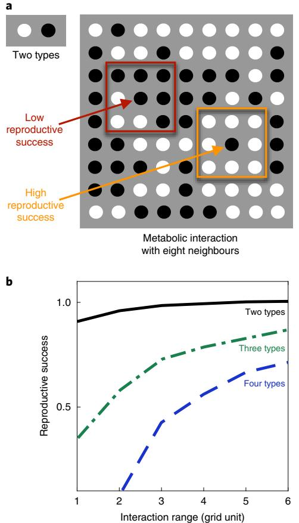

**Fig. 1 | Interacting locally lowers reproductive success. a**, A grid is populated by two types of cells (black and white dots). The two types exchange compounds to reproduce, and place offspring on adjacent sites. The reproductive success of an individual increases linearly with the fraction of the partner cells within its interaction range. In the example shown here, the interaction range is one grid unit. **b**, The reproductive success of individuals is lower in consortia with smaller interaction ranges. This decrease is already visible in consortia composed of two interacting types (as in **a**). It becomes more pronounced in consortia composed of three or four types, where an individual cell can grow only if all the other types reside in the individual's interaction range.

structured synthetic community with mathematical modelling to address these goals.

### **Results**

We focused on a scenario where two bacterial genotypes exchange cellular building blocks that are essential for growth, a situation that is widespread in natural microbial communitie[s11](#page-8-9),[29.](#page-8-25) In such a situation, one would expect that the interaction range between cells would greatly affect the growth of individuals and communities. This can be illustrated with a simple simulation of the cellular dynamics in a system composed of two interacting partner species (Fig. [1a)](#page-1-0). The simulation rests on three general assumptions: first, each cell can receive compounds only from cells belonging to the partner species that reside within the interaction range; second, the growth of individual cells depends on the fraction of the cells of the partner species within the interaction range; third, if a cell divides, it places an offspring in a neighbouring site. This simple simulation reveals that the average growth rate of individual cells is low when the interaction range is small (Fig. [1b)](#page-1-0). This key finding originates from a simple mechanism: most individuals are surrounded by their offspring; if they interact on a small spatial scale, they interact mostly with these offspring, from which they cannot obtain the cellular building blocks they need. This finding is consistent with previous theoretical studies[25,](#page-8-20)[26](#page-8-22). The effect becomes stronger when organisms depend on compounds from two or more other species: a small interaction range reduces the probability that an individual is close enough to all of these partners simultaneously (Fig. [1b](#page-1-0)). The simulation shows that short-range interactions can reduce the growth rate of cells whenever these cells need to exchange compounds with other genotypes to grow, in line with previous observation[s30.](#page-8-26)

**Cells in dense microbial communities interact in a range of a few cell lengths.** Our first major goal was to quantify the interaction range experimentally. We constructed a microfluidic device for growing cells in monolayer communities and developed an analytical method to extract time-resolved quantitative single-cell data (Fig. [2)](#page-2-0). We focused on a synthetic consortium composed of two auxotrophic *Escherichia coli* strains. The first strain is unable to produce the amino acid proline, and the second strain is unable to produce the amino acid tryptophan (Fig. [2a](#page-2-0)). Because cells naturally leak amino acids, the two auxotrophs can grow together by exchanging those two amino acids through diffusion[29](#page-8-25)[,31](#page-8-27),[32.](#page-8-28) We grew our consortia in the microfluidic device and used automated image analysis to identify and track single cells so that we could measure their growth rates (Fig. [2b](#page-2-0) and Supplementary Video 1). The goal of this analysis was to determine the spatial range from which a single cell could retrieve amino acids (that is, the cell's interaction range). How fast an individual cell grows is expected to depend on the amount of the amino acid it receives, and this in turn depends on the number of partner cells inside the interaction range. To determine the size of the interaction range, we thus looked for the spatial range whose cellular composition best predicted the growth rates of individual cells (Fig. [2c](#page-2-0) and Supplementary Video 2). We measured the fraction *fd* of the partner within a distance *d* from a cell and determined the correlation between this fraction and the cell's growth rate for a large number of individual cells. The interaction range is then defined as the value of *d* at which this correlation is maximal (Fig. [2d)](#page-2-0).

This analysis revealed that the interaction range is on the order of only a few cell lengths (Fig. [2d)](#page-2-0). This range was found consistently across ten biological replicates (~10,500 cells analysed in total). Specifically, the interaction range of the tryptophan auxotroph cells is 3.2±0.4μm (mean ± s.e.m.), while the interaction range of the proline auxotroph cells is significantly larger at 12.1±0.5μm (*P*<10−5 , paired *t*-test, *n*=10, Fig. [2e)](#page-2-0). In other words, these cells live in a small world: they interact with only a small group of individuals around them. Cells can grow well only if their partner is among these individuals (Fig. [2f,g](#page-2-0)). In control experiments where amino acids were provided with the growth medium, the growth rates of individual cells did not depend on the proximity to the partner (Extended Data Fig. 1).

**A mathematical model offers a mechanistic explanation for the small interaction range.** Our second major goal was to obtain a mechanistic understanding of the factors that determine the interaction range. Why do cells only interact across such a small spatial range? We addressed this question with an individual-based model (Fig. [3a](#page-3-0)), where cells occupy sites on a 40×40 grid. At every grid site, we described the internal (*I*) and external (*E*) concentrations of the two exchanged amino acids with a set of differential equations (here shown for one amino acid only; see Methods for complete set of equations):

$$\begin{aligned} \frac{\partial I}{\partial t} &= r^\text{\tiny{\tiny{\tiny{\tiny{\tiny{\tiny{\Gamma}}}}}}}{\partial t} - r^\text{\tiny{\tiny{\tiny{\tiny{\Gamma}}}}} (I - E) - I \,\mu^{\text{aux}} I / (I + K) \\\\ \frac{\partial E}{\partial t} &= -a \, r^\text{\tiny{\tiny{\tiny{\tiny{\Gamma}}}}} + a \, r^\text{\tiny{\tiny{\Gamma}}} (I - E) + D^{\text{eff}} \nabla^2 E \end{aligned}$$

## **NaTurE ECOlOgy & EvOluTiOn** Articles

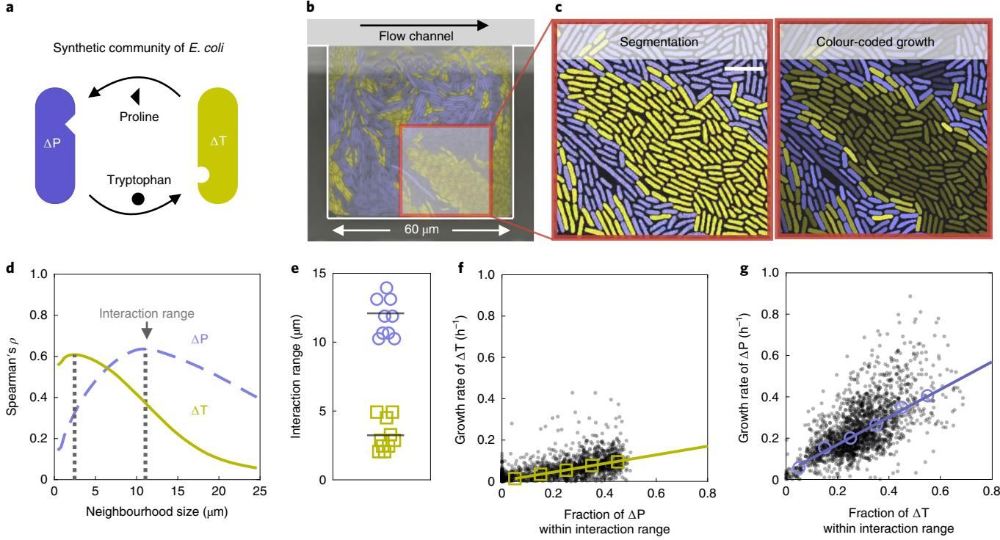

**Fig. 2 | Auxotrophic cells that exchange cellular building blocks interact in a small range. a**, Synthetic communities of two auxotrophic strains of *E. coli* that depend on each other and are labelled with constitutively expressed fluorescent proteins (here depicted as yellow and purple). **b**, False-colour image of a microfluidic chamber in which cells grow in a monolayer. The continuous flow of culture media at the top of the chamber removes cells as soon as they are pushed out of the chamber. **c**, Cells are segmented and tracked (left). Cells are colour-coded on the basis of their individual growth rate, with brighter colours indicating higher growth rates (right). Cells that are surrounded by the partner grow faster than cells that are surrounded by their own type. Scale bar, 5 μm. **d**, We calculated the correlation coefficients (Spearman's *ρ*) between the growth rates of individual cells and the fraction of the partner in a given neighbourhood size. When we plotted the correlation coefficient as a function of the neighbourhood size, we observed that the strength of the correlation is maximal for an intermediate neighbourhood size (marked by dashed lines); we call this neighbourhood size the interaction range. **e**, The two auxotrophs have different interaction ranges (10 biological replicates, ~10,500 cells in total). **f**,**g**, Both auxotrophs grow faster with an increasing fraction of the partner within the interaction range. Tryptophan auxotrophs (ΔT, **f**) generally have lower growth rates than proline auxotrophs (ΔP, **g**), as shown by the slopes of the linear regressions (0.75 for ΔP and 0.21 for ΔT). Black dots represent single cells (1,985 ΔP and 1,769 ΔT cells), and open symbols are the binned median values; lines indicate linear regressions on the binned values.

We assumed that cells take up amino acids actively (with rate *r*u ) and leak them passively (with rate *r*l ) in the environment, where these molecules diffuse with the effective diffusion constant *D*eff, which accounts for the density of cells; *α* is the ratio between the volumes of the intra- and extracellular environments (see Methods). The growth of cells was modelled using the Monod equation, *μ=μ*aux*I*/(*I*+*K*), where *K* is the concentration of the limiting amino acid at which the auxotrophic cells grow at half the maximum speed *μ*aux. All model parameters were taken from the literature or were directly measured, apart from the two leakage rates, which were estimated from the data (Supplementary Section 3.4.2).

We first tested whether our model can predict the interaction ranges that we measured experimentally. To do this, we applied the model to our measured spatial arrangements of the two cell types, calculated the concentrations of amino acids in space by solving the equations at steady state and subsequently calculated the theoretical growth rates of individual cells from the local concentrations of these amino acids. We then estimated the interaction ranges by correlating the theoretical growth rates of cells with the fraction of their partner in their neighbourhood, as we did with the experimentally measured growth rates. The interaction ranges we found deviated less than 7% from the experimental interaction ranges (Fig. [3b](#page-3-0)). Our model thus predicts the interaction ranges that we measured experimentally. Moreover, our model predicts that the growth rate of the auxotrophs increases with the fraction of the partner within the interaction range, in agreement with the experimental data (Fig. [3c](#page-3-0)). We conclude that our model is consistent with the experimental data: the mechanisms of amino acid exchange we propose can explain how cells interact in these communities.

**The interaction range is set by few key parameters.** Our model reveals that the short interaction range that we measured is mainly a consequence of high uptake rates of amino acids and dense packing of cells. This becomes evident when we look at a second length scale that is directly proportional to the interaction range: the growth range, the length scale describing the decrease in growth away from a straight interface separating the two cell types (Fig. [4a)](#page-4-0). When the two cell types are in such a symmetric configuration, the concentrations of amino acids can be approximated analytically, and from this the growth of the two cell types can be predicted (see Supplementary Section 3.4.3 for the derivation). The growth range of each type in this symmetric configuration is proportional to its interaction range in any complex spatial configuration (Fig. [4b)](#page-4-0). The analytical expression of the growth range of each auxotroph is (see Extended Data Fig. 9 for a comparison with the numerical solution):

$$\text{growth range} \approx \sqrt{\frac{D^{\text{eff}}}{a(r^{\text{u}} + r^{\text{l}})}} \ln \left[ \frac{r^{\text{l}}}{\mathcal{Y}} \left( 1 + \sqrt{1 + \frac{4\mathcal{Y}}{r^{\text{l}}}} \right) + 4 \right]^{\frac{1}{\text{s}}}$$

**a**

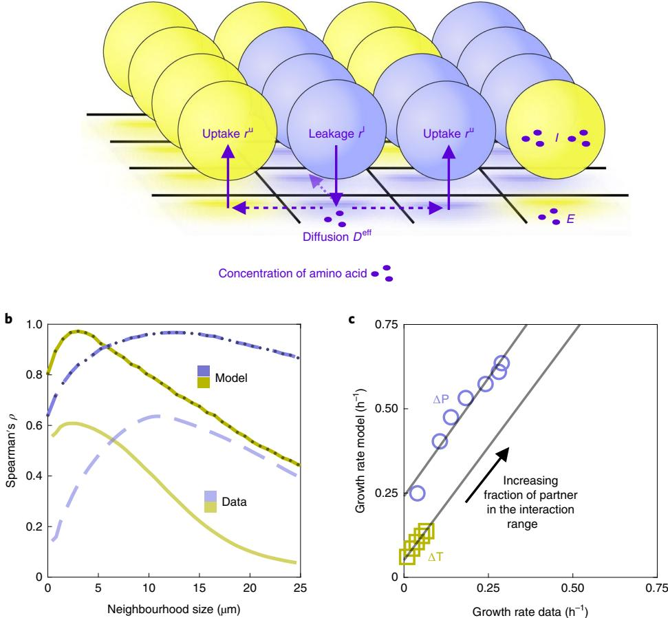

**Fig. 3 | Mathematical model reveals the mechanism of local interactions. a**, Individual-based model where amino acids are passively leaked, diffuse in the environment and are actively taken up. At every grid site, we describe the internal concentration of amino acids *I* and the external *E* with a set of differential equations. We assume that the growth rates of auxotrophic cells are limited by the amino acid that they need, and that cells take up amino acids actively and leak them passively into the environment, where they diffuse. *D*eff is lower when the density of cells *c* is higher. **b**, The correlation analysis based on the model (dark curves) matches the results obtained from experimental data (light curves, identical to Fig. [2d)](#page-2-0). The predicted interaction range for ΔP is 12.8 μm (compared to 12.5 μm in the experimental measurements, *P*= 0.25, *t*-test) and for ΔT is 3.0 μm (compared to 3.2 μm in the experimental measurements, *P*= 0.51, *t*-test). **c**, The predicted and experimentally measured growth rates are strongly correlated (*r* 2= 0.95 for ΔP and *r* 2= 0.99 for ΔT, Pearson correlation). We grouped cells on the basis of the fraction of the complementary partner in their interaction range, and for each group we compared the measured growth rate (same data as Fig. [2f,g)](#page-2-0) to the predicted growth rates. Each symbol represents a single group.

where we set *γ* ¼ *μ*aux Ic I , where *I* c is the constant internal concentration of the amino acid in producing cells and *μ*aux is the maximal growth rate of each auxotroph (equal to the growth rate of the wild type in our case; see Extended Data Fig. 7). The terms *D*eff (ref. [33](#page-8-29)) and *α* depend on the density of cells *c*, and their ratio is given by:

$$\frac{D^{\rm eff}}{a} = \frac{2(1-c)^2}{c(2+c)}D$$

From the mathematical expression, we see that the growth range (and thus the interaction range) depends on the uptake, leakage and diffusion of the amino acids and on the density of cells. Specifically, the growth range (and the interaction range) is small in consortia where the leakage rate is low, the uptake rate of the exchanged compounds is high compared with their diffusion constant (Fig. [4c)](#page-4-0) and the density of cells is high. High cell densities reduce the interaction range by reducing effective diffusion (Extended Data Fig. 10). This means that denser cellular aggregates tend to have cell–cell interactions that are more localized, and cellular density is therefore an important parameter that modulates interactions in these aggregates[34–](#page-8-30)[36.](#page-8-31) While cell density alters the interaction range of different types in a consortium in the same way, the other parameters modulate the interaction range of each cell type separately. The difference in interaction ranges between cell types depends on the difference in uptake rates, leakage rates and diffusion constants of the amino acids they exchange. Diffusion constants typically vary over only a small range between different amino acids and thus cannot explain large differences in the interaction ranges. However, uptake and leakage rates can vary substantially between amino acids (for example, the ratio between the diffusion constants of tryptophan and proline DT DP I is 0.75, while the ratio between the rates at which the two amino acids are taken up, ru T ru P I , is 12). From the analytical expression of the growth range, we can show that the growth range (and the interaction range) depends more strongly on the uptake rate than on the leakage rate (Fig. [4c](#page-4-0) and Extended Data Fig. 8). While leakage rates have a minor effect on the growth range (how far a cell can grow away from the partner), they have a major effect on the growth rates of cells (how fast cells grow). More precisely, we can show that leakage rates set the maximum growth rate *μ*max that an auxotroph can

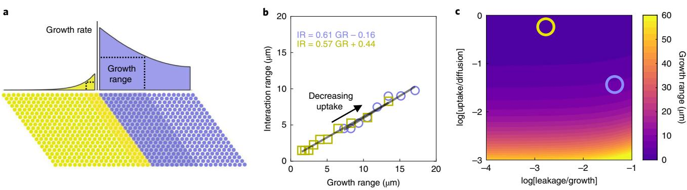

**Fig. 4 | Interaction range is small when uptake rates are high. a**, For a symmetric arrangement with a straight interface between the two types, we can analytically calculate the region (shaded) in which the cellular growth rate is at least half of the maximal growth rate observed at the interface; we call this region the growth range. The growth range can be calculated from biochemical parameters. **b**, The growth range (GR) is proportional to the interaction range (IR) (*r* 2= 0.95 for ΔP and *r* 2 = 0.99 for ΔT, Pearson correlation). When we decrease the rate at which cells take up amino acids in the model, the growth range and the interaction range increase. Open symbols show the growth ranges and interaction ranges calculated using our model for different values of the uptake rate of amino acids. The growth range is calculated analytically while the interaction range is estimated numerically. **c**, Growth range as a function of leakage and uptake rates (relative to the maximum growth rate and diffusion constant, respectively). The growth range (and interaction range) of the ΔT (yellow circle) and ΔP (purple circle) are small because the ratio between uptake and diffusion is high.

reach when fully surrounded by the partner (see Supplementary Section 3.4.1 for the derivation):

$$
\mu^{\rm max} \approx \mu^{\rm aux} \frac{r^l}{\mathcal{Y}} \left( \sqrt{1 + \frac{2\mathcal{Y}}{r^l}} - 1 \right),
$$

The growth range and *μ*max vary independently, being primarily modulated by the uptake rates and the leakage rates, respectively. Our findings apply generally to any dense microbial assembly in which molecules are exchanged by leakage, diffusion and uptake. For example, the same model could estimate the length scale of cell– cell communication via molecules that are taken up or degraded by the recipient, such as quorum-sensing molecules.

**Interaction range and patch size are two different length scales.** According to our mechanistic model, the interaction range represents the size of the neighbourhood from which cells can retrieve the amino acids produced by the partner. It might seem intuitive to measure this neighbourhood using a simpler quantification such as the patch size of the different genotypes[37.](#page-8-32) We tested the validity of this method and found that interaction range and patch size are potentially two different length scales: we verified that the interaction range of two auxotrophs varies less than 50% for the range of patch sizes observed in our chambers (a small change compared with the fourfold difference in interaction range between the auxotrophs, Extended Data Fig. 3). The reason is that the interaction range is set by the cell density and a few biochemical parameters (uptake relative to diffusion), while patch size depends mostly on the physics of cell division and movement. In general, we see no significant correlation between size of patches and average growth in these patches (Extended Data Fig. 4).

**A small interaction range affects growth and dynamics of the whole community.** How do short-range interactions between individual cells affect community-level dynamics? Our communities show consistent dynamics in time: within about 25h, all 61 replicate communities reached a steady-state composition, and in all but two of the communities the tryptophan auxotroph was in the minority (median fraction of total biomass=0.23, Fig. [5a)](#page-5-0). This shift in the composition of the community arises from the individuallevel properties that we measured. The proline auxotroph tends to increase in frequency because of a double advantage: it has a higher *μ*max and a larger interaction range than the tryptophan auxotroph; as a consequence, the growth rate of the proline auxotroph is less sensitive to the spatial arrangement. The differences in interaction range and *μ*max drive the community to its equilibrium composition where the tryptophan auxotroph is in minority.

A final and important question is whether the small interaction range between cells limits the growth of the community as a whole. This question brings us back to our central hypothesis: that a small interaction range limits the exchange of resources and hinders collective metabolism because many cells reside in groups of their own type. We therefore tested whether communities with higher levels of mixing of the two cell types grew faster. The average growth rate of cells in a community is determined by several factors, including the proportions of the two types and their level of mixing. We measured the growth of the 61 communities after 16h using an image analysis method based on optical flow, which provides an estimate of the average growth rate of cells in each chamber. We found that communities grew faster when they had a higher level of mixing of the two types (Fig. [5b,c](#page-5-0)).

We further tested the effect of mixing on the average growth of our communities using our model. Specifically, we tested the prediction of our simple cellular automaton, that cells in our communities would grow faster if the interaction range was larger or if the spatial arrangement was more mixed. We tested these predictions by applying our model to experimentally observed and computationally altered spatial arrangements. We randomized the observed spatial arrangements to disrupt kin clusters, and we found that the average predicted growth rate of individuals increases (Fig. [5d)](#page-5-0). Likewise, if we simulate a closed system (corresponding, for example, to a large biofilm) where no amino acids are lost from the community, we find that lowering the uptake rates of amino acids and thereby increasing the interaction range leads to an increase of the average predicted growth rate of individuals (Fig. [5e)](#page-5-0). However, there is a trade-off: in systems that are open and where metabolites can diffuse away from the cells (like our chambers), very low uptake rates can also reduce the average growth rate because of diffusional loss (Extended Data Fig. 5).

### **Discussion**

Here we developed a method to directly measure the interaction range that can be applied to a large number of microbial systems.

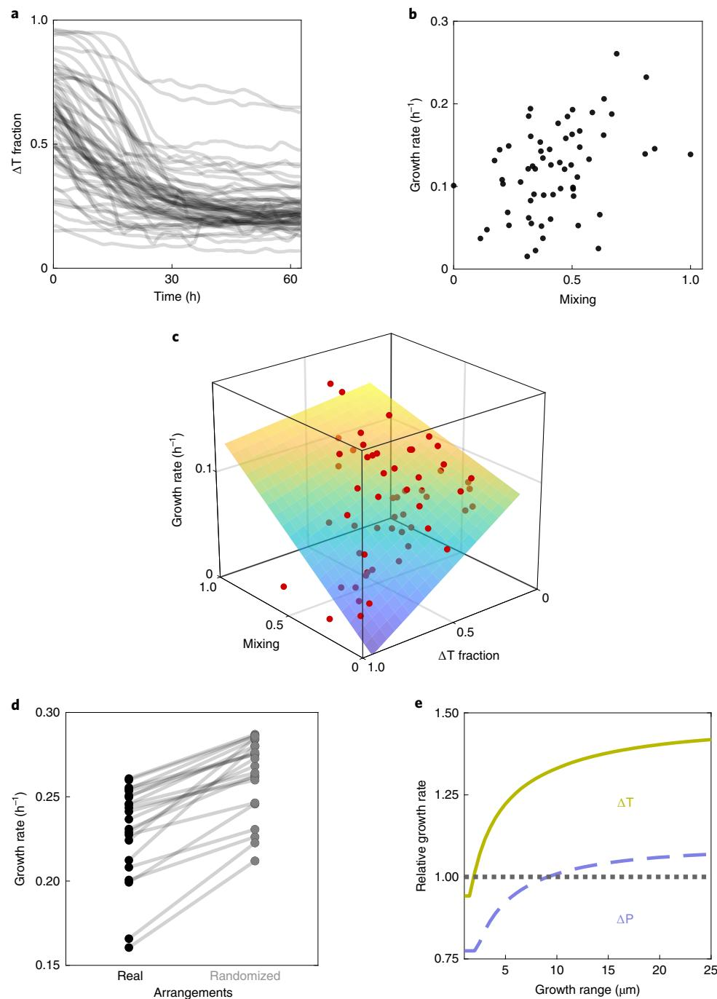

**Fig. 5 | The small interaction range between cells reduces the productivity of the consortium. a**, Communities equilibrate at compositions of 23% (median, *n*= 61) of the tryptophan auxotrophs, ΔT; deviations in two replicates are due to large clusters of ΔT in the back of the chamber. **b**,**c**, Growth of the communities increases with the mixing of the two cell types (partial correlation analysis with fraction as control variable, Spearman's *ρ*= 0.44, *P*< 10−3 , *n*= 61). The mixing of the two cell types was measured as the ratio between the length of the boundaries between the two types and the total area they occupy together. Each dot shows the growth and mixing of one community. In **c**, the fraction of ΔT is also shown. The plane depicts the multiple linear regression of the growth rate on the mixing and the fraction of ΔT (the colour of the surface indicates the growth rate); data points above the plane are shown in bright red, while data points below the plane are shown in dim red. **d**, Randomizing community arrangements leads to higher mixing and higher predicted average growth rates of individuals (number of randomizations = 20, *P*< 10−5 , paired *t*-test, *n*= 22). This indicates that the unmixing of the two types (which is removed by randomizing the arrangements) decreases average growth rates. **e**, The model predicts an increase in the average growth rate (relative growth above 1), when the growth range (and thus interaction range; see Fig. [4b)](#page-4-0) increases. Here we simulated a closed system, where amino acids are not lost from the system through diffusion; the growth range was varied by changing the uptake rate of amino acids in the model.

We focused on a synthetic community of two genotypes exchanging amino acids, and we found that the cells in our community interacted on a short range and that this lowered their growth rates. In general, we expect the interaction range to fundamentally affect the functioning of any assembly of interacting microorganisms. The specific effects will depend on the nature of the interactions.

## **NaTurE ECOlOgy & EvOluTiOn** Articles

For example, short-range interactions can stabilize the cooperative production of molecules, as they ensure that these molecules are accessible only to cells that also contribute to production, and are inaccessible to non-producing individual[s22](#page-8-19),[38.](#page-8-33) In contrast, shortrange interactions generally can impede mutualistic cross-feedin[g19,](#page-8-16) although they can have a stabilizing effect by preventing ecological invasion by non-contributing mutants[24](#page-8-18).

The ecological and evolutionary outcome of cooperation and competition can change dramatically when interactions are limited to a small neighbourhood[8](#page-8-7),[30,](#page-8-26)[39](#page-8-34); therefore, the interaction range is a crucial feature of any spatially structured ecological system. Here we found that the interaction range between individuals is on the order of a few cell lengths in a microbial assembly where the production of cellular building blocks is distributed across different cell types. We predict that the interaction range is generally small whenever the density of cells is high and the uptake of the molecules mediating the interaction is fast compared to their diffusion. We thus expect the interaction range to be small in dense assemblies where cells exchange cellular building blocks, signalling molecules that are degraded on reception, or metabolites that bin[d40](#page-8-35) or digest extracellular nutrients[41,](#page-8-36)[42](#page-8-37). Finally, we showed that, if interaction ranges are small, the spatial unmixing of cell types through local growth can hinder metabolic exchange between different cell types and reduce community growth.

Our work suggests that knowing at which spatial scale organisms interact is crucial for understanding the ecological dynamics and functions of communities. Here, we worked with microbial systems, where interspecies interactions are often based on the uptake and release of diffusible metabolites. In plant communities, the ecological dynamics are shaped mostly by competition for light and nutrient[s43](#page-8-38) as well as by facilitatio[n44](#page-8-39). In communities of predators and prey, interactions are based on encounter rates and thus by the movements of individuals[45.](#page-8-40) In all these cases, the interaction strength is expected to decline with distance between individuals. Understanding how local interactions scale up to determine the dynamics and functions of such spatially structured communities is thus a central goal.

### **Methods**

**Strains.** All experiments were performed using strains derived from *E. coli* MG1655; these strains are ΔtrpC-GFP (MG1655 *trpC*::frt, PR-*sfGFP*), ΔtrpC-RFP (MG1655 *trpC*::frt, PR-*mCherry*), ΔproC-GFP (MG1655 *proC*::frt, PR-*sfGFP*) and ΔproC-RFP (MG1655 *proC*::frt, PR-*mCherry*). Te ΔproC strains are unable to produce proline due to a deletion in *proC*, and the ΔtrpC are unable to produce tryptophan due to a deletion in *trpC*[32](#page-8-28). Te auxotrophic strains were made by transferring the respective kanamycin cassettes from the Keio collectio[n46](#page-9-0) into TB204 and TB205[47](#page-9-1) using lambda Red-mediated recombination[48](#page-9-2). TB204 and TB205 are *E. coli* MG1655 derivatives that constitutively express sfGFP or mCherry from the lambda promoter from the chromosome. In brief, the kanamycin cassette including the homologous fanking regions were amplifed by PCR from JW0377 (*proC*::*kan*) and JW1254 (*trpC*::*kan*[)46](#page-9-0) and transformed into TB204 and TB205 harbouring the pSim8 plasmid (provided by D. L. Court). Te primer sequences used were:

- U_proC_fw: CATAAAGTCATCCTTTGTTGGG
- D_proC_rv: CTTTACGGATTAGTGTGGGG
- U_trpC_fw: AACGTCGCCATGTTAATGCG
- D_trpC_rv: GAACTGAGCCTGAAATTCAGG

The kanamycin cassette was transferred into a fresh strain of TB204 or TB205 using P1-mediated generalized transduction. On successful transduction, the phenotypes of the strains were confirmed (no growth without proline or tryptophan), and the kanamycin cassettes were removed from the genome using the FLP recombinase from plasmid pCP20[48](#page-9-2). We confirmed the ability of our two auxotrophs to grow together by receiving the amino acid they cannot produce from their partner, as reported in previous work[32.](#page-8-28)

**Media and growth conditions.** Monocultures of the two auxotroph strains were started from a single colony taken from a lysogeny broth–agar plate and were grown overnight at 37 °C in a shaker incubator in M9 medium (47.76mM Na2HPO4, 22.04mM KH2PO4, 8.56mM NaCl and 18.69mM NH4Cl) supplemented with 1mM MgSO4, 0.1mM CaCl2, 0.2% glucose (all from Sigma-Aldrich), 50μg l −1 of L-proline (434mM) and 20μg l −1 of L-tryptophan (98mM) and 0.1% Tween-20

(added to facilitate the loading of cells in the microfluidic device). The cells were loaded in the stationary phase in a microfluidic device and grown in the same media. After approximately 10h, the cells exited the lag phase and started to grow and fill the chambers. The medium was then switched to M9 medium+0.2% glucose+0.1% Tween-20 with no amino acids. This medium was fed for the whole duration of experiment (approximately 3d). Imaging was started 3h before switching to this medium, to have a control for cellular growth with amino acids in the medium (the results are shown in Extended Data Fig. 1).

**Microfluidic experiment.** The microfluidic devices consisted of chambers of 60×60×0.76μm3 facing a feeding channel 22μm high and 100μm wide. The masks for photolithography were ordered from Compugraphics. The master mould was made on a silicon wafer, by applying SU8 photoresist in two steps (the first step to make the layer for the growth chambers and the second step to make the layer for the feeding channel). To make the chips used for the experiments, Polydimethylsiloxane (PDMS, Sylgard 184 Silicone Elastomer Kit, Dow Corning) was mixed in a ratio of 1.5:10 and poured on the dust-free master mould, degassed in a desiccator for 30min and baked for around 1h at 80 °C for curing. PDMS chips of approximately 2 cm×3.5 cm were cut out around the structures on the wafer. Holes for medium supply and outlet were punched (diameter=0.5mm). PDMS chips were bound to round (50-mm diameter) glass coverslips (Menzel-Gläser) by treating them for 30 s at maximum power in a Plasma Cleaner (PDC-32G-2, Harrik Plasma), and left on a hated plate at 100 °C for 1min for binding. Before an experiment, a small amount of medium was flushed into the channels using a pipette to wet the chambers. Air was then pushed through the main channel (the medium remained in the chambers). Cells in the stationary phase from an overnight culture (approximately 14h) were concentrated approximately 100 times by centrifugation (5,000*g*, 5min) and loaded into the chip using a pipette. The cells were pushed into the side chambers with the help of small air bubbles flowing through the main channel. Once a sufficient number of cells were pushed inside the chambers, fresh medium was pumped through the flow channel. For all experiments, syringe pumps (NE-300, NewEra Pump Systems) with 50-ml syringes containing the medium were used. Tubing (Microbore Tygon S54HL, inner diameter 0.76mm, outer diameter 2.29mm, Fisher Scientific) was connected to the syringes using 20G needles (0.9mm×70mm), which were directly inserted into the tubing. Smaller tubing (Teflon, inner diameter 0.3mm, outer diameter 0.76mm, Fisher Scientific) was then inserted into the bigger tubing and directly connected to the inlet holes in the PDMS chip. Medium switches were performed by disconnecting the bigger tubing from the syringe and reconnecting it to new syringes. All experiments were run at a flow rate of 0.5mlh−1 . The flow rate was high enough that amino acids did not accumulate in the feeding channel and were not exchanged via the main channel. No growth was observed in the chambers hosting only one of the two auxotrophs during the whole experiment.

**Microscopy.** Time-lapse microscopy was done using fully automated Olympus IX81 inverted microscopes (Olympus). Images were taken using a ×100 NA1.3 oil objective (Olympus) with ×1.6 manual auxiliary magnification and an ORCAflash 4.0 v2 sCMOS camera (Hamamatsu). Fluorescent imaging was done using a X-Cite120 120Watt high-pressure metal halide arc lamp (Lumen Dynamics) and Chroma 49000 series fluorescent filter sets ([N49002](https://www.ncbi.nlm.nih.gov/nuccore/N49002) for GFP and [N49008](https://www.ncbi.nlm.nih.gov/nuccore/N49008) for RFP, Chroma). Focus was maintained using the Olympus Z-drift compensation system, and the entire set-up was controlled with Olympus CellSens software (v.1.16)[49.](#page-9-3) The sample was maintained at 37 °C with a microscope incubator (Life Imaging Services). Several positions were imaged on the same microfluidic device, and images were taken every 10min.

**Image analysis.** All image processing was done using Matlab (v.2016A and newer, MathWorks) and Vanellus software[50](#page-9-4). Time-lapse frames were first registered and cells were then segmented using customized segmentation algorithms. Two different algorithms for segmentation were used: the segmentation of biomass algorithm and the segmentation of cells algorithm. The segmentation of biomass algorithm identifies the green and red biomass in the chamber: images were first cropped along the profile of the microfluidic chambers (up to 8μm from the outlet), and biomass was then segmented on the phase contrast image and assigned to its relative colour after deconvolution; the algorithm was optimized to give the most accurate estimation of the area occupied by cells of each type and not to segment the single individuals. The segmentation of cells algorithm identifies individual cells for subsequent single-cell growth estimation (elongation rate). In this case, cells were segmented on the green or the red fluorescent image, according to their fluorescence colour. Single-cell location was tracked using an optical flowbased algorithm (described below), and the tracking was manually corrected to prevent mistakes. Subparts of the chambers were randomly selected for the singlecell segmentation and tracking. The area close (within 8μm) to the open end of the chamber was not considered for analysis, as amino acid concentrations in this area were lower because they were washed out into the main flow channel. The tracking algorithm based on optical flow can be described in three steps: (1) estimate the vector field of movement *M* between subsequent segmented images *S*1 and *S*2 using the Farneback[51](#page-9-5) algorithm; (2) back-transform the second image, *S*2,backtransformed=- *M* × *S*2, to obtain a prediction of how *S*1 should look on the basis of the vector field of

## Articles **NaTurE ECOlOgy & EvOluTiOn**

motion; and (3) for each cell in *S*1, determine the area of overlap with cells in *S*2,backtransformed; cells in *S*1 are tracked to cells in *S*2 on the basis of the maximum overlap area.

**Cell elongation rate.** Cell elongation rates (that is, growth rates) were calculated by fitting the exponential curve *L*(*t*)=*L*(0) 2*μ*∙*t* to the cell length *L* over time. The fitting was done using a linear fit on the logarithm of the cell length over a sliding time window of five time points (40min). The length of a cell was measured as the length of the major axis of the ellipse that approximates the cell (that is, the ellipse that has the same normalized second central moments as the cell).

**Correlation analysis.** We quantified the composition of the neighbourhood of a focal cell as the fraction of the partner present in that neighbourhood. For example, in the case of the tryptophan auxotroph, we quantified the fraction ΔproC/ (ΔproC+ΔtrpC) (ΔtrpC and ΔproC are the areas (in pixels) occupied by each auxotroph; therefore, they are measurements of biomass and not of cell number). To calculate the fraction above, we first identified biomasses of the two types as described in the Image analysis section; we then calculated the area in pixels that each cell type occupied within increasing distances from the focal cell's perimeter. For a given distance, we plotted the fraction (*x* axis) against the growth rate (*y* axis) for all cells, and we calculated Spearman's rank correlation coefficient (no assumption on the functional relationship between variables). The correlation coefficient is maximal at a specific distance, which we call the interaction range. We used linear regression to characterize the relationship between the growth rate of the cells and the fraction of the amino acid producing partner present within the estimated interaction range. For Fig. [2d](#page-2-0), the correlation is calculated as Spearman's *ρ* on 1,985 data points for proline auxotrophs and 1,769 for tryptophan auxotrophs, both from four biological replicates (with 22 chambers in total). The same analysis performed when cells were fed amino acids shows that growth does not depend on the neighbours when amino acids are present in the medium (the results are shown in Extended Data Fig. 1).

**Individual-based model.** We considered two cell types living on a 40×40 grid: the first type can only produce amino acid 1, and is limited in growth by the supply of amino acid 2; the second type can only produce amino acid 2, and is limited in growth by the supply of amino acid 1. We tracked the spatial distributions of *I* and *E* as functions of the location in the monolayer (*x*, *y*) and time (*t*). We expected these concentrations to be constant in the direction perpendicular to the monolayer of cells (*z* direction); thus, we integrated over the *z* direction. For brevity, we omitted the variables (*x*, *y*, *t*) in the notation. We made the following assumptions:

- (1) Cells maintain a constant internal concentration of the amino acid they can produce.
- (2) Te growth of a cell is limited only by the amino acid the cell cannot produce; the growth is modelled using the Monod equation *μ*=*μ*wt*I/*(*I*+*K*), where *μ*wt is the growth of the wild type.
- (3) Both cell types can grow at the same rate *μ*wt when *I*>>*K*. Tis was experimentally assessed (see Extended Data Fig. 7).
- (4) Cells take up amino acids actively[31,](#page-8-27) and the process is approximated with linear kinetics: uptake=*r*u *E*. Linear kinetics approximates Monod kinetics if the values of *E* are low, as is the case in our experimental system.
- (5) Cells leak amino acids through passive difusion through the cellular membrane[31](#page-8-27), leakage=*r*l (*I*−*E*).
- (6) Difusion in the extracellular environment is modelled as difusion in a crowded environmen[t33](#page-8-29), *D*ef=*D*(1−*c*)/(1+c/ 2), where *D* is the difusion constant.
- (7) Te ratio between the volume inside a cell and the available volume outside a cell is constant and equal to *α*=*c*/(1−*c*).

With these assumptions, we can write the following equations for *I* for a cell of the first type, which produces amino acid 1 and not amino acid 2:

$$
\frac{\partial I_1}{\partial t} = 0
$$

$$
\frac{\partial I_2}{\partial t} = r_2^\text{u} E_2 - r_2^\text{l} (I_2 - E_2) - I_2 \mu^\text{wt} I_2 / (I_2 + K_2)
$$

and for the second type, which produces amino acid 2 and not 1:

$$\frac{\partial l_2}{\partial t} = 0$$

$$\frac{\partial I_1}{\partial t} = r_1^{\text{u}} E_1 - r_1^1 (I_1 - E_1) - I_1 \mu^{\text{wt}} I_1 / (I_1 + K_1)$$

The value of *E* for each amino acid is:

$$\frac{\partial E_i}{\partial t} = -\alpha r_i^u E_i + \alpha r_i^1 (I_i - E_i) + D_i^{\text{eff}} \nabla^2 E_i$$

All parameters are taken from the literature or are measured, with the exception of the leakage rates, which are estimated from the data (see Supplementary Table 1). These equations can be used to predict cells' growth rates in real or artificial arrangements of the two cell types. See Supplementary Section 3 for a discussion about the effects of these parameters on the length scale of interactions, and for more details on the model.

**Cellular automaton.** The cellular automaton models a consortium of two or more types of organisms that live on a grid and benefit from the presence of the other types. The model relies on two general assumptions: first, individuals place offspring close to themselves; second, the reproductive success of individuals depends on the fraction of neighbours of the other type within the interaction range, the sole parameter in the model.

An operative description of the cellular automaton follows. Individuals reside in a spatially structured setting, each occupying a site on a 40×40 grid; each site has eight adjacent sites on the grid (Moore neighbourhood), and boundary conditions wrap the grid into a torus. For the communities consisting of two types, there are individuals of types 0 and 1. At every time step, an individual dies at a random location on the grid and it is replaced with an individual of type 0 or 1. It will be of type 0 with probability *P*(0):

$$P(0) = \frac{\sum_{i}^{\text{adjacent individulas}} \delta_{i} \text{ Repprodutive sucaccessi}}{\sum_{i}^{\text{adjacent individulas}} \text{ Repprodutive success_{i}}}$$

where *δi* is the Dirac delta function, which is one if grid site *i* contains type 0 and zero otherwise. The reproductive success of each individual *i* is:

$$\text{Reproductive success}_i = \frac{\text{number of neighbors of the other type}}{\text{number of neighbors}}$$

Individuals interact with all other individuals within a neighbourhood of range *R* (a square-shaped neighbourhood). For communities with more than two types, the reproductive success is equal to the fraction of neighbours that are the most rare in the neighbourhood:

$$\text{Reproductive success}_i = \frac{\text{number of neighbors of the nearest type}}{\text{number of neighbours}}$$

All the rest is easily extended from the two types community described above to communities of more than two types. To compare consortia with a different number of types, the reproductive success is normalized by the reproductive success the consortium has in well-mixed conditions (*R*→∞), which is 1/2 for two types, 1/3 for three and 1/4 for four.

Starting from different initial configurations and varying proportions of the types, we let the system evolve and stopped the simulation after the system attained a dynamical equilibrium where the average reproductive success of individuals remained approximately constant. The average steady-state reproductive success resulted from 100 independent runs of the cellular automaton. The cellular automaton was implemented in C++ (v.C++14).

**Dataset and statistical analysis.** The dataset consists of 10,472 cells, from 61 chambers, grouped into ten biological replicates including both fluorescent label combinations. Four biological replicates were done with ΔtrpC-GFP and ΔproC-RFP (consortium 1), and six were done with ΔtrpC-RFP and ΔproC-GFP (consortium 2). Each biological replicate corresponds to one channel in a microfluidic chip, and for each channel on average six chambers were analysed (range: 3–9). Inside each chamber, on average 172 cells were tracked in time, as described in the Image analysis section. The experiments were performed in three independent runs using different microfluidic chips and different batches of media (the first chip with four replicates of consortium 1, the second chip with two replicates of consortium 2 and the third chip with four replicates of consortium 2). The interaction ranges and relationships between growth and neighbourhood were estimated separately for consortia 1 and 2. The interaction ranges are consistent for the two consortia (Fig. [2d](#page-2-0) shows consortium 1, and Extended Data Fig. 6a shows consortium 2), but the fluorescent label affected the growth rate to some extent: the ΔtrpC-RFP grows generally slower than the ΔtrpC-GFP (Fig. [2f,g](#page-2-0) shows consortium 1, and Extended Data Fig. 6b,c shows consortium 2). To assess the variability of the estimate of the interaction range, we repeated the analysis for each replicate in isolation (the results are shown in Fig. [2e)](#page-2-0).

**Mixing and average growth rate in the chambers.** The level of mixing of the two cell types in each chamber was measured as the ratio between the length of the boundaries between the two types and the total area they occupied together:

$$\text{mixing} = \frac{\text{boundaries between types}}{\text{total area occupied}}$$

A higher boundaries-to-area ratio indicates higher levels of mixing. The boundaries between types were estimated using a computationally efficient proxy: we scanned the images in one direction and counted the number of transitions

## **NaTurE ECOlOgy & EvOluTiOn** Articles

between one type and the other; the total number of transitions is a measure of the length of the interface between the two types. In Fig. [5b,c](#page-5-0), we normalized the measurement of mixing for our 61 chambers to values between zero (the chamber with the lowest mixing) and one (the chamber with the highest mixing).

The average growth rate in the chambers was estimated using a method based on optical flow (using the Farneback algorith[m51](#page-9-5)). First, a rectangular region was drawn that had the same width as the chamber and two-thirds of its depth (excluding the third of the chamber close to the opening, where the movement of cells is too fast to have a reliable optical flow estimate). As cells grow and flow out of the chamber, they move out of the selected region. Let *B*(*t*) be the biomass in the selected region at *t*; during a period Δ*t*, *B*(*t*) varies due to growth *μ*(*t*) and to flow outside of the selected region *Φ*(*t*). We can thus write the following equation:

$$\frac{\Delta B(t)}{\Delta t} = \mu(t) \times B(t) - \Phi(t)$$

This equation can be used to calculate the growth rate as:

$$\mu(t) = \frac{1}{B(t)} \left( \frac{\Delta B(t)}{\Delta t} + \Phi(t) \right)$$

We estimated *Φ*(*t*) from the two separate fluorescent channels; that is, we estimated *Φ*(*t*) as the sum of the optical flow measured on the red and on the green channels separately. All quantities were calculated over a Δ*t*=2h around *t*=16h after the amino acids were removed, and the optical flow was averaged over a strip (20 pixels wide) around the border of the selected region.

**Reporting Summary.** Further information on research design is available in the Nature Research Reporting Summary linked to this article.

### **Data availability**

The source data for all figures are available in the Supplementary Figure Source Data file. A data file containing the full properties of all analysed cells is available in the ETH Research Collection:<https://doi.org/10.3929/ethz-b-000367403>. The raw image data are available on request from the corresponding author.

### **Code availability**

The code for the individual-based model is available on the Zenodo repository: <https://doi.org/10.5281/zenodo.3466038>. Additional Matlab scripts for statistical analysis are available on request.

Received: 11 July 2019; Accepted: 2 December 2019; Published: xx xx xxxx

### **References**

- 1. Proulx, S. R., Promislow, D. E. L. & Phillips, P. C. Network thinking in ecology and evolution. *Trends Ecol. Evol.* **20**, 345–353 (2005).
- 2. Levin, S. A. Ecosystems and the biosphere as complex adaptive systems. *Ecosystems* **1**, 431–436 (1998).
- 3. Pickett, S. T. A. & Cadenasso, M. L. Landscape ecology: spatial heterogeneity in ecological systems. *Science* **269**, 331–334 (1995).
- 4. Agrawal, A. A. et al. Filling key gaps in population and community ecology. *Front. Ecol. Environ.* **5**, 145–152 (2007).
- 5. Falkowski, P. G., Fenchel, T. & Delong, E. F. Te microbial engines that drive Earth's biogeochemical cycles. *Science* **320**, 1034–1039 (2008).
- 6. Lynch, S. V. & Pedersen, O. Te human intestinal microbiome in health and disease. *New Engl. J. Med.* **375**, 2369–2379 (2016).
- 7. Gore, J. Simple organizing principles in microbial communities. *Curr. Opin. Microbiol.* **45**, 195–202 (2018).
- 8. Nadell, C. D., Drescher, K. & Foster, K. R. Spatial structure, cooperation and competition in bioflms. *Nat. Rev. Microbiol.* **14**, 589–600 (2016).
- 9. Flemming, H.-C. et al. Bioflms: an emergent form of bacterial life. *Nat. Rev. Microbiol.* **14**, 563–575 (2016).
- 10. Tan, J., Zuniga, C. & Zengler, K. Unraveling interactions in microbial communities—from co-cultures to microbiomes. *J. Microbiol.* **53**, 295–305 (2015).
- 11. D'Souza, G. et al. Less is more: selective advantages can explain the prevalent loss of biosynthetic genes in bacteria. *Evolution* **68**, 2559–2570 (2014).
- 12. Mee, M. T., Collins, J. J., Church, G. M. & Wang, H. H. Syntrophic exchange in synthetic microbial communities. *Proc. Natl Acad. Sci. USA* **111**, E2149–E2156 (2014).
- 13. Schink, B. Synergistic interactions in the microbial world. *A. Van Leeuw.* **81**, 257–261 (2002).
- 14. Christensen, B. B., Haagensen, J. A. J. J., Heydorn, A. & Molin, S. Metabolic commensalism and competition in a two-species microbial consortium. *Appl. Environ. Microbiol.* **68**, 2495–2502 (2002).
- 15. Dal Co, A., Ackermann, M. & van Vliet, S. Metabolic activity afects the response of single cells to a nutrient switch in structured populations. *J. R. Soc. Interface* **16**, 20190182 (2019).
- 16. Rutherford, S. T. & Bassler, B. L. Bacterial quorum sensing: its role in virulence and possibilities for its control. *Cold Spring Harb. Perspect. Med.* **2**, a012427 (2012).
- 17. van Vliet, S. et al. Spatially correlated gene expression in bacterial groups: the role of lineage history, spatial gradients, and cell–cell interactions. *Cell Syst.* **6**, 496–507 (2018).
- 18. Flemming, H.-C. & Wuertz, S. Bacteria and archaea on Earth and their abundance in bioflms. *Nat. Rev. Microbiol.* **17**, 247–260 (2019).
- 19. Muller, M. J. I., Neugeboren, B. I., Nelson, D. R. & Murray, A. W. Genetic drif opposes mutualism during spatial population expansion. *Proc. Natl Acad. Sci. USA* **111**, 1037–1042 (2014).
- 20. Darch, S. E. et al. Spatial determinants of quorum signaling in a *Pseudomonas aeruginosa* infection model. *Proc. Natl Acad. Sci. USA* **115**, 201719317 (2018).
- 21. He, X. et al. Microbial interactions in the anaerobic oxidation of methane: model simulations constrained by process rates and activity patterns. *Environ. Microbiol.* **21**, 631–647 (2019).
- 22. Drescher, K., Nadell, C. D., Stone, H. A., Wingreen, N. S. & Bassler, B. L. Solutions to the public goods dilemma in bacterial bioflms. *Curr. Biol.* **24**, 50–55 (2014).
- 23. McGlynn, S. E., Chadwick, G. L., Kempes, C. P. & Orphan, V. J. Single cell activity reveals direct electron transfer in methanotrophic consortia. *Nature* **526**, 531–535 (2015).
- 24. Momeni, B., Waite, A. J. & Shou, W. Spatial self-organization favors heterotypic cooperation over cheating. *eLife* **2**, e00960 (2013).
- 25. Stump, S. M., Johnson, E. C., Sun, Z. & Klausmeier, C. A. How spatial structure and neighbor uncertainty promote mutualists and weaken black queen efects. *J. Teor. Biol.* **446**, 33–60 (2018).
- 26. Stump, S. M., Johnson, E. C. & Klausmeier, C. A. Local interactions and self-organized spatial patterns stabilize microbial cross-feeding against cheaters. *J. R. Soc. Interface* **15**, 20170822 (2018).
- 27. Nowak, M. A., Tarnita, C. E. & Antal, T. Evolutionary dynamics in structured populations. *Phil. Trans. R. Soc. B* **365**, 19–30 (2010).
- 28. Egland, P. G., Palmer, R. J. & Kolenbrander, P. E. Interspecies communication in *Streptococcus gordonii*–*Veillonella atypica* bioflms: signaling in fow conditions requires juxtaposition. *Proc. Natl Acad. Sci. USA* **101**, 16917–16922 (2004).
- 29. Morris, J. J. Black queen evolution: the role of leakiness in structuring microbial communities. *Trends Genet.* **31**, 475–482 (2015).
- 30. Oliveira, N. M., Niehus, R. & Foster, K. R. Evolutionary limits to cooperation in microbial communities. *Proc. Natl Acad. Sci. USA* **111**, 17941–17946 (2014).
- 31. D'Souza, G. et al. Ecology and evolution of metabolic cross-feeding interactions in bacteria. *Nat. Prod. Rep.* **35**, 455–488 (2018).
- 32. Marchal, M. et al. A passive mutualistic interaction promotes the evolution of spatial structure within microbial populations. *BMC Evol. Biol.* **17**, 106 (2017).
- 33. Lebenhaf, J. R. & Kapral, R. Difusion-controlled processes among partially absorbing stationary sinks. *J. Stat. Phys.* **20**, 25–56 (1979).
- 34. Dobay, A., Bagheri, H. C., Messina, A., Kümmerli, R. & Rankin, D. J. Interaction efects of cell difusion, cell density and public goods properties on the evolution of cooperation in digital microbes. *J. Evol. Biol.* **27**, 1869–1877 (2014).
- 35. Lindsay, R. J., Pawlowska, B. J. & Gudelj, I. When increasing population density can promote the evolution of metabolic cooperation. *ISME J.* **12**, 849–859 (2018).
- 36. Ross-Gillespie, A. & Kümmerli, R. Collective decision-making in microbes. *Front. Microbiol.* **5**, 54 (2014).
- 37. Stacy, A. et al. Bacterial fght-and-fight responses enhance virulence in a polymicrobial infection. *Proc. Natl Acad. Sci. USA* **111**, 7819–7824 (2014).
- 38. Hol, F. J. H. et al. Spatial structure facilitates cooperation in a social dilemma: empirical evidence from a bacterial community. *PLoS ONE* **8**, e77042 (2013).
- 39. Mitri, S., Xavier, J. B. & Foster, K. R. Social evolution in multispecies bio flms. *Proc. Natl Acad. Sci. USA* **108**, 10839–10846 (2011).
- 40. Davies, D. G. & Geesey, G. G. Regulation of the alginate biosynthesis gene *algC* in *Pseudomonas aeruginosa* during bioflm development in continuous culture. *Appl. Environ. Microbiol.* **61**, 860–867 (1995).
- 41. Saha, M. et al. Microbial siderophores and their potential applications: a review. *Environ. Sci. Pollut. Res.* **23**, 3984–3999 (2016).
- 42. Leventhal, G. E. & Ackermann, M. & Schiessl, K. T. Why microbes secrete molecules to modify their environment: the case of iron-chelating siderophores. *J. R. Soc. Interface* **16**, 20180674 (2019).
- 43. DeMalach, N., Zaady, E., Weiner, J. & Kadmon, R. Size asymmetry of resource competition and the structure of plant communities. *J. Ecol.* **104**, 899–910 (2016).
- 44. Soliveres, S., Smit, C. & Maestre, F. T. Moving forward on facilitation research: response to changing environments and efects on the diversity, functioning and evolution of plant communities. *Biol. Rev.* **90**, 297–313 (2015).
- 45. Schmitz, O. J., Miller, J. R. B., Trainor, A. M. & Abrahms, B. Toward a community ecology of landscapes: predicting multiple predator–prey interactions across geographic space. *Ecology* **98**, 2281–2292 (2017).

## Articles **NaTurE ECOlOgy & EvOluTiOn**

- 46. Baba, T. et al. Construction of *Escherichia coli* K-12 in-frame, single-gene knockout mutants: the Keio collection. *Mol. Syst. Biol.* **2**, 2006.0008 (2006).
- 47. Tomasek, K., Bergmiller, T. & Guet, C. C. Lack of cations in fow cytometry bufers afect fuorescence signals by reducing membrane stability and viability of *Escherichia coli* strains. *J. Biotechnol.* **268**, 40–52 (2018).
- 48. Datsenko, K. A. & Wanner, B. L. One-step inactivation of chromosomal genes in *Escherichia coli* K-12 using PCR products. *Proc. Natl Acad. Sci. USA* **97**, 6640–6645 (2000).
- 49. Olympus CellSens sofware v.1.16 (Olympus, 2019).
- 50. Kiviet, D. J. Vanellus Sofware version Feb 11 (2019); [https://github.com/](https://github.com/daankiviet/vanellus) [daankiviet/vanellus](https://github.com/daankiviet/vanellus)
- 51. Farneback, G. Two-frame motion estimation based on polynomial expansion. *Image Anal. Proc.* **2749**, 363–370 (2003).

### **Acknowledgements**

We thank A. Cavagna for discussing the correlation analysis; G. D'Souza for advice on the biological assumptions of the model; G. Micali, R. Stocker and M. Doebeli for comments on the model; K. Schlegel for performing a plate reader experiment; A. von Wyl for helping correct cell tracking errors; and C. Brannon for comments on the manuscript. The research was supported by funding from the Swiss National Science Foundation (grant nos 31003A_149267 and 31003A_169978 to M.A.), by an ETH fellowship to D.J.K., by an Early Postdoc Mobility fellowship from the Swiss National Science Foundation to S.v.V. (grant no. 175123) and by ETH Zurich and Eawag.

### **Author contributions**

A.D.C. and M.A. conceived the research. A.D.C. performed the experiment with contributions from S.v.V. A.D.C. developed the statistical analysis and analysed the data. A.D.C. and D.J.K. developed the image analysis. S.v.V. and A.D.C. conceptualized the individual-based model, and S.v.V. implemented it. S.S. constructed the bacterial strains. D.J.K. constructed the microfluidic device. A.D.C. and M.A. wrote the manuscript with contributions from S.v.V.

### **Competing interests**

The authors declare no competing interests.

### **Additional information**

**Extended data** is available for this paper at [https://doi.org/10.1038/s41559-019-1080-2.](https://doi.org/10.1038/s41559-019-1080-2)

**Supplementary information** is available for this paper at [https://doi.org/10.1038/](https://doi.org/10.1038/s41559-019-1080-2) [s41559-019-1080-2](https://doi.org/10.1038/s41559-019-1080-2).

**Correspondence and requests for materials** should be addressed to A.D.C.

**Reprints and permissions information** is available at [www.nature.com/reprints](http://www.nature.com/reprints).

**Publisher's note** Springer Nature remains neutral with regard to jurisdictional claims in published maps and institutional affiliations.

© The Author(s), under exclusive licence to Springer Nature Limited 2020

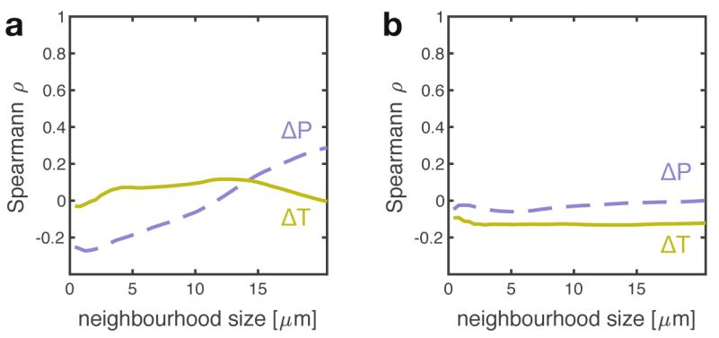

**Extended Data Fig. 1 | Growth does not depend on the identity of neighbours when amino acids are fed.** When media is supplemented with proline and tryptophan, the growth of the auxotrophic cells does not depend on the presence of the partner near by. The correlation between growth rate of cells and fraction of the partner is low for all neighbourhood sizes analysed. Panel **a** shows results for consortium 1 (ΔtrpC-GFP and ΔproC-RFP, 445 and 591 cells analysed respectively), panel **b** for consortium 2 (ΔtrpC-RFP and ΔproC-GFP, 1,905 and 2,067 cells analysed respectively).

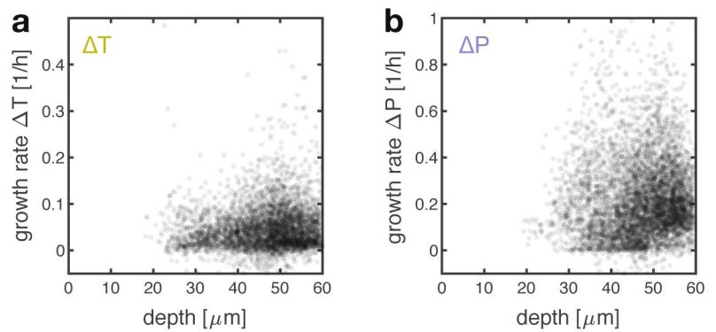

**Extended Data Fig. 2 | Growth of cells does not depend on their distance from the chamber's opening.** The growth of both auxotrophic cells correlates weakly with the distance from the chamber's opening into the feeding channel ("depth" in the figure): ρ=0.07, p<10−4, n= 4,567 for ΔtrpC and ρ=0.05, p<10−4, n= 5,905 for ΔproC, Spearman.

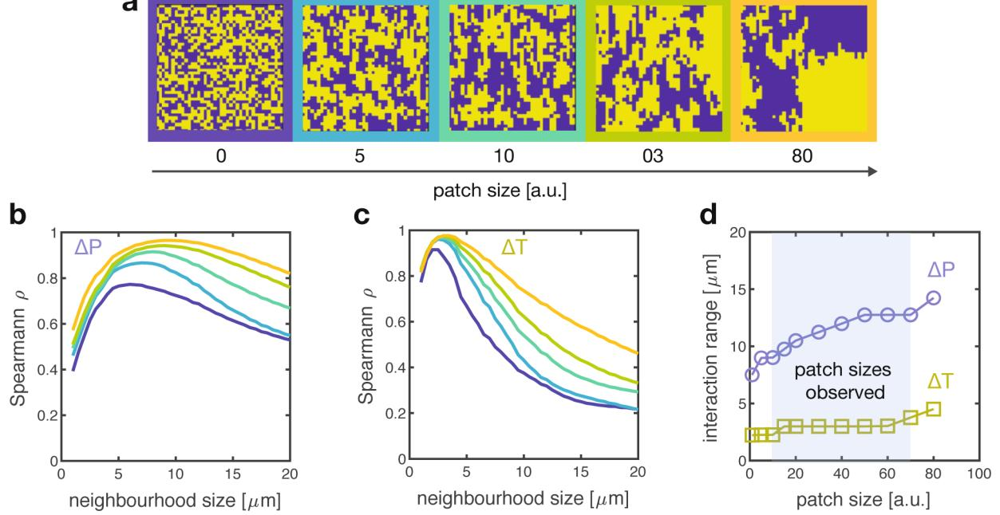

**Extended Data Fig. 3 | Robustness of interaction range estimate to spatial arrangement of types.** Examples of artificial arrangements with controlled patch size; dataset of 100 different arrangements per patch size were generated and analysed. The shape of the correlation curve changes for both proline (**b**) and tryptophan (**c**) auxotrophs, but the interaction range changes only minimally (**d**) for a range of patch sizes that can be observed in the data.

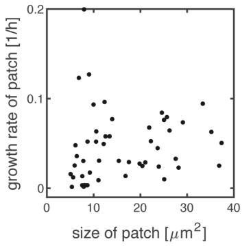

**Extended Data Fig. 4 | Size of a patch does not correlate with its growth rate.** The two different cell types in our system form patches because two daughter cells tend to remain close in space after division. Contrary to intuition, larger patches do not imply higher growth rate of the patch (analysis done on the tryptophan auxotrophs), because cells in the interior of a large patch tend to grow slower or not at all, as they cannot retrieve the amino acids they need. ρ=0.32, p=0.025, n=50, Spearman correlation.

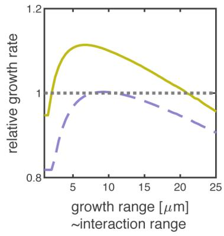

**Extended Data Fig. 5 | Very low uptake rates reduce growth of cells if amino acids can diffuse out of the system.** Using our model, we estimated how fast cells would grow if their growth range (and interaction range) would increase by lowering uptake rates of amino acids. When simulating systems open on one side, like our chambers, the auxotrophs grow slower (relative growth rate is below one) when they have a very large growth range (and interaction range), that is when they have very low uptake rates of the amino acids. Yellow indicates tryptophan auxotroph, purple indicates proline auxotroph. Relative growth rates are the average growth rates cells would have in our real spatial configurations when we vary the uptake rates of amino acids, divided by the growth rates cells have with the actual uptake rates of amino acids (uptake rates values are taken from literature, see Supplementary Table 1). Figure shows results for consortium 1 (total of 22 chambers).

**Extended Data Fig. 6 | Individuals interact at a small spatial range.** All three panels shows data for consortium 2 (ΔtrpC-RFP and ΔproC-GFP), and complement Fig. [2](#page-2-0) showing data from consortium 1 (ΔtrpC-GFP and ΔproC-RFP). **a**, The cells' growth rate correlates maximally with the identity of their neighbours within the interaction range. **b**, **c**, Both auxotrophic cells grow faster when surrounded by more complementary partners inside the interaction range. Tryptophan auxotrophs (**b**) achieve generally smaller growth rates then proline auxotrophs (**c**), as shown by the slopes of the linear regression (0.79 for ΔproC and 0.089 for ΔtrpC). Black dots: single cells (3,920 for ΔproC and 2,798 for ΔtrpC); open symbols: binned median values; lines: linear regression on binned values.

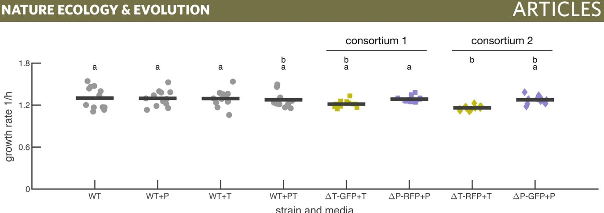

**Extended Data Fig. 7 | Growth rate in batch cultures of wild type and auxotroph strains.** Wild type cells grow at a similar rate in M9 glucose medium without amino acids (WT) and in M9 glucose medium supplemented with 50 μg/mL of proline (WT+P), 20 μg/mL of tryptophan (WT+T), or both (WT+PT). The auxotrophic mutants in consortium 1 (ΔtrpC-GFP + ΔproC-RFP) grow at the same rate as the wild type. The proline auxotroph was grown in medium supplemented with 50 μg/mL of proline and the tryptophan auxotroph in medium supplemented with 20 μg/mL of tryptophan. Markers show maximal growth rates in batch culture of individual replicates (n=12), bars show average values. Shared letters (top of panel) indicate no significant difference in growth rate (ANOVA analysis with post-hoc Tukey-Kramer pairwise comparison, F=3.29, df=7, p=4*10−3 . The wild type strains (WT) are the strains expressing the red and green fluorescent proteins (TB205 expressing RFP and TB204 expressing GFP, see details about the strains construction in Methods). The growth measurements of these strains was pooled together because they had no significant growth difference (ANOVA analysis on growth rate data of wild type in all four growth media, testing for the effect of medium F=2.53, df=3, p=0.07 and color label F=0.02, df=1, p=0.88.

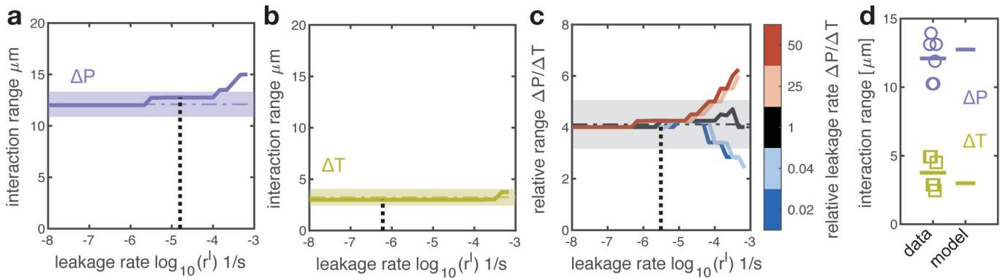

**Extended Data Fig. 8 | The interaction range varies minimally with the leakage rate. a**, **b**, The predicted interaction range is consistent with the experimentally measured one across a large range of possible leakage rates. The interaction range of the two auxotrophs was predicted using the model while varying the leakage rates of the amino acids. The model was solved on experimentally measured spatial arrangements. The dashed horizontal lines and shaded regions indicate the mean and 95% confidence interval of the experimentally measured interaction ranges. The dashed vertical line indicates the fitted leakage rate used in all simulations. **c**, The predicted relative interaction range is consistent with the experimentally measured one over a large range of possible leakage rates. The relative interaction range (interaction range of ΔP divided by that of ΔT) was predicted using the model while varying the leakage rates of the amino acids. The x axis shows the geometric mean value of the leakage rate *r l* ¼ ffiffiffiffiffiffiffiffiffiffiffiffiffiffi *r l* Δ*P***r l* Δ*T* q I , the different colored lines show different ratios of the leakage rates of the two amino acids *r l* Δ*P r l* Δ*T* I . The dashed horizontal line and shaded region indicate the mean and 95% confidence interval of the experimentally measured relative interaction range. The dashed vertical line indicates the fitted leakage rate used in all simulations (fitted *r l* Δ*P r l* Δ*T* ¼ 26 I ). **d**, Cross-validation of model. The leakage rate was fitted to data from consortium 1 and the interaction range was calculated using the model. This prediction (based solely on data from consortium 1) was compared to the experimentally measured interaction range in consortium 2. The model can quantitatively predict the interaction range (p=0.16, n=6 for ΔT and p=0.35, n=6 for ΔP, t-test).

**Extended Data Fig. 9 | Analytical approximation of growth range and simulations agree.** The heat map in **b** shows the relative error between analytical approximation (eq. 33) for the growth range and the growth range estimated with simulations. The heat map in **a** shows the analytical estimate of the growth range, and shows that the relative error in **b** is low when the growth range is below 20. Purple circle is proline auxotroph and yellow circle is tryptophan auxotroph. Panel **a** shows the same data as Fig. [4c.](#page-4-0)

**Extended Data Fig. 10 | Effect of density of cells on diffusion of molecules. a**, Dependence of *Deff* and *Deff α* I on the cellular density. High cellular densities reduce the effective diffusion of molecules. In our microfluidic chambers cellular density is about 0.65 (that is fraction of the chamber's volume occupied by cells). **b**, The growth range decreases with higher cellular densities. The analytically predicted growth range (eq. 33 in Supplementary Information) is shown as function of cellular density. The dashed lines indicate the predicted growth range at the experimentally measured cellular density. All other parameters are indicated in Supplementary Table 1.

|     | For all statistical analyses, confirm that the figure legend, table legend, table legend, main text, or Methods section.                                                                                                                     |
|-----|----------------------------------------------------------------------------------------------------------------------------------------------------------------------------------------------------------------------------------------------|
| n/a | Confirmed                                                                                                                                                                                                                                    |
|     | The exact sample size (n) for each experimental group/condition, given as a discrete number and unit of measurement                                                                                                                          |
|     | A statement on whether measurements were taken from distinct same sample was measured repeatedly                                                                                                                                             |
|     | The statistical test(s) used AND whether they are one- or two-sided Only common tests should be described solely by name; describe more complex techniques in the Methods section.                                                        |
|     | A description of all covariates tested                                                                                                                                                                                                       |
|     | A description of any assumptions or corrections, such as tests of normality and adjustment for multiple comparisons                                                                                                                          |
|     | A full description of the statistical parameters including (e.g. means) or other basic estimates (e.g. regression coefficient) AND variation (e.g. standard deviation) or associated estimates of uncertainty (e.g. confidence intervals) |
|     | For null hypothesis testing, the test statistic (e.g. F, r) with confidence intervals, effect sizes, degrees of freedom and P value noted Give P values as exact values whenever suitable.                                                |
|     | For Bayesian analysis, information on the choice of priors and Markov chain Monte Carlo settings                                                                                                                                             |
|     | For hierarchical and complex designs, identification of the appropriate level for tests and full reporting of outcomes                                                                                                                       |
|     | Estimates of effect sizes (e.g. Cohen's d, Pearson's r), indicating how they were calculated                                                                                                                                                 |
|     | Our web collection on statistics for biologists contains articles on many of the points above.                                                                                                                                               |

|                 | Policy information about availability of computer code                                                                                                                                                                                                                                                                                                                                                                                                                                 |
|-----------------|----------------------------------------------------------------------------------------------------------------------------------------------------------------------------------------------------------------------------------------------------------------------------------------------------------------------------------------------------------------------------------------------------------------------------------------------------------------------------------------|
| Data collection | During data collection, the fully automatized Olympus, Tokyo, Japan). were controlled by CellSens software   developed by Olympus: https://www.olympus-lifescience.com/en/software/cellsens/                                                                                                                                                                                                                                                                                        |
| Data analysis   | We analyzed all data using Matlab (version 2016A and newer, MathWorks, Natick, Massachusetts), using Vanellus software written for Matlab by Daniel J.Kiviet, which is available on GitHub.com/daankiviet/ vanellus, and using customized scripts written for   Matlab. The code of the individual based model is available on the Zenodo repository: http://doi.org/10.5281/zenodo.346603849. Additional Matlab scripts for statistical analysis are available upon request. |

- 
- 
- 

| Δ Δ Δ Δ |
|------------------|
|                  |
|                  |

| n/a l | Involved in the study      |
|-------|----------------------------|
|       | Antibodies                 |
|       | Eukaryotic cell lines      |
|       | Palaeontology              |
|       | Animals and other organism |
|       | Human research participan  |
|       | Clinical data              |

