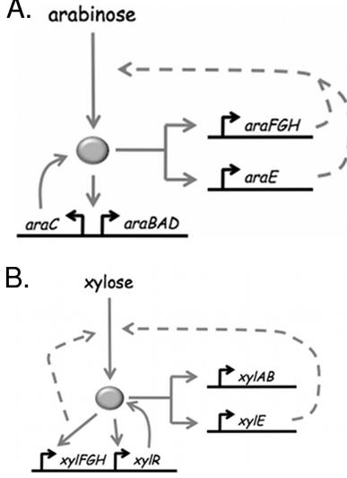
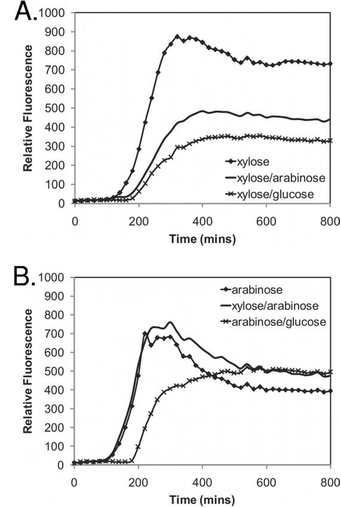
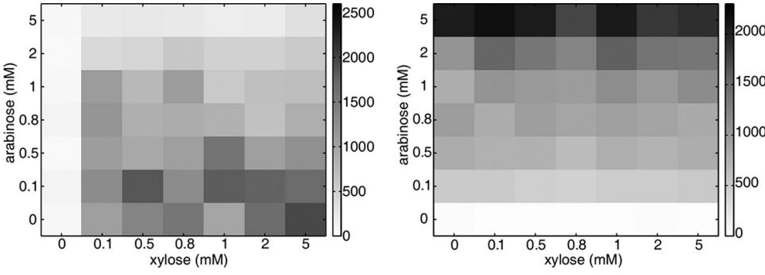
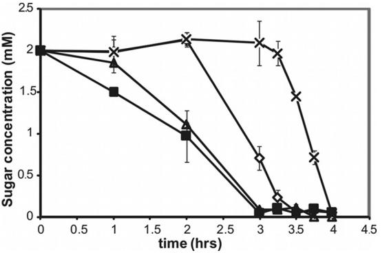
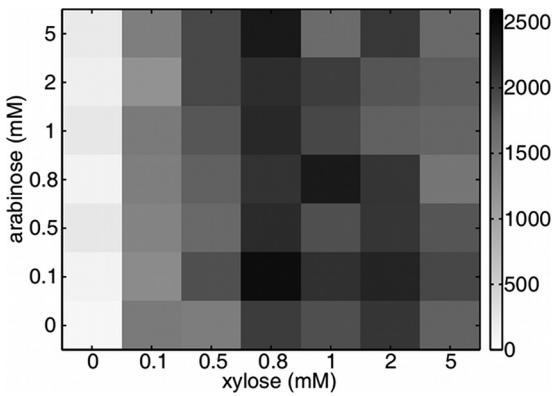
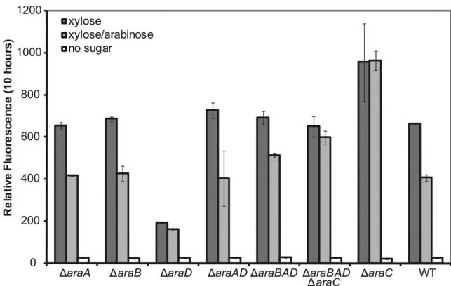
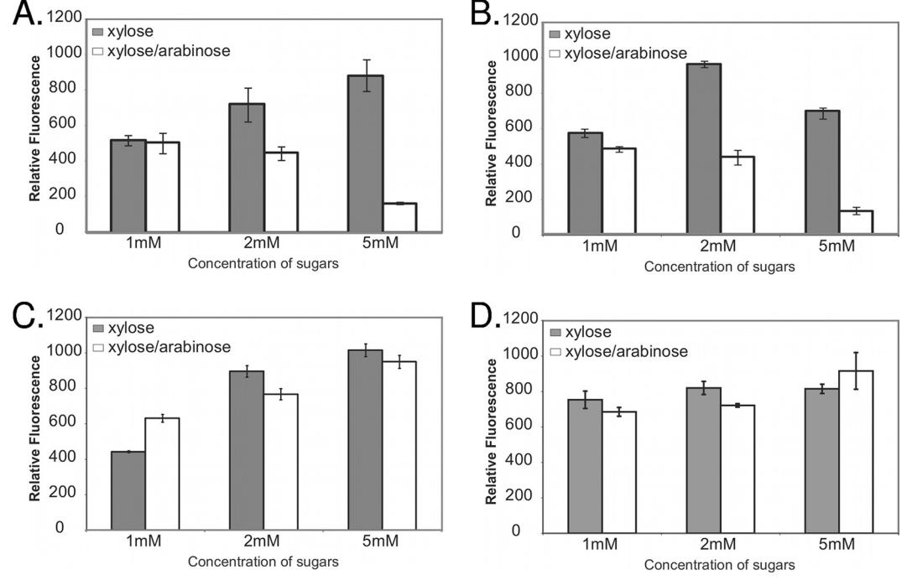
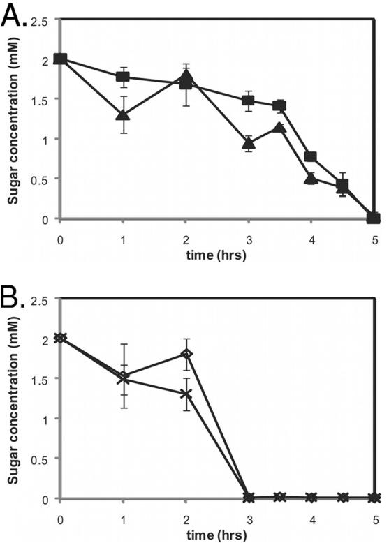
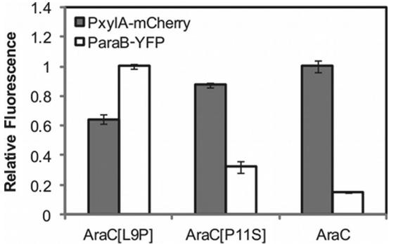
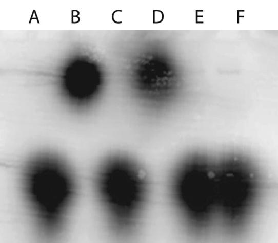

# Regulation of Arabinose and Xylose Metabolism in *Escherichia coli* †

Tasha A. Desai and Christopher V. Rao*

*Department of Chemical and Biomolecular Engineering, University of Illinois at Urbana-Champaign, Urbana, Illinois 61801*

Received 16 August 2009/Accepted 6 December 2009

**Bacteria such as** *Escherichia coli* **will often consume one sugar at a time when fed multiple sugars, in a process known as carbon catabolite repression. The classic example involves glucose and lactose, where** *E. coli* **will first consume glucose, and only when it has consumed all of the glucose will it begin to consume lactose. In addition to that of lactose, glucose also represses the consumption of many other sugars, including arabinose and xylose. In this work, we characterized a second hierarchy in** *E. coli***, that between arabinose and xylose. We show that, when grown in a mixture of the two pentoses,** *E. coli* **will consume arabinose before it consumes xylose. Consistent with a mechanism involving catabolite repression, the expression of the xylose metabolic genes is repressed in the presence of arabinose. We found that this repression is AraC dependent and involves a mechanism where arabinose-bound AraC binds to the xylose promoters and represses gene expression. Collectively, these results demonstrate that sugar utilization in** *E. coli* **involves multiple layers of regulation, where cells will consume first glucose, then arabinose, and finally xylose. These results may be pertinent in the metabolic engineering of** *E. coli* **strains capable of producing chemical and biofuels from mixtures of hexose and pentose sugars derived from plant biomass.**

The transporters and enzymes in many sugar metabolic pathways are conditionally expressed in response to their cognate sugar or a downstream pathway intermediate. While the induction of these pathways in response to a single sugar has been studied extensively (28), far less is known about how these pathways are induced in response to multiple sugars. One notable exception is the phenomenon observed when bacteria are grown in the presence of glucose and another sugar (10, 15). In such mixtures, the bacteria will often consume glucose first before consuming the other sugar, a process known as carbon catabolite repression (27). The classic example of carbon catabolite repression is the diauxic shift seen in the growth of *Escherichia coli* on mixtures of glucose and lactose, where the cells first consume glucose before consuming lactose. When the cells are consuming glucose, the genes in the lactose metabolic pathway are not induced, thus preventing the sugar from being consumed. A number of molecules participate in this regulation, including the cyclic AMP receptor protein (CRP), adenylate cyclase, cyclic AMP (cAMP), and EIIA from the phosphoenolpyruvate:glucose phosphotransferase system (PTS) (33). In addition to lactose, the metabolic genes for many other sugars are subject to catabolite repression by glucose in *E. coli* (27). While the preferential utilization of glucose is well known, it is an open question whether additional hierarchies exist among other sugars.

Recently, substantial effort has been directed toward developing microorganisms capable of producing chemicals and biofuels from plant biomass (1, 34, 42). After glucose, L-arabinose and D-xylose are the next most abundant sugars found in plant biomass. Therefore, a key step in producing various chemicals and fuels from plant biomass will be the engineering of strains capable of efficiently fermenting these three sugars. However, one challenge concerns catabolite repression, which prevents microorganisms from fermenting these three sugars simultaneously and, as a consequence, may decrease the efficiency of the fermentation process. *E. coli* cells will first consume glucose before consuming either arabinose or xylose. As in the case of lactose, the genes in the arabinose and xylose metabolic pathways are not expressed when glucose is being consumed. In addition to glucose catabolite repression, a second hierarchy, between arabinose and xylose, appears to exist. Kang and coworkers have observed that the genes in the xylose metabolic pathway were repressed when cells were grown in a mixture of arabinose and xylose (21). Hernandez-Montalvo and coworkers also observed that *E. coli* utilizes arabinose before xylose (19). While a number of strategies exist for breaking the glucose-mediated repression of arabinose and xylose metabolism (8, 16, 19, 31), none exist for breaking the arabinose-mediated repression of xylose metabolism. Moreover, little is known about this repression beyond the observations made by these researchers.

In this work, we investigate how the arabinose and xylose metabolic pathways are jointly regulated. We demonstrate that *E. coli* will consume arabinose before consuming xylose when it is grown in a mixture of the two sugars. Consistent with a mechanism involving catabolite repression, the genes in the xylose metabolic pathway are repressed in the presence of arabinose. We found that this repression is AraC dependent and is most likely due to binding by arabinose-bound AraC to the xylose promoters, with consequent inhibition of gene expression.

#### **MATERIALS AND METHODS**

* Corresponding author. Mailing address: Department of Chemical and Biomolecular Engineering, University of Illinois at Urbana-Champaign, 600 S. Mathews Ave., Urbana, IL 61810. Phone: (217) 244-2247. Fax: (217) 333-5052. E-mail: chris@scs.uiuc.edu.

† Supplemental material for this article may be found at http://aem .asm.org/. Published ahead of print on 18 December 2009.

**Growth conditions.** All culture experiments were performed in tryptone broth (TB) (per liter, 10 g of tryptone and 5 g of NaCl) at 37°C unless otherwise noted. Antibiotics were used at the following concentrations: ampicillin, 100 g/ml;

TABLE 1. Strains used during this study*a*

| Strain | Genotypeb                           |
|--------|-------------------------------------|
|        | MG1655  rph-1 (wild type)           |
|        | CR400 araA::FRT kan FRT             |
|        | CR401 araB::FRT kan FRT             |
|        | CR402 araD::FRT kan FRT             |
|        | CR403 araAD::FRT kan FRT            |
|        | CR404 araBAD::FRT kan FRT           |
|        | CR405 araCBAD::FRT kan FRT          |
|        | CR406 araA::FRT                     |
|        | CR407 araB::FRT                     |
|        | CR408 araD::FRT                     |
|        | CR409 araAD::FRT                    |
|        | CR410 araBAD::FRT                   |
|        | CR411 araCBAD::FRT                  |
|        | CR412 xylR::FRT kan FRT             |
|        | CR413 xylR::FRT                     |
|        | CR414 araFGH::FRT kan FRT           |
|        | CR415 araE::FRT kan FRT             |
|        | CR416 araFGH::FRT                   |
|        | CR417 araE::FRT araFGH::FRT kan FRT |
|        | CR418 araFGH::FRT araE::FRT         |
|        | CR419 araC::FRT kan FRT             |
|        | CR420 araC::FRT                     |
|        | CR421 araE::FRT                     |

*a* All strains are from this study except MG1655, which is from CGSC.

*b* All *E. coli* strains are isogenic derivatives of MG1655.

chloramphenicol, 20 g/ml; kanamycin, 40 g/ml. All sugars were used at a concentration of 2 mM unless noted otherwise.

**Strains and plasmid constructions.** All strains are isogenic derivatives of *Escherichia coli* MG1655 and are listed in Table 1. A list of the primers used to construct the various knockout strains is given in Table S1 in the supplemental material. The generalized transducing phage of *E. coli* P1*vir* was used in all transductional crosses (29). Plasmid pKD3 or pKD4 was used as a template to generate scarred FLP recombinant target (FRT) mutants as previously described (9). All experiments involving the growth of cells carrying pKD46 were performed at 30°C. Loss of the helper plasmid pKD46 was achieved by growth under nonselective conditions on Luria-Bertani (LB) agar (per liter, 10 g of tryptone, 5 g of yeast extract, 10 g of NaCl, and 15 g of agar) at 42°C. Prior to removal of the antibiotic resistance marker, the constructs resulting from this procedure were moved into a clean wild-type background (MG1655) by P1*vir* transduction in the case of single-gene deletions or into the parent strain in the case of multigene deletions. The antibiotic cassette was removed from the FRT-Cm/ Kan-FRT insert by transforming pCP20 into the respective strain and selecting on ampicillin at 30°C. Loss of the helper plasmid pCP20 was achieved by growth at 42°C under nonselective conditions on LB agar. All gene deletions were subsequently tested by PCR.

Plasmids pXylA-GFP and pAraB-GFP were made by amplifying the P*xylA* promoter (genomic region, nucleotides 3726575 to 3727102) using primers TD65F and TD65R and the P*araB* promoter (genomic region, nucleotides 67885 to 68378) using primers SS026F and SS026R, respectively. The resulting PCR products were then inserted into pPROBE-GFP (30) using the KpnI and EcoRI restriction sites, yielding pXylA-GFP and pAraB-GFP. Plasmid pXylA-mCherry was made by amplifying the P*xylA* promoter (genomic region, nucleotides 3726575 to 3727102) using primers TD71F and TD71R and the *mcherry* gene, which encodes a red fluorescent protein, from pRSETb-mCherry (37) (a gift from Roger Tsien) using primers KW122F and KW081R. The resulting PCR products were then inserted into pPROTet.E (Clontech) using the XhoI and EcoRI restriction sites for the P*xylA* promoter and the EcoRI and AseI restriction sites for the *mcherry* gene, yielding pXylA-mCherry.

Plasmid pAraE was made by amplifying the *araE* gene and promoter (genomic region, nucleotides 2978201 to 2980207) using primers TD158F and TD158R. The resulting PCR product was then inserted into pPROTet.E using the XhoI and BamHI restriction sites, yielding pAraE. Plasmid pAraE-con was made by amplifying the *araE* gene with the native ribosome binding site using primers TD162F and TD164R. The resulting PCR product was then inserted into the multiple cloning site of pTrc99a using the EcoRI and HindIII restriction sites, yielding pAraE-con.

Plasmid pBAD-YFP was made first by amplifying yellow fluorescent protein

(YFP) with a *cheY* ribosome binding site using primers CR027F and CR027R. The resulting PCR product was then inserted into the multiple cloning site of pBAD30 using the EcoRI and SphI restriction sites, yielding pBAD-YFP. Plasmids pBAD*1-YFP and pBAD*2-YFP were made by introducing Leu9Pro and Pro11Ser point mutations, respectively, into the AraC protein. These mutations were introduced using enzymatic inverse PCR (40). For the Leu2Pro mutation (pBAD*1-YFP), primers CR024F and CR024R were used. For the Pro11Ser mutation (pBAD*2-YFP), primers CR025F and CR025R were used. The sequences for all primers used in this study are given in Table S1 in the supplemental material.

**Fluorescence assay.** As an indirect measure of gene expression, we used fluorescent protein transcriptional fusions. For the measurement of fluorescence, cultures were grown overnight in test tubes with TB supplemented with glucose (10 mM) to ensure robust growth and also inhibition of the arabinose and xylose pathways. The overnight culture was then diluted 1:30 into fresh TB supplemented with the appropriate sugar, and 150 l was then transferred to three separate wells in a 96-well microplate and covered with a Breathe-Easy membrane to prevent evaporation. Cells were then grown in a Tecan Safire2 microplate reader. Fluorescence and optical density at 600 nm (OD600) measurements were taken every 20 min, with the plate shaking the whole time between readings. For green fluorescent protein (GFP)/YFP fluorescence, the excitation wavelength was set to 488 nm, the emission wavelength to 520 nm, the bandwidth to 10 nm, and the gain to 45. For YFP fluorescence, the excitation wavelength was set to 515 nm, the emission wavelength to 528 nm, the bandwidth to 5 nm, and the gain to 100. For mCherry fluorescence, the excitation wavelength was set to 587 nm, the emission wavelength to 610 nm, the bandwidth to 5 nm, and the gain to 150. The fluorescence readings were normalized with the OD600 absorbance to account for cell density. All experiments were performed in triplicate, and average values with standard deviations are reported. For end point measurements, the 10-h (600 min) time point was reported.

In experiments involving the constitutively active AraC mutants, the overnight culture was diluted 1:30 into 2 ml of fresh TB supplemented with 2 mM xylose. The cultures were then grown in test tubes for 5 h. A 150-l portion was transferred to a 96-well microplate, and fluorescence and absorbance readings were taken using a Tecan Safire2 microplate reader.

**Analytical measurements.** Sugar concentrations were measured using highperformance liquid chromatography (HPLC). Cells were first grown overnight in test tubes with TB supplemented with glucose (10 mM). The cells were then subcultured 1:30 into fresh TB supplemented with the appropriate sugars and were grown in test tubes. Every hour, a sample was first filtered using a 0.22 m-pore-size filter (Millipore) and then run on a Gilson HPLC with an Aminex HPX-87P column (Bio-Rad). All experiments were performed in triplicate, and average values with standard deviations were reported.

**DNA mobility shift assay.** DNA mobility shift assays were performed using the approach previously described by Ellermeier and Slauch (12). Briefly, whole-cell extracts were prepared by subculturing overnight cultures 1/100 in LB medium and growing them to an OD600 of 0.5, at which time 0.2% L-arabinose was added and cultures were grown for an additional 4 h at 37°C. The cells were then harvested by centrifugation at 5,000 *g* for 10 min. The pellet of cells was resuspended in 10 ml of 50 mM Tris-HCl (pH 7.9) with 30 M dithiothreitol (DTT), and the solution was then sonicated to lyse the cells. Lysates were then centrifuged at 16,000 *g* for 30 min at 4°C. The protein concentration in each sample was determined by using a bicinchoninic acid (BCA) protein assay reagent (Pierce Protein Research Products).

The binding reaction mixture contained approximately 0.1 ng of 32P-labeled DNA (*xylA* promoter; genomic region, nucleotides 3726575 to 3727102), 50 g of herring sperm DNA per ml, 10 mM Tris-Cl (pH 8), 50 mM KCl, 100 g of bovine serum albumin per ml, 10% glycerol, 1 mM DTT, 0.5 mM EDTA, and 2 g whole-cell extract in a final volume of 20 l. In the experiments where the I1-I1 binding site was included as a competitor, 10 ng of the double-stranded sequence (5-ATG CG T AGC ATT TTT ATC CAT AAG ATT AGC ATT TTT ATC CAT AAG CCA-3) was added to the mixture. The binding reaction mixtures were incubated for 30 min at room temperature and then subjected to electrophoresis on a 5% native polyacrylamide gel in 0.5- Tris-borate-EDTA (TBE) at room temperature. Gels were dried on filter paper in a vacuum drier and were scanned using a Storm 840 PhosphorImager (Amersham).

# **RESULTS**

**Arabinose inhibits the expression of the xylose metabolic genes.** The transcriptional regulation of both the arabinose and xylose metabolic pathways in response to their cognate sugars

FIG. 1. Regulation of the arabinose and xylose metabolic gene circuits. (A) The arabinose metabolic and transporter genes are regulated by AraC (35). When bound with arabinose, AraC activates the transcription of the *araBAD*, *araE*, and *araFGH* operons and represses transcription from the *araC* operon. Expression of the AraE and AraFGH transporters increases the rate of arabinose uptake, further enhancing activation. (B) The xylose metabolic genes and transporters are regulated by XylR, an AraC-type positive regulator, in a manner analogous to that of arabinose (38). Xylose-bound XylR is believed to activate the transcription of the *xylFGH*, *xylR*, *xylAB*, and *xylE* operons. As with arabinose, expression of the XylE and XylFGH transporters increases the rate of xylose uptake and further enhances activation.

has been studied extensively (Fig. 1). However, little is known about how the pathways are jointly regulated at the level of transcription in response to both sugars. One notable exception is the work of Kang and coworkers (21), who previously observed that the xylose metabolic genes were repressed when *E. coli* was grown in a mixture of arabinose and xylose. To explore this mechanism of arabinose catabolite repression in more detail, we first measured arabinose and xylose metabolic gene expression by using transcriptional fusions of GFP to the P*araB* and P*xylA* promoters. By allowing the measurement of fluorescence, these transcriptional reporters provide an indirect method for quantitatively determining the activities of the P*araB* and P*xylA* promoters *in vivo*. In these experiments, cells were grown for 14 h, with fluorescence and absorbance measurements taken every 20 min. The experiments were also performed in tryptone broth to control for any differences in the rate of growth on arabinose, xylose, or both.

Using this experimental protocol, we found that the activation of the P*xylA* promoter by xylose was delayed and repressed when arabinose was also present in the growth medium, consistent with the results of Kang and coworkers (Fig. 2). Interestingly, we found that arabinose had an effect on the P*xylA* promoter similar to that of glucose, which also delayed and repressed the activation of the P*xylA* promoter by xylose. In the case of glucose, this regulation is thought to involve CRP (38). In comparison, P*araB* promoter activity was mostly unaffected when xylose was present in the growth medium. On the other hand, activation of the P*araB* promoter was delayed when glu-

FIG. 2. Comparison of P*xylA* (A) and P*araB* (B) promoter activity dynamics in response to different sugars.

cose was present, consistent with the regulation of this promoter also by CRP (6).

We next tested P*xylA* and P*araB* promoter activities with varying concentrations of arabinose and xylose. We performed these experiments utilizing a dual reporter system, with the P*xylA* promoter fused to mCherry, a red fluorescent protein, and the P*araB* promoter fused to GFP. This dual reporter system was used to simultaneously monitor expression from the P*xylA* and P*araB* promoters (Fig. 3). At low concentrations of arabinose, we were unable to observe any repression. However, as the concentration of arabinose increased, so did the degree of repression. In comparison, we found that xylose had no effect on the P*araB* promoter for the range of concentrations tested. Collectively, these results suggest that sugar utilization involves a three-tiered transcriptional hierarchy, where glucose represses the transcription of both the arabinose and xylose metabolic genes and arabinose represses the transcription of the xylose metabolic genes. Moreover, in the case of arabinose, repression of P*xylA* is dose dependent.

**Arabinose inhibits the uptake and metabolism of xylose.** In addition to our experiments involving promoter fusions, we also tested whether arabinose inhibits xylose uptake and metabolism by using HPLC. Consistent with our gene expression experiments, we found that the utilization of xylose is delayed when arabinose is present in the growth medium (Fig. 4). Only when the arabinose is depleted from the growth medium will

FIG. 3. Effects of varying arabinose and xylose concentrations on P*xylA* (left) and P*araB* (right) promoter activities. These experiments were performed using two transcriptional reporters: a GFP fusion to the P*araB* promoter and an mCherry fusion to the P*xylA* promoter. Expression is represented as relative fluorescence. Results are values obtained after 10 h of growth in 96-well microplates and are averages for three independent experiments. For all results, the standard deviations were less than 15 percent of the mean (data not shown).

the cells begin to consume the xylose. Based on these and the gene expression experiments, we conclude that *E. coli* cannot consume arabinose and xylose simultaneously but will instead consume them sequentially.

Note that in the HPLC experiments, cells utilize arabinose more quickly than xylose when grown on these sugars separately. One possibility is that *E. coli* is able to process arabinose more efficiently than xylose. If true, such a model would explain why arabinose is the preferred sugar. We also observed similar results in our gene expression experiments (Fig. 2), where the P*araB* promoter is induced more rapidly by arabinose than the P*xylA* promoter is by xylose. While differences in timing are less pronounced for the gene expression data than for the HPLC data, they nonetheless exhibit a similar trend.

**Repression of xylose metabolism is AraC dependent but does not involve an arabinose metabolic intermediate.** To identify the mechanism underlying arabinose catabolite repression, we first tested whether deleting *araC* and the *araBAD* metabolic operon had any effect on xylose gene expression. Consistent with a model where some component of the arabinose metabolic pathway represses xylose metabolic gene expression, we found that arabinose had no effect on P*xylA* promoter activity in a *araC araBAD* mutant (Fig. 5). In

FIG. 4. Comparison of xylose and arabinose utilization. Symbols represent the concentration of arabinose when it is the sole sugar (Œ) or when an equimolar mixture of arabinose and xylose is used (f) and the concentration of xylose when it is the sole sugar () or when an equimolar mixture of arabinose and xylose is used (-).

addition, we found that the P*xylA* promoter was activated at lower concentrations of xylose in this mutant than in the wild type (Fig. 3), suggesting that elimination of the repressing arabinose pathway makes cells more sensitive to xylose. Collectively, these results would suggest that some component of the arabinose metabolic pathway, including possibly intracellular arabinose, inhibits xylose metabolism.

We next tested the hypothesis that an intermediate in the arabinose metabolic pathway prevents the P*xylA* promoter from being activated by xylose. To test this hypothesis, we deleted the arabinose metabolic genes—*araB*, *araA*, and *araD*—individually and in combination (Fig. 6). By blocking different steps in the arabinose metabolic pathway, we could selectively prevent different intermediates from being formed and, likewise, cause them to accumulate within the cell. In the *araB*, *araA*, *araAD*, and *araBAD* mutants, arabinose still inhibited P*xylA* promoter activity at levels similar to those observed in wild-type cells. In the *araD* mutant, P*xylA* promoter activity

FIG. 5. Effects of varying arabinose and xylose concentrations on P*xylA* promoter activity in a *araC araBAD* mutant. These experiments were performed using two transcriptional reporters: a GFP fusion to the P*araB* promoter and an mCherry fusion to the P*xylA* promoter. The results for the P*araB* promoter are not shown, because the promoter is inactive and unresponsive to arabinose in the *araC araBAD* mutant. Results are values obtained after 10 h of growth in 96-well microplates and are averages for three independent experiments. For all results, the standard deviations were less than 15% of the mean for the concentrations tested (data not shown).

FIG. 6. Comparison of P*xylA* promoter activity in different mutants deficient in arabinose metabolism. Results are values obtained after 10 h of growth in 96-well microplates and are averages for three independent experiments.

was inhibited both in the presence and in the absence of arabinose. In the presence of arabinose, the repression in the *araD* mutant is most likely due to the buildup of L-ribulose-5-phosphate, which is inhibitory to *E. coli* (13). However, we observed no significant decrease in cell viability for this mutant. Moreover, it is not known why the P*xylA* promoter is inhibited in the absence of arabinose in the *araD* mutant. Based on these results, we conclude that arabinose-mediated repression of xylose gene expression is not due to any metabolic intermediate.

In contrast to the results obtained when we deleted the metabolic genes, *araD* notwithstanding, we observed no repression in a *araC* mutant (Fig. 6). Moreover, we observed a moderate increase in P*xylA* promoter activity. Based on these results, we conclude that repression is AraC dependent. However, since AraC regulates the expression of the arabinose transporter and metabolic genes, removal of this gene would eliminate all aspects of this pathway and presumably prevent the sugar from having any intracellular effect on xylose metabolism.

**Arabinose inhibits xylose gene expression through AraC.** Because repression is AraC dependent yet did not involve an arabinose metabolic intermediate, we suspected that intracellular arabinose was somehow interacting with either AraC or XylR. To test this hypothesis, we first deleted the two arabinose transporters—the high-affinity AraFGH transporter and the low-affinity AraE transporter—individually and in combination. In the *araFGH* mutant, we found that arabinose was still able to repress the activation of the P*xylA* promoter by xylose in a manner comparable to that observed in wild-type cells (Fig. 7). However, in the *araE* mutant, arabinose had less of an effect and only mildly repressed P*xylA* promoter activity at higher concentrations. In fact, at lower concentrations, arabinose appeared to enhance P*xylA* promoter activity, most likely an artifact due to altered growth rates. When both transporters were deleted, we again found that arabinose had only a minor effect on P*xylA* promoter activity. To confirm that loss of repression was in fact due to arabinose, we tested for complementation by expressing AraE from its native promoter on a plasmid in the *araE* mutant. In the complemented strain, we were again able to observe repression of the P*xylA* promoter by arabinose (998 16 relative fluorescence units [RFU] with xylose alone versus 970 126 RFU with arabinose plus xylose

FIG. 7. Comparison of P*xylA* promoter activities in strains with different arabinose transporter deletions. (A) Wild type; (B) *araFGH*; (C) *araE*; (D) *araE araFGH*. Results are values obtained after 10 h of growth in 96-well microplates and are averages for three independent experiments.

FIG. 8. Comparison of xylose (A) and arabinose (B) utilization in a *araE* mutant. Symbols represent the concentration of arabinose when it is the sole sugar (Œ) or when an equimolar mixture of arabinose and xylose is used (f) and the concentration of xylose when it is the sole sugar () and when an equimolar mixture of arabinose and xylose is used (-).

for the *araE* mutant; 969 131 RFU with xylose alone versus 689 38 RFU with arabinose plus xylose for the *araE* pAraE complemented strain). Collectively, these results suggest that arabinose transport plays a role in the repression, most likely by preventing xylose from getting into the cell. The reason that repression is still observed in the absence of the AraFGH transporter is that the AraE transporter is the primary route for arabinose uptake (18).

To corroborate the results from our gene expression experiments, we also used HPLC to test whether arabinose directly inhibits xylose uptake and metabolism in the *araE* mutant (Fig. 8). In this mutant, we found that xylose uptake and metabolism were unaffected by arabinose. We found also that the rates of arabinose uptake and metabolism in the *araE* mutant were much lower than those in wild-type cells, an expected result given that one of the arabinose transporters had been removed. Similar results for arabinose and xylose uptake and metabolism were also seen in the *araE araFGH* mutant (data not shown). Both sets of data demonstrate that cells are still able to take up arabinose when the two transporters are removed, albeit at a reduced rate. Consistent with these HPLC data, we found that the P*araB* promoter is still activated by arabinose in the *araE araFGH* mutant at levels roughly one-half of those observed in wild-type cells (218 13 RFU with arabinose versus 28 1 RFU with no sugar in the *araE araFGH* mutant; 398 12 RFU with arabinose versus 27 1 RFU with no sugar in the wild type).

Based on our results with the arabinose transporter deletion strains, arabinose likely inhibits xylose gene expression by one of two mechanisms: either (i) arabinose-bound AraC binds to the P*xylA* promoter and prevents it from being activated by xylose-bound XylR or (ii) arabinose directly binds XylR and inhibits its activity. To determine which mechanism is involved, we constitutively expressed AraE from the P*trc* promoter on a plasmid in a *araC araBAD* mutant. If repression is due to AraC, then no repression will occur. Alternatively, if repression is due to inhibition of XylR by arabinose, then repression should still occur. Consistent with the former possibility, we found that arabinose had no effect on P*xylA* promoter activity in the *araC araBAD* mutant constitutively expressing AraE (894 116 RFU with xylose alone versus 895 131 RFU with xylose plus arabinose in the *araC araBAD* pAraE strain), whereas P*xylA* promoter activity was inhibited in the *araE* mutant constitutively expressing AraE (975 102 RFU with xylose alone versus 746 52 RFU with xylose plus arabinose in the *araE* pAraE strain). Therefore, we conclude that intracellular arabinose is not inhibiting the activity of XylR but rather is repressing P*xylA* promoter activity through the action of AraC.

As further confirmation of this mechanism, we also tested whether a constitutively active mutant of AraC would inhibit P*xylA* promoter activity in the absence of arabinose. In other words, we tested whether AraC mutants that do not require arabinose to activate the P*araB* promoter also repress P*xylA* promoter activity. To perform these experiments, we introduced a single point mutation into the *araC* gene in plasmid pBAD30-YFP. Two constitutive mutations identified previously, Leu9Pro and Pro11Ser were tested (11). Since this plasmid expresses YFP, it provided a quick test of whether the point mutations were constitutive; indeed, both were. To measure P*xylA* activity, we used the mCherry reporter. Consistent with a model where repression is AraC dependent, we found that xylose-induced P*xylA* activity was repressed in cells expressing either of the two constitutive AraC mutants relative to that in the pBAD30-YFP control in a *araC* background (Fig. 9) [4,891 223 RFU (mCherry) and 29,448 461 RFU (YFP) for the AraC(L9P) mutant; 6,643 135 RFU (mCherry) and 9,189 1,199 RFU (YFP) for the AraC(P11S) mutant; and 7,599 278 RFU (mCherry) and 4,381 128 RFU (YFP) for the AraC strain]. Note that the degree of repression is proportional to the activity of the AraC mutant, with the highest degree of repression observed in the strong Leu9Pro mutant. These results show that repression is dependent only on the activity of AraC and does not involve a mechanism where arabinose inhibits the activity of XylR.

**AraC directly binds the P***xylA* **promoter region.** Based on these results, we hypothesized that arabinose-bound AraC likely binds to one or more of the xylose promoters and represses transcription. To test this hypothesis, we performed a DNA mobility shift assay using whole-cell extracts (Fig. 10). In these experiments, we grew cells in the presence of arabinose and then tested whether we could see a binding effect with the P*xylA* promoter. As shown in Fig. 10 (lanes A to C), we observed a shift with the wild type but not with a *araC*-null mutant. We were also able to see a shift when we expressed

FIG. 9. Repression of the P*xylA* promoter by constitutively active variants of AraC in the absence of arabinose. These experiments were performed using two transcriptional reporters: a YFP fusion to the P*xylA* promoter and an mCherry fusion to the P*araB* promoter. To facilitate comparison, the fluorescence values were normalized by their maximal value (raw data are given in the text). Results are values obtained after 5 h of growth in test tubes and are averages for three independent experiments.

*araC* from a plasmid in an otherwise *araC* background (Fig. 10, lane D). To confirm that the shift was due to AraC, we added a 100-fold excess of a known AraC binding site, the strong I1-I1 site (5), in order to competitively inhibit the binding to the P*xylA* promoter and thus establish that the shift is due to AraC (Fig. 10, lanes E and F). Collectively, these results demonstrate that AraC binds the P*xylA* promoter. While the specific mechanism of repression is still not known, it most likely involves steric occlusion by arabinose-bound AraC based on our accumulated evidence.

To identify the likely AraC binding site within the P*xylA* promoter, we searched the promoter regions of the xylose promoters using MEME, a motif discovery program (2, 3). Briefly, we used MEME to search for a common motif in the

FIG. 10. DNA mobility shift assay demonstrating the binding of AraC to the P*xylA* promoter using whole-cell extracts. The binding reaction mixture contained 0.1 ng of P32-labeled DNA encompassing the P*xylA* promoter. Lanes: A, no lysate; B, wild type; C, *araC* pProtet.E (empty plasmid); D, *araC* pAraC (plasmid expressing AraC); E, wild type plus 10 ng of the unlabeled I1-I1 AraC binding site; F, *araC* pAraC plus 10 ng of the unlabeled I1-I1 AraC binding site.

| PxylA Promoter:                                              |
|--------------------------------------------------------------|
| TCATTCCATTTTATTTTGCGAGCGAGCGCACACTTGTGAATTATCTCAATAGC        |
| +1 AGTGTGAAATAACATAATTGAGCAACTGAAAGGGAGTGCCCAATATTACGACA  |
|                                                              |
| ParaB Promoter:                                              |
| ATTATTTGCACGGCGTCACACTTTGCTATGCCATAGCATTTTTATCCATAAGA        |
| +1 TTAGCGGATCCTACCTGACGCTTTTTATCGCAACTCTCTACTCTTTTCTCCATA |
| ParaE Promoter:                                              |
| AATTGGAATATCCATCACATAACGACATGTCGCAGCAATTTAATCGATATTA         |
| +1 TGCTGTTTCCGACCTGACACCTGCGTGAGTTGTTCACGTATTTTTTCACTATG  |

FIG. 11. Schematic of the P*xylA*, P*araB*, and P*araE* promoters. The CRP binding sites are shown in boldface, the XylR operator sites with straight underlines, and the AraC operator sites with wavy underlines. Annotations are based on RegulonDB (14). The putative AraC binding site, as determined through sequence analysis, is boxed.

P*araB*, P*araE*, P*araF*, P*araJ*, P*xylA*, and P*xylE* promoter regions. Note that we did not include the P*araC* and P*xylF* promoter regions in our analysis, because they are transcribed in a divergent configuration from the nearby P*araB* and P*xylA* promoters, respectively, and contain redundant information. After eliminating the CRP binding site, which is found in all of the promoters, from the results, we found a common 38-bp motif in all of the promoters (see Fig. S1 in the supplemental material). When mapped onto the P*araB* promoter, this motif matched the known AraC binding site (l1 and l2) within the arabinose promoters (*P* 1010) (Fig. 11). To confirm that this motif matched the AraC consensus binding sequence, we used the TOMTOM program (17) to search RegTransBase (22), a curated database of bacterial transcription factor binding sites, and found that the top hit indeed matched the AraC consensus sequence (*P* 1016). We also scanned all upstream sequences in the *E. coli* genome using FIMO (2) and found that the only significant hits (*P* 1010; *q* 0.01 [41]) were the arabinose and xylose promoters.

When we mapped the putative AraC binding site onto the P*xylA* promoter, we found that it overlapped the XylR and polymerase binding sites based on the annotation given in RegulonDB (Fig. 11). Given the proximity of this binding site to the start site for transcription, these results suggest a model where AraC sterically inhibits the binding of XylR and RNA polymerase to the P*xylA* promoter, consistent with our experimental results. We were unable to perform a similar analysis for the P*xylE* promoter, because the operator sites and start site for transcription have not been determined.

## **DISCUSSION**

In this work, we investigated the dual transcriptional regulation of the arabinose and xylose metabolic pathways. We were able to show that *E. coli* will utilize arabinose before it utilizes xylose when it is grown in a mixture of the two sugars. Only when arabinose is no longer present in the growth medium will the cells begin to utilize xylose. Using genetic approaches, we were able to show that this regulation occurs at the level of transcription. Our results demonstrate that this repression is AraC dependent: arabinose-bound AraC likely binds and then represses the promoters for the xylose metabolic genes. Consistent with this model, we were able to show that AraC binds the P*xylA* promoter. We were also able to locate a putative AraC binding site within the P*xylA* promoter. Collectively, these results demonstrate that sugar utilization in *E. coli* involves multiple layers of regulation. In particular, a secondary hierarchy exists between arabinose and xylose, in addition to the primary hierarchy involving glucose.

In addition to the arabinose and xylose metabolic pathway, regulatory cross talk between other pathways is known to exist in *E. coli*. For example, in the study where they first observed hierarchy between arabinose and xylose, Kang and colleagues also found that xylose represses the expression of the D-ribose metabolic genes (21). Using genetic approaches, they concluded that this repression was XylR dependent, though it is not known whether this involved direct repression of ribose metabolic gene expression or an indirect mechanism, for example, involving the xylose transporters. Irrespective of the specific mechanism, their results demonstrate that a multitiered hierarchy exists in pentose sugar utilization. Aside from repression, some metabolic pathways can also cross-induce one another. For example, the genes in the L-fucose metabolic pathways are induced by an L-rhamnose metabolic by-product, L-fuculose-1-phosphate (7). While rhamnose is able to induce fucose metabolic gene expression, the converse does not occur, suggesting that positive regulation can also be hierarchical. Finally, we note that other bacteria will also selectively utilize arabinose and xylose. Bothast and coworkers, for example, observed that *Klebsiella oxytoca* selectively utilizes arabinose before xylose (4). Whether selective utilization of the pentose sugars is conserved in all species or just a few remains an open question.

One additional question concerns the physiological significance of the arabinose and xylose hierarchy. More specifically, is arabinose preferable to xylose as a substrate for *E. coli*? In terms of energy, both sugars yield the same amount, assuming the same mechanism for transport is employed. However, *E. coli* appears to use different mechanisms for the uptake of these two sugars. For arabinose, the primary route for uptake is through the low-affinity AraE proton symporter, whereas for xylose, it is the high-affinity XylFGH ABC transporter (18, 24). Interestingly, these two types of transporters are present for both sugars, yet each sugar has a preferred route. Differences in the energetics of these two transport mechanisms appear to make arabinose the preferred sugar. Hasona and coworkers, in particular, found that an *E. coli* mutant lacking pyruvate formate lyase was unable to grow anaerobically on xylose as the sole carbon source but could do so on arabinose (18). These results would argue that *E. coli* is able to take up arabinose more efficiently than xylose, at least under ATP-limiting conditions, because it preferentially utilizes the AraE proton symporter rather than the AraFGH ABC transporter, while with xylose, XylFGH is the preferred transporter. Moreover, Hasona and coworkers found that constitutive expression of XylE did not enable *E. coli* to grow anaerobically on xylose; however, constitutive expression of AraE did (note that the pentose transporters are promiscuous [see below]). These results would suggest that arabinose transporters are more efficient than xylose transporters, irrespective of whether the substrate is arabinose or xylose.

In the context of our work, we found that *E. coli* will utilize

arabinose more quickly than xylose, a result consistent with the notion that arabinose is more easily and efficiently utilized than xylose. Collectively, these results provide one possible explanation for the origin of the arabinose/xylose hierarchy, though it is still not clear why simultaneous utilization is disadvantageous to *E. coli*. In fact, when *E. coli* is grown in continuous culture under carbon-limited conditions, the cells are capable of utilizing multiple sugars simultaneously (cf. references 20, 25, and 26). While these studies have focused primarily on sugar mixtures involving glucose (and to the best of our knowledge, commensurate experiments have not yet been performed with pentose mixtures), they nonetheless suggest that catabolite repression, including the mechanism explored in this study, occurs only when the sugars are in excess. When sugars are scarce, bacteria likely cannot afford to be picky and thus need to induce multiple pathways in order to metabolize all available carbon sources so as to sustain growth.

One interesting finding of this work was that *E. coli* was still able to metabolize arabinose when the AraE and AraFGH transporters were both removed. These results demonstrate that an alternate, though less efficient, mechanism for arabinose uptake exists. Khankal and coworkers reached a similar conclusion for xylose when they measured the uptake of this sugar in a *xylE xylFGH* mutant (23). Preliminary experiments from our laboratory suggest that the xylose transporters XylE and XylFGH are able to take up arabinose and, likewise, that the arabinose transporters AraE and AraFGH are able to take up xylose (even when arabinose is not present). Moreover, when both sets of transporters are deleted, transport of these two sugars still occurs, though at reduced levels (beyond what is seen when a single set of transporters is deleted). Since the pentose transporters are known to be promiscuous (32, 36, 39), these results are not entirely surprising. What is surprising is that even when all the pentose transporters are removed, uptake still occurs. In addition, it is not clear how arabinose can utilize the xylose transporters when xylose is not present and vice versa, since the cognate sugar necessary to induce the expression of associated transporters is not present. While "leaky" expression can provide a partial explanation, it does not provide a complete answer.

In summary, we have investigated the mechanism for the selective utilization of arabinose and xylose in *E. coli*. The results may be relevant to the production of chemicals and fuels from plant biomass, since the hydrolysis of plant biomass yields a mixture of sugars composed primarily of glucose, xylose, and arabinose. Carbon catabolite repression prevents *E. coli* from fermenting these sugar mixtures simultaneously, thus decreasing the efficiency of any fermentation process. A number of strategies exist for breaking glucose catabolite repression, by using, for example, a constitutively active CRP allele (8) or by disrupting the glucose PTS (16, 19, 31). While there is still no method for breaking arabinose catabolite repression, our results have nonetheless isolated a putative mechanism and thus provide a target for future strain-engineering efforts.

#### **ACKNOWLEDGMENTS**

We thank Ido Golding, Michael Bednarz, and Huimin Zhao for advice and helpful discussions. We also thank Robert Schleif for technical advice regarding the DNA mobility shift experiments and Supreet Saini for performing them.

This work was supported by the Energy Biosciences Institute.

## **REFERENCES**

- 1. **Aristidou, A., and M. Penttila.** 2000. Metabolic engineering applications to renewable resource utilization. Curr. Opin. Biotechnol. **11:**187–198.
- 2. **Bailey, T. L., M. Boden, F. A. Buske, M. Frith, C. E. Grant, L. Clementi, J. Ren, W. W. Li, and W. S. Noble.** 2009. MEME SUITE: tools for motif discovery and searching. Nucleic Acids Res. **37:**W202–W208.
- 3. **Bailey, T. L., and C. Elkan.** 1994. Fitting a mixture model by expectation maximization to discover motifs in biopolymers, p. 28–36. *In* R. Altman, D. Brutlag, P. Karp, R. Lathrop, and D. Searls (ed.), Proceedings of the Second International Conference on Intelligent Systems for Molecular Biology. AAAI Press, Menlo Park, CA.
- 4. **Bothast, R. J., B. C. Saha, A. V. Flosenzier, and L. O. Ingram.** 1994. Fermentation of L-arabinose, D-xylose and D-glucose by ethanologenic recombinant *Klebsiella oxytoca* strain P2. Biotechnol. Lett. **16:**401–406.
- 5. **Carra, J. H., and R. F. Schleif.** 1993. Variation of half-site organization and DNA looping by AraC protein. EMBO J. **12:**35–44.
- 6. **Casadaban, M. J.** 1976. Regulation of the regulatory gene for the arabinose pathway, araC. J. Mol. Biol. **104:**557–566.
- 7. **Chen, Y. M., J. F. Tobin, Y. Zhu, R. F. Schleif, and E. C. Lin.** 1987. Cross-induction of the L-fucose system by [scap]l-rhamnose in *Escherichia coli*. J. Bacteriol. **169:**3712–3719.
- 8. **Cirino, P. C., J. W. Chin, and L. O. Ingram.** 2006. Engineering *Escherichia coli* for xylitol production from glucose-xylose mixtures. Biotechnol. Bioeng. **95:**1167–1176.
- 9. **Datsenko, K. A., and B. L. Wanner.** 2000. One-step inactivation of chromosomal genes in *Escherichia coli* K-12 using PCR products. Proc. Natl. Acad. Sci. U. S. A. **97:**6640–6645.
- 10. **Deutscher, J.** 2008. The mechanisms of carbon catabolite repression in bacteria. Curr. Opin. Microbiol. **11:**87–93.
- 11. **Dirla, S., J. Y. Chien, and R. Schleif.** 2009. Constitutive mutations in the *Escherichia coli* AraC protein. J. Bacteriol. **191:**2668–2674.
- 12. **Ellermeier, C. D., and J. M. Slauch.** 2003. RtsA and RtsB coordinately regulate expression of the invasion and flagellar genes in *Salmonella enterica* serovar Typhimurium. J. Bacteriol. **185:**5096–5108.
- 13. **Englesberg, E., R. L. Anderson, R. Weinberg, N. Lee, P. Hoffee, G. Huttenhauer, and H. Boyer.** 1962. L-Arabinose-sensitive, L-ribulose 5-phosphate 4-epimerase-deficient mutants of *Escherichia coli*. J. Bacteriol. **84:**137–146.
- 14. **Gama-Castro, S., V. Jimenez-Jacinto, M. Peralta-Gil, A. Santos-Zavaleta, M. I. Penaloza-Spinola, B. Contreras-Moreira, J. Segura-Salazar, L. Muniz-Rascado, I. Martinez-Flores, H. Salgado, C. Bonavides-Martinez, C. Abreu-Goodger, C. Rodriguez-Penagos, J. Miranda-Rios, E. Morett, E. Merino, A. M. Huerta, L. Trevino-Quintanilla, and J. Collado-Vides.** 2008. RegulonDB (version 6.0): gene regulation model of *Escherichia coli* K-12 beyond transcription, active (experimental) annotated promoters and Textpresso navigation. Nucleic Acids Res. **36:**D120–D124.
- 15. **Go¨rke, B., and J. Stulke.** 2008. Carbon catabolite repression in bacteria: many ways to make the most out of nutrients. Nat. Rev. Microbiol. **6:**613– 624.
- 16. **Gosset, G.** 2005. Improvement of *Escherichia coli* production strains by modification of the phosphoenolpyruvate:sugar phosphotransferase system. Microb. Cell Fact. **4:**14.
- 17. **Gupta, S., J. A. Stamatoyannopoulos, T. L. Bailey, and W. S. Noble.** 2007. Quantifying similarity between motifs. Genome Biol. **8:**R24.
- 18. **Hasona, A., Y. Kim, F. G. Healy, L. O. Ingram, and K. T. Shanmugam.** 2004. Pyruvate formate lyase and acetate kinase are essential for anaerobic growth of *Escherichia coli* on xylose. J. Bacteriol. **186:**7593–7600.
- 19. **Herna´ndez-Montalvo, V., F. Valle, F. Bolivar, and G. Gosset.** 2001. Characterization of sugar mixtures utilization by an *Escherichia coli* mutant devoid of the phosphotransferase system. Appl. Microbiol. Biotechnol. **57:**186–191.
- 20. **Ihssen, J., and T. Egli.** 2005. Global physiological analysis of carbon- and energy-limited growing *Escherichia coli* confirms a high degree of catabolic

flexibility and preparedness for mixed substrate utilization. Environ. Microbiol. **7:**1568–1581.

- 21. **Kang, H. Y., S. Song, and C. Park.** 1998. Priority of pentose utilization at the level of transcription: arabinose, xylose, and ribose operons. Mol. Cells **8:**318–323.
- 22. **Kazakov, A. E., M. J. Cipriano, P. S. Novichkov, S. Minovitsky, D. V. Vinogradov, A. Arkin, A. A. Mironov, M. S. Gelfand, and I. Dubchak.** 2007. RegTransBase—a database of regulatory sequences and interactions in a wide range of prokaryotic genomes. Nucleic Acids Res. **35:**D407–D412.
- 23. **Khankal, R., J. W. Chin, and P. C. Cirino.** 2008. Role of xylose transporters in xylitol production from engineered *Escherichia coli*. J. Biotechnol. **134:** 246–252.
- 24. **Khlebnikov, A., K. A. Datsenko, T. Skaug, B. L. Wanner, and J. D. Keasling.** 2001. Homogeneous expression of the P(BAD) promoter in *Escherichia coli* by constitutive expression of the low-affinity high-capacity AraE transporter. Microbiology **147:**3241–3247.
- 25. **Kova´rova´-Kovar, K., and T. Egli.** 1998. Growth kinetics of suspended microbial cells: from single-substrate-controlled growth to mixed-substrate kinetics. Microbiol. Mol. Biol. Rev. **62:**646–666.
- 26. **Lendenmann, U., M. Snozzi, and T. Egli.** 1996. Kinetics of the simultaneous utilization of sugar mixtures by *Escherichia coli* in continuous culture. Appl. Environ. Microbiol. **62:**1493–1499.
- 27. **Magasanik, B.** 1961. Catabolite repression. Cold Spring Harbor Symp. Quant. Biol. **26:**249–256.
- 28. **Mayer, C., and W. Boos.** 18 August 2008. Chapter 3.4.1, Hexose/pentose and hexitol/pentitol metabolism. *In* A. Bo¨ck, R. Curtiss III, J. B. Kaper, F. C. Neidhardt, T. Nystro¨m, K. E. Rudd, and C. L. Squires (ed.), EcoSal— *Escherichia coli* and *Salmonella*: cellular and molecular biology. ASM Press, Washington, DC. http://www.ecosal.org.
- 29. **Miller, J. H.** 1992. A short course in bacterial genetics: a laboratory manual for *Escherichia coli* and related bacteria. Cold Spring Harbor Laboratory Press, Cold Spring Harbor, NY.
- 30. **Miller, W. G., J. H. Leveau, and S. E. Lindow.** 2000. Improved gfp and inaZ broad-host-range promoter-probe vectors. Mol. Plant Microbe Interact. **13:** 1243–1250.
- 31. **Nichols, N. N., B. S. Dien, and R. J. Bothast.** 2001. Use of catabolite repression mutants for fermentation of sugar mixtures to ethanol. Appl. Microbiol. Biotechnol. **56:**120–125.
- 32. **Novotny, C. P., and E. Englesberg.** 1966. The L-arabinose permease system in *Escherichia coli* B/r. Biochim. Biophys. Acta **117:**217–230.
- 33. **Postma, P. W., J. W. Lengeler, and G. R. Jacobson.** 1993. Phosphoenolpyruvate:carbohydrate phosphotransferase systems of bacteria. Microbiol. Rev. **57:**543–594.
- 34. **Saha, B. C.** 2003. Hemicellulose bioconversion. J. Ind. Microbiol. Biotechnol. **30:**279–291.
- 35. **Schleif, R.** 2000. Regulation of the L-arabinose operon of *Escherichia coli*. Trends Genet. **16:**559–565.
- 36. **Shamanna, D. K., and K. E. Sanderson.** 1979. Uptake and catabolism of D-xylose in *Salmonella typhimurium* LT2. J. Bacteriol. **139:**64–70.
- 37. **Shaner, N. C., R. E. Campbell, P. A. Steinbach, B. N. Giepmans, A. E. Palmer, and R. Y. Tsien.** 2004. Improved monomeric red, orange and yellow fluorescent proteins derived from *Discosoma* sp. red fluorescent protein. Nat. Biotechnol. **22:**1567–1572.
- 38. **Song, S., and C. Park.** 1997. Organization and regulation of the D-xylose operons in *Escherichia coli* K-12: XylR acts as a transcriptional activator. J. Bacteriol. **179:**7025–7032.
- 39. **Song, S., and C. Park.** 1998. Utilization of D-ribose through D-xylose transporter. FEMS Microbiol. Lett. **163:**255–261.
- 40. **Stemmer, W. P., and S. K. Morris.** 1992. Enzymatic inverse PCR: a restriction site independent, single-fragment method for high-efficiency, site-directed mutagenesis. Biotechniques **13:**214–220.
- 41. **Storey, J. D., and R. Tibshirani.** 2003. Statistical significance for genomewide studies. Proc. Natl. Acad. Sci. U. S. A. **100:**9440–9445.
- 42. **Zaldivar, J., J. Nielsen, and L. Olsson.** 2001. Fuel ethanol production from lignocellulose: a challenge for metabolic engineering and process integration. Appl. Microbiol. Biotechnol. **56:**17–34.