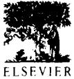

*l'rocev5 Biochemi.~'tJY* Vol. 33, No. *6,* pp. 663 670. 1908 <~) 19t~S Elsevier Science l,td. All rights reserved Printed in Great Britain *1~l132-tJ502/OS \$19.00* + 0.110

PII: **S0032-9592** (98)0003 I -4

# **An optimal model for microbial .growth in a multiple substrate environment: simultaneous and sequential utilization**

# Pankaj Doshi and **K. V.** Venkatesh*

Department of Chemical Engineering, Indian Institute of Technology. Bombay, Mumbai 41101176, India

(Rcceived 4 November 1997: reviscd version rcceivcd 2 Fcbruau 1998; accepted 14 February 1998)

### **Abstract**

A comprehensive optimal model has been developed to simulate microbial growth for simultaneous utilizalion of mixture of three substrate. The optimal strategy used to model microbial growth, which was developed by Venkatesh *et al. (Biotechnolog 3, attd Bioengineering* 56(6) 635-644, 1997) is extended to represent simultaneous and sequential growth phenomenon. The model prediction matches closely with the experimental growth data of *Escherichia colt* on a mixture of substrates inw~lving glucose and organic acids like lactate, pyruvate and acetate. The model is modified to explain multi-auxie growth with the help of an added constraint to the optimization formulation. The two constraints now represents two levels of control inside the cell. The modified model explains diauxic growth *of E. colt* on a mixture of glucose and lactose. A major feature of this work is to explain the growth of *E. colt* on a mixture of glucose, acetate and lactose which displays both sequential and simultaneous utilization of substrates. © 1998 Elsevier Science Ltd. All rights reserved.

*Ko'words.* optimal growth, flux towards growth. *E. colt KI2,* multiple substratc.

### **Nomenclature**

| B    | Biomass                                      |  |  |  |  |  |  |
|------|----------------------------------------------|--|--|--|--|--|--|
|      | Specific key enzyme concentration   |  |  |  |  |  |  |
|      | (IUg.biomass ~)                           |  |  |  |  |  |  |
| E    | Key enzyme for metabolizing S                |  |  |  |  |  |  |
| K    | Substrate saturation constant (g litre ~) |  |  |  |  |  |  |
| r    | Rate of reaction (glitre ~ h I)        |  |  |  |  |  |  |
| s    | Substrate concentration (g litrc 1)       |  |  |  |  |  |  |
| S.t. | Such that                                    |  |  |  |  |  |  |
| X    | Biomass concentration (g litre J)         |  |  |  |  |  |  |
| Y    | Biomass yield (gg ~)                      |  |  |  |  |  |  |
|      |                                              |  |  |  |  |  |  |

*Greek* 

#### :~ Fraction of cells growing on a specific substrate (control parameter)

*To whom all correspondence should be addressed. Tel. (091) (22) 578 2545 extn: 7223; fax: 091-22-578-3480: e-mail: venksOl'chc.iitb.ernet.in

fl First order degradation rate constant for E (h 1) ll Specific growth ratc (h ~)

| Subscript |
|-----------|

| ace  | Pertaining to acetate         |
|------|-------------------------------|
| glu  | Pertaining to glucose         |
| lac  | Pertaining to lactate         |
| lact | Pertaining to lactose         |
| i    | ith substrate                 |
| m, i | Maximum for the ith substratc |

#### *Supers'cript*

nl ax Maximum

#### **Introduction**

Modelling the kinetics of fermentation processes is a challenge for biochemical engineers and biotechnologists. In actual fermentation processes growth is normally on multiple substrates and can include both simultaneous and sequential utilization of various substrates. For any kinetic model to be truly representative of actual processes it should be tested for a substrate mixture containing more than two substrates. In the literature the emphasis has been mainly towards sequential growth. Some models consider triauxic growth and noteworthy of these are the matching law model developed by Kompala *et al.* [1] and the compartment model of Nielsen *et al.* [2]. There does not seem to be much data on microbial growth involving simultaneous utilization of three substrates. A detailed review of microbial growth of *Escherichia coli* on various substrates has been presented by Narang [3]. No study has been published on microbial growth which involves both simultaneous and sequential utilization of substrates. In a previous study Venkatesh *et al.*  [4] developed a microbial growth kinetic model based on an optimal strategy. The model was shown to represent growth of *E. coli* K12 involving simultaneous utilization of two substrates. The aim of this paper is to extend the previously developed model for a variety of growth situations. Growth can involve either sequential utilization or simultaneous utilization of substrates. This variation in growth phenomena is the result of thousands of reactions performed by a cell in order to utilize the substrates efficiently. In this paper, the growth situation of *E. coli* K12 on acetate, pyruvate and lactate, involving simultaneous utilization of these three substrates and diauxic growth on mixture of glucose and lactose are presented. A case is presented, where both simultaneous as well as sequential utilization of substrate occurs on a mixture of glucose, acetate and lactose.

# **Theory**

The basic postulates of optimal model were formulated in the earlier paper by Venkatesh *et al.* [4]. They are briefly stated as follows:

- (1) Each substrate is utilized by the microorganism through an independent pathway, consisting of several reactions in series, resulting in the formation of a common intermediate. This intermediate is utilized further in all metabolic reactions and these reactions can be collectively termed as a common pathway.
- (2) The utilization of any substrate by a microorganism can be attributed to the driving force and the resistance of the metabolic pathway. The combined effect of these two is the flux represented by the

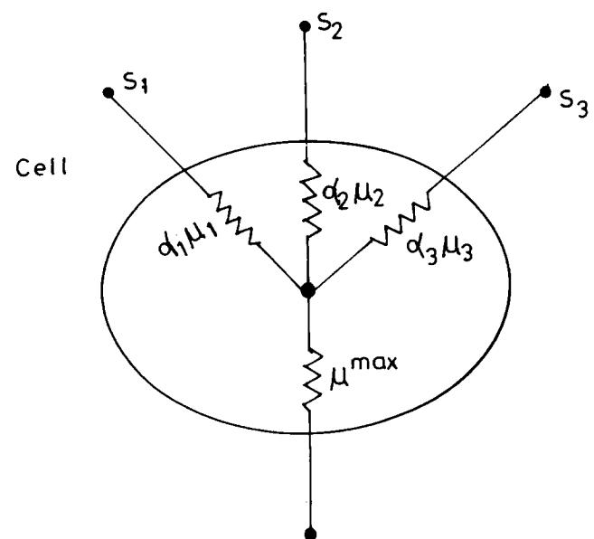

Fig. 1. Schematic representation of cell culture in a multiple substrate environment.

specific growth rate, /4,,.i, for that substrate as shown in Fig. 1.

- (3) For every independent pathway there are bottleneck reactions which offer resistance to flux flow and thus controls the flux in that pathway. For every microorganism the common pathway can have a maximum flow towards growth represented by ll ...... .
- (4) In the presence of multiple substrates, due to internal regulatory processes of the cell, only a fraction of the maximum flux will flow through the individual branches.
- (5) The complex regulatory policy of cell can be assumed to be the result of its policy to achieve some goal. A potential goal is maximization of specific growth rate. The flow through the individual branches should maximize the total specific growth rate without violating the constraint of maximum flux 1~ ..... in the common pathway.
- (6) The internal control structure of the microorganism can be broadly divided into two types:
	- (a) Metabolic control: metabolic control comes into play due to accumulation of certain metabolites in the network. This control results in the inhibition of some enzyme or synthesis of some enzyme in order to restore the intracellular flux balance. Such a situation will result in simultaneous utilization of substrates.
	- (b) Genetic control: genetic control is a higher level control resulting in the repression of a key enzyme required for the uptake of a substrate, by another. This control mainly comes into play in a multi-auxic growth.

#### **Model development**

Figure 1 shows a schematic representation of a cell culture in a multiple substrate environment. Model development was presented in detail in previous work [4,5]. Microbial growth on a single substrate is represented as follows:

$$
\mathcal{B} + \mathcal{S}_i \to (1 + Y_i)\mathcal{B} + \dots \tag{1}
$$

In the assimilation of the ith substrate by biomass it is assumed that there is one enzyme which plays the bottleneck role and hence this enzyme must be synthesized before substrate is utilized for the growth. The synthesis of this key enzyme E~ in the presence of S, can be represented as follows:

$$
\mathcal{B} \xrightarrow{\quad} \mathcal{E}_i + \mathcal{B}' \tag{2}
$$

whcre B' is the biomass excluding the key enzyme *E,.*  The rate expression for growth on the ith substrate is given by

$$
\mu_{\vec{\nu}} = \mu_{\vec{\nu}} \chi \tag{3}
$$

where

$$\mu_i = \frac{\mu_{m,i} \cdot \frac{\sigma_i}{\sigma_i^{\text{max}}} \cdot s_i}{\mathcal{K}_{s_i,i} + s_i} \tag{4}$$

In a single substrate environment, for the ith substrate the flux through the metabolic networks towards growth is given by the value of specific growth IG. In a multi-substrate environment because of the control of the metabolic network inside the cell, the flux flowing through a metabolic branch is regulated. Let ~, be the fraction of flux towards growth from the ith substrate. Then the total growth rate (r) is given by:

$$r = \frac{\text{d.v.}}{\text{d.t.}} = \sum_{i} \varkappa_{i} r_{i} \tag{5}$$

The specific key enzyme synthesis rate is formulated as follows

$$\frac{\mathbf{d}\frac{e_i}{e_i^{\text{max}}}}{\mathbf{d}t} = \mathbf{x}_i \frac{(\mu_{m,i} + \beta)\mathbf{s}_i}{K_{s,i} + \mathbf{s}_i} - \frac{e_i}{e_i^{\text{max}}} \stackrel{\text{d}}{\text{d}t} \ln(\mathbf{x}) - \beta \frac{e_i}{e_i^{\text{max}}} \tag{6}$$

It can be noted here that in the cybernetic model a variable u is defined to represent the control of enzyme synthesis. In the optimal model, the control parameter :< is multiplied [3,4]. The rate expression for substrate uptake is given by

$$\kappa(s_i) = -\varkappa_i \frac{r_i}{Y_i} \tag{7}$$

The fractions :~s are estimated using the optimality criterion. This optimality criterion represents the

micro-organism's complex regulatory process which aims at maximizing the overall specific growth rate. The maximization criterion is given as follows:

$$\max(\mu) = \max\left(\sum_{i} |\chi_{i}\mu_{i}|\right) \tag{8}$$

$$\begin{array}{c} \text{S.t. } 0 \le \mathbf{x}_i \le 1 \\\\ \sum_i \left| \mathbf{x}_i \mu_i \le \mu^{\max} \right. \end{array} \tag{9}$$

In a multi-substrate environment the net flux towards growth will be constrained by the maximum flux It ...... in the common pathway. This is rcprescntcd by the constraint for the optimization formulation which signifies the metabolic control in thc celT. Equations (3)-(9) represents the complete set of model equations. In order to solve the model equations involving more than two substrates it was necessary to estimate ~.,s simultaneously. This requires solving the optimization function at every instant, given by cqn (9). The model equations were solved for eve U At hours and the value of ~,s were determined at that instant using the optimality condition. The values of 7,~s were further used in model equations and they were integrated for the period of At using fourth order Runge-Kutta method. After integration the rates were obtained which were used in the optimization function to calculate ~.,s for the next interval. The value of the interval At was varied from 0.01 h to 0.1 h but since it did not change the results, it was kept constant at 0-05 h. Optimization was carried out using the MATLAB routine *CONSTR.* This procedure was carried out iteratively until substratc conccntration goes to zero. The model equations were solved for different initial conditions and parameters.

#### **Materials and methods**

#### *Otgunism and medium*

*E. coli* Kl2 obtained from Center for Culture Collection (IMTECH, Chandigarh, India) was used in all the experiments. The carbon free salts medium contained (NH4)eSO4 5-0glitre ~, (KHe)PO4 8.(Iglitre t MgSO4.SHeO 0.25 g litre ~, CaCI, 0411 g litre EDTA 0.(16 g litre ~, FeSO4"7HeO [I.(15 g litre ZnSOa.7H20 (I.001 g litre ' and MnSOa'7H20 0.(101 g litre ~ in all the experiments. The medium was prepared and autoclaved in separate parts. One part contained a concentrated solution of trace metals and EDTA and another contained the phosphate and ammonium salts. Concentrated carbon medium solutions were made containing only glucose, pyruvale, acetate, lactate and lactose. After autoclaving separately, these components are mixed together to give the required concentrations. Thc total carbon in the medium containing mixtures of these compounds was not allowed to exceed 6 g litrc J

The experimental details on inoculum preparation, fermentation and analysis are discussed elsewhere [4].

#### **Results and discussion**

# *Model parameter estimation*

Model parameters were estimated using single substrate batch growth batch data of *E. coli* KI2 on glucose, lactose, lactate, acetate and pyruvate under different preculturing conditions. The data in the exponential growth phase were used to estimate maximum specific growth rate *(IG.,,,)* and substrate saturation constant (K,,s). Then the initial enzyme concentration was fixed to yield minimum least square errors. The growth parameters for different substrates are listed in Table 1. The initial relative enzyme concentration (es/e~ ~×) for different preculturing conditions are listed in Table 2.

# *Simultaneous utilization o[ substrate ]'or growth*

The model eqns (3)-(9) were solved to simulate the growth of *E. coli* K12 on mixed substrates. The predictive capabilities of the developed model were tested by comparing model predictions with experimental data with three substitutable substrates in the medium. Figure 2 shows the experimental data and the model simulation for the growth of *E. coli* K12 on a mixture of lactate, pyruvate and acetate precultured on lactate. Figure 3 shows the substrate consumption profiles for the three substrates. The model prediction closely matched the experimental data. Figure 4 shows the total specific growth rate (it) and individual specific growth rate contributions from lactate (IG~,~.), pyruvate (l{pyr) and acetate (l~,~.~). The figure clearly demonstrates simultaneous utilization. The sum of the individual *lt,,,* is 0.89h ~ (0.3+(1.27+().32, as shown in Table 1) is greater than it ...... (0.76), but at any given instant the total specific growth rate (l~1-) is less than (p ...... ). Thus ~ for all the three substrate are equal to one and there is simultaneous utilization of substrates. This can be attributed to the dilution effect which reduces the specific enzyme levels and this further causes the reduction in *liT.* Therefore the maximum It7 of 0.5 h n is reached and this is greater than the individual It,,, for the three substrates. This demonstrates that cell capacity remains underutilized when growth is on any one of the three substrates alone.

Figure 5 shows the experimental data and model prediction for the growth of *E. coli* K12 on a mixture of glucose, acetate and lactate, with preculturing on glucose. The profile demonstrates a diauxic growth curve. Figure 6 shows the substrate consumption profile for the three substrates. The model prediction again closely matched the experimental data. Lactate was effectively not consumed in the presence of glucose but initial glucose and acetate were consumed simultaneously. Figure 7 shows the total specific growth rate *(ItT)* and individual growth rate contribution from glucose (pgh,), acetate (it~,~) and lactate (lq~,~). Initially the cells grow on both glucose and acetate at a (FtT.) of 0.76h ~ and pyruvate was not consumed until the glucose concentration decreased substantially. After the glucose concentration decreased both the acetate and lactate were consumed at a specific growth rate of about 0.15h J. The biomass profile is, therefore, diauxic in nature. Figure 8 shows the predicted profiles of ~ for acetate (~,,.~) and lactate (~,~). Initially the uptake of both acetate and lactate was regulated to allow growth preferentially on glucose. Since acetate had a higher growth rate it is preferred to lactate. The

Table I. Model parameters for growth of *E. coli* K12 in a single substrate environment

| Parameter | Glucose | Acetate | Lactate | Pyruvate | Lactose | Units   |
|-----------|---------|---------|---------|----------|---------|---------|
| F~,,,     | 0'76    | 0.32    | 0-3     | 0.27     | 0.68    | h -     |
| Ks        | 0.04    | 0.1     | 0.05    | 0.01     | 0.43    | g litre |
| Y~c~s     | 0"446   | 0'12    | (i.14   | (/'155   | 1"94    | g g i   |

Table 2. Initial relative enzyme level *[(e'/)/(e'?'~'~)]* for different preculturing conditions for growth of *E. coli* K12 in a single substrate environment

| Precultured on |         |         | Grown on |          |         |
|----------------|---------|---------|----------|----------|---------|
|                | Glucose | Acetate | Lactate  | Pyruvate | Lactose |
| Glucose        | 0-98    | 0'05    | 0.05     | 0.01     | (t. 15  |
| Acetate        | (I-62   | 0.76    | 0.15     | (I.05    | -       |
| Lactate        | 0.76    | 0.10    | 0.80     | 0.005    | -       |
| Pyruvate       | 0"001   | 0,001   | 0.(101   | (I.92    | -       |

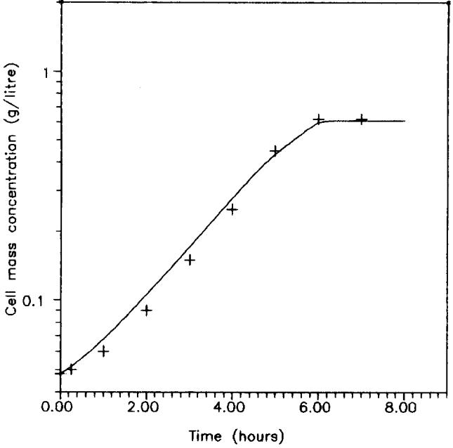

Fig. 2. E×perimental data and model simulation of cell concentration for growth of *E. coli* KI2 on lactate (1.0 g litre '), pyruvate (l'2glitrc ') and acetate (2glitrc ') with prcculluring on lactate.

value of :q.~. was rendered zero and its uptake took place only at lower wdues of glucose concentration. One important thing that can be noted is that the control could be due to metabolic control and it therefore does not demonstrate an absolute preference for one substratc over another, as in the case of triauxic growth due to catabolic repression.

Fig. 3. Experimental data and model simulation of substrata concentration for growth of *E. coli* KI2 on lactate (1-Oglitrc '), pyruvate (l'2glitre ~) and acetate (2glilre ')withprcculturingonlactate.

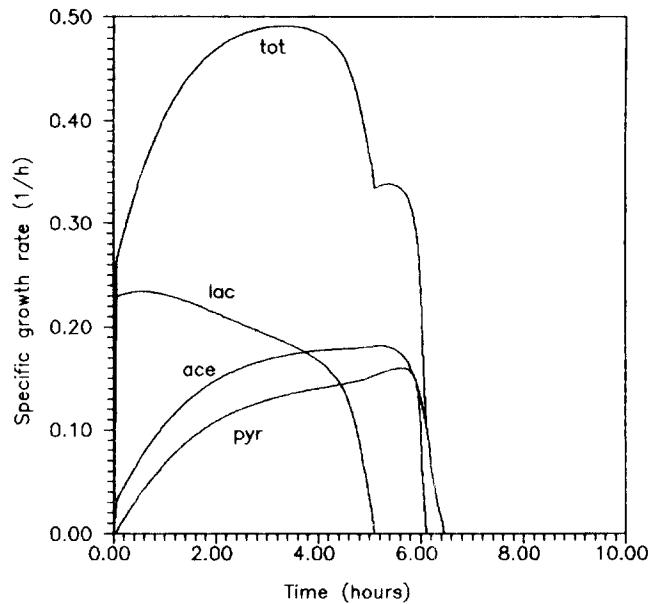

Fig. 4. Modcl prediction of spccilic growth rates Ill ..... tq .... I~ ...... and t~ for growth of E. coil KI2 on lactate (l-Oglitrc '), pyruvate (I.2glitrc ]) and acetatc (2 g litrc ~) with preculturing on lactate.

#### *Sequential utilization cq" suhstrate /or growth*

The developed model was uscd to dcmonstrate the dynamics associated with diauxic growth. Figure 9 shows the model prediction and experiment value for the growth of *E. coli* on glucose and lactose mixture. Although the model predicts diauxic growth, it was not able to represent a prolonged lag phase existing between the uptake of thc two substratcs, due to the

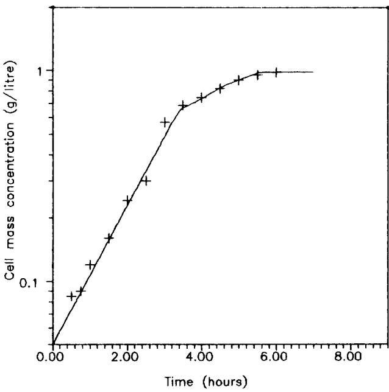

Fig. 5. Experimental data and model simulation of cell mass concentration for growth of E. coh K12 on glucose (l'2glitre ]), acetate (l'4glitrc t) and lactate (I.62 g litre t) with preculturing on glucose.

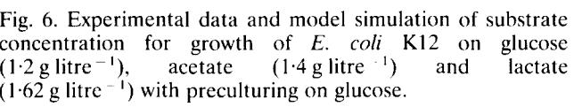

**0.o,,"o** ........ ' ...... Li. .... ........ ' .... **.0 2.00 ~4'.~0 "6'.~0 8.00** 

**Time (hours)** 

2.00 xxxxx **Acetate concentration T ***~* Lactate concentration** 

'~1~" Glucose concentration

fact that the model developed contains regulation based on the metabolic control whereas in this case control is through a genetic switch *(lac-operon).* The model is, therefore, not able to represent the genetic switch that regulates the synthesis of the key enzymes required for lactose uptake. This control at the genetic level (catabolic repression) can be represented by another constraint added to the optimization function of eqn (8) (as developed by Doshi *et al.* [5]). In this case since the cell completely shuts off the uptake of

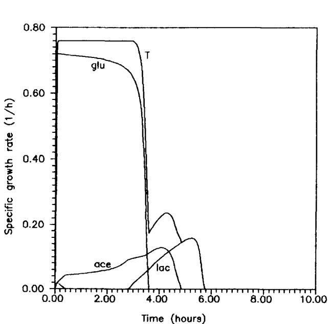

Fig. 7. Model Prediction of specific growth rates th ..... ,/lpyr, *I~ ......* and */~r* for growth of *E. coil* K12 on glucose (1-2glitre ~), acetate (l.4glitre ~) and lactate (1.62 g litre ~) with preculturing on glucose.

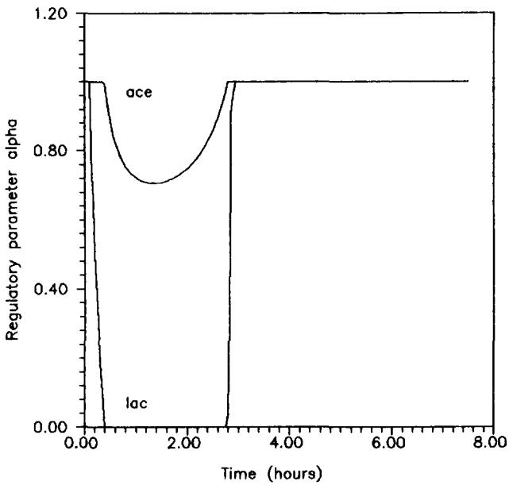

Fig. 8. Model prediction of control parameters ~ *......* and z~l,,~ for growth of *E. co6* KI2 on glucose (l'2glitre ~), acetate ( 1-4 g litre t) and lactate (1"62 g litre t) with preculturing on glucose.

the less preferred substrate, therefore the constraint can be given by

$$\sum_{i} \mathcal{X}_{i} = 1 \tag{10}$$

The model equations were solved with the added constraint as given by eqn (10). The model can represent the diauxic curve accurately as shown in Fig. 10. The cybernetic model to represent microbial growth recog-

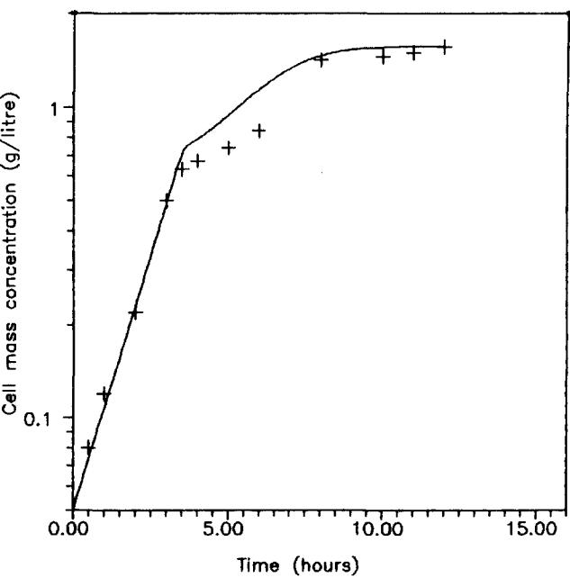

Fig. 9. Experimental data and model simulation of cell mass concentration for growth of *E. coil* K12 on glucose (1"4 g litrc ~) and lactose (2.1 g litre ~) with preculturing on glucose (model without genetic control).

1.50 °_ o r u

1.00

..Q c~ 0.50

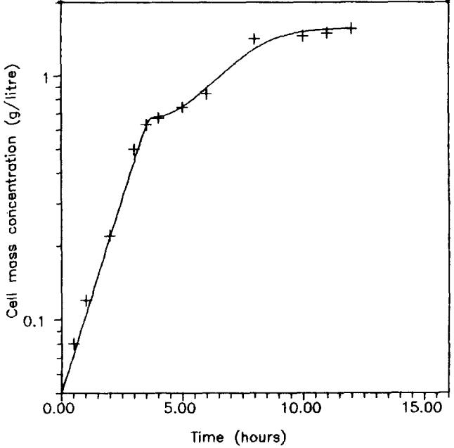

Fig. 10. Experimental data and model simulation of cell mass concentration for growth *of E. colt* K12 on glucose (1"4 g litre J) and lactose (2"1 g litre i) with preculturing on glucose (model with genetic control).

nizcs that the metabolic regulation of bioprocesses is mediated through the control of enzyme synthesis and enzyme activity. These controls arc through cybernetic variables tt and v [61 . Figure 11 compares the profile for the relative key enzyme values as calculated from the developed model to that from the cybernetic model. It is clear that the two match perfectly well. The model variable ~., can be used instead of the two cybernetic variables u and v to represent diauxic growth anti the model can be easily extended to mixtures involving more than two substratc.

It will bc interesting to predict the growth curve when growth is on a mixture of glucose, htctose and acetate. Growth on glucose and lactose is characterized by genctic control though the hw-operon while growth on glucosc and acetate is characterized mainly by metabolic control. The model equations were solved using the fl~llowing two constraints representing two levels of control.

$$
\mu_{\text{j5/ft}} \mu_{\text{j5/ft}} + \mu_{\text{in} \times 1} \mu_{\text{in} \times 1} + \chi_{\text{in} \times \text{s}} \mu_{\text{in} \times \text{s}^*} \le \mu_{\text{in} \times \text{s}} \tag{11}
$$

$$
\chi^{\text{j5/ft}} + \chi^{\text{j5/ft}} = \chi
$$

Figure 12 shows the cell mass growth profile on a mixture of glucose (0-98glitre '), lactose (1.4g litrc ') and acetate (2-2glitre [). 3-he model is able to predict the growth on this combination very well. The type of constraints to be used for a substrate pair needs to be known *a priori.* Figure 13 shows the substratc consumption profile for the three substratcs. Figure 14 shows the predicted specific growth rate contributions for glucose, acetate and lactose namely l~w,, i~ ...... and */th,~t,* respectively, it is clear from the figure that lq,~,, remains zero until the glucose concentration is reduced, but acetate is utilized at a low rate even in the presence of glucose. The control of the regulation of lactose uptake is due to a genetic switch operating in the presence of glucose. It appears that such a control does not exist between glucose-acetate and lactose-

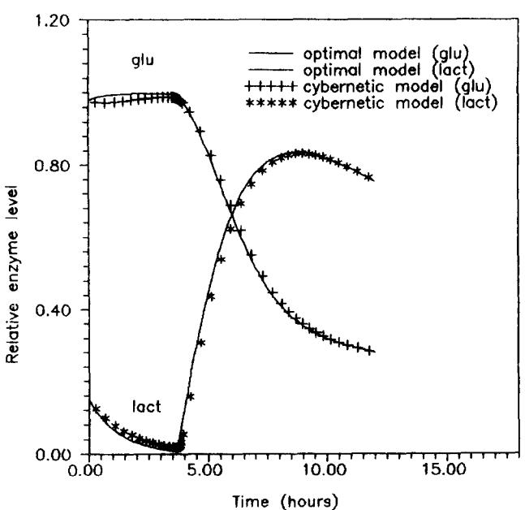

Fig. 11. Comparison of relative enzyme level profile for cybernetic model and the developed optimal model for growth of E. col K12 on glucose (l'4glitre i) and lactose (2"1 g litrc ') with preculturing on glucose.

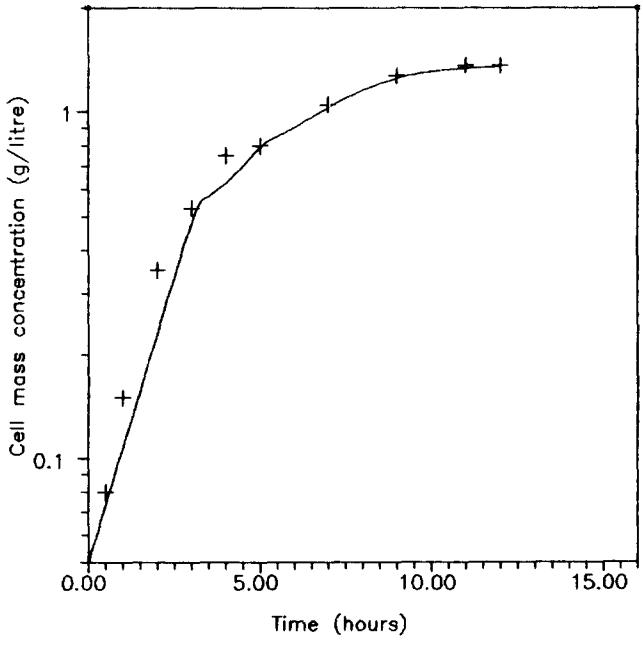

Fig. 12. Experimental data and model simulation of cell mass concentration for growth of *L. colt* KI2 on glucose (1.Oglitrc ') and acetate (2'2 g litre ~) and lactose (l'4glitrc t)withpreculmringonglucose.

Fig. 13. Experimental data and model simulation of substrate concentration for growth of *E. coli* KI2 on glucose (l.0glitre ~) and acetate (2.2glitre ~) and lactose (1.4 g litre ~) with preculturing on glucose.

acetate systems, although for these systems some metabolic control seems to be existing. This gives direct evidence of two levels of control acting inside a microbial cell.

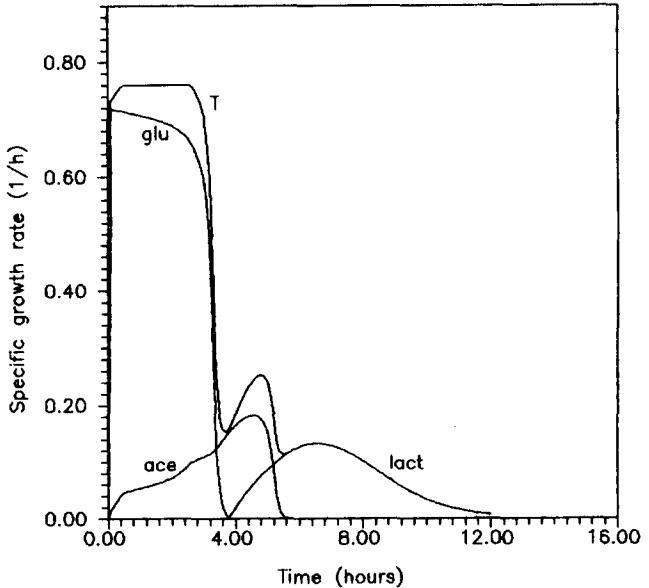

Fig. 14. Model prediction of specific growth rates ,tdgtt,, *tl* ...... th,,,., and *#r* for growth of *E. coli* K12 on glucose (l'0glitre ~) and acetate (2-2glitre ~) and lactose (1.4 g litre ~) with preculturing on glucose.

#### **Conclusion**

In the present work we have extended previously a developed optimal model [4] to represent the simultaneous utilization of three substrates by microorganism. The model simulation have closely matched the batch growth data of *E. coli* KI2 on substrate mixtures involving glucose, lactate, acetate and pyruvate. The model has been further modified to represent both sequential and simultaneous utilization of multiple substrate by microorganisms. The modified model explains the diauxic growth of *E. coli* KI2 on a mixture of glucose and lactose. The model simulation is in agreement with the cybernetic model [6]. Thus the regulatory parameter of the developed model :~ can represent the combined effect of two parameters of the cybernetic model namely u and v. The model predicts an interesting growth situation which involves the growth of *E. coli* KI2 on mixture of glucose, acetate and lactose. The catabolic repression of lactose by glucose and simultaneous utilization of glucose-acetate and lactose-acetate are very well represented by the model predictions and shows the existence of two level of control inside a microbial cell. Such models can represent the real situation involving microbial growth on multiple substrates undergoing sequential and simultaneous utilization.

#### **References**

- 1. Kompala, D. S., Ramkrishna, D. and Tsao, G. T., Cybernetic modeling of microbial growth on simple substrates. *Biotechnology and Bioengineering* 1984, 26, 1272-1281.
- 2. Nikolajsen, K., Nielsen, J. and Villadsen, J., Structured modeling of a microbial system: lIl. Growth on mixed substrates. *Biotechnology and Bioengineering* 1991, 38, 24-29.
- 3. Narang, A., Simultaneous utilization of carbon sources. Ph.D. thesis, Purdue University, West-Lafayette, IN, U.S.A., 1994.
- 4. Venkatesh, K. V., Doshi, P. and Rengasamy, R., An Optimal strategy to model microbial growth in multiple substrate environment. *Biotechnology and Bioengineering* 1997, 56(6), 635-644.
- 5. Doshi, P., Rengasamy, R. and Venkatesh, K. V., Modelling of microbial growth for sequential utilization in a multisubstrate environment. *Process Biochemist O,* 1997, 32(8), 643-650.
- 6. Kompala, D. S., Ramkrishna, D., Jansen, N. B. and Tsao, G. T., Investigation of bacterial growth on multiple substrates: experimental evaluation of cybernetic models. *Biotechnology and Bioengineering*  1986, 28, 1044-1055.