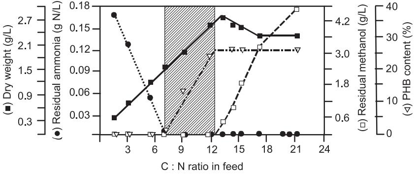
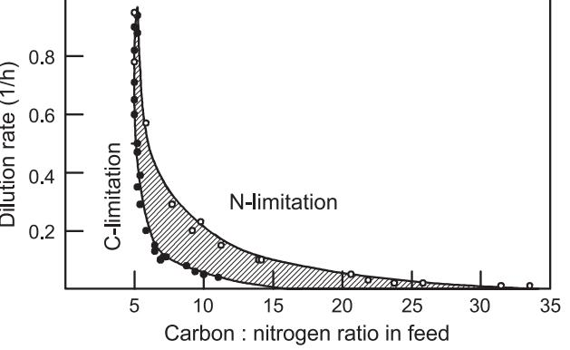
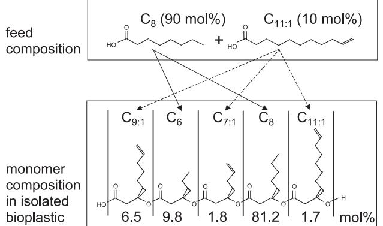

Biotechnology Advances 22 (2003) 35 – 43

www.elsevier.com/locate/biotechadv

# The concept of multiple-nutrient-limited growth of microorganisms and its application in biotechnological processes

Thomas Egli *, Manfred Zinn1

Department of Microbiology, Swiss Federal Institute for Environmental Science and Technology (EAWAG), P.O. Box 611, Uberlandstrasse 133, CH-8600 Du¨bendorf, Switzerland

#### Abstract

The ''law of the minimum'' (Liebig's law) states that usually one nutrient restricts the maximum quantity of biomass that can be produced within a system, whereas all other nutrients are in excess. This general rule has been applied also to the growth of microorganisms, e.g., by adjusting the relative concentrations of the individual nutrients in growth media such that one of them, in the case of heterotrophic microbes, usually the carbon source, determines the maximum cell density that can be obtained in a culture. However, experimental data demonstrated that growth of microbial cultures can be limited simultaneously by two or more nutrients. These authors reported that during growth of bacteria and yeasts at a constant dilution rate in the chemostat, three distinct growth regimes were recognised as a function of the C:N ratio in the inflowing medium: (1) a clearly carbon-limited regime with the nitrogen source in excess, (2) a transition (''double-nutrient-limited'') growth regime where both the carbon and the nitrogen source were below the detection limit, and (3) a clearly nitrogen-limited growth regime with the carbon source in excess. Subsequent calculations suggested that the extension and position of this double-nutrient-limited zone should be strongly dependent on the imposed growth rate: Whereas it is very narrow at high growth rates it should become very broad during slow growth. This pattern as a function of growth rate has now been confirmed for a number of different organisms.

In industrial processes, microbial growth is always in some way controlled by the limited availability of nutrients, and limitation of specific nutrients is frequently used to force microbial cultures into a productive physiological state. This article will discuss what the

0734-9750/\$ - see front matter D 2003 Elsevier Inc. All rights reserved. doi:10.1016/j.biotechadv.2003.08.006

* Corresponding author. Tel.: +41-1-823-51-58; fax: +41-1-823-55-47.

E-mail address: egli@eawag.ch (T. Egli). 1 Present address: Swiss Federal Laboratories for Materials Testing and Research (EMPA), Lerchenfeldstrasse 5, 9014 St. Gallen, Switzerland.

consequences of multiple-nutrient-limited growth are for industrial processes and how the concept might be applied. Specific examples will be given that demonstrate the advantages and the potential of multiple nutrient-limited growth conditions for industrial production processes.

D 2003 Elsevier Inc. All rights reserved.

Keywords: Limitation; Continuous culture; Growth; Multiple nutrient limitation; Carbon; Nitrogen

# 1. Introduction

Cultivation conditions strongly influence the cellular composition and metabolic performance of microbial cells. [Herbert (19](#page-7-0)61) summarised this in the early 60s in this way: ''There are few characteristics of microorganisms which are so directly and markedly affected by the environment as their chemical composition. So much is this the case that it is virtually meaningless to speak of the chemical composition of a microorganism without at the same time specifying the environmental conditions that produced it.'' One of the most important parameters that influence cell composition and performance is the availability of nutrients. In fact, restriction of specific nutrients is used in many biotechnological processes to induce and optimise microbial product formation. Good examples are the use of phosphate-limited growth conditions to enhance production of certain antibiotics or that of citric acid by cultivating the culture under Fe-, Mn- and/or Zn-limited growth conditions [(Calam, 19](#page-6-0)86).

Media used for controlled cultivation of microbial cultures are usually designed such that one particular nutrient restricts (''limits'') the maximum quantity of biomass that can be produced, whereas all other nutrients are available in excess. The design of growth media is based on the ''law of the minimum'' proposed by Justus von Liebig around 1840 [(von Liebig, 18](#page-8-0)43). Based on this principle, it is assumed in microbiology that it is always one particular nutrient that determines the maximum amount of biomass that can be produced in defined growth medium. However, there are many experimental studies in the literature indicating that in contrast to Liebig's principle, growth of microbial cultures can be limited by two or even more nutrients simultaneously. In this contribution, the experimental evidence that exists for this will be reviewed, and it is illustrated how such multiple-nutrient-limited growth conditions influence the composition and performance of microbial cells. It will also be demonstrated how controlled limitation by multiple nutrients can be applied to biotechnological processes for optimisation and enhancement of product formation.

It should be mentioned at this point that in microbiology the term ''limitation of growth'' is used in two different ways. On one hand it is employed in a stoichiometric sense; that is, it indicates that a certain amount of biomass is synthesised from a particular nutrient (or element). This is reflected in the growth yield constants for the different elements, which are documented in the literature (e.g., [Pirt, 19](#page-7-0)75). On the other hand, this expression is also used to indicate that the microbial specific rate of growth, l, is controlled by the extracellular concentration (s) of a particular growth substrate, as described, for example, by the equation l = lmaxs/(Ks + s) proposed by Mo[nod (1942). Th](#page-7-0)e present discussion is limited to the former, the stoichiometric concept of limitation.

# 2. The phenomenon

Already in the 70s a number of experimental reports were available which indicated that growth of microbial cultures may be simultaneously limited by two or more nutrients (Ha[rrison, 1972; Cooney et al., 1976; Hueting and Tempest, 1979). Cle](#page-7-0)ar experimental evidence for this was then provided in the 80s for both bacterial and yeast cultures (Eg[li, 1982; Egli and Quayle, 1986; Gra¨zer-Lampert et al., 1986; Minkevich et](#page-7-0) al., 1988; Duchars and Attwood, 1989; Rutgers et al., 1990). An example for the observations reported by all these researchers is given in Fig. 1 for growth of a bacterium in chemostat culture at a constant dilution rate fed with media of different C:N ratios (Gr[a¨zer-Lampert et al., 1986). Th](#page-7-0)e data indicate, based on the levels of residual carbon and nitrogen sources and the cellular composition, three distinct zones of growth:

- 1. A carbon-limited growth regime with nitrogen in excess at C/N < 7.1,
- 2. A nitrogen-limited growth regime with carbon in excess at C/N>12.6, and
- 3. A transition zone with neither carbon nor nitrogen in excess at C/N medium feed ratios 7.1 < C/N < 12.6.

It is striking that although growing apparently nitrogen-limited according to Liebig's law at C/N>7.1, the biomass concentration in the culture continued to increase linearly when additional carbon was added to the feed medium. It was shown that this increase in biomass was mainly due to the accumulation of intracellular reserve material PHB (Gr[a¨zer-Lampert et al., 1986).](#page-7-0)

Fig. 1. Concentrations of residual substrates and cellular polyhydroxybutyrate (PHB) content in a culture of Hyphomicrobium ZV620 cultivated with methanol and ammonia in a chemostat at a constant dilution rate (D = 0.054 h 1 ), as a function of the C:N ratio in the feed medium. Note that in this experiment the concentration of nitrogen in the feed medium [s0 (NH4 + -N = 223 mg L 1 )] was kept constant whereas s0 (methanol) was increased stepwise. Adapted from Gra¨z[er-Lampert et al. (1986).](#page-7-0)

# 3. A concept for the prediction of multiple-nutrient-limited growth regimes

The fact that zones of transition between two clearly limited growth regimes similar to that shown in [Fig](#page-2-0). 1 have been reported for both bacterial and yeast cultures (see references cited above) raises the question of whether the range and position of regimes of nutrient limitation can be predicted. An empirical approach proposed by [Egli a](#page-7-0)nd Quayle (1986) allows the prediction of boundaries of limitation regimes for the growth of microbial cultures in continuous culture simply from the growth yields of the growthlimiting nutrients determined under single-nutrient-limited growth conditions. The approach taken is illustrated in [Fig](#page-2-0). 1 for the growth of the Hyphomicrobium strain in chemostat culture with methanol and ammonia. In this example, the dry biomass concentration (x) formed under carbon-limited growth conditions can be calculated using Eq. (1) from the carbon utilised (i.e., the difference between the concentration of carbon source in the feed, c0, and the actual carbon source concentration in the culture, c) and the growth yield factor for the substrate ( YX/C) measured during carbon-limited growth at the set dilution rate. Alternatively, the dry biomass concentration can be calculated from the nitrogen utilised (n0 n) and the corresponding growth yield factor YX/N measured during carbon-limited growth conditions. Considering now that during growth at the border between carbon limitation and the transition zone the concentration of both, the carbon as well as the nitrogen source, is very low compared to the inflowing concentrations of these nutrients, Eq. (1) can be rearranged to obtain the c0/n0 ratio in the feed medium [Eq. (2)].

$$\mathbf{x} = (c_0 - c)Y_{\mathbf{X}/\mathbf{C}} = (n_0 - n)Y_{\mathbf{X}/\mathbf{N}} \tag{1}$$

$$c_0/n_0 \cong Y_{\mathcal{X}/\mathcal{N}}/Y_{\mathcal{X}/\mathcal{C}}\tag{2}$$

Hence, it follows that for the prediction of the boundaries of the nutrient limitation regimes only the growth yields measured under either carbon- (for the left boundary) or nitrogen-limited conditions (for the right boundary) have to be known. A comparison between predicted and the experimentally observed boundaries is given in Table 1. The predicted boundaries of the transition zone between feed c0/n0 ratios of 7.3 and 12.8 correspond nicely with the observed experimental values (see a[lso](#page-2-0) Fig. 1).

The outlined concept implies that for a combination of two nutrients, S1 and S2, a zone of dual nutrient-limited growth should be observed always if the growth yields for the substrates, YX/S1 and YX/S2, differ under S1- and S2-limited growth conditions. This is

Table 1

Predicted and experimentally observed boundaries for single- and dual-substrate (carbon/nitrogen)-limited growth of Hyphomicrobium ZV620 with methanol and ammonium at a constant dilution rate of 0.054 h 1 in the chemostat

| Growth conditions | YX/C | YX/N  | Boundary predicted at c0/n0 | Boundary observed at c0/n0 |
|-------------------|------|-------|--------------------------------|-------------------------------|
| C-limited         | 0.99 | 7.19  | 7.2                            | 7.1                           |
| N-limited         | 0.80 | 10.30 | 12.8                           | 12.6                          |

Experimental data from [Gra¨zer-Lampert et al. (1986).](#page-7-0)

irrespective of the reason for the change in growth yield (e.g., be it accumulation of reserve materials, excretion of a product, increased dissimilation, or maintenance requirement). Furthermore, the concept implies that the wider the range within the growth yields can vary, the more extended the transition zone will become. Because differences in cellular composition are usually more pronounced at low growth rates (He[rbert, 1976)](#page-7-0) one would expect more extended transition growth regimes at slow growth.

# 4. The dual-nutrient-limited zone of growth at different growth rates

The fact that the boundaries of nutrient-limited zones of growth can be derived simply from the growth yields allowed the prediction of the position and extension of the zone of glycerol/ammonia-limited growth of Klebsiella pneumoniae from literature data (Egl[i,](#page-7-0) 1991). The results obtained are shown in Fig. 2; they illustrate that the extension of the carbon/nitrogen-limited zone depends strongly on the growth rate of the culture. At specific growth rates close to lmax, the zone is predicted to be very narrow. However, during growth at low dilution rates a rather extended zone of simultaneously carbon/ nitrogen-limited growth should be observed, and, at the same time, the zone should shift to higher c0/n0 feed ratios (mainly due to increased maintenance energy requirements resulting in lower yields for carbon). An important consequence of this behaviour would be that cultivation of K. pneumoniae with a medium of a c0/n0 ratio of 8 would result in carbon-limited growth at low dilution rates, whereas with the same medium, growth should become nitrogen-limited at higher dilution rates.

The existence of dual-nutrient-limited transition zones between single-nutrient-limited growth regimes has recently been confirmed for a number of different nutrient combinations and microorganisms, including Gram-negative and Gram-positive bacteria, and yeasts (Al[-Awadhi et al., 1990; Bonting et al., 1992; Durner et al., 2000; Egli and Quayle,](#page-6-0)

Fig. 2. Predicted dual-nutrient-limited zone at different dilution (growth) rates during the cultivation of K. pneumoniae in continuous culture with glycerol and ammonia, as a function of the c0/n0 ratio in the inflowing medium. Closed circles indicate data pairs below which growth should be carbon-limited, open circles those above which it should be nitrogen-limited. Adapted from Egli [(1991).](#page-7-0)

1986; Frank, 1999; Hao and Chang, 1987; Lucca et al., 1991; Pengerud et al., 1987; Pin˜ar et al., 1998; von Stockar et al., 1995). However, the information is limited in most cases to one particular growth rate, and we are only aware of two reports where the extension and position of the transition zone has been investigated in dependence of the growth rate [(Minkevich et al., 1988; Durner et al., 20](#page-7-0)00).

# 5. Application to biotechnological processes

All the information available to date on the growth of microbial cultures under multiple-nutrient-limited conditions confirms that the composition and metabolic performance of microbial cells is quite flexible and that it can be controlled and manipulated to a great extent by medium composition and cultivation conditions. Although the use of growth control by multiple-nutrient-limited cultivation conditions has hardly been considered so far for the application in biotechnological processes, we would like to illustrate its potential in an example. As demonstrate[d in](#page-2-0) Fig. 1 for Hyphomicrobium ZV620, many microorganisms accumulate polyhydroxyalkanaotes (PHA) as a reserve material during growth under dual- and nitrogen-limited growth conditions. This polymer has plasticlike properties, is biodegradable, and is therefore often referred to as ''bioplastic'' [(Zinn et](#page-8-0) al., 2001). It was shown that PHA-accumulating bacteria are able to introduce many different derivatives of linear alkanes and alkanoates into the polymer and that this leads to different material properties [(Steinbu¨chel, 19](#page-8-0)91).

In our laboratory we have studied the production of PHAs in Pseudomonas oleovorans and of polyhydroxybutyrate/valerate (PHB/HVs) in Ralstonia eutropha from different alkanoic acids. We found that the tailoring of the composition of bioplastics can be easily achieved under dual (carbon/nitrogen)-limited conditions [(Durner, 1998; Zinn et](#page-7-0) al.,

Fig. 3. Production of tailored bioplastic in P. oleovorans GPo1 during growth in the dual-nutrient (carbon/ nitrogen)-limited zone with a mixture of octanoate (C8) and 10-undecenoate (C11:1). The culture was grown at a dilution rate of 0.1 h 1 and a carbon/nitrogen ratio in the feed of 15 (mol/mol). Monomers in the bioplastic originating from C8 were C8 and C6, those originating from C11:1 were C11:1, C9:1 and C7:1 due to the oxidation in the fatty acid beta oxidation cycle. (Results from Zinn M, Weilenmann HU, Hany R, Egli T, unpublished).

2003). The method is based on the fact that during growth in the transition phase the cells are still utilising all the carbon fed (compare Fig. [1). H](#page-2-0)ence, when P. oleovorans was cultivated in the carbon/nitrogen-limited zone and fed with different mixtures of octanoate/nonanoate the composition of the intracellularly accumulated PHA perfectly reflected the composition of the mixture of octanoate/nonanoate in the feed medium (Du[rner, 1998). Si](#page-7-0)milar results were obtained with mixtures of octanoate plus 10 undecenoic acid as demonstrated in Fig. [3. Re](#page-5-0)cently, this was confirmed for the tailored synthesis of PHB/HVs of different composition in R. eutropha fed with different mixtures of butyrate plus valerate (Zi[nn et al., 2003). Th](#page-8-0)ese examples demonstrate the enormous potential of multiple-nutrient-limited growth conditions for an easy and reproducible tailoring of bioplastics of different composition, also from carbon substrates that exhibit cellular toxicity at enhanced concentrations or even from (toxic) substrates that do not support growth.

# 6. Outlook

So far, the influence of defined multiple-nutrient-limited cultivation conditions on microbial physiology and their significance and potential for application in both industrial and environmental biotechnological processes (Eg[li, 1997)](#page-7-0) has hardly been investigated. Hence, properties, metabolic performance, and potential of cells cultivated under such conditions are mostly unknown, unexplored, and unexploited. However, there is considerable evidence in the literature that the use of controlled multiple-nutrient-limited cultivation conditions can lead to better process performance (particularly with toxic substrates; Jun[g, 1999) and](#page-7-0) increased enzyme productivity (Eg[li and Quayle, 1986). The](#page-7-0) authors are convinced that understanding and applying the concept of multiple-nutrientlimited growth will contribute to a better control of the performance of microbial cultures under environmental (Eg[li, 1997; Frank, 1999)](#page-7-0) and industrial conditions.

# Acknowledgements

The research reported on the tailored synthesis of bioplastics was supported by the Swiss National Science Foundation (Special Priority Program in Biotechnology, Project number 5002-057806/1).

# References

Al-Awadhi N, Egli T, Hamer G, Mason CA. The process utility of thermotolerant methylotrophic bacteria: I. An evaluation in chemostat culture. Biotechnol Bioeng 1990;36:816 – 20.

- Bonting C, van Veen H, Taverne A, Kortstee G, Zehnder AJB. Regulation of polyphosphate metabolism in Acinetobcter johnsonii 210A grown in carbon- and phosphate-limited continuous culture. Arch Microbiol 1992;158:139 – 44.
Calam CT. Physiology of the overproduction of secondary metabolites. In: Vanek Z, Hostalek Z, editors. Overproduction of microbial metabolites. Boston: Butterworth; 1986. p. 27.

- Cooney C, Wang DIC, Mateles RI. Growth of Enterobacter aerogenes in a chemostat with double nutrient limitations. Appl Environ Micobiol 1976;31:91 – 8.
- Duchars MG, Attwood MM. The influence of the carbon:nitrogen ratio of the growth medium on the cellular composition and regulation of enzyme activity in Hyphomicrobium X. J Gen Microbiol 1989;135:787 – 93.
- Durner RA. Feast and starvation: accumulation of bioplastic in Pseudomonas oleovorans. PhD thesis No 12591, Swiss Federal Institute of Technology, Zu¨rich, Switzerland; 1998.
- Durner R, Witholt B, Egli T. Accumulation for poly[(R)-3-hydroxyalkanoates] in Pseudomonas oleovorans during growth with octanoate in continuous culture at different dilution rates. Appl Environ Microbiol 2000;66:3408 – 14.
- Egli T. Regulation of protein synthesis in methylotrophic yeasts: repression of methanol dissimilating enzymes by nitrogen limitation. Arch Microbiol 1982;131:95 – 101.
- Egli T. On multiple-nutrient-limited growth of microorganisms, with special reference to dual limitation by carbon and nitrogen substrates. Antonie van Leeuwenhoek 1991;60:225 – 34.
- Egli T. Multiple-nutrient-limited growth of microorganisms: what are the consequences for bioremediation processes. In: Verachtert H, Verstraete W, editors. Environmental Biotechnology, Part I, International Symposium Environmental Biotechnology. Gent, Belgium: Technologisch Instituut; 1997. p. 189 – 93.
- Egli T, Quayle JR. Influence of the carbon:nitrogen ratio of the growth medium on the cellular composition and the ability of the methylotrophic yeast Hansenula polymorpha to utilise mixed carbon sources. J Gen Microbiol 1986;132:1779 – 88.
- Frank SE. Growth characteristics of Acinetobacter johnsonii 210A under single and dual nutrient limitation, with special reference to carbon, nitrogen and phosphorus. PhD thesis No 13407, Swiss Federal Institute of Technology, Zu¨rich, Switzerland; 1999.
- Gra¨zer-Lampert S, Egli T, Hamer G. Growth of Hyphomicrobium ZV620 in the chemostat: regulation of NH4 + -assimilating enzymes and cellular composition. J Gen Microbiol 1986;132:3337 – 47.
- Hao OJ, Chang CH. Kinetics of growth and phosphate-uptake in pure culture studies of Acinetobacter species. Biotechnol Bioeng 1987;29:819 – 31.
- Harrison DEF. Physiological effects of dissolved oxygen tension and redox potential on growing populations of microorganisms. J Appl Chem Biotechnol 1972;22:417 – 40.
- Herbert D. The chemical composition of microorganisms as a function of their growth environment. In: Meynell CG, Gooder H, editors. Microbial reaction to the environment. Cambridge: Cambridge University Press; 1961. p. 391 – 416.
- Herbert D. Stoichiometric aspects of microbial growth. In: Dean ACR, Ellwood DC, Evans CGT, Melling J, editors. Applications and new fields. Continuous Culture, vol. 6. Chichester: Ellis Horwood; 1976. p. 1 – 30.
- Hueting S, Tempest DW. Influence of the glucose input concentration on the kinetics of metabolite production by Klebsiella aerogenes NCTC 418: growing in chemostat culture in potassium- or ammonia-limited environments. Arch Microbiol 1979;123:189 – 99.
- Jung K. Synthesis of functionalized poly(3-hydroxyalkanoates) (PHAs) from organic solvents by Pseudomonas oleovorans. PhD thesis No 13495, Swiss Federal Institute of Technology, Zu¨rich, Switzerland; 1999.
- Lucca ME, Romero ME, Ricci JCD, Garro OA, Callieri DAS. Composition and morphology of Candida utilis grown in continuous culture with decreasing concentrations of phosphate. World J Microbiol Biotechnol 1991;7:359 – 64.
- Minkevich IG, Krynitskaya AY, Eroshin VK. A double substrate limitation zone of continuous microbial growth. In: Kyslik P, Dawes EA, Krumphanzl V, Novak M, editors. Continuous culture. London: Academic Press; 1988. p. 171 – 89.
- Monod J. Recherches sur la croissance des cultures bacte´riennes. Paris: Hermann et Cie; 1942. 210 pp.
- Pengerud B, Skjoldal EF, Thingstad TF. The reciprocal interaction between degradation of glucose and ecosystem structure—studies in mixed chemostat cultures of marine bacteria, algae and bacteriovorous nanoflagellates. Marine Ecol Prog Ser 1987;35:111 – 7.
- Pin˜ar G, Kova´rova´ K, Egli T, Ramos JL. Influence of carbon source on nitrate removal by nitrate-tolerant Klebsiella oxytoca CECT 4460 in batch and chemostat cultures. Appl Environ Microbiol 1998;64:2970 – 6. Pirt JSS. The principles microbe and cell cultivation. London: Blackwell; 1975, 274 pp.

Rutgers M, Balk PA, van Dam K. Quantification of multiple-substrate controlled growth. Simultaneous am-

monium and glucose limitation in chemostat cultures of Klebsiella pneumoniae. Arch Microbiol 1990;153: 478 – 84.

- Steinbu¨chel A. Polyhydroxyalkanoic acids. In: Byrom D, editor. Biomaterials, novel material from biological sources. Basingstoke: Macmillan; 1991. p. 123 – 215.
- von Liebig J. Die organische Chemie in ihrer Anwendung auf Agricultur und Physiologie, 5. Braunschweig: Auflage Vieweg; 1843. 506 pp.
- von Stockar U, Larson C, Marison IW. Calorimetry of dual limitations in yeast cultures. Thermochim Acta 1995;250:247 – 58.
- Zinn M, Witholt B, Egli T. Occurrence, synthesis and medical application of bacterial polyhydroxyalkanoate. Adv Drug Deliv Rev 2001;53:5 – 21.
- Zinn M, Weilenmann HU, Hany R, Schmid M, Egli T. Tailored synthesis of poly(3-hydroxybutyrate-co-3 hydroxyvalerate) (PHB/HV) in Ralstonia eutropha DSM 428. Acta Biotechnol 2003;23:309 – 16.