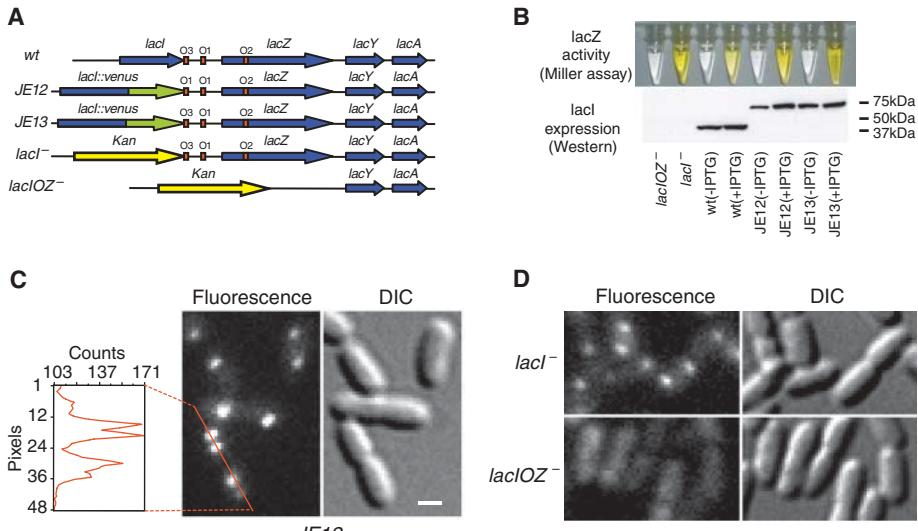
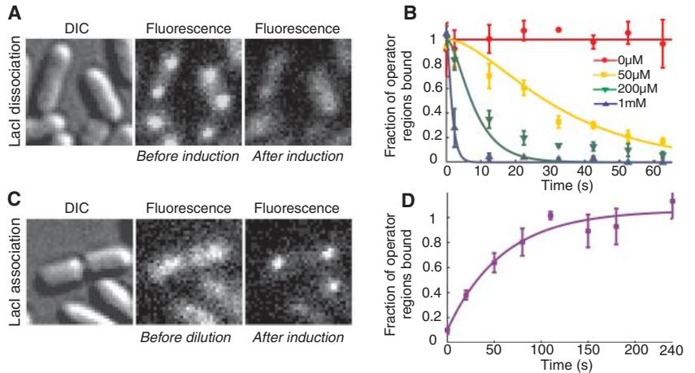
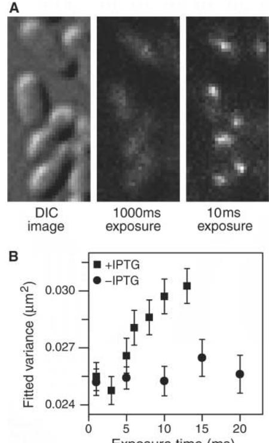
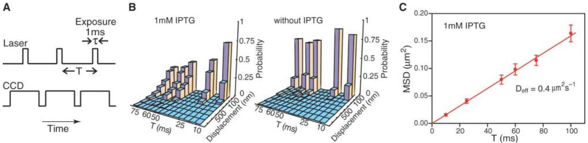

## DOI: 10.1126/science.1141967 Science **316**, 1191 (2007); Johan Elf et al. **in a Living Cell Probing Transcription Factor Dynamics at the Single-Molecule Level**

This copy is for your personal, non-commercial use only.

colleagues, clients, or customers by [clicking here.](http://www.sciencemag.org/about/permissions.dtl) **If you wish to distribute this article to others**, you can order high-quality copies for your following the guidelines [here.](http://www.sciencemag.org/about/permissions.dtl) **Permission to republish or repurpose articles or portions of articles** can be obtained by **www.sciencemag.org (this information is current as of April 24, 2014 ): The following resources related to this article are available online at** <http://www.sciencemag.org/content/316/5828/1191.full.html> version of this article at: **Updated information and services,** including high-resolution figures, can be found in the online [http://www.sciencemag.org/content/suppl/2007/05/22/316.5828.1191.DC1.html](http://www.sciencemag.org/content/suppl/2007/05/22/316.5828.1191.DC1.html )  **Supporting Online Material** can be found at: <http://www.sciencemag.org/content/316/5828/1191.full.html#related> found at: A list of selected additional articles on the Science Web sites **related to this article** can be <http://www.sciencemag.org/content/316/5828/1191.full.html#ref-list-1> This article **cites 28 articles**, 12 of which can be accessed free: This article has been **cited by** 136 article(s) on the ISI Web of Science <http://www.sciencemag.org/content/316/5828/1191.full.html#related-urls> This article has been **cited by** 88 articles hosted by HighWire Press; see: <http://www.sciencemag.org/cgi/collection/biochem> Biochemistry This article appears in the following **subject collections:**

registered trademark of AAAS. 2007 by the American Association for the Advancement of Science; all rights reserved. The title Science is a American Association for the Advancement of Science, 1200 New York Avenue NW, Washington, DC 20005. Copyright Science (print ISSN 0036-8075; online ISSN 1095-9203) is published weekly, except the last week in December, by the

by E. coli in response to oxidative stress of a Mn-dependent paralog to the constitutively expressed, Fe-dependent superoxide dismutase (30). Examination of the reactivity of the distinctive Mn/Fe cofactor toward these oxidants may thus provide a biochemical rationale for its evolution.

#### References and Notes

- 1. P. Nordlund, P. Reichard, Annu. Rev. Biochem. 75, 681 (2006).
- 2. J. Stubbe, D. G. Nocera, C. S. Yee, M. C. Y. Chang, Chem. Rev. 103, 2167 (2003).
- 3. S. Licht, G. J. Gerfen, J. Stubbe, Science 271, 477 (1996).
- 4. J. Stubbe, Curr. Opin. Struct. Biol. 10, 731 (2000). 5. C. C. Lawrence, J. Stubbe, Curr. Opin. Chem. Biol. 2, 650
- (1998). 6. M. Fontecave, E. Mulliez, D. T. Logan, Prog. Nucleic Acid
- Res. Mol. Biol. 72, 95 (2002). 7. J. Stubbe, Curr. Opin. Chem. Biol. 7, 183 (2003).
- 8. C. Roshick, E. R. Iliffe-Lee, G. McClarty, J. Biol. Chem. 275, 38111 (2000).
- 9. M. Högbom et al., Science 305, 245 (2004).
- 10. N. Voevodskaya, F. Lendzian, A. Gräslund, Biochem.
- Biophys. Res. Commun. 330, 1213 (2005). 11. N. Voevodskaya et al., Proc. Natl. Acad. Sci. U.S.A. 103, 9850 (2006).
- 12. Materials and methods are available as supporting material on Science Online.
- 13. For example, preparations from E. coli cultures grown in

rich medium had the same iron content as preparations from iron-supplemented minimal medium (~0.75 equiv; all metal equivalencies and activities are on a per monomer basis) but ~10 times the activity [velocity (v)/[R2] = 0.035 ± 0.01 s−1 , compared with 0.003 ± 0.001 s−1 ]. Conversely, R2 from rich medium to which the cell-permeative FeII chelator, 1,10-phenanthroline, was added immediately before induction of overexpression emerged with much less iron (<0.05 equiv) but ~70% of the activity (v/[R2] = 0.025 ± 0.01 s−1 ) of the R2 from equivalent cultures lacking the chelator.

- 14. All metal equivalencies and activities for the homodimeric R2 protein are reported on a per monomer basis.
- 15. To reduce the residual R2 activity to this low level, it was necessary also to dialyze the R1 used in the activity assay against EDTA.
- 16. The S = 1/2 complex exhibits a magnetically split Mössbauer spectrum at low temperature, but the use of this higher temperature makes electronic relaxation fast compared with the 57Fe nuclear precession frequency and collapses the spectrum into a quadrupole doublet.
- 17. M. Zheng, S. V. Khangulov, G. C. Dismukes, V. V. Barynin, Inorg. Chem. 33, 382 (1994).
- 18. S. Sinnecker, F. Neese, W. Lubitz, J. Biol. Inorg. Chem. 10, 231 (2005).
- 19. E. Münck, in Physical Methods in Bioinorganic Chemistry, L. Que Jr., Ed. (University Science Books, Sausalito, CA, 2000), pp. 287–319.
- 20. L. Thelander, B. Larsson, J. Hobbs, F. Eckstein, J. Biol. Chem. 251, 1398 (1976).
- 21. R. Eliasson, E. Pontis, F. Eckstein, P. Reichard, J. Biol. Chem. 269, 26116 (1994).
- 22. S. Salowe et al., Biochemistry 32, 12749 (1993).
- 23. G. Behravan et al., Biochim. Biophys. Acta 1264, 323 (1995).
- 24. J. Fritscher et al., J. Am. Chem. Soc. 127, 7729 (2005).
- 25. B. M. Sjöberg, A. Gräslund, F. Eckstein, J. Biol. Chem. 258, 8060 (1983).
- 26. J. Stubbe, W. A. van der Donk, Chem. Rev. 98, 705 (1998).
- 27. M. Lepoivre, F. Fieschi, J. Coves, L. Thelander, M. Fontecave, Biochem. Biophys. Res. Commun. 179, 442 (1991).
- 28. O. Guittet, B. Roy, M. Lepoivre, Cell. Mol. Life Sci. 55, 1054 (1999).
- 29. M. Fontecave, Cell. Mol. Life Sci. 54, 684 (1998).
- 30. H. M. Hassan, L. W. Schrum, FEMS Microbiol. Rev. 14, 315 (1994).
- 31. This work was supported by grants from NIH (GM55365 to J.M.B.), the Arnold and Mabel Beckman Foundation (Young Investigator Award to C.K.), and the Camille and Henry Dreyfus Foundation (Teacher Scholar Award to C.K.). The authors thank R. Stevens (University of California, Berkeley) for generously providing Chlamydia trachomatis serovar D genomic DNA and J. Stubbe (Massachusetts Institute of Technology) for the kind gift of N3-ADP.

### Supporting Online Material

10.1126/science.1141179

www.sciencemag.org/cgi/content/full/316/5828/1188/DC1 Materials and Methods Figs. S1 to S3 References 12 February 2007; accepted 19 April 2007

Probing Transcription Factor Dynamics at the Single-Molecule Level in a Living Cell

Johan Elf,1* Gene-Wei Li,2* X. Sunney Xie1 †

Transcription factors regulate gene expression through their binding to DNA. In a living Escherichia coli cell, we directly observed specific binding of a lac repressor, labeled with a fluorescent protein, to a chromosomal lac operator. Using single-molecule detection techniques, we measured the kinetics of binding and dissociation of the repressor in response to metabolic signals. Furthermore, we characterized the nonspecific binding to DNA, one-dimensional (1D) diffusion along DNA segments, and 3D translocation among segments through cytoplasm at the single-molecule level. In searching for the operator, a lac repressor spends ~90% of time nonspecifically bound to and diffusing along DNA with a residence time of <5 milliseconds. The methods and findings can be generalized to other nucleic acid binding proteins.

I n all kingdoms of life, transcription factors (TFs) regulate gene expression by sitespecific binding to chromosomal DNA, preventing or promoting the transcription by RNA polymerase. The lac operon of Escherichia coli, a model system for understanding TF-mediated transcriptional control (1), has been the subject of extensive biochemical (2–4), structural (5), and theoretical (6, 7) studies since the seminal work by Jacob and Monod (8). However, the in

vivo kinetics of the lac repressor, and all other TFs, has only been studied indirectly by monitoring the regulated gene products. Traditionally, this was done on a population of cells (9), in which unsynchronized gene activity among cells masks the underlying dynamics. Recent experiments on single cells allow investigation of stochastic gene expression (10–15). However, direct observation of TFmediated gene regulation (16) remains difficult, because it often involves only a few copies of TFs and their chromosomal binding sites. Here we report on a kinetics study of how fast a lac repressor binds its chromosomal operators and dissociates in response to a metabolic signal in a living E. coli cell.

Single-molecule detection also makes it possible to investigate how a TF molecule searches for specific binding sites on DNA, a central question in molecular biology. Target location by TFs (and most nucleic acid binding proteins) is believed to be achieved by facilitated diffusion, in which a TF searches for specific binding sites through a combination of one-dimensional (1D) diffusion along a short DNA segment and 3D translocation among DNA segments through cytoplasm (17). However, real-time observation in living cells has not been available because of technical difficulties. Here we report on such an investigation, providing quantitative information of the search process.

The lac repressor (LacI) is a dimer of dimers. Under repressed conditions one dimer binds the major lac operator, O1, and the other dimer binds one of the weaker auxiliary operators, O2 or O3 (18) (Fig. 1A). LacI binding to O1 prevents RNA polymerase from transcribing the lac operon (lacZYA). Upon binding of allolactose, an intermediate metabolite in the lactose pathway, or a nondegradable analog, such as IPTG (isopropyl b-D-1-thiogalactopyranoside), the repressor's affinity for the operator is substantially reduced to a level comparable to that of nonspecific DNA interaction (19).

To image the lac repressor, we expressed it from the native chromosomal lacI locus as a C-terminal fusion with the rapidly maturing (~7 min) yellow fluorescent protein (YFP) Venus (A206K) (15, 20) (Fig. 1A). The short maturation time prevents the lac operator sites from being occupied by immature fusion proteins. The Cterminal fusion avoids interference with the N-

1 Department of Chemistry and Chemical Biology, Harvard University, Cambridge, MA 02138, USA. 2 Department of Physics, Harvard University, Cambridge, MA 02138, USA.

* These authors contributed equally to this work. †To whom correspondence should be addressed. E-mail: xie@chemistry.harvard.edu

terminal DNA binding domain (21). Our fusion protein forms a dimer, which like most other Cterminal fusions with LacI (22), does not tetramerize (fig. S1). The labeled dimer up-regulates the expression of lacZ ~100-fold in response to full induction by IPTG at 37°C (JE13 in Fig. 1B). This repression factor compares well with that of nonlabeled repressors (4), indicating that the fusion protein maintains regulatory activity.

The detection of specific binding of LacI to its operators is achieved through localization enhancement (15) [see Supporting Online

*JE12*

Fig. 1. Specific binding to lac operators. (A) Strains. The chromosomal lac region of the wild-type E. coli (BW25933) and various derivatives used in this report. (B) Bulk activity assay. The Miller assay (top) shows that the YFP fusion strains (JE12 and JE13) are active and respond to induction by IPTG (1 mM, 3 hours) by derepressing lacZ (yellow). The Western blot (bottom) for LacI shows that JE12 and JE13 express the full-length fusion protein (67 kD) and that the expression in JE12, in the absence of IPTG, is strongly autorepressed as compared to the wild type and JE13. (C) Fluorescence (1-s exposure) and DIC images of JE12 grown in M9 glucose with amino acids. The YFP-labeled LacI binds persistently at one or two locations per cell depending on whether the operators have been replicated or not. The graph shows the fluorescence intensity along the red line. Scale bar, 1 mm. (D) DIC and fluorescence images (1-s exposure) of LacI-Venus expressed from plasmid in the lacI− and lacIOZ− strains, respectively. Plasmid expression is used to obtain similar expression levels in the two strains. No specific binding is observed in the absence of the lac operators.

Fig. 2. lac repressor kinetics in living cells. (A) JE12 bacteria before and 40 s after addition of IPTG to a final concentration of 1 mM. (B) Fraction of the lac operator regions that is TF-bound (±SEM, n ~ 3) is plotted as a function of time after induction by various concentrations of IPTG. The data are globally fitted with a model in which IPTG binds independently to the two dimers in the operator region (SOM). (C) JE12 bacteria before and 1 min after dilution of IPTG from 100 to 2 mM with the addition of 1 mM ONPF. (D) Fraction of the operator regions that is TF-bound (±SEM, n ~ 3) as a function of time after rapid dilution of IPTG from 100 to 2 mM by addition of 1 mM ONPF. The data are fitted with an exponentially distributed binding time and yield a time constant of 59 s.

Material (SOM)]. When E. coli cells are imaged with a wide-field fluorescence microscope and a charge-coupled device (CCD) camera with a long exposure time (1 s), the fluorescence from TFs that are not specifically bound to DNA is collected from the entire area of the cell because of fast diffusion and is hence overwhelmed by strong cellular autofluorescence. However, a single TF specifically bound to the relatively stationary DNA emits from a highly localized region and can be detected above the autofluorescence background.

A necessary condition for detection through localization enhancement is that the copy number of TF must be low. LacI, like most other TFs in E. coli, is naturally expressed at a low level—about 20 monomers per lacI gene (23). This results from autorepression at the O3 operator, which overlaps part of the lacI gene. We further reduced the expression level by replacing

Fig. 3. Imaging nonspecifically bound LacI. (A) Two fluorescence images with different exposure times and the corresponding DIC image of IPTGinduced E. coli cells. At 1000 ms, individual LacI-Venus appear as diffuse fluorescence background. At 10 ms they are clearly visible as nearly diffraction-limited spots. (B) Fluorescence spot size as a function of exposure time. The size is represented as the average variance of a 2D Gaussian function fit to images of fluorescence spots (±SEM, n ~ 100). The same total excitation energy is used for different exposure time. The spots are measured before (−IPTG, ●) and after (+IPTG, ■) induction. The size converges to the width of the point spread function (full width at half maximum = 370 nm) below 5ms.

the O3 operator with an O1 operator sequence, thus enhancing autorepression. This reduces the expression level by a factor of ~3 as compared to the wild type (Fig. 1B).

Figure 1C shows a differential interference contrast (DIC) image and the corresponding fluorescence image with a 1-s exposure time. In the image, specifically bound TFs appear as nearly diffraction-limited spots. Most cells have at least one spot per cell. Some have two, owing to replication of the operator region (24). We could not distinguish from the spot intensity whether one or two TF dimers were bound to the operator region containing two O1 operators (Fig. 1A and fig. S1). As a control, we showed that the specific LacI binding is dependent on the concentration of inducer (IPTG) (fig. S2). As another control, we proved that LacI binds specifically only to the lac operator. We expressed LacI-Venus from plasmid in two different strains, with and without specific chromosomal operators (lacI − and lacIOZ − , respectively) (Fig. 1A). The fluorescence images in Fig. 1D with 1-s exposure demonstrate the lack of specific binding in lacIOZ− strain, proving that LacI binds persistently only at the lac operators.

We next investigate the response time of TFmediated induction. Figure 2A shows the same cells before and 40 s after addition of 1 mM IPTG to the growth media. During this time interval, the TFs dissociate from the operators in nearly all cells. As a control, we proved that the disappearance of localized fluorescence is not due to photobleaching (fig. S3). In Fig. 2B the fraction of operator regions with bound TF is plotted as a function of time after induction at different IPTG concentrations. The repressor dissociation kinetics was probed by imaging different groups of cells at different time points after induction (SOM). Because dissociation of the IPTG-bound LacI from the operator is significantly faster than 1 s−1 (2), we could attribute the kinetics in Fig. 2B to the binding of IPTG to the LacI-operator complex. However, fitting of Fig. 2B (SOM) yields an association rate constant of IPTG to the repressor-operator complex of ~851 M−1 s −1 . This value is one order of magnitude lower than the in vitro estimate (2), which indicates that IPTG's membrane permeability might be rate limiting for LacI binding.

To investigate how fast the TFs find a specific operator site, we rapidly diluted IPTG from 100 to 2 mM by adding growth media with 1 mM ONPF (2-nitrophenyl-b-D-fucoside) (Fig. 2C). ONPF is an anti-inducer that competitively binds to LacI and therefore effectively prevents rebinding of IPTG after its dissociation (23). Kinetic analysis (Fig. 2D) yields a time constant of ~59 s for the exponential rise (SOM). Considering that IPTG dissociates from LacI in just a few seconds (2) and assuming that ONPF reaches sufficient intracellular concentration rapidly, we would expect the TF's target searching to be rate limiting. Taking into account the possibility of a slower ONPF influx rate, we conclude that the upper bound of the time for the first TF

Table 1. Diffusion constants and characteristic times.

| Parameter                  | Value                    | Method                                |
|----------------------------|--------------------------|---------------------------------------|
| Deff                       | 0.4 ± 0.02 mm2 s −1   | In vivo SM tracking                   |
| D3                         | 3 ± 0.3 mm2 s −1      | In vivo FCS                           |
| D1                         | 0.046 ± 0.01 mm2 s −1 | In vitro SM tracking                  |
| Search time* (t )       | 65† to 360 s          | Detection by immobilization           |
| Residence time on DNA (tR) | 0.3† to 5 ms          | Spot size dependence on exposure time |
| *                          |                          |                                       |

Defined as the time for a single TF in one cell to find a target. † Theoretical lower bound considering diffusion-limited association to nonspecific sites (29) (SOM).

to find one of the two unoccupied O1 operators is 59 s. Because there are about three repressors per cell, it would take at most t ~ 59 s × 2 × 3 = 354 s for a single lac repressor dimer in one cell to find a specific operator.

We next turn our attention to the search process. The conventional view is that the search is facilitated by a combination of 1D diffusion along short DNA segments separated by transfers between segments through cytoplasm. Recent in vitro experiments on DNA-repair enzymes have directly demonstrated the 1D diffusion along nonspecific DNA (25). Similarly, we determined the 1D diffusion constant of the dimeric LacI-Venus to be D1 = 0.046 ± 0.01 mm2 s −1 using single-molecule tracking on flow-stretched DNA (SOM). Although the in vitro measurement was done at low salt concentration in order to obtain trajectories with long residence time, the diffusion constant, which is largely independent of ionic strength (25), is expected to be similar in a living cell. However, the residence time, which is dependent on salt concentration, is yet to be determined in vivo.

To determine the nonspecific residence time on DNA for IPTG-bound LacI-Venus in a living cell, we obtained fluorescence images at different exposure times. With 1-s exposure, nonspecifically bound LacI cannot be imaged individually, as shown in Fig. 1D. With 10-ms exposure, however, LacI appear as nearly diffractionlimited spots (Fig. 3A). We observed two to four TFs in each cell, consistent with the expected LacI copy number. Figure 3B (and fig. S4) shows that the spot sizes increase for exposure times longer than 5 ms. Because the 1D diffusion along a DNA segment on this time scale is much shorter than the diffraction-limited spot size, we attribute the increase in spot size to 3D translocation between nonspecific binding events. This result indicates that the TF's nonspecific residence time in cells, tR, was ≤5 ms.

The ability to image nonspecifically bound TFs allowed us to track the movement of individual TFs using stroboscopic laser excitation.

Fig. 4. Single-molecule tracking with stroboscopic illumination. (A) Timing diagram for stroboscopic illumination. Each laser pulse (1 ms) is synchronized to a CCD frame time, which lasts time T. (B) Displacement histograms for different values of T. The absolute values of displacement along an arbitrary axis were calculated from 2D Gaussian fittings in two successive image frames. The displacement distribution of nonspecifically bound TFs broadens with time (left), whereas the distribution

before induction (right) remains peaked at <100 nm. The contrast between them illustrates the change in TF mobility before and after induction. (C) Mean-square displacement for nonspecifically bound TFs at different time intervals. The red line shows a linear fit of the MSDs. Error bars are calculated as described in the SOM. The fitting agrees well with a normal diffusion in the imaging plane, 〈Dx 2 〉 = 4Defft, with Deff = 0.4 mm2 s −1 .

## REPORTS

Laser pulses (1 ms) were synchronized to the frame rate of a fast EMCCD (electron multiplying charge-coupled device) camera (Fig. 4A, SOM). Because individual molecules are bleached in three to four frames, we varied the frame rate (1/T) to construct net displacement histograms for different time intervals (T = 10 to 75 ms) (Fig. 4B). Without IPTG, both the specific and nonspecific binding events are observed, and the displacement histogram is strongly peaked at <100 nm because most TFs are specifically bound. This shows that the lac operator region is confined to within 100 nm during 75 ms. With 1 mM IPTG, however, the displacement distribution broadens with increasing time intervals.

We next determine the apparent diffusion constant. The mean square displacement (MSD) of IPTG-bound LacI measured at various time intervals follows a linear dependence at the time scale >10 ms (Fig. 4C) and does not exhibit anomalous diffusion, as was observed for mRNA in E. coli cytoplasm at longer time scales (26). The apparent diffusion constant, Deff = 0.4 ± 0.02 mm2 s −1 , is one order of magnitude higher than the 1D diffusion constant (D1) of LacI dimers on DNA. Therefore, we attribute apparent diffusion to the contribution from 3D diffusion in between nonspecific bindings. Using fluorescence correlation spectroscopy (FCS) (27), we measured the in vivo diffusion constant of LacI-Venus without its DNA binding domain to be D3 = 3 ± 0.3 mm2 s −1 (SOM). This suggests that the Lac I dimer spends ~87% of the time nonspecifically bound and diffusing along DNA (SOM). This fraction is consistent with the previous population-averaged estimate (>90%) on the basis of the LacI tetramer concentration in minicells (28).

With the measurements of the diffusion constants and residence time (Table 1), we can give an estimate of the search time using a simple model for facilitated diffusion (7). Considering that the repressor spends most of its time bound to DNA, the search time is estimated as the nonspecific residence time (tR) multiplied by the average number of 1D diffusion events necessary to find the target (29). The latter is given by the accessible genome size (M ≈ 4.8 × 106 bp) divided by the number of base pairs visited per sliding event ( ffiffiffiffiffiffiffiffiffiffiffiffi 4D1tR p < 85 bp).

$$\tau \approx t_{\rm R} \frac{M}{\sqrt{4D_{\rm l} t_{\rm R}}} = M \sqrt{\frac{t_{\rm R}}{4D_{\rm l}}} \qquad (1)$$

This results in a search time of t < 270 s for a single lac repressor in one cell to find one target. In the SOM, we further calculate a lower bound of the search time based on diffusion-limited association to nonspecific DNA (Table 1). Hence, the measured and estimated search times are consistent. Despite the uncertainty of these numbers, our measurements provided quantitative information of the target search on DNA in vivo. This result has implications for other DNA binding proteins such as DNA-repair enzymes. Similar singlemolecule experiments will advance our quantitative understanding of biochemistry and molecular biology in living cells.

## References and Notes

- 1. B. Müller-Hill, The Lac Operon (de Gruyter, Berlin, 1996).
- 2. M. Dunaway et al., J. Biol. Chem. 255, 10115 (1980). 3. R. B. Winter, P. H. von Hippel, Biochemistry 20, 6948
- (1981).
- 4. S. Oehler, M. Amouyal, P. Kolkhof, B. von Wilcken-
- Bergmann, B. Muller-Hill, EMBO J. 13, 3348 (1994). 5. M. Lewis et al., Science 271, 1247 (1996).
- 6. O. G. Berg, C. Blomberg, Biophys. Chem. 4, 367 (1976).
- 7. O. G. Berg, R. B. Winter, P. H. von Hippel, Biochemistry 20, 6929 (1981).
- 8. F. Jacob, J. Monod, J. Mol. Biol. 3, 318 (1961).
- 9. A. Kepes, Prog. Biophys. Mol. Biol. 19, 199 (1969). 10. M. B. Elowitz, A. J. Levine, E. D. Siggia, P. S. Swain, Science 297, 1183 (2002).
- 11. E. M. Ozbudak, M. Thattai, I. Kurtser, A. D. Grossman, A. van Oudenaarden, Nat. Genet. 31, 69 (2002).
- 12. E. M. Ozbudak, M. Thattai, H. N. Lim, B. I. Shraiman, A. Van Oudenaarden, Nature 427, 737 (2004).
- 13. N. Rosenfeld, J. W. Young, U. Alon, P. S. Swain, M. B. Elowitz, Science 307, 1962 (2005).
- 14. I. Golding, J. Paulsson, S. M. Zawilski, E. C. Cox, Cell 123, 1025 (2005).
- 15. J. Yu, J. Xiao, X. Ren, K. Lao, X. S. Xie, Science 311, 1600 (2006).
- 16. J. Yao, K. M. Munson, W. W. Webb, J. T. Lis, Nature 442, 1050 (2006).
- 17. P. H. von Hippel, O. G. Berg, J. Biol. Chem. 264, 675 (1989). 18. S. Oehler, E. R. Eismann, H. Kramer, B. Muller-Hill,

EMBO J. 9, 973 (1990).

- 19. A. C. Wang, A. Revzin, A. P. Butler, P. H. von Hippel, Nucleic Acids Res. 4, 1579 (1977).
- 20. T. Nagai et al., Nat. Biotechnol. 20, 87 (2002).
- 21. M. Lewis, C. R. Biol. 328, 521 (2005).
- 22. A. Fieck, D. L. Wyborski, J. M. Short, Nucleic Acids Res. 20, 1785 (1992).
- 23. W. Gilbert, B. Muller-Hill, Proc. Natl. Acad. Sci. U.S.A. 56, 1891 (1966).
- 24. D. Bates, N. Kleckner, Cell 121, 899 (2005).
- 25. P. C. Blainey, A. M. van Oijen, A. Banerjee, G. L. Verdine, X. S. Xie, Proc. Natl. Acad. Sci. U.S.A. 103, 5752 (2006).
- 26. I. Golding, E. C. Cox, Phys. Rev. Lett. 96, 098102 (2006).
- 27. T. T. Le et al., Proc. Natl. Acad. Sci. U.S.A. 102, 9160 (2005).
- 28. Y. Kao-Huang et al., Proc. Natl. Acad. Sci. U.S.A. 74, 4228 (1977).
- 29. R. B. Winter, O. G. Berg, P. H. von Hippel, Biochemistry 20, 6961 (1981).
- 30. We thank P. Blainey, P. Sims, P. Choi, O. Berg, and M. Lovmar for helpful discussions. We are grateful to P. Blainey, P. Sims, and J. Hearn for protein purification, B. English for help with FCS, and J. Yu for making pVS155 and pVS167. The plasmids pkO3, pKD30, and Venus gene were contributed by G. Church, B. Wanner, and A. Miyawaki, respectively. This work was supported by NIH Director's Pioneer Award Program, the Knut and Alice Wallenberg Foundation (J.E), and NSF Graduate Research Fellowship (G.-W.L.).

### Supporting Online Material

www.sciencemag.org/cgi/content/full/316/5828/1191/DC1 Materials and Methods Figs. S1 to S9 References

1 March 2007; accepted 26 April 2007 10.1126/science.1141967

# Abraxas and RAP80 Form a BRCA1 Protein Complex Required for the DNA Damage Response

Bin Wang,1 Shuhei Matsuoka,1 Bryan A. Ballif,2 * Dong Zhang,1 † Agata Smogorzewska,1,3 Steven P. Gygi,2 Stephen J. Elledge1 ‡

The BRCT repeats of the breast and ovarian cancer predisposition protein BRCA1 are essential for tumor suppression. Phosphopeptide affinity proteomic analysis identified a protein, Abraxas, that directly binds the BRCA1 BRCT repeats through a phospho-Ser-X-X-Phe motif. Abraxas binds BRCA1 to the mutual exclusion of BACH1 (BRCA1-associated C-terminal helicase) and CtIP (CtBP-interacting protein), forming a third type of BRCA1 complex. Abraxas recruits the ubiquitininteracting motif (UIM)–containing protein RAP80 to BRCA1. Both Abraxas and RAP80 were required for DNA damage resistance, G2-M checkpoint control, and DNA repair. RAP80 was required for optimal accumulation of BRCA1 on damaged DNA (foci) in response to ionizing radiation, and the UIM domains alone were capable of foci formation. The RAP80-Abraxas complex may help recruit BRCA1 to DNA damage sites in part through recognition of ubiquitinated proteins.

The BRCA1 tumor suppressor is associated with hereditary breast and ovarian cancer and functions in maintenance of genomic stability (1, 2). BRCA1 contains an Nterminal RING domain, a Ser-Gln (SQ) cluster domain (3), and two BRCT (BRCA1 C-terminal) repeats, which constitute a phosphopeptide recognition domain that binds peptides containing a phospho-SXXF motif (S is Ser, F is Phe, and X varies) (4–6) and is required for tumor suppression. By dimerizing with BARD1 (BRCA1-associated RING domain protein) through the RING domain, BRCA1 forms an E3 ubiquitin ligase (7–10).