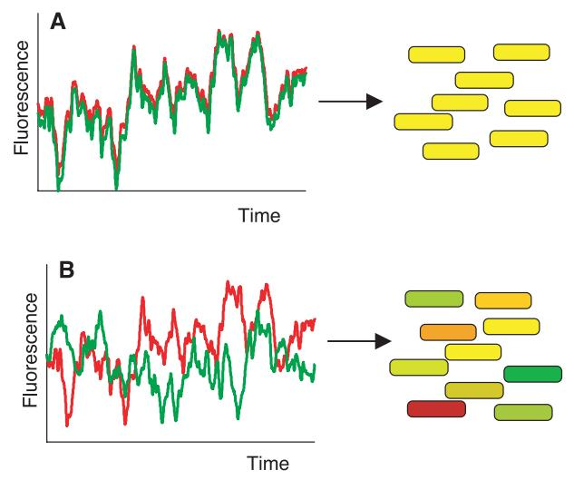
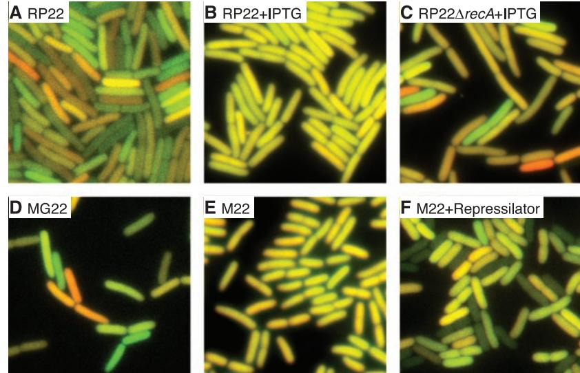
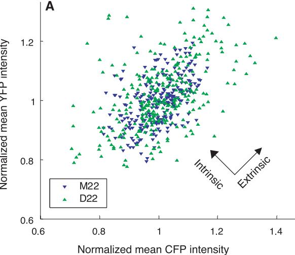
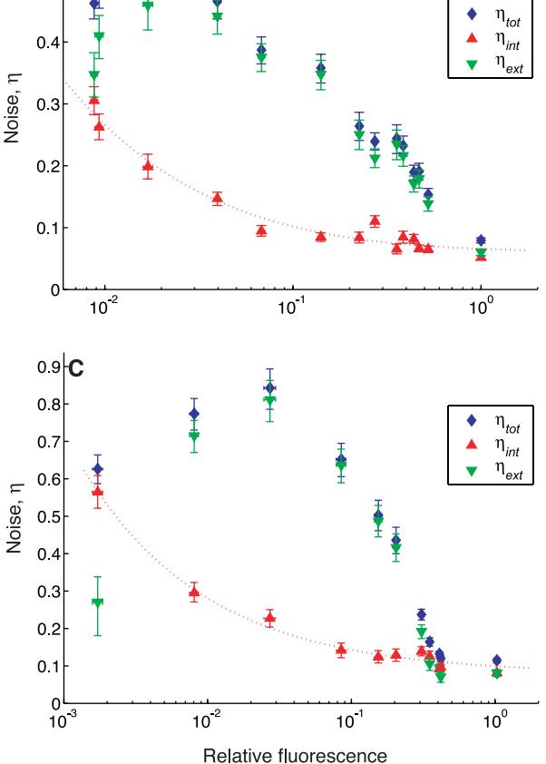

# DOI: 10.1126/science.1070919 Science **297**, 1183 (2002); Michael B. Elowitz et al. **Stochastic Gene Expression in a Single Cell**

This copy is for your personal, non-commercial use only.

colleagues, clients, or customers by [clicking here.](http://www.sciencemag.org/about/permissions.dtl) **If you wish to distribute this article to others**, you can order high-quality copies for your

following the guidelines [here.](http://www.sciencemag.org/about/permissions.dtl) **Permission to republish or repurpose articles or portions of articles** can be obtained by

**www.sciencemag.org (this information is current as of March 4, 2013 ): The following resources related to this article are available online at**

version of this article at: **Updated information and services,** including high-resolution figures, can be found in the online

<http://www.sciencemag.org/content/297/5584/1183.full.html>

http://www.sciencemag.org/content/suppl/2002/08/15/297.5584.1183.DC1.html **Supporting Online Material** can be found at:

<http://www.sciencemag.org/content/297/5584/1183.full.html#related> found at: A list of selected additional articles on the Science Web sites **related to this article** can be

<http://www.sciencemag.org/content/297/5584/1183.full.html#ref-list-1> This article **cites 19 articles**, 5 of which can be accessed free:

This article has been **cited by** 901 article(s) on the ISI Web of Science

<http://www.sciencemag.org/content/297/5584/1183.full.html#related-urls> This article has been **cited by** 100 articles hosted by HighWire Press; see:

<http://www.sciencemag.org/cgi/collection/cell_biol> Cell Biology This article appears in the following **subject collections:**

registered trademark of AAAS. 2002 by the American Association for the Advancement of Science; all rights reserved. The title Science is a American Association for the Advancement of Science, 1200 New York Avenue NW, Washington, DC 20005. Copyright Science (print ISSN 0036-8075; online ISSN 1095-9203) is published weekly, except the last week in December, by the

on the "repressor region" of the *p27Kip1* promoter in T3-1 cells (Fig. 5E) (see SOM) (*13*). Moreover, N-CoR, TBL1, HDAC3, and HDAC1 were also bound to the same region (Fig. 5E), which is consistent with the recruitment of at least two corepressor complexes through Dachs.

To test whether Six6 could directly regulate p27Kip1 expression in a biological context, we performed ChIP experiments using microdissected e13.5 wild-type retinas, showing that both Six6 and Dach2 were indeed recruited to the putative SE sites of the *p27Kip1* promoter (Fig. 5F), which is consistent with the correlation between *Six6* high expression and *p27Kip1* low expression at that developmental time (*13*). Despite the strong expression of *Sno* in the developing retina and its homology with Dach2, Sno was not present on the *p27Kip1* promoter (Fig. 5F), which is consistent with our finding of no detectable functional interactions between Six6 and Sno in transient transfection, two-hybrid, and microinjection studies (Fig. 4D) (*13*).

We therefore conclude that Six6/Dach complex binds directly to the *p27Kip1* promoter and represses its transcriptional activity in vivo, together with regulation of p19Ink4d and p57Kip2, to regulate proliferation. The Six6/CKI regulatory network likely serves as a molecular strategy for Six6 dependent regulation of the proper expansion of retinal and pituitary precursor cell populations. The strong coexpression of another highly related *Six* gene, *Six3*, during retinal development could partially compensate for the loss of Six6 (*5*). Six6/Dach repressive function in eye development is in contrast to the activation roles shown for Six1/Eya2 in muscle development (*11*), identifying a unique role of Six6 in terms of regulating downstream genes by interacting with specific partners. Together, these findings provide an organ-specific strategy for the expansion of precursor cell populations during development, a strategy that is likely used in other organ systems.

#### **References and Notes**

- 1. R. W. Young, *Anat*. *Rec*. **212**, 199 (1985).
- 2. D. E. Quelle, F. Zindy, R. A. Ashmun, C. J. Sherr, *Cell* **83**, 993 (1995).
- 3. T. Marquardt *et al*., *Cell* **105**, 43 (2001).
- 4. B. N. Cheyette *et al*., *Neuron* **12**, 977 (1994).
- 5. G. Oliver *et al*., *Development* **121**, 4045 (1995).
- 6. N. M. Bonini, W. M. Leiserson, S. Benzer, *Cell* **72**, 379
- (1993). 7. P. X. Xu, J. Cheng, J. A. Epstein, R. L. Maas, *Proc*. *Natl*. *Acad*. *Sci*. *U*.*S*.*A*. **94**, 11974 (1997).
- 8. J. E. Zimmerman *et al*., *Genome Res*. **7**, 128 (1997). 9. F. Pignoni *et al*., *Cell* **91**, 881 (1997).
- 10. R. Chen, M. Amoui, Z. Zhang, G. Mardon, *Cell* **91**, 893 (1997).
- 11. T. A. Heanue *et al*., *Genes Dev*. **13**, 3231 (1999).
- 12. D. Jean, G. Bernier, P. Gruss, *Mech*. *Dev*. **84**, 31 (1999).
- 13. X. Li, M. G. Rosenfeld, data not shown.
- 14. M. E. Gallardo *et al*., *Genomics* **61**, 82 (1999).
- 15. C. L. Cepko, *Curr*. *Opin*. *Neurobiol*. **9**, 37 (1999).
- 16. M. Perron, W. A. Harris, *Cell*. *Mol*. *Life Sci*. **57**, 215 (2000).
- R EPORTS
- 17. R. L. Sidman, in *The Structure of the Eye*, G. K. Smelser, Ed. (Academic Press, New York, 1961), pp. 487–505.
- 18. M. E. Zuber, M. Perron, A. Philpott, A. Bang, W. A. Harris, *Cell* **98**, 341 (1999).
- 19. T. Nomura *et al*., *Genes Dev*. **13**, 412 (1999).
- 20. T. Shinagawa, H. D. Dong, M. Xu, T. Maekawa, S. Ishii, *EMBO J*. **19**, 2280 (2000).
- 21. T. R. Hazbun, F. L. Stahura, M. C. Mossing, *Biochemistry* **36**, 3680 (1997).
- 22. M. L. Fero *et al*., *Cell* **85**, 733 (1996).
- 23. H. Kiyokawa *et al*., *Cell* **85**, 721 (1996).
- 24. K. Nakayama *et al*., *Cell* **85**, 707 (1996).
- 25. E. M. Levine, J. Close, M. Fero, A. Ostrovsky, T. A. Reh, *Dev*. *Biol*. **219**, 299 (2000).
- 26. T. K. Kwon, J. E. Nagel, M. A. Buchholz, A. A. Nordin, *Gene* **180**, 113 (1996).
- 27. We thank L. Erkman and R. McEvilly for critical advice; T. Herman, C. Nelson, and J. Zhang for excellent technical assistance; P. Myer and M. Fisher for figure

and manuscript preparation; and H. Taylor for animal care. We are very grateful to R. L. Maas, K. Kawakami, N. M. Bonini, G. Mardon, R. E. Hill, S. Pearson-White, P. Gruss, C. J. Sherr, S. J. Elledge, T. Hunter, K. Jepsen, S. C. Lin, and G. Oliver for providing essential reagents. Supported by National Research Service Award grant number 5F32DK09814 ( X.L.), Telethon/ Italy grant number 484/b ( V.P.), and grants from NIH (M.G.R. and D.W.R.). M.G.R. is an investigator with the Howard Hughes Medical Institute.

#### **Supporting Online Material**

www.sciencemag.org/cgi/content/full/1073263/DC1 Materials and Methods Figs. S1 to S4

24 April 2002; accepted 3 July 2002 Published online 18 July 2002; 10.1126/science.1073263 Include this information when citing this paper.

# Stochastic Gene Expression in a Single Cell

## Michael B. Elowitz,1,2* Arnold J. Levine,1 Eric D. Siggia,2 Peter S. Swain2

Clonal populations of cells exhibit substantial phenotypic variation. Such heterogeneity can be essential for many biological processes and is conjectured to arise from stochasticity, or noise, in gene expression. We constructed strains of *Escherichia coli* that enable detection of noise and discrimination between the two mechanisms by which it is generated. Both stochasticity inherent in the biochemical process of gene expression (intrinsic noise)and fluctuations in other cellular components (extrinsic noise)contribute substantially to overall variation. Transcription rate, regulatory dynamics, and genetic factors control the amplitude of noise. These results establish a quantitative foundation for modeling noise in genetic networks and reveal how low intracellular copy numbers of molecules can fundamentally limit the precision of gene regulation.

Living cells possess very low copy numbers of many components, including DNA and important regulatory molecules (*1*). Thus, stochastic effects in gene expression may account for the large amounts of cell-cell variation observed in isogenic populations (*2, 3*). Such effects can play crucial roles in biological processes, such as development, by establishing initial asymmetries that, amplified by feedback mechanisms, determine cell fates (*4*). However, experimental evidence for stochasticity in gene expression has been circumstantial (*5, 6*). For any particular gene, it remains unknown whether cell-cell variation in the abundance of its product is set by noise in expression of the gene itself or by fluctuations in the amounts of other cellular components. The difficulty of experimentally distinguishing between these two possibilities has thus far precluded detection of intrinsic noise in living cells. The magnitude of the noise intrinsic to gene expression, and its relative importance compared with other sources of cell-cell variability, are fundamental characteristics of the cell that require measurement.

In general, the amount of protein produced by a particular gene varies from cell to cell. The noise (defined as the standard deviation divided by the mean) in this distribution is labeled tot and can be divided into two components. Because expression of each gene is controlled by the concentrations, states, and locations of molecules such as regulatory proteins and polymerases, fluctuations in the amount or activity of these molecules cause corresponding fluctuations in the output of the gene. Therefore, they represent sources of extrinsic noise (denoted ext) that are global to a single cell but vary from one cell to another. On the other hand, consider a population of cells identical not just genetically but also in the concentrations and states of their cellular components. Even in such a (hypothetical) population, the rate of expression of a particular gene would still vary from cell to cell because of the random microscopic events that govern which reactions occur and in what order. This inherent stochasticity, or intrinsic noise, denoted int,

1 Laboratory of Cancer Biology, 2 Center for Studies in Physics and Biology, Rockefeller University, New York, NY 10021, USA.

*To whom correspondence should be addressed. Email: elowitm@rockefeller.edu

is that remaining part of the total noise arising from the discrete nature of the biochemical process of gene expression. No matter how accurately the levels of regulatory proteins are controlled, intrinsic noise fundamentally limits the precision of gene regulation.

Operationally, intrinsic noise for a given gene may be defined as the extent to which the activities of two identical copies of that gene, in the same intracellular environment, fail to correlate (Fig. 1, A and B). Therefore, we built strains of *Escherichia coli*, incorporating the distinguishable cyan (*cfp*) and yellow (*yfp*) alleles of green fluorescent protein in the chromosome. In each strain, the two reporter genes were controlled by identical promoters. To avoid systematic differences in copy number, we integrated the genes at loci equidistant from, and on opposite sides of, the origin of replication (fig. S1). The two fluorescent proteins exhibited statistically equivalent intensity distributions and thus displayed the necessary independence and equivalence to detect noise (*7*).

For measurement, cells were grown in LB medium and photographed through *cfp* and *yfp* fluorescence filter sets and in phase contrast (Fig. 2) (*7*). A computerized image analysis system identified cells and quantified their mean fluorescent intensities. Both intrinsic and extrinsic noise could be determined from plots of CFP versus YFP fluorescence intensity in individual cells (Fig. 3A) (*7*). The value of int indicates the mean relative difference in fluorescence intensity of the two reporter proteins in the same cell; for instance, if int 0.25, then the two colors typically differ by about 25%. Because int and ext make orthogonal contributions to the total noise, tot, the three noise values satisfy the relation int 2 ext 2 tot 2 (*7, 8*). Measurements of these variables for various strains and conditions are presented in Table 1.

To determine the importance of noise in vivo, we began with the least noisy gene expression conditions obtainable without feedback: strong constitutive promoters driving the expression of stable proteins. Specifically, we constructed strains incorporating artificial lacrepressible promoters (*9*) in *lac*– strain backgrounds, in which the lac repressor gene, *lacI*, is deleted. We obtained low noise levels (int 0.05) and low cell-cell variation overall (tot 0.08) in these strains (Fig. 2E). We obtained similar results in another strain incorporating two copies of the somewhat stronger promoter PR (Table 1). These results indicate (i) that constitutive gene expression can be remarkably uniform under some conditions, and (ii) that this low noise state does not strictly depend on a particular promoter sequence.

Few natural *E. coli* genes are transcribed as strongly as these phage-derived promoters (*10*). To see how much noise there is at lower rates of transcription, we moved the

### R EPORTS

reporters into several wild-type (*lacI*) *E. coli* strains, where they produced only 3 to 6% as much protein. Under these conditions, both intrinsic and extrinsic noise increased by a factor of 5 (Fig. 2, A and D, and Table 1). The effect was reversible: Addition of saturating amounts of isopropyl -D-thiogalactopyranoside (IPTG), which binds and inactivates the *lac* repressor, restored noise (both int and ext) and amounts of fluorescent protein expression to their approximate values in *lac*– strains (Fig. 2B). Thus, the noise increase found in wild-type strains can be attributed directly

**Fig.1.** Intrinsic and extrinsic noise can be measured and distinguished with two genes (*cfp*, shown in green; *yfp*, shown in red) controlled by identical regulatory sequences. Cells with the same amount of each protein appear yellow, whereas cells expressing more of one fluorescent protein than the other appear red or green. (**A**) In the absence of intrinsic noise, the two fluorescent proteins fluctuate in a correlated fashion over time in a single cell (left). Thus, in a population, each cell will have the same amount of both proteins, although that amount will differ from cell to cell because of extrinsic noise (right). (**B**) Expression of the two genes

in LacI expression (*8, 11*).

to the activity of LacI and the corresponding reduction of transcription rate. LacI affects extrinsic noise as well, increasing it by a factor of 5, to 0.3. This change indicates the presence of cell-cell variation

Models of stochastic gene expression predict that intrinsic noise should increase as the amount of transcript decreases (*8, 12*). To more effectively repress the reporter genes, we introduced a plasmid constitutively expressing the lac repressor (*7*) into strains otherwise deleted for *lacI*. We added different amounts of IPTG to growing cultures (Fig. 3, B and C). Intrinsic

may become uncorrelated in individual cells because of intrinsic noise (left), giving rise to a population in which some cells express more of one fluorescent protein than the other.

**Fig.2.** Noise in *E. coli*. CFP and YFP fluorescence images were combined in the green and red channels, respectively. (**A**) In strain RP22, with promoters repressed by the wild-type *lacI* gene, red and green indicate significant amounts of intrinsic noise. (**B**) RP22 grown in the presence of lac inducer, 2 mM IPTG. Both fluorescent proteins are expressed at higher levels and the cells exhibit less noise. (**C**) As in (B), except the *recA* gene has been deleted, increasing intrinsic noise. (**D**) Another wild-type strain, MG22, shows noise characteristics similar to those of RP22. (**E**) Expression levels and noise in unrepressed *lacI*– strain M22 are similar to those in *lacI* strains induced with IPTG (B). (**F**) M22 cells regulated by the Repressilator (*16*), an oscillatory network that amplifies intrinsic noise.

#### R EPORTS

noise was much larger in the presence of the LacI plasmid because of reduced transcription rate, but it fell substantially as IPTG was added. int is expected to decrease as int 2 (*c*1/*m*) *c*2, where *m* is the fluorescence intensity of the cell (assumed to be proportional to the average number of transcripts), and *c*1 and *c*2 are constants given by the microscopic parameters (*7*). This form fits the data, with strain D22 exhibiting higher amounts of intrinsic noise than M22 at all levels of expression (Fig. 3, B and C).

The extrinsic noise, ext, behaves very differently as a function of IPTG concentration. Whereas int decreases monotonically, ext displays a maximum at intermediate rates of transcription. As a result, total cell-cell variability (tot) does not uniquely determine intrinsic noise. The presence of a maximum in ext may be explained as a result of cell-cell variation in the concentration of LacI (*13*). Interestingly, ext is substantially smaller in cells carrying a chromosomal copy of *lacI* than it is in cells carrying a plasmid-borne copy of the gene (at comparable expression levels; see Table 1 and Fig. 3). This is consistent with greater variability in copy number for the plasmid-borne *lacI*

**Fig.3.** Quantification of noise. (**A**) Plot of fluorescence in two strains: one quiet (M22) and one noisy (D22). Each point represents the mean fluorescence intensities from one cell. Spread of points perpendicular to the diagonal line on which CFP and YFP intensities are equal corresponds to intrinsic noise, whereas spread parallel to this line is increased by extrinsic noise. (**B**) Noise versus rate of transcription in strain M22 (*recA*, *lacI*– ), with LacI supplied by plasmid pREP4 (*7*). Fluorescence levels (*x* axis) are population means. The rightmost point represents the strain without pREP4 and therefore is fully induced; its value, set to 1.0, was used to normalize all fluorescence intensities. IPTG (0 to 2 mM) was added to cultures and tot, int, and ext were measured. Error bars are 95% confidence intervals. Dashed line fits int 2 (*c*1/*m*) *c*2, where *m* fluorescence intensity (*x* axis), *c*1 7 10 4 , and *c*2 3 10 3 . (**C**) Noise versus induction level in *recA*– *lacI*– strain D22, containing plasmid pREP4. All notations are as in (B). In the fit, *c*1 5 10 4 and *c*2 1 10 2 .

| Table 1. Measurements of noise in selected strains. |  |
|-----------------------------------------------------|--|

| Modification*           | Strain†              | Intensity‡           | Intrinsic noise, int§¶ (	10 2 )     | Extrinsic noise, ext§ (	10 2 )         | Total noise, tot§ (	10 2 )                 |
|-------------------------|----------------------|----------------------|-------------------------------------------------|----------------------------------------------------|--------------------------------------------------------|
| Constitutive (lacI ) | M22 JM22 MRR   | 1 0.88 1.21    | 5.5 (5.1– 6) 5.0 (4.6 –5.4) 5.1 (4.7–5.4) | 5.4 (4.8 –5.9) 6.1 (5.5– 6.7) 5.6 (5.1– 6.2) | 7.7 (7.4 – 8.1) 7.9 (7.4 – 8.4) 7.6 (7.2–7.9)    |
| Wild type (lacI)        | MG22 RP22         | 0.057 0.030       | 19 (18 –21) 25 (22–27)                       | 32 (29 –35) 33 (30 –35)                         | 37 (35– 40) 41 (39 – 43)                            |
| Wild type (LacI), IPTG  | RP22                 | 1.00                 | 6.3 (5.8 – 6.9)                                 | 9.8 (9.0 –11)                                      | 11.7 (11–12.3)                                         |
| lacI , Repressilator | M22 MRR           | 0.18 0.16         | 12 (11–13) 11 (9.8 –12)                      | 42 (37– 45) 57 (52– 62)                         | 43 (39 – 47) 58 (53– 63)                            |
| recA, lacI              | D22 M22A JM22A | 0.81 0.99 0.92 | 10.5 (9.6 –11.4) 13 (12–15) 14 (11–17)    | 4.6 (2.8 –5.8) 2.4 (0 –5.3) 2.5 (0 –7.3)     | 11.4 (10.8 –12.1) 13.6 (12.8 –14.5) 15 (12–16.4) |
| recA, lacI IPTG         | RP22A                | 1.22                 | 17 (15–20)                                      | 12 (8.8 –14)                                       | 21 (20 –22)                                            |

*Repressilator refers to SpectR version of plasmid in (*16*); IPTG indicates growth in the presence of 2 mM IPTG. †The following strain backgrounds were used: MC4100 (*22*) for M22, MRR, and M22A; DY331 (*23*) for D22; JM2.300 (*E. coli* Genetic Stock Center) for JM22 and JM22A; MG1655 for MG22; and RP437 (*24*) for RP22 and RP22A. Each strain contains twin PL lacO1 promoters (*9*), except MRR, which contains twin PR promoters (*25*). ‡Mean CFP value, relative to the intensity of strain M22. §95% confidence limits are in parentheses; see (*7*). ¶CFP and YFP are stable in *E. coli* (*26*); effective noise levels for unstable proteins would be greater (for example, a doubling of noise level for a protein half-life of 0.3 cell cycle) (*8*).

on March 4, 2013

gene than for its wild-type chromosomal version (*14*). Extrinsic and intrinsic noise must be combined to explain the observed amount of variation; regulatory mechanisms aimed at suppressing noise, such as negative feedback (*15*), need to respond to both sources.

To be able to model the behavior of transcriptional regulatory circuits, it is essential to understand the interplay between regulatory dynamics and noise. We introduced a synthetic oscillatory network, termed the Repressilator (*7, 16*), into strain M22 (Table 1 and Fig. 2F). This network causes periodic synthesis of LacI, which repeatedly turns both promoters on and off. Large excursions in overall fluorescence intensity occur (high tot). An additional consequence is significant increases in int (compared with that in a similar strain with the same mean rate of transcription; see Table 1). This is consistent with theoretical predictions that noise is greater during the approach to, rather than at, a steady state (*17*). Thus, regulatory dynamics can cause substantial changes in noise levels.

If the amount of noisiness in a cell is genetically determined, then different strains might exhibit different basal noise levels (both intrinsic and extrinsic). Therefore, we inserted the two reporter genes in various genetic backgrounds. The amount of noise was similar in most strains, but one, D22, displayed about twice the amount of noise (Fig. 3, B and C, and Table 1). The known genotype of this strain differed from that of a related, less noisy, strain only by deletion of the *recA* gene, which suggests that lack of RecA was responsible for the increased noise. In agreement with this hypothesis, transduction of the *recA* allele into less noisy strains such as M22, JM22, and RP22 was sufficient to substantially increase int (Fig. 2, B and C, and Table 1). This increased noise in *recA* cells does not depend on a loss of viability (*18*). RecA acts to rescue stalled replication forks (*19*), which suggests that increased noise may arise from transient copynumber differences between different parts of the chromosome.

These results show that intrinsic and extrinsic classes of noise are important in setting cell-cell variation in gene expression. Both types of noise should similarly occur in all other intracellular reactions involving small numbers of reactants. Any cellular component that suffers intrinsic fluctuations in its own concentration will act as a source of extrinsic noise for other components with which it interacts. Thus, given the substantial noise measured here, reliable functioning of the cell may require genetic networks that suppress, or are robust to, fluctuations (*15, 20*). At the same time, it is clear that noise, if amplified, offers the opportunity to generate long-term heterogeneity in a clonal population.

## R EPORTS

#### **References and Notes**

- 1. P. Guptasarma, *Bioessays* **17**, 987 (1995).
- 2. J. L. Spudich *et al*., *Nature* **262**, 467 (1976).
- 3. H. H. McAdams *et al*., *Proc. Natl. Acad. Sci. U.S.A.* **94**, 814 (1997).
- 4. P. Heitzler *et al*., *Cell* **64**, 1083 (1991).
- 5. M. S. Ko, *Bioessays* **14**, 341 (1992).
- 6. S. Fiering *et al*., *Bioessays* **22**, 381 (2000).
- 7. See supporting data on *Science* Online.
- 8. P. S. Swain *et al*., *Proc. Natl. Acad. Sci. U.S.A.*, in press.
- 9. R. Lutz *et al*., *Nucleic Acids Res.* **25**, 1203 (1997).
- 10. U. Deuschle *et al*., *EMBO J.* **5**, 2987 (1986).
- 11. P. C. Maloney, B. Rotman, *J. Mol. Biol.* **73**, 77 (1973). 12. J. Paulsson, M. Ehrenberg, *Q. Rev. Biophys.* **34**, 1
- (2001). 13. At high IPTG concentrations, cells are fully induced, regardless of the amount of LacI they contain, whereas at low IPTG concentrations they are uniformly repressed. In both cases, LacI fluctuations are buffered (by excess IPTG or excess LacI, respectively), and hence ext must be small. However, between these two extremes, fluctuations in the amount of LacI cause corresponding fluctuations in the transcription rate of the reporter genes, and thus ext reaches a maximum value. See (*8*) for a more detailed treatment.
- 14. D. Boyd, *et al*., *J. Bacteriol.* **182**, 842 (2000).
- 15. A. Becskei, L. Serrano, *Nature* **405**, 590 (2000).
- 16. M. B. Elowitz, S. Leibler, *Nature* **403**, 335 (2000).
- 17. M. Thattai, A. van Oudenaarden, *Proc. Natl. Acad. Sci. U.S.A.* **98**, 8614 (2001).
- 18. Deletion of *recA* has pleiotropic effects, including an increased fraction of nonviable cells in growing cultures (*21*). By following microcolony formation with time-lapse microscopy (*7*), we checked whether the observed noise increase in *recA* populations could

be attributed to a subpopulation of nonviable cells. All M22 (*recA*) cells measured formed microcolonies (10 of 10), whereas some (2 of 14) of the M22 *recA* cells did not. In both cases, noise levels of viable cells at the initial timepoint were consistent with those previously obtained with larger samples.

- 19. M. M. Cox *et al*., *Nature* **404**, 37 (2000).
- 20. U. Alon *et al*., *Nature* **397**, 168 (1999).
- 21. F. N. Capaldo, S. D. Barbour, *Basic Life Sci.* **5A**, 405 (1975).
- 22. M. J. Casadaban, *J. Mol. Biol.* **104**, 541 (1976).
- 23. D. Yu *et al*., *Proc. Natl. Acad. Sci. U.S.A.* **97**, 5978 (2000). 24. J. S. Parkinson, S. E. Houts, *J. Bacteriol.* **151**, 106
- (1982). 25. B. J. Meyer, R. Maurer, M. Ptashne, *J. Mol. Biol.* **139**,
- 163 (1980). 26. J. B. Andersen *et al*., *Appl. Environ. Microbiol.* **64**,
- 2240 (1998). 27. We thank U. Alon, S. Bekiranov, J. Dworkin, D. Endy, C. Guet, R. Kishony, S. Leibler, D. O'Carroll, N. Rajewsky, B. Shraiman, D. Thaler, and especially M. G. Surette for conversations and suggestions; A. Teresky and the Levine Lab for help; and J. Paulsson for his suggestion about the extrinsic noise profile. Recombination-proficient strains were provided by D. Court. Supported by the Burroughs-Wellcome Fund and the Seaver Institute (M.B.E.) and by NIH grant GM59018 (P.S.S.).

### **Supporting Online Material**

www.sciencemag.org/cgi/content/full/297/5584/1183/ DC1

Materials and Methods Fig. S1

14 February 2002; accepted 13 June 2002

# S-Nitrosylation of Matrix Metalloproteinases: Signaling Pathway to Neuronal Cell Death

Zezong Gu,1 Marcus Kaul,1 Boxu Yan,2 * Steven J. Kridel,2 * Jiankun Cui,1 Alex Strongin,2 Jeffrey W. Smith,2 Robert C. Liddington,2 Stuart A. Lipton1 †

Matrix metalloproteinases (MMPs)are implicated in the pathogenesis of neurodegenerative diseases and stroke. However, the mechanism of MMP activation remains unclear. We report that MMP activation involves S-nitrosylation. During cerebral ischemia in vivo, MMP-9 colocalized with neuronal nitric oxide synthase. S-Nitrosylation activated MMP-9 in vitro and induced neuronal apoptosis. Mass spectrometry identified the active derivative of MMP-9, both in vitro and in vivo, as a stable sulfinic or sulfonic acid, whose formation was triggered by S-nitrosylation. These findings suggest a potential extracellular proteolysis pathway to neuronal cell death in which S-nitrosylation activates MMPs, and further oxidation results in a stable posttranslational modification with pathological activity.

Matrix metalloproteinases (MMPs) constitute a family of extracellular soluble or membrane-bound proteases that are involved in remodeling extracellular matrix. A role for MMPs has also been suggested in the pathogenesis of both acute and chronic neurodegenerative disorders such as stroke, Alzheimer's disease, HIV-associated dementia, and multiple sclerosis (*1*–*3*). MMP-9 in particular is elevated in human stroke (*4*). Mice treated with MMP inhibitors or deficient in MMP-9 manifest reduced cerebral infarct size (*5*–*7*). Members of the MMP family (with the exception of MMP-7) share structural features including propeptide, catalytic, and hemopexin domains. One cysteine residue in 1 Center for Neuroscience and Aging, 2 Program in Cell Adhesion and Extracellular Matrix Biology, The Burnham Institute, 10901 North Torrey Pines Road, La Jolla, CA 92037, USA.

*These authors contributed equally to this work. †To whom correspondence should be addressed. Email: slipton@burnham.org