### Lecture Notes for the C6 Theory Option

F.H.L. Essler The Rudolf Peierls Centre for Theoretical Physics Oxford University, Oxford OX1 3NP, UK

March 9, 2015

Preliminary version (needs proof reading). Please report errors and typos to fab@thphys.ox.ac.uk c 2013 F.H.L. Essler

# Part I Statistical Mechanics and Phase Transitions

# 1 Brief review of some relevant quantities

Consider a classical many-particle system coupled to a heat bath at temperature T. The partition function is defined as

$$Z = \sum_{\text{configurations C}} e^{-\beta E(C)}, \qquad \beta = \frac{1}{k_B T}. \tag{1}$$

Here the sum is over all possible configurations C, and E(C) is the corresponding energy. Thermal averages of observables are given by

$$
\langle \mathcal{O} \rangle_{\beta} = \frac{1}{Z} \sum_{\text{configurations } C} \mathcal{O}(C) e^{-\beta E(C)},\tag{2}
$$

where O(C) is the value of the observable O in configuration C. The average energy is

$$E = \frac{1}{Z} \sum_{\text{configurations C}} E(C) e^{-\beta E(C)} = -\frac{\partial}{\partial \beta} \ln(Z). \tag{3}$$

The free energy is

$$F = -k_B T \ln(Z). \tag{4}$$

The entropy is

$$S = \frac{E - F}{T} = k_B \ln(Z) - k_B \beta \frac{\partial}{\partial \beta} \ln(Z) = k_B \frac{\partial}{\partial T} \left[ T \ln(Z) \right]. \tag{5}$$

# 2 The Ising Model

Ferromagnetism is an interesting phenomenon in solids. Some metals (like Fe or Ni) are observed to acquire a finite magnetization below a certain temperature. Ferromagnetism is a fundamentally quantum mechanical effect, and arises when electron spins spontaneously align along a certain direction. The Ising model is a very crude attempt to model this phenomenon. It is defined as follows. We have a lattice in D dimensions with N sites. On each site j of this lattice sits a "spin" variable σj , which can take the two values ±1.

These are referred to as "spin-up" and "spin-down" respectively. A given set {σ1, σ2, . . . , σN } specifies a configuration. The corresponding energy is taken to be of the form

$$E(\{\sigma_j\}) = -J\sum_{\langle ij\rangle} \sigma_i \sigma_j - h \sum_{j=1}^N \sigma_j \ , \tag{6}$$

where hiji denote nearest-neighbour bonds on our lattice and J > 0. The first term favours alignment on neighbouring spins, while h is like an applied magnetic field. Clearly, when h = 0 the lowest energy states are obtained by choosing all spins to be either up or down. The question of interest is whether the Ising model displays a finite temperature phase transition between a ferromagnetically ordered phase at low temperatures, and a paramagnetic phase at high temperatures. The partition function of the model is

$$Z = \sum_{\sigma_1 = \pm 1} \sum_{\sigma_2 = \pm 1} \cdots \sum_{\sigma_N = \pm 1} e^{-\beta E(\{\sigma_j\})}.\tag{7}$$

The magnetization per site is given by

$$m(h) = \frac{1}{N} \langle \sum_{j=1}^{N} \sigma_j \rangle_{\beta} = \frac{1}{N\beta} \frac{\partial}{\partial h} \ln(Z). \tag{8}$$

The magnetic susceptibility is defined as

$$\chi(h) = \frac{\partial m(h)}{\partial h} = \frac{1}{N\beta} \frac{\partial^2}{\partial h^2} \ln(Z). \tag{9}$$

Substituting the expression (7) for the partition function and then carrying out the derivatives it can be expressed in the form

$$\chi(h) = \frac{\beta}{N} \sum_{l,m=1}^{N} \langle \sigma l \sigma_m \rangle_{\beta} - \langle \sigma l \rangle_{\beta} \langle \sigma_m \rangle_{\beta}. \tag{10}$$

#### 2.1 The One-Dimensional Ising Model

The simplest case is when our lattice is one-dimensional, and we impose periodic boundary conditions. The energy then reads

$$E = \sum_{j=1}^{N} \left[ -J\sigma_j \sigma_{j+1} - \frac{h}{2} (\sigma_j + \sigma_{j+1}) \right] \equiv \sum_{j=1}^{N} E(\sigma_j, \sigma_{j+1}),\tag{11}$$

where we have defined

$$
\sigma_{N+1} = \sigma_1. \tag{12}
$$

The partition function can be expressed in the form

$$Z = \sum_{\sigma_1,\dots,\sigma_N} \prod_{j=1}^N e^{-\beta E(\sigma_j,\sigma_{j+1})}.\tag{13}$$

It can be evaluated exactly by means of the transfer matrix method.

#### 2.1.1 Transfer matrix approach

The general idea is to rewrite Z as a product of matrices. The transfer matrix T is taken to be a 2 × 2 matrix with elements

$$\mathcal{H}_{\sigma\sigma'} = e^{-\beta E(\sigma, \sigma')}.\tag{14}$$

Its explicit form is

$$T = \begin{pmatrix} T_{++} & T_{+-} \\ T_{-+} & T_{--} \end{pmatrix} = \begin{pmatrix} e^{\beta(J+h)} & e^{-\beta J} \\ e^{-\beta J} & e^{\beta(J-h)} \end{pmatrix}. \tag{15}$$

The partition function can be expressed in terms of the transfer matrix as follows

$$Z = \sum_{\sigma_1, \dots, \sigma_N} T_{\sigma_1 \sigma_2} T_{\sigma_2 \sigma_3} \dots T_{\sigma_{N-1} \sigma_N} T_{\sigma_N \sigma_1} \tag{16}$$

As desired, this has the structure of a matrix multiplication

$$\boxed{Z = \text{Tr}\left(T^N\right).}\tag{17}$$

The trace arises because we have imposed periodic boundary conditions. As T is a real symmetric matrix, it can be diagonalized, i.e.

$$U^{\dagger}TU = \begin{pmatrix} \lambda_+ & 0\\ 0 & \lambda_- \end{pmatrix},\tag{18}$$

where U is a unitary matrix and

$$
\lambda_{\pm} = e^{\beta J} \cosh(\beta h) \pm \sqrt{e^{2\beta J} \sinh^2(\beta h) + e^{-2\beta J}}.\tag{19}
$$

Using the cyclicity of the trace and UU† = I, we have

$$Z = \text{Tr}\left(UU^\dagger T^N\right) = \text{Tr}\left(U^\dagger T^N U\right) = \text{Tr}\left([U^\dagger TU]^N\right) = \text{Tr}\begin{pmatrix}\lambda_+^N & 0\\0 & \lambda_-^N\end{pmatrix} = \lambda_+^N + \lambda_-^N. \tag{20}$$

But as λ− < λ+ we have

$$Z = \lambda_+^N \left( 1 + \left[ \frac{\lambda_-}{\lambda_+} \right]^N \right) = \lambda_+^N \left( 1 + e^{-N \ln(\lambda_+/\lambda_-)} \right). \tag{21}$$

So for large N, which is the case we are interested in, we have with exponential accuracy

$$\begin{array}{c} Z \simeq \underline{\lambda_{+}^{N} \cdot} \\ \hline \end{array} \tag{22}$$

Given the partition function, we can now easily calculate the magnetization per site

$$m(h) = \frac{1}{N\beta} \frac{\partial}{\partial h} \ln(Z). \tag{23}$$

In Fig. 1 we plot m(h) as a function of inverse temperature β = 1/kBT for two values of magnetic field h. We see that for non-zero h, the magnetization per site takes its maximum value m = 1 at low temperatures. At high temperatures it goes to zero. This is as expected, as at low T the spins align along the direction of the applied field. However, as we decrease the field, the temperature below which m(h) approaches unity decreases. In the limit h → 0, the magnetization per site vanishes at all finite temperatures. Hence there is no phase transition to a ferromagnetically ordered state in the one dimensional Ising model.

#### 2.1.2 Averages of observables in the transfer matrix formalism

The average magnetization at site j is

$$
\langle \sigma_j \rangle_{\beta} = \frac{1}{Z} \sum_{\sigma_1, \dots, \sigma_N} \sigma_j e^{-\beta E(\{\sigma_j\})}.\tag{24}
$$

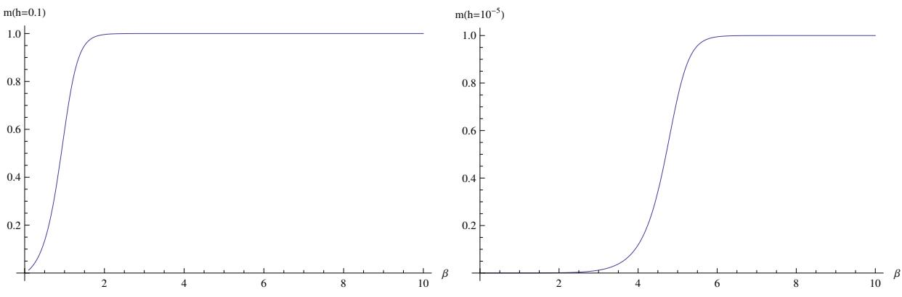

Figure 1: Magnetization per site as a function of inverse temperature for two values of applied magnetic field. We see that when we reduce the magnetic field, the temperature region in which the magnetization is essentially zero grows.

We can express this in terms of the transfer matrix as

$$
\langle \sigma_j \rangle_{\beta} = \frac{1}{Z} \sum_{\sigma_1, \dots, \sigma_N} T_{\sigma_1 \sigma_2} T_{\sigma_2 \sigma_3} \dots T_{\sigma_{j-1} \sigma_j} \sigma_j T_{\sigma_j \sigma_{j+1}} \dots T_{\sigma_N \sigma_1} \tag{25}
$$

Using that

$$\left(T\sigma^z\right)_{\sigma_{j-1}\sigma_j} = T_{\sigma_{j-1}\sigma_j}\sigma_j\ \ , \tag{26}$$

where σ z = 1 0 0 −1 is the Pauli matrix, we obtain

$$\langle \sigma_j \rangle_{\beta} = \frac{1}{Z} \text{Tr} \left[ T^{j-1} \sigma^z T^{N-j+1} \right] = \frac{1}{Z} \text{Tr} \left[ T^N \sigma^z \right] \,. \tag{27}$$

Diagonalizing T by means of a unitary transformation as before, this becomes

$$
\langle \sigma_j \rangle_{\beta} = \frac{1}{Z} \text{Tr} \left[ U^\dagger T^N U U^\dagger \sigma^z U \right] = \frac{1}{Z} \text{Tr} \left[ \begin{pmatrix} \lambda_+^N & 0 \\ 0 & \lambda_-^N \end{pmatrix} U^\dagger \sigma^z U \right] \tag{28}
$$

The matrix U is given in terms of the normalized eigenvectors of T

$$|T|\pm\rangle = \lambda_{\pm}|\pm\rangle\tag{29}$$

as

$$U = (|+\rangle, |-\rangle). \tag{30}$$

For h = 0 we have

$$U|_{h=0} = \frac{1}{\sqrt{2}} \begin{pmatrix} 1 & 1 \\ 1 & -1 \end{pmatrix} . \tag{31}$$

This gives

$$\langle \sigma_j \rangle_{\beta} \Big|_{h=0} = 0. \tag{32}$$

For general h the expression is more complicated

$$U = \begin{pmatrix} \frac{\alpha_+}{\sqrt{1+\alpha_+^2}} & \frac{\alpha_-}{\sqrt{1+\alpha_-^2}}\\ \frac{1}{\sqrt{1+\alpha_+^2}} & \frac{1}{\sqrt{1+\alpha_-^2}} \end{pmatrix}, \quad \alpha_\pm = \sqrt{1+e^{4\beta J}\sinh^2(\beta h)} \pm e^{2\beta J}\sinh(\beta h). \tag{33}$$

The magnetization per site in the thermodynamic limit is then

$$\lim_{N \to \infty} \langle \sigma_j \rangle_{\beta} = \lim_{N \to \infty} \frac{\left(\frac{\alpha_+^2 - 1}{\alpha_+^2 + 1}\right) \lambda_+^N + \left(\frac{\alpha_-^2 - 1}{\alpha_-^2 + 1}\right) \lambda_-^N}{\lambda_+^N + \lambda_-^N} = \left(\frac{\alpha_+^2 - 1}{\alpha_+^2 + 1}\right). \tag{34}$$

This now allows us to prove, that in the one dimensional Ising model there is no phase transition at any finite temperature:

$$\left| \varprojlim_{h \to 0} \varprojlim_{N \to \infty} \langle \sigma_j \rangle_{\beta} = 0 \,, \quad \beta < \infty. \right| \tag{35}$$

Note the order of the limits here: we first take the infinite volume limit at finite h, and only afterwards take h to zero. This procedure allows for spontaneous symmetry breaking to occur, but the outcome of our calculation is that the spin reversal symmetry remains unbroken at any finite temperature.

Similarly, we find

$$\langle \sigma_j \sigma_{j+r} \rangle_{\beta} = \frac{1}{Z} \text{Tr} \left[ T^{j-1} \sigma^z T^r \sigma^z T^{N+1-j-r} \right] = \frac{1}{Z} \text{Tr} \left[ U^\dagger \sigma^z U \begin{pmatrix} \lambda_+^r & 0\\ 0 & \lambda_-^r \end{pmatrix} U^\dagger \sigma^z U \begin{pmatrix} \lambda_+^{N-r} & 0\\ 0 & \lambda_-^{N-r} \end{pmatrix} \right]. \tag{36}$$

We can evaluate this for zero field h = 0

$$\langle \sigma_j \sigma_{j+r} \rangle_{\beta} \Big|_{h=0} = \frac{\lambda_+^{N-r} \lambda_-^r + \lambda_-^{N-r} \lambda_+^r}{\lambda_+^N + \lambda_-^N} \approx \left[ \frac{\lambda_-}{\lambda_+} \right]^r = e^{-r/\xi}. \tag{37}$$

So in zero field the two-point function decays exponentially with correlation length

$$
\xi = \frac{1}{\ln \coth(\beta J)}.\tag{38}
$$

#### 2.2 The Two-Dimensional Ising Model

We now turn to the 2D Ising model on a square lattice with periodic boundary conditions. The spin variables have now two indices corresponding to rows and columns of the square lattice respectively

$$
\sigma_{j,k} = \pm 1 \,, \quad j, k = 1, \ldots, N. \tag{39}
$$

The boundary conditions are σk,N+1 = σk,1 and σN+1,j = σ1,j , which correspond to the lattice "living" on

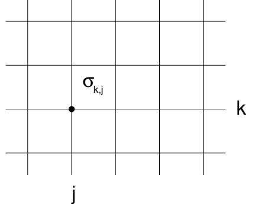

Figure 2: Ising model on the square lattice.

the surface of a torus. The energy in zero field is

$$E(\{\sigma_{k,j}\}) = -J\sum_{j,k} \sigma_{k,j}\sigma_{k,j+1} + \sigma_{k,j}\sigma_{k+1,j}.\tag{40}$$

#### 2.2.1 Transfer Matrix Method

The partition function is given by

$$Z = \sum_{\{\sigma_{j,k}\}} e^{-\beta E(\{\sigma_{k,j}\})}.\tag{41}$$

The idea of the transfer matrix method is again to write this in terms of matrix multiplications. The difference to the one dimensional case is that the transfer matrix will now be much larger. We start by expressing the partition function in the form

$$Z = \sum_{\{\sigma_{j,k}\}} e^{-\beta \sum_{k=1}^{N} E(k; k+1)},\tag{42}$$

where

$$E(k;k+1) = -J\sum_{j=1}^{N} \sigma_{k,j}\sigma_{k+1,j} + \frac{1}{2} \left[\sigma_{k,j}\sigma_{k,j+1} + \sigma_{k+1,j}\sigma_{k+1,j+1}\right].\tag{43}$$

This energy depends only on the configurations of spins on rows k and k + 1, i.e. on spins σk,1, . . . , σk,N and σk+1,1, . . . , σk+1,N . Each configuration of spins on a given row specifies a sequence s1, s2, . . . , sN with sj = ±1. Let us associate a vector

$$\left|\mathbf{s}\right\rangle\tag{44}$$

with each such sequence. By construction there 2N such vectors. We then define a scalar product on the space spanned by these vectors by

$$\langle \mathbf{t} | \mathbf{s} \rangle = \prod_{j=1}^{N} \delta_{t_j, s_j}. \tag{45}$$

With this definition, the vectors {|si} form an orthonormal basis of a 2N dimensional linear vector space. In particular we have

$$I = \sum_{\mathbf{s}} |\mathbf{s}\rangle\langle\mathbf{s}|.\tag{46}$$

Finally, we define a 2N × 2 N transfer matrix T by

$$
\langle \sigma_k | T | \sigma_{k+1} \rangle = e^{-\beta E(k; k+1)}.\tag{47}
$$

The point of this construction is that the partition function can now be written in the form

$$Z = \sum_{\sigma_1} \sum_{\sigma_2} \dots \sum_{\sigma_N} \langle \sigma_1 | T | \sigma_2 \rangle \langle \sigma_2 | T | \sigma_3 \rangle \dots \langle \sigma_{N-1} | T | \sigma_N \rangle \langle \sigma_N | T | \sigma_1 \rangle \tag{48}$$

We now may use (46) to carry out the sums over spins, which gives

$$\boxed{Z = \text{Tr}\left[T^N\right]},\tag{49}$$

where the trace is over our basis {|si|sj = ±1} of our 2N dimensional vector space. Like in the 1D case, thermodynamic properties involve only the largest eigenvalues of T. Indeed, we have

$$Z = \sum_{j=1}^{2^N} \lambda_j^N \ , \tag{50}$$

where λj are the eigenvalues of T. The free energy is then

$$F = -k_B T \ln(Z) = -k_B T \ln\left[\lambda_{\text{max}}^N \sum_{j=1}^{2^N} \left(\frac{\lambda_j}{\lambda_{\text{max}}}\right)^N\right] = -k_B T N \ln(\lambda_{\text{max}}) - k_B T \ln\left[\sum_j \left(\frac{\lambda_j}{\lambda_{\text{max}}}\right)^N\right],\tag{51}$$

where λmax is the largest eigenvalue of T, which we assume to be unique. As |λj/λmax| < 1, the second contribution in (51) is bounded by −kBT N ln(2), and we see that in the thermodynamic limit the free energy per site is

$$f = \lim_{N \to \infty} \frac{F}{N^2} = \lim_{N \to \infty} -\frac{k_B T}{N} \ln(\lambda_{\text{max}}).\tag{52}$$

Thermodynamic quantities are obtained by taking derivatives of f and hence only involve the largest eigenvalue of T. The main complication we have to deal with is that T is still a very large matrix. This poses the question, why we should bother to use a transfer matrix description anyway? Calculating Z from its basic definition (41) involves a sum with 2N2 terms, i.e. at least 2N2 operations on a computer. Finding the largest eigenvalue of a M × M matrix involves O(M2 ) operations, which in our case amounts to O(22N ). For large values of N this amounts to an enormous simplification.

#### 2.2.2 Spontaneous Symmetry Breaking

Surprisingly, the transfer matrix of the 2D Ising model can be diagonalized exactly. Unfortunately we don't have the time do go through the somewhat complicated procedure here, but the upshot is that the 2D Ising model can be solved exactly. Perhaps the most important result is that in the thermodynamic limit the square lattice Ising model has a finite temperature phase transition between a paramagnetic and a ferromagnetic phase. The magnetization per site behaves as shown in Fig.3. At low temperatures T < Tc

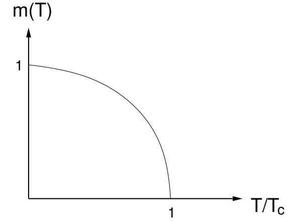

Figure 3: Phase Transition in the square lattice Ising model.

there is a non-zero magnetization per site, even though we did not apply a magnetic field. This is surprising, because our energy (40) is unchanged if we flip all spins

$$
\sigma_{j,k} \to -\sigma_{j,k}.\tag{53}
$$

The operation (53) is a discrete (two-fold) symmetry of the Ising model. Because we have translational invariance, the magnetization per site is

$$m = \langle \sigma_{j,k} \rangle_{\beta}. \tag{54}$$

Hence a non-zero value of m signifies the spontaneous breaking of the discrete symmetry (53). In order to describe this effect mathematically, we have to invoke a bit of trickery. Let us consider zero temperature. Then there are exactly two degenerate lowest energy states: the one with all spins σj,k = +1 and the one with all spins σj,k = −1. We now apply a very small magnetic field to the system, i.e. add a term

$$
\delta E = -\epsilon \sum_{j,k} \sigma_{j,k} \tag{55}
$$

to the energy. This splits the two states, which now have energies

$$E_{\pm} = -J N_B \mp \epsilon N \,, \tag{56}$$

where NB is the number of bonds. The next step is key: we now define the thermodynamic limit of the free energy per site as

$$f(T) \equiv \lim_{\epsilon \to 0} \lim_{N \to \infty} \frac{-k_B T \ln(Z)}{N^2}. \tag{57}$$

The point is that the contributions Z± = e −βE± of the two states to Z are such that

$$\frac{Z_{-}}{Z_{+}} = e^{-2\epsilon N/k_{B}T} \,. \tag{58}$$

This goes to zero when we take N to infinity! So in the above sequence of limits, only the state with all spins up contributes to the partition function, and this provides a way of describing spontaneous symmetry breaking! The key to this procedure is that

$$\lim_{\epsilon \to 0} \lim_{N \to \infty} Z \neq \lim_{N \to \infty} \lim_{\epsilon \to 0} Z.\tag{59}$$

The procedure we have outlined above, i.e. introducing a symmetry breaking field, then taking the infinite volume limit, and finally removing the field, is very general and applies to all instances where spontaneous symmetry breaking occurs.

#### Exercises:

Question 1. A lattice model for non-ideal gas is defined as follows. The sites i of a lattice may be empty or occupied by at most one atom, and the variable ni takes the values ni = 0 and ni = 1 in the two cases. There is an attractive interaction energy J between atoms that occupy neighbouring sites, and a chemical potential µ. The model Hamiltonian is

$$\mathcal{H} = -J\sum_{\langle ij\rangle} n_i n_j - \mu \sum_i n_i \,, \tag{60}$$

where P hiji is a sum over neighbouring pairs of sites.

(a) Describe briefly how the transfer matrix method may be used to calculate the statistical-mechanical properties of one-dimensional lattice models with short range interactions. Illustrate your answer by explaining how the partition function for a one-dimensional version of the lattice gas, Eq. (1), defined on a lattice of N sites with periodic boundary conditions, may be evaluated using the matrix

$$\mathbf{T} = \begin{pmatrix} 1 & \mathbf{e}^{\beta \mu/2} \\ \mathbf{e}^{\beta \mu/2} & \mathbf{e}^{\beta(J+\mu)} \end{pmatrix}.$$

(b) Derive an expression for hnii in the limit N → ∞, in terms of elements of the eigenvectors of this matrix. (c) Show that

$$
\langle n_i \rangle = \frac{1}{1 + e^{-2\theta}} \ ,
$$

where

$$\sinh(\theta) = \exp(\beta J/2)\sinh(\beta[J+\mu]/2)\,.$$

Sketch hnii as a function of µ for βJ 1, and comment on the physical significance of your result.

Question 2. The one-dimensional 3-state Potts model is defined as follows. At lattice sites i = 0, 1, . . . , L "spin" variables σi take integer values σi = 1, 2, 3. The Hamiltonian is then given by

$$H = -J\sum_{i=0}^{L-1} \delta_{\sigma_i, \sigma_{i+1}},\tag{61}$$

where δa,b is the Kronecker delta, J > 0.

(a) What are the ground states and first excited states for this model?

(b) Write down the transfer matrix for (61). Derive an expression for the free energy per site f in the limit of large L in terms of the transfer matrix eigenvalues. Show that vectors of the form (1, z, z2 ) with z 3 = 1 are eigenvectors, and hence find the corresponding eigenvalues. Show that at temperature T (with β = 1/kBT) and in the limit L → ∞

$$f = -k_B T \ln\left(3 + e^{\beta J} - 1\right). \tag{62}$$

(c) The boundary variable σ0 is fixed in the state σ0 = 1. Derive an expression (for large L), that the variable at site ` 1 is in the same state, in terms of the transfer matrix eigenvalues and eigenvectors. Show that your result has the form

$$
\langle \delta_{\sigma_\ell, 1} \rangle = \frac{1}{3} + \frac{2}{3} e^{-\ell/\xi}. \tag{63}
$$

How does ξ behave in the low and high temperature limits?

Question 3. Consider a one dimensional Ising model on an open chain with N sites, where N is odd. On all even sites a magnetic field 2h is applied, see Fig. 4. The energy is

$$E = -J\sum_{j=1}^{N-1} \sigma_j \sigma_{j+1} + 2h \sum_{j=1}^{(N-1)/2} \sigma_{2j}.\tag{64}$$

(a) Show that the partition function can be written in the form

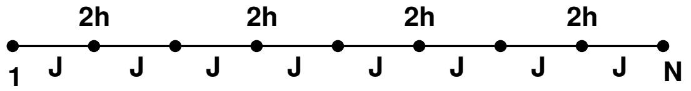

Figure 4: Open Ising chain with magnetic field applied to all even sites.

$$Z = \langle u | T^{(N-1)/2} | v \rangle \ , \tag{65}$$

where T is an appropriately constructed transfer matrix, and |ui and |vi two dimensional vectors. Give explicit expressions for T, |ui and |vi.

#### (b) Calculate Z for the case h = 0.

#### 2.2.3 Peierls Argument

The Peierls argument is a nice way of establishing that the 2D square lattice Ising model has magnetic long-range order at sufficiently low temperatures without actually solving the model. Given that at very high temperature there is no magnetic order, this shows that there must be at least one phase transition at a finite temperature.

Consider the Ising model on the square lattice with boundary conditions such that all spins on the boundary are up, i.e. take the value +1. You can think of these boundary conditions as a symmetry breaking field. The bulk magnetic field is taken to be zero. Configurations look like the one shown in Fig. 5, and can be characterized by domains walls. These are lines separating + and − spins such that

- 1. The + (−) spins lie always to the left (right) of the wall.
- 2. Where ambiguities remain, the wall is taken to bend to the right.
- 3. The length of the wall is defined as the number of lattice spacings it traverses.

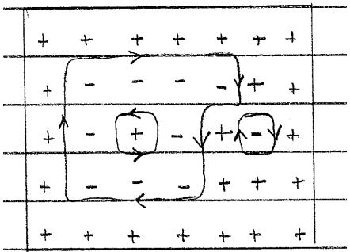

Figure 5: A configuration of spins and the corresponding domain walls.

A wall of length b encloses at most b 2/16 spins. The total number of domain walls of length b, m(b), is bounded by

$$\begin{array}{c} m(b) \le 4N_t 3^{b-1}, \\\\ \hline \end{array} \tag{66}$$

where Nt is the total number of sites. This can be seens as follows:

- the first link can go into less than 4Nt positions (starting at an arbitrary site and going in any of the four possible directions).
- subsequent links have at most 3 possible directions each.

Let us denote the i'th domain wall of length b by (b, i). Next consider a particular configuration σ = {σj,k} of spins on the lattice, and define

$$X_{\sigma}(b,i) = \begin{cases} 1 & \text{if } (\text{b,i}) \text{ occurs in } \sigma\\ 0 & \text{else} \end{cases} \tag{67}$$

Then the total number of − spins in σ is bounded by

$$N_- \le \sum_b \frac{b^2}{16} \sum_{i=1}^{m(b)} X_\sigma(b, i), \tag{68}$$

because each spin is enclosed by at least one domain wall due to our choice of boundary conditions. Taking thermal averages, we have

$$
\langle \langle N_{-} \rangle_{\beta} \le \sum_{b} \frac{b^2}{16} \sum_{i=1}^{m(b)} \langle X_{\sigma}(b, i) \rangle_{\beta}. \tag{69}
$$

Here the thermal average of Xσ(b, i) can be written as

$$
\langle X_{\sigma}(b,i) \rangle_{\beta} = \frac{1}{Z} \sum_{\sigma}^{\prime} e^{-\beta E(\sigma)},
\tag{70}
$$

where the sum is only over configurations, in which (b, i) occurs. Now consider the configuration σ 0 obtained from σ by reversing the spins inside the domain wall (b, i). Clearly the energies of the two configurations

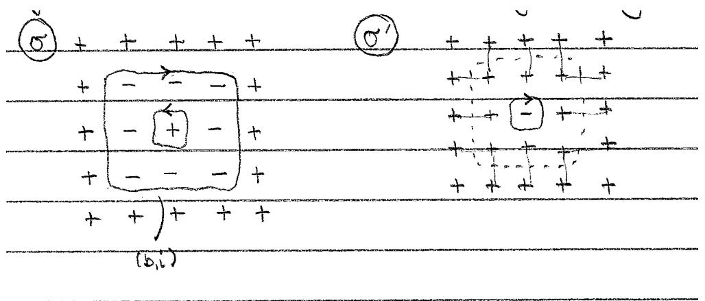

Figure 6: Configurations σ and σ 0 related by reversing all spins inside the domain wall (b, i). Shown are all the bonds whose energies have been changed from −J to J.

are related by

$$E(\sigma) = E(\sigma') + 2bJ. \tag{71}$$

This can be used to obtain a bound on Z

$$Z \geq \sum_{\sigma'}' e^{-\beta E(\sigma')} \geq \sum_{\sigma}' e^{-\beta E(\sigma)} e^{2bJ\beta},\tag{72}$$

where the first sum is only over configurations in which (b, i) occurs, and where we then have flipped all spins inside the domain wall. This gives us a bound on

$$\langle X_{\sigma}(b,i)\rangle_{\beta} = \frac{1}{Z} \sum_{\sigma}^{\prime} e^{-\beta E(\sigma)} \le e^{-2bJ\beta}.\tag{73}$$

Now we put everything together

$$\langle N_{-}\rangle_{\beta} \quad \le \sum_{b} \frac{b^{2}}{16} \sum_{i=1}^{m(b)} e^{-2\beta Jb} \le \sum_{b} \frac{b^{2}}{16} 4N_{t} 3^{b-1} e^{-2\beta Jb} = \frac{N_{t}}{12} \sum_{b=4,6,8,\dots} b^{2} \left[3e^{-2\beta J}\right]^{b}.\tag{74}$$

The sum over b can now be easily carried out, and the results at small T (large β) is

$$\left| \begin{array}{c} \langle N_{-} \rangle_{\beta} \leq 108N_{t}e^{-8\beta J}. \end{array} \right| \tag{75}$$

So, at low temperatures we have

$$
\left\lfloor \frac{\langle N_{-} \rangle_{\beta}}{N_{t}} \ll \frac{1}{2}. \right\rfloor \tag{76}
$$

This proves the existence of a spontaneous magnetization at low temperatures.

# 3 Mean Field Theory

Consider the Ising model on a D-dimensional lattice with coordination number (number of nearest neighbour sites) z

$$E = -J\sum_{\langle ij\rangle} \sigma_i \sigma_j - h \sum_j \sigma_j. \tag{77}$$

Here hiji denotes nearest neighbour bonds, and each bond is counted once. The magnetization per site is

$$m = \frac{1}{N} \sum_{j=1}^{N} \langle \sigma_j \rangle_{\beta}. \tag{78}$$

We now rewrite the energy using

$$
\sigma_i = m + (\sigma_i - m). \tag{79}
$$

In particular we have

$$
\sigma_i \sigma_j = m^2 + m(\sigma_j - m) + m(\sigma_i - m) + (\sigma_i - m)(\sigma_j - m). \tag{80}
$$

The idea of the mean-field approximation is to assume that the deviations σj − m of the spins from their average values are small, and to neglect the terms quadratic in these fluctuations. This gives

$$\left| E_{\rm MF} = -J \sum_{\langle ij \rangle} -m^2 + m(\sigma_i + \sigma_j) - h \sum_j \sigma_j. \right| \tag{81}$$

Physically, what we have done is to replace the interaction of a given spin with its neighbours by an average magnetic field. We can simplify (81) further by noting that

$$-J\sum_{\langle ij\rangle} -m^2 \quad = \quad Jm^2 \frac{Nz}{2} \quad ,$$

$$\sum_{\langle ij\rangle} \sigma_i + \sigma_j \quad = \quad z \sum_j \sigma_j. \tag{82}$$

The mean-field energy then becomes

$$\left| E_{\rm MF} = \frac{JNz}{2} m^2 - (Jzm + h) \sum_{j=1}^{N} \sigma_j. \right| \tag{83}$$

The partition function in the mean-field approximation is

$$Z_{\rm MF} = \sum_{\{\sigma_j\}} e^{-\beta E_{\rm MF}} \quad = \left. e^{-\frac{NJz\beta m^2}{2}} \sum_{\sigma_1} \dots \sum_{\sigma_N} \prod_{j=1}^N e^{\beta(Jzm+h)\sigma_j} \right.$$

$$= \left. e^{-\frac{NJz\beta m^2}{2}} \left[ \sum_{\sigma_1} e^{\beta(Jzm+h)\sigma_1} \right] \dots \left[ \sum_{\sigma_N} e^{\beta(Jzm+h)\sigma_N} \right]$$

$$= \left. e^{-\frac{NJz\beta m^2}{2}} \left[ 2 \cosh(Jzm\beta + h\beta) \right]^N. \tag{84}$$

The magnetization per site is

$$m = \frac{1}{N} \sum_{j=1}^{N} \langle \sigma_j \rangle_{\beta} = \langle \sigma_N \rangle_{\beta},\tag{85}$$

where we have used translational invariance in the last step. In mean field theory we have

$$m = \langle \sigma_j \rangle_{\beta} = \frac{1}{Z_{\rm MF}} e^{-\frac{NJz\beta m^2}{2}} \sum_{\sigma_1} \cdots \sum_{\sigma_N} \sigma_N \prod_{j=1}^N e^{\beta(Jzm+h)\sigma_j} = \tanh(Jzm\beta + \beta h). \tag{86}$$

This is a self-consistency equation for m.

#### 3.1 Solution of the self-consistency equation for h = 0

For zero field the self-consistency equation reads

$$m = \tanh(Jzm\beta).\tag{87}$$

This can be solved graphically by looking for intersections of the functions g1(m) = tanh(Jzmβ) and g2(m) = m. There are either one or three solutions

$$m = \begin{cases} 0 & \text{if } Jz\beta < 1\\ \pm m_0, 0 & \text{if } Jz\beta > 1 \end{cases} \tag{88}$$

We still have to check whether these solutions correspond to mimima of the free energy per site. The latter is

$$f_{\rm MF} = -\frac{1}{\beta N} \ln(Z_{\rm MF}) = \frac{Jzm^2}{2} - \frac{1}{\beta} \ln[2 \cosh(Jzm\beta)].\tag{89}$$

We have

$$\frac{\partial^2 f_{\rm MF}}{\partial m^2} = Jz \left[ 1 - \frac{Jz\beta}{\cosh(Jzm\beta)} \right]. \tag{90}$$

This is negative for m = 0 and Jzβ > 1, and hence this solution corresponds to a maximum of the free energy and hence must be discarded. This leaves us with

$$\begin{cases} m = \begin{cases} 0 & \text{if } T > T_c \\ \pm m_0 & \text{if } T < T_c \end{cases}, \\\\ \tag{91} \end{cases} \tag{91}$$

where the transition temperature is

$$T_c = \frac{Jz}{k_B}.\tag{92}$$

#### 3.2 Vicinity of the Phase Transition

Let us define a dimensionless variable, that measures the distance in temperature to the phase transition

$$t = \frac{T - T_c}{T_c}.\tag{93}$$

For |t| 1 we obtain the following results

- 1. Magnetization per site

$$\left. \begin{array}{c} \begin{array}{c} \begin{array}{c} \begin{array}{c} \text{if} \ T > T_{c}, \\ \sqrt{-3t} \end{array} \end{array} \right| \end{array} \right| \tag{94}$$

- 2. Magnetic susceptibility in zero field

$$\left| \chi = \frac{\partial m}{\partial h} \right|_{h=0} \simeq \begin{cases} \frac{1}{k_B T_c} t^{-1} & \text{if } T > T_c, \\\frac{1}{2k_B T_c} (-t)^{-1} & \text{if } T < T_c, \end{cases} \tag{95}$$

- 3. Free energy per site and heat capacity per volume

$$\left.f_{\rm MF}\right|_{h=0} \simeq -k_B T \ln 2 + \begin{cases} 0 & \text{if } T > T_c \\ -\frac{3k_B T_c}{4} t^2 & \text{if } T < T_c \end{cases} \tag{96}$$

$$\left| \frac{C}{V} = -T \frac{\partial^2 f_{\rm MF}}{\partial T^2} \right|_{h=0} \simeq \begin{cases} 0 & \text{if } T > T_c \\ \frac{3k_B}{2} & \text{if } T < T_c \end{cases} \right| \tag{97}$$

# 4 Landau Theory of Phase Transitions

#### 4.1 Phase Transitions

Physically a phase transition is a point in parameter space, where the physical properties of a many-particle system undergo a sudden change. An example is the paramagnet to ferromagnet transition in Fe or Ni shown in Fig. 7.

Mathematically a phase transition is a point in parameter space, where the free energy F = −kBT ln(Z) becomes a nonanalytic function of one of its parameters (i.e. F or some of its derivatives becomes singular or discontinuous) in the thermodynamic limit.

For a finite system this can never happen, because

$$Z = \sum_{\text{configurations C}} e^{-E(C)/kBT} \tag{98}$$

is a finite sum over finite, positive terms. Hence all derivatives are finite and well defined as well. Phase transitions are usually divided into two categories:

- 1. First Order Phase Transitions.
Here the free energy is continuous, but a first derivative is discontinuous. At the transition there is phase coexistence. The magnetization per site is a first order derivative of the free energy with respect to the magnetic field h. Therefore the phase transition at h = 0 and T < Tc in Fig. 7 is first order.

- 2. Second Order Phase Transitions.
These are characterized by a divergence in one of the higher order derivatives ("susceptibilities") of the free energy. The phase transition as a function of T for h = 0 in Fig. 7 is second order.

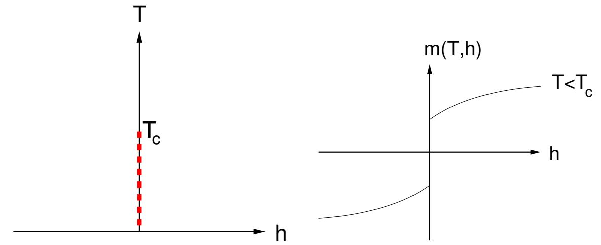

Figure 7: Phase diagram for the paramagnetic to ferromagnetic transition. The magnetization per site m(T, h) jumps when crossing zero for T < Tc.

#### 4.2 Critical Behaviour and Universality

Close to a critical point thermodynamic functions display power-law behaviours characterized by critical exponents. We will now discuss various such exponents, using as a specific example the paramagnet to ferromagnet transition.

#### 1. Order Parameter

This is a quantity that is different in the various phases and can be used to characterize the phase transition. For the paramagnet to ferromagnet transition in zero magnetic field the appropriate order parameter is the magnetization per site

$$\left| m(T) = \varprojlim_{h \to +0} \varprojlim_{V \to \infty} \frac{1}{V} M(h, T). \right| \tag{99}$$

Here M(h, T) is the magnetization. Where T ≈ Tc, one has

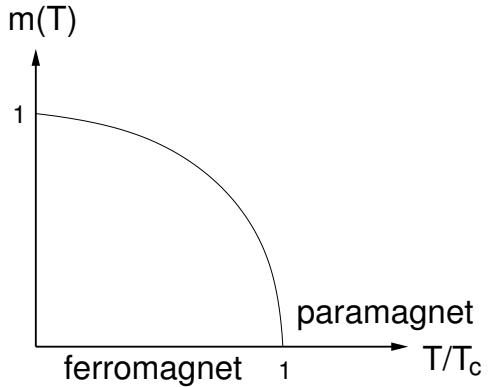

Figure 8: Order parameter for the paramagnet to ferromagnet transition in zero field.

$$m(T) \sim \begin{cases} 0 & \text{if } T > T_c \\ |t|^\beta & \text{if } T < T_c \end{cases} \qquad t = \frac{T - T_c}{T_c}.\tag{100}$$

β is a critical exponent.

#### 2. Susceptibilities

At the critical point the system is very sensitive to external perturbations. The singularity in the response of the order parameter to a field "conjugate" to it is characterized by critical exponents γ±. For our magnet

$$\left| \chi_{\pm}(T) = \frac{\partial}{\partial h} \Big|_{h=0} \lim_{V \to \infty} \frac{1}{V} M(h, T) \sim |t|^{-\gamma_{\pm}}.\right| \tag{101}$$

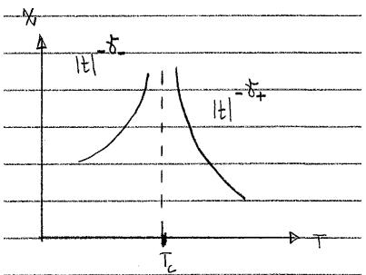

Figure 9: Critical behaviour of the magnetic susceptibility.

#### 3. Heat Capacity

A third critical exponent is associated with the heat capacity

$$C(T) = -T\frac{\partial^2 F}{\partial T^2} \sim \begin{cases} A_+ |t|^{-\alpha_+} & \text{if } T > T_c \\ A_- |t|^{-\alpha_-} & \text{if } T < T_c. \end{cases} \tag{102}$$

Depending on the signs of α± this may or may not be singular, see Fig. 10.

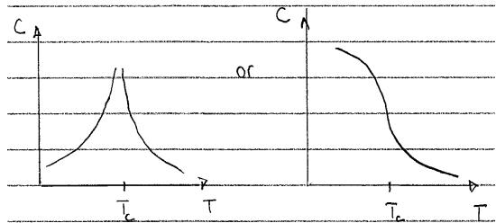

Figure 10: Critical behaviour of the heat capacity.

#### 4.2.1 Universality

The critical exponents are insensitive to microscopic details of the system under consideration and are characteristic of the critical point. A consequence of this is that completely different systems can exhibit the same critical behaviour!

#### 4.3 Landau Theory

Landau Theory is a general approach to phase transitions that

- is phenomenological in nature and deals only with macroscopic quantities;
- applies only to the neighbourhood of a critical point, where the order parameter is small.

Landau theory is constructed as follows.

- 1. Identify the order parameter(s) M(r) characterizing the phase transition. Depending on which phase transition we are dealing with M can be a real scalar, a complex scalar, a real or complex vector or something more complicated. For the paramagnet to ferromagnet transition the order parameter is the magnetization per site, i.e. a real number.
- 2. Form a "coarse-grained" order parameter density Φ(r). Think of this as the microscopic order parameter averaged over atomic distances. This is a continuum field. For the example of the paramagnet to ferromagnet transition we are dealing with a real scalar field.
- 3. Consider the free energy density to be a functional of the order parameter field Φ(r). The free energy is then

$$\beta F = \underline{\int d^D \mathbf{r} f[\Phi(\mathbf{r})]}.\tag{103}$$

- 4. By construction of the order parameter(s), the latter is (are) small close to our critical point. This allows us to expand f[Φ(r)] is a power series around Φ = 0. From now on we will focus on the simplest case of a real scalar order parameter φ(r). Then the series expansion is

$$f[\phi] \simeq \text{const} - h\phi + \alpha_2 \phi^2 + \frac{1}{2} |\nabla \phi|^2 + \alpha_3 \phi^3 + \alpha_4 \phi^4 + \dots \tag{104}$$

where the coefficient of the gradient term is fixed by convention to be 1/2. This makes φ in general dimensionful

$$\dim[\phi(\mathbf{r})] = (\text{length})^{1-D/2}.\tag{105}$$

The only linear term that is not a total derivative is −hφ, where h is an external field (a "source") coupling to the order parameter. Total derivative terms can be dropped, because the only give boundary contributions to F. The coefficients αn are a priori all functions of temperature.

- 5. In translationally invariant systems the free energy is minimized by r-independent order parameters (i.e. ∇φ(r) = 0). The reason is that 1 2 |∇φ| 2 ≥ 0, and hence this contribution to F is minimized by constant solutions. For constant field h the potential V (φ(r)) = −hφ + α2φ 2 + α4φ 4 is also minimized by constant solutions. In order to understand the nature of the phase transition, we therefore can simply look at the minima of the potential V (φ).
- 6. Finally, we use symmetries and the fact that we are interested in the vicinity of a critial point to constrain the αj .

- If we truncate our expansion at order φ 4 , then thermodynamic stability requires

$$\boxed{\alpha_4 > 0.} \tag{106}$$

If α4 < 0 the free energy density would be unbounded from below and could become infinitely negative, which is forbidden.

- If we know that the system is invariant under certain symmetry operations, e.g.

$$
\phi \to -\phi,\tag{107}
$$

then the free energy must respect this symmetry. A ferromagnet has the symmetry (107) in absence of a magnetic field because of time-reversal invariance. Hence we must have α3 = 0 in this case.

- In the case h = α3 = 0, for a translationally invariant system, we can obtain the temperature dependence of α2 as follows. As discussed above, the nature of the phase transition can be inferred from the minima of the potential V (φ) = α2φ 2 + α4φ 4 . This is done in Fig. 11. We see that the
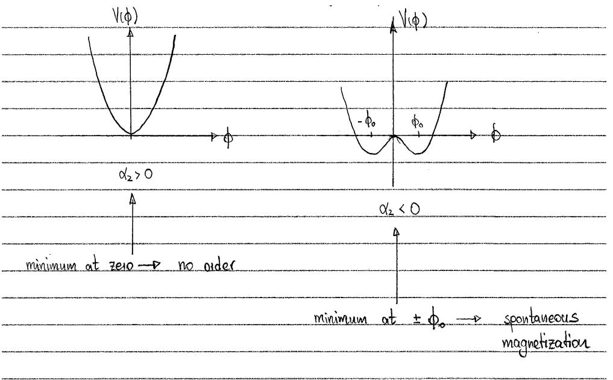

Figure 11: Minima of the potential V (φ). For α2 > 0 the minima occurs at φ = 0, so there is no ferromagnetic order. For α2 < 0 there are two minima at φ = ±φ0, corresponding to the emergence of a spontaneous magnetization.

phase transition corresponds to α2 changing sign at T = Tc. So in the vicinity of the transition we have (by Taylor expanding α2 in T − Tc)

$$\alpha_2(t) = At + \mathcal{O}(t^2) \,, \qquad t = \frac{T - T_c}{T_c} \,, \ A > 0 . \tag{108}$$

The parameter α4 is also temperature dependent, but this dependence is subleading

$$
\alpha_4(t) = \alpha_4(0) + \mathcal{O}(t). \tag{109}
$$

- 7. If we have α3 < 0 the transition is generically first order. To see this we again use that in a translationally invariant system the minima of the free energy density will be r-independent, so that we merely need to scrutinize the potential V (φ) to understand the nature of the phase transition. In Fig. 12 we plot V (φ) when α2 is decreased at fixed α3, α4. We see that initially the minimum occurs at φ = 0 (no order), and at some critical value of α2 then jumps from zero to a finite value φ0. This is characteristic of a first order transition.
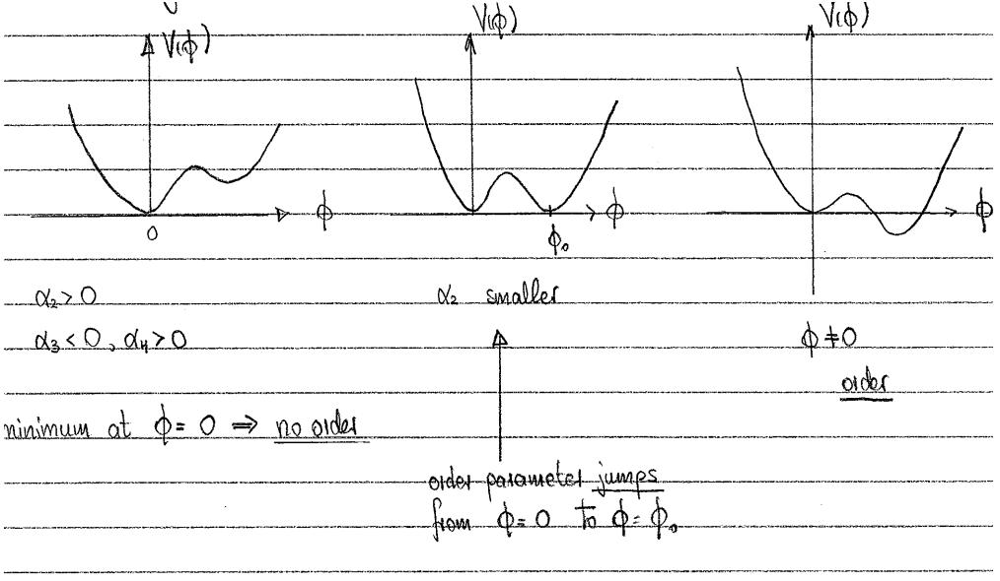

Figure 12: Minima of the potential V (φ) for α3 < 0. Decreasing the value of α2 leads to a discontinuous jump in the order parameter at some critical value. The transition is therefore first order.

#### 4.3.1 Thermodynamic Equilibrium

The state of thermodynamic equilibrium is obtained by minimizing the free energy (we assume that α3 = 0)

$$
\beta F = \int d^D \mathbf{r} \left[ -h\phi + \alpha_2 \phi^2 + \frac{1}{2} |\nabla \phi|^2 + \alpha_4 \phi^4 \right]. \tag{110}
$$

In our case we are searching for the order parameter configuration φ(r) that gives the smallest contribution to βF. This is found by functional extremization

$$\frac{\delta F}{\delta \phi(\mathbf{r})} = 0.\tag{111}$$

The resulting nonlinear differential equation is

$$\frac{-\nabla^2 \phi(\mathbf{r}) + 2\alpha_2 \phi(\mathbf{r}) + 4\alpha_4 \phi^3(\mathbf{r}) - h = 0.}{}$$

It is easy to see (see the discussion above) that the solutions to (112) that minimize the free energy are in fact r-independent (if we ignore boundary conditions). Hence for zero field h = 0 the order parameter configuration that minimizes the free energy is

$$\phi(\mathbf{r}) = \begin{cases} 0 & \text{if } \alpha_2 > 0 \leftrightarrow T > T_c \\ \pm \phi_0 = \pm \sqrt{-\frac{\alpha_2}{2\alpha_4}} & \text{if } \alpha_2 < 0 \leftrightarrow T < T_c \\ \hline \end{cases} \tag{113}$$

We observe that we are dealing with a second order phase transition (because φ0 vanishes at the critical point) from a paramagnetic to a ferromagnetic phase.

#### 4.3.2 Beyond the Landau Free Energy

So far we have focussed entirely on the state of thermodynamic equilibrium. We now want to extend Landau theory to take into account fluctuations as well. Let us go back to the microscopic model underlying our Landau free energy. The partition function for this microscopic theory is

$$Z_{\rm micro} = \sum_{\text{configurations C}} e^{-\beta E(C)} \,. \tag{114}$$

In order to define our order-parameter field, we used a coarse-graining procedure. Hence after coarse-graining Z should become

$$Z \longrightarrow \sum_{\text{order parameter} \atop \text{configurations}} e^{-\beta \mathcal{H}} \,. \tag{115}$$

Because under the coarse-graining procedure many microscopic configurations C map onto the same order parameter configuration φ(r), the "Landau-Ginzburg Hamiltonian" βH incorporates certain entropic effects. By employing the same logic as before, we can argue that

$$
\beta \mathcal{H} = \int d^D \mathbf{r} \, f[\phi(\mathbf{r})] \, \,, \tag{116}
$$

where f[φ(r)] is the same functional we constructed when considering the Landau free energy. As the order parameter is really a continuous field, what we mean by the sum in (115) is really the functional integral

$$Z = \int \mathcal{D}\phi(\mathbf{r}) \, e^{-\beta \mathcal{H}}.\tag{117}$$

The latter is defined as follows:

- We first discretize our D-dimensional spatial variable

$$\mathbf{r} \longrightarrow a_0 \mathbf{n} = a_0(n_1, \dots, n_D), \tag{118}$$

where a0 is a lattice spacing and the total number of points on our discrete grid is N D.

- We then discretize the order parameter field and its derivatives

$$\begin{array}{rcl}\phi(\mathbf{r}) & \longrightarrow & \phi_{\mathbf{n}}\ ,\\\partial_{r_{j}}\Phi(\mathbf{r}) & \longrightarrow & \frac{\phi_{\mathbf{n}+\mathbf{e}_{j}}-\phi_{\mathbf{n}}}{a_{0}}\end{array} \tag{119}$$

where ej are unit vectors in the j-direction.

- The Landau-Ginzburg Hamiltonian is discretized as

$$
\beta \mathcal{H} \longrightarrow \sum_{\mathbf{n}} f[\phi_{\mathbf{n}}] a_0^D. \tag{120}
$$

- The functional integral is then defined as follows

$$\left| Z = \int \mathcal{D}\phi(\mathbf{r}) \, e^{-\beta \mathcal{H}} \equiv \lim_{N \to \infty} \int \prod_{\mathbf{n}} d\phi_{\mathbf{n}} e^{-\sum_{\mathbf{m}} f[\phi_{\mathbf{m}}] a_{0}^{D}} . \right| \tag{121}$$

Crucially, the functional integral defined in this way can be manipulated according to the same rules we derived for path-integrals in Quantum Mechanics. In this new way of looking at things we now can analyze properties that are not directly related to the free energy. For example, we may ask about properties of correlation functions like

$$
\langle \phi(\mathbf{r}) \phi(\mathbf{0}) \rangle_{\beta} \equiv \frac{1}{Z} \int \mathcal{D}\phi \,\,\phi(\mathbf{r}) \phi(\mathbf{0}) \,\, e^{-\beta \mathcal{H}}.\tag{122}
$$

#### 4.3.3 Saddle Point Approximation

The Landau-Ginzburg field theory

$$Z = \int \mathcal{D}\phi(\mathbf{r}) \, e^{-\int d^D \mathbf{r} f[\phi(\mathbf{r})]},\tag{123}$$

is still difficult to analyze. For the example we have discussed, it reduces to the Euclidean space version of the λφ4 theory you have encountered in the field theory part of the course. In order to proceed we therefore resort to further approximations. The saddle-point approximation takes into account the thermodynamically most likely configuration φ(r), i.e. the configuration that minimizes

$$
\beta \mathcal{H} = \int d^D \mathbf{r} f[\phi(\mathbf{r})].\tag{124}
$$

We see that the saddle-point approximation precisely recovers the results of the Landau free energy approach! However, using our new formulation we now go beyond this approximation and take into account fluctuations. We will see below how to do this.

#### 4.3.4 Mean Field Exponents

Using the saddle point solution we can determine the corresponding approximation for the critical exponents.

- Order parameter.
Using that α2 = At for t = (T − Tc)/Tc < 0, we have

$$\left| \phi_0 = \pm \sqrt{\frac{A}{2\alpha_4}} |t|^{\frac{1}{2}}.\right| \tag{125}$$

This gives the critical exponent

$$
\boxed{\beta = \frac{1}{2} \cdot \Biggvmatrix} \tag{126}
$$

- Magnetic susceptibility.
Differentiating (112) with respect to h gives for r-independent solutions

$$2\alpha_2 \frac{\partial \phi}{\partial h} + 12\alpha_4 \frac{\partial \phi}{\partial h} \phi^2 = 1. \tag{127}$$

The zero-field susceptibility is thus

$$\chi = \frac{\partial \phi}{\partial h}\Big|_{h=0} = \frac{1}{2\alpha_2 + 12\alpha_4\phi^2}.\tag{128}$$

Using that α2 = At and φ 2 0 = A|t|/2α4 this becomes

$$\chi = \begin{cases} \frac{1}{2At} & \text{if } t > 0, \\ \frac{1}{4A|t|} & \text{if } t < 0. \end{cases} \tag{129}$$

This gives the critical exponents

$$\boxed{\gamma_{\pm} = 1.}\tag{130}$$

- Heat capacity.
The heat capacity is defined by

$$C(T, h=0) = -T\frac{\partial^2 F}{\partial T^2}.\tag{131}$$

The saddle point contribution to the free energy is

$$\frac{F}{V} \sim \begin{cases} 0 & \text{if } t > 0, \\ -\frac{A^2 k_B T_c t^2}{4\alpha_4} & \text{if } t < 0, \end{cases} \tag{132}$$

giving

$$\begin{cases} C(T, h=0) \sim \begin{cases} 0 & \text{if } t>0, \\ \frac{A^2 k_B T_c^2 V}{2\alpha_4} & \text{if } t<0, \end{cases} \end{cases} \tag{133}$$

This has a finite jump at Tc, which corresponds to the critical exponent

$$
\boxed{\alpha = 0.\,\,\,}\tag{134}
$$

#### • Correlation length exponent.

The exponents described above can all be obtained from the saddle point solution, or equivalently the Landau free energy. This is not the case for the correlation length exponent ν, which is related to fluctuations around the saddle point.

Away from the critical point the (connected) order-parameter two-point function decays exponentially with distance

$$
\langle \langle \phi(\mathbf{r})\phi(\mathbf{0})\rangle_{\beta} - \langle \phi(\mathbf{r})\rangle_{\beta}\langle \phi(\mathbf{0})\rangle_{\beta} = e^{-|\mathbf{r}|/\xi}, \qquad |\mathbf{r}| \to \infty. \tag{135}
$$

The correlation length ξ diverges when the critical point is approached

$$\boxed{\xi \sim |t|^{-\nu}.}\tag{136}$$

The relation (136) defines the exponent ν. We now determine ν in what is known as the Gaussian approximation. In the disordered phase this amounts to simply dropping the φ 4 term in the free energy density, i.e. by setting

$$
\langle \phi(\mathbf{r}) \phi(\mathbf{0}) \rangle_{\beta} \approx \frac{1}{Z} \int \mathcal{D}\phi \ \phi(\mathbf{r}) \phi(\mathbf{0}) \exp\left( - \int d^D \mathbf{r}' \left[ \frac{1}{2} |\nabla \phi(\mathbf{r}')|^2 + \alpha_2 \phi^2(\mathbf{r}') \right] \right) . \tag{137}
$$

It is not a priori clear that the Gaussian approximation will give a good account of th two point function. It turns out to be good if the spatial dimensionality D is sufficiently high.

The two-point function (137) can be calculated using a generating functional

$$Z[h] = \int \mathcal{D}\phi \, \exp\left(-\int d^D \mathbf{r}' \left[\frac{1}{2} |\nabla \phi(\mathbf{r}')|^2 + \alpha_2 \phi^2(\mathbf{r}') - h(\mathbf{r}')\phi(\mathbf{r}')\right]\right). \tag{138}$$

Indeed, we have

$$
\langle \phi(\mathbf{r})\phi(\mathbf{0})\rangle_{\beta} = \frac{\delta}{\delta h(\mathbf{r})} \frac{\delta}{\delta h(\mathbf{0})} \Big|_{h=0} \ln(Z[h]).\tag{139}
$$

We calculate the generating functional by going to Fourier space

$$\phi(\mathbf{r}) = \int \frac{d^D \mathbf{p}}{(2\pi)^D} e^{-i\mathbf{p}\cdot\mathbf{r}} \tilde{\phi}(\mathbf{p}), \quad h(\mathbf{r}) = \int \frac{d^D \mathbf{p}}{(2\pi)^D} e^{-i\mathbf{p}\cdot\mathbf{r}} \tilde{h}(\mathbf{p}). \tag{140}$$

This gives

$$\beta \mathcal{H} = \int \frac{d^D \mathbf{p}}{(2\pi)^D} \left[ \left( \frac{\mathbf{p}^2}{2} + \alpha_2 \right) \tilde{\phi}(\mathbf{p}) \tilde{\phi}(-\mathbf{p}) - h(\mathbf{p}) \tilde{\phi}(-\mathbf{p}) \right]. \tag{141}$$

Next we "complete the square" by changing variables to

$$
\tilde{\varphi}(\mathbf{p}) = \tilde{\phi}(\mathbf{p}) - \frac{\tilde{h}(\mathbf{p})}{\mathbf{p}^2 + 2\alpha_2}. \tag{142}
$$

As the Jacobian of the change of variables is 1, this gives

$$Z[h] = \int \mathcal{D}\tilde{\varphi} \exp\left(-\int \frac{d^D \mathbf{p}}{(2\pi)^D} \left[\frac{\mathbf{p}^2}{2} + \alpha_2\right] \tilde{\varphi}(\mathbf{p}) \tilde{\varphi}(-\mathbf{p})\right) \exp\left(\frac{1}{2} \int \frac{d^D \mathbf{p}}{(2\pi)^D} \frac{\tilde{h}(\mathbf{p})\tilde{h}(-\mathbf{p})}{\mathbf{p}^2 + 2\alpha_2}\right). \tag{143}$$

The first factor is merely a constant, which we will denote by N , while the second factor is rewritten as

$$Z[h] = \mathcal{N} \exp\left(\frac{1}{2} \int d^D \mathbf{r} d^D \mathbf{r}' h(\mathbf{r}) G(\mathbf{r} - \mathbf{r}') h(\mathbf{r}')\right),$$

$$G(\mathbf{r}) = \int \frac{d^D \mathbf{p}}{(2\pi)^D} \frac{e^{-i\mathbf{p}\cdot\mathbf{r}}}{\mathbf{p}^2 + 2\alpha_2}.\tag{144}$$

Taking functional derivatives we have

$$<\langle \phi(\mathbf{r})\phi(\mathbf{0})\rangle_{\beta} = G(\mathbf{r}) \sim \frac{e^{-|\mathbf{r}|\sqrt{2\alpha_2}}}{|\mathbf{r}|^{\frac{D-1}{2}}}, \qquad |\mathbf{r}| \to \infty. \tag{145}$$

This gives the correlation length

$$
\xi = \frac{1}{\sqrt{2\alpha_2}} \sim \frac{1}{t^{\frac{1}{2}}},\tag{146}
$$

and thus the critical exponent

$$
\left\lfloor \nu = \frac{1}{2} \cdot \right\rfloor \tag{147}
$$

Given the explicit calculation we have just done, we are now in the position to introduce a shortcut for obtaining the two point function in the Gaussian approximation in similar situations. In absence of a source h(r) the Landau-Ginzburg Hamiltonian (and the Landau free energy βF for that matter) is written as

$$\beta \mathcal{H}_{\;\;\;\;\;\phi} = \frac{1}{2} \int \frac{d^D \mathbf{p}}{(2\pi)^D} \left[ \left( \mathbf{p}^2 + 2\alpha_2 \right) \tilde{\phi}(\mathbf{p}) \tilde{\phi}(-\mathbf{p}) + \text{quartic} \right]. \tag{148}$$

From this expression we can simply read off the result for the two point function in the Gaussian approximation

$$
\langle \tilde{\phi}(\mathbf{p}) \tilde{\phi}(\mathbf{q}) \rangle_{\beta} = \frac{(2\pi)^{D} \delta^{D}(\mathbf{p} - \mathbf{q})}{\mathbf{p}^{2} + 2\alpha_{2}}.\tag{149}
$$

Here the denominator is given by whatever factor multiplies the quadratic term in βH. The deltafunction expresses momentum conservation.

In the ordered phase t < 0 we expand f[φ(r)] around one of the minima at ±φ0. The choice of minimum implements spontaneous symmetry breaking. We have

$$V(\phi) = \alpha_2 \phi^2 + \alpha_4 \phi^4 \simeq \alpha_2 \phi_0^2 + \alpha_4 \phi_0^4 + (\alpha_2 + 6\alpha_4 \phi_0^2)(\phi - \phi_0)^2 + \dots \tag{150}$$

We may drop the constant and retain only the contribution quadratic in δφ = φ − φ0 (this is the Gaussian approximation in the ordered phase), which gives

$$f[\delta\phi(\mathbf{r})] \simeq \frac{1}{2} |\nabla \delta\phi|^2 + \tilde{\alpha}_2 \delta\phi^2. \tag{151}$$

Here ˜α2 = −2α2 > 0. We may now copy the calculation in the disordered phase and obtain for the connected correlation function

$$
\langle \langle \delta\phi(\mathbf{r})\delta\phi(\mathbf{0})\rangle_{\beta} = \langle \phi(\mathbf{r})\phi(\mathbf{0})\rangle_{\beta} - \langle \phi(\mathbf{r})\rangle_{\beta}\langle \phi(\mathbf{0})\rangle_{\beta} \sim \frac{e^{-|\mathbf{r}|\sqrt{-4\alpha_{2}}}}{|\mathbf{r}|^{\frac{D-1}{2}}}, \quad |\mathbf{r}| \to \infty. \tag{152}
$$

We see that the correlation length scales as ξ ∝ |t| −1/2 , giving again ν = 1/2.

#### 4.4 Other Examples of Phase Transitions

#### 4.4.1 Isotropic-Nematic Transition in Liquid Crystals

Liquid crystals are fluids of rod-like molecules. At high temperatures their centres of mass are randomly distributed and the rods are randomly oriented. At low temperatures, in the nematic phase the rods spontaneously align along a common axis, see Fig. 13. What is the order parameter characterizing this

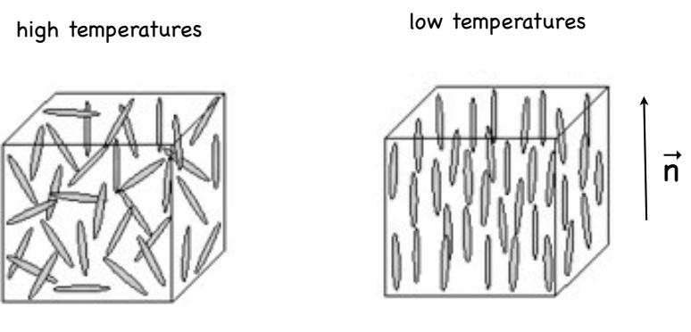

Figure 13: At low temperatures the rod-like molecules spontaneously align along an axis ~n.

transition?

Let us associate a unit vector ~n(r) with a molecule at position r. The first guess one may have is to take h~n(r)iβ as the order parameter. This will not work, because the two vectors ~n(r) and −~n(r) describe the same orientation of the molecule. Hence the order parameter must be invariant under

$$
\vec{n}(\mathbf{r}) \longrightarrow -\vec{n}(\mathbf{r}).\tag{153}
$$

So how about something quadratic like

$$
\langle n_i(\mathbf{r}) n_j(\mathbf{r}) \rangle_\beta. \tag{154}
$$

The problem with this expression is that it is different from zero even for randomly oriented molecules (which is what one has at very high temperatures). Indeed, using a parametrization of the unit vector for a single molecule in terms of polar coordinates we have

$$
\vec{n} = \begin{pmatrix}
\sin\theta\cos\varphi \\
\sin\theta\sin\varphi \\
\cos\theta
\end{pmatrix}.
\tag{155}
$$

Then averaging over all possible orientations gives

$$
\langle\langle n_i n_j \rangle\rangle = \frac{1}{4\pi} \int_0^\pi d\theta \int_0^{2\pi} d\varphi \sin\theta n_i n_j = \frac{1}{3} \delta_{i,j} \neq 0. \tag{156}
$$

This consideration suggests to try

$$Q_{ij} = \langle n_i n_j \rangle_\beta - \frac{1}{3} \delta_{i,j} \Bigg\vert \tag{157}$$

as our order parameter. At very high temperatures, when molecules have random orientations, this is zero. On the other hand, if the molecules are aligned in the z-direction, i.e. ~n = ~ez, we have

$$Q = \begin{pmatrix} -\frac{1}{3} & 0 & 0\\ 0 & -\frac{1}{3} & 0\\ 0 & 0 & \frac{2}{3} \end{pmatrix}. \tag{158}$$

So this seems to work. Given the order parameter, how do we then determine the free energy? In the high temperature phase the free energy must be invariant under rotations of the molecules, i.e. under

$$Q(\mathbf{r}) \longrightarrow RQ(\mathbf{r})R^T.\tag{159}$$

This suggests the following expansion for the free energy density

$$\underbrace{f[Q(\mathbf{r})] = \frac{1}{2}|\nabla Q|^2 + \alpha_2 \text{Tr}[Q^2] + \alpha_3 \text{Tr}[Q^3] + \alpha_4 \left(\text{Tr}[Q^2]\right)^2 + \dots}_{\tag{160}}\tag{160}$$

Here |∇Q| 2 = P3 i,j,k=1(∂kQij ) 2 . The presence of a cubic term suggests that the transition is first order, which is indeed correct.

#### 4.4.2 Superfluid Transition in Weakly Interacting Bosons

Let us recall the second quantized Hamiltonian for weakly repulsive bosons

$$H = \int d^4 \mathbf{r} \left[ c^\dagger(\mathbf{r}) \left( -\frac{\nabla^2}{2m} \right) c(\mathbf{r}) + \frac{U}{2} c^\dagger(\mathbf{r}) c^\dagger(\mathbf{r}) c(\mathbf{r}) c(\mathbf{r}) \right]. \tag{161}$$

In the superfluid phase we have macroscopic occupation of the zero momentum single-particle state

$$
\langle c(\mathbf{p} = 0) \rangle_{\beta} = \sqrt{N_0}.\tag{162}
$$

This implies that

$$
\psi(\mathbf{r}) = \langle c(\mathbf{r})\rangle_{\beta} \neq 0 \quad , \quad T < T_c. \tag{163}
$$

At high temperatures the expectation value vanishes, so that we may take ψ(r) as a complex valued order parameter. The Landau free energy describing the transition can then be constructed by noting that it should be invariant under U(1) transformations

$$
\psi(\mathbf{r}) \longrightarrow e^{i\theta}\psi(\mathbf{r}).\tag{164}
$$

This gives

$$F[\psi] = \int d^D \mathbf{r} \left[ \frac{1}{2m} |\nabla \psi|^2 + \alpha_2 |\psi(\mathbf{r})|^2 + \alpha_4 |\psi|^4 \right]. \tag{165}$$

#### 4.5 Ising Model and Φ 4 Theory

The 3-dimensional Ising model has a paramagnet to ferromagnet phase transition that can be described by Landau theory. An obvious question is then whether it is possible to derive the appropriate Landau theory starting from the lattice model. Let us therefore consider a general Ising model with Hamiltonian

$$H = -\sum_{i,j} \sigma_i \tilde{C}_{ij} \sigma_j - \tilde{h} \sum_i \sigma_i. \tag{166}$$

Let's work on a hypercubic lattice in D dimensions, and take

$$
\tilde{C}_{ij} = \tilde{C}(|\mathbf{r}_i - \mathbf{r}_j|) \tag{167}
$$

to be translationally invariant. The patition function is

$$Z = \sum_{\{\sigma_j\}} e^{\sum_{j,\ell} \sigma_j C_{j\ell} \sigma_\ell + h \sum_\ell \sigma_\ell},\tag{168}$$

where we have defined h = βh˜ and Cij = βCeij . Recalling the Gaussian integration identity

$$1 = \underbrace{\sqrt{\det(4\pi C^{-1})}}_{N} \int \prod_{\ell} d\psi_{\ell}^{\prime} \, e^{-\frac{1}{4} \sum_{j,k} \psi_{j}^{\prime} C_{jk}^{-1} \psi_{k}^{\prime}},\tag{169}$$

and then shifting the integration variables

$$
\psi_j' = \psi_j - 2\sum_k C_{jk}\sigma_k,\tag{170}
$$

we arrive at the following identity

$$\mathcal{N} = \mathcal{N} \int \mathcal{D}\psi \, e^{-\frac{1}{4}\sum_{j,k}\psi_j C_{jk}^{-1}\psi_k + \sum_j \sigma_j \psi_j - \sum_{j,k}\sigma_j C_{jk}\sigma_k} \,. \tag{171}$$

Substituting this into our expression for the partition function gives

$$\left| Z = \mathcal{N} \int \mathcal{D}\psi \sum_{\{\sigma_j\}} e^{-\frac{1}{4} \sum_{j,k} \psi_j C_{jk}^{-1} \psi_k + \sum_j \sigma_j (\psi_j + h)} \right| \tag{172}$$

What we have done is to remove the interaction between the spins by introducing auxiliary variables ψj at every site. This is an example of a Hubbard-Stratonovich transformation. Now we can perform the summations over spin variables

$$\sum_{\{\sigma_j\}} e^{\sum_k \sigma_k (\psi_k + h)} = \prod_k \left[ 2 \cosh(\psi_k + h) \right]. \tag{173}$$

Thus

$$Z = \mathcal{N} \int \mathcal{D}\psi \, e^{-\frac{1}{4} \sum_{j,k} \psi_j C_{jk}^{-1} \psi_k + \sum_j \ln\{2 \cosh(h + \psi_j)\}} \tag{174}$$

Finally we change variables to

$$\phi_j = \frac{1}{2} \sum_k C_{jk}^{-1} (\psi_k + h),\tag{175}$$

which leads to the following expression for the partition function

$$Z = N' \int \mathcal{D}\phi \, e^{-\sum_{j,k} \phi_j C_{jk} \phi_k + h \sum_j \phi_j + \sum_j \ln(\cosh(2\sum_k C_{jk}\phi_k))}.\tag{176}$$

This is still at the level of the lattice model. We now want to focus on large distances/small energies, in order to obtain a field theory description. We furthermore will now assume that the matrix C, which depends on temperature, is such that large fluctuations of φj are supressed. We then can take φj to be small and expand

$$\underbrace{\ln[\cosh(2\sum_{k}C_{jk}\phi_{k})]}_{X} \simeq \frac{X^{2}}{2} - \frac{X^{4}}{12} + \dots \tag{177}$$

Finally, we go to Fourier space using

$$\phi_j = \frac{1}{N} \sum_{\mathbf{k}} e^{-i\mathbf{k} \cdot \mathbf{r}} \phi(\mathbf{k}) \,, \quad C_{jk} = \frac{1}{N} \sum_{\mathbf{k}} e^{-i\mathbf{k} \cdot (\mathbf{r}_j - \mathbf{r}_k)} \,\, C(\mathbf{k}) , \tag{178}$$

and focus on the small-|k| regime. This gives

$$Z = N^{\eta} \int \mathcal{D}\phi \; e^{-\frac{1}{N} \sum_{\mathbf{k}} \phi(\mathbf{k}) \left[ \mathbf{c}_{1} + \mathbf{c}_{2} \mathbf{k}^{2} + \dots \right] \phi(-\mathbf{k}) + \mathbf{c}_{3} h \phi(\mathbf{0}) + \frac{\epsilon_{4}}{N^{3}} \sum_{\mathbf{k}_{1}, \mathbf{k}_{2}, \mathbf{k}_{3}} \phi(\mathbf{k}_{1}) \phi(\mathbf{k}_{2}) \phi(\mathbf{k}_{3}) \phi(-\mathbf{k}_{1} - \mathbf{k}_{2} - \mathbf{k}_{3}) + \dots \tag{179}$$

where the coefficients cl depend on the matrix Cejk specifying the interactions of Ising spins. Going back to real space we recover Euclidean Φ4 theory

$$Z = N^{\eta} \int \mathcal{D}\phi \ e^{-\int d^D \mathbf{x} \left[c_1(\nabla \phi(\mathbf{x}))^2 + c_2 \phi^2(\mathbf{x}) + c_3 h \phi(\mathbf{x}) + c_4 \phi^4(\mathbf{x})\right]} \,. \tag{180}$$

Voil`a. Note however, that the relation of the field φ(x) to the original Ising spin is rather indirect. In order to get a better feeling of "what happens to the spin" under all the above transformations, we could repeat the above steps for the generating functional rather than the partiton function. This will show us that Φ is indeed a good order parameter for the Ising transition.

#### Exercises:

Question 4. Consider a Landau expansion of the free energy of the form

$$F = \frac{a}{2}m^2 + \frac{b}{4}m^4 + \frac{c}{6}m^6$$

with c > 0. Examine the phase diagram in the a−b plane, and show that there is a line of critical transitions a = 0, b > 0 which joins a line of first order transitions b = −4(ca/3)1/2 at a point a = b = 0 known as a tricritical point.

Supposing that a varies linearly with temperature and that b is independent of temperature, compare the value of the exponent β at the tricritical point with its value on the critical line.

From Yeomans, Statistical Mechanics of Phase Transitions

#### Question 5.

(a) Discuss how an order parameter may be used to characterise symmetry breaking at a phase transition. (b) Argue that the uniaxial ferromagnet-paramagnet transition can be described by a Landau free energy of the form

$$F = \int d^3 \mathbf{r} \left[ \frac{1}{2} |\nabla \phi(\mathbf{r})|^2 - h\phi(\mathbf{r}) + \alpha_2 \phi^2(\mathbf{r}) + \alpha_3 \phi^3(\mathbf{r}) + \alpha_4 \phi^4(\mathbf{r}) \right]. \tag{181}$$

What can you say about α4?

(c) What is the nature of the transition for h = 0 if α3 6= 0? Explain your answer.

(d) Now assume that α3 = h = 0. Argue that close to the critical point

$$\alpha_2 = At \,, \quad t = \frac{T - T_c}{T_c} \text{ and } A > 0. \tag{182}$$

(e) Derive the equation characterizing the saddle point solution for α3 = h = 0. What are the configurations φ with the lowest free energy for h = 0, at T > Tc and at T < Tc? Why are these r independent?

(f) Now consider more general solutions to the saddle point equation in the low-temperature phase. With suitable boundary conditions the saddle point solutions for the order parameter are functions of x only, i.e. φ = φ(x). Show that in this case

$$E = \frac{1}{2} \left[ \frac{d\phi(x)}{dx} \right]^2 - \alpha_2 \phi^2 - \alpha_4 \phi^4 \tag{183}$$

is independent of x. Construct a solution φ(x) such that

$$\lim_{x \to \infty} \phi(x) = \phi_1 \quad , \quad \lim_{x \to -\infty} \phi(x) = \phi_2 \,. \tag{184}$$

where φ1,2 are the solutions found in (d). Hint: determine E for such solutions first.

Question 6. A system with a real, two-component order parameter (φ1(r), φ2(r)) has a free energy

$$F = \int \mathrm{d}^d \mathbf{r} \left[ \frac{1}{2} |\nabla \phi_1(\mathbf{r})|^2 + \frac{1}{2} |\nabla \phi_2(\mathbf{r})|^2 - \frac{1}{2} \left( \phi_1^2(\mathbf{r}) + \phi_2^2(\mathbf{r}) \right) + \frac{1}{4} \left( \phi_1^2(\mathbf{r}) + \phi_2^2(\mathbf{r}) \right)^2 \right] \,\mathrm{J}$$

Find the order-parameter values Φ1, Φ2 that minimise this free energy. Consider small fluctuations around such state, with (φ1(r), φ2(r)) = (Φ1 + ϕ1(r), Φ2 + ϕ2(r)) and expand F to second order in ϕ.

Assuming that the statistical weight of thermal fluctuations is proportional to exp(−F), calculate approximately the correlation function

$$
\langle \varphi_1(\mathbf{r}) \varphi_1(\mathbf{0}) + \varphi_2(\mathbf{r}) \varphi_2(\mathbf{0}) \rangle
$$

by evaluating a Gaussian functional integral. How does your result depend on the dimensionality d of the system?

# Part II Random Systems and Stochastic Processes

In nature there are many phenomena, in which some quantity varies in a random way. An example is Browninan motion, which refers to the motion of a small particle suspended in a fluid. The motion, observed under a microscope, looks random. It is hopeless to try to compute the position in detail, but certain average features obey simple laws. Averaging over a suitable time interval is difficult and one therefore replaces time averaging of a single irregularly varying function of time by averaging over an ensemble of functions. The latter must of course be chosen in such a way that the two results agree

$$\text{time average} \longrightarrow \text{ensemble average.}\tag{185}$$

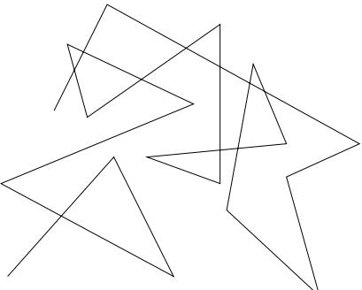

Figure 14: Cartoon of a path of a particle undergoing Brownian motion.

# 5 Random Variables

A random variable is an object X defined by

- 1. a set {xj} of possible values (either discrete or continuous);
- 2. a probability distribution PX(xj ) over this set

$$P_{\mathcal{X}}(x_j) \ge 0 \,, \qquad \sum_j P_{\mathcal{X}}(x_j) = 1 \text{ (this becomes an integral in the continuous case.)} \tag{186}$$

Example: Let X be the number of points obtained by casting a die

$$\left\{x_{j}\right\} = \left\{1, 2, 3, 4, 5, 6\right\}, \qquad P_{X}(x_{j}) = \frac{1}{6}. \tag{187}$$

#### 5.1 Some Definitions

The probability distribution PX(x) can be characterized by the moments of X

hXn i ≡ Z dx xn PX(x). (188)

The average value of X is the first moment hXi, while the variance is σ 2 = hX2 i − hXi 2 .

The Fourier transform of PX(x) is called the characteristic function

$$\phi_X(k) = \int dx \, P_X(x) e^{ikx} = \sum_{n=0}^{\infty} \frac{(ik)^n}{n!} \langle X^n \rangle \equiv \langle e^{ikX} \rangle. \tag{189}$$

The last equality shows that the characteristic function is the generating function for the moments

$$<\langle X^n \rangle = (-i)^n \frac{d^n}{dk^n} \Big|_{k=0} \phi_X(k). \tag{190}$$

The cumulants of PX(x) are defined as

$$\boxed{C_n(X) = (-i)^n \frac{d^n}{dk^n} \Big|_{k=0} \ln \left( \phi_X(k) \right).}\tag{191}$$

The first few cumulants are

$$C_1(X) = \langle X \rangle \,, \quad C_2(X) = \langle X^2 \rangle - \langle X \rangle^2 \,, \quad C_3(X) = \langle X^3 \rangle - 3 \langle X^2 \rangle \langle X \rangle + 2 \langle X \rangle^3. \tag{192}$$

The Gaussian distribution is defined by

$$P_X(x) = \frac{1}{\sqrt{2\pi\sigma^2}} e^{-\frac{(x-x_0)^2}{2\sigma^2}}.\tag{193}$$

Its characteristic function is

$$
\phi_X(k) = e^{ikx_0 - \frac{1}{2}k^2 \sigma^2}.\tag{194}
$$

The cumulants are C1(X) = x0, C2(X) = σ 2 , Cn>2(X) = 0. Hence the Gaussian distribution is completely determined by its first two cumulants.

#### 5.2 Discrete-time random walk

To see the above definitions in action we consider a tutor on (without loss of generality) his way back to Summertown after a long night out (needless to say it must be a humanities tutor). He moves along Banbury road, by making each second a step forward/backward with equal probability. Modelling Banbury road by a line, his possible positions are all integers −∞ < n < ∞ (assuming for simplicity that Banbury road is infinitely long, which is probably how it feels to our tutor), and we want to know the probability PN (n) for her to be at position n after N steps, starting from n = 0.

- Each step is a random variable Xj (j = 1, . . . , N) taking the values ±1 with probabilities 1/2.
- The position after r steps is Y = PN j=1 Xj .

Clearly we have

$$
\langle Y \rangle = 0 \,, \qquad \langle Y^2 \rangle = N \langle X_j^2 \rangle = N \, \, , \tag{195}
$$

where we have used that the steps are mutually independent. To obtain pN (n) we employ the characteristic function

$$
\phi_{X_j}(k) = P_{X_j}(1)e^{ik1} + P_{X_j}(-1)e^{ik(-1)} = \cos(k). \tag{196}
$$

The characteristic function of the random variable Y is

$$\phi_Y(k) \quad = \langle e^{ikY} \rangle = \langle e^{ik\sum_{j=1}^N X_j} \rangle = \prod_{j=1}^N \langle e^{ikX_j} \rangle = \left\langle \phi_{X_j}(k) \right\rangle^N$$

$$= \frac{1}{2^N} \left( e^{ik} + e^{-ik} \right)^N = \frac{1}{2^N} \sum_{r=0}^N \binom{N}{r} e^{ik(N-2r)}.\tag{197}$$

On the other hand we have by definition of the characteristic function

$$\phi_Y(k) = \sum_n P_Y(n)e^{ikn} = \sum_{n=-N}^{N} p_N(n)e^{ikn}.\tag{198}$$

Equating (197) with (198) gives

$$p_N(n) = \frac{1}{2^N} \binom{N}{\frac{N-n}{2}} \ , \tag{199}$$

where the binomial coefficient is taken to be zero if (N − n)/2 is not an integer between 0 and N.

#### 5.3 The central limit theorem

Let Xj j = 1, . . . , N be independent random variables with identical distributions PX(x) and consider their arithmetic mean

$$S_N = \frac{1}{N} \sum_{j=1}^{N} X_j. \tag{200}$$

Then for large N, SN tends towards a Gaussian, irrespective of the form of PX(x), provided that hXi and hX2 i are finite.

To see that this is the case, let us consider the characteristic function

$$
\langle \phi_{S_N}(k) = \langle e^{ikS_N} \rangle = \langle e^{i\frac{k}{N}\sum_{j=1}^{N}X_j} \rangle = \langle e^{ik\frac{X}{N}} \rangle^N = \left(\phi_X\left(\frac{k}{N}\right)\right)^N,\tag{201}
$$

where we have used that the random variables are independent and have the same distribution. The cumulants of SN are

$$C_n(S_N) = (-i)^n \frac{d^n}{dk^n} \Big|_{k=0} N \ln \left( \phi_X \left( \frac{k}{N} \right) \right). \tag{202}$$

We see that these cumulants are related to the cumulants Cn(X) of PX(x) by

$$\left| \begin{array}{c} C_n(S_N) = N^{1-n} C_n(X). \\ \end{array} \right| \tag{203}$$

Hence, for very large N PSN (s) tends to a Gaussian distribution with average hXi and variance C2(X)/N = σ 2/N, i.e.

$$\left| P_{S\chi}(s) \longrightarrow \left(\frac{N}{2\pi\sigma^2}\right)^{\frac{1}{2}} \exp\left[-\frac{N}{2\sigma^2}(s - \langle X \rangle)^2\right].\right|\tag{204}$$

# 6 Stochastic Processes: Definitions

A function YX(t) of time t and a random variable X is called a stochastic process (SP). Examples are the position x(t) or the velocity v(t) of a particle undergoing Brownian motion. A SP is characterized by probability densities

$$P_1(y_1, t_1) \ = \text{ probability that } Y(t_1) = y_1;$$

$$\vdots$$

$$P_n(y_1, t_1; \dots; y_n, t_n) \ = \text{ joint probability that } Y(t_1) = y_1, \dots, Y(t_n) = y_n. \tag{205}$$

These are

- normalized

$$\int dy_1 \ldots dy_n \, P_n(y_1, t_1; \ldots; y_n, t_n) = 1 \; ; \tag{206}$$

- reducible

$$\int dy_n \, P_n(y_1, t_1; \dots; y_n, t_n) = P_{n-1}(y_1, t_1; \dots; y_{n-1}, t_{n-1}).\tag{207}$$

Another way of characterizing a SP is through correlation functions

$$\begin{aligned} \left< Y(t_1) \right> &= \int dy_1 \, y_1 \, P(y_1, t_1) \,, \\ \left< Y(t_1) Y(t_2) \right> &= \int dy_1 dy_2 \, y_1 y_2 \, P_2(y_1, t_1; y_2, t_2) \,, \\ &\dots \, \end{aligned} \tag{208}$$

A stochastic process is called stationary if for all n and any t

$$P_n(y_1, t_1; \dots; y_n, t_n) = P_n(y_1, t_1 + \tau; \dots; y_n, t_n + \tau). \tag{209}$$

The conditional probability that Y = y2 at time t2, given that Y = y1 at time t1 is denoted by

$$P_{1|1}(y_2, t_2 | y_1, t_1). \tag{210}$$

This is normalized

$$\int dy_2 \,\, P_{1\mid 1}(y_2, t_2 | y_1, t_1) = 1\,\, \, , \tag{211}$$

and related to unconditional probabilities by

$$P_2(y_1, t_1; y_2, t_2) = P_{1|1}(y_2, t_2 | y_1, t_1) \; P_1(y_1, t_1). \tag{212}$$

The conditional probability that Y = yn at time tn, given that Y = yj at time tj for j = 1, . . . , n − 1 is denoted by

$$P_{1|n-1}(y_n, t_n | y_1, t_1; y_2, t_2; \dots; y_{n-1}, t_{n-1}).\tag{213}$$

# 7 Markov Processes

Perhaps the most important stochastic processes are so-called Markov processes (MP). Their defining property is that t1 < t2 < . . . < tn

$$\begin{array}{c} \hline \hline P_{1|n-1}(y_n, t_n | y_1, t_1; y_2, t_2; \dots; y_{n-1}, t_{n-1}) = P_{1|1}(y_n, t_n | y_{n-1}, t_{n-1}). \\\\ \hline \end{array} \tag{214}$$

This means that at time tn−1 one can predict the state of the system at time tn on the basis of present information, i.e. yn−1, only! The history of how the system arrived at yn−1 at time tn−1 is irrelevant.

A Markov process is completely determined by the two functions P1(y1, t1) and P1|1 (y2, t2|y1, t1), and this makes Markov processes tractable. Any P1(y1, t1) and P1|1 (y2, t2|y1, t1) define a MP, provided that they fulfil the following two consistency conditions

- Chapman-Kolmogorov equation

$$\frac{P_{1|1}(y_3, t_3|y_1, t_1) = \int dy_2 \, P_{1|1}(y_3, t_3|y_2, t_2) P_{1|1}(y_2, t_2|y_1, t_1) \, \,, \, t_3 > t_2 > t_1. \,\Big|\,\,\tag{215}$$

- Evolution equation

$$\boxed{P_1(y_2, t_2) = \int dy_1 \ P_{1|1}(y_2, t_2 | y_1, t_1) P_1(y_1, t_1) \ , \quad t_2 > t_1.} \tag{216}$$

A MP is called stationary if P1(y, t) is time-independent and P1|1 (y2, t2|y1, t1) depends only on the time difference t2 − t1 (and y1,2).

### 7.1 Examples of Markov Processes

- The discrete-time random walk is a MP.
- The Wiener process, defined by

$$\begin{array}{rcl}P_{1|1}(y_2, t_2 | y_1, t_1) &=& \frac{1}{\sqrt{2\pi(t_2 - t_1)}}e^{-\frac{(y_2 - y_1)^2}{2(t_2 - t_1)}},\\P_1(y, t) &=& \frac{1}{\sqrt{2\pi t}}e^{-\frac{y^2}{2t}},\end{array} \tag{217}$$

is a non-stationary Markov process. It was originally invented for describing the stochastic behaviour of the position of a Brownian particle.

#### 7.2 Markov Chains

A Markov chain is a MP, in which the random variable only takes a finite number of values and involves discrete time steps. The probability P1(y, t) can then be represented as a N-component vector, and P1|1 (y2, t2|y1, t1) ≡ T as an N × N matrix. The normalization condition (211) becomes

$$\left| \underbrace{\sum_{j=1}^{N} T_{jk}}_{j=1} = 1, \right| \tag{218}$$

which is often referred to as probability conservation.

Example: Two state process with Y = 1 or Y = 2, with conditional probabilities

$$\begin{array}{rcl}P_{1|1}(1, t+1; 1, t) &=& 1-q \end{array},\\\begin{array}{rcl}P_{1|1}(2, t+1; 1, t) &=& q \end{array},\\\begin{array}{rcl}P_{1|1}(1, t+1; 2, t) &=& r \end{array},\\\begin{array}{rcl}P_{1|1}(2, t+1; 2, t) &=& 1-r \end{array}.\tag{219}$$

Introducing a two-component vector

$$
\vec{p}(t) = \begin{pmatrix} P_1(1, t) \\ P_1(2, t) \end{pmatrix} \; , \tag{220}
$$

the evolution equation for the process can be expressed as a vector equation

~p(t + 1) = 1 − q r q 1 − r | {z } T ~p(t). (221)

T is a square matrix with non-negative entries, that is in general not symmetric. The matrix elements Tij are the rates for transitions from state j to state i. It is useful to rewrite the equation in components

$$p_n(t+1) = \sum_j T_{nj} p_j(t). \tag{222}$$

Then

$$p_n(t+1) - p_n(t) = \sum_j T_{nj} p_j(t) - \underbrace{\sum_j T_{jn}}_{1} p_n(t) = \sum_j T_{nj} p_j(t) - T_{jn} p_n(t). \tag{223}$$

Now consider our time interval to be small instead of 1. Then (223) turns into a differential equation, called a Master equation

$$\left| \frac{dp_n(t)}{dt} = \sum_j T_{nj} p_j(t) - T_{jn} p_n(t). \right| \tag{224}$$

This has a nice physical interpretation as a "loss/gain" equation for probabilities: the first term on the right-hand side is the rate of transitions from state j to state n times the probability of j being realized, i.e. the total gain of probability for state n. The second term on the right-hand side is the rate of transitions from state n to state j times the probability of n being realized, i.e. the total loss of probability for state n. Let us now return to the discrete form (221), which can be iterated to give

$$
\vec{p}(t+1) = T^{t+1}\vec{p}(0). \tag{225}
$$

While T is generally not symmetric, it is nevertheless often diagonalizable. Then there exist left and right eigenvectors such that

$$T|R_{\alpha}\rangle = \lambda_{\alpha}|R_{\alpha}\rangle \,, \quad \langle L_{\alpha}|T = \lambda_{\alpha}\langle L_{\alpha}| \, , \quad \langle L_{\alpha}|R_{\beta}\rangle = \delta_{\alpha,\beta} \, \, , \tag{226}$$

and T can be represented in the form

$$T = \sum_{\alpha} \lambda_{\alpha} |R_{\alpha}\rangle \langle L_{\alpha}|.\tag{227}$$

Using the orthonormality of left and right eigenvectors we have

$$\left| T^{t+1} = \sum_{\alpha} \lambda_{\alpha}^{t+1} |R_{\alpha}\rangle\langle L_{\alpha}|.\right| \tag{228}$$

In our example

$$\left|\lambda_1 = 1\right.\quad \left$$

$$\lambda_2 = 1 - q - r \quad , \quad \langle L_2 \vert = (-\frac{q}{r}, 1) \; , \quad \vert R_2 \rangle = \frac{1}{1 + r/q} \begin{pmatrix} -1 \\ 1 \end{pmatrix} . \tag{230}$$

So for large t we have

$$|T^{t+1} \approx |R_1\rangle\langle L_1| = \frac{1}{r+q} \begin{pmatrix} r & r \\ q & q \end{pmatrix},\tag{231}$$

and hence

$$
\overrightarrow{p}(\infty) = \frac{1}{r+q} \begin{pmatrix} r & r \\ q & q \end{pmatrix} \overrightarrow{p}(0). \tag{232}
$$

# 8 Brownian Motion

We now want to think of Brownian motion as a Markov process. Let v1, v2, . . . be the velocities of the particle at different time steps. Then vk+1 depends only on vk, but not on v1, . . . , vk−1.

#### 8.1 Langevin Equation

One approach to Brownian motion is via a stochastic differential equation, the Langevin equation for the velocity v(t) (more precisely the velocity in D = 1 or a component of the velocity in D > 1)

$$\left| \frac{dv(t)}{dt} = -\gamma v(t) + \eta(t). \right| \tag{233}$$

Here the first term on the right hand side is damping term linear in v, while the second term represents the remaining random force with zero average hη(t)i = 0. This is often referred to as "noise". For simplicity we will assume collisions to be instantaneous, so that forces at different times are uncorrelated

$$
\langle \eta(t)\eta(t')\rangle = \Gamma \delta(t - t'). \tag{234}
$$

Given our assumptions about the noise, we can calculate noise-averaged quantities quite easily. We have

$$\frac{d}{dt'}\left(v(t')e^{\gamma t'}\right) = \left(\frac{dv}{dt'} + \gamma v\right)e^{\gamma t'} = \eta(t')e^{\gamma t'},\tag{235}$$

where in the last step we used the Langevin equation (233). Integrating both sides of this equation between t = 0 and t 0 = t, we obtain

$$v(t) = v(0)e^{-\gamma t} + \int_0^t dt'\,\eta(t')e^{-\gamma(t-t')}.\tag{236}$$

Averaging this over the noise, we find the average velocity

$$
\langle v(t) \rangle = v(0)e^{-\gamma t} + \int_0^t dt' \underbrace{\langle \eta(t') \rangle e^{-\gamma(t-t')}}_{=0} = v(0)e^{-\gamma t} \cdot \tag{237}
$$

Similarly we have

$$\begin{aligned} \langle v^2(t) \rangle &= \left\langle \left[ v(0)e^{-\gamma t} + \int_0^t dt' \,\eta(t')e^{-\gamma(t-t')} \right] \left[ v(0)e^{-\gamma t} + \int_0^t dt'' \,\eta(t'')e^{-\gamma(t-t'')} \right] \right\rangle \\ &= \left. v^2(0)e^{-2\gamma t} + e^{-2\gamma t} \int_0^t dt' dt'' \underbrace{\langle \eta(t')\eta(t'') \rangle}_{\Gamma \delta(t'-t'')} e^{\gamma(t'+t'')} \end{aligned} \tag{238}$$

Carrying out the time integrals this becomes

$$
\left| \begin{pmatrix} v^2(t) \end{pmatrix} = v^2(0)e^{-2\gamma t} + \frac{\Gamma}{2\gamma}(1 - e^{-2\gamma t}). \right| \tag{239}
$$

The displacement of the particle is

$$x(t) - x(0) = \int_0^t dt' \, v(t') = \frac{v(0)}{\gamma} (1 - e^{-\gamma t}) + \int_0^t dt' \int_0^{t'} dt'' \, \eta(t'') e^{-\gamma(t' - t'')}.\tag{240}$$

Assuming x(0) = 0, the average position of the particle is

$$
\left< x(t) \right> = \frac{v(0)}{\gamma} (1 - e^{-\gamma t}).\tag{241}
$$

Finally, we want to determine the particle's mean square deviation

$$
\langle \left[ x(t) - \langle x(t) \rangle \right]^2 \rangle = \langle x^2(t) \rangle - \langle x(t) \rangle^2. \tag{242}
$$

Substituting (240) and using again that x(0) = 0 this becomes

$$\int_0^t dt_1 \int_0^{t_1} dt_2 e^{-\gamma(t_1 - t_2)} \int_0^t dt'_1 \underbrace{\int_0^{t'_1} dt'_2 e^{-\gamma(t'_1 - t'_2)} \langle \eta(t_2)\eta(t'_2) \rangle}_{\Gamma \Theta(t'_1 - t_2) e^{-\gamma(t'_1 - t_2)}} = \int_0^t dt_1 \int_0^{t_1} dt_2 e^{-\gamma(t_1 - 2t_2)} \underbrace{\int_{t_2}^t dt'_1 e^{-\gamma t'_1}}_{\gamma^{-1}(e^{-\gamma t_2} - e^{-\gamma t})} \quad (243)$$

Carrying out the remaining two integrals we find

$$\left| \langle \left[ x(t) - \langle x(t) \rangle \right]^2 \rangle = \frac{\Gamma}{\gamma^2} t - \frac{\Gamma}{\gamma^3} (1 - e^{-\gamma t}) - \frac{\Gamma}{2\gamma^3} (1 - e^{-\gamma t})^2. \right| \tag{244}$$

So at very late times we have

$$
\left< x^2(t) \right> = \frac{\Gamma}{\gamma^2} t + \dots \right>\tag{245}
$$

The displacement grows like √ t, which is characteristic of diffusion. Finally, we may relate Γ/γ to the temperature of the fluid by noting that

$$
\langle \psi^2(t \to \infty) \rangle = \frac{\Gamma}{2\gamma}.\tag{246}
$$

On the other hand, by equipartition we have

$$
\frac{m}{2} \langle v^2 \rangle \sim \frac{k_B T}{2} \tag{247}
$$

Combining these two equations, we arrive at

$$
\boxed{\frac{\Gamma}{2\gamma} = \frac{k_B T}{m} .}\tag{248}
$$

#### 8.2 Fokker-Planck Equation

We now want to derive a differential equation for the probability P1(v, t) of our particle having velocity v at time t from the Langevin equation

$$v(t) = v(0)e^{-\gamma t} + \int_0^t dt' \, e^{-\gamma(t-t')} \eta(t'). \tag{249}$$

Our starting point is the general evolution equation

$$P_1(v, t + \Delta t) = \int du P_{1|1}(v, t + \Delta t | u, t) \,\, P_1(u, t) \,. \tag{250}$$

It is convenient to consider the integral

$$
\Omega = \int dv \left[ P_1(v, t + \Delta t) - P_1(v, t) \right] h(v), \tag{251}
$$

where h(v) is is test function (infinitely many time differentiable, h(v) and all of its derivatives going to zero at infinity etc). On the one hand, we have to linear order in ∆t

$$\int dv \left[ P_1(v, t + \Delta t) - P_1(v, t) \right] h(v) = \int dv \, \frac{\partial P_1(v, t)}{\partial t} \Delta t \, h(v). \tag{252}$$

On the other hand, using (250) we have

$$
\Omega = \int du \, dv \, h(v) \, P_{1|1}(v, t + \Delta t | u, t) \, P_1(u, t) - \int dv \, h(v) \, P_1(v, t). \tag{253}
$$

Relabelling the integration variable from v to u in the second term, and using that normalization condition R dv P1|1 (v, t + ∆t|u, t) = 1, we obtain

$$
\Omega = \int du \,\, P_1(u, t) \int dv \,\, P_{1|1}(v, t + \Delta t | u, t) \left[ h(v) - h(u) \right]. \tag{254}
$$

Expanding h(v) around u in a Taylor series gives

$$\Omega = \int du \, P_1(u, t) \sum_{n=1}^{\infty} h^{(n)}(u) \underbrace{\int dv \, P_{1|1}(v, t + \Delta t | u, t) \frac{(v - u)^n}{n!}}_{D^{(n)}(u)}. \tag{255}$$

Integrating the n'th term in the sum n times by parts, and using the nice properties of the function h(u), then leads to the following expression

$$
\Omega = \int du \,\, h(u) \sum_{n=1}^{\infty} \left(-\frac{\partial}{\partial u}\right)^{n} P_{1}(u,t) D^{(n)}(u). \tag{256}
$$

Using that (252) and (256) have to be equal for any test function h(u), we conclude that

$$\left| \frac{\partial P_1(v, t)}{\partial t} \Delta t = \sum_{n=1}^{\infty} \left( -\frac{\partial}{\partial v} \right)^n P_1(v, t) D^{\{n\}}(v). \right| \tag{257}$$

This starts looking like our desired differential equation. What remains is to determine the quantities D(n) (v)

$$\begin{split} D^{(n)}(v) &= \int dw \, P_{1|1}(w, t + \Delta t | v, t) \frac{(w - v)^n}{n!} = \int dz \, P_{1|1}(v + z, t + \Delta t | v, t) \frac{z^n}{n!} \\ &= \frac{1}{n!} \langle [v(t + \Delta t) - v(t)]^n \rangle. \end{split} \tag{258}$$

We see that D(n) (v) are related to the moments of the velocity difference distribution! We can use the Langevin equation to determine them, and the result is

$$\begin{array}{rcl} \langle v(t + \Delta t) - v(t) \rangle &=& -\gamma v(0)e^{-\gamma t} \Delta t \end{array},$$

$$\begin{array}{rcl} \langle \left( v(t + \Delta t) - v(t) \right)^2 \rangle &=& \Gamma \Delta t + \mathcal{O} \left( (\Delta t)^2 \right), \\ \langle \left( v(t + \Delta t) - v(t) \right)^n \rangle &=& \mathcal{O} \left( (\Delta t)^2 \right), \quad n \ge 3. \end{array} \tag{259}$$

Substituting these into (257) and then taking the limit ∆t → 0, we arrive at the Fokker-Planck equation

$$\left| \frac{\partial}{\partial t} P_1(v, t) = \gamma \frac{\partial}{\partial v} v P_1(v, t) + \frac{\Gamma}{2} \frac{\partial^2}{\partial v^2} P_1(v, t). \right| \tag{260}$$

This is a second order linear PDE for P1(v, t) and can be solved by standard methods. For initial conditions P1(v, 0) = δ(v − v0) we find

$$P_1(v,t) = \frac{1}{\sqrt{2\pi\sigma^2(t)}} \exp\left(-\frac{\left(v - \bar{v}(t)\right)^2}{2\sigma^2(t)}\right),\tag{261}$$

where

$$
\sigma^2(t) = \frac{\Gamma}{2\gamma} (1 - e^{-2\gamma t}) \ , \quad \bar{v}(t) = v_0 e^{-\gamma t} . \tag{262}
$$

In the limit t → ∞ this turns into the Maxwell distribution

$$P_1(v,t) = \sqrt{\frac{\gamma}{\pi \Gamma}} e^{-\frac{\gamma v^2}{\Gamma}} = \sqrt{\frac{m}{2\pi k_B T}} e^{-\frac{mv^2}{2k_B T}}.\tag{263}$$

#### 8.2.1 Moments of the Velocity Difference Probability Distribution

Let us see how to derive (259), starting from the Langevin equation

$$v(t) = v(0)e^{-\gamma t} + \int_0^t dt' \, e^{-\gamma(t-t')} \eta(t'). \tag{264}$$

For a very small time interval ∆t we have

$$\begin{split} v(t+\Delta t) &= \left. v(0)e^{-\gamma(t+\Delta t)} + \int_{0}^{t+\Delta t} dt' \, e^{-\gamma(t+\Delta t-t')} \eta(t') \\ &= \left. v(0)e^{-\gamma t}(1-\gamma \Delta t) + \int_{0}^{t} dt' \, e^{-\gamma(t-t')} \eta(t')(1-\gamma \Delta t) + \int_{t}^{t+\Delta t} dt' \, e^{-\gamma(t-t')} \eta(t') + \mathcal{O}\{(\Delta t^{2})\} \right| \\ &= \left. (1-\gamma \Delta t) \right| v(t) + \int_{t}^{t+\Delta t} dt' \, e^{-\gamma(t-t')} \eta(t') + \mathcal{O}\{(\Delta t^{2})\} . \end{split} \tag{265}$$

Hence ∆v(t) = v(t + ∆t) − v(t) is given by

$$
\Delta v = -\gamma v \Delta t + \int_{t}^{t+\Delta t} dt' \, e^{-\gamma(t-t')} \eta(t') + \mathcal{O}\{ (\Delta t^2) \}. \tag{266}
$$

To derive (259) we rewrite (266) in the form

$$
\Delta v(t) = v_0(t)\Delta t + \int dt' K(t, t')\,\eta(t'),\tag{267}
$$

where

$$\begin{array}{rcl}v_0(t) &=& -\gamma v(0)e^{-\gamma t} \\ K(t, t') &=& -\gamma \Theta(t - t')\Theta(t')e^{-\gamma(t - t')}\Delta t + \Theta(t' - t)\Theta(t + \Delta t - t')e^{-\gamma(t - t')}.\end{array} \tag{268}$$

Let us now assume that η(t) is Gaussian distributed. Then the probability distribution for the noise is the functional

$$P[\eta(t)] = e^{-\frac{1}{2\Gamma} \int dt \ \eta^2(t)}.\tag{269}$$

Averages are then given by the path integral

$$
\langle \eta(t_1) \dots \eta(t_n) \rangle = \int \mathcal{D}\eta(t) \, \eta(t_1) \dots \eta(t_n) \, e^{-\frac{1}{2\Gamma} \int dt' \, \eta^2(t')} \,. \tag{270}
$$

As this is Gaussian, we may use Wick's theorem to calculate averages

$$\begin{aligned} \langle \eta(t) \rangle &= \begin{array}{rcl} \langle \eta(t) \rangle &=& 0 \end{array}, \\ \langle \eta(t) \eta(t') \rangle &=& \Gamma \delta(t - t') \end{aligned}, \\ \begin{aligned} \langle \eta(t_1) \eta(t_2) \eta(t_3) \rangle &=& \langle \eta(t_1) \eta(t_2) \rangle \langle \eta(t_3) \rangle + \langle \eta(t_3) \eta(t_1) \rangle \langle \eta(t_2) \rangle + \langle \eta(t_2) \eta(t_3) \rangle \langle \eta(t_1) \rangle = 0 \end{aligned}, \\ \begin{aligned} \langle \eta(t_1) \eta(t_2) \eta(t_3) \eta(t_4) \rangle &=& \langle \eta(t_1) \eta(t_2) \rangle \langle \eta(t_3) \eta(t_4) \rangle + \dots \end{aligned} \end{aligned} \tag{271}$$

The probability distribution for ∆v(t) can be obtained from the generating function

$$Z(\lambda) = \langle e^{\lambda \Delta v(t)} \rangle = e^{\lambda v_0(t) \Delta t} \int \mathcal{D}\eta(t) \left[ e^{-\frac{1}{2\Gamma} \int dt' \left[ \eta^2(t') - 2\lambda \Gamma K(t, t') \eta(t') \right]} \right] \tag{272}$$

Changing variables to

$$
\dot{\eta}(t') = \eta(t') - \lambda \Gamma K(t, t'), \tag{273}
$$

the generating function becomes

$$Z(\lambda) = e^{\lambda w_0(t)\Delta t + \frac{\lambda^2 \Gamma}{2} \int dt' \,\, K^2(t, t')}. \tag{274}$$

It is then a straightforward matter to calculate the moments

$$
\begin{aligned}
\langle \Delta v \rangle &= \left. \frac{dZ}{d\lambda} \right|_{\lambda=0} = v_0(t)\Delta t \end{aligned}
$$

$$
\begin{aligned}
\langle \left(\Delta v\right)^2 \rangle &= \left. \frac{d^2Z}{d\lambda^2} \right|_{\lambda=0} = \Gamma \int dt' \, K^2(t, t') = \Gamma \int_t^{t + \Delta t} dt' \, e^{-\gamma(t - t')} + \mathcal{O}\left((\Delta t)^2\right) \\ &= \left. \Gamma \Delta t + \mathcal{O}\left((\Delta t)^2\right) \right. \,, \\
\left. \left\langle (\Delta v)^n \right\rangle &= \left. \frac{d^n Z}{d\lambda^n} \right|_{\lambda=0} = \mathcal{O}\left((\Delta t)^2\right) \,, \quad n \ge 3.
\end{aligned}
\tag{275}
$$

#### 8.3 Diffusion Equation

Finally, we would like to obtain a differential equation for P1(x, t). The difficulty is that x(t) is not a Markov process, because x(t + ∆t) depends on both x(t) and v(t). On can treat the combined evolution of x(t) and v(t), but we will follow a simpler route. Recalling that

$$v(t) = v(0)e^{-\gamma t} + \int_0^t dt' \, e^{-\gamma(t-t')} \eta(t'),\tag{276}$$

we see that v(t) becomes a random variable for t γ −1 with

$$
\langle v(t) \rangle = 0 \quad , \qquad \langle v(t)v(t') \rangle = \frac{\Gamma}{2\gamma} e^{-\gamma|t-t'|}. \tag{277}
$$

Now let us imagine that we observe the Brownian particle only at sufficiently long time intervals t, t0 γ −1 , and describe only these coarse grained positions. Then we may replace

$$
\langle v(t)v(t')\rangle = \frac{\Gamma}{2\gamma} e^{-\gamma|t-t'|} \to \frac{\Gamma}{\gamma^2} \,\delta(t-t').\tag{278}
$$

This is because Γ 2γ e −γ|t−t 0 | is substantially different from zero only if |t − t 0 | < γ−1 , and

$$\int_{-\infty}^{\infty} dt \frac{\Gamma}{2\gamma} e^{-\gamma|t-t'|} = \frac{\Gamma}{\gamma^2}.\tag{279}$$

The differential equation for the position

$$\frac{dx(t)}{dt} = v(t),\tag{280}$$

then turns into a special case (of no damping) of the Langevin equation we solved for the velocity. We therefore can use our previous results to conclude that

$$\frac{\partial}{\partial t}P_1(x,t) = \frac{\Gamma}{2\gamma^2} \frac{\partial^2}{\partial x^2} P_1(x,t). \tag{281}$$

This is the diffusion equation with diffusion coefficient

$$D = \frac{\Gamma}{2\gamma^2}.\tag{282}$$

Its solution for initial conditions P1(x, 0) = δ(x − x0) is

$$P_1(x,t) = \frac{1}{\sqrt{2\pi D|t-t_0|}} \exp\left(-\frac{\left(x-x_0\right)^2}{4D|t-t_0|}\right) \cdot \Bigg|\tag{283}$$

#### Exercises:

Question 7. This question is concerned with the central limit theorem.

- (i) Show explicitly that for N 1, pN 1 the binomial distribution

$$P_N(n) = \frac{N!}{n!(N-n)!}p^n q^{N-n}, \qquad p+q=1$$

becomes

$$P_N(n) = \frac{1}{\sqrt{2\pi\sigma^2}} \quad \exp\left(\frac{-(n-)^2}{2\sigma^2}\right).$$

where σ 2 = N pq. Check that the same result follows from the central limit theorem. (ii) Consider a random walk in one dimension, for which the probability of taking a step of length x → x+dx is

$$f(x)dx = \frac{1}{\pi} \,\, \frac{\gamma}{x^2 + \gamma^2} \,\, dx.$$

Find the probability distribution for the total displacement after N steps. Does it satisfy the central limit theorem? Should it? What are the cumulants of this distribution?

Question 8. Let y = ±1. Show that

$$P_{1|1}(y, t \mid y', t') = \frac{1}{2} \left\{ 1 + e^{-2\gamma(t - t')} \right\} \delta_{y, y'} + \frac{1}{2} \left\{ 1 - e^{-2\gamma(t - t')} \right\} \delta_{y, -y'} \tag{284}$$

obeys the Chapman-Kolmogorov equation.

Show that

$$P_1(y,t) = \frac{1}{2}(\delta_{y,1} + \delta_{y,-1})\tag{285}$$

is a stationary solution. Write P1|1 as a 2 × 2 matrix and formulate the Chapman-Kolmogarov equation as a property of that matrix.

Question 9. This question is about a continuous random walk, also known as a Wiener process. Show that for −∞ < y < ∞ and t2 > t1 the Chapman-Kolmogarov equation is satisfied for

$$P_{1|1}(y_2, t_2 \mid y_1, t_1) = \frac{1}{\sqrt{2\pi(t_2 - t_1)}} \exp\left\{\frac{(y_2 - y_1)^2}{2(t_2 - t_1)}\right\}.\tag{286}$$

Choose P1(y1, 0) = δ(y1). Show that for t > 0

$$P_1(y,t) = \frac{1}{\sqrt{2\pi t}} \exp\left\{\frac{-y^2}{2t}\right\}.\tag{287}$$

Show that P1(y, t) obeys the diffusion equation

$$\frac{\partial P}{\partial t} = D \frac{\partial^2 P}{\partial y^2} \tag{288}$$

for D = 1 2 . What is the solution for arbitrary D > 0?

Question 10. A particle suspended in a fluid undergoes Brownian motion in one dimension with position x(t) and velocity v(t). This motion is modelled by the Langevin equation

$$
\frac{\mathrm{d}v}{\mathrm{d}t} = -\gamma v + \eta(t),
$$

where η(t) is a Gaussian random variable characterised completely by the averages hη(t)i = 0 and hη(t1)η(t2)i = Γδ(t1 − t2). Discuss the physical origin of each of the terms in the Langevin equation.

What is meant by the term Markov process? Illustrate your answer by discussing which of the following are Markov processes: (a) v(t) alone; (b) x(t) alone; (c) v(t) and x(t) together.

Show that for t > 0

$$x(t) = \frac{v(0)}{\gamma} \left(1 - e^{-\gamma t}\right) + \int_0^t \mathrm{d}t_1 \int_0^{t_1} \mathrm{d}t_2 \ e^{-\gamma(t_1 - t_2)} \,\eta(t_2) \,\mathrm{d}t$$

is a solution of the Langevin equation with initial condition x(0) = 0. Calculate the average hx(t) v(t)i and discuss its limiting behaviour at short and long times.

Question 11. The time evolution of a stochastic system is represented by a master equation of the form

$$\frac{\mathrm{d}p_n(t)}{\mathrm{d}t} = \sum_m W_{nm} p_m(t) \,.$$

Explain briefly the meaning of this equation and discuss the assumptions on which it is based. What general conditions should the matrix elements Wnm satisfy?

A molecule lies between two atomic-scale contacts and conducts charge between them. A simple model of this situation is illustrated below. The model has three states: the molecule may be uncharged, or may carry a single charge at either site A or site B but not both. Charges hop between these sites, and between the sites and the contacts, at the rates indicated in the figure. (For example, a charge at site A has probability f2 per unit time of hopping to site B.)

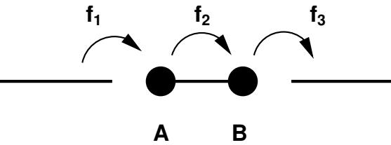

Write down a master equation for this model. For the system in equilibrium, calculate the occupation probabilities of the three states, and show that the average number of charges flowing through the molecule per unit time is

$$\frac{f_1 f_2 f_3}{f_1 f_2 + f_1 f_3 + f_2 f_3} \cdot$$

Consider the case f1 = f2 = f3 ≡ f. The molecule is uncharged at time t = 0. Show that the probability p(t) for it to be uncharged at a later time t is

$$p(t) = \frac{1}{3} + \frac{2}{3} \exp\left(-\frac{3}{2}ft\right) \cos\left(\frac{\sqrt{3}}{2}ft\right).$$