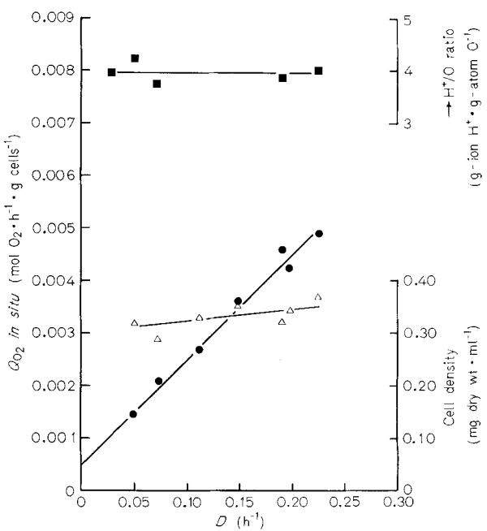
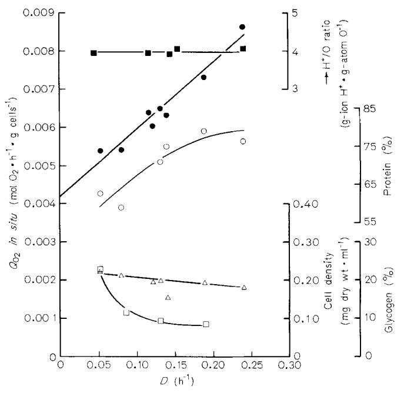
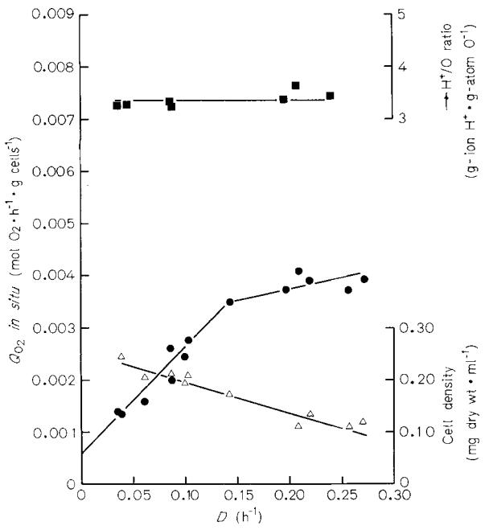

# The Energetics of *Escherichia coli* during Aerobic Growth in Continuous Culture

Ian S. FARMER and Colin W. JONES

Department of Biochemistry, School of Biological Sciences, University of Leicester

(Received February 7! May 4, 1976)

1. The energetics of *Esckerichia coli* W growing aerobically in continuous culture have been investigated. Conditions were chosen such that growth was limited by the availability of carbon or oxygen (energy-limited cultures), or of ammonium or sulphate ions (excess energy cultures).

2. Under glycerol-limited conditions *YEx* (true molar growth yield with respect to oxygen) and *YAmTapX* (true molar growth yield with respect to ATP equivalents) were 50.9 g cells . mol0;' and 12.7 g cells . mol ATP equivalents-' respectively; these values were not substantially altered during growth limited by oxygen, ammonium or sulphate. In contrast, *A4* (the energy requirement for maintenance purposes) increased from approximately 2 mmol ATP equivalents ' h-' . g cells-' during energylimited growth to 16.8 and 30.8 mmole ATP equivalents . h-' . g cells-' when growth was limited by ammonium and sulphate ions respectively.

3. Replacement of glycerol by other limiting carbon sources caused *YTf;* to alter within the range 13.9 (glucose) to 7.1 (acetate) g cells . mol ATP equivalents-' in the order glucose > galactose > arabinose > fructose > glycerol > fumarate > lactate > pyruvate > acetate. In each case the experimental value of *Yrl:* was I *55* ';.;; of the theoretical value calculated from the known energy requirements for the biosynthesis of cell materials.

4. It is concluded from these results that neither *A4* norY,m,l: are constant values for *E. coli. A4*  varies with the energy supply, being highest under excess energy growth conditions where it may reflect energy wastage by the cell. On the other hand, **I"'%** varies with the nature of the growth substrate and thus reflects the different energy requirements for the synthesis of cell material from different carbon sources.

Molar growth yields on oxygen or carbon substrate reflect the efficiency with which aerobic bacteria conserve energy *via* substrate-level and oxidative phosphorylation, and subsequently utilise this energy for growth. Yields are most easily expressed in terms of the consumption of gaseous oxygen rather than of the carbon source since the former, unlike the latter, is rarely incorporated into cell material and is used solely as a terminal oxidant for respiration. In theory, **r;;Zax** is attained only at an infinite growth rate, since at lower growth rates a significant proportion of the total oxygen consumption is associated with the conservation of energy which is subsequently used for maintenance purposes rather than for growth [l]. In practice, it is possible to determine *YOmpx* graphically by plotting the respiratory activity in *situ* of a continuous culture as a function of dilution rate [2 - 71.

The molar growth yield with respect to ATP equivalents *(YT;;),* reflects the efficiency with which cells utilise their conserved energy and can be calculated from *Y\$y* provided that the overall efficiency of aerobic energy conservation is accurately known. Measurement of the latter has proved difficult and the

*Enzymes.* Glycerol-3-phosphate dehydrogenase (NAD') (EC **1** .t .1.8); malate dehydrogenase (EC 1.1.1.37): malate dehydrogenase (decarhoxylating) (NADP') or malic enzyme (EC 1.1.1.40); isocitrate dehydrogenase **(NADP+)** (EC 1.1 .I .42); glyceraldehyde-3-phosphate dehydrogenase (EC 1.2.1.12); pyruvate dehydrogenase complex (EC 1.2.4.1 and 1.6.4.3); 2-oxoglutarate dehydrogenase (EC 1.2.4.2); succinate dehydrogenase (EC 1.3.99.1); pyridine nucleotide transhydrogenase (EC 1.6.1.1); glycerol kinase (EC 2.7.1.30); pyruvate kinase (EC 2.7.1.40); phosphoglycerate kinase (EC 2.7.2.3); phosphoenolpyruvate carboxylase or GTP : oxaloacetate carboxylyase (transphosphorylating) (EC 4.1.1.32); acetate thiokinase or acetyl-CoA synthetase (EC 6.2.1.1); succinic thiokinase or succinyl-CoA synthetase (EC 6.2.1.5).

*Synihols. Qo2,* respiratory activity *in situ* (mol *02* . h-' . g cells-'); *p,* specific growth rate (h-'; = dilution rate *D,* of a continuous culture); *Yo>,* observed molar growth yield with respect to oxygen (g cells. mol OF') *i.e.* uncorrected for maintenance respiration (also *Yo;* g cells g-atom 0-I); *Yzx,* true molar growth yield with respect to oxygen (g cells. mol O;'):YT+;, true molar growth yield with respect to ATP equivalents (g cells mol ATP equivalents-') ; *N,* overall efficiency of aerobic energy conservation (substrate level plus oxidative phosphorylation; mol ATP equivalents . mol Or'); *Mo,,* maintenance respiration rate (mol *02*  - h-' . g cells-'); *M,* energy requirement for maintenance purposes (maintenance coefficient; mol ATP equivalents . h-' . g cells-'); + H+/O, stoichiometry of respiration-linked proton translocation (g-ionH+ . g-atorno-').

results have not been entirely consistent [8 - 101. However, the problem has been greatly simplified by the recent advent of techniques based on Mitchell's chemiosmotic hypothesis of oxidative phosphorylation [ll], *via* which it is possible to measure the efficiency of respiration-linked proton translocation in intact bacteria [12,13]. Thus, batch cultures of *Eschericlzia coli* have been shown to exhibit + H+/O ratios of approximately 4 g-ion H+/g-atom 0 for the oxidation of endogenous or NAD+-linked substrates [13 - 161, a value which is commensurate with a P/O ratio of 2 assuming an + H+/P ratio of 2 g-ion H+/mol phosphate esterified [ll]. The overall efficiency of aerobic energy conservation can thus be calculated from a knowledge of the efficiency of oxidative phosphorylation and of the extent of substrate-level phosphorylation.

In this paper we report the results of investigations into the energetics of *E. coli* during aerobic growth in continuous culture under a variety of nutrient limitations. Through the combined measurement of +H'/O ratios and *Y\$fx* we have attempted to calculate unambiguous values for *YE;* and *M* with a view to assessing both the extent to which these parameters are independent of culture conditions, and the amount of energy which is utilised by the organism for purposes other than biosynthesis or maintenance.

#### MATERIALS AND METHODS

## *Culture Conditions*

*E. coli* W was grown at 30 "C in continuous culture using a chemostat of the type described by Baker [17]. The capacity of the chemostat was 500- 700 ml according to the aeration conditions employed, the latter being determined by a captive bar magnet under the control of a magnetic stirrer. The culture medium constited of a minimal salts solution [18] supplemented with nitrilo-triacetic acid (0.1 g/l) and the chosen carbon source (30 mM). The following modifications were made for the different growth conditions employed : carbon-limited (7.0 mM carbon source, except for sugars which were *5* mM), ammonium-limited (1.5 mM NH4Cl), sulphate-limited (14.6 pM KzS04). These concentrations were selected following determinations of cell yield as a function of limiting nutrient concentration in small-scale batch cultures. For oxygen-limited growth the complete medium was used but the stirring rate was decreased until the concentration of dissolved oxygen in the culture was essentially zero.

# *Respiratory Activity* in situ

The respiratory activities *in situ* (mol 02 . h-' . g cells-') of growing cells were determined by measuring the difference in the concentration of oxygen between input and effluent air of chemostat cultures using a Clark oxygen electrode mounted in the air stream. Concomitant assay of the air flow rate (corrected for the influence of the medium flow rate and for water vapour pressure), together with the volume and density of the culture, allowed calculation of the specific respiratory activity which was subsequently corrected for deviation from standard temperature. Full details of this technique, which was developed from a method described by Hayes *et ul.* [19], have been reported in previous communications from this laboratory *[5,6].* 

Values for *Y;:'* and *Mo,* were determined from the slope and intercept respectively of linear plots of *Qo, in situ versus* dilution rate. Each plot was comprised of an average of 8 points to which the best line was fitted by linear regression analysis using a Hewlett-Packard 1600B bench top computer. The average percentage standard errors in *Y\$y* and *Mo,* for the twelve determinations reported in this paper were 8.7 % and 30.0 respectively.

# *Cell Composition and Activity*

Whole cell protein content was determined colourimetrically using Folin's reagent [20]. Glycogen was extracted quantitatively from whole cells [21] and subsequently assayed colourimetrically using anthrone reagent [22]. Glycerol kinase and glycerol dehydrogenase activities of cell free extracts were assayed by standard procedures [23,24].

# + *H+/O Ratios*

Whole cell suspensions were prepared and assayed for + H+/O ratios 1251 as described previously [16] except that the potassium thiocyanate concentration was 75 mM. No significant differences in the values of + H+/O ratios for the oxidation of endogenous substrates were observed between samples taken directly from the chemostat or collected overnight at 4 *"C.* 

## *Preparation and Assay of Respiratory Membranes*

Respiratory membranes were prepared and assayed for cytochrome content as described previously [16, 26,271.

#### *Ejjluen t Growth Medium Composition*

The concentration of acetate in effluent growth media was determined either by gas-liquid chromatography at 210°C using a Pye 104 chromatograph (flame ionisation detector) fitted with a Poropak Q column (courtesy of Dr J. W. Drozd, Shell Research

Ltd., Sittingbourne. England) or by standard colourimetric procedures [28]. Lactate, pyruvate and 2-0x0 glutarate were assayed by standard enzymatic techniques [23].

#### RESULTS

Glycerol-limited cultures of *E. coli* exhibited respiratory activities *in situ* which increased linearly as a function of dilution rate (Fig. I). These cultures thus appeared to behave according to the equation proposed by Harrison and Loveless *[2]* for aerobic, energy-limited growth, *viz.* 

$$Q_{0_2} = \frac{\mu}{Y_{\Lambda \text{TF}}^{\text{max}} \cdot N} + \frac{M}{N} \cdot$$

Since the slope is equivalent to l/Yr?F . *N*  (E l/YO","") and the intercept is equivalent to *M,"*  (= *MO,),* these cultures of *E. coli* exhibited a E,"" of 50.9 g cells . mol 0;' and an *Mo,* of 0.58 mmol 02 . h-l **I** g cells-' (Table 1).

The culture density increased slightly with dilution rate, as might be expected where the limiting nutrient was the source both of carbon and energy, but both the protein content of the cells and the + H+/O ratio for the oxidation of endogenous substrates were essentially constant over the wide range of dilution rates employed. Only acetate was detected in the effluent growth medium. The concentration of the latter was very low, thus indicating that partial oxidation of the carbon source (with a concomitant increase in the yield of ATP from substrate-level cc oxidative phosphorylation, and hence an overestimation of *Y\$:')* did not occur to any significant extent. Since *E. coli*  exhibits proton-translocating segments 1 and 2 only [13,16,29], the endogenous + H+/O ratio of 3.96 '. 0.07 g-ion H+ g-atom *0-'* which was observed

with these glycerol-limited cultures suggested that the major endogenous substrate was reduced pyridine nucleotide.

In contrast to glycerol-limitation, the growth of *E. coli* under oxygen-limited conditions was characterised by a sharp break in the plot of Qo, *in situ V~'T.SU.S*  dilution rate (Fig.2). At dilution rates **I** 0.14 h the plot was clearly linear and yielded a **Y\$iX** of 50.2 g cells . mol 02' and a maintenance respiration rate of 0.54 mmol O2 . **IiC'** . g cells-' (Table l), values which were very close to those obtained with glycerol-

Fig. 1, *Gl) cerol-linzited cont0iuous culiure of* E. coli. *Qo, iii .Tm* **(a),** ---* H ' *10* ratio for the oxidation of endogenous substrates **(a),**  culturc density (A). pH 7.02

Table 1, *The mergetics of'* E. coli *during growth in continuous cul1urr nndw a vurirty of tiutrietil limirarions* 

Endogenous --f H+/O ratios and percentage protein contents were measured as described in the Materials and Methods section. *YtY;'*  (= *YT!;* . *N)* and *Mo,* (= *MIN)* were determined from the slope and intercept respectively of plots of Qn, in *situ IY'~.SL~.S* dilution rate of the type shown in Fig. 1-3, and *M* was calculated as described in the text. For oxygen-limited cultures, *Yz2a"* was determined a1 *1)* I 0.14 Ii-'. Where appropriate, values are quoted as the average i S.E.M. with the number of detcrminations in brackets

| Limiting nutrient                       | pH                           | Protein                                                                                                                                                                                                                                                       | y r                       | .M(y                                     | + H+/O (endogenous)                                                    | N                            | Yr+;                                 | M                                    | Concentration of acetate in the effluent growth medium       |
|--------------------------------------------|------------------------------|---------------------------------------------------------------------------------------------------------------------------------------------------------------------------------------------------------------------------------------------------------------|------------------------------|------------------------------------------|---------------------------------------------------------------------------|------------------------------|--------------------------------------|--------------------------------------|--------------------------------------------------------------------------|
|                                            |                              | 0 ,' <i< td=""><td>g cells . mol0;'</td><td>in01 OZ . h-' . g cells '</td><td>g-ion H+ . g-atom 0-'</td><td>mol ATP g cells</td><td>. mol Or1 mol ATP equiv. equiv.-'</td><td>inol ATP mM . h-' . g cells-'</td><td></td></i<> | g cells . mol0;'          | in01 OZ . h-' . g cells '          | g-ion H+ . g-atom 0-'                                                  | mol ATP g cells              | . mol Or1 mol ATP equiv. equiv.-' | inol ATP mM . h-' . g cells-'  |                                                                          |
| Glycerol Oxygen Ammonium Sulphate | 7.02 7.08 7.21 7.10 | 65.0 2.4(5) 68.0 1.8 (5) Variable 73.4 ir 3.5 (7)                                                                                                                                                                                              | 50.9 50.2 57.2 54.6 | 0.00058 0.00054 0.00420 0.00770 | 3.96 k 0.07 (5) 3.36 k 0.05 (7) 3.98 + 0.03 (5) 3.87 0.12 (4) | 4.00 4.00 4.00 4.00 | 12.7 12.6 14.3 13.6         | 0.0023 0.0022 0.0168 0.0305 | 0.33 k 0.00 (4) 0.46 k 0.11 (4) 0.33 k 0.00 (4) 0.12 f 0.05 (4) |

Fig. 2. *Osj,gen-linzited continuous cultuw of'* E. coli. Qo, *in situ (O),*  --+ H+/O ratio for the oxidation of endogenous substrates **(H),**  culture density (A). The average total oxygen uptake rate for the entire range of dilution rates employed was 0.458 & 0.019 (1 1) inrnol *02.* h-' pH 7.08

limited cultures. At dilution rates > 0.14 h-'the data were more scattered and indicated a considerably higher value for *Yr.* This break in the graph was clearly not caused by a sudden change in either the cell composition (the protein content was unaltered over the entire range of dilution rates employed), the stoichiometry of respiration-linked proton translocation or the concentration of glycerol oxidation products in the effluent growth medium (only acetate was detected and its concentration was again very low). The reason for the sharp increase in the apparent value of *Yg;'* at *D* > 0.14 h-' is therefore unclear.

The rather low endogenous -+ H+/O ratios which were observed with oxygen-limited cultures (3.36 0.05 g-ion H+ . g-atom 0-') indicated the use of between one and two proton-translocating segments for the oxidation of endogenous substrates compared with the full two segments in glycerol-limited cultures. The most likely explanation of this observation is that the endogenous substrate pool has shifted to a higher redox level under these growth conditions *(i.e.*  it is now composed of a mixture of NAD' linked and flavin-linked substrates). This conclusion is supported by the observation that such cells exhibit -+ H+/O ratios commensurate with the presence of two protontranslocating segments when starved and subsequently loaded with NAD+-linked substrates. In contrast to the other nutrient limitations employed in this study, the culture density of oxygen-limited cultures decreased considerably as a function of increasing dilution

Fig. 3. *Ammonium-limited continuous culture of* E. coli. Qo, *iiz situ*  **(a),** --f H+/O ratio for the oxidation of endogenous suhstrates **(H).**  culture density (A), percentage protein in cells (0), percentage glycogen in cells *(0).* pH 7.21

rate, a phenomenon which can readily be explained in terms of the balance between the supply and utilisation of oxygen. The low stirring rate provides a poor but constant supply of oxygen to the culture; this is matched by the total respiratory activity of the culture [measured as 0.458 0.019 (11) mmol 02 . h-' . 1-'1 with the result that the dissolved oxygen concentration is extremely low. Since the specific respiratory activity *in situ* increases with dilution rate, the cell density must decrease.

Ammonium-limited cultures of *E. coli* also exhibited linear plots of *Qo2 in situ ve~.sus* dilution rate to yield *YFy* of 57.2 g cells . mol0;' and a considerably increased maintenance respiration rate of 4.20 mmol 02 . h-' . g cells-' (Fig. 3; Table 1). The cell density decreased slightly with increasing dilution rate but the endogenous -+ H+/O ratios were essentially constant and indicated the presence of two protontranslocating segments with NADH as the major endogenous substrate. In contrast to either glycerollimited or oxygen-limited cultures, the cellular protein content increased significantly with increasing dilution rate, but this was matched by a corresponding decrease in the glycogen content of the cells.

With sulphate-limited cultures of *E. coli* the relationship between *Qo, in situ* and dilution rate was also linear and reflected a *YE:'* of 54.6 g cells . mol 0;' together with an extremely high maintenance respiration rate of 7 . 70 mmol 02 . h-' . g cells-' (Table 1). The -+ H+/O ratios for the oxidation of

endogenous substrates were virtually identical to those observed for glycerol-limited or ammoniumlimited cultures and were essentially constant as a function of dilution rate, as also was the cellular protein content. The effluent growth media from both the ammonium-limited and sulphate-limited cultures contained only very low concentrations of acetate, thus indicating that even under non-energylimited conditions partial oxidation of glycerol was only very slight; no other partial oxidation products of glycerol were detected.

Room temperature difference spectra of respiratory membranes prepared from cultures limited by glycerol, ammonium or sulphate indicated the presence of cytochrome *bss6* and cytochrome oxidase *0.* Menibranes prepared from oxygen-limited cultures contained, in addition, cytochrome oxidases *a1* and *d(a2)* ; the appearance of these latter two cytochromes is a characteristic and well documented response of this strain of *E. coli* to the lowered availability of the terminal electron acceptor [26].

In order to calculate *YZG* and *M* from the values of *YO?* and *Mo,* determined above, it is necessary to know the value of *N.* The complete oxidation of one mole of glycerol by *E. coli* yields five moles of reduced pyridine nucleotide *(via* glyceraldehyde-3 phosphate dehydrogenase, pyruvate dehydrogenase, isocitrate dehydrogenase, 2-0x0 glutarate dehydrogenase and malate dehydrogenase) and two moles of reduced flavin *(via* glycerol-3-phosphate dehydrogenase and succinate dehydrogenase) (see [13] ; also I. **S.** Farmer, and C. W. Jones, unpublished data). In addition, three moles of ATP (or an energetically equivalent nucleotide) are produced by substratelevel phosphorylation *(via* phosphoglycerate kinase, pyruvate kinase and succinic thiokinase) although one of these is consumed by glycerol kinase. Since the respiratory system of *E. coli* contains proton-translocating segments 1 and 2 [13,15,16] then, assuming an + H+/ATP ratio of 2 [ll], the complete oxidation of one mole of glycerol (= 3.5 mol of oxygen reduced) yields 14 moles of ATP. Nis therefore equal to 4.00 mol ATP equivalents . mol *OF'.* Analysis of the enzymes which catalyse the catabolism of glycerol in *E. coli*  indicated that, in contrast to *Klebsiella aerogenes* [30], the glycerol kinase/glycerol-3-phosphate dehydrogenase route was predominant under both glycerollimited and excess glycerol growth conditions; no NAD+-linked glycerol dehydrogenase activity could be detected in cell-free extracts of either type of culture. Thus, there is no evidence to suggest that the value of *N* alters with the nature of the limiting nutrient provided that glycerol remains the sole carbon source.

Using this value of 4.00 for *N, YE';* values of 12.6 to 14.3 g cells . mol ATP equivalents-' can be calculated for the four growth conditions employed, *i.e. Yf!;*  is essentially independent of nutrient limitation. In

contrast, the maintenance coefficient is low under energy-limited conditions (2.3 mmol ATP equivalents h-' . g cells-') but increases dramatically when growth is limited by either ammonium ions (16.8 mmol ATP equivalents . h-' . g cells-') or sulphate ions (30.8 mmol ATP equivalents . h-' . g cells-').

When the energetics of *E. coli* cultures growing on different carbon sources were compared, the *YomZax*  values were found to vary from 20.3 to 59.7 g cells . mol02' consumed (Table 2). The endogenous+ H+/ 0 ratios of these cultures continued to reflect the presence of two proton-translocating segments in the respiratory chain, although they also pointed to slight alterations in the content of the endogenous substrate pool. The *N* values which were subsequently calculated for the oxidation of the different carbon substrates showed only a relatively small variation (2.88 to 4.33), thus indicating that the observed changes in the values of *r;;,""* principally reflected variation in the values of *YE;, viz.* from 7.1 g cells. mol ATP equivalents-' for growth on acetate to 13.9 g cells . mol ATP equivalents-' when glucose was the carbon source. Analysis of the effluent growth media indicated that oxidation of each of the different carbon sources was essentially complete (even during growth on glucose less than 0.40 mM acetate was detected). The experimentally determined values of *YE;* were between 38 and 55% of the theoretical values for all of the carbon sources tested (the theoretical *YE;* was calculated from the known energy requirements for the biosynthesis of cell materials as described by Stouthamer [31]). These figures indicated that at least 45% of the total energy which is consumed for growth-rate-dependent processes cannot be accounted for by simple biosynthetic considerations and must therefore reflect other energy-dependent cellular events.

The value of *M* also varied with growth on the different carbon sources, but no consistent pattern was observed. The value was always relatively small *(5* 4.5 mmol ATP equivalents . h-' . g cells-') and was thus commensurate with the carbon (and energy) limited status of these cultures.

#### DISCUSSION

The --i H+/O ratios of approximately 4 which were observed with *E. coli* W under all of the nutrient limitations employed in this study suggested that only two proton-translocating segments contribute to the protonmotive force which is required to drive ATP synthesis *via* the inwardly-directed, protontranslocating ATPase [ll, 361. These are undoubtedly segments 1 and 2 since the functioning of segment 3 appears to be predicated upon the presence of cytochrome *c* [12,16]; the latter was not detected in re-

| Table 2. The @ect of varying the nature oftke curhon source on the energetics of E. coli during growth in continuous culture                      |
|---------------------------------------------------------------------------------------------------------------------------------------------------|
| Cells were grown at the stated pH (k 0.05) under carbon-limited conditions. --f H+/O ratios, Mo, and Yrwere determined as described               |
| in Table 1 and in the Materials and Methods section. Values of N were calculated by the same approach as described in the text for glycerol.      |
| with the modifications described in the footnotes to this Table. The theoretical value of YT+\$ for each carbon source was calculated essentially |
| as described by Stouthamer [31], but no allowances were made for the transport of any cell nutrients. Where appropriate, all values are           |
| S.E.M. with the number of determinations in brackets quoted as the average                                                                     |

| Limiting carbon source | pH   | Y0m;dX               | + H+/O (endogenous)   |     | N         | YTE  | Theoretical YFf;;                    | Yr++/ theoretical YE; | MO2                          | M                                     |
|---------------------------|------|----------------------|--------------------------|-----|-----------|------|-----------------------------------------|-----------------------------|------------------------------|---------------------------------------|
|                           |      | g cells . mol OF' | g-ion H+ . g-atom 0-1 |     | . mol 0;' | ~~~~ | mol ATP g cells . mol ATP equiv. - ~ | ":,                         | molO2 . h-' . gcells-' | mol ATP equiv. . h-1 . &cells-' |
| D-Glucose                 | 6.78 | 59.7                 | 3.75                     | (2) | 4.31",h   | 13.9 | 33.9                                    | 40.9                        | 0.00044                      | 0.00190                               |
| D-Galactose               | 6.98 | 58.2                 | 3.77                     | (2) | 4.31"     | 13.5 | 33.9                                    | 39.8                        | 0.00097                      | 0.00418                               |
| L-Arabinose               | 7.01 | 57.8                 | 3.58                     | (2) | 4.33'     | 13.4 | 33.9                                    | 39.5                        | 0.00064                      | 0.00277                               |
| o-Fructose                | 6.98 | 56.0                 | 3.94                     | (2) | 4.31a,h   | 12.9 | 33.9                                    | 38.1                        | 0.00071                      | 0.00306                               |
| Glycerol                  | 7.02 | 50.9                 | 3.96 k 0.07 (5)          |     | 4.00      | 12.7 | 29.5                                    | 43.1                        | 0.00058                      | 0.00232                               |
| Fumarate                  | 6.90 | 40.4                 | 3.45 & 0.23 (4)          |     | 4.00"     | 10.1 | 22.6                                    | 44.7                        | 0.00113                      | 0.00452                               |
| DL-LaCtate                | 7.27 | 35.0                 | 3.67                     | (2) | 3.67'     | 9.5  | 18.6                                    | 51.1                        | 0.00073                      | 0.00268                               |
| Pyruvate                  | 7.02 | 34.3                 | 3.45                     | (2) | 4.00      | 8.6  | 18.6                                    | 46.3                        | 0.00073                      | 0.00292                               |
| Acetate                   | 7.05 | 20.3                 | 3.13 f 0.25 (4)          |     | 2.88'     | 7.1  | 12.9                                    | 55.0                        | 0.00120                      | 0.00346                               |

**a** The *N* values for glucose, fructose and galactose werc calculated on the basis of 80 ".;; oxidation *1,iu* glycolysis and 20 "f0 viu the pentose phosphate pathway [32].

One ATP equivalent was allowed for the combined processes of sugar transport *(via* the phosphotransferase system) and phosphorylation to glucose 6-phosphate and fructose 1-phosphate [33,34].

' *N* was calculated on the basis of 3 mol of arabinose yielding 2 mol of fructose 6-phosphate plus 1 inol of glyceraldehyde 3-phosphate.

The Nvalue for fumarate was calculated on the assumption that phosphopyruvate carboxylase and the inalic enzyme were used equally.

The initial oxidation of uL-lactate occurs predominantly *ria* flavin-linked D- and 1,-lactate oxidases [35].

The Nvalue for acetate was calculated on the basis of ten turns of the Krebs cycle per turn of the glyoxylate cycle; two ATP equivalents were allowed for the activation of acetate viu acetate thiokinase (H. L. Kornberg, personal communication).

spiratory membranes from any of the *E. coli* cultures used in this study.

The failure of sulphate-limited cultures to exhibit lowered -+ H+/O ratios is in direct contrast to recent reports by Poole and Haddock *[37,38]* which claimed + H+/O ratios of approximately two for the oxidation of endogenous, NAD +-linked and flavin-linked substrates by sulphate-limited cultures of *E. coli* K12 (strain C-1 S).

It is clear from our studies with *E. coli* W growing on glycerol that *Y8':"* is essentially independent of the nature of the growth-limiting nutrient, although at any given dilution rate the *Qo2 in situ* is substantially higher in cultures which have an ample supply of energy *(i.e.* where the limiting nutrient is ammonium or sulphate ions). The latter phenomenon reflects the very high maintenance respiration rates of these cultures compared with energy-limited cultures. It is likely therefore that the very low *YO* values which have recently been reported for sulphdte-limited cultures of *E. coli* [37,38] and *Klebsiella (Aerobacter.) aerogmes* [30], reflect the fact that *YO* was determined only at a single dilution rate and that no correction was made for the very high maintenance respiration rates.

Following a very careful study of the energetics of *K. aerogenes* growing in continuous culture with

glucose as carbon source, Stouthamer and Bettenhaussen **[3]** concluded that the respiratory chain energy conservation efficiency of this organism was severely diminished under sulphate-limited conditions and that most of the energy was conserved *via*  substrate level phosphorylation. They reported a linear relationship between *Qo, in situ* and dilution rate, with a slope equivalent to a *Yg;'* of approximately 47 g cells . mol0,' (very similar to the value for glucose-limited growth) and an intercept equivalent to the very high niaintenance respiration rate of 4.9 mmol 02 . h-' . g cells-'. Very importantly, however, they also detected substantial levels of acetate in the spent growth medium which indicated that the glucose was undergoing only partial oxidation (see also [39]). Furthermore, in spite of being present in relatively high concentrations in the inflowing growth medium, the glucose was always completely consumed by the culture. After correcting for these observations, a P/O ratio of substantially less than 1 was calculated for the oxidation of endogenous substrates. In contrast, our studies with sulphatelimited cultures of *E. coli* growing on glycerol have revealed that partial oxidation of the latter is only verv slight and that substantial concentrations of glycerol are still present in the effluent growth medium. Similar results have also been reported for sulphatelimited cultures of *K. uerogenes* utilising glycerol as their sole source of carbon [39]. It would appear therefore that the growth of *K. uerogenes* and *E. coli*  under sulphate-limited conditions is not accompanied by a significant change in the value of *Y,mZa",* although the reason for this appears to vary with the nature of the carbon source. In the presence of glucose, partial oxidation leads to increased energy conservation *via*  substrate level phosphorylation, but the effect of this on *Y\$?* is offset by a low P/O ratio [3]. In contrast, partial oxidation of glycerol is only slight and energy conservation is effected principally *via* a well coupled respiratory system.

There is, however, general agreement that sulphatelimitation (like the earlier documented cases of nitrogen-limitation [6,40]) causes a substantial increase in the maintenance coefficient, presumably *viu* some form of energy wastage. The mechanism of this process, which occurs only under excess energy growth conditions and is independent of the nature of the carbon source, is unclear. It undoubtedly reflects the partial uncoupling of energy-conserving and energy-utilising cellular reactions, possibly *via* enhanced ATPase activity *[3],* and merits further experimental attention.

The *YAmTapx* of 12.7 g cells . mol ATP equivalentsp' which was determined for the glycerol-limited growth of *E. coli* W agrees well with the value of 13.5 which was calculated for the growth of *Bucillus meguterium* D440 under the same conditions [5,6]. However, it is clear from our results that the experimental value of *YE\$*  varies dramatically with the nature of the carbon source in the order glucose > galactose > arabinose > fructose > glycerol > fumarate > lactate > pyruvate > acetate. The differences appear to reflect the different energy requirements for the conversion of the various carbon substrates into cell material and have been predicted elsewhere from theoretical considerations [31,41,42]. The concept that *Yr\$\$* is a constant value of 10.6 g cells/mol ATP equivalents [43] is therefore no longer acceptable. These results are in broad agreement with earlier reports that lower *YO*  values were observed during the batch growth of *K. uerogenes* on tricarboxylic acid intermediates compared with sugars [44,45], and of the yeast *Cundidu utilis* on acetate or ethanol compared with glucose [46]. On the other hand, they are clearly at variance with the recent report by Hempfling and Mainzer 171 that the growth efficiencies of continuous cultures of *E. coli* B on different carbon sources were in the order glycerol > acetate > galactose > glucose.

The large discrepancy between the experimental and theoretical values of *YE?;* which we observed with *E. coli* W during carbon-limited growth presumably reflects the use of energy for growth-rate-dependent processes other than simple biosynthesis. Of these, the active transport of the carbon substrate may be a significant component, particularly when the latter

is a relatively small and/or highly oxidised molecule (such that a relatively large number of molecules must be transported in order to effect a unit amount of energy conservation and cell biosynthesis). The entry of inorganic nutrients [47,48], the ejection of unwanted materials (particularIy Na' [49]) and the extra biosynthesis engendered by macromolecular turnover [SO] may also contribute significantly to total energy consumption.

The authors are indebted to Drs R. **A.** Cooper, .I. W. Drozd anti **C.** Edwards for many helpful discussions, and to the Sciencc Research Council for *a* Research Studentship (to I.S.F.) and **ii**  Research Grant (BlRG159102).

#### REFERENCES

- 1. Stouthamer, A. H. & Bettenhaussen, C'. W. (1973) *Binc,/2ini. Bi~/~lij~. Actm, 301,* 53 - 70.
- 2. Harrison, D. E. F. & Loveless, J. E. (1971) *J. Gen. Microhiol.*  68,35-43.
- 3. Stouthamer. A. H. & Bettenhaussen. C. W. (1975) *Arch. Micvohi~l. 102,* 187 - 192.
- 4. Nagai, *S.* & Aiba, S. (1972) *J. (;Cl7. hilic.rohiol. 72,* 531 - *538.*
- *5.*  Downs. A. J. & Jones, C. W. (1974) *Bioelicvw.* Soc. *Tran.s.* 2, 526 - 529.
- 6. Downs, A. J. & Jones, C. W. (1975) *Arch. Microhiol. 105.*  159- 167.
- 7. IHempfling, W. P. & Mainzer, S. E. (1075) *J. Buctwiol. 123.*  1076-1087.
- 8. Hempfling, W. P. (1970) *Biorhit~7.* Biop/ijlv, *Acro,* 205, 169 - 182.
- 9. Baak, J. M. & Postma. P. W. (1971) *FEBS* ,!A,//. *10.* 189- 192.
- 10. Van der Beek, E. *G.* & Stouthamer, A. H. (1973) *Ardi. MicrohiOl. 89,* 327 - 339.
- 11. Mitchell, P. (1966) *BiCJl. R('V. 41,* 445-502.
- 12. Scholes, P. B. & Mitchell, P. (1970) *J. Riocwc~r.~c~/rc.~, I,* 309- 323.
- **13.**  Lawford, H. *G.* & Haddock, B. A. (1973) *Bi~d~~vi. J. 136.*  21 7 - 220.
- 14. Wesl. I. & Mitchell, P. (1972) *J. BiotvwJugr/ic.v, 3.* 445-462.
- 15. Brice, J. **M.,** Law, **J.** F., Meyer, D. J. & Jones. *C.* W. (1974) *Biocheni. Sue. Tram.* -7, 523 - 526.
- 16. Jones, C. W.. Brice, J. M., Downs, A. J. & Drozd. J. W. (1975) *Lur. J. Hiocliem. 52.* 265 - 271,
- 17. Baker, K. (1968) *Lab. Pract. 17,* 117-8824.
- 18. Ashworth, J. M. & Kornberg, H. L. (1066) *Proc.. RN\,. Sor.. Lond. B Bid. Sci. 165.* 179- 188.
- 19. Hayes, D. K.. Schechter-. M. S.. Mensing, F. & Horton, J. (1968) *And. Rioclic~n7.* 26, 51 -60.
- 20. Layne, E,. (1957) *MCJl/7(1tk En;j.niol.* **J',** 447 -454.
- 21 Palrnstierna, H. (1956) *Acto.* **C%tm.** *Scond. 10.* 567- 577.
- *22*  Hcrherl, D., Phipps. P. J. & Strange. R. E. (1971) *Mcfliock in Micvohiolugy* (Norria, J. R. & Ribbons, D. W.. eds), vol. 5B, pp. 209-344, Academic Press, New **York** and London.
- 23 Bergmeyer, H. U. (1974) *Methods in f3~3~77ic. Andy.sI.1,* Vcrlap Chemie, Academic Press.
- 24 Lin, E. C. C. & Magasanik, B. (1960) *J. Bid. Cliem. 2335.*  3820 - 1823.
- 25 Mitchell, P. & Moyle, J. (1967) *Biot.hen7. ,I. 105,* 1147-1162.
- 26 Mcyer, D. J. & Jones, C. W. (1973) *Euv. J. BiocI7mz. 36,* 144- 151.
- 27 Ackrell, B. A. C. & Jones, C. W. (1971) *Enr. J. Riochcm.* 20. 29-35.
- 28 Rose, J. A,, Grunberg-Manago, M., Korey. S. R. & Ochoa, S. (1954) *J. RiCJl. C/irin. 211%* 737-756.
- 29. Haddock, B. A,, Downie, J. A. *81* Lawford, H. G. (1974) *Proc. Sac. Gen. Microhiol. 1, 50.*
- 30. Neijssel, 0. M., Hueting, S., Crabhendam, K. J. & Tempest, D. W. (1975) *Arch. Microhiol. 104.* 83-X7.
- 31. Stouthamer, A. H. (1973) *Anionic van Leeurvenhoeck J. Microbiol. Serol. 39,* 545- 565.
- *32.* Fraenkel, D. G. & Horecker, B. L. (1964) *J. Bid. Cliem. 239,*  2765 -2771.
- 33. Kundig, W. & Roseman, S. (1971) *J. Bid. Chum. 246,* 1393- 1406.
- 34. Ferenci, T. & Kornherg, H. L. (1971) *FEBSLett. 13,* 127-130.
- 35. Kline, E. S. & Mahler, H. E. (1965) *Ann. N. Y. Acud. Sci. 119,*  905 - 91 7.
- 36. West, I. C. & Mitchell, P. (1974) *FEBS Le/t. 40,* 1-4.
- 37. Poole, R. K. & Haddock, B. A. (1974) *Biochenz. Soc. Trans. 2,*  941 - 943.
- 38. Poole, R. K. & Haddock, B. A. (1975) *Biochum. J. 1-52,* 537- 546.
- 39. Neijssel, 0. M. & Tcmpcst, D. W. (1975) *Proc. Soc. Gm. Microhiol.* in press.
- 40. Senez, J. C. (1962) Bacterial. *Rev. 26,* 95- 107.
- 41. Gunsalus, I. C. & Shuster, C. W. (1961) T/zeBacteriu(Gunsalus, I. C. & Stainer, R. Y., eds), **pp.** 1-58, Academic Press, New York and London.
- 42. Forrest, W. W. &Walker, D. J. (1971) *Adv. Microhiol. Physiol. 5,* 213-274.
- 43. Bauchop, T. & Elsden, S. R. (1960) *J. Gen. Microbiol. 23,*  457-469.
- 44. Stouthamer, A. H. (1969) *A4erhod.Y in Microbiology* (Norris, J. R. & Ribbons, D. W., eds), vol. 1, pp. 629- 663, Academic Press, New York and London.
- 45. Hadjipetrou, L. P., Gerrits, J. P., Teulings, F. A. G. & Slouthamer, **A.** H. (1964) *J. Gen. Microhiol.* 36, 139-150.
- 46. Hernandez, E. & Johnson, M. J. (1967) *J. Bucteriol. 94,* 996- 1001.
- 47. Burnell, J. N., John, P. & Whatley, F. R. (1975) *Biochem. J. 150,* 527- 536.
- 48. Burnell, J. N., John, P. & Whatley, F. R. (1975) *FEBS Lett. 58,*  215-218.
- 49. West, **I.** C. & Mitchell, P. (1974) *Biochum. J. 144,* 87-90.
- *50.* Pine, M. J. (1970) *J. Bucteriol. 103,* 207-215.

I. S. Farmer and C. W. Jones, Department of Biochemistry, School of Biological Sciences, University of Leicester, University Road, Leicester, Great Britain, LEI 7RH