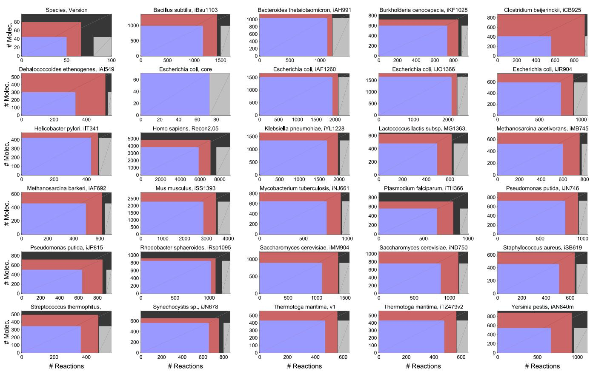

Contents lists available at [ScienceDirect](www.sciencedirect.com/science/journal/00225193)

# Journal of Theoretical Biology


journal homepage: <www.elsevier.com/locate/yjtbi>

# Conditions for duality between fluxes and concentrations in biochemical networks

Ronan M.T. Fleming a,n , Nikos Vlassis b , Ines Thiele a , Michael A. Saunders c

a Luxembourg Centre for Systems Biomedicine, University of Luxembourg, 7 avenue des Hauts-Fourneaux, Esch-sur-Alzette, Luxembourg b Adobe Research, 345 Park Ave, San Jose, CA, USA

c Dept of Management Science and Engineering, Stanford University, Stanford, CA, USA

### HIGHLIGHTS

Flux-concentration duality implies an equivalence between descriptions in terms of concentrations or unidirectional fluxes.

A novel stoichiometric condition for duality between unidirectional fluxes and concentrations is proposed.

Flux-concentration duality is a pervasive property of biochemical networks.

## article info

Article history: Received 8 December 2015 Received in revised form 3 June 2016 Accepted 23 June 2016 Available online 23 June 2016

Keywords: Biochemical network Flux Concentration Duality Kinetics

### abstract

Mathematical and computational modelling of biochemical networks is often done in terms of either the concentrations of molecular species or the fluxes of biochemical reactions. When is mathematical modelling from either perspective equivalent to the other? Mathematical duality translates concepts, theorems or mathematical structures into other concepts, theorems or structures, in a one-to-one manner. We present a novel stoichiometric condition that is necessary and sufficient for duality between unidirectional fluxes and concentrations. Our numerical experiments, with computational models derived from a range of genome-scale biochemical networks, suggest that this flux-concentration duality is a pervasive property of biochemical networks. We also provide a combinatorial characterisation that is sufficient to ensure flux-concentration duality.The condition prescribes that, for every two disjoint sets of molecular species, there is at least one reaction complex that involves species from only one of the two sets. When unidirectional fluxes and molecular species concentrations are dual vectors, this implies that the behaviour of the corresponding biochemical network can be described entirely in terms of either concentrations or unidirectional fluxes.

& 2016 The Authors. Published by Elsevier Ltd. This is an open access article under the CC BY-NC-ND license (http://creativecommons.org/licenses/by-nc-nd/4.0/).

# 1. Introduction

Systems biochemistry seeks to understand biological function in terms of a network of chemical reactions. Systems biology is a broader field, encompassing systems biochemistry, where understanding is in terms of a network of interactions, some of which may not be immediately identifiable with a particular chemical or biochemical reaction. Mathematical and computational modelling of biochemical reaction network dynamics is a fundamental component of systems biochemistry. Any genome-scale model of a biochemical reaction network will give rise to a system of equations with a high-dimensional state variable, e.g., there are at least

n Corresponding author.

E-mail addresses: ronan.m.t.fl[eming@gmail.com](mailto:ronan.m.t.fleming@gmail.com) (R.M.T. Fleming), [nikos.vlassis@gmail.com](mailto:nikos.vlassis@gmail.com) (N. Vlassis), [ines.thiele@gmail.com](mailto:ines.thiele@gmail.com) (I. Thiele), [saunders@stanford.edu](mailto:saunders@stanford.edu) (M.A. Saunders).

1000 genes in Pelagibacter ubique [(Giovannoni et al., 2005)](#page-8-0), the smallest free-living microorganism currently known. In order to ensure that mathematical and computational modelling remains tractable at genome-scale, it is important to focus research effort on the development of robust algorithms with time complexity that scales well with the dimension of the state variable.

Given some assumptions as to the dynamics of a biochemical network, a mathematical model is defined in terms of a system of equations. Characterising the mathematical properties of such a system of equations can lead directly or indirectly to insightful biochemical conclusions. Directly, in the sense that the recognition of the mathematical property has direct biochemical implications, e.g., the correspondence between an extreme ray of the steady state (irreversible) flux cone and the minimal set of reactions that could operate at steady state ([Schuster et al., 2000](#page-9-0)). Or indirectly, in the sense of an algorithm tailored to exploit a recognised property, which is subsequently implemented to derive

<http://dx.doi.org/10.1016/j.jtbi.2016.06.033>

0022-5193/& 2016 The Authors. Published by Elsevier Ltd. This is an open access article under the CC BY-NC-ND license (http://creativecommons.org/licenses/by-nc-nd/4.0/).

biochemical conclusions from a computational model, e.g., robust flux balance analysis algorithms [(Sun et al., 2013)](#page-9-0) applied to investigate codon usage in an integrated model of metabolism and macromolecular synthesis in Escherichia coli [(Thiele et al., 2012)](#page-9-0).

Mathematical duality translates concepts, theorems or mathematical structures into other concepts, theorems or structures in a one-to-one manner. Sometimes, recognition of mathematical duality underlying a biochemical network modelling problem enables the dual problem to be more efficiently solved. An example of this is the problem of computing minimal cut sets, i.e., minimal sets of reactions whose deletion will block the operation of a specified objective in a steady state model of a biochemical network ([Klamt and Gilles, 2004](#page-9-0)). Previously, computation of minimal cut sets required enumeration of the extreme rays of part of the steady state (irreversible) flux cone, which is computationally complex in memory and processing time [(Haus et al.,](#page-9-0) [2008)](#page-9-0). By recognising that minimal cut sets in a primal network are dual to extreme rays in a dual network ([Ballerstein et al., 2012)](#page-8-0), one can compute select subsets of extreme rays for the dual network that correspond to minimal cut sets with the certain desired properties in the primal (i.e., original) biochemical network in question ([von Kamp and Klamt, 2014](#page-9-0)). This fundamental work has many experimental biological applications, including metabolic engineering ([Mahadevan et al., 2015](#page-9-0)).

Recognition of mathematical duality in a biochemical network modelling problem can have many theoretical biological applications, in advance of experimental biological applications. For example, in mathematical modelling of biochemical reaction networks, there has long been an interest in the relationship between models expressed in terms of molecular species concentrations and models expressed in terms of reaction fluxes. When concentrations or net fluxes are considered as independent variables, a duality between the corresponding Jacobian matrices has been demonstrated [(Jamshidi and Palsson, 2009)](#page-9-0). In this case, the concentration and net flux Jacobian matrices can be used to estimate the dynamics of the same system, with respect to perturbations to concentrations or net fluxes about a given steady state. The primal (concentration) Jacobian and dual (net flux) Jacobian matrices are identical, except that one is the transpose of the other. Matrix transposition is a one-to-one mapping and the aforementioned duality is between the pair of Jacobians. This does not mean that the net flux and concentration vectors are dual variables in the same mathematical sense, and neither are the perturbations to concentrations or net fluxes. This is because the Jacobian duality ([Jamshidi and Palsson, 2009)](#page-9-0), which exists for any stoichiometric matrix, does not enforce a one-to-one mapping between concentrations and net fluxes unless the stoichiometric matrix is invertible, which is never the case for a biochemical network ([Heinrich et al., 1978](#page-9-0)).

Herein we ask and answer the question: what conditions are necessary and sufficient for duality between unidirectional fluxes and molecular species concentrations? We establish a necessary linear algebraic condition on reaction stoichiometry in order for duality to hold. We also combinatorially characterise this stoichiometric condition in a manner amenable to interpretation for biochemical networks in general. In manually curated metabolic network reconstructions, across a wide range of species and biological processes, we confirm satisfaction of this stoichiometric condition for the major subset of molecular species within each reconstruction of a biochemical network. Furthermore, we demonstrate how linear algebra can be applied to test for satisfaction of this stoichiometric condition or to identify the molecular species involved in violation of this condition. We also demonstrate that violation of flux-concentration duality points to discrepancies between a reconstruction and the underlying biochemistry, thereby establishing a new stoichiometric quality control procedure to select a subset of a biochemical network reconstruction for use in computational modelling of steady states.

First, we establish a linear algebraic condition and a combinatorial condition for duality between unidirectional fluxes and concentrations. Subsequently, we introduce a procedure to convert a reconstruction into a computational model in a quality-controlled manner. We then apply this procedure to a range of genome-scale metabolic network reconstructions and test for the linear algebraic condition for flux-concentration duality before and after conversion into a model. We conclude with a broad discussion, with examples illustrating how a recognition of fluxconcentration duality could help address questions of biological relevance and improve our understanding of biological phenomena.

#### 2. Theoretical results

#### 2.1. Stoichiometry and reaction kinetics

We consider a biochemical network with m molecular species and n (net) reactions. Without loss of generality with respect to genome-scale biochemical networks, we assume *m n* ≤ . We assume that each reaction is reversible ([Lewis, 1925)](#page-9-0) and can be represented by a unidirectional reaction pair. With respect to the forward direction, in a forward stoichiometric matrix ∈ × *F m n*, let Fij be the stoichiometry of molecule i participating as a substrate or catalyst in forward unidirectional reaction j. Likewise, with respect to the reverse direction, in a reverse stoichiometric matrix ∈ × *R m n*, let Rij be the stoichiometryof molecule i participating as a substrate or catalyst in reverse unidirectional reaction j. The set of molecular species that jointly participate as either substrates or products in a single unidirectional reaction is referred to as a reaction complex.

One may define the topology of a hypergraph of reactions with a net stoichiometric matrix *S R* := − *F* . However, a catalyst, by definition, participates in a reaction with the same stoichiometry as a substrate or product ( = *F R ij ij*), so the corresponding row of S is all zeros unless that catalyst is synthesised or consumed elsewhere in the same biochemical network, as is the case for many biochemical catalysts [(Thiele et al., 2009](#page-9-0)). For example, consider the ith molecular species acting as a catalyst in some reactions. If it is synthesised in the jth reaction of a biochemical network, the stoichiometric coefficient in the forward stoichiometric matrix will be less than that of the reverse stoichiometric matrix (*F R ij ij* < ), so *SR F ij ij ij* :=− > 0. This also encompasses the case of an auto-catalytic reaction.

Before proceeding, some comments on our assumptions are in order. One may derive S from F and R, but the latter pair of matrices cannot, in general, be derived from S because S omits the stoichiometry of catalysis. The orientation of the hypergraph, i.e., the assignment of one direction to be forward (substrates ⇀ products), with the other reverse, is typically made so that net flux is forward (with positive sign) when a reaction is active in its biologically typical direction in a biochemical network. This is an arbitrary convention rather than a constraint, and reversing the orientation of one reaction only exchanges one column of F for the corresponding one in R. Although every chemical reaction is in principle reversible, in a biochemical setting, due to physiological limits on the relative concentrations of reactants and substrates, some reactions are practically irreversible ([Noor et al., 2013)](#page-9-0). Our conclusions also extend to systems of irreversible reactions because the reaction complexes for an irreversible reaction are the same as those for a reversible reaction.

In the following, the exponential or natural logarithm of a vector is meant component-wise, with exp log 0 : ( ( )) =0. Let *vf* ∈ > *n* 0 and *vr* ∈ > *n* 0 denote forward and reverse unidirectional reaction <span id="page-2-0"></span>rate vectors. We assume that the rate of a unidirectional reaction is proportional to the product of the concentrations of each substrate or catalyst, each to the power of their respective stoichiometry in that unidirectional reaction [(Wilhelmy, 1850](#page-9-0)), with linear proportionality given by strictly positiverate coefficients *kf r* , *k* ∈ > *n* 0. Therefore we have

$$\mathbb{V}_f(\mathfrak{c}) \coloneqq \exp(\ln(k_f) + \mathsf{F}^T \ln(\mathfrak{c})),$$

$$\mathbb{V}_{\mathfrak{r}}(\mathfrak{c}) \coloneqq \exp(\ln(k_{\mathfrak{r}}) + \mathsf{R}^T \ln(\mathfrak{c})),\tag{1}$$

where *c* ∈ ≥ *m* 0 are molecular species concentrations. Strictly, it is not proper to take the logarithm of a unit that has physical dimensions, so c should be termed a vector of mole fractions rather than concentrations ([Berry et al., 2000, Eq. 19.93)](#page-8-0), but safe in the knowledge that we have taken this liberty, we continue in terms of concentrations.

If the jth columns of F and R represent the stoichiometry of an elementary reaction, then the respective jth unidirectional reaction rate is given by an elementary kinetic rate law in (1). In biochemical modelling, often it is composite reaction stoichiometry that is represented, in which case the unidirectional reaction rates are given by pseudo-elementary kinetic rate laws. We shall revisit this point in discussion, but for now it suffices to mention that, in principle, all composite reactions can be decomposed into a set of elementary reactions following elementary reaction kinetics ([Cook](#page-8-0) [and Cleland, 2007](#page-8-0)), even allosteric reactions [(Bray and Duke,](#page-8-0) [2004)](#page-8-0). With respect to the forward direction of an elementary reaction, the term reaction complex implies a corresponding physical association between substrate molecular species. For the sake of simplicity, we also use the term reaction complex for composite reactions, as if there were a corresponding simultaneous physical association of all substrates, which is generally not the case because composite reactions occur as a set of elementary reaction steps.

With respect to time, the deterministic rate of change of concentration is

$$\frac{d\mathfrak{C}}{dt} \coloneqq (\mathbb{R} - F)(\mathbb{V}/\mathfrak{C}) - \mathbb{V}_{\mathbb{r}}(\mathbb{C})),\tag{2}$$

$$\frac{d\mathbf{c}}{dt} \coloneqq (R\mathbb{I}F - F\mathbb{I}R) \begin{bmatrix} \mathbb{V}_f(\mathbf{c}) \\ \mathbb{V}_r(\mathbf{c}) \end{bmatrix}.\tag{3}$$

where *vc vc f r* ( )− ( ) gives a vector of net reaction rates, := denotes "is defined to be equal to" and || denotes the horizontal concatenation operator that joins two matrices side by side,

$$F \coloneqq \begin{bmatrix} a & b \\ c & d \end{bmatrix}, \quad R \coloneqq \begin{bmatrix} p & q \\ r & s \end{bmatrix}, \quad F \wr R = \begin{bmatrix} a & b & p & q \\ c & d & r & s \end{bmatrix}.$$

Time-invariant fluxes or concentrations satisfy (2) with *dc dt* / :=0. Define ⎡ ⎣ ⎢ ⎤ ⎦ *k* := ∈⎥ > *k k n* 0 *f* 2 *r* to be given constants, then consider the flux function

$$\mathbb{V}(\mathsf{C}) \coloneqq \exp\left(\ln(k) + (F \| \mathsf{R})^T \ln(\mathsf{C})\right) = \begin{bmatrix} \mathsf{V}_{\mathsf{f}}(\mathsf{C}) \\ \mathsf{V}_{\mathsf{f}}(\mathsf{C}) \end{bmatrix} \tag{4}$$

with a concentration vector c the only argument. Apart from (a) our deliberate distinction between unidirectional and net stoichiometry, (b) our deliberate use of matrix-vector notation, and (c) our deliberate use of component-wise exponential and logarithm, the expression for unidirectional rate in (4) is a standard representation of deterministic elementary reaction kinetics.

## 2.2. Linear algebraic characterisation of flux-concentration duality

Herein, duality is defined as a one-to-one relationship between two variable vectors, that is, *x* ∈ *n* and *y* ∈ *m* are dual vectors if there exists a function *f* : *n m* → such that *fx y* ( )= and = () − *xfy* 1 . We now establish a linear algebraic condition for duality between unidirectional flux and concentration vectors. This linear algebraic condition is a well known result in mathematics, but to our knowledge its application to establish duality between unidirectional flux and molecular species concentration is novel.

Theorem 1. Assume we are given constants *k* ∈ > *n* 0 2 and ∈ ≥ × *F R*, *m n* 0 . Suppose a unidirectional reaction flux vector *v* ∈ > *n* 0 2 and a molecular species concentration vector *c* ∈ > *m* 0 satisfy

$$\mathbf{v} = \exp(\ln(k) + (\mathbb{P} \| \mathbf{R})^{\mathsf{T}} \ln(\mathsf{C})). \tag{5}$$

Then rank ( || ) = *F R m* is a necessary and sufficient condition for duality between fluxes and concentrations.

Proof. That v is uniquely defined given c is trivial. Taking the logarithm of both sides of (5), we have ln ln ln ( ) − ( ) = ( || ) ( *v k FR c*) *T* . Then, if and only if rank( || ) = *F R m* is ln( ) *c* , and therefore c, uniquely defined given v. □

Theorem 1 establishes that the flux function (4) is an injective function. It is not bijective because one can always find a v such that ln ln ( )− ( *v k*) is not in the range of ( || ) *F R T* . Note that the exponential function is bijective, but if one wished to consider other flux functions, it would be sufficient to replace the exponential function with another injective function and Theorem 1 would still hold.

We now proceed to interpret this stoichiometric condition for duality in biochemical terms. Consider the following triplet of isomerisation reactions involving three molecular species:

$$A \Rightarrow B, \quad B \Rightarrow \mathbb{C}, \quad \mathbb{C} \Rightarrow A.$$

The forward, reverse and net stoichiometric matrices are

$$F = \begin{bmatrix} 1 & \mathbf{0} & \mathbf{0} \\ \mathbf{0} & 1 & \mathbf{0} \\ \mathbf{0} & \mathbf{0} & 1 \end{bmatrix}, \quad R = \begin{bmatrix} \mathbf{0} & \mathbf{0} & 1 \\ 1 & \mathbf{0} & \mathbf{0} \\ \mathbf{0} & 1 & \mathbf{0} \end{bmatrix}, \quad (R - F) = \begin{bmatrix} -1 & \mathbf{0} & 1 \\ 1 & -1 & \mathbf{0} \\ \mathbf{0} & 1 & -1 \end{bmatrix}. \tag{5}$$

where flux and concentration vectors are dual vectors because rank 3 ( || ) = = *F R m*. Consider the following quartet of reactions involving four representatives of supposedly distinct molecular species:

*A* ⇌+ ⇌ +⇌ +⇌ + *BC A D BC D AD B C* , , , 2 2.

The forward, reverse and net stoichiometric matrices are

$$F = \begin{bmatrix} 1 & 1 & 0 & 1 \\ 0 & 0 & 1 & 0 \\ 0 & 0 & 1 & 0 \\ 0 & 0 & 0 & 1 \end{bmatrix}, \quad R = \begin{bmatrix} \mathbf{0} & \mathbf{0} & \mathbf{0} & \mathbf{0} \\ 1 & \mathbf{0} & \mathbf{0} & 2 \\ 1 & \mathbf{0} & \mathbf{0} & 2 \\ \mathbf{0} & 1 & 1 & \mathbf{0} \end{bmatrix}.$$

$$(R - F) = \begin{bmatrix} -1 & -1 & \mathbf{0} & -1 \\ 1 & \mathbf{0} & -1 & 2 \\ 1 & \mathbf{0} & -1 & 2 \\ \mathbf{0} & 1 & 1 & -1 \end{bmatrix}.\tag{7}$$

where flux and concentration vectors are not dual vectors because rank 3 4 ( || ) = < = *F R m*. Observe that the second and third rows of F and R are positive multiples of one another. This corresponds to a pair of supposedly distinct molecules, B and C, that are always either produced or consumed together with fixed relative stoichiometry. This is an ambiguous model of reaction stoichiometry because either (i) B and C are actually the same molecular species and therefore the extra row is superfluous, or (ii) B and C are different molecular species but the model is missing some reaction

<span id="page-3-0"></span>that would demonstrate they are synthesised or consumed in distinct reactions.

#### 2.3. Combinatorial characterisation of flux-concentration duality

The aforementioned linear algebraic condition for duality between unidirectional flux and concentration vectors is hard to interpret in terms of reaction complex stoichiometry. Therefore we sought a characterisation that would be easier to interpret in a (bio)chemically interpretable manner. Here we derive a combinatorial characterisation of the condition rank( || ) = *F R m*, which holds independently of the actual values of the stoichiometric coefficients. Our analysis draws from the theory of L-matrices and zero/sign patterns ([Hershkowitz and Schneider, 1993; Brualdi and](#page-9-0) [Shader, 2009](#page-9-0)). First we introduce some definitions and notation.

Definition 1 (Support of a set of vectors). Let * be a collection of ddimensional row vectors. The support of * is defined to be the subset of 0: 1, , ={ … }*d* such that, for each i in the given subset of 0, there exists at least one vector in * whose ith component is nonzero.

For example, if * is formed by the last two rows of the matrix

```
⎡
⎣
⎢
⎢
           ⎤
           ⎦
           ⎥
           ⎥
101100
010010
011001
            ,
```
the support of * is {2, 3, 5, 6}. If * is formed by the first and third columns of the matrix, its support is {1, 3}.

Definition 2 (Combinatorial independence). A collection * of row vectors (of equal dimension) is said to be combinatorially independent if * does not contain the zero vector and every two nonempty disjoint subsets of * have different supports.

In the above example, the rows of the matrix are combinatorially independent. However, the columns of this matrix are not combinatorially independent because the support of columns {1, 2} is {1, 2, 3}, which is the same as the support of columns {3, 5}.

Definition 3 (Zero pattern). The zero pattern of a real matrix A is the ( ) 0, 1 -matrix obtained by replacing each nonzero entry of A by 1.

Theorem 2 (Combinatorial independence and rank [(Richman and](#page-9-0) [Schneider, 1978,](#page-9-0) Lemma (5.2))). Let P be an m d zero pattern. Every non-negative matrix with zero pattern P has rank m if and only if the rows of P are combinatorially independent.

Conversely, it follows that if any two disjoint subsets of rows of P have the same support, then P is row rank-deficient. For example, the matrix

| ⎡      |  | 110000 | ⎤      |
|--------|--|--------|--------|
| ⎢<br>⎢ |  | 001100 | ⎥<br>⎥ |
| ⎢      |  | 000011 | ⎥      |
| ⎢      |  | 100010 | ⎥      |
| ⎢<br>⎢ |  | 011000 | ⎥<br>⎥ |
| ⎢<br>⎣ |  | 000101 | ⎥<br>⎦ |

is row rank-deficient because rows {1, 2, 3} and rows {4, 5, 6} have the same support {1, 2, 3, 4, 5, 6}. Theorem 2 permits us to state the following.

Theorem 3 (Combinatorial independence and duality). Consider a family of biochemical networks that share the same zero pattern as *F*||*R*. Assume that each molecular species participates in at least one reaction in each network in the family. Then, for each network in the

family, with matrix ˜|| ˜ *F R*, the following are equivalent:

- 1. The matrix ˜|| ˜ *F R* has full row rank.
- 2. For every two disjoint sets of molecular species, there is at least one reaction complex that involves species from only one of the two sets.
- 3. Unidirectional flux and concentration are dual variables.

Proof. The equivalence of 1 and 3 for any given *F*||*R* has already been established in [Theorem 1.](#page-2-0) The equivalence of 1 and 2 follows from Theorem 2 as follows. Consider the zero pattern, call it P, of the input *F*||*R*. The matrix P is a binary matrix obtained by replacing each nonzero entry of *F*||*R* by 1. If the rows of P are combinatorially independent, then, according to Theorem 2, every nonnegative matrix with zero pattern P must have rank m, and consequently every ˜|| ˜ *F R* in the network family must have full row rank. Conversely, if every ˜|| ˜ *F R* in the family has full row rank, Theorem 2 implies that the rows of P must be combinatorially independent. Given the way the zero pattern P is created, the latter implication translates (using the definition of combinatorial independence and biochemical terminology) to condition 2. □

Note that, for a given biochemical network with matrix *F*||*R*, if condition 2 in the above theorem is true, then one can exchange any positive stoichiometric coefficient of the network with any positive value and the corresponding ˜|| ˜ *F R* will still have full row rank. The above result provides a combinatorial characterisation of the condition for flux-concentration duality, which holds independent of the values of the stoichiometric coefficients. This is analogous to results involving L-matrices for problems such as the structural controllability of systems [(Brualdi and Shader, 2009)](#page-8-0).

# 2.3.1. Testing for combinatorial independence

According to Theorem 2, to test if an m d zero pattern has rank m, we can equivalently test whether its m rows are combinatorially independent. Can this test be performed efficiently? In general the answer is no (unless P¼NP), as the problem of testing if a sign pattern (elements {0, 1, 1 − }) has full row rank is NPcomplete ([Klee et al., 1984](#page-9-0)). The proof of [Klee et al. (1984)](#page-9-0) relies on a reduction from the 3-SAT problem, which is known to be NPcomplete [(Garey and Johnson, 1979](#page-8-0)). [Klee et al. (1984)](#page-9-0) construct a non-negative sign pattern (which is a zero pattern), and therefore their result applies to our case too. Hence we have the following.

Theorem 4. (Testing combinatorial independence ([Klee et al., 1984)](#page-9-0)) Let P be a zero pattern. Testing if the rows of P are combinatorially independent is NP-complete.

However, as we prove next, when the zero pattern is constrained to have at most two non-negative entries per column, the testing for combinatorial independence can be done in polynomial time. To our knowledge, this result is new.

Theorem 5. (Testing combinatorial independence in constrained zero patterns) Let P be a zero pattern with at most two 1 s per column. Testing if the rows of P are combinatorially independent can be done in polynomial time.

Proof. Without loss of generality we can assume that each column of P has exactly two nonzero entries. We view the matrix P as the incidence matrix of an undirected graph, where each row of P is a vertex and each column is an edge. Combinatorial dependence of the rows of P would imply the existence of two disjoint sets of rows with the same support, which would imply the existence of a connected component of the graph that is bipartite (2-colorable). Finding all connected components of a graph and bipartiteness testing are classical graph problems that can be solved in

#### <span id="page-4-0"></span>polynomial time [(Cormen et al., 2009)](#page-8-0). □

Since most reconstructed biochemical networks are in terms of composite reactions, the corresponding *F*||*R* may have more than two nonzero entries per column and the nonzero stoichiometric coefficients may differ from 1. However, every composite reaction is a composition of a set of elementary reactions [(Cook and Cle](#page-8-0)[land, 2007)](#page-8-0), each with at most three reactants per reaction, so the resulting bilinear *F*||*R* will have at most two nonzero entries per column. It is possible to algorithmically convert any composite reaction into a set of elementary reactions, with at most two nonzero entries per column, by creating faux molecular species representing a reaction intermediate, e.g., the composite reaction *AB C* +⇌+ *D* may be decomposed into *A B* + ⇌ *E* and *E C* ⇌ + *D*. Reaction intermediates are typically not identical for two enzymecatalysed composite reactions, suggesting that flux-concentration duality is a pervasive property of biochemical networks in general.

## 2.4. Flux-concentration duality in existing genome-scale biochemical networks

[Section 2.3](#page-3-0) provided a biochemically interpretable condition, in terms of molecular species involvement in reaction complex stoichiometry, that implies flux-concentration duality for an arbitrary network. We now show that flux-concentration duality is a pervasive property of quality-controlled models derived from genome-scale biochemical network reconstructions. Testing for combinatorial independence is computationally complex, so instead we rely on linear algebra to test the rank of *F*||*R*. As detailed below, we converted 29 genome-scale metabolic network reconstructions into computational models, then compared the number of molecular species with the rank of *F*||*R* before and after conversion. These metabolic reconstructions were all manually curated and represent a wide range of different species (see Supplementary Table 1).

It is important to distinguish a network reconstruction from a computational model of a biochemical network. The former may contain incomplete or inconsistent knowledge of biochemistry, while the latter must satisfy certain modelling assumptions, represented by mathematical conditions, in order to ensure that the model is a faithful representation of the underlying biochemistry. This modelling principle is already well established in the digital circuit modelling community, and some of the associated model checking algorithms have been applied to biochemical networks ([Carrillo et al., 2012)](#page-8-0), especially by the community that use Petrinets to model biochemical networks, e.g., [Soliman (2012)](#page-9-0). The application of modelling assumptions is a key step in the conversion of a reconstruction into a computational model. We now introduce these assumptions, their mathematical representation, and their relationship to the rank of *F*||*R*. For the sake of simplicity, the toy examples given to illustrate key concepts only involve reactions with two or less reactants, but the theory presented also applies to systems of composite reactions involving three or more reactants.

#### 2.4.1. Stoichiometric consistency

All biochemical reactions conserve mass; therefore it is essential in a model that each reaction, which is supposed to represent a biochemical reaction, does actually conserve mass. Although it is not essential to do so ([Fleming and Thiele, 2012)](#page-8-0), reactions that do not conserve mass are often added to a network reconstruction ([Thiele and Palsson, 2010)](#page-9-0) in order to represent the flow of mass into and out of a system, e.g., during flux balance analysis ([Palsson,](#page-9-0) [2006)](#page-9-0). Every reaction that does not conserve mass, but is added to a model in order represent the exchange of mass across the boundary of a biochemical system, is henceforth referred to as an exchange reaction, e.g., *D* ⇌ ∅, where ∅ represents null. When checking for reactions that do not conserve mass, we must first omit exchange reactions.

Besides exchange reactions, a reconstruction may contain reactions with incompletely specified stoichiometry or molecules with incompletely specified chemical formulae, because of (for instance) limitations in the available literature evidence. While stoichiometrically inconsistent biochemical reactions may appear in a reconstruction, they should be omitted from a computational model derived from that reconstruction, especially if the model is to be used to predict flow of mass, else erroneous predictions could result. One approach is to require that chemical formulae be collected for each molecule during the reconstruction process ([Thorleifsson and Thiele, 2011](#page-9-0)), then omit non-exchange reactions that are elementally imbalanced [(Schellenberger et al., 2011](#page-9-0)). A complementary approach is to detect reactions that are specified in a stoichiometrically inconsistent manner ([Gevorgyan et al., 2008)](#page-8-0). For instance, the reactions *AB C* + ⇌ and *C A* ⇌ are stoichiometrically inconsistent because it is impossible to assign a positive molecular mass to all species whilst ensuring that each reaction conserves mass.

A set of stoichiometrically consistent reactions is mathematically defined by the existence of at least one ℓ ∈ > *m* 0 such that *R F* ℓ= ℓ *T T* , equivalently *S RF* ℓ=( − )ℓ= 0 *T T* , where ℓ is a vector of the molecular mass of m molecular species. Consider the aforementioned stoichiometrically inconsistent example, where the corresponding stoichiometric matrices are

$$S \coloneqq \mathbf{R} - F = \begin{bmatrix} \mathbf{0} & \mathbf{1} \\ \mathbf{0} & \mathbf{0} \\ \mathbf{1} & \mathbf{0} \end{bmatrix} - \begin{bmatrix} \mathbf{1} & \mathbf{0} \\ \mathbf{1} & \mathbf{0} \\ \mathbf{0} & \mathbf{1} \end{bmatrix} = \begin{bmatrix} -1 & 1 \\ -1 & \mathbf{0} \\ \mathbf{1} & -1 \end{bmatrix}.$$

with rows from top to bottom corresponding to molecular species *ABC* , , . Let *abc* , , ∈ denote the molecular mass of *ABC* , , . We require *a b*, , *c* such that

$$R^{\top}\ell^{\prime} = \begin{bmatrix} \mathbf{0} & \mathbf{0} & 1\\ \mathbf{1} & \mathbf{0} & \mathbf{0} \end{bmatrix} \begin{bmatrix} a\\ b\\ c \end{bmatrix} = \begin{bmatrix} c\\ a\\ \end{bmatrix} = \begin{bmatrix} a+b\\ c \end{bmatrix} = \begin{bmatrix} 1 & 1 & \mathbf{0} \\ \mathbf{0} & \mathbf{0} & 1 \end{bmatrix} \begin{bmatrix} a\\ b\\ c \end{bmatrix} = F^{\top}\ell^{\prime}.$$

However, the only solution requires a¼c and b¼0, i.e., a zero mass for the molecule B, which is inconsistent with chemistry; therefore the reactions *AB C* + ⇌ and *C A* ⇌ are stoichiometrically inconsistent. In general, given F and R, one may check for stoichiometric consistency ([Gevorgyan et al., 2008)](#page-8-0) by solving the optimisation problem

$$\max_{\ell} \|\ell\|_{0}$$

$$\mathbf{s}, \mathbf{t}, \ \mathbf{S}^T \boldsymbol{\ell}^* = \mathbf{0},$$

- ≤ ℓ 0 .
Here, ℓ 0 denotes the zero-norm or equivalently the cardinality (number of non-zero entries) of ℓ. However, maximising the cardinality of a non-negative vector in the left nullspace of S is a problem that is challenging to solve exactly. This problem has been represented as a mixed-integer linear optimisation problem [(Ge](#page-8-0)[vorgyan et al., 2008](#page-8-0)), but since algorithms for such problems have unpredictable computational complexity, we implemented a novel and more efficient approach.

The cardinality of a non-negative vector is a quasiconcave (or unimodal) function [(Boyd and Vandenberghe, 2004)](#page-8-0). The problem of maximising this particular quasiconcave function, subject to a convex constraint, may be approximated by a linear optimisation problem [(Vlassis et al., 2014](#page-9-0)), in our case the problem

$$\begin{aligned} & \max_{\mathbf{z}, \ell} \mathbb{I}^{\mathsf{T}} \mathbf{z} \\ & \text{s.t. } \ S^{\mathsf{T}} \ell = \mathbf{0}, \\ & \mathbf{z} \le \ell, \\ & \mathbf{0} \le \mathbf{z} \le \mathbf{1} \alpha, \\ & \mathbf{0} \le \ell \le \mathbf{1} \beta, \end{aligned} \tag{8}$$

where *z*, ℓ ∈ *m* and denotes an all ones vector. In this approximation, we maximise the sum over all dummy variables zi, *i m* = … 1, , , but it is ℓi that represents the stoichiometrically consistent molecular mass of the ith molecule. The scalars *α*, *β* ∈ > 0 are proportional to the smallest molecular mass considered non-zero and the largest molecular mass allowed. An upper bound on the largest molecular mass avoids the possibility of a poorly scaled optimal ℓ. We used *α* = − 10 4 and *β* = 104 as all models tested were of metabolism, so eight orders of magnitude between the least and most massive metabolite is sufficient. As this approximation is based on linear optimisation, it can be implemented numerically in a scalable manner. We applied [(8)](#page-4-0) to each reconstruction in Supplementary Table 1 in order to identify stoichiometrically inconsistent rows. That is, if ℓ⋆ denotes the optimal ℓ obtained from [(8)](#page-4-0) then the ith row is stoichiometrically inconsistent if ℓ < *α* ⋆ *i* . Stoichiometrically inconsistent rows and the corresponding columns were omitted from further analyses. Where molecular formulae were available, we confirmed that all retained biochemical reactions were elementally balanced, as expected. To reiterate, in our numerical check of rank *F*||*R*, discussed below, all rows correspond to metabolite species involved in stoichiometrically consistent reactions, with the exception of exchange reactions.

#### 2.4.2. Net flux consistency

If one assumes that all molecules are at steady state, the corresponding computational model should be net flux consistent, meaning that each net reaction of the network has a nonzero flux in at least one feasible steady state net flux vector. Due to incomplete biochemical knowledge, a reconstruction may contain net flux inconsistent reactions that do not admit a nonzero steady state net flux. For example, consider the set of reactions

$$
\oslash \Rightarrow D \Rightarrow G \Rightarrow \oslash , \qquad D \Rightarrow H. \tag{9}
$$

In this set, the reaction *D* ⇌ *H* is net flux inconsistent, as any nonzero net flux is inconsistent with the assumption that the concentration of H should be time invariant. Inclusion of net flux inconsistent reactions, like *D* ⇌ *H*, in a dynamic model would be perfectly reasonable, but we omit such reactions because the focus of this paper is on modelling of steady states.

Let ∈ × *B m p* denote the stoichiometric matrix for a set of p exchange reactions. We say a matrix S is net flux consistent if there exist matrices ∈ × *V n k* and *W* ∈ *p k* × such that

$$
\mathcal{SV} = \, -\, B\mathcal{W}_* 
$$

where each row of V and each row of W contains at least one nonzero entry. Consider the aforementioned net flux inconsistent example, where the corresponding stoichiometric matrices are

$$\mathbf{S} = \begin{bmatrix} -1 & -1 \\ 1 & \mathbf{0} \\ \mathbf{0} & 1 \end{bmatrix}, \quad \mathbf{B} = \begin{bmatrix} 1 & \mathbf{0} \\ \mathbf{0} & -1 \\ \mathbf{0} & \mathbf{0} \end{bmatrix}.$$

Let *p*, ,, *qrs* ∈ denote the net rate of the reactions, from left to right in (9). We require *p*, ,, *qrs* such that

$$\mathbf{V}\mathbf{V} = \begin{bmatrix} -1 & -1 \\ 1 & \mathbf{0} \\ \mathbf{0} & 1 \end{bmatrix} \begin{bmatrix} p \\ q \\ q \end{bmatrix} = \begin{bmatrix} -p - q \\ p \\ q \end{bmatrix} = \begin{bmatrix} -r \\ \mathbf{s} \\ \mathbf{0} \end{bmatrix} = \begin{bmatrix} -1 & \mathbf{0} \\ \mathbf{0} & 1 \\ \mathbf{0} & \mathbf{0} \end{bmatrix} \begin{bmatrix} r \\ s \\ \mathbf{s} \end{bmatrix} = \mathbf{I} - \mathbf{B}\mathbf{V} \mathbf{A}$$

However, the only solution requires q¼0, i.e., a zero net flux through the reaction *D* ⇌ *H*, corresponding to a zero row of V; therefore this reaction is net flux inconsistent. Our definition of net flux consistency is weaker than the assumption that all reactions admit a nonzero net flux simultaneously, which would be equivalent to requiring a single net flux vector with all nonzero entries, i.e., k¼1. It is also weaker than the assumption of net flux consistency subject to bounds on the direction of reactions [(Vlassis](#page-9-0) [et al., 2014)](#page-9-0), which we do not impose here. Enforcing net flux consistency requires omission of any net reaction that cannot carry a non-zero net flux at a steady state.

Within FASTCORE, a scalable algorithm for reconstruction of compact and context-specific biochemical network models ([Vlas](#page-9-0)[sis et al., 2014)](#page-9-0), a key step employs linear optimisation as described above [(8)](#page-4-0) to identify the largest set of net flux consistent reactions in a given model. We created a computational model from the stoichiometrically consistent subset of each reconstruction in Supplementary Table 1. We allowed all reactions to be reversible (lower and upper bounds −1000 and 1000), included exchange reactions in each reconstruction, and then identified and omitted all net flux inconsistent reactions ( <ϵ= − *vj* 10 4). We also omitted the corresponding rows, where a molecular species is only involved in flux inconsistent reactions. Therefore, in our check of rank( *F*||*R*), all rows correspond to metabolite species involved in net flux consistent reactions. As Supplementary Table 1 illustrates, this is typically a subset of the stoichiometrically consistent rows.

#### 2.4.3. Unique and non-trivial molecular species

In a reconstruction, one may find a pair of rows in S that are identical up to scalar multiplication. As these extra rows typically represent inadvertent duplication of an identical molecular species, any such duplicate rows were omitted. Likewise, we omitted any row with all zeros, e.g., corresponding to a metabolite that was only involved in stoichiometrically inconsistent or net flux inconsistent reactions. Hereafter, any biochemical network without zero rows or rows identical up to scalar multiplication we refer to as being non-trivial.

## 3. Pervasive flux-concentration duality in genome-scale models

We investigated the stoichiometric properties of a representative subset of published metabolic network reconstructions. Specifically, numerical experiments were performed on 29 published reconstructions where a Systems Biology Markup Language [(Keating et al., 2006)](#page-9-0) compliant Extensible Markup Language (.xml) file was available and at least 90% of the molecular species corresponded to stoichiometrically consistent rows. Numerical linear algebra was used to compute matrix rank (cf. Supplementary File 1, Section 6.1.1). The results are summarised in [Fig. 1](#page-6-0) and provided in detail in Supplementary File 2. All numerical experiments may be reproduced with the MATLAB code distributed with the COBRA Toolbox at [https://github.com/opencobra/co](https://github.com/opencobra/cobratoolbox) [bratoolbox](https://github.com/opencobra/cobratoolbox) (cf. Supplementary File 1, Section 6.3).

The number of (possibly indistinct) molecular species is, by definition, equivalent to the number of rows of *S R* := − *F* derived directly from the reconstruction, without additional assumptions. By forming *F*||*R* directly from a reconstruction, we found that rank( || *F R*) is usually (21/29) less than the number of rows of S, with some (8/29) exceptions, e.g., the genome-scale reconstruction of the metabolic network of Rhodobacter sphaeroides, iRsp1095 ([Imam et al., 2011)](#page-9-0).

Most genome-scale reconstructions (26/29) were accompanied by chemical formulae for the majority of reactions. If the number of stoichiometrically consistent rows is less than the number of

<span id="page-6-0"></span>

Fig. 1. Usually, only a subset of a reconstruction will satisfy the mathematical conditions imposed when a corresponding computational model is generated. The original size of [*S S* , *e* ] (outer black rectangle) varies across the 29 reconstructions tested. Due to exchange reactions, only a subset of the columns of a reconstruction correspond to stoichiometrically consistent rows (red rectangles). If a molecular species is exclusively involved in exchange reactions, the number of stoichiometrically consistent rows is less than the number of rows of reconstruction. Due to reactions that do not admit a nonzero steady state net flux, only a subset of mass balanced reactions and a subset of exchange reactions are also flux consistent (blue and grey rectangles, respectively). When F and R are derived from a subset of a genome-scale biochemical network reconstruction, assuming no zero rows of *F*||*R* and no rows that are identical up to scalar multiplication, stoichiometric and net flux consistency is often but not always sufficient to ensure that *F*||*R* has full row rank. (For interpretation of the references to color in this figure caption, the reader is referred to the web version of this paper.)

molecules exclusively involved in reactions that are supposed to be elementally balanced, as determined by a check for elemental balance, then at least one chemical formula for a molecular species must be incorrectly specified. In only 3 of the 26 reconstructions that supplied chemical formulae, this issue was apparent (cf. Supplementary File 1). Each reconstruction was converted into a computational model where ∈ ≥ × *F R* , *m n* 0 satisfy the following conditions:

- 1. All rows of *S R* := − *F* correspond to molecular species in stoichiometrically consistent reactions, with the exception of exchange reactions.
- 2. No two rows in *F*||*R* are identical up to scalar multiplication.
- 3. All rows of S correspond to molecular species in net flux consistent reactions, assuming all reactions are reversible, including exchange reactions.
- 4. No row of *F*||*R* is all zeros.

Of the 29 reconstructions subjected to the aforementioned conditions, 26 generated a model where *F*||*R* had full row rank. When *F*||*R* was row rank-deficient, the rank was never more than three less than the number of rows of *F*||*R*. In each case, the rankdeficiency was a result of omitted biochemical reactions that would otherwise have resulted in an *F*||*R* with full row rank. A typical example of a genome-scale reconstruction with row rankdeficient *F*||*R* is highlighted in Section 6.2. In general, should a row rank-deficient *F*||*R* arise, there are two options: (i) further manual reconstruction effort to correctly specify reaction network stoichiometry, or (ii) omission of the dependent molecular species from any derived kinetic model.

Although conditions 2 and 4 are trivial and clearly necessary, neither of conditions 1 or 3 (stoichiometric consistency or net flux consistency) is necessary for *F*||*R* to have full row rank. For almost one third (8/29) of the reconstructions, one could form *F*||*R* without any further assumptions and yet *F*||*R* had full row rank. For instance, the genome-scale Methanosarcina acetivorans C2A metabolic model (iMB745 ([Benedict et al., 2012](#page-8-0))) has 715 molecular species and without stoichiometric or net flux consistency being imposed, rank 715 ( || ) = *F R* , even though this is 2 greater than the number of stoichiometrically consistent rows of S.

When a stoichiometrically inconsistent row of S is omitted from a metabolic model, the corresponding row of the biomass reaction is also omitted. This reduction in the number of constraints could lead to an increase in the maximum biomass synthesis rate. In contrast, removal of net flux inconsistent reactions might reduce the maximum biomass synthesis rate or render biomass synthesis infeasible. Flux balance analysis of each of the 29 genome-scale reconstructions before and after application of the aforementioned four conditions revealed that growth feasibility was not extinguished and tended to increase (data not shown). Further iterations of reconstruction and model validation would be required for each model derived in the manner described above prior to use in applications. In particular, one should check that each omitted reaction is balanced for each atomic element and conduct further literature research to resolve flux inconsistent reactions that contributed toward optimal biomass synthesis in models derived from reconstructions without the aforementioned quality control steps.

#### 4. Discussion

Any net stoichiometric matrix ∈ × *S m n* may be derived by taking the difference between a pair of forward and reverse stoichiometric matrices ∈ ≥ × *F R*, *m n* 0 , that is *S R* := − *F* . The horizontal concatenation || ∈ × *F R m* 2*n* is a key mathematical object that appears in the deterministic, elementary, unidirectional reaction kinetic rate equation *v k FR c* = ( ( ) + ( || ) ( ) exp ln ln ) *T* , relating concentrations *c* ∈ *m* and rate coefficients *k* ∈ 2*n* to fluxes *v* ∈ 2*n*. We address the question: When does there exist a one-to-one relationship between concentrations and unidirectional fluxes?

We have proven that, given rate coefficients, there is a one-toone relationship between concentrations and unidirectional fluxes if and only if *F*||*R* has full row rank. Furthermore, this dual relationship exists if and only if there are no two disjoint sets of molecular species where every corresponding unidirectional reaction involves at least one molecular species from each of the disjoint sets. Flux-concentration duality implies that one could discuss biochemistry either entirely in terms of fluxes or entirely in terms of concentrations, as both would be different perspectives on the same biochemical system. This has clear implications when interpreting biochemical network function from the perspective of either concentrations or fluxes.

One has a choice between modelling in terms of unidirectional fluxes or concentrations. Ultimately, this choice must be made depending on the specific situation being modelled, so it is difficult to prescribe a choice for all situations. Since 2*n* > *m*, it will always be the case that there are more unidirectional fluxes than molecular species, so it is clear that the more parsimonious mathematical expression is to have one variable per molecular species. Unidirectional fluxes are consistent with energy conservation and the second law of thermodynamics if they satisfy a relation of the form:

$$\ln\left(\frac{\mathbb{V}_{\mathbf{f}}(\mathbf{C})}{\mathbb{V}_{\mathbf{f}}(\mathbf{C})}\right) = (\mathbb{R} - F)^{T}\mathbf{y} \tag{10}$$

where *y* ∈ *m* represents the chemical potential of each compartment-specific molecular species. Consider the following modified unidirectional reaction kinetic rate law:

$$\hat{\Psi}(\mathbf{c}) \colon \mathbf{=} \exp(\ln(\mathbf{k}) + (F \mathbb{I} \mathbb{R} - R \mathbb{I} F)^{\mathbb{T}} \ln(\mathbf{c})). \tag{11}$$

If the rate coefficients satisfy a relation of the form:

$$\ln\left(\frac{k_r}{k_f}\right) = (\mathbf{R} - F)^T \mathbf{z}$$

for some *z* ∈ *m*, then use of either (11) or the standard unidirectional reaction kinetic rate law in [(1)](#page-2-0) will ensure that (10) holds. This illustrates that unidirectional reaction rates may be consistent with thermodynamics but not consistent with standard unidirectional reaction kinetic rate laws. If one assumes that these standard kinetic rate laws are correct, then modelling from the perspective of molecular species concentrations, with explicit representation of rate laws, would seem to be a preferable approach.

Within a wide range of non-trivial biochemical network reconstructions, including metabolism and signalling networks, we observe from numerical experiments that together, stoichiometric and net flux consistency of S is often sufficient to ensure that *F*||*R* has full row rank. After application of these conditions we occasionally observe that *F*||*R* is row rank-deficient and this is due to omission of reactions from the corresponding reconstruction. Finding a numerical example where *F*||*R* is row rank-deficient does not reduce the biochemical significance of our observations if the underlying network is not biochemically realistic. In each particular case, it was clear that row rank-deficiency *F*||*R* was due to the omission of known biochemical reactions that would have given *F*||*R* full row rank. It is easy to test if *F*||*R* has full row rank for a particular network, but it is a rather abstract linear algebraic condition, so it is not easy to see if it applies to biochemical networks in general. Therefore, we sought a complementary characterisation of full-row-rank *F*||*R* that was applicable in general and more easily interpretable from a biochemical network perspective.

We have established biochemically interpretable combinatorial conditions that are necessary and sufficient for *F*||*R* to have full row rank dependent only on the sparsity pattern of F and R; that is, independent of the actual values of their nonzero entries. However, in practice these combinatorial conditions may be too strong, because for any given biochemical network, the values of the nonzero entries are fixed and the corresponding *F*||*R* may have full row rank, even if combinatorial independence of its rows does not hold. Combinatorial independence of the rows of a given *F*||*R* implies full row rank, but in general, the reverse implication does not hold. In [Section 2.4](#page-4-0), we applied numerical linear algebra to check the rank of *F*||*R* derived from 29 reconstructions, each subject to certain conditions. However, as the aforementioned *F*||*R* all correspond to networks of composite biochemical reactions, there exist columns of *F*||*R* with more than two nonzero entries. We do not test for combinatorial independence of the rows of these *F*||*R*, as this problem is NP-hard ([Garey and Johnson, 1979](#page-8-0)).

There are many interesting open problems, the solution of which would be interesting extensions to this work. We know that all composite reactions are defined from the composition of a set of elementary reactions, and the latter give rise to an *F*||*R* with at most two nonzero entries in each column. Given an *F*||*R* derived from a network of composite reactions, if one were to express the network as a set of elementary reactions that properly reflects the underlying biochemistry ([Cook and Cleland, 2007)](#page-8-0), does the corresponding *F*||*R* also have full row rank? One could ask the same question starting from an elementary reaction network with an *F*||*R* that has full row rank. Indeed, by [Theorem 4,](#page-3-0) testing the combinatorial independence of the latter is solvable in polynomial time. It is exciting that so many of the non-trivial, stoichiometrically consistent and net flux consistent biochemical networks that we tested do give rise to an *F*||*R* of full row rank, despite the fact that mathematically we know that these conditions are not sufficient for *F*||*R* to have full row rank. What are the undiscovered, necessary, mathematical, yet biologically interpretable conditions that ensure *F*||*R* has full row rank, even if its rows are not combinatorially independent?

Putting this work into a broader context, one must always make a clear distinction between a reconstruction and a model. In practice, the latter is a numerical implementation that must satisfy certain mathematical conditions that are usually not satisfied by every metabolite species and every reaction in a given reconstruction. Indeed, depending on one's combination of mathematical assumptions, one could derive many different models from the same reconstruction. Testing for compliance with mathematical conditions is a vital element of quality control when converting a reconstruction into a correctly specified computational model. Of note in this respect is the relatively low computational complexity of the linear optimisation algorithms we use to solve the problem of checking for stoichiometric and net flux consistency.

Reconstruction mis-specification is often not due to some error, especially for reconstructions that are ambitious in scope. Such reconstructions will inevitably contain knowledge gaps, where the <span id="page-8-0"></span>exact stoichiometry, chemical formula, etc, is unknown for certain reactions. That is, reconstruction mis-specification is often a reflection of incomplete biochemical knowledge. As any computational model will only represent the subset of the metabolite species and reactions that satisfy certain mathematical conditions, e.g., stoichiometric consistency, one must take care to omit that part of a reconstruction not satisfying certain conditions before generating model predictions and absolutely before making any biological conclusions. Otherwise grossly erroneous conclusions may be obtained.

In applied mathematics, the development of an algorithm to find a solution to a system of equations begins with certain assumptions on the properties of the function(s) involved. In systems biochemistry, deterministic modelling of molecular species concentrations gives rise to systems of nonlinear equations, e.g., [(2)](#page-2-0), the general mathematical properties of which are still being discovered. Given rate coefficients, there is a paucity of scalable algorithms, with guaranteed convergence properties, to solve large nonlinear biochemical reaction equation systems for non-equilibrium, stationary concentrations. Likewise for the problem of fitting optimal rate coefficients given concentrations and a known reaction equation system. Observe that [(2)](#page-2-0) contains the matrix *F*||*R* twice and the matrix *R*||*F* once.

That rank rank ( || ) = ( || ) = *FR RF m* is a pervasive property of biochemical networks from a diverse set of organisms motivates the development of algorithms to exploit this property and its consequences, e.g., Artacho et al. (2015). This algorithmic development proceeds with two complementary approaches: theory and numerical experiments. Of particular importance in this regard is that the set of models generated herein (with rank( || ) = *RF m*) satisfy a common set of mathematical conditions, thereby reducing the possibility for spurious numerical results, when numerically testing hypothesised but unproven theorems concerning the properties of biochemical networks in general. For instance it is known that a full row rank *R*||*F* is a necessary but insufficient condition to preclude the existence of multiple positive steady states for certain chemical reaction networks ([Müller et al., 2014)](#page-9-0). Testing the rank of *R*||*F* can be done efficiently, but it is still an open problem to design a tractable algorithm to test for the necessary and sufficient conditions to preclude the existence of multiple positive steady states for genome-scale biochemical networks [(Müller et al., 2014)](#page-9-0). Numerical tests of a mathematical conjecture, using biochemically realistic stoichiometric matrices, can be an efficient way to find a counter-example or to provide support for the plausibility of a conjecture. These tests help one decide where to invest the mental effort required to attempt a proof of a conjecture. It is important therefore that such numerical tests be conducted with (a) a wide selection of stoichiometric matrices, in case a conjecture holds only for certain network topologies, and (b) a set of stoichiometric matrices that each satisfy a specified set of biochemically motivated mathematical conditions, in case a conjecture holds only for stoichiometric matrices corresponding to realistic biochemical networks.

## 5. Conclusions

Mathematical and computational modelling of biochemical networks is often done in terms of either the concentrations of molecular species or the fluxes of biochemical reactions. Mathematical modelling from either perspective is equivalent when concentrations and unidirectional fluxes are dual variables. Assuming elementary kinetic rate laws for each reaction, we show that this duality holds if and only if the matrix || ∈ ≥ × *F R m n* 0 2 has full row rank, where *F*||*R* is formed by horizontal concatenation of the stoichiometric matrices ∈ ≥ × *F m n* 0 and ∈ ≥ × *R m n* 0 , respectively corresponding to forward and reverse reaction directions, for m reactants and n reactions. Numerical experiments with computational models derived from many genome-scale biochemical networks indicate that flux-concentration duality is a pervasive property of biochemical networks. For an arbitrary biochemical network, we provide a combinatorial characterisation that is sufficient to ensure flux-concentration duality. That is, for every two disjoint sets of molecular species, if there is at least one reaction complex that involves species from only one of the two sets, then duality holds. Our stoichiometric characterisation of the conditions for duality between concentrations and unidirectional fluxes has fundamental implications for mathematical and computational modelling of biochemical networks. When flux-concentration duality holds, interpretation of biochemical network function from the perspective of unidirectional fluxes is equivalent to interpretation from the perspective of molecular species concentrations.

## Acknowledgments

We would like to thank Michael Tsatsomeros and Francisco J. Aragon Artacho for valuable comments. This work was funded by the Interagency Modeling and Analysis Group, Multiscale Modeling Consortium U01 awards from the National Institute of General Medical Sciences [award GM102098] and U.S. Department of Energy, Office of Science, Biological and Environmental Research Program [award DE-SC0010429]. The content is solely the responsibility of the authors and does not necessarily represent the official views of the funding agencies.

### Appendix A. Supplementary data

Supplementary data associated with this article can be found in the online version at [http://dx.doi.org/10.1016/j.jtbi.2016.06.033.](http://dx.doi.org/10.1016/j.jtbi.2016.06.033)

## References

- Artacho, F.J.A., Fleming, R.M.T., Vuong, P.T., 2015. Accelerating the DC algorithm for smooth functions. July. [arXiv:1507.07375 \[math,q-bio\]](http://arXiv:1507.07375).
- [Ballerstein, K., Kamp, A.V., Klamt, S., Haus, U.-U., 2012. Minimal cut sets in a me](http://refhub.elsevier.com/S0022-5193(16)30167-9/sbref2)[tabolic network are elementary modes in a dual network. Bioinformatics 28](http://refhub.elsevier.com/S0022-5193(16)30167-9/sbref2) [(February (3)), 381](http://refhub.elsevier.com/S0022-5193(16)30167-9/sbref2)–387.
- [Benedict, M.N., Gonnerman, M.C., Metcalf, W.W., Price, N.D., 2012. Genome-scale](http://refhub.elsevier.com/S0022-5193(16)30167-9/sbref3) [metabolic reconstruction and hypothesis testing in the methanogenic archaeon](http://refhub.elsevier.com/S0022-5193(16)30167-9/sbref3) [Methanosarcina acetivorans C2A. J. Bacteriol. 194 (February (4)), 855](http://refhub.elsevier.com/S0022-5193(16)30167-9/sbref3)–865.
- [Berry, S.R., Rice, S.A., Ross, J., 2000. Physical Chemistry, 2nd edition. Oxford Uni](http://refhub.elsevier.com/S0022-5193(16)30167-9/sbref4)[versity Press, Oxford.](http://refhub.elsevier.com/S0022-5193(16)30167-9/sbref4)
- [Boyd, S.P., Vandenberghe, L., 2004. Convex Optimization. Cambridge University](http://refhub.elsevier.com/S0022-5193(16)30167-9/sbref5) [Press, UK; New York.](http://refhub.elsevier.com/S0022-5193(16)30167-9/sbref5)
- [Bray, D., Duke, T., 2004. Conformational spread: the propagation of allosteric states](http://refhub.elsevier.com/S0022-5193(16)30167-9/sbref6) [in large multiprotein complexes. Ann. Rev. Biophys. Biomol. Struct. 33, 53](http://refhub.elsevier.com/S0022-5193(16)30167-9/sbref6)–73.
- [Brualdi, R.A., Shader, B.L., 2009. Matrices of Sign-solvable Linear Systems vol. 116.](http://refhub.elsevier.com/S0022-5193(16)30167-9/sbref7) [Cambridge University Press, Cambridge.](http://refhub.elsevier.com/S0022-5193(16)30167-9/sbref7)
- [Carrillo, M., Góngora, P.A., Rosenblueth, D.A., 2012. An overview of existing mod](http://refhub.elsevier.com/S0022-5193(16)30167-9/sbref8)[eling tools making use of model checking in the analysis of biochemical net](http://refhub.elsevier.com/S0022-5193(16)30167-9/sbref8)[works. Front. Plant Sci. 3 (July), 155.](http://refhub.elsevier.com/S0022-5193(16)30167-9/sbref8)
- [Cook, P.F., Cleland, W.W., 2007. Enzyme Kinetics and Mechanism. Taylor](http://refhub.elsevier.com/S0022-5193(16)30167-9/sbref9) & [Francis](http://refhub.elsevier.com/S0022-5193(16)30167-9/sbref9) [Group, London.](http://refhub.elsevier.com/S0022-5193(16)30167-9/sbref9)
- [Cormen, T.H., Leiserson, C.E., Rivest, R.L., Stein, C., 2009. Introduction to Algorithms,](http://refhub.elsevier.com/S0022-5193(16)30167-9/sbref10) [3rd edition. MIT Press, Cambridge, Massachusetts.](http://refhub.elsevier.com/S0022-5193(16)30167-9/sbref10)
- [Fleming, R.M.T., Thiele, I., 2012. Mass conserved elementary kinetics is suf](http://refhub.elsevier.com/S0022-5193(16)30167-9/sbref11)ficient for [the existence of a non-equilibrium steady state concentration. J. Theor. Biol.](http://refhub.elsevier.com/S0022-5193(16)30167-9/sbref11) [314, 173](http://refhub.elsevier.com/S0022-5193(16)30167-9/sbref11)–181.
- [Garey, M.R., Johnson, D.S., 1979. Computers and Intractability: A Guide to NP-](http://refhub.elsevier.com/S0022-5193(16)30167-9/sbref12)[Completeness. WH Freeman, New York.](http://refhub.elsevier.com/S0022-5193(16)30167-9/sbref12)
- [Gevorgyan, A., Poolman, M.G., Fell, D.A., 2008. Detection of stoichiometric incon](http://refhub.elsevier.com/S0022-5193(16)30167-9/sbref13)[sistencies in biomolecular models. Bioinformatics 24 (19), 2245](http://refhub.elsevier.com/S0022-5193(16)30167-9/sbref13)–2251.
- [Giovannoni, S.J., Tripp, H.J., Givan, S., Podar, M., Vergin, K.L., Baptista, D., Bibbs, L.,](http://refhub.elsevier.com/S0022-5193(16)30167-9/sbref14) [Eads, J., Richardson, T.H., Noordewier, M., Rappé, M.S., Short, J.M., Carrington, J.](http://refhub.elsevier.com/S0022-5193(16)30167-9/sbref14) [C., Mathur, E.J., 2005. Genome streamlining in a cosmopolitan oceanic](http://refhub.elsevier.com/S0022-5193(16)30167-9/sbref14)

<span id="page-9-0"></span>[bacterium. Science 309 (August (5738)), 1242](http://refhub.elsevier.com/S0022-5193(16)30167-9/sbref14)–1245.

- [Haus, U.-U., Klamt, S., Stephen, T., 2008. Computing knock-out strategies in meta](http://refhub.elsevier.com/S0022-5193(16)30167-9/sbref15)[bolic networks. J. Comput. Biol. 15 (March (3)), 259](http://refhub.elsevier.com/S0022-5193(16)30167-9/sbref15)–268.
- [Heinrich, R., Rapopoort, S.M., Rapoport, T.A., 1978. Metabolic regulation and](http://refhub.elsevier.com/S0022-5193(16)30167-9/sbref16) [mathematical models. Progr. Biophys. Mol. Biol. 32 (1), 1](http://refhub.elsevier.com/S0022-5193(16)30167-9/sbref16)–82.
- [Hershkowitz, D., Schneider, H., 1993. Ranks of zero patterns and sign patterns.](http://refhub.elsevier.com/S0022-5193(16)30167-9/sbref17) [Linear Multilinear Algebra 34 (1), 3](http://refhub.elsevier.com/S0022-5193(16)30167-9/sbref17)–19.
- [Imam, S., Yilmaz, S., Sohmen, U., Gorzalski, A., Reed, J., Noguera, D., Donohue, T.,](http://refhub.elsevier.com/S0022-5193(16)30167-9/sbref18) [2011. iRSP1095: a genome-scale reconstruction of the Rhodobacter sphaeroides](http://refhub.elsevier.com/S0022-5193(16)30167-9/sbref18) [metabolic network. BMC Syst. Biol. 5 (1), 116.](http://refhub.elsevier.com/S0022-5193(16)30167-9/sbref18)
- [Jamshidi, N., Palsson, B.Ø., 2009. Flux-concentration duality in dynamic none](http://refhub.elsevier.com/S0022-5193(16)30167-9/sbref19)[quilibrium biological networks. Biophys. J. 97 (February (5)), 11](http://refhub.elsevier.com/S0022-5193(16)30167-9/sbref19)–13.
- [Keating, S.M., Bornstein, B.J., Finney, A., Hucka, M., 2006. SBMLtoolbox: an SBML](http://refhub.elsevier.com/S0022-5193(16)30167-9/sbref20) [toolbox for matlab users. Bioinformatics 22 (May (10)), 1275](http://refhub.elsevier.com/S0022-5193(16)30167-9/sbref20)–1277.
- [Klamt, S., Gilles, E.D., 2004. Minimal cut sets in biochemical reaction networks.](http://refhub.elsevier.com/S0022-5193(16)30167-9/sbref21) [Bioinformatics 20 (January (2)), 226](http://refhub.elsevier.com/S0022-5193(16)30167-9/sbref21)–234.
- [Klee, V., Ladner, R., Manber, R., 1984. Sign solvability revisited. Linear Algebra Appl.](http://refhub.elsevier.com/S0022-5193(16)30167-9/sbref22) [59, 131](http://refhub.elsevier.com/S0022-5193(16)30167-9/sbref22)–157.
- [Lewis, G., 1925. A new principle of equilibrium. Proc. Natl. Acad. Sci. USA 11 (3),](http://refhub.elsevier.com/S0022-5193(16)30167-9/sbref23) [179](http://refhub.elsevier.com/S0022-5193(16)30167-9/sbref23)–[183.](http://refhub.elsevier.com/S0022-5193(16)30167-9/sbref23)
- Müller, S., Feliu, E., Regensburger, G., Conradi, C., Shiu, A., Dickenstein, A., 2014. Sign conditions for injectivity of generalized polynomial maps with applications to chemical reaction networks and real algebraic geometry. Found. Comput. Math. (October), 1–29. [http://dx.doi.org/10.1007/s10208-014-9239-3.](http://dx.doi.org/10.1007/s10208-014-9239-3)
- [Mahadevan, R., von Kamp, A., Klamt, S., 2015. Genome-scale strain designs based](http://refhub.elsevier.com/S0022-5193(16)30167-9/sbref25) [on regulatory minimal cut sets. Bioinformatics 31 (April (17)), 2844](http://refhub.elsevier.com/S0022-5193(16)30167-9/sbref25)–2851.
- [Noor, E., Haraldsdóttir, H.S., Milo, R., Fleming, R.M.T., 2013. Consistent estimation of](http://refhub.elsevier.com/S0022-5193(16)30167-9/sbref26) [Gibbs energy using component contributions. PLoS Comput. Biol. 9 (July (7)),](http://refhub.elsevier.com/S0022-5193(16)30167-9/sbref26) [e1003098.](http://refhub.elsevier.com/S0022-5193(16)30167-9/sbref26)
- [Palsson, B.Ø., 2006. Systems Biology: Properties of Reconstructed Networks. Cam](http://refhub.elsevier.com/S0022-5193(16)30167-9/sbref27)[bridge University Press, Cambridge.](http://refhub.elsevier.com/S0022-5193(16)30167-9/sbref27)
- [Richman, D.J., Schneider, H., 1978. On the singular graph and the Weyr character](http://refhub.elsevier.com/S0022-5193(16)30167-9/sbref28)[istic of an M-matrix. Aequ. Math. 17 (1), 208](http://refhub.elsevier.com/S0022-5193(16)30167-9/sbref28)–234.
- [Schellenberger, J., Que, R., Fleming, R.M.T., Thiele, I., Orth, J.D., Feist, A.M., Zielinski,](http://refhub.elsevier.com/S0022-5193(16)30167-9/sbref29) [D.C., Bordbar, A., Lewis, N.E., Rahmanian, S., Kang, J., Hyduk, D., Palsson, B.Ø.,](http://refhub.elsevier.com/S0022-5193(16)30167-9/sbref29) [2011. Quantitative prediction of cellular metabolism with constraint-based](http://refhub.elsevier.com/S0022-5193(16)30167-9/sbref29) [models: the COBRA Toolbox v2.0. Nat. Protoc. 6 (9), 1290](http://refhub.elsevier.com/S0022-5193(16)30167-9/sbref29)–1307.
- [Schuster, S., Fell, D.A., Dandekar, T., 2000. A general de](http://refhub.elsevier.com/S0022-5193(16)30167-9/sbref30)finition of metabolic path[ways useful for systematic organization and analysis of complex metabolic](http://refhub.elsevier.com/S0022-5193(16)30167-9/sbref30) [networks. Nat. Biotechnol. 18 (March (3)), 326](http://refhub.elsevier.com/S0022-5193(16)30167-9/sbref30)–332.
- [Soliman, S., 2012. Invariants and other structural properties of biochemical models](http://refhub.elsevier.com/S0022-5193(16)30167-9/sbref31) [as a constraint satisfaction problem. Algorithms Mol. Biol. 7 (1), 15.](http://refhub.elsevier.com/S0022-5193(16)30167-9/sbref31)
- [Sun, Y., Fleming, R.M.T., Thiele, I., Saunders, M.A., 2013. Robust](http://refhub.elsevier.com/S0022-5193(16)30167-9/sbref32) flux balance analysis [of multiscale biochemical reaction networks. BMC Bioinform. 14 (1), 240.](http://refhub.elsevier.com/S0022-5193(16)30167-9/sbref32)
- [Thiele, I., Fleming, R.M.T., Que, R., Bordbar, A., Diep, D., Palsson, B.Ø., 2012. Multi](http://refhub.elsevier.com/S0022-5193(16)30167-9/sbref33)[scale modeling of metabolism and macromolecular synthesis in](http://refhub.elsevier.com/S0022-5193(16)30167-9/sbref33) E. coli and its [application to the evolution of codon usage. PLoS One 7 (9), e45635.](http://refhub.elsevier.com/S0022-5193(16)30167-9/sbref33)
- [Thiele, I., Jamshidi, N., Fleming, R.M.T., Palsson, B.Ø., 2009. Genome-scale re](http://refhub.elsevier.com/S0022-5193(16)30167-9/sbref34)construction of E. coli['s transcriptional and translational machinery: a knowl](http://refhub.elsevier.com/S0022-5193(16)30167-9/sbref34)[edge-base, its mathematical formulation, and its functional characterization.](http://refhub.elsevier.com/S0022-5193(16)30167-9/sbref34) [PLoS Comput. Biol. 5 (3), e1000312.](http://refhub.elsevier.com/S0022-5193(16)30167-9/sbref34)
- [Thiele, I., Palsson, B.Ø., 2010. A protocol for generating a high-quality genome-scale](http://refhub.elsevier.com/S0022-5193(16)30167-9/sbref35) [metabolic reconstruction. Nat. Protocols 5, 93](http://refhub.elsevier.com/S0022-5193(16)30167-9/sbref35)–121.
- [Thorleifsson, S.G., Thiele, I., 2011. rBioNet: a COBRA toolbox extension for re](http://refhub.elsevier.com/S0022-5193(16)30167-9/sbref36)[constructing high-quality biochemical networks. Bioinformatics 27 (14),](http://refhub.elsevier.com/S0022-5193(16)30167-9/sbref36) [2009](http://refhub.elsevier.com/S0022-5193(16)30167-9/sbref36)–[2010.](http://refhub.elsevier.com/S0022-5193(16)30167-9/sbref36)
- [Vlassis, N., Pacheco, M.P., Sauter, T., 2014. Fast reconstruction of compact context](http://refhub.elsevier.com/S0022-5193(16)30167-9/sbref37)specifi[c metabolic network models. PLoS Comput. Biol 10 (January (1)),](http://refhub.elsevier.com/S0022-5193(16)30167-9/sbref37) [e1003424.](http://refhub.elsevier.com/S0022-5193(16)30167-9/sbref37)
- [von Kamp, A., Klamt, S., 2014. Enumeration of smallest intervention strategies in](http://refhub.elsevier.com/S0022-5193(16)30167-9/sbref38) [genome-scale metabolic networks. PLoS Comput. Biol. 10 (January (1)),](http://refhub.elsevier.com/S0022-5193(16)30167-9/sbref38) [e1003378.](http://refhub.elsevier.com/S0022-5193(16)30167-9/sbref38)
- [Wilhelmy, L., 1850. Ueber das Gesetz, nach welchem die Einwirkung der Säuren auf](http://refhub.elsevier.com/S0022-5193(16)30167-9/sbref39) den Rohrzucker stattfi[ndet (The law by which the action of acids on cane sugar](http://refhub.elsevier.com/S0022-5193(16)30167-9/sbref39) [occurs). Poggendorff's Ann. Phys. Chem. 81, 413](http://refhub.elsevier.com/S0022-5193(16)30167-9/sbref39)–433.