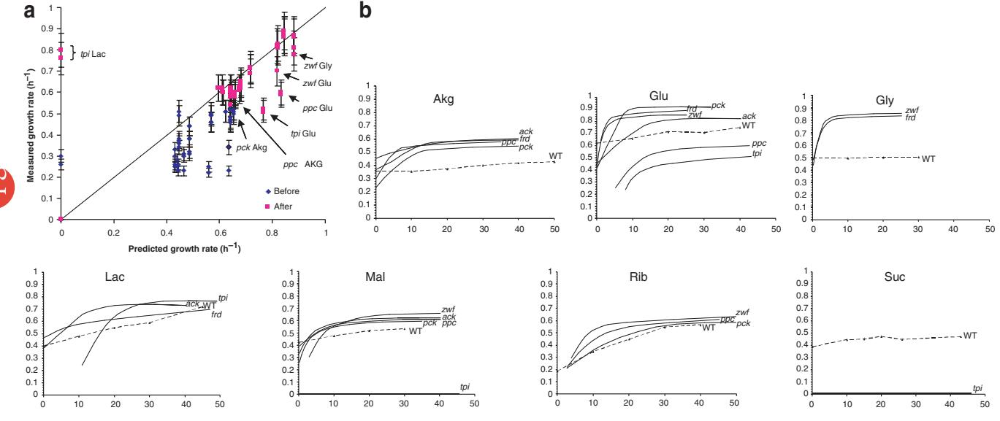
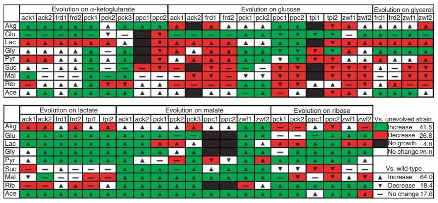

## Metabolic gene–deletion strains of Escherichia coli evolve to computationally predicted growth phenotypes

Stephen S Fong & Bernhard Ø Palsson

Genome-scale metabolic models have a promising ability to describe cellular phenotypes accurately. Here we show that strains of Escherichia coli carrying a deletion of a single metabolic gene increase their growth rates (by 87% on average) during adaptive evolution and that the endpoint growth rates can be predicted computationally in 39 of 50 (78%) strains tested. These results show that computational models can be used to predict the eventual effects of genetic modifications.

A genome-scale in silico reconstruction of E. coli metabolism1,2 based on genome sequencing, annotation and biochemical data has been used to describe cellular phenotypes of the wild-type K12 MG1655 E. coli strain under diverse growth conditions3 and at the end of adaptive evolution4,5 using constraint-based analysis6. In this study, we examined the ability of a constraint-based model to describe genetic modifications by creating strains of E. coli with in-frame deletions of metabolic genes and subjecting them to adaptive evolution under different growth conditions.

We created strains carrying deletions of the metabolic genes ackA (acetate kinase A), frd (fumarate reductase), pck (phosphoenolpyruvate carboxykinase), ppc (phosphoenolpyruvate carboxylase), tpi (triosephosphate isomerase) and zwf (glucose 6-phosphate-1-dehydrogenase) and allowed each strain to evolve (Supplementary Methods online), in replicate, on four different carbon sources, to yield a total of 50 evolved deletion strains (22 cases in duplicate and 2 (the pck– strain evolved on a-ketoglutarate and malate) in triplicate). We generated evolved strains by subjecting deletion strains to growthrate selection pressure by adaptive evolution to increase their fitness

Figure 1 Growth-rate changes during adaptive evolution. (a) Comparison of experimental and computational growth rates for deletion strains before and after evolution. The solid line indicates matching growth rates between experimental and computational values. Post-evolution Strains whose growth rate after evolution was 410% different from the computationally predicted growth rate are indicated by arrows and labeled with the deleted gene and the evolution substrate. No growth is computationally predicted for the tpi deletion strain grown on lactate, malate or succinate. (b) Growth-rate changes throughout adaptive evolution for deletion and wild-type (WT) strains. Each panel shows evolution trajectories (x axis indicates day of evolution) for deletion and wildtype strains for growth (y axis indicates growth rate; h1) on the indicated carbon source. Smoothed curves for deletion strains are based on growth-rate estimates for each day of evolution. Dashed lines indicate growth-rate changes for evolution of the wild-type strain on the specified substrate. Deletion strain curves begin on the first day of measurable growth. Akg, a-ketoglutarate; Glu, glucose; Gly, glycerol; Lac, lactate; Mal, malate; Rib, ribose; Suc, succinate.

Published online 26 September 2004; doi:10.1038/ng1432

Department of Bioengineering, University of California, San Diego, 9500 Gilman Drive, La Jolla, California 92093-0412, USA. Correspondence should be addressed to B.Ø.P. (palsson@ucsd.edu).

Figure 2 Assessment of growth rates in deletion strains evolved on alternative carbon sources. Qualitative results are shown for all evolved deletion strains tested. Rows represent the alternative carbon source used to assess growth rate. Columns indicate the deletion strain and carbon source used for adaptive evolution. Growth rates of each deletion strain on each substrate were compared with growth rates of the wild-type strain and of the appropriate unevolved deletion strain. On the basis of comparisons with the unevolved deletion strains, deletion strains were scored as having increased growth (410% change; green), decreased growth (410% change; red), no change in growth (r10% change; white) or no growth (black). On the basis of comparisons with the wild-type

strain, deletion strains were scored as having increased growth (410% change; upward-pointing triangles), decreased growth (410% change; downward pointing triangles) or no change in growth (r10% change; solid line). The percentage of cases falling in each category, tabulated independently for each comparison, is shown. Ace, acetate; Akg, a-ketoglutarate; Glu, glucose; Gly, glycerol; Lac, lactate; Mal, malate; Pyr, pyruvate; Rib, ribose; Suc, succinate.

(optimal growth). We hypothesized that an evolved strain would have growth characteristics of an optimal phenotype that could be calculated a priori by flux-balance analysis7,8 of the reconstructed network (Supplementary Methods online). We measured substrate and oxygen uptake rates experimentally and used them as input parameters for computational simulations (Supplementary Table 1 online). We compared computationally predicted growth rates for each deletion strain with experimental growth rates determined at the beginning and end of adaptive evolution (Fig. 1a).

For 39 of the 50 strains (78%), the computationally predicted growth rate was within 10% of the experimentally determined growth rate at each strain's evolutionary endpoint. Eight of the eleven incorrect predictions were associated with the ppc– and the tpi– strains. Both ppc– strains evolved on glucose grew B28% slower than computationally predicted, and both ppc– strains on a-ketoglutarate grew 11–12% slower than predicted. Both tpi– strains evolved on glucose grew B33% slower than predicted, and both tpi– strains on lactate had growth rates 40.70 h–1 when no growth was predicted. The other three incorrectly predicted cases (pck– on a-ketoglutarate, zwf – on glucose and glycerol) represented only one of the replicate parallel evolution strains and may be a result of experimental and evolutionary variability. Predicted growth rates were accurate in half the cases for both the ppc– and tpi– strains, suggesting that the reconstructed network may be incomplete. Failure modes in genome-scale models provide a basis for focused studies to improve understanding of an organism by reconciling differences between computation and observation9,10.

Monitoring the growth-rate changes of each strain throughout evolution (Fig. 1b and Supplementary Fig. 1 online) yielded two notable observations. First, each evolved deletion strain showed an increase in growth rate of at least 15% during evolution. For the 46 evolved strains that grew (all strains except tpi– on malate and succinate), the average growth-rate increase was 87%. Several strains (ppc– and tpi– on glucose, zwf – on malate, tpi– on lactate) showed no observable growth for the first several days of culture, but all recovered to grow at rates 40.50 h–1 at the end of adaptive evolution. These results indicate that deletion strains can have large changes in growth when subjected to adaptive evolution and that the initial growth rate of a deletion strain may not be a good indication of the strain's actual growth capabilities.

We also observed that the rate of growth adaptation varied greatly between deletion strains. Several deletion strains showed gradual increases in growth rate over the first 20 or more days of evolution (frd– on a-ketoglutarate and lactate, pck– on ribose, ppc– on glucose and ribose, tpi– on glucose), whereas other strains showed rapid increases in growth within the first several days of evolution (frd– on glucose and glycerol, ppc– on a-ketoglutarate, zwf – on glucose and glycerol). In most cases (evolution on a-ketoglutarate, glucose, glycerol, lactate and malate), the rate of adaptation for the deletion strains occurred much more rapidly than is observed for adaptive evolution of wild-type E. coli 4,5 (Fig. 1b). This fact suggests that part of the initial improvement in growth rate may be a functional response to the gene deletion. Variation in the rate of adaptation may be directly related to the amount of metabolic adjustment needed to compensate for the gene deletion under a specific growth condition. For example, growth on glucose after deleting the gene tpi may result in a large change in metabolic flux distributions (possibly activation of the methylglyoxal bypass11) and lead to a gradual increase in growth rate. In several cases, the rapid growth adaptation resulted in faster endpoint growth rates than are observed for the wild-type evolution strains. This difference may result from changes in flux distributions or experimental variance.

We measured growth rates of the fully evolved deletion strains on nine different, nonevolutionary carbon sources (acetate, a-ketoglutarate, glucose, glycerol, lactate, malate, pyruvate, ribose and succinate) to determine more fully the growth capabilities of each strain (Supplementary Methods online). We calculated the average growth rate from replicate cultures and compared it with the growth rate of the starting wild-type strain and the unevolved deletion strain. We categorized the evolved strains on the basis of their growth rates as showing increased growth (410% increase), decreased growth (410% decrease), no change in growth (r10% change) or no growth for each comparison (Fig. 2).

Comparison with the wild-type strain showed that nearly two-thirds of the strains resulted in increased growth on nonevolutionary carbon sources, indicating that evolution on one substrate led to concurrent growth improvements on other substrates. Notably, we also observed variation between strains evolved in parallel. For example, strain ppc1 evolved on a-ketoglutarate did not grow on glucose, glycerol, lactate or pyruvate, but strain ppc2 evolved on a-ketoglutarate did grow on the same substrates (though at a decreased growth rate). These results show that strains evolved in parallel under identical conditions may have underlying differences that are only manifested under specific growth conditions. Complete elucidation of the differences between strains (both experimentally and computationally) is hindered by the possible existence of numerous flux distributions that can lead to equivalent growth phenotypes12.

In summary, we found that a genome-scale constraint-based model could predict the growth rate at the end of adaptive evolution of strains derived from E. coli K-12 MG1655 and carrying deletions of a single gene in 39 of 50 (78%) of cases tested. We also found that adaptive evolution could lead to large increases in growth rate for gene-deletion strains and that strains evolved in parallel could have vastly different underlying characteristics at the endpoint of adaptive evolution. Thus, growth phenotypes of genetically modified organisms can change greatly over time, such that the initial phenotype of a newly modified organism may not accurately represent the full growth capabilities of the organism. With the ability of genome-scale computational models to accurately predict the effects of genetic modifications, methods combining computational and experimental work can be applied to fields using genetic manipulation such as metabolic engineering, with which strain designs can be calculated in silico before experimental implementation.

Note: Supplementary information is available on the Nature Genetics website.

## ACKNOWLEDGMENTS

We thank J.L. Reed and J.S. Edwards for critical input and discussions. Funding for this work was provided by the National Institutes of Health and the National Science Foundation.

## COMPETING INTERESTS STATEMENT

The authors declare competing financial interests (see the Nature Genetics website for details).

Received 17 June; accepted 24 August 2004

Published online at http://www.nature.com/naturegenetics/

- 1. Reed, J.L., Vo, T.D., Schilling, C.H. & Palsson, B.O. Genome Biol. 4, R54 (2003).
- 2. Edwards, J.S. & Palsson, B.O. Proc. Natl. Acad. Sci. USA 97, 5528–5533 (2000).
- 3. Edwards, J.S., Ibarra, R.U. & Palsson, B.O. Nat. Biotechnol. 19, 125–130 (2001).
- 4. Ibarra, R.U., Edwards, J.S. & Palsson, B.O. Nature 420, 186–189 (2002).
- 5. Fong, S.S., Marciniak, J.Y. & Palsson, B.O. J. Bacteriol. 185, 6400–6408 (2003).
- 6. Price, N.D., Papin, J.A., Schilling, C.H. & Palsson, B.O. Trends Biotechnol. 21, 162–169 (2003).
- 7. Edwards, J.S., Ramakrishna, R., Schilling, C.H. & Palsson, B.O. Metabolic Flux Balance Analysis. in Metabolic Engineering (eds. Lee, S.Y. & Papoutsakis, E.T.) (Marcel Deker, 1999).
- 8. Edwards, J.S. & Palsson, B.O. BMC Bioinformatics 1, 1 (2000).
- 9. Forster, J., Famili, I., Palsson, B.O. & Nielsen, J. Omics 7, 193–202 (2003).
- 10. Covert, M.W., Knight, E.M., Reed, J.L., Herrgard, M.J. & Palsson, B.O. Nature 429, 92–96 (2004).
- 11. Cooper, R.A. & Anderson, A. FEBS Lett. 11, 273–276 (1970).
- 12. Mahadevan, R. & Schilling, C.H. Metab. Eng. 5, 264–276 (2003).

