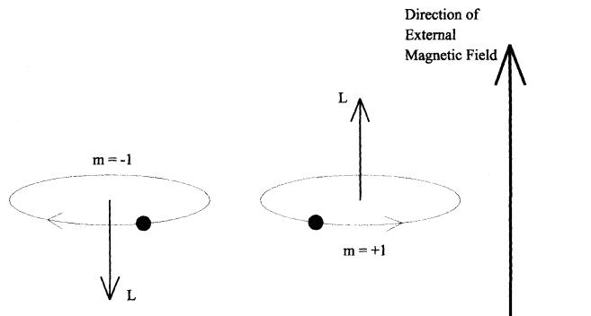
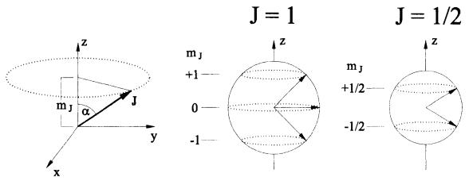

# Space Quantization: Otto Stern's Lucky Star

 Much of my work has had its origin in the notion that science should treasure its own history, that historical scholarship should treasure science, and that the full understanding of each is deficient without the other,

 ?Gerald Holton The Advancement of Science, and Its Burdens1

 IN THIS ESSAY WE REVISIT A TREASURED EPISODE from the heroic age of atomic physics. The story centers on an experiment, elegantly simple in its conception, extraordinarily startling in its outcome, and extremely fruitful in its legacy. From it emerged both new intellectual vistas and a host of useful applications of quantum science. Yet this germinal experiment, carried out at Frankfurt in 1921-22 by Otto Stern and Walther Gerlach, is not at all familiar except to physical scientists.2 Even among them we have found very few aware of historical particulars that enhance the drama of the story and the abiding lessons it offers about how science works. These particulars include a bad cigar that amplified a puny signal, a postcard from New York that offset the huge inflation then rising in Germany, and an uncanny "conspiracy of Nature" that rewarded the audacity of the ex perimenters, despite the inadequacies of a fledgling theory that had led a skeptical Otto Stern to devise his crucial test.

Bretislav Friedrich is Senior Research Fellow in the Department of Chemistry and Chemical Biology at Harvard University.

Dudley Herschbach is the Baird Professor of Science at Harvard University.

 We begin by describing the historical context of the experi ment, chiefly stemming from the atomic model proposed by Niels Bohr in 1913, nowadays referred to as the "old quantum theory." Our intent is to provide an account accessible to any one with only vague memories of high-school physics or chem istry. But as background we need to discuss a few concepts, to show how Stern's interest was whetted by the tantalizing, partial successes and patent failures of Bohr's model when confronted with atomic spectra and magnetism. Stern came to focus on the idea of space quantization. This was one of the most peculiar inferences from the old quantum theory, the notion that the quasiplanetary electron orbits postulated by Bohr could have only certain discrete orientations in space. Even Stern's theoreti cal colleagues who had invoked this idea regarded it as merely a

 mathematical construct, devoid of physical reality. We next trace the conception, preparation, vicissitudes, and realization of the Stern-Gerlach experiment. It showed unequivo cally that space quantization was real, and thus provided com pelling evidence that a new mechanics was required to describe the atomic world. Myriad experiments since have confirmed and exploited space quantization. Ironically, however, the seeming agreement of the original experiment with the old quantum theory was chimerical. Within a few years, the electron orbits of the Bohr model were shown not to exist. Another electronic property was discovered, called spin, that produced an equiva lent result in the Stern-Gerlach experiment. Yet space quantiza tion was thereby reincarnated, in a more comprehensive and comprehensible form. As an epilogue, we briefly describe the modern incarnation and inspect treasures it has minted.

#### PRELUDE: OTTO STERN AND THE BOHR ATOM

 Otto Stern (1888-1969) received his Ph.D. in 1912 at Breslau in physical chemistry.3 His doctoral dissertation presented theory and experiments on concentrated solutions of carbon dioxide in various solvents, just generalized soda water. His parents, proud and affluent, offered to support him for postdoctoral study any where he liked. Motivated by "a spirit of adventure," Stern opted to work with Einstein, then at Prague. They had not met,

 but Stern knew Einstein was "a great man, at the center of modern developments." Contact was quickly made via what would now be called "the old-boy network" and Einstein (then thirty-three) indicated he was willing to accept Stern (then twenty four). In Prague, Einstein held discussions "with his first pupil, Otto Stern, ... in a caf? which was attached to a brothel."4 Soon Einstein was recalled to Zurich; Stern accompanied him there and in 1913 was appointed privatdozent for physical chemistry.

 Under Einstein's influence, Stern became interested in light quanta, the nature of atoms, magnetism, and statistical physics. However, Stern was shocked when in mid-1913 Bohr published his iconoclastic atomic model. Soon after, Stern discussed it thoroughly with his colleague Max von Laue during a long walk up the ?tliberg, a mountain near Zurich. This led them to make a solemn oath that later acquired some notoriety: "If this non sense of Bohr should in the end prove to be right, we will quit

 physics."5 The quantization of energy had first been boldly invoked by Max Planck in 1900 and by Einstein in 1905, but they dealt with many-particle systems. For the most part, the physics commu nity had suspended judgment, supposing that some way might yet be found to reconcile seemingly aberrant phenomena with the concepts of classical mechanics and electromagnetic theory that were so securely established in macroscopic physics. Bohr's work was more perplexing and immediate in its impact, as he treated the simplest atom, hydrogen?comprised of just two particles, a positively charged proton and an negatively charged electron. Ernest Rutherford had shown in 1911 that nearly all of the mass but only a minuscule fraction of the volume of an atom resided in its nucleus (here, the proton). That suggested a model for the atom similar to the solar system, with a planetary elec tron circling the nucleus. The problem was that, according to classical physics, such an atom would collapse in an instant. The electrical attraction to the proton would cause the electron to spiral rapidly into the nucleus, giving up its kinetic energy as radiation.

#### "A Triumph over Logic"

 Bohr simply postulated that the electron could circle the proton only on one or another of a discrete set of orbits. These he called "stationary states." He offered no justification for such a blatant violation of classical mechanics, which would permit a continu ous range of possible orbits. He also proposed that the electron could switch inward or outward, from one orbit to another, by emitting or absorbing a quantum of light, with wavelength de termined by the difference in energy of the initial and final orbits. But he asserted that somehow the innermost orbit, closest to the nucleus, was stable; from this "ground state" the electron would not fall into the nucleus. Finally, Bohr came up with a means to calculate the size of the orbits and their energies. It amounted to postulating that, in addition to the energy, the angular momentum of the electron was quantized. For a circular orbit, classical mechanics defines the angular momentum L as a vector, perpendicular to the orbit, with magnitude given by the product of the electron's mass, its velocity, and the orbital ra dius. Again, in classical physics L could have a continuous range of values, whereas the quantization condition adopted by Bohr specified L = n(h/2n). Here n = 1, 2, 3 . . . is an integer (with n = 1 for the ground state) and h is Planck's fundamental con stant, the proportionality factor between frequency and energy that appeared in the quantization rule Planck and Einstein had employed in entirely different contexts than Bohr's atomic model.

 In the apt phrase of Abraham Pais, the weird model concocted by Bohr proved a "triumph over logic."6 It scored a stunning success in accounting for major features of the observed spectrum of the hydrogen atom. In 1885 (the year of Bohr's birth), a remarkably simple empirical for mula known as the Balmer formula had been found, which related frequencies (or reciprocal wavelengths) of the spec tral lines to the differences of reciprocal squares of integer numbers. This relationship had remained an unexplained curiosity. Bohr's calculations gave an expression of the same functional form, in which the integers involved were simply the values of his quantum number n for the initial and final orbits involved in the electronic transition. More

 over, Bohr was able to evaluate a proportionality factor in the Balmer formula, known as the Rydberg constant, in terms of the charge and mass of the electron and Planck's constant. These fundamental quantities were not yet accu rately known, so his theoretical value was uncertain by a few percent; but Bohr's result agreed within that range

 with the empirical value of the Rydberg constant. Likewise, Bohr's quantization of angular momentum enabled him to calculate the radius of an orbit in terms of the electronic charge, the mass, and Planck's constant. Again, he found satis factory agreement with empirical estimates of the atomic size. In this case the comparison was merely in order of magnitude, yet quite significant since other extant models provided no means to predict the radius of an atom. In fact, the best empirical esti mates then available came from diffraction of x-rays by crystal lattices?a method invented in 1912 by none other than von Laue, who thereby helped provide evidence supporting a model he found exceedingly distasteful.

 A corollary of Bohr's model for the hydrogen atom had a particularly compelling success. In 1896 Charles Pickering, a Harvard astronomer, had discovered in starlight another re markably regular series of spectral lines, one not seen in labora tory spectra of hydrogen but likewise involving differences of reciprocal squares of integers. Bohr noted that these unassigned lines could be ascribed to the helium atomic ion; like hydrogen, it has only one electron, but the helium nucleus contains two protons. Accordingly, Bohr's model predicted that the Balmer formula should apply with the Rydberg constant increased by 22, or 4. This nicely accounted for the spectral pattern, but a spec troscopist then pointed out that the factor would need to be 4.0016 rather than 4 to fit the lines accurately. Bohr responded that, for simplicity, he had previously approximated the mass of the nucleus as infinitely heavier than the electron; the correction could be easily and precisely evaluated since it depended only on accurately known mass ratios. He thus obtained a factor of 4.00163, in gratifying and unprecedented quantitative agree ment with the data. Einstein commented that this was "an enor mous achievement."

 Despite these and other happy results, Bohr, like many of his contemporaries, was very dissatisfied with his model. He re garded it as "makeshift and provisional," not only because it was in "conflict with the admirably coherent conceptions which have been rightly termed the classical theory of electrodynam ics," but because it "has too much of approximation in it and it is philosophically not right." Its inadequacies became glaringly evident also in attempts to account for further experimental results. Efforts to extend Bohr's approach to calculate the spec tra of two-electron atoms, such as unionized helium, failed dis mally. Another recalcitrant puzzle was the splitting of lines caused by the application of an external magnetic field, known as the Zeeman effect. We will consider this specifically, since Stern was to exploit atomic magnetism. However, first we need to describe an extension of Bohr's model, revealing the aspect destined to be confirmed by Stern as a key element of nature's strange logic for the atomic world.

### Space Quantization

 Even the hydrogen atom posed more puzzles, clues for deeper issues. At high resolution, the spectral lines had a fine structure, which was not included in the Balmer formula. This structure, as well as the shifts and splittings induced by application of exter nal or magnetic fields, spurred efforts to develop a more compre hensive theory. In 1916, Arnold Sommerfeld and, independently, Peter Debye generalized Bohr's model for hydrogen. They intro duced three quantization conditions, pertaining to different com ponents of the orbital angular momentum of the electron. The allowed discrete orbits of the electron were then not limited to circles but were in general ellipses, characterized by three quan tum numbers.

 One of these, n = 1, 2, 3, . . ., now called the principal quan tum number, was like that which Bohr had invoked for his circular orbits. The two new quantum numbers, denoted by k and m, were also restricted to integer values. The quantity &, termed the azimuthal quantum number, ranges from k = 1, 2, . . . , n; together with w, the value of k determines the size and shape of the elliptical orbit (which becomes circular for k = n). The quantity m, called the projection quantum number, ranges

 Figure 1: Space Quantization According to the Old Quantum Theory. Depicted is the simplest case: a single electron orbiting about the atomic nucleus, with one quantum of angular momentum. The angular momentum vector L (and the atomic magnetic moment which is proportional to it) has only two allowed orientations, either parallel (projection quantum number m = 1) or antipar allel (m = -1) to the direction of an external magnetic field.

 from -k to +k in integer steps (but with m = 0 excluded); it specifies the orientation of the plane of the elliptical orbit in space. Equivalently, since the orbital angular momentum vector L is perpendicular to the plane of the orbit, m also determines the projection of L on any prescribed axis. These limitations to discrete orientations, corresponding to the integer values of m, were termed directional or spatial or space quantization.

 Figure 1 pictures this model for the simplest case, the ground state of hydrogen. There n = 1 so only k - 1 is allowed and accordingly just m = -1 and + 1. Hence for this case the orbit is circular, but its angular momentum L can take up only two discrete orientations, corresponding to clockwise and counter clockwise motion of the electron. (We refrain from displaying the set of elliptical orbits for larger w, still a favorite decoration for textbooks.)7

 Sommerfeld showed that, for his model, the energy was not affected by k or m but depended only on the principal quantum number n, just as in the original Bohr model, provided that relativistic effects were neglected and external electric or mag netic fields were absent. However, he also evaluated a small contribution to the energy, depending on both n and k, which

 arose from the relativistic change of the electron mass as its velocity varies in the elliptic orbit. His relativistic correction was found to give good quantitative agreement with the observed spectral fine structure; it was justly considered "a triumph both

 for quantum and for relativity theory." However, in the absence of an external field, the role of spatial quantization remains unobservable. The energy and hence the spectrum of the atom are then independent of the m quantum number. That holds, as Sommerfeld noted, because the various discrete orientations specified by m are equivalent if there is no "preferred direction of reference in space." When such a special direction is imposed by an external electric or magnetic field, the various discrete orientations can differ in energy. That occurs simply because in general the interaction of an electron with the field depends on the angle between the field direction and the electron's path. Now we turn to some pertinent aspects of mag netism, to show how the actors and issues of our story became aligned in a fortunate direction.

### Magnetism and the Zeeman Effect

 Back in 1820, Hans Christian Orsted, the leading Danish physi cist of his day, discovered that an electric current generates a magnetic field. Soon after, Andr? Amp?re conjectured that mag netism in matter arose from charged particles moving in tiny circuits. Bohr, who had done his doctoral thesis on the electron theory of metals, took the opportunity?ninety years later?to compute the strength of the elementary magnet for his atomic model. For an electron in circular orbit with quantum number w, he found that the magnetic moment was n times a quantity now called the Bohr magneton; it is proportional to Planck's constant times the ratio of the electronic charge to its mass. Curiously, Bohr did not include that result in his 1913 papers, although it appears in an existing draft.

 Ampere's conjecture also interested Einstein, who in 1915 with Wander de Haas even undertook an experiment to deter mine the ratio between the magnetic moment of electrons in iron and the angular momentum associated with the postulated elec tron orbits. Einstein remarked, "How tricky Nature is when one tries to approach her experimentally! In my old days [he was

 thirty-six] I am developing a passion for experiments."8 The experimental result seemed to confirm a prediction derived from classical electromagnetic theory. Bohr cited this as confirming his postulate that electrons can circulate in atoms without emit ting radiation. However, the experiment was trickier than Einstein realized, and so was the theory; not until more than a decade later was it known that the magnetism of iron comes almost

 solely from electron spins, not orbital motion. Stern first became involved with magnetism while in Zurich, where in discussions he helped refine the theory of ferromag netism advanced in 1913 by Pierre Weiss. That theory, still useful today, envisioned magnetic domains within a metal. How ever, it implied that the average magnetic moment of an atom in a fully magnetized sample of iron was much smaller than the Bohr magneton, by about a factor of five. In an attempt to account for this, in 1920 Wolfgang Pauli invoked the idea of space quantization, noting that the apparent magnetic moment an atom contributes within a domain depends on the atom's orientation with respect to the field direction. He performed a statistical average over the projection quantum numbers m and concluded the net effective atomic moment should indeed be much smaller than the Bohr magneton. Again, as with Einstein and de Haas, the basic model was wrong (since spin rather than orbital magnetism is involved). However, Pauli's appeal to space quantization of atomic magnets has historical significance in that it made his colleagues, including Stern, mindful of the idea.

 Although the old quantum theory was not obviously in con flict with these studies of bulk magnetism, it had no such luck with the Zeeman effect. Soon after the splitting of spectral lines in a magnetic field was discovered in 1897, Hendrick Lorentz offered an explanation based on a classical model of the atom: depending on whether the emitted light was viewed parallel or perpendicular to the field direction, a line should split into a doublet or triplet, with spacings proportional to the field strength. Such behavior, which came to be termed the "normal" Zeeman effect, was found in a few cases, at least for weak fields. But that proved to be abnormal. Most often, lines split into more than three components, and the spacings were not simply propor

 tional to the field strength; this typical situation was termed the "anomalous" Zeeman effect.

 In the augmented Bohr model developed by Sommerfeld and by Debye, space quantization provided a nice explanation of the normal Zeeman effect. As noted above, when a field is present, the orbits with different spatial orientations differ in energy. Accordingly, if the projection quantum number m changes for an electron jump between orbits, the corresponding spectral line shifts from the position it had in the absence of the field, so the original line appears to split up. This success with the normal Zeeman effect could not be taken as evidence for space quanti zation, however, since even Lorentz's simple classical model appeared adequate for the normal case. Furthermore, despite strenuous efforts by Sommerfeld, Debye, and others, no way was found to account for the complexities of the anomalous Zeeman effect. Thus, the notion of space quantization did not enable the old quantum theory to do any better than the classical

 theory in coping with the Zeeman effect. As the quantity and quality of spectroscopic data grew, the intractable anomalous effect spread bafflement and gloom. Here is a lament by Pauli:

 The anomalous type of [magnetic] splitting . . . was hardly under standable, since very general assumptions concerning the elec tron, using classical theory as well as quantum theory, always led to the same triplet. A closer investigation of this problem left me with the feeling that it was even more unapproachable. A col league who met me strolling rather aimlessly in the beautiful streets of Copenhagen said to me in a friendly manner, "You look very unhappy," whereupon I answered fiercely, "How can one look happy when he is thinking of the anomalous Zeeman ef fect?"9

 Thus it came to pass that atomic spectra, which had provided much encouragement for the fledgling quantum theory, also revealed most clearly its inadequacies. Both proponents and critics were stymied. Then, in 1921, Otto Stern proposed a definitive experiment, not involving spectroscopy. He asserted that "the experiment, if successful, will decide unequivocally between the quantum theoretical and classical views" and would thereby prove whether or not space quantization exists.10

#### THE STERN-GERLACH EXPERIMENT

 The immediate stimulus for Stern was a property implied by the Sommerfeld-Debye theory that had not been observed. Accord ing to the theory, as illustrated in figure 1, hydrogen atoms (with n = 1) in a magnetic field would be aligned such that the electron orbits are perpendicular to the direction of the field (m = ?1). A beam of light directed perpendicularly to the mag netic field would then interact differently with the orbiting elec tron, depending on whether the electric vector of the light oscil lates parallel or perpendicular to the magnetic field. In the par allel case, the oscillating electric vector of the light acts to pull the electron out of its orbital plane; in the perpendicular case, it would displace the electron in the orbital plane. The propaga tion velocity of the light through a gas of hydrogen atoms, and hence the index of refraction, should therefore differ markedly

 for the parallel and perpendicular cases. As the same considerations apply for many-electron atoms or molecules, the old quantum theory predicted that any gas should be expected to exhibit birefringence, a phenomenon well known in optics of anisotropic liquid and solid media. However, mag netically induced birefringence of gases had never been observed. This cast yet another shadow on the old quantum theory but awakened in Stern an illuminating insight. As he recalled the creative moment:

 The question whether a gas might be magnetically bir?fringent was raised at a seminar. The next morning I awoke early, too early to go to the lab. As it was too cold to get out of bed, I lay there thinking about the seminar question and had the idea for the experiment.11

 Stern's key idea was to look for space quantization by using the magnetism of the atom as a probe. If space quantization occurs, the atomic magnets would have only discrete projections (speci fied by the quantum number m) on the direction of an external magnetic field. In contrast, according to classical mechanics, as long as the atoms do not undergo collisions, the atomic magnets would remain randomly oriented whether or not an external field is present. By conceiving this Gedankenexperiment, in Einstein's style, Stern showed how to decide the issue.

- Figure 2: Schematic View of the Stern-Gerlach Apparatus. Indicated are (a) the ob served beam splitting and (b) the unsplit outcome predicted by classical mechanics. The beam of silver atoms, produced by effusion of metallic vapor from an oven heated to 1000?C, is collimated by two slits (0.03 millimeters wide in the vertical direction). The beam passes through an inhomogeneous magnetic field about 3.5 centimeters long; its direction and gradient are vertical, the field strength is about 0.1 Tesla and the gradient 10 Tesla/cm. The transmitted beam is deposited on a cold glass plate. The magnitude of the splitting is only 0.2 millimeters. For the sake of clarity, in the figure the splitting is much exaggerated and the broadening of the deposits caused by the thermal distribution of velocities in the beam is omitted.
### Flans and Preparations

 Stern envisaged a well-collimated beam of silver atoms, traveling in a vacuum chamber and passing through a magnetic field directed across the beam path. Since a silver atom has only one valence electron, for his purpose it could be expected to behave like hydrogen (which is less convenient to handle experimen tally). The beam is so dilute that the individual atoms sail through the apparatus without interacting with others. After traveling between the pole pieces of the magnet, the atoms land on a cold glass plate to which they adhere and thereby exhibit the beam intensity profile. As pictured in figure 2, one of the magnet pole pieces has a sharp edge, the other a broad notch; this makes the magnetic field stronger near the edge, weaker near the notch. In this nonuniform field, transverse to the beam path, an atom is subject to a deflecting force proportional to the angle between the atomic magnet and the external field gradient.

 Consequently, the atomic magnets that are tilted towards the field direction are attracted to the stronger field region, whereas those tilted away are repelled. The trajectories of atoms emerg ing from the deflecting magnet, as recorded by deposits on the glass plate, thus reveal the spatial orientation of the atomic magnets.

 With such a setup, Stern predicted that space quantization would produce a splitting of the atomic beam into two distinct components, since in the ground state of the silver atom the valence electron was expected to have just one unit of orbital angular momentum (n = k - 1, so m - +1 and -1 components). For any classical model, however, the atomic magnets would be distributed over a continuous angular range, so passing through the deflecting field would not split the beam but only broaden it

 along the field direction. Stern was at this time assistant to Max Born at the Institute for Theoretical Physics in Frankfurt. Soon after hatching his idea in a warm bed, Stern hastened to Born, who gave it a cool assessment. As Born recalled:

 It took me quite a time before I took this idea seriously. I thought always that direction [space] quantization was a kind of symbolic expression for something which you don't understand. But to take this literally like Stern did, this was his own idea. ... I tried to persuade Stern that there was no sense [in it], but then he told me that it was worth a try.12

 Stern was, with Born's blessing, already engaged in an experi ment to test a central theoretical result of statistical physics, the form of the distribution of molecular velocities in a gas. It had been derived decades earlier by James Clerk Maxwell and Ludwig Boltzmann, but Stern's work was the first direct test. He em ployed a beam of silver atoms, effusing from a small oven in vacuum, and scanned the velocity distribution by observing the transmission of the beam through a slit system rotating at high speed. Born described how Stern conducted this work:

 I had only two rooms in Frankfurt.. . . Stern's apparatus was made up in my little room, so I saw it from the beginning and watched. And I was quite envious of how he managed: he did not touch it at all, for he is also, just like me, not very good with his

 hands. But we had a very good mechanic. . . . [Stern] told him what to do and it came out.13

 The experimental results proved to be in agreement with the Maxwell-Boltzmann distribution, after Einstein provided some

 help with the interpretation. Adjacent to Born's Theoretical Institute was that for Ex perimental Physics, where Walther Gerlach was a newly hired member. He was reputed to be an excellent experimentalist, and moreover had undertaken work with atomic beams. He wanted to determine whether a beam of bismuth atoms was magnetic, in contrast to solid bismuth, which is not. He planned to do this by sending the beam through the same sort of magnetic deflecting field that Stern had in mind. Stern promptly recruited Gerlach, saying: "With the mag netic [deflection] experiment one can do something else. Do you know what directional [space] quantization is?" Gerlach did not. After a brisk, excited explanation, Stern concluded with: "Shall we do it? Well, let's go, we shall do it!"14

#### Realization and Reception

 Stern's design calculations indicated the experiment was barely feasible; indeed, despite the simplicity of his scheme, it took more than a year to accomplish. The apparatus had two vacuum chambers?one held the oven that produced the beam of silver atoms, the other contained an electromagnet and the glass col lector plate. The beam collimation had to be extremely narrow if the small splitting were to be resolved, so the beam intensity at the collector plate was very low. The attainable "exposure time" was usually only a few hours, between breakdowns of the apparatus. Thus only a meager film of silver atoms was depos ited, too thin to be visible to an unaided eye. Forty years later, Stern enjoyed recalling a cherished episode:

 After venting to release the vacuum, Gerlach removed the detec tor flange. But he could see no trace of the silver atom beam and handed the flange to me. With Gerlach looking over my shoulder as I peered closely at the plate, we were surprised to see gradually emerge the trace of the beam.. . . Finally we realized what [had happened]. I was then the equivalent of an assistant professor.

 My salary was too low to afford good cigars, so I smoked bad cigars. These had a lot of sulfur in them, so my breath on the plate turned the silver into silver sulfide, which is jet black, so easily visible. It was like developing a photographic film.15

 After this, Gerlach and Stern began using a photographic devel opment process. However, other devilish difficulties persisted. As inconclusive efforts continued for months, Stern's assessment of space quantization wavered back and forth, between convic tion and rejection. Gerlach's faith was also being undermined by dubious colleagues, including Debye: "But surely you don't be lieve that the [spatial] orientation of atoms is something physi cally real; that is [only] a prescription for the calculation, a timetable for the electrons."16

 During this gestatory period, Stern left Frankfurt to assume the post of professor of theoretical physics at Rostock, returning during vacations to work on the experiment. Its formidable character and the fortitude of Gerlach has been vividly described by one of his students:

 Anyone who has not been through it cannot at all imagine how great were the difficulties with an oven to heat the silver up . . . within an apparatus which could not be fully heated [the seals would melt] and where a vacuum. . . had to be produced and maintained for several hours. The pumping speed . . . was ridiculously small compared with the performance of modern pumps. And . . . the pumps were made of glass and quite often they broke, either from the thrust of boiling mercury ... or from the dripping of condensed water vapor. In that case the several day effort of pumping, required during the warming up and heating of the oven, was lost. Also, one could be by no means certain that the oven would not burn through during the four- to eight-hour exposure time. Then both the pumping and the heating of the oven had to be started from scratch. It was a Sisyphus-like labor and the main load and responsibility was carried on the broad shoulders of Professor Gerlach. . . . He would get in about 9 p.m. equipped with a pile of reprints and books. During the night he then read the proofs and reviews, wrote papers, prepared lectures, drank plenty of cocoa or tea and smoked a lot. When I arrived the next day at the Institute, heard the intimately familiar noise of the running pumps, and found Gerlach still in the lab, it was a good sign: nothing broke during the night.17

 When it was ultimately resolved, the observed splitting of the silver beam was only 0.2 millimeters. Accordingly, a misalign ment of the oven orifice, the pair of collimation slits, or the edge of the "sharp" pole piece of the magnet by more than 0.01 mm was enough to spoil an experimental run.

 Another handicap was the financial disarray that began to beset Germany in 1920. Born tells about it:

 We were already in the inflation which later became so disas trous; but we were not aware of what was happening. Everything was scarce and expensive. Physical instruments were hardly ob tainable. So my funds were quickly exhausted.... At that time a wave of interest in Einstein and his theory of relativity was sweeping the world. He had predicted the deflection, by the sun, of light coming from a star . . . after laborious measurements and tedious calculations the conclusion was arrived at [in 1919] that Einstein was right, and this was published under sensational headlines in all the newspapers. . . . There was an Einstein craze, everybody wanted to learn what it was all about. ... I announced a series of three lectures in the biggest lecture-hall of the Univer sity on Einstein's theory of relativity and charged an entrance fee for my Department. It was a colossal success, the hall was crowded and a considerable sum collected. . . . The money thus earned helped us for some months, but as inflation got worse, it evapo rated quickly and new means had to be found.

 One day I met a friend . . . who was going to New York. ... I said jokingly: "If you find a German-American who is still inter ested in the old country, tell him I need dollars for important experiments in my Department." I had quite forgotten this re mark when a few weeks later a postcard arrived: . . . "Write to Henry Goldman [of Goldman Sachs, and also the progenitor of Woolworth stores], 998 Fifth Avenue, New York." At first I took it for another joke, but on reflection I decided that an attempt should be made.... [A] nice letter was composed and despatched, and soon a most charming reply arrived and a cheque for some hundreds of dollars which helped us out of our difficulties.. . . After Goldman's cheque had saved our experiments, the work [on the Stern-Gerlach experiment] went on successfully.18

 Einstein himself also helped. He was then the director of the Kaiser-Wilhelm Institute of Physics in Berlin, and provided a grant from the endowment of his Institute.

 When Gerlach at last did clearly resolve the beam splitting, he informed Stern, then at Rostock, by telegram.19 Ironically, just then Stern's doubts about space quantization were again ascen dant; later, he recalled the surprise and excitement as over whelming. Despite the small size of the splitting, from careful analysis Gerlach and Stern were even able to determine the magnetic moment of the silver atom. They found it equal to the Bohr magneton (within an accuracy of about 10 percent)?in gratifying agreement with the result expected from the old quan tum theory, if the magnetism arose from orbital motion of the

 valence electron with one quantum of angular momentum. The directness and conceptual simplicity of the Stern-Gerlach experiment ensured that it had great impact.20 It was immedi ately accepted as among the most compelling evidence for quan tum theory. But space quantization was a double-edged discov ery. Einstein and Ehrenfest, among others, struggled without success to understand how the atomic magnets could take up definite, preordained orientations in the field. Likewise, the lack of birefrigence became a more insistent puzzle. Those questions and others (such as the anomalous Zeeman effect) could not be cleared up for a few more years, until further discoveries ushered in modern quantum mechanics.

#### EPILOGUE: AN ABIDING LEGACY

 Having visited the Stern-Gerlach experiment in its historical context, rife with hesitant and confusing theoretical ideas, we now look briefly at the interpretation that has become canoni cal. This involves no less than four major pillars of quantum physics that emerged during the years from 1925 to 1927: elec tron spin, a deeper view of angular momentum, wave-particle duality, and the uncertainty principle. These discoveries made obsolete the old quantum theory, but enhanced the scope and significance of space quantization.

 Atomic spectra, burgeoning with fine structure and Zeeman splittings, provoked theorists to resort to attempting empirical

 schemes that postulated a variety of ad hoc angular momenta and quantization rules. After curious twists and turns, this led George Uhlenbeck and Samuel Goudsmit, young graduate stu dents at Leiden, to propose in 1925 that an electron has an intrinsic angular momentum or "spin."21 Its allowed projections (in units of h/2n) are only ras = ?1/2, in contrast to the integer values that occur for orbital angular momentum. A generalized theory of angular momentum and atomic magnetism was soon developed that proved capable of accounting for the vast body of spectral data, including in particular the anomalous Zeeman effect.

### Quantum Mechanical Perspectives

 Here we need note only three aspects. First, the properties of a general angular momentum vector J, which can be orbital, spin, or a combination of both, differ substantially from the old quantum theory. As illustrated in figure 3, the pertinent features can be visualized in terms of a semiclassical model. As a conse quence of the uncertainty principle, only the magnitude IJI of the angular momentum vector and its projection m} on some axis (denoted Z) can be simultaneously specified (both in units of h/2n). The magnitude is given in terms of a quantum number /; depending on the nature of the system, it can take either half integral or integral nonnegative values, i.e., / = 1/2, 3/2, ... or / = 0, 1, 2,. . . . For any given /, the projection m} has 2/ + 1 allowed values, running in integer steps from -/ to +/ (and including zero if/ is integral). Since an angular momentum state is fully defined by its values of/ and mp an appropriate model has the J vector precessing uniformly about the Z axis, with the

 angle a between J and Z determined by / and my In contrast to figure 1, space quantization now refers to the 2/ + 1 allowed values of m}or the angle a, and not to quasiplanetary orbits, which are banished in quantum mechanics by the wave properties of the electron as well as the uncertainty principle. In particular, the direction of J can never coincide with the Z axis (i.e., a * 0? or 180?). Furthermore, unlike the old quantum theory (where L = 0 or m = 0 were considered meaningless), zero values of the orbital angular momentum and its projection are allowed. Space quantization now emerges as a universal prop

 Figure 3: Space Quantization According to Modern Quantum Theory. At left is shown the semiclassical model for an angular momentum vector J (orbital, spin or resultant of both): the J vector precesses uniformly about a space-fixed axis Z (for example, a magnetic field), with projection m on that axis. In accord with the uncertainty principle, the azimuthal angle around Z is unobserv able, and the magnitude IJI of the angular momentum (in units of h/2n) is given by L/(/+l)]1/2, with / the angular momentum quantum number. Also shown are the space quantizations for / = 1 and / = Vi, including the allowed values of the projection quantum number m, which run in integer steps from -/ to +/; thus there are a total of 2/ + 1 discrete orientations of the J vector.

 erty associated with a disembodied angular momentum vector; for example, for / = 0, 1, 2, 3,. . . the number of discrete orien tations are respectively: 1, 3, 5, 7,... ; whereas for/ = 1/2, 3/2, 5/2,. . . the number of orientations is 2, 4, 6, ... .

 Second, the apparent agreement of the Stern-Gerlach splitting with old quantum theory is now seen to be a lucky coincidence. For the silver atom, the orbital angular momentum of the va lence electron is actually zero (not one unit as presumed in the Bohr model). The magnetic moment is due solely to one half unit of spin angular momentum. That produces the twofold splitting (with ms = ?1/2, in contrast to the m = ?1 components of the Bohr model). Moreover, the spin produces a magnetic moment of the same size as one unit of orbital momentum would (that is, one Bohr magneton), by virtue of a factor of two arising from a relativistic effect not recognized until 1926. There was thus an uncanny cancellation of errors.

 Also unwittingly lucky was the choice of silver, an atom with / a half-integer.22 If the atom instead had / an integer, one of the space-quantized components would have a zero value of the projection quantum number, m} = 0. That component would not be deflected; hence on the collection plate it would occupy the gap between the deflected components. Beam splitting thus would

 have been undetectable in the original Stern-Gerlach experiment, a result that would have appeared consistent with classical me chanics.

 Third, quantum mechanics disposed of many vexing concep tual puzzles of the old quantum theory. Among these is magneti cally induced birefingence, the issue that galvanized Stern. With electrons quivering in waves rather than moving in quasiplanetary orbits, there no longer exists the drastic asymmetry of the old model, illustrated in figure 1, which would have produced strong double refraction.23 Another question rendered irrelevant is how the silver atoms take up definite spatial orientations in the field, which stymied Einstein and Ehrenfest. Quantum mechanics does not permit the orientation process to be visualized as twisting into position the atomic magnets, since the uncertainty principle prohibits following the change of state of an atom entering the field. The modern description deals only with the probability distribution of the atoms between the space-quantized states

 defined by the field. There persists an intriguing historical puzzle, however. Since in 1922 the Stern-Gerlach splitting aroused much interest, prompt ing testimonials of its importance from leading physicists, we expected that the discovery of electron spin in 1925 would very soon have led to a reinterpretation of the splitting as due to spin. However, in a search of the contemporary literature, the earliest attribution of the splitting to spin that we have found did not appear until 1927.24 Perhaps this is merely another instance of sic transit gloria mundi; but the hiatus seems surprising in view of the rapid flowering of quantum mechanics in those years. A host of current textbooks mention the Stern-Gerlach splitting as demonstrating electron spin. Of course, that is correct, but we have not found any text that points out the experimenters had no idea it was spin they had discovered.

#### Molecular Beams and Other Marvels

 Late in 1922, Stern became professor of physical chemistry at Hamburg, where he undertook an ambitious program to develop further molecular beam methods. From this came many basic tech niques and germinal results.25 The crowning achievements were a quantitative confirmation of the wave nature of matter, by diffrac

 tion of a helium beam from a crystal, and the first measurements of nuclear magnetic moments, for the proton and deuteron. Those nuclear moments are smaller than that of an electron by a factor of roughly 1/1000, and so required a greatly improved magnetic de flection experiment. Beforehand, theorists advised that the experi ment would be wasted effort, as the factor would surely just equal the ratio of the nuclear mass to the electron mass. Stern found a much different result, however, which revealed that the proton and deuteron were not elementary particles, but must have internal structure. In the summer of 1933, shortly after this epochal finding, the Nazi nightmare forced Stern to emigrate. He never regained a pacesetting role in research. Yet his work abides, and with it the

 inspiring example of his ardent pursuit of lucid understanding. Descendants of the Stern-Gerlach experiment and its key con cept of sorting quantum states via space quantization are legion. Among them are the prototypes for nuclear magnetic resonance (NMR), radioastronomy, atomic clocks, and the laser. A family tree for these and kindred developments has been traced by John Rigden in his biography of Isidor I. Rabi;26 it has been examined also by Holton in his model for the growth of scientific re search.27 The tree sprouted in Stern's Hamburg laboratory, where as a postdoctoral visitor in 1928 Rabi became captivated by the molecular beam method, and it flourished when Rabi trans planted it to American soil.28 The fabulous harvest, still being reaped, now includes ways to probe nuclei, proteins, and galax ies as well as the means to image bodies and brains; perform eye surgery; read music or data from compact discs; and scan bar codes, grocery packages, or DNA base pairs in the human ge nome. All these marvels and many more stem from exploiting radiative transitions between space quantized quantum states.

 As both Stern and Rabi began in physical chemistry, our own field, we take note also of a hearty offshoot in which molecular beam techniques, augmented both by magnetic and electric reso nance spectroscopy and by lasers, have evolved into powerful tools for the study of molecular structure and reactivity. Particu larly welcome is the ability to examine individual reactive colli sions, by colliding beams in a vacuum and detecting the products in free flight, before subsequent collisions degrade the informa tion they carry about the intimate dynamics of the reaction. Such

 methods, applied and refined in many laboratories over more than three decades, have enabled the forces involved in making and breaking chemical bonds to be resolved and related to the electronic structure of reactant molecules.29 In recent years, to enhance both collision and spectroscopic experiments, much work has been devoted to controlling the spatial orientation of mol ecules by means of external electric or magnetic fields.30 Instead of an electron in an atom, these methods deal with space quan tization of the molecular rotation, or end-over-end tumbling. Since this is analogous to orbital motion, and since the wave character is much less pronounced for a molecule than an elec tron, this recent work is actually quite closely linked to the concepts invoked seventy-five years ago by Stern.

 The legacy of space quantization has been profound and per vasive in theoretical chemistry. The spatial distribution of elec trons is crucial to the explanation of not only the periodic table of elements but also major aspects of chemical bonding and reactivity. As a benediction, we mention another historical link with Stern. In his 1913 papers, Bohr began a quest to explain chemical periodicities in terms of electronic structure; by 1922, he had attained some success (leading, for example, to the dis covery of element 72, Hafnium, named for Copenhagen). This was largely based on the "shell structure" imposed by the avail able space-quantized states, as then understood. In late 1924, Pauli, who had been recruited by Stern as privatdozent for theoretical physics at Hamburg, made a decisive advance.31 In effect, he invoked space quantization of both the orbital and spin angular momenta of electrons.32 Pauli employed, in addition to the familiar three quantum numbers, a fourth that could take only two values (say, "up" or "down"). He added a key postu late, known since as the "Pauli exclusion principle": no two electrons in an atom can have the same value for any of the four quantum numbers. Accordingly, for any principal quantum num ber, not more than two electrons (one up, one down) can occupy each of 1, 3, 5, 7,. . . distinct space quantized states.33 This proved to be the final step needed to explicate the pattern of the periodic table, completing a long odyssey extending back over fifty years. Likewise, the Pauli principle also accounted for the prevalence of electron pairing in chemical bonds, a rule pro

Space Quantization: Otto Stern's Lucky Star 187

 posed heuristically in 1916 by Gilbert Newton Lewis. The exclu sion principle, in a generalized form, is now recognized to stem from deep symmetry properties at the core of modern theoretical physics. But its discovery sprang from confronting chemical questions with space quantization.

#### ACKNOWLEDGMENTS

 This paper is dedicated to Gerald Holton, to express our admiration of him as a humanistic scholar and dedicated teacher. His many insightful case histories, es pecially his studies of Einstein, have elucidated science as an intellectual adven ture and cultural force, replete with thematic presuppositions, creative imagina tion, and varieties of rhetoric as well as crucial experiments.34 Holton has also forthrightly addressed current nihilistic views of science, "not in the abstract, but in the natural setting of specific historical cases."35 We hope that our ac count of the Stern-Gerlach saga may serve to complement some of Holton's work. In kindred fashion, it emphasizes how untidy and uncertain frontier sci ence usually is?often hampered by misleading conceptions, yet capable of opening up new domains of understanding. The process is easily misconstrued, as recently seen in the so-called science wars.36 In our view, most of the belliger ence is unwarranted. As in science itself, current foolishness and errors will be subject to the scrutiny of a coming generation of scholars. May they chuckle rather than growl. Meanwhile, with Holton, we urge skeptics and advocates alike to ponder the lessons and legacy of episodes such as the Stern-Gerlach story, here offered in its "natural setting."

#### ENDNOTES

- Gerald Holton, The Advancement of Science, and Its Burdens: The Jefferson Lecture and Other Essays (Cambridge University Press, 1986), 197.
	- 2Unless otherwise cited, quotations from Bohr or Einstein and literature refer ences to papers mentioned can readily be found in one or another of three splendid books by Abraham Pais (all published by Oxford University Press): "Subtle is the Lord. . .": The Science and the Life of Albert Einstein (1982); Inward Bound: Of Matter and Forces in the Physical World (1986); or Niels Bohr's Times (1991). Curiously, Pais makes only glancing reference to the Stern-Gerlach experiment, in a couple of footnotes.
	- 3Emilo Segre, "Otto Stern," in Bibliographical Memoirs of the National Acad emy of Sciences 43 (1973), 215-236. References for quotations and Stern's work not otherwise cited can be found in this article.
	- 4K. Mendelssohn, The World of Walther Nernst (London: MacMillan Press, 1973), 95.

- 5F. Hund, Geschichte der Quantentheorie (Bibliographisches Institut, Mannheim, 1975). According to Hund, Pauli dubbed this vow the "?tli Schwur," a nod to the legendary "R?tli Schwur" of Wilhelm Tell, which bound together some of the Swiss cantons. Yet von Laue, a Nobel laureate in 1912, was among the first (from 1919 on) and most persistent to nominate Bohr for the Nobel Prize, which Bohr received in 1922; Bohr did likewise for Stern, who received the prize in 1943. See Pais, Niels Bohr's Times, 213-216.
- 6Pais, Niels Bohr's Times, 146.
- 7For a pertinent analysis, see Arthur I. Miller, Imagery in Scientific Thought: Creating 20th-century Physics (Boston: Birkha?ser Boston, 1984); cf. 132 133.
- 8Peter Galison, How Experiments End (Chicago: University of Chicago Press, 1987), 50.
- 9Wolfgang Pauli, "Remarks on the History of the Exclusion Principle," Science 103 (1946): 213.
- 10A volume commemorating the centennial of Stern's birth contains an English translation of his 1921 paper. See Zeitschrift f?r Physik D 10 (1988): 114 116.
- nIn 1960, Otto Stern was retired and living in Berkeley, where one of the au thors (D. H.) had the opportunity to hear Stern reminisce about his career. This is not an actual quotation from Stern but is cast in a first-person, "as told to" form in an attempt to capture his way of telling stories. Fuller versions are given in Dudley Herschbach, "Molecular Dynamics of Elementary Chemical Reactions," Angewandte Chemie International Edition in English 26 (1987): 1225.
- 12J. Mehra and H. Rechenberg, The Historical Development of Quantum Theory (New York: Springer, 1982), 435.
- 13Ibid. The "very good mechanic" was Mr. A. Schmidt.
- 14Walther Gerlach, "Otto Stern zum Gedenken," Physikalische Bl?tter 25 (1969): 412; "Zur entdeckung des 'Stern-Gerlach-Effektes,'" Physikalische Bl?tter 25 (1969): 472.
- 15Stern, "as told to Herschbach" (see note 11), 1225.
- 16Gerlach, "Zur entdeckung . . .," 473.
- 17W. Sch?tz, "Pers?nliche Erinnerung an die Entdeckung des Stern-Gerlach Effektes," Phys. Bl?tter 25 (1969): 343.
- 18Max Born, My Life: Recollections of a Nobel Laureate, (London: Taylor & Francis, 1978), 195.
- 19Gerlach also sent in early 1922 a photograph of the collector plate showing the beam splitting to Niels Bohr as a postcard, with the message: "... attached [is] the experimental proof of directional quantization. We congratulate [you] on the confirmation of your theory." Front and back views of the postcard are shown in A. P. French and E. F. Taylor, An Introduction to Quantum Physics (New York: Norton, 1978), 437.

- 20In the Stern centennial volume, Isidor Rabi (as told to John Rigden) recalls, "As a beginning graduate student back in 1923, I. . . hoped with ingenuity and inventiveness I could find ways to fit the atomic phenomena into some kind of mechanical system. . . . My hope to [do that] died when I read about the Stern-Gerlach experiment. . . . The results were astounding, although they were hinted at by quantum theory. The separation of the beam of silver atoms into two components occurred as if these moments pointed either one way or the opposite way. There was no mechanism that would orient them in one way or another since on leaving the source they were arranged quite statistically. . . the whole thing was a mystery.. . . This convinced me once and for all that an ingenious classical mechanism was out and that we had to face the fact that the quantum phenomena required a completely new orienta tion." See Zeitschrift f?r Physik D 10 (1988): 119.
- 21 Since Stern was Einstein's "first pupil," it seems apt to note here that magne tism and spin are both consequences of relativity. For magnetism this was shown in 1912 (the year Stern joined Einstein) by Leigh Page, a young Yale professor; a lovely discussion of Page's paper is given by Edward M. Purcell, in H. Woolf, ed., Some Strangeness in the Proportions: A Centennial Sympo sium to Celebrate the Achievements of Albert Einstein (Reading, Mass: Addison-Wesley, 1980). The relativistic origin of spin was shown in 1928 by Paul Dirac; his awesome work is well described by Pais. For a delightfully attractive, nontechnical treatment of all things magnetic, see James D. Livingston, Driving Force: The Natural Magic of Magnets (Cambridge, Mass: Harvard University Press, 1996).
- 22Furthermore, while Stern selected silver because it had a single valence elec tron, in 1921 he could not be certain that its inner electrons form a "closed shell," i.e., are paired up with all the spins and orbital angular momentum projections adding up to zero.
- 23Magnetically induced birefringence in gases, known as the Voight or Cotton Mouton effect, does in fact occur. It is a very weak, secondary effect (quite different in origin and magnitude from that implied by the Bohr model). See, for example, A. D. Buckingham, W. H. Prichard, and D. H. Whiffen, Transac tions of the Faraday Society 63 (1967): 1057 and R. Cameron, et al, Physics Letters A 157 (1991): 125.
- 24Ronald G. J. Fraser, "The Effective Cross Section of the Oriented Hydrogen Atom," Proceedings of the Royal Society A114 (1927): 212. This paper sum marizes experimental evidence that the ground state of several atoms, includ ing hydrogen, sodium, and silver, are isotropic, contrary to the Bohr Sommerfleld model. These results agree with the 1926 wave mechanics of Schr?dinger, according to which for these atoms the ground-state orbital an gular momentum and associated magnetic moment are zero. Fraser con cludes "that which orients" and thereby produces Stern-Gerlach splitting is "apparently" the spin magnetic moment.
- 25Norman F. Ramsey, "Molecular Beams: Our Legacy from Otto Stern," Zeitschrift f?r Physik DIO (1988): 121.

- 26John S. Rigden, Rabi: Scientist and Citizen (New York: Basic Books, 1987). This superb biography has much material about Stern and the impact of the Stern-Gerlach experiment; see especially 46-65.
- 27Gerald Holton, Thematic Origins of Scientific Thought: Kepler to Einstein, rev. ed. (Cambridge, Mass.: Harvard University Press, 1988).
- 28Another American physicist luckily influenced by Stern was Ernest Lawrence. They met in 1929, on coincident visits to Harvard during Christmas time. Unaccustomed to Prohibition, Stern asked Lawrence to take him to a speak easy. While contemplating the circular rings left by their wine glasses, Lawrence diagrammed an idea he had been mulling over for months, a means to accelerate ions in a magnetic field. Stern urged him to stop talking about it, get back to his lab at Berkeley, and work on the idea; Lawrence took the ad vice and soon developed his cyclotron. This story comes from interviews by Nuel Pharr Davis, Lawrence & Oppenheimer (New York: Simon &: Schuster, 1968), 27-28.
- 29A recent survey, entirely nontechnical, is given by Dudley Herschbach, "The Shape of Molecular Collisions," in Martin Moskovits, ed., Science and Soci ety (Concord, Ontario: House of Anansi Press, 1995), 11-28. The volume honors John C. Polanyi. Key references can be found in a recent festschrift issue (honoring Yuan T. Lee) of the Journal of Physical Chemistry A 101 (1997): 6339-6820.
- 30As yet, the only nontechnical account is by Bretislav Friedrich and Dudley Herschbach, "Spatial Orientation of Molecules," Physics News (1992): 14 15. References to research papers can be found in Hansjurgen Loesch, An nual Review of Physical Chemistry 46 (1995): 1147. Especially pertinent is recent work related to the Voigt effect; see Alkwin Slenczka, Journal of Physi cal Chemistry A 101 (1997): 7657.
- 31 Mendelssohn, The World of Walther Nernst, 124.
- 32Although Pauli "in effect" was invoking electron spin (with his fourth quan tum number specifying its two projections), nonetheless he adamantly re jected the idea that the electron could have an intrinsic angular momentum. He also dissuaded others, prior to Uhlenbeck and Goudsmit. This was doubly ironic. Despite his opposition to the notion of electron spin, he had been the first to suggest that nuclei might have spin. Also, although Pauli had a deep grasp of relativity, his error had to do with the relativistic description of the electron motion. See George F. Uhlenbeck, "Personal Reminiscences," Phys ics Today 29 (1976): 43.
- 33We are unable to resist noting an appealing coincidence. In Kyoto, Japan, the Ryoanji Temple has a garden facing the abbot's quarters which consists solely of four groups of rocks set on white sand: 1,3,5, 7; the garden dates from the Muromachi Period but its origin and any intended symbolism is not known. Matsuki Kokichi, ed., The Gardens of Kyoto, (Kyoto: Kyoto Shoin Co, 1987), 102.
- 35Gerald Holton, Einstein, History, and Other Passions (Reading, Mass.: Addison-Wesley, 1996).

- 36Gerald Holton, Science and Anti-Science (Cambridge, Mass.: Harvard Univer sity Press, 1993).
- 37For a sprightly survey and (in our opinion) sensible perspective, see Jay A. Labinger, "The Science Wars and the Future of the American Academic Pro fession," D dalus 126 (4) (Fall 1997): 201-220.