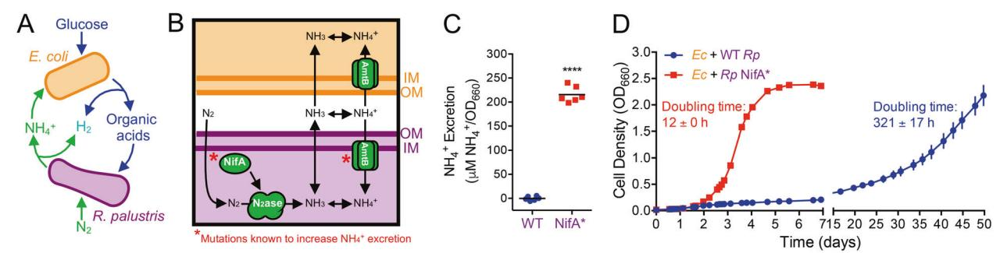
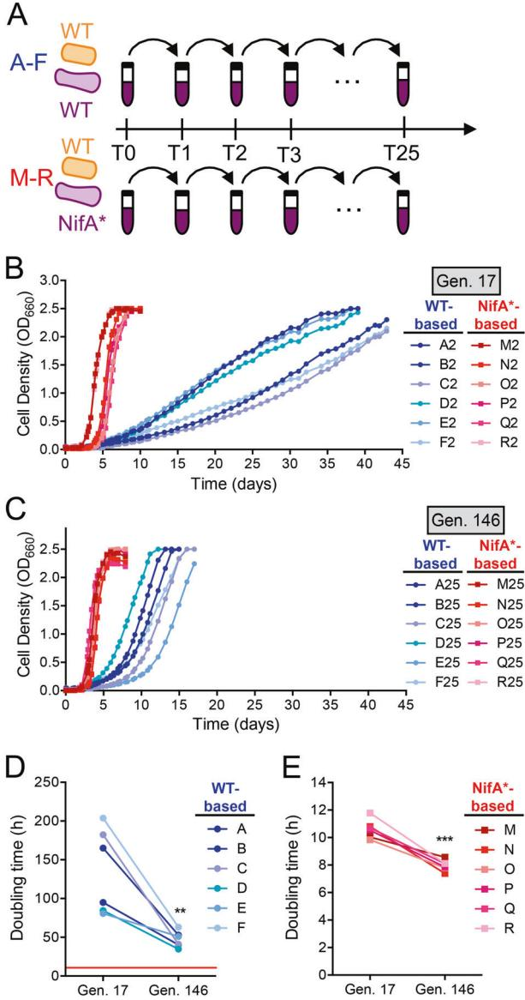
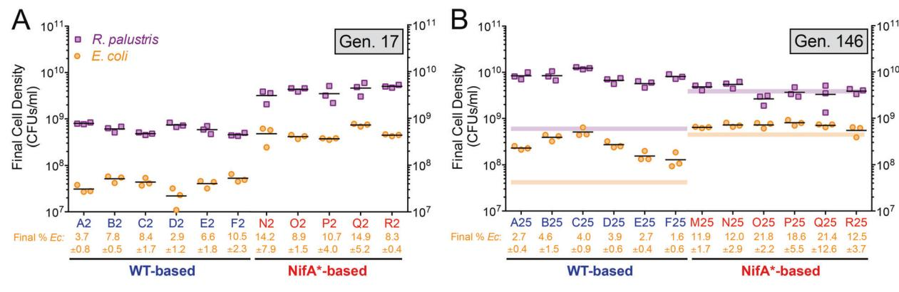
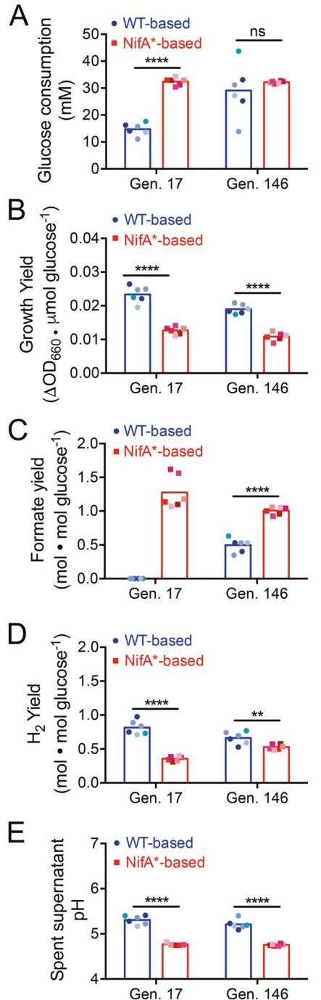
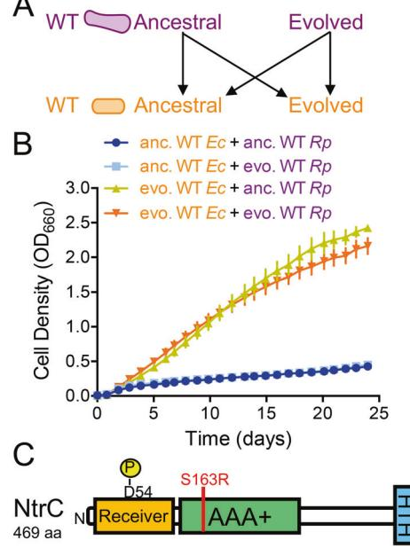
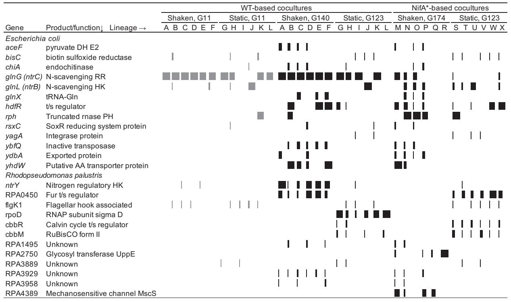
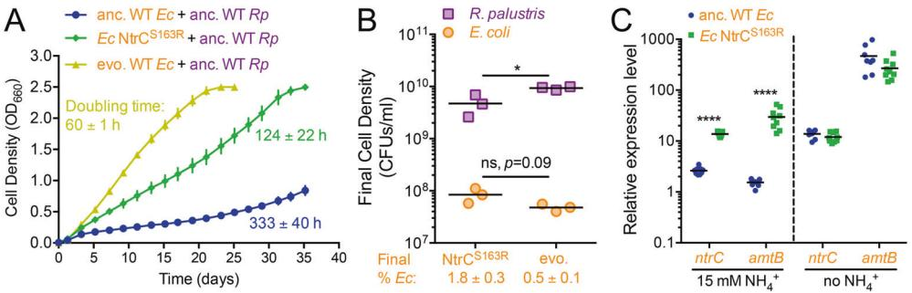

#### ARTICLE

# Enhanced nutrient uptake is sufficient to drive emergent crossfeeding between bacteria in a synthetic community

Ryan K. Fritts1 ● Jordan T. Bird2 ● Megan G. Behringer3 ● Anna Lipzen4 ● Joel Martin [4](http://orcid.org/0000-0001-9511-6441) ● Michael Lynch3 ● James B. McKinla[y](http://orcid.org/0000-0003-2401-6229) [1](http://orcid.org/0000-0003-2401-6229)

Received: 6 April 2020 / Revised: 24 July 2020 / Accepted: 3 August 2020 © The Author(s), under exclusive licence to International Society for Microbial Ecology 2020

## Abstract

1234567890();,:

1234567890();,:

Interactive microbial communities are ubiquitous, influencing biogeochemical cycles and host health. One widespread interaction is nutrient exchange, or cross-feeding, wherein metabolites are transferred between microbes. Some cross-fed metabolites, such as vitamins, amino acids, and ammonium (NH4 +), are communally valuable and impose a cost on the producer. The mechanisms that enforce cross-feeding of communally valuable metabolites are not fully understood. Previously we engineered a cross-feeding coculture between N2-fixing Rhodopseudomonas palustris and fermentative Escherichia coli. Engineered R. palustris excretes essential nitrogen as NH4 + to E. coli, while E. coli excretes essential carbon as fermentation products to R. palustris. Here, we sought to determine whether a reciprocal cross-feeding relationship would evolve spontaneously in cocultures with wild-type R. palustris, which is not known to excrete NH4 +. Indeed, we observed the emergence of NH4 + cross-feeding, but driven by adaptation of E. coli alone. A missense mutation in E. coli NtrC, a regulator of nitrogen scavenging, resulted in constitutive activation of an NH4 + transporter. This activity likely allowed E. coli to subsist on the small amount of leaked NH4 + and better reciprocate through elevated excretion of fermentation products from a larger E. coli population. Our results indicate that enhanced nutrient uptake by recipients, rather than increased excretion by producers, is an underappreciated yet possibly prevalent mechanism by which cross-feeding can emerge.

## Introduction

Microorganisms typically exist as members of diverse and interactive communities wherein nutrient exchange, also known as cross-feeding, is thought to be ubiquitous [\[1](#page-11-0)–[7](#page-11-0)]. The prevalence of cross-feeding might explain, in part, why

Supplementary information The online version of this article ([https://](https://doi.org/10.1038/s41396-020-00737-5) [doi.org/10.1038/s41396-020-00737-5)](https://doi.org/10.1038/s41396-020-00737-5) contains supplementary material, which is available to authorized users.

* James B. McKinlay [jmckinla@indiana.edu](mailto:jmckinla@indiana.edu)

- 1 Department of Biology, Indiana University, Bloomington, IN 47405, USA
- 2 Department of Biochemistry and Molecular Biology, University of Arkansas for Medical Sciences, Little Rock, AR 72205, USA
- 3 School of Life Sciences, Biodesign Center for Mechanisms of Evolution, Arizona State University, Tempe, AZ 85281, USA
- 4 Department of Energy Joint Genome Institute, Walnut Creek, CA 94598, USA

activity [[9,](#page-11-0) [10](#page-11-0)]. Thus, cross-feeding might also serve to sustain microbes through starvation. Despite the prevalence of cross-feeding, elucidating the molecular mechanisms underlying emergent cross-feeding interactions and tracking their evolutionary dynamics within natural microbial communities are difficult due to their sheer complexity. To overcome this intrinsic complexity, tractable synthetic consortia have proven useful for studying aspects of the mechanisms, ecology, evolution, and applications of microbial communities [[4,](#page-11-0) [11](#page-11-0)–[16\]](#page-11-0). To study the molecular mechanisms of nutrient cross-

feeding, we previously developed a synthetic bacterial coculture in which Escherichia coli and Rhodopseudomonas palustris bidirectionally exchange essential metabolites under anaerobic conditions (Fig. [1a](#page-1-0)) [\[17](#page-11-0)–[20](#page-11-0)]. In this coculture, E. coli ferments glucose, a carbon source that R. palustris cannot consume, and excretes ethanol and organic

many microbes cannot synthesize essential vitamins and amino acids (i.e., auxotrophy), as they can often acquire these compounds from other community members [[1,](#page-11-0) [7](#page-11-0), [8\]](#page-11-0). Furthermore, microbes in nature experience varying degrees of starvation and often exist in a state of low metabolic

Fig. 1 Synergistic cross-feeding between E. coli and R. palustris is facilitated by NH4+ excretion. a Coculture growth requires reciprocal cross-feeding of organic acids and NH4 + excreted by E. coli and R. palustris, respectively. b Mechanism of NH4 + cross-feeding from R. palustris to E. coli and mutational targets known to increase NH4 + excretion by R. palustris (*). c NH4 + excretion levels by WT R. palustris (CGA009) and an isogenic NifA* mutant (CGA676) in

carbon-limited N2-fixing monocultures grown in MDC or NFM minimal medium, with similar results observed for both media. Points are biological replicates and lines are means, n = 6; two-tailed paired ttest, ****p < 0.0001, t = 33. d Coculture growth curves (both species) of E. coli paired with either WT R. palustris or the NifA* mutant. Points are means ± SEM, n = 3. Doubling times are means ± SD.

acids, namely acetate, lactate, succinate, and formate, as waste products. The organic acids, with the exception of formate, serve as the sole carbon sources for R. palustris (Fig. 1a). In return, R. palustris fixes dinitrogen gas (N2) via the enzyme nitrogenase and excretes ammonium (NH4 +), which is the sole nitrogen source for E. coli (Fig. 1a). Because both species depend on essential nutrients provided by their partner, this coculture functions as a synthetic obligate mutualism.

NH4 + cross-feeding from R. palustris to E. coli is thought to depend on the equilibrium between NH3 and NH4 +. The small proportion of NH3 present in neutral pH environments is membrane permeable and can diffuse out of cells [\[21](#page-11-0), [22](#page-11-0)]. Leaked NH4 + can be recaptured by AmtB transporters [\[21](#page-11-0)], which in the case of R. palustris helps privatize valuable NH4 + (Fig. 1b) [[17,](#page-11-0) [18\]](#page-11-0). NH4 + leakage is also limited through the strict regulation of N2 fixation, including by the transcriptional activator NifA, so that energetically expensive N2 fixation is only performed when preferred nitrogen sources, such as NH4 +, are limiting [\[23](#page-11-0)]. Previously, we identified two types of mutations that increase NH4 + excretion by R. palustris during N2 fixation and support coculture growth with E. coli [\[17](#page-11-0)]: (1) deletion of amtB, which prevents recapture of leaked NH3, or (2) a 48-bp deletion within nifA (denoted as NifA*), which locks NifA into an active conformation [[24\]](#page-11-0) (Fig. 1b). In contrast, wild-type R. palustris does not readily support coculture growth with E. coli due to insufficient NH4 + excretion [\[17](#page-11-0)].

While synergistic cross-feeding of communally valuable NH4 + between E. coli and R. palustris can be rationally engineered, we questioned whether such an interaction could arise spontaneously. Herein we experimentally evolved cocultures pairing WT E. coli with either WT R. palustris or an engineered NifA* mutant in serially transferred batch cultures for ~150 generations. In both cocultures, a reciprocal cross-feeding relationship was established and growth rates improved over serial transfers, but growth and metabolic trends remained distinct. By pairing ancestral and evolved isolates of each species, we determined that adaptation by E. coli was solely responsible for establishing a synergistic relationship with WT R. palustris. Whole-genome sequencing and subsequent genetic verification identified a missense mutation in the E. coli transcriptional activator for nitrogen scavenging, NtrC, that was sufficient to enforce NH4 + cross-feeding with WT R. palustris. This mutation results in constitutive AmtB expression, presumably enhancing NH4 + uptake. Our results suggest that mutations that improve acquisition of communally valuable nutrients by recipients are favored to evolve and can promote the emergence of stable crossfeeding within synthetic consortia, and potentially within natural communities.

## Material and methods

#### Bacterial strains and growth conditions

All strains and plasmids are listed in Supplementary Table S1. All E. coli strains used in this study are derived from the type strain MG1655 [[25\]](#page-11-0), unless noted otherwise. The WT and NifA* R. palustris strains used in Fig. 1 were the type strain CGA009 [[26\]](#page-11-0) and CGA676, respectively. CGA676 carries a 48 bp deletion in nifA [[24\]](#page-11-0). The R. palustris strains used in experimental coculture evolution and subsequent experiments were CGA4001 and CGA4003, which are derived from CGA009 and CGA676, respectively, with both carrying an additional ΔhupS mutation to prevent H2 oxidation.

E. coli was grown in lysogeny broth (LB)-Miller (BD Difco) or on LB plates with 1.5% agar at 30 or 37 °C with gentamicin (Gm; 15 µg/ml), kanamycin (30 µg/ml), or carbenicillin (Cb; 100 µg/ml) when appropriate. R. palustris was grown in defined minimal photosynthetic medium (PM) [[26](#page-11-0)] or on PM agar with 10 mM succinate at 30 °C with Gm (100 µg/ml) when appropriate. N2-fixing medium (NFM) was made by omitting (NH4)2SO4 from PM. NFM and LB agar was used as selective media to quantify R. palustris and E. coli colony-forming units (CFUs), respectively. Experimental mono- and cocultures were grown in 10 ml of M9-derived coculture medium (MDC) in 27 ml anaerobic glass test tubes. Tubes were made anaerobic under 100% N2, sterilized, and supplemented with 1 mM MgSO4 and 0.1 mM CaCl2 as described [[17](#page-11-0)]. E. coli starter monocultures had 25 mM glucose and were growth-limited by supplementing with 1.5 mM NH4Cl. R. palustris starter monocultures were growthlimited by supplementing with 3 mM acetate. Cocultures were inoculated by subculturing 1% v/v of starter monocultures of each species into MDC with 50 mM glucose. Mono- and cocultures were grown at 30 °C, under shaken conditions, lying horizontally and shaken at 150 rpm beneath a 60 W incandescent bulb (750 lumens), or under static conditions, standing vertically without shaking beside a 60 W incandescent bulb.

#### E. coli strain construction

All primers are listed in Supplementary Table S2. To construct the E. coli NtrCS163R mutant, the GmR-sacB genes from pJQ200SK [\[27](#page-11-0)] were PCR amplified using primers containing ~40 bp overhangs with homology up- and downstream of ntrC (glnG). A second round of PCR was subsequently performed to increase the length of overhanging regions of homology to ~80 bp to increase the recombination frequency. E. coli harboring pKD46, encoding arabinose-inducible λ-red recombineering genes [\[28](#page-11-0)], was grown in LB with 20 mM arabinose and Cb at 30 °C to an OD600 of ~0.5 and then centrifuged, washed, and resuspended in sterile distilled water at ambient temperature. Resuspended cells were electroporated with the GmR-sacB PCR product containing overhangs flanking ntrC and plated on LB Gm agar. Gm-resistant colonies were screened by PCR for site-directed recombination of GmRsacB into the ntrC locus, creating a ΔntrC::GmR-sacB allele, which was then verified by sequencing. To replace the ΔntrC::GmR-sacB locus, the NtrCS163R allele was PCR amplified from gDNA from evolved E. coli (lineage A25) and electroporated into E. coli ΔntrC::GmR-sacB harboring pKD46. After counterselection on LB agar with 10% (w/v) sucrose but without NaCl, site-directed recombination of the NtrCS163R allele into the native locus was confirmed by PCR and sequencing. E. coli NtrCS163R was grown overnight on LB agar at 42 °C to cure the strain of pKD46, which was confirmed by Cb sensitivity.

#### R. palustris strain construction

To construct R. palustris CGA4001 and CGA4003, pJQ-ΔhupS was introduced into R. palustris CGA009 and CGA676, respectively, by conjugation with E. coli S17–1. Mutants were then obtained using sequential selection and screening as described [[29\]](#page-11-0). The ΔhupS deletion was confirmed by PCR and sequencing.

#### Analytical procedures

Cell densities were approximated by optical density at 660 nm (OD660) using a Genesys 20 visible spectrophotometer (Thermo-Fisher). Coculture doubling times were derived from specific growth rates determined by fitting exponential functions to OD660 measurements between 0.1 and 1.0 for each biological replicate. NH4 + was quantified using an indophenol colorimetric assay [\[17](#page-11-0)]. Glucose and soluble fermentation products were quantified by high-performance liquid chromatography (Shimadzu) as described [\[30](#page-12-0)]. H2 was quantified by gas chromatography (Shimadzu) as described [[31\]](#page-12-0).

#### Coculture evolution experiments

Founder monocultures of E. coli MG1655, R. palustris CGA4001 (ΔhupS), and CGA4003 (ΔhupS NifA*) were inoculated from single colonies in MDC. Once grown, a single founder monoculture of each strain was used to inoculate 12 WT-based cocultures (six shaken: A–F; six static: G–L) and 12 NifA*-based cocultures (six shaken: M–R; six static: S–X) in MDC with 50 mM glucose. Cocultures were serially transferred by passaging 2% v/v of stationary phase coculture (OD660 > 2 and a low metabolic rate based on H2 measurements) into fresh MDC. The NifA*-based cocultures were transferred weekly, whereas WT-based cocultures were transferred every 21–50 days for the first five transfers and then approximately every 2 weeks based on the time required to reach OD660 > 2. For comparative analyses, shaken cocultures (A–F and M–R) were revived from frozen stocks made following transfer-2 (generation 17) and transfer-25 (generation 146). Each frozen stock (~0.2 ml) was thawed in 1 ml sterile MDC, washed 2X with MDC to remove glycerol, and then resuspended in 0.2 ml MDC for use as inoculum.

#### RNA extraction and reverse transcription quantitative PCR (RT-qPCR)

RNA was isolated from exponentially growing E. coli monocultures or starved cell suspensions that had been chilled on ice, centrifuged at 4 °C, cell pellets frozen using dry ice in ethanol, and stored at −80 °C. Cell pellets were thawed on ice, disrupted by bead beating, and then RNA was purified using an RNeasy MiniKit (Qiagen), Turbo DNase (Ambion) treatment on columns, and RNeasy MinElute Cleanup Kit (Qiagen). cDNA was synthesized from 0.5 to 1 µg of RNA per sample using Protoscript II RT and Random Primer Mix (New England Biolabs). qPCR reactions were performed on cDNA using iQ SYBR Green supermix (BioRad). E. coli gDNA was used to generate standard curves for amtB and ntrC transcript quantification, which were normalized to transcript levels of reference genes gyrB and hcaT [\[32](#page-12-0)]. Two technical replicate qPCR reactions were performed and averaged for each biological replicate to calculate relative expression.

#### Genome sequencing and mutation analysis

gDNA was extracted from stationary phase evolved cocultures following revival from frozen stocks using a Wizard Genomic DNA purification Kit (Promega). DNA fragment libraries were constructed for samples from shaking WT-based cocultures A–F and NifA*-based cocultures M–R at generation ~146 using NextFlex Bioo Rapid DNA kit. Samples were sequenced on an Illumina NextSeq 500 150 bp paired-end run by the Indiana University Center for Genomics and Bioinformatics. Paired-end reads were trimmed using Trimmomatic 0.36 [[33\]](#page-12-0) with the following options: LEADING:3 TRAILING:3 SLI-DINGWINDOW:10:26 HEADCROP:10 MINLEN:36. Mutations were called using breseq version 0.32.0 on Polymorphism Mode [[34\]](#page-12-0) and compared to a reference genome created by concatenating E. coli MG1655 (Accession NC_000913), R. palustris CGA009 (Accession BX571963), and its plasmid pRPA (Accession BX571964). Mutations are summarized in Supplementary File 1.

Additional gDNA sequencing for evolved WT-based cocultures A–F (shaking, generation 11), G–L (static, generations 11 and 123), and NifA*-based cocultures S–X (static, generation 123) was performed at the US Department of Energy Joint Genome Institute. Plate-based DNA library preparation for Illumina sequencing was performed on the PerkinElmer Sciclone NGS robotic liquid handling system using Kapa Biosystems library preparation kit. 200 ng of gDNA was sheared using a Covaris LE220 focusedultrasonicator. Sheared DNA fragments were size selected by double-SPRI and selected fragments were end-repaired, A-tailed, and ligated with Illumina compatible sequencing adapters from IDT containing a unique molecular index barcode for each sample library. Libraries were quantified using KAPA Biosystem's next-generation sequencing library qPCR kit and run on a Roche LightCycler 480 realtime PCR instrument. The quantified libraries were then prepared for sequencing on the Illumina HiSeq sequencing platform utilizing a TruSeq Rapid paired-end cluster kit. Sequencing was performed on the Illumina HiSeq2500 sequencer using HiSeq TruSeq SBS sequencing kits, following a 2 × 100 indexed run recipe. Reads were aligned to a reference genome created by concatenating E. coli MG1655 (Accession NC_000913), R. palustris CGA009 (Accession NC_005296), and its plasmid pRPA (Accession NC_005297) [\[35](#page-12-0)]. The resulting bams were then split by organism and down sampled to 100-fold depth if in excess of that, then re-merged to create a normalized bam for calling single nucleotide polymorphisms and small indels by callVariants.sh from the BBMap package [(sourceforge.net/](http://sourceforge.net/projects/bbmap/) [projects/bbmap/](http://sourceforge.net/projects/bbmap/)) to capture variants present within the population and annotation applied with snpEff [\[36](#page-12-0)]. Mutations are summarized in Supplementary File 2.

All FASTQ files are available at NCBI Sequence Read Archive (accession numbers listed in Supplementary Table S3).

## Results

#### Emergence of nascent, synergistic cross-feeding between wild-type R. palustris and E. coli

Previously, we engineered R. palustris to excrete NH4 + (NifA*) to stabilize mutualistic cross-feeding with E. coli (Fig. [1a](#page-1-0), b). Here, we sought to determine whether such a relationship could evolve spontaneously. Spatial proximity has been shown to be an important factor in many microbial cross-feeding mutualisms [\[37](#page-12-0)–[39](#page-12-0)], which can be disrupted by mixing. To account for the possible importance of proximity, we established cocultures with WT R. palustris (WT-based cocultures) under both shaken conditions, wherein cells are evenly distributed, and static conditions, wherein cells settle in close proximity at the bottom of the tube. In parallel, we also established shaken and static cocultures featuring the R. palustris NifA* strain (NifA* based cocultures) as a comparative reference.

We confirmed our previous observations [[17\]](#page-11-0) that WT R. palustris exhibits undetectable NH4 + excretion and does not readily support coculture growth with WT E. coli, in contrast to the NifA* mutant (Fig. [1c](#page-1-0), d). Whereas shaken NifA*-based cocultures grew to an OD660 > 2.0 in 4–6 days with a doubling time of ~12 h, shaken WT-based cocultures did not exhibit appreciable growth in the same time frame (Fig. [1d](#page-1-0)). We hypothesized that prolonged incubation might enrich for spontaneous mutants that permit coculture growth. Indeed, after 50 days, shaken WT-based cocultures reached densities similar to those observed for NifA*-based cocultures, albeit with a doubling time of ~13 days (Fig. [1d](#page-1-0)). Static WT- and NifA*-based cocultures also became turbid within similar time frames as their shaken counterparts.

Upon observing a nascent synergistic interaction between WT R. palustris and E. coli, we set up six replicate WT-based cocultures (A–F) and NifA*-based cocultures (M–R), all with WT E. coli (Fig. 2a), to experimentally

Fig. 2 Coculture doubling times decreased during experimental evolution of WT-based and NifA*-based cocultures. a Design for experimental evolution of parallel WT-based (A–F; CGA4001, derivative of WT/CGA009 with inactive hydrogenase) and NifA*-based (M–R; CGA4003, derivative of NifA*/CGA676 with inactive hydrogenase) cocultures via serial transfer (T#). Growth curves (both species) of WT-based and NifA*-based cocultures revived after two transfers (17 generations) (b) or 25 transfers (146 generations) (c) of experimental evolution. Points are values for the individual revived coculture lineages. Different shades indicate the different lineages. Coculture doubling times (both species) of individual WT-based cocultures (d) or NifA*-based cocultures (e) at generation (Gen.) 17 and 146, n = 6; two-tailed paired t-test, **p < 0.01, t = 4. ***p < 0.001, t = 8. The red line in panel (d) indicates the mean doubling time of NifA*-based cocultures at gen. 17.

evolve through serial transfers under shaken conditions and compare their physiology, evolutionary trajectory, and species and genotypic composition. We also serially transferred static WT-based cocultures (G–L) and NifA*-based cocultures (S–X). The WT and NifA* R. palustris strains used in these coculture evolution experiments both have a deletion of the hupS gene, which inactivates hydrogenase and prevents H2 oxidation, allowing us to quantify H2 production. Herein, we focus the bulk of our analyses on shaken cocultures because (1) the close proximity provided under static conditions was not required for nascent crossfeeding, (2) shaken conditions facilitate analyses such as OD-based determination of growth rates, and (3) strong biofilms emerged in static cocultures, complicating the determination of population densities.

Shaken WT- and NifA*-based cocultures were serially transferred 25 times, corresponding to ~146 generations, with ~5.6 generations estimated per serial coculture (including the original cocultures designated, transfer-0) based on the 1:50 dilution used for each transfer. This number of generations corresponded to ~65 weeks for WTbased cocultures and ~26 weeks for NifA*-based cocultures. We then revived cocultures from frozen stocks made at transfer-2 (generation 17; G17) and transfer-25 (generation 146; G146) to compare growth and population trends. At G17, NifA*-based cocultures exceeded an OD660 of 2 in under 8 days, whereas WT-based cocultures took ~40 days (Fig. 2b). By G146, the time needed to reach OD660 > 2 had decreased for every lineage (Fig. 2c). The shortened growth phase was most pronounced for WTbased cocultures, which all reached OD660 > 2 in under 17 days by G146, less than half the time needed at G17 (Fig. 2b, c); WT-based coculture doubling times decreased from 135 ± 55 h to 47 ± 10 h (Fig. 2d). Though less drastic, NifA*-based coculture doubling times also decreased, in this case from ~11 to 8 h (Fig. 2e). Thus, WT-based cocultures adapted to grow faster, although never as fast as unevolved engineered NifA*-based cocultures.

Because growth trends differed between WT- and NifA*-based cocultures, we wondered how species populations were affected. We therefore enumerated viable cells as CFUs at the final time points for G17 and G146 cocultures shown in Fig. 2b, c. We describe several comparisons below using two-tailed t-tests (n = 5–6; paired tests for G17 versus G146 comparisons and unpaired tests with Welch's correction for WT- versus NifA*-based coculture comparisons). At G17, R. palustris and E. coli populations in WTbased cocultures were, respectively, 0.15 ± 0.06 (SD; p = 0.002, t = 7) and 0.08 ± 0.04-times (SD; p = 0.0004, t = 10) those in NifA*-based cocultures (Fig. [3](#page-5-0)a). It is worth noting that NifA*-based cocultures were plated after ~10 days, whereas WT-based cocultures were plated after 39–43 days due to their slower growth rate. Consequently, the lower

Fig. 3 Final populations in WT-based cocultures show large increases through serial transfers. a, b Final viable cell densities (colony-forming units [CFUs/ml]) of R. palustris and E. coli and the final E. coli percentage (±SD) at generation 17 (a) and generation 146 (b) for WT-based (CGA4001, derivative of WT/CGA009 with inactive hydrogenase) and NifA*-based (CGA4003, derivative of NifA*/

final populations in WT-based cocultures at G17 could be due in part to more background death and/or more resources spent on cellular maintenance. Increased death and maintenance in slow-growing cocultures is more likely to be an E. coli trait; R. palustris exhibits negligible death during starvation as it can cycle electrons to generate energy for maintenance when illuminated [[40\]](#page-12-0). By G146, R. palustris abundances in WT-based cocultures had increased 14 ± 6 fold (SD; p = 0.001, t = 8) and exceeded R. palustris abundances observed in NifA*-based cocultures at G146 by 2 ± 1-fold (SD; p = 0.004, t = 4) (Fig. 3). E. coli abundances in WT-based cocultures also increased 8 ± 4-fold (SD; p = 0.010, t = 4) by G146, but did not reach abundances observed in NifA*-based cocultures (Fig. 3). The increase in E. coli abundances in WT-based cocultures by G146 suggests that E. coli had better access to NH4 +, or other nitrogen compounds, than at G17 (Fig. 3b). Due to the disproportionate increase of each population in WT-based cocultures between G17 and G146, E. coli percentages remained low at 1–5%, relative to 11–22% in NifA*-based cocultures (p = 0.001, t = 7) (Fig. 3b). These differences in E. coli populations between WT- and NifA*-based cocultures are consistent with previous findings that higher NH4 + excretion by R. palustris supports faster growth and higher E. coli abundances [[17](#page-11-0)–[19\]](#page-11-0).

In contrast to WT-based cocultures, NifA*-based cocultures did not display drastically higher cell densities for each species between G17 and G146 (Fig. 3). Average R. palustris densities were statistically similar between the two time points (1.0 ± 0.4-fold change; SD; p = 0.948, t = 0.1). Average E. coli densities showed a small but significant increase between G17 and G146 (1.6 ± 0.4-fold change; SD; p = 0.009, t = 5). However, the average E. coli percentage in NifA*-based cocultures showed less of a change between G17 (11.4%) and G146 (16.4%)

CGA676 with inactive hydrogenase) cocultures at the final time points shown in Fig. [2b](#page-4-0), c. Points represent technical replicates of CFUs/ml for each lineage and lines are means, n = 3. The purple and orange lines in panel (b) indicate the median CFUs/ml for R. palustris and E. coli, respectively, at gen. 17 for reference. Data for lineage M at gen. 17 were unavailable due to agar contamination.

(p = 0.077, t = 2) (Fig. 3). Although strong biofilms prevented us from accurately quantifying populations in static cocultures, we monitored the change in OD660 for each serial transfer between G20 and G100 (Fig. S1). Consistent with population trends in shaken cocultures, biomass formation fluctuated but generally increased for static WT-based cocultures but was relatively stable in static NifA*-based cocultures (Fig. S1).

#### Metabolic differences between WT- and NifA*-based cocultures help explain growth and population trends

Our past studies demonstrated that growth and population trends in coculture are strongly influenced by cross-feeding levels of both NH4 + and organic acids [\[17](#page-11-0)–[19](#page-11-0)]. For instance, higher NH4 + cross-feeding to E. coli leads to higher E. coli growth rates [\[17](#page-11-0)–[19](#page-11-0)]. In turn, higher E. coli growth rates boost organic acid excretion, supporting better R. palustris growth up until the organic acid excretion rate exceeds the rate at which R. palustris can consume them [\[17](#page-11-0)]. To see if such trends were also present in WT-based cocultures, we quantified glucose consumption and fermentation product yields at G17 and G146 at stationary phase. At G17, glucose consumption by E. coli in WTbased cocultures was about half of that in NifA*-based cocultures (Fig. [4](#page-6-0)a). The lower glucose consumption in WT-based cocultures can explain in part the lower E. coli CFUs observed in Fig. 3a. Previously, we showed that nongrowing E. coli can ferment glucose, and that this growth-independent fermentation can provide sufficient carbon to support R. palustris growth [[19\]](#page-11-0). We hypothesize that growth-independent fermentation by E. coli was an important cross-feeding mechanism during the extremely slow growth of early WT-based cocultures (Fig. [1d](#page-1-0)).

Fig. 4 WT-based and NifA*-based cocultures exhibit distinct metabolic phenotypes. Glucose consumption (a), growth yield (b), formate yield (c), H2 yield (d), and final pH (e) for WT-based (CGA4001, derivative of WT/CGA009 with inactive hydrogenase) and NifA*-based (CGA4003, derivative of NifA*/CGA676 with inactive hydrogenase) revived coculture lineages at generation (Gen.) 17 and 146. Points are single measurements for individual lineages and bars are means, n = 5–6; multiple t-tests with Holm–Sidak post hoc test, **p < 0.01, ****p < 0.0001. Different shades indicate different lineages. Metabolite measurements below detection limit were approximated to be 0. The pH of lineage P at Gen. 17 was not quantified because the culture tube broke prior to measurement.

However, by G146, E. coli glucose consumption in WTbased cocultures approached that in NifA*-based cocultures in most lineages, with one lineage consuming more glucose than NifA*-based cocultures (Fig. 4a). The general increase in E. coli glucose consumption in WT-based cocultures from G17 to G146 likely supported both the faster coculture doubling times (Fig. [2d](#page-4-0)) and higher E. coli abundances (Fig. [3b](#page-5-0)) and contributed to the accumulation of consumable organic acids such as acetate and succinate in some WT-based cocultures at G146, qualitatively similar to NifA*-based cocultures (Fig. S2). Overall, the increase in metabolic activities attributed to E. coli and the improved E. coli growth in WT-based cocultures between G17 and G146 suggest that nitrogen cross-feeding also increased.

We observed a potential trade-off between coculture growth rate and coculture growth yield (ΔOD660/glucose consumed). For example, WT-based G17 cocultures had the slowest growth rates but highest growth yields, whereas NifA*-based G146 cocultures had the fastest growth rates but lowest growth yields (Figs. 4b and S3). Trade-offs between growth rate and yield have been reported in multiple microbial species under various conditions [[41](#page-12-0)–[43\]](#page-12-0). In our case, the metabolic trends point to possible explanations for the apparent trade-off. For example, formate produced by E. coli is not consumed by R. palustris and thus typically accumulates in cocultures [\[17](#page-11-0)]. However, no formate was detected in WT-based G17 cocultures and formate yields were approximately half that of NifA*-based cocultures at G146 (Fig. 4c). Low formate yields could be explained in part by increased conversion of formate to H2 and CO2 by E. coli formate hydrogenlyase [[44,](#page-12-0) [45\]](#page-12-0). Consistent with this possibility, WT-based cocultures had the highest H2 yields (Fig. 4d). Low formate yields could also be explained by decreased formate production by E. coli in favor of other fermentation products. We previously observed low formate yields in slow-growing, nitrogen-limited NifA*-based cocultures [[19,](#page-11-0) [20\]](#page-11-0), suggesting that formate production by E. coli varies in response to growth rate. We have also not ruled out the possibility that R. palustris can consume some formate under certain conditions. In addition to formate, consumable organic acid yields were also lower at both G17 and G146 for WT-based cocultures relative to NifA*-based cocultures (Fig. S2). Organic acid accumulation in cocultures can acidify the medium to inhibitory levels [[17\]](#page-11-0). At both G17 and G146, the lower yields of formate and other organic acids in WT-based cocultures were translated into higher pH values than in NifA*-based cocultures (Fig. 4e). This lower level of acidification combined with the likelihood of a higher proportion of glucose being fermented into organic acids other than formate could explain the higher R. palustris cell densities at G146 in WT-based cocultures compared to NifA*-based cocultures (Fig. [3b](#page-5-0)).

#### A single mutation in an E. coli nitrogen starvation response regulator is sufficient for synergistic growth with WT R. palustris

We hypothesized that the growth of WT-based cocultures was due to adaptive mutations in one or both species. To determine whether the evolution of either or both species was necessary to establish nascent reciprocal cross-feeding, we isolated single colonies of each species from ancestral WT populations and evolved G146 cocultures and paired them in all possible combinations (Fig. 5a). Only those pairings featuring evolved E. coli grew to an OD660 > 0.5 after ~24 days (Fig. 5b). Cocultures pairing evolved E. coli with ancestral or evolved WT R. palustris exhibited similar doubling times of ~67 h (Fig. S4). These results indicate that adaptation by E. coli alone is sufficient to establish a nascent mutualism with WT R. palustris. Accordingly, we did not observe increased NH4 + excretion in evolved WT R. palustris N2-fixing monocultures compared to the ancestral strain (Fig. S4).

To identify candidate mutations in E. coli that could drive improved coculture growth, we sequenced the genomes of populations in each evolved coculture lineage after 123–146 generations. We also sequenced WT-based cocultures following ~11 generations to determine if

Fig. 5 Adaptation by E. coli is sufficient to enable growth of WTbased cocultures. Ancestral (anc) and evolved (evo) WT R. palustris (CGA4001, derivative of WT/CGA009 with inactive hydrogenase) and WT E. coli were paired in all possible combinations (a) and the growth of the cocultures (both species) was monitored (b). b Points are means ± SEM, n = 3. c The location (red line) of the missense mutation in E. coli NtrC, which was fixed in all six parallel evolved E. coli populations from WT-based cocultures at G140–146.

potentially adaptive mutations arose early within WT-based cocultures. Several parallel mutations were identified in both species at frequencies between 5 and 100% (Table [1](#page-8-0) and Supplementary Files 1 and 2). Consistent with evolved E. coli being necessary for mutualistic coculture growth with either ancestral or evolved WT R. palustris (Fig. 5b), we did not detect any nifA nor amtB mutations in evolved WT R. palustris populations, which would increase NH4 + excretion and enable rapid coculture growth. The multiple high frequency parallel mutations observed in evolved R. palustris populations (Table [1)](#page-8-0) are insufficient to improve coculture growth (Fig. 5b). Of the mutations in evolved E. coli populations, we were intrigued by a fixed missense mutation in glnG (henceforth called ntrC) that was fixed in all evolved E. coli populations from shaken WT-based cocultures and also occurred in the majority (4/6) of evolved static WT-based cocultures. This mutation in ntrC replaces serine 163 with an arginine within the AAA+ domain in the encoded response regulator NtrC (NtrCS163R, Table [1](#page-8-0) and Fig. 5c). NtrC and the histidine kinase NtrB form a two-component system that senses and coordinates the nitrogen starvation response in E. coli [\[46](#page-12-0)–[48](#page-12-0)]. Our lab previously found that the E. coli NtrBC regulon is highly expressed in coculture with R. palustris NifA* [[20\]](#page-11-0). Thus, E. coli NtrBC might be even more important in coculture with WT R. palustris wherein E. coli nitrogen starvation is expected to be intensified.

The NtrCS163R mutation was enriched early in the evolution of WT-based cocultures, already at a high frequency in most lineages by G11 (Table [1](#page-8-0) and Supplementary Table 3). Because of the striking parallelism of the NtrCS163R mutation across coculture lineages, we wondered if it was present as standing genetic variation in the ancestral E. coli population. We therefore sequenced ntrC of ten E. coli isolates subjected to a single round (35 days) of coculture growth with WT R. palustris (Fig. [6](#page-8-0)a), which should enrich for the NtrCS163R mutation. All ten isolates sequenced had the WT ntrC allele. Thus, although the NtrCS163R allele was likely present in the founder population given its presence in every WT-based coculture lineage, it was under strong selection from an initial low frequency. In support of the importance of the NtrCS163R allele, we also identified multiple, though different, high frequency mutations in ntrB and ntrC in E. coli populations from NifA* based cocultures evolved under both well-mixed and static conditions (Table [1](#page-8-0) and Supplementary Table 3). Together, these observations strongly suggest the adaptive importance of E. coli ntrBC mutations like NtrCS163R for coculture growth, regardless of the NH4 +-excreting phenotype of the R. palustris partner.

To determine if the NtrCS163R mutation alone was sufficient to support coculture growth with WT R. palustris, we moved the NtrCS163R allele into the ancestral E. coli strain. Table 1 Parallel mutations in evolved WT-based and NifA*-based cocultures.

Genes included have >1 missense mutation, premature stop, insertion, and/or deletion in >4 lineages, have passing scores, and occur at frequency of >5% within a population at the later time point (black bars). Bar width corresponds to mutation frequency. Frequencies at the early time point for the genes with the above criteria are also shown (gray bars). The highest frequency was used when multiple mutations were identified in a single gene within a single lineage. Coverage was too low to detect mutations in E. coli lineages Q and R. Details of these and other mutations, including intergenic mutations with high parallelism that were omitted here for simplicity, are in Supplementary Files 1 and 2. DH dehydrogenase, HK histidine kinase, RR response regulator, t/s transcription.

Fig. 6 A missense mutation in E. coli ntrC enables emergent NH4 + cross-feeding by conferring constitutive expression of nitrogen acquisition genes. a Coculture growth curves (both species) of ancestral (anc) WT, evolved (evo) WT, and the NtrCS163 mutant E. coli paired with ancestral WT R. palustris (CGA4001, derivative of WT/ CGA009 with inactive hydrogenase). Points are means ± SEM, n = 3. Mean doubling times (±SD) are listed next to each growth curve. b Final cell densities of each species and E. coli percentages in cocultures with evolved WT E. coli and the NtrCS163 mutant at the final time points shown in panel (a). Points are mean CFU values for each biological replicate from triplicate technical replicate plating and

lines are means, n = 3. Final E. coli frequencies are the mean ± SD. c Expression of ntrC and amtB genes relative to hcaT housekeeping reference gene expression in ancestral WT E. coli and the NtrCS163 mutant when grown in monoculture with 15 mM NH4Cl or under complete NH4Cl starvation. Points represent biological replicates and lines are means, n = 8–9; multiple t-tests with Holm–Sidak post hoc test, ****p < 0.0001. RT-qPCR experiments were performed with duplicate technical replicates for each biological replicate. Similar trends were observed when E. coli gene gyrB was used as the reference gene (Fig. S5).

Cocultures pairing E. coli NtrCS163R with WT R. palustris grew with a doubling time of 124 ± 22 h, approximately twice as long as cocultures with evolved E. coli isolates, but much faster than cocultures with ancestral E. coli (Fig. [6](#page-8-0)a). Thus, the NtrCS163R mutation is sufficient to drive coculture growth. Cocultures with E. coli NtrCS163R reached similar final E. coli cell densities, but supported lower WT R. palustris abundances than cocultures with evolved E. coli isolates (Fig. [6](#page-8-0)b).

We speculate that some of the additional parallel mutations in evolved E. coli (Table [1](#page-8-0)) are also adaptive and account for the faster coculture growth rate relative to cocultures with the NtrCS163R mutant (Fig. [6](#page-8-0)a). For example, the E. coli strain we used has a frameshift mutation in rph that decreases expression of pyrE immediately downstream [\[49](#page-12-0)]. Mutations in rph and in-between rph and pyrE, like those identified here (Table [1](#page-8-0) and Supplementary Files 1 and 2), can improve pyrimidine biosynthesis and growth in minimal media [\[50](#page-12-0)]. HdfR is a transcriptional regulator that inhibits flagellar expression [[51\]](#page-12-0) and activates glutamate synthase expression [[52\]](#page-12-0). HdfR loss-of-function mutations could reduce glutamate synthase expression and synchronize NH4 + assimilation with the low NH4 + crossfeeding levels in WT-based cocultures. However, the entire HdfR regulon has not been reported and thus could include other genes. In another possible link to nitrogen metabolism, mutations accumulated in the glutamine tRNA gene, glnX (Table [1](#page-8-0)). Two of the mutations disrupt the base-pair adjacent to the anticodon loop, while two others alter the anticodon, one still coding for glutamine but the other coding for histidine. The impact of these mutations is difficult to predict, especially since GlnX is just one of four E. coli tRNAs for glutamine. The yhdWXYZ operon encodes an NtrC-regulated amino acid ABC transporter, which is predicted to be nonfunctional due to a frameshift mutation in yhdW [\[46](#page-12-0), [47\]](#page-12-0). The mutations identified in (Table [1)](#page-8-0) and directly upstream of the yhdW pseudogene (Supplementary Files 1 and 2) could restore amino acid transport for use as a nitrogen source or alternatively disrupt NtrC binding upstream of yhdW and thereby free up NtrC to regulate genes more critical to NH4 + acquisition.

### The E. coli NtrCS163R allele constitutively activates ammonium transporter expression

Based on the effects of NtrC mutations observed by others [\[53](#page-12-0), [54](#page-12-0)], we hypothesized that the NtrCS163R allele facilitates coculture growth with WT R. palustris by conferring constitutive expression of NtrBC-regulated genes important for NH4 + acquisition. We previously determined that NtrC and AmtB were crucial gene products within the NtrBC regulon for growth and coexistence with R. palustris NifA* [\[18](#page-11-0), [20\]](#page-11-0). AmtB was one of the most important genes in the NtrC regulon since overexpression of amtB rescued an E. coli ΔntrC mutant in coculture [[20\]](#page-11-0). To test if the NtrCS163R allele increased amtB and ntrC expression, we measured transcript levels by RT-qPCR in E. coli monocultures grown with 15 mM NH4Cl or subjected to complete nitrogen starvation (~10 h with 0 mM NH4Cl). We chose to perform RT-qPCR on E. coli monocultures, because ancestral WT E. coli does not readily grow with WT R. palustris and because E. coli typically constitutes a low percentage (1–5%) of WT-based cocultures, meaning most mRNA would be from R. palustris.

When cultured with NH4Cl, the E. coli NtrCS163R mutant exhibited ~19 and 5-fold higher expression of amtB and ntrC, respectively, than WT E. coli (Figs. [6](#page-8-0)c and S5), indicating that the NtrCS163R allele constitutively activates expression of its regulon. Following 10 h of nitrogen starvation, we saw similarly high amtB and ntrC expression by both the WT and the NtrCS163R strains (Fig. [6c](#page-8-0)). Thus, both the WT and NtrCS163R E. coli strains are able to commence strong transcriptional responses to extreme nitrogen starvation. We expect that the level of nitrogen limitation experienced by E. coli in coculture with WT R. palustris is less extreme than the complete nitrogen starvation conditions used in our qPCR experiments. Although we cannot detect NH4 + excretion by WT R. palustris, the equilibrium with NH3 dictates that some will be excreted, possibly within the nM to low µM range where AmtB is critical [[21\]](#page-11-0). We also know that AmtB is important in coculture for E. coli to compete for transiently available NH4 + that R. palustris will otherwise reacquire [\[18](#page-11-0)]. We therefore hypothesize that the NtrCS163R mutation primes E. coli for coculture growth with R. palustris by maintaining high AmtB expression and thereby increasing NH4 + uptake rates at sub-saturating concentrations (Fig. S6). It is also possible that the NtrCS163R mutation differentially regulates other genes beyond amtB that improve E. coli nitrogen acquisition or survival in coculture. Overall, our data suggest that a recipient species can stimulate cross-feeding through enhanced nutrient uptake.

## Discussion

Here, we determined that in cocultures requiring nitrogen transfer from R. palustris to E. coli, an E. coli NtrCS163R mutation alone is sufficient to enable coculture growth. The mutation results in constitutive activity of the NtrC regulon and thus increased expression of the AmtB NH4 + transporter, which we hypothesize enhances NH4 + uptake. This is the first mutation we have identified in the NH4 + recipient E. coli that is sufficient to support synergistic growth with WT R. palustris. The faster growth and metabolism of E. coli resulting from the NtrCS163R mutation should stimulate faster organic acid excretion, which would, in turn, foster R. palustris growth and reciprocal NH4 + excretion. Thus, we envision that better NH4 + acquisition generates a positive feedback loop, enhancing the growth of both species. This positive feedback dynamic could transform a transient cross-feeding interaction into a burgeoning mutualistic relationship.

Our previous work on this consortium utilized R. palustris NifA* and ΔAmtB strains that we engineered to excrete NH4 + [\[17](#page-11-0)–[19](#page-11-0)]. In the present study, we did not identify nifA or amtB mutations in evolved WT R. palustris populations. R. palustris nifA and amtB mutations likely incur a fitness cost, such as an increased energetic burden of constitutive nitrogenase expression due to the NifA* mutation or loss of NH4 + to WT competitors in the case of an inactivating amtB mutation. Thus, emergent R. palustris nifA and amtB mutants would not be expected to be competitive in the presence of a large WT R. palustris population. However, it does not appear that R. palustris NifA* regained regulation of nitrogenase, nor did it limit NH4 + excretion during the experimental evolution of NifA*-based cocultures. Instead, ancestral and evolved NifA*-based cocultures supported consistent abundances of E. coli, a trait that is dependent on the level of NH4 + excretion [\[17](#page-11-0)–[19](#page-11-0)]. Our results therefore suggest that the NifA* mutation, a 48 bp deletion, is not prone to frequent or rapid suppression, at least during the time scale of this study, potentially because multiple mutations would be required. It is also possible that the cost of constitutive N2 fixation is relatively low within this synthetic cross-feeding community. Based on our findings, we propose that experimental evolution of synthetic consortia is useful for both identifying novel genotypes enabling coexistence and assessing the stability of putatively costly engineered genotypes.

More broadly, our results indicate that within a crossfeeding partnership, multiple combinations of recipient and producer genotypes can lead to stable coexistence but only certain combinations will be favored based on the selective environment. We observed that both enhanced NH4 + excretion by the producer and enhanced NH4 + uptake by the recipient supported reciprocal cross-feeding, but only the latter emerged spontaneously. However, mutualistic excretion of costly nutrients could be selected for in other environments, such as those with strong spatial structuring. For example, costly methionine excretion and costly reciprocal galactose excretion sequentially evolved between Salmonella enterica and auxotrophic E. coli cocultured on agar plates [\[37](#page-12-0), [39\]](#page-12-0). The limited mixing of populations on agar likely allowed for the reciprocal benefits to be preferentially directed to more cooperative genotypes [\[37](#page-12-0), [39](#page-12-0)].

There is less likely to be selection for nutrient excretion under well-mixed conditions such as shaken liquid cultures because there is nearly equivalent access to limiting, communally valuable nutrients, such as NH4 + [\[18](#page-11-0)], vitamins, and amino acids [\[1](#page-11-0), [7,](#page-11-0) [8](#page-11-0)] between recipients and producers. Consequently, there is a probable fitness cost for producers associated with increased nutrient excretion in well-mixed environments because there is usually no way for an emergent more cooperative producer cell to direct nutrients to reciprocating recipients versus the lesscooperative ancestral producer. As a result, both costless self-serving mutations and mutually beneficial mutations, but not costly partner-serving mutations, are favored to evolve under well-mixed conditions [[55\]](#page-12-0). Thus, mutations that improve a recipient's ability to acquire nutrients from producers, and thereby outcompete other recipient genotypes, can evolve rapidly [\[56](#page-12-0)]. Recipient mutations that enhance metabolite uptake also erode the partial privatization of communally valuable nutrients released by the producer [[57\]](#page-12-0). Even so, these recipient mutations can eventually benefit producers if they promote a positive feedback loop of synergistic interactions [\[56](#page-12-0)].

We view the E. coli NtrCS163R mutation as an example of a self-serving mutation, given its rapid emergence in shaken cocultures, but one that is mutually beneficial in the context of an obligate cross-feeding relationship. We hypothesize that the benefit of the NtrCS163R mutation for E. coli extends more generally to surviving nitrogen limitation. In support of this, an NtrCV18L mutation that similarly increased amtB expression was adaptive for E. coli evolved in nitrogenlimiting monocultures [\[58](#page-12-0)]. E. coli is nitrogen limited in all coculture conditions used in this study, likely explaining why other E. coli NtrBC mutations were frequently observed in evolved NifA*-based cocultures, and in most static cocultures, where the dense populations at the bottom of the test tube may intensify competition for NH4 +. We did not identify any clear examples of costly metabolite excretion in static WT-based cocultures, perhaps because the level of spatial structure was insufficient to favor such mutations compared to lawns on agar plates [\[37](#page-12-0), [39](#page-12-0)].

Mutations that improve nutrient acquisition can be mutually beneficial for cross-feeding partners under conditions where neither species can grow well without reciprocal nutrient exchange. However, mutations that enhance nutrient uptake could also be adaptive for the recipient when there is no reciprocal benefit to the producer. For example, acetate cross-feeding repeatedly evolved in E. coli populations under glucose-limiting conditions through mutations that enhanced acetate uptake by a nascent recipient subpopulation [\[59](#page-12-0), [60\]](#page-12-0). Unlike in our study, the acetate-consuming recipients did not provide a clear reciprocal benefit to the acetate-excreting producers, beyond potentially relaxing competition for glucose due to resource partitioning [\[59](#page-12-0), [60](#page-12-0)]. Thus, mutations that enhance nutrient uptake could foster the emergence of mutualistic, commensal, or competitive interactions, depending on community composition and conditions [[56,](#page-12-0) [59](#page-12-0), [60](#page-12-0)]. In natural microbial communities, where auxotrophy is prevalent [1, 7] and most cells exhibit low metabolic activity [9, 10], mutations that improve acquisition of limiting nutrients could allow certain populations to flourish. Understanding the consequences of mutations that expedite metabolite acquisition could thus inform on the origins of various ecological relationships. This knowledge could ultimately be harnessed for applications ranging from facilitating coexistence within synthetic consortia to probiotic-mediated competitive exclusion of pathogens.

Acknowledgements This work was supported in part by the US Army Research Office grants W911NF-14–1–0411 and W911NF-17–1–0159, a National Science Foundation CAREER award MCB-1749489, the US Department of Energy, Office of Science, Office of Biological and Environmental Research, under award DE-SC0008131, and the Joint Genome Institute Community Science Program, CSP 502893. The work conducted by the US Department of Energy Joint Genome Institute, a DOE Office of Science User Facility, is supported by the Office of Science of the US Department of Energy under Contract No. DE-AC02–05CH11231. We thank A.L. Posto, J.R. Gliessman, and M.C. Onyeziri for coculture passaging and initial characterizations, J.T. Lennon and B.K. Lehmkuhl for equipment and assistance with qRT-PCR, and J. Ford and A.M. Buechlein at the IU Center for Genomics and Bioinformatics.

#### Compliance with ethical standards

Conflict of interest The authors declare that they have no conflict of interest.

Publisher's note Springer Nature remains neutral with regard to jurisdictional claims in published maps and institutional affiliations.

## References

- 1. Seth EC, Taga ME. Nutrient cross-feeding in the microbial world. Front Microbiol. 2014;5:350.
- 2. Estrela S, Trisos CH, Brown SP. From metabolism to ecology: cross-feeding interactions shape the balance between polymicrobial conflict and mutualism. Am Nat. 2012;180:566–76.
- 3. Morris BEL, Henneberger R, Huber H, Moissl-Eichinger C. Microbial syntrophy: interaction for the common good. FEMS Microbiol Rev. 2013;37:384–406.
- 4. Ponomarova O, Patil KR. Metabolic interactions in microbial communities: untangling the Gordian knot. Curr Opin Microbiol. 2015;27:37–44.
- 5. Zelezniak A, Andrejev S, Ponomarova O, Mende DR, Bork P, Patil KR. Metabolic dependencies drive species co-occurrence in diverse microbial communities. Proc Natl Acad Sci USA. 2015;112:6449–54.
- 6. Embree M, Liu JK, Al-Bassam MM, Zengler K. Networks of energetic and metabolic interactions define dynamics in microbial communities. Proc Natl Acad Sci USA. 2015;112:15450–5.
- 7. Zengler K, Zaramela LS. The social network of microorganisms how auxotrophies shape complex communities. Nat Rev Microbiol. 2018;16:383–90.
- 8. Mee MT, Collins JJ, Church GM, Wang HH. Syntrophic exchange in synthetic microbial communities. Proc Natl Acad Sci USA. 2014;111:E2149–56.
- 9. Bergkessel M, Basta DW, Newman DK. The physiology of growth arrest: uniting molecular and environmental microbiology.
- Nat Rev Microbiol. 2016;14:549–62. 10. Lennon JT, Jones SE. Microbial seed banks: the ecological and evolutionary implications of dormancy. Nat Rev Microbiol. 2011;9:119–30.
- 11. Momeni B, Chen C-C, Hillesland KL, Waite A, Shou W. Using artificial systems to explore the ecology and evolution of symbioses. Cell Mol Life Sci. 2011;68:1353–68.
- 12. Mee MT, Wang HH. Engineering ecosystems and synthetic ecologies. Mol Biosyst. 2012;8:2470–83.
- 13. Lindemann SR, Bernstein HC, Song H-S, Fredrickson JK, Fields MW, Shou W, et al. Engineering microbial consortia for controllable outputs. ISME J. 2016;10:2077–84.
- 14. Widder S, Allen RJ, Pfeiffer T, Curtis TP, Wiuf C, Sloan WT, et al. Challenges in microbial ecology: building predictive understanding of community function and dynamics. ISME J. 2016;10:2557–68.
- 15. Hillesland KL, Stahl DA. Rapid evolution of stability and productivity at the origin of a microbial mutualism. Proc Natl Acad Sci USA. 2010;107:2124–9.
- 16. Harcombe WR, Riehl WJ, Dukovski I, Granger BR, Betts A, Lang AH, et al. Metabolic resource allocation in individual microbes determines ecosystem interactions and spatial dynamics. Cell Rep. 2014;7:1104–15.
- 17. LaSarre B, McCully AL, Lennon JT, McKinlay JB. Microbial mutualism dynamics governed by dose-dependent toxicity of cross-fed nutrients. ISME J. 2016;11:337–48.
- 18. McCully AL, LaSarre B, McKinlay JB. Recipient-biased competition for an intracellularly generated cross-fed nutrient is required for coexistence of microbial mutualists. mBio. 2017;8: e01620–17.
- 19. McCully AL, LaSarre B, McKinlay JB. Growth-independent cross-feeding modifies boundaries for coexistence in a bacterial mutualism. Environ Microbiol. 2017;19:3538–50.
- 20. McCully AL, Behringer MG, Gliessman JR, Pilipenko EV, Mazny JL, Lynch M, et al. An Escherichia coli nitrogen starvation response is important for mutualistic coexistence with Rhodopseudomonas palustris. Appl Environ Microbiol. 2018;84: e00404–18.
- 21. Kim M, Zhang Z, Okano H, Yan D, Groisman A, Hwa T. Need‐ based activation of ammonium uptake in Escherichia coli. Mol Syst Biol. 2012;8:616.
- 22. Walter A, Gutknecht J. Permeability of small nonelectrolytes through lipid bilayer membranes. J Membr Biol. 1986;90:207–17.
- 23. Dixon R, Kahn D. Genetic regulation of biological nitrogen fixation. Nat Rev Microbiol. 2004;2:621–31.
- 24. McKinlay JB, Harwood CS. Carbon dioxide fixation as a central redox cofactor recycling mechanism in bacteria. Proc Natl Acad Sci USA. 2010;107:11669–75.
- 25. Blattner FR, Plunkett G, Bloch CA, Perna NT, Burland V, Riley M, et al. The complete genome sequence of Escherichia coli K-12. Science. 1997;277:1453–62.
- 26. Kim M-K, Harwood CS. Regulation of benzoate-CoA ligase in Rhodopseudomonas palustris. FEMS Microbiol Lett. 1991;83:199–203.
- 27. Quandt J, Hynes MF. Versatile suicide vectors which allow direct selection for gene replacement in Gram-negative bacteria. Gene. 1993;127:15–21.
- 28. Datsenko KA, Wanner BL. One-step inactivation of chromosomal genes in Escherichia coli K-12 using PCR products. Proc Natl Acad Sci USA. 2000;97:6640–5.
- 29. Rey FE, Oda Y, Harwood CS. Regulation of uptake hydrogenase and effects of hydrogen utilization on gene expression in Rhodopseudomonas palustris. J Bacteriol. 2006;188:6143–52.
- 30. McKinlay JB, Zeikus JG, Vieille C. Insights into Actinobacillus succinogenes fermentative metabolism in a chemically defined growth medium. Appl Environ Microbiol. 2005;71:6651–6.
- 31. Huang JJ, Heiniger EK, McKinlay JB, Harwood CS. Production of hydrogen gas from light and the inorganic electron donor thiosulfate by Rhodopseudomonas palustris. Appl Environ Microbiol. 2010;76:7717–22.
- 32. Zhou K, Zhou L, Lim QE, Zou R, Stephanopoulos G, Too H-P. Novel reference genes for quantifying transcriptional responses of Escherichia coli to protein overexpression by quantitative PCR. BMC Mol Biol. 2011;12:18.
- 33. Bolger AM, Lohse M, Usadel B. Trimmomatic: a flexible trimmer for Illumina sequence data. Bioinformatics. 2014;30:2114–20.
- 34. Deatherage DE, Barrick JE. Identification of mutations in laboratory-evolved microbes from next-generation sequencing data using breseq. In: Sun L, Shou W, editors. Engineering and analyzing multicellular systems: methods and protocols. New York, NY: Springer New York; 2014. p. 165–88.
- 35. Li H, Durbin R. Fast and accurate short read alignment with Burrows–Wheeler transform. Bioinformatics. 2009;25:1754–60.
- 36. Cingolani P, Platts A, Wang LL, Coon M, Nguyen T, Wang L, et al. A program for annotating and predicting the effects of single nucleotide polymorphisms, SnpEff. Fly. 2012;6:80–92.
- 37. Harcombe WR, Chacón JM, Adamowicz EM, Chubiz LM, Marx CJ. Evolution of bidirectional costly mutualism from byproduct consumption. Proc Natl Acad Sci USA. 2018;115:12000–4.
- 38. Pande S, Kaftan F, Lang S, Svatoš A, Germerodt S, Kost C. Privatization of cooperative benefits stabilizes mutualistic crossfeeding interactions in spatially structured environments. ISME J. 2015;10:1413–23.
- 39. Harcombe W. Novel cooperation experimentally evolved between species. Evolution. 2010;64:2166–72.
- 40. Pechter KB, Yin L, Oda Y, Gallagher L, Yang J, Manoil C, et al. Molecular basis of bacterial longevity. mBio. 2017;8:e01726–17.
- 41. Lipson DA. The complex relationship between microbial growth rate and yield and its implications for ecosystem processes. Front Microbiol. 2015;6:615.
- 42. Wortel MT, Noor E, Ferris M, Bruggeman FJ, Liebermeister W. Metabolic enzyme cost explains variable trade-offs between microbial growth rate and yield. PLoS Comp Biol. 2018;14: e1006010.
- 43. Cheng C, O'Brien EJ, McCloskey D, Utrilla J, Olson C, LaCroix RA, et al. Laboratory evolution reveals a two-dimensional rateyield tradeoff in microbial metabolism. PLoS Comp Biol. 2019;15:e1007066.
- 44. McDowall JS, Murphy BJ, Haumann M, Palmer T, Armstrong FA, Sargent F. Bacterial formate hydrogenlyase complex. Proc Natl Acad Sci USA. 2014;111:E3948–56.
- 45. Sangani AA, McCully AL, LaSarre B, McKinlay JB. Fermentative Escherichia coli makes a substantial contribution to H2 production in coculture with phototrophic Rhodopseudomonas palustris. FEMS Microbiol Lett. 2019;366:fnz162.
- 46. Zimmer DP, Soupene E, Lee HL, Wendisch VF, Khodursky AB, Peter BJ, et al. Nitrogen regulatory protein C-controlled genes of Escherichia coli: scavenging as a defense against nitrogen limitation. Proc Natl Acad Sci USA. 2000;97:14674–9.
- 47. Brown DR, Barton G, Pan Z, Buck M, Wigneshweraraj S. Nitrogen stress response and stringent response are coupled in Escherichia coli. Nat Commun. 2014;5:4115.
- 48. Switzer A, Brown DR, Wigneshweraraj S. New insights into the adaptive transcriptional response to nitrogen starvation in Escherichia coli. Biochem Soc Trans. 2018;46:1721–8.
- 49. Jensen KF. The Escherichia coli K-12 "wild types" W3110 and MG1655 have an rph frameshift mutation that leads to pyrimidine starvation due to low pyrE expression levels. J Bacteriol. 1993;175:3401–7.
- 50. LaCroix RA, Sandberg TE, O'Brien EJ, Utrilla J, Ebrahim A, Guzman GI, et al. Use of adaptive laboratory evolution to discover key mutations enabling rapid growth of Escherichia coli K-12 MG1655 on glucose minimal medium. Appl Environ Microbiol. 2015;81:17–30.
- 51. Ko M, Park C. H-NS-Dependent regulation of flagellar synthesis is mediated by a LysR family protein. J Bacteriol. 2000;182: 4670–2.
- 52. Krin E, Danchin A, Soutourina O. Decrypting the H-NSdependent regulatory cascade of acid stress resistance in Escherichia coli. BMC Microbiol. 2010;10:273.
- 53. Weglenski P, Ninfa AJ, Ueno-Nishio S, Magasanik B. Mutations in the glnG gene of Escherichia coli that result in increased activity of nitrogen regulator I. J Bacteriol. 1989;171: 4479–85.
- 54. Dixon R, Eydmann T, Henderson N, Austin S. Substitutions at a single amino acid residue in the nitrogen-regulated activator protein NTRC differentially influence its activity in response to phosphorylation. Mol Microbiol. 1991;5:1657–67.
- 55. Hart SFM, Pineda JMB, Chen C-C, Green R, Shou W. Disentangling strictly self-serving mutations from win-win mutations in a mutualistic microbial community. eLife. 2019;8:e44812.
- 56. Waite AJ, Shou W. Adaptation to a new environment allows cooperators to purge cheaters stochastically. Proc Natl Acad Sci USA. 2012;109:19079–86.
- 57. Estrela S, Morris JJ, Kerr B. Private benefits and metabolic conflicts shape the emergence of microbial interdependencies. Environ Microbiol. 2016;18:1415–27.
- 58. Warsi OM, Andersson DI, Dykhuizen DE. Different adaptive strategies in E. coli populations evolving under macronutrient limitation and metal ion limitation. BMC Evol Biol. 2018; 18:72.
- 59. Rosenzweig RF, Sharp RR, Treves DS, Adams J. Microbial evolution in a simple unstructured environment: genetic differentiation in Escherichia coli. Genetics. 1994;137:903–17.
- 60. Treves DS, Manning S, Adams J. Repeated evolution of an acetate-crossfeeding polymorphism in long-term populations of Escherichia coli. Mol Biol Evol. 1998;15:789–97.