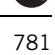
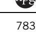
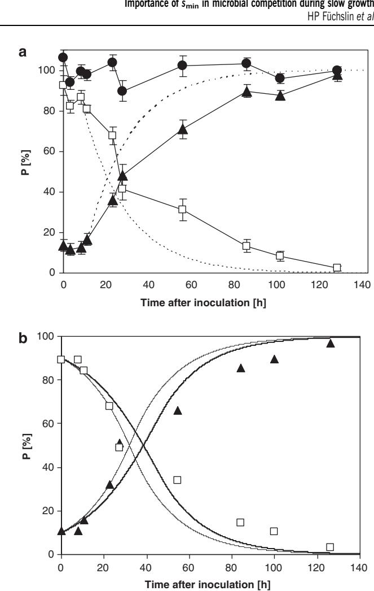
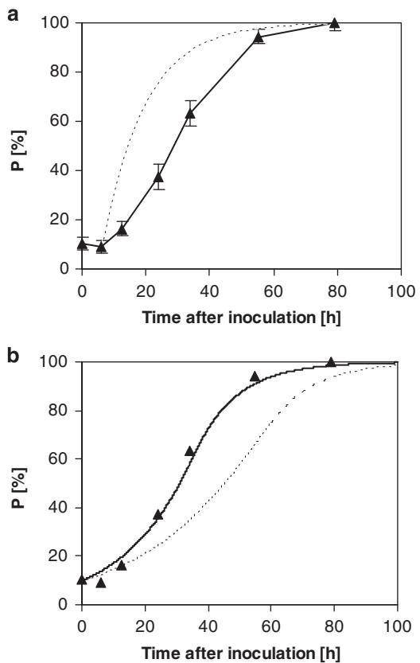
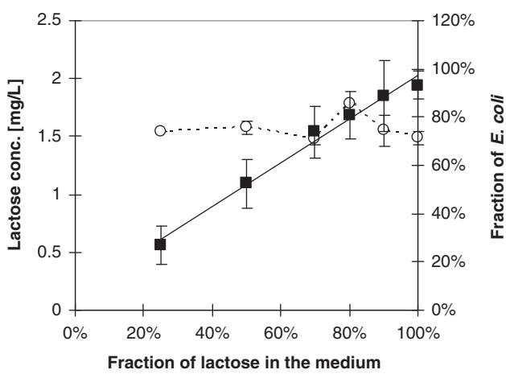
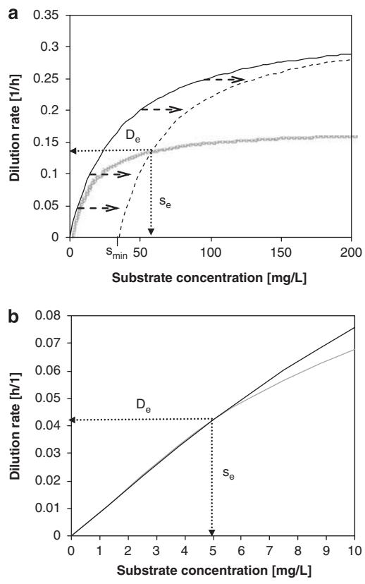

# ORIGINAL ARTICLE

# In glucose-limited continuous culture the minimum substrate concentration for growth, smin, is crucial in the competition between the enterobacterium Escherichia coli and Chelatobacter heintzii, an environmentally abundant bacterium

Hans Peter Fu¨ chslin1,3, Christian Schneider1,2,4 and Thomas Egli1,2 1 Department of Environmental Microbiology, Eawag (Swiss Federal Institute of Aquatic Science and Technology), Du¨bendorf, Switzerland and 2 Institute of Biogeochemistry and Pollutant Dynamics, ETH Zu¨rich, Zu¨rich, Switzerland

The competition for glucose between Escherichia coli ML30, a typical copiotrophic enterobacterium and Chelatobacter heintzii ATCC29600, an environmentally successful strain, was studied in a carbonlimited culture at low dilution rates. First, as a base for modelling, the kinetic parameters lmax and Ks were determined for growth with glucose. For both strains, lmax was determined in batch culture after different precultivation conditions. In the case of C. heintzii, lmax was virtually independent of precultivation conditions. When inoculated into a glucose-excess batch culture medium from a glucose-limited chemostat run at a dilution rate of 0.075 h-1 C. heintzii grew immediately with a lmax of 0.17±0.03 h-1 . After five transfers in batch culture, lmax had increased only slightly to 0.18±0.03 h-1 . A different pattern was observed in the case of E. coli. Inoculated from a glucose-limited chemostat at D ¼ 0.075 h-1 into glucose-excess batch medium E. coli grew only after an acceleration phase of B3.5 h with a lmax of 0.52 h-1 . After 120 generations and several transfers into fresh medium, lmax had increased to 0.80±0.03 h-1 . For long-term adapted chemostat-cultivated cells, a Ks for glucose of 15 lg l-1 for C. heintzii, and of 35 lg l-1 for E. coli, respectively, was determined in 14C-labelled glucose uptake experiments. In competition experiments, the population dynamics of the mixed culture was determined using specific surface antibodies against C. heintzii and a specific 16S rRNA probe for E. coli. C. heintzii outcompeted E. coli in glucose-limited continuous culture at the low dilution rates of 0.05 and 0.075 h-1 . Using the determined pure culture parameter values for Ks and lmax, it was only possible to simulate the population dynamics during competition with an extended form of the Monod model, which includes a finite substrate concentration at zero growth rate (smin). The values estimated for smin were dependent on growth rate; at D ¼ 0.05 h-1 , it was 12.6 and 0 lg l-1 for E. coli and C. heintzii, respectively. To fit the data at D ¼ 0.075 h-1 , smin for E. coli had to be raised to 34.9 lg l-1 whereas smin for C. heintzii remained zero. The results of the mathematical simulation suggest that it is not so much the higher Ks value, which is responsible for the unsuccessful competition of E. coli at low residual glucose concentration, but rather the existence of a significant smin.

The ISME Journal (2012) 6, 777–789; doi:[10.1038/ismej.2011.143](http://dx.doi.org/10.1038/ismej.2011.143); published online 27 October 2011 Subject Category: microbe-microbe and microbe-host interactions

Keywords: continuous culture; competition; minimum substrate concentration (smin); Monod kinetics; oligotrophy; slow growth

## Introduction

#### Growth kinetics

Correspondence: T Egli, Environmental Microbiology, Eawag, U¨ berlandstrasse 133, 8600 Du¨bendorf, Switzerland. E-mail: [egli@eawag.ch](mailto:egli@eawag.ch)

Microbial growth kinetics describes the relationship between the specific growth rate (m) and the concentration of a growth-limiting substrate (s). It has been proposed already early that m increases with s in a 'saturation-type'-like dependence until bacteria attain their maximum specific growth rate ([Penfold and](#page-12-0) [Norris, 1912](#page-12-0); [Hinshelwood, 1946)](#page-11-0). This was confirmed by Monod and until today his empirical relationship (1) is the most widely used model to describe the Received 25 January 2011; revised 6 September 2011; accepted 7

3 Present address: Bachema AG, Ru¨tistrasse 22, 9852 Zu¨rich, Switzerland.

4 Present address: Lemon Consult GmbH, Sumatrastrasse 10, 8006 Zu¨rich, Switzerland.

September 2011; published online 27 October 2011

Table 1 Parameters and variables used in this study and their definitions

Abbreviation Definition

| a       | Specific maintenance rate (h 1 )                 |
|---------|--------------------------------------------------------|
| D       | Dilution rate (h 1 )                             |
| De      | Dilution rate (h 1 ), where coexistence of       |
|         | competitors is possible                                |
| F       | Flow rate (l h 1 )                               |
| Ks      | Monod saturation constant (mg l 1 )              |
| P       | Population composition based on cell number (%)        |
| s       | (Steady-state) substrate concentration in              |
|         | continuous culture (mg l 1 )                     |
| se      | Substrate concentration (mg l 1 ), at which      |
|         | coexistence is possible                                |
| sin     | Substrate concentration in medium feed (mg l 1 ) |
| smin    | Predicted substrate concentration at                   |
|         | D ¼ 0 h 1 (mg l 1 )                           |
| S       | Substrate (mg l 1 )                              |
| t       | Time (h)                                               |
| x       | Biomass concentration (mg l 1 )                  |
| X       | Biomass (mg l 1 )                                |
| m       | Specific growth rate (h 1 )                      |
| mmax    | Maximum specific growth rate (h 1 )              |
| q       | Specific uptake rate (mg glucose  mg dry               |
|         | weight 1  min 1 ))                            |
| qexcess | Uptake rate at substrate excess conditions             |
|         | without any adaptation (mg glucose  mg dry             |
|         | weight 1  min 1 )                             |
| qmax    | Maximum specific uptake rate (mg glucose  mg           |
|         | dry weight 1  min 1 )                         |
| YX/S    | Growth yield (gram dry biomass                         |
|         | formed  (gram substrate consumed) 1 )            |
|         |                                                        |

kinetics of microbial growth [(Monod, 1942](#page-12-0); for parameter definitions see Table 1):

$$
\mu = \mu_{\text{max}} \times \frac{\text{s}}{\text{s} + \text{K}_{\text{s}}} \tag{1}
$$

Various other models ([Blackman, 1905](#page-11-0); [Powell,](#page-12-0) [1967; Westerhoff](#page-12-0) et al., 1982; [Koch, 1999)](#page-11-0) or modifications of the Monod model ([Contois, 1959;](#page-11-0) [Powell, 1967](#page-12-0); [Shehata and Marr, 1971;](#page-12-0) [Dabes](#page-11-0) et al., [1973;](#page-11-0) [Pirt, 1975](#page-12-0); [Baloo and Ramkrishna, 1991;](#page-11-0) [Alexander, 1994)](#page-11-0) have been proposed, in which specific cases can describe selected experimental data equally well or even better. The success of the Monod model is partly due to its simplicity, the similarity to the well-established Michaelis–Menten enzyme kinetics, the biologically meaningful interpretation of the model constants mmax and Ks, and their experimental accessibility.

#### Microbial maintenance and its quantification using a minimum substrate concentration (smin)

As an extension of the Monod model, the concept of maintenance metabolism was proposed in the sixties and critically reviewed recently [(van Bodegom,](#page-12-0) [2007)](#page-12-0). Microbial maintenance can be quantified and described by different concepts such as the specific maintenance rate (Marr et al[., 1963)](#page-12-0), a maintenance coefficient ([Pirt, 1965](#page-12-0)), and maintenance reflected in a minimum substrate concentration (smin). Recently, [van Bodegom (2007)](#page-12-0) introduced an additional conceptual model that differentiates between growth and non-growth components of maintenance. In several studies, existence of an smin has been observed in continuous culture systems ([Kova´rova´](#page-11-0) et al[., 1996;](#page-11-0) Tros et al[., 1996a](#page-12-0); Fu¨ chslin et al[., 2003](#page-11-0)). In glucose-limited chemostat culture, [Kova´rova´](#page-11-0) et al[. (1996)](#page-11-0) experimentally examined the growth kinetics of E. coli ML30 (the strain also used in this study) and proposed to expand the Monod model by the additional term of smin. It was suggested that the phenomenon of smin is caused by the maintenance energy demand [(Pirt, 1965](#page-12-0)), limiting diffusion kinetics [(Schmidt](#page-12-0) et al., 1985; Bosma et al[., 1996](#page-11-0)) or by the minimum concentration required for enzyme induction [(Lechner and Straube, 1984](#page-11-0)). The extended form of the Monod equation (2) predicts a finite threshold substrate concentration, smin, at zero growth rate. The specific maintenance rate, a, describes the same phenomenon; it is defined as a negative relative growth rate, in which the product of the specific maintenance rate and the microbial biomass equals the loss of cell material through maintenance (Marr et al[., 1963](#page-12-0)). Maintenance rate a and smin can be easily related (3). However, as pointed out recently one has to be very cautious in relating the three mathematical parameters as they are based on different assumptions and experimental determination relies on different methods ([van Bodegom, 2007](#page-12-0)).

$$
\mu = \mu_{\text{max}} \times \frac{(\text{s} - \text{s}_{\text{min}})}{(\text{s} - \text{s}_{\text{min}}) + \text{K}_{\text{s}}} \tag{2}
$$

$$\mathbf{s}_{\min} = \mathbf{K}_s \times \frac{a}{(\mu_{\max} - a)} \text{ or } a = \mu_{\max} \times \frac{\mathbf{s}_{\min}}{\mathbf{K}_s + \mathbf{s}_{\min}} \quad (3)$$

Based on mathematical modelling, it is assumed that smin is especially important during slow growth at low substrate concentrations [(Mu¨nster, 1993;](#page-12-0) [Kova´r](#page-11-0)[ova´-Kovar and Egli, 1998)](#page-11-0) as they are normally found in the environment. This hypothesis was experimentally tested here. As an experimental system, we used two strains with differing smin for growth with glucose, studied the growth and competition of both strains in glucose-limited chemostat culture, and modelled the results with the classical Monod model as well as the model expanded by smin.

Different experimental approaches have been described in the literature to determine Ks and mmax and there is no consensus on which of the proposed methods is superior and whether or not all of them (should) lead to the same values (Grady et al[., 1996;](#page-11-0) [Kova´rova´-Kovar and Egli, 1998](#page-11-0)). In practice, unfortunately, kinetic constants of microbial populations are not always 'constant' (Grady et al[., 1996](#page-11-0)). The most important reasons for this variability, although rarely quantified, are probably differing cultivation conditions, culture history ([Powell, 1967;](#page-12-0) [Kova´rova´-](#page-11-0) [Kovar and Egli, 1998)](#page-11-0), or physiological adaptation resulting from a switch between substrate transport systems of different affinity [(Harder and](#page-11-0) [Dijkhuizen, 1982](#page-11-0); Tros et al[., 1996b](#page-12-0)). Furthermore, when cultivated for extended periods in the same environment populations can evolve through a selection of mutants with increased fitness ([Hartl](#page-11-0) [and Dykhuizen, 1979;](#page-11-0) Wick et al[., 2002)](#page-12-0). Consequently, adaptation processes must be taken into account when competition between different microorganisms for a common substrate is studied. Evolution and composition of a microbial consortium and the environmental concentration of growth-limiting substrates are, therefore, intimately linked. Hence, competition and kinetics are of crucial importance for microbial processes in ecosystems [(Gottschal, 1993)](#page-11-0).

Linking competition experiments at low growth rates with kinetics is connected with several difficulties. The most important one is the very low residual substrate concentrations under which this competition takes place; they are usually in the range of a few mg per litre, that is, below detection limit. Therefore, in contrast to earlier studies at higher growth rates (Senn et al[., 1994](#page-12-0); [Kova´rova´](#page-11-0) et al[., 1996;](#page-11-0) [Lendenmann](#page-12-0) et al., 2000), Ks can usually not be determined by measuring the residual concentration of the growth controlling substrate. Another aspect is that slow-growing cells (for example, from a low D in continuous culture) are usually not able to immediately increase the rate of growth when transferred to substrate excess conditions. One has to distinguish between the 'intrinsic' mmax achieved after adaptation to substrate excess conditions, and the 'extant' mmax achieved without any adaptation phase by originally slowly growing cells just after they had been exposed to substrate excess (see Grady et al[., 1996](#page-11-0) and [Wick](#page-12-0) et al[., 2002)](#page-12-0).

## Competition

The simplest case of competition between microbial strains for a common resource has been defined as 'pure and simple'. 'Simple' because only one single nutrient controls the growth rate and 'pure' because competition for this nutrient is the only interaction between the competitors ([Frederickson](#page-11-0) [and Stephanopoulos, 1981)](#page-11-0). Although it is questionable whether such 'pure and simple' competition is very common in nature it represents the most extensively experimentally studied interaction among microbes in the laboratory; it is also commonly applied for explaining microbial interactions observed in ecosystems. Numerous 'pure and simple' ecological scenarios have been put forward [(Gottschal, 1993)](#page-11-0), the most successful of them is the scenario of the 'opportunist' and the 'gleaner' for heterotrophic competitors ([Veldkamp](#page-12-0) [and Jannasch, 1972;](#page-12-0) [Grover, 1990)](#page-11-0). Competition between 'gleaner' and 'opportunist' for a common single substrate is based on the original Monod kinetic model and its interpretation to competitive scenarios [(Herbert](#page-11-0) et al., 1956). Opportunists have a high mmax but low substrate affinity (high Ks), which allows them to utilise nutrients in an opportunistic way when they become rapidly available, for example, by a sudden flush of nutrients, or rapid elimination of competitors. In contrast, gleaners are characterised by a low mmax and high affinity (low Ks) and are designed to operate in oligotrophic ecosystems with scarce organic resources. Their main physiological characteristics are high efficiency of nutrient assimilation and economical metabolism. However, concerning mmax they are inferior to opportunists.

## E. coli and C. heintzii as a model system

E. coli is the standard indicator bacterium for assessing microbial quality of drinking water and potential faecal contamination ([World Health Orga](#page-12-0)[nization, 1996](#page-12-0)). Therefore, there is considerable interest in understanding its survival and competitiveness in the natural environment. In temperate climates and unpolluted sites, E. coli cells shed into the environment are assumed to be unable to survive and to die quickly [(Korhonen and Martikainen,](#page-11-0) [1991; Bogosian](#page-11-0) et al., 1996). However, it has been reported that under mesotrophic to eutrophic conditions and (sub)tropical temperatures between 15 and 45 1C this enterobacterium can not only survive but also grow [(Hazen and Toranzos, 1990](#page-11-0); [Tassoula,](#page-12-0) [1997; Solo-Gabriele](#page-12-0) et al., 1999). This conflicts with the use of E. coli as a general hygiene indicator for water. As a competition partner for E. coli, we chose the environmentally successful Chelatobacter heintzii (also listed now as Aminobacter heintzii). This gram-negative bacterium is present in quite high numbers not only in activated sludge (up to 1% of the total microbial population), but also in surface waters and soil (0.01–0.1% of total population) [(Wilberg](#page-12-0) et al., 1992; [Bally, 1994](#page-11-0)). It has been studied extensively in our laboratory and was found to be nutritionally versatile and suitable for cultivation in continuous culture (Bally et al[., 1994; Bally](#page-11-0) [and Egli, 1996](#page-11-0)).

The goal of this study was to investigate the competition of E. coli with C. heintzii at environmentally relevant (low) growth rates. However, mostly the kinetic parameters of microbial cultures are determined at elevated specific growth rates because of analytical difficulties. For example, in our chemostat study (Senn et al[., 1994; Lendenmann](#page-12-0) et al[., 1996](#page-12-0); [Kova´rova´, 1997](#page-11-0); [Kova´rova´-Kovar and](#page-11-0) [Egli, 1998)](#page-11-0) kinetic parameters for E. coli with glucose were collected at dilution rates normally not lower than 0.2 h-1 . Hence, it is unknown whether such kinetic properties can be extrapolated to situations of slow growth. Therefore, for both strains the kinetic parameters (extant and intrinsic) were first experimentally determined during slow growth with glucose using different experimental approaches. Then, competition experiments were carried out between C. heintzii and E. coli at low dilution rates in glucose-limited continuous culture. Finally, obtained results were mathematically modelled based on the experimentally determined kinetic Monod parameters.

## Materials and methods

#### Organisms and chemicals

Escherichia coli ML30 (DSM 1329) and Chelatobacter heintzii (ATCC 29600) were used in all experiments. Chemicals were purchased from either Fluka (Buchs, Switzerland) or Merck (Darmstadt, Germany).

### Growth media and cultivation conditions

Batch medium. The mineral medium contained, per litre: 275 mg NH4Cl, 75 mg MgSO4 7H2O, phosphate buffer (see below), glucose (see below), and the following trace elements: 5 mg CaCl2 H2O, 35 mg KCl, 1.5 mg FeCl2, 60 mg H3BO3, 100 mg MnCl2 4H2O, 120 mg CoCl2 6H2O, 70 mg ZnCl2, 25 mg NiCl2 6H2O, 15 mg CuCl2 2H2O, 25 mg Na2- MoO4 2H2O, 5.2 mg EDTA Na4(H2O)4. To prepare one litre of medium, NH4Cl and MgSO4 were dissolved in 900 ml of deionised water and heat sterilised at 121 1C. After cooling down to room temperature, the mineral medium was supplemented with glucose (X98%, Fluka) as the only source of carbon and energy (always for a final concentration of 500 mg of carbon per litre) by 0.22 mm filtration using sterile disposable filters (type GVWP, Millipore, Billerica, MA, USA). Also added by sterile filtration after heat sterilisation was 100 ml of phosphate buffer (Na2HPO4 2H2O/KH2PO4, 0.56 M with respect to phosphate, pH 7.5), 1 ml of trace element solution (1000 times concentrated, see above) and 0.05 ml of vitamin stock solution with a composition according to Egli et al[. (1988)](#page-11-0).

Determination of mmax in batch culture. In batch cultures with glucose as sole source of carbon and energy, the 'extant' maximum specific growth rate, mmax, of E. coli and C. heintzii was determined by OD546 measurements at 30 1C after different precultivation conditions. The mmax in batch culture was extracted from the linear part of an ln(OD546) versus time plot.

Continuous culture medium. The same mineral medium and vitamin stock solution were used as for batch cultivation, except that phosphorus was added in the form of 1.25ml H3PO4 (85%) per litre. The complete mineral medium with all mineral components combined (including trace elements) had a pH of 3–4 and was sterilised by autoclaving at 120 1C for 1 h. After autoclaving and cooling down to room temperature, the mineral medium was supplemented with glucose, lactose or mixtures of the two sugars as the only source of carbon and energy using sterile disposable 0.22mm filters (Millipore). The concentration of sugars was in total 50mg of C per litre. In addition, 0.25ml of vitamin stock solution was added per litre of medium by sterile filtration as described above.

Continuous cultivation. Continuous cultivation was performed in a 3.5-l bioreactor (MBR, Wetzikon, Switzerland) with a working volume of 2.8 l. The bioreactor was equipped with both pH (7.50±0.05) and temperature control (30±0.1 1C). For pH control, a mixture of sterile 0.5 M NaOH and 0.5 M KOH was used. The impeller speed control was set to 1000 revolutions per minute and the oxygen saturation was always kept 490% air saturation. Cultures were regularly checked for wall growth to avoid artefacts as reported earlier ([Pirt, 1975)](#page-12-0).

Chemostat (that is, steady state) conditions were typically reached after 45 volume changes and confirmed by constant biomass concentration (either via optical density or dry cell weight).

#### Analysis of mixed microbial cultures

In continuous culture competition experiments, the composition of mixed cultures was followed using fluorescence in-situ hybridisation directed against E. coli in combination with cell surface antibodies specific for C. heintzii. For population analysis, cells were collected on a 0.20-mm GTPB microscopy black filter membrane (Millipore) and then stained. The two methods were absolutely specific and no crossreaction was observed. Samples were first specifically stained either by specific antibodies or by 16S rRNA probe; and subsequently, all cells were stained with 4,6-diamidino-2-phenylindole (DAPI) in order to determine the total bacterial number. For every sample, two measurements in triplicates were made, one for the determination of the fraction of C. heintzii and one for E. coli.

Fluorescence in-situ hybridisation for E. coli. A specific 17-base long 50 -end CY3-labelled 16S rRNA probe against E. coli was designed earlier [(Wick](#page-12-0) et al[., 2001](#page-12-0)) with the oligonucleotide sequence (ACTTTACTCCCTTCCTCCC). Whole cell hybridisation was done according to the procedure described by Manz et al[. (1992).](#page-12-0)

Immunodetection of C. heintzii. The method used was adapted and modified from [Bally (1994)](#page-11-0). All aqueous solutions were filtered before use (0.2 mm pore size) and all glassware was cleaned carefully with detergents, acid and ethanol to avoid any contamination before use. To B2 ml of culture sample, one drop (20 ml) of formaldehyde solution (37%) was added. The sample was vortexed for 1 min and kept in the refrigerator for 3 h. Subsequently, the sample was centrifuged (3 min, 10 000 g), the pelleted cells were washed three times with phosphate-buffered saline (PBS: 14.4 g l-1 Na2HPO4 2H2O, 3.2 g l-1 NH2PO4 2H2O, 5.9 g l-1 NaCl, pH 7.5) and finally resuspended in 2 ml of 50% ethanol/50% PBS (vol/vol) and stored at -20 1C. Then, 30 ml of C. heintzii ATCC 29600 strain-specific serum (polyclonal from rabbit; [Bally,](#page-11-0) [1994)](#page-11-0), diluted 100 times with PBS, was placed on a glass slide and the membrane filter was placed upon the serum. This allowed the serum to diffuse through the membrane filter without disturbing the homogeneous distribution of microbial cells on the filter surface. Slides were incubated for 30 min in a moist atmosphere at 25 1C in the dark. Unbound antibodies were then removed by carefully rinsing the filter with 50 ml of PBS on a glass filtration fritte. The procedure was repeated using 30 ml of 50 times diluted fluorescein isothiocyanate-anti-rabbitserum (F-0382, commercially available from Sigma, St Louis, MO, USA).

DAPI staining. To determine the total cell number, the cells were fixed on the filter and stained with either the specific antibody or 16S rRNA probe, the filters were covered with 30 ml of aqueous DAPI solution (10 mM) and incubated for 10 min. Subsequently, the cells were washed once with PBS in order to remove excess DAPI from the cells.

Microscopy and determination of mixed microbial cultures. The black filter membrane (Millipore) was placed on a glass slide with 20 ml of PBS. It was covered with a glass slide suitable for fluorescent microscopy. The samples were examined within 5 h after staining using an Olympus BH-2 RFCA microscope ( 100 DplanApo 100UVPL objective lens, 10 eyepiece) equipped for epifluorescence microscopy using immersion oil (Olympus, Volketswil, Switzerland).

The total (DAPI stained) cell number was counted by excitation with UV light (360 nm), fluorescein isothiocyanate-positive cells were enumerated using blue light (495 nm) excitation and cells stained with the CY3-labelled 16S rRNA probe using red light (540 nm) excitation in combination with cutoff filter HQ-CY3 61241007 (AF Analysentechnik, Tu¨ bingen, Germany). Ten randomly chosen microscopic fields on filters with an appropriate number of total cells (50–200) were counted at each wavelength and the fraction of a specific strain given in % of the total population (P) was calculated.

## Biomass and yield determination

Biomass measured as cell dry weight was determined by filtration through 0.2 mm pore size polycarbonate membrane filters (Sterico AG, Dietikon, Switzerland). Cells collected on preweighed filters were washed once with 50 ml of distilled water and filters were dried at 105 1C to constant weight. Optical density was determined in a 1-cm cuvette at 546 nm with a Uvikon 860 spectro-photometer (Kontron, Zu¨rich, Switzerland). The growth yield was expressed as gram of cell dry weight formed per gram of glucose consumed.

## Sugar analysis

To avoid significant consumption of sugars during sampling the biomass was immediately (o0.5 s) separated from the culture liquid by filtration. Filtered samples were desalted by electrodialysis and subsequently the concentration of glucose and lactose was determined by HPLC separation, postcolumn reaction with alkaline copper(II) bisphenanthroline and amperometric detection. The method for sugar analysis and its validation has previously been published in detail [(Lendenmann, 1994](#page-12-0); [Senn](#page-12-0) et al[., 1994)](#page-12-0). Despite fast separation of the cells from the culture liquid, the residual sugar in the medium is partly consumed by the cells (see [Lendenmann,](#page-12-0) [1994)](#page-12-0); therefore, the effective detection limit is higher than the technical detection limit. Reliable glucose and lactose determinations, which were not affected by the on-going sugar consumption during sampling, were achieved at concentrations 430 mg l-1 . Whereas the determinations of lactose concentrations were not problematic because of its high residual concentration, the residual glucose concentration was frequently below the effective detection limit.

## Glucose uptake by whole cells

Concentration-dependent uptake of 14C-glucose was assayed by a rapid filtration method. Cells from the culture (2 ml) were collected by centrifugation (10 000 g, 2 min) at 4 1C and the supernatant was discarded. In order to keep disturbance of the cells at a minimum the samples were diluted with filtered (0.2 mm pore size) spent chemostat cultivation medium without any detectable residual glucose. The cell suspension in spent medium was incubated for 5 min at 30 1C to assure that remaining glucose was consumed to very low level before D-glucose-UL-14C (Sigma) was added at a defined concentration to start the uptake experiment. As a function of time (15, 30, 45, 60, 90, 120, 150 and 180 s), aliquots of 200 ml were withdrawn from the assay mixture and immediately filtered through cellulose nitrate filters with a pore size of 0.25 mm (Sartorius AG, Go¨ttingen, Germany). Without delay, the filters were washed with 20 ml of PBS buffer containing 50 mM unlabelled glucose. Then, the filters were placed in scintillation vials and 3 ml of scintillation liquid (FilterCount, Packard Instrument B.V., Groningen, The Netherlands) was added. Finally, radioactivity was determined with a BETAmatic I liquid scintillation counter (Kontron Analytical). Uptake rates were calculated from the linear part of the uptake curve and are mean values of three independent transport assays (standard deviation is

indicated). In our study, the uptake rate of C. heintzii corresponded well with the measured maximum specific growth rate. Converting the observed qmax (0.0070 mg glucose mg dry weight -1 min-1 ) into specific growth rate (Equation 4) a mmax of 0.19 h-1 was obtained, which is close to mmax observed in batch culture (0.16–0.18 h-1 ). In contrast, in the case of E. coli the experimentally determined qmax (0.0050 mg glucose mg dry weight-1 min-1 ) was significantly lower than the qexcess measured in our pulse experiment (0.0144± 0.0005 mg glucose mg dry weight-1 min-1 ). In a previous study, Hunter and Kornberg reported a similar discrepancy between uptake rates for labelled glucose and qmax and these authors used a correction factor of 3.333. When multiplying our qmax calculated from the 14C-glucose uptake with this factor we obtain a value of 0.01667 mg substrate mg dry weight-1 min-1 , which is very close to the qexcess determined in our pulse experiment (see above). Obviously, a considerable proportion of the glucose taken up was oxidised and lost as 14CO2 depending on the physiological state of the cells and assay conditions ([Hunter and Kornberg, 1979](#page-11-0)).

$$
\mu_{\text{max}} = q_{\text{max}} \times Y_{\text{x}/s} \tag{4}
$$

#### Competition experiments

To perform competition experiments for glucose in continuous culture, E. coli and C. heintzii were first cultivated separately for 10 days in a glucoselimited chemostat at a dilution rate of 0.05 h-1 in order to allow sufficient time for the adaptation of both strains to low glucose concentrations. After 10 days, 100 ml of culture liquid was removed from each chemostat and cross-inoculated to start the competition for glucose between the two strains.

#### Theoretical wash-in and wash-out curves

The hydraulic behaviour of an ideal flow-through system is described by the theoretical wash-out (5) and wash-in (6) curves and were calculated by the following equations ([Pirt, 1975](#page-12-0)):

$$s(t) = s(0) \times e^{-D \times t} \tag{5}$$

$$s(t) = s(\mathbf{0}) \times (\mathbf{1} - e^{-D \times t}) \tag{6}$$

Modelling

For mathematical calculations and modelling, the program AQUASIM was used [(Reichert, 1998](#page-12-0)). In earlier work on the growth of E. coli in glucoselimited chemostat culture at 37 1C (Senn [et al](#page-12-0)., [1994)](#page-12-0), we found that s ¼ f(D) three kinetic models fitted the data with similar quality (Monod, Shehata and Marr, Westerhoff). Extending this work to suboptimal and superoptimal temperatures (17, 28 and 40 1C), we experimentally observed a clear indication for the existence of a finite glucose concentration at zero growth rate, and when extending the classical Monod model with an smin, the obtained kinetic data could be fitted well and statistically better than with any other model of similar complexity [(Kova´rova´](#page-11-0) et al., 1996). Hence, the original (1) and the extended Monod model (2) were the obvious model of choice to be applied to our competition experiments. A more extensive search for better fitting models seems presently not justified. Based on this, the following differential equations were used to describe population dynamics and substrate concentrations in the competition experiments:

$$\frac{d\mathbf{x}_{E.colli}}{dt} = \mu_{E.colli} \times \mathbf{x}_{E.colli} - D \times \mathbf{x}_{E.colli} \tag{7}$$

$$\frac{d\mathbf{x}_{C.\,\text{heinträ}i}}{dt} = \boldsymbol{\mu}_{C.\,\text{heinträ}i} \times \mathbf{x}_{C.\,\text{heinträ}i} \tag{8}$$

$$-D \times \mathbf{x}_{C.\,\text{heinträ}i} \tag{8}$$

$$\frac{ds}{dt} = D \times s_{in} - \frac{\mu_{E.\,coll} \times \mathbf{x}_{E.\,coll}}{Y_{X_{E.\,coll}/S}}$$

$$-\frac{\mu_{C.\,heintzili} \times \mathbf{x}_{C.\,heintzili}}{Y_{X_{C.\,heintzili}/S}} - D \times s \qquad (9)$$

Values for Ks, mmax and Y were determined experimentally (see Results). With the parameter estimation tool of AQUASIM substrate concentration and smin were inferred. A weighted least squares parameter estimation was performed for s and smin by fitting calculated mixed culture composition data to measured composition based on cell counts. This was done by minimising w2 values using the secant method and non-linear regression. For the estimation, the standard deviation (s) was set to 10% if not experimentally determined. It was assumed that the ratio of biomass to cell number of E. coli and C. heintzii, respectively, remained constant during competition experiments.

## Results

#### Determination of mmax

In batch culture, C. heintzii exhibited a rather constant mmax independent of cultivation history. When cultivated in continuous culture at D ¼ 0.05 h-1 for at least 10 days (ca. 26 generations) and transferred into a batch culture with excess glucose this strain achieved a mmax of 0.17±0.03 h-1 after a short acceleration phase of 2 h. After repeatedly transferring cells from the exponential growth phase into fresh batch medium only a minor improvement of mmax from 0.17 to 0.18±0.03 h-1 was recorded after 120 generations, suggesting that for this bacterium extant and intrinsic mmax are similar under the conditions tested.

A different behaviour was observed for E. coli. When cultured in a glucose-limited chemostat at D ¼ 0.05 h-1 (as C. heintzii above) and transferred into a batch culture with excess glucose, linear growth was recorded during the first 3.5 h. After this adaptation phase, exponential growth started and an extant mmax of 0.54 h-1 was finally reached. Repeated subculturing under excess glucose conditions lead to an increase of mmax reaching a value of 0.72±0.03 h-1 after 62 generations and 0.80±0.02 h-1 after 120 generations (corresponding to the intrinsic mmax).

In order to determine the potential mmax (that is, the 'extant' mmax) of slowly growing E. coli, we also determined the qexcess for glucose by pulsing excess glucose directly into a continuous culture of cells that had been growing at D ¼ 0.075 h-1 for at least 10 days (26 generations). The pulse of glucose injected was chosen such that the initial concentration was around 1 mg l-1 ; this is well above the Ks of the culture for glucose (Wick et al[., 2002)](#page-12-0) but did not lead to a significant change in biomass concentration. The medium supply was shut off immediately after the pulse and the decrease in glucose concentration was measured (Supplementary Figure S1). The linear decrease of glucose observed confirmed that the pulsed glucose concentration was significantly higher than Ks, reducing the relationship qexcess ¼ qmax s/(s þ Ks) to qexcessEqmax. The qmax determined in this way was 0.0144±0.0005 mg glucose (mg CDW min)-1 . Converting this into specific growth rate (4), assuming that the yield of 0.38 mg CDW (mg glucose)-1 measured during continuous cultivation remained constant, an extant mmax of 0.33±0.011 h-1 was obtained. We suggest that this extant value is the most appropriate to simulate growth kinetics under the slow and transient growth conditions applied in our competition experiments (D ¼ 0.05 or 0.075 h-1 ). In summary, and as expected for a typical environmental gleaner, C. heintzii exhibited a considerably lower mmax than the enterobacterium E. coli.

### Determination of Ks from glucose uptake rates

At the low growth rates used it was not possible to reliably determine the steady-state concentration of glucose in chemostat cultures (it was clearly below 30 mg l-1 ) and to deduce Ks (or smin) from the Monod equation. Therefore, an alternative approach was taken to determine Ks for glucose of the two strains, namely by monitoring glucose uptake rates of cells at different glucose concentrations (see Figure 1) using 14C-labelled glucose. For this, cells of E. coli and C. heintzii were cultivated in glucose-limited chemostat culture at D ¼ 0.075 h-1 for at least 10 days (26 generations) before samples were taken. To circumvent effects on glucose uptake capacity due to abrupt environmental changes (see [Hunter](#page-11-0)

0 1 2 3 4 5 6 7 8 9 0 **Glucose concentration [mg/L] qs [mg substrate / mg dryweight / min]** 20 40 60 80 160 100 120 140

Figure 1 Uptake rate (qs) of 14C-glucose by E. coli (&) and C. heintzii (m) at 30 1C as a function of the glucose concentration in the assay mixture. The cells had been cultivated in glucoselimited continuous culture with a feed of 50 mg of carbon glucose per litre, at D ¼ 0.075 h-1 and 30 1C.

[and Kornberg, 1979](#page-11-0)) harvested cells were resuspended and diluted with 0.2 mm-filtered spent chemostat medium. The qglucose as a function of glucose concentration is shown in Figure 1 for C. heintzii and E. coli, respectively. For C. heintzii, the qglucose increased almost linearly up to a glucose concentration of 30 mg l-1 . Although this pattern is closer to Blackman than Monod kinetics one can estimate a half saturation constant of 15 mg glucose per litre at 0.5 qmax. The pattern of dependence of qglucose of E. coli on substrate concentration was similar to that observed for C. heintzii. The cells reached qmax at B70 mg glucose per litre and the estimated Ks for glucose is 35 mg l-1 , which corresponds well with the intrinsic Ks reported earlier in a glucose-limited chemostat [(Kova´rova´](#page-11-0) et al., 1996).

#### Competition for glucose during continuous culture at low dilution rates

When cells from E. coli and C. heintzii, adapted first to growth in glucose-limited chemostat culture at D ¼ 0.05 h-1 , were cross-inoculated E. coli was unable to compete with C. heintzii. The results obtained for the competition of E. coli transferred into the C. heintzii chemostat culture are shown in [Figure 2a](#page-7-0). At each time point, the sum of E. coli plus C. heintzii cells added up to 97.9±3.7% and corresponded well with the cell number determined by DAPI. A lag phase of 8 h was observed before C. heintzii started to displace E. coli and the concentration of E. coli cells decreased slightly slower than predicted by the theoretical wash-out curve. The fact that the displacement of E. coli follows almost wash-out indicates that the enterobacterium was virtually unable to grow, and that cells of C. heintzii exhibited a considerably better competition properties for glucose. Also in the complementary competition experiment (E. coli

Figure 2 (a) Population dynamics (P) of E. coli (&) and C. heintzii (m) in relation to cell number during competition for glucose in a glucose-limited continuous culture at dilution rate of 0.05 h-1 . As a control, the sum of both strains is also given (K). For comparison, the theoretical wash-in ( ) and wash-out ( ) curves are shown assuming a lag phase of 8 h. (b) Prediction of competition for glucose for a mixed culture of E. coli (&) and C. heintzii (m) in a glucose-limited continuous culture at a dilution rate of 0.05 h-1 using the fits for the different smin are shown, namely for smin ¼ 18.0 mg l-1 ( ) from [Kova´rova´](#page-11-0) et al. [(1996)](#page-11-0) and for smin ¼ 12.6 mg l-1 ( ), a value obtained by parameter estimation.

cells inoculated into the C. heintzii chemostat) the enterobacterium was unable to compete (data not shown). In both chemostat cultures, the residual glucose concentration remained always below the detection limit of 30 mg l-1 . In general, higher growth rates favour opportunistic strains; therefore, the competition experiment was repeated at a slightly higher D of 0.075 h-1 (Figure 3a). Because quantification of C. heintzii proved to be very reliable the fraction of E. coli was not determined in this competition experiment.

Even at this dilution rate C. heintzii was able to outcompete E. coli. Also, here a short lag phase was observed before displacement of E. coli started. However, the deviation of the C. heintzii cell concentration from the theoretical wash-in curve

Figure 3 (a) Population dynamics C. heintzii (m) in relation to cell number during competition for glucose with E. coli in a glucose-limited continuous culture at a dilution rate of 0.075 h-1 with a glucose feed of 50 mg carbon per litre at 30 1C. For comparison, the theoretical wash-in curve is shown assuming a lag phase of 7 h. (b) Prediction of competition for glucose for a mixed culture of C. heintzii (m) and E. coli in a glucose-limited continuous culture at a dilution rate of 0.075 h-1 . The fits for the different smin are shown, namely for smin ¼ 18.0 mg l-1 ( y) from [Kova´rova´](#page-11-0) et al. (1996) and for smin ¼ 34.9 mg l-1 (—), a value obtained by parameter estimation.

was significantly more pronounced indicating that E. coli was more competitive at this higher dilution rate. Again, it was not possible to reliably determine the residual glucose concentration before and during the competition experiment.

#### Competition for mixtures of glucose and lactose

In the two previously described experiments, E. coli was virtually unable to withdraw glucose from the common pool and was rapidly displaced by C. heintzii. This raises the question whether or not interactions other than only competition for glucose took place. To test whether C. heintzii negatively affected growth of E. coli (for example, by excreting an inhibitory metabolite), the mixed population was cultivated with different mixtures of glucose and lactose at a D of 0.075 h-1 . In contrast to glucose, which serves as a carbon source for both strains, only E. coli is able to consume lactose (Egli [et al](#page-11-0)., [1988)](#page-11-0). Hence, we tested whether or not kinetics and

784

785

stoichiometry of growth of E. coli with lactose was affected in the presence of C. heintzii.

The composition of the bacterial population and the residual lactose concentration determined as a function of the glucose/lactose mixture in the feed medium is shown in Figure 4. The steady-state fraction of E. coli cells increased linearly with increasing parts of lactose in the feed medium. The fact that the contribution of E. coli cells to the total population corresponded perfectly to the fraction of lactose in the feed indicates that E. coli was virtually excluded from the consumption of glucose by C. heintzii and that it grew primarily with lactose. This confirms that E. coli has a substantially lower competitiveness for glucose than C. heintzii under the conditions tested. During growth with all mixtures, the glucose steady-state concentration was always below the detection limit and that of lactose remained constant at 1.5 mg l-1 and was independent of the composition of the feed and the composition of the population. The unaffected lactose utilisation is a strong hint that growth of E. coli was not negatively influenced by the presence of C. heintzii, suggesting that in the two experiments shown in [Figures 2 and 3](#page-7-0) competition

Figure 4 Growth of mixed population of C. heintzii and E. coli in relation to cell number with defined mixtures of lactose and glucose in a carbon-limited continuous culture at D ¼ 0.075 h-1 and 30 1C with a total carbon feed of 50 mg l-1 . Percentage of E. coli in the bacterial population (') and steady-state lactose concentration (J) is shown as a function of the percentage of lactose in the feed medium.

for glucose was 'pure and simple', that is, the only interaction between the two strains.

#### Simulation

The competition performance in glucose-limited continuous culture of the two bacterial strains was simulated using the kinetic parameters (Table 2) determined for C. heintzii and E. coli in pure culture. Both the classical Monod model (Eq. 1) and Monod's model extended with smin (Eq. 2) were used, the latter because E. coli was reported earlier to exhibit a significant smin during growth with glucose in continuous culture [(Kova´rova´](#page-11-0) et al., [1996)](#page-11-0).

Using the experimentally determined parameters, the original Monod model predicts a stable culture of the two strains when competing at a dilution rate 0.05 h-1 , at D ¼ 0.075 h-1 it predicts that E. coli would win the competition for glucose (compare [Figure 5b)](#page-9-0). This is in contradiction to the experimental outcome. To check whether or not this difference may be due to inaccuracies in the determination of the kinetic parameters, we analysed the sensitivity of the different parameters on the outcome of the competition using the original and the modified Monod equation ([Table 3)](#page-9-0). Whereas both Ks and mmax can vary considerably without affecting the competitiveness significantly, minor changes in smin can already lead to the dominance (X90%) of one of the strains after 120 h of competition. The sensitivity analysis indicates that only with major changes in the measured kinetic parameters, C. heintzii would win the competition in the simulation. Changes of the size required cannot be explained by inaccuracies in the experimental determination of the kinetic parameters used in the simulation.

At low growth rates, maintenance energy can have a significant role and is known to affect competition and kinetics [(Pirt, 1975](#page-12-0); [Kova´rova´-Kovar and Egli,](#page-11-0) [1998)](#page-11-0). Hence, we tested whether the Monod model extended with smin is able to predict the outcome of the two competition experiments, using the same values for the kinetic parameters Ks and mmax as in the simulations shown in [Figures 2b and 3b](#page-7-0). As it was not possible to measure smin directly, the value of smin was adjusted such that simulation and experimental data were in best agreement for the

Table 2 Model parameters and their values used for the simulation of growth and competition for glucose in carbon-limited continuous cultures at 30 1C

|                        | mmaxa                       | Ks                           | YX/Sb        | smin (at D ¼ 0.05 h 1 ) | smin (at D ¼ 0.075 h 1 ) |
|------------------------|-----------------------------|------------------------------|--------------|-------------------------------|--------------------------------|
| E. coli C. heintzii | 0.33 h 1a 0.17 h 1 | 35 mg l 1 15 mg l 1 | 0.38 0.45 | 12.6 mg l 1 0 mg l 1 | 34.9 mg l 1 0 mg l 1  |

mmax, Ks, and YX/S were experimentally determined (see Results or Materials and methods) whereas smin was assessed during modelling by parameter estimation.

a qmax was measured and mmax calculated by mmax ¼ qmax YX/S. b

YX/S was determined in the pure culture chemostat just before the competition experiment was started.

Figure 5 (a) m–s relationship of E. coli (using original Monod model (—) and Monod model extended with smin (- - -)) and C. heintzii (Monod model ( )). All parameters were determined at D ¼ 0.075 h-1 . C. heintzii will outcompete E. coli at sose, whereas E. coli will outcompete C. heintzii at s4se. Coexistence is theoretically possible at De with a steady-state substrate concentration se. Kinetic parameters of the two competitors are listed in [Table 2.](#page-8-0) (b) Zoom into the 0–10 mg l-1 concentration range of Figure 5a. At very low substrate concentration (0–5 mg l-1 ), the classical Monod kinetics predicts for both strains virtually the same specific growth rates and se is 5.0 mg l-1 suggesting coexistence, which is in contradiction to the competition experiments shown in [Figure 2a.](#page-7-0)

two competition experiments. For the results obtained at a dilution rate of 0.05 h-1 , the values obtained for smin determined by parameter estimation were 12.6 mg l-1 for E. coli and 0 mg l-1 for C. heintzii. At the higher dilution rate of D ¼ 0.075 h-1 , the value of smin for E. coli increased to 34.9 mg l-1 whereas that for C. heintzii remained zero. These values are quite close to the smin of 18 mg l-1±2, reported by [Kova´rova´](#page-11-0) et al. (1996) for the growth of E. coli in glucose-limited chemostat culture at 28.4 1C.

## Discussion

We started out from the (commonly accepted) assumption that it is possible to predict and explain 'pure and simple' competition of two bacterial strains for a single resource from Monod kinetic

| Parameters                                           | Dominance of E. colia                                                                      | Coexistenceb                                                                             | Dominance of C. heintziia                                                                 |
|------------------------------------------------------|-----------------------------------------------------------------------------------------------|------------------------------------------------------------------------------------------|----------------------------------------------------------------------------------------------|
| mmaxEc KsEc sminEc mmaxCh KsCh sminCh | X0.52 h 1 p20.6 mg l 1 N.p.c p0.11 h 1 X25.5 mg l 1 X2.9 mg l 1 | 0.33 h 1 35 mg l 1 0 mg l 1 0.17 h 1 15 mg l 1 0 mg l 1 | p0.22 h 1 X57.5 mg l 1 X2.8 mg l 1 X0.24 h 1 p9.1 mg l 1 N.p.c |

For testing sensitivity of the population composition to minor changes in the kinetic parameters, the range of individual parameters was varied while maintaining all other parameters constant. The same substrate supply was used for the simulation as for the competition experiment for glucose in a glucose-limited continuous culture at dilution rate of 0.05 h-1 . Equations and default parameters were used as described in Materials and methods.

a Dominance was arbitrarily defined as the cell number of a strain 490% after 120 h of continuous cultivation. b

Kinetic parameters used from [Table 2](#page-8-0).

c N.p. ¼ not possible; i.e., dominance of a strain obtained only when smin set to values o0 mg l-1 .

parameters determined in pure culture. This was tested here for an environmental 'gleaner' (C. heintzii) and an 'opportunist' (E. coli) at low growth rates in a glucose-limited continuous culture system. It turned out that the classic Monod kinetic parameters mmax and Ks were not sufficient to explain the observed competition results and both modelling and experimental data suggest that an additional parameter, the maintenance-related minimum substrate concentration for growth, smin, determines the competitive properties of microbial strains during slow growth considerably more than mmax and Ks.

The initial determination of the two Monod 'constants' in pure culture supported earlier suggestions (Grady et al[., 1996](#page-11-0); [Kova´rova´-Kovar and Egli,](#page-11-0) [1998)](#page-11-0) that these 'constants' may not be constant but may vary considerably depending on growth conditions and the method used for their determination. Grady et al[. (1996)](#page-11-0) proposed to distinguish between 'extant' and 'intrinsic' values of kinetic parameters, leading to the question of which values should be used under what conditions. In the attempt to determine relevant values of mmax and Ks for growth with glucose in our competition scenario, we observed that the two strains behaved very differently with respect to the ability to reach their (intrinsic) mmax. Populations of E. coli cultivated at low dilution rates in glucose-limited chemostat culture were only able to achieve an (extant) m of 0.33 h-1 during the first hours after transfer to excess glucose conditions, whereas the intrinsic mmax of 'batch-trained' populations was in the range of 0.80 h-1 . Only repeated growth cycles in batch culture resulted in a continuous increase of their extant mmax until the intrinsic mmax of 0.80 h-1 was approached after some 150 generations. This phenomenon had been reported already earlier, where fully batch-'adapted' cultures of E. coli ML30 exhibited a mmax of 0.92 h-1 at 37 1C [(Lendenmann,](#page-12-0) [1994;](#page-12-0) Senn et al[., 1994)](#page-12-0). Similar findings were reported for other E. coli strains in both glucoseexcess (Novak et al[., 2006)](#page-12-0) and glucose-limited chemostat cultures (Wick et al[., 2002)](#page-12-0). It seems that by (so far unknown) mutations and selection the mmax of E. coli strains can be significantly increased and that the (extant) mmax is dependent on culture conditions as well as culture history. Consequently, the extant mmax of 0.33 h-1 was used for simulation of the kinetic behaviour of E. coli in our competition scenario. In contrast, C. heintzii was able to speed up growth quickly and reached its intrinsic mmax within the first 2 h. Affinity for glucose exhibited by chemostat-adapted populations of both strains was not significantly affected by a transfer to excess or transient conditions, as determined in labelled glucose uptake assays under the conditions used subsequently in our competition experiments [(Fig](#page-6-0)[ure 1](#page-6-0)). Surprisingly, only a minor difference in Ks for glucose was observed between the enterobacterium and the environmentally successful C. heintzii. The glucose Ks value of 15 mg l-1 determined for C. heintzii is an average value compared with values reported for other environmental bacterial strains, which range from 5 mg l-1 for a lake isolate [(Hobbie and Wright, 1965](#page-11-0)) to 33 mg l-1 for the widespread Aeromonas hydrophila [(Van der Kooij](#page-12-0) et al., 1980). The obtained half saturation constant of 35 mg glucose l -1 for E. coli corresponds well with Ks values reported earlier for this strain [(Kova´rova´](#page-11-0) et al., 1996).

Employing the determined kinetic parameters (using the extant mmax for E. coli) and the original Monod model predicted a virtually stable mixed culture at D ¼ 0.05 h-1 and a successful competition of E. coli at D ¼ 0.075 h-1 . The lower glucose affinity exhibited by E. coli was theoretically easily 'neutralised' by its higher extant mmax [(Figure 5b](#page-9-0)). This clearly contradicts the experimentally observed success of C. heintzii in all our competition experiments. A sensitivity analysis suggested that the observed difference between model prediction and experimental results is not caused by inappropriate determination of the kinetic parameters ([Table 3)](#page-9-0). Also, the fact that growth of E. coli with lactose was not affected by the presence of C. heintzii strongly suggests that a negative influence of the presence of C. heintzii is very unlikely ([Figure 4](#page-8-0)) and that competition for glucose was the only interaction between the two strains in our experiments.

All this indicated that the original Monod model is unable to appropriately describe growth and competition during slow growth. Since maintenance requirements are considered to be particularly important during slow growth we also tested whether or not extension of the Monod model by smin, as used earlier for the growth of E. coli over an extended temperature range [(Kova´rova´](#page-11-0) et al., [1996)](#page-11-0), would result in an improved fit of model to experimental data. Indeed, applying this extended Monod model allowed to simulate the outcome of our competition experiments. The enormous impact of smin on growth kinetics, and consequently on competition at low growth rates, is visualised in [Figure 5.](#page-9-0) The plot demonstrates that in the absence of an smin for E. coli, C. heintzii would win the competition only at glucose concentrations o5.0 mg l-1 . However, existence of an smin of 35 mg l-1 for E. coli provides C. heintzii with a competitive advantage already at glucose concentrations o58.0 mg l-1 [(Figure 5; Table 3)](#page-9-0). Therefore, especially during slow growth microbial strains affected by significant maintenance requirement should be distinctly disadvantaged in their competitive properties. Importantly, this disadvantage cannot be counteracted by an improved affinity or specific growth rate.

In view of its role for competition during slow growth we have to point out that it is difficult to experimentally determine smin; values reported so far for cells cultivated in carbon-limited continuous culture vary over a wide range from 6545.5 to 12.0 mg l-1 dependent on strain, substrate and growth conditions ([Kova´rova´](#page-11-0) et al., 1996; [Tros](#page-12-0) et al., [1996a;](#page-12-0) Fu¨ chslin et al[., 2003](#page-11-0)). For glucose-controlled chemostat cultures of E. coli ML30, Kova´rova´ and co-workers reported a temperature dependence of smin, with a minimum of 12 mg glucose l-1 at 37 1C, the optimum temperature for growth. Our experiments suggest also a growth rate dependence of smin as the value obtained for smin for E. coli determined by parameter estimation increased from 12.6 mg l-1 at D ¼ 0.05 h-1 to 34.9 mg l-1 at D ¼ 0.075 h-1 , respectively. This would be in agreement with the literature reviewed by [van Bodegom (2007)](#page-12-0) according to which a great body of experimental data suggest that maintenance rate increases with increasing growth rates.

The importance of smin for microbial growth in the environment remains to be elucidated further. Most information reported so far originates from single substrate-limited systems. Average free glucose concentrations in aqueous systems are in the range of 1–10 mg l-1 ([Wright and Hobbie, 1966](#page-12-0); [Egli, 1995)](#page-11-0). Thus, it seems obvious that E. coli with a significant smin is hardly able to gain access to enough substrate to satisfy its maintenance energy needs. However, under environmental conditions the pool of available carbon substrates does not consist only of one single compound but of a complex mixture of carbon compounds all present at low concentrations [(Mu¨nster, 1993)](#page-12-0). Under such conditions, microbial cells are expected to perform so-called 'mixed substrate growth', that is, they use multiple carbon sources simultaneously ([Egli, 1995](#page-11-0)). Mixed substrate growth allows a more efficient use of individual carbon substrates at low concentrations ([Egli, 1995)](#page-11-0). Hence, one would expect that smin for individual carbon substrates would be lower under environmental conditions than during growth in artificial systems with single substrates, which was indeed observed by Tros et al[. (1996a).](#page-12-0) In fact, in growth studies in drinking water distribution systems E. coli had definitely more difficulties to cope with low nutrient concentrations compared with the autochthonous freshwater bacteria, suggesting the existence of an smin for the growth of E. coli. The enterobacterium did not grow with assimilable organic carbon levels o54 mg l-1 (LeChevalier et al., 1987), whereas environmental bacterial strains were able to grow down to 10 mg l-1 levels [(Van der Kooij](#page-12-0) et al., 1982; [Van der Kooij and](#page-12-0) [Hijnen, 1985; Van der Kooij, 1987](#page-12-0)).

Still, an explanation for the significant smin of E. coli and its virtual absence in C. heintzii remains to be found. Up to now, due to its difficult experimental accessibility, smin has been mainly neglected in kinetic studies. Further investigations are needed to show whether or not the significant smin observed here is a general property of enterobacteria or copiotrophs, and whether this is one of the important differences to oligotrophic bacteria. Such information would be crucial for a better understanding of microbial growth and degradation processes in the environment.

## References

- Alexander M. (1994). Biodegradation and Bioremediation. Academic Press Inc.: San Diego, California.
- Bally M, Wilberg E, Ku¨hni M, Egli T. (1994). Growth and regulation of enzyme synthesis in the nitrilotriacetic acid (NTA) degrading bacterium Chelatobacter heintzii sp. ATCC 29600. Microbiology 140: 1927–1936.
- Bally M, Egli T. (1996). Dynamics of substrate consumption and enzyme synthesis in Chelatobacter heintzii during growth in carbon-limited continuous culture with different mixtures of glucose and nitrilotriacetate (NTA). Appl Environ Microbiol 62: 133–140.
- Bally M. (1994). Physiology and Ecology of Nitrilotriacetate Degrading Bacteria in Pure Culture, Activated Sludge and Surface Waters Diss. ETH Nr. 10821, Zu¨rich, Switzerland.
- Baloo S, Ramkrishna D. (1991). Metabolic regulation in bacterial continuous cultures: I. Biotechnol Bioeng 38: 1337–1352.
- Blackman FF. (1905). Optima and limiting factors. Ann Bot 19: 281–295.
- Bogosian G, Sammons LE, Morris PJL, O'Neil JP, Heitkamp MA, Weber DB. (1996). Death of the Escherichia coli K-12 strain W3110 in soil and water. Appl Environ Microbiol 62: 4114–4120.
- Bosma T, Middeldorp P, Schraa G, Zehnder AJB. (1996). Mass transfer limitation of biotransformation: quantifying bioavailability. Environ Sci Technol 31: 248–252.
- Contois DE. (1959). Kinetics of bacterial growth: relationship between population density and specific growth rate of continuous culture. J Gen Microbiol 21: 40–50.
- Dabes JN, Finn RK, Wilke CR. (1973). Equations of substrate-limited growth: the case of Blackman kinetics. Biotechnol Bioeng 15: 1159–1177.
- Egli T. (1995). The ecological and physiological significance of the growth of heterotrophic microorganisms with mixtures of substrates. Adv Microb Ecol 14: 305–386.
- Egli T, Weilenmann H-U, El-Banna T, Auling G. (1988). Gram-negative aerobic, nitrilotriacetate-utilizing bacteria from wastewater and soil. Syst Appl Microbiol 10: 297–305.
- Frederickson AG, Stephanopoulos G. (1981). Microbial competition. Science 213: 972–979.
- Fu¨ chslin HP, Ru¨ egg I, van der Meer JR, Egli T. (2003). Effect of integration of a GFP reporter gene on fitness of Ralstonia eutropha during growth with 2,4-dichlorophenoxyacetic acid. Environ Microbiol 5: 878–887.
- Gottschal JC. (1993). Growth kinetics and competition some contemporary comments. Antonie van Leeuwenhoek 63: 299–213.
- Grady L, Smets BF, Barbeau DS. (1996). Variability in kinetic parameter estimates: a review of possible causes and a proposed terminology. Water Res 30: 742–748.
- Grover JP. (1990). Resource competition in a variable environment: phytoplankton growing according to Monod's model. Am Nat 136: 771–789.
- Harder W, Dijkhuizen L. (1982). Strategies of mixed substrate utilisation in microorganisms. Philos Trans R Soc London Ser B 297: 459–480.
- Hartl DL, Dykhuizen D. (1979). A selectivity driven molecular clock. Nature 281: 230–231.
- Hazen TC, Toranzos GA. (1990). Tropical source water. In: Mc Feters GA (ed). Drinking Water Microbiology. Brock/Springer Series in Contemporary Bioscience: Springer-Verlag, New York, pp 32–54.
- Herbert D, Elsworth R, Telling RC. (1956). The continuous culture of bacteria; a theoretical and experimental study. J Gen Microbiol 14: 601–622.
- Hinshelwood CN. (1946). The Chemical Kinetics of the Bacterial Cell. Oxford University Press: Oxford, England.
- Hobbie JE, Wright RT. (1965). Bioassay with bacterial uptake kinetics: glucose in fresh water. Limnol Oceanogr 10: 471–474.
- Hunter IS, Kornberg HL. (1979). Glucose transport of Escherichia coli growing in glucose-limited continuous culture. Biochem J 178: 97–101.
- Koch AL. (1999). The Monod model and its alternatives. In: Koch AL, Robinson JA, Milliken GA (eds). Mathematical Modeling in Microbial Ecology. Chapman & Hall: New York, pp 62–93.
- Korhonen LK, Martikainen PJ. (1991). Survival of Escherichia coli and Campylobacter jejuni in untreated and filtered lake water. J Appl Bacteriol 71: 379–382.
- Kova´rova´ K. (1997). Growth Kinetics of Escherichia coli: Effect of Temperature, Mixed Substrate Utilization, and Adaptation to Carbon-limited Growth. Diss. ETH Nr. 11727, Zu¨rich, Switzerland.
- Kova´rova´ K, Zehnder AJB, Egli T. (1996). Temperaturedependent growth kinetics of Escherichia coli ML30 in glucose-limited continuous culture. J Bacteriol 178: 4530–4539.
- Kova´rova´-Kovar K, Egli T. (1998). Growth kinetics of suspended microbial cells: from single-substrate-controlled growth to mixed-substrate kinetics. Microbiol Mol Biol Rev 62: 646–666.
- LeChevalier MW, Babcock TM, Lee RG. (1987). Examination and characterization of distribution system biofilms. Appl Environ Microbiol 53: 2714–2724.
- Lechner U, Straube G. (1984). Influence of substrate concentration on the induction of amidases in herbicide degradation. Z Allg Mikrobiol 24: 581–584.
- Lendenmann U. (1994). Growth Kinetics of Escherichia coli with Mixtures of Sugars Diss. ETH Nr. 10658, Zu¨rich, Switzerland.
- Lendenmann U, Senn H, Snozzi M, Egli T. (2000). Dynamics of mixed substrate growth of Escherichia coli in batch culture: the transition between simultaneous and sequential utilisation of carbon substrates. Acta Univ Carol Environ 14: 21–30.
- Lendenmann U, Snozzi M, Egli T. (1996). Kinetics of the simultaneous utilization of sugar mixtures by Escherichia coli in continuous culture. Appl Environ Microbiol 62: 1493–1499.
- Manz W, Amann R, Ludwig W, Wagner M, Schleifer K-H. (1992). Phylogenetic oligodeoxynucleotide probes for the major subclasses of proteobacteria: problems and solutions. Syst Appl Microbiol 15: 593–600.
- Marr CA, Bryers JD, Hamer G. (1963). The maintenance requirements of Escherichia coli. Ann NY Acad Sci 102: 536–548.
- Monod J. (1942). Recherche sur la Croissance des Cultures Bacte´riennes. Hermann et Cie: Paris, France.
- Mu¨nster U. (1993). Concentrations and fluxes of organic carbon substrates in the aquatic environment. Antonie van Leeuwenhoek 63: 243–274.
- Novak M, Pfeiffer T, Lenski RE, Sauer U, Bonhoeffer S. (2006). Experimental tests for an evolutionary trade-off between growth rate and yield in E. coli. Am Nat 168: 242–251.
- Penfold W, Norris D. (1912). The relation of concentration of food supply to generation time of bacteria. J Hyg 12: 527–531.
- Pirt JS. (1975). Principles of Microbe and Cell Cultivation. Blackwell Scientific Publications: Oxford.
- Pirt SJ. (1965). The maintenance energy of bacteria in growing cultures. Proc R Soc London Ser B 163: 224–231.
- Powell EO. (1967). The growth rate of microorganisms as a function of substrate concentration. In: Evans CGT, Strange RE, Tempest DW (eds), Microbial Physiology and Continuous Culture. HMSO: London, United Kingdom, pp 34–55.
- Reichert P. (1998). AQUASIM 2.0 Tutorial, Computer Program for the Identification and Simulation of Aquatic Systems. EAWAG: Du¨bendorf, Switzerland.
- Schmidt SK, Alexander M, Shuler ML. (1985). Predicting threshold concentrations of organic substrates for bacterial growth. J Theor Biol 114: 1–8.
- Senn H, Lendenmann U, Snozzi M, Hamer G, Egli T. (1994). The growth of Escherichia coli in glucoselimited chemostat cultures: a re-examination of the kinetics. Biochim Biophys Acta 1201: 424–436.
- Shehata T, Marr AG. (1971). Effect of nutrient concentration on the growth of Escherichia coli. J Bacteriol 107: 210–216.
- Solo-Gabriele HM, Wolfert MA, Desmarais TR, Palmer CJ. (1999). Sources of Escherichia coli in a coastal subtropical environment. Appl Environ Microbiol 66: 230–237.
- Tassoula E. (1997). Growth possibilities of E. coli in natural waters. Int J Environ Stud 52: 67–73.
- Tros M, Bosma T, Schraa G, Zehnder AJB. (1996a). Measurement of minimum substrate concentration

(smin) in a recycling fermenter and its prediction from the kinetic parameters of Pseudomonas sp. strain B13 from batch and chemostat cultures. Appl Environ Microbiol 62: 3655–3661.

- Tros ME, Schraa G, Zehnder AJB. (1996b). Transformation of low concentration of 3-chlorobenzoate by Pseudomonas spl strain B13: kinetics and residual concentrations. Appl Environ Microbiol 62: 437–442.
- van Bodegom P. (2007). Microbial maintenance: a critical review on its quantification. Microb Ecol 53: 513–523.
- van der Kooij D. (1987). The effect of treatment on assimilable organic carbon in drinking water. Proceedings of the Second National Conference on Drinking Water; 7 and 8 April 1986; Edmonton, Alberta, Canada.
- Van der Kooij D, Hijnen WAM. (1985). Measuring the concentration of easily assimilable organic carbon in water treatment as a tool for limiting regrowth of bacteria in distribution systems. In Proceedings of the American Water Works Association Water Quality Technology Conference; Denver.
- Van der Kooij D, Visser A, Hijnen WAM. (1980). Growth of Aeromonas hydrophila at low concentrations of substrates added to water. Appl Environ Microbiol 39: 1198–1204.
- Van der Kooij D, Visser A, Hijnen WAM. (1982). Determining the concentration of easily assimilable organic carbon in drinking water. J Am Water Works Assoc 74: 540–545.
- Veldkamp H, Jannasch HW. (1972). Mixed culture studies with the chemostat. J Appl Chem Biotechnol 22: 105–123.
- Westerhoff HV, Lolkema JS, Hellingwerf KF. (1982). Thermodynamics of growth, non-equilibrium thermodynamics of bacterial growth, the phenomenological and the mosaic approach. Biochim Biophys Acta 683: 181–220.
- Wick L, Quadroni M, Egli T. (2001). Short- and long-term changes in proteome composition and kinetic properties in a culture of Escherichia coli during transition from glucose-excess to glucose-limited growth conditions in continuous culture, and vice versa. Environ Microbiol 3: 588–599.
- Wick L, Weilenmann H, Egli T. (2002). The apparent clock-like evolution of Escherichia coli in glucoselimited chemostats is reproducible at large but not at low population densities and can be explained with Monod kinetics. Microbiology 148: 2889–2902.
- Wilberg E, El-Bana T, Auling G, Egli T. (1992). Serological studies on nitrilotriacetic acid (NTA)-utilizing bacteria: distribution of Chelatobacter heintzii and Chelatococcus asaccharovorans in sewage treatment plants and aquatic ecosystems. Syst Appl Microbiol 16: 147–152.
- World Health Organization (1996). Guidelines for Drinking-Water Quality, Vol 2. Word Health Organization: Geneva.
- Wright RT, Hobbie JE. (1966). Use of glucose and acetate by bacteria and algae in aquatic ecosystems. Ecology 47: 447–464.

Supplementary Information accompanies the paper on The ISME Journal website ([http://www.nature.com/ismej)](http://www.nature.com/ismej)