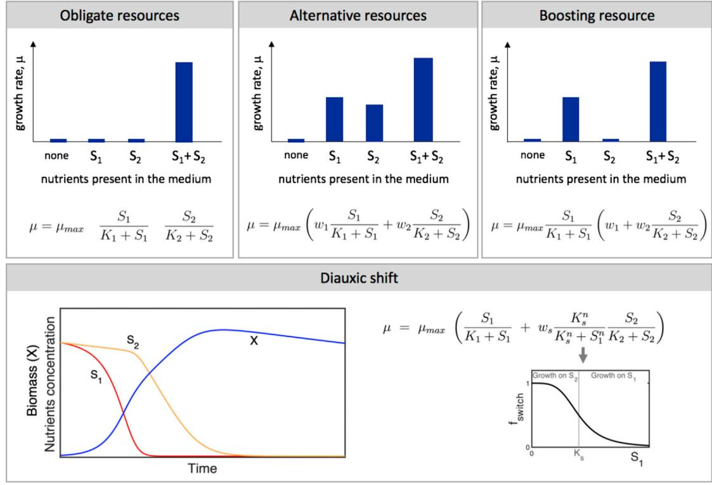
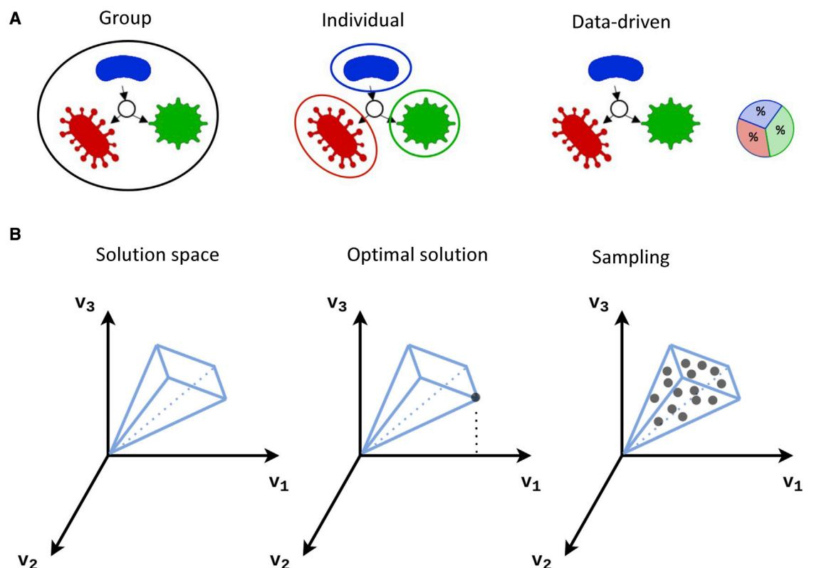
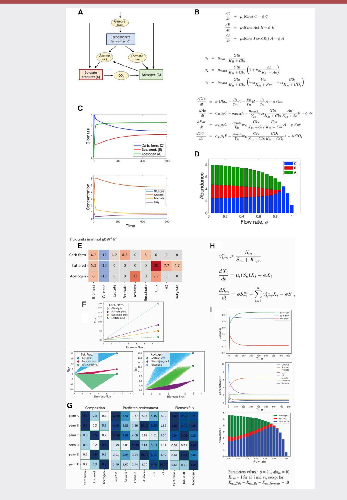
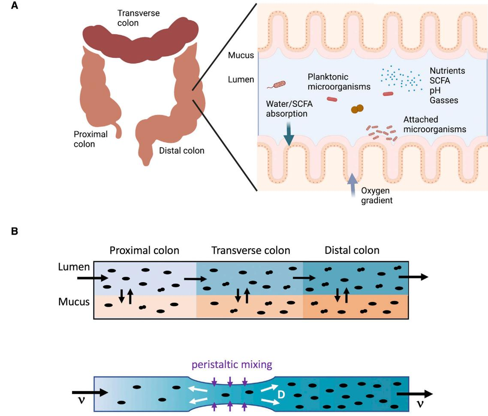
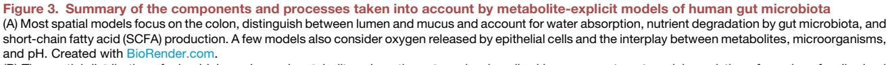

## Metabolic models of human gut microbiota: Advances and challenges

Daniel Rios Garza[,1](#page-0-0) Didier Gonze,[2](#page-0-1) Haris Zafeiropoulos,[3,](#page-0-2)[4](#page-0-3) Bin Liu[,1](#page-0-0) and Karoline Faust[1,](#page-0-0) [*](#page-0-4)

1KU Leuven, Department of Microbiology, Immunology and Transplantation, Rega Institute for Medical Research, Laboratory of Molecular Bacteriology, 3000 Leuven, Belgium

2Unite´ de Chronobiologie The´ orique, Faculte´ des Sciences, CP 231, Universite´ Libre de Bruxelles, Bvd du Triomphe, 1050 Bruxelles, Belgium 3Biology Department, University of Crete, Heraklion 700 13, Greece

4Institute of Marine Biology, Biotechnology and Aquaculture (IMBBC), Hellenic Centre for Marine Research (HCMR), Former U.S. Base of Gournes P.O. Box 2214, 71003, Heraklion, Crete, Greece

*Correspondence: [karoline.faust@kuleuven.be](mailto:karoline.faust@kuleuven.be)

<https://doi.org/10.1016/j.cels.2022.11.002>

#### SUMMARY

The human gut is a complex ecosystem consisting of hundreds of microbial species interacting with each other and with the human host. Mathematical models of the gut microbiome integrate our knowledge of this system and help to formulate hypotheses to explain observations. The generalized Lotka-Volterra model has been widely used for this purpose, but it does not describe interaction mechanisms and thus does not account for metabolic flexibility. Recently, models that explicitly describe gut microbial metabolite production and consumption have become popular. These models have been used to investigate the factors that shape gut microbial composition and to link specific gut microorganisms to changes in metabolite concentrations found in diseases. Here, we review how such models are built and what we have learned so far from their application to human gut microbiome data. In addition, we discuss current challenges of these models and how these can be addressed in the future.

#### WHY DO WE NEED METABOLIC MODELS OF HUMAN GUT MICROBIOTA?

Human gut microorganisms form a complex ecosystem where hundreds of microbial species interact with each other and with the human host. Mathematical models serve to describe this system, to integrate available data, and to make predictions of its behavior in different conditions. Given the importance of cross-feeding and competition in the human gut,[1,](#page-9-0)[2](#page-9-1) mathematical models applied to the human gut ecosystem need to take into account ecological interactions. The most popular interaction-based model is the generalized Lotka-Volterra model (gL[V3,](#page-9-2)[4](#page-10-0) ), which describes the change of species abundances over time as a function of their growth rates and pairwise interactions. The gLV model assumes interaction strengths to be constant. However, ecological interactions can be dynamic. For instance, *Escherichia coli* is known to consume acetate when glucose is depleted.[5](#page-10-1) This switch from one carbon source to another in response to scarcity is known as diauxic shift.[6](#page-10-2) If another gut bacterium supplies acetate, a cross-feeding interaction can take place at low, but not at high, glucose levels. In addition, gut bacteria can change their metabolism in response to interaction partners.[7](#page-10-3) The gLV model, which does not describe interaction mechanisms, cannot account for this metabolic flexibility.

Whether or not metabolites are considered explicitly in community models has implications for the conclusions derived from analytical or numerical studies of such models. For instance, community stability was stated to depend on the number of species and their interactions[8](#page-10-4) and on the proportion of negative versus positive interactions.[9](#page-10-5) Butler and O'Dwyer investigated the stability of communities with a consumerresource model, which describes the community as a set of consumers competing for resources (for instance Bacteroides species competing for carbohydrates). They proved that for this system, any feasible solution (i.e., one with positive abundances for all species) is always stable in the sense of being robust to small perturbations.[10](#page-10-6) This contrasts with the finding that a larger number of species or of interactions in random species interaction matrices increases instability.[8](#page-10-4) Butler and O'Dwyer also included producers, which allowed modeling mutualistic interactions through mutual cross-feeding of resources. In this extended consumer-producer-resource model, mutualistic interactions do not necessarily destabilize the system as in gLV-based models (where they can lead to explosive growth) but can give stable solutions in specific cases.

Modeling metabolites explicitly also matters when predicting system behavior. For instance, Momeni and colleagues showed that the gLV model fails to describe the dynamics of two species competing for one metabolite while cross-feeding a second one.[11](#page-10-7) Finally, metabolic flexibility questions the previously postulated universality of microbial interaction networks,[12](#page-10-8) since it implies that microorganisms can change their interactions depending on the presence of other species. Due to its simplicity, relatively small number of parameters and ease of handling large species numbers, the gLV is widely used to model the dynamics of microbial communities. However, its inability to handle flexible metabolic responses means that in many cases it does not meet

Figure 1. Implementation of nutrient consumption logic in kinetic models

Kinetic models need parameters such as the maximal growth rate mmax and the Monod constant *Ki* for the *i* th substrate. They also require knowledge on whether a nutrient is required (obligate), whether it can be replaced by another (alternative), and, if this is not the case, whether another nutrient can still boost growth. A weight (*wi* ) can be introduced to quantify how much each nutrient contributes to the growth. The lower panel illustrates how kinetic models can implement diauxic shifts. Function *fswitch* expresses the switch from growth on S1 (when S1 is high) to growth on S2 (when S1 goes below threshold *Ks*).

Einstein's famous ''as simple as possible but not simpler'' criterium. Here, we will present metabolite-explicit modeling approaches as alternatives to the gLV model, review the insights resulting from their application to human gut microbiota, and discuss their challenges.

#### HOW DO WE INCLUDE METABOLIC INFORMATION?

Metabolic information can be included at different levels of resolution. Depending on the available data and the question, the internal metabolism of a cell can be modeled explicitly or treated as a black box. Kinetic models follow the latter strategy and simplify the system further by focusing on growth-limiting nutrients. The generic kinetic equation for a microorganism growing on a single growth-limiting substrate in a chemostat is

$$\begin{aligned} \frac{d\mathcal{X}}{dt} &= \mu(\mathbf{S})\mathcal{X} - \Phi \mathcal{X} \\\\ \frac{d\mathbf{S}}{dt} &= -\frac{\mu(\mathbf{S})}{Y_{\chi/\mathbb{S}}} \mathcal{X} + \Phi(\mathbf{S}_h - \mathbf{S}) \end{aligned}$$

where *X* is the biomass, *S* the concentration of the nutrient, m(*S*) the specific growth rate of the organism on the nutrient, *YX*/*S* the yield, f the flow rate, and *Sin* the concentration of the nutrient in the inflowing medium. At high nutrient concentrations, the growth rate is no longer limited by nutrient availability but rather by the speed of the processes involved in cell division or the enzyme-limited rates of biochemical reactions, and thus, the effect of nutrients on the growth rate becomes negligible. This saturation effect is commonly expressed with the Monod function:

$$\mu(\mathbf{S}) = \mu_{\max} \frac{\mathbf{S}}{\mathbf{K} + \mathbf{S}}$$

where *K* is the half saturation constant or Monod constant. When several limiting substrates are present, kinetic models require knowledge on the logic of nutrient use, as described in [Figure 1.](#page-1-0) This logic usually needs to be established through experiments.[7,](#page-10-3)[13](#page-10-9)

The consumer-resource model was first introduced to describe resource competition[14](#page-10-10) and has since been adapted to model production and consumption of metabolites in microbial communities.[15](#page-10-11) It relies on the additivity assumption and can be seen as a simplified kinetic model. As such, it does not fully capture the metabolic logic that characterizes the behavior of many microorganisms but can be scaled up more easily to large communities.

In contrast to kinetic models, which require knowledge on metabolic behavior, the promise of genome-scale metabolic

### **ll**

Figure 2. Microbial communities and optimization in FBA

(A) Community FBA represents ecological interactions between species indirectly through metabolite production and consumption. There are three strategies to optimize flux distributions in communities: by optimizing both individual and group-level growth rates (group), by only optimizing individual growth rates (individual) and by optimizing growth rates such that measured proportions are reproduced (data-driven).

(B) FBA finds the point in the solution space of flux distributions that optimizes an objective function, usually growth rate (i.e., the flux through the artificial biomass reaction). In contrast, flux sampling finds random flux distributions in the solution space, which allows estimating the probability distribution for each of the fluxes.

models (GEMs) is that such knowledge can be derived *ab initio* from the genome. During metabolic reconstruction, enzymecoding genes are identified and linked to reactions, resulting in a stoichiometric matrix A that represents the metabolic network of the cell. While automated metabolic reconstruction can be carried out in minutes (using pipelines such as CarveMe, ModelSEED or gapseq[16–18](#page-10-12)), high-quality metabolic reconstruction requires manual curation that can take months.[19](#page-10-13) In a metabolic network, the rate of change in metabolite concentrations is expressed as a linear equation system:

$$\frac{d\mathbf{S}}{dt} = \mathbf{A}\boldsymbol{\nu}$$

where *S* is the vector of metabolite concentrations, A is the stoichiometric matrix containing stoichiometric factors of substrates and products for each reaction and *v* is a vector of reaction fluxes. Flux balance analysis (FBA) assumes that intracellular metabolites are at steady state, such that their net sum is zero:

$$\frac{d\mathbf{S}}{dt} = \mathbf{A}\mathbf{v} = \mathbf{0}$$

For most metabolic networks, this system contains more unknowns (i.e., fluxes) than equations and has thus an infinite number of solutions. FBA overcomes this challenge by assuming that the cell optimizes fluxes according to certain criteria such as maximizing the production of ATP molecules or the flux through an (artificial) biomass reaction that represents cell growth. These criteria are defined in the objective function (*z*). Additional constrains are given by limiting reaction fluxes to a range that is biologically feasible. A solution is then found by linear programming.

Since standard FBA assumes a steady state, it cannot model situations where nutrient concentrations change, e.g., in batch processes. Dynamic FBA was introduced to overcome this limitation.[20,](#page-10-14)[21](#page-10-15) It describes changes in biomass and substrates with ordinary differential equations (ODEs), which are coupled to static FBA through the growth rate (i.e., flux through the biomass reaction) and substrate production and consumption rates. FBA solutions are computed iteratively for each time step to update these rates. Thus, dynamic FBA can be seen as a combination of FBA and a kinetic model.

FBA was designed for single species, but both static and dynamic forms of FBA have been extended to communities (recently reviewed in Heinken et al.[22](#page-10-16)). As in kinetic models, ecological interactions between species are modeled through nutrient production and consumption, which allows describing commensalism (cross-feeding), mutualism (mutual crossfeeding) and competition. Community FBA approaches can be

classified according to their flux optimization strategy into (1) group, (2) individual, and (3) data-driven approaches ([Figure 2A](#page-2-0)). A straightforward implementation of the first strategy is to select species-specific growth rates such that they maximize a weighted sum across all community members.[23](#page-10-17) A generalization of this idea is to compute the Pareto front by fixing the flux through the biomass reaction of one species while optimizing the flux through that of the other species and vice versa for a range of biomass flux values. The point on the Pareto front giving the largest combined biomass flux corresponds to the Pareto-optimal solution[.24](#page-10-18),[25](#page-10-19) The idea of optimizing the community biomass is also implemented in CASINO[26](#page-10-20) and Steady-Com.[27](#page-10-21) The second group of community FBA tools optimizes the flux distribution of each species independently of the other species, i.e., without a community-level objective function.[28–30](#page-10-22) Finally, tools such as the Microbiome Modeling Toolbox and MICOM optimize growth rates such that observed species proportions are reproduced.[31,](#page-10-23)[32](#page-10-24)

The assumption that the metabolic network optimizes an objective function can also be relaxed. For this, the space of all flux distributions that sustain growth (i.e., have a positive flux through the biomass reaction) can be explored by uniform random sampling,[33](#page-10-25),[34](#page-10-26) as illustrated in [Figure 2](#page-2-0)B.

[Table 1](#page-4-0) summarizes metabolite-explicit modeling techniques that have been applied to human gut microbiota. Three modeling approaches, namely kinetic modeling, dynamic community FBA, and flux sampling, are also illustrated in Box 1 on a toy model featuring three artificial gut bacteria, each representing a different metabolic niche (carbohydrate degrader, butyrate producer, and acetogen).

#### WHAT DID WE LEARN FROM METABOLIC MODELS OF HUMAN GUT MICROBIOTA?

Human gut microbial composition varies along the entire human gastrointestinal tract of each individual.[51](#page-11-0) The small intestine is dominated by bacterial species of the families *Lactobacillaceae* and *Enterobacteriaceae*, [52](#page-11-1) while the colon with slower transit time is enriched in more densely growing and diverse species of the families *Bacteroidaceae*, *Prevotellaceae*, *Rikenellaceae*, *Lachnospiraceae*, and *Ruminococcaceae*, which are capable of breaking down resistant polysaccharides derived either from the insoluble dietary fiber or colon mucus.[51–53](#page-11-0) The gastrointestinal system provides microhabitats, such as the lumen and mucus layer of different sections of the large intestine, which feature distinct microbiota.[54](#page-11-2) [Figure 3](#page-8-0) summarizes the factors shaping gut microbiota that are considered in the models discussed below. Different models emphasize different subsets of these factors.

#### Spatially explicit metabolic models of gut microbiota

The model developed by Mun˜ oz-Tamayo and co-authors takes both longitudinal and cross-sectional spatial structure into account by introducing compartments representing the proximal, transverse, and distal colon, each of which is further divided into mucus and lumen. It describes the dynamics of key metabolites such as short-chain fatty acids (SCFAs), glucose, and gasses as well as the abundances of four functional groups (glucose consumers, lactate consumers, acetogens, and methanogens)

## Perspective

with ODEs. The model also accounts for microbial aggregation, for instance, on food particles and mucus, and absorption of metabolites.[46](#page-11-3) Model predictions agreed with observed ratios of acetate, propionate, and butyrate and reproduced the observed increase in SCFA and gas production with higher levels of fiber.[55](#page-11-4) In addition, the model predicted that microbial aggregation is necessary to reproduce observed high fiber degradation rates and high microbial densities.

Cremer and colleagues investigated the effect of fluid dynamics on microbial densities with a partial differential equation (PDE) model.[56](#page-11-5) The model predicted that contractions of the intestinal walls leading to peristaltic mixing are essential to prevent microbes to be washed out ([Figure 3B](#page-8-0)). This prediction was confirmed with a fluidic channel (''minigut'') that mimicked the effect of peristaltic mixing through membrane valves, thereby demonstrating the importance of peristalsis as a factor shaping gut microbiota. In a next step, the authors modified the model to investigate the role of water absorption and nutrient inflow on the ratio of Firmicutes and Bacteroidetes (now Bacteroidota[57)](#page-11-6). The model also included pH as a function of the concentrations of SCFA.[58](#page-11-7) According to the model, Bacteroidota dominate the gut microbiota at low nutrient inflow and water uptake rates, whereas Firmicutes dominate at high inflow and water uptake rates. High water absorption increases SCFA concentrations and thus lowers the pH, thereby giving Firmicutes an advantage over Bacteroidota that grow less well at low pH. The model reproduced the observed enrichment of Firmicutes in fecal samples with low Bristol stool score (indicating low water content) and vice versa of Bacteroidota in samples with high Bristol stool score.[59](#page-11-8)

Following up on the work of Tamayo et al., Labarthe and colleagues investigated drivers of spatial organization of colon microbiota with a two-dimensional PDE model that distinguished between proximal, transverse, and distal colon as well as mucus and lumen and that considered fluid dynamics (viscosity and flow), peristalsis, absorption of water, and SCFA at the mucosal wall and metabolite concentrations.[60](#page-11-9) The gut microbial community was again divided into four functional groups, including primary fermenters consuming fiber and mucus, lactate consumers, acetogens, and methanogens. The model also accounted for active bacterial motion (swimming). As with the preceding ODE model, the authors were able to reproduce observed microbial densities and SCFA ratios. As expected, the model predicted that a high-fiber diet leads to a peak in microbial activity in the distal colon and higher microbial densities. However, it also predicted higher transit speeds in this case, since fibers accumulating near the epithelial wall reduce water availability. Furthermore, the model underlined the role of the mucus layer in maintaining high microbial densities through mucus-derived metabolites and reduced local flow rates (slowdown zones). The importance of these slowdown zones was illustrated by fluorescently colored mouse gut species observed *in situ*, which reached higher densities closer to the mucus layer.[61](#page-11-10) Furthermore, the model suggested that active swimming of the bacteria enhances carbohydrate consumption.

The models discussed so far do not take the internal metabolism of microbial cells into account. Recently, van Hoek and Merks employed GEMs within a spatially structured (tube-like) environment to investigate the evolution of cross-feeding.[37](#page-10-27)

| Ta ble Su of tab oli lic it ity de l he lie d hu mi bio 1. te- to t ta mm ary me ex p co mm un mo ap pro ac s ap p ma n gu cro                                                                                                                                                                                                                                                                                                                                                                                                                                                                                                                                            |                                                                                                                                                                                                                                                                                                                                                                                                                                                                                                                                                                                                         |                                                                                                                                                                                                                                                                                                                                                                                                                                                                                                                                                                                                                                                                                                                                                                                                                                                                                      |                                                                                                                                                                                                                                                                                                                                                            |                                                                                                                                                                                                                                                                                                                                                                       |
|---------------------------------------------------------------------------------------------------------------------------------------------------------------------------------------------------------------------------------------------------------------------------------------------------------------------------------------------------------------------------------------------------------------------------------------------------------------------------------------------------------------------------------------------------------------------------------------------------------------------------------------------------------------------------------------------------------------------------------------------------------------------------------------------------|---------------------------------------------------------------------------------------------------------------------------------------------------------------------------------------------------------------------------------------------------------------------------------------------------------------------------------------------------------------------------------------------------------------------------------------------------------------------------------------------------------------------------------------------------------------------------------------------------------|--------------------------------------------------------------------------------------------------------------------------------------------------------------------------------------------------------------------------------------------------------------------------------------------------------------------------------------------------------------------------------------------------------------------------------------------------------------------------------------------------------------------------------------------------------------------------------------------------------------------------------------------------------------------------------------------------------------------------------------------------------------------------------------------------------------------------------------------------------------------------------------|------------------------------------------------------------------------------------------------------------------------------------------------------------------------------------------------------------------------------------------------------------------------------------------------------------------------------------------------------------|-----------------------------------------------------------------------------------------------------------------------------------------------------------------------------------------------------------------------------------------------------------------------------------------------------------------------------------------------------------------------|
| Mo de l inp ut d tpu t an ou                                                                                                                                                                                                                                                                                                                                                                                                                                                                                                                                                                                                                                                                                                                                           | Wh at lea fro the de l ca n we rn m mo                                                                                                                                                                                                                                                                                                                                                                                                                                                                                                                              | To ols                                                                                                                                                                                                                                                                                                                                                                                                                                                                                                                                                                                                                                                                                                                                                                                                                                                                            | Co ts mm en                                                                                                                                                                                                                                                                                                                                       | Ma in lim itat ion s                                                                                                                                                                                                                                                                                                                                   |
| Flu ba lan aly sis x ce an Inp ich iom ic trix ies ut: sto etr a ma pe r sp ec tin its tab olis nst rai nts rep res en g me m; co flu diu de fin itio on xe s; me m n Ou flu dis trib uti of ch ies tpu t: x on ea sp ec tim izin ob jec tiv fun cti for op g an e on , flu of dy mic FB A: dis trib uti ch na x on ea ies (op tim al tim int) at nt sp ec cu rre e po d tab olit tio tim tra an me e co nc en ns ov er e | ind ivid l h ad wt rat at ste sta te d ua gro es y d ult ing ity itio an res co mm un co mp os n for ive diu a g n me m int al flu du cti d d ern xe s, pro on an co n tio d al tab rat ext su mp n es an ern me o lite tio de rive d fro the tra co nc en ns m se dy mic FB A: ity dy mic d na co mm un na s | 27) Ste ad Co (s ic FB A tat d y m 26) CA SIN O ( bi- lev el tim iza tio d op n ( Mi bio Mo de ling To olb Pa ret cro d me ox o tim alit d fit ob d ab to op y an se rve un  31) da nc es MI CO M (op tim iza tio fit ob d to d n se rve es) ab da un nc Ba cA d CO ME TS ( dy mic FB A d ren a an na 28,3 5) id on a gr Bia lSi d DM MM (op tim iza tio of d m an n m of ch ies ind de ntly the ea sp ec ep en 29,3 0) oth in dy mic FB A ers a na | be be dd ed in d ca n em ati al str uct a sp ure 36 (e. Ch et al. d g., an an 37) Ho ek d Me rks an                                                                                                                                                           | de nd ct d pe s on co rre cti ion tat rea on an no s de nd d pe s on an ob jec tiv fun cti e on dy mic FB A uir d na req es kin eti ete c pa ram rs                                                                         |
| Sa ling -ba sed he mp ap pro ac s Inp ich iom ic trix ies ut: sto etr a ma pe r sp ec tin its tab olis ies rep res en g me m, sp ec O ab da wt h rat for MA MB un nc es or gro es Ou of ssi ble flu dis trib uti tpu t: set a po x on s fro the lut ion m so sp ac e                                                                                                                                                                                                                                                                                       | hig h ba bili flu dis trib uti ty d pro x on s de of inty of FB A dic tio rta d gre e ce pre ns tab olo tha be lain the t st d me me ex p s ( O) ies dis trib uti MA MB sp ec on                                                                                                                                                                                                                                                         | 38 tG Sa ler d op p mp 39 CH RR d MA MB O (sa les flu fit to d mp xe s ob d ies ab da to se rve sp ec un nc es pre  40) dic tab olit tio t tra me e co nc en n                                                                                                                                                                                                                                                                                                                                                                                                                                                                                                                                                              | oft lied sin le to d en ap p g ies sp ec inc lud ific d ma e sp ec y (e. rio sce na s g., dis trib uti tha be t st on lain rim tal ly ex p s ex pe en 41 d h es) wt rat me as ure gro | de nd ct d pe on co rre cti ion tat rea on an no s tio lly uta d co mp na ch alle ing ng de nd ire d d pe on pa tab olit d me e an itio da for ta co mp os n ( O) lida tio MA MB va n         |
| Co de l ns um er- res ou rce mo of Inp ut: trix tak d du cti pro ma up e an on rat for ch tab olit ies es ea me e pe r sp ec , h init ial tab olit wt rat gro es me e , tio d ies ab da tra co nc en ns an sp ec un nc es Ou mic rob ial ab da d tpu t: un nc es an tra tio of tab olit tim co nc en ns me es ov er e                                                                                                                                                                                   | dic tio of ity itio d pre n co mm un co mp os n d tab olit tra tio an me e co nc en ns                                                                                                                                                                                                                                                                                                                                                                                                                                    | hic de l (co led tro d p mo up co ns um er 42) de ls res rce ou mo 15 ity sim ula tor d co mm un                                                                                                                                                                                                                                                                                                                                                                                                                                                                                                                                                                                                                                                                                              | stly d alit ati ly d mo use qu ve 10 (e. O' Bu tle d Dw r r g., an ye 43) d Nie ha et al. an us ial of the d sp ec ca se kin eti de l c mo                                                                                | de nd bio ch ica l d pe s on em of kno wle dg ch e ea ies fun cti al sp ec or on gro up uir kin eti d req es c ete pa ram rs do t tak int d es no e o tab olic t ac co un me fle xib ility |
| Kin eti de l c mo Inp ut: kno wle dg tia l d e on ess en an bo ost ing trie nts d tab olit nu an me e du cti h init ial wt rat pro on gro es , , tab olit tio d ies tra me e co nc en ns an sp ec ab da un nc es Ou tpu t: mic rob ial ab da d un nc es an tio of key tab olit tra co nc en ns me es tim ov er e                                                                                                                                                                                              | dic tio of ity itio d pre n co mm un co mp os n d tab olit tra tio an me e co nc en ns                                                                                                                                                                                                                                                                                                                                                                                                                                    | mic roP ( kin eti de l of fun cti al d op c mo on 44) in hu t mic rob iot gro up s ma n gu a 45 ati al ext sio of mic roP d sp en n op                                                                                                                                                                                                                                                                                                                                                                                                                                                                                                                                                                                                                 | be be dd ed in d ca n em ati al str uct a sp ure thr h art nts ou g co mp me rtia l dif fer tia l or pa en ion (e. Mu n˜ uat eq s g., oz  46) Ta et al. ma yo                                           | de nd bio ch ica l d pe s on em of kno wle dg ch e ea ies fun cti al sp ec or on gro up uir kin eti d req es c ete pa ram rs do t t for d es no ac co un int al flu ern xe s                        |
| To log ica l tab olic de l po me mo Inp tab olic rk of ch ies ut: net me wo ea sp ec Ou d (m bo lite tpu t: set eta t see s no rk) du d by the net for ch pro ce wo ea ism be d to ute org an ; ca n use co mp int cti tia l ten era on po                                                                                                                                                                                                                                                                                                                                      | dic tio of dia ing h ort wt d pre n me su pp gro dic tio of fee din d d pre n cro ss- g an etit ive rel ati sh ips fro ta co mp on m me bo lic lem tar ity erl co mp en or ov ap ide ntifi tio of key ies ing d ca n sp ec ca rry bo ttle ck cti t ou ne rea on s                                                                                                   | Ne tC d Ne tC (co t rat ute d mp an oo pe e mp etit ive d tiv tia l, ten co mp an co op era e po 47,4 8) cti ly res pe ve 49 Me tag e2 Me tab d o                                                                                                                                                                                                                                                                                                                                                                                                                                                                                                                                                                                             | lied in mb ina tio d ap p co n wit h to co -oc cu rre nc e fec al ics tag me en om da ta to ass ess len of ha bit at pre va ce 50 filt eri ng                                                                                | tita tiv d no qu an e dic tio pre ns                                                                                                                                                                                                                                                                                                    |

The list of tools given for each modeling approach is not exhaustive.

Cell Systems

*14*, February 15, 2023

113

They created ''metabacteria,'' which combine pathways from different gut bacterial species, and simulated evolution by stepwise deletion and reintroduction of reactions. They found that metabacteria with initially the same metabolism specialize to take on different metabolic roles and stratify spatially and that this niche specialization is lost with faster transit time. Thus, faster transit time reduces microbial diversity, which agrees with results from cohort studies (e.g., Vandeputte et al[.62](#page-11-16)). Chan and coworkers embedded GEMs within a spatial structure to explore the effect of oxygen on the distribution of aerobes and anaerobes in the mucus and lumen of different intestinal sections, which vary in oxygen availability.[36](#page-10-47) They applied SteadyCom, a static FBA tool,[27](#page-10-21) to model microbial metabolism in the mucus and DMMM (dynamic multi-species metabolic modeling), a form of dynamic FBA[,30](#page-10-48) for the changing conditions in the lumen. In their simulated five-species community, *Corynebacterium glutamicum* was only present in luminal and mucosal communities of the small intestine, which agrees with a previous report of its absence in fecal samples.[63](#page-11-17) Spatially embedded GEMs are also applied to predict the outcome of perturbations. For example, CODY (computing the dynamics of the gut microbiota) was developed to predict the effects of dietary interventions on gut microbiota.[64](#page-11-18) CODY combines three connected models that represent the gut bacterial metabolism (enzymecentric metabolic framework or ECMF), the interactions between gut bacteria (hierarchical resource allocation framework or HRAF), and the spatial structure of the gut (spatial compartmentalized framework or SPCF), respectively. To build the ECMF, GEMs of eight bacterial species were simplified by extracting feasible metabolic pathway modules, which were then combined with a regulation layer that allows simulated gut bacteria to switch between pathway modules depending on conditions. The SPCF models the spatial structure of the gut with a series of compartments representing different colon sections as well as lumen and mucus and also accounts for water absorption, microbial detachment, and peristaltic mixing. ECMF and SPCF are connected through the HRAF, which first distributes dietary carbohydrates to species according to their local abundances and then generates degradation products with the ECMF, accounting for microbial interactions through metabolite exchange. CODY successfully predicts changes in both fecal microbial abundances and plasma metabolite concentrations in two dietary intervention cohorts.

#### Metabolic models of gut microbiota without spatial structure

Several metabolite-explicit modeling approaches do not account for spatial structure and instead model the human gut microbiota as a well-stirred system.

Kinetic models are predominantly applied *in vitro*, where it is easier to obtain time series of metabolite concentrations and biomass needed to derive uptake, consumption, and growth rates. Kinetic models can have a purely descriptive function, for instance to model the conversion of lactate and acetate to butyrate and bacterial biomass,[65](#page-11-19) but they can also be predictive. This was tested for several synthetic gut communities,[7](#page-10-3)[,66](#page-11-20)[,67](#page-11-21) where a kinetic model parameterized on monocultures was used to predict community dynamics. However, this approach failed for a community consisting of *Faecalibacterium*

## Perspective

*prausnitzii*, *Roseburia intestinalis*, and *Blautia hydrogenotrophica*, which needed data from species pairs to reproduce community dynamics[.7](#page-10-3) Transcriptomics confirmed that these gut bacteria alter their metabolism in the presence of interaction partners. In addition, community composition and consequently butyrate production depended sensitively on initial conditions.

Going a step further, Kettle and co-authors applied a kinetic model to a complex gut community, i.e., a bioreactor inoculated with a fecal slurry.[68](#page-11-22) Species were assigned to ten functional groups based on their main substrates and/or products (e.g., lactate producers, acetogens, etc.). Each functional group was instantiated with ten strains that took random values for the kinetic parameters within given limits. In a form of parameter screening, the authors then performed 100 simulations to find strain combinations that led to functional group abundances and metabolite concentrations close to those observed in the bioreactor. The authors then simulated perturbations and compared resulting biomass and metabolite concentrations to the experimental data. For instance, they found that Bacteroides dominates the community at high (6.5) pH, but not at lower (5.5) pH. They also predicted that omitting the functional group of Bacteroides results in an increase in butyrate. In addition, when decreasing the number of strains per functional group, the variability of strain abundances and metabolite concentrations increased, which is interesting since disease-associated gut communities often have fewer species[69](#page-11-23) and are more variable[70](#page-11-24) than healthy ones. In a next step, Wang and colleagues applied the kinetic model of Kettle and colleagues to interpret observations in continuous bioreactors seeded with fecal slurries from different donors and supplied with lactate.[71](#page-11-25) To reproduce experimental findings, the model needed to be extended with an inhibitory effect of lactate on all functional groups except lactate producers. This growth inhibition was confirmed experimentally for several gut bacterial species in monoculture at low (5.5) pH and suggests an important role of lactate producers and consumers in the human gut ecosystem.

In another study, several consumer-resource models, each one specific to a ''trophic level,'' were combined to model complex gut microbial communities.[42](#page-10-49) The trophic levels correspond to primary, secondary, and tertiary fermentation. In primary fermentation, polysaccharides are degraded to monosaccharides and acids, which are then converted by secondary fermenters to SCFAs. Acetogens, sulfate-reducing bacteria and methanogens, which grow on the byproducts of secondary fermenters, are considered as tertiary fermenters. The species-metabolite matrices for each level were taken from a gut microbial interaction network compiled from the literature,[2](#page-9-1) and a number of simplifying assumptions were made to fill in uptake and consumption rates. Each level produces metabolites that are fed to the next level, but metabolites and species can appear on more than one level. The trophic model requires microbial abundances derived from sequencing data to know which species are present in each level and then predicts the metabolites that remain after nutrients have passed through several levels. After having varied the number of trophic levels in the model, the authors concluded that four such levels lead to the best

agreement of predicted metabolites with fecal metabolomics data.

In contrast to kinetic models, constraint-based models such as FBA do not require parameters when assuming steady-state conditions, but they often require abundance data to compute flux distributions in the community (see the data-driven approach in [Figure 2A](#page-2-0)). Constraint-based models have been applied to data from several disease cohorts to link changes in metabolite profiles to gut microbial species. For instance, the Microbiome Modeling Toolbox was employed to construct metabolic community models for 31 Parkinson's disease patients and 28 age-matched controls,[72](#page-11-26) using the AGORA collection of semi-automatically generated metabolic reconstructions of human gut bacteria.[73](#page-11-27) These models predicted an overrepresentation of sulfur metabolites in Parkinson's disease, which was matched by an observed increase in metabolites involved in the transsulfuration pathway. Transsulfuration is involved in the production of taurine-conjugated bile acids, which are associated with reduced motor skills. In the metabolic models, *Akkermansia muciniphila* and *Bilophila wadsworthia* were significant contributors to hydrogen sulfide and sulfite secretion, respectively. Based on these results, Hertel and colleagues proposed that gut bacteria remove taurine from conjugated bile acids, thereby modulating the severity of Parkinson's disease. In another example, Garza and coworkers used metabolomics data from colorectal cancer (CRC) patients to identify gut bacteria that have a growth advantage in CRC patients.[74](#page-11-28) For this, a basal gut medium was first derived from stool metagenomes with MAMBO[40](#page-10-50) and 29 metabolites enriched in CRC were removed one by one from this medium to explore their effect on growth *in silico*. The growth of bacterial genera observed to be enriched in CRC was predicted to be significantly affected by the removal of CRC metabolites but not of random metabolites. Thus, GEMs helped to unravel mechanisms connecting gut microbiota to diseases.

#### WHAT ARE THE CHALLENGES OF METABOLIC MODELS?

The construction of GEMs comes with several challenges. Many-to-many relationships between genes and functions (e.g., isoenzymes and multifunctional enzymes) make it hard to identify the correct set of genome-encoded reactions. For GEMs to accurately recapitulate microbial metabolism and predict growth rates, the chemical composition of the environment (medium) needs to be known and the biomass reaction needs to reflect the cell's composition correctly. Obtaining such measurements is work intensive and not possible for uncultured microbes. In addition, the assumption often made in FBA that evolution has led to the maximization of growth rates may not always be true.[75](#page-11-29) For example, some cells may invest in slower growth but higher yield.[76](#page-11-30) Furthermore, environmental factors such as pH or osmotic pressure are difficult to account for in GEMs.[77](#page-11-31) In communities, objective functions are particularly challenging to define. Optimizing the objective function of each species independently from the others is not suited for mutualistic relationships, where partners have co-evolved to optimize a combined metabolic network, or for instances of group selection e.g., in host-associated communities. Strategies that jointly optimize objective functions of different species handle these cases better, but they do so at the cost of being unable to accurately describe exploitative relationships, where a species grows at the expense of another even if that lowers the overall biomass. As we have seen, some tools circumvent this dilemma by optimizing the objective function to reproduce observed species abundances, but that also means that they can no longer predict community composition for a given set of species. Contrary to FBA, flux sampling does not depend on an objective function. However, the distribution of fluxes during microbial growth is the result of evolutionary processes, which may not be accurately predicted from uniformly sampling the flux space.

#### Box 1. Toy model

To illustrate different metabolite-explicit modeling approaches, we consider simplified representatives of three functional groups found in human gut microbiota, namely a carbohydrate fermenter, an acetogen, and a butyrate producer, which are co-cultured in chemostat (A). They all require and thus compete for glucose, which is continuously supplied to the chemostat. The carbohydrate fermenter produces acetate and formate, the former of which is consumed by the butyrate producer and the latter by the acetogen. In addition, the acetogen and the butyrate producer mutually cross-feed: the acetogen produces acetate that boosts the growth of the butyrate producer, while the latter releases carbon dioxide (and hydrogen), which provides an alternative to formate as obligatory second carbon source for the acetogen.

This system can be described with a kinetic model in the form of ODEs (B). The growth equations are based on the generic equations given in [Figure 1.](#page-1-0) In the equations for the compounds, we introduced the substrate-to-biomass yields (*Y)* as well as the rates at which compounds are produced by growing bacteria (a). Numerical integration of these ODEs gives the dynamics of each variable (C). The kinetic model can also be used to predict species abundances as a function of control parameters, e.g., the flow rate (D). Parameter values are given in [Table S1](#page-9-3).

GEMs allow investigating intracellular fluxes. To demonstrate this, we designed simplified metabolic networks for each species ([Figure S1](#page-9-3)). The optimal steady-state fluxes (E) are computed with flux balance analysis given ATP production, NAD+ recycling, and coenzyme A (CoA) acetylation as toy biomass objective functions [(Table S2](#page-9-3)), while possible flux distributions are explored with flux sampling (F). MAMBO[40](#page-10-50) can be used to predict the scaled biomass fluxes and metabolic environment for six different compositions of the three species (G). Dynamic flux balance analysis (H) describes the change of species abundances and metabolite concentrations over time (I), which in this toy system are qualitatively similar to those found with the kinetic model (D). However, the growth rates and metabolite interdependencies emerge from the reconstructed networks.

*(Continued on next page)*

#### Box 1. Continued

Perspective

(B) The spatial distribution of microbial species and metabolites along the gut can be described by a compartment model consisting of a series of well-mixed bioreactors. Each compartment can be further divided into lumen and mucus. Peristaltic mixing (white arrows) generated by contractions of colonic walls induces a backflow preventing washout due to the continuous flow through the gut (black arrows). When the peristaltic-induced diffusion D is large enough and the flow rate n not too high, a stable spatial profile of bacterial density (reflected by the blue gradient) can be established.

Nevertheless, working with flux distributions instead of a single solution accounts better for the observed variability of fluxes[,78](#page-11-32) and novel methods may be devised to obtain flux distributions that accurately reflect experimental data.[41](#page-10-51) Finally, FBA and flux sampling approaches can only model metabolite-mediated ecological interactions. They are not designed to handle interference competition through direct killing mechanisms (such as type VI secretion systems) or to model predation or parasitism. Thus, constraint-based modeling techniques do not cover the whole range of ecological interactions.

Kinetic models avoid the challenges posed by GEM construction and objective functions and make it easier to include ecological interactions that are not mediated by metabolites. However, they require more system knowledge in the form of the equation structure and kinetic parameters, which are difficult to measure, in particular *in vivo*. The former requirement is illustrated with the toy model in Box 1; whereas the equations of the kinetic model had to be defined manually, this was not necessary for dynamic FBA, where metabolic behavior, ecological interactions and the resulting community dynamics were obtained directly from the species' metabolic networks and generic equations for metabolite production and consumption. Furthermore, the equations in kinetic models are often over-simplistic, covering only a part of the metabolic capability of a species and may thus not generalize when conditions change. For example, based on monoculture experiments,[79](#page-11-33) a kinetic model could represent a Bacteroides species with equations for carbohydrate consumption and production of a number of fermentation products such as acetate, lactate, succinate, and formate. However, its metabolic network suggests that an external supply of CO2 would allow Bacteroides to reduce more fumarate to succinate,[80](#page-11-34) so that it no longer needs to produce lactate. If other bacteria depend on lactate as energy source, then CO2 would change the dynamics. It is an open question how to take advantage of the knowledge

encoded in the metabolic network without the unrealistic assumptions introduced by FBA. One approach is coarse-graining the metabolic network into a much smaller set of key reactions, which retain the metabolic flexibility of the system and can still fit the available experimental data. The system can be described and simulated by a set of deterministic or stochastic ODEs. For a first approximation, one may focus on the central carbon and energy pathways, collapsing linear pathways into single equations while retaining their substrates and products. We illustrate this on a coarse-grained approximation to the toy model illustrated in Box 1 ([Figure S2)](#page-9-3).

Both kinetic and constraint-based metabolic models can describe heterogeneity on the population level through individual-based modeling, which is for instance implemented in GutLogo[81](#page-11-35) and BacArena.[35](#page-10-52) In contrast to GEMs, kinetic or coarse-grained models can also be implemented as stochastic models that account for molecular noise,[82](#page-11-36) as shown in the example ([Figure S2](#page-9-3) and [Table S3](#page-9-3)).

Metabolite-explicit community models are challenging to validate comprehensively. It is straightforward to compare predictions of fecal microbial composition and metabolite concentrations to measurements. However, species abundances predicted for different colon segments or the effect of the removal of a functional group are harder to confirm. The hardest predictions to test are those of species-specific uptake and consumption rates as well as internal fluxes in a community context. Kinetic parameters are usually obtained from measurements in monoculture and may change in a community. Although metatranscriptomics indicates which pathways are active in which species, enzyme expression levels are not equivalent to fluxes and do not provide uptake or consumption rates. Although reaction rates can be measured at the community level (e.g., acetogenesis), resolving each species' contribution to these rates is one of the great challenges in microbial ecology. Advances in single-cell technologies, in particular Raman microspectroscopy,[83](#page-11-37) offer new tools to tackle this problem. For instance, Chisanga and colleagues were able to derive the kinetics of substrate uptake in *Escherichia coli* with both Raman and Fourier transform infrared spectroscopy by measuring spectral shifts in single cells *in vivo*. [84](#page-11-38) It may be possible to extend this approach to communities.

When validation data are scarce, there is a risk of overfitting. It is of note that despite their substantial differences in assumptions and structure, several models were able to predict metabolite concentrations in fecal samples. This may be due to overfitting, which would imply that the structure of these models is not as informative as we hope it to be. A model with many parameters increases the risk of overfitting, and thus the complexity of a metabolic model should be adapted both to its purpose and the available data. In the absence of sufficient data, a black box approach to the prediction of fecal metabolites from sequencing data such as MelonnPan[85](#page-12-0) may be more appropriate than a complex metabolic model with a large number of untested assumptions. If species identity is not important to the research question, then models aggregating species by function or phylogeny are a good way to reduce complexity. However, the successful use of a therapeutic consortium may sensitively depend on the abundances of particular species being present, and thus, in clinical applications, a species-level metabolic model may be necessary.

It is an open question whether metabolic models can generate the complex dynamics that is occasionally observed experimentally, such as multi-stability,[86](#page-12-1) oscillations or chaos.[87](#page-12-2) The stable marriage model integrates metabolic information in an original manner by considering a matrix of metabolite preferences per microorganism and a matrix of microorganisms ranked by their consumption rate per metabolite. Given these rankings, the model identifies stable pairs (''marriages'') of microbes and metabolites.[88](#page-12-3) This model was applied to seven Bacteroides species growing on nine polysaccharides. Interestingly, the authors found species subsets resulting in up to five different stable states and thus the stable marriage model can easily generate multi-stability. If a microbial community displays complex behavior, constraint-based modeling approaches assuming steady-state conditions are not suitable. However, dynamic FBA can reproduce such behavior. For instance, bistability occurred in simulations with a dynamic FBA model of a two-species system (*Bacteroides thetaiotaomicron* and *Klebsiella pneumoniae*) and was confirmed experimentally.[86](#page-12-1) It remains to be seen whether other complex dynamics, e.g., oscillations in gut microbiota linked to circadian rhythms,[89](#page-12-4) can be reproduced with GEMs.

Finally, even the most complex metabolite-explicit models discussed here omit a number of biological components known to be relevant *in vivo*, such as the immune system, which interacts with gut microorganisms e.g., through antimicrobial peptides and antibodies,[90](#page-12-5) or the role of gut bacteriophages.[91](#page-12-6) Extending models to take these factors into account is a further challenge.

In conclusion, several metabolite-explicit models have been developed that account for a number of phenomena shaping human gut microbiota, which led to interesting biological hypotheses and findings. However, these models still face challenges concerning construction, parameterization, and validation that represent exciting topics for future research.

#### SUPPLEMENTAL INFORMATION

Supplemental information can be found online at [https://doi.org/10.1016/j.](https://doi.org/10.1016/j.cels.2022.11.002) [cels.2022.11.002](https://doi.org/10.1016/j.cels.2022.11.002).

#### ACKNOWLEDGMENTS

This work was supported by funding from the European Research Council (ERC) under the European Union's Horizon 2020 research and innovation program under grant agreement no. 801747.

#### DECLARATION OF INTERESTS

The authors declare no competing interests.

#### REFERENCES

- 1. [Louis, P., Hold, G.L., and Flint, H.J. (2014). The gut microbiota, bacterial](http://refhub.elsevier.com/S2405-4712(22)00437-9/sref1) [metabolites and colorectal cancer. Nat. Rev. Microbiol.](http://refhub.elsevier.com/S2405-4712(22)00437-9/sref1) *12*, 661–672.
- 2. [Sung, J., Kim, S., Cabatbat, J.J.T., Jang, S., Jin, Y.-S., Jung, G.Y., Chia,](http://refhub.elsevier.com/S2405-4712(22)00437-9/sref2) [N., and Kim, P.J. (2017). Global metabolic interaction network of the hu](http://refhub.elsevier.com/S2405-4712(22)00437-9/sref2)[man gut microbiota for context-specific community-scale analysis. Nat.](http://refhub.elsevier.com/S2405-4712(22)00437-9/sref2) [Commun.](http://refhub.elsevier.com/S2405-4712(22)00437-9/sref2) *8*, 15393.
- 3. [Lotka, A.J. (1925). Elements of Physical Biology (Williams and Wilkins)](http://refhub.elsevier.com/S2405-4712(22)00437-9/sref3).

- 4. [Volterra, V. (1926). Fluctuations in the abundance of a species considered](http://refhub.elsevier.com/S2405-4712(22)00437-9/sref4) [mathematically. Nature](http://refhub.elsevier.com/S2405-4712(22)00437-9/sref4) *118*, 558–560.
- 5. [Enjalbert, B., Cocaign-Bousquet, M., Portais, J.C., and Letisse, F. (2015).](http://refhub.elsevier.com/S2405-4712(22)00437-9/sref5) [Acetate exposure determines the diauxic behavior of](http://refhub.elsevier.com/S2405-4712(22)00437-9/sref5) *Escherichia coli* dur[ing the glucose-acetate transition. J. Bacteriol.](http://refhub.elsevier.com/S2405-4712(22)00437-9/sref5) *197*, 3173–3181.
- 6. [Monod, J. (1949). The growth of bacterial cultures. Annu. Rev. Microbiol.](http://refhub.elsevier.com/S2405-4712(22)00437-9/sref6) *3*[, 371–394](http://refhub.elsevier.com/S2405-4712(22)00437-9/sref6).
- 7. [D'hoe, K., Vet, S., Faust, K., Moens, F., Falony, G., Gonze, D., Llore´](http://refhub.elsevier.com/S2405-4712(22)00437-9/sref7) ns-[Rico, V., Gelens, L., Danckaert, J., De Vuyst, L., and Raes, J. (2018). Inte](http://refhub.elsevier.com/S2405-4712(22)00437-9/sref7)[grated culturing, modeling and transcriptomics uncovers complex interac](http://refhub.elsevier.com/S2405-4712(22)00437-9/sref7)[tions and emergent behavior in a three-species synthetic gut community.](http://refhub.elsevier.com/S2405-4712(22)00437-9/sref7) eLife *7*[, e37090.](http://refhub.elsevier.com/S2405-4712(22)00437-9/sref7)
- 8. [May, R.M. (1972). Will a large complex system be stable? Nature](http://refhub.elsevier.com/S2405-4712(22)00437-9/sref8) *238*, [413–414.](http://refhub.elsevier.com/S2405-4712(22)00437-9/sref8)
- 9. [Coyte, K.Z., Schluter, J., and Foster, K.R. (2015). The ecology of the micro](http://refhub.elsevier.com/S2405-4712(22)00437-9/sref9)[biome: networks, competition, and stability. Science](http://refhub.elsevier.com/S2405-4712(22)00437-9/sref9) *350*, 663–666.
- 10. [Butler, S., and O'Dwyer, J.P. (2018). Stability criteria for complex microbial](http://refhub.elsevier.com/S2405-4712(22)00437-9/sref10) [communities. Nat. Commun.](http://refhub.elsevier.com/S2405-4712(22)00437-9/sref10) *9*, 2970.
- 11. [Momeni, B., Xie, L., and Shou, W. (2017). Lotka-Volterra pairwise modeling](http://refhub.elsevier.com/S2405-4712(22)00437-9/sref11) [fails to capture diverse pairwise microbial interactions. eLife](http://refhub.elsevier.com/S2405-4712(22)00437-9/sref11) *6*, e25051.
- 12. [Bashan, A., Gibson, T.E., Friedman, J., Carey, V.J., Weiss, S.T., Hohmann,](http://refhub.elsevier.com/S2405-4712(22)00437-9/sref12) [E.L., and Liu, Y.Y. (2016). Universality of human microbial dynamics. Na](http://refhub.elsevier.com/S2405-4712(22)00437-9/sref12)ture *534*[, 259–262](http://refhub.elsevier.com/S2405-4712(22)00437-9/sref12).
- 13. [Schmidt, J.K., Riedele, C., Regestein, L., Rausenberger, J., and Reichl, U.](http://refhub.elsevier.com/S2405-4712(22)00437-9/sref13) [(2011). A novel concept combining experimental and mathematical anal](http://refhub.elsevier.com/S2405-4712(22)00437-9/sref13)[ysis for the identification of unknown interspecies effects in a mixed cul](http://refhub.elsevier.com/S2405-4712(22)00437-9/sref13)[ture. Biotechnol. Bioeng.](http://refhub.elsevier.com/S2405-4712(22)00437-9/sref13) *108*, 1900–1911.
- 14. [MacArthur, R.H. (1970). Species packing and competitive equilibrium for](http://refhub.elsevier.com/S2405-4712(22)00437-9/sref14) [many species. Theor. Popul. Biol.](http://refhub.elsevier.com/S2405-4712(22)00437-9/sref14) *1*, 1–11.
- 15. [Marsland, R., Cui, W., Goldford, J., and Mehta, P. (2020). The community](http://refhub.elsevier.com/S2405-4712(22)00437-9/sref15) [simulator: a Python package for microbial ecology. PLOS One](http://refhub.elsevier.com/S2405-4712(22)00437-9/sref15) *15*, [e0230430.](http://refhub.elsevier.com/S2405-4712(22)00437-9/sref15)
- 16. [Machado, D., Andrejev, S., Tramontano, M., and Patil, K.R. (2018). Fast](http://refhub.elsevier.com/S2405-4712(22)00437-9/sref16) [automated reconstruction of genome-scale metabolic models for microbi](http://refhub.elsevier.com/S2405-4712(22)00437-9/sref16)[al species and communities. Nucleic Acids Res.](http://refhub.elsevier.com/S2405-4712(22)00437-9/sref16) *46*, 7542–7553.
- 17. [Seaver, S.M.D., Liu, F., Zhang, Q., Jeffryes, J., Faria, J.P., Edirisinghe,](http://refhub.elsevier.com/S2405-4712(22)00437-9/sref17) [J.N., Mundy, M., Chia, N., Noor, E., Beber, M.E., et al. (2021). The](http://refhub.elsevier.com/S2405-4712(22)00437-9/sref17) [ModelSEED Biochemistry Database for the integration of metabolic anno](http://refhub.elsevier.com/S2405-4712(22)00437-9/sref17)[tations and the reconstruction, comparison and analysis of metabolic](http://refhub.elsevier.com/S2405-4712(22)00437-9/sref17) [models for plants, fungi and microbes. Nucleic Acids Res.](http://refhub.elsevier.com/S2405-4712(22)00437-9/sref17) *49*, D575–D588.
- 18. [Zimmermann, J., Kaleta, C., and Waschina, S. (2021). gapseq: informed](http://refhub.elsevier.com/S2405-4712(22)00437-9/sref18) [prediction of bacterial metabolic pathways and reconstruction of accurate](http://refhub.elsevier.com/S2405-4712(22)00437-9/sref18) [metabolic models. Genome Biol.](http://refhub.elsevier.com/S2405-4712(22)00437-9/sref18) *22*, 81.
- 19. [Thiele, I., and Palsson, B.Ø. (2010). A protocol for generating a high-quality](http://refhub.elsevier.com/S2405-4712(22)00437-9/sref19) [genome-scale metabolic reconstruction. Nat. Protoc.](http://refhub.elsevier.com/S2405-4712(22)00437-9/sref19) *5*, 93–121.
- 20. [Mahadevan, R., Edwards, J.S., and Doyle, F.J., 3rd (2022). Dynamic flux](http://refhub.elsevier.com/S2405-4712(22)00437-9/sref20) [balance analysis of diauxic growth in](http://refhub.elsevier.com/S2405-4712(22)00437-9/sref20) *Escherichia coli*. Biophys. J. *83*, [1331–1340](http://refhub.elsevier.com/S2405-4712(22)00437-9/sref20).
- 21. [Henson, M.A., and Hanly, T.J. (2014). Dynamic flux balance analysis for](http://refhub.elsevier.com/S2405-4712(22)00437-9/sref21) [synthetic microbial communities. IET Syst. Biol.](http://refhub.elsevier.com/S2405-4712(22)00437-9/sref21) *8*, 214–229.
- 22. [Heinken, A., Basile, A., and Thiele, I. (2021). Advances in constraint-based](http://refhub.elsevier.com/S2405-4712(22)00437-9/sref22) [modelling of microbial communities. Curr. Opin. Syst. Biol.](http://refhub.elsevier.com/S2405-4712(22)00437-9/sref22) *27*, 100346.
- 23. [Stolyar, S., Van Dien, S.V., Hillesland, K.L., Pinel, N., Lie, T.J., Leigh, J.A.,](http://refhub.elsevier.com/S2405-4712(22)00437-9/sref23) [and Stahl, D.A. (2007). Metabolic modeling of a mutualistic microbial com](http://refhub.elsevier.com/S2405-4712(22)00437-9/sref23)[munity. Mol. Syst. Biol.](http://refhub.elsevier.com/S2405-4712(22)00437-9/sref23) *3*, 92.
- 24. [Budinich, M., Bourdon, J., Larhlimi, A., and Eveillard, D. (2017). A multi](http://refhub.elsevier.com/S2405-4712(22)00437-9/sref24)[objective constraint-based approach for modeling genome-scale microbi](http://refhub.elsevier.com/S2405-4712(22)00437-9/sref24)[al ecosystems. PLoS One](http://refhub.elsevier.com/S2405-4712(22)00437-9/sref24) *12*, e0171744.
- 25. [Heinken, A., Sahoo, S., Fleming, R.M.T., and Thiele, I. (2013). Systems](http://refhub.elsevier.com/S2405-4712(22)00437-9/sref25)[level characterization of a host-microbe metabolic symbiosis in the](http://refhub.elsevier.com/S2405-4712(22)00437-9/sref25) [mammalian gut. Gut Microbes](http://refhub.elsevier.com/S2405-4712(22)00437-9/sref25) *4*, 28–40.
- 26. [Shoaie, S., Ghaffari, P., Kovatcheva-Datchary, P., Mardinoglu, A., Sen, P.,](http://refhub.elsevier.com/S2405-4712(22)00437-9/sref26) [Pujos-Guillot, E., de Wouters, T., Juste, C., Rizkalla, S., Chilloux, J., et al.](http://refhub.elsevier.com/S2405-4712(22)00437-9/sref26) [(2015). Quantifying diet-induced metabolic changes of the human gut mi](http://refhub.elsevier.com/S2405-4712(22)00437-9/sref26)[crobiome. Cell Metab.](http://refhub.elsevier.com/S2405-4712(22)00437-9/sref26) *22*, 320–331.
- 27. [Chan, S.H.J., Simons, M.N., and Maranas, C.D. (2017). SteadyCom: pre](http://refhub.elsevier.com/S2405-4712(22)00437-9/sref27)[dicting microbial abundances while ensuring community stability. PLoS](http://refhub.elsevier.com/S2405-4712(22)00437-9/sref27) [Comput. Biol.](http://refhub.elsevier.com/S2405-4712(22)00437-9/sref27) *13*, e1005539.
- 28. [Dukovski, I., Bajic](http://refhub.elsevier.com/S2405-4712(22)00437-9/sref28), D., Chaco ´ [n, J.M., Quintin, M., Vila, J.C.C., Sulheim, S.,](http://refhub.elsevier.com/S2405-4712(22)00437-9/sref28) [Pacheco, A.R., Bernstein, D.B., Riehl, W.J., Korolev, K.S., et al. (2021). A](http://refhub.elsevier.com/S2405-4712(22)00437-9/sref28) [metabolic modeling platform for the computation of microbial ecosystems](http://refhub.elsevier.com/S2405-4712(22)00437-9/sref28) [in time and space (COMETS). Nat. Protoc.](http://refhub.elsevier.com/S2405-4712(22)00437-9/sref28) *16*, 5030–5082.
- 29. Popp, D., and Centler, F. (2020). m[BialSim: constraint-based dynamic](http://refhub.elsevier.com/S2405-4712(22)00437-9/sref29) [simulation of complex microbiomes. Front. Bioeng. Biotechnol.](http://refhub.elsevier.com/S2405-4712(22)00437-9/sref29) *8*, 574.
- 30. [Zhuang, K., Izallalen, M., Mouser, P., Richter, H., Risso, C., Mahadevan,](http://refhub.elsevier.com/S2405-4712(22)00437-9/sref30) [R., and Lovley, D.R. (2011). Genome-scale dynamic modeling of the](http://refhub.elsevier.com/S2405-4712(22)00437-9/sref30) [competition between Rhodoferax and Geobacter in anoxic subsurface en](http://refhub.elsevier.com/S2405-4712(22)00437-9/sref30)[vironments. ISME J.](http://refhub.elsevier.com/S2405-4712(22)00437-9/sref30) *5*, 305–316.
- 31. [Baldini, F., Heinken, A., Heirendt, L., Magnusdottir, S., Fleming, R.M.T.,](http://refhub.elsevier.com/S2405-4712(22)00437-9/sref31) [and Thiele, I. (2019). The microbiome modeling toolbox: from microbial in](http://refhub.elsevier.com/S2405-4712(22)00437-9/sref31)[teractions to personalized microbial communities. Bioinformatics](http://refhub.elsevier.com/S2405-4712(22)00437-9/sref31) *35*, [2332–2334](http://refhub.elsevier.com/S2405-4712(22)00437-9/sref31).
- 32. [Diener, C., Gibbons, S.M., and Resendis-Antonio, O. (2020). MICOM:](http://refhub.elsevier.com/S2405-4712(22)00437-9/sref32) [metagenome-scale modeling to infer metabolic interactions in the gut mi](http://refhub.elsevier.com/S2405-4712(22)00437-9/sref32)[crobiota. mSystems](http://refhub.elsevier.com/S2405-4712(22)00437-9/sref32) *5*, e00606-19.
- 33. [Herrmann, H.A., Dyson, B.C., Vass, L., Johnson, G.N., and Schwartz, J.-](http://refhub.elsevier.com/S2405-4712(22)00437-9/sref33) [M. (2019). Flux sampling is a powerful tool to study metabolism under](http://refhub.elsevier.com/S2405-4712(22)00437-9/sref33) [changing environmental conditions. npj Syst. Biol. Appl.](http://refhub.elsevier.com/S2405-4712(22)00437-9/sref33) *5*, 32.
- 34. [Schellenberger, J., and Palsson, B.Ø. (2009). Use of randomized sampling](http://refhub.elsevier.com/S2405-4712(22)00437-9/sref34) [for analysis of metabolic networks. J. Biol. Chem.](http://refhub.elsevier.com/S2405-4712(22)00437-9/sref34) *284*, 5457–5461.
- 35. [Bauer, E., Zimmermann, J., Baldini, F., Thiele, I., and Kaleta, C. (2017). Ba](http://refhub.elsevier.com/S2405-4712(22)00437-9/sref82)[cArena: individual-based metabolic modeling of heterogeneous microbes](http://refhub.elsevier.com/S2405-4712(22)00437-9/sref82) [in complex communities. PLoS Comput. Biol.](http://refhub.elsevier.com/S2405-4712(22)00437-9/sref82) *13*, e1005544.
- 36. [Chan, S.H.J., Friedman, E.S., Wu, G.D., and Maranas, C.D. (2019). Pre](http://refhub.elsevier.com/S2405-4712(22)00437-9/sref36)[dicting the longitudinally and radially varying gut microbiota composition](http://refhub.elsevier.com/S2405-4712(22)00437-9/sref36) [using multi-scale microbial metabolic modeling. Processes](http://refhub.elsevier.com/S2405-4712(22)00437-9/sref36) *7*, 394.
- 37. [Hoek, M.J.A.V., and Merks, R.M.H. (2017). Emergence of microbial diver](http://refhub.elsevier.com/S2405-4712(22)00437-9/sref37)[sity due to cross-feeding interactions in a spatial model of gut microbial](http://refhub.elsevier.com/S2405-4712(22)00437-9/sref37) [metabolism. BMC Syst. Biol.](http://refhub.elsevier.com/S2405-4712(22)00437-9/sref37) *11*, 56.
- 38. [Megchelenbrink, W., Huynen, M., and Marchiori, E. (2014). optGpSampler:](http://refhub.elsevier.com/S2405-4712(22)00437-9/sref38) [an improved tool for uniformly sampling the solution-space of genome](http://refhub.elsevier.com/S2405-4712(22)00437-9/sref38)[scale metabolic networks. PLoS One](http://refhub.elsevier.com/S2405-4712(22)00437-9/sref38) *9*, e86587.
- 39. Haraldsdo´ [ttir, H.S., Cousins, B., Thiele, I., Fleming, R.M.T., and Vempala,](http://refhub.elsevier.com/S2405-4712(22)00437-9/sref39) [S. (2017). CHRR: coordinate hit-and-run with rounding for uniform sam](http://refhub.elsevier.com/S2405-4712(22)00437-9/sref39)[pling of constraint-based models. Bioinformatics](http://refhub.elsevier.com/S2405-4712(22)00437-9/sref39) *33*, 1741–1743.
- 40. [Garza, D.R., van Verk, M.C.v., Huynen, M.A., and Dutilh, B.E. (2018). To](http://refhub.elsevier.com/S2405-4712(22)00437-9/sref40)[wards predicting the environmental metabolome from metagenomics](http://refhub.elsevier.com/S2405-4712(22)00437-9/sref40) [with a mechanistic model. Nat. Microbiol.](http://refhub.elsevier.com/S2405-4712(22)00437-9/sref40) *3*, 456–460.
- 41. [De Martino, D., Mc Andersson, A., Bergmiller, T., Guet, C.C., and Tkacik,](http://refhub.elsevier.com/S2405-4712(22)00437-9/sref41) [G. (2018). Statistical mechanics for metabolic networks during steady](http://refhub.elsevier.com/S2405-4712(22)00437-9/sref41) [state growth. Nat. Commun.](http://refhub.elsevier.com/S2405-4712(22)00437-9/sref41) *9*, 2988.
- 42. [Wang, T., Goyal, A., Dubinkina, V., and Maslov, S. (2019). Evidence for a](http://refhub.elsevier.com/S2405-4712(22)00437-9/sref42) [multi-level trophic organization of the human gut microbiome. PLoS Com](http://refhub.elsevier.com/S2405-4712(22)00437-9/sref42)put. Biol. *15*[, e1007524](http://refhub.elsevier.com/S2405-4712(22)00437-9/sref42).
- 43. [Niehaus, L., Boland, I., Liu, M., Chen, K., Fu, D., Henckel, C., Chaung, K.,](http://refhub.elsevier.com/S2405-4712(22)00437-9/sref43) [Miranda, S.E., Dyckman, S., Crum, M., et al. (2019). Microbial coexistence](http://refhub.elsevier.com/S2405-4712(22)00437-9/sref43) [through chemical-mediated interactions. Nat. Commun.](http://refhub.elsevier.com/S2405-4712(22)00437-9/sref43) *10*, 2052.
- 44. [Kettle, H., Holtrop, G., Louis, P., and Flint, H.J. (2018). microPop: model](http://refhub.elsevier.com/S2405-4712(22)00437-9/sref44)[ling microbial populations and communities in R. Methods Ecol. Evol.](http://refhub.elsevier.com/S2405-4712(22)00437-9/sref44) *9*, [399–409](http://refhub.elsevier.com/S2405-4712(22)00437-9/sref44).
- 45. [Smith, N.W., Shorten, P.R., Altermann, E., Roy, N.C., and McNabb, W.C.](http://refhub.elsevier.com/S2405-4712(22)00437-9/sref45) [(2021). Examination of hydrogen cross-feeders using a colonic microbiota](http://refhub.elsevier.com/S2405-4712(22)00437-9/sref45) [model. BMC Bioinformatics](http://refhub.elsevier.com/S2405-4712(22)00437-9/sref45) *22*, 3.

### **ll**

### **ll**

- 46. Mun˜ [oz-Tamayo, R., Laroche, B., Walter, E., Dore´](http://refhub.elsevier.com/S2405-4712(22)00437-9/sref46) , J., and Leclerc, M. [(2010). Mathematical modelling of carbohydrate degradation by human](http://refhub.elsevier.com/S2405-4712(22)00437-9/sref46) [colonic microbiota. J. Theor. Biol.](http://refhub.elsevier.com/S2405-4712(22)00437-9/sref46) *266*, 189–201.
- 47. [Kreimer, A., Doron-Faigenboim, A., Borenstein, E., and Freilich, S. (2012).](http://refhub.elsevier.com/S2405-4712(22)00437-9/sref47) [NetCmpt: a network-based tool for calculating the metabolic competition](http://refhub.elsevier.com/S2405-4712(22)00437-9/sref47) [between bacterial species. Bioinformatics](http://refhub.elsevier.com/S2405-4712(22)00437-9/sref47) *28*, 2195–2197.
- 48. [Levy, R., Carr, R., Kreimer, A., Freilich, S., and Borenstein, E. (2015). Net-](http://refhub.elsevier.com/S2405-4712(22)00437-9/sref48)[Cooperate: a network-based tool for inferring host-microbe and microbe](http://refhub.elsevier.com/S2405-4712(22)00437-9/sref48)[microbe cooperation. BMC Bioinformatics](http://refhub.elsevier.com/S2405-4712(22)00437-9/sref48) *16*, 164.
- 49. [Belcour, A., Frioux, C., Aite, M., Bretaudeau, A., Hildebrand, F., and Siegel,](http://refhub.elsevier.com/S2405-4712(22)00437-9/sref49) [A. (2020). Metage2Metabo, microbiota-scale metabolic complementarity](http://refhub.elsevier.com/S2405-4712(22)00437-9/sref49) [for the identification of key species. eLife](http://refhub.elsevier.com/S2405-4712(22)00437-9/sref49) *9*, e61968.
- 50. [Levy, R., and Borenstein, E. (2013). Metabolic modeling of species interac](http://refhub.elsevier.com/S2405-4712(22)00437-9/sref50)[tion in the human microbiome elucidates community-level assembly rules.](http://refhub.elsevier.com/S2405-4712(22)00437-9/sref50) [Proc. Natl. Acad. Sci. USA](http://refhub.elsevier.com/S2405-4712(22)00437-9/sref50) *110*, 12804–12809.
- 51. [Zhang, Z., Geng, J., Tang, X., Fan, H., Xu, J., Wen, X., Ma, Z.S., and Shi, P.](http://refhub.elsevier.com/S2405-4712(22)00437-9/sref51) [(2014). Spatial heterogeneity and co-occurrence patterns of human](http://refhub.elsevier.com/S2405-4712(22)00437-9/sref51) [mucosal-associated intestinal microbiota. ISME J.](http://refhub.elsevier.com/S2405-4712(22)00437-9/sref51) *8*, 881–893.
- 52. [Donaldson, G.P., Lee, S.M., and Mazmanian, S.K. (2016). Gut biogeog](http://refhub.elsevier.com/S2405-4712(22)00437-9/sref52)[raphy of the bacterial microbiota. Nat. Rev. Microbiol.](http://refhub.elsevier.com/S2405-4712(22)00437-9/sref52) *14*, 20–32.
- 53. [Sauvaitre, T., Etienne-Mesmin, L., Sivignon, A., Mosoni, P., Courtin, C.M.,](http://refhub.elsevier.com/S2405-4712(22)00437-9/sref53) [Van de Wiele, T.V.d., and Blanquet-Diot, S. (2021). Tripartite relationship](http://refhub.elsevier.com/S2405-4712(22)00437-9/sref53) [between gut microbiota, intestinal mucus and dietary fibers: towards pre](http://refhub.elsevier.com/S2405-4712(22)00437-9/sref53)[ventive strategies against enteric infections. FEMS Microbiol. Rev.](http://refhub.elsevier.com/S2405-4712(22)00437-9/sref53) *45*, [fuaa052](http://refhub.elsevier.com/S2405-4712(22)00437-9/sref53).
- 54. [Tropini, C., Earle, K.A., Huang, K.C., and Sonnenburg, J.L. (2017). The gut](http://refhub.elsevier.com/S2405-4712(22)00437-9/sref54) [microbiome: connecting spatial organization to function. Cell Host](http://refhub.elsevier.com/S2405-4712(22)00437-9/sref54) Microbe *21*[, 433–442](http://refhub.elsevier.com/S2405-4712(22)00437-9/sref54).
- 55. [Topping, D.L., and Clifton, P.M. (2001). Short-chain fatty acids and human](http://refhub.elsevier.com/S2405-4712(22)00437-9/sref55) [colonic function: roles of resistant starch and nonstarch polysaccharides.](http://refhub.elsevier.com/S2405-4712(22)00437-9/sref55) [Physiol. Rev.](http://refhub.elsevier.com/S2405-4712(22)00437-9/sref55) *81*, 1031–1064.
- 56. [Cremer, J., Segota, I., Yang, C.Y., Arnoldini, M., Sauls, J.T., Zhang, Z., Gu](http://refhub.elsevier.com/S2405-4712(22)00437-9/sref56)[tierrez, E., Groisman, A., and Hwa, T. (2016). Effect of flow and peristaltic](http://refhub.elsevier.com/S2405-4712(22)00437-9/sref56) [mixing on bacterial growth in a gut-like channel. Proc. Natl. Acad. Sci. USA](http://refhub.elsevier.com/S2405-4712(22)00437-9/sref56) *113*[, 11414–11419.](http://refhub.elsevier.com/S2405-4712(22)00437-9/sref56)
- 57. Oren, A., and Garrity, G.M. (2021). Valid publication of the names of fortytwo phyla of prokaryotes. Int. J. Syst. Evol. Microbiol. *71*. [https://doi.org/](https://doi.org/10.1099/ijsem.0.005056) [10.1099/ijsem.0.005056](https://doi.org/10.1099/ijsem.0.005056).
- 58. [Cremer, J., Arnoldini, M., and Hwa, T. (2017). Effect of water flow and](http://refhub.elsevier.com/S2405-4712(22)00437-9/sref58) [chemical environment on microbiota growth and composition in the hu](http://refhub.elsevier.com/S2405-4712(22)00437-9/sref58)[man colon. Proc. Natl. Acad. Sci. USA](http://refhub.elsevier.com/S2405-4712(22)00437-9/sref58) *114*, 6438–6443.
- 59. [Falony, G., Joossens, M., Vieira-Silva, S., Wang, J., Darzi, Y., Faust, K.,](http://refhub.elsevier.com/S2405-4712(22)00437-9/sref59) [Kurilshikov, A., Bonder, M.J., Valles-Colomer, M., Vandeputte, D., et al.](http://refhub.elsevier.com/S2405-4712(22)00437-9/sref59) [(2016). Population-level analysis of gut microbiome variation. Science](http://refhub.elsevier.com/S2405-4712(22)00437-9/sref59) *352*[, 560–564.](http://refhub.elsevier.com/S2405-4712(22)00437-9/sref59)
- 60. [Labarthe, S., Polizzi, B., Phan, T., Goudon, T., Ribot, M., and Laroche, B.](http://refhub.elsevier.com/S2405-4712(22)00437-9/sref60) [(2019). A mathematical model to investigate the key drivers of the bioge](http://refhub.elsevier.com/S2405-4712(22)00437-9/sref60)[ography of the colon microbiota. J. Theor. Biol.](http://refhub.elsevier.com/S2405-4712(22)00437-9/sref60) *462*, 552–581.
- 61. [Mark Welch, J.L.M., Hasegawa, Y., McNulty, N.P., Gordon, J.I., and](http://refhub.elsevier.com/S2405-4712(22)00437-9/sref61) [Borisy, G.G. (2017). Spatial organization of a model 15-member human](http://refhub.elsevier.com/S2405-4712(22)00437-9/sref61) [gut microbiota established in gnotobiotic mice. Proc. Natl. Acad. Sci.](http://refhub.elsevier.com/S2405-4712(22)00437-9/sref61) USA *114*[, E9105–E9114.](http://refhub.elsevier.com/S2405-4712(22)00437-9/sref61)
- 62. [Vandeputte, D., Falony, G., Vieira-Silva, S., Tito, R.Y., Joossens, M., and](http://refhub.elsevier.com/S2405-4712(22)00437-9/sref62) [Raes, J. (2016). Stool consistency is strongly associated with gut micro](http://refhub.elsevier.com/S2405-4712(22)00437-9/sref62)[biota richness and composition, enterotypes and bacterial growth rates.](http://refhub.elsevier.com/S2405-4712(22)00437-9/sref62) Gut *65*[, 57–62](http://refhub.elsevier.com/S2405-4712(22)00437-9/sref62).
- 63. [Albenberg, L., Esipova, T.V., Judge, C.P., Bittinger, K., Chen, J., Laughlin,](http://refhub.elsevier.com/S2405-4712(22)00437-9/sref63) [A., Grunberg, S., Baldassano, R.N., Lewis, J.D., Li, H., et al. (2014). Corre](http://refhub.elsevier.com/S2405-4712(22)00437-9/sref63)[lation between intraluminal oxygen gradient and radial partitioning of in](http://refhub.elsevier.com/S2405-4712(22)00437-9/sref63)[testinal microbiota. Gastroenterology](http://refhub.elsevier.com/S2405-4712(22)00437-9/sref63) *147*. 1055–63.e8.
- 64. Geng, J., Ji, B., Li, G., Lo´ [pez-Isunza, F., and Nielsen, J. (2021). CODY en](http://refhub.elsevier.com/S2405-4712(22)00437-9/sref64)[ables quantitatively spatiotemporal predictions on](http://refhub.elsevier.com/S2405-4712(22)00437-9/sref64) *in vivo* gut microbial [variability induced by diet intervention. Proc. Natl. Acad. Sci. USA](http://refhub.elsevier.com/S2405-4712(22)00437-9/sref64) *118*. [e2019336118.](http://refhub.elsevier.com/S2405-4712(22)00437-9/sref64)

- 65. Mun˜ [oz-Tamayo, R., Laroche, B., Walter, E., Dore´](http://refhub.elsevier.com/S2405-4712(22)00437-9/sref65) , J., Duncan, S.H., Flint, [H.J., and Leclerc, M. (2011). Kinetic modelling of lactate utilization and](http://refhub.elsevier.com/S2405-4712(22)00437-9/sref65) [butyrate production by key human colonic bacterial species. FEMS Micro](http://refhub.elsevier.com/S2405-4712(22)00437-9/sref65)[biol. Ecol.](http://refhub.elsevier.com/S2405-4712(22)00437-9/sref65) *76*, 615–624.
Perspective

- 66. [Pinto, F., Medina, D.A., Pe´rez-Correa, J.R., and Garrido, D. (2017).](http://refhub.elsevier.com/S2405-4712(22)00437-9/sref66) [Modeling metabolic interactions in a consortium of the infant gut micro](http://refhub.elsevier.com/S2405-4712(22)00437-9/sref66)[biome. Front. Microbiol.](http://refhub.elsevier.com/S2405-4712(22)00437-9/sref66) *8*, 2507.
- 67. [Van Wey, A.S.V., Cookson, A.L., Roy, N.C., McNabb, W.C., Soboleva,](http://refhub.elsevier.com/S2405-4712(22)00437-9/sref67) [T.K., and Shorten, P.R. (2014). Monoculture parameters successfully pre](http://refhub.elsevier.com/S2405-4712(22)00437-9/sref67)[dict coculture growth kinetics of Bacteroides thetaiotaomicron and two Bi](http://refhub.elsevier.com/S2405-4712(22)00437-9/sref67)[fidobacterium strains. Int. J. Food Microbiol.](http://refhub.elsevier.com/S2405-4712(22)00437-9/sref67) *191*, 172–181.
- 68. [Kettle, H., Louis, P., Holtrop, G., Duncan, S.H., and Flint, H.J. (2015).](http://refhub.elsevier.com/S2405-4712(22)00437-9/sref68) [Modelling the emergent dynamics and major metabolites of the human](http://refhub.elsevier.com/S2405-4712(22)00437-9/sref68) [colonic microbiota. Environ. Microbiol.](http://refhub.elsevier.com/S2405-4712(22)00437-9/sref68) *17*, 1615–1630.
- 69. [Mosca, A., Leclerc, M., and Hugot, J.P. (2016). Gut microbiota diversity](http://refhub.elsevier.com/S2405-4712(22)00437-9/sref69) [and human diseases: should we reintroduce key predators in our](http://refhub.elsevier.com/S2405-4712(22)00437-9/sref69) [ecosystem? Front. Microbiol.](http://refhub.elsevier.com/S2405-4712(22)00437-9/sref69) *7*, 455.
- 70. [Zaneveld, J.R., McMinds, R., and Vega Thurber, R.V. (2017). Stress and](http://refhub.elsevier.com/S2405-4712(22)00437-9/sref70) [stability: applying the Anna Karenina principle to animal microbiomes.](http://refhub.elsevier.com/S2405-4712(22)00437-9/sref70) [Nat. Microbiol.](http://refhub.elsevier.com/S2405-4712(22)00437-9/sref70) *2*, 1721.
- 71. [Wang, S.P., Rubio, L.A., Duncan, S.H., Donachie, G.E., Holtrop, G., Lo, G.,](http://refhub.elsevier.com/S2405-4712(22)00437-9/sref71) [Farquharson, F.M., Wagner, J., Parkhill, J., Louis, P., et al. (2020). Pivotal](http://refhub.elsevier.com/S2405-4712(22)00437-9/sref71) [roles for pH, lactate, and lactate-utilizing bacteria in the stability of a hu](http://refhub.elsevier.com/S2405-4712(22)00437-9/sref71)[man colonic microbial ecosystem. mSystems](http://refhub.elsevier.com/S2405-4712(22)00437-9/sref71) *5*, e00645-20.
- 72. [Hertel, J., Harms, A.C., Heinken, A., Baldini, F., Thinnes, C.C., Glaab, E.,](http://refhub.elsevier.com/S2405-4712(22)00437-9/sref72) [Vasco, D.A., Pietzner, M., Stewart, I.D., Wareham, N.J., et al. (2019). Inte](http://refhub.elsevier.com/S2405-4712(22)00437-9/sref72)[grated analyses of microbiome and longitudinal metabolome data reveal](http://refhub.elsevier.com/S2405-4712(22)00437-9/sref72) [microbial-host interactions on sulfur metabolism in Parkinson's disease.](http://refhub.elsevier.com/S2405-4712(22)00437-9/sref72) Cell Rep. *29* [1767–1777.e8.](http://refhub.elsevier.com/S2405-4712(22)00437-9/sref72)
- 73. Magnu´ sdo´ [ttir, S., Heinken, A., Kutt, L., Ravcheev, D.A., Bauer, E., Noro](http://refhub.elsevier.com/S2405-4712(22)00437-9/sref73)[nha, A., Greenhalgh, K., Jager, C., Baginska, J., Wilmes, P., et al. (2017).](http://refhub.elsevier.com/S2405-4712(22)00437-9/sref73) € [Generation of genome-scale metabolic reconstructions for 773 members](http://refhub.elsevier.com/S2405-4712(22)00437-9/sref73) [of the human gut microbiota. Nat. Biotechnol.](http://refhub.elsevier.com/S2405-4712(22)00437-9/sref73) *35*, 81–89.
- 74. [Garza, D.R., Taddese, R., Wirbel, J., Zeller, G., Boleij, A., Huynen, M.A.,](http://refhub.elsevier.com/S2405-4712(22)00437-9/sref74) [and Dutilh, B.E. (2020). Metabolic models predict bacterial passengers](http://refhub.elsevier.com/S2405-4712(22)00437-9/sref74) [in colorectal cancer. Cancer Metab.](http://refhub.elsevier.com/S2405-4712(22)00437-9/sref74) *8*, 3.
- 75. Segre` [, D., Vitkup, D., and Church, G.M. (2002). Analysis of optimality in](http://refhub.elsevier.com/S2405-4712(22)00437-9/sref75) [natural and perturbed metabolic networks. Proc. Natl. Acad. Sci. USA](http://refhub.elsevier.com/S2405-4712(22)00437-9/sref75) *99*[, 15112–15117](http://refhub.elsevier.com/S2405-4712(22)00437-9/sref75).
- 76. [Wortel, M.T., Noor, E., Ferris, M., Bruggeman, F.J., and Liebermeister, W.](http://refhub.elsevier.com/S2405-4712(22)00437-9/sref76) [(2018). Metabolic enzyme cost explains variable trade-offs between mi](http://refhub.elsevier.com/S2405-4712(22)00437-9/sref76)[crobial growth rate and yield. PLoS Comput. Biol.](http://refhub.elsevier.com/S2405-4712(22)00437-9/sref76) *14*, e1006010.
- 77. [Bernstein, D.B., Sulheim, S., Almaas, E., and Segre`](http://refhub.elsevier.com/S2405-4712(22)00437-9/sref77) , D. (2021). Addressing [uncertainty in genome-scale metabolic model reconstruction and anal](http://refhub.elsevier.com/S2405-4712(22)00437-9/sref77)[ysis. Genome Biol.](http://refhub.elsevier.com/S2405-4712(22)00437-9/sref77) *22*, 64.
- 78. [Wintermute, E.H., Lieberman, T.D., and Silver, P.A. (2013). An objective](http://refhub.elsevier.com/S2405-4712(22)00437-9/sref78) [function exploiting suboptimal solutions in metabolic networks. BMC](http://refhub.elsevier.com/S2405-4712(22)00437-9/sref78) [Syst. Biol.](http://refhub.elsevier.com/S2405-4712(22)00437-9/sref78) *7*, 98.
- 79. [Porter, N.T., and Larsbrink, J. (2022). Investigation and alteration of](http://refhub.elsevier.com/S2405-4712(22)00437-9/sref79) [organic acid synthesis pathways in the mammalian gut symbiont Bacter](http://refhub.elsevier.com/S2405-4712(22)00437-9/sref79)[oides thetaiotaomicron. Microbiol. Spectr.](http://refhub.elsevier.com/S2405-4712(22)00437-9/sref79) *10*, e0231221.
- 80. [Fischbach, M.A., and Sonnenburg, J.L. (2011). Eating for two: how meta](http://refhub.elsevier.com/S2405-4712(22)00437-9/sref80)[bolism establishes interspecies interactions in the gut. Cell Host Microbe](http://refhub.elsevier.com/S2405-4712(22)00437-9/sref80) *10*[, 336–347.](http://refhub.elsevier.com/S2405-4712(22)00437-9/sref80)
- 81. [Lin, C., Culver, J., Weston, B., Underhill, E., Gorky, J., and Dhurjati, P.](http://refhub.elsevier.com/S2405-4712(22)00437-9/sref81) [(2018). GutLogo: agent-based modeling framework to investigate spatial](http://refhub.elsevier.com/S2405-4712(22)00437-9/sref81) [and temporal dynamics in the gut microbiome. PLoS One](http://refhub.elsevier.com/S2405-4712(22)00437-9/sref81) *13*, e0207072.
- 82. [Lecca, P. (2013). Stochastic chemical kinetics: a review of the modelling](http://refhub.elsevier.com/S2405-4712(22)00437-9/sref83) [and simulation approaches. Biophys. Rev.](http://refhub.elsevier.com/S2405-4712(22)00437-9/sref83) *5*, 323–345.
- 83. [Hatzenpichler, R., Krukenberg, V., Spietz, R.L., and Jay, Z.J. (2020). Next](http://refhub.elsevier.com/S2405-4712(22)00437-9/sref84)[generation physiology approaches to study microbiome function at single](http://refhub.elsevier.com/S2405-4712(22)00437-9/sref84) [cell level. Nat. Rev. Microbiol.](http://refhub.elsevier.com/S2405-4712(22)00437-9/sref84) *18*, 241–256.
- 84. [Chisanga, M., Muhamadali, H., McDougall, D., Xu, Y., Lockyer, N., and](http://refhub.elsevier.com/S2405-4712(22)00437-9/sref85) [Goodacre, R. (2021). Metabolism in action: stable isotope probing using](http://refhub.elsevier.com/S2405-4712(22)00437-9/sref85)

[vibrational spectroscopy and SIMS reveals kinetic and metabolic flux of](http://refhub.elsevier.com/S2405-4712(22)00437-9/sref85) [key substrates. Analyst](http://refhub.elsevier.com/S2405-4712(22)00437-9/sref85) *146*, 1734–1746.

- 85. [Mallick, H., Franzosa, E.A., Mclver, L.J., Banerjee, S., Sirota-Madi, A.,](http://refhub.elsevier.com/S2405-4712(22)00437-9/sref86) [Kostic, A.D., Clish, C.B., Vlamakis, H., Xavier, R.J., and Huttenhower, C.](http://refhub.elsevier.com/S2405-4712(22)00437-9/sref86) [(2019). Predictive metabolomic profiling of microbial communities using](http://refhub.elsevier.com/S2405-4712(22)00437-9/sref86) [amplicon or metagenomic sequences. Nat. Commun.](http://refhub.elsevier.com/S2405-4712(22)00437-9/sref86) *10*, 3136.
- 86. [Khazaei, T., Williams, R.L., Bogatyrev, S.R., Doyle, J.C., Henry, C.S., and](http://refhub.elsevier.com/S2405-4712(22)00437-9/sref87) [Ismagilov, R.F. (2020). Metabolic multistability and hysteresis in a model](http://refhub.elsevier.com/S2405-4712(22)00437-9/sref87) [aerobe-anaerobe microbiome community. Sci. Adv.](http://refhub.elsevier.com/S2405-4712(22)00437-9/sref87) *6*, eaba0353.
- 87. [Beck, A.E., Hunt, K.A., and Carlson, R.P. (2018). Measuring cellular](http://refhub.elsevier.com/S2405-4712(22)00437-9/sref88) [biomass composition for computational biology applications. Processes](http://refhub.elsevier.com/S2405-4712(22)00437-9/sref88) *6*[, 38](http://refhub.elsevier.com/S2405-4712(22)00437-9/sref88).
- 88. [Goyal, A., Dubinkina, V., and Maslov, S. (2018). Multiple stable states in](http://refhub.elsevier.com/S2405-4712(22)00437-9/sref89) [microbial communities explained by the stable marriage problem. ISME](http://refhub.elsevier.com/S2405-4712(22)00437-9/sref89) J. *12*[, 2823–2834](http://refhub.elsevier.com/S2405-4712(22)00437-9/sref89).
- 89. [Rosselot, A.E., Hong, C.I., and Moore, S.R. (2016). Rhythm and bugs:](http://refhub.elsevier.com/S2405-4712(22)00437-9/sref90) [circadian clocks, gut microbiota, and enteric infections. Curr. Opin. Gas](http://refhub.elsevier.com/S2405-4712(22)00437-9/sref90)[troenterol.](http://refhub.elsevier.com/S2405-4712(22)00437-9/sref90) *32*, 7–11.
- 90. [Zheng, D., Liwinski, T., and Elinav, E. (2020). Interaction between](http://refhub.elsevier.com/S2405-4712(22)00437-9/sref91) [microbiota and immunity in health and disease. Cell Res.](http://refhub.elsevier.com/S2405-4712(22)00437-9/sref91) *30*, [492–506](http://refhub.elsevier.com/S2405-4712(22)00437-9/sref91).
- 91. [Sausset, R., Petit, M.A., Gaboriau-Routhiau, V., and De Paepe, M.D.](http://refhub.elsevier.com/S2405-4712(22)00437-9/sref92) [(2020). New insights into intestinal phages. Mucosal Immunol.](http://refhub.elsevier.com/S2405-4712(22)00437-9/sref92) *13*, [205–215](http://refhub.elsevier.com/S2405-4712(22)00437-9/sref92).