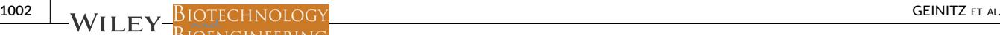
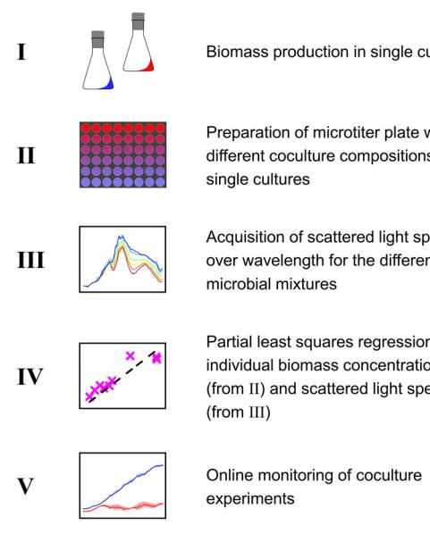
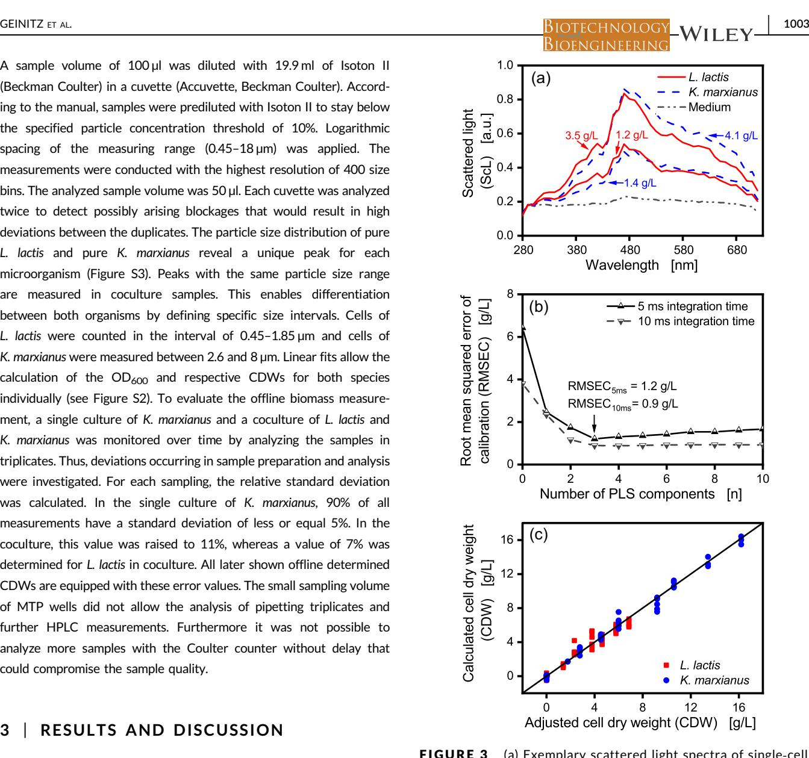
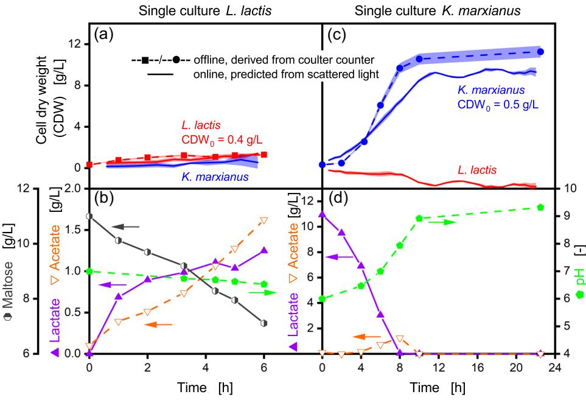
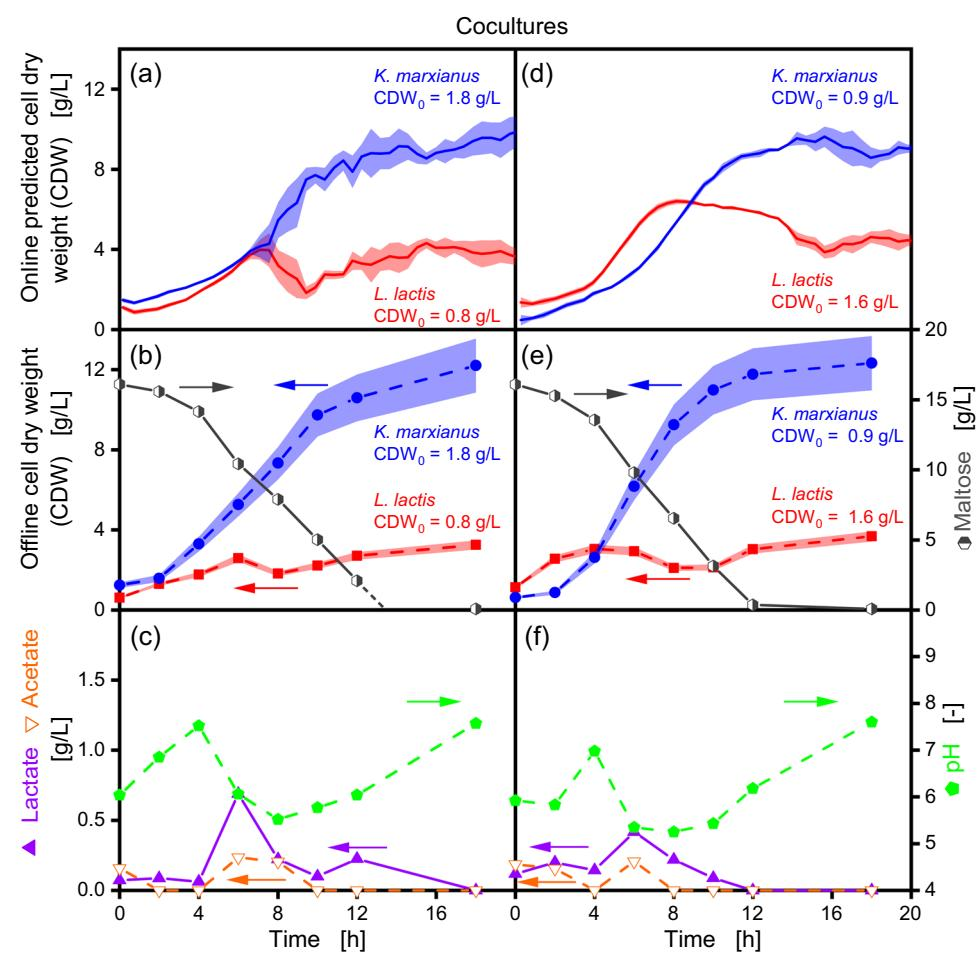
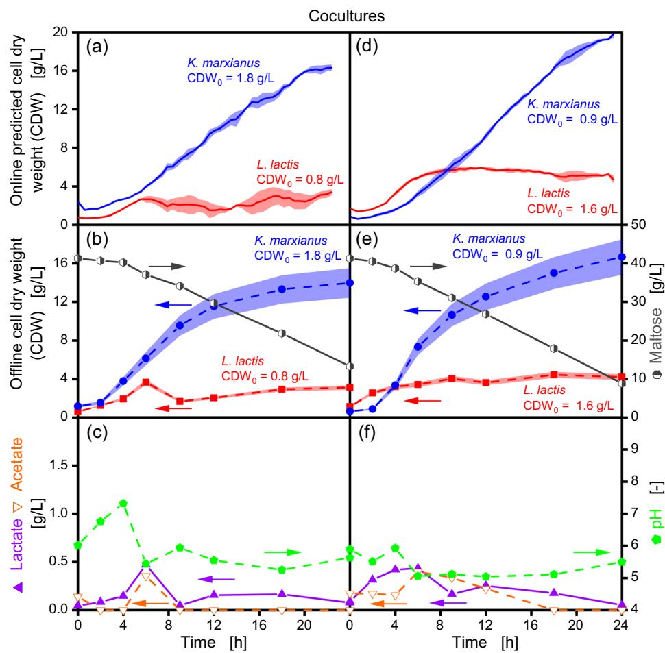

# ARTICLE

# Noninvasive tool for optical online monitoring of individual biomass concentrations in a defined coculture

Bertram Geinitz[1](http://orcid.org/0000-0003-3975-8639) | Lars Rehmann2 | Jochen Büchs1 | Lars Regestein1,[3](http://orcid.org/0000-0003-1258-7171)

1 AVT ‐ Biochemical Engineering, RWTH Aachen University, Aachen, Germany

2 Department of Chemical and Biochemical Engineering, The University of Western Ontario, London, Ontario, Canada

3 Leibniz Institute for Natural Product Research and Infection Biology ‐ Hans Knöll Institute, Jena, Germany

#### Correspondence

Lars Regestein, Leibniz Institute for Natural Product Research and Infection Biology ‐ Hans Knöll Institute, Adolf‐Reichwein‐Str. 23, 07745 Jena, Germany. Email: [lars.regestein@leibniz-hki.de](mailto:lars.regestein@leibniz-hki.de)

Funding information

Bundesministerium für Bildung und Forschung, Grant/Award Number: 031B0035A

#### Abstract

Cocultures bear great potential in the conversion of complex substrates and process intensification, as well as, in the formation of unique components only available due to inter‐species interactions. Dynamic data of coculture composition is necessary for understanding and optimizing coculture systems. However, most standard online determined parameters measure the sum of all species in the reactor system. The kinetic behavior of the individual species remains unknown. Up to now, different offline methods are available to determine the culture composition, as well as the online measurement of fluorescence of genetically modified organisms. To avoid any genetic modification, a noninvasive online monitoring tool based on the scattered light spectrum was developed for microtiter plate cultivations. To demonstrate the potential, a coculture consisting of the bacterium Lactococcus lactis and the yeast Kluyveromyces marxianus was cultivated. Via partial least squares regression of scattered light spectra, the online determination of the individual biomass concentrations without further sampling and analyses is possible. The results were successfully validated by a Coulter counter‐ analysis, taking advantage of the different cell sizes of both organisms. The findings prove the applicability of the new method to follow in detail the dynamics of a coculture.

#### KEYWORDS

coculture composition, microbial community, microtiter plate, mixed culture, scattered light spectra

# 1 | INTRODUCTION

For the last century, biotechnological processes focused on the utilization of pure cultures whereas in the natural environment mostly microbial consortia with complex interactions between the organisms occur (Bader, Mast‐Gerlach, Popović, Bajpai, & Stahl, 2010). Often traditional fermented foods or beverages were produced by natural microbial consortia, which are abundant in the environment (Bayili et al., 2019; Somashekaraiah, Shruthi, Deepthi, & Sreenivasa, 2019; Zhao et al., 2019). Interactions between different microorganisms were described for many decades (Challinor & Rose, 1954). In recent years the new possibilities of microbial consortia, which synergistically combine metabolic pathways, led to intensified research on coculture fermentations (Padmaperuma, Kapoore, Gilmour, & Vaidyanathan, 2018). Either defined microbial strains, or a natural microbial consortium are isolated and cultivated with the aim to develop new biotechnological processes. As reviewed by Bader et al. (2010), utilizing defined cocultures instead of single cultures holds huge potential in the production of bulk chemicals, bio fuels, food

Abbreviations: CCD, charge‐coupled device; CDW, cell dry weight; CDW0, initial cell dry weight; CDWK, cell dry weight of K. marxianus; CDWL, cell dry weight of L. lactis; CFU, colony forming units; ICF, image‐based flow cytometry; MES, 2‐(N‐morpholino)ethanesulfonic acid; MTP, microtiter plate; MVDA, multi variate data analysis; OD, optical density; OD600, optical density, measured at 600 nm; PLS regression, partial least squares regression; RMSEC, root mean squared error of the calibration samples; SIFT‐MS, selected ion flow tube mass spectrometry.

------------------------------------------------------------------------------------------------------ This is an open access article under the terms of the Creative Commons Attribution License, which permits use, distribution and reproduction in any medium, provided the original work is properly cited.

© 2019 The Authors. Biotechnology and Bioengineering published by Wiley Periodicals, Inc.

additives and pharmaceuticals. Lately, it was discovered, that by chemical communication between an Aspergillus sp. and Streptomyces sp., a silent gene cluster was activated leading to the production of an antibiotic that was not expressed without the inter‐species signaling (Khalil, Cruz‐Morales, Licona‐Cassani, Marcellin, & Capon, 2019).

For successful development and application of defined coculture systems, activities, dynamics and interactions of each cell population have to be analyzed. Therefore, acquisition of reliable data of culture dynamics is a key aspect in coculture research, whereas most studies reviewed so far relied on invasive offline or end point sampling (Goers, Freemont, & Polizzi, 2014). This may be caused by the lack of applicable techniques, since established methods such as optical density (OD) measurements are not suitable for monitoring multiple populations in cocultures (Schmidt, Riedele, Regestein, Rausenberger, & Reichl, 2011). Therefore, several offline methods have been applied offering a lower information density in comparison to an online signal. This includes the utilization of molecular methods such as quantitative terminal restriction fragment length polymorphism (Rüger, Ackermann, & Reichl, 2014) and quantitative real time polymerase chain reaction (Pérez et al., 2015) for the biomass measurement.

In other studies, the population ratios and concentrations were determined offline by counting colony forming units on agar plates. This is either enabled by the use of selective antibiotics (Brou, Taillandier, Beaufort, & Brandam, 2018; Shimizu, Mizuguchi, Tanaka, & Shioya, 1999; Taniguchi et al., 1998) or the individual colonies were assigned to each species by different morphologies (Shekhawat, Bauer, & Setati, 2017). Another option is given by genetically introducing different fluorescence tags into each strain, allowing species‐specific cell counting by flow cytometry (Spacova et al., 2018). However, the heterologous protein production can drastically impede cell replication or influence the metabolic activity of the host microbe. (Bentley, Mirjalili, Andersen, Davis, & Kompala, 1990; Bonomo & Gill, 2005; Rahmen et al., 2015). If these effects should be avoided, microscopic images can be analyzed manually or computer assisted by taking advantage of different cell morphologies (Stone et al., 2017). The limited number of analyzed cells is one drawback of conventional microscopy that is tackled by image‐based flow cytometry (ICF; Barteneva, Fasler‐Kan, & Vorobjev, 2012). Sosik and Olson (2007) applied ICF for seawater analysis. Machine learning enabled the automated taxonomic classification and counting of phytoplankton. Until now, the spatial resolution of ICF is low in comparison to conventional microscopy. Therefore, ICF is more suitable for the analysis of cell cultures in comparison to bacterial cultures (Puchkov, 2019). Stone et al. (2017) showed an approach to quantify the individual biomass of Escherichia coli and Saccharomyces cerevisiae in coculture by scanning absorption spectra. However, the method relies on sampling and resuspending the cells in distilled water. Furthermore, the correlation of OD and biomass concentration is only linear in small concentration ranges without variation of the path length.

To overcome the low temporal resolution of offline measurements, different strategies are possible. An indirect determination of a coculture composition is given by the online monitoring of species‐specific metabolites (Chippendale et al., 2014; Sovová, Čepl, Markoš, & Španěl, 2013). The published results demonstrate, that the production of several volatile organic compounds measured from the cultivation's headspace via selected ion flow tube mass spectrometry (SIFT‐MS) can serve as a fingerprint of individual microorganisms. SIFT‐MS can already improve diagnosis of respiratory infections (Smith & Spanel, 2016), but is not yet established for the quantification of different coculture compositions. A further option is to exploit the individual autofluorescence of the different microorganisms (Bhatta, Goldys, & Learmonth, 2006). It allows the differentiation of the species. Nevertheless, the method was not applied for biomass quantification in cocultures, because it is highly influenced by the used cultivation conditions. Its correlation with the biomass signal can change throughout the cultivation process (Ödman, Johansen, Olsson, Gernaey, & Lantz, 2009). A direct noninvasive optical monitoring of the cells is achieved by connecting a microscope to microfluidic polydimethylsiloxane chips. By using microfluidic single‐cell cultivation (Grünberger et al., 2015), single cells and cell clusters can be cultured and analyzed regarding cellular heterogeneity with full spatio‐ temporal resolution. By monitoring the intensity of strain specific recombinant fluorescent reporter proteins, the composition of the monolayer coculture was calculated (Burmeister et al., 2019). Furthermore, barriers on the chip allow spatially separated cultivations, and therefore the cell count in each chamber is accessible without fluorescence tagging of the microorganisms

Furthermore, by recording scattered light spectra from 190 to 900 nm, Junker, Wang, and Hatton (1988) reported that the signal serves as fingerprints for different microorganisms. The back‐scatter measurements were conducted with a fiber‐optic probe inserted to a fermenter. Using the same fluorimeter system, it was possible to differentiate between microorganisms and solid substrate particles like soybean meal. Consequently, the biomass concentration of pure fed‐batch cultures in the presence of solid substrates could be monitored (Kennedy, Thakur, Wang, & Stephanopoulos, 1992). For the scattered light measurements, the probe was immersed into the samples drawn from the reactor. This setup does not apply for the online monitoring of cocultivations. However, for online monitoring of the cell dry weight (CDW) in monoseptic microtiter plate (MTP) cultivations, an online, noninvasive scattered light measurement at a wavelength of 620 nm was established (Kensy, Zang, Faulhammer, Tan, & Büchs, 2009). The device allows for cultivations and measurements in each well of a MTP. In comparison to OD measurements, an extended linearity between the measurement and biomass concentration up to 50 g/L CDW can be achieved. An in‐house built device combines both, a fluorescence spectrometer and the cultivation and monitoring platform for MTPs. Therefore, scattered light spectra in each well can be measured automatically (Ladner, Beckers, Hitzmann, & Büchs, 2016). Until now, no methods for the noninvasive online monitoring of cocultures based on scattered light spectra were established.

Hence, this study demonstrates a noninvasive online monitoring method based on scattered light spectra for the determination of individual biomass concentrations of defined cocultures in 48‐well MTPs. The applied coculture consists of Lactococcus lactis DSM 20729 and Kluyveromyces marxianus DSM 5422 (Figure S1) and was described in detail by Shimizu et al. (1999). To validate the presented results, the coculture composition was additionally determined by particle size measurements. This is a suitable method due to the different cell sizes of the bacterium L. lactis and the yeast K. marxianus.

## 2 | MATERIALS AND METHODS

#### 2.1 | Microorganisms

Lactococcus lactis DSM 20729 and Kluyveromyces marxianus DSM 5422 were purchased from DSMZ (Braunschweig, Germany). Both microorganisms were stored in fresh cultivation media supplemented with 150 g/L glycerol at −80°C.

## 2.2 | Media composition

Media for single and coculture experiments were derived from the work of Shimizu et al. (1999). The basic medium contained 10 g/L yeast extract (Roth, Karlsruhe, Germany) and 10 g/L polypeptone (Roth). For pure cultures of L. lactis, the basic medium was supplemented with 10 g/L maltose and 0.2 M 2‐(N‐morpholino) ethanesulfonic acid (MES). The pH value was adjusted to 7.0. For single cultures of K. marxianus, the basic medium was supplemented with 10 g/L lactate and 0.1 M MES. The pH value was adjusted to 6.0. The coculture experiments were carried out in basic media supplemented with either 15 or 40 g/L maltose. The initial pH value was set to 6.0.

# 2.3 | Experimental setup

All online monitoring experiments were performed with the setup presented in Figure 1. It enables cultivations in 48‐well MTPs and noninvasive measurement of scattered light at an angle of 180° in each well of a continuously shaken MTP as first introduced by Samorski, Müller‐Newen, and Büchs (2005). It is equipped with a grating based fluorescence spectrometer (microHR for selecting excitation and CP140‐1602 for selecting emission wavelength, Horiba Jobin Yvon GmbH, Bensheim, Germany), which measures scattered light spectra in a range from 280 to 720 nm. Further details of the experimental setup were published by Ladner et al. (2016).

Due to the immense data volume of optical spectra, multi variate data analysis (MVDA) was applied. One of the most prominent MVDA method is the partial least squares regression (PLS regression), (Lourenço, Lopes, Almeida, Sarraguça, & Pinheiro, 2012; Wentzell & Vega Montoto, 2003), as it can process spectra, that go hand in hand with strongly collinear and noisy variables, to calculate the response variables (Wold, Sjöström, & Eriksson, 2001). Therefore, PLS regression was applied in this study to compute the individual biomass concentrations of the coculture system. A routine, as described in Figure 2, was

FIGURE 1 Cultivation and monitoring device. This schema is a modified version the one published by Ladner et al. (2016). The microtiter plate (MTP) is continuously shaken. The optical fiber bundle is moved by means of an X–Y positioning device to enable successive scattered light measurements in each well. Excitation wavelength is selected by an automated grating based monochromator. Emission light is split by a second monochromator into the different wavelengths. The entire emission spectrum is recorded at once with a charge‐coupled device (CCD). Reproducible measurements during shaking are ensured by triggering the measurement with a hall sensor at the same shaker table position [Color figure can be viewed at wileyonlinelibrary.com]

FIGURE 2 Workflow for establishing online monitoring of biomass concentrations in cocultures. (I) Single cultures of L. lactis and K. marxianus are cultivated in shake flasks for biomass production. (II) Following harvesting and centrifugation, both cultures are resuspended in fresh coculture medium without carbon source. Broad range of defined coculture compositions are transferred into a 48‐well microtiter plate (MTP). (III) Scattered light spectra of each well are recorded. (IV) Partial least squares regression (PLS regression) of microbial specific biomass concentration on scattered light spectra is performed. (V) PLS regression is used to online compute individual biomass concentrations during a cocultivation [Color figure can be viewed at wileyonlinelibrary.com]

always followed: Biomass of L. lactis and K. marxianus was generated in single cultures (I). The cells were harvested in the late growth phase, and centrifuged (8 min, 2800g). The gained biomass was used to generate pure culture suspensions with defined optical densities at 600 nm (OD600) by resuspending the pellets in fresh medium without supplemented carbon source. The cell suspensions were transferred into a 48‐well MTP (m2p‐Labs, Baesweiler, Germany) with predetermined biomass concentrations of L. lactis (CDWL) and K. marxianus (CDWK) in each well (II). A total CDW range from 0 to 22 g/L was realized to cover the expected range of all conducted single and coculture experiments. By starting with pure cultures, OD600 data was sufficient to generate defined 48 calibration samples including pure cultivation medium. Subsequently, the plate was analyzed in the online monitoring device by recording the scattered light spectra (III). The MTP was scanned with two integration time settings of the charge‐coupled device (CCD‐chip). An integration time of 10 ms is appropriate for lower biomass concentrations, though biomass concentrations corresponding to a scattered light intensity at 470 nm above 6 × 105 a.u. exceed the linear detection range of the CCD‐chip that is used for recording the spectra. A reduced integration time of 5 ms allows for measurements of high biomass concentrations. Consequently, two regression models were built (IV). For the higher integration time, all samples with a scattered light signal at 470 nm less than 6 × 105 a.u. (CDW < 10.6 g/L) were taken into account, whereas all samples were used for the regression with shorter integration time. Thereafter, the PLS regression was applied to compute the individual CDWs of L. lactis and K. marxianus in single and coculture experiments (V).

## 2.4 | Precultures

Before all pure and coculture experiments of L. lactis and K. marxianus, a precultivation step in 250 ml shake flasks was conducted. Cryogenically preserved cells were mixed with the respective medium (see section above) and incubated for 12 hr at 30°C. Precultures of L. lactis were set to an initial OD600 of 0.2 with a filling volume of 30 ml. Precultures of K. marxianus were set to a lower OD600 of 0.15 to generate vital precultures for the main cultivation. The filling volume was set to 10 ml. The flasks were incubated at 30°C with a shaking frequency of 300 rpm and a shaking diameter of 50 mm.

## 2.5 | Main cultivation in 48‐well microtiter plates

Defined volumes of precultures were transferred to falcon tubes and centrifuged (8 min, 2800g, Rotina 35, Andreas Hettich GmbH & Co. KG, Tuttlingen, Germany). After discarding the supernatant, the pellet was resuspended in the respective cultivation media, reaching a defined starting OD600. One ml of this mastermix was transferred into each well of the 48‐well MTP. The MTPs were covered with a gas permeable membrane (AeraSeal, Sigma‐Aldrich, Munich, Germany) and were cultivated in the online monitoring device at 30°C with a shaking frequency of 1000 rpm (3 mm shaking diameter). For the acquisition of the scattered light spectra, the excitation wavelength was varied from 280 to 720 nm with an increment of 10 nm.

## 2.6 | Determination of cell dry weight

For CDW determination, 4 ml of culture broth were centrifuged in dried and weighted reaction tubes (8 min, 2800g). The supernatant was discarded. The pellet was dried for at least 48 hr at 80°C followed by weighting the reaction tube on a precision scale.

For the offline determination of biomass concentrations, the OD600 was measured using a Genesys 20 photometer (Thermo Scientific, Dreieich, Germany) in 1.5 ml microcuvettes (PS, Plastibrand, Roth, Karlsruhe, Germany). For values higher than 0.3, the samples were diluted appropriately with 0.9% (m/v) NaCl solution. For both, L. lactis and K. marxianus, OD600 was converted to CDW via a calibration curve (see Figure S2).

## 2.7 | Offline biomass measurement via coulter counter

In single and coculture experiments, the organism specific cell concentration was determined with a Coulter counter 4 (Beckman Coulter, Krefeld, Germany) by measuring particle size distributions. A sample volume of 100 µl was diluted with 19.9 ml of Isoton II (Beckman Coulter) in a cuvette (Accuvette, Beckman Coulter). According to the manual, samples were prediluted with Isoton II to stay below the specified particle concentration threshold of 10%. Logarithmic spacing of the measuring range (0.45–18 µm) was applied. The measurements were conducted with the highest resolution of 400 size bins. The analyzed sample volume was 50 µl. Each cuvette was analyzed twice to detect possibly arising blockages that would result in high deviations between the duplicates. The particle size distribution of pure L. lactis and pure K. marxianus reveal a unique peak for each microorganism (Figure S3). Peaks with the same particle size range are measured in coculture samples. This enables differentiation between both organisms by defining specific size intervals. Cells of L. lactis were counted in the interval of 0.45–1.85 µm and cells of K. marxianus were measured between 2.6 and 8 µm. Linear fits allow the calculation of the OD600 and respective CDWs for both species individually (see Figure S2). To evaluate the offline biomass measurement, a single culture of K. marxianus and a coculture of L. lactis and K. marxianus was monitored over time by analyzing the samples in triplicates. Thus, deviations occurring in sample preparation and analysis were investigated. For each sampling, the relative standard deviation was calculated. In the single culture of K. marxianus, 90% of all measurements have a standard deviation of less or equal 5%. In the coculture, this value was raised to 11%, whereas a value of 7% was determined for L. lactis in coculture. All later shown offline determined CDWs are equipped with these error values. The small sampling volume of MTP wells did not allow the analysis of pipetting triplicates and further HPLC measurements. Furthermore it was not possible to analyze more samples with the Coulter counter without delay that could compromise the sample quality.

#### 3 | RESULTS AND DISCUSSION

#### 3.1 | Scattered light spectra of single cultures

Exemplary scattered light spectra of single cultures for L. lactis and K. marxianus are depicted in Figure 3a. For each strain, the lower and the higher CDWs correspond to the same OD600 of 1.5 and 4.5, respectively, while the respective CDWs are different due to different optical properties of the bacterial and yeast cells. As expected, the biomass concentration influences the height of the scattered light spectra. The maximum scattered light intensity is observed at a wavelength of 470 nm. Towards higher and lower wavelengths, the signal intensity is decreasing. In comparison, the scattered light spectra of both organisms share the same shape rather than having distinct specific peaks. Yet, the signal intensity of L. lactis at the left flank is higher than that of K. marxianus. At the right flank, the signal behaves vice versa. Scattered light spectra from further microorganisms of different size and morphology prove that differences in cell size are not necessarily the crucial factor for applying the presented online method (Figure S4). For example, Pseudomonas fluorescens is larger than Corynebacterium glutamicum,

FIGURE 3 (a) Exemplary scattered light spectra of single‐cell suspensions with adjusted biomass concentrations. Depicted concentrations correspond to cell dry weight (CDW) of sample. Solid lines: L. lactis (CDWL: 1.2 and 3.5 g/L). Dashed line: K. marxianus (CDWK: 1.4 and 4.1 g/L). Dash double dotted line: Pure cultivation medium. The spectra are part of the calibration sample (see Figure 2 II and III). (b) Root mean squared error of calibration sample (RMSEC) over number of used partial least square (PLS) components for 5 and 10 ms of integration time. Three PLS components are selected for the final regression as the lowest root mean squared error is observed. (c) Parity plot of calculated and adjusted biomass concentrations of calibration samples (see Figure 2, Step IV). The adjusted optical densities (OD600) correspond to the preset values in the microtiter plate (MTP) of Figure 2 II. The black line marks the theoretical perfect fit [Color figure can be viewed at wileyonlinelibrary.com]

however, the scattered light intensity of C. glutamicum below 470 nm is stronger in comparison to P. fluorescens. This relation is inverted for L. lactis and K. marxianus. Furthermore, it was proven that intracellular compounds influence the ratio of scattered light intensities at different wavelength by absorbing light at specific

wavelengths. Thus the scattered light is attenuated at the respective wavelengths (Myers, Curtis, & Curtis, 2013; Orr & Rehmann, 2015), thereby forming the unique scattered light fingerprint of the respective microorganism.

## 3.2 | Establishment of the partial least squares regression

A model was built via PLS regression using scattered light spectra of artificially created mixtures of the two strains over a range of initial CDWs (see Figure 2). A final number of 3 PLS components was determined by minimizing the root mean squared error of the calibration samples (RMSEC) in 10‐fold cross validation for the high and low integration time (Figure 3b, 0.9 and 1.2 g/L, respectively). To combine the advantages of both PLS models, three cases were differentiated. For scattered light intensity at 470 nm < 1 × 105 a.u., the high integration time model was applied and for measurements with scattered light intensity at 470 nm >4.5 × 105 a.u., the low integration time model was applied. Between the thresholds, the results of both models were weighted with a linear interpolation to attain a smooth transition. Combining both PLS regressions, in comparison to the short integration time model, the RMSEC for L. lactis and K. marxianus were reduced by 30% and 21% to 0.6 and 0.5 g/L, respectively. The results in Figure 3c display the PLS‐ derived and adjusted CDWs for the calibration samples in a parity plot. Each sample has an associated data point for CDWL and the CDWK.

## 3.3 | Online monitoring of single cultivations

As reference experiments to the following coculture experiments, cultivations of pure L. lactis and pure K. marxianus were performed and monitored with the developed method. The individual biomass concentrations CDWL and CDWK were calculated from the scattered light spectra (online measured CDW) and compared to the Coulter counter derived biomass concentration (offline measured CDW).

Only minimal growth can be observed for the cultivation of pure L. lactis (Figure 4a). The online measured CDWL is approximately 1 g/L, which is validated by the offline determined measurements. The online determined CDWK value is zero as expected because no yeast is present in the pure L. lactis culture. However, the model was built to estimate the concentration of both strains in coculture, hence is correctly estimating the absence of the secondary strain. As visible in Figure 4b, maltose uptake is nearly linear. After 6 hr, 4 g/L of maltose is taken up and is mainly converted into lactate and acetate. Consequently, the pH value slightly drops from 7 to 6.5. Maltose uptake, formation of biomass and

FIGURE 4 Process monitoring of single cultures. Offline determined cell dry weights (CDW, a and c) were obtained by Coulter counter measurements (dashed lines). Error was calculated according to Section 2.7. Online determined CDWs were calculated with the PLS regression (solid lines, according to Figure 2 V). Lactococcus lactis is depicted with rectangular and Kluyveromyces marxianus with circular symbols. Online determined CDW data is displayed as mean value of three wells run in parallel. Shaded area corresponds to the standard deviation. Online determined CDW curve of each well was smoothed (window: 5 points) before calculating mean values and standard deviations. Arrows indicate Y axis. (b) Data of L. lactis with corresponding maltose uptake (half‐filled hexagon), production of lactate and acetate (filled triangle and empty triangle) and pH value (pentagon). (d) Data of K. marxianus with corresponding lactate consumption (filled triangle), intermediate acetate production (empty triangle) and pH value (pentagon). Cultivation conditions in microtiter plate (MTP): Filling volume 1 ml, temperature 30°C, shaking frequency 1000 rpm, shaking diameter 3 mm, initial pH value: 7 for L. lactis and 6 for K. marxianus [Color figure can be viewed at wileyonlinelibrary.com]

metabolic products correlate to each other. Moreover, according to preliminary experiments without MES‐buffered media (not shown) and according to Qian, Stanley, Bunte, and Rådström (1997) and Shimizu et al. (1999), L. lactis can metabolize maltose and is able to grow until the pH value drops towards 4.5. Additionally, it was proven that a pH value of 7 is suitable for propagation of L. lactis (Choi, Cheigh, Kim, & Pyun, 2000). Thus, an inhibiting effect of the pH value can most likely be excluded. The ceasing growth in the pure culture of L. lactis is probably linked to lactate inhibition, as described by Shimizu et al. (1999). Contrary to L. lactis, the pure culture of K. marxianus demonstrates a biomass increase until the carbon source lactate and the intermediate overflow product acetate are depleted (Figures 4c and 4d). The uptake of the carboxylic acids causes the pH value to increase from 6 to 9.3 (Figure 4d). Both, the online and offline CDW measurement indicate the beginning of the stationary phase after 10 hr. After 4 hr, both, online and offline measured biomass concentrations diverge ending in a deviation of approximately 2 g/L (offline: 10 g/L, online: 8 g/L).

As there are no cells of L. lactis in this culture, the correct biomass concentration for L. lactis should be zero. However, as visible in Figure 4c, the online estimated CDWL value for L. lactis become slightly negative in the stationary phase of K. marxianus. An explanation for the deviation between online and offline measured CDWK and the negative CDWL values are changes in morphology of K. marxianus. It was shown by Junker et al. (1988), that the integrated scattered light spectra measured with an immersed front face probe is proportional to the CDW of baker's yeast until 40 g/L were exceeded. Kensy et al. (2009) noninvasively measured the back‐ scattered light at a single wavelength of 620 nm in MTPs and found that the proportionality is even valid for a CDW up to 50 g/L. A linear increase in the intensity of scattered light spectra therefore should lead to a linear increase in the online CDW. The scattered light intensity changes with the particle concentration (i.e. cells). However, it is also influenced by particle properties, that is size, geometry and refractive index (Uličný, 1992). Consequently, if the cell morphology changes, the ratio of scattered light intensity per cell alters as well (Bruder, Reifenrath, Thomik, Boles, & Herzog, 2016). For Saccharomyces cerevisiae and Hansenula polymorpha, this correlation was already revealed using flow cytometry, where forward and rectangular light scattering were measured (Kottmeier, Weber, Müller, Bley, & Büchs, 2009; Scheper, Hoffmann, & Schügerl, 1987). Using K. lactis it was shown, that the scattered light signal can nearly double without changes in gravimetrically determined CDW after the carbon source is depleted (Kunze et al., 2014). This adverse effect was not confirmed for the genetically closely related K. marxianus in this study (Figure 4c, after 8 hr) Furthermore, via image analysis O'shea and Walsh (2000) recorded the morphology for different oxygen and substrate levels. They found out, that K. marxianus alters cell size and cell shape as growth conditions are changed.

To fairly compare the measurements of scattered light and particle size, it is necessary to discuss the impact of morphology also on the measured results of the Coulter counter. The results presented in the supplementary data S5 show exemplarily the impact of three different boundaries for species‐specific cell count (1: 1.85 µm, 2:

GEINITZ ET AL. | 1005

10970290, 2020, 4, Downloaded from https://analyticalsciencejournals.onlinelibrary.wiley.com/doi/10.1002/bit.27256 by Cochrane France, Wiley Online Library on [05/06/2024]. See the Terms and Conditions (https://onlinelibrary.wiley.com/terms-and-conditions) on Wiley Online Library for rules of use; OA articles are governed by the applicable Creative Commons License

2.3 µm, 3: 2.6 µm). The results prove, that the finally chosen size intervals are the best compromise between accuracy in the pure culture and least cross sensitivity between the microorganisms. The higher threshold for K. marxianus (threshold 3, 2.6 µm) omits most cross sensitivity when L. lactis is present (Figure S5b) whereas a smaller threshold would hardly impact the calculated CDWK as only a small partition of the yeast cells falls below a size of 2.6 µm (Figure S5d). The mean relative cross sensitivity in the pure culture of L. lactis was 2.2% CDWK per CDWL (Figure S5b). As the ratio of CDWL per cell is approximately 7‐fold lower than the ratio CDWK per cell, the leverage of false positive L. lactis counts in the single culture of K. marxianus is small (Figure S5d). Consequently, the mean offline measured CDWL is below 1% CDWL per CDWK for all upper thresholds in the single culture of K. marxianus. The calculated CDWL in the single culture of L. lactis is hardly affected by the chosen boundary of L. lactis, as only a relatively small partition of cells exceeds the lowest threshold (threshold 1, 1.85 µm). In summary, the variable cell sizes of K. marxianus influence the Coulter counter measurements of the depicted single culture experiments (Figure 4) and thus contribute to the deviation between offline and online signal. In addition, morphological changes influence the scattered light as well and, therefore, the deviations in the CDW curves can be explained. However, the Coulter counter based measurement is a suitable method for the chosen microbial system, although it has limitations as discussed and depicted by Figure S5. It was discovered earlier, that recombinant fluorescent proteins may severely interfere with scattered light measurements (Kunze et al., 2014). Consequently, fluorescent markers that could be monitored in parallel with the scattered light signals were not applicable for validating the presented results.

#### 3.4 | Online monitoring of cocultivations

To evaluate the applicability of the developed method to determine coculture compositions and kinetics, coculture experiments with L. lactis and K. marxianus were performed under different experimental conditions. All cultivations were conducted with maltose as the solely supplemented carbon source, which is converted by L. lactis into bacterial biomass, lactate and acetate. The lactate as well as acetate is taken up by K. marxianus for further biomass formation (see Figure S1).

#### 3.4.1 | Impact of inoculation ratio

The first experiments were conducted with 15 g/L of initial maltose concentration and various inoculation ratios. Due to the strong dependency between L. lactis and K. marxianus in the described food chain, a variation of the inoculation ratio should provoke a detectable change in the growth kinetics of both species in a coculture process. Figures 5a–c present the results for a lower inoculation concentration for L. lactis (0.8 g/L) and a higher value for K. marxianus (1.8 g/L).

FIGURE 5 Process monitoring of cocultures. (a–c) Relatively high inoculum of Kluyveromyces marxianus, (d–f) Relatively high inoculum of Lactococcus lactis. Initial cell dry weights (CDW0) are depicted in the diagram. (a,d) Online determined CDWs of L. lactis and K. marxianus were calculated with the PLS regression according to Figure 2 V. CDWs are displayed as mean value of three wells run in parallel. Shaded area corresponds to standard deviation. The CDW curve of each well was smoothed (window: 5 points) before calculating mean values and standard deviations. (b,e) Coulter counter derived biomass concentrations are depicted (CDWL: rectangles, CDWK: circles), as well as the maltose concentration (half‐filled hexagons). Dotted line indicates assumed maltose concentration. Error was calculated according to Section 2.7.(c,f) Course of acetate (empty triangle), lactate (filled triangle) and pH value (pentagon) is plotted. Arrows indicate Y axis. Cultivation conditions in microtiter plate (MTP): Filling volume 1 ml, temperature 30°C, shaking frequency 1000 rpm, shaking diameter 3 mm, initially 15 g/L maltose, initial pH value: 6 [Color figure can be viewed at wileyonlinelibrary.com]

The inoculation ratio and the initial biomass concentration were correctly determined by the online signal for both species (Figure 5a). After a short lag phase, the online CDWL starts to increase until approximately 6 hr, which is in good agreement with the offline measured CDWL values and also correlates with the decrease of the consumed maltose (Figure 5b). As expected and observed in the single culture experiment (Figures 4a and 4b), L. lactis converts a significant amount of maltose into lactate and acetate. Nevertheless, the lactate and acetate concentrations are below 0.1 g/L until at least 4 hr of cultivation time (Figure 5c), due to its direct uptake by K. marxianus for biomass formation (Figure 5a). After 6 hr, online and offline determined biomass concentrations for L. lactis decreases. The accumulated lactate and acetate were taken up by K. marxianus. Both, online (Figure 5a) and offline (Figure 5b) determined CDWK show a very similar trend until the end of the coculture experiment. Interestingly growth of L. lactis ceased while maltose was still available. The further, linear decrease of maltose suggests that L. lactis is still metabolically active. Over the whole cultivation period, the CDWK is higher than CDWL.

Between 7 and 8 hr, there is a decrease in CDWL, which is accompanied by an increase in noise causing the higher standard deviation. Concurrently, the noise of the scattered light spectra increases as well. This transition from smooth to rough spectra can be seen in Figure S6a. This suggests, that cell agglomerates instead of morphological changes of single cells are responsible for the change in the online CDWL. From microscopic pictures, agglomeration was verified (Figure S7a, 4‐12 hr). Additionally, the relative standard deviation of the offline CDWK measurement generally increases in comparison to the single culture (see Section 2.7).

To provoke a change of the growth kinetics of both species, the inoculation ratio was variated to a higher starting concentration of L. lactis (1.6 g/L) and a lower starting concentration of K. marxianus (0.9 g/L). The change of the inoculation ratio was determined correctly by the online signal (Figure 5d). In comparison to Figure5a, the growth curve of L. lactis is different. The maximum value was reached after 8 hr (6 hr in Figure 5a) with a value of approximately 6 g/L, which is higher in comparison to the previous experiment. One reason is the higher inoculation density for L. lactis. The maximum value for the offline measured CDWL is lower, for both inoculation ratios (Figures 5b and 5e). This could be attributed to different impacts of morphological changes on the scattered light online signal, compared to measurements of the Coulter counter system. The aforementioned cell aggregates cannot be well reflected by the Coulter counter measurement. Either, the aggregates were dispersed before being counted, or the clusters were still present in the Coulter counter sample, but were identified as cells of K. marxianus because of their size. The latter was not proven in the single culture of L. lactis, but the cultivation conditions are different in the coculture, resulting in lower concentrations of carboxylic acids and consequently reaching an at least 4‐fold increase in CDWL. Therefore, the environmental conditions could also imply morphological changes specific for a coculture.

For K. marxianus, online and offline determined growth kinetics are in good agreement. The maximum online biomass concentration of approximately 10 g/L was reached after 12 hr, 2 hours later than in the previous single culture experiment. The initial CDWK in the cocultures was higher than in the pure culture, but due to the carbon limitation in the coculture, the growth rate of K. marxianus in the coculture is reduced. The biomass value at the end of both cocultivations is hardly influenced by the different inoculation ratios. This is not unexpected, as 15 g/L of maltose is mainly converted into the carboxylic acids and therefore into biomass of K. marxianus, independent of the inoculation ratio. Since both microorganisms are not competing for the carbon sources, mainly the time course of the reaction is altered. The more catalyst (i.e. L. lactis) is available, the higher is the conversion rate of maltose, assuming a first‐order kinetic. This statement is supported by the time course of maltose. In the latter experiment with high L. lactis inoculum (Figure 5d–f), maltose is depleted approximately 3 hr earlier.

The offline CDWK exceeded the online measured CDWK after 4‐ 6 hr (Figures 5a and 5d). At this time points, the culture is oxygen limited (data not shown). Furthermore, in the coculture, K. marxianus is dependent on maltose conversion into lactate and acetate. For both, the concentrations are low during the cultivation. Thus, for K. marxianus the mode of operation in coculture can be regarded as fed‐batch. As a result, the specific growth rate is limited and the cell size decreases as explained above (see Figures S8a and S8c for the cell size distributions). The decreased cell size of K. marxianus accounts for a reduced ratio of scattered light to CDW and therefore explains the deviation.

For both inoculation ratios, the removal of lactate and acetate by K. marxianus stabilizes the pH values above 5.5 (Figure 5c) and 5.3 (Figure 5f), respectively. The critical threshold of pH 4.5 is not reached. Nevertheless, growth ceases before the carbon source is depleted. Consequently, other limitations or inhibitions have to be the reasons for the presented growth behavior of L. lactis.

#### 3.4.2 | Impact of initial maltose concentration

To determine the limits of the scattered light method for higher biomass concentrations, the initial maltose concentration was drastically increased to 40 g/L (see Figure 6). Similar to the previous experiment, two inoculation ratios were tested (Figures 6a–c and 6d–f). The major differences between both inoculation ratios are the growth kinetics of L. lactis and the final biomass concentrations of K. marxianus.

The results for the lower inoculation density of L. lactis (Figure 6a–c) are similar to the experiments presented in Figure 5a–c. Online and offline determined CDWL values are in good agreement. The latter shows an exponential growth phase until 6 hr with a maximum value of 4 g/L, followed by a decrease to 2 g/L until the end of the cultivation. As in Figure 5c, lactate and acetate accumulate slightly until 6 hr and decrease until the end of the cultivation due to the uptake by K. marxianus. The online measured biomass formation of K. marxianus is exponential until 8 hr, followed by a linear growth phase until 20 hr for both inoculation ratios (Figures 6a and 6d). These two growth phases are a consequence of the different formation rates of lactate and acetate by L. lactis. Lactate and acetate (Figures 6c and 6f) accumulate for both inoculation ratios until 6 hr, which provide unlimited exponential growth conditions for K. marxianus. The subsequent linear growth phase reflects the limited formation rate of lactate and acetate by L. lactis until the end of both experiments in Figure 6. These results correlate also very well with the offline measured consumption of maltose (Figures 6b and 6e). The removal of the carboxylic acids stabilizes the pH values above 5.3 (Figure 6c) and 5.0 (Figure 6f), respectively. As in the experiments with 15 g/L of initial maltose, growth of L. lactis ceases before all carbon sources are depleted. This phenomenon is correctly reproduced by the online CDW measurement, while the scattered light intensities are still increasing (Figures S6c and S6d). Therefore, the specificity of the developed method is emphasized.

Both, online (Figures 6a and 6d) and offline (Figures 6b and 6e) measured biomass formation of K. marxianus show an ongoing increase of the yeast biomass over the total cultivation time, but differ in their absolute values. By the end of both experiments, the online measured CDWK values are approximately 4 g/L higher than the offline CDWK. However, because of the constant linear decrease of the maltose concentration a constant feeding rate of lactate and acetate can be assumed. Since the lactic and acetic acid concentration is close to zero at all time, K. marxianus experiences carbon‐ limited fed‐batch conditions. Derived from the carbon‐limited fed‐ batch kinetics with constant feeding rate, this leads to an increase in biomass with a decreasing specific growth rate and therefore to a constantly changing substrate availability per cell. According to the study of O'Shea and Walsh (2000), these altering conditions can widely influence the morphology of K. marxianus. This is confirmed by taking the cell size distributions of K. marxianus into account. For both inoculation ratios, the cell size of K. marxianus increases with time (Figures S9a and vc). This leads to an increasing ratio of

FIGURE 6 Process monitoring of cocultures with increased maltose concentration of 40 g/L. (a–c) Relatively high inoculum of Kluyveromyces marxianus, (d–f) Relatively high inoculum of Lactococcus lactis. Initial cell dry weights (CDW0) are depicted in the diagram. (a,d) Online determined CDWs of L. lactis and K. marxianus were calculated with the PLS regression according to Figure 2 V. CDWs are displayed as mean value of three wells run in parallel. Shaded area corresponds to standard deviation. The CDW curve of each well was smoothed (window: 5 points) before calculating mean values and standard deviations. (b,e) Coulter counter derived biomass concentrations are depicted (CDWL: rectangles, CDWK: circles), as well as the maltose concentration (half‐filled hexagons). Error was calculated according to Section 2.7. (c,f) Course of acetate (empty triangle), lactate (filled triangle) and pH value (pentagon) is plotted. Arrows indicate Y axis. Cultivation conditions in microtiter plate (MTP): Filling volume 1 ml, temperature 30°C, shaking frequency 1000 rpm, shaking diameter 3 mm, initial pH value: 6 [Color figure can be viewed at wileyonlinelibrary.com]

scattered light to cell. Consequently, the scattered light derived CDWK increases faster than the offline measured CDWK.

Although the chosen model organisms L. lactis (bacterium) and K. marxianus (yeast) have different cell sizes, measurements with the Coulter counter system show an overlay between both particle peaks in the range of 1.85 and 2.6 µm (Figures S9a and S9c), most prominent for the higher inoculation of L. lactis (Figure S9c). As the peaks of K. marxianus drop sharply (Figures S9a and S9c), it is most likely that the cell distribution of L. lactis broadens. The particle size distributions of the single cultures (Figures S5a and S5c) support this hypotheses, as the peak shapes of pure L. lactis and pure K. marxianus are visible. Therefore, starting between 4 and 6 hr, a part of L. lactis is falsely identified as K. marxianus. This explains the high deviation of both CDWL curves after 4 hr (Figure 6d), before the effect of the changing cell size predominates. It can be concluded that the offline measured CDWK is overestimated because of false cell counts and the online measured CDWK is increased at the end due to an increased cell size. Polakis and Bartley (1966) discovered in their study of S. cerevisiae operated in batch mode that the cell size alters over the growth phases and that the cell volume corresponds to the ratio of CDW per cell. This phenomenon is reflected in the online but not in the offline measured CDW and, therefore, the scattered light derived CDWK curves describe the growth kinetic of K. marxianus more precisely than the offline method.

## 4 | CONCLUSION

This study introduces a new method for online monitoring of defined cocultures. Since the measured signal responds directly to the biomass but not to produced metabolites, a fast calibration procedure was applicable for the PLS regression. In single and coculture experiments, the individual concentrations and growth dynamics were online determined under different experimental conditions. For validation of the presented scattered light method, an offline cell counting was established based on the different cell sizes of L. lactis and K. marxianus. Both methods have shown similar trends of the dynamics of the coculture compositions. Deviations in the absolute value between online and offline measured biomass values were traced back to changes in cell size. The varying cell size of K. marxianus during the cocultivation correlates with the overall intensity of scattered light spectra. The changing cell size is not reflected by the Coulter counter based cell counting of K. marxianus. According to literature, changes in cell size correlate with the cell specific biomass. Therefore, the scattered light derived online CDW measurement could lead to more quantitative results compared to the cell counting method. Nevertheless, like most optical biomass measurements established for pure cultures, the new scattered light method for cocultures is also prone to be influenced by morphological changes. Thus, the operator has to account for the remaining uncertainty. Yet, to our best knowledge, there are no other means for noninvasive online measurement of cocultures without fluorescence tagging of the individual microorganisms. Ultimately, this study demonstrates the applicability of a noninvasive optical online measurement for coculture compositions. It shows great potential as a screening tool and to gain deeper knowledge for any natural and synthetic coculture. Scattered light spectra serve as a fingerprint for microorganisms. Therefore, the presented methodology should not be restricted to cocultures containing species of different cell size.

#### ACKNOWLEDGMENTS

Support by the German Federal Ministry of Education and Research (BMBF, Grant number: 031B0035A) is gratefully acknowledged.

#### CONFLICT OF INTERESTS

The authors declare that there are no conflict of interests.

#### AUTHOR CONTRIBUTIONS

B. G. designed the study, conducted the experiments, analyzed and interpreted data and drafted the manuscript. L. Reh. and J. B. contributed to data analysis and critically revised the manuscript. L. Reg. initiated and supervised the study, participated in data interpretation, drafting the manuscript and critically revised the manuscript.

#### ORCID

- Bertram Geinitz <http://orcid.org/0000-0003-3975-8639> Lars Rehmann <http://orcid.org/0000-0003-3463-6405> Jochen Büchs <http://orcid.org/0000-0002-2012-3476> Lars Regestein <http://orcid.org/0000-0003-1258-7171>
#### REFERENCES

- Bader, J., Mast‐Gerlach, E., Popović, M. K., Bajpai, R., & Stahl, U. (2010). Relevance of microbial coculture fermentations in biotechnology. Journal of Applied Microbiology, 109(2), 371–387. [https://doi.org/10.](https://doi.org/10.1111/j.1365-2672.2009.04659.x) 1111/j.1365‐[2672.2009.04659.x](https://doi.org/10.1111/j.1365-2672.2009.04659.x)
- Barteneva, N. S., Fasler‐Kan, E., & Vorobjev, I. A. (2012). Imaging flow cytometry: Coping with heterogeneity in biological systems. Journal of Histochemistry and Cytochemistry, 60(10), 723–733. [https://doi.org/10.](https://doi.org/10.1369/0022155412453052) [1369/0022155412453052](https://doi.org/10.1369/0022155412453052)
- Bayili, G. R., Johansen, P., Nielsen, D. S., Sawadogo‐Lingani, H., Ouedraogo, G. A., Diawara, B., & Jespersen, L. (2019). Identification of the predominant microbiota during production of lait caillé, a spontaneously fermented milk product made in Burkina Faso. World Journal of Microbiology and Biotechnology, 35(7), 100. [https://doi.org/10.1007/s11274](https://doi.org/10.1007/s11274-019-2672-3)‐019‐2672‐3
- Bentley, W. E., Mirjalili, N., Andersen, D. C., Davis, R. H., & Kompala, D. S. (1990). Plasmid‐encoded protein: The principal factor in the "metabolic burden" associated with recombinant bacteria. Biotechnology and Bioengineering, 35(7), 668–681.<https://doi.org/10.1002/bit.260350704>
- Bonomo, J., & Gill, R. T. (2005). Amino acid content of recombinant proteins influences the metabolic burden response. Biotechnology and Bioengineering, 90(1), 116–126.<https://doi.org/10.1002/bit.20436>
- Brou, P., Taillandier, P., Beaufort, S., & Brandam, C. (2018). Mixed culture fermentation using Torulaspora delbrueckii and Saccharomyces cerevisiae with direct and indirect contact: Impact of anaerobic growth factors. European Food Research and Technology, 244(10), 1699–1710. [https://doi.org/10.1007/s00217](https://doi.org/10.1007/s00217-018-3095-3)‐018‐3095‐3
- Bruder, S., Reifenrath, M., Thomik, T., Boles, E., & Herzog, K. (2016). Parallelised online biomass monitoring in shake flasks enables efficient strain and carbon source dependent growth characterisation of Saccharomyces cerevisiae. Microbial Cell Factories, 15(1), 127. [https://](https://doi.org/10.1186/s12934-016-0526-3) [doi.org/10.1186/s12934](https://doi.org/10.1186/s12934-016-0526-3)‐016‐0526‐3
- Burmeister, A., Hilgers, F., Langner, A., Westerwalbesloh, C., Kerkhoff, Y., Tenhaef, N., … Grünberger, A. (2019). A microfluidic co‐cultivation platform to investigate microbial interactions at defined microenvironments. Lab on a Chip, 19(1), 98–110. [https://doi.org/10.](https://doi.org/10.1039/C8LC00977E) [1039/C8LC00977E](https://doi.org/10.1039/C8LC00977E)
- Challinor, S. W., & Rose, A. H. (1954). Interrelationships between a Yeast and a Bacterium when growing together in defined medium. Nature, 174(4436), 877–878.<https://doi.org/10.1038/174877b0>
- Chippendale, T. W. E., Gilchrist, F. J., Španěl, P., Alcock, A., Lenney, W., & Smith, D. (2014). Quantification by SIFT‐MS of volatile compounds emitted by Aspergillus fumigatus cultures and in co‐ culture with Pseudomonas aeruginosa, Staphylococcus aureus and Streptococcus pneumoniae. Analytical Methods, 6(20), 8154–8164. <https://doi.org/10.1039/C4AY01217H>
- Choi, H. J., Cheigh, C. I., Kim, S. B., & Pyun, Y. R. (2000). Production of a nisin‐like bacteriocin by Lactococcus lactis subsp. lactis A164 isolated from Kimchi. Journal of Applied Microbiology, 88(4), 563–571. [https://](https://doi.org/10.1046/j.1365-2672.2000.00976.x) [doi.org/10.1046/j.1365](https://doi.org/10.1046/j.1365-2672.2000.00976.x)‐2672.2000.00976.x
- Goers, L., Freemont, P., & Polizzi, K. M. (2014). Co‐culture systems and technologies: Taking synthetic biology to the next level. Journal of the Royal Society Interface, 11(96), 20140065. [https://doi.org/10.1098/rsif.2014.](https://doi.org/10.1098/rsif.2014.0065) [0065](https://doi.org/10.1098/rsif.2014.0065)
- Grünberger, A., Probst, C., Helfrich, S., Nanda, A., Stute, B., Wiechert, W., … Kohlheyer, D. (2015). Spatiotemporal microbial single‐cell analysis using a high‐throughput microfluidics cultivation platform. Cytometry, Part A, 87(12), 1101–1115.<https://doi.org/10.1002/cyto.a.22779>
- Junker, B. H., Wang, D. I., & Hatton, T. A. (1988). Fluorescence sensing of fermentation parameters using fiber optics. Biotechnology and Bioengineering, 32(1), 55–63. [https://doi.org/10.1002/bit.260](https://doi.org/10.1002/bit.260320109) [320109](https://doi.org/10.1002/bit.260320109)
- Kennedy, M. J., Thakur, M. S., Wang, D. I. C., & Stephanopoulos, G. N. (1992). Estimating cell concentration in the presence of suspended

solids: A light scatter technique. Biotechnology and Bioengineering, 40(8), 875–888.<https://doi.org/10.1002/bit.260400803>

- Kensy, F., Zang, E., Faulhammer, C., Tan, R. ‐K., & Büchs, J. (2009). Validation of a high‐throughput fermentation system based on online monitoring of biomass and fluorescence in continuously shaken microtiter plates. Microbial Cell Factories, 8(1), 31. [https://doi.org/10.1186/1475](https://doi.org/10.1186/1475-2859-8-31)‐2859‐8‐31
- Khalil, Z. G., Cruz‐Morales, P., Licona‐Cassani, C., Marcellin, E., & Capon, R. J. (2019). Inter‐Kingdom beach warfare: Microbial chemical communication activates natural chemical defences. The ISME Journal, 13(1), 147–158. [https://doi.org/10.1038/s41396](https://doi.org/10.1038/s41396-018-0265-z)‐018‐0265‐z
- Kottmeier, K., Weber, J., Müller, C., Bley, T., & Büchs, J. (2009). Asymmetric division of Hansenula polymorpha reflected by a drop of light scatter intensity measured in batch microtiter plate cultivations at phosphate limitation. Biotechnology and Bioengineering, 104(3), 554–561.<https://doi.org/10.1002/bit.22410>
- Kunze, M., Roth, S., Gartz, E., & Büchs, J. (2014). Pitfalls in optical on‐line monitoring for high‐throughput screening of microbial systems. Microbial Cell Factories, 13(1), 53. [https://doi.org/10.1186/1475](https://doi.org/10.1186/1475-2859-13-53)‐ [2859](https://doi.org/10.1186/1475-2859-13-53)‐13‐53
- Ladner, T., Beckers, M., Hitzmann, B., & Büchs, J. (2016). Parallel online multi‐wavelength (2D) fluorescence spectroscopy in each well of a continuously shaken microtiter plate. Biotechnology Journal, 11(12), 1605–1616.<https://doi.org/10.1002/biot.201600515>
- Lourenço, N. D., Lopes, J. A., Almeida, C. F., Sarraguça, M. C., & Pinheiro, H. M. (2012). Bioreactor monitoring with spectroscopy and chemometrics: A review. Analytical and Bioanalytical Chemistry, 404(4), 1211–1237. [https://doi.org/10.1007/s00216](https://doi.org/10.1007/s00216-012-6073-9)‐012‐6073‐9
- Myers, J. A., Curtis, B. S., & Curtis, W. R. (2013). Improving accuracy of cell and chromophore concentration measurements using optical density. BMC Biophysics, 6(1), 4. [https://doi.org/10.1186/2046](https://doi.org/10.1186/2046-1682-6-4)‐1682‐6‐4
- Orr, V., & Rehmann, L. (2015). Improvement of the Nile Red fluorescence assay for determination of total lipid content in microalgae independent of chlorophyll content. Journal of Applied Phycology, 27(6), 2181–2189. [https://doi.org/10.1007/s10811](https://doi.org/10.1007/s10811-014-0481-5)‐014‐0481‐5
- O'Shea, D., & Walsh, P. (2000). The effect of culture conditions on the morphology of the dimorphic yeast Kluyveromyces marxianus var. marxianus NRRLy2415: A study incorporating image analysis. Applied Microbiology and Biotechnology, 53(3), 316–322. [https://doi.org/10.](https://doi.org/10.1007/s002530050027) [1007/s002530050027](https://doi.org/10.1007/s002530050027)
- Ödman, P., Johansen, C. L., Olsson, L., Gernaey, K. V., & Lantz, A. E. (2009). On‐line estimation of biomass, glucose and ethanol in Saccharomyces cerevisiae cultivations using in‐situ multi‐wavelength fluorescence and software sensors. Journal of Biotechnology, 144(2), 102–112. [https://](https://doi.org/10.1016/j.jbiotec.2009.08.018) [doi.org/10.1016/j.jbiotec.2009.08.018](https://doi.org/10.1016/j.jbiotec.2009.08.018)
- Padmaperuma, G., Kapoore, R. V., Gilmour, D. J., & Vaidyanathan, S. (2018). Microbial consortia: A critical look at microalgae co‐cultures for enhanced biomanufacturing. Critical Reviews in Biotechnology, 38(5), 690–703.<https://doi.org/10.1080/07388551.2017.1390728>
- Pérez, J., Buchanan, A., Mellbye, B., Ferrell, R., Chang, J. H., Chaplen, F., … Sayavedra‐Soto, L. A. (2015). Interactions of Nitrosomonas europaea and Nitrobacter winogradskyi grown in co‐culture. Archives of Microbiology, 197(1), 79–89. [https://doi.org/10.1007/](https://doi.org/10.1007/s00203-014-1056-1) [s00203](https://doi.org/10.1007/s00203-014-1056-1)‐014‐1056‐1
- Polakis, E. S., & Bartley, W. (1966). Changes in dry weight, protein, deoxyribonucleic acid, ribonucleic acid and reserve and structural carbohydrate during the aerobic growth cycle of yeast. The Biochemical Journal, 98(3), 883–887.<https://doi.org/10.1042/bj0980883>
- Puchkov, E. O. (2019). Quantitative methods for single‐cell analysis of microorganisms. Microbiology, 88(1), 1–14. [https://doi.org/10.1134/](https://doi.org/10.1134/s0026261719010120) [s0026261719010120](https://doi.org/10.1134/s0026261719010120)
- Qian, N., Stanley, G. A., Bunte, A., & Rådström, P. (1997). Product formation and phosphoglucomutase activities in Lactococcus lactis: Cloning and characterization of a novel phosphoglucomutase gene. Microbiology, 143(3), 855–865. [https://doi.org/10.1099/00221287](https://doi.org/10.1099/00221287-143-3-855)‐ 143‐3‐[855](https://doi.org/10.1099/00221287-143-3-855)
- Rahmen, N., Fulton, A., Ihling, N., Magni, M., Jaeger, K. E., & Büchs, J. (2015). Exchange of single amino acids at different positions of a recombinant protein affects metabolic burden in Escherichia coli. Microbial Cell Factories, 14, 10. [https://doi.org/10.1186/s12934](https://doi.org/10.1186/s12934-015-0191-y)‐ 015‐[0191](https://doi.org/10.1186/s12934-015-0191-y)‐y
- Rüger, M., Ackermann, M., & Reichl, U. (2014). Species‐specific viability analysis of Pseudomonas aeruginosa, Burkholderia cepacia and Staphylococcus aureus in mixed culture by flow cytometry. BMC Microbiology, 14, 15. [https://doi.org/10.1186/1471](https://doi.org/10.1186/1471-2180-14-56)‐2180‐14‐56
- Samorski, M., Müller‐Newen, G., & Büchs, J. (2005). Quasi‐continuous combined scattered light and fluorescence measurements: A novel measurement technique for shaken microtiter plates. Biotechnology and Bioengineering, 92(1), 61–68. [https://doi.org/](https://doi.org/10.1002/bit.20573) [10.1002/bit.20573](https://doi.org/10.1002/bit.20573)
- Scheper, T., Hoffmann, H., & Schügerl, K. (1987). Flow cytometric studies during culture of Saccharomyces cerevisiae. Enzyme and Microbial Technology, 9(7), 399–405. [https://doi.org/10.1016/0141](https://doi.org/10.1016/0141-0229(87)90134-7)‐ [0229(87)90134](https://doi.org/10.1016/0141-0229(87)90134-7)‐7
- Schmidt, J. K., Riedele, C., Regestein, L., Rausenberger, J., & Reichl, U. (2011). A novel concept combining experimental and mathematical analysis for the identification of unknown interspecies effects in a mixed culture. Biotechnology and Bioengineering, 108(8), 1900–1911. <https://doi.org/10.1002/bit.23126>
- Shekhawat, K., Bauer, F. F., & Setati, M. E. (2017). Impact of oxygenation on the performance of three non‐Saccharomyces yeasts in co‐fermentation with Saccharomyces cerevisiae. Applied Microbiology and Biotechnology, 101(6), 2479–2491. [https://doi.org/](https://doi.org/10.1007/s00253-016-8001-y) [10.1007/s00253](https://doi.org/10.1007/s00253-016-8001-y)‐016‐8001‐y
- Shimizu, H., Mizuguchi, T., Tanaka, E., & Shioya, S. (1999). Nisin production by a mixed‐culture system consisting of Lactococcus lactis and Kluyveromyces marxianus. Applied and Environmental Microbiology, 65(7), 3134–3141.
- Smith, D., & Spanel, P. (2016). Status of selected ion flow tube MS: Accomplishments and challenges in breath analysis and other areas. Bioanalysis, 8(11), 1183–1201. [https://doi.org/10.4155/bio](https://doi.org/10.4155/bio-2016-0038)‐2016‐0038
- Somashekaraiah, R., Shruthi, B., Deepthi, B. V., & Sreenivasa, M. Y. (2019). Probiotic properties of lactic acid bacteria isolated from neera: A naturally fermenting coconut palm nectar. Frontiers in Microbiology, 10, 11.<https://doi.org/10.3389/fmicb.2019.01382>
- Sosik, H. M., & Olson, R. J. (2007). Automated taxonomic classification of phytoplankton sampled with imaging‐in‐flow cytometry. Limnology and Oceanography: Methods, 5(6), 204–216. [https://doi.org/10.4319/](https://doi.org/10.4319/lom.2007.5.204) [lom.2007.5.204](https://doi.org/10.4319/lom.2007.5.204)
- Sovová, K., Čepl, J., Markoš, A., & Španěl, P. (2013). Real time monitoring of population dynamics in concurrent bacterial growth using SIFT‐MS quantification of volatile metabolites. Analyst, 138(17), 4795–4801. <https://doi.org/10.1039/C3AN00472D>
- Spacova, I., Lievens, E., Verhoeven, T., Steenackers, H., Vanderleyden, J., Lebeer, S., & Petrova, M. I. (2018). Expression of fluorescent proteins in Lactobacillus rhamnosus to study host‐microbe and microbe‐microbe interactions. Microbial Biotechnology, 11(2), 317–331. [https://doi.org/](https://doi.org/10.1111/1751-7915.12872) [10.1111/1751](https://doi.org/10.1111/1751-7915.12872)‐7915.12872
- Stone, K. A., Shah, D., Kim, M. H., Roberts, N. R. M., He, Q. P., & Wang, J. (2017). A novel soft sensor approach for estimating individual biomass in mixed cultures. Biotechnology Progress, 33(2), 347–354. <https://doi.org/10.1002/btpr.2453>
- Taniguchi, M., Nakazawa, H., Takeda, O., Kaneko, T., Hoshino, K., & Tanaka, T. (1998). Production of a mixture of antimicrobial organic acids from lactose by co‐culture of Bifidobacterium longum and Propionibacterium freudenreichii. Bioscience, Biotechnology, and Biochemistry, 62(8), 1522–1527.<https://doi.org/10.1271/bbb.62.1522>
- Uličný, J. (1992). Lorenz‐Mie light scattering in cellular biology. General Physiology and Biophysics, 11, 133–151.
- Wentzell, P. D., & Vega Montoto, L. (2003). Comparison of principal components regression and partial least squares regression through

generic simulations of complex mixtures. Chemometrics and Intelligent Laboratory Systems, 65(2), 257–279. [https://doi.org/10.1016/S0169](https://doi.org/10.1016/S0169-7439(02)00138-7)‐ [7439(02)00138](https://doi.org/10.1016/S0169-7439(02)00138-7)‐7

- Wold, S., Sjöström, M., & Eriksson, L. (2001). PLS‐regression: A basic tool of chemometrics. Chemometrics and Intelligent Laboratory Systems, 58(2), 109–130. [https://doi.org/10.1016/S0169](https://doi.org/10.1016/S0169-7439(01)00155-1)‐7439(01) [00155](https://doi.org/10.1016/S0169-7439(01)00155-1)‐1
- Zhao, X., Yi, R. K., Zhou, X. R., Mu, J. F., Long, X. Y., Pan, Y. N., … Park, K. Y. (2019). Preventive effect of Lactobacillus plantarum KSFY02 isolated from naturally fermented yogurt from Xinjiang, China, on D‐galactose‐induced oxidative aging in mice. Journal of Dairy Science, 102(7), 5899–5912. [https://doi.org/10.3168/jds.2018](https://doi.org/10.3168/jds.2018-16033)‐ [16033](https://doi.org/10.3168/jds.2018-16033)

## SUPPORTING INFORMATION

Additional supporting information may be found online in the Supporting Information section.

How to cite this article: Geinitz B, Rehmann L, Büchs J, Regestein L. Noninvasive tool for optical online monitoring of individual biomass concentrations in a defined coculture. Biotechnology and Bioengineering. 2020;117:999–1011. <https://doi.org/10.1002/bit.27256>