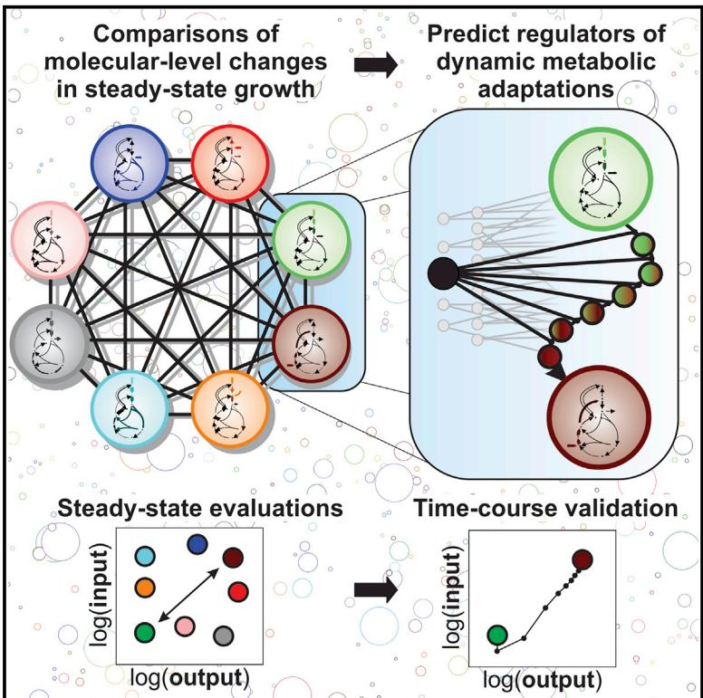
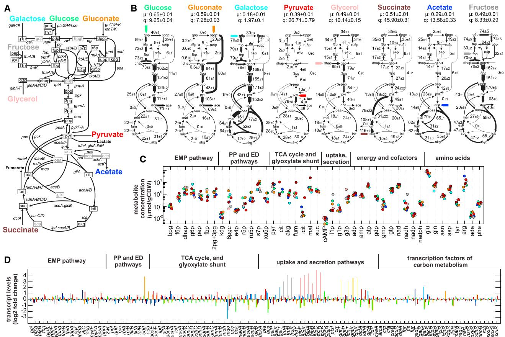
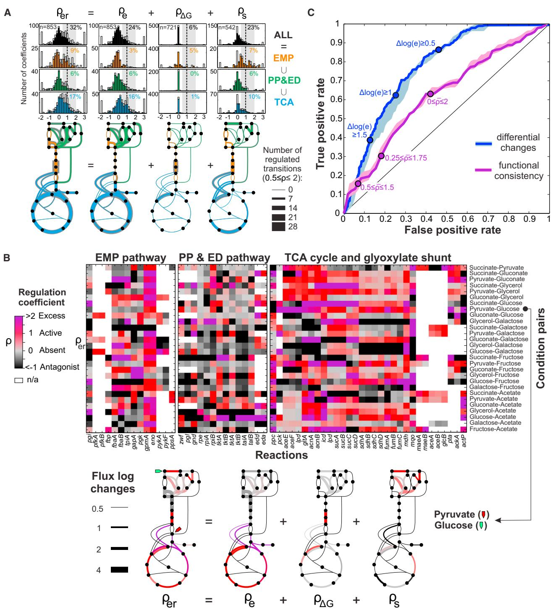
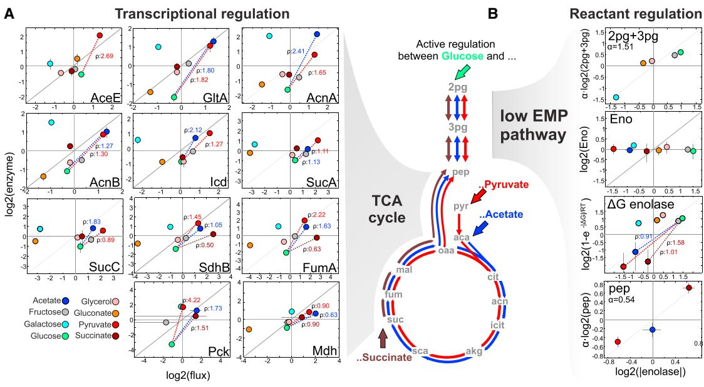
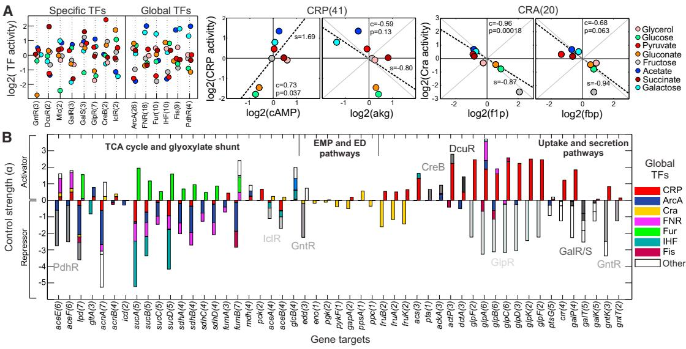
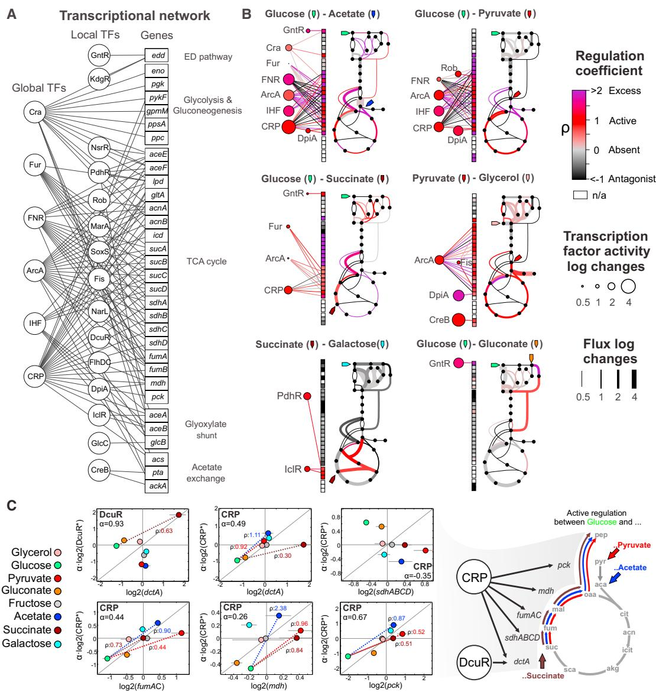
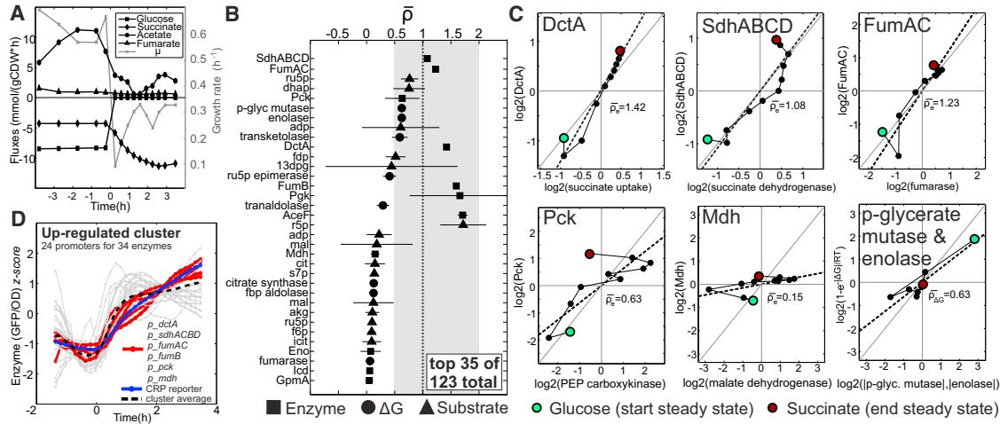

# Pseudo-transition Analysis Identifies the Key Regulators of Dynamic Metabolic Adaptations from Steady-State Data

### Graphical Abstract

### Highlights

- d Steady-state comparisons reveal governing regulators of E. coli carbon metabolism
- d Active regulation of fluxes is sparse, transition dependent, and pathway specific
- d Transcription mainly regulates TCA cycle fluxes, and metabolites EMP pathway fluxes
- d Dynamic regulators are identified assuming monotonic shifts between steady states

### Authors

Luca Gerosa, Bart R.B. Haverkorn van Rijsewijk, Dimitris Christodoulou, Karl Kochanowski, Thomas S.B. Schmidt, Elad Noor, Uwe Sauer

### Correspondence

[gerosa@fas.harvard.edu](mailto:gerosa@fas.harvard.edu) (L.G.), [sauer@imsb.biol.ethz.ch](mailto:sauer@imsb.biol.ethz.ch) (U.S.)

## In Brief

Gerosa et al. show that the regulators governing metabolic adaptations can be identified by comparing molecular-level changes of their steady-state extremes. This principle, applied to study E. coli adaptations between eight different carbon sources, reveals sparse, transition-dependent regulation of fluxes by transcription in the TCA cycle and by metabolites in the EMP pathway. This approach, termed pseudo-transition analysis, thus allows exploration of large numbers of dynamic adaptations using comparatively few stationary observations, thereby guiding the efficient exploration of regulatory landscapes.

# Accession Numbers

E-MTAB-3392

# Pseudo-transition Analysis Identifies the Key Regulators of Dynamic Metabolic Adaptations from Steady-State Data

Luca Gerosa,1,2,3,4, * Bart R.B. Haverkorn van Rijsewijk,1,2,3 Dimitris Christodoulou,1,2 Karl Kochanowski,1,2 Thomas S.B. Schmidt,1 Elad Noor,1 and Uwe Sauer1, *

1Institute of Molecular Systems Biology, ETH Zurich, Zurich 8093, Switzerland

2Systems Biology Graduate School, Zurich 8057, Switzerland

3Co-first author

4Present address: Howard Hughes Medical Institute, Harvard University, Northwest Laboratory, 52 Oxford Street, Cambridge, MA 02138, USA

*Correspondence: [gerosa@fas.harvard.edu](mailto:gerosa@fas.harvard.edu) (L.G.), [sauer@imsb.biol.ethz.ch](mailto:sauer@imsb.biol.ethz.ch) (U.S.) <http://dx.doi.org/10.1016/j.cels.2015.09.008>

#### SUMMARY

Hundreds of molecular-level changes within central metabolism allow a cell to adapt to the changing environment. A primary challenge in cell physiology is to identify which of these molecular-level changes are active regulatory events. Here, we introduce pseudo-transition analysis, an approach that uses multiple steady-state observations of 13C-resolved fluxes, metabolites, and transcripts to infer which regulatory events drive metabolic adaptations following environmental transitions. Pseudo-transition analysis recapitulates known biology and identifies an unexpectedly sparse, transition-dependent regulatory landscape: typically a handful of regulatory events drive adaptation between carbon sources, with transcription mainly regulating TCA cycle flux and reactants regulating EMP pathway flux. We verify these observations using time-resolved measurements of the diauxic shift, demonstrating that some dynamic transitions can be approximated as monotonic shifts between steady-state extremes. Overall, we show that pseudo-transition analysis can explore the vast regulatory landscape of dynamic transitions using relatively few steady-state data, thereby guiding time-consuming, hypothesisdriven molecular validations.

#### INTRODUCTION

Cellular adaption to environmental changes is orchestrated by overlapping regulatory mechanisms, typically affecting thousands of molecular components ([Gerosa and Sauer, 2011; Chu](#page-12-0)[bukov et al., 2014; Pisithkul et al., 2015)](#page-12-0). How many of these changes are necessary for cellular adaptation following a given environmental transition remains an open question, which requires discriminating the active regulatory events that drive metabolic transitions from molecular chatter. In principle, timeresolved data in combination with computational modeling could identify the role of specific regulatory events in altering metabolic functions [(Kao et al., 2004; Buescher et al., 2012; Link et al.,](#page-12-0) [2013)](#page-12-0). However, even when focusing on one or a few regulatory mechanisms, it is simply not realistic to perform all possible transitions cells are capable of to assess their time-resolved relevance. Interpreting these data is also difficult: already for medium-sized networks, such as *Escherichia coli* central metabolism, unknowns in dynamic models typically outpace data availability [(Link et al., 2014)](#page-13-0). Thus, the combination of many potential regulators with an endless number of adaptations produces a molecular regulatory landscape that is simply too vast to be explored by brute force experimentation alone.

The most frequently used approach to this problem infers active regulatory events from the comparison of starting points and endpoints of dynamic adaptations, that is, their steady-state extremes. The idea is that if a particular molecule participates in important regulation during a transition, then some quantitative feature of that molecule (e.g., transcript or protein abundance) should be statistically different in the two steady states [(Fig](#page-2-0)[ure 1](#page-2-0)A). The well-recognized problem is that these observed changes do not have unambiguous interpretations [(Gasch](#page-12-0) [et al., 2000; Price et al., 2013; Keren et al., 2013](#page-12-0)). For example, higher protein level of an enzyme does not necessarily imply higher metabolic flux through the reaction. Increasingly available network topologies and methods to infer nonmeasurable activities such as metabolic flux [(Sauer, 2006; Kruger and Ratcliffe,](#page-13-0) [2015)](#page-13-0) or transcription factor activity [(Liao et al., 2003](#page-13-0)) have enabled computational methods to reveal the coordinated changes of regulatory inputs and functional outputs, although their analysis typically takes an on/off view of regulation ([Covert](#page-12-0) [et al., 2004; Patil and Nielsen, 2005; Ishii et al., 2007)](#page-12-0). Quantitative testing of correspondence, for example, between metabolic fluxes and enzyme activity has been achieved for condition pairs [(Rossell et al., 2006](#page-13-0)). Identification of active regulatory events from such quantitative data over multiple conditions is typically based on correlation [(Figure 1B](#page-2-0)) [(Chubukov et al., 2013; Oliveira](#page-12-0) [et al., 2012)](#page-12-0), that is, on the search for regulators consistently active in all transitions. However, correlations of this type are scarce: few, if any, regulatory events seem to prevail under all conditions ([Haverkorn van Rijsewijk et al., 2011; Fendt et al.,](#page-12-0)

#### Figure 1. Identifying Regulatory Events that Actively Drive Transitions from Steady-State Data

(A) Given multiple steady-state measurements of a molecular input such as protein abundance, differential change analysis identifies active regulatory events by testing the significance of input changes between condition pairs, without considering the functional output.

(B) If functional output information such as metabolic flux for enzyme abundance is available, functional consistency analysis identifies the active regulatory events by testing input-output proportionality over all conditions.

(C) Pseudo*-*transition analysis identifies the active regulatory events by testing input-output proportionality between pairs of conditions using regulation coefficients (r), thus merging pairwise comparisons with functional testing.

(D) The transcriptional and metabolic network contains multiple input-output interactions among transcription factors, enzymes, metabolites, and fluxes.

(E) Regulation coefficients (r) for an input (y axis) and its output (x axis) describe different regulatory modes. Only near-proportional input changes (r z 1) explain output changes, and thus are predicted as active regulatory events. Time-course input-output proportionality from dynamic experiments reveals regulatory events that are active throughout a transition (i.e., true positives) or inactive (i.e., true negatives). Conversely, nonmonotonic trajectories identify regulatory events with transient activity, that is, false positive and negative predictions.

[2010; Chubukov et al., 2013)](#page-12-0). Generally speaking, present methods used to infer regulatory relevance from multiple quantitative steady-state data overlook transition-specific regulatory events, leaving the question: which regulators actually achieve a particular cellular adaptation?

Here we introduce an analytical approach that uses multiple steady-state data to infer the active regulatory events that drive cellular adaptation as cells transit from one environmental condition to another (Figure 1C). This analysis of ''pseudo*-*transitions'' between steady states, in lieu of proper time-course experiments, identifies active regulation by testing the proportionality between regulatory input and functional output relationships within known network topologies using regulation coefficients [(Rossell et al., 2006](#page-13-0)). Specifically, we focus on the transcriptional and metabolic networks of *E. coli* (Figure 1D), where we infer transcription factor activities and metabolic fluxes from metabolite concentrations, transcript levels, and 13C-tracer data during exponential growth on eight carbon sources. Our analysis of these data through regulation coefficients demonstrates that few regulatory events are necessary to achieve the carbon flux adaptations between any two nutritional conditions. This sparse regulation at the transcriptional level mainly affected tricarboxylic acid (TCA) cycle fluxes, and at the metabolite level primarily affected Embden-Meyerhoff-Parnas (EMP) pathway fluxes. We validated the approach by demonstrating that the regulatory events predicted from steady states were indeed the main drivers of the diauxic shift from glucose to succinate.

#### RESULTS

#### The Principles of Pseudo-Transition Analysis

Inspired by work from [Rossell et al. (2006)](#page-13-0), here we propose an approach that identifies the active regulatory events driving dynamic transitions between environments from their steady-state measurements. Specifically, we focus on ''regulation coefficients,'' discussed below. Regulation coefficients can be derived for all regulatory interactions that meet the following condition: at a given steady state (*j*), the output (O) is well approximated by a product of power laws of its inputs (I):

$$\mathbf{O}_{\rangle} = \prod_{\mathbf{x}} \mathbf{\!*} (\mathfrak{l}_{\mathfrak{q}} / \mathfrak{K}_{\mathbf{x}})^{\alpha_{\mathbf{x}}}.\tag{\mathsf{Equation 1}}$$

Equation 1 describes multiple molecular inputs with linear scaling factors (K) and possibly nonlinear gains (a) that contribute to the output. The gains a can represent activation ða *>* 0Þ or inhibition ða *<* 0Þ with saturation-like ðja j *<* 1Þ or ultrasensitive ðja j *>* 1Þ control. Because of its versatility and tractability, Equation 1 has been used to model various processes such as metabolic fluxes ([Rossell et al., 2006; Chubukov et al., 2013](#page-13-0)) and gene expression [(Liao et al., 2003; Daran-Lapujade et al., 2007)](#page-13-0).

Quantifying the contribution of different types of regulatory inputs to output changes (transcriptional or posttranslational regulation of protein activity, for example) can then be derived in the form of regulation coefficients ðrÞ following the original work in [Rossell et al. (2006)](#page-13-0). Specifically, this involves moving Equation 1 to the log space and taking the difference between two conditions *j* and *z*, ðD logðxÞ = logðx*j*Þ logðx*z*ÞÞ, to eliminate scaling factors K and linearize the output description:

$$\begin{aligned} \mathsf{T} &= \sum_{\mathsf{x}} \mathsf{p}_{\mathsf{x}} \\ \mathsf{p}_{\mathsf{x}} &= \alpha_{\mathsf{x}} \bullet \frac{\Delta \, \mathsf{log}(l_{\mathsf{x}})}{\Delta \, \mathsf{log}(\mathsf{O})}. \end{aligned} \tag{\mathsf{E} \, \mathsf{quantition 2}}.$$

The coefficients r*x* then quantify the fraction of output changes regulated by each input, capturing different modes of operation such as antagonist ðr 0Þ, absent ðrz0Þ, exact ðrz1Þ, or excess ðr[1Þ regulation ([Figure 1E](#page-2-0)). Assuming that Equation 1 describes the involved mechanisms well and that all operating inputs are quantified, the coefficients should sum up to unity, indicating a fully achieved mechanistic explanation of output changes. In practice, however, most regulatory network reconstructions are incomplete and only few regulatory layers are quantified in a given study. In this typical scenario of incomplete information, regulation coefficients that alone or in combination reach unity identify all the active regulatory events; that is, the measured changes in the regulatory input(s) are sufficient to explain the observed output changes.

Ideally, regulation coefficients are derived from steady-state extremes of different transitions, because this enables inference of active regulation for all combinatorial transitions without the prohibitive workload of measuring all transitions dynamically. Hence, we refer to identification of active regulatory events by steady-state regulation coefficients as pseudo*-*transition analysis. Because such steady-state coefficients are oblivious to the dynamic trajectory of regulatory inputs and functional outputs, the results are only meaningful under the assumption of monotonic cellular regulation between steady states. Therefore, identified regulatory events should be validated with time-course experiments to support or disprove the assumption [(Figure 1](#page-2-0)E). Pseudo*-*transition analysis thus consists of (1) describing input-output interactions of molecular networks by Equation 1, (2) estimating regulatory inputs and functional outputs in n multiple steady-state conditions, and (3) identifying the active regulatory events operating in each of the *n* 2 pairwise transitions using regulation coefficients as derived in Equation 2.

#### 272 Cell Systems *1*, 270–282, October 28, 2015 ª2015 Elsevier Inc.

#### Quantification of Fluxes, Metabolites, and Transcripts of E. coli Growth on Eight Different Carbon Sources

As a basis for identification of operating regulatory mechanisms that drive nutritional transitions, we quantified steady-state metabolic fluxes, metabolite concentrations, and transcript levels in *E. coli* BW25113 growing exponentially in eight nutritional conditions. Specifically, glucose, galactose, gluconate, fructose, glycerol, pyruvate, acetate, and succinate were chosen as the sole carbon sources because they enter metabolism at different points [(Figure 2](#page-4-0)A) thus leading to substantially different physiology (Data S1). Using an isotope-balancing model, we estimated 34 intracellular fluxes from extracellular fluxes, growth rate, and 13C-labeling patterns in proteinogenic amino acids [(Kleijn et al., 2010](#page-13-0)), revealing extensive differences in usage and activity of central metabolic pathways ([Figure 2B](#page-4-0); Data S1). Absolute concentrations of 43 metabolites were determined by targeted liquid chromatography-tandem mass spectrometry (LC-MS/MS) [(Figure 2C](#page-4-0); Data S1). For most metabolites, concentrations varied within an order of magnitude across conditions but spanned five orders of magnitude across metabolites ([Figure 2C](#page-4-0)), suggesting a narrow environmental modulation around metabolite-specific baselines. To assess the extent of transcriptional regulation, genome-wide transcript levels were quantified by microarrays (Data S1). Focusing on genes encoding enzymes and transcription factors of carbon metabolism, we found the largest differential expression in uptake and secretion pathways [(Figure 2D](#page-4-0)). Differential expression was within a 4-fold range for the majority of enzymes and very low for transcription factors, suggesting that the regulators themselves were not substantially regulated at the transcriptional level.

#### Functional Regulation of Flux Changes by Transcription and Reactants Is Sparse, Transition Dependent, and Pathway Specific

Having quantified metabolic operation and gene expression, pseudo-transition analysis was used to identify the active regulation of flux changes by transcript and reactant levels in the 28 pseudo-transitions between the eight steady-state conditions. First, we described the steady-state flux *J* through a reaction *i* in condition *j* by accounting for enzyme abundance (E) and kinetics (kcat), thermodynamic potential (DG), saturation by substrates (M) with affinity (K) and kinetic orders (a), and all other unaccounted sources of regulation (U) ([Rossell et al., 2006; Chu](#page-13-0)[bukov et al., 2013; Noor et al., 2013)](#page-13-0),

$$\mathcal{L}_{\mathbb{W}} = \mathbb{K}_{\text{cat}_{\mathbb{V}}} \bullet \mathbb{E}_{\mathbb{V}} \bullet \left(\mathbb{1} - \mathsf{e}^{\mathsf{L}\mathsf{G}_{\mathbb{V}}/\mathsf{H}\mathsf{T}}\right) \bullet \prod_{\lambda \in \mathcal{S}_{\mathbb{V}}} \left(M_{\mathbb{W}}/\mathsf{K}_{\mathbb{K}}\right)^{a_{\mathbb{K}}} \bullet \mathcal{U}_{\mathbb{V}}, \quad \text{(Equation 3)}$$

to derive regulation coefficients that quantify the contributions of transcriptional ðr*e*Þ, thermodynamic ðrD*G*Þ, and substrate ðr*s*Þ regulation to the observed flux changes:

$$\begin{split} \rho_{\mathfrak{a}_{\mathbb{V}}} &= \frac{\Delta \log(E_{l})}{\Delta \log(J_{l})} \\ \rho_{\Delta \odot_{l}} &= \frac{\Delta \log\left(1 - \mathsf{e}^{\Delta \mathsf{G}_{l}/\mathsf{R}T}\right)}{\Delta \log(J_{l})} \\ \rho_{\mathfrak{z}_{\mathbb{V}}} &= \sum_{\chi \in S_{l}} \alpha_{\mathbb{K}} \cdot \frac{\Delta \log(\mathsf{M}_{\chi})}{\Delta \log(\mathcal{J}_{l})} .\end{split} \tag{\mathbb{E}\text{equation 4}}$$

#### Figure 2. Fluxes, Metabolites, and Transcript Levels in E. coli Central Metabolism during Steady-State Exponential Growth on Eight Carbon Sources

(A) Central carbon metabolism. Black and gray boxes signify quantified and not detected metabolites, respectively.

(B) 13C-based metabolic flux maps for the eight conditions. Numbers and sizes of arrows indicate relative fluxes normalized to the substrate uptake rate in each condition. Specific substrate uptake rates (q) in mmol,gCDW-1 ,hr-1 and growth rates (m) in hr-1 are given at the top of each chart. For further analysis, absolute fluxes (mmol,gCDW-1 ,hr-1 ) were used. CDW, cell dry weight.

(C) Determined metabolite concentrations. The color code illustrates the carbon source consistent with (A) and (B).

(D) Transcript levels of the enzyme-encoding genes given in (A) and of transcription factors with central metabolic targets. The color code illustrates the carbon source consistent with (A) and (B).

The overall contribution r*er* is given by the sum of the individual coefficients ðr*er* = r*e* + rD*G* + r*s*Þ, and the putative contribution from unaccounted regulatory mechanisms is given by the fraction of flux changes that are left unexplained ðr*u* = 1 r*er*Þ.

Regulation coefficients were obtained by pairing each estimated flux with each (1) enzyme abundance (E), (2) thermodynamic potential (DG), and (3) reaction substrate abundance (M) participating in at least one of its contributing reactions. Enzyme abundances E were estimated from log fold transcript changes assuming a constant translation rate and correcting for growth-rate-dependent dilution and total RNA as previously described [(Chubukov et al., 2013](#page-12-0)), and DG values were inferred from the measured metabolite concentrations (Data S1; Supplemental Experimental Procedures) ([Noor et al., 2014)](#page-13-0). Reactions with reversed flux directionality were split into separate forward and backward reactions to estimate the substrate's kinetic orders (a) by a least-squares regression that maximized explanation of flux changes over all conditions (Data S1; Supplemental Experimental Procedures) [(Chubukov et al., 2013)](#page-12-0). Having obtained all necessary quantities in Equation [4](#page-3-0), we calculated regulation coefficients for each of the 59 reactions in the 28 pseudo-transitions ([Figure 3A](#page-6-0); Data S1). If a reaction is catalyzed by more than one isoenzyme or enzyme subunit, we calculated their coefficient separately and selected the closest to one as the maximally possible contribution of transcriptional regulation.

Based on the distribution of regulation coefficients, we next quantified the fraction of flux changes through reactions across transitions explained by the identified active regulatory mechanisms (0.5 % r % 2) [(Figure 3A](#page-6-0), top panel). Within these boundaries, only 32% of reaction flux changes were actively regulated, namely half in the TCA cycle (17%) and fewer in the EMP (9%), pentose phosphate (PP), and Entner-Doudoroff (ED) pathways (6%) [(Figure 3](#page-6-0)A, top panel). Transcriptional and substrate regulation contributed roughly equally, with a quarter of flux changes showing active regulation by either or both mechanisms, whereas thermodynamic regulation was responsible for only 6% of the flux changes. Visualizing the number of explained flux changes on the network provides a bird's eye view of major differences of pathway regulation ([Figure 3](#page-6-0)A, bottom panel). Whereas EMP pathway fluxes were almost exclusively controlled by reactant concentrations, TCA cycle and nonoxidative PP and ED pathway fluxes were controlled mainly by transcription, with spurious contributions from substrate concentrations ([Figure 3A](#page-6-0), top and bottom panels). Conversely, thin lines reveal reactions whose flux changes over many transitions were poorly explained by transcriptional and reactant regulation, mostly in the oxidative PP and upper EMP pathways ([Figure 3](#page-6-0)A, bottom panel). However, even reactions in well-reconstructed pathways were explained at best in two-thirds of the transitions, showing that gaps in flux regulation were present at least partially in all considered reactions and transitions. Fluxes through these reactions are presumably regulated under some conditions by mechanisms not considered, such as product inhibition, posttranslational modification, or allosteric regulation.

Beyond general pathway regulation, pseudo*-*transition analysis makes specific predictions for each transition. Most reactions featured flux changes that could be fully explained by combined transcript and reactant regulation in at least some transitions, demonstrating that activity of regulatory mechanisms is transition dependent. The low frequency of coefficients near unity, however, shows that active regulation is not the dominant behavior. Almost all reactions exhibited absent (r*er* z0), excessive ðr*er* [1Þ, and even antagonistic ðr*er* 0Þregulation in most transitions, suggesting that active regulation by any given mechanism is sparse. To identify active regulatory events at a single-reaction resolution, we separate overall regulation into its components (transcriptional, thermodynamic, and substrate) and plot them on the metabolic network in [Figure 3](#page-6-0)B, using the transition between pyruvate and glucose as an example (see Figure S1 for all 28 transitions). In this transition, transcription upregulated the TCA cycle flux for respiration of pyruvate, thermodynamics regulated the magnitude and directionality of the glycolytic-gluconeogenic switch in the lower EMP pathway, and accumulation of the substrate NADP+ on glucose regulated the glucose 6-phosphate dehydrogenase entry reaction into the PP pathway. Overall, the 28 maps revealed a complex pattern of sparse, transition-dependent, and pathway-specific regulation of carbon metabolism [(Figure 3B](#page-6-0); Figure S1).

#### Transition-Dependent Regulation Governs Adaptations between Glycolytic and Gluconeogenic Carbon Sources

Regulation coefficients provided a global overview by identifying the few transcriptional and metabolic regulatory events that govern flux changes between carbon sources. Could such events have been identified by the classical methods of differential change ([Figure 1](#page-2-0)A) and functional consistency analysis [(Fig](#page-2-0)[ure 1B](#page-2-0))? We focused on transcriptional regulation and identified active regulatory events by testing (1) the magnitude of transcript log fold changes and (2) the proportionality between transcript and flux log fold changes across all conditions (Supplemental Experimental Procedures). From these analyses, we built receiver operating characteristic (ROC) curves, demonstrating that neither method could retrieve the regulatory events identified by pseudo*-*transition analysis ([Figure 3](#page-6-0)C).

To identify the reasons for this misclassification and the biological relevance of the identified active regulation, we analyzed the raw log-log plots between regulatory inputs and flux outputs. Such plots display not only input-output proportionality as the slope between data points, that is, the regulation coefficients, but also the magnitude and directionality of flux changes together with the identity of the carbon sources, thus allowing identification of regulatory patterns common across groups of conditions [(Fig](#page-7-0)[ure 4](#page-7-0)A; see also Data S4). We focused on the previously identified active regulation of the TCA cycle and EMP pathway by transcription and reactants, respectively [(Figure 4A](#page-7-0)).

The largest TCA cycle flux changes that were proportional to transcription occurred during transitions between low-respiring, glycolytic, and high-respiring, gluconeogenic carbon sources [(Figure 4A](#page-7-0)). Notably, transcription controlled only TCA cycle reactions whose flux needed to increase for catabolism of a given gluconeogenic substrate; that is, actively regulated flux changes started at pyruvate dehydrogenase on pyruvate, at citrate synthase on acetate, and at succinate dehydrogenase on succinate, and then propagated through the cycle, as shown exemplarily for the transition from glucose [(Figure 4](#page-7-0)A). Flux changes during transitions within glycolytic or gluconeogenic carbon sources were generally not regulated by transcription, suggesting that enzyme abundance does not limit adaptations when similar modes of the TCA cycle are in operation.

The log-log plots also offer a visual explanation as to why the two alternative methods tend to misclassify many regulatory events ([Figure 3C](#page-6-0)). Differential change analysis ([Figure 1A](#page-2-0)) yields false positives when fold changes in transcripts are either large but not proportional or are small but proportional to flux (see, for example, the TCA cycle in [Figure 4A](#page-7-0)). The strong upregulation of enzymes during growth on galactose, for example, would be considered important by differential change analysis, although TCA cycle fluxes on galactose were among the lowest because of a known misregulation in the upstream carbon uptake [(Haver](#page-12-0)[korn van Rijsewijk et al., 2011](#page-12-0)). Functional consistency analysis [(Figure 1](#page-2-0)B) also yields false positives when the proportionality between transcript and flux changes over all conditions is a poor measure of pairwise proportionalities. TCA cycle regulation is a good example of where transition-specific analysis of regulation is necessary, because the global proportionality across all conditions misclassifies many of the regulatory events.

In the lower EMP pathway, flux regulation was achieved by substrate kinetics during transitions within glycolytic or gluconeogenic carbon sources ([Figure 4](#page-7-0)B). Changes in flux directionality, in contrast, were largely driven by the thermodynamic potential following a transition from glycolytic to gluconeogenic conditions or vice versa ([Figure 4B](#page-7-0)). Mechanistically, increased absolute glycolytic flux was thus achieved by moving the lower EMP pathway reactions farther away from their equilibrium, which, in turn, increased the ratio between forward and backward reaction rate without requiring changes in enzyme concentrations. The log-log plots thus revealed the active regulatory events driving two major adjustments necessary to transit between glycolytic and gluconeogenic sources: transcriptional regulation of respiration to relieve the capacity limitations in the TCA cycle, whereas switching the lower EMP pathway flux directionality and magnitude is achieved by reactant-driven thermodynamics.

#### Figure 3. Quantification of Transcriptional and Reactant Regulation of Flux Changes

(A) Distribution of coefficients for overall (rer), transcriptional (re), thermodynamic (rDG), and substrate kinetic (rs) regulation. Portions of bars in gray indicate contributions from coefficients with low precision (SEM >0.3). The number of flux changes considered for each mechanism is given in the upper plots (n). Percentages in each plot quantify the fraction of flux changes explained by the corresponding mechanism within at least a factor of two (0.5 % r % 2). Metabolic maps visualize, for each reaction, the number of transitions that are regulated by any of the three mechanisms or their combination (0.5 % r % 2). Portions of reaction-representing lines in gray indicate contributions from coefficients with low precision (SEM >0.3).

*(legend continued on next page)*

Figure 4. Transition-Dependent Regulation of Flux Changes in the TCA Cycle and Lower EMP Pathway

(A) Log-log plots for selected enzyme-flux pairs exemplifying transcriptional regulation of the TCA cycle. In all log-log plots, dotted lines connect glucose to the gluconeogenic conditions for which positive pairwise coefficients ðrÞ are listed.

(B) Log-log plots for the lower EMP pathway exemplified for the enolase reaction. Dotted lines connect glucose to gluconeogenic conditions; the corresponding positive pairwise coefficients (r) are listed. The metabolic map visualizes the actively regulated reactions for transitions between glucose and the gluconeogenic pyruvate, acetate, or succinate.

Error bars represent 1 SD.

### Inference of Transcriptional Network Activity Reveals Regulators of Transition-Dependent Flux Changes

Around a quarter of the determined flux changes were transcriptionally regulated by enzyme abundance [(Figures 3A](#page-6-0) and 3B). To identify the transcription factors that bring this flux regulation about, we estimated the nonmeasurable activities (T) of these factors scaled by the affinities (K) and control strengths (a) on gene expression (G) of target genes *i* in condition *j* by network component analysis [(Liao et al., 2003; Buescher et al., 2010](#page-13-0)):

$$\mathbf{G}_{\emptyset} = \prod_{\mathbf{x} \in \mathcal{R}_{\emptyset}} \left( \mathsf{T}_{\mathbb{X}} / \mathsf{K}_{\mathbb{X}} \right)^{\alpha_{\mathbf{x}}},\tag{\mathsf{Equation 5}}$$

thereby reconstructing the expression of 1,526 genes by the activity of 185 transcription factors through 3,674 annotated interactions (Data S1). For this reconstructed network of central metabolism, activity and control strengths [(Figures 5A](#page-8-0) and 5B) of 21 transcription factors explained the enzyme expression data well (Pearson correlation = 0.97, p < 0.001). These transcriptional regulatory events fall into two general categories: those that regulate nutrient import and those that do not.

In accordance with well-established biological literature, we find that specific regulators of nutrient uptake such as DcuR, GlpR, GntR, KdgR, GalS/R, Cra, and Mlc induced the expression of specific, required nutrient transporters and degradation enzymes in the presence of their cognate carbon sources. In contrast, the cyclic (c)AMP receptor protein CRP induced the expression of uptake pathways globally ([Figures](#page-8-0) [5A](#page-8-0) and 5B). Consistent with the proposed role of coordinating catabolism and anabolism [(You et al., 2013)](#page-13-0), CRP activity decreased with growth rate (Pearson correlation = -0.89, p = 0.004) and correlated with its direct (cAMP) and indirect (a-ketoglutarate) metabolic signals [(Figure 5A](#page-8-0)). In total, the regulation of uptake pathways was largely consistent with the canonical model of substrate-specific regulators that are superimposed on the global, CRP-based catabolite repression signal (Go¨ rke and Stu¨ [lke, 2008; Kaplan et al., 2008; You et al.,](#page-12-0) [2013)](#page-12-0).

In contrast to this general picture of uptake, the transcriptional regulation of central carbon metabolism was more complex [(Figure 5](#page-8-0)A). To identify active regulators of flux changes, we quantified regulation coefficients r*g* from the inferred transcription factor activity and control strengths ([Figures 5](#page-8-0)A and 5B) with Equation [2](#page-3-0):

$$\rho_{\mathcal{G}\boldsymbol{\alpha}} = \alpha_{\boldsymbol{\alpha}} \bullet \frac{\Delta \, \mathsf{log}(\mathcal{T}_{\boldsymbol{\alpha}})}{\Delta \, \mathsf{log}(\mathbf{G}_{\boldsymbol{\ell}})}. \tag{\mathsf{Equation 6}}$$

(B) Regulation coefficients for transcriptional and reactant regulation (rer) in the 28 condition pairs. Reactions are indicated by their enzyme-encoding genes. The transition between pyruvate and glucose is shown on the metabolic network as an example of transcriptional (re), thermodynamic (rDG), and substrate kinetic (rs) regulation contributing to overall regulation (rer). See Figure S1 for all 28 transitions. n/a, not available.

(C) ROC curves show the fraction of transcriptional events correctly/incorrectly identified as flux regulating by differential changes and functional consistency analysis with respect to pseudo-transition analysis. Stereotypical cutoffs for the two methods are shown as dots on the ROC curves. Shades around the ROC curves show variability using various cutoffs for pseudo-transition analysis.

#### Figure 5. Inference of Transcriptional Network Activity on Eight Carbon Sources

(A) Inferred activity of 16 selected transcription factors (TFs) of central metabolism on eight carbon sources. In parentheses is the number of central metabolic targets for each regulator. CRP and Cra activity are shown as a function of their metabolite effectors (s, slope of linear fit, black dashed lines; c, Pearson correlation; p, p value).

(B) Estimated control strengths for regulators of central metabolism and uptake pathways on 55 selected enzyme-coding genes. Global regulators with widespread targets are color coded; local regulators are listed in gray next to their targets. The number of regulators targeting each gene is in parentheses.

For visualization, transcription factor activity changes and their regulation coefficients r*g* were projected onto the transcriptional network, and flux changes and their coefficients r*e* were projected onto the metabolic network ([Figures 6](#page-9-0)A and 6B; Figure S2). These quantitative maps reveal transcriptional events that cause flux changes in the 28 transitions. Of 21 possible regulators, typically not more than a handful regulated flux changes in any given transition and the relationship between regulation and flux may be nontrivial (Figure 5B). For example, Cra activity correlated with EMP pathway flux (Pearson correlation = -0.78, p = 0.023), consistent with its proposed role as a flux sensor [(Kochanowski et al., 2013](#page-13-0)), and with its allosteric effectors fructose-1-phosphate and fructose-1,6-biphosphate (Figure 5A). Cra repression and activation of glycolytic and gluconeogenic genes, respectively (Figure 5B), however, were typically not accompanied by corresponding flux changes ([Figure 6B](#page-9-0); Figure S2). This suggests that Cra regulation makes glycolytic or gluconeogenic enzymes available in overabundance for the required direction and magnitude but rarely sets the actual flux. Typically, only a small subset of the numerous transcript changes in a given transition translated into flux changes, for example upregulation of the ED pathway flux by the GntR repressor for gluconate transitions and of the glyoxylate shunt flux by the IclR repressor for galactose and acetate transitions (Figure 5B).

Taking a more global view, however, reveals clear trends in active regulation. Returning to CRP, we see that it actively regulates a large fraction of all TCA cycle flux changes consistently across many transitions involving multiple different carbon sources [(Figure 6](#page-9-0)B; Figure S2). Specifically, CRP upregulates the later portion of the TCA cycle (succinate dehydrogenase to PEP carboxykinase) during most transitions from glycolytic to gluconeogenic conditions, as confirmed by the corresponding log-log plots [(Figure 6C](#page-9-0)). Typically, active regulation by one or very few global transcription factors, such as CRP, was accompanied by a single local factor, and together they account for most non-uptake-related expression changes, for example CRP and DcuR during the transition from glucose to succinate [(Figures 6](#page-9-0)B and 6C). Within the complexity of network structure and number of transcriptional changes, we thus found surprising simplicity in transcriptional regulation of fluxes, with typically less than a handful of flux-relevant regulators and enzymes for a given transition.

#### Experimental Validation of Predicted Regulators of a Diauxic Shift Supports the Assumption of Monotonic Regulation between Steady States

Pseudo*-*transition analysis predicts that surprisingly few regulatory events achieve flux changes between carbon sources, even for the major metabolic change from glycolysis to gluconeogenesis. To validate this key finding, we performed a dynamic carbon downshift experiment for the glycolytic-to-gluconeogenic transition from glucose to succinate. The predicted sparse regulatory events for this diauxic shift were (1) upregulation of flux in four reactions of the TCA cycle from succinate transport to PEP carboxykinase, achieved mainly through the global factor CRP [(Figures 4](#page-7-0)A and [6](#page-9-0)C), and (2) regulation of the flux reversal in the phosphoglycerate mutase and enolase reactions of the EMP pathway through the thermodynamic potential [(Figure 4B](#page-7-0)). In a medium containing both substrates, glucose substantially repressed succinate uptake such that full exponential growth on succinate was achieved only 2 hr after glucose depletion [(Fig](#page-10-0)[ure 7](#page-10-0)A). For this experiment, we estimated time-resolved fluxes by flux balance analysis [(Figure 7](#page-10-0)A), enzyme abundances from

#### Figure 6. Identification of Transcription Factors that Actively Regulate Flux Changes

(A) Transcriptional network of *E. coli* central metabolism.

(B) Flux-regulating transcription factors for selected pseudo*-*transitions. Metabolic and transcriptional network layouts are based on [Figure 2](#page-4-0)A and (A), respectively. In metabolism, size and color represent flux changes and the associated r*e* coefficients closest to unity, respectively. In the transcriptional network, box-filling colors represent r*e* coefficients, line colors represent r*g* coefficients, and circle size represents transcription factor activity changes. Only transcription factors with an active interaction ð0:5%r*g*%2Þ that are connected to flux-regulating enzymes ð0:5%r*e*%2Þ are shown. See Figure S2 for all 28 transitions. (C) Log-log plots for DcuR and CRP activity in modulating expression of their TCA cycle targets. Dotted lines connect glucose to the gluconeogenic carbon sources pyruvate, acetate, or succinate. Error bars in log-log plots represent 1 SD.

cell-density-normalized fluorescence readouts of GFP promoter reporter plasmids, and metabolite concentrations by LC-MS/ MS. Overall, we obtained dynamic data for 37 fluxes, 61 enzymes, 17 metabolites, and 33 thermodynamic potentials with a resolution of 11 time points over 5 hr (Data S2).

The relevance of transcriptional and reactant regulation was assessed by calculating proportionalities between regulatory input and flux output for each reaction over the entire time course, as quantified by the overall regulation coefficients ðrÞ obtained through linear fitting (Data S2). To discriminate regulation operating with continuous rather than transient trajectories [(Figure 1](#page-2-0)E), we estimated the mean SE in the linear fitting. As expected from pseudo-transition analysis of steady-state data, regulation of flux changes was very sparse; that is, only a fraction of the reactions showed evidence of consistent ðrz1Þregulation by any of the three considered mechanisms, as revealed by the 38 transcriptional ðr*e* Þ, 32 thermodynamic ðrD*G*Þ, and 53 substrate kinetic ðr*s*Þ overall regulation coefficients ([Figure 7B](#page-10-0)). More importantly, the specific predictions were also consistent and found to operate continuously across the entire time course

#### Figure 7. Active Regulators of the Diauxic Shift from Glucose to Succinate

(A) Extracellular fluxes and growth rate of *E. coli* during the diauxic shift from glucose to succinate. Time zero indicates the onset of the shift.

(B) Regulation coefficients for transcription ðr*e*Þ, thermodynamics ðr*G*Þ, and substrate kinetics ðr*s*Þ estimated for the overall time-course shift. Descending order of the top 35 coefficients nearest unity of a total of 123. Mean SEs (MSEr) are shown as horizontal bars.

(C) Log-log plots of top-scoring reactions with flux changes actively regulated by transcriptional regulation of their enzyme-coding genes or thermodynamic potential (i.e., phospho-glycerate mutase and enolase). Dotted lines indicate the best linear fitting.

(D) Cluster of the upregulated enzyme abundances assessed by GFP promoter reporter plasmids during the shift. Enzymes that actively regulate flux changes during the shift (red lines) cluster with a CRP promoter reporter (blue line). See Figure S3 for the physiology of the CRP knockout strain (and other regulators) during the shift.

(Figure 7C; see also Data S5). Transcriptional regulation of flux changes was limited to succinate transport by the symporter-encoding *dctA*, succinate dehydrogenase encoded by the *sdhABCD* operon, fumarase encoded by the *fumAC* and *fumB* operons, PEP carboxykinase encoded by *pck*, and, to a minor extent, malate dehydrogenase encoded by *mdh* (Figure 7C). Regulation of flux changes by thermodynamics was found for the enolase- and phospho-glycerate-mutase-catalyzed reactions (Figure 7C). Notably, no evidence of dynamic regulation was found for the majority of reactions, demonstrating that pseudo*-*transition analysis correctly identified the regulated reactions with high selectivity (Figure 7B). Moreover, low mean SE of time-course coefficients showed the trajectories to be generally monotonic rather than transient (Figure 7B; Data S5), supporting the basic assumption of pseudo*-*transition analysis.

To verify that the enzymes responsible for the flux changes were indeed under CRP control, we performed hierarchical clustering of enzyme abundances from the 47 promoter reporters that fell into two large clusters of up- and downregulated enzymes (Figure 7D; Data S2). Confirming the prediction, a promoter synthetically engineered to report CRP activation belonged to the upregulated enzymes together with the profiles of all predicted flux-regulating genes *dctA*, *sdhABCD*, *fumAC*, *fumB*, *pck*, and *mdh* (Figure 7D). Although many other enzymeencoding genes were similarly upregulated, including several known CRP targets (Figure 7D), their altered abundance was not necessary for the shift (Figure 7B). To confirm CRP's specificity, we tested the growth of single-knockout strains for 26 transcription factors directly or indirectly involved in central metabolism, revealing that D*crp* was the only mutant that could not shift to succinate after glucose exhaustion (Figure S3). Based on steady-state data alone, pseudo*-*transition analysis thus correctly predicted CRP as the active key regulator of the handful of enzymes whose transcriptional regulation drove TCA cycle flux changes in the shift. Notably, the time-course trajectories revealed mostly continuous and monotonic operation of the active regulatory events between the two steady-state extremes, thus validating the main assumption behind pseudotransition analysis.

#### DISCUSSION

Given the vast number of overlapping regulatory mechanisms and dynamic adaptations cells are capable of, evaluating quantitative and temporal relevance of molecular mechanisms for each particular adaptation cannot be achieved by brute force experimentation alone. Thus, strategies and principles that predict relevant mechanisms from limited observations are needed for an efficient exploration of molecular regulatory landscapes [(Geva-Zatorsky et al., 2010; Rothschild et al., 2014; Heinemann](#page-12-0) [and Sauer, 2010; Pisithkul et al., 2015](#page-12-0)). Here we introduce pseudo-transition analysis to systematically predict the active transcriptional and metabolic regulators of all dynamic adaptations between measured steady-state conditions. Whereas pairwise comparisons of steady-state measurements, for example the transcriptome or proteome, have been used for decades to identify statistically significant changes, our approach based on regulation coefficients [(Rossell et al., 2006)](#page-13-0) identifies only those regulatory events that effectively modulate biological functions. Our results suggest that, in general, microbial adaptation to new environments does not operate through complicated tuning by many regulators but rather that only a few key regulators are required for a particular transition.

This sparse regulation was typically orchestrated by few metabolites and less than a handful of transcription factors that modulate generally only four to eight enzymes to drive flux changes for a given transition. Combined transcriptional and reactant regulation explained regulation for roughly a third of the reactions, including many of the largest flux changes across conditions. For one of the most drastic flux changes in our dataset, the shift from glucose to succinate, we experimentally validated the pseudo-transition analysis prediction that the global transcription factor CRP regulates specifically the TCA cycle flux. Out of the 41 central metabolic enzymes under CRP control, we found that only five gene expression changes actually mattered to achieve flux changes. Why do only a few of the many co-occurring regulatory events appear to matter functionally for a given transition? To achieve pertinent, albeit not perfect, responses with a limited number of sensors and regulators, microbes appear to employ global transcription factors such as CRP to translate a generic, common signal into a large gene expression response, only a small subset of which is necessary for any particular transition, whereas the other genes are presumably important under other conditions. This scenario would explain the coexpression of hundreds of genes across similar conditions ([Brauer et al., 2008; Keren et al., 2013; Hui et al.,](#page-12-0) [2015](#page-12-0)), some of which can even be detrimental for growth in some conditions ([Price et al., 2013](#page-13-0)).

Many open questions remain, the most prominent being the 70% of reactions with flux changes unexplained by transcriptional or reactant regulation. These flux changes were generally low in magnitude and localized in the upper EMP and PP pathways. Even for the best-explained pathways, fluxes were left unexplained in at least a third of the transitions, and no single transition was ever fully explained in all its flux changes. One possibility is that these smaller flux changes are achieved by a small number of broadly acting regulatory mechanisms that are able to target many enzymes at a time, such as posttranslational regulators or pleiotropic low-affinity metabolites ([Mensonides](#page-13-0) [et al., 2013)](#page-13-0). However, because many reactions were left unexplained to varying degrees and in different pathways, it is more likely that the unexplained flux changes are brought about by reaction-specific mechanisms such as allosteric regulation ([Xu](#page-13-0) [et al., 2012; Link et al., 2013](#page-13-0)) or product inhibition [(Goyal et al.,](#page-12-0) [2010](#page-12-0)).

The requirements for pseudo*-*transition analysis are experimental data of the involved components, such as transcripts, proteins, or metabolites, the topology of the underlying metabolic and regulatory interaction networks, and, as the major enabling element, the inference of nonmeasurable activity states such as metabolic fluxes [(Sauer, 2006; Kruger and Ratcliffe,](#page-13-0) [2015](#page-13-0)) or regulator activities [(Liao et al., 2003)](#page-13-0). Directly testable input-output relationships may be transcription factor activity and enzyme level or enzyme level and metabolic flux, which can then be combined to test, for example, whether or not a given transcription factor activity (input) is a likely explanation for a determined flux change (output). Analysis is not limited to metabolism, provided other functional outputs can be quantified, and it can also incorporate other types of functionmodulating mechanisms such as posttranslational or allosteric regulation. Continuous development of inference methods and mapping of regulatory network topologies will greatly facilitate further applications.

There are theoretical and practical limitations to the accuracy that one can expect from pseudo*-*transition analysis. Technical limitations are linked to the exactness of inference methods due to incomplete topology or measurement and parameter uncertainty, which could affect estimations of metabolic flux and regulatory activities. Other imprecisions might arise from the linearization of molecular functions in the log space to estimate regulation coefficients, which limits the simultaneous evaluation of individual contributions from enzyme subunits, isoenzymes, and reactions, or cooperativity between transcription factors. More fundamental is the intrinsic inability to identify functional regulatory events that are active only transiently during a transition but not in either of the steady states. Although it would have been entirely possible that many regulatory events matter only during dynamic but not steady states, or vice versa, our dynamic data empirically validate the hypothesis of continuous, monotonic rather than transient regulation, at least at the level of transcription and reactants. Pseudo*-*transition analysis can now be used to test whether similar principles of sparse functionality and monotonicity, which greatly simplify the understanding of complex regulatory networks, apply also to other regulatory mechanisms, cellular functions, and environmental or genetic perturbations.

Despite its possible limitations, pseudo*-*transition analysis thus represents, in our opinion, a powerful approach to identify the active regulators for large numbers of transitions using comparatively few stationary observations. The obtained insights into cellular regulation can be leveraged to generate hypotheses that become amenable to molecular validation experiments and to define boundaries for modeling of metabolic-regulatory systems. We envision that the analysis of pseudo*-*transitions will thus be used to efficiently explore the vast landscape of cellular regulatory strategies and guide hypothesis-driven, targeted experimental and computational investigations.

#### EXPERIMENTAL PROCEDURES

#### Strains and Measurements

All experiments were performed with *E. coli* BW25113 wild-type in shake flask cultures. For the diauxic shift, single-transcription factor knockout strains and GFP promoter reporter strains were monitored online in 96-well plates using a plate reader. 13C-labeling experiments were performed using gas chromatography mass spectrometry ([Zamboni et al., 2009)](#page-13-0) to obtain proteinogenic amino acid label partitioning. Estimation of fluxes in steady state was done through whole isotopologue balancing [(Kleijn et al., 2010](#page-13-0)). Fluxes during the diauxic shift were estimated by minimization of the sum of fluxes using flux balance analysis from the COBRA Toolbox ([Schellenberger et al., 2011](#page-13-0)) and a stoichiometric model (Data S3) constrained with carbon exchange and growth rates (Data S1; Supplemental Experimental Procedures). Metabolite concentrations were quantified by ion-pairing LC-MS/MS [(Buescher et al., 2010](#page-12-0)). Thermodynamic driving forces were calculated from metabolite concentrations using a variant of the constraint-based method max-min driving force ([Noor et al.,](#page-13-0) [2014](#page-13-0)).

Transcriptome analysis with single-color Agilent *E. coli* gene expression 8315k (020097) microarrays was done for three independent, exponentially growing cultures per carbon source (Data S1; available in the ArrayExpress database [\[https://www.ebi.ac.uk/arrayexpress\]](https://www.ebi.ac.uk/arrayexpress) under accession number E-MTAB-3392). Transcription factor activities and control strengths were inferred by network component analysis [(Liao et al., 2003](#page-13-0)) using a published stochastic implementation (Buescher et al., 2012) with the transcriptional network topology from RegulonDB ([Salgado et al., 2013](#page-13-0)) (Data S1). The best of multiple reconstructions was considered for analysis (Supplemental Experimental Procedures). Enzyme abundances during the diauxic shift were estimated using (GFP)-based promoter reporter plasmids constructed by us or from a library [(Zaslaver et al., 2006](#page-13-0)). Online measurements of OD600 and GFP fluorescence in a plate reader were analyzed to obtain the expression profile (GFP/OD) (Gerosa et al., 2013).

#### Estimation of Regulation Coefficients

To obtain regulation coefficients, the stoichiometric model (Data S3) and the transcriptional topology (Data S1) were used to compile a list of flux-enzyme, flux-DG, flux-substrate, and transcription factor-gene pairs. Regulation coefficients were calculated as the slope between fold changes of regulatory inputs and functional outputs between conditions as defined generally in Equation [1](#page-3-0) and specifically in Equations [4 and 6.](#page-3-0) The SEM was calculated by error propagation of SDs in input measurements (Data S1). Kinetic orders (a) were estimated by linear regression (Chubukov et al., 2013) (Supplemental Experimental Procedures).

For the diauxic shift, metabolite concentrations and thermodynamic potentials were synchronized on the sampling time of metabolic fluxes by linear interpolation. For each flux-enzyme, flux-DG, and flux-substrate pair, overall regulation coefficients ðr*ei* ; rD*Gi* ; r*six* Þ were estimated by orthogonal regression over all the time-course data (Data S2). Kinetic orders ðaÞ used for calculation were those inferred from steady-state data (Data S1).

#### ACCESSION NUMBERS

The accession number for the transcriptome analysis reported in this paper is ArrayExpress: E-MTAB-3392 ([www.ebi.ac.uk/arrayexpress](http://www.ebi.ac.uk/arrayexpress)).

#### SUPPLEMENTAL INFORMATION

Supplemental Information includes Supplemental Experimental Procedures, three figures, and five data files and can be found with this article online at <http://dx.doi.org/10.1016/j.cels.2015.09.008>.

#### AUTHOR CONTRIBUTIONS

L.G. conceived and designed the study, performed the computational analysis, and wrote the manuscript. B.R.B.H.v.R. designed the study and performed steady-state experiments. D.C. assisted with experiments and computational analysis. K.K. constructed GFP reporters and performed time-course experiments. T.S.B.S. assisted with metabolomics and fluxomics. E.N. assisted with thermodynamics calculations. U.S. supervised the study and wrote the manuscript. All authors read and approved the final manuscript.

#### ACKNOWLEDGMENTS

We thank Victor Chubukov, Hannes Link, Roelco Kleijn, and Matthias Heinemann for discussions, Simon Brunner for help in extending the GFP-promoter library, and Patrick Kiefer from Julia Vorholt's laboratory (ETH Zurich) for help in setting up the fast filtration metabolomics method. Funding through an EMBO fellowship to E.N. and a SystemsX.ch IPhD fellowship to D.C. is acknowledged.

Received: March 10, 2015 Revised: August 12, 2015 Accepted: September 30, 2015 Published: October 22, 2015

#### REFERENCES

[Brauer, M.J., Huttenhower, C., Airoldi, E.M., Rosenstein, R., Matese, J.C.,](http://refhub.elsevier.com/S2405-4712(15)00146-5/sref1) [Gresham, D., Boer, V.M., Troyanskaya, O.G., and Botstein, D. (2008).](http://refhub.elsevier.com/S2405-4712(15)00146-5/sref1) [Coordination of growth rate, cell cycle, stress response, and metabolic activity](http://refhub.elsevier.com/S2405-4712(15)00146-5/sref1) [in yeast. Mol. Biol. Cell](http://refhub.elsevier.com/S2405-4712(15)00146-5/sref1) *19*, 352–367.

[Buescher, J.M., Moco, S., Sauer, U., and Zamboni, N. (2010). Ultrahigh perfor](http://refhub.elsevier.com/S2405-4712(15)00146-5/sref2)[mance liquid chromatography-tandem mass spectrometry method for fast](http://refhub.elsevier.com/S2405-4712(15)00146-5/sref2) [and robust quantification of anionic and aromatic metabolites. Anal. Chem.](http://refhub.elsevier.com/S2405-4712(15)00146-5/sref2) *82*[, 4403–4412](http://refhub.elsevier.com/S2405-4712(15)00146-5/sref2).

[Buescher, J.M., Liebermeister, W., Jules, M., Uhr, M., Muntel, J., Botella, E.,](http://refhub.elsevier.com/S2405-4712(15)00146-5/sref3) [Hessling, B., Kleijn, R.J., Le Chat, L., Lecointe, F., et al. (2012). Global network](http://refhub.elsevier.com/S2405-4712(15)00146-5/sref3) [reorganization during dynamic adaptations of](http://refhub.elsevier.com/S2405-4712(15)00146-5/sref3) *Bacillus* subtilis metabolism. Science *335*[, 1099–1103.](http://refhub.elsevier.com/S2405-4712(15)00146-5/sref3)

[Chubukov, V., Uhr, M., Le Chat, L., Kleijn, R.J., Jules, M., Link, H., Aymerich,](http://refhub.elsevier.com/S2405-4712(15)00146-5/sref4) [S., Stelling, J., and Sauer, U. (2013). Transcriptional regulation is insufficient](http://refhub.elsevier.com/S2405-4712(15)00146-5/sref4) [to explain substrate-induced flux changes in](http://refhub.elsevier.com/S2405-4712(15)00146-5/sref4) *Bacillus subtilis*. Mol. Syst. Biol. *9*[, 709](http://refhub.elsevier.com/S2405-4712(15)00146-5/sref4).

[Chubukov, V., Gerosa, L., Kochanowski, K., and Sauer, U. (2014).](http://refhub.elsevier.com/S2405-4712(15)00146-5/sref5) [Coordination of microbial metabolism. Nat. Rev. Microbiol.](http://refhub.elsevier.com/S2405-4712(15)00146-5/sref5) *12*, 327–340.

[Covert, M.W., Knight, E.M., Reed, J.L., Herrgard, M.J., and Palsson, B.O.](http://refhub.elsevier.com/S2405-4712(15)00146-5/sref6) [(2004). Integrating high-throughput and computational data elucidates bacte](http://refhub.elsevier.com/S2405-4712(15)00146-5/sref6)[rial networks. Nature](http://refhub.elsevier.com/S2405-4712(15)00146-5/sref6) *429*, 92–96.

[Daran-Lapujade, P., Rossell, S., van Gulik, W.M., Luttik, M.A.H., de Groot,](http://refhub.elsevier.com/S2405-4712(15)00146-5/sref7) [M.J.L., Slijper, M., Heck, A.J.R., Daran, J.-M., de Winde, J.H., Westerhoff,](http://refhub.elsevier.com/S2405-4712(15)00146-5/sref7) [H.V., et al. (2007). The fluxes through glycolytic enzymes in](http://refhub.elsevier.com/S2405-4712(15)00146-5/sref7) *Saccharomyces cerevisiae* [are predominantly regulated at posttranscriptional levels. Proc.](http://refhub.elsevier.com/S2405-4712(15)00146-5/sref7) [Natl. Acad. Sci. USA](http://refhub.elsevier.com/S2405-4712(15)00146-5/sref7) *104*, 15753–15758.

[Fendt, S.-M., Oliveira, A.P., Christen, S., Picotti, P., Dechant, R.C., and Sauer,](http://refhub.elsevier.com/S2405-4712(15)00146-5/sref8) [U. (2010). Unraveling condition-dependent networks of transcription factors](http://refhub.elsevier.com/S2405-4712(15)00146-5/sref8) [that control metabolic pathway activity in yeast. Mol. Syst. Biol.](http://refhub.elsevier.com/S2405-4712(15)00146-5/sref8) *6*, 432.

[Gasch, A.P., Spellman, P.T., Kao, C.M., Carmel-Harel, O., Eisen, M.B., Storz,](http://refhub.elsevier.com/S2405-4712(15)00146-5/sref9) [G., Botstein, D., and Brown, P.O. (2000). Genomic expression programs in the](http://refhub.elsevier.com/S2405-4712(15)00146-5/sref9) [response of yeast cells to environmental changes. Mol. Biol. Cell](http://refhub.elsevier.com/S2405-4712(15)00146-5/sref9) *11*, 4241– [4257.](http://refhub.elsevier.com/S2405-4712(15)00146-5/sref9)

[Gerosa, L., and Sauer, U. (2011). Regulation and control of metabolic fluxes in](http://refhub.elsevier.com/S2405-4712(15)00146-5/sref10) [microbes. Curr. Opin. Biotechnol.](http://refhub.elsevier.com/S2405-4712(15)00146-5/sref10) *22*, 566–575.

[Gerosa, L., Kochanowski, K., Heinemann, M., and Sauer, U. (2013). Dissecting](http://refhub.elsevier.com/S2405-4712(15)00146-5/sref11) [specific and global transcriptional regulation of bacterial gene expression.](http://refhub.elsevier.com/S2405-4712(15)00146-5/sref11) [Mol. Syst. Biol.](http://refhub.elsevier.com/S2405-4712(15)00146-5/sref11) *9*, 658.

[Geva-Zatorsky, N., Dekel, E., Cohen, A.A., Danon, T., Cohen, L., and Alon, U.](http://refhub.elsevier.com/S2405-4712(15)00146-5/sref12) [(2010). Protein dynamics in drug combinations: a linear superposition of indi](http://refhub.elsevier.com/S2405-4712(15)00146-5/sref12)[vidual-drug responses. Cell](http://refhub.elsevier.com/S2405-4712(15)00146-5/sref12) *140*, 643–651.

Go¨ rke, B., and Stu¨ [lke, J. (2008). Carbon catabolite repression in bacteria:](http://refhub.elsevier.com/S2405-4712(15)00146-5/sref13) [many ways to make the most out of nutrients. Nat. Rev. Microbiol.](http://refhub.elsevier.com/S2405-4712(15)00146-5/sref13) *6*, 613–624. [Goyal, S., Yuan, J., Chen, T., Rabinowitz, J.D., and Wingreen, N.S. (2010).](http://refhub.elsevier.com/S2405-4712(15)00146-5/sref14) [Achieving optimal growth through product feedback inhibition in metabolism.](http://refhub.elsevier.com/S2405-4712(15)00146-5/sref14) [PLoS Comput. Biol.](http://refhub.elsevier.com/S2405-4712(15)00146-5/sref14) *6*, e1000802.

[Haverkorn van Rijsewijk, B.R.B., Nanchen, A., Nallet, S., Kleijn, R.J., and](http://refhub.elsevier.com/S2405-4712(15)00146-5/sref15) [Sauer,](http://refhub.elsevier.com/S2405-4712(15)00146-5/sref15) [U.](http://refhub.elsevier.com/S2405-4712(15)00146-5/sref15) [(2011).](http://refhub.elsevier.com/S2405-4712(15)00146-5/sref15) [Large-scale](http://refhub.elsevier.com/S2405-4712(15)00146-5/sref15) 13[C-flux analysis reveals distinct transcriptional](http://refhub.elsevier.com/S2405-4712(15)00146-5/sref15) [control of respiratory and fermentative metabolism in](http://refhub.elsevier.com/S2405-4712(15)00146-5/sref15) *Escherichia coli*. Mol. [Syst. Biol.](http://refhub.elsevier.com/S2405-4712(15)00146-5/sref15) *7*, 477.

[Heinemann, M., and Sauer, U. (2010). Systems biology of microbial meta](http://refhub.elsevier.com/S2405-4712(15)00146-5/sref16)[bolism. Curr. Opin. Microbiol.](http://refhub.elsevier.com/S2405-4712(15)00146-5/sref16) *13*, 337–343.

[Hui, S., Silverman, J.M., Chen, S.S., Erickson, D.W., Basan, M., Wang, J.,](http://refhub.elsevier.com/S2405-4712(15)00146-5/sref17) [Hwa, T., and Williamson, J.R. (2015). Quantitative proteomic analysis reveals](http://refhub.elsevier.com/S2405-4712(15)00146-5/sref17) [a simple strategy of global resource allocation in bacteria. Mol. Syst. Biol.](http://refhub.elsevier.com/S2405-4712(15)00146-5/sref17) *11*[, 784](http://refhub.elsevier.com/S2405-4712(15)00146-5/sref17).

[Ishii, N., Nakahigashi, K., Baba, T., Robert, M., Soga, T., Kanai, A., Hirasawa,](http://refhub.elsevier.com/S2405-4712(15)00146-5/sref18) [T., Naba, M., Hirai, K., Hoque, A., et al. (2007). Multiple high-throughput ana](http://refhub.elsevier.com/S2405-4712(15)00146-5/sref18)[lyses monitor the response of](http://refhub.elsevier.com/S2405-4712(15)00146-5/sref18) *E. coli* to perturbations. Science *316*, 593–597.

[Kao, K.C., Yang, Y.-L., Boscolo, R., Sabatti, C., Roychowdhury, V., and Liao,](http://refhub.elsevier.com/S2405-4712(15)00146-5/sref19) [J.C. (2004). Transcriptome-based determination of multiple transcription regu](http://refhub.elsevier.com/S2405-4712(15)00146-5/sref19)lator activities in *Escherichia coli* [by using network component analysis. Proc.](http://refhub.elsevier.com/S2405-4712(15)00146-5/sref19) [Natl. Acad. Sci. USA](http://refhub.elsevier.com/S2405-4712(15)00146-5/sref19) *101*, 641–646.

[Kaplan, S., Bren, A., Zaslaver, A., Dekel, E., and Alon, U. (2008). Diverse](http://refhub.elsevier.com/S2405-4712(15)00146-5/sref20) [two-dimensional input functions control bacterial sugar genes. Mol. Cell](http://refhub.elsevier.com/S2405-4712(15)00146-5/sref20) *29*, [786–792.](http://refhub.elsevier.com/S2405-4712(15)00146-5/sref20)

[Keren, L., Zackay, O., Lotan-Pompan, M., Barenholz, U., Dekel, E., Sasson, V.,](http://refhub.elsevier.com/S2405-4712(15)00146-5/sref21) [Aidelberg, G., Bren, A., Zeevi, D., Weinberger, A., et al. (2013). Promoters](http://refhub.elsevier.com/S2405-4712(15)00146-5/sref21) [maintain their relative activity levels under different growth conditions. Mol.](http://refhub.elsevier.com/S2405-4712(15)00146-5/sref21) [Syst. Biol.](http://refhub.elsevier.com/S2405-4712(15)00146-5/sref21) *9*, 701.

[Kleijn, R.J., Buescher, J.M., Le Chat, L., Jules, M., Aymerich, S., and Sauer, U.](http://refhub.elsevier.com/S2405-4712(15)00146-5/sref22) [(2010). Metabolic fluxes during strong carbon catabolite repression by malate](http://refhub.elsevier.com/S2405-4712(15)00146-5/sref22) in *Bacillus subtilis*[. J. Biol. Chem.](http://refhub.elsevier.com/S2405-4712(15)00146-5/sref22) *285*, 1587–1596.

[Kochanowski, K., Volkmer, B., Gerosa, L., Haverkorn van Rijsewijk, B.R.,](http://refhub.elsevier.com/S2405-4712(15)00146-5/sref23) [Schmidt, A., and Heinemann, M. (2013). Functioning of a metabolic flux sensor](http://refhub.elsevier.com/S2405-4712(15)00146-5/sref23) in *Escherichia coli*[. Proc. Natl. Acad. Sci. USA](http://refhub.elsevier.com/S2405-4712(15)00146-5/sref23) *110*, 1130–1135.

[Kruger, N.J., and Ratcliffe, R.G. (2015). Fluxes through plant metabolic](http://refhub.elsevier.com/S2405-4712(15)00146-5/sref24) [networks: measurements, predictions, insights and challenges. Biochem. J.](http://refhub.elsevier.com/S2405-4712(15)00146-5/sref24) *465*[, 27–38](http://refhub.elsevier.com/S2405-4712(15)00146-5/sref24).

[Liao, J.C., Boscolo, R., Yang, Y.-L., Tran, L.M., Sabatti, C., and](http://refhub.elsevier.com/S2405-4712(15)00146-5/sref25) [Roychowdhury, V.P. (2003). Network component analysis: reconstruction of](http://refhub.elsevier.com/S2405-4712(15)00146-5/sref25) [regulatory signals in biological systems. Proc. Natl. Acad. Sci. USA](http://refhub.elsevier.com/S2405-4712(15)00146-5/sref25) *100*, [15522–15527.](http://refhub.elsevier.com/S2405-4712(15)00146-5/sref25)

[Link, H., Kochanowski, K., and Sauer, U. (2013). Systematic identification of](http://refhub.elsevier.com/S2405-4712(15)00146-5/sref26) [allosteric protein-metabolite interactions that control enzyme activity in vivo.](http://refhub.elsevier.com/S2405-4712(15)00146-5/sref26) [Nat. Biotechnol.](http://refhub.elsevier.com/S2405-4712(15)00146-5/sref26) *31*, 357–361.

[Link, H., Christodoulou, D., and Sauer, U. (2014). Advancing metabolic models](http://refhub.elsevier.com/S2405-4712(15)00146-5/sref27) [with kinetic information. Curr. Opin. Biotechnol.](http://refhub.elsevier.com/S2405-4712(15)00146-5/sref27) *29*, 8–14.

[Mensonides, F.I.C., Bakker, B.M., Cremazy, F., Messiha, H.L., Mendes, P.,](http://refhub.elsevier.com/S2405-4712(15)00146-5/sref28) [Boogerd, F.C., and Westerhoff, H.V. (2013). A new regulatory principle for](http://refhub.elsevier.com/S2405-4712(15)00146-5/sref28) [in vivo biochemistry: pleiotropic low affinity regulation by the adenine nucleo](http://refhub.elsevier.com/S2405-4712(15)00146-5/sref28)[tides—illustrated for the glycolytic enzymes of](http://refhub.elsevier.com/S2405-4712(15)00146-5/sref28) *Saccharomyces cerevisiae*. FEBS Lett. *587*[, 2860–2867](http://refhub.elsevier.com/S2405-4712(15)00146-5/sref28).

[Noor, E., Flamholz, A., Liebermeister, W., Bar-Even, A., and Milo, R. (2013). A](http://refhub.elsevier.com/S2405-4712(15)00146-5/sref29) [note on the kinetics of enzyme action: a decomposition that highlights thermo](http://refhub.elsevier.com/S2405-4712(15)00146-5/sref29)[dynamic effects. FEBS Lett.](http://refhub.elsevier.com/S2405-4712(15)00146-5/sref29) *587*, 2772–2777.

[Noor, E., Bar-Even, A., Flamholz, A., Reznik, E., Liebermeister, W., and Milo, R.](http://refhub.elsevier.com/S2405-4712(15)00146-5/sref30) [(2014). Pathway thermodynamics highlights kinetic obstacles in central meta](http://refhub.elsevier.com/S2405-4712(15)00146-5/sref30)[bolism. PLoS Comput. Biol.](http://refhub.elsevier.com/S2405-4712(15)00146-5/sref30) *10*, e1003483.

[Oliveira, A.P., Ludwig, C., Picotti, P., Kogadeeva, M., Aebersold, R., and](http://refhub.elsevier.com/S2405-4712(15)00146-5/sref31) [Sauer, U. (2012). Regulation of yeast central metabolism by enzyme phosphor](http://refhub.elsevier.com/S2405-4712(15)00146-5/sref31)[ylation. Mol. Syst. Biol.](http://refhub.elsevier.com/S2405-4712(15)00146-5/sref31) *8*, 623.

[Patil, K.R., and Nielsen, J. (2005). Uncovering transcriptional regulation of](http://refhub.elsevier.com/S2405-4712(15)00146-5/sref32) [metabolism by using metabolic network topology. Proc. Natl. Acad. Sci.](http://refhub.elsevier.com/S2405-4712(15)00146-5/sref32) USA *102*[, 2685–2689.](http://refhub.elsevier.com/S2405-4712(15)00146-5/sref32)

[Pisithkul, T., Patel, N.M., and Amador-Noguez, D. (2015). Post-translational](http://refhub.elsevier.com/S2405-4712(15)00146-5/sref33) [modifications as key regulators of bacterial metabolic fluxes. Curr. Opin.](http://refhub.elsevier.com/S2405-4712(15)00146-5/sref33) [Microbiol.](http://refhub.elsevier.com/S2405-4712(15)00146-5/sref33) *24*, 29–37.

[Price, M.N., Deutschbauer, A.M., Skerker, J.M., Wetmore, K.M., Ruths, T.,](http://refhub.elsevier.com/S2405-4712(15)00146-5/sref34) [Mar, J.S., Kuehl, J.V., Shao, W., and Arkin, A.P. (2013). Indirect and suboptimal](http://refhub.elsevier.com/S2405-4712(15)00146-5/sref34) [control of gene expression is widespread in bacteria. Mol. Syst. Biol.](http://refhub.elsevier.com/S2405-4712(15)00146-5/sref34) *9*, 660.

[Rossell, S., van der Weijden, C.C., Lindenbergh, A., van Tuijl, A., Francke, C.,](http://refhub.elsevier.com/S2405-4712(15)00146-5/sref35) [Bakker, B.M., and Westerhoff, H.V. (2006). Unraveling the complexity of flux](http://refhub.elsevier.com/S2405-4712(15)00146-5/sref35) [regulation: a new method demonstrated for nutrient starvation in](http://refhub.elsevier.com/S2405-4712(15)00146-5/sref35) *Saccharomyces cerevisiae*[. Proc. Natl. Acad. Sci. USA](http://refhub.elsevier.com/S2405-4712(15)00146-5/sref35) *103*, 2166–2171.

[Rothschild, D., Dekel, E., Hausser, J., Bren, A., Aidelberg, G., Szekely, P., and](http://refhub.elsevier.com/S2405-4712(15)00146-5/sref36) [Alon, U. (2014). Linear superposition and prediction of bacterial promoter ac](http://refhub.elsevier.com/S2405-4712(15)00146-5/sref36)[tivity dynamics in complex conditions. PLoS Comput. Biol.](http://refhub.elsevier.com/S2405-4712(15)00146-5/sref36) *10*, e1003602.

[Salgado, H., Peralta-Gil, M., Gama-Castro, S., Santos-Zavaleta, A., Mun˜](http://refhub.elsevier.com/S2405-4712(15)00146-5/sref37) iz-[Rascado, L., Garcı´a-Sotelo, J.S., Weiss, V., Solano-Lira, H., Martı´nez-Flores,](http://refhub.elsevier.com/S2405-4712(15)00146-5/sref37) [I., Medina-Rivera, A., et al. (2013). RegulonDB v8.0: omics data sets, evolu](http://refhub.elsevier.com/S2405-4712(15)00146-5/sref37)[tionary conservation, regulatory phrases, cross-validated gold standards](http://refhub.elsevier.com/S2405-4712(15)00146-5/sref37) [and more. Nucleic Acids Res.](http://refhub.elsevier.com/S2405-4712(15)00146-5/sref37) *41*, D203–D213.

[Sauer,](http://refhub.elsevier.com/S2405-4712(15)00146-5/sref38) [U.](http://refhub.elsevier.com/S2405-4712(15)00146-5/sref38) [(2006).](http://refhub.elsevier.com/S2405-4712(15)00146-5/sref38) [Metabolic](http://refhub.elsevier.com/S2405-4712(15)00146-5/sref38) [networks](http://refhub.elsevier.com/S2405-4712(15)00146-5/sref38) [in](http://refhub.elsevier.com/S2405-4712(15)00146-5/sref38) [motion:](http://refhub.elsevier.com/S2405-4712(15)00146-5/sref38) 13[C-based flux analysis. Mol.](http://refhub.elsevier.com/S2405-4712(15)00146-5/sref38) [Syst. Biol.](http://refhub.elsevier.com/S2405-4712(15)00146-5/sref38) *2*, 62.

[Schellenberger, J., Que, R., Fleming, R.M.T., Thiele, I., Orth, J.D., Feist, A.M.,](http://refhub.elsevier.com/S2405-4712(15)00146-5/sref39) [Zielinski, D.C., Bordbar, A., Lewis, N.E., Rahmanian, S., et al. (2011).](http://refhub.elsevier.com/S2405-4712(15)00146-5/sref39) [Quantitative prediction of cellular metabolism with constraint-based models:](http://refhub.elsevier.com/S2405-4712(15)00146-5/sref39) [the COBRA Toolbox v2.0. Nat. Protoc.](http://refhub.elsevier.com/S2405-4712(15)00146-5/sref39) *6*, 1290–1307.

[Xu, Y.-F., Zhao, X., Glass, D.S., Absalan, F., Perlman, D.H., Broach, J.R., and](http://refhub.elsevier.com/S2405-4712(15)00146-5/sref40) [Rabinowitz, J.D. (2012). Regulation of yeast pyruvate kinase by ultrasensitive](http://refhub.elsevier.com/S2405-4712(15)00146-5/sref40) [allostery independent of phosphorylation. Mol. Cell](http://refhub.elsevier.com/S2405-4712(15)00146-5/sref40) *48*, 52–62.

[You, C., Okano, H., Hui, S., Zhang, Z., Kim, M., Gunderson, C.W., Wang, Y.-P.,](http://refhub.elsevier.com/S2405-4712(15)00146-5/sref41) [Lenz, P., Yan, D., and Hwa, T. (2013). Coordination of bacterial proteome with](http://refhub.elsevier.com/S2405-4712(15)00146-5/sref41) [metabolism by cyclic AMP signalling. Nature](http://refhub.elsevier.com/S2405-4712(15)00146-5/sref41) *500*, 301–306.

Zamboni, N., Fendt, S.-M., Ru¨ [hl, M., and Sauer, U. (2009). (13)C-based meta](http://refhub.elsevier.com/S2405-4712(15)00146-5/sref42)[bolic flux analysis. Nat. Protoc.](http://refhub.elsevier.com/S2405-4712(15)00146-5/sref42) *4*, 878–892.

[Zaslaver, A., Bren, A., Ronen, M., Itzkovitz, S., Kikoin, I., Shavit, S.,](http://refhub.elsevier.com/S2405-4712(15)00146-5/sref43) [Liebermeister, W., Surette, M.G., and Alon, U. (2006). A comprehensive library](http://refhub.elsevier.com/S2405-4712(15)00146-5/sref43) [of fluorescent transcriptional reporters for Escherichia coli. Nat. Methods](http://refhub.elsevier.com/S2405-4712(15)00146-5/sref43) *3*, [623–628](http://refhub.elsevier.com/S2405-4712(15)00146-5/sref43).