### A Brief History of Thermodynamics, As Illustrated by Books and People

Gregory S. Girolami[*](#page-11-0)

School of Chemical Sciences, University of Illinois at Urbana−Champaign, 600 South Mathews Avenue, Urbana, Illinois 61801, United States

ABSTRACT: The history of thermodynamics is briefly reviewed, with a particular focus on phases, phase equilibria, and the three laws. These themes are illustrated by tracing some of the books and people that played important roles in their development, including Robert Boyle, Sadi Carnot, Charles Cagniard de la Tour, É mile Clapeyron, Julius Robert von Mayer, Hermann von Helmholtz, Rudolf Clausius, William Thomson (Lord Kelvin), Thomas Andrews, James Clerk Maxwell, Josiah Willard Gibbs, Johannes Diderik van der Waals, Francois-Marie Raoult, E ̧ ́ mile-Hilaire Amagat, and Walter Nernst. The paper is intended to be of use to those who wish to learn about or teach the history of thermodynamics; in addition, the paper may be of interest to those who wish to consult or collect the original documents that first announced important thermodynamic discoveries.

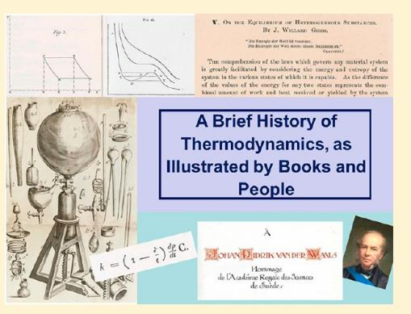

The purpose of the current paper is to give a very brief survey of the early history of thermodynamics, with a particular focus on phases, phase equilibria, and the three laws.[1](#page-11-0) The approach will be a rather unusual one: to follow these themes through some of the books and people that played important roles in their development. I hope that this paper may be of use to those who wish to learn about or teach the history of thermodynamics; in addition, the paper may be of interest to those who wish to consult or collect the original documents that first announced important thermodynamic discoveries.

# ■ BOYLE'S LAW

Some of the oldest components of modern thermodynamics are the ideal gas laws, the first of which was discovered in 1662 by the Irish natural philosopher Robert Boyle (1627−1691; see Figure 1)[.2](#page-11-0) Boyle's law[,3](#page-11-0) which states that the pressure and volume of an (ideal) gas are inversely proportional, was announced in the second edition of his book, New Experiments Physico-Mechanical touching the Spring of the Air. [4](#page-11-0)

Interestingly, the apparatus Boyle used to discover this law was made by his young assistant, Robert Hooke (1635−1703), who was later to make a number of important scientific discoveries of his own (such as Hooke's law for springs). With Hooke's help, Boyle took a J-shaped glass tube, sealed it at the end of the shorter leg, and then gradually filled the longer leg with mercury. Boyle found that the volume of trapped air in the shorter leg became progressively smaller as more mercury was added.

[Figure 2](#page-1-0) shows the page in Spring of the Air that contains his original data. The two columns labeled A give the volume of the trapped air (in two different units), column B gives the height of the mercury, column D gives the pressure after adding the pressure of the atmosphere, and column E is 350 divided by the

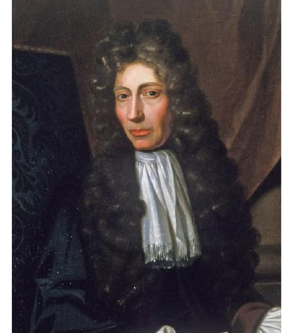

Figure 1. Shannon Portrait of Robert Boyle, by Johann Kerseboom, 1689. Courtesy of the Science History Institute.

volume as given in the second column A. The agreement between the experimental pressure and 350/V is excellent. Boyle comments that column E is "what the pressure should be according to the Hypothesis that supposes the pressures and the expansions to be in reciprocal proportion."

The discovery of Boyle's law was followed some years later by the discoveries of Charles's law (relating gas volume to

Special Issue: Proceedings of PPEPPD 2019

Received: June 4, 2019 Accepted: August 14, 2019 Published: September 12, 2019

|    |    | 10     | 12   |                                                                                |
|----|----|--------|------|--------------------------------------------------------------------------------|
|    | 00 |        |      |                                                                                |
|    |    |        |      |                                                                                |
|    |    |        |      |                                                                                |
|    |    |        | 337  | A A. The number of equal fpaces in the                                         |
|    |    |        |      | fhorter leg, that contained the fame                                           |
|    |    |        | 675  | parcel of Air diverly extended.                                                |
|    |    | 391    | 38   | B. The height of the Mercurial Cylin-                                          |
|    |    | 417    | 4177 | der in the longer leg, that comprels'd                                         |
|    |    | 4476   | 432  | the Air into those dimenfions.                                                 |
| 28 |    | 475    |      | C. The height of a Mercurial Cylinder                                          |
|    |    | 5077   |      | that counterbalanced the preflure of                                           |
| 24 |    |        |      | the Atmofphere.                                                                |
| 23 |    | 613    |      | D. The Aggregate of the two laft Co- Jumns B and C, exhibiting the preffure |
| 23 |    | 64-2   | 627  | fultamed by the included Air.                                                  |
| 21 |    | 077    | 007  | E. What that preffure thould be accor-                                         |
| 20 |    | 70;    |      | ding to the Hypothefis, that fuppoles                                          |
|    |    | 747    | 1319 | the preflures and expansions to be in                                          |
|    |    | 77     |      | reciprocal proportion.                                                         |
|    |    |        |      |                                                                                |
|    |    |        |      |                                                                                |
|    |    |        |      |                                                                                |
|    |    | ITClor |      |                                                                                |
|    |    |        |      |                                                                                |
| 12 |    |        |      |                                                                                |

Figure 2. Table on page 60 of Boyle's 1662 second edition of New Experiments Physico-Mechanical touching the Spring of the Air.

temperature at constant pressure), and the law of Amontons and Gay-Lussac (relating gas pressure to temperature at constant volume). Together, the three laws form the basis of the combined ideal gas law, PV = nRT.

# ■ OBSERVATION OF CRITICAL PHENOMENA

In 1822, the French engineer Charles Cagniard de La Tour (1777−1859[)5](#page-11-0) became the first to observe critical phenomena by listening to the sound of a rolling quartz ball in a sealed, heated vessel containing some alcohol. At a certain temperature, the ball "seemed to rebound at each percussion, as if it was no longer surrounded by a fluid." He then carried out more detailed studies in glass U-tubes (Figure 3), publishing his results in a two-part journal article entitled "Exposéde quelques resultats ́ obtenu par l'action combinee de la chaleur et de la compression ́ sur certains liquides, tels que l'eau, l'alcool, l'ether sulfurique et ́ l'essence de petrole recti ́ fieé" ["Presentation of some results obtained by the combined action of heat and pressure on certain liquids, such as water, alcohol, sulfuric ether, and rectified petroleum spirit"].[6,7](#page-11-0)

By sealing air in one arm of the tube and the sample to be studied in the other, separated from one another by mercury, and placing only the arm containing the sample into a hot bath, Cagniard could follow the pressure inside the tube by applying Boyle's law to the diminution in the volume of the trapped air. He noted the pressure and temperature necessary for the sample to become homogeneous, with no separate liquid and gaseous phases. Cagniard thought that heating had destroyed the liquid phase; we now know that he had discovered the critical point where the difference between the liquid and gas phases disappears.[8](#page-11-0) For diethyl ether, Cagniard found that this phenomenon occurred at 160 °Ré(= 200 °C)[9](#page-11-0) and 38 atm, vs modern values of 194 °C and 36 atm. Cagniard's values for "alcohol of 36 degrees" (= 36% by volume) were 207 °Ré(= 259 °C) and 119 atm, vs modern values of 290 °C and 120 atm. His results were not so bad, especially in view of the fact that he had to take care to charge his glass apparatus with enough liquid to reach the critical pressure, but not so much that the apparatus exploded when it was heated.

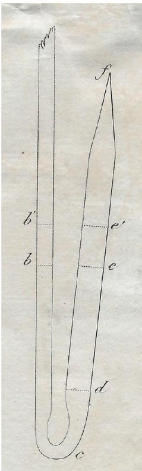

Figure 3. Apparatus used by Cagniard de la Tour to measure critical points, from the journal issue of his 1823 paper.

As far as I know, there are no known portraits of Cagniard de la Tour, and images purported to be of him are actually of other people. In some cases the false portrait is that of the French painter Maurice Quentin de la Tour (1704−1788; no relation), and in others the false portrait is that of the Englishman Henry Benedict Stuart (1725-1807), Cardinal-Duke of York, who not only had a different last name but was not even French.

# ■ THE FIRST BOOK ON THERMODYNAMICS

In 1824, the French military engineer Sadi Carnot (1796−1832; Figure 4) [10](#page-11-0) wrote a highly important treatise, Reflexions sur la ́

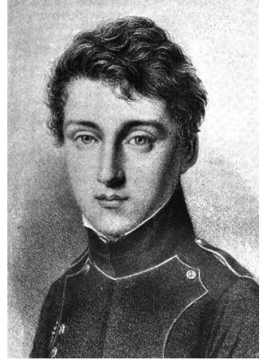

Figure 4. Sadi Carnot in 1813, from a painting by Louis-Leopold Boilly. ́ Image from Reflections on the Motive Power of Heat, Thurston, R. H., ed., Wiley, New York, 1897.

puissance motrice du feu et sur les machines propres a developper ́ cette puissance [Reflections on the motive power of fire and on the machines to develop this power] (Figure 5).[11](#page-11-0) Carnot was prompted to write his book out of a desire to improve the efficiency of steam engines[.12](#page-11-0)

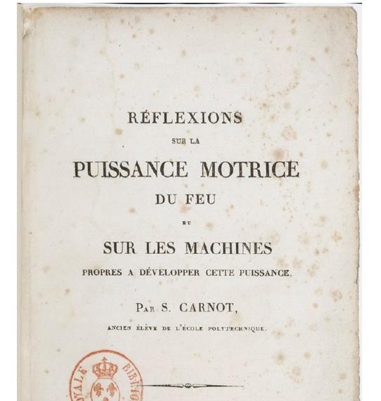

Figure 5. Title page of Carnot's 1824 book Reflexions sur la puissance ́ motrice du feu. Image courtesy of the Bibliotheque nationale de France. ̀

In his book, which he published at his own expense, he considered two principal questions: how much work is available from a heat source, and can more work be obtained by replacing the steam with a different substance? In answering these questions, Carnot developed a general theory of heat as a motive force, in which he assumed that the transfer of heat from a warm body to a cold body was analogous to falling matter and therefore produced mechanical work. Thus, he concluded that the motive power increased with the difference in the temperatures of the two bodies, although he did not give a formula for this relationship. He further stated that the results were independent of the nature of the working substance. One key invention was his concept of the Carnot cycle, a series of isothermal and adiabatic expansions and contractions of a gas. The cycle provides an upper limit on the efficiency of any heat engine.

Carnot's arguments were mostly non-mathematical, which made his ideas less precise, but they contained important new ideas that founded the science of thermodynamics. Much like Gregor Mendel's paper on plant genetics, Carnot's book remained unappreciated for many years, and in fact was so scarce that many later scientists never saw a copy. As we will see in the next section, largely because of Clapeyron, Carnot's book later had a great influence on the thinking of many early contributors to thermodynamics, including Helmholtz, Joule, Clausius, Thomson, and others.

### ■ THE INTRODUCTION OF MATHEMATICAL THERMODYNAMICS

In 1834, the French engineer Benoıt Pierre E ̂ ́ mile Clapeyron (1799−1864; see Figure 6) [13](#page-11-0),[14](#page-11-0) published a journal article entitled "Memoire sur la Puissance Motrice de la Chaleur ́ "

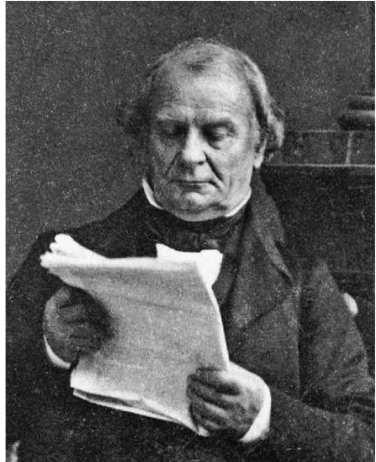

Figure 6. É mile Clapeyron, about 1860. Image courtesy of ParisTech.

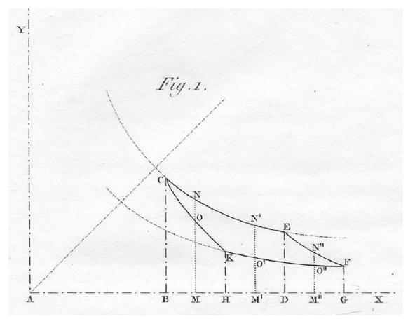

Figure 7. The first P−V plot of a thermodynamic cycle, from the journal appearance of Clapeyron's 1834 paper.

["Memoir on the Motive Power of Heat"][.15](#page-11-0) This paper is notable for four main achievements:

- It brought Sadi Carnot's 1824 work to the attention of the scientific community.
- It was the first to use pressure−volume plots to describe Carnot's engine cycle (Figure 7).
- It pioneered the use of calculus to describe thermodynamic principles; Clapeyron's use of differential expressions set the tone for all later work in thermodynamics.
- It contained the first explicit equation for the combined ideal gas law.

In addition, Clapeyron's paper showed that the latent heat of a phase transition was proportional to the slope of the coexistence curve separating two phases in a pressure−temperature diagram (i.e., dp/dt), a relation now known as the Clapeyron equation. Rudolph Clausius (1822−1888) derived an equivalent equation in 1850 (16 years later); the equation is strictly true only when the vapor obeys the ideal gas law, the heat of vaporization is temperature-independent, and the volume of the liquid is small compared with that of the gas.

The symbol Q for heat and the symbol R for the ideal gas constant were invented by Clapeyron in this paper ([Figure 8)](#page-3-0);

$$\begin{aligned} p\nu &= \frac{p_{\nu}\nu_{\bullet}}{\omega\theta_{7} + \iota_{\bullet}} \left(\omega\theta\gamma + t\right), \\ \text{ou posant, pour simplifier, } \begin{aligned} p\nu &= \frac{p_{\nu}\nu_{\bullet}}{\omega\theta_{7} + \iota_{\bullet}} = R: \\ p\nu &= R\left(\omega\theta\gamma + t\right). \end{aligned} \end{aligned}$$

Figure 8. Text from Clapeyron's 1834 paper, showing the first use of the symbol R for the ideal gas constant.

most likely the letter Q was an abbreviation for quantite, ́ [16](#page-11-0) and R was an abbreviation for rapport, the French word for ratio. [17](#page-12-0) The ideal gas law appears in Clapeyron's paper in the form pv = R(267 + t), where p is the pressure, v is the volume, R is a constant, and the term 267 converts the temperature t in degrees Celsius to the absolute Kelvin scale (although the latter was not actually invented until 1848).[18](#page-12-0)

### ■ THE FIRST LAW OF THERMODYNAMICS AND THE MECHANICAL EQUIVALENT OF HEAT

The German natural philosopher Julius Robert von Mayer (1814−1878; Figure 9) [19](#page-12-0) was the first to calculate the

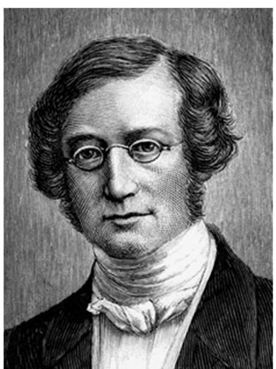

Figure 9. Julius Mayer, about 1850. Image courtesy of American Institute of Physics.

mechanical equivalent of heat, in a rather unsound handwavy paper in 1842. He did not give a derivation, only a number. Although some references claim that this paper contains a statement of the first law of thermodynamics, the claim is incorrect; although Mayer said that energy (which he called "force") could be converted into other forms, this statement is not equivalent to a conservation law. It has been said of Mayer's 1842 article, "This is the sort of paper no scientist would look at twice unless he were in search of a reason to deny priority to someone else." [20](#page-12-0)

Mayer's follow-up work in 1845, Die organische Bewegung in ihrem Zusammenhange mit dem Stoffwechsel. Ein Beitrag zur Naturkunde [Organic Motion in Connection with Nutrition. A Contribution to Natural History] [21,22](#page-12-0) (Figure 10), displays a far better grasp of physics, but was rejected by the journal he sent it to. As a result, Mayer published it privately. Here, Mayer stated

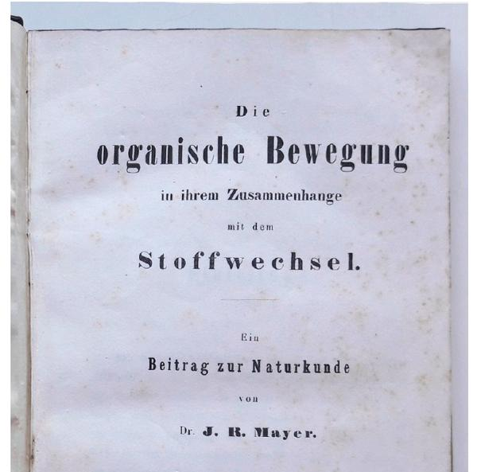

Figure 10. Title page of Mayer's 1845 book giving his proposal of the conservation of "force".

that work and heat are different forms of "force", which can be converted into other forms but not destroyed; this statement, which is perhaps the earliest explicit enunciation of the first law of thermodynamics, shows that Mayer's views had matured since 1842.

In this 1845 paper, Mayer gave his derivation of the mechanical value of heat, which was based on the heat generated upon compressing air. He found that 1 kcal = 367 kg m; the modern value is 427 kg m.

The first law of thermodynamics[23](#page-12-0) was independently formulated by at least four people[:24](#page-12-0)−[26](#page-12-0) Mayer, the German physician and physicist Hermann von Helmholtz (1821−1894; Figure 11)[,27](#page-12-0) the Danish engineer Ludvig Colding (1815− 1888),[28,29](#page-12-0) and the English engineer James Joule (1818− 1899).[30](#page-12-0) Second to publish, after Mayer, was Helmholtz, who

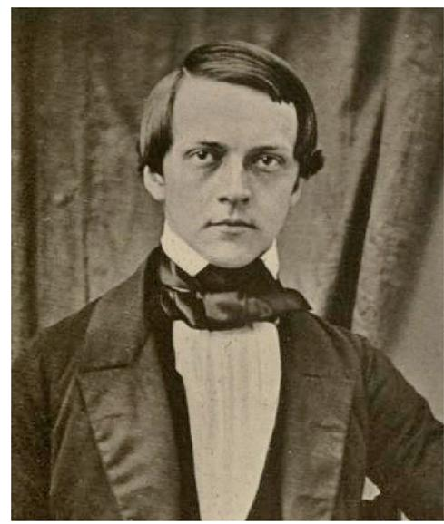

Figure 11. Hermann Helmholtz, in 1848. Image from Koenigsberger, L., Hermann von Helmholtz, Clarendon Press, Oxford, 1906.

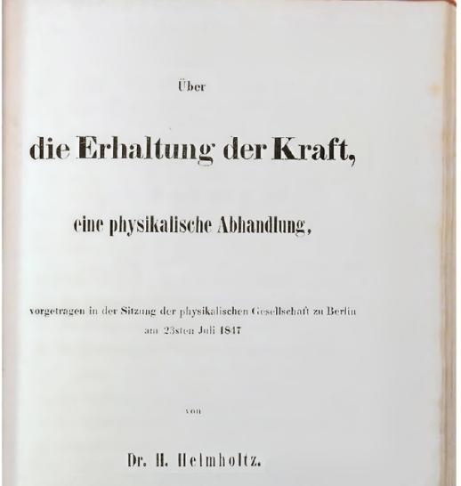

Figure 12. Title page of Helmholtz's 1847 book announcing his independent formulation of the first law of thermodynamics.

announced his ideas in his 1847 book, Ü ber die Erhaltung der Kraft, eine physikalische Abhandlung [On the Conservation of Force, a Physical Treatise] (Figure 12).[31](#page-12-0)−[33](#page-12-0)

As a young man, Helmholtz had wanted to study physics, but the only way he could afford to attend university was with a scholarship given to medical students who promised to serve in the army after graduating. As a result, in 1838 Helmholtz entered medical school in Berlin, and in 1842 he became an army surgeon at Potsdam, where he continued studying mathematics and physics on his own. It was partly as a result of studying a physiological issue, the heat generated by muscle action, that he was led to write his 1847 book. His medical training also led him in 1851 to invent the ophthalmascope, the device physicians still use today to inspect the inside of the eyeball.

Helmholtz submitted his results on the conservation of energy for publication in a scientific journal, the Annalen der Physik, but it was rejected (much like Mayer's 1845 book on the same topic) because of its non-experimental character. He therefore decided to publish it in 1847 in book form[.22](#page-12-0) Helmholtz's derivation of the conservation of energy was based on the impossibility of perpetual motion and on the Newtonian model of forces. But he went well beyond just articulating the conservation principle: he also showed how to apply the principle to real phenomena. Thus, he applied the principle to deduce the mechanical equivalents of heat, to understand how irradiation with light can produce thermal and chemical effects, and to analyze the work that can be done with electric currents. In all, Helmholtz's book gave "the first comprehensive statement of the first law of thermodynamics: that all modes of energy, heat, light, electricity, and all chemical phenomena, are capable of transformation from one to the other but are indestructible and cannot be created." [34](#page-12-0)

# ■ THE SECOND LAW OF THERMODYNAMICS

The second law of thermodynamics[35](#page-12-0) was formulated independently by two scientists, the German physicist Rudolf Clausius (1822−1888; Figure 13) [36,37](#page-12-0) and the Irish physicist William Thomson, also known as Lord Kelvin or Baron Kelvin of Largs (1824−1907; Figure 14).[38](#page-12-0) Clausius published first,[39](#page-12-0) stating in 1850 that "No process is possible whose sole result is the transfer of heat from a body of lower temperature to a body

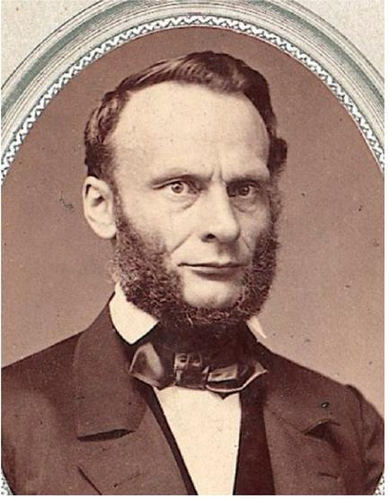

Figure 13. Rudolf Clausius, about 1865. Image courtesy of the Mathematisches Forschungsinstitut Oberwolfach.

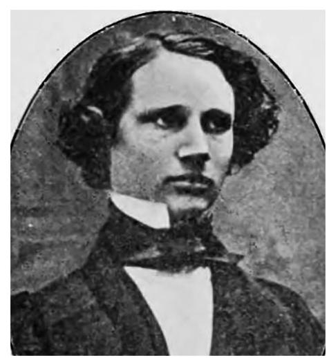

Figure 14. William Thomson, in 1846. Image from Popular Science Monthly, 1908, 72, 187.

of higher temperature." In addition to emphasizing the equivalence of heat and work, Clausius pointed out thatin the operations of heat enginespart of the heat is converted into work while the rest descends to the lower temperature body. Thus, work is produced not just by a change in the distribution of heat, but also by the consumption of heat.

This paper is also where the equivalence of heat and mechanical energy is first given the name "first law of thermodynamics", and where the inability of heat to pass by itself from a colder body to a warmer is first called the "second law".

In 1865, Clausius gave the name "entropy" to a thermodynamic quantity he had previously called the equivalence value or transformational content of a body.[40](#page-12-0) It has been speculated[41](#page-12-0) that Clausius chose the symbol S for entropy to honor Sadi Carnot, but this seductive (and increasingly promulgated) conjecture is almost certainly untrue; the given names of scientists are rarely if ever used this way, and Clausius himself never gave a reason for his choice.

A few months after Clausius's 1850 paper appeared, William Thomson expressed the second law in an equivalent form, now known as the Thomson (or Kelvin) statement: "It is impossible, by means of inanimate material agency, to derive mechanical effect from any portion of matter by cooling it below the temperature of the coldest of the surrounding objects."

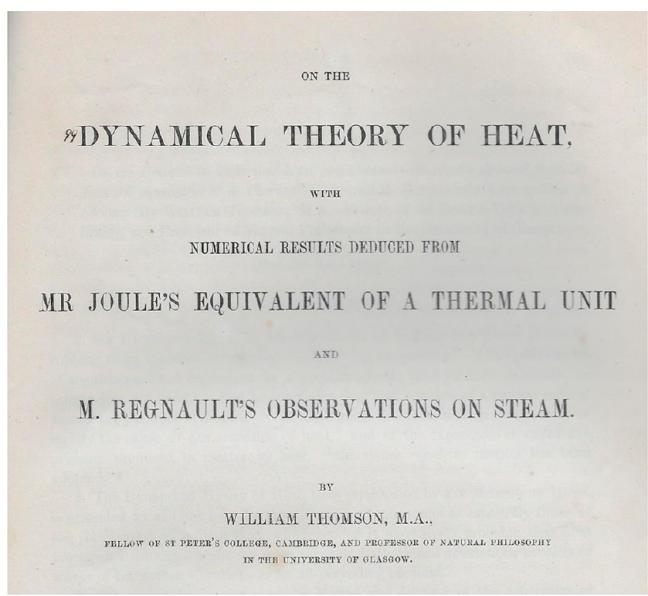

Figure 15. Title page of the offprint of Thomson's paper announcing the second law of thermodynamics. This copy, like all of the few known offprints of this paper, has two manuscript corrections in Thomson's hand on pages 267 and 281.

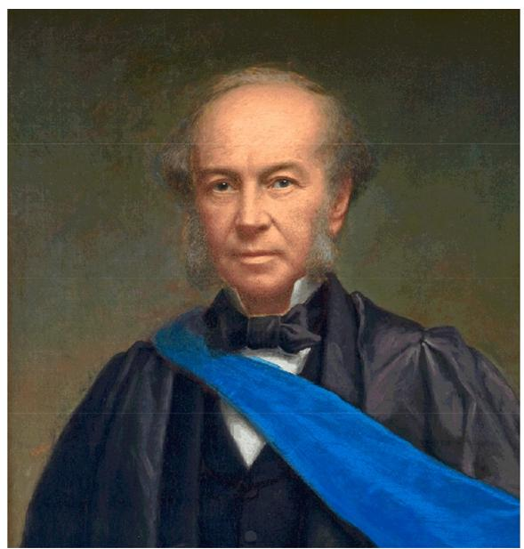

Figure 16. Thomas Andrews, about 1880. Image courtesy of Queen's University Belfast.

Thomson's formulation appeared in his 1851 paper, "On the Dynamical Theory of Heat, with Numerical Results Deduced from Mr. Joule's Equivalent of a Thermal Unit and M. Regnault's Observations on Steam" (Figure 15).[42](#page-12-0),[43](#page-12-0) In this work, Thomson emphasizedas the title of his paper made explicit (and as Clausius had also concluded)that heat is not a substance but a state of motion. In formulating his "dynamical theory of heat" Thomson asserted that, in irreversible processes, some heat is converted to an unrecoverable form: it is transformed and dissipated into the energy of motion of unobservable particles, but not destroyed. Thomson stressed that the phenomenon of irreversibility is intimately tied to the directionality of heat flow. In his view, the indestructibility of energy (the first law) and the dissipation of energy (the second law) are compatible because dissipated energy is not destroyed, but merely unrecoverable.

# ■ RENEWED INTEREST IN CRITICAL PHENOMENA

In the 1860s, the Irish chemist and physicist Thomas Andrews (1813−1885; Figure 16) [44](#page-12-0)−[46](#page-12-0) decided to reinvestigate Cagniard's discovery of the disappearance of the distinction between gas and liquid phases above a certain temperature and pressure. He published some initial results in 1861, but his first important paper on the topic appeared in 1869: "On the Continuity of the Liquid and Gaseous States of Matter" (Figure 17).[47](#page-12-0) This paper contained detailed studies of Cagniard's

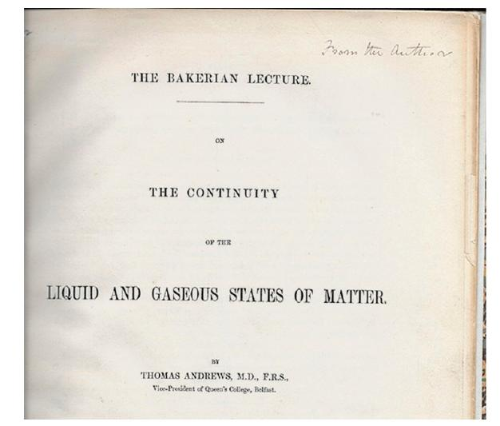

Figure 17. Title page of the offprint of Andrews's Bakerian Lecture of 1869 on critical phenomena. This copy is signed by him.

phenomenon; it is also notable because in it Andrews gave the name "critical point" to the conditions under which the two phases become identical.

Andrews described his experiments on the critical point of carbon dioxide as follows:

- On partially liquefying carbonic acid by pressure alone, and gradually raising the temperature at the same time to 88° Fahr., the surface of demarcation between the liquid and gas becomes fainter, loses its curvature, and at last disappears. The space is then occupied by a homogeneous fluid, which exhibits when the pressure is suddenly diminished or the temperature slightly lowered, a peculiar appearance of moving or flickering striae throughout its entire mass.[8](#page-11-0) At temperatures above 88° no apparent liquefaction, or separation into two distinct forms of matter, could be effected, even when a pressure of 300 or 400 atms was applied.
Andrews also described the conversion of a gas to a liquid without passing through a phase transition:

I have frequently exposed carbonic acid, without making any precise measurements, to much higher pressures than any marked in the Tables, and have made it pass, without break or interruption from what is regarded by everyone as the gaseous state, to what is, in like manner, universally regarded as the liquid state. ... During the whole of this operation no breach of continuity has occurred. It begins with a gas, and by a series of gradual changes, presenting nowhere any abrupt alteration of volume or sudden evolution of heat, it ends with a liquid.

Andrews's 1869 paper contained the first illustration of the pressure−volume isotherms for conditions near the critical point (Figure 18).

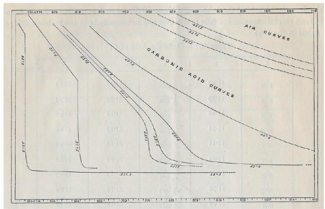

Figure 18. P−V curves of CO2 from the offprint of Andrews's 1869 paper.

### ■ MAXWELL'S CONTRIBUTIONS TO THERMODYNAMICS

The Scottish scientist James Clerk Maxwell (1831−1879; Figure 19) [48](#page-12-0) is best known for his work on the theory of electromagnetic radiation and the kinetic theory of gases, but he also made important contributions to thermodynamics.[49](#page-12-0) In 1871,

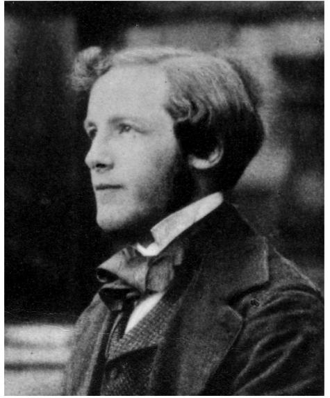

Figure 19. James Clerk Maxwell in 1853. Image courtesy of Trinity College, Cambridge.

he wrote Theory of Heat, one of a series of books intended for schoolchildren or the interested layperson; the book is subtitled "Adapted for the use of artisans and students in public and science schools". Even though the book was popular (it went through 10 editions over the next 20 years), the intended use as a textbook meant that few copies have been preserved; today it is hard to find.

The Theory of Heat contained an excellent account of the subjects of heat and thermodynamics, but it also contained much new science. Among these are the "Maxwell relations", which are the partial differential equations that show the relationships between the thermodynamic variables pressure, volume, entropy, and temperature. The book also contained the first appearance in print of Maxwell's "sorting demon" (so named by Thomson), a member of a class of "very small but lively beings incapable of doing work but able to open and shut valves which move without friction and inertia" and thereby defeat the second law of thermodynamics.

The Theory of Heat presented Maxwell's initial theory for the location of the straight line portion of the curve[50](#page-12-0) that describes the volume-pressure isotherm of a gas−liquid system; his initial hypothesis was that the position of the horizontal line (CG in Figure 20) maximizes the difference between the intrinsic

Figure 20. Hypothetical isotherms and the replacement of a certain portion of the curve with a tie line representing the liquid−gas condensation process, from the first edition of Maxwell's book Theory of Heat.

energy of the substance in the gaseous and liquid states. Four years later, in 1875, Maxwell reformulated the theory in the form now known as the Maxwell construction or the "equal area rule". [51](#page-12-0)

Finally, the Theory of Heat also contained the first explicit statement (since Joseph Black made a similar statement in 1787)[52](#page-12-0) of the transitive nature of thermal equilibrium, later to be called zeroth law of thermodynamics[.53](#page-12-0) The presence of all these innovations is remarkable for a book meant for nonscientists.

### ■ "THE GREATEST SYNTHETIC MATHEMATICIAN SINCE NEWTON"

The title of this section is said[54](#page-13-0) to have been a declaration by Ludwig Boltzmann; the person he was referring to was the American scientist Josiah Willard Gibbs (1839−1903; [Figure](#page-7-0) [21)](#page-7-0).[55](#page-13-0) Wilhelm Ostwald was similarly laudatory: he called Gibbs

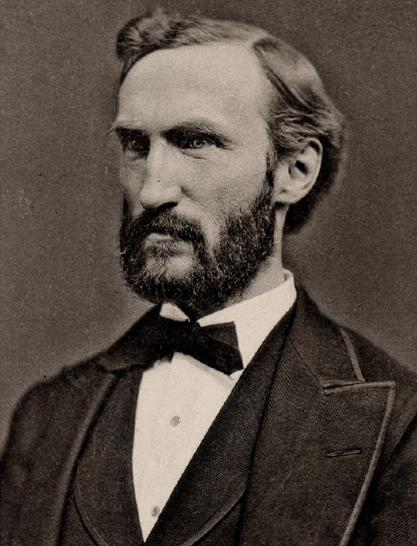

Figure 21. Josiah Willard Gibbs, about 1880. Image courtesy of Yale University.

"no doubt the greatest scientific genius the United States has produced." [56](#page-13-0) Gibbs spent his entire career at Yale University in New Haven, Connecticut. Interestingly, he worked there without pay for 10 years, living off inherited income, until Johns Hopkins University tried to hire him in 1880 at a salary of \$3000 per year. In response, Yale offered him \$2000 per year, which he accepted.

In 1873, Gibbs published his first two papers on thermodynamics; one of them was entitled "A Method of Geometrical Representation of the Thermodynamic Properties of Substances by Means of Surfaces". [57](#page-13-0) In this paper, Gibbs showed that a system is at chemical equilibrium (at constant temperature and pressure) when the quantity ε − Tη + Pν is at a minimum, where ε represents internal energy, η entropy, and ν volume (Figure 22). This is the first appearance in print of the

Figure 22. Footnote from the offprint of Gibbs's 1873 paper, A Method of Geometrical Representation.

Gibbs energy. What is somewhat remarkable is that Gibbs announced this theorem, arguably one of the most important in all of thermodynamics, in a footnote.

In this paper, Gibbs also showed that surfaces in threedimensional entropy-energy-volume diagrams can be used to discuss the coexistence and relative stabilities of gas, liquid, and solid phases of a pure substance at various temperatures and pressures. Using these diagrams,[58](#page-13-0) he discussed in particular the critical point, which had been discovered experimentally for carbon dioxide only a few years earlier by Thomas Andrews.

Three years later, Gibbs published the first part of a landmark 320 page paper,[59](#page-13-0) "On the Equilibrium of Heterogeneous Substances" (Figure 23). Called by some 'The Principia of

Figure 23. One page from the galley proofs of part 2 of Gibbs's great 1876−1878 paper on thermodynamics, bearing Gibbs's corrections in his handwriting.

Thermodynamics', [60](#page-13-0) in reference to Isaac Newton's great book of 1687, Gibbs's paper was published (like many of those Gibbs wrote in his lifetime) in a local journal that had a relatively small circulation, the Transactions of the Connecticut Academy of Sciences. In this paper, Gibbs introduced the phase rule and thoroughly analyzed the phenomenon of equilibrium.[61](#page-13-0)

This paper is considered one of the most importantyet near-impenetrableworks in all of thermodynamics. The American historian Henry Adams commented, "I have run my head hard up against a form of mathematics that grinds my brains out. I flounder like a sculpin in the mud. It is called the 'law of phases', and was invented at Yale. No one shall persuade me that I am not a phase." [62](#page-13-0) And at a meeting of the Connecticut Academy of Sciences in 1903, a member is reputed to have said, with only a little exaggeration, "Only one man lived who could understand Gibbs' papers. That was Maxwell, and now he is dead." [63](#page-13-0) Fortunately, Gibbs's great work is today now accessible through the efforts of many later scientists. Ostwald was one of the first of these: in his introduction to his 1892 German translation of the paper, he said he was prompted to carry out the translation because it contained "hidden treasures". [64](#page-13-0)

### ■ THE CONTINUITY OF THE LIQUID AND GASEOUS STATES AND THE EQUATION OF STATE FOR A NONIDEAL GAS

In 1873, Johannes Diderik van der Waals (1837−1923; Figure 24) [65](#page-13-0),[66](#page-13-0) wrote one of the most influential Ph.D. theses in all of

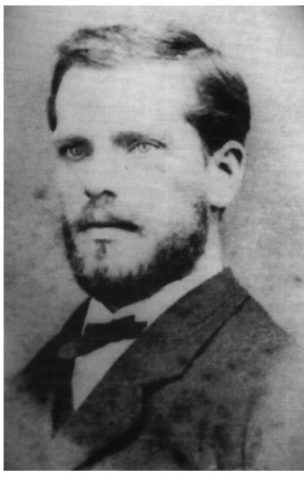

Figure 24. Johannes Diderik van der Waals, about 1870. Image reproduced with permission from ref [65](#page-13-0).

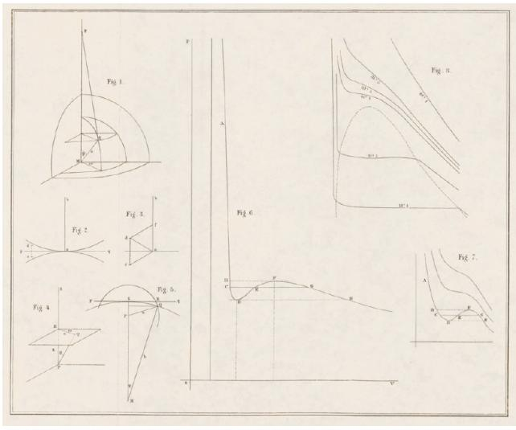

Figure 25. Figures from van der Waals's 1873 thesis showing (center) his calculated isotherms and (right) reproductions of figures from Andrews's 1869 paper and Maxwell's 1871 book, Theory of Heat.

science (Marie Curie, Louis de Broglie, and Svante Arrhenius come to mind as modern rivals in this sense). The title he chose, "Over de Continuiteit van den Gas- en Vloeistoftoestand" ["On the Continuity of the Gas and Liquid State"] [67](#page-13-0) (Figures 25 and [26](#page-9-0)), is a direct borrowing from the title of Andrews's 1869 paper, "On the Continuity of the Liquid and Gaseous States of Matter". Inspired to write his Nobel-prize-winning thesis by Andrews's results on the behavior of gases near the critical point, van der Waals realized the necessity of taking into account the volumes of molecules and the intermolecular forces (now called "van der Waals forces") in establishing the relationship between the pressure, volume, and temperature of gases and liquids. From these principles, van der Waals proposed that there is no essential difference between gaseous and liquid states of matter, and that their behavior was governed by the equation of state: (p + a/v2 )(v − b) = R (1 + αt), where a and b are constants characteristic of the substance, and α (= 1/273) helps convert the temperature t in degrees Celsius to the absolute scale.[68](#page-13-0)

A second great discovery was published in 1880: van der Waals's law of corresponding states, which was reported in a paper with the title "Onderzoekingen omtrent de overeenstemmende eigenschappen der normale verzadigdendamp−en vloeistoflijnen voor de verschillende stoffen" ["Investigations on the corresponding properties of the normal saturated vapor and liquid curves for different fluids"][.69](#page-13-0) The law of corresponding states shows, in the form of a cubic equation, that the behavior of all gases (and liquids!) is pretty much the same, except for a scaling factor related to the critical point of the substance ([Figure 27](#page-9-0)). The law served as a guide during experiments that ultimately led to the liquefaction of hydrogen by James Dewar in 1898 and of helium by Heike Kamerlingh Onnes in 1908. Onnes wrote that "Van der Waals' studies have always been considered as a magic wand for carrying out experiments and that the Cryogenic Laboratory at Leyden developed under the influence of his theories." [70](#page-13-0)

Van der Waals made other important contributions to thermodynamics, including his theory of binary solutions (1890) and his thermodynamic theory of capillarity (1893). His discoveries led to his winning the Nobel Prize in physics in 1910 "for his work on the equation of state for gases and liquids".

# ■ THERMODYNAMIC PROPERTIES OF SOLUTIONS

The French chemist François-Marie Raoult (1830−1901; [Figure 28)](#page-9-0) [71,72](#page-13-0) made important contributions to our understanding of the properties of solutions, especially the effect of solutes on the depression of the freezing points and vapor pressures. The British physician and scientist Charles Blagden (1748−1820) had been the first to show, in 1788, that the dissolution of a solid in water lowers the freezing point, and that for dilute solutions the lowering is proportional to the concentration of the solution. But Raoult extended these observations to other solvents, and by 1882, he had found that most systems followed what he called the general law of freezing: if one mole of a substance is dissolved in 100 moles of any given solvent, the freezing point of the solution will be lowered by 0.63 °C.[73](#page-13-0) Raoult also found that solutions of inorganic salts in water did not obey the law but often had double or triple the effect; this anomalous behavior was explained the very next year, in 1883, by Svante Arrhenius (1859−1927) and his theory of electrolytic dissociation. In fact, Raoult's data served as some of the best evidence in favor of Arrhenius's theory.

Raoult soon extended his work to investigations of the effect of solutes on solution vapor pressures. In 1887, he briefly reported his results for low concentrations of five different nonvolatile solutes in water, and for 14 different solutes in 11 organic solvents.[74](#page-13-0) In this important paper, he found the general law that, if one mole of a non-saline substance is dissolved in 100 moles of any given solvent, the vapor pressure of the solution will be lowered by 1.05%. Interestingly, he found that in some solvents carboxylic acids showed half the expected effect, and he concluded correctly that in such cases the dissolved species presumably consist of two molecules bound together (carboxylic acids readily form hydrogen-bonded dimers especially if the concentration is high and the solvent is non-polar).

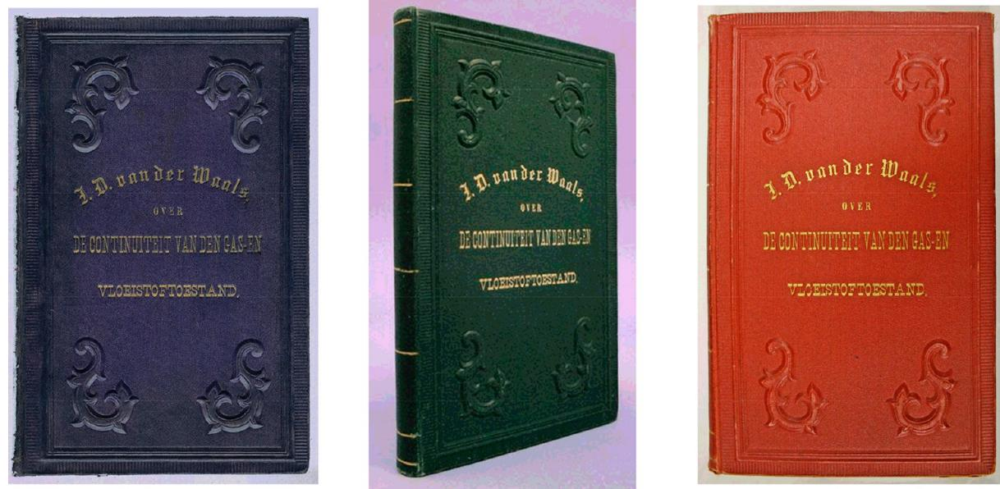

Figure 26. Van der Waals had three copies of his thesis specially bound. The purple copy may have been given to his friend and tutor, Johannes Bosscha, and the green copy was kept for many years by the van der Waals family. The red copy is inscribed to Heike Kamerlingh Onnes (Nobel Prize in 1913 for discovery of superconductivity). Last image courtesy of the Boerhaave Museum.

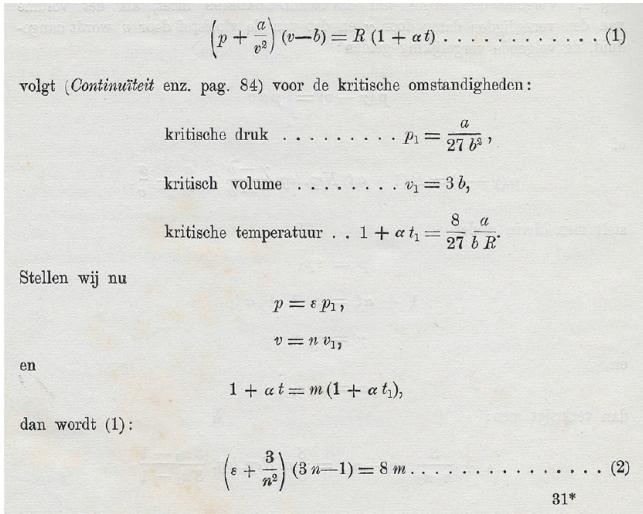

Figure 27. First appearance of the law of corresponding states, from the offprint of van der Waals's paper of 1880.

Later in 1887,[75](#page-13-0) Raoult pointed out that this number was consistent with an equation that the Dutch physical chemist J. H. van 't Hoff (1852−1911) had derived thermodynamically in 1886: ideally, the fractional lowering of the vapor pressure should equal the mole fraction of the solute. In a full paper that appeared the next year (Figure 29), Raoult revised his factor to exactly the theoretical value of 1.00%;[76](#page-13-0) the result is what we now know as Raoult's law. For his work, Raoult is considered the modern father of the scientific fields of cryometry (the measurement of freezing points), ebulliometry (the measuring of boiling points), and tonometry (the measurement of vapor pressures), with respect to solutions of dissolved compounds.

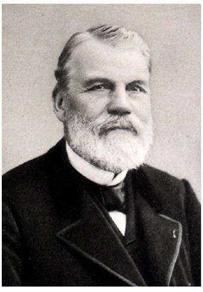

Figure 28. Francois-Marie Raoult in 1890. From ̧ Zeitschrift für Physikalische Chemie, 1898, Vol. 27, frontispiece.

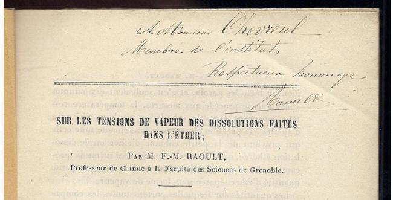

Figure 29. First page of offprint of Raoult's 1888 paper on the effect of solutes on the vapor pressure of ether. This offprint is inscribed by Raoult to the chemist Eugene Chevreul (1786 ̀ −1889), a member of the Academy of Sciences known for his work on the nature of fatty acids. Chevreul was 101 years old when Raoult sent him this paper.

### ■ STUDIES OF THE THERMODYNAMIC PROPERTIES OF SUBSTANCES AT HIGH PRESSURES

In an extension of the work of Cagniard de la Tour and Thomas Andrews, the French physical chemist É mile-Hilaire Amagat (1841−1915; Figure 30) [77](#page-13-0),[78](#page-13-0) carried out extensive studies of the

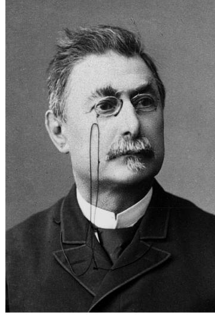

Figure 30. É mile-Hilaire Amagat, in 1894. Image courtesy of Collections É

compressibilities of a variety of gases and liquidsincluding N2, O2, air, H2, CH4, C2H4, CO, CO2, H2O, and a variety of organic liquids. His initial studies were performed in extremely tall glass or steel manometer tubes in which one arm was filled with mercury. At first, he attached his tubes to the tower of a local church and thereby was able to construct manometers as tall as 63 meters; soon thereafter he attached them to the side of a mine shaft and in this manner could construct manometers as tall as 327 meters! With the latter apparatus, he was able to measure the compressibilities of gases at pressures up to 430 atm and at temperatures from 0 to 100 °C.

But Amagat was not satisfied with this achievement and, in order to measure still higher pressures, in 1886 he constructed a steel manometer that employed a reversed hydraulic press to generate the pressure; the press was made gas-tight with viscous liquids such as molasses and castor oil. With this apparatus, Amagat was able to obtain accurate measurements of pressures exceeding 3000 atm.

Amagat is also known for his law of equal volumes,[79](#page-13-0) which states that, when gases are mixed, the volumes of the component gases (measured at the same temperature and pressure) are additive. It is similar to Dalton's law of partial pressures, which states the pressures of the component gases (measured at the same temperature and volume) are additive. The two laws give identical predictions for ideal gases, but Amagat's law more accurately reflects the behavior of non-ideal gases.

Amagat wrote several books in which he compiled the data from his many papers. His last book, which appeared in 1912, Notes sur la Physique et la Thermodynamique [Notes on Physics and Thermodynamics], contains important results on the specific heats of gases, the internal pressure of fluids, and the corresponding states of matter. One notable aspect of this book is that it contains early photographs of liquids at or near the critical point (Figure 31).

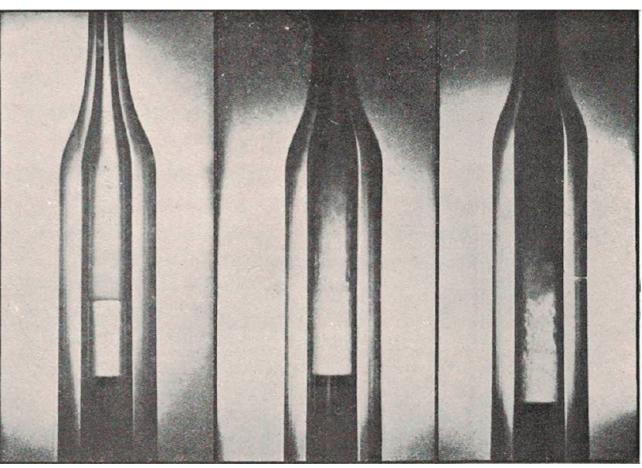

cole polytechnique (Palaiseau, France). Figure 31. Figure from Amagat's monograph of 1912, showing the disappearance of the liquid−gas interface as the critical point is approached and passed. This copy of the monograph is signed by Amagat.

# ■ THE THIRD LAW OF THERMODYNAMICS

The third law of thermodynamics, also called Nernst's heat theorem[,80](#page-13-0) was announced by the German chemist Walter Nernst (1864−1941; Figure 32) [81](#page-13-0) in his 1906 paper, "Ueber die Berechnung chemischer Gleichgewichte aus thermischen Messungen" ["On the Calculation of Chemical Equilibria from Thermal Measurements"] ([Figure 33)](#page-11-0).[82](#page-13-0) The Nernst heat theorem states that, as absolute zero is approached, the entropy

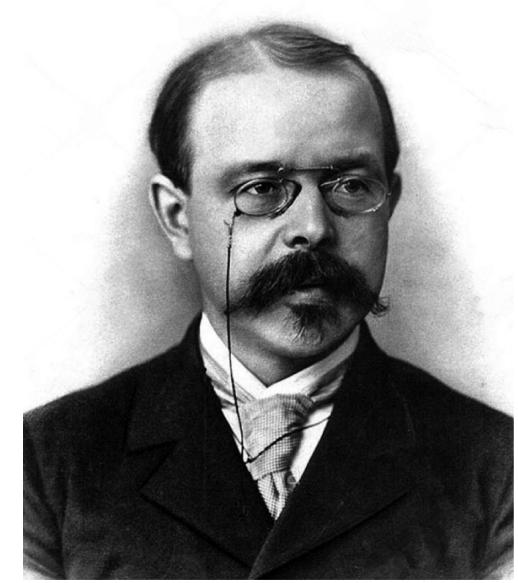

Figure 32. Walter Nernst in 1889. Image courtesy of the Smithsonian Institution.

change ΔS for a chemical or physical transformation approaches zero.

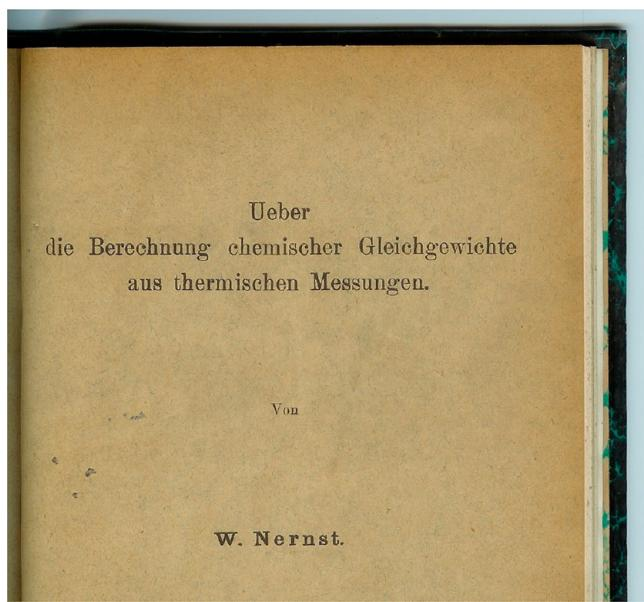

Figure 33. Front wrapper of the offprint of Nernst's 1906 paper announcing the third law of thermodynamics.

Nernst's heat theorem has a number of important consequences. One is that it is not possible to reach a temperature of exactly zero Kelvin in a finite number of operations. In addition to its theoretical implications, Nernst's heat theorem was soon applied to industrial problems, such as calculations of the conditions necessary to synthesize ammonia from atmospheric nitrogen, the chemical reaction that is the basis of artificial fertilizers. Previously it had been possible to define only the change in entropy that accompanies a process; the actual values of the entropy in the initial and final states were unknown. With Nernst's insight, it became possible to calculate absolute entropies for the first time, so that the conditions of equilibrium in many chemical reactions could be precisely worked out. For this discovery he was awarded the Nobel Prize in chemistry in 1920.

# ■ CONCLUSIONS

The history of thermodynamics is an intricate tapestry, and this brief survey necessarily omits mention of many interesting discoveries and the scholars who made them. Additional information can be found in two excellent books on the history of thermodynamics[,83](#page-13-0),[84](#page-13-0) in an article about the history of thermochemistry[,85](#page-13-0) and in a book chapter giving detailed information about many of the original documents that first announced important thermodynamic discoveries[.86](#page-13-0)

# ■ AUTHOR INFORMATION

#### Corresponding Author

*E-mail: [girolami@scs.illinois.edu](mailto:girolami@scs.illinois.edu).

ORCID

Gregory S. Girolami: [0000-0002-7295-1775](http://orcid.org/0000-0002-7295-1775)

Notes

The author declares no competing financial interest.

# ■ ACKNOWLEDGMENTS

I thank the William and Janet Lycan Fund of the University of Illinois for support, Vera Mainz for her valuable help, and the organizers of the 15th conference on Phase Equilibria for Process and Product Design for suggesting the topic. All uncredited images are from private collections, and I thank the owners for permission to reproduce them.

# ■ REFERENCES

(1) Based on a talk delivered at the 15th conference on Phase Equilibria for Process and Product Design, Vancouver, Canada, 12−16 May 2019.

(2) Hunter, M. Boyle: Between God and Science. Yale University Press: New Haven, CT, 2009.

(3) Webster, C. The Discovery of Boyle's Law, and the Concept of the Elasticity of Air in the Seventeenth Century. Arch. Hist. Exact Sci. 1965, 2, 441−502.

(4) The 1662 edition of Boyle's book is not particularly scarce, but it is rather expensive owing to its significance and appeal to collectors. Original copies of this edition appear at least once a year on the antiquarian book market.

(5) Payen, J. Cagniard De La Tour, Charles. In Dictionary of Scientific Biography; Gillispie, C. C., Ed.; Charles Scribner's Sons: New York, 1971; Vol. 3, pp 8−10.

(6) Cagniard de la Tour, C. Exposéde quelques resultats obtenu par ́ l'action combinee de la chaleur et de la compression sur certains ́ liquides, tels que l'eau, l'alcool, l'ether sulfurique et l ́ 'essence de petrole ́ rectifiee. ́ Ann. Chim. Phys. 1822, 21, 127−132 and 178−182. Cagniard's two-part article was translated into English in Annals of Philosophy, 1823, 5, 290−294, and in Repertory of Arts, Manufactures, and Agriculture, 1823, 43, 177−184 (+plate VII, Figure 7).

(7) Sulfuric ether is diethyl ether, and rectified petroleum spirit is a mixture of C5 to C8 alkanes depending on the boiling range selected. Cagniard's article is available only as the journal issue; no author's offprints appear to exist.

(8) Videos are available that show various fluids as they pass through the critical point; among these are carbon dioxide [(https://www.](https://www.youtube.com/watch?v=RmaJVxafesU) [youtube.com/watch?v=RmaJVxafesU)](https://www.youtube.com/watch?v=RmaJVxafesU), xenon ([https://www.youtube.](https://www.youtube.com/watch?v=u9NFLMU-fp4) [com/watch?v=u9NFLMU-fp4](https://www.youtube.com/watch?v=u9NFLMU-fp4)), and chlorine ([https://www.youtube.](https://www.youtube.com/watch?v=Y6S7bZbx4-s) [com/watch?v=Y6S7bZbx4-s](https://www.youtube.com/watch?v=Y6S7bZbx4-s)).

(9) Cagniard reported his temperatures in degrees Reaumur (in which ́ the melting and boiling points of water are 0 and 80 °Re, respectively). ́ Even though the degree Celsius had been chosen in the 1790s as the temperature unit in the new metric system, the Reaumur scale ́ continued to be used by many European scientists until the mid-19th century.

(10) Harismendy, P. Sadi Carnot: l'ingenieur de la Re ́ publique ́ ; Perrin: Paris, 1995.

(11) Mendoza, E. Reflections on the Motive Power of Fire: And Other Papers on the Second Law of Thermodynamics; Dover: New York, 1960. In addition to a fine introduction, this book contains English translations of Carnot's 1824 book, Clapeyron's 1834 article, and Clausius's 1850 article.

(12) Only 600 copies of Carnot's book were printed, and the original edition is rarely found available for purchase at auction or from bookdealers. Carnot lived to be only 36; he died during a cholera epidemic.

(13) Kerker, M. Clapeyron, Benoit-Pierre-É mile. In Dictionary of Scientific Biography; Gillispie, C. C., Ed.; Charles Scribner's Sons: New York, 1971; Vol. 3, pp 286−287. About 25% of secondary sources (including this DSB entry) incorrectly give Clapeyron's second name as Pierre; it actually was Paul.

(14) Wisniak, J. Benoit Paul Emile Clapeyron: A Short Bibliographical Sketch. Chem. Educ. 2000, 5, 83−87.

(15) Clapeyron, E. Memoire sur la Puissance Motrice de la Chaleur. ́ Journal de l'É cole Royale Polytechnique 1834, 14, 153−190.

(16) Jensen, W. B. Why Are q and Q Used To Symbolize Heat? J. Chem. Educ. 2010, 87, 1142.

(17) Jensen, W. B. The Universal Gas Constant R. J. Chem. Educ. 2003, 80, 731−732. See also [http://www.che.uc.edu/jensen/W.%20B.](http://www.che.uc.edu/jensen/W.%20B.%20Jensen/Reprints/100.%20Gas%20Constant.pdf) [%20Jensen/Reprints/100.%20Gas%20Constant.pdf](http://www.che.uc.edu/jensen/W.%20B.%20Jensen/Reprints/100.%20Gas%20Constant.pdf).

(18) Thomson, W. On an Absolute Thermometric Scale founded on Carnot's Theory of the Motive Power of Heat, and calculated from Regnault's Observation. Philos. Mag. 1848, 1, 100−106.

(19) Caneva, K. L. Robert Mayer and the Conservation of Energy; Princeton University Press: Princeton, NJ, 1993.

(20) Truesdell, C. The Tragicomical History of Thermodynamics, 1822−1854; Springer-Verlag: New York, Heidelberg, and Berlin, 1980.

(21) Lindsay, R. B. Julius Robert Mayer. Prophet of Energy; Pergamon Press: Oxford, UK, 1973. A translation of Mayer's 1845 book into English appears on pp 76−145.

(22) Both Mayer's and Helmholtz's books are quite rare, Mayer's Bewegung being somewhat harder to find available for sale (but not as expensive to purchase). Copies appear for sale either at auction or by a bookdealer only a few times per decade.

(23) Wisniak, J. Conservation of Energy. Readings on the Origins of the First Law of Thermodynamics. Part I. Educacion Qu ́ ımica ́ 2008, 19, 159−171.

(24) Kuhn, T. S. Energy Conservation as an Example of Simultaneous Discovery. In Critical Problems in the History of Science; Clagett, M., Ed.; University of Wisconsin Press: Madison, WI, 1957; pp 321−356.

(25) Elkana, Y. The Discovery of the Conservation of Energy; Harvard University Press: Cambridge, MA, 1974.

(26) Wisniak, J. Conservation of Energy. Readings on the Origins of the First Law of Thermodynamics. Part II. Educacion Qu ́ ımica ́ 2008, 19, 216−225.

(27) Cahan, D. Helmholtz: A Life in Science; University of Chicago Press: Chicago, IL, 2018.

(28) Caneva, K. L. Colding, Ørsted and the Meaning of Force. Hist. Stud. Phys. Biol. Sci. 1997, 28, 1−138.

(29) Dahl, P. F.; Ludwig, A. Colding and the Conservation of Energy. Centaurus 1963, 8, 174−188.

(30) Forrester, J. Chemistry and the Conservation of Energy: The Work of James Prescott Joule. Studies in History and Philosophy of Science Part A 1975, 6, 273−313.

(31) A translation of Helmholtz's book into English can be found on pp 114−162 in Scientific Memoirs-Natural Philosophy; Tyndall, J., Francis, W., Eds.; Taylor and Francis: London, 1853.

(32) Bevilacqua, F. Helmholtz's "Ueber die Erhaltung der Kraft": The Emergence of a Theoretical Physicist. In Hermann von Helmholtz and the Foundations of Nineteenth Century Science, Cahan, D., Ed.; University of California Press: Berkeley, CA, 1993; pp 291−333.

(33) Harman, P. M. Helmholtz: The Principle of the Conservation of Energy. In Metaphysics and Natural Philosophy: The Problem of Substance in Classical Physics; Harvester Press: Brighton, UK, 1982; pp 105−126.

(34) Carter, J.; Muir, P. H. Printing and the Mind of Man; Holt, Rinehart & Winston: New York, 1967.

(35) Atkins, P. W. The 2nd Law: Energy, Chaos, and Form, 2nd ed.; W. H. Freeman & Co.: New York, 1994.

(36) Wolff, S. L. Rudolph Clausius - A Pioneer of the Modern Theory of Heat. Vacuum 2013, 90, 102−108.

(37) Daub, E. E. Clausius, Rudolf. In Dictionary of Scientific Biography; Gillispie, C. C., Ed.; Charles Scribner's Sons: New York, 1971, Vol. 3; pp 303−311.

(38) Collins, M. W.; Dougal, R. C. Kelvin, Thermodynamics and the Natural World; WIT Press: Southampton, UK, 2016; Vol. 10.

(39) Clausius, R. Ü ber die bewegende Kraft der Warme. ̈ Ann. Phys. Chem. 1850, 155, 368−397 and 500−524. Offprints of this paper do not seem to exist. A contemporary English translation was published in the Philosophical Magazine, 1851, 2, 1−21 and 102−119.

(40) Clausius, R. Ueber verschiedene für die Anwendung bequeme Formen der Hauptgleichungen der mechanischen Warmetheorie. ̈ Ann. Phys. Chem. 1865, 201, 353−400. An English translation of this paper, along with translations of several other papers by Clausius, can be found in a subsequent book: Clausius, R. In The Mechanical Equivalent of Heat; Hirst, T. A., Ed.; van Voorst, London, 1867.

(41) Dhingra, A. The Sterling Dictionary of Chemistry; Sterling Publishers: New Delhi, 1999. This is the earliest source of this claim I could find.

(42) Thomson, W. On the Dynamical Theory of Heat, with Numerical Results Deduced from Mr. Joule's Equivalent of a Thermal Unit and M. Regnault's Observations on Steam. Trans. R. Soc. Edinb. 1853, 20, 261−288.

(43) Journals have long been giving authors separate copies of their articles for them to distribute to scientific colleagues. The oldest one I know of is from a 1708 article by John Keill in the Philosophical Transactions of the Royal Society, entitled "Epistola ad Cl. virum Gulielmum Cockburn, medicinae doctorem in qua leges attractionis aliaque physices principia traduntur"; a copy is present at MIT. Such authors' separates are known as "reprints" among practicing scientists but are called "offprints" in the book trade. Typically, an author would receive perhaps 50 copies of an offprint; of those, very few (and sometimes none) find their way to the rare book market. To many collectors, however, offprints are more desirable than the full printed journal in which the article appears for several reasons: unless the journal distributed them directly, the offprints necessarily went through the author's hands, they often bear presentation inscriptions, and they sometimes were printed days to years before the journal issue appeared, so that the offprint was often the form in which a scientific result was first made available to the world. Owing to their direct physical connection with the author and their scarcity, offprints of significant articles (such as those discussed here) can be quite valuable. Of the works discussed in the present paper, offprints are known for the journal articles by Thomson (1851), Andrews (1869), Gibbs (1873 and 1876/ 8), van der Waals (1880), Raoult (1884 and 1888), and Nernst (1909). For Raoult, offprints of only his articles in the Annales de Chimie et de Physique exist; the journal Comptes Rendus supplied authors with printed offprints only if specifically requested (which Raoult evidently did not).

(44) Tait, P. G.; Crum Brown, A. The Scientific Papers of the Late Thomas Andrews; Macmillan and Company: London and New York, 1889.

(45) Scott, E. L. Andrews, Thomas. In Dictionary of Scientific Biography; Gillispie, C. C., Ed. Charles Scribner's Sons: New York, 1970; Vol. 1, pp 160−161.

(46) Wisniak, J. Thomas Andrews. Revista CENIC Ciencias Quımicas ́ 2008, 39, 98−108.

(47) Andrews, T. On the Continuity of the Liquid and Gaseous States of Matter. Phil. Trans. R. Soc. London 1869, 159, 575−590.

(48) Mahon, B. The Man Who Changed Everythingthe Life of James Clerk Maxwell; John Wiley & Sons: Chichester, UK, 2003.

(49) Garber, E. James Clerk Maxwell and Thermodynamics. Am. J. Phys. 1969, 37, 146−155.

(50) The idea that the isothermal curves below the critical temperature are only apparently discontinuous was not Maxwell's but instead had been suggested by the engineer and physicist James Thomson (1822−1892), the older brother of William Thomson (Lord Kelvin), in his papers: Thomson, J. Speculations on the Continuity of the Fluid State of Matter, and on Relations between the Gaseous, the Liquid, and the Solid States. Report of the 41st Meeting of the British Association for the Advancement of Science (Notices and Abstracts Section), 1871; pp 30−33 [printed in 1872], and Thomson, J. Considerations on the Abrupt Change at Boiling or Condensing in Reference to the Continuity of the Fluid State of Matter. Proc. R. Soc. London 1871-2, 20, 1−8.

(51) For an analysis of the equal area rule, see: Rajendran, K.; Ravi, R. Critical Analysis of Maxwell's Equal Area Rule: Implications for Phase Equilibrium Calculations. Ind. Eng. Chem. Res. 2010, 49, 7687−7692.

(52) Sandler, S. I.; Woodcock, L. V. Historical Observations on Laws of Thermodynamics. J. Chem. Eng. Data 2010, 55, 4485−4490.

(53) The statement appears on p 32 of Theory of Heat (1871). This idea was first dubbed the "zeroth law" in Fowler, R. H.; Guggenheim, E. A Statistical Thermodynamics; Cambridge University Press: Cambridge, UK, 1939; p 56. For a recent paper arguing that the zeroth law can be derived from the first two laws, see: Kammerlander, P.; Renner, R. The

Zeroth Law of Thermodynamics is Redundant. arXiv:1804.09726 [math-ph], 2018; <https://arxiv.org/abs/1804.09726>

(54) Garrison, F. H. A Note on Traube's Theory of Osmosis and "Attraction-Pressure". Science 1910, 32, 281−286. The quotation is given in the last sentence. As far as I know, the statement does not appear in any of Boltzmann's works. The statement was misquoted in Arveson, M. H. The Greatest Synthetic Philosopher Since Newton. The Chemical Bulletin 1936, 23, 127−130, and has been misquoted ever since.

(55) Bumstead, H. A.; van Name, A. G. The Scientific Papers of J. Willard Gibbs; Longmans, Green and Co.: London, New York, and Bombay, 1906.

(56) The quotation "der größte wissenschaftliche Genius, den die Vereinigten Staaten hervorgebracht haben" appears in Ostwald, W. Lebenslinien: Eine Selbstbiographie; Klasing: Berlin, 1926/7, Part 2, Chap. 4, p 61. A similar statement has also been attributed to Einstein (probably inappropriately so). Einstein did say in 1954, however, that the Dutch physicist Hendrik Lorentz was the most powerful thinker he had known, but then added "I never met Willard Gibbs, perhaps, had I done so, I might have placed him besides Lorentz." See: Pais, A. Subtle is the Lord, the Scientific Biography of Albert Einstein; Oxford University Press: Oxford, UK, 1982; p 73

(57) Gibbs, J. W. A Method of Geometrical Representation of the Thermodynamic Properties of Substances by Means of Surfaces. Transactions of the Connecticut Academy of Sciences 1873, 2, 382−404.

(58) The utility of these diagrams is discussed in Jolls, K. R.; Coy, D. C. Visualizing the Gibbs Models. Ind. Eng. Chem. Res. 2008, 47, 4973− 4987. See also the website <http://www.cbe.iastate.edu/~jolls/>.

(59) Gibbs, J. W. On the Equilibrium of Heterogeneous Substances. Transactions of the Connecticut Academy of Sciences 1876, 3, 108−248; 1878, 3, 343−524.

(60) Donnan, F. G. The Influence of J. Willard Gibbs on the Science of Physical Chemistry. J. Franklin Inst. 1925, 199, 457−483. The comparison to Newton's Principia appears on p 482.

(61) Caldi, D. G.; Mostow, G. D. Proceedings of the Gibbs Symposium, Yale University, May 15−17, 1989; American Mathematical Society: Providence, RI, 1990.

(62) Adams, H. Letter to Elizabeth Cameron (Sep 29). In Letters of Henry Adams, 1892−1918; Ford, W. C., Ed.; Houghton and Mifflin: Boston, MA, 1938; p 510.

(63) Rukeyser, M. Willard Gibbs: American Genius; Doubleday, Doran & Co., Inc.: Garden City, NY, 1942; p 251.

(64) Ostwald, W. Thermodynamische Studien von J. Willard Gibbs; Wilhelm Engelmann: Leipzig, Germany, 1892. The mention of "ungehobene Schatze ̈ " appears on page vi.

(65) Kipnis, A. Y.; Yavelov, B. E.; Rowlinson, J. S. Van der Waals and Molecular Science; Clarendon Press: Oxford, UK, 1996.

(66) Levelt Sengers, J. How Fluids Unmix: Discoveries by the School of van der Waals and Kamerlingh Onnes; Koninklijke Nederlandse Akademie van Wetenschappen: Amsterdam, The Netherlands, 2002.

(67) Van der Waals's thesis was translated into English by Rowlinson, J. S. On the Continuity of the Gaseous and Liquid States; Studies in Statistical Mechanics, Vol. XIV; North-Holland Physics Publishing: Amsterdam, The Netherlands, 1988.

(68) Abbott, M. M. Thirteen Ways of Looking at the van der Waals Equation. Chem. Eng. Progress 1989, 85, 25−37.

(69) van der Waals, J. D. Onderzoekingen omtrent de overeenstemmende eigenschappen der normale verzadigden-damp−en vloeistoflijnen voor de verschillende stoffen. Verhandelingen der Koninklijke Akademie van Wetenschappen 1880, 20, 1−32 plus postscript.

(70) The Nobel Foundation. Nobel Lectures including Presentation Speeches and Laureates' Biographies. Physics 1901−1921; Elsevier: Amsterdam, London, and New York, 1967; p 267.

(71) Kuslan, L. I. Raoult, Francois-Marie. In ̧ Dictionary of Scientific Biography; Gillispie, C. C., Ed.; Charles Scribner's Sons: New York, 1981; Vol. 11, pp 297−300.

(72) Wisniak, J. Francois-Marie Raoult: Past and Modern Look. ̧ Chem. Educator 2001, 6, 41−49.

(73) Raoult, F.-M. Loi gené rale de conge ́ lation des dissolvants. ́ Comptes Rendus 1882, 95, 1030−1033. The full paper was Raoult, F.-M. Loi gené rale de conge ́ lation des dissolvants. ́ Comptes Rendus 1882, 95, 1030−1033.

(74) Raoult, F.-M. Loi gené rale des tensions de vapeur des dissolvants. ́ Comptes Rendus 1887, 104, 1430−1433.

(75) Raoult, F.-M. Remarques sur un calcul de M. Van't Hoff relatif à la tension de vapeur des dissolutions. Comptes Rendus 1877, 105, 857− 859.

(76) Raoult, F.-M. Sur les tensions de vapeur des dissolutions faites dans l'ether. ́ Ann. Chim. Phys. 1888, 15, 375−407.

(77) Payen, J. Amagat, É mile. In Dictionary of Scientific Biography; Gillispie, C. C., Ed.; Charles Scribner's Sons: New York, 1970; Vol. 1, pp 128−129.

(78) Wisniak, J. É mile-Hilaire Amagat and the Laws of Fluids. Educacion Qu ́ ımica ́ 1970, 17, 86−96.

(79) Amagat's early work states what has become known as Amagat's law as, "In air, oxygen and nitrogen appear to be compressed separately as if they were alone, not at the pressure they have in the mixture, but at that of the mixture itself; this fact is true even at high accuracy." Amagat, E. Sur la compressibilitédes gaz sous de fortes pressions. Ann. Chim. Phys. 1880, 19, 345−385. A much more definitive statement is made in Amagat's later paper: "...my experimental data ... led me to the result that: under any pressure, the volume of the air [is] substantially the sum of those of the gases which are made separately under the same pressure and the same temperature." Amagat, E. Sur la compressibilitéde l'air, considerécomme melange gazeux. ́ Comptes Rendus 1898, 127, 88−90.

(80) The earliest instance I can locate in which Nernst's heat theorem is called the third law of thermodynamics is in the book by the Austrianborn physical chemist Karl Jellinek (1882−1971): Physikalische Chemie der homogenen and heterogenen Gasreaktionen, unter besonderer Berücksichtigung der Strahlungs- and Quantenlehre, sowie des Nernstschen Theorems; S. Hirzel: Leipzig, 1913; p 478. On that page he states, "Since, as we can see, Nernst's heat theorem gives a property of absolute zero that is very important for thermodynamic considerations and accompanied by many consequences, it can be described as the third law (Hauptsatz) of thermodynamics and put next to the first two."

(81) Lindemann, F. A.; Simon, F. E. Walther Nernst, 1864−1941. Biographical Memoirs of the Fellows of the Royal Society 1942, 4, 100− 112.

(82) Nernst, W. Ueber die Berechnung chemischer Gleichgewichte aus thermischen Messungen. Nachrichten von der Königlichen Gesellschaft der Wissenchaften zu Göttingen, Mathematisch-Physikalische Klasse 1906, 1−40.

(83) Müller, I. A History of Thermodynamics. The Doctrine of Energy and Entropy; Springer: Berlin, 2007.

(84) Cardwell, D. S. L. From Watt to Clausius: The Rise of Thermodynamics in the Early Industrial Age; Cornell University Press: Ithaca, NY, 1971.

(85) Cardillo, P. A History of Thermochemistry through the Tribulations of its Devotees. J. Therm. Anal. Calorim. 2003, 72, 7−22. (86) Wenner, D. History of Physics: The Wenner Collection; Lulu Press:

Morrisville, NC, 2017; Section 6, pp 319−262.