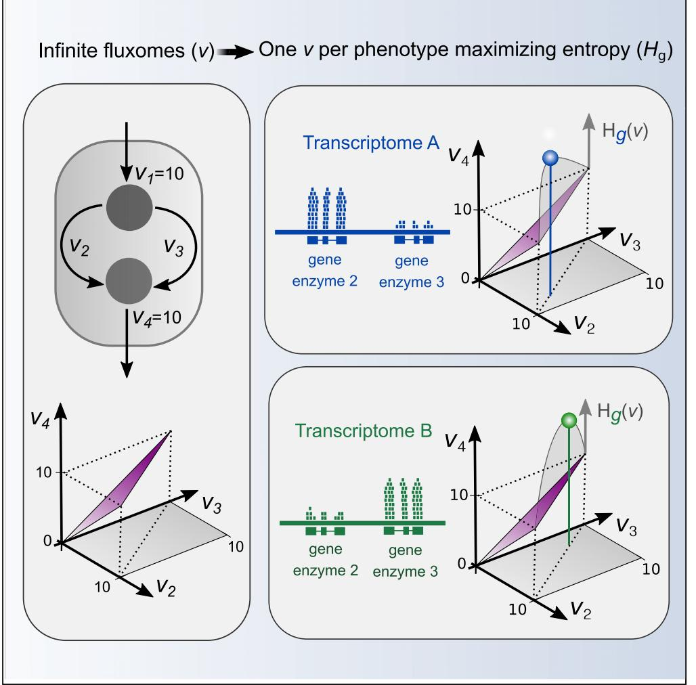
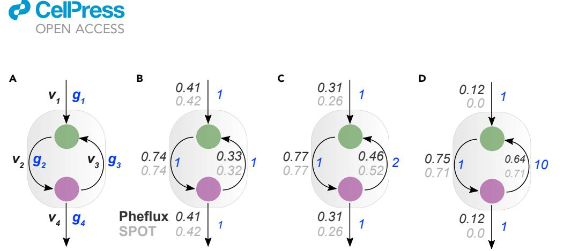
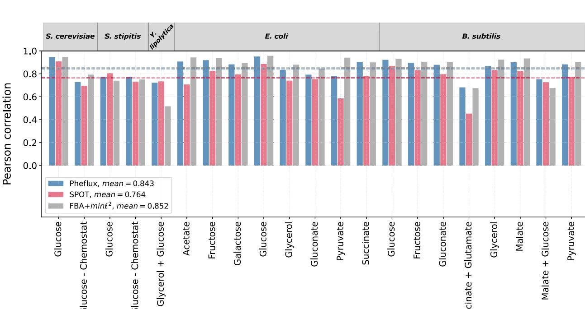
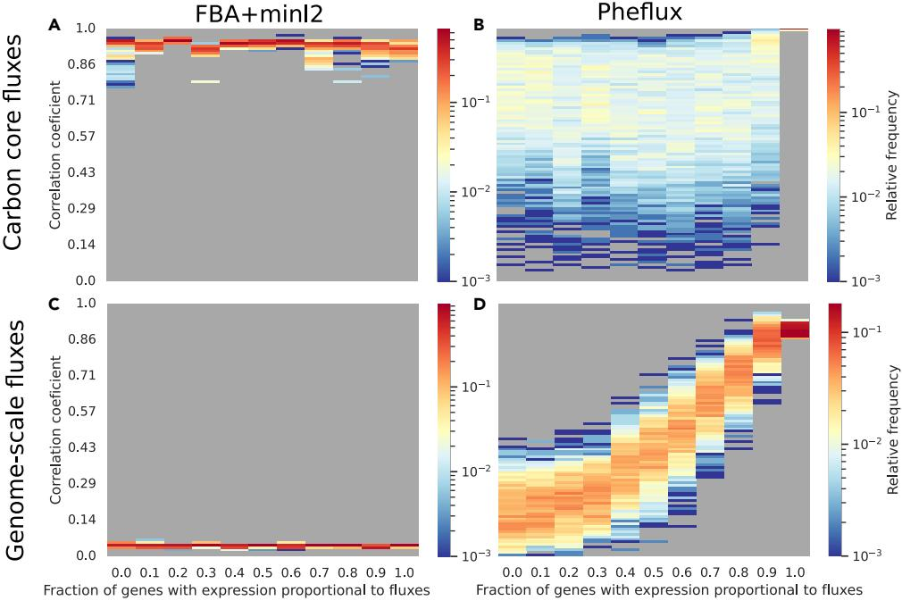
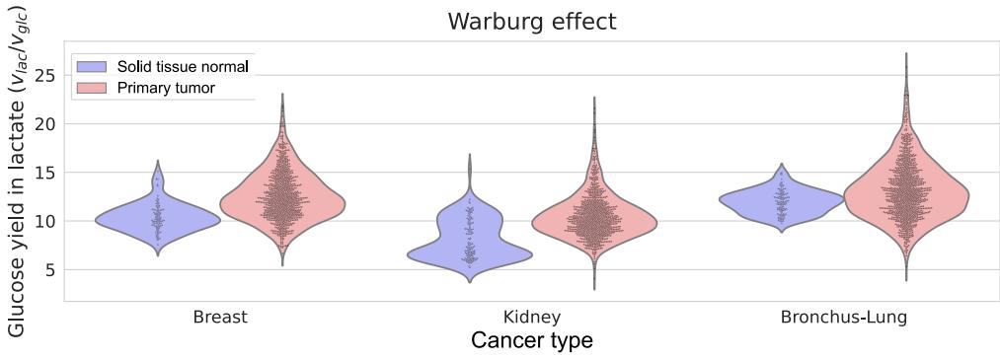
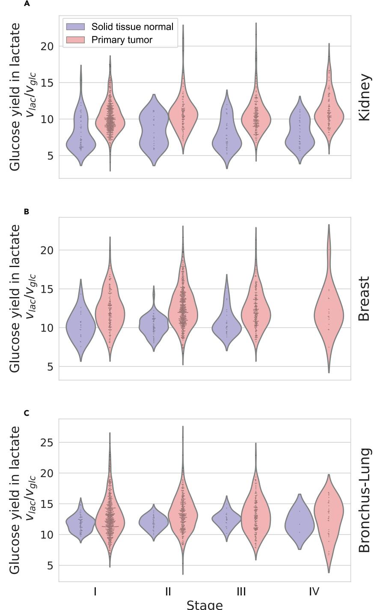
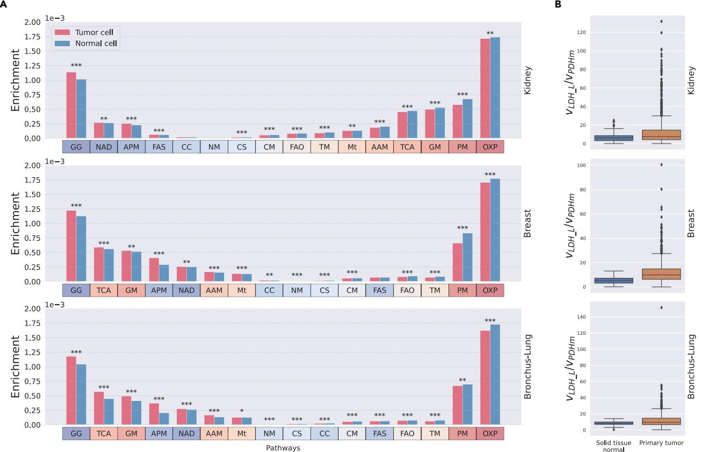
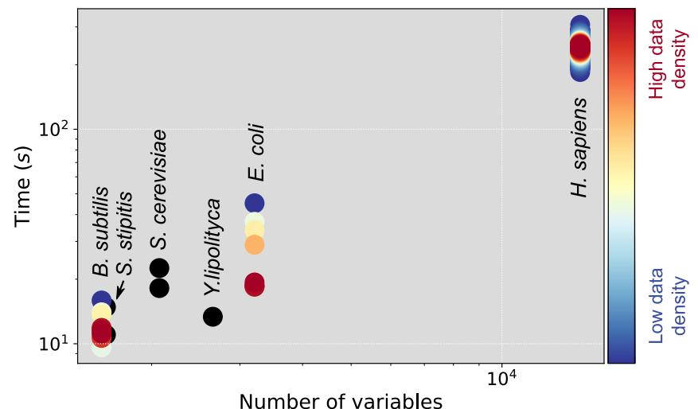

## Article

## Phenotype-specific estimation of metabolic fluxes using gene expression data

Nicola´ s Gonza´ lez-Arrue´ , Isidora Inostroza, Rau´ l Conejeros, Marcelo Rivas-Astroza

[marcelo.rivas@utem.cl](mailto:marcelo.rivas@utem.cl)

## Highlights

A novel computational model estimates phenotype-specific fluxomes at the genomescale

Results accurately estimate the carbon core metabolism in yeast and bacteria

Using RNA-seq data, the Warburg effect is predicted in various cancer types

Gonza´ lez-Arrue´ et al., iScience 26, 106201 March 17, 2023 ª 2023 The Author(s). [https://doi.org/10.1016/](https://doi.org/10.1016/j.isci.2023.106201) [j.isci.2023.106201](https://doi.org/10.1016/j.isci.2023.106201)

## Article

## Phenotype-specific estimation of metabolic fluxes using gene expression data

Nicola´ s Gonza´ lez-Arrue´ , [1](#page-1-0) Isidora Inostroza,[1](#page-1-0) Rau´ l Conejeros,[2](#page-1-1) and Marcelo Rivas-Astroza[1](#page-1-0)[,3](#page-1-2), [*](#page-1-3)

## SUMMARY

A cell's genome influences its metabolism via the expression of enzyme-related genes, but transcriptome and fluxome are not perfectly correlated as post-transcriptional mechanisms also regulate reaction's kinetics. Here, we addressed the question: given a transcriptome, how unobserved mechanisms of reaction kinetics should be systematically accounted for when inferring the fluxome? To infer the most likely and least biased fluxome, we present Pheflux, a constraintbased model maximizing Shannon's entropy of fluxes per mRNA. Benchmarked against 13C fluxes of yeast and bacteria, Pheflux accurately estimates the carbon core metabolism. We applied Pheflux to thousands of normal and tumor cell transcriptomes obtained from The Cancer Genome Atlas. Pheflux showed statistically significantly higher glucose yields on lactate in breast, kidney, and bronchus-lung tumoral cells than their normal counterparts. Results are consistent with the Warburg effect, a hallmark of cancer metabolism, suggesting that Pheflux can be efficiently used to study the metabolism of eukaryotic cells.

## INTRODUCTION

Cells can adapt their metabolism to context-specific conditions by controlling their enzymes production.[1–3](#page-10-0) This phenomenon has been observed in bacteria and yeasts where tampering with their normal genetic patterns is an effective way to redistribute metabolic fluxes and improve fermentation yields.[4–7](#page-10-1) Likewise, genetic disorders such as cancer and diabetes are often paired with aberrant distributions of metabolic fluxes.[8–11](#page-10-2) Anticipating how the genetic expression influences the metabolic state can drive further improvements in the fermentation industry and lead to novel therapies for genetic maladies. These challenges have ushered the development of various mathematical models that infer a cell's metabolic flux distribution conditioned on its observed gene-expression pattern.[12–19](#page-10-3) However, translational and posttranscriptional mechanisms, such as enzyme activities and allosteric modulation, also regulate reactions' kinetics, resulting in the fluxome not being perfectly correlated with the expression levels of their enzyme-related genes.[20–22](#page-10-4) To cover for these unobserved mechanisms, current mathematical models can only rely on ad hoc assumptions,[23](#page-10-5) resulting in inconsistent predictions.[24](#page-10-6)[,25](#page-10-7) Such ambiguity poses the question: How should the unobserved regulatory interactions between transcriptome and reaction kinetics be systematically accounted for when inferring the fluxome?

Genome-scale fluxomes cannot be computed based on kinetic expressions as these are not fully known for most reactions.[26–29](#page-10-8) Alternatively, the fluxome space can be constrained by mass and energy conservation principles,[30,](#page-10-9)[31](#page-10-10) leading to the development of constraint-based models (CBM). In CBMs a steady-state condition is assumed. Consequently, producing and consuming fluxes for each metabolite equate. Applying this assumption to all metabolites in a cell's metabolic network results in a set of linear constraints defining a solution space of feasible fluxomes.[28](#page-10-11),[32](#page-10-12),[33](#page-10-13) Measurements of metabolically active molecules, such as RNA, proteins, and metabolites, can be used to inform further reductions of this space.[34–41](#page-11-0) In this context, transcriptomic patterns are one of the most accessible measurements, as reliable and affordable technologies like micro-arrays and RNA-seq have made gene expression measurements available at genome-wide scales.[42](#page-11-1),[43](#page-11-2)

Current CBMs using transcriptomic information measure the correlation between fluxome and transcriptome by setting bounds on fluxes bounds, defining a context-specific objective function, or both.[44](#page-11-3) Some methods divide genes between highly and lowly expressed and then select a flux configuration that maximizes the consistency with this classification.[13](#page-10-14),[16](#page-10-15),[45](#page-11-4) However, these methods required an 1Universidad Tecnolo´ gica Metropolitana, Departamento de Biotecnologı´a, N˜ un˜ oa, Santiago 7800003, Chile

2Pontificia Universidad Cato´ lica de Valparaı´so, Escuela de Ingenierı´a Bioquı´mica, Valparaı´so, 2362803, Chile

3Lead contact

*Correspondence: [marcelo.rivas@utem.cl](mailto:marcelo.rivas@utem.cl)

[https://doi.org/10.1016/j.isci.](https://doi.org/10.1016/j.isci.2023.106201) [2023.106201](https://doi.org/10.1016/j.isci.2023.106201)

Article

#### Figure 1. Toy network with a thermodynamically infeasible cycle

The network consists of two metabolites and four reactions, where v represents fluxes and g genes' expression (A) When all reactions have equal gene expression values, Pheflux (dark gray) and SPOT (light gray) produce similar fluxome estimations (B) When g3 magnitude doubles every other reaction, SPOT cycles higher flux between metabolites than Pheflux (C) When g3 is one order of magnitude higher than any other reaction, SPOT only predicts flux cycling between metabolites, with no flux exchange. Conversely, even in this extreme case, Pheflux predicts flux exchange (D).

user-defined threshold to distinguish between both sets of genes. Methods maximizing an a priori objective function typically use biomass growth rate, which has proven adequate for unicellular organisms like bacteria and yeast.[46–49](#page-11-5) However, it may not be appropriate for somatic cells known to maintain stable biomass –e.g., neurons. Alternative objective functions such as maximization of ATP can be used, but these are hard to validate for somatic cells.[50](#page-11-6),[51](#page-11-7) Lastly, most methods do not produce a unique solution but only reduce the space of feasible flux configurations from where an arbitrary point is selected to estimate the metabolic state. Other methods can infer a single flux configuration by being formulated as strictly convex optimization problems.[19](#page-10-16)[,52](#page-11-8) However, many strictly convex functions can maximize the correlation between fluxome and transcriptome but still produce divergent fluxomes.[19](#page-10-16) As a result, currently there is not a method that consistently produces better fluxome estimations that any other alternative.[24](#page-10-6)

Here, we used the principle of maximum entropy to develop a mathematical model named Pheflux, which estimates the fluxome conditioned on an organism's metabolic network and transcriptome. The principle of maximum entropy has been applied to infer genetic interaction networks,[53](#page-11-9) the distribution of growth rates of unicellular organisms,[54–56](#page-11-10) flux elementary modes,[57](#page-11-11) and fluxomes in the absence of transcriptomic data.[52,](#page-11-8)[58](#page-11-12) To integrate transcriptomic data, we formulated Pheflux as an optimization problem maximizing Shannon's entropy[59](#page-11-13) of fluxes per messenger RNA (mRNA). Pheflux formulation stands on two statistical inference arguments stemming from the principle of maximum entropy. First, from an information theory perspective, inferences made in this way correspond to the ones that admit the most ignorance besides prior information.[60,](#page-11-14)[61](#page-11-15) By being the least biased, the selected fluxome is less susceptible to over-fitting.[62](#page-11-16) Second, from a statistical mechanics perspective, these inferences are the ones that can happen in the greatest number of ways.[63](#page-11-17) Without further information, it is reasonable to assume that all feasible fluxomes can occur. As a result, the selected fluxome is the most likely to be observed. Of interest, we show that Pheflux is equivalent to minimizing the forward Kullback-Leibler divergence between fluxome and transcriptome, providing a framework to argue that this function is the best to measure a statistical distance between both vectors. In addition, we found that Pheflux predictions in bacteria and yeast outperform alternative methods and that it recapitulates the Warburg effect in cancer human cells.

## RESULTS

## Pheflux estimates are less sensitive to thermodynamically infeasible cycles

To gain intuition about how Pheflux differs from current methods, we compared its predictions to the Simplified Pearson Correlation with Transcriptomic data (SPOT) model.[19](#page-10-16) Like Pheflux, SPOT does not require an objective function with biological meaning and has been highlighted as one of the best methods to predict fluxomes conditioned on transcriptomic data.[19,](#page-10-16)[64](#page-11-18) We used a toy network model consisting of two metabolites and four reactions. This network includes a thermodynamically infeasible cycle (TIC)[65](#page-11-19) ([Fig](#page-2-0)[ure 1](#page-2-0)A). We focus on TICs, as although there are several methods to remove them from fluxome estimations[58](#page-11-12)[,66–69](#page-11-20) these are still ubiquitous among genome-scale metabolic models[66](#page-11-20) and known to introduce artifacts in the form of spurious high-level flux cycles.[52](#page-11-8) TICs are particularly important when considering

Article

Figure 2. Comparison of Pheflux, SPOT, and FBA+min [2 estimations to experimental fluxomes of bacteria and yeasts The dataset includes glycolysis and TCA cycle reactions for cultures using single carbon sources and the mixture glycerol-glucose for Y. lipolytica, and succinate-glutamate and malate-glucose for B. subtilis.

that the probability distribution function of genes' expression follows an exponential decay, i.e., many enzyme-coding genes have low expression levels, and a few are highly expressed.[70](#page-11-21) As a result, if highly expressed genes partake in TICs, this is likely to result in nonsensical fluxome estimations, which is particularly relevant as SPOT, as well as Pheflux, are not warranted to produce TICs free fluxome estimations.

As illustrated by the three study cases in [Figures 1B](#page-2-0)–1D. Pheflux fluxome estimations are less sensitive to TICs than SPOT. In cases 1 [(Figure 1](#page-2-0)B) and 2 ([Figure 1C](#page-2-0)), the genetic expression has little influence in the fluxome inference of both models, probably because of the little difference that exists between the expression level of each enzyme across the network. However, in case 3 [(Figure 1](#page-2-0)D) where reaction 3 has twice the gene expression level of any other reaction, SPOT estimated a biologically infeasible fluxome in which only reactions 2 and 3 carried flux. Pheflux also estimated flux cycling between these two reactions but, unlike SPOT, still predicted exchange fluxes through the intake ðv1Þ and production ðv4Þ reactions. These results suggest that Pheflux turns out to be less susceptible to TICs when highly expressed genes are detected. This behavior stems from its foundation, the principle of maximum entropy, which has already been reported to generate more homogeneous fluxomes, avoiding extreme outlier fluxes caused by TICs.[52](#page-11-8)

## Central carbon metabolism was predicted with high accuracy

To assess the goodness of fit of Pheflux estimations, we used as benchmark reported flux values of the core carbon metabolism.[71–75](#page-11-22) We compiled from the literature a dataset encompassing five microorganisms —prokaryotes and eukaryotes— cultured under 21 different conditions (see [Table S1)](#page-9-0). For each condition, this dataset includes a context-specific 13C derived fluxome of the carbon core metabolism and a transcriptome (generated by either RNA-seq or microarray technologies). We used each transcriptome to condition Pheflux and generated 21 phenotype-specific fluxomes. In addition, we estimated fluxomes using SPOT, and FBA followed by [2 minimization (FBA+min [2) as previous reports show that it produces good fluxome predictions despite not considering phenotype-specific data.[19](#page-10-16) We evaluated the goodness of fit of the phenotype-specific fluxomes produced by Pheflux, SPOT, and FBA+min [2 by comparing them to their corresponding phenotype-specific 13C derived fluxomes, which is a common validation procedure for CBMs.[24](#page-10-6)[,55,](#page-11-23)[64](#page-11-18) We measured the goodness of fit between estimated and experimental fluxes using the Pearson correlation coefficient. Results are presented in [Figure 2.](#page-3-0)

**ll** OPEN ACCESS

In general, Pheflux yielded an average Pearson correlation value of 0.843 ([Figure 2](#page-3-0)), outperforming SPOT, which resulted in an average value of 0.764. However, Pheflux did not outperformed FBA+min [2ðr = 0:852Þ, which dispenses with transcriptomic information and instead relies on maximizing biomass production. This result is coherent with previous studies reporting that FBA+min [2 outperforms SPOT and other transcription-based CBMs[.24](#page-10-6),[64](#page-11-18) However, using the same transcriptomic information of our Escherichia coli study case, Bhadra-Lobo et al. (2020[)64](#page-11-18) reported that SPOT performs better than parsimonious FBA when the uptake rate of the carbon source is missing or speculative. We obtain similar results with Pheflux when compared to FBA+min [2. [Figure S1](#page-9-0) shows that Pheflux outperforms FBA+min [2 when 8 carbon sources (acetate, fructose, galactose, glucose, glycerol, gluconate, pyruvate, and succinate) are left free to be consume from the environment ([Fig](#page-9-0)[ure S1](#page-9-0)A), and likewise when all possible carbon sources are left open to be consumed from the medium ([Fig](#page-9-0)[ure S1](#page-9-0)B). A possible explanation for FBA+min [2 superior performance when the uptake rate is known may stem from the carbon core metabolism being conserved across environmental conditions.[76](#page-12-0) However, the biomass reaction on which FBA+min [2 relies is fine-tuned for a single source of carbon and may lead FBA+min [2 astray when various carbon sources are consumed[.50](#page-11-6),[77](#page-12-1) In line with this explanation, when more than one carbon source is uptaken, Pheflux outperforms FBA+min [2. In these cases, Pheflux performance is the best in two out of three cases, and close to the best in the remaining one. The higher variability in the performance of SPOT on these cases may be because of its higher sensitivity to TICs (see [Figures 1B](#page-2-0) and 1C). It has been shown that TICs result in overestimation of fluxes, decreasing the predictive performance of CBMs.[52](#page-11-8) On the other hand, these outcomes suggest that FBA+min [2 higher performance is particular to the carbon core metabolism. To explore this question, a more informative test would compare estimated and predicted fluxomes at a genome-wide scale. We present such a comparison in the next section.

## Genome-scale fluxome predictions

Current experimental methods do not allow measurements of the fluxome at a genome-scale in a reliable and reproducible manner.[78](#page-12-2) For this reason, we produced genome-wide fluxomes via computational simulations. We used the optGpSampler algorithm[79](#page-12-3) to uniformly sample the fluxome space of E. coli iJO1366 metabolic network,[71](#page-11-22) generating 11 sets of 1000 samples each. For each sample set, a fraction of the reactions was randomly selected. Gene expression values proportional to their fluxes were assigned to this fraction, and random gene expression values to all others. We varied the selected fraction, l, between 0 and 1 –in increments of 0.1– to represent uncorrelated and perfectly correlated fluxomes-transcriptomes pairs, respectively. We used the fluxome simulations as a benchmark against which the Pearson correlations of Pheflux and FBA+min [2 predictions were measured. To test if predictive performance is affected by the selection of the reference reaction set, we computed correlations at genome and carbon core scales.

At the core carbon scale, FBA+min [2 produced correlations higher than 0.9 in all the scenarios [(Figure 3](#page-5-0)A), outperforming Pheflux in all but the case where 100% of the fluxome correlates with the genetic expression ([Figure 3B](#page-5-0)). FBA+min [2 high performance is coherent with the results of the previous section as well as with previous publications.[24,](#page-10-6)[64](#page-11-18)

However, FBA+min [2 advantage in performance did not extend beyond the carbon core test set. At a genome-scale, results show that FBA+min [2 mean correlation coefficients plump below 0.1 regardless the l level ([Figure 3C](#page-5-0)). Pheflux performance was always higher than FBA+min [2 even at l = 0 where gene expression is uninformative of the fluxome state [(Figure 3](#page-5-0)D). It can be inferred that incorporating transcriptomic information via Pheflux improves estimations of the fluxome.

## Pheflux predicted Warburg in cancer cells

To determine whether Pheflux can estimate phenotype-specific fluxome distributions, we evaluated its ability to replicate known metabolic differences between normal and cancer cells at stages I, II, III, and IV.[8](#page-10-2) A hallmark of cancer metabolic reprogramming[9,](#page-10-17)[80](#page-12-4) is the Warburg effect, also called aerobic glycolysis. The Warburg effect is characterized by an increased glucose uptake rate and subsequent conversion to lactate, regardless of oxygen availability.[81](#page-12-5) We used transcriptomes of Breast (899 tumoral and 95 normal tissue transcriptomes), Kidney (893 tumoral and 128 and normal tissue transcriptomes) and Bronchus–Lung (1036 tumoral and 108 normal tissue transcriptomes) tissues obtained from The Cancer Genome Atlas (TCGA), and we compared their yields of glucose in lactate ðvlac =vglc Þ.

As [Figure 4](#page-6-0) shows, Pheflux fluxome estimations in cancer tissues exhibit, on average, a higher yield of glucose in lactate than in normal tissues (p value <1310-15 for Breast and Kidney cancers,

Figure 3. E. coli core fluxes predictions under different scenarios. Carbon core fluxes computed by FBA+min l2 (A) and Pheflux (B). Genome-scale fluxes computed by FBA+min l2 (C) and Pheflux (D).

and p value <1310- 4 for Bronchus-Lung cancer; Mann-Whitney U test). This distinctive feature can also be observed at cancer developmental stages I, II, and III for all three tissue types ([Figure 5](#page-7-0); p value < 0:05; Mann-Whitney U test, cancer stage IV was not considered because of lack of sample size), except for stage III of Bronchus-Lung tissues, where there was a significant overlap between the fluxomes of normal and tumoral tissues. These results are coherent with previous reports showing that, on average, tumoral tissues produce higher yields of glucose in lactate,[82–84](#page-12-6) suggesting that Pheflux can reproduce phenotype-specific fluxomes of cancer cells.

The gene expression patterns of various metabolic pathways have been reported to be affected by cancer,[85](#page-12-7) but it is not clear how these differences impact the distribution of metabolic fluxes. We used Pheflux inferences to find differential use of metabolic pathways between normal and tumoral cells. For each pathway, we used as index the average flux magnitude among its reactions (using the reaction pathwaymembership reported in Recon3D[86)](#page-12-8), and normalized by the sum of all network fluxes magnitudes. This index can be interpreted as the enrichment of such pathway given a distribution of fluxes. Then, we compared the average enrichments of normal and tumoral TCGA samples for each cancer type [(Figure 6](#page-8-0)A). Coherent with previous results,[87](#page-12-9) we found that in all cancer types, oxidative phosphorylation (OXP) is dominant among normal samples, whereas glycolysis/gluconeogenesis (GG) and NAD metabolism are dominant among tumoral samples. However, we found that the tricarboxylic acid cycle (TCA) is dominant among normal kidney samples, but enriched in tumoral breast and bronchus-lung samples. These results do not contradict the Warburg effect as in all cancer types the flux of pyruvate that is diverted toward production of lactate (reaction LDH) is still greater than the flux that diverts pyruvate toward the TCA (reaction PDHm; [Figure 6](#page-8-0)B). We speculate that in bronchus-lung and breast cancers, treatments aimed to downregulate the TCA flux may be of therapeutic value.

## CPU times

Pheflux CPU times ranged between 30 s and 240 s, depending on the number of variables associated with the size of the metabolic network [(Figure 7)](#page-9-1). For example, metabolic networks with around 3000 variables – Bacillus subtilis, Scheffersomyces stipitis, Saccharomyces cerevisiae, and E. coli— the computing times were, on average, 19 s, whereas the large human metabolic network -14000 variables– needed around

Figure 4. Fluxome estimations for normal and tumor cells for breast, kidney and bronchus-lung tissues. Pheflux estimated higher yields of glucose on lactate ðvlac =vglc Þ on cancer compared to normal tissues.

240 s to solve. It should be noted that Pheflux was solved without using any specialized algorithms, so that CPU times could be further reduced if a custom implementation is considered.

## DISCUSSION

To infer the fluxome conditioned on a cell's metabolic network and transcriptome, we developed Pheflux, a novel CBM. Pheflux estimates the fluxome by maximizing Shannon's entropy of fluxes per enzyme. Such an approach can not completely eliminate the uncertainty of the missing information of reactions' kinetics, but should, on average, outperform alternative CBMs conditioned on the same prior data because a fluxome inferred according to the principle of maximum entropy corresponds to the one that can happen in the greatest number of ways and with the least amount of unwarranted assumptions. We found support for this hypothesis in the superior performance of Pheflux compared to alternative methods for estimating the fluxomes of various bacteria and yeasts. We further studied Pheflux capacity to infer phenotype-specific fluxomes using thousands of transcriptomes obtained from the TCGA. We found that Pheflux correctly reported higher yields of glucose on lactate on tumor cells compared to their normal counterparts, being this coherent with the Warburg effect, a hallmark of cancer metabolism.

The principle of maximum entropy has been previously used in CBMs to estimate a cell's fluxom[e52](#page-11-8)[,55](#page-11-23)[,57](#page-11-11) but, to the best of our knowledge, Pheflux is the first to condition its inferences on transcriptomics. Transcription-based CBMs such as integrative metabolic analysis tool (iMAT),[16](#page-10-15) SPOT, and E-flux[219](#page-10-16) dispense with the principle of maximum entropy and instead rely on maximizing a mutual relationship between fluxome and transcriptome. Conversely, Pheflux does not require surmising a correlation function as its formulation is equivalent to minimizing a statistical distance –the forward Kullback-Leibler divergence– between fluxome and transcriptome. As such, Pheflux predictions can be interpreted as the fluxome that minimizes the expected excess surprise with regard to the transcriptome. Pheflux does not require or prevent using an a priori objective function, which can be useful in cases where such a function is appropriate and easily measurable, for instance, the biomass growth rate for bacteria and yeast. In these cases, measurements of such function can be used as extra constraints of the fluxome space to further improve Pheflux predictions.

The quality of Pheflux inferences is affected by the grade of the data upon which it is conditioned and by the validity of its underlying assumptions. As a CBM, Pheflux requires a fluxome space that faithfully matches the metabolic capacities of the organism under study. For this, it is critical that the genome-scale metabolic network encompasses the reactions, metabolites, and cellular compartments that actually pertain to the organism under study. Once a bona fide fluxome space is established, experimentally observed fluxes –e.g., exchange rates of substrates and products– can be used as extra constraints to reduce the fluxome space. Pheflux's underlying assumptions may also limit the accuracy of its inferences, as the inclusion of transcriptomic information does not yield extra constraints to reduce further the solution space but weights the selection of the most probable fluxome. Pheflux assumes that gene expression is a good proxy of enzyme abundance, but it has been shown that the abundance of enzymes and mRNAs are not perfectly correlated.[21,](#page-10-18)[22](#page-10-19),[88](#page-12-10) In this case, Pheflux estimations may be improved if provided directly with protein concentrations. In addition, Pheflux assumes that all copies of an enzyme carry the same flux. We expect this to be a good approximation for enzymes that move freely within the cell but not for enzymes that are organelle-specific, membrane-attached or otherwise unevenly distributed **iScience** Article

#### Figure 5. Stage-specific fluxome estimations for normal and tumor cells

Results for kidney (A), breast (B) and bronchus-lung (C) tissues. For all cancer types, in all but stage IV (where sample sizes were not big enough to conduct statistical tests), Pheflux estimated higher yields of glucose on lactate ðvlac =vglc Þ on cancer compared to normal tissues.

## **iScience** Article

### Figure 6. Differential use of metabolic pathways between normal and cancer tissues

The relative use of a metabolic pathway (enrichment) between tumoral and normal cells is presented for all three cancer types (A). In all cancer types, the ratio between the fluxes of pyruvate that goes into the Krebs cycle versus lactate –computed as the flux ration between reaction LDH and PDHm– is always greater in tumoral cells (B). The metabolic pathways are coded as: Glycolysis/gluconeogenesis: GG; Oxidative phosphorylation: OXP; Pyruvate metabolism: PM; Glutamate metabolism: GM; Alanine and aspartate metabolism: AAM; CoA catabolism: CC; CoA synthesis: CS; Arginine and proline metabolism: APM; Tryptophan metabolism: TM; Citric acid cycle'': TCA; Nucleotide metabolism: NM; NAD metabolism: NAD; Fatty acid synthesis: FAS; Fatty acid oxidation: FAO; Cholesterol metabolism: CM; and Transport, mitochondrial: Mt. p-values (Mann-Whitney U test) are coded as: <0.0001: ***; <0.01: **; and <0.05: *.

within the cell. In these cases, more detailed information about enzyme distribution must be provided experimentally. Another limitation of Pheflux is that its predictions are not free of TICs. However, Pheflux can be easily upgraded to prevent this. Fleming et al. (2000)[58](#page-11-12) have shown that the maximization of a functional equivalent to the objective function of Pheflux archives thermodynamically consistent fluxome estimations if all reactions are divided intoforward and reverse fluxes. This will increase CPU times by adding extra variables but it is guaranteed to produce TICs free estimations.

CPU times showed that Pheflux could be efficiently applied to large eukaryotic metabolic networks in a computationally efficient manner, even when Pheflux objective function is convex but non-linear. As a result, we expect Pheflux to have a wide range of applications in studies that rely on large metabolic networks, such as RECON3D. These include the study of diabetes,[89](#page-12-11) animal cell cultures,[90](#page-12-12) and metabolic changes in embryo development.[91](#page-12-13) Pheflux will be especially useful to model cell types from multi-cellular organisms, where a biological function may prove hard to come by.

## Limitations of study

In the absence of in vivo genome-wide protein concentration data, we used gene expression data as an approximation of enzyme concentrations. However, post-transcriptional regulatory processes may result in mRNA levels not always proportional to their corresponding protein concentrations. As a result, this approximation may limit the accuracy of Pheflux estimations.

## Figure 7. CPU times for different genome-scale metabolic networks

Several transcriptomes per species were processed using Pheflux. The data points density for B. subtilis, E. coli, and H. sapiens is color-coded in the blue (low density) to red (high density) range, whereas the non-overlapping data points for S. stipitis, S. cerevisiae and Y. lipolytica are presented in black.

## STAR+METHODS

Detailed methods are provided in the online version of this paper and include the following:

- d [KEY RESOURCES TABLE](#page-13-0)
- d [RESOURCE AVAILABILITY](#page-13-1)
- B Lead contact
- B Materials availability
- B Data and code availability
- d [METHOD DETAILS](#page-14-0)
	- B Fluxome space
	- B Selection of the most likely and least biased fluxome
	- B Equivalence with the minimization of the forward kullback-libeler divergence
	- B Bioinformatic analyses
	- B Computational implementation
	- B Data sources
- d [QUANTIFICATION AND STATISTICAL ANALYSIS](#page-16-0)
- d [ADDITIONAL RESOURCES](#page-16-1)

## SUPPLEMENTAL INFORMATION

Supplemental information can be found online at <https://doi.org/10.1016/j.isci.2023.106201>.

## ACKNOWLEDGMENTS

This research was supported by Universidad Tecnolo´ gica Metropolitana via the 2020 Regular Projects Research Grant LPR20-07, and the high-performance PIDi-UTEM computing system SCC-PIDi-UTEM – CONICYT–FONDEQUIP-EQM180180. The results shown here are partly based upon data generated by the TCGA Research Network: <https://www.cancer.gov/tcga>.

## AUTHOR CONTRIBUTIONS

N.G., R.C., and M.R. conceived the mathematical methods and experiments, N.G., I.I., and M.R. conducted the experiments and wrote the algorithms, N.G., R.C., and M.R. analyzed the results. All authors reviewed the manuscript.

### DECLARATION OF INTERESTS

The authors declare no competing interest.

Received: September 22, 2022 Revised: November 30, 2022 Accepted: February 10, 2023 Published: February 15, 2023

#### REFERENCES

- 1. [Shyh-Chang, N., Daley, G.Q., and Cantley,](http://refhub.elsevier.com/S2589-0042(23)00278-X/sref1) [L.C. (2013). Stem cell metabolism in tissue](http://refhub.elsevier.com/S2589-0042(23)00278-X/sref1) [development and aging. Development](http://refhub.elsevier.com/S2589-0042(23)00278-X/sref1) 140, [2535–2547.](http://refhub.elsevier.com/S2589-0042(23)00278-X/sref1)
- 2. [Ishida, T., Nakao, S., Ueyama, T., Harada, Y.,](http://refhub.elsevier.com/S2589-0042(23)00278-X/sref2) [and Kawamura, T. (2020). Metabolic re](http://refhub.elsevier.com/S2589-0042(23)00278-X/sref2)[modeling during somatic cell](http://refhub.elsevier.com/S2589-0042(23)00278-X/sref2) [reprogramming to induced pluripotent](http://refhub.elsevier.com/S2589-0042(23)00278-X/sref2) [stem cells: involvement of hypoxia](http://refhub.elsevier.com/S2589-0042(23)00278-X/sref2)[inducible factor 1. Inflamm. Regen.](http://refhub.elsevier.com/S2589-0042(23)00278-X/sref2) 40, 8.
- 3. [Carvalho-Santos, Z., Cardoso-Figueiredo,](http://refhub.elsevier.com/S2589-0042(23)00278-X/sref3) [R., Elias, A.P., Tastekin, I., Baltazar, C., and](http://refhub.elsevier.com/S2589-0042(23)00278-X/sref3) [Ribeiro, C. (2020). Cellular metabolic](http://refhub.elsevier.com/S2589-0042(23)00278-X/sref3) [reprogramming controls sugar appetite in](http://refhub.elsevier.com/S2589-0042(23)00278-X/sref3) [Drosophila. Nat. Metab.](http://refhub.elsevier.com/S2589-0042(23)00278-X/sref3) 2, 958–973.
- 4. [Xu, P., Li, L., Zhang, F., Stephanopoulos, G.,](http://refhub.elsevier.com/S2589-0042(23)00278-X/sref4) [and Koffas, M. (2014). Improving fatty acids](http://refhub.elsevier.com/S2589-0042(23)00278-X/sref4) [production by engineering dynamic](http://refhub.elsevier.com/S2589-0042(23)00278-X/sref4) [pathway regulation and metabolic control.](http://refhub.elsevier.com/S2589-0042(23)00278-X/sref4) [Proc. Natl. Acad. Sci. USA](http://refhub.elsevier.com/S2589-0042(23)00278-X/sref4) 111, 11299– [11304](http://refhub.elsevier.com/S2589-0042(23)00278-X/sref4).
- 5. [Lian, J., HamediRad, M., Hu, S., and Zhao, H.](http://refhub.elsevier.com/S2589-0042(23)00278-X/sref5) [(2017). Combinatorial metabolic](http://refhub.elsevier.com/S2589-0042(23)00278-X/sref5) [engineering using an orthogonal tri](http://refhub.elsevier.com/S2589-0042(23)00278-X/sref5)[functional CRISPR system. Nat. Commun.](http://refhub.elsevier.com/S2589-0042(23)00278-X/sref5) 8, [1688–1689.](http://refhub.elsevier.com/S2589-0042(23)00278-X/sref5)
- 6. [Gao, C., Hou, J., Xu, P., Guo, L., Chen, X.,](http://refhub.elsevier.com/S2589-0042(23)00278-X/sref6) [Hu, G., Ye, C., Edwards, H., Chen, J., Chen,](http://refhub.elsevier.com/S2589-0042(23)00278-X/sref6) [W., and Liu, L. (2019). Programmable](http://refhub.elsevier.com/S2589-0042(23)00278-X/sref6) [biomolecular switches for rewiring flux in](http://refhub.elsevier.com/S2589-0042(23)00278-X/sref6) [Escherichia coli. Nat. Commun.](http://refhub.elsevier.com/S2589-0042(23)00278-X/sref6) 10, [3751–3812.](http://refhub.elsevier.com/S2589-0042(23)00278-X/sref6)
- 7. [Liew, F.E., Nogle, R., Abdalla, T., Rasor, B.J.,](http://refhub.elsevier.com/S2589-0042(23)00278-X/sref7) [Canter, C., Jensen, R.O., Wang, L., Strutz, J.,](http://refhub.elsevier.com/S2589-0042(23)00278-X/sref7) [Chirania, P., De Tissera, S., et al. (2022).](http://refhub.elsevier.com/S2589-0042(23)00278-X/sref7) [Carbon-negative production of acetone](http://refhub.elsevier.com/S2589-0042(23)00278-X/sref7) [and isopropanol by gas fermentation at](http://refhub.elsevier.com/S2589-0042(23)00278-X/sref7) [industrial pilot scale. Nat. Biotechnol.](http://refhub.elsevier.com/S2589-0042(23)00278-X/sref7) 40, [335–344](http://refhub.elsevier.com/S2589-0042(23)00278-X/sref7).
- 8. [DeBerardinis, R.J., and Chandel, N.S. (2016).](http://refhub.elsevier.com/S2589-0042(23)00278-X/sref8) [Fundamentals of cancer metabolism. Sci.](http://refhub.elsevier.com/S2589-0042(23)00278-X/sref8) Adv. 2[, e1600200.](http://refhub.elsevier.com/S2589-0042(23)00278-X/sref8)
- 9. [Pavlova, N.N., and Thompson, C.B. (2016).](http://refhub.elsevier.com/S2589-0042(23)00278-X/sref9) [The emerging hallmarks of cancer](http://refhub.elsevier.com/S2589-0042(23)00278-X/sref9) [metabolism. Cell Metabol.](http://refhub.elsevier.com/S2589-0042(23)00278-X/sref9) 23, 27–47.
- 10. [Haythorne, E., Rohm, M., van de Bunt, M.,](http://refhub.elsevier.com/S2589-0042(23)00278-X/sref10) [Brereton, M.F., Tarasov, A.I., Blacker, T.S.,](http://refhub.elsevier.com/S2589-0042(23)00278-X/sref10) [Sachse, G., Silva dos Santos, M., Terron](http://refhub.elsevier.com/S2589-0042(23)00278-X/sref10) [Exposito, R., Davis, S., et al. (2019). Diabetes](http://refhub.elsevier.com/S2589-0042(23)00278-X/sref10) [causes marked inhibition of mitochondrial](http://refhub.elsevier.com/S2589-0042(23)00278-X/sref10) [metabolism in pancreatic](http://refhub.elsevier.com/S2589-0042(23)00278-X/sref10) b-cells. Nat. [Commun.](http://refhub.elsevier.com/S2589-0042(23)00278-X/sref10) 10, 1–17.
- 11. [DeBerardinis, R.J., and Thompson, C.B.](http://refhub.elsevier.com/S2589-0042(23)00278-X/sref11) [(2012). Cellular metabolism and disease:](http://refhub.elsevier.com/S2589-0042(23)00278-X/sref11)

[what do metabolic outliers teach us? Cell](http://refhub.elsevier.com/S2589-0042(23)00278-X/sref11) 148[, 1132–1144](http://refhub.elsevier.com/S2589-0042(23)00278-X/sref11).

- 12. A˚ kesson, M., Fo¨ [rster, J., and Nielsen, J.](http://refhub.elsevier.com/S2589-0042(23)00278-X/sref12) [(2004). Integration of gene expression data](http://refhub.elsevier.com/S2589-0042(23)00278-X/sref12) [into genome-scale metabolic models.](http://refhub.elsevier.com/S2589-0042(23)00278-X/sref12) [Metab. Eng.](http://refhub.elsevier.com/S2589-0042(23)00278-X/sref12) 6, 285–293.
- 13. [Becker, S.A., and Palsson, B.O. (2008).](http://refhub.elsevier.com/S2589-0042(23)00278-X/sref13) [Context-specific metabolic networks are](http://refhub.elsevier.com/S2589-0042(23)00278-X/sref13) [consistent with experiments. PLoS Comput.](http://refhub.elsevier.com/S2589-0042(23)00278-X/sref13) Biol. 4[, 10000822–e1000110](http://refhub.elsevier.com/S2589-0042(23)00278-X/sref13).
- 14. [Colijn, C., Brandes, A., Zucker, J., Lun, D.S.,](http://refhub.elsevier.com/S2589-0042(23)00278-X/sref14) [Weiner, B., Farhat, M.R., Cheng, T.-Y.,](http://refhub.elsevier.com/S2589-0042(23)00278-X/sref14) [Moody, D.B., Murray, M., and Galagan, J.E.](http://refhub.elsevier.com/S2589-0042(23)00278-X/sref14) [(2009). Interpreting expression data with](http://refhub.elsevier.com/S2589-0042(23)00278-X/sref14) [metabolic flux models: predicting](http://refhub.elsevier.com/S2589-0042(23)00278-X/sref14) [Mycobacterium tuberculosis mycolic acid](http://refhub.elsevier.com/S2589-0042(23)00278-X/sref14) [production. PLoS Comput. Biol.](http://refhub.elsevier.com/S2589-0042(23)00278-X/sref14) 5, [10004899–e1000514](http://refhub.elsevier.com/S2589-0042(23)00278-X/sref14).
- 15. [Fang, X., Wallqvist, A., and Reifman, J.](http://refhub.elsevier.com/S2589-0042(23)00278-X/sref15) [(2012). Modeling phenotypic metabolic](http://refhub.elsevier.com/S2589-0042(23)00278-X/sref15) [adaptations of Mycobacterium tuberculosis](http://refhub.elsevier.com/S2589-0042(23)00278-X/sref15) [H37Rv under hypoxia. PLoS Comput. Biol.](http://refhub.elsevier.com/S2589-0042(23)00278-X/sref15) 8, [10026888–e1002714](http://refhub.elsevier.com/S2589-0042(23)00278-X/sref15).
- 16. [Zur, H., Ruppin, E., and Shlomi, T. (2010).](http://refhub.elsevier.com/S2589-0042(23)00278-X/sref16) [iMAT: an integrative metabolic analysis tool.](http://refhub.elsevier.com/S2589-0042(23)00278-X/sref16) [Bioinformatics](http://refhub.elsevier.com/S2589-0042(23)00278-X/sref16) 26, 3140–3142.
- 17. [Agren, R., Bordel, S., Mardinoglu, A.,](http://refhub.elsevier.com/S2589-0042(23)00278-X/sref17) [Pornputtapong, N., Nookaew, I., and](http://refhub.elsevier.com/S2589-0042(23)00278-X/sref17) [Nielsen, J. (2012). Reconstruction of](http://refhub.elsevier.com/S2589-0042(23)00278-X/sref17) [genome-scale active metabolic networks for](http://refhub.elsevier.com/S2589-0042(23)00278-X/sref17) [69 human cell types and 16 cancer types](http://refhub.elsevier.com/S2589-0042(23)00278-X/sref17) [using INIT. PLoS Comput. Biol.](http://refhub.elsevier.com/S2589-0042(23)00278-X/sref17) 8, e1002518– [e1002519](http://refhub.elsevier.com/S2589-0042(23)00278-X/sref17).
- 18. [Agren, R., Mardinoglu, A., Asplund, A.,](http://refhub.elsevier.com/S2589-0042(23)00278-X/sref18) [Kampf, C., Uhlen, M., and Nielsen, J. (2014).](http://refhub.elsevier.com/S2589-0042(23)00278-X/sref18) [Identification of anticancer drugs for](http://refhub.elsevier.com/S2589-0042(23)00278-X/sref18) [hepatocellular carcinoma through](http://refhub.elsevier.com/S2589-0042(23)00278-X/sref18) [personalized genome-scale metabolic](http://refhub.elsevier.com/S2589-0042(23)00278-X/sref18) [modeling. Mol. Syst. Biol.](http://refhub.elsevier.com/S2589-0042(23)00278-X/sref18) 10, 721.
- 19. [Kim, M.K., Lane, A., Kelley, J.J., and Lun,](http://refhub.elsevier.com/S2589-0042(23)00278-X/sref19) [D.S. (2016). E-Flux2 and SPOT: validated](http://refhub.elsevier.com/S2589-0042(23)00278-X/sref19) [methods for inferring intracellular metabolic](http://refhub.elsevier.com/S2589-0042(23)00278-X/sref19) [flux distributions from transcriptomic data.](http://refhub.elsevier.com/S2589-0042(23)00278-X/sref19) PLoS One 11[, e0157101](http://refhub.elsevier.com/S2589-0042(23)00278-X/sref19).
- 20. [Jansen, M., De Moor, C.H., Sussenbach,](http://refhub.elsevier.com/S2589-0042(23)00278-X/sref20) [J.S., van den Brande, J.L., and Leo, J. (1995).](http://refhub.elsevier.com/S2589-0042(23)00278-X/sref20) [Translational control of gene expression.](http://refhub.elsevier.com/S2589-0042(23)00278-X/sref20) [Pediatr. Res.](http://refhub.elsevier.com/S2589-0042(23)00278-X/sref20) 37, 681–686.
- 21. [ter Kuile, B.H., and Westerhoff, H.V. (2001).](http://refhub.elsevier.com/S2589-0042(23)00278-X/sref21) [Transcriptome meets metabolome:](http://refhub.elsevier.com/S2589-0042(23)00278-X/sref21) [hierarchical and metabolic regulation of the](http://refhub.elsevier.com/S2589-0042(23)00278-X/sref21) [glycolytic pathway. FEBS Lett.](http://refhub.elsevier.com/S2589-0042(23)00278-X/sref21) 500, 169–171.
- 22. [Yang, C., Hua, Q., and Shimizu, K. (2002).](http://refhub.elsevier.com/S2589-0042(23)00278-X/sref22) [Integration of the information from gene](http://refhub.elsevier.com/S2589-0042(23)00278-X/sref22)

[expression and metabolic fluxes for the](http://refhub.elsevier.com/S2589-0042(23)00278-X/sref22) [analysis of the regulatory mechanisms in](http://refhub.elsevier.com/S2589-0042(23)00278-X/sref22) [Synechocystis. Appl. Microbiol. Biotechnol.](http://refhub.elsevier.com/S2589-0042(23)00278-X/sref22) 58[, 813–822.](http://refhub.elsevier.com/S2589-0042(23)00278-X/sref22)

- 23. [Hrovatin, K., Fischer, D.S., and Theis, F.J.](http://refhub.elsevier.com/S2589-0042(23)00278-X/sref23) [(2021). Toward modeling metabolic state](http://refhub.elsevier.com/S2589-0042(23)00278-X/sref23) [from single-cell transcriptomics. Mol.](http://refhub.elsevier.com/S2589-0042(23)00278-X/sref23) [Metabol.](http://refhub.elsevier.com/S2589-0042(23)00278-X/sref23) 57, 101396.
- 24. [Machado, D., and Herrga˚ rd, M. (2014).](http://refhub.elsevier.com/S2589-0042(23)00278-X/sref24) [Systematic evaluation of methods for](http://refhub.elsevier.com/S2589-0042(23)00278-X/sref24) [integration of transcriptomic data into](http://refhub.elsevier.com/S2589-0042(23)00278-X/sref24) [constraint-based models of metabolism.](http://refhub.elsevier.com/S2589-0042(23)00278-X/sref24) [PLoS Comput. Biol.](http://refhub.elsevier.com/S2589-0042(23)00278-X/sref24) 10, e1003580.
- 25. [Opdam, S., Richelle, A., Kellman, B., Li, S.,](http://refhub.elsevier.com/S2589-0042(23)00278-X/sref25) [Zielinski, D.C., and Lewis, N.E. (2017). A](http://refhub.elsevier.com/S2589-0042(23)00278-X/sref25) [systematic evaluation of methods for](http://refhub.elsevier.com/S2589-0042(23)00278-X/sref25) [tailoring genome-scale metabolic models.](http://refhub.elsevier.com/S2589-0042(23)00278-X/sref25) Cell Syst. 4[, 318–329.e6.](http://refhub.elsevier.com/S2589-0042(23)00278-X/sref25)
- 26. [Kim, O.D., Rocha, M., and Maia, P. (2018). A](http://refhub.elsevier.com/S2589-0042(23)00278-X/sref26) [review of dynamic modeling approaches](http://refhub.elsevier.com/S2589-0042(23)00278-X/sref26) [and their application in computational strain](http://refhub.elsevier.com/S2589-0042(23)00278-X/sref26) [optimization for metabolic engineering.](http://refhub.elsevier.com/S2589-0042(23)00278-X/sref26) [Front. Microbiol.](http://refhub.elsevier.com/S2589-0042(23)00278-X/sref26) 9, 1690.
- 27. [Tonn, M.K., Thomas, P., Barahona, M., and](http://refhub.elsevier.com/S2589-0042(23)00278-X/sref27) Oyarzu´ [n, D.A. (2020). Computation of single](http://refhub.elsevier.com/S2589-0042(23)00278-X/sref27) [cell metabolite distributions using mixture](http://refhub.elsevier.com/S2589-0042(23)00278-X/sref27) [models. Front. Cell Dev. Biol.](http://refhub.elsevier.com/S2589-0042(23)00278-X/sref27) 8, 614832.
- 28. [Volkova, S., Matos, M.R.A., Mattanovich, M.,](http://refhub.elsevier.com/S2589-0042(23)00278-X/sref28) [and Marı´n de Mas, I. (2020). Metabolic](http://refhub.elsevier.com/S2589-0042(23)00278-X/sref28) [modelling as a framework for metabolomics](http://refhub.elsevier.com/S2589-0042(23)00278-X/sref28) [data integration and analysis. Metabolites](http://refhub.elsevier.com/S2589-0042(23)00278-X/sref28) 10[, 303](http://refhub.elsevier.com/S2589-0042(23)00278-X/sref28).
- 29. [Yasemi, M., and Jolicoeur, M. (2021).](http://refhub.elsevier.com/S2589-0042(23)00278-X/sref29) [Modelling cell metabolism: a review on](http://refhub.elsevier.com/S2589-0042(23)00278-X/sref29) [constraint based steady-state and kinetic](http://refhub.elsevier.com/S2589-0042(23)00278-X/sref29) [approaches. Processes](http://refhub.elsevier.com/S2589-0042(23)00278-X/sref29) 9, 322.
- 30. [Kauffman, K.J., Prakash, P., and Edwards,](http://refhub.elsevier.com/S2589-0042(23)00278-X/sref30) [J.S. (2003). Advances in flux balance](http://refhub.elsevier.com/S2589-0042(23)00278-X/sref30) [analysis. Curr. Opin. Biotechnol.](http://refhub.elsevier.com/S2589-0042(23)00278-X/sref30) 14, [491–496.](http://refhub.elsevier.com/S2589-0042(23)00278-X/sref30)
- 31. [Orth, J.D., Thiele, I., and Palsson, B.Ø.](http://refhub.elsevier.com/S2589-0042(23)00278-X/sref31) [(2010). What is flux balance analysis? Nat.](http://refhub.elsevier.com/S2589-0042(23)00278-X/sref31) [Biotechnol.](http://refhub.elsevier.com/S2589-0042(23)00278-X/sref31) 28, 245–248.
- 32. [Vijayakumar, S., Conway, M., Lio´](http://refhub.elsevier.com/S2589-0042(23)00278-X/sref32) , P., and [Angione, C. (2018). Seeing the wood for the](http://refhub.elsevier.com/S2589-0042(23)00278-X/sref32) [trees: a forest of methods for optimization](http://refhub.elsevier.com/S2589-0042(23)00278-X/sref32) [and omic-network integration in metabolic](http://refhub.elsevier.com/S2589-0042(23)00278-X/sref32) [modelling. Briefings Bioinf.](http://refhub.elsevier.com/S2589-0042(23)00278-X/sref32) 19, 1218–1235.
- 33. [Pinzon, W., Vega, H., Gonzalez, J., and](http://refhub.elsevier.com/S2589-0042(23)00278-X/sref33) [Pinzon, A. (2019). Mathematical framework](http://refhub.elsevier.com/S2589-0042(23)00278-X/sref33) [behind the reconstruction and analysis of](http://refhub.elsevier.com/S2589-0042(23)00278-X/sref33) [genome scale metabolic models. Arch.](http://refhub.elsevier.com/S2589-0042(23)00278-X/sref33) [Comput. Methods Eng.](http://refhub.elsevier.com/S2589-0042(23)00278-X/sref33) 26, 1593–1606.

## **iScience** Article

- 34. [Steinbeck, C., Conesa, P., Haug, K.,](http://refhub.elsevier.com/S2589-0042(23)00278-X/sref34) [Mahendraker, T., Williams, M., Maguire, E.,](http://refhub.elsevier.com/S2589-0042(23)00278-X/sref34) [Rocca-Serra, P., Sansone, S.-A., Salek, R.M.,](http://refhub.elsevier.com/S2589-0042(23)00278-X/sref34) [and Griffin, J.L. (2012). MetaboLights:](http://refhub.elsevier.com/S2589-0042(23)00278-X/sref34) [towards a new COSMOS of metabolomics](http://refhub.elsevier.com/S2589-0042(23)00278-X/sref34) [data management. Metabolomics](http://refhub.elsevier.com/S2589-0042(23)00278-X/sref34) 8, [757–760](http://refhub.elsevier.com/S2589-0042(23)00278-X/sref34).
- 35. [Barrett, T., Wilhite, S.E., Ledoux, P.,](http://refhub.elsevier.com/S2589-0042(23)00278-X/sref35) [Evangelista, C., Kim, I.F., Tomashevsky, M.,](http://refhub.elsevier.com/S2589-0042(23)00278-X/sref35) [Marshall, K.A., Phillippy, K.H., Sherman,](http://refhub.elsevier.com/S2589-0042(23)00278-X/sref35) [P.M., et al. (2013). NCBI geo: archive for](http://refhub.elsevier.com/S2589-0042(23)00278-X/sref35) [functional genomics data sets—update.](http://refhub.elsevier.com/S2589-0042(23)00278-X/sref35) [Nucleic Acids Res.](http://refhub.elsevier.com/S2589-0042(23)00278-X/sref35) 41, D991–D995.
- 36. [Sud, M., Fahy, E., Cotter, D., Azam, K.,](http://refhub.elsevier.com/S2589-0042(23)00278-X/sref36) [Vadivelu, I., Burant, C., Edison, A., Fiehn, O.,](http://refhub.elsevier.com/S2589-0042(23)00278-X/sref36) [Higashi, R., Nair, K.S., et al. (2016).](http://refhub.elsevier.com/S2589-0042(23)00278-X/sref36) [Metabolomics Workbench: an international](http://refhub.elsevier.com/S2589-0042(23)00278-X/sref36) [repository for metabolomics data and](http://refhub.elsevier.com/S2589-0042(23)00278-X/sref36) [metadata, metabolite standards, protocols,](http://refhub.elsevier.com/S2589-0042(23)00278-X/sref36) [tutorials and training, and analysis tools.](http://refhub.elsevier.com/S2589-0042(23)00278-X/sref36) [Nucleic Acids Res.](http://refhub.elsevier.com/S2589-0042(23)00278-X/sref36) 44, D463–D470.
- 37. Athar, A., Fu¨ [llgrabe, A., George, N., Iqbal,](http://refhub.elsevier.com/S2589-0042(23)00278-X/sref37) [H., Huerta, L., Ali, A., Snow, C., Fonseca,](http://refhub.elsevier.com/S2589-0042(23)00278-X/sref37) [N.A., Petryszak, R., et al. (2019).](http://refhub.elsevier.com/S2589-0042(23)00278-X/sref37) [ArrayExpress update – from bulk to single](http://refhub.elsevier.com/S2589-0042(23)00278-X/sref37)[cell expression data. Nucleic Acids Res.](http://refhub.elsevier.com/S2589-0042(23)00278-X/sref37) 47, [D711–D715](http://refhub.elsevier.com/S2589-0042(23)00278-X/sref37).
- 38. [Perez-Riverol, Y., Csordas, A., Bai, J., Bernal-](http://refhub.elsevier.com/S2589-0042(23)00278-X/sref38)[Llinares, M., Hewapathirana, S., Kundu, D.J.,](http://refhub.elsevier.com/S2589-0042(23)00278-X/sref38) [Inuganti, A., Griss, J., Mayer, G., et al. (2018).](http://refhub.elsevier.com/S2589-0042(23)00278-X/sref38) [The PRIDE database and related tools and](http://refhub.elsevier.com/S2589-0042(23)00278-X/sref38) [resources in 2019: improving support for](http://refhub.elsevier.com/S2589-0042(23)00278-X/sref38) [quantification data. Nucleic Acids Res.](http://refhub.elsevier.com/S2589-0042(23)00278-X/sref38) 47, [D442–D450](http://refhub.elsevier.com/S2589-0042(23)00278-X/sref38).
- 39. [Papatheodorou, I., Moreno, P., Manning, J.,](http://refhub.elsevier.com/S2589-0042(23)00278-X/sref39) [Fuentes, A.M.P., George, N., Fexova, S.,](http://refhub.elsevier.com/S2589-0042(23)00278-X/sref39) Fonseca, N.A., Fu¨ [llgrabe, A., Green, M.,](http://refhub.elsevier.com/S2589-0042(23)00278-X/sref39) [et al. (2020). Expression Atlas update: from](http://refhub.elsevier.com/S2589-0042(23)00278-X/sref39) [tissues to single cells. Nucleic Acids Res.](http://refhub.elsevier.com/S2589-0042(23)00278-X/sref39) 48, [D77–D83](http://refhub.elsevier.com/S2589-0042(23)00278-X/sref39).
- 40. Sjo¨ [stedt, E., Zhong, W., Fagerberg, L.,](http://refhub.elsevier.com/S2589-0042(23)00278-X/sref40) [Karlsson, M., Mitsios, N., Adori, C., Oksvold,](http://refhub.elsevier.com/S2589-0042(23)00278-X/sref40) [P., Edfors, F., Limiszewska, A., Hikmet, F.,](http://refhub.elsevier.com/S2589-0042(23)00278-X/sref40) [et al. (2020). An atlas of the protein-coding](http://refhub.elsevier.com/S2589-0042(23)00278-X/sref40) [genes in the human, pig, and mouse brain.](http://refhub.elsevier.com/S2589-0042(23)00278-X/sref40) Science 367[, eaay5947](http://refhub.elsevier.com/S2589-0042(23)00278-X/sref40).
- 41. [Karlsson, M., Zhang, C., Me´](http://refhub.elsevier.com/S2589-0042(23)00278-X/sref41) ar, L., Zhong, W., [Digre, A., Katona, B., Sjo¨](http://refhub.elsevier.com/S2589-0042(23)00278-X/sref41) stedt, E., Butler, L., [Odeberg, J., Dusart, P., et al. (2021). A](http://refhub.elsevier.com/S2589-0042(23)00278-X/sref41) [single–cell type transcriptomics map of](http://refhub.elsevier.com/S2589-0042(23)00278-X/sref41) [human tissues. Sci. Adv.](http://refhub.elsevier.com/S2589-0042(23)00278-X/sref41) 7, eabh2169.
- 42. [Reuter, J.A., Spacek, D.V., and Snyder, M.P.](http://refhub.elsevier.com/S2589-0042(23)00278-X/sref42) [(2015). High-throughput sequencing](http://refhub.elsevier.com/S2589-0042(23)00278-X/sref42) [technologies. Mol. Cell](http://refhub.elsevier.com/S2589-0042(23)00278-X/sref42) 58, 586–597.
- 43. [Regev, A., Teichmann, S.A., Lander, E.S.,](http://refhub.elsevier.com/S2589-0042(23)00278-X/sref43) [Amit, I., Benoist, C., Birney, E., Bodenmiller,](http://refhub.elsevier.com/S2589-0042(23)00278-X/sref43) [B., Campbell, P., Carninci, P., Clatworthy,](http://refhub.elsevier.com/S2589-0042(23)00278-X/sref43) [M., et al. (2017). Science forum: the human](http://refhub.elsevier.com/S2589-0042(23)00278-X/sref43) [cell atlas. Elife](http://refhub.elsevier.com/S2589-0042(23)00278-X/sref43) 6, e27041.
- 44. [Vivek-Ananth, R.P., and Samal, A. (2016).](http://refhub.elsevier.com/S2589-0042(23)00278-X/sref44) [Advances in the integration of](http://refhub.elsevier.com/S2589-0042(23)00278-X/sref44) [transcriptional regulatory information into](http://refhub.elsevier.com/S2589-0042(23)00278-X/sref44) [genome-scale metabolic models.](http://refhub.elsevier.com/S2589-0042(23)00278-X/sref44) [Biosystems](http://refhub.elsevier.com/S2589-0042(23)00278-X/sref44) 147, 1–10.
- 45. [Shlomi, T., Cabili, M.N., Herrga˚ rd, M.J.,](http://refhub.elsevier.com/S2589-0042(23)00278-X/sref45) [Palsson, B.Ø., and Ruppin, E. (2008).](http://refhub.elsevier.com/S2589-0042(23)00278-X/sref45) [Network based prediction of human tissue-](http://refhub.elsevier.com/S2589-0042(23)00278-X/sref45)

[specific metabolism. Nat. Biotechnol.](http://refhub.elsevier.com/S2589-0042(23)00278-X/sref45) 26, [1003–1010.](http://refhub.elsevier.com/S2589-0042(23)00278-X/sref45)

- 46. [Garcı´a Sa´nchez, C.E., Vargas Garcı´a, C.A.,](http://refhub.elsevier.com/S2589-0042(23)00278-X/sref46) [and Torres Sa´ez, R.G. (2012). Predictive](http://refhub.elsevier.com/S2589-0042(23)00278-X/sref46) [potential of flux balance analysis of](http://refhub.elsevier.com/S2589-0042(23)00278-X/sref46) [Saccharomyces cerevisiae using as](http://refhub.elsevier.com/S2589-0042(23)00278-X/sref46) [optimization function combinations of cell](http://refhub.elsevier.com/S2589-0042(23)00278-X/sref46) [compartmental objectives. PLoS One](http://refhub.elsevier.com/S2589-0042(23)00278-X/sref46) 7, 1–9.
- 47. [Edwards, J.S., Ibarra, R.U., and Palsson, B.O.](http://refhub.elsevier.com/S2589-0042(23)00278-X/sref47) [(2001). In silico predictions of Escherichia](http://refhub.elsevier.com/S2589-0042(23)00278-X/sref47) [coli metabolic capabilities are consistent](http://refhub.elsevier.com/S2589-0042(23)00278-X/sref47) [with experimental data. Nat. Biotechnol.](http://refhub.elsevier.com/S2589-0042(23)00278-X/sref47) 19, [125–130](http://refhub.elsevier.com/S2589-0042(23)00278-X/sref47).
- 48. [Ibarra, R.U., Edwards, J.S., and Palsson, B.O.](http://refhub.elsevier.com/S2589-0042(23)00278-X/sref48) [(2002). Escherichia coli K-12 undergoes](http://refhub.elsevier.com/S2589-0042(23)00278-X/sref48) [adaptive evolution to achieve in silico](http://refhub.elsevier.com/S2589-0042(23)00278-X/sref48) [predicted optimal growth. Nature](http://refhub.elsevier.com/S2589-0042(23)00278-X/sref48) 420, [186–189](http://refhub.elsevier.com/S2589-0042(23)00278-X/sref48).
- 49. [Gianchandani, E.P., Oberhardt, M.A.,](http://refhub.elsevier.com/S2589-0042(23)00278-X/sref49) [Burgard, A.P., Maranas, C.D., and Papin,](http://refhub.elsevier.com/S2589-0042(23)00278-X/sref49) [J.A. (2008). Predicting biological system](http://refhub.elsevier.com/S2589-0042(23)00278-X/sref49) [objectives de novo from internal state](http://refhub.elsevier.com/S2589-0042(23)00278-X/sref49) [measurements. BMC Bioinf.](http://refhub.elsevier.com/S2589-0042(23)00278-X/sref49) 9, 43.
- 50. [Dikicioglu, D., Kırdar, B., and Oliver, S.G.](http://refhub.elsevier.com/S2589-0042(23)00278-X/sref50) [(2015). Biomass composition: the ''elephant](http://refhub.elsevier.com/S2589-0042(23)00278-X/sref50) [in the room'' of metabolic modelling.](http://refhub.elsevier.com/S2589-0042(23)00278-X/sref50) [Metabolomics](http://refhub.elsevier.com/S2589-0042(23)00278-X/sref50) 11, 1690–1701.
- 51. [Angione, C. (2019). Human systems biology](http://refhub.elsevier.com/S2589-0042(23)00278-X/sref51) [and metabolic modelling: a review—from](http://refhub.elsevier.com/S2589-0042(23)00278-X/sref51) [disease metabolism to precision medicine.](http://refhub.elsevier.com/S2589-0042(23)00278-X/sref51) [BioMed Res. Int.](http://refhub.elsevier.com/S2589-0042(23)00278-X/sref51) 2019, 8304260.
- 52. [Rivas-Astroza, M., and Conejeros, R. (2020).](http://refhub.elsevier.com/S2589-0042(23)00278-X/sref52) [Metabolic flux configuration determination](http://refhub.elsevier.com/S2589-0042(23)00278-X/sref52) [using information entropy. PLoS One](http://refhub.elsevier.com/S2589-0042(23)00278-X/sref52) 15, [e0243067](http://refhub.elsevier.com/S2589-0042(23)00278-X/sref52).
- 53. [Lezon, T.R., Banavar, J.R., Cieplak, M.,](http://refhub.elsevier.com/S2589-0042(23)00278-X/sref53) [Maritan, A., and Fedoroff, N.V. (2006). Using](http://refhub.elsevier.com/S2589-0042(23)00278-X/sref53) [the principle of entropy maximization to](http://refhub.elsevier.com/S2589-0042(23)00278-X/sref53) [infer genetic interaction networks from](http://refhub.elsevier.com/S2589-0042(23)00278-X/sref53) [gene expression patterns. Proc. Natl. Acad.](http://refhub.elsevier.com/S2589-0042(23)00278-X/sref53) Sci. USA 103[, 19033–19038.](http://refhub.elsevier.com/S2589-0042(23)00278-X/sref53)
- 54. [Martino, D.D., Capuani, F., and Martino,](http://refhub.elsevier.com/S2589-0042(23)00278-X/sref54) [A.D. (2016). Growth against entropy in](http://refhub.elsevier.com/S2589-0042(23)00278-X/sref54) [bacterial metabolism: the phenotypic trade](http://refhub.elsevier.com/S2589-0042(23)00278-X/sref54)[off behind empirical growth rate](http://refhub.elsevier.com/S2589-0042(23)00278-X/sref54) [distributions in E. coli. Phys. Biol.](http://refhub.elsevier.com/S2589-0042(23)00278-X/sref54) 13, 036005.
- 55. [De Martino, D., Mc Andersson, A.,](http://refhub.elsevier.com/S2589-0042(23)00278-X/sref55) [Bergmiller, T., Guet, C.C., and Tka](http://refhub.elsevier.com/S2589-0042(23)00278-X/sref55)[cik, G.](http://refhub.elsevier.com/S2589-0042(23)00278-X/sref55) [(2018). Statistical mechanics for metabolic](http://refhub.elsevier.com/S2589-0042(23)00278-X/sref55) [networks during steady state growth. Nat.](http://refhub.elsevier.com/S2589-0042(23)00278-X/sref55) Commun. 9[, 2988–2989.](http://refhub.elsevier.com/S2589-0042(23)00278-X/sref55)
- 56. [Fernandez-de-Cossio-Diaz, J., and Mulet, R.](http://refhub.elsevier.com/S2589-0042(23)00278-X/sref56) [(2019). Maximum entropy and population](http://refhub.elsevier.com/S2589-0042(23)00278-X/sref56) [heterogeneity in continuous cell cultures.](http://refhub.elsevier.com/S2589-0042(23)00278-X/sref56) [PLoS Comput. Biol.](http://refhub.elsevier.com/S2589-0042(23)00278-X/sref56) 1, e1006823.
- 57. [Tourigny, D.S. (2020). Dynamic metabolic](http://refhub.elsevier.com/S2589-0042(23)00278-X/sref57) [resource allocation based on the maximum](http://refhub.elsevier.com/S2589-0042(23)00278-X/sref57) [entropy principle. J. Math. Biol.](http://refhub.elsevier.com/S2589-0042(23)00278-X/sref57) 80, [2395–2430.](http://refhub.elsevier.com/S2589-0042(23)00278-X/sref57)
- 58. [Fleming, R.M.T., Maes, C.M., Saunders,](http://refhub.elsevier.com/S2589-0042(23)00278-X/sref58) [M.A., Ye, Y., and Palsson, B.Ø. (2012). A](http://refhub.elsevier.com/S2589-0042(23)00278-X/sref58) [variational principle for computing](http://refhub.elsevier.com/S2589-0042(23)00278-X/sref58) [nonequilibrium fluxes and potentials in](http://refhub.elsevier.com/S2589-0042(23)00278-X/sref58) [genome-scale biochemical networks.](http://refhub.elsevier.com/S2589-0042(23)00278-X/sref58) [J. Theor. Biol.](http://refhub.elsevier.com/S2589-0042(23)00278-X/sref58) 292, 71–77.
- 59. [Shannon, C.E. (1948). A mathematical theory](http://refhub.elsevier.com/S2589-0042(23)00278-X/sref59) [of communication. Bell System Technical](http://refhub.elsevier.com/S2589-0042(23)00278-X/sref59) Journal 27[, 379–423.](http://refhub.elsevier.com/S2589-0042(23)00278-X/sref59)
- 60. [Jaynes, E.T. (1957a). Information theory and](http://refhub.elsevier.com/S2589-0042(23)00278-X/sref60) [statistical mechanics. Phys. Rev.](http://refhub.elsevier.com/S2589-0042(23)00278-X/sref60) 106, [620–630.](http://refhub.elsevier.com/S2589-0042(23)00278-X/sref60)
- 61. [Jaynes, E.T. (1957b). Information theory and](http://refhub.elsevier.com/S2589-0042(23)00278-X/sref61) [statistical mechanics. II. Phys. Rev.](http://refhub.elsevier.com/S2589-0042(23)00278-X/sref61) 108, [171–190.](http://refhub.elsevier.com/S2589-0042(23)00278-X/sref61)
- 62. [Kohavi, R., and Wolpert, D.H. (1996). Bias](http://refhub.elsevier.com/S2589-0042(23)00278-X/sref62) [plus variance decomposition for zero-one](http://refhub.elsevier.com/S2589-0042(23)00278-X/sref62) [loss functions. ICML](http://refhub.elsevier.com/S2589-0042(23)00278-X/sref62) 96, 275–283.
- 63. [Sharp, K., and Matschinsky, F. (2015). On the](http://refhub.elsevier.com/S2589-0042(23)00278-X/sref63) [relationship between the second](http://refhub.elsevier.com/S2589-0042(23)00278-X/sref63) [fundamental theorem of the mechanical](http://refhub.elsevier.com/S2589-0042(23)00278-X/sref63) [theory of heat and probability calculations](http://refhub.elsevier.com/S2589-0042(23)00278-X/sref63) [regarding the conditions for thermal](http://refhub.elsevier.com/S2589-0042(23)00278-X/sref63) [equilibrium. Entropy](http://refhub.elsevier.com/S2589-0042(23)00278-X/sref63) 17, 1971–2009.
- 64. [Bhadra-Lobo, S., Kim, M.K., and Lun, D.S.](http://refhub.elsevier.com/S2589-0042(23)00278-X/sref64) [(2020). Assessment of transcriptomic](http://refhub.elsevier.com/S2589-0042(23)00278-X/sref64) [constraint based methods for central](http://refhub.elsevier.com/S2589-0042(23)00278-X/sref64) [carbon flux inference. PLoS One](http://refhub.elsevier.com/S2589-0042(23)00278-X/sref64) 15, [e0238689.](http://refhub.elsevier.com/S2589-0042(23)00278-X/sref64)
- 65. [Ebrahim, A., Almaas, E., Bauer, E., Bordbar,](http://refhub.elsevier.com/S2589-0042(23)00278-X/sref65) [A., Burgard, A.P., Chang, R.L., Dra¨ger, A.,](http://refhub.elsevier.com/S2589-0042(23)00278-X/sref65) [Famili, I., Feist, A.M., Fleming, R.M., et al.](http://refhub.elsevier.com/S2589-0042(23)00278-X/sref65) [(2015). Do genome-scale models need](http://refhub.elsevier.com/S2589-0042(23)00278-X/sref65) [exact solvers or clearer standards? Mol. Syst.](http://refhub.elsevier.com/S2589-0042(23)00278-X/sref65) Biol. 11[, 831](http://refhub.elsevier.com/S2589-0042(23)00278-X/sref65).
- 66. [Henry, C.S., Broadbelt, L.J., and](http://refhub.elsevier.com/S2589-0042(23)00278-X/sref66) [Hatzimanikatis, V. (2007). Thermodynamics](http://refhub.elsevier.com/S2589-0042(23)00278-X/sref66)[based metabolic flux analysis. Biophys. J.](http://refhub.elsevier.com/S2589-0042(23)00278-X/sref66) 92[, 1792–1805](http://refhub.elsevier.com/S2589-0042(23)00278-X/sref66).
- 67. [Schellenberger, J., Lewis, N.E., and Palsson,](http://refhub.elsevier.com/S2589-0042(23)00278-X/sref67) [B.Ø. (2011). Elimination of](http://refhub.elsevier.com/S2589-0042(23)00278-X/sref67) [thermodynamically infeasible loops in](http://refhub.elsevier.com/S2589-0042(23)00278-X/sref67) [steady-state metabolic models. Biophys. J.](http://refhub.elsevier.com/S2589-0042(23)00278-X/sref67) 100[, 544–553](http://refhub.elsevier.com/S2589-0042(23)00278-X/sref67).
- 68. [Desouki, A.A., Jarre, F., Gelius-Dietrich, G.,](http://refhub.elsevier.com/S2589-0042(23)00278-X/sref68) [and Lercher, M.J. (2015). CycleFreeFlux:](http://refhub.elsevier.com/S2589-0042(23)00278-X/sref68) [efficient removal of thermodynamically](http://refhub.elsevier.com/S2589-0042(23)00278-X/sref68) [infeasible loops from flux distributions.](http://refhub.elsevier.com/S2589-0042(23)00278-X/sref68) [Bioinformatics](http://refhub.elsevier.com/S2589-0042(23)00278-X/sref68) 31, 2159–2165.
- 69. Noor, E. (2018). Removing both internal and unrealistic energy-generating cycles in flux balance analysis. Preprint at arXiv. [https://](https://doi.org/10.48550/arXiv:1803.04999) [doi.org/10.48550/arXiv:1803.04999.](https://doi.org/10.48550/arXiv:1803.04999)
- 70. [Ueda, H.R., Hayashi, S., Matsuyama, S.,](http://refhub.elsevier.com/S2589-0042(23)00278-X/sref70) [Yomo, T., Hashimoto, S., Kay, S.A.,](http://refhub.elsevier.com/S2589-0042(23)00278-X/sref70) [Hogenesch, J.B., and Iino, M. (2004).](http://refhub.elsevier.com/S2589-0042(23)00278-X/sref70) [Universality and flexibility in gene](http://refhub.elsevier.com/S2589-0042(23)00278-X/sref70) [expression from bacteria to human. Proc.](http://refhub.elsevier.com/S2589-0042(23)00278-X/sref70) [Natl. Acad. Sci. USA](http://refhub.elsevier.com/S2589-0042(23)00278-X/sref70) 101, 3765–3769.
- 71. [Orth, J.D., Conrad, T.M., Na, J., Lerman,](http://refhub.elsevier.com/S2589-0042(23)00278-X/sref71) [J.A., Nam, H., Feist, A.M., and Palsson, B.Ø.](http://refhub.elsevier.com/S2589-0042(23)00278-X/sref71) [(2011). A comprehensive genome-scale](http://refhub.elsevier.com/S2589-0042(23)00278-X/sref71) [reconstruction of Escherichia coli](http://refhub.elsevier.com/S2589-0042(23)00278-X/sref71) [metabolism—2011. Mol. Syst. Biol.](http://refhub.elsevier.com/S2589-0042(23)00278-X/sref71) 7, 535.
- 72. [Mo, M.L., Palsson, B.Ø., and Herrga˚ rd, M.J.](http://refhub.elsevier.com/S2589-0042(23)00278-X/sref72) [(2009). Connecting extracellular](http://refhub.elsevier.com/S2589-0042(23)00278-X/sref72) [metabolomic measurements to intracellular](http://refhub.elsevier.com/S2589-0042(23)00278-X/sref72) [flux states in yeast. BMC Syst. Biol.](http://refhub.elsevier.com/S2589-0042(23)00278-X/sref72) 3, 37.
- 73. [Papini, M., Nookaew, I., Uhle´](http://refhub.elsevier.com/S2589-0042(23)00278-X/sref73) n, M., and [Nielsen, J. (2012). Scheffersomyces stipitis: a](http://refhub.elsevier.com/S2589-0042(23)00278-X/sref73) [com parative systems biology study with the](http://refhub.elsevier.com/S2589-0042(23)00278-X/sref73)

[Crabtree positive yeast Saccharomyces](http://refhub.elsevier.com/S2589-0042(23)00278-X/sref73) [cerevisiae. Microb. Cell Factories](http://refhub.elsevier.com/S2589-0042(23)00278-X/sref73) 11, [136–216](http://refhub.elsevier.com/S2589-0042(23)00278-X/sref73).

- 74. [Kerkhoven, E.J., Pomraning, K.R., Baker,](http://refhub.elsevier.com/S2589-0042(23)00278-X/sref74) [S.E., and Nielsen, J. (2016). Regulation of](http://refhub.elsevier.com/S2589-0042(23)00278-X/sref74) [amino-acid metabolism controls flux to lipid](http://refhub.elsevier.com/S2589-0042(23)00278-X/sref74) [accumulation in Yarrowia lipolytica. NPJ](http://refhub.elsevier.com/S2589-0042(23)00278-X/sref74) [Syst. Biol. Appl.](http://refhub.elsevier.com/S2589-0042(23)00278-X/sref74) 2, 16005–16007.
- 75. [Oh, Y.-K., Palsson, B.O., Park, S.M., Schilling,](http://refhub.elsevier.com/S2589-0042(23)00278-X/sref75) [C.H., and Mahadevan, R. (2007). Genome](http://refhub.elsevier.com/S2589-0042(23)00278-X/sref75) [scale reconstruction of metabolic network in](http://refhub.elsevier.com/S2589-0042(23)00278-X/sref75) [Bacillus subtilis based on high-throughput](http://refhub.elsevier.com/S2589-0042(23)00278-X/sref75) [phenotyping and gene essentiality data.](http://refhub.elsevier.com/S2589-0042(23)00278-X/sref75) J. Biol. Chem. 282[, 28791–28799](http://refhub.elsevier.com/S2589-0042(23)00278-X/sref75).
- 76. [Almaas, E., Oltvai, Z.N., and Baraba´](http://refhub.elsevier.com/S2589-0042(23)00278-X/sref76) si, A.L. [(2005). The activity reaction core and](http://refhub.elsevier.com/S2589-0042(23)00278-X/sref76) [plasticity of metabolic networks. PLoS](http://refhub.elsevier.com/S2589-0042(23)00278-X/sref76) [Comput. Biol.](http://refhub.elsevier.com/S2589-0042(23)00278-X/sref76) 1, 688–e77.
- 77. Nova´ [k, L., and Loubiere, P. (2000). The](http://refhub.elsevier.com/S2589-0042(23)00278-X/sref77) [metabolic network of lactococcus lactis:](http://refhub.elsevier.com/S2589-0042(23)00278-X/sref77) [distribution of 14C-labeled substrates](http://refhub.elsevier.com/S2589-0042(23)00278-X/sref77) [between catabolic and anabolic pathways.](http://refhub.elsevier.com/S2589-0042(23)00278-X/sref77) J. Bacteriol. 182[, 1136–1143](http://refhub.elsevier.com/S2589-0042(23)00278-X/sref77).
- 78. Niedenfu¨ [hr, S., Wiechert, W., and No¨](http://refhub.elsevier.com/S2589-0042(23)00278-X/sref78) h, K. [(2015). How to measure metabolic fluxes: a](http://refhub.elsevier.com/S2589-0042(23)00278-X/sref78) [taxonomic guide for (13)C fluxomics. Curr.](http://refhub.elsevier.com/S2589-0042(23)00278-X/sref78) [Opin. Biotechnol.](http://refhub.elsevier.com/S2589-0042(23)00278-X/sref78) 34, 82–90.
- 79. [Megchelenbrink, W., Huynen, M., and](http://refhub.elsevier.com/S2589-0042(23)00278-X/sref105) [Marchiori, E. (2014). optGpSampler : an](http://refhub.elsevier.com/S2589-0042(23)00278-X/sref105) [improved tool for uniformly sampling the](http://refhub.elsevier.com/S2589-0042(23)00278-X/sref105) [solution-space of genome-scale metabolic](http://refhub.elsevier.com/S2589-0042(23)00278-X/sref105) [networks. PLoS One](http://refhub.elsevier.com/S2589-0042(23)00278-X/sref105) 9, e86587.
- 80. [Hanahan, D., and Weinberg, R.A. (2011).](http://refhub.elsevier.com/S2589-0042(23)00278-X/sref79) [Hallmarks of cancer: the next generation.](http://refhub.elsevier.com/S2589-0042(23)00278-X/sref79) Cell 144[, 646–674.](http://refhub.elsevier.com/S2589-0042(23)00278-X/sref79)
- 81. [Koppenol, W.H., Bounds, P.L., and Dang,](http://refhub.elsevier.com/S2589-0042(23)00278-X/sref80) [C.V. (2011). Otto Warburg's contributions to](http://refhub.elsevier.com/S2589-0042(23)00278-X/sref80) [current concepts of cancer metabolism.](http://refhub.elsevier.com/S2589-0042(23)00278-X/sref80) [Nat. Rev. Cancer](http://refhub.elsevier.com/S2589-0042(23)00278-X/sref80) 11, 325–337.
- 82. [Hensley, C.T., Faubert, B., Yuan, Q., Lev-](http://refhub.elsevier.com/S2589-0042(23)00278-X/sref81)[Cohain, N., Jin, E., Kim, J., Jiang, L., Ko, B.,](http://refhub.elsevier.com/S2589-0042(23)00278-X/sref81) [Skelton, R., Loudat, L., et al. (2016).](http://refhub.elsevier.com/S2589-0042(23)00278-X/sref81) [Metabolic heterogeneity in human lung](http://refhub.elsevier.com/S2589-0042(23)00278-X/sref81) [tumors. Cell](http://refhub.elsevier.com/S2589-0042(23)00278-X/sref81) 164, 681–694.
- 83. [Courtney, K.D., Bezwada, D., Mashimo, T.,](http://refhub.elsevier.com/S2589-0042(23)00278-X/sref82) [Pichumani, K., Vemireddy, V., Funk, A.M.,](http://refhub.elsevier.com/S2589-0042(23)00278-X/sref82) [Wimberly, J., McNeil, S.S., Kapur, P., Lotan,](http://refhub.elsevier.com/S2589-0042(23)00278-X/sref82) [Y., et al. (2018). Isotope tracing of human](http://refhub.elsevier.com/S2589-0042(23)00278-X/sref82) [clear cell renal cell carcinomas](http://refhub.elsevier.com/S2589-0042(23)00278-X/sref82) [demonstrates suppressed glucose](http://refhub.elsevier.com/S2589-0042(23)00278-X/sref82) [oxidation in vivo. Cell Metabol.](http://refhub.elsevier.com/S2589-0042(23)00278-X/sref82) 28, 793– [800.e2.](http://refhub.elsevier.com/S2589-0042(23)00278-X/sref82)
- 84. [Wu, Z., Wu, J., Zhao, Q., Fu, S., and Jin, J.](http://refhub.elsevier.com/S2589-0042(23)00278-X/sref83) [(2020). Emerging roles of aerobic glycolysis](http://refhub.elsevier.com/S2589-0042(23)00278-X/sref83) [in breast cancer. Clin. Transl. Oncol.](http://refhub.elsevier.com/S2589-0042(23)00278-X/sref83) 22, [631–646](http://refhub.elsevier.com/S2589-0042(23)00278-X/sref83).
- 85. [Li, X., Wenes, M., Romero, P., Huang,](http://refhub.elsevier.com/S2589-0042(23)00278-X/sref84) [S.C.-C., Fendt, S.-M., and Ho, P.-C. (2019).](http://refhub.elsevier.com/S2589-0042(23)00278-X/sref84)

[Navigating metabolic pathways to enhance](http://refhub.elsevier.com/S2589-0042(23)00278-X/sref84) [antitumour immunity and immunotherapy.](http://refhub.elsevier.com/S2589-0042(23)00278-X/sref84) [Nat. Rev. Clin. Oncol.](http://refhub.elsevier.com/S2589-0042(23)00278-X/sref84) 16, 425–441.

- 86. [Brunk, E., Sahoo, S., Zielinski, D.C.,](http://refhub.elsevier.com/S2589-0042(23)00278-X/sref85) [Altunkaya, A., Dra¨ger, A., Mih, N., Gatto, F.,](http://refhub.elsevier.com/S2589-0042(23)00278-X/sref85) [Nilsson, A., Preciat Gonzalez, G.A., Aurich,](http://refhub.elsevier.com/S2589-0042(23)00278-X/sref85) [M.K., et al. (2018). Recon3D enables a three](http://refhub.elsevier.com/S2589-0042(23)00278-X/sref85)[dimensional view of gene variation in human](http://refhub.elsevier.com/S2589-0042(23)00278-X/sref85) [metabolism. Nat. Biotechnol.](http://refhub.elsevier.com/S2589-0042(23)00278-X/sref85) 36, 272–281.
- 87. [Warburg, O. (1956). On the origin of cancer](http://refhub.elsevier.com/S2589-0042(23)00278-X/sref86) [cells. Science](http://refhub.elsevier.com/S2589-0042(23)00278-X/sref86) 123, 309–314.
- 88. [Vogel, C., and Marcotte, E.M. (2012).](http://refhub.elsevier.com/S2589-0042(23)00278-X/sref87) [Insights into the regulation of protein](http://refhub.elsevier.com/S2589-0042(23)00278-X/sref87) [abundance from proteomic and](http://refhub.elsevier.com/S2589-0042(23)00278-X/sref87) [transcriptomic analyses. Nat. Rev. Genet.](http://refhub.elsevier.com/S2589-0042(23)00278-X/sref87) 13[, 227–232](http://refhub.elsevier.com/S2589-0042(23)00278-X/sref87).
- 89. [Ben Guebila, M., and Thiele, I. (2021).](http://refhub.elsevier.com/S2589-0042(23)00278-X/sref88) [Dynamic flux balance analysis of whole](http://refhub.elsevier.com/S2589-0042(23)00278-X/sref88)[body metabolism for type 1 diabetes. Nat.](http://refhub.elsevier.com/S2589-0042(23)00278-X/sref88) [Comput. Sci.](http://refhub.elsevier.com/S2589-0042(23)00278-X/sref88) 1, 348–361.
- 90. [Huang, Z., Lee, D.-Y., and Yoon, S. (2017).](http://refhub.elsevier.com/S2589-0042(23)00278-X/sref89) [Quantitative intracellular flux modeling and](http://refhub.elsevier.com/S2589-0042(23)00278-X/sref89) [applications in biotherapeutic development](http://refhub.elsevier.com/S2589-0042(23)00278-X/sref89) [and production using CHO cell cultures.](http://refhub.elsevier.com/S2589-0042(23)00278-X/sref89) [Biotechnol. Bioeng.](http://refhub.elsevier.com/S2589-0042(23)00278-X/sref89) 114, 2717–2728.
- 91. [Dadashi, A., and Martinez, D. (2022). Flux](http://refhub.elsevier.com/S2589-0042(23)00278-X/sref90) [balance network expansion predicts stage](http://refhub.elsevier.com/S2589-0042(23)00278-X/sref90)[specific human peri_implantation embryo](http://refhub.elsevier.com/S2589-0042(23)00278-X/sref90) [metabolism. J. Bioinf. Comput. Biol.](http://refhub.elsevier.com/S2589-0042(23)00278-X/sref90) 20, [2250010.](http://refhub.elsevier.com/S2589-0042(23)00278-X/sref90)
- 92. [Davidi, D., Noor, E., Liebermeister, W., Bar-](http://refhub.elsevier.com/S2589-0042(23)00278-X/sref92)[Even, A., Flamholz, A., Tummler, K.,](http://refhub.elsevier.com/S2589-0042(23)00278-X/sref92) [Barenholz, U., Goldenfeld, M., Shlomi, T.,](http://refhub.elsevier.com/S2589-0042(23)00278-X/sref92) [and Milo, R. (2016). Global characterization](http://refhub.elsevier.com/S2589-0042(23)00278-X/sref92) [of in vivo enzyme catalytic rates and their](http://refhub.elsevier.com/S2589-0042(23)00278-X/sref92) [correspondence to in vitro kcat](http://refhub.elsevier.com/S2589-0042(23)00278-X/sref92) [measurements. Proc. Natl. Acad. Sci. USA](http://refhub.elsevier.com/S2589-0042(23)00278-X/sref92) 113[, 3401–3406](http://refhub.elsevier.com/S2589-0042(23)00278-X/sref92).
- 93. [Kullback, S., and Leibler, R.A. (1951). On](http://refhub.elsevier.com/S2589-0042(23)00278-X/sref93) [information and sufficiency. Ann. Math. Stat.](http://refhub.elsevier.com/S2589-0042(23)00278-X/sref93) 22[, 79–86](http://refhub.elsevier.com/S2589-0042(23)00278-X/sref93).
- 94. [Dobin, A., Davis, C.A., Schlesinger, F.,](http://refhub.elsevier.com/S2589-0042(23)00278-X/sref94) [Drenkow, J., Zaleski, C., Jha, S., Batut, P.,](http://refhub.elsevier.com/S2589-0042(23)00278-X/sref94) [Chaisson, M., and Gingeras, T.R. (2013).](http://refhub.elsevier.com/S2589-0042(23)00278-X/sref94) [STAR: ultrafast universal RNA-seq aligner.](http://refhub.elsevier.com/S2589-0042(23)00278-X/sref94) [Bioinformatics](http://refhub.elsevier.com/S2589-0042(23)00278-X/sref94) 29, 15–21.
- 95. [Reinhardt, J., Landsberg, J., Schmid-Burgk,](http://refhub.elsevier.com/S2589-0042(23)00278-X/sref95) [J.L., Ramis, B.B., Bald, T., Glodde, N.,](http://refhub.elsevier.com/S2589-0042(23)00278-X/sref95) [Lopez-Ramos, D., Young, A., Ngiow, S.F.,](http://refhub.elsevier.com/S2589-0042(23)00278-X/sref95) [Nettersheim, D., et al. (2017). MAPK](http://refhub.elsevier.com/S2589-0042(23)00278-X/sref95) [signaling and inflammation link melanoma](http://refhub.elsevier.com/S2589-0042(23)00278-X/sref95) [phenotype switching to induction of CD73](http://refhub.elsevier.com/S2589-0042(23)00278-X/sref95) [during immunotherapy. Cancer Res.](http://refhub.elsevier.com/S2589-0042(23)00278-X/sref95) 77, [4697–4709.](http://refhub.elsevier.com/S2589-0042(23)00278-X/sref95)
- 96. [Ebrahim, A., Lerman, J.A., Palsson, B.O.,](http://refhub.elsevier.com/S2589-0042(23)00278-X/sref96) [and Hyduke, D.R. (2013). COBRApy:](http://refhub.elsevier.com/S2589-0042(23)00278-X/sref96) [constraints based reconstruction and](http://refhub.elsevier.com/S2589-0042(23)00278-X/sref96) [analysis for python. BMC Syst. Biol.](http://refhub.elsevier.com/S2589-0042(23)00278-X/sref96) 7, 74–76.
- 97. Wa¨ [chter, A., and Biegler, L.T. (2006). On the](http://refhub.elsevier.com/S2589-0042(23)00278-X/sref97) [implementation of an interior-point filter](http://refhub.elsevier.com/S2589-0042(23)00278-X/sref97) [line search algorithm for large-scale](http://refhub.elsevier.com/S2589-0042(23)00278-X/sref97) [nonlinear programming. Math. Program.](http://refhub.elsevier.com/S2589-0042(23)00278-X/sref97) 106[, 25–57](http://refhub.elsevier.com/S2589-0042(23)00278-X/sref97).
- 98. [Andersson, J.A.E., Gillis, J., Horn, G.,](http://refhub.elsevier.com/S2589-0042(23)00278-X/sref98) [Rawlings, J.B., and Diehl, M. (2019). CasADi](http://refhub.elsevier.com/S2589-0042(23)00278-X/sref98) [– a software framework for nonlinear](http://refhub.elsevier.com/S2589-0042(23)00278-X/sref98) [optimization and optimal control. Math.](http://refhub.elsevier.com/S2589-0042(23)00278-X/sref98) [Program. Comput.](http://refhub.elsevier.com/S2589-0042(23)00278-X/sref98) 11, 1–36.
- 99. [Nookaew, I., Papini, M., Pornputtapong, N.,](http://refhub.elsevier.com/S2589-0042(23)00278-X/sref99) [Scalcinati, G., Fagerberg, L., Uhle´](http://refhub.elsevier.com/S2589-0042(23)00278-X/sref99) n, M., and [Nielsen, J. (2012). A comprehensive](http://refhub.elsevier.com/S2589-0042(23)00278-X/sref99) [comparison of RNA-Seq-based](http://refhub.elsevier.com/S2589-0042(23)00278-X/sref99) [transcriptome analysis from reads to](http://refhub.elsevier.com/S2589-0042(23)00278-X/sref99) [differential gene expression and cross](http://refhub.elsevier.com/S2589-0042(23)00278-X/sref99)[comparison with microarrays: a case study in](http://refhub.elsevier.com/S2589-0042(23)00278-X/sref99) [Saccharomyces cerevisiae. Nucleic Acids](http://refhub.elsevier.com/S2589-0042(23)00278-X/sref99) Res. 40[, 10084–10097](http://refhub.elsevier.com/S2589-0042(23)00278-X/sref99).
- 100. [Sabra, W., Bommareddy, R.R., Maheshwari,](http://refhub.elsevier.com/S2589-0042(23)00278-X/sref100) [G., Papanikolaou, S., and Zeng, A.-P. (2017).](http://refhub.elsevier.com/S2589-0042(23)00278-X/sref100) [Substrates and oxygen dependent citric](http://refhub.elsevier.com/S2589-0042(23)00278-X/sref100) [acid production by Yarrowia lipolytica:](http://refhub.elsevier.com/S2589-0042(23)00278-X/sref100) [insights through transcriptome and fluxome](http://refhub.elsevier.com/S2589-0042(23)00278-X/sref100) [analyses. Microb. Cell Factories](http://refhub.elsevier.com/S2589-0042(23)00278-X/sref100) 16, 78.
- 101. [Gerosa, L., Haverkorn van Rijsewijk, B.R.B.,](http://refhub.elsevier.com/S2589-0042(23)00278-X/sref101) [Christodoulou, D., Kochanowski, K.,](http://refhub.elsevier.com/S2589-0042(23)00278-X/sref101) [Schmidt, T.S.B., Noor, E., and Sauer, U.](http://refhub.elsevier.com/S2589-0042(23)00278-X/sref101) [(2015). Pseudo-transition analysis identifies](http://refhub.elsevier.com/S2589-0042(23)00278-X/sref101) [the key regulators of dynamic metabolic](http://refhub.elsevier.com/S2589-0042(23)00278-X/sref101) [adaptations from steady-state data. Cell](http://refhub.elsevier.com/S2589-0042(23)00278-X/sref101) Syst. 1[, 270–282.](http://refhub.elsevier.com/S2589-0042(23)00278-X/sref101)
- 102. [Chubukov, V., Uhr, M., Le Chat, L., Kleijn,](http://refhub.elsevier.com/S2589-0042(23)00278-X/sref102) [R.J., Jules, M., Link, H., Aymerich, S.,](http://refhub.elsevier.com/S2589-0042(23)00278-X/sref102) [Stelling, J., and Sauer, U. (2013).](http://refhub.elsevier.com/S2589-0042(23)00278-X/sref102) [Transcriptional regulation is insufficient to](http://refhub.elsevier.com/S2589-0042(23)00278-X/sref102) [explain substrate induced flux changes in](http://refhub.elsevier.com/S2589-0042(23)00278-X/sref102) [Bacillus subtilis. Mol. Syst. Biol.](http://refhub.elsevier.com/S2589-0042(23)00278-X/sref102) 9, 709.
- 103. [Nicolas, P., Ma¨der, U., Dervyn, E., Rochat, T.,](http://refhub.elsevier.com/S2589-0042(23)00278-X/sref103) [Leduc, A., Pigeonneau, N., Bidnenko, E.,](http://refhub.elsevier.com/S2589-0042(23)00278-X/sref103) [Marchadier, E., Hoebeke, M., Aymerich, S.,](http://refhub.elsevier.com/S2589-0042(23)00278-X/sref103) [et al. (2012). Condition-dependent](http://refhub.elsevier.com/S2589-0042(23)00278-X/sref103) [transcriptome reveals high-level regulatory](http://refhub.elsevier.com/S2589-0042(23)00278-X/sref103) [architecture in Bacillus subtilis. Science](http://refhub.elsevier.com/S2589-0042(23)00278-X/sref103) 335, [1103–1106.](http://refhub.elsevier.com/S2589-0042(23)00278-X/sref103)
- 104. [Shen, F., Boccuto, L., Pauly, R., Srikanth, S.,](http://refhub.elsevier.com/S2589-0042(23)00278-X/sref104) [and Chandrasekaran, S. (2019). Genome](http://refhub.elsevier.com/S2589-0042(23)00278-X/sref104) [scale network model of metabolism and](http://refhub.elsevier.com/S2589-0042(23)00278-X/sref104) [histone acetylation reveals metabolic](http://refhub.elsevier.com/S2589-0042(23)00278-X/sref104) [dependencies of histone deacetylase](http://refhub.elsevier.com/S2589-0042(23)00278-X/sref104) [inhibitors. Genome Biol.](http://refhub.elsevier.com/S2589-0042(23)00278-X/sref104) 20, 49.
- 105. [Liu, T., Zou, W., Liu, L., and Chen, J. (2012). A](http://refhub.elsevier.com/S2589-0042(23)00278-X/sref107) [constraint-based model of Scheffersomyces](http://refhub.elsevier.com/S2589-0042(23)00278-X/sref107) [stipitis for improved ethanol production.](http://refhub.elsevier.com/S2589-0042(23)00278-X/sref107) [Biotechnol. Biofuels](http://refhub.elsevier.com/S2589-0042(23)00278-X/sref107) 5, 72.
- 106. [Van Rossum, G., and Drake, F.L., Jr. (1995).](http://refhub.elsevier.com/S2589-0042(23)00278-X/sref106) [Python Reference Manual (Centrum voor](http://refhub.elsevier.com/S2589-0042(23)00278-X/sref106) [Wiskunde en Informatica Amsterdam).](http://refhub.elsevier.com/S2589-0042(23)00278-X/sref106)

## **iScience** Article

## STAR+METHODS

## KEY RESOURCES TABLE

| REAGENT or RESOURCE                                           | SOURCE                         | IDENTIFIER                                                                                              |
|---------------------------------------------------------------|--------------------------------|---------------------------------------------------------------------------------------------------------|
| Deposited data                                                |                                |                                                                                                         |
| S. cerevisiae GEM                                             | Mo et al.72                    | Mo et al.,72 iMM904                                                                                     |
| S. cerevisiae RNA-seq transcriptomics                         | Nookaew et al.99               | Chemostat and batch, using glucose as car bon source.                                                |
| S. cerevisiae 13C fluxomics                                   | Papini et al.73                | Chemostat and batch, using glucose as car bon source                                                 |
| S. stipitis GEM                                               | Liu et al.105                  | iTL885                                                                                                  |
| S. stipitis RNA-seq transcriptomics                           | Papini et al.73                | Chemostat and batch, using glucose as car bon source                                                 |
| S. stipitis 13C fluxomics                                     | Papini et al.73                | Chemostat and batch, using glucose as car bon source                                                 |
| Y. lipolytica GEM                                             | Kerkhoven et al.74             | iYali                                                                                                   |
| Y. lipolytica RNA-seq tran-scriptomics                        | Sabra et al.100                | Glycerol and glucose as carbon source                                                                   |
| Y. lipolytica 13C fluxomics                                   | Sabra et al.100                | Glycerol and glucose as carbon source                                                                   |
| E. coli GEM                                                   | Orth et al.71                  | iJO1366                                                                                                 |
| E. coli microarray transcrip-tomic                            | Gerosa et al.101               | Eight different carbon sources.                                                                         |
| E. coli 13C fluxomics                                         | Gerosa et al.101               | Eight different carbon sources                                                                          |
| B. subtilis GEM                                               | Oh et al.75                    | iYO844                                                                                                  |
| B. subtilis microarray tran-scriptomics                       | Nicolas et al.103              | Eight different carbon sources.                                                                         |
| B. subtilis 13C fluxomics                                     | Chubukov et al.102             | Eight different carbon sources.                                                                         |
| H. sapiens GEM                                                | Brunk et al.86                 | Recon3D                                                                                                 |
| Kidney primary tumor and solid tissue normal FPKMs         | https://portal.gdc.cancer.gov/ | GDC API fields: cases.primary_site: kidney, files.analysis.workflow_type: HTSeq - FPKM               |
| Breast primary tumor and solid tissue normal FPKMs         | https://portal.gdc.cancer.gov/ | GDC API fields: cases.primary_site: breast, files.analysis.workflow_type: HTSeq - FPKM               |
| Bronchus-Lung primary tu-mor and solid tissue normal FPKMs | https://portal.gdc.cancer.gov/ | GDC API fields: cases.primary_site: bronchus and lung, files.analysis.workflow_type: HTSeq - FPKM |
| Software and algorithms                                       |                                |                                                                                                         |
| Pheflux (v 1.0.1)                                             | This paper                     | https://doi.org/10.5281/zenodo.7383247                                                                  |
| Python (v 3.8)                                                | Van Rossum et al.106           | https://www.python.org/                                                                                 |

## RESOURCE AVAILABILITY

## Lead contact

Further information and requests for resources and reagents should be directed to and will be fulfilled by the lead contact, Marcelo Rivas-Astroza [(marcelo.rivas@utem.cl](mailto:marcelo.rivas@utem.cl)).

## Materials availability

This study did not generate new unique data or reagents.

## Data and code availability

- d This paper analyzes existing, publicly available data. These source references for the datasets are listed in the [key resources table.](#page-13-0)
- d All original code has been deposited at Zenodo and is publicly available as of the date of publication. DOIs are listed in the [key resources table.](#page-13-0)

- d Any additional information required to reanalyze the data reported in this paper is available from the [lead contact](#page-13-2) upon request.
## METHOD DETAILS

#### Fluxome space

Given a metabolic network of N reactions and M metabolites, the rate of change of the metabolites' concentrations over time, c_ ˛ RM, is given by:

$$\begin{array}{rcl} \mathsf{SV} &=& \mathsf{c} & & & \mathsf{ \langle \mathsf{Equation 1} \rangle} \end{array}$$

where v ˛ RN + is the vector of reactions' fluxes –the fluxome– and S ˛ RM3RN the stoichiometric matrix. All fluxes are positive, with reversible reactions been split into forward ðvf i Þ and reverse ðvr i Þ reactions, such that the net flux is vi = vf i vr i . Assuming a steady-state condition, [Equation 1](#page-14-1) reduces to Sv = 0. Thermodynamic potentials defining reactions directions or experimentally measured reaction fluxes are incorporated in the form of lower ðLB ˛ RN + Þ and upper bounds ðUB ˛ RN + Þ. All these constraints define the polytope of the fluxome space:

$$\mathcal{P} = \left\{ \mathbf{v} \in \mathbb{R}_+^{N} \middle| \mathcal{S} \mathbf{v} = \mathbf{0}, \mathsf{L}\mathsf{B} \le \mathbf{v} \le \mathsf{U}\mathsf{B} \right\} \tag{\mathsf{Equation 2}}$$

### Selection of the most likely and least biased fluxome

For any reaction i in a metabolic network, its flux, vi mmol/gDW/g, is proportional the number of enzyme copies, qi. This proportionality can be converted into equality by considering the maximum turnover rate of each enzyme, ki mmol/gDW/h, and a term in the range [0,1], hi, to account for condition-specific factors affecting the flux kinetics (for instance, inhibition by product) as follows[92](#page-12-23):

$$\mathbf{v}_{l} = (\mathbf{k}_{l}\boldsymbol{\eta}_{l})\mathbf{q}_{l} \tag{\text{Equation 3}}$$

At present it is not feasible to measure most ðkihiÞ values under in vivo conditions,[92](#page-12-23) but instead they must be statistically inferred. Here, we propose to use the principle of maximum entropy to estimate such values. From [Equation 3](#page-14-2), kihi can be expressed as:

$$\langle \eta_i k_i \rangle = \frac{\mathsf{v}_i}{\mathsf{q}_i} \tag{\mathsf{Equation 4}}$$

[Equation 4](#page-14-3) implies that ðkihiÞ can be interpreted as the flux per each copy of the enzyme catalyzing reaction i. Assuming that gene expression, gi, is a good proxy for qi, we replace qi for gi in [Equation 4](#page-14-3), and then define the probability distribution that is function of v and condition on g, PgðvÞ, as the relative frequency of each vi=gi:

$$\mathcal{P}_{\mathcal{G}}(\mathsf{v}_{i}) = \frac{\mathsf{v}_{i}/\mathsf{g}_{i}}{\mathsf{V}} \tag{\mathsf{Equation 5}}$$

where V = PN i = 1 Pgi j = 1vi=gi, and j index each enzyme copy catalyzing reaction i. Assuming that each enzyme copy carries the same flux, the terms vi=gi can be factor out of the inner sum, rendering V = PN i = 1givi=gi = PN i = 1vi. From a statistical mechanics point of view, the PgðvÞ that maximizes the Boltzmann's entropy results in the distribution of vi=gi that can happen in the greatest number of ways.[63](#page-11-17) From an information theory point of view, the PgðvÞ that maximized Shannon entropy results in the distribution of vi=gi that requires the least amount of prior information.[59](#page-11-13) Boltzmann and Shannon's entropies have the same functional form, H, which, when applied to all enzyme copies of each reaction, results in:

$$\mathcal{H}_{\mathcal{G}}(\mathbf{v}) = -\sum_{i=1}^{N} \sum_{j=1}^{\mathcal{G}_{\mathcal{i}}} \mathcal{P}_{\mathcal{G}}(\mathbf{v}_{i}) \text{log } \mathcal{P}_{\mathcal{G}}(\mathbf{v}_{i}) \tag{\text{Equation 6}}$$

$$=-\sum_{i=1}^{N} \mathfrak{g}_{i} \mathsf{P}_{\mathcal{B}}(\mathsf{v}_{i}) \mathsf{log}\ \mathsf{P}_{\mathcal{B}}(\mathsf{v}_{i})\tag{\mathsf{Equation 7}}$$

$$=-\sum_{i=1}^{N} \mathbf{g}_{i} \frac{\mathbf{v}_{i}/\mathbf{g}_{i}}{\mathbf{V}} \log \frac{\mathbf{v}_{i}/\mathbf{g}_{i}}{\mathbf{V}} \tag{\mathsf{Equation \{\mathsf{B}\}}}$$

= - XN i = 1 vi Vlog vi=gi

In this formulation, HgðvÞ is a function of the fluxome, v, conditioned on the experimentally observed transcriptome, g. Thus, we defined Pheflux as the selection of v according to the following optimization problem:

| max v HgðvÞ | (Equation 10) |
|----------------|---------------|
| subject to:    |               |

## v ˛ P (Equation 11)

## Equivalence with the minimization of the forward kullback-libeler divergence

[Equation 10](#page-15-0) is equivalent to minimize the forward Kullback-Leibler[93](#page-12-24) between v and g. Factoring the V terms of [Equation 9](#page-14-4) results in:

> HgðvÞ = - 1 V XN i = 1 vi log vi gi + log V (Equation 12)

A V is a constant, the following equality holds:

#### max HgðvÞ = max( - 1 V XN i = 1 vi log vi gi + log V ) = min(XN i = 1 vi log vi gi ) (Equation 13)

The rightmost term of [Equation 13](#page-15-1) is equivalent to minimize the forward Kullback-Leibler divergence[93](#page-12-24) between the probability distribution of the fluxome PðviÞ = vi=V and the probability distribution of gene expression per reaction QðgiÞ = gi=G, where G is equal to P i gi. Thus, the solution of [Equation 10](#page-15-0) is also the solution of

$$\begin{array}{ll}\min:&\mathsf{ } & \mathsf{D}_{\mathsf{KL}}(\mathsf{P} \| \mathsf{Q})=\sum_{i=1}^{N}\mathsf{P}(\mathsf{v}_{i})\mathsf{log}\frac{\mathsf{P}(\mathsf{v}_{i})}{\mathsf{Q}(\mathsf{g}_{i})}\\\\ \mathsf{s.a.}&\mathsf{ } & \mathsf{S}\mathsf{v}=\mathsf{O}\end{array}\tag{\mathsf{Equation 14}}$$

## Bioinformatic analyses

The RNA-seq libraries from S. cerevisiae, S. stipitis, and Y. lipolytica (see [Table S1](#page-9-0)) were mapped using STAR 2.5.0a[94](#page-12-25) with default settings. We used as reference genomes the assemblies S. cerevisiae sacCer3, S. stipitis CBS 6054, and Y. lipolytica CLIB122. Gene expression per gene was computed as fragments per thousands of exonic bases per millions of reading mapped. The micro-arrays from E. coli and B. subtilis were quantile normalized using the limma R package.[95](#page-12-26)

## Computational implementation

As we considered all fluxes non-negative, their lower and upper bounds were assigned 0 and 1000, respectively. Pheflux, SPOT, FBA+min [2, and Flux sampling were implemented using COBRApy 0.22.1[96](#page-12-27) library in Python 3.8. Pheflux non-linear optimization was done using IPOPT 3.12.3[97](#page-12-28) optimizer through the CasADi 3.5.5[98](#page-12-29) interface. SPOT and FBA+min [2 optimization were performed using CPLEX 20.1 optimizer and Flux sampling using the optGpSampler[79](#page-12-3) implemented in COBRApy.

To perform Pheflux optimization via IPOPT we used the same considerations as Rivas-Astroza & Conejeros (2020),[52](#page-11-8) i.e. we added a small number, e, to each flux to avoid an undefined value of the term logðvi =ðgiVÞÞ ([Equation 9)](#page-14-4) when vi or gi are zero. For all computations we used e = 10- 8. Also, in order to speed up CPU times, we constrained the fluxome space to the subset where the sum of all fluxes ðVÞ are equal to a positive constant. For all Pheflux computations we set V = 1000, large enough, to avoid forcing any reaction to reach its bounds.

For SPOT and Pheflux, we assigned gene expression values to each reaction according to their gene-protein-reaction associations.[19](#page-10-16) We used the median value of this set as the gene expression value of any reaction without a reported gene-protein-reaction association.

**ll**

V (Equation 9)

## Data sources

We use previously published information[73](#page-11-25),[99](#page-12-14),[100–103](#page-12-17) of 5 microorganisms –yeasts and bacteria– grown under 21 culture conditions (see [Table S1](#page-9-0)), which have transcriptomic and fluxomic information that correspond to RNA-seq/microarrays libraries and experimental fluxes using 13C labeled, respectively. For each microorganism we use the genome-scale metabolic models detailed in [Table S1.](#page-9-0) For all bacteria and yeasts, we consider uptake rates for the genome-scale metabolic network according to the culture media conditions reported by the original authors.

For kidney, breast, and bronchus-lung normal and cancer human tissues, we use Recon3D metabolic network[86](#page-12-8) and transcriptomic data from TCGA ([https://www.cancer.gov/tcga)](https://www.cancer.gov/tcga). We considered the set of uptake reactions as reported by Shen et al. (2019)[104](#page-12-30) for human tissues.

## QUANTIFICATION AND STATISTICAL ANALYSIS

In this study, differences between the statistics of tumoral and normal cancer cells were assess using the Mann-Whitney U test. Statistical details can be found in the figure legends, [results](#page-2-1) and [method details](#page-14-0). All statistical analyses were performed using Python 3.8.

## ADDITIONAL RESOURCES

Pheflux computational implementation and the code used to generate the results used in all figures can be accessed from the following GitHub repository: <https://github.com/mrivas/pheflux>.