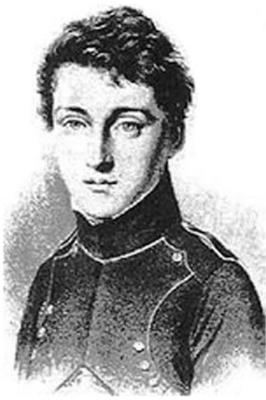
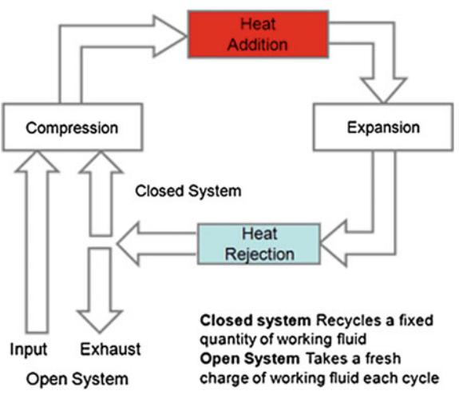
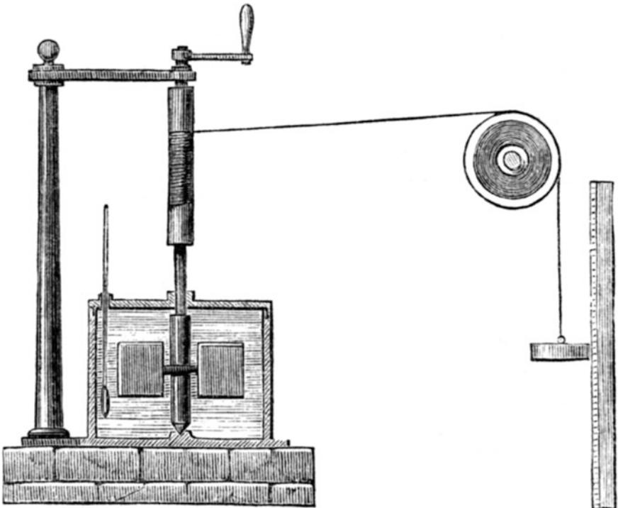
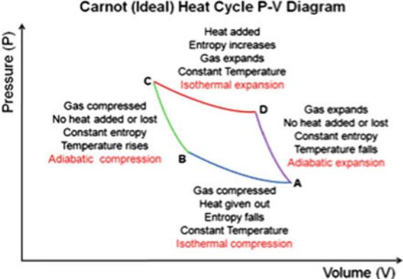
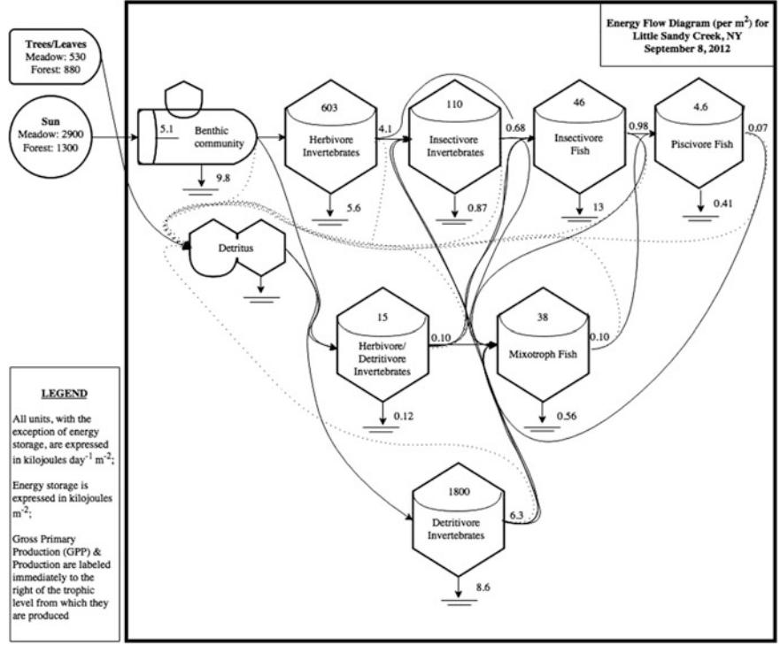

# Chapter 2 The Development of the Laws of Thermodynamics

In order to understand what energy is, it is necessary to understand the laws of thermodynamics. The most important step in this process is unraveling the relation of heat to other forms of energy. Thus we start with an historical perspective of how the human understanding of heat and energy evolved from mystical to increasingly scientific. Much of the interest in heat and energy was initiated by the astonishing success of James Watt's steam engine in the middle of the eighteenth century. While it was obvious that the engine could translate heat from coal into very powerful and useful mechanical work, the underlying reasons as to how were mysterious to many.

## 2.1 The History of Our Understanding of Energy1

In 1750, humans had essentially no clue as to what energy was, how it operated, how it was transformed, and how it was related to work or investments. But in the following century a series of remarkable discoveries and experiments, mostly from Scottish, French, and English scientists, uncovered the essentials of energy and its relation to investments. First were the remarkable discoveries of Isaac Newton which actually took place 100 years earlier. Newton discovered the three laws of motion (every object remains in its state of motion unless acted upon by an outside force; accleration is force divided by mass; for every action there is an equal and opposite reaction) and in the more than 350 years since then no fourth law has been discovered! Newton showed that the behavior of matter, which earlier had appeared as chaotic and unpredictable, actually followed a very few mathematically predictable rules. And they were universally applicable, that is they could be repeated again and again by different people in different countries and expanded to other

1 For a much more detailed historical and physical development see: Ayres, Robert. 2016. Thermodynamics, wealth production, complexity. Springer, New York.

scales or applications. Nature, or at least some of it, did not depend on the whim of deities but regular, understandable, and measureable physical laws. Newton also derived the law of universal gravitation and wrote critically important books on optics, meanwhile (at the same time as Liebnitz) inventing calculus, the mathematics of change. Nevertheless by his own admission he did not understand economics and he lost most of his money on an ill-advised investment scheme. Nor did he understand much about energy beyond the laws of motion.

Most of the additional revolution in understanding energy took place during 1750– 1850 (although continuing to some large degree though the next 100 years and even to now). This occurred during a time when there was a tremendous change in the outlook of thoughtful people, often called "the enlightenment," which took place simultaneously and was probably required for the understanding of energy to go forward. The enlightenment movement started in Scotland in roughly 1750 and was soon found in England and France too, then throughout Europe and the American colonies. The essence of enlightenment was a repudiation of the authority of past texts and thinkers (including religious and philosophical sources) as a source of knowledge and an increasing respect for individual thought, observation, measurement, and empiricism. In short the new "religion" was science and the scientific method and all that could be gained by its use.

As of 1750 essentially no one understood energy as a concept, although many people certainly understood many of its practical consequences. They knew plants needed sunlight for growth and that fuel wood could be used to do many useful economic things such as cooking, or making metals and cement. Additionally they knew sufficient practical information to build steam engines and other coal burning machines. But the concept of energy itself was tied up in confusion, often mystical, about its actual form or substance, because energy cannot be seen or felt, but only its effects. A fire heated an iron rod by adding a substance to the rod. Plants and animals as human food were ascribed to special deities rather than as the energy captured from the sun and released from the destruction of chemical bonds generated earlier, and the formation of new lower energy bonds with oxygen. In ancient times fire was thought of as a basic substance (as in Earth, Air, Fire, and Water). As in most other things in their life that they did not understand, most ancient people attributed what we now call energy, or at least some aspects of it, to a god or gods: the sun, of course, was worshiped by many cultures who understood clearly its importance for their food and warmth, but there were many other energy gods: Promethius, Haphaestus, Pele, Vesta, Hestia, Brigid, Agni, and Vulcan to name a few. These people had no possible way to see that there were common concepts linking the fire resulting from burning wood to the sun, nor could they understand that so many other processes that they also attributed to different gods (wind, rain, agriculture, the existence of wild creatures, and so on) were in fact connected to the sun.

The knowledge that a sharp sixth grader today has about energy and science in general would be far beyond what the most learned person would understand four or even two hundred years ago. How could people possibly understand energy if they did not have any concept of photons, chemical bonds, oxygen, or chemical transformations? How could they possibly understand that the growth of plants, the work of a horse, the erosion by water, the heat generated by fire and their own exertions had a common mechanism tying them all together? How could they understand that heat was a kind of energy, one related to these other things? To them they were independent entities. With the enlightenment came astonishing progress in understanding how the world works. It was driven by a relatively few thinkers and craftsmen who began to leave behind "experts" as a source of knowledge, be they philosophical, religious or even early scientific, and instead trusted more their own thoughtful observations and the development of the scientific method. It is a remarkable story, one that is behind our unprecedented wealth today and one that may eventually, if not fully understood, undermine all that we have accomplished in the name of civilization.

#### 2.2 Heat Energy

The most essential aspect of energy needing explanation was heat, which we now understand as the rate of movement of molecules within a substance. (Technically, the rate of movement determines the temperature, and heat is defined as "the disordered transfer of energy"). The prevailing view of energy in 1800 or so was that heat was a colorless, weightless, substance, generally called phlogiston, that could flow from one entity to another. An iron rod put into a fire would gradually heat up and the heat could be passed to another iron rod (or a finger!) that touched it. The most logical explanation was that phlogiston (or calor, from the Latin word for heat or warmth) would flow from the fire to the first and then the second iron rod. This concept apparently was based on Isaac Newton's (certainly an authoritative figure at the time) belief that heat was an indestructible substance with mass. The first substantial experiment to challenge caloric theory arose from work undertaken by Benjamin Thompson (also called Lord Rumford), a military engineer who invented many practical energy-related devices including the double boiler and a better fireplace. In the 1790s, he watched carefully while recently cast cannons were having a hole bored in them for the projectile. This was done by horses walking in a circle, which turned a sharp drill that drilled the hole into the cast iron cannon. The cannon and drill were immersed in water to keep the cannon from overheating, and the water would boil after several hours drilling. People thought that phlogiston moved from the cannon or the drill into the water. But Rumford observed that if the drill was blunted that the water could be made to boil indefinitely—in other words the cannon did not run out of phlogiston. He surmised that the heat did not come from phlogiston but came instead from the effects of friction causing the materials in the cannon and then the water to move more rapidly. Thus mechanical energy in the drill was being converted into molecules moving more rapidly, i.e., heat.

During the same period there was a lot of practical work carried out to turn coal into steam for running steam engines. Early engine makers were impressed with the work potential, but also the very low efficiency by which it was generated. Newcomen's early engines operated at only about 1 % efficiency (partly because the cylinder had to be cooled to condense the steam during the power stroke, and then reheated when the steam was reintroduced, so the energy in the steam was used mostly to reheat the cylinder rather than move the piston). Even JamesWatt's great improvements resulted in engines of only about 3 % efficiency. In other words, most of the heat obtained from the coal did not generate mechanical motion of the engine, but just useless heat, and thus the engines were expensive to run, needing a lot of coal. The mechanical work returned on the coal invested was very poor. So practical engineers were wondering why engines were so inefficient, and phlogiston theory had no particular answers.

Also during this time Joseph Black, Antoine Lavoisier, and others were generating important new ideas about latent heat energy (e.g., the energy to change water at 100 °C to steam at 100 °C.) and various considerations of heat related to chemical reactions, as well as the existence and nature of oxygen and carbon dioxide. Many people were beginning to understand nature much better, quantitatively and thoughtfully, but there was no particular theory to tie all these observations together.

#### 2.3 Developing the Laws of Thermodynamics

Our most important concept in understanding how energy investments, and energy more generally, operate was the development of the laws of thermodynamics, which occurred mostly in France and England during the second quarter of the nineteenth century. The first major step integrating knowledge about heat with a scientific perspective was undertaken by a young French military engineer named Sadi Carnot (Fig. 2.1). His 1824 book Réflexions sur la puissance motrice du feu et

Fig. 2.1 Sadi Carnot (1796–1832): the "father" of thermodynamics

sur les machines propres à développer cette puissance (Reflections on the Motive Power of Fire), is generally considered the starting point for the modern science of thermodynamics ("therm" means heat and "dynamics" motion or change). Carnot sought to answer two questions about the operation of heat engines (such as steam engines, but he wished to generalize): "Is the work available from a heat source potentially unbounded?" and "Can heat engines in principle be improved by replacing the steam with some other working fluid or gas?" The most important part of the book was a theoretical development for an idealized engine that could be used to understand and clarify the fundamental principles for any heat engine. Carnot defined "motive power" as the expression of the useful effect that an engine is capable of producing defined as weight lifted through a height. Today we call this work. In his time, and from the perspective of the times in which he lived, this idea of a weight lifted through a distance made a great deal of sense because most of the work needing to be done, at least initially, was to lift a quantity of water out of a mine. Carnot made the analogy that work can be done as heat "falls" from a warmer to a cooler temperature analogously to water falling from a higher elevation to a lower elevation, potentially operating a water wheel in the process.

Perhaps the most important contribution Carnot made to thermodynamics was his abstraction of the essential features of the steam engine into a more general and idealized heat engine. This resulted in an idealized thermodynamic system on which exact calculations could be made, which avoided the complications of the crude features of the contemporary steam engine. By idealizing the engine, he could arrive at clear and indisputable answers to his original two questions. He showed that the efficiency of this theoretical engine depends on only two things: the temperature of the source of heat and the temperature of the sink into which it is placed after use. This was later formalized in the equation:

$$Emax = (T_1 - T_2) / T_1,$$

where: Emax is the maximum efficiency of the work possible (such as lifting water out of a well) by an ideal (i.e., frictionless) heat engine, T1 is the absolute temperature of the source of energy (for example, steam exiting a boiler) and T2 the sink, i.e., a river or the atmosphere. The Carnot efficiency by definition cannot exceed 1, and in actual operation with modern machines is usually on the order of 25 (diesel and gasoline engines) to 50 % (gas combined cycle turbines). In general, it is higher with a greater difference between T1 and T2. In Carnot's rather amazing words: "The production of motive power is therefore due in steam engines not to actual consumption of caloric but to its transportation from a warm body to a cold body." He devised a graphic representation of an ideal heat engine that, using assumptions of, e.g., no heat loss to the machinery, gave a maximum efficiency that no engine could (or has) exceed (Fig. [2.2](#page-6-0)).

This equation explains why, despite the vast amount of heat stored in, for example, the surface of the North Sea in summer, so little work can be done from it: the difference between the surface temperature (30° C) and the deepest water (2° C) is too small compared to, say the temperature difference in an oil fired power plant,

Fig. 2.2 Diagram of a basic heat engine, such as a steam engine. Work is done during the expansion phase, such as when hot steam or exploding gasoline pushes a cylinder and converts high-grade heat energy into mechanical work. Some of that heat is recoverable, but there is always some part that cannot be recovered. Both must be rejected in the exhaust system (from [http://www.](http://www.mpoweruk.com/heat_engines.htm) [mpoweruk.com/heat_engines.htm)](http://www.mpoweruk.com/heat_engines.htm)

where temperatures at the turbine entrance may reach 817 °C and the cooling water which might be from 6° C (winter) to 17° C (summer). Entropy is the name usually given to low grade, low-temperature heat unavailable to do further work. We will give it other definitions later.

Similarly the change in entropy of a system is determined by its initial and final states. In theory the (ultimate) final state is absolute zero, as temperatures cannot go below that. Thus the quantitative estimate of S, the entropy (or perhaps more accurately the amount of energy that cannot possibly be used again) after an action, is

$$S = (E_{\rm init} - E_{\rm fin}) / \, T_{\rm abs}$$

where S (or technically dS) is the generation of entropy from a process, and Einit − Efin, is the difference in temperature of the heat from the start and ending of the process.

The most fundamental equation is that the total amount of energy available to do additional work after a given transformation can be calculated as

$$Wpot\ = E_{\text{init}} - E_{\text{fin}} - \mathcal{S}\nu$$

where Sv is the entropy generated during the process. Carnot's equation has many important implications today. To generate a more efficient jet engine, ceramics engineers build turbine blades that can withstand hotter and hotter gases upon them, and power plants operate slightly more efficiently in winter, when Efin, the river water used for cooling, is colder. But Carnot as of 1824 still seemed confused about the nature of heat, as his publication is broadly consistent with the phlogiston theory. Tragically, and in the fashion of the times, his personal effects were burned after he died, including nearly all of his notes and developing papers. The few notes that survived indicate that he was beginning to understand heat as molecular motion and they anticipated most of the groundwork for the first law of thermodynamics. Unfortunately, they remained undiscovered and unpublished until 1878.

The next critical step in the understanding of thermodynamics was made by James Joule, a brewer with a very curious mind. He measured again and again what we now know as the mechanical equivalent of heat. In 1845, Joule reported his best-known experiment, which measured the mechanical equivalent of heat by taking a pulley and rope, attaching a weight to one end of the rope and wrapping the other end around a shaft that went into an insulated water chamber where it operated a paddle wheel (Fig. [2.3)](#page-5-0). As the weight dropped (doing so many kilogram-meters of

Fig. 2.3 Joule's basic machine to derive the mechanical equivalent of heat (or it could be expressed as the heat equivalent of mechanical work). The known weight would drop a specific distance meanwhile turning a paddle wheel immersed in water, and that mechanical energy would be translated into an increase in the temperature of the water

mechanical work—think again of water being raised from a mine) the temperature increase within the chamber could be measured with a thermometer. He showed that the potential gravitational energy of the elevated weight was equal, after the weight was dropped, to the total heat added to the water by friction with the paddles. By doing so Joule found that one newton-meter of work (or 7.2 foot pounds) was equivalent to 1 Joule of heat energy. This led to the understanding that heat was a form of energy and, eventually, the theory of conservation of energy.

Neither Joule's publication nor Carnot's Réflexions had much impact initially: Joule's careful work was not given its due initially because he was a businessman, not a "gentleman," and Carnot's work, even after being modernized by Emile Clapeyron in 1834, still received relatively little attention for another decade. But then in 1845 R. Holtzman in Germany and William Thomson (Lord Kelvin) in Scotland, both working directly from the Réflexion, started publishing a series of papers that both extended and confirmed Carnot's results. Subsequently Rudolf Clausius and Lord Kelvin together derived from it explicitly the concept of entropy and the second law of thermodynamics.

In 1850, Clausius gave the first clear joint statement of the first and second laws of thermodynamics, abandoning the caloric theory, but preserving Carnot's principle. We then understood (or at least those who read these works did) how heat and energy and work were related. With this the operation and meaning of much of the physical world became obvious, and opened up enormous applications, especially through the industrial revolution—which has generated so much human welfare as well as misery.

Thus the laws of thermodynamics, which today seem so obvious, were in fact developed very, very slowly. Key issues were missed: in 1600, the English philosopher and scientist Francis Bacon surmised: "Heat itself, its essence and quiddity is motion and nothing else." But this was not generally accepted, even by the scientists studying it, until after 1850. Savory, Watt, and others working with boilers and steam engines were thinking all the time about converting heat to work, and certainly were aware of friction, but did not understand motive energy and heat as a two way street. Carnot's work, too, took decades to take hold. But once these ideas were summarized as the laws of thermodynamics they became relatively clear and widely accepted.

#### 2.4 Understanding the Laws of Thermodynamics Today

Thermo means heat (or energy) and dynamic means change. Thermodynamics is the study of the relations between motion and heat and the transformations that take place as energy or fuels are used to do work. Work occurs when something is moved, including, for example, a rock or your leg lifted, a car driven, water evaporated or lifted up in the atmosphere, chemicals concentrated or carbon dioxide transformed from the atmosphere into a green plant. There are two principle laws of thermodynamics, called the first law of thermodynamics and the second law of thermodynamics. Quite simply the first law says that energy (or for some special considerations energy-matter) cannot be created or destroyed, but only changed in form. Thus the potential energy found in a gallon of gasoline in a car's fuel tank is transformed through driving into other forms, primarily heat associated with overcoming friction to create the momentum of the car, as heat dissipated by the radiator or where the tires meet the road, or in the increased potential energy of the car if it is driven to the top of a hill. Most of that original energy is dissipated into the environment as low-grade heat—from which it is essentially impossible to get any additional work. Technically you could capture that waste heat and then use some of it, but it would require the use of even more energy to do so. Some fraction of the work done can be used again, for example the automobile could be rolled back to its original downhill position using the force of gravity. But less energy would be recovered than was originally in the gallon of gasoline, because some of it has been dissipated into low-temperature heat.

The second law of thermodynamics says that all real-life processes produce low-grade heat, often (but not always usefully) called entropy. At every energy transformation some of the initial high-grade energy (that is energy that has potential to do work) will be changed into low-grade heat barely above the temperature of the surrounding environment. In other words, the first law says that the quantity of energy always remains constant, but the second law says that the quality is degraded over time. The practical meaning of this for people and economies is that, with the exception of the energy from the sun, it is always necessary to find additional energy resources to construct and maintain whatever structures we have, including plants, animals, houses, cars, civilizations, and ourselves. The implications of this have had overwhelming impacts upon all human enterprises and histories, and constitute the remainder of this book.

To the best of our knowledge every action that occurs on earth, or elsewhere, is subject to the laws of thermodynamics. The only possible exception is that the law of conservation of energy needed to be expanded to the law of conservation of mass-energy to encompass nuclear reactions (in a star, nuclear bomb or nuclear power plant). This is because mass can be converted to energy (and the converse) according to Einstein's famous equation: E = MC2 , which says that under special circumstances energy created equals mass times the speed of light squared (a very large number). In other words in a nuclear conversion a very small amount of mass can be converted into a huge amount of energy, although this can take place only under very special conditions.

#### 2.5 Implications of the Second Law

One important implication of the second law is that heat cannot pass spontaneously from a colder to a hotter body—energy always must dissipate from a warmer body to a colder body, and go to a less organized and less useful state in the form of waste heat that cannot be used to do useful work. A second, somewhat confusing concept, related to the second law is the "Law of Entropy." Entropy is a measure of disorder or randomness in a system. With respect to the second law it might better be called a measure of the amount of energy that, during an energy transformation, becomes no longer available to do work. It is associated with the second law because energy must be expended to create and maintain order against disorder. Most fundamentally order is the non-random structure of molecules, such as a sandwich, an automobile, or a person. Thus to have order (i.e., life, or societal infrastructure) energy investments must be undertaken constantly, and in the process some of that energy must be degraded into heat and hence lost for other uses. One way to think about it is that organisms, including yourself, are centers of order, as determined by the DNA inherited from your biological parents. To maintain this order requires energy captured from the environment (as food) and invested in the multitude of processes that maintain the organisms in the very non-random pattern that represents an organism. In the same way a refrigerator takes in energy from outside itself (electricity from the wall socket) and uses it to maintain order within (i.e., the tuna sandwich). In the process some of that invested energy must be degraded into heat (at the back of the refrigerator), so that disorder is created to maintain centers of order. The universe as a whole is said to be more disordered as a result, but order is maintained where it is desired—that is where natural or cultural selection finds it useful. One result, of considerable concern to a few (but not me), is that since, apparently, the "big bang" at the origin of the universe high-grade energy, such as very high temperature matter in stars, light, and so on is being slowly degraded to low-grade heat so that the background temperature of the Universe has increased to barely above absolute zero.

In my opinion there has been too much emphasis placed on entropy, or disorder. What is important to life and civilizations is not disorder, which is ubiquitous, but order. Order should be our focus because it represents the maintenance of biological and economic structure, of very specific molecules in an organism, well-placed bricks in a city or tuna fish in a sandwich. The price of maintaining this order (sometimes called negentropy or in a different context, exergy) is extracting and using energy from the environment, a common example being the use of fossil fuels, usually associated with financial investments from private sources or the proper use of taxes. A by-product of the use of this energy is the degradation of some or most of it to low-grade heat. That low-grade thermal energy is lost to us forever, but fortunately there is plenty more high-grade stuff for us to use so we seldom give that loss any further thought. So entropy is important, yes, but what is of greater importance is the order, and the investment of energy into maintaining the order needed for life and civilizations, and for how long we will be able to do that. The amount of heat or disorder added to the universe, or even the Earth, from the process of life-maintaining order is trivial and has little or no importance.

The implications of the Second Law are profound. Systems that involve energy transformations are unidirectional and irreversible (unless additional energy is used). They lose energy as low-grade heat and may increase the order of some parts of that system. This is sometimes called time's arrow: formally "in an isolated system, one never observes a spontaneous transformation of disorder into order, one always observes a degradation of order into disorder." Another way of stating this is that if left to themselves, things get more disordered over time (think of a young child playing with blocks—or for that matter your closet). In fact if you are frustrated by the fact that the world seems constantly disordered and working against you—Where are my keys? Where are my glasses? Why has the washing machine broken?—it is just because it is true, the natural tendency of all things is toward disorder, and if order is to be maintained energy must be invested in that. A corollary to this is that the "entropy" of the universe increases over time, as apparently has been the case since the original "big bang" which created much order of a sort, although that is beyond the scope of this book or its author! Since

Change of State Carnot Heat Cycle Processes

A to B Reversible isothermal compression of the cold gas. Isothermal heat rejection. Gas starts at its "cold" temperature. Heat flows out of the gas to the low temperature environment.

B to C Reversible adiabatic compression of the gas. Compression causes the gas temperature to rise to its "hot" temperature. No heat gained or lost from system.

C to D Reversible isothermal expansion of the hot gas. Isothermal heat addition. Absorption of heat from the high temperature source. Expanding gas available to do work on the surroundings (e.g. moving a piston).

D to A Reversible adiabatic expansion of the gas. The gas continues to expand, doing external work. The gas expansion causes it to cool to its "cold" temperature. No heat is gained or lost.

If the heat cycle is operated clockwise as shown in the above diagram, the engine uses heat to do net work. If the cycle is operated in reverse (anti-clockwise), it uses work to transfer thermal energy from a cooler system to a warmer one thereby acting as a refrigerator or a heat pump. (Modified from hƩp://www.mpoweruk.com/heat_engines.htm)

Fig. 2.4 Carnot's basic diagram showing the pressure (P) and volume (V) relations of an ideal heat engine. Work is done from location 1 to location 2, as volume expands and pressure decreases (such as when a piston is being pushed on the power stroke)

our sun will be operating more or less as it is now for additional billions of years it is certainly not worth losing any sleep over.

Organisms, and sometimes entire ecosystems, are called "self-organizing systems" because they maintain their own organization essentially by themselves, as a result of natural selection for genetic codes that cause them to extract energy and use it to generate and maintain matter into the incredible machines that are living organisms and ecosystems. Additionally life forms are called "autocatalytic" because they catalyze their own growth: exploitation of energy from the environment allows them to build structure that allows even more exploitation and growth, until the limits of available energy are reached. One might say that life breaks the second law, as organization is generated seemingly spontaneously. Yes, this happens, but only through the degradation of much of the free energy of the Earth-Sun system to heat, so the second law remains intact. There is an energy tax for all activities, imposed by the second law and various inevitable and even desirable inefficiencies, and we cannot escape it (Fig. [2.4)](#page-10-0).

### 2.6 The Second Law and Efficiencies

It is critically important to understand that every energy transformation comes at an energy cost and cannot be 100 % efficient. Ecologists understand the importance of the Second Law because it applies to every living organism and ecosystem alike. Also worth noting is how stunningly inefficient many biological processes are from an energy perspective. Photosynthesis converts at most about 2–4 % of sunlight into plant biomass. The rest is lost as heat. Similarly, herbivores typically convert only 10–20 % of the energy in the plant biomass they eat into energy bonds in their own flesh. The transfer efficiencies, which ecologists call "ecological efficiencies," are roughly similar for each succeeding "trophic" or food level. By the time a top carnivore such as a tuna fish or smallmouth bass eats its prey, only a very small fraction of the original energy from the sun remains in the food chain (Fig. [2.5)](#page-12-0). The rest has been dissipated as heat, mostly from maintenance metabolism along the way. This sort of analysis is helpful to us in understanding how ecosystems and human systems alike function. Similarly, the understanding of transfer efficiencies needs to be considered if we want to make sensible energy policy.

Why is this concept relevant to energy policy? The answer is simple: the more transformations that occur in producing or using a given energy source, the more of the energy will be lost as waste heat. Some transformations are more efficient than others, so we might consider maximizing our use of those. For example, internal combustion engines are notoriously inefficient at converting their fuel's chemical energy to mechanical energy, usually at from 20 to 30 %. Engine friction and waste heat are major factors accounting for low efficiency, both of which relate to the Second Law. On the other hand, electrical engines are much more efficient, approaching 90 % efficiency in converting electricity (a higher quality fuel) to mechanical energy. However most of our electricity comes from burning fossil

Fig. 2.5 Diagram of the food chain of a small stream in upstate New York for a day in September. 2012. Energy stocks and flows are estimates of mean energy flow using symbols from H.T. Odum. Bullet-shaped modules represent autotrophs, hexagons represent heterotrophs. Dashed lines represent indirect energy flow to detritivorous invertebrates. Numbers in hexagons are biomass values and numbers on downward pointing arrows are respiration values. GPP and production values are on the horizontal lines/arrows to the right of the trophic level from which they are produced. Of the 2000 MJ of sunlight and 600 MJ of leaves that enters a mean square meter of the stream in a day only about 1 MJ makes it to the top carnivore, in this case piscivorous fish such as a small mouth bass (From Hall et al. in revision)

fuels at roughly 30–40 % efficiency. Thus if we started with oil and used it to drive a train the efficiency would be, say, 0.32 or so. If we used that oil to make electricity which then drove the train's electric motors the overall efficiency would be 0.4 times 0.9, or a total efficiency of roughly 0.36, a little better than burning the oil directly, but not much. Consequently most modern locomotives in the U.S. are "diesel electric," burning diesel to make electricity and then using the electricity to drive the train.

Now that we (and the scientific world of the early nineteenth century) have a practical definition and understanding of thermodynamics we turn to a more general consideration of energy which is much more informative with the relation of energy and heat defined.

### Reference

- Hall, C. A. S., F. Knickmeyer, A. Wiegman, A. Brainard, A. R. Diaz, C. Huynh and J. Mead. (in revision) A class exercise for systems ecology: synthesis of stream energetics and testing Allen's paradox. Ecological Modeling.