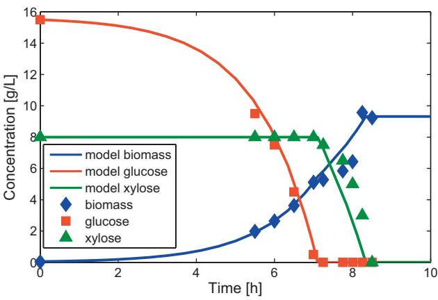
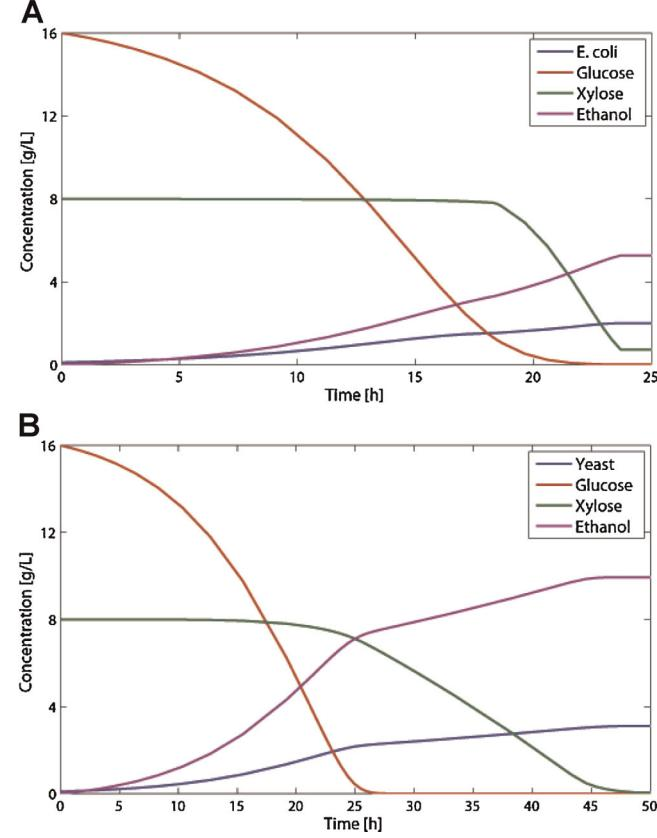
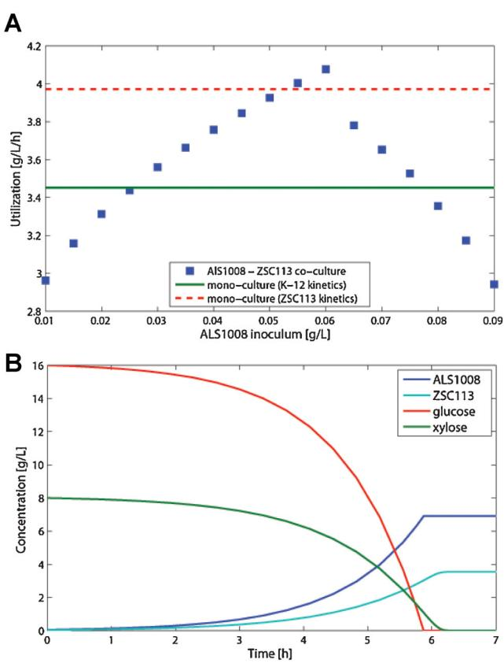
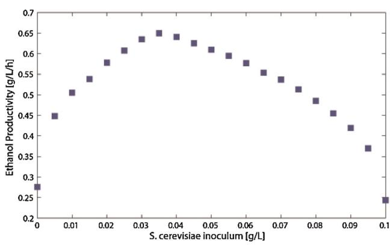
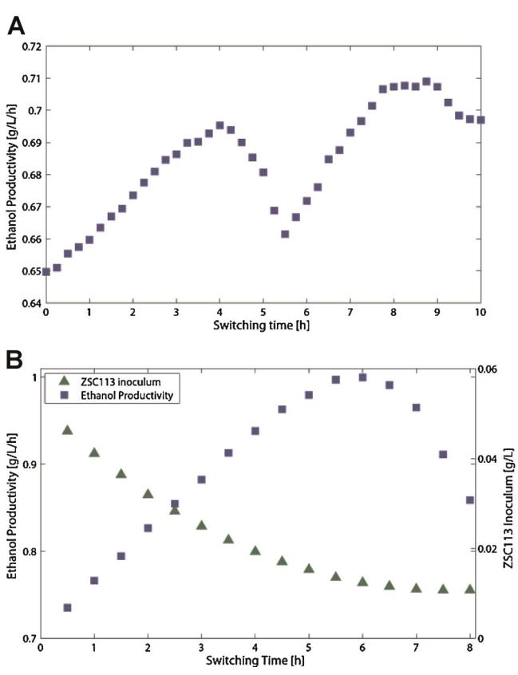
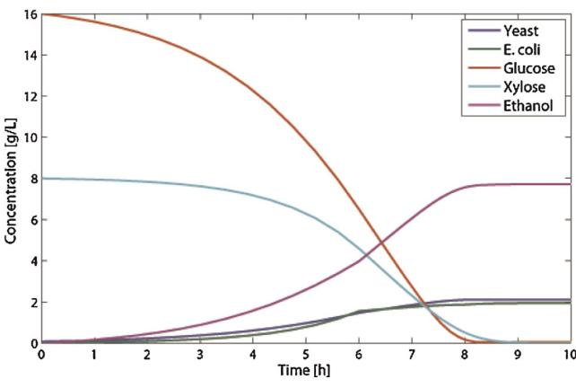
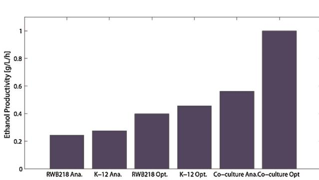
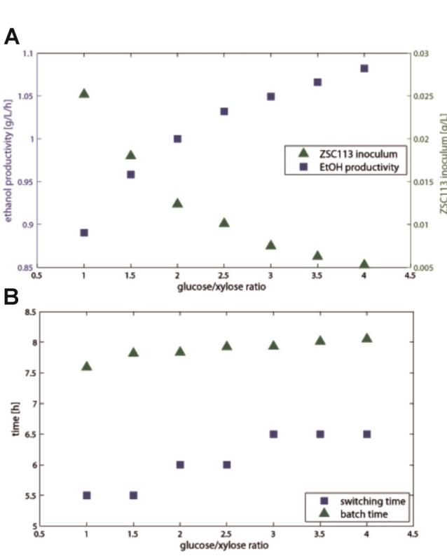
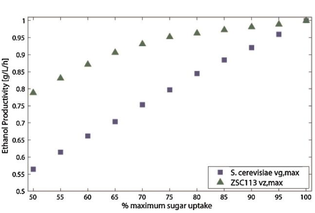

# ARTICLE

# Dynamic Flux Balance Modeling of Microbial Co-Cultures for Efficient Batch Fermentation of Glucose and Xylose Mixtures

Timothy J. Hanly, Michael A. Henson

Department of Chemical Engineering, University of Massachusetts, Amherst, Massachusetts 01003-3110; telephone: þ1-413-545-3481; fax: þ1-413-545-1647;

e-mail: henson@ecs.umass.edu

Received 25 June 2010; revision received 2 September 2010; accepted 8 September 2010 Published online 29 September 2010 in Wiley Online Library (wileyonlinelibrary.com). DOI 10.1002/bit.22954

ABSTRACT: Sequential uptake of pentose and hexose sugars that compose lignocellulosic biomass limits the ability of pure microbial cultures to efficiently produce value-added bioproducts. In this work, we used dynamic flux balance modeling to examine the capability of mixed cultures of substrate-selective microbes to improve the utilization of glucose/xylose mixtures and to convert these mixed substrates into products. Co-culture simulations of Escherichia coli strains ALS1008 and ZSC113, engineered for glucose and xylose only uptake respectively, indicated that improvements in batch substrate consumption observed in previous experimental studies resulted primarily from an increase in ZSC113 xylose uptake relative to wild-type E. coli. The E. coli strain ZSC113 engineered for the elimination of glucose uptake was computationally co-cultured with wild-type Saccharomyces cerevisiae, which can only metabolize glucose, to determine if the co-culture was capable of enhanced ethanol production compared to pure cultures of wild-type E. coli and the S. cerevisiae strain RWB218 engineered for combined glucose and xylose uptake. Under the simplifying assumption that both microbes grow optimally under common environmental conditions, optimization of the strain inoculum and the aerobic to anaerobic switching time produced an almost twofold increase in ethanol productivity over the pure cultures. To examine the effect of reduced strain growth rates at non-optimal pH and temperature values, a break even analysis was performed to determine possible reductions in individual strain substrate uptake rates that resulted in the same predicted ethanol productivity as the best pure culture.

Biotechnol. Bioeng. 2011;108: 376–385.

2010 Wiley Periodicals, Inc.

KEYWORDS: dynamic flux balance modeling; fermentation; mixed culture; Escherichia coli; Saccharomyces cerevisiae

Introduction

For cost-effective conversion of lignocellulosic biomass to value-added products, microbes must be discovered and engineered to efficiently metabolize sugar mixtures. Plant derived biomass is a heterogeneous material that produces a variety of pentose and hexose sugars when subjected to enzymatic hydrolysis (Zaldivar et al., 2001). Furthermore, the relative composition of these sugars varies significantly with plant species. Many microbes can rapidly consume glucose and convert it to commodity biochemicals such as ethanol. However, large-scale production of such primary metabolites is not economically feasible unless xylose, the most abundant pentose in lignocellulosic biomass, is also efficiently metabolized (Hinman et al., 1989). The identification of specialized microbes that efficiently convert complex sugar mixtures to targeted biofuels is a key challenge for the emerging cellulosic biofuels industry. Currently available wild-type microbes are restricted with respect to their substrate utilization and/or product yield capabilities.

Considerable research has focused on engineering a single microbial strain to convert the pentose and hexose sugars present in cellulosic hydrolysate to targeted biofuels. These metabolic engineering efforts have produced mixed results (Matsushika et al., 2009; Yomano et al., 2008) as complex and poorly understood regulatory mechanisms often counteract engineering strategies aimed at modifying cellular metabolism. Saccharomyces cerevisiae is widely used for the production of ethanol from glucose but this yeast does not have all the genes necessary for uptake and metabolism of pentose sugars. Xylose metabolism has been transferred to S. cerevisiae through the transfection of the xylose reductase and xylitol dehydrogenase genes from the pentose-utilizing yeast Pichia Stipitis (Chu and Lee, 2007; Jeffries, 2006). However, inefficiencies due to a redox imbalance between NAD and NADP proton shuttles result in slow pentose metabolism (Bruinenberg et al., 1983). Correspondence to: Michael A. Henson Furthermore, xylose is transported into recombinant S. cerevisiae cells by the same family of hexose transporters (Hxts) that are used for glucose uptake (Hamacher et al., 2002). Because these transporters have over a magnitude greater affinity for glucose than xylose, these recombinant yeast utilize xylose only after depletion of glucose in a pattern of diauxic growth (Kuyper et al., 2005). Escherichia coli can natively metabolize xylose but this bacterium does not naturally exhibit high ethanol yields due to the synthesis of mixed fermentation products. Furthermore, high concentrations of hexose sugars often inhibit xylose uptake by catabolite repression, resulting in a low yield and/or a delay of fermentation (Govindaswamy and Vane, 2007; Lawford and Rousseau, 1994; Sedlak et al., 2003). Considerable research has focused on engineering E. coli strains that have higher ethanol productivities. Although strains that express the ethanol dehydrogenase and pyruvate decarboxylase enzymes from the bacterium Zymomonas mobilis overproduce ethanol, diauxic consumption of pentose and hexose sugars is still observed (Lawford and Rousseau, 2002).While metabolic engineering offers the possibility of combining versatile substrate utilization and high product yields into a single recombinant strain, alternative strategies should be explored. The unique properties of microbes currently envisioned for biofuels production suggest that microbial consortia consisting of synergistic combinations of pentose and hexose consuming species may offer distinct advantages over single microbe strategies (Lynd et al., 2002). Rather than attempting to engineer cells to deviate from their natural metabolic behavior, these consortia take advantage of the native capabilities of different species to metabolize different sugars and direct available carbon to targeted biofuels. This strategy allows metabolic engineering efforts to be focused on enhancing natural behavior rather than introducing foreign genes whose effects are often counteracted (Kuyper et al., 2005). For example, pentose fermenting microbes have been co-cultured with hexose fermenting yeasts such as S. cerevisiae to maintain low hexose sugar concentrations and avoid catabolite repression (Beck et al., 1990; De Bara et al., 2004; Leschine and Canale-Parola, 1984; Qian et al., 2006; Taniguichi et al., 1997a,b).

The development of microbial consortia for efficient biofuels production is a very challenging problem. Experimental data on the behavior of microbial consortia is limited, especially for species combinations that do not appear naturally (Fazzini et al., 2010; Ramadas and Thattai, 2009; VerBerkmoes et al., 2009). Moreover, purely experimental approaches are not well suited to handle the wide variability of available biomass feedstocks and the immense diversity of microbial species. Metabolic modeling offers the potential for identification of synergistic combinations of biofuels producing microbes and optimization of fermentation conditions for efficient substrate utilization and high product yields, thereby informing and guiding experimental efforts. A promising approach is metabolic flux balance analysis (FBA), where a stoichiometric model of intracellular metabolism is used to predict growth rates and product yields under the assumption that a microorganism distributes carbon flux to achieve maximal growth (Price et al., 2003; Varma and Palsson, 1994). FBA has found very limited application to microbial consortia, with a single study focused on the syntrophic relationship between two ruminal bacteria in which the first species synthesizes a product necessary for growth of the second species (Stolyar et al., 2007). The increasing availability of genome-scale stoichiometric models for various microbes (Feist et al., 2009; Schellenberger et al., 2010) suggests that FBA is a potentially powerful tool for analysis and engineering of microbial consortia.

In this study, we utilize a dynamic extension of FBA (Hjersted et al., 2007; Mahadevan et al., 2002) to simulate and optimize batch cultures of specialized glucose and xylose consuming microbes. The first system consists of the E. coli mutants ALS1008 and ZSC113, two strains engineered to selectively uptake glucose and xylose, respectively (Curtis and Epstein, 1975; Eiteman et al., 2008). ZSC113 lacks the mannose and hexose ATP binding cassettes that allow glucose transport into the cell, along with glucose kinase required for glucose entry into glycolysis (Curtis and Epstein, 1975). These mutations prevent the microbe from utilizing glucose as a growth substrate. The deletion of xylose isomerase in the strain ALS1008 prevents this mutant from growing on xylose (Eiteman et al., 2008). Under the reasonable assumption that the two strains are noninteracting, dynamic flux balance analysis (DFBA) is used to validate experimental batch culture data (Eiteman et al., 2008) and to determine the initial amount of each cell type for optimal consumption of the two sugars.

The second system is comprised of wild-type S. cerevisiae and E. coli ZSC113, two strains that selectively uptake glucose and xylose, respectively. Under the additional simplifying assumption that the two strains grow optimally under the same environmental conditions, DFBA is used to determine the initial concentration of each microorganism and the aerobic-to-anaerobic switching time that maximizes batch ethanol productivity. The performance of this consortium is compared to predicted ethanol productivities achievable with pure cultures of wild-type E. coli K-12 and S. cerevisiae RWB218, a recombinant yeast capable of xylose metabolism. To examine the effect of reduced strain growth rates at non-optimal pH and temperature values, an analysis is performed to determine possible reductions in individual strain substrate uptake rates that result in the same predicted ethanol productivity as the best pure culture.

# Methods

## Co-Culture Stoichiometric Models

The co-culture stoichiometric models used in this study were adapted from the iJR904 E. coli (Reed et al., 2003) and iND750 S. cerevisiae (Duarte et al., 2004) genome-scale metabolic reconstructions. The wild-type S. cerevisiae iND750 model consists of 750 genes and 1,149 intracellular reactions, which are divided into seven distinct intracellular compartments. Compartmentalization of the 646 unique metabolites produces a total of 1,059 metabolites that are stoichiometrically balanced. The dimensions of the stoichiometric matrix are 1,059 metabolites and 1,264 fluxes, which includes the intracellular reactions and 115 compartmental exchange fluxes. The publicly available model includes a mostly complete description of xylose metabolism such that the associated pathways become active only when a xylose uptake rate is specified. The only modification needed for the xylose utilizing S. cerevisiae strain RWB218 was the insertion of the reverse reaction for xylitol dehydrogenase, which increased the number of fluxes to 1265 for mixed substrate studies.

The wild-type E. coli model iJR904 accounts for 962 genes, 931 fluxes, and 625 metabolites. The only modification needed for the glucose-only utilizing E. coli strain ALS1008 was that the flux bounds for the xylose isomerase catalyzed reaction were constrained to zero. The xylose-only utilizing E. coli strain ZSC113 was implemented by constraining the fluxes for glucose exchange and glucose kinase to be zero. The E. coli models contained a non-growth associated ATP maintenance requirement of 7.6 mmol/gdw (Reed et al., 2003) that placed a minimum xylose uptake rate limit for anaerobic simulations of the bacterium. The in silico cell was not be able to meet this demand and grow if the xylose uptake rate was less than 3.75 mmol/gdw/h.

Each flux balance model had the form of a standard linear program:

$$\begin{aligned} \min_{\boldsymbol{\nu}_{i}} \mu_{i} &= \boldsymbol{w}_{i}^{T} \boldsymbol{\nu}_{i} \\ \boldsymbol{A}_{i} \boldsymbol{\nu}_{i} &= \mathbf{0} \\ \boldsymbol{\nu}_{i, \text{min}} &\leq \boldsymbol{\nu}_{i} \leq \boldsymbol{\nu}_{i, \text{max}} \end{aligned} \tag{1}$$

where i represents the species, Ai is the matrix of stoichiometric coefficients, vi is the vector of reaction fluxes including exchange fluxes, vi,min and vi,max are vectors lower and upper flux bounds, mi is the growth rate and wi is a vector of experimentally determined weights that represent the contribution of each flux to biomass formation. Under the assumption that the two species were non-interacting, the coculture model for species i and j was formulated as follows:

$$\begin{aligned} \min_{\boldsymbol{\nu}_{i}, \boldsymbol{\nu}_{j}} \quad \boldsymbol{\mu} = \boldsymbol{\mu}_{i} + \boldsymbol{\mu}_{j} = \boldsymbol{\mathcal{w}}_{i}^{T} \boldsymbol{\nu}_{i} + \boldsymbol{\mathcal{w}}_{j}^{T} \boldsymbol{\nu}_{j} \\ \begin{bmatrix} A_{i} & \mathbf{0} \\ \mathbf{0} & A_{j} \end{bmatrix} \begin{bmatrix} \boldsymbol{\nu}_{i} \\ \boldsymbol{\nu}_{j} \end{bmatrix} = \begin{bmatrix} \mathbf{0} \\ \mathbf{0} \end{bmatrix} \\ \begin{bmatrix} \boldsymbol{\nu}_{i,\min} \\ \boldsymbol{\nu}_{j,\min} \end{bmatrix} \leq \begin{bmatrix} \boldsymbol{\nu}_{i} \\ \boldsymbol{\nu}_{j} \end{bmatrix} \leq \begin{bmatrix} \boldsymbol{\nu}_{i,\max} \\ \boldsymbol{\nu}_{j,\max} \end{bmatrix} \end{aligned} \tag{2}$$

The co-culture objective function was assumed to be the sum of the individual species growth rates, which was equivalent to assuming each species maximizes its individual growth rate from the available substrates. The linear programs (1) and (2) were solved using the Mosek optimization toolbox (Mosek ApS, Copenhagen, Denmark) within Matlab (Mathworks, Natick, MA).

#### Co-Culture Dynamic Flux Balance Models

The stoichiometric models were adapted for dynamic flux balance analysis by the addition of the following substrate uptake kinetics:

$$\nu_{\mathfrak{g}} = \nu_{\mathfrak{g}, \text{max}} \frac{G}{K_{\mathfrak{g}} + G} \frac{1}{1 + \frac{E}{K_{i\varepsilon}}} \tag{3}$$

$$\nu_{\rm z} = \nu_{\rm z,max} \frac{Z}{K_{\rm z} + Z} \frac{1}{1 + \frac{E}{K_{\rm ir}}} \frac{1}{1 + \frac{G}{K_{\rm jr}}} \tag{4}$$

$$\nu_{\rm o} = \nu_{\rm o,max} \frac{O}{K_{\rm o} + O} \tag{5}$$

where G, Z, O, and E are the extracellular concentrations of glucose, xylose, oxygen, and ethanol, respectively, vg,max, vz,max and vo,max are the maximum uptake rates of each substrate, Kg, Kz, and Ko are corresponding saturation constants, and Kie and Kig are inhibition constants. The glucose uptake rate (3) is dictated by Michaelis–Menten kinetics with the addition of an inhibitory term that reflects growth rate suppression at high ethanol concentrations. The xylose uptake rate (4) followed similar kinetics with the addition of a glucose inhibition term to account for catabolite repression that results in diauxic growth.

Extracellular biomass, glucose, xylose, and ethanol were described with the following equations:

$$\frac{d\mathbf{X_g}}{dt} = \mu_\mathbf{g} X_\mathbf{g} \tag{6}$$

$$\frac{d\mathbf{X}_{\mathbf{z}}}{dt} = \mu_{\mathbf{z}} \mathbf{X}_{\mathbf{z}} \tag{7}$$

$$\frac{\mathrm{d}G}{\mathrm{d}t} = -\nu_{\mathrm{g}}X_{\mathrm{g}}\tag{8}$$

$$\frac{dZ}{dt} = -\nu_{\text{z}} X_{\text{z}} \tag{9}$$

$$\frac{\mathrm{d}E}{\mathrm{d}t} = (\nu_{\mathrm{e},\mathrm{g}}X_{\mathrm{g}} + \nu_{\mathrm{e},\mathrm{z}}X_{\mathrm{z}}) \tag{10}$$

where Xg and Xz are the biomass concentrations for the glucose and xylose consuming microbes, respectively, ve,g and ve,z are the ethanol synthesis fluxes for the two microbes, and mg and mz are the individual microbe growth rates. Oxygen balances were omitted assuming the dissolved oxygen concentration could be regulated at 0.24 mmol/L for aerobic simulations.

The substrate uptake parameters used in dynamic flux balance simulations for both wild-type and mutant E. coli and S. cerevisiae strains are listed in Table I. Simulations of the recombinant strains used the same constants as the wild-

Table I. Substrate uptake parameter values used in dynamic flux balance analysis of wild-type and recombinant E. coli and S. cerevisiae strains.

| Wild-type parameter | E. coli value | Refs.                         | S. cerevisiae value | Refs.                                  |
|---------------------|---------------|-------------------------------|---------------------|----------------------------------------|
| vg,max (mmol/g/h)   | 10.5          | Varma and Palsson (1994)      | 22.4                | Hjersted and Henson (unpublished work) |
| Kg (g/L)            | 0.0027        | Wong et al. (1997)            | 0.8                 | Hjersted and Henson (unpublished work) |
| vo,max (mmol/g/h)   | 15            | Varma and Palsson (1994)      | 2.5                 | Hjersted and Henson (unpublished work) |
| Ko (mmol/L)         | 0.024         | Meadows et al. (2010)         | 0.003               | Hjersted and Henson (unpublished work) |
| vz,max (mmol/g/h)   | 6             | Shamanna and Sanderson (1979) | 0                   | —                                      |
| Kz (g/L)            | 0.0165        | Shamanna and Sanderson (1979) | 0                   | —                                      |
| Ki,g (g/L)          | 0.005         | —                             | 0.5                 | Hjersted et al. (2007)                 |
| Ki,e (g/L)          | 20            |                               | 10                  | Hjersted et al. (2007)                 |
| Mutant parameter    | ZSC113 value  | Refs.                         | RWB218 value        | Refs.                                  |
| vg,max (mmol/g/h)   | 0             | —                             | 7.3                 | Kuyper et al. (2005)                   |
| Kg (g/L)            | 0             | —                             | 1.026               | Kuyper et al. (2005)                   |
| vz,max (mmol/g/h)   | 12            | —                             | 32                  | Kuyper et al. (2005)                   |
| Kz (g/L)            | 0.25          | —                             | 14.026              | Kuyper et al. (2005)                   |

type strains except for those parameters specified in the table. Differences between the substrate uptake rates under anaerobic and aerobic growth conditions (Hjersted et al., 2007) were neglected. A set of mixed substrate growth curves (Eiteman et al., 2008) was used to estimate a value of the glucose inhibition constant (Ki,g) for wild-type E. coli. The ethanol inhibition constant (Ki,e) for wild-type E. coli accounted for the negative effect of high ethanol concentrations on cell growth (Sainz et al., 2003). Based on mixedsubstrate experiments (Eiteman et al., 2008), the glucose uptake parameters for the glucose-only utilizing E. coli strain ALS1008 were estimated to be the same as for the wild-type values. The parameters for the ZSC113 xylose uptake kinetics were found by fitting dynamic flux balance predictions to batch fermentation data (Eiteman et al., 2008).

Dynamic flux balance model simulations were performed in Matlab by simultaneous solution of the linear program for growth maximization (2) with Mosek and integration of the extracellular mass balance Equations (6)–(10) with the code ode23. The total inoculum concentration was fixed at 0.1 g/L, with the relative amounts of the two species specified for each simulation. Unless otherwise noted, all batch simulations were performed with an initial glucose concentration of 16 g/L and an initial xylose concentration of 8 g/L to reflect a sugar mixture that could result from the hydrolysis of cellulosic biomass. The final batch time was determined as the time at which the glucose concentration dropped below 0.1 g/L and the xylose concentration dropped below 1.5 g/L. Due to the preferential consumption of glucose by the various species (Chu and Lee, 2007; Dien et al., 2003), the xylose limit usually determined the batch time. For the first system consisting of the E. coli mutants ALS1008 and ZSC113, batch fermentation performance was determined by the substrate utilization rate calculated as difference in the initial and final total sugar concentrations divided by the batch time. The performance of the second system comprised of wild-type S. cerevisiae and E. coli ZSC113 was quantified with the ethanol productivity defined as the final concentration of ethanol divided by the batch time.

### Results and Discussion

#### Mono-Culture Simulations

We have validated dynamic flux balance model predictions of wild-type S. cerevisiae metabolism using transient data for aerobic growth on glucose media in batch culture (Hanly et al., unpublished work). Figure 1 shows a comparison of batch culture data (Eiteman et al., 2008) and predictions from the wild-type E. coli dynamic flux balance model for batch aerobic growth on glucose/xylose mixed media. Initial glucose, xylose, and biomass concentrations were obtained from the experimental measurements at time zero. The maximum xylose uptake rate (vz,max) and the glucose inhibition constant (Ki,g) were adjusted by trial-and-error to match the experimental and predicted xylose concentration profiles. The model provided good agreement with the data except for a slight underprediction of glucose consumption and a slight overprediction of xylose consumption, which might be attributable to neglecting the transcriptional processes needed to switch from glucose to xylose metabolism (Khankal et al., 2009). To quantify the prediction error, we computed the following least-squares error measure e for each measured variable:

$$e = 100\sqrt{\sum_{i=1}^{n} \frac{\left(\hat{\boldsymbol{\nu}}_{i} - \boldsymbol{\nu}_{i}\right)^{2}}{\boldsymbol{\nu}_{i}^{2}}} \tag{11}$$

where y is the measured value, ^*y* is the corresponding predicted value, and n is the number of measured data points in the batch run. The error was 65.7% for the biomass concentration, 35.9% for the glucose concentration and

Figure 1. Comparison of model predictions and experimental data (Eiteman et al., 2008) for wild-type E. coli aerobically consuming a mixture of glucose and xylose. [Color figure can be seen in the online version of this article, available at wileyonlinelibrary.com.]

95.2% for the xylose concentration. Diauxic growth was evident with significant xylose consumption occurring only after glucose was completely exhausted. The batch time at which the predicted xylose concentration dropped below 1.5 g/L was over 8 h.

Dynamic model predictions for anaerobic batch growth of wild-type E. coli and recombinant S. cerevisiae strain RWB218 mono-cultures on glucose/xylose media are shown in Figure 2. As under aerobic conditions, E. coli exhibited a diauxic growth pattern characterized by very limited xylose consumption prior to exhaustion of glucose (Fig. 2A). The resulting batch time of approximately 23 h was substantially longer than for aerobic growth. The non-growth associated ATP maintenance requirement used in the E. coli model caused growth to stop at a xylose concentration of approximately 1 g/L. A relatively low ethanol concentration of approximately 5 g/L was predicted at the final batch time. The recombinant S. cerevisiae model predicted a similar diauxic growth pattern but a much longer batch time of approximately 43 h due to its slower growth. While a higher ethanol concentration of approximately 10 g/L was predicted at the final batch time, the recombinant S. cerevisiae culture was predicted to have a lower ethanol productivity (0.22 g/L/h) than the wild-type E. coli culture (0.25 g/L/h).

#### E. coli Co-Culture Simulations

E. coli batch co-culture simulations for the glucose only consuming mutant ALS1008 and the xylose only consuming mutant ZSC113 were conducted to analyze and optimize total substrate utilization rate on mixed media. Only aerobic growth was considered since substrate utilization was substantially greater than for anaerobic conditions. The ALS1008 inoculum was varied such that the total initial biomass concentration remained 0.1 g/L to determine the

Figure 2. Dynamic flux balance model predictions for anaerobic batch growth of wild-type E. coli (A) and S. cerevisiae (B) mono-cultures on glucose/xylose media. [Color figure can be seen in the online version of this article, available at wileyonlinelibrary.com.]

effect of the inoculum on substrate utilization (Fig. 3A). Maximal substrate utilization was observed at an ALS1008 inoculum of 0.06 g/L and ZSC113 inoculum of 0.04 g/L, initial substrate concentrations which caused both the glucose concentration to drop to 0.1 g/L and the xylose concentration to drop to 1.5 g/L at the final batch time (Fig. 3B). The co-culture avoided diauxic growth by consuming the two substrates simultaneously and the optimal inoculum resulted in the substrates being equally consumed according to our definition of the batch time.

Also shown in Figure 3A are results for E. coli monocultures with the xylose uptake kinetics of the wild-type strain K-12 and the recombinant strain ZSC113, both implemented with a pure inoculum of 0.1 g/L. The K-12 result was the substrate utilization rate obtained with the K-12 wild-type strain, while the ZSC113 result represented the substrate utilization rate obtained with a hypothetical strain that has the glucose uptake kinetics of the wild-type and the xylose uptake kinetics of ZSC113. The co-culture was predicted to have a substrate utilization rate approximately 15% greater than the K-12 wild-type strain. A similar decrease in batch time was observed experimentally in a coculture of the two strains (Eiteman et al., 2008). The results

Figure 3. Dynamic flux balance model predictions for aerobic batch growth of a co-culture comprised of E. coli recombinant strains ALS1008 and ZSC113 on glucose/ xylose media. The substrate utilization rate was determined as a function of the ALS1008 inoculum concentration (blue dots). Also shown are the substrate utilization rates predicted for the K-12 wild-type E. coli strain (green solid line) and for a hypothetical E. coli strain that had the glucose uptake kinetics of the wild-type and the xylose uptake kinetics of ZSC113 (red dashed line) (A). The individual strain, glucose, and xylose transient concentrations are shown for the optimal inoculum (B). [Color figure can be seen in the online version of this article, available at wileyonlinelibrary. com.]

suggested that the improved performance of the co-culture was mostly attributable to the enhanced xylose uptake kinetics of the ZSC113 mutant rather than simultaneous consumption of the two sugars as suggested in the original experimental study.

#### E. coli/S. cerevisiae Co-Culture Simulations

Batch co-culture simulations for wild-type S. cerevisiae that only consumes glucose and the xylose only consuming E. coli mutant ZSC113 were conducted to predict and optimize ethanol productivity on mixed media. First the E. coli/ S. cerevisiae inoculum was optimized for maximal ethanol production under anaerobic growth conditions subject to the constraint that the total initial biomass concentration remained 0.1 g/L. Then we considered two growth phases, aerobic growth to promote cell growth followed by anaerobic growth to achieve ethanol synthesis, and simultaneously optimized the inoculum and the aerobic– anaerobic switching time for maximal ethanol productivity. Simulations were performed assuming the two species were non-interacting and that each species was able to achieve optimal growth at a common pH and temperature. The effect of reduced strain growth rates at non-optimal pH and temperature values also was investigated (Davison and Stephanopoulos, 1986).

The S. cerevisiae inoculum was varied to determine the effect of initial substrate concentrations on ethanol productivity for the given sugar mixture (Fig. 4). The total inoculum concentration was fixed at 0.1 g/L. The end points corresponded to pure cultures of xylose only consuming ZSC113 (left) and glucose only consuming wild-type S. cerevisiae (right). Maximal ethanol productivity was achieved at a S. cerevisiae inoculum of 0.035 g/L and ZSC113 inoculum of 0.065 g/L. The optimal ratio of S. cerevisiae to ZSC113 in the inoculum was found to be the same as the ratio of the glucose and xylose sugars they consume, namely 2/1. Further demonstrating that concurrent substrate consumption is desirable, the batch times with respect to glucose and xylose were equal at this optimal inoculum.

The effect of the aerobic–anaerobic switching time on ethanol productivity was analyzed for the optimal E. coli/ S. cerevisiae inoculum determined under anaerobic conditions (Fig. 5A). The end points corresponded to pure aerobic growth (left) and pure anaerobic growth (right). For this inoculum, the switching time had a relatively small effect with the optimal time of approximately 8.5 h yielding a productivity less than 10% higher than that obtained for the worse case, purely aerobic growth. As before, the optimum corresponded to the case where the substrates were equally consumed according to our definition of the batch time. A second, lower peak observed at a switching time of approximately 4.0 h was attributable to complete xylose consumption by ZSC113 during the aerobic growth phase.

Figure 4. Dynamic flux balance model predictions for anaerobic batch growth of a co-culture comprised of wild-type S. cerevisiae and E. coli recombinant strain ZSC113 on glucose/xylose media. The ethanol productivity was determined as a function of the S. cerevisiae inoculum concentration. [Color figure can be seen in the online version of this article, available at wileyonlinelibrary.com.]

Figure 5. Dynamic flux balance model predictions for combined aerobic–anaerobic batch growth of a co-culture comprised of wild-type S. cerevisiae and E. coli recombinant strain ZSC113 on glucose/xylose media. The ethanol productivity was determined as a function of the aerobic–anaerobic switching time at the optimal inoculum for anaerobic growth (A) and the ZSC113 inoculum concentration and the aerobic–anaerobic switching time (B). [Color figure can be seen in the online version of this article, available at wileyonlinelibrary.com.]

Beyond this point ZSC113 does not grow anaerobically and produces no ethanol, eliminating any advantage of the cococulture.

Next the inoculum and the aerobic–anaerobic switching time were varied simultaneously to determine the optimal combination for ethanol production. The problem was simplified by noting that optimal performance would occur when both substrates reached their defined batch-ending concentrations simultaneously. Therefore, the optimal inoculum for each switching time was determined by varying the inoculum composition until the final batch times computed with respect to the two substrates were within 0.1 h (Fig. 5B). The ZSC113 inoculum was a monotonically decreasing function of the switching time because the longer aerobic phases favored E. coli growth and xylose consumption. By contrast, the switching time had a well defined maximum as cell growth was insufficient at shorter switching times and ethanol synthesis was unduly sacrificed at longer times. An optimal productivity of 1.0 g/L/h was achieved for an inoculum of 0.088 g/L S. cerevisiae and 0.012 g/L ZSC113 at a switching time of 6.0 h. The small ZSC11 fraction in the optimal inoculum produced a high density of S. cerevisiae cells and maintained a high xylose concentration for ethanol production during the anaerobic growth phase. Concentration profiles for the optimal case demonstrate that ZSC113 and S. cerevisiae biomass concentrations were roughly equal throughout the batch (Fig. 6).

Figure 7 provides a comparison of predicted batch ethanol productivities from glucose/xylose media with six combinations of strains, inoculums and growth conditions: (1) recombinant S. cerevisiae strain RWB218 in anaerobic culture (Fig. 2B); (2) wild-type E. coli strain K-12 in anaerobic culture (Fig. 2A); (3) RWB218 with optimized aerobic–anaerobic switching time; (4) K-12 with optimized aerobic–anaerobic switching time; (5) co-culture of wildtype S. cerevisiae and recombinant E. coli strain ZSC113 in anaerobic culture with optimized inoculum (Fig. 5A); and (6) co-culture of wild-type S. cerevisiae and ZSC113 with optimized inoculum and aerobic–anaerobic switching time (Fig. 5B). For mono-cultures grown under anaerobic conditions, wild-type E. coli provided a slight improvement in ethanol productivity compared to the S. cerevisiae strain engineered for xylose consumption. Mono-culture productivity enhancements of approximately 40% were achieved by allowing combined aerobic–anaerobic growth and optimizing the switching time between the two growth phases. The co-culture grown under anaerobic conditions yielded a productivity increase of more than 10% greater than the best mono-culture. Optimization of the aerobic–anaerobic switching time produced a substantial co-culture productivity increase of almost 100% compared to the optimized anaerobic co-culture.

We further explored optimization of the E. coli/ S. cerevisiae system for different glucose/xylose mixtures representative of hydrolysates derived from biomass

Figure 6. Dynamic flux balance model predictions for combined aerobic–anaerobic batch growth of a co-culture comprised of wild-type S. cerevisiae and E. coli recombinant strain ZSC113 on glucose/xylose media. The individual strain, glucose, xylose, and ethanol transient concentrations are shown for the optimal inoculum and aerobic–anaerobic switching time in Figure 5. [Color figure can be seen in the online version of this article, available at wileyonlinelibrary.com.]

Figure 7. Comparison of predicted batch ethanol productivities from glucose/ xylose media with different combinations of strains, inoculums and growth conditions: recombinant S. cerevisiae strain RWB218 in anaerobic culture (RWB218 Ana); wildtype E. coli strain K-12 in anaerobic culture (K-12 Ana); RWB218 with optimized aerobic–anaerobic switching time (RWB218 Opt); K-12 with optimized aerobic–anaerobic switching time (K-12 Opt); co-culture of wild-type S. cerevisiae and recombinant E. coli strain ZSC113 in anaerobic culture with optimized inoculum (Co-culture Ana); and (6) co-culture of wild-type S. cerevisiae and ZSC113 with optimized inoculum and aerobic–anaerobic switching time (Co-culture Opt). [Color figure can be seen in the online version of this article, available at wileyonlinelibrary.com.]

Figure 8. Dynamic flux balance model predictions for combined aerobic–anaerobic batch growth of a co-culture comprised of wild-type S. cerevisiae and E. coli recombinant strain ZSC113 on glucose/xylose media. The ethanol productivity was determined as a function of the inoculum concentration (A) and the aerobic– anaerobic switching time and batch time (B) over a range of glucose/xylose concentrations. [Color figure can be seen in the online version of this article, available at wileyonlinelibrary.com.]

feedstocks. Figure 8 shows the optimal solutions obtained for glucose/xylose ratios in the range 1–4 for media containing 24 g/L total sugars. For each case, the inoculum and the aerobic–anaerobic switching time were adjusted using the iterative procedure described earlier to achieve maximal ethanol productivity. Because S. cerevisaie yielded more ethanol from glucose than did ZSC113 from xylose, the productivity was a monotonically increasing function of the glucose/xylose ratio (Fig. 8A). As expected, the ZSC113 inoculum increased as the glucose/xylose ratio decreased as only ZSC113 consumed the pentose sugar. The aerobic– anaerobic switching time increased with increasing glucose/ xylose ratio because a longer aerobic phase could occur with a larger ZSC113 inoculum without encountering completely non-fermentative xylose consumption by the bacterium, while the batch time was relatively constant since the total inoculum and total sugar concentration were held constant (Fig. 8B).

The previous co-culture modeling results were obtained under the simplifying assumption that wild-type S. cerevisiae and the recombinant E. coli strain ZSC113 were able to achieve their optimal growth rates at a common pH and temperature. This assumption allowed the substrate uptake kinetics determined at optimal conditions for the individual microbes to be used directly in the co-culture model. Because wild-type E. coli and S. cerevisiae are known to have different preferred growth conditions (Davison and Stephanopoulos, 1986), the effect of reduced strain growth rates at common, non-optimal pH and temperature values was investigated. Figure 9 shows the effect of individually reducing the maximum uptakes rate of glucose for wild-type S. cerevisiae or xylose for ZSC113 on the ethanol productivity. For each point shown, the inoculum and the aerobic–anaerobic switching time were optimized.

Figure 9. Dynamic flux balance model predictions for combined aerobic–anaerobic batch growth of a co-culture comprised of wild-type S. cerevisiae and E. coli recombinant strain ZSC113 on glucose/xylose media. The S. cerevisiae maximum uptake rate and the ZSC113 xylose uptake rate were reduced individually and the inoculum concentration and the aerobic–anaerobic switching time were optimized for each case. [Color figure can be seen in the online version of this article, available at wileyonlinelibrary.com.]

Productivity was significantly more sensitive to the xylose uptake rate than the glucose uptake rate, suggesting that optimal growth conditions for the co-culture would likely be closer to the optimal pH and temperature for E. coli than the optimal values for S. cerevisiae. The highest predicted productivity obtained for an optimized mono-culture was approximately 0.5 g/L/h (Fig. 7). The results in Figure 9 indicate that an optimized co-culture could yield higher productivities despite substantial reductions in individual microbe uptake rates. We are currently performing experiments to test this hypothesis.

## Conclusions

We utilized dynamic flux balance modeling to simulate and optimize batch co-cultures of specialized glucose and xylose consuming microbes under the assumptions that the microbes were non-interacting and both microbes grew optimally under common environmental conditions. The modeling work presented here represents a first step in in silico design of microbial consortia for efficient consumption of pentose and hexose sugars derived from lignocellulosic biomass. Additional improvements may be achieved through in silico implementation of metabolic engineering strategies, in particular gene insertions experimentally shown to increase ethanol production in S. cerevisiae (Bro et al., 2006) and E. coli (Ohta et al., 1991). Future work will focus on experimental validation of the model assumptions and predictions for the E. coli/S. cerevisiae system. Key to this effort will be identification of a common pH and temperature that offers the best compromise between growth rates of the two microbes. Our simulation results and previous experimental studies (Davison and Stephanopoulos, 1986; Qian et al., 2006) suggest that optimal growth conditions for the co-culture would likely be closer to the optimal pH and temperature for S. cerevisiae than to the optimal values for E. coli. We will investigate possible mutualistic or antagonistic effects of metabolites excreted by the microbes into the growth medium on coculture behavior. Interactions will be identified by comparing the growth rates of mono-cultures of S. cerevisiae on glucose and E. coli ZSC113 on xylose to their collective performance in co-culture.

## References

- Beck MJ, Johnson RD, Baker CS. 1990. Ethanol production from glucose/ xylose mixes by incorporating microbes in selected fermentation schemes. Appl Biochem Biotechnol 24–25:415–424.
- Bro C, Regenberg B, Fo¨rster J, Nielsen J. 2006. In silico aided metabolic engineering of Saccharomyces cerevisiae for improved bioethanol production. Metab Eng 8(2):102–111.
- Bruinenberg PM, Bot PHM, Dijken JP, Scheffers WA. 1983. The role of redox balances in the anaerobic fermentation of xylose by yeasts. Appl Microbiol Biotechnol 18(5):287–292.
- Chu BCH, Lee H. 2007. Genetic improvement of Saccharomyces cerevisiae for xylose fermentation. Biotechnol Adv 25(5):425–441.
- Curtis SJ, Epstein W. 1975. Phosphorylation of D-glucose in Escherichia coli mutants defective in glucosephosphotransferase, mannosephosphotransferase, and glucokinase. J Bacteriol 122(3):1189–1199.
- Davison BH, Stephanopoulos G. 1986. Effect of pH oscillations on a competing mixed culture. Biotechnol Bioeng 28(8):1127–1137.
- De Bara I, Cuna D, Nanna F, Braccio G. 2004. Ethanol production in immobilized-cell bioreactors from mixed sugars and enzymatic hydrolysate of steam-exploded biomass. Appl Biochem Biotechnol 113– 116:539–557.
- Dien BS, Cotta MA, Jeffries TW. 2003. Bacteria engineered for fuel ethanol production: Current status. Appl Microbiol Biotechnol 63(3):258– 266.
- Duarte NC, Herrga˚rd MJ, Palsson BØ. 2004. Reconstruction and validation of Saccharomyces cerevisiae iND750, a fully compartmentalized genome-scale metabolic model. Genome Res 14(7):1298–1309.
- Eiteman M, Lee S, Altman E. 2008. A co-fermentation strategy to consume sugar mixtures effectively. J Biol Eng 2(1):3.
- Fazzini RAB, Preto MJ, Quintas ACP, Bielecka A, Timmis KN, Dos Santos VAPM. 2010. Consortia modulation of the stress response: Proteomic analysis of single strain versus mixed culture. Environ Microbiol 12(9): 2436–2449.
- Feist AM, Herrgard MJ, Thiele I, Reed JL, Palsson BO. 2009. Reconstruction of biochemical networks in microorganisms. Nat Rev Microbiol 7(2): 129–143.
- Govindaswamy S, Vane LM. 2007. Kinetics of growth and ethanol production on different carbon substrates using genetically engineered xylosefermenting yeast. Bioresour Technol 98:677–685.
- Hamacher T, Becker J, Gardonyi M, Hahn-Hagerdal B, Boles E. 2002. Characterization of the xylose-transporting properties of yeast hexose transporters and their influence on xylose utilization. Microbiology 148(9):2783–2788.
- Hinman N, Wright J, Hogland W, Wyman C. 1989. Xylose fermentation. Appl Biochem Biotechnol 20–21(1):391–401.
- Hjersted JL, Henson MA, Mahadevan R. 2007. Genome-scale analysis of Saccharomyces cerevisiae metabolism and ethanol production in fedbatch culture. Biotechnol Bioeng 97(5):1190–1204.
- Jeffries TW. 2006. Engineering yeasts for xylose metabolism. Curr Opin Biotechnol 17(3):320–326.
- Khankal R, Chin J, Ghosh D, Cirino P. 2009. Transcriptional effects of CRP expression in Escherichia coli. J Biol Eng 3(1):13.
- Kuyper M, Toirkens MJ, Diderich JA, Winkler AA, Dijken JP, Pronk JT. 2005. Evolutionary engineering of mixed-sugar utilization by a xylosefermenting Saccharomyces cerevisiae strain. FEMS Yeast Res 5(10):925– 934.
- Lawford HG, Rousseau JD. 1994. Relative rates of sugar utlilization by an ethanologenic recombinant Escherichia coli using mixtrures of glucose, mannose and xylose. Appl Biochem Biotechnol 45–46:367–381.
- Lawford H, Rousseau J. 2002. Performance testing of Zymomonas mobilis metabolically engineered for cofermentation of glucose, xylose, and arabinose. Appl Biochem Biotechnol 98–100(1):429–448.
- Leschine SB, Canale-Parola E. 1984. Ethanol production from cellulose by a coculture of Zymomonas mobilis and a clostridium. Curr Microbiol 11:129–136.
- Lynd LR, Weimer PJ, van Zyl WH, Pretorius IS. 2002. Microbial cellulose utilization: Fundamentals and biotechnology. Microbiol Mol Biol Rev 66(3):506–577.
- Mahadevan R, Edwards JS, Doyle Iii FJ. 2002. Dynamic flux balance analysis of diauxic growth in Escherichia coli. Biophys J 83(3):1331– 1340.
- Matsushika A, Inoue H, Kodaki T, Sawayama S. 2009. Ethanol production from xylose in engineered Saccharomyces cerevisiae strains: Current state and perspectives. Appl Microbiol Biotechnol 84(1):37–53.
- Meadows AL, Karnik R, Lam H, Forestell S, Snedecor B. 2010. Application of dynamic flux balance analysis to an industrial Escherichia coli fermentation. Metab Eng 12(2):150–160.
- Ohta K, Beall DS, Mejia JP, Shanmugam KT, Ingram LO. 1991. Genetic improvement of Escherichia coli for ethanol production: Chromosomal integration of Zymomonas mobilis genes encoding pyruvate

decarboxylase and alcohol dehydrogenase II. Appl Environ Microbiol 57(4):893–900.

- Price ND, Papin JA, Schilling CH, Palsson BO. 2003. Genome-scale microbial in silico models: The constraints-based approach. Trends Biotechnol 21(4):162–169.
- Qian M, Tian S, Li X, Zhang J, Pan Y, Yang X. 2006. Ethanol production from dilute-acid softwood hydrolysate by co-culture. Appl Biochem Biotechnol 134(3):273–283.
- Ramadas R, Thattai M. 2009. Flipping DNA to generate and regulate microbial consortia. Genetics 109:105999.
- Reed J, Vo T, Schilling C, Palsson B. 2003. An expanded genome-scale model of Escherichia coli K-12 (iJR904 GSM/GPR). Genome Biol 4(9):R54.
- Sainz J, Pizarro F, Pe´rez-Correa JR, Agosin E. 2003. Modeling of yeast metabolism and process dynamics in batch fermentation. Biotechnol Bioeng 81(7):818–828.
- Schellenberger J, Park J, Conrad T, Palsson B. 2010. BiGG: A biochemical genetic and genomic knowledgebase of large scale metabolic reconstructions. BMC Bioinformatics 11(1):213.
- Sedlak M, Edenberg HJ, Ho NWY. 2003. DNA microarray analysis of the expression of the genes encoding the major enzymes in ethanol production during glucose and xylose co-fermentation by metabolically engineered Saccharomyces yeast. Enzyme Microb Technol 33:19–28.
- Shamanna DK, Sanderson KE. 1979. Uptake and catabolism of D-xylose in Salmonella typhimurium LT2. J Bacteriol 139(1):64–70.
- Stolyar S, Van Dien S, Hillesland KL, Pinel N, Lie TJ, Leigh JA, Stahl DA. 2007. Metabolic modeling of a mutualistic microbial community. Mol Syst Biol 3:92.
- Taniguichi M, Itaya T, Tohma T, Fujii M. 1997a. Ethanol production from a mixture of glucose and xylose by a novel-coculture system with two fermentors and two microfiltration modules. J Ferment Bioeng 84:59–64.
- Taniguichi M, Tohma T, Itaya T, Fujii M. 1997b. Ethanol production from a mixture of glucose and xylose by co-culture of Pichia stipitis and a respiratory deficient mutant of Saccharomyces cerevisiae. J Ferment Bioeng 83:364–370.
- Varma A, Palsson BO. 1994. Stoichiometric flux balance models quantitatively predict growth and metabolic by-product secretion in wild-type Escherichia coli W3110. Appl Environ Microbiol 60(10):3724–3731.
- VerBerkmoes NC, Denef VJ, Hettich RL, Banfield JF. 2009. Systems biology: Functional analysis of natural microbial consortia using community proteomics. Nat Rev Microbiol 7(3):196–205.
- Wong P, Gladney S, Keasling JD. 1997. Mathematical model of the lac operon: Inducer exclusion, catabolite repression, and diauxic growth on glucose and lactose. Biotechnol Progress 13(2):132–143.
- Yomano L, York S, Zhou S, Shanmugam K, Ingram L. 2008. Re-engineering Escherichia coli for ethanol production. Biotechnol Lett 30(12):2097– 2103.
- Zaldivar J, Nielsen J, Olsson L. 2001. Fuel ethanol production from lignocellulose: A challenge for metabolic engineering and process integration. Appl Microbiol Biotechnol 56(1):17–34.