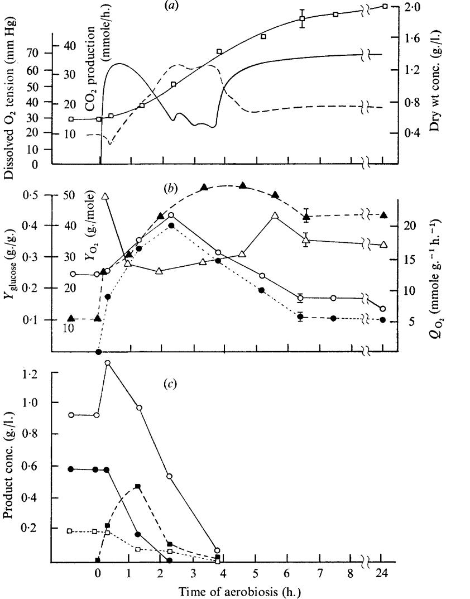
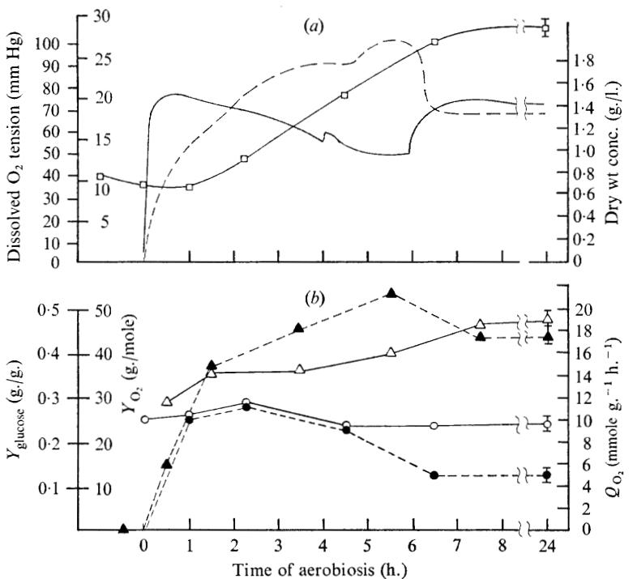
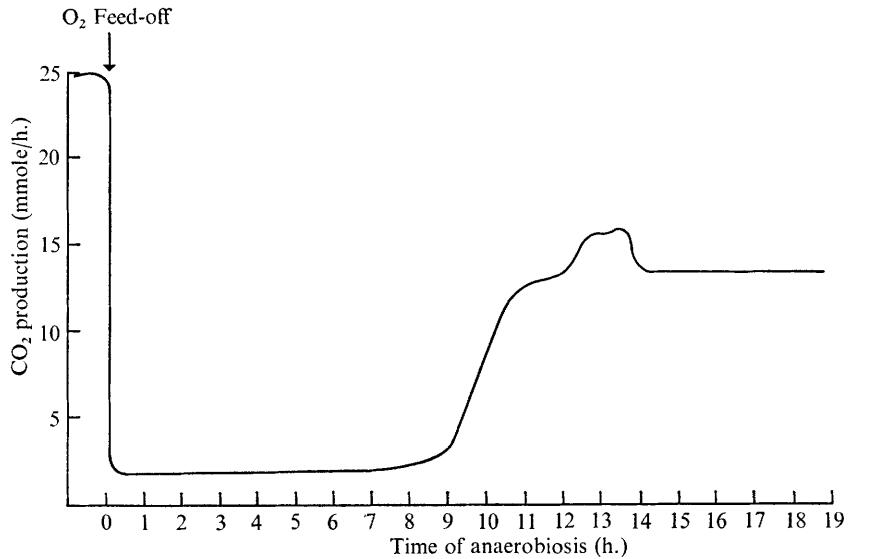
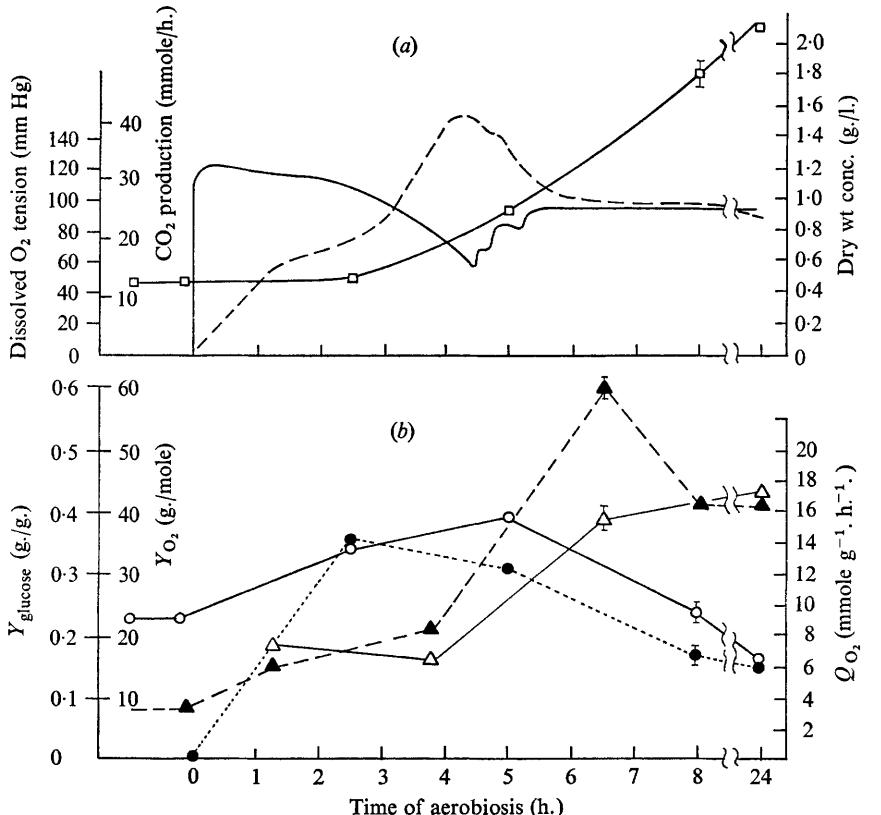

# **Transient Responses of Facultatively Anaerobic Bacteria Growing in Chemostat Culture to a Change from Anaerobic to Aerobic Conditions**

## By D. E. F. HARRISON* **AND** J. E. LOVELESS

*Water Pollution Research Laboratory, Stevenage, Hertfordshire* 

*(Accepted for publication* **22** *June* **1971)** 

#### **SUMMARY**

During the transition between anaerobic growth and aerobic growth conditions, in chemostat cultures of *Klebsiella aerogenes,* the yield coefficients from glucose and oxygen were lower than that of the aerobic steady-state. Both the potential and *in situ* respiration rates reached a maximum from **2** to **8** h. after reaeration of the culture. There appears to have been a loss of the tight coupling between growth and energy conserving processes. In the case of a culture grown anaerobically for only **4.5** h. which was incompletely adapted to anaerobic growth, there was no initial lag before an increase in *Qo2* as was obtained with cultures grown anaerobically for **18-74** h. but the time required for complete adaptation to aerobic growth was the same, 8 h. *Escherichia coli* behaved similarly to *K. aerogenes.* When an aerobic culture was made anaerobic it took **14** h. for the *C02* production to attain a steady state.

#### **INTRODUCTION**

Under anaerobic conditions, the cell yield from a substrate is low but large quantities of soluble fermentation products are formed. If it were possible to reoxidize these products rapidly then a system of alternating anaerobic and aerobic conditions might answer the requirements for low cell production and a high rate of oxidation in the treatment of waste waters.

The transition from anaerobiosis to aerobiosis has been studied in batch cultures of *Escherichia coli* (Hino & Maedo, **1966;** Cavari, Avi-Dor & Grossowicz, **1968).** Studies of transient responses in batch cultures of micro-organisms are, however, difficult because of the short duration of logarithmic growth. Ryu & Mateles **(1968)** have studied transient responses to temperature changes using chemostat culture and the metabolism of the facultatively anaerobic organisms *E. coli* and *Klebsiella aerogenes* growing in steady states in chemostat culture under different aeration conditions has been investigated (Harrison & Pirt, **1967;** Harrison & Loveless, **1971).** Harrison & Pirt **(1967)** found an oscillating transition state under conditions of limited oxygen supply, which can be explained in terms of increased respiration rates at low oxygen tensions (Degn & Harrison, **1968).** The present study describes the effects on *E. coli* and *K. aerogenes* of switching from anaerobic to aerobic conditions. 'Anaerobic' in the context of the present work means that the amount of oxygen present is negligible as far as its function as an electron acceptor is concerned and that the metabolism is essentially fermentative, though oxygen may be present in an amount sufficient to act as an inducer of enzymes. Bacteria grown under such essentially anaerobic

* **Present address** : **Shell Research Ltd, Borden Microbiology Laboratory, Sittingbourne, Kent. 4 MIC 68** 

conditions do, in fact, exhibit a higher potential respiration rate than aerobically grown cells (Harrison & Loveless, **1971).** The term 'potential' respiration rate is used to denote the respiration rate of bacteria removed from the culture and supplied with excess oxygen and excess substrates. *'In situ'* respiration is that actually exerted by cells during growth in continuous culture under controlled aeration and with the growth rate limited by the amount of glucose supplied.

#### **METHODS**

The organisms used in this work were *Escherichia coli* **I (NCIB 86)** and *Klebsiella aerogenes* **(NCIB 8017).** 

The culture apparatus, medium, and growth conditions have been described previously (Harrison & Loveless, **1971).** 

## *Analysis*

Dry weight, glucose, *C02,* dissolved organic carbon and the dissolved and gas-phase *0,*  were determined as described previously (Harrison & Loveless, **197 1).** Acetate was determined by gas-liquid chromatography. Butanediol and ethanol were determined by the method described by Harrison & Pirt **(1967).** Pyruvate was determined enzymically by the lactate dehydrogenase **(EC I** . **I** . **I .27)** method (Bergmeyer, **1965).** The determination **of**  potential and *in situ Qo2* has been described previously (Harrison & Loveless, **1971).** 

### *Calculation of yield coejicients during transient states*

time period during a transient state in the culture was calculated from the expression An approximate value for the total dry weight of organisms produced *(X)* in a given

$$X = \frac{\mathbf{x}_{t_1} + \mathbf{x}_{t_2}}{2} F(t_2 - t_1) + V(\mathbf{x}_{t_2} - \mathbf{x}_{t_1}),\tag{1}$$

where xtl = organism concentration at beginning of the time period *tl,* xtz = organism (g./l.) concentration at the end of time period *t,, tl* = time at the beginning of the period (h.), *t2* = time at the end of the period (h.), *F* = rate of flow of medium (l./h.), *Y* = volume of culture (1.).

The total quantity of glucose (S) used during this period is shown by

$$S = (\mathbf{s}_{!} - \mathbf{s}_{0})F(t_{!} - t_{1}) \tag{2}$$

where s, = glucose concentration in the medium (g./l.) and so = glucose concentration in the culture (g./l.).

In most cases throughout this work so was negligible, thus equation **(2)** becomes

$$\stackrel{\bullet}{\mathbf{S}} = \stackrel{\bullet}{s_1} F(t_{\mathbf{z}} - t_1) .$$

Therefore

$$Y_{\text{glucose}} = \frac{X}{s_{\text{\_}}F(t_2 - t_1)}$$

where **YgluCo8,** is the growth yield from glucose (g. dry wt/g. glucose).

The oxygen uptake of the culture was estimated from the *CO,* production, which was recorded automatically; it was found that the respiratory quotient was always very close to **1.0** under aerobic conditions. By measuring the area under the recorded curve for *CO,*  production for any time period (see Fig. I) an integrated value for oxygen uptake for that period was obtained and the yield coefficient (oxygen) was calculated from *Yo,* = -

$$Y_{\mathbf{o_3}} = \frac{X}{\int_{t_1}^{t_2} r \, dt}$$

where **Y** = rate of *C02* production (mmole/h.).

Fig. **I.** Response, on reaeration, of a chemostat culture of *Klebsiella aerogenes* grown anaerobically for 74 h. at a growth rate of **0.15** h.-l. *(a) 0,* Cell dry wt concentration; solid line, recorder trace of dissolved oxygen; broken line, recorder trace of CO, production. *(b)* **A, Yglucose;** A, Yo,; *0,* Qo, (potential); *0,* Qo, *(in situ).* **(c)** 0, Acetate; *0,* ethanol; *0,* butanediol; **m,** pyruvate. Points shown are the results of duplicate estimations. The limits shown are the standard technical errors calculated by the method described by Holman **(1962).** 

#### **RESULTS**

## *Klebsiella aerogenes*

**A** culture of *Klebsiella aerogenes* was grown anaerobically at pH 6.8 at a growth rate of **0.15** h.-l for 74 h. during which time a steady state was achieved. The culture was then made aerobic by replacing the nitrogen in the gas feed with air. Fig. **I** *u, b* and **c** shows the effect of this change on the culture. The oxygen tension increased immediately, but *C02* production decreased during the first I 5 min. (Fig. **I** *a).* During this same period, there was little increase in cell concentration or in the 'potential' *Qo2* which remained about double that of an aerobic steady-state culture, but the *in situ* **Qo2** rose (Fig. **I** *b);* the acetate concentration in the culture increased (Fig. I c) and some pyruvate was formed.

Fig. *2.* Response on reaeration of a chemostat culture of *Klebsiella aerogenes* grown anaerobically for **4.5** h. at a growth rate of **0.24 h.-l.** *(a) 0,* Cell dry wt concentration; solid line, recorder trace of dissolved oxygen tension; broken line, recorder trace of *CO,* production. *(b)* **A, Yglucose;**  A, *Yo,; 0,* Qo, (potential); *0, Qo, (in situ).* The limits shown are the standard technical errors calculated by the method described by Holman **(1962).** 

After the initial decrease, *C02* production increased during the next *2* h. (Fig. *~a).*  Oxygen uptake also increased (as shown by the fall in oxygen tension), accompanied by a steep rise in organism concentration (Fig. *~a).* The potential *Qo2* increased to about three times that of the aerobic steady state level and the *in situ Qo2* increased to a similar value, perhaps indicating that at this point oxygen uptake of the cells was not limited by substrate level but by the respiratory potential of the cells. During this period the accumulated metabolites rapidly disappeared, presumably being oxidized **(Fig.** I c). However, in spite of the extra carbon available from these metabolites, in addition to the glucose fed to the

## *Transient responses of facultative anaerobes* **49**

culture, the calculated yield coefficient from glucose was lower **(0.3** to 0.4) than the steady state aerobic value (0.43). The yield from oxygen (25) was also lower than that of an aerobic culture (35). During this period, growth seemed to be reduced in efficiency.

About 2-25 h. after reaerating the culture, the oxygen uptake decreased (shown in Fig. **I** *a*  by an increase in oxygen tension) and then increased again. This was presumably caused by the exhaustion of one substrate and the consequent switch to another. Acetate was still available (Fig. I c) but the exhaustion of pyruvate may have caused the change in respiration rate. The identity of the new substrate associated with the subsequent rise in oxygen uptake is not known; there was no increased utilization of acetate at this point. Both *in situ* and potential *Qo2* decreased over the next 4 h. and after reaeration for 6 h. the *in situ* Qo, was very nearly back to the aerobic steady state value. The potential *Qo2* took rather longer to decrease to the steady state level, indicated by the value 24 h. after reaeration (Fig. I *b).* The cause of the high value of the yield from oxygen *(Yo,)* obtained between 5 and 6 h. after reaeration (Fig. I *b)* is not apparent; possibly it was caused by an accumulation of storage products, but this would not be expected to occur during glucose-limited growth. Eight h. after reaeration the culture was virtually back to a steady state condition.

Fig. **3.** Changes in *CO,* production rate during adaptation to anaerobic growth of a chemostat culture of *Klebsieh uerogenes* growing aerobically at a rate of *0-25* h.-l.

## *Eflect of the duration of the anaerobic period prior to reaeration*

Similar experiments were carried out on cultures which had been grown anaerobically for 4-5 or 18 h. prior to reaeration; the growth rate was 0.24 h.-l and the pH 6.5.

There was little difference between the responses to reaeration after 18 h. and 74 h. periods of anaerobiosis; an initial decrease in *C02* production was observed followed by **a**  period of high *Qo,* values and low yield constants. However, the maximum Qo, values were lower after the 18 h. period of anaerobiosis than after the 74 h. period and the *Yo2* did not fall to such a low value.

The response after 4.5 h. of anaerobiosis was somewhat different however (Fig. *2a, b).*  The culture had not reached a steady state of anaerobic growth after 4-5 h. and the dry

weight concentration was still decreasing. The cell concentration remaining after a period, *t,*  of no growth is given by

$$\mathbf{x}_t = \mathbf{x}_0 \mathbf{e}^{-Dt}$$

where *xt* is the cell concentration (g./l.) after time *t, xo* is the cell concentration at time *0, D*  is the dilution rate (h.-l); *xo,* the cell concentration during the anaerobic period, was 2-06 g./l., *D* was 0.23 h.-l and *t* was 4-5 h., so that the cell concentration in the absence of growth would be

$$\mathbf{x}_t = \mathbf{z} \cdot \mathbf{o} \mathbf{\tilde{e}} e^{-1.04} = \mathbf{o} \cdot \mathbf{\tilde{r}} \mathbf{z} \text{ g./l.}$$

This was the value actually obtained at the end of the anaerobic period. However, 94 of the glucose supplied had been metabolized. Carbon dioxide production at the end of the 4-5 h. anaerobic period was very low (Fig. 3u) but increased immediately after the culture was reaerated (there was no lag similar to that observed on reaerating cultures which had been grown anaerobically for 18 h. or **74** h.). Furthermore, the yield from oxygen was increased, unlike the findings with cultures kept anaerobic for longer periods. Otherwise the response was very similar to that of these cultures, and the time taken to reach a steady state was about the same **(8** h.).

## COz *production during adaptation to unuerobic growth*

*CO,* production after 4-5 h. of anaerobiosis was found to be much lower than that after 18 h. The *CO,* production of a previously aerobic culture was observed during subsequent anaerobiosis (Fig. 3). C02 production decreased from about 25 to about 2 mmole h.-l immediately after the culture was made anaerobic, remained at this level for about 8 h. and then increased, attaining a steady-state value (approx. 14 mmole h.-l) after about 14 h.

## *Escherichia coli*

Cultures of *Escherichia coli* were grown anaerobically at a dilution rate of 0-17 h.-l for 94 h. prior to reaeration. The responses to reaeration (Fig. *4u, b)* were similar to those obtained with *Klebsiella uerogenes.* The *CO,* production during the anaerobic period, like that of *K. aerogenes* maintained anaerobically for 4-5 h., was very low. On reaerating the culture there was a period of high respiration rate and low growth efficiency but the period of low yield coefficients lasted longer than in *K. uerogenes.* However, the steady state ( *Yg,Ucose* = 0.4 g./g., *Yo2* = 40 g./mole) was again approached in about 8 h.

#### **DISCUSSION**

The response of *Klebsiella aerogenes* to a change from anaerobic to aerobic conditions can be divided into three periods: a short period of increased acetate production and low C02 production immediately after reaeration ; a subsequent period of high respiration rate and low yield coefficients from glucose and oxygen; and finally the attainment of an aerobic steady state after about 8 h.

The stimulation of acetate production and the lag in *C02* production on reaerating anaerobic cultures reveal an interesting aspect of the metabolic control of the cell. Clearly, the bacteria are potentially capable of oxidizing more glucose (there is a substantial difference between the potential *Qo2* and the Qo, *in situ)* but in the culture fermentation to acetate is stimulated before the alternative oxidative metabolism takes over. **As** energy was derived from both fermentative and respiratory pathways, the calculated yield from oxygen at this point was high.

The high respiration rate and low cell yield during the period between *0.5* to *2-5* h. after reaeration seem to represent a degree of uncoupling between growth and energy conserving mechanisms. This may be a direct result of the change from anaerobiosis, or a consequence of the high growth rate of the bacteria. Bacteria grown at a high rate in a chemostat culture may utilize glucose less efficiently than cells grown at a low rate (Harrison & Loveless, 1971). **A** similar phenomenon was found in oxygen-limited cells by Harrison & Pirt (1967), and biochemical studies suggested that this may have been due to a switch to energetically wasteful oxidation pathways (Harrison & Maitra, I 969). Whatever the mechanism, this 'uncoupling' process reveals a weakness in the control system of the cells, which can lead to reduced efficiency of conversion of substrate into cells. The time required for complete adjustment from aerobiosis to anaerobiosis was 9 h. Presumably, this represents the time required to induce enzymes required in the pathway leading to increased *CO,*  production.

Whenever transitions from anaerobic to aerobic conditions were studied, glucose utilization was found to be complete at all times and the growth of cells was never arrested. In fact, the specific activity of the bacteria appeared to be highest during the period of response to the change. All the metabolites built up in the anaerobic period were oxidized in the first **3** h. of reaeration. Alternating anaerobic and aerobic cycles of growth thus increase the overall rate of oxidation of glucose, while maintaining a low overall yield of cells. Although there are obvious technical complications about large-scale applications, it is possible that this pattern of operation may be exploitable in the field of waste water purification.

#### **REFERENCES**

**BERGMEYER, H. U. (1965).** In *Methods of Enzyme Analysis.* New York and London: Academic Press.

- **CAVARI, B.** *Z.,* **AVI-DOR,** Y. & **GROSSOWXCZ,** N. **(1968).** Induction of oxygen of respiration and **phos**phoryla tion of anaerobically grown *Escherichia coli. Journal of Bacteriology* **96, 75 1-759.**
- **DEGN, H.** & **HARRISON,** D. E. F. **(1968).** Theory of oscillations of respiration rate in continuous culture **of**  *Klebsiella aerogenes. Journal of Theoretical Biology* **22, 238-248.**
- **HARRISON, D.** E. F. & **LOVELESS, J.** E. **(1971).** The effect of growth conditions on respiratory activity and growth efficiency in facultative anaerobes grown in chemostat culture. *Journal of General Microbiology 68,* **35-43.**
- **HARRISON,** D. **E. F.** & **MAITRA,** P. **K. (1969).** Control of respiration and metabolism in growing *Klebsiellu aerogenes* : the role of adenine nucleotides. *Biochemical Journal* **112, 647-656.**
- **HARRISON, D. E.** F. & **PIRT, S. J. (1967).** The influence of dissolved oxygen concentration on the respiration and glucose metabolism of *Klebsiella aerogenes* during growth. *Journal of General Microbiology 46,*  **193-21 I.**
- **HINO,** *S.* & **MAEDO, M. (1966).** Effect of oxygen on the development of respiratory activity in *Escherichia coli. Journal of General and Applied Microbiology, Tokyo* **12, 247-265.**
- **HOLMAN, H. H. (1962).** *Biological Research Method: a practicable guide.* Edinburgh: Oliver *Lk* Boyd.
- **RYU,** D. Y. & **MATELES,** R. **I. (1968).** Transient response of continuous culture to changes in temperature. *Biotechnology and Bioengineering* **10, 385-397.**