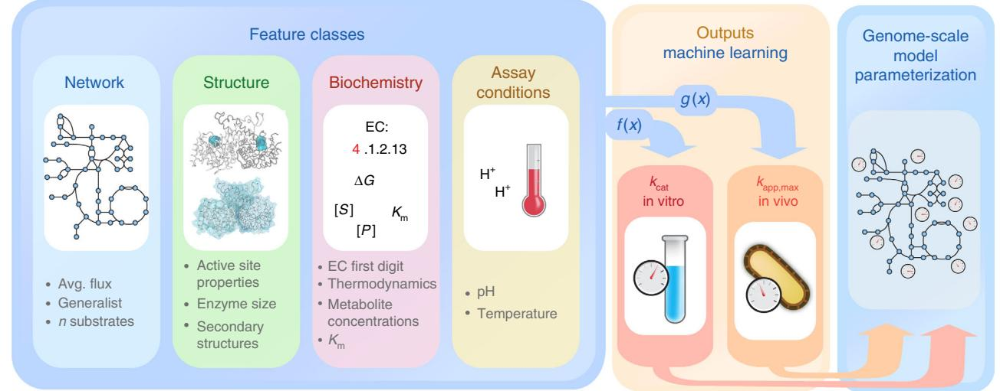
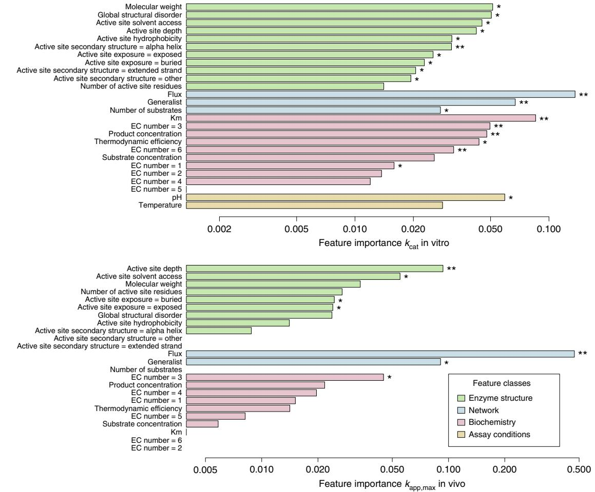
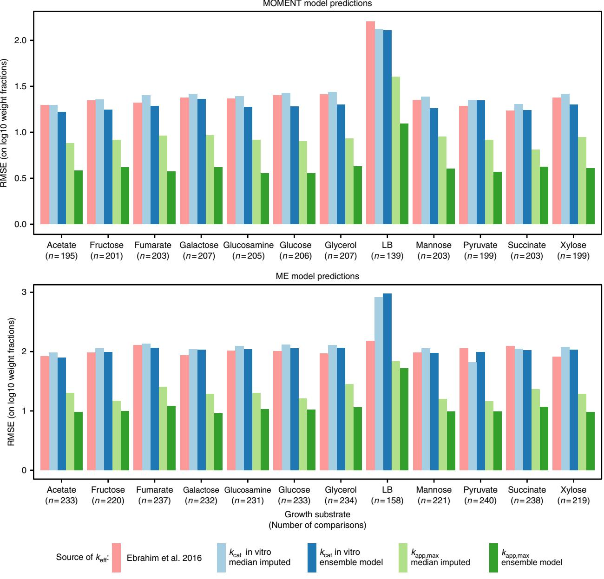

## ARTICLE

1234567890():,;

DOI: 10.1038/s41467-018-07652-6 **OPEN**

# Machine learning applied to enzyme turnover numbers reveals protein structural correlates and improves metabolic models

David Heckmann1 , Colton J. Lloyd1 , Nathan Mih1 , Yuanchi Ha1 , Daniel C. Zielinski1 , Zachary B. Haiman1 , Abdelmoneim Amer Desouki2, Martin J. Lerche[r](http://orcid.org/0000-0003-3940-1621) 2 & Bernhard O. Palsso[n](http://orcid.org/0000-0003-2357-6785) [1](http://orcid.org/0000-0003-2357-6785),3

Knowing the catalytic turnover numbers of enzymes is essential for understanding the growth rate, proteome composition, and physiology of organisms, but experimental data on enzyme turnover numbers is sparse and noisy. Here, we demonstrate that machine learning can successfully predict catalytic turnover numbers in Escherichia coli based on integrated data on enzyme biochemistry, protein structure, and network context. We identify a diverse set of features that are consistently predictive for both in vivo and in vitro enzyme turnover rates, revealing novel protein structural correlates of catalytic turnover. We use our predictions to parameterize two mechanistic genome-scale modelling frameworks for proteome-limited metabolism, leading to significantly higher accuracy in the prediction of quantitative proteome data than previous approaches. The presented machine learning models thus provide a valuable tool for understanding metabolism and the proteome at the genome scale, and elucidate structural, biochemical, and network properties that underlie enzyme kinetics.

1Department of Bioengineering, University of California, San Diego, La Jolla, CA 92093–0412, USA. 2 Institute for Computer Science and Department of Biology, Heinrich Heine University, 40225 Düsseldorf, Germany. 3 The Novo Nordisk Foundation Center for Biosustainability, Technical University of Denmark, 2800 Lyngby, Denmark. Correspondence and requests for materials should be addressed to D.H. (email: [dheckmann@ucsd.edu](mailto:dheckmann@ucsd.edu)) or to B.O.P. (email: [palsson@ucsd.edu](mailto:palsson@ucsd.edu))

I n order to prevail in a given environment, living cells have to allocate a finite amount of protein into diverse cellular functions. Understanding optimal global proteome allocation is a central problem in systems biology and underlies important cellular properties like growth rat[e1,](#page-8-0) thermosensitivit[y2,](#page-8-0) and overflow metabolism[3.](#page-8-0) A central goal of computational biology is to develop the ability to predict the genome-scale proteome allocation that leads to the highest fitness—or, as a proxy, growth rate subject to a given environment and protein budget.

Traditional approaches like flux balance analysis (FBA)[4](#page-8-0) search for the optimal growth rate that can be achieved given a set of uptake fluxes and metabolic network stoichiometric constraints, but do not account for the protein allocation problem. In order to extend FBA accordingly, a variety of genome-scale models (GEMs) of metabolism have been developed that consider the cost of expressing metabolic enzymes. Some GEMs extend the approach of FBA with an additional constraint on the total amount of protein the cell has available to catalyze metabolic fluxes that maximize cell growth[5](#page-8-0)–[7.](#page-8-0) Other more detailed GEMs include the entire gene expression machinery to explicitly model the proteome composition as a consequence of translation rates and growth-dependent dilution of macromolecules to daughter cells[8](#page-8-0)–[11](#page-8-0).

In all of these modelling approaches, the protein cost that arises from achieving a certain flux through a reaction is determined by the catalyzing enzyme's effective turnover rate, keff (also called apparent turnover rate, kapp). Thus, GEMs that account for proteome allocation rely heavily on estimates of effective turnover rates. In the past, these estimates were either obtained by random samplin[g7,](#page-8-0) parameter fittin[g12,13,](#page-8-0) or, in most cases, by using in vitro measurements of enzyme turnover numbers, kcat[5](#page-8-0),[6](#page-8-0). In theory, in vitro kcat measurements should provide a reasonable upper limit on keff, where incomplete saturation, thermodynamic effects, posttranslational modifications, and allosteric regulation will render keff in vivo lower than kcat in vitro[14](#page-8-0). Nevertheless, in practice, in vitro assays of enzyme activity are sensitive to a variety of extraction and assay parameters, leading to noisy estimates and rendering large-scale estimation of kcat in vitro difficult (see Bar-Even et al[.15](#page-8-0) for discussion). To address this issue and to provide estimates of keff in vivo, proteomic data across diverse growth conditions was recently combined with in silico flux predictions to calculate kapp,max, the maximal keff across conditions[14.](#page-8-0) This in vivo estimate is a promising candidate for parameterization of all GEMs that account for enzyme kinetics. Nevertheless, the scope of datasets on both in vitro kcat and kapp,max is far from genome-scale, with a coverage of directionspecific reactions in E. coli of about 12% for kcat in vitro and 8% for kapp,max (Supplementary Figure 2).

It would thus be desirable to understand the underlying genome-scale patterns of catalytic enzyme turnover rates—a major part of the kinetome[16](#page-8-0)—and thus protein efficiency. For in vitro kcat, global trends were found in relation to the basic biochemical mechanism of the reaction, measured as the first digit of the respective EC numbers[15](#page-8-0). In addition to EC numbers, enzyme molecular weight and reaction flux were shown to correlate with kcat in vitro[5,15](#page-8-0), indicating that differential selection pressure explains variance in turnover numbers[17](#page-8-0). It is unclear how these features act together to explain variance in kcat. Machine learning (ML) methods for the development of complex statistical models have been successfully applied to modelling bacterial physiology[18](#page-8-0)–[20](#page-8-0), enzyme specificity[21,22,](#page-8-0) and enzyme affinit[y21,23,](#page-8-0) with applications in metabolic engineering and synthetic biolog[y24,25](#page-8-0). Here, we combine known correlates of kcat with novel features for enzyme structure, biochemical mechanism, network context, and assay conditions to build ML models of kcat in vitro and kapp,max that can predict these parameters at the genome scale. Application of these ML models to the parameterization of mechanistic GEMs enables improved predictions of proteome allocation.

#### Results

Compiling features for machine learning. In order to build predictive ML models of enzyme catalytic turnover rates, we compiled a diverse set of features that include network properties, enzyme structural properties, biochemical mechanism information, and assay conditions (Fig. 1, details in Methods and Supplementary Table 2).

Network properties were extracted from a GEM of E. coli K-12 MG1655, iML151[526](#page-8-0): The average flux across diverse growth conditions was obtained with a Monte Carlo sampling approach and parsimonious FBA[27](#page-8-0) (see Methods). The propensity of an enzyme component to participate in multiple reactions—the generalist property—was in the past found to be associated with lower catalytic turnover rates[28.](#page-8-0) We thus quantified the tendency of an enzyme to catalyze multiple reactions from the geneprotein-reaction (GPR) rules of iML1515. Furthermore, the

Fig. 1 Machine learning of catalytic turnover numbers for genome-scale metabolic model (GEM) parameterization. A feature set from diverse classes is curated and mapped to independently build machine learning (ML) models of both kcat in vitro (f(x)) and kapp,max in vivo (g(x)). The inferred ML models are used to predict kcat in vitro or kapp,max at the genome-scale to parameterize GEMs

Fig. 2 Machine learning model performances for kapp,max and kcat in vitro. Center lines show the median R2 across five times repeated five-fold crossvalidation (25 validations), except for the deep learning case, where the median for a single round of five-fold cross-validation (five validations) is shown. Box limits represent the 1st and 3rd quartiles, whiskers extend to values that lie within the 1.5x interquartile range, and the remaining points are shown as outliers (marked x). Circles show R2 for a test set consisting of 20% of the available samples that were not used for hyperparameter optimization. This resulted in a training set of 172 observations of kcat in vitro and 106 observations of kapp,max. For the test set, 43 and 27 observations were used for kcat in vitro and kapp,max, respectively. See Methods for details on hyperparameter optimization

number of enzyme substrates was extracted from the stoichiometric matrix of iML1515.

We hypothesized that the structural properties of enzymes contain information on catalytic turnover constants. To this end, we extracted enzyme structural properties from protein structures in the Protein Data Bank[29](#page-8-0) and homology models from the I-TASSER modelling pipeline[30,31](#page-8-0) (see Methods). Global structural disorder and molecular weight were used as ML model features. The relative occurrence of secondary structures classes are highly correlated with the fraction of structural disorder, and we decided not to include them in the ML model to avoid co-linear features. We further expected properties of the catalytic site structure to be particularly informative about enzyme turnover and thus extracted catalytic site information from the Catalytic Site Atla[s32](#page-8-0). In particular, we used active site depth, active site solvent exposure, active site hydrophobicity, the number of residues contributing to the active site, and active site secondary structure as model features (see Supplementary Table 1 for details).

Further information on enzyme biochemistry was included in the form of EC numbers, thermodynamic efficiency, Michaelis constants (Kms), and metabolite concentrations (see Methods).

For ML models of in vitro kcats we included assay pH and assay temperature as model features to correct for these assay conditions.

As no convincing correlation between the properties of enzyme substrate structural properties and in vitro kcat was found previously[15,](#page-8-0) we decided not to include substrate structural properties as features.

Compiling output data for machine learning. Traditionally, enzyme catalytic turnover numbers are measured in biochemical in vitro assays, a quantity we refer to as kcat in vitro. We extracted information on kcat in vitro for E. coli from the BREND[A33,](#page-8-0) SABIO-RK[34,](#page-8-0) and Metacy[c35](#page-8-0) databases (Supplementary Figure 1). These extracted values were filtered to avoid non-wild type enzymes, non-physiological substrates, and redundancy across databases (see Methods for details). In addition to in vitro measurements, we used in vivo estimates of effective enzyme turnover, kapp,max, that were obtained as the maximum effective turnover rate across diverse growth conditions[14.](#page-8-0) The final data set has 215 complete observations—i.e., all features and output are available—for kcat in vitro and 133 complete observations for kapp,max (Supplementary Figure 2); as discussed below, this set can be extended through imputation of selected features, yielding 497 and 234 complete observations for kcat in vitro and kapp,max, respectively.

Training predictive models of enzyme turnover numbers. We utilized the compiled feature set to separately train ML models for kcat in vitro and kapp,max (Fig. [1](#page-1-0)). A diverse set of regression algorithms was trained using repeated five-fold cross-validation (see Methods and Supplementary Table 2). We find that the choice of algorithm has only a small effect on model performance, where the mean cross-validated R2 between predictions and validation tends to be smaller in linear modelling techniques (linear regression, PLSR, elastic net) as compared to the more complex models (random forest and deep neural network) for the kcat in vitro models (Fig. 2). The predictive performance of the models is significantly higher for kapp,max than for kcat in vitro, showing average cross-validated R2s of 0.76 and 0.31, respectively (Fig. 2, see Supplementary Figure 3 for root mean squared errors (RMSEs)). Model performance estimation through cross validation can be positively biased because hyperparameters are optimized in the process, but using an independent test set confirms our findings (Fig. 2). We thus expect models of kapp,max to be more suitable for predicting catalytic turnover rates at the genome scale.

Models exhibit similarity in feature importance. Although ML models of kapp,max achieved a higher prediction accuracy than those for kcat in vitro, both models are able to explain significant variance in catalytic turnover rates from our feature set. Which features contribute most to these predictions? We analyzed feature importance in the random forest models by examining the average increase in mean squared error that results from randomly permuting a respective feature vector across 500 trained decision trees (Fig. [3](#page-3-0)).

We find that feature importance is significantly correlated between models for kcat in vitro and in vivo kapp,max (Spearman Rank correlation 0.46, p < 0.025, n = 24, S = 1214, see Methods). In silico flux is the most important feature for both in vitro kcat and in vivo kapp,max, confirming the hypothesized significant role of evolutionary selection pressure on enzyme turnover numbers[5,15,17](#page-8-0). We confirmed this important role of flux by using fluxes based on experimental metabolic flux analysis (MFA) data instead of in silico fluxes, leading to very similar model performances (Supplementary Figure 5, see Methods). Likewise, the generalist feature is an important contributor in both models. Structural features are of consistent importance in both models,

Fig. 3 Feature importance in random forest models for in vivo and in vitro turnover numbers. The relative importance as measured by the average decrease in out-of-bag mean squared error (MSE) across trees that results from randomly permuting a given feature (scaled by the standard deviation) is shown. Missing bars indicate permutation importance smaller or equal to zero. The statistical significance of feature importance was evaluated using a permutation test based on 500 permutations of the response variable per model; *p-value < 0.05, **p-value < 0.005. Spearman rank correlation between the importance estimates of the two models is 0.47 (p < 0.021, n = 24, S = 1214, see Methods), ignoring assay-related features that are not used in the model for kapp,max

with active site depth, active site solvent accessibility, and active site exposure showing significant contributions in both models. Interestingly, enzyme Km is a very important feature in the kcat in vitro model, but yields no predictive advantage in the model for kapp,max. This effect might be due to the original kapp,max estimation being biased with regard to enzyme saturation.

Machine learning models improve proteome predictions. A major obstacle in the utilization of GEMs of protein investment is the requirement of thousands of direction-specific enzyme turnover rate constants (over 3000 in iML1515), whereas both in vitro and in vivo data sets are limited to a few hundred of these measurements (497 and 234, respectively, covering 412 and 234 reactions, respectively; Supplementary Figure 2).

The high cross-validated accuracy of the ML models for kapp, max (Fig. [2)](#page-2-0) suggests that these statistical models could be utilized to predict the kapp,max of metabolic processes on a genome scale to improve the predictive accuracy of mechanistic GEMs. To achieve this goal, we created an ensemble model for kapp,max that combines predictions across three diverse ML models: the linear elastic net, the decision-tree-based random forest model, and the complex neural network model (see Methods and Supplementary Table 2 for details). The linear elastic net is expected to exhibit low variance at the cost of higher bias, whereas the two more complex algorithms, the random forest and the neural network, are more prone to overfitting on the relatively small dataset[36](#page-8-0). We confirmed this behaviour by computing learning curves (Supplementary Figure 4). Model training and genome-scale predictions are limited by the number of feature observations available for each reaction, suggesting that imputation of missing feature observations may lead to more accurate ML models (Supplementary Figure 2). For each of the three ML algorithms, we thus trained four versions: one without imputation, one with imputation of the training set, one with imputation of only the features predictions are based on, and one where all observations are imputed (see Methods for details). In cases where observations contained missing values that were not imputed, the median across all successful predictions was used. The diversity of these ML models is reflected in the modest correlation of their predictions (average R2 between predictions is 0.27 for kapp,max and 0.08 for kcat in vitro) suggesting that an ensemble approach may improve ML model accuracy. We thus used the average

Fig. 4 Performance of vectors of catalytic turnover numbers in predicting quantitative proteome data. Performance for two different genome-scale metabolic modelling frameworks, MOMENT and the ME model, are shown. Model predictions are compared to quantitative proteomics data in Schmidt et al.[37](#page-8-0) through the root mean squared error (RMSE) for metabolic proteome fractions on log10 scale. Comparisons use proteins that are both found in proteomics data and are expressed in the model predictions. To allow comparison of different parameterization strategies, the intersection of the sets of comparable proteins is used in each condition-model combination resulting in the number of comparisons n. The performance of the two modelling frameworks, MOMENT and ME, is thus not comparable, as different sets of proteins are underlying the error calculations. See Methods and Supplementary Figure 8 for details

prediction across these twelve models as the final ensemble model. Experimental data on kapp,max and kcat in vitro was then extrapolated to the genome scale using the respective ensemble model.

Enzyme catalytic turnover numbers strongly affect the proteomic cost of reaction fluxes. The predictive performance of GEMs for quantitative proteome allocation is thus expected to be sensitive to the set of effective turnover rates. We used two different GEM modelling frameworks, metabolic modelling with enzyme kinetics (MOMENT)[5](#page-8-0) and a GEM of metabolism and gene expression (ME model)[8,9](#page-8-0), to predict quantitative proteomics data[37](#page-8-0) and to compare predictive performance across different genome-scale parameterization strategies: known in vitro kcat with missing values simply replaced by the median of known values (median-imputed), in vitro kcat extrapolated with the ensemble ML model, median-imputed kapp,max, and kapp,max extrapolated with the kapp,max ML ensemble model (Fig. 4). Furthermore, we also included a parameterization with a fit of selected keff parameters to proteomics data that was conducted earlier to study the regularity of keffs[12](#page-8-0). The major difference between the MOMENT algorithm and the ME model lies in the fact that ME models explicitly model the details of gene expression machinery and co-factor synthesis, resulting in a more realistic representation of enzyme complex stoichiometry and growth rate-dependent gene product dilution.

We find that predictive capability of both MOMENT and the ME model is higher for kapp,max-based parameter sets than for those based on kcat in vitro, where the prediction error is on average 43% lower in MOMENT and also 43% lower in the ME model. The ensemble ML model further improves the predictive performance of kapp,max-based GEMs consistently across growth conditions and mechanistic modelling techniques, with an average reduction in root mean squared error (RMSE) of 34% and 20% for MOMENT and the ME model, respectively (Fig. [4](#page-4-0)). As expected from the high cross-validation errors for the ML models of kcat in vitro (Fig. [2](#page-2-0)), the gain in performance that originates from the ensemble ML model for kcat in vitro is much lower than that of the kapp,max ML model, with an average reduction in RMSE of 7% for MOMENT and 1% for ME models (Fig. [4](#page-4-0)).

#### Discussion

The diversity of biochemical reactions renders genome-scale experimental characterization of enzyme kinetics a task of prohibitive complexity. We show that ML models of enzyme structure, network context, and biochemistry can be utilized for the in silico prediction of catalytic turnover numbers, particularly in the case of in vivo estimates of apparent enzyme turnover, kapp,max. How does the well-performing ML model of kapp,max arrive at its predictions? In agreement with the hypothesis of differential selection pressure on catalytic turnover numbers that is determined by enzyme utilizatio[n5,15,17](#page-8-0), the model predicts higher turnover numbers for enzymes that carry high flux across diverse growth conditions (Supplementary Figure 7). This effect is likewise found in the model for kcat in vitro (Supplementary Figure 6) and flux is also the most important feature in the in vitro model (Fig. [3)](#page-3-0). Furthermore, the ML model for kapp,max predicts a decline of enzyme catalytic turnover rates with depth of the active site (Supplementary Figure 7), a result consistent with diffusion-limited theory of catalysis in enzymes with buried active sites, which predicts a decrease with tunnel dept[h38](#page-8-0). Similarly, a negative impact of solvent accessibility on enzyme turnover rates is inferred in the kapp,max model. This result is in agreement with multiple observations of the importance of selective barriers that prevent water access of the active site for enzyme function (reviewed by Gora et al[.39)](#page-8-0). The tendency of enzyme components to catalyze multiple reactions (the generalist property) was identified as a major contributor to predictions in models of kapp,max and kcat in vitro, where multifunctional components tend to decrease catalytic turnover rates (Supplementary Figure 6 and 7). This finding agrees with reports that in vitro kcats of specialist enzymes are higher than that of other enzymes[28](#page-8-0) and the trade-off between multi-functionality and catalytic activity observed in directed evolution experiment[s40](#page-8-0). The mechanism of the reaction catalyzed by a given enzyme, coded by the first digit of its EC number, was previously found to be correlated with in vitro kcat[15;](#page-8-0) interestingly, EC numbers only play a minor role in the predictions of models for both kcat in vitro and kapp,max (Fig. [3)](#page-3-0). This minor role of catalytic mechanism in comparison to evolutionary factors is supported by a recent analysis of in vitro kcats in the context of spontaneous reaction rate[s41](#page-8-0). Interestingly, the Michaelis constant (Km) is a very important feature in the model for kcat in vitro, but plays no significant role in the kapp,max model. One possible reason is that kapp,max, as an estimator of kcat, is expected to be biased in terms of Km, where the bias acts in the opposite direction from the effect estimated for kcat in vitro.

In vitro kcat and kapp,max originate from disparate sources. Thus, the agreement between the ML models for in vitro kcat and kapp,max in terms of feature importance hierarchy (Fig. [3)](#page-3-0) and learned feature-output interaction of the most important features (Supplementary Figures 6 and 7) indicates that the ML approach identified meaningful determinants of catalytic turnover rates. Furthermore, the training data sets that were used to train the two models showed only a small overlap (39% of reactions with known kapp,max have kcat in vitro associated, 22% of reactions with known kcat in vitro have kapp,max associated, see Supplementary Figure 2), supporting the notion that meaningful global trends were identified. Nevertheless, the low predictive performance of the kcat in vitro model suggests that the model structure of this model should be interpreted with care.

Prediction accuracy for kapp,max was consistently found to be significantly higher than that of kcat in vitro (Fig. [2](#page-2-0)). One possible explanation for this effect is the high level of noise in in vitro data: a global comparison of in vitro kcat data from the BRENDA databas[e15](#page-8-0) found considerable discrepancies between kcats of the same reaction that were measured by different laboratories. These discrepancies are possibly due to technical difficulties of in vitro enzyme assays, e.g., in vitro–in vivo effect[s15](#page-8-0), erroneous database entries[15,](#page-8-0) and posttranslational modification[s42](#page-8-0),[43.](#page-8-0) In contrast, kapp, max is derived globally from few proteomics datasets, thus considerably decreasing the number of experimental sources and increasing comparability across the proteome. Another explanation for the superior performance of ML models for kapp,max might lie in the fact that in silico fluxes were used to estimate kapp,max[14,](#page-8-0) and we likewise used in silico fluxes in this study. We show that this is not the case, as using fluxes based on MFA data in our framework does not decrease model performance (Supplementary Figure 5).

We utilized genome-scale metabolic models that account for the proteome costs of metabolic fluxes to test the ability of naively imputed and ML model-predicted vectors of kapp,max and kcat in vitro to explain measured proteome investment across different carbon sources. Although the vector of effective enzyme turnover rates is a condition-dependent property because it depends on substrate concentrations and regulation, using the upper limit on effective turnover rates in the form of kcat in vitro or kapp,max where a kcat in vitro is theoretically an upper limit on kapp,max—is expected to provide a reasonable default parameterization of these constraint-based models. We find that the traditional practice of using kcat in vitro[5,6](#page-8-0) is consistently outperformed by parameterization using kapp,max (Fig. [4](#page-4-0)). This finding might be due to the high noise level in kcat in vitro data discussed above, and important in vivo effects that are not captured by in vitro assays, like backwards flux in thermodynamically unfavourable reactions and regulatory effects[14](#page-8-0). Perhaps more importantly, kapp,max estimation included the Schmidt et al.[37](#page-8-0) dataset, and performance comparisons with kcat in vitro might thus be optimistically biased in favour of kapp,max. We verify the superior performance of kapp, max on an independent dataset for chemostat growth on glucose minimal medium[44](#page-8-0) and again find a clear advantage of using kapp, max compared to kcat in vitro, with an average reduction in RMSE of 51% for MOMENT and 46% for the ME model. Surprisingly, the set of keffs that was obtained by Ebrahim et al.[12](#page-8-0) yielded a performance comparable to the in vitro kcat parameterizations, even though it was obtained as a fit to the proteomics data set we are using as validation. This behaviour could be explained by the fact that Ebrahim et al. aimed to study biological regularities, and thus only used fitted keff parameters that are invariable across conditions, and focused on highly expressed proteins in their optimization procedure.

Did the statistical models of enzyme turnover numbers learn to make meaningful predictions? The ensemble model for kapp,max outperforms all other parameter sets across all growth conditions for both MOMENT and ME model algorithms in terms of predictive performance for quantitative proteome data. In comparison to simple median-imputation, the ML model of kapp,max reduces the RMSE by 34% for MOMENT and by 20% for the ME model. This result indicates that the ensemble ML model of kapp, max has identified meaningful features that allow for an improvement of the genome-scale estimation of catalytic turnover rates. As expected from the higher cross-validated performance that was estimated for ML models of kapp,max (Fig. [2)](#page-2-0), the improvement in performance that is achieved by the ensemble models compared to naive imputation is higher for kapp,max than it is for kcat in vitro (Fig. [4](#page-4-0)).

A major limitation of statistical modelling of catalytic turnover numbers is the comparatively small size of the datasets for kcat in vitro and kapp,max (497 and 234 observations in this study, respectively). The most promising output, kapp,max, is currently limited to unique homomers—i.e., the enzyme subunit is only used in one reaction—and to reactions that have proteomics data and flux predictions available. Our current ML model of kapp,max is thus likely biased toward unique homomeric enzymes. Careful extension of the kapp,max protocol to non-unique and heteromeric proteins, flux estimation of non-essential reactions, or extension of the scope of expression data via ribosome profiling could be used to further improve genome-scale estimation; learning curves for the complex random forest model confirm that additional data is likely to increase model performance (Supplementary Figure 4). Furthermore, data for both kcat in vitro and kapp,max on membrane proteins is scarce. Membrane components are thus a promising target for future statistical and experimental analysis, as they are responsible for growth-critical tasks like transport and oxidative phosphorylation. Finally, given the conditiondependent nature of keff, context-specific statistical models for keff are a promising avenue to further improve the predictive performance of mechanistic metabolic models.

The proteomic costs of metabolic fluxes are of significant importance for our understanding of the cell as a system, but experimental procedures for determining enzyme turnover numbers are not suitable for genome-scale applications. The ML models we present give extensive insight into the global determinants of enzyme turnover numbers and improve our understanding of the kinetome—and thus the quantitative proteome—of E. coli.

#### Methods

Calculating flux states using parsimonious FBA. We calculate parsimonious FBA[27](#page-8-0) solutions for iML1515, a GEM of E. coli K-12 MG1655[26.](#page-8-0) Linear programming problems were constructed using the R[45](#page-8-0) packages sybil[46](#page-8-0) and sybilccFBA[47,](#page-8-0) and problems were solved using IBM CPLEX version 12.7. A single iteration of this sampling algorithm proceeds as follows: Oxygen uptake was allowed with probability 1/2, and the environment always contained at least one randomly chosen source of each carbon, nitrogen, sulfur, and phosphate. A number of additional sources per element were drawn from a binomial of size 2 with success probability 1/2. Carbon uptake rates were normalized to the number of carbon atoms in the selected substrates. This process was repeated until a growth sustaining environment was found and the flux distribution recorded, concluding the iteration. Using this algorithm, we simulated 10,000 environments, and averaged these flux distributions across environments to arrive at the flux feature.

Calculating MFA-constrained flux states. As an alternative to the flux sampling using parsimonious FBA, experimental data on metabolic flux obtained from metabolic flux analysis (MFA) was utilized (presented in Supplementary Figure 5). Reaction fluxes estimated from MFA were obtained for eight growth conditions for E. coli[48.](#page-8-0) FBA using the E. coli metabolic network reconstruction iML1515[26](#page-8-0) was then used to identify a steady-state flux distribution (vFBA) as close to the MFA-

estimated values (vdata) as possible using a quadratic programming (QP) problem:

$$\text{Min}\sum_{i}\left(\nu_{\text{FBA},i}-\nu_{\text{data},i}\right)^{2}\text{s.t.}\tag{1}$$

$$\mathbf{S} \mathbf{v}_{\text{FBA}} = \mathbf{0}$$

vlb;i <vFBA;i<vub;i

For each condition, the Pearson correlation between MFA-estimated and FBAcalculated fluxes was greater than 0.99, indicating general concordance between the model used to estimate the MFA fluxes and iML1515.

Measured fluxes were then constrained to their QP-optimized values, and FBA was once again run with an ATP maximization objective (termed the ATP maintenance reaction or ATPM)[49](#page-8-0) by solving a linear programming (LP) problem:

$$\mathbf{Max} \,\,\nu_{\mathrm{ATP}} \,\mathrm{s.t.}\tag{2}$$

SvFBA ¼ 0

v lb;i <v FBA;i <v ub;i

where vlb* and vub* are the standard flux bounds augmented with the QPoptimized values from Eq. (1).

Finally, the objective ATP production reaction was set to its calculated optimal value, and the total flux was minimized subject to all previous constraints as a parsimony objective based on the idea that the cell generally will not carry large amounts of unnecessary flux due to the cost of sustaining the required enzyme levels[50](#page-8-0).

$$\text{Min } \|\|\boldsymbol{\nu}_{\text{FBA}}\|\|_{2} \text{ s.t.} \tag{3}$$

$$\begin{aligned} \mathbf{S} \mathbf{v}_{\text{FBA}} &= \mathbf{0} \\\\ \nu^{\#}_{\text{lb},i} &< \nu^{\#}_{\text{FBA},i} < \nu^{\#}_{\text{ub},i} \end{aligned}$$

where vlb# and vub# are the same flux constraints used in the problem defined in Eq. (2) but now augmented with a constraint on the optimal value of vATPM identified in Eq. (2).

The final flux solutions show good agreement with MFA-estimated flux states, including measured growth rates, while maximizing ATP production and maintaining parsimony as secondary objectives. The average of the final flux solutions in the eight growth conditions was used as the flux feature for the sensitivity analysis shown in Supplementary Figure 5. Problems were set up using the COBRA toolbox version 2.0 in Matlab 2016b and solved using Gurobi 8.0.1 solvers.

Generalist property. Based on the GPR relations provided by iML1515, we use the maximum number of times the gene products catalyzing a given reaction are utilized in other reactions to quantify the generalist feature. The number of substrates for a given reaction were extracted from the stoichiometric matrix of iML1515, excluding water and protons.

Protein sequence and structure property calculations. To gather proteinspecific features, global properties of catalytic enzymes and local properties of their active sites were calculated using the ssbio Python package[51.](#page-8-0) First, model reactions in iML1515 were mapped to their protein sequences and 3D structures based on the stored GPR rules. This was done utilizing the UniProt mapping service, allowing gene locus IDs (e.g., b0008) to be mapped to their corresponding UniProt protein sequence entries (e.g., P0A870) and annotated sequence features[52.](#page-8-0) Next, UniProt identifiers were mapped to structures in both the Protein Data Bank[29](#page-8-0) and homology models from the I-TASSER modelling pipeline[31](#page-8-0). These structures were then scored and ranked[53](#page-8-0) to select a single representative structure based on resolution and sequence coverage parameters. For the cases in which only PDB structures were available, the PDBe best structures API was queried for the top scoring structure. If no more than 10% of the termini were missing along with no insertions and only point mutations within the core of the sequence, the structure was set as representative. Otherwise, a homology model was selected by sequence identity percentage or queued for modelling[53.](#page-8-0) It is important to note that the structure selection protocol results in a final structure that is monomeric, and thus parameters which may be impacted by quaternary complex formation are not

currently considered. This is a limitation in both experimental data and modelling methods, as complex structures remain a difficult prediction to make. Furthermore, for global and local calculations (described below), all non-protein molecules (i.e., water molecules, prosthetic groups) were stripped before calculating the described feature. Out of the 1515 proteins, 729 experimental protein structures and 784 homology models were used in property calculations. Finally, we added annotated active site locations from the Catalytic Site Atlas SQL database[32](#page-8-0) for any matching PDB ID in the analysis.

Global protein properties were classified as properties that were derived from the entire protein sequence or structure (e.g., percent disordered residues), and local properties were those that described an annotated catalytic site (e.g., average active site depth from the surface). From the protein sequence, global properties were calculated using the EMBOSS pepstats package[54](#page-8-0) and the Biopython ProtParam module[55.](#page-8-0) Local properties for secondary structure and solvent accessibilities were predicted from sequence using the SCRATCH suite of tools[56](#page-8-0) and additionally calculated from set representative structures using DSSP[57](#page-8-0) and MSMS[58.](#page-9-0) Predicted hydrophobicities of amino acids were calculated using the Kyte-Doolittle scale for hydrophobicity with a sliding window of seven amino acids[59](#page-9-0). For a full list of obtained properties, see Supplementary Table 2.

Biochemical features. Reaction EC numbers were obtained from the Bigg database[60](#page-9-0), and extended with additional EC number data from KEGG[61](#page-9-0) and MetanetX[62](#page-9-0) where available.

To estimate reaction Gibbs energies, metabolite data for eight growth conditions for E. coli was obtained from literature[48.](#page-8-0) Reaction equilibrium constants (Keqs) were estimated using the latest group contribution method[63.](#page-9-0) Then, a thermodynamic FBA problem[64](#page-9-0) was solved constraining only high flux reactions (>0.1 mmol/gDW/h), subject to uncertainty. Once a feasible set of fluxes, metabolite concentrations (x), and Keqs was identified, convex sampling was used to obtain a distribution of x and Keq values that accounts for measurement gaps and uncertainty. These sampled x and Keq values were used to calculate the reaction Gibbs energies using the definition:

$$\begin{aligned} \Delta G &= -\text{RTlog}\left(K_{\text{eq}}\right) + \log(Q) \\ Q &= \prod_i \kappa_i^{S_i} \end{aligned}$$

where Q is the reaction quotient defined as the product of the metabolite concentrations (or activities) to the power of their stoichiometric coefficient in the reaction (S). The thermodynamic efficiency parameter ηrev used in this study was then calculated from this ΔG using its definition[65](#page-9-0):

$$\eta_{\text{rev}} = 1 - \exp(\Delta G/\text{RT}) = 1 - Q/K_{\text{eq}}$$

Note that this expression is bounded between 0 and 1 for reactions in the forward direction (ηrev is 0 at equilibrium and 1 at perfect forward efficiency). For consistency, we considered each reaction as the forward direction stoichiometry for this calculation. Average ηrev across the eight growth conditions was used as model input feature.

Michaelis constants (Kms) were extracted from the BRENDA[33](#page-8-0) and the Uniprot[52](#page-8-0) resource and manually curated. When multiple values exist for the same constant, in vivo-like conditions, recency of the study, and agreement among values were used as criteria to select the best value.

The average metabolite concentrations across the eight growth conditions mentioned abov[e48](#page-8-0) were used as features on substrate and product concentrations.

Summarizing data across genes. We summarized all features and outputs to the reaction level as given in the metabolic representation of the E. coli metabolic network iML1515. In the case of structural features, which were obtained at the gene-level, we used the GPR relations provided by the model to summarize features. Details are listed in Supplementary Table 1.

Linearization. Features and outputs were transformed to favour linear relationships between features and outputs. Flux, enzyme molecular weight, Km, metabolite concentrations, kcat in vitro, and kapp,max were log-transformed. The reciprocal of temperature was used as suggested by the Arrhenius relationship.

Imputation. The set of features does not contain data on all features for all reactions in iML1515 (See Supplementary Figure 2). To allow GEM predictions, we utilize different imputation strategies: imputation of labelled data, i.e., data that has outputs associated, only, imputation of the unlabelled data only, imputation of both labelled and unlabelled data, and no imputation. Missing observations were imputed using predictive mean matching for continuous data, logistic regression for binary data, and polytomous regression for categorical data of more than two categories (see Supplementary Table 1 for details). This procedure was implemented using the mice package in the R environment[45,](#page-8-0)[66.](#page-9-0) Output data was not used for imputation to prevent optimistic bias in error estimates.

Data on kcat in vitro. We extracted in vitro kcat values for enzymes occurring in the E.coli K-12 MG1655 iML1515 model from the BRENDA[33,](#page-8-0) Sabio[34](#page-8-0), and Metacyc[35](#page-8-0) databases. A total of 6812 kcat values were downloaded based on EC numbers. We removed redundant data points that originated from the same experiment in the same publication across databases. When deleting redundant data, we gave preference to the BRENDA and the Metacyc database, in that order. Next, we removed all data explicitly referring to mutated enzymes.

A central problem in using data from these three databases is that many kcat values were measured in the presence of unnatural substrates that are unlikely to occur in physiological conditions. We use the iML1515 model as a resource for naturally occurring metabolic reactions. To use this list as a filter, we mapped reactions from our curated datasets to model reactions. This reaction mapping was implemented using the synonym lists of substrates provided by the MetRxn resource[67](#page-9-0). Six hundred and sixty four database entries did not contain complete reaction formulas, and we mapped those based on EC numbers and substrate information. We manually checked all entries in the Metacyc dataset with the keyword 'inhibitor' in the experimental notes, and omitted data that was measured in the presence of inhibitors. Finally, in cases where multiple literature sources were available, we manually selected sources giving preference to in vivo-like conditions, recency of the study, and agreement among values, making additional use of data in the Uniprot Resource[52](#page-8-0). In the end, we are left with 497 useable kcat in vitro values that cover 412 metabolic reactions.

Cross validation and hyperparameter tuning. Statistical models of turnover rates were trained using the caret package[68](#page-9-0) and, in the case of neural networks, the h2o package[69](#page-9-0). Model hyperparameters were optimized by choosing the set that minimizes cross-validated RMSE in five times repeated (One repetition in the case of neural networks) 5-fold cross-validation. In the case of neural networks, hyperparameters were optimized using 3000 iterations of random discrete search and 5-fold cross-validation. Details on implementation and hyperparameter ranges are given in Supplementary Table 2.

Mechanistic model prediction of protein abundances. In order to validate the ability of different vectors of catalytic turnover rates to explain quantitative protein data, proteome allocation was predicted using the MOMENT algorithm. We calculate MOMENT solutions for iML1515 using turnover rates obtained from the respective data source or ML model. In the case of membrane proteins, which were not in the scope of the ML model, a default value of 65 s−1 was used. Linear programming problems were constructed using the R[45](#page-8-0) packages sybil[46](#page-8-0) and sybilccFBA[47,](#page-8-0) and problems were solved using IBM CPLEX version 12.7. Enzyme molecular weights were calculated based on the E. coli K-12 MG1655 protein sequences (NCBI Reference Sequence NC_000913.3), and the total weight of the metabolic proteome was set to 0.32 gprotein/gDW in accordance with the E. coli metabolic protein fraction across diverse growth conditions[5,44.](#page-8-0) Aerobic growth on each substrate in Schmidt et al[.37](#page-8-0) was modeled by setting the lower bound corresponding to the uptake of the substrate and oxygen to −1000 mmol gDW−1 h−1, effectively leaving uptake rates unconstrained.

In addition to MOMENT, a GEM of metabolism and gene expression (ME model)[8,9](#page-8-0) was applied to validate the predicted enzyme turnover rates. For these simulations the iJL1678b ME-model of E. coli K-12 MG1655 was used[70](#page-9-0). Like in the MOMENT predictions, a default value of 65 s−1 was used for the keffs of membrane proteins, and aerobic growth on each substrate in Schmidt et al.[37](#page-8-0) was modeled by setting the lower bound corresponding to the uptake of the substrate and oxygen to −1000 mmol gDW−1 h−1, effectively leaving uptake unconstrained. The keffs of all processes in iJL1678b-ME that fell outside the scope of iML1515 were also set to 65 s−1. The model was optimized using a bisection algorithm and the qMINOS solver, a solver capable of performing linear optimization in quadprecision[71,72,](#page-9-0) to find the maximum feasible growth rate within a tolerance of 10–14. The unmodeled protein fraction, a parameter to account for expressed proteins that are either outside the scope of the model or underutilized in the model, was set to 0. Further, mRNA degradation processes were excluded from the ME-model for these simulations to prevent high ATP loads at low growth rates.

Genes that are subunits in membrane localized enzyme complexes and genes involved in protein expression processes were out of the scope of the kapp,max and kcat in vitro prediction approaches. Thus these genes were not considered when comparing predicted and measured protein abundances (Fig. [4](#page-4-0)). In silico predictions that had an abundance greater than zero were matched to experimental protein abundances if the latter contained more than 0 copies/cell. Weight fractions of the metabolic proteome were estimated by normalizing by the sum of masses for in silico predictions and experimental data, respectively.

Statistics. The statistical significance of Spearman's ρ correlations was tested using the AS 89 algorithm[73](#page-9-0) as implemented in the cor.test() function of the R environment[45.](#page-8-0) Permutation tests for feature importance in the random forest models were conducted using the R package rfPermute using 500 permutations of the respective response variable per model.

Code availability. R code for model training and analysis, and Python code for ME modelling are available from the authors upon request.

#### Data availability

The vectors of turnover numbers predicted by our ensemble models alongside the experimental benchmarks used in Fig. 4 are available as Supplementary Data 1. A Reporting Summary for this Article is available as a Supplementary Information file.

Received: 10 May 2018 Accepted: 15 November 2018

#### References

- 1. Klumpp, S., Scott, M., Pedersen, S. & Hwa, T. Molecular crowding limits translation and cell growth. Proc. Natl Acad. Sci. USA 110, 16754–16759 (2013).
- 2. Chen, K. et al. Thermosensitivity of growth is determined by chaperonemediated proteome reallocation. Proc. Natl Acad. Sci. USA 114, 11548–11553 (2017).
- 3. Basan, M. et al. Overflow metabolism in Escherichia coli results from efficient proteome allocation. Nature 528, 99–104 (2015).
- 4. Orth, J. D., Thiele, I. & Palsson, B. Ø. What is flux balance analysis? Nat. Biotechnol. 28, 245–248 (2010).
- 5. Adadi, R., Volkmer, B., Milo, R., Heinemann, M. & Shlomi, T. Prediction of microbial growth rate versus biomass yield by a metabolic network with kinetic parameters. PLoS Comput. Biol. 8, e1002575–e1002575 (2012).
- 6. Sánchez, B. J. et al. Improving the phenotype predictions of a yeast genomescale metabolic model by incorporating enzymatic constraints. Mol. Syst. Biol. 13, 935 (2017).
- 7. Beg, Q. K. et al. Intracellular crowding defines the mode and sequence of substrate uptake by Escherichia coli and constrains its metabolic activity. Proc. Natl Acad. Sci. USA 104, 12663–12668 (2007).
- 8. Lerman, J. A. et al. In silico method for modelling metabolism and gene product expression at genome scale. Nat. Commun. 3, 929–929 (2012).
- 9. O'Brien, E. J., Lerman, J. A., Chang, R. L., Hyduke, D. R. & Palsson, B. Ø. Genome-scale models of metabolism and gene expression extend and refine growth phenotype prediction. Mol. Syst. Biol. 9, 693 (2013).
- 10. Yang, L., Yurkovich, J. T., King, Z. A. & Palsson, B. O. Modeling the multiscale mechanisms of macromolecular resource allocation. Curr. Opin. Microbiol. 45, 8–15 (2018).
- 11. Thiele, I. et al. Multiscale modeling of metabolism and macromolecular synthesis in E. coli and its application to the evolution of codon usage. PLoS ONE 7, e45635 (2012).
- 12. Ebrahim, A. et al. Multi-omic data integration enables discovery of hidden biological regularities. Nat. Commun. 7, 13091 (2016).
- 13. Khodayari, A. & Maranas, C. D. A genome-scale Escherichia coli kinetic metabolic model k-ecoli457 satisfying flux data for multiple mutant strains. Nat. Commun. 7, 13806–13806 (2016).
- 14. Davidi, D. et al. Global characterization of in vivo enzyme catalytic rates and their correspondence to in vitro kcat measurements. Proc. Natl Acad. Sci. USA 113, 3401–3406 (2016).
- 15. Bar-Even, A. et al. The moderately efficient enzyme: evolutionary and physicochemical trends shaping enzyme parameters. Biochemistry 50, 4402–4410 (2011).
- 16. Nilsson, A., Nielsen, J. & Palsson, B. O. Metabolic models of protein allocation call for the kinetome. Cell Syst. 5, 538–541 (2017).
- 17. Heckmann, D., Zielinski, D. C. & Palsson, B. O. Modeling genome-wide evolution of catalytic turnover rates: Strong epistasis shaped modern enzyme kinetics. Preprint available at [https://www.biorxiv.org/content/early/2018/05/](https://www.biorxiv.org/content/early/2018/05/10/318972) [10/318972](https://www.biorxiv.org/content/early/2018/05/10/318972) (2018).
- 18. Wu, S. G. et al. Rapid prediction of bacterial heterotrophic fluxomics using machine learning and constraint programming. PLoS Comput. Biol. 12, e1004838 (2016).
- 19. Kim, M., Rai, N., Zorraquino, V. & Tagkopoulos, I. Multi-omics integration accurately predicts cellular state in unexplored conditions for Escherichia coli. Nat. Commun. 7, 13090 (2016).
- 20. Ma, J. et al. Using deep learning to model the hierarchical structure and function of a cell. Nat. Methods 15, 290–298 (2018).
- 21. Mellor, J., Grigoras, I., Carbonell, P. & Faulon, J.-L. Semisupervised Gaussian process for automated enzyme search. ACS Synth. Biol. 5, 518–528 (2016).
- 22. Carbonell, P. & Faulon, J.-L. Molecular signatures-based prediction of enzyme promiscuity. Bioinformatics 26, 2012–2019 (2010).
- 23. Borger, S., Liebermeister, W. & Klipp, E. Prediction of enzyme kinetic parameters based on statistical learning. Genome Inform. 17, 80–87 (2006).
- 24. Wu, S. G., Shimizu, K., Tang, J. K.-H. & Tang, Y. J. Facilitate collaborations among synthetic biology, metabolic engineering and machine learning. ChemBioEng Rev. 3, 45–54 (2016).
- 25. Colletti, P. F. et al. Evaluating factors that influence microbial synthesis yields by linear regression with numerical and ordinal variables. Biotechnol. Bioeng. 108, 893–901 (2011).
- 26. Monk, J. M. et al. iML1515, a knowledgebase that computes Escherichia coli traits. Nat. Biotechnol. 35, 904–908 (2017).
- 27. Holzhütter, H.-G. The principle of flux minimization and its application to estimate stationary fluxes in metabolic networks. Eur. J. Biochem. 271, 2905–2922 (2004).
- 28. Nam, H. et al. Network context and selection in the evolution to enzyme specificity. Science 337, 1101–1104 (2012).
- 29. Berman, H. M. et al. The Protein Data Bank. Nucleic Acids Res. 28, 235–242 (2000).
- 30. Zhou, H., Gao, M., Kumar, N. & Skolnick, J. SUNPRO: structure and function predictions of proteins from representative organisms. [http://cssb.biology.](http://www.cssb.biology.gatech.edu/sites/default/files/sunpro_unpublished.pdf) gatech.edu/sites/default/fi[les/sunpro_unpublished.pdf](http://www.cssb.biology.gatech.edu/sites/default/files/sunpro_unpublished.pdf) (2012).
- 31. Xu, D. & Zhang, Y. Ab initio structure prediction for Escherichia coli: towards genome-wide protein structure modeling and fold assignment. Sci. Rep. 3, 1895 (2013).
- 32. Porter, C. T., Bartlett, G. J. & Thornton, J. M. The Catalytic Site Atlas: a resource of catalytic sites and residues identified in enzymes using structural data. Nucleic Acids Res. 32, D129–D133 (2004).
- 33. Placzek, S. et al. BRENDA in 2017: new perspectives and new tools in BRENDA. Nucleic Acids Res. 45, D380–D388 (2017).
- 34. Wittig, U. et al. SABIO-RK—database for biochemical reaction kinetics. Nucleic Acids Res. 40, D790–D796 (2012).
- 35. Caspi, R. et al. The MetaCyc database of metabolic pathways and enzymes and the BioCyc collection of pathway/genome databases. Nucleic Acids Res. 44, D471–D480 (2016).
- 36. Friedman, J., Hastie, T. & Tibshirani, R. The Elements of Statistical Learning Vol. 1 (Springer, New York, 2001).
- 37. Schmidt, A. et al. The quantitative and condition-dependent Escherichia coli proteome. Nat. Biotechnol. 34, 104–110 (2016).
- 38. Samson, R. & Deutch, J. M. Diffusion‐controlled reaction rate to a buried active site. J. Chem. Phys. 68, 285–290 (1978).
- 39. Gora, A., Brezovsky, J. & Damborsky, J. Gates of enzymes. Chem. Rev. 113, 5871–5923 (2013).
- 40. Tokuriki, N. et al. Diminishing returns and tradeoffs constrain the laboratory optimization of an enzyme. Nat. Commun. 3, 1257–1257 (2012).
- 41. Davidi, D., Longo, L. M., Jabłońska, J., Milo, R. & Tawfik, D. S. A bird's-eye view of enzyme evolution: chemical, physicochemical, and physiological considerations. Chem. Rev. 118, 8786–8797 (2018).
- 42. Walsh, K. & Koshland, D. E. Jr. Branch point control by the phosphorylation state of isocitrate dehydrogenase. A quantitative examination of fluxes during a regulatory transition. J. Biol. Chem. 260, 8430–8437 (1985).
- 43. Robertson, E. F., Hoyt, J. C. & Reeves, H. C. Evidence of histidine phosphorylation in isocitrate lyase from Escherichia coli. J. Biol. Chem. 263, 2477–2482 (1988).
- 44. Arike, L. et al. Comparison and applications of label-free absolute proteome quantification methods on Escherichia coli. J. Proteom. 75, 5437–5448 (2012).
- 45. R. Core Team. R: A Language and Environment for Statistical Computing (R Foundation for Statistical Computing, Vienna, Austria, 2016).
- 46. Gelius-Dietrich, G., Desouki, A. A., Fritzemeier, C. J. & Lercher, M. J. sybil –
- Efficient constraint-based modelling in R. Bmc. Syst. Biol. 7, 125–125 (2013). 47. Desouki, A. A. sybilccFBA: Cost Constrained FLux Balance Analysis:
- MetabOlic Modeling with ENzyme kineTics (MOMENT) (CRAN, 2015) 48. Gerosa, L. et al. Pseudo-transition analysis identifies the key regulators of
- dynamic metabolic adaptations from steady-state data. Cell Syst. 1, 270–282 (2015).
- 49. Schuetz, R., Kuepfer, L. & Sauer, U. Systematic evaluation of objective functions for predicting intracellular fluxes in Escherichia coli. Mol. Syst. Biol. 3, 119 (2007).
- 50. Lewis, N. E. et al. Omic data from evolved E. coli are consistent with computed optimal growth from genome-scale models. Mol. Syst. Biol. 6, 390 (2010).
- 51. Mih, N. et al. ssbio: a Python framework for structural systems biology. Bioinformatics 34, 2155–2157 (2018).
- 52. The UniProt Consortium. UniProt: the universal protein knowledgebase. Nucleic Acids Res. 45, D158–D169 (2017).
- 53. Brunk, E. et al. Systems biology of the structural proteome. BMC Syst. Biol. 10, 26 (2016).
- 54. Rice, P., Longden, I. & Bleasby, A. EMBOSS: the European Molecular Biology Open Software Suite. Trends Genet. 16, 276–277 (2000).
- 55. Cock, P. J. A. et al. Biopython: freely available Python tools for computational molecular biology and bioinformatics. Bioinformatics 25, 1422–1423 (2009).
- 56. Cheng, J., Randall, A. Z., Sweredoski, M. J. & Baldi, P. SCRATCH: a protein structure and structural feature prediction server. Nucleic Acids Res. 33, W72–W76 (2005).
- 57. Kabsch, W. & Sander, C. DSSP: definition of secondary structure of proteins given a set of 3D coordinates. Biopolymers 22, 2577–2637 (1983).

- 58. Sanner, M. F., Olson, A. J. & Spehner, J.-C. Reduced surface: an efficient way to compute molecular surfaces. Biopolymers 38, 305–320 (1996).
- 59. Kyte, J. & Doolittle, R. F. A simple method for displaying the hydropathic character of a protein. J. Mol. Biol. 157, 105–132 (1982).
- 60. King, Z. A. et al. BiGG Models: a platform for integrating, standardizing and sharing genome-scale models. Nucleic Acids Res. 44, D515–D522 (2016).
- 61. Kanehisa, M. & Goto, S. KEGG: Kyoto Encyclopedia of Genes and Genomes. Nucleic Acids Res. 28, 27–30 (2000).
- 62. Ganter, M., Bernard, T., Moretti, S., Stelling, J. & Pagni, M. MetaNetX.org: a website and repository for accessing, analysing and manipulating metabolic networks. Bioinformatics 29, 815–816 (2013).
- 63. Du, B. et al. Temperature-dependent estimation of gibbs energies using an updated group-contribution method. Biophys. J. 114, 2691–2702 (2018).
- 64. Henry, C. S., Broadbelt, L. J. & Hatzimanikatis, V. Thermodynamics-based metabolic flux analysis. Biophys. J. 92, 1792–1805 (2007).
- 65. Noor, E. et al. The protein cost of metabolic fluxes: prediction from enzymatic rate laws and cost minimization. PLoS Comput. Biol. 12, 1–29 (2016).
- 66. Buuren, S. van & Groothuis-Oudshoorn, K. mice: multivariate imputation by chained equations in R. J. Stat. Softw. 45, 1–68 (2010).
- 67. Kumar, A., Suthers, P. F. & Maranas, C. D. MetRxn: a knowledgebase of metabolites and reactions spanning metabolic models and databases. BMC Bioinforma. 13, 6–6 (2012).
- 68. Kuhn, M. Caret package. J. Stat. Softw. 28, 1–26 (2008).
- 69. Candel, A., Parmar, V., LeDell, E. & Arora, A. Deep Learning With H2O (H2O.ai, Inc., 2016).
- 70. Lloyd, C. J. et al. COBRAme: a computational framework for genome-scale models of metabolism and gene expression. PLoS Comput. Biol. 14, e1006302 (2018).
- 71. Yang, L. et al. solveME: fast and reliable solution of nonlinear ME models. BMC Bioinforma. 17, 391 (2016).
- 72. Ma, D. et al. Reliable and efficient solution of genome-scale models of metabolism and macromolecular expression. Sci. Rep. 7, 40863 (2017).
- 73. Best, D. J. & Roberts, D. E. Algorithm AS 89: the upper tail probabilities of Spearman's Rho. J. R. Stat. Soc. Ser. C. Appl. Stat. 24, 377–379 (1975).

### Acknowledgements

This work was supported by the Novo Nordisk Foundation Grant Number NNF10CC1016517. M.J.L. was supported by the German Research Foundation (CRC 1310). The authors would like to thank Marc Abrams for proofreading the manuscript.

#### Author contributions

D.H., M.J.L., and B.O.P. designed research. Y.H. and Z.H. extracted and filtered in vitro kcat data under supervision of D.H. N.M. and D.H. compiled protein structure data. D.C. Z. contributed features from MFA data, thermodynamic efficiencies, and Km, and further curated in vitro kcat data. D.H. conducted machine learning modelling and analysis. C.J.L. conducted ME modelling. D.H. and A.A.D. conducted MOMENT modelling. D.H. and B.O.P. wrote the paper.

#### Additional information

Supplementary Information accompanies this paper at [https://doi.org/10.1038/s41467-](https://doi.org/10.1038/s41467-018-07652-6) [018-07652-6.](https://doi.org/10.1038/s41467-018-07652-6)

Competing interests: The authors declare no competing interests.

Reprints and permission information is available online at [http://npg.nature.com/](http://npg.nature.com/reprintsandpermissions/) [reprintsandpermissions/](http://npg.nature.com/reprintsandpermissions/)

Publisher's note: Springer Nature remains neutral with regard to jurisdictional claims in published maps and institutional affiliations.

Open Access This article is licensed under a Creative Commons Attribution 4.0 International License, which permits use, sharing, adaptation, distribution and reproduction in any medium or format, as long as you give appropriate credit to the original author(s) and the source, provide a link to the Creative Commons license, and indicate if changes were made. The images or other third party material in this article are included in the article's Creative Commons license, unless indicated otherwise in a credit line to the material. If material is not included in the article's Creative Commons license and your intended use is not permitted by statutory regulation or exceeds the permitted use, you will need to obtain permission directly from the copyright holder. To view a copy of this license, visit [http://creativecommons.org/](http://creativecommons.org/licenses/by/4.0/) [licenses/by/4.0/](http://creativecommons.org/licenses/by/4.0/).

© The Author(s) 2018