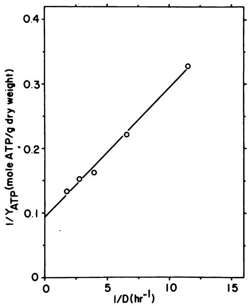
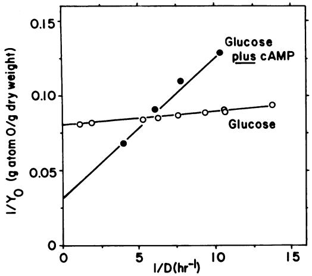

# Effects of Varying the Carbon Source Limiting Growth on Yield and Maintenance Characteristics of Escherichia coli in Continuous Culture 1

WALTER P. HEMPFLING* AND STANLEY E. MAINZER2

Department of Biology, University of Rochester, Rochester, New York 14627

Received for publication 27 May 1975

The magnitudes of Y0 (grams [dry weight] formed per gram of atom 0) and mi, the maintenance respiration (milligram-atoms of 0 per gram [dry weight] per hour), of Escherichia coli B have been determined by growing the organism in aerobic continuous culture limited by a number of different substrates. The value found were as follows: glucose- Y0 = 12.5, m = 0.9; glucose plus 2.7 mM cyclic adenosine 3',5'-monophosphate (cAMP)-Y0 = 31.2, min = 9.3; galactose-Y0 = 13.2, min = 1.8; mannitol-Y0 = 20.1, mo = 6.1; L-glutamate-YY0 = 25.5, mo = 17.7; glycerol-Y0 = 14.9, mo = 10.0; succinate-Y0 = 11.2, mo = 12.1; and acetate-Y0 = 14.7, mo = 25.4. During growth in anaerobic continous culture with limiting glucose YATP was found to be 10.3 g (dry weight)/mol of adenosine 5'-triphosphate (ATP) and mATp was 18.9 mmol of ATP/g (dry weight) per h. The aerobic growth yields of cells growing on glucose, glucose plus cAMP, mannitol, and glutamate were consistent with the hypothesis that carbohydrates partially repress oxidative phosphorylation, but the yields of cells growing on glycerol, succinate, acetate, and galactose were all lower than expected. We conclude that, like the efficiency of oxidative phosphorylation, both the maintenance respiration and the amount of ATP necessary to serve maintenance processes are determined by the identity of the growth substrates. Yields smaller than expected may be explained by the absence of respiratory control exerted by phosphate acceptors.

Several estimates of the efficiency of energy conservation during the aerobic growth of bacteria have appeared. The methods used to make such estimates have included the determination of the growth yield referred to oxygen consumption (8, 15, 21; A. M. Whittaker and S. Elsden, J. Gen. Microbiol. 31:xxii), direct measurement of the P/2e- value of oxidative phosphorylation in nondividing whole cell suspensions (1, 10, 31), and calculation of the stoichiometry of respiration-dependent proton extrusion of whole cells (19, 21). Each of these methods has yielded conflicting results when employed by different investigators, possibly as a result of the use of different growth conditions, different preparation procedures, different carbon sources, and different organisms. Especially important is the failure of many workers to take into account, during the estimation of growth yield referred to oxygen consumption,

' Present address: Department of Human Genetics, Yale University, School of Medicine, New Haven, Conn. 06511.

the effect of a varying growth rate upon yield due to the diversion of energy to maintenance processes (13, 20, 26). The differential repressive effects of different carbon sources upon the efficiency of oxidative phosphorylation (9) have been ignored also.

We have undertaken an investigation of the effects of varying the composition of the growth medium, pH, and temperature of growth upon the growth yield and maintenance requirements of Escherichja coli B, an organism which in our hands exhibits dependency of oxidative phosphorylation efficiency on the nature of the substrate. To this end, we have employed the technique of substrate-limited continuous culture (14). This communication describes results obtained when the identity of the carbon source limiting growth is varied and when cyclic adenosine 3'5'-monophosphate (cAMP) is added to glucose-limited medium.

A preliminary report of some of these findings has appeared (S. E. Mainzer and W. P. Hempfling, Abstr. Annu. Meet. Am. Soc. Microbiol., G109, p. 38, 1974). (Some of the data reported

&#x27; Dedicated to the memory of our friend and teacher, Wolf Vladimir Vishniac (1922-1973).

here are included in a dissertation submitted by S.E.M. to the University of Rochester in partial fulfillment of the requirements for the Ph.D. degree.)

## MATERIALS AND METHODS

Organism. E. coli B was maintained as previously described (12).

Growth media. The minimal medium, described elsewhere (9), was prepared in 15-liter batches and sterilized at 121 C for 60 min. Potassium phosphate buffer (1 M), pH 7.0, and 1 M solutions of the carbon sources (neutralized when necessary with KOH) were autoclaved separately. All solutions were added in the proper proportions to the minimal medium contained in a mixing reservoir and were thoroughly mixed by means of a magnetic stirrer before addition to the culture vessel. The final concentration of phosphate was 15 mM. When cAMP was included in glucosecontaining medium it was added at a final concentration of 2.7 mM, and the entire medium was then sterilized by passing it through a membrane filter apparatus (Millipore Corp.) containing a filter of 0.22-am porosity.

The chemostat. The cylindrical Pyrex chemostat vessels used were of 330- and 400-ml culture volume. They were designed in this laboratory and were fabricated by Blaessig Glass Specialties, Rochester, N.Y.

The culture medium was pumped through an inlet at the top of the vessel by means of a Harvard apparatus peristaltic pump, using both channels to minimize pulsation. Spent medium and organisms were removed through an overflow tube protruding from the side of the vessel at a point about halfway up the side.

The culture medium in the chemostat vessel was stirred by a Teflon-covered magnetic stirring bar driven by a magnetic stirrer placed immediately beneath the vessel.

The rate of air flow from the laboratory-compressed air supply was controlled and measured by passage through a low-pressure, single-stage gas regulator (The Matheson Co., model 70) at about 2 lb/in2 and a Matheson flowmeter (no. 601 or 602). Air was sterilized by passage through two drying tubes (25 by 200 mm) linked in series and packed with sterile, nonabsorbent cotton.

Air was dispersed inside the vessel by means of a centrally located glass tube terminating (about 1.5 cm from the bottom) with a sintered glass sparger ("coarse" porosity) at rates of 1.0 to 1.6 liters/h.

Effluent gas was separated from the effluent liquid by providing separate exits for the two components at the end of the overflow tube. The lower aperture was connected to a length of rubber tubing with a loop placed in it so as to form a fluid lock. Once the loop filled with effluent fluid, air passed out via the second, upper outlet to either the atmosphere or the gas analyzer. No restrictions were placed upon the free exit of the gas from the vessel, thereby avoiding significant pressure changes in the system.

When anaerobic culture conditions were required,

both chemostat vessel and mixing reservoir received a continuous flow of N2 which was first passed through a gas-washing bottle containing a solution of 20% (wt/vol) Na2CO, and 20% (wt/vol) pyrogallol. The flow rate of N2 was between 1.5 and 3 liters/h.

The temperature of the chemostat vessel was maintained at 37 C (+0.10) by means of a heating tape wrapped around the vessel. Current was supplied to the tape by a Variac variable rheostat operated at about 40% capacity and was regulated by a Yellow Springs Instrument Co. temperature controller (model 65 RC). The thermistor probe which served as detector for the temperature controller was placed in a water-filled glass well protruding deeply into the culture fluid in the chemostat vessel.

The hydrogen ion concentration of the culture medium was maintained at pH 6.8 (±0.05) with the aid of a Radiometer pH meter (model pHM 28 and 28b), combination pH electrode (model 5123c), immersed in the growth medium and a titrator unit (model TTT llb) operating a magnetic valve (type MNV lc). When a valve opened in response to deviation of the pH of the culture medium from pH 6.8, sterile 1 M KOH or HCl (depending upon the direction of change) was admitted dropwise, thereby restoring the hydrogen ion concentration to pH 6.8. The concentration of alkali or acid used was sufficient to prevent large volume changes as a consequence of neutralization but not great enough to cause significant over- or undershoots of pH after addition.

The pH electrode was sterilized in air saturated with ethylene oxide vapor for 12 to 18 h at 22 C or by immersion in acidified ethanol (70% ethanol containing enough HCl to give a reaction of pH 2) for a period of 8 to 12 h at 22 C. Either method gave satisfactory results if the pH electrode was carefully washed free of any organic matter that might have adhered to it during the course of the previous experiment.

Growth in continuous culture. A complete discussion of the theory and operation of continuous culture devices can be found elsewhere (14). Continuous culture was initiated by inoculating the complete medium contained in the chemostat vessel with 1 to 5 ml of suspension of E. coli B which had been grown for 12 to 18 h in batch culture in glucose minimal medium (9). When the population in the vessel became visible, medium pumping began at the slowest dilution rate to be used in the experiment. A minimum of 5 culture volumes was permitted to flow through the vessel before sampling began; generally a steady state was attained by the end of the third culture volume replacement. After completion of sampling at a given dilution rate, the pumping rate was increased by a small amount, and the process was repeated until the desired number of growth rates had been examined. At this point the mixing reservoir was drained and rinsed twice with 2 liters of the minimal medium containing a different carbon source. In no case was continuous culture permitted to extend beyond 3 weeks.

Determination of oxygen consumption. The oxygen consumed in the chemostat vessel was measured with either a Fisher-Hamilton gas partitioner or with an IBC differential oxygen analyzer. When the gas partitioner was used for the estimation of oxygen no conditioning of the effluent gas was necessary, but it proved imperative, when the IBC analyzer was employed, to pass the effluent gas through drying tubes containing, in sequence, silica gel, Ascarite, and indicator silica gel in order to remove moisture and CO2. When these precautions were taken the results obtained with one instrument were indistinguishable from those obtained withW the other.

Comparison of the amount of residual oxygen in the effluent gas with the amount of oxygen in the incoming air made it possible to determine the volume of oxygen consumed by the culture. The rate of air flow at the time of oxygen measurement was determined with a 10-ml "bubble meter" and was continuously monitored by means of the Matheson flowmeters. Individual rate measurements differed from the mean rate by +5%. To calculate the number of moles consumed per unit time a volume of 22.4 liters/mol of 02 was assumed. The measurements were done at room temperature, and each determination was accompanied by subsequent standardization using primary standard mixtures of 0, in N2 obtained from the Matheson Co. Using standards containing 16.6 and 20.4% 02 (by volume) the typical resolution on a 10-inch (25.4-cm) chart recorder was 6% 0, (i.e., between 15 and 21% 03 by volume). The volume of oxygen in the effluent gas never sank below 15% by volume.

When it was desired to estimate the concentration of dissolved oxygen in the growth medium, a Clark electrode was sterilized in ethylene oxide vapor and then inserted in the vessel through a portal provided. The vessel was deoxygenated by flushing with sterile N2 and then fully aerated by increasing the aeration rate to above 1 liter/min.

Determination of bacterial dry weight. To measure bacterial dry weight the rubber tubing attached to the overflow arm was disconnected and the effluent medium and cells were allowed to fall into a 50-ml polypropylene centrifuge tube surrounded with ice. Collection was continued until at least 15 ml of effluent medium accumulated in the tube, but for not longer than 30 min. Longer periods frequently resulted in significant loss of cell mass, probably through partial cell lysis. Duplicate portions of the effluent culture were collected in this way and then immediately centrifuged for 10 min at 12,000 x g in a Sorvall RC2B refrigerated centrifuge held at 2 C. The volume of the resulting supernatant portion was determined by decantation, and the centrifuge tube containing the sedimented bacteria was allowed to drain. After the sides of the tube were freed of excess moisture, the pellet was suspended in 2.5 to 3.0 ml of 0.15 M NaCl, and duplicate aliquots were placed into dried, tared aluminum weighing pans (weighing approximately 400 mg) and dried to constant weight over a period of 12 to 18 h at 95 to 105 C. An equal volume of NaCl solution was placed on other pans and similarly dried. The weight of bacteria was calculated by subtracting the weight of the NaCl from the weight of the bacteria suspended in NaCl. No further moisture could be removed from the dried samples when

held in vacuo at 105 C for 24 h.

Early measurements of dry weight included saline to prevent possible lysis of cells during repeated washes. Although the weight of NaCl was great compared to the sample, reproducibility of sample weights after subtraction of saline blanks was acceptable. Later control experiments showed that no differences in weight occurred between unwashed samples and those washed once or twice with saline; therefore, washing of cell pellets was discontinued. The use of saline was continued so that the results of the two methods could be directly compared.

Estimation of the carbon content of dried bacteria. E. coli B, grown in batch culture on several different media, were harvested by centrifugation in the cold during the late log period of aerobic growth at 37 C in a New Brunswick Scientific Co. incubatorshaker. The bacterial pellets were resuspended to 20% of the original culture volume in distilled water and again centrifuged. The washed pellets were resuspended in a small volume of distilled water and then dried to constant weight. The carbon content of the dried bacterial masses was measured with a Hewlett-Packard CHN analyzer, model 185. Cyclohexanone-2,4-diphenylhydrazone and L-arginine were used as standards.

Measurement of the concentrations of glucose, acetate, lactate, and ethanol. Glucose concentrations of samples of the medium contained in the mixing reservoir and of the effluent medium were determined by the Glucostat method, using reagents obtained from the Worthington Biochemical Corp.

Acetate in the supernatant fraction of the effluent medium was estimated using acetate kinase obtained from the Sigma Chemical Co. The reaction mixture employed was adapted from that described by Rose et al. (27); it contained, in a final volume of 1.0 ml: 0.5 to 2.5 Mmol of tris(hydroxymethyl)aminomethane-chloride, pH 7.4; 10 umol of MgCl,, 10 umol of adenosine 5'-triphosphate (ATP) (neutralized); 750 Amol of hydroxylamine (pH 7.4); 1.5 to 2.0 U of crystalline acetate kinase; and 20 umol of 2-mercaptoethanol. After incubation of the mixture for 90 min at 37 C the reaction was terminated by the addition of 0.5 ml of 20% (wt/vol) trichloroacetic acid followed by 1.0 ml of 5% (wt/vol) FeCls in 4 N HCl. The optical density of the solution at 510 nm was determined, and the value was compared with those given by carrying out the reaction with known amounts of sodium acetate.

Lactate and ethanol in the supernatant portion of the effluent medium were measured by enzymatic techniques as described by Hohorst (17) and Bonnichsen (3), respectively. Hydrazine hydrate replaced semicarbazide and hydrazine sulfate.

Spectrophotometric measurements were performed with a Hitachi-Coleman Perkin-Elmer model 124 dual wavelength spectrophotometer, using Pyrex cuvettes of 1.00-cm lightpath length.

Statistical treatment of data. The final graphical presentation of the data was chosen so as to provide an assessment of cumulative experimental error; to this end the linear regression coefficients are provided for each function. Graphical functions were obtained which best fitted the data by the means of the least-squares method. The linear regression coefficients were calculated (7) with the aid of a Hewlett-Packard calculator, model 9100A.

# RESULTS

Estimation of Y ATP through anaerobic continuous culture in glucope-limited mninimal medium. Because different values of the growth "constant," YATp (grams [bacterial dry weight] formed per mole of ATP synthesized), have been reported (6), it was necessary to establish the value of YATP characteristic of E. coli B before proceeding to aerobic growth experiments. This was best accomplished in anaerobic continuous culture using limiting glucose, since the stoichiometry of ATP formation is known for the fermentative reactions carried out by that organism. Whereas the identity of the fermentation products varied with the growth rate, it was nevertheless possible to calculate ATP production simply by measuring the amount of glucose metabolized, the amount of glucose incorporated into cell material, and the amount of acetate formed (8). Only trace amounts of ethanol and lactate were formed; therefore, we have assumed the balance of carbon-containing fermentation products to be formate and CO2. The following reactions were assumed to occur: (i) glucose + 2 adenosine 5'-diphosphate (ADP) + 2 P1 - 2 pyruvate + 2 ATP + 2 (2e- + 2H+); (ii) pyruvate + ADP + Pi - acetate + formate + ATP.

A small correction for the assimilation of glucose into cell material was applied based on the finding that carbon comprises 45.6% (standard deviation = 2.6%) of the bacterial dry mass. This value was obtained from measurements of the carbon composition of E. coli B grown in batch culture in media containing eight different carbon sources over a range of specific growth rates of 0.4 to 1.2/h. It was assumed that cellular carbon was at the average reduction level of carbohydrate. Several measurements of the carbon composition of cells growing in anaerobic continuous culture have shown that the ratio of carbon to cell mass remains constant down to a specific growth rate of about 0.1/h.

The results of the experiment relating bacterial dry mass to ATP production in anaerobic continuous culture are given in Table 1. The amount of acetate formed per mole of glucose metabolized is strongly dependent upon the rate of growth. The yields referred to moles of glucose metabolized (Yg,ucoe,,) and to moles of ATP produced (YATP) exhibit similarly strong dependencies upon growth rate. YgIUCOSe and YATP, when plotted versus the dilution rate on the abscissa, can be seen to vary hyperbolically with the specific growth rate, a phenomenon consistent with the view that part of the ATP produced is diverted to serve maintenance processes at a rate which is independent of the growth rate. An estimate of the amount of substrate required to serve maintenance processes can be obtained by means of the double reciprocal plot of 1/Ysubstrate versus 1/D as suggested by Pirt (26). In Fig. 1 we show that such a plot (1/YATP versus 1D) yields a straight line. The intercept on the ordinate is 1/YATP corrected for the diversion of ATP for maintenance purposes, and the slope of the function represents the rate of ATP utilization for purposes of maintenance (mATp). Using this linear transformation of the data, YATp(max) is 10.7 g (bacterial dry weight) per mol of ATP, and

| D (h-') | x (/g [drywtJ/ml) | Residual glucose(mM) | Glucoseb metabolized(mM) | Acetate produced(mM) | ATP/glucose metabolized | c g,uwOw | y d YTP |
|------------|----------------------|-------------------------|-----------------------------|-------------------------|----------------------------|-------------|---------------|
| 0.087      | 107                  | NDe                     | 12.7                        | 9.5                     | 2.75                       | 8.40        | 3.05          |
| 0.153      | 135                  | ND                      | 12.4                        | 5.1                     | 2.41                       | 10.9        | 4.50          |
| 0.254      | 176                  | ND                      | 12.2                        | 4.3                     | 2.35                       | 14.4        | 6.13          |
| 0.364      | 188                  | 0.015                   | 12.1                        | 4.7                     | 2.39                       | 15.6        | 6.53          |
| 0.570      | 129                  | 4.67                    | 7.8                         | 1.7                     | 2.22                       | 16.5        | 7.43          |

TABLE 1. Yield characteristics of E. coli B growing in glucose-limited anaerobic continuous culturea

a Conditions: 330-ml vessel; 13.5 mM glucose in medium.

" Glucose metabolized = glucose concentration in reservoir medium minus glucose concentration in effluent (residual- glucose) minus glucose equivalent of incorporated carbon. Glucose incorporated (mM) = 0.456 x/(12) (6).

C x (micrograms/milliliter)/micromoles of glucose metabolized per milliliter.

d Yglucose/moles of ATP per mole of glucose metabolized.

eND, Not detectable.

FIG. 1. Relation of YATP of E. coli B growing anaerobically with limiting glucose to dilution rate: double reciprocal linear transformation. Linear regression coefficient, 0.9968.

m ATP is 20.1 mmol of ATP/g (dry weight) per h.

To offset, in part, appreciable error introduced by the method used to plot the data we also have determined YATp(max) and mATp by plotting YATP versus YATp/D according to the method recommended by Hofstee (16). A Hofstee plot gives YATp(max) = 9.9 g (bacterial dry weight) per mol of ATP, and m ATP = 17.7 mmol of ATP/g (dry weight) per h with a linear regression coefficient of -0.959. We will accept the means of the two plotting methods as the effective values; that is, YATp(max) is 10.3 g (dry weight) per mol of ATP and m ATp is 18.9 mmol of ATP/g (dry weight) per h.

Yield and maintenance in aerobic continuous culture limited by glucose and the effect of cAMP. The results of a representative experiment in which glucose served as the compound limiting growth are given in Table 2. It should be noted that the amount of oxygen consumed at each growth rate did not account for complete oxidation of glucose, even though only traces of glucose remained in the effluent medium. Assay of acetate in the effluent medium showed it to be a major end product, especially at higher growth rates, in addition to CO2. Other oxidation products were not sought. From the double reciprocal plot of 1/Y0 versus 1ID of the data in Table 2 and data obtained from additional experiments (Fig. 2) we calculate that YO corrected for maintenance respiration, that is, Y0(max), is 12.5 g (dry weight)/g-atom of O and that the rate of maintenance respiration (m .) is 0.9 mg-atom of O/g (dry weight) per h.

Addition of cAMP to the glucose-limited medium resulted in a marked increase in the rate of maintenance respiration and in Yj(max). These results are also shown in Table 2 and Fig. 2. Y0(max) reaches 31.2 g (dry weight)/gatom of 0 (an increase of some 2.5-fold) and m0 increases more than 10 times to 9.3 mg of O/gperh.

In these and in following experiments the amount of dissolved oxygen remaining in the growth medium was estimated by direct insertion of the Clark electrode into the chemostat vessel. At no time was the amount of oxygen found to be less than about 70% of air saturation. It should be pointed out that the respiratory rate in any dilution rate can be determined directly from the data provided according to the expression D Yv- Y/2 = moles of 02 per gram per hour.

### Yield and maintenance in aerobic continu-

TABLE 2. Estimation of Y. as a function of D in glucose-limited aerobic continuous culture in the presence and absence of 2.7 mM cAMP

| Condition Condition | ~D (h-') | x (ug [dry wt]/ml) | Output (mg [dry wtA/h) | Respiration (mmol of 0,/h) | (gdY.wt/ wt/g- 0 (gadry | Qpolo ,/mgoh) |
|---------------------|-------------|-----------------------|---------------------------|-------------------------------|-------------------------------|------------------|
| 5.1 mM glucose,  | 0.090       | 234                   | 7.30                      | 0.33                          | 10.9                          | 4.34             |
| 330-ml vessel       | 0.190       | 310                   | 19.5                      | 0.82                          | 11.9                          | 8.02             |
|                     | 0.380       | 309                   | 39.3                      | 1.66                          | 11.8                          | 16.3             |
|                     | 0.510       | 306                   | 51.7                      | 2.12                          | 12.0                          | 21.0             |
|                     | 0.970       | 147                   | 46.9                      | 1.96                          | 12.3                          | 40.4             |
| 5.0 mM glucose + | 0.095       | 111                   | 3.48                      | 0.23                          | 7.75                          | 6.01             |
| 2.7 mM cAMP      | 0.127       | 148                   | 6.19                      | 0.34                          | 9.10                          | 6.96             |
|                     | 0.162       | 177                   | 9.46                      | 0.43                          | 11.0                          | 7.36             |
|                     | 0.248       | 215                   | 17.6                      | 0.60                          | 14.7                          | 8.46             |

FIG. 2. Relation of YO of E. coli B growing aerobically with limiting glucose in the presence and absence of 2.7 mM cAMP to dilution rate:double reciprocal linear transformation.

ous culture limited by carbon sources other than glucose. Experiments similar to those carried out with limiting glucose were performed with limiting galactose, mannitol, glycerol, L-glutamate, succinate, or acetate, and the results are given in Table 3. The data were then subjected to the two methods of linear transformation, and the values of m0 and of Y0(max) thereby obtained are shown in Table 4.

Galactose and mannitol are compounds with the greatest similarity to glucose, and galactosegrown cells are characterized by values of YO (max) and m0 close to those of glucose-grown cells. Mannitol-grown cells differ significantly from hexose-grown cells: Y0(max) is nearly doubled and m0 undergoes an even larger increase. The addition of cAMP to glucoselimited cultures elicits growth with the largest value of Y0(max).

Still larger values of the rate of maintenance respiration are observed when noncarbohydrate substrates are used to limit growth in aerobic continuous culture. Only when L-glutamate is employed as the substrate limiting growth, however, does the value of Y0(max) change substantially from that of glucose-grown cells. It is of interest that all of the m0 values obtained with this set of substrates exceed even the rate of maintenance respiration observed in cultures growing with glucose and cAMP.

It can be seen that Y0(max) varies from 11.2 g(dry weight)/g-atom of 0 (succinate) to 31.9 g (dry weight)/g-atom of 0 (glucose plus cAMP), a difference of some 2.8-fold. Values of m. vary from 0.9 mg-atom of O/g per h (glucose) to 25.4 mg-atom of O/g per h (acetate), a difference of some 28-fold.

Contribution of oxidative phosphorylation to Y0(max). We estimate the contribution of oxidative phosphorylation to YJ(max) values by correcting for the amount of ATP formed due to substrate-level phosphorylation and for the amount of ATP expended in the synthesis of monomers (6). These adjustments are made on the mean values of Y0(max) obtained by averaging the values derived from the double-reciprocal and Hofstee plots and result in a value called "Yd(max) corrected" in Table 4. After correction for the use of ATP for monomer biosynthesis and for the contribution of ATP from substrate-level phosphorylation, it is seen that the contribution of oxidative phosphorylation to YO(max) varies from 9.2 g (dry weight)/gatom of 0 (glucose) to 27.9 g (dry weight)/gatom of 0 (glucose plus cAMP), a difference of threefold.

# DISCUSSION

The results described here show that both the maintenance respiration rate and the growth yield referred to oxygen consumption of E. coli B are dependent upon the identity of the substrate used to limit growth in aerobic continuous culture. Among cells grown in carbohydrate-limiting medium there exists an apparent correlation between YO(max) and m0 in that cultures with higher yields also exhibit higher maintenance respiration. Such a correlation is not as strong in cultures grown on noncarbohydrate substrates.

YATP. Fundamental to any attempt to derive the stoichiometry of ATP formation through substrate metabolism is the accurate and reliable estimation of YATP during the metabolism of substrates through known pathways. The present findings indicate that YATp(max) is 10.3 g (dry weight)/mol of ATP formed during glucose fermentation. Such a value is typical of those reported by others, as given by Forrest and Walker (6). Lower values can in part be rationalized by the failure of the investigators to take into account expenditure of ATP for purposes of maintenance. The consequences of disregarding maintenance are seen in the low values for YATP of the growth of E. coli calculated by Hernandez and Johnson (15).

Considerably higher values of YATP can be found in the literature. Although some of these data arise from the failure to take into account the variation of fermentation products as a function of growth rate (see, for example, reference 23), such an explanation cannot be applied

## 1082 HEMPFLING AND MAINZER

|  |              | TABLE 3. Yield characteristics of E. coli B growing in aerobic continuous cultures limited by substrates other |
|--|--------------|----------------------------------------------------------------------------------------------------------------|
|  | than glucose |                                                                                                                |

| Substrate   | Concn in reservoir (mM) | Culture vol (ml) | D D (h-) | x x (Mg [drywtVml) | Output wt h (mg [drywtVh) | Respiration emol of (mmolofOJh) | YtO (G [drywtI/g- atom ofO) |
|-------------|-------------------------------|------------------------|----------------|--------------------------|---------------------------------|---------------------------------------|-----------------------------------|
| Mannitol    | 5.9                           | 330                    | 0.063          | 344                      | 7.15                            | 0.50                                  | 7.15                              |
|             |                               |                        | 0.087          | 355                      | 10.2                            | 0.62                                  | 8.27                              |
|             |                               |                        | 0.125          | 397                      | 16.4                            | 0.82                                  | 10.0                              |
|             |                               |                        | 0.254          | 409                      | 34.3                            | 1.30                                  | 13.2                              |
|             | 4.5                           |                        | 0.189          | 338                      | 21.1                            | 0.83                                  | 12.7                              |
|             | 2.9                           |                        | 0.573          | 233                      | 44.0                            | 1.28                                  | 17.2                              |
| Galactose   | 6.2                           | 330                    | 0.103          | 350                      | 11.9                            | 0.55                                  | 10.8                              |
|             |                               |                        | 0.135          | 357                      | 15.9                            | 0.69                                  | 11.5                              |
|             | 5.4                           |                        | 0.172          | 314                      | 17.8                            | 0.80                                  | 11.1                              |
|             |                               |                        | 0.232          | 342                      | 26.2                            | 1.11                                  | 11.8                              |
|             |                               |                        | 0.286          | 381                      | 36.0                            | 1.44                                  | 12.5                              |
|             |                               |                        | 0.476          | 326                      | 51.3                            | 2.02                                  | 12.7                              |
| Glycerol    | 3.9                           | 330                    | 0.100          | 92                       | 3.03                            | 0.24                                  | 6.31                              |
|             |                               |                        | 0.129          | 79                       | 3.36                            | 0.23                                  | 7.30                              |
|             |                               |                        | 0.171          | 91                       | 5.16                            | 0.32                                  | 8.07                              |
|             |                               |                        | 0.108          | 131                      | 4.66                            | 0.37                                  | 6.30                              |
|             |                               |                        | 0.136          | 161                      | 7.24                            | 0.51                                  | 7.10                              |
|             |                               |                        | 0.234          | 199                      | 15.4                            | 0.84                                  | 9.18                              |
|             |                               |                        | 0.467          | 215                      | 33.1                            | 1.44                                  | 11.5                              |
|             |                               | 400                    | 0.100          | 96                       | 3.86                            | 0.35                                  | 5.52                              |
|             | 4.5                           |                        |                |                          |                                 |                                       |                                   |
|             |                               |                        | 0.236          | 139                      | 13.1                            | 0.73                                  | 9.00                              |
|             |                               |                        | 0.336          | 134                      | 18.0                            | 0.91                                  | 9.90                              |
|             |                               |                        | 0.474          | 162                      | 30.7                            | 1.30                                  | 11.8                              |
|             | 5.0                           |                        | 0.203 0.322 | 148 164               | 12.0 21.1                    | 0.73 1.07                          | 8.23 9.86                      |
| Succinate   | 8.0                           | 400                    | 0.082          | 133                      | 4.36                            | 0.50                                  | 4.36                              |
|             |                               |                        | 0.125          | 120                      | 6.00                            | 0.56                                  | 5.36                              |
|             |                               |                        | 0.164          | 152                      | 10.0                            | 0.85                                  | 5.88                              |
|             |                               |                        | 0.227          | 158                      | 14.4                            | 1.04                                  | 6.92                              |
|             |                               |                        | 0.294          | 118                      | 13.9                            | 0.92                                  | 7.55                              |
|             |                               |                        | 0.378          | 116                      | 17.5                            | 0.97                                  | 9.02                              |
| L-Glutamate | 3.0                           | 400                    | 0.080          | 70                       | 2.24                            | 0.28                                  | 3.90                              |
|             |                               |                        | 0.154          | 90                       | 5.52                            | 0.46                                  | 6.03                              |
|             | 5.0                           |                        | 0.173          | 107                      | 7.39                            | 0.56                                  | 6.60                              |
|             |                               |                        | 0.228          | 116                      | 10.6                            | 0.64                                  | 8.31                              |
|             |                               |                        | 0.238          | 118                      | 11.2                            |                                       |                                   |
|             |                               |                        | 0.357          | 123                      |                                 | 0.64                                  | 8.60                              |
|             |                               |                        |                |                          | 17.6                            | 0.71                                  | 12.4                              |
|             |                               |                        | 0.475          | 107                      | 20.3                            | 0.80                                  | 12.7                              |
|             | 6.0                           | 330                    | 0.185          | 170                      | 10.4                            | 0.67                                  | 7.82                              |
|             |                               |                        | 0.244          | 192                      | 15.5                            | 0.84                                  | 9.20                              |
|             |                               |                        | 0.303 0.435 | 227 240               | 22.7 34.5                    | 1.15 1.24                          | 9.90 13.9                      |
| Acetate     | 10                            | 400                    | 0.141          | 108                      |                                 |                                       |                                   |
|             |                               |                        | 0.172          | 116                      | 6.11                            | 0.76                                  | 4.02                              |
|             |                               |                        | 0.285          | 100                      | 7.96                            | 0.86                                  | 4.63                              |
|             |                               |                        |                |                          | 11.4                            | 0.88                                  | 6.48                              |
|             |                               |                        | 0.367          | 75                       | 11.0                            | 0.77                                  | 7.14                              |

to all experiments which lead to values of YATP significantly in excess of 10 g (dry weight)/mol of ATP. For example, values of YATP approaching the theoretical maximum of 25 to 30 g (dry weight)/mol of ATP (6) have been obtained during the anaerobic continuous culture with limiting glucose of Lactobacillus casei L3 (5) and during the anaerobic continuous culture with excess glucose and limiting tryptophan of Aerobacter aerogenes (30). In these experiments the growth rate was varied so that the maintenance expenditure of ATP could be determined, and fermentation products were assayed. Hadjipetrou et al. (8) had earlier reported a value of about 10.5 g/mol of ATP for the anaerobic yield of A. aerogenes growing in batch culture, but did not include a correction for maintenance in reaching that conclusion. An explanation for

|                         | Yu_ mS |      | (max) |      |      | rc   |       | ATP requiredd for | ATP formed' at the               | Y.(max)'                      |           |
|-------------------------|-----------|------|-------|------|------|------|-------|-------------------------|----------------------------------------|-------------------------------|-----------|
|                         | A-        | Bb   | Mean  | A    | B    | Mean | A     | B                       | monomer synthesis (mol of ATP/g) | substrate level (ATP/O) | corrected |
| Glucose                 | 0.96      | 0.83 | 0.90  | 12.5 | 12.4 | 12.5 | 0.937 | -0.930                  | 0                                      | 0.33                          | 9.2       |
| Succinate               | 13.1      | 11.0 | 12.1  | 12.0 | 10.4 | 11.2 | 0.985 | -0.991                  | 0.012                                  | 0.14                          | 10.0'     |
| Galactose               | 1.75      | 1.90 | 1.82  | 13.1 | 13.3 | 13.2 | 0.874 | -0.824                  | 0                                      | 0.17                          | 11.5      |
| Glycerol                | 10.2      | 9.70 | 10.0  | 15.0 | 14.7 | 14.9 | 0.972 | -0.964                  | 0.012                                  | 0.29                          | 12.2      |
| Acetate                 | 25.9      | 24.9 | 25.4  | 15.1 | 14.2 | 14.7 | 0.998 | -0.966                  | 0.038                                  | 0                             | 15.2      |
| Mannitol                | 5.73      | 6.50 | 6.12  | 19.3 | 21.0 | 20.1 | 0.995 | -0.984                  | 0                                      | 0.31                          | 17.0      |
| Glutamate               | 17.1      | 18.2 | 17.7  | 24.0 | 27.0 | 25.5 | 0.986 | -0.887                  | 0.012                                  | 0.33                          | 22.5      |
| Glucose plus cAMP | 9.31      | 9.40 | 9.35  | 31.2 | 31.3 | 31.2 | 0.990 | -0.947                  | 0                                      | 0.33                          | 27.9      |

| ;.TABLE 4. Summary of yield and maintenance data and calculation of contribution of oxidative phosphorylation |
|---------------------------------------------------------------------------------------------------------------|
| to Y,(max)                                                                                                    |

a 1/Yo versus 1D.

" Y. versus YJ/D.

c Linear regression coefficient.

dATP required for the net synthesis of 2.5 mmol of glucose from the starting substrate (equivalent of the carbon content of 1 g [dry weight] of bacteria).

eAssuming complete oxidation of the substrate through the Embden-Meyerhof-Parnas pathway (where applicable) and the Krebs tricarboxylic acid cycle (substrate level phosphorylation equivalent to cases where acetate is a major end product of oxidation).

'Calculated by adding to Y(max) an amount of dry weight equivalent to the ATP requirement for monomer synthesis and then subtracting an amount of dry weight equivalent to the ATP formed at the substrate level.

'Additional correction of 0.01 mol of ATP/g (dry weight) applied to offset redox imbalance of 2e-/succinate.

the large difference between the "average" value of YATP and those reported by Stouthamer's group (5, 30) is not available.

In the present anaerobic experiment and in those of others with L. casei (5) and A. aerogenes (30), appreciable corrections in the growth rate-dependent values of YATP were made because of relatively large demands of substrate purposes of maintenance. This does not mean, however, that all earlier estimates of YATP are rendered invalid because of failure to correct for mATp, because similarly large maintenance requirements are not exhibited by all microorganisms. Bauchop and Elsden used Streptococcus faecalis to obtain some of the earliest estimates of YATP (2). We have observed that the YAT p value of S. faecalis lOC1 is invariant down to a specific growth rate of 0.1/h, a good indication that m ATP is small enough to have little effect upon YATP (W- P Hempfling, S. E. Mainzer, and P. J. Van-Demark, Bacterial. Proc., p. 143, 1969).

Substrate dependency of Y.(max). We have suggested that the efficiency of oxidative phosphorylation in E. coli B is determined by the identity of the energy source used for growth through a mechanism similar to catabolite repression (9). This hypothesis was based upon the observations that glucose-grown cells showed P/2e- values of 1.7, and cells grown at

the expense of Casamino Acids plus succinate, glycerol, or acetate showed P/2e- values of about 3. The addition of 3 mM cAMP to cultures growing in glucose-containing media (in the presence or absence of Casamino Acids) overcame the repressive effect of glucose and brought about the growth of cells with a P/2evalue of about 3 (11).

Current experiments indicate that the level of oxidative phosphorylation efficiency of glucosegrown cells which we reported previously was, in fact, an underestimate. Using a procedure which allows the direct measurement of total oxygen consumption and total inorganic phosphate esterification in the first 3 s after oxygenation of anaerobic cells, we now find that the maximum P/O value of glucose-grown cells is 1.0 (W. P. Hempfling and T. A. Kurtz, manuscript in preparation).

In Table 5 we present the P/I values predicted for each continous culture, assuming complete oxidation of substrate and based upon the hypothesis that glucose-grown cells carry out oxidative phosphorylation with a P/O value of 1.0, galactose- or mannitol-grown cells with P/I values of 2.0, and the remaining cells with values of 3.0. Predictions have been made with assumptions which give the largest possible quantities; that is, glucose-grown cells have a single site of phosphorylation associated with

TABLE 5. Comparison of observed and predicted PIO values

| Substrate            | Predicted PlOa | Observed P/O | Observed/ predicted |
|----------------------|-------------------|-----------------|------------------------|
| Glucose              | 1.0               | 0.89            | 0.89                   |
| Galactose            | 2.0               | 1.12            | 0.56                   |
| Mannitol             | 2.0               | 1.65            | 0.83                   |
| Glycerol             | 2.7               | 1.18            | 0.44                   |
| Succinate            | 2.7               | 0.97            | 0.36                   |
| Acetate              | 2.8               | 1.48            | 0.53                   |
| Glutamate            | 2.8               | 2.18            | 0.80                   |
| Glucose plus cAMP | 2.9               | 2.70            | 0.93                   |

aCalculated by assuming complete oxidation of substrate and one "site" of phosphorylation associated with cytochrome b1 oxidation in glucose-grown cells, two "sites" of phosphorylation associated with flavoprotein oxidation in mannitol- and galactose-grown cells, and three "sites" of phosphorylation associated with pyridine nucleotide oxidation in the remaining cultures (9-11). In some cases the values are not integral because of flavoprotein-linked oxidation of intermediate succinate or a-glycerophosphate.

b Observed P/O = "Y0(max) corrected"/YATP (see Table 4).

the oxidation of cytochrome b1 or cytochrome o, and galactose- or mannitol-grown cells have an additional site associated with the oxidation of flavin. The predicted efficiencies of oxidative phosphorylation are compared with observed efficiencies taken from the data in Table 3.

Reasonable agreement between the predicted and observed P/O values was obtained for cells grown at the expense of glucose, glucose plus cAMP, mannitol, and glutamate. The observed P/O values of the remainder of the cultures fall short of the predicted values. The poorest agreement is found between the observed and predicted P/O values of succinate-grown cells. In addition, the discrepancy between predicted and observed results with galactose-grown cells is particularly difficult to explain, since energyconsuming reactions in biosynthesis of monomers are thought to be less important during growth on carbohydrates than during growth on simpler compounds; hence, unanticipated corrections are less likely to be necessary.

In spite of the obvious discrepancies with some substrates, it does not seem justified to discard the hypothesis which led to the predicted values of P/O. In no case did the observed value exceed the predicted value, and glucose-grown cells exhibited the lowest efficiency as predicted by the hypothesis. The agreement found during growth on glucose, glucose plus cAMP, mannitol, and glutamate prompts us to consider reasons why the capacity for oxidative phosphorylation is not used fully by cells growing on acetate, glycerol, succinate, or galactose. Even though washed suspensions of E. coli are no longer growing at significant rates, they are still capable of rapid respiration when mixed with their growth substrate (6, 9). ATP is synthesized, but at low efficiency (12). These observations suggest that no obligatory coupling exists between phosphorylation and respiration in the sense that it exists in mitochondria with high "respiratory control ratios." Those cultures which fall short of the predicted P/O ratio by a significant margin are also those in which respiration is fastest at a given specific growth rate, but this may be a cause or a consequence of low P/O values. Rottenberg et al. (28) have pointed out that the conditions of an experiment designed to measure the efficiency of oxidative phosphorylation-temperature, concentrations of reactants, and respiratory rate-may well diminish the observed P/O values significantly below the predicted ones. It is probably unreasonable to predict all the features of the behavior of bacterial oxidative phosphorylation systems from results of experiments with mitochondria.

Maintenance respiration. We have measured that fraction of respiration which satisfies those energy-requiring processes of maintenance operating at rates independent of the rate of growth and have shown that the magnitude of that maintenance respiration rate is a function of the identity of the substrate limiting growth. Only a few reports describing estimation of the maintenance respiration are extant. Schulze and Lipe (29) cultivated E. coli continuously with limiting glucose and in the presence of oxygen and found that a plot of Qo versus growth rate yielded a straight line with positive slope which intersected the ordinate above the origin at a value of about 1 mg-atom of O/g (dry weight) per h at 37 C. Their value compares nicely with our own of 0.9 mg-atom of O/g (dry weight) per h. Meyer and Jones (21) cultivated several bacteria in media containing excess glycerol or succinate and set the growth rate by varying the rate at which oxygen was made available to the cell population. When E. coli was grown in succinate-containing medium, a value of about 10.4 mg-atom of O/g (dry weight) per h (30 C) was obtained at specific growth rates below 0.3/h. At faster growth rates, however, the apparent maintenance respiration rate increased markedly, so much so that extrapolation of Y0 l to the ordinate of the double reciprocal plot resulted in a negative value, making application of the Pirt expression meaningless. The reasons for this deviation are not

apparent. Nevertheless, Meyer and Jones obtained a value at slow growth rates which compares well with our own estimate of 12.1 mgatom of O/g (dry weight) per h for the maintenance respiration rate of succinate-grown cells.

Since m0 varies with the growth substrate, either the amount of energy necessary for maintenance changes with the substrate or the efficiency of energy conservation associated with respiration changes with the substrate, or both phenomena occur. Let us first assume that the amount of energy required for maintenance is independent of the substrate used for growth. If that be true, then changes in m0 are a consequence of the changes of P/O with growth substrate. To test this hypothesis we calculate the amount of ATP expended for maintenance on the basis of an estimate of P/O derived from Y0(max) (assuming that YATP equals 10 g [dry weightymol of ATP) and find that mATp is not constant but varies from 1.1 mmol of ATP/g per h (aerobic glucose) to 41.1 mmol of ATP/g (acetate) per h. The assumption that P/O varies with substrate and is equal to 1, 2, or 3 (9) likewise leads to the conclusion that mATP is not constant. Therefore, since Y0(max) varies according to the substrate used for growth, and since Y0 (max) is generally taken to reflect P/O, we conclude that both mATp and P/O are determined by the substrate used for growth and by the presence or absence of oxygen. As a consequence of this dual variation, m0 also varies with the growth of substrate.

To calculate a value of P/2e- for nitrate respiration Stouthamer and Bettenhaussen assumed that mATP of A. aerogenes was the same during anaerobic growth in the presence or absence of nitrate (30). The present results suggest that attempts ought to be made to verify that assumption.

It is of interest to consider possible explanations for the variation of m0 (and mATp) with the growth substrate. Such a consideration must recognize that the maintenance processes served are independent of the rate of growth, a conclusion made necessary by the linearity of all double reciprocal plots of 1/Y0 versus 1D which have been presented here. Since growth rates approaching laX were not examined (with the exception of aerobic glucose medium), however, the results reported here do not exclude the possibility that small but significant amounts of energy might be diverted to support growth rate-dependent maintenance functions.

Two kinds of reactions are likely to require energy in a manner which fulfills the kinetic restrictions: turnover of macromolecular constituents and membrane-associated transport processes which are "active" in nature. Protein is known to comprise about one-half of the cell's dry mass and undergoes destruction and resynthesis (turnover) during growth, but it is unlikely that increased maintenance respiration is caused by increased protein turnover. Pine showed that, in E. coli B growing in a balanced manner in glucose-containing medium (g = 0.84/h) or in acetate-containing medium (,u = 0.25/h), protein turnover was 2.5%/h and 3.0%/h, respectively (25). This increase of only 20% contrasts strongly with an increase in maintenance respiration rate of about 28-fold. Marr et al. found an increase in the rate of protein turnover at low growth rates (20), but such a process as the one described by them does not fulfill the necessary kinetic requirements to be the reaction we seek. Nevertheless, calculations show that protein turnover comprises a major fraction of the maintenance requirement of cells growing aerobically on glucose: assuming a requirement for protein synthesis of 27 moles of ATP/g (dry weight) (6), a turnover rate of 2.5%/h gives mATp of 0.6 mmol/g per h, or about one-half of the total mATp of 1.12 mmol of ATP/g per h. The ATP requirement for protein synthesis was calculated by Forrest and Walker assuming 3 mol of ATP per amino acid and a constant requirement of about 2 mol of ATP per amino acid for purposes of messenger ribonucleic acid (mRNA) tumover. Nierlich (24) has pointed out that no obligately stoichiometric coupling appears to exist between protein synthesis and messenger ribonucleic acid synthesis; hence the assumption of Forrest and Walker may well be invalid for all culture conditions, especially if it is found that the noncarbohydrate carbon sources enrich the population of messenger ribonucleic acid molecules with species of very short half-lives. An accurate assessment of the possibility of differential contributions of messenger ribonucleic acid turnover to maintenance requirements during growth at the expense of different energy sources must await further experiments.

"Active" transport of solutes into and out of the cell is another process which may require significant amounts of energy. Such transport processes must, however, satisfy the kinetic criterion of independence of the rate of growth. Unfortunately, little information is available about the rate of, say, acetate uptake and extrusion as a function of growth rate, nor are data extant which relate respiration and the rate of uptake of growth substrate under our conditions of growth. It is of interest that those substrates thought to be transported by the phosphoenolpyruvate phosphotransferase system (18) yield cells with the lowest aerobic values of mATP.

The active nature of transport of ions such as K+ has recently been questioned by Minkoff and Damadian (22). Should their arguments be substantiated, ion transport could then be ignored as a major energy-requiring maintenance process. At high external ion concentrations (e.g., 60 mg-ions of K+/liter, as in the present experiments) it is not likely that differences in the efficiency of ion transport might explain the differences of mATp, since DiGiacomo (Ph.D. dissertation, University of Rochester, Rochester, N.Y., 1973) observed a constant ratio of K + taken up to oxygen consumed after the addition of glucose, mannitol, or glycerol to washed suspensions of nondividing E. coli B which had been grown at the expense of the substrate added. However, at low K+ concentrations (e.g., less than 100 ,g-ions of K+/liter), some variation of m. but not of Y0(max) becomes apparent (S.E. Mainzer and W.P. Hempfling, manuscript in preparation), suggesting that mATP is changed.

Finally, as there appears to be no obligatory coupling between respiration and phosphorylation, so there may exist a similar relationship between respiration and energy-requiring maintenance processes. This interpretation of the change of m0 with substrate is consistent with the observation that those cultures respiring most rapidly at a given specific growth rate exhibit the highest values of mo as well as the largest deviations of observed from predicted P/O values.

#### ACKNOWLEDGMENTS

We are grateful to Diane K. Beeman, Judith N. Conners, and Theresa A. Kurtz for their patience and their excellent technical assistance.

This work was supported by a grant from the National Science Foundation (GB-25582).

#### LITERATURE CITED

- 1. Baak, J. M., and P. W. Postma. 1971. Oxidative phosphorylation in intact Azotobacter vinelandii. FEBS Lett. 19:189-192.
- 2. Bauchop, T., and S. Elsden. 1960. The growth of micro-organisms in relation to their energy supply. J. Gen. Microbiol. 23:457-467.
- 3. Bonnichsen, R. 1965. Ethanol. Determination with alcohol dehydrogenase and DPN, p. 285-287. In H. U. Bergmeyer (ed.), Methods of enzymatic analysis. Academic Press Inc., New York.
- 4. Chance, B., L. Smith, and L. Castor. 1953. New methods for the study of the carbon monoxide compounds of respiratory enzymes. Biochim. Biophys. Acta 12:289-298.
- 5. deVries, W., W. M. C. Kapteijn, E. G. van der Beek, and A. H. Stouthamer. 1970. Molar growth yields and fermentation balances of Lactobacillus casei L3 sn batch cultures and in continuous cultures. J. Gen. Microbiol. 63:333-345.
- 6. Forrest, W. W., and D. J. Walker. 1971. The generation and utilization of energy during growth, p. 213-274. In A. H. Rose and J. F. Wilkinson (ed.), Advances in microbial physiology, vol. 5. Academic Press Inc., New York.
- 7. Freund, J. E. 1971. Mathematical statistics, p. 361-367. Prentice-Hall, Englewood Cliffs, N. J.
- 8. Hadjipetrou, L. P., J. P. Gerrits, F. A. G. Teulings, and A. H. Stouthamer. 1964. Relation between energy production and growth of Aerobacter aerogenes. J. Gen. Microbiol. 36:139-150.
- 9. Hempfling, W. P. 1970. Repression of oxidative phosphorylation in Escherichia coli B by growth in glucose and other carbohydrates. Biochem. Biophys. Res. Commun. 41:9-15.
- 10. Hempfling, W. P. 1970. Studies of the efficiency of oxidative phosphorylation in intact Escherichia coli B. Biochim. Biophys. Acta 205:169-182.
- 11. Hempfling, W. P., and D. K. Beeman. 1971. Release of glucose repression of oxidative phosphorylation in Escherichia coli B by cyclic adenosine 3',5'-monophosphate. Biochem. Biophys. Res. Commun. 45:924-929.
- 12. Hempfling, W. P., M. Hofer, E. Harris, and B. Pressman. 1967. Correlation between changes in metabolite concentrations and rate of ion transport following glucose addition to Escherichia coli B. Biochim. Biophys. Acta 141:391-400.
- 13. Hempfling, W. P., and W. Vishniac. 1967. Yield coefficients of Thiobacillus neapolitanus in continuous culture. J. Bacteriol. 93:874-878.
- 14. Herbert, D., R. Ellsworth, and R. C. Telling. 1956. The continuous culture of bacteria: a theoretical and experimental study. J. Gen. Microbiol. 14:601-622.
- 15. Hernandez, E., and M. J. Johnson. 1967. Energy supply and cell yield in aerobically grown microorganisms. J. Bacteriol. 94:996-1001.
- 16. Hofstee, B. H. J. 1959. Non-inverted versus inverted plots in enzyme kinetics. Nature (London) 184:1296-1298.
- 17. Hohorst, H.-J. 1965. L-(+)-lactate. Determination with lactic dehydrogenase and DPN, p. 266-270. In H. U. Bergmeyer (ed.), Methods of enzymatic analysis. Academic Press Inc., New York.
- 18. Kundig, W., S. Ghosh, and S. Roseman. 1964. Phosphate bound to histidine in a protein as intermediate in a novel phosphotransferase system. Proc. Natl. Acad. Sci. U.S.A. 52:1067-1074.
- 19. Lawford, H. G., and B. A. Haddock. 1973. Respirationdriven proton translocation in Escherichia coli. Biochem. J. 136:217-220.
- 20. Marr, A. G., E. H. Nilson, and D. J. Clark. 1963. The maintenance requirement of Escherichia coli. Ann. N.Y. Acad. Sci. 102:536-548.
- 21. Meyer, D. J., and C. W. Jones. 1973. Oxidative phosphorylation in bacteria which contain different cytochrome oxidase. Eur. J. Biochem. 36:144-151.
- 22. Minkoff, L., and R. Damadian. 1973. Caloric catastrophe. Biophys. J. 13:167-178.
- 23. Moustafa, H. H., and E. B. Collins. 1968. Molar growth yields of certain lactic acid bacteria as influenced by autolysis. J. Bacteriol. 96:117-125.
- 24. Nierlich, D. P. 1972. Regulation of ribonucleic acid synthesis in growing bacterial cells. II. Control over the composition of the newly made RNA. J. Mol. Biol. 72:765-777.
- 25. Pine, M. J. 1970. Steady-state measurement of the turnover of amino acid in the cellular proteins of growing Escherichia coli: existence of two kinetically distinct reactions. J. Bacteriol. 103:207-215.
- 26. Pirt. S. J. 1965. The maintenance energy of bacteria in growing cultures. Proc. R. Soc. London Ser. B 163:224-231.
- 27. Rose, I. A., M. Grunberg-Manago, S. R. Korey, and S.

Ochva. 1954. Enzymatic phosphorylation of acetate. J. Biol. Chem. 211:737-756.

- 28. Rottenberg, H., S. R. Caplan, and A. Essig. 1967. Stoichiometry and coupling: theories of oxidative phosphorylation. Nature (London) 216:610-611.
- 29. Schulze, K. L., and R. S. Lipe. 1964. Relationship between substrate concentration, growth rate and respiration rate of Escherichia coli in continous culture.

Arch. Mikrobiol. 48:1-20.

- 30. Stouthamer, A. H., and C. Bettenhaussen. 1973. Utilization of energy for growth and maintenance in continuous and batch cultures of microorganisms. Biochim. Biophys. Acta 301:53-70.
- 31. van der Beek, E. G., and A. H. Stouthamer. 1973. Oxidative phosphorylation in intact bacteria. Arch. Mikrobiol. 89:327-339.