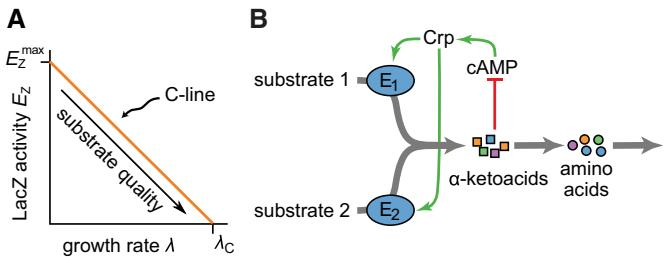
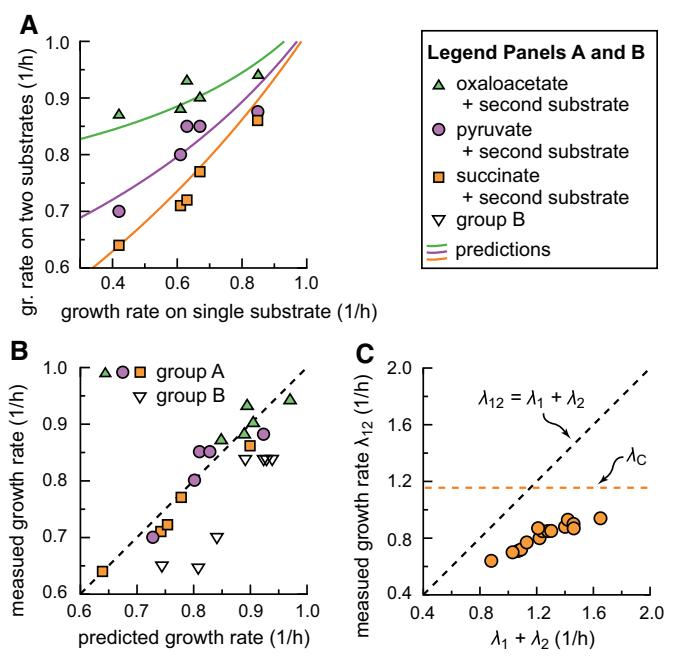

# A growth-rate composition formula for the growth of E. coli on co-utilized carbon substrates

Rutger Hermsen1,2,‡ , Hiroyuki Okano1,‡ , Conghui You1,†,‡ , Nicole Werner1 & Terence Hwa1,*

## Abstract

When bacteria are cultured in medium with multiple carbon substrates, they frequently consume these substrates simultaneously. Building on recent advances in the understanding of metabolic coordination exhibited by Escherichia coli cells through cAMP-Crp signaling, we show that this signaling system responds to the total carbon-uptake flux when substrates are co-utilized and derive a mathematical formula that accurately predicts the resulting growth rate, based only on the growth rates on individual substrates.

Keywords bacterial growth; catabolite repression; metabolic coordination; mixed carbon-substrate growth

Subject Categories Quantitative Biology & Dynamical Systems; Metabolism DOI 10.15252/msb.20145537 | Received 1 July 2014 | Revised 27 February 2015 | Accepted 27 February 2015

Mol Syst Biol. (2015) 11: 801

## Introduction

Bacterial cultures grown in minimal media supplemented with two carbon substrates (i.e., mixed-substrate media) can exhibit two types of behavior: In some cases, the substrates are consumed sequentially—which under the right conditions results in diauxic growth (Monod, 1942, 1947)—whereas in other cases, they are consumed simultaneously (Monod, 1942). Sequential utilization and diauxie are commonly attributed (Mu¨ller-Hill, 1996; Deutscher et al, 2006; Narang & Pilyugin, 2007) to catabolite repression by the cAMP-Crp regulatory system (Kolb et al, 1993; Busby & Ebright, 1999), even though specific studies have shown cAMP-Crp regulation to be either not necessary (Inada et al, 1996) or not sufficient (Okada et al, 1981) for diauxie. We here study the governing role of the cAMP-Crp in the simpler case of simultaneous substrate utilization.

Recently, You et al (2013) reported a physiological study of E. coli in steady-state exponential growth in minimal media supplemented with a single carbon substrate. To study the role of cAMP-Crp, which activates a large number of carbon-catabolic genes, the expression of the well-studied lac system (with LacI inactivated by IPTG) was used as a reporter of cAMP-Crp activity. It was found that LacZ expression level (Ez) exhibits a negative linear correlation with the growth rate (k) when the carbon substrate in the medium is varied:

$$E_{\mathbf{z}}(\lambda) = E_{\mathbf{z}}^{\text{max}} \cdot \left(1 - \frac{\lambda}{\lambda \mathbf{c}}\right). \tag{1}$$

Here, kC is the horizontal intercept, as illustrated in Fig 1A. Several other Crp-activated catabolic operons were studied; they each show a similar linear relation, each with a horizontal intercept kC of 1.1 to 1.2/h. These results suggest that this 'C-line' is a common response pattern exhibited by carbon-catabolic genes under variation of the carbon influx, mediated by cAMP-Crp regulation. Indeed, the cAMP excretion rate, a proxy for the intracellular cAMP level, shows the same trend and intercept, and removal of Crp binding obliterates the C-line.

Functionally, the C-line reflects the cell's coordination of its proteome in response to the different demands for ribosomes and metabolic enzymes at different growth rates (Scott et al, 2010; You et al, 2013; Chubukov et al, 2014). During fast growth, a large fraction of the cell's proteome must be allocated toward ribosomal proteins and anabolic enzymes; therefore, a reduced expression of carbon-catabolic enzymes is obligatory. Mechanistically, this reduction results from an inhibitory effect of several a-ketoacids on the synthesis of cAMP by adenylate cyclase (see Fig 1B) (You et al, 2013). Here, we apply these insights to growth on two carbon substrates to derive a formula that predicts the resulting growth rate.

## Results and Discussion

The proposed theory of mixed-substrate usage is based on three ingredients

First, let the expression level of the catabolic enzymes for the two carbon substrates, C1 and C2, be E1 and E2. Then, at saturating substrate concentrations, the carbon uptake flux Ji for substrate Ci is given by

$$J_l = k_l E_l,\tag{2}$$

where ki is the kinetic constant.

1 Department of Physics, University of California at San Diego, La Jolla, CA, USA

2 TBB Group, Department of Biology, Faculty of Science, Utrecht University, Utrecht, the Netherlands

*Corresponding author. Tel: +1 858 534 7263; E-mail: hwa@ucsd.edu ‡

These authors contributed equally to this work

† Present address: Shenzhen Key Laboratory of Microbial Genetic Engineering, College of Life Sciences, Shenzhen University, Shenzhen, China

Figure 1. C-line and negative feedback regulation of carbon uptake.

- A Illustration of the 'C-line' expressed in equation (1) and verified in Fig 2A. In the presence of IPTG, the expression of LacZ is a reporter for cAMP-Crp activation. Under variation of the carbon substrate provided in the medium, it correlates negatively with the growth rate. Other Crp-regulated carbon-catabolic enzymes show a similar behavior, with similar horizontal intercept kC (You et al, 2013; Hui et al, 2015).
- B Regulatory mechanism responsible for the C-line. In a coarse-grained view of metabolism, carbon substrates are converted to precursors that are subsequently used in anabolic processes. Amino-acid synthesis uses a special class of precursors, the a-ketoacids. Several prominent members of these inhibit the synthesis of cAMP, thereby reducing the activity of cAMP-Crp (You et al, 2013). This results in a non-specific negative feedback regulation of each uptake system by the total carbon flux via cAMP-Crp: If, given the current growth rate, the total carbon influx exceeds the demand for a-ketoacids, carbon-catabolic gene expression is uniformly reduced.

Second, a larger growth rate requires a larger carbon uptake flux. We expect that both substrates contribute to the production of biomass, such that the resulting growth rate k12 obeys

$$
\lambda_{12} = \mathfrak{c}_1 J_1 + \mathfrak{c}_2 J_2. \tag{3}
$$

Here, the constants ci reflect the carbon efficiency of growth on substrate Ci, that is, the amount of that substrate that must be consumed to support a given growth rate. In writing equation (3), we allow these efficiencies to differ between substrates, but assume that they do not change drastically as a function of the growth rate (over the range of growth rates studied). At very high growth rates, this is likely inaccurate due to increased carbon excretion in the form of, for example, acetate (el-Mansi & Holms, 1989; Han et al, 1992); however, because the rate of acetate excretion is generally small compared to the rate of carbon uptake (Han et al, 1992), equation (3) should remain a reasonable approximation.

Third, since the driver of cAMP-Crp regulation is established to be the a-ketoacids (You et al, 2013), which we hypothesize respond to the total carbon influx regardless of whether it originates from a single or multiple substrates (Fig 1B), we expect the C-line observed for single-substrate growth to hold also during growth on two substrates (as validated below). More precisely, we expect that E1(k) ∞ E2(k) ∞ Ez(k), so that

$$E_l(\dot{\lambda}) = E_l^{\text{max}} \cdot \left(1 - \frac{\dot{\lambda}}{\dot{\lambda}_{\text{C}}}\right),\tag{4}$$

for each substrate Ci. The horizontal intercept kC is expected to be the same for all substrates, but the vertical intercept Emax i is substrate specific. Equation (4) describes a cAMP-Crp response that is a function of the growth rate only, regardless of the number of substrates. It assumes that the expression levels are not affected by any regulators other than cAMP-Crp.

The system described by equations (2–4) is illustrated in Supplementary Fig S1. Each substrate contributes to the total carbon-uptake flux (gray arrow). The carbon-uptake flux Ji of substrate Ci is proportional to the expression of the responsible enzymes Ei (equation 2). If the total carbon flux is increased, for example, by adding a co-utilizable substrate to the growth medium, this permits a higher growth rate k (equation 3). However, an increased growth rate entails a reduced expression of the catabolic enzymes (red inhibitory lines), prompted by the increased a-ketoacid pools (Fig 1B) and quantified by the C-line (equation 4); this reduces both fluxes Ji. Combined, equations (2–4) describe a cAMP-Crp-mediated negative feedback loop; they exploit the C-line to quantitatively describe the feedback regulation shown in Fig 1B.

Table 1. Steady-state exponential growth rates for E. coli K-12 strain (NCM3722).

| Growth rate (1/h) |       | Group A   |          |              |          | Group B |  |
|-------------------|-------|-----------|----------|--------------|----------|---------|--|
|                   |       | Succinate | Pyruvate | Oxaloacetate | Glycerol | Glucose |  |
|                   | alone | 0.46      | 0.61     | 0.79         | 0.63     | 0.85    |  |
| Mannose           | 0.42  | 0.64      | 0.70     | 0.87         | 0.65     | 0.84    |  |
| Xylose            | 0.61  | 0.71      | 0.80     | 0.88         | 0.64     | 0.84    |  |
| Glycerol          | 0.63  | 0.73      | 0.85     | 0.93         | –        | 0.84    |  |
| Maltose           | 0.67  | 0.77      | 0.85     | 0.90         | 0.70     | 0.84    |  |
| Glucose           | 0.85  | 0.86      | 0.88     | 0.94         | 0.84     | –       |  |

Growth rates in minimal medium with one or two carbon substrates (shaded and clear entries, respectively). All numbers are averages over two to four experiments; variability between independent experiments is of the order of 5%. Substrate pairs in group A combine one 'upper' substrate (i.e., a substrate merging into the upper part of glycolysis) with one 'lower' substrate (succinate, pyruvate, oxaloacetate). These substrate pairs are likely co-utilized: In all cases, the growth rate on both substrates is larger than on either substrate alone; for a number of cases in this group (green entries), co-utilization is directly confirmed by measuring the uptake of each substrate (see Supplementary Fig S2). For comparison, we include a second group of substrate combinations (group B), in which glycerol or glucose is paired with other 'upper' substrates. For none of the entries in this group does the growth rate on two substrates substantially exceed the larger of the growth rates on single substrate. This is expected from known interactions: Glucose uptake is known to inhibit the uptake of other 'upper' substrates through the inducer exclusion effect (Postma et al, 1984), as we verified by measuring the uptake of both substrates (red entries; see Supplementary Fig S2). Glycerol uptake is limited in the presence of other 'upper' substrates through feedback inhibition by glycolytic intermediate fructose-1,6-biphosphate (Zwaig & Lin, 1966); this leads to limited co-utilization (green entries in the column 'glycerol') or sequential utilization (red entry) depending on the second substrate (see Supplementary Fig S2).

#### Figure 2. Testing model assumptions.

- A LacZ expression level (in activity per OD600 or Miller Unit) of E. coli K-12 cells grown in minimal medium with various carbon substrates and IPTG is plotted against the growth rate of the culture. Yellow circles and orange squares respectively represent results for growth on one (shaded entries in Table 1) or two carbon substrates (clear entries in Table 1). Both sets of results align along a single line (linear regression: R2 = 0.92, P < 107 called the C-line, described by equation (1) with horizontal intercept kC = 1.16 0.05/h (see Fig 1A).
- B The uptake rates of pyruvate and glycerol, as measured during growth on pyruvate only, glycerol only, or both. As expected from the negative feedback loop illustrated in Supplementary Fig S1, the uptake of either substrate is reduced in the presence of the other. (Reported are averages over two experiments, which never deviated more than 5% from the mean.)
- C–E As (B), but for succinate + xylose (C), pyruvate + glucose (D), and succinate + glycerol (E). See Supplementary Fig S3 for more examples.
- F Expression of lacZ reporter genes driven by the dctAp and glpFp promoters, which respectively control the uptake systems of succinate and glycerol. In the presence of glycerol, the expression of the succinate uptake system is markedly reduced and vice versa (black arrows).

Source data are available online for this figure.

To derive an expression for the resulting growth rate, we first manipulate equations (2–4) to obtain

$$\frac{\dot{\lambda}_{12}}{1 - \dot{\lambda}_{12}/\dot{\lambda}_{\text{C}}} = c_1 k_1 E_1^{\text{max}} + c_2 k_2 E_2^{\text{max}} \tag{5}$$

For growth on a single substrate Ci (with growth rate ki = ci Ji), the same equations yield

$$\frac{\dot{\lambda}_l}{1 - \dot{\lambda}_l / \dot{\lambda}_\mathbb{C}} = c_l k_l E_l^{\text{max}} \tag{6}$$

Substituting equation (6) into equation (5), we obtain:

$$
\hat{\lambda}_{12} = \frac{\hat{\lambda}_1 + \hat{\lambda}_2 - 2\hat{\lambda}_1\hat{\lambda}_2/\hat{\lambda}_C}{1 - \hat{\lambda}_1\hat{\lambda}_2/\hat{\lambda}_C^2}. \tag{7}
$$

This growth-rate composition formula is the primary result of this report. It provides a quantitative prediction of the growth rate on two co-utilized carbon substrates, based on the growth rates on each substrate alone. Remarkably, it depends on just a single (strain-dependent) parameter, kC, whose value was already estimated above based on data from single-substrate growth. The formula therefore has no tunable parameters whatsoever.

We stress that the above model includes cAMP-Crp signaling as the only mechanism regulating catabolic enzymes; equation (7) can therefore be interpreted as a null expectation, obeyed in the absence of additional layers of regulation. That said, for many pairs of substrates, no additional regulation is known.

To validate this theory of mixed-substrate growth experimentally, we repeated the physiological study of catabolite repression in E. coli K12 cells as done before (You et al, 2013), but now for growth on 23 pairs of substrates, listed in Table 1. We selected these as follows. We previously noticed that substrates that merge into the upper part of glycolysis ('upper' substrates) are often coutilized with those entering at the bottom or directly into the TCA cycle ('lower' substrates) (You et al, 2013). Therefore, we combined three 'lower' substrates (succinate, pyruvate, and oxaloacetate) with five 'upper' substrates (mannose, xylose, glycerol, maltose, and

#### Figure 3. Testing the growth-rate predictions.

- A The measured growth rates for cultures grown on two co-utilized carbon substrates (Table 1) are plotted against the growth rates on one of the substrates, with the other substrate being succinate (orange squares), pyruvate (purple circles), or oxaloacetate (green triangles). Solid lines indicate the predictions based on the growth-rate composition formula (equation 7) and the measured growth rates on single substrates. Plotted values are averages between 2 and 4 experiments; variation between independent experiments was of the order of 5%.
- B The measured growth rates for cultures grown on two substrates are plotted against the corresponding theoretical predictions. Filled symbols are for group A and open symbols for group B (see Table 1). Good agreement between measurement and prediction is apparent, as all filled symbols are found along the diagonal line (the linear regression line has slope 0.99 0.18 and offset 0.00 0.07 (95% CI), with R2 = 0.92; the distribution of the residuals is consistent with a normal distribution). The relative deviations for group B are larger than for group A: respectively 12% and 3% on average (Mann–Whitney U-test: P < 2 × 105 ).
- C The growth rate k12 on two carbon substrates is always smaller than k1 + k2, the sum of the growth rates on each substrate alone. The maximum growth rate possible according to the theory, kC, is shown as the orange dashed line.

Source data are available online for this figure.

glucose) to form 15 combinations, referred to as group A. In all these cases, the growth rate on two substrates was larger than on either substrate alone, strongly suggesting some degree of coutilization (see Table 1). For six of these 15 substrate pairs (green entries to the left of the vertical line in Table 1), we also verified their co-utilization by measuring the uptake of both substrates from the growth medium (see Supplementary Fig S2, first two columns). For comparison, we also paired the five 'upper' substrates mentioned above with either glucose or glycerol (group B). Glucose uptake is known to inhibit the uptake of many 'upper' substrates (verified in Supplementary Fig S2, 4th column) through the 'inducer exclusion' effect mediated by PTS enzyme EIIAglc (Postma et al, 1984). Glycerol uptake is suppressed in the presence of other 'upper' substrates through feedback inhibition mediated by fructose-1,6-biphosphate, a key glycolytic intermediate (Zwaig & Lin, 1966). As a result of these additional interactions, the pairs in group B are not expected to obey the above theory, while those in group A may, provided the relevant uptake systems are not subject to unknown regulation in addition to cAMP-Crp.

We first tested the hypothesis that catabolic gene expression remains on the C-line during growth on multiple substrates (equation 4); this is expected for both groups A and B if the cAMP-Crp system indeed responds only to the total carbon flux. Fig 2A confirms this: The expression of LacZ during mixed-substrate (orange squares) and single-substrate (yellow circles) growth is well described by a single C-line. This result is the first direct confirmation of an important regulatory strategy implied by previous findings (You et al, 2013): that cAMP-Crp responds to the total carbon-uptake flux of the cell rather than to the availability of particular carbon substrates, as commonly thought.

An important consequence of the global negative feedback illustrated in Fig 1B and Supplementary Fig S1 is that the uptake of one carbon substrate should indirectly reduce the uptake of a second. We tested this for six substrate pairs from group A. In all cases, the measured uptake of each substrate was reduced in the presence of the other (see Fig 2B–E and Supplementary Fig S3A and B). In contrast, this was not the case for examples from group B (Supplementary Fig S3C–E).

In our model, the reduced uptake in the presence of another co-utilized substrate follows from a reduced expression of the substrate's uptake system. To test this, we constructed two strains (strains NQ360 and NQ1513; see Supplementary Table S1) that report the expression of the glpFp and dctAp promoters, respectively driving transcription of genes encoding the glycerol and succinate uptake systems (Fig 2F). During growth on both glycerol and succinate, reporter expression from each promoter was much lower than during growth on the corresponding substrates alone (black arrows).

Next, we compare the predicted growth rates on mixed substrates to the measured values in Table 1. In Fig 3A, the growth rates on mixed substrates are plotted against the growth rate on the 'upper' substrate alone, with the 'lower' substrate fixed to be succinate (orange squares), pyruvate (purple circles), or oxaloacetate (green triangles). Solid lines indicate the prediction based on equation (7). There is excellent agreement between theory and experiment. This is also seen in Fig 3B, where all measured growth rates are plotted against their predicted values, for both group A (filled symbols) and group B (open symbols). The data for group A align with the diagonal (their regression line has slope 0.99 0.18 and offset (0.00 0.07)/h (95% CI), with R2 = 0.92), indicating that the theory accurately predicts the measured values. All outliers belong to group B.

An important feature of equation (7) is that the growth rate on mixed substrates k12 is always smaller than a direct sum of k1 and k2 (see Fig 3C). Also, even if the single-substrate growth rates are already close to kC, the mixed-substrate growth rate never exceeds kC (horizontal dotted line in Fig 3C), illustrating that kC acts as a 'speed limit' for carbon-limited growth. This limit reflects that, even in the hypothetical situation in which the cell does not need to express any catabolic enzymes to achieve the required carbon uptake flux (Ei = 0), the growth rate would still be finite, limited by the finite rate of protein synthesis, anabolic processes, and the uptake of other elements.

In biotechnological applications, mixed-substrate growth is often preferred (Harder & Dijkhuizen, 1982; Joshua et al, 2011; Nakashima & Tamura, 2012). The growth-rate composition formula derived here, taking into account only the effect exerted by cAMP-Crp regulation on the expression of all catabolic systems (You et al, 2013; Hui et al, 2015), serves as the baseline for this important mode of bacterial growth. Deviations from this baseline suggest the presence of additional interactions affecting growth, such as inducer exclusion (Deutscher et al, 2006) or metabolic feedback inhibition (Zwaig & Lin, 1966; Zwaig et al, 1970) (see also the discussion in the caption of Table 1). Cases where additional interactions occur could therefore be found by identifying substrate pairs that do not obey the theory. Such interactions may be described as modulations on top of the null-model presented here. This approach could also provide a new understanding of the classical phenomena of diauxie and sequential utilization.

# Materials and Methods

#### Strain information

The strains used in the physiological study are described in Supplementary Table S1. NQ360 was made by moving the glpFp-lacZ construct (You et al, 2013) into NCM3722 by P1 transduction.

#### Construction of chromosomal dctAp-lacZ

The dctA promoter (dctAp) region containing the first 20-amino-acid sequence (283 to + 111 relative to the transcriptional start site) was PCR amplified from E. coli MG1655 chromosomal DNA using the PdctA-Xho-F and PdctA-ER-R oligonucleotides (Supplementary Table S2). The PCR product was cloned as an XhoI-EcoRI fragment on pKD13-rrnBt:PLtet-O1 (Klumpp et al, 2009), yielding pKDT-dctAp. A tandem array of kan gene, rrnB terminator, and dctAp (kan:rrnBt: dctAp) on this plasmid was amplified by primers PdctA-Z-P1 and PdctA-Z-P2 (Supplementary Table S2). PdctA-Z-P1 contains a 50-bp region that is homologous to the lacI promoter region, while PdctA-Z-P2 contains a 51-bp region that is homologous to the first 50-bp region of the lacZ structural gene. The PCR product was used to transform the strain NQ309 (You et al, 2013) by using the k Red system (Datsenko & Wanner, 2000). Substitution of kan:rrnBt:dctAp for the lacI and lacZ promoters was verified by PCR and subsequent DNA sequencing. NQ1513 was made by moving the construct kan: rrnBt:dctAp:lacZ into NCM3722 by P1 transduction.

#### Growth conditions and b-galactosidase activity assays

Batch culture growth and b-galactosidase activity assays were performed as described previously (You et al, 2013). The culture medium used was NC minimal medium (Csonka et al, 1994) supplemented with 20 mM NH4Cl, saturating amounts of either a single carbon substrate or a combination of two carbon substrates, and 1 mM isopropyl b-D-1-thiogalactopyranoside (IPTG). The concentrations of the various carbon substrates used were as follows: 20 mM fumarate, 20 mM mannose, 15 mM succinate, 20 mM fructose, 20 mM xylose, 20 mM pyruvate, 0.4% (v/v) glycerol, 20 mM maltose, 20 mM oxaloacetate, 0.4% (w/v) glucose, and 0.2% (w/v) lactose.

#### Carbon-substrate uptake assays

Carbon substrate concentrations in the medium were measured as follows. The cells were grown on NC minimal medium supplemented with 20 mM NH4Cl, 1 mM IPTG, and one or two carbon substrates. The concentrations of carbon substrates used were as follows: 6 mM glucose, 8 mM glycerol, 8 mM xylose, 3 mM maltose, 6 mM mannose, 15 mM succinate, and 20 mM pyruvate. (The growth rates at these concentrations are almost identical with those at the concentrations used for Table 1.) A fraction of the exponentially growing culture was subjected to centrifugation at 16,110 g for 1 min; the supernatant was stored frozen at 80°C. Commercially available kits were used to measure glucose (GAHK20; Sigma-Aldrich; St Louis, MO, USA), glycerol (FG0100; Sigma-Aldrich), xylose (K-XYLOSE; Megazyme), mannose (K-MANGL; Megazyme; Bray, Ireland), succinate (K-SUCC; Megazyme; Bray, Ireland), and pyruvate (K-PYRUV; Megazyme; Bray, Ireland) according to manufacturer's instruction. For the maltose assay, maltose was first digested by incubating 5 ll samples with 30 ll of 100 mM potassium phosphate buffer, pH 6.5, containing 16.7 U/ml a-glucosidase (G0660; Sigma-Aldrich) and 38.5 mM b-mercaptoethanol at 37°C for 30 min. The released glucose was measured using the glucose assay described above. The carbon uptake rate was calculated as the slope of the plot of carbon substrate concentrations versus OD600 multiplied by the specific growth rate.

Supplementary information for this article is available online: http://msb.embopress.org

## Acknowledgements

This research is supported by the NIH to TH (R01GM109069) and by the NSF through the Center for Theoretical Biological Physics (PHY0822283). RH was also supported by the NWO (Nederlandse Organisatie voor Wetenschappelijk Onderzoek) (VENI 680-47-419).

#### Author contributions

CY, HO, and TH designed the experimental study. HO, CY, and NW performed experiments and analyzed the data. RH and TH formulated the theory. RH, HO, and TH wrote the paper.

## Conflict of interest

The authors declare that they have no conflict of interest.

#### References

- Busby S, Ebright RH (1999) Transcription activation by catabolite activator protein (CAP). J Mol Biol 293: 199 – 213
- Chubukov V, Gerosa L, Kochanowski K, Sauer U (2014) Coordination of microbial metabolism. Nat Rev Microbiol 12: 327 – 340
- Csonka LN, Ikeda TP, Fletcher SA, Kustu S (1994) The accumulation of glutamate is necessary for optimal growth of Salmonella typhimurium in media of high osmolality but not induction of the proU operon. J Bacteriol 176: 6324 – 6333
- Datsenko KA, Wanner BL (2000) One-step inactivation of chromosomal genes in Escherichia coli K-12 using PCR products. Proc Natl Acad Sci USA 97: 6640 – 6645
- Deutscher J, Francke C, Postma PW (2006) How phosphotransferase systemrelated protein phosphorylation regulates carbohydrate metabolism in bacteria. Microbiol Mol Biol Rev 70: 939 – 1031
- Han K, Lim HC, Hong J (1992) Acetic acid formation in Escherichia coli fermentation. Biotechnol Bioeng 39: 663 – 671
- Harder W, Dijkhuizen L (1982) Strategies of mixed substrate utilization in microorganisms. Philos Trans R Soc Lond B Biol Sci 297: 459 – 480
- Hui S, Silverman JM, Chen SS, Erickson DW, Basan M, Wang J, Hwa T, Williamson JR (2015) Quantitative proteomic analysis reveals a simple strategy of global resource allocation in bacteria. Mol Syst Biol 11: 784
- Inada T, Kimata K, Aiba H (1996) Mechanism responsible for glucose-lactose diauxie in Escherichia coli: challenge to the cAMP model. Genes Cells 1: 293 – 301
- Joshua CJ, Dahl R, Benke PI, Keasling JD (2011) Absence of diauxie during simultaneous utilization of glucose and Xylose by Sulfolobus acidocaldarius. J Bacteriol 193: 1293 – 1301
- Klumpp S, Zhang Z, Hwa T (2009) Growth rate-dependent global effects on gene expression in bacteria. Cell 139: 1366 – 1375
- Kolb A, Busby S, Buc H, Garges S, Adhya S (1993) Transcriptional regulation by cAMP and its receptor protein. Annu Rev Biochem 62: 749 – 795
- el-Mansi EM, Holms WH (1989) Control of carbon flux to acetate excretion during growth of Escherichia coli in batch and continuous cultures. J Gen Microbiol 135: 2875 – 2883
- Monod J (1942) Recherches sur la croissance des cultures bactériennes. Paris: Hermann & cie
- Monod J (1947) The phenomenon of enzymatic adaptation and its bearings on problems of genetics and cellular differentiation. Growth 11: 223 – 289
- Müller-Hill B (1996) The lac Operon: A Short History of A Genetic Paradigm. Berlin, New York: Walter de Gruyter
- Nakashima N, Tamura T (2012) A new carbon catabolite repression mutation of Escherichia coli, mlc*, and its use for producing isobutanol. J Biosci Bioeng 114: 38 – 44
- Narang A, Pilyugin SS (2007) Bacterial gene regulation in diauxic and nondiauxic growth. J Theor Biol 244: 326 – 348
- Okada T, Ueyama K, Niiya S, Kanazawa H, Futai M, Tsuchiya T (1981) Role of inducer exclusion in preferential utilization of glucose over melibiose in diauxic growth of Escherichia coli. J Bacteriol 146: 1030 – 1037
- Postma PW, Epstein W, Schuitema AR, Nelson SO (1984) Interaction between IIIGlc of the phosphoenolpyruvate:sugar phosphotransferase system and glycerol kinase of Salmonella typhimurium. J Bacteriol 158: 351 – 353
- Scott M, Gunderson CW, Mateescu EM, Zhang Z, Hwa T (2010) Interdependence of cell growth and gene expression: origins and consequences. Science 330: 1099 – 1102
- You C, Okano H, Hui S, Zhang Z, Kim M, Gunderson CW, Wang YP, Lenz P, Yan D, Hwa T (2013) Coordination of bacterial proteome with metabolism by cyclic AMP signalling. Nature 500: 301 – 306
- Zwaig N, Kistler WS, Lin EC (1970) Glycerol kinase, the pacemaker for the dissimilation of glycerol in Escherichia coli. J Bacteriol 102: 753 – 759

Zwaig N, Lin EC (1966) Feedback inhibition of glycerol kinase, a catabolic enzyme in Escherichia coli. Science 153: 755 – 757

License: This is an open access article under the terms of the Creative Commons Attribution 4.0 License, which permits use, distribution and reproduction in any medium, provided the original work is properly cited.