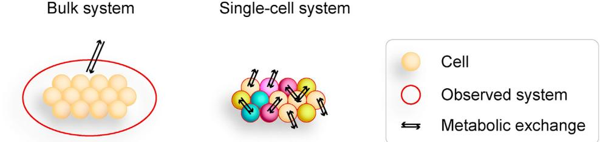
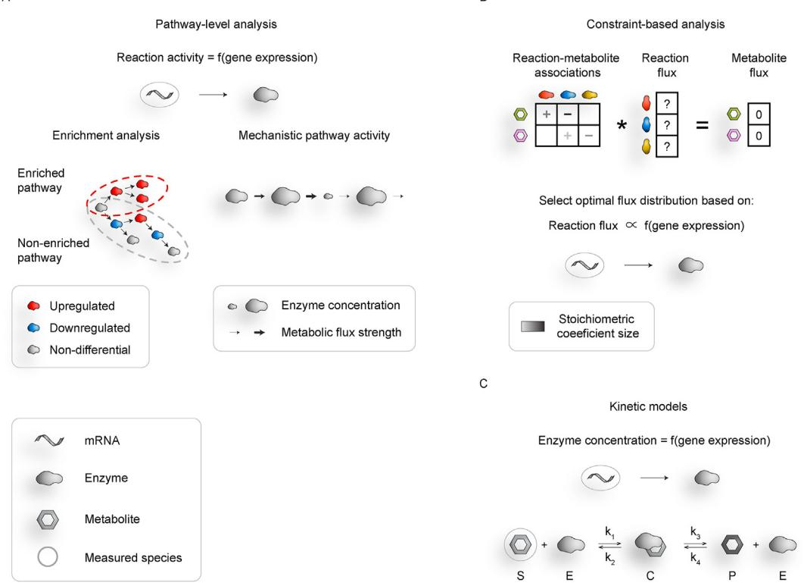
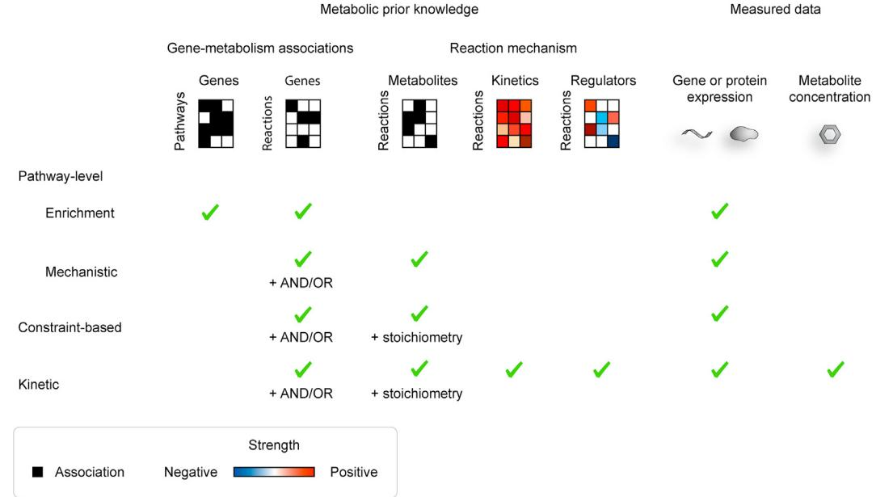
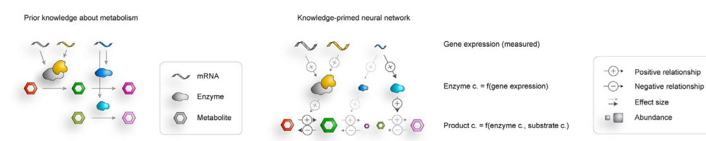

# Toward modeling metabolic state from singlecell transcriptomics

Karin Hrovatin [1](#page-0-0),[2](#page-0-0) , David S. Fischer [1](#page-0-0),[2](#page-0-0) , Fabian J. Theis [1](#page-0-0),[2](#page-0-0),[3](#page-0-1),[*](#page-0-2)

#### ABSTRACT

Background: Single-cell metabolic studies bring new insights into cellular function, which can often not be captured on other omics layers. Metabolic information has wide applicability, such as for the study of cellular heterogeneity or for the understanding of drug mechanisms and biomarker development. However, metabolic measurements on single-cell level are limited by insufficient scalability and sensitivity, as well as resource intensiveness, and are currently not possible in parallel with measuring transcript state, commonly used to identify cell types. Nevertheless, because omics layers are strongly intertwined, it is possible to make metabolic predictions based on measured data of more easily measurable omics layers together with prior metabolic network knowledge.

Scope of Review: We summarize the current state of single-cell metabolic measurement and modeling approaches, motivating the use of computational techniques. We review three main classes of computational methods used for prediction of single-cell metabolism: pathway-level analysis, constraint-based modeling, and kinetic modeling. We describe the unique challenges arising when transitioning from bulk to single-cell modeling. Finally, we propose potential model extensions and computational methods that could be leveraged to achieve these goals.

Major Conclusions: Single-cell metabolic modeling is a rising field that provides a new perspective for understanding cellular functions. The presented modeling approaches vary in terms of input requirements and assumptions, scalability, modeled metabolic layers, and newly gained insights. We believe that the use of prior metabolic knowledge will lead to more robust predictions and will pave the way for mechanistic and interpretable machine-learning models.

2021 Published by Elsevier GmbH. This is an open access article under the CC BY-NC-ND license ([http://creativecommons.org/licenses/by-nc-nd/4.0/)](http://creativecommons.org/licenses/by-nc-nd/4.0/).

Keywords Metabolic modeling; Single-cell RNA-seq; Constraint-based modeling; Kinetic modeling; Pathway analysis

## 1. INTRODUCTION

Multimodal single-cell analysis enables robust studying of single cells across different omics levels that characterize specific cellular processes: DNA sequencing can reveal lineage structure, chromatin accessibility measurements are used to study epigenomic events, and RNA sequencing and protein measurements uncover molecular states of cells that arise during stimulation and development. All of these molecular views of cells are directly observable in high throughput by using specific chemical procedures; therefore, it is not surprising that much of the recent advances in single-cell biology have been centered on these omics layers [[1](#page-8-0)[,2\]](#page-8-1). We want to focus on a less studied area, observing single-cell metabolism. It consists of metabolic reactions necessary for production and degradation of cellular building components and provision of energy [[3](#page-8-2)]. Metabolism lies downstream of other omics and thus summarizes the effects from upstream layers of epigenome, genome, and transcriptome, as well as extracellular effects, such as nutrient depletion. Thus, it provides a very meaningful readout of the cellular phenotype [\[4,](#page-8-3)[5](#page-8-4)] and has been shown to be closely related to disease states or used for developing efficient biomarkers in bulk assays [\[6](#page-8-5)e[8](#page-8-5)].

Single-cell metabolic analysis largely consists of the study of metabolite concentrations in single cells or compartments thereof (metabolome), the study of metabolite fluxes (fluxome), which describe the rates of change of metabolite concentrations, and fluxes through individual reactions governed by enzyme activity. All of them are relevant for modern single-cell biology, which is centered around cell type diversity [[9](#page-8-6)] and cell state transitions [\[10](#page-8-7)]. First, metabolic differences may identify cell state heterogeneity, which is key for understanding tissue function and microbial populations [[11](#page-8-8)e[16](#page-8-8)] as metabolic changes may not be observed in other omics layers. Second, metabolic measurements can be used to decipher metabolic mechanisms of individual cell types, refining the currently available organism-wide metabolic networks. This may be applied to understanding drug target- and side-effects across cell populations, similarly as was done before on bulk-tissue level [\[17](#page-8-9)[,18](#page-8-10)], or understanding the emergence of

1 Institute of Computational Biology, Helmholtz Center Munich, Ingolstaedter Landstraße 1, Neuherberg, 85764, Germany 2 TUM School of Life Sciences Weihenstephan, Technical University of Munich, Alte Akademie 8, Freising, 85354, Germany 3 Department of Mathematics, Technical University of Munich, Boltzmannstr. 3, Garching bei München, 85748, Germany

*Corresponding author. Institute of Computational Biology, Helmholtz Center Munich, Ingolstaedter Landstraße 1, Neuherberg, 85764, Germany.

E-mails: [karin.hrovatin@helmholtz-muenchen.de](mailto:karin.hrovatin@helmholtz-muenchen.de) (K. Hrovatin), david.fi[scher@helmholtz-muenchen.de](mailto:david.fischer@helmholtz-muenchen.de) (D.S. Fischer), [fabian.theis@helmholtz-muenchen.de](mailto:fabian.theis@helmholtz-muenchen.de) (F.J. Theis).

Abbreviations: GEM, genome-scale metabolic model; FBA, flux balance analysis; DNN, deep neural network; scRNA-seq, single-cell RNA-sequencing

Received August 5, 2021 Revision received October 21, 2021 Accepted November 9, 2021 Available online 14 November 2021

<https://doi.org/10.1016/j.molmet.2021.101396>

drug-resistance in individual cells [\[19](#page-8-11)]. Third, metabolite exchange is a key mechanism of cellecell dependence in tissues [[20](#page-8-12)] and interactions between neighboring cells play a vital role in tissue formation and function [\[21](#page-8-13)].

Recent advances in metabolomics techniques have enabled measurements on the single-cell level, as had been recently reviewed [[4](#page-8-3)[,22](#page-8-14)], also with focus on experimental applications [[3](#page-8-2)], spatial metabolomics and proteomics [\[23](#page-8-15)], and multi-omics analysis [[24\]](#page-8-16). However, single-cell metabolomics techniques are still limited, requiring further improvements before becoming widely applicable. Metabolomic measurements are expensive, skill intensive, and need additional improvements in terms of measurement sensitivity and throughput of samples and metabolites [[4](#page-8-3),[20,](#page-8-12)[22\]](#page-8-14). In comparison, the widely-used single-cell RNA-sequencing (scRNA-seq) datasets usually consist of thousands of cells and genes [\[2\]](#page-8-1), while the metabolomic datasets usually consist of a couple of dozen to a couple of hundred metabolites and cells [[3](#page-8-2),[4](#page-8-3)[,22](#page-8-14)[,25](#page-8-17),[26\]](#page-8-18). Thus, they cover only a small proportion of cellular metabolism, may miss rare cell types, and suffer from lower robustness due to the small number of cells, each of which provides a noisy view of the metabolism. Lack of established techniques for simultaneous measurement of metabolome and transcriptome may complicate contextualization in terms of previous transcriptomic studies and thwart cell type annotation, which is usually done on transcriptomic data. Nevertheless, methodological improvements are forthcoming [[3](#page-8-2),[4](#page-8-3)[,22](#page-8-14)[,25](#page-8-17),[26\]](#page-8-18).

Because omics layers are strongly intertwined, the knowledge about omics layers that can be more easily measured in singles cells, such as mRNA, together with prior knowledge about metabolism, enable the prediction of cellular fluxome, metabolome, and reaction fluxes, providing a promising alternative to single-cell metabolomic measurements. This can be used to identify changes in metabolic mechanisms that cause different metabolic states. The modeling of metabolism depends on well-established metabolic network models that provide prior information on feasible metabolic conversions [[27\]](#page-8-19), described in section "Resources for metabolic modeling", and wealth of single-cell sequencing measurements [[28](#page-8-20)e[30\]](#page-8-20) used to define constraints specific for the biological context [\[31](#page-8-21)]. Concept-wise, modeling single-cell metabolism rather than bulk modeling ([Figure 1](#page-1-0)) poses additional challenges that have led to the development of new metabolic modeling paradigms. First, models need to scale to a large number of cells. Second, the joint modeling of multiple similar or potentially nearby and communicating cells enables sharing of parameters across cells. This may increase robustness, which is important when using noisy scRNA-seq data; however, cells are known to have different metabolic functionality [[3](#page-8-2)], which must be accounted for in the modelling assumptions. Third, metabolite exchange plays an important role within cell populations [\[32](#page-8-22)], which results in metabolite availability dependencies between cells and violates common independence assumptions used in other branches of single-cell modelling. We review and compare approaches for computational single-cell modeling of cellular metabolism based predominantly on transcriptomic data.

## 2. RESOURCES FOR METABOLIC MODELING

Prior knowledge for metabolic modeling includes genome-scale metabolic models (GEM) and metabolic pathway collections, which are available in large, curated databases. Metabolic pathway collections summarize reactions into pathways [[33\]](#page-8-23). Genome-scale metabolic models provide systematic encoding of gene-protein-reactionmetabolite and gene-protein-transport-metabolite associations that describes the entire metabolism of an organism [[27,](#page-8-19)[34](#page-8-24)e[37\]](#page-8-24). While pathway databases are mainly used for interpretation, the GEMs allow the prediction of metabolism on a system-wide level. However, both usually encompass the whole spectrum of possible metabolic conversions [[27,](#page-8-19)[38](#page-9-0)e[40\]](#page-9-0) that do not jointly occur in individual cells.

The most widely used pathway repositories are KEGG [\[41](#page-9-1)], Reactome [[42\]](#page-9-2), and MetaCyc [\[43](#page-9-3)], as reviewed in [[33\]](#page-8-23). Genome-scale metabolic models can be obtained from BiGG [[44\]](#page-9-4), BioModels, and other repositories listed in [\[27\]](#page-8-19). The modelling of human metabolism often relies on GEMs [[27,](#page-8-19)[45](#page-9-5)e[47\]](#page-9-5) from Recon [[37\]](#page-9-6) and Human Metabolic Reaction series [[48\]](#page-9-7) and the resources are being constantly improved [[49\]](#page-9-8). GEMs can be also constructed de novo from KEGG or other resources and are often updated with manual curation [[20,](#page-8-12)[46](#page-9-9)[,50](#page-9-10)]. To enable comparison and knowledge integration across resources, standardization efforts are needed [[44,](#page-9-4)[51\]](#page-9-11). To leverage the available resources the metabolic modelling tools should be able to accept as input different models in standard format, such as MAT (mat) or SBML (xml) for GEMs.

Measured metabolite concentrations from specific reference tissues may be used as validation data for computational modeling. Such datasets can be obtained from specialized databases, including MetaboLights [[52\]](#page-9-12) and Metabolomics Workbench [\[53](#page-9-13)]. Because of potential difficulties of measuring cell level heterogeneity of metabolism, another validation option are also bulk expression or metabolic datasets from systems with environmental or genetic perturbations with known effects on metabolism.

# 3. MODELLING APPROACHES

We identified three main classes of methods used for prediction of metabolism on the single-cell level [(Figure 2](#page-2-0)): (A) pathway-level analysis, which derives pathway phenotype-associations or activity from gene expression information of associated genes and in some

Figure 1: Bulk versus single-cell analysis. Bulk analysis assumes that cells are identical and can model the exchange between cells and environment. Single-cell analysis accounts for cellular heterogeneity and can model exchange between different cells and between individual cells and environment.

Figure 2: Metabolic modelling approaches. (A) Pathway-level analysis assumes that gene expression maps directly to enzyme concentration or reaction activity. It can be used for defining pathways enriched in differentially expressed genes or for calculating the activity of individual pathways by propagating activity through the pathway (mechanistic pathway analysis). (B) Constraint-based analysis assumes that metabolite concentrations are constant and based on this defines possible fluxes that would result in such a system, as further described in the main text. Namely, metabolite fluxes, which are constrained to be zero, are obtained by multiplying reaction fluxes with the stoichiometric matrix that defines metabolite conversions involved in each reaction. This gives an undetermined system of equations that defines possible reaction flux distributions. Optimal flux configuration is then selected based on optimization objectives, such as correspondence between gene expression and enzyme activity. (C) Kinetic models predict metabolic changes based on detailed prior metabolic knowledge and information on metabolite and enzyme availability. Gene expression can be used for the prediction of enzyme concentration.

cases includes pathway topology, (B) constraint-based modelling that aims to predict complete cellular metabolome and reaction activities based on gene expression and reaction stoichiometry information from GEMs, and (C) kinetic models, which use highly parameterized systems of differential equations informed with measured data to predict metabolite concentrations of well characterized systems.

#### 3.1. Pathway-level analysis

Pathway-level analysis [(Figure 2](#page-2-0)A) predicts pathway activity or phenotype-associations directly from differential expression or occasionally normalized expression information of pathway-associated metabolic genes, sometimes including pathway topology. It is focused on individual pathways rather than the whole metabolism, and it does not account for reaction mechanisms, such as stoichiometry or metabolite abundance. There are many available tools for pathway analysis, as the methods designed for bulk can be in most cases directly applied to singlecell data. To rely on bulk data workflows and to reduce the sparsity the analysis is often performed on pseudobulk data [\[54\]](#page-9-14). In this review we focus on approaches that were developed for scRNA-seq data.

Currently, differential expression analysis followed by pathway enrichment is the most commonly used method for metabolic analysis based on scRNA-seq data [\[20](#page-8-12)[,55](#page-9-15)], and uses general purpose enrichment methods [\[56](#page-9-16)e[58\]](#page-9-16). Alternatively, pathway activity can be inferred from gene expression of pathway-associated genes [[14,](#page-8-25)[59](#page-9-17)[,60](#page-9-18)].

Pathway-level analysis, as described above, has a few shortcomings. First, the curated pathway definitions aim to capture the whole biological process under different biological contexts, disregarding complex regulatory interplay, and thus contain more genes than are involved in any specific cellular state or type [[39,](#page-9-19)[40\]](#page-9-20). Predefined pathways may be composed of genes responding to perturbation in different directions, leading to false negatives in enrichment analysis, which could be solved by defining context-specific pathways [\[45](#page-9-5)]. Second, pathway enrichment does not account for biological changes spanning multiple pathways [\[40](#page-9-20)] and does not leverage the information about regulatory and reaction interactions. For example, the activity of the whole pathway depends on the activity of all enzymes in the chain with downregulation of intermediate enzymes potentially resulting in metabolic bottlenecks that lead to lower pathway activity even when other enzymes are highly active. Methods that incorporate pathway topology information or enable data-driven pathway discovery had been developed [[61](#page-9-21)e[66\]](#page-9-21). For example, to pinpoint critical genes and metabolites scMetNet [[39\]](#page-9-19) constructs a metabolic network based on KEGG and then finds submodules with significant differential expression across cell populations. Similarly, scPPIN was developed for identification of differentially active modules in proteineprotein interaction networks based on scRNA-seq data [[67\]](#page-9-22), but may be also applicable to metabolic networks. Another alternative is reporter metabolite analysis, such as perturb-Met, which aims to identify

# Review

affected metabolites by analyzing changes in expression of metaboliteassociated genes [[40\]](#page-9-20).

#### 3.2. Constraint-based modelling

#### 3.2.1. Background

Steady-state constraint-based methods are the most widely used group of metabolic modeling approaches for large-scale systems [[68](#page-9-23)e [70](#page-9-23)]. They assume, due to the separation of omics layers time scales, that metabolism is in a quasi-steady-state versus expression and other longer-term processes, and then search across reaction flux configurations that all yield this steady-state system, selecting one that maximizes some objective function based on prior biological knowledge about the system ([Figure 2B](#page-2-0)). The quasi steady-state assumption is supported by the following reasoning: The traditional view on cellular metabolic systems is that metabolites are in mass balance, which means that metabolites are converted into each other such that all molecular mass is accounted for. To maintain this system, cells require external sources of energy and starting products and disposition mechanisms for end products. Because metabolic reactions are very fast, occurring in milliseconds, compared to enzyme gene expression, operating on the scale of tens of minutes [\[71](#page-9-24)], the reactions reach equilibrium relatively quickly, leading to metabolic steady-state in most situations.

Constraint-based methods rely on system-wide information about stoichiometry, thermodynamics, and gene-associations of reactions, which are provided by GEMs [\[27](#page-8-19)]. Among the most widely used constraint-based metabolic modeling methods is flux balance analysis (FBA), in which the metabolic network is encoded by stoichiometric matrix (S) of metabolites (rows) and reactions (columns). The reaction fluxes (v) are obtained by assuming a steady-state of the system where metabolite concentrations (dx=dt) do not change, namely:

# Sv ¼ dx=dt ¼ 0

As the system of Sv ¼ 0 contains fewer equations (number of metabolites, over 8,000 in human [\[49](#page-9-8)]) than variables (number of reaction fluxes, with over 13,000 reactions in human [\[49](#page-9-8)]) this approach results in an underdetermined system with a whole subspace of possible flux distributions. In many cases, a single solution can be recovered with linear programming based on an optimization objective, which relies on prior knowledge about the system [[68,](#page-9-23)[69,](#page-9-25)[72](#page-10-0)[,73](#page-10-1)].

The modeling objectives, used for selection of a single reaction flux configuration, fall into two categories. On the one hand, some objectives are based on general assumptions about cellular purpose, such as maximal growth rate, ATP production, or combination thereof that may better correspond to the cell behavior [\[38](#page-9-0)[,46](#page-9-9)[,68](#page-9-23)]. On the other hand, some models rely on system-specific data, such as RNAsequencing, partial metabolomics measurements, or information from literature. Measurement-based objectives are of great use when theory-based biological objective is unknown or simple objectives, such as growth maximization, are not applicable due to the complexity of the system [[45,](#page-9-5)[46,](#page-9-9)[69](#page-9-25)[,72](#page-10-0)[,74](#page-10-2)]. Integration of measured data, such as from scRNA-seq, enables context-specific predictions, such as for specific cell type, developmental stage, or patient [[27,](#page-8-19)[38\]](#page-9-0). These constraints can be accounted for in linear programming in different ways, including by adjusting GEMs or reaction rate boundaries, by enforcing fluxes to follow omics measurements, or by redistributing fluxes from reactions with low to reactions with high omics-activity support [\[50](#page-9-10)[,69](#page-9-25),[72](#page-10-0)].

# 3.2.2. Constraint-based modeling applied to scRNA-seq data

There are currently two main approaches for scRNA-seq constraint-based metabolic modeling, namely FBA and GEM-informed deep neural network (DNN) models. Multiple methods have been proposed to adapt FBA to single-cell inference. The simplest approach is the construction of context-specific GEMs based on scRNA-seq data, followed by classical FBA on each context-specific GEM, as proposed by [[75](#page-10-3)], using specific metabolite production as the optimization objective. Another option is MERGE, which optimizes for reactions with lowly expressed genes carrying less flux and vice versa as well as for low overall flux [\[50](#page-9-10)]. Moreover, Compass [[45](#page-9-5)] first computes maximal theoretically possible flux through each reaction and then selects flux configuration that reduces reaction penalties inversely proportional to gene expression. scFBA computes maximal theoretically possible fluxes, uses scRNA-seq data to add an additional constraint on possible flux distributions, and selects optimal flux distribution based on maximal biomass production [\[46](#page-9-9)].

A complementary approach was implemented in scFEA [\[20](#page-8-12)], which models the metabolic map with a graph neural network. The GEM is encoded into a directed factor graph with reaction modules as variables (unknown quantity or random variable), intermediate metabolites as factors (function of variables), and directed edges indicating substrate and product relationships. scFEA trains the network to learn reaction fluxes from scRNA-seq input so that the metabolite flux imbalance is minimized. Additional loss components are added to discourage negative reaction fluxes and to promote correspondence between reaction fluxes and gene expression in order to evade the trivial solution of zero-reaction-fluxes. The interpretable DNN structure and predictions can be directly used for reasoning about cellular metabolism. Higher weights of a gene indicate stronger impact of gene expression variation onto predicted reaction flux, corresponding to rate limiting reactions. Furthermore, pathways with high metabolite flux imbalance may indicate metabolic stress.

The presented models make different assumptions about cellular metabolism. For example, some methods use RNA-seq data as a constraint and optimize for maximization of cellular growth, while others optimize solely based on the agreement with scRNA-seq data. In FBA-based methods the metabolic steady-state assumption is enforced., while in scFEA it is used as a component of the optimization objective. Furthermore, scFEA and scFBA assume that cells exchange metabolites, sitting in a well-mixed environment, and thus solve the metabolic model jointly for all cells [[20,](#page-8-12)[46\]](#page-9-9).

One of the key challenges is the mapping from gene expression to enzyme activity, which is handled differently across the methods. First, the mapping should ideally be gene-specific due to different gene translation and enzyme kinetic rates [[46\]](#page-9-9) and cell state-specific due to the influence of the intracellular environment on enzyme kinetics [\[20\]](#page-8-12). Both these challenges may be resolved by DNN models that can learn reaction-specific mapping, as done in scFEA, and by integrating additional cell state specific prior knowledge [[20\]](#page-8-12). Second, the mapping should be modeled as a nonlinear function in accordance with MichaeliseMenten kinetics, which was approximated with multiple neural networks layers in scFEA [[20\]](#page-8-12). The mapping is complicated by enzyme isoforms (OR relationship) and complexes (AND relationship) [[45,](#page-9-5)[46\]](#page-9-9). Third, gene expression and enzyme activity may not correspond both due to technical artefacts and differences in half-lives across omics-layers [\[76](#page-10-4)]. Thus, the minimization of the flux through reactions with lowly-expressed genes is less prone to false negatives than pruning of the GEM based on a fixed expression threshold. One should not penalize highly expressed genes if they have low flux in reactions with low substrate availability [\[50](#page-9-10)].

An important aspect of single-cell metabolic modeling in contrast to bulk is to overcome noise and sparsity of the scRNA-seq input, which can be achieved in multiple ways. The most common approach is to share information across cells, either by using pseudobulk, by sharing flux distribution information across similar cells, or by jointly modelling metabolism of all cells [\[20](#page-8-12),[45](#page-9-5)[,75](#page-10-3)]. Data can be also pooled across genes by modeling pooled reaction modules rather than individual reactions or by assuming that neighboring genes affect each other and thus share information on expression variation among them. The definition of unexpressed genes used for GEM pruning is affected by false positives due to dropout in scRNA-seq data. This can be mitigated using statistical methods or matched bulk expression data [[20](#page-8-12)[,46](#page-9-9)].

Due to the growing dataset sizes [[28](#page-8-20)e[30](#page-8-20)], the methods must be compute-efficient. Two core paradigms of computational efficiency appear. First, the number of metabolic states may be reduced from the full number of metabolites and compartments to a more coarse metabolic network by reaction pooling, removing reactions predicted to be inactive based on expression data, or modelling only a reaction subset, such as core metabolism [[20](#page-8-12)[,45](#page-9-5),[46\]](#page-9-9). Second, inference procedures have to scale to many observations as there are often thousands or millions of cells, which lies many orders of magnitude above what is typically considered in bulk. A common sped-up technique is the pooling and per-group-modelling of similar cells [[20](#page-8-12)[,46](#page-9-9),[50](#page-9-10)[,75](#page-10-3)].

Overall, the field of single-cell constraint-based modeling is quickly expanding and systematic benchmarks will be needed to recommend the best modelling choices. Among the FBA-based methods, Compass stands out due to its modelling choices and user friendliness. DNN methods promise greater model flexibility and desirable scaling properties, therefore, scFEA represents an interesting alternative.

#### 3.3. Kinetic models

Kinetic models have different applications. First, kinetic models can be used for quantitative instead of relative predictions of the effects of environmental and parameter value perturbations. They solve a set of differential equations with detailed kinetic and regulatory information starting from a predefined initial metabolic state, characterized by defined enzyme and metabolite concentrations [(Figure 2C](#page-2-0)). This stands in contrast to FBA for example, which does not require any metabolite concentration input. However, concentration and kinetic parameter information is scarce, which makes kinetic models largely inapplicable for modeling of larger systems [\[68](#page-9-23),[74,](#page-10-2)[77,](#page-10-5)[78\]](#page-10-6). This is further complicated in single-cell systems as kinetic parameters can differ between cells due to different intracellular environments, such as pH and cofactor availability [\[79](#page-10-7),[80\]](#page-10-8). Second, model selection and covariate modelling on top of kinetic models can be used to understand metabolic mechanisms that lead to a certain metabolic state [\[68\]](#page-9-23). For example, genetic variations that cause subtle changes in enzyme activity can be accounted for in such kinetic models but go undetected in constraint-based models [\[81](#page-10-9)]. Third, the modeled time-resolved metabolite concentrations in response to stimuli are of interest in many cases. In contrast to temporal insight that can be obtained from single-cell time-series measurements, that are usually spaced hours or days, kinetic modeling enables prediction on a much quicker timescale of metabolism, starting from an initial measured metabolic state. Furthermore, kinetic models solve differential equation systems in time and therefore do not rely on the steady-state assumption. Thus, they present an alternative to constraint-based modeling when steady-state assumption does not hold [[68,](#page-9-23)[82\]](#page-10-10), as described in [\[83](#page-10-11)].

A kinetic model that can leverage scRNA-seq data for estimation of enzyme concentrations was proposed by [[78\]](#page-10-6). Their method enables efficient prediction of metabolic changes based on changes in kinetic parameters. They model the product concentration using gaussian mixture models. The model consists of reaction catalysis terms, which are conditioned on enzyme concentration that can be informed with single-cell measurements. The combination of kinetic models and measured data can also be used for inference of sample-specific kinetic parameters that determine reaction dynamics [\[81](#page-10-9)]. Such samplespecific kinetic parameters can be used to understand kinetic heterogeneity across tissues, thus extending efforts to characterize tissue heterogeneity through single-cell phenotypes in cellular atlases. An example for such a tissue-level phenotype is the exchange of metabolites between cells that mitigates the diseased phenotype of affected cells in X-inactivation-linked enzyme heterozygosity in females [[84\]](#page-10-12). A kinetic model of RNA splicing has recently been directly fit on RNA-seq data in the context of RNA velocities [[85\]](#page-10-13). This RNA velocity model infers the kinetic parameters of transcription, splicing, and degradation from measured un-spliced and spliced read abundances of single cells in different gene expression states.

#### 3.4. Discussion

#### 3.4.1. Method comparison

The three classes of metabolic modeling approaches aim to answer different questions and thus use different techniques [(Table 1](#page-5-0)). Their predictions range in size, from a single reaction to the whole metabolism, and in coarseness, from direct mapping between measured gene expression and predicted enzyme activity to detailed metabolic characterization of the whole system. Kinetic modelling is focused on robust characterization of small systems, enabling mechanistic, quantitative and often dynamic predictions. In contrast, pathway-level analysis compares activities of multiple pathways across conditions. It does not account for reaction mechanisms, such as stoichiometry or metabolite abundance, and is thus often regarded as less robust. The analysis of reaction networks can also serve as an interpretation method for results from other metabolic modeling methods, such as constraint-based models. Constraint-based models provide characterization of complete cellular metabolism based on GEMs.

The methods also differ in the resource requirements ([Figure 3)](#page-6-0) and assumptions. In terms of increasing complexity, the approaches are usually viewed in the following order: pathway-level analysis, followed by constraint-based, and lastly kinetic modelling. First, pathway level analysis relies on curated pathway-gene association sets or networks. Thus, it is often applicable to less characterized organisms, where complete GEMs or kinetic parameters are not available, and might also require less compute-resources. Pathway-analysis methods developed for bulk level can be often applied to single-cell data, resulting in a large set of available methods. Second, constraint-based modelling requires GEMs, whose number is however growing [\[27](#page-8-19)]. We expect that constraint-based deep learning models will, in the future, enable scaling to large datasets, integration of additional metabolic and multiomics constraints, and extension to dynamic or tissue-level models. Constraint-based models rely on the steady-state assumption, making them inappropriate when this assumption does not hold. Third, kineticmodeling requires detailed kinetic information, making them inappropriate for large systems. Methods for constraint-based and kinetic modeling can usually not be directly transferred from bulk to single-cell level, requiring the development of new approaches or adaptation of existing ones.

| The interpretability. results and assumptions, modelling assumptions. resolutions, cellular additional scales, have and may layers methods metabolic and ones modeled general in differ are assumptions methods The summarized methods. modelling here The 3. metabolic Figure in different described | individual cells to Applied post-processing require summarization Results Assumptions layer Metabolic to or individual reactions Applicable pathways metabolism whole to Applicable insight Gained | not Usually already as pathway-level is not information available Usually mass or pathways are for reaction sometimes pathways accounts within disregards approximately that independent; associations assumes balance Often rarely metabolites Reactions, Yes Yes activity data or pathway pathways pathways; | to necessary pooled resources often the compute but reduce Yes, are analysis thus exploratory results and applied of pathway-level or level metabolites as reactions analysis often in the Yes; on is of mass availability and steady-state assume may substrates Metabolite balance; all and metabolites Reactions No reduce resources to simplified compute necessary often but Yes, the predictions sometimes concentrations metabolic and fluxes | Yes small to systems due No, assume Michaelis may and kinetics; balance eMenten Mass and metabolites Reactions Yes not Usually under fluxes or time reaction and |
|----------------------------------------------------------------------------------------------------------------------------------------------------------------------------------------------------------------------------------------------------------------------------------------------------------------------------------------------------------------------------------------------------------------------|----------------------------------------------------------------------------------------------------------------------------------------------------------------------------------------------------------------------------------------------------------------------|----------------------------------------------------------------------------------------------------------------------------------------------------------------------------------------------------------------------------------------------------------------------------------------------------------------------------------------------------------------------------------------------------------------------------------|---------------------------------------------------------------------------------------------------------------------------------------------------------------------------------------------------------------------------------------------------------------------------------------------------------------------------------------------------------------------------------------------------------------------------------------------------------------------------------------------------------------------------------------------------------------------------------------------------------------------------------------------|---------------------------------------------------------------------------------------------------------------------------------------------------------------------------------------------------------------------------------------------|
| from are inputs gained                                                                                                                                                                                                                                                                                                                                                                                      |                                                                                                                                                                                                                                                                      |                                                                                                                                                                                                                                                                                                                                                                                                                                  |                                                                                                                                                                                                                                                                                                                                                                                                                                                                                                                                                                                                                                             |                                                                                                                                                                                                                                             |
|                                                                                                                                                                                                                                                                                                                                                                                                                      |                                                                                                                                                                                                                                                                      |                                                                                                                                                                                                                                                                                                                                                                                                                                  |                                                                                                                                                                                                                                                                                                                                                                                                                                                                                                                                                                                                                                             |                                                                                                                                                                                                                                             |
|                                                                                                                                                                                                                                                                                                                                                                                                                      |                                                                                                                                                                                                                                                                      |                                                                                                                                                                                                                                                                                                                                                                                                                                  |                                                                                                                                                                                                                                                                                                                                                                                                                                                                                                                                                                                                                                             |                                                                                                                                                                                                                                             |
|                                                                                                                                                                                                                                                                                                                                                                                                                      |                                                                                                                                                                                                                                                                      | enriched defined of List                                                                                                                                                                                                                                                                                                                                                                                                | Whole-system reaction metabolite of                                                                                                                                                                                                                                                                                                                                                                                                                                                                                                                                                                                                | model setting; parameter through predictions Metabolite different                                                                                                                                                         |
| method Insights in differences e 1 Table                                                                                                                                                                                                                                                                                                                                                           |                                                                                                                                                                                                                                                                      | analysis Pathway-level                                                                                                                                                                                                                                                                                                                                                                                                        | analysis Constraint-based                                                                                                                                                                                                                                                                                                                                                                                                                                                                                                                                                                                                                | models Kinetic                                                                                                                                                                                                                           |

#### 3.4.2. Pros and cons of metabolic modeling

The main reason for the popularity of metabolic modeling is its greater accessibility compared to metabolic measurements as well as the clear availability of biochemical knowledge versus, for example, gene regulation models. For example, single-cell metabolomics are focused on measuring metabolite concentrations with large-scale fluxome measurements being mainly out of reach [\[46](#page-9-9)[,86](#page-10-14)[,87](#page-10-15)]. However, computational methods enable prediction of metabolic fluxes, which, in contrast to metabolite concentrations information, enable identification of cellular mechanisms that lead to specific metabolomic phenotypes [\[87](#page-10-15)]. With increasing availability of single-cell datasets the scientific community has realized the importance of cross-study analysis, thus shifting from analysis of individual datasets to analyses of integrated cellular atlases [[30,](#page-8-26)[88,](#page-10-16)[89\]](#page-10-17). However, metabolomic measurements are still poorly comparable across studies due to the lack of firmly-established analysis methods [\[22\]](#page-8-14). In contrast, metabolic modelling mainly relies on scRNA-seq data, for which normalization and integration techniques are well-established [\[88](#page-10-16)[,90](#page-10-18)], increasing the comparability across studies. Generation of new single-cell metabolomic datasets will lead to the development of analysis techniques, similarly as had happened in bulk metabolomics [\[91\]](#page-10-19).

The integration of prior knowledge from curated metabolic resources used in computational modeling can bring new insights into metabolic mechanisms and causal relationships, compared to raw metabolic measurements, as described below [\[20](#page-8-12)[,27](#page-8-19)[,35](#page-8-27),[38,](#page-9-0)[65,](#page-9-26)[77](#page-10-5)[,92](#page-10-20)e[94\]](#page-10-20). First, metabolic modeling can provide mechanistic insights into perturbation effects. In terms of single-cell applications this can be used for understanding of molecular mechanisms that lead to disease development. This information can be used for the design of drugs targeting specific metabolic steps. Moreover, the understanding of single-cell metabolism across cell types and tissues can be useful for prediction of drug side effects. Metabolic modeling can be also used to identify genes that can be targeted by metabolic engineering for increased production. Second, metabolic modelling can be used for prediction of interactions between cells, organisms, and the environment. This includes both availability and exchange of nutrients as well as production of signaling molecules. Third, metabolic modeling can be used for prediction of essential enzymes and functional annotation of genomes. It can provide insight into metabolic adaptations and capacities of cells, strains, and organisms. Similar reasoning as outlined above also applies to the understanding of measurements of higher omics layers, whose changes may be hard to interpret in terms of cellular phenotype as they affect distant parts of metabolic network or since alterations in different genes lead to the same phenotype. These effects can be again better understood by integrating prior information on metabolic interactions from metabolic networks [[20,](#page-8-12)[45\]](#page-9-5).

However, metabolic modeling is limited by inconsistencies between transcriptomic level, used as input, and metabolic level, which the methods aim to predict. For example, metabolic changes may not be captured by RNA-sequencing due to their shorter half-lives compared to transcriptional regulation or due to posttranscriptional stochasticity. Similarly, metabolic function may be affected by post-translational or post-transcriptional regulation, effects of degradation, and exogenous factors, such as nutrient availability, that are not reflected on transcriptomic level [\[20](#page-8-12)[,31](#page-8-21)[,45](#page-9-5),[46,](#page-9-9)[78\]](#page-10-6). Nevertheless, the integration of prior information from metabolic networks may mitigate these negative effects compared to transcriptomic analysis alone. For example, scRNA-seq sparsity may lead to stochastic capture of lowly expressed genes, resulting in false positives. However, RNA-sequencing countnoise may be overcome by integration of prior knowledge of metabolic networks, providing a denoised view of the metabolism [\[20](#page-8-12)[,31](#page-8-21),[45](#page-9-5)].

Figure 3: Inputs across modelling approaches. Modelling approaches require different information about geneereaction associations, reaction mechanisms, and measured data. This figure shows only the most commonly used inputs, although different input information may be also incorporated in the models.

## 4. PERSPECTIVES

While a range of approaches for modeling cellular metabolic state have been proposed, a set of limitations restricts larger applicability. Here, we outline a series of potential extensions to address these.

#### 4.1. Multi-omics integration

Currently, single-cell metabolic models are based mainly on mRNA concentration. The measurement and modeling of molecular entities that are chemically more directly related to metabolite concentrations could improve current models. For example, this information could be used to make RNA to enzyme activity mapping more reliable or to inform reaction activity constraints and kinetics [[27,](#page-8-19)[31,](#page-8-21)[46\]](#page-9-9). Single-cell proteomics measurements could be used instead of transcriptomic data as they are more informative for prediction of enzyme activity. They directly correspond to enzyme availability and enable detection of posttranslational modifications that are key in determining enzyme function [\[95](#page-10-21)e[97](#page-10-21)]. However, despite recent advances in single-cell proteomics there are still limitations in terms of availability, throughput, and sensitivity [[95,](#page-10-21)[98](#page-10-22)e[100](#page-10-22)], which largely prohibit the use of single-cell proteomics in single-cell metabolic modeling. The used input data modality types dictate suitability of different modeling approaches. Namely, constraint-based systems are relevant if one can quantify reaction rates via enzyme concentration, for example from gene expression data. On the other hand, direct observations of metabolite species may result in models that are more akin to data imputation algorithms. More complex prior knowledge may require strong algorithmic changes of the models. Flux balance analysis, for example, centrally rests on a linear program. Deviations from mathematical assumptions inherent in this linear program would require a shift to a completely different parametric system and optimizer.

Similarly, inclusion of regulatory mechanisms would result in more reliable predictions [\[31](#page-8-21),[69,](#page-9-25)[72,](#page-10-0)[101](#page-10-23)]. This is of especial interest due to increasing availability of paired multi-omics datasets [[1](#page-8-0)], such as joint scRNA-seq and scATAC-seq. To integrate regulatory information the models may need to account for complex interactions between entities, such as feedback loops [[46\]](#page-9-9). As long as GEMs containing additional regulatory information are not yet available, one could try to leverage machine-learning to identify interactions between genes that may approximate the complex regulatory patterns in a data-driven manner.

## 4.2. Extensions of metabolic models across scales

Another direction for development of novel constraint-based models is adaptation to different systems. For example, eukaryotic cells are partitioned into metabolically different compartments with distinct metabolite exchange pathways between them, which could be included in the models. The necessary information on compartmentspecific and exchange reactions is already included in some GEMs [[37,](#page-9-6)[102](#page-10-24)]. Furthermore, proteomic measurements with subcellular resolution [\[23](#page-8-15),[98\]](#page-10-22) could further aid in improving predictions on subcellular level. Similarly, cells are not independent and exchange metabolites within tissues or microbial communities. Thus, the models could be extended to tissue-level, microbial-community-wide, and environment-aware systems [[27,](#page-8-19)[31\]](#page-8-21). Some currently available methods have already tried to go into this direction by modeling the availability of extracellular metabolites or assuming metabolite-sharing across cells [[20,](#page-8-12)[46](#page-9-9)[,50](#page-9-10)[,102\]](#page-10-24). In this respect, attention-DNNs, or in case of spatial data graph-DNNs, could be used for passing information across cells [\[103\]](#page-10-25). However, most deep learning frameworks developed for other single-cell data modalities treat cells independently because the models' scalability often crucially depends on this independence assumption. Many common deep learning approaches are limited in their ability to reflect dependencies between cells.

Changes of cellular metabolism through time are of great interest as they are involved, among others, in development, disease progression, environmental responses, and cyclic behavior. In terms of metabolic changes, these phenotypes are realized on vastly different time scales. First, development and disease progression occur over hours or months, resulting in changes in cell state or cell type composition. While these processes match the temporal resolution of common

# Review

Figure 4: Knowledge-primed neural networks. (A) Prior knowledge about genes encoding enzymes and enzymes catalyzing metabolite conversions. (B) Neural network architecture can be based on metabolic knowledge. Different omics layers can be represented by different components or layers of the neural network so that connections between nodes correspond to prior metabolic knowledge.

single-cell experiments, time-series modelling in single-cell data poses a challenge since individual cells are not measured through time. Instead, data is generated by obtaining separate population snapshots across time-points, which are usually used to infer a typical trajectory of cellular progression and matched pseudotime. However, this trajectory does not reveal dynamic behavior of individual cells [[10,](#page-8-7)[104](#page-10-26),[105\]](#page-10-27). This static characteristic of the time-trajectory data corresponds well to dynamic FBA modelling, which solves a steadystate system for each time point based on time point-specific measurements [[68,](#page-9-23)[82](#page-10-10)[,106\]](#page-10-28), thus generating a transcriptome-matched metabolic snapshot. In contrast, kinetic models may be used for prediction of cell fate of individual cells, similarly as is done in the dynamic RNA-velocity model [\[85](#page-10-13)]. Finally, DNN architectures, such as recurrent-DNNs, could be used for time-dependent models [[107\]](#page-10-29). Second, response to stimuli on metabolic level can occur almost instantaneously, which is not captured by commonly used single-cell methods such as scRNA-seq. In this respect, kinetic models may be used for prediction of short-term metabolic changes of individual cells starting from an initial measured state [[68,](#page-9-23)[82](#page-10-10)].

#### 4.3. Deep-learning based models

Metabolic concentrations and fluxes can be thought of as latent states of a multi-omics molecular system of a cell ([Figure 4](#page-7-0)). In terms of latent variable modelling, DNNs have recently emerged as a set of models that can flexibly deal with constraints, integration of different data modalities, and quantitative predictions, making them a promising candidate for development of new metabolic modelling tools. First, DNNs can scale to large datasets currently generated in the single-cell field [[88,](#page-10-16)[108](#page-10-30),[109\]](#page-10-31). Moreover, the use of large datasets will contribute to model regularization and thus more reliable predictions [\[30](#page-8-26)]. Second, the flexibility of the DNN structures enables the integration of diverse biological prior knowledge [\[108,](#page-10-30)[109](#page-10-31)], which is necessary for the above-described extensions of metabolic modelling approaches. Third, DNNs are capable of learning patterns from data [[109](#page-10-31),[110\]](#page-10-32), which may lead to improved models even when biological mechanisms that could be used for constraining the model are not completely defined. Lastly, deep learning frameworks provide a convenient way for construction of new DNN models by abstracting mathematical and technical details [\[109\]](#page-10-31), significantly improving over currently used linear programming libraries used in FBA for example.

#### 4.4. Interpretation of metabolic data

The advent of single-cell metabolomic measuring techniques and computational prediction methods will require development of downstream analysis and interpretation approaches for metabolomic and fluxomic data. Many analysis ideas could be transferred from current single-cell omics analysis workflows, such as the ones developed for scRNA-seq [[55,](#page-9-15)[90,](#page-10-18)[111](#page-10-33)e[113\]](#page-10-33). However, prior knowledge of metabolic networks - a unique characteristic of metabolic data compared to other omics - should be leveraged for interpretation, leading to development of new analysis approaches [\[31](#page-8-21)[,65](#page-9-26)]. Currently the cross-study contextualization of metabolic activity by tissue-domain specialists is often challenging due to the lack of metabolic characterization of tissues in single-cell resolved studies. Thus, shifting focus from genes to reactions would aid in metabolic interpretation.

#### 5. CONCLUSION

In many signaling cascades, metabolism is the last omics layer that pools effects from higher omics layers and thus directly defines the cellular phenotype. Metabolic analysis has a large set of applications in all fields of biology, from medicine to bioprocess engineering. Because metabolic measurements are not yet widely available other approaches for understanding cellular metabolism are required. Here, metabolic modeling infers latent molecular states from widely available information about reaction networks and scRNA-seq data to predict reaction activities and metabolic concentrations.

Since single-cell data have different characteristics than bulk and provide additional insights into context-specific behaviors, new approaches for single-cell metabolomic modelling are to be anticipated. A diverse set of metabolic modelling approaches, as reviewed here, has been applied to single-cell data. We believe that new computational approaches, such as deep learning, may enable efficient modelling at single-cell and multi-omics level.

Single-cell metabolomic modeling will lead to new insights from existing single-cell sequencing data. First, the metabolic network information that is already integrated in the modelling approaches enables interpretation of results in terms of metabolic pathways or molecular function. Second, the use of prior knowledge about molecular networks increases robustness of predictions, which may be thus used to generate more reliable single-cell embeddings. Third, kinetic models could be used for prediction of swift perturbation responses that cannot be directly captured with single-cell sequencing techniques.

Computational methods used for metabolic analysis are informed by extensive and high-fidelity prior knowledge of metabolic networks, which is a unique feature of the metabolic modality. Machine-learning models developed for the analysis of single-cell metabolism could lay the foundation for the development of further interpretable machinelearning methods for molecular data.

#### AUTHOR CONTRIBUTIONS

Karin Hrovatin: Conceptualization; Writing - Original Draft, Review, and Editing; Visualization.

David S. Fischer: Conceptualization; Writing - Review and Editing. Fabian J. Theis: Conceptualization; Writing - Review; Supervision; Funding acquisition.

# ACKNOWLEDGEMENTS

This work was supported by the Helmholtz Association under the joint research school Munich School for Data Science - MUDS [for K.H.], Add-on Fellowships for Interdisciplinary Life Science from Joachim Herz Foundation [to K.H.], German Research Foundation (DFG) fellowship through the Graduate School of Quantitative Biosciences Munich (QBM) [GSC 1006 to D.S.F.], and Helmholtz AI.

# CONFLICT OF INTEREST

Fabian J. Theis reports receiving consulting fees from Immunai and ownership interest in Dermagnostix GmbH and Cellarity.

# REFERENCES

- [1] [Zhu, C., Preissl, S., Ren, B., 2020. Single-cell multimodal omics: the power of](http://refhub.elsevier.com/S2212-8778(21)00253-2/sref1) [many. Nature Methods 17(1):11](http://refhub.elsevier.com/S2212-8778(21)00253-2/sref1)e[14](http://refhub.elsevier.com/S2212-8778(21)00253-2/sref1).
- [2] [Kashima, Y., Sakamoto, Y., Kaneko, K., Seki, M., Suzuki, Y., Suzuki, A., 2020.](http://refhub.elsevier.com/S2212-8778(21)00253-2/sref2) [Single-cell sequencing techniques from individual to multiomics analyses.](http://refhub.elsevier.com/S2212-8778(21)00253-2/sref2) [Experimental & Molecular Medicine 52(9):1419](http://refhub.elsevier.com/S2212-8778(21)00253-2/sref2)e[1427.](http://refhub.elsevier.com/S2212-8778(21)00253-2/sref2)
- [3] [Evers, T.M.J., Hochane, M., Tans, S.J., Heeren, R.M.A., Semrau, S.,](http://refhub.elsevier.com/S2212-8778(21)00253-2/sref3) [Nemes, P., et al., 2019. Deciphering metabolic heterogeneity by single-cell](http://refhub.elsevier.com/S2212-8778(21)00253-2/sref3) [analysis. Analytical Chemistry 91(21):13314](http://refhub.elsevier.com/S2212-8778(21)00253-2/sref3)e[13323](http://refhub.elsevier.com/S2212-8778(21)00253-2/sref3).
- [4] Kumar, R., Ghosh, M., Kumar, S., Prasad, M., 2020. Single cell metabolomics: a future tool to unmask cellular heterogeneity and virus-host interaction in context of emerging viral diseases. Frontiers in Microbiology 11. [https://doi.org/10.3389/fmicb.2020.01152.](https://doi.org/10.3389/fmicb.2020.01152)
- [5] [Newgard, C.B., 2017. Metabolomics and metabolic diseases: where do we](http://refhub.elsevier.com/S2212-8778(21)00253-2/sref5) [stand? Cell Metabolism 25(1):43](http://refhub.elsevier.com/S2212-8778(21)00253-2/sref5)e[56.](http://refhub.elsevier.com/S2212-8778(21)00253-2/sref5)
- [6] [Petersen, A.-K., Krumsiek, J., Wägele, B., Theis, F.J., Wichmann, H.E., Gieger, C.,](http://refhub.elsevier.com/S2212-8778(21)00253-2/sref6) [et al., 2012. On the hypothesis-free testing of metabolite ratios in genome-wide](http://refhub.elsevier.com/S2212-8778(21)00253-2/sref6) [and metabolome-wide association studies. BMC Bioinformatics 13(1):120](http://refhub.elsevier.com/S2212-8778(21)00253-2/sref6).
- [7] Krumsiek, J., Suhre, K., Evans, A.M., Mitchell, M.W., Mohney, R.P., Milburn, M.V., et al., 2012. Mining the unknown: a systems approach to metabolite identification combining genetic and metabolic information. PLoS Genetics 8(10). <https://doi.org/10.1371/journal.pgen.1003005>.
- [8] Mittelstrass, K., Ried, J.S., Yu, Z.H., Krumsiek, J., Gieger, C., Prehn, C., et al., 2011. Discovery of sexual dimorphisms in metabolic and genetic biomarkers. PLoS Genetics 7(8). <https://doi.org/10.1371/journal.pgen.1002215>.
- [9] [Lindeboom, R.G.H., Regev, A., Teichmann, S.A., 2021. Towards a human cell](http://refhub.elsevier.com/S2212-8778(21)00253-2/sref9) [atlas: taking notes from the past. Trends in Genetics: TIG 37(7):625](http://refhub.elsevier.com/S2212-8778(21)00253-2/sref9)e[630.](http://refhub.elsevier.com/S2212-8778(21)00253-2/sref9)
- [10] Tritschler, S., Büttner, M., Fischer, D.S., Lange, M., Bergen, V., Lickert, H., et al., 2019. Concepts and limitations for learning developmental trajectories from single cell genomics. Development 146(12). [https://doi.org/10.1242/dev.170506.](https://doi.org/10.1242/dev.170506)
- [11] [Dal Co, A., Ackermann, M., van Vliet, S., 2019. Metabolic activity affects the](http://refhub.elsevier.com/S2212-8778(21)00253-2/sref11) [response of single cells to a nutrient switch in structured populations. Journal](http://refhub.elsevier.com/S2212-8778(21)00253-2/sref11) [of the Royal Society, Interface / the Royal Society(156):20190182](http://refhub.elsevier.com/S2212-8778(21)00253-2/sref11).
- [12] [Tritschler, S., Theis, F.J., Lickert, H., Bottcher, A., 2017. Systematic single](http://refhub.elsevier.com/S2212-8778(21)00253-2/sref12)[cell analysis provides new insights into heterogeneity and plasticity of the](http://refhub.elsevier.com/S2212-8778(21)00253-2/sref12) [pancreas. Mol Metab 6(9):974](http://refhub.elsevier.com/S2212-8778(21)00253-2/sref12)e[990](http://refhub.elsevier.com/S2212-8778(21)00253-2/sref12).
- [13] [Sachs, S., Bastidas-Ponce, A., Tritschler, S., Bakhti, M., Böttcher, A., Sán](http://refhub.elsevier.com/S2212-8778(21)00253-2/sref13)[chez-Garrido, M.A., et al., 2020. Targeted pharmacological therapy restores](http://refhub.elsevier.com/S2212-8778(21)00253-2/sref13) b[-cell function for diabetes remission. Nature Metabolism 2(2):192](http://refhub.elsevier.com/S2212-8778(21)00253-2/sref13)e[209](http://refhub.elsevier.com/S2212-8778(21)00253-2/sref13).
- [14] [Xiao, Z., Dai, Z., Locasale, J.W., 2019. Metabolic landscape of the tumor](http://refhub.elsevier.com/S2212-8778(21)00253-2/sref14) [microenvironment at single cell resolution. Nature Communications 10(1):](http://refhub.elsevier.com/S2212-8778(21)00253-2/sref14) [3763.](http://refhub.elsevier.com/S2212-8778(21)00253-2/sref14)
- [15] [Artyomov, M.N., Van den Bossche, J., 2020. Immunometabolism in the](http://refhub.elsevier.com/S2212-8778(21)00253-2/sref15) [single-cell era. Cell Metabolism 32(5):710](http://refhub.elsevier.com/S2212-8778(21)00253-2/sref15)e[725](http://refhub.elsevier.com/S2212-8778(21)00253-2/sref15).
- [16] [Levine, L.S., Hiam-Galvez, K.J., Marquez, D.M., Tenvooren, I., Madden, M.Z.,](http://refhub.elsevier.com/S2212-8778(21)00253-2/sref16) [Contreras, D.C., et al., 2021. Single-cell analysis by mass cytometry reveals](http://refhub.elsevier.com/S2212-8778(21)00253-2/sref16) [metabolic states of early-activated CD8](http://refhub.elsevier.com/S2212-8778(21)00253-2/sref16)þ [T cells during the primary immune](http://refhub.elsevier.com/S2212-8778(21)00253-2/sref16) [response. Immunity 54(4):829](http://refhub.elsevier.com/S2212-8778(21)00253-2/sref16)e[844 e5.](http://refhub.elsevier.com/S2212-8778(21)00253-2/sref16)
- [17] Yao, Y., Zhang, P., Wang, J., Chen, J., Wang, Y., Huang, Y., et al., 2017. Dissecting target toxic tissue and tissue specific responses of irinotecan in rats using metabolomics approach. Frontiers in Pharmacology 8(122). [https://](https://doi.org/10.3389/fphar.2017.00122) [doi.org/10.3389/fphar.2017.00122.](https://doi.org/10.3389/fphar.2017.00122)
- [18] [Hao, Y., Quinnies, K., Realubit, R., Karan, C., Tatonetti, N.P., 2018. Tissue](http://refhub.elsevier.com/S2212-8778(21)00253-2/sref18)specifi[c analysis of pharmacological pathways. CPT: Pharmacometrics &](http://refhub.elsevier.com/S2212-8778(21)00253-2/sref18) [Systems Pharmacology 7(7):453](http://refhub.elsevier.com/S2212-8778(21)00253-2/sref18)e[463](http://refhub.elsevier.com/S2212-8778(21)00253-2/sref18).
- [19] [Su, Y., Ko, M.E., Cheng, H., Zhu, R., Xue, M., Wang, J., et al., 2020. Multi](http://refhub.elsevier.com/S2212-8778(21)00253-2/sref19)[omic single-cell snapshots reveal multiple independent trajectories to drug](http://refhub.elsevier.com/S2212-8778(21)00253-2/sref19) [tolerance in a melanoma cell line. Nature Communications 11(1):2345](http://refhub.elsevier.com/S2212-8778(21)00253-2/sref19).
- [20] [Alghamdi, N., Chang, W., Dang, P., Lu, X., Wan, C., Gampala, S., et al., 2021.](http://refhub.elsevier.com/S2212-8778(21)00253-2/sref20) [A graph neural network model to estimate cell-wise metabolic](http://refhub.elsevier.com/S2212-8778(21)00253-2/sref20) flux using [single cell RNA-seq data. bioRxiv, 2020.9.23.310656](http://refhub.elsevier.com/S2212-8778(21)00253-2/sref20).
- [21] [Bechtel, T.J., Reyes-Robles, T., Fadeyi, O.O., Oslund, R.C., 2021. Strategies](http://refhub.elsevier.com/S2212-8778(21)00253-2/sref21) [for monitoring cell](http://refhub.elsevier.com/S2212-8778(21)00253-2/sref21)e[cell interactions. Nature Chemical Biology 17(6):641](http://refhub.elsevier.com/S2212-8778(21)00253-2/sref21)e [652.](http://refhub.elsevier.com/S2212-8778(21)00253-2/sref21)
- [22] [Liu, R., Yang, Z., 2021. Single cell metabolomics using mass spectrometry:](http://refhub.elsevier.com/S2212-8778(21)00253-2/sref22) [techniques and data analysis. Analytica Chimica Acta 1143:124](http://refhub.elsevier.com/S2212-8778(21)00253-2/sref22)e[134](http://refhub.elsevier.com/S2212-8778(21)00253-2/sref22).
- [23] [Taylor, M.J., Lukowski, J.K., Anderton, C.R., 2021. Spatially resolved mass](http://refhub.elsevier.com/S2212-8778(21)00253-2/sref23) [spectrometry at the single cell: recent innovations in proteomics and](http://refhub.elsevier.com/S2212-8778(21)00253-2/sref23) [metabolomics. Journal of the American Society for Mass Spectrometry 32(4):](http://refhub.elsevier.com/S2212-8778(21)00253-2/sref23) [872](http://refhub.elsevier.com/S2212-8778(21)00253-2/sref23)e[894.](http://refhub.elsevier.com/S2212-8778(21)00253-2/sref23)
- [24] [Pinu, F.R., Beale, D.J., Paten, A.M., Kouremenos, K., Swarup, S.,](http://refhub.elsevier.com/S2212-8778(21)00253-2/sref24) [Schirra, H.J., et al., 2019. Systems biology and multi-omics integration:](http://refhub.elsevier.com/S2212-8778(21)00253-2/sref24) [viewpoints from the metabolomics research community. Metabolites 9(4):31.](http://refhub.elsevier.com/S2212-8778(21)00253-2/sref24)
- [25] [Feng, D., Xu, T., Li, H., Shi, X., Xu, G., 2020. Single-cell metabolomics](http://refhub.elsevier.com/S2212-8778(21)00253-2/sref25) analysis by microfl[uidics and mass spectrometry: recent new advances.](http://refhub.elsevier.com/S2212-8778(21)00253-2/sref25) [Journal of Analysis and Testing 4(3):198](http://refhub.elsevier.com/S2212-8778(21)00253-2/sref25)e[209.](http://refhub.elsevier.com/S2212-8778(21)00253-2/sref25)
- [26] [Yao, H., Zhao, H., Zhao, X., Pan, X., Feng, J., Xu, F., et al., 2019. Label-free](http://refhub.elsevier.com/S2212-8778(21)00253-2/sref26) [mass cytometry for unveiling cellular metabolic heterogeneity. Analytical](http://refhub.elsevier.com/S2212-8778(21)00253-2/sref26) [Chemistry 91(15):9777](http://refhub.elsevier.com/S2212-8778(21)00253-2/sref26)e[9783.](http://refhub.elsevier.com/S2212-8778(21)00253-2/sref26)
- [27] [Gu, C.D., Kim, G.B., Kim, W.J., Kim, H.U., Lee, S.Y., 2019. Current status and](http://refhub.elsevier.com/S2212-8778(21)00253-2/sref27) [applications of genome-scale metabolic models. Genome Biology 20:18](http://refhub.elsevier.com/S2212-8778(21)00253-2/sref27).
- [28] [Lähnemann, D., Köster, J., Szczurek, E., McCarthy, D.J., Hicks, S.C.,](http://refhub.elsevier.com/S2212-8778(21)00253-2/sref28) [Robinson, M.D., et al., 2020. Eleven grand challenges in single-cell data](http://refhub.elsevier.com/S2212-8778(21)00253-2/sref28) [science. Genome Biology 21(1):31.](http://refhub.elsevier.com/S2212-8778(21)00253-2/sref28)
- [29] [Angerer, P., Simon, L., Tritschler, S., Wolf, F.A., Fischer, D., Theis, F.J.,](http://refhub.elsevier.com/S2212-8778(21)00253-2/sref29) [2017. Single cells make big data: new challenges and opportunities in](http://refhub.elsevier.com/S2212-8778(21)00253-2/sref29) [transcriptomics. Current Opinion in Systems Biology 4:85](http://refhub.elsevier.com/S2212-8778(21)00253-2/sref29)e[91](http://refhub.elsevier.com/S2212-8778(21)00253-2/sref29).
- [30] [Fischer, D.S., Dony, L., König, M., Moeed, A., Zappia, L., Tritschler, S., et al.,](http://refhub.elsevier.com/S2212-8778(21)00253-2/sref30) [2020. Sfaira accelerates data and model reuse in single cell genomics.](http://refhub.elsevier.com/S2212-8778(21)00253-2/sref30) [bioRxiv, 2020.12.16.419036.](http://refhub.elsevier.com/S2212-8778(21)00253-2/sref30)
- [31] [Zampieri, G., Vijayakumar, S., Yaneske, E., Angione, C., 2019. Machine and](http://refhub.elsevier.com/S2212-8778(21)00253-2/sref31) [deep learning meet genome-scale metabolic modeling. PLoS Computational](http://refhub.elsevier.com/S2212-8778(21)00253-2/sref31) [Biology 15(7):24.](http://refhub.elsevier.com/S2212-8778(21)00253-2/sref31)
- [32] [Richter, F.C., Obba, S., Simon, A.K., 2018. Local exchange of metabolites](http://refhub.elsevier.com/S2212-8778(21)00253-2/sref32) [shapes immunity. Immunology 155(3):309](http://refhub.elsevier.com/S2212-8778(21)00253-2/sref32)e[319](http://refhub.elsevier.com/S2212-8778(21)00253-2/sref32).
- [33] [Labena, A.A., Gao, Y.-Z., Dong, C., Hua, H.-L., Guo, F.-B., 2018. Metabolic](http://refhub.elsevier.com/S2212-8778(21)00253-2/sref33) [pathway databases and model repositories. Quantitative Biology 6(1):30](http://refhub.elsevier.com/S2212-8778(21)00253-2/sref33)e[39.](http://refhub.elsevier.com/S2212-8778(21)00253-2/sref33)
- [34] [Fondi, M., 2018. Metabolic network reconstruction and modeling: methods](http://refhub.elsevier.com/S2212-8778(21)00253-2/sref34) [and protocols, vol. 1716. Totowa: Humana Press Inc, 1](http://refhub.elsevier.com/S2212-8778(21)00253-2/sref34)e[410](http://refhub.elsevier.com/S2212-8778(21)00253-2/sref34).
- [35] [Faria, J.P., Rocha, M., Rocha, I., Henry, C.S., 2018. Methods for automated](http://refhub.elsevier.com/S2212-8778(21)00253-2/sref35) [genome-scale metabolic model reconstruction. Biochemical Society Trans](http://refhub.elsevier.com/S2212-8778(21)00253-2/sref35)[actions 46:931](http://refhub.elsevier.com/S2212-8778(21)00253-2/sref35)e[936.](http://refhub.elsevier.com/S2212-8778(21)00253-2/sref35)

# Review

- [36] [Bernstein, D.B., Sulheim, S., Almaas, E., Segre, D., 2021. Addressing un](http://refhub.elsevier.com/S2212-8778(21)00253-2/sref36)[certainty in genome-scale metabolic model reconstruction and analysis.](http://refhub.elsevier.com/S2212-8778(21)00253-2/sref36) [Genome Biology 22(1):22.](http://refhub.elsevier.com/S2212-8778(21)00253-2/sref36)
- [37] [Brunk, E., Sahoo, S., Zielinski, D.C., Altunkaya, A., Dräger, A., Mih, N., et al.,](http://refhub.elsevier.com/S2212-8778(21)00253-2/sref37) [2018. Recon3D enables a three-dimensional view of gene variation in human](http://refhub.elsevier.com/S2212-8778(21)00253-2/sref37) [metabolism. Nature Biotechnology 36(3):272](http://refhub.elsevier.com/S2212-8778(21)00253-2/sref37)e[281.](http://refhub.elsevier.com/S2212-8778(21)00253-2/sref37)
- [38] [Angione, C., 2019. Human systems biology and metabolic modelling: a](http://refhub.elsevier.com/S2212-8778(21)00253-2/sref38) [review](http://refhub.elsevier.com/S2212-8778(21)00253-2/sref38)d[from disease metabolism to precision medicine. BioMed Research](http://refhub.elsevier.com/S2212-8778(21)00253-2/sref38) [International 2019:8304260.](http://refhub.elsevier.com/S2212-8778(21)00253-2/sref38)
- [39] [Jatav, S., Malhotra, S., Miller, F.D., Jha, A., Goyal, S., 2020. Inferring](http://refhub.elsevier.com/S2212-8778(21)00253-2/sref39) [metabolic rewiring in embryonic neural development using single cell data.](http://refhub.elsevier.com/S2212-8778(21)00253-2/sref39) [bioRxiv, 2020.09.03.282442.](http://refhub.elsevier.com/S2212-8778(21)00253-2/sref39)
- [40] [Wang, Y., 2021. Identifying neuron subtype-speci](http://refhub.elsevier.com/S2212-8778(21)00253-2/sref40)fic metabolic network [changes in single cell transcriptomics of Alzheimer](http://refhub.elsevier.com/S2212-8778(21)00253-2/sref40)'s disease using perturb-[Met. bioRxiv, 2021.01.18.427154.](http://refhub.elsevier.com/S2212-8778(21)00253-2/sref40)
- [41] [Kanehisa, M., 2019. Toward understanding the origin and evolution of](http://refhub.elsevier.com/S2212-8778(21)00253-2/sref41) [cellular organisms. Protein Science: A Publication of the Protein Society](http://refhub.elsevier.com/S2212-8778(21)00253-2/sref41) [28(11):1947](http://refhub.elsevier.com/S2212-8778(21)00253-2/sref41)e[1951](http://refhub.elsevier.com/S2212-8778(21)00253-2/sref41).
- [42] [Jassal, B., Matthews, L., Viteri, G., Gong, C., Lorente, P., Fabregat, A., et al.,](http://refhub.elsevier.com/S2212-8778(21)00253-2/sref42) [2020. The reactome pathway knowledgebase. Nucleic Acids Research](http://refhub.elsevier.com/S2212-8778(21)00253-2/sref42) [48(D1):D498](http://refhub.elsevier.com/S2212-8778(21)00253-2/sref42)e[D503](http://refhub.elsevier.com/S2212-8778(21)00253-2/sref42).
- [43] [Karp, P.D., Billington, R., Caspi, R., Fulcher, C.A., Latendresse, M.,](http://refhub.elsevier.com/S2212-8778(21)00253-2/sref43) [Kothari, A., et al., 2017. The BioCyc collection of microbial genomes and](http://refhub.elsevier.com/S2212-8778(21)00253-2/sref43) metabolic pathways. Briefi[ngs in Bioinformatics 20(4):1085](http://refhub.elsevier.com/S2212-8778(21)00253-2/sref43)e[1093.](http://refhub.elsevier.com/S2212-8778(21)00253-2/sref43)
- [44] [Norsigian, C.J., Pusarla, N., McConn, J.L., Yurkovich, J.T., Dräger, A.,](http://refhub.elsevier.com/S2212-8778(21)00253-2/sref44) [Palsson, B.O., et al., 2019. BiGG models 2020: multi-strain genome-scale](http://refhub.elsevier.com/S2212-8778(21)00253-2/sref44) [models and expansion across the phylogenetic tree. Nucleic Acids Research](http://refhub.elsevier.com/S2212-8778(21)00253-2/sref44) [48(D1):D402](http://refhub.elsevier.com/S2212-8778(21)00253-2/sref44)e[D406](http://refhub.elsevier.com/S2212-8778(21)00253-2/sref44).
- [45] Wagner, A., Wang, C., Fessler, J., DeTomaso, D., Avila-Pacheco, J., Kaminski, J., et al., 2021. Metabolic modeling of single Th17 cells reveals regulators of autoimmunity. Cell. <https://doi.org/10.1016/j.cell.2021.05.045>.
- [46] [Damiani, C., Maspero, D., Di Filippo, M., Colombo, R., Pescini, D.,](http://refhub.elsevier.com/S2212-8778(21)00253-2/sref46) [Graudenzi, A., et al., 2019. Integration of single-cell RNA-seq data into](http://refhub.elsevier.com/S2212-8778(21)00253-2/sref46) [population models to characterize cancer metabolism. PLoS Computational](http://refhub.elsevier.com/S2212-8778(21)00253-2/sref46) [Biology 15(2):e1006733.](http://refhub.elsevier.com/S2212-8778(21)00253-2/sref46)
- [47] [Di Filippo, M., Colombo, R., Damiani, C., Pescini, D., Gaglio, D., Vanoni, M.,](http://refhub.elsevier.com/S2212-8778(21)00253-2/sref47) [et al., 2016. Zooming-in on cancer metabolic rewiring with tissue speci](http://refhub.elsevier.com/S2212-8778(21)00253-2/sref47)fic [constraint-based models. Computational Biology and Chemistry 62:60](http://refhub.elsevier.com/S2212-8778(21)00253-2/sref47)e[69.](http://refhub.elsevier.com/S2212-8778(21)00253-2/sref47)
- [48] [Agren, R., Bordel, S., Mardinoglu, A., Pornputtapong, N., Nookaew, I.,](http://refhub.elsevier.com/S2212-8778(21)00253-2/sref48) [Nielsen, J., 2012. Reconstruction of genome-scale active metabolic networks](http://refhub.elsevier.com/S2212-8778(21)00253-2/sref48) [for 69 human cell types and 16 cancer types using INIT. PLoS Computational](http://refhub.elsevier.com/S2212-8778(21)00253-2/sref48) [Biology 8(5):e1002518.](http://refhub.elsevier.com/S2212-8778(21)00253-2/sref48)
- [49] [Robinson, J.L., Kocabas](http://refhub.elsevier.com/S2212-8778(21)00253-2/sref49)¸[, P., Wang, H., Cholley, P.-E., Cook, D., Nilsson, A.,](http://refhub.elsevier.com/S2212-8778(21)00253-2/sref49) [et al., 2020. An atlas of human metabolism. Science Signaling 13(624):](http://refhub.elsevier.com/S2212-8778(21)00253-2/sref49) [eaaz1482](http://refhub.elsevier.com/S2212-8778(21)00253-2/sref49).
- [50] [Yilmaz, L.S., Li, X., Nanda, S., Fox, B., Schroeder, F., Walhout, A.J.M., 2020.](http://refhub.elsevier.com/S2212-8778(21)00253-2/sref50) [Modeling tissue-relevant Caenorhabditis elegans metabolism at network,](http://refhub.elsevier.com/S2212-8778(21)00253-2/sref50) [pathway, reaction, and metabolite levels. Molecular Systems Biology 16(10):](http://refhub.elsevier.com/S2212-8778(21)00253-2/sref50) [e9649.](http://refhub.elsevier.com/S2212-8778(21)00253-2/sref50)
- [51] [Moretti, S., Tran, V.D.T., Mehl, F., Ibberson, M., Pagni, M., 2020. MetaNetX/](http://refhub.elsevier.com/S2212-8778(21)00253-2/sref51) MNXref: unifi[ed namespace for metabolites and biochemical reactions in the](http://refhub.elsevier.com/S2212-8778(21)00253-2/sref51) [context of metabolic models. Nucleic Acids Research 49(D1):D570](http://refhub.elsevier.com/S2212-8778(21)00253-2/sref51)e[D574](http://refhub.elsevier.com/S2212-8778(21)00253-2/sref51).
- [52] [Steinbeck, C., Conesa, P., Haug, K., Mahendraker, T., Williams, M.,](http://refhub.elsevier.com/S2212-8778(21)00253-2/sref52) [Maguire, E., et al., 2012. MetaboLights: towards a new COSMOS of](http://refhub.elsevier.com/S2212-8778(21)00253-2/sref52) [metabolomics data management. Metabolomics: Of](http://refhub.elsevier.com/S2212-8778(21)00253-2/sref52)ficial Journal of the [Metabolomic Society 8(5):757](http://refhub.elsevier.com/S2212-8778(21)00253-2/sref52)e[760.](http://refhub.elsevier.com/S2212-8778(21)00253-2/sref52)
- [53] [Sud, M., Fahy, E., Cotter, D., Azam, K., Vadivelu, I., Burant, C., et al., 2015.](http://refhub.elsevier.com/S2212-8778(21)00253-2/sref53) [Metabolomics workbench: an international repository for metabolomics data](http://refhub.elsevier.com/S2212-8778(21)00253-2/sref53) [and metadata, metabolite standards, protocols, tutorials and training, and](http://refhub.elsevier.com/S2212-8778(21)00253-2/sref53) [analysis tools. Nucleic Acids Research 44(D1):D463](http://refhub.elsevier.com/S2212-8778(21)00253-2/sref53)e[D470.](http://refhub.elsevier.com/S2212-8778(21)00253-2/sref53)
- [54] [Crowell, H.L., Soneson, C., Germain, P.-L., Calini, D., Collin, L., Raposo, C.,](http://refhub.elsevier.com/S2212-8778(21)00253-2/sref54) [et al., 2020. Muscat detects subpopulation-speci](http://refhub.elsevier.com/S2212-8778(21)00253-2/sref54)fic state transitions from [multi-sample multi-condition single-cell transcriptomics data. Nature Com](http://refhub.elsevier.com/S2212-8778(21)00253-2/sref54)[munications 11(1):6077](http://refhub.elsevier.com/S2212-8778(21)00253-2/sref54).
- [55] [Ma, Y., Sun, S., Shang, X., Keller, E.T., Chen, M., Zhou, X., 2020. Integrative](http://refhub.elsevier.com/S2212-8778(21)00253-2/sref55) [differential expression and gene set enrichment analysis using summary](http://refhub.elsevier.com/S2212-8778(21)00253-2/sref55) [statistics for scRNA-seq studies. Nature Communications 11(1):1585](http://refhub.elsevier.com/S2212-8778(21)00253-2/sref55).
- [56] Maleki, F., Ovens, K., Hogan, D.J., Kusalik, A.J., 2020. Gene set analysis: challenges, opportunities, and future research. Frontiers in Genetics 11(654). [https://doi.org/10.3389/fgene.2020.00654.](https://doi.org/10.3389/fgene.2020.00654)
- [57] [Das, S., McClain, C.J., Rai, S.N., 2020. Fifteen years of gene set analysis for](http://refhub.elsevier.com/S2212-8778(21)00253-2/sref57) [high-throughput genomic data: a review of statistical approaches and future](http://refhub.elsevier.com/S2212-8778(21)00253-2/sref57) [challenges. Entropy 22(4):427](http://refhub.elsevier.com/S2212-8778(21)00253-2/sref57).
- [58] [Reimand, J., Isserlin, R., Voisin, V., Kucera, M., Tannus-Lopes, C.,](http://refhub.elsevier.com/S2212-8778(21)00253-2/sref58) [Rostamianfar, A., et al., 2019. Pathway enrichment analysis and visualization](http://refhub.elsevier.com/S2212-8778(21)00253-2/sref58) of omics data using g:Profi[ler, GSEA, cytoscape and enrichmentmap. Nature](http://refhub.elsevier.com/S2212-8778(21)00253-2/sref58) [Protocols 14(2):482](http://refhub.elsevier.com/S2212-8778(21)00253-2/sref58)e[517.](http://refhub.elsevier.com/S2212-8778(21)00253-2/sref58)
- [59] [Zhang, Y., Ma, Y., Huang, Y., Zhang, Y., Jiang, Q., Zhou, M., et al., 2020.](http://refhub.elsevier.com/S2212-8778(21)00253-2/sref59) [Benchmarking algorithms for pathway activity transformation of single-cell](http://refhub.elsevier.com/S2212-8778(21)00253-2/sref59) [RNA-seq data. Computational and Structural Biotechnology Journal 18:](http://refhub.elsevier.com/S2212-8778(21)00253-2/sref59) [2953](http://refhub.elsevier.com/S2212-8778(21)00253-2/sref59)e[2961.](http://refhub.elsevier.com/S2212-8778(21)00253-2/sref59)
- [60] [Richelle, A., Kellman, B.P., Wenzel, A.T., Chiang, A.W.T., Reagan, T.,](http://refhub.elsevier.com/S2212-8778(21)00253-2/sref60) [Gutierrez, J.M., et al., 2021. Model-based assessment of mammalian cell](http://refhub.elsevier.com/S2212-8778(21)00253-2/sref60) [metabolic functionalities using omics data. Cell Reports Methods 1(3):](http://refhub.elsevier.com/S2212-8778(21)00253-2/sref60) [100040.](http://refhub.elsevier.com/S2212-8778(21)00253-2/sref60)
- [61] [Ma, J., Shojaie, A., Michailidis, G., 2019. A comparative study of topology](http://refhub.elsevier.com/S2212-8778(21)00253-2/sref61)[based pathway enrichment analysis methods. BMC Bioinformatics 20(1):546.](http://refhub.elsevier.com/S2212-8778(21)00253-2/sref61)
- [62] [Ihnatova, I., Popovici, V., Budinska, E., 2018. A critical comparison of](http://refhub.elsevier.com/S2212-8778(21)00253-2/sref62) [topology-based pathway analysis methods. PLoS One 13(1):e0191154.](http://refhub.elsevier.com/S2212-8778(21)00253-2/sref62)
- [63] [Amadoz, A., Hidalgo, M.R., Çubuk, C., Carbonell-Caballero, J., Dopazo, J.,](http://refhub.elsevier.com/S2212-8778(21)00253-2/sref63) [2018. A comparison of mechanistic signaling pathway activity analysis](http://refhub.elsevier.com/S2212-8778(21)00253-2/sref63) methods. Briefi[ngs in Bioinformatics 20(5):1655](http://refhub.elsevier.com/S2212-8778(21)00253-2/sref63)e[1668](http://refhub.elsevier.com/S2212-8778(21)00253-2/sref63).
- [64] [Çubuk, C., Hidalgo, M.R., Amadoz, A., Rian, K., Salavert, F., Pujana, M.A.,](http://refhub.elsevier.com/S2212-8778(21)00253-2/sref64) [et al., 2019. Differential metabolic activity and discovery of therapeutic tar](http://refhub.elsevier.com/S2212-8778(21)00253-2/sref64)[gets using summarized metabolic pathway models. Npj Systems Biology and](http://refhub.elsevier.com/S2212-8778(21)00253-2/sref64) [Applications 5(1):7](http://refhub.elsevier.com/S2212-8778(21)00253-2/sref64).
- [65] [Dusad, V., Thiel, D., Barahona, M., Keun, H.C., Oyarzun, D.A., 2021. Op](http://refhub.elsevier.com/S2212-8778(21)00253-2/sref65)[portunities at the interface of network science and metabolic modeling.](http://refhub.elsevier.com/S2212-8778(21)00253-2/sref65) [Frontiers in Bioengineering and Biotechnology 8:9](http://refhub.elsevier.com/S2212-8778(21)00253-2/sref65).
- [66] [Novoa-del-Toro, E.M., Mezura-Montes, E., Vignes, M., Térézol, M.,](http://refhub.elsevier.com/S2212-8778(21)00253-2/sref66) [Magdinier, F., Tichit, L., et al., 2021. A multi-objective genetic algorithm to](http://refhub.elsevier.com/S2212-8778(21)00253-2/sref66) fi[nd active modules in multiplex biological networks. PLoS Computational](http://refhub.elsevier.com/S2212-8778(21)00253-2/sref66) [Biology 17(8):e1009263.](http://refhub.elsevier.com/S2212-8778(21)00253-2/sref66)
- [67] [Klimm, F., Toledo, E.M., Monfeuga, T., Zhang, F., Deane, C.M., Reinert, G.,](http://refhub.elsevier.com/S2212-8778(21)00253-2/sref67) [2020. Functional module detection through integration of single-cell RNA](http://refhub.elsevier.com/S2212-8778(21)00253-2/sref67) [sequencing data with protein](http://refhub.elsevier.com/S2212-8778(21)00253-2/sref67)e[protein interaction networks. BMC Genomics](http://refhub.elsevier.com/S2212-8778(21)00253-2/sref67) [21(1):756](http://refhub.elsevier.com/S2212-8778(21)00253-2/sref67).
- [68] Volkova, S., Matos, M.R.A., Mattanovich, M., Marín de Mas, I., 2020. Metabolic modelling as a framework for metabolomics data integration and analysis. Metabolites 10(8). [https://doi.org/10.3390/metabo10080303.](https://doi.org/10.3390/metabo10080303)
- [69] [Vijayakumar, S., Conway, M., Lió, P., Angione, C., 2018. Seeing the wood for](http://refhub.elsevier.com/S2212-8778(21)00253-2/sref69) [the trees: a forest of methods for optimization and omic-network integration](http://refhub.elsevier.com/S2212-8778(21)00253-2/sref69) in metabolic modelling. Briefi[ngs in Bioinformatics 19(6):1218](http://refhub.elsevier.com/S2212-8778(21)00253-2/sref69)e[1235](http://refhub.elsevier.com/S2212-8778(21)00253-2/sref69).
- [70] [Pinzon, W., Vega, H., Gonzalez, J., Pinzon, A., 2019. Mathematical frame](http://refhub.elsevier.com/S2212-8778(21)00253-2/sref70)[work behind the reconstruction and analysis of genome scale metabolic](http://refhub.elsevier.com/S2212-8778(21)00253-2/sref70) [models. Archives of Computational Methods in Engineering. State of the Art](http://refhub.elsevier.com/S2212-8778(21)00253-2/sref70) [Reviews 26(5):1593](http://refhub.elsevier.com/S2212-8778(21)00253-2/sref70)e[1606.](http://refhub.elsevier.com/S2212-8778(21)00253-2/sref70)
- [71] [Tonn, M.K., Thomas, P., Barahona, M., Oyarzún, D.A., 2019. Stochastic](http://refhub.elsevier.com/S2212-8778(21)00253-2/sref71) [modelling reveals mechanisms of metabolic heterogeneity. Communications](http://refhub.elsevier.com/S2212-8778(21)00253-2/sref71) [Biology 2(1):108.](http://refhub.elsevier.com/S2212-8778(21)00253-2/sref71)

- [72] [Machado, D., Herrgård, M., 2014. Systematic evaluation of methods for](http://refhub.elsevier.com/S2212-8778(21)00253-2/sref72) [integration of transcriptomic data into constraint-based models of meta](http://refhub.elsevier.com/S2212-8778(21)00253-2/sref72)[bolism. PLoS Computational Biology 10(4):e1003580.](http://refhub.elsevier.com/S2212-8778(21)00253-2/sref72)
- [73] [Orth, J.D., Thiele, I., Palsson, B.Ø., 2010. What is](http://refhub.elsevier.com/S2212-8778(21)00253-2/sref73) flux balance analysis? [Nature Biotechnology 28(3):245](http://refhub.elsevier.com/S2212-8778(21)00253-2/sref73)e[248](http://refhub.elsevier.com/S2212-8778(21)00253-2/sref73).
- [74] Kim, O.D., Rocha, M., Maia, P., 2018. A review of dynamic modeling approaches and their application in computational strain optimization for metabolic engineering. Frontiers in Microbiology 9:1690. [https://doi.org/10.](https://doi.org/10.3389/fmicb.2018.01690) [3389/fmicb.2018.01690.](https://doi.org/10.3389/fmicb.2018.01690)
- [75] [Zhang, Y., Kim, M.S., Nguyen, E., Taylor, D.M., 2020. Modeling metabolic](http://refhub.elsevier.com/S2212-8778(21)00253-2/sref75) [variation with single-cell expression data. bioRxiv, 2020.01.28.923680.](http://refhub.elsevier.com/S2212-8778(21)00253-2/sref75)
- [76] [Moss Bendtsen, K., Jensen, M.H., Krishna, S., Semsey, S., 2015. The role of](http://refhub.elsevier.com/S2212-8778(21)00253-2/sref76) [mRNA and protein stability in the function of coupled positive and negative](http://refhub.elsevier.com/S2212-8778(21)00253-2/sref76) [feedback systems in eukaryotic cells. Scienti](http://refhub.elsevier.com/S2212-8778(21)00253-2/sref76)fic Reports 5, 13910e[13910](http://refhub.elsevier.com/S2212-8778(21)00253-2/sref76).
- [77] [Yasemi, M., Jolicoeur, M., 2021. Modelling cell metabolism: a review on](http://refhub.elsevier.com/S2212-8778(21)00253-2/sref77) [constraint-based steady-state and kinetic approaches. Processes 9(2):322](http://refhub.elsevier.com/S2212-8778(21)00253-2/sref77).
- [78] Tonn, M.K., Thomas, P., Barahona, M., Oyarzun, D.A., 2020. Computation of single-cell metabolite distributions using mixture models. Frontiers in Cell and Developmental Biology 8. [https://doi.org/10.3389/fcell.2020.614832.](https://doi.org/10.3389/fcell.2020.614832)
- [79] [Persi, E., Duran-Frigola, M., Damaghi, M., Roush, W.R., Aloy, P.,](http://refhub.elsevier.com/S2212-8778(21)00253-2/sref79) [Cleveland, J.L., et al., 2018. Systems analysis of intracellular pH vulnera](http://refhub.elsevier.com/S2212-8778(21)00253-2/sref79)[bilities for cancer therapy. Nature Communications 9(1):2997](http://refhub.elsevier.com/S2212-8778(21)00253-2/sref79).
- [80] [Ferland, G., Doucet, I., Mainville, D., 2016. Phylloquinone and menaquinone-](http://refhub.elsevier.com/S2212-8778(21)00253-2/sref80)[4 tissue distribution at different life stages in male and female sprague](http://refhub.elsevier.com/S2212-8778(21)00253-2/sref80)[dawley rats fed different vk levels since weaning or subjected to a 40%](http://refhub.elsevier.com/S2212-8778(21)00253-2/sref80) [calorie restriction since adulthood. Nutrients 8(3):141](http://refhub.elsevier.com/S2212-8778(21)00253-2/sref80).
- [81] [Bordbar, A., McCloskey, D., Zielinski, D.C., Sonnenschein, N., Jamshidi, N.,](http://refhub.elsevier.com/S2212-8778(21)00253-2/sref81) [Palsson, B.O., 2015. Personalized whole-cell kinetic models of metabolism for](http://refhub.elsevier.com/S2212-8778(21)00253-2/sref81) [discovery in genomics and pharmacodynamics. Cell Systems 1(4):283](http://refhub.elsevier.com/S2212-8778(21)00253-2/sref81)e[292](http://refhub.elsevier.com/S2212-8778(21)00253-2/sref81).
- [82] [Antoniewicz, M.R., 2013. Dynamic metabolic](http://refhub.elsevier.com/S2212-8778(21)00253-2/sref82) flux analysisd[tools for probing](http://refhub.elsevier.com/S2212-8778(21)00253-2/sref82) [transient states of metabolic networks. Current Opinion in Biotechnology](http://refhub.elsevier.com/S2212-8778(21)00253-2/sref82) [24(6):973](http://refhub.elsevier.com/S2212-8778(21)00253-2/sref82)e[978](http://refhub.elsevier.com/S2212-8778(21)00253-2/sref82).
- [83] [Song, H.-S., Ramkrishna, D., 2009. When is the quasi-steady-state](http://refhub.elsevier.com/S2212-8778(21)00253-2/sref83) [approximation admissible in metabolic modeling? when admissible, what](http://refhub.elsevier.com/S2212-8778(21)00253-2/sref83) [models are desirable? Industrial & Engineering Chemistry Research 48(17):](http://refhub.elsevier.com/S2212-8778(21)00253-2/sref83) [7976](http://refhub.elsevier.com/S2212-8778(21)00253-2/sref83)e[7985](http://refhub.elsevier.com/S2212-8778(21)00253-2/sref83).
- [84] [Migeon, B.R., 2020. X-linked diseases: susceptible females. Genetics in](http://refhub.elsevier.com/S2212-8778(21)00253-2/sref84) Medicine: Offi[cial Journal of the American College of Medical Genetics 22(7):](http://refhub.elsevier.com/S2212-8778(21)00253-2/sref84) [1156](http://refhub.elsevier.com/S2212-8778(21)00253-2/sref84)e[1174](http://refhub.elsevier.com/S2212-8778(21)00253-2/sref84).
- [85] [Bergen, V., Lange, M., Peidli, S., Wolf, F.A., Theis, F.J., 2020. Generalizing](http://refhub.elsevier.com/S2212-8778(21)00253-2/sref85) [RNA velocity to transient cell states through dynamical modeling. Nature](http://refhub.elsevier.com/S2212-8778(21)00253-2/sref85) [Biotechnology 38(12):1408](http://refhub.elsevier.com/S2212-8778(21)00253-2/sref85)e[1414.](http://refhub.elsevier.com/S2212-8778(21)00253-2/sref85)
- [86] [Rich, L.J., Bagga, P., Wilson, N.E., Schnall, M.D., Detre, J.A., Haris, M., et al.,](http://refhub.elsevier.com/S2212-8778(21)00253-2/sref86) [2020. 1H magnetic resonance spectroscopy of 2H-to-1H exchange quanti](http://refhub.elsevier.com/S2212-8778(21)00253-2/sref86)fies [the dynamics of cellular metabolism in vivo. Nature Biomedical Engineering](http://refhub.elsevier.com/S2212-8778(21)00253-2/sref86) [4(3):335](http://refhub.elsevier.com/S2212-8778(21)00253-2/sref86)e[342.](http://refhub.elsevier.com/S2212-8778(21)00253-2/sref86)
- [87] [Balcells, C., Foguet, C., Tarrago-Celada, J., de Atauri, P., Marin, S.,](http://refhub.elsevier.com/S2212-8778(21)00253-2/sref87) [Cascante, M., 2019. Tracing metabolic](http://refhub.elsevier.com/S2212-8778(21)00253-2/sref87) fluxes using mass spectrometry: [stable isotope-resolved metabolomics in health and disease. Trac-Trends in](http://refhub.elsevier.com/S2212-8778(21)00253-2/sref87) [Analytical Chemistry 120:13.](http://refhub.elsevier.com/S2212-8778(21)00253-2/sref87)
- [88] [Luecken, Büttner, M., Chaichoompu, K., Danese, A., Interlandi, M.,](http://refhub.elsevier.com/S2212-8778(21)00253-2/sref88) [Mueller, M.F., et al., 2020. Benchmarking atlas-level data integration in](http://refhub.elsevier.com/S2212-8778(21)00253-2/sref88) [single-cell genomics. bioRxiv, 2020.05.22.111161.](http://refhub.elsevier.com/S2212-8778(21)00253-2/sref88)
- [89] [Lotfollahi, M., Naghipourfar, M., Luecken, M.D., Khajavi, M., Büttner, M.,](http://refhub.elsevier.com/S2212-8778(21)00253-2/sref89) [Avsec, Z., et al., 2020. Query to reference single-cell integration with transfer](http://refhub.elsevier.com/S2212-8778(21)00253-2/sref89) [learning. bioRxiv, 2020.07.16.205997](http://refhub.elsevier.com/S2212-8778(21)00253-2/sref89).
- [90] [Luecken, M.D., Theis, F.J., 2019. Current best practices in single-cell RNA](http://refhub.elsevier.com/S2212-8778(21)00253-2/sref90)[seq analysis: a tutorial. Molecular Systems Biology 15(6):e8746.](http://refhub.elsevier.com/S2212-8778(21)00253-2/sref90)
- [91] [Bartel, J., Krumsiek, J., Theis, F., 2013. Statistical methods for the analysis](http://refhub.elsevier.com/S2212-8778(21)00253-2/sref91) [of high-throughput metabolomics data. Computational and Structural](http://refhub.elsevier.com/S2212-8778(21)00253-2/sref91) [Biotechnology Journal 4.](http://refhub.elsevier.com/S2212-8778(21)00253-2/sref91)
- [92] [Chowdhury, S., Fong, S.S., 2020. Leveraging genome-scale metabolic](http://refhub.elsevier.com/S2212-8778(21)00253-2/sref92) [models for human health applications. Current Opinion in Biotechnology 66:](http://refhub.elsevier.com/S2212-8778(21)00253-2/sref92) [267](http://refhub.elsevier.com/S2212-8778(21)00253-2/sref92)e[276.](http://refhub.elsevier.com/S2212-8778(21)00253-2/sref92)
- [93] [Sertbas, M., Ulgen, K.O., 2020. Genome-scale metabolic modeling for](http://refhub.elsevier.com/S2212-8778(21)00253-2/sref93) [unraveling molecular mechanisms of high threat pathogens. Frontiers in Cell](http://refhub.elsevier.com/S2212-8778(21)00253-2/sref93) [and Developmental Biology 8:22](http://refhub.elsevier.com/S2212-8778(21)00253-2/sref93).
- [94] [Altamirano, A., Saa, P.A., Garrido, D., 2020. Inferring composition and](http://refhub.elsevier.com/S2212-8778(21)00253-2/sref94) [function of the human gut microbiome in time and space: a review of](http://refhub.elsevier.com/S2212-8778(21)00253-2/sref94) [genome-scale metabolic modelling tools. Computational and Structural](http://refhub.elsevier.com/S2212-8778(21)00253-2/sref94) [Biotechnology Journal 18:3897](http://refhub.elsevier.com/S2212-8778(21)00253-2/sref94)e[3904](http://refhub.elsevier.com/S2212-8778(21)00253-2/sref94).
- [95] [Kelly, R.T., 2020. Single-cell proteomics: progress and prospects. Molecular](http://refhub.elsevier.com/S2212-8778(21)00253-2/sref95) [& Cellular Proteomics: MCP 19(11):1739](http://refhub.elsevier.com/S2212-8778(21)00253-2/sref95)e[1748](http://refhub.elsevier.com/S2212-8778(21)00253-2/sref95).
- [96] [Großeholz, R., Koh, C.-C., Veith, N., Fiedler, T., Strauss, M., Olivier, B., et al.,](http://refhub.elsevier.com/S2212-8778(21)00253-2/sref96) [2016. Integrating highly quantitative proteomics and genome-scale metabolic](http://refhub.elsevier.com/S2212-8778(21)00253-2/sref96) [modeling to study pH adaptation in the human pathogen Enterococcus fae](http://refhub.elsevier.com/S2212-8778(21)00253-2/sref96)[calis. NPJ Systems Biology and Applications 2:16017.](http://refhub.elsevier.com/S2212-8778(21)00253-2/sref96)
- [97] [Rai, A., Saito, K., 2016. Omics data input for metabolic modeling. Current](http://refhub.elsevier.com/S2212-8778(21)00253-2/sref97) [Opinion in Biotechnology 37:127](http://refhub.elsevier.com/S2212-8778(21)00253-2/sref97)e[134](http://refhub.elsevier.com/S2212-8778(21)00253-2/sref97).
- [98] Paul, I., White, C., Turcinovic, I., Emili, A., 2021. Imaging the future: the emerging era of single-cell spatial proteomics. The FEBS Journal.. [https://doi.](https://doi.org/10.1111/febs.15685) [org/10.1111/febs.15685.](https://doi.org/10.1111/febs.15685)
- [99] [Vistain, L.F., Tay, S., 2021. Single-cell proteomics. Trends in Biochemical](http://refhub.elsevier.com/S2212-8778(21)00253-2/sref99) [Sciences 46(8):661](http://refhub.elsevier.com/S2212-8778(21)00253-2/sref99)e[672.](http://refhub.elsevier.com/S2212-8778(21)00253-2/sref99)
- [100] [Schoof, E.M., Furtwängler, B., Üresin, N., Rapin, N., Savickas, S., Gentil, C.,](http://refhub.elsevier.com/S2212-8778(21)00253-2/sref100) [et al., 2021. Quantitative single-cell proteomics as a tool to characterize](http://refhub.elsevier.com/S2212-8778(21)00253-2/sref100) [cellular hierarchies. Nature Communications 12(1):3341.](http://refhub.elsevier.com/S2212-8778(21)00253-2/sref100)
- [101] Jensen, P.A., 2018. Coupling fl[uxes, enzymes, and regulation in genome](http://refhub.elsevier.com/S2212-8778(21)00253-2/sref101)[scale metabolic models. Methods in Molecular Biology 1716:337](http://refhub.elsevier.com/S2212-8778(21)00253-2/sref101)e[351.](http://refhub.elsevier.com/S2212-8778(21)00253-2/sref101)
- [102] [Thiele, I., Sahoo, S., Heinken, A., Hertel, J., Heirendt, L., Aurich, M.K., et al.,](http://refhub.elsevier.com/S2212-8778(21)00253-2/sref102) [2020. Personalized whole-body models integrate metabolism, physiology,](http://refhub.elsevier.com/S2212-8778(21)00253-2/sref102) [and the gut microbiome. Molecular Systems Biology 16(5):e8982](http://refhub.elsevier.com/S2212-8778(21)00253-2/sref102).
- [103] [Ha, S., Jeong, H., 2021. Unraveling hidden interactions in complex systems](http://refhub.elsevier.com/S2212-8778(21)00253-2/sref103) [with deep learning. Scienti](http://refhub.elsevier.com/S2212-8778(21)00253-2/sref103)fic Reports 11(1):12804.
- [104] [Fischer, D.S., Fiedler, A.K., Kernfeld, E.M., Genga, R.M.J., Bastidas-](http://refhub.elsevier.com/S2212-8778(21)00253-2/sref104)[Ponce, A., Bakhti, M., et al., 2019. Inferring population dynamics from single](http://refhub.elsevier.com/S2212-8778(21)00253-2/sref104)[cell RNA-sequencing time series data. Nature Biotechnology 37(4):461](http://refhub.elsevier.com/S2212-8778(21)00253-2/sref104)e[468.](http://refhub.elsevier.com/S2212-8778(21)00253-2/sref104)
- [105] [Weinreb, C., Wolock, S., Tusi, B.K., Socolovsky, M., Klein, A.M., 2018.](http://refhub.elsevier.com/S2212-8778(21)00253-2/sref105) [Fundamental limits on dynamic inference from single-cell snapshots. Pro](http://refhub.elsevier.com/S2212-8778(21)00253-2/sref105)[ceedings of the National Academy of Sciences 115(10):E2467](http://refhub.elsevier.com/S2212-8778(21)00253-2/sref105)e[E2476.](http://refhub.elsevier.com/S2212-8778(21)00253-2/sref105)
- [106] [Chandrasekaran, S., Zhang, J., Sun, Z., Zhang, L., Ross, C.A., Huang, Y.-C., et al.,](http://refhub.elsevier.com/S2212-8778(21)00253-2/sref106) [2017. Comprehensive mapping of pluripotent stem cell metabolism using dy](http://refhub.elsevier.com/S2212-8778(21)00253-2/sref106)[namic genome-scale network modeling. Cell Reports 21(10):2965](http://refhub.elsevier.com/S2212-8778(21)00253-2/sref106)e[2977.](http://refhub.elsevier.com/S2212-8778(21)00253-2/sref106)
- [107] [Rajendra, P., Brahmajirao, V., 2020. Modeling of dynamical systems through](http://refhub.elsevier.com/S2212-8778(21)00253-2/sref107) [deep learning. Biophysical Reviews 12(6):1311](http://refhub.elsevier.com/S2212-8778(21)00253-2/sref107)e[1320.](http://refhub.elsevier.com/S2212-8778(21)00253-2/sref107)
- [108] [Oller-Moreno, S., Kloiber, K., Machart, P., Bonn, S., 2021. Algorithmic ad](http://refhub.elsevier.com/S2212-8778(21)00253-2/sref108)[vances in machine learning for single-cell expression analysis. Current](http://refhub.elsevier.com/S2212-8778(21)00253-2/sref108) [Opinion in Systems Biology 25:27](http://refhub.elsevier.com/S2212-8778(21)00253-2/sref108)e[33](http://refhub.elsevier.com/S2212-8778(21)00253-2/sref108).
- [109] [Eraslan, G., Avsec,](http://refhub.elsevier.com/S2212-8778(21)00253-2/sref109) -Z[., Gagneur, J., Theis, F.J., 2019. Deep learning: new](http://refhub.elsevier.com/S2212-8778(21)00253-2/sref109) [computational modelling techniques for genomics. Nature Reviews Genetics](http://refhub.elsevier.com/S2212-8778(21)00253-2/sref109) [20(7):389](http://refhub.elsevier.com/S2212-8778(21)00253-2/sref109)e[403.](http://refhub.elsevier.com/S2212-8778(21)00253-2/sref109)
- [110] [Lopez, R., Li, B., Keren-Shaul, H., Boyeau, P., Kedmi, M., Pilzer, D., et al.,](http://refhub.elsevier.com/S2212-8778(21)00253-2/sref110) [2021. Multi-resolution deconvolution of spatial transcriptomics data reveals](http://refhub.elsevier.com/S2212-8778(21)00253-2/sref110) continuous patterns of infl[ammation. bioRxiv, 2021.05.10.443517.](http://refhub.elsevier.com/S2212-8778(21)00253-2/sref110)
- [111] [Wolf, F.A., Angerer, P., Theis, F.J., 2018. SCANPY: large-scale single-cell](http://refhub.elsevier.com/S2212-8778(21)00253-2/sref111) [gene expression data analysis. Genome Biology 19(1):15.](http://refhub.elsevier.com/S2212-8778(21)00253-2/sref111)
- [112] [Zappia, L., Phipson, B., Oshlack, A., 2018. Exploring the single-cell RNA-seq](http://refhub.elsevier.com/S2212-8778(21)00253-2/sref112) [analysis landscape with the scRNA-tools database. PLoS Computational](http://refhub.elsevier.com/S2212-8778(21)00253-2/sref112) [Biology 14(6):e1006245](http://refhub.elsevier.com/S2212-8778(21)00253-2/sref112).
- [113] [Satija, R., Farrell, J.A., Gennert, D., Schier, A.F., Regev, A., 2015. Spatial](http://refhub.elsevier.com/S2212-8778(21)00253-2/sref113) [reconstruction of single-cell gene expression data. Nature Biotechnology](http://refhub.elsevier.com/S2212-8778(21)00253-2/sref113) [33(5):495](http://refhub.elsevier.com/S2212-8778(21)00253-2/sref113)e[502.](http://refhub.elsevier.com/S2212-8778(21)00253-2/sref113)