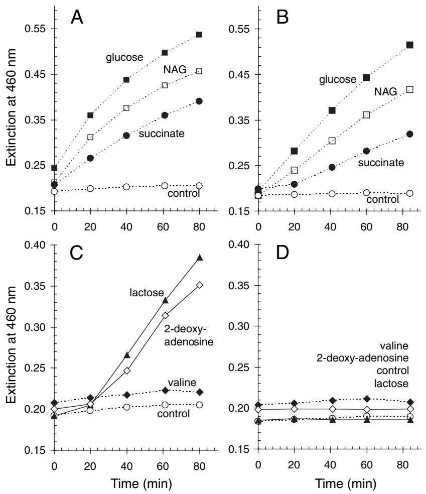
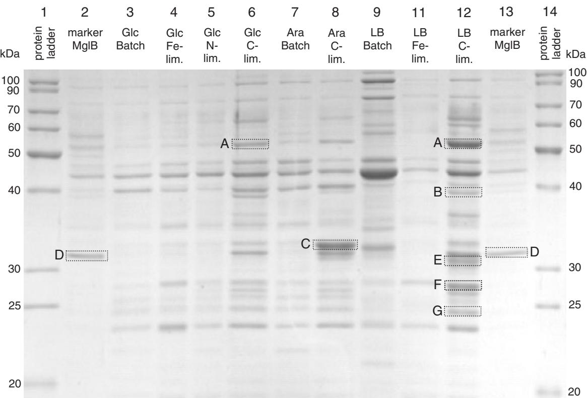

# **Global physiological analysis of carbon- and energylimited growing** *Escherichia coli* **confirms a high degree of catabolic flexibility and preparedness for mixed substrate utilization**

#### **Julian Ihssen and Thomas Egli***

*Swiss Federal Institute for Environmental Science and Technology, Environmental Microbiology, Überlandstrasse 133, PO Box 611, CH-8600 Dübendorf, Switzerland.*

#### **Summary**

**Growth conditions for heterotrophic bacteria in the environment are characterized by low concentrations of carbon and energy sources and complex substrate mixtures. While mechanisms of starvation-survival in the absence of carbon substrates have been studied in considerable detail, information on the physiology of slow growth under oligotrophic conditions is limited. We intended to elucidate general strategies by which** *Escherichia coli* **adapts to low concentrations of a mixed carbon and energy source pool. A new screening method based on BIOLOG AN Micro-PlatesTM, which allowed us to distinguish repressed and induced catabolic functions in** *E. coli***, was combined with the analysis of periplasmic high-affinity binding proteins. Extending previous findings for** *E. coli* **and other microbial species, we found that numerous alternative catabolic functions and highaffinity binding proteins are derepressed under either glucose- or arabinose-limited growth conditions, in spite of the absence of the respective inducers.** *Escherichia coli* **cells growing in carbon-limited complex medium chemostat cultures exhibited an even higher degree of catabolic flexibility and were able to oxidize 43 substrates. The BIOLOG respiration pattern indicated simultaneous dissimilation of diverse sugars, amino acids and dipeptides (mixed substrate growth). The observed physiological adaptations of** *E. coli* **to low concentrations of carbon and energy substrates presumably are advantageous in many natural growth situations and also offer an explanation why** **many heterotrophic bacteria have and maintain such a broad carbon substrate range.**

#### **Introduction**

Blackwell Science, LtdOxford, UKEMIEnvironmental Microbiology 1462-2912Society for Applied Microbiology and Blackwell Publishing Ltd, 200571015681581Original ArticleGlobal catabolome analysis of Escherichia coliJ. Ihssen and T. Egli

In most terrestrial and aquatic ecosystems, heterotrophic bacteria must cope with complex mixtures of carbon and energy sources, with individual organic compounds usually being present in very low concentrations. The pool of readily utilizable monomers, e.g. amino acids or sugars, rarely exceeds 6 mg l-1 of carbon from dissolved free amino acids and 120 mg l-1 of carbon from dissolved free carbohydrates in eutrophic freshwater lakes (Münster, 1993). Some authors suggest that the true concentrations are even 10-fold lower because cell lysis during sample filtration may lead to an overestimation of dissolved organic carbon compounds (Meon and Jüttner, 1999).

With the availability of carbon and energy sources being so restricted, the majority of heterotrophic bacteria in aquatic ecosystems is thought not to multiply but to be in the process of starvation-survival (Morita, 1982; Kjelleberg *et al*., 1987). However, there is evidence that a large fraction of the microbiota is active and multiplies *in situ*. Between 30% and 60% of the total number of bacterial cells in coastal marine waters took up radio-labelled carbon and energy sources presented at nano- to micromolar concentrations (Hoppe, 1976; Meyer-Reil, 1978; Tabor and Neihof, 1982). Growth of pure cultures on substrates naturally present in aquatic environments has been demonstrated, e.g. a *Spirillum* sp. grew in unsupplemented sterile seawater (Jannasch, 1969) and *Pseudomonas fluorescens* P-17 multiplied in sterile-filtered drinking water (van der Kooij *et al*., 1982). Furthermore, the standard method for determining the concentration of microbially assimilable organic carbon (AOC) is based on cellular growth yield of a reference strain, and shows that in drinking water bacteria can grow with as little as 1 mg l-1 acetate-carbon equivalents (van der Kooij, 2002). Also, one assumes that the ecologically important group of oligotrophic microorganisms is particularly adapted to continual growth at extremely low nutrient concentrations (Hirsch *et al*., 1979; Schut *et al*., 1997).

Received 12 January, 2005; accepted 27 April, 2005. *For correspondence. E-mail egli@eawag.ch; Tel. (+41) 44 823 5158; Fax (+41) 44 823 5547.

The successful establishment of a heterotrophic bacterial species in a particular carbon- and energy-limited ecosystem very much relies on its competitiveness for organic substrates and growth efficiency at low substrate concentrations. While molecular mechanisms involved in starvation-survival have been studied extensively (reviewed in Matin *et al*., 1989; Kjelleberg *et al*., 1993; Hengge-Aronis, 1996), knowledge on physiological adaptations towards carbon- and energy-limited growth (or the 'hunger' response; Ferenci, 2001) is scarce, even for the best-studied bacterium *Escherichia coli*.

Although considered to be a typical copiotroph, *E. coli* must be able to adapt to non-host environments because half of the total *E. coli* population is estimated to reside in the secondary (oligotrophic) habitats, i.e. soil and water (Savageau, 1983). Carbon-limited chemostat cultivation is the method of choice for studying the adaptation to environmental growth conditions because steady-state concentrations of organic substrates can be kept very low (Veldkamp and Jannasch, 1972; Matin, 1979; Tempest and Neijssel, 1981; Morita, 1993; Egli, 1995). Carbonlimited chemostat studies indeed revealed that *E. coli* populations adapt to the micromolar glucose concentrations present in such cultures (Senn *et al*., 1994) in a surprisingly complex manner. Most strikingly, an alternative high-affinity glucose transport system is strongly expressed, which consists of the porin LamB (part of the *mal* operon) and the binding protein-dependent galactose ABC (ATP-binding cassette) transporter MglABCD (Death and Ferenci, 1993; Notley and Ferenci, 1995; Wick *et al*., 2001).

ATP-driven, binding protein-dependent transporters exhibit the highest substrate affinities of all known types of transport systems (Lin, 1996). *K*m values of *E. coli* ABC transporters for sugars are in the range of 1 mM, for amino acids affinities are even higher (Boos and Lucht, 1996). High-affinity transport systems must be of utmost importance for heterotrophic bacteria in many ecosystems (Tempest and Neijssel, 1981).

*Escherichia coli* derepresses not only the MglABC transport system in glucose-limited chemostat cultures, but also high-affinity binding proteins for carbon and carbon/nitrogen compounds not present in the feed medium, e.g. ribose, dipeptides and ornithine/arginine/putrescine (Wick *et al*., 2001). In agreement with this, glucose-limited grown *E. coli* were able to utilize ribose without lag (Lendenmann and Egli, 1995). Furthermore, such cells immediately multiplied when transferred to fructose, mannose and maltose mineral media (Lendenmann and Egli, 1995). Synthesis of 'redundant' catabolic enzymes in carbon- and energy-limited chemostat cultures was also demonstrated for a *Pseudomonas* and a *Spirillum* strain, respectively, which strongly expressed glucose 6 phosphate dehydrogenase in lactate-limited chemostat cultures (Matin *et al*., 1976). Similarly, methanol catabolic enzymes were induced in glucose-limited, slow-growing *Hansenula polymorpha* (Egli *et al*., 1980) and two environmental bacterial isolates were able to immediately dissimilate various amino acids, sugars and organic acids when taken from low dilution rate histidine- and aspartatelimited chemostat cultures (Sepers, 1984). Finally, aminopeptidase was partially induced in *Vibrio* SA1 at dilution rates between 0.2 and 0.1 h-1 in a lactate-limited chemostat culture (Wiersma and Harder, 1978). A general derepression of catabolic enzymes, irrespective of the extracellular presence of inducers, is thought to be advantageous in oligotrophic environments because it reduces the time required to react to transient substrate availability (Matin, 1979; Egli, 1995). Possibly, the reduced demand for ribosome-associated proteins at low specific growth rates allows bacterial cells to produce enzymes that are of no immediate use but might be needed 'in future' (Harder and Dijkhuizen, 1982).

A related general characteristic of carbon- and energylimited growth is the relief from catabolite repression. In carbon-limited chemostat cultures, *E. coli* feeds on ribose, arabinose, galactose and maltose in combination with glucose and fructose (Lendenmann *et al*., 1996), although the latter two sugars repress the use of the former in batch culture. Such mixed substrate growth, i.e. the simultaneous utilization of a multiplicity of nutrients that serve the same physiological function (Harder and Dijkhuizen, 1976), is considered to be the rule rather than the exception in the environment (Egli, 1995).

With this study we intended to elucidate the full extent of the derepression of catabolic pathways and high-affinity transport systems in *E. coli* in response to restricted availability of organic substrates. We monitored and quantified the expression of catabolic functions in cultures grown under carbon-excess compared with carbon-limited conditions both in complex and in mineral media by using a novel screening method based on BIOLOG AN MicroPlatesTM. In parallel, we tracked the level of periplasmic binding proteins. Our results confirm that heterotrophic bacteria manage to grow in oligotrophic environments because they exhibit a high degree of catabolic flexibility, scavenge trace amounts of nutrients with high-affinity transport systems and generate energy simultaneously from a multitude of substrates.

# **Results**

# *Reproducible assessment of expressed and repressed catabolic functions with a respiration assay based on BIOLOG AN MicroPlatesTM*

In the course of this study, a new method to monitor the catabolic abilities of bacterial cells under different growth

conditions was developed which is based on BIOLOG AN MicroPlatesTM. On BIOLOG plates, oxidation of organic substrates leads to colour formation due to the reduction of a tetrazolium salt.

The time-course of purple colour formation in BIOLOG AN MicroPlateTM wells differed for individual substrates and allowed the distinction between expressed and repressed catabolic pathways in *E. coli* MG1655 (Fig. 1). No significant colour formation was observed either in control wells without substrates (Fig. 1A–D), or when the respective pathways were repressed (lactose and 2 deoxyadenosine in Fig. 1D). When plates were inoculated with cells not treated with chloramphenicol, catabolic pathways initially repressed under the given condition were significantly induced after 20–40 min (lactose and 2-deoxyadenosine in Fig. 1C). Substrates for which the catabolic enzymes were already expressed at the time of sampling were immediately oxidized by chloramphenicol-treated and non-treated cells at approximately similar rates (glucose, *N*-acetylglucosamine and succinate in Fig. 1A and B). This indicates that chloramphenicol treatment did not affect the rate of substrate oxidation. No colour formation was observed for substrates that cannot be degraded by *E. coli* MG1655 (e.g. valine in Fig. 1C and D; *E. coli* lacks catabolic enzymes for L-valine; McFall and Newman, 1996).

When the lactose catabolic operon was artificially induced by the addition of isopropyl-b-D-thiogalactopyranosid (IPTG) to batch cultures of *E. coli* growing with succinate as the only source of carbon and energy, BIOLOG respiration rates for lactose reached comparable levels as for glucose (Table 1), a substrate for which transport and dissimilatory enzymes are expressed constitutively. In spite of the fact that the cells were growing on succinate only IPTG-induced lactose respiration rates were two-fold higher than succinate respiration rates (Table 1).

Hence, the BIOLOG respiration assay as described here allows for the screening of catabolic pathway expression in different growth environments and may complement proteome and transcriptome studies.

**Fig. 1.** Time-course of substrate-dependent colour development in selected wells on BIOLOG AN MicroPlatesTM. Plates were inoculated with either untreated (A and C) or chloramphenicol-inhibited (B and D) cells sampled from glucose-limited chemostat cultures of *E. coli* MG1655 (D = 0.3 h-1 ). OD546 of both cell suspensions was 0.3.

© 2005 Society for Applied Microbiology and Blackwell Publishing Ltd, *Environmental Microbiology*, **7**, 1568–1581

**Table 1.** Substrate-dependent BIOLOG respiration rates of chloramphenicol-inhibited cells sampled from succinate batch cultures containing different concentrations of IPTG.

|           |                     | BIOLOG respiration rate (DExt460 OD546-1 h-1 ) |           |         |  |
|-----------|---------------------|---------------------------------------------------------|-----------|---------|--|
| IPTG (mM) | LacZ (Miller units) | Lactose                                                 | Succinate | Glucose |  |
| 50        | 7856 (± 384)        | 0.82                                                    | 0.43      | 0.66    |  |
| 10        | 7766 (± 143)        | 0.69                                                    | 0.38      | 0.60    |  |
| 2         | 3913 (± 46)         | 0.86                                                    | 0.41      | 0.69    |  |
| 0.4       | 80 (± 18)           | 0.02                                                    | 0.43      | 0.75    |  |
| 0.1       | 74 (± 8)            | 0.02                                                    | 0.40      | 0.63    |  |
| 0         | 64 (± 15)           | 0.01                                                    | 0.48      | 0.56    |  |

Cells were growing with a specific growth rate of approximately 0.3 h-1 . Growth was not affected by the presence of IPTG. b-Galactosidase activity was determined in triplicate.

# *Catabolic flexibility of* Escherichia coli *growing in single substrate mineral medium*

The extent of derepression of alternative catabolic functions in response to carbon- and energy-limited conditions was analysed with the BIOLOG respiration assay. *Escherichia coli* cells from glucose-limited chemostat cultures (D = 0.3 h-1 ) reproducibly were able to oxidize 25 carbon compounds present on BIOLOG AN MicroPlatesTM, all of which were absent from the growth medium and therefore could not have acted as external inducers (Fig. 2). The

|                                      |                                                 | Glucose batch m = 0.7 h-1 | Fe-limited chemostat D = 0.3 h-1 | N-limited chemostat D = 0.3 h-1 | Glc-limited chemostat D = 0.3 h-1 | Arabinose batch m = 0.7 h-1 | Arab.-limited chemostat D = 0.3 h-1 |
|--------------------------------------|-------------------------------------------------|---------------------------------|----------------------------------------|---------------------------------------|-----------------------------------------|-----------------------------------|-------------------------------------------|
|                                      | -1 h-1] Respiration rate [D Ext 460 OD546 | 0.0 0.4 0.8                     | 0.0 0.4 0.8                            | 0.0 0.4 0.8                           | 0.0 0.4 0.8                             | 0.0 0.4 0.8                       | 0.0 0.4 0.6                               |
|                                      | a-D-Glucose                                     |                                 |                                        |                                       |                                         |                                   |                                           |
|                                      | Glucose 1-phosphate                             |                                 |                                        |                                       |                                         |                                   |                                           |
|                                      | Glucose 6-phosphate                             |                                 |                                        |                                       |                                         |                                   |                                           |
|                                      | 3-Methyl-D-glucose                              |                                 |                                        |                                       |                                         |                                   |                                           |
|                                      | a-Methyl-D-glucoside                            |                                 |                                        |                                       |                                         |                                   |                                           |
|                                      | b-Methyl-D-glucoside                            |                                 |                                        |                                       |                                         |                                   |                                           |
|                                      | D-Fructose                                      |                                 |                                        |                                       |                                         |                                   |                                           |
|                                      | D-Galactose                                     |                                 |                                        |                                       |                                         |                                   |                                           |
| Sugars & sugar derivatives           | b-Methyl-D-galactoside                          |                                 |                                        |                                       |                                         |                                   |                                           |
|                                      | a-D-Lactose                                     |                                 |                                        |                                       |                                         |                                   |                                           |
|                                      | Maltose                                         |                                 |                                        |                                       |                                         |                                   |                                           |
|                                      | Maltotriose                                     |                                 |                                        |                                       |                                         |                                   |                                           |
|                                      | D-Mannose                                       |                                 |                                        |                                       |                                         |                                   |                                           |
|                                      | D-Trehalose                                     |                                 |                                        |                                       |                                         |                                   |                                           |
|                                      | N-Acetyl-D-glucosamine                          |                                 |                                        |                                       |                                         |                                   |                                           |
|                                      | N-Acetyl-b-D-mannosamine                        |                                 |                                        |                                       |                                         |                                   |                                           |
|                                      | Dulcitol                                        |                                 |                                        |                                       |                                         |                                   |                                           |
|                                      | D-Mannitol                                      |                                 |                                        |                                       |                                         |                                   |                                           |
|                                      | D-Sorbitol                                      |                                 |                                        |                                       |                                         |                                   |                                           |
|                                      | L-Serine                                        |                                 |                                        |                                       |                                         |                                   |                                           |
|                                      | L-Valine                                        |                                 |                                        |                                       |                                         |                                   |                                           |
| Amino acids Alcohols & dipeptides | L-Alanyl-L-Threonine                            |                                 |                                        |                                       |                                         |                                   |                                           |
|                                      | Acetic acid                                     |                                 |                                        |                                       |                                         |                                   |                                           |
|                                      | D,L-Lactic acic                                 |                                 |                                        |                                       |                                         |                                   |                                           |
| Carboxylic acids                     | D-Malic acid                                    |                                 |                                        |                                       |                                         |                                   |                                           |
|                                      | Pyruvic acid                                    |                                 |                                        |                                       |                                         |                                   |                                           |
|                                      | Succinic acid                                   |                                 |                                        |                                       |                                         |                                   |                                           |
|                                      | D-Lactic acid methyl ester                      |                                 |                                        |                                       |                                         |                                   |                                           |
|                                      | Pyruvic acid methyl ester                       |                                 |                                        |                                       |                                         |                                   |                                           |
|                                      |                                                 |                                 |                                        |                                       |                                         |                                   |                                           |

succinate respiration rate of glucose-limited grown cells reached 80% of the rate observed for cells taken from logarithmic phase succinate batch cultures (Table 1), indicating that the succinate catabolic pathway was almost fully induced in glucose-limited chemostat cultures. The BIOLOG substrate respiration pattern of cells taken from arabinose-limited chemostat cultures was virtually identical to glucose-limited grown cells, although arabinose is transported and metabolized by a completely different, catabolite repression-sensitive set of enzymes (Fig. 2).

Catabolic flexibility was much more restricted under glucose-excess conditions, i.e. in logarithmic phase batch cultures and in iron- or ammonia-limited chemostat cultures (Fig. 2). However, high arabinose concentrations in batch culture only slightly repressed alternative catabolic functions (Fig. 2), although arabinose and glucose sustained equivalent maximum specific growth rates (0.67 ± 0.03 h-1 and 0.70 ± 0.02 h-1 respectively). Derepression of catabolic pathways was also observed in excess succinate batch cultures. The BIOLOG respiration pattern of cells taken from these cultures was actually very similar to glucose-limited and arabinose-limited chemostat cultures (data not shown).

Oxygen electrode chamber experiments confirmed the derepression of the catabolic pathways for *N*-acetylglucosamine, succinate, acetate and L-serine in glucoseas well as in arabinose-limited chemostat cultures

> **Fig. 2.** Effect of a limiting and an excess supply of glucose or arabinose on BIOLOG respiration patterns. Plates were inoculated with chloramphenicol-inhibited cells sampled from exponential phase batch cultures and carbon-, nitrogen- or iron-limited chemostat cultures (D = 0.3 h-1 ) of *E. coli* MG1655. Substratedependent average respiration rates normalized to OD546 of the inoculum are shown as horizontal bars. Error ranges represent standard deviations of results from a minimum of four BIOLOG plates.

© 2005 Society for Applied Microbiology and Blackwell Publishing Ltd, *Environmental Microbiology*, **7**, 1568–1581

| Table 2. Substrate-induced oxygen uptake rates (mmol O2 gdry biomass-1 | min-1 ) of chloramphenicol-inhibited cells sampled from logarithmic phase |  |
|------------------------------------------------------------------------|------------------------------------------------------------------------------|--|
| batch and carbon-limited chemostat cultures of E. coli MG1655.         |                                                                              |  |

|                                 | Glucose              |                          |                                       | Tryptic soy broth    |                          |
|---------------------------------|----------------------|--------------------------|---------------------------------------|----------------------|--------------------------|
| Medium Cultivation condition | Batch m = 0.7 h-1 | Chemostat D = 0.3 h-1 | Arabinose Chemostat D = 0.3 h-1 | Batch m = 1.4 h-1 | Chemostat D = 0.3 h-1 |
| a-D-glucose                     | 117 (± 19)           | 124 (± 26)               | 163 (± 22)                            | 120 (± 23)           | 146                      |
| N-acetyl-D-glucosamine          | 41 (± 9)             | 90                       | 107 (± 16)                            | 23                   | 101                      |
| D-ribose                        | NS                   | 40                       | 25 (± 4)                              | NS                   | 35                       |
| L-arabinose                     | NS                   | NS                       | 161 (± 48)                            | NS                   | NS                       |
| Succinate                       | 13                   | 149                      | 128 (± 18)                            | NS                   | 57                       |
| Acetate                         | NS                   | 74                       | 74 (± 16)                             | NS                   | 79                       |
| L-serine                        | 9                    | 39                       | 17 (± 10)                             | 70                   | 99                       |
| L-glutamine                     | NS                   | NS                       | NS                                    | NS                   | 21                       |

Mineral media contained glucose, arabinose or tryptic soy broth as carbon and energy sources. Where given, error ranges represent standard deviations of three replicate measurements (NS, no significant increase in oxygen uptake rate).

(Table 2). In addition to the substrates present on BIOLOG AN MicroPlatesTM, glucose- and arabinoselimited grown cells dissimilated ribose (Table 2).

Not all catabolic pathways were derepressed in response to glucose limitation, e.g. arabinose was only respired when supplied with the feed medium (Table 2). Lactose was also only oxidized significantly when sufficient amounts of an inducer were present (Table 1).

The ratio of oxygen uptake rates between two different substrates and between chemostat and batch cultures was not in all cases similar to the ratio of BIOLOG respiration rates (Table 2, Fig. 2). This might be due to differences in electron transfer to molecular oxygen and to tetrazolium salts. Molecular oxygen can only be reduced by the terminal cytochrome *o* complex of the respiratory chain in *E. coli* whereas 2-(4-iodophenyl)-3-(4 nitrophenyl)-5-phenyl tetrazolium chloride can be reduced by the succinate dehydrogenase complex (Sdh), by NADH dehydrogenase (Nuo), by ubiquinone/menaquinone and by cytochromes *b*555, 556 (Smith and McFeters, 1997). The increased expression of *sdh* and *nuo* in glucose-limited growing *E. coli* (Yoon *et al*., 2003; Hua *et al*., 2004) might contribute to a higher rate of electron transfer to tetrazolium, whereas the rate of oxygen reduction may not increase to a similar extent because electron transfer is still limited by the amount of cytochrome *o*.

It is well known that glucose transport and breakdown proteins are constitutively expressed in *E. coli*, but the observed rates of fructose, mannose and *N*-acetylglucosamine oxidation was surprisingly high (Table 2, Figs 2 and 3). The data confirm the semi-constitutive expression of the membrane-spanning PTS enzymes II for all these sugars in *E. coli* (Lengeler, 1993; Postma *et al*., 1993).

a-Methyl-glucoside is generally used as a nonmetabolizable glucose analogue for transport studies, thus, significant oxidation of this compound by cells grown in glucose-limited chemostat cultures was surprising (Fig. 2). Hypothetically, the electrons transferred to the tetrazolium dye were derived from a partial oxidation of this molecule, for example, by the action of aldehyde dehydrogenase (AldA), which is expressed to high levels under glucose-limited growth conditions (Wick *et al*., 2002).

## *Catabolic flexibility of* Escherichia coli *growing in complex medium*

While useful for studying general mechanisms of the adaptation to carbon limitation, chemostat (or batch) growth on a single sugar as carbon and energy source represents a highly artificial situation with regard to environmental growth conditions. Therefore, analysis of the response to carbon limitation was extended to a more complex substrate mixture, i.e. modified Luria–Bertani broth (LB) medium with a tryptone/yeast extract mixture as carbon and energy source.

An astonishing diversity of substrates present on BIOLOG AN MicroPlatesTM was respired by cells grown in carbon-limited modified LB chemostat cultures (Fig. 3). In addition to the respiratory flexibility already present in single sugar-limited chemostat cultures, cells were able to oxidize numerous amino acids and dipeptides at high rates (Fig. 3). Over all, 70% (33 out of 43) of the pathways for substrates which supported growth of MG1655 on BIOLOG AN MicroPlatesTM seemed to be at least partially induced in carbon-limited modified LB chemostat cultures. Only the catabolic pathways for 2-deoxy-adenosine, L-fucose, glycerol, inosine, lactulose, D/L-malate, Dmelibiose, palatinose, L-rhamnose and D-saccharic acid remained completely repressed (not shown in Fig. 3). In addition, several catabolic pathways for substrates that do not serve as a sole source of carbon and energy for *E. coli* MG1655 were also strongly induced, particularly those for the amino acids L-threonine, L-glutamine and Lserine (Fig. 3).

|                                    |                                             | LBa batch m = 2.0 h-1 | LBb chemostat Fe-limited | LBa batch stat. phase | LBa chemostat C-limited | growth sustainingc |
|------------------------------------|---------------------------------------------|-----------------------------|-----------------------------|-----------------------------|----------------------------|-----------------------|
|                                    | -1 h-1] Respiration rate [D Ext460 OD546 | 0.0 0.4 0.8                 | 0.0 0.4 0.8                 | 0.0 0.4 0.8                 | 0.0 0.4 0.8                |                       |
|                                    | a-D-Glucose                                 |                             |                             |                             |                            | +                     |
|                                    | Glucose 1-phosphate                         |                             |                             |                             |                            | +                     |
|                                    | Glucose 6-phosphate                         |                             |                             |                             |                            | +                     |
|                                    | 3-Methyl-D-glucose                          |                             |                             |                             |                            | -                     |
|                                    | b-Methyl-D-glucoside                        |                             |                             |                             |                            | +/-                   |
| Sugars & sugar derivatives         | D-Fructose                                  |                             |                             |                             |                            | +                     |
|                                    | D-Galactose                                 |                             |                             |                             |                            | +                     |
|                                    | a-Methyl-D-galactoside                      |                             |                             |                             |                            | +                     |
|                                    | b-Methyl-D-galactoside                      |                             |                             |                             |                            | +                     |
|                                    | a-D-Lactose                                 |                             |                             |                             |                            | +                     |
|                                    | Maltose                                     |                             |                             |                             |                            | +                     |
|                                    | Maltotriose                                 |                             |                             |                             |                            | +                     |
|                                    | D-Mannose                                   |                             |                             |                             |                            | +                     |
|                                    | D-Trehalose                                 |                             |                             |                             |                            | +                     |
|                                    | N-Acetyl-D-glucosamine                      |                             |                             |                             |                            | +                     |
|                                    | N-Acetyl-b-D-mannosamine                    |                             |                             |                             |                            | -/+                   |
|                                    | D,L-a-Glycerolphosphate                     |                             |                             |                             |                            | +                     |
|                                    | Dulcitol                                    |                             |                             |                             |                            | +                     |
| Alcohols                           | D-Mannitol                                  |                             |                             |                             |                            | +                     |
|                                    | D-Sorbitol                                  |                             |                             |                             |                            | +                     |
|                                    | L-Alanine                                   |                             |                             |                             |                            | +/-                   |
|                                    | L-Asparagin                                 |                             |                             |                             |                            | +/-                   |
|                                    | L-Glutamic acid                             |                             |                             |                             |                            | -                     |
|                                    | L-Glutamine                                 |                             |                             |                             |                            | -                     |
|                                    | L-Serine                                    |                             |                             |                             |                            | -/+                   |
|                                    | L-Threonine                                 |                             |                             |                             |                            | -                     |
|                                    | L-Valine                                    |                             |                             |                             |                            | -                     |
|                                    | L-Alanyl-L-glutamine                        |                             |                             |                             |                            | +                     |
| Amino acids & dipeptides           | L-Alanyl-L-histidine                        |                             |                             |                             |                            | -/+                   |
|                                    | L-Alanyl-L-threonine                        |                             |                             |                             |                            | +/-                   |
|                                    | Glycyl-L-aspartic acid                      |                             |                             |                             |                            | -/+                   |
|                                    | Glycyl-L-glutamine                          |                             |                             |                             |                            | +/-                   |
|                                    | Acetic acid                                 |                             |                             |                             |                            | +/-                   |
|                                    | Fumaric acid                                |                             |                             |                             |                            | +/-                   |
|                                    | D-Galacturonic acid                         |                             |                             |                             |                            | +                     |
| Carboxylic acids & other compounds | D-Gluconic acid                             |                             |                             |                             |                            | +                     |
|                                    | D,L-Lactic acic                             |                             |                             |                             |                            | +                     |
|                                    | Pyruvic acid                                |                             |                             |                             |                            |                       |
|                                    | Succinic acid                               |                             |                             |                             |                            | +                     |
|                                    |                                             |                             |                             |                             |                            | +                     |
|                                    | D-Lactic acid methyl ester                  |                             |                             |                             |                            | +                     |
|                                    | Pyruvic acid methyl ester                   |                             |                             |                             |                            | +                     |
|                                    | Succinic acid mono-methyl ester             |                             |                             |                             |                            | -/+                   |
|                                    | L-Alaninamide                               |                             |                             |                             |                            | -                     |
|                                    | Uridine                                     |                             |                             |                             |                            | +                     |

**Fig. 3.** Effect of a limiting and an excess supply of the complex carbon and energy sources tryptone and yeast extract (LB) on BIOLOG respiration patterns. Plates were inoculated with chloramphenicol-inhibited *E. coli* MG1655 cells sampled from: (i) very fast-growing batch cultures (m > 1.9 h-1 ), (ii) stationary-phase batch cultures (m = 0 h-1 ), (iii) carbon-limited chemostat cultures (D = m = 0.3 h-1 ) and (iv) ironlimited chemostat cultures (D = 0.3 h-1 ). Substrate-dependent average respiration rates normalized to OD546 are shown as horizontal bars. Error ranges represent standard deviations of results from a minimum of four BIOLOG plates. The ability of *E. coli* MG1655 to use substrates as sole source of carbon and energy for growth is indicated in the last column to the right. a Modified LB broth (for details see *Experimental procedures*). b Modified LB broth + 8 g l-1 glucose. c +, >80% of microplates positive; +/–, 50–80% of microplates positive; –/+, 20–50% of microplates positive; –, <20% of microplates positive (*n* = 7, growth positive if extinction at 460 nm > 0.4).

For the substrates tested, the respiration pattern of complex medium-grown cells determined with an oxygen electrode chamber was largely similar to that from BIOLOG experiments (Table 2, Fig. 3). Similarly to glucose- and arabinose-limited chemostat cultures, ribose was respired by cells sampled from tryptic soy broth (TSB) chemostat cultures (Table 2).

With the interesting exception of L-serine, *E. coli* cells grown under carbon-excess conditions in LB batch and chemostat cultures were restricted in their respiratory capacity to the same few substrates as cells grown in the presence of excess single sugars (Figs 2 and 3). L-serine achieved 70% of the oxidation rate of glucose in exponential phase LB batch cultures and L-serine dissimilation seemed not to be subject to catabolite repression (Fig. 3). Consistent with our results, L-serine is the first amino acid depleted in tryptone broth batch cultures of *E. coli* and significant utilization of other amino acids did not start before all serine was consumed and specific growth rate began to decline (Pruss *et al*., 1994). Stationary-phase LB cells were also able to oxidize a broad spectrum of organic substrates, but respiration rates were generally much lower than in cells from carbon-limited chemostat cultures (Fig. 3).

In general, normalized maximum respiration rates for those substrates already oxidized by cells grown under carbon-excess conditions were further increased under carbon- and energy-limited growth conditions (1.7- to 2.4 fold for glucose, 1.8- to 3-fold for fructose, 1.7- to 2.6-fold for mannose, 1.4- to 2.6-fold for *N*-acetyl-glucosamine; Figs 2 and 3).

# *Expression of periplasmic high-affinity binding proteins under carbon-excess and carbon-limited conditions*

Both the number of periplasmic proteins appearing on SDS-PAGE gels and the band intensity of individual proteins were increased in chloroform shock extracts from carbon-limited chemostat cultures compared with samples from carbon-excess cultures (Fig. 4). As can be predicted from the multitude of substrates present in the medium, the highest diversity of periplasmic proteins was expressed in carbon-limited LB chemostat cultures (Fig. 4). Six strongly expressed periplasmic proteins, which were not or only weakly expressed in exponential phase batch cultures and in non-carbon-limited chemostat cultures, were identified as the dipetide-, maltose-, galactose-, (hypothetical) glutamate/aspartate-, riboseand glutamine-binding proteins respectively (Fig. 4). DppA was strongly overexpressed in carbon-limited LB chemostat cultures (Fig. 4). Presumably, cells were taking up dipeptides from the medium with the corresponding ABC transport system.

Bands corresponding to DppA, MalE, MglB and RbsB were also detected in chloroform shock fluid from glucoseand arabinose-limited chemostat cultures (Fig. 4). The strong band appearing only in chloroform shock extract fluid from arabinose-limited cultures was identified as the arabinose-binding protein AraF. High arabinose concentrations in exponential phase batch cultures repressed the expression of AraF and other binding proteins (Fig. 4). Samples taken for each condition from duplicate, independent chemostat and batch cultures exhibited similar SDS-PAGE band patterns (gel not shown).

# *The response to carbon and energy limitation was not influenced by cell density*

Several authors suggest a prominent role for cell densitydependent regulation (quorum sensing) in the physiology of bacteria, including the adaptation to carbon starvation (Lazazzera, 2000; Miller and Bassler, 2001). However, a 30-fold difference in steady-state cell density (OD546 of 0.1

**Fig. 4.** Effect of a limiting and an excess supply of carbon and energy sources on the expression of periplasmic binding proteins in *E. coli* MG1655. Lanes 3, 7, 9: logarithmic phase batch cultures; lanes 4, 5, 11: non-carbon-limited chemostat cultures (D = 0.3 h-1 ); lanes 6, 8, 12: carbon-limited chemostat cultures (D = 0.3 h-1 ). Protein size markers are shown in lanes 1 and 14. Bands that were successfully identified after Western blotting by Edman sequencing are marked in the figure as A dipeptide-binding protein (DppA, theoretical MW 57.6 kDa), B maltosebinding protein (MalE, 40.7 kDa), C arabinose-binding protein (AraF, 35.5 kDa), D galactose/glucose-binding protein (MglB, 33.6 kDa), E hypothetical glutamate/aspartate-binding protein (Ybej, 31.2 kDa), F ribose-binding protein (RbsB, 28.4 kDa), G glutamine-binding protein (GlnH, 25.0 kDa). Lanes 2 and 13 show fourfold diluted chloroform shock extracts from a glucose-limited chemostat culture which had been growing for 500 h and strongly overexpressed MglB.

versus OD546 of 2.9) in glucose-limited chemostat cultures did not lead to any significant changes in the respiration pattern on BIOLOG AN MicroPlatesTM (data not shown). Similarly, neither the pattern nor the band intensities of periplasmic proteins were affected by cell density (data not shown).

#### **Discussion**

*The cells are ready: general derepression of catabolic enzymes and high-affinity binding proteins in response to single-carbon substrate limitation*

BIOLOG respiration assays, oxygen electrode chamber tests and SDS-PAGE analysis of periplasmic proteins demonstrated the derepression of high-affinity transport systems and dissimilatory functions for numerous substrates not present in the medium in single sugar-limited chemostat cultures (Figs 2 and 4, Table 2). These results extend previous findings for *E. coli* (Lendenmann and Egli 1995; Wick *et al*., 2001) and other microorganisms (Matin *et al*., 1976; Egli *et al*., 1980; Sepers, 1984) and reinforce the idea that a general derepression of catabolic enzymes is advantageous in environments with low concentrations of carbon and energy substrates (Matin, 1979; Harder and Dijkhuizen, 1982; Egli, 1995).

Repression of most catabolic functions and high-affinity binding proteins in iron- and ammonia-limited glucose chemostat cultures and in logarithmic phase batch glucose cultures is consistent with low levels of the intracellular signal molecule cyclic adenosine-monophosphate (cAMP) in such cultures (Buettner *et al*., 1973; Matin and Matin, 1982; Notley-McRobb *et al*., 1997). It is well known that the expression of many catabolic pathways depends on cAMP (Perlman and Pastan, 1969; Bochner *et al*., 2001).

Similarly to glucose-limited chemostat cultures, cAMP levels are high in batch cultures with either fructose, glucosamine, casamino acids, lactate or succinate as sole source of carbon and energy (Epstein *et al*., 1975). This explains why many catabolic functions are also derepressed in logarithmic phase succinate and arabinose batch cultures, in spite of an excess amount of carbon substrates being present. Presumably, derepression of catabolic pathways in *E. coli* occurs under any condition leading to elevated cAMP levels. However, the strongly reduced levels of arabinose-, dipeptide-, maltose- and galactose-binding proteins in arabinose batch cultures (Fig. 4) indicate that the corresponding high-affinity transport systems are subject to (cAMP-independent) catabolite repression also when other sugars than glucose are present in high concentrations.

The pattern of alternative substrates oxidized by *E. coli* cells grown in glucose- and arabinose-limited chemostat cultures fits well with previous reporter gene and transcriptome studies. The *mal* (maltose transport and breakdown), *manXYZ* (PTS for mannose), *nagE* (PTS component for *N*-acetyl-glucoseamine), *dctA* (C4 dicarboxylate transporter), *acs* (acetate dissimilation via acetylCoA-synthetase), *rbs* (ribose transport and breakdown) and *sdh* (succinate dehydrogenase) operons were all found to be induced in glucose-limited chemostat and fed-batch cultures (Notley and Ferenci, 1995; Yoon *et al*., 2003; Hua *et al*., 2004).

Derepression of the ribose-, maltose-, dipeptide- and galactose-binding proteins observed in this study confirms data from a previous proteome study (Wick *et al*., 2001) and is also in agreement with elevated transcription of *rbsB*, *malE* and *mglB* under glucose-limited conditions (Hua *et al*., 2004).

In spite of significant levels of the galactose-binding protein MglB in carbon-limited growing cells, galactose was not oxidized (Figs 2–4). This is in agreement with glucose-limited grown *E. coli* cells taking up galactose but not being able to grow on it without lag, presumably due to a downstream metabolic bottleneck caused by poorly co-ordinated expression of catabolic enzymes encoded by *galETK* (Lendenmann and Egli, 1995; Lin, 1996).

One can hypothesize that the compounds for which transport and catabolic enzymes are generally derepressed, i.e. which were integrated into the carbon and energy limitation response regulatory network, are important substrates for *E. coli* in the secondary habitat. Microradioautography studies indicate that in addition to glucose, amino acids, acetate and *N-*acetyl-glucosamine are important growth substrates in aquatic environments (Hoppe, 1976; Tabor and Neihof, 1982; Riemann and Azam, 2002). Other compounds, e.g. lactose or arabinose, might be less important outside the mammalian host of *E. coli*; alternatively the respective catabolic operons may have been acquired too recently to be part of general carbon limitation response.

## *Evidence for simultaneous dissimilation of a multitude of substrates in carbon-limited complex medium cultures*

The standard *E. coli* complex medium LB might come close to real substrate mixtures because it contains a multitude of sugars, amino acids, nucleic acids, etc., derived from yeast cells and casein, both in monomeric and oligomeric form. It probably resembles the substrate mixture present in the primary habitat of *E. coli*, the digestive tract of mammals. Both yeast extract and tryptone are used in bioreactors simulating the digestive tract (Macfarlane and Macfarlane, 1997) and are often a component of artificial wastewater (e.g. Sakai *et al*., 2000).

The high number of catabolic functions expressed in *E. coli* cells growing in carbon-limited LB chemostat cultures (Fig. 3) indicates simultaneous oxidation of numerous

substrates, particularly amino acids and dipeptides. Mixed substrate growth under carbon- and energy-limited conditions has been shown in numerous chemostat experiments with defined mixtures of carbon compounds in the feed medium (e.g. Molin, 1985; Lendenmann *et al*., 1996; the topic has been reviewed by Harder and Dijkhuizen, 1976; 1982; Egli, 1995).

One might argue that continuous, carbon-limited growth on constant substrate mixtures for extended periods of time rarely occurs in natural environments. However, mixed substrate growth can also be expected during repeated 'batch cycles' if the concentrations of sporadically available carbon and energy sources are low. In a batch system, *Pseudomonas* P-17 was able to utilize 45 substrates in parallel, each present at a concentration of 1 mg of carbon per litre (van der Kooij *et al*., 1982). For *E. coli*, it was shown that below a glucose concentration of 3–5 mg l-1 galactose/glucose and fructose/glucose mixtures are used simultaneously (Lendenmann *et al*., 2000). The BIOLOG respiration pattern of *E. coli* cells sampled from stationary-phase LB cultures (Fig. 3) suggests that mixed substrate growth also takes place during the phase of declining growth rates in (initially very nutrient rich) complex medium batch cultures.

Expression of catabolic pathways in complex medium cultures was, similarly to single-substrate mineral medium cultures, regulated in a catabolite repression-like manner. Data on cAMP levels in LB cultures are not available, but they can also be predicted to depend on the extracellular concentrations of carbon and energy sources, especially sugars.

Of ecological relevance is the difference between the inability of *E. coli* MG1655 to grow on most single amino acids and dipeptides (McFall and Newman, 1996; see also last column in Fig. 3) and the strong expression of amino acid and dipeptide catabolic functions in carbonlimited LB chemostat cultures (Fig. 3). In the case of Lserine, growth deficiency results from interference with isoleucine biosynthesis (Uzan and Danchin, 1978), and in other cases transport seems to be a bottleneck (McFall and Newman, 1996). Apparently *E. coli* has evolved in a way which made it much better adapted for using mixtures of carbon and energy sources than single substrates. Most likely, mixed substrate growth is superior to specialization on single substrates in many habitats because it allows to maintain relatively high growth rates at very low concentrations of individual substrates (Lendenmann *et al*., 1996; Kovárová-Kovar and Egli, 1998). This may also explain why 32% of all open reading frames with assigned functions on the genome of *E. coli* MG1655 (Blattner *et al*., 1997) are related to energy generation and transport or metabolism of simple organic molecules like carbohydrates and amino acids ([http://www.ncbi.nlm.nih.gov/sutils/coxik.cgi?gi](http://www.ncbi.nlm.nih.gov/sutils/coxik.cgi?gi=115)=115).

#### *The importance of high-affinity substrate scavenging*

In carbon- and energy-limited environments, the ability to scavenge trace amounts of nutrients is crucial for bacteria and periplasmic binding proteins have been suggested as the main capture site (Morita, 1984). The similarity of the pattern of periplasmic proteins expressed in glucoselimited, arabinose-limited and carbon-limited LB chemostat cultures (Fig. 4) suggests that a particular set of binding proteins is generally derepressed by *E. coli* under any kind of carbon- and energy-limitation in order to prepare the cell for high-affinity substrate scavenging.

Binding protein-dependent uptake of carbon and energy sources by microorganism must be widespread under oligotrophic conditions, but not many data are available on this topic. Starvation-induced glucose and constitutive alanine transport involving binding proteins were reported for a marine *Vibrio* strain and a facultatively oligotrophic marine ultramicrobacterium (Albertson *et al*., 1990; Schut *et al*., 1995).

Apart from inducing high-affinity transport systems, a second strategy to enhance substrate flux at low concentrations is to increase the expression of carbon-flux limiting enzymes which are already expressed at higher substrate concentrations. It can be deduced from Michaelis-Menten kinetics that higher levels of transport and/or catabolic enzymes enable the cell to maintain a high uptake/reaction rate in spite of low substrate concentrations (Tempest and Neijssel, 1978). In fact, the level of the majority of catabolic enzymes increases with decreasing dilution rates in carbon-limited chemostat cultures or reaches a maximum at intermediate dilution rates (Dean, 1972; Matin, 1979). This is consistent with maximal substrate respiration rates observed in carbon- and energylimited chemostat cultures (Figs 2 and 3).

## *Is catabolic flexibility linked to the operation of the PEP–glyoxylate cycle?*

The observed catabolic flexibility of carbon- and energylimited growing cells might also be linked to the operation of the recently proposed PEP–glyoxylate cycle under such conditions (Fischer and Sauer, 2003). The metabolic cycle uncouples NADH-yielding substrate oxidation from NADPH and GTP formation and in this way separates energy generation from growth (Fischer and Sauer, 2003). This could be especially important for growth on fluctuating concentrations of mixed amino acids and carboxylic acids. The key enzyme of the PEP–glyoxylate cycle is isocitrate lyase (AceA), which is also required for the glyoxylate bypass during growth on either acetate or fatty acids as sole sources of carbon and energy (Cronan and LaPorte, 1996). AceA is strongly expressed in glucoselimited chemostat and fed-batch cultures (Wick *et al*.,

2001; Yoon *et al*., 2003), although not needed for growth on glucose.

# *Regulatory mechanism involved in the derepression of catabolic pathways*

Apart from cAMP, transcription of many catabolic operons also requires a specific inducer molecule that binds to either a repressor or an activator. Maltotriose is the inducer of the *mal* regulon and is internally synthesized by *E. coli* under glucose-limited conditions (Notley and Ferenci, 1995; Schlegel *et al*., 2002). Similarly, intracellular synthesis of galactose is responsible for induction of the *mgl* operon in glucose-limited chemostat cultures (Ferenci, 1996). Derepression of certain catabolic functions observed in this study might also be linked to this so-called endoinduction. Other operons are possibly partially induced solely as a result of increased cAMP levels.

Global regulatory mechanism in addition to cAMP could also be involved in the derepression of transport and dissimilatory functions. Levels of the alternative sigma factor RpoS inversely correlate with specific growth rate, are practically zero in fast-growing LB batch cultures and are half-maximal in chemostat cultures growing at a dilution rate of 0.3 h-1 (Ihssen and Egli, 2004). The pattern of trehalose respiration on BIOLOG AN MicroPlatesTM (Figs 2 and 3) is consistent with this variation in RpoS levels. Expression of the trehalose catabolic operon depends on both RpoS and cAMP (Strom and Kaasen, 1993). Other global regulatory proteins which may affect transcription of transport or catabolic enzymes are LRP, IHF, CsrA or FruR. Hence, a thorough understanding of the regulatory mechanisms responsible for the observed response to carbon and energy limitation is still missing and requires further research.

## **Experimental procedures**

## *Bacterial strains and media*

Wild-type *E. coli* K-12 MG1655 [genotype F– , l– , *rph1*] was used in all experiments and was handled as described previously (Wick *et al*., 2001; Ihssen and Egli, 2004). The composition of carbon-, nitrogen- and iron-limited mineral media for batch and chemostat cultivation was described elsewhere (Ihssen and Egli, 2004), where also growth yield values and typical steady-state glucose concentrations of chemostat cultures can be found. Glucose and arabinose feed concentrations for carbon-limited chemostat cultures were 0.1 g l-1 unless explicitly stated otherwise. The initial concentration of glucose or arabinose in batch cultures was 4 g l-1 . For the *lac* induction experiments, cells were grown in succinate batch cultures containing 6 g l-1 disodium succinate and different concentrations of IPTG. b-Galactosidase activity was determined as described by Miller (1972).

Modified LB complex medium for batch cultivation contained 10 g l-1 tryptone (Biolife, Milano, Italy) and 5 g l-1 yeast extract (Biolife) and, in order to exclude limitations other than carbon, the same mineral salt concentrations as basal batch mineral medium (Ihssen and Egli, 2004). Sodium chloride, which is part of the original LB medium (Miller, 1972), had no influence on the results and was omitted. Modified LB medium for chemostat cultivation contained 0.67 g l-1 tryptone and 0.33 g l-1 yeast extract and the same mineral salt concentrations as basal mineral medium for carbon-limited chemostat cultivation (Ihssen and Egli, 2004). Tryptone and yeast extract were reduced to 1/15 of the original LB strength because steady-state cell density was chosen to be in the same range as that at which exponentially growing LB batch cultures were sampled (OD546 of 0.2–0.3). Tryptone and yeast extract were always added filter-sterilized to autoclaved basal mineral medium in order to avoid heat-mediated modification of organic compounds.

Iron limitation was chosen as the type of non-carbon-limited growth condition for complex medium chemostat cultures because N, P and S levels in yeast extract and tryptone were assumed to be too high to properly establish these limitations. Modified LB medium for iron-limited chemostat cultivation contained 10 g l-1 tryptone, 5 g l-1 yeast extract, 8 g l-1 glucose, 12.8 g of Na2HPO4·2H2O, 3.0 g of KH2PO4, 1.77 g of (NH4)2SO4, 520 mg l-1 MgCl2·6H2O; 320 mg l-1 CaCO3, 11 mg l-1 MnCl2·4H2O, 6 mg l-1 CuSO4·5H2O, 5.2 mg l-1 CoCl2·6H2O, 16 mg l-1 ZnO, 4.8 mg l-1 H3BO3, 40 mg l-1 NaMoO4·2H2O, 2.68 g l-1 Na4EDTA·2H2O (equimolar to cations). Addition of glucose was necessary because it was not possible to achieve a purely iron-limited culture with only tryptone and yeast extract as carbon substrates, presumably due to iron input from these medium components. Trace elements were added in a four times higher amount than in carbon-limited medium in order to enhance competition of these metal ions for EDTA and thus lower iron availability. Tryptic soy broth complex medium contained 6 g l-1 TSB (Biolife) for batch cultivation and 1.2 g l-1 for chemostat cultivation and the same mineral salt concentrations as in carbonlimited mineral medium (Ihssen and Egli, 2004).

## *Growth conditions*

Mineral medium batch cultures were prepared in magnetically stirred Erlenmeyer flasks and incubated at 37∞C. Computer-controlled glass and stainless steel bioreactors were used for continuous cultivation (pH 7, 37∞C, >90% oxygen saturation) with mineral and complex media, and for batch cultivation with modified LB medium. Glass bioreactors were used for iron-limited chemostat cultivation with complex medium. Aeration with a fine-pore glass purger and magnetic stirring was sufficient to keep oxygen saturation above 60% in spite of an OD546 of around 3 in these cultures.

To avoid selection of high-affinity mutants (Wick *et al*., 2002), a new starter culture was prepared for each batch or chemostat experiment and care was taken to achieve reproducible physiological states in exponential phase batch cultures (for details see Ihssen and Egli, 2004). Chemostats were always operated at a dilution rate of 0.3 h-1 and were sampled between 25 h and 50 h after inoculation. At that time steady-state conditions were reached because biomass concentration in the reactors (measured as OD546) was constant. The cultures in bioreactors were checked for contamination

by plating on TGY agar and subplating on ECD-MUG (Biolife) *E. coli* diagnostic plates, or by confirming the cultures' substrate utilization pattern on BIOLOG AN MicroPlatesTM typical for strain MG1655.

## *BIOLOG AN MicroPlateTM respiration assay*

Expression of catabolic functions in *E. coli* cells was analysed with a respiration assay based on BIOLOG AN MicroPlatesTM (BIOLOG, Hayward, CA, USA). To avoid *de novo* enzyme synthesis during the assay, 25 mg l-1 chloramphenicol was added to the cells immediately after sampling. Excess carbon substrates present in batch cultures and in non-carbon-limited chemostat cultures were removed by gently washing the cells three times with phosphate buffer (12.8 g l-1 Na2HPO4·2H2O, 3 g l-1 KH2PO4 and 1.8 g l-1 (NH4)2SO4, 25 mg l-1 chloramphenicol, pre-warmed to 37∞C) and finally resuspending them in chloramphenicol-containing batch mineral medium (without carbon source) to the desired optical density. A well-detectable extinction change at 460 nm due to colour formation on BIOLOG plates at a still tolerable background OD460 was achieved with cell concentrations corresponding to an OD546 of 0.25–0.35. Cells sampled from carbon-limited chemostat cultures were centrifuged only once and directly resuspended in chloramphenicol-containing batch mineral medium because the residual amounts of carbon substrates present in these cultures are consumed within seconds (Senn *et al*., 1994) and therefore do not interfere with the BIOLOG assay (washing did not change the respiration rates). Microplates were inoculated with 100 ml of cell suspension per well and incubated on a rotary shaker at 37∞C. After 15 min of pre-incubation, colour development was recorded with a microplate reader at 460 nm every 20 min for 1.3 h. After this period the increase in extinction slowed down and eventually ceased (data not shown). A maximum extinction at 460 nm (Ext460) of 0.6 was reached in microplate wells containing chloramphenicol-treated cells whereas sugarcontaining wells inoculated with non-treated cells reached a maximum OD460 of 1.6 within 24 h.

A minimum of four microplate experiments was performed for every tested growth condition either with samples from replicate batch cultures or with samples taken at different time points from two replicate chemostat cultures. Respiration rates were calculated by linear regression (0–60 or 80 min) and normalized to OD546 of the inoculum. Regressions with a Pearssons' correlation coefficient below 0.95 were excluded from further analysis. Respiration rates determined in this way represent substrate-specific maximum respiration rates because organic compounds are present in microplate wells in non-limiting concentrations. For each substrate the average respiration rate of replicate experiments was tested for significant difference to the average respiration rate of the respective control well (paired Student's *t*-test, a= 0.025). For testing growth of *E. coli* MG1655 on organic compounds as sole source of carbon and energy, BIOLOG AN MicroPlatesTM were inoculated with 150 ml of cell suspension, which was prepared by resuspending colonies grown on complex medium agar plates in batch mineral medium to an OD546 of 0.1. Colour formation was recorded after 24 h and 48 h of incubation at 37∞C. Wells with an OD460 above 0.4 were counted as growth-positive.

BIOLOG AN MicroPlatesTM contained the following 95 carbon and energy sources: dulcitol, glycerol, a-methyl-D-galactoside, turanose, D-lactic acid methyl ester, L-alaninamide, L-methionine, *N*-acetyl-D-galactosamine, ierythritol, D,L-a-glycerolphosphate, b-methyl-D-galactoside, acetic acid, D-malic acid, L-alanine, L-phenylalanine, *N*acetyl-D-glucosamine, D-fructose, m-inositol, a-methyl-Dglucoside, formic acid, L-malic acid, L-alanyl-L-glutamine, L-serine, *N*-acetyl-b-D-mannosamine, L-fucose, a-D-lactose, b-methyl-D-glucoside, fumaric acid, propionic acid, L-alanyl-L-histidine, L-threonine, adonitol, D-galactose, lactulose, palatinose, glyoxylic acid, pyruvic acid, L-alanyl-L-threonine, L-valin, amygdalin, D-galacturonic acid, maltose, D-raffinose, a-hydroxybutyric acid, pyruvic acid methyl ester, Lasparagine, L-valine plus L-aspartic acid, D-arabitol, gentibiose, maltotriose, L-rhamnose, b-hydroxybutyric acid, D-saccharic acid, L-glutamic acid, 2¢-deoxy adenosine, arbutin, D-gluconic acid, D-mannitol, salicin, itaconic acid, succinamic acid, L-glutamine, inosine, D-cellobiose, Dglucosaminic acid, D-mannose, D-sorbitol, a-ketobutyric acid, succinic acid, glycyl-L-aspartic acid, thymidine, acyclodextrin, a-D-glucose, D-melezitose, stachyose, aketovaleric acid, succinic acid mono-methyl ester, glycyl-L-glutamine, uridine, b-cyclodextrin, glucose 1 phosphate, D-melibiose, sucrose, D,L-lactic acid, m-tartaric acid, glycyl-L-methionine, thymidine-5¢-monophosphate, dextrin, glucose 6-phosphate, 3-methyl-D-glucose, D-trehalose, L-lactic acid, urocanic acid, glycyl-L-proline, uridine-5¢ monophosphate. In addition, all plates contained a control well with tetrazolium dye only and no carbon substrate.

# *Analysis of substrate-dependent respiration rates with an oxygen electrode chamber*

The effect of substrate addition on specific oxygen uptake rates was tested with an oxygen electrode chamber (Clarktype oxygen electrode, 3 ml chamber, Digital Oxygen System, Model 10, Rank Brothers, Cambridge, UK). Samples were prepared similarly as for BIOLOG respiration assays; OD546 was adjusted to approximately 0.2. Substrates were added with a syringe as 300-fold concentrated solution to a final concentration of 500 mg l-1 after the baseline oxygen depletion rate had been recorded for at least 5 min. If substrate addition did not induce an increase in oxygen uptake rate, a second substrate was added and so forth, until a substrate elicited a positive response. Glucose was added as positive control if more than five substrates failed to induce a response. For calculation of oxygen concentrations, an oxygen solubility in water of 0.22 mmol l-1 at 37∞C was assumed (calculated from data in Loomis, 1928) representing 100% air saturation at atmospheric pressure. Biomass concentrations were calculated from dry biomass to OD546 ratios obtained from growth yield determinations in carbon-limited chemostat cultures (Ihssen and Egli, 2004).

#### *Analysis of periplasmic proteins*

Periplasmic proteins were extracted by chloroform shock treatment (Ames *et al*., 1984). Samples from chemostat and batch cultures were transferred directly onto ice, supple-

mented with 25 mg l-1 chloramphenicol and concentrated to an OD546 of 2–4 by centrifugation. Pellets derived from 1 ml of concentrated cell suspension were incubated with 20 ml of chloroform for 15 min at room temperature, then 200 ml of 0.1 M Tris buffer was added and cell debris was removed by centrifugation at 7000 *g* for 20 min. Carefully withdrawn supernatant (100 ml) was mixed with the same volume of twofold concentrated SDS-PAGE sample buffer. Before loading onto 15% acrylamide gels, samples were boiled for 2 min. Loading volumes (15–45 ml) were normalized to the OD546 of the concentrated cell suspension. Gels were run at 120 V for 13 h and stained with Coomassie blue. Four-times diluted chloroform shock extract samples from long-term glucoselimited chemostat cultures were used as a marker for the periplasmic binding protein MglB because cells from such cultures strongly overexpress this protein due to selection of high-affinity mutants (Wick *et al*., 2001). For identification, several well-separated periplasmic protein bands were cut out from amido-black stained PVDF membranes after Western blotting (for blotting details see Ihssen and Egli, 2004). The N-terminal amino acid composition of these proteins was determined by Edman-sequencing which was performed by the protein service lab of the Swiss Federal Institute of Technology, Zurich. Seven cut out bands yielded a single major sequence of 7–8 amino acids which showed 100% homology to the N-terminal end of known *E. coli* MG1655 binding proteins in a PROTEIN-BLAST search and had theoretical molecular weight consistent with the position on SDS-Gels (denominations and theoretical molecular weight are given in the legend to Fig. 4). It was not possible to identify the prominent band of approximately 44 kDa, which was present in samples both from carbon-limited and from non-carbonlimited cultures (Fig. 4), because it consisted of a mixture of proteins and yielded no major sequence.

#### **Acknowledgements**

We thank René Brunisholz and Helene Rechsteiner from the Protein Service Laboratory of the Swiss Federal Institute of Technology in Zurich for the analysis of protein samples by Edman sequencing. We also thank Alessandro Franchini and Yingying Wang for help with chemostat experiments and Thomas Ferenci and A.C. Matin for helpful methodological suggestions. Thanks go to Alexander J.B. Zehnder for continuous support and discussion of the results. The financial support of the Swiss Federal Institute of Environmental Science and Technology is gratefully acknowledged.

#### **References**

- Albertson, N.H., Nystrom, T., and Kjelleberg, S. (1990) Starvation-induced modulations in binding proteindependent glucose transport by the marine *Vibrio* sp. S14. *FEMS Microbiol Lett* **58:** 205–209.
- Ames, G.F., Prody, C., and Kustu, S. (1984) Simple, rapid, and quantitative release of periplasmic proteins by chloroform. *J Bacteriol* **160:** 1181–1183.
- Blattner, F.R., Plunkett, G., III, Bloch, C., Perna, N., Burland, V., Riley, M., *et al.* (1997) The complete genome sequence of *Escherichia coli* K-12. *Science* **277:** 1453–1462.
- Bochner, B.R., Gadzinski, P., and Panomitros, E. (2001) Phenotype microarrays for high-throughput phenotypic testing and assay of gene function. *Genome Res* **11:** 1246–1255.
- Boos, W., and Lucht, J.M. (1996) Periplasmic binding proteindependent ABC transporters. In *Escherichia coli and Salmonella, Cellular and Molecular Biology*. Neidhardt, F.C., Curtiss, R., Ingraham, J.L., Lin, E.C.C., Low, K.B., Magasanik, B., *et al.* (eds). Washington, DC, USA: American Society for Microbiology Press, pp. 1175–1209.
- Buettner, M.J., Spitz, E., and Rickenberg, H.V. (1973) Cyclic adenosine 3¢,5¢-monophosphate in *Escherichia coli*. *J Bacteriol* **114:** 1068–1073.
- Cronan, J.E., and LaPorte, D. (1996) Tricarboxylic acid cycle and glyoxylate bypass. In *Escherichia coli and Salmonella, Cellular and Molecular Biology*. Neidhardt, F.C., Curtiss, R., Ingraham, J.L., Lin, E.C.C., Low, K.B., Magasanik, B., *et al.* (eds). Washington, DC, USA: American Society for Microbiology Press, pp. 307–342.
- Dean, A.C.R. (1972) Influence of environment on the control of enzyme synthesis. *J Appl Chem Biotechnol* **22:** 245– 259.
- Death, A., and Ferenci, T. (1993) The importance of the binding-protein-dependent Mgl system to the transport of glucose in *Escherichia coli* growing on low sugar concentrations. *Res Microbiol* **144:** 529–537.
- Egli, T. (1995) The ecological and physiological significance of the growth of heterotrophic microorganisms with mixtures of substrates. *Adv Microbial Ecol* **14:** 305–386.
- Egli, T., van Dijken, J.P., Veenhuis, M., Harder, W., and Fiechter, A. (1980) Methanol metabolism in yeasts: regulation of the synthesis of catabolic enzymes. *Arch Microbiol* **124:** 115–121.
- Epstein, W., Rothman-Denes, L.B., and Hesse, J. (1975) Adenosine 3¢:5¢-cyclic monophosphate as mediator of catabolite repression in *Escherichia coli*. *Proc Natl Acad Sci USA* **72:** 2300–2304.
- Ferenci, T. (1996) Adaptation to life at micromolar nutrient levels: the regulation of *Escherichia coli* glucose transport by endoinduction and cAMP. *FEMS Microbiol Rev* **18:** 103–317.
- Ferenci, T. (2001) Hungry bacteria definition and properties of a nutritional state. *Env Microbiol* **3:** 605–611.
- Fischer, E., and Sauer, U. (2003) A novel metabolic cycle catalyzes glucose oxidation and anaplerosis in hungry *Escherichia coli*. *J Biol Chem* **278:** 46446–46451.
- Harder, W., and Dijkhuizen, L. (1976) Mixed substrate utilization. In *Continuous Culture 6: Applications and New Fields*. Dean, A.C.R., Ellwood, D.C., Evans, C.G.T., and Melling, J. (eds). Chichester, UK: Ellis Horwood, pp. 297– 314.
- Harder, W., and Dijkhuizen, L. (1982) Strategies of mixed substrate utilization in microorganisms. *Philos Trans R Soc Lond B Biol Sci* **297:** 459–480.
- Hengge-Aronis, R. (1996) Regulation of gene expression during entry into stationary phase. In *Escherichia coli and Salmonella, Cellular and Molecular Biology*. Neidhardt, F.C. (ed.). Washington, DC: American Society for Microbiology, pp. 1497–1512.
- Hirsch, P., Bernhard, M., Cohen, S.S., Ensign, J.C., Jannasch, H.W., Koch, A.L., *et al.* (1979) Life under con-

© 2005 Society for Applied Microbiology and Blackwell Publishing Ltd, *Environmental Microbiology*, **7**, 1568–1581

ditions of low nutrient concentrations: group report. In *Strategies of Microbial Life in Extreme Environments*. Shilo, M. (ed.). Berlin, Germany: Dahlem Konferenzen, pp. 357–372.

- Hoppe, H.-G. (1976) Determination and properties of actively metabolizing heterotrophic bacteria in the sea, investigated by means of micro-autoradiography. *Mar Biol* **36:** 291–302.
- Hua, Q., Yang, C., Oshima, T., Mori, H., and Shimizu, K. (2004) Analysis of gene expression in *Escherichia coli* in response to changes of growth-limiting nutrient in chemostat cultures. *Appl Env Microbiol* **70:** 2354–2366.
- Ihssen, J., and Egli, T. (2004) Specific growth rate and not cell density controls the general stress response in *Escherichia coli*. *Microbiology* **150:** 1637–1648.
- Jannasch, H.W. (1969) Estimation of bacterial growth rates in natural waters. *J Bacteriol* **99:** 156–160.
- Kjelleberg, S., Hermansson, M., and Marden, P. (1987) The transient phase between growth and non-growth of heterotrophic bacteria, with emphasis on the marine environment. *Ann Rev Microbiol* **41:** 25–49.
- Kjelleberg, S., Albertson, N., Flardh, K., Holmquist, L., Jouper-Jaan, A., Marouga, R., *et al.* (1993) How do nondifferentiating bacteria adapt to starvation? *Antonie van Leeuwenhoek* **63:** 333–341.
- van der Kooij, D. (2002) Assimilable organic carbon (AOC) in treated water: determination and significance. In *Encyclopedia of Environmental Microbiology*. Bitton, G. (ed.). Hoboken, NJ, USA: John Wiley & Sons, pp. 312–327.
- van der Kooij, D., Oranje, J.P., and Hijnen, W.A. (1982) Growth of *Pseudomonas aeruginosa* in tap water in relation to utilization of substrates at concentrations of a few micrograms per liter. *Appl Env Microbiol* **44:** 1086–1095.
- Kovárová-Kovar, K., and Egli, T. (1998) Growth kinetics of suspended microbial cells: from single-substrate-controlled growth to mixed-substrate kinetics. *Microbiol Mol Biol Rev* **62:** 646–666.
- Lazazzera, B.A. (2000) Quorum sensing and starvation: signals for entry into stationary phase. *Curr Opin Microbiol* **3:** 177–182.
- Lendenmann, U., and Egli, T. (1995) Is *Escherichia coli* growing in glucose-limited chemostat culture able to utilize other sugars without lag? *Microbiology* **141:** 71–78.
- Lendenmann, U., Snozzi, M., and Egli, T. (1996) Kinetics of simultaneous utilization of sugar mixtures by *Escherichia coli* in continuous culture. *Appl Env Microbiol* **62:** 1493– 1499.
- Lendenmann, U., Senn, H., Snozzi, M., and Egli, T. (2000) Dynamics of mixed substrate growth of *Escherichia coli* in batch culture: the transition between simultaneous and sequential utilization of carbon substrates. *Acta Univ Carol Env* **14:** 21–30.
- Lengeler, J.W. (1993) Carbohydrate transport in bacteria under environmental conditions, a black box? *Antonie van Leeuwenhoek* **63:** 275–288.
- Lin, E.C.C. (1996) Dissimilatory pathways for sugars, polyols and carboxylates. In *Escherichia coli and Salmonella, Cellular and Molecular Biology*. Neidhardt, F.C., Curtiss, R., Ingraham, J.L., Lin, E.C.C., Low, K.B., Magasanik, B., *et al.* (eds). Washington, DC, USA: American Society for Microbiology Press, pp. 307–342.
- Loomis, A.G. (1928) Solubilities of gases in water. In *Inter-*

*national Critical Tables of Numerical Data, Physics, Chemistry and Technology*. Washburg, E.W., West, J.C., Dorsey, N.E., Bichowsky, F.R., and Klemenc, A. (eds). New York, USA: McGraw-Hill, p. 257.

- Macfarlane, G.T., and Macfarlane, S. (1997) Human colonic microbiota: ecology, physiology and metabolic potential of intestinal bacteria. *Scand J Gastroenterol* **222:** 3–9.
- McFall, E., and Newman, E.B. (1996) Amino acids as carbon sources. In *Escherichia coli and Salmonella, Cellular and Molecular Biology*. Neidhardt, F.C., Curtiss, R., Ingraham, J.L., Lin, E.C.C., Low, K.B., Magasanik, B., *et al.* (eds). Washington, DC, USA: American Society for Microbiology Press, pp. 307–342.
- Matin, A. (1979) Microbial regulatory mechanisms at low nutrient concentrations as studied in the chemostat. In *Strategies of Microbial Life in Extreme Environments*. Shilo, M. (ed.). Berlin, Germany: Dahlem Konferenzen, pp. 341–356.
- Matin, A., and Matin, M.K. (1982) Cellular levels, excretion, and synthesis rates of cyclic AMP in *Escherichia coli* grown in continuous culture. *J Bacteriol* **149:** 801–807.
- Matin, A., Grootjans, A., and Hogenhuis, H. (1976) Influence of dilution rate on enzymes of intermediary metabolism in two freshwater bacteria grown in continuous culture. *J Gen Microbiol* **94:** 323–332.
- Matin, A., Auger, E.A., Blum, P.H., and Schultz, J.E. (1989) Genetic basis of starvation survival in nondifferentiating bacteria. *Ann Rev Microbiol* **43:** 293–316.
- Meon, B., and Jüttner, F. (1999) Concentrations and dynamics of free mono- and oligosaccharides in a shallow eutrophic lake measured by thermospray mass spectometry. *Aquat Microb Ecol* **16:** 281–293.
- Meyer-Reil, L.A. (1978) Autoradiography and epifluorescence microscopy combined for the determination of number and spectrum of actively metabolizing bacteria in natural water. *Appl Env Microbiol* **36:** 506–512.
- Miller, J. (1972) *Experiments in Molecular Genetics*. Cold Spring Harbor, NY, USA: Cold Spring Harbor Laboratory Press.
- Miller, M.B., and Bassler, B.L. (2001) Quorum sensing in bacteria. *Ann Rev Microbiol* **55:** 165–199.
- Molin, S. (1985) Mixed carbon source utilization of meatspoiling *Pseudomonas fragi* 72 in relation to oxygen limitation and carbon dioxide inhibition. *Appl Environ Microbiol* **49:** 1442–1447.
- Morita, R.Y. (1982) Starvation-survival of heterotrophs in the marine environment. *Adv Microbial Ecol* **6:** 171–198.
- Morita, R.Y. (1984) Substrate capture by marine heterotrophic bacteria in low nutrient waters. In *Heterotrophic Activity in the Sea*. Hobbie, P.J., and Williams, B. (eds). New York, USA: Plenum Press, pp. 83–100.
- Morita, R.Y. (1993) Bioavailability of energy and the starvation state. In *Starvation in Bacteria*. Kjelleberg, S. (ed.). New York, USA: Plenum Press, pp. 1–23.
- Münster, U. (1993) Concentrations and fluxes of organic carbon substrates in the aquatic environment. *Antonie van Leeuwenhoek* **63:** 243–274.
- Notley, L., and Ferenci, T. (1995) Differential expression of *mal* genes under cAMP and endogenous inducer control in nutrient-stressed *Escherichia coli*. *Mol Microbiol* **16:** 121–129.
- Notley-McRobb, L., Death, A., and Ferenci, T. (1997) The relationship between external glucose concentration and cAMP levels inside *Escherichia coli*: implications for models of phosphotransferase-mediated regulation of adenylate cyclase. *Microbiology* **143:** 1909–1918.
- Perlman, R.L., and Pastan, I. (1969) Pleiotropic deficiency of carbohydrate utilization in an adenyl cyclase deficient mutant of *Escherichia coli*. *Biochem Biophys Res Commun* **37:** 151–157.
- Postma, P.W., Lengeler, J.W., and Jacobson, G.R. (1993) Phosphoenolpyruvate: carbohydrate phosphotransferase systems of bacteria. *Microbiol Rev* **57:** 543–594.
- Pruss, B.M., Nelms, J.M., Park, C., and Wolfe, A.J. (1994) Mutations in NADH: ubiquinone oxidoreductase of *Escherichia coli* affect growth on mixed amino acids. *J Bacteriol* **176:** 2143–2150.
- Riemann, L., and Azam, F. (2002) Widespread *N*-acetyl-Dglucosamine uptake among pelagic marine bacteria and its ecological implications. *Appl Env Microbiol* **68:** 5554– 5562.
- Sakai, Y., Aoyagi, T., Shiota, N., Akashi, A., and Hasegawa, S. (2000) Complete decomposition of biological waste sludge by thermophilic aerobic bacteria. *Water Sci Technol* **42:** 81–88.
- Savageau, M.A. (1983) *Escherichia coli* habitats, cell types and molecular mechanisms of gene control. *Am Nat* **122:** 732–744.
- Schlegel, A., Böhm, A., Lee, S.-J., Peist, R., Decker, K., and Boos, W. (2002) Network regulation of the *Escherichia coli* maltose system. *J Mol Microbiol Biotechnol* **4:** 301– 307.
- Schut, F., Jansen, M., Gomes, T.M., Gottschal, J.C., Harder, W., and Prins, R.A. (1995) Substrate uptake and utilization by a marine ultramicrobacterium. *Microbiology* **141:** 351– 361.
- Schut, F., Prins, R.A., and Gottschal, J.C. (1997) Oligotrophy and pelagic marine bacteria: facts and fiction. *Aquat Microb Ecol* **12:** 177–202.
- Senn, H., Lendenmann, U., Snozzi, M., Hamer, G., and Egli, T. (1994) The growth of *Escherichia coli* in glucose-limited chemostat cultures: a re-examination of the kinetics. *Biochim Biophys Acta* **1201:** 424–436.
- Sepers, A.J.B. (1984) The uptake capacity for organic compounds of two heterotrophic bacterial strains at carbon limited growth. *Zeitschr Allg Mikrobiol* **24:** 261–267.
- Smith, J.J., and McFeters, G. (1997) Mechanisms of INT (2- (4-iodophenyl)-3-(4-nitrophenyl)-5-phenyl tetrazolium chloride), and CTC (5-cyano-2,3-ditolyl tetrazolium chloride) reduction in *Escherichia coli* K-12. *J Microbiol Methods* **29:** 161–175.
- Strom, A.R., and Kaasen, I. (1993) Trehalose metabolism in *Escherichia coli*: stress protection and stress regulation of gene expression. *Mol Microbiol* **8:** 205–210.
- Tabor, P.S., and Neihof, R.A. (1982) Improved microautoradiographic method to determine individual microorganisms active in substrate uptake in natural waters. *Appl Env Microbiol* **44:** 945–953.
- Tempest, D.W., and Neijssel, O.M. (1978) Eco-physiological aspects of microbial growth in aerobic nutrient-limited environments. *Adv Microbial Ecol* **2:** 105–153.
- Tempest, D.W., and Neijssel, O.M. (1981) Metabolic compromises involved in the growth of microorganisms in nutrientlimited (chemostat) environments. In *Trends in the Biology of Fermentations for Fuels and Chemicals*. Hollaender, A. (ed.). New York, USA: Plenum Press, pp. 335–356.
- Uzan, M., and Danchin, A. (1978) Correlation between the serine sensitivity and the derepressibility of the *ilv* genes in *Escherichia coli relA*– mutants. *Mol Gen Genet* **165:** 21– 30.
- Veldkamp, H., and Jannasch, H.W. (1972) Mixed culture studies with the chemostat. *J Appl Chem Biotechnol* **22:** 105.
- Wick, L.M., Quadroni, M., and Egli, T. (2001) Short- and longterm changes in proteome composition and kinetic properties in a culture of *Escherichia coli* during transition from glucose-excess to glucose-limited growth conditions in continuous culture and *vice versa*. *Env Microbiol* **3:** 588– 599.
- Wick, L.M., Weilenmann, H., and Egli, T. (2002) The apparent clock-like evolution of *Escherichia coli* in glucoselimited chemostats is reproducible at large but not at small population sizes and can be explained with Monod kinetics. *Microbiology* **148:** 2889–2902.
- Wiersma, M., and Harder, W. (1978) A continuous culture study of the regulation of extracellular protease production in *Vibrio* SA1. *Antonie van Leeuwenhoek* **44:** 141–155.
- Yoon, S.H., Han, M.J., Lee, S.Y., Jeong, K.J., and Yoo, J.S. (2003) Combined transcriptome and proteome analysis of *Escherichia coli* during high cell density culture. *Biotechnol Bioeng* **81:** 753–767.