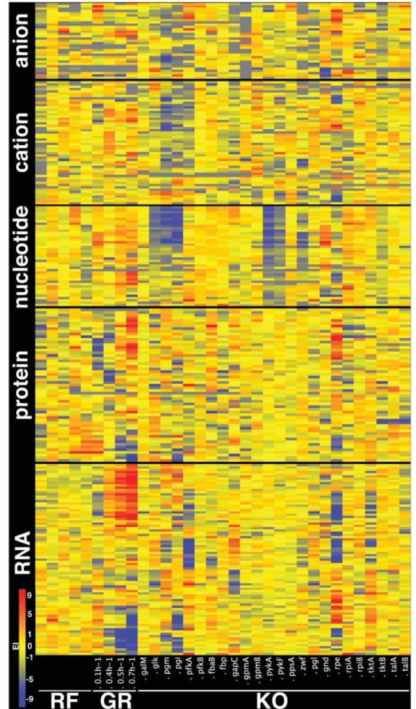
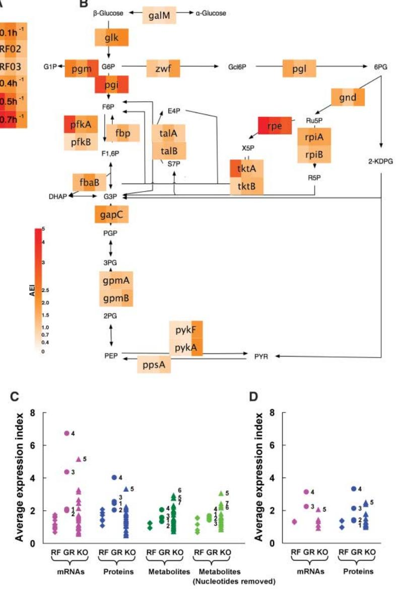
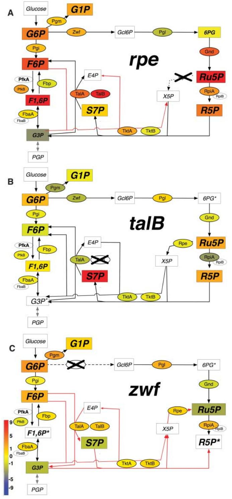

DOI: 10.1126/science.1132067 Science **316**, 593 (2007); Nobuyoshi Ishii et al. **to Perturbations Multiple High-Throughput Analyses Monitor the Response of E. coli**

This copy is for your personal, non-commercial use only.

colleagues, clients, or customers by [clicking here.](http://www.sciencemag.org/about/permissions.dtl) **If you wish to distribute this article to others**, you can order high-quality copies for your

following the guidelines [here.](http://www.sciencemag.org/about/permissions.dtl) **Permission to republish or repurpose articles or portions of articles** can be obtained by

**www.sciencemag.org (this information is current as of December 26, 2012 ): The following resources related to this article are available online at**

version of this article at: **Updated information and services,** including high-resolution figures, can be found in the online

<http://www.sciencemag.org/content/316/5824/593.full.html>

http://www.sciencemag.org/content/suppl/2007/03/19/1132067.DC1.html **Supporting Online Material** can be found at:

<http://www.sciencemag.org/content/316/5824/593.full.html#related> found at: A list of selected additional articles on the Science Web sites **related to this article** can be

<http://www.sciencemag.org/content/316/5824/593.full.html#ref-list-1> This article **cites 19 articles**, 9 of which can be accessed free:

This article has been **cited by** 87 article(s) on the ISI Web of Science

<http://www.sciencemag.org/content/316/5824/593.full.html#related-urls> This article has been **cited by** 32 articles hosted by HighWire Press; see:

<http://www.sciencemag.org/cgi/collection/genetics> Genetics This article appears in the following **subject collections:** registered trademark of AAAS. 2007 by the American Association for the Advancement of Science; all rights reserved. The title Science is a American Association for the Advancement of Science, 1200 New York Avenue NW, Washington, DC 20005. Copyright Science (print ISSN 0036-8075; online ISSN 1095-9203) is published weekly, except the last week in December, by the

expression was, on average, three times as high in GFP cells from NOVH recipients as in those from control (CSGW) recipients (Fig. 4C). In addition, in each animal, this population exhibited a CD34+ CD38– fraction four times that of GFP– cells, which suggested an expanded stem and/or progenitor compartment in the virally transduced population (Fig. 4D). A similar increase was observed using a more stringent immunophenotype (CD34+ CD38– lin– Thy1+ ) for stem cells (fig. S16). Consistent with this, the LTC-IC frequency in GFP human cells isolated from NOVH recipients was almost seven times that in GFP– human cells from the same animal (Fig. 4E). These NOVH GFP+ cells isolated from primary recipients could be maintained in liquid culture for 4 weeks and still retained CD34 expression (fig. S17); by this time, GFP– cells from NOVH recipients and GFP+ cells from control recipients had expired.

In view of the preferential engraftment of Novhi cells, their enhanced LTC-IC capacity, and their ability to maintain high CD34 expression in liquid culture, we assessed the effects of enforced Nov expression on stem cell self-renewal, as classically measured in secondary transplantation assays. Therefore, we intravenously transplanted NOVH GFP+ cells that had been isolated from engrafted animals and subsequently cultured for 4 weeks into secondary recipients at a dose of 15,000 cells per mouse. The frequency of SRC has been estimated to be 1 per 20,700 in cord blood CD34+ cells in primary engraftment assays (29), and is ≤1/10th that amount in secondary transplantation (30). Thus, we consider 15,000 cells in a secondary transplant setting to be a stringently limiting dose. After 8 weeks, engraftment was assessed in recipient bone marrow by GFP fluorescence (Fig. 4F), and, remarkably, given the limited cell dose and the intervening culture period between the primary harvest and the secondary transplantation, was seen in five out of five mice injected. To confirm engraftment, genomic DNA from total bone marrow in each mouse was purified and tested for the presence of human DNA by PCR using primers specific for human chromosome 17 *a*-satellite sequences (31). Evidence for engraftment was seen in each secondary recipient (Fig. 4G). About 20% of engrafted cells also expressed CD34 (Fig. 4F), and expression of human CD33 and CD19 could also be detected, which suggested that multilineage engraftment had occurred.

Using complementary approaches, we have identified a role for Nov in human hematopoietic stem or progenitor cell function, which implicates it as an essential regulator. The key findings are that loss of Nov abrogates primitive progenitor function, both in vitro and in vivo. Homing, survival, and differentiation appear intact, but defects in cell cycling and Notch signaling are apparent. The requirement for Nov in assays that functionally test several types of primitive cell raises the possibility that it has an impact on generic self-renewal machinery common to all of these subsets. Mirroring these observations, the addition of Nov either extracellularly or by enforced intracellular expression, enhances stem or progenitor read-out in vitro. In transplantation assays, enforced expression enhances stem cell and progenitor cell activity within the graft, as judged by immunophenotype and LTC-IC frequency, as well as secondary transplantability at limiting dose.

Although the role of NOV in the function of primitive hematopoietic cells in other species is yet to be tested, our results support the notion that Nov is a central regulator of these cells in humans. NOV thus provides a hitherto unexplored axis for understanding the critical cell-fate decisions of the hematopoietic stem and progenitor compartments.

### References and Notes

- 1. T. Lapidot, I. Petit, Exp. Hematol. 30, 973 (2002).
- 2. X.-B. Zhang et al., PLoS Med. 3, e173 (2006).
- 3. E. C. Attar, D. T. Scadden, Leukemia 18, 1760 (2004).
- 4. I. K. Park et al., Nature 423, 302 (2003).
- 5. H. Hock et al., Nature 431, 1002 (2004).
- 6. H. Hock et al., Genes Dev. 18, 2336 (2004).
- 7. N. B. Ivanova et al., Science 298, 601 (2002).
- 8. L. Bruno et al., Mol. Cell. Biol. 24, 741 (2004).
- 9. V. Joliot et al., Mol. Cell. Biol. 12, 10 (1992).
- 10. B. Perbal, Lancet 363, 62 (2004).
- 11. H. Thibout et al., J. Clin. Endocrinol. Metab. 88, 327 (2003).
- 12. C. G. Lin, C. C. Chen, S.-J. Leu, T. M. Grzeszkiewicz,
- L. F. Lau, J. Biol. Chem. 280, 8229 (2005). 13. C. G. Lin et al., CCN3. J. Biol. Chem. 278, 24200 (2003).
- 14. W. C. Hahn et al., Nature 400, 464 (1999).
- 15. G. de Haan, personal communication.
- 16. H. E. Broxmeyer, Cytotherapy 7, 209 (2005).
- 17. Materials and methods are available as supporting material on Science Online.
- 18. D. A. Rubinson et al., Nat. Genet. 33, 401 (2003). 19. L. Lu, M. Xiao, D. W. Clapp, Z. H. Li, H. E. Broxmeyer
- J. Exp. Med. 178, 2089 (1993). 20. K. Sakamoto et al., J. Biol. Chem. 277, 29399 (2002).
- 21. K. Ohishi et al., Semin. Cell Dev. Biol. 14, 143 (2003).
- 22. M. Bhatia, J. C. Wang, U. Kapp, D. Bonnet, J. E. Dick, Proc. Natl. Acad. Sci. U.S.A. 94, 5320 (1997).
- 23. R. H. Cho, C. E. Muller-Sieburg, Exp. Hematol. 28, 1080 (2000).
- 24. J. E. Dick, G. Guenechea, O. I. Gan, C. Dorrell, Ann. N. Y. Acad. Sci. 938, 184 (2001).
- 25. A. Sirven et al., Mol. Ther. 3, 438 (2001).
- 26. C. Demaison et al., Hum. Gene Ther. 13, 803 (2002).
- 27. S. Amsellem et al., Nat. Med. 9, 1423 (2003). 28. O. S. Kustikova et al., Blood 102, 3934 (2003).
- 29. P. A. Denning-Kendall et al., Br. J. Haematol. 116, 218 (2002).
- 30. G. Guenechea, O. I. Gan, C. Dorrell, J. E. Dick, Nat. Immunol. 2, 75 (2001).
- 31. P. E. Warburton, G. M. Greig, T. Haaf, H. F. Willard, Genomics 11, 324 (1991).
- 32. B. Y. Su et al., Mol. Pathol. 54, 184 (2001).
- 33. We thank A. Atzberger, C. Waugh, I. Titley, and Y.-P. Guo for technical assistance; and N. Rodrigues, C. Heyworth, G. May, D. Higgs, M. Greaves, K. Humphries, M. Bhatia, M. Dexter, and S.-E. Jacobsen for advice and critical reading of the manuscript. This work was supported by the Leukaemia Research Fund, the Medical Research Council, and Eurostemcells.

### Supporting Online Material

www.sciencemag.org/cgi/content/full/316/5824/590/DC1 Materials and Methods Figs. S1 to S17 References

10 October 2006; accepted 26 March 2007 10.1126/science.1136031

# Multiple High-Throughput Analyses Monitor the Response of E. coli to Perturbations

Nobuyoshi Ishii,1,2* Kenji Nakahigashi,1,2* Tomoya Baba,1,2,3* Martin Robert,1,2* Tomoyoshi Soga,1,2,6* Akio Kanai,1,2* Takashi Hirasawa,1,2* Miki Naba,1 Kenta Hirai,1 Aminul Hoque,1,2 Pei Yee Ho,5 Yuji Kakazu,1 Kaori Sugawara,1 Saori Igarashi,1 Satoshi Harada,1 Takeshi Masuda,1,2 Naoyuki Sugiyama,6 Takashi Togashi,1 Miki Hasegawa,1 Yuki Takai,1 Katsuyuki Yugi,1,2 Kazuharu Arakawa,1 Nayuta Iwata,1,2 Yoshihiro Toya,1,2 Yoichi Nakayama,1,2 Takaaki Nishioka,1,2,4 Kazuyuki Shimizu,1,2,5 Hirotada Mori,1,2,3 Masaru Tomita1,2,6*†*

Analysis of cellular components at multiple levels of biological information can provide valuable functional insights. We performed multiple high-throughput measurements to study the response of Escherichia coli cells to genetic and environmental perturbations. Analysis of metabolic enzyme gene disruptants revealed unexpectedly small changes in messenger RNA and proteins for most disruptants. Overall, metabolite levels were also stable, reflecting the rerouting of fluxes in the metabolic network. In contrast, E. coli actively regulated enzyme levels to maintain a stable metabolic state in response to changes in growth rate. E. coli thus seems to use complementary strategies that result in a metabolic network robust against perturbations.

The complex relationships between different layers of biological information that give rise to cellular functions can only be captured by combining global measurements across these different levels (1–8). Moreover, most current global methods such as DNA microarray and shotgun proteomic analyses aim to interrogate the composition of intracellular components rather than to accurately determine the quantities of molecules in cells. More quan-

## REPORTS

titative methods such as quantitative reverse transcription polymerase chain reaction (qRT-PCR) and metabolic flux analysis tend to be more targeted but are essential to detect small changes in response to perturbation. In the present study, we measured the global response of Escherichia coli K-12 cells to genetic and environmental perturbations at the level of protein and gene expression, and compared this with a detailed quantitative analysis of specific metabolic pathways.

To probe the global cellular response, we determined the relative quantities of gene and protein expression using DNA microarray analysis and two-dimensional differential gel electrophoresis (2D-DIGE) (9). For more detailed analysis, in addition to qRT-PCR and metabolic flux analysis, we used capillary electrophoresis time-of-flight mass spectrometry (CE-TOFMS) for metabolome analysis (10, 11) and liquid chromatography tandem mass spectrometry (LC-MS/MS) for absolute quantification of proteins (12). As molecular targets for these more detailed quantitative analyses, we selected genes, proteins, metabolites, and fluxes that make up the bulk of reactions of the central carbon metabolism of E. coli K-12, including glycolysis, the pentose phosphate pathway, and the tricarboxylic acid cycle (fig. S1). Because these pathways play a crucial role in energy generation and in the production of important macromolecular precursors, we wanted to characterize the cellular response to disruptions in order to fulfill basic metabolic needs and maintain the growth phenotype.

We collected data using these multiple highthroughput analyses for wild-type E. coli K-12 and 24 single-gene disruptants, which were selected from the Keio collection (13) and cover most viable glycolysis and pentose phosphate pathway disruptants (i.e., galM, glk, pgm, pgi, pfkA, pfkB, fbp, fbaB, gapC, gpmA, gpmB, pykA, pykF, ppsA, zwf, pgl, gnd, rpe, rpiA, rpiB, tktA, tktB, talA, and talB). The cells were grown at a single fixed dilution rate of 0.2 hours–1 in glucose-limited chemostat cultures, and wildtype cells cultured at the same specific growth rate were used as a reference sample for comparison. To allow a comparison of the effects of these genetic perturbations with the effects of environmental perturbations, wild-type cells were examined at several different dilution rates (0.1, 0.2, 0.4, 0.5, and 0.7 hours–1 ). In chemostat cultures, the concentration of growth-limiting sub-

*These authors contributed equally to this work. †To whom correspondence should be addressed. E-mail: mt@sfc.keio.ac.jp

strate can be controlled by the dilution rate (14); the dilution rate was thus varied in this study from an almost glucose-starved state to a nearly unlimited glucose supply. Changes in dilution rate therefore affect growth rate and can be considered a specific type of environmental change.

To evaluate differences between samples in the various perturbation experiments, we used an expression index (EI) (12), which scales the data to the same deviations for all molecules examined, regardless of their nature (SOM text), so that changes in mRNA, protein, and metabolite can be compared more easily. Figure 1 shows the EIs derived from the targeted analysis of metabolic pathway components. For mRNA and protein, the effects of changes in growth rate are obvious and appear to be larger than the effects of most gene disruptions. In contrast, except for nucleotides, changes in metabolites did not show any distinctive patterns, which could indicate different responses in metabolite levels against various

Fig. 1. Overall representation of changes in the targeted cellular components. The heat map shows the EI values of intracellular components that were detected in more than half the samples. RF, reference sample (wild-type cells cultured at a specific growth rate of 0.2 hours–1 ); GR, wild-type cells cultured at the indicated specific growth rates; KO, single-gene knockout mutants cultured at a specific growth rate of 0.2 hours–1 . The numbers of individual components shown are metabolites, 130; proteins, 57; and mRNA transcripts, 85. The same type of representation, including all component names, is shown in fig. S3, and all EI values are shown in table S8.

perturbations. The lower levels of nucleotides observed in some disruptants (glk, pgm, pgi, pykA, and pykF) may reflect problems in quantification owing to the chemical instability or inconsistent extraction efficiency of these molecules, and we thus provide results calculated including and excluding nucleotide measurements.

To capture the magnitudes of the effects seen in Fig. 1, we calculated an average EI, the average expression index (AEI) (12), for each type of component (mRNA, protein, and metabolite) and compared them between samples (Fig. 2 and tables S10 and S11). One-way analysis of variance (one-way ANOVA) and post hoc tests (Games-Howell test) were performed (12) for all comparisons to test for statistically significant differences (P < 0.05) (SOM text).

At higher growth rates, the AEI for mRNAs and proteins gradually increased in both targeted and global quantification methods, suggesting that E. coli actively regulates global gene and

1 Institute for Advanced Biosciences, Keio University, Tsuruoka, Yamagata 997-0017, Japan. 2 Systems Biology Program, Graduate School of Media and Governance, Keio University, Fujisawa 252-8520, Japan. 3 Graduate School of Biological Sciences, Nara Institute of Science and Technology, Ikoma, Nara 630-0101, Japan. 4 Graduate School of Agriculture, Kyoto University, Kyoto 606-8502, Japan. 5 Department of Bioscience and Bioinformatics, Kyushu Institute of Technology, Iizuka, Fukuoka 820-8502, Japan. 6 Human Metabolome Technologies, Inc., Tsuruoka 997-0017, Japan.

REPORTS

protein levels to meet increasing metabolic demands (Fig. 2, A, C, and D). In contrast, the AEI values for metabolites did not change significantly with growth rate. This relative stability in metabolite level may be a consequence of the observed regulation of enzyme levels. Closer examination of particular components revealed the induction and repression of mRNAs and specific enzymes after a change in specific growth rate (figs. S5 and S6). The levels of proteins involved in glucose uptake (PtsH and PtsI) were induced considerably when the specific growth rate increased. This is to be expected, because substrate uptake is the first step in fulfilling nutrient demands. The observed increase in the expression of phosphoenolpyruvate carboxylase (Ppc), decrease in the expression of phosphoenolpyruvate carboxykinase (PckA), and repression of glyoxylate shunt enzymes are also logical responses to enhance

Fig. 2. AEI values for mRNA, protein, and metabolite levels. RF, GR, and KO are defined in the legend of Fig. 1. (A and B) The AEI values of a specific sample are represented as a heat map. The three panels in each box show three quantitative values corresponding to the AEI for mRNAs as determined by qRT-PCR (left panel), proteins as determined by LC-MS/MS (middle panel), and metabolites as determined by CE-TOFMS (right panel), respectively. (A) AEI values for GR. The labels in each row of the heat map correspond to either a specific growth rate (hours–1 ) or the two reference samples (RF02 and RF03). (B) AEI values for all gene disruptants displayed at their respective locations on the metabolic pathway map. Abbreviations for metabolites are as shown in table S1. (C) Quantitative measurements obtained by targeted analysis. (D) Semiquantitative cellwide measurements. The numerical values are provided in table S9. In (C) and (D), numbers 1, 2, 3, and 4 correspond to specific growth rates of 0.1, 0.4, 0.5, and 0.7 hours–1 , and numbers 5, 6, and 7 correspond to rpe, pgi, and pgm disruptants, respectively.

the tricarboxylic acid cycle flux (2), which corresponds to energy production under aerobic conditions and the components of which are important precursors in biomass production.

In contrast to the changes observed in wildtype cells cultured at various growth rates, most gene disruptants showed only subtle changes in AEIs for both mRNA and protein of central carbon metabolism enzymes, which fell within the range of variations observed in wild-type samples at the same specific growth rate (Fig. 2C). The AEI values for these targeted analyses of mRNAs and proteins in all disruptants were smaller than the AEI values observed for wildtype cells at a specific growth rate of 0.7 hours–1 , and the difference was significant in 23 disruptants for mRNAs and in 16 disruptants for proteins. Similar results were obtained for the AEI values representing the global analysis of mRNA and protein expression (Fig. 2D). These findings suggest that E. coli does not appreciably respond to the loss of a single central carbon metabolism enzyme by regulating the abundance of other compensatory enzymes. This was especially apparent when examining changes in the expression of genes encoding isozymes of the respective disrupted enzymes (fig. S5). Isozymes that might be expected to compensate for the loss of an important enzyme were not up-regulated, although many were induced at higher growth rates. The two exceptions to this general pattern were the induction of pfkB in the pfkA disruptant and the very considerable induction ofrpiB in the rpiA disruptant. However, in both cases, we found that cells accumulated additional mutations that are known to induce expression of the isozymes (15, 16). Therefore, the induction of these genes was not solely dependent on direct regulation (SOM text). It seems apparent that, except for these genes, enzymatic capacity is already expressed in the cell through structural redundancy (presence of isozymes and/or alternative routes).

The AEI values for metabolites in three disruptants (pgm, pgi, and rpe) were higher than those of wild-type cells at high specific growth rates (0.5 and 0.7 hours–1 ) (Fig. 2C). This phenomenon does not appear to be caused by the problems associated with nucleotide measurements in some disruptants, because similar results were obtained even when nucleotides were excluded from the AEI calculation (Fig. 2C). In the rpe disruptant, which had a particularly high AEI for metabolites, the levels of a few linked metabolites were increased to a large extent (Fig. 3A, rpe). However, these local changes were not responsible for the large metabolite AEI for this particular disruptant. Also, an overall stability in metabolite levels, i.e., low AEI, was maintained in most disruptants, even if the local metabolic network was perturbed (Fig. 2B and Fig. 3B, talB). This stability of metabolite levels is likely achieved through structural robustness of the metabolic network itself (17, 18), even when considerable rerouting of fluxes occurs. For exon December 26, 2012

ample, in the zwf disruptant, the overall flux within the pentose phosphate pathway was reversed to compensate for the blocked route for the production of essential molecules, but, interestingly, this task can be achieved without large changes in enzyme levels in the pathways involved (Fig. 3C and table S5).

Our results reveal that the intracellular metabolic network of E. coli is remarkably stable and robust in the face of various types of

Fig. 3. Perturbations in the local metabolic network caused by enzyme gene disruptions. The EI values for proteins (circled) and metabolites (boxed) in rpe (A), talB (B), and zwf (C) disruptants are shown mapped onto the local metabolic network. The disrupted enzymes are highlighted with an X, and the specific reaction eliminated by the disruption is shown with a dashed line. Reactions indicated with red arrows are running in the direction opposite to that in the wild-type. Colorless symbols represent components that were not measurable, and components not detected in the specific mutant are shown with an asterisk.

disturbances. Highlighting the functional importance of this global stability for efficient cell growth, E. coli can actively respond to changes in the concentration of growth-limiting substrate by regulating the level of enzyme expression to maximize growth rate, which is reflected in the observed stability of metabolite levels. Using this strategy, E. coli can react quickly and effectively to this environmental change, but the strategy might be costly, because the cell

must provide additional systems (such as sensor proteins, signal mediators, and transcriptional regulators) to detect and react appropriately to each specific perturbation. Because active response to the environment at the level of gene expressions is a widespread phenotype of E. coli, this might be a common strategy that the cell can use when it faces environmental changes. This strategy contrasts with the finding that E. coli does not appear to react significantly to the disruption of most single metabolic genes by regulating multiple other mRNA or protein levels. In this case, structural redundancy in the metabolic network itself provides the necessary robustness (19, 20), allowing the levels of most metabolites to remain constant, although some localized perturbations are inevitable. This strategy is likely to be less costly than the one mentioned above, because it requires no specific sensors for each mutation, while providing resistance against many of these mutations. Even if this strategy appears insufficient in the face of some mutations, E. coli may survive by accumulating additional mutations, as we observed for pfkA and rpiA disruptants. Using multiple strategies may thus enable E. coli to maintain a stable state when exposed to various types of perturbations. Additional information is available at the project Web site (21).

#### References and Notes

- 1. A. R. Joyce, B. O. Palsson, Nat. Rev. Mol. Cell Biol. 7, 198 (2006).
- 2. S. S. Fong, A. Nanchen, B. O. Palsson, U. Sauer, J. Biol. Chem. 281, 8024 (2006).
- 3. G. N. Vemuri, A. A. Aristidou, Microbiol. Mol. Biol. Rev. 69, 197 (2005).
- 4. A. Mukhopadhyay et al., J. Bacteriol. 188, 4068 (2006).
- 5. M. Y. Hirai et al., Proc. Natl. Acad. Sci. U.S.A. 101, 10205 (2004).
- 6. H. Ge, A. J. Walhout, M. Vidal, Trends Genet. 19, 551 (2003).
- 7. T. Toyoda, A. Wada, Bioinformatics 20, 1759 (2004).
- 8. T. Ideker et al., Science 292, 929 (2001).
- 9. R. Marouga, S. David, E. Hawkins, Anal. Bioanal. Chem. 382, 669 (2005).
- 10. T. Soga et al., J. Proteome Res. 2, 488 (2003).
- 11. T. Soga et al., J. Biol. Chem. 281, 16768 (2006).
- 12. Materials and Methods are available as supporting material on Science Online.
- 13. T. Baba et al., Mol. Syst. Biol. 2, published online 21 February 2006 (10.1038/msb4100050).
- 14. P. A. Hoskisson, G. Hobbs, Microbiology 151, 3153 (2005).
- 15. A. J. Skinner, R. A. Cooper, J. Bacteriol. 118, 1183 (1974).
- 16. F. Daldal, J. Mol. Biol. 168, 285 (1983).
- 17. Z. Gu et al., Nature 421, 63 (2003).
- 18. J. Stelling, S. Klamt, K. Bettenbrock, S. Schuster, E. D. Gilles, Nature 420, 190 (2002).
- 19. H. Kitano, Nat. Rev. Genet. 5, 826 (2004).
- 20. D. Becker et al., Nature 440, 303 (2006).
- 21. http://ecoli.iab.keio.ac.jp
- 22. The authors thank M. Li and M. J. Arauzo-Bravo for help with the metabolic flux calculations; Y. Ishihama for proofreading the manuscript and for advice about LC-MS/MS absolute quantification of proteins; and T. Ogawa, Y. Suga, A. Hagiya, and M. Yoshino for experimental support for protein analyses. This study was carried out as part of a grant from the New Energy and Industrial Technology Development Organization (NEDO) of the Ministry of Economy, Trade, and Industry of Japan (METI) (Development of a Technological Infrastructure for Industrial Bioprocess Project). The work was also

supported by a grant from Core Research for Evolutional Science and Technology (CREST), Japan Science and Technology Agency (JST) (Development of Modeling/ Simulation Environment for Systems Biology); a grant from Japan Society for the Promotion of Science (JSPS); and "grant-in-aid" research grants from the Ministry of Education, Culture, Sports, Science, and Technology (MEXT) for the 21st Century Centre of Excellence (COE) Program (Understanding and Control of Life's Function via Systems Biology), Scientific Research on Priority Areas "Systems Genomics," and Scientific Research on Priority Areas "Lifesurveyor"; as well as funds from the Yamagata Prefectural Government and Tsuruoka City. We thank the faculty and students of the Systems Biology Program at Keio University for useful discussions, as well as members of the International E. coli Alliance (IECA).

#### Supporting Online Material

www.sciencemag.org/cgi/content/full/1132067/DC1 Materials and Methods

## A Synthetic Maternal-Effect Selfish Genetic Element Drives Population Replacement in Drosophila

Chun-Hong Chen,1 Haixia Huang,1 Catherine M. Ward,1 Jessica T. Su,1 Lorian V. Schaeffer,1 Ming Guo,2 Bruce A. Hay1 *

One proposed strategy for controlling the transmission of insect-borne pathogens uses a drive mechanism to ensure the rapid spread of transgenes conferring disease refractoriness throughout wild populations. Here, we report the creation of maternal-effect selfish genetic elements in Drosophila that drive population replacement and are resistant to recombination-mediated dissociation of drive and disease refractoriness functions. These selfish elements use microRNAmediated silencing of a maternally expressed gene essential for embryogenesis, which is coupled with early zygotic expression of a rescuing transgene.

Mosquitoes with a diminished capacity to transmit malaria or dengue have been identified in the wild and/or created in the laboratory, demonstrating that endogenous or engineered mosquito immunity can be harnessed to attack these pathogens (1–5). However, it will be necessary to replace a large percentage of the wild mosquito population with refractory insects to achieve substantial levels of disease control (6–8). Mosquitoes carrying genes that confer disease refractoriness are not expected to have a higher fitness than native mosquitoes, implying that Mendelian transmission is unlikely to result in an increase in the frequency of transgene-bearing individuals after their initial release into the wild (4, 9). Thus, effective population replacement will require the coupling of genes conferring disease refractoriness with a genetic mechanism for driving these genes through the wild population at greater than Mendelian frequencies (10, 11).

Maternal-effect selfish genetic elements [first described in the flour beetle Tribolium castaneum and known by the acronym Medea (maternaleffect dominant embryonic arrest)] select for their own survival by inducing maternal-effect lethality of all offspring not inheriting the elementbearing chromosome from the maternal and/or paternal genome (12) (Fig. 1A). Current models predict that if Medea elements are introduced into a population above a threshold frequency, determined by any associated fitness cost, they will spread within the population (12–14) (Fig. 1, C and D). When introduced into a population at relatively high frequencies, Medea elements are predicted to rapidly convert the entire population into element-bearing heterozygotes and homozygotes (Fig. 1C). Medea in Tribolium is hypothesized to consist of a maternal lethal activity (a toxin) that kills non-Medea–bearing progeny and a zygotic rescue activity (an antidote) that protects Medea-bearing progeny from this maternal lethal effect (12, 15) (Fig. 1A).

To create a Medea-like maternal-effect selfish genetic element in Drosophila, we generated a P transposable element vector in which the maternal germline–specific bicoid (bic) promoter drives the expression of a polycistronic transcript encoding two microRNAs (miRNAs) designed to silence expression of myd88 (the gene producing the toxin) [Fig. 1B and (16)]. Maternal Myd88 is required for dorsal-ventral pattern formation in early embryo development. Females with germline loss-of-function mutations for myd88 give rise to embryos that lack ventral structures and thus fail to hatch, even when a wild-type (WT) paternal allele is present (17). This vector (known as Medeamyd88) also carries a maternal miRNA– insensitive myd88 transgene expressed under the control of the early embryo–specific bottleneck (bnk) promoter (the gene producing the zygotic antidote) (Fig. 1B). Our analysis focused on flies carrying a single autosomal insertion of this element, Medeamyd88-1.

Matings between heterozygous Medeamyd88-1/+ males (where + indicates a chromosome that SOM Text Figs. S1 to S7 Tables S1 to S12 References

5 July 2006; accepted 12 March 2007 Published online 22 March 2007; 10.1126/science.1132067 Include this information when citing this paper.

does not carry Medeamyd88-1) and homozygous +/+ females resulted in high levels of embryo viability, similar to those for the w1118 strain used for transformation (Table 1). In addition, 50% of the adult progeny carried Medeamyd88-1, as expected for Mendelian segregation without dominance. Matings among homozygous Medeamyd88-1 flies also resulted in high levels of egg viability. In contrast, when heterozygous Medeamyd88-1/+ females were mated with homozygous +/+ males, ~50% of progeny embryos had ventral patterning defects (fig. S1) and did not hatch (Table 1). All adult progeny (n > 12,000 flies) carried Medeamyd88-1 (Table 1). On the basis of these data and the results of several other crosses (Table 1), we inferred that a single copy of bic-driven miRNAs targeting maternal myd88 expression was sufficient to induce maternal-effect lethality and a single copy of zygotic bnk-driven myd88 expression was sufficient for rescue.

The above observations, in conjunction with the lack of any obvious fitness effects (lethality) in individuals carrying one or two copies of Medeamyd88-1, suggested that Medeamyd88-1 should be able to drive population replacement. To test this prediction, we mated equal numbers of WT (+/+) and Medeamyd88-1/Medeamyd88-1 males with homozygous +/+ females, giving rise to a progeny population with Medeamyd88-1 present at an allele frequency of ~25% (16). This level of introduction, although high, is not unreasonable, given previous insect population suppression programs (18). Replicate population cage experiments, carried out in a darkened incubator to prevent Medeamyd88-1–bearing flies (which are Pw+ and thus red-eyed) from obtaining any vision-dependent advantage over their +/+ counterparts (which are w1118 and white-eyed) (19), followed three replicates for 20 generations. A second set of four replicates, which were initiated by crossing heterozygous Medeamyd88-1/+ males with homozygous +/+ females, was followed for 15 generations. In both experiments, non-Medeamyd88-1–bearing flies permanently disappeared from the population between generations 10 and 12 (Fig. 1E), without a loss of non-Medea– bearing + chromosomes (in Medeamyd88-1/+ individuals) in the population (Fig. 1F). The observed changes in Medeamyd88-1 were not significantly different from the null hypothesis that the element had no fitness cost [(16) and fig. S2], although we cannot exclude the possibility that a Medeamyd88-1–associated cost is counterbalanced by an unknown negative effect associated with 1 Division of Biology, Mail Code 156-29, California Institute of Technology, Pasadena, CA 91125, USA. 2 Departments of Neurology and Pharmacology, Brain Research Institute, David Geffen School of Medicine, University of California, Los Angeles, Los Angeles, CA 90095, USA.

*To whom correspondence should be addressed. E-mail: haybruce@caltech.edu