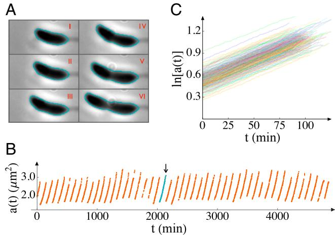
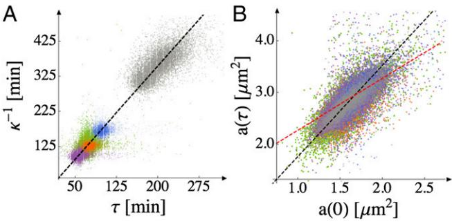
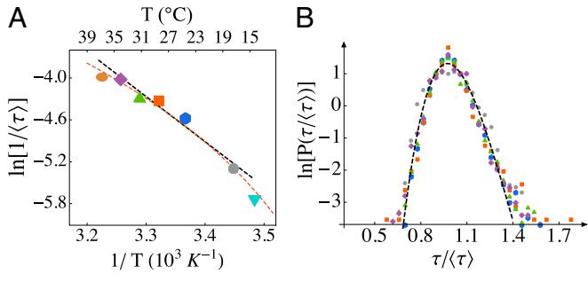
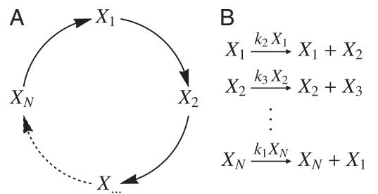
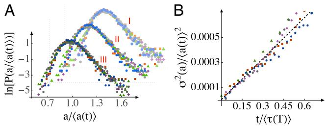

# Scaling laws governing stochastic growth and division of single bacterial cells

Srividya Iyer-Biswasa , Charles S. Wrighta , Jonathan T. Henryb , Klevin Loa , Stanislav Burova , Yihan Linc , Gavin E. Crooksd , Sean Crossonb , Aaron R. Dinnera,e,1, and Norbert F. Scherera,e,1

a James Franck Institute and Institute for Biophysical Dynamics, b Department of Biochemistry and Molecular Biology, and e Department of Chemistry, University of Chicago, Chicago, IL 60637; c Department of Biology, California Institute of Technology, Pasadena, CA 91125; and d Physical Biosciences Division, Lawrence Berkeley National Laboratory, Berkeley, CA 94720

Edited* by Nigel Goldenfeld, University of Illinois at Urbana–Champaign, Urbana, IL, and approved September 19, 2014 (received for review February 20, 2014)

Uncovering the quantitative laws that govern the growth and division of single cells remains a major challenge. Using a unique combination of technologies that yields unprecedented statistical precision, we find that the sizes of individual Caulobacter crescentus cells increase exponentially in time. We also establish that they divide upon reaching a critical multiple (≈1.8) of their initial sizes, rather than an absolute size. We show that when the temperature is varied, the growth and division timescales scale proportionally with each other over the physiological temperature range. Strikingly, the cell-size and division-time distributions can both be rescaled by their mean values such that the conditionspecific distributions collapse to universal curves. We account for these observations with a minimal stochastic model that is based on an autocatalytic cycle. It predicts the scalings, as well as specific functional forms for the universal curves. Our experimental and theoretical analysis reveals a simple physical principle governing these complex biological processes: a single temperature-dependent scale of cellular time governs the stochastic dynamics of growth and division in balanced growth conditions.

single-cell dynamics | cell-to-cell variability | exponential growth | Hinshelwood cycle | Arrhenius law

Quantitative studies of bacterial growth and division initiated the molecular biology revolution (1) and continue to provide constraints on molecular mechanisms (1–8). However, many basic questions about the growth law, i.e., the time evolution of the size of an individual cell, remain (8–13). Whether cells specifically sense size, time, or particular molecular features to initiate cell division is also unknown (14). Answers to these questions, for individual cells in balanced growth conditions, are of fundamental importance, and they serve as starting points for understanding collective behaviors involving spatiotemporal interactions between many cells (15–18).

Cell numbers increase exponentially in bulk culture in balanced growth conditions irrespective of how the size of an individual cell increases with time (1). Thus, observation of the population is insufficient to reveal the functional form of the growth law for a given condition. Bulk culture measurements necessarily average over large numbers of cells, which can conceal cell-to-cell variability in division times, sizes at division, growth rates, and other properties (19). Moreover, the cell cycles of different cells in the population are typically at different stages of completion at a given time of observation. Even when effort is made to synchronize cells at the start of an experiment, so as to have a more tightly regulated initial distribution of growth phases, this dispersion can only be mitigated, not eliminated. These considerations highlight the importance of studying growth and division at the single-cell level.

The landmark papers of Schaechter, Koch, and coworkers (2, 20, 21) addressed issues of growth at the single-cell level, but the (statistical) precision of these measurements was not sufficient to characterize the growth law(s) under different conditions. There is evidence that the growth laws for various microorganisms under favorable conditions are exponential (14, 22–25). However, both linear and exponential growth laws have been previously proposed (26–29), and it is estimated that a measurement precision of 6% is required to discriminate between these functional forms for cells that double in size during each division period (5). This precision is difficult to achieve in typical single-cell microscopy studies because cell division leads to rapid crowding of the field of view (30).

Various experimental approaches have been introduced to address this issue (25, 31–34). Conventional single-cell measurements on agarose pads are limited to about 10 generations, and the age distribution of the observed cells is skewed toward younger cells because the population numbers grow geometrically (35). Designed confinement of cells allows observation of constant numbers of cells without requiring genetic manipulation (25, 34). The system that we describe here for Caulobacter crescentus allows tracking constant numbers of single cells over many generations at constant (and, if desired, low) number densities. This setup provides the advantages that contacts between cells can be avoided and the environment can be kept invariant over the course of an experiment, such that all cells exhibit equivalent statistics. In fact, in control experiments with this setup, we observe that cells grow at reduced rates when they come in contact with each other. Our extensive data provide the statistical precision needed to transcend previous studies to establish the functional form of the mean growth law under

## Significance

Growth and division of individual cells are the fundamental events underlying many biological processes, including the development of organisms, the growth of tumors, and pathogen– host interactions. Quantitative studies of bacteria can provide insights into single-cell growth and division but are challenging owing to the intrinsic noise in these processes. Now, by using a unique combination of measurement and analysis technologies, together with mathematical modeling, we discover quantitative features that are conserved across physiological conditions. These universal behaviors reflect the physical principle that a single timescale governs noisy bacterial growth and division despite the complexity of underlying molecular mechanisms.

Author contributions: S.I.-B., Y.L., A.R.D., and N.F.S. designed research; S.I.-B. and C.S.W. performed research; C.S.W. developed custom software for image analysis; S.I.-B., J.T.H., Y.L., and S.C. contributed new reagents/analytic tools; S.I.-B., C.S.W., K.L., and S.B. analyzed data; S.I.-B. and G.E.C. tested the stochastic Hinshelwood cycle model; and S.I.-B., A.R.D., and N.F.S. wrote the paper.

The authors declare no conflict of interest.

*This Direct Submission article had a prearranged editor.

1 To whom correspondence may be addressed. Email: [dinner@uchicago.edu](mailto:dinner@uchicago.edu) or [nfschere@](mailto:nfschere@uchicago.edu) [uchicago.edu](mailto:nfschere@uchicago.edu).

This article contains supporting information online at [www.pnas.org/lookup/suppl/doi:10.](http://www.pnas.org/lookup/suppl/doi:10.1073/pnas.1403232111/-/DCSupplemental) [1073/pnas.1403232111/-/DCSupplemental.](http://www.pnas.org/lookup/suppl/doi:10.1073/pnas.1403232111/-/DCSupplemental)

different conditions and to characterize fluctuations in growth and division.

#### Results and Discussion

Experimental Design. Determining quantitative laws governing growth and division requires precise measurement of cell sizes of growing cells under invariant conditions for many generations. We achieved these criteria by choosing an organism that permits control of cell density through molecular biology and microfluidics. The bacterium C. crescentus divides into two morphologically and functionally distinct daughter cells: a motile swarmer cell and an adherent stalked cell that is replication competent. A key improvement over our earlier work (7, 36) is that the surface adhesion phenotype can be switched on–off with an inducible promoter. This strain, in combination with automated microscopy in a temperature-controlled enclosure, allows measurement of ∼1,000 single stalked cells for >100 generations each at constant low-density (uncrowded) balanced growth conditions ([SI](http://www.pnas.org/lookup/suppl/doi:10.1073/pnas.1403232111/-/DCSupplemental/pnas.201403232SI.pdf?targetid=nameddest=STXT) Text[, section 1](http://www.pnas.org/lookup/suppl/doi:10.1073/pnas.1403232111/-/DCSupplemental/pnas.201403232SI.pdf?targetid=nameddest=STXT) and [Fig. S1](http://www.pnas.org/lookup/suppl/doi:10.1073/pnas.1403232111/-/DCSupplemental/pnas.201403232SI.pdf?targetid=nameddest=SF1)).

We determine the area of each stalked cell in our 2D images with a precision better than 2% (Methods; SI Text[, section 2](http://www.pnas.org/lookup/suppl/doi:10.1073/pnas.1403232111/-/DCSupplemental/pnas.201403232SI.pdf?targetid=nameddest=STXT) and [Figs. S1](http://www.pnas.org/lookup/suppl/doi:10.1073/pnas.1403232111/-/DCSupplemental/pnas.201403232SI.pdf?targetid=nameddest=SF1) and [S2](http://www.pnas.org/lookup/suppl/doi:10.1073/pnas.1403232111/-/DCSupplemental/pnas.201403232SI.pdf?targetid=nameddest=SF2)). Because these cells are cylindrically symmetric around the curved longitudinal axis, the measured areas account for the varying width of the cell and faithfully report the cell volumes [(Fig. S3](http://www.pnas.org/lookup/suppl/doi:10.1073/pnas.1403232111/-/DCSupplemental/pnas.201403232SI.pdf?targetid=nameddest=SF3)). We thus use cell areas to quantify cell sizes. Using image processing software that we developed, we obtain 4,000–16,000 growth curves for individual cells in complex medium (peptone yeast extract, PYE) at each of seven temperatures spanning the physiological range of the organism: 14, 17, 24, 28, 31, 34, and 37 °C.

Cell Sizes Increase Exponentially to a Relative Threshold; Mean Growth Rate Determines Mean Division Time. Fig. 1 shows representative data for single-cell growth. The fact that the curves are straight on a semilogarithmic plot indicates that the growth law is exponential (see also [Fig. S4)](http://www.pnas.org/lookup/suppl/doi:10.1073/pnas.1403232111/-/DCSupplemental/pnas.201403232SI.pdf?targetid=nameddest=SF4); this relation holds for all temperatures studied. In other words, each growth curve can be well fit by the form

$$a_{\vec{\eta}}(t;T) = a_{\vec{\eta}}(0;T) \exp\left[\kappa_{\vec{\eta}}(T)t\right],\tag{1}$$

where aijð0; TÞ is the initial size of the ith stalked cell in the jth generation, and T is the temperature. Each growth curve yields a division time, τijðTÞ; and a rate of exponential growth, κijðTÞ (Fig. 2 and SI Text[, section 3.1](http://www.pnas.org/lookup/suppl/doi:10.1073/pnas.1403232111/-/DCSupplemental/pnas.201403232SI.pdf?targetid=nameddest=STXT)).

Fig. 2 shows the parameters in Eq. 1 for each growth curve at each temperature. The growth and division timescales, κ−1 ij ðTÞ and τijðTÞ, respectively, vary proportionally (over about a fourfold dynamic range; Fig. 2A), such that the mean growth rate and mean division time determine each other. This fact, together with Eq. 1, suggests that the initial and final sizes of the cells should also scale linearly with each other (with no additive offset), to be consistent with exponential growth. We confirm experimentally that they do (Fig. 2B), which further supports the exponential growth law (see also SI Text[, section 3.2,](http://www.pnas.org/lookup/suppl/doi:10.1073/pnas.1403232111/-/DCSupplemental/pnas.201403232SI.pdf?targetid=nameddest=STXT) [Table S1,](http://www.pnas.org/lookup/suppl/doi:10.1073/pnas.1403232111/-/DCSupplemental/pnas.201403232SI.pdf?targetid=nameddest=ST1) and [Figs. S5](http://www.pnas.org/lookup/suppl/doi:10.1073/pnas.1403232111/-/DCSupplemental/pnas.201403232SI.pdf?targetid=nameddest=SF5) and [S6](http://www.pnas.org/lookup/suppl/doi:10.1073/pnas.1403232111/-/DCSupplemental/pnas.201403232SI.pdf?targetid=nameddest=SF6)).

The biological significance of Fig. 2B is that cells divide when their sizes are a constant multiple of the initial stalked cell size. The existence of a relative size threshold is further supported by the fact that the ratio aijðτ; TÞ=aijð0; TÞ appears more tightly regulated than aijðτ; TÞ [(Fig. S7](http://www.pnas.org/lookup/suppl/doi:10.1073/pnas.1403232111/-/DCSupplemental/pnas.201403232SI.pdf?targetid=nameddest=SF7)) as their respective coefficients of variation (SD divided by mean) are ∼8% and ∼20%. From the slope of the best-fit line in black in Fig. 2B, we obtain haijðτ; TÞ=aijð0; TÞi≈ expð0:565Þ =1:76, where h...i indicates a population average. This value is consistent with known average ratios of stalked and swarmer cell sizes for C. crescentus (37), but prior measurements could not eliminate alternative singlecell scenarios. For example, one might just as well have expected

Fig. 1. Cell sizes (areas, a) as functions of time (t). (A) Six phase-contrast images of a cell, all taken from a single generation at 15-min intervals, starting from 10 min after the previous division, are shown (respectively labeled I–VI). From such images, the area of each cell as a function of time is inferred from the outlines indicated. (B) The area is plotted as a function of time for many generations of a single cell. The generation indicated in teal and by an arrow indicates time period from which images in A are taken. (C) We plot measured areas on a semilogarithmic scale to make the growth law evident. The data shown are from 5 cells over the course of ∼300 generations each in an experiment conducted at 24 °C in complex medium. More than 4,000 growth curves were obtained from ∼100 cells in this experiment; only a small subset is shown here for clarity. The image acquisition rate was 1 frame per minute.

division at constant swarmer cell size, in analogy to budding yeast (14) or the model proposed in ref. 38 for symmetrically dividing bacteria; in that case, the points would follow a line with a slope of 1 and a nonzero intercept, as indicated by the red dashed line in Fig. 2B. An important implication of the relative size threshold is that there must be growth during the swarmer stage; whether this growth occurs throughout the swarmer stage or together with differentiation remains to be demonstrated.

Mean Division Time Decreases as Temperature Increases. We plot the logarithm of the growth rate against the inverse temperature, as is common for bulk culture studies (39–41), in Fig. 3A. For bulk culture studies, such plots typically deviate from a strict Arrhenius law (a straight line in Fig. 3A, corresponding to hκi∝hτðTÞi−1 =Aexp½−ΔE=kBT-, where A is a temperatureindependent constant, ΔE is the activation energy, and kB is Boltzmann's constant) (40, 41) and exhibit a turnover in the growth rate. We do not observe a turnover in the single-cell growth rate over the temperatures studied, which span the physiological range—the mean division time decreases as the temperature increases over the full range (although see Extreme Temperatures Reinforce the Scaling Laws for a discussion of mortality).

The points in the range 17–34 °C fall sufficiently near a straight line that one can use the data to estimate an effective ΔE, also known as the "temperature characteristic" (39–41). We find ΔE=54:0 kJ=mol (12.9 kcal/mol), which is consistent with previous estimates from bulk culture measurements for several bacteria (42–44). Empirical relations have been proposed to capture the negative curvature in Fig. 3A, and we show the best fit of the form suggested by Ingraham, Ratkowsky, and coworkers (39– 41), hτi −1 ∼ ðT −T0Þ 2 , in Fig. 3A. In that model, the "minimum temperature" T0 sets the energy scale; for our data, T0 = 270 K. A series expansion shows that values in the range 260–280 K, as tabulated for other microorganisms (40, 41), are consistent with ΔE≈ 54 kJ=mol (see SI Text[, section 4.1](http://www.pnas.org/lookup/suppl/doi:10.1073/pnas.1403232111/-/DCSupplemental/pnas.201403232SI.pdf?targetid=nameddest=STXT) for further discussion).

Downloaded from https://www.pnas.org by 78.210.25.5 on April 29, 2024 from IP address 78.210.25.5.

Fig. 2. Proportionality of the growth and division timescales; cell size at division is a critical multiple of its initial size. Superposition of data from temperatures across the physiologically relevant range (purple, 34 °C; green, 31 °C; orange, 28 °C; blue, 24 °C; gray, 17 °C). There are 4,000–16,000 data points for each temperature. (A) Points are obtained by identifying division periods τij and fitting single-cell growth trajectories to the exponential growth law, Eq. 1. The slope of the best-fit line (shown in black) is 0.565, which is equivalent to division occurring when haðτ; TÞ=að0; TÞi≈expð0:565Þ=1:76. The coefficient of determination for the fit is R2 =0:98 for all temperatures. (The faint banding is a visualization artifact rather than a feature of the data.) (B) The final area just before division, aijðτ; TÞ, is plotted against the initial area, aijð0Þ, of each cell. The data from all five temperatures are scattered around the black dashed straight line aðτ; TÞ=1:76 að0Þ. R2 =0:99 for all temperatures. The red dashed line represents division at constant swarmer cell size for comparison.

The precise values of parameters of course depend on the temperature ranges used for the fits, but it is important to note that ΔE is of the order of a typical enzyme-catalyzed reaction's activation energy (45, 46).

Model for Exponential Growth. Motivated by our observations for the mean behaviors, we consider a simple kinetic model that was introduced by Hinshelwood in 1952 to describe exponential growth (47). This model consists of an autocatalytic cycle of N reactions, in which each species catalyzes production of the next (Fig. 4). An important feature of this model is that the overall rate constant for growth (κ) is the geometric mean of the rate constants of the elementary steps (ki) (47) [(Fig. S8](http://www.pnas.org/lookup/suppl/doi:10.1073/pnas.1403232111/-/DCSupplemental/pnas.201403232SI.pdf?targetid=nameddest=SF8)):

$$\kappa = \left(k_1 k_2 \dots k_N\right)^{1/N}.\tag{2}$$

Therefore, if the rates of the elementary steps vary in an Arrhenius fashion, the overall rate constant for growth must vary similarly. To see this, substitute kiðTÞ=Ai exp½−ΔEi=kBT- (where Ai and ΔEi are, respectively, the collision frequency and activation energy of reaction i) into Eq. 2:

$$\kappa(T) = (\mathcal{A}_1 \dots \mathcal{A}_N)^{1/N} \exp\left[-\frac{\Delta E_1 + \dots \dots + \Delta E_N}{Nk_B T}\right] \tag{3}$$

$$\equiv \mathcal{A} \exp[-\Delta E/k_B T].$$

This equation shows that ΔE is the arithmetic mean of the elementary activation energies. Therefore, if each step has an activation energy of the order of a typical enzyme reaction's, then so does the effective growth rate. This idea is consistent with our measurements (Fig. 3A), and is independent of the chemical identities of Xi and the value of N.

It is important to stress that the validity of the model and its conclusions are not contingent on a specific form for the temperature dependence. Although it is arguably easiest to see the averaging of the rate in the Arrhenius case considered above, it is generally true that the overall rate varies like the constituent rates. For example, if the constituent rates follow the Ratkowsky form (41), then the composite rate does as well, to leading order, so long as the energy scales of the individual steps are not very disparate (SI Text[, section 4.1](http://www.pnas.org/lookup/suppl/doi:10.1073/pnas.1403232111/-/DCSupplemental/pnas.201403232SI.pdf?targetid=nameddest=STXT)).

Fluctuations in Cell Sizes Scale with Their Means. Given that the Hinshelwood cycle captures the mean behaviors that we observe, it is of interest to understand its implications for the fluctuation statistics that we can obtain from our extensive single-cell growth data. To this end, we recently generalized the model by assuming that the reactions in the cycle have exponential waiting-time distributions and showed analytically that its dynamics reduces to those of a single composite stochastic variable (48). We term this model the stochastic Hinshelwood cycle (SHC).

A key result of the model is that, asymptotically, fluctuations in all chemicals in the SHC (Fig. 4) become perfectly correlated with each other (48). Thus, the SHC makes a strong prediction for the scaling of size fluctuations in the asymptotic limit: the cellsize distributions from all times should collapse to a universal curve when they are rescaled by their exponentially growing means (48). In other words, in balanced growth conditions, the width of the size distribution grows exponentially at the same rate as the mean growth rate, κ. This prediction is validated by our data in the Arrhenius range, as shown in Fig. 5A (see also SI Text[, section 4.2](http://www.pnas.org/lookup/suppl/doi:10.1073/pnas.1403232111/-/DCSupplemental/pnas.201403232SI.pdf?targetid=nameddest=STXT)).

The SHC also makes predictions for dynamics of growth noise in individual growth trajectories. To enable comparison with our data, we derived the equivalent Langevin description from the Master equation for the SHC. It is (48)

$$\frac{da(t;T)}{dt} = \kappa(T)a(t;T) + \eta(t;T)\sqrt{a(t;T)},\tag{4}$$

where η is Gaussian white noise satisfying hηðt1; TÞηðt2; TÞi ≡ BðTÞδðt1 − t2Þ, which defines BðTÞ (48). The first term on the right-hand side of Eq. 4 represents the systematic exponential growth (the "drift") and the second term is the noise (the "diffusion"). Eq. 4 shows that the noise increases in magnitude with the area (i.e., it is "multiplicative"), and it does so in proportion to the square root of the area. This Langevin equation contrasts with the well-known Black–Scholes equation for multiplicative noise (also known as geometric Brownian motion), which has

Fig. 3. Scaling of the division-time distribution with temperature. (A) Variation of the mean division time with temperature (brown, 37 °C; purple, 34 °C; green, 31 °C; orange, 28 °C; blue, 24 °C; gray, 17 °C, cyan, 14 °C; "ln" is natural logarithm). The error in the mean is less than the size of the symbols. We estimate the effective activation barrier to be ΔE =54:0 kJ=mol (12.9 kcal/mol). This estimate comes from the slope of the black line, which is fit to the data over the temperature range 17–34 °C (R2 =0:97). The red dashed line is a fit of the Ratkowsky form, hτi −1 ∼ðT −T0Þ 2 (41), over the entire temperature range studied; T0 is inferred to be 270 K. We also provide a Celsius scale (Top) for convenience; note that this scale is not linear. (B) Probability distributions of division times from different temperatures (colors are the same as in A), rescaled by the respective temperature-dependent mean values in A, collapse to a single curve (coefficient of variation, COV, ∼13%). The invariant shape of the distribution indicates that a single timescale, expressible in terms of the mean division time, governs stochastic division dynamics.

Fig. 4. Hinshelwood model for exponential growth. (A) Schematic showing the autocatalytic cycle, in which each species activates production of the next. (B) Corresponding reactions. The size of a cell is assumed to be proportional to a linear combination of the copy numbers of the species in the cycle. In the SHC, the dwell times are assumed to be exponentially distributed; reaction propensities are indicated above the arrows in B. Note that the effective growth rate, κ, depends only on the rate constants, ki .

been invoked to explain cell-size distributions (49). In the Black– Scholes equation, both the drift and diffusion terms scale linearly with the dynamical variable. The square root multiplicative noise in Eq. 4 results in the observed scale invariance of the cell-size distribution, and the corresponding mean rescaled asymptotic cell-size distribution is a gamma distribution (48). In contrast, the Black–Scholes equation does not yield the observed constancy of the coefficient of variation of cell sizes, and instead predicts a lognormal cell-size distribution with a coefficient of variation that increases as ffi t p .

For a given initial cell size, Eq. 4 predicts that the square of the coefficient of variation of cell sizes should fall on a straight line when plotted against time; additionally, dimensional analysis dictates that the slope of this straight line should be independent of temperature when we rescale BðTÞ by κðTÞ and t by hτðTÞi:

$$\frac{\sigma^2(t;T)}{\langle a(t;T)\rangle^2} \approx \frac{B(T)t}{a(0;T)} \approx \frac{1}{a(0;T)} \left[\frac{B(T)}{\langle \kappa(T)\rangle}\right] \frac{t}{\langle \tau(T)\rangle}.\tag{5}$$

In Fig. 5B we show that this prediction is also validated by our data, and that BðTÞ=hκðTÞi= 0:0011. This value indicates that the fluctuations around each individual exponential growth curve are small compared with its time constant. To the best of our knowledge, the SHC is the only microscopic model of stochastic exponential growth to capture the statistics of individual growth trajectories that we measure (Fig. 5 A and B).

Fluctuations in Division Times Scale with Their Means. Next, we examine fluctuations in cell division times and their variation with temperature. We show in ref. 48 that treating stochastic division of cells as a first passage time problem for the cell size to reach a critical value gives rise to additional scaling forms. The meanrescaled division-time distributions from all temperatures should collapse to the same curve, because the single timescale hκðTÞi−1 , which is proportional to hτðTÞi (Fig. 2), governs stochastic division dynamics (48). This prediction is validated by our observed division-time distributions from all temperatures (Fig. 3B). Specifically, the SHC model predicts a beta-exponential distribution of division times for an absolute cell-size threshold and a given initial size (48). By convolving this result with the observed initial size distribution (Fig. 5), we can determine the expression for the division-time distribution for the observed relative size thresholding (Fig. 2B; see SI Text[, section 4.3](http://www.pnas.org/lookup/suppl/doi:10.1073/pnas.1403232111/-/DCSupplemental/pnas.201403232SI.pdf?targetid=nameddest=STXT) for details). This form provides a good fit of the data (Fig. 3B and SI Text[, section 4.3](http://www.pnas.org/lookup/suppl/doi:10.1073/pnas.1403232111/-/DCSupplemental/pnas.201403232SI.pdf?targetid=nameddest=STXT)) for all temperatures in the Arrhenius range (17–34 °C).

Extreme Temperatures Reinforce the Scaling Laws. Finally, we discuss the behavior outside of the Arrhenius range. At 37 °C, there is significant cell mortality. The probability of a cell surviving is a decaying exponential function of time, corresponding to a constant probability per unit time of dying of ∼7% per mean cell lifetime (see SI Text[, section 5](http://www.pnas.org/lookup/suppl/doi:10.1073/pnas.1403232111/-/DCSupplemental/pnas.201403232SI.pdf?targetid=nameddest=STXT) and [Fig. S9](http://www.pnas.org/lookup/suppl/doi:10.1073/pnas.1403232111/-/DCSupplemental/pnas.201403232SI.pdf?targetid=nameddest=SF9) for details). At all other temperatures (in PYE medium), cell mortality is less than 1% for up to 100 generations, and we do not observe any senescence (i.e., systematic decrease in reproductive output with time) (50). Bulk-culture measurements cannot separate the contributions to decreased reproductive output from increased mortality and decreased growth rates of surviving cells.

Remarkably, at both 14 °C and 37 °C, the single-cell growth law for surviving cells continues to be exponential ([Fig. S10](http://www.pnas.org/lookup/suppl/doi:10.1073/pnas.1403232111/-/DCSupplemental/pnas.201403232SI.pdf?targetid=nameddest=SF10)), and the exponential growth timescale hκðTÞi−1 continues to scale proportionally with the mean division time ([Fig. S11](http://www.pnas.org/lookup/suppl/doi:10.1073/pnas.1403232111/-/DCSupplemental/pnas.201403232SI.pdf?targetid=nameddest=SF11)). In other words, both growth and division slow together. Consequently, the final size at division also scales proportionally with the initial size of the cell and thus a relative cell-size thresholding scheme for cell division continues to hold at these temperatures. The scaling laws for mean-rescaled cell-size and division-time distributions also continue to hold for these two temperatures (SI Text[, section 5](http://www.pnas.org/lookup/suppl/doi:10.1073/pnas.1403232111/-/DCSupplemental/pnas.201403232SI.pdf?targetid=nameddest=STXT) and [Fig. S11)](http://www.pnas.org/lookup/suppl/doi:10.1073/pnas.1403232111/-/DCSupplemental/pnas.201403232SI.pdf?targetid=nameddest=SF11). Our results for growth at extreme temperatures further validate the scaling predictions and show that they continue to hold even when the growth rate deviates from the Arrhenius law.

Applicability to Other Microorganisms. Although the results presented here are for C. crescentus in complex medium, we expect them to apply to growth and division of other microorganisms in different balanced growth conditions. In ref. 48, we show that the size scaling laws follow directly from exponential growth, and, as noted in the Introduction, there is evidence of exponential growth in several microorganisms (14, 22–25). We thus expect the cell-size distributions of these organisms to collapse to a single curve when rescaled by their means. The premise that size scaling generally holds for bacteria in balanced growth conditions was put forth long ago (51); however, it is important to note that the size distribution in earlier studies was a convolution of our size distribution with the cell-cycle-phase distribution (related to our division-time distribution) because the data were taken from images at single laboratory times for asynchronous populations.

The fact that effective activation energies for population growth are generally in the range of individual enzyme-catalyzed reactions' (45) suggests that the SHC applies broadly. Stochastic exponential growth implies growth dynamics with a single timescale. The division-time distribution scales with its mean when the exponential timescale is proportional to the mean division timescale (48). Clearly this need not always be the case: the DNA replication time is distinct from the doubling time for E. coli

Fig. 5. Scaling of cell-size fluctuations within each division period. (A) The size (area) distributions at all temperatures (purple, 34 °C; green, 31 °C; orange, 28 °C; blue, 24 °C; gray, 17 °C) are plotted for three different rescaled time points, at t=hτðTÞi=0; 0:2, and 0.6 (marked I, II, and III, respectively). "ln" is natural logarithm. The area distributions at each time have been rescaled by their exponentially growing mean sizes. See also [Fig. S12](http://www.pnas.org/lookup/suppl/doi:10.1073/pnas.1403232111/-/DCSupplemental/pnas.201403232SI.pdf?targetid=nameddest=SF12). (B) Relaxation of the COV of cell size (area) after division. The slope of the black dashed line, which is fitted to data for all temperatures simultaneously, is 0.0011.

Downloaded from https://www.pnas.org by 78.210.25.5 on April 29, 2024 from IP address 78.210.25.5.

under favorable nutrient conditions, as recently modeled (38). It remains to be determined if these two timescales change proportionally when temperature is varied. However, a single timescale could still characterize growth and division of E. coli in minimal medium, where replication and division frequency are approximately equal. The relative size threshold for division is a previously unidentified paradigm for how cell size can inform cell division. For exponential growth, this feature is related to the growth rate and the division time varying linearly with each other as the temperature changes; the ratio of the joint size of the daughter cells to the mother cell sets the proportionality constant.

Molecular Basis. How molecular interactions set the growth rate, how they couple to the divisome and cell wall synthesis machinery, and how the associated network gives rise to SHC dynamics remain to be determined for each exponential growth condition. We caution against interpreting exponential growth of cell size as necessitating a spatially uniform distribution of active growth sites on the cell because polar growth of single Agrobacterium tumefaciens cells has been observed to be superlinear and is potentially exponential (52). In ref. 48, we show that complex autocatalytic networks can be systematically reduced to effective SHC models. Therefore, the scaling laws discussed here should persist in other conditions, even when additional molecular pathways contribute to setting the growth rate. Previous studies argued for an N =2 cycle composed of the global production of metabolic proteins at a rate proportional to the numbers of ribosomal RNA and vice versa (2, 43), leading to a constant ratio of the two species (8). However, one should not take this model literally because metabolic proteins do not directly produce ribosomes. Judicious use of antibiotics and alternative growth media, as in refs. 4, 9, together with our singlecell technology, could provide important clues to contributing biochemical reactions for a given condition.

#### Conclusions

The preponderance of recent work on bacterial growth in singlecell studies has focused on bottom-up explorations of specific regulatory networks (53), and some simple empirical laws connecting global gene expression patterns with the growth state of the cell have emerged (9, 10). The complementary, top-down approach of using observations at the organismic level to deduce constraints on microscopic models (2, 3, 20, 21) has been less popular in the last few decades. In this paper we have taken the latter approach but now with the advantage of being able to acquire and analyze large datasets. We have observed robust scaling laws for cell growth and division, in addition to the observation of exponential growth of mean single-cell sizes. To summarize, these single-cell scaling laws are as follows. i) The growth law is exponential during balanced growth under favorable nutrient conditions. ii) The mean division time is

- 1. Monod J (1949) The growth of bacterial cultures. Annu Rev Microbiol 3: 371–394.
- 2. Schaechter M, Maaloe O, Kjeldgaard NO (1958) Dependency on medium and temperature of cell size and chemical composition during balanced grown of Salmonella typhimurium. J Gen Microbiol 19(3):592–606.
- 3. Donachie WD (1968) Relationship between cell size and time of initiation of DNA replication. Nature 219(5158):1077–1079.
- 4. Scott M, Gunderson CW, Mateescu EM, Zhang Z, Hwa T (2010) Interdependence of cell growth and gene expression: Origins and consequences. Science 330(6007): 1099–1102.
- 5. Tzur A, Kafri R, LeBleu VS, Lahav G, Kirschner MW (2009) Cell growth and size homeostasis in proliferating animal cells. Science 325(5937):167–171.
- 6. Huh D, Paulsson J (2011) Random partitioning of molecules at cell division. Proc Natl Acad Sci USA 108(36):15004–15009.
- 7. Lin Y, Li Y, Crosson S, Dinner AR, Scherer NF (2012) Phase resetting reveals network dynamics underlying a bacterial cell cycle. PLoS Comput Biol 8(11):e1002778.
- 8. Hagen SJ (2010) Exponential growth of bacteria: Constant multiplication through division. Am J Phys 78:1290–1296.
- 9. Scott M, Hwa T (2011) Bacterial growth laws and their applications. Curr Opin Biotechnol 22(4):559–565.

proportional to the inverse of the mean growth rate. iii) The size of the cell at division is proportional to the initial size of the cell. iv) The mean-rescaled division-time distribution is temperature invariant. v) The mean-rescaled cell-size distribution from all times and temperatures is invariant. vi) The coefficient of variation of cell sizes, for a given initial cell size, scales as the square root of time.

To the best of our knowledge, the SHC is the simplest model that captures all these behaviors, not just the trends of the means but also those of the fluctuations. Additionally, we showed that the averaging of the rate constants in the Hinshelwood cycle can account for the energy scale implied by the temperature dependence of the mean growth rate, which is on the order of a single enzyme-catalyzed reaction's activation energy. However, we emphasize that the variation in Fig. 3A is not itself a scaling law and only serves to "calibrate" how the absolute unit of time (the mean division time) varies with the external parameter (temperature); the scaling laws enumerated above are insensitive to the form of the temperature dependence. Our data and the SHC (48) show that stochastic growth and division are governed by a single timescale, which, in turn, depends on the growth conditions. This simple design principle is unexpected given the complexity of a whole organism.

### Methods

The experimental techniques developed here enable studies of individual noninteracting cells in well-controlled environments for >100 generations. We have generated a strain in which the only functional copy of the holdfast synthesis A (hfsA) gene, which controls features required to adhere to surfaces, is integrated at a single chromosomal locus under the control of an inducible promoter. As a result, we can initially induce holdfast production until we have the desired numbers of cells sticking to the glass surface of the microfluidic device and then flow away the remaining cells. Once the experiment commences, the inducer is removed and newborn daughter cells, upon differentiation, do not express functional hfsA and are thus unable to stick and are flowed away. This prevents the crowding of the fields of view that occurs in typical experiments with exponential growth.

We use phase-contrast imaging to accurately measure growth frame-byframe, instead of just division events. In a typical experiment, data from 20 unique fields of view are acquired at a rate of each field per minute (roughly 100,000 images in 3 days). Finally, we have developed custom software using a combination of MATLAB and Python for automated image processing, which is necessary for extracting quantitative information from these extensive data (∼106 images for each temperature studied). See SI Text[, section](http://www.pnas.org/lookup/suppl/doi:10.1073/pnas.1403232111/-/DCSupplemental/pnas.201403232SI.pdf?targetid=nameddest=STXT) [1](http://www.pnas.org/lookup/suppl/doi:10.1073/pnas.1403232111/-/DCSupplemental/pnas.201403232SI.pdf?targetid=nameddest=STXT) for further details.

ACKNOWLEDGMENTS. We thank Aretha Fiebig, Ariel Amir, Rutger Hermsen, Gurol Suel, Kingshuk Ghosh, Matt Scott, Terry Hwa, William Loomis, and Leo Kadanoff for insightful discussions. We thank the National Science Foundation (NSF) (NSF PHY-1305542) and the W. M. Keck Foundation for financial support. We also acknowledge partial financial and central facilities assistance of the University of Chicago Materials Research Science and Engineering Center, supported by the NSF (NSF DMR-MRSEC 0820054).

- 10. Velenich A, Gore J (2012) Synthetic approaches to understanding biological constraints. Curr Opin Chem Biol 16(3-4):323–328.
- 11. Haeusser DP, Levin PA (2008) The great divide: Coordinating cell cycle events during bacterial growth and division. Curr Opin Microbiol 11(2):94–99.
- 12. McMeekin T, Olley J, Ratkowsky D, Corkrey R, Ross T (2013) Predictive microbiology theory and application: Is it all about rates? Food Contr 29:290–299.
- 13. Halter M, Elliott JT, Hubbard JB, Tona A, Plant AL (2009) Cell volume distributions reveal cell growth rates and division times. J Theor Biol 257(1):124–130.
- 14. Di Talia S, Skotheim JM, Bean JM, Siggia ED, Cross FR (2007) The effects of molecular noise and size control on variability in the budding yeast cell cycle. Nature 448(7156):947–951.
- 15. Goldenfeld N, Woese C (2007) Biology's next revolution. Nature 445(7126):369. 16. Hawkins ED, et al. (2007) Measuring lymphocyte proliferation, survival and differ-
- entiation using CFSE time-series data. Nat Protoc 2(9):2057–2067. 17. Zhang Q, Austin RH (2012) Physics of cancer: The impact of heterogeneity. Ann Rev Condens Matter Phys 3:363–382.
- 18. Idema T, et al. (2013) The syncytial Drosophila embryo as a mechanically excitable medium. PLoS ONE 8(10):e77216.
- 19. Maheshri N, O'Shea EK (2007) Living with noisy genes: How cells function reliably with inherent variability in gene expression. Annu Rev Biophys Biomol Struct 36: 413–434.
- 20. Schaechter M, Williamson JP, Hood JRJ, Jr, Koch AL (1962) Growth, cell and nuclear divisions in some bacteria. J Gen Microbiol 29:421–434.
- 21. Koch AL, Schaechter M (1962) A model for statistics of the cell division process. J Gen Microbiol 29:435–454.
- 22. Elliott SG, McLaughlin CS (1978) Rate of macromolecular synthesis through the cell cycle of the yeast Saccharomyces cerevisiae. Proc Natl Acad Sci USA 75(9):4384–4388.
- 23. Cooper S (1988) Leucine uptake and protein synthesis are exponential during the division cycle of Escherichia coli B/r. J Bacteriol 170(1):436–438.
- 24. Godin M, et al. (2010) Using buoyant mass to measure the growth of single cells. Nat Methods 7(5):387–390.
- 25. Wang P, et al. (2010) Robust growth of Escherichia coli. Curr Biol 20(12):1099–1103. 26. Cooper S (1991) Bacterial Growth and Division: Biochemistry and Regulation of Pro-
- karyotic and Eukaryotic Division Cycles (Elsevier, Amsterdam). 27. Koch A (2001) Bacterial Growth and Form (Springer, Berlin).
- 28. Cooper S (2006) Distinguishing between linear and exponential cell growth during the division cycle: Single-cell studies, cell-culture studies, and the object of cellcycle research. Theor Biol Med Model 3:10.
- 29. Ubitschek HE (1968) Linear cell growth in Escherichia coli. Biophys J 8(7):792–804.
- 30. Ullman G, et al. (2013) High-throughput gene expression analysis at the level of single proteins using a microfluidic turbidostat and automated cell tracking. Philos Trans R Soc Lond B Biol Sci 368(1611):20120025.
- 31. Helmstetter CE, Cummings DJ (1963) Bacterial synchronization by selection of cells at division. Proc Natl Acad Sci USA 50:767–774.
- 32. Shaw J, Payer K, Son S, Grover WH, Manalis SR (2012) A microfluidic "baby machine" for cell synchronization. Lab Chip 12(15):2656–2663.
- 33. Tian Y, Luo C, Ouyang Q (2013) A microfluidic synchronizer for fission yeast cells. Lab Chip 13(20):4071–4077.
- 34. Moffitt JR, Lee JB, Cluzel P (2012) The single-cell chemostat: An agarose-based, microfluidic device for high-throughput, single-cell studies of bacteria and bacterial communities. Lab Chip 12(8):1487–1494.
- 35. Locke JCW, Elowitz MB (2009) Using movies to analyse gene circuit dynamics in single cells. Nat Rev Microbiol 7(5):383–392.
- 36. Lin Y, Crosson S, Scherer NF (2010) Single-gene tuning of Caulobacter cell cycle period and noise, swarming motility, and surface adhesion. Mol Syst Biol 6:445.
- 37. Poindexter JS (1964) Biological properties and classification of the Caulobacter group. Bacteriol Rev 28:231–295.
- 38. Amir A (2014) Cell size regulation in bacteria. Phys Rev Lett 112:208102.
- 39. Ingraham JL, Maaloe O, Neidhardt FC (1983) Growth of the Bacterial Cell (Sinauer, Sunderland, MA).
- 40. Ratkowsky DA, Lowry RK, McMeekin TA, Stokes AN, Chandler RE (1983) Model for bacterial culture growth rate throughout the entire biokinetic temperature range. J Bacteriol 154(3):1222–1226.
- 41. Ratkowsky DA, Olley J, McMeekin TA, Ball A (1982) Relationship between temperature and growth rate of bacterial cultures. J Bacteriol 149(1):1–5.
- 42. Monod J (1942) Recherches sur la Croissance des Cultures Bactériennes (Hermann et Cie, Paris).
- 43. Herendeen SL, VanBogelen RA, Neidhardt FC (1979) Levels of major proteins of Escherichia coli during growth at different temperatures. J Bacteriol 139(1):185–194.
- 44. Shaw MK, Marr AG, Ingraham JL (1971) Determination of the minimal temperature for growth of Escherichia coli. J Bacteriol 105(2):683–684.
- 45. Sizer I (1943) Effects of temperature on enzyme kinetics. Adv Enzymol Relat Subj Biochem 3:35–62.
- 46. Abbondanzieri EA, Shaevitz JW, Block SM (2005) Picocalorimetry of transcription by RNA polymerase. Biophys J 89(6):L61–L63.
- 47. Hinshelwood CN (1952) 136. On the chemical kinetics of autosynthetic systems. J Chem Soc (Resumed), pp 745–755.
- 48. Iyer-Biswas S, Crooks GE, Scherer NF, Dinner AR (2014) Universality in stochastic exponential growth. Phys Rev Lett 113(2):028101.
- 49. Furusawa C, Suzuki T, Kashiwagi A, Yomo T, Kaneko K (2005) Ubiquity of log-normal distributions in intra-cellular reaction dynamics. Biophysics (Oxf) 1:25–31.
- 50. Fredriksson A, Nyström T (2006) Conditional and replicative senescence in Escherichia coli. Curr Opin Microbiol 9(6):612–618.
- 51. Trueba FJ, Neijssel OM, Woldringh CL (1982) Generality of the growth kinetics of the average individual cell in different bacterial populations. J Bacteriol 150(3): 1048–1055.
- 52. Brown PJB, et al. (2012) Polar growth in the Alphaproteobacterial order Rhizobiales. Proc Natl Acad Sci USA 109(5):1697–1701.
- 53. Curtis PD, Brun YV (2010) Getting in the loop: Regulation of development in Caulobacter crescentus. Microbiol Mol Biol Rev 74(1):13–41.

MICROBIOLOGY